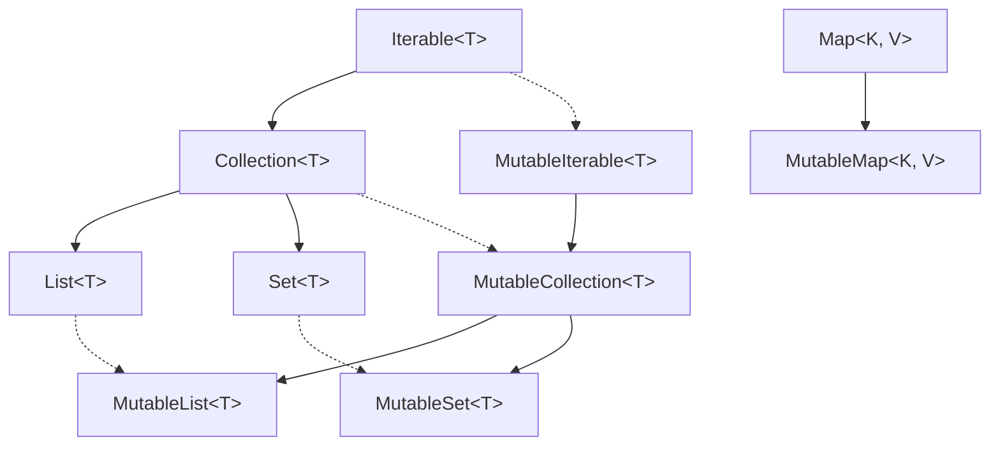
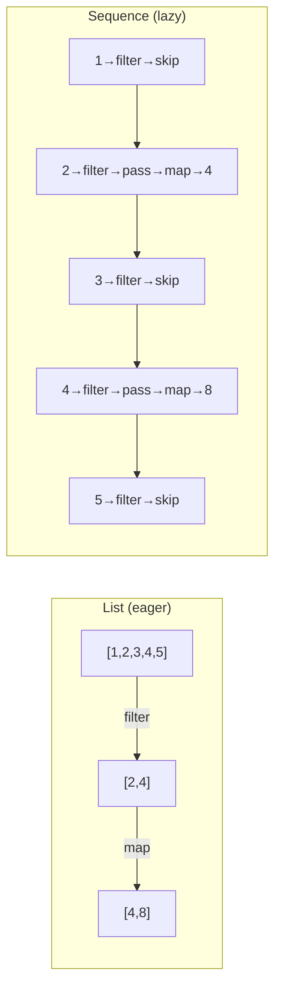
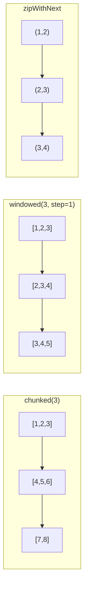
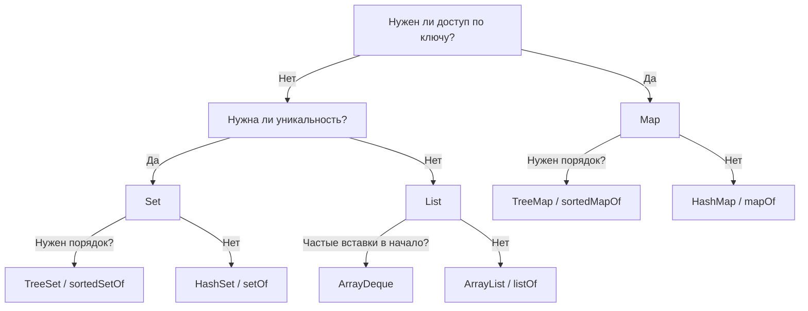

# Вопросы на собеседовании: `Kotlin` коллекции

Полное покрытие коллекций в `Kotlin`: `List`, `Set`, `Map`, `Sequence`, мутабельность, builders, операции, `windowed`/`chunked`, сравнение с `Java`, производительность.

## Введение

В `Kotlin` коллекции разделены на **read-only** (интерфейсы `List`, `Set`, `Map`) и **mutable** (`MutableList`, `MutableSet`, `MutableMap`). Под капотом на `JVM` используются коллекции `Java`, но API и разделение по мутабельности — свои. На собеседованиях часто спрашивают про отличия от `Java`, `Sequence`, `buildList`/`buildMap`, оконные операции и типичные цепочки преобразований.

## Полезные ссылки

### Официальная документация

- [Kotlin Collections Overview](https://kotlinlang.org/docs/collections-overview.html) — иерархия типов, read-only vs mutable
- [Sequences](https://kotlinlang.org/docs/sequences.html) — ленивые последовательности
- [Constructing Collections](https://kotlinlang.org/docs/constructing-collections.html) — `buildList`, `buildMap`, фабрики
- [Collection Transformations](https://kotlinlang.org/docs/collection-transformations.html) — `map`, `flatMap`, `zip`, `associate`
- [Collection Parts](https://kotlinlang.org/docs/collection-parts.html) — `windowed`, `chunked`, `zipWithNext`
- [Grouping](https://kotlinlang.org/docs/collection-grouping.html) — `groupBy`, `groupingBy`
### Baeldung

- [Kotlin Collections Guide — Baeldung](https://www.baeldung.com/kotlin/collection-guide) — полное руководство по коллекциям Kotlin
- [Kotlin Collections API — Baeldung](https://www.baeldung.com/kotlin/collections-api) — обзор операций над коллекциями
- [Sequences in Kotlin — Baeldung](https://www.baeldung.com/kotlin/sequences) — ленивые последовательности и их применение
- [Difference Between Collection and Sequence in Kotlin — Baeldung](https://www.baeldung.com/kotlin/collection-vs-sequence) — когда использовать Collection, а когда Sequence

## Содержание

- [Полезные ссылки](#полезные-ссылки)
- [See also](#see-also)

**Основы: типы, иерархия, создание**
- [Q1. (!) В чём разница между read-only и mutable коллекциями в Kotlin?](#q1--в-чём-разница-между-read-only-и-mutable-коллекциями-в-kotlin)
- [Q2. Как устроена иерархия интерфейсов коллекций в Kotlin?](#q2-как-устроена-иерархия-интерфейсов-коллекций-в-kotlin)
- [Q3. Как устроены List, Set и Map в Kotlin и что под капотом на JVM?](#q3-как-устроены-list-set-и-map-в-kotlin-и-что-под-капотом-на-jvm)
- [Q4. Как создать коллекцию: listOf, mutableListOf, emptyList?](#q4-как-создать-коллекцию-listof-mutablelistof-emptylist)
- [Q5. (!) Что такое buildList, buildSet, buildMap и зачем они нужны?](#q5--что-такое-buildlist-buildset-buildmap-и-зачем-они-нужны)

**Mutable vs Immutable: глубокое погружение**
- [Q6. (!) Является ли read-only коллекция действительно неизменяемой?](#q6--является-ли-read-only-коллекция-действительно-неизменяемой)
- [Q7. Когда использовать kotlinx.collections.immutable?](#q7-когда-использовать-kotlinxcollectionsimmutable)

**Sequence vs Collection**
- [Q8. (!) Что такое Sequence и чем отличается от List при цепочке операций?](#q8--что-такое-sequence-и-чем-отличается-от-list-при-цепочке-операций)
- [Q9. Какие есть способы создания Sequence?](#q9-какие-есть-способы-создания-sequence)
- [Q10. (!) Когда использовать Sequence, а когда List (практический выбор)?](#q10--когда-использовать-sequence-а-когда-list-практический-выбор)

**Операции и преобразования**
- [Q11. Какие типичные операции над коллекциями (map, filter, fold, reduce)?](#q11-какие-типичные-операции-над-коллекциями-map-filter-fold-reduce)
- [Q12. В чём разница между map и flatMap?](#q12-в-чём-разница-между-map-и-flatmap)
- [Q13. (!) Чем отличаются groupBy, associateBy, associateWith и partition?](#q13--чем-отличаются-groupby-associateby-associatewith-и-partition)
- [Q14. Что такое groupingBy и чем отличается от groupBy?](#q14-что-такое-groupingby-и-чем-отличается-от-groupby)
- [Q15. Как работают windowed, chunked и zipWithNext?](#q15-как-работают-windowed-chunked-и-zipwithnext)
- [Q16. Как сортировать коллекции (sorted, sortedBy, sortWith)?](#q16-как-сортировать-коллекции-sorted-sortedby-sortwith)
- [Q17. Что такое toList, toSet, toMutableList и когда что использовать?](#q17-что-такое-tolist-toset-tomutablelist-и-когда-что-использовать)
- [Q18. Как работают zip и unzip?](#q18-как-работают-zip-и-unzip)
- [Q19. Что делают mapNotNull, mapIndexed, mapKeys, mapValues?](#q19-что-делают-mapnotnull-mapindexed-mapkeys-mapvalues)

**Scope-функции и коллекции**
- [Q20. Как scope-функции (let, also, apply, run) используются с коллекциями?](#q20-как-scope-функции-let-also-apply-run-используются-с-коллекциями)

**Сравнение с Java**
- [Q21. (!) Чем коллекции Kotlin отличаются от Java Collections Framework?](#q21--чем-коллекции-kotlin-отличаются-от-java-collections-framework)
- [Q22. Как в Kotlin работать с Java-коллекциями (взаимодействие, nullability)?](#q22-как-в-kotlin-работать-с-java-коллекциями-взаимодействие-nullability)

**ArrayDeque и специализированные коллекции**
- [Q23. Что такое ArrayDeque в Kotlin?](#q23-что-такое-arraydeque-в-kotlin)

**Производительность и выбор**
- [Q24. (!) Какие операции самые частые по сложности и как выбирать тип коллекции?](#q24--какие-операции-самые-частые-по-сложности-и-как-выбирать-тип-коллекции)
- [Q25. (!) Как проектировать API: возвращать List, Sequence или Flow?](#q25--как-проектировать-api-возвращать-list-sequence-или-flow)
- [Q26. Как работают `scan`, `runningFold` и `runningReduce`?](#q26-как-работают-scan-runningfold-и-runningreduce)
- [Q27. Как работают `distinctBy`, `takeWhile`, `dropWhile` и `takeLastWhile`?](#q27-как-работают-distinctby-takewhile-dropwhile-и-takelastwhile)

**Специализированные Map и Set**
- [Q28. Чем `LinkedHashMap` и `TreeMap` отличаются в Kotlin?](#q28-чем-linkedhashmap-и-treemap-отличаются-в-kotlin)
- [Q29. Когда использовать `hashSetOf`, `linkedSetOf`, `sortedSetOf`?](#q29-когда-использовать-hashsetof-linkedsetof-sortedsetof)

**Производительность: Sequence на практике**
- [Q30. (!) Какой оверхед у `Sequence` и когда он перевешивает выгоду?](#q30--какой-оверхед-у-sequence-и-когда-он-перевешивает-выгоду)
- [Q31. Как избежать лишних аллокаций при работе с коллекциями?](#q31-как-избежать-лишних-аллокаций-при-работе-с-коллекциями)

**Потокобезопасность**
- [Q32. (!) Безопасны ли Kotlin-коллекции для многопоточного доступа?](#q32--безопасны-ли-kotlin-коллекции-для-многопоточного-доступа)

**Дополнительные операции**
- [Q33. Что такое `associate` и чем он отличается от `associateBy` и `associateWith`?](#q33-что-такое-associate-и-чем-он-отличается-от-associateby-и-associatewith)
- [Q34. Как работает `flatten` и чем отличается от `flatMap`?](#q34-как-работает-flatten-и-чем-отличается-от-flatmap)
- [Q35. Что такое `coerceIn`, `minOrNull`, `maxOrNull`, `sumOf`, `averageOf`?](#q35-что-такое-coercein-minornull-maxornull-sumof-averageof)
- [Q36. Как используются `first`, `last`, `single`, `elementAtOrElse` и их безопасные варианты?](#q36-как-используются-first-last-single-elementatorelse-и-их-безопасные-варианты)

**Immutable-коллекции и продвинутые темы**
- [Q37. (!) Что такое `PersistentList` / `PersistentMap` и зачем нужен structural sharing?](#q37--что-такое-persistentlist--persistentmap-и-зачем-нужен-structural-sharing)
- [Q38. (!) Чем отличаются `Collection`, `Iterable` и `Sequence` — когда что использовать?](#q38--чем-отличаются-collection-iterable-и-sequence--когда-что-использовать)
- [Q39. В чём разница между `sortedBy`, `sortedWith` и `compareBy`?](#q39-в-чём-разница-между-sortedby-sortedwith-и-compareby)
- [Q40. (!) Чем `groupingBy` отличается от `groupBy` — ленивый vs eager grouping?](#q40--чем-groupingby-отличается-от-groupby--ленивый-vs-eager-grouping)
- [Q41. Как работают `chunked` и `windowed` — batch processing и скользящее окно?](#q41-как-работают-chunked-и-windowed--batch-processing-и-скользящее-окно)
- [Q42. В чём разница между `associateBy`, `associateWith` и `associate`?](#q42-в-чём-разница-между-associateby-associatewith-и-associate)
- [Q43. Что такое `scan` и как он отличается от `fold`?](#q43-что-такое-scan-и-как-он-отличается-от-fold)

---

## Q1. (!) В чём разница между read-only и mutable коллекциями в Kotlin?

**Read-only** интерфейсы (`List`, `Set`, `Map`) предоставляют только операции чтения: получение по индексу/ключу, итерация, `size`, `contains`. Методов изменения (`add`, `remove`, `clear`) у них нет — компилятор не позволит вызвать их через read-only тип.

**Mutable** интерфейсы (`MutableList`, `MutableSet`, `MutableMap`) наследуют соответствующие read-only интерфейсы и добавляют методы модификации. На `JVM` под капотом используются те же классы `Java` (`ArrayList`, `HashSet`, `HashMap`); разница только в том, какой интерфейс экспонируется.

Ключевой момент: переменная типа `List` может указывать на `MutableList` (upcasting), но через тип `List` модификация невозможна — это **контракт на уровне системы типов**, а не runtime-защита.

```kotlin
val readOnly: List<String> = listOf("a", "b")
// readOnly.add("c")  // ошибка компиляции: у List нет add

val mutable: MutableList<String> = mutableListOf("a", "b")
mutable.add("c")  // OK

// upcasting — безопасно для потребителя
fun process(items: List<Int>) { /* только чтение */ }
process(mutableListOf(1, 2, 3))
```

> **Что хотят услышать на собеседовании**: read-only != immutable. Это compile-time ограничение, а не гарантия неизменяемости (см. Q6).

## Q2. Как устроена иерархия интерфейсов коллекций в Kotlin?

Иерархия коллекций в `Kotlin` разделена на две ветки — read-only и mutable:



Важные моменты:
- `Collection<T>` наследует `Iterable<T>` — можно итерировать через `for`
- `Map` **не** наследует `Collection` (как и в `Java`)
- Read-only интерфейсы **ковариантны** (`out T`): `List<String>` можно присвоить в `List<Any>`
- Mutable интерфейсы **инвариантны**: `MutableList<String>` нельзя присвоить в `MutableList<Any>` — это предотвращает подмену типов при записи

## Q3. Как устроены List, Set и Map в Kotlin и что под капотом на JVM?

| Интерфейс | Характеристика | Реализация по умолчанию на JVM |
|-----------|---------------|-------------------------------|
| `List` | Упорядоченная коллекция, допускает дубликаты | `java.util.ArrayList` |
| `Set` | Уникальные элементы, порядок вставки | `java.util.LinkedHashSet` |
| `Map` | Пары ключ-значение, ключи уникальны | `java.util.LinkedHashMap` |
| `MutableList` | Изменяемый список | `java.util.ArrayList` |
| `MutableSet` | Изменяемое множество | `java.util.LinkedHashSet` |
| `MutableMap` | Изменяемое отображение | `java.util.LinkedHashMap` |

Фабрики `listOf()`, `setOf()`, `mapOf()` возвращают экземпляры, реализующие и Kotlin-, и Java-интерфейсы. Поэтому передача коллекций в `Java`-код и обратно происходит без конвертации.

**Важно**: `setOf()` и `mapOf()` в `Kotlin` по умолчанию сохраняют порядок вставки (`LinkedHashSet`, `LinkedHashMap`), в отличие от `Java`, где `HashSet`/`HashMap` порядок не гарантируют.

```kotlin
// Read-only
val list = listOf(1, 2, 3)           // List<Int>
val set = setOf("x", "y")            // Set<String>
val map = mapOf("a" to 1, "b" to 2)  // Map<String, Int>

// Пустые (синглтоны — не создают новый объект)
val empty = emptyList<String>()
val emptyS = emptySet<Int>()
val emptyM = emptyMap<String, Int>()

// Mutable
val mList = mutableListOf<Int>()        // MutableList<Int> (ArrayList)
val mSet = mutableSetOf<String>()       // MutableSet<String> (LinkedHashSet)
val mMap = mutableMapOf<String, Int>()  // MutableMap<String, Int> (LinkedHashMap)

// Специализированные
val hashSet = hashSetOf(1, 2, 3)           // HashSet — без гарантии порядка
val linkedSet = linkedSetOf(1, 2, 3)       // LinkedHashSet — порядок вставки
val sortedSet = sortedSetOf(3, 1, 2)       // TreeSet — натуральный порядок
val hashMap = hashMapOf("a" to 1)          // HashMap
val linkedMap = linkedMapOf("a" to 1)      // LinkedHashMap
val sortedMap = sortedMapOf("b" to 2, "a" to 1)  // TreeMap
```

`listOf()` для малого числа элементов (0–1) использует оптимизированные реализации: пустой список — синглтон, одноэлементный — обёртка без массива.

## Q5. (!) Что такое buildList, buildSet, buildMap и зачем они нужны?

**Builder-функции** создают read-only коллекцию через mutable builder внутри lambda-блока:

```kotlin
val list = buildList {
    // this: MutableList<String>
    add("alpha")
    add("beta")
    if (condition) add("gamma")
    addAll(otherList)
}
// list: List<String> — read-only

val map = buildMap {
    // this: MutableMap<String, Int>
    put("a", 1)
    put("b", 2)
    putAll(existingMap)
}
// map: Map<String, Int> — read-only

val set = buildSet {
    add(1)
    addAll(listOf(2, 3))
}
```

**Преимущества** перед `listOf()` / `mutableListOf()`:
- Результат сразу **read-only** — не нужно вызывать `toList()`
- **Условная логика** внутри блока — удобнее, чем тернарные конструкции
- Для `buildMap` — нет создания промежуточных `Pair`-объектов (в отличие от `mapOf(key to value)`)
- **Типы выводятся** автоматически из операций в блоке

> **На собеседовании**: `buildList` — идиоматический способ создания коллекции с условной логикой. Появился в Kotlin 1.6 как stable API.

## Q6. (!) Является ли read-only коллекция действительно неизменяемой?

**Нет.** Read-only в `Kotlin` — это ограничение на уровне типов, а **не** runtime-гарантия неизменяемости. Через cast или из `Java`-кода можно изменить содержимое:

```kotlin
val readOnly: List<String> = mutableListOf("a", "b")

// через unsafe cast — runtime позволит
(readOnly as MutableList).add("c")
println(readOnly) // [a, b, c]

// из Java-кода — тоже можно изменить
// void modify(List<String> list) { list.add("oops"); }
```

**Настоящие immutable-коллекции** даёт библиотека `kotlinx.collections.immutable` — при попытке модификации выбрасывается `UnsupportedOperationException` (для обёрток вроде `Collections.unmodifiableList`) или создаётся новая версия (для persistent-коллекций).

Фабрики `listOf()`, `setOf()`, `mapOf()` для 0–1 элементов могут возвращать действительно неизменяемые реализации, но для 2+ элементов — обычно обёртку над `ArrayList` / `LinkedHashSet` / `LinkedHashMap`.

> **Gotcha**: Не полагайтесь на read-only как на защиту от конкурентной модификации в многопоточном коде. Используйте `kotlinx.collections.immutable` или `ConcurrentHashMap`.

## Q7. Когда использовать kotlinx.collections.immutable?

`kotlinx.collections.immutable` предоставляет **persistent-коллекции** (`PersistentList`, `PersistentMap`, `PersistentSet`) с функциональной моделью обновлений: каждая модификация возвращает новую коллекцию, но благодаря **structural sharing** не копирует всё содержимое.

```kotlin
// Зависимость: org.jetbrains.kotlinx:kotlinx-collections-immutable:0.3.7
val list = persistentListOf(1, 2, 3)
val updated = list.add(4)  // новый PersistentList, list не изменился

val map = persistentHashMapOf("a" to 1)
val updated2 = map.put("b", 2)
```

**Когда использовать:**
- **State management** (UI, Redux-подобные архитектуры) — безопасное хранение версий состояния
- **Многопоточность** — гарантия неизменяемости без блокировок
- **Event sourcing** — снимки состояния

**Когда НЕ нужно:**
- Локальные короткоживущие коллекции — обычные `MutableList` проще и быстрее
- Маленькие коллекции — overhead структурного шаринга не окупается

## Q8. (!) Что такое Sequence и чем отличается от List при цепочке операций?

`Sequence<T>` — **ленивая** последовательность элементов. Промежуточные операции (`map`, `filter`) не выполняются сразу и не создают промежуточные коллекции. Вычисление происходит поэлементно при вызове **терминальной** операции (`toList()`, `first()`, `count()`).



| Аспект | `List` (eager) | `Sequence` (lazy) |
|--------|---------------|-------------------|
| Порядок выполнения | Вся коллекция на каждом шаге | Элемент проходит всю цепочку |
| Промежуточные коллекции | Создаются на каждом шаге | Не создаются |
| Ранняя остановка | Нет | Да (`first()`, `take()`) |
| Overhead | Минимальный | Итераторы, boxing |

```kotlin
// List: 2 промежуточных списка
listOf(1, 2, 3, 4, 5)
    .filter { it % 2 == 0 }  // → [2, 4]
    .map { it * 2 }           // → [4, 8]

// Sequence: 0 промежуточных списков
listOf(1, 2, 3, 4, 5).asSequence()
    .filter { it % 2 == 0 }
    .map { it * 2 }
    .toList()  // терминальная операция запускает pipeline
```

## Q9. Какие есть способы создания Sequence?

```kotlin
// 1. Из элементов
val s1 = sequenceOf("a", "b", "c")

// 2. Из коллекции
val s2 = listOf(1, 2, 3).asSequence()

// 3. generateSequence — с функцией-генератором
val naturals = generateSequence(1) { it + 1 }       // бесконечная
val finite = generateSequence(1) { if (it < 10) it + 1 else null }  // до null

// 4. sequence builder — с yield/yieldAll (suspend)
val fibonacci = sequence {
    var a = 0
    var b = 1
    while (true) {
        yield(a)
        val next = a + b
        a = b
        b = next
    }
}
println(fibonacci.take(8).toList()) // [0, 1, 1, 2, 3, 5, 8, 13]

// 5. Из итераторов или Java streams
iterator.asSequence()
stream.asSequence()
```

`yield()` возвращает одиночный элемент, `yieldAll()` — коллекцию, другую последовательность или итератор. Выполнение suspend-ируется между вызовами `yield` — это restricted coroutine (не полноценная корутина, а только `SequenceScope`).

## Q10. (!) Когда использовать Sequence, а когда List (практический выбор)?

**Используйте `Sequence`, когда:**
- Коллекция **большая** (тысячи+ элементов) и цепочка из 2+ промежуточных операций
- Нужен только **частичный результат** (`first()`, `take(n)`, `any()`) — lazy evaluation остановится раньше
- Источник данных **потоковый** (файл, сеть, бесконечная генерация)

**Используйте `List`, когда:**
- Данных **мало** и операция простая — overhead `Sequence` не окупится
- Нужен **многократный доступ по индексу** или random access
- Результат нужен целиком и используется **несколько раз**
- Нужна **одна** операция без цепочки — промежуточных коллекций всего одна

**Правило большого пальца**: начинайте с коллекций; добавляйте `.asSequence()` когда профилирование показывает лишние аллокации или когда цепочка длинная на большом наборе данных.

```kotlin
// ✅ Sequence: большие данные, длинная цепочка, нужен один результат
lines.asSequence()
    .filter { it.isNotBlank() }
    .map { it.trim().lowercase() }
    .distinct()
    .sorted()
    .toList()

// ✅ List: маленькая коллекция, простая операция
listOf(1, 2, 3).map { it * 2 }
```

## Q11. Какие типичные операции над коллекциями (map, filter, fold, reduce)?

| Операция | Описание | Пример |
|----------|---------|--------|
| `map` | Преобразование каждого элемента | `list.map { it * 2 }` |
| `filter` | Оставить элементы по предикату | `list.filter { it > 0 }` |
| `fold` | Свёртка с начальным значением | `list.fold(0) { acc, e -> acc + e }` |
| `reduce` | Свёртка, начиная с первого элемента | `list.reduce { acc, e -> acc + e }` |
| `flatMap` | map + flatten | `list.flatMap { it.children }` |
| `find` / `firstOrNull` | Первый по предикату или null | `list.find { it > 5 }` |
| `any` / `all` / `none` | Проверка по предикату | `list.any { it < 0 }` |
| `count` | Количество (с предикатом или без) | `list.count { it > 0 }` |
| `partition` | Разбиение на два списка | `list.partition { it % 2 == 0 }` |
| `zip` | Объединение двух коллекций в пары | `a.zip(b)` |
| `flatten` | Список списков → один список | `listOfLists.flatten()` |
| `take` / `drop` | Взять / пропустить N элементов | `list.take(3)` |
| `distinct` | Убрать дубликаты | `list.distinct()` |
| `sumOf` | Сумма по селектору | `list.sumOf { it.price }` |

```kotlin
val numbers = listOf(1, -2, 3, -4, 5)

// partition: разделить на положительные и отрицательные
val (positive, negative) = numbers.partition { it > 0 }
// positive = [1, 3, 5], negative = [-2, -4]

// fold: суммирование с начальным значением
val sum = numbers.fold(100) { acc, n -> acc + n } // 103

// reduce vs fold: reduce бросает исключение на пустой коллекции!
val product = numbers.reduce { acc, n -> acc * n } // -120
```

## Q12. В чём разница между map и flatMap?

**`map`** преобразует каждый элемент в **одно** значение — размер результата совпадает с исходным. **`flatMap`** преобразует каждый элемент в **коллекцию** и затем «склеивает» все результаты в одну плоскую последовательность. Эквивалент: `map { ... }.flatten()`.

```kotlin
val sentences = listOf("hello world", "kotlin collections")

// map → List<List<String>>
sentences.map { it.split(" ") }
// [["hello", "world"], ["kotlin", "collections"]]

// flatMap → List<String>
sentences.flatMap { it.split(" ") }
// ["hello", "world", "kotlin", "collections"]

// Практический пример: получить все заказы всех клиентов
data class Customer(val name: String, val orders: List<Order>)
val allOrders: List<Order> = customers.flatMap { it.orders }
```

**Когда использовать `flatMap`:**
- Один элемент «разворачивается» в несколько (one-to-many)
- Нужно объединить вложенные структуры в плоскую
- Работа с `Optional`/nullable через `listOfNotNull`

## Q13. (!) Чем отличаются groupBy, associateBy, associateWith и partition?

Все четыре функции преобразуют коллекцию в структурированный результат, но с разной семантикой:

| Функция | Результат | Дубликаты ключей | Использование |
|---------|----------|-------------------|---------------|
| `groupBy` | `Map<K, List<T>>` | Все элементы сохраняются | Группировка |
| `associateBy` | `Map<K, T>` | Последний перезаписывает | Индексация по уникальному ключу |
| `associateWith` | `Map<T, V>` | Последний перезаписывает | Элемент → вычисленное значение |
| `associate` | `Map<K, V>` | Последний перезаписывает | Произвольная пара |
| `partition` | `Pair<List<T>, List<T>>` | N/A | Разделение на два списка |

```kotlin
data class User(val id: Int, val name: String, val dept: String)
val users = listOf(
    User(1, "Alice", "dev"), User(2, "Bob", "dev"),
    User(3, "Carol", "qa"), User(4, "Dave", "qa")
)

// groupBy: dept → список пользователей
users.groupBy { it.dept }
// {dev=[Alice, Bob], qa=[Carol, Dave]}

// associateBy: id → пользователь (уникальный ключ!)
users.associateBy { it.id }
// {1=Alice, 2=Bob, 3=Carol, 4=Dave}

// associateWith: пользователь → вычисленное значение
users.associateWith { it.name.length }
// {User(1,Alice,dev)=5, ...}

// partition: предикат → (true-список, false-список)
val (devs, others) = users.partition { it.dept == "dev" }
// devs=[Alice, Bob], others=[Carol, Dave]
```

> **Gotcha**: `associateBy` при дубликатах ключей молча перезаписывает — используйте `groupBy`, если дубликаты возможны.

## Q14. Что такое groupingBy и чем отличается от groupBy?

`groupBy` сразу материализует `Map<K, List<T>>` — создаёт все списки в памяти. `groupingBy` возвращает промежуточный объект `Grouping`, к которому можно применить **агрегацию без создания промежуточных списков**:

```kotlin
val words = listOf("apple", "banana", "avocado", "blueberry", "cherry")

// groupBy + mapValues — два прохода, промежуточные списки
words.groupBy { it.first() }.mapValues { (_, v) -> v.size }
// {a=2, b=2, c=1}

// groupingBy + eachCount — один проход, без промежуточных списков
words.groupingBy { it.first() }.eachCount()
// {a=2, b=2, c=1}
```

| Операция `Grouping` | Описание |
|---------------------|---------|
| `eachCount()` | Количество элементов в каждой группе |
| `fold(init) { ... }` | Свёртка каждой группы |
| `reduce { ... }` | Редукция каждой группы |
| `aggregate { ... }` | Произвольная агрегация |

`groupingBy` эффективнее для больших коллекций, когда нужен агрегат, а не сами списки элементов.

## Q15. Как работают windowed, chunked и zipWithNext?

Три функции для работы с «окнами» элементов:



```kotlin
val numbers = (1..8).toList()

// chunked — разбить на части фиксированного размера
numbers.chunked(3)
// [[1, 2, 3], [4, 5, 6], [7, 8]]

// chunked с трансформацией
numbers.chunked(3) { it.sum() }
// [6, 15, 15]

// windowed — скользящее окно
numbers.windowed(3)
// [[1,2,3], [2,3,4], [3,4,5], [4,5,6], [5,6,7], [6,7,8]]

// windowed с шагом и partial windows
numbers.windowed(size = 3, step = 2, partialWindows = true)
// [[1,2,3], [3,4,5], [5,6,7], [7,8]]

// zipWithNext — пары соседних элементов
numbers.zipWithNext()
// [(1,2), (2,3), (3,4), (4,5), (5,6), (6,7), (7,8)]

// Практика: проверить, что последовательность возрастающая
numbers.zipWithNext { a, b -> a < b }.all { it } // true
```

**Применение:**
- `chunked` — пакетная обработка (batch insert в БД, пагинация)
- `windowed` — скользящее среднее, поиск паттернов
- `zipWithNext` — проверка переходов, вычисление разностей

## Q16. Как сортировать коллекции (sorted, sortedBy, sortWith)?

| Функция | Описание | Тип |
|---------|---------|-----|
| `sorted()` | По натуральному порядку (`Comparable`) | Новый список |
| `sortedBy { }` | По результату селектора | Новый список |
| `sortedDescending()` | По убыванию | Новый список |
| `sortedByDescending { }` | По убыванию селектора | Новый список |
| `sortedWith(comparator)` | По кастомному компаратору | Новый список |
| `sort()` | In-place сортировка | `Unit` (MutableList) |
| `sortBy { }` | In-place по селектору | `Unit` (MutableList) |

```kotlin
data class User(val name: String, val age: Int)
val users = listOf(User("Bob", 30), User("Alice", 25), User("Carol", 30))

// Сортировка по одному полю
users.sortedBy { it.name }  // [Alice, Bob, Carol]

// Множественная сортировка: сначала по возрасту, потом по имени
users.sortedWith(compareBy({ it.age }, { it.name }))
// [Alice(25), Bob(30), Carol(30)]

// In-place (только MutableList)
val mutable = mutableListOf(3, 1, 2)
mutable.sort()  // изменяет mutable, возвращает Unit
```

> **Важно**: `sorted*` для read-only списков всегда возвращают **новый** список. `sort*` для `MutableList` изменяют список на месте и возвращают `Unit`.

## Q17. Что такое toList, toSet, toMutableList и когда что использовать?

Функции `to*()` создают **копию** коллекции нужного типа:

```kotlin
val sequence = (1..5).asSequence().filter { it % 2 == 0 }.map { it * 10 }

// Терминальная операция для Sequence
val list = sequence.toList()       // [20, 40] — read-only List
val set = sequence.toSet()         // {20, 40} — read-only Set
val mList = sequence.toMutableList() // [20, 40] — MutableList

// Создание независимой копии
val original = mutableListOf(1, 2, 3)
val copy = original.toList()
original.add(4)
println(copy) // [1, 2, 3] — не затронут
```

**Когда что использовать:**
- `toList()` — зафиксировать результат pipeline, получить read-only контракт
- `toSet()` — убрать дубликаты + быстрый `contains()`
- `toMutableList()` — нужна изменяемая копия для дальнейшей модификации
- `toSortedSet()` — уникальные элементы + сортировка
- `toMap()` — из списка пар в `Map`

## Q18. Как работают zip и unzip?

**`zip`** объединяет два списка поэлементно в пары. Результат по длине равен **меньшему** из списков:

```kotlin
val colors = listOf("red", "brown", "grey")
val animals = listOf("fox", "bear", "wolf", "cat")

// Инфиксная форма
colors zip animals
// [(red, fox), (brown, bear), (grey, wolf)] — "cat" отбрасывается

// С трансформацией
colors.zip(animals) { color, animal -> "$color $animal" }
// ["red fox", "brown bear", "grey wolf"]

// unzip — обратная операция
val pairs = listOf("one" to 1, "two" to 2, "three" to 3)
val (strings, ints) = pairs.unzip()
// strings = [one, two, three], ints = [1, 2, 3]
```

## Q19. Что делают mapNotNull, mapIndexed, mapKeys, mapValues?

```kotlin
// mapNotNull — map + filterNotNull в одной операции
val strings = listOf("1", "abc", "2", "def")
strings.mapNotNull { it.toIntOrNull() }
// [1, 2] — только успешно распарсенные

// mapIndexed — доступ к индексу
listOf("a", "b", "c").mapIndexed { index, value -> "$index:$value" }
// ["0:a", "1:b", "2:c"]

// mapKeys / mapValues — трансформация ключей или значений Map
val map = mapOf("one" to 1, "two" to 2)
map.mapKeys { (key, _) -> key.uppercase() }    // {ONE=1, TWO=2}
map.mapValues { (_, value) -> value * 10 }       // {one=10, two=20}

// mapIndexedNotNull — mapIndexed + filterNotNull
listOf("a", null, "c").mapIndexedNotNull { i, v -> v?.let { "$i:$it" } }
// ["0:a", "2:c"]
```

> **Best practice**: `mapNotNull` эффективнее, чем `map { ... }.filterNotNull()` — один проход вместо двух (для `List`).

## Q20. Как scope-функции (let, also, apply, run) используются с коллекциями?

Scope-функции не специфичны для коллекций, но часто используются в цепочках:

```kotlin
// let — преобразовать результат цепочки
users.filter { it.isActive }
    .map { it.email }
    .let { emails -> sendNotification(emails) }

// also — side-effect без прерывания цепочки (логирование, отладка)
users.filter { it.age > 18 }
    .also { println("Найдено ${it.size} совершеннолетних") }
    .map { it.name }

// apply — настройка mutable-коллекции
val result = mutableListOf<String>().apply {
    add("first")
    addAll(otherList)
    sort()
}

// takeIf / takeUnless — условный возврат
list.takeIf { it.isNotEmpty() }?.first()
    ?: defaultValue
```

**Типичные паттерны:**
- `let` — передать результат в функцию
- `also` — логирование промежуточных результатов
- `apply` — инициализация mutable-коллекции
- `takeIf` — заменяет `if (list.isNotEmpty()) list.first() else null`

## Q21. (!) Чем коллекции Kotlin отличаются от Java Collections Framework?

| Аспект | Kotlin | Java |
|--------|--------|------|
| Мутабельность | Read-only + Mutable интерфейсы | Только mutable (`Collections.unmodifiable*` — runtime) |
| Ковариантность | `List<out T>` — ковариантна | `List<T>` — инвариантна |
| Null-safety | `List<String>` vs `List<String?>` | Нет разделения на уровне типов |
| Extension-функции | `map`, `filter`, `flatMap` встроены | Нужен `Stream API` (Java 8+) |
| Фабрики | `listOf`, `buildList`, `emptyList` | `List.of()` (Java 9+), `Arrays.asList()` |
| Порядок по умолчанию | `setOf` → `LinkedHashSet` (порядок вставки) | `HashSet` (без порядка) |
| Операторы | `+`, `-`, `in` для коллекций | Нет |
| `Map` access | `map[key]`, `map[key] = value` | `map.get(key)`, `map.put(key, value)` |

```kotlin
// Kotlin — лаконичный синтаксис
val map = mapOf("a" to 1, "b" to 2)
if ("a" in map) println(map["a"])

val combined = listOf(1, 2) + listOf(3, 4) // [1, 2, 3, 4]
val without = listOf(1, 2, 3) - 2          // [1, 3]
```

Подробнее о совместимости — в [вопросах по Kotlin/Java Interop](kotlin-interop-java-interview.md).

## Q22. Как в Kotlin работать с Java-коллекциями (взаимодействие, nullability)?

При интеропе с `Java` коллекции приходят как **платформенные типы** (`List<String!>`) — `Kotlin` не знает, nullable они или нет, если в `Java`-коде нет аннотаций `@Nullable` / `@NotNull`.

```kotlin
// Java: List<String> getNames() — без аннотаций
val names = javaObject.names  // тип: (Mutable)List<String!>!

// Безопасный подход: явно объявить тип
val safeNames: List<String> = javaObject.names  // NPE при null-элементе
val nullableNames: List<String?> = javaObject.names  // безопасно

// Конвертация
val kotlinList: List<String> = javaList.toList()           // read-only копия
val kotlinMutable: MutableList<String> = javaList.toMutableList()  // mutable копия

// Передача в Java — без конвертации (те же классы на JVM)
javaMethod(kotlinList)  // OK
```

**Правила безопасности:**
- Всегда явно указывайте тип при получении коллекций из `Java`
- Используйте `toList()` для создания безопасной копии
- Без аннотаций в `Java` — считайте элементы nullable (`List<String?>`)

Подробнее — в [вопросах по Kotlin/Java Interop](kotlin-interop-java-interview.md) и [Java Collections](../java/java-collections-interview.md).

## Q23. Что такое ArrayDeque в Kotlin?

`ArrayDeque` — двусторонняя очередь (deque), реализующая и стек, и очередь. Доступна в stdlib начиная с Kotlin 1.3.70:

```kotlin
val deque = ArrayDeque(listOf(1, 2, 3))

// Стек (LIFO)
deque.addLast(4)       // push
deque.removeLast()     // pop → 4

// Очередь (FIFO)
deque.addLast(4)       // enqueue
deque.removeFirst()    // dequeue → 1

// Двусторонняя
deque.addFirst(0)      // [0, 2, 3, 4]
deque.addLast(5)       // [0, 2, 3, 4, 5]

println(deque.first()) // 0
println(deque.last())  // 5
```

**Отличия от `java.util.ArrayDeque`:**
- Kotlin-версия — multiplatform (работает на JS, Native)
- На JVM для `MutableList` может быть эффективнее `ArrayList` при частых вставках/удалениях в начало

## Q24. (!) Какие операции самые частые по сложности и как выбирать тип коллекции?

| Операция | `ArrayList` | `LinkedList` | `HashSet` | `TreeSet` | `HashMap` | `TreeMap` |
|----------|-------------|-------------|-----------|-----------|-----------|-----------|
| Доступ по индексу | O(1) | O(n) | — | — | — | — |
| `add` (в конец) | O(1)* | O(1) | O(1)* | O(log n) | — | — |
| `add` (в начало) | O(n) | O(1) | — | — | — | — |
| `contains` | O(n) | O(n) | O(1)* | O(log n) | — | — |
| `get` / `put` | — | — | — | — | O(1)* | O(log n) |
| `remove` | O(n) | O(1)** | O(1)* | O(log n) | O(1)* | O(log n) |

\* — амортизированная сложность  
\** — O(1) если есть итератор, O(n) по значению

**Практические правила выбора:**



## Q25. (!) Как проектировать API: возвращать List, Sequence или Flow?

| Тип | Когда использовать | Характеристика |
|-----|-------------------|---------------|
| `List` | Результат конечен и нужен целиком | Eager, синхронный, random access |
| `Sequence` | Ленивые синхронные вычисления | Lazy, синхронный, один проход |
| `Flow` | Асинхронные / потоковые данные | Lazy, async, backpressure, отмена |

```kotlin
// ✅ List — результат конечен, нужен сразу
fun getActiveUsers(): List<User> = repository.findAll().filter { it.isActive }

// ✅ Sequence — ленивая обработка большого файла
fun readLines(file: Path): Sequence<String> = file.bufferedReader().lineSequence()

// ✅ Flow — стриминг из БД, WebSocket, события
fun observeChanges(): Flow<Change> = callbackFlow {
    val listener = { change: Change -> trySend(change) }
    register(listener)
    awaitClose { unregister(listener) }
}
```

**Принцип**: выбирайте самый простой контракт, покрывающий задачу. `List` → `Sequence` → `Flow` — по мере роста сложности. Подробнее о `Flow` — в [вопросах по Kotlin Coroutines](kotlin-coroutines-interview.md).

## Q26. Как работают `scan`, `runningFold` и `runningReduce`?

Эти операторы вычисляют **накопленные промежуточные результаты** на каждом шаге — в отличие от `fold`/`reduce`, которые возвращают только финальное значение.

**`scan`** (псевдоним `runningFold`) — аналог `fold`, но возвращает все промежуточные состояния, включая начальное:

```kotlin
val numbers = listOf(1, 2, 3, 4, 5)

// fold — только финальное значение
val sum = numbers.fold(0) { acc, n -> acc + n }  // 15

// scan — список всех промежуточных значений
val runningSum = numbers.scan(0) { acc, n -> acc + n }
// [0, 1, 3, 6, 10, 15]  — включая начальное значение 0

// Практический пример: накопленный доход
data class Transaction(val amount: Double)
val transactions = listOf(Transaction(100.0), Transaction(-30.0), Transaction(50.0))
val runningBalance = transactions.scan(0.0) { balance, tx -> balance + tx.amount }
// [0.0, 100.0, 70.0, 120.0]
```

**`runningReduce`** — как `reduce`, но без начального значения и с промежуточными результатами:

```kotlin
val numbers = listOf(1, 2, 3, 4, 5)
val runningMax = numbers.runningReduce { max, n -> maxOf(max, n) }
// [1, 2, 3, 4, 5]  — бегущий максимум (список начинается с первого элемента)

// Нарастающее произведение
val runningProduct = numbers.runningReduce { acc, n -> acc * n }
// [1, 2, 6, 24, 120]
```

**Применение в `Sequence`** — для ленивой обработки больших потоков:

```kotlin
generateSequence(1) { it + 1 }          // бесконечная последовательность
    .scan(0) { acc, n -> acc + n }       // нарастающая сумма
    .takeWhile { it < 1000 }             // пока < 1000
    .last()                              // последнее значение
```

## Q27. Как работают `distinctBy`, `takeWhile`, `dropWhile` и `takeLastWhile`?

**`distinctBy`** — удаляет дубликаты по ключу (сохраняет первое вхождение):

```kotlin
data class User(val name: String, val department: String)
val users = listOf(
    User("Alice", "Engineering"),
    User("Bob", "Engineering"),
    User("Carol", "Marketing"),
    User("Dave", "Engineering")
)

// distinct — полное сравнение (equals)
// distinctBy — только по ключу
val departments = users.distinctBy { it.department }
// [User("Alice", "Engineering"), User("Carol", "Marketing")]
// — один представитель от каждого отдела

// Для примитивов
listOf(1, 2, 2, 3, 1, 4).distinct()  // [1, 2, 3, 4]
```

**`takeWhile`/`dropWhile`** — берёт/пропускает элементы **пока** выполняется условие. Останавливается при первом несовпадении:

```kotlin
val numbers = listOf(2, 4, 6, 7, 8, 10)

// takeWhile — берёт пока чётные
numbers.takeWhile { it % 2 == 0 }  // [2, 4, 6] — 7 ломает условие

// dropWhile — пропускает пока чётные
numbers.dropWhile { it % 2 == 0 }  // [7, 8, 10] — с первого нечётного до конца

// ВАЖНО: не то же самое, что filter!
numbers.filter { it % 2 == 0 }     // [2, 4, 6, 8, 10] — все чётные, включая 8 и 10
```

**`takeLastWhile`/`dropLastWhile`** — аналогично, но с конца:

```kotlin
val logs = listOf("INFO start", "INFO init", "ERROR fail", "INFO retry", "INFO ok")

// Последние INFO-записи после последней ошибки
logs.takeLastWhile { it.startsWith("INFO") }  // ["INFO retry", "INFO ok"]
logs.dropLastWhile { it.startsWith("INFO") }  // ["INFO start", "INFO init", "ERROR fail"]
```

**Практическая разница** между `takeWhile`/`filter`:
- `takeWhile` — **раннее прерывание** (эффективно для отсортированных данных)
- `filter` — **сплошное сканирование** (все элементы проверяются)

## Q28. Чем `LinkedHashMap` и `TreeMap` отличаются в Kotlin?

В Kotlin нет собственных реализаций `Map` — под капотом используются классы Java. Различия в порядке обхода и производительности:

| Тип | Порядок | `get`/`put`/`containsKey` | Когда использовать |
|-----|---------|--------------------------|-------------------|
| `HashMap` (`hashMapOf`) | Непредсказуемый | O(1)* | Максимальная скорость, порядок не важен |
| `LinkedHashMap` (`linkedMapOf`, `mapOf`) | Порядок вставки | O(1)* | Нужен предсказуемый порядок итерации |
| `TreeMap` (`sortedMapOf`) | Натуральная сортировка ключей | O(log n) | Нужен отсортированный порядок |

```kotlin
// mapOf → LinkedHashMap: порядок вставки гарантирован
val linked = mapOf("banana" to 2, "apple" to 1, "cherry" to 3)
linked.keys.toList()  // [banana, apple, cherry]

// sortedMapOf → TreeMap: сортировка по ключу
val sorted = sortedMapOf("banana" to 2, "apple" to 1, "cherry" to 3)
sorted.keys.toList()  // [apple, banana, cherry]

// TreeMap с кастомным компаратором
val byLength = sortedMapOf(compareBy { it.length }, "banana" to 2, "apple" to 1, "fig" to 3)
byLength.keys.toList()  // [fig, apple, banana]

// TreeMap-специфичные операции
val tree = sortedMapOf("a" to 1, "b" to 2, "c" to 3, "d" to 4)
tree.headMap("c")      // {a=1, b=2} — ключи строго меньше "c"
tree.tailMap("c")      // {c=3, d=4} — ключи ≥ "c"
tree.subMap("b", "d")  // {b=2, c=3}
```

**Важно**: `setOf`, `mapOf` в Kotlin используют `LinkedHashSet` и `LinkedHashMap` — это отличие от Java, где `HashSet`/`HashMap` порядка не гарантируют. Не полагайтесь на это как на API-контракт — используйте `linkedSetOf`/`linkedMapOf` явно, если порядок критичен.

## Q29. Когда использовать `hashSetOf`, `linkedSetOf`, `sortedSetOf`?

Аналогично Map-коллекциям, три варианта Set отличаются реализацией и поведением:

| Функция | Реализация | Порядок | `contains` |
|---------|-----------|---------|-----------|
| `hashSetOf()` | `HashSet` | Произвольный | O(1)* |
| `setOf()` / `linkedSetOf()` | `LinkedHashSet` | Порядок вставки | O(1)* |
| `sortedSetOf()` | `TreeSet` | Натуральная сортировка | O(log n) |

```kotlin
// hashSetOf — максимальная скорость, порядок не важен
val ids = hashSetOf(3, 1, 4, 1, 5, 9, 2)  // уникальные, порядок произвольный

// setOf / linkedSetOf — порядок вставки
val tags = setOf("kotlin", "java", "spring")
tags.toList()  // [kotlin, java, spring]

// sortedSetOf — отсортированное множество
val sorted = sortedSetOf("banana", "apple", "cherry")
sorted.first()  // apple — NavigableSet API
sorted.last()   // cherry
sorted.headSet("cherry")  // [apple, banana]

// sortedSetOf с компаратором
val byLength = sortedSetOf(compareBy { it.length }, "banana", "fig", "apple")
byLength.toList()  // [fig, apple, banana]
```

**Правило выбора**: если нужен только быстрый `contains`/`add` — `hashSetOf`. Если нужен предсказуемый порядок итерации — `setOf`. Если нужна сортировка или `headSet`/`tailSet` — `sortedSetOf`.

## Q30. (!) Какой оверхед у `Sequence` и когда он перевешивает выгоду?

`Sequence` экономит на промежуточных коллекциях, но вносит свой оверхед:

**Оверхед `Sequence`:**
- Создание объекта-итератора на каждую промежуточную операцию
- Boxing примитивов (нет специализированных `IntSequence` в stdlib)
- Инлайнинг lambda-функций работает хуже из-за индиректных вызовов через итератор

```kotlin
// Benchmark (условный): 1 000 000 элементов, 3 операции
// List:     ~80 ms, 3 промежуточных списка, ~24 MB
// Sequence: ~45 ms, 0 промежуточных списков, ~0 MB доп. памяти

// Но для маленьких коллекций:
// List  (10 элементов): ~0.1 µs
// Sequence (10 элементов): ~0.4 µs  ← оверхед видим
```

**Когда `Sequence` НЕ выгоден:**
- Коллекция **< 100–1000 элементов** (overhead итераторов > выгода от lazy)
- **Одна** операция — промежуточной коллекции нет в принципе
- Операции **без early termination** и без длинных цепочек
- Частые вызовы в tight loop — оверхед объектов накапливается

```kotlin
// ✅ Sequence окупается: большие данные + длинная цепочка + early stop
File("huge.log").useLines { lines ->
    lines.filter { "ERROR" in it }
         .map { it.substringAfter("] ") }
         .first()  // early termination — читаем только до первой ошибки
}

// ❌ Sequence не нужен: маленькая коллекция, одна операция
listOf(1, 2, 3).asSequence().filter { it > 1 }.toList()  // избыточно
```

> **Совет**: профилируйте перед оптимизацией. `asSequence()` — не серебряная пуля, а инструмент для конкретных случаев.

## Q31. Как избежать лишних аллокаций при работе с коллекциями?

Типичные источники лишних аллокаций и способы избежать:

```kotlin
// 1. Задайте начальную ёмкость, если размер известен
val list = ArrayList<String>(expectedSize)
val map = HashMap<String, Int>(expectedSize * 4 / 3 + 1)

// 2. mapNotNull вместо map + filterNotNull (один проход)
// ❌ Два прохода, промежуточный список
items.map { parse(it) }.filterNotNull()
// ✅ Один проход
items.mapNotNull { parse(it) }

// 3. any/none/all вместо filter + isEmpty (early termination)
// ❌ Создаёт полный список
items.filter { it.isActive }.isEmpty()
// ✅ Останавливается на первом
items.none { it.isActive }

// 4. sumOf/count вместо map + sum/size
// ❌ Промежуточный список Int
items.map { it.price }.sum()
// ✅ Без промежуточного списка
items.sumOf { it.price }

// 5. containsAll / intersect для пересечений
// ❌ Создаёт новую коллекцию
(a intersect b).isNotEmpty()
// ✅ Без создания новой коллекции (для Set)
a.any { it in b }

// 6. Sequence для длинных цепочек (см. Q30)
```

## Q32. (!) Безопасны ли Kotlin-коллекции для многопоточного доступа?

**Нет.** Ни read-only, ни mutable коллекции Kotlin не являются потокобезопасными по умолчанию.

**Read-only коллекции** (`List`, `Set`, `Map`):
- Безопасны для **параллельного чтения** — нет гонки на чтение неизменяемых данных
- Небезопасны, если другой поток модифицирует ту же коллекцию через `MutableList`-ссылку

**Mutable коллекции** (`MutableList`, `MutableMap`, `MutableSet`):
- Под капотом — `ArrayList`, `LinkedHashSet`, `LinkedHashMap` из Java
- **Не синхронизированы** — конкурентная запись вызывает `ConcurrentModificationException` или тихую потерю данных

```kotlin
// ✅ Вариант 1: ConcurrentHashMap из Java
val concurrentMap = java.util.concurrent.ConcurrentHashMap<String, Int>()
// thread-safe put/get/remove, но итерация может видеть "старый" снимок

// ✅ Вариант 2: Collections.synchronizedList (полная синхронизация)
val syncList = java.util.Collections.synchronizedList(mutableListOf<Int>())
// итерацию нужно синхронизировать вручную:
synchronized(syncList) { for (item in syncList) { /* ... */ } }

// ✅ Вариант 3: CopyOnWriteArrayList — для частых чтений, редких записей
val cowList = java.util.concurrent.CopyOnWriteArrayList<String>()

// ✅ Вариант 4: kotlinx.collections.immutable — истинная неизменяемость
val immutable = persistentListOf(1, 2, 3)
// Безопасно читать из любого потока — нельзя изменить

// ✅ Вариант 5: StateFlow/SharedFlow в корутинах (для реактивных паттернов)
```

> **Правило**: передавайте коллекции между потоками только как `List`/`Set`/`Map` (read-only). Для shared mutable state — используйте `ConcurrentHashMap`, `CopyOnWriteArrayList` или `kotlinx.collections.immutable`.

## Q33. Что такое `associate` и чем он отличается от `associateBy` и `associateWith`?

Все три функции создают `Map` из коллекции, но с разной семантикой формирования пар:

| Функция | Сигнатура лямбды | Возвращает |
|---------|-----------------|-----------|
| `associate { }` | `T -> Pair<K, V>` | `Map<K, V>` |
| `associateBy { }` | `T -> K` | `Map<K, T>` (ключ → элемент) |
| `associateWith { }` | `T -> V` | `Map<T, V>` (элемент → значение) |

```kotlin
data class User(val id: Int, val name: String, val email: String)
val users = listOf(User(1, "Alice", "alice@x.com"), User(2, "Bob", "bob@x.com"))

// associate — полная свобода: задаёте и ключ, и значение
users.associate { it.id to it.email }
// {1="alice@x.com", 2="bob@x.com"}

// associateBy — элемент становится значением, лямбда даёт ключ
users.associateBy { it.id }
// {1=User(1,"Alice",...), 2=User(2,"Bob",...)}

// associateBy с valueTransform: и ключ, и значение — лямбды
users.associateBy(keySelector = { it.id }, valueTransform = { it.name })
// {1="Alice", 2="Bob"}  — как associate, но лаконичнее

// associateWith — элемент становится ключом, лямбда даёт значение
users.associateWith { it.email }
// {User(1,...)="alice@x.com", User(2,...)="bob@x.com"}
```

**Когда что использовать:**
- `associateBy` — создать индекс по уникальному полю (id → объект)
- `associateWith` — обогатить элементы вычисленным значением (объект → результат)
- `associate` — нужны нестандартные ключ И значение одновременно

> **Внимание**: все три при дубликатах ключей молча перезаписывают значение (побеждает последний). Используйте `groupBy`, если дубликаты возможны.

## Q34. Как работает `flatten` и чем отличается от `flatMap`?

**`flatten`** принимает `Iterable<Iterable<T>>` (коллекцию коллекций) и «склеивает» их в одну плоскую коллекцию. Это терминальная операция без преобразования элементов.

**`flatMap`** = `map` + `flatten`: сначала преобразует каждый элемент в коллекцию, затем склеивает.

```kotlin
// flatten — уже есть коллекция коллекций
val nested = listOf(listOf(1, 2), listOf(3, 4), listOf(5))
nested.flatten()  // [1, 2, 3, 4, 5]

// flatMap — элемент нужно сначала преобразовать в коллекцию
val words = listOf("hello world", "kotlin rocks")
words.flatMap { it.split(" ") }  // ["hello", "world", "kotlin", "rocks"]

// Эквивалентность: flatMap == map + flatten
words.map { it.split(" ") }.flatten()  // тот же результат

// Практика: все теги всех постов
data class Post(val title: String, val tags: List<String>)
val posts = listOf(Post("A", listOf("kotlin", "jvm")), Post("B", listOf("kotlin", "spring")))

posts.flatMap { it.tags }.distinct()  // ["kotlin", "jvm", "spring"]
// vs flatten — потребовало бы map сначала:
posts.map { it.tags }.flatten().distinct()  // то же, но два шага
```

**Разница в производительности**: `flatMap` — один проход, `map + flatten` — два прохода и промежуточный список вложенных коллекций.

## Q35. Что такое `coerceIn`, `minOrNull`, `maxOrNull`, `sumOf`, `averageOf`?

Агрегирующие и граничные операции над числовыми коллекциями:

```kotlin
val numbers = listOf(3, 1, 4, 1, 5, 9, 2, 6)

// Агрегаты
numbers.min()        // 1  (бросает NoSuchElementException на пустой)
numbers.minOrNull()  // 1? (null на пустой — безопасный вариант)
numbers.max()        // 9
numbers.maxOrNull()  // 9?
numbers.sum()        // 31
numbers.average()    // 3.875 (Double)
numbers.count()      // 8

// С селектором
data class Product(val name: String, val price: Double)
val products = listOf(Product("A", 10.0), Product("B", 25.0), Product("C", 5.0))

products.minByOrNull { it.price }  // Product("C", 5.0)
products.maxByOrNull { it.price }  // Product("B", 25.0)
products.sumOf { it.price }        // 40.0
products.minOf { it.price }        // 5.0  (только значение, не элемент)
products.maxOf { it.price }        // 25.0

// coerceIn — ограничить значение диапазоном
val value = 15
value.coerceIn(0, 10)   // 10  — обрезано сверху
(-5).coerceIn(0, 100)   // 0   — обрезано снизу
5.coerceIn(0, 10)       // 5   — не изменилось

// Применение: нормализация пагинации
val page = userInput.coerceIn(1, maxPages)
val pageSize = requestedSize.coerceIn(10, 100)
```

> **Важно**: `min()`/`max()` бросают `NoSuchElementException` на пустой коллекции; `minOrNull()`/`maxOrNull()` возвращают `null`. Предпочитайте `*OrNull`-варианты в production-коде.

## Q36. Как используются `first`, `last`, `single`, `elementAtOrElse` и их безопасные варианты?

Функции доступа к конкретным элементам по позиции или предикату:

| Функция | Поведение на пустой | Поведение если не найдено |
|---------|--------------------|-----------------------------|
| `first()` | `NoSuchElementException` | `NoSuchElementException` |
| `firstOrNull()` | `null` | `null` |
| `last()` | `NoSuchElementException` | `NoSuchElementException` |
| `lastOrNull()` | `null` | `null` |
| `single()` | `NoSuchElementException` | `NoSuchElementException` |
| `singleOrNull()` | `null` | `null` (и если > 1 элемента) |
| `elementAt(n)` | `IndexOutOfBoundsException` | `IndexOutOfBoundsException` |
| `elementAtOrNull(n)` | `null` | `null` |
| `elementAtOrElse(n) { }` | Вызывает лямбду | Вызывает лямбду |

```kotlin
val numbers = listOf(1, 2, 3, 4, 5)

// first / last
numbers.first()           // 1
numbers.first { it > 3 }  // 4 — по предикату
numbers.last()            // 5
numbers.last { it < 3 }   // 2

// single — ожидаем ровно один элемент
listOf(42).single()                              // 42
listOf(1, 2).single { it > 1 }                  // 2
listOf(1, 3, 5).singleOrNull { it % 2 == 0 }    // null (не найдено)
listOf(2, 4).singleOrNull { it % 2 == 0 }       // null (нашли 2 элемента!)

// elementAt — доступ по индексу с безопасными альтернативами
numbers.elementAt(2)                     // 3
numbers.elementAtOrNull(10)              // null
numbers.elementAtOrElse(10) { idx -> idx * 0 }  // 0 (вызвана лямбда с индексом)

// getOrElse / getOrNull для List (синтаксический сахар)
numbers.getOrElse(10) { -1 }  // -1
numbers.getOrNull(10)          // null
```

> **Best practice**: используйте `firstOrNull`/`singleOrNull` в production-коде, явно обрабатывая `null`-случай. `first()` без предикату безопасен только если вы 100% знаете, что коллекция не пуста (документируйте это или используйте require).

---

## Q37. (!) Что такое `PersistentList` / `PersistentMap` и зачем нужен structural sharing?

**`kotlinx.collections.immutable`** — библиотека от JetBrains, добавляющая по-настоящему неизменяемые коллекции с поддержкой structural sharing.

**Ключевые типы:**
- `PersistentList<T>` — иммутабельный список
- `PersistentMap<K, V>` — иммутабельный Map
- `PersistentSet<T>` — иммутабельное множество

```kotlin
import kotlinx.collections.immutable.*

val list = persistentListOf(1, 2, 3)
val list2 = list.add(4)         // возвращает новый PersistentList
val list3 = list.removeAt(0)    // list по-прежнему [1, 2, 3]

val map = persistentMapOf("a" to 1, "b" to 2)
val map2 = map.put("c", 3)      // новый PersistentMap, старый не изменён

// Builder для батч-изменений (эффективнее, чем цепочка вызовов)
val result = persistentListOf<Int>().builder().apply {
    addAll(listOf(1, 2, 3))
    add(4)
    removeAt(0)
}.build()
```

**Structural sharing (структурное разделение):**
При изменении новая коллекция разделяет неизменённые части с предыдущей — нет полного копирования. Реализовано через HAMTs (Hash Array Mapped Tries) для Map/Set и RRB-Trees для List. Операция `add` имеет сложность O(log n), а не O(n).

```
list  = [1, 2, 3, 4, 5]
list2 = [1, 2, 3, 4, 5, 6]
         ↑— shared nodes —↑
```

**Когда использовать:**
- Многопоточный доступ без синхронизации (истинная неизменяемость)
- Event Sourcing, Redux-паттерн в Compose
- Функциональные алгоритмы с историей состояний
- Kotlin Multiplatform (в отличие от `java.util.Collections.unmodifiableList`)

**Отличие от `listOf()`**: `listOf()` возвращает read-only обёртку над `ArrayList` — под капотом изменяемая коллекция, доступная через приведение типа. `PersistentList` — гарантированно иммутабельна на уровне реализации.

## Q38. (!) Чем отличаются `Collection`, `Iterable` и `Sequence` — когда что использовать?

Три разных контракта с разными гарантиями:

| Критерий | `Iterable<T>` | `Collection<T>` | `Sequence<T>` |
|----------|--------------|-----------------|---------------|
| Знает `size`? | Нет | Да | Нет |
| Многопроходной? | Как правило да | Да | Не гарантировано |
| Вычисление | Eager | Eager | Lazy |
| Промежуточные коллекции | Создаёт | Создаёт | Не создаёт |
| Оптимален для | Любой обход | Случайный доступ, size | Длинные цепочки операций |

```kotlin
// Iterable — базовый контракт для for-цикла
fun processAll(items: Iterable<String>) { // гибко: List, Set, любой custom
    for (item in items) println(item)
}

// Collection — когда нужен size или contains
fun paginate(items: Collection<String>, page: Int, size: Int): List<String> {
    val total = items.size // нужен size
    return items.drop(page * size).take(size)
}

// Sequence — длинная цепочка с промежуточными операциями
fun processLargeFile(lines: Sequence<String>): List<String> =
    lines
        .filter { it.isNotBlank() }
        .map { it.trim().lowercase() }
        .filter { it.startsWith("error") }
        .take(100)
        .toList()  // только здесь материализуем
```

**Правила выбора:**
- API принимает коллекцию → используйте `Iterable<T>` (максимальная гибкость)
- Нужен `size` / `contains` → `Collection<T>`
- Нужен случайный доступ → `List<T>`
- Много промежуточных операций на большой коллекции → `Sequence<T>`
- Асинхронный поток данных → `Flow<T>` из Coroutines

## Q39. В чём разница между `sortedBy`, `sortedWith` и `compareBy`?

```kotlin
data class Person(val name: String, val age: Int, val score: Double)
val people = listOf(Person("Alice", 30, 9.5), Person("Bob", 25, 9.5), Person("Carol", 25, 8.0))

// sortedBy — сортировка по одному полю (Comparable)
val byAge = people.sortedBy { it.age }
// [Bob(25), Carol(25), Alice(30)]

// sortedByDescending — обратный порядок
val byScoreDesc = people.sortedByDescending { it.score }

// sortedWith + Comparator — сложная сортировка по нескольким полям
val byAgeThenName = people.sortedWith(compareBy({ it.age }, { it.name }))
// [Bob(25), Carol(25), Alice(30)]  ← внутри одного возраста по имени

// compareBy — создаёт Comparator из нескольких ключей (лексикографически)
val comparator: Comparator<Person> = compareBy({ it.age }, { it.name })
val sorted = people.sortedWith(comparator)

// compareByDescending — убывающий порядок по ключу
val byScoreThenAgeDesc = people.sortedWith(
    compareByDescending<Person> { it.score }.thenBy { it.age }
)

// thenBy / thenByDescending — цепочка компараторов
val complex = compareBy<Person> { it.age }
    .thenByDescending { it.score }
    .thenBy { it.name }
val result = people.sortedWith(complex)
```

| Функция | Применение |
|---------|-----------|
| `sortedBy { key }` | Одно поле, натуральный порядок |
| `sortedByDescending { key }` | Одно поле, обратный порядок |
| `sortedWith(comparator)` | Произвольный Comparator |
| `compareBy({ f1 }, { f2 })` | Lexicographic Comparator из нескольких ключей |
| `thenBy` / `thenByDescending` | Вторичная сортировка в цепочке |

> **На собеседовании**: `sortedBy` — синтаксический сахар над `sortedWith(compareBy { ... })`. Понимание `compareBy` позволяет строить сложные компараторы без ручной реализации `Comparator`.

## Q40. (!) Чем `groupingBy` отличается от `groupBy` — ленивый vs eager grouping?

**`groupBy`** — eager: сразу создаёт `Map<K, List<V>>` с полными списками.

**`groupingBy`** — lazy: возвращает `Grouping<T, K>` — объект для последующих агрегаций без создания промежуточных списков.

```kotlin
val words = listOf("apple", "banana", "avocado", "blueberry", "cherry")

// groupBy — возвращает Map<Char, List<String>>
val byLetter: Map<Char, List<String>> = words.groupBy { it.first() }
// {'a' -> ["apple", "avocado"], 'b' -> ["banana", "blueberry"], 'c' -> ["cherry"]}

// groupingBy — возвращает Grouping<String, Char>
val grouping: Grouping<String, Char> = words.groupingBy { it.first() }

// eachCount — подсчёт без создания списков
val counts: Map<Char, Int> = grouping.eachCount()
// {'a' -> 2, 'b' -> 2, 'c' -> 1}

// fold — произвольная агрегация
val longest: Map<Char, String> = grouping.fold("") { acc, s ->
    if (s.length > acc.length) s else acc
}

// reduce — агрегация без начального значения
val shortest: Map<Char, String> = grouping.reduce { _, acc, s ->
    if (s.length < acc.length) s else acc
}

// aggregate — полный контроль (accumulator может быть null для первого элемента)
val countAndLongest = grouping.aggregate { _, acc: Pair<Int, String>?, s, first ->
    if (first) 1 to s else (acc!!.first + 1) to maxOf(acc.second, s, compareBy { it.length })
}
```

**Когда использовать:**
- `groupBy` → нужны сами группы (списки элементов)
- `groupingBy` → нужна только агрегация (count, sum, max) без хранения всех элементов

`groupingBy` эффективнее по памяти: не создаёт промежуточные `List`.

## Q41. Как работают `chunked` и `windowed` — batch processing и скользящее окно?

**`chunked(size)`** — делит коллекцию на непересекающиеся блоки фиксированного размера:

```kotlin
val numbers = (1..10).toList()

// chunked — разбивка на блоки
val chunks: List<List<Int>> = numbers.chunked(3)
// [[1,2,3], [4,5,6], [7,8,9], [10]]  — последний может быть меньше

// chunked с transform — обработка каждого блока
val sums: List<Int> = numbers.chunked(3) { chunk -> chunk.sum() }
// [6, 15, 24, 10]

// Применение: batch insert в БД
fun batchInsert(records: List<Record>) {
    records.chunked(500) { batch ->
        repository.saveAll(batch)  // вставка по 500 за раз
    }
}
```

**`windowed(size, step, partialWindows)`** — скользящее окно с настраиваемым шагом:

```kotlin
// windowed — перекрывающиеся окна (по умолчанию step=1)
val windows: List<List<Int>> = numbers.windowed(3)
// [[1,2,3], [2,3,4], [3,4,5], [4,5,6], [5,6,7], [6,7,8], [7,8,9], [8,9,10]]

// step > 1 — шаг между окнами
val step2: List<List<Int>> = numbers.windowed(3, step = 2)
// [[1,2,3], [3,4,5], [5,6,7], [7,8,9]]

// partialWindows=true — включать неполные окна в конце
val partial: List<List<Int>> = numbers.windowed(3, partialWindows = true)
// [..., [9,10], [10]]

// windowed с transform — скользящее среднее
val movingAvg: List<Double> = numbers.windowed(3) { it.average() }
// [2.0, 3.0, 4.0, 5.0, 6.0, 7.0, 8.0, 9.0]

// zipWithNext — частный случай windowed(2)
val diffs: List<Int> = numbers.zipWithNext { a, b -> b - a }
// [1, 1, 1, 1, 1, 1, 1, 1, 1]
```

| Функция | Перекрытие | Применение |
|---------|-----------|-----------|
| `chunked(n)` | Нет (блоки не пересекаются) | Батч-обработка, пагинация |
| `windowed(n)` | Да (step=1 по умолчанию) | Скользящее среднее, анализ трендов |
| `windowed(n, step)` | Настраиваемое | Семплирование потока |
| `zipWithNext` | Пары соседних | Вычисление дельт |

## Q42. В чём разница между `associateBy`, `associateWith` и `associate`?

Все три строят `Map` из коллекции, но по-разному:

```kotlin
data class User(val id: Int, val name: String, val email: String)
val users = listOf(User(1, "Alice", "a@x.com"), User(2, "Bob", "b@x.com"), User(3, "Carol", "c@x.com"))

// associateBy { keySelector } — ключ из элемента, значение = сам элемент
val byId: Map<Int, User> = users.associateBy { it.id }
// {1=User(1,"Alice",...), 2=User(2,"Bob",...)}

// associateBy { keySelector } { valueTransform } — ключ и значение из элемента
val idToName: Map<Int, String> = users.associateBy({ it.id }, { it.name })
// {1="Alice", 2="Bob", 3="Carol"}

// associateWith { valueSelector } — ключ = сам элемент, значение из лямбды
val nameToEmail: Map<String, String> = users.map { it.name }.associateWith { name ->
    users.first { it.name == name }.email
}
// {"Alice"="a@x.com", "Bob"="b@x.com"}

// Чаще используют так:
val userToEmail: Map<User, String> = users.associateWith { it.email }

// associate { Pair } — полный контроль: обе части из лямбды
val emailToId: Map<String, Int> = users.associate { it.email to it.id }
// {"a@x.com"=1, "b@x.com"=2, "c@x.com"=3}
```

**Сводная таблица:**

| Функция | Ключ | Значение |
|---------|------|---------|
| `associateBy { k }` | Из лямбды | Сам элемент |
| `associateBy({ k }, { v })` | Из лямбды k | Из лямбды v |
| `associateWith { v }` | Сам элемент | Из лямбды |
| `associate { k to v }` | Из лямбды | Из лямбды |

> При дублирующихся ключах выигрывает **последний** элемент. Если нужно сохранить все значения — используйте `groupBy`.

## Q43. Что такое `scan` и как он отличается от `fold`?

**`fold`** — сворачивает коллекцию в одно итоговое значение. **`scan`** — то же самое, но возвращает **все промежуточные результаты** (включая начальное значение).

```kotlin
val numbers = listOf(1, 2, 3, 4, 5)

// fold — только итоговое значение
val sum: Int = numbers.fold(0) { acc, n -> acc + n }  // 15

// scan — все промежуточные накопления
val runningSum: List<Int> = numbers.scan(0) { acc, n -> acc + n }
// [0, 1, 3, 6, 10, 15]  — размер = size + 1 (включает начальное)

// runningFold — синоним scan (читаемее в некоторых контекстах)
val runningProduct: List<Int> = numbers.runningFold(1) { acc, n -> acc * n }
// [1, 1, 2, 6, 24, 120]

// runningReduce — без начального значения
val running: List<Int> = numbers.runningReduce { acc, n -> acc + n }
// [1, 3, 6, 10, 15]  — размер = size (без начального)

// Практическое применение: скользящий максимум
val prices = listOf(10, 7, 15, 12, 20, 8)
val runningMax: List<Int> = prices.runningReduce { max, price -> maxOf(max, price) }
// [10, 10, 15, 15, 20, 20]

// Применение: накопление состояния без изменяемых переменных
data class Stats(val count: Int, val sum: Int, val avg: Double)
val stats: List<Stats> = numbers.scan(Stats(0, 0, 0.0)) { acc, n ->
    val newCount = acc.count + 1
    val newSum = acc.sum + n
    Stats(newCount, newSum, newSum.toDouble() / newCount)
}
```

| Функция | Начальное | Возвращает | Размер результата |
|---------|----------|-----------|-----------------|
| `fold(init) { }` | Да | Одно значение | 1 |
| `scan(init) { }` | Да | Все шаги | n + 1 |
| `reduce { }` | Нет | Одно значение | 1 |
| `runningReduce { }` | Нет | Все шаги | n |

---

## See also

- [Основы Kotlin](kotlin-interview.md) — null-safety, классы, scope-функции, inline
- [Kotlin Coroutines](kotlin-coroutines-interview.md) — Flow как альтернатива Sequence для асинхронных потоков
- [Kotlin / Java Interop](kotlin-interop-java-interview.md) — как Kotlin-коллекции видны из Java
- [DSL в Kotlin](kotlin-dsl-interview.md) — buildList/buildMap как пример type-safe builders
- [Исключения в Kotlin](kotlin-exceptions-interview.md) — обработка ошибок при работе с коллекциями
- [Сериализация в Kotlin](kotlin-serialization-interview.md) — сериализация списков и Map
- [Java Collections](../java/java-collections-interview.md) — основа Kotlin-коллекций на уровне JVM
- [Java Concurrency](../java/java-concurrency-interview.md) — потокобезопасные коллекции для сравнения
- [Design Patterns](../../design-patterns/design-patterns-interview.md) — итератор, компоновщик над коллекциями
