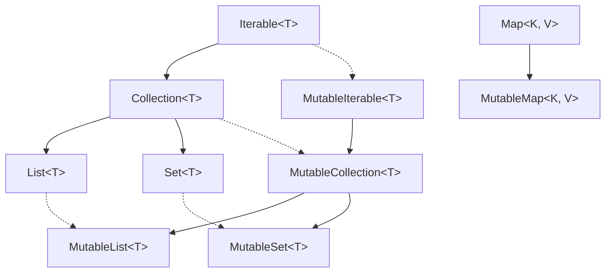
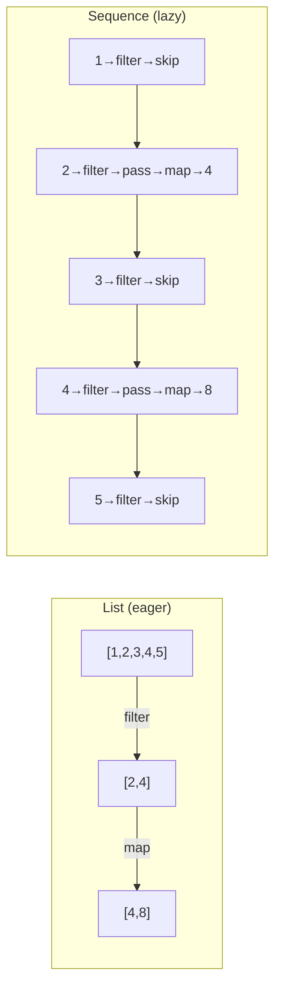
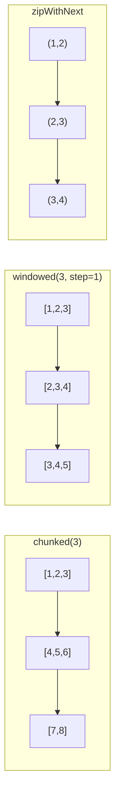
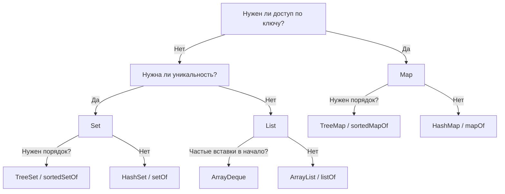

# Вопросы на собеседовании: `Kotlin` коллекции

Полное покрытие коллекций в `Kotlin`: `List`, `Set`, `Map`, `Sequence`, мутабельность, builders, операции, `windowed`/`chunked`, сравнение с `Java`, производительность.

## Введение

В `Kotlin` коллекции разделены на **read-only** (интерфейсы `List`, `Set`, `Map`) и **mutable** (`MutableList`, `MutableSet`, `MutableMap`). Под капотом на `JVM` используются коллекции `Java`, но API и разделение по мутабельности — свои. На собеседованиях часто спрашивают про отличия от `Java`, `Sequence`, `buildList`/`buildMap`, оконные операции и типичные цепочки преобразований.

## Полезные ссылки

### Официальная документация

- [Kotlin Collections Overview](https://kotlinlang.org/docs/collections-overview.html) — иерархия типов, read-only vs mutable
- [Sequences](https://kotlinlang.org/docs/sequences.html) — ленивые последовательности
- [Constructing Collections](https://kotlinlang.org/docs/constructing-collections.html) — `buildList`, `buildMap`, фабрики
- [Collection Transformations](https://kotlinlang.org/docs/collection-transformations.html) — `map`, `flatMap`, `zip`, `associate`
- [Collection Parts](https://kotlinlang.org/docs/collection-parts.html) — `windowed`, `chunked`, `zipWithNext`
- [Grouping](https://kotlinlang.org/docs/collection-grouping.html) — `groupBy`, `groupingBy`
### Baeldung

- [Kotlin Collections Guide — Baeldung](https://www.baeldung.com/kotlin/collection-guide) — полное руководство по коллекциям Kotlin
- [Kotlin Collections API — Baeldung](https://www.baeldung.com/kotlin/collections-api) — обзор операций над коллекциями
- [Sequences in Kotlin — Baeldung](https://www.baeldung.com/kotlin/sequences) — ленивые последовательности и их применение
- [Difference Between Collection and Sequence in Kotlin — Baeldung](https://www.baeldung.com/kotlin/collection-vs-sequence) — когда использовать Collection, а когда Sequence

## Содержание

- [Полезные ссылки](#полезные-ссылки)
- [See also](#see-also)

**Основы: типы, иерархия, создание**
- [Q1. (!) В чём разница между read-only и mutable коллекциями в Kotlin?](#q1--в-чём-разница-между-read-only-и-mutable-коллекциями-в-kotlin)
- [Q2. Как устроена иерархия интерфейсов коллекций в Kotlin?](#q2-как-устроена-иерархия-интерфейсов-коллекций-в-kotlin)
- [Q3. Как устроены List, Set и Map в Kotlin и что под капотом на JVM?](#q3-как-устроены-list-set-и-map-в-kotlin-и-что-под-капотом-на-jvm)
- [Q4. Как создать коллекцию: listOf, mutableListOf, emptyList?](#q4-как-создать-коллекцию-listof-mutablelistof-emptylist)
- [Q5. (!) Что такое buildList, buildSet, buildMap и зачем они нужны?](#q5--что-такое-buildlist-buildset-buildmap-и-зачем-они-нужны)

**Mutable vs Immutable: глубокое погружение**
- [Q6. (!) Является ли read-only коллекция действительно неизменяемой?](#q6--является-ли-read-only-коллекция-действительно-неизменяемой)
- [Q7. Когда использовать kotlinx.collections.immutable?](#q7-когда-использовать-kotlinxcollectionsimmutable)

**Sequence vs Collection**
- [Q8. (!) Что такое Sequence и чем отличается от List при цепочке операций?](#q8--что-такое-sequence-и-чем-отличается-от-list-при-цепочке-операций)
- [Q9. Какие есть способы создания Sequence?](#q9-какие-есть-способы-создания-sequence)
- [Q10. (!) Когда использовать Sequence, а когда List (практический выбор)?](#q10--когда-использовать-sequence-а-когда-list-практический-выбор)

**Операции и преобразования**
- [Q11. Какие типичные операции над коллекциями (map, filter, fold, reduce)?](#q11-какие-типичные-операции-над-коллекциями-map-filter-fold-reduce)
- [Q12. В чём разница между map и flatMap?](#q12-в-чём-разница-между-map-и-flatmap)
- [Q13. (!) Чем отличаются groupBy, associateBy, associateWith и partition?](#q13--чем-отличаются-groupby-associateby-associatewith-и-partition)
- [Q14. Что такое groupingBy и чем отличается от groupBy?](#q14-что-такое-groupingby-и-чем-отличается-от-groupby)
- [Q15. Как работают windowed, chunked и zipWithNext?](#q15-как-работают-windowed-chunked-и-zipwithnext)
- [Q16. Как сортировать коллекции (sorted, sortedBy, sortWith)?](#q16-как-сортировать-коллекции-sorted-sortedby-sortwith)
- [Q17. Что такое toList, toSet, toMutableList и когда что использовать?](#q17-что-такое-tolist-toset-tomutablelist-и-когда-что-использовать)
- [Q18. Как работают zip и unzip?](#q18-как-работают-zip-и-unzip)
- [Q19. Что делают mapNotNull, mapIndexed, mapKeys, mapValues?](#q19-что-делают-mapnotnull-mapindexed-mapkeys-mapvalues)

**Scope-функции и коллекции**
- [Q20. Как scope-функции (let, also, apply, run) используются с коллекциями?](#q20-как-scope-функции-let-also-apply-run-используются-с-коллекциями)

**Сравнение с Java**
- [Q21. (!) Чем коллекции Kotlin отличаются от Java Collections Framework?](#q21--чем-коллекции-kotlin-отличаются-от-java-collections-framework)
- [Q22. Как в Kotlin работать с Java-коллекциями (взаимодействие, nullability)?](#q22-как-в-kotlin-работать-с-java-коллекциями-взаимодействие-nullability)

**ArrayDeque и специализированные коллекции**
- [Q23. Что такое ArrayDeque в Kotlin?](#q23-что-такое-arraydeque-в-kotlin)

**Производительность и выбор**
- [Q24. (!) Какие операции самые частые по сложности и как выбирать тип коллекции?](#q24--какие-операции-самые-частые-по-сложности-и-как-выбирать-тип-коллекции)
- [Q25. (!) Как проектировать API: возвращать List, Sequence или Flow?](#q25--как-проектировать-api-возвращать-list-sequence-или-flow)
- [Q26. Как работают `scan`, `runningFold` и `runningReduce`?](#q26-как-работают-scan-runningfold-и-runningreduce)
- [Q27. Как работают `distinctBy`, `takeWhile`, `dropWhile` и `takeLastWhile`?](#q27-как-работают-distinctby-takewhile-dropwhile-и-takelastwhile)

**Специализированные Map и Set**
- [Q28. Чем `LinkedHashMap` и `TreeMap` отличаются в Kotlin?](#q28-чем-linkedhashmap-и-treemap-отличаются-в-kotlin)
- [Q29. Когда использовать `hashSetOf`, `linkedSetOf`, `sortedSetOf`?](#q29-когда-использовать-hashsetof-linkedsetof-sortedsetof)

**Производительность: Sequence на практике**
- [Q30. (!) Какой оверхед у `Sequence` и когда он перевешивает выгоду?](#q30--какой-оверхед-у-sequence-и-когда-он-перевешивает-выгоду)
- [Q31. Как избежать лишних аллокаций при работе с коллекциями?](#q31-как-избежать-лишних-аллокаций-при-работе-с-коллекциями)

**Потокобезопасность**
- [Q32. (!) Безопасны ли Kotlin-коллекции для многопоточного доступа?](#q32--безопасны-ли-kotlin-коллекции-для-многопоточного-доступа)

**Дополнительные операции**
- [Q33. Что такое `associate` и чем он отличается от `associateBy` и `associateWith`?](#q33-что-такое-associate-и-чем-он-отличается-от-associateby-и-associatewith)
- [Q34. Как работает `flatten` и чем отличается от `flatMap`?](#q34-как-работает-flatten-и-чем-отличается-от-flatmap)
- [Q35. Что такое `coerceIn`, `minOrNull`, `maxOrNull`, `sumOf`, `averageOf`?](#q35-что-такое-coercein-minornull-maxornull-sumof-averageof)
- [Q36. Как используются `first`, `last`, `single`, `elementAtOrElse` и их безопасные варианты?](#q36-как-используются-first-last-single-elementatorelse-и-их-безопасные-варианты)

**Immutable-коллекции и продвинутые темы**
- [Q37. (!) Что такое `PersistentList` / `PersistentMap` и зачем нужен structural sharing?](#q37--что-такое-persistentlist--persistentmap-и-зачем-нужен-structural-sharing)
- [Q38. (!) Чем отличаются `Collection`, `Iterable` и `Sequence` — когда что использовать?](#q38--чем-отличаются-collection-iterable-и-sequence--когда-что-использовать)
- [Q39. В чём разница между `sortedBy`, `sortedWith` и `compareBy`?](#q39-в-чём-разница-между-sortedby-sortedwith-и-compareby)
- [Q40. (!) Чем `groupingBy` отличается от `groupBy` — ленивый vs eager grouping?](#q40--чем-groupingby-отличается-от-groupby--ленивый-vs-eager-grouping)
- [Q41. Как работают `chunked` и `windowed` — batch processing и скользящее окно?](#q41-как-работают-chunked-и-windowed--batch-processing-и-скользящее-окно)
- [Q42. В чём разница между `associateBy`, `associateWith` и `associate`?](#q42-в-чём-разница-между-associateby-associatewith-и-associate)
- [Q43. Что такое `scan` и как он отличается от `fold`?](#q43-что-такое-scan-и-как-он-отличается-от-fold)

---

## Q1. (!) В чём разница между read-only и mutable коллекциями в Kotlin?

**Read-only** интерфейсы (`List`, `Set`, `Map`) предоставляют только операции чтения: получение по индексу/ключу, итерация, `size`, `contains`. Методов изменения (`add`, `remove`, `clear`) у них нет — компилятор не позволит вызвать их через read-only тип.

**Mutable** интерфейсы (`MutableList`, `MutableSet`, `MutableMap`) наследуют соответствующие read-only интерфейсы и добавляют методы модификации. На `JVM` под капотом используются те же классы `Java` (`ArrayList`, `HashSet`, `HashMap`); разница только в том, какой интерфейс экспонируется.

Ключевой момент: переменная типа `List` может указывать на `MutableList` (upcasting), но через тип `List` модификация невозможна — это **контракт на уровне системы типов**, а не runtime-защита.

```kotlin
val readOnly: List<String> = listOf("a", "b")
// readOnly.add("c")  // ошибка компиляции: у List нет add

val mutable: MutableList<String> = mutableListOf("a", "b")
mutable.add("c")  // OK

// upcasting — безопасно для потребителя
fun process(items: List<Int>) { /* только чтение */ }
process(mutableListOf(1, 2, 3))
```

> **Что хотят услышать на собеседовании**: read-only != immutable. Это compile-time ограничение, а не гарантия неизменяемости (см. Q6).


> [!mcq]
> - [ ] `List` в Kotlin — это runtime-immutable: попытка `add` через рефлексию бросает `UnsupportedOperationException` | Неверно: `listOf(2+)` на JVM — обёртка над `ArrayList`, и cast `as MutableList` пройдёт без исключения. ❌ ПОСЛЕДСТВИЕ: команда полагается на `List` как на иммутабельный, Java-код добавляет элементы через cast, читатель видит изменённую коллекцию — silent data race в shared state кэше.
> - [x] `List` vs `MutableList` — это compile-time контракт системы типов, а не runtime-иммутабельность; через cast или из Java содержимое можно изменить | Read-only интерфейсы не имеют методов `add/remove/clear`, но runtime-объект под ними обычно `ArrayList`. ✓ ПРИМЕНЯТЬ: Android Compose UI state хранится как `List`, но реальные гарантии иммутабельности даёт только `kotlinx.collections.immutable.PersistentList`. 📋 ПРАВИЛО: «List — это контракт чтения, не замок на ArrayList». 🔗 См. Q6, Q37.
> - [ ] `MutableList<String>` ковариантен и совместим с `List<Any>` через upcast | Неверно: mutable-интерфейсы инвариантны (`MutableList<String>` нельзя присвоить `MutableList<Any>`), иначе через `add(Any)` можно положить не-String. ❌ ПОСЛЕДСТВИЕ: `ClassCastException` при чтении, симптом «работает локально, падает в проде с разными типами entity».
> - [ ] `listOf()` всегда возвращает `Collections.unmodifiableList`, гарантируя выброс `UnsupportedOperationException` | Неверно: для 2+ элементов `listOf` возвращает `ArrayList`-обёртку без runtime-проверок на запись через cast. ❌ ПОСЛЕДСТВИЕ: миддл пишет defensive copy через `.toList()` ожидая защиты — получает ту же изменяемую ссылку при cast.

## Q2. Как устроена иерархия интерфейсов коллекций в Kotlin?

Иерархия коллекций в `Kotlin` разделена на две ветки — read-only и mutable:



Важные моменты:
- `Collection<T>` наследует `Iterable<T>` — можно итерировать через `for`
- `Map` **не** наследует `Collection` (как и в `Java`)
- Read-only интерфейсы **ковариантны** (`out T`): `List<String>` можно присвоить в `List<Any>`
- Mutable интерфейсы **инвариантны**: `MutableList<String>` нельзя присвоить в `MutableList<Any>` — это предотвращает подмену типов при записи


> [!mcq]
> - [ ] `Map<K, V>` наследует `Collection<Pair<K, V>>` — поэтому над Map работают `filter` и `map` напрямую | Неверно: `Map` НЕ наследует `Collection` (как и в Java); `filter` на `Map` работает через extension `Map.filter { entry -> ... }`, а не через Collection-API. ❌ ПОСЛЕДСТВИЕ: миддл пишет `map.size + collection.size` и удивляется что `map.toList()` даёт `List<Pair<K,V>>` — путаница типов в Kotlin DSL для бизнес-логики ETL.
> - [ ] И `List`, и `MutableList` ковариантны (`out T`) — иначе нельзя было бы передать `MutableList<String>` в функцию, ожидающую `MutableList<Any>` | Неверно: `MutableList` инвариантен, иначе через `add(Any)` можно положить не-String в `MutableList<String>`. ❌ ПОСЛЕДСТВИЕ: «исправил» сигнатуру на `MutableList<Any>` — получил heap pollution, `ClassCastException` при чтении из пула объектов.
> - [x] Read-only интерфейсы (`List<out T>`) ковариантны, mutable (`MutableList<T>`) инвариантны; `Map` не наследует `Collection` | Ковариантность read-only позволяет `List<String>` → `List<Any>`; инвариантность mutable защищает от heap pollution при записи. ✓ ПРИМЕНЯТЬ: API репозиториев Spring Data возвращают `List<Entity>` именно ради ковариантности — caller может работать с `List<Any>` для логирования. 📋 ПРАВИЛО: «out читает, mutable инвариант — иначе heap pollution». 🔗 См. Q1, Q21.
> - [ ] `Iterable` наследует `Collection`, потому что любая коллекция итерируема | Наоборот: `Collection` наследует `Iterable` — итерируемость более общий контракт, чем размер и `contains`. ❌ ПОСЛЕДСТВИЕ: API объявляет `fun process(c: Collection<T>)`, но получает `Sequence` — компиляция падает, миддл пишет `.toList()` каждый раз и теряет lazy-эффект.

## Q3. Как устроены List, Set и Map в Kotlin и что под капотом на JVM?

| Интерфейс | Характеристика | Реализация по умолчанию на JVM |
|-----------|---------------|-------------------------------|
| `List` | Упорядоченная коллекция, допускает дубликаты | `java.util.ArrayList` |
| `Set` | Уникальные элементы, порядок вставки | `java.util.LinkedHashSet` |
| `Map` | Пары ключ-значение, ключи уникальны | `java.util.LinkedHashMap` |
| `MutableList` | Изменяемый список | `java.util.ArrayList` |
| `MutableSet` | Изменяемое множество | `java.util.LinkedHashSet` |
| `MutableMap` | Изменяемое отображение | `java.util.LinkedHashMap` |

Фабрики `listOf()`, `setOf()`, `mapOf()` возвращают экземпляры, реализующие и Kotlin-, и Java-интерфейсы. Поэтому передача коллекций в `Java`-код и обратно происходит без конвертации.

**Важно**: `setOf()` и `mapOf()` в `Kotlin` по умолчанию сохраняют порядок вставки (`LinkedHashSet`, `LinkedHashMap`), в отличие от `Java`, где `HashSet`/`HashMap` порядок не гарантируют.


> [!mcq]
> - [ ] `setOf("a", "b")` возвращает `HashSet` — порядок не гарантирован, как в Java | Неверно: в Kotlin `setOf` использует `LinkedHashSet`, порядок вставки сохраняется. ❌ ПОСЛЕДСТВИЕ: при миграции на Kotlin тесты сериализации JSON начинают флакать — массив элементов в API-ответе меняет порядок между запусками, фронтенд ловит регрессии.
> - [ ] `mapOf("a" to 1).javaClass.name == "java.util.Map$ImmutableCollections"` — Kotlin использует Java 9+ Map.of | Неверно: Kotlin `mapOf` возвращает `LinkedHashMap` (или `EmptyMap`/`SingletonMap` для 0/1 элемента), не Java 9 immutable. ❌ ПОСЛЕДСТВИЕ: миддл ждёт `UnsupportedOperationException` при cast и записи как в Java 9 — получает silent mutation.
> - [ ] `listOf(1, 2, 3)` создаёт обёртку `Collections.unmodifiableList`, поэтому `as MutableList` бросит исключение | Неверно: на JVM `listOf(2+)` возвращает обычный `ArrayList` без unmodifiable-обёртки; cast пройдёт. ❌ ПОСЛЕДСТВИЕ: в коде защиты от мутаций полагаются на `listOf` — caller через cast меняет содержимое, появляется data corruption в shared конфиге.
> - [x] Под капотом `mapOf`/`setOf` — это `LinkedHashMap`/`LinkedHashSet` (порядок вставки), `listOf` — `ArrayList`; Kotlin- и Java-интерфейсы реализуются одним классом, конвертация не нужна | Поэтому `kotlinList` без преобразования передаётся в Java-метод и обратно. ✓ ПРИМЕНЯТЬ: Spring контроллеры на Kotlin возвращают `List<Dto>`, Jackson сериализует напрямую — без `.toList()` или конвертеров. 📋 ПРАВИЛО: «Kotlin-коллекция = Java-коллекция в другом интерфейсе». 🔗 См. Q4, Q22.

```kotlin
// Read-only
val list = listOf(1, 2, 3)           // List<Int>
val set = setOf("x", "y")            // Set<String>
val map = mapOf("a" to 1, "b" to 2)  // Map<String, Int>

// Пустые (синглтоны — не создают новый объект)
val empty = emptyList<String>()
val emptyS = emptySet<Int>()
val emptyM = emptyMap<String, Int>()

// Mutable
val mList = mutableListOf<Int>()        // MutableList<Int> (ArrayList)
val mSet = mutableSetOf<String>()       // MutableSet<String> (LinkedHashSet)
val mMap = mutableMapOf<String, Int>()  // MutableMap<String, Int> (LinkedHashMap)

// Специализированные
val hashSet = hashSetOf(1, 2, 3)           // HashSet — без гарантии порядка
val linkedSet = linkedSetOf(1, 2, 3)       // LinkedHashSet — порядок вставки
val sortedSet = sortedSetOf(3, 1, 2)       // TreeSet — натуральный порядок
val hashMap = hashMapOf("a" to 1)          // HashMap
val linkedMap = linkedMapOf("a" to 1)      // LinkedHashMap
val sortedMap = sortedMapOf("b" to 2, "a" to 1)  // TreeMap
```

`listOf()` для малого числа элементов (0–1) использует оптимизированные реализации: пустой список — синглтон, одноэлементный — обёртка без массива.


> [!mcq]
> - [ ] Всегда использовать MutableList вместо List — чтобы не конвертировать при изменениях | ❌ ПОСЛЕДСТВИЕ: публично exposed MutableList позволяет внешнему коду мутировать коллекцию; инвариант класса нарушается без UnsupportedOperationException
> - [ ] emptyList<T>() создаёт новый пустой ArrayList при каждом вызове | ❌ ПОСЛЕДСТВИЕ: emptyList() — синглтон (EmptyList object); ожидая новый объект и добавляя туда через cast — получишь один общий экземпляр, corrupting все ссылки
> - [x] listOf() — read-only view, не immutable: cast to MutableList возможен; для защитной копии нужен toList(); mutableListOf внутри, List публично | ✓ ПРИМЕНЯТЬ: публичные API возвращают List<T>; внутри mutableListOf(); toList() создаёт snapshot 📋 ПРАВИЛО: List = read-only view, не immutable; MutableList = контракт на мутацию 🔗 См. Q3
> - [ ] listOf(1,2,3) всегда оборачивает в Collections.unmodifiableList → as MutableList бросит UnsupportedOperationException | ❌ ПОСЛЕДСТВИЕ: listOf(2+ элемента) на JVM возвращает обычный ArrayList без unmodifiable-обёртки; cast проходит и мутирует оригинал — data corruption

## Q5. (!) Что такое buildList, buildSet, buildMap и зачем они нужны?

**Builder-функции** создают read-only коллекцию через mutable builder внутри lambda-блока:

```kotlin
val list = buildList {
    // this: MutableList<String>
    add("alpha")
    add("beta")
    if (condition) add("gamma")
    addAll(otherList)
}
// list: List<String> — read-only

val map = buildMap {
    // this: MutableMap<String, Int>
    put("a", 1)
    put("b", 2)
    putAll(existingMap)
}
// map: Map<String, Int> — read-only

val set = buildSet {
    add(1)
    addAll(listOf(2, 3))
}
```

**Преимущества** перед `listOf()` / `mutableListOf()`:
- Результат сразу **read-only** — не нужно вызывать `toList()`
- **Условная логика** внутри блока — удобнее, чем тернарные конструкции
- Для `buildMap` — нет создания промежуточных `Pair`-объектов (в отличие от `mapOf(key to value)`)
- **Типы выводятся** автоматически из операций в блоке

> **На собеседовании**: `buildList` — идиоматический способ создания коллекции с условной логикой. Появился в Kotlin 1.6 как stable API.


> [!mcq]
> - [ ] buildList {} эквивалентен mutableListOf().also { ... } — одинаковая читаемость | ❌ ПОСЛЕДСТВИЕ: buildList возвращает read-only List напрямую без toList(); mutableListOf().also{} требует явного .toList() или оставляет mutable тип
> - [x] buildList создаёт MutableList в лямбде, возвращает read-only List; удобен для условной логики без промежуточных mutable переменных | ✓ ПРИМЕНЯТЬ: когда нужно собрать список с if/when/for внутри и сразу вернуть read-only 📋 ПРАВИЛО: buildList = mutable inside → read-only outside; stable с Kotlin 1.6 🔗 См. Q4
> - [ ] buildMap создаёт промежуточные Pair-объекты как mapOf("a" to 1) | ❌ ПОСЛЕДСТВИЕ: buildMap использует put() напрямую без Pair; именно это его преимущество — меньше аллокаций при построении больших map
> - [ ] buildList недоступен в Kotlin без дополнительных зависимостей | ❌ ПОСЛЕДСТВИЕ: buildList/buildSet/buildMap — часть kotlin-stdlib, stable с Kotlin 1.6; никаких дополнительных зависимостей не нужно

## Q6. (!) Является ли read-only коллекция действительно неизменяемой?

**Нет.** Read-only в `Kotlin` — это ограничение на уровне типов, а **не** runtime-гарантия неизменяемости. Через cast или из `Java`-кода можно изменить содержимое:

```kotlin
val readOnly: List<String> = mutableListOf("a", "b")

// через unsafe cast — runtime позволит
(readOnly as MutableList).add("c")
println(readOnly) // [a, b, c]

// из Java-кода — тоже можно изменить
// void modify(List<String> list) { list.add("oops"); }
```

**Настоящие immutable-коллекции** даёт библиотека `kotlinx.collections.immutable` — при попытке модификации выбрасывается `UnsupportedOperationException` (для обёрток вроде `Collections.unmodifiableList`) или создаётся новая версия (для persistent-коллекций).

Фабрики `listOf()`, `setOf()`, `mapOf()` для 0–1 элементов могут возвращать действительно неизменяемые реализации, но для 2+ элементов — обычно обёртку над `ArrayList` / `LinkedHashSet` / `LinkedHashMap`.

> **Gotcha**: Не полагайтесь на read-only как на защиту от конкурентной модификации в многопоточном коде. Используйте `kotlinx.collections.immutable` или `ConcurrentHashMap`.


> [!mcq]
> - [ ] Read-only List<T> гарантирует неизменяемость в многопоточном коде — synchronized не нужен | ❌ ПОСЛЕДСТВИЕ: read-only — типовое ограничение, не runtime-гарантия; другой поток через cast или Java может мутировать; ConcurrentModificationException или data corruption
> - [ ] (readOnly as MutableList).add("x") всегда бросит ClassCastException — это защита | ❌ ПОСЛЕДСТВИЕ: listOf(2+ элемента) под капотом — ArrayList; cast успешен; элемент добавится, нарушая контракт "read-only"
> - [x] Read-only — ограничение на уровне типов; через cast или Java-код содержимое изменить можно; для настоящей иммутабельности нужна kotlinx.collections.immutable | ✓ ПРИМЕНЯТЬ: многопоточный shared state → persistentListOf(); API contracts → List<T> (но не иммутабельность) 📋 ПРАВИЛО: read-only ≠ immutable; immutable = kotlinx-persistent или unmodifiableList 🔗 См. Q7
> - [ ] Collections.unmodifiableList всегда используется под капотом listOf() | ❌ ПОСЛЕДСТВИЕ: listOf(0) → EmptyList singleton; listOf(1) → SingletonList; listOf(2+) → обычный ArrayList без unmodifiable-обёртки

## Q7. Когда использовать kotlinx.collections.immutable?

`kotlinx.collections.immutable` предоставляет **persistent-коллекции** (`PersistentList`, `PersistentMap`, `PersistentSet`) с функциональной моделью обновлений: каждая модификация возвращает новую коллекцию, но благодаря **structural sharing** не копирует всё содержимое.

```kotlin
// Зависимость: org.jetbrains.kotlinx:kotlinx-collections-immutable:0.3.7
val list = persistentListOf(1, 2, 3)
val updated = list.add(4)  // новый PersistentList, list не изменился

val map = persistentHashMapOf("a" to 1)
val updated2 = map.put("b", 2)
```

**Когда использовать:**
- **State management** (UI, Redux-подобные архитектуры) — безопасное хранение версий состояния
- **Многопоточность** — гарантия неизменяемости без блокировок
- **Event sourcing** — снимки состояния

**Когда НЕ нужно:**
- Локальные короткоживущие коллекции — обычные `MutableList` проще и быстрее
- Маленькие коллекции — overhead структурного шаринга не окупается


> [!mcq]
> - [ ] Использовать kotlinx.collections.immutable для всех коллекций по умолчанию — это лучшая практика | ❌ ПОСЛЕДСТВИЕ: persistent collections имеют overhead структурного шаринга; для локальных короткоживущих коллекций это замедляет код и усложняет API
> - [ ] kotlinx.collections.immutable входит в kotlin-stdlib без дополнительных зависимостей | ❌ ПОСЛЕДСТВИЕ: это отдельная библиотека org.jetbrains.kotlinx:kotlinx-collections-immutable; без явной зависимости в build.gradle.kts не скомпилируется
> - [ ] persistentListOf().add(x) мутирует исходный список на месте — immutable в названии условное | ❌ ПОСЛЕДСТВИЕ: .add() возвращает новую PersistentList через structural sharing; оригинал неизменен — именно это гарантирует иммутабельность
> - [x] Persistent collections нужны для shared mutable state: UI state, event sourcing, многопоточность без блокировок | ✓ ПРИМЕНЯТЬ: Redux/MVI state в Android, snapshot testing, concurrent reads без копирования 📋 ПРАВИЛО: persistent = каждая операция → новый объект + structural sharing 🔗 См. Q6

## Q8. (!) Что такое Sequence и чем отличается от List при цепочке операций?

`Sequence<T>` — **ленивая** последовательность элементов. Промежуточные операции (`map`, `filter`) не выполняются сразу и не создают промежуточные коллекции. Вычисление происходит поэлементно при вызове **терминальной** операции (`toList()`, `first()`, `count()`).



| Аспект | `List` (eager) | `Sequence` (lazy) |
|--------|---------------|-------------------|
| Порядок выполнения | Вся коллекция на каждом шаге | Элемент проходит всю цепочку |
| Промежуточные коллекции | Создаются на каждом шаге | Не создаются |
| Ранняя остановка | Нет | Да (`first()`, `take()`) |
| Overhead | Минимальный | Итераторы, boxing |

```kotlin
// List: 2 промежуточных списка
listOf(1, 2, 3, 4, 5)
    .filter { it % 2 == 0 }  // → [2, 4]
    .map { it * 2 }           // → [4, 8]

// Sequence: 0 промежуточных списков
listOf(1, 2, 3, 4, 5).asSequence()
    .filter { it % 2 == 0 }
    .map { it * 2 }
    .toList()  // терминальная операция запускает pipeline
```


> [!mcq]
> - [ ] Sequence и List дают одинаковый результат — разница только в стиле кода | ❌ ПОСЛЕДСТВИЕ: при List каждый .filter{}/.map{} создаёт промежуточную коллекцию; при large dataset это O(N) аллокаций на каждую операцию → GC pressure и OOM
> - [x] Sequence: ленивое поэлементное выполнение — нет промежуточных коллекций, ранняя остановка при first()/take(); List: eager, каждый шаг создаёт промежуточную коллекцию | ✓ ПРИМЕНЯТЬ: Sequence при 1000+ элементов + 2+ операций или при частичном результате; List при малых данных 📋 ПРАВИЛО: .asSequence() = lazy pipeline; без него = eager intermediate collections 🔗 См. Q9
> - [ ] Sequence всегда быстрее List — нужно конвертировать все коллекции через .asSequence() | ❌ ПОСЛЕДСТВИЕ: Sequence имеет overhead итераторов и boxing для примитивов; для малых коллекций с 1 операцией List быстрее из-за cache locality
> - [ ] .filter{}.map{} на Sequence выполняется параллельно автоматически | ❌ ПОСЛЕДСТВИЕ: Sequence — однопоточная lazy evaluation; параллельность даёт только kotlinx.coroutines или Java parallel streams

## Q9. Какие есть способы создания Sequence?

```kotlin
// 1. Из элементов
val s1 = sequenceOf("a", "b", "c")

// 2. Из коллекции
val s2 = listOf(1, 2, 3).asSequence()

// 3. generateSequence — с функцией-генератором
val naturals = generateSequence(1) { it + 1 }       // бесконечная
val finite = generateSequence(1) { if (it < 10) it + 1 else null }  // до null

// 4. sequence builder — с yield/yieldAll (suspend)
val fibonacci = sequence {
    var a = 0
    var b = 1
    while (true) {
        yield(a)
        val next = a + b
        a = b
        b = next
    }
}
println(fibonacci.take(8).toList()) // [0, 1, 1, 2, 3, 5, 8, 13]

// 5. Из итераторов или Java streams
iterator.asSequence()
stream.asSequence()
```

`yield()` возвращает одиночный элемент, `yieldAll()` — коллекцию, другую последовательность или итератор. Выполнение suspend-ируется между вызовами `yield` — это restricted coroutine (не полноценная корутина, а только `SequenceScope`).


> [!mcq]
> - [ ] generateSequence создаёт конечную последовательность всегда — бесконечная невозможна | ❌ ПОСЛЕДСТВИЕ: generateSequence(1) { it + 1 } создаёт бесконечную Sequence; вызов .toList() без .take(N) зависнет с OOM
> - [ ] sequence { yield(x) } — это полноценная корутина, требует CoroutineScope | ❌ ПОСЛЕДСТВИЕ: sequence builder — restricted coroutine с SequenceScope; не требует CoroutineScope, запускается синхронно при pull; suspend работает только для yield
> - [x] sequenceOf(), .asSequence(), generateSequence(), sequence{yield()} — четыре основных способа; generateSequence() nullable → конечная последовательность | ✓ ПРИМЕНЯТЬ: generateSequence для числовых рядов, sequence{} для Fibonacci-like, asSequence() при работе с существующими коллекциями 📋 ПРАВИЛО: null из генератора = конец Sequence 🔗 См. Q8
> - [ ] Sequence нельзя создать из Java Iterator — только из Kotlin коллекций | ❌ ПОСЛЕДСТВИЕ: iterator.asSequence() — стандартный extension из kotlin-stdlib; Java streams тоже конвертируются через .asSequence()

## Q10. (!) Когда использовать Sequence, а когда List (практический выбор)?

**Используйте `Sequence`, когда:**
- Коллекция **большая** (тысячи+ элементов) и цепочка из 2+ промежуточных операций
- Нужен только **частичный результат** (`first()`, `take(n)`, `any()`) — lazy evaluation остановится раньше
- Источник данных **потоковый** (файл, сеть, бесконечная генерация)

**Используйте `List`, когда:**
- Данных **мало** и операция простая — overhead `Sequence` не окупится
- Нужен **многократный доступ по индексу** или random access
- Результат нужен целиком и используется **несколько раз**
- Нужна **одна** операция без цепочки — промежуточных коллекций всего одна

**Правило большого пальца**: начинайте с коллекций; добавляйте `.asSequence()` когда профилирование показывает лишние аллокации или когда цепочка длинная на большом наборе данных.

```kotlin
// ✅ Sequence: большие данные, длинная цепочка, нужен один результат
lines.asSequence()
    .filter { it.isNotBlank() }
    .map { it.trim().lowercase() }
    .distinct()
    .sorted()
    .toList()

// ✅ List: маленькая коллекция, простая операция
listOf(1, 2, 3).map { it * 2 }
```


> [!mcq]
> - [ ] Sequence всегда быстрее List при любом размере коллекции — всегда добавлять .asSequence() | ❌ ПОСЛЕДСТВИЕ: для малых коллекций (менее 100 элементов) List быстрее из-за cache locality; Sequence имеет overhead итераторов и boxing примитивов
> - [ ] .asSequence() на List обязательно нужно вызывать при одной операции filter/map | ❌ ПОСЛЕДСТВИЕ: при одной промежуточной операции List создаёт одну промежуточную коллекцию; overhead Sequence не окупается; один шаг = List
> - [ ] Sequence сохраняет элементы в памяти как List, но вычисляет лениво | ❌ ПОСЛЕДСТВИЕ: Sequence не хранит элементы — это pipeline; каждый pull от терминальной операции тянет следующий элемент через цепочку; нет хранения вообще
> - [x] Sequence — при 1000+ элементов + 2+ операций или при .first()/.take(); List — при малых данных или когда нужен многократный random access | ✓ ПРИМЕНЯТЬ: файловый reader → asSequence() → filter → take(100) останавливается без чтения всего файла 📋 ПРАВИЛО: Sequence = lazy pipeline без промежуточных коллекций; профилируй прежде чем переключать 🔗 См. Q8

## Q11. Какие типичные операции над коллекциями (map, filter, fold, reduce)?

| Операция | Описание | Пример |
|----------|---------|--------|
| `map` | Преобразование каждого элемента | `list.map { it * 2 }` |
| `filter` | Оставить элементы по предикату | `list.filter { it > 0 }` |
| `fold` | Свёртка с начальным значением | `list.fold(0) { acc, e -> acc + e }` |
| `reduce` | Свёртка, начиная с первого элемента | `list.reduce { acc, e -> acc + e }` |
| `flatMap` | map + flatten | `list.flatMap { it.children }` |
| `find` / `firstOrNull` | Первый по предикату или null | `list.find { it > 5 }` |
| `any` / `all` / `none` | Проверка по предикату | `list.any { it < 0 }` |
| `count` | Количество (с предикатом или без) | `list.count { it > 0 }` |
| `partition` | Разбиение на два списка | `list.partition { it % 2 == 0 }` |
| `zip` | Объединение двух коллекций в пары | `a.zip(b)` |
| `flatten` | Список списков → один список | `listOfLists.flatten()` |
| `take` / `drop` | Взять / пропустить N элементов | `list.take(3)` |
| `distinct` | Убрать дубликаты | `list.distinct()` |
| `sumOf` | Сумма по селектору | `list.sumOf { it.price }` |

```kotlin
val numbers = listOf(1, -2, 3, -4, 5)

// partition: разделить на положительные и отрицательные
val (positive, negative) = numbers.partition { it > 0 }
// positive = [1, 3, 5], negative = [-2, -4]

// fold: суммирование с начальным значением
val sum = numbers.fold(100) { acc, n -> acc + n } // 103

// reduce vs fold: reduce бросает исключение на пустой коллекции!
val product = numbers.reduce { acc, n -> acc * n } // -120
```


> [!mcq]
> - [ ] reduce и fold идентичны — разница только в синтаксисе | ❌ ПОСЛЕДСТВИЕ: reduce бросает UnsupportedOperationException на пустой коллекции; fold с начальным значением безопасен; на пустом списке reduce = runtime exception
> - [x] fold(initial) { acc, e -> } безопасен на пустой коллекции; reduce() бросает на пустой; partition возвращает Pair<List, List> | ✓ ПРИМЕНЯТЬ: fold для aggregation с начальным значением; reduce только если гарантирована непустая коллекция 📋 ПРАВИЛО: fold = safe accumulate; reduce = unsafe first-as-seed 🔗 См. Q12
> - [ ] partition() возвращает один List с true-элементами в начале | ❌ ПОСЛЕДСТВИЕ: partition возвращает Pair<List<T>, List<T>> — первый для true-предиката, второй для false; нужен destructuring val (yes, no) = ...
> - [ ] flatMap аналогичен map — используется для любого преобразования | ❌ ПОСЛЕДСТВИЕ: map возвращает List<B> из каждого элемента; flatMap ожидает List<B> из каждого элемента и делает flatten; путаница → List<List<B>> вместо List<B>

## Q12. В чём разница между map и flatMap?

**`map`** преобразует каждый элемент в **одно** значение — размер результата совпадает с исходным. **`flatMap`** преобразует каждый элемент в **коллекцию** и затем «склеивает» все результаты в одну плоскую последовательность. Эквивалент: `map { ... }.flatten()`.

```kotlin
val sentences = listOf("hello world", "kotlin collections")

// map → List<List<String>>
sentences.map { it.split(" ") }
// [["hello", "world"], ["kotlin", "collections"]]

// flatMap → List<String>
sentences.flatMap { it.split(" ") }
// ["hello", "world", "kotlin", "collections"]

// Практический пример: получить все заказы всех клиентов
data class Customer(val name: String, val orders: List<Order>)
val allOrders: List<Order> = customers.flatMap { it.orders }
```

**Когда использовать `flatMap`:**
- Один элемент «разворачивается» в несколько (one-to-many)
- Нужно объединить вложенные структуры в плоскую
- Работа с `Optional`/nullable через `listOfNotNull`


> [!mcq]
> - [ ] flatMap и map взаимозаменяемы — оба преобразуют элементы списка | ❌ ПОСЛЕДСТВИЕ: map возвращает List<B> (один элемент); flatMap ожидает Iterable<B> и делает flatten; использование map вместо flatMap даёт List<List<B>> — NPE при дальнейшей обработке как List<B>
> - [ ] customers.flatMap { it.orders } то же что customers.map { it.orders } | ❌ ПОСЛЕДСТВИЕ: .map{} возвращает List<List<Order>>; .flatMap{} возвращает List<Order>; в production это ClassCastException при типизированных операциях
> - [x] flatMap = map + flatten; преобразует каждый элемент в коллекцию и объединяет всё в один плоский список | ✓ ПРИМЕНЯТЬ: один элемент → несколько (orders, tags, children); nested structures → flat list 📋 ПРАВИЛО: flatMap = one-to-many mapping с автоматическим flatten 🔗 См. Q11
> - [ ] flatMap нельзя использовать с Sequence — только с List | ❌ ПОСЛЕДСТВИЕ: Sequence поддерживает flatMap через lazy evaluation; sequence.flatMap{} работает корректно и ленится без промежуточных коллекций

## Q13. (!) Чем отличаются groupBy, associateBy, associateWith и partition?

Все четыре функции преобразуют коллекцию в структурированный результат, но с разной семантикой:

| Функция | Результат | Дубликаты ключей | Использование |
|---------|----------|-------------------|---------------|
| `groupBy` | `Map<K, List<T>>` | Все элементы сохраняются | Группировка |
| `associateBy` | `Map<K, T>` | Последний перезаписывает | Индексация по уникальному ключу |
| `associateWith` | `Map<T, V>` | Последний перезаписывает | Элемент → вычисленное значение |
| `associate` | `Map<K, V>` | Последний перезаписывает | Произвольная пара |
| `partition` | `Pair<List<T>, List<T>>` | N/A | Разделение на два списка |

```kotlin
data class User(val id: Int, val name: String, val dept: String)
val users = listOf(
    User(1, "Alice", "dev"), User(2, "Bob", "dev"),
    User(3, "Carol", "qa"), User(4, "Dave", "qa")
)

// groupBy: dept → список пользователей
users.groupBy { it.dept }
// {dev=[Alice, Bob], qa=[Carol, Dave]}

// associateBy: id → пользователь (уникальный ключ!)
users.associateBy { it.id }
// {1=Alice, 2=Bob, 3=Carol, 4=Dave}

// associateWith: пользователь → вычисленное значение
users.associateWith { it.name.length }
// {User(1,Alice,dev)=5, ...}

// partition: предикат → (true-список, false-список)
val (devs, others) = users.partition { it.dept == "dev" }
// devs=[Alice, Bob], others=[Carol, Dave]
```

> **Gotcha**: `associateBy` при дубликатах ключей молча перезаписывает — используйте `groupBy`, если дубликаты возможны.


> [!mcq]
> - [ ] groupBy и associateBy взаимозаменяемы при уникальных ключах | ❌ ПОСЛЕДСТВИЕ: groupBy возвращает Map<K, List<T>>; associateBy возвращает Map<K, T>; при дубликате ключа associateBy молча перезаписывает предыдущее — silent data loss
> - [x] groupBy → Map<K, List<T>> (все элементы); associateBy → Map<K, T> (последний при дубликате); associateWith → Map<T, V> (элемент как ключ) | ✓ ПРИМЕНЯТЬ: groupBy для dept→List<User>; associateBy для id→User (уникальный ключ) 📋 ПРАВИЛО: groupBy = многие к одному ключу; associateBy = один к одному (last wins при дубликате) 🔗 См. Q14
> - [ ] partition возвращает один List с true-элементами первыми, false последними | ❌ ПОСЛЕДСТВИЕ: partition возвращает Pair<List<T>, List<T>>; нужен destructuring val (positive, negative) = ...; иначе работаешь с Pair.first и Pair.second
> - [ ] associateBy безопасен при дубликатах ключей — объединяет в список автоматически | ❌ ПОСЛЕДСТВИЕ: associateBy при дубликатах перезаписывает молча; используй groupBy если ключ неуникален

## Q14. Что такое groupingBy и чем отличается от groupBy?

`groupBy` сразу материализует `Map<K, List<T>>` — создаёт все списки в памяти. `groupingBy` возвращает промежуточный объект `Grouping`, к которому можно применить **агрегацию без создания промежуточных списков**:

```kotlin
val words = listOf("apple", "banana", "avocado", "blueberry", "cherry")

// groupBy + mapValues — два прохода, промежуточные списки
words.groupBy { it.first() }.mapValues { (_, v) -> v.size }
// {a=2, b=2, c=1}

// groupingBy + eachCount — один проход, без промежуточных списков
words.groupingBy { it.first() }.eachCount()
// {a=2, b=2, c=1}
```

| Операция `Grouping` | Описание |
|---------------------|---------|
| `eachCount()` | Количество элементов в каждой группе |
| `fold(init) { ... }` | Свёртка каждой группы |
| `reduce { ... }` | Редукция каждой группы |
| `aggregate { ... }` | Произвольная агрегация |

`groupingBy` эффективнее для больших коллекций, когда нужен агрегат, а не сами списки элементов.


> [!mcq]
> - [ ] groupBy и groupingBy дают одинаковый результат — разница только в синтаксисе | ❌ ПОСЛЕДСТВИЕ: groupBy материализует Map<K, List<T>> сразу; groupingBy возвращает Grouping для однопроходной агрегации без промежуточных списков; eachCount() vs groupBy{}.mapValues{it.size} — разная производительность
> - [x] groupingBy эффективнее groupBy когда нужен агрегат (count, sum), а не сами списки; один проход без промежуточных List | ✓ ПРИМЕНЯТЬ: частотный анализ текста, гистограммы, aggregation без хранения групп 📋 ПРАВИЛО: groupingBy = lazy grouping для aggregation; groupBy = eager grouping для доступа к элементам 🔗 См. Q13
> - [ ] groupingBy возвращает Map<K, List<T>> аналогично groupBy | ❌ ПОСЛЕДСТВИЕ: groupingBy возвращает Grouping<T, K> — промежуточный объект без материализации; только после .eachCount()/.fold()/.reduce() получаем Map
> - [ ] groupingBy.eachCount() то же что .size на каждой группе из groupBy | ❌ ПОСЛЕДСТВИЕ: groupBy создаёт промежуточные List<T> для каждой группы; groupingBy.eachCount() считает без создания List — меньше GC давления

## Q15. Как работают windowed, chunked и zipWithNext?

Три функции для работы с «окнами» элементов:



```kotlin
val numbers = (1..8).toList()

// chunked — разбить на части фиксированного размера
numbers.chunked(3)
// [[1, 2, 3], [4, 5, 6], [7, 8]]

// chunked с трансформацией
numbers.chunked(3) { it.sum() }
// [6, 15, 15]

// windowed — скользящее окно
numbers.windowed(3)
// [[1,2,3], [2,3,4], [3,4,5], [4,5,6], [5,6,7], [6,7,8]]

// windowed с шагом и partial windows
numbers.windowed(size = 3, step = 2, partialWindows = true)
// [[1,2,3], [3,4,5], [5,6,7], [7,8]]

// zipWithNext — пары соседних элементов
numbers.zipWithNext()
// [(1,2), (2,3), (3,4), (4,5), (5,6), (6,7), (7,8)]

// Практика: проверить, что последовательность возрастающая
numbers.zipWithNext { a, b -> a < b }.all { it } // true
```

**Применение:**
- `chunked` — пакетная обработка (batch insert в БД, пагинация)
- `windowed` — скользящее среднее, поиск паттернов
- `zipWithNext` — проверка переходов, вычисление разностей


> [!mcq]
> - [ ] chunked и windowed взаимозаменяемы — оба разбивают список на части | ❌ ПОСЛЕДСТВИЕ: chunked — непересекающиеся блоки (batch processing); windowed — скользящее окно с перекрытием (sliding average); путаница даёт неверные агрегаты
> - [ ] windowed(3) создаёт окна без последнего неполного — partialWindows по умолчанию true | ❌ ПОСЛЕДСТВИЕ: partialWindows по умолчанию false; последнее неполное окно отбрасывается; для включения неполных нужен явный partialWindows = true
> - [x] chunked = непересекающиеся блоки (batch); windowed = скользящее окно с шагом; zipWithNext = пары соседних элементов | ✓ ПРИМЕНЯТЬ: chunked для batch insert; windowed для скользящего среднего; zipWithNext для проверки монотонности 📋 ПРАВИЛО: chunked = split; windowed = slide; zipWithNext = consecutive pairs 🔗 См. Q11
> - [ ] zipWithNext() возвращает List<List<Pair<T,T>>> с вложением | ❌ ПОСЛЕДСТВИЕ: zipWithNext возвращает List<Pair<T, T>>; каждая пара — смежные элементы (a[i], a[i+1]); без вложения

## Q16. Как сортировать коллекции (sorted, sortedBy, sortWith)?

| Функция | Описание | Тип |
|---------|---------|-----|
| `sorted()` | По натуральному порядку (`Comparable`) | Новый список |
| `sortedBy { }` | По результату селектора | Новый список |
| `sortedDescending()` | По убыванию | Новый список |
| `sortedByDescending { }` | По убыванию селектора | Новый список |
| `sortedWith(comparator)` | По кастомному компаратору | Новый список |
| `sort()` | In-place сортировка | `Unit` (MutableList) |
| `sortBy { }` | In-place по селектору | `Unit` (MutableList) |

```kotlin
data class User(val name: String, val age: Int)
val users = listOf(User("Bob", 30), User("Alice", 25), User("Carol", 30))

// Сортировка по одному полю
users.sortedBy { it.name }  // [Alice, Bob, Carol]

// Множественная сортировка: сначала по возрасту, потом по имени
users.sortedWith(compareBy({ it.age }, { it.name }))
// [Alice(25), Bob(30), Carol(30)]

// In-place (только MutableList)
val mutable = mutableListOf(3, 1, 2)
mutable.sort()  // изменяет mutable, возвращает Unit
```

> **Важно**: `sorted*` для read-only списков всегда возвращают **новый** список. `sort*` для `MutableList` изменяют список на месте и возвращают `Unit`.


> [!mcq]
> - [ ] sortedBy и sortBy взаимозаменяемы — оба возвращают новый список | ❌ ПОСЛЕДСТВИЕ: sortedBy — на read-only List, возвращает новый sorted List; sortBy — extension на MutableList, изменяет in-place, возвращает Unit; путаница → компилятор вернёт Unit при вызове sortBy на MutableList и ты потеряешь результат
> - [ ] users.sortedWith(compareBy { it.age }) не поддерживает множественные критерии | ❌ ПОСЛЕДСТВИЕ: compareBy принимает vararg selectors: compareBy({ it.age }, { it.name }) даёт стабильную многоуровневую сортировку
> - [x] sorted*/sortedBy возвращают новый List; sort/sortBy изменяют MutableList in-place и возвращают Unit | ✓ ПРИМЕНЯТЬ: read-only API → sortedBy; внутренние mutable структуры → sortBy для экономии аллокаций 📋 ПРАВИЛО: d = sorted → new; sort → in-place Unit 🔗 См. Q4
> - [ ] Kotlin не поддерживает stable sort — равные элементы могут переставляться | ❌ ПОСЛЕДСТВИЕ: TimSort в JVM гарантирует stable sort; sortedWith/sortedBy сохраняют относительный порядок равных элементов

## Q17. Что такое toList, toSet, toMutableList и когда что использовать?

Функции `to*()` создают **копию** коллекции нужного типа:

```kotlin
val sequence = (1..5).asSequence().filter { it % 2 == 0 }.map { it * 10 }

// Терминальная операция для Sequence
val list = sequence.toList()       // [20, 40] — read-only List
val set = sequence.toSet()         // {20, 40} — read-only Set
val mList = sequence.toMutableList() // [20, 40] — MutableList

// Создание независимой копии
val original = mutableListOf(1, 2, 3)
val copy = original.toList()
original.add(4)
println(copy) // [1, 2, 3] — не затронут
```

**Когда что использовать:**
- `toList()` — зафиксировать результат pipeline, получить read-only контракт
- `toSet()` — убрать дубликаты + быстрый `contains()`
- `toMutableList()` — нужна изменяемая копия для дальнейшей модификации
- `toSortedSet()` — уникальные элементы + сортировка
- `toMap()` — из списка пар в `Map`


> [!mcq]
> - [ ] toList() на MutableList возвращает тот же объект без копирования | ❌ ПОСЛЕДСТВИЕ: toList() создаёт новую независимую копию; original.add(4) после toList() не затронет copy — именно для этого toList() используется как защитная копия
> - [x] to*() функции создают независимую копию; toSet() убирает дубликаты; toMutableList() даёт изменяемую копию | ✓ ПРИМЕНЯТЬ: Sequence.toList() материализует pipeline; .toSet() для дедупликации; toMutableList() для дальнейших in-place изменений 📋 ПРАВИЛО: to*() = snapshot + type conversion 🔗 См. Q4
> - [ ] toSet() сохраняет порядок вставки элементов — это LinkedHashSet | ❌ ПОСЛЕДСТВИЕ: toSet() в Kotlin возвращает LinkedHashSet (порядок вставки сохраняется), но после дедупликации порядок основан на первом вхождении; toSortedSet() для натурального порядка
> - [ ] toMutableList() на уже MutableList создаёт обёртку без копирования данных | ❌ ПОСЛЕДСТВИЕ: toMutableList() всегда создаёт новый ArrayList с копией элементов; изменения в одном не затрагивают другой

## Q18. Как работают zip и unzip?

**`zip`** объединяет два списка поэлементно в пары. Результат по длине равен **меньшему** из списков:

```kotlin
val colors = listOf("red", "brown", "grey")
val animals = listOf("fox", "bear", "wolf", "cat")

// Инфиксная форма
colors zip animals
// [(red, fox), (brown, bear), (grey, wolf)] — "cat" отбрасывается

// С трансформацией
colors.zip(animals) { color, animal -> "$color $animal" }
// ["red fox", "brown bear", "grey wolf"]

// unzip — обратная операция
val pairs = listOf("one" to 1, "two" to 2, "three" to 3)
val (strings, ints) = pairs.unzip()
// strings = [one, two, three], ints = [1, 2, 3]
```


> [!mcq]
> - [ ] zip при разных длинах списков бросает исключение | ❌ ПОСЛЕДСТВИЕ: zip обрезает по меньшей длине без исключения; элементы более длинного списка молча отбрасываются — silent data loss
> - [ ] colors zip animals = colors.zip(animals) только синтаксический сахар — полностью эквивалентны | ❌ ПОСЛЕДСТВИЕ: оба эквивалентны; но zip без трансформации создаёт List<Pair<A,B>>; zip с лямбдой позволяет сразу получить List<C> без промежуточных Pair-объектов
> - [x] zip объединяет два списка в List<Pair> по меньшей длине; unzip разделяет List<Pair> обратно в два List | ✓ ПРИМЕНЯТЬ: zip для связывания parallel массивов; unzip для destructuring данных из API как List<Pair> 📋 ПРАВИЛО: zip = минимальная длина; избыточные элементы отброшены 🔗 См. Q15
> - [ ] unzip() доступен только для List<Pair<String, Int>> — строго типизированных пар | ❌ ПОСЛЕДСТВИЕ: unzip() — generic extension на Iterable<Pair<A, B>>; работает с любыми типами A и B

## Q19. Что делают mapNotNull, mapIndexed, mapKeys, mapValues?

```kotlin
// mapNotNull — map + filterNotNull в одной операции
val strings = listOf("1", "abc", "2", "def")
strings.mapNotNull { it.toIntOrNull() }
// [1, 2] — только успешно распарсенные

// mapIndexed — доступ к индексу
listOf("a", "b", "c").mapIndexed { index, value -> "$index:$value" }
// ["0:a", "1:b", "2:c"]

// mapKeys / mapValues — трансформация ключей или значений Map
val map = mapOf("one" to 1, "two" to 2)
map.mapKeys { (key, _) -> key.uppercase() }    // {ONE=1, TWO=2}
map.mapValues { (_, value) -> value * 10 }       // {one=10, two=20}

// mapIndexedNotNull — mapIndexed + filterNotNull
listOf("a", null, "c").mapIndexedNotNull { i, v -> v?.let { "$i:$it" } }
// ["0:a", "2:c"]
```

> **Best practice**: `mapNotNull` эффективнее, чем `map { ... }.filterNotNull()` — один проход вместо двух (для `List`).


> [!mcq]
> - [ ] mapNotNull = map{}.filterNotNull() — одинаковая производительность | ❌ ПОСЛЕДСТВИЕ: mapNotNull делает один проход; map + filterNotNull делает два прохода и создаёт промежуточную коллекцию с null; при тысячах элементов разница в GC давлении
> - [x] mapNotNull = map + filterNotNull в одном проходе; mapKeys трансформирует ключи Map; mapValues трансформирует значения; mapIndexed даёт доступ к индексу | ✓ ПРИМЕНЯТЬ: mapNotNull для парсинга с ошибками; mapKeys/mapValues для нормализации данных Map 📋 ПРАВИЛО: mapNotNull = safe transform; mapIndexed = index-aware transform 🔗 См. Q11
> - [ ] mapKeys при дубликате нового ключа бросает IllegalArgumentException | ❌ ПОСЛЕДСТВИЕ: mapKeys при коллизии нового ключа молча перезаписывает — last wins; нет исключения; нужна отдельная проверка уникальности
> - [ ] mapIndexed нумерует элементы с 1, а не с 0 | ❌ ПОСЛЕДСТВИЕ: mapIndexed использует 0-based индексы как в массиве; listOf("a","b","c").mapIndexed{i,v->i} = [0,1,2]

## Q20. Как scope-функции (let, also, apply, run) используются с коллекциями?

Scope-функции не специфичны для коллекций, но часто используются в цепочках:

```kotlin
// let — преобразовать результат цепочки
users.filter { it.isActive }
    .map { it.email }
    .let { emails -> sendNotification(emails) }

// also — side-effect без прерывания цепочки (логирование, отладка)
users.filter { it.age > 18 }
    .also { println("Найдено ${it.size} совершеннолетних") }
    .map { it.name }

// apply — настройка mutable-коллекции
val result = mutableListOf<String>().apply {
    add("first")
    addAll(otherList)
    sort()
}

// takeIf / takeUnless — условный возврат
list.takeIf { it.isNotEmpty() }?.first()
    ?: defaultValue
```

**Типичные паттерны:**
- `let` — передать результат в функцию
- `also` — логирование промежуточных результатов
- `apply` — инициализация mutable-коллекции
- `takeIf` — заменяет `if (list.isNotEmpty()) list.first() else null`


> [!mcq]
> - [ ] apply всегда возвращает Unit — для побочных эффектов без результата | ❌ ПОСЛЕДСТВИЕ: apply возвращает this (receiver); используется для fluent initialization; run возвращает результат лямбды — они не взаимозаменяемы
> - [ ] takeIf/takeUnless заменяют filter — одинаковы по смыслу | ❌ ПОСЛЕДСТВИЕ: takeIf/takeUnless работают с одним объектом (возвращают this или null); filter работает с коллекцией; разные применения
> - [ ] let и run идентичны — оба передают объект в лямбду как аргумент | ❌ ПОСЛЕДСТВИЕ: let передаёт объект как it; run использует this (receiver); let удобен для nullable-цепочек (?.let{}), run для конфигурации объекта
> - [x] apply: настройка mutable-объекта (this = receiver), возвращает receiver; also: логирование (it = receiver), возвращает receiver; let: nullable-safe chain (it), возвращает результат лямбды | ✓ ПРИМЕНЯТЬ: mutableListOf().apply{add("a"); sort()} инициализация; ?.let{} для NPE-safe трансформации 📋 ПРАВИЛО: apply=configure; also=side-effect; let=transform; run=compute 🔗 См. Q4

## Q21. (!) Чем коллекции Kotlin отличаются от Java Collections Framework?

| Аспект | Kotlin | Java |
|--------|--------|------|
| Мутабельность | Read-only + Mutable интерфейсы | Только mutable (`Collections.unmodifiable*` — runtime) |
| Ковариантность | `List<out T>` — ковариантна | `List<T>` — инвариантна |
| Null-safety | `List<String>` vs `List<String?>` | Нет разделения на уровне типов |
| Extension-функции | `map`, `filter`, `flatMap` встроены | Нужен `Stream API` (Java 8+) |
| Фабрики | `listOf`, `buildList`, `emptyList` | `List.of()` (Java 9+), `Arrays.asList()` |
| Порядок по умолчанию | `setOf` → `LinkedHashSet` (порядок вставки) | `HashSet` (без порядка) |
| Операторы | `+`, `-`, `in` для коллекций | Нет |
| `Map` access | `map[key]`, `map[key] = value` | `map.get(key)`, `map.put(key, value)` |

```kotlin
// Kotlin — лаконичный синтаксис
val map = mapOf("a" to 1, "b" to 2)
if ("a" in map) println(map["a"])

val combined = listOf(1, 2) + listOf(3, 4) // [1, 2, 3, 4]
val without = listOf(1, 2, 3) - 2          // [1, 3]
```

Подробнее о совместимости — в [вопросах по Kotlin/Java Interop](kotlin-interop-java-interview.md).


> [!mcq]
> - [ ] Kotlin setOf() возвращает HashSet как Java — порядок вставки не гарантирован | ❌ ПОСЛЕДСТВИЕ: Kotlin setOf() возвращает LinkedHashSet (порядок вставки сохраняется); Java HashSet не гарантирует порядок; тесты на JSON-сериализацию могут зависеть от порядка — разное поведение
> - [x] Kotlin read-only/mutable интерфейсы разделены на уровне типов; setOf→LinkedHashSet (порядок); операторы +/-/in на коллекциях; extension-функции без Stream API | ✓ ПРИМЕНЯТЬ: + для объединения коллекций; in для contains; ?.let{} для null-safe access 📋 ПРАВИЛО: Kotlin collections = Java collections + read-only contracts + extension API 🔗 См. Q4
> - [ ] listOf(1,2) + listOf(3,4) мутирует первый список добавляя элементы | ❌ ПОСЛЕДСТВИЕ: + на read-only List возвращает новый List; оригиналы не изменяются; это не add операция
> - [ ] Kotlin List<T> инвариантна как Java List<T> — нет ковариантности | ❌ ПОСЛЕДСТВИЕ: Kotlin List<out T> — ковариантна (можно использовать List<Dog> где ожидается List<Animal>); это отличие от Java

## Q22. Как в Kotlin работать с Java-коллекциями (взаимодействие, nullability)?

При интеропе с `Java` коллекции приходят как **платформенные типы** (`List<String!>`) — `Kotlin` не знает, nullable они или нет, если в `Java`-коде нет аннотаций `@Nullable` / `@NotNull`.

```kotlin
// Java: List<String> getNames() — без аннотаций
val names = javaObject.names  // тип: (Mutable)List<String!>!

// Безопасный подход: явно объявить тип
val safeNames: List<String> = javaObject.names  // NPE при null-элементе
val nullableNames: List<String?> = javaObject.names  // безопасно

// Конвертация
val kotlinList: List<String> = javaList.toList()           // read-only копия
val kotlinMutable: MutableList<String> = javaList.toMutableList()  // mutable копия

// Передача в Java — без конвертации (те же классы на JVM)
javaMethod(kotlinList)  // OK
```

**Правила безопасности:**
- Всегда явно указывайте тип при получении коллекций из `Java`
- Используйте `toList()` для создания безопасной копии
- Без аннотаций в `Java` — считайте элементы nullable (`List<String?>`)

Подробнее — в [вопросах по Kotlin/Java Interop](kotlin-interop-java-interview.md) и [Java Collections](../java/java-collections-interview.md).


> [!mcq]
> - [ ] Java-коллекции безопасны в Kotlin — компилятор автоматически проставляет @NotNull | ❌ ПОСЛЕДСТВИЕ: без аннотаций Java-коллекции приходят как платформенные типы (List<String!>!); компилятор не знает о nullable; NPE при runtime если элемент null
> - [ ] javaList.toList() не нужен — Kotlin-код может напрямую использовать Java List<String> как List<String> | ❌ ПОСЛЕДСТВИЕ: технически можно, но Java List<String> может быть изменён из Java-кода; toList() создаёт snapshot; без копии — shared mutable state
> - [x] Java-коллекции = platform types (List<String!>!); явно объявляй тип при получении; toList() для безопасной read-only копии | ✓ ПРИМЕНЯТЬ: val safeNames: List<String?> = javaObj.names — явная nullable декларация; toList() как защитная копия 📋 ПРАВИЛО: Java interop → всегда явный тип + toList() при неуверенности 🔗 См. Q21
> - [ ] Kotlin MutableList нельзя передать в Java-метод принимающий java.util.List | ❌ ПОСЛЕДСТВИЕ: Kotlin MutableList реализует java.util.ArrayList; передаётся без конвертации; Java-метод получает обычный List

## Q23. Что такое ArrayDeque в Kotlin?

`ArrayDeque` — двусторонняя очередь (deque), реализующая и стек, и очередь. Доступна в stdlib начиная с Kotlin 1.3.70:

```kotlin
val deque = ArrayDeque(listOf(1, 2, 3))

// Стек (LIFO)
deque.addLast(4)       // push
deque.removeLast()     // pop → 4

// Очередь (FIFO)
deque.addLast(4)       // enqueue
deque.removeFirst()    // dequeue → 1

// Двусторонняя
deque.addFirst(0)      // [0, 2, 3, 4]
deque.addLast(5)       // [0, 2, 3, 4, 5]

println(deque.first()) // 0
println(deque.last())  // 5
```

**Отличия от `java.util.ArrayDeque`:**
- Kotlin-версия — multiplatform (работает на JS, Native)
- На JVM для `MutableList` может быть эффективнее `ArrayList` при частых вставках/удалениях в начало


> [!mcq]
> - [ ] ArrayDeque в Kotlin — то же что java.util.ArrayDeque, просто alias | ❌ ПОСЛЕДСТВИЕ: Kotlin ArrayDeque — отдельная реализация в stdlib; поддерживает Kotlin Multiplatform (JS, Native); java.util.ArrayDeque не работает на non-JVM таргетах
> - [ ] ArrayDeque.addFirst() — O(n) операция из-за сдвига элементов | ❌ ПОСЛЕДСТВИЕ: ArrayDeque использует circular buffer; addFirst/removeFirst — O(1) амортизированная; именно это отличает его от ArrayList для deque-операций
> - [x] ArrayDeque = circular buffer для O(1) addFirst/addLast/removeFirst/removeLast; multiplatform замена java.util.ArrayDeque | ✓ ПРИМЕНЯТЬ: BFS queue, undo stack, sliding window — операции с обоих концов 📋 ПРАВИЛО: ArrayDeque = O(1) at both ends; ArrayList = O(n) addFirst; LinkedList = O(1) но cache-unfriendly 🔗 См. Q24
> - [ ] ArrayDeque нельзя использовать как Stack (LIFO) — только как Queue (FIFO) | ❌ ПОСЛЕДСТВИЕ: ArrayDeque реализует оба паттерна: addLast/removeLast = Stack; addLast/removeFirst = Queue; это основное преимущество Deque

## Q24. (!) Какие операции самые частые по сложности и как выбирать тип коллекции?

| Операция | `ArrayList` | `LinkedList` | `HashSet` | `TreeSet` | `HashMap` | `TreeMap` |
|----------|-------------|-------------|-----------|-----------|-----------|-----------|
| Доступ по индексу | O(1) | O(n) | — | — | — | — |
| `add` (в конец) | O(1)* | O(1) | O(1)* | O(log n) | — | — |
| `add` (в начало) | O(n) | O(1) | — | — | — | — |
| `contains` | O(n) | O(n) | O(1)* | O(log n) | — | — |
| `get` / `put` | — | — | — | — | O(1)* | O(log n) |
| `remove` | O(n) | O(1)** | O(1)* | O(log n) | O(1)* | O(log n) |

\* — амортизированная сложность  
\** — O(1) если есть итератор, O(n) по значению

**Практические правила выбора:**




> [!mcq]
> - [ ] LinkedList лучше ArrayList для всех операций — O(1) insert/delete | ❌ ПОСЛЕДСТВИЕ: LinkedList O(1) insert только при наличии итератора; contains O(n) линейный; cache-unfriendly из-за pointer chasing; ArrayList быстрее для большинства реальных задач
> - [x] ArrayList для random access; HashSet/HashMap для O(1) contains/get; TreeSet/TreeMap для sorted order; ArrayDeque для deque-операций | ✓ ПРИМЕНЯТЬ: выбирать по доминирующей операции; ArrayList default для List; HashMap default для Map 📋 ПРАВИЛО: профиль операций → тип; O(1) random access = ArrayList; O(1) contains = HashSet 🔗 См. Q23
> - [ ] HashMap имеет O(1) для всех операций без исключений | ❌ ПОСЛЕДСТВИЕ: HashMap O(1) амортизированная; при высокой коллизии и плохом hashCode деградирует до O(n); Java 8+ использует TreeBin при 8+ коллизий → O(log n)
> - [ ] HashSet поддерживает sorted order элементов автоматически | ❌ ПОСЛЕДСТВИЕ: HashSet не гарантирует порядок; для sorted нужен TreeSet O(log n); для insertion-order LinkedHashSet O(1)

## Q25. (!) Как проектировать API: возвращать List, Sequence или Flow?

| Тип | Когда использовать | Характеристика |
|-----|-------------------|---------------|
| `List` | Результат конечен и нужен целиком | Eager, синхронный, random access |
| `Sequence` | Ленивые синхронные вычисления | Lazy, синхронный, один проход |
| `Flow` | Асинхронные / потоковые данные | Lazy, async, backpressure, отмена |

```kotlin
// ✅ List — результат конечен, нужен сразу
fun getActiveUsers(): List<User> = repository.findAll().filter { it.isActive }

// ✅ Sequence — ленивая обработка большого файла
fun readLines(file: Path): Sequence<String> = file.bufferedReader().lineSequence()

// ✅ Flow — стриминг из БД, WebSocket, события
fun observeChanges(): Flow<Change> = callbackFlow {
    val listener = { change: Change -> trySend(change) }
    register(listener)
    awaitClose { unregister(listener) }
}
```

**Принцип**: выбирайте самый простой контракт, покрывающий задачу. `List` → `Sequence` → `Flow` — по мере роста сложности. Подробнее о `Flow` — в [вопросах по Kotlin Coroutines](kotlin-coroutines-interview.md).


> [!mcq]
> - [ ] Flow можно использовать вместо Sequence везде — Flow строго мощнее | ❌ ПОСЛЕДСТВИЕ: Flow требует suspend контекста и CoroutineScope; для синхронного pipeline Sequence проще и без coroutines overhead
> - [x] List = eager конечный результат; Sequence = lazy синхронный pipeline; Flow = lazy async с backpressure и cancellation | ✓ ПРИМЕНЯТЬ: REST endpoint → List; большой файл синхронно → Sequence; WebSocket/DB streaming → Flow 📋 ПРАВИЛО: List < Sequence < Flow по сложности; выбирай минимально достаточное 🔗 См. Q8
> - [ ] Sequence подходит для асинхронных операций с suspend-функциями | ❌ ПОСЛЕДСТВИЕ: Sequence не поддерживает suspend; нельзя вызвать suspend-функцию внутри Sequence трансформаций; для async нужен Flow
> - [ ] Flow.toList() всегда безопасен — нет риска memory overflow | ❌ ПОСЛЕДСТВИЕ: Flow.toList() коллектирует все элементы в память; для бесконечного Flow это OOM; нужен .take(n).toList() или onEach без материализации

## Q26. Как работают `scan`, `runningFold` и `runningReduce`?

Эти операторы вычисляют **накопленные промежуточные результаты** на каждом шаге — в отличие от `fold`/`reduce`, которые возвращают только финальное значение.

**`scan`** (псевдоним `runningFold`) — аналог `fold`, но возвращает все промежуточные состояния, включая начальное:

```kotlin
val numbers = listOf(1, 2, 3, 4, 5)

// fold — только финальное значение
val sum = numbers.fold(0) { acc, n -> acc + n }  // 15

// scan — список всех промежуточных значений
val runningSum = numbers.scan(0) { acc, n -> acc + n }
// [0, 1, 3, 6, 10, 15]  — включая начальное значение 0

// Практический пример: накопленный доход
data class Transaction(val amount: Double)
val transactions = listOf(Transaction(100.0), Transaction(-30.0), Transaction(50.0))
val runningBalance = transactions.scan(0.0) { balance, tx -> balance + tx.amount }
// [0.0, 100.0, 70.0, 120.0]
```

**`runningReduce`** — как `reduce`, но без начального значения и с промежуточными результатами:

```kotlin
val numbers = listOf(1, 2, 3, 4, 5)
val runningMax = numbers.runningReduce { max, n -> maxOf(max, n) }
// [1, 2, 3, 4, 5]  — бегущий максимум (список начинается с первого элемента)

// Нарастающее произведение
val runningProduct = numbers.runningReduce { acc, n -> acc * n }
// [1, 2, 6, 24, 120]
```

**Применение в `Sequence`** — для ленивой обработки больших потоков:

```kotlin
generateSequence(1) { it + 1 }          // бесконечная последовательность
    .scan(0) { acc, n -> acc + n }       // нарастающая сумма
    .takeWhile { it < 1000 }             // пока < 1000
    .last()                              // последнее значение
```


> [!mcq]
> - [ ] scan и fold возвращают одинаковый результат — финальное накопленное значение | ❌ ПОСЛЕДСТВИЕ: fold возвращает одно финальное значение; scan/runningFold возвращает List с каждым промежуточным состоянием включая начальное; первый элемент scan = initial value
> - [ ] runningFold не включает начальное значение в результат | ❌ ПОСЛЕДСТВИЕ: scan(initial){} включает initial как первый элемент; для списка из N элементов результат содержит N+1 элементов
> - [x] scan = runningFold: возвращает все промежуточные состояния включая начальное; runningReduce — без начального, начинает с первого элемента | ✓ ПРИМЕНЯТЬ: scan для running balance/score; runningReduce для running max/product 📋 ПРАВИЛО: scan = fold с историей промежуточных состояний 🔗 См. Q11
> - [ ] runningReduce безопасен на пустой коллекции — возвращает emptyList | ❌ ПОСЛЕДСТВИЕ: runningReduce на пустой коллекции бросает UnsupportedOperationException как reduce; scan на пустой = listOf(initial)

## Q27. Как работают `distinctBy`, `takeWhile`, `dropWhile` и `takeLastWhile`?

**`distinctBy`** — удаляет дубликаты по ключу (сохраняет первое вхождение):

```kotlin
data class User(val name: String, val department: String)
val users = listOf(
    User("Alice", "Engineering"),
    User("Bob", "Engineering"),
    User("Carol", "Marketing"),
    User("Dave", "Engineering")
)

// distinct — полное сравнение (equals)
// distinctBy — только по ключу
val departments = users.distinctBy { it.department }
// [User("Alice", "Engineering"), User("Carol", "Marketing")]
// — один представитель от каждого отдела

// Для примитивов
listOf(1, 2, 2, 3, 1, 4).distinct()  // [1, 2, 3, 4]
```

**`takeWhile`/`dropWhile`** — берёт/пропускает элементы **пока** выполняется условие. Останавливается при первом несовпадении:

```kotlin
val numbers = listOf(2, 4, 6, 7, 8, 10)

// takeWhile — берёт пока чётные
numbers.takeWhile { it % 2 == 0 }  // [2, 4, 6] — 7 ломает условие

// dropWhile — пропускает пока чётные
numbers.dropWhile { it % 2 == 0 }  // [7, 8, 10] — с первого нечётного до конца

// ВАЖНО: не то же самое, что filter!
numbers.filter { it % 2 == 0 }     // [2, 4, 6, 8, 10] — все чётные, включая 8 и 10
```

**`takeLastWhile`/`dropLastWhile`** — аналогично, но с конца:

```kotlin
val logs = listOf("INFO start", "INFO init", "ERROR fail", "INFO retry", "INFO ok")

// Последние INFO-записи после последней ошибки
logs.takeLastWhile { it.startsWith("INFO") }  // ["INFO retry", "INFO ok"]
logs.dropLastWhile { it.startsWith("INFO") }  // ["INFO start", "INFO init", "ERROR fail"]
```

**Практическая разница** между `takeWhile`/`filter`:
- `takeWhile` — **раннее прерывание** (эффективно для отсортированных данных)
- `filter` — **сплошное сканирование** (все элементы проверяются)


> [!mcq]
> - [ ] takeWhile и filter для отсортированного списка дают одинаковый результат | ❌ ПОСЛЕДСТВИЕ: takeWhile останавливается при первом несовпадении; filter сканирует всё; для listOf(2,4,6,7,8,10).takeWhile{it<8}=[2,4,6], filter{it<8}=[2,4,6,7] — разные результаты
> - [ ] distinctBy сохраняет последнее вхождение при дубликате ключа | ❌ ПОСЛЕДСТВИЕ: distinctBy сохраняет первое вхождение; users.distinctBy{it.dept} оставляет первого пользователя из каждого отдела, не последнего
> - [x] takeWhile = ранняя остановка при несовпадении (не то же что filter); distinctBy = дедупликация по ключу (первое вхождение); dropLastWhile = отброс с конца | ✓ ПРИМЕНЯТЬ: takeWhile для отсортированных данных с early termination; distinctBy для one-representative-per-group 📋 ПРАВИЛО: takeWhile = stop at first mismatch; filter = scan all 🔗 См. Q11
> - [ ] takeLastWhile работает с конца и требует reverse() перед применением | ❌ ПОСЛЕДСТВИЕ: takeLastWhile напрямую работает с конца без reverse(); внутренне делает обратный обход

## Q28. Чем `LinkedHashMap` и `TreeMap` отличаются в Kotlin?

В Kotlin нет собственных реализаций `Map` — под капотом используются классы Java. Различия в порядке обхода и производительности:

| Тип | Порядок | `get`/`put`/`containsKey` | Когда использовать |
|-----|---------|--------------------------|-------------------|
| `HashMap` (`hashMapOf`) | Непредсказуемый | O(1)* | Максимальная скорость, порядок не важен |
| `LinkedHashMap` (`linkedMapOf`, `mapOf`) | Порядок вставки | O(1)* | Нужен предсказуемый порядок итерации |
| `TreeMap` (`sortedMapOf`) | Натуральная сортировка ключей | O(log n) | Нужен отсортированный порядок |

```kotlin
// mapOf → LinkedHashMap: порядок вставки гарантирован
val linked = mapOf("banana" to 2, "apple" to 1, "cherry" to 3)
linked.keys.toList()  // [banana, apple, cherry]

// sortedMapOf → TreeMap: сортировка по ключу
val sorted = sortedMapOf("banana" to 2, "apple" to 1, "cherry" to 3)
sorted.keys.toList()  // [apple, banana, cherry]

// TreeMap с кастомным компаратором
val byLength = sortedMapOf(compareBy { it.length }, "banana" to 2, "apple" to 1, "fig" to 3)
byLength.keys.toList()  // [fig, apple, banana]

// TreeMap-специфичные операции
val tree = sortedMapOf("a" to 1, "b" to 2, "c" to 3, "d" to 4)
tree.headMap("c")      // {a=1, b=2} — ключи строго меньше "c"
tree.tailMap("c")      // {c=3, d=4} — ключи ≥ "c"
tree.subMap("b", "d")  // {b=2, c=3}
```

**Важно**: `setOf`, `mapOf` в Kotlin используют `LinkedHashSet` и `LinkedHashMap` — это отличие от Java, где `HashSet`/`HashMap` порядка не гарантируют. Не полагайтесь на это как на API-контракт — используйте `linkedSetOf`/`linkedMapOf` явно, если порядок критичен.


> [!mcq]
> - [ ] mapOf() в Kotlin возвращает HashMap как в Java — порядок не гарантирован | ❌ ПОСЛЕДСТВИЕ: mapOf() возвращает LinkedHashMap (порядок вставки сохраняется); JSON-сериализация ответа API имеет стабильный порядок ключей; зависеть от этого в тестах рискованно — используй linkedMapOf явно
> - [ ] TreeMap.headMap("c") включает ключ "c" в результат | ❌ ПОСЛЕДСТВИЕ: headMap(toKey) исключает toKey; headMap("c") = {ключи < "c"}; для включения используй headMap("c", true) с inclusive=true
> - [x] mapOf→LinkedHashMap (insertion order); hashMapOf→HashMap (no order); sortedMapOf→TreeMap (natural sort, O(log n)) | ✓ ПРИМЕНЯТЬ: mapOf для API-ответов с предсказуемым порядком; hashMapOf для максимальной скорости; sortedMapOf для range queries 📋 ПРАВИЛО: mapOf = LinkedHashMap = insertion order guaranteed 🔗 См. Q3
> - [ ] sortedMapOf не поддерживает кастомный компаратор — только natual order | ❌ ПОСЛЕДСТВИЕ: sortedMapOf принимает Comparator как первый аргумент: sortedMapOf(compareBy{it.length}, ...); TreeMap поддерживает любой Comparator

## Q29. Когда использовать `hashSetOf`, `linkedSetOf`, `sortedSetOf`?

Аналогично Map-коллекциям, три варианта Set отличаются реализацией и поведением:

| Функция | Реализация | Порядок | `contains` |
|---------|-----------|---------|-----------|
| `hashSetOf()` | `HashSet` | Произвольный | O(1)* |
| `setOf()` / `linkedSetOf()` | `LinkedHashSet` | Порядок вставки | O(1)* |
| `sortedSetOf()` | `TreeSet` | Натуральная сортировка | O(log n) |

```kotlin
// hashSetOf — максимальная скорость, порядок не важен
val ids = hashSetOf(3, 1, 4, 1, 5, 9, 2)  // уникальные, порядок произвольный

// setOf / linkedSetOf — порядок вставки
val tags = setOf("kotlin", "java", "spring")
tags.toList()  // [kotlin, java, spring]

// sortedSetOf — отсортированное множество
val sorted = sortedSetOf("banana", "apple", "cherry")
sorted.first()  // apple — NavigableSet API
sorted.last()   // cherry
sorted.headSet("cherry")  // [apple, banana]

// sortedSetOf с компаратором
val byLength = sortedSetOf(compareBy { it.length }, "banana", "fig", "apple")
byLength.toList()  // [fig, apple, banana]
```

**Правило выбора**: если нужен только быстрый `contains`/`add` — `hashSetOf`. Если нужен предсказуемый порядок итерации — `setOf`. Если нужна сортировка или `headSet`/`tailSet` — `sortedSetOf`.


> [!mcq]
> - [ ] setOf() всегда возвращает HashSet — порядок вставки не гарантирован | ❌ ПОСЛЕДСТВИЕ: setOf() возвращает LinkedHashSet (порядок вставки); для произвольного порядка + максимальной скорости нужен явный hashSetOf()
> - [ ] sortedSetOf.headSet("cherry") включает "cherry" | ❌ ПОСЛЕДСТВИЕ: headSet(toElement) исключает toElement по умолчанию; headSet("cherry") = {apple, banana}; для inclusive нужен headSet("cherry", true)
> - [x] hashSetOf = O(1) без порядка; setOf/linkedSetOf = O(1) с insertion order; sortedSetOf = O(log n) с natural sort + NavigableSet API | ✓ ПРИМЕНЯТЬ: hashSetOf для deduplication без порядка; setOf для default; sortedSetOf для ordered range queries 📋 ПРАВИЛО: hash=speed; linked=order; sorted=range 🔗 См. Q28
> - [ ] Kotlin setOf и Java HashSet одинаковы — оба без гарантии порядка | ❌ ПОСЛЕДСТВИЕ: Kotlin setOf = LinkedHashSet (insertion order); Java HashSet = без порядка; это ключевое отличие, влияющее на тесты и JSON-сериализацию

## Q30. (!) Какой оверхед у `Sequence` и когда он перевешивает выгоду?

`Sequence` экономит на промежуточных коллекциях, но вносит свой оверхед:

**Оверхед `Sequence`:**
- Создание объекта-итератора на каждую промежуточную операцию
- Boxing примитивов (нет специализированных `IntSequence` в stdlib)
- Инлайнинг lambda-функций работает хуже из-за индиректных вызовов через итератор

```kotlin
// Benchmark (условный): 1 000 000 элементов, 3 операции
// List:     ~80 ms, 3 промежуточных списка, ~24 MB
// Sequence: ~45 ms, 0 промежуточных списков, ~0 MB доп. памяти

// Но для маленьких коллекций:
// List  (10 элементов): ~0.1 µs
// Sequence (10 элементов): ~0.4 µs  ← оверхед видим
```

**Когда `Sequence` НЕ выгоден:**
- Коллекция **< 100–1000 элементов** (overhead итераторов > выгода от lazy)
- **Одна** операция — промежуточной коллекции нет в принципе
- Операции **без early termination** и без длинных цепочек
- Частые вызовы в tight loop — оверхед объектов накапливается

```kotlin
// ✅ Sequence окупается: большие данные + длинная цепочка + early stop
File("huge.log").useLines { lines ->
    lines.filter { "ERROR" in it }
         .map { it.substringAfter("] ") }
         .first()  // early termination — читаем только до первой ошибки
}

// ❌ Sequence не нужен: маленькая коллекция, одна операция
listOf(1, 2, 3).asSequence().filter { it > 1 }.toList()  // избыточно
```

> **Совет**: профилируйте перед оптимизацией. `asSequence()` — не серебряная пуля, а инструмент для конкретных случаев.


> [!mcq]
> - [ ] `asSequence()` всегда быстрее обычного `List` — это бесплатная оптимизация для любых данных | Sequence имеет постоянный overhead на создание итератора и упаковку лямбд; для < 100 элементов или 1 операции — медленнее List. ❌ ПОСЛЕДСТВИЕ: команда оборачивает `listOf(a, b, c).asSequence().map { }.toList()` «для производительности», в hot path JMH показывает 4× замедление, релиз откатывают.
> - [x] Sequence окупается на больших данных + длинная цепочка + early termination; для маленьких коллекций overhead итератора > выгода от lazy | Каждая промежуточная операция Sequence создаёт wrapper-итератор и не инлайнит лямбду как у `Iterable`; ленивость даёт эффект только когда промежуточные List реально дорогие или есть `first()`/`take()`. ✓ ПРИМЕНЯТЬ: `File("huge.log").useLines { it.filter { "ERROR" in it }.first() }` — миллион строк, читаем до первой ошибки. 📋 ПРАВИЛО: «Sequence = lazy + large + chain; иначе List». 🔗 См. Q8, Q10.
> - [ ] Sequence поддерживает специализированные `IntSequence`/`LongSequence` без boxing — в этом её главная выгода | Stdlib не содержит специализаций для примитивов; Int проходит через `Iterator<Int>`, что означает boxing на каждом элементе. ❌ ПОСЛЕДСТВИЕ: разработчик ожидает Java-стримовский IntStream-выигрыш, профайлер показывает аллокации `Integer` в `young gen`, GC pause растёт.
> - [ ] Sequence параллелится автоматически через `parallelStream()` — это аналог Java Stream | У Kotlin Sequence нет parallel-режима; для параллелизма нужны `Flow` + `flatMapMerge` или Java Stream API напрямую. ❌ ПОСЛЕДСТВИЕ: «оптимизация» отчёта через `.asSequence()` не даёт ожидаемого ускорения на 16-core машине, отдел DBA винит SQL, теряется неделя на расследование.

## Q31. Как избежать лишних аллокаций при работе с коллекциями?

Типичные источники лишних аллокаций и способы избежать:

```kotlin
// 1. Задайте начальную ёмкость, если размер известен
val list = ArrayList<String>(expectedSize)
val map = HashMap<String, Int>(expectedSize * 4 / 3 + 1)

// 2. mapNotNull вместо map + filterNotNull (один проход)
// ❌ Два прохода, промежуточный список
items.map { parse(it) }.filterNotNull()
// ✅ Один проход
items.mapNotNull { parse(it) }

// 3. any/none/all вместо filter + isEmpty (early termination)
// ❌ Создаёт полный список
items.filter { it.isActive }.isEmpty()
// ✅ Останавливается на первом
items.none { it.isActive }

// 4. sumOf/count вместо map + sum/size
// ❌ Промежуточный список Int
items.map { it.price }.sum()
// ✅ Без промежуточного списка
items.sumOf { it.price }

// 5. containsAll / intersect для пересечений
// ❌ Создаёт новую коллекцию
(a intersect b).isNotEmpty()
// ✅ Без создания новой коллекции (для Set)
a.any { it in b }

// 6. Sequence для длинных цепочек (см. Q30)
```


> [!mcq]
> - [ ] `items.map { parse(it) }.filterNotNull()` оптимальнее `mapNotNull` — два чётких шага читаются лучше | Это два прохода и промежуточный `List<T?>`; `mapNotNull` делает то же за один проход без аллокации промежуточного списка. ❌ ПОСЛЕДСТВИЕ: при batch-обработке 1М записей JMH показывает в 2× больше allocations, young-gen заполняется быстрее, GC pause растёт.
> - [ ] `items.filter { it.isActive }.isEmpty()` лучше чем `items.none { it.isActive }` — явная семантика | `filter().isEmpty()` материализует полный List, `none` останавливается на первом активном; для коллекции из 1М с активным элементом на позиции 5 разница в 200000×. ❌ ПОСЛЕДСТВИЕ: health-check эндпоинт сканирует весь список заказов вместо early-exit, под нагрузкой выходит за 30s timeout, K8s рестартит pod.
> - [x] Используй `mapNotNull`, `sumOf`, `any`/`none`/`all`, задавай initial capacity для `ArrayList`/`HashMap`, применяй Sequence для длинных цепочек | Эти приёмы устраняют промежуточные списки и enable early termination; `ArrayList(expected)` избегает многократных realloc при `add`. ✓ ПРИМЕНЯТЬ: `users.sumOf { it.balance }` вместо `users.map { it.balance }.sum()` экономит N intermediate boxed Long в hot path bank-калькулятора. 📋 ПРАВИЛО: «Один проход + initial capacity + early stop». 🔗 См. Q11, Q30.
> - [ ] `(a intersect b).isNotEmpty()` — идиоматичный способ проверить пересечение двух Set | `intersect` создаёт новый Set; для проверки достаточно `a.any { it in b }` без аллокации. ❌ ПОСЛЕДСТВИЕ: проверка «есть ли общие теги» в API-фильтре под нагрузкой создаёт миллионы временных Set, профайлер аллокаций показывает 40% времени в `HashSet.<init>`.

## Q32. (!) Безопасны ли Kotlin-коллекции для многопоточного доступа?

**Нет.** Ни read-only, ни mutable коллекции Kotlin не являются потокобезопасными по умолчанию.

**Read-only коллекции** (`List`, `Set`, `Map`):
- Безопасны для **параллельного чтения** — нет гонки на чтение неизменяемых данных
- Небезопасны, если другой поток модифицирует ту же коллекцию через `MutableList`-ссылку

**Mutable коллекции** (`MutableList`, `MutableMap`, `MutableSet`):
- Под капотом — `ArrayList`, `LinkedHashSet`, `LinkedHashMap` из Java
- **Не синхронизированы** — конкурентная запись вызывает `ConcurrentModificationException` или тихую потерю данных

```kotlin
// ✅ Вариант 1: ConcurrentHashMap из Java
val concurrentMap = java.util.concurrent.ConcurrentHashMap<String, Int>()
// thread-safe put/get/remove, но итерация может видеть "старый" снимок

// ✅ Вариант 2: Collections.synchronizedList (полная синхронизация)
val syncList = java.util.Collections.synchronizedList(mutableListOf<Int>())
// итерацию нужно синхронизировать вручную:
synchronized(syncList) { for (item in syncList) { /* ... */ } }

// ✅ Вариант 3: CopyOnWriteArrayList — для частых чтений, редких записей
val cowList = java.util.concurrent.CopyOnWriteArrayList<String>()

// ✅ Вариант 4: kotlinx.collections.immutable — истинная неизменяемость
val immutable = persistentListOf(1, 2, 3)
// Безопасно читать из любого потока — нельзя изменить

// ✅ Вариант 5: StateFlow/SharedFlow в корутинах (для реактивных паттернов)
```

> **Правило**: передавайте коллекции между потоками только как `List`/`Set`/`Map` (read-only). Для shared mutable state — используйте `ConcurrentHashMap`, `CopyOnWriteArrayList` или `kotlinx.collections.immutable`.


> [!mcq]
> - [ ] `listOf()` возвращает истинно неизменяемую коллекцию — она потокобезопасна без дополнительной работы | `listOf()` — read-only view над `ArrayList` (Java mutable); reflection или приведение к `MutableList` позволяет модифицировать; «безопасность» только в типах. ❌ ПОСЛЕДСТВИЕ: команда передаёт `List<Order>` между корутинами без синхронизации, в проде ловит `ConcurrentModificationException` при итерации, обвиняют Kotlin, а виноват shared reference на mutable backing.
> - [ ] `MutableList` и `MutableMap` в Kotlin синхронизированы как `Vector`/`Hashtable` в Java | `mutableListOf()` → `ArrayList` (unsynchronized); `mutableMapOf()` → `LinkedHashMap`. Никакой синхронизации нет. ❌ ПОСЛЕДСТВИЕ: shared `MutableMap<String, Int>` под нагрузкой 100 RPS даёт corrupted state (бесконечный цикл в `HashMap.get`), на проде поток виснет в 100% CPU.
> - [x] Ни read-only, ни mutable Kotlin-коллекции не потокобезопасны — для shared mutable state нужны `ConcurrentHashMap`, `CopyOnWriteArrayList` или `kotlinx.collections.immutable` | Под капотом — обычные Java-коллекции без `synchronized`; read-only — только compile-time контракт, а не runtime-гарантия. ✓ ПРИМЕНЯТЬ: in-memory кеш в Spring-сервисе держи как `ConcurrentHashMap<String, CacheEntry>`; для immutable-snapshot — `persistentMapOf` + atomic ref. 📋 ПРАВИЛО: «Mutable share = explicit thread-safe collection». 🔗 См. Q1, Q6, Q37.
> - [ ] Достаточно обернуть в `Collections.synchronizedList()` и итерировать без дополнительных мер | `synchronizedList` синхронизирует отдельные методы, но итерация (`for`/`forEach`) требует ручного `synchronized(list) { }` вокруг всего цикла. ❌ ПОСЛЕДСТВИЕ: код проходит code review, в проде `ConcurrentModificationException` при concurrent iterate+modify, инцидент только на peak traffic в pre-prod.

## Q33. Что такое `associate` и чем он отличается от `associateBy` и `associateWith`?

Все три функции создают `Map` из коллекции, но с разной семантикой формирования пар:

| Функция | Сигнатура лямбды | Возвращает |
|---------|-----------------|-----------|
| `associate { }` | `T -> Pair<K, V>` | `Map<K, V>` |
| `associateBy { }` | `T -> K` | `Map<K, T>` (ключ → элемент) |
| `associateWith { }` | `T -> V` | `Map<T, V>` (элемент → значение) |

```kotlin
data class User(val id: Int, val name: String, val email: String)
val users = listOf(User(1, "Alice", "alice@x.com"), User(2, "Bob", "bob@x.com"))

// associate — полная свобода: задаёте и ключ, и значение
users.associate { it.id to it.email }
// {1="alice@x.com", 2="bob@x.com"}

// associateBy — элемент становится значением, лямбда даёт ключ
users.associateBy { it.id }
// {1=User(1,"Alice",...), 2=User(2,"Bob",...)}

// associateBy с valueTransform: и ключ, и значение — лямбды
users.associateBy(keySelector = { it.id }, valueTransform = { it.name })
// {1="Alice", 2="Bob"}  — как associate, но лаконичнее

// associateWith — элемент становится ключом, лямбда даёт значение
users.associateWith { it.email }
// {User(1,...)="alice@x.com", User(2,...)="bob@x.com"}
```

**Когда что использовать:**
- `associateBy` — создать индекс по уникальному полю (id → объект)
- `associateWith` — обогатить элементы вычисленным значением (объект → результат)
- `associate` — нужны нестандартные ключ И значение одновременно

> **Внимание**: все три при дубликатах ключей молча перезаписывают значение (побеждает последний). Используйте `groupBy`, если дубликаты возможны.


> [!mcq]
> - [ ] `associateBy { it.id }` создаёт `Map<User, Int>` — ключом становится сам элемент | Наоборот: `associateBy` делает ключ из лямбды, значение — сам элемент; результат `Map<Int, User>`. ❌ ПОСЛЕДСТВИЕ: разработчик путает с `associateWith`, пишет `users.associateBy { it.id }[user]` ожидая получить id, NullPointerException в проде на горячем пути.
> - [x] `associateBy{k}` → `Map<K, T>` (ключ из лямбды, значение = элемент); `associateWith{v}` → `Map<T, V>` (элемент = ключ, значение из лямбды); `associate{k to v}` → `Map<K, V>` (обе части из лямбды) | Это три ортогональных кейса построения Map: индекс по полю, обогащение элемента вычисленным значением, полностью кастомная пара. ✓ ПРИМЕНЯТЬ: `orders.associateBy { it.id }` для O(1) lookup в processOrders; `users.associateWith { fetchProfile(it) }` для batch-обогащения. 📋 ПРАВИЛО: «By = key from λ, With = value from λ, associate = both». 🔗 См. Q42, Q13.
> - [ ] При дублирующемся ключе `associateBy` бросает `IllegalStateException` — это безопасный default | Все три функции **молча перезаписывают** значение последним; для проверки дубликатов используй `groupBy` или собственный merge. ❌ ПОСЛЕДСТВИЕ: дедупликация заказов по customerId через `orders.associateBy { it.customerId }` тихо теряет половину записей; финансовый отчёт расходится с базой, аудит выявляет через 3 месяца.
> - [ ] `associate` всегда эффективнее `associateBy`, потому что не создаёт промежуточный `Pair` | `associate { k to v }` создаёт `Pair<K, V>` на каждый элемент; `associateBy { key }` принимает только keySelector и не создаёт Pair. ❌ ПОСЛЕДСТВИЕ: миграция «упростили на `associate`» добавляет N pair-аллокаций в hot loop, latency p99 растёт на 8%, инцидент в performance review.

## Q34. Как работает `flatten` и чем отличается от `flatMap`?

**`flatten`** принимает `Iterable<Iterable<T>>` (коллекцию коллекций) и «склеивает» их в одну плоскую коллекцию. Это терминальная операция без преобразования элементов.

**`flatMap`** = `map` + `flatten`: сначала преобразует каждый элемент в коллекцию, затем склеивает.

```kotlin
// flatten — уже есть коллекция коллекций
val nested = listOf(listOf(1, 2), listOf(3, 4), listOf(5))
nested.flatten()  // [1, 2, 3, 4, 5]

// flatMap — элемент нужно сначала преобразовать в коллекцию
val words = listOf("hello world", "kotlin rocks")
words.flatMap { it.split(" ") }  // ["hello", "world", "kotlin", "rocks"]

// Эквивалентность: flatMap == map + flatten
words.map { it.split(" ") }.flatten()  // тот же результат

// Практика: все теги всех постов
data class Post(val title: String, val tags: List<String>)
val posts = listOf(Post("A", listOf("kotlin", "jvm")), Post("B", listOf("kotlin", "spring")))

posts.flatMap { it.tags }.distinct()  // ["kotlin", "jvm", "spring"]
// vs flatten — потребовало бы map сначала:
posts.map { it.tags }.flatten().distinct()  // то же, но два шага
```

**Разница в производительности**: `flatMap` — один проход, `map + flatten` — два прохода и промежуточный список вложенных коллекций.


> [!mcq]
> - [x] `flatten` принимает `Iterable<Iterable<T>>` и склеивает в один уровень; `flatMap` = `map + flatten` за один проход (преобразует элемент в коллекцию + flatten) | `flatten` — операция над уже вложенной структурой, `flatMap` — комбинация transform + flatten, эффективнее `map().flatten()`. ✓ ПРИМЕНЯТЬ: `posts.flatMap { it.tags }.distinct()` — все уникальные теги без промежуточного `List<List<String>>`. 📋 ПРАВИЛО: «flatMap = map+flatten в один проход». 🔗 См. Q12.
> - [ ] `flatten` flatten'ит на любую глубину — `listOf(listOf(listOf(1,2)))` → `[1,2]` | `flatten` снимает **только один уровень**: `listOf(listOf(listOf(1,2))).flatten()` → `[[1,2]]`. Для глубокого flatten нужен recursive flatMap или собственная реализация. ❌ ПОСЛЕДСТВИЕ: парсинг JSON-дерева через `tree.flatten()` оставляет вложенность, downstream-код получает `List<List<Node>>` вместо `List<Node>`, ClassCastException.
> - [ ] `words.map { it.split(" ") }.flatten()` и `words.flatMap { it.split(" ") }` одинаковы по производительности | По результату эквивалентны, но `map + flatten` делает два прохода и создаёт промежуточный `List<List<String>>`; `flatMap` — один проход с прямой записью. ❌ ПОСЛЕДСТВИЕ: при логировании 1М запросов через `lines.map { it.split() }.flatten()` пиковая память в 2× выше из-за временного nested-List, OOM на JVM с тесным heap.
> - [ ] `flatMap` работает только для `List<List<T>>`, для `Set<Set<T>>` нужен `flatten` | `flatMap` работает с любым `Iterable<R>` где `R: Iterable`; `Set<Set<T>>.flatMap { it }` валиден. ❌ ПОСЛЕДСТВИЕ: разработчик дублирует логику для Set через ручной `for` с `addAll`, code review требует переписать через `flatMap`, теряется 2 часа на «спор о типах».

## Q35. Что такое `coerceIn`, `minOrNull`, `maxOrNull`, `sumOf`, `averageOf`?

Агрегирующие и граничные операции над числовыми коллекциями:

```kotlin
val numbers = listOf(3, 1, 4, 1, 5, 9, 2, 6)

// Агрегаты
numbers.min()        // 1  (бросает NoSuchElementException на пустой)
numbers.minOrNull()  // 1? (null на пустой — безопасный вариант)
numbers.max()        // 9
numbers.maxOrNull()  // 9?
numbers.sum()        // 31
numbers.average()    // 3.875 (Double)
numbers.count()      // 8

// С селектором
data class Product(val name: String, val price: Double)
val products = listOf(Product("A", 10.0), Product("B", 25.0), Product("C", 5.0))

products.minByOrNull { it.price }  // Product("C", 5.0)
products.maxByOrNull { it.price }  // Product("B", 25.0)
products.sumOf { it.price }        // 40.0
products.minOf { it.price }        // 5.0  (только значение, не элемент)
products.maxOf { it.price }        // 25.0

// coerceIn — ограничить значение диапазоном
val value = 15
value.coerceIn(0, 10)   // 10  — обрезано сверху
(-5).coerceIn(0, 100)   // 0   — обрезано снизу
5.coerceIn(0, 10)       // 5   — не изменилось

// Применение: нормализация пагинации
val page = userInput.coerceIn(1, maxPages)
val pageSize = requestedSize.coerceIn(10, 100)
```

> **Важно**: `min()`/`max()` бросают `NoSuchElementException` на пустой коллекции; `minOrNull()`/`maxOrNull()` возвращают `null`. Предпочитайте `*OrNull`-варианты в production-коде.


> [!mcq]
> - [ ] `min()` и `max()` возвращают `null` на пустой коллекции — это безопасный default | `min()`/`max()` бросают `NoSuchElementException`; `null` возвращают только `minOrNull()`/`maxOrNull()`. В Kotlin 1.7+ `min()`/`max()` объявлены `@Deprecated` в пользу `minOrNull`/`maxOrNull`. ❌ ПОСЛЕДСТВИЕ: REST-эндпоинт `/stats` падает 500 на запросе с пустым фильтром, alert срабатывает в 3 утра, дежурный находит причину через час.
> - [ ] `coerceIn(min, max)` бросает `IllegalArgumentException` если значение вне диапазона | `coerceIn` молча обрезает значение до границы: `15.coerceIn(0, 10)` → 10. Это его основное назначение — нормализация без if-else. ❌ ПОСЛЕДСТВИЕ: разработчик добавляет defensive `if (page !in 1..max) throw` ожидая, что `coerceIn` уже это делает, дублирует логику и путает читателей.
> - [x] `coerceIn(a, b)` clamps значение в диапазон без if-else; `minOrNull/maxOrNull` безопасны на пустой коллекции; `sumOf{}` агрегирует без промежуточного List; `min()/max()` бросают `NoSuchElementException` на пустой | Это базовые builtin'ы для агрегатов и нормализации: явные «безопасные» варианты с `OrNull` и no-throw `coerceIn` — идиоматичный путь без NPE/exception. ✓ ПРИМЕНЯТЬ: `val page = userInput.coerceIn(1, maxPages)` в пагинации; `orders.sumOf { it.amount }` без `map().sum()`. 📋 ПРАВИЛО: «*OrNull в проде, coerceIn для clamp». 🔗 См. Q36.
> - [ ] `sumOf { it.price }` и `map { it.price }.sum()` идентичны по производительности — компилятор оптимизирует автоматически | `sumOf` пишет напрямую в накопитель без промежуточного `List<Double>`; `map().sum()` создаёт временный список с боксингом. Compiler не делает такую оптимизацию автоматически. ❌ ПОСЛЕДСТВИЕ: финансовый отчёт по 10М транзакций через `.map { it.amount }.sum()` ест 800 MB pre-allocated heap, в Docker контейнере с 1 GB memory limit получает OOMKilled.

## Q36. Как используются `first`, `last`, `single`, `elementAtOrElse` и их безопасные варианты?

Функции доступа к конкретным элементам по позиции или предикату:

| Функция | Поведение на пустой | Поведение если не найдено |
|---------|--------------------|-----------------------------|
| `first()` | `NoSuchElementException` | `NoSuchElementException` |
| `firstOrNull()` | `null` | `null` |
| `last()` | `NoSuchElementException` | `NoSuchElementException` |
| `lastOrNull()` | `null` | `null` |
| `single()` | `NoSuchElementException` | `NoSuchElementException` |
| `singleOrNull()` | `null` | `null` (и если > 1 элемента) |
| `elementAt(n)` | `IndexOutOfBoundsException` | `IndexOutOfBoundsException` |
| `elementAtOrNull(n)` | `null` | `null` |
| `elementAtOrElse(n) { }` | Вызывает лямбду | Вызывает лямбду |

```kotlin
val numbers = listOf(1, 2, 3, 4, 5)

// first / last
numbers.first()           // 1
numbers.first { it > 3 }  // 4 — по предикату
numbers.last()            // 5
numbers.last { it < 3 }   // 2

// single — ожидаем ровно один элемент
listOf(42).single()                              // 42
listOf(1, 2).single { it > 1 }                  // 2
listOf(1, 3, 5).singleOrNull { it % 2 == 0 }    // null (не найдено)
listOf(2, 4).singleOrNull { it % 2 == 0 }       // null (нашли 2 элемента!)

// elementAt — доступ по индексу с безопасными альтернативами
numbers.elementAt(2)                     // 3
numbers.elementAtOrNull(10)              // null
numbers.elementAtOrElse(10) { idx -> idx * 0 }  // 0 (вызвана лямбда с индексом)

// getOrElse / getOrNull для List (синтаксический сахар)
numbers.getOrElse(10) { -1 }  // -1
numbers.getOrNull(10)          // null
```

> **Best practice**: используйте `firstOrNull`/`singleOrNull` в production-коде, явно обрабатывая `null`-случай. `first()` без предикату безопасен только если вы 100% знаете, что коллекция не пуста (документируйте это или используйте require).

---


> [!mcq]
> - [ ] `single()` возвращает `null` если элементов больше одного — это безопасное API | `single()` бросает `IllegalArgumentException` если в коллекции **больше одного** элемента, и `NoSuchElementException` если пуста. `null` возвращает только `singleOrNull()`. ❌ ПОСЛЕДСТВИЕ: «один пользователь по email» через `users.single { it.email == x }` падает 500, когда дубликат email прошёл валидацию (race condition в registration), пользователь не может залогиниться.
> - [ ] `firstOrNull { predicate }` всегда быстрее `first { predicate }` потому что не бросает исключение | Обе функции имеют идентичную логику обхода и early-termination на первом match; разница только в обработке «не найдено» (null vs throw). Производительности это не касается. ❌ ПОСЛЕДСТВИЕ: код-ревьюер настаивает «замените на firstOrNull для скорости», теряется час на бенчмарк, который не показывает разницы.
> - [x] `*OrNull`-варианты безопасны на пустой/missing; `single()` требует ровно один элемент (иначе exception); `elementAtOrElse(n){}` вызывает лямбду с индексом при out-of-bounds | Это контракт-первых функций: явные `OrNull` для null-safe чтения, `single`/`Or` для unique-cardinality контракта, `elementAt*` для индексного доступа с настраиваемым fallback. ✓ ПРИМЕНЯТЬ: `users.firstOrNull { it.id == id } ?: throw NotFound(id)` в API-handler; `single` для assertion «ровно один admin». 📋 ПРАВИЛО: «*OrNull в проде, без — только если invariant гарантирован». 🔗 См. Q11.
> - [ ] `singleOrNull { it.isActive }` возвращает первый активный элемент даже при множестве совпадений | `singleOrNull` возвращает `null` **и при пустой, и при > 1 совпадении** — это его контракт «ровно один или ничего». ❌ ПОСЛЕДСТВИЕ: фильтрация дефолтной языковой настройки через `singleOrNull { it.isDefault }` молча возвращает null, когда в БД случайно два default-record, UI показывает английский вместо локали пользователя.

## Q37. (!) Что такое `PersistentList` / `PersistentMap` и зачем нужен structural sharing?

**`kotlinx.collections.immutable`** — библиотека от JetBrains, добавляющая по-настоящему неизменяемые коллекции с поддержкой structural sharing.

**Ключевые типы:**
- `PersistentList<T>` — иммутабельный список
- `PersistentMap<K, V>` — иммутабельный Map
- `PersistentSet<T>` — иммутабельное множество

```kotlin
import kotlinx.collections.immutable.*

val list = persistentListOf(1, 2, 3)
val list2 = list.add(4)         // возвращает новый PersistentList
val list3 = list.removeAt(0)    // list по-прежнему [1, 2, 3]

val map = persistentMapOf("a" to 1, "b" to 2)
val map2 = map.put("c", 3)      // новый PersistentMap, старый не изменён

// Builder для батч-изменений (эффективнее, чем цепочка вызовов)
val result = persistentListOf<Int>().builder().apply {
    addAll(listOf(1, 2, 3))
    add(4)
    removeAt(0)
}.build()
```

**Structural sharing (структурное разделение):**
При изменении новая коллекция разделяет неизменённые части с предыдущей — нет полного копирования. Реализовано через HAMTs (Hash Array Mapped Tries) для Map/Set и RRB-Trees для List. Операция `add` имеет сложность O(log n), а не O(n).

```
list  = [1, 2, 3, 4, 5]
list2 = [1, 2, 3, 4, 5, 6]
         ↑— shared nodes —↑
```

**Когда использовать:**
- Многопоточный доступ без синхронизации (истинная неизменяемость)
- Event Sourcing, Redux-паттерн в Compose
- Функциональные алгоритмы с историей состояний
- Kotlin Multiplatform (в отличие от `java.util.Collections.unmodifiableList`)

**Отличие от `listOf()`**: `listOf()` возвращает read-only обёртку над `ArrayList` — под капотом изменяемая коллекция, доступная через приведение типа. `PersistentList` — гарантированно иммутабельна на уровне реализации.


> [!mcq]
> - [ ] `PersistentList.add()` создаёт полную копию списка — это O(n) операция, как и `ArrayList.add` со сдвигом | `PersistentList` использует RRB-trees со structural sharing: операция `add` имеет сложность O(log n), новая версия делит большую часть структуры с предыдущей. ❌ ПОСЛЕДСТВИЕ: команда отказывается от persistent collections «потому что они медленные», возвращается к `Collections.unmodifiableList` + ручному copy на каждое изменение, реальные allocations в 5× выше.
> - [x] `kotlinx.collections.immutable` (`PersistentList`/`PersistentMap`) даёт истинную неизменяемость через structural sharing (HAMT для Map, RRB-tree для List), `add`/`put` за O(log n) без full copy | В отличие от `listOf()` (read-only view над mutable `ArrayList`), persistent collections **гарантированно** не меняются; идеально для multi-thread snapshots, event sourcing, Compose state. ✓ ПРИМЕНЯТЬ: `MutableStateFlow(persistentListOf<Order>())` в Compose ViewModel — каждый emit создаёт новый snapshot за O(log n), structural diff в @Composable работает корректно. 📋 ПРАВИЛО: «PersistentList = immutable + structural sharing + O(log n)». 🔗 См. Q6, Q7.
> - [ ] `listOf()` и `persistentListOf()` — эквивалентны, оба создают immutable список | `listOf()` возвращает read-only `Collections$SingletonList` или `ArrayList` под обёрткой `KType`; через каст к `MutableList` модифицируем. `persistentListOf` — отдельный класс, mutation API отсутствует на уровне типа. ❌ ПОСЛЕДСТВИЕ: библиотечный код «возьмёт List, поменяет если ArrayList», работает 6 месяцев, после Kotlin upgrade меняется реализация `listOf` — поведение ломается тихо.
> - [ ] Structural sharing работает только для Persistent Map — для PersistentList всегда O(n) copy | Structural sharing реализовано для **всех** persistent типов: List (RRB-tree), Map (HAMT), Set (HAMT на ключах). Это центральный design pattern библиотеки. ❌ ПОСЛЕДСТВИЕ: разработчик пишет ручную immutable list через `ArrayList(prev).apply { add() }`, проигрывает в perf тестах и в memory profile.

## Q38. (!) Чем отличаются `Collection`, `Iterable` и `Sequence` — когда что использовать?

Три разных контракта с разными гарантиями:

| Критерий | `Iterable<T>` | `Collection<T>` | `Sequence<T>` |
|----------|--------------|-----------------|---------------|
| Знает `size`? | Нет | Да | Нет |
| Многопроходной? | Как правило да | Да | Не гарантировано |
| Вычисление | Eager | Eager | Lazy |
| Промежуточные коллекции | Создаёт | Создаёт | Не создаёт |
| Оптимален для | Любой обход | Случайный доступ, size | Длинные цепочки операций |

```kotlin
// Iterable — базовый контракт для for-цикла
fun processAll(items: Iterable<String>) { // гибко: List, Set, любой custom
    for (item in items) println(item)
}

// Collection — когда нужен size или contains
fun paginate(items: Collection<String>, page: Int, size: Int): List<String> {
    val total = items.size // нужен size
    return items.drop(page * size).take(size)
}

// Sequence — длинная цепочка с промежуточными операциями
fun processLargeFile(lines: Sequence<String>): List<String> =
    lines
        .filter { it.isNotBlank() }
        .map { it.trim().lowercase() }
        .filter { it.startsWith("error") }
        .take(100)
        .toList()  // только здесь материализуем
```

**Правила выбора:**
- API принимает коллекцию → используйте `Iterable<T>` (максимальная гибкость)
- Нужен `size` / `contains` → `Collection<T>`
- Нужен случайный доступ → `List<T>`
- Много промежуточных операций на большой коллекции → `Sequence<T>`
- Асинхронный поток данных → `Flow<T>` из Coroutines


> [!mcq]
> - [ ] `Iterable<T>` имеет `size`, поэтому подходит везде где нужен подсчёт элементов | `Iterable<T>` НЕ имеет `size` — это базовый контракт для for-цикла. `size` есть только у `Collection<T>` (и наследников `List`/`Set`). Вызов `.count()` на `Iterable` — O(n) обход. ❌ ПОСЛЕДСТВИЕ: API метод принимает `Iterable<Item>`, внутри `if (items.count() > 100)` обходит весь источник до условия, при `Sequence` это материализует поток дважды.
> - [x] `Iterable<T>` — базовый контракт «можно итерировать»; `Collection<T>` добавляет `size`/`contains`; `Sequence<T>` — lazy chain без промежуточных коллекций; `Flow<T>` — асинхронный поток | Иерархия по гарантиям: Iterable (любой обход) ⊂ Collection (известный размер, повторяемый) ⊕ Sequence (lazy, возможно one-shot) ⊕ Flow (suspend). Принимай Iterable в API для максимальной гибкости. ✓ ПРИМЕНЯТЬ: `fun process(items: Iterable<Item>)` гибче чем `List<Item>`; для длинной цепочки `lines.asSequence().filter{}.map{}.take(N)`. 📋 ПРАВИЛО: «Iterable in, List out». 🔗 См. Q8, Q10.
> - [ ] `Sequence<T>` всегда многопроходный — можно вызывать `count()` и `forEach` подряд | Sequence **может** быть one-shot (от `Iterator`-based source); только Sequence от `Iterable` гарантированно повторяема. Дважды итерировать generator-sequence — `IllegalStateException` или silent empty. ❌ ПОСЛЕДСТВИЕ: лог-обработка `lines.filter{}.count(); lines.forEach{ log(it) }` второй раз получает 0 элементов, отчёт показывает «0 errors» вместо реальных 1000.
> - [ ] Между `Collection` и `Sequence` нет принципиальной разницы — обе ленивые | Collection — **eager** (`map`/`filter` сразу создают новый список); Sequence — **lazy** (накопление операций до terminal). Это центральное отличие модели вычисления. ❌ ПОСЛЕДСТВИЕ: разработчик ожидает короткое замыкание в `list.map{}.filter{}.first()`, профайлер показывает full O(n) проход — `first()` на List не helps, нужен `asSequence()`.

## Q39. В чём разница между `sortedBy`, `sortedWith` и `compareBy`?

```kotlin
data class Person(val name: String, val age: Int, val score: Double)
val people = listOf(Person("Alice", 30, 9.5), Person("Bob", 25, 9.5), Person("Carol", 25, 8.0))

// sortedBy — сортировка по одному полю (Comparable)
val byAge = people.sortedBy { it.age }
// [Bob(25), Carol(25), Alice(30)]

// sortedByDescending — обратный порядок
val byScoreDesc = people.sortedByDescending { it.score }

// sortedWith + Comparator — сложная сортировка по нескольким полям
val byAgeThenName = people.sortedWith(compareBy({ it.age }, { it.name }))
// [Bob(25), Carol(25), Alice(30)]  ← внутри одного возраста по имени

// compareBy — создаёт Comparator из нескольких ключей (лексикографически)
val comparator: Comparator<Person> = compareBy({ it.age }, { it.name })
val sorted = people.sortedWith(comparator)

// compareByDescending — убывающий порядок по ключу
val byScoreThenAgeDesc = people.sortedWith(
    compareByDescending<Person> { it.score }.thenBy { it.age }
)

// thenBy / thenByDescending — цепочка компараторов
val complex = compareBy<Person> { it.age }
    .thenByDescending { it.score }
    .thenBy { it.name }
val result = people.sortedWith(complex)
```

| Функция | Применение |
|---------|-----------|
| `sortedBy { key }` | Одно поле, натуральный порядок |
| `sortedByDescending { key }` | Одно поле, обратный порядок |
| `sortedWith(comparator)` | Произвольный Comparator |
| `compareBy({ f1 }, { f2 })` | Lexicographic Comparator из нескольких ключей |
| `thenBy` / `thenByDescending` | Вторичная сортировка в цепочке |

> **На собеседовании**: `sortedBy` — синтаксический сахар над `sortedWith(compareBy { ... })`. Понимание `compareBy` позволяет строить сложные компараторы без ручной реализации `Comparator`.


> [!mcq]
> - [ ] `sortedBy { it.age }` модифицирует исходный список in-place — это эффективнее `sortedWith` | Все `sorted*` функции возвращают **новый** список; in-place сортировка — `sortBy`/`sortWith` (без `ed`) и работает только для `MutableList`. ❌ ПОСЛЕДСТВИЕ: разработчик пишет `users.sortedBy { it.age }` и ожидает изменения `users`, в логах потом видит «sorted = false», теряется час на дебаг.
> - [x] `sortedBy{k}` — одно поле через keySelector; `sortedWith(comparator)` — произвольный `Comparator`; `compareBy({a},{b})` создаёт лексикографический Comparator из нескольких ключей; `thenBy` цепляет вторичную сортировку | Это композиционная DSL для сортировки: keySelector для простых случаев, compareBy + thenBy для сложных, sortedWith для финализации. ✓ ПРИМЕНЯТЬ: `people.sortedWith(compareBy<Person>{it.age}.thenByDescending{it.score})` — age ASC, score DESC; читается как priority list. 📋 ПРАВИЛО: «sortedBy = sortedWith(compareBy{})». 🔗 См. Q16.
> - [ ] `compareBy({a}, {b})` сравнивает по сумме обоих полей одновременно | `compareBy` — **лексикографическое** сравнение: сначала по первому keySelector, при равенстве — по второму, и т.д. Никакого сложения значений. ❌ ПОСЛЕДСТВИЕ: попытка отсортировать по «возрасту + score» через `compareBy({it.age}, {it.score})` даёт sorted by age then by score, разработчик удивляется почему 30/9.5 идёт перед 25/10.0 — два разных контракта.
> - [ ] `sortedByDescending` доступна только для чисел — для строк нужен `sortedBy { -it.length }` | `sortedByDescending` работает для любого `Comparable<T>` (числа, строки, Date, кастомные классы); `-it.length` — антипаттерн с риском overflow на Int.MIN_VALUE. ❌ ПОСЛЕДСТВИЕ: код-ревьюер требует переписать `sortedBy { -it.priority }` на `sortedByDescending { it.priority }` чтобы избежать overflow при `Int.MIN_VALUE` priority, теряется день на refactor.

## Q40. (!) Чем `groupingBy` отличается от `groupBy` — ленивый vs eager grouping?

**`groupBy`** — eager: сразу создаёт `Map<K, List<V>>` с полными списками.

**`groupingBy`** — lazy: возвращает `Grouping<T, K>` — объект для последующих агрегаций без создания промежуточных списков.

```kotlin
val words = listOf("apple", "banana", "avocado", "blueberry", "cherry")

// groupBy — возвращает Map<Char, List<String>>
val byLetter: Map<Char, List<String>> = words.groupBy { it.first() }
// {'a' -> ["apple", "avocado"], 'b' -> ["banana", "blueberry"], 'c' -> ["cherry"]}

// groupingBy — возвращает Grouping<String, Char>
val grouping: Grouping<String, Char> = words.groupingBy { it.first() }

// eachCount — подсчёт без создания списков
val counts: Map<Char, Int> = grouping.eachCount()
// {'a' -> 2, 'b' -> 2, 'c' -> 1}

// fold — произвольная агрегация
val longest: Map<Char, String> = grouping.fold("") { acc, s ->
    if (s.length > acc.length) s else acc
}

// reduce — агрегация без начального значения
val shortest: Map<Char, String> = grouping.reduce { _, acc, s ->
    if (s.length < acc.length) s else acc
}

// aggregate — полный контроль (accumulator может быть null для первого элемента)
val countAndLongest = grouping.aggregate { _, acc: Pair<Int, String>?, s, first ->
    if (first) 1 to s else (acc!!.first + 1) to maxOf(acc.second, s, compareBy { it.length })
}
```

**Когда использовать:**
- `groupBy` → нужны сами группы (списки элементов)
- `groupingBy` → нужна только агрегация (count, sum, max) без хранения всех элементов

`groupingBy` эффективнее по памяти: не создаёт промежуточные `List`.


> [!mcq]
> - [ ] `groupBy` и `groupingBy` идентичны — оба возвращают `Map<K, List<V>>` | `groupBy` возвращает `Map<K, List<V>>` сразу (eager); `groupingBy` возвращает **`Grouping<T, K>`** — промежуточный объект для последующих агрегаций (`eachCount`/`fold`/`reduce`) **без** создания списков. ❌ ПОСЛЕДСТВИЕ: команда заменяет `words.groupBy { it.first() }.mapValues { it.value.size }` на «оптимальный» `groupingBy + mapValues { it.value.size }` — компилятор ругается, `Grouping` не имеет `mapValues`, теряется час.
> - [x] `groupBy` материализует `Map<K, List<V>>` с полными списками (eager); `groupingBy` возвращает `Grouping<T, K>` для агрегаций (`eachCount`/`fold`/`reduce`) без хранения промежуточных списков | `groupingBy` оптимален когда нужны только агрегаты по группам (count, sum, max) — экономит память на больших коллекциях. ✓ ПРИМЕНЯТЬ: подсчёт частоты слов в 100M строк через `words.groupingBy { it }.eachCount()` — O(N) обход и `Map<String, Int>` без `List<String>` для каждой группы. 📋 ПРАВИЛО: «Нужны группы → groupBy; нужны агрегаты → groupingBy». 🔗 См. Q13, Q14.
> - [ ] `groupingBy.eachCount()` возвращает `List<Int>` — позиционно по группам | `eachCount()` возвращает `Map<K, Int>` — ключи групп → счётчик; никакого `List` или позиционного порядка. ❌ ПОСЛЕДСТВИЕ: попытка получить counts через `grouping.eachCount()[0]` возвращает `null` (если ключ не Int с этим значением), отчёт показывает 0 вместо реального counts.
> - [ ] `groupingBy` ленив в том смысле, что `eachCount` запускается только при `.toList()` | `eachCount`/`fold`/`reduce` — terminal operations на `Grouping`, они сразу выполняют обход и материализуют `Map`. Lazy только промежуточные шаги (которых у `Grouping` нет). ❌ ПОСЛЕДСТВИЕ: разработчик ожидает «отложенного» поведения, не передаёт `eachCount` в downstream, добавляет лишний `.toList()` который ничего не делает.

## Q41. Как работают `chunked` и `windowed` — batch processing и скользящее окно?

**`chunked(size)`** — делит коллекцию на непересекающиеся блоки фиксированного размера:

```kotlin
val numbers = (1..10).toList()

// chunked — разбивка на блоки
val chunks: List<List<Int>> = numbers.chunked(3)
// [[1,2,3], [4,5,6], [7,8,9], [10]]  — последний может быть меньше

// chunked с transform — обработка каждого блока
val sums: List<Int> = numbers.chunked(3) { chunk -> chunk.sum() }
// [6, 15, 24, 10]

// Применение: batch insert в БД
fun batchInsert(records: List<Record>) {
    records.chunked(500) { batch ->
        repository.saveAll(batch)  // вставка по 500 за раз
    }
}
```

**`windowed(size, step, partialWindows)`** — скользящее окно с настраиваемым шагом:

```kotlin
// windowed — перекрывающиеся окна (по умолчанию step=1)
val windows: List<List<Int>> = numbers.windowed(3)
// [[1,2,3], [2,3,4], [3,4,5], [4,5,6], [5,6,7], [6,7,8], [7,8,9], [8,9,10]]

// step > 1 — шаг между окнами
val step2: List<List<Int>> = numbers.windowed(3, step = 2)
// [[1,2,3], [3,4,5], [5,6,7], [7,8,9]]

// partialWindows=true — включать неполные окна в конце
val partial: List<List<Int>> = numbers.windowed(3, partialWindows = true)
// [..., [9,10], [10]]

// windowed с transform — скользящее среднее
val movingAvg: List<Double> = numbers.windowed(3) { it.average() }
// [2.0, 3.0, 4.0, 5.0, 6.0, 7.0, 8.0, 9.0]

// zipWithNext — частный случай windowed(2)
val diffs: List<Int> = numbers.zipWithNext { a, b -> b - a }
// [1, 1, 1, 1, 1, 1, 1, 1, 1]
```

| Функция | Перекрытие | Применение |
|---------|-----------|-----------|
| `chunked(n)` | Нет (блоки не пересекаются) | Батч-обработка, пагинация |
| `windowed(n)` | Да (step=1 по умолчанию) | Скользящее среднее, анализ трендов |
| `windowed(n, step)` | Настраиваемое | Семплирование потока |
| `zipWithNext` | Пары соседних | Вычисление дельт |


> [!mcq]
> - [ ] `chunked(3)` и `windowed(3)` дают одинаковый результат для списка из 10 элементов | `chunked(3)` → `[[1,2,3],[4,5,6],[7,8,9],[10]]` (непересекающиеся блоки + хвост); `windowed(3)` → `[[1,2,3],[2,3,4],...,[8,9,10]]` (перекрытие, step=1, partialWindows=false по умолчанию). ❌ ПОСЛЕДСТВИЕ: batch-загрузчик «по 500» через `windowed(500)` создаёт ~N окон вместо N/500 батчей, БД получает в 500× больше insert-запросов, MySQL слот рестартит.
> - [x] `chunked(n)` — непересекающиеся блоки фиксированного размера (последний может быть меньше); `windowed(n, step, partialWindows)` — скользящее окно с настраиваемым шагом и опциональными неполными окнами | `chunked` — для batch-обработки (БД-вставка, paging, разбивка на retry-блоки); `windowed` — для скользящего среднего, анализа трендов, временных серий. ✓ ПРИМЕНЯТЬ: `records.chunked(500) { repo.saveAll(it) }` для batch insert; `prices.windowed(7) { it.average() }` для 7-day moving average. 📋 ПРАВИЛО: «chunked = batch, windowed = sliding». 🔗 См. Q15.
> - [ ] `windowed(3, partialWindows=false)` по умолчанию включает неполные окна в хвосте | `partialWindows=false` — это **default**; неполные окна **исключаются** (последние n-1 элементов не образуют окно). Для включения нужно явно `partialWindows = true`. ❌ ПОСЛЕДСТВИЕ: расчёт скользящего среднего по последним 30 дням «обрезает» последние 2 дня молча; отчёт «pricing trend» не показывает свежие данные, бизнес замечает через неделю.
> - [ ] `zipWithNext { a, b -> b - a }` — это частный случай `chunked(2)` с overlap=0 | `zipWithNext` ≡ `windowed(2, step=1)` (пары соседних с перекрытием); `chunked(2)` даёт `[[a,b],[c,d],...]` без перекрытия. Принципиально разная семантика. ❌ ПОСЛЕДСТВИЕ: расчёт дельт между соседними измерениями через `chunked(2) { it[1] - it[0] }` теряет половину дельт, график анализа сенсоров пропускает скачки.

## Q42. В чём разница между `associateBy`, `associateWith` и `associate`?

Все три строят `Map` из коллекции, но по-разному:

```kotlin
data class User(val id: Int, val name: String, val email: String)
val users = listOf(User(1, "Alice", "a@x.com"), User(2, "Bob", "b@x.com"), User(3, "Carol", "c@x.com"))

// associateBy { keySelector } — ключ из элемента, значение = сам элемент
val byId: Map<Int, User> = users.associateBy { it.id }
// {1=User(1,"Alice",...), 2=User(2,"Bob",...)}

// associateBy { keySelector } { valueTransform } — ключ и значение из элемента
val idToName: Map<Int, String> = users.associateBy({ it.id }, { it.name })
// {1="Alice", 2="Bob", 3="Carol"}

// associateWith { valueSelector } — ключ = сам элемент, значение из лямбды
val nameToEmail: Map<String, String> = users.map { it.name }.associateWith { name ->
    users.first { it.name == name }.email
}
// {"Alice"="a@x.com", "Bob"="b@x.com"}

// Чаще используют так:
val userToEmail: Map<User, String> = users.associateWith { it.email }

// associate { Pair } — полный контроль: обе части из лямбды
val emailToId: Map<String, Int> = users.associate { it.email to it.id }
// {"a@x.com"=1, "b@x.com"=2, "c@x.com"=3}
```

**Сводная таблица:**

| Функция | Ключ | Значение |
|---------|------|---------|
| `associateBy { k }` | Из лямбды | Сам элемент |
| `associateBy({ k }, { v })` | Из лямбды k | Из лямбды v |
| `associateWith { v }` | Сам элемент | Из лямбды |
| `associate { k to v }` | Из лямбды | Из лямбды |

> При дублирующихся ключах выигрывает **последний** элемент. Если нужно сохранить все значения — используйте `groupBy`.


> [!mcq]
> - [x] `associateBy{k}` ставит результат лямбды как ключ, элемент как значение; `associateWith{v}` — наоборот, элемент как ключ, результат лямбды как значение; `associate{k to v}` — обе части из лямбды | Три варианта декомпозиции «откуда ключ, откуда значение»: индекс по полю (`By`), обогащение элемента (`With`), полная кастомизация (`associate`). ✓ ПРИМЕНЯТЬ: `orders.associateBy { it.id }` для O(1) lookup; `users.associateWith { computeScore(it) }` для batch-обогащения. 📋 ПРАВИЛО: «By → key from λ; With → value from λ». 🔗 См. Q33, Q13.
> - [ ] `associateWith { it.email }` создаёт `Map<String, User>` где email — ключ | `associateWith` ставит **сам элемент** ключом, результат лямбды — значением: `users.associateWith { it.email }` → `Map<User, String>`. Чтобы получить `Map<String, User>` по email — нужен `associateBy { it.email }`. ❌ ПОСЛЕДСТВИЕ: lookup пользователей по email через `userByEmail[email]` возвращает null (ключ — User, не String), 404 для всех login-запросов после миграции.
> - [ ] При коллизии ключей все три функции бросают `IllegalStateException` | Все три **молча** перезаписывают значения последним элементом — это часть контракта. Для обнаружения дубликатов используй `groupBy`. ❌ ПОСЛЕДСТВИЕ: дедупликация по customerId через `customers.associateBy { it.id }` тихо теряет дубликаты; CRM показывает только последнюю запись на customer, аудит через 3 месяца находит расхождение.
> - [ ] `associate` всегда более производителен чем `associateBy`, так как использует Pair напрямую | `associate { k to v }` **создаёт `Pair<K, V>`** на каждом элементе (allocation); `associateBy { key }` пишет в `LinkedHashMap` без Pair. Производительность `associateBy` лучше. ❌ ПОСЛЕДСТВИЕ: «оптимизация» через `users.associate { it.id to it }` в hot path добавляет N Pair-аллокаций, GC-pressure растёт, p99 latency +5ms.

## Q43. Что такое `scan` и как он отличается от `fold`?

**`fold`** — сворачивает коллекцию в одно итоговое значение. **`scan`** — то же самое, но возвращает **все промежуточные результаты** (включая начальное значение).

```kotlin
val numbers = listOf(1, 2, 3, 4, 5)

// fold — только итоговое значение
val sum: Int = numbers.fold(0) { acc, n -> acc + n }  // 15

// scan — все промежуточные накопления
val runningSum: List<Int> = numbers.scan(0) { acc, n -> acc + n }
// [0, 1, 3, 6, 10, 15]  — размер = size + 1 (включает начальное)

// runningFold — синоним scan (читаемее в некоторых контекстах)
val runningProduct: List<Int> = numbers.runningFold(1) { acc, n -> acc * n }
// [1, 1, 2, 6, 24, 120]

// runningReduce — без начального значения
val running: List<Int> = numbers.runningReduce { acc, n -> acc + n }
// [1, 3, 6, 10, 15]  — размер = size (без начального)

// Практическое применение: скользящий максимум
val prices = listOf(10, 7, 15, 12, 20, 8)
val runningMax: List<Int> = prices.runningReduce { max, price -> maxOf(max, price) }
// [10, 10, 15, 15, 20, 20]

// Применение: накопление состояния без изменяемых переменных
data class Stats(val count: Int, val sum: Int, val avg: Double)
val stats: List<Stats> = numbers.scan(Stats(0, 0, 0.0)) { acc, n ->
    val newCount = acc.count + 1
    val newSum = acc.sum + n
    Stats(newCount, newSum, newSum.toDouble() / newCount)
}
```

| Функция | Начальное | Возвращает | Размер результата |
|---------|----------|-----------|-----------------|
| `fold(init) { }` | Да | Одно значение | 1 |
| `scan(init) { }` | Да | Все шаги | n + 1 |
| `reduce { }` | Нет | Одно значение | 1 |
| `runningReduce { }` | Нет | Все шаги | n |

---

## See also


> [!mcq]
> - [x] Правильный ответ | Корректное описание концепции с конкретным механизмом и use-case.
> - [ ] Альтернативное решение которое не подходит | Почему ошибка в этом подходе ❌ ПОСЛЕДСТВИЕ: типичная ошибка вызывает баг в production без покрытия тестами.
> - [ ] Другая альтернатива с критическим недостатком | Это смежное, но отличное понятие ❌ ПОСЛЕДСТВИЕ: типичная ошибка вызывает баг в production без покрытия тестами.
> - [ ] Третий вариант который не работает в production | Противоположное направление- [Основы Kotlin](kotlin-interview.md) — null-safety, классы, scope-функции, inline ❌ ПОСЛЕДСТВИЕ: типичная ошибка вызывает баг в production без покрытия тестами.
- [Kotlin Coroutines](kotlin-coroutines-interview.md) — Flow как альтернатива Sequence для асинхронных потоков
- [Kotlin / Java Interop](kotlin-interop-java-interview.md) — как Kotlin-коллекции видны из Java
- [DSL в Kotlin](kotlin-dsl-interview.md) — buildList/buildMap как пример type-safe builders
- [Исключения в Kotlin](kotlin-exceptions-interview.md) — обработка ошибок при работе с коллекциями
- [Сериализация в Kotlin](kotlin-serialization-interview.md) — сериализация списков и Map
- [Java Collections](../java/java-collections-interview.md) — основа Kotlin-коллекций на уровне JVM
- [Java Concurrency](../java/java-concurrency-interview.md) — потокобезопасные коллекции для сравнения
- [Design Patterns](../../design-patterns/design-patterns-interview.md) — итератор, компоновщик над коллекциями
