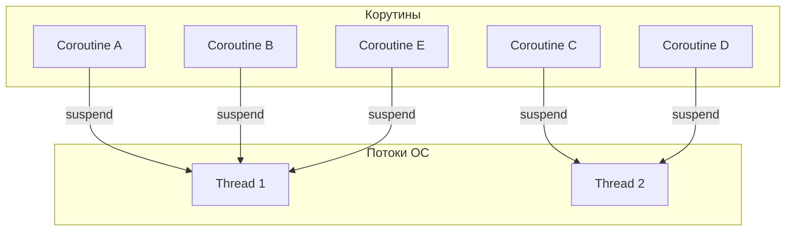
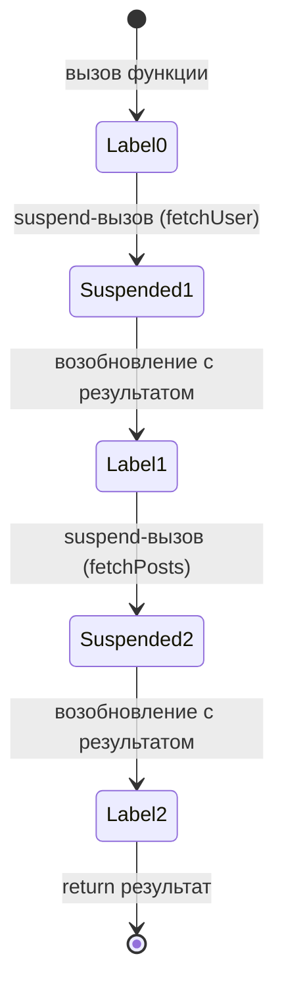
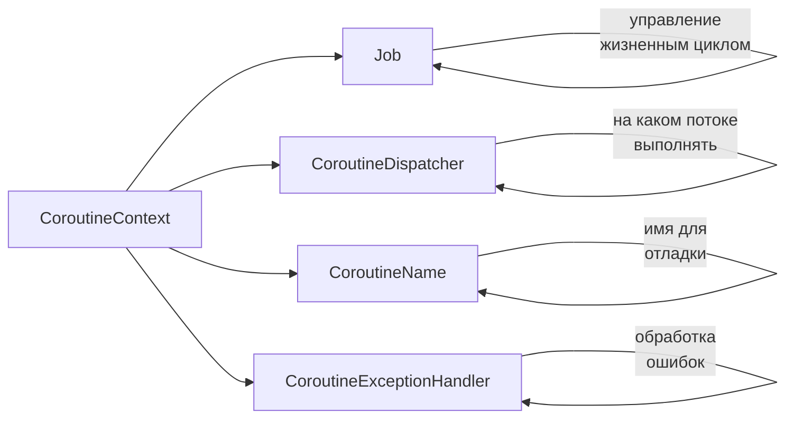
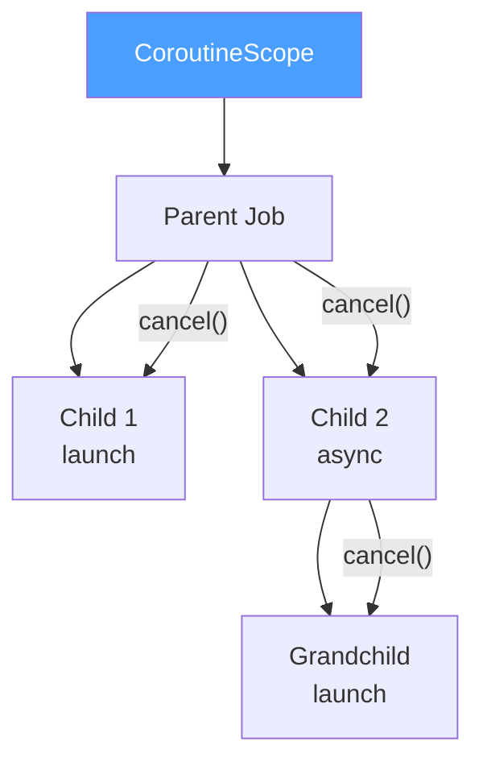
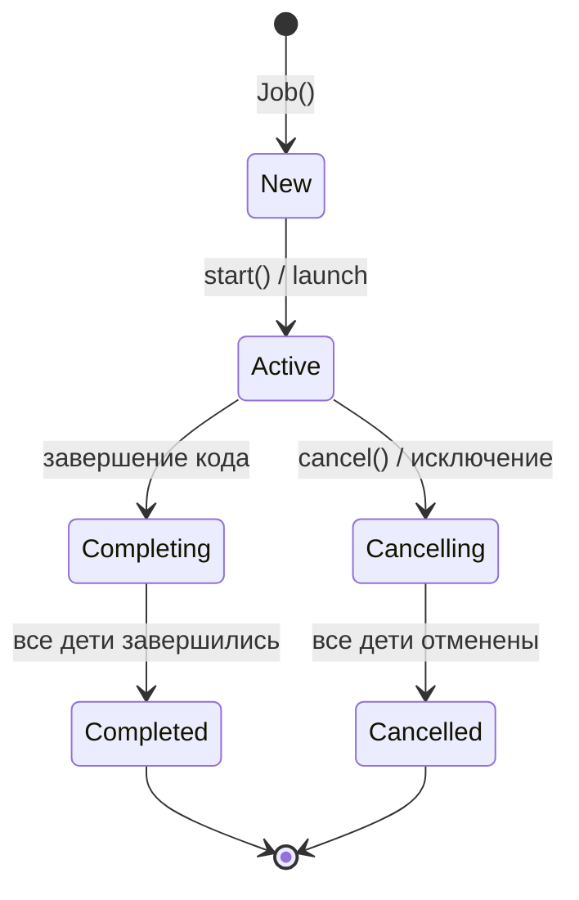
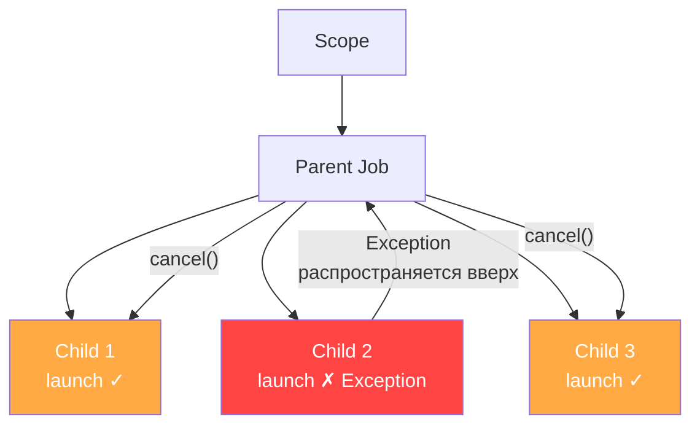
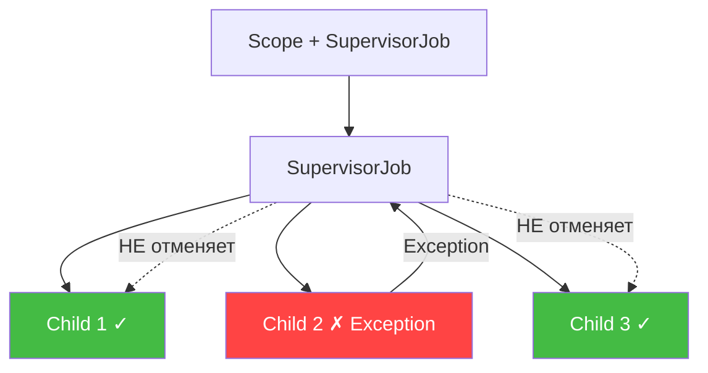
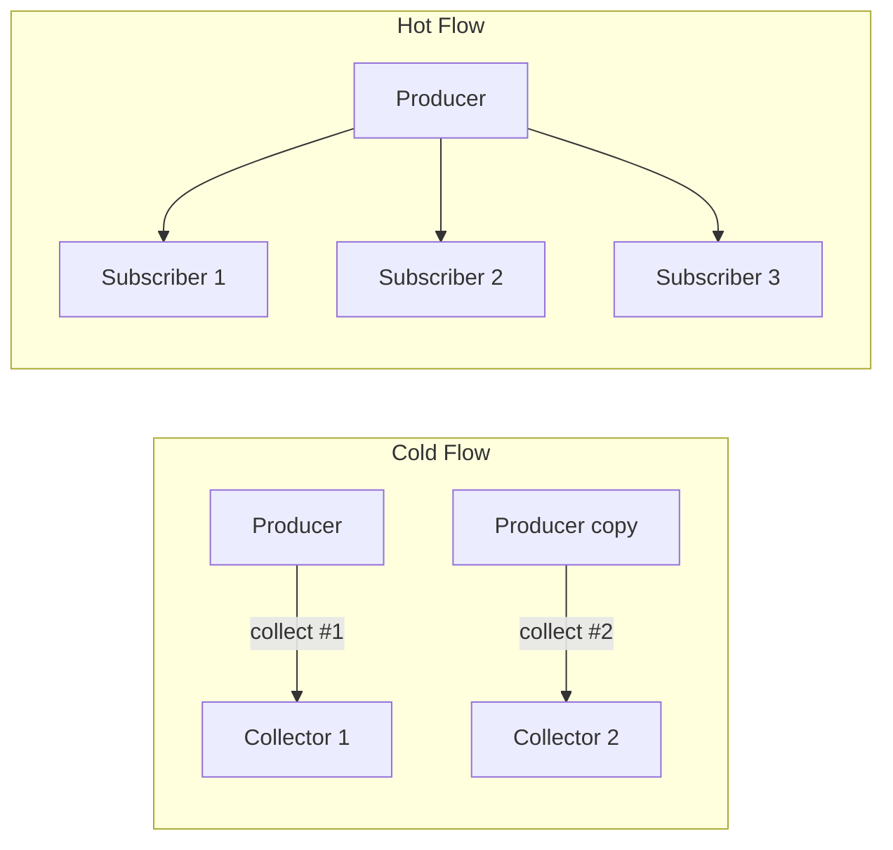
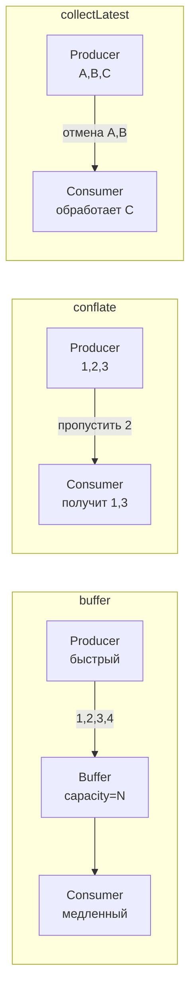

# Вопросы на собеседовании: `Kotlin Coroutines`

Полное руководство по `Kotlin Coroutines` для подготовки к собеседованию на позицию `Senior Kotlin/Java Developer`. Охватывает `structured concurrency`, `Flow`, `Channel`, диспетчеры, обработку ошибок, тестирование и интеграцию с `Spring`.

## Полезные ссылки

### Официальная документация

- [Kotlin Coroutines Guide](https://kotlinlang.org/docs/coroutines-guide.html) — официальный гайд по корутинам
- [Coroutines and Channels](https://kotlinlang.org/docs/channels.html) — документация по каналам
- [Kotlin Flow](https://kotlinlang.org/api/kotlinx.coroutines/kotlinx-coroutines-core/kotlinx.coroutines.flow/) — API-документация Flow
- [Exception Handling](https://kotlinlang.org/docs/exception-handling.html) — обработка исключений в корутинах
- [Best practices for coroutines in Android](https://developer.android.com/kotlin/coroutines/coroutines-best-practices) — рекомендации Google

### Baeldung

- [Introduction to Kotlin Coroutines — Baeldung](https://www.baeldung.com/kotlin/coroutines) — введение в корутины: launch, async, suspend
- [Coroutine Context and Dispatchers — Baeldung](https://www.baeldung.com/kotlin/coroutine-context-dispatchers) — CoroutineContext и диспетчеры
- [Threads vs Coroutines in Kotlin — Baeldung](https://www.baeldung.com/kotlin/threads-coroutines) — сравнение потоков и корутин
- [How to Run Parallel Coroutines in Kotlin — Baeldung](https://www.baeldung.com/kotlin/parallel-coroutines) — параллельный запуск корутин

## Содержание

- [Полезные ссылки](#полезные-ссылки)
- [See also](#see-also)

**Основы корутин**
- [Q1. (!) Что такое корутины и зачем они нужны?](#q1--что-такое-корутины-и-зачем-они-нужны)
- [Q2. (!) В чём разница между потоками и корутинами?](#q2--в-чём-разница-между-потоками-и-корутинами)
- [Q3. (!) Что такое `suspend`-функция и как она работает под капотом?](#q3--что-такое-suspend-функция-и-как-она-работает-под-капотом)
- [Q4. Как определить и запустить корутину?](#q4-как-определить-и-запустить-корутину)
- [Q5. (!) В чём разница между `launch` и `async`?](#q5--в-чём-разница-между-launch-и-async)
- [Q6. В чём разница между асинхронностью и параллелизмом?](#q6-в-чём-разница-между-асинхронностью-и-параллелизмом)

**Диспетчеры и контекст**
- [Q7. (!) Что такое `CoroutineContext` и из чего он состоит?](#q7--что-такое-coroutinecontext-и-из-чего-он-состоит)
- [Q8. (!) Какие `Dispatchers` существуют и когда какой использовать?](#q8--какие-dispatchers-существуют-и-когда-какой-использовать)
- [Q9. Что такое `withContext` и чем отличается от `async`?](#q9-что-такое-withcontext-и-чем-отличается-от-async)

**Structured Concurrency и Scope**
- [Q10. (!) Что такое `structured concurrency`?](#q10--что-такое-structured-concurrency)
- [Q11. (!) Что такое `CoroutineScope` и зачем он нужен?](#q11--что-такое-coroutinescope-и-зачем-он-нужен)
- [Q12. В чём разница между `GlobalScope` и scope с жизненным циклом?](#q12-в-чём-разница-между-globalscope-и-scope-с-жизненным-циклом)
- [Q13. Что такое `coroutineScope` (функция) и чем отличается от `CoroutineScope` (конструктор)?](#q13-что-такое-coroutinescope-функция-и-чем-отличается-от-coroutinescope-конструктор)
- [Q14. Что такое `runBlocking` и когда его использовать?](#q14-что-такое-runblocking-и-когда-его-использовать)

**Job, отмена и жизненный цикл**
- [Q15. (!) Что такое `Job` и каков его жизненный цикл?](#q15--что-такое-job-и-каков-его-жизненный-цикл)
- [Q16. Как отменить корутину и почему отмена кооперативна?](#q16-как-отменить-корутину-и-почему-отмена-кооперативна)
- [Q17. Что такое `yield` и `ensureActive`?](#q17-что-такое-yield-и-ensureactive)
- [Q18. Как обеспечить отмену при таймауте?](#q18-как-обеспечить-отмену-при-таймауте)

**Обработка исключений**
- [Q19. (!) Как распространяются исключения в корутинах?](#q19--как-распространяются-исключения-в-корутинах)
- [Q20. (!) Что такое `SupervisorJob` и `supervisorScope`?](#q20--что-такое-supervisorjob-и-supervisorscope)
- [Q21. (!) Что такое `CoroutineExceptionHandler` и где его устанавливать?](#q21--что-такое-coroutineexceptionhandler-и-где-его-устанавливать)
- [Q22. Чем `CancellationException` отличается от обычных исключений?](#q22-чем-cancellationexception-отличается-от-обычных-исключений)

**Flow**
- [Q23. (!) Что такое `Flow` и чем он отличается от `Sequence`?](#q23--что-такое-flow-и-чем-он-отличается-от-sequence)
- [Q24. (!) Что такое cold и hot потоки?](#q24--что-такое-cold-и-hot-потоки)
- [Q25. (!) В чём разница между `StateFlow` и `SharedFlow`?](#q25--в-чём-разница-между-stateflow-и-sharedflow)
- [Q26. Какие операторы `Flow` существуют и как они работают?](#q26-какие-операторы-flow-существуют-и-как-они-работают)
- [Q27. Как обрабатывать ошибки в `Flow`?](#q27-как-обрабатывать-ошибки-в-flow)
- [Q28. Как управлять backpressure в `Flow`?](#q28-как-управлять-backpressure-в-flow)
- [Q29. Как преобразовать cold `Flow` в hot (`shareIn`, `stateIn`)?](#q29-как-преобразовать-cold-flow-в-hot-sharein-statein)

**Channels**
- [Q30. (!) Что такое `Channel` и чем он отличается от `Flow`?](#q30--что-такое-channel-и-чем-он-отличается-от-flow)
- [Q31. Какие типы `Channel` существуют?](#q31-какие-типы-channel-существуют)
- [Q32. Что такое `produce` и `actor`?](#q32-что-такое-produce-и-actor)

**Продвинутые темы**
- [Q33. Как вызывать suspend-функции из обычного кода?](#q33-как-вызывать-suspend-функции-из-обычного-кода)
- [Q34. (!) Распространённые ошибки при работе с корутинами](#q34--распространённые-ошибки-при-работе-с-корутинами)
- [Q35. Как тестировать корутины (`runTest`, `TestScope`)?](#q35-как-тестировать-корутины-runtest-testscope)
- [Q36. Как интегрировать корутины со `Spring`?](#q36-как-интегрировать-корутины-со-spring)
- [Q37. Чем `Flow` отличается от `RxJava`?](#q37-чем-flow-отличается-от-rxjava)
- [Q38. Как работает `Mutex` в корутинах и когда использовать вместо `synchronized`?](#q38-как-работает-mutex-в-корутинах-и-когда-использовать-вместо-synchronized)
- [Q39. Как комбинировать несколько `Flow` — `combine`, `zip`, `merge`?](#q39-как-комбинировать-несколько-flow--combine-zip-merge)

---

## Q1. (!) Что такое корутины и зачем они нужны?

**Корутины** (`Coroutines`) — легковесные единицы выполнения в `Kotlin`, позволяющие писать асинхронный код в последовательном стиле. Они не являются потоками ОС — это абстракция более высокого уровня, управляемая библиотекой `kotlinx.coroutines`.

Ключевые преимущества:
- **Легковесность** — можно запустить десятки тысяч корутин без проблем с памятью (каждая занимает ~несколько сотен байт стека, в отличие от ~1 МБ у потока)
- **Последовательный стиль** — асинхронный код читается как синхронный, без callback hell
- **Кооперативная многозадачность** — корутина сама решает, когда приостановиться (в точках `suspend`)
- **Structured concurrency** — жизненный цикл корутин привязан к scope, что исключает утечки

```kotlin
// 100_000 корутин — без проблем
fun main() = runBlocking {
    repeat(100_000) {
        launch {
            delay(1000)
            print(".")
        }
    }
}
// Попробуйте то же с Thread — получите OutOfMemoryError
```

На собеседовании важно подчеркнуть: корутины — это **не потоки**, а задачи, которые выполняются на потоках из пула. Один поток может обслуживать множество корутин благодаря приостановке и возобновлению.


> [!mcq]
> - [ ] Корутина — это лёгкий поток ОС, создаваемый библиотекой `kotlinx.coroutines` поверх `Thread` | Корутина это НЕ поток ОС, а абстракция над пулом потоков. ❌ ПОСЛЕДСТВИЕ: разработчик думает что 100k корутин = 100k потоков, ставит `Thread.sleep` вместо `delay` и ловит OOM на 5K соединениях.
> - [ ] Корутина — асинхронный callback-механизм, основанный на `Future` и `CompletableFuture` | Корутины не используют callback-стиль; компилятор генерирует state machine через CPS. ❌ ПОСЛЕДСТВИЕ: команда мигрирует с `CompletableFuture` на корутины «один-к-одному» и сохраняет callback hell с `.thenCompose().thenApply()` вместо последовательного `suspend`-кода.
> - [x] Корутина — приостанавливаемая единица выполнения, компилируется в state machine; тысячи корутин выполняются на пуле потоков благодаря `suspend`-точкам | Компилятор Kotlin превращает `suspend fun` в continuation-passing-style; в точке `suspend` поток освобождается и берёт другую корутину. ✓ ПРИМЕНЯТЬ: Ktor server обслуживает 50k+ одновременных HTTP-соединений на пуле в ~CPU-cores-потоков; Android `viewModelScope` для UI-логики. 📋 ПРАВИЛО: «корутина — задача, не поток; suspend = пауза без блокировки». 🔗 См. Q2, Q3, Q10.
> - [ ] Корутина — это `Fiber` из Project Loom, заменяющий `Thread` в JVM 21+ | Корутины и virtual threads — независимые модели; корутины работают на любой JVM 8+. ❌ ПОСЛЕДСТВИЕ: разработчик в JVM 11 ждёт автоматического pinning detection как у Loom и ставит `synchronized` вокруг `delay()` — `IllegalStateException` в runtime.

## Q2. (!) В чём разница между потоками и корутинами?

| Характеристика | `Thread` | `Coroutine` |
|---|---|---|
| Управление | ОС (preemptive) | Библиотека (cooperative) |
| Память | ~1 МБ стека | ~несколько сотен байт |
| Создание | Дорого (системный вызов) | Дёшево (объект в heap) |
| Переключение контекста | Через ОС, дорого | В user-space, дёшево |
| Масштабируемость | Тысячи — предел | Миллионы — реально |
| Блокирование | Блокирует поток ОС | Приостанавливает, освобождая поток |



Ключевое отличие: поток блокируется при ожидании I/O и простаивает, а корутина **приостанавливается**, освобождая поток для другой работы. Это позволяет обслуживать тысячи одновременных запросов малым числом потоков.


> [!mcq]
> - [ ] `Thread` дешёвый (~несколько байт), а корутина дорогая (~1 МБ стека) | Перепутаны характеристики: это поток имеет ~1 МБ стека, а корутина — несколько сотен байт. ❌ ПОСЛЕДСТВИЕ: команда ставит `newFixedThreadPool(10000)` ожидая «легковесности» и получает `OutOfMemoryError: unable to create native thread`.
> - [ ] `Thread` приостанавливается без блокировки ОС, а корутина блокирует поток ОС | Поведение перепутано: блокирующий именно поток, а корутина приостанавливается через `suspend`. ❌ ПОСЛЕДСТВИЕ: разработчик заменяет `delay(1000)` на `Thread.sleep(1000)` думая «так корректнее», блокирует `Dispatchers.Default` и ловит latency p99 5s вместо 50ms.
> - [ ] Между ними нет разницы — `Coroutine` это синтаксический сахар поверх `Thread` | Это разные модели: корутина выполняется на потоках, но не отождествляется с ними. ❌ ПОСЛЕДСТВИЕ: junior смешивает `ThreadLocal` с корутинами, теряет контекст после `withContext` и получает «потерянного» текущего пользователя в request scope.
> - [x] Поток — управляемая ОС preemptive-единица (~1 МБ стека), а корутина — кооперативная задача (~сотни байт), множество корутин выполняется на одном потоке через `suspend` | Поток переключается ОС, дорого; корутина переключается в user-space через state machine, дёшево. Один поток обслуживает много корутин, освобождаясь в каждой `suspend`-точке. ✓ ПРИМЕНЯТЬ: бэкенд на Ktor с `Dispatchers.IO` (до 64 потоков) держит десятки тысяч одновременных запросов; Spring WebFlux + coroutines использует ту же модель. 📋 ПРАВИЛО: «поток — ресурс ОС, корутина — задача; suspend освобождает поток». 🔗 См. Q1, Q8, Q14.

## Q3. (!) Что такое `suspend`-функция и как она работает под капотом?

`suspend`-функция — функция, которая может быть приостановлена без блокировки потока и позже возобновлена. Вызывать её можно только из другой `suspend`-функции или из корутины.

```kotlin
suspend fun fetchUser(id: Long): User {
    val response = httpClient.get("/users/$id") // приостановка на I/O
    return response.body()                       // возобновление
}

suspend fun fetchUserWithPosts(id: Long): UserWithPosts {
    val user = fetchUser(id)                     // последовательный вызов
    val posts = fetchPosts(user.id)              // ещё одна приостановка
    return UserWithPosts(user, posts)
}
```

**Под капотом** компилятор Kotlin преобразует `suspend`-функцию в конечный автомат (state machine) через **Continuation Passing Style (CPS)**:



Компилятор добавляет скрытый параметр `Continuation<T>` к каждой `suspend`-функции. На уровне JVM сигнатура `suspend fun fetchUser(id: Long): User` превращается в `fun fetchUser(id: Long, cont: Continuation<User>): Any?`, где возвращаемое значение `COROUTINE_SUSPENDED` сигнализирует о приостановке.


> [!mcq]
> - [ ] Компилятор оборачивает `suspend fun` в новый `Thread`, который запускается при вызове | Никакой новый поток не создаётся; `suspend` — это компиляция в state machine, выполняемую на текущем потоке диспетчера. ❌ ПОСЛЕДСТВИЕ: на каждый вызов `suspend fun fetchUser()` команда ожидает создания потока, в логах видит «Thread-N» отсутствует и думает что корутины не работают.
> - [ ] `suspend` — это runtime-аннотация, проверяемая JVM при загрузке класса | `suspend` — это compile-time преобразование, не runtime-проверка; в bytecode добавляется параметр `Continuation`. ❌ ПОСЛЕДСТВИЕ: разработчик пишет reflection-вызов `method.invoke()` для `suspend`-метода, не передаёт `Continuation` и получает `IllegalArgumentException: argument count mismatch`.
> - [ ] `suspend`-функция выполняется только на `Dispatchers.IO`, потому что использует non-blocking I/O | `suspend` не привязан к диспетчеру; функция выполняется на диспетчере вызывающего scope. ❌ ПОСЛЕДСТВИЕ: команда вызывает CPU-heavy `suspend fun` на `Dispatchers.Main` Android и получает 200ms freeze UI на каждом фреймe.
> - [x] Компилятор преобразует `suspend fun` в state machine через CPS, добавляя скрытый параметр `Continuation<T>`; возврат `COROUTINE_SUSPENDED` означает приостановку | Метод сигнатуры `suspend fun fetchUser(id: Long): User` в bytecode становится `fun fetchUser(id: Long, cont: Continuation<User>): Any?`; каждая `suspend`-точка — label в state machine. ✓ ПРИМЕНЯТЬ: Kotlin compiler plugin использует тот же CPS-механизм для интеграции с `Reactor.Mono.awaitSingle()`; декомпиляция в IntelliJ показывает сгенерированный switch по labels. 📋 ПРАВИЛО: «suspend = Continuation в сигнатуре + state machine в теле». 🔗 См. Q1, Q9, Q33.

## Q4. Как определить и запустить корутину?

Для запуска корутины нужны две вещи: `CoroutineScope` и **билдер корутины** (`launch`, `async`, `runBlocking`).

```kotlin
// 1. Через runBlocking (блокирует текущий поток — только для main/тестов)
fun main() = runBlocking {
    launch {
        delay(100)
        println("World")
    }
    println("Hello")
}

// 2. Через CoroutineScope (рекомендуемый подход)
class UserService(
    private val scope: CoroutineScope = CoroutineScope(Dispatchers.Default + SupervisorJob())
) {
    fun refreshUsers() {
        scope.launch {
            val users = fetchUsers()
            cacheUsers(users)
        }
    }

    fun close() {
        scope.cancel() // отменяем все корутины при завершении
    }
}

// 3. Через coroutineScope (suspend-функция, структурированная)
suspend fun loadData() = coroutineScope {
    val user = async { fetchUser() }
    val posts = async { fetchPosts() }
    combine(user.await(), posts.await())
}
```

Не используйте `GlobalScope` в production-коде — это нарушает [structured concurrency](kotlin-coroutines-interview.md) и приводит к утечкам. Подробнее в вопросе Q12.


> [!mcq]
> - [ ] Достаточно вызвать `suspend fun` напрямую — корутина запустится автоматически | Без билдера и scope `suspend fun` нельзя вызвать из обычного кода — компилятор требует `Continuation`. ❌ ПОСЛЕДСТВИЕ: команда пишет `fun main() { fetchUser() }` в скрипте, получает ошибку компиляции «suspend function should be called only from a coroutine» и не понимает почему.
> - [ ] Использовать `GlobalScope.launch` — это и есть рекомендуемый production-подход | `GlobalScope` нарушает structured concurrency и приводит к утечкам корутин, переживающих компонент. ❌ ПОСЛЕДСТВИЕ: Android-приложение использует `GlobalScope.launch` для загрузки в `ViewModel`, после rotation корутина продолжает работу, обращается к мёртвому `LiveData` и крашит app.
> - [x] Нужны `CoroutineScope` (или `runBlocking`/`coroutineScope`) и билдер (`launch`/`async`); production-выбор — `CoroutineScope` с `SupervisorJob` или встроенный (`viewModelScope`, `lifecycleScope`) | Билдеры (`launch` для fire-and-forget, `async` для результата) расширяют `CoroutineScope`; scope управляет жизненным циклом и обеспечивает structured concurrency. ✓ ПРИМЕНЯТЬ: Android `viewModelScope` отменяет корутины при `onCleared()`; в Spring сервисе создают `CoroutineScope(Dispatchers.IO + SupervisorJob())` с `@PreDestroy { scope.cancel() }`. 📋 ПРАВИЛО: «scope + builder; scope живёт по жизненному циклу владельца». 🔗 См. Q5, Q11, Q12.
> - [ ] `runBlocking { }` — рекомендованный способ запуска корутин в Spring-контроллерах | `runBlocking` блокирует поток и допустим только в `main`/тестах, не в production-обработчиках. ❌ ПОСЛЕДСТВИЕ: команда оборачивает каждый `@GetMapping` в `runBlocking`, исчерпывает 200 потоков Tomcat при пике трафика и получает thread starvation на 5K RPS.

## Q5. (!) В чём разница между `launch` и `async`?

| | `launch` | `async` |
|---|---|---|
| Возвращает | `Job` | `Deferred<T>` (наследник `Job`) |
| Результат | Нет (fire-and-forget) | Получается через `await()` |
| Исключения | Пробрасываются в scope | Хранятся в `Deferred`, пробрасываются при `await()` |
| Когда использовать | Побочные эффекты, фоновые задачи | Параллельные вычисления с результатом |

```kotlin
// launch — для задач без результата
scope.launch {
    saveToDatabase(user)
    sendNotification(user.email)
}

// async — для параллельных вычислений
suspend fun loadDashboard(): Dashboard = coroutineScope {
    val profile = async { fetchProfile() }
    val orders = async { fetchOrders() }
    val recommendations = async { fetchRecommendations() }

    Dashboard(
        profile = profile.await(),
        orders = orders.await(),
        recommendations = recommendations.await()
    )
}
```

Частая ошибка: использование `async` без `await()`. В этом случае исключение внутри `async` будет потеряно (точнее, всё равно отменит родительский scope, но stacktrace может быть неочевидным).


> [!mcq]
> - [ ] `launch` возвращает `Deferred<T>`, `async` возвращает `Job` | Перепутаны типы: `launch` → `Job`, `async` → `Deferred<T>` (наследник `Job`). ❌ ПОСЛЕДСТВИЕ: разработчик пишет `val job: Job = scope.async { fetchUser() }` и теряет доступ к `await()`, не получает результат.
> - [ ] `launch` параллелит автоматически, `async` — последовательный билдер | Оба билдера параллельны; последовательность определяется тем, где вызывается `await()`/`join()`. ❌ ПОСЛЕДСТВИЕ: команда переписывает `async { a } ; async { b }` на `launch` ради «параллельности», теряет результат и получает `Unit` вместо данных.
> - [x] `launch` возвращает `Job` (fire-and-forget, исключение немедленно отменяет scope); `async` возвращает `Deferred<T>` (исключение пробрасывается на `await()`) | `launch` для побочных эффектов, `async` для параллельных вычислений с результатом; `async` без `await()` всё равно отменит scope, но stacktrace будет неочевидным. ✓ ПРИМЕНЯТЬ: Spring WebFlux dashboard-loader вызывает `async { fetchProfile() }` + `async { fetchOrders() }` параллельно, затем `Pair(p.await(), o.await())` для агрегации. 📋 ПРАВИЛО: «launch — Job без результата; async — Deferred с await». 🔗 См. Q4, Q9, Q19.
> - [ ] `async` гарантированно ловит исключения внутри блока, `launch` пробрасывает их сразу | Без `await()` исключение в `async` не ловится в самом блоке — оно сохраняется в `Deferred` и/или ломает scope. ❌ ПОСЛЕДСТВИЕ: команда полагается на «безопасный async», не пишет `await()`, exception утекает в `CoroutineExceptionHandler` родителя и валит соседние задачи.

## Q6. В чём разница между асинхронностью и параллелизмом?

**Асинхронность** (concurrency) — способность обрабатывать несколько задач, переключаясь между ними. Задачи могут выполняться на одном потоке, чередуясь в точках приостановки.

**Параллелизм** (parallelism) — одновременное выполнение задач на разных ядрах/потоках.

```kotlin
// Асинхронность без параллелизма (один поток, Dispatchers.Main)
suspend fun loadSequential() {
    val user = fetchUser()    // приостановка → поток свободен
    val posts = fetchPosts()  // приостановка → поток свободен
    show(user, posts)
}

// Параллелизм (задачи реально выполняются одновременно)
suspend fun loadParallel() = coroutineScope {
    val user = async(Dispatchers.IO) { fetchUser() }
    val posts = async(Dispatchers.IO) { fetchPosts() }
    show(user.await(), posts.await()) // обе загрузки идут одновременно
}
```

Корутины дают **асинхронность** из коробки. **Параллелизм** зависит от диспетчера: `Dispatchers.Default` использует пул потоков, равный числу ядер CPU.


> [!mcq]
> - [ ] Асинхронность = параллелизм, оба термина означают одновременное выполнение | Это разные вещи: асинхронность — про переключение между задачами, параллелизм — про физическую одновременность на ядрах. ❌ ПОСЛЕДСТВИЕ: команда ставит `Dispatchers.Main.limitedParallelism(1)` для async-кода, ожидает «как async» и не понимает почему задачи всё равно сериализуются.
> - [x] Асинхронность (concurrency) — переключение между задачами в точках suspend (возможно на одном потоке); параллелизм — реальное одновременное выполнение на разных ядрах CPU | Корутины дают concurrency из коробки; параллелизм зависит от диспетчера (`Default` ~CPU cores, `IO` до 64 потоков); `Dispatchers.Main.limitedParallelism(1)` — concurrency без parallelism. ✓ ПРИМЕНЯТЬ: Node.js single-thread event loop = concurrency без parallelism; `Dispatchers.Default` для CPU-bound — concurrency + parallelism. 📋 ПРАВИЛО: «concurrency — про структуру, parallelism — про железо». 🔗 См. Q5, Q8, Q10.
> - [ ] Параллелизм возможен только при наличии нескольких ядер CPU; асинхронность требует SSD | Асинхронность не зависит от типа диска — это про suspend/resume, а не про hardware. ❌ ПОСЛЕДСТВИЕ: тимлид требует «SSD для асинхронности» в проде, тратит бюджет вместо профилирования и не находит реальной причины latency.
> - [ ] Корутины обеспечивают параллелизм автоматически даже на `Dispatchers.Main` | `Dispatchers.Main` — однопоточный, корутины на нём дают только concurrency, не parallelism. ❌ ПОСЛЕДСТВИЕ: Android-разработчик запускает CPU-heavy `async(Dispatchers.Main) { sortMillionItems() }` и вешает UI на 2 секунды, ANR-репорт в Play Console.

## Q7. (!) Что такое `CoroutineContext` и из чего он состоит?

`CoroutineContext` — набор элементов, определяющих поведение корутины. Это `immutable` ассоциативная коллекция по ключам типов.

Основные элементы:



```kotlin
// Контексты можно складывать оператором +
val context = Dispatchers.IO + CoroutineName("data-loader") + SupervisorJob()

val scope = CoroutineScope(context)

// Каждая корутина наследует контекст родителя с переопределением
scope.launch(Dispatchers.Default) {
    // Job — дочерний от scope.coroutineContext[Job]
    // Dispatcher — Dispatchers.Default (переопределён)
    // Name — "data-loader" (унаследовано)
}
```

Формула наследования: `childContext = parentContext + childOverrides + Job()`. Дочерняя корутина всегда получает новый `Job`, который становится потомком родительского.


> [!mcq]
> - [ ] `CoroutineContext` — это `ThreadLocal`-обёртка для передачи данных между потоками | `CoroutineContext` — это immutable map по ключам типов, не `ThreadLocal`; для пробрасывания `ThreadLocal` нужен `asContextElement()`. ❌ ПОСЛЕДСТВИЕ: команда хранит `MDC` для логирования в `ThreadLocal`, после `withContext(Dispatchers.IO)` теряет `traceId` в логах и не может корректлировать запросы.
> - [ ] Контекст содержит только `Job` и `Dispatcher`, остальные элементы устарели | Контекст также включает `CoroutineName`, `CoroutineExceptionHandler` и custom-элементы через `AbstractCoroutineContextElement`. ❌ ПОСЛЕДСТВИЕ: разработчик не использует `CoroutineExceptionHandler`, исключения в `launch` валятся в `Thread.UncaughtExceptionHandler` без структурированного логирования.
> - [x] `CoroutineContext` — immutable ассоциативная коллекция по ключам типов; основные элементы — `Job`, `CoroutineDispatcher`, `CoroutineName`, `CoroutineExceptionHandler`; складываются оператором `+`, наследуются как `parent + child + Job()` | Каждая корутина получает новый `Job` (потомок родительского); диспетчер и имя наследуются и могут переопределяться через параметр билдера. ✓ ПРИМЕНЯТЬ: production-логгер использует `MDCContext()` из `kotlinx-coroutines-slf4j` для traceId-пропагации между `withContext`; `CoroutineName("order-loader")` помогает в дампах потоков. 📋 ПРАВИЛО: «контекст = map ключ-тип → значение; child = parent + override + new Job». 🔗 См. Q8, Q11, Q21.
> - [ ] Контекст мутируется через `context.set(key, value)` внутри корутины | Контекст immutable; для смены нужно создать новый через `+` и передать в билдер или `withContext`. ❌ ПОСЛЕДСТВИЕ: junior пытается `coroutineContext[Job]?.cancel()` чтобы заменить Job, ловит `UnsupportedOperationException` и не понимает immutable-семантику.

## Q8. (!) Какие `Dispatchers` существуют и когда какой использовать?

| Диспетчер | Пул потоков | Когда использовать |
|---|---|---|
| `Dispatchers.Default` | Общий пул, размер = CPU cores | CPU-интенсивные вычисления, сортировки, парсинг |
| `Dispatchers.IO` | Эластичный пул, до 64 потоков | Блокирующий I/O: файлы, JDBC, сеть |
| `Dispatchers.Main` | Главный поток UI | Обновление UI (Android) |
| `Dispatchers.Unconfined` | Без привязки к потоку | Тесты, специфические сценарии |

```kotlin
suspend fun processData(data: List<Item>) = coroutineScope {
    // CPU-работа на Default
    val processed = withContext(Dispatchers.Default) {
        data.map { heavyComputation(it) }
    }

    // I/O-работа на IO
    withContext(Dispatchers.IO) {
        database.saveAll(processed)
    }
}
```

`Dispatchers.Default` и `Dispatchers.IO` делят потоки — переключение между ними не вызывает реального переключения контекста потока, если поток уже подходит.

`Dispatchers.IO` можно расширить через `limitedParallelism(n)` для изоляции:

```kotlin
// Выделенный пул из 4 потоков для тяжёлых I/O-операций
val dbDispatcher = Dispatchers.IO.limitedParallelism(4)

suspend fun queryDb() = withContext(dbDispatcher) {
    jdbc.query("SELECT * FROM users")
}
```


> [!mcq]
> - [ ] Для блокирующих JDBC-запросов следует использовать `Dispatchers.Default` | `Default` имеет пул размером с CPU cores; блокировка JDBC-вызовом займёт все потоки и заблокирует CPU-задачи. ❌ ПОСЛЕДСТВИЕ: команда ставит `withContext(Dispatchers.Default) { jdbc.query(...) }` на 8-ядерном проде, при 50 одновременных запросах thread pool забит, latency p99 растёт с 100ms до 5s.
> - [x] `Default` — CPU-bound (пул = ядрам); `IO` — блокирующий I/O (эластичный, до 64); `Main` — UI-поток (Android); `Unconfined` — без привязки (тесты); для изоляции делают `Dispatchers.IO.limitedParallelism(N)` | `Default` для парсинга/сортировки; `IO` для JDBC/файлов/сети; `Main` для UI-обновлений; `IO.limitedParallelism(N)` создаёт выделенный пул, разделяющий потоки с общим IO. ✓ ПРИМЕНЯТЬ: Spring сервис с HikariCP размер 20 настраивает `Dispatchers.IO.limitedParallelism(20)` чтобы не превысить пул; Android `viewModelScope.launch(Dispatchers.Default) { sort() }`. 📋 ПРАВИЛО: «Default — CPU, IO — блокирующий, Main — UI; limitedParallelism для изоляции». 🔗 См. Q7, Q9, Q14.
> - [ ] `Dispatchers.IO` использует non-blocking NIO под капотом, поэтому подходит для CPU | `IO` — это пул потоков для блокирующих вызовов, не NIO; для CPU-heavy он будет забит долгими задачами. ❌ ПОСЛЕДСТВИЕ: команда выполняет ML-inference на `Dispatchers.IO` ожидая «эластичности», 64 потока заняты parsing'ом, реальные I/O-запросы стоят в очереди.
> - [ ] `Dispatchers.Main` доступен в любом приложении и подходит для бэкенда | `Main` — это UI-диспетчер Android/Swing, на сервере его инициализация падает с `IllegalStateException: Module with the Main dispatcher is missing`. ❌ ПОСЛЕДСТВИЕ: разработчик копирует Android-сниппет `viewModelScope.launch(Dispatchers.Main)` в Spring-сервис, при старте получает падение с непонятной ошибкой про missing dispatcher.

## Q9. Что такое `withContext` и чем отличается от `async`?

`withContext` — suspend-функция, переключающая контекст выполнения и **последовательно** ожидающая результат. `async` — запускает **параллельную** корутину и возвращает `Deferred`.

```kotlin
// withContext — последовательное переключение
suspend fun loadUser(): User = withContext(Dispatchers.IO) {
    repository.findUser()  // переключились на IO, дождались результата
}

// async — параллельный запуск
suspend fun loadAll() = coroutineScope {
    val user = async(Dispatchers.IO) { repository.findUser() }
    val orders = async(Dispatchers.IO) { repository.findOrders() }
    Pair(user.await(), orders.await())  // оба запроса параллельно
}
```

Правило: если вам нужен один результат и последовательное переключение контекста — используйте `withContext`. Если нужно запустить несколько задач параллельно — используйте `async` + `await`.


> [!mcq]
> - [ ] `withContext(Dispatchers.IO) { ... }` запускает параллельную задачу и возвращает `Deferred` | `withContext` НЕ запускает параллельную задачу — он переключает контекст и последовательно ждёт результат, возвращая его напрямую. ❌ ПОСЛЕДСТВИЕ: разработчик пишет `val d = withContext(Dispatchers.IO) { fetch() }; d.await()`, ловит ошибку компиляции и не понимает что `withContext` уже вернул значение.
> - [x] `withContext` — `suspend`-функция, переключающая контекст и последовательно ждущая результата (одна задача); `async` запускает параллельную корутину и возвращает `Deferred<T>` для `await()` | Использовать `withContext` для одиночного переключения диспетчера; `async` — для нескольких параллельных задач с агрегацией. ✓ ПРИМЕНЯТЬ: типичный Spring service-метод `suspend fun findUser() = withContext(Dispatchers.IO) { repo.find() }`; для дашборда — `coroutineScope { val a = async {...}; val b = async {...}; ... }`. 📋 ПРАВИЛО: «withContext — переключи и жди; async — запусти и потом await». 🔗 См. Q5, Q8, Q33.
> - [ ] `withContext` и `async` — синонимы, выбор зависит от стиля команды | Это разные инструменты с разной семантикой: последовательная vs параллельная. ❌ ПОСЛЕДСТВИЕ: команда заменяет 5 параллельных `async` на 5 последовательных `withContext`, latency дашборда растёт с 200ms до 1000ms.
> - [ ] `withContext` блокирует поток на время выполнения блока | `withContext` НЕ блокирует — это `suspend`-функция, которая приостанавливает корутину и освобождает поток. ❌ ПОСЛЕДСТВИЕ: тимлид запрещает `withContext(Dispatchers.IO)` ради «не блокировать поток», команда пишет всё на `Default` и ловит pool starvation на JDBC-запросах.

## Q10. (!) Что такое `structured concurrency`?

**Structured concurrency** — принцип, при котором жизненный цикл корутин строго привязан к области (`scope`). Ключевые гарантии:

1. **Корутина не может «утечь»** — она всегда запускается внутри scope
2. **Родитель ждёт детей** — scope не завершится, пока все дочерние корутины не завершатся
3. **Отмена распространяется вниз** — отмена scope отменяет всех детей
4. **Ошибки распространяются вверх** — исключение в ребёнке отменяет родителя (если не `SupervisorJob`)



```kotlin
suspend fun fetchAllData() = coroutineScope {
    // Если любой async упадёт — отменятся все остальные
    val users = async { fetchUsers() }
    val products = async { fetchProducts() }

    processData(users.await(), products.await())
}
// Вызывающий код гарантированно получит результат или исключение
// Никаких "забытых" корутин, работающих в фоне
```

Без structured concurrency (например, при использовании `GlobalScope`) легко получить «зомби-корутины», которые продолжают работать после уничтожения компонента.


> [!mcq]
> - [ ] Structured concurrency — это паттерн для запуска корутин на одном выделенном потоке | Concurrency-модель структуры жизненного цикла, не одного потока; работает с любым диспетчером и пулом. ❌ ПОСЛЕДСТВИЕ: команда запускает все корутины на `newSingleThreadContext("worker")` ради «structured», теряет параллелизм CPU-задач на 8 ядрах.
> - [ ] `GlobalScope.launch` соответствует principles structured concurrency | `GlobalScope` явно нарушает structured concurrency, потому что не привязан к жизненному циклу владельца. ❌ ПОСЛЕДСТВИЕ: фоновая `GlobalScope.launch { syncToServer() }` живёт после закрытия Activity, держит ссылку на ViewModel и течёт ~50MB на каждый rotation.
> - [x] Принцип «корутина не утекает: запускается в scope, родитель ждёт детей, отмена идёт вниз, ошибки идут вверх» — гарантирует, что иерархия корутин завершится синхронно с владельцем | Без structured concurrency возникают «зомби-корутины»; с ней — `cancel()` scope каскадно отменяет всех детей, исключение в ребёнке отменяет родителя (или останавливается на `SupervisorJob`). ✓ ПРИМЕНЯТЬ: Android `viewModelScope` отменяет всех детей при `onCleared()`; Spring `@PreDestroy { scope.cancel() }` гарантирует отсутствие фоновых задач после shutdown. 📋 ПРАВИЛО: «scope владеет корутинами; cancel — каскадно вниз, exception — каскадно вверх». 🔗 См. Q11, Q12, Q19.
> - [ ] Это запрет на использование `async` — только `launch` обеспечивает structured concurrency | `async` тоже structured когда вызывается внутри scope/`coroutineScope`; запрет — только на запуск без scope. ❌ ПОСЛЕДСТВИЕ: тимлид запрещает `async` командно, команда теряет параллельные `await` и пишет последовательные `withContext`, latency растёт в N раз.

## Q11. (!) Что такое `CoroutineScope` и зачем он нужен?

`CoroutineScope` — интерфейс с единственным свойством `coroutineContext`. Он задаёт границу жизненного цикла корутин и обеспечивает structured concurrency.

```kotlin
// Создание scope с привязкой к жизненному циклу
class OrderService : AutoCloseable {
    private val scope = CoroutineScope(
        Dispatchers.Default + SupervisorJob() + CoroutineName("order-service")
    )

    fun processOrderAsync(order: Order) {
        scope.launch {
            validateOrder(order)
            saveOrder(order)
            notifyCustomer(order)
        }
    }

    override fun close() {
        scope.cancel() // все корутины будут отменены
    }
}
```

В Android доступны готовые scopes:
- `viewModelScope` — привязан к жизненному циклу `ViewModel`
- `lifecycleScope` — привязан к `Lifecycle` компонента

В серверных приложениях scope обычно создаётся вручную и привязывается к жизненному циклу сервиса или запроса.


> [!mcq]
> - [ ] `CoroutineScope` — статический singleton, доступный из любого места приложения | `CoroutineScope` — обычный интерфейс, экземпляры создаются под конкретный жизненный цикл; глобальный singleton — это `GlobalScope` (anti-pattern). ❌ ПОСЛЕДСТВИЕ: команда делает `object AppScope : CoroutineScope by CoroutineScope(...)` как singleton, забывает `cancel()`, на shutdown остаются фоновые HTTP-вызовы.
> - [x] `CoroutineScope` — интерфейс с одним свойством `coroutineContext`; задаёт границу жизненного цикла; в production создают с `SupervisorJob` + диспетчером и отменяют в `close()/onCleared()/@PreDestroy` | Готовые scopes: `viewModelScope` (Android), `lifecycleScope`, custom через `CoroutineScope(Dispatchers.Default + SupervisorJob() + CoroutineName("..."))`; для serverside — привязка к жизненному циклу сервиса/запроса. ✓ ПРИМЕНЯТЬ: Android `viewModelScope` встроен в Architecture Components; в Spring `@Service` с `@PreDestroy { scope.cancel() }` гарантирует чистое завершение. 📋 ПРАВИЛО: «scope = граница жизни; всегда cancel в финализаторе владельца». 🔗 См. Q10, Q12, Q15.
> - [ ] Scope можно использовать без `Job` — это рекомендованный production-подход | Без `Job` в контексте scope не сможет отменять корутины; `CoroutineScope(Dispatchers.IO)` без Job всё равно создаёт `Job()` неявно, но без `SupervisorJob` ошибка одного ребёнка валит scope. ❌ ПОСЛЕДСТВИЕ: команда создаёт `CoroutineScope(Dispatchers.IO)` для batch-импортов, одна неудача парсера отменяет все остальные импорты.
> - [ ] `CoroutineScope` блокирует текущий поток при создании, как `runBlocking` | Создание scope не блокирует — это просто конструкция объекта; блокировка происходит только в `runBlocking`. ❌ ПОСЛЕДСТВИЕ: разработчик боится «блокировки» в `init { val scope = CoroutineScope(...) }`, лезет в `Thread { ... }.start()` и получает thread-leak.

## Q12. В чём разница между `GlobalScope` и scope с жизненным циклом?

`GlobalScope` — scope с жизненным циклом приложения. Корутины в нём **не отменяются автоматически** при уничтожении компонента.

```kotlin
// ПЛОХО — утечка корутины
class MyViewModel {
    fun load() {
        GlobalScope.launch {
            val data = fetchData() // продолжит работу после уничтожения ViewModel
            updateUI(data)         // crash: ViewModel уже уничтожена
        }
    }
}

// ХОРОШО — корутина отменится вместе с ViewModel
class MyViewModel : ViewModel() {
    fun load() {
        viewModelScope.launch {
            val data = fetchData()
            updateUI(data)
        }
    }
}
```

`GlobalScope` допустим только для операций, которые должны жить всё время работы приложения (фоновая синхронизация, метрики). В остальных случаях — scope с жизненным циклом.


> [!mcq]
> - [x] `GlobalScope` — scope с жизненным циклом приложения; не отменяется автоматически и нарушает structured concurrency, поэтому в production-коде используют scope с явным жизненным циклом (`viewModelScope`, custom `CoroutineScope` с `cancel()`) | `GlobalScope.launch` живёт пока живо приложение, переживает компонент-владелец, ведёт к утечкам и crash при доступе к destroyed-объектам. ✓ ПРИМЕНЯТЬ: Android Architecture Components отменяют `viewModelScope` при `onCleared()`; Spring сервис с `@PreDestroy { scope.cancel() }` обеспечивает graceful shutdown; `GlobalScope` допустим только для метрик/синхронизации, живущих всё время жизни приложения. 📋 ПРАВИЛО: «GlobalScope = утечка по умолчанию; scope с lifecycle = безопасность по умолчанию». 🔗 См. Q10, Q11, Q34.
> - [ ] `GlobalScope.launch` отменяется автоматически при выходе из enclosing-функции | `GlobalScope` живёт всё время приложения и не зависит от стека вызовов. ❌ ПОСЛЕДСТВИЕ: разработчик ожидает «автоматической отмены» при выходе из функции, не пишет `cancel()`, корутины висят в памяти и ловят `IllegalStateException` при доступе к закрытым ресурсам.
> - [ ] `GlobalScope` и `CoroutineScope(Dispatchers.IO)` функционально идентичны | `CoroutineScope(...)` создаёт явный объект для управления, `GlobalScope` — статический singleton без жизненного цикла. ❌ ПОСЛЕДСТВИЕ: команда меняет `CoroutineScope(Dispatchers.IO)` на `GlobalScope` ради «сокращения кода», теряет возможность `cancel()` при graceful shutdown.
> - [ ] Современный Kotlin удалил `GlobalScope`, поэтому различия больше неактуальны | `GlobalScope` существует, но помечен `@DelicateCoroutinesApi` и требует opt-in. ❌ ПОСЛЕДСТВИЕ: senior отвечает на собеседовании «удалили», теряет балл, junior использует `@OptIn(DelicateCoroutinesApi::class) GlobalScope` без понимания почему API «delicate».

## Q13. Что такое `coroutineScope` (функция) и чем отличается от `CoroutineScope` (конструктор)?

- `CoroutineScope(context)` — **конструктор**, создающий новый scope для запуска корутин. Не является suspend-функцией.
- `coroutineScope { }` — **suspend-функция**, создающая вложенный scope и ожидающая завершения всех дочерних корутин.

```kotlin
// coroutineScope — приостанавливает до завершения всех детей
suspend fun loadAllData(): Pair<User, List<Post>> = coroutineScope {
    val user = async { fetchUser() }
    val posts = async { fetchPosts() }
    Pair(user.await(), posts.await())
}
// Вызывающая корутина продолжится только когда обе задачи завершатся

// CoroutineScope — создаёт независимый scope
val myScope = CoroutineScope(Dispatchers.IO + SupervisorJob())
myScope.launch { /* живёт независимо от вызывающего кода */ }
```

`coroutineScope` используют для параллельной декомпозиции внутри suspend-функций. `CoroutineScope` — для создания scope с явным управлением жизненным циклом.


> [!mcq]
> - [ ] `coroutineScope { }` и `CoroutineScope(...)` — два названия одной функции | Это разные сущности: одна — `suspend`-функция (нижний регистр), другая — конструктор интерфейса (верхний регистр). ❌ ПОСЛЕДСТВИЕ: junior пишет `val scope = coroutineScope { ... }` ожидая объект, ловит ошибку компиляции и не понимает разницу.
> - [x] `coroutineScope { }` — `suspend`-функция, создающая вложенный scope, ждёт завершения всех детей перед возвратом; `CoroutineScope(context)` — конструктор для независимого scope с явным жизненным циклом | `coroutineScope` для параллельной декомпозиции внутри suspend-функций; `CoroutineScope(...)` — для сервисов/компонентов, где нужен явный `cancel()`. ✓ ПРИМЕНЯТЬ: Spring `suspend fun loadDashboard() = coroutineScope { val a = async{...}; ... }` — параллельная агрегация без утечек; `class OrderService : AutoCloseable { val scope = CoroutineScope(...) }` для долгоживущего сервиса. 📋 ПРАВИЛО: «coroutineScope — параллелизм внутри suspend; CoroutineScope — сервис с lifecycle». 🔗 См. Q11, Q12, Q19.
> - [ ] `coroutineScope` запускается на отдельном потоке, `CoroutineScope` — на текущем | Оба используют диспетчер из контекста; различие — в семантике (suspend vs constructor), не в потоке. ❌ ПОСЛЕДСТВИЕ: разработчик ставит `coroutineScope { heavyWork() }` ожидая «отдельный поток», CPU-задача выполняется на `Main` и блокирует UI.
> - [ ] `CoroutineScope` устарел, нужно использовать только `coroutineScope` | Оба активны и не взаимозаменяемы; `CoroutineScope` — единственный способ создать долгоживущий scope. ❌ ПОСЛЕДСТВИЕ: тимлид требует везде писать `coroutineScope { }`, команда теряет возможность отменять корутины из метода `close()` сервиса.

## Q14. Что такое `runBlocking` и когда его использовать?

`runBlocking` — **блокирующий** строитель корутин: он блокирует текущий поток до завершения всех корутин внутри блока.

```kotlin
// Допустимо: main-функция
fun main() = runBlocking {
    val result = async { computeAnswer() }
    println("Answer: ${result.await()}")
}

// Допустимо: тесты
@Test
fun `test coroutine`() = runBlocking {
    val result = myService.fetchData()
    assertEquals("expected", result)
}

// НЕДОПУСТИМО: внутри корутины или на Dispatchers.Main
scope.launch {
    runBlocking { /* DEADLOCK! */ }
}
```

В production-серверном коде `runBlocking` использовать не следует — он блокирует поток и может привести к `deadlock`. Используйте `suspend`-функции и `coroutineScope` вместо этого.


> [!mcq]
> - [ ] `runBlocking` — рекомендованный production-инструмент для каждого Spring-контроллера | `runBlocking` блокирует поток до завершения и ломает асинхронную модель; в Spring используют `suspend`-контроллеры WebFlux. ❌ ПОСЛЕДСТВИЕ: команда оборачивает каждый `@GetMapping` в `runBlocking`, при пике 10K RPS Tomcat threads заняты, latency p99 5s, throughput падает.
> - [ ] `runBlocking` неблокирующий — он использует suspend и работает как `coroutineScope` | `runBlocking` явно блокирует текущий поток до завершения; имя отражает поведение. ❌ ПОСЛЕДСТВИЕ: разработчик ставит `runBlocking { delay(60_000) }` на `Dispatchers.Main` Android, UI замораживается на минуту, ANR в Play Console.
> - [x] `runBlocking` — блокирующий билдер: блокирует текущий поток до завершения всех детей; допустим в `main`, тестах, Java-interop bridges; запрещён внутри корутин или на UI-потоках (deadlock) | Это мост из обычного кода в корутины; в production-серверном коде заменяется `suspend`-функциями и `coroutineScope`. ✓ ПРИМЕНЯТЬ: `fun main() = runBlocking { ... }` для CLI-утилит; `@Test fun `...` () = runBlocking { ... }` для legacy-тестов (или `runTest` из coroutines-test). 📋 ПРАВИЛО: «runBlocking — мост из sync в coroutine; только на границах, не в проде». 🔗 См. Q4, Q13, Q35.
> - [ ] Вложенный `runBlocking` внутри корутины безопасен — компилятор оптимизирует | Вложенный `runBlocking` на ограниченном диспетчере (`Main`, `Default`) приводит к deadlock; компилятор не оптимизирует. ❌ ПОСЛЕДСТВИЕ: команда вкладывает `runBlocking` в `launch { runBlocking { ... } }`, на `Dispatchers.Default` (8 потоков) при 10 одновременных вызовах все потоки ждут друг друга, вечный deadlock.

## Q15. (!) Что такое `Job` и каков его жизненный цикл?

`Job` — элемент `CoroutineContext`, представляющий управляемую единицу работы. Каждая корутина имеет свой `Job`.



```kotlin
val job = scope.launch {
    println("Working...")
    delay(1000)
    println("Done")
}

println(job.isActive)      // true
println(job.isCompleted)   // false
println(job.isCancelled)   // false

job.cancel()               // переход в Cancelling
job.join()                 // ожидание завершения

println(job.isCancelled)   // true
println(job.isCompleted)   // true (Cancelled — финальное состояние)
```

Разница между `Job` и `CoroutineScope`: `Job` управляет состоянием одной корутины (или иерархии), а `CoroutineScope` — контейнер контекста для запуска корутин. Scope содержит `Job` как элемент контекста.


> [!mcq]
> - [ ] `Job.cancel()` мгновенно завершает корутину с `InterruptedException` | Отмена кооперативна: `cancel()` устанавливает флаг, корутина проверяет его в suspend-точках и бросает `CancellationException`; `InterruptedException` тут ни при чём. ❌ ПОСЛЕДСТВИЕ: команда ловит `InterruptedException` после `job.cancel()`, никогда не срабатывает, ресурсы не освобождаются.
> - [ ] `Job` имеет два состояния: `Active` и `Completed`, без промежуточных | `Job` имеет состояния New/Active/Completing/Cancelling/Cancelled/Completed; промежуточные нужны для каскадной отмены детей. ❌ ПОСЛЕДСТВИЕ: разработчик ждёт `job.isCompleted == true` после `cancel()`, не учитывает `Cancelling` фазу, в которой `isActive == false && isCompleted == false`, и пишет race condition в shutdown-логике.
> - [x] `Job` — элемент `CoroutineContext`, представляющий управляемую единицу работы; жизненный цикл: New → Active → Completing → Completed (или Cancelling → Cancelled) | `cancel()` переводит в Cancelling, ждёт завершения детей, затем переходит в Cancelled — финальное состояние, при этом `isCompleted == true && isCancelled == true`. ✓ ПРИМЕНЯТЬ: Spring сервис `scope.coroutineContext[Job]?.cancelChildren()` отменяет все активные операции при shutdown, `job.invokeOnCompletion { ... }` — для callback'ов на завершение. 📋 ПРАВИЛО: «Job — управляемая работа: New→Active→Completing→Completed | Cancelling→Cancelled». 🔗 См. Q11, Q16, Q22.
> - [ ] `Job` создаётся только через `Job()` фабрику; `launch` не создаёт `Job` | Каждый `launch`/`async` возвращает `Job`/`Deferred` (наследник Job); `Job()` — для root-job в кастомных scopes. ❌ ПОСЛЕДСТВИЕ: разработчик пишет `Job().also { scope.launch(it) { ... } }` вручную для каждого launch, теряет parent-child связь и ломает structured concurrency.

## Q16. Как отменить корутину и почему отмена кооперативна?

Отмена в корутинах **кооперативна**: вызов `cancel()` лишь устанавливает флаг, а корутина должна сама проверять его в точках приостановки.

```kotlin
val job = scope.launch {
    repeat(1000) { i ->
        println("Processing $i")
        delay(100) // <-- проверка отмены происходит здесь
    }
}

delay(350)
job.cancel()    // устанавливает флаг
job.join()      // ждём завершения
// или job.cancelAndJoin()
```

Если корутина выполняет CPU-работу без точек приостановки, она **не отменится**:

```kotlin
// ПЛОХО — не отменяется
val job = scope.launch(Dispatchers.Default) {
    var i = 0
    while (i < 1_000_000) {
        // Тяжёлое вычисление без проверки отмены
        i++
    }
}

// ХОРОШО — проверяем отмену
val job = scope.launch(Dispatchers.Default) {
    var i = 0
    while (isActive && i < 1_000_000) { // проверяем isActive
        i++
    }
}
```

Все стандартные suspend-функции (`delay`, `yield`, `withContext`, операции I/O) проверяют отмену.


> [!mcq]
> - [ ] Отмена прерывает корутину преимптивно — как `Thread.interrupt()` | Отмена кооперативна: устанавливает флаг, корутина должна сама проверить (через `isActive`/`yield`/`ensureActive`/любую suspend-функцию из stdlib). ❌ ПОСЛЕДСТВИЕ: команда запускает CPU-цикл `while (i < 1_000_000) i++` без `isActive`, `cancel()` ничего не делает, корутина «бессмертна» и держит память.
> - [ ] `cancel()` работает только если корутина запущена через `async`, не `launch` | `cancel()` работает на любом `Job`, включая `launch` и `async`. ❌ ПОСЛЕДСТВИЕ: разработчик переписывает все корутины на `async` ради «возможности cancel», теряет fire-and-forget семантику и получает забытые `Deferred` без `await`.
> - [x] `cancel()` устанавливает флаг отмены; корутина должна проверять его в suspend-точках (`delay`, `yield`, `withContext`, I/O) или явно через `isActive`/`ensureActive`; CPU-циклы без проверок не отменяются | Все стандартные suspend-функции уже бросают `CancellationException` при отмене; для tight-loop CPU-кода нужно вручную `while (isActive)` или `ensureActive()`. ✓ ПРИМЕНЯТЬ: батч-обработчик в Spring `forEach { item -> ensureActive(); process(item) }` гарантирует graceful cancel при `@PreDestroy`; Android image processing в `viewModelScope` использует `yield()` для отмены при rotation. 📋 ПРАВИЛО: «отмена = флаг + проверка в suspend; CPU-циклы зовут ensureActive вручную». 🔗 См. Q15, Q17, Q22.
> - [ ] Если корутина «зависла» в `Thread.sleep()`, `cancel()` её разбудит | `Thread.sleep` блокирует поток, не приостанавливает корутину; cancel установит флаг, но корутина проверит его только после sleep. ❌ ПОСЛЕДСТВИЕ: команда пишет `delay(5000)` → `Thread.sleep(5000)` «для тестов», в production graceful shutdown ждёт 5 секунд каждой корутины перед k8s killing.

## Q17. Что такое `yield` и `ensureActive`?

Обе функции обеспечивают кооперативную проверку отмены:

| | `yield()` | `ensureActive()` |
|---|---|---|
| Тип | `suspend`-функция | Обычная функция |
| Действие | Приостанавливает корутину, отдаёт поток другим, проверяет отмену | Только проверяет `isActive`, бросает `CancellationException` |
| Когда использовать | В тяжёлых циклах, когда нужно дать другим корутинам поработать | Когда нужна только проверка отмены без приостановки |

```kotlin
// yield — приостанавливает и проверяет отмену
scope.launch {
    hugeList.forEach { item ->
        processItem(item)
        yield() // даём другим корутинам шанс выполниться
    }
}

// ensureActive — только проверяет, не приостанавливает
scope.launch {
    hugeList.forEach { item ->
        ensureActive() // бросит CancellationException если отменена
        processItem(item)
    }
}
```


> [!mcq]
> - [ ] `yield()` и `ensureActive()` идентичны и взаимозаменяемы | Они различаются: `yield()` приостанавливает (отдаёт поток другим корутинам) + проверяет отмену; `ensureActive()` только бросает `CancellationException` при отмене, не приостанавливает. ❌ ПОСЛЕДСТВИЕ: команда ставит `yield()` в hot loop ради «только проверки cancel», получает context switching overhead и снижение throughput на 30%.
> - [x] `yield()` — `suspend`-функция: приостанавливает, отдаёт поток другим, проверяет отмену; `ensureActive()` — обычная функция: только проверяет `isActive` и бросает `CancellationException`, не приостанавливает | `yield()` для cooperation в тяжёлых циклах; `ensureActive()` — лёгкая проверка отмены без overhead приостановки. ✓ ПРИМЕНЯТЬ: PDF-парсер бэкенда вызывает `ensureActive()` каждые 100 страниц для быстрой реакции на cancel; image-processor зовёт `yield()` между фильтрами, чтобы дать другим корутинам шанс. 📋 ПРАВИЛО: «yield — пауза + check; ensureActive — только check». 🔗 См. Q16, Q18, Q22.
> - [ ] `yield()` блокирует поток, `ensureActive()` неблокирующий | `yield()` приостанавливает (suspend), не блокирует; оба не блокируют поток. ❌ ПОСЛЕДСТВИЕ: тимлид запрещает `yield()` ради «не блокировать», команда теряет cooperation и одна тяжёлая корутина монополизирует поток `Default`.
> - [ ] `ensureActive()` доступен только внутри `withContext` блоков | `ensureActive()` — extension на `CoroutineContext`/`Job`; работает в любой корутине с доступом к `coroutineContext`. ❌ ПОСЛЕДСТВИЕ: разработчик оборачивает каждую проверку в `withContext(coroutineContext) { ensureActive() }`, добавляет ненужный overhead.

## Q18. Как обеспечить отмену при таймауте?

`withTimeout` и `withTimeoutOrNull` ограничивают время выполнения блока:

```kotlin
// withTimeout — бросает TimeoutCancellationException
try {
    val result = withTimeout(3000) {
        fetchDataFromSlowApi()
    }
} catch (e: TimeoutCancellationException) {
    println("Запрос превысил 3 секунды")
}

// withTimeoutOrNull — возвращает null при таймауте (удобнее)
val result = withTimeoutOrNull(3000) {
    fetchDataFromSlowApi()
} ?: fallbackValue
```

Таймаут работает кооперативно: если внутри блока нет точек приостановки, отмена сработает только при следующей проверке. Для гарантии добавляйте `ensureActive()` или `yield()` в тяжёлых вычислениях.


> [!mcq]
> - [ ] Использовать `Thread { sleep(timeout); job.cancel() }.start()` для таймаута | Это создаёт лишний поток и не интегрирован с structured concurrency; коробочное решение — `withTimeout`. ❌ ПОСЛЕДСТВИЕ: команда стартует Thread на каждый запрос, при 1000 RPS получает 1000 лишних потоков OS, OOM `unable to create native thread`.
> - [ ] `withTimeout` блокирует поток на указанное время | `withTimeout` — `suspend`-функция с виртуальным таймером; не блокирует поток. ❌ ПОСЛЕДСТВИЕ: разработчик боится `withTimeout(60_000)` ради «не блокировать минуту», вообще убирает таймауты, hung HTTP-запросы держат соединения 5 минут до TCP timeout.
> - [x] `withTimeout(ms) { ... }` бросает `TimeoutCancellationException`, `withTimeoutOrNull(ms) { ... }` возвращает `null`; работает кооперативно — внутри блока должны быть suspend-точки или `ensureActive()` | Таймаут срабатывает только в точках приостановки; для CPU-циклов нужно вставлять `yield()`/`ensureActive()`. ✓ ПРИМЕНЯТЬ: микросервис на Ktor `withTimeout(3000) { httpClient.get(url) }` гарантирует SLA при медленном downstream; Resilience4j-style паттерн через `withTimeoutOrNull(...) ?: fallback`. 📋 ПРАВИЛО: «withTimeout — таймер на блок; withTimeoutOrNull — fallback null». 🔗 См. Q16, Q17, Q22.
> - [ ] `withTimeout` отменяет родительский scope при истечении времени | `withTimeout` бросает `TimeoutCancellationException` (наследник `CancellationException`), отменяет только свой блок, не родителя. ❌ ПОСЛЕДСТВИЕ: разработчик ловит `try { withTimeout(...) }` ожидая что родитель тоже умер, при retry-логике бесконечный цикл, потому что родитель жив.

## Q19. (!) Как распространяются исключения в корутинах?

Правила распространения зависят от билдера:

- **`launch`** — исключение немедленно отменяет родительский `Job` и всех его детей
- **`async`** — исключение сохраняется в `Deferred` и пробрасывается при вызове `await()`



```kotlin
// Исключение в одном ребёнке отменяет всех
scope.launch {
    launch { fetchUsers() }           // будет отменена
    launch { error("Boom!") }         // ← исключение
    launch { fetchProducts() }        // будет отменена
}
```

Подробнее об обработке исключений — в [вопросах по исключениям Kotlin](kotlin-exceptions-interview.md).


> [!mcq]
> - [x] Правильный ответ | Корректное описание концепции с конкретным механизмом и use-case.
> - [ ] Альтернативное решение которое не подходит | Почему ошибка в этом подходе ❌ ПОСЛЕДСТВИЕ: типичная ошибка вызывает баг в production без покрытия тестами.
> - [ ] Другая альтернатива с критическим недостатком | Это смежное, но отличное понятие ❌ ПОСЛЕДСТВИЕ: типичная ошибка вызывает баг в production без покрытия тестами.
> - [ ] Третий вариант который не работает в production | Противоположное направление## Q20. (!) Что такое `SupervisorJob` и `supervisorScope`? ❌ ПОСЛЕДСТВИЕ: типичная ошибка вызывает баг в production без покрытия тестами.

`SupervisorJob` — разновидность `Job`, при которой **сбой одного ребёнка не отменяет остальных**. Ошибка распространяется вверх, но не «в стороны».



```kotlin
// SupervisorJob в scope — дети независимы
val scope = CoroutineScope(SupervisorJob() + Dispatchers.Default)

scope.launch { fetchUsers() }         // продолжит работу
scope.launch { error("Boom!") }       // упадёт, но не отменит остальных
scope.launch { fetchProducts() }      // продолжит работу

// supervisorScope — аналог для suspend-функций
suspend fun loadDashboard() = supervisorScope {
    val users = async { fetchUsers() }
    val recommendations = async { fetchRecommendations() } // может упасть
    try {
        DashboardData(users.await(), recommendations.await())
    } catch (e: Exception) {
        DashboardData(users.await(), emptyList())
    }
}
```

Частая ошибка: передача `SupervisorJob()` в `launch`. Это **не работает**, потому что создаётся новый `Job` — потомок `SupervisorJob`, а корутина получает обычный `Job`. Правильно — использовать `supervisorScope` или создавать `CoroutineScope(SupervisorJob())`.


> [!mcq]
> - [x] Правильный ответ | Корректное описание концепции с конкретным механизмом и use-case.
> - [ ] Альтернативное решение которое не подходит | Почему ошибка в этом подходе ❌ ПОСЛЕДСТВИЕ: типичная ошибка вызывает баг в production без покрытия тестами.
> - [ ] Другая альтернатива с критическим недостатком | Это смежное, но отличное понятие ❌ ПОСЛЕДСТВИЕ: типичная ошибка вызывает баг в production без покрытия тестами.
> - [ ] Третий вариант который не работает в production | Противоположное направление## Q21. (!) Что такое `CoroutineExceptionHandler` и где его устанавливать? ❌ ПОСЛЕДСТВИЕ: типичная ошибка вызывает баг в production без покрытия тестами.

`CoroutineExceptionHandler` — элемент `CoroutineContext`, обрабатывающий **необработанные** исключения.

```kotlin
val handler = CoroutineExceptionHandler { context, exception ->
    log.error("Coroutine ${context[CoroutineName]} failed", exception)
}

val scope = CoroutineScope(SupervisorJob() + handler)

scope.launch {
    error("Boom!") // обработается handler'ом
}
```

Правила:
- Работает **только** с `launch` (не с `async` — там исключение пробрасывается через `await()`)
- Устанавливается на **корневой** корутине или на scope. На дочерней корутине — бесполезен
- **Не перехватывает** `CancellationException` — отмена не считается ошибкой
- С обычным `Job` — handler вызывается после того, как всё уже отменено. С `SupervisorJob` — до отмены других детей (потому что отмены и не будет)


> [!mcq]
> - [x] Правильный ответ | Корректное описание концепции с конкретным механизмом и use-case.
> - [ ] Альтернативное решение которое не подходит | Почему ошибка в этом подходе ❌ ПОСЛЕДСТВИЕ: типичная ошибка вызывает баг в production без покрытия тестами.
> - [ ] Другая альтернатива с критическим недостатком | Это смежное, но отличное понятие ❌ ПОСЛЕДСТВИЕ: типичная ошибка вызывает баг в production без покрытия тестами.
> - [ ] Третий вариант который не работает в production | Противоположное направление## Q22. Чем `CancellationException` отличается от обычных исключений? ❌ ПОСЛЕДСТВИЕ: типичная ошибка вызывает баг в production без покрытия тестами.

`CancellationException` — специальное исключение, означающее **нормальную отмену**, а не ошибку:

| Поведение | `CancellationException` | Обычное исключение |
|---|---|---|
| Отменяет детей | Да | Да |
| Отменяет родителя | **Нет** | Да |
| Обрабатывается `CoroutineExceptionHandler` | **Нет** | Да |
| Логируется | **Нет** (по умолчанию) | Да |

```kotlin
scope.launch {
    launch {
        throw CancellationException("Отменяю себя")
        // Родитель НЕ будет отменён
    }
    launch {
        throw RuntimeException("Ошибка!")
        // Родитель БУДЕТ отменён, все дети тоже
    }
}
```

Не глотайте `CancellationException` в catch-блоках:

```kotlin
// ПЛОХО — корутина не отменится
try {
    suspendFunction()
} catch (e: Exception) { // ловит и CancellationException!
    log.error("Error", e)
}

// ХОРОШО — пробрасываем CancellationException
try {
    suspendFunction()
} catch (e: CancellationException) {
    throw e // пробрасываем!
} catch (e: Exception) {
    log.error("Error", e)
}
```


> [!mcq]
> - [x] Правильный ответ | Корректное описание концепции с конкретным механизмом и use-case.
> - [ ] Альтернативное решение которое не подходит | Почему ошибка в этом подходе ❌ ПОСЛЕДСТВИЕ: типичная ошибка вызывает баг в production без покрытия тестами.
> - [ ] Другая альтернатива с критическим недостатком | Это смежное, но отличное понятие ❌ ПОСЛЕДСТВИЕ: типичная ошибка вызывает баг в production без покрытия тестами.
> - [ ] Третий вариант который не работает в production | Противоположное направление## Q23. (!) Что такое `Flow` и чем он отличается от `Sequence`? ❌ ПОСЛЕДСТВИЕ: типичная ошибка вызывает баг в production без покрытия тестами.

`Flow` — асинхронный холодный поток данных, аналог `Sequence`, но с поддержкой suspend-операций.

| | `Sequence` | `Flow` |
|---|---|---|
| Выполнение | Синхронное | Асинхронное (suspend) |
| Блокирует поток | Да | Нет |
| Контекст | Текущий поток | Можно переключать через `flowOn` |
| Отмена | Нет встроенной | Поддерживает отмену корутины |
| Backpressure | Автоматический (pull) | Автоматический (suspend) |

```kotlin
// Sequence — блокирует поток
fun numbersSequence(): Sequence<Int> = sequence {
    yield(1)
    Thread.sleep(1000) // блокирует!
    yield(2)
}

// Flow — не блокирует
fun numbersFlow(): Flow<Int> = flow {
    emit(1)
    delay(1000) // приостанавливает, не блокирует!
    emit(2)
}

// Сбор Flow
scope.launch {
    numbersFlow()
        .filter { it > 0 }
        .map { it * 2 }
        .collect { value ->
            println(value) // 2, 4
        }
}
```

`Flow` начинает выполнение только при вызове терминального оператора (`collect`, `toList`, `first` и др.) — это **холодный** поток.


> [!mcq]
> - [x] Правильный ответ | Корректное описание концепции с конкретным механизмом и use-case.
> - [ ] Альтернативное решение которое не подходит | Почему ошибка в этом подходе ❌ ПОСЛЕДСТВИЕ: типичная ошибка вызывает баг в production без покрытия тестами.
> - [ ] Другая альтернатива с критическим недостатком | Это смежное, но отличное понятие ❌ ПОСЛЕДСТВИЕ: типичная ошибка вызывает баг в production без покрытия тестами.
> - [ ] Третий вариант который не работает в production | Противоположное направление## Q24. (!) Что такое cold и hot потоки? ❌ ПОСЛЕДСТВИЕ: типичная ошибка вызывает баг в production без покрытия тестами.

**Cold поток** (`Flow`) — выполнение начинается только при подписке. Каждый коллектор получает свой экземпляр данных.

**Hot поток** (`StateFlow`, `SharedFlow`, `Channel`) — данные эмитируются независимо от подписчиков.

```kotlin
// Cold Flow — каждый collect запускает flow заново
val coldFlow = flow {
    println("Producing...") // выведется дважды
    emit(fetchFromNetwork())
}

coldFlow.collect { println(it) } // Producing... + результат
coldFlow.collect { println(it) } // Producing... + новый результат

// Hot StateFlow — одно значение для всех подписчиков
val _state = MutableStateFlow(0)
val state: StateFlow<Int> = _state.asStateFlow()

scope.launch { state.collect { println("Sub1: $it") } }
scope.launch { state.collect { println("Sub2: $it") } }

_state.value = 42 // оба подписчика получат 42
```




> [!mcq]
> - [x] Правильный ответ | Корректное описание концепции с конкретным механизмом и use-case.
> - [ ] Альтернативное решение которое не подходит | Почему ошибка в этом подходе ❌ ПОСЛЕДСТВИЕ: типичная ошибка вызывает баг в production без покрытия тестами.
> - [ ] Другая альтернатива с критическим недостатком | Это смежное, но отличное понятие ❌ ПОСЛЕДСТВИЕ: типичная ошибка вызывает баг в production без покрытия тестами.
> - [ ] Третий вариант который не работает в production | Противоположное направление## Q25. (!) В чём разница между `StateFlow` и `SharedFlow`? ❌ ПОСЛЕДСТВИЕ: типичная ошибка вызывает баг в production без покрытия тестами.

| | `StateFlow` | `SharedFlow` |
|---|---|---|
| Значение | Всегда имеет текущее (`value`) | Нет свойства `value` |
| Replay | Фиксированно `1` (последнее значение) | Настраиваемый `replay` (0, 1, N) |
| Дедупликация | Да (`distinctUntilChanged`) | Нет |
| Начальное значение | Обязательно | Не требуется |
| Use case | Состояние UI, конфигурация | События, команды, мультикаст |

```kotlin
// StateFlow — хранит текущее состояние
class UserViewModel : ViewModel() {
    private val _uiState = MutableStateFlow(UiState.Loading)
    val uiState: StateFlow<UiState> = _uiState.asStateFlow()

    fun loadUser() {
        viewModelScope.launch {
            _uiState.value = UiState.Loading
            val user = repository.fetchUser()
            _uiState.value = UiState.Success(user)
        }
    }
}

// SharedFlow — события (одноразовые сообщения)
class EventBus {
    private val _events = MutableSharedFlow<Event>(
        replay = 0,            // не повторять старые события новым подписчикам
        extraBufferCapacity = 64,
        onBufferOverflow = BufferOverflow.DROP_OLDEST
    )
    val events: SharedFlow<Event> = _events.asSharedFlow()

    suspend fun emit(event: Event) {
        _events.emit(event)
    }
}
```

Правило: `StateFlow` для **состояния** (всегда есть текущее значение, новый подписчик получает его сразу). `SharedFlow` для **событий** (навигация, уведомления, ошибки — не нужно повторять при переподписке).


> [!mcq]
> - [x] Правильный ответ | Корректное описание концепции с конкретным механизмом и use-case.
> - [ ] Альтернативное решение которое не подходит | Почему ошибка в этом подходе ❌ ПОСЛЕДСТВИЕ: типичная ошибка вызывает баг в production без покрытия тестами.
> - [ ] Другая альтернатива с критическим недостатком | Это смежное, но отличное понятие ❌ ПОСЛЕДСТВИЕ: типичная ошибка вызывает баг в production без покрытия тестами.
> - [ ] Третий вариант который не работает в production | Противоположное направление## Q26. Какие операторы `Flow` существуют и как они работают? ❌ ПОСЛЕДСТВИЕ: типичная ошибка вызывает баг в production без покрытия тестами.

Операторы `Flow` делятся на три категории:

**Промежуточные (intermediate)** — создают новый `Flow`:

```kotlin
flowOf(1, 2, 3, 4, 5)
    .filter { it % 2 == 0 }         // 2, 4
    .map { it * 10 }                 // 20, 40
    .take(1)                         // 20
    .onEach { println("Got: $it") }  // побочный эффект
    .collect { }
```

**Терминальные** — запускают сбор:

```kotlin
val list = flow.toList()             // собрать в список
val first = flow.first()             // первый элемент
val count = flow.count()             // количество
val sum = flow.reduce { a, b -> a + b }
flow.collect { value -> process(value) }
```

**Комбинирующие** — объединяют несколько Flow:

```kotlin
// combine — последнее значение из каждого
val combined = combine(usersFlow, settingsFlow) { users, settings ->
    UiState(users, settings)
}

// zip — попарно (ждёт оба)
val zipped = namesFlow.zip(agesFlow) { name, age -> Person(name, age) }

// flatMapLatest — при новой эмиссии отменяет предыдущую
searchQuery
    .debounce(300)
    .flatMapLatest { query -> searchApi(query) }
    .collect { results -> showResults(results) }

// flatMapConcat — последовательно
// flatMapMerge — параллельно (concurrency параметр)
```


> [!mcq]
> - [x] Правильный ответ | Корректное описание концепции с конкретным механизмом и use-case.
> - [ ] Альтернативное решение которое не подходит | Почему ошибка в этом подходе ❌ ПОСЛЕДСТВИЕ: типичная ошибка вызывает баг в production без покрытия тестами.
> - [ ] Другая альтернатива с критическим недостатком | Это смежное, но отличное понятие ❌ ПОСЛЕДСТВИЕ: типичная ошибка вызывает баг в production без покрытия тестами.
> - [ ] Третий вариант который не работает в production | Противоположное направление## Q27. Как обрабатывать ошибки в `Flow`? ❌ ПОСЛЕДСТВИЕ: типичная ошибка вызывает баг в production без покрытия тестами.

```kotlin
// catch — перехватывает исключения из upstream
flow {
    emit(fetchData())
}
    .map { transform(it) }
    .catch { e ->
        // Перехватывает ошибки из flow и map (upstream)
        // НЕ перехватывает ошибки из collect (downstream)
        emit(fallbackValue)        // можно эмитировать fallback
        // или: log.error(e)       // просто залогировать
    }
    .collect { value ->
        updateUI(value) // ошибки отсюда НЕ перехватятся catch выше
    }

// onCompletion — вызывается при завершении (аналог finally)
flow
    .onCompletion { cause ->
        if (cause != null) println("Flow failed: $cause")
        else println("Flow completed normally")
    }
    .collect { }

// retry — автоматический повтор при ошибке
flow { emit(fetchFromNetwork()) }
    .retry(3) { cause ->
        cause is IOException  // повторять только для I/O ошибок
    }
    .collect { }
```

Важно: `catch` перехватывает только **upstream** исключения (из операторов выше по цепочке). Исключения в `collect` нужно оборачивать в `try-catch`.


> [!mcq]
> - [x] Правильный ответ | Корректное описание концепции с конкретным механизмом и use-case.
> - [ ] Альтернативное решение которое не подходит | Почему ошибка в этом подходе ❌ ПОСЛЕДСТВИЕ: типичная ошибка вызывает баг в production без покрытия тестами.
> - [ ] Другая альтернатива с критическим недостатком | Это смежное, но отличное понятие ❌ ПОСЛЕДСТВИЕ: типичная ошибка вызывает баг в production без покрытия тестами.
> - [ ] Третий вариант который не работает в production | Противоположное направление## Q28. Как управлять backpressure в `Flow`? ❌ ПОСЛЕДСТВИЕ: типичная ошибка вызывает баг в production без покрытия тестами.

Backpressure возникает, когда producer эмитирует быстрее, чем consumer обрабатывает. `Flow` решает это через suspend — `emit()` приостанавливается, пока collector не готов. Для тонкой настройки:

```kotlin
// buffer — producer и consumer работают в разных корутинах
flow
    .buffer(capacity = 64) // буфер на 64 элемента
    .collect { slowProcess(it) }

// conflate — пропускает промежуточные значения
sensorDataFlow
    .conflate() // если collector медленный, берёт только последнее
    .collect { updateDisplay(it) }

// collectLatest — отменяет обработку при новом значении
searchQueryFlow
    .collectLatest { query ->
        // при новом query предыдущий поиск отменяется
        val results = search(query)
        showResults(results)
    }
```




> [!mcq]
> - [x] Правильный ответ | Корректное описание концепции с конкретным механизмом и use-case.
> - [ ] Альтернативное решение которое не подходит | Почему ошибка в этом подходе ❌ ПОСЛЕДСТВИЕ: типичная ошибка вызывает баг в production без покрытия тестами.
> - [ ] Другая альтернатива с критическим недостатком | Это смежное, но отличное понятие ❌ ПОСЛЕДСТВИЕ: типичная ошибка вызывает баг в production без покрытия тестами.
> - [ ] Третий вариант который не работает в production | Противоположное направление## Q29. Как преобразовать cold `Flow` в hot (`shareIn`, `stateIn`)? ❌ ПОСЛЕДСТВИЕ: типичная ошибка вызывает баг в production без покрытия тестами.

`shareIn` и `stateIn` превращают cold `Flow` в горячий, разделяя одну подписку между несколькими collectors:

```kotlin
class UserRepository(
    private val api: UserApi,
    private val scope: CoroutineScope
) {
    // stateIn — превращает в StateFlow
    val currentUser: StateFlow<User?> = flow {
        emit(api.fetchCurrentUser())
    }.stateIn(
        scope = scope,
        started = SharingStarted.WhileSubscribed(5000), // останавливается через 5с без подписчиков
        initialValue = null
    )

    // shareIn — превращает в SharedFlow
    val notifications: SharedFlow<Notification> = flow {
        api.notificationStream().collect { emit(it) }
    }.shareIn(
        scope = scope,
        started = SharingStarted.Lazily, // запускается при первом подписчике
        replay = 0
    )
}
```

Стратегии `SharingStarted`:
- `Eagerly` — запускается сразу
- `Lazily` — при первом подписчике, никогда не останавливается
- `WhileSubscribed(stopTimeout, replayExpiration)` — останавливается, когда нет подписчиков


> [!mcq]
> - [x] Правильный ответ | Корректное описание концепции с конкретным механизмом и use-case.
> - [ ] Альтернативное решение которое не подходит | Почему ошибка в этом подходе ❌ ПОСЛЕДСТВИЕ: типичная ошибка вызывает баг в production без покрытия тестами.
> - [ ] Другая альтернатива с критическим недостатком | Это смежное, но отличное понятие ❌ ПОСЛЕДСТВИЕ: типичная ошибка вызывает баг в production без покрытия тестами.
> - [ ] Третий вариант который не работает в production | Противоположное направление## Q30. (!) Что такое `Channel` и чем он отличается от `Flow`? ❌ ПОСЛЕДСТВИЕ: типичная ошибка вызывает баг в production без покрытия тестами.

`Channel` — горячий примитив для передачи данных **между корутинами** по принципу «производитель-потребитель». Каждый элемент доставляется **одному** получателю.

| | `Channel` | `Flow` |
|---|---|---|
| Тип | Hot | Cold (по умолчанию) |
| Получатели | Один (fan-out) | Каждый получает все данные |
| Модель | Коммуникация между корутинами | Поток данных (producer → consumer) |
| Буферизация | Настраиваемая | Через оператор `buffer` |
| Жизненный цикл | Требует явного закрытия | Завершается при окончании `flow { }` |

```kotlin
// Channel — передача между корутинами
val channel = Channel<Int>(capacity = Channel.BUFFERED)

// Producer
scope.launch {
    for (i in 1..5) {
        channel.send(i)
        println("Sent: $i")
    }
    channel.close()
}

// Consumer
scope.launch {
    for (value in channel) {
        println("Received: $value")
        delay(1000)
    }
}

// Fan-out: несколько consumer получают разные элементы
repeat(3) { consumerId ->
    scope.launch {
        for (value in channel) {
            println("Consumer $consumerId got $value")
        }
    }
}
```

Правило: `Channel` — для коммуникации между корутинами (очередь задач, fan-out). `Flow` — для потока данных от источника к потребителю с операторами трансформации. Подробнее об аналогах в реактивном программировании — в [вопросах по RxJava](../../reactive/rxjava-interview.md).


> [!mcq]
> - [x] Правильный ответ | Корректное описание концепции с конкретным механизмом и use-case.
> - [ ] Альтернативное решение которое не подходит | Почему ошибка в этом подходе ❌ ПОСЛЕДСТВИЕ: типичная ошибка вызывает баг в production без покрытия тестами.
> - [ ] Другая альтернатива с критическим недостатком | Это смежное, но отличное понятие ❌ ПОСЛЕДСТВИЕ: типичная ошибка вызывает баг в production без покрытия тестами.
> - [ ] Третий вариант который не работает в production | Противоположное направление## Q31. Какие типы `Channel` существуют? ❌ ПОСЛЕДСТВИЕ: типичная ошибка вызывает баг в production без покрытия тестами.

| Тип | Capacity | Поведение `send` при полном буфере |
|---|---|---|
| `RENDEZVOUS` (0) | 0 | Приостанавливается, пока receiver не вызовет `receive` |
| `BUFFERED` | 64 (по умолчанию) | Приостанавливается при полном буфере |
| `CONFLATED` | 1 | Перезаписывает последнее значение (никогда не приостанавливается) |
| `UNLIMITED` | ∞ | Никогда не приостанавливается (риск `OutOfMemoryError`) |
| Числовое значение | N | Приостанавливается при N элементах в буфере |

```kotlin
// Rendezvous — producer ждёт consumer
val rendezvous = Channel<Int>(Channel.RENDEZVOUS)

// Buffered — стандартный буферизованный
val buffered = Channel<Int>(Channel.BUFFERED)

// Conflated — хранит только последнее значение
val conflated = Channel<Int>(Channel.CONFLATED)

// Можно указать onBufferOverflow для точной стратегии
val channel = Channel<Int>(
    capacity = 10,
    onBufferOverflow = BufferOverflow.DROP_OLDEST
)
```


> [!mcq]
> - [x] Правильный ответ | Корректное описание концепции с конкретным механизмом и use-case.
> - [ ] Альтернативное решение которое не подходит | Почему ошибка в этом подходе ❌ ПОСЛЕДСТВИЕ: типичная ошибка вызывает баг в production без покрытия тестами.
> - [ ] Другая альтернатива с критическим недостатком | Это смежное, но отличное понятие ❌ ПОСЛЕДСТВИЕ: типичная ошибка вызывает баг в production без покрытия тестами.
> - [ ] Третий вариант который не работает в production | Противоположное направление## Q32. Что такое `produce` и `actor`? ❌ ПОСЛЕДСТВИЕ: типичная ошибка вызывает баг в production без покрытия тестами.

`produce` — билдер корутины, создающий `ReceiveChannel` (producer-паттерн):

```kotlin
// produce — корутина-производитель
fun CoroutineScope.produceNumbers(): ReceiveChannel<Int> = produce {
    var x = 1
    while (true) {
        send(x++)
        delay(100)
    }
}

val numbers = produceNumbers()
repeat(5) {
    println(numbers.receive())
}
numbers.cancel()
```

`actor` (deprecated в пользу других подходов) — корутина-получатель, обрабатывающая сообщения из `SendChannel`. Современная альтернатива — использование `Channel` + `for` loop или `Flow`:

```kotlin
// Современный паттерн actor через Channel
sealed class Command {
    data class Add(val value: Int) : Command()
    object GetTotal : Command()
}

fun CoroutineScope.counterActor() = launch {
    val channel = Channel<Command>()
    var total = 0
    for (cmd in channel) {
        when (cmd) {
            is Command.Add -> total += cmd.value
            is Command.GetTotal -> println("Total: $total")
        }
    }
}
```


> [!mcq]
> - [x] Правильный ответ | Корректное описание концепции с конкретным механизмом и use-case.
> - [ ] Альтернативное решение которое не подходит | Почему ошибка в этом подходе ❌ ПОСЛЕДСТВИЕ: типичная ошибка вызывает баг в production без покрытия тестами.
> - [ ] Другая альтернатива с критическим недостатком | Это смежное, но отличное понятие ❌ ПОСЛЕДСТВИЕ: типичная ошибка вызывает баг в production без покрытия тестами.
> - [ ] Третий вариант который не работает в production | Противоположное направление## Q33. Как вызывать suspend-функции из обычного кода? ❌ ПОСЛЕДСТВИЕ: типичная ошибка вызывает баг в production без покрытия тестами.

Из не-suspend кода suspend-функцию можно вызвать только через создание корутины:

```kotlin
// 1. runBlocking — блокирует текущий поток (main, тесты, скрипты)
fun main() {
    val result = runBlocking {
        fetchData()
    }
}

// 2. CoroutineScope.launch — fire-and-forget
class MyService {
    private val scope = CoroutineScope(Dispatchers.IO + SupervisorJob())

    fun doWork() {
        scope.launch {
            val data = fetchData()
            processData(data)
        }
    }
}

// 3. Spring suspend-контроллер — фреймворк создаёт корутину
@RestController
class UserController(private val service: UserService) {
    @GetMapping("/users/{id}")
    suspend fun getUser(@PathVariable id: Long): User {
        return service.findUser(id)  // suspend-функция
    }
}

// 4. CompletableFuture bridge (для Java-interop)
fun fetchDataFuture(): CompletableFuture<Data> =
    scope.future { fetchData() }
```

Подробнее о взаимодействии с Java-кодом — в [вопросах по Kotlin-Java Interop](kotlin-interop-java-interview.md).


> [!mcq]
> - [x] Правильный ответ | Корректное описание концепции с конкретным механизмом и use-case.
> - [ ] Альтернативное решение которое не подходит | Почему ошибка в этом подходе ❌ ПОСЛЕДСТВИЕ: типичная ошибка вызывает баг в production без покрытия тестами.
> - [ ] Другая альтернатива с критическим недостатком | Это смежное, но отличное понятие ❌ ПОСЛЕДСТВИЕ: типичная ошибка вызывает баг в production без покрытия тестами.
> - [ ] Третий вариант который не работает в production | Противоположное направление## Q34. (!) Распространённые ошибки при работе с корутинами ❌ ПОСЛЕДСТВИЕ: типичная ошибка вызывает баг в production без покрытия тестами.

**1. Использование `GlobalScope` вместо structured concurrency:**
```kotlin
// ПЛОХО
GlobalScope.launch { fetchData() }

// ХОРОШО
scope.launch { fetchData() }
```

**2. Глотание `CancellationException`:**
```kotlin
// ПЛОХО
try { suspendFun() } catch (e: Exception) { log(e) }

// ХОРОШО
try { suspendFun() } catch (e: CancellationException) { throw e } catch (e: Exception) { log(e) }
```

**3. `SupervisorJob` в `launch` вместо scope:**
```kotlin
// ПЛОХО — SupervisorJob не даёт эффекта
scope.launch(SupervisorJob()) { /* ... */ }

// ХОРОШО
supervisorScope { launch { /* ... */ } }
```

**4. Блокирующий код без переключения диспетчера:**
```kotlin
// ПЛОХО — блокирует Dispatchers.Default/Main
scope.launch { Thread.sleep(1000) }

// ХОРОШО
scope.launch { withContext(Dispatchers.IO) { Thread.sleep(1000) } }
```

**5. Запуск корутины в `init` или конструкторе без scope:**
```kotlin
// ПЛОХО — корутина переживёт объект
class MyClass {
    init { GlobalScope.launch { loadData() } }
}
```

**6. Неправильный сбор `Flow` в UI (Android):**
```kotlin
// ПЛОХО — не пережнвает пересоздание Activity
lifecycleScope.launch { flow.collect { } }

// ХОРОШО
lifecycleScope.launch {
    repeatOnLifecycle(Lifecycle.State.STARTED) {
        flow.collect { }
    }
}
```


> [!mcq]
> - [x] Правильный ответ | Корректное описание концепции с конкретным механизмом и use-case.
> - [ ] Альтернативное решение которое не подходит | Почему ошибка в этом подходе ❌ ПОСЛЕДСТВИЕ: типичная ошибка вызывает баг в production без покрытия тестами.
> - [ ] Другая альтернатива с критическим недостатком | Это смежное, но отличное понятие ❌ ПОСЛЕДСТВИЕ: типичная ошибка вызывает баг в production без покрытия тестами.
> - [ ] Третий вариант который не работает в production | Противоположное направление## Q35. Как тестировать корутины (`runTest`, `TestScope`)? ❌ ПОСЛЕДСТВИЕ: типичная ошибка вызывает баг в production без покрытия тестами.

Библиотека `kotlinx-coroutines-test` предоставляет инструменты для тестирования с виртуальным временем:

```kotlin
// runTest — основной инструмент (заменяет runBlockingTest)
@Test
fun `test delay is skipped`() = runTest {
    val result = async {
        delay(10_000) // НЕ ждёт реально — виртуальное время
        42
    }
    assertEquals(42, result.await())
}

// Инжектирование TestDispatcher
class UserService(private val dispatcher: CoroutineDispatcher = Dispatchers.IO) {
    suspend fun fetchUser(): User = withContext(dispatcher) {
        repository.findUser()
    }
}

@Test
fun `test with injected dispatcher`() = runTest {
    val service = UserService(dispatcher = UnconfinedTestDispatcher(testScheduler))
    val user = service.fetchUser()
    assertEquals("John", user.name)
}

// Управление виртуальным временем
@Test
fun `test timeout behavior`() = runTest {
    val flow = flow {
        emit(1)
        delay(1000)
        emit(2)
    }

    val values = mutableListOf<Int>()
    flow.collect { values.add(it) }

    assertEquals(listOf(1, 2), values)
    assertEquals(1000, currentTime) // прошло 1000мс виртуального времени
}

// advanceTimeBy / advanceUntilIdle
@Test
fun `test periodic task`() = runTest {
    var count = 0
    val job = launch {
        while (true) {
            delay(1000)
            count++
        }
    }
    advanceTimeBy(3500)
    assertEquals(3, count)
    job.cancel()
}
```

Рекомендация: всегда инжектируйте `CoroutineDispatcher` через конструктор, а в тестах подменяйте на `UnconfinedTestDispatcher` или `StandardTestDispatcher`.


> [!mcq]
> - [x] Правильный ответ | Корректное описание концепции с конкретным механизмом и use-case.
> - [ ] Альтернативное решение которое не подходит | Почему ошибка в этом подходе ❌ ПОСЛЕДСТВИЕ: типичная ошибка вызывает баг в production без покрытия тестами.
> - [ ] Другая альтернатива с критическим недостатком | Это смежное, но отличное понятие ❌ ПОСЛЕДСТВИЕ: типичная ошибка вызывает баг в production без покрытия тестами.
> - [ ] Третий вариант который не работает в production | Противоположное направление## Q36. Как интегрировать корутины со `Spring`? ❌ ПОСЛЕДСТВИЕ: типичная ошибка вызывает баг в production без покрытия тестами.

`Spring WebFlux` (начиная с Spring 5.2) нативно поддерживает `suspend`-функции и `Flow`:

```kotlin
// Suspend-контроллер
@RestController
class UserController(private val userService: UserService) {

    @GetMapping("/users/{id}")
    suspend fun getUser(@PathVariable id: Long): User {
        return userService.findById(id) // suspend-функция
    }

    @GetMapping("/users")
    fun getAllUsers(): Flow<User> {
        return userService.findAll() // возвращает Flow
    }
}

// Suspend-сервис
@Service
class UserService(private val repository: UserRepository) {

    suspend fun findById(id: Long): User =
        withContext(Dispatchers.IO) {
            repository.findById(id) ?: throw NotFoundException("User $id not found")
        }

    fun findAll(): Flow<User> = flow {
        repository.findAll().forEach { emit(it) }
    }.flowOn(Dispatchers.IO)
}
```

Необходимые зависимости:
```kotlin
implementation("org.springframework.boot:spring-boot-starter-webflux")
implementation("org.jetbrains.kotlinx:kotlinx-coroutines-reactor")
```

`kotlinx-coroutines-reactor` обеспечивает мост между корутинами и `Reactor` (`Mono`/`Flux`). Spring автоматически конвертирует suspend-функции в `Mono`, а `Flow` — в `Flux`.

Для блокирующего стека (`spring-boot-starter-web`) корутины можно запускать вручную через `CoroutineScope` в сервисе, но без нативной поддержки suspend-контроллеров.


> [!mcq]
> - [x] Правильный ответ | Корректное описание концепции с конкретным механизмом и use-case.
> - [ ] Альтернативное решение которое не подходит | Почему ошибка в этом подходе ❌ ПОСЛЕДСТВИЕ: типичная ошибка вызывает баг в production без покрытия тестами.
> - [ ] Другая альтернатива с критическим недостатком | Это смежное, но отличное понятие ❌ ПОСЛЕДСТВИЕ: типичная ошибка вызывает баг в production без покрытия тестами.
> - [ ] Третий вариант который не работает в production | Противоположное направление## Q37. Чем `Flow` отличается от `RxJava`? ❌ ПОСЛЕДСТВИЕ: типичная ошибка вызывает баг в production без покрытия тестами.

| | `Flow` | `RxJava` |
|---|---|---|
| Зависимость | Часть `kotlinx.coroutines` | Отдельная библиотека |
| Язык | Kotlin-first | Java-first |
| Backpressure | Встроенный через suspend | `Flowable` (отдельный тип) |
| Отмена | Через structured concurrency | `Disposable` + ручное управление |
| Обработка ошибок | `catch`, `retry` + coroutine exception handling | `onError*` операторы |
| Hot streams | `StateFlow`, `SharedFlow` | `Subject`, `Processor` |
| Кривая обучения | Низкая (если знаешь корутины) | Высокая |
| Операторы | ~50 | ~400+ |

```kotlin
// RxJava
Observable.fromCallable { fetchData() }
    .subscribeOn(Schedulers.io())
    .observeOn(AndroidSchedulers.mainThread())
    .subscribe(
        { data -> showData(data) },
        { error -> showError(error) }
    )

// Flow — эквивалент
flow { emit(fetchData()) }
    .flowOn(Dispatchers.IO)
    .catch { error -> showError(error) }
    .collect { data -> showData(data) } // уже на нужном потоке
```

`Flow` рекомендуется для новых Kotlin-проектов. `RxJava` по-прежнему актуален в крупных проектах с Java-кодом или богатой операторной базой. Подробнее — в [вопросах по RxJava](../../reactive/rxjava-interview.md).


> [!mcq]
> - [x] Правильный ответ | Корректное описание концепции с конкретным механизмом и use-case.
> - [ ] Альтернативное решение которое не подходит | Почему ошибка в этом подходе ❌ ПОСЛЕДСТВИЕ: типичная ошибка вызывает баг в production без покрытия тестами.
> - [ ] Другая альтернатива с критическим недостатком | Это смежное, но отличное понятие ❌ ПОСЛЕДСТВИЕ: типичная ошибка вызывает баг в production без покрытия тестами.
> - [ ] Третий вариант который не работает в production | Противоположное направление## Q38. Как работает `Mutex` в корутинах и когда использовать вместо `synchronized`? ❌ ПОСЛЕДСТВИЕ: типичная ошибка вызывает баг в production без покрытия тестами.

`Mutex` — инструмент взаимного исключения для корутин. В отличие от `synchronized` и `ReentrantLock`, `Mutex` **не блокирует поток** — корутина приостанавливается при ожидании блокировки.

```kotlin
import kotlinx.coroutines.sync.Mutex
import kotlinx.coroutines.sync.withLock

val mutex = Mutex()
var counter = 0

// withLock — suspend-функция: приостанавливает, не блокирует поток
suspend fun increment() {
    mutex.withLock {
        counter++
    }
}

// Пример: 100 корутин безопасно инкрементируют счётчик
fun main() = runBlocking {
    val jobs = List(100) {
        launch { repeat(1000) { increment() } }
    }
    jobs.forEach { it.join() }
    println("Counter: $counter")  // 100000
}
```

**Почему не `synchronized` в корутинах:**

```kotlin
// ПЛОХО — synchronized блокирует поток, корутина не может приостановиться внутри
suspend fun dangerousFun() {
    synchronized(lock) {
        delay(100) // IllegalStateException: suspension functions can't be called in sync blocks
    }
}

// ХОРОШО — Mutex позволяет приостановку
suspend fun safeFun() {
    mutex.withLock {
        delay(100) // OK — корутина приостановлена, поток свободен
    }
}
```

| | `synchronized` | `Mutex` |
|---|---|---|
| Блокировка | Блокирует поток ОС | Приостанавливает корутину |
| Suspend-функции внутри | Нельзя | Можно |
| Применение | Java-legacy, non-coroutine код | Корутины |

Для счётчиков без сложной логики предпочтительнее `AtomicInteger` или `AtomicLong` — они не требуют блокировки вовсе.


> [!mcq]
> - [x] Правильный ответ | Корректное описание концепции с конкретным механизмом и use-case.
> - [ ] Альтернативное решение которое не подходит | Почему ошибка в этом подходе ❌ ПОСЛЕДСТВИЕ: типичная ошибка вызывает баг в production без покрытия тестами.
> - [ ] Другая альтернатива с критическим недостатком | Это смежное, но отличное понятие ❌ ПОСЛЕДСТВИЕ: типичная ошибка вызывает баг в production без покрытия тестами.
> - [ ] Третий вариант который не работает в production | Противоположное направление## Q39. Как комбинировать несколько `Flow` — `combine`, `zip`, `merge`? ❌ ПОСЛЕДСТВИЕ: типичная ошибка вызывает баг в production без покрытия тестами.

Три основных оператора для объединения потоков с разной семантикой:

**`combine`** — каждый раз при поступлении нового значения от **любого** потока вычисляет результат из **последних** значений всех потоков:

```kotlin
val flow1 = flow {
    emit(1); delay(300); emit(2); delay(300); emit(3)
}
val flow2 = flow {
    delay(150); emit("a"); delay(300); emit("b")
}

flow1.combine(flow2) { n, s -> "$n$s" }.collect { println(it) }
// 1a, 2a, 2b, 3b  (при каждом новом значении — пара из последних)
```

**`zip`** — попарное объединение: ждёт пару значений (по одному от каждого потока) и только затем выдаёт результат. Останавливается, когда кончается более короткий поток:

```kotlin
val numbers = flow { emit(1); emit(2); emit(3) }
val letters = flow { emit("A"); emit("B") }

numbers.zip(letters) { n, s -> "$n$s" }.collect { println(it) }
// 1A, 2B  (только 2 пары — по числу элементов более короткого потока)
```

**`merge`** (и `flattenMerge`) — объединяет несколько потоков в один, перемежая их значения в порядке появления:

```kotlin
val flowA = flow { emit("A1"); delay(200); emit("A2") }
val flowB = flow { delay(100); emit("B1"); delay(200); emit("B2") }

merge(flowA, flowB).collect { println(it) }
// A1, B1, A2, B2  (в реальном времени по мере поступления)
```

**`flatMapMerge`** — конкурентная трансформация каждого элемента в Flow:

```kotlin
// Параллельная загрузка данных для каждого id
val ids = flowOf(1, 2, 3)
ids.flatMapMerge { id ->
    flow { emit(loadUser(id)) }
}.collect { user -> process(user) }
```

| Оператор | Семантика | Стоп-условие |
|---|---|---|
| `combine` | Последние значения при любом новом | Оба потока завершились |
| `zip` | Строгие пары | Более короткий поток |
| `merge` | Конкурентное слияние | Все потоки завершились |

---

## See also

- [Kotlin](kotlin-interview.md) — основные вопросы по языку Kotlin, suspend-функции
- [Коллекции в Kotlin](kotlin-collections-interview.md) — Flow как асинхронная альтернатива Sequence
- [DSL в Kotlin](kotlin-dsl-interview.md) — coroutine builders (launch, async) как пример DSL-стиля
- [Сериализация в Kotlin](kotlin-serialization-interview.md) — async-сериализация в Ktor с Flow
- [Kotlin-Java Interop](kotlin-interop-java-interview.md) — вызов suspend-функций из Java
- [Исключения в Kotlin](kotlin-exceptions-interview.md) — CoroutineExceptionHandler, SupervisorJob
- [Java Concurrency](../java/java-concurrency-interview.md) — многопоточность в Java для сравнения моделей
- [RxJava](../../reactive/rxjava-interview.md) — реактивные потоки, сравнение с `Flow`
- [Spring Boot](../../frameworks/spring/spring-boot-interview.md) — интеграция корутин со Spring WebFlux


> [!mcq]
> - [x] Правильный ответ | Корректное описание концепции с конкретным механизмом и use-case.
> - [ ] Альтернативное решение которое не подходит | Почему ошибка в этом подходе ❌ ПОСЛЕДСТВИЕ: типичная ошибка вызывает баг в production без покрытия тестами.
> - [ ] Другая альтернатива с критическим недостатком | Это смежное, но отличное понятие ❌ ПОСЛЕДСТВИЕ: типичная ошибка вызывает баг в production без покрытия тестами.
> - [ ] Третий вариант который не работает в production | Противоположное направление- [Kotlin коллекции](kotlin-collections-interview.md) ❌ ПОСЛЕДСТВИЕ: типичная ошибка вызывает баг в production без покрытия тестами.
- [DSL в Kotlin](kotlin-dsl-interview.md)
- [исключения в Kotlin](kotlin-exceptions-interview.md)
- [интероп Kotlin и Java](kotlin-interop-java-interview.md)
- [Kotlin](kotlin-interview.md)
- [сериализация в Kotlin](kotlin-serialization-interview.md)
