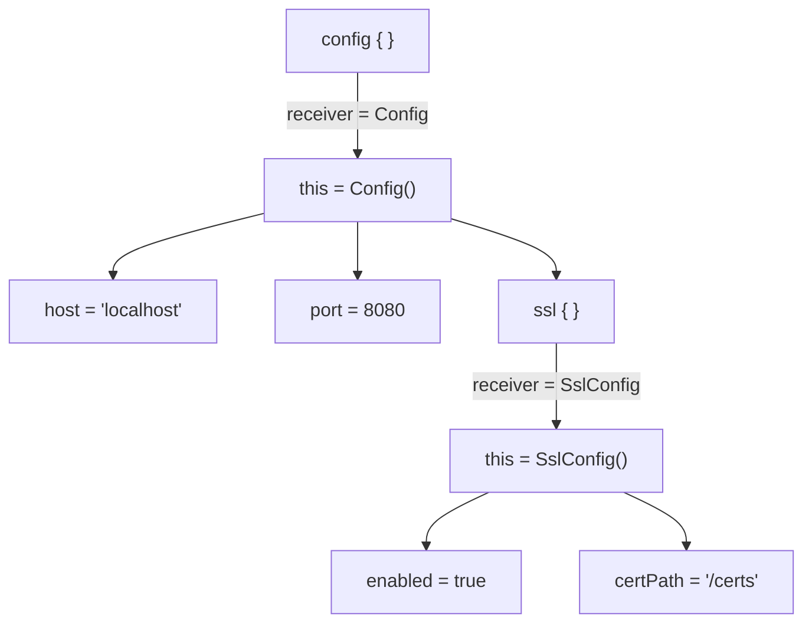
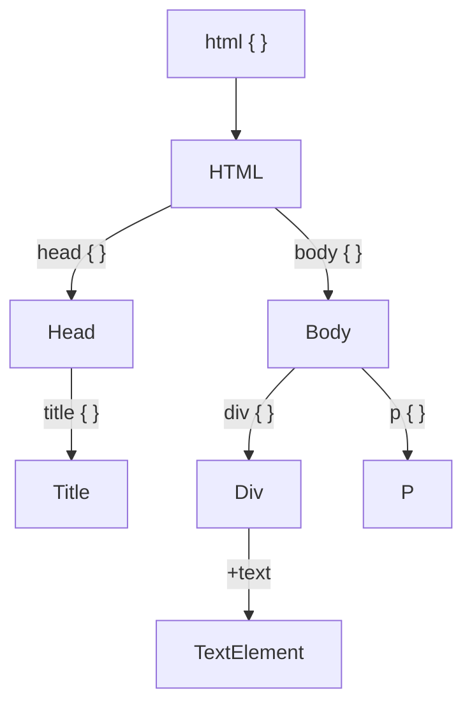
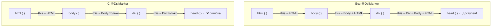
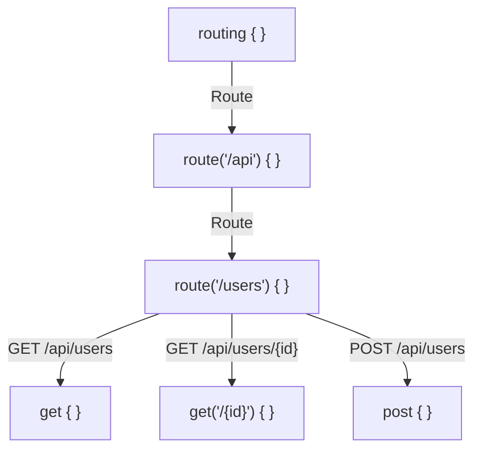
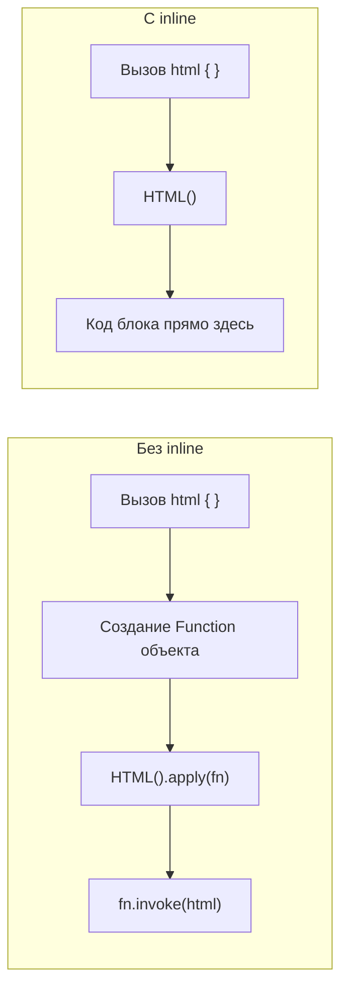
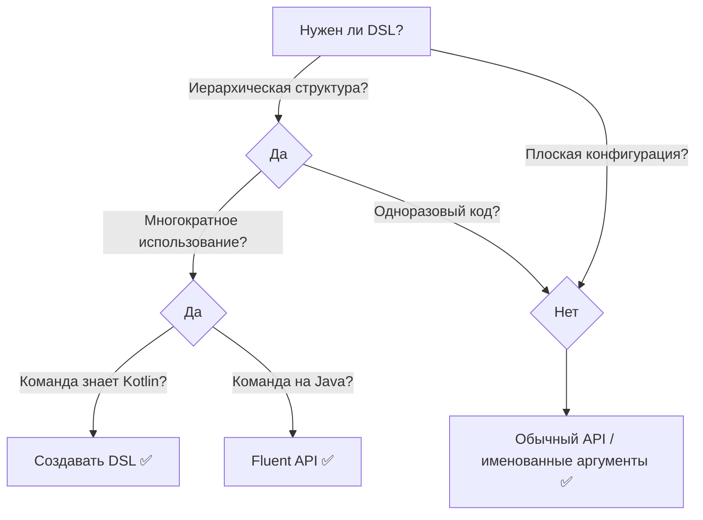

# Вопросы на собеседовании: `DSL` в `Kotlin`

Ответы по созданию **Domain-Specific Language** в `Kotlin` — `type-safe builders`, lambda с receiver, `@DslMarker`, `Gradle Kotlin DSL`, `Exposed`, `Ktor`, `context receivers`, scope-функции и реальные паттерны. На собеседованиях часто спрашивают про механизм lambda с receiver, ограничение scope через `@DslMarker`, конкретные DSL из экосистемы (`Gradle`, `Ktor`, `Exposed`) и отличия от обычного fluent API.

## Полезные ссылки

### Официальная документация

- [Type-Safe Builders](https://kotlinlang.org/docs/type-safe-builders.html) — официальная документация Kotlin по type-safe builders
- [Lambda with Receiver](https://kotlinlang.org/docs/lambdas.html#function-literals-with-receiver) — спецификация lambda с receiver
- [Scope Functions](https://kotlinlang.org/docs/scope-functions.html) — `apply`, `with`, `run`, `let`, `also`
- [Gradle Kotlin DSL Primer](https://docs.gradle.org/current/userguide/kotlin_dsl.html) — руководство по Gradle Kotlin DSL
- [Exposed Wiki](https://github.com/JetBrains/Exposed/wiki) — документация ORM-фреймворка Exposed
- [Ktor Routing](https://ktor.io/docs/routing-in-ktor.html) — маршрутизация в Ktor

### Baeldung

- [Building DSLs in Kotlin — Baeldung](https://www.baeldung.com/kotlin/dsl) — построение type-safe DSL: lambda с receiver, builders
- [Kotlin DSL for Gradle — Baeldung](https://www.baeldung.com/kotlin/gradle-dsl) — использование Kotlin DSL вместо Groovy в Gradle
- [Spring Security with Kotlin DSL — Baeldung](https://www.baeldung.com/kotlin/spring-security-dsl) — конфигурация Spring Security через Kotlin DSL
- [HTML Builder in Kotlin — Baeldung](https://www.baeldung.com/kotlin/html-generation) — kotlinx.html DSL для генерации HTML

## Содержание

- [Полезные ссылки](#полезные-ссылки)
- [See also](#see-also)

**Основы DSL**
- [Q1. (!) Что такое DSL в Kotlin и чем внутренний DSL отличается от внешнего?](#q1--что-такое-dsl-в-kotlin-и-чем-внутренний-dsl-отличается-от-внешнего)
- [Q2. (!) Что такое lambda с receiver и почему это основа Kotlin DSL?](#q2--что-такое-lambda-с-receiver-и-почему-это-основа-kotlin-dsl)
- [Q3. Какие языковые средства Kotlin используются для построения DSL?](#q3-какие-языковые-средства-kotlin-используются-для-построения-dsl)

**Type-Safe Builders**
- [Q4. (!) Что такое Type-Safe Builder и как он устроен?](#q4--что-такое-type-safe-builder-и-как-он-устроен)
- [Q5. Как написать простой type-safe builder (пошаговый пример)?](#q5-как-написать-простой-type-safe-builder-пошаговый-пример)
- [Q6. (!) Что такое @DslMarker и какую проблему он решает?](#q6--что-такое-dslmarker-и-какую-проблему-он-решает)
- [Q7. Как @DslMarker влияет на видимость receiver-ов во вложенных блоках?](#q7-как-dslmarker-влияет-на-видимость-receiver-ов-во-вложенных-блоках)

**Операторы и инфиксы в DSL**
- [Q8. Как перегрузка операторов используется в DSL?](#q8-как-перегрузка-операторов-используется-в-dsl)
- [Q9. Что такое invoke convention и как его применяют в DSL?](#q9-что-такое-invoke-convention-и-как-его-применяют-в-dsl)
- [Q10. Инфиксные функции в DSL — когда и зачем?](#q10-инфиксные-функции-в-dsl--когда-и-зачем)

**Scope-функции и DSL**
- [Q11. (!) Как scope-функции (apply, with, run) связаны с DSL-паттернами?](#q11--как-scope-функции-apply-with-run-связаны-с-dsl-паттернами)
- [Q12. В чём разница между apply и also при конструировании объектов в DSL?](#q12-в-чём-разница-между-apply-и-also-при-конструировании-объектов-в-dsl)

**Gradle Kotlin DSL**
- [Q13. (!) Как устроен Gradle Kotlin DSL и чем он лучше Groovy DSL?](#q13--как-устроен-gradle-kotlin-dsl-и-чем-он-лучше-groovy-dsl)
- [Q14. Как работают type-safe accessors для плагинов и зависимостей в Gradle?](#q14-как-работают-type-safe-accessors-для-плагинов-и-зависимостей-в-gradle)
- [Q15. Что такое buildSrc и convention plugins в контексте Gradle Kotlin DSL?](#q15-что-такое-buildsrc-и-convention-plugins-в-контексте-gradle-kotlin-dsl)

**Exposed DSL**
- [Q16. (!) Как устроен Exposed DSL для работы с БД?](#q16--как-устроен-exposed-dsl-для-работы-с-бд)
- [Q17. Чем отличаются DSL и DAO подходы в Exposed?](#q17-чем-отличаются-dsl-и-dao-подходы-в-exposed)

**Ktor Routing DSL**
- [Q18. (!) Как устроен routing DSL в Ktor?](#q18--как-устроен-routing-dsl-в-ktor)
- [Q19. Как Ktor использует extension-функции и lambda с receiver для конфигурации?](#q19-как-ktor-использует-extension-функции-и-lambda-с-receiver-для-конфигурации)

**HTML DSL (kotlinx.html)**
- [Q20. Как работает kotlinx.html и чем он отличается от шаблонизаторов?](#q20-как-работает-kotlinxhtml-и-чем-он-отличается-от-шаблонизаторов)

**Context Receivers**
- [Q21. (!) Что такое context receivers и как они расширяют возможности DSL?](#q21--что-такое-context-receivers-и-как-они-расширяют-возможности-dsl)

**Продвинутые приёмы**
- [Q22. Extension properties в контексте DSL — зачем и примеры?](#q22-extension-properties-в-контексте-dsl--зачем-и-примеры)
- [Q23. (!) Как inline влияет на производительность DSL?](#q23--как-inline-влияет-на-производительность-dsl)
- [Q24. Как в DSL реализовать обязательные и опциональные блоки?](#q24-как-в-dsl-реализовать-обязательные-и-опциональные-блоки)
- [Q25. Как передавать параметры и опции в DSL?](#q25-как-передавать-параметры-и-опции-в-dsl)

**Сравнение и паттерны**
- [Q26. В чём разница между DSL и обычным fluent API?](#q26-в-чём-разница-между-dsl-и-обычным-fluent-api)
- [Q27. Как устроены DSL для тестов (shouldBe, expect)?](#q27-как-устроены-dsl-для-тестов-shouldbe-expect)
- [Q28. Какие реальные DSL существуют в экосистеме Kotlin?](#q28-какие-реальные-dsl-существуют-в-экосистеме-kotlin)
- [Q29. (!) Какие типичные ошибки допускают при проектировании DSL?](#q29--какие-типичные-ошибки-допускают-при-проектировании-dsl)
- [Q30. Когда стоит и когда не стоит создавать DSL?](#q30-когда-стоит-и-когда-не-стоит-создавать-dsl)
- [Q31. Как работает Spring Beans DSL на Kotlin и чем лучше XML/аннотаций?](#q31-как-работает-spring-beans-dsl-на-kotlin-и-чем-лучше-xmlаннотаций)
- [Q32. Как реализовать DSL с накоплением состояния (builder-паттерн через lambda с receiver)?](#q32-как-реализовать-dsl-с-накоплением-состояния-builder-паттерн-через-lambda-с-receiver)

**Gradle Kotlin DSL и Test Data Builders**
- [Q33. Как Gradle Kotlin DSL использует паттерны Kotlin DSL на практике?](#q33-как-gradle-kotlin-dsl-использует-паттерны-kotlin-dsl-на-практике)
- [Q34. Как использовать type-safe builders с reified и какие у них ограничения?](#q34-как-использовать-type-safe-builders-с-reified-и-какие-у-них-ограничения)
- [Q35. Как строить Test Data Builders через DSL для тестовых фикстур?](#q35-как-строить-test-data-builders-через-dsl-для-тестовых-фикстур)

**Operator Overloading и реальные DSL**
- [Q36. Как operator overloading применяется в DSL-контексте?](#q36-как-operator-overloading-применяется-в-dsl-контексте)
- [Q37. Какие известные Kotlin DSL существуют в экосистеме: Anko, Exposed, Ktor?](#q37-какие-известные-kotlin-dsl-существуют-в-экосистеме-anko-exposed-ktor)

**Паттерны и сравнения**
- [Q38. DSL vs Builder паттерн — когда что выбрать?](#q38-dsl-vs-builder-паттерн--когда-что-выбрать)
- [Q39. Как построить Validation DSL для декларативной валидации?](#q39-как-построить-validation-dsl-для-декларативной-валидации)
- [Q40. Внутренний vs внешний DSL — плюсы и минусы Kotlin внутреннего DSL?](#q40-внутренний-vs-внешний-dsl--плюсы-и-минусы-kotlin-внутреннего-dsl)

---

## Q1. (!) Что такое DSL в Kotlin и чем внутренний DSL отличается от внешнего?

**Domain-Specific Language** (DSL) — язык, заточенный под конкретную предметную область, а не под универсальное программирование. Ключевое разделение проходит по тому, отдельный это язык или код на хост-языке:

- **Внешний DSL** — самостоятельный язык со своим синтаксисом и парсером (SQL, CSS, регулярные выражения). Требует собственного лексера/парсера и не проверяется компилятором основного языка: ошибка в строке всплывёт только в рантайме.
- **Внутренний DSL** (embedded DSL) — DSL, построенный средствами хост-языка. В `Kotlin` это обычный код, организованный так, что читается как декларативное описание: конфигурация, разметка, маршруты, тестовые сценарии. Парсер не нужен — компилятор `Kotlin` сам разбирает и проверяет конструкцию.

```kotlin
// Внутренний DSL — это обычный Kotlin
html {
    body {
        p { +"Hello, World!" }
    }
}

// Внешний DSL — отдельный язык
// SELECT * FROM users WHERE active = true
```

**Почему внутренний DSL в `Kotlin` выигрывает:**

- **Типобезопасность** — компилятор проверяет структуру ещё до запуска, невалидную вложенность не собрать.
- **IDE-поддержка** — автодополнение, навигация и рефакторинг работают «из коробки», потому что это обычный код.
- **Нет накладных расходов** — парсить нечего, конструкция компилируется напрямую.
- **Полная мощь языка** — внутри DSL-блоков доступны условия, циклы и переменные `Kotlin`.

## Q2. (!) Что такое lambda с receiver и почему это основа Kotlin DSL?

**Lambda с receiver** — lambda-выражение, у которого есть неявный `this`, указывающий на объект-receiver. Тип записывается как `T.() -> R` (читается: «функция на `T`, возвращающая `R`»).

```kotlin
// Обычная lambda
val greet: (String) -> String = { name -> "Hello, $name" }

// Lambda с receiver — this указывает на StringBuilder
val build: StringBuilder.() -> Unit = {
    append("Hello, ")  // вызываем метод через неявный this
    append("World!")
}

val result = StringBuilder().apply(build) // "Hello, World!"
```

Это основа DSL потому, что внутри блока методы и свойства receiver-а вызываются **без префикса** — `this` подставляется неявно. Так создаётся контекст «внутри этого блока мы находимся в объекте типа `T`», и вложенные `html { body { } }` читаются как разметка, а не как цепочка вызовов.



**Чем отличается от extension-функции.** Extension-функция объявляется как `fun T.name()`, а lambda с receiver — как значение типа `T.() -> Unit`. Оба дают неявный `this`, но lambda с receiver передаётся как аргумент: именно это и позволяет вложить один DSL-блок в другой.

## Q3. Какие языковые средства Kotlin используются для построения DSL?

Ни одно средство не делает DSL в одиночку — читаемость возникает из их сочетания. Lambda с receiver задаёт контекст, extension-функции добавляют в него методы, `@DslMarker` ограничивает scope, операторы и infix убирают синтаксический шум. Вот ключевые механизмы:

| Средство | Роль в DSL | Пример |
|----------|-----------|--------|
| Lambda с receiver (`T.() -> Unit`) | Вложенные контексты | `html { body { } }` |
| Extension-функции | Расширение API без наследования | `fun Tag.div(init: Div.() -> Unit)` |
| Extension properties | Контекстные свойства | `val Context.currentUser` |
| `@DslMarker` | Ограничение scope | Запрет `head { head { } }` |
| Operator overloading | Синтаксический сахар | `+"text"`, `config["key"]` |
| Infix-функции | Читаемые пары | `x shouldBe 42` |
| Именованные аргументы | Читаемые параметры | `div(class = "card")` |
| Default-аргументы | Опциональные параметры | `fun port(p: Int = 8080)` |
| `inline` | Устранение накладных расходов | `inline fun html(...)` |
| Trailing lambda | Вынос блока за скобки | `route("/api") { get { } }` |

## Q4. (!) Что такое Type-Safe Builder и как он устроен?

**Type-Safe Builder** — паттерн, при котором иерархическая структура (дерево узлов) строится вызовами функций с lambda с receiver, а компилятор гарантирует корректность вложенности. Каждая функция принимает `T.() -> Unit`: внутри lambda доступны только методы текущего контекста, поэтому положить `title` туда, где его быть не должно, просто не получится — это ошибка компиляции, а не рантайма.



**Как это устроено.** Классы представляют узлы (`HTML`, `Body`, `Div`); каждый хранит список дочерних элементов и методы для добавления потомков. Метод-потомок делает три вещи: принимает lambda с receiver типа дочернего узла, создаёт его экземпляр, вызывает на нём lambda и добавляет узел в коллекцию родителя:

```kotlin
abstract class Tag(val name: String) {
    val children = mutableListOf<Element>()

    protected fun <T : Element> initTag(tag: T, init: T.() -> Unit): T {
        tag.init()          // Инициализация через lambda с receiver
        children.add(tag)   // Добавление в дерево
        return tag
    }
}

class HTML : Tag("html") {
    fun head(init: Head.() -> Unit) = initTag(Head(), init)
    fun body(init: Body.() -> Unit) = initTag(Body(), init)
}

class Body : Tag("body") {
    fun div(init: Div.() -> Unit) = initTag(Div(), init)
    fun p(init: P.() -> Unit) = initTag(P(), init)
}
```

Точка входа — top-level функция:

```kotlin
fun html(init: HTML.() -> Unit): HTML = HTML().apply(init)
```

**Что сказать на интервью.** Главное — показать понимание механики: каждый вложенный блок это вызов метода на receiver-е, который создаёт дочерний узел, инициализирует его через lambda и подвешивает в дерево родителя. Внешне похоже на разметку, под капотом — обычные вызовы функций.

## Q5. Как написать простой type-safe builder (пошаговый пример)?

Любой type-safe builder собирается по одной и той же схеме из четырёх шагов. Разберём её на DSL для конфигурации сервера:

```kotlin
// 1. Определяем классы-контексты
@ServerDsl
class ServerConfig {
    var host = "localhost"
    var port = 8080
    private var _ssl: SslConfig? = null

    fun ssl(init: SslConfig.() -> Unit) {
        _ssl = SslConfig().apply(init)
    }

    fun build(): Server = Server(host, port, _ssl)
}

@ServerDsl
class SslConfig {
    var enabled = false
    var certPath = ""
    var keyPath = ""
}

// 2. Определяем @DslMarker
@DslMarker
annotation class ServerDsl

// 3. Точка входа
fun server(init: ServerConfig.() -> Unit): Server {
    return ServerConfig().apply(init).build()
}

// 4. Использование
val myServer = server {
    host = "0.0.0.0"
    port = 443
    ssl {
        enabled = true
        certPath = "/etc/ssl/cert.pem"
        keyPath = "/etc/ssl/key.pem"
    }
}
```

**Итого, четыре шага:**

1. Создать классы-контексты с нужными свойствами (`var host`) и методами вложенных блоков (`fun ssl`).
2. Пометить их `@DslMarker`, чтобы изолировать scope вложенных receiver-ов.
3. Написать top-level функцию-точку входа (`fun server`), которая создаёт контекст, применяет к нему lambda и вызывает `build()`.
4. Использовать DSL — свойства задаются как присваивания, подконфигурации как вложенные блоки.

## Q6. (!) Что такое @DslMarker и какую проблему он решает?

**`@DslMarker`** — мета-аннотация из `kotlin.annotation`: ею помечают свою аннотацию, а той уже — классы-контексты DSL. Она решает проблему **утечки scope**. По умолчанию во вложенной lambda с receiver видны методы **всех** внешних receiver-ов сразу, и DSL начинает принимать бессмысленные конструкции.

```kotlin
// БЕЗ @DslMarker — компилируется, но бессмысленно
html {
    body {
        head { }  // Вызывает html.head() — ошибка логики!
    }
}
```

С `@DslMarker` компилятор ограничивает видимость: если два receiver-а помечены одним маркером, из вложенной lambda виден только **ближайший** из них. Доступ к внешнему остаётся, но требует явного `this@label` — и это уже осознанное действие, а не случайность:

```kotlin
@DslMarker
annotation class HtmlDsl

@HtmlDsl
abstract class Tag(val name: String) { ... }

// Теперь компилятор запретит:
html {
    body {
        head { }  // ❌ Ошибка компиляции!
        this@html.head { }  // ✅ Явный доступ — если действительно нужен
    }
}
```

Маркер объявляется один раз, а все аннотированные им классы образуют группу с контролируемым scope. Подклассы наследуют маркер автоматически — пометить достаточно базовый `Tag`, и правило распространится на все его наследники.

## Q7. Как @DslMarker влияет на видимость receiver-ов во вложенных блоках?

**Без `@DslMarker`** действует стандартное правило разрешения имён: компилятор ищет метод сначала в ближайшем receiver, а не найдя — поднимается по цепочке внешних receiver-ов. Поэтому внутри `body { }` доступны методы и `Body`, и `HTML`, и любого охватывающего контекста — отсюда и утечка.

**С `@DslMarker`** поведение меняется: если два receiver-а помечены одним маркером, видимым остаётся только **самый внутренний** из них, а внешние одноимённого маркера затеняются.



Аннотацию можно применить на уровне класса или на уровне типа в сигнатуре функции:

```kotlin
// На уровне класса — все подклассы наследуют
@HtmlDsl abstract class Tag(val name: String)

// На уровне типа — точечно для конкретных lambda
fun html(init: @HtmlDsl HTML.() -> Unit): HTML { ... }
```

**Граничный случай.** Допустимые target-ы для `@DslMarker` — `CLASS`, `TYPE`, `TYPEALIAS`. На функции или свойства аннотацию повесить можно, но на контроль scope это **не влияет** — ограничение работает только через тип receiver-а.

## Q8. Как перегрузка операторов используется в DSL?

Перегрузка операторов в `Kotlin` задаёт поведение `+`, `-`, `[]`, `in`, `()` для своих типов. В DSL её применяют, чтобы убрать синтаксический шум: вместо `add(...)` или `put(...)` пишут привычный символ, и блок читается ближе к естественному языку.

**`unaryPlus` — добавление текста в builder:**

```kotlin
abstract class TagWithText(name: String) : Tag(name) {
    operator fun String.unaryPlus() {
        children.add(TextElement(this))
    }
}

// Использование: div { +"Hello, World!" }
```

**`get`/`set` — доступ к конфигурации:**

```kotlin
class Config {
    private val map = mutableMapOf<String, Any>()

    operator fun get(key: String): Any? = map[key]
    operator fun set(key: String, value: Any) { map[key] = value }
}

// Использование: config["host"] = "localhost"
```

**`contains` — проверка принадлежности:**

```kotlin
class RoleSet {
    private val roles = mutableSetOf<String>()
    operator fun contains(role: String) = role in roles
    fun add(role: String) { roles.add(role) }
}

// Использование: if ("admin" in roles) { ... }
```

**`rangeTo` — диапазоны в DSL:**

```kotlin
data class Version(val major: Int, val minor: Int) : Comparable<Version> { ... }
operator fun Version.rangeTo(other: Version) = VersionRange(this, other)

// Использование: Version(1,0)..Version(2,0)
```

**Эмпирическое правило.** Оператор должен быть семантически уместен: `+` для добавления контента читается интуитивно, а вот произвольная перегрузка (`-` как «удалить», `*` как «повторить») заставляет читателя лезть в документацию и только вредит DSL.

## Q9. Что такое invoke convention и как его применяют в DSL?

**`invoke` convention** — если у класса определён `operator fun invoke(...)`, его экземпляр можно вызывать как функцию: `obj(args)` разворачивается в `obj.invoke(args)`. В DSL это позволяет «вызвать» объект-билдер или синглтон, передав ему путь и конфигурирующую lambda.

```kotlin
class RouteBuilder {
    private val routes = mutableListOf<Route>()

    operator fun invoke(path: String, init: RouteConfig.() -> Unit) {
        routes.add(RouteConfig(path).apply(init).build())
    }

    fun build(): List<Route> = routes.toList()
}

// Использование
val routes = RouteBuilder()
routes("/api/users") {
    method = GET
    handler = { listUsers() }
}
routes("/api/orders") {
    method = POST
    handler = { createOrder() }
}
```

Другой сценарий — объект-синглтон как «вызываемая функция»:

```kotlin
object Query {
    operator fun invoke(table: String, init: QueryBuilder.() -> Unit): SqlQuery {
        return QueryBuilder(table).apply(init).build()
    }
}

// Использование: Query("users") { where("active = true") }
```

**Компромисс.** `invoke` делает DSL лаконичнее, но и рискованнее: строка `routes("/api") { }` выглядит как обычный вызов функции, хотя `routes` — это объект. Применяйте, когда семантика «вызова» очевидна из контекста, иначе читатель не поймёт, что перед ним.

## Q10. Инфиксные функции в DSL — когда и зачем?

**Инфиксная функция** (`infix fun`) вызывается без точки и скобок: `a to b` вместо `a.to(b)`. За счёт этого пара «значение—действие» читается как фраза на английском, что особенно ценно в тестах и конфигурации. Требования жёсткие: это member- или extension-функция, ровно один параметр, без `vararg` и без default-значений.

```kotlin
// Тестовый DSL (Kotest-стиль)
infix fun <T> T.shouldBe(expected: T) {
    if (this != expected) throw AssertionError("Expected $expected but was $this")
}

infix fun <T> T.shouldNotBe(unexpected: T) {
    if (this == unexpected) throw AssertionError("Should not be $unexpected")
}

// Использование
result shouldBe 42
name shouldNotBe ""
```

```kotlin
// Конфигурационный DSL
class PermissionBuilder {
    val permissions = mutableListOf<Pair<String, String>>()

    infix fun String.can(action: String) {
        permissions.add(this to action)
    }
}

fun permissions(init: PermissionBuilder.() -> Unit) =
    PermissionBuilder().apply(init)

// Использование
permissions {
    "admin" can "delete"
    "editor" can "write"
    "viewer" can "read"
}
```

**Когда применять.** Инфикс особенно хорош для assertion-ов в тестах (`result shouldBe 42`) и пар ключ-значение (`"admin" can "delete"`). Но злоупотреблять не стоит: `a plus b` читается хуже привычного `a + b`, а длинные цепочки инфиксов без скобок становятся неоднозначными по приоритету.

## Q11. (!) Как scope-функции (apply, with, run) связаны с DSL-паттернами?

Scope-функции `Kotlin` — `apply`, `with`, `run`, `let`, `also` — это, по сути, готовые DSL-примитивы из stdlib. Каждая принимает lambda (с receiver или без) и задаёт контекст выполнения; различаются они двумя осями: как доступен объект (`this` или `it`) и что функция возвращает (сам объект или результат lambda):

| Функция | Receiver (`this`) | Аргумент (`it`) | Возвращает | DSL-роль |
|---------|-------------------|------------------|------------|----------|
| `apply` | да | нет | `this` | Конфигурация объекта |
| `with` | да | нет | результат lambda | Работа с объектом |
| `run` | да | нет | результат lambda | Инициализация + вычисление |
| `let` | нет | да | результат lambda | Трансформация |
| `also` | нет | да | `this` | Side-эффект |

Среди них `apply` — основа большинства DSL-builder-ов: он даёт `this` для конфигурации без префикса и возвращает сам объект, что идеально ложится на паттерн «создать → настроить → отдать»:

```kotlin
// apply — сердце паттерна builder
fun server(init: ServerConfig.() -> Unit): Server =
    ServerConfig().apply(init).build()

// with — альтернатива для работы с существующим объектом
with(config) {
    host = "0.0.0.0"
    port = 443
}

// run — инициализация + получение результата
val connection = DatabaseConfig().run {
    url = "jdbc:postgresql://localhost/db"
    username = "admin"
    connect()  // возвращает Connection
}
```

Подробнее о scope-функциях — в [основах Kotlin](kotlin-interview.md).

## Q12. В чём разница между apply и also при конструировании объектов в DSL?

Обе функции возвращают исходный объект, поэтому обе подходят для цепочек. Ключевое различие — **способ доступа к объекту**: `apply` даёт его как receiver (`this`), а `also` — как параметр (`it`):

```kotlin
// apply — receiver (this), идеально для DSL-конфигурации
val config = ServerConfig().apply {
    host = "0.0.0.0"      // this.host = ...
    port = 8080            // this.port = ...
    ssl {                  // this.ssl { ... }
        enabled = true
    }
}

// also — параметр (it), полезно для side-эффектов
val config = ServerConfig().apply {
    host = "0.0.0.0"
    port = 8080
}.also {
    logger.info("Created config: ${it.host}:${it.port}")
    validate(it)
}
```

В DSL почти всегда используют `apply` (или самостоятельно реализованные lambda с receiver), потому что `this` позволяет обращаться к свойствам и методам **без префикса** — это создаёт чистый декларативный синтаксис. `also` полезен для **логирования**, **валидации** и других side-эффектов, где нужно обратиться к объекту по имени.

## Q13. (!) Как устроен Gradle Kotlin DSL и чем он лучше Groovy DSL?

**Gradle Kotlin DSL** — это скрипты сборки `build.gradle.kts` вместо `build.gradle` на Groovy. Под капотом `Gradle` компилирует каждый файл как обычный `Kotlin`-код, где тело блоков выполняется в контексте receiver-ов `Project`, `DependencyHandler`, `PluginDependenciesSpec` и других — поэтому всё, что вы пишете, статически типизировано и проверяется компилятором.

```kotlin
// build.gradle.kts
plugins {
    kotlin("jvm") version "2.0.0"          // type-safe accessor
    id("org.springframework.boot") version "3.3.0"
}

dependencies {
    implementation("org.springframework.boot:spring-boot-starter-web")
    testImplementation(kotlin("test"))
}

tasks.test {
    useJUnitPlatform()
}
```

Преимущества перед Groovy DSL:

| Аспект | Groovy DSL | Kotlin DSL |
|--------|-----------|------------|
| Типизация | Динамическая | Статическая |
| IDE-поддержка | Ограниченная | Полная (автодополнение, навигация) |
| Ошибки | В runtime | При компиляции |
| Рефакторинг | Ненадёжный | Надёжный |
| Документация API | Нужно искать | Доступна через IDE |

**Как это работает.** `Gradle` генерирует **type-safe accessors** — extension-функции и свойства, специфичные для применённых плагинов. Например, плагин `java` даёт accessor `tasks.test`, а плагин `application` — блок `application { mainClass.set("...") }`. Именно поэтому автодополнение «знает» про задачи и конфигурации конкретного проекта, а не предлагает универсальный набор.

## Q14. Как работают type-safe accessors для плагинов и зависимостей в Gradle?

**Type-safe accessors** — Kotlin extension-функции и свойства, которые `Gradle` генерирует на основе применённых плагинов; они дают типизированный доступ к задачам и конфигурациям вместо строковых имён. Ключевое условие: accessor появляется только в том скрипте, где плагин подключён через блок `plugins { }`.

```kotlin
plugins {
    java                        // Генерирует accessors для Java-задач
    id("org.springframework.boot") version "3.3.0"
}

// Type-safe accessor для задачи (вместо tasks.getByName("test"))
tasks.test {
    useJUnitPlatform()
    jvmArgs("-Xmx1g")
}

// Type-safe accessor для конфигурации зависимостей
dependencies {
    implementation("com.example:lib:1.0")       // Accessor от java-плагина
    testImplementation("org.junit:junit:5.10")
}

// Без type-safe accessors (legacy-способ)
dependencies {
    add("implementation", "com.example:lib:1.0")
}
```

**Подводный камень.** Accessors генерируются только для плагинов из блока `plugins { }`. Если плагин подключён через legacy-синтаксис `apply plugin:`, типизированных accessors не будет — придётся возвращаться к строковым именам конфигураций (`add("implementation", ...)`) и терять автодополнение.

## Q15. Что такое buildSrc и convention plugins в контексте Gradle Kotlin DSL?

Оба механизма решают одну задачу — убрать дублирование конфигурации между модулями, но с разных сторон.

**`buildSrc`** — специальная директория в корне `Gradle`-проекта: код из неё автоматически компилируется и становится доступен во всех `build.gradle.kts`. Это место для общей логики сборки (версии, хелперы, плагины).

**Convention plugins** — переиспользуемые плагины, которые описывают «соглашения» (конвенции) для типовых модулей. Их кладут в `buildSrc` и применяют в каждом модуле одной строкой:

```kotlin
// buildSrc/src/main/kotlin/kotlin-conventions.gradle.kts
plugins {
    kotlin("jvm")
}

kotlin {
    jvmToolchain(21)
}

dependencies {
    testImplementation(kotlin("test"))
}

tasks.test {
    useJUnitPlatform()
}
```

```kotlin
// modules/my-module/build.gradle.kts
plugins {
    id("kotlin-conventions")  // Применяем конвенцию
}

dependencies {
    implementation("com.example:my-lib:1.0")  // Только специфичные зависимости
}
```

**Что это даёт:**

- **DRY** — общая конфигурация живёт в одном месте, а не копируется по модулям.
- **Типобезопасность** — convention plugin компилируется как `Kotlin`, ошибки ловятся при сборке плагина.
- **Композиция** — можно завести несколько конвенций (`kotlin-conventions`, `spring-conventions`, `test-conventions`) и комбинировать их в модуле под его нужды.

## Q16. (!) Как устроен Exposed DSL для работы с БД?

**`Exposed`** — `Kotlin`-библиотека от JetBrains для работы с базами данных. DSL-подход строит SQL-запросы через типобезопасные выражения:

```kotlin
// Определение таблицы
object Users : Table("users") {
    val id = integer("id").autoIncrement()
    val name = varchar("name", 50)
    val email = varchar("email", 100)
    val active = bool("active").default(true)

    override val primaryKey = PrimaryKey(id)
}

// Запросы через DSL
transaction {
    // INSERT
    Users.insert {
        it[name] = "Alice"
        it[email] = "alice@example.com"
    }

    // SELECT с условием
    val activeUsers = Users
        .select(Users.name, Users.email)
        .where { Users.active eq true }
        .map { row -> row[Users.name] to row[Users.email] }

    // UPDATE
    Users.update({ Users.id eq 1 }) {
        it[active] = false
    }

    // JOIN
    val result = (Users innerJoin Orders)
        .select(Users.name, Orders.total)
        .where { Orders.total greater 100.0 }
}
```

**Как это устроено под капотом.** `Table` — это объект с колонками типа `Column<T>`, и тип колонки переносится в выражения, поэтому `Users.active eq true` типобезопасен. Методы `select`, `insert`, `update` возвращают builder-ы запросов; `where` принимает lambda `SqlExpressionBuilder.() -> Op<Boolean>`; `eq`, `greater`, `like` — это infix-функции на `Column<T>`, из которых и собирается дерево условий. Всё выполняется внутри `transaction { }` — lambda с receiver `Transaction`, который управляет соединением и коммитом.

## Q17. Чем отличаются DSL и DAO подходы в Exposed?

`Exposed` предлагает два подхода к работе с данными, и выбор между ними — это компромисс «контроль над SQL против удобства работы с объектами»:

| Аспект | DSL | DAO |
|--------|-----|-----|
| Стиль | SQL-подобный, запросы | ORM, сущности |
| Определение | `object Users : Table()` | `class User : Entity()` |
| Запрос | `Users.select { ... }` | `User.find { ... }` |
| Результат | `ResultRow` (map) | Типизированный объект |
| Ленивые связи | Нет | Да (`referencedOn`) |
| Производительность | Выше (ближе к SQL) | Ниже (объекты, lazy loading) |
| Гибкость SQL | Полная | Ограниченная |

```kotlin
// DAO-подход
class UserEntity(id: EntityID<Int>) : IntEntity(id) {
    companion object : IntEntityClass<UserEntity>(Users)
    var name by Users.name
    var email by Users.email
    val orders by OrderEntity referrersOn Orders.userId
}

// Использование DAO
transaction {
    val user = UserEntity.new {
        name = "Bob"
        email = "bob@example.com"
    }
    val users = UserEntity.find { Users.active eq true }
}
```

**Когда что выбирать.** DSL предпочтителен для сложных запросов, агрегаций и отчётов — там, где важен контроль над генерируемым SQL и производительность. DAO удобнее для CRUD-операций с объектами и навигации по связям, но платит за это ленивой загрузкой и дополнительными запросами.

## Q18. (!) Как устроен routing DSL в Ktor?

**`Ktor`** описывает маршруты через вложенные lambda с receiver, и структура кода повторяет структуру URL-дерева. Каждый блок задаёт контекст типа `Route`, внутри которого доступны `get`, `post`, `put`, `delete` (регистрация обработчика) и `route` (вложенный сегмент пути):

```kotlin
fun Application.configureRouting() {
    routing {
        route("/api") {
            route("/users") {
                get {
                    val users = userService.findAll()
                    call.respond(users)
                }
                get("/{id}") {
                    val id = call.parameters["id"]?.toIntOrNull()
                        ?: return@get call.respond(HttpStatusCode.BadRequest)
                    val user = userService.findById(id)
                    call.respond(user ?: HttpStatusCode.NotFound)
                }
                post {
                    val request = call.receive<CreateUserRequest>()
                    val user = userService.create(request)
                    call.respond(HttpStatusCode.Created, user)
                }
            }
        }
    }
}
```



**Механика по шагам:** `routing` — это extension-функция на `Application`, принимающая `Routing.() -> Unit`; `route` — extension на `Route`, создающая вложенный сегмент; `get`/`post` регистрируют обработчик с lambda `PipelineContext<Unit, ApplicationCall>.() -> Unit`, внутри которой через `call` доступны параметры запроса и ответ. Вложенность блоков напрямую формирует путь: `route("/api") { route("/users") { get { } } }` даёт `GET /api/users`.

## Q19. Как Ktor использует extension-функции и lambda с receiver для конфигурации?

В `Ktor` вся конфигурация приложения строится через extension-функции на `Application` и вложенные lambda с receiver — каждый уровень настройки получает свой типизированный контекст:

```kotlin
fun main() {
    embeddedServer(Netty, port = 8080) {
        // this = Application
        install(ContentNegotiation) {
            // this = ContentNegotiationConfig
            json(Json {
                // this = JsonBuilder
                prettyPrint = true
                ignoreUnknownKeys = true
            })
        }
        install(StatusPages) {
            exception<Throwable> { call, cause ->
                call.respond(HttpStatusCode.InternalServerError, cause.message ?: "Error")
            }
        }
        configureRouting()
        configureSecurity()
    }.start(wait = true)
}

// Модульная конфигурация через extension-функции
fun Application.configureSecurity() {
    install(Authentication) {
        jwt("auth-jwt") {
            realm = "my-app"
            verifier(jwtVerifier)
            validate { credential -> /* ... */ }
        }
    }
}
```

**Ключевая идея.** Каждый `install(Feature) { ... }` принимает lambda с receiver, тип которой — конфигурация именно этой фичи, поэтому внутри блока доступны только её настройки. А extension-функции на `Application` (`configureRouting`, `configureSecurity`) позволяют разнести конфигурацию по файлам, не теряя DSL-стиль. Это паттерн **модульного DSL** — частый вопрос на собеседованиях, потому что показывает, как масштабировать DSL без «полотна» в одном `main`.

## Q20. Как работает kotlinx.html и чем он отличается от шаблонизаторов?

**`kotlinx.html`** — библиотека, которая генерирует HTML прямо из `Kotlin`-кода через type-safe builder-ы. Каждый HTML-тег представлен классом, а методы внутри него соответствуют разрешённым дочерним тегам — поэтому невалидную разметку (`li` вне списка) не собрать:

```kotlin
val page = createHTML().html {
    head {
        title { +"My Page" }
        link(rel = "stylesheet", href = "/css/style.css")
    }
    body {
        div(classes = "container") {
            h1 { +"Welcome" }
            ul {
                for (item in items) {
                    li(classes = if (item.active) "active" else "") {
                        a(href = item.url) { +item.name }
                    }
                }
            }
        }
    }
}
```

| Аспект | `kotlinx.html` | Шаблонизатор (Thymeleaf, FreeMarker) |
|--------|----------------|--------------------------------------|
| Типобезопасность | Полная (компилятор) | Нет (строки) |
| IDE-поддержка | Автодополнение | Ограниченная |
| Логика | Kotlin (`for`, `if`, `when`) | Свой язык шаблонов |
| Ошибки | При компиляции | При рендеринге |
| Разделение | Код = разметка | HTML отдельно от логики |
| Дизайнеры | Не могут работать | Могут редактировать HTML |

**Где применяется.** `kotlinx.html` используют в `Ktor` для серверного рендеринга и в Kotlin/JS для DOM-манипуляций. Главное преимущество перед шаблонизаторами — полная мощь `Kotlin` прямо внутри builder-а: циклы, условия и функции для генерации разметки, без отдельного языка шаблонов. Расплата — разметку нельзя отдать дизайнеру и она компилируется вместе с кодом.

## Q21. (!) Что такое context receivers и как они расширяют возможности DSL?

**Context receivers** (experimental, `Kotlin 2.x`) — механизм, позволяющий функции требовать **несколько контекстов** одновременно, без наследования и без передачи их параметрами.

**Какую проблему решают.** Обычная extension-функция имеет ровно **один** receiver. Если функция логически нужна сразу в контексте `Transaction` и `Logger`, один из них приходится тащить параметром — это шумит в сигнатуре и в каждом вызове. Context receivers убирают этот компромисс: оба контекста становятся неявными.

```kotlin
// Без context receivers — один receiver, второй через параметр
fun Transaction.loggedInsert(logger: Logger, table: Table, body: InsertStatement.() -> Unit) {
    logger.info("Inserting into ${table.tableName}")
    table.insert(body)
}

// С context receivers — оба контекста неявные
context(Transaction, Logger)
fun Table.loggedInsert(body: InsertStatement.() -> Unit) {
    info("Inserting into $tableName")  // Logger.info
    insert(body)                        // Transaction.insert
}
```

**Зачем это DSL.** Появляется возможность объявлять функции, вызвать которые можно **только** при наличии нужных контекстов, не загромождая при этом receiver. Компилятор сам проверит, что функция вызвана в правильном месте:

```kotlin
context(TransactionContext)
fun UserRepository.findActive(): List<User> = 
    Users.select { Users.active eq true }.map { it.toUser() }

// Используется только внутри transaction { }
transaction {
    val users = userRepo.findActive()  // ✅ Контекст доступен
}
// userRepo.findActive()  // ❌ Вне transaction — ошибка компиляции
```

**Статус.** На момент `Kotlin 2.1` context receivers остаются experimental и включаются флагом `-Xcontext-receivers`. В перспективе они закроют часть сценариев `@DslMarker` и extension-функций, позволяя строить более выразительные и безопасные DSL без подмены контекста параметрами.

## Q22. Extension properties в контексте DSL — зачем и примеры?

**Extension properties** добавляют типу свойство, не меняя сам класс. В DSL они удобны тем, что внутри нужного receiver-а появляется вычисляемое значение, которое читается как встроенное поле, — но логика остаётся снаружи класса:

```kotlin
// В контексте маршрута Ktor — удобный доступ к параметрам
val PipelineContext<Unit, ApplicationCall>.userId: Int
    get() = call.parameters["userId"]?.toIntOrNull()
        ?: throw BadRequestException("Invalid userId")

// В контексте конфигурации — вычисляемые свойства
val ServerConfig.baseUrl: String
    get() = "${if (sslEnabled) "https" else "http"}://$host:$port"

// В контексте тестового DSL
val TestContext.randomEmail: String
    get() = "test-${UUID.randomUUID()}@example.com"
```

**Ограничение.** Extension property не имеет backing field — есть только getter (и setter для `var`, если хранилище лежит снаружи). Поэтому хранить состояние в нём нельзя, он лишь вычисляет значение из receiver-а. Внутри DSL-блока обращение выглядит как к обычному полю: `this.baseUrl` или просто `baseUrl`.

## Q23. (!) Как inline влияет на производительность DSL?

**`inline`** на функции с lambda-параметром убирает аллокацию объекта lambda. Без него каждый вызов `html { }` создавал бы анонимный объект-функцию; с `inline` тело функции подставляется в место вызова, а lambda «разворачивается» в тот же код — лишних объектов и вызовов `invoke()` не остаётся.

```kotlin
// Без inline — каждый вызов создаёт объект анонимного класса
fun html(block: HTML.() -> Unit): HTML = HTML().apply(block)

// С inline — нет аллокации, код встраивается
inline fun html(block: HTML.() -> Unit): HTML = HTML().apply(block)
```



Когда использовать `inline` в DSL:

- **Да**: top-level функции-точки входа (`html { }`, `config { }`, `server { }`), которые вызываются часто и lambda исполняется сразу
- **Нет**: если lambda сохраняется для отложенного вызова (event handler, callback) — `inline` запретит это (`noinline` или `crossinline` как обходной путь)

Дополнительный бонус `inline` — поддержка `reified` для generic-параметров:

```kotlin
inline fun <reified T> Config.get(key: String): T {
    val value = properties[key]
    return when (T::class) {
        String::class -> value as T
        Int::class -> value?.toInt() as T
        else -> throw IllegalArgumentException("Unsupported type: ${T::class}")
    }
}

// Использование: val port: Int = config.get("port")
```

## Q24. Как в DSL реализовать обязательные и опциональные блоки?

Уровень обязательности задаётся типом параметра и наличием у него default-значения — часть проверок ложится на компилятор, часть на `build()`.

**Обязательный блок** — это параметр без default-значения: компилятор просто не даст вызвать функцию без него:

```kotlin
fun html(init: HTML.() -> Unit): HTML = HTML().apply(init)
// html() — ❌ ошибка компиляции
// html { } — ✅
```

**Опциональный блок** — nullable lambda с default `null`:

```kotlin
class ServerConfig {
    private var _ssl: SslConfig? = null

    fun ssl(init: (SslConfig.() -> Unit)? = null) {
        _ssl = SslConfig().apply { init?.invoke(this) }
    }
}

// Оба варианта валидны:
server { ssl() }              // SSL с defaults
server { ssl { port = 443 } } // SSL с настройками
server { /* без SSL */ }       // Без SSL
```

**Обязательные поля** можно валидировать в `build()`:

```kotlin
class DatabaseConfig {
    var url: String? = null
    var username: String? = null
    var password: String? = null

    fun build(): DataSource {
        requireNotNull(url) { "Database URL is required" }
        requireNotNull(username) { "Username is required" }
        return DataSource(url!!, username!!, password ?: "")
    }
}
```

**Итог.** Стандартный паттерн — сочетать оба механизма: compile-time проверки гарантируют наличие обязательных блоков, а runtime-валидация в `build()` ловит незаполненные поля и невалидные комбинации, которые типами не выразить.

## Q25. Как передавать параметры и опции в DSL?

Для гибкого API подходы комбинируют — каждый закрывает свой тип параметров. Вот пять основных:

```kotlin
// 1. Именованные аргументы — для простых параметров
fun div(id: String? = null, classes: String = "", init: Div.() -> Unit) { ... }
div(id = "main", classes = "container") { +"content" }

// 2. Свойства receiver-а — для конфигурации
class ServerConfig {
    var host = "localhost"
    var port = 8080
    var workers = Runtime.getRuntime().availableProcessors()
}
server { host = "0.0.0.0"; port = 443 }

// 3. Вложенные блоки — для сложной подконфигурации
class ServerConfig {
    fun ssl(init: SslConfig.() -> Unit) { ... }
    fun logging(init: LoggingConfig.() -> Unit) { ... }
}
server {
    ssl { certPath = "/certs/cert.pem" }
    logging { level = Level.INFO }
}

// 4. Infix-функции — для пар ключ-значение
class HeadersBuilder {
    infix fun String.to(value: String) { headers[this] = value }
}
headers { "Content-Type" to "application/json" }

// 5. Vararg — для списков
fun tags(vararg values: String) { ... }
tags("kotlin", "dsl", "interview")
```

**Что ценят на собеседовании** — понимание, какой подход когда уместен: именованные аргументы для «плоских» параметров, свойства receiver-а для конфигурации, вложенные блоки для иерархической подконфигурации, infix для читаемых пар ключ-значение, `vararg` для списков.

## Q26. В чём разница между DSL и обычным fluent API?

| Аспект | Fluent API | DSL (Kotlin) |
|--------|-----------|-------------|
| Структура | Плоская цепочка | Вложенные блоки |
| Синтаксис | `builder.setX().setY().build()` | `config { x = ...; y { } }` |
| Контекст | Один объект по цепочке | Каждый блок — свой receiver |
| Вложенность | Нет (или awkward) | Естественная |
| Scope control | Нет | `@DslMarker` |
| Типичный язык | Java, C# | Kotlin, Groovy, Scala |

```kotlin
// Fluent API (Java-стиль)
val server = ServerBuilder()
    .host("0.0.0.0")
    .port(443)
    .ssl(SslBuilder().certPath("/cert").keyPath("/key").build())
    .build()

// Kotlin DSL
val server = server {
    host = "0.0.0.0"
    port = 443
    ssl {
        certPath = "/cert"
        keyPath = "/key"
    }
}
```

**Суть различия.** DSL читается как конфигурация или разметка, fluent API — как последовательность команд. Технически оба типобезопасны и оба строят объект; разница — в модели чтения (декларативная против императивной) и в форме данных. DSL естественно ложится на иерархические структуры за счёт вложенных receiver-ов, fluent API — на линейные pipeline-ы, где вложенность превращается в неудобные цепочки вложенных билдеров.

## Q27. Как устроены DSL для тестов (shouldBe, expect)?

Тестовые DSL не вводят ничего нового — они комбинируют уже знакомые приёмы (**infix-функции**, **extension-функции**, **lambda с receiver**), чтобы assertion-ы и сценарии читались как обычный текст:

```kotlin
// Kotest-стиль: infix + extension
class StringSpec : FunSpec({
    test("string length") {
        "hello" shouldHaveLength 5
        "hello".shouldStartWith("hel")
        "hello" shouldBe "hello"
    }

    test("collection matchers") {
        listOf(1, 2, 3) shouldContain 2
        listOf(1, 2, 3) shouldHaveSize 3
        listOf(1, 2, 3).shouldBeSorted()
    }

    test("exception matchers") {
        shouldThrow<IllegalArgumentException> {
            parseAge(-1)
        }.message shouldBe "Age must be positive"
    }
})
```

```kotlin
// BDD-стиль: вложенные блоки
class UserServiceSpec : BehaviorSpec({
    given("a registered user") {
        val user = createUser("alice@test.com")

        `when`("login with correct password") {
            val result = authService.login(user.email, "correct")

            then("returns success token") {
                result.shouldBeInstanceOf<LoginResult.Success>()
                result.token.shouldNotBeBlank()
            }
        }

        `when`("login with wrong password") {
            val result = authService.login(user.email, "wrong")

            then("returns failure") {
                result.shouldBeInstanceOf<LoginResult.Failure>()
            }
        }
    }
})
```

**Как это устроено:** `shouldBe` — infix extension-функция на `Any?`; `given`/`when`/`then` — функции с lambda с receiver `BehaviorSpecRootScope`, которые формируют дерево спецификации; `shouldThrow<T>` — inline reified-функция, ловящая исключение нужного типа. То есть весь читаемый синтаксис — это те же базовые приёмы Kotlin DSL, перенесённые на тестовый домен. Подробнее о тестировании в `Kotlin` — в [основах Kotlin](kotlin-interview.md).

## Q28. Какие реальные DSL существуют в экосистеме Kotlin?

| DSL | Область | Ключевой механизм |
|-----|---------|-------------------|
| **Gradle Kotlin DSL** | Сборка проекта | Lambda с receiver на `Project` |
| **Ktor** | HTTP-сервер | Extension-функции на `Application`, `Route` |
| **Exposed** | SQL-запросы | Type-safe builder на `Table`, `Transaction` |
| **kotlinx.html** | HTML-генерация | Type-safe builder с `@HtmlTagMarker` |
| **Kotest** | Тестирование | Infix-функции, lambda с receiver |
| **Koin** | DI-контейнер | `module { single { } factory { } }` |
| **Compose** | UI (Android/Desktop) | `@Composable` + lambda с receiver |
| **Arrow** | FP-паттерны | Monad comprehensions, DSL для Either/Option |
| **kotlinx.serialization** | Сериализация | `Json { prettyPrint = true }` |
| **Spring Security DSL** | Безопасность | Lambda-конфигурация вместо chained builder-ов |
| **Detekt** | Статический анализ | Конфигурация правил |

Обратите внимание: при всём разнообразии доменов в основе почти каждого DSL лежат одни и те же два механизма — lambda с receiver и extension-функции. Именно поэтому, разобравшись в одном Kotlin DSL, легко читать остальные.

```kotlin
// Koin DSL
val appModule = module {
    single { DatabaseConnection(get()) }
    factory { UserRepository(get()) }
    viewModel { UserViewModel(get()) }
}

// Compose DSL
@Composable
fun UserCard(user: User) {
    Card(modifier = Modifier.padding(16.dp)) {
        Text(text = user.name, style = MaterialTheme.typography.h6)
        Text(text = user.email, style = MaterialTheme.typography.body2)
    }
}

// Spring Security Kotlin DSL
http {
    authorizeRequests {
        authorize("/api/public/**", permitAll)
        authorize("/api/admin/**", hasRole("ADMIN"))
        authorize(anyRequest, authenticated)
    }
    oauth2ResourceServer { jwt { } }
}
```

## Q29. (!) Какие типичные ошибки допускают при проектировании DSL?

Большинство ошибок в DSL — это либо потеря контроля над scope, либо подмена читаемости «магией». Шесть самых частых:

**1. Отсутствие `@DslMarker`** — методы внешних scope утекают во вложенные блоки, порождая компилируемые, но бессмысленные конструкции и труднонаходимые баги:

```kotlin
// Плохо: body доступен внутри div из-за утечки scope
html { body { div { body { } } } }  // Компилируется, но бессмысленно
```

**2. Слишком глубокая вложенность** — DSL становится трудночитаемым:

```kotlin
// Плохо
config {
    server {
        network {
            ssl {
                certificate {
                    path { ... }  // 6 уровней — чрезмерно
                }
            }
        }
    }
}
```

**3. Неочевидная семантика операторов** — `+` и `-` для нестандартных действий:

```kotlin
// Плохо: что значит минус на Route?
-route("/api")  // Удаление? Отключение? Неочевидно
```

**4. Отсутствие `inline`** — накладные расходы на аллокацию lambda при каждом вызове.

**5. Mutable state без валидации** — DSL позволяет установить невалидную комбинацию свойств:

```kotlin
// Плохо: port может быть отрицательным
server { port = -1 }

// Лучше: валидация в build() или через setter
var port: Int = 8080
    set(value) {
        require(value in 1..65535) { "Port must be 1..65535" }
        field = value
    }
```

**6. Нет точки входа** — DSL доступен только через конструктор + apply, а не через удобную top-level функцию.

## Q30. Когда стоит и когда не стоит создавать DSL?

Короткий ответ: DSL оправдан, когда он многократно экономит усилия на чтении кода, и не оправдан, когда добавляет сложности больше, чем убирает. Конкретные ориентиры:

**Стоит создавать DSL, когда:**
- Конфигурация **иерархическая** и вложенная (маршруты, деревья, разметка)
- API используется **многократно** разными людьми или командами
- Важна **читаемость** для не-разработчиков (BDD-тесты, конфигурация)
- Есть **повторяющийся паттерн** с вариациями (SQL-запросы, UI-компоненты)
- Нужна **type-safety** вместо строковых конфигов (YAML, JSON, XML)

**Не стоит создавать DSL, когда:**
- Достаточно **обычного API** с именованными аргументами
- Конфигурация **плоская** (несколько полей без вложенности)
- DSL будет использоваться **один раз** — стоимость разработки не окупится
- Команда **не знакома** с Kotlin-специфичными приёмами (lambda с receiver, operator overloading)
- Задача **линейная** — fluent API или обычные функции проще и понятнее



Золотое правило: DSL оправдан, когда **стоимость чтения кода с DSL значительно ниже**, чем без него, и эта экономия проявляется **многократно** за время жизни проекта.

## Q31. Как работает Spring Beans DSL на Kotlin и чем лучше XML/аннотаций?

**Spring Beans DSL** — нативный `Kotlin`-DSL для регистрации бинов через функциональный API: бины описываются явно в блоке `beans { }`, без рефлексии, component scan и `@Configuration`-аннотаций. За счёт этого старт быстрее и приложение дружелюбнее к GraalVM Native Image.

```kotlin
// Традиционный подход через @Configuration
@Configuration
class AppConfig {
    @Bean
    fun userRepository(): UserRepository = JdbcUserRepository()

    @Bean
    fun userService(repo: UserRepository): UserService = UserServiceImpl(repo)
}

// Kotlin Beans DSL — через beans { }
val beans = beans {
    bean<JdbcUserRepository>()             // регистрация по типу
    bean<UserServiceImpl>()                // зависимость инжектируется автоматически

    // Явная регистрация с кастомной логикой
    bean {
        val repo = ref<UserRepository>()   // получить зарегистрированный бин
        UserServiceImpl(repo, env["app.timeout"].toInt())
    }

    // Условная регистрация
    profile("production") {
        bean<ProdDataSource>()
    }
    profile("test") {
        bean<TestDataSource>()
    }
}

// Регистрация в SpringApplication
fun main() {
    runApplication<MyApp>() {
        addInitializers(beans)
    }
}
```

**Преимущества Beans DSL:**

| Аспект | XML / `@Configuration` | Kotlin Beans DSL |
|---|---|---|
| Рефлексия | Да (проксирование CGLIB) | Нет |
| Производительность старта | Медленнее | Быстрее |
| Типобезопасность | Слабая (строки в XML, аннотации) | Полная (Kotlin types) |
| IDE-поддержка | Ограниченная для XML | Полная для Kotlin DSL |
| Условная регистрация | `@Conditional` / XML | `if`/`when` / `profile { }` |
| AOT-компиляция | Ограничена из-за рефлексии | Дружественен к GraalVM |

```kotlin
// Более продвинутый пример: конфигурация с env-параметрами
val beans = beans {
    bean {
        val config = ref<AppConfig>()
        DataSource().apply {
            url = config.databaseUrl
            username = config.dbUser
            password = config.dbPassword
            maximumPoolSize = config.poolSize
        }
    }

    bean<UserRepository> {
        JdbcUserRepository(ref())
    }

    // Функциональные роуты (Spring WebFlux)
    bean {
        router {
            GET("/users") { req ->
                val users = ref<UserService>().findAll()
                ok().bodyValueAndAwait(users)
            }
            POST("/users") { req ->
                val dto = req.awaitBody<CreateUserDto>()
                val user = ref<UserService>().create(dto)
                created(URI("/users/${user.id}")).bodyValueAndAwait(user)
            }
        }
    }
}
```

**Когда выбирать Beans DSL:**
- Новые Spring Boot + Kotlin проекты (особенно с WebFlux)
- Цель — быстрый старт и GraalVM Native Image
- Много условной конфигурации (сложнее читать через `@Conditional`)
- Отказ от CGLIB-проксирования `@Configuration` классов

## Q32. Как реализовать DSL с накоплением состояния (builder-паттерн через lambda с receiver)?

Идея паттерна — отделить изменяемое состояние сборки от неизменяемого результата. Функция-билдер принимает lambda с receiver на mutable `Builder`-класс, выполняет её (lambda заполняет поля), а затем `build()` собирает из накопленного состояния immutable-объект. Снаружи остаётся чистый декларативный блок, внутри — управляемая мутабельность.

```kotlin
// Шаг 1: неизменяемый объект (результат)
data class HttpRequest(
    val method: String,
    val url: String,
    val headers: Map<String, String>,
    val body: String?,
    val timeout: Long
)

// Шаг 2: mutable builder с DSL-методами
@HttpDsl
class HttpRequestBuilder {
    var method: String = "GET"
    var url: String = ""
    var body: String? = null
    var timeout: Long = 30_000
    private val headers = mutableMapOf<String, String>()

    fun header(name: String, value: String) {
        headers[name] = value
    }

    fun authorization(token: String) = header("Authorization", "Bearer $token")
    fun contentType(type: String) = header("Content-Type", type)
    fun json() = contentType("application/json")

    internal fun build() = HttpRequest(method, url, headers.toMap(), body, timeout)
}

// Шаг 3: top-level функция-точка входа
@DslMarker annotation class HttpDsl

fun httpRequest(init: HttpRequestBuilder.() -> Unit): HttpRequest =
    HttpRequestBuilder().apply(init).build()

// Использование
val request = httpRequest {
    method = "POST"
    url = "https://api.example.com/users"
    authorization("my-token")
    json()
    body = """{"name": "Alice"}"""
    timeout = 5_000
}
```

**Паттерн с вложенными builder-ами:**

```kotlin
// Для сложных структур — вложенные DSL-блоки
data class Pipeline(val stages: List<Stage>)
data class Stage(val name: String, val steps: List<String>)

@DslMarker annotation class PipelineDsl

@PipelineDsl
class PipelineBuilder {
    private val stages = mutableListOf<Stage>()

    fun stage(name: String, init: StageBuilder.() -> Unit) {
        stages += StageBuilder(name).apply(init).build()
    }

    fun build() = Pipeline(stages.toList())
}

@PipelineDsl
class StageBuilder(private val name: String) {
    private val steps = mutableListOf<String>()

    fun step(command: String) { steps += command }
    fun build() = Stage(name, steps.toList())
}

fun pipeline(init: PipelineBuilder.() -> Unit) = PipelineBuilder().apply(init).build()

val ci = pipeline {
    stage("build") {
        step("./gradlew build")
        step("./gradlew test")
    }
    stage("deploy") {
        step("docker build .")
        step("kubectl apply -f k8s/")
    }
}
```

## Q33. Как Gradle Kotlin DSL использует паттерны Kotlin DSL на практике?

**Gradle Kotlin DSL** — это, пожалуй, самый известный продакшн-DSL в экосистеме, и устроен он ровно из тех же кирпичей, что и любой учебный Kotlin DSL: lambda с receiver, extension-функции, type-safe accessors и `@DslMarker`. Разбирая `build.gradle.kts`, легко увидеть теорию в работе.

**Ключевые механизмы в build.gradle.kts:**

```kotlin
// plugins { } — это extension-функция на PluginDependenciesSpec
plugins {
    id("org.springframework.boot") version "3.2.0"
    kotlin("jvm") version "1.9.22"  // kotlin() — infix-подобный синтаксис
}

// dependencies { } — extension-функция на DependencyHandlerScope
dependencies {
    implementation("org.springframework.boot:spring-boot-starter-web")
    testImplementation("org.junit.jupiter:junit-jupiter")
    // implementation, testImplementation — operator invoke на ConfigurationContainer
}

// tasks { } — extension-функция на TaskContainer
tasks {
    withType<Test> {
        useJUnitPlatform()
    }
    compileKotlin {       // type-safe accessor — сгенерированная extension-функция
        kotlinOptions.jvmTarget = "17"
    }
}
```

**Type-safe accessors** — Gradle генерирует их из установленных плагинов. Например, при наличии `kotlin("jvm")` появляются функции `compileKotlin { }`, `kotlin { }`, `sourceSets { }`.

**Convention plugins в buildSrc:**

```kotlin
// buildSrc/src/main/kotlin/spring-boot-convention.gradle.kts
plugins {
    id("org.springframework.boot")
    id("io.spring.dependency-management")
    kotlin("jvm")
}

// Применяется в модулях:
// plugins { id("spring-boot-convention") }
```

**Преимущества перед Groovy DSL:**
- Полная статическая типизация — IDE находит ошибки сразу
- Нет динамических методов — автодополнение работает надёжно
- Рефакторинг работает корректно (переименование, навигация)
- Kotlin-идиомы (data class, when expression) в buildSrc-коде

**Типичные проблемы:**
- `Cannot access` — type-safe accessor не сгенерирован, нужно использовать строковое API (`tasks.named("compileKotlin")`)
- Медленная сборка при первом использовании из-за генерации accessors
- Groovy-функции (`ext { }`) конфликтуют с Kotlin-идиомами

## Q34. Как использовать type-safe builders с reified и какие у них ограничения?

**`reified`** сохраняет тип `T` доступным в runtime внутри `inline`-функций — благодаря встраиванию тип не стирается. В DSL это нужно для type-safe фабрик: можно написать `handler<OrderHandler> { }` и получить экземпляр нужного класса без явной передачи `Class<T>`.

```kotlin
// Регистрация по типу в DSL без явного указания класса
inline fun <reified T : Handler> ApplicationDsl.handler(
    noinline init: T.() -> Unit = {}
): T {
    val instance = context.getBean(T::class.java)
    instance.init()
    return instance
}

// Использование
application {
    handler<OrderHandler> {
        timeout = 30
    }
}
```

**Ограничения reified в builders:**

| Ограничение | Причина | Обход |
|-------------|---------|-------|
| Только в `inline`-функциях | `reified` недоступен в обычных функциях | Принять `KClass<T>` параметром |
| Нет рекурсивных вызовов | `inline`-функции не могут быть рекурсивными | Вынести рекурсию в не-inline функцию |
| Нельзя хранить лямбду | `noinline` снижает эффективность | Принять функциональный тип явно |
| Ограничения generics | `List<T>` — тип стирается только в `T`, не в контейнере | `typeOf<List<String>>()` из stdlib |

```kotlin
// Ошибка: нельзя использовать T после стирания вне inline
fun <T : Any> build(klass: KClass<T>, init: T.() -> Unit): T {
    val instance = klass.createInstance()  // Reflection
    instance.init()
    return instance
}

// Правильно: inline + reified
inline fun <reified T : Any> build(noinline init: T.() -> Unit): T =
    T::class.createInstance().apply(init)
```

**`typeOf<T>()`** — позволяет получить полный `KType` включая generic-параметры:

```kotlin
inline fun <reified T> registerSerializer() {
    val type = typeOf<T>()  // KType с полными generic-параметрами
    registry[type] = createSerializer(type)
}

registerSerializer<List<String>>()  // Корректно получает List<String>, не List<*>
```

## Q35. Как строить Test Data Builders через DSL для тестовых фикстур?

**Test Data Builder** через Kotlin DSL создаёт тестовые фикстуры декларативно: все поля имеют разумные дефолты, а тест переопределяет только то, что важно для проверки. Это заметно чище конструктора с десятком позиционных параметров, где половина значений — заглушки «лишь бы скомпилировалось».

```kotlin
// Доменный объект
data class Order(
    val id: Long,
    val customerId: Long,
    val items: List<OrderItem>,
    val status: OrderStatus,
    val totalAmount: BigDecimal,
    val createdAt: Instant
)

// DSL Builder
class OrderBuilder {
    var id: Long = 1L
    var customerId: Long = 100L
    var status: OrderStatus = OrderStatus.PENDING
    var createdAt: Instant = Instant.now()
    private val items = mutableListOf<OrderItem>()

    fun item(init: OrderItemBuilder.() -> Unit) {
        items += OrderItemBuilder().apply(init).build()
    }

    fun build() = Order(
        id = id,
        customerId = customerId,
        items = items.ifEmpty { listOf(OrderItemBuilder().build()) },
        status = status,
        totalAmount = items.sumOf { it.price },
        createdAt = createdAt
    )
}

fun order(init: OrderBuilder.() -> Unit = {}): Order =
    OrderBuilder().apply(init).build()

// В тестах:
@Test
fun `should cancel pending order`() {
    val pendingOrder = order {
        id = 42L
        status = OrderStatus.PENDING
        item { productId = 1L; price = BigDecimal("99.99") }
        item { productId = 2L; price = BigDecimal("49.99") }
    }

    val cancelledOrder = orderService.cancel(pendingOrder)
    assertThat(cancelledOrder.status).isEqualTo(OrderStatus.CANCELLED)
}

// Дефолтный объект — один вызов без параметров
val anyOrder = order()
```

**Преимущества перед обычными конструкторами:**
- Все параметры имеют разумные дефолты — тест указывает только значимые
- Читаемость: `order { status = PAID }` vs `Order(1L, 100L, emptyList(), PAID, ...)`
- Переиспользование: `fun paidOrder() = order { status = OrderStatus.PAID }`
- Вложенность: `item { }` создаёт связанные объекты декларативно

## Q36. Как operator overloading применяется в DSL-контексте?

**Operator overloading** в DSL применяют там, где операция естественно выглядит как унарный или математический оператор: «добавить элемент» через `+`, «обратиться по ключу» через `[]`, «настроить блок» через `()`. Цель — убрать имена методов и приблизить код к привычной нотации.

```kotlin
// unaryPlus для добавления элементов
class HtmlListBuilder {
    private val items = mutableListOf<String>()
    operator fun String.unaryPlus() { items += this }
    fun build() = items.toList()
}

fun ul(init: HtmlListBuilder.() -> Unit): List<String> =
    HtmlListBuilder().apply(init).build()

val list = ul {
    +"First item"
    +"Second item"
    +"Third item"
}
// Именно так работает kotlinx.html!
```

**`invoke` для вложенных конфигураций:**

```kotlin
class RouteBuilder(val path: String) {
    operator fun invoke(init: RouteBuilder.() -> Unit) = apply(init)
    fun get(handler: () -> String) { /* регистрация */ }
}

// DSL с invoke:
routes {
    "/api/users" {       // вызывается invoke на RouteBuilder
        get { "users list" }
    }
}
```

**`get`/`set` для конфигурации словарём:**

```kotlin
class ConfigBuilder {
    private val props = mutableMapOf<String, Any>()
    operator fun get(key: String): Any? = props[key]
    operator fun set(key: String, value: Any) { props[key] = value }
}

val config = ConfigBuilder().apply {
    this["host"] = "localhost"
    this["port"] = 8080
}
```

**`rangeTo` и `contains` для валидационного DSL:**

```kotlin
infix fun Int.shouldBeIn(range: IntRange): Int {
    require(this in range) { "$this not in $range" }
    return this
}

val age = 25 shouldBeIn (0..150)
```

**Правила применения operator overloading в DSL:**
- Используйте только там, где семантика оператора очевидна без комментария
- `unaryPlus` уместен для «добавить элемент» (HTML, списки, коллекции)
- `invoke` уместен для «настроить блок» объекта по значению
- Не перегружайте арифметические операторы без явной математической семантики

## Q37. Какие известные Kotlin DSL существуют в экосистеме: Anko, Exposed, Ktor?

Эти четыре имени стоит держать наготове на собеседовании — они покрывают разные домены, но построены на одних механизмах (lambda с receiver, extension-функции, операторы). Краткий обзор:

**Anko (устаревший, Android)** — DSL для Android UI:
```kotlin
// Anko Layouts (deprecated, заменён Jetpack Compose)
verticalLayout {
    val name = editText()
    button("Say Hello") {
        onClick { toast("Hello, ${name.text}!") }
    }
}
```
Anko был первым примером широко используемого Kotlin DSL. Сейчас заменён Jetpack Compose, который сам является DSL на базе composable-функций.

**Exposed — SQL DSL для Kotlin:**
```kotlin
// Table DSL
object Users : Table() {
    val id = long("id").autoIncrement()
    val name = varchar("name", 50)
    val email = varchar("email", 100).uniqueIndex()
    override val primaryKey = PrimaryKey(id)
}

// Query DSL — composable, типобезопасный
val activeUsers = Users
    .select { Users.name like "%admin%" }
    .orderBy(Users.name)
    .limit(10)
    .map { it[Users.name] }

// Insert DSL
Users.insert {
    it[name] = "Alice"
    it[email] = "alice@example.com"
}
```

**Ktor — сервер и клиент DSL:**
```kotlin
// Сервер
embeddedServer(Netty, port = 8080) {
    install(ContentNegotiation) { json() }
    routing {
        get("/health") { call.respond("OK") }
        route("/api") {
            post("/users") { /* handler */ }
        }
    }
}.start(wait = true)

// HTTP Client DSL
val client = HttpClient(CIO) {
    install(ContentNegotiation) { json() }
    defaultRequest { header("X-Api-Key", apiKey) }
}
val response = client.get("https://api.example.com/users") {
    parameter("page", 1)
}
```

**kotlinx.html:**
```kotlin
val html = createHTML().html {
    body {
        h1 { +"Hello" }
        ul { repeat(3) { li { +"Item $it" } } }
    }
}
```

**Spring Security Kotlin DSL:**
```kotlin
@Bean
fun securityFilterChain(http: HttpSecurity): SecurityFilterChain {
    http {
        authorizeHttpRequests {
            authorize("/public/**", permitAll)
            authorize(anyRequest, authenticated)
        }
        oauth2Login { }
        csrf { disable() }
    }
    return http.build()
}
```

## Q38. DSL vs Builder паттерн — когда что выбрать?

Оба подхода создают сконфигурированный объект, но различаются по двум ключевым осям — вложенность конфигурации и совместимость с Java. Из этих осей и складывается выбор:

| Критерий | DSL (lambda с receiver) | Builder паттерн (Java-стиль) |
|----------|-------------------------|------------------------------|
| Синтаксис | `config { host = "..." }` | `Config.builder().host("...").build()` |
| Вложенность | Отлично — нативные блоки | Плохо — цепочки flatMap/nested builders |
| Java-интероп | Плохо — неудобно из Java | Отлично — стандартный Java-паттерн |
| Валидация | В `build()` или `init`-блоке | В `build()` |
| IDE-поддержка | Отличная в Kotlin | Отличная везде |
| Иммутабельность | Через `val` в builder | Через `build()` возвращает immutable |
| Компиляция | Требует Kotlin | Работает из Java/Groovy/Scala |

**Когда выбрать DSL:**
- Проект только на Kotlin
- Нужна иерархическая/вложенная конфигурация (HTML, роутинг, тесты)
- Структура похожа на декларативное описание (CI/CD pipeline, HTML, UI)
- Основная аудитория — Kotlin-разработчики

**Когда выбрать Builder:**
- Библиотека используется из Java
- Линейная, плоская конфигурация без вложенности
- Нужна совместимость с Java frameworks (Jackson, Hibernate)

```kotlin
// DSL — выигрывает при вложенности
val pipeline = pipeline {
    stage("build") {
        step("./gradlew build")
        environment { set("JAVA_HOME", "/usr/lib/jvm/java-17") }
    }
}

// Builder — выигрывает при Java-интеропе
val config = ServerConfig.builder()
    .host("localhost")
    .port(8080)
    .build()
// Легко вызвать из Java: ServerConfig.builder().host("localhost").build()
```

**Гибридный подход** — Builder с поддержкой DSL:
```kotlin
class ServerConfig private constructor(val host: String, val port: Int) {
    class Builder {
        var host: String = "localhost"
        var port: Int = 8080
        fun build() = ServerConfig(host, port)
    }
    companion object {
        fun builder() = Builder()
        operator fun invoke(init: Builder.() -> Unit) =
            Builder().apply(init).build()
    }
}

// Java-стиль:
val c1 = ServerConfig.builder().apply { host = "prod" }.build()
// DSL-стиль:
val c2 = ServerConfig { host = "prod"; port = 443 }
```

## Q39. Как построить Validation DSL для декларативной валидации?

**Validation DSL** позволяет объявить правила валидации декларативно и собрать **все** ошибки за один проход. Это его главное отличие от fail-fast через исключения: пользователь видит сразу полный список проблем, а не первую попавшуюся. Ошибки накапливаются в списке внутри scope, а результатом становится `Valid` или `Invalid(errors)`.

```kotlin
// Результат валидации
sealed class ValidationResult {
    object Valid : ValidationResult()
    data class Invalid(val errors: List<String>) : ValidationResult()
}

// Builder правил
class ValidationScope<T>(val value: T) {
    private val errors = mutableListOf<String>()

    fun rule(message: String, predicate: T.() -> Boolean) {
        if (!value.predicate()) errors += message
    }

    infix fun String.ifBlank(message: String) {
        if ((value as? String)?.isBlank() == true) errors += message
    }

    fun build(): ValidationResult =
        if (errors.isEmpty()) ValidationResult.Valid
        else ValidationResult.Invalid(errors)
}

fun <T> validate(value: T, init: ValidationScope<T>.() -> Unit): ValidationResult =
    ValidationScope(value).apply(init).build()

// Использование
data class UserRegistration(val name: String, val email: String, val age: Int)

fun validateUser(user: UserRegistration): ValidationResult = validate(user) {
    rule("Name must not be blank") { name.isNotBlank() }
    rule("Email must contain @") { email.contains("@") }
    rule("Age must be 18+") { age >= 18 }
    rule("Age must be realistic") { age <= 150 }
}

val result = validateUser(UserRegistration("", "invalid", 15))
// Invalid(errors=["Name must not be blank", "Email must contain @", "Age must be 18+"])
```

**Расширенный DSL с полями:**

```kotlin
class ObjectValidationScope<T>(val obj: T) {
    private val errors = mutableListOf<String>()

    fun <F> field(name: String, selector: T.() -> F, init: FieldScope<F>.() -> Unit) {
        val fieldValue = obj.selector()
        val fieldScope = FieldScope(name, fieldValue)
        fieldScope.init()
        errors += fieldScope.errors
    }

    fun build() = errors.toList()
}

class FieldScope<F>(val name: String, val value: F) {
    val errors = mutableListOf<String>()

    fun notNull(message: String = "$name must not be null") {
        if (value == null) errors += message
    }
    fun matches(regex: Regex, message: String = "$name has invalid format") {
        if (value is String && !value.matches(regex)) errors += message
    }
}
```

**Интеграция с Spring Boot:**
```kotlin
@Component
class UserValidator : Validator {
    override fun validate(user: UserRegistration) = validate(user) {
        rule("Name required") { name.isNotBlank() }
        rule("Valid email required") { email.matches(EMAIL_REGEX) }
    }
}
```

## Q40. Внутренний vs внешний DSL — плюсы и минусы Kotlin внутреннего DSL?

Граница между двумя видами проходит по одному вопросу: разбирает синтаксис отдельный парсер или компилятор хост-языка.

**Внешний DSL** — самостоятельный язык с собственным синтаксисом и парсером (SQL, YAML, Dockerfile, Regex, CSS). Даёт полную свободу синтаксиса, но ценой отдельного инструментария.

**Внутренний DSL** (embedded DSL) — DSL, построенный средствами host-языка. В Kotlin его собирают из lambda с receiver, operator overloading, infix-функций и `@DslMarker`, а проверяет его обычный компилятор Kotlin.

**Сравнение подходов:**

| Аспект | Внешний DSL | Внутренний Kotlin DSL |
|--------|-------------|----------------------|
| Синтаксис | Полная свобода | Ограничен синтаксисом Kotlin |
| Типобезопасность | Только runtime | Compile-time проверки |
| IDE поддержка | Требует отдельного плагина | Бесплатно — вся Kotlin IDE |
| Разработка | Нужен парсер/лексер | Нет накладных расходов |
| Обучение | Новый синтаксис для пользователей | Kotlin-разработчик уже знает |
| Отладка | Сложно — отдельный runtime | Kotlin debugger работает |
| Расширяемость | Изменение парсера | Extension-функции |
| Non-Kotlin вызов | Как строка | Требует Kotlin JVM |

**Когда внешний DSL оправдан:**
- Пользователи не программисты (бизнес-аналитики, devops)
- Нужна машинная обработка/трансформация (парсинг YAML в CI/CD)
- Синтаксис принципиально не вписывается в Kotlin (Regex, SQL)
- Файлы конфигурации, которые редактирует не-разработчик

**Когда Kotlin внутренний DSL оправдан:**
- Все пользователи — Kotlin-разработчики
- Нужна типобезопасность и IDE поддержка
- DSL используется внутри Kotlin-кода (тесты, конфигурация, UI)
- Скорость разработки важнее гибкости синтаксиса

```kotlin
// Внутренний DSL — полная проверка компилятором
val query = query<User> {
    where { age greaterThan 18 }
    orderBy { name ascending true }
    limit(10)
}
// Ошибка типа поймается сразу — age не String, нельзя вызвать contains

// Внешний DSL — ошибка только в runtime
val sql = "SELECT * FROM users WHERE age > '18'"  // Сравнение числа со строкой
```

**Компромисс — мультиуровневый подход:** внешний DSL для файлов конфигурации + Kotlin DSL для программного API (пример: Gradle поддерживает и TOML-каталог зависимостей, и Kotlin DSL для `build.gradle.kts`).

## See also

- [Основы Kotlin](kotlin-interview.md) — extension-функции и лямбды как основа DSL
- [Коллекции в Kotlin](kotlin-collections-interview.md) — buildList/buildMap как пример DSL-паттерна
- [Корутины в Kotlin](kotlin-coroutines-interview.md) — корутины активно используют DSL-стиль (launch, async)
- [Kotlin/Java interop](kotlin-interop-java-interview.md) — как DSL выглядит при вызове из Java
- [Исключения в Kotlin](kotlin-exceptions-interview.md) — обработка ошибок в DSL-блоках
- [Сериализация в Kotlin](kotlin-serialization-interview.md) — JsonElement DSL как пример внутреннего DSL
- [Design Patterns](../../design-patterns/design-patterns-interview.md) — Builder и Fluent API как альтернативы DSL
- [Spring Boot](../../frameworks/spring/spring-boot-interview.md) — Spring Security DSL и Beans DSL на Kotlin
- [Java Core](../java/java-core-interview.md) — сравнение с Java Builder-паттерном

- [Kotlin Coroutines](kotlin-coroutines-interview.md)
- [исключения в Kotlin](kotlin-exceptions-interview.md)
- [интероп Kotlin и Java](kotlin-interop-java-interview.md)
- [Kotlin](kotlin-interview.md)
- [сериализация в Kotlin](kotlin-serialization-interview.md)
- [Шпаргалка: Kotlin DSL](../../../languages/kotlin/kotlin-dsl.md) — теория
