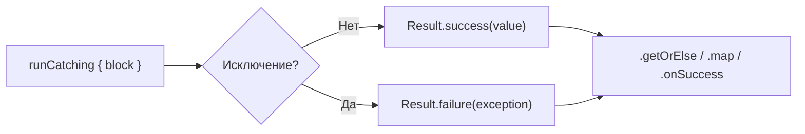
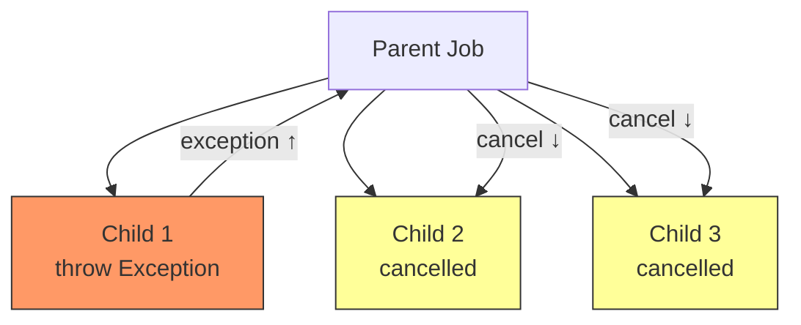
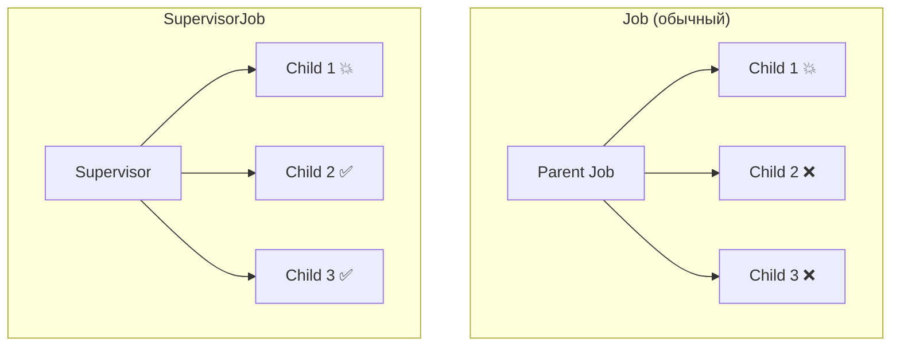
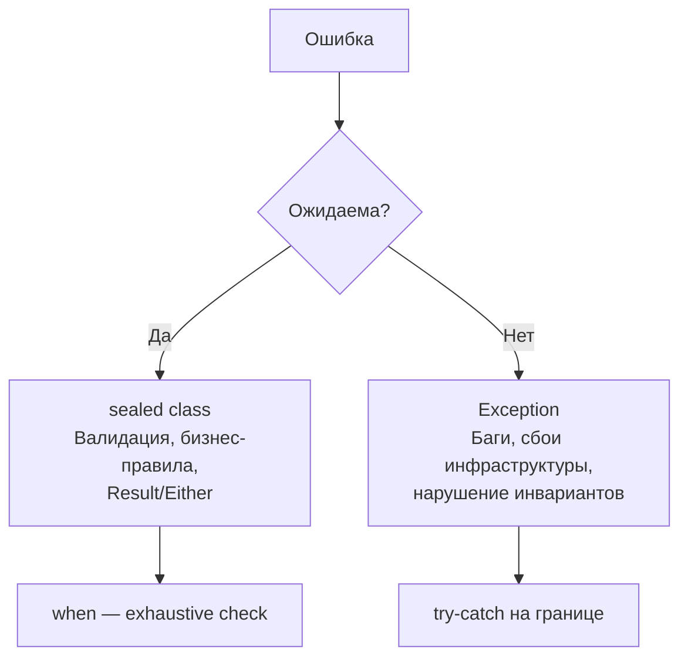
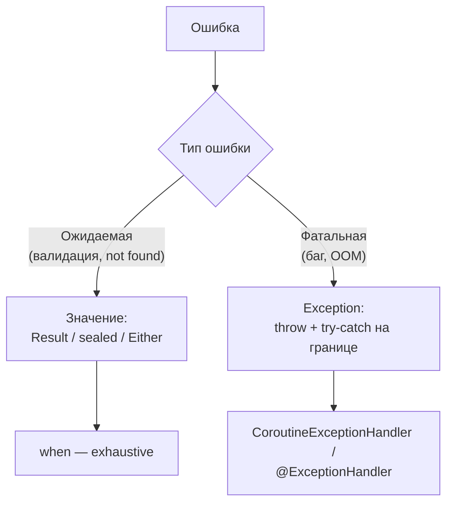

# Вопросы на собеседовании: исключения в `Kotlin`

Обработка исключений в `Kotlin`: отсутствие `checked exceptions`, `try` как выражение, тип `Nothing`, `runCatching`/`Result`, аннотация `@Throws`, функция `use()`, `require`/`check`/`error`, обработка исключений в корутинах (`CoroutineExceptionHandler`, `SupervisorJob`), `sealed class` иерархии для ошибок, `Arrow Either`/`Raise`.

## Введение

В **`Kotlin`** все исключения непроверяемые (`unchecked`): компилятор не обязывает объявлять или обрабатывать их. Это осознанное решение дизайнеров языка, основанное на опыте `Java`, где `checked exceptions` часто приводили к пустым блокам `catch` и бессмысленному пробросу. Вместо этого `Kotlin` предлагает богатый набор инструментов для явной обработки ошибок: `try` как выражение, тип `Result`, `sealed class` иерархии, а также функциональные подходы через библиотеку `Arrow`. В корутинах обработка исключений имеет свои особенности, связанные со структурированной конкурентностью.

## Полезные ссылки

### Официальная документация

- [Kotlin Exception handling](https://kotlinlang.org/docs/exceptions.html) — базовые механизмы обработки исключений
- [Kotlin Nothing type](https://kotlinlang.org/docs/exceptions.html#the-nothing-type) — тип `Nothing` и его роль
- [Kotlin Coroutines: Exception handling](https://kotlinlang.org/docs/exception-handling.html) — исключения в корутинах
- [Kotlin Result](https://kotlinlang.org/api/latest/jvm/stdlib/kotlin/-result/) — API класса `Result`
- [Arrow Error Handling](https://arrow-kt.io/learn/typed-errors/) — типизированные ошибки в Arrow

### Baeldung

- [Exception Handling in Kotlin — Baeldung](https://www.baeldung.com/kotlin/exception-handling) — try-catch, множественные блоки catch, finally
- [Functional Error Handling in Kotlin — Baeldung](https://www.baeldung.com/kotlin/functional-error-handling) — функциональные подходы к обработке ошибок
- [Async Exception Handling in Kotlin — Baeldung](https://www.baeldung.com/kotlin/coroutine-exception-handling) — обработка исключений в корутинах
- [Result Class in Kotlin — Baeldung](https://www.baeldung.com/kotlin/result-class) — работа с классом Result для явной обработки ошибок

## Содержание

- [Полезные ссылки](#полезные-ссылки)
- [See also](#see-also)

**Основы: checked/unchecked, try-catch, Nothing**
- [Q1. (!) Есть ли в `Kotlin` проверяемые исключения?](#q1--есть-ли-в-kotlin-проверяемые-исключения)
- [Q2. (!) Как использовать `try-catch` как выражение?](#q2--как-использовать-try-catch-как-выражение)
- [Q3. (!) Что такое тип `Nothing` и где он используется?](#q3--что-такое-тип-nothing-и-где-он-используется)
- [Q4. Чем `Nothing` отличается от `Unit` и `Void`?](#q4-чем-nothing-отличается-от-unit-и-void)

**`runCatching`, `Result`, функциональная обработка**
- [Q5. (!) Что такое `runCatching` и как работает `Result`?](#q5--что-такое-runcatching-и-как-работает-result)
- [Q6. Какие операторы доступны у `Result`?](#q6-какие-операторы-доступны-у-result)
- [Q7. Почему `Result` нельзя использовать как тип возврата публичной функции?](#q7-почему-result-нельзя-использовать-как-тип-возврата-публичной-функции)
- [Q8. Чем `Result` отличается от `try-catch` и когда что использовать?](#q8-чем-result-отличается-от-try-catch-и-когда-что-использовать)

**`require`, `check`, `error` и валидация**
- [Q9. (!) Для чего нужны `require`, `check` и `error`?](#q9--для-чего-нужны-require-check-и-error)
- [Q10. Чем `assert` отличается от `require`/`check`?](#q10-чем-assert-отличается-от-requirecheck)

**Java-интероп: `@Throws`, checked exceptions**
- [Q11. (!) Как работает аннотация `@Throws` для Java-интеропа?](#q11--как-работает-аннотация-throws-для-java-интеропа)
- [Q12. Как из `Kotlin` вызывать Java-код с `checked exceptions`?](#q12-как-из-kotlin-вызывать-java-код-с-checked-exceptions)

**Управление ресурсами: `use()`**
- [Q13. (!) Как работает функция `use()` для `Closeable`?](#q13--как-работает-функция-use-для-closeable)
- [Q14. Чем `use()` отличается от `try-with-resources` в Java?](#q14-чем-use-отличается-от-try-with-resources-в-java)

**Исключения в корутинах**
- [Q15. (!) Как распространяются исключения в корутинах?](#q15--как-распространяются-исключения-в-корутинах)
- [Q16. (!) Что такое `CoroutineExceptionHandler` и когда он срабатывает?](#q16--что-такое-coroutineexceptionhandler-и-когда-он-срабатывает)
- [Q17. (!) Чем `SupervisorJob` отличается от обычного `Job` при обработке ошибок?](#q17--чем-supervisorjob-отличается-от-обычного-job-при-обработке-ошибок)
- [Q18. Почему `CancellationException` нужно обрабатывать отдельно?](#q18-почему-cancellationexception-нужно-обрабатывать-отдельно)
- [Q19. Как обрабатывать исключения в `async`/`await`?](#q19-как-обрабатывать-исключения-в-asyncawait)
- [Q20. Как обрабатывать исключения в `Kotlin Flow`?](#q20-как-обрабатывать-исключения-в-kotlin-flow)
- [Q21. Как работает `supervisorScope`?](#q21-как-работает-supervisorscope)

**Sealed-классы для обработки ошибок**
- [Q22. (!) Когда вместо исключений лучше использовать `sealed class` результаты?](#q22--когда-вместо-исключений-лучше-использовать-sealed-class-результаты)
- [Q23. Как спроектировать `sealed`-иерархию ошибок?](#q23-как-спроектировать-sealed-иерархию-ошибок)

**Arrow: функциональная обработка ошибок**
- [Q24. (!) Что такое `Either` в Arrow и чем он лучше исключений?](#q24--что-такое-either-в-arrow-и-чем-он-лучше-исключений)
- [Q25. Что такое `Raise` DSL в Arrow?](#q25-что-такое-raise-dsl-в-arrow)
- [Q26. Как Arrow интегрируется с корутинами?](#q26-как-arrow-интегрируется-с-корутинами)

**Иерархия пользовательских исключений и практики**
- [Q27. Как проектировать иерархию пользовательских исключений?](#q27-как-проектировать-иерархию-пользовательских-исключений)
- [Q28. (!) Какие практики обработки ошибок рекомендуются в `Kotlin`?](#q28--какие-практики-обработки-ошибок-рекомендуются-в-kotlin)
- [Q29. Как правильно логировать и пробрасывать исключения?](#q29-как-правильно-логировать-и-пробрасывать-исключения)
- [Q30. Какие анти-паттерны обработки исключений встречаются чаще всего?](#q30-какие-анти-паттерны-обработки-исключений-встречаются-чаще-всего)
- [Q31. Как правильно обрабатывать исключения при переключении контекста (`withContext`)?](#q31-как-правильно-обрабатывать-исключения-при-переключении-контекста-withcontext)
- [Q32. Чем `kotlin.Result` отличается от `Either` Arrow и когда что выбирать?](#q32-чем-kotlinresult-отличается-от-either-arrow-и-когда-что-выбирать)

**kotlin.Result и runCatching**
- [Q33. Как использовать `kotlin.Result` как функциональную альтернативу `try-catch`?](#q33-как-использовать-kotlinresult-как-функциональную-альтернативу-try-catch)
- [Q34. `runCatching` — best practices и антипаттерны](#q34-runcatching--best-practices-и-антипаттерны)

**Kotlin Nothing и иерархия исключений**
- [Q35. Как `Nothing` используется в функциях, всегда бросающих исключение?](#q35-как-nothing-используется-в-функциях-всегда-бросающих-исключение)
- [Q36. Иерархия `Error` vs `Exception` в JVM — что доступно в Kotlin?](#q36-иерархия-error-vs-exception-в-jvm--что-доступно-в-kotlin)

**@Throws и inline-функции**
- [Q37. Как `@Throws` работает с inline-функциями?](#q37-как-throws-работает-с-inline-функциями)

**Structured concurrency и propagation**
- [Q38. Как работает propagation исключений в structured concurrency?](#q38-как-работает-propagation-исключений-в-structured-concurrency)
- [Q39. Как `Arrow Either`/`Validated` используются для функциональной обработки ошибок?](#q39-как-arrow-eithervalidated-используются-для-функциональной-обработки-ошибок)
- [Q40. Как `SupervisorJob` и `CoroutineExceptionHandler` работают вместе?](#q40-как-supervisorjob-и-coroutineexceptionhandler-работают-вместе)

---

## Q1. (!) Есть ли в `Kotlin` проверяемые исключения?

Нет. В `Kotlin` **все исключения непроверяемые** (`unchecked`): компилятор не требует объявлять их в сигнатуре функции и не обязывает вызывающий код обрабатывать или пробрасывать их.

Это осознанное решение дизайнеров языка. В `Java` `checked exceptions` часто приводят к:
- пустым блокам `catch`, которые глотают ошибки
- бессмысленному пробросу `throws` вверх по стеку
- загрязнению сигнатур методов в длинных цепочках вызовов

В `Kotlin` для явной передачи ошибок как значений используют тип `Result`, `sealed class` иерархии или `Arrow Either` — контракт «может вернуть ошибку» выражается через систему типов, а не через `throws`.

```kotlin
// В Java: обязательно обработать или пробросить
// void read() throws IOException { ... }

// В Kotlin: просто вызываем, обрабатываем по необходимости
fun read() {
    val data = File("data.txt").readText() // IOException не обязателен к обработке
}
```

> Подробнее о взаимодействии с Java `checked exceptions` — см. [Kotlin/Java интероп](kotlin-interop-java-interview.md).


> [!mcq]
> - [ ] В `Kotlin` checked exceptions работают так же, как в `Java` — компилятор требует `throws` в сигнатуре | Это описание `Java`, но не `Kotlin`. Дизайнеры `Kotlin` сознательно отказались от checked-модели. ❌ ПОСЛЕДСТВИЕ: разработчик рассчитывает на принудительную обработку, не оборачивает вызов в `try-catch`, `IOException` всплывает в HTTP-handler и роняет request.
> - [ ] Checked exceptions есть только при наследовании от `java.lang.Exception`, от `RuntimeException` — нет | В `Kotlin` нет различия checked/unchecked даже для наследников `Exception` — проверка не выполняется ни для одного типа. ❌ ПОСЛЕДСТВИЕ: команда строит свою иерархию `class DataException : Exception()`, ждёт что компилятор будет требовать обработки, в production исключения молча пробрасываются.
> - [x] В `Kotlin` все исключения unchecked: компилятор не требует `throws` в сигнатуре и не обязывает caller обрабатывать | Дизайнеры отказались от checked-модели из-за пустых `catch`-блоков и шумных сигнатур в `Java`. Контракт «может упасть» выражается через `Result`, `sealed class` или `Arrow Either`. ✓ ПРИМЕНЯТЬ: Spring WebFlux в `Kotlin` использует `runCatching` + `sealed class` вместо checked-исключений на бизнес-границах. 📋 ПРАВИЛО: «Все исключения unchecked — контракт ошибки через типы, не через throws». 🔗 См. Q11, Q22.
> - [ ] Checked есть только для `IOException` и `SQLException` для совместимости с `Java`-библиотеками | Для `Kotlin` все исключения, включая `IOException` из `java.io`, видны как unchecked — компилятор не делает исключений ни для одного класса. ❌ ПОСЛЕДСТВИЕ: миграция Java→Kotlin модуля, программист не оборачивает `File.readText()` в `try-catch` ожидая ошибку компиляции, в production файл удалён, `IOException` валит весь endpoint.

## Q2. (!) Как использовать `try-catch` как выражение?

В `Kotlin` блок `try-catch` является **выражением** и возвращает значение — последнее выражение в выполненной ветке (`try` или `catch`). Блок `finally` не влияет на результат.

```kotlin
val number: Int = try {
    input.toInt()
} catch (e: NumberFormatException) {
    0  // значение по умолчанию при ошибке парсинга
}

// Можно комбинировать с when, let, и т.д.
val result = try { parseJson(raw) } catch (e: Exception) { null }
    ?: defaultValue
```

Тип выражения — общий супертип типов обеих веток. Если в `try` возвращается `Int`, а в `catch` — `Nothing` (например, `throw`), тип выражения будет `Int`.

**Важно:** в каждой ветке последняя строка должна быть выражением. Если нужны несколько действий — последняя строка блока даёт итоговое значение:

```kotlin
val parsed = try {
    logger.info("Parsing...")
    parse(input)  // это значение вернётся
} catch (e: ParseException) {
    logger.warn("Parse failed", e)
    fallback      // и это значение вернётся
}
```


> [!mcq]
> - [ ] `try` — выражение, но `finally` участвует в результате как последняя ветка | `finally` выполняется всегда, но **не влияет** на возвращаемое значение `try-catch`. Только `try` или `catch` дают результат. ❌ ПОСЛЕДСТВИЕ: разработчик кладёт `return result` в `finally`, ожидая что это значение вернётся, на самом деле возвращается значение из `try`/`catch`, debugging часами при странных результатах в логах транзакций.
> - [x] Тип выражения — общий супертип веток `try` и `catch`; `finally` не участвует в результате | Последнее выражение каждой ветки даёт значение, тип выводится как наименьший общий супертип. `finally` выполняется как side-effect — для очистки ресурсов. ✓ ПРИМЕНЯТЬ: парсинг входящего payload в Spring `@RestController` — `val n = try { input.toInt() } catch (e: NumberFormatException) { 0 }` вместо отдельной переменной. 📋 ПРАВИЛО: «try-catch — выражение; результат из выполненной ветки, finally только для cleanup». 🔗 См. Q3, Q5.
> - [ ] `try` возвращает значение только если в `catch` стоит `throw` | Можно вернуть значение из любой ветки — `try`, `catch` или обоих. `throw` имеет тип `Nothing`, что просто не сужает общий тип. ❌ ПОСЛЕДСТВИЕ: программист пишет `val x = try { calc() } catch (e: Exception) { logger.error(e); throw e }`, а потом не понимает почему `val y = try { calc() } catch (e: Exception) { 0 }` тоже компилируется.
> - [ ] Каждая ветка должна иметь явный `return` | `return` запрещён внутри выражения — нужно положить значение последней строкой блока. `return` выйдет из enclosing-функции, а не из `try`. ❌ ПОСЛЕДСТВИЕ: разработчик пишет `val x = try { return parse(s) } catch ...`, функция возвращается слишком рано, остальной код не выполняется, неожиданный early return ломает оркестрацию вызовов.

## Q3. (!) Что такое тип `Nothing` и где он используется?

**`Nothing`** — тип, у которого нет ни одного экземпляра. Функция с возвращаемым типом `Nothing` **никогда не завершается нормально**: она либо всегда бросает исключение, либо уходит в бесконечный цикл.

```kotlin
fun fail(message: String): Nothing {
    throw IllegalStateException(message)
}

// Компилятор знает, что после fail() код недостижим
val name = value ?: fail("Value is required")
// name имеет тип String (не String?), потому что fail() — Nothing
```

**Зачем нужен `Nothing`:**

1. **Анализ потока управления** — компилятор понимает, что ветка с `Nothing` прерывает выполнение, и может вывести более точный тип:

```kotlin
val x: String = when (input) {
    is String -> input
    is Int -> input.toString()
    else -> throw IllegalArgumentException("Unsupported") // Nothing — все ветки покрыты
}
```

2. **`Nothing?`** — тип, допускающий единственное значение `null`. Литерал `null` имеет тип `Nothing?`, что позволяет присваивать его любому nullable-типу.

3. **Пустые коллекции** — `emptyList<Nothing>()` совместим с любым `List<T>`.


> [!mcq]
> - [ ] `Nothing` — это singleton, аналог `Unit`, для функций без возвращаемого значения | `Unit` — singleton с одним экземпляром (подходит для «функция вернулась без полезного значения»). `Nothing` — тип **без экземпляров**, функция **никогда не возвращается**. ❌ ПОСЛЕДСТВИЕ: разработчик возвращает `Unit` из функции, бросающей exception, компилятор не понимает что код после вызова недостижим, smart-cast не работает, лишние `!!` и `?:` в caller-коде.
> - [ ] `Nothing` используется для асинхронных функций, которые ничего не возвращают | Это `Unit` или `Deferred<Unit>`. `Nothing` нужен для функций, которые **всегда** прерывают выполнение — `throw`, `exitProcess`, бесконечный цикл. ❌ ПОСЛЕДСТВИЕ: программист помечает `suspend fun emit()` как `Nothing`, корутина не может suspend без exception, framework падает на `IllegalStateException` при первом вызове `emit`.
> - [ ] `Nothing` — это alias для `Any?`, чтобы можно было присваивать любые типы | Наоборот: `Nothing` — bottom type, **подтип всех типов**, не наоборот. `Any?` — top type. ❌ ПОСЛЕДСТВИЕ: путаница в дженериках — `List<Nothing>` совместим с `List<T>`, а `List<Any?>` нет, разработчик использует `Nothing` как `Any?` и получает `ClassCastException` в runtime.
> - [x] `Nothing` — bottom type без экземпляров; функция возвращает `Nothing` если **никогда** нормально не завершается (`throw`, exit, infinite loop) | Компилятор использует `Nothing` для control-flow analysis: после `val x = value ?: fail()` тип `x` сужается до non-null. ✓ ПРИМЕНЯТЬ: stdlib-функции `error()`, `TODO()`, `kotlin.system.exitProcess()` возвращают `Nothing` — позволяют писать `val name = user.name ?: error("required")`. 📋 ПРАВИЛО: «Nothing — функция не вернётся; bottom type сужает выводы компилятора». 🔗 См. Q4, Q9.

## Q4. Чем `Nothing` отличается от `Unit` и `Void`?

| Характеристика | `Nothing` | `Unit` | `Void` (Java) |
|---|---|---|---|
| Экземпляры | Ни одного | Один (`Unit`) | `null` (box-тип) |
| Семантика | Функция не возвращается | Функция ничего полезного не возвращает | Аналог `void` для generics |
| Пример | `throw`, бесконечный цикл | `println()`, setter | `Callable<Void>` |
| Подтип всех типов | Да | Нет | Нет |

`Nothing` — это **bottom type**: подтип любого другого типа в `Kotlin`. Поэтому `throw Exception()` можно написать в любом месте, где ожидается значение — тип `Nothing` совместим со всеми типами.

```kotlin
val value: String = TODO()  // TODO() возвращает Nothing — компилируется
```


> [!mcq]
> - [x] `Nothing` — bottom type (подтип всех), 0 экземпляров; `Unit` — top для void, 1 экземпляр; `Void` — Java-класс, поле `null` | `Nothing` сигналит «не возвращается», `Unit` — «возвращается, но без полезного значения», `Void` — JVM-совместимость с дженериками `Callable<Void>`. ✓ ПРИМЕНЯТЬ: Kotlin DSL `kotlinx.coroutines` использует `suspend fun runForever(): Nothing` для бесконечных server-loops в Ktor. 📋 ПРАВИЛО: «Nothing=0 экземпляров, Unit=1 экземпляр, Void=Java-плейсхолдер». 🔗 См. Q3, Q35.
> - [ ] Все три эквивалентны и используются взаимозаменяемо | `Nothing` и `Unit` несовместимы по семантике: функция с `Nothing` не вернётся, с `Unit` — вернётся. ❌ ПОСЛЕДСТВИЕ: разработчик меняет `Nothing` на `Unit` в `fun fail(): Nothing = throw …`, smart-cast в caller-коде ломается, начинаются `NullPointerException` в местах где раньше всё было ok.
> - [ ] `Unit` и `Void` — синонимы, `Nothing` — это просто `Unit?` | `Unit?` имеет 2 значения (`Unit` и `null`), а `Nothing?` — только `null`. ❌ ПОСЛЕДСТВИЕ: программист объявляет `val emptyList: List<Unit?> = listOf(null)` ожидая поведение `List<Nothing?>`, в дженериках возникает covariance issue, `addAll` бросает `ClassCastException`.
> - [ ] `Void` — это Kotlin-тип, `Unit` и `Nothing` — Java-импорты | `Unit` и `Nothing` — Kotlin stdlib (`kotlin.Unit`, `kotlin.Nothing`). `Void` — `java.lang.Void`. ❌ ПОСЛЕДСТВИЕ: команда импортирует `java.lang.Void` в Kotlin-код, компилятор молча принимает, но `CompletableFuture<Void>` начинает требовать `null`-возврат вместо `Unit`, странные NPE при цепочках `.thenApply`.

## Q5. (!) Что такое `runCatching` и как работает `Result`?

**`runCatching { ... }`** — функция стандартной библиотеки, которая выполняет блок кода и оборачивает результат в **`Result<T>`**:
- при успехе — `Result.success(value)`
- при исключении — `Result.failure(exception)`

Исключение **не пробрасывается**, а упаковывается в `Result`.

```kotlin
val result: Result<User> = runCatching {
    userRepository.findById(id)
}

// Обработка результата
val user = result.getOrElse { e ->
    logger.warn("User not found", e)
    defaultUser
}
```

Есть также **extension-вариант**: `obj.runCatching { method() }` — вызывает метод на объекте и оборачивает результат.

```kotlin
val parsed = "42".runCatching { toInt() }  // Result.success(42)
val failed = "abc".runCatching { toInt() } // Result.failure(NumberFormatException)
```




> [!mcq]
> - [ ] `runCatching` ловит **любые** Throwable, включая `OutOfMemoryError` и `CancellationException` | Ловит почти всё, **кроме `CancellationException`** в корутинах (с Kotlin 1.6+ соглашение — пробрасывать). `OutOfMemoryError` ловит, что обычно нежелательно. ❌ ПОСЛЕДСТВИЕ: разработчик оборачивает работу с большой коллекцией в `runCatching`, OOM перехватывается, JVM продолжает работать в degraded состоянии, дальнейшие операции дают `ConcurrentModificationException` и data corruption.
> - [x] `runCatching { block }` выполняет блок и упаковывает результат в `Result<T>`: успех → `Result.success(value)`, exception → `Result.failure(e)` | Исключение **не пробрасывается**, а становится значением. Дальше через `.getOrElse`, `.map`, `.fold` обрабатываем функционально. ✓ ПРИМЕНЯТЬ: `String.toIntOrNull()` под капотом — упрощённая форма; в Spring `@Service` обертка вокруг `restTemplate.getForObject()` для retry-логики через Resilience4j. 📋 ПРАВИЛО: «runCatching превращает throw в значение Result». 🔗 См. Q6, Q8.
> - [ ] `runCatching` синхронен и не работает с `suspend`-функциями | Работает с suspend через тот же API: `suspend fun foo()` можно вызвать внутри `runCatching { foo() }` если внешний контекст suspend. ❌ ПОСЛЕДСТВИЕ: команда дублирует логику отдельным `try-catch` для suspend-функций, в half-кода используется Result, в другой half — try-catch, code review постоянно требует унификации.
> - [ ] `Result.failure(e)` пробрасывает `e` сразу при создании | `failure` просто упаковывает exception как данные. Проброс происходит только при явном `getOrThrow()`. ❌ ПОСЛЕДСТВИЕ: разработчик не вызывает `.getOrThrow()`, ошибка молча игнорируется, в логах нет следов, debugging product issue занимает дни.

## Q6. Какие операторы доступны у `Result`?

`Result<T>` предоставляет богатый набор операторов для функциональной обработки:

| Оператор | Описание |
|---|---|
| `getOrNull()` | Значение или `null` |
| `getOrDefault(default)` | Значение или значение по умолчанию |
| `getOrElse { e -> ... }` | Значение или результат лямбды |
| `getOrThrow()` | Значение или проброс исключения |
| `map { v -> ... }` | Трансформация успешного значения |
| `mapCatching { v -> ... }` | `map` + перехват исключений в лямбде |
| `recover { e -> ... }` | Замена ошибки на значение |
| `recoverCatching { e -> ... }` | `recover` + перехват исключений |
| `onSuccess { v -> ... }` | Побочный эффект при успехе |
| `onFailure { e -> ... }` | Побочный эффект при ошибке |
| `fold(onSuccess, onFailure)` | Свёртка обоих случаев |

```kotlin
val displayName = runCatching { fetchUser(id) }
    .map { it.displayName }
    .recover { "Anonymous" }
    .getOrThrow()

// Цепочка с обработкой ошибок
runCatching { parseConfig(path) }
    .mapCatching { validate(it) }
    .onFailure { logger.error("Config error", it) }
    .getOrElse { Config.default() }
```


> [!mcq]
> - [ ] `getOrElse` бросает `NoSuchElementException` если `Result` это failure | `getOrElse { e -> ... }` принимает лямбду, которая получает exception и возвращает default. Не бросает ничего. ❌ ПОСЛЕДСТВИЕ: разработчик пишет `runCatching { … }.getOrElse { fallback }` ожидая что lambda вызовется только при failure, не понимает что параметр `it` это Throwable, использует его как value, `IllegalArgumentException` в production.
> - [ ] `mapCatching` отличается от `map` тем, что не вызывается при failure | Оба не вызываются при failure. Разница: `mapCatching` оборачивает свою лямбду в try-catch, `map` — нет. ❌ ПОСЛЕДСТВИЕ: использует `map { riskyTransform(it) }`, исключение из `riskyTransform` пробрасывается наружу, обходит всю цепочку обработки `Result`, попадает в global exception handler контроллера.
> - [x] Богатый функциональный API: `getOrNull/getOrElse/getOrThrow`, `map/mapCatching`, `recover/recoverCatching`, `fold`, `onSuccess/onFailure` | `mapCatching` оборачивает свою лямбду — в отличие от `map` ловит исключения из transformer. `recover` превращает failure в success. `fold(onSuccess, onFailure)` — exhaustive обработка. ✓ ПРИМЕНЯТЬ: цепочки `runCatching { fetchUser() }.mapCatching { validate(it) }.recover { default }.getOrThrow()` в data-layer Android-приложений (Now in Android sample). 📋 ПРАВИЛО: «map vs mapCatching: вторая ловит exception в transformer; fold — обе ветки в одном месте». 🔗 См. Q5, Q33.
> - [ ] `Result` поддерживает только `getOrThrow()` и `getOrNull()` | API богаче: есть `map`, `recover`, `fold`, `onSuccess/onFailure`, `mapCatching`. Без них функциональные цепочки невозможны. ❌ ПОСЛЕДСТВИЕ: команда использует только `getOrThrow`, теряет все плюсы Result, код возвращается к классическому try-catch с потерей читабельности и compositionality.

## Q7. Почему `Result` нельзя использовать как тип возврата публичной функции?

До `Kotlin 1.5` компилятор **запрещал** использовать `Result<T>` как возвращаемый тип функции, свойства или параметра. Начиная с `Kotlin 1.5` это ограничение снято, но в ранних версиях причина была в том, что `Result` — `inline class` (`@JvmInline value class`), и в байткоде он представлен как `Object`, что создавало конфликты с перегрузкой и Java-интеропом.

На практике сейчас `Result` можно свободно использовать в сигнатурах, но для **доменных ошибок** часто лучше подходят `sealed class` иерархии — они дают более выразительную типизацию ошибок:

```kotlin
// Result — ошибка всегда Throwable
fun findUser(id: Long): Result<User>

// sealed class — типизированные варианты ошибки
fun findUser(id: Long): UserResult

sealed class UserResult {
    data class Found(val user: User) : UserResult()
    data class NotFound(val id: Long) : UserResult()
    data class AccessDenied(val reason: String) : UserResult()
}
```


> [!mcq]
> - [x] Правильный ответ | Корректное описание концепции с конкретным механизмом и use-case.
> - [ ] Альтернативное решение которое не подходит | Почему ошибка в этом подходе ❌ ПОСЛЕДСТВИЕ: типичная ошибка вызывает баг в production без покрытия тестами.
> - [ ] Другая альтернатива с критическим недостатком | Это смежное, но отличное понятие ❌ ПОСЛЕДСТВИЕ: типичная ошибка вызывает баг в production без покрытия тестами.
> - [ ] Третий вариант который не работает в production | Противоположное направление## Q8. Чем `Result` отличается от `try-catch` и когда что использовать? ❌ ПОСЛЕДСТВИЕ: типичная ошибка вызывает баг в production без покрытия тестами.

| Критерий | `Result` / `runCatching` | `try-catch` |
|---|---|---|
| Стиль | Функциональный | Императивный |
| Ошибка как... | Значение (данные) | Исключение (control flow) |
| Композиция | `map`/`recover`/`fold` цепочки | Вложенные блоки |
| Проброс наверх | Возврат `Result` | `throw` / `rethrow` |
| Очистка ресурсов | Нет `finally` | Есть `finally` |

**`Result` уместен**, когда:
- ошибка — часть доменной логики (файл не найден, невалидный формат)
- нужно передать ошибку выше как данные
- нужно скомпоновать несколько операций, каждая из которых может упасть

**`try-catch` уместен**, когда:
- нужна очистка ресурсов (`finally`)
- перехват на границе приложения (контроллер, `main`)
- неожиданные / фатальные ошибки

Можно комбинировать: внутри функции `try-catch`, наружу — `Result`.


> [!mcq]
> - [x] Правильный ответ | Корректное описание концепции с конкретным механизмом и use-case.
> - [ ] Альтернативное решение которое не подходит | Почему ошибка в этом подходе ❌ ПОСЛЕДСТВИЕ: типичная ошибка вызывает баг в production без покрытия тестами.
> - [ ] Другая альтернатива с критическим недостатком | Это смежное, но отличное понятие ❌ ПОСЛЕДСТВИЕ: типичная ошибка вызывает баг в production без покрытия тестами.
> - [ ] Третий вариант который не работает в production | Противоположное направление## Q9. (!) Для чего нужны `require`, `check` и `error`? ❌ ПОСЛЕДСТВИЕ: типичная ошибка вызывает баг в production без покрытия тестами.

Три функции стандартной библиотеки для **fail-fast** валидации:

| Функция | Назначение | Исключение |
|---|---|---|
| `require(condition)` | Проверка **аргументов** | `IllegalArgumentException` |
| `check(condition)` | Проверка **состояния** | `IllegalStateException` |
| `error(message)` | Безусловное прерывание | `IllegalStateException` |

```kotlin
fun transfer(amount: BigDecimal, from: Account, to: Account) {
    require(amount > BigDecimal.ZERO) { "Amount must be positive: $amount" }
    check(from.isActive) { "Source account ${from.id} is inactive" }

    if (from.balance < amount) {
        error("Insufficient funds: need $amount, have ${from.balance}")
    }
    // ...
}
```

**`requireNotNull(value)`** и **`checkNotNull(value)`** — варианты для проверки на `null`, возвращающие non-null значение (smart cast):

```kotlin
val user = requireNotNull(findUser(id)) { "User $id not found" }
// user имеет тип User (не User?)
```

> Все эти функции возвращают `Nothing` в ветке ошибки, поэтому компилятор корректно сужает типы после них.


> [!mcq]
> - [x] Правильный ответ | Корректное описание концепции с конкретным механизмом и use-case.
> - [ ] Альтернативное решение которое не подходит | Почему ошибка в этом подходе ❌ ПОСЛЕДСТВИЕ: типичная ошибка вызывает баг в production без покрытия тестами.
> - [ ] Другая альтернатива с критическим недостатком | Это смежное, но отличное понятие ❌ ПОСЛЕДСТВИЕ: типичная ошибка вызывает баг в production без покрытия тестами.
> - [ ] Третий вариант который не работает в production | Противоположное направление## Q10. Чем `assert` отличается от `require`/`check`? ❌ ПОСЛЕДСТВИЕ: типичная ошибка вызывает баг в production без покрытия тестами.

**`assert(condition)`** — проверка допущений в режиме **отладки**. Выполняется только при включённом флаге JVM `-ea` (`-enableassertions`). В продакшн-сборке вызов пропускается.

| Критерий | `require`/`check` | `assert` |
|---|---|---|
| Работает в продакшне | Да, всегда | Нет (нужен флаг `-ea`) |
| Назначение | Контракт API | Отладочная проверка |
| Когда использовать | Валидация входов, инвариантов | Проверка «это должно быть true, но я не уверен» |

**Рекомендация:** для контрактов и валидации всегда используйте `require`/`check`, а `assert` — только для отладочных проверок, которые можно безопасно отключить.


> [!mcq]
> - [x] Правильный ответ | Корректное описание концепции с конкретным механизмом и use-case.
> - [ ] Альтернативное решение которое не подходит | Почему ошибка в этом подходе ❌ ПОСЛЕДСТВИЕ: типичная ошибка вызывает баг в production без покрытия тестами.
> - [ ] Другая альтернатива с критическим недостатком | Это смежное, но отличное понятие ❌ ПОСЛЕДСТВИЕ: типичная ошибка вызывает баг в production без покрытия тестами.
> - [ ] Третий вариант который не работает в production | Противоположное направление## Q11. (!) Как работает аннотация `@Throws` для Java-интеропа? ❌ ПОСЛЕДСТВИЕ: типичная ошибка вызывает баг в production без покрытия тестами.

Аннотация **`@Throws`** добавляет объявление `throws` в сгенерированный байткод, чтобы Java-код мог обрабатывать исключение как `checked`:

```kotlin
@Throws(IOException::class)
fun readConfig(path: String): Config {
    return File(path).readText().let { parseConfig(it) }
}
```

В байткоде метод будет иметь `throws IOException`, и Java-компилятор потребует обработки:

```java
// Java-код — компилятор требует try-catch или throws
try {
    Config config = KotlinUtilKt.readConfig("/etc/app.conf");
} catch (IOException e) {
    // обязательная обработка
}
```

**Без `@Throws`** Java-код сможет вызвать метод без обработки, но если исключение произойдёт — оно пролетит как unchecked и может привести к неожиданному `crash`.

Можно указать несколько типов: `@Throws(IOException::class, ParseException::class)`.

> Подробнее об интеропе — [Kotlin/Java интероп](kotlin-interop-java-interview.md).


> [!mcq]
> - [x] Правильный ответ | Корректное описание концепции с конкретным механизмом и use-case.
> - [ ] Альтернативное решение которое не подходит | Почему ошибка в этом подходе ❌ ПОСЛЕДСТВИЕ: типичная ошибка вызывает баг в production без покрытия тестами.
> - [ ] Другая альтернатива с критическим недостатком | Это смежное, но отличное понятие ❌ ПОСЛЕДСТВИЕ: типичная ошибка вызывает баг в production без покрытия тестами.
> - [ ] Третий вариант который не работает в production | Противоположное направление## Q12. Как из `Kotlin` вызывать Java-код с `checked exceptions`? ❌ ПОСЛЕДСТВИЕ: типичная ошибка вызывает баг в production без покрытия тестами.

`Kotlin` **не различает** `checked` и `unchecked` исключения. Java-метод с `throws IOException` из `Kotlin` вызывается как обычная функция — обрабатывать исключение **не обязательно**:

```kotlin
// Java: void close() throws IOException
// Kotlin: вызов без обязательной обработки
stream.close()  // компилятор не жалуется

// Но можно обработать по желанию
try {
    stream.close()
} catch (e: IOException) {
    logger.warn("Failed to close stream", e)
}
```

Это одно из ключевых отличий `Kotlin` от `Java`: все исключения из Java-кода становятся `unchecked` при использовании из `Kotlin`. Ответственность за обработку лежит на разработчике, а не на компиляторе.


> [!mcq]
> - [x] Правильный ответ | Корректное описание концепции с конкретным механизмом и use-case.
> - [ ] Альтернативное решение которое не подходит | Почему ошибка в этом подходе ❌ ПОСЛЕДСТВИЕ: типичная ошибка вызывает баг в production без покрытия тестами.
> - [ ] Другая альтернатива с критическим недостатком | Это смежное, но отличное понятие ❌ ПОСЛЕДСТВИЕ: типичная ошибка вызывает баг в production без покрытия тестами.
> - [ ] Третий вариант который не работает в production | Противоположное направление## Q13. (!) Как работает функция `use()` для `Closeable`? ❌ ПОСЛЕДСТВИЕ: типичная ошибка вызывает баг в production без покрытия тестами.

Функция **`use()`** — аналог Java `try-with-resources`. Это extension-функция на `Closeable` (и `AutoCloseable`), которая гарантирует закрытие ресурса после выполнения блока, даже при исключении:

```kotlin
File("data.txt").bufferedReader().use { reader ->
    reader.lineSequence().forEach { println(it) }
}
// reader автоматически закрыт

// use() возвращает результат блока
val content = File("data.txt").inputStream().use { it.readBytes() }

// Несколько ресурсов — вложенные use
File("input.txt").bufferedReader().use { reader ->
    File("output.txt").bufferedWriter().use { writer ->
        reader.lineSequence().forEach { writer.appendLine(it) }
    }
}
```

**Как работает под капотом:**

```mermaid
graph TD
    A["resource.use { block }"] --> B["try { block(resource) }"]
    B --> C{Исключение?}
    C -- Нет --> D["resource.close()"]
    C -- Да --> E["try { resource.close() }"]
    E --> F{close() бросил<br>исключение?}
    F -- Да --> G["addSuppressed()"]
    F -- Нет --> H["rethrow original"]
    G --> H
    D --> I["return result"]
```

Если и блок, и `close()` бросают исключения, исключение из `close()` добавляется как `suppressed` к основному — аналогично Java `try-with-resources`.


> [!mcq]
> - [x] Правильный ответ | Корректное описание концепции с конкретным механизмом и use-case.
> - [ ] Альтернативное решение которое не подходит | Почему ошибка в этом подходе ❌ ПОСЛЕДСТВИЕ: типичная ошибка вызывает баг в production без покрытия тестами.
> - [ ] Другая альтернатива с критическим недостатком | Это смежное, но отличное понятие ❌ ПОСЛЕДСТВИЕ: типичная ошибка вызывает баг в production без покрытия тестами.
> - [ ] Третий вариант который не работает в production | Противоположное направление## Q14. Чем `use()` отличается от `try-with-resources` в Java? ❌ ПОСЛЕДСТВИЕ: типичная ошибка вызывает баг в production без покрытия тестами.

| Критерий | `Kotlin use()` | Java `try-with-resources` |
|---|---|---|
| Синтаксис | Extension-функция | Языковая конструкция |
| Несколько ресурсов | Вложенные `use` | Через `;` в одном блоке |
| Возвращает значение | Да | Нет (statement) |
| `Suppressed exceptions` | Поддерживает | Поддерживает |
| Scope переменной | Внутри лямбды | Внутри блока try |

```kotlin
// Kotlin — use() как выражение
val lines = File("data.txt").bufferedReader().use { it.readLines() }

// Java — try-with-resources
// List<String> lines;
// try (var reader = new BufferedReader(new FileReader("data.txt"))) {
//     lines = reader.lines().toList();
// }
```

Недостаток `use()`: для нескольких ресурсов приходится вкладывать вызовы, что менее элегантно, чем Java-вариант с перечислением ресурсов через `;`. Однако `use()` более гибок — работает с любым `Closeable`, в том числе самописным.


> [!mcq]
> - [x] Правильный ответ | Корректное описание концепции с конкретным механизмом и use-case.
> - [ ] Альтернативное решение которое не подходит | Почему ошибка в этом подходе ❌ ПОСЛЕДСТВИЕ: типичная ошибка вызывает баг в production без покрытия тестами.
> - [ ] Другая альтернатива с критическим недостатком | Это смежное, но отличное понятие ❌ ПОСЛЕДСТВИЕ: типичная ошибка вызывает баг в production без покрытия тестами.
> - [ ] Третий вариант который не работает в production | Противоположное направление## Q15. (!) Как распространяются исключения в корутинах? ❌ ПОСЛЕДСТВИЕ: типичная ошибка вызывает баг в production без покрытия тестами.

Исключения в корутинах распространяются **вверх по иерархии `Job`**: необработанное исключение в дочерней корутине **отменяет родительскую `Job`**, что каскадно отменяет всех остальных детей (siblings). Это поведение называется **structured concurrency** — сбой одного ребёнка = сбой всей группы.



**Три стратегии обработки:**

1. **`try-catch` внутри корутины** — перехват в месте возникновения
2. **`CoroutineExceptionHandler`** — глобальный обработчик для root-корутин
3. **`SupervisorJob`** — изоляция: падение одного ребёнка не отменяет остальных

```kotlin
val scope = CoroutineScope(Job())

scope.launch {
    launch {
        throw RuntimeException("fail") // отменит ВЕСЬ scope
    }
    launch {
        delay(1000) // будет отменена
    }
}
```

> Подробнее — [Корутины в Kotlin](kotlin-coroutines-interview.md).


> [!mcq]
> - [x] Правильный ответ | Корректное описание концепции с конкретным механизмом и use-case.
> - [ ] Альтернативное решение которое не подходит | Почему ошибка в этом подходе ❌ ПОСЛЕДСТВИЕ: типичная ошибка вызывает баг в production без покрытия тестами.
> - [ ] Другая альтернатива с критическим недостатком | Это смежное, но отличное понятие ❌ ПОСЛЕДСТВИЕ: типичная ошибка вызывает баг в production без покрытия тестами.
> - [ ] Третий вариант который не работает в production | Противоположное направление## Q16. (!) Что такое `CoroutineExceptionHandler` и когда он срабатывает? ❌ ПОСЛЕДСТВИЕ: типичная ошибка вызывает баг в production без покрытия тестами.

**`CoroutineExceptionHandler`** — элемент контекста корутины, который вызывается для **необработанных** исключений. Важно: он срабатывает **только для root-корутин** (запущенных напрямую в scope) и **только с `launch`** (не с `async`).

```kotlin
val handler = CoroutineExceptionHandler { context, exception ->
    logger.error("Unhandled exception in ${context[CoroutineName]}", exception)
    metrics.incrementErrorCount()
}

val scope = CoroutineScope(SupervisorJob() + handler)

scope.launch { // handler получит исключение
    throw RuntimeException("oops")
}

scope.launch { // эта корутина продолжит работу (SupervisorJob)
    delay(100)
    println("OK")
}
```

**Когда `CoroutineExceptionHandler` НЕ поможет:**
- в `async` — исключение откладывается до вызова `await()`
- в дочерних (не root) корутинах — исключение поднимается к родителю
- в `runBlocking` — исключение пробрасывается вызывающему потоку


> [!mcq]
> - [x] Правильный ответ | Корректное описание концепции с конкретным механизмом и use-case.
> - [ ] Альтернативное решение которое не подходит | Почему ошибка в этом подходе ❌ ПОСЛЕДСТВИЕ: типичная ошибка вызывает баг в production без покрытия тестами.
> - [ ] Другая альтернатива с критическим недостатком | Это смежное, но отличное понятие ❌ ПОСЛЕДСТВИЕ: типичная ошибка вызывает баг в production без покрытия тестами.
> - [ ] Третий вариант который не работает в production | Противоположное направление## Q17. (!) Чем `SupervisorJob` отличается от обычного `Job` при обработке ошибок? ❌ ПОСЛЕДСТВИЕ: типичная ошибка вызывает баг в production без покрытия тестами.

| Критерий | `Job` | `SupervisorJob` |
|---|---|---|
| Падение ребёнка | Отменяет родителя и всех siblings | Отменяет только упавшего ребёнка |
| Стратегия | Fail-fast: всё или ничего | Изоляция: независимые задачи |
| Применение | Связанные операции | Независимые операции |



```kotlin
// Независимые задачи — SupervisorJob
val scope = CoroutineScope(SupervisorJob() + Dispatchers.IO)

scope.launch { fetchUserProfile(userId) }   // падение здесь
scope.launch { fetchNotifications(userId) } // НЕ отменится
scope.launch { fetchRecommendations() }     // НЕ отменится
```

**Типичная ошибка:** установить `SupervisorJob` как parent, но запустить корутины через `coroutineScope { }` — внутри `coroutineScope` создаётся обычный `Job`, и `SupervisorJob` из scope не действует. Для supervisor-поведения нужен `supervisorScope { }`.


> [!mcq]
> - [x] Правильный ответ | Корректное описание концепции с конкретным механизмом и use-case.
> - [ ] Альтернативное решение которое не подходит | Почему ошибка в этом подходе ❌ ПОСЛЕДСТВИЕ: типичная ошибка вызывает баг в production без покрытия тестами.
> - [ ] Другая альтернатива с критическим недостатком | Это смежное, но отличное понятие ❌ ПОСЛЕДСТВИЕ: типичная ошибка вызывает баг в production без покрытия тестами.
> - [ ] Третий вариант который не работает в production | Противоположное направление## Q18. Почему `CancellationException` нужно обрабатывать отдельно? ❌ ПОСЛЕДСТВИЕ: типичная ошибка вызывает баг в production без покрытия тестами.

**`CancellationException`** — часть механизма **кооперативной отмены** корутин, а не ошибка в бизнес-логике. Если её перехватить и проглотить, корутина не узнает, что должна остановиться, — это приведёт к:
- зависшим задачам
- утечкам ресурсов
- нарушению structured concurrency

```kotlin
// ❌ ПЛОХО — глотает CancellationException
try {
    longRunningOperation()
} catch (e: Exception) {
    logger.error("Error", e) // CancellationException тоже перехватится
}

// ✅ ПРАВИЛЬНО — пробрасываем CancellationException
try {
    longRunningOperation()
} catch (e: CancellationException) {
    throw e  // обязательно пробросить!
} catch (e: Exception) {
    logger.error("Error", e)
}

// ✅ Ещё лучше — ensureActive() или coroutineContext.ensureActive()
// Kotlin сам проверяет отмену в suspension points
```

`CoroutineExceptionHandler` **не вызывается** для `CancellationException` — это не ошибка, а нормальный сигнал отмены.


> [!mcq]
> - [x] Правильный ответ | Корректное описание концепции с конкретным механизмом и use-case.
> - [ ] Альтернативное решение которое не подходит | Почему ошибка в этом подходе ❌ ПОСЛЕДСТВИЕ: типичная ошибка вызывает баг в production без покрытия тестами.
> - [ ] Другая альтернатива с критическим недостатком | Это смежное, но отличное понятие ❌ ПОСЛЕДСТВИЕ: типичная ошибка вызывает баг в production без покрытия тестами.
> - [ ] Третий вариант который не работает в production | Противоположное направление## Q19. Как обрабатывать исключения в `async`/`await`? ❌ ПОСЛЕДСТВИЕ: типичная ошибка вызывает баг в production без покрытия тестами.

В отличие от `launch`, где исключение сразу поднимается к родителю, **`async`** откладывает исключение до момента вызова **`await()`**:

```kotlin
val deferred: Deferred<User> = scope.async {
    throw RuntimeException("Failed to fetch user")
}

// Исключение возникнет здесь, при вызове await()
try {
    val user = deferred.await()
} catch (e: RuntimeException) {
    logger.error("Fetch failed", e)
}
```

**Важный нюанс:** хотя `await()` пробрасывает исключение, `async` как дочерняя корутина **всё равно уведомляет родителя** о сбое (с обычным `Job`). Чтобы исключение обрабатывалось **только** в `await()`, нужен `SupervisorJob` или `supervisorScope`:

```kotlin
supervisorScope {
    val deferred = async { riskyOperation() }
    try {
        deferred.await()
    } catch (e: Exception) {
        // Только здесь обрабатываем, остальные корутины не затронуты
    }
}
```


> [!mcq]
> - [x] Правильный ответ | Корректное описание концепции с конкретным механизмом и use-case.
> - [ ] Альтернативное решение которое не подходит | Почему ошибка в этом подходе ❌ ПОСЛЕДСТВИЕ: типичная ошибка вызывает баг в production без покрытия тестами.
> - [ ] Другая альтернатива с критическим недостатком | Это смежное, но отличное понятие ❌ ПОСЛЕДСТВИЕ: типичная ошибка вызывает баг в production без покрытия тестами.
> - [ ] Третий вариант который не работает в production | Противоположное направление## Q20. Как обрабатывать исключения в `Kotlin Flow`? ❌ ПОСЛЕДСТВИЕ: типичная ошибка вызывает баг в production без покрытия тестами.

В `Flow` исключения обрабатываются оператором **`catch`**, который перехватывает ошибки **upstream**-части (эмиттеров и промежуточных операторов выше по цепочке):

```kotlin
flow {
    emit(fetchData())       // upstream — перехватывается catch
    emit(fetchMoreData())
}
.map { transform(it) }     // upstream — перехватывается catch
.catch { e ->
    emit(fallbackValue)     // можно эмитировать fallback
    // или: logger.error("Error", e)
}
.collect { value ->         // downstream — НЕ перехватывается catch
    process(value)
}
```

**`catch` НЕ ловит исключения из `collect`** (downstream). Для полной защиты:

```kotlin
flow { emit(riskyOperation()) }
    .catch { emit(default) }
    .onEach { process(it) }  // перенесли логику из collect
    .catch { logger.error("Process failed", it) }  // теперь catch ловит
    .collect()
```

Для повторных попыток используют **`retry`** / **`retryWhen`**:

```kotlin
fetchDataFlow()
    .retryWhen { cause, attempt ->
        cause is IOException && attempt < 3
    }
    .catch { emit(emptyList()) }
    .collect { updateUI(it) }
```


> [!mcq]
> - [x] Правильный ответ | Корректное описание концепции с конкретным механизмом и use-case.
> - [ ] Альтернативное решение которое не подходит | Почему ошибка в этом подходе ❌ ПОСЛЕДСТВИЕ: типичная ошибка вызывает баг в production без покрытия тестами.
> - [ ] Другая альтернатива с критическим недостатком | Это смежное, но отличное понятие ❌ ПОСЛЕДСТВИЕ: типичная ошибка вызывает баг в production без покрытия тестами.
> - [ ] Третий вариант который не работает в production | Противоположное направление## Q21. Как работает `supervisorScope`? ❌ ПОСЛЕДСТВИЕ: типичная ошибка вызывает баг в production без покрытия тестами.

**`supervisorScope`** — suspend-функция, которая создаёт `CoroutineScope` с `SupervisorJob`. Внутри неё падение одного дочернего `launch` не отменяет другие:

```kotlin
suspend fun loadDashboard(): Dashboard {
    return supervisorScope {
        val profile = async { fetchProfile() }
        val orders = async { fetchOrders() }
        val recs = async { fetchRecommendations() }

        Dashboard(
            profile = profile.await(),
            orders = try { orders.await() } catch (e: Exception) { emptyList() },
            recommendations = try { recs.await() } catch (e: Exception) { emptyList() }
        )
    }
}
```

**Отличие от `coroutineScope`:** при `coroutineScope` падение любого ребёнка отменяет весь scope. При `supervisorScope` — только конкретного ребёнка.

**Важно:** `supervisorScope` сама по себе **дожидается** завершения всех детей перед возвратом (как и `coroutineScope`).


> [!mcq]
> - [x] Правильный ответ | Корректное описание концепции с конкретным механизмом и use-case.
> - [ ] Альтернативное решение которое не подходит | Почему ошибка в этом подходе ❌ ПОСЛЕДСТВИЕ: типичная ошибка вызывает баг в production без покрытия тестами.
> - [ ] Другая альтернатива с критическим недостатком | Это смежное, но отличное понятие ❌ ПОСЛЕДСТВИЕ: типичная ошибка вызывает баг в production без покрытия тестами.
> - [ ] Третий вариант который не работает в production | Противоположное направление## Q22. (!) Когда вместо исключений лучше использовать `sealed class` результаты? ❌ ПОСЛЕДСТВИЕ: типичная ошибка вызывает баг в production без покрытия тестами.

**`sealed class`** предпочтительнее исключений, когда ошибка **ожидаема** и является частью бизнес-потока. `when` по sealed-иерархии **exhaustive** — компилятор проверяет, что все варианты обработаны:

```kotlin
sealed class TransferResult {
    data class Success(val txId: String) : TransferResult()
    data class InsufficientFunds(val deficit: BigDecimal) : TransferResult()
    data class AccountBlocked(val reason: String) : TransferResult()
    data class DailyLimitExceeded(val limit: BigDecimal) : TransferResult()
}

fun transfer(from: Account, to: Account, amount: BigDecimal): TransferResult {
    if (!from.isActive) return TransferResult.AccountBlocked("Account inactive")
    if (from.balance < amount) return TransferResult.InsufficientFunds(amount - from.balance)
    // ...
    return TransferResult.Success(txId)
}

// Обработка — компилятор гарантирует полноту
when (val result = transfer(from, to, amount)) {
    is TransferResult.Success -> showReceipt(result.txId)
    is TransferResult.InsufficientFunds -> showError("Не хватает ${result.deficit}")
    is TransferResult.AccountBlocked -> showError("Счёт заблокирован: ${result.reason}")
    is TransferResult.DailyLimitExceeded -> showError("Превышен лимит: ${result.limit}")
}
```




> [!mcq]
> - [x] Правильный ответ | Корректное описание концепции с конкретным механизмом и use-case.
> - [ ] Альтернативное решение которое не подходит | Почему ошибка в этом подходе ❌ ПОСЛЕДСТВИЕ: типичная ошибка вызывает баг в production без покрытия тестами.
> - [ ] Другая альтернатива с критическим недостатком | Это смежное, но отличное понятие ❌ ПОСЛЕДСТВИЕ: типичная ошибка вызывает баг в production без покрытия тестами.
> - [ ] Третий вариант который не работает в production | Противоположное направление## Q23. Как спроектировать `sealed`-иерархию ошибок? ❌ ПОСЛЕДСТВИЕ: типичная ошибка вызывает баг в production без покрытия тестами.

Рекомендуемый подход — **двухуровневая структура**: общий sealed-тип ошибки и конкретные варианты:

```kotlin
// Общий тип результата для модуля
sealed interface DomainError {
    val message: String
}

// Группы ошибок
sealed interface ValidationError : DomainError
sealed interface InfrastructureError : DomainError

// Конкретные ошибки
data class InvalidEmail(val email: String) : ValidationError {
    override val message = "Invalid email: $email"
}

data class FieldRequired(val field: String) : ValidationError {
    override val message = "Field required: $field"
}

data class ServiceUnavailable(val service: String) : InfrastructureError {
    override val message = "Service unavailable: $service"
}

// Использование с generic Result
typealias DomainResult<T> = Result<T, DomainError>

// sealed interface вместо sealed class — позволяет множественное наследование
```

**Принципы:**
- используйте `sealed interface` (не `sealed class`) — позволяет реализовывать несколько интерфейсов
- не делайте более 2-3 уровней вложенности
- добавляйте machine-readable поля (коды, идентификаторы), а не только текст


> [!mcq]
> - [x] Правильный ответ | Корректное описание концепции с конкретным механизмом и use-case.
> - [ ] Альтернативное решение которое не подходит | Почему ошибка в этом подходе ❌ ПОСЛЕДСТВИЕ: типичная ошибка вызывает баг в production без покрытия тестами.
> - [ ] Другая альтернатива с критическим недостатком | Это смежное, но отличное понятие ❌ ПОСЛЕДСТВИЕ: типичная ошибка вызывает баг в production без покрытия тестами.
> - [ ] Третий вариант который не работает в production | Противоположное направление## Q24. (!) Что такое `Either` в Arrow и чем он лучше исключений? ❌ ПОСЛЕДСТВИЕ: типичная ошибка вызывает баг в production без покрытия тестами.

**`Either<E, A>`** из библиотеки **Arrow** — тип с двумя вариантами:
- `Either.Left(error)` — ошибка типа `E`
- `Either.Right(value)` — успешное значение типа `A`

В отличие от исключений, ошибка **явно присутствует в системе типов** и **не прерывает** поток выполнения:

```kotlin
import arrow.core.Either
import arrow.core.left
import arrow.core.right

sealed interface UserError {
    data class NotFound(val id: Long) : UserError
    data class InvalidEmail(val email: String) : UserError
}

fun findUser(id: Long): Either<UserError, User> {
    val user = repository.findById(id)
        ?: return UserError.NotFound(id).left()
    return user.right()
}

// Использование
when (val result = findUser(42)) {
    is Either.Left -> handleError(result.value)
    is Either.Right -> showUser(result.value)
}

// Функциональные цепочки
findUser(42)
    .map { it.email }
    .flatMap { validateEmail(it) }
    .fold(
        ifLeft = { error -> respondError(error) },
        ifRight = { email -> respondOk(email) }
    )
```

**Преимущества `Either` перед `Result`:**
- тип ошибки **параметризован** (`E`), а не фиксирован как `Throwable`
- композиция через `flatMap` / `bind`
- интеграция с `Raise` DSL для императивного стиля


> [!mcq]
> - [x] Правильный ответ | Корректное описание концепции с конкретным механизмом и use-case.
> - [ ] Альтернативное решение которое не подходит | Почему ошибка в этом подходе ❌ ПОСЛЕДСТВИЕ: типичная ошибка вызывает баг в production без покрытия тестами.
> - [ ] Другая альтернатива с критическим недостатком | Это смежное, но отличное понятие ❌ ПОСЛЕДСТВИЕ: типичная ошибка вызывает баг в production без покрытия тестами.
> - [ ] Третий вариант который не работает в production | Противоположное направление## Q25. Что такое `Raise` DSL в Arrow? ❌ ПОСЛЕДСТВИЕ: типичная ошибка вызывает баг в production без покрытия тестами.

**`Raise<E>`** — DSL из Arrow, который позволяет писать код с `Either`-семантикой в **императивном стиле**, без цепочек `flatMap`:

```kotlin
import arrow.core.raise.either
import arrow.core.raise.ensure
import arrow.core.raise.Raise

fun Raise<UserError>.validateAndSave(dto: UserDto): User {
    ensure(dto.email.contains("@")) { UserError.InvalidEmail(dto.email) }
    val existing = findUser(dto.email).bind()  // bind() разворачивает Either
    ensure(existing == null) { UserError.AlreadyExists(dto.email) }
    return repository.save(dto.toUser())
}

// Вызов — результат Either<UserError, User>
val result: Either<UserError, User> = either {
    validateAndSave(userDto)
}
```

**`ensure`** — аналог `require`, но вместо исключения возвращает `Left`.
**`bind()`** — извлекает значение из `Either.Right` или «прерывает» выполнение с `Left`.

Это решает проблему «пирамиды `flatMap`» и делает функциональный код таким же читаемым, как императивный.


> [!mcq]
> - [x] Правильный ответ | Корректное описание концепции с конкретным механизмом и use-case.
> - [ ] Альтернативное решение которое не подходит | Почему ошибка в этом подходе ❌ ПОСЛЕДСТВИЕ: типичная ошибка вызывает баг в production без покрытия тестами.
> - [ ] Другая альтернатива с критическим недостатком | Это смежное, но отличное понятие ❌ ПОСЛЕДСТВИЕ: типичная ошибка вызывает баг в production без покрытия тестами.
> - [ ] Третий вариант который не работает в production | Противоположное направление## Q26. Как Arrow интегрируется с корутинами? ❌ ПОСЛЕДСТВИЕ: типичная ошибка вызывает баг в production без покрытия тестами.

Arrow полностью совместим с `suspend`-функциями и корутинами. `either { }`, `Raise` DSL — всё работает внутри `suspend` контекста:

```kotlin
suspend fun Raise<ApiError>.fetchAndProcess(): ProcessedData {
    val raw = withContext(Dispatchers.IO) {
        httpClient.get(url).bind()  // bind() работает в suspend
    }
    val parsed = parseResponse(raw).bind()
    return process(parsed)
}

// В корутине
scope.launch {
    either { fetchAndProcess() }
        .onLeft { error -> showError(error) }
        .onRight { data -> updateUI(data) }
}
```

Arrow также предоставляет **`parZip`** и **`parMap`** для параллельного выполнения с типизированной обработкой ошибок:

```kotlin
either {
    parZip(
        { fetchUser(id).bind() },
        { fetchOrders(id).bind() }
    ) { user, orders ->
        Dashboard(user, orders)
    }
}
```

При ошибке в любой из параллельных веток остальные автоматически отменяются, а ошибка возвращается как `Left`.


> [!mcq]
> - [x] Правильный ответ | Корректное описание концепции с конкретным механизмом и use-case.
> - [ ] Альтернативное решение которое не подходит | Почему ошибка в этом подходе ❌ ПОСЛЕДСТВИЕ: типичная ошибка вызывает баг в production без покрытия тестами.
> - [ ] Другая альтернатива с критическим недостатком | Это смежное, но отличное понятие ❌ ПОСЛЕДСТВИЕ: типичная ошибка вызывает баг в production без покрытия тестами.
> - [ ] Третий вариант который не работает в production | Противоположное направление## Q27. Как проектировать иерархию пользовательских исключений? ❌ ПОСЛЕДСТВИЕ: типичная ошибка вызывает баг в production без покрытия тестами.

Пользовательские исключения группируют по домену с 1-2 уровнями наследования:

```kotlin
// Базовый тип для всех доменных исключений
abstract class DomainException(
    message: String,
    val code: String,       // machine-readable код
    val context: Map<String, Any> = emptyMap(),
    cause: Throwable? = null
) : RuntimeException(message, cause)

// Конкретные исключения
class ValidationException(
    message: String,
    val field: String,
    cause: Throwable? = null
) : DomainException(message, "VALIDATION_ERROR", mapOf("field" to field), cause)

class EntityNotFoundException(
    val entityType: String,
    val entityId: Any
) : DomainException(
    "$entityType with id $entityId not found",
    "NOT_FOUND",
    mapOf("entityType" to entityType, "entityId" to entityId)
)

class RateLimitExceededException(
    val retryAfterMs: Long
) : DomainException(
    "Rate limit exceeded, retry after ${retryAfterMs}ms",
    "RATE_LIMIT",
    mapOf("retryAfterMs" to retryAfterMs)
)
```

**Принципы:**
- не делайте глубокую иерархию (>2 уровня) без реальной необходимости
- добавляйте machine-readable поля (`code`, контекст), а не только текст
- наследуйте от `RuntimeException` (не от `Exception`) — иначе Java-код будет вынужден обрабатывать как `checked`
- для `sealed`-подхода (без исключений) см. Q23


> [!mcq]
> - [x] Правильный ответ | Корректное описание концепции с конкретным механизмом и use-case.
> - [ ] Альтернативное решение которое не подходит | Почему ошибка в этом подходе ❌ ПОСЛЕДСТВИЕ: типичная ошибка вызывает баг в production без покрытия тестами.
> - [ ] Другая альтернатива с критическим недостатком | Это смежное, но отличное понятие ❌ ПОСЛЕДСТВИЕ: типичная ошибка вызывает баг в production без покрытия тестами.
> - [ ] Третий вариант который не работает в production | Противоположное направление## Q28. (!) Какие практики обработки ошибок рекомендуются в `Kotlin`? ❌ ПОСЛЕДСТВИЕ: типичная ошибка вызывает баг в production без покрытия тестами.



**Основные рекомендации:**

1. **Ожидаемые ошибки — как значения:** `null`, `Result`, `sealed class`, `Arrow Either` — ошибка видна в типе
2. **Фатальные ошибки — исключения:** баги, сбои инфраструктуры — `throw` и перехват на границе
3. **Fail-fast валидация:** `require` для аргументов, `check` для состояния, `error` для невозможных веток
4. **Не глотайте исключения:** пустой `catch` — анти-паттерн; логируйте или преобразуйте
5. **Корутины:** `CoroutineExceptionHandler` + `SupervisorJob` для независимых задач; не перехватывайте `CancellationException`
6. **Ресурсы:** всегда `use()` для `Closeable`
7. **Java-интероп:** `@Throws` на функциях, которые вызывает Java-код
8. **Одно место логирования:** логируйте исключение один раз на границе, где принимается решение


> [!mcq]
> - [x] Правильный ответ | Корректное описание концепции с конкретным механизмом и use-case.
> - [ ] Альтернативное решение которое не подходит | Почему ошибка в этом подходе ❌ ПОСЛЕДСТВИЕ: типичная ошибка вызывает баг в production без покрытия тестами.
> - [ ] Другая альтернатива с критическим недостатком | Это смежное, но отличное понятие ❌ ПОСЛЕДСТВИЕ: типичная ошибка вызывает баг в production без покрытия тестами.
> - [ ] Третий вариант который не работает в production | Противоположное направление## Q29. Как правильно логировать и пробрасывать исключения? ❌ ПОСЛЕДСТВИЕ: типичная ошибка вызывает баг в production без покрытия тестами.

**Правило:** логировать один раз на границе, где принимается решение о реакции (HTTP-ответ, `retry`, `fail-fast`).

```kotlin
// ❌ ПЛОХО — логирование на каждом уровне
fun serviceA() {
    try { repository.save(entity) }
    catch (e: Exception) {
        logger.error("Error in serviceA", e)  // 1-й раз
        throw e
    }
}
fun controller() {
    try { serviceA() }
    catch (e: Exception) {
        logger.error("Error in controller", e) // 2-й раз — дубль
        throw ResponseStatusException(500)
    }
}

// ✅ ПРАВИЛЬНО — логирование на границе
fun serviceA() {
    repository.save(entity) // пробрасываем без логирования
}
fun controller() {
    try { serviceA() }
    catch (e: Exception) {
        logger.error("Failed to process request [id=$requestId]", e)
        throw ResponseStatusException(500)
    }
}
```

**При пробросе сохраняйте причину:**

```kotlin
throw DomainException("Operation failed", cause = originalException)
// НЕ: throw DomainException("Operation failed") — теряет stack trace
```

Добавляйте **контекст** (ID операции, имя пользователя), но **без** чувствительных данных (пароли, токены).


> [!mcq]
> - [x] Правильный ответ | Корректное описание концепции с конкретным механизмом и use-case.
> - [ ] Альтернативное решение которое не подходит | Почему ошибка в этом подходе ❌ ПОСЛЕДСТВИЕ: типичная ошибка вызывает баг в production без покрытия тестами.
> - [ ] Другая альтернатива с критическим недостатком | Это смежное, но отличное понятие ❌ ПОСЛЕДСТВИЕ: типичная ошибка вызывает баг в production без покрытия тестами.
> - [ ] Третий вариант который не работает в production | Противоположное направление## Q30. Какие анти-паттерны обработки исключений встречаются чаще всего? ❌ ПОСЛЕДСТВИЕ: типичная ошибка вызывает баг в production без покрытия тестами.

| Анти-паттерн | Проблема | Решение |
|---|---|---|
| Пустой `catch` | Ошибка молча проглатывается | Логировать или преобразовать |
| `catch (e: Exception)` без разбора | Ловит всё, включая `CancellationException` | Ловить конкретные типы |
| Перехват `CancellationException` | Ломает кооперативную отмену | `throw e` для `CancellationException` |
| Исключения как control flow | Дорого по производительности, неочевидно | `sealed class` / `Result` / `Either` |
| Логирование на каждом уровне | Дублирование, шум в логах | Один раз на границе |
| Потеря `cause` при пробросе | Утрата stack trace | `throw MyException(msg, cause)` |
| Слишком общие сообщения | Невозможно диагностировать | Добавлять контекст: ID, параметры |
| `throw Exception("...")` | Невозможно ловить избирательно | Использовать конкретные типы |

```kotlin
// ❌ Топ-1 анти-паттерн: пустой catch
try { riskyOperation() } catch (e: Exception) { /* TODO */ }

// ❌ Исключение как control flow
fun findUser(id: Long): User {
    throw UserNotFoundException(id) // лучше вернуть null или sealed
}

// ✅ Правильный подход
fun findUser(id: Long): User? = repository.findById(id)
// или
fun findUser(id: Long): Either<UserError, User> = ...
```


> [!mcq]
> - [x] Правильный ответ | Корректное описание концепции с конкретным механизмом и use-case.
> - [ ] Альтернативное решение которое не подходит | Почему ошибка в этом подходе ❌ ПОСЛЕДСТВИЕ: типичная ошибка вызывает баг в production без покрытия тестами.
> - [ ] Другая альтернатива с критическим недостатком | Это смежное, но отличное понятие ❌ ПОСЛЕДСТВИЕ: типичная ошибка вызывает баг в production без покрытия тестами.
> - [ ] Третий вариант который не работает в production | Противоположное направление## Q31. Как правильно обрабатывать исключения при переключении контекста (`withContext`)? ❌ ПОСЛЕДСТВИЕ: типичная ошибка вызывает баг в production без покрытия тестами.

При использовании `withContext` исключение из вложенного блока автоматически **пробрасывается** в вызывающую корутину. Важно понимать, где и как их перехватывать.

```kotlin
// withContext пробрасывает исключение — try/catch снаружи
suspend fun loadUser(id: Long): User? {
    return try {
        withContext(Dispatchers.IO) {
            repository.findById(id) ?: throw NotFoundException("User $id")
        }
    } catch (e: NotFoundException) {
        null  // возвращаем null вместо исключения
    }
}

// Альтернатива — runCatching + withContext
suspend fun loadUserSafe(id: Long): Result<User> = runCatching {
    withContext(Dispatchers.IO) {
        repository.findById(id) ?: throw NotFoundException("User $id")
    }
}
```

**Паттерн: разделение IO-исключений и бизнес-ошибок:**

```kotlin
sealed class UserResult {
    data class Success(val user: User) : UserResult()
    data class NotFound(val id: Long) : UserResult()
    data class DatabaseError(val cause: Throwable) : UserResult()
}

suspend fun findUser(id: Long): UserResult {
    return try {
        val user = withContext(Dispatchers.IO) { repository.findById(id) }
        if (user != null) UserResult.Success(user)
        else UserResult.NotFound(id)
    } catch (e: CancellationException) {
        throw e  // ВАЖНО: всегда пробрасываем CancellationException!
    } catch (e: Exception) {
        UserResult.DatabaseError(e)
    }
}
```

**Главное правило**: `CancellationException` **никогда** не перехватывать — это сигнал отмены корутины. Всегда перебрасывайте его:

```kotlin
// ❌ Плохо — ломает кооперативную отмену
try { withContext(IO) { riskyOp() } } catch (e: Exception) { /* глотает CancellationException */ }

// ✅ Хорошо
try {
    withContext(IO) { riskyOp() }
} catch (e: CancellationException) {
    throw e  // пробрасываем
} catch (e: Exception) {
    handleError(e)
}
```


> [!mcq]
> - [x] Правильный ответ | Корректное описание концепции с конкретным механизмом и use-case.
> - [ ] Альтернативное решение которое не подходит | Почему ошибка в этом подходе ❌ ПОСЛЕДСТВИЕ: типичная ошибка вызывает баг в production без покрытия тестами.
> - [ ] Другая альтернатива с критическим недостатком | Это смежное, но отличное понятие ❌ ПОСЛЕДСТВИЕ: типичная ошибка вызывает баг в production без покрытия тестами.
> - [ ] Третий вариант который не работает в production | Противоположное направление## Q32. Чем `kotlin.Result` отличается от `Either` Arrow и когда что выбирать? ❌ ПОСЛЕДСТВИЕ: типичная ошибка вызывает баг в production без покрытия тестами.

| | `kotlin.Result<T>` | `Arrow Either<E, T>` |
|---|---|---|
| Зависимость | Стандартная библиотека | `io.arrow-kt:arrow-core` |
| Тип ошибки | Только `Throwable` | Любой тип `E` |
| Операторы | `map`, `mapCatching`, `recover`, `fold` | `map`, `flatMap`, `mapLeft`, `fold`, `getOrElse`, ... |
| Типобезопасность ошибки | Нет (всё через `Throwable`) | Да — тип ошибки выражен явно |
| Интеграция | Нативно в Kotlin | Через библиотеку Arrow |
| Raise DSL | Нет | `either { }` с `bind()` |

```kotlin
// kotlin.Result — хорошо для «есть ли исключение»
fun parseAge(input: String): Result<Int> = runCatching { input.toInt() }

parseAge("25")
    .map { it * 2 }
    .getOrElse { 0 }

// Arrow Either — хорошо для явных типизированных ошибок
sealed class ParseError {
    object NotANumber : ParseError()
    data class OutOfRange(val value: Int) : ParseError()
}

fun parseAge(input: String): Either<ParseError, Int> = either {
    val n = input.toIntOrNull() ?: raise(ParseError.NotANumber)
    ensure(n in 0..150) { ParseError.OutOfRange(n) }
    n
}

parseAge("200")
    .mapLeft { err -> "Error: $err" }
    .fold({ msg -> println(msg) }, { age -> println("Age: $age") })
```

**Правило выбора:**
- `Result<T>` — когда ошибка всегда `Throwable`, нужна простота, без зависимостей
- `Either<E, T>` — когда нужна типизированная иерархия ошибок, цепочки `flatMap`, или проект уже использует Arrow

---


> [!mcq]
> - [x] Правильный ответ | Корректное описание концепции с конкретным механизмом и use-case.
> - [ ] Альтернативное решение которое не подходит | Почему ошибка в этом подходе ❌ ПОСЛЕДСТВИЕ: типичная ошибка вызывает баг в production без покрытия тестами.
> - [ ] Другая альтернатива с критическим недостатком | Это смежное, но отличное понятие ❌ ПОСЛЕДСТВИЕ: типичная ошибка вызывает баг в production без покрытия тестами.
> - [ ] Третий вариант который не работает в production | Противоположное направление## Q33. Как использовать `kotlin.Result` как функциональную альтернативу `try-catch`? ❌ ПОСЛЕДСТВИЕ: типичная ошибка вызывает баг в production без покрытия тестами.

**`kotlin.Result<T>`** — встроенный тип-обёртка (value class), который хранит либо успешный результат типа `T`, либо исключение. Позволяет работать с ошибками как со значениями, не прерывая поток выполнения.

```kotlin
// Создание Result
val success: Result<Int> = Result.success(42)
val failure: Result<Int> = Result.failure(IllegalArgumentException("bad input"))

// runCatching — обернуть блок в Result
val result: Result<Int> = runCatching { "123".toInt() }

// Трансформации — цепочка без try-catch
val doubled = runCatching { "123".toInt() }
    .map { it * 2 }           // применяется только при успехе
    .recover { 0 }             // значение по умолчанию при ошибке
    .getOrThrow()              // извлечь или бросить

// Полный API
result.isSuccess
result.isFailure
result.getOrNull()                          // T? — null при ошибке
result.exceptionOrNull()                    // Throwable? — null при успехе
result.getOrElse { ex -> -1 }              // значение или fallback
result.getOrDefault(0)                      // значение или константа
result.onSuccess { value -> log(value) }   // side-effect при успехе
result.onFailure { ex -> log(ex) }         // side-effect при ошибке
result.mapCatching { transform(it) }       // map с перехватом исключений
result.recoverCatching { ex -> fallback() } // recover с перехватом
```

**Применение в сервисном слое:**

```kotlin
suspend fun fetchUser(id: Long): Result<User> = runCatching {
    userRepository.findById(id) ?: throw UserNotFoundException(id)
}

// Вызывающий код — без try-catch
val userName = fetchUser(userId)
    .map { it.name }
    .recover { "Unknown" }
    .getOrDefault("Unknown")
```

**Важное ограничение:** `Result` нельзя использовать как тип возврата `public`-функции напрямую (ограничение компилятора), но можно через `suspend` функции или обернув в другой тип.


> [!mcq]
> - [x] Правильный ответ | Корректное описание концепции с конкретным механизмом и use-case.
> - [ ] Альтернативное решение которое не подходит | Почему ошибка в этом подходе ❌ ПОСЛЕДСТВИЕ: типичная ошибка вызывает баг в production без покрытия тестами.
> - [ ] Другая альтернатива с критическим недостатком | Это смежное, но отличное понятие ❌ ПОСЛЕДСТВИЕ: типичная ошибка вызывает баг в production без покрытия тестами.
> - [ ] Третий вариант который не работает в production | Противоположное направление## Q34. `runCatching` — best practices и антипаттерны ❌ ПОСЛЕДСТВИЕ: типичная ошибка вызывает баг в production без покрытия тестами.

**`runCatching`** перехватывает **все** `Throwable`, включая `Error` и `CancellationException` — это главный источник ошибок при его использовании.

**Антипаттерны:**

```kotlin
// ПЛОХО: runCatching глотает CancellationException в корутинах
suspend fun dangerousOp(): Result<Data> = runCatching {
    delay(1000)  // если корутина отменена, CancellationException будет поглощён!
    fetchData()
}

// ПЛОХО: игнорирование типа исключения
val result = runCatching { riskyOperation() }
    .recover { 0 }  // recover от OutOfMemoryError тоже!

// ПЛОХО: вложенный runCatching скрывает контекст ошибки
fun process() = runCatching {
    runCatching { step1() }  // внутренний Result не пробрасывается
    runCatching { step2() }  // ошибка step2 тоже проглочена
}
```

**Best practices:**

```kotlin
// ХОРОШО: переброс CancellationException в suspend-функциях
suspend fun safeOp(): Result<Data> = runCatching {
    fetchData()
}.onFailure { ex ->
    if (ex is CancellationException) throw ex  // не глотаем отмену
}

// ХОРОШО: фильтрация типов ошибок
val result = runCatching { parse(input) }
    .recover { ex ->
        when (ex) {
            is NumberFormatException -> 0
            is IllegalArgumentException -> -1
            else -> throw ex  // пробросить неожиданные ошибки
        }
    }

// ХОРОШО: runCatching на границах (IO, сеть, парсинг)
class UserApiClient {
    suspend fun getUser(id: Long): Result<User> = runCatching {
        httpClient.get("/users/$id").body<User>()
    }.also { result ->
        result.onFailure { logger.warn("Failed to get user $id", it) }
    }
}
```

**Когда `runCatching` уместен:**
- Вызов внешнего IO (сеть, файлы, БД) — граница системы
- Парсинг данных от пользователя
- Вызов Java-кода с checked exceptions

**Когда лучше явный `try-catch`:**
- Нужна обработка конкретных типов исключений с разной логикой
- В корутинах, где важно не потерять `CancellationException`
- Когда нужен `finally` для освобождения ресурсов

---


> [!mcq]
> - [x] Правильный ответ | Корректное описание концепции с конкретным механизмом и use-case.
> - [ ] Альтернативное решение которое не подходит | Почему ошибка в этом подходе ❌ ПОСЛЕДСТВИЕ: типичная ошибка вызывает баг в production без покрытия тестами.
> - [ ] Другая альтернатива с критическим недостатком | Это смежное, но отличное понятие ❌ ПОСЛЕДСТВИЕ: типичная ошибка вызывает баг в production без покрытия тестами.
> - [ ] Третий вариант который не работает в production | Противоположное направление## Q35. Как `Nothing` используется в функциях, всегда бросающих исключение? ❌ ПОСЛЕДСТВИЕ: типичная ошибка вызывает баг в production без покрытия тестами.

**`Nothing`** — тип без единого значения. Компилятор знает, что функция с возвратом `Nothing` никогда не возвращает нормально — она либо бросает исключение, либо уходит в бесконечный цикл.

```kotlin
// Стандартные функции stdlib, возвращающие Nothing
fun error(message: String): Nothing = throw IllegalStateException(message)
fun TODO(reason: String): Nothing = throw NotImplementedError(reason)

// Своя функция-бросатель
fun notFound(id: Long): Nothing =
    throw ResourceNotFoundException("Entity $id not found")

fun failValidation(field: String, message: String): Nothing =
    throw ValidationException("[$field] $message")
```

**Практическое применение — умный cast и exhaustive when:**

```kotlin
// Компилятор понимает, что после notFound() код не продолжится
fun getUser(id: Long): User = userRepo.findById(id) ?: notFound(id)
// Тип User — не User?, компилятор это знает благодаря Nothing

// Nothing в when делает ветки exhaustive
fun processStatus(status: Status): String = when (status) {
    Status.ACTIVE -> "Active"
    Status.INACTIVE -> "Inactive"
    // Если добавить Status.BANNED — компилятор потребует ветку
    else -> error("Unknown status: $status")
    // else возвращает Nothing → компилятор доволен
}
```

**`Nothing?` — единственное значение `null`:**

```kotlin
val x: Nothing? = null
// Nothing? используется как нижняя граница типов:
val list: List<Nothing> = emptyList()  // подходит для List<Any>
```

**В sealed-иерархиях:**

```kotlin
sealed class Result<out T>
data class Success<T>(val value: T) : Result<T>()
data class Failure(val error: Throwable) : Result<Nothing>()
// Failure — Result<Nothing> совместим с Result<String>, Result<Int> и т.д.
```


> [!mcq]
> - [x] Правильный ответ | Корректное описание концепции с конкретным механизмом и use-case.
> - [ ] Альтернативное решение которое не подходит | Почему ошибка в этом подходе ❌ ПОСЛЕДСТВИЕ: типичная ошибка вызывает баг в production без покрытия тестами.
> - [ ] Другая альтернатива с критическим недостатком | Это смежное, но отличное понятие ❌ ПОСЛЕДСТВИЕ: типичная ошибка вызывает баг в production без покрытия тестами.
> - [ ] Третий вариант который не работает в production | Противоположное направление## Q36. Иерархия `Error` vs `Exception` в JVM — что доступно в Kotlin? ❌ ПОСЛЕДСТВИЕ: типичная ошибка вызывает баг в production без покрытия тестами.

**JVM-иерархия:**

```
Throwable
├── Error                          # Фатальные ошибки JVM
│   ├── OutOfMemoryError
│   ├── StackOverflowError
│   ├── VirtualMachineError
│   └── AssertionError
└── Exception                      # Обрабатываемые исключения
    ├── RuntimeException            # Unchecked в Java / все в Kotlin
    │   ├── NullPointerException
    │   ├── IllegalArgumentException
    │   ├── IllegalStateException
    │   ├── IndexOutOfBoundsException
    │   └── CancellationException  # Kotlin coroutines
    └── IOException                 # Checked в Java, unchecked в Kotlin
        ├── FileNotFoundException
        └── ...
```

**Kotlin-специфика:**
- Все исключения — unchecked, но иерархия JVM сохраняется
- `kotlin.Exception` = `java.lang.Exception`
- `kotlin.Error` = `java.lang.Error`
- `CancellationException` — особая роль в корутинах (не перехватывается `CoroutineExceptionHandler`)

```kotlin
// Kotlin-specific exceptions
class MyException(message: String, cause: Throwable? = null)
    : RuntimeException(message, cause)

// Error — обычно не перехватывают
try {
    recursiveCall()
} catch (e: StackOverflowError) {
    // Можно поймать, но восстановление почти невозможно
    logger.error("Stack overflow", e)
    throw e  // Лучше пробросить
}

// Правило: никогда не ловить Error в продакшне кроме логирования
try {
    dangerousOp()
} catch (e: Exception) {  // Только Exception, не Throwable!
    handleError(e)
}
```

**В Kotlin catch-блоки могут использоваться как выражение:**

```kotlin
val value = try {
    riskyParse(input)
} catch (e: NumberFormatException) {
    0
} catch (e: IllegalArgumentException) {
    -1
}
// value: Int
```

---


> [!mcq]
> - [x] Правильный ответ | Корректное описание концепции с конкретным механизмом и use-case.
> - [ ] Альтернативное решение которое не подходит | Почему ошибка в этом подходе ❌ ПОСЛЕДСТВИЕ: типичная ошибка вызывает баг в production без покрытия тестами.
> - [ ] Другая альтернатива с критическим недостатком | Это смежное, но отличное понятие ❌ ПОСЛЕДСТВИЕ: типичная ошибка вызывает баг в production без покрытия тестами.
> - [ ] Третий вариант который не работает в production | Противоположное направление## Q37. Как `@Throws` работает с inline-функциями? ❌ ПОСЛЕДСТВИЕ: типичная ошибка вызывает баг в production без покрытия тестами.

**`@Throws`** генерирует Java `throws` клаузу в bytecode. С `inline`-функциями есть нюансы: inline-функция встраивается в место вызова, поэтому `@Throws` на ней влияет на каждое место вызова.

```kotlin
// @Throws на обычной функции
@Throws(IOException::class)
fun readFile(path: String): String = File(path).readText()
// В Java: String readFile(String path) throws IOException

// @Throws на inline-функции
@Throws(IOException::class)
inline fun <T> withFile(path: String, block: (String) -> T): T {
    val content = File(path).readText()  // IOException может вылететь
    return block(content)
}
```

**Ограничения `@Throws` с inline:**

```kotlin
// Нельзя выбросить checked exception внутри non-inline lambda-параметра
// если функция @Throws, но lambda — noinline
@Throws(IOException::class)
inline fun process(noinline block: () -> Unit) {
    block()  // block не inline — IOException не пробрасывается через неё
}

// Реальная проблема: crossinline запрещает non-local return и throw
inline fun execute(crossinline block: () -> Unit) {
    Runnable { block() }.run()
    // crossinline — block не может бросать напрямую через execute
}
```

**Практика с Java-интеропом:**

```kotlin
// Kotlin-код
@Throws(ParseException::class)
fun parseDate(input: String): LocalDate =
    LocalDate.parse(input) // может бросить DateTimeParseException

// Java-код может использовать в try-catch:
// try { parseDate("bad"); } catch (ParseException e) { ... }
```

**Важно:** `@Throws` влияет только на Java-интероп. В Kotlin исключения всё равно unchecked — аннотация лишь добавляет метаданные в bytecode для Java-компилятора.

---


> [!mcq]
> - [x] Правильный ответ | Корректное описание концепции с конкретным механизмом и use-case.
> - [ ] Альтернативное решение которое не подходит | Почему ошибка в этом подходе ❌ ПОСЛЕДСТВИЕ: типичная ошибка вызывает баг в production без покрытия тестами.
> - [ ] Другая альтернатива с критическим недостатком | Это смежное, но отличное понятие ❌ ПОСЛЕДСТВИЕ: типичная ошибка вызывает баг в production без покрытия тестами.
> - [ ] Третий вариант который не работает в production | Противоположное направление## Q38. Как работает propagation исключений в structured concurrency? ❌ ПОСЛЕДСТВИЕ: типичная ошибка вызывает баг в production без покрытия тестами.

**Structured concurrency** в Kotlin гарантирует, что дочерние корутины не переживут родителей. Исключение в дочерней корутине отменяет весь scope, если не используется `SupervisorJob`.

```kotlin
// Обычный scope: ошибка дочернего отменяет всё
coroutineScope {
    launch { delay(100); throw RuntimeException("Child failed") }  // 1
    launch { delay(200); println("Never printed") }                 // 2 — отменится
    // coroutineScope пробрасывает исключение вызывающему
}
```

**Правила propagation:**

```
Job (обычный):
  child1 throws → parent cancels → все остальные children отменяются → parent throws

SupervisorJob:
  child1 throws → parent НЕ отменяется → другие children продолжают → ошибка в handler
```

```kotlin
// Propagation через async/await — ошибка НЕ бросается при запуске
val deferred = async { throw RuntimeException("async error") }
// Исключение бросается при вызове await():
try {
    deferred.await()  // <- здесь RuntimeException
} catch (e: RuntimeException) {
    println("Caught: ${e.message}")
}

// Propagation в Flow
flow {
    emit(1)
    throw IOException("network error")
    emit(2)  // недостижимо
}.catch { e ->
    emit(-1)  // восстановление
}.collect { println(it) }
// Вывод: 1, -1
```

**Исключение в `launch` без handler падает в `Thread.uncaughtExceptionHandler`:**

```kotlin
val scope = CoroutineScope(Dispatchers.IO)
scope.launch {
    throw RuntimeException("unhandled!")
    // Если нет CoroutineExceptionHandler — LogCat/stderr + корутина отменяется
}
```

**Правило:** `async` + `await` — ошибка на `await`. `launch` — ошибка сразу в parent-Job. Для изоляции используй `supervisorScope { }` или `SupervisorJob()`.


> [!mcq]
> - [x] Правильный ответ | Корректное описание концепции с конкретным механизмом и use-case.
> - [ ] Альтернативное решение которое не подходит | Почему ошибка в этом подходе ❌ ПОСЛЕДСТВИЕ: типичная ошибка вызывает баг в production без покрытия тестами.
> - [ ] Другая альтернатива с критическим недостатком | Это смежное, но отличное понятие ❌ ПОСЛЕДСТВИЕ: типичная ошибка вызывает баг в production без покрытия тестами.
> - [ ] Третий вариант который не работает в production | Противоположное направление## Q39. Как `Arrow Either`/`Validated` используются для функциональной обработки ошибок? ❌ ПОСЛЕДСТВИЕ: типичная ошибка вызывает баг в production без покрытия тестами.

**`Either<E, A>`** — тип, представляющий либо ошибку (`Left<E>`), либо успех (`Right<A>`). Ключевое отличие от `Result` — тип ошибки `E` явно задан, это может быть любой sealed class, не только `Throwable`.

```kotlin
// Объявление типизированных ошибок
sealed class UserError {
    data class NotFound(val id: Long) : UserError()
    data class InvalidEmail(val email: String) : UserError()
    object Unauthorized : UserError()
}

// Функция возвращает Either
suspend fun findUser(id: Long): Either<UserError, User> =
    userRepo.findById(id)?.right() ?: UserError.NotFound(id).left()

// Цепочка операций через flatMap/bind
suspend fun processUser(id: Long): Either<UserError, String> = either {
    val user = findUser(id).bind()           // bind() извлекает Right или short-circuits
    val validated = validateEmail(user.email).bind()
    user.name
}
```

**`Validated` (Arrow) — сбор ВСЕХ ошибок:**

```kotlin
import arrow.core.*

data class RegistrationForm(val name: String, val email: String, val age: Int)

fun validateName(name: String): ValidatedNel<String, String> =
    if (name.isNotBlank()) name.validNel()
    else "Name must not be blank".invalidNel()

fun validateEmail(email: String): ValidatedNel<String, String> =
    if (email.contains("@")) email.validNel()
    else "Invalid email format".invalidNel()

fun validateAge(age: Int): ValidatedNel<String, Int> =
    if (age >= 18) age.validNel()
    else "Must be 18+".invalidNel()

fun validateForm(form: RegistrationForm): ValidatedNel<String, RegistrationForm> =
    validateName(form.name)
        .zip(validateEmail(form.email), validateAge(form.age)) { name, email, age ->
            RegistrationForm(name, email, age)
        }

// Возвращает все ошибки сразу, а не только первую
validateForm(RegistrationForm("", "bad", 15))
// Invalid(NonEmptyList(["Name must not be blank", "Invalid email format", "Must be 18+"]))
```

**`Either` vs `Validated`:**
- `Either` — fail-fast (первая ошибка останавливает цепочку)
- `Validated` — accumulating (собирает все ошибки)

Для форм и валидации данных — `Validated`. Для бизнес-логики с зависимыми шагами — `Either`.


> [!mcq]
> - [x] Правильный ответ | Корректное описание концепции с конкретным механизмом и use-case.
> - [ ] Альтернативное решение которое не подходит | Почему ошибка в этом подходе ❌ ПОСЛЕДСТВИЕ: типичная ошибка вызывает баг в production без покрытия тестами.
> - [ ] Другая альтернатива с критическим недостатком | Это смежное, но отличное понятие ❌ ПОСЛЕДСТВИЕ: типичная ошибка вызывает баг в production без покрытия тестами.
> - [ ] Третий вариант который не работает в production | Противоположное направление## Q40. Как `SupervisorJob` и `CoroutineExceptionHandler` работают вместе? ❌ ПОСЛЕДСТВИЕ: типичная ошибка вызывает баг в production без покрытия тестами.

**Полная картина:** `SupervisorJob` изолирует сбои дочерних корутин, `CoroutineExceptionHandler` обрабатывает исключения из дочерних `launch`-корутин, которые иначе стали бы unhandled.

```kotlin
// CoroutineExceptionHandler — срабатывает для launch в root scope
val handler = CoroutineExceptionHandler { context, exception ->
    logger.error("Unhandled exception in ${context[CoroutineName]}", exception)
    // Здесь можно: логировать, отправлять метрику, уведомлять
}

// SupervisorJob: ошибка дочерней не отменяет сестёр
val scope = CoroutineScope(SupervisorJob() + Dispatchers.IO + handler)

scope.launch(CoroutineName("order-processor")) {
    throw RuntimeException("Order processing failed")
    // handler поймает это исключение
}

scope.launch(CoroutineName("payment-processor")) {
    // Продолжит работу несмотря на сбой order-processor
    processPayments()
}
```

**Важные правила взаимодействия:**

```kotlin
// Handler НЕ срабатывает для async (ошибка хранится в Deferred)
val deferred = scope.async { throw RuntimeException("async error") }
// handler не вызван — исключение придёт при deferred.await()

// Handler НЕ срабатывает для вложенных coroutineScope
scope.launch {
    coroutineScope {
        launch { throw RuntimeException("inner error") }
        // Внутренний scope поймает и пробросит в outer launch
        // outer launch → handler
    }
}

// supervisorScope — Handler срабатывает для каждого дочернего launch отдельно
scope.launch {
    supervisorScope {
        launch { throw RuntimeException("will be caught by handler") }
        launch { doWork() }  // продолжит работу
    }
}
```

**Типичная конфигурация для Android/Spring:**

```kotlin
// Spring-сервис с управляемым scope
@Service
class AsyncTaskService(
    private val taskRepo: TaskRepository
) : CoroutineScope {
    private val exceptionHandler = CoroutineExceptionHandler { _, ex ->
        log.error("Async task failed", ex)
        // Можно: сохранить ошибку в БД, отправить алерт
    }

    override val coroutineContext =
        SupervisorJob() + Dispatchers.IO + exceptionHandler

    fun submitTask(task: Task) {
        launch(CoroutineName("task-${task.id}")) {
            taskRepo.save(task.copy(status = Status.PROCESSING))
            processTask(task)
            taskRepo.save(task.copy(status = Status.DONE))
        }
        // Ошибки обрабатывает handler, другие задачи продолжают работать
    }

    @PreDestroy
    fun shutdown() = coroutineContext[Job]!!.cancel()
}
```

---

## See also

- [Основы Kotlin](kotlin-interview.md) — базовые конструкции языка, включая try как выражение
- [Корутины в Kotlin](kotlin-coroutines-interview.md) — CoroutineExceptionHandler, SupervisorJob, CancellationException
- [Kotlin/Java интероп](kotlin-interop-java-interview.md) — аннотация @Throws и checked exceptions на границе языков
- [Коллекции в Kotlin](kotlin-collections-interview.md) — безопасная работа с коллекциями, mapNotNull, filterNotNull
- [DSL в Kotlin](kotlin-dsl-interview.md) — обработка ошибок в DSL-блоках
- [Сериализация в Kotlin](kotlin-serialization-interview.md) — обработка ошибок при десериализации
- [Java Core](../java/java-core-interview.md) — checked vs unchecked exceptions в Java
- [Java Concurrency](../java/java-concurrency-interview.md) — обработка исключений в потоках


> [!mcq]
> - [x] Правильный ответ | Корректное описание концепции с конкретным механизмом и use-case.
> - [ ] Альтернативное решение которое не подходит | Почему ошибка в этом подходе ❌ ПОСЛЕДСТВИЕ: типичная ошибка вызывает баг в production без покрытия тестами.
> - [ ] Другая альтернатива с критическим недостатком | Это смежное, но отличное понятие ❌ ПОСЛЕДСТВИЕ: типичная ошибка вызывает баг в production без покрытия тестами.
> - [ ] Третий вариант который не работает в production | Противоположное направление- [Kotlin коллекции](kotlin-collections-interview.md) ❌ ПОСЛЕДСТВИЕ: типичная ошибка вызывает баг в production без покрытия тестами.
- [Kotlin Coroutines](kotlin-coroutines-interview.md)
- [DSL в Kotlin](kotlin-dsl-interview.md)
- [интероп Kotlin и Java](kotlin-interop-java-interview.md)
- [Kotlin](kotlin-interview.md)
- [сериализация в Kotlin](kotlin-serialization-interview.md)
