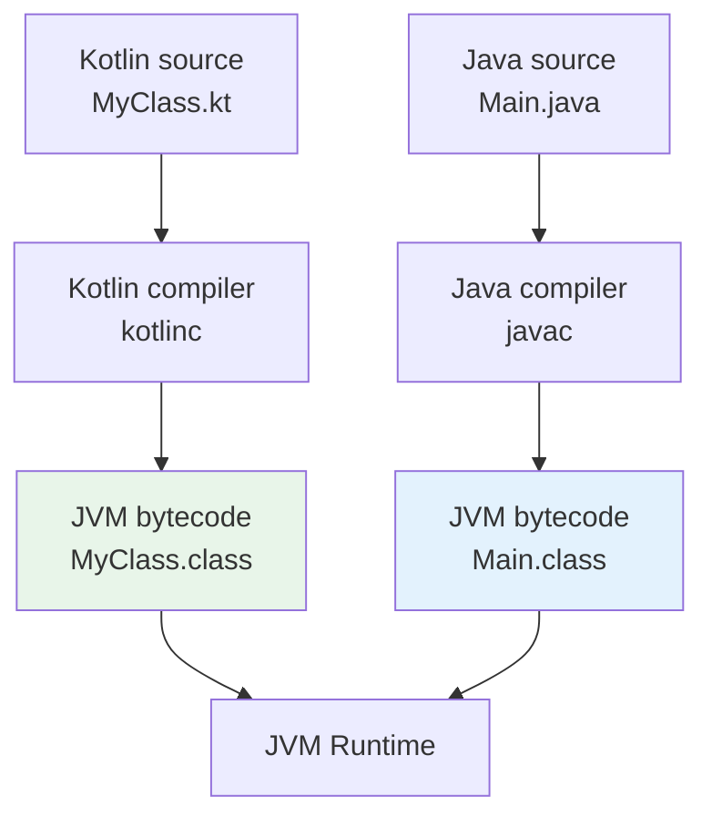
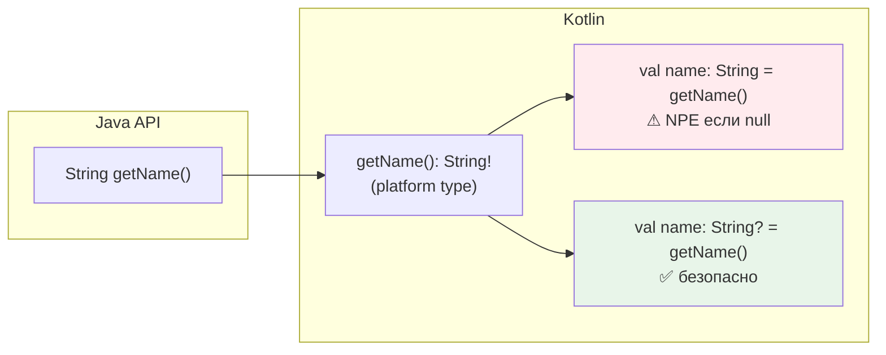
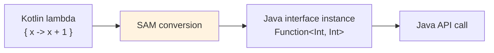
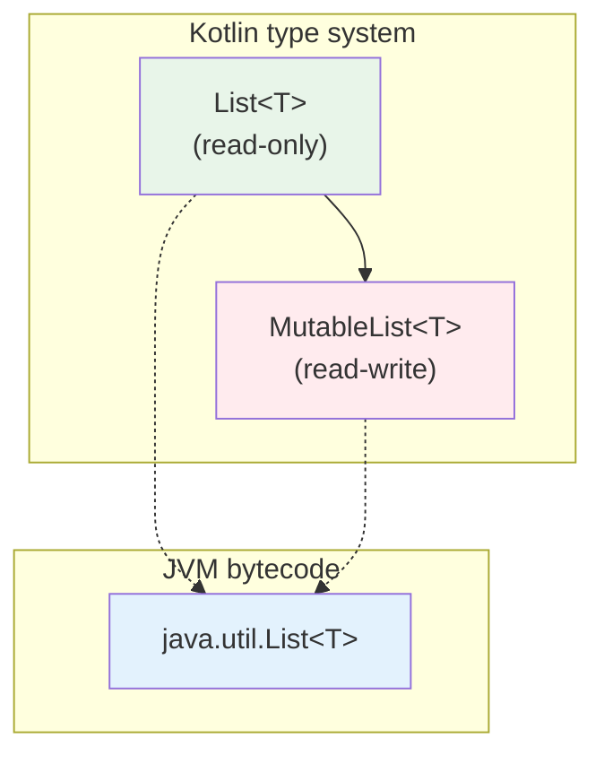
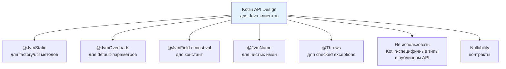
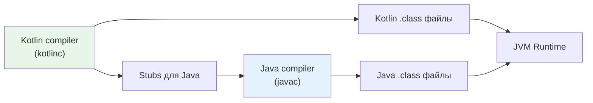

# Вопросы на собеседовании: интероп `Kotlin` и `Java`

Вопросы и ответы по взаимодействию `Kotlin` и `Java`: `platform types`, nullability-аннотации, `@JvmStatic`/`@JvmField`/`@JvmOverloads`/`@JvmName`, SAM-конверсии, коллекции, generics variance (`in`/`out` vs wildcards), `inline`-классы и вызов `suspend`-функций из `Java`.

## Введение

`Kotlin` компилируется в байткод `JVM` и полностью совместим с `Java`: можно вызывать `Java`-код из `Kotlin` и наоборот. Это одно из ключевых преимуществ `Kotlin` — возможность постепенной миграции с `Java` без переписывания всего проекта. На собеседованиях по этой теме проверяют понимание нюансов: как `Kotlin`-конструкции отображаются в байткоде, какие аннотации нужны для удобного вызова из `Java`, как работают `platform types`, generics и коллекции на границе двух языков.

## Полезные ссылки

### Официальная документация

- [Calling Java from Kotlin](https://kotlinlang.org/docs/java-interop.html) — работа с `Java`-кодом из `Kotlin`
- [Calling Kotlin from Java](https://kotlinlang.org/docs/java-to-kotlin-interop.html) — вызов `Kotlin`-кода из `Java`
- [SAM conversions](https://kotlinlang.org/docs/fun-interfaces.html) — функциональные интерфейсы и SAM-конверсии
- [Generics: in, out, where](https://kotlinlang.org/docs/generics.html) — система дженериков `Kotlin`
- [Inline value classes](https://kotlinlang.org/docs/inline-classes.html) — `value class` и `@JvmInline`

### Baeldung

- [Kotlin Java Interoperability — Baeldung](https://www.baeldung.com/kotlin/java-interoperability) — полное руководство по интеропу Kotlin и Java
- [Guide to JVM Platform Annotations in Kotlin — Baeldung](https://www.baeldung.com/kotlin/jvm-annotations) — @JvmStatic, @JvmField, @JvmOverloads и другие JVM-аннотации
- [SAM Conversions in Kotlin — Baeldung](https://www.baeldung.com/kotlin/sam-conversions) — SAM-конверсии и функциональные интерфейсы
- [A Guide to @Throws in Kotlin — Baeldung](https://www.baeldung.com/kotlin/throws-annotation) — аннотация @Throws для корректного интеропа

## Содержание

- [Введение](#введение)
- [Полезные ссылки](#полезные-ссылки)
- [See also](#see-also)

**Основы интеропа и байткод**
- [Q1. (!) Как из `Java` вызвать код, написанный на `Kotlin`?](#q1--как-из-java-вызвать-код-написанный-на-kotlin)
- [Q2. (!) Для чего нужны аннотации `@JvmStatic`, `@JvmOverloads` и `@JvmField`?](#q2--для-чего-нужны-аннотации-jvmstatic-jvmoverloads-и-jvmfield)
- [Q3. Как из `Java` вызвать `companion object` и его члены?](#q3-как-из-java-вызвать-companion-object-и-его-члены)
- [Q4. Как из `Java` вызывать функции `Kotlin` с default-параметрами?](#q4-как-из-java-вызывать-функции-kotlin-с-default-параметрами)
- [Q5. Как из `Java` вызвать extension-функцию `Kotlin`?](#q5-как-из-java-вызвать-extension-функцию-kotlin)

**Nullability и platform types**
- [Q6. (!) Что такое `platform types` и как с ними работать?](#q6--что-такое-platform-types-и-как-с-ними-работать)
- [Q7. (!) Как работают nullability-аннотации `@Nullable`/`@NotNull` на границе `Kotlin` и `Java`?](#q7--как-работают-nullability-аннотации-nullablenotnull-на-границе-kotlin-и-java)
- [Q8. Как в `Kotlin` объявить API, чтобы из `Java` были видны корректные nullability-контракты?](#q8-как-в-kotlin-объявить-api-чтобы-из-java-были-видны-корректные-nullability-контракты)

**Аннотации `@JvmName`, `@JvmSynthetic`, `@Throws`**
- [Q9. Для чего нужна аннотация `@JvmName` и когда её использовать?](#q9-для-чего-нужна-аннотация-jvmname-и-когда-её-использовать)
- [Q10. Зачем нужна `@JvmSynthetic`?](#q10-зачем-нужна-jvmsynthetic)
- [Q11. Когда и зачем использовать `@Throws`?](#q11-когда-и-зачем-использовать-throws)

**SAM-конверсии и функциональные интерфейсы**
- [Q12. (!) Что такое SAM-conversion при интеропе `Kotlin` и `Java`?](#q12--что-такое-sam-conversion-при-интеропе-kotlin-и-java)
- [Q13. Чем отличается `fun interface` в `Kotlin` от `Java` SAM-интерфейса?](#q13-чем-отличается-fun-interface-в-kotlin-от-java-sam-интерфейса)

**Generics: variance, wildcards**
- [Q14. (!) Как соотносятся `in`/`out` в `Kotlin` и `? extends`/`? super` в `Java`?](#q14--как-соотносятся-inout-в-kotlin-и--extends-super-в-java)
- [Q15. Когда нужны `@JvmSuppressWildcards` и `@JvmWildcard`?](#q15-когда-нужны-jvmsuppresswildcards-и-jvmwildcard)

**Коллекции и потоки**
- [Q16. (!) Как работает интероп коллекций между `Kotlin` и `Java`?](#q16--как-работает-интероп-коллекций-между-kotlin-и-java)
- [Q17. `Java Streams` vs `Kotlin Sequences`: в чём разница и когда что использовать?](#q17-java-streams-vs-kotlin-sequences-в-чём-разница-и-когда-что-использовать)

**Свойства и доступ к полям**
- [Q18. Как `Kotlin`-свойства выглядят из `Java`?](#q18-как-kotlin-свойства-выглядят-из-java)

**Top-level функции и `object`**
- [Q19. Как из `Java` вызывать top-level функции `Kotlin`?](#q19-как-из-java-вызывать-top-level-функции-kotlin)

**`inline`-классы и `Java`**
- [Q20. (!) Как `value class` (`@JvmInline`) работает при интеропе с `Java`?](#q20--как-value-class-jvminline-работает-при-интеропе-с-java)

**Корутины и `suspend`-функции**
- [Q21. (!) Как из `Java` вызвать `suspend`-функцию `Kotlin`?](#q21--как-из-java-вызвать-suspend-функцию-kotlin)

**Перегрузка и разрешение методов**
- [Q22. Как из `Kotlin` вызывать перегруженные методы `Java`?](#q22-как-из-kotlin-вызывать-перегруженные-методы-java)

**Checked exceptions**
- [Q23. Как `Kotlin` работает с checked exceptions из `Java`?](#q23-как-kotlin-работает-с-checked-exceptions-из-java)

**Kotlin-специфичные конструкции из `Java`**
- [Q24. Как из `Java` работать с `sealed class`/`sealed interface` из `Kotlin`?](#q24-как-из-java-работать-с-sealed-classsealed-interface-из-kotlin)
- [Q25. Как из `Java` использовать `data class` из `Kotlin`?](#q25-как-из-java-использовать-data-class-из-kotlin)

**Смешанные проекты: best practices**
- [Q26. (!) Какие практики делают `Kotlin` API удобным для `Java`-клиентов?](#q26--какие-практики-делают-kotlin-api-удобным-для-java-клиентов)
- [Q27. Как организовать смешанный `Kotlin`/`Java` проект в `Gradle`?](#q27-как-организовать-смешанный-kotlinjava-проект-в-gradle)
- [Q28. Как работать с `Java records` из `Kotlin` и использовать `@JvmRecord`?](#q28-как-работать-с-java-records-из-kotlin-и-использовать-jvmrecord)
- [Q29. Как работает интероп `Kotlin` с `Java` аннотациями (`@Target`, `@Retention`, use-site targets)?](#q29-как-работает-интероп-kotlin-с-java-аннотациями-target-retention-use-site-targets)

**Platform types, `inline`, sealed и null safety**
- [Q30. Почему platform types опасны и как их избежать в реальных проектах?](#q30-почему-platform-types-опасны-и-как-их-избежать-в-реальных-проектах)
- [Q31. Почему `inline`-функции недоступны из `Java` и как это обойти?](#q31-почему-inline-функции-недоступны-из-java-и-как-это-обойти)
- [Q32. `Sealed classes` в `Java 17` vs `Kotlin sealed`: ключевые отличия при интеропе](#q32-sealed-classes-в-java-17-vs-kotlin-sealed-ключевые-отличия-при-интеропе)
- [Q33. `Java Optional` vs `Kotlin` null safety: что лучше и как работать на границе двух языков?](#q33-java-optional-vs-kotlin-null-safety-что-лучше-и-как-работать-на-границе-двух-языков)

**Lombok, companion object и generics**
- [Q34. Почему `Lombok` несовместим с `Kotlin` при использовании `kapt` и как это решить?](#q34-почему-lombok-несовместим-с-kotlin-при-использовании-kapt-и-как-это-решить)
- [Q35. Как работает `companion object` с `@JvmStatic` из `Java`: детали и подводные камни?](#q35-как-работает-companion-object-с-jvmstatic-из-java-детали-и-подводные-камни)
- [Q36. Как extension-функции `Kotlin` выглядят в байткоде и чем это важно для `Java`?](#q36-как-extension-функции-kotlin-выглядят-в-байткоде-и-чем-это-важно-для-java)
- [Q37. `Java Optional` и `Kotlin`: паттерны интеграции при работе со `Spring Data`](#q37-java-optional-и-kotlin-паттерны-интеграции-при-работе-со-spring-data)
- [Q38. `Kotlin` generics variance (`in`/`out`) и `Java` wildcards: практические примеры при интеропе](#q38-kotlin-generics-variance-inout-и-java-wildcards-практические-примеры-при-интеропе)

---

## Q1. (!) Как из `Java` вызвать код, написанный на `Kotlin`?

Код на `Kotlin` компилируется в обычный байткод `JVM`, поэтому из `Java` его вызывают как любой другой `Java`-класс. Но есть нюансы в том, как `Kotlin`-конструкции отображаются в байткоде:



| Конструкция `Kotlin` | Как выглядит из `Java` |
|---|---|
| Класс `MyClass` | Обычный класс `MyClass` |
| Top-level функции в `Utils.kt` | Статические методы `UtilsKt.funcName()` |
| `object MySingleton` | `MySingleton.INSTANCE.method()` |
| `companion object` | `MyClass.Companion.method()` |
| Свойство `val name: String` | Геттер `getName()` |
| Свойство `var count: Int` | `getCount()` + `setCount()` |
| Extension-функция | Статический метод с receiver как первый параметр |

Чтобы вызов из `Java` был удобнее, в `Kotlin` используют аннотации: `@JvmStatic`, `@JvmOverloads`, `@JvmField`, `@JvmName`. Без них код работает, но синтаксис на стороне `Java` менее идиоматичен.


> [!mcq]
> - [ ] companion object методы без @JvmStatic доступны из Java как MyClass.method() (статически) | ❌ ПОСЛЕДСТВИЕ: без @JvmStatic → только MyClass.Companion.method(); Java-клиент обязан использовать Companion-паттерн
> - [ ] Extension-функции видны из Java как методы экземпляра receiver | ❌ ПОСЛЕДСТВИЕ: extension компилируются в статические методы с receiver как первый параметр; Java вызывает StringExtKt.myExt(str), а не str.myExt()
> - [x] Top-level функции из Utils.kt вызываются из Java как UtilsKt.funcName(); companion object → MyClass.Companion.method() без @JvmStatic | ✓ ПРИМЕНЯТЬ: при проектировании Kotlin API для Java-клиентов 📋 ПРАВИЛО: top-level fn → XKt.staticMethod(); companion → Companion.method() 🔗 См. Q2
> - [ ] Kotlin val/var свойства недоступны из Java — нужно писать явные Java-геттеры | ❌ ПОСЛЕДСТВИЕ: val → getX(), var → getX()/setX() генерируются автоматически; Java-клиенты вызывают их без дополнительного кода

## Q2. (!) Для чего нужны аннотации `@JvmStatic`, `@JvmOverloads` и `@JvmField`?

Эти три аннотации решают самые частые проблемы при вызове `Kotlin`-кода из `Java`:

**`@JvmStatic`** — генерирует настоящий статический метод в классе. Без неё методы `companion object` доступны только через `MyClass.Companion.method()`:

```kotlin
class ConnectionPool {
    companion object {
        @JvmStatic
        fun create(size: Int): ConnectionPool = ConnectionPool()
    }
}
```

```java
// Без @JvmStatic:
ConnectionPool.Companion.create(10);
// С @JvmStatic:
ConnectionPool.create(10);  // идиоматичный Java-вызов
```

**`@JvmOverloads`** — генерирует перегруженные методы для каждой комбинации default-параметров:

```kotlin
class HttpClient {
    @JvmOverloads
    fun get(
        url: String,
        timeout: Int = 30,
        headers: Map<String, String> = emptyMap()
    ): String { /* ... */ }
}
```

```java
// Java: три перегрузки
client.get("https://api.example.com");
client.get("https://api.example.com", 60);
client.get("https://api.example.com", 60, headers);
```

**`@JvmField`** — экспонирует свойство как публичное поле без геттера/сеттера:

```kotlin
class Config {
    companion object {
        @JvmField
        val MAX_RETRIES = 3
    }
    @JvmField
    var debugMode = false
}
```

```java
int retries = Config.MAX_RETRIES;  // поле, не getMAX_RETRIES()
config.debugMode = true;           // поле, не setDebugMode()
```

> На собеседовании важно показать, что вы понимаете **зачем** нужны эти аннотации: они не меняют поведение, а улучшают ergonomics для `Java`-кода. В чисто `Kotlin`-проекте они не нужны.


> [!mcq]
> - [ ] @JvmStatic нужен в чисто Kotlin-проектах для корректной компиляции | ❌ ПОСЛЕДСТВИЕ: в чисто Kotlin-проекте @JvmStatic не нужен; аннотации нужны только для Java-interop ergonomics
> - [x] @JvmStatic → настоящий static метод в Java; @JvmOverloads → перегрузки для параметров со значениями по умолчанию; @JvmField → поле вместо геттера | ✓ ПРИМЕНЯТЬ: при проектировании Kotlin API для Java-клиентов 📋 ПРАВИЛО: @JvmStatic=static, @JvmOverloads=overloads, @JvmField=field 🔗 См. Q1
> - [ ] @JvmField делает поле final и неизменяемым из Java | ❌ ПОСЛЕДСТВИЕ: @JvmField только убирает геттер/сеттер, делает поле напрямую доступным; final определяется val/var в Kotlin
> - [ ] @JvmOverloads нужен для всех Kotlin-функций с параметрами по умолчанию | ❌ ПОСЛЕДСТВИЕ: @JvmOverloads нужен только для Java-interop; в Kotlin параметры по умолчанию работают нативно без аннотации

## Q3. Как из `Java` вызвать `companion object` и его члены?

`companion object` компилируется во вложенный класс `Companion` (синглтон). Из `Java` доступ зависит от аннотаций:

```kotlin
class UserRepository {
    companion object {
        const val TABLE_NAME = "users"           // compile-time constant

        @JvmStatic
        fun findById(id: Long): User? = TODO()

        fun count(): Int = TODO()                // без @JvmStatic

        @JvmField
        val DEFAULT_PAGE_SIZE = 20
    }
}
```

```java
// const val — всегда видна как статическое поле
String table = UserRepository.TABLE_NAME;

// @JvmStatic — статический метод
User user = UserRepository.findById(42L);

// Без @JvmStatic — через Companion
int count = UserRepository.Companion.count();

// @JvmField — статическое поле
int pageSize = UserRepository.DEFAULT_PAGE_SIZE;
```

Для `object` (не companion) синглтон доступен через `INSTANCE`:

```java
// object MyRegistry в Kotlin:
MyRegistry.INSTANCE.getItems();
// С @JvmStatic на getItems():
MyRegistry.getItems();
```

Разница между `const val` и `@JvmField val`: `const` работает только с примитивами и `String`, значение подставляется в compile-time. `@JvmField` работает с любым типом, но значение читается в runtime.


> [!mcq]
> - [ ] const val и @JvmField val ведут себя одинаково из Java — оба доступны как поля | ❌ ПОСЛЕДСТВИЕ: const val работает только с примитивами и String, значение inline в compile-time; @JvmField работает с любым типом, значение в runtime
> - [ ] companion object без @JvmStatic вообще недоступен из Java | ❌ ПОСЛЕДСТВИЕ: без @JvmStatic companion доступен через MyClass.Companion.method(); @JvmStatic лишь добавляет удобный статический alias
> - [ ] @JvmField обязателен для всех val в companion object | ❌ ПОСЛЕДСТВИЕ: без @JvmField Kotlin генерирует геттер getName(); @JvmField нужен когда Java-клиент ожидает публичное поле, а не геттер
> - [x] Без @JvmStatic companion object метод → MyClass.Companion.method(); const val → прямой доступ MyClass.CONST; @JvmField → поле без геттера | ✓ ПРИМЕНЯТЬ: Java interop с companion object 📋 ПРАВИЛО: companion = Companion singleton; @JvmStatic = static alias 🔗 См. Q2

## Q4. Как из `Java` вызывать функции `Kotlin` с default-параметрами?

Без `@JvmOverloads` в байткоде существует только одна сигнатура со **всеми** параметрами — из `Java` нужно передавать все аргументы, даже те, у которых есть значения по умолчанию.

`@JvmOverloads` заставляет компилятор сгенерировать набор перегруженных методов, убирая параметры справа:

```kotlin
@JvmOverloads
fun connect(
    host: String = "localhost",
    port: Int = 8080,
    ssl: Boolean = false
) { /* ... */ }
```

Генерируются 4 метода:

```java
connect("db.local", 5432, true);  // все параметры
connect("db.local", 5432);       // ssl = false
connect("db.local");             // port = 8080, ssl = false
connect();                       // все default
```

**Важное ограничение**: перегрузки генерируются только путём отсечения параметров **справа**. Нельзя пропустить средний параметр — для `Java` это невозможно (в отличие от `Kotlin`, где можно использовать named arguments). Поэтому порядок параметров имеет значение при проектировании API.

**Конструкторы** тоже поддерживают `@JvmOverloads`:

```kotlin
class HttpRequest @JvmOverloads constructor(
    val url: String,
    val method: String = "GET",
    val body: String? = null
)
```


> [!mcq]
> - [ ] @JvmOverloads позволяет пропускать любой параметр по позиции из Java | ❌ ПОСЛЕДСТВИЕ: @JvmOverloads генерирует перегрузки только отсечением справа; пропустить средний параметр невозможно — нужно переставить параметры
> - [ ] Без @JvmOverloads параметры по умолчанию работают в Java так же как в Kotlin | ❌ ПОСЛЕДСТВИЕ: без @JvmOverloads в байткоде одна сигнатура со всеми параметрами; Java-клиент обязан передавать каждый аргумент явно
> - [ ] @JvmOverloads генерирует перегрузки убирая параметры слева (первый становится необязательным) | ❌ ПОСЛЕДСТВИЕ: @JvmOverloads убирает параметры справа; самый правый параметр становится необязательным первым
> - [x] @JvmOverloads генерирует N+1 перегрузок убирая параметры справа; без аннотации — только одна сигнатура со всеми параметрами | ✓ ПРИМЕНЯТЬ: Kotlin API с default params для Java-клиентов 📋 ПРАВИЛО: @JvmOverloads = одна сигнатура на каждый default справа 🔗 См. Q2

## Q5. Как из `Java` вызвать extension-функцию `Kotlin`?

Extension-функции компилируются в **статические методы**, где первый параметр — объект-receiver:

```kotlin
// файл StringUtils.kt
package com.example

fun String.toSlug(): String =
    lowercase().replace(" ", "-").replace(Regex("[^a-z0-9-]"), "")
```

```java
// Java: статический вызов, receiver передаётся первым аргументом
String slug = StringUtilsKt.toSlug("Hello World!");
```

Имя класса-обёртки по умолчанию — `<FileName>Kt`. Изменить его можно аннотацией `@file:JvmName`:

```kotlin
@file:JvmName("Strings")
package com.example

fun String.toSlug(): String = /* ... */
```

```java
String slug = Strings.toSlug("Hello World!");
```

Если несколько файлов используют одно `@JvmName`, нужно добавить `@file:JvmMultifileClass` — тогда все функции объединяются в один фасадный класс.


> [!mcq]
> - [ ] Extension-функция из Utils.kt вызывается из Java как экземплярный метод receiver | ❌ ПОСЛЕДСТВИЕ: extension компилируется в статический метод; Java вызывает UtilsKt.myExt(receiver) — не receiver.myExt()
> - [x] Extension-функция String.toSlug() из StringUtils.kt → Java вызывает StringUtilsKt.toSlug(str); @JvmName меняет имя класса-обёртки | ✓ ПРИМЕНЯТЬ: разделение extension-функций по файлам с понятными @JvmName 📋 ПРАВИЛО: extension fn → XKt.fn(receiver); @JvmName меняет XKt → кастомное имя 🔗 См. Q1
> - [ ] @file:JvmName нужен для того чтобы extension была видна из Java | ❌ ПОСЛЕДСТВИЕ: extension видна из Java всегда через XKt.fn(); @JvmName только переименовывает класс-обёртку для удобства
> - [ ] Несколько файлов с одинаковым @JvmName автоматически мержатся без дополнительных аннотаций | ❌ ПОСЛЕДСТВИЕ: при одинаковом @JvmName нужен @JvmMultifileClass на каждом файле, иначе compile error

## Q6. (!) Что такое `platform types` и как с ними работать?

**Platform type** — тип из `Java`-кода, для которого `Kotlin` не знает, может ли значение быть `null`. В IDE такой тип отображается с восклицательным знаком: `String!`, `List<User>!`.



Platform type можно присвоить и в `String`, и в `String?`. Если присвоить в `String` (non-null), а значение окажется `null` — будет `NullPointerException` в месте присваивания (не позже, как в `Java`).

**Рекомендации:**

1. **Явно указывайте тип** при работе с `Java`-API:
```kotlin
// Плохо — тип выведен как platform type
val name = javaObject.getName()

// Хорошо — явный non-null (бросит NPE сразу, если null)
val name: String = javaObject.getName()

// Хорошо — явный nullable (безопасно)
val name: String? = javaObject.getName()
```

2. **Используйте safe calls** при сомнениях: `javaObject.getName()?.uppercase()`

3. **Аннотируйте `Java`-код** аннотациями `@Nullable`/`@NotNull` — тогда `Kotlin`-компилятор увидит точный тип вместо platform type.

Подробнее о nullability — в [вопросах по основам Kotlin](kotlin-interview.md).


> [!mcq]
> - [ ] Platform type String! гарантирует non-null — Kotlin проверит значение перед использованием | ❌ ПОСЛЕДСТВИЕ: platform type НЕ гарантирует non-null; при присвоении в String → NPE если значение null, без compile-time protection
> - [x] Platform type (String!) можно присвоить в String (NPE сразу если null) или String? (безопасно); явное указание типа устраняет риск | ✓ ПРИМЕНЯТЬ: при вызове Java-API без @Nullable/@NotNull — всегда указывай тип явно 📋 ПРАВИЛО: platform type = неизвестная nullable; String? безопаснее String для Java interop 🔗 См. Q7
> - [ ] Kotlin автоматически делает все Java-типы nullable (String?) | ❌ ПОСЛЕДСТВИЕ: неаннотированные Java-типы → platform type String! (не String?); nullable делает только @Nullable аннотация
> - [ ] Platform type не вызывает проблем — Kotlin-компилятор всегда добавляет null-check | ❌ ПОСЛЕДСТВИЕ: без явного типа компилятор не знает nullable/non-null → NPE могут проскочить в runtime

## Q7. (!) Как работают nullability-аннотации `@Nullable`/`@NotNull` на границе `Kotlin` и `Java`?

`Kotlin`-компилятор распознаёт nullability-аннотации из нескольких библиотек и **убирает platform types** для аннотированных элементов:

| Библиотека | Аннотации |
|---|---|
| JetBrains | `org.jetbrains.annotations.@Nullable`, `@NotNull` |
| JSR-305 | `javax.annotation.@Nullable`, `@Nonnull` |
| Android | `androidx.annotation.@Nullable`, `@NonNull` |
| Spring | `org.springframework.lang.@Nullable`, `@NonNull` |
| Eclipse | `org.eclipse.jdt.annotation.@Nullable`, `@NonNull` |
| Lombok | `lombok.@NonNull` |

**Из `Java` в `Kotlin`:**

```java
// Java
public class UserService {
    @NotNull
    public String getName() { return "Alice"; }

    @Nullable
    public String getMiddleName() { return null; }

    public String getNickname() { return "bob"; } // без аннотации
}
```

```kotlin
// Kotlin
val name: String = userService.name           // OK, компилятор знает — non-null
val middle: String? = userService.middleName  // OK, компилятор знает — nullable
val nick = userService.nickname               // String! — platform type
```

**Из `Kotlin` в `Java`:** компилятор `Kotlin` автоматически добавляет `@NotNull`/`@Nullable` в байткод для параметров и возвращаемых типов. Поэтому `Java`-IDE (IntelliJ, Eclipse) показывают предупреждения при передаче `null` в `Kotlin`-метод, ожидающий non-null.

**`@Strict` mode (JSR-305):** можно настроить компилятор `Kotlin` так, чтобы он трактовал все неаннотированные `Java`-типы как nullable: `-Xjsr305=strict`. Это строже, но безопаснее.


> [!mcq]
> - [ ] @NotNull из JetBrains и @Nullable из Android → Kotlin их не распознаёт, нужен только JSR-305 | ❌ ПОСЛЕДСТВИЕ: Kotlin распознаёт аннотации из JetBrains, JSR-305, Android, Spring, Eclipse и Lombok — все пять библиотек
> - [ ] При @NotNull на Java-методе Kotlin всё равно возвращает platform type | ❌ ПОСЛЕДСТВИЕ: @NotNull/@Nullable устраняют platform type — Kotlin точно знает nullable/non-null при наличии аннотации
> - [ ] -Xjsr305=strict делает все Java-типы non-null (String вместо String?) | ❌ ПОСЛЕДСТВИЕ: strict mode делает неаннотированные типы nullable (String?), а не non-null — это строже, не менее строго
> - [x] @NotNull/@Nullable из JetBrains/JSR-305/Spring убирают platform type; -Xjsr305=strict делает неаннотированные типы nullable | ✓ ПРИМЕНЯТЬ: Java-библиотеки с Spring или JSR-305 аннотациями 📋 ПРАВИЛО: @NotNull → String (non-null); @Nullable → String?; без аннотации → String! 🔗 См. Q6

## Q8. Как в `Kotlin` объявить API, чтобы из `Java` были видны корректные nullability-контракты?

`Kotlin`-компилятор автоматически генерирует nullability-аннотации в байткоде:

- Параметр `name: String` → `@NotNull String name` в байткоде
- Параметр `name: String?` → `@Nullable String name` в байткоде
- Возвращаемый тип `String` → `@NotNull String` + runtime-проверка

Это означает, что если `Java`-код передаст `null` в `Kotlin`-метод с non-null параметром, будет выброшен `IllegalArgumentException` **на входе в метод** (не позже при использовании). Эта проверка генерируется компилятором автоматически.

```kotlin
// Kotlin
fun process(name: String): String = name.uppercase()
```

```java
// Java — при вызове process(null) немедленно выбросит:
// IllegalArgumentException: Parameter specified as non-null is null
UserKt.process(null);
```

**Совет:** для публичных `Kotlin`-библиотек полезно документировать контракт nullability, т.к. не все `Java`-IDE покажут предупреждения.


> [!mcq]
> - [ ] Kotlin всегда помещает @Nullable/@NotNull аннотации в байткод только при явном указании аннотации в коде | ❌ ПОСЛЕДСТВИЕ: Kotlin автоматически генерирует @NotNull для String-параметров и @Nullable для String?; разработчик не должен добавлять их вручную
> - [ ] Если Java-код передаст null в Kotlin non-null параметр — NullPointerException при первом использовании | ❌ ПОСЛЕДСТВИЕ: Kotlin добавляет runtime-check на входе в метод; бросает IllegalArgumentException немедленно, не позже при использовании
> - [x] Kotlin автоматически добавляет @NotNull в байткод для String-параметров и @Nullable для String?; передача null из Java → IllegalArgumentException на входе в метод | ✓ ПРИМЕНЯТЬ: проектирование Kotlin API для Java-клиентов — nullability visible без аннотаций вручную 📋 ПРАВИЛО: Kotlin non-null = @NotNull в байткоде = runtime check на входе 🔗 См. Q7
> - [ ] Kotlin-компилятор не добавляет runtime null-checks — это ответственность Java-клиента | ❌ ПОСЛЕДСТВИЕ: Kotlin добавляет intrinsic null-checks в начало каждого метода для non-null параметров; это автоматически

## Q9. Для чего нужна аннотация `@JvmName` и когда её использовать?

`@JvmName` задаёт имя элемента в байткоде (и, соответственно, в `Java`). Основные сценарии:

**1. Переименование файлового класса** — для top-level функций:

```kotlin
@file:JvmName("Dates")
package com.example

fun parseDate(s: String): LocalDate = /* ... */
```

```java
LocalDate d = Dates.parseDate("2026-01-01"); // вместо DatesKt
```

**2. Разрешение конфликтов** — когда type erasure делает две функции одинаковыми в байткоде:

```kotlin
// Ошибка компиляции без @JvmName: обе функции → filterStrings(List) в байткоде
@JvmName("filterStrings")
fun filter(list: List<String>): List<String> = /* ... */

@JvmName("filterInts")
fun filter(list: List<Int>): List<Int> = /* ... */
```

**3. Переименование геттеров/сеттеров:**

```kotlin
val isActive: Boolean
    @JvmName("isActive") get() = /* ... */
    // без аннотации геттер был бы getActive() из-за is-convention
```

**4. `@file:JvmMultifileClass`** — объединение top-level функций из разных файлов в один `Java`-класс:

```kotlin
// file1.kt
@file:JvmName("Utils")
@file:JvmMultifileClass

fun foo() {}

// file2.kt
@file:JvmName("Utils")
@file:JvmMultifileClass

fun bar() {}
```

```java
Utils.foo(); // оба метода в одном классе
Utils.bar();
```


> [!mcq]
> - [ ] @JvmName изменяет видимость метода — делает его внутренним (internal) | ❌ ПОСЛЕДСТВИЕ: @JvmName только переименовывает метод в байткоде, не меняет видимость; для скрытия используй @JvmSynthetic
> - [x] @JvmName переименовывает метод/файловый класс в байткоде; @file:JvmMultifileClass объединяет top-level функции из разных файлов в один Java-класс | ✓ ПРИМЕНЯТЬ: решение конфликтов имён при перегрузке дженериков, удобные имена для Java 📋 ПРАВИЛО: @JvmName = alias в байткоде; @JvmMultifileClass = facade class 🔗 См. Q5
> - [ ] @JvmName обязателен для всех Kotlin-функций чтобы они были видны из Java | ❌ ПОСЛЕДСТВИЕ: без @JvmName функция видна из Java под своим Kotlin-именем; @JvmName нужен только для переименования/конфликтов
> - [ ] @file:JvmMultifileClass сам по себе объединяет файлы без @JvmName | ❌ ПОСЛЕДСТВИЕ: @JvmMultifileClass требует одинаковый @JvmName на всех файлах; без него compile error

## Q10. Зачем нужна `@JvmSynthetic`?

`@JvmSynthetic` помечает элемент (метод, свойство, поле) как `synthetic` в байткоде. Это означает, что он **невидим из `Java`**, но доступен из `Kotlin`.

Основные случаи использования:

1. **Скрытие служебных API** — когда функция предназначена только для `Kotlin`-потребителей:

```kotlin
class KotlinDsl {
    @JvmSynthetic
    internal fun configure(block: Config.() -> Unit) { /* ... */ }
}
```

2. **DSL-builders** — чтобы `Java`-разработчики не видели extension-функции и лямбда-ориентированные методы, которые не имеют смысла без `Kotlin`-синтаксиса.

3. **Предотвращение случайного использования** служебных методов, сгенерированных для `inline`-классов или `operator`-функций.

> В отличие от модификатора `internal` (который компилируется в `public` с name-mangling), `@JvmSynthetic` полностью убирает видимость из `Java`.


> [!mcq]
> - [x] @JvmSynthetic делает метод невидимым из Java (synthetic флаг в байткоде), но доступным из Kotlin; используется для скрытия DSL-функций от Java-клиентов | ✓ ПРИМЕНЯТЬ: Kotlin-only API (DSL builders, internal utilities) в mixed-language проектах 📋 ПРАВИЛО: @JvmSynthetic = invisible for Java; @internal = visible with mangled name 🔗 См. Q9
> - [ ] @JvmSynthetic делает метод приватным — аналог private в Java | ❌ ПОСЛЕДСТВИЕ: @JvmSynthetic не меняет Kotlin-видимость; метод доступен из Kotlin (любой видимости), только скрыт от Java
> - [ ] internal modifier полностью скрывает метод от Java-кода | ❌ ПОСЛЕДСТВИЕ: internal компилируется в public с name-mangling в байткоде; Java всё ещё может вызвать через рефлексию или прямой вызов мангленного имени
> - [ ] @JvmSynthetic нужен для всех operator-функций Kotlin | ❌ ПОСЛЕДСТВИЕ: @JvmSynthetic опционален; используется только когда нужно намеренно скрыть Kotlin-only API от Java без изменения Kotlin-видимости

## Q11. Когда и зачем использовать `@Throws`?

В `Kotlin` нет checked exceptions — любые исключения можно не ловить. Но если `Java`-код вызывает `Kotlin`-функцию, которая бросает checked exception (например, `IOException`), то без `@Throws` `Java`-компилятор не позволит написать `catch (IOException e)`, т.к. в сигнатуре метода в байткоде нет `throws`.

```kotlin
@Throws(IOException::class)
fun readConfig(path: String): Config {
    val file = File(path)
    if (!file.exists()) throw IOException("File not found: $path")
    return parseConfig(file.readText())
}
```

```java
// Java: теперь можно (и нужно) обработать IOException
try {
    Config config = ConfigKt.readConfig("/etc/app.conf");
} catch (IOException e) {
    log.error("Failed to read config", e);
}
```

Без `@Throws` `Java`-код может только ловить `Exception` или `Throwable`, что менее точно. Подробнее об обработке ошибок — в [вопросах по исключениям Kotlin](kotlin-exceptions-interview.md).


> [!mcq]
> - [ ] Без @Throws Kotlin-функция вообще не может бросить IOException из Java | ❌ ПОСЛЕДСТВИЕ: Kotlin бросает любое исключение независимо от @Throws; @Throws только добавляет throws-декларацию в байткод для Java-компилятора
> - [ ] @Throws нужен только для RuntimeException — Kotlin не распространяет checked exceptions | ❌ ПОСЛЕДСТВИЕ: @Throws нужен именно для checked exceptions (IOException, SQLException); RuntimeException распространяются без объявления
> - [x] @Throws(IOException::class) добавляет throws IOException в байткод; без неё Java-код может ловить только Exception/Throwable вместо конкретного типа | ✓ ПРИМЕНЯТЬ: Kotlin-функции с checked exceptions (IO, SQL) в Java-mixed проектах 📋 ПРАВИЛО: @Throws = throws declaration в байткоде для Java-checked-exceptions interop 🔗 См. Q6
> - [ ] @Throws автоматически добавляется Kotlin-компилятором для всех функций с try-catch | ❌ ПОСЛЕДСТВИЕ: @Throws нужно добавлять явно; компилятор не инферит throws из try-catch блоков

## Q12. (!) Что такое SAM-conversion при интеропе `Kotlin` и `Java`?

**SAM-conversion** (Single Abstract Method) позволяет передавать лямбду `Kotlin` вместо экземпляра `Java`-интерфейса с одним абстрактным методом (`Runnable`, `Comparator`, `Callable`, `Consumer` и т.д.).

```kotlin
// Вместо анонимного объекта:
executor.submit(object : Runnable {
    override fun run() {
        println("Running")
    }
})

// SAM-conversion — лямбда:
executor.submit { println("Running") }

// Ещё примеры:
list.sortWith(Comparator { a, b -> a.length - b.length })
button.setOnClickListener { view -> handleClick(view) }
```



**Важные нюансы:**

1. SAM-conversion работает только для **`Java`-интерфейсов**. Для `Kotlin`-интерфейсов (до `Kotlin` 1.4) это не работало — нужно было использовать `object : Interface { }`.

2. Начиная с `Kotlin` 1.4, для `Kotlin`-интерфейсов SAM-conversion работает, если интерфейс помечен как `fun interface`.

3. При неоднозначности перегрузок можно явно указать тип:
```kotlin
// Явный SAM-тип при неоднозначности
executor.submit(Runnable { println("task") })
```

4. Каждый вызов с лямбдой создаёт **новый объект**. Если нужна одна и та же ссылка (например, для `removeListener`), лямбду нужно сохранить в переменную.


> [!mcq]
> - [ ] SAM-conversion в Kotlin работает для любых Kotlin-интерфейсов с одним методом автоматически | ❌ ПОСЛЕДСТВИЕ: для Kotlin-интерфейсов SAM работает только с fun interface (Kotlin 1.4+); обычный interface → нужен object: Interface{}
> - [ ] Каждый вызов с лямбдой SAM создаёт одну и ту же инстанцию (singleton) | ❌ ПОСЛЕДСТВИЕ: каждый вызов с лямбдой → новый объект; если нужна одна ссылка для removeListener — сохранять лямбду в переменную
> - [x] SAM-conversion: Kotlin-лямбда передаётся вместо Java-интерфейса с одним методом (Runnable, Comparator); fun interface включает SAM для Kotlin-интерфейсов | ✓ ПРИМЕНЯТЬ: executor.execute { task() } вместо executor.execute(Runnable { task() }) 📋 ПРАВИЛО: Java SAM → автоматически; Kotlin interface → только fun interface 🔗 См. Q13
> - [ ] SAM-conversion применяется только к java.lang.Runnable и java.util.Comparator | ❌ ПОСЛЕДСТВИЕ: SAM-conversion применяется к любому Java-интерфейсу с ровно одним абстрактным методом (Callable, Consumer, Predicate и др.)

## Q13. Чем отличается `fun interface` в `Kotlin` от `Java` SAM-интерфейса?

`fun interface` — это `Kotlin`-аналог `Java` SAM-интерфейса, появившийся в `Kotlin` 1.4:

```kotlin
// Kotlin: fun interface
fun interface Transformer<T, R> {
    fun transform(input: T): R
}

// SAM-conversion работает:
val upper: Transformer<String, String> = Transformer { it.uppercase() }
```

| Аспект | `Java` SAM-интерфейс | `Kotlin` `fun interface` |
|---|---|---|
| SAM-conversion из `Kotlin` | Да (всегда) | Да (с `Kotlin` 1.4) |
| SAM-conversion из `Java` | Да (через лямбду `Java`) | Да |
| Обычный `interface` без `fun` | N/A | SAM-conversion **не** работает |
| Несколько абстрактных методов | N/A — не SAM | Ошибка компиляции при `fun` |

**Типичная ошибка:** объявить обычный `Kotlin interface` с одним методом и ожидать SAM-conversion — без ключевого слова `fun` это не работает, нужно создавать `object : Interface { }`.


> [!mcq]
> - [ ] Kotlin fun interface и Java SAM полностью взаимозаменяемы — нет никакой разницы | ❌ ПОСЛЕДСТВИЕ: разница в scope: Kotlin fun interface — declaration-site (один раз на интерфейс); Java SAM — каждый интерфейс с 1 методом; fun interface запрещает >1 абстрактного метода compile-time
> - [x] fun interface — Kotlin-аналог Java SAM; без ключевого слова fun SAM-conversion не работает для Kotlin-интерфейсов | ✓ ПРИМЕНЯТЬ: Kotlin-only функциональные интерфейсы (Transformer, Validator); Java SAM-интерфейсы — автоматически 📋 ПРАВИЛО: Kotlin interface без fun → NO SAM; fun interface → SAM enabled 🔗 См. Q12
> - [ ] fun interface в Kotlin допускает несколько абстрактных методов | ❌ ПОСЛЕДСТВИЕ: fun interface строго запрещает >1 абстрактного метода; это compile-time error (это и есть гарантия SAM-conversion)
> - [ ] Java-лямбды не могут реализовывать Kotlin fun interface | ❌ ПОСЛЕДСТВИЕ: Java-лямбды могут реализовывать Kotlin fun interface через SAM-conversion; оба языка поддерживают взаимный interop через fun interface

## Q14. (!) Как соотносятся `in`/`out` в `Kotlin` и `? extends`/`? super` в `Java`?

`Kotlin` использует **declaration-site variance** (`out`/`in`), а `Java` — **use-site variance** (`? extends`/`? super`). Это разные подходы к одной задаче: безопасная работа с generics в иерархиях типов.

| `Kotlin` | `Java` | Название | Смысл |
|---|---|---|---|
| `out T` | `? extends T` | Ковариантность | Можно только **читать** `T` |
| `in T` | `? super T` | Контравариантность | Можно только **писать** `T` |
| `T` (без модификатора) | `T` | Инвариантность | Чтение и запись |
| `*` | `?` | Star projection / Unbounded | Тип неизвестен |

```kotlin
// Kotlin: declaration-site variance
interface Source<out T> {    // Producer — только отдаёт T
    fun next(): T
}

interface Sink<in T> {       // Consumer — только принимает T
    fun put(item: T)
}
```

При компиляции `Kotlin` транслирует `out T` в `? extends T` в `Java`-сигнатурах:

```kotlin
// Kotlin
fun copy(from: Source<Any>, to: Sink<Any>) { /* ... */ }
```

```java
// Java видит:
void copy(Source<? extends Object> from, Sink<? super Object> to)
```

**PECS** из `Java` (Producer Extends, Consumer Super) и `out`/`in` из `Kotlin` — это один и тот же принцип. На собеседовании стоит показать понимание обоих подходов. Подробнее о дженериках — в [вопросах по дженерикам Java](../java/java-generics-interview.md).


> [!mcq]
> - [ ] out T в Kotlin всегда генерирует ? super T в Java-сигнатуре | ❌ ПОСЛЕДСТВИЕ: out T → ? extends T в Java (ковариантность = Producer Extends); in T → ? super T (контравариантность = Consumer Super)
> - [ ] Declaration-site variance в Kotlin полностью идентична use-site variance в Java | ❌ ПОСЛЕДСТВИЕ: declaration-site (Kotlin) — variance задаётся при объявлении интерфейса (once for all usages); use-site (Java) — каждый раз при использовании типа
> - [ ] Kotlin out/in влияет только на Kotlin-код, Java видит обычные generics без wildcards | ❌ ПОСЛЕДСТВИЕ: Kotlin компилятор генерирует wildcards в Java-сигнатурах для out/in; Java видит List<? extends T> для out-параметра
> - [x] out T = Producer = ? extends T (только читать); in T = Consumer = ? super T (только писать); * = ? (unbounded wildcard) | ✓ ПРИМЕНЯТЬ: Kotlin generics с Java interop — PECS принцип работает в обоих языках 📋 ПРАВИЛО: out=extends=producer; in=super=consumer; это PECS 🔗 См. Q15

## Q15. Когда нужны `@JvmSuppressWildcards` и `@JvmWildcard`?

Компилятор `Kotlin` автоматически добавляет wildcards в `Java`-сигнатуры при declaration-site variance. Иногда это мешает:

**`@JvmSuppressWildcards`** — убирает автоматические wildcards:

```kotlin
// Kotlin
interface Repository<out T> {
    fun getAll(): List<T>
}

// Java видит: List<? extends T> getAll() — лишний wildcard
// С аннотацией:
interface Repository<out T> {
    fun getAll(): List<@JvmSuppressWildcards T>
}
// Java видит: List<T> getAll() — чисто
```

Типичные случаи:
- DI-фреймворки (Dagger, Guice) не могут сопоставить `List<? extends Foo>` с `List<Foo>`
- API библиотек, где wildcards создают каскадные проблемы в `Java`-коде

**`@JvmWildcard`** — добавляет wildcard, где `Kotlin` его не генерирует:

```kotlin
fun process(items: List<@JvmWildcard String>) { /* ... */ }
// Java видит: void process(List<? extends String> items)
```

Используется реже — в основном для совместимости с `Java`-API, ожидающими wildcard-типы.


> [!mcq]
> - [ ] @JvmSuppressWildcards добавляет wildcards там где Kotlin их не генерирует | ❌ ПОСЛЕДСТВИЕ: наоборот: @JvmSuppressWildcards убирает автоматические wildcards; @JvmWildcard добавляет wildcard где Kotlin его не генерирует
> - [ ] @JvmSuppressWildcards обязателен для всех out-параметров в Kotlin | ❌ ПОСЛЕДСТВИЕ: @JvmSuppressWildcards нужен только когда wildcards мешают Java-клиентам (DI-фреймворки, Spring injection); в остальных случаях wildcards корректны
> - [x] @JvmSuppressWildcards убирает автоматические wildcards (List<T> вместо List<? extends T>); используется когда DI-фреймворки не могут сопоставить типы | ✓ ПРИМЕНЯТЬ: Dagger/Guice injection с out-коллекциями, Spring @Autowired List<Foo> 📋 ПРАВИЛО: @JvmSuppressWildcards = убрать wildcards для DI; @JvmWildcard = добавить для совместимости 🔗 См. Q14
> - [ ] Kotlin out-интерфейсы в Java видны без wildcards по умолчанию | ❌ ПОСЛЕДСТВИЕ: Kotlin добавляет wildcards автоматически для out/in variance; @JvmSuppressWildcards нужен явно чтобы убрать их

## Q16. (!) Как работает интероп коллекций между `Kotlin` и `Java`?

`Kotlin` разделяет коллекции на `read-only` (`List`, `Set`, `Map`) и `mutable` (`MutableList`, `MutableSet`, `MutableMap`). В байткоде обе иерархии используют **одни и те же `Java`-классы** (`java.util.List`, `java.util.Set`, `java.util.Map`).



**Из `Java` в `Kotlin`:**

- `java.util.List` → `(Mutable)List<T!>!` — platform type, `Kotlin` не знает, mutable она или нет
- Разработчик сам решает: принять как `List<String>` (read-only) или `MutableList<String>`
- Если принять как `List`, а `Java`-код потом мутирует коллекцию — будет `UnsupportedOperationException` или неожиданное поведение

**Из `Kotlin` в `Java`:**

- `listOf(1, 2, 3)` возвращает read-only список, но из `Java` это обычный `java.util.List` — `add()` вызвать можно, но будет `UnsupportedOperationException`
- `mutableListOf(1, 2, 3)` — из `Java` мутация работает нормально

```kotlin
// Kotlin
fun getNames(): List<String> = listOf("Alice", "Bob")
fun getMutableNames(): MutableList<String> = mutableListOf("Alice", "Bob")
```

```java
// Java
List<String> names = MyKt.getNames();
names.add("Charlie");        // UnsupportedOperationException!

List<String> mutable = MyKt.getMutableNames();
mutable.add("Charlie");      // OK
```

> **Частая ошибка на собеседованиях:** считать, что `Kotlin` read-only коллекции immutable. Они не immutable — просто интерфейс не содержит мутирующих методов. Под капотом может быть `MutableList`, и `Java`-код может его мутировать. Подробнее — в [вопросах по коллекциям Kotlin](kotlin-collections-interview.md).


> [!mcq]
> - [ ] Kotlin List (read-only) полностью immutable — Java-код не может её мутировать | ❌ ПОСЛЕДСТВИЕ: read-only в Kotlin = ограниченный интерфейс без add/remove; в байткоде java.util.List; Java-код может вызвать .add() и мутировать коллекцию
> - [x] Kotlin List/MutableList в байткоде = java.util.List; read-only List не immutable — Java может мутировать через cast или API | ✓ ПРИМЕНЯТЬ: возвращать List из Kotlin API — Java получает java.util.List и может мутировать 📋 ПРАВИЛО: Kotlin read-only = интерфейс без мутаций; не immutable = Java может мутировать 🔗 См. Q1
> - [ ] Java ArrayList и Kotlin MutableList — разные классы в байткоде | ❌ ПОСЛЕДСТВИЕ: Kotlin MutableList компилируется в java.util.ArrayList; это тот же класс в байткоде
> - [ ] Kotlin listOf() возвращает java.util.Collections.unmodifiableList() | ❌ ПОСЛЕДСТВИЕ: listOf() возвращает java.util.Arrays.asList() (для малых списков) или kotlin.collections.EmptyList; НЕ unmodifiableList()

## Q17. `Java Streams` vs `Kotlin Sequences`: в чём разница и когда что использовать?

Обе абстракции предоставляют ленивую обработку данных, но отличаются в деталях:

| Аспект | `Java Streams` | `Kotlin Sequences` |
|---|---|---|
| Повторное использование | Нет (терминальная операция закрывает поток) | Да (можно итерировать многократно) |
| Параллелизм | `parallelStream()` из коробки | Нет встроенного параллелизма |
| API | `filter`, `map`, `reduce`, `collect` | `filter`, `map`, `fold`, `toList` |
| Null-элементы | Допускает (но не рекомендует) | Допускает |
| Интеграция с коллекциями | `stream()` / `collect(Collectors...)` | `asSequence()` / `toList()` |
| Примитивные специализации | `IntStream`, `LongStream`, `DoubleStream` | Нет (автобоксинг) |

```kotlin
// Kotlin Sequence
val result = listOf(1, 2, 3, 4, 5)
    .asSequence()
    .filter { it > 2 }
    .map { it * it }
    .toList()

// Java Stream из Kotlin
val result2 = listOf(1, 2, 3, 4, 5)
    .stream()
    .filter { it > 2 }
    .map { it * it }
    .collect(Collectors.toList())
```

**Когда использовать что:**
- В чисто `Kotlin`-коде: `Sequence` — идиоматичнее, безопаснее (повторное использование), достаточно для большинства случаев
- Параллельная обработка больших данных: `Java Streams` с `parallelStream()`
- Взаимодействие с `Java`-API, ожидающим `Stream`: `collection.stream()`
- `Kotlin`-коллекции уже имеют `filter`/`map`/`flatMap` напрямую (eager) — `Sequence` нужна только для больших коллекций или цепочек операций


> [!mcq]
> - [ ] Kotlin Sequence поддерживает parallelStream() для параллельной обработки | ❌ ПОСЛЕДСТВИЕ: Kotlin Sequence не имеет встроенного параллелизма; для параллельной обработки нужен Java Stream.parallelStream()
> - [ ] Java Stream можно повторно использовать после terminal operation | ❌ ПОСЛЕДСТВИЕ: Java Stream закрывается после terminal operation (collect/toList/forEach); повторное использование → IllegalStateException; Kotlin Sequence повторяемая
> - [x] Kotlin Sequence: повторяемая, нет параллелизма; Java Stream: одноразовый, parallelStream() доступен; оба ленивые | ✓ ПРИМЕНЯТЬ: большие цепочки операций → Sequence; параллельная обработка → Java Stream 📋 ПРАВИЛО: Sequence = повторяемый lazy; Stream = одноразовый с parallel option 🔗 См. Q16
> - [ ] Kotlin collection filter/map — ленивые операции как Sequence | ❌ ПОСЛЕДСТВИЕ: collection.filter{}.map{} — eager (создают промежуточные списки); asSequence().filter{}.map{} — lazy; это принципиальная разница

## Q18. Как `Kotlin`-свойства выглядят из `Java`?

`Kotlin`-свойства компилируются в приватное поле + геттер (+ сеттер для `var`):

```kotlin
class User {
    val name: String = "Alice"        // val → getName()
    var age: Int = 30                 // var → getAge() + setAge()
    val isActive: Boolean = true      // Boolean is-property → isActive()
    var isVerified: Boolean = false   // Boolean is-property → isVerified() + setVerified()
}
```

```java
User u = new User();
u.getName();          // "Alice"
u.getAge();           // 30
u.setAge(31);
u.isActive();         // true — не getIsActive()!
u.isVerified();       // true
u.setVerified(true);  // не setIsVerified()!
```

**Модификаторы и аннотации, влияющие на видимость:**

| Аннотация / модификатор | Эффект в `Java` |
|---|---|
| `@JvmField` | Публичное поле, без геттера/сеттера |
| `const val` (companion) | `static final` поле, compile-time constant |
| `private` | Приватное поле, без геттера/сеттера |
| `internal` | `public` с name-mangling (непредсказуемое имя) |
| `lateinit var` | Публичное поле (без `@JvmField`) + геттер/сеттер |

> **Нюанс с `lateinit`:** из `Java` видно поле напрямую (`user.name`), т.к. `lateinit` генерирует публичное поле. Если поле не инициализировано, при доступе из `Java` будет `null` (без `Kotlin`-проверки `UninitializedPropertyAccessException`).


> [!mcq]
> - [ ] Boolean-свойство isActive из Kotlin → getIsActive() в Java | ❌ ПОСЛЕДСТВИЕ: Boolean свойства с is-prefix → isActive() (без get); Kotlin-компилятор сохраняет is-convention для Java Bean-совместимости
> - [x] val name: String → getName(); var age: Int → getAge()+setAge(); val isActive: Boolean → isActive(); @JvmField убирает геттер | ✓ ПРИМЕНЯТЬ: понимание Java-совместимости Kotlin data class в Spring/frameworks 📋 ПРАВИЛО: val→get; var→get+set; Boolean is-prop→is; @JvmField→direct field 🔗 См. Q2
> - [ ] lateinit var из Java дёт UninitializedPropertyAccessException если не инициализировано | ❌ ПОСЛЕДСТВИЕ: из Java lateinit var возвращает null (без Kotlin-проверки); UninitializedPropertyAccessException только из Kotlin-кода
> - [ ] internal modifier генерирует private поле без доступа из Java | ❌ ПОСЛЕДСТВИЕ: internal компилируется в public с name-mangling; Java может вызвать через рефлексию; только @JvmSynthetic реально скрывает от Java

## Q19. Как из `Java` вызывать top-level функции `Kotlin`?

Top-level функции (объявленные вне класса) компилируются в статические методы класса, имя которого соответствует имени файла + суффикс `Kt`:

```kotlin
// файл MathUtils.kt
package com.example

fun factorial(n: Int): Long = if (n <= 1) 1 else n * factorial(n - 1)

val PI_APPROX = 3.14159
```

```java
// Java
long f = MathUtilsKt.factorial(5);     // 120
double pi = MathUtilsKt.getPI_APPROX(); // 3.14159
```

Управление именем класса:

```kotlin
@file:JvmName("MathUtils")   // MathUtils.factorial()
```

Объединение из нескольких файлов:

```kotlin
// algebra.kt
@file:JvmName("MathUtils")
@file:JvmMultifileClass
fun gcd(a: Int, b: Int): Int = /* ... */

// geometry.kt
@file:JvmName("MathUtils")
@file:JvmMultifileClass
fun areaOfCircle(r: Double): Double = /* ... */
```

```java
// Один фасадный класс
MathUtils.gcd(12, 8);
MathUtils.areaOfCircle(5.0);
```


> [!mcq]
> - [ ] Top-level функции из Kotlin недоступны из Java без дополнительных аннотаций | ❌ ПОСЛЕДСТВИЕ: top-level функции автоматически доступны через FileNameKt.functionName(); аннотации нужны только для переименования
> - [x] Top-level функции из Utils.kt → MathUtilsKt.factorial() в Java; @file:JvmName("MathUtils") меняет имя класса-фасада | ✓ ПРИМЕНЯТЬ: утилитарные функции в Kotlin, вызываемые из Java 📋 ПРАВИЛО: top-level fn → FileKt.fn(); @JvmName → кастомный class name 🔗 См. Q9
> - [ ] val PI_APPROX из top-level файла → PI_APPROX поле в Java напрямую | ❌ ПОСЛЕДСТВИЕ: top-level val → getPI_APPROX() геттер в Java; прямое поле только с @JvmField на top-level val
> - [ ] @JvmMultifileClass объединяет файлы без одинакового @JvmName | ❌ ПОСЛЕДСТВИЕ: @JvmMultifileClass требует одинаковый @JvmName("X") на всех объединяемых файлах; иначе compile error

## Q20. (!) Как `value class` (`@JvmInline`) работает при интеропе с `Java`?

`value class` (ранее `inline class`) — обёртка над одним значением, которая **по возможности** разворачивается в underlying-тип в байткоде, избегая аллокации объекта:

```kotlin
@JvmInline
value class UserId(val value: Long)

@JvmInline
value class Email(val value: String)

fun findUser(id: UserId): User? = TODO()
fun sendEmail(to: Email, body: String) = TODO()
```

**Как это выглядит из `Java`:**

```java
// Имя метода манглируется для избежания конфликтов!
User user = MyKt.findUser-<hashcode>(42L);  // передаётся long, не UserId
```

**Проблемы интеропа:**

1. **Name mangling** — имена методов с `value class`-параметрами содержат хеш, что делает вызов из `Java` практически невозможным без `@JvmName`.

2. **Boxing** — в некоторых случаях `value class` всё-таки boxing-ится (generic-параметры, nullable-типы, интерфейсы):

```kotlin
@JvmInline
value class Score(val value: Int)

fun process(score: Score) { }     // score → int в байткоде
fun processNullable(score: Score?) { } // score → Score объект (boxed)
fun <T> generic(item: T) { }     // Score → Score объект (boxed)
```

3. **Решение для `Java`-совместимости:** создавать фасадные методы с `@JvmName` или обычными типами:

```kotlin
@JvmInline
value class UserId(val value: Long)

// Для Java-клиентов:
@JvmName("findUser")
fun findUser(id: UserId): User? = TODO()

// Или фасад:
fun findUserById(id: Long): User? = findUser(UserId(id))
```


> [!mcq]
> - [ ] @JvmInline value class полностью прозрачен для Java — Java видит UserId как обычный класс | ❌ ПОСЛЕДСТВИЕ: методы с value class параметрами получают name-mangling (хеш в имени); Java не может вызвать findUser(UserId) напрямую
> - [x] Value class с параметрами → name-mangling в байткоде; для Java-interop нужны фасадные методы с @JvmName принимающие underlying-тип | ✓ ПРИМЕНЯТЬ: value class в Kotlin-only слое; @JvmName-обёртки для Java-API 📋 ПРАВИЛО: value class = mangled name = Java incompatible; @JvmName facade = Java-friendly 🔗 См. Q9
> - [ ] Value class никогда не боксируется — всегда разворачивается в primitive | ❌ ПОСЛЕДСТВИЕ: value class боксируется в generic-параметрах, nullable-типах (Score?) и интерфейсах; только Score в non-nullable конкретном параметре → unboxed
> - [ ] Value class в Java видны как обычные wrapper-классы с getValue() | ❌ ПОСЛЕДСТВИЕ: value class в Java неудобны из-за name-mangling; они НЕ видны как обычные классы — нужны явные адаптеры

## Q21. (!) Как из `Java` вызвать `suspend`-функцию `Kotlin`?

`suspend`-функции компилируются в метод с дополнительным параметром `Continuation<T>` — это механизм CPS (Continuation Passing Style). Напрямую из `Java` вызвать их крайне неудобно.


**Способы вызова из `Java`:**

**1. Обёртка с `CompletableFuture`** (рекомендуемый способ):

```kotlin
// Kotlin: suspend-функция
suspend fun fetchUser(id: Long): User = /* ... */

// Адаптер для Java
fun fetchUserAsync(id: Long): CompletableFuture<User> =
    GlobalScope.future { fetchUser(id) }  // kotlinx-coroutines-jdk8
```

```java
// Java
CompletableFuture<User> future = UserServiceKt.fetchUserAsync(42L);
User user = future.get();
```

**2. Обёртка с `runBlocking`** (блокирует поток — только для тестов или простых случаев):

```kotlin
fun fetchUserBlocking(id: Long): User = runBlocking {
    fetchUser(id)
}
```

**3. Reactor / RxJava адаптеры** (для реактивных проектов):

```kotlin
// kotlinx-coroutines-reactor
fun fetchUserMono(id: Long): Mono<User> = mono {
    fetchUser(id)
}
```

> **Best practice:** держать `suspend`-функции внутри `Kotlin`-слоя, а для `Java`-потребителей публиковать адаптеры: `CompletableFuture`, `Mono` или синхронные обёртки. Подробнее — в [вопросах по корутинам Kotlin](kotlin-coroutines-interview.md).


> [!mcq]
> - [ ] Suspend-функции из Java вызываются напрямую передавая null как Continuation | ❌ ПОСЛЕДСТВИЕ: передача null как Continuation → NullPointerException при вызове; suspend-функции требуют правильного CoroutineContext
> - [ ] runBlocking рекомендуется как основной способ вызова suspend из Java в production | ❌ ПОСЛЕДСТВИЕ: runBlocking блокирует вызывающий поток; в production предпочтительнее CompletableFuture/Mono адаптеры через GlobalScope.future или mono{}
> - [x] Suspend-функция компилируется с Continuation параметром; для Java использовать CompletableFuture-адаптер или runBlocking (только тесты) | ✓ ПРИМЕНЯТЬ: publish suspend-логику через CompletableFuture/Mono для Java-клиентов 📋 ПРАВИЛО: suspend = Continuation; Java interop = async adapter (CompletableFuture/Mono) 🔗 См. Q20
> - [ ] Reactor Mono.fromCallable() — рекомендуемый способ вызова suspend из Java | ❌ ПОСЛЕДСТВИЕ: Mono.fromCallable не знает о корутинах; используй kotlinx-coroutines-reactor mono{} или GlobalScope.future{} для правильного bridging

## Q22. Как из `Kotlin` вызывать перегруженные методы `Java`?

`Kotlin` поддерживает вызов перегруженных `Java`-методов напрямую — компилятор выбирает подходящую перегрузку по типам аргументов:

```java
// Java
public class TextProcessor {
    public String format(String text) { /* ... */ }
    public String format(String text, Locale locale) { /* ... */ }
    public String format(int number) { /* ... */ }
}
```

```kotlin
// Kotlin — компилятор выбирает правильную перегрузку
processor.format("hello")           // format(String)
processor.format("hello", Locale.US) // format(String, Locale)
processor.format(42)                // format(int)
```

**Когда возникает неоднозначность:**

```java
// Java
public void process(Object obj) { /* ... */ }
public void process(String str) { /* ... */ }
```

```kotlin
val value: String? = "hello"
processor.process(value)  // Ошибка: неоднозначность (String? может быть Object или String)

// Решение: явное приведение
processor.process(value as String)
processor.process(value as Any)
```

Также проблемы возникают с platform types и nullable-типами. Если `Kotlin` не может определить, какую перегрузку выбрать — нужно явно указать типы аргументов.


> [!mcq]
> - [ ] Kotlin автоматически выбирает правильную перегрузку Java-метода всегда без исключений | ❌ ПОСЛЕДСТВИЕ: при неоднозначности (String? → Object или String) Kotlin выдаёт compile error; нужен явный cast (value as String)
> - [x] Kotlin выбирает перегрузку по типам аргументов; неоднозначность (platform type, String?) → явный cast нужен | ✓ ПРИМЕНЯТЬ: вызов overloaded Java-методов с nullable Kotlin-типами 📋 ПРАВИЛО: Kotlin overload resolution = по типу; nullable String? → cast нужен при неоднозначности 🔗 См. Q6
> - [ ] Kotlin не поддерживает вызов перегруженных Java-методов — нужны адаптеры | ❌ ПОСЛЕДСТВИЕ: Kotlin полностью поддерживает overloaded Java-методы; проблемы только с nullable/platform type неоднозначностью
> - [ ] Перегрузка Java-методов по примитивам (int vs Integer) не работает из Kotlin | ❌ ПОСЛЕДСТВИЕ: Kotlin автоматически конвертирует Int → int или Int? → Integer в зависимости от контекста; примитивные перегрузки работают

## Q23. Как `Kotlin` работает с checked exceptions из `Java`?

В `Kotlin` нет разделения на checked/unchecked exceptions — все исключения unchecked. При вызове `Java`-методов с `throws` из `Kotlin` не нужно ни `try-catch`, ни `throws` в сигнатуре:

```java
// Java
public class FileReader {
    public String read(String path) throws IOException { /* ... */ }
}
```

```kotlin
// Kotlin — IOException не обязательно ловить
val content = fileReader.read("/tmp/data.txt") // OK, компилируется

// Но можно:
try {
    val content = fileReader.read("/tmp/data.txt")
} catch (e: IOException) {
    logger.error("Failed to read", e)
}
```

**В обратную сторону**: `Kotlin`-функции по умолчанию не объявляют `throws` в байткоде. Чтобы `Java`-код мог ловить конкретные checked exceptions, используйте `@Throws` (см. Q11).

Подробнее об обработке ошибок — в [вопросах по исключениям Kotlin](kotlin-exceptions-interview.md).


> [!mcq]
> - [ ] Kotlin checked exceptions обязателен к обработке — как в Java | ❌ ПОСЛЕДСТВИЕ: Kotlin не имеет checked exceptions; try-catch опционален для любого exception; только @Throws добавляет throws-декларацию для Java-клиентов
> - [x] Kotlin не требует try-catch для Java throws-методов; можно поймать IOException без объявления в сигнатуре | ✓ ПРИМЕНЯТЬ: вызов Java IO/SQL методов из Kotlin — не нужен try-catch обязательно 📋 ПРАВИЛО: Kotlin treats Java checked = unchecked; @Throws нужен только для Java-interop 🔗 См. Q11
> - [ ] Kotlin перехватывает checked exceptions из Java и конвертирует их в Result | ❌ ПОСЛЕДСТВИЕ: Kotlin не конвертирует исключения автоматически; можно использовать runCatching{} вручную, но это не автоматическое поведение
> - [ ] Kotlin не может перехватить Java-исключение без throws в собственной сигнатуре | ❌ ПОСЛЕДСТВИЕ: Kotlin может перехватить любое исключение без объявления в сигнатуре; нет checked exception constraint

## Q24. Как из `Java` работать с `sealed class`/`sealed interface` из `Kotlin`?

`sealed class` компилируется в абстрактный класс с приватным конструктором, а подклассы — в обычные классы:

```kotlin
sealed class Result {
    data class Success(val data: String) : Result()
    data class Error(val message: String) : Result()
    data object Loading : Result()
}
```

```java
// Java: instanceof-проверки
Result result = getResult();
if (result instanceof Result.Success success) {
    System.out.println(success.getData());
} else if (result instanceof Result.Error error) {
    System.out.println(error.getMessage());
} else if (result instanceof Result.Loading) {
    System.out.println("Loading...");
}
```

**Нюансы:**

- В `Java` нет гарантии exhaustiveness (`when` в `Kotlin` проверяет все ветки, `Java` `if-else` — нет)
- `sealed interface` (Kotlin 1.5+) компилируется в обычный интерфейс — sealed-ограничения существуют только на этапе компиляции `Kotlin`
- С `Java 17+` и `sealed` классами/интерфейсами `Java`: `Kotlin` sealed и `Java` sealed — разные механизмы, не связанные друг с другом


> [!mcq]
>
> **Вопрос:** Из `Java 21` нужно обработать `Kotlin sealed class Result` со всеми ветками. Какое утверждение про exhaustiveness корректно?
>
> ---
>
> #### A) Java компилятор сам потребует exhaustive switch для Kotlin sealed, так же как `when` в Kotlin — ❌ Неверно
>
> **Что на самом деле:** Kotlin `sealed` помечает класс как `abstract` с приватным конструктором, но в байткоде нет атрибута `PermittedSubclasses` (это Java 17+ `JEP 409`). Поэтому `javac` не видит границ иерархии и не требует exhaustive switch. Exhaustiveness в Kotlin — фишка фронтенда компилятора, не байткода.
>
> **Откуда путаница:** оба языка с версии 17 имеют `sealed`, кажется что они взаимозаменяемы. Но это два разных механизма с разной поддержкой в байткоде.
>
> **Если бы это было правдой:** не пришлось бы вручную добавлять `default` или `else` в Java switch — компилятор покрыл бы пропуск ветки `Loading`. На практике забытая ветка в Java тихо проваливается в `default`.
>
> ---
>
> #### B) С Java 17+ `instanceof` pattern matching работает для Kotlin sealed классов, но exhaustiveness check (полнота веток) не гарантируется — ✓ Верно
>
> **Развёрнутое объяснение:**
>
> Kotlin sealed компилируется в обычный `abstract class` с приватным конструктором (или `sealed interface` — в обычный `interface`). Подклассы — это обычные классы, поэтому Java может работать с ними через `instanceof` и pattern matching (`case Result.Success s -> ...`). Однако Java компилятор НЕ видит, что иерархия закрыта, потому что `PermittedSubclasses` атрибут не записан в `.class` файл (Kotlin до сих пор не использует Java sealed механизм даже на JVM target 17+).
>
> Следствие: `switch` над Kotlin sealed классом требует `default` ветку или компилируется как non-exhaustive. Если позже добавить новый подкласс в Kotlin (`data class Cached : Result()`) — Java код тихо упадёт в `default` без warning.
>
> **Пример:**
> ```java
> // Java 21 — компилируется, но не exhaustive с точки зрения javac
> String describe(Result r) {
>     return switch (r) {
>         case Result.Success s -> "OK: " + s.getData();
>         case Result.Error e -> "Err: " + e.getMessage();
>         case Result.Loading l -> "Loading";
>         default -> throw new IllegalStateException("unknown: " + r);  // обязательно
>     };
> }
> ```
>
> ```kotlin
> // Kotlin: when exhaustive автоматически — компилятор проверит полноту
> fun describe(r: Result) = when (r) {
>     is Result.Success -> "OK: ${r.data}"
>     is Result.Error -> "Err: ${r.message}"
>     Result.Loading -> "Loading"
>     // компилятор сам проверит, что покрыты все
> }
> ```
>
> **Когда применять:** в смешанных Kotlin/Java codebases — относитесь к Kotlin sealed как к обычной иерархии при работе из Java. Логику exhaustive обработки оставляйте в Kotlin (фасадные функции), а из Java вызывайте этот фасад.
>
> **Подводные камни:** при добавлении нового подкласса в Kotlin sealed — придётся вручную аудитить все Java switch'и (нет компилятор-варнингов). Для критических иерархий лучше предоставлять `accept(Visitor)` метод.
>
> **Связанные вопросы:** [[kotlin-interop-java-interview#Q32]] — детальное сравнение Kotlin sealed vs Java 17 sealed; [[kotlin-interop-java-interview#Q26]] — практики дизайна Kotlin API для Java.
>
> ---
>
> #### C) Kotlin sealed невозможно использовать из Java вообще — приходится переписывать на обычные классы — ❌ Неверно
>
> **Что на самом деле:** Kotlin sealed после компиляции — это обычный `abstract class` с публичными подклассами. Java может работать с ним через `instanceof`, `switch`, наследование иерархии — всё работает. Ограничение только в exhaustiveness check (которое и так Kotlin-feature).
>
> **Откуда путаница:** некоторые думают, что `sealed` — это Kotlin-only концепция, недоступная JVM. На деле в байткоде это обычная иерархия.
>
> **Если бы это было правдой:** пришлось бы дублировать иерархии для Java и Kotlin, что свело бы на нет преимущества мультиязычного проекта.
>
> ---
>
> #### D) `sealed interface` (Kotlin 1.5+) полностью имплементирует Java 17 `sealed` через `permits`-список — ❌ Неверно
>
> **Что на самом деле:** Kotlin `sealed interface` компилируется в обычный `interface` БЕЗ Java 17 `permits` атрибута в байткоде, даже на JVM target 17+. Это две разные реализации с разной runtime-семантикой: Kotlin sealed enforced на compile-time, Java sealed enforced на runtime через `PermittedSubclasses`.
>
> **Откуда путаница:** Kotlin 1.5 и Java 17 sealed появились примерно одновременно, оба ограничивают иерархии. Кажется, что Kotlin должен использовать Java механизм, но JetBrains оставил свою реализацию для bytecode-совместимости со старыми JVM.
>
> **Если бы это было правдой:** `Class.getPermittedSubclasses()` возвращал бы непустой массив для Kotlin sealed, но он возвращает `null`. Reflection-based фреймворки не могут полагаться на это.

## Q25. Как из `Java` использовать `data class` из `Kotlin`?

`data class` компилируется в обычный `Java`-класс с автоматически сгенерированными методами:

```kotlin
data class User(val name: String, val age: Int)
```

```java
// Java: доступны все сгенерированные методы
User user = new User("Alice", 30);
user.getName();           // геттер
user.getAge();
user.component1();        // "Alice" — для destructuring
user.component2();        // 30
user.copy("Bob", 30);     // копия с изменённым name
user.toString();          // "User(name=Alice, age=30)"
user.hashCode();
user.equals(other);
```

**Ограничение с `copy`:** метод `copy()` имеет default-параметры, но из `Java` без `@JvmOverloads` нужно передавать **все** параметры:

```java
// Java: нужно передать все параметры
User updated = user.copy("Bob", user.getAge()); // нельзя пропустить age
```

Чтобы упростить, можно добавить builder-паттерн или фабричные методы вручную для `Java`-потребителей.


> [!mcq]
>
> **Вопрос:** Из `Java` нужно создать копию `Kotlin data class User(val name: String, val age: Int)`, изменив только `name`. Какой код корректен?
>
> ---
>
> #### A) `user.copy(name = "Bob")` — Java транслирует named arguments в byte code — ❌ Неверно
>
> **Что на самом деле:** Java не поддерживает named arguments — это синтаксис уровня Kotlin компилятора. Named arguments не существуют в байткоде; их компилятор Kotlin превращает в позиционные вызовы при компиляции вызова. Из Java они недоступны на синтаксическом уровне.
>
> **Откуда путаница:** named arguments выглядят как обычный Java-синтаксис типа `Method.setProperty(name=...)`. На деле в Java это синтаксическая ошибка — `=` внутри method arguments недопустим.
>
> **Если бы это было правдой:** мигрировать Kotlin codebase на Java было бы тривиально. На деле — это одно из главных неудобств: Java-клиенты теряют значимое преимущество default-параметров.
>
> ---
>
> #### B) `user.copy("Bob")` — Kotlin компилятор сам подставит остальные значения как default — ❌ Неверно
>
> **Что на самом деле:** `copy()` имеет default-параметры (`name = this.name, age = this.age`), но эти defaults доступны только Kotlin-вызывающим. В Java копируется обычная сигнатура метода `copy(String, int)` — нужно передать ОБА параметра. Без `@JvmOverloads` на `copy` (которую `data class` не предоставляет) перегрузки не генерируются.
>
> **Откуда путаница:** в Kotlin вызов `user.copy(name = "Bob")` работает, отсюда соблазн думать, что compiler-generated overload доступен и в Java.
>
> **Если бы это было правдой:** `user.copy("Bob")` компилировался бы Java-компилятором — но он выдаст ошибку «required: String, int; found: String».
>
> ---
>
> #### C) `user.copy("Bob", user.getAge())` — нужно явно передать все параметры, нет default values в Java — ✓ Верно
>
> **Развёрнутое объяснение:**
>
> `data class` генерирует метод `copy(String name, int age)` с полной сигнатурой. Из Java нужно передать ВСЕ параметры — там нет механизма default args. Чтобы не дублировать неизменяемые поля, обычно вызывают getter текущего объекта (`user.getAge()`).
>
> Если предполагается частый вызов из Java, есть три обходных пути: (1) добавить вторичный конструктор-копию с `@JvmOverloads`, но это не работает с `data class` напрямую; (2) написать helper `withName(String)` в companion с `@JvmStatic`; (3) использовать `@JvmRecord` (Kotlin 1.5+, JVM 16+) — но это меняет API и убирает `copy()`. Чаще всего проще всего жить с явным передаваниемем всех параметров.
>
> **Пример:**
> ```kotlin
> // Kotlin
> data class User(val name: String, val age: Int)
>
> // Дополнительные Java-friendly helpers:
> fun User.withName(newName: String) = copy(name = newName)
> fun User.withAge(newAge: Int) = copy(age = newAge)
> ```
>
> ```java
> // Java
> User user = new User("Alice", 30);
> User renamed = user.copy("Bob", user.getAge());         // прямой copy — все параметры
> User easier = UserKt.withName(user, "Bob");             // extension — удобнее
> ```
>
> **Когда применять:** прямой `copy()` — для одноразовых конвертаций; extension-функции `withX()` — если data class активно используется из Java и нужно много частичных копий.
>
> **Подводные камни:** при добавлении нового поля в `data class` все Java-вызовы `copy()` сломаются (новая обязательная позиция). Это известный pain-point — поэтому в публичных API для Java часто избегают `data class` и используют builder pattern.
>
> **Связанные вопросы:** [[kotlin-interop-java-interview#Q4]] — `@JvmOverloads` для default-параметров; [[kotlin-interop-java-interview#Q26]] — практики Java-friendly Kotlin API; [[kotlin-interop-java-interview#Q28]] — `@JvmRecord` как альтернатива.
>
> ---
>
> #### D) `User.copy(user, "Bob")` — статический метод, первый параметр — original — ❌ Неверно
>
> **Что на самом деле:** `copy()` — это instance метод на data class, не статический. Вызов `User.copy(...)` не скомпилируется. Это правило для extension functions (которые компилируются в static methods с receiver-параметром первым), но не для обычных методов класса.
>
> **Откуда путаница:** extension-функции и top-level функции из Kotlin действительно вызываются из Java как статические методы. Возможно, это распространяется и на data class методы — но нет, инстанс-методы остаются инстанс-методами.
>
> **Если бы это было правдой:** все методы класса можно было бы вызывать статически, что нарушало бы базовую object orientation. На практике java-bytecode чётко различает instance/static методы (опкоды `invokevirtual` vs `invokestatic`).

## Q26. (!) Какие практики делают `Kotlin` API удобным для `Java`-клиентов?

Если `Kotlin`-модуль используется из `Java`, стоит следовать набору правил:



**Чек-лист для `Java`-friendly API:**

1. **`@JvmStatic`** на factory-методах и утилитах в `companion object`
2. **`@JvmOverloads`** на функциях и конструкторах с default-параметрами
3. **`@JvmField`** или `const val` для констант
4. **`@JvmName`** для осмысленных имён файловых классов и разрешения конфликтов
5. **`@Throws`** для функций, бросающих checked exceptions
6. **Избегать `inline`/`reified` в публичном API** — они недоступны из `Java`
7. **Избегать `value class` без `Java`-адаптеров** — name mangling делает вызов невозможным
8. **Не использовать `Kotlin`-специфичные типы** (`Unit`, `Nothing`, `Pair`, `Result`) в публичных сигнатурах — лучше `void`, стандартные `Java`-типы
9. **Документировать nullability** — даже если `Kotlin`-компилятор добавляет аннотации автоматически
10. **Принцип "Kotlin inside, Java-friendly edge"** — внутри модуля писать идиоматичный `Kotlin`, на границе — адаптировать для `Java`


> [!mcq]
>
> **Вопрос:** Вы публикуете `Kotlin`-библиотеку для Java-консьюмеров. Какая комбинация аннотаций обеспечит fluent API без необходимости знать про `Companion`?
>
> ---
>
> #### A) `@file:JvmName("MyApi")` на всех файлах + `companion object` без других аннотаций — ❌ Неверно
>
> **Что на самом деле:** `@file:JvmName` меняет только имя сгенерированного facade-класса для top-level функций, но НЕ влияет на companion object. Без `@JvmStatic` на каждом методе companion'а Java должна писать `MyClass.Companion.method()` — это и есть «знание про Companion», которого мы избегаем.
>
> **Откуда путаница:** `@file:JvmName` звучит как глобальный rename. На деле это атрибут для top-level декларации, не для companion.
>
> **Если бы это было правдой:** companion object'ы автоматически бы экспозили статические методы — но это сломало бы совместимость с существующим Kotlin-кодом, где `Companion` явно используется как объект-singleton.
>
> ---
>
> #### B) `@JvmStatic` на функциях companion + `@JvmField` или `const val` на константах + `@JvmOverloads` на функциях с default-параметрами — ✓ Верно
>
> **Развёрнутое объяснение:**
>
> Это базовый «Java-friendly toolkit» Kotlin. Каждая аннотация решает конкретную проблему компиляции:
>
> - **`@JvmStatic`** — поднимает метод из `Companion` нестед-класса на сам класс. Без него Java пишет `MyClass.Companion.create()` (Companion — это синглтон-объект, доступный через статическое поле).
> - **`@JvmField`** / `const val` — экспозит свойство как public static final поле вместо геттера. `const val` — для compile-time констант (примитивы и String), inlined в callsite. `@JvmField val` — для рантайм-значений любых типов.
> - **`@JvmOverloads`** — генерирует серию overload'ов для функций с default-параметрами, чтобы Java мог вызывать без передачи всех параметров. Без неё default'ы доступны только Kotlin-вызывающим.
>
> Дополнительно: `@JvmName` для разрешения конфликтов имён (когда Kotlin генерирует одинаковые JVM-сигнатуры или нужно скрыть mangled-имя); `@Throws` для checked exceptions, чтобы Java-компилятор требовал `try/catch`.
>
> **Пример:**
> ```kotlin
> class HttpClient(private val baseUrl: String) {
>
>     @JvmOverloads
>     fun get(path: String, timeout: Duration = Duration.ofSeconds(30)): Response =
>         performGet(path, timeout)
>
>     companion object {
>         const val DEFAULT_TIMEOUT_SEC = 30L
>
>         @JvmField
>         val USER_AGENT_HEADER = "User-Agent"
>
>         @JvmStatic
>         fun newClient(baseUrl: String): HttpClient = HttpClient(baseUrl)
>     }
> }
> ```
>
> ```java
> // Java — чистый, идиоматичный код:
> HttpClient client = HttpClient.newClient("https://api");          // @JvmStatic
> long sec = HttpClient.DEFAULT_TIMEOUT_SEC;                        // const val
> String header = HttpClient.USER_AGENT_HEADER;                     // @JvmField
> client.get("/users");                                              // @JvmOverloads — без timeout
> client.get("/users", Duration.ofSeconds(5));                       // @JvmOverloads — с timeout
> ```
>
> **Когда применять:** библиотечный Kotlin-код, который должен потребляться как из Kotlin, так и из Java; SDK для платформ типа Android, где код часто смешанный.
>
> **Подводные камни:** `@JvmOverloads` генерирует overload'ы линейно справа-налево, не комбинаторно — для функции с 3 defaults будет 4 версии (без 1, 2 или 3 параметров), не 8. Если нужны произвольные комбинации — пишите перегрузки вручную.
>
> **Связанные вопросы:** [[kotlin-interop-java-interview#Q2]] — детальные различия `@JvmStatic`/`@JvmField`/`@JvmOverloads`; [[kotlin-interop-java-interview#Q3]] — companion object без аннотаций; [[kotlin-interop-java-interview#Q35]] — подводные камни с `companion object`.
>
> ---
>
> #### C) `@JvmDefault` на интерфейсах + `@JsField` (модификатор видимости) — ❌ Неверно
>
> **Что на самом деле:** `@JvmDefault` действительно есть в Kotlin (управление default-методами интерфейсов на JVM 8+), но это узкоспециальная аннотация для интерфейсов, не для обычных API. Аннотации `@JsField` не существует — есть только `@JvmField`. Этот ответ комбинирует реальные элементы с вымышленными.
>
> **Откуда путаница:** `@JvmDefault` упоминается в гайдах по Kotlin/JVM interop, но решает другую задачу — компиляция default методов интерфейсов как настоящих default методов JVM (а не статических методов в `$DefaultImpls`).
>
> **Если бы это было правдой:** существование `@JsField` нарушило бы naming convention (`Jvm` для JVM-таргета, `Js` для Kotlin/JS). Это две разных платформы.
>
> ---
>
> #### D) Использовать `internal` модификатор для скрытия всего лишнего из Java — ❌ Неверно
>
> **Что на самом деле:** `internal` в Kotlin компилируется в `public` с name-mangling (имя метода: `originalName$module`). То есть из Java функция **доступна**, но имя выглядит уродливо: `myMethod$module_name()`. `internal` НЕ скрывает API из Java — он скрывает его только от другого Kotlin-модуля.
>
> **Откуда путаница:** `internal` звучит как «приватный для модуля», что многие ожидают распространения на все потребители вне модуля. На деле это работает только на уровне Kotlin compiler check, не на уровне байткода.
>
> **Если бы это было правдой:** Kotlin-only encapsulation работал бы из Java — но JVM не знает про модули Kotlin (это compile-time концепция), и есть только public/protected/package/private видимость.

## Q27. Как организовать смешанный `Kotlin`/`Java` проект в `Gradle`?

В `Gradle` `Kotlin`-плагин умеет компилировать `Kotlin` и `Java` вместе, обеспечивая cross-compilation:

```kotlin
// build.gradle.kts
plugins {
    kotlin("jvm") version "2.0.0"
    java
}

// Kotlin видит Java, Java видит Kotlin
sourceSets {
    main {
        java.srcDirs("src/main/java", "src/main/kotlin")
    }
}
```

**Порядок компиляции:**



`Kotlin`-компилятор запускается первым, генерирует stubs (пустые `Java`-классы с сигнатурами) для `Java`-компилятора, чтобы `Java`-код мог ссылаться на `Kotlin`-классы. Затем `Java`-компилятор компилирует `Java`-файлы.

**Практические рекомендации:**

- Размещайте `Kotlin`-файлы в `src/main/kotlin`, `Java` — в `src/main/java` (стандартная конвенция)
- Миграция пофайловая: конвертируйте `Java`-файлы в `Kotlin` один за другим
- Используйте `kapt` или `KSP` вместо `annotationProcessor` для `Kotlin`-файлов (для Lombok, Dagger, MapStruct и т.д.)
- В `IntelliJ IDEA` есть автоматический конвертер `Java` → `Kotlin` (Ctrl+Alt+Shift+K), но результат нужно ревьюить — конвертер не всегда генерирует идиоматичный код


> [!mcq]
>
> **Вопрос:** В Gradle-проекте есть Kotlin-классы в `src/main/kotlin` и Java-классы в `src/main/java`, ссылающиеся друг на друга. В каком порядке компилируется такой проект?
>
> ---
>
> #### A) Сначала `javac` компилирует Java, затем `kotlinc` использует получившиеся `.class` файлы для компиляции Kotlin — ❌ Неверно
>
> **Что на самом деле:** порядок обратный. **`kotlinc` запускается ПЕРВЫМ**, генерирует stub-файлы (синтетические Java-source файлы с сигнатурами Kotlin-классов), а затем `javac` использует эти stubs для компиляции Java-кода. Если бы было наоборот, Java-файлы, ссылающиеся на Kotlin-классы, не могли бы скомпилироваться.
>
> **Откуда путаница:** интуиция «Java более фундаментальный, должен идти первым». Но cross-compilation требует, чтобы первый компилятор предоставил информацию о типах для второго — а так как Kotlin генерирует `.class` файлы напрямую, ему легче запуститься первым.
>
> **Если бы это было правдой:** `javac` падал бы при первом же импорте Kotlin-класса с `cannot find symbol`. На практике именно kotlinc-first-pass решает эту проблему через stubs.
>
> ---
>
> #### B) Оба компилятора запускаются параллельно — Gradle разрешает зависимости через инкрементальную компиляцию — ❌ Неверно
>
> **Что на самом деле:** параллельная компиляция Java и Kotlin невозможна на одном source-set'е из-за круговых зависимостей (Java → Kotlin → Java). Gradle действительно поддерживает параллельные таски, но `compileJava` явно зависит от `compileKotlin`, и они выполняются последовательно.
>
> **Откуда путаница:** Gradle активно рекламирует параллелизм; кажется, что разные компиляторы могли бы работать параллельно. Но дело в data dependency, а не в Gradle scheduling.
>
> **Если бы это было правдой:** результаты компиляции были бы недетерминированы: Java мог бы видеть «недокомпилированный» Kotlin, и наоборот. На практике порядок строгий.
>
> ---
>
> #### C) `kotlinc` запускается первым, генерирует stubs (java-подобные сигнатуры Kotlin-классов), затем `javac` использует stubs + Kotlin `.class` файлы для компиляции Java — ✓ Верно
>
> **Развёрнутое объяснение:**
>
> Cross-compilation Kotlin/Java на одном source-set'е работает так:
>
> 1. **`compileKotlin`** запускает `kotlinc`. Он парсит Kotlin-файлы, но для разрешения ссылок на Java-классы ему нужен Java-source. Поэтому `kotlinc` тоже парсит Java-source в read-only режиме (не компилирует, но видит сигнатуры).
> 2. **`kotlinc` генерирует stubs** — фейковые Java-source файлы с сигнатурами всех Kotlin-классов (но без тел методов; они тут не нужны).
> 3. **`compileJava`** запускает `javac` со stubs в classpath, плюс реальные Java-source. Java-компилятор видит Kotlin-классы как обычные Java-типы и компилирует Java-файлы.
> 4. **Финальный classpath**: `.class` файлы от Kotlin (реальные) + `.class` файлы от Java (реальные).
>
> Это позволяет Kotlin вызывать Java и наоборот, без forward-declaration или header-файлов.
>
> **Пример:**
> ```kotlin
> // build.gradle.kts
> plugins {
>     kotlin("jvm") version "2.0.0"
>     java
> }
>
> // Kotlin плагин автоматически:
> // tasks.compileJava.dependsOn(tasks.compileKotlin)
> // tasks.compileJava.classpath += tasks.compileKotlin.destinationDirectory
> ```
>
> **Когда применять:** любой смешанный проект, миграция с Java на Kotlin пофайлово. Также для постепенной адаптации legacy Java codebase.
>
> **Подводные камни:**
> - **Annotation processors** (`kapt`) усложняют картину: они работают над stubs, не над оригинальным Kotlin. Поэтому Lombok-генерированный код невидим для Kotlin (см. Q34).
> - **Циклические зависимости через generic types**: иногда `kotlinc` не может разрешить тип, который определён в Java и параметризован Kotlin-классом. Решение — разнести по разным модулям.
> - **KSP vs kapt**: KSP работает напрямую над Kotlin AST, не через stubs — быстрее, но не поддерживает Java AP.
>
> **Связанные вопросы:** [[kotlin-interop-java-interview#Q34]] — почему Lombok ломается из-за этого порядка; [[kotlin-interop-java-interview#Q22]] — вызов Java overloads из Kotlin.
>
> ---
>
> #### D) Gradle запускает один общий компилятор `kotlin+javac`, который обрабатывает оба языка вместе — ❌ Неверно
>
> **Что на самом деле:** не существует «гибридного» компилятора. `kotlinc` и `javac` — два разных бинарника от разных вендоров (JetBrains и Oracle/OpenJDK), с разными внутренностями (`kotlinc` написан на Kotlin/Java, `javac` — на Java). Они вызываются последовательно с обменом артефактами.
>
> **Откуда путаница:** в IntelliJ может казаться, что среда «единая» — IDE действительно общается с обоими через unified API. Но это IDE-абстракция, не байткод-уровень.
>
> **Если бы это было правдой:** Kotlin не мог бы использоваться без полноценного `kotlinc` дистрибутива — но он распространяется как отдельный JAR именно потому, что отдельный компилятор.

## Q28. Как работать с `Java records` из `Kotlin` и использовать `@JvmRecord`?

Начиная с `Java 16`, `record`-классы — компактный способ объявить неизменяемые DTO. `Kotlin` может работать с ними напрямую, а через `@JvmRecord` сам `Kotlin`-класс можно скомпилировать как `Java record`.

**Вызов Java `record` из Kotlin:**

```kotlin
// Java record
public record Point(int x, int y) {}

// Kotlin — доступ через accessor-методы без get-префикса (особенность records)
val point = Point(10, 20)
println(point.x())  // 10 — record accessor (не getX())
println(point.y())  // 20
println(point)      // Point[x=10, y=20] — toString из record
```

**Создание `@JvmRecord` в Kotlin:**

```kotlin
@JvmRecord
data class Coordinates(val latitude: Double, val longitude: Double)

// Компилируется в Java record:
// record Coordinates(double latitude, double longitude) {}

// Из Java:
// Coordinates c = new Coordinates(55.7, 37.6);
// c.latitude()    // accessor без get-префикса
// c.longitude()
```

**Ограничения `@JvmRecord`:**
- Требует JVM target 16+
- Класс должен быть `data class`
- Не может быть `open`, `abstract`, `sealed`
- Все свойства только в primary constructor, только `val`
- Не может иметь backing field с нестандартным геттером

```kotlin
// build.gradle.kts
kotlin {
    jvmToolchain(17)
}

// Kotlin data class (без @JvmRecord) — не record, геттеры с get-префиксом
data class UserDto(val name: String)  // Java видит: getName()

// С @JvmRecord — настоящий record
@JvmRecord
data class UserDto(val name: String)  // Java видит: name()
```

**Когда использовать `@JvmRecord`:**
- Публичный API, используемый из `Java`-кода, который ожидает `record` (паттерн-матчинг Java 21+)
- Интеграция с фреймворками, работающими специфично с `record` (некоторые JSON-библиотеки)
- В чисто Kotlin-проектах предпочтителен обычный `data class`


> [!mcq]
>
> **Вопрос:** Из Kotlin вызываем `Java record Point(int x, int y)`. Какое выражение даст значение поля `x`?
>
> ---
>
> #### A) `point.getX()` — record это обычный класс с автоматическими геттерами в стиле JavaBean — ❌ Неверно
>
> **Что на самом деле:** Java `record` (JEP 395, Java 16) генерирует accessor-методы БЕЗ `get`-префикса. То есть для `record Point(int x, int y)` accessor называется `x()`, не `getX()`. Это сознательное решение JDK: records рассматриваются как «прозрачные носители данных», не как POJO с JavaBean-конвенцией.
>
> **Откуда путаница:** все обычные Java классы используют `getX()`/`setX()`. Record выглядит как класс — кажется, должен следовать конвенции.
>
> **Если бы это было правдой:** Kotlin не нужны были бы специальные правила для records — `getX()` синтез просто работал бы как для любого POJO. На практике Kotlin отдельно учитывает record-accessor convention.
>
> ---
>
> #### B) `point.x` — Kotlin распознаёт record accessors и предоставляет property-syntax — ✓ Верно
>
> **Развёрнутое объяснение:**
>
> Начиная с Kotlin 1.5 (improvement в 1.8+), компилятор распознаёт Java `record` accessor methods (без `get`-префикса) и автоматически экспозит их как Kotlin-properties. Это работает по analogy с тем, как Kotlin распознаёт обычные `getX()`/`setX()` как property-syntax.
>
> Под капотом вызов `point.x` транслируется в `point.x()` — вызов accessor-метода. Поле `x` приватное (record-fields всегда private final), доступ только через accessor. Kotlin не делает reflection — это compile-time syntactic sugar.
>
> **Пример:**
> ```java
> // Java
> public record Point(int x, int y) {
>     // Автоматически: private final int x;
>     // Автоматически: public int x() { return this.x; }  — accessor без get
> }
> ```
>
> ```kotlin
> // Kotlin
> val point = Point(10, 20)
> println(point.x)            // 10 — property syntax, под капотом — point.x()
> println(point.y)            // 20
> println(point.x())          // 10 — явный method call тоже работает
> // point.x = 5              // ❌ Ошибка: record fields immutable, нет setter'а
> ```
>
> **`@JvmRecord` в Kotlin:**
> ```kotlin
> @JvmRecord
> data class Coordinates(val lat: Double, val lng: Double)
> // Компилируется в Java record
> // Из Java: c.lat(), c.lng() — без get
> // Из Kotlin: c.lat, c.lng — property
> ```
>
> **Когда применять:** интероп с библиотеками, активно использующими records (Jackson, JSON-B, новые Spring проекты). Также для DTO в API между Java и Kotlin модулями.
>
> **Подводные камни:**
> - **JVM target должен быть 16+** для использования records и `@JvmRecord`.
> - **`@JvmRecord` ограничения**: только `data class`, только `val`, primary constructor, no backing fields с кастомными getters.
> - **`copy()` отсутствует** для `@JvmRecord` — records по дизайну без copy/builder.
> - **Compatibility**: до Kotlin 1.5 был баг — accessor методы виделись с `get`-префиксом некорректно. На новых версиях исправлено.
>
> **Связанные вопросы:** [[kotlin-interop-java-interview#Q18]] — Kotlin properties из Java; [[kotlin-interop-java-interview#Q25]] — `data class` vs `@JvmRecord`.
>
> ---
>
> #### C) `point.fields[0]` — record хранит поля в массиве, доступ только по индексу — ❌ Неверно
>
> **Что на самом деле:** record хранит поля как обычные private final поля JVM, не в массиве. Каждое поле компилируется в отдельный field в `.class` файле. Reflection (`record.getRecordComponents()`) возвращает метаинформацию о компонентах, но это для intent metadata, не для runtime-доступа.
>
> **Откуда путаница:** record похож на tuple в других языках (Python, Scala), где поля часто индексированы. Но JVM-implementation консервативна — это обычный класс с обычными полями.
>
> **Если бы это было правдой:** доступ по имени был бы невозможен без reflection — но `point.x()` явно работает как обычный метод.
>
> ---
>
> #### D) `point.value("x")` — record предоставляет универсальный value-метод для лукапа по имени — ❌ Неверно
>
> **Что на самом деле:** такого метода в `Record` базовом классе нет. Есть `Class.getRecordComponents()` для reflection, но напрямую `recordInstance.value("x")` — это не существующий API.
>
> **Откуда путаница:** некоторые библиотеки (Jackson) генерируют такие универсальные getters для record-marshaling, но это библиотечные генерации, не часть JDK.
>
> **Если бы это было правдой:** тогда records были бы медленнее обычных классов из-за reflection в hot path. На деле records выигрывают в производительности благодаря JIT-оптимизациям.

## Q29. Как работает интероп `Kotlin` с `Java` аннотациями (`@Target`, `@Retention`, use-site targets)?

В `Kotlin` свойство (property) при компиляции может генерировать несколько элементов: backing field, геттер, сеттер, параметр конструктора. Это вызывает неоднозначность: на какой элемент повесить аннотацию?

**Use-site targets** — явное указание, к какому элементу применяется аннотация:

```kotlin
data class User(
    @field:Column("user_name")     // на JVM поле
    @get:JsonProperty("name")      // на геттер
    @set:JsonProperty("name")      // на сеттер
    @param:JsonProperty("name")    // на параметр конструктора
    val name: String
)
```

**Полный список use-site targets:**

| Target | Применение |
|---|---|
| `field` | Backing field свойства |
| `get` | Геттер |
| `set` | Сеттер |
| `param` | Параметр конструктора |
| `setparam` | Параметр сеттера |
| `delegate` | Поле делегата |
| `receiver` | Extension function receiver |
| `file` | Весь файл (только у top-level аннотаций) |

**Правило по умолчанию** (без use-site target): если аннотация допустима на нескольких элементах, порядок приоритетов: `param` → `property` → `field`.

```kotlin
// Jackson: нужен @JsonProperty на геттере (или param для десериализации)
data class Response(
    @get:JsonProperty("user_id")
    val userId: Long,

    @field:JsonIgnore
    val internalData: String = ""
)

// JPA: @Column нужна на поле
@Entity
class ProductEntity(
    @field:Column(name = "product_name", nullable = false)
    val name: String = ""
)
```


> [!mcq]
>
> **Вопрос:** В Kotlin entity нужно `@Column(name = "...")` от Hibernate. На каком use-site target должна стоять аннотация для корректной работы JPA?
>
> ---
>
> #### A) `@property:Column(name = "user_name")` — аннотация на свойстве в целом, JPA сам определит куда применить — ❌ Неверно
>
> **Что на самом деле:** `@property:` помещает аннотацию в metadata Kotlin-property (видна через Kotlin reflection), но **не транслируется** на байткод-элементы (поле/геттер/сеттер). JPA работает через Java reflection и не понимает Kotlin metadata. Аннотация на `@property:` будет проигнорирована Hibernate.
>
> **Откуда путаница:** `@property:` звучит как «применить ко всему свойству» — что логически кажется правильным. На деле это специфичный target для Kotlin reflection only.
>
> **Если бы это было правдой:** не нужно было бы вообще задумываться о use-site target — но тогда не было бы и проблемы, требующей их существования.
>
> ---
>
> #### B) `@field:Column(name = "user_name")` — на backing field, где JPA ищет column mapping — ✓ Верно
>
> **Развёрнутое объяснение:**
>
> Когда Kotlin компилирует `val name: String`, генерируется:
> 1. **Private backing field** `name` типа `String`.
> 2. **Public getter** `getName(): String`.
> 3. **Parameter** конструктора (если property из primary constructor).
>
> Каждый элемент может иметь свои аннотации. Use-site target явно указывает, на какой элемент применить annotation. Для **JPA** (Hibernate) важно: аннотации читаются через Java reflection с **поля** или с **геттера** в зависимости от `@Access` стратегии. По умолчанию Hibernate использует **field access**, поэтому `@field:Column` — корректный вариант.
>
> Если бы не было use-site target — аннотация попадает на `param` (по правилу приоритета `param → property → field`), и JPA её не увидит, потому что параметры конструктора стираются в байткоде.
>
> **Пример:**
> ```kotlin
> @Entity
> @Table(name = "users")
> class User(
>     @field:Id
>     @field:GeneratedValue(strategy = GenerationType.IDENTITY)
>     val id: Long = 0,
>
>     @field:Column(name = "user_name", nullable = false)
>     val name: String = "",
>
>     @field:Column(name = "email")
>     val email: String? = null
> )
> ```
>
> **Полный список use-site targets:**
> - `field` — backing field (для JPA, kotlinx.serialization @Transient)
> - `get` / `set` — геттер/сеттер (для Jackson @JsonProperty на get)
> - `param` — параметр конструктора (для DI @Inject в Spring)
> - `setparam` — параметр сеттера
> - `delegate` — поле делегата (для `by lazy`)
> - `receiver` — receiver extension-функции
>
> **Когда применять:** **JPA/Hibernate** — `@field:`; **Jackson serialization** — обычно `@get:JsonProperty`; **Spring @Autowired** — `@param:` или `@field:`; **kotlinx.serialization** — обычно property-level (по умолчанию).
>
> **Подводные камни:**
> - **Property с custom getter без backing field** — `@field:` не сработает, нет field'а. Используйте `@get:`.
> - **`lateinit var`** — есть backing field, всё работает.
> - **`@JvmField val`** — нет геттера, поле public, target = field автоматически.
> - **Compile-time vs runtime annotations**: `@Retention(SOURCE)` теряются после компиляции — bevallesnek annotation processor может не увидеть.
>
> **Связанные вопросы:** [[kotlin-interop-java-interview#Q18]] — Kotlin properties в Java; [[kotlin-interop-java-interview#Q34]] — annotation processing порядок.
>
> ---
>
> #### C) `@param:Column(name = "user_name")` — аннотация на параметре конструктора, потому что property declared в constructor — ❌ Неверно
>
> **Что на самом деле:** `@param:` помещает аннотацию на параметр конструктора, который виден через `Constructor.getParameterAnnotations()`. Hibernate читает аннотации с поля или геттера, не с параметра конструктора. `@param:Column` будет проигнорирована JPA, и колонка будет создана с дефолтным именем (по имени property).
>
> **Откуда путаница:** `val name` в primary constructor выглядит как параметр — отсюда соблазн использовать `@param:`. На деле property и parameter — разные байткод-элементы.
>
> **Если бы это было правдой:** все аннотации работали бы по умолчанию (`param` — первый приоритет без явного target). На практике для JPA нужен явный `@field:`.
>
> ---
>
> #### D) `@all:Column(name = "user_name")` — единый target копирует аннотацию на все байткод-элементы — ❌ Неверно
>
> **Что на самом деле:** такого target'а `all` не существует. Возможные targets — конечный список в `AnnotationTarget` enum: `FIELD`, `PROPERTY`, `PROPERTY_GETTER`, `PROPERTY_SETTER`, `VALUE_PARAMETER`, `RECEIVER`, `FILE`, `EXPRESSION` и т.д. Применить ко всем сразу можно перечислением: `@field:X @get:X @set:X val ...`.
>
> **Откуда путаница:** хочется удобства «одна аннотация на всё». В Kotlin 2.0+ обсуждается `@all-targets`, но это пока не стабильное API.
>
> **Если бы это было правдой:** многие library-аннотации сломались бы — например, @JsonIgnore на field vs getter дают разный эффект. Дизайнерское решение — явность дороже краткости.

## Q30. Почему platform types опасны и как их избежать в реальных проектах?

Platform types (`T!`) — главный источник `NullPointerException` в смешанных `Kotlin`/`Java` проектах. Опасность в том, что компилятор не предупреждает о потенциальном `null`: ответственность полностью на разработчике.

**Типичные ловушки:**

```kotlin
// Java API без аннотаций nullability
val service: UserService = getUserService() // UserService! — platform type

// Опасно: переменная выведена как platform type
val name = service.getName() // String! — если null → NPE при использовании

// Опасно: platform type в цепочке вызовов
val upper = service.getName().uppercase() // NPE если getName() == null

// Безопасно: явное присваивание nullable
val name: String? = service.getName()
val upper = name?.uppercase() ?: "UNKNOWN"
```

**Как избежать:**

| Стратегия | Как применять |
|-----------|---------------|
| **Явные типы** | Всегда указывать тип при получении значения из Java API |
| **Аннотировать Java-код** | Добавить `@NotNull`/`@Nullable` в Java-источник |
| **JSR-305 strict mode** | `-Xjsr305=strict` в kotlinc — все Java-типы без аннотаций трактуются как nullable |
| **Defensive programming** | `requireNotNull()`, `checkNotNull()` на границе Java/Kotlin |
| **Обёртки** | Создавать Kotlin-обёртки над Java API с явными nullability-контрактами |

```kotlin
// -Xjsr305=strict в build.gradle.kts
tasks.withType<KotlinCompile> {
    kotlinOptions {
        freeCompilerArgs = listOf("-Xjsr305=strict")
    }
}

// Теперь все неаннотированные Java-типы → nullable
val name: String = service.getName() // Ошибка: нужен String?
```

**Best practice для фасадного слоя:**

```kotlin
// Kotlin-обёртка над Java API с явными контрактами
class UserServiceAdapter(private val javaService: JavaUserService) {
    fun getName(id: Long): String = // явно non-null
        requireNotNull(javaService.getName(id)) { "Name cannot be null for id=$id" }

    fun getMiddleName(id: Long): String? = // явно nullable
        javaService.getMiddleName(id)
}
```


> [!mcq]
>
> **Вопрос:** В Kotlin-сервисе вызываем legacy Java API без `@Nullable`/`@NotNull` аннотаций. Какая стратегия даёт максимальную compile-time безопасность?
>
> ---
>
> #### A) `val name = service.getName()` — компилятор Kotlin сам выведет nullable тип по умолчанию для всех Java вызовов — ❌ Неверно
>
> **Что на самом деле:** компилятор Kotlin без специальных флагов выводит тип как **platform type** (`String!`), не как nullable. Platform type — особый «промежуточный» тип, который **не проверяется** на null compile-time. То есть `val name = ...` даёт `String!`, что позволяет вызывать `.length` без `?.` — и упасть в runtime, если значение было `null`.
>
> **Откуда путаница:** хочется верить, что Kotlin «защищает по умолчанию». На деле это была сознательная уступка для практического интеропа — иначе пришлось бы аннотировать всю Java стандартную библиотеку.
>
> **Если бы это было правдой:** не было бы проблемы platform types вообще. Существование вопроса именно потому, что compiler НЕ защищает по умолчанию.
>
> ---
>
> #### B) Использовать `-Xjsr305=strict` compiler flag + явные nullable-типы при чтении Java значений — ✓ Верно
>
> **Развёрнутое объяснение:**
>
> Безопасная стратегия для смешанных проектов состоит из трёх слоёв:
>
> **1. Compiler flag `-Xjsr305=strict`**: заставляет Kotlin компилятор трактовать **все** Java-типы без аннотаций как `nullable` (`T?`), не как platform types. Это убирает «опасную середину» — каждый Java-вызов теперь требует явной обработки null.
>
> ```kotlin
> // build.gradle.kts
> tasks.withType<KotlinCompile> {
>     compilerOptions {
>         freeCompilerArgs.add("-Xjsr305=strict")
>     }
> }
> ```
>
> **2. Явные nullable-типы**: при получении значений из Java явно объявляйте тип, не полагаясь на type inference:
>
> ```kotlin
> // Плохо: получим platform type
> val name = service.getName()       // String!
> name.length                         // компилируется, но NPE возможен
>
> // Хорошо: явный nullable
> val name: String? = service.getName()
> name?.length ?: 0                   // явная обработка null
>
> // Или явный non-null с runtime check
> val name: String = requireNotNull(service.getName()) { "name must not be null" }
> ```
>
> **3. Defensive wrappers** на границе с Java:
>
> ```kotlin
> class UserServiceAdapter(private val javaService: JavaUserService) {
>     fun getName(id: Long): String =
>         requireNotNull(javaService.getName(id)) { "name null for id=$id" }
>
>     fun getMiddleName(id: Long): String? =
>         javaService.getMiddleName(id)  // явно nullable
> }
> ```
>
> **Когда применять:** для всех новых проектов с Java-зависимостями. Для legacy проектов — постепенный rollout: сначала на новых модулях, затем расширять.
>
> **Подводные камни:**
> - **`-Xjsr305=strict` ломает существующий код**: где платформенные типы тихо позволяли вызовы, теперь будут ошибки компиляции. Миграция нетривиальна.
> - **JSR-305 vs JSpecify**: JSR-305 (`@Nullable` от `javax.annotation`) — устаревшая, но широко используемая. Новый стандарт — JSpecify (`org.jspecify.annotations.@Nullable`). Kotlin 1.8+ поддерживает оба.
> - **Аннотировать Java исходники** в своей кодовой базе — лучше всего; для third-party используйте JSR-305 mapping или Kotlin external annotations.
>
> **Связанные вопросы:** [[kotlin-interop-java-interview#Q6]] — что такое platform types; [[kotlin-interop-java-interview#Q7]] — `@Nullable`/`@NotNull` аннотации; [[kotlin-interop-java-interview#Q8]] — nullability контракты в публичном Kotlin API.
>
> ---
>
> #### C) Обернуть все Java-вызовы в `try/catch (NullPointerException)` и логировать — ❌ Неверно
>
> **Что на самом деле:** это runtime-обработка, не compile-time безопасность. NPE будет уже произошедшим event'ом — поздно. К тому же `try/catch (NPE)` антипаттерн: ловит **любой** NPE, а не только от platform types. Может скрыть баги в собственном коде, где `null` действительно был непредвиденным.
>
> **Откуда путаница:** «обработка ошибок» интуитивно ассоциируется с try/catch. Но Kotlin null safety — про **предотвращение**, а не **поимку** ошибок.
>
> **Если бы это было правдой:** язык не нуждался бы в системе типов с null safety — все языки бы решали это через try/catch. Существование `T?` именно потому, что compile-time гарантии ценятся.
>
> ---
>
> #### D) Использовать `?:` (Elvis operator) после каждого Java-вызова — это статически проверяется компилятором — ❌ Неверно
>
> **Что на самом деле:** Elvis operator (`?:`) применим только к **nullable** типам (`T?`). С platform type он становится noop — компилятор не требует его использования, потому что platform type «не nullable» с его точки зрения. Поэтому `service.getName() ?: "default"` для **platform type** просто работает (компилятор не возражает), но НЕ даёт гарантий.
>
> **Откуда путаница:** Elvis выглядит как «защита от null» — хочется применять везде. Но без явного nullable-типа защита неполная.
>
> **Если бы это было правдой:** все Java-вызовы потребовали бы Elvis — но компилятор не выдаёт warnings для platform types. Нужно сначала **сделать тип nullable** (явно или через `-Xjsr305=strict`), и тогда уже Elvis работает по назначению.

## Q31. Почему `inline`-функции недоступны из `Java` и как это обойти?

`inline`-функции `Kotlin` — конструкция, которую компилятор разворачивает (inlines) в месте вызова. Это означает, что в байткоде нет отдельного метода с такой сигнатурой — `Java` просто не может на него сослаться.

```kotlin
// Kotlin
inline fun <reified T> fromJson(json: String): T =
    objectMapper.readValue(json, T::class.java)

// Java — НЕ СКОМПИЛИРУЕТСЯ:
// UserDto user = JsonUtils.fromJson(json); // cannot call inline function
```

**Проблема с `reified`-типами:** механизм `reified` работает только потому, что функция inlined — тип `T` доступен в месте вызова. Из `Java` inlining невозможен, значит и `reified` недоступен.

**Решения для `Java`-совместимости:**

```kotlin
// Вариант 1: перегрузка с Class<T> параметром
inline fun <reified T> fromJson(json: String): T =
    fromJson(json, T::class.java)

fun <T> fromJson(json: String, type: Class<T>): T =
    objectMapper.readValue(json, type)

// Java:
UserDto user = JsonUtils.fromJson(json, UserDto.class); // OK

// Вариант 2: @JvmStatic фасад
object JsonUtils {
    @JvmStatic
    fun <T> fromJson(json: String, type: Class<T>): T =
        objectMapper.readValue(json, type)
}
```

**Другие ограничения `inline`-функций из `Java`:**
- `crossinline`-лямбды — недоступны, т.к. требуют inlining
- `noinline`-параметры — доступны, т.к. это обычные объекты
- Функции с `inline`-параметрами без `reified` — **могут** быть вызваны из `Java`, но только если компилятор оставил не-inline версию

**Рекомендация:** проектируя публичное API, которое будет вызываться из `Java`, избегайте `inline`-функций в публичных сигнатурах. Предоставляйте `Java`-friendly перегрузки.


> [!mcq]
>
> **Вопрос:** В Kotlin есть `inline fun <reified T> fromJson(json: String): T`. Почему её нельзя вызвать из Java напрямую?
>
> ---
>
> #### A) `inline` делает функцию `private` в байткоде — для доступа из Java нужен `@JvmStatic` — ❌ Неверно
>
> **Что на самом деле:** `inline` не делает функцию private. На байткоде inline-функции остаются `public` (если объявлены `public`). Проблема в другом — у `reified` функций **не существует non-inline copy** в байткоде, который Java мог бы вызвать. Их сигнатура существует, но содержимое всегда раскрывается inline на callsite.
>
> **Откуда путаница:** `private`-сценарий часто причина «не вижу из Java». Здесь — другая природа: байткод просто не содержит вызываемого метода.
>
> **Если бы это было правдой:** `@JvmStatic` бы помогал. На деле он не помогает с inline+reified — потому что проблема глубже visibility.
>
> ---
>
> #### B) Inline-функции существуют только на уровне Kotlin compiler — `reified` type параметры доступны через подстановку на callsite, что невозможно из Java — ✓ Верно
>
> **Развёрнутое объяснение:**
>
> Inlining работает так: Kotlin компилятор берёт тело inline-функции и **копирует его в каждое место вызова**. Если функция имеет `reified T`, тип `T` становится известной константой на callsite, и компилятор подставляет `T::class.java` напрямую как `MyType.class`.
>
> ```kotlin
> // Kotlin исходник
> inline fun <reified T> fromJson(json: String): T =
>     mapper.readValue(json, T::class.java)
>
> // На вызове:
> val user = fromJson<User>(json)
>
> // Компилятор разворачивает в:
> val user = mapper.readValue(json, User::class.java)  // T::class.java → User.class
> ```
>
> Из Java невозможно «развернуть» вызов в место использования — Java компилятор работает только с вызовами по сигнатуре. Поскольку реального метода нет (или он есть, но без reification), вызов из Java либо не компилируется, либо теряет тип.
>
> **Решения для Java-совместимости:**
>
> ```kotlin
> // Вариант 1: предоставить non-inline overload с Class<T>
> inline fun <reified T> fromJson(json: String): T =
>     fromJson(json, T::class.java)
>
> fun <T> fromJson(json: String, type: Class<T>): T =
>     mapper.readValue(json, type)
> ```
>
> ```java
> // Java может вызвать non-inline overload:
> User user = JsonUtils.fromJson(json, User.class);
> ```
>
> **Когда применять:** при дизайне публичных Kotlin-библиотек предусматривайте non-inline аналоги для всех `inline`+`reified` API. Используйте `inline` для удобного Kotlin-DSL, а Java-friendly слой — отдельно.
>
> **Подводные камни:**
> - **`crossinline` lambdas** — недоступны из Java по той же причине (требуют inlining lambda body).
> - **`noinline` параметры** — доступны (это обычные function objects), но сама функция-обёртка может быть недоступна.
> - **Inline functions с `inline` параметрами без `reified`** — иногда компилятор оставляет non-inline copy для рекурсии или indirect calls. Это деталь реализации, не контракт.
> - **`@PublishedApi internal inline`** — частая идиома для exposing inline functions, но из Java всё равно недоступно из-за reification.
>
> **Связанные вопросы:** [[kotlin-interop-java-interview#Q19]] — top-level функции и `@file:JvmName`; [[kotlin-interop-java-interview#Q21]] — suspend функции из Java через подобный mechanism; [[kotlin-interop-java-interview#Q26]] — практики дизайна Java-friendly API.
>
> ---
>
> #### C) Inline-функции компилируются как abstract methods в специальных интерфейсах — Java не имплементирует их — ❌ Неверно
>
> **Что на самом деле:** inline-функции не имеют отношения к интерфейсам или абстрактным методам. Их «не существование» в байткоде — это эффект inlining: компилятор не генерирует метод в `.class` файле (для чистых inline без non-inline fallback'а), а просто разворачивает тело на месте вызова.
>
> **Откуда путаница:** идея «функция как интерфейс» возникает по аналогии с `fun interface` (SAM в Kotlin), которые компилируются в интерфейсы.
>
> **Если бы это было правдой:** Kotlin компилятор генерировал бы синтетические интерфейсы для каждой inline-функции, что было бы катастрофой для размера jar.
>
> ---
>
> #### D) `inline` функции это макросы — они не существуют в байткоде вообще — ❌ Неверно
>
> **Что на самом деле:** inline-функции **обычно существуют** в байткоде (для non-inline call paths, для error reporting, для stacktrace). Они «существуют, но игнорируются» при вызове из Kotlin — там компилятор заменяет вызов на inlined body. Из Java — функция в байткоде есть, но `reified T` параметр представлен как `Object` (стирание), что делает её бесполезной для type-safe вызовов.
>
> **Откуда путаница:** «макрос» — общая абстракция, и inline похож на C-макросы. Но Kotlin inline сохраняет signature info в metadata, и есть `kotlin.Metadata` annotation, описывающая inline-status.
>
> **Если бы это было правдой:** stacktrace не показывал бы имя inline-функции, debugger не мог бы поставить breakpoint. На деле и stacktrace, и breakpoints работают — потому что функция есть в `.class` (синтетический method для inline-source-mapping).

## Q32. `Sealed classes` в `Java 17` vs `Kotlin sealed`: ключевые отличия при интеропе

`Kotlin` и `Java 17` оба поддерживают `sealed`-классы, но это разные механизмы с разными гарантиями и разным поведением при взаимодействии.

**Ключевые отличия:**

| Аспект | `Kotlin sealed` | `Java 17 sealed` |
|--------|-----------------|------------------|
| Ограничение подклассов | В одном пакете/модуле | Объявлено через `permits` |
| Exhaustiveness check | Только в `Kotlin` (`when`) | Только в `Java` (pattern matching) |
| Компиляция | В абстрактный класс с приватным конструктором | В настоящий `sealed`-класс в байткоде |
| Вложенные объекты | `data object`, `data class` | `record`, обычные классы |

**Kotlin sealed из Java:**

```kotlin
// Kotlin
sealed class NetworkResult {
    data class Success(val data: String) : NetworkResult()
    data class Failure(val error: Exception) : NetworkResult()
    data object Loading : NetworkResult()
}
```

```java
// Java 21: pattern matching работает, НО без exhaustiveness-проверки
NetworkResult result = getResult();
String msg = switch (result) {
    case NetworkResult.Success s -> "OK: " + s.getData();
    case NetworkResult.Failure f -> "Error: " + f.getError().getMessage();
    case NetworkResult.Loading l -> "Loading...";
    // Java НЕ проверяет полноту — можно забыть ветку
};
```

**Java sealed из Kotlin:**

```java
// Java 17
public sealed class Shape permits Circle, Rectangle {}
public record Circle(double radius) extends Shape {}
public record Rectangle(double w, double h) extends Shape {}
```

```kotlin
// Kotlin: when НЕ является exhaustive для Java sealed классов
val area = when (shape) {
    is Circle -> Math.PI * shape.radius * shape.radius
    is Rectangle -> shape.w() * shape.h()
    else -> error("Unknown shape") // else обязателен!
}
```

**Важно:** `Kotlin`-компилятор не распознаёт `Java sealed` как sealed для целей exhaustiveness-проверки. Поэтому `when`-выражения над `Java sealed`-иерархиями требуют `else`-ветки.


> [!mcq]
>
> **Вопрос:** В смешанном Kotlin/Java codebase есть `Kotlin sealed class Result` и `Java 17 sealed class Shape permits Circle, Rectangle`. Какое утверждение про их интероп верно?
>
> ---
>
> #### A) Kotlin `when` exhaustive проверяет полноту веток как для Kotlin sealed, так и для Java 17 sealed классов — ❌ Неверно
>
> **Что на самом деле:** Kotlin компилятор НЕ распознаёт Java 17 sealed hierarchies для целей exhaustiveness check. Когда Kotlin `when` пытается обработать Java sealed class — компилятор требует `else` ветку, даже если все Java-perm-subtypes перечислены. Это потому что Kotlin не парсит `PermittedSubclasses` атрибут Java sealed (по крайней мере, в текущих стабильных версиях).
>
> **Откуда путаница:** на семантическом уровне обе фичи одинаковы (закрытая иерархия). Но реализации независимы — Kotlin sealed появился до Java sealed, и их интероп пока не дотянут.
>
> **Если бы это было правдой:** не пришлось бы писать `else -> error("unreachable")` для Java sealed. На практике это требуется.
>
> ---
>
> #### B) Kotlin sealed классы в байткоде НЕ имеют `PermittedSubclasses` атрибута — они компилируются как обычный abstract class с приватным конструктором — ✓ Верно
>
> **Развёрнутое объяснение:**
>
> Это ключевое отличие на байткод-уровне. **Kotlin sealed** (с 2016 года) появился до Java 17 sealed (2021) и был реализован через **convention** в байткоде:
> - **Abstract класс** с приватным конструктором (или package-private constructor для иерархий через runtime).
> - **Подклассы должны быть в том же module** (compile-time check Kotlin компилятором).
> - **НЕТ атрибута `PermittedSubclasses`** — JVM ничего не знает про закрытость иерархии.
>
> **Java 17 sealed**:
> - Атрибут `PermittedSubclasses` в `.class` файле.
> - JVM enforced на runtime: `IncompatibleClassChangeError` при попытке наследовать не из permits.
> - `Class.isSealed()` возвращает true.
>
> **Сравнительная таблица:**
>
> | Аспект | Kotlin sealed | Java 17 sealed |
> |---|---|---|
> | Объявление | `sealed class X` | `sealed class X permits A, B` |
> | Enforcement | Kotlin compile-time | JVM runtime |
> | Атрибут в .class | НЕТ | `PermittedSubclasses` |
> | `Class.isSealed()` | `false` | `true` |
> | Подклассы | В том же module | В списке `permits` |
> | Exhaustive `when` (Kotlin) | Работает для своих | НЕ работает для Java sealed |
> | Exhaustive `switch` (Java 21) | Не работает | Работает |
>
> **Пример:**
> ```kotlin
> // Kotlin
> sealed class Result {
>     data class Success(val data: String) : Result()
>     data class Error(val msg: String) : Result()
> }
>
> // Reflection из любого языка:
> Result::class.java.isSealed       // false (!) — Kotlin sealed не использует JVM sealed
> ```
>
> ```java
> // Java 17
> public sealed class Shape permits Circle, Rectangle {}
>
> Shape.class.isSealed();           // true
> Shape.class.getPermittedSubclasses();  // [Circle.class, Rectangle.class]
> ```
>
> **Когда применять:** для критичной runtime-проверки иерархии — используйте Java sealed (даже из Kotlin кода, объявляя класс в Java-файле). Для compile-time guarantees в Kotlin-only коде — Kotlin sealed. Не смешивайте механизмы в одной иерархии.
>
> **Подводные камни:**
> - **Frameworks через reflection** (Jackson polymorphic deserialization): часто проверяют `isSealed()`. Для Kotlin sealed эта проверка не сработает.
> - **Будущее Kotlin sealed на JVM 17+**: возможно, будут добавлять `PermittedSubclasses` для JVM target 17+ (обсуждается в KEEP), но пока нет.
> - **`sealed interface`** в Kotlin — компилируется в обычный interface без специальных атрибутов.
>
> **Связанные вопросы:** [[kotlin-interop-java-interview#Q24]] — Kotlin sealed из Java; [[kotlin-interop-java-interview#Q26]] — design Kotlin API для Java; [[kotlin-interop-java-interview#Q28]] — `@JvmRecord` как параллельный пример отдельных механизмов.
>
> ---
>
> #### C) `Kotlin sealed` и `Java 17 sealed` полностью совместимы и взаимозаменяемы — JetBrains использует один и тот же JVM-механизм — ❌ Неверно
>
> **Что на самом деле:** механизмы независимы. Java 17 sealed использует bytecode-атрибут `PermittedSubclasses` (`JEP 409`). Kotlin sealed не использует этот атрибут до сих пор — реализован через приватный конструктор и compile-time check. Они работают рядом, но не интегрированы.
>
> **Откуда путаница:** обе фичи названы `sealed`, обе достигают одной цели. Кажется, что JetBrains должен был унифицировать. Но Kotlin sealed появился раньше, есть legacy compatibility constraint.
>
> **Если бы это было правдой:** `Class.isSealed()` работал бы для Kotlin sealed, что упростило бы reflection-based frameworks. Это не так.
>
> ---
>
> #### D) Kotlin sealed запрещает наследование из Java напрямую — компилятор Java не даст extend такой класс — ❌ Неверно
>
> **Что на самом деле:** Java компилятор НЕ может проверить, что класс sealed (нет `PermittedSubclasses`). Из Java можно сделать `extends KotlinSealedClass` — компиляция пройдёт. **Но** Kotlin компилятор при компиляции своего модуля проверит, что наследник в том же модуле и не Java-класс — и сломается. Если Java-наследник в отдельном модуле — компиляция Java пройдёт, но runtime/Kotlin будет считать иерархию открытой.
>
> **Откуда путаница:** «sealed = закрыто» — кажется, что для всех языков. Но enforcement работает только для Kotlin compiler.
>
> **Если бы это было правдой:** Java compiler учитывал бы Kotlin metadata — но он этого не делает. Это разрыв в interop.

## Q33. `Java Optional` vs `Kotlin` null safety: что лучше и как работать на границе двух языков?

`Java Optional` и `Kotlin` nullable-типы решают одну задачу — явное представление отсутствующего значения — но принципиально разными способами.

**Сравнение подходов:**

| Аспект | `Java Optional<T>` | `Kotlin T?` |
|--------|-------------------|-------------|
| Механизм | Объект-обёртка (аллокация) | Система типов (compile-time) |
| Накладные расходы | Аллокация объекта на каждый вызов | Нет (null в байткоде) |
| Вложенность | `Optional<Optional<T>>` — анти-паттерн | `T??` — запрещено |
| Проверка | В runtime (`.isPresent()`) | В compile-time |
| NPE-безопасность | Нет (`.get()` без проверки → `NoSuchElementException`) | Полная (компилятор требует проверки) |
| Сериализация | Не рекомендуется (не `Serializable`) | Прозрачно |

**Взаимодействие на границе Kotlin/Java:**

```kotlin
// Kotlin получает Optional из Java API
val optional: Optional<String> = javaService.findName(id)

// Способ 1: orElse/orElseGet
val name: String = optional.orElse("default")

// Способ 2: конвертация в nullable (расширение из kotlin-stdlib)
val name: String? = optional.orElseNull() // орNull() в некоторых версиях
// или:
val name: String? = if (optional.isPresent) optional.get() else null

// Способ 3: через getOrNull() (не стандартное, но часто делают extension)
fun <T> Optional<T>.orNull(): T? = orElse(null)
```

```kotlin
// Kotlin отдаёт в Java API значение, которое может быть null
// Если Java ожидает Optional, нужна обёртка:
fun findUser(id: Long): Optional<User> =
    Optional.ofNullable(repository.findById(id)) // Kotlin nullable → Optional
```

**Best practice:** в Kotlin-коде не использовать `Optional` — только nullable типы. На границе с Java предоставлять адаптер:

```kotlin
// Kotlin-внутренности
internal fun findUser(id: Long): User? = repository.findById(id)

// Java-friendly публичный API
@JvmStatic
fun findUserOptional(id: Long): Optional<User> =
    Optional.ofNullable(findUser(id))
```


> [!mcq]
>
> **Вопрос:** В Kotlin-сервисе вызываем Java API, возвращающий `Optional<String>`. Какой подход наиболее идиоматичный для интеграции с Kotlin null safety?
>
> ---
>
> #### A) `optional.get()` всегда, потому что `Optional` гарантирует наличие значения — ❌ Неверно
>
> **Что на самом деле:** `Optional.get()` бросает `NoSuchElementException`, если значение отсутствует (`Optional.empty()`). Optional **не гарантирует** наличие — наоборот, его цель — явно представить отсутствие. Использование `.get()` без проверки `.isPresent()` — антипаттерн, замаскированный NPE.
>
> **Откуда путаница:** имя `Optional` ассоциируется с «возможно, есть». Метод `get()` звучит безопасно. На деле это «развернуть, упасть если пусто».
>
> **Если бы это было правдой:** не было бы смысла в типе `Optional` — он совпадал бы по семантике с `T`. Существует именно потому, что отсутствие — реальная возможность.
>
> ---
>
> #### B) Конвертировать в Kotlin nullable: `val name: String? = optional.orElse(null)` или через extension `fun <T> Optional<T>.orNull(): T? = orElse(null)` — ✓ Верно
>
> **Развёрнутое объяснение:**
>
> Идиоматичный Kotlin не использует `Optional` — для отсутствия есть `T?`, который интегрирован в систему типов compile-time. Поэтому на границе с Java нужно сконвертировать `Optional<T>` в `T?` как можно раньше, и дальше работать с обычными Kotlin null-safe операторами.
>
> Стандартный stdlib не содержит `orNull()`, но это распространённое расширение в проектах:
>
> ```kotlin
> // Common extension
> fun <T> Optional<T>.orNull(): T? = orElse(null)
>
> // Использование
> val name: String? = javaService.findName(id).orNull()
> val length = name?.length ?: 0
> ```
>
> **Альтернативы:**
> - `optional.orElse(default)` — если есть подходящий default.
> - `optional.orElseThrow { CustomException(...) }` — для error-paths.
> - `if (optional.isPresent) optional.get() else null` — verbose, но работает без extension.
>
> **Возврат `Optional` из Kotlin в Java**:
>
> ```kotlin
> // Kotlin внутренности — работаем с T?
> internal fun findUser(id: Long): User? = repo.findById(id)
>
> // Java-facing API — конвертируем в Optional
> @JvmStatic
> fun findUserOptional(id: Long): Optional<User> =
>     Optional.ofNullable(findUser(id))
> ```
>
> **Когда применять:** **всегда** при работе с Java API, возвращающим `Optional`. Конвертация в начале функции, затем идиоматичный Kotlin. Spring Data 2.x+ уже поддерживает nullable return types вместо Optional — используйте их.
>
> **Подводные камни:**
> - **Не пытайтесь использовать `Optional` в Kotlin-only коде** — это лишний overhead (allocation) и менее идиоматично.
> - **`Optional<Optional<T>>`** — антипаттерн в Java; в Kotlin `T??` запрещён компилятором.
> - **Сериализация Optional**: не `Serializable` по умолчанию, плохо ведёт себя с Jackson без специальных модулей.
> - **Performance**: `Optional` — это object allocation на каждый вызов, в hot path заметно. Kotlin `T?` — это null в байткоде, zero overhead.
>
> **Связанные вопросы:** [[kotlin-interop-java-interview#Q6]] — platform types на границе; [[kotlin-interop-java-interview#Q8]] — nullability контракты; [[kotlin-interop-java-interview#Q37]] — Optional паттерны со Spring Data.
>
> ---
>
> #### C) Использовать `optional.map { ... }.orElse(default)` — функциональный стиль безопаснее — ❌ Неверно
>
> **Что на самом деле:** функциональный API Optional работает, но это **Java-стиль**, не Kotlin-идиоматичный. После конвертации в `T?` Kotlin предоставляет более мощные операторы: `?.let { }`, `?.also { }`, `?:`, `?.takeIf { }` — они интегрированы с системой типов и smart casts. Использовать `optional.map().orElse()` означает «принести Java-стиль в Kotlin», теряя преимущества языка.
>
> **Откуда путаница:** functional API выглядит элегантно. На деле он избыточен в Kotlin, где `?.` уже делает то же самое короче.
>
> **Если бы это было правдой:** Kotlin не предоставлял бы `?.` и `?:` — но они существуют именно как замена `Optional.map/orElse`.
>
> ---
>
> #### D) Использовать `Optional` везде в Kotlin-коде вместо `T?` — это совместимее с Java — ❌ Неверно
>
> **Что на самом деле:** это анти-идиоматично и приносит overhead:
> 1. **Performance**: каждый `Optional` — это object allocation; на горячем пути это видно.
> 2. **Compile-time safety**: `Optional<T>.get()` — runtime check, `T?.let` — compile-time guarantee.
> 3. **Code style**: смешение Optional и T? в одной кодовой базе создаёт путаницу.
> 4. **Spring Data**: с 2.x уже поддерживает nullable return types — Optional не нужен.
>
> **Откуда путаница:** «совместимость с Java» — мнимое преимущество. Из Java вы все равно сделаете wrapper. Лучше — внутренний Kotlin использует `T?`, на границе — конверсия.
>
> **Если бы это было правдой:** Kotlin не имел бы null safety вообще — мы все писали бы `Optional<T>`. Существование `T?` именно для отказа от Optional.

## Q34. Почему `Lombok` несовместим с `Kotlin` при использовании `kapt` и как это решить?

`Lombok` генерирует код через `Java Annotation Processing API (APT)`. `Kotlin` использует `kapt` (Kotlin Annotation Processing Tool) как совместимый слой, но есть принципиальная проблема: `kapt` обрабатывает `Kotlin`-файлы, а `APT` — `Java`-файлы. `Lombok` не видит `Kotlin`-классы, а `kapt` не обрабатывает Java-классы.

**Конкретные проблемы:**

```kotlin
// Kotlin видит Java-класс с @Builder от Lombok
// НО: Lombok генерирует код ПОСЛЕ kapt-прохода,
// поэтому Kotlin-компилятор не видит сгенерированный Builder

// Java:
@Builder
@Data
public class UserRequest { /* ... */ }

// Kotlin: пытаемся использовать Builder
val request = UserRequest.builder() // Ошибка: метод не найден (kapt ещё не обработал)
    .name("Alice")
    .build()
```

**Корень проблемы:** порядок компиляции:
1. `kapt` обрабатывает Kotlin-аннотации
2. `kotlinc` компилирует Kotlin-файлы (используя stubs)
3. `javac` + `APT (Lombok)` компилирует Java-файлы
4. К этому моменту Kotlin уже скомпилирован, сгенерированный Lombok-код ему недоступен

**Решения:**

| Решение | Когда использовать |
|---------|-------------------|
| **Мигрировать Java → Kotlin** | Постепенная миграция, долгосрочно |
| **Использовать `data class`** | Вместо `@Data`/`@Value` Lombok |
| **KSP вместо kapt** | Не помогает с Lombok, но быстрее для Kotlin-only процессоров |
| **Изолировать Lombok-классы** | Java-only модуль с Lombok, Kotlin зависит от него как скомпилированного JAR |
| **Delombok** | Раскрыть Lombok до компиляции (сложно интегрировать) |

```kotlin
// Лучший подход: Java-модуль с Lombok отдельно
// java-domain/src/main/java/UserRequest.java (Lombok тут работает)
// kotlin-service/src/main/kotlin/UserService.kt (зависит от java-domain как JAR)

// В Kotlin вместо @Data/@Builder:
data class UserRequest(
    val name: String,
    val email: String,
    val age: Int = 0
)
// .copy() — аналог @Builder для immutable объектов
val updated = request.copy(age = 30)
```

**Mapstruct с kapt** — аналогичная проблема: `MapStruct` тоже APT-процессор. Рекомендуется KSP-совместимая альтернатива или разделение модулей.


> [!mcq]
>
> **Вопрос:** Java-класс с `@Builder` и `@Data` от Lombok не виден из Kotlin (компиляция падает: `cannot find symbol builder()`). В чём причина?
>
> ---
>
> #### A) Lombok устаревшая библиотека, JetBrains её заблокировал на уровне Kotlin компилятора — ❌ Неверно
>
> **Что на самом деле:** JetBrains не блокирует Lombok. Проблема — техническая: порядок компиляции Kotlin/Java и роль annotation processing (APT). Lombok работает через APT, который вмешивается в `javac` фазу, но Kotlin компилятор запускается **до** `javac` — и не видит сгенерированный Lombok код.
>
> **Откуда путаница:** иногда есть проблемы между library vendors. Здесь — чисто технический cycle dependency.
>
> **Если бы это было правдой:** в проекте можно было бы отключить блокировку через compiler flag. Но такого флага нет — потому что блокировки нет.
>
> ---
>
> #### B) Lombok генерирует код через Java APT, который запускается после `kotlinc`. Kotlin компилируется первым, но видит только оригинальный Java source (без Lombok-генерированного `builder()`) — ✓ Верно
>
> **Развёрнутое объяснение:**
>
> Корень проблемы — последовательность компиляции:
>
> 1. **`kotlinc`** запускается первым, парсит Kotlin + Java sources (в read-only режиме для Java).
> 2. На этом этапе **Lombok ещё НЕ обработан** — он работает как Java annotation processor, который запускается во время `javac`, не `kotlinc`.
> 3. Kotlin компилятор видит **оригинальный Java source**: `@Builder class UserRequest { ... }` без сгенерированного `builder()` метода.
> 4. **`javac`** запускается следующим, обрабатывает Lombok аннотации, генерирует `builder()`, `getX()`, и т.д.
> 5. Java code, использующий Lombok, компилируется успешно — но Kotlin уже скомпилирован и не может ссылаться на сгенерированный код.
>
> Это circular dependency: чтобы Kotlin увидел Lombok-генерированный код, Lombok должен сработать первым; чтобы Lombok сработал, нужен javac; чтобы запустился javac, должен быть Kotlin stubs; чтобы были stubs, нужен kotlinc — и круг замкнулся.
>
> **Решения (от лучшего к худшему):**
>
> ```kotlin
> // 1. ✅ Лучшее: разделить модули
> //    java-domain/src/main/java/UserRequest.java  (Lombok работает)
> //    kotlin-service/src/main/kotlin/UserService.kt  (зависит как от JAR)
> // Lombok отрабатывает при компиляции java-domain, Kotlin видит готовый класс.
>
> // 2. ✅ Хорошее: заменить Lombok на Kotlin data class
> data class UserRequest(
>     val name: String,
>     val email: String,
>     val age: Int = 0
> )
> // copy(), getters, equals, hashCode, toString — всё автоматически
> val updated = request.copy(age = 30)  // вместо builder pattern
>
> // 3. ⚠️ Delombok pre-processing (сложно настраивать в Gradle)
> //    Раскрыть Lombok в обычный Java перед kotlinc.
> ```
>
> **Когда применять:** при миграции с Java+Lombok на Kotlin — разделение модулей — самый прагматичный путь. Постепенное переписывание Java-модулей на Kotlin без Lombok.
>
> **Подводные камни:**
> - **`MapStruct`** — аналогичная проблема (тоже APT). Решение: KSP-альтернативы (например, MapStruct альтернативы для Kotlin) или модульное разделение.
> - **Dagger 2** — работает через APT, но Dagger явно поддерживает Kotlin через kapt с поправками.
> - **Lombok + Kotlin в одном модуле теоретически возможно** через `kapt`, но требует hack-конфигурации с `--no-stubs` и т.д. — не рекомендуется.
> - **`@Builder.Default`** Lombok features — теряются при модульном разделении (потому что Lombok сработал в Java-модуле, до его использования в Kotlin).
>
> **Связанные вопросы:** [[kotlin-interop-java-interview#Q27]] — порядок компиляции Kotlin+Java; [[kotlin-interop-java-interview#Q29]] — annotation targets в Kotlin; [[kotlin-interop-java-interview#Q22]] — overloaded methods from Java.
>
> ---
>
> #### C) `kapt` несовместим с APT — нужно использовать только `KSP` — ❌ Неверно
>
> **Что на самом деле:** `kapt` это **именно** Kotlin Annotation Processing Tool — он эмулирует APT для Kotlin. Он совместим с APT, но обрабатывает только Kotlin-source. Lombok работает над **Java-source**, который kapt не трогает. KSP (Kotlin Symbol Processing) — это альтернатива kapt для Kotlin-only процессоров, ещё дальше от Lombok.
>
> **Откуда путаница:** kapt и KSP — оба annotation processing tools для Kotlin, легко перепутать что они делают. Lombok не работает ни с kapt, ни с KSP.
>
> **Если бы это было правдой:** переход на KSP решал бы проблему — но нет, проблема в Java APT vs Kotlin compilation order.
>
> ---
>
> #### D) Lombok нужно настроить с `-AlombokKotlinSupport=true` — нативная поддержка с 2022 года — ❌ Неверно
>
> **Что на самом деле:** такой опции не существует. Lombok project не имеет нативной интеграции с Kotlin компилятором. Были эксперименты (Lombok plugin для IntelliJ, который преобразует annotations при работе в IDE), но это IDE-only feature, не compile-time.
>
> **Откуда путаница:** Lombok активно развивается, новые опции добавляются. Звучит правдоподобно.
>
> **Если бы это было правдой:** мы все могли бы использовать Lombok в смешанных проектах без хлопот. На практике — модульное разделение остаётся стандартом.

## Q35. Как работает `companion object` с `@JvmStatic` из `Java`: детали и подводные камни?

`companion object` в `Kotlin` — это синглтон-объект, связанный с классом. При компиляции он превращается во вложенный класс `Companion`. Без аннотаций — неудобен для `Java`.

**Подробная механика:**

```kotlin
class OrderService {
    companion object {
        const val MAX_ITEMS = 100               // всегда static final в Java
        val DEFAULT_TIMEOUT = Duration.ofSeconds(30) // НЕ const → только через Companion

        @JvmField
        val ALLOWED_STATUSES = setOf("PENDING", "CONFIRMED") // статическое поле

        @JvmStatic
        fun create(): OrderService = OrderService() // статический метод

        fun validate(order: Order): Boolean = TODO() // только через Companion
    }
}
```

```java
// Java-вызовы:
int max = OrderService.MAX_ITEMS;                    // const val → static final, всегда
Duration timeout = OrderService.Companion.getDEFAULT_TIMEOUT(); // без @JvmField
Set<String> statuses = OrderService.ALLOWED_STATUSES; // @JvmField → статическое поле
OrderService svc = OrderService.create();             // @JvmStatic → статический метод
boolean ok = OrderService.Companion.validate(order);  // без @JvmStatic
```

**Подводные камни:**

1. **`const val` vs `@JvmField val`**: `const` только для примитивов и `String`, подставляется в compile-time. `@JvmField` — для любых типов, читается в runtime.

2. **`internal` в companion**: компилируется в `public` с name-mangling — из `Java` доступно, но имя непредсказуемо.

3. **Именованный `companion object`**: имя влияет на доступ из `Java`:
```kotlin
class Config {
    companion object Defaults {
        @JvmStatic fun timeout() = 30
    }
}
// Java: Config.Defaults.timeout() (без @JvmStatic)
// Java: Config.timeout() (с @JvmStatic)
```

4. **Наследование**: `companion object` нельзя переопределить в подклассе — только скрыть. Для полиморфного поведения используйте интерфейсы.


> [!mcq]
>
> **Вопрос:** В Kotlin есть `class Order { companion object { val DEFAULT_TIMEOUT = Duration.ofSeconds(30); const val MAX_ITEMS = 100 } }`. Как из Java получить эти значения?
>
> ---
>
> #### A) `Order.DEFAULT_TIMEOUT` и `Order.MAX_ITEMS` — обе доступны как static fields — ❌ Неверно
>
> **Что на самом деле:** `MAX_ITEMS` действительно доступен напрямую как `Order.MAX_ITEMS` (потому что `const val` → `static final`). Но `DEFAULT_TIMEOUT` — это обычный `val`, который компилируется в getter в companion. Из Java: `Order.Companion.getDEFAULT_TIMEOUT()`. Без `@JvmField` или `@JvmStatic` обращение через Companion обязательно.
>
> **Откуда путаница:** оба объявлены в companion, кажется, что должны работать одинаково. Но `const` и `val` имеют разную семантику: `const` — compile-time константа (только примитивы и String), inlined в callsite; `val` — runtime значение.
>
> **Если бы это было правдой:** `Duration` мог бы быть `const` — но `const` запрещает не-примитивные типы.
>
> ---
>
> #### B) `Order.MAX_ITEMS` напрямую (const val → static final); `Order.Companion.getDEFAULT_TIMEOUT()` через Companion-объект (обычный val) — ✓ Верно
>
> **Развёрнутое объяснение:**
>
> Companion object в байткоде — это вложенный класс `Companion` (singleton). Его поля и методы доступны через `OuterClass.Companion.xxx()`. Чтобы избежать этого, Kotlin предоставляет аннотации:
>
> **`const val`** — для compile-time констант:
> - Только примитивы (`Int`, `Long`, `Double`, `Boolean`, ...) и `String`.
> - Компилируется в `public static final` поле.
> - Inlined в callsite (значение копируется в место вызова).
> - Доступно как `Order.MAX_ITEMS`.
>
> **обычный `val`** — runtime значение:
> - Любой тип (включая `Duration`, `List<T>`, кастомные классы).
> - Компилируется как `private static final` поле в Companion + getter.
> - Доступ только через `Order.Companion.getDEFAULT_TIMEOUT()`.
>
> **`@JvmField val`** — экспозить как static field:
> - Любой тип.
> - Компилируется в `public static final` поле прямо на outer class.
> - Доступ как `Order.DEFAULT_TIMEOUT` (без Companion).
>
> **`@JvmStatic` на функции** — экспозить как static method:
> - Доступ как `Order.create()` (вместо `Order.Companion.create()`).
>
> **Пример:**
> ```kotlin
> class Order {
>     companion object {
>         const val MAX_ITEMS = 100                              // → Order.MAX_ITEMS (static final int)
>         val DEFAULT_TIMEOUT = Duration.ofSeconds(30)           // → Order.Companion.getDEFAULT_TIMEOUT()
>
>         @JvmField
>         val ALLOWED_STATUSES = setOf("PENDING", "CONFIRMED")   // → Order.ALLOWED_STATUSES (static final field)
>
>         @JvmStatic
>         fun create(): Order = Order()                          // → Order.create()
>
>         fun validate(o: Order): Boolean = true                 // → Order.Companion.validate(o)
>     }
> }
> ```
>
> ```java
> int max = Order.MAX_ITEMS;                                 // OK: const → static final, inlined
> Duration t = Order.Companion.getDEFAULT_TIMEOUT();         // нужен Companion
> Set<String> s = Order.ALLOWED_STATUSES;                    // OK: @JvmField → static field
> Order o = Order.create();                                  // OK: @JvmStatic → static method
> boolean ok = Order.Companion.validate(o);                  // нужен Companion
> ```
>
> **Когда применять:** для libraries, активно используемых из Java — обязательно `@JvmField`/`@JvmStatic` на companion элементах. Для Kotlin-only кода — игнорируйте, идёт через Companion прозрачно.
>
> **Подводные камни:**
> - **Именованный companion** (`companion object Defaults { ... }`): доступ через `Order.Defaults.xxx()`, а с `@JvmStatic` — через `Order.xxx()`. Имя влияет.
> - **`internal val` в companion**: компилируется в public с name mangling (`getDefaultTimeout$module_name()`) — из Java доступно, но имя страшное.
> - **`const val` ограничения**: только примитивы и String. `Float.NaN` запрещён (не const-expression).
> - **`@JvmField val` ограничения**: не может быть `lateinit` (геттер уже есть), не может быть `open` (нужен getter для polymorphism).
>
> **Связанные вопросы:** [[kotlin-interop-java-interview#Q2]] — детали `@JvmStatic`/`@JvmField`/`@JvmOverloads`; [[kotlin-interop-java-interview#Q3]] — companion object вызовы без аннотаций; [[kotlin-interop-java-interview#Q9]] — `@JvmName`.
>
> ---
>
> #### C) `Order.DEFAULT_TIMEOUT` и `Order.MAX_ITEMS` через рефлексию: `Class.forName("Order").getField(...)` — ❌ Неверно
>
> **Что на самом деле:** reflection работает для **любых** Java-видимых полей, но это medium для библиотечного кода (Jackson, JPA), не для normal application code. Для прямого использования compile-time нужен static field access. Companion val без `@JvmField` не имеет публичного поля — есть только getter; reflection через `getField` не сработает (нужен `getMethod("getDEFAULT_TIMEOUT")`).
>
> **Откуда путаница:** reflection — универсальный механизм. Но это не идиоматичный способ для compile-time доступа.
>
> **Если бы это было правдой:** все JavaBean'ы и Kotlin properties работали бы через reflection — но мы используем normal getter calls для эффективности.
>
> ---
>
> #### D) Companion object недоступен из Java вообще — нужно делать `class Order { static final Duration DEFAULT_TIMEOUT = ... }` в отдельном Java helper — ❌ Неверно
>
> **Что на самом деле:** companion object **доступен** из Java через `Order.Companion.xxx()` или через `@JvmField`/`@JvmStatic` напрямую. Создавать отдельный Java helper — избыточно. Просто аннотируйте поля в companion правильно.
>
> **Откуда путаница:** companion object — Kotlin-специфичный концепт. Может показаться, что Java его не понимает.
>
> **Если бы это было правдой:** Kotlin был бы практически непригоден для смешанных проектов — но он используется массово (Android, Spring, серверная разработка).

## Q36. Как extension-функции `Kotlin` выглядят в байткоде и чем это важно для `Java`?

Extension-функции — синтаксический сахар `Kotlin`. Компилятор превращает их в статические методы, где первый параметр — receiver (объект расширения). Это означает, что extension-функции **не изменяют класс** — никакого полиморфизма, переопределения или доступа к приватным полям нет.

**Как выглядит в байткоде:**

```kotlin
// Kotlin
fun String.toKebabCase(): String =
    lowercase().replace(' ', '-').replace(Regex("[^a-z0-9-]"), "")

fun List<Int>.median(): Double {
    val sorted = sorted()
    return if (sorted.size % 2 == 0)
        (sorted[sorted.size / 2 - 1] + sorted[sorted.size / 2]) / 2.0
    else sorted[sorted.size / 2].toDouble()
}
```

```java
// Java: статический метод, receiver — первый параметр
String slug = StringExtensionsKt.toKebabCase("Hello World"); // String receiver
double med = CollectionExtensionsKt.median(Arrays.asList(1, 2, 3, 4, 5));
```

**Контроль имени Java-класса:**

```kotlin
@file:JvmName("Strings")
package com.example.extensions

fun String.toKebabCase(): String = /* ... */
```

```java
String slug = Strings.toKebabCase("Hello World"); // читаемое имя
```

**Что нельзя с extension-функциями из Java:**
- Не видят `private`/`protected` члены расширяемого класса
- Не участвуют в полиморфизме (виртуальная диспетчеризация не работает)
- Не могут быть переопределены — в `Java` просто нет механизма «выбрать» другую статическую функцию

```kotlin
// Это НЕ полиморфизм — extension не переопределяется
open class Animal
class Dog : Animal()

fun Animal.speak() = "..."
fun Dog.speak() = "Woof!"

fun makeSpeak(animal: Animal) = animal.speak()

// Kotlin:
makeSpeak(Dog()) // "..." — статическая диспетчеризация по объявленному типу!

// Java:
AnimalExtKt.speak(new Dog()); // "..." — тот же эффект
```


> [!mcq]
>
> **Вопрос:** В Kotlin есть `fun String.toKebabCase(): String` в файле `StringExt.kt`. `open class Animal`, `class Dog : Animal()`, и `fun Animal.speak() = "generic"`, `fun Dog.speak() = "woof"`. Что вернёт `Java`-вызов `AnimalExtKt.speak(new Dog())`?
>
> ---
>
> #### A) `"woof"` — Java определяет рантайм-тип `Dog` и выбирает наиболее специфичную версию — ❌ Неверно
>
> **Что на самом деле:** extension-функции компилируются в static methods. У статических методов в Java нет полиморфизма — разрешение происходит compile-time по объявленному типу параметра, не runtime. `AnimalExtKt.speak(new Dog())` для Java выглядит как два разных static method overload: `speak(Animal)` и `speak(Dog)`. По правилу overload resolution, передаётся `new Dog()` — runtime тип `Dog`, но overload resolution использует expression's compile-time тип. Когда литерал `new Dog()`, компилятор выбирает `speak(Dog)` → "woof".
>
> Но! В реальной кодовой базе обычно вызывают через переменную: `Animal a = new Dog(); AnimalExtKt.speak(a)` → выберется `speak(Animal)` → "generic". Не «runtime polymorphism», а compile-time resolution.
>
> **Откуда путаница:** Kotlin `animal.speak()` для `val animal: Animal = Dog()` тоже возвращает "generic" — статика. Не объектно-ориентированная виртуальная диспетчеризация.
>
> **Если бы это было правдой:** extension functions поддерживали бы полиморфизм — но они by-design статические для производительности и предсказуемости.
>
> ---
>
> #### B) `"generic"` — Java overload resolution выберет `speak(Dog)` для литерала `new Dog()` — это compile-time, не runtime — ❌ Неверно
>
> **Что на самом деле:** для прямого вызова `AnimalExtKt.speak(new Dog())` Java compiler видит **expression типа `Dog`** (литерал new Dog()), и выбирает `speak(Dog)` overload. Результат — "woof". Generic вариант ("generic") был бы при передаче переменной типа `Animal`.
>
> **Откуда путаница:** утверждение про static dispatch правильное, но конкретно для `new Dog()` тип выражения — `Dog`, не Animal.
>
> **Если бы это было правдой:** Java не мог бы корректно работать с упрощёнными API типа `Math.max(int, int)` vs `Math.max(double, double)` — overload resolution был бы непредсказуем.
>
> ---
>
> #### C) `"woof"` — Java compile-time overload resolution выберет наиболее специфичный overload `speak(Dog)` для выражения `new Dog()` — ✓ Верно
>
> **Развёрнутое объяснение:**
>
> Extension-функции компилируются в **статические методы**, где receiver становится первым параметром. Для `fun Animal.speak()` и `fun Dog.speak()`:
>
> ```kotlin
> // Kotlin source
> fun Animal.speak() = "generic"
> fun Dog.speak() = "woof"
> ```
>
> ```java
> // Bytecode equivalent
> public static String speak(Animal $this) { return "generic"; }
> public static String speak(Dog $this) { return "woof"; }
> ```
>
> Это **обычные overload'ы static methods**. Java компилятор разрешает overload по compile-time типу выражения (не по runtime типу объекта):
>
> ```java
> AnimalExtKt.speak(new Dog());          // expression type: Dog → speak(Dog) → "woof"
>
> Animal a = new Dog();
> AnimalExtKt.speak(a);                  // expression type: Animal → speak(Animal) → "generic"
>
> Dog d = new Dog();
> AnimalExtKt.speak(d);                  // expression type: Dog → speak(Dog) → "woof"
> ```
>
> Это **тот же эффект**, что и в Kotlin: extension functions выбираются **статически** по declared type.
>
> **Пример (Kotlin):**
> ```kotlin
> open class Animal
> class Dog : Animal()
>
> fun Animal.speak() = "generic"
> fun Dog.speak() = "woof"
>
> fun main() {
>     val a: Animal = Dog()
>     println(a.speak())     // "generic" — declared type Animal!
>     println((a as Dog).speak())  // "woof" — после каста declared type Dog
>     println(Dog().speak()) // "woof" — declared type Dog
> }
> ```
>
> **Когда применять:** понимание этого важно при дизайне extension function иерархий. Если нужен полиморфизм — используйте обычный virtual метод в классе, а не extension. Extensions хороши для utility, расширяющих API без модификации класса.
>
> **Подводные камни:**
> - **Нет доступа к `private`/`protected`** членам класса (extension — внешний код).
> - **Не участвуют в `override`** — нельзя переопределить в подклассе через `override fun Animal.speak()`.
> - **Не доступны через интерфейсы**: `interface Walker; fun Walker.walk()` — это статика на конкретном типе, не часть virtual table.
> - **`@JvmName` на extension** в файле — для управления имени Java helper class (`StringExtensionsKt` → `Strings`).
>
> **Связанные вопросы:** [[kotlin-interop-java-interview#Q5]] — extension functions из Java basic; [[kotlin-interop-java-interview#Q19]] — top-level functions; [[kotlin-interop-java-interview#Q12]] — SAM conversion в extensions.
>
> ---
>
> #### D) Компилятор Kotlin запретит написать одноимённые extensions на классе и подклассе — ошибка компиляции — ❌ Неверно
>
> **Что на самом деле:** Kotlin позволяет одноимённые extensions на разных типах — это часть языка (overload). Никакой ошибки компиляции — только static dispatch при вызове. Можно вообще написать `fun Any.toString()` (extension на Any), и это будет work side-by-side с `Object.toString()`.
>
> **Откуда путаница:** в OOP-наследовании нельзя одноимённые методы с одинаковой сигнатурой в иерархии (override only). С extensions — другие правила.
>
> **Если бы это было правдой:** не было бы возможности расширять hierarchies с уточняющим поведением — а это популярная идиома.

## Q37. `Java Optional` и Kotlin: паттерны интеграции при работе с `Spring Data`

При работе со `Spring Data` из `Kotlin` часто встречается `Optional<T>` в возвращаемых типах. Kotlin предоставляет удобные расширения для работы с ним.

```kotlin
// Repository возвращает Optional<User>
interface UserRepository : JpaRepository<User, Long>

// Kotlin-сервис: несколько стилей работы с Optional
@Service
class UserService(private val repo: UserRepository) {

    // Стиль 1: orElseThrow — явное исключение
    fun getUser(id: Long): User =
        repo.findById(id).orElseThrow { EntityNotFoundException("User $id not found") }

    // Стиль 2: orElse с nullable
    fun findUser(id: Long): User? = repo.findById(id).orElse(null)

    // Стиль 3: Kotlin-идиоматичный findById через расширение
    fun findUserKotlin(id: Long): User? = repo.findById(id).orNull()
}

// Расширение для удобства (kotlin-stdlib не содержит orNull для Optional):
fun <T> Optional<T>.orNull(): T? = orElse(null)
```

**`Spring Data` + Kotlin null safety:** начиная со Spring Data 2.x, репозитории поддерживают Kotlin nullable-возвращаемые типы:

```kotlin
interface UserRepository : JpaRepository<User, Long> {
    // Kotlin nullable вместо Optional
    fun findByEmail(email: String): User?  // Spring Data понимает Kotlin nullable!
    
    // Аналогично:
    fun findByName(name: String): User?
}

// Теперь в сервисе:
fun findByEmail(email: String): User? = repo.findByEmail(email)
// Никаких Optional — идиоматичный Kotlin!
```


> [!mcq]
>
> **Вопрос:** В Spring Boot с Kotlin репозиторий `interface UserRepository : JpaRepository<User, Long>` имеет метод `findByEmail(email: String): User?`. Чем такая сигнатура отличается от `Optional<User>`?
>
> ---
>
> #### A) Никак не отличаются — `User?` и `Optional<User>` идентичны на байткоде — ❌ Неверно
>
> **Что на самом деле:** различия принципиальны. `User?` — это **тот же `User`** на байткоде, с annotation `@Nullable` на сигнатуре. `Optional<User>` — это **wrapper-объект**, отдельный allocation на каждый вызов. Сигнатуры в байткоде разные: `User findByEmail(String)` vs `Optional<User> findByEmail(String)`.
>
> **Откуда путаница:** семантически оба представляют «может отсутствовать». Реализационно они разные.
>
> **Если бы это было правдой:** не было бы причины предпочитать одно другому. На деле выбор влияет на performance, code style и тип возвращаемого значения.
>
> ---
>
> #### B) `User?` — нативный Kotlin nullable, Spring Data 2.x+ распознаёт его и работает идиоматично без Optional-обёртки. Меньше overhead, лучше интеграция с Kotlin null safety — ✓ Верно
>
> **Развёрнутое объяснение:**
>
> Spring Data 2.x+ (Spring Boot 2.0+) понимает Kotlin nullable types в repository-сигнатурах. Когда метод возвращает `User?`, Spring:
> 1. **Не оборачивает** результат в `Optional`.
> 2. **Возвращает `null`** напрямую если запись не найдена.
> 3. **Уважает Kotlin null safety**: компилятор Kotlin требует обработки null в потребляющем коде.
>
> Это даёт:
> - **Zero overhead**: нет allocation Optional на каждый вызов.
> - **Идиоматичный Kotlin**: используем `?.`, `?:`, `let { }`, smart cast.
> - **Compile-time safety**: Kotlin compiler заставит обработать null.
>
> **Пример:**
> ```kotlin
> interface UserRepository : JpaRepository<User, Long> {
>     // Kotlin idiomatic — Spring Data 2.x+ supported
>     fun findByEmail(email: String): User?
>
>     // Можно и Optional, но избыточно для Kotlin
>     fun findByEmailOptional(email: String): Optional<User>
> }
>
> @Service
> class UserService(private val repo: UserRepository) {
>     // Идиоматично
>     fun greet(email: String): String =
>         repo.findByEmail(email)?.let { "Hello, ${it.name}!" } ?: "Unknown user"
>
>     // С Optional — менее красиво
>     fun greetOpt(email: String): String =
>         repo.findByEmailOptional(email)
>             .map { "Hello, ${it.name}!" }
>             .orElse("Unknown user")
> }
> ```
>
> **Когда применять:** **всегда** для новых Kotlin Spring Data репозиториев — nullable return types. Optional используйте только если интерфейс репозитория делится с Java-кодом и нужна совместимость, или для built-in `JpaRepository<T, ID>.findById(ID): Optional<T>` (наследуется от Spring Data).
>
> **Подводные камни:**
> - **`findById`** наследуется от `CrudRepository` и возвращает `Optional<T>` — нельзя переопределить (это базовый interface). Используйте extension: `fun <ID, T : Any> CrudRepository<T, ID>.findByIdOrNull(id: ID): T? = findById(id).orElse(null)` (есть в Spring Data Kotlin extensions).
> - **Query methods**: `findByX` — поддерживают nullable; `getByX` — кидают `EmptyResultDataAccessException` (стандарт Spring Data).
> - **Reactive Spring Data**: `Mono<User>` и `Flow<User>` — это reactive types, не путать с обычным nullable.
> - **Custom queries (`@Query`)**: nullable return type работает, если query может вернуть пустой результат — Spring сам конвертирует.
>
> **Связанные вопросы:** [[kotlin-interop-java-interview#Q33]] — Optional vs T? интероп в общем; [[kotlin-interop-java-interview#Q8]] — nullability контракты; [[kotlin-interop-java-interview#Q34]] — почему data class предпочтительнее Lombok в Spring контексте.
>
> ---
>
> #### C) Spring Data вообще не поддерживает Kotlin nullable — нужно использовать только `Optional` — ❌ Неверно
>
> **Что на самом деле:** Spring Data 2.x+ имеет нативную поддержку Kotlin nullable return types. Это документировано: «Kotlin null safety is honored». В Spring Data 1.x было ограничение, но это устаревшие версии (последняя 1.x — 2017 год).
>
> **Откуда путаница:** Spring историчски ориентирован на Java, легко предположить, что Kotlin-specific фичи не поддерживаются.
>
> **Если бы это было правдой:** Kotlin был бы непригоден для Spring Boot — но он, наоборот, поощряется JetBrains и Pivotal вместе.
>
> ---
>
> #### D) `User?` всегда быстрее `Optional<User>`, но Spring Data конвертирует один в другой автоматически — нет реального выбора — ❌ Неверно
>
> **Что на самом деле:** Spring Data **не конвертирует**: метод возвращает тот тип, который объявлен. Сигнатура с `User?` — return `User` напрямую, с `Optional<User>` — return `Optional<User>`. Это решение разработчика, а не auto-magic.
>
> **Откуда путаница:** Spring «делает много магии», и есть соблазн думать про auto-conversion. Но return type — это контракт API, его соблюдает разработчик, не framework.
>
> **Если бы это было правдой:** разные потребители одного метода видели бы разный тип — что нарушает Liskov substitution и Java type system.

## Q38. Kotlin generics variance (`in`/`out`) и Java wildcards: практические примеры при интеропе

Практическая разница между declaration-site (Kotlin) и use-site variance (Java) проявляется особенно чётко при передаче обобщённых коллекций через границу Kotlin/Java.

**Как Kotlin транслирует variance в байткод:**

```kotlin
// Kotlin: declaration-site variance
class Box<out T>(val value: T)    // Producer<T> → ? extends T в Java
class Sink<in T> {                // Consumer<T> → ? super T в Java
    fun put(item: T) {}
}

fun copyBoxes(source: Box<String>): Box<Any> = source // OK — out-ковариантность
```

```java
// Java видит:
// Box<String> → Box<? extends String> НЕТ, точнее:
// Kotlin out T компилируется: Box<String> присваивается Box<Object>
// через производство правильных wildcards в сигнатурах методов

void processBox(Box<? extends Object> box) {} // Java-сигнатура функции принимающей Box<out T>
```

**Практическая проблема: DI-фреймворки и wildcards:**

```kotlin
// Kotlin: out T генерирует wildcards в Java-сигнатурах
interface Repository<out T> {
    fun findAll(): List<T>
}
```

```java
// Проблема: Dagger/Guice видит List<? extends T>
// и не может сопоставить с List<T> для инжекции
@Inject List<? extends UserDto> users; // не совпадает с List<UserDto>
```

```kotlin
// Решение: @JvmSuppressWildcards
interface Repository<out T> {
    fun findAll(): List<@JvmSuppressWildcards T> // List<T> в Java-сигнатуре
}
```

**Star projection (`*`) vs Java unbounded wildcard (`?`):**

```kotlin
fun printAll(list: List<*>) { // List<*> в Kotlin
    list.forEach { println(it) }
}
```

```java
// Java видит: List<?> — unbounded wildcard
// Можно передать List<String>, List<Integer>, любой List
printAll(new ArrayList<String>());
```

**Реварианс (invariance) на практике:**

```kotlin
// Kotlin MutableList инвариантен — как Java List
val strings: MutableList<String> = mutableListOf("a")
// val objects: MutableList<Any> = strings // Ошибка — инвариантность

// Kotlin List ковариантен (out T):
val readOnly: List<String> = listOf("a")
val objects: List<Any> = readOnly // OK — ковариантность работает
```


> [!mcq]
>
> **Вопрос:** В Kotlin есть `interface Repository<out T> { fun findAll(): List<T> }`. Из Java через Dagger DI инжектируется `@Inject List<UserDto> users`. Почему DI fails с «несовпадение типов»?
>
> ---
>
> #### A) `out T` транслируется в Java как `? extends T` — Java видит `List<? extends UserDto>`, что не совпадает с `List<UserDto>` для injection — ✓ Верно
>
> **Развёрнутое объяснение:**
>
> Kotlin использует **declaration-site variance** — `out T` объявляется один раз на классе, и все использования автоматически ковариантны. Java использует **use-site variance** через wildcards (`? extends T`, `? super T`). При компиляции Kotlin генерирует Java-сигнатуры с wildcards для совместимости с use-site системой:
>
> ```kotlin
> // Kotlin
> interface Repository<out T> {
>     fun findAll(): List<T>
> }
> ```
>
> ```java
> // Java видит (примерно):
> interface Repository<T> {
>     List<? extends T> findAll();   // wildcard добавлен из-за out T
> }
> ```
>
> Это создаёт проблему для frameworks, выполняющих exact type matching:
> - **Dagger**: смотрит ровно `List<UserDto>`, не находит — есть только `List<? extends UserDto>`.
> - **Guice**: аналогично.
> - **Jackson** type adapters: могут не разрешить deserialization target.
>
> **Решение — `@JvmSuppressWildcards`**:
>
> ```kotlin
> interface Repository<out T> {
>     fun findAll(): List<@JvmSuppressWildcards T>
> }
> ```
>
> Это говорит компилятору: «не добавляй wildcard для этого конкретного использования T». В Java увидим `List<T>` — совпадение для DI.
>
> **Или альтернатива — `@JvmWildcard`** (для принудительного добавления wildcard, обычно в инвариантных позициях).
>
> **Пример:**
> ```kotlin
> // Без аннотаций — wildcards проникают через всю иерархию
> interface Producer<out T> {
>     fun produce(): T
>     fun list(): List<T>                              // List<? extends T> в Java
> }
>
> // С @JvmSuppressWildcards — точные типы для Java
> interface JavaFriendlyProducer<out T> {
>     fun produce(): T
>     fun list(): List<@JvmSuppressWildcards T>       // List<T> в Java
> }
>
> // На уровне всего класса
> @JvmSuppressWildcards
> interface AllSuppressed<out T> {
>     fun produce(): T
>     fun list(): List<T>                              // List<T>
> }
> ```
>
> **Когда применять:**
> - **Любой Kotlin API, используемый из Java DI** (Dagger, Spring): `@JvmSuppressWildcards`.
> - **Type-safe deserialization** (Jackson, Gson type tokens): `@JvmSuppressWildcards`.
> - **Inverse**: `@JvmWildcard` — редко, обычно для совместимости с legacy Java API, ожидающим wildcards.
>
> **Подводные камни:**
> - **`in T` производит `? super T`** в Java — симметричная проблема для Consumer-функций.
> - **`@JvmSuppressWildcards` на final position только**: если тип используется в нескольких позициях (`Map<K, V>`), нужно аннотировать каждую отдельно.
> - **`Function0`/`Function1` лямбды**: Kotlin функциональные типы имеют `out R` для результата, что часто требует suppression при возврате из Kotlin в Java.
> - **`*` (star projection)** в Kotlin → `?` в Java (unbounded wildcard) — это уже Java-видимое, аннотации не нужны.
>
> **Связанные вопросы:** [[kotlin-interop-java-interview#Q14]] — basics of `in`/`out` vs `extends`/`super`; [[kotlin-interop-java-interview#Q15]] — когда нужны `@JvmSuppressWildcards`/`@JvmWildcard`; [[kotlin-interop-java-interview#Q16]] — интероп коллекций; [[kotlin-interop-java-interview#Q26]] — Java-friendly Kotlin API design.
>
> ---
>
> #### B) Kotlin `out T` запрещает использование generic в Java вообще — нужно полностью переписать interface без variance — ❌ Неверно
>
> **Что на самом деле:** generic interface отлично работает из Java. Проблема только в exact type matching из-за wildcards. Использование `out T` остаётся возможным с правильными аннотациями.
>
> **Откуда путаница:** разочарование от «несовпадение типов» приводит к радикальным решениям. На деле — это minor поправка через `@JvmSuppressWildcards`.
>
> **Если бы это было правдой:** Kotlin был бы непригоден для DI frameworks — но он используется массово в Android Dagger и Spring.
>
> ---
>
> #### C) `@Inject` требует `Provider<List<UserDto>>` вместо прямого `List<UserDto>` — ❌ Неверно
>
> **Что на самом деле:** `Provider` — это Dagger-конструкт для lazy injection или scope mismatches, не решение проблемы wildcards. С `Provider<List<UserDto>>` Dagger всё равно ищет binding `List<UserDto>` (или `Provider<List<UserDto>>`) и встречает ту же проблему wildcards.
>
> **Откуда путаница:** Provider часто упоминается как решение DI-проблем. Но он решает другую категорию (lifecycle), не type matching.
>
> **Если бы это было правдой:** все Java DI коды требовали бы Provider — но они работают с прямыми типами для type-erased generics.
>
> ---
>
> #### D) Нужно использовать `Array<UserDto>` вместо `List<UserDto>` — массивы не имеют wildcards в Java — ❌ Неверно
>
> **Что на самом деле:** `Array<T>` в Kotlin компилируется в Java arrays `T[]`. Массивы covariant by design в Java (`String[]` подтип `Object[]`), но это **runtime** covariance, со всеми проблемами ArrayStoreException. Использование array вместо List — это потеря type safety, не решение wildcards.
>
> **Откуда путаница:** массивы кажутся «более простыми». На деле они хуже generics для большинства задач, и не дают идиоматичный Kotlin/Java API.
>
> **Если бы это было правдой:** все коллекции бы переписали в arrays — но мы давно ушли от этого после Generics в Java 5.

---

## See also

- [Основы Kotlin](kotlin-interview.md) — базовые конструкции Kotlin, которые влияют на интероп
- [Коллекции Kotlin](kotlin-collections-interview.md) — как read-only/mutable разделение работает из Java
- [Корутины Kotlin](kotlin-coroutines-interview.md) — вызов suspend-функций из Java через CompletableFuture
- [Исключения в Kotlin](kotlin-exceptions-interview.md) — аннотация @Throws для корректного интеропа
- [DSL в Kotlin](kotlin-dsl-interview.md) — как DSL выглядит при вызове из Java-кода
- [Сериализация в Kotlin](kotlin-serialization-interview.md) — использование kotlinx.serialization в Java-проектах
- [Java Core](../java/java-core-interview.md) — базовые концепции Java для понимания интеропа
- [Java Concurrency](../java/java-concurrency-interview.md) — использование Java-примитивов синхронизации из Kotlin
- [Spring Boot](../../frameworks/spring/spring-boot-interview.md) — смешанные Kotlin+Java проекты в Spring
- [Шпаргалка: Kotlin Interop with Java](../../../languages/kotlin/kotlin-interop-java.md) — теория
