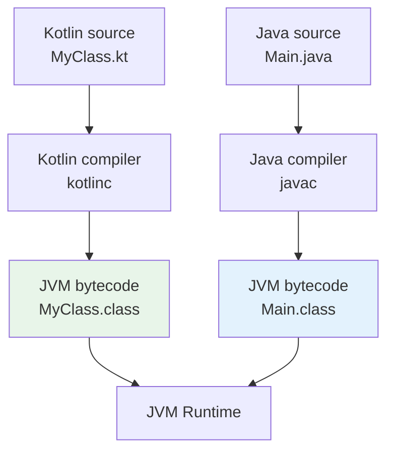
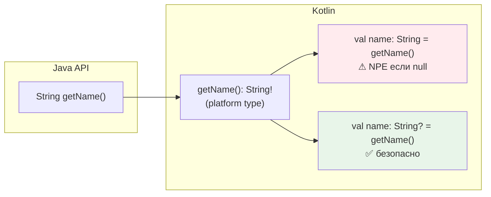
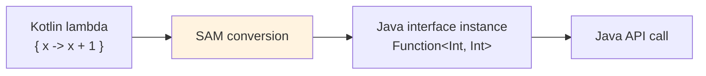
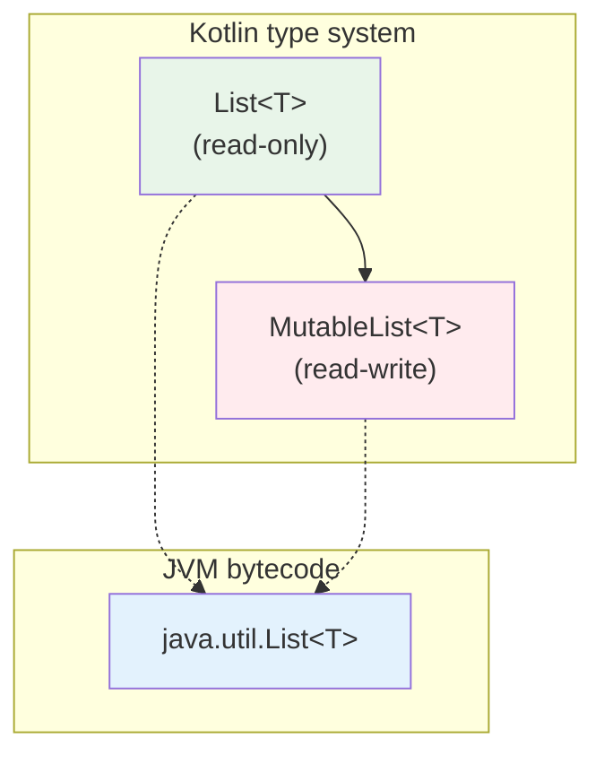
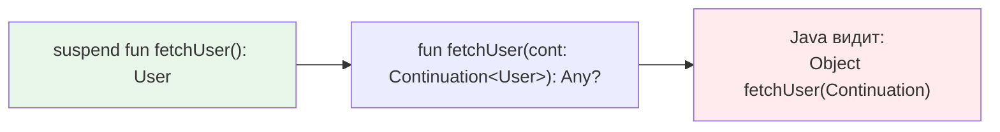
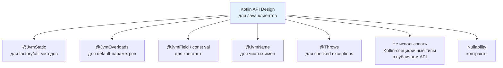
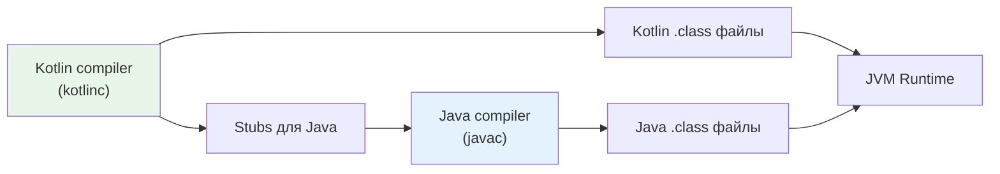

# Вопросы на собеседовании: интероп `Kotlin` и `Java`

Вопросы и ответы по взаимодействию `Kotlin` и `Java`: `platform types`, nullability-аннотации, `@JvmStatic`/`@JvmField`/`@JvmOverloads`/`@JvmName`, SAM-конверсии, коллекции, generics variance (`in`/`out` vs wildcards), `inline`-классы и вызов `suspend`-функций из `Java`.

## Введение

`Kotlin` компилируется в байткод `JVM` и полностью совместим с `Java`: можно вызывать `Java`-код из `Kotlin` и наоборот. Это одно из ключевых преимуществ `Kotlin` — возможность постепенной миграции с `Java` без переписывания всего проекта. На собеседованиях по этой теме проверяют понимание нюансов: как `Kotlin`-конструкции отображаются в байткоде, какие аннотации нужны для удобного вызова из `Java`, как работают `platform types`, generics и коллекции на границе двух языков.

## Полезные ссылки

### Официальная документация

- [Calling Java from Kotlin](https://kotlinlang.org/docs/java-interop.html) — работа с `Java`-кодом из `Kotlin`
- [Calling Kotlin from Java](https://kotlinlang.org/docs/java-to-kotlin-interop.html) — вызов `Kotlin`-кода из `Java`
- [SAM conversions](https://kotlinlang.org/docs/fun-interfaces.html) — функциональные интерфейсы и SAM-конверсии
- [Generics: in, out, where](https://kotlinlang.org/docs/generics.html) — система дженериков `Kotlin`
- [Inline value classes](https://kotlinlang.org/docs/inline-classes.html) — `value class` и `@JvmInline`

### Baeldung

- [Kotlin Java Interoperability — Baeldung](https://www.baeldung.com/kotlin/java-interoperability) — полное руководство по интеропу Kotlin и Java
- [Guide to JVM Platform Annotations in Kotlin — Baeldung](https://www.baeldung.com/kotlin/jvm-annotations) — @JvmStatic, @JvmField, @JvmOverloads и другие JVM-аннотации
- [SAM Conversions in Kotlin — Baeldung](https://www.baeldung.com/kotlin/sam-conversions) — SAM-конверсии и функциональные интерфейсы
- [A Guide to @Throws in Kotlin — Baeldung](https://www.baeldung.com/kotlin/throws-annotation) — аннотация @Throws для корректного интеропа

## Содержание

- [Введение](#введение)
- [Полезные ссылки](#полезные-ссылки)
- [See also](#see-also)

**Основы интеропа и байткод**
- [Q1. (!) Как из `Java` вызвать код, написанный на `Kotlin`?](#q1--как-из-java-вызвать-код-написанный-на-kotlin)
- [Q2. (!) Для чего нужны аннотации `@JvmStatic`, `@JvmOverloads` и `@JvmField`?](#q2--для-чего-нужны-аннотации-jvmstatic-jvmoverloads-и-jvmfield)
- [Q3. Как из `Java` вызвать `companion object` и его члены?](#q3-как-из-java-вызвать-companion-object-и-его-члены)
- [Q4. Как из `Java` вызывать функции `Kotlin` с default-параметрами?](#q4-как-из-java-вызывать-функции-kotlin-с-default-параметрами)
- [Q5. Как из `Java` вызвать extension-функцию `Kotlin`?](#q5-как-из-java-вызвать-extension-функцию-kotlin)

**Nullability и platform types**
- [Q6. (!) Что такое `platform types` и как с ними работать?](#q6--что-такое-platform-types-и-как-с-ними-работать)
- [Q7. (!) Как работают nullability-аннотации `@Nullable`/`@NotNull` на границе `Kotlin` и `Java`?](#q7--как-работают-nullability-аннотации-nullablenotnull-на-границе-kotlin-и-java)
- [Q8. Как в `Kotlin` объявить API, чтобы из `Java` были видны корректные nullability-контракты?](#q8-как-в-kotlin-объявить-api-чтобы-из-java-были-видны-корректные-nullability-контракты)

**Аннотации `@JvmName`, `@JvmSynthetic`, `@Throws`**
- [Q9. Для чего нужна аннотация `@JvmName` и когда её использовать?](#q9-для-чего-нужна-аннотация-jvmname-и-когда-её-использовать)
- [Q10. Зачем нужна `@JvmSynthetic`?](#q10-зачем-нужна-jvmsynthetic)
- [Q11. Когда и зачем использовать `@Throws`?](#q11-когда-и-зачем-использовать-throws)

**SAM-конверсии и функциональные интерфейсы**
- [Q12. (!) Что такое SAM-conversion при интеропе `Kotlin` и `Java`?](#q12--что-такое-sam-conversion-при-интеропе-kotlin-и-java)
- [Q13. Чем отличается `fun interface` в `Kotlin` от `Java` SAM-интерфейса?](#q13-чем-отличается-fun-interface-в-kotlin-от-java-sam-интерфейса)

**Generics: variance, wildcards**
- [Q14. (!) Как соотносятся `in`/`out` в `Kotlin` и `? extends`/`? super` в `Java`?](#q14--как-соотносятся-inout-в-kotlin-и--extends-super-в-java)
- [Q15. Когда нужны `@JvmSuppressWildcards` и `@JvmWildcard`?](#q15-когда-нужны-jvmsuppresswildcards-и-jvmwildcard)

**Коллекции и потоки**
- [Q16. (!) Как работает интероп коллекций между `Kotlin` и `Java`?](#q16--как-работает-интероп-коллекций-между-kotlin-и-java)
- [Q17. `Java Streams` vs `Kotlin Sequences`: в чём разница и когда что использовать?](#q17-java-streams-vs-kotlin-sequences-в-чём-разница-и-когда-что-использовать)

**Свойства и доступ к полям**
- [Q18. Как `Kotlin`-свойства выглядят из `Java`?](#q18-как-kotlin-свойства-выглядят-из-java)

**Top-level функции и `object`**
- [Q19. Как из `Java` вызывать top-level функции `Kotlin`?](#q19-как-из-java-вызывать-top-level-функции-kotlin)

**`inline`-классы и `Java`**
- [Q20. (!) Как `value class` (`@JvmInline`) работает при интеропе с `Java`?](#q20--как-value-class-jvminline-работает-при-интеропе-с-java)

**Корутины и `suspend`-функции**
- [Q21. (!) Как из `Java` вызвать `suspend`-функцию `Kotlin`?](#q21--как-из-java-вызвать-suspend-функцию-kotlin)

**Перегрузка и разрешение методов**
- [Q22. Как из `Kotlin` вызывать перегруженные методы `Java`?](#q22-как-из-kotlin-вызывать-перегруженные-методы-java)

**Checked exceptions**
- [Q23. Как `Kotlin` работает с checked exceptions из `Java`?](#q23-как-kotlin-работает-с-checked-exceptions-из-java)

**Kotlin-специфичные конструкции из `Java`**
- [Q24. Как из `Java` работать с `sealed class`/`sealed interface` из `Kotlin`?](#q24-как-из-java-работать-с-sealed-classsealed-interface-из-kotlin)
- [Q25. Как из `Java` использовать `data class` из `Kotlin`?](#q25-как-из-java-использовать-data-class-из-kotlin)

**Смешанные проекты: best practices**
- [Q26. (!) Какие практики делают `Kotlin` API удобным для `Java`-клиентов?](#q26--какие-практики-делают-kotlin-api-удобным-для-java-клиентов)
- [Q27. Как организовать смешанный `Kotlin`/`Java` проект в `Gradle`?](#q27-как-организовать-смешанный-kotlinjava-проект-в-gradle)
- [Q28. Как работать с `Java records` из `Kotlin` и использовать `@JvmRecord`?](#q28-как-работать-с-java-records-из-kotlin-и-использовать-jvmrecord)
- [Q29. Как работает интероп `Kotlin` с `Java` аннотациями (`@Target`, `@Retention`, use-site targets)?](#q29-как-работает-интероп-kotlin-с-java-аннотациями-target-retention-use-site-targets)

**Platform types, `inline`, sealed и null safety**
- [Q30. Почему platform types опасны и как их избежать в реальных проектах?](#q30-почему-platform-types-опасны-и-как-их-избежать-в-реальных-проектах)
- [Q31. Почему `inline`-функции недоступны из `Java` и как это обойти?](#q31-почему-inline-функции-недоступны-из-java-и-как-это-обойти)
- [Q32. `Sealed classes` в `Java 17` vs `Kotlin sealed`: ключевые отличия при интеропе](#q32-sealed-classes-в-java-17-vs-kotlin-sealed-ключевые-отличия-при-интеропе)
- [Q33. `Java Optional` vs `Kotlin` null safety: что лучше и как работать на границе двух языков?](#q33-java-optional-vs-kotlin-null-safety-что-лучше-и-как-работать-на-границе-двух-языков)

**Lombok, companion object и generics**
- [Q34. Почему `Lombok` несовместим с `Kotlin` при использовании `kapt` и как это решить?](#q34-почему-lombok-несовместим-с-kotlin-при-использовании-kapt-и-как-это-решить)
- [Q35. Как работает `companion object` с `@JvmStatic` из `Java`: детали и подводные камни?](#q35-как-работает-companion-object-с-jvmstatic-из-java-детали-и-подводные-камни)
- [Q36. Как extension-функции `Kotlin` выглядят в байткоде и чем это важно для `Java`?](#q36-как-extension-функции-kotlin-выглядят-в-байткоде-и-чем-это-важно-для-java)
- [Q37. `Java Optional` и Kotlin: паттерны интеграции при работе с `Spring Data`](#q37-java-optional-и-kotlin-паттерны-интеграции-при-работе-с-spring-data)
- [Q38. Kotlin generics variance (`in`/`out`) и Java wildcards: практические примеры при интеропе](#q38-kotlin-generics-variance-inout-и-java-wildcards-практические-примеры-при-интеропе)

---

## Q1. (!) Как из `Java` вызвать код, написанный на `Kotlin`?

Никакого моста не нужно: `Kotlin` компилируется в тот же байткод `JVM`, что и `Java`, поэтому `Kotlin`-классы видны из `Java` как обычные классы. Вся сложность — не в вызове, а в том, что одна `Kotlin`-конструкция может превратиться в неожиданный для `Java` элемент байткода: top-level функция станет статическим методом класса-обёртки, `object` — синглтоном с полем `INSTANCE`, свойство — парой геттер/сеттер. Чтобы вызывать `Kotlin` идиоматично, надо знать эти соответствия.



| Конструкция `Kotlin` | Как выглядит из `Java` |
|---|---|
| Класс `MyClass` | Обычный класс `MyClass` |
| Top-level функции в `Utils.kt` | Статические методы `UtilsKt.funcName()` |
| `object MySingleton` | `MySingleton.INSTANCE.method()` |
| `companion object` | `MyClass.Companion.method()` |
| Свойство `val name: String` | Геттер `getName()` |
| Свойство `var count: Int` | `getCount()` + `setCount()` |
| Extension-функция | Статический метод с receiver как первый параметр |

**Ключевая мысль:** без специальных аннотаций код всё равно вызывается — просто синтаксис на стороне `Java` получается громоздким (`Companion.method()`, `INSTANCE.method()`, `getName()`). Аннотации `@JvmStatic`, `@JvmOverloads`, `@JvmField`, `@JvmName` не меняют поведение, а делают `Java`-вызовы короче и привычнее. В чисто `Kotlin`-проекте они не нужны.

## Q2. (!) Для чего нужны аннотации `@JvmStatic`, `@JvmOverloads` и `@JvmField`?

Каждая из трёх аннотаций убирает один конкретный источник «уродливого» синтаксиса на стороне `Java`: лишний `Companion`, обязательную передачу всех аргументов и вызов геттера вместо чтения поля.

**`@JvmStatic`** — генерирует настоящий статический метод (или поле) в самом классе, а не во вложенном `Companion`. Без неё члены `companion object` доступны только через `MyClass.Companion.method()`:

```kotlin
class ConnectionPool {
    companion object {
        @JvmStatic
        fun create(size: Int): ConnectionPool = ConnectionPool()
    }
}
```

```java
// Без @JvmStatic:
ConnectionPool.Companion.create(10);
// С @JvmStatic:
ConnectionPool.create(10);  // идиоматичный Java-вызов
```

**`@JvmOverloads`** — для функции с default-параметрами генерирует набор перегрузок, отсекая аргументы справа. `Java` не умеет default-значения, поэтому без этой аннотации пришлось бы всегда передавать все параметры:

```kotlin
class HttpClient {
    @JvmOverloads
    fun get(
        url: String,
        timeout: Int = 30,
        headers: Map<String, String> = emptyMap()
    ): String { /* ... */ }
}
```

```java
// Java: три перегрузки
client.get("https://api.example.com");
client.get("https://api.example.com", 60);
client.get("https://api.example.com", 60, headers);
```

**`@JvmField`** — превращает свойство в обычное публичное поле без геттера/сеттера, чтобы из `Java` к нему обращались напрямую, а не через `getX()`/`setX()`:

```kotlin
class Config {
    companion object {
        @JvmField
        val MAX_RETRIES = 3
    }
    @JvmField
    var debugMode = false
}
```

```java
int retries = Config.MAX_RETRIES;  // поле, не getMAX_RETRIES()
config.debugMode = true;           // поле, не setDebugMode()
```

> **Что подчеркнуть на собеседовании:** все три аннотации меняют только форму вызова на стороне `Java`, а не семантику кода. Они нужны исключительно когда `Kotlin`-модуль потребляется из `Java`; в чисто `Kotlin`-проекте они бессмысленны.

## Q3. Как из `Java` вызвать `companion object` и его члены?

`companion object` компилируется во вложенный класс-синглтон `Companion`, поэтому по умолчанию из `Java` к его членам обращаются через `MyClass.Companion.method()`. Форма доступа меняется в зависимости от того, какой аннотацией помечен член:

```kotlin
class UserRepository {
    companion object {
        const val TABLE_NAME = "users"           // compile-time constant

        @JvmStatic
        fun findById(id: Long): User? = TODO()

        fun count(): Int = TODO()                // без @JvmStatic

        @JvmField
        val DEFAULT_PAGE_SIZE = 20
    }
}
```

```java
// const val — всегда видна как статическое поле
String table = UserRepository.TABLE_NAME;

// @JvmStatic — статический метод
User user = UserRepository.findById(42L);

// Без @JvmStatic — через Companion
int count = UserRepository.Companion.count();

// @JvmField — статическое поле
int pageSize = UserRepository.DEFAULT_PAGE_SIZE;
```

Для обычного `object` (не companion) сам синглтон доступен через статическое поле `INSTANCE`:

```java
// object MyRegistry в Kotlin:
MyRegistry.INSTANCE.getItems();
// С @JvmStatic на getItems():
MyRegistry.getItems();
```

**Когда что выбрать для константы:**

- `const val` — только для примитивов и `String`, значение подставляется по месту использования в compile-time (как `static final` в `Java`). Всегда видна из `Java` напрямую, без аннотаций.
- `@JvmField val` — работает с любым типом, но значение читается из поля в runtime. Нужна, когда тип не примитив и не `String` (например, `Set`, `Duration`).

## Q4. Как из `Java` вызывать функции `Kotlin` с default-параметрами?

Коротко: либо передавайте из `Java` все аргументы, либо повесьте `@JvmOverloads`. Default-значения — это фича `Kotlin`-компилятора, в байткоде их нет: по умолчанию `Kotlin` генерирует одну-единственную сигнатуру со **всеми** параметрами, и `Java` обязан заполнить каждый.

`@JvmOverloads` решает это, заставляя компилятор сгенерировать дополнительные перегрузки — каждая отбрасывает крайний правый параметр:

```kotlin
@JvmOverloads
fun connect(
    host: String = "localhost",
    port: Int = 8080,
    ssl: Boolean = false
) { /* ... */ }
```

Генерируются 4 метода:

```java
connect("db.local", 5432, true);  // все параметры
connect("db.local", 5432);       // ssl = false
connect("db.local");             // port = 8080, ssl = false
connect();                       // все default
```

**Подводный камень — порядок параметров.** Перегрузки отсекают параметры только **справа**, поэтому пропустить средний из `Java` невозможно: в `Kotlin` это решают named arguments, а в `Java` их нет. Вывод для проектирования API: ставьте самые «нужные» параметры слева, а необязательные — справа в порядке убывания вероятности, что их захотят задать.

**Конструкторы** тоже поддерживают `@JvmOverloads`:

```kotlin
class HttpRequest @JvmOverloads constructor(
    val url: String,
    val method: String = "GET",
    val body: String? = null
)
```

## Q5. Как из `Java` вызвать extension-функцию `Kotlin`?

Extension-функция — это не метод класса, а статический метод, у которого receiver передан первым параметром. Никакой «магии» здесь нет: `String.toSlug()` в байткоде превращается в `toSlug(String)`, и из `Java` его так и вызывают — как статический метод класса-обёртки:

```kotlin
// файл StringUtils.kt
package com.example

fun String.toSlug(): String =
    lowercase().replace(" ", "-").replace(Regex("[^a-z0-9-]"), "")
```

```java
// Java: статический вызов, receiver передаётся первым аргументом
String slug = StringUtilsKt.toSlug("Hello World!");
```

Имя класса-обёртки по умолчанию — `<FileName>Kt`. Изменить его можно аннотацией `@file:JvmName`:

```kotlin
@file:JvmName("Strings")
package com.example

fun String.toSlug(): String = /* ... */
```

```java
String slug = Strings.toSlug("Hello World!");
```

Если несколько файлов используют одно `@JvmName`, нужно добавить `@file:JvmMultifileClass` — тогда все функции объединяются в один фасадный класс.

## Q6. (!) Что такое `platform types` и как с ними работать?

**Platform type** — это тип, пришедший из `Java`, про который компилятор `Kotlin` не знает, nullable он или нет (в `Java`-сигнатуре нет аннотации nullability). Чтобы не ломать интероп ложными ошибками, `Kotlin` снимает с такого типа проверки на `null` и доверяет их разработчику. В IDE это видно по восклицательному знаку: `String!`, `List<User>!`.



Главное свойство platform type: его можно присвоить и в `String` (non-null), и в `String?` — компилятор не возражает. Если вы выбрали non-null, а значение оказалось `null`, `NullPointerException` прилетит **в момент присваивания**, а не отложенно при первом использовании, как было бы в `Java`. Это и плюс (ошибка ближе к причине), и риск (никто не предупредил).

**Рекомендации:**

1. **Явно указывайте тип** при работе с `Java`-API:
```kotlin
// Плохо — тип выведен как platform type
val name = javaObject.getName()

// Хорошо — явный non-null (бросит NPE сразу, если null)
val name: String = javaObject.getName()

// Хорошо — явный nullable (безопасно)
val name: String? = javaObject.getName()
```

2. **Используйте safe calls** при сомнениях: `javaObject.getName()?.uppercase()`

3. **Аннотируйте `Java`-код** аннотациями `@Nullable`/`@NotNull` — тогда `Kotlin`-компилятор увидит точный тип вместо platform type.

Подробнее о nullability — в [вопросах по основам Kotlin](kotlin-interview.md).

## Q7. (!) Как работают nullability-аннотации `@Nullable`/`@NotNull` на границе `Kotlin` и `Java`?

Эти аннотации — способ убрать platform types: если `Java`-элемент помечен `@Nullable`/`@NotNull`, `Kotlin` перестаёт «угадывать» и видит точный тип (`String?` или `String`) с полным контролем `null`. Компилятор понимает аннотации из множества библиотек:

| Библиотека | Аннотации |
|---|---|
| JetBrains | `org.jetbrains.annotations.@Nullable`, `@NotNull` |
| JSR-305 | `javax.annotation.@Nullable`, `@Nonnull` |
| Android | `androidx.annotation.@Nullable`, `@NonNull` |
| Spring | `org.springframework.lang.@Nullable`, `@NonNull` |
| Eclipse | `org.eclipse.jdt.annotation.@Nullable`, `@NonNull` |
| Lombok | `lombok.@NonNull` |

**Из `Java` в `Kotlin`:**

```java
// Java
public class UserService {
    @NotNull
    public String getName() { return "Alice"; }

    @Nullable
    public String getMiddleName() { return null; }

    public String getNickname() { return "bob"; } // без аннотации
}
```

```kotlin
// Kotlin
val name: String = userService.name           // OK, компилятор знает — non-null
val middle: String? = userService.middleName  // OK, компилятор знает — nullable
val nick = userService.nickname               // String! — platform type
```

**Из `Kotlin` в `Java`:** обратное направление работает автоматически — компилятор `Kotlin` сам проставляет `@NotNull`/`@Nullable` в байткод для всех параметров и возвращаемых типов. Поэтому `Java`-IDE (IntelliJ, Eclipse) подсвечивают передачу `null` в `Kotlin`-метод с non-null параметром ещё до запуска.

**Строгий режим (`-Xjsr305=strict`):** флаг управляет только тем, насколько строго компилятор реагирует на JSR-305-аннотации — включая default-квалификаторы вроде `@ParametersAreNonnullByDefault`, которые задают nullability сразу для всего пакета/класса. По умолчанию нарушение таких контрактов — warning, в strict-режиме — ошибка компиляции. Важный нюанс: типы вообще без аннотаций флаг не трогает — они как были, так и остаются platform types.

## Q8. Как в `Kotlin` объявить API, чтобы из `Java` были видны корректные nullability-контракты?

Хорошая новость: специально делать почти ничего не нужно — `Kotlin`-компилятор сам кодирует контракт nullability в байткоде из обычных типов `Kotlin`:

- Параметр `name: String` → `@NotNull String name` в байткоде
- Параметр `name: String?` → `@Nullable String name` в байткоде
- Возвращаемый тип `String` → `@NotNull String` + runtime-проверка

Контракт не только декларативный, но и защищён в runtime: если `Java`-код передаст `null` в non-null параметр, `Kotlin` выбросит `NullPointerException` **прямо на входе в метод**, а не отложенно при первом разыменовании (до Kotlin 1.4 бросался `IllegalArgumentException`). Эту проверку компилятор вставляет автоматически.

```kotlin
// Kotlin
fun process(name: String): String = name.uppercase()
```

```java
// Java — при вызове process(null) немедленно выбросит:
// NullPointerException: Parameter specified as non-null is null
UserKt.process(null);
```

**Рекомендация:** для публичных `Kotlin`-библиотек контракт nullability всё равно стоит документировать словами — старые или нестандартные `Java`-IDE могут не показать предупреждение по байткодной аннотации, и `Java`-клиент узнает о non-null только в виде падения в runtime.

## Q9. Для чего нужна аннотация `@JvmName` и когда её использовать?

`@JvmName` переопределяет имя, под которым элемент попадает в байткод (а значит — видится из `Java`), не меняя его имени в `Kotlin`. Применяется в четырёх типовых ситуациях: дать читаемое имя классу-обёртке, развести конфликт после type erasure, поправить имя геттера и собрать функции из разных файлов в один класс.

**1. Переименование файлового класса** — для top-level функций (по умолчанию был бы `DatesKt`):

```kotlin
@file:JvmName("Dates")
package com.example

fun parseDate(s: String): LocalDate = /* ... */
```

```java
LocalDate d = Dates.parseDate("2026-01-01"); // вместо DatesKt
```

**2. Разрешение конфликтов** — type erasure стирает дженерик-параметры, и `filter(List<String>)` и `filter(List<Int>)` превращаются в одинаковую сигнатуру `filter(List)`. `@JvmName` даёт им разные имена в байткоде:

```kotlin
// Ошибка компиляции без @JvmName: обе функции → filterStrings(List) в байткоде
@JvmName("filterStrings")
fun filter(list: List<String>): List<String> = /* ... */

@JvmName("filterInts")
fun filter(list: List<Int>): List<Int> = /* ... */
```

**3. Переименование геттеров/сеттеров** — например, чтобы `Boolean`-свойство c `is`-префиксом не получило двойное `isIsActive()`:

```kotlin
val isActive: Boolean
    @JvmName("isActive") get() = /* ... */
    // без аннотации геттер был бы getActive() из-за is-convention
```

**4. `@file:JvmMultifileClass`** — объединение top-level функций из разных файлов в один `Java`-класс:

```kotlin
// file1.kt
@file:JvmName("Utils")
@file:JvmMultifileClass

fun foo() {}

// file2.kt
@file:JvmName("Utils")
@file:JvmMultifileClass

fun bar() {}
```

```java
Utils.foo(); // оба метода в одном классе
Utils.bar();
```

## Q10. Зачем нужна `@JvmSynthetic`?

`@JvmSynthetic` помечает элемент (метод, свойство, поле) флагом `synthetic` в байткоде, и `Java`-компилятор перестаёт его видеть — будто элемента нет. Из `Kotlin` он при этом доступен как обычно. Смысл — спрятать от `Java` то, что без `Kotlin`-синтаксиса всё равно бесполезно или опасно.

Основные случаи использования:

1. **Скрытие служебных API** — когда функция имеет смысл только для `Kotlin`-потребителей:

```kotlin
class KotlinDsl {
    @JvmSynthetic
    internal fun configure(block: Config.() -> Unit) { /* ... */ }
}
```

2. **DSL-builders** — чтобы `Java`-разработчики не видели extension-функции и лямбда-ориентированные методы, которые не имеют смысла без `Kotlin`-синтаксиса.

3. **Предотвращение случайного использования** служебных методов, сгенерированных для `inline`-классов или `operator`-функций.

> **Чем отличается от `internal`:** модификатор `internal` компилируется в `public` с искажённым именем (name-mangling) — то есть элемент технически доступен из `Java`, просто с уродливым именем. `@JvmSynthetic` убирает видимость по-настоящему: вызвать такой элемент из `Java` нельзя никак.

## Q11. Когда и зачем использовать `@Throws`?

`@Throws` нужна, чтобы добавить `throws` в сигнатуру `Kotlin`-метода в байткоде. Причина: в `Kotlin` все исключения unchecked, поэтому компилятор не пишет `throws` сам. Но `Java`-компилятор считает `catch (IOException e)` ошибкой, если в сигнатуре нет соответствующего `throws` — он не верит, что метод вообще может бросить `IOException`. Без `@Throws` `Java`-клиент не сможет точечно поймать checked-исключение из `Kotlin`-кода.

```kotlin
@Throws(IOException::class)
fun readConfig(path: String): Config {
    val file = File(path)
    if (!file.exists()) throw IOException("File not found: $path")
    return parseConfig(file.readText())
}
```

```java
// Java: теперь можно (и нужно) обработать IOException
try {
    Config config = ConfigKt.readConfig("/etc/app.conf");
} catch (IOException e) {
    log.error("Failed to read config", e);
}
```

Без `@Throws` `Java`-код может только ловить `Exception` или `Throwable`, что менее точно. Подробнее об обработке ошибок — в [вопросах по исключениям Kotlin](kotlin-exceptions-interview.md).

## Q12. (!) Что такое SAM-conversion при интеропе `Kotlin` и `Java`?

**SAM-conversion** (Single Abstract Method) — автоматическое превращение лямбды `Kotlin` в реализацию `Java`-интерфейса с ровно одним абстрактным методом (`Runnable`, `Comparator`, `Callable`, `Consumer` и т.д.). Благодаря ему не нужно писать `object : Runnable { override fun run() ... }` — достаточно лямбды, а компилятор сам обернёт её в анонимную реализацию интерфейса.

```kotlin
// Вместо анонимного объекта:
executor.submit(object : Runnable {
    override fun run() {
        println("Running")
    }
})

// SAM-conversion — лямбда:
executor.submit { println("Running") }

// Ещё примеры:
list.sortWith(Comparator { a, b -> a.length - b.length })
button.setOnClickListener { view -> handleClick(view) }
```



**Важные нюансы:**

1. Исторически SAM-conversion работал только для **`Java`-интерфейсов**. Для `Kotlin`-интерфейса (до `Kotlin` 1.4) лямбду подставить было нельзя — приходилось писать `object : Interface { }`.

2. С `Kotlin` 1.4 SAM-conversion работает и для `Kotlin`-интерфейса, но только если тот объявлен как `fun interface` (см. Q13).

3. Если перегрузки неоднозначны (несколько SAM-типов подходят), укажите тип явно, обернув лямбду в имя интерфейса:
```kotlin
// Явный SAM-тип при неоднозначности
executor.submit(Runnable { println("task") })
```

4. **Подводный камень:** каждый вызов с лямбдой создаёт **новый** объект-реализацию. Поэтому для пар `addListener`/`removeListener` лямбду нужно сохранить в переменную — иначе во второй вызов уйдёт другая ссылка и слушатель не снимется.

## Q13. Чем отличается `fun interface` в `Kotlin` от `Java` SAM-интерфейса?

`fun interface` — это `Kotlin`-способ явно объявить SAM-интерфейс (один абстрактный метод), для которого разрешена SAM-conversion. Появился в `Kotlin` 1.4. Ключевое отличие от `Java`: там любой интерфейс с одним методом автоматически считается функциональным, а в `Kotlin` это надо включить вручную словом `fun`:

```kotlin
// Kotlin: fun interface
fun interface Transformer<T, R> {
    fun transform(input: T): R
}

// SAM-conversion работает:
val upper: Transformer<String, String> = Transformer { it.uppercase() }
```

| Аспект | `Java` SAM-интерфейс | `Kotlin` `fun interface` |
|---|---|---|
| SAM-conversion из `Kotlin` | Да (всегда) | Да (с `Kotlin` 1.4) |
| SAM-conversion из `Java` | Да (через лямбду `Java`) | Да |
| Обычный `interface` без `fun` | N/A | SAM-conversion **не** работает |
| Несколько абстрактных методов | N/A — не SAM | Ошибка компиляции при `fun` |

**Типичная ошибка:** объявить обычный `Kotlin interface` с одним методом и ожидать SAM-conversion — без ключевого слова `fun` это не работает, нужно создавать `object : Interface { }`.

## Q14. (!) Как соотносятся `in`/`out` в `Kotlin` и `? extends`/`? super` в `Java`?

Это два способа выразить одно и то же — безопасную вариантность дженериков в иерархии типов. Разница в том, **где** задаётся вариантность: `Kotlin` использует **declaration-site variance** — `out`/`in` пишут один раз при объявлении класса. `Java` использует **use-site variance** — `? extends`/`? super` указывают в каждом месте использования. Поэтому `Kotlin`-вариант лаконичнее (объявил — забыл), а `Java`-вариант гибче, но многословнее.

| `Kotlin` | `Java` | Название | Смысл |
|---|---|---|---|
| `out T` | `? extends T` | Ковариантность | Можно только **читать** `T` |
| `in T` | `? super T` | Контравариантность | Можно только **писать** `T` |
| `T` (без модификатора) | `T` | Инвариантность | Чтение и запись |
| `*` | `?` | Star projection / Unbounded | Тип неизвестен |

```kotlin
// Kotlin: declaration-site variance
interface Source<out T> {    // Producer — только отдаёт T
    fun next(): T
}

interface Sink<in T> {       // Consumer — только принимает T
    fun put(item: T)
}
```

При компиляции `Kotlin` транслирует `out T` в `? extends T` в `Java`-сигнатурах:

```kotlin
// Kotlin
fun copy(from: Source<Any>, to: Sink<Any>) { /* ... */ }
```

```java
// Java видит:
void copy(Source<? extends Object> from, Sink<? super Object> to)
```

**Главное для собеседования:** правило **PECS** из `Java` (Producer Extends, Consumer Super) и пара `out`/`in` из `Kotlin` выражают один и тот же принцип. `out` (producer) — тип только отдаётся, значит читать безопасно. `in` (consumer) — тип только принимается, значит писать безопасно. Покажите, что видите за разным синтаксисом общую идею. Подробнее о дженериках — в [вопросах по дженерикам Java](../java/java-generics-interview.md).

## Q15. Когда нужны `@JvmSuppressWildcards` и `@JvmWildcard`?

Поскольку у `Java` нет declaration-site variance, `Kotlin`-компилятору приходится переводить свои `out T`/`in T` в `Java`-сигнатурах через wildcards (`? extends T` / `? super T`). Важно: автоматически это происходит только **в позициях параметров** — в return-типах wildcards по умолчанию не генерируются (чтобы не заставлять `Java`-клиентов с ними возиться). Обычно перевод правильный, но иногда лишний wildcard ломает код, который ожидает точный тип. Эти две аннотации дают ручное управление переводом.

**`@JvmSuppressWildcards`** — убирает автоматический wildcard, оставляя точный тип:

```kotlin
// Kotlin: обработчики приходят параметром конструктора
class Dispatcher(private val handlers: List<Handler>) { /* ... */ }

// Java видит конструктор: Dispatcher(List<? extends Handler> handlers) — лишний wildcard
// С аннотацией:
class Dispatcher(private val handlers: List<@JvmSuppressWildcards Handler>) { /* ... */ }
// Java видит: Dispatcher(List<Handler> handlers) — точный тип
```

Когда это спасает:
- DI-фреймворки (Dagger, Guice) сопоставляют типы буквально и не видят `List<? extends Foo>` как `List<Foo>` — инъекция падает
- `suspend`-функции: их результат уезжает в скрытый параметр `Continuation`, поэтому wildcard появляется даже у «return-типа» — отсюда привычный `@JvmSuppressWildcards` на возвратах `suspend`-методов в Retrofit
- библиотечные API, где один wildcard тянет за собой каскад wildcards по всему `Java`-коду клиента

**`@JvmWildcard`** — обратная аннотация: добавляет wildcard там, где `Kotlin` по умолчанию его не ставит:

```kotlin
fun process(items: List<@JvmWildcard String>) { /* ... */ }
// Java видит: void process(List<? extends String> items)
```

Используется реже — в основном для совместимости с `Java`-API, ожидающими wildcard-типы.

## Q16. (!) Как работает интероп коллекций между `Kotlin` и `Java`?

Суть в одном факте: разделение на read-only и mutable существует только в системе типов `Kotlin` на этапе компиляции, а в байткоде остаётся один и тот же `java.util.List`. `Kotlin` даёт два интерфейса — read-only (`List`, `Set`, `Map`) без мутирующих методов и `Mutable*` с ними, — но оба отображаются на одни и те же `Java`-классы. Из-за этого граница между языками теряет информацию о мутабельности, и отсюда растут все подводные камни ниже.



**Из `Java` в `Kotlin`:**

- `java.util.List` → `(Mutable)List<T!>!` — platform type, `Kotlin` не знает, mutable она или нет
- Разработчик сам решает: принять как `List<String>` (read-only) или `MutableList<String>`
- Если принять как `List`, а `Java`-код потом мутирует коллекцию — будет `UnsupportedOperationException` или неожиданное поведение

**Из `Kotlin` в `Java`:**

- `listOf(1, 2, 3)` возвращает read-only список, но из `Java` это обычный `java.util.List` — `add()` вызвать можно, но будет `UnsupportedOperationException`
- `mutableListOf(1, 2, 3)` — из `Java` мутация работает нормально

```kotlin
// Kotlin
fun getNames(): List<String> = listOf("Alice", "Bob")
fun getMutableNames(): MutableList<String> = mutableListOf("Alice", "Bob")
```

```java
// Java
List<String> names = MyKt.getNames();
names.add("Charlie");        // UnsupportedOperationException!

List<String> mutable = MyKt.getMutableNames();
mutable.add("Charlie");      // OK
```

> **Частая ошибка на собеседованиях:** считать, что `Kotlin` read-only коллекции immutable. Они не immutable — просто интерфейс не содержит мутирующих методов. Под капотом может быть `MutableList`, и `Java`-код может его мутировать. Подробнее — в [вопросах по коллекциям Kotlin](kotlin-collections-interview.md).

## Q17. `Java Streams` vs `Kotlin Sequences`: в чём разница и когда что использовать?

Обе дают ленивую (отложенную) обработку цепочки операций, но создавались под разные приоритеты: `Java Streams` делает ставку на встроенный параллелизм, а `Kotlin Sequences` — на простоту, переиспользуемость и единый API с коллекциями. Отличия в деталях:

| Аспект | `Java Streams` | `Kotlin Sequences` |
|---|---|---|
| Повторное использование | Нет (терминальная операция закрывает поток) | Да (можно итерировать многократно) |
| Параллелизм | `parallelStream()` из коробки | Нет встроенного параллелизма |
| API | `filter`, `map`, `reduce`, `collect` | `filter`, `map`, `fold`, `toList` |
| Null-элементы | Допускает (но не рекомендует) | Допускает |
| Интеграция с коллекциями | `stream()` / `collect(Collectors...)` | `asSequence()` / `toList()` |
| Примитивные специализации | `IntStream`, `LongStream`, `DoubleStream` | Нет (автобоксинг) |

```kotlin
// Kotlin Sequence
val result = listOf(1, 2, 3, 4, 5)
    .asSequence()
    .filter { it > 2 }
    .map { it * it }
    .toList()

// Java Stream из Kotlin
val result2 = listOf(1, 2, 3, 4, 5)
    .stream()
    .filter { it > 2 }
    .map { it * it }
    .collect(Collectors.toList())
```

**Когда использовать что:**
- В чисто `Kotlin`-коде: `Sequence` — идиоматичнее, безопаснее (повторное использование), достаточно для большинства случаев
- Параллельная обработка больших данных: `Java Streams` с `parallelStream()`
- Взаимодействие с `Java`-API, ожидающим `Stream`: `collection.stream()`
- `Kotlin`-коллекции уже имеют `filter`/`map`/`flatMap` напрямую (eager) — `Sequence` нужна только для больших коллекций или цепочек операций

## Q18. Как `Kotlin`-свойства выглядят из `Java`?

Из `Java` `Kotlin`-свойство выглядит не как поле, а как пара методов: приватное backing-поле плюс геттер `getX()` и (для `var`) сеттер `setX()`. Особый случай — `Boolean`-свойства с префиксом `is`: для них геттер называется не `getIsActive()`, а `isActive()`, что часто удивляет на собеседовании.

```kotlin
class User {
    val name: String = "Alice"        // val → getName()
    var age: Int = 30                 // var → getAge() + setAge()
    val isActive: Boolean = true      // Boolean is-property → isActive()
    var isVerified: Boolean = false   // Boolean is-property → isVerified() + setVerified()
}
```

```java
User u = new User();
u.getName();          // "Alice"
u.getAge();           // 30
u.setAge(31);
u.isActive();         // true — не getIsActive()!
u.isVerified();       // true
u.setVerified(true);  // не setIsVerified()!
```

**Модификаторы и аннотации, влияющие на видимость:**

| Аннотация / модификатор | Эффект в `Java` |
|---|---|
| `@JvmField` | Публичное поле, без геттера/сеттера |
| `const val` (companion) | `static final` поле, compile-time constant |
| `private` | Приватное поле, без геттера/сеттера |
| `internal` | `public` с name-mangling (непредсказуемое имя) |
| `lateinit var` | Публичное поле (без `@JvmField`) + геттер/сеттер |

> **Нюанс с `lateinit`:** из `Java` видно поле напрямую (`user.name`), т.к. `lateinit` генерирует публичное поле. Если поле не инициализировано, при доступе из `Java` будет `null` (без `Kotlin`-проверки `UninitializedPropertyAccessException`).

## Q19. Как из `Java` вызывать top-level функции `Kotlin`?

У `JVM` нет «функций вне класса», поэтому `Kotlin` для каждого файла создаёт класс-обёртку и складывает туда все top-level функции и свойства как статические члены. Имя класса по умолчанию — имя файла плюс суффикс `Kt` (`MathUtils.kt` → `MathUtilsKt`). Свойства превращаются в статические геттеры:

```kotlin
// файл MathUtils.kt
package com.example

fun factorial(n: Int): Long = if (n <= 1) 1 else n * factorial(n - 1)

val PI_APPROX = 3.14159
```

```java
// Java
long f = MathUtilsKt.factorial(5);     // 120
double pi = MathUtilsKt.getPI_APPROX(); // 3.14159
```

Управление именем класса:

```kotlin
@file:JvmName("MathUtils")   // MathUtils.factorial()
```

Объединение из нескольких файлов:

```kotlin
// algebra.kt
@file:JvmName("MathUtils")
@file:JvmMultifileClass
fun gcd(a: Int, b: Int): Int = /* ... */

// geometry.kt
@file:JvmName("MathUtils")
@file:JvmMultifileClass
fun areaOfCircle(r: Double): Double = /* ... */
```

```java
// Один фасадный класс
MathUtils.gcd(12, 8);
MathUtils.areaOfCircle(5.0);
```

## Q20. (!) Как `value class` (`@JvmInline`) работает при интеропе с `Java`?

Короткий ответ: вызывать `Kotlin`-методы с `value class`-параметрами из `Java` почти невозможно, и причина — оптимизация, ради которой `value class` существует. Это обёртка над одним значением, которую компилятор **по возможности** разворачивает прямо в underlying-тип (например, `UserId` → `long`), чтобы не аллоцировать объект:

```kotlin
@JvmInline
value class UserId(val value: Long)

@JvmInline
value class Email(val value: String)

fun findUser(id: UserId): User? = TODO()
fun sendEmail(to: Email, body: String) = TODO()
```

**Как это выглядит из `Java`:**

```java
// Имя метода манглируется для избежания конфликтов!
User user = MyKt.findUser-<hashcode>(42L);  // передаётся long, не UserId
```

**Проблемы интеропа:**

1. **Name mangling** — раз параметр в байткоде разворачивается в `long`, компилятор не может оставить методу обычное имя (иначе он столкнулся бы с настоящим `findUser(long)`). Поэтому к имени добавляется хеш, и из `Java` метод просто не вызвать по понятному имени — без `@JvmName` это тупик.

2. **Boxing** — разворачивание работает не всегда. Когда тип нужен «как объект» (generic-параметр, nullable, реализация интерфейса), `value class` боксится обратно в полноценный объект, и оптимизация теряется:

```kotlin
@JvmInline
value class Score(val value: Int)

fun process(score: Score) { }     // score → int в байткоде
fun processNullable(score: Score?) { } // score → Score объект (boxed)
fun <T> generic(item: T) { }     // Score → Score объект (boxed)
```

3. **Решение для `Java`-совместимости:** создавать фасадные методы с `@JvmName` или обычными типами:

```kotlin
@JvmInline
value class UserId(val value: Long)

// Для Java-клиентов:
@JvmName("findUser")
fun findUser(id: UserId): User? = TODO()

// Или фасад:
fun findUserById(id: Long): User? = findUser(UserId(id))
```

## Q21. (!) Как из `Java` вызвать `suspend`-функцию `Kotlin`?

Напрямую — почти никак: правильный ответ в том, что из `Java` нужно вызывать не саму `suspend`-функцию, а её адаптер. Под капотом `suspend fun foo(): User` компилируется в `Object foo(Continuation<User>)` — компилятор добавляет скрытый параметр `Continuation` (механизм CPS, Continuation Passing Style) и меняет тип возврата на `Object`. Чтобы вызвать такой метод из `Java`, пришлось бы вручную реализовать `Continuation` и разобраться с маркером `COROUTINE_SUSPENDED` — на практике так не делают.



**Способы вызова из `Java`:**

**1. Обёртка с `CompletableFuture`** (рекомендуемый способ):

```kotlin
// Kotlin: suspend-функция
suspend fun fetchUser(id: Long): User = /* ... */

// Адаптер для Java
fun fetchUserAsync(id: Long): CompletableFuture<User> =
    GlobalScope.future { fetchUser(id) }  // kotlinx-coroutines-jdk8
```

```java
// Java
CompletableFuture<User> future = UserServiceKt.fetchUserAsync(42L);
User user = future.get();
```

**2. Обёртка с `runBlocking`** (блокирует поток — только для тестов или простых случаев):

```kotlin
fun fetchUserBlocking(id: Long): User = runBlocking {
    fetchUser(id)
}
```

**3. Reactor / RxJava адаптеры** (для реактивных проектов):

```kotlin
// kotlinx-coroutines-reactor
fun fetchUserMono(id: Long): Mono<User> = mono {
    fetchUser(id)
}
```

> **Рекомендация:** держать `suspend`-функции внутри `Kotlin`-слоя, а для `Java`-потребителей публиковать адаптеры: `CompletableFuture`, `Mono` или синхронные обёртки. Подробнее — в [вопросах по корутинам Kotlin](kotlin-coroutines-interview.md).

## Q22. Как из `Kotlin` вызывать перегруженные методы `Java`?

В обычном случае никаких усилий не требуется: `Kotlin`-компилятор разрешает перегрузки `Java`-методов по типам аргументов так же, как это делает `javac`. Проблемы начинаются только там, где `Kotlin` добавляет nullable-типы и platform types — тогда выбор перегрузки может стать неоднозначным.

```java
// Java
public class TextProcessor {
    public String format(String text) { /* ... */ }
    public String format(String text, Locale locale) { /* ... */ }
    public String format(int number) { /* ... */ }
}
```

```kotlin
// Kotlin — компилятор выбирает правильную перегрузку
processor.format("hello")           // format(String)
processor.format("hello", Locale.US) // format(String, Locale)
processor.format(42)                // format(int)
```

**Когда возникает неоднозначность:**

```java
// Java
public void process(Object obj) { /* ... */ }
public void process(String str) { /* ... */ }
```

```kotlin
val value: String? = "hello"
processor.process(value)  // Ошибка: неоднозначность (String? может быть Object или String)

// Решение: явное приведение
processor.process(value as String)
processor.process(value as Any)
```

Здесь `String?` подходит и под `process(String)`, и под `process(Object)`, и компилятор не может выбрать. **Рецепт:** при любой неоднозначности (особенно с platform types и nullable) явно приводите аргумент к нужному типу через `as`, тем самым однозначно указывая перегрузку.

## Q23. Как `Kotlin` работает с checked exceptions из `Java`?

`Kotlin` игнорирует checked-контракт `Java`: в нём все исключения unchecked, поэтому при вызове `Java`-метода с `throws IOException` компилятор не требует ни `try-catch`, ни объявления `throws` — но поймать исключение, разумеется, по-прежнему можно, если нужно:

```java
// Java
public class FileReader {
    public String read(String path) throws IOException { /* ... */ }
}
```

```kotlin
// Kotlin — IOException не обязательно ловить
val content = fileReader.read("/tmp/data.txt") // OK, компилируется

// Но можно:
try {
    val content = fileReader.read("/tmp/data.txt")
} catch (e: IOException) {
    logger.error("Failed to read", e)
}
```

**В обратную сторону**: `Kotlin`-функции по умолчанию не объявляют `throws` в байткоде. Чтобы `Java`-код мог ловить конкретные checked exceptions, используйте `@Throws` (см. Q11).

Подробнее об обработке ошибок — в [вопросах по исключениям Kotlin](kotlin-exceptions-interview.md).

## Q24. Как из `Java` работать с `sealed class`/`sealed interface` из `Kotlin`?

Из `Java` `sealed`-иерархия `Kotlin` видна как обычная иерархия классов: `sealed class` компилируется в абстрактный класс с приватным конструктором, подклассы — в обычные классы. Разбирать варианты приходится через цепочку `instanceof`. Главная потеря — exhaustiveness: `Kotlin`-`when` гарантирует, что все ветки покрыты, а `Java` `if-else` ничего не проверяет, и забытый вариант обнаружится только в runtime:

```kotlin
sealed class Result {
    data class Success(val data: String) : Result()
    data class Error(val message: String) : Result()
    data object Loading : Result()
}
```

```java
// Java: instanceof-проверки
Result result = getResult();
if (result instanceof Result.Success success) {
    System.out.println(success.getData());
} else if (result instanceof Result.Error error) {
    System.out.println(error.getMessage());
} else if (result instanceof Result.Loading) {
    System.out.println("Loading...");
}
```

**Нюансы:**

- В `Java` нет гарантии exhaustiveness (`when` в `Kotlin` проверяет все ветки, `Java` `if-else` — нет)
- `sealed interface` (Kotlin 1.5+) компилируется в обычный интерфейс — sealed-ограничения существуют только на этапе компиляции `Kotlin`
- С `Java 17+` и `sealed` классами/интерфейсами `Java`: `Kotlin` sealed и `Java` sealed — разные механизмы, не связанные друг с другом

## Q25. Как из `Java` использовать `data class` из `Kotlin`?

`data class` — это обычный `Java`-класс, в котором компилятор за вас сгенерировал геттеры, `equals`/`hashCode`/`toString`, `copy()` и `componentN()`. Все они доступны из `Java`, но с одной оговоркой по `copy()` (см. ниже):

```kotlin
data class User(val name: String, val age: Int)
```

```java
// Java: доступны все сгенерированные методы
User user = new User("Alice", 30);
user.getName();           // геттер
user.getAge();
user.component1();        // "Alice" — для destructuring
user.component2();        // 30
user.copy("Bob", 30);     // копия с изменённым name
user.toString();          // "User(name=Alice, age=30)"
user.hashCode();
user.equals(other);
```

**Подводный камень с `copy()`:** удобство `copy(age = 31)` — это named/default-параметры `Kotlin`, которых в `Java` нет. А `@JvmOverloads` к сгенерированному `copy()` повесить нельзя, поэтому из `Java` приходится передавать **все** поля вручную, повторяя неизменяемые значения:

```java
// Java: нужно передать все параметры
User updated = user.copy("Bob", user.getAge()); // нельзя пропустить age
```

Чтобы упростить, можно добавить builder-паттерн или фабричные методы вручную для `Java`-потребителей.

## Q26. (!) Какие практики делают `Kotlin` API удобным для `Java`-клиентов?

Главный принцип — «Kotlin inside, Java-friendly edge»: внутри модуля пишите идиоматичный `Kotlin`, а на публичной границе адаптируйте API под `Java`. Конкретные правила сводятся к тому, чтобы расставить JVM-аннотации и не протаскивать наружу `Kotlin`-специфичные конструкции, недоступные из `Java`:



**Чек-лист для `Java`-friendly API:**

1. **`@JvmStatic`** на factory-методах и утилитах в `companion object`
2. **`@JvmOverloads`** на функциях и конструкторах с default-параметрами
3. **`@JvmField`** или `const val` для констант
4. **`@JvmName`** для осмысленных имён файловых классов и разрешения конфликтов
5. **`@Throws`** для функций, бросающих checked exceptions
6. **Избегать `inline`/`reified` в публичном API** — они недоступны из `Java`
7. **Избегать `value class` без `Java`-адаптеров** — name mangling делает вызов невозможным
8. **Не использовать `Kotlin`-специфичные типы** (`Unit`, `Nothing`, `Pair`, `Result`) в публичных сигнатурах — лучше `void`, стандартные `Java`-типы
9. **Документировать nullability** — даже если `Kotlin`-компилятор добавляет аннотации автоматически
10. **Принцип "Kotlin inside, Java-friendly edge"** — внутри модуля писать идиоматичный `Kotlin`, на границе — адаптировать для `Java`

## Q27. Как организовать смешанный `Kotlin`/`Java` проект в `Gradle`?

В `Gradle` `Kotlin`-плагин для `Gradle` поддерживает совместную компиляцию: `Kotlin`-код видит `Java`-код и наоборот, без ручной настройки порядка сборки. Достаточно подключить оба плагина:

```kotlin
// build.gradle.kts
plugins {
    kotlin("jvm") version "2.0.0"
    java
}

// Kotlin видит Java, Java видит Kotlin
sourceSets {
    main {
        java.srcDirs("src/main/java", "src/main/kotlin")
    }
}
```

**Порядок компиляции:**



Порядок решает проблему «курицы и яйца» — оба компилятора нуждаются в результатах друг друга. `Kotlin`-компилятор идёт первым и генерирует stubs (заглушки `Java`-классов только с сигнатурами), чтобы `javac` мог сослаться на `Kotlin`-типы. Затем `javac` компилирует `Java`-файлы, уже видя `Kotlin`-классы.

**Практические рекомендации:**

- Размещайте `Kotlin`-файлы в `src/main/kotlin`, `Java` — в `src/main/java` (стандартная конвенция)
- Миграция пофайловая: конвертируйте `Java`-файлы в `Kotlin` один за другим
- Используйте `kapt` или `KSP` вместо `annotationProcessor` для `Kotlin`-файлов (для Lombok, Dagger, MapStruct и т.д.)
- В `IntelliJ IDEA` есть автоматический конвертер `Java` → `Kotlin` (Ctrl+Alt+Shift+K), но результат нужно ревьюить — конвертер не всегда генерирует идиоматичный код

## Q28. Как работать с `Java records` из `Kotlin` и использовать `@JvmRecord`?

Два направления, и оба простые. `Java record` (с `Java 16`) — компактный неизменяемый DTO; из `Kotlin` он используется напрямую, с одной особенностью: accessor-методы записи идут без `get`-префикса (`point.x()`, а не `getX()`). В обратную сторону аннотация `@JvmRecord` заставляет `Kotlin`-`data class` скомпилироваться в настоящий `Java record`, чтобы `Java`-клиенты видели именно record (важно для pattern matching и некоторых библиотек).

**Вызов Java `record` из Kotlin:**

```kotlin
// Java record
public record Point(int x, int y) {}

// Kotlin — доступ через accessor-методы без get-префикса (особенность records)
val point = Point(10, 20)
println(point.x())  // 10 — record accessor (не getX())
println(point.y())  // 20
println(point)      // Point[x=10, y=20] — toString из record
```

**Создание `@JvmRecord` в Kotlin:**

```kotlin
@JvmRecord
data class Coordinates(val latitude: Double, val longitude: Double)

// Компилируется в Java record:
// record Coordinates(double latitude, double longitude) {}

// Из Java:
// Coordinates c = new Coordinates(55.7, 37.6);
// c.latitude()    // accessor без get-префикса
// c.longitude()
```

**Ограничения `@JvmRecord`:**
- Требует JVM target 16+
- Класс должен быть `data class`
- Не может быть `open`, `abstract`, `sealed`
- Все свойства только в primary constructor, только `val`
- Не может иметь backing field с нестандартным геттером

```kotlin
// build.gradle.kts
kotlin {
    jvmToolchain(17)
}

// Kotlin data class (без @JvmRecord) — не record, геттеры с get-префиксом
data class UserDto(val name: String)  // Java видит: getName()

// С @JvmRecord — настоящий record
@JvmRecord
data class UserDto(val name: String)  // Java видит: name()
```

**Когда использовать `@JvmRecord`:**
- Публичный API, используемый из `Java`-кода, который ожидает `record` (паттерн-матчинг Java 21+)
- Интеграция с фреймворками, работающими специфично с `record` (некоторые JSON-библиотеки)
- В чисто Kotlin-проектах предпочтителен обычный `data class`

## Q29. Как работает интероп `Kotlin` с `Java` аннотациями (`@Target`, `@Retention`, use-site targets)?

Проблема в том, что одно `Kotlin`-свойство порождает несколько байткод-элементов (backing field, геттер, сеттер, параметр конструктора), и неясно, на какой из них вешать аннотацию вроде `@Column` или `@JsonProperty`. Для разных фреймворков ответ разный: JPA читает аннотацию с поля, Jackson — с геттера или с параметра. Поэтому `Kotlin` вводит **use-site targets** — синтаксис `@field:`, `@get:`, `@param:` и т.д., которым вы прямо указываете целевой элемент:

```kotlin
data class User(
    @field:Column("user_name")     // на JVM поле
    @get:JsonProperty("name")      // на геттер
    @set:JsonProperty("name")      // на сеттер
    @param:JsonProperty("name")    // на параметр конструктора
    val name: String
)
```

**Полный список use-site targets:**

| Target | Применение |
|---|---|
| `field` | Backing field свойства |
| `get` | Геттер |
| `set` | Сеттер |
| `param` | Параметр конструктора |
| `setparam` | Параметр сеттера |
| `delegate` | Поле делегата |
| `receiver` | Extension function receiver |
| `file` | Весь файл (только у top-level аннотаций) |

**Правило по умолчанию** (когда target не указан): если аннотация применима к нескольким элементам, `Kotlin` выбирает первый подходящий в порядке `param` → `property` → `field`. Из-за этого аннотация легко «промахивается» мимо нужного элемента — поэтому для фреймворков target почти всегда указывают явно.

```kotlin
// Jackson: нужен @JsonProperty на геттере (или param для десериализации)
data class Response(
    @get:JsonProperty("user_id")
    val userId: Long,

    @field:JsonIgnore
    val internalData: String = ""
)

// JPA: @Column нужна на поле
@Entity
class ProductEntity(
    @field:Column(name = "product_name", nullable = false)
    val name: String = ""
)
```

## Q30. Почему platform types опасны и как их избежать в реальных проектах?

Platform types (`T!`) опасны тем, что отключают главную защиту `Kotlin` — гарантии null-safety — и делают это молча. Для platform type компилятор разрешает и non-null, и nullable присваивание, ничего не подсвечивая, так что весь контроль `null` ложится на разработчика. В смешанных `Kotlin`/`Java` проектах это становится главным источником `NullPointerException`: код выглядит «безопасным по-котлиновски», но на деле проверок нет.

**Типичные ловушки:**

```kotlin
// Java API без аннотаций nullability
val service: UserService = getUserService() // UserService! — platform type

// Опасно: переменная выведена как platform type
val name = service.getName() // String! — если null → NPE при использовании

// Опасно: platform type в цепочке вызовов
val upper = service.getName().uppercase() // NPE если getName() == null

// Безопасно: явное присваивание nullable
val name: String? = service.getName()
val upper = name?.uppercase() ?: "UNKNOWN"
```

**Как избежать:**

| Стратегия | Как применять |
|-----------|---------------|
| **Явные типы** | Всегда указывать тип при получении значения из Java API |
| **Аннотировать Java-код** | Добавить `@NotNull`/`@Nullable` в Java-источник |
| **JSR-305 strict mode** | `-Xjsr305=strict` в kotlinc — нарушения JSR-305-аннотаций (включая default-квалификаторы вроде `@ParametersAreNonnullByDefault`) становятся ошибками компиляции, а не warnings. Типы без аннотаций остаются platform types |
| **Defensive programming** | `requireNotNull()`, `checkNotNull()` на границе Java/Kotlin |
| **Обёртки** | Создавать Kotlin-обёртки над Java API с явными nullability-контрактами |

```kotlin
// -Xjsr305=strict в build.gradle.kts
tasks.withType<KotlinCompile> {
    kotlinOptions {
        freeCompilerArgs = listOf("-Xjsr305=strict")
    }
}

// Теперь нарушения JSR-305-контрактов — ошибки компиляции, а не warnings.
// Если пакет помечен @ParametersAreNonnullByDefault, передача null станет ошибкой.
// Но типы без аннотаций по-прежнему platform types:
val name = service.getName() // String! — как и без флага
```

**Рекомендация для фасадного слоя:**

```kotlin
// Kotlin-обёртка над Java API с явными контрактами
class UserServiceAdapter(private val javaService: JavaUserService) {
    fun getName(id: Long): String = // явно non-null
        requireNotNull(javaService.getName(id)) { "Name cannot be null for id=$id" }

    fun getMiddleName(id: Long): String? = // явно nullable
        javaService.getMiddleName(id)
}
```

## Q31. Почему `inline`-функции недоступны из `Java` и как это обойти?

Формулировка «недоступны» требует уточнения. Компилятор **всегда** оставляет в байткоде обычную (не-inline) версию `inline`-функции — и из `Java` она вызываема как обычный метод, просто без инлайнинга: лямбда-параметры придётся передавать объектами `Function0`/`Function1`. Реально недоступны из `Java` только функции с `reified`-параметрами: их не-inline версия не может узнать конкретный тип `T`, поэтому осмысленный вызов возможен лишь через инлайнинг, которого `Java` не умеет.

```kotlin
// Kotlin
inline fun <reified T> fromJson(json: String): T =
    objectMapper.readValue(json, T::class.java)

// Java — НЕ СКОМПИЛИРУЕТСЯ:
// UserDto user = JsonUtils.fromJson(json); // cannot call inline function
```

**Почему страдает `reified`:** `reified` работает ровно потому, что функция inlined — после подстановки конкретный тип `T` известен в точке вызова, и его можно использовать как `T::class.java`. Раз из `Java` inlining невозможен, то и `reified` принципиально недоступен — это две стороны одного механизма.

**Решения для `Java`-совместимости:**

```kotlin
// Вариант 1: перегрузка с Class<T> параметром
inline fun <reified T> fromJson(json: String): T =
    fromJson(json, T::class.java)

fun <T> fromJson(json: String, type: Class<T>): T =
    objectMapper.readValue(json, type)

// Java:
UserDto user = JsonUtils.fromJson(json, UserDto.class); // OK

// Вариант 2: @JvmStatic фасад
object JsonUtils {
    @JvmStatic
    fun <T> fromJson(json: String, type: Class<T>): T =
        objectMapper.readValue(json, type)
}
```

**Что в итоге доступно из `Java`:**
- Обычные `inline`-функции (в т.ч. с лямбда-параметрами, `noinline`, `crossinline`) — **вызываемы**: не-inline версия всегда лежит в байткоде, лямбды передаются как объекты `Function0`/`Function1`
- Функции с `reified`-параметрами — **недоступны**: без инлайнинга тип `T` взять неоткуда
- Инлайнинга при вызове из `Java` не происходит никогда — теряется только оптимизация, а не сама функция

**Рекомендация:** проектируя публичное API, которое будет вызываться из `Java`, избегайте `reified` в публичных сигнатурах и помните, что `inline`-выгоды для `Java`-клиентов не работают. Предоставляйте `Java`-friendly перегрузки с `Class<T>`.

## Q32. `Sealed classes` в `Java 17` vs `Kotlin sealed`: ключевые отличия при интеропе

Главное, что нужно понять: хотя слово `sealed` одинаковое, это два независимых механизма, которые **не знают друг о друге**. `Kotlin`-компилятор не считает `Java 17 sealed`-иерархию запечатанной для своих целей, и наоборот. Практическое следствие — exhaustiveness не переносится через границу языков: `when` над `Java sealed`-классом всё равно требует `else`.

**Ключевые отличия:**

| Аспект | `Kotlin sealed` | `Java 17 sealed` |
|--------|-----------------|------------------|
| Ограничение подклассов | В одном пакете/модуле | Объявлено через `permits` |
| Exhaustiveness check | Только в `Kotlin` (`when`) | Только в `Java` (pattern matching) |
| Компиляция | В абстрактный класс с приватным конструктором | В настоящий `sealed`-класс в байткоде |
| Вложенные объекты | `data object`, `data class` | `record`, обычные классы |

**Kotlin sealed из Java:**

```kotlin
// Kotlin
sealed class NetworkResult {
    data class Success(val data: String) : NetworkResult()
    data class Failure(val error: Exception) : NetworkResult()
    data object Loading : NetworkResult()
}
```

```java
// Java 21: pattern matching работает, но javac не видит Kotlin sealed как sealed.
// Поэтому switch-выражение считает тип «открытым» и ТРЕБУЕТ ветку default,
// даже когда все наследники уже перечислены:
NetworkResult result = getResult();
String msg = switch (result) {
    case NetworkResult.Success s -> "OK: " + s.getData();
    case NetworkResult.Failure f -> "Error: " + f.getError().getMessage();
    case NetworkResult.Loading l -> "Loading...";
    default -> throw new IllegalStateException("Unexpected: " + result);
};
```

**Java sealed из Kotlin:**

```java
// Java 17: record не может наследовать класс, поэтому корень иерархии — sealed interface
public sealed interface Shape permits Circle, Rectangle {}
public record Circle(double radius) implements Shape {}
public record Rectangle(double w, double h) implements Shape {}
```

```kotlin
// Kotlin: when НЕ является exhaustive для Java sealed классов
val area = when (shape) {
    is Circle -> Math.PI * shape.radius * shape.radius
    is Rectangle -> shape.w() * shape.h()
    else -> error("Unknown shape") // else обязателен!
}
```

**Важно:** `Kotlin`-компилятор не распознаёт `Java sealed` как sealed для целей exhaustiveness-проверки. Поэтому `when`-выражения над `Java sealed`-иерархиями требуют `else`-ветки.

## Q33. `Java Optional` vs `Kotlin` null safety: что лучше и как работать на границе двух языков?

Обе конструкции выражают «значения может не быть», но на разных уровнях: `Java Optional<T>` — это runtime-обёртка (отдельный объект-аллокация), а `Kotlin T?` — свойство системы типов, проверяемое в compile-time без накладных расходов. Отсюда вывод для границы языков: внутри `Kotlin`-кода предпочтительнее nullable, а `Optional` оставлять только как формат обмена с `Java`-API, который его ожидает.

**Сравнение подходов:**

| Аспект | `Java Optional<T>` | `Kotlin T?` |
|--------|-------------------|-------------|
| Механизм | Объект-обёртка (аллокация) | Система типов (compile-time) |
| Накладные расходы | Аллокация объекта на каждый вызов | Нет (null в байткоде) |
| Вложенность | `Optional<Optional<T>>` — анти-паттерн | `T??` — запрещено |
| Проверка | В runtime (`.isPresent()`) | В compile-time |
| NPE-безопасность | Нет (`.get()` без проверки → `NoSuchElementException`) | Полная (компилятор требует проверки) |
| Сериализация | Не рекомендуется (не `Serializable`) | Прозрачно |

**Взаимодействие на границе Kotlin/Java:**

```kotlin
// Kotlin получает Optional из Java API
val optional: Optional<String> = javaService.findName(id)

// Способ 1: orElse/orElseGet
val name: String = optional.orElse("default")

// Способ 2: getOrNull() — расширение из kotlin-stdlib (Kotlin 1.7+),
// import kotlin.jvm.optionals.getOrNull
val name: String? = optional.getOrNull()
// или вручную:
val name: String? = if (optional.isPresent) optional.get() else null

// Способ 3: свой extension, если Kotlin старее 1.7
fun <T> Optional<T>.orNull(): T? = orElse(null)
```

```kotlin
// Kotlin отдаёт в Java API значение, которое может быть null
// Если Java ожидает Optional, нужна обёртка:
fun findUser(id: Long): Optional<User> =
    Optional.ofNullable(repository.findById(id)) // Kotlin nullable → Optional
```

**Рекомендация:** в Kotlin-коде не использовать `Optional` — только nullable типы. На границе с Java предоставлять адаптер:

```kotlin
// Kotlin-внутренности
internal fun findUser(id: Long): User? = repository.findById(id)

// Java-friendly публичный API
@JvmStatic
fun findUserOptional(id: Long): Optional<User> =
    Optional.ofNullable(findUser(id))
```

## Q34. Почему `Lombok` несовместим с `Kotlin` при использовании `kapt` и как это решить?

Проблема — в порядке компиляции, а не в самом `Lombok`. `Lombok` генерирует код через `Java Annotation Processing API (APT)`, который запускается на стадии `javac`. Но `javac` идёт **после** `Kotlin`-компилятора, поэтому к моменту, когда `Lombok` создаст, например, метод `builder()`, `Kotlin`-код уже скомпилирован и сгенерированного метода не увидел. `kapt` (Kotlin Annotation Processing Tool) обрабатывает только `Kotlin`-файлы и `Lombok`-классы из `Java` не трогает — мостом между ними он не служит. Каноничное решение — официальный плагин компилятора `kotlin("plugin.lombok")` (с Kotlin 1.5.20): он учит `Kotlin`-компилятор понимать `Lombok`-аннотации (`@Getter`/`@Setter`, `@Data`, `@Value`, `@Builder`, конструкторные и др.) в `Java`-классах того же модуля ещё до `javac`.

**Конкретные проблемы:**

```kotlin
// Kotlin видит Java-класс с @Builder от Lombok
// НО: Lombok генерирует код ПОСЛЕ kapt-прохода,
// поэтому Kotlin-компилятор не видит сгенерированный Builder

// Java:
@Builder
@Data
public class UserRequest { /* ... */ }

// Kotlin: пытаемся использовать Builder
val request = UserRequest.builder() // Ошибка: метод не найден (kapt ещё не обработал)
    .name("Alice")
    .build()
```

**Корень проблемы:** порядок компиляции:
1. `kapt` обрабатывает Kotlin-аннотации
2. `kotlinc` компилирует Kotlin-файлы (используя stubs)
3. `javac` + `APT (Lombok)` компилирует Java-файлы
4. К этому моменту Kotlin уже скомпилирован, сгенерированный Lombok-код ему недоступен

**Решения:**

| Решение | Когда использовать |
|---------|-------------------|
| **Плагин `kotlin("plugin.lombok")`** | Официальный плагин компилятора (с Kotlin 1.5.20): Kotlin видит Lombok-генерируемые методы Java-классов того же модуля — первое, что стоит попробовать |
| **Мигрировать Java → Kotlin** | Постепенная миграция, долгосрочно |
| **Использовать `data class`** | Вместо `@Data`/`@Value` Lombok |
| **KSP вместо kapt** | Не помогает с Lombok, но быстрее для Kotlin-only процессоров |
| **Изолировать Lombok-классы** | Java-only модуль с Lombok, Kotlin зависит от него как скомпилированного JAR |
| **Delombok** | Раскрыть Lombok до компиляции (сложно интегрировать) |

```kotlin
// Лучший подход: Java-модуль с Lombok отдельно
// java-domain/src/main/java/UserRequest.java (Lombok тут работает)
// kotlin-service/src/main/kotlin/UserService.kt (зависит от java-domain как JAR)

// В Kotlin вместо @Data/@Builder:
data class UserRequest(
    val name: String,
    val email: String,
    val age: Int = 0
)
// .copy() — аналог @Builder для immutable объектов
val updated = request.copy(age = 30)
```

**Mapstruct с kapt** — аналогичная проблема: `MapStruct` тоже APT-процессор. Рекомендуется KSP-совместимая альтернатива или разделение модулей.

## Q35. Как работает `companion object` с `@JvmStatic` из `Java`: детали и подводные камни?

`companion object` — это привязанный к классу синглтон, который компилируется во вложенный класс `Companion`. Главный подводный камень для `Java`: по умолчанию **всё** в нём (методы, не-`const` свойства) доступно только через `MyClass.Companion.x()`, и каждый член переносится в плоский статический доступ своей аннотацией. Разберём, что во что превращается.

**Подробная механика:**

```kotlin
class OrderService {
    companion object {
        const val MAX_ITEMS = 100               // всегда static final в Java
        val DEFAULT_TIMEOUT = Duration.ofSeconds(30) // НЕ const → только через Companion

        @JvmField
        val ALLOWED_STATUSES = setOf("PENDING", "CONFIRMED") // статическое поле

        @JvmStatic
        fun create(): OrderService = OrderService() // статический метод

        fun validate(order: Order): Boolean = TODO() // только через Companion
    }
}
```

```java
// Java-вызовы:
int max = OrderService.MAX_ITEMS;                    // const val → static final, всегда
Duration timeout = OrderService.Companion.getDEFAULT_TIMEOUT(); // без @JvmField
Set<String> statuses = OrderService.ALLOWED_STATUSES; // @JvmField → статическое поле
OrderService svc = OrderService.create();             // @JvmStatic → статический метод
boolean ok = OrderService.Companion.validate(order);  // без @JvmStatic
```

**Подводные камни:**

1. **`const val` vs `@JvmField val`**: `const` только для примитивов и `String`, подставляется в compile-time. `@JvmField` — для любых типов, читается в runtime.

2. **`internal` в companion**: компилируется в `public` с name-mangling — из `Java` доступно, но имя непредсказуемо.

3. **Именованный `companion object`**: имя влияет на доступ из `Java`:
```kotlin
class Config {
    companion object Defaults {
        @JvmStatic fun timeout() = 30
    }
}
// Java: Config.Defaults.timeout() (без @JvmStatic)
// Java: Config.timeout() (с @JvmStatic)
```

4. **Наследование**: `companion object` нельзя переопределить в подклассе — только скрыть. Для полиморфного поведения используйте интерфейсы.

## Q36. Как extension-функции `Kotlin` выглядят в байткоде и чем это важно для `Java`?

Extension-функция — это синтаксический сахар: компилятор превращает её в статический метод, где receiver передан первым параметром. Из этого факта следует всё важное. Раз функция не становится членом класса, она **диспетчеризуется статически** (по объявленному типу, а не реальному), не участвует в полиморфизме, не может быть переопределена и не видит `private`/`protected`-члены расширяемого класса. Из `Java` это просто вызов статического метода с объектом первым аргументом — никакой магии не остаётся.

**Как выглядит в байткоде:**

```kotlin
// Kotlin
fun String.toKebabCase(): String =
    lowercase().replace(' ', '-').replace(Regex("[^a-z0-9-]"), "")

fun List<Int>.median(): Double {
    val sorted = sorted()
    return if (sorted.size % 2 == 0)
        (sorted[sorted.size / 2 - 1] + sorted[sorted.size / 2]) / 2.0
    else sorted[sorted.size / 2].toDouble()
}
```

```java
// Java: статический метод, receiver — первый параметр
String slug = StringExtensionsKt.toKebabCase("Hello World"); // String receiver
double med = CollectionExtensionsKt.median(Arrays.asList(1, 2, 3, 4, 5));
```

**Контроль имени Java-класса:**

```kotlin
@file:JvmName("Strings")
package com.example.extensions

fun String.toKebabCase(): String = /* ... */
```

```java
String slug = Strings.toKebabCase("Hello World"); // читаемое имя
```

**Что нельзя с extension-функциями из Java:**
- Не видят `private`/`protected` члены расширяемого класса
- Не участвуют в полиморфизме (виртуальная диспетчеризация не работает)
- Не могут быть переопределены — в `Java` просто нет механизма «выбрать» другую статическую функцию

```kotlin
// Это НЕ полиморфизм — extension не переопределяется
open class Animal
class Dog : Animal()

fun Animal.speak() = "..."
fun Dog.speak() = "Woof!"

fun makeSpeak(animal: Animal) = animal.speak()

// Kotlin:
makeSpeak(Dog()) // "..." — статическая диспетчеризация по объявленному типу!

// Java:
AnimalExtKt.speak(new Dog()); // "..." — тот же эффект
```

## Q37. `Java Optional` и Kotlin: паттерны интеграции при работе с `Spring Data`

У `Spring Data` исторически `findById` возвращает `Optional<T>`, и в `Kotlin` это смотрится чужеродно. Есть два пути: либо аккуратно «приземлять» `Optional` (через `orElseThrow`/`orElse(null)`/`getOrNull()` из kotlin-stdlib), либо вообще от него уйти — объявлять методы репозитория с nullable-возвратом, который `Spring Data` понимает нативно (см. ниже). Второй путь идиоматичнее.

```kotlin
// Repository возвращает Optional<User>
interface UserRepository : JpaRepository<User, Long>

// Kotlin-сервис: несколько стилей работы с Optional
@Service
class UserService(private val repo: UserRepository) {

    // Стиль 1: orElseThrow — явное исключение
    fun getUser(id: Long): User =
        repo.findById(id).orElseThrow { EntityNotFoundException("User $id not found") }

    // Стиль 2: orElse с nullable
    fun findUser(id: Long): User? = repo.findById(id).orElse(null)

    // Стиль 3: Kotlin-идиоматичный findById — getOrNull() из kotlin-stdlib (1.7+),
    // import kotlin.jvm.optionals.getOrNull
    fun findUserKotlin(id: Long): User? = repo.findById(id).getOrNull()
}

// До Kotlin 1.7 такого хелпера в stdlib не было — писали свой extension:
fun <T> Optional<T>.orNull(): T? = orElse(null)
```

**`Spring Data` + Kotlin null safety:** начиная со Spring Data 2.x, репозитории поддерживают Kotlin nullable-возвращаемые типы:

```kotlin
interface UserRepository : JpaRepository<User, Long> {
    // Kotlin nullable вместо Optional
    fun findByEmail(email: String): User?  // Spring Data понимает Kotlin nullable!
    
    // Аналогично:
    fun findByName(name: String): User?
}

// Теперь в сервисе:
fun findByEmail(email: String): User? = repo.findByEmail(email)
// Никаких Optional — идиоматичный Kotlin!
```

## Q38. Kotlin generics variance (`in`/`out`) и Java wildcards: практические примеры при интеропе

На практике разница между declaration-site (`Kotlin`) и use-site (`Java`) вариантностью почти не видна, пока обобщённый тип не пересекает границу языков. Тогда `Kotlin`-вариантность приходится «переводить» в `Java`-wildcards, и именно на этом переводе чаще всего ломаются DI-фреймворки — они сопоставляют типы буквально и не приравнивают `List<? extends T>` к `List<T>`. Лечится это аннотацией `@JvmSuppressWildcards` (см. Q15). Ниже — конкретные ситуации.

**Как Kotlin транслирует variance в байткод:**

```kotlin
// Kotlin: declaration-site variance
class Box<out T>(val value: T)    // Producer<T> → ? extends T в Java
class Sink<in T> {                // Consumer<T> → ? super T в Java
    fun put(item: T) {}
}

fun copyBoxes(source: Box<String>): Box<Any> = source // OK — out-ковариантность
```

```java
// Как это видит Java: сам тип остаётся Box<String> — Java не знает
// про declaration-site variance. Но там, где Box<out T> встречается
// в позиции параметра, Kotlin-компилятор сам генерирует wildcards
// в Java-сигнатурах: Box<T> → Box<? extends T>. В return-типах
// wildcards по умолчанию НЕ генерируются — для этого есть @JvmWildcard

void processBox(Box<? extends Object> box) {} // Java-сигнатура функции, принимающей Box<out T>
```

**Практическая проблема: DI-фреймворки и wildcards:**

```kotlin
// Kotlin: out T генерирует wildcards в Java-сигнатурах
interface Repository<out T> {
    fun findAll(): List<T>
}
```

```java
// Проблема: Dagger/Guice видит List<? extends T>
// и не может сопоставить с List<T> для инжекции
@Inject List<? extends UserDto> users; // не совпадает с List<UserDto>
```

```kotlin
// Решение: @JvmSuppressWildcards
interface Repository<out T> {
    fun findAll(): List<@JvmSuppressWildcards T> // List<T> в Java-сигнатуре
}
```

**Star projection (`*`) vs Java unbounded wildcard (`?`):**

```kotlin
fun printAll(list: List<*>) { // List<*> в Kotlin
    list.forEach { println(it) }
}
```

```java
// Java видит: List<?> — unbounded wildcard
// Можно передать List<String>, List<Integer>, любой List
printAll(new ArrayList<String>());
```

**Инвариантность (invariance) на практике:**

```kotlin
// Kotlin MutableList инвариантен — как Java List
val strings: MutableList<String> = mutableListOf("a")
// val objects: MutableList<Any> = strings // Ошибка — инвариантность

// Kotlin List ковариантен (out T):
val readOnly: List<String> = listOf("a")
val objects: List<Any> = readOnly // OK — ковариантность работает
```

---

## See also

- [Основы Kotlin](kotlin-interview.md) — базовые конструкции Kotlin, которые влияют на интероп
- [Коллекции Kotlin](kotlin-collections-interview.md) — как read-only/mutable разделение работает из Java
- [Корутины Kotlin](kotlin-coroutines-interview.md) — вызов suspend-функций из Java через CompletableFuture
- [Исключения в Kotlin](kotlin-exceptions-interview.md) — аннотация @Throws для корректного интеропа
- [DSL в Kotlin](kotlin-dsl-interview.md) — как DSL выглядит при вызове из Java-кода
- [Сериализация в Kotlin](kotlin-serialization-interview.md) — использование kotlinx.serialization в Java-проектах
- [Java Core](../java/java-core-interview.md) — базовые концепции Java для понимания интеропа
- [Java Concurrency](../java/java-concurrency-interview.md) — использование Java-примитивов синхронизации из Kotlin
- [Spring Boot](../../frameworks/spring/spring-boot-interview.md) — смешанные Kotlin+Java проекты в Spring
- [Шпаргалка: Kotlin Interop with Java](../../../languages/kotlin/kotlin-interop-java.md) — теория
