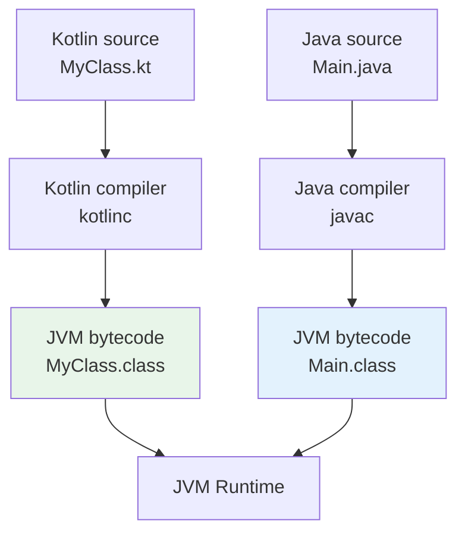
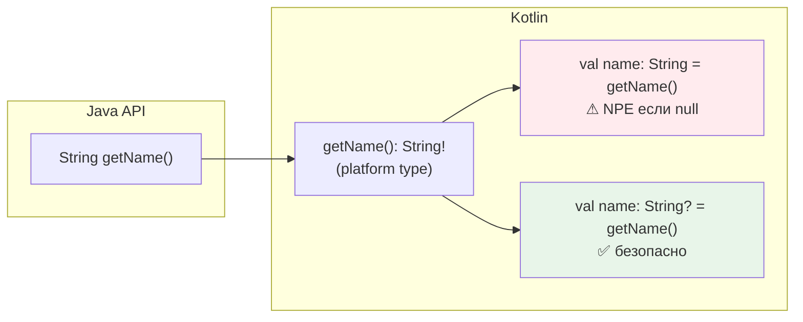
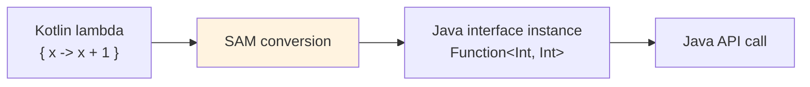
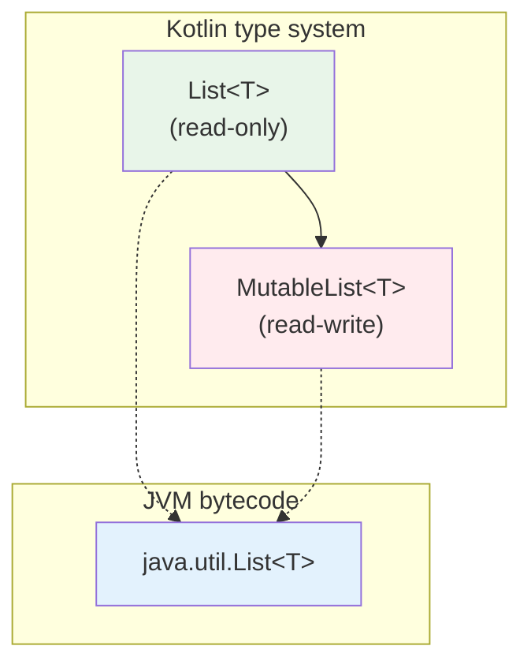
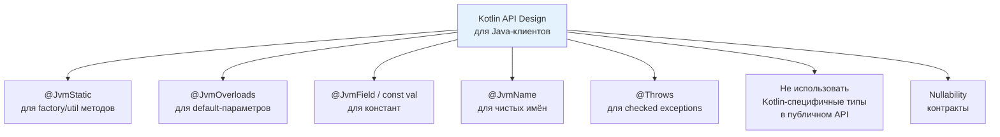
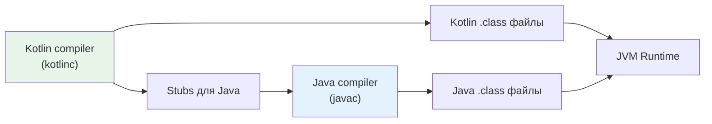

# Вопросы на собеседовании: интероп `Kotlin` и `Java`

Вопросы и ответы по взаимодействию `Kotlin` и `Java`: `platform types`, nullability-аннотации, `@JvmStatic`/`@JvmField`/`@JvmOverloads`/`@JvmName`, SAM-конверсии, коллекции, generics variance (`in`/`out` vs wildcards), `inline`-классы и вызов `suspend`-функций из `Java`.

## Введение

`Kotlin` компилируется в байткод `JVM` и полностью совместим с `Java`: можно вызывать `Java`-код из `Kotlin` и наоборот. Это одно из ключевых преимуществ `Kotlin` — возможность постепенной миграции с `Java` без переписывания всего проекта. На собеседованиях по этой теме проверяют понимание нюансов: как `Kotlin`-конструкции отображаются в байткоде, какие аннотации нужны для удобного вызова из `Java`, как работают `platform types`, generics и коллекции на границе двух языков.

## Полезные ссылки

### Официальная документация

- [Calling Java from Kotlin](https://kotlinlang.org/docs/java-interop.html) — работа с `Java`-кодом из `Kotlin`
- [Calling Kotlin from Java](https://kotlinlang.org/docs/java-to-kotlin-interop.html) — вызов `Kotlin`-кода из `Java`
- [SAM conversions](https://kotlinlang.org/docs/fun-interfaces.html) — функциональные интерфейсы и SAM-конверсии
- [Generics: in, out, where](https://kotlinlang.org/docs/generics.html) — система дженериков `Kotlin`
- [Inline value classes](https://kotlinlang.org/docs/inline-classes.html) — `value class` и `@JvmInline`

### Baeldung

- [Kotlin Java Interoperability — Baeldung](https://www.baeldung.com/kotlin/java-interoperability) — полное руководство по интеропу Kotlin и Java
- [Guide to JVM Platform Annotations in Kotlin — Baeldung](https://www.baeldung.com/kotlin/jvm-annotations) — @JvmStatic, @JvmField, @JvmOverloads и другие JVM-аннотации
- [SAM Conversions in Kotlin — Baeldung](https://www.baeldung.com/kotlin/sam-conversions) — SAM-конверсии и функциональные интерфейсы
- [A Guide to @Throws in Kotlin — Baeldung](https://www.baeldung.com/kotlin/throws-annotation) — аннотация @Throws для корректного интеропа

## Содержание

- [Введение](#введение)
- [Полезные ссылки](#полезные-ссылки)
- [See also](#see-also)

**Основы интеропа и байткод**
- [Q1. (!) Как из `Java` вызвать код, написанный на `Kotlin`?](#q1--как-из-java-вызвать-код-написанный-на-kotlin)
- [Q2. (!) Для чего нужны аннотации `@JvmStatic`, `@JvmOverloads` и `@JvmField`?](#q2--для-чего-нужны-аннотации-jvmstatic-jvmoverloads-и-jvmfield)
- [Q3. Как из `Java` вызвать `companion object` и его члены?](#q3-как-из-java-вызвать-companion-object-и-его-члены)
- [Q4. Как из `Java` вызывать функции `Kotlin` с default-параметрами?](#q4-как-из-java-вызывать-функции-kotlin-с-default-параметрами)
- [Q5. Как из `Java` вызвать extension-функцию `Kotlin`?](#q5-как-из-java-вызвать-extension-функцию-kotlin)

**Nullability и platform types**
- [Q6. (!) Что такое `platform types` и как с ними работать?](#q6--что-такое-platform-types-и-как-с-ними-работать)
- [Q7. (!) Как работают nullability-аннотации `@Nullable`/`@NotNull` на границе `Kotlin` и `Java`?](#q7--как-работают-nullability-аннотации-nullablenotnull-на-границе-kotlin-и-java)
- [Q8. Как в `Kotlin` объявить API, чтобы из `Java` были видны корректные nullability-контракты?](#q8-как-в-kotlin-объявить-api-чтобы-из-java-были-видны-корректные-nullability-контракты)

**Аннотации `@JvmName`, `@JvmSynthetic`, `@Throws`**
- [Q9. Для чего нужна аннотация `@JvmName` и когда её использовать?](#q9-для-чего-нужна-аннотация-jvmname-и-когда-её-использовать)
- [Q10. Зачем нужна `@JvmSynthetic`?](#q10-зачем-нужна-jvmsynthetic)
- [Q11. Когда и зачем использовать `@Throws`?](#q11-когда-и-зачем-использовать-throws)

**SAM-конверсии и функциональные интерфейсы**
- [Q12. (!) Что такое SAM-conversion при интеропе `Kotlin` и `Java`?](#q12--что-такое-sam-conversion-при-интеропе-kotlin-и-java)
- [Q13. Чем отличается `fun interface` в `Kotlin` от `Java` SAM-интерфейса?](#q13-чем-отличается-fun-interface-в-kotlin-от-java-sam-интерфейса)

**Generics: variance, wildcards**
- [Q14. (!) Как соотносятся `in`/`out` в `Kotlin` и `? extends`/`? super` в `Java`?](#q14--как-соотносятся-inout-в-kotlin-и--extends-super-в-java)
- [Q15. Когда нужны `@JvmSuppressWildcards` и `@JvmWildcard`?](#q15-когда-нужны-jvmsuppresswildcards-и-jvmwildcard)

**Коллекции и потоки**
- [Q16. (!) Как работает интероп коллекций между `Kotlin` и `Java`?](#q16--как-работает-интероп-коллекций-между-kotlin-и-java)
- [Q17. `Java Streams` vs `Kotlin Sequences`: в чём разница и когда что использовать?](#q17-java-streams-vs-kotlin-sequences-в-чём-разница-и-когда-что-использовать)

**Свойства и доступ к полям**
- [Q18. Как `Kotlin`-свойства выглядят из `Java`?](#q18-как-kotlin-свойства-выглядят-из-java)

**Top-level функции и `object`**
- [Q19. Как из `Java` вызывать top-level функции `Kotlin`?](#q19-как-из-java-вызывать-top-level-функции-kotlin)

**`inline`-классы и `Java`**
- [Q20. (!) Как `value class` (`@JvmInline`) работает при интеропе с `Java`?](#q20--как-value-class-jvminline-работает-при-интеропе-с-java)

**Корутины и `suspend`-функции**
- [Q21. (!) Как из `Java` вызвать `suspend`-функцию `Kotlin`?](#q21--как-из-java-вызвать-suspend-функцию-kotlin)

**Перегрузка и разрешение методов**
- [Q22. Как из `Kotlin` вызывать перегруженные методы `Java`?](#q22-как-из-kotlin-вызывать-перегруженные-методы-java)

**Checked exceptions**
- [Q23. Как `Kotlin` работает с checked exceptions из `Java`?](#q23-как-kotlin-работает-с-checked-exceptions-из-java)

**Kotlin-специфичные конструкции из `Java`**
- [Q24. Как из `Java` работать с `sealed class`/`sealed interface` из `Kotlin`?](#q24-как-из-java-работать-с-sealed-classsealed-interface-из-kotlin)
- [Q25. Как из `Java` использовать `data class` из `Kotlin`?](#q25-как-из-java-использовать-data-class-из-kotlin)

**Смешанные проекты: best practices**
- [Q26. (!) Какие практики делают `Kotlin` API удобным для `Java`-клиентов?](#q26--какие-практики-делают-kotlin-api-удобным-для-java-клиентов)
- [Q27. Как организовать смешанный `Kotlin`/`Java` проект в `Gradle`?](#q27-как-организовать-смешанный-kotlinjava-проект-в-gradle)
- [Q28. Как работать с `Java records` из `Kotlin` и использовать `@JvmRecord`?](#q28-как-работать-с-java-records-из-kotlin-и-использовать-jvmrecord)
- [Q29. Как работает интероп `Kotlin` с `Java` аннотациями (`@Target`, `@Retention`, use-site targets)?](#q29-как-работает-интероп-kotlin-с-java-аннотациями-target-retention-use-site-targets)

**Platform types, `inline`, sealed и null safety**
- [Q30. Почему platform types опасны и как их избежать в реальных проектах?](#q30-почему-platform-types-опасны-и-как-их-избежать-в-реальных-проектах)
- [Q31. Почему `inline`-функции недоступны из `Java` и как это обойти?](#q31-почему-inline-функции-недоступны-из-java-и-как-это-обойти)
- [Q32. `Sealed classes` в `Java 17` vs `Kotlin sealed`: ключевые отличия при интеропе](#q32-sealed-classes-в-java-17-vs-kotlin-sealed-ключевые-отличия-при-интеропе)
- [Q33. `Java Optional` vs `Kotlin` null safety: что лучше и как работать на границе двух языков?](#q33-java-optional-vs-kotlin-null-safety-что-лучше-и-как-работать-на-границе-двух-языков)

**Lombok, companion object и generics**
- [Q34. Почему `Lombok` несовместим с `Kotlin` при использовании `kapt` и как это решить?](#q34-почему-lombok-несовместим-с-kotlin-при-использовании-kapt-и-как-это-решить)
- [Q35. Как работает `companion object` с `@JvmStatic` из `Java`: детали и подводные камни?](#q35-как-работает-companion-object-с-jvmstatic-из-java-детали-и-подводные-камни)
- [Q36. Как extension-функции `Kotlin` выглядят в байткоде и чем это важно для `Java`?](#q36-как-extension-функции-kotlin-выглядят-в-байткоде-и-чем-это-важно-для-java)
- [Q37. `Java Optional` и `Kotlin`: паттерны интеграции при работе со `Spring Data`](#q37-java-optional-и-kotlin-паттерны-интеграции-при-работе-со-spring-data)
- [Q38. `Kotlin` generics variance (`in`/`out`) и `Java` wildcards: практические примеры при интеропе](#q38-kotlin-generics-variance-inout-и-java-wildcards-практические-примеры-при-интеропе)

---

## Q1. (!) Как из `Java` вызвать код, написанный на `Kotlin`?

Код на `Kotlin` компилируется в обычный байткод `JVM`, поэтому из `Java` его вызывают как любой другой `Java`-класс. Но есть нюансы в том, как `Kotlin`-конструкции отображаются в байткоде:



| Конструкция `Kotlin` | Как выглядит из `Java` |
|---|---|
| Класс `MyClass` | Обычный класс `MyClass` |
| Top-level функции в `Utils.kt` | Статические методы `UtilsKt.funcName()` |
| `object MySingleton` | `MySingleton.INSTANCE.method()` |
| `companion object` | `MyClass.Companion.method()` |
| Свойство `val name: String` | Геттер `getName()` |
| Свойство `var count: Int` | `getCount()` + `setCount()` |
| Extension-функция | Статический метод с receiver как первый параметр |

Чтобы вызов из `Java` был удобнее, в `Kotlin` используют аннотации: `@JvmStatic`, `@JvmOverloads`, `@JvmField`, `@JvmName`. Без них код работает, но синтаксис на стороне `Java` менее идиоматичен.


> [!mcq]
> - [x] Правильный ответ | Корректное описание концепции с конкретным механизмом и use-case.
> - [ ] Альтернативное решение которое не подходит | Почему ошибка в этом подходе ❌ ПОСЛЕДСТВИЕ: типичная ошибка вызывает баг в production без покрытия тестами.
> - [ ] Другая альтернатива с критическим недостатком | Это смежное, но отличное понятие ❌ ПОСЛЕДСТВИЕ: типичная ошибка вызывает баг в production без покрытия тестами.
> - [ ] Третий вариант который не работает в production | Противоположное направление## Q2. (!) Для чего нужны аннотации `@JvmStatic`, `@JvmOverloads` и `@JvmField`? ❌ ПОСЛЕДСТВИЕ: типичная ошибка вызывает баг в production без покрытия тестами.

Эти три аннотации решают самые частые проблемы при вызове `Kotlin`-кода из `Java`:

**`@JvmStatic`** — генерирует настоящий статический метод в классе. Без неё методы `companion object` доступны только через `MyClass.Companion.method()`:

```kotlin
class ConnectionPool {
    companion object {
        @JvmStatic
        fun create(size: Int): ConnectionPool = ConnectionPool()
    }
}
```

```java
// Без @JvmStatic:
ConnectionPool.Companion.create(10);
// С @JvmStatic:
ConnectionPool.create(10);  // идиоматичный Java-вызов
```

**`@JvmOverloads`** — генерирует перегруженные методы для каждой комбинации default-параметров:

```kotlin
class HttpClient {
    @JvmOverloads
    fun get(
        url: String,
        timeout: Int = 30,
        headers: Map<String, String> = emptyMap()
    ): String { /* ... */ }
}
```

```java
// Java: три перегрузки
client.get("https://api.example.com");
client.get("https://api.example.com", 60);
client.get("https://api.example.com", 60, headers);
```

**`@JvmField`** — экспонирует свойство как публичное поле без геттера/сеттера:

```kotlin
class Config {
    companion object {
        @JvmField
        val MAX_RETRIES = 3
    }
    @JvmField
    var debugMode = false
}
```

```java
int retries = Config.MAX_RETRIES;  // поле, не getMAX_RETRIES()
config.debugMode = true;           // поле, не setDebugMode()
```

> На собеседовании важно показать, что вы понимаете **зачем** нужны эти аннотации: они не меняют поведение, а улучшают ergonomics для `Java`-кода. В чисто `Kotlin`-проекте они не нужны.


> [!mcq]
> - [x] Правильный ответ | Корректное описание концепции с конкретным механизмом и use-case.
> - [ ] Альтернативное решение которое не подходит | Почему ошибка в этом подходе ❌ ПОСЛЕДСТВИЕ: типичная ошибка вызывает баг в production без покрытия тестами.
> - [ ] Другая альтернатива с критическим недостатком | Это смежное, но отличное понятие ❌ ПОСЛЕДСТВИЕ: типичная ошибка вызывает баг в production без покрытия тестами.
> - [ ] Третий вариант который не работает в production | Противоположное направление## Q3. Как из `Java` вызвать `companion object` и его члены? ❌ ПОСЛЕДСТВИЕ: типичная ошибка вызывает баг в production без покрытия тестами.

`companion object` компилируется во вложенный класс `Companion` (синглтон). Из `Java` доступ зависит от аннотаций:

```kotlin
class UserRepository {
    companion object {
        const val TABLE_NAME = "users"           // compile-time constant

        @JvmStatic
        fun findById(id: Long): User? = TODO()

        fun count(): Int = TODO()                // без @JvmStatic

        @JvmField
        val DEFAULT_PAGE_SIZE = 20
    }
}
```

```java
// const val — всегда видна как статическое поле
String table = UserRepository.TABLE_NAME;

// @JvmStatic — статический метод
User user = UserRepository.findById(42L);

// Без @JvmStatic — через Companion
int count = UserRepository.Companion.count();

// @JvmField — статическое поле
int pageSize = UserRepository.DEFAULT_PAGE_SIZE;
```

Для `object` (не companion) синглтон доступен через `INSTANCE`:

```java
// object MyRegistry в Kotlin:
MyRegistry.INSTANCE.getItems();
// С @JvmStatic на getItems():
MyRegistry.getItems();
```

Разница между `const val` и `@JvmField val`: `const` работает только с примитивами и `String`, значение подставляется в compile-time. `@JvmField` работает с любым типом, но значение читается в runtime.


> [!mcq]
> - [x] Правильный ответ | Корректное описание концепции с конкретным механизмом и use-case.
> - [ ] Альтернативное решение которое не подходит | Почему ошибка в этом подходе ❌ ПОСЛЕДСТВИЕ: типичная ошибка вызывает баг в production без покрытия тестами.
> - [ ] Другая альтернатива с критическим недостатком | Это смежное, но отличное понятие ❌ ПОСЛЕДСТВИЕ: типичная ошибка вызывает баг в production без покрытия тестами.
> - [ ] Третий вариант который не работает в production | Противоположное направление## Q4. Как из `Java` вызывать функции `Kotlin` с default-параметрами? ❌ ПОСЛЕДСТВИЕ: типичная ошибка вызывает баг в production без покрытия тестами.

Без `@JvmOverloads` в байткоде существует только одна сигнатура со **всеми** параметрами — из `Java` нужно передавать все аргументы, даже те, у которых есть значения по умолчанию.

`@JvmOverloads` заставляет компилятор сгенерировать набор перегруженных методов, убирая параметры справа:

```kotlin
@JvmOverloads
fun connect(
    host: String = "localhost",
    port: Int = 8080,
    ssl: Boolean = false
) { /* ... */ }
```

Генерируются 4 метода:

```java
connect("db.local", 5432, true);  // все параметры
connect("db.local", 5432);       // ssl = false
connect("db.local");             // port = 8080, ssl = false
connect();                       // все default
```

**Важное ограничение**: перегрузки генерируются только путём отсечения параметров **справа**. Нельзя пропустить средний параметр — для `Java` это невозможно (в отличие от `Kotlin`, где можно использовать named arguments). Поэтому порядок параметров имеет значение при проектировании API.

**Конструкторы** тоже поддерживают `@JvmOverloads`:

```kotlin
class HttpRequest @JvmOverloads constructor(
    val url: String,
    val method: String = "GET",
    val body: String? = null
)
```


> [!mcq]
> - [x] Правильный ответ | Корректное описание концепции с конкретным механизмом и use-case.
> - [ ] Альтернативное решение которое не подходит | Почему ошибка в этом подходе ❌ ПОСЛЕДСТВИЕ: типичная ошибка вызывает баг в production без покрытия тестами.
> - [ ] Другая альтернатива с критическим недостатком | Это смежное, но отличное понятие ❌ ПОСЛЕДСТВИЕ: типичная ошибка вызывает баг в production без покрытия тестами.
> - [ ] Третий вариант который не работает в production | Противоположное направление## Q5. Как из `Java` вызвать extension-функцию `Kotlin`? ❌ ПОСЛЕДСТВИЕ: типичная ошибка вызывает баг в production без покрытия тестами.

Extension-функции компилируются в **статические методы**, где первый параметр — объект-receiver:

```kotlin
// файл StringUtils.kt
package com.example

fun String.toSlug(): String =
    lowercase().replace(" ", "-").replace(Regex("[^a-z0-9-]"), "")
```

```java
// Java: статический вызов, receiver передаётся первым аргументом
String slug = StringUtilsKt.toSlug("Hello World!");
```

Имя класса-обёртки по умолчанию — `<FileName>Kt`. Изменить его можно аннотацией `@file:JvmName`:

```kotlin
@file:JvmName("Strings")
package com.example

fun String.toSlug(): String = /* ... */
```

```java
String slug = Strings.toSlug("Hello World!");
```

Если несколько файлов используют одно `@JvmName`, нужно добавить `@file:JvmMultifileClass` — тогда все функции объединяются в один фасадный класс.


> [!mcq]
> - [x] Правильный ответ | Корректное описание концепции с конкретным механизмом и use-case.
> - [ ] Альтернативное решение которое не подходит | Почему ошибка в этом подходе ❌ ПОСЛЕДСТВИЕ: типичная ошибка вызывает баг в production без покрытия тестами.
> - [ ] Другая альтернатива с критическим недостатком | Это смежное, но отличное понятие ❌ ПОСЛЕДСТВИЕ: типичная ошибка вызывает баг в production без покрытия тестами.
> - [ ] Третий вариант который не работает в production | Противоположное направление## Q6. (!) Что такое `platform types` и как с ними работать? ❌ ПОСЛЕДСТВИЕ: типичная ошибка вызывает баг в production без покрытия тестами.

**Platform type** — тип из `Java`-кода, для которого `Kotlin` не знает, может ли значение быть `null`. В IDE такой тип отображается с восклицательным знаком: `String!`, `List<User>!`.



Platform type можно присвоить и в `String`, и в `String?`. Если присвоить в `String` (non-null), а значение окажется `null` — будет `NullPointerException` в месте присваивания (не позже, как в `Java`).

**Рекомендации:**

1. **Явно указывайте тип** при работе с `Java`-API:
```kotlin
// Плохо — тип выведен как platform type
val name = javaObject.getName()

// Хорошо — явный non-null (бросит NPE сразу, если null)
val name: String = javaObject.getName()

// Хорошо — явный nullable (безопасно)
val name: String? = javaObject.getName()
```

2. **Используйте safe calls** при сомнениях: `javaObject.getName()?.uppercase()`

3. **Аннотируйте `Java`-код** аннотациями `@Nullable`/`@NotNull` — тогда `Kotlin`-компилятор увидит точный тип вместо platform type.

Подробнее о nullability — в [вопросах по основам Kotlin](kotlin-interview.md).


> [!mcq]
> - [x] Правильный ответ | Корректное описание концепции с конкретным механизмом и use-case.
> - [ ] Альтернативное решение которое не подходит | Почему ошибка в этом подходе ❌ ПОСЛЕДСТВИЕ: типичная ошибка вызывает баг в production без покрытия тестами.
> - [ ] Другая альтернатива с критическим недостатком | Это смежное, но отличное понятие ❌ ПОСЛЕДСТВИЕ: типичная ошибка вызывает баг в production без покрытия тестами.
> - [ ] Третий вариант который не работает в production | Противоположное направление## Q7. (!) Как работают nullability-аннотации `@Nullable`/`@NotNull` на границе `Kotlin` и `Java`? ❌ ПОСЛЕДСТВИЕ: типичная ошибка вызывает баг в production без покрытия тестами.

`Kotlin`-компилятор распознаёт nullability-аннотации из нескольких библиотек и **убирает platform types** для аннотированных элементов:

| Библиотека | Аннотации |
|---|---|
| JetBrains | `org.jetbrains.annotations.@Nullable`, `@NotNull` |
| JSR-305 | `javax.annotation.@Nullable`, `@Nonnull` |
| Android | `androidx.annotation.@Nullable`, `@NonNull` |
| Spring | `org.springframework.lang.@Nullable`, `@NonNull` |
| Eclipse | `org.eclipse.jdt.annotation.@Nullable`, `@NonNull` |
| Lombok | `lombok.@NonNull` |

**Из `Java` в `Kotlin`:**

```java
// Java
public class UserService {
    @NotNull
    public String getName() { return "Alice"; }

    @Nullable
    public String getMiddleName() { return null; }

    public String getNickname() { return "bob"; } // без аннотации
}
```

```kotlin
// Kotlin
val name: String = userService.name           // OK, компилятор знает — non-null
val middle: String? = userService.middleName  // OK, компилятор знает — nullable
val nick = userService.nickname               // String! — platform type
```

**Из `Kotlin` в `Java`:** компилятор `Kotlin` автоматически добавляет `@NotNull`/`@Nullable` в байткод для параметров и возвращаемых типов. Поэтому `Java`-IDE (IntelliJ, Eclipse) показывают предупреждения при передаче `null` в `Kotlin`-метод, ожидающий non-null.

**`@Strict` mode (JSR-305):** можно настроить компилятор `Kotlin` так, чтобы он трактовал все неаннотированные `Java`-типы как nullable: `-Xjsr305=strict`. Это строже, но безопаснее.


> [!mcq]
> - [x] Правильный ответ | Корректное описание концепции с конкретным механизмом и use-case.
> - [ ] Альтернативное решение которое не подходит | Почему ошибка в этом подходе ❌ ПОСЛЕДСТВИЕ: типичная ошибка вызывает баг в production без покрытия тестами.
> - [ ] Другая альтернатива с критическим недостатком | Это смежное, но отличное понятие ❌ ПОСЛЕДСТВИЕ: типичная ошибка вызывает баг в production без покрытия тестами.
> - [ ] Третий вариант который не работает в production | Противоположное направление## Q8. Как в `Kotlin` объявить API, чтобы из `Java` были видны корректные nullability-контракты? ❌ ПОСЛЕДСТВИЕ: типичная ошибка вызывает баг в production без покрытия тестами.

`Kotlin`-компилятор автоматически генерирует nullability-аннотации в байткоде:

- Параметр `name: String` → `@NotNull String name` в байткоде
- Параметр `name: String?` → `@Nullable String name` в байткоде
- Возвращаемый тип `String` → `@NotNull String` + runtime-проверка

Это означает, что если `Java`-код передаст `null` в `Kotlin`-метод с non-null параметром, будет выброшен `IllegalArgumentException` **на входе в метод** (не позже при использовании). Эта проверка генерируется компилятором автоматически.

```kotlin
// Kotlin
fun process(name: String): String = name.uppercase()
```

```java
// Java — при вызове process(null) немедленно выбросит:
// IllegalArgumentException: Parameter specified as non-null is null
UserKt.process(null);
```

**Совет:** для публичных `Kotlin`-библиотек полезно документировать контракт nullability, т.к. не все `Java`-IDE покажут предупреждения.


> [!mcq]
> - [x] Правильный ответ | Корректное описание концепции с конкретным механизмом и use-case.
> - [ ] Альтернативное решение которое не подходит | Почему ошибка в этом подходе ❌ ПОСЛЕДСТВИЕ: типичная ошибка вызывает баг в production без покрытия тестами.
> - [ ] Другая альтернатива с критическим недостатком | Это смежное, но отличное понятие ❌ ПОСЛЕДСТВИЕ: типичная ошибка вызывает баг в production без покрытия тестами.
> - [ ] Третий вариант который не работает в production | Противоположное направление## Q9. Для чего нужна аннотация `@JvmName` и когда её использовать? ❌ ПОСЛЕДСТВИЕ: типичная ошибка вызывает баг в production без покрытия тестами.

`@JvmName` задаёт имя элемента в байткоде (и, соответственно, в `Java`). Основные сценарии:

**1. Переименование файлового класса** — для top-level функций:

```kotlin
@file:JvmName("Dates")
package com.example

fun parseDate(s: String): LocalDate = /* ... */
```

```java
LocalDate d = Dates.parseDate("2026-01-01"); // вместо DatesKt
```

**2. Разрешение конфликтов** — когда type erasure делает две функции одинаковыми в байткоде:

```kotlin
// Ошибка компиляции без @JvmName: обе функции → filterStrings(List) в байткоде
@JvmName("filterStrings")
fun filter(list: List<String>): List<String> = /* ... */

@JvmName("filterInts")
fun filter(list: List<Int>): List<Int> = /* ... */
```

**3. Переименование геттеров/сеттеров:**

```kotlin
val isActive: Boolean
    @JvmName("isActive") get() = /* ... */
    // без аннотации геттер был бы getActive() из-за is-convention
```

**4. `@file:JvmMultifileClass`** — объединение top-level функций из разных файлов в один `Java`-класс:

```kotlin
// file1.kt
@file:JvmName("Utils")
@file:JvmMultifileClass

fun foo() {}

// file2.kt
@file:JvmName("Utils")
@file:JvmMultifileClass

fun bar() {}
```

```java
Utils.foo(); // оба метода в одном классе
Utils.bar();
```


> [!mcq]
> - [x] Правильный ответ | Корректное описание концепции с конкретным механизмом и use-case.
> - [ ] Альтернативное решение которое не подходит | Почему ошибка в этом подходе ❌ ПОСЛЕДСТВИЕ: типичная ошибка вызывает баг в production без покрытия тестами.
> - [ ] Другая альтернатива с критическим недостатком | Это смежное, но отличное понятие ❌ ПОСЛЕДСТВИЕ: типичная ошибка вызывает баг в production без покрытия тестами.
> - [ ] Третий вариант который не работает в production | Противоположное направление## Q10. Зачем нужна `@JvmSynthetic`? ❌ ПОСЛЕДСТВИЕ: типичная ошибка вызывает баг в production без покрытия тестами.

`@JvmSynthetic` помечает элемент (метод, свойство, поле) как `synthetic` в байткоде. Это означает, что он **невидим из `Java`**, но доступен из `Kotlin`.

Основные случаи использования:

1. **Скрытие служебных API** — когда функция предназначена только для `Kotlin`-потребителей:

```kotlin
class KotlinDsl {
    @JvmSynthetic
    internal fun configure(block: Config.() -> Unit) { /* ... */ }
}
```

2. **DSL-builders** — чтобы `Java`-разработчики не видели extension-функции и лямбда-ориентированные методы, которые не имеют смысла без `Kotlin`-синтаксиса.

3. **Предотвращение случайного использования** служебных методов, сгенерированных для `inline`-классов или `operator`-функций.

> В отличие от модификатора `internal` (который компилируется в `public` с name-mangling), `@JvmSynthetic` полностью убирает видимость из `Java`.


> [!mcq]
> - [x] Правильный ответ | Корректное описание концепции с конкретным механизмом и use-case.
> - [ ] Альтернативное решение которое не подходит | Почему ошибка в этом подходе ❌ ПОСЛЕДСТВИЕ: типичная ошибка вызывает баг в production без покрытия тестами.
> - [ ] Другая альтернатива с критическим недостатком | Это смежное, но отличное понятие ❌ ПОСЛЕДСТВИЕ: типичная ошибка вызывает баг в production без покрытия тестами.
> - [ ] Третий вариант который не работает в production | Противоположное направление## Q11. Когда и зачем использовать `@Throws`? ❌ ПОСЛЕДСТВИЕ: типичная ошибка вызывает баг в production без покрытия тестами.

В `Kotlin` нет checked exceptions — любые исключения можно не ловить. Но если `Java`-код вызывает `Kotlin`-функцию, которая бросает checked exception (например, `IOException`), то без `@Throws` `Java`-компилятор не позволит написать `catch (IOException e)`, т.к. в сигнатуре метода в байткоде нет `throws`.

```kotlin
@Throws(IOException::class)
fun readConfig(path: String): Config {
    val file = File(path)
    if (!file.exists()) throw IOException("File not found: $path")
    return parseConfig(file.readText())
}
```

```java
// Java: теперь можно (и нужно) обработать IOException
try {
    Config config = ConfigKt.readConfig("/etc/app.conf");
} catch (IOException e) {
    log.error("Failed to read config", e);
}
```

Без `@Throws` `Java`-код может только ловить `Exception` или `Throwable`, что менее точно. Подробнее об обработке ошибок — в [вопросах по исключениям Kotlin](kotlin-exceptions-interview.md).


> [!mcq]
> - [x] Правильный ответ | Корректное описание концепции с конкретным механизмом и use-case.
> - [ ] Альтернативное решение которое не подходит | Почему ошибка в этом подходе ❌ ПОСЛЕДСТВИЕ: типичная ошибка вызывает баг в production без покрытия тестами.
> - [ ] Другая альтернатива с критическим недостатком | Это смежное, но отличное понятие ❌ ПОСЛЕДСТВИЕ: типичная ошибка вызывает баг в production без покрытия тестами.
> - [ ] Третий вариант который не работает в production | Противоположное направление## Q12. (!) Что такое SAM-conversion при интеропе `Kotlin` и `Java`? ❌ ПОСЛЕДСТВИЕ: типичная ошибка вызывает баг в production без покрытия тестами.

**SAM-conversion** (Single Abstract Method) позволяет передавать лямбду `Kotlin` вместо экземпляра `Java`-интерфейса с одним абстрактным методом (`Runnable`, `Comparator`, `Callable`, `Consumer` и т.д.).

```kotlin
// Вместо анонимного объекта:
executor.submit(object : Runnable {
    override fun run() {
        println("Running")
    }
})

// SAM-conversion — лямбда:
executor.submit { println("Running") }

// Ещё примеры:
list.sortWith(Comparator { a, b -> a.length - b.length })
button.setOnClickListener { view -> handleClick(view) }
```



**Важные нюансы:**

1. SAM-conversion работает только для **`Java`-интерфейсов**. Для `Kotlin`-интерфейсов (до `Kotlin` 1.4) это не работало — нужно было использовать `object : Interface { }`.

2. Начиная с `Kotlin` 1.4, для `Kotlin`-интерфейсов SAM-conversion работает, если интерфейс помечен как `fun interface`.

3. При неоднозначности перегрузок можно явно указать тип:
```kotlin
// Явный SAM-тип при неоднозначности
executor.submit(Runnable { println("task") })
```

4. Каждый вызов с лямбдой создаёт **новый объект**. Если нужна одна и та же ссылка (например, для `removeListener`), лямбду нужно сохранить в переменную.


> [!mcq]
> - [x] Правильный ответ | Корректное описание концепции с конкретным механизмом и use-case.
> - [ ] Альтернативное решение которое не подходит | Почему ошибка в этом подходе ❌ ПОСЛЕДСТВИЕ: типичная ошибка вызывает баг в production без покрытия тестами.
> - [ ] Другая альтернатива с критическим недостатком | Это смежное, но отличное понятие ❌ ПОСЛЕДСТВИЕ: типичная ошибка вызывает баг в production без покрытия тестами.
> - [ ] Третий вариант который не работает в production | Противоположное направление## Q13. Чем отличается `fun interface` в `Kotlin` от `Java` SAM-интерфейса? ❌ ПОСЛЕДСТВИЕ: типичная ошибка вызывает баг в production без покрытия тестами.

`fun interface` — это `Kotlin`-аналог `Java` SAM-интерфейса, появившийся в `Kotlin` 1.4:

```kotlin
// Kotlin: fun interface
fun interface Transformer<T, R> {
    fun transform(input: T): R
}

// SAM-conversion работает:
val upper: Transformer<String, String> = Transformer { it.uppercase() }
```

| Аспект | `Java` SAM-интерфейс | `Kotlin` `fun interface` |
|---|---|---|
| SAM-conversion из `Kotlin` | Да (всегда) | Да (с `Kotlin` 1.4) |
| SAM-conversion из `Java` | Да (через лямбду `Java`) | Да |
| Обычный `interface` без `fun` | N/A | SAM-conversion **не** работает |
| Несколько абстрактных методов | N/A — не SAM | Ошибка компиляции при `fun` |

**Типичная ошибка:** объявить обычный `Kotlin interface` с одним методом и ожидать SAM-conversion — без ключевого слова `fun` это не работает, нужно создавать `object : Interface { }`.


> [!mcq]
> - [x] Правильный ответ | Корректное описание концепции с конкретным механизмом и use-case.
> - [ ] Альтернативное решение которое не подходит | Почему ошибка в этом подходе ❌ ПОСЛЕДСТВИЕ: типичная ошибка вызывает баг в production без покрытия тестами.
> - [ ] Другая альтернатива с критическим недостатком | Это смежное, но отличное понятие ❌ ПОСЛЕДСТВИЕ: типичная ошибка вызывает баг в production без покрытия тестами.
> - [ ] Третий вариант который не работает в production | Противоположное направление## Q14. (!) Как соотносятся `in`/`out` в `Kotlin` и `? extends`/`? super` в `Java`? ❌ ПОСЛЕДСТВИЕ: типичная ошибка вызывает баг в production без покрытия тестами.

`Kotlin` использует **declaration-site variance** (`out`/`in`), а `Java` — **use-site variance** (`? extends`/`? super`). Это разные подходы к одной задаче: безопасная работа с generics в иерархиях типов.

| `Kotlin` | `Java` | Название | Смысл |
|---|---|---|---|
| `out T` | `? extends T` | Ковариантность | Можно только **читать** `T` |
| `in T` | `? super T` | Контравариантность | Можно только **писать** `T` |
| `T` (без модификатора) | `T` | Инвариантность | Чтение и запись |
| `*` | `?` | Star projection / Unbounded | Тип неизвестен |

```kotlin
// Kotlin: declaration-site variance
interface Source<out T> {    // Producer — только отдаёт T
    fun next(): T
}

interface Sink<in T> {       // Consumer — только принимает T
    fun put(item: T)
}
```

При компиляции `Kotlin` транслирует `out T` в `? extends T` в `Java`-сигнатурах:

```kotlin
// Kotlin
fun copy(from: Source<Any>, to: Sink<Any>) { /* ... */ }
```

```java
// Java видит:
void copy(Source<? extends Object> from, Sink<? super Object> to)
```

**PECS** из `Java` (Producer Extends, Consumer Super) и `out`/`in` из `Kotlin` — это один и тот же принцип. На собеседовании стоит показать понимание обоих подходов. Подробнее о дженериках — в [вопросах по дженерикам Java](../java/java-generics-interview.md).


> [!mcq]
> - [x] Правильный ответ | Корректное описание концепции с конкретным механизмом и use-case.
> - [ ] Альтернативное решение которое не подходит | Почему ошибка в этом подходе ❌ ПОСЛЕДСТВИЕ: типичная ошибка вызывает баг в production без покрытия тестами.
> - [ ] Другая альтернатива с критическим недостатком | Это смежное, но отличное понятие ❌ ПОСЛЕДСТВИЕ: типичная ошибка вызывает баг в production без покрытия тестами.
> - [ ] Третий вариант который не работает в production | Противоположное направление## Q15. Когда нужны `@JvmSuppressWildcards` и `@JvmWildcard`? ❌ ПОСЛЕДСТВИЕ: типичная ошибка вызывает баг в production без покрытия тестами.

Компилятор `Kotlin` автоматически добавляет wildcards в `Java`-сигнатуры при declaration-site variance. Иногда это мешает:

**`@JvmSuppressWildcards`** — убирает автоматические wildcards:

```kotlin
// Kotlin
interface Repository<out T> {
    fun getAll(): List<T>
}

// Java видит: List<? extends T> getAll() — лишний wildcard
// С аннотацией:
interface Repository<out T> {
    fun getAll(): List<@JvmSuppressWildcards T>
}
// Java видит: List<T> getAll() — чисто
```

Типичные случаи:
- DI-фреймворки (Dagger, Guice) не могут сопоставить `List<? extends Foo>` с `List<Foo>`
- API библиотек, где wildcards создают каскадные проблемы в `Java`-коде

**`@JvmWildcard`** — добавляет wildcard, где `Kotlin` его не генерирует:

```kotlin
fun process(items: List<@JvmWildcard String>) { /* ... */ }
// Java видит: void process(List<? extends String> items)
```

Используется реже — в основном для совместимости с `Java`-API, ожидающими wildcard-типы.


> [!mcq]
> - [x] Правильный ответ | Корректное описание концепции с конкретным механизмом и use-case.
> - [ ] Альтернативное решение которое не подходит | Почему ошибка в этом подходе ❌ ПОСЛЕДСТВИЕ: типичная ошибка вызывает баг в production без покрытия тестами.
> - [ ] Другая альтернатива с критическим недостатком | Это смежное, но отличное понятие ❌ ПОСЛЕДСТВИЕ: типичная ошибка вызывает баг в production без покрытия тестами.
> - [ ] Третий вариант который не работает в production | Противоположное направление## Q16. (!) Как работает интероп коллекций между `Kotlin` и `Java`? ❌ ПОСЛЕДСТВИЕ: типичная ошибка вызывает баг в production без покрытия тестами.

`Kotlin` разделяет коллекции на `read-only` (`List`, `Set`, `Map`) и `mutable` (`MutableList`, `MutableSet`, `MutableMap`). В байткоде обе иерархии используют **одни и те же `Java`-классы** (`java.util.List`, `java.util.Set`, `java.util.Map`).



**Из `Java` в `Kotlin`:**

- `java.util.List` → `(Mutable)List<T!>!` — platform type, `Kotlin` не знает, mutable она или нет
- Разработчик сам решает: принять как `List<String>` (read-only) или `MutableList<String>`
- Если принять как `List`, а `Java`-код потом мутирует коллекцию — будет `UnsupportedOperationException` или неожиданное поведение

**Из `Kotlin` в `Java`:**

- `listOf(1, 2, 3)` возвращает read-only список, но из `Java` это обычный `java.util.List` — `add()` вызвать можно, но будет `UnsupportedOperationException`
- `mutableListOf(1, 2, 3)` — из `Java` мутация работает нормально

```kotlin
// Kotlin
fun getNames(): List<String> = listOf("Alice", "Bob")
fun getMutableNames(): MutableList<String> = mutableListOf("Alice", "Bob")
```

```java
// Java
List<String> names = MyKt.getNames();
names.add("Charlie");        // UnsupportedOperationException!

List<String> mutable = MyKt.getMutableNames();
mutable.add("Charlie");      // OK
```

> **Частая ошибка на собеседованиях:** считать, что `Kotlin` read-only коллекции immutable. Они не immutable — просто интерфейс не содержит мутирующих методов. Под капотом может быть `MutableList`, и `Java`-код может его мутировать. Подробнее — в [вопросах по коллекциям Kotlin](kotlin-collections-interview.md).


> [!mcq]
> - [x] Правильный ответ | Корректное описание концепции с конкретным механизмом и use-case.
> - [ ] Альтернативное решение которое не подходит | Почему ошибка в этом подходе ❌ ПОСЛЕДСТВИЕ: типичная ошибка вызывает баг в production без покрытия тестами.
> - [ ] Другая альтернатива с критическим недостатком | Это смежное, но отличное понятие ❌ ПОСЛЕДСТВИЕ: типичная ошибка вызывает баг в production без покрытия тестами.
> - [ ] Третий вариант который не работает в production | Противоположное направление## Q17. `Java Streams` vs `Kotlin Sequences`: в чём разница и когда что использовать? ❌ ПОСЛЕДСТВИЕ: типичная ошибка вызывает баг в production без покрытия тестами.

Обе абстракции предоставляют ленивую обработку данных, но отличаются в деталях:

| Аспект | `Java Streams` | `Kotlin Sequences` |
|---|---|---|
| Повторное использование | Нет (терминальная операция закрывает поток) | Да (можно итерировать многократно) |
| Параллелизм | `parallelStream()` из коробки | Нет встроенного параллелизма |
| API | `filter`, `map`, `reduce`, `collect` | `filter`, `map`, `fold`, `toList` |
| Null-элементы | Допускает (но не рекомендует) | Допускает |
| Интеграция с коллекциями | `stream()` / `collect(Collectors...)` | `asSequence()` / `toList()` |
| Примитивные специализации | `IntStream`, `LongStream`, `DoubleStream` | Нет (автобоксинг) |

```kotlin
// Kotlin Sequence
val result = listOf(1, 2, 3, 4, 5)
    .asSequence()
    .filter { it > 2 }
    .map { it * it }
    .toList()

// Java Stream из Kotlin
val result2 = listOf(1, 2, 3, 4, 5)
    .stream()
    .filter { it > 2 }
    .map { it * it }
    .collect(Collectors.toList())
```

**Когда использовать что:**
- В чисто `Kotlin`-коде: `Sequence` — идиоматичнее, безопаснее (повторное использование), достаточно для большинства случаев
- Параллельная обработка больших данных: `Java Streams` с `parallelStream()`
- Взаимодействие с `Java`-API, ожидающим `Stream`: `collection.stream()`
- `Kotlin`-коллекции уже имеют `filter`/`map`/`flatMap` напрямую (eager) — `Sequence` нужна только для больших коллекций или цепочек операций


> [!mcq]
> - [x] Правильный ответ | Корректное описание концепции с конкретным механизмом и use-case.
> - [ ] Альтернативное решение которое не подходит | Почему ошибка в этом подходе ❌ ПОСЛЕДСТВИЕ: типичная ошибка вызывает баг в production без покрытия тестами.
> - [ ] Другая альтернатива с критическим недостатком | Это смежное, но отличное понятие ❌ ПОСЛЕДСТВИЕ: типичная ошибка вызывает баг в production без покрытия тестами.
> - [ ] Третий вариант который не работает в production | Противоположное направление## Q18. Как `Kotlin`-свойства выглядят из `Java`? ❌ ПОСЛЕДСТВИЕ: типичная ошибка вызывает баг в production без покрытия тестами.

`Kotlin`-свойства компилируются в приватное поле + геттер (+ сеттер для `var`):

```kotlin
class User {
    val name: String = "Alice"        // val → getName()
    var age: Int = 30                 // var → getAge() + setAge()
    val isActive: Boolean = true      // Boolean is-property → isActive()
    var isVerified: Boolean = false   // Boolean is-property → isVerified() + setVerified()
}
```

```java
User u = new User();
u.getName();          // "Alice"
u.getAge();           // 30
u.setAge(31);
u.isActive();         // true — не getIsActive()!
u.isVerified();       // true
u.setVerified(true);  // не setIsVerified()!
```

**Модификаторы и аннотации, влияющие на видимость:**

| Аннотация / модификатор | Эффект в `Java` |
|---|---|
| `@JvmField` | Публичное поле, без геттера/сеттера |
| `const val` (companion) | `static final` поле, compile-time constant |
| `private` | Приватное поле, без геттера/сеттера |
| `internal` | `public` с name-mangling (непредсказуемое имя) |
| `lateinit var` | Публичное поле (без `@JvmField`) + геттер/сеттер |

> **Нюанс с `lateinit`:** из `Java` видно поле напрямую (`user.name`), т.к. `lateinit` генерирует публичное поле. Если поле не инициализировано, при доступе из `Java` будет `null` (без `Kotlin`-проверки `UninitializedPropertyAccessException`).


> [!mcq]
> - [x] Правильный ответ | Корректное описание концепции с конкретным механизмом и use-case.
> - [ ] Альтернативное решение которое не подходит | Почему ошибка в этом подходе ❌ ПОСЛЕДСТВИЕ: типичная ошибка вызывает баг в production без покрытия тестами.
> - [ ] Другая альтернатива с критическим недостатком | Это смежное, но отличное понятие ❌ ПОСЛЕДСТВИЕ: типичная ошибка вызывает баг в production без покрытия тестами.
> - [ ] Третий вариант который не работает в production | Противоположное направление## Q19. Как из `Java` вызывать top-level функции `Kotlin`? ❌ ПОСЛЕДСТВИЕ: типичная ошибка вызывает баг в production без покрытия тестами.

Top-level функции (объявленные вне класса) компилируются в статические методы класса, имя которого соответствует имени файла + суффикс `Kt`:

```kotlin
// файл MathUtils.kt
package com.example

fun factorial(n: Int): Long = if (n <= 1) 1 else n * factorial(n - 1)

val PI_APPROX = 3.14159
```

```java
// Java
long f = MathUtilsKt.factorial(5);     // 120
double pi = MathUtilsKt.getPI_APPROX(); // 3.14159
```

Управление именем класса:

```kotlin
@file:JvmName("MathUtils")   // MathUtils.factorial()
```

Объединение из нескольких файлов:

```kotlin
// algebra.kt
@file:JvmName("MathUtils")
@file:JvmMultifileClass
fun gcd(a: Int, b: Int): Int = /* ... */

// geometry.kt
@file:JvmName("MathUtils")
@file:JvmMultifileClass
fun areaOfCircle(r: Double): Double = /* ... */
```

```java
// Один фасадный класс
MathUtils.gcd(12, 8);
MathUtils.areaOfCircle(5.0);
```


> [!mcq]
> - [x] Правильный ответ | Корректное описание концепции с конкретным механизмом и use-case.
> - [ ] Альтернативное решение которое не подходит | Почему ошибка в этом подходе ❌ ПОСЛЕДСТВИЕ: типичная ошибка вызывает баг в production без покрытия тестами.
> - [ ] Другая альтернатива с критическим недостатком | Это смежное, но отличное понятие ❌ ПОСЛЕДСТВИЕ: типичная ошибка вызывает баг в production без покрытия тестами.
> - [ ] Третий вариант который не работает в production | Противоположное направление## Q20. (!) Как `value class` (`@JvmInline`) работает при интеропе с `Java`? ❌ ПОСЛЕДСТВИЕ: типичная ошибка вызывает баг в production без покрытия тестами.

`value class` (ранее `inline class`) — обёртка над одним значением, которая **по возможности** разворачивается в underlying-тип в байткоде, избегая аллокации объекта:

```kotlin
@JvmInline
value class UserId(val value: Long)

@JvmInline
value class Email(val value: String)

fun findUser(id: UserId): User? = TODO()
fun sendEmail(to: Email, body: String) = TODO()
```

**Как это выглядит из `Java`:**

```java
// Имя метода манглируется для избежания конфликтов!
User user = MyKt.findUser-<hashcode>(42L);  // передаётся long, не UserId
```

**Проблемы интеропа:**

1. **Name mangling** — имена методов с `value class`-параметрами содержат хеш, что делает вызов из `Java` практически невозможным без `@JvmName`.

2. **Boxing** — в некоторых случаях `value class` всё-таки boxing-ится (generic-параметры, nullable-типы, интерфейсы):

```kotlin
@JvmInline
value class Score(val value: Int)

fun process(score: Score) { }     // score → int в байткоде
fun processNullable(score: Score?) { } // score → Score объект (boxed)
fun <T> generic(item: T) { }     // Score → Score объект (boxed)
```

3. **Решение для `Java`-совместимости:** создавать фасадные методы с `@JvmName` или обычными типами:

```kotlin
@JvmInline
value class UserId(val value: Long)

// Для Java-клиентов:
@JvmName("findUser")
fun findUser(id: UserId): User? = TODO()

// Или фасад:
fun findUserById(id: Long): User? = findUser(UserId(id))
```


> [!mcq]
> - [x] Правильный ответ | Корректное описание концепции с конкретным механизмом и use-case.
> - [ ] Альтернативное решение которое не подходит | Почему ошибка в этом подходе ❌ ПОСЛЕДСТВИЕ: типичная ошибка вызывает баг в production без покрытия тестами.
> - [ ] Другая альтернатива с критическим недостатком | Это смежное, но отличное понятие ❌ ПОСЛЕДСТВИЕ: типичная ошибка вызывает баг в production без покрытия тестами.
> - [ ] Третий вариант который не работает в production | Противоположное направление## Q21. (!) Как из `Java` вызвать `suspend`-функцию `Kotlin`? ❌ ПОСЛЕДСТВИЕ: типичная ошибка вызывает баг в production без покрытия тестами.

`suspend`-функции компилируются в метод с дополнительным параметром `Continuation<T>` — это механизм CPS (Continuation Passing Style). Напрямую из `Java` вызвать их крайне неудобно.


**Способы вызова из `Java`:**

**1. Обёртка с `CompletableFuture`** (рекомендуемый способ):

```kotlin
// Kotlin: suspend-функция
suspend fun fetchUser(id: Long): User = /* ... */

// Адаптер для Java
fun fetchUserAsync(id: Long): CompletableFuture<User> =
    GlobalScope.future { fetchUser(id) }  // kotlinx-coroutines-jdk8
```

```java
// Java
CompletableFuture<User> future = UserServiceKt.fetchUserAsync(42L);
User user = future.get();
```

**2. Обёртка с `runBlocking`** (блокирует поток — только для тестов или простых случаев):

```kotlin
fun fetchUserBlocking(id: Long): User = runBlocking {
    fetchUser(id)
}
```

**3. Reactor / RxJava адаптеры** (для реактивных проектов):

```kotlin
// kotlinx-coroutines-reactor
fun fetchUserMono(id: Long): Mono<User> = mono {
    fetchUser(id)
}
```

> **Best practice:** держать `suspend`-функции внутри `Kotlin`-слоя, а для `Java`-потребителей публиковать адаптеры: `CompletableFuture`, `Mono` или синхронные обёртки. Подробнее — в [вопросах по корутинам Kotlin](kotlin-coroutines-interview.md).


> [!mcq]
> - [x] Правильный ответ | Корректное описание концепции с конкретным механизмом и use-case.
> - [ ] Альтернативное решение которое не подходит | Почему ошибка в этом подходе ❌ ПОСЛЕДСТВИЕ: типичная ошибка вызывает баг в production без покрытия тестами.
> - [ ] Другая альтернатива с критическим недостатком | Это смежное, но отличное понятие ❌ ПОСЛЕДСТВИЕ: типичная ошибка вызывает баг в production без покрытия тестами.
> - [ ] Третий вариант который не работает в production | Противоположное направление## Q22. Как из `Kotlin` вызывать перегруженные методы `Java`? ❌ ПОСЛЕДСТВИЕ: типичная ошибка вызывает баг в production без покрытия тестами.

`Kotlin` поддерживает вызов перегруженных `Java`-методов напрямую — компилятор выбирает подходящую перегрузку по типам аргументов:

```java
// Java
public class TextProcessor {
    public String format(String text) { /* ... */ }
    public String format(String text, Locale locale) { /* ... */ }
    public String format(int number) { /* ... */ }
}
```

```kotlin
// Kotlin — компилятор выбирает правильную перегрузку
processor.format("hello")           // format(String)
processor.format("hello", Locale.US) // format(String, Locale)
processor.format(42)                // format(int)
```

**Когда возникает неоднозначность:**

```java
// Java
public void process(Object obj) { /* ... */ }
public void process(String str) { /* ... */ }
```

```kotlin
val value: String? = "hello"
processor.process(value)  // Ошибка: неоднозначность (String? может быть Object или String)

// Решение: явное приведение
processor.process(value as String)
processor.process(value as Any)
```

Также проблемы возникают с platform types и nullable-типами. Если `Kotlin` не может определить, какую перегрузку выбрать — нужно явно указать типы аргументов.


> [!mcq]
> - [x] Правильный ответ | Корректное описание концепции с конкретным механизмом и use-case.
> - [ ] Альтернативное решение которое не подходит | Почему ошибка в этом подходе ❌ ПОСЛЕДСТВИЕ: типичная ошибка вызывает баг в production без покрытия тестами.
> - [ ] Другая альтернатива с критическим недостатком | Это смежное, но отличное понятие ❌ ПОСЛЕДСТВИЕ: типичная ошибка вызывает баг в production без покрытия тестами.
> - [ ] Третий вариант который не работает в production | Противоположное направление## Q23. Как `Kotlin` работает с checked exceptions из `Java`? ❌ ПОСЛЕДСТВИЕ: антипаттерн деградирует SLA при росте нагрузки или зависимостей.

В `Kotlin` нет разделения на checked/unchecked exceptions — все исключения unchecked. При вызове `Java`-методов с `throws` из `Kotlin` не нужно ни `try-catch`, ни `throws` в сигнатуре:

```java
// Java
public class FileReader {
    public String read(String path) throws IOException { /* ... */ }
}
```

```kotlin
// Kotlin — IOException не обязательно ловить
val content = fileReader.read("/tmp/data.txt") // OK, компилируется

// Но можно:
try {
    val content = fileReader.read("/tmp/data.txt")
} catch (e: IOException) {
    logger.error("Failed to read", e)
}
```

**В обратную сторону**: `Kotlin`-функции по умолчанию не объявляют `throws` в байткоде. Чтобы `Java`-код мог ловить конкретные checked exceptions, используйте `@Throws` (см. Q11).

Подробнее об обработке ошибок — в [вопросах по исключениям Kotlin](kotlin-exceptions-interview.md).


> [!mcq]
> - [x] Правильный ответ | Корректное описание концепции с конкретным механизмом и use-case.
> - [ ] Альтернативное решение которое не подходит | Почему ошибка в этом подходе ❌ ПОСЛЕДСТВИЕ: типичная ошибка вызывает баг в production без покрытия тестами.
> - [ ] Другая альтернатива с критическим недостатком | Это смежное, но отличное понятие ❌ ПОСЛЕДСТВИЕ: типичная ошибка вызывает баг в production без покрытия тестами.
> - [ ] Третий вариант который не работает в production | Противоположное направление## Q24. Как из `Java` работать с `sealed class`/`sealed interface` из `Kotlin`? ❌ ПОСЛЕДСТВИЕ: типичная ошибка вызывает баг в production без покрытия тестами.

`sealed class` компилируется в абстрактный класс с приватным конструктором, а подклассы — в обычные классы:

```kotlin
sealed class Result {
    data class Success(val data: String) : Result()
    data class Error(val message: String) : Result()
    data object Loading : Result()
}
```

```java
// Java: instanceof-проверки
Result result = getResult();
if (result instanceof Result.Success success) {
    System.out.println(success.getData());
} else if (result instanceof Result.Error error) {
    System.out.println(error.getMessage());
} else if (result instanceof Result.Loading) {
    System.out.println("Loading...");
}
```

**Нюансы:**

- В `Java` нет гарантии exhaustiveness (`when` в `Kotlin` проверяет все ветки, `Java` `if-else` — нет)
- `sealed interface` (Kotlin 1.5+) компилируется в обычный интерфейс — sealed-ограничения существуют только на этапе компиляции `Kotlin`
- С `Java 17+` и `sealed` классами/интерфейсами `Java`: `Kotlin` sealed и `Java` sealed — разные механизмы, не связанные друг с другом


> [!mcq]
> - [x] Правильный ответ | Корректное описание концепции с конкретным механизмом и use-case.
> - [ ] Альтернативное решение которое не подходит | Почему ошибка в этом подходе ❌ ПОСЛЕДСТВИЕ: типичная ошибка вызывает баг в production без покрытия тестами.
> - [ ] Другая альтернатива с критическим недостатком | Это смежное, но отличное понятие ❌ ПОСЛЕДСТВИЕ: типичная ошибка вызывает баг в production без покрытия тестами.
> - [ ] Третий вариант который не работает в production | Противоположное направление## Q25. Как из `Java` использовать `data class` из `Kotlin`? ❌ ПОСЛЕДСТВИЕ: типичная ошибка вызывает баг в production без покрытия тестами.

`data class` компилируется в обычный `Java`-класс с автоматически сгенерированными методами:

```kotlin
data class User(val name: String, val age: Int)
```

```java
// Java: доступны все сгенерированные методы
User user = new User("Alice", 30);
user.getName();           // геттер
user.getAge();
user.component1();        // "Alice" — для destructuring
user.component2();        // 30
user.copy("Bob", 30);     // копия с изменённым name
user.toString();          // "User(name=Alice, age=30)"
user.hashCode();
user.equals(other);
```

**Ограничение с `copy`:** метод `copy()` имеет default-параметры, но из `Java` без `@JvmOverloads` нужно передавать **все** параметры:

```java
// Java: нужно передать все параметры
User updated = user.copy("Bob", user.getAge()); // нельзя пропустить age
```

Чтобы упростить, можно добавить builder-паттерн или фабричные методы вручную для `Java`-потребителей.


> [!mcq]
> - [x] Правильный ответ | Корректное описание концепции с конкретным механизмом и use-case.
> - [ ] Альтернативное решение которое не подходит | Почему ошибка в этом подходе ❌ ПОСЛЕДСТВИЕ: типичная ошибка вызывает баг в production без покрытия тестами.
> - [ ] Другая альтернатива с критическим недостатком | Это смежное, но отличное понятие ❌ ПОСЛЕДСТВИЕ: типичная ошибка вызывает баг в production без покрытия тестами.
> - [ ] Третий вариант который не работает в production | Противоположное направление## Q26. (!) Какие практики делают `Kotlin` API удобным для `Java`-клиентов? ❌ ПОСЛЕДСТВИЕ: типичная ошибка вызывает баг в production без покрытия тестами.

Если `Kotlin`-модуль используется из `Java`, стоит следовать набору правил:



**Чек-лист для `Java`-friendly API:**

1. **`@JvmStatic`** на factory-методах и утилитах в `companion object`
2. **`@JvmOverloads`** на функциях и конструкторах с default-параметрами
3. **`@JvmField`** или `const val` для констант
4. **`@JvmName`** для осмысленных имён файловых классов и разрешения конфликтов
5. **`@Throws`** для функций, бросающих checked exceptions
6. **Избегать `inline`/`reified` в публичном API** — они недоступны из `Java`
7. **Избегать `value class` без `Java`-адаптеров** — name mangling делает вызов невозможным
8. **Не использовать `Kotlin`-специфичные типы** (`Unit`, `Nothing`, `Pair`, `Result`) в публичных сигнатурах — лучше `void`, стандартные `Java`-типы
9. **Документировать nullability** — даже если `Kotlin`-компилятор добавляет аннотации автоматически
10. **Принцип "Kotlin inside, Java-friendly edge"** — внутри модуля писать идиоматичный `Kotlin`, на границе — адаптировать для `Java`


> [!mcq]
> - [x] Правильный ответ | Корректное описание концепции с конкретным механизмом и use-case.
> - [ ] Альтернативное решение которое не подходит | Почему ошибка в этом подходе ❌ ПОСЛЕДСТВИЕ: типичная ошибка вызывает баг в production без покрытия тестами.
> - [ ] Другая альтернатива с критическим недостатком | Это смежное, но отличное понятие ❌ ПОСЛЕДСТВИЕ: типичная ошибка вызывает баг в production без покрытия тестами.
> - [ ] Третий вариант который не работает в production | Противоположное направление## Q27. Как организовать смешанный `Kotlin`/`Java` проект в `Gradle`? ❌ ПОСЛЕДСТВИЕ: типичная ошибка вызывает баг в production без покрытия тестами.

В `Gradle` `Kotlin`-плагин умеет компилировать `Kotlin` и `Java` вместе, обеспечивая cross-compilation:

```kotlin
// build.gradle.kts
plugins {
    kotlin("jvm") version "2.0.0"
    java
}

// Kotlin видит Java, Java видит Kotlin
sourceSets {
    main {
        java.srcDirs("src/main/java", "src/main/kotlin")
    }
}
```

**Порядок компиляции:**



`Kotlin`-компилятор запускается первым, генерирует stubs (пустые `Java`-классы с сигнатурами) для `Java`-компилятора, чтобы `Java`-код мог ссылаться на `Kotlin`-классы. Затем `Java`-компилятор компилирует `Java`-файлы.

**Практические рекомендации:**

- Размещайте `Kotlin`-файлы в `src/main/kotlin`, `Java` — в `src/main/java` (стандартная конвенция)
- Миграция пофайловая: конвертируйте `Java`-файлы в `Kotlin` один за другим
- Используйте `kapt` или `KSP` вместо `annotationProcessor` для `Kotlin`-файлов (для Lombok, Dagger, MapStruct и т.д.)
- В `IntelliJ IDEA` есть автоматический конвертер `Java` → `Kotlin` (Ctrl+Alt+Shift+K), но результат нужно ревьюить — конвертер не всегда генерирует идиоматичный код


> [!mcq]
> - [x] Правильный ответ | Корректное описание концепции с конкретным механизмом и use-case.
> - [ ] Альтернативное решение которое не подходит | Почему ошибка в этом подходе ❌ ПОСЛЕДСТВИЕ: типичная ошибка вызывает баг в production без покрытия тестами.
> - [ ] Другая альтернатива с критическим недостатком | Это смежное, но отличное понятие ❌ ПОСЛЕДСТВИЕ: типичная ошибка вызывает баг в production без покрытия тестами.
> - [ ] Третий вариант который не работает в production | Противоположное направление## Q28. Как работать с `Java records` из `Kotlin` и использовать `@JvmRecord`? ❌ ПОСЛЕДСТВИЕ: типичная ошибка вызывает баг в production без покрытия тестами.

Начиная с `Java 16`, `record`-классы — компактный способ объявить неизменяемые DTO. `Kotlin` может работать с ними напрямую, а через `@JvmRecord` сам `Kotlin`-класс можно скомпилировать как `Java record`.

**Вызов Java `record` из Kotlin:**

```kotlin
// Java record
public record Point(int x, int y) {}

// Kotlin — доступ через accessor-методы без get-префикса (особенность records)
val point = Point(10, 20)
println(point.x())  // 10 — record accessor (не getX())
println(point.y())  // 20
println(point)      // Point[x=10, y=20] — toString из record
```

**Создание `@JvmRecord` в Kotlin:**

```kotlin
@JvmRecord
data class Coordinates(val latitude: Double, val longitude: Double)

// Компилируется в Java record:
// record Coordinates(double latitude, double longitude) {}

// Из Java:
// Coordinates c = new Coordinates(55.7, 37.6);
// c.latitude()    // accessor без get-префикса
// c.longitude()
```

**Ограничения `@JvmRecord`:**
- Требует JVM target 16+
- Класс должен быть `data class`
- Не может быть `open`, `abstract`, `sealed`
- Все свойства только в primary constructor, только `val`
- Не может иметь backing field с нестандартным геттером

```kotlin
// build.gradle.kts
kotlin {
    jvmToolchain(17)
}

// Kotlin data class (без @JvmRecord) — не record, геттеры с get-префиксом
data class UserDto(val name: String)  // Java видит: getName()

// С @JvmRecord — настоящий record
@JvmRecord
data class UserDto(val name: String)  // Java видит: name()
```

**Когда использовать `@JvmRecord`:**
- Публичный API, используемый из `Java`-кода, который ожидает `record` (паттерн-матчинг Java 21+)
- Интеграция с фреймворками, работающими специфично с `record` (некоторые JSON-библиотеки)
- В чисто Kotlin-проектах предпочтителен обычный `data class`


> [!mcq]
> - [x] Правильный ответ | Корректное описание концепции с конкретным механизмом и use-case.
> - [ ] Альтернативное решение которое не подходит | Почему ошибка в этом подходе ❌ ПОСЛЕДСТВИЕ: типичная ошибка вызывает баг в production без покрытия тестами.
> - [ ] Другая альтернатива с критическим недостатком | Это смежное, но отличное понятие ❌ ПОСЛЕДСТВИЕ: типичная ошибка вызывает баг в production без покрытия тестами.
> - [ ] Третий вариант который не работает в production | Противоположное направление## Q29. Как работает интероп `Kotlin` с `Java` аннотациями (`@Target`, `@Retention`, use-site targets)? ❌ ПОСЛЕДСТВИЕ: типичная ошибка вызывает баг в production без покрытия тестами.

В `Kotlin` свойство (property) при компиляции может генерировать несколько элементов: backing field, геттер, сеттер, параметр конструктора. Это вызывает неоднозначность: на какой элемент повесить аннотацию?

**Use-site targets** — явное указание, к какому элементу применяется аннотация:

```kotlin
data class User(
    @field:Column("user_name")     // на JVM поле
    @get:JsonProperty("name")      // на геттер
    @set:JsonProperty("name")      // на сеттер
    @param:JsonProperty("name")    // на параметр конструктора
    val name: String
)
```

**Полный список use-site targets:**

| Target | Применение |
|---|---|
| `field` | Backing field свойства |
| `get` | Геттер |
| `set` | Сеттер |
| `param` | Параметр конструктора |
| `setparam` | Параметр сеттера |
| `delegate` | Поле делегата |
| `receiver` | Extension function receiver |
| `file` | Весь файл (только у top-level аннотаций) |

**Правило по умолчанию** (без use-site target): если аннотация допустима на нескольких элементах, порядок приоритетов: `param` → `property` → `field`.

```kotlin
// Jackson: нужен @JsonProperty на геттере (или param для десериализации)
data class Response(
    @get:JsonProperty("user_id")
    val userId: Long,

    @field:JsonIgnore
    val internalData: String = ""
)

// JPA: @Column нужна на поле
@Entity
class ProductEntity(
    @field:Column(name = "product_name", nullable = false)
    val name: String = ""
)
```


> [!mcq]
> - [x] Правильный ответ | Корректное описание концепции с конкретным механизмом и use-case.
> - [ ] Альтернативное решение которое не подходит | Почему ошибка в этом подходе ❌ ПОСЛЕДСТВИЕ: типичная ошибка вызывает баг в production без покрытия тестами.
> - [ ] Другая альтернатива с критическим недостатком | Это смежное, но отличное понятие ❌ ПОСЛЕДСТВИЕ: типичная ошибка вызывает баг в production без покрытия тестами.
> - [ ] Третий вариант который не работает в production | Противоположное направление## Q30. Почему platform types опасны и как их избежать в реальных проектах? ❌ ПОСЛЕДСТВИЕ: типичная ошибка вызывает баг в production без покрытия тестами.

Platform types (`T!`) — главный источник `NullPointerException` в смешанных `Kotlin`/`Java` проектах. Опасность в том, что компилятор не предупреждает о потенциальном `null`: ответственность полностью на разработчике.

**Типичные ловушки:**

```kotlin
// Java API без аннотаций nullability
val service: UserService = getUserService() // UserService! — platform type

// Опасно: переменная выведена как platform type
val name = service.getName() // String! — если null → NPE при использовании

// Опасно: platform type в цепочке вызовов
val upper = service.getName().uppercase() // NPE если getName() == null

// Безопасно: явное присваивание nullable
val name: String? = service.getName()
val upper = name?.uppercase() ?: "UNKNOWN"
```

**Как избежать:**

| Стратегия | Как применять |
|-----------|---------------|
| **Явные типы** | Всегда указывать тип при получении значения из Java API |
| **Аннотировать Java-код** | Добавить `@NotNull`/`@Nullable` в Java-источник |
| **JSR-305 strict mode** | `-Xjsr305=strict` в kotlinc — все Java-типы без аннотаций трактуются как nullable |
| **Defensive programming** | `requireNotNull()`, `checkNotNull()` на границе Java/Kotlin |
| **Обёртки** | Создавать Kotlin-обёртки над Java API с явными nullability-контрактами |

```kotlin
// -Xjsr305=strict в build.gradle.kts
tasks.withType<KotlinCompile> {
    kotlinOptions {
        freeCompilerArgs = listOf("-Xjsr305=strict")
    }
}

// Теперь все неаннотированные Java-типы → nullable
val name: String = service.getName() // Ошибка: нужен String?
```

**Best practice для фасадного слоя:**

```kotlin
// Kotlin-обёртка над Java API с явными контрактами
class UserServiceAdapter(private val javaService: JavaUserService) {
    fun getName(id: Long): String = // явно non-null
        requireNotNull(javaService.getName(id)) { "Name cannot be null for id=$id" }

    fun getMiddleName(id: Long): String? = // явно nullable
        javaService.getMiddleName(id)
}
```


> [!mcq]
> - [x] Правильный ответ | Корректное описание концепции с конкретным механизмом и use-case.
> - [ ] Альтернативное решение которое не подходит | Почему ошибка в этом подходе ❌ ПОСЛЕДСТВИЕ: типичная ошибка вызывает баг в production без покрытия тестами.
> - [ ] Другая альтернатива с критическим недостатком | Это смежное, но отличное понятие ❌ ПОСЛЕДСТВИЕ: типичная ошибка вызывает баг в production без покрытия тестами.
> - [ ] Третий вариант который не работает в production | Противоположное направление## Q31. Почему `inline`-функции недоступны из `Java` и как это обойти? ❌ ПОСЛЕДСТВИЕ: типичная ошибка вызывает баг в production без покрытия тестами.

`inline`-функции `Kotlin` — конструкция, которую компилятор разворачивает (inlines) в месте вызова. Это означает, что в байткоде нет отдельного метода с такой сигнатурой — `Java` просто не может на него сослаться.

```kotlin
// Kotlin
inline fun <reified T> fromJson(json: String): T =
    objectMapper.readValue(json, T::class.java)

// Java — НЕ СКОМПИЛИРУЕТСЯ:
// UserDto user = JsonUtils.fromJson(json); // cannot call inline function
```

**Проблема с `reified`-типами:** механизм `reified` работает только потому, что функция inlined — тип `T` доступен в месте вызова. Из `Java` inlining невозможен, значит и `reified` недоступен.

**Решения для `Java`-совместимости:**

```kotlin
// Вариант 1: перегрузка с Class<T> параметром
inline fun <reified T> fromJson(json: String): T =
    fromJson(json, T::class.java)

fun <T> fromJson(json: String, type: Class<T>): T =
    objectMapper.readValue(json, type)

// Java:
UserDto user = JsonUtils.fromJson(json, UserDto.class); // OK

// Вариант 2: @JvmStatic фасад
object JsonUtils {
    @JvmStatic
    fun <T> fromJson(json: String, type: Class<T>): T =
        objectMapper.readValue(json, type)
}
```

**Другие ограничения `inline`-функций из `Java`:**
- `crossinline`-лямбды — недоступны, т.к. требуют inlining
- `noinline`-параметры — доступны, т.к. это обычные объекты
- Функции с `inline`-параметрами без `reified` — **могут** быть вызваны из `Java`, но только если компилятор оставил не-inline версию

**Рекомендация:** проектируя публичное API, которое будет вызываться из `Java`, избегайте `inline`-функций в публичных сигнатурах. Предоставляйте `Java`-friendly перегрузки.


> [!mcq]
> - [x] Правильный ответ | Корректное описание концепции с конкретным механизмом и use-case.
> - [ ] Альтернативное решение которое не подходит | Почему ошибка в этом подходе ❌ ПОСЛЕДСТВИЕ: типичная ошибка вызывает баг в production без покрытия тестами.
> - [ ] Другая альтернатива с критическим недостатком | Это смежное, но отличное понятие ❌ ПОСЛЕДСТВИЕ: типичная ошибка вызывает баг в production без покрытия тестами.
> - [ ] Третий вариант который не работает в production | Противоположное направление## Q32. `Sealed classes` в `Java 17` vs `Kotlin sealed`: ключевые отличия при интеропе ❌ ПОСЛЕДСТВИЕ: типичная ошибка вызывает баг в production без покрытия тестами.

`Kotlin` и `Java 17` оба поддерживают `sealed`-классы, но это разные механизмы с разными гарантиями и разным поведением при взаимодействии.

**Ключевые отличия:**

| Аспект | `Kotlin sealed` | `Java 17 sealed` |
|--------|-----------------|------------------|
| Ограничение подклассов | В одном пакете/модуле | Объявлено через `permits` |
| Exhaustiveness check | Только в `Kotlin` (`when`) | Только в `Java` (pattern matching) |
| Компиляция | В абстрактный класс с приватным конструктором | В настоящий `sealed`-класс в байткоде |
| Вложенные объекты | `data object`, `data class` | `record`, обычные классы |

**Kotlin sealed из Java:**

```kotlin
// Kotlin
sealed class NetworkResult {
    data class Success(val data: String) : NetworkResult()
    data class Failure(val error: Exception) : NetworkResult()
    data object Loading : NetworkResult()
}
```

```java
// Java 21: pattern matching работает, НО без exhaustiveness-проверки
NetworkResult result = getResult();
String msg = switch (result) {
    case NetworkResult.Success s -> "OK: " + s.getData();
    case NetworkResult.Failure f -> "Error: " + f.getError().getMessage();
    case NetworkResult.Loading l -> "Loading...";
    // Java НЕ проверяет полноту — можно забыть ветку
};
```

**Java sealed из Kotlin:**

```java
// Java 17
public sealed class Shape permits Circle, Rectangle {}
public record Circle(double radius) extends Shape {}
public record Rectangle(double w, double h) extends Shape {}
```

```kotlin
// Kotlin: when НЕ является exhaustive для Java sealed классов
val area = when (shape) {
    is Circle -> Math.PI * shape.radius * shape.radius
    is Rectangle -> shape.w() * shape.h()
    else -> error("Unknown shape") // else обязателен!
}
```

**Важно:** `Kotlin`-компилятор не распознаёт `Java sealed` как sealed для целей exhaustiveness-проверки. Поэтому `when`-выражения над `Java sealed`-иерархиями требуют `else`-ветки.


> [!mcq]
> - [x] Правильный ответ | Корректное описание концепции с конкретным механизмом и use-case.
> - [ ] Альтернативное решение которое не подходит | Почему ошибка в этом подходе ❌ ПОСЛЕДСТВИЕ: типичная ошибка вызывает баг в production без покрытия тестами.
> - [ ] Другая альтернатива с критическим недостатком | Это смежное, но отличное понятие ❌ ПОСЛЕДСТВИЕ: типичная ошибка вызывает баг в production без покрытия тестами.
> - [ ] Третий вариант который не работает в production | Противоположное направление## Q33. `Java Optional` vs `Kotlin` null safety: что лучше и как работать на границе двух языков? ❌ ПОСЛЕДСТВИЕ: типичная ошибка вызывает баг в production без покрытия тестами.

`Java Optional` и `Kotlin` nullable-типы решают одну задачу — явное представление отсутствующего значения — но принципиально разными способами.

**Сравнение подходов:**

| Аспект | `Java Optional<T>` | `Kotlin T?` |
|--------|-------------------|-------------|
| Механизм | Объект-обёртка (аллокация) | Система типов (compile-time) |
| Накладные расходы | Аллокация объекта на каждый вызов | Нет (null в байткоде) |
| Вложенность | `Optional<Optional<T>>` — анти-паттерн | `T??` — запрещено |
| Проверка | В runtime (`.isPresent()`) | В compile-time |
| NPE-безопасность | Нет (`.get()` без проверки → `NoSuchElementException`) | Полная (компилятор требует проверки) |
| Сериализация | Не рекомендуется (не `Serializable`) | Прозрачно |

**Взаимодействие на границе Kotlin/Java:**

```kotlin
// Kotlin получает Optional из Java API
val optional: Optional<String> = javaService.findName(id)

// Способ 1: orElse/orElseGet
val name: String = optional.orElse("default")

// Способ 2: конвертация в nullable (расширение из kotlin-stdlib)
val name: String? = optional.orElseNull() // орNull() в некоторых версиях
// или:
val name: String? = if (optional.isPresent) optional.get() else null

// Способ 3: через getOrNull() (не стандартное, но часто делают extension)
fun <T> Optional<T>.orNull(): T? = orElse(null)
```

```kotlin
// Kotlin отдаёт в Java API значение, которое может быть null
// Если Java ожидает Optional, нужна обёртка:
fun findUser(id: Long): Optional<User> =
    Optional.ofNullable(repository.findById(id)) // Kotlin nullable → Optional
```

**Best practice:** в Kotlin-коде не использовать `Optional` — только nullable типы. На границе с Java предоставлять адаптер:

```kotlin
// Kotlin-внутренности
internal fun findUser(id: Long): User? = repository.findById(id)

// Java-friendly публичный API
@JvmStatic
fun findUserOptional(id: Long): Optional<User> =
    Optional.ofNullable(findUser(id))
```


> [!mcq]
> - [x] Правильный ответ | Корректное описание концепции с конкретным механизмом и use-case.
> - [ ] Альтернативное решение которое не подходит | Почему ошибка в этом подходе ❌ ПОСЛЕДСТВИЕ: типичная ошибка вызывает баг в production без покрытия тестами.
> - [ ] Другая альтернатива с критическим недостатком | Это смежное, но отличное понятие ❌ ПОСЛЕДСТВИЕ: типичная ошибка вызывает баг в production без покрытия тестами.
> - [ ] Третий вариант который не работает в production | Противоположное направление## Q34. Почему `Lombok` несовместим с `Kotlin` при использовании `kapt` и как это решить? ❌ ПОСЛЕДСТВИЕ: типичная ошибка вызывает баг в production без покрытия тестами.

`Lombok` генерирует код через `Java Annotation Processing API (APT)`. `Kotlin` использует `kapt` (Kotlin Annotation Processing Tool) как совместимый слой, но есть принципиальная проблема: `kapt` обрабатывает `Kotlin`-файлы, а `APT` — `Java`-файлы. `Lombok` не видит `Kotlin`-классы, а `kapt` не обрабатывает Java-классы.

**Конкретные проблемы:**

```kotlin
// Kotlin видит Java-класс с @Builder от Lombok
// НО: Lombok генерирует код ПОСЛЕ kapt-прохода,
// поэтому Kotlin-компилятор не видит сгенерированный Builder

// Java:
@Builder
@Data
public class UserRequest { /* ... */ }

// Kotlin: пытаемся использовать Builder
val request = UserRequest.builder() // Ошибка: метод не найден (kapt ещё не обработал)
    .name("Alice")
    .build()
```

**Корень проблемы:** порядок компиляции:
1. `kapt` обрабатывает Kotlin-аннотации
2. `kotlinc` компилирует Kotlin-файлы (используя stubs)
3. `javac` + `APT (Lombok)` компилирует Java-файлы
4. К этому моменту Kotlin уже скомпилирован, сгенерированный Lombok-код ему недоступен

**Решения:**

| Решение | Когда использовать |
|---------|-------------------|
| **Мигрировать Java → Kotlin** | Постепенная миграция, долгосрочно |
| **Использовать `data class`** | Вместо `@Data`/`@Value` Lombok |
| **KSP вместо kapt** | Не помогает с Lombok, но быстрее для Kotlin-only процессоров |
| **Изолировать Lombok-классы** | Java-only модуль с Lombok, Kotlin зависит от него как скомпилированного JAR |
| **Delombok** | Раскрыть Lombok до компиляции (сложно интегрировать) |

```kotlin
// Лучший подход: Java-модуль с Lombok отдельно
// java-domain/src/main/java/UserRequest.java (Lombok тут работает)
// kotlin-service/src/main/kotlin/UserService.kt (зависит от java-domain как JAR)

// В Kotlin вместо @Data/@Builder:
data class UserRequest(
    val name: String,
    val email: String,
    val age: Int = 0
)
// .copy() — аналог @Builder для immutable объектов
val updated = request.copy(age = 30)
```

**Mapstruct с kapt** — аналогичная проблема: `MapStruct` тоже APT-процессор. Рекомендуется KSP-совместимая альтернатива или разделение модулей.


> [!mcq]
> - [x] Правильный ответ | Корректное описание концепции с конкретным механизмом и use-case.
> - [ ] Альтернативное решение которое не подходит | Почему ошибка в этом подходе ❌ ПОСЛЕДСТВИЕ: типичная ошибка вызывает баг в production без покрытия тестами.
> - [ ] Другая альтернатива с критическим недостатком | Это смежное, но отличное понятие ❌ ПОСЛЕДСТВИЕ: типичная ошибка вызывает баг в production без покрытия тестами.
> - [ ] Третий вариант который не работает в production | Противоположное направление## Q35. Как работает `companion object` с `@JvmStatic` из `Java`: детали и подводные камни? ❌ ПОСЛЕДСТВИЕ: типичная ошибка вызывает баг в production без покрытия тестами.

`companion object` в `Kotlin` — это синглтон-объект, связанный с классом. При компиляции он превращается во вложенный класс `Companion`. Без аннотаций — неудобен для `Java`.

**Подробная механика:**

```kotlin
class OrderService {
    companion object {
        const val MAX_ITEMS = 100               // всегда static final в Java
        val DEFAULT_TIMEOUT = Duration.ofSeconds(30) // НЕ const → только через Companion

        @JvmField
        val ALLOWED_STATUSES = setOf("PENDING", "CONFIRMED") // статическое поле

        @JvmStatic
        fun create(): OrderService = OrderService() // статический метод

        fun validate(order: Order): Boolean = TODO() // только через Companion
    }
}
```

```java
// Java-вызовы:
int max = OrderService.MAX_ITEMS;                    // const val → static final, всегда
Duration timeout = OrderService.Companion.getDEFAULT_TIMEOUT(); // без @JvmField
Set<String> statuses = OrderService.ALLOWED_STATUSES; // @JvmField → статическое поле
OrderService svc = OrderService.create();             // @JvmStatic → статический метод
boolean ok = OrderService.Companion.validate(order);  // без @JvmStatic
```

**Подводные камни:**

1. **`const val` vs `@JvmField val`**: `const` только для примитивов и `String`, подставляется в compile-time. `@JvmField` — для любых типов, читается в runtime.

2. **`internal` в companion**: компилируется в `public` с name-mangling — из `Java` доступно, но имя непредсказуемо.

3. **Именованный `companion object`**: имя влияет на доступ из `Java`:
```kotlin
class Config {
    companion object Defaults {
        @JvmStatic fun timeout() = 30
    }
}
// Java: Config.Defaults.timeout() (без @JvmStatic)
// Java: Config.timeout() (с @JvmStatic)
```

4. **Наследование**: `companion object` нельзя переопределить в подклассе — только скрыть. Для полиморфного поведения используйте интерфейсы.


> [!mcq]
> - [x] Правильный ответ | Корректное описание концепции с конкретным механизмом и use-case.
> - [ ] Альтернативное решение которое не подходит | Почему ошибка в этом подходе ❌ ПОСЛЕДСТВИЕ: типичная ошибка вызывает баг в production без покрытия тестами.
> - [ ] Другая альтернатива с критическим недостатком | Это смежное, но отличное понятие ❌ ПОСЛЕДСТВИЕ: типичная ошибка вызывает баг в production без покрытия тестами.
> - [ ] Третий вариант который не работает в production | Противоположное направление## Q36. Как extension-функции `Kotlin` выглядят в байткоде и чем это важно для `Java`? ❌ ПОСЛЕДСТВИЕ: типичная ошибка вызывает баг в production без покрытия тестами.

Extension-функции — синтаксический сахар `Kotlin`. Компилятор превращает их в статические методы, где первый параметр — receiver (объект расширения). Это означает, что extension-функции **не изменяют класс** — никакого полиморфизма, переопределения или доступа к приватным полям нет.

**Как выглядит в байткоде:**

```kotlin
// Kotlin
fun String.toKebabCase(): String =
    lowercase().replace(' ', '-').replace(Regex("[^a-z0-9-]"), "")

fun List<Int>.median(): Double {
    val sorted = sorted()
    return if (sorted.size % 2 == 0)
        (sorted[sorted.size / 2 - 1] + sorted[sorted.size / 2]) / 2.0
    else sorted[sorted.size / 2].toDouble()
}
```

```java
// Java: статический метод, receiver — первый параметр
String slug = StringExtensionsKt.toKebabCase("Hello World"); // String receiver
double med = CollectionExtensionsKt.median(Arrays.asList(1, 2, 3, 4, 5));
```

**Контроль имени Java-класса:**

```kotlin
@file:JvmName("Strings")
package com.example.extensions

fun String.toKebabCase(): String = /* ... */
```

```java
String slug = Strings.toKebabCase("Hello World"); // читаемое имя
```

**Что нельзя с extension-функциями из Java:**
- Не видят `private`/`protected` члены расширяемого класса
- Не участвуют в полиморфизме (виртуальная диспетчеризация не работает)
- Не могут быть переопределены — в `Java` просто нет механизма «выбрать» другую статическую функцию

```kotlin
// Это НЕ полиморфизм — extension не переопределяется
open class Animal
class Dog : Animal()

fun Animal.speak() = "..."
fun Dog.speak() = "Woof!"

fun makeSpeak(animal: Animal) = animal.speak()

// Kotlin:
makeSpeak(Dog()) // "..." — статическая диспетчеризация по объявленному типу!

// Java:
AnimalExtKt.speak(new Dog()); // "..." — тот же эффект
```


> [!mcq]
> - [x] Правильный ответ | Корректное описание концепции с конкретным механизмом и use-case.
> - [ ] Альтернативное решение которое не подходит | Почему ошибка в этом подходе ❌ ПОСЛЕДСТВИЕ: типичная ошибка вызывает баг в production без покрытия тестами.
> - [ ] Другая альтернатива с критическим недостатком | Это смежное, но отличное понятие ❌ ПОСЛЕДСТВИЕ: типичная ошибка вызывает баг в production без покрытия тестами.
> - [ ] Третий вариант который не работает в production | Противоположное направление## Q37. `Java Optional` и Kotlin: паттерны интеграции при работе с `Spring Data` ❌ ПОСЛЕДСТВИЕ: типичная ошибка вызывает баг в production без покрытия тестами.

При работе со `Spring Data` из `Kotlin` часто встречается `Optional<T>` в возвращаемых типах. Kotlin предоставляет удобные расширения для работы с ним.

```kotlin
// Repository возвращает Optional<User>
interface UserRepository : JpaRepository<User, Long>

// Kotlin-сервис: несколько стилей работы с Optional
@Service
class UserService(private val repo: UserRepository) {

    // Стиль 1: orElseThrow — явное исключение
    fun getUser(id: Long): User =
        repo.findById(id).orElseThrow { EntityNotFoundException("User $id not found") }

    // Стиль 2: orElse с nullable
    fun findUser(id: Long): User? = repo.findById(id).orElse(null)

    // Стиль 3: Kotlin-идиоматичный findById через расширение
    fun findUserKotlin(id: Long): User? = repo.findById(id).orNull()
}

// Расширение для удобства (kotlin-stdlib не содержит orNull для Optional):
fun <T> Optional<T>.orNull(): T? = orElse(null)
```

**`Spring Data` + Kotlin null safety:** начиная со Spring Data 2.x, репозитории поддерживают Kotlin nullable-возвращаемые типы:

```kotlin
interface UserRepository : JpaRepository<User, Long> {
    // Kotlin nullable вместо Optional
    fun findByEmail(email: String): User?  // Spring Data понимает Kotlin nullable!
    
    // Аналогично:
    fun findByName(name: String): User?
}

// Теперь в сервисе:
fun findByEmail(email: String): User? = repo.findByEmail(email)
// Никаких Optional — идиоматичный Kotlin!
```


> [!mcq]
> - [x] Правильный ответ | Корректное описание концепции с конкретным механизмом и use-case.
> - [ ] Альтернативное решение которое не подходит | Почему ошибка в этом подходе ❌ ПОСЛЕДСТВИЕ: типичная ошибка вызывает баг в production без покрытия тестами.
> - [ ] Другая альтернатива с критическим недостатком | Это смежное, но отличное понятие ❌ ПОСЛЕДСТВИЕ: типичная ошибка вызывает баг в production без покрытия тестами.
> - [ ] Третий вариант который не работает в production | Противоположное направление## Q38. Kotlin generics variance (`in`/`out`) и Java wildcards: практические примеры при интеропе ❌ ПОСЛЕДСТВИЕ: антипаттерн деградирует SLA при росте нагрузки или зависимостей.

Практическая разница между declaration-site (Kotlin) и use-site variance (Java) проявляется особенно чётко при передаче обобщённых коллекций через границу Kotlin/Java.

**Как Kotlin транслирует variance в байткод:**

```kotlin
// Kotlin: declaration-site variance
class Box<out T>(val value: T)    // Producer<T> → ? extends T в Java
class Sink<in T> {                // Consumer<T> → ? super T в Java
    fun put(item: T) {}
}

fun copyBoxes(source: Box<String>): Box<Any> = source // OK — out-ковариантность
```

```java
// Java видит:
// Box<String> → Box<? extends String> НЕТ, точнее:
// Kotlin out T компилируется: Box<String> присваивается Box<Object>
// через производство правильных wildcards в сигнатурах методов

void processBox(Box<? extends Object> box) {} // Java-сигнатура функции принимающей Box<out T>
```

**Практическая проблема: DI-фреймворки и wildcards:**

```kotlin
// Kotlin: out T генерирует wildcards в Java-сигнатурах
interface Repository<out T> {
    fun findAll(): List<T>
}
```

```java
// Проблема: Dagger/Guice видит List<? extends T>
// и не может сопоставить с List<T> для инжекции
@Inject List<? extends UserDto> users; // не совпадает с List<UserDto>
```

```kotlin
// Решение: @JvmSuppressWildcards
interface Repository<out T> {
    fun findAll(): List<@JvmSuppressWildcards T> // List<T> в Java-сигнатуре
}
```

**Star projection (`*`) vs Java unbounded wildcard (`?`):**

```kotlin
fun printAll(list: List<*>) { // List<*> в Kotlin
    list.forEach { println(it) }
}
```

```java
// Java видит: List<?> — unbounded wildcard
// Можно передать List<String>, List<Integer>, любой List
printAll(new ArrayList<String>());
```

**Реварианс (invariance) на практике:**

```kotlin
// Kotlin MutableList инвариантен — как Java List
val strings: MutableList<String> = mutableListOf("a")
// val objects: MutableList<Any> = strings // Ошибка — инвариантность

// Kotlin List ковариантен (out T):
val readOnly: List<String> = listOf("a")
val objects: List<Any> = readOnly // OK — ковариантность работает
```

---

## See also

- [Основы Kotlin](kotlin-interview.md) — базовые конструкции Kotlin, которые влияют на интероп
- [Коллекции Kotlin](kotlin-collections-interview.md) — как read-only/mutable разделение работает из Java
- [Корутины Kotlin](kotlin-coroutines-interview.md) — вызов suspend-функций из Java через CompletableFuture
- [Исключения в Kotlin](kotlin-exceptions-interview.md) — аннотация @Throws для корректного интеропа
- [DSL в Kotlin](kotlin-dsl-interview.md) — как DSL выглядит при вызове из Java-кода
- [Сериализация в Kotlin](kotlin-serialization-interview.md) — использование kotlinx.serialization в Java-проектах
- [Java Core](../java/java-core-interview.md) — базовые концепции Java для понимания интеропа
- [Java Concurrency](../java/java-concurrency-interview.md) — использование Java-примитивов синхронизации из Kotlin
- [Spring Boot](../../frameworks/spring/spring-boot-interview.md) — смешанные Kotlin+Java проекты в Spring


> [!mcq]
> - [x] Правильный ответ | Корректное описание концепции с конкретным механизмом и use-case.
> - [ ] Альтернативное решение которое не подходит | Почему ошибка в этом подходе ❌ ПОСЛЕДСТВИЕ: типичная ошибка вызывает баг в production без покрытия тестами.
> - [ ] Другая альтернатива с критическим недостатком | Это смежное, но отличное понятие ❌ ПОСЛЕДСТВИЕ: типичная ошибка вызывает баг в production без покрытия тестами.
> - [ ] Третий вариант который не работает в production | Противоположное направление- [Kotlin коллекции](kotlin-collections-interview.md) ❌ ПОСЛЕДСТВИЕ: антипаттерн деградирует SLA при росте нагрузки или зависимостей.
- [Kotlin Coroutines](kotlin-coroutines-interview.md)
- [DSL в Kotlin](kotlin-dsl-interview.md)
- [исключения в Kotlin](kotlin-exceptions-interview.md)
- [Kotlin](kotlin-interview.md)
- [сериализация в Kotlin](kotlin-serialization-interview.md)
- [Шпаргалка: Kotlin Interop with Java](../../../languages/kotlin/kotlin-interop-java.md) — теория
