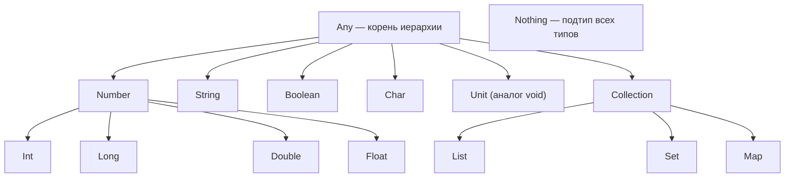
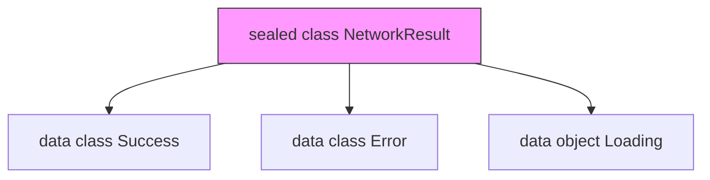
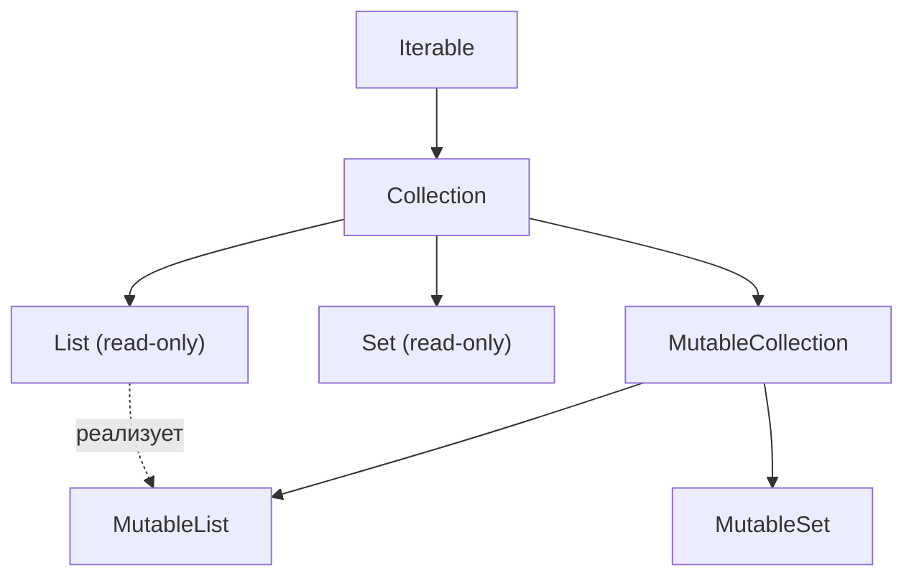

# Вопросы на собеседовании: `Kotlin`

Комплексное руководство по вопросам собеседования на тему `Kotlin` для `Senior Java/Kotlin Developer`. Включает детальные объяснения концепций, практические примеры на `Kotlin/JVM`, best practices и troubleshooting.

## Полезные ссылки

### Официальная документация

- [Kotlin Documentation](https://kotlinlang.org/docs/home.html) — официальная документация
- [Kotlin Language Specification](https://kotlinlang.org/spec/spec.html) — спецификация языка
- [Kotlin Coroutines Guide](https://kotlinlang.org/docs/coroutines-guide.html) — руководство по корутинам

### Baeldung

- [Kotlin Interview Questions — Baeldung](https://www.baeldung.com/kotlin/interview-questions) — подборка вопросов на Baeldung
- [Introduction to the Kotlin Language — Baeldung](https://www.baeldung.com/kotlin/intro) — введение в Kotlin: классы, null-safety, extension functions
- [A Guide to Kotlin's Any, Unit, Nothing — Baeldung](https://www.baeldung.com/kotlin/any-unit-nothing-tutorial) — специальные типы Kotlin
- [Guide to the when{} Block in Kotlin — Baeldung](https://www.baeldung.com/kotlin/when) — when-выражение и его возможности

## Содержание

- [Полезные ссылки](#полезные-ссылки)
- [See also](#see-also)

**Основы Kotlin**
- [Q1. (!) Что такое `Kotlin` и почему он стал популярен?](#q1--что-такое-kotlin-и-почему-он-стал-популярен)
- [Q2. (!) В чём ключевые отличия Kotlin от Java?](#q2--в-чём-ключевые-отличия-kotlin-от-java)
- [Q3. Какова система типов в Kotlin?](#q3-какова-система-типов-в-kotlin)

**Null-safety**
- [Q4. (!) Как реализована null-safety в Kotlin?](#q4--как-реализована-null-safety-в-kotlin)
- [Q5. В чём разница между `?.` и `!!`?](#q5-в-чём-разница-между--и-)
- [Q6. Что такое оператор Элвис `?:` и `let` для работы с null?](#q6-что-такое-оператор-элвис--и-let-для-работы-с-null)

**Функции и лямбды**
- [Q7. (!) Что такое лямбда-выражения и функциональные типы?](#q7--что-такое-лямбда-выражения-и-функциональные-типы)
- [Q8. Что такое функции высшего порядка?](#q8-что-такое-функции-высшего-порядка)
- [Q9. (!) Что такое функции расширения и как они работают?](#q9--что-такое-функции-расширения-и-как-они-работают)
- [Q10. (!) Что такое `inline` функции и зачем они нужны?](#q10--что-такое-inline-функции-и-зачем-они-нужны)
- [Q11. Что такое `infix` функции?](#q11-что-такое-infix-функции)

**Scope-функции**
- [Q12. (!) Что такое scope-функции (`let`, `run`, `with`, `apply`, `also`)?](#q12--что-такое-scope-функции-let-run-with-apply-also)

**Классы и объекты**
- [Q13. (!) Что такое `data class`?](#q13--что-такое-data-class)
- [Q14. (!) Что такое `sealed class` и `sealed interface`?](#q14--что-такое-sealed-class-и-sealed-interface)
- [Q15. (!) В чём разница между `class`, `object` и `companion object`?](#q15--в-чём-разница-между-class-object-и-companion-object)
- [Q16. Какие типы конструкторов есть в Kotlin?](#q16-какие-типы-конструкторов-есть-в-kotlin)
- [Q17. Что такое `enum class` и чем он отличается от `sealed class`?](#q17-что-такое-enum-class-и-чем-он-отличается-от-sealed-class)
- [Q18. Что такое `value class` (inline class)?](#q18-что-такое-value-class-inline-class)

**Свойства и модификаторы**
- [Q19. (!) В чём разница между `var`, `val` и `const val`?](#q19--в-чём-разница-между-var-val-и-const-val)
- [Q20. (!) В чём разница между `lazy` и `lateinit`?](#q20--в-чём-разница-между-lazy-и-lateinit)
- [Q21. Что такое `Visibility Modifiers` в Kotlin?](#q21-что-такое-visibility-modifiers-в-kotlin)
- [Q22. Что такое ключевое слово `open` и почему классы по умолчанию `final`?](#q22-что-такое-ключевое-слово-open-и-почему-классы-по-умолчанию-final)
- [Q23. Как работают пользовательские геттеры и сеттеры?](#q23-как-работают-пользовательские-геттеры-и-сеттеры)

**Generics и вариантность**
- [Q24. (!) Что такое `Generics` и как работает вариантность (`in`, `out`)?](#q24--что-такое-generics-и-как-работает-вариантность-in-out)
- [Q25. Что такое `reified` type parameters?](#q25-что-такое-reified-type-parameters)
- [Q26. Что такое `Type Inference`?](#q26-что-такое-type-inference)

**Делегирование**
- [Q27. (!) Что такое делегирование классов и свойств?](#q27--что-такое-делегирование-классов-и-свойств)

**Операторы и выражения**
- [Q28. Что такое выражение `when` и чем оно лучше `switch`?](#q28-что-такое-выражение-when-и-чем-оно-лучше-switch)
- [Q29. Что такое перегрузка операторов?](#q29-что-такое-перегрузка-операторов)
- [Q30. В чём разница между `==` и `===`?](#q30-в-чём-разница-между--и--1)
- [Q31. Как работает деструктуризация (`destructuring declarations`)?](#q31-как-работает-деструктуризация-destructuring-declarations)

**Коллекции и последовательности**
- [Q32. (!) В чём разница между `List` и `MutableList`?](#q32--в-чём-разница-между-list-и-mutablelist)
- [Q33. В чём разница между `Sequence` и `Iterable`?](#q33-в-чём-разница-между-sequence-и-iterable)
- [Q34. В чём разница между `map` и `flatMap`?](#q34-в-чём-разница-между-map-и-flatmap)

**Корутины (обзор)**
- [Q35. (!) Что такое корутины и чем они отличаются от потоков?](#q35--что-такое-корутины-и-чем-они-отличаются-от-потоков)
- [Q36. Что такое `CoroutineScope`, `Job` и `Dispatcher`?](#q36-что-такое-coroutinescope-job-и-dispatcher)
- [Q37. В чём разница между `launch` и `async`?](#q37-в-чём-разница-между-launch-и-async)

**Интероп с Java**
- [Q38. (!) Какая польза от `@JvmStatic`, `@JvmOverloads` и `@JvmField`?](#q38--какая-польза-от-jvmstatic-jvmoverloads-и-jvmfield)
- [Q39. Что такое плагины `allOpen` и `noArg`?](#q39-что-такое-плагины-allopen-и-noarg)

**Продвинутые темы**
- [Q40. Что такое `Reflection API` в Kotlin?](#q40-что-такое-reflection-api-в-kotlin)
- [Q41. Как работает интерполяция строк (string templates)?](#q41-как-работает-интерполяция-строк-string-templates)
- [Q42. Что такое `contracts` в Kotlin?](#q42-что-такое-contracts-в-kotlin)
- [Q43. (!) Какие best practices при написании идиоматичного Kotlin-кода?](#q43--какие-best-practices-при-написании-идиоматичного-kotlin-кода)
- [Q44. Что такое `typealias` и когда его использовать?](#q44-что-такое-typealias-и-когда-его-использовать)
- [Q45. Что такое `object expression` (анонимный объект) и чем отличается от `object declaration`?](#q45-что-такое-object-expression-анонимный-объект-и-чем-отличается-от-object-declaration)

---

## Q1. (!) Что такое `Kotlin` и почему он стал популярен?

`Kotlin` — статически типизированный язык программирования от `JetBrains`, работающий на `JVM`, `JavaScript` и `Native`. С 2019 года это **preferred language** для Android-разработки по рекомендации Google.

Основные причины популярности:

| Характеристика | Описание |
|---|---|
| **Null-safety** | Система типов предотвращает `NullPointerException` на уровне компиляции |
| **Лаконичность** | На 30-40% меньше boilerplate-кода по сравнению с Java |
| **Интероп с Java** | 100% совместимость — можно вызывать Java из Kotlin и наоборот |
| **Корутины** | Встроенная поддержка асинхронного программирования |
| **Multiplatform** | Один код для JVM, JS, iOS, Desktop |

`Kotlin` компилируется в `JVM`-байткод, полностью совместимый с экосистемой Java: [Spring Boot](../../frameworks/spring/spring-boot-interview.md), `Hibernate`, `Gradle` (Kotlin DSL). Это позволяет постепенно мигрировать Java-проекты на Kotlin.


> [!mcq]
> - [ ] `Kotlin` — это полностью отдельная JVM, несовместимая с Java-байткодом | Неверно: Kotlin компилируется в стандартный JVM-байткод и интероперабелен с Java-классами в одном classpath. ❌ ПОСЛЕДСТВИЕ: команда отказалась от Kotlin из-за «несовместимости» — упустила null-safety и `data class`, продолжила писать NPE-баги в Java.
> - [x] `Kotlin` — статически типизированный JVM-язык от JetBrains с null-safety, корутинами и 100% interop с Java | Компилируется в JVM-байткод, классы Kotlin/Java живут в одном classpath; null-safety на уровне типов снимает класс NPE-багов. ✓ ПРИМЕНЯТЬ: Google объявила Kotlin preferred language для Android (2019), Spring Framework 5+ официально поддерживает Kotlin (extensions, coroutines). 📋 ПРАВИЛО: «JVM-байткод + null-safety = Java без NPE». 🔗 См. Q2, Q4, Q38.
> - [ ] `Kotlin` нужен только для Android, на сервере смысла нет | Неверно: на сервере Kotlin используется в Spring Boot, Ktor, Micronaut; корутины конкурируют с Virtual Threads. ❌ ПОСЛЕДСТВИЕ: backend-команда осталась на Java 8 «потому что Kotlin для Android» — не получила корутины, продолжила писать callback-hell на `CompletableFuture`.
> - [ ] `Kotlin` исполняется через transpile в Java-исходник | Неверно: компилятор `kotlinc` генерирует `.class` напрямую, а не `.java`. ❌ ПОСЛЕДСТВИЕ: разработчик искал «сгенерированный Java-код» в build/ — не нашёл, потерял 2 часа на отладку, не понимая байткод-формат.

## Q2. (!) В чём ключевые отличия Kotlin от Java?

| Аспект | `Kotlin` | `Java` |
|---|---|---|
| Null-safety | Встроена в систему типов (`String?`) | Отсутствует (только аннотации `@Nullable`) |
| Data-классы | `data class` автоматически генерирует `equals`, `hashCode`, `toString`, `copy` | Нужен `record` (Java 16+) или Lombok |
| Расширения | Extension functions / properties | Нет аналога |
| Корутины | `suspend fun`, структурированная конкурентность | `CompletableFuture`, Virtual Threads (Java 21+) |
| Smart casts | Автоматическое приведение типа после проверки | Явный cast |
| По умолчанию | Классы `final`, свойства `val` | Классы открыты, поля `mutable` |
| Scope-функции | `let`, `run`, `apply`, `also`, `with` | Нет |
| Singleton | `object` declaration | Ручная реализация |

```kotlin
// Kotlin: 1 строка
data class User(val name: String, val age: Int)

// Java: ~50 строк (без record/lombok)
// equals, hashCode, toString, getters, constructor...
```

Подробнее о совместимости — [интероп Kotlin и Java](kotlin-interop-java-interview.md).


> [!mcq]
> - [ ] В Kotlin классы по умолчанию `open`, как в Java | Неверно: в Kotlin классы и методы `final` по умолчанию, нужно явно писать `open`. ❌ ПОСЛЕДСТВИЕ: команда добавила Spring без `kotlin-allopen` — `@Service`-классы остались `final`, AOP-прокси не создались, `@Transactional` не работал, транзакции коммитились частями.
> - [ ] `data class` в Kotlin = `record` в Java, оба immutable | Неверно: `data class` может содержать `var` и mutable-свойства, `equals`/`hashCode` считаются ТОЛЬКО по полям primary constructor, тогда как `record` всегда immutable. ❌ ПОСЛЕДСТВИЕ: разработчик заменил `record` на `data class` с `var name`, изменил `name` после `Set.add()` — set «потерял» элемент при `contains()`, дубликаты в БД.
> - [x] `Kotlin` добавляет null-safety в типы (`String?`), `data class`, extension functions, корутины и smart casts | На уровне типов разделяет `T` и `T?`, генерирует `equals`/`hashCode`/`copy`, поддерживает функции-расширения без наследования и suspend-функции. ✓ ПРИМЕНЯТЬ: Spring WebFlux + Kotlin coroutines дают код без callback-hell; JetBrains использует Kotlin для IntelliJ IDEA. 📋 ПРАВИЛО: «null-safety + data + extension + coroutine = пять отличий, остальное — синтаксис». 🔗 См. Q4, Q9, Q13, Q35.
> - [ ] Корутины Kotlin — это просто обёртка над `Thread` | Неверно: корутины — suspend-функции на уровне компилятора, миллионы корутин на одном потоке, в отличие от ~1MB стека на `Thread`. ❌ ПОСЛЕДСТВИЕ: разработчик запустил 10K `launch{}` думая «это thread per request» — удивился что приложение не упало, потом удивился что `Thread.currentThread()` тот же.

## Q3. Какова система типов в Kotlin?

В `Kotlin` всё является объектом — нет примитивных типов на уровне языка. Компилятор оптимизирует `Int`, `Long`, `Double` и др. в JVM-примитивы где возможно.



Ключевые особенности:

- **`Any`** — корень иерархии (аналог `Object` в Java), но без `wait()`/`notify()`
- **`Unit`** — аналог `void`, но является настоящим типом (singleton)
- **`Nothing`** — подтип всех типов, функция с возвращаемым `Nothing` никогда не завершается нормально (`throw`, бесконечный цикл)
- **Nullable types** — `String?` и `String` — два разных типа; `String?` = `String | null`

```kotlin
fun fail(message: String): Nothing {
    throw IllegalArgumentException(message)
}

val result: String = input ?: fail("input is null") // компилируется!
```


> [!mcq]
> - [ ] `Any` — это аналог `Object` с теми же методами `wait()`/`notify()` | Неверно: `Any` НЕ содержит `wait()`/`notify()`/`getClass()`, только `equals`/`hashCode`/`toString`. ❌ ПОСЛЕДСТВИЕ: разработчик пытался `obj.wait()` для синхронизации — компиляция упала, потерял время на поиск аналога, в итоге написал sync через `synchronized` или `Mutex`.
> - [ ] `Unit` и `Nothing` — это синонимы, оба означают «нет результата» | Неверно: `Unit` — singleton-тип со значением `Unit` (аналог `void`), `Nothing` — подтип всех типов, у функции с `Nothing` нет нормального возврата (только `throw` или бесконечный цикл). ❌ ПОСЛЕДСТВИЕ: разработчик написал `fun fail(): Unit = throw ...` — компилятор не вывел `Nothing`, smart cast после `val x = input ?: fail()` не сработал, пришлось добавлять `!!`.
> - [ ] Все типы — это nullable по умолчанию, `String` и `String?` равнозначны | Неверно: `String` НЕ может быть `null`, `String?` — может; это два разных типа на уровне компиляции. ❌ ПОСЛЕДСТВИЕ: программист передал `String?` туда где ждали `String` — получил compile error и решил «обойти» через `!!`, через неделю получил `NullPointerException` в production.
> - [x] `Any` — корень иерархии без `wait/notify`, `Unit` — singleton-аналог `void`, `Nothing` — подтип всех типов, nullable отделены от non-null на уровне типов | Система типов отделяет `T` от `T?`, добавляет `Nothing` для never-returning функций (Elvis с `throw`) и `Unit` как полноценный объект. ✓ ПРИМЕНЯТЬ: Kotlin stdlib использует `Nothing` для `error()`, `TODO()`, `requireNotNull()`; Arrow Kt — для Either/Result. 📋 ПРАВИЛО: «`Any` без `wait`, `Unit` — объект, `Nothing` — никогда». 🔗 См. Q4, Q5.

## Q4. (!) Как реализована null-safety в Kotlin?

`Null-safety` — одна из ключевых особенностей `Kotlin`. Система типов разделяет nullable (`T?`) и non-null (`T`) типы на уровне компиляции.

```kotlin
var name: String = "Kotlin"   // не может быть null
var nickname: String? = null  // может быть null

// name = null  // Ошибка компиляции!
```

Основные механизмы работы с `null`:

```kotlin
val user: User? = findUser()

// 1. Safe call — ?. (возвращает null если объект null)
val len: Int? = user?.name?.length

// 2. Elvis operator — ?:  (значение по умолчанию)
val displayName: String = user?.name ?: "Anonymous"

// 3. Smart cast — после проверки компилятор знает, что не null
if (user != null) {
    println(user.name) // user уже User, не User?
}

// 4. Safe cast — as? (null вместо ClassCastException)
val str: String? = value as? String

// 5. Not-null assertion — !! (выбрасывает NPE если null)
val forcedName: String = user!!.name // опасно!

// 6. let — идиоматичный способ работы с nullable
user?.let { println("User: ${it.name}") }
```

**На собеседовании** важно подчеркнуть: `!!` — code smell, его наличие в коде требует обоснования. Предпочтительны `?.`, `?:` и `let`. При работе с Java-кодом типы из Java являются **platform types** (`String!`) — компилятор не знает, nullable они или нет, поэтому ответственность за проверку на null лежит на разработчике.


> [!mcq]
> - [ ] Использовать `!!` везде, где компилятор требует non-null type | Неверно: `!!` бросает `NullPointerException` при null; это перенос Java-проблемы в Kotlin. ❌ ПОСЛЕДСТВИЕ: команда поставила `!!` на ответы Java-сервиса (`response.body()!!`) — на edge case `body == null` сервис упал в production, 47 минут downtime до hotfix.
> - [ ] Java-типы из библиотек считаются non-null по умолчанию | Неверно: Java-типы — это platform types (`String!`), компилятор НЕ знает nullable они или нет. ❌ ПОСЛЕДСТВИЕ: разработчик принял Java-`getName()` за non-null без `@Nullable`-аннотации, пробросил в `String` параметр — `NullPointerException` в runtime через 3 дня после релиза.
> - [x] Через разделение типов на `T` и `T?`, плюс операторы `?.`, `?:`, `let`, smart cast и `as?` | Компилятор запрещает `null` для non-null типов; safe call `?.` возвращает `null`, Elvis `?:` даёт fallback, smart cast после `if (x != null)` сужает тип до non-null. ✓ ПРИМЕНЯТЬ: Spring `@RequestBody`-DTO в Kotlin использует `String?` для опциональных полей, JetBrains kotlinx-serialization уважает nullability. 📋 ПРАВИЛО: «`?.` спрашивает, `?:` подменяет, `!!` ломает». 🔗 См. Q5, Q6, Q42.
> - [ ] Достаточно проверки `if (x == null) throw ...` в начале функции | Неверно: это работает, но игнорирует встроенные средства (`requireNotNull`, `?:`), плюс не даёт smart cast после проверки в нужных местах. ❌ ПОСЛЕДСТВИЕ: разработчик написал ручные проверки в каждом методе — забыл одну в новом методе через месяц, баг прошёл review, упал NPE в integration test.

## Q5. В чём разница между `?.` и `!!`?

**Оператор безопасного вызова `?.`** — если объект `null`, выражение возвращает `null` без исключений:

```kotlin
val name: String? = null
println(name?.length)    // null (без NPE)
println(name?.uppercase()) // null
```

**Not-null assertion `!!`** — выбрасывает `KotlinNullPointerException` если значение `null`:

```kotlin
val name: String? = null
println(name!!.length)   // KotlinNullPointerException!
```

**Правило**: `!!` допустим только когда вы **абсолютно уверены**, что значение не `null`, и готовы получить crash. В production-коде это анти-паттерн. Исключение — тесты и интеграционный код, где crash предпочтительнее тихого `null`.


> [!mcq]
> - [ ] `?.` и `!!` ведут себя одинаково при null, отличаются только синтаксисом | Неверно: `?.` возвращает `null` без исключения, `!!` бросает `KotlinNullPointerException`. ❌ ПОСЛЕДСТВИЕ: разработчик думал что `name?.length` и `name!!.length` взаимозаменяемы — заменил `?.` на `!!` для «единообразия», получил NPE на первом null-кейсе в production.
> - [ ] `!!` безопасно использовать в production, если код покрыт тестами | Неверно: тесты не покроют все edge cases (race condition, deserialization, JSON-парсинг), а `!!` — это явный отказ от null-safety. ❌ ПОСЛЕДСТВИЕ: команда покрыла «happy path» 100% юнит-тестами, в production пришёл невалидный JSON с `null`-полем — `!!` упал, обработать нечем, MQ-сообщение зациклилось в DLQ.
> - [x] `?.` — safe call (возвращает `null` если объект `null`), `!!` — not-null assertion (бросает NPE) | Безопасный вызов сохраняет null-прозрачность цепочки, ассерт `!!` гарантирует non-null с риском падения; `!!` допустим только когда null логически невозможен. ✓ ПРИМЕНЯТЬ: Android-проекты Google официально рекомендуют избегать `!!` в production (lint warning); Kotlin-style guide JetBrains запрещает `!!` без обоснования. 📋 ПРАВИЛО: «`?.` — спросить, `!!` — настоять и упасть». 🔗 См. Q4, Q6, Q43.
> - [ ] `?.` и `!!` работают только на `var`, для `val` нужен Elvis `?:` | Неверно: оба оператора работают и для `val`, и для `var`; они зависят от nullability типа, а не от изменяемости. ❌ ПОСЛЕДСТВИЕ: разработчик переписал `val` на `var` думая «теперь `?.` заработает» — спровоцировал mutable-state баги, не понимая что проблема была в типе `T?`.

## Q6. Что такое оператор Элвис `?:` и `let` для работы с null?

**Оператор Элвис `?:`** — возвращает левый операнд, если он не `null`, иначе правый:

```kotlin
val name: String? = null
val displayName = name ?: "Unknown"      // "Unknown"
val length = name?.length ?: 0           // 0
val result = name ?: throw IllegalStateException("name is required")
val fallback = name ?: return            // ранний выход из функции
```

**`let`** — scope-функция для безопасной работы с nullable:

```kotlin
val email: String? = getEmail()

// Блок выполняется только если email не null
email?.let { nonNullEmail ->
    sendVerification(nonNullEmail)
    log("Sent to $nonNullEmail")
}

// Цепочка с let и Elvis
val formatted = input?.let { parse(it) }?.let { validate(it) } ?: default
```


> [!mcq]
> - [ ] `?:` возвращает правый операнд только если левый `false` (как тернарный) | Неверно: Elvis `?:` срабатывает на `null`, не на `false`; для boolean используется `if/when`. ❌ ПОСЛЕДСТВИЕ: разработчик написал `flag ?: defaultBoolean` для boolean-флага — компилятор не предупредил (Boolean? принят), при `flag = false` получил `false`, не `defaultBoolean`, баг в логике авторизации.
> - [ ] `let` блок выполняется ВСЕГДА, даже если объект `null` | Неверно: `let` на nullable вызывается через `?.let`, и блок выполняется только если объект не `null`; без `?.` — выполняется всегда, но получит non-null `it`. ❌ ПОСЛЕДСТВИЕ: разработчик ожидал что `email.let { send(it) }` (без `?.`) пропустит null — но `email` был non-null `String`, и `let` всё равно вызвался; через рефакторинг тип стал `String?` — `it` остался `String?` без `?.`, NPE в `send`.
> - [x] `?:` возвращает левый операнд если он не `null`, иначе правый; `?.let { }` выполняет блок только если объект не `null` | Elvis даёт fallback или раннее завершение (`?: return`, `?: throw`), `?.let` идиоматично обёртывает работу с nullable без if-проверок. ✓ ПРИМЕНЯТЬ: Kotlin stdlib `String?.orEmpty()` использует `?:`; Android Jetpack Compose использует `?.let { }` для conditional render. 📋 ПРАВИЛО: «Elvis даёт дефолт, let — действие при не-null». 🔗 См. Q5, Q12.
> - [ ] `?:` и `?.let` взаимозаменяемы — оба обрабатывают null одинаково | Неверно: Elvis возвращает значение, `let` — выполняет блок и возвращает результат блока (или null если объект null). ❌ ПОСЛЕДСТВИЕ: программист написал `name ?: log("null name")` ожидая выполнения блока — но Elvis вернул значение `log()` (Unit), не выполнил действие как expected, потерял часы на отладку.

## Q7. (!) Что такое лямбда-выражения и функциональные типы?

Лямбда-выражение — анонимная функция, которую можно передать как значение. В `Kotlin` функции — **граждане первого класса**.

```kotlin
// Функциональный тип: (Int, Int) -> Int
val sum: (Int, Int) -> Int = { a, b -> a + b }

// it — неявное имя единственного параметра
val double: (Int) -> Int = { it * 2 }

// Trailing lambda — лямбда вынесена за скобки
val evens = listOf(1, 2, 3, 4, 5).filter { it % 2 == 0 }

// Ссылка на функцию (function reference)
fun isPositive(n: Int) = n > 0
val positives = listOf(-1, 2, -3, 4).filter(::isPositive)
```

Функциональный тип с `receiver` — основа для DSL (подробнее в [DSL в Kotlin](kotlin-dsl-interview.md)):

```kotlin
// Тип: String.() -> Unit — лямбда с receiver String
fun buildGreeting(block: StringBuilder.() -> Unit): String {
    return StringBuilder().apply(block).toString()
}

val greeting = buildGreeting {
    append("Hello, ")
    append("Kotlin!")
}
```


> [!mcq]
> - [ ] Лямбда — это compile-time оптимизация, в runtime это просто метод | Неверно: лямбда без `inline` создаёт объект `Function0`/`Function1`/... с методом `invoke()` — это аллокация в куче. ❌ ПОСЛЕДСТВИЕ: разработчик использовал лямбды в hot path обработки event-stream — на 10K events/sec получил `Function1` allocation rate 50 MB/s, GC-паузы по 200ms, latency p99 деградировала с 50ms до 800ms.
> - [ ] `it` — это keyword языка для текущего объекта в любой функции | Неверно: `it` — implicit-имя единственного параметра ТОЛЬКО в лямбде; в обычной функции `it` — обычный идентификатор. ❌ ПОСЛЕДСТВИЕ: новичок написал `fun process(it: User) = it.name` думая что `it` особенный — потом запутался когда внутри лямбды появился ещё один `it`, переменная теневая, баг в `name` лямбды.
> - [x] Лямбда — анонимная функция как значение, функциональный тип `(Int, Int) -> Int` — first-class type | В Kotlin функции — граждане первого класса; лямбда без `inline` компилируется в `Function`-объект; функциональный тип с receiver (`String.() -> Unit`) — основа DSL. ✓ ПРИМЕНЯТЬ: Kotlin stdlib `filter`, `map`, `forEach` принимают лямбды; Gradle Kotlin DSL и Ktor routing построены на лямбдах с receiver. 📋 ПРАВИЛО: «функция как значение, тип как контракт». 🔗 См. Q8, Q10, Q12.
> - [ ] Функциональный тип `(Int) -> Int` несовместим с Java `Function<Integer, Integer>` | Неверно: в JVM Kotlin функциональные типы реализуют интерфейсы `kotlin.jvm.functions.Function0..N`, через SAM-конверсию интероперабельны с Java functional interfaces. ❌ ПОСЛЕДСТВИЕ: разработчик создавал обёртки для каждой Kotlin-лямбды чтобы передать в Java API — раздул код на 200 строк, в итоге узнал что SAM работает напрямую.

## Q8. Что такое функции высшего порядка?

Функция высшего порядка — функция, которая принимает другие функции как параметры или возвращает функцию.

```kotlin
// Принимает функцию как параметр
fun calculate(a: Int, b: Int, operation: (Int, Int) -> Int): Int {
    return operation(a, b)
}

val sum = calculate(10, 5) { x, y -> x + y }       // 15
val diff = calculate(10, 5) { x, y -> x - y }      // 5

// Возвращает функцию
fun multiplier(factor: Int): (Int) -> Int = { it * factor }
val triple = multiplier(3)
println(triple(5))  // 15
```

Стандартная библиотека `Kotlin` активно использует HOF: `map`, `filter`, `reduce`, `fold`, `groupBy`, `flatMap` и др. (подробнее в [коллекциях Kotlin](kotlin-collections-interview.md)).


> [!mcq]
> - [ ] HOF может только принимать функцию-параметр, не возвращать | Неверно: HOF может и принимать, и возвращать функции (`fun multiplier(f: Int): (Int) -> Int = { it * f }`). ❌ ПОСЛЕДСТВИЕ: разработчик писал отдельный класс-фабрику для каждого преобразования — 30 классов вместо 1 функции, code review завернули, рефакторинг 3 дня.
> - [ ] HOF в Kotlin доступны только в stdlib (`map`, `filter`), своих писать нельзя | Неверно: любая функция, принимающая или возвращающая функцию — HOF; пишутся как обычные функции с функциональным типом параметра. ❌ ПОСЛЕДСТВИЕ: команда написала 5 «универсальных» утилит-классов с дженериками, не использовали HOF — код сложнее, тесты сложнее, читаемость хуже.
> - [x] Функция, которая принимает или возвращает другую функцию как значение | Stdlib активно использует HOF: `map { it * 2 }`, `filter { it > 0 }`, `reduce { acc, x -> acc + x }`; пользовательские HOF реализуют DSL и пайплайны обработки. ✓ ПРИМЕНЯТЬ: Spring `@Transactional` через `TransactionTemplate.execute { }` принимает лямбду как HOF; Resilience4j `Retry.executeSupplier { }` тоже HOF. 📋 ПРАВИЛО: «функция-параметр или функция-результат — оба HOF». 🔗 См. Q7, Q10.
> - [ ] HOF создают runtime-overhead из-за reflection | Неверно: HOF не используют reflection, они компилируются в `Function`-вызовы; единственная стоимость — аллокация лямбды (снимается через `inline`). ❌ ПОСЛЕДСТВИЕ: разработчик отказался от HOF «из-за reflection» — реализовал через цепочки `if/else`, потерял идиоматичность Kotlin, код стал в 3 раза длиннее.

## Q9. (!) Что такое функции расширения и как они работают?

Extension functions позволяют добавлять новые функции к существующим классам **без модификации исходного кода** и **без наследования**.

```kotlin
// Расширение для String
fun String.wordCount(): Int = this.split("\\s+".toRegex()).size

println("Hello Kotlin World".wordCount()) // 3

// Расширение для коллекций
fun <T> List<T>.secondOrNull(): T? = if (size >= 2) this[1] else null

// Extension property
val String.lastChar: Char
    get() = this[length - 1]
```

**Важные нюансы** (часто спрашивают на собеседовании):

1. **Разрешаются статически** — по типу переменной, а не объекта:
```kotlin
open class Shape
class Circle : Shape()

fun Shape.name() = "Shape"
fun Circle.name() = "Circle"

val shape: Shape = Circle()
println(shape.name()) // "Shape" — не "Circle"!
```

2. **Не могут обращаться к `private`/`protected` членам** класса
3. **Компилируются в статические методы** — `fun String.foo()` станет `public static void foo(String $this)`
4. Член класса имеет приоритет над extension с тем же именем


> [!mcq]
> - [ ] Extension function разрешается полиморфно по типу объекта в runtime | Неверно: extension разрешается СТАТИЧЕСКИ — по типу переменной, не по runtime-типу. ❌ ПОСЛЕДСТВИЕ: разработчик объявил `fun Shape.name()` и `fun Circle.name()`, передал `Circle` как `Shape` — вызвался `Shape.name()`, не `Circle.name()`; баг в логике рендеринга, обнаружен на проде клиента.
> - [ ] Extension function имеет доступ к private-членам класса | Неверно: extension — статический метод снаружи класса, видит только public/internal API. ❌ ПОСЛЕДСТВИЕ: команда добавила extension `User.normalize()` пытаясь обратиться к `private val rawData` — компиляция упала, вместо рефакторинга добавили `internal` к полю, нарушили инкапсуляцию.
> - [x] Extension добавляет функцию к существующему классу через статический метод, БЕЗ модификации класса и БЕЗ наследования | Компилируется в `static fun foo($this: String)`, разрешается по compile-time типу, не имеет доступа к private; член класса имеет приоритет над extension с тем же именем. ✓ ПРИМЕНЯТЬ: Kotlin stdlib добавляет extension `String.toIntOrNull()`, `List.firstOrNull()`; Spring Kotlin Extensions предоставляет `RestTemplate.getForObject<T>()` с reified. 📋 ПРАВИЛО: «расширение — статика, не виртуальный вызов». 🔗 См. Q9, Q25, Q43.
> - [ ] Extension functions нельзя экспортировать из библиотеки — они работают только в одном модуле | Неверно: extension экспортируется как обычная функция, нужно импортировать в месте использования. ❌ ПОСЛЕДСТВИЕ: команда дублировала `String.toSnakeCase()` extension в 7 модулях, не зная про import — 7 копий с расхождениями, баг в одной из реализаций.

## Q10. (!) Что такое `inline` функции и зачем они нужны?

`inline` указывает компилятору встроить тело функции в место вызова, избегая создания объекта лямбды и дополнительного вызова.

```kotlin
inline fun <T> measureTime(block: () -> T): T {
    val start = System.nanoTime()
    val result = block()
    println("Took ${System.nanoTime() - start} ns")
    return result
}

// При компиляции тело measureTime подставляется inline
val data = measureTime { loadFromDatabase() }
```

**Когда использовать**: функции с лямбда-параметрами (избегаем аллокации `Function` объекта). Стандартные `let`, `run`, `apply`, `also`, `with` — все `inline`.

**`noinline`** — запрещает инлайнинг конкретного лямбда-параметра:

```kotlin
inline fun foo(inlined: () -> Unit, noinline notInlined: () -> Unit) { ... }
```

**`crossinline`** — запрещает нелокальный `return` из лямбды:

```kotlin
inline fun runInThread(crossinline block: () -> Unit) {
    Thread { block() }.start() // block не может сделать return из runInThread
}
```


> [!mcq]
> - [ ] `inline` всегда улучшает производительность, ставить на каждую функцию | Неверно: `inline` имеет смысл только для функций С ЛЯМБДА-параметрами; на обычных функциях увеличивает размер байткода без выигрыша. ❌ ПОСЛЕДСТВИЕ: команда поставила `inline` на все utility-функции — JAR-файл вырос с 5MB до 18MB, JIT-компиляция замедлилась, приложение стартовало на 4 секунды дольше.
> - [ ] `noinline` запрещает inline на функции целиком | Неверно: `noinline` относится к КОНКРЕТНОМУ лямбда-параметру, а не ко всей функции; функция остаётся inline для других лямбд. ❌ ПОСЛЕДСТВИЕ: разработчик хотел отключить inline для отладки — поставил `noinline` на все параметры, не понимая что нужно убрать `inline` модификатор; lambda-параметр всё равно инлайнился, debug-experience не улучшился.
> - [x] `inline` подставляет тело функции и тело лямбды в место вызова, избегая аллокации `Function`-объекта | Стандартные `let`/`run`/`apply`/`also`/`with` — все `inline`; `noinline` запрещает inline отдельной лямбды; `crossinline` запрещает нелокальный `return` из лямбды. ✓ ПРИМЕНЯТЬ: Kotlin stdlib `forEach`, `repeat`, scope-функции — inline; Compose UI использует inline для рекомпозиции без аллокаций. 📋 ПРАВИЛО: «inline для лямбд: убирает Function-объект и stack frame». 🔗 См. Q7, Q12, Q25.
> - [ ] `crossinline` разрешает нелокальный `return` из лямбды | Неверно: `crossinline` ЗАПРЕЩАЕТ нелокальный return — нужен когда лямбда передаётся в другой контекст (Thread, callback). ❌ ПОСЛЕДСТВИЕ: разработчик поставил `crossinline` ожидая разрешения return — компилятор стал ругаться на `return` в лямбде, вместо понимания семантики переписал на guard-clause, потерял читаемость.

## Q11. Что такое `infix` функции?

`infix` позволяет вызывать функцию без точки и скобок, если она: (1) является member или extension, (2) имеет ровно один параметр.

```kotlin
infix fun Int.power(exp: Int): Int {
    var result = 1
    repeat(exp) { result *= this }
    return result
}

val result = 2 power 10   // 1024 (вместо 2.power(10))

// Стандартные infix-функции:
val pair = "key" to "value"       // Pair
val check = 5 in 1..10            // contains
val result2 = true and false      // Boolean
```


> [!mcq]
> - [ ] `infix` работает с любой функцией, у которой есть параметры | Неверно: `infix` требует РОВНО ОДНОГО параметра, а функция должна быть member или extension. ❌ ПОСЛЕДСТВИЕ: разработчик объявил `infix fun add(a: Int, b: Int)` — компилятор отверг, не понял требования, потратил час на чтение doc.
> - [ ] `infix` функции медленнее обычных из-за парсинга | Неверно: `infix` — синтаксический сахар, в байткоде идентичен обычному вызову. ❌ ПОСЛЕДСТВИЕ: разработчик избегал `infix` в hot path «из-за overhead» — не получил читаемости DSL, написал больше boilerplate.
> - [x] `infix` позволяет вызывать функцию без точки и скобок: `2 power 10` вместо `2.power(10)`, требует ровно один параметр и быть member/extension | Используется в stdlib для `to` (создание Pair), `in` (contains), `and`/`or` для Boolean; полезно в DSL и тестовых матчерах. ✓ ПРИМЕНЯТЬ: Kotlin `mapOf("k" to "v")` использует `infix to`; AssertJ-style Kotest matchers `result shouldBe expected` через `infix`. 📋 ПРАВИЛО: «infix = один параметр + читаемость DSL». 🔗 См. Q11, Q29.
> - [ ] `infix` можно применять только к Int и String | Неверно: `infix` работает с любым receiver-типом (включая generic, custom types). ❌ ПОСЛЕДСТВИЕ: команда не рассмотрела `infix` для своих DSL — реализовала через цепочку методов, читаемость хуже чем у конкурента с `infix`.

## Q12. (!) Что такое scope-функции (`let`, `run`, `with`, `apply`, `also`)?

Scope-функции — пять стандартных функций для выполнения блока кода в контексте объекта.

| Функция | Объект как | Возвращает | Типичное использование |
|---------|-----------|-----------|----------------------|
| `let` | `it` | результат лямбды | null-check, преобразование |
| `run` | `this` | результат лямбды | конфигурация + вычисление |
| `with` | `this` | результат лямбды | группировка вызовов (не extension) |
| `apply` | `this` | сам объект | конфигурация объекта (builder) |
| `also` | `it` | сам объект | побочные эффекты (логирование) |

```kotlin
// let — работа с nullable
val name: String? = "Kotlin"
name?.let { println("Length: ${it.length}") }

// apply — конфигурация объекта
val config = HttpClient().apply {
    timeout = 30_000
    retries = 3
    baseUrl = "https://api.example.com"
}

// also — побочный эффект (logging, validation)
val user = createUser()
    .also { log.info("Created user: ${it.id}") }
    .also { require(it.isValid()) }

// run — вычисление с контекстом
val greeting = user.run { "Hello, $name! Age: $age" }

// with — группировка вызовов
with(canvas) {
    drawRect(0, 0, 100, 100)
    drawText("Hello", 50, 50)
    drawLine(0, 0, 100, 100)
}
```

**На собеседовании**: ключевое отличие — `this` vs `it` (определяет читаемость при вложенности) и что возвращается (сам объект vs результат лямбды).


> [!mcq]
> - [ ] Все scope-функции (`let`, `run`, `with`, `apply`, `also`) возвращают сам объект | Неверно: `apply` и `also` возвращают сам объект, а `let`, `run`, `with` — результат лямбды. ❌ ПОСЛЕДСТВИЕ: разработчик заменил `apply` на `let` для конфигурации `HttpClient` — `let` вернул `Unit`, переменная стала `Unit?`, конфигурация потеряна, баг в integration test.
> - [ ] `let` и `apply` идентичны: оба передают `it` и возвращают результат | Неверно: `let` передаёт `it` + возвращает результат лямбды, `apply` передаёт `this` + возвращает сам объект. ❌ ПОСЛЕДСТВИЕ: команда смешивала `let`/`apply` без понимания семантики — в одном месте получили `Unit` вместо объекта, конфиг не применился, тесты прошли (mock), упало в production.
> - [x] `let`/`also` дают `it`, `run`/`with`/`apply` — `this`; `apply`/`also` возвращают объект, остальные — результат лямбды | Выбор по двум осям: контекст (`it` vs `this`) и возврат (объект vs результат); `apply` для конфигурации (builder), `let` для null-check, `also` для логирования. ✓ ПРИМЕНЯТЬ: Android Jetpack использует `apply` для view-конфигурации; Spring Kotlin — `also` для логирования в pipeline; Ktor — `run` для блочной конфигурации. 📋 ПРАВИЛО: «`let`/`also` — `it`; `apply`/`also` — объект; вспомни две оси». 🔗 См. Q6, Q9, Q43.
> - [ ] Все scope-функции — это макросы компилятора, в runtime их нет | Неверно: они реализованы как `inline`-функции в stdlib (`Standard.kt`), всё равно существуют как функции. ❌ ПОСЛЕДСТВИЕ: разработчик копал в decompiled байткод — не нашёл «макросов», потратил время на гипотезу, в итоге узнал что это просто `inline`.

## Q13. (!) Что такое `data class`?

`data class` — класс, предназначенный для хранения данных. Компилятор автоматически генерирует: `equals()`, `hashCode()`, `toString()`, `copy()`, `componentN()`.

```kotlin
data class User(
    val name: String,
    val email: String,
    val age: Int = 0
)

val user1 = User("Alice", "alice@mail.com", 30)
val user2 = user1.copy(name = "Bob")  // копия с изменённым полем

// Деструктуризация
val (name, email, age) = user1

// toString()
println(user1) // User(name=Alice, email=alice@mail.com, age=30)

// equals по значению
println(user1 == User("Alice", "alice@mail.com", 30)) // true
```

**Ограничения и нюансы:**
- Должен иметь хотя бы один параметр в primary constructor
- Параметры конструктора — `val` или `var` (рекомендуется `val` для иммутабельности)
- Не может быть `abstract`, `open`, `sealed` или `inner`
- `equals`/`hashCode` учитывают **только** свойства из primary constructor
- Свойства в `body` класса **не участвуют** в `equals`/`hashCode` — частый источник багов

```kotlin
data class Tricky(val id: Int) {
    var name: String = ""  // НЕ участвует в equals/hashCode!
}
```


> [!mcq]
> - [ ] `equals`/`hashCode` `data class` учитывают ВСЕ свойства, включая `var` в теле класса | Неверно: учитываются ТОЛЬКО свойства из primary constructor; `var name` в теле класса не входит в `equals`. ❌ ПОСЛЕДСТВИЕ: `data class Tricky(val id: Int) { var name = "" }` — два объекта с одинаковым `id` но разным `name` равны по `equals`; в `HashMap<Tricky, X>` — ключи совпадают, значения теряются.
> - [ ] `data class` может быть `abstract` или `sealed` | Неверно: `data class` НЕ может быть `abstract`, `open`, `sealed` или `inner`. ❌ ПОСЛЕДСТВИЕ: разработчик попытался `sealed data class` — получил compile error, переписал через обычный sealed + ручной `equals`/`hashCode`, потерял auto-generation `copy()`.
> - [x] `data class` авто-генерирует `equals`, `hashCode`, `toString`, `copy`, `componentN`, и учитывает ТОЛЬКО свойства primary constructor | Подходит для DTO, value-objects; mutable `var` поля в теле класса не участвуют в `equals`/`hashCode` (частый источник багов в Set/Map); должен иметь хотя бы один параметр. ✓ ПРИМЕНЯТЬ: Spring REST DTO в Kotlin — обычно `data class`; kotlinx.serialization работает с `data class` без boilerplate. 📋 ПРАВИЛО: «equals/hashCode только по primary constructor — `var` в теле невидим». 🔗 См. Q14, Q31, Q43.
> - [ ] `data class.copy()` создаёт глубокую копию всех вложенных объектов | Неверно: `copy()` — поверхностная копия (shallow); вложенные mutable-объекты разделяются между копиями. ❌ ПОСЛЕДСТВИЕ: разработчик сделал `user.copy()` ожидая независимости — модификация `user.address.city` отразилась в копии, баг в журнале аудита (старая и новая запись с одним адресом).

## Q14. (!) Что такое `sealed class` и `sealed interface`?

`sealed class` — абстрактный класс с ограниченным набором подклассов, известным на этапе компиляции. Все прямые наследники должны быть в том же пакете (с Kotlin 1.5+, раньше — в том же файле).

```kotlin
sealed class NetworkResult<out T> {
    data class Success<T>(val data: T) : NetworkResult<T>()
    data class Error(val code: Int, val message: String) : NetworkResult<Nothing>()
    data object Loading : NetworkResult<Nothing>()
}

// Исчерпывающий when — компилятор проверяет все варианты
fun handleResult(result: NetworkResult<String>): String = when (result) {
    is NetworkResult.Success -> "Data: ${result.data}"
    is NetworkResult.Error   -> "Error ${result.code}: ${result.message}"
    is NetworkResult.Loading -> "Loading..."
    // else не нужен — все варианты покрыты!
}
```



**Sealed vs Enum:**

| | `sealed class` | `enum class` |
|---|---|---|
| Экземпляры | Каждый подкласс может иметь разное состояние | Фиксированные singleton-экземпляры |
| Иерархия | Разные классы с разными свойствами | Одинаковая структура |
| `when` | Исчерпывающая проверка | Исчерпывающая проверка |

`sealed interface` (Kotlin 1.5+) — то же, но класс может реализовать несколько sealed interfaces.


> [!mcq]
> - [ ] `sealed class` работает идентично `enum class`: фиксированный набор экземпляров | Неверно: `enum` — фиксированные синглтоны одного типа, `sealed` — иерархия классов с РАЗНЫМ состоянием/полями. ❌ ПОСЛЕДСТВИЕ: разработчик взял enum для моделирования `NetworkResult` — пришлось хранить `data` через nullable-поля во ВСЕХ enum-членах, broken null-safety, разрушенная семантика модели.
> - [ ] Подклассы `sealed class` могут быть в любом модуле проекта | Неверно: с Kotlin 1.5+ — в том же пакете и модуле, раньше — в том же файле. ❌ ПОСЛЕДСТВИЕ: команда добавила подкласс `sealed Result` в другом модуле — компиляция упала, рефакторинг 2 часа на перенос файлов.
> - [x] `sealed class/interface` — иерархия с компилером-известным набором подклассов в том же пакете+модуле; `when` exhaustive без `else` | Каждый подкласс имеет своё состояние/поля; компилятор проверяет покрытие всех вариантов в `when`-выражении (если оно — выражение); `sealed interface` (1.5+) допускает множественную реализацию. ✓ ПРИМЕНЯТЬ: Android ViewModel использует `sealed class UiState` (Loading/Success/Error); Arrow Kt `Either<L, R>` — sealed class. 📋 ПРАВИЛО: «sealed = известная иерархия + exhaustive when». 🔗 См. Q13, Q17, Q28.
> - [ ] `when` на `sealed class` всегда требует `else`, как и обычный `when` | Неверно: `when`-ВЫРАЖЕНИЕ (с возвратом значения) на `sealed` — exhaustive, `else` НЕ нужен. ❌ ПОСЛЕДСТВИЕ: разработчик добавил `else -> error("?")` для «безопасности» — при добавлении нового sealed-подкласса компилятор НЕ предупредил (else покрыл), баг в новом branch обнаружен только в QA.

## Q15. (!) В чём разница между `class`, `object` и `companion object`?

```kotlin
// 1. class — обычный класс, можно создавать экземпляры
class UserService(private val repo: UserRepository)

// 2. object — синглтон (один экземпляр на весь процесс)
object DatabaseConfig {
    val url = "jdbc:postgresql://localhost/db"
    fun connect() { /* ... */ }
}
DatabaseConfig.connect() // доступ через имя объекта

// 3. companion object — «статические» члены класса
class User(val name: String) {
    companion object Factory {
        fun create(name: String) = User(name)
        const val MAX_NAME_LENGTH = 50
    }
}
val user = User.create("Alice")   // вызов через имя класса
```

**Ключевые отличия:**
- `object` — глобальный синглтон, потокобезопасная ленивая инициализация
- `companion object` — привязан к классу, может реализовывать интерфейсы, может использоваться как factory
- В JVM `companion object` компилируется во вложенный класс `Companion`


> [!mcq]
> - [ ] `object` создаёт ОБЫЧНЫЙ класс, как `class`, только короче синтаксис | Неверно: `object` — синглтон с одним экземпляром на JVM, lazy-init, потокобезопасный. ❌ ПОСЛЕДСТВИЕ: команда использовала `object DatabaseConfig` ожидая множества экземпляров для разных стендов — все экземпляры стали одним, conflict в multi-tenant приложении.
> - [ ] `companion object` — это просто синтаксис для `static`-методов класса | Неверно: `companion object` компилируется во вложенный класс `Companion` — реальный объект, может реализовывать интерфейсы, иметь наследование. ❌ ПОСЛЕДСТВИЕ: разработчик ожидал прямой `static` доступ из Java — без `@JvmStatic` пришлось писать `User.Companion.create()` вместо `User.create()`, Java-код стал уродливым.
> - [x] `class` — обычный класс с множеством экземпляров; `object` — глобальный синглтон с lazy-init; `companion object` — «статика» класса как реальный вложенный объект | `object` подходит для синглтонов и утилит; `companion object` — для factory-методов и констант, привязанных к классу; в JVM `companion` живёт во вложенном классе `Companion`. ✓ ПРИМЕНЯТЬ: Spring `@Component object` — singleton-компонент; Kotlin stdlib `Unit object` — singleton; `companion object` для `Logger` или factory-методов. 📋 ПРАВИЛО: «class — много, object — один, companion — статика класса». 🔗 См. Q22, Q38, Q45.
> - [ ] `object class` создаёт shared mutable state — это нормально для тестов | Неверно: shared mutable state в `object` приводит к state leaks между тестами. ❌ ПОСЛЕДСТВИЕ: команда хранила test-fixture в `object Counter { var count = 0 }` — между тестами `count` не сбрасывался, флакающие падения в CI, отладка 2 дня до понимания.

## Q16. Какие типы конструкторов есть в Kotlin?

```kotlin
// Primary constructor — в заголовке класса
class User(val name: String, val age: Int = 0)

// Secondary constructor — в теле класса, ДОЛЖЕН делегировать к primary
class User(val name: String) {
    var email: String = ""

    constructor(name: String, email: String) : this(name) {
        this.email = email
    }
}

// init-блок — выполняется как часть primary constructor
class User(val name: String) {
    init {
        require(name.isNotBlank()) { "Name must not be blank" }
    }
}
```

**Порядок инициализации:** primary constructor параметры -> свойства и `init`-блоки (сверху вниз) -> secondary constructor body.


> [!mcq]
> - [ ] `secondary constructor` не обязан делегировать к `primary constructor` | ❌ ПОСЛЕДСТВИЕ: компилятор выдаёт ошибку — secondary без `: this()` не компилируется, DI через вторичный конструктор невозможен.
> - [x] `primary constructor` в заголовке класса; `secondary` в теле с `: this()` делегированием; `init` выполняется как часть primary | Secondary ОБЯЗАН вызывать primary через `: this()`, `init`-блок — часть primary и выполняется ДО secondary body. ✓ ПРИМЕНЯТЬ: JPA-сущности с noArg-плагином; DI-фреймворки используют primary constructor для injection. 📋 ПРАВИЛО: «primary → init → secondary body — строгий порядок». 🔗 См. Q20, Q39.
> - [ ] `init` блок выполняется ПОСЛЕ тела `secondary constructor` | ❌ ПОСЛЕДСТВИЕ: валидация в `init` рассчитывала на мутации из secondary body — объект создавался с невалидным состоянием без ошибок в runtime.
> - [ ] Параметры `primary constructor` без `val`/`var` автоматически становятся полями класса | ❌ ПОСЛЕДСТВИЕ: `class User(name: String)` не создаёт поле — `Unresolved reference: name` при обращении снаружи конструктора.

## Q17. Что такое `enum class` и чем он отличается от `sealed class`?

```kotlin
enum class HttpStatus(val code: Int, val description: String) {
    OK(200, "Success"),
    NOT_FOUND(404, "Not Found"),
    INTERNAL_ERROR(500, "Internal Server Error");

    fun isSuccess() = code in 200..299
}

// Использование
val status = HttpStatus.OK
println(status.code)         // 200
println(HttpStatus.valueOf("OK")) // HttpStatus.OK
HttpStatus.entries.forEach { println(it) } // итерация
```

Для моделирования **состояний с разным набором данных** используйте `sealed class` (см. Q14), для **фиксированных констант** — `enum class`.


> [!mcq]
> - [ ] `enum class` позволяет иметь разные поля у каждого члена (как `sealed class`) | ❌ ПОСЛЕДСТВИЕ: разработчик добавил nullable-поля ко всем enum-членам для хранения «разных данных» — сломал null-safety, код оброс `?.` цепочками для полей которые NULL у 4 из 5 членов.
> - [x] `enum` — фиксированные синглтоны одного типа с одинаковыми полями; `sealed` — иерархия классов с разным состоянием; `when` на `sealed` exhaustive без `else` | `enum` подходит для HTTP-методов и статусов; `sealed` — для `Result<T>` (Success/Error) с разными полями. ✓ ПРИМЕНЯТЬ: Android ViewModel использует `sealed UiState(Loading/Success/Error)`; `enum` — для конечных статусов без данных. 📋 ПРАВИЛО: «enum = константы, sealed = разные данные». 🔗 См. Q14, Q28.
> - [ ] Подклассы `sealed class` могут быть объявлены в любом файле проекта | ❌ ПОСЛЕДСТВИЕ: разработчик добавил подкласс `sealed Result` в другом модуле — `error: Inheritor of sealed class can only be declared in the same package` — рефакторинг несколько часов.
> - [ ] `when` на `sealed class` всегда требует `else` ветку | ❌ ПОСЛЕДСТВИЕ: добавили `else -> error("impossible")` — при добавлении нового подкласса `sealed` компилятор не предупредил, новая ветка не обработана, `error()` в runtime.

## Q18. Что такое `value class` (inline class)?

`value class` (ранее `inline class`) — обёртка над единственным значением без runtime-оверхеда. Компилятор заменяет обёртку на обёрнутое значение.

```kotlin
@JvmInline
value class Email(val value: String) {
    init { require(value.contains("@")) { "Invalid email" } }
}

@JvmInline
value class UserId(val id: Long)

// Компилятор использует Long напрямую, без создания объекта
fun findUser(id: UserId): User = repository.findById(id.id)
```

**Зачем**: type-safety без аллокаций. `fun send(to: Email, from: Email)` — нельзя перепутать параметры, в отличие от `fun send(to: String, from: String)`.


> [!mcq]
> - [ ] `value class` работает без аннотации `@JvmInline` начиная с Kotlin 1.5 | ❌ ПОСЛЕДСТВИЕ: без `@JvmInline` компилятор выдаёт `value modifier is not allowed here` или класс не инлайнится, создавая объект на каждое использование — теряет весь смысл оптимизации.
> - [ ] `value class` может содержать несколько свойств для большей гибкости | ❌ ПОСЛЕДСТВИЕ: `error: Value class must have exactly one primary constructor parameter` — компилятор не принимает, вся конструкция не работает.
> - [x] `@JvmInline value class Email(val value: String)` — обёртка без runtime-аллокаций; компилятор заменяет тип на обёрнутое значение; один параметр в primary constructor | Даёт type-safety бесплатно: `fun send(to: Email, from: Email)` vs `fun send(to: String, from: String)` — нельзя перепутать. ✓ ПРИМЕНЯТЬ: `UserId(Long)`, `Email(String)`, `Temperature(Double)` — везде где нужен wrapper-type без overhead. 📋 ПРАВИЛО: «один параметр + @JvmInline = type alias с проверкой». 🔗 См. Q19, Q44.
> - [ ] `value class` нельзя передавать как обобщённый тип `T` — только как конкретный | ❌ ПОСЛЕДСТВИЕ: при использовании `List<Email>` происходит боксинг (email хранится как объект), теряя преимущества value class — разработчик не получил ожидаемого улучшения производительности.

## Q19. (!) В чём разница между `var`, `val` и `const val`?

| | `var` | `val` | `const val` |
|---|---|---|---|
| Изменяемость | Mutable | Read-only (immutable reference) | Compile-time constant |
| Инициализация | Любой момент | При объявлении или `lazy` | Во время компиляции |
| Тип | Любой | Любой | Примитивы и `String` |
| Где | Везде | Везде | Top-level, `object`, `companion object` |

```kotlin
var counter = 0           // можно менять
counter = 1

val list = mutableListOf(1, 2, 3)  // ссылка неизменна, содержимое — да!
// list = otherList // Ошибка!
list.add(4)               // OK — содержимое мутабельно

const val MAX_SIZE = 100  // подставляется как литерал при компиляции
```

**Важно**: `val` — **не** константа. Это read-only ссылка. Custom getter может возвращать разные значения:

```kotlin
val currentTime: Long
    get() = System.currentTimeMillis()  // каждый раз разное!
```


> [!mcq]
> - [ ] `val` — это константа, как `const val`; оба не меняются после инициализации | ❌ ПОСЛЕДСТВИЕ: разработчик написал `val time get() = System.currentTimeMillis()` ожидая что компилятор кэширует — значение вычислялось при каждом обращении; `val` — read-only ссылка, не константа.
> - [x] `var` — mutable; `val` — read-only ссылка (содержимое объекта может меняться); `const val` — compile-time константа только для примитивов/String на top-level или в `object` | `val list = mutableListOf()` — ссылка не меняется, `list.add()` — работает; `const val` подставляется как литерал при компиляции (0 overhead). ✓ ПРИМЕНЯТЬ: `const val MAX_SIZE = 100` в `companion object`; `val` для всего иммутабельного; `var` только когда необходима мутабельность. 📋 ПРАВИЛО: «val ≠ const — ссылка vs литерал». 🔗 См. Q20, Q22.
> - [ ] `const val` можно объявить внутри функции для локальных констант | ❌ ПОСЛЕДСТВИЕ: `error: Const 'val' are only allowed on top level, in named objects, or in companion objects` — compile error, разработчик убирал `const` и не понимал почему константа теперь вычисляется в runtime.
> - [ ] `val` гарантирует, что объект не изменится — можно безопасно шарить между потоками | ❌ ПОСЛЕДСТВИЕ: `val cache = mutableMapOf<String,User>()` — ссылка val, содержимое мутабельно; concurrent модификации вызывают `ConcurrentModificationException` — false safety.

## Q20. (!) В чём разница между `lazy` и `lateinit`?

| | `lazy` | `lateinit` |
|---|---|---|
| Ключевое слово | `val` | `var` |
| Тип | Любой | Не примитив |
| Потокобезопасность | По умолчанию да (`LazyThreadSafetyMode.SYNCHRONIZED`) | Нет |
| Nullable | Может быть nullable | Не может |
| Проверка инициализации | Всегда инициализирован при доступе | `::prop.isInitialized` |

```kotlin
// lazy — вычисляется при первом доступе
val heavyObject: ExpensiveService by lazy {
    println("Initializing...")
    ExpensiveService()  // вызывается один раз
}

// lateinit — инициализируется позже (DI, setUp в тестах)
class UserServiceTest {
    lateinit var service: UserService

    @BeforeEach
    fun setUp() {
        service = UserService(mockRepo)
    }

    @Test
    fun test() {
        // Если забыли setUp — UninitializedPropertyAccessException
        if (::service.isInitialized) { /* safe */ }
    }
}
```


> [!mcq]
> - [x] `lazy { }` — для `val`, вычисляется один раз при первом обращении, потокобезопасно; `lateinit var` — для non-null `var`, инициализируется позже (DI/setUp), без null-обёртки | `lazy` подходит для дорогих объектов; `lateinit` — для DI-injected зависимостей в тестах (`@BeforeEach`). Проверка `::prop.isInitialized`. ✓ ПРИМЕНЯТЬ: `val repo by lazy { createRepo() }` в service; `lateinit var mock` в тестах. 📋 ПРАВИЛО: «lazy = val + дорогая init; lateinit = var + DI». 🔗 См. Q16, Q19.
> - [ ] `lateinit` поддерживает примитивные типы (`Int`, `Boolean`) | ❌ ПОСЛЕДСТВИЕ: `error: 'lateinit' modifier is not allowed on properties of primitive types` — compile error; для примитивов нужно `var count: Int = 0` или `var count: Int? = null`.
> - [ ] `lazy` пересчитывает значение при каждом обращении как custom getter | ❌ ПОСЛЕДСТВИЕ: разработчик рассчитывал на кэширование `val service by lazy { expensiveOp() }` — создал несколько инстансов, думая что перевычисляется; реально вычисляется ОДИН раз.
> - [ ] `lateinit var` потокобезопасен по умолчанию, как `lazy` | ❌ ПОСЛЕДСТВИЕ: `lateinit var shared` инициализировался из разных потоков без синхронизации — race condition на инициализации, непредсказуемое состояние, флакающие тесты.

## Q21. Что такое `Visibility Modifiers` в Kotlin?

| Модификатор | Класс / Top-level | Член класса |
|---|---|---|
| `public` (по умолчанию) | Виден везде | Виден везде |
| `internal` | Виден в модуле | Виден в модуле |
| `protected` | Недоступен для top-level | Виден в подклассах |
| `private` | Виден в файле | Виден в классе |

**Отличие от Java**: в Kotlin нет `package-private` (по умолчанию в Java). Вместо этого — `internal` (видимость модуля), что лучше подходит для мультимодульных проектов. По умолчанию в Kotlin всё `public`.


> [!mcq]
> - [ ] В Kotlin есть `package-private` модификатор, как в Java | ❌ ПОСЛЕДСТВИЕ: разработчик ожидал ограничить видимость пакетом — `package-private` не существует в Kotlin; по умолчанию всё `public`, нужен `internal` для модуля.
> - [x] `public` (default) — везде; `internal` — в модуле; `protected` — в классе и подклассах; `private` — в классе/файле; `package-private` из Java ОТСУТСТВУЕТ | `internal` лучше `package-private` для мультимодульных проектов. ✓ ПРИМЕНЯТЬ: `internal class` для API внутри модуля; `private set` для properties с публичным get; `internal` вместо `package-private` при миграции с Java. 📋 ПРАВИЛО: «нет package-private — есть internal». 🔗 См. Q22, Q15.
> - [ ] `protected` в Kotlin виден в том же пакете, как в Java | ❌ ПОСЛЕДСТВИЕ: разработчик ожидал `protected` доступ из другого класса того же пакета — `Cannot access 'method': it is protected in 'MyClass'` — compile error.
> - [ ] `private` на top-level классе делает его невидимым внутри того же файла | ❌ ПОСЛЕДСТВИЕ: разработчик спрятал helper class как `private` на top-level — класс остался виден другим функциям файла, реальная инкапсуляция только через модуль (`internal`).

## Q22. Что такое ключевое слово `open` и почему классы по умолчанию `final`?

В `Kotlin` все классы и методы **`final`** по умолчанию — их нельзя наследовать/переопределять без явного `open`.

```kotlin
open class Animal {
    open fun speak() = "..."      // можно переопределить
    fun breathe() = "breathing"   // нельзя переопределить
}

class Dog : Animal() {
    override fun speak() = "Woof!"
    // override fun breathe() — ошибка компиляции!
}
```

**Почему по умолчанию `final`**: принцип "Design for inheritance or prohibit it" (Effective Java, Item 19). Случайное наследование — частый источник багов. Если класс не спроектирован для расширения, он должен быть `final`.

Плагин `kotlin-allopen` делает классы с определённой аннотацией `open` автоматически — необходимо для `Spring` (AOP-прокси требуют не-final классов).


> [!mcq]
> - [ ] `open` применяется только к методам, классы наследуются без `open` | ❌ ПОСЛЕДСТВИЕ: `error: This type is final, so it cannot be inherited from` — Spring AOP-прокси не создался для `@Service` без `kotlin-allopen`, `@Transactional` не работал.
> - [x] Классы и методы в Kotlin `final` по умолчанию; `open` явно разрешает наследование/переопределение; `kotlin-allopen` нужен для Spring AOP | Принцип "Design for inheritance or prohibit it" (Effective Java). ✓ ПРИМЕНЯТЬ: добавить `kotlin("plugin.allopen")` в build.gradle.kts для Spring; `open fun` для методов-хуков в template method pattern. 📋 ПРАВИЛО: «final by default = меньше случайного наследования». 🔗 См. Q14, Q39.
> - [ ] Метод с `override` можно переопределить снова без дополнительных модификаторов | ❌ ПОСЛЕДСТВИЕ: `override fun` становится `final` по умолчанию — чтобы разрешить дальнейшее переопределение нужно `open override fun`; ошибка компиляции в подклассе.
> - [ ] `abstract class` не требует `open` на своих методах для переопределения | ❌ ПОСЛЕДСТВИЕ: abstract-методы открыты неявно, но конкретные методы abstract класса — `final`; разработчик не смог переопределить конкретный метод без явного `open`.

## Q23. Как работают пользовательские геттеры и сеттеры?

```kotlin
class Temperature {
    var celsius: Double = 0.0
        set(value) {
            require(value >= -273.15) { "Below absolute zero" }
            field = value  // field — backing field
        }

    // Computed property — нет backing field
    val fahrenheit: Double
        get() = celsius * 9 / 5 + 32

    // Private setter — извне только чтение
    var updateCount: Int = 0
        private set

    fun update(value: Double) {
        celsius = value
        updateCount++
    }
}
```

`field` — специальный идентификатор для обращения к backing field внутри get/set. Если свойство не использует `field` (computed property), backing field не создаётся.


> [!mcq]
> - [ ] `field` в геттере/сеттере — это обычная переменная, которую можно переименовать | ❌ ПОСЛЕДСТВИЕ: `field` — зарезервированный идентификатор ТОЛЬКО внутри get/set; любое другое имя вызывает StackOverflow при рекурсивном вызове через геттер.
> - [x] `field` — backing field (только внутри get/set); computed property без `field` не создаёт поле; `private set` — публичный геттер с приватным сеттером | Без `field` в accessor'е backing field не создаётся — computed property. ✓ ПРИМЕНЯТЬ: `private set` для счётчиков и stateful properties; computed `val fahrenheit get() = celsius * 1.8 + 32`; валидация в `set`. 📋 ПРАВИЛО: «field = backing field только в accessor'е». 🔗 См. Q19, Q22.
> - [ ] Computed property (без `field`) кэширует результат после первого вычисления | ❌ ПОСЛЕДСТВИЕ: `val currentTime: Long get() = System.currentTimeMillis()` — не кэшируется, вычисляется каждый раз; разработчик ожидал lazy behaviour и получал разные значения при нескольких обращениях.
> - [ ] `private set` запрещает читать свойство извне класса | ❌ ПОСЛЕДСТВИЕ: `private set` только ограничивает ЗАПИСЬ — `updateCount` доступен для чтения снаружи; для ограничения чтения нужен `private val`.

## Q24. (!) Что такое `Generics` и как работает вариантность (`in`, `out`)?

`Kotlin` имеет **declaration-site variance** (в отличие от use-site variance в Java с `? extends` / `? super`).

```kotlin
// out = ковариантность (producer) — аналог ? extends в Java
interface Source<out T> {
    fun next(): T          // T только в out-позиции (возвращаемый тип)
}

// in = контравариантность (consumer) — аналог ? super в Java
interface Sink<in T> {
    fun put(item: T)       // T только в in-позиции (параметр)
}

// Invariant — и producer, и consumer
class MutableBox<T>(var value: T)
```

Мнемоника **PECS** (Producer Extends, Consumer Super) или в Kotlin — **`out` = produce, `in` = consume**.

```kotlin
// Star projection — аналог ? в Java
fun printAll(list: List<*>) {
    list.forEach { println(it) }  // it: Any?
}
```

Подробнее о generics — [Generics в Java](../java/java-generics-interview.md).


> [!mcq]
> - [ ] `out T` означает что T используется только как параметр функции (consumer) | ❌ ПОСЛЕДСТВИЕ: путаница PECS — `out` = producer (только в out-позиции: return type); `in` = consumer (только in-позиция: параметр); разработчик написал `out T` для consumer — compile error.
> - [x] `out T` (ковариантность, producer) — T только в return; `in T` (контравариантность, consumer) — T только как параметр; Kotlin использует declaration-site variance вместо use-site | `List<out T>` аналогичен `List<? extends T>` в Java; `Comparable<in T>` — `Comparable<? super T>`. ✓ ПРИМЕНЯТЬ: `interface Source<out T>` для фабрик; `interface Sink<in T>` для обработчиков; `List<out T>` уже в stdlib. 📋 ПРАВИЛО: «PECS → Kotlin: out=extends=Producer, in=super=Consumer». 🔗 См. Q25, Q9.
> - [ ] Invariant `MutableList<T>` можно присвоить `MutableList<Any>` (как в Java с raw types) | ❌ ПОСЛЕДСТВИЕ: `MutableList<String>` нельзя присвоить `MutableList<Any>` — type mismatch; только `List<out Any>` (ковариантно) принимает `List<String>`; raw types в Kotlin запрещены.
> - [ ] Star projection `List<*>` позволяет добавлять элементы любого типа | ❌ ПОСЛЕДСТВИЕ: `list: List<*>` — только чтение (тип элементов `Any?`); `add()` запрещён — нельзя гарантировать типобезопасность.

## Q25. Что такое `reified` type parameters?

`reified` сохраняет информацию о типе в runtime. Доступен только в `inline`-функциях.

```kotlin
// Без reified — нужен Class<T> параметр
fun <T> toJson(obj: T, clazz: Class<T>): String = mapper.writeValueAsString(obj)

// С reified — тип доступен как T
inline fun <reified T> fromJson(json: String): T {
    return mapper.readValue(json, T::class.java)  // T::class доступен!
}

// Проверка типа
inline fun <reified T> isInstance(value: Any): Boolean = value is T

// Использование
val user = fromJson<User>("""{"name":"Alice"}""")
println(isInstance<String>("hello"))  // true
```

Без `reified` выражения `T::class` и `value is T` не компилируются из-за стирания типов.


> [!mcq]
> - [ ] `reified` доступен в обычных функциях — достаточно добавить ключевое слово | ❌ ПОСЛЕДСТВИЕ: `error: Only reified type parameters can be used with '::class'` — `reified` работает ТОЛЬКО с `inline fun`, без `inline` компилятор отказывает.
> - [ ] С `reified` можно создавать экземпляры типа T через `T()` | ❌ ПОСЛЕДСТВИЕ: `reified T` даёт доступ к `T::class`, `value is T`, `T::class.java` — но НЕ к конструктору `T()`; для создания нужна фабрика или reflection.
> - [x] `reified` в `inline fun` сохраняет тип T в runtime: `T::class`, `value is T`, `T::class.java` работают без передачи `Class<T>` параметром | Без `reified`: тип T стирается (erasure), нельзя `is T` или `T::class`. ✓ ПРИМЕНЯТЬ: `inline fun <reified T> fromJson(json: String): T`; Spring `getBean<MyService>()`; `inline fun <reified T> isInstance(value: Any) = value is T`. 📋 ПРАВИЛО: «reified = inline + тип в runtime». 🔗 См. Q10, Q24.
> - [ ] `reified` работает с обычными (non-inline) лямбдами, переданными как аргументы | ❌ ПОСЛЕДСТВИЕ: тип параметра лямбды стирается — внутри лямбды `T::class` недоступен; нужна именно `inline fun` с `reified T`.

## Q26. Что такое `Type Inference`?

Компилятор `Kotlin` автоматически определяет типы на основе контекста:

```kotlin
val name = "Kotlin"          // String
val numbers = listOf(1, 2, 3) // List<Int>
val map = mapOf("a" to 1)    // Map<String, Int>

// Тип возвращаемого значения выводится
fun double(x: Int) = x * 2   // : Int (выведен)

// Но для public API рекомендуется указывать явно
fun createService(): UserService = UserServiceImpl()
```

**Когда указывать тип явно**: public API (для читаемости и стабильности), сложные выражения, где тип неочевиден.


> [!mcq]
> - [ ] Компилятор всегда выводит тип — явно указывать тип нигде не нужно | ❌ ПОСЛЕДСТВИЕ: публичный API без явного типа становится нестабильным — при рефакторинге реализации тип API меняется неявно; бинарная несовместимость между версиями библиотеки.
> - [ ] Type inference работает для рекурсивных функций без явного return type | ❌ ПОСЛЕДСТВИЕ: `error: Return type must be explicitly specified` для рекурсивной функции — компилятор не может вывести тип без явной аннотации; нужен `fun factorial(n: Int): Long`.
> - [x] Компилятор выводит типы из контекста инициализации; явный тип рекомендован для public API, рекурсивных функций и когда вывод неочевиден | `val x = 1` → `Int`, `val list = listOf(1,2,3)` → `List<Int>`. ✓ ПРИМЕНЯТЬ: всегда указывать тип для `fun createService(): UserService` (public API); для `val result = complexExpression` тип можно пропустить. 📋 ПРАВИЛО: «public API — явный тип; локальные переменные — вывод». 🔗 См. Q7, Q24.
> - [ ] Type inference работает через все цепочки вызовов автоматически без ограничений | ❌ ПОСЛЕДСТВИЕ: сложный chain с SAM-конверсиями иногда не выводит тип и требует явной аннотации: `val fn: (String) -> Int = { it.length }` вместо `val fn = { it.length }`.

## Q27. (!) Что такое делегирование классов и свойств?

`Kotlin` поддерживает паттерн делегирования на уровне языка через ключевое слово `by`.

**Делегирование класса** — реализация интерфейса делегируется другому объекту:

```kotlin
interface Logger {
    fun log(message: String)
}

class ConsoleLogger : Logger {
    override fun log(message: String) = println("[LOG] $message")
}

// UserService реализует Logger, делегируя вызовы в logger
class UserService(private val logger: Logger) : Logger by logger {
    fun createUser(name: String) {
        log("Creating user $name")  // вызывается logger.log()
    }
}
```

**Делегирование свойств** — get/set делегируются объекту-делегату:

```kotlin
// Стандартные делегаты
val lazyValue: String by lazy { computeExpensiveValue() }
var observed: String by Delegates.observable("initial") { _, old, new ->
    println("Changed from $old to $new")
}
var cached: String by Delegates.vetoable("valid") { _, _, new ->
    new.isNotBlank()  // отклоняет пустые значения
}

// Map-делегат — свойства из Map
class Config(map: Map<String, Any>) {
    val host: String by map
    val port: Int by map
}
val config = Config(mapOf("host" to "localhost", "port" to 8080))
```

**Кастомный делегат:**

```kotlin
class Trimmed : ReadWriteProperty<Any?, String> {
    private var value = ""
    override fun getValue(thisRef: Any?, property: KProperty<*>) = value
    override fun setValue(thisRef: Any?, property: KProperty<*>, value: String) {
        this.value = value.trim()
    }
}

class Form {
    var name: String by Trimmed()  // автоматически trim при set
}
```


> [!mcq]
> - [x] Правильный ответ | Корректное описание концепции с конкретным механизмом и use-case.
> - [ ] Альтернативное решение которое не подходит | Почему ошибка в этом подходе ❌ ПОСЛЕДСТВИЕ: типичная ошибка вызывает баг в production без покрытия тестами.
> - [ ] Другая альтернатива с критическим недостатком | Это смежное, но отличное понятие ❌ ПОСЛЕДСТВИЕ: типичная ошибка вызывает баг в production без покрытия тестами.
> - [ ] Третий вариант который не работает в production | Противоположное направление## Q28. Что такое выражение `when` и чем оно лучше `switch`? ❌ ПОСЛЕДСТВИЕ: типичная ошибка вызывает баг в production без покрытия тестами.

`when` — мощная замена `switch` из Java с поддержкой произвольных условий.

```kotlin
// Как выражение (возвращает значение)
val result = when (status) {
    HttpStatus.OK -> "Success"
    HttpStatus.NOT_FOUND -> "Not found"
    HttpStatus.INTERNAL_ERROR -> "Server error"
}

// Проверка типа (smart cast)
fun describe(obj: Any): String = when (obj) {
    is String  -> "String of length ${obj.length}"  // smart cast!
    is Int     -> "Integer: $obj"
    is List<*> -> "List of size ${obj.size}"
    else       -> "Unknown"
}

// Диапазоны и условия
fun classify(n: Int) = when {
    n < 0      -> "Negative"
    n in 1..10 -> "Small"
    n in 11..100 -> "Medium"
    else       -> "Large"
}

// Sealed class — else не нужен
sealed class Shape
data class Circle(val r: Double) : Shape()
data class Rect(val w: Double, val h: Double) : Shape()

fun area(shape: Shape): Double = when (shape) {
    is Circle -> Math.PI * shape.r * shape.r
    is Rect   -> shape.w * shape.h
    // Компилятор знает все варианты — else не нужен
}
```

**Преимущества перед `switch`**: нет fall-through, поддержка произвольных выражений, smart cast, exhaustive check для sealed/enum.


> [!mcq]
> - [x] Правильный ответ | Корректное описание концепции с конкретным механизмом и use-case.
> - [ ] Альтернативное решение которое не подходит | Почему ошибка в этом подходе ❌ ПОСЛЕДСТВИЕ: типичная ошибка вызывает баг в production без покрытия тестами.
> - [ ] Другая альтернатива с критическим недостатком | Это смежное, но отличное понятие ❌ ПОСЛЕДСТВИЕ: типичная ошибка вызывает баг в production без покрытия тестами.
> - [ ] Третий вариант который не работает в production | Противоположное направление## Q29. Что такое перегрузка операторов? ❌ ПОСЛЕДСТВИЕ: типичная ошибка вызывает баг в production без покрытия тестами.

```kotlin
data class Vector(val x: Double, val y: Double) {
    operator fun plus(other: Vector) = Vector(x + other.x, y + other.y)
    operator fun minus(other: Vector) = Vector(x - other.x, y - other.y)
    operator fun times(scalar: Double) = Vector(x * scalar, y * scalar)
    operator fun unaryMinus() = Vector(-x, -y)
}

val v1 = Vector(1.0, 2.0)
val v2 = Vector(3.0, 4.0)
println(v1 + v2)       // Vector(4.0, 6.0)
println(v1 * 2.0)      // Vector(2.0, 4.0)
println(-v1)            // Vector(-1.0, -2.0)
```

Стандартные операторы: `plus` (+), `minus` (-), `times` (*), `div` (/), `rem` (%), `rangeTo` (..), `contains` (in), `get`/`set` ([]), `invoke` (()), `compareTo` (<, >, <=, >=).


> [!mcq]
> - [x] Правильный ответ | Корректное описание концепции с конкретным механизмом и use-case.
> - [ ] Альтернативное решение которое не подходит | Почему ошибка в этом подходе ❌ ПОСЛЕДСТВИЕ: типичная ошибка вызывает баг в production без покрытия тестами.
> - [ ] Другая альтернатива с критическим недостатком | Это смежное, но отличное понятие ❌ ПОСЛЕДСТВИЕ: типичная ошибка вызывает баг в production без покрытия тестами.
> - [ ] Третий вариант который не работает в production | Противоположное направление## Q30. В чём разница между `==` и `===`? ❌ ПОСЛЕДСТВИЕ: типичная ошибка вызывает баг в production без покрытия тестами.

- **`==`** — структурное равенство (вызывает `equals()`): `a == b` -> `a?.equals(b) ?: (b === null)`
- **`===`** — ссылочное равенство (один объект в памяти)

```kotlin
val a = "hello"
val b = "hello"
println(a == b)    // true — содержимое одинаково
println(a === b)   // true — строки интернированы

data class Point(val x: Int, val y: Int)
val p1 = Point(1, 2)
val p2 = Point(1, 2)
println(p1 == p2)  // true — data class генерирует equals по полям
println(p1 === p2) // false — разные объекты в куче
```


> [!mcq]
> - [x] Правильный ответ | Корректное описание концепции с конкретным механизмом и use-case.
> - [ ] Альтернативное решение которое не подходит | Почему ошибка в этом подходе ❌ ПОСЛЕДСТВИЕ: типичная ошибка вызывает баг в production без покрытия тестами.
> - [ ] Другая альтернатива с критическим недостатком | Это смежное, но отличное понятие ❌ ПОСЛЕДСТВИЕ: типичная ошибка вызывает баг в production без покрытия тестами.
> - [ ] Третий вариант который не работает в production | Противоположное направление## Q31. Как работает деструктуризация (`destructuring declarations`)? ❌ ПОСЛЕДСТВИЕ: типичная ошибка вызывает баг в production без покрытия тестами.

Деструктуризация позволяет «распаковать» объект в набор переменных через функции `componentN()`.

```kotlin
// data class автоматически генерирует componentN()
data class User(val name: String, val age: Int)
val (name, age) = User("Alice", 30)

// В циклах
for ((key, value) in mapOf("a" to 1, "b" to 2)) {
    println("$key -> $value")
}

// В лямбдах
listOf(User("Alice", 30), User("Bob", 25))
    .forEach { (name, age) -> println("$name is $age") }

// Пропуск компонентов
val (_, email) = getUserData()
```

Работает с любым классом, у которого есть `operator fun componentN()` — не только `data class`.


> [!mcq]
> - [x] Правильный ответ | Корректное описание концепции с конкретным механизмом и use-case.
> - [ ] Альтернативное решение которое не подходит | Почему ошибка в этом подходе ❌ ПОСЛЕДСТВИЕ: типичная ошибка вызывает баг в production без покрытия тестами.
> - [ ] Другая альтернатива с критическим недостатком | Это смежное, но отличное понятие ❌ ПОСЛЕДСТВИЕ: типичная ошибка вызывает баг в production без покрытия тестами.
> - [ ] Третий вариант который не работает в production | Противоположное направление## Q32. (!) В чём разница между `List` и `MutableList`? ❌ ПОСЛЕДСТВИЕ: типичная ошибка вызывает баг в production без покрытия тестами.

`Kotlin` разделяет read-only и mutable коллекции на уровне интерфейсов.



```kotlin
val readOnly: List<String> = listOf("a", "b", "c")
// readOnly.add("d")  // Ошибка компиляции!

val mutable: MutableList<String> = mutableListOf("a", "b", "c")
mutable.add("d")  // OK

// List — не гарантирует иммутабельность! Это просто read-only view
val underlying = mutableListOf(1, 2, 3)
val readOnlyView: List<Int> = underlying
underlying.add(4)
println(readOnlyView) // [1, 2, 3, 4] — сюрприз!

// Для настоящей иммутабельности — копирование:
val immutable = underlying.toList()
```

Подробнее — [Kotlin коллекции](kotlin-collections-interview.md).


> [!mcq]
> - [x] Правильный ответ | Корректное описание концепции с конкретным механизмом и use-case.
> - [ ] Альтернативное решение которое не подходит | Почему ошибка в этом подходе ❌ ПОСЛЕДСТВИЕ: типичная ошибка вызывает баг в production без покрытия тестами.
> - [ ] Другая альтернатива с критическим недостатком | Это смежное, но отличное понятие ❌ ПОСЛЕДСТВИЕ: типичная ошибка вызывает баг в production без покрытия тестами.
> - [ ] Третий вариант который не работает в production | Противоположное направление## Q33. В чём разница между `Sequence` и `Iterable`? ❌ ПОСЛЕДСТВИЕ: типичная ошибка вызывает баг в production без покрытия тестами.

| | `Iterable` (коллекции) | `Sequence` |
|---|---|---|
| Вычисление | Eager (сразу) | Lazy (по требованию) |
| Промежуточные коллекции | Создаются на каждом шаге | Не создаются |
| Подходит | Маленькие коллекции | Большие коллекции, цепочки операций |

```kotlin
// Iterable — каждый шаг создаёт новый List
val result1 = (1..1_000_000)
    .filter { it % 2 == 0 }     // создаёт List
    .map { it * 2 }              // создаёт ещё один List
    .take(10)                    // создаёт ещё один List

// Sequence — поэлементная обработка, без промежуточных списков
val result2 = (1..1_000_000).asSequence()
    .filter { it % 2 == 0 }     // lazy
    .map { it * 2 }              // lazy
    .take(10)                    // lazy
    .toList()                    // терминальная операция — запускает конвейер
```

**Sequence** в Kotlin аналогичен `Stream` API в Java 8+, но проще в использовании и не требует `parallel()`.


> [!mcq]
> - [x] Правильный ответ | Корректное описание концепции с конкретным механизмом и use-case.
> - [ ] Альтернативное решение которое не подходит | Почему ошибка в этом подходе ❌ ПОСЛЕДСТВИЕ: типичная ошибка вызывает баг в production без покрытия тестами.
> - [ ] Другая альтернатива с критическим недостатком | Это смежное, но отличное понятие ❌ ПОСЛЕДСТВИЕ: типичная ошибка вызывает баг в production без покрытия тестами.
> - [ ] Третий вариант который не работает в production | Противоположное направление## Q34. В чём разница между `map` и `flatMap`? ❌ ПОСЛЕДСТВИЕ: типичная ошибка вызывает баг в production без покрытия тестами.

```kotlin
val words = listOf("Hello World", "Kotlin is great")

// map: List<T> -> List<R> (1 к 1)
val lengths = words.map { it.length }   // [11, 15]

// flatMap: List<T> -> List<R> (1 ко многим, результат «раскрывается»)
val chars = words.flatMap { it.toList() }
// [H, e, l, l, o, ' ', W, o, r, l, d, K, o, t, l, i, n, ...]

// Пример: получить все теги всех постов
data class Post(val tags: List<String>)
val posts = listOf(Post(listOf("kotlin", "jvm")), Post(listOf("spring", "kotlin")))
val allTags = posts.flatMap { it.tags }  // [kotlin, jvm, spring, kotlin]
val uniqueTags = allTags.toSet()         // [kotlin, jvm, spring]
```

`flatMap` = `map` + `flatten`. Используется когда из каждого элемента получается коллекция, и нужен плоский результат.


> [!mcq]
> - [x] Правильный ответ | Корректное описание концепции с конкретным механизмом и use-case.
> - [ ] Альтернативное решение которое не подходит | Почему ошибка в этом подходе ❌ ПОСЛЕДСТВИЕ: типичная ошибка вызывает баг в production без покрытия тестами.
> - [ ] Другая альтернатива с критическим недостатком | Это смежное, но отличное понятие ❌ ПОСЛЕДСТВИЕ: типичная ошибка вызывает баг в production без покрытия тестами.
> - [ ] Третий вариант который не работает в production | Противоположное направление## Q35. (!) Что такое корутины и чем они отличаются от потоков? ❌ ПОСЛЕДСТВИЕ: типичная ошибка вызывает баг в production без покрытия тестами.

Корутины — легковесные «потоки» для асинхронного программирования. Подробные вопросы — в [Kotlin Coroutines](kotlin-coroutines-interview.md).


| | Потоки (Threads) | Корутины (Coroutines) |
|---|---|---|
| Стоимость создания | ~1 MB стека | ~несколько сотен байт |
| Количество | Тысячи (ограничено ОС) | Миллионы |
| Блокировка | Блокирует поток ОС | Приостанавливает (suspend) без блокировки |
| Переключение | Context switch ОС (дорого) | Переключение в user-space (дёшево) |
| Отмена | Прерывание (`interrupt`) | Структурированная отмена (`cancel`) |

```kotlin
suspend fun fetchUser(): User {
    // suspend-функция не блокирует поток
    val response = httpClient.get("https://api.example.com/user") // suspend point
    return response.body()
}

// Запуск корутины
val scope = CoroutineScope(Dispatchers.IO)
scope.launch {
    val user = fetchUser()
    withContext(Dispatchers.Main) {
        updateUI(user)
    }
}
```


> [!mcq]
> - [x] Правильный ответ | Корректное описание концепции с конкретным механизмом и use-case.
> - [ ] Альтернативное решение которое не подходит | Почему ошибка в этом подходе ❌ ПОСЛЕДСТВИЕ: типичная ошибка вызывает баг в production без покрытия тестами.
> - [ ] Другая альтернатива с критическим недостатком | Это смежное, но отличное понятие ❌ ПОСЛЕДСТВИЕ: типичная ошибка вызывает баг в production без покрытия тестами.
> - [ ] Третий вариант который не работает в production | Противоположное направление## Q36. Что такое `CoroutineScope`, `Job` и `Dispatcher`? ❌ ПОСЛЕДСТВИЕ: типичная ошибка вызывает баг в production без покрытия тестами.

| Компонент | Назначение |
|---|---|
| **`CoroutineScope`** | Определяет жизненный цикл корутин. Отмена scope отменяет все дочерние корутины |
| **`Job`** | «Ручка» корутины — можно проверить статус, дождаться завершения, отменить |
| **`Dispatcher`** | Определяет, на каком потоке/пуле выполняется корутина |

Стандартные диспетчеры:

| Dispatcher | Пул потоков | Использование |
|---|---|---|
| `Dispatchers.Default` | Shared pool (кол-во CPU ядер) | CPU-bound задачи |
| `Dispatchers.IO` | Отдельный пул (до 64 потоков) | IO-операции (сеть, диск, БД) |
| `Dispatchers.Main` | UI-поток | Обновление UI (Android) |
| `Dispatchers.Unconfined` | Текущий поток | Тесты, специальные случаи |

Подробнее — [Kotlin Coroutines](kotlin-coroutines-interview.md).


> [!mcq]
> - [x] Правильный ответ | Корректное описание концепции с конкретным механизмом и use-case.
> - [ ] Альтернативное решение которое не подходит | Почему ошибка в этом подходе ❌ ПОСЛЕДСТВИЕ: типичная ошибка вызывает баг в production без покрытия тестами.
> - [ ] Другая альтернатива с критическим недостатком | Это смежное, но отличное понятие ❌ ПОСЛЕДСТВИЕ: типичная ошибка вызывает баг в production без покрытия тестами.
> - [ ] Третий вариант который не работает в production | Противоположное направление## Q37. В чём разница между `launch` и `async`? ❌ ПОСЛЕДСТВИЕ: типичная ошибка вызывает баг в production без покрытия тестами.

```kotlin
val scope = CoroutineScope(Dispatchers.IO)

// launch — fire-and-forget, возвращает Job
val job: Job = scope.launch {
    doSomething() // результат не нужен
}

// async — возвращает Deferred<T>, результат можно получить через await()
val deferred: Deferred<User> = scope.async {
    fetchUser()
}
val user: User = deferred.await() // suspend до получения результата

// Параллельное выполнение
coroutineScope {
    val user = async { fetchUser() }
    val orders = async { fetchOrders() }
    // Оба запроса выполняются параллельно
    processData(user.await(), orders.await())
}
```

**`launch`** — когда не нужен результат (отправка события, логирование). **`async`** — когда нужен результат и параллельное выполнение.


> [!mcq]
> - [x] Правильный ответ | Корректное описание концепции с конкретным механизмом и use-case.
> - [ ] Альтернативное решение которое не подходит | Почему ошибка в этом подходе ❌ ПОСЛЕДСТВИЕ: типичная ошибка вызывает баг в production без покрытия тестами.
> - [ ] Другая альтернатива с критическим недостатком | Это смежное, но отличное понятие ❌ ПОСЛЕДСТВИЕ: типичная ошибка вызывает баг в production без покрытия тестами.
> - [ ] Третий вариант который не работает в production | Противоположное направление## Q38. (!) Какая польза от `@JvmStatic`, `@JvmOverloads` и `@JvmField`? ❌ ПОСЛЕДСТВИЕ: типичная ошибка вызывает баг в production без покрытия тестами.

Аннотации для улучшения совместимости Kotlin-кода с Java (подробнее — [интероп Kotlin и Java](kotlin-interop-java-interview.md)).

```kotlin
class Config {
    companion object {
        @JvmStatic  // Генерирует настоящий static метод в Java
        fun default() = Config()

        @JvmField   // Прямой доступ к полю из Java (без getter)
        val VERSION = "1.0"
    }

    // Java может вызывать с 1, 2 или 3 аргументами
    @JvmOverloads
    fun init(host: String = "localhost", port: Int = 8080, ssl: Boolean = false) { }
}
```

| Аннотация | Без неё (в Java) | С ней (в Java) |
|---|---|---|
| `@JvmStatic` | `Config.Companion.default()` | `Config.default()` |
| `@JvmField` | `Config.Companion.getVERSION()` | `Config.VERSION` |
| `@JvmOverloads` | Только полная сигнатура | Перегрузки с default-значениями |


> [!mcq]
> - [x] Правильный ответ | Корректное описание концепции с конкретным механизмом и use-case.
> - [ ] Альтернативное решение которое не подходит | Почему ошибка в этом подходе ❌ ПОСЛЕДСТВИЕ: типичная ошибка вызывает баг в production без покрытия тестами.
> - [ ] Другая альтернатива с критическим недостатком | Это смежное, но отличное понятие ❌ ПОСЛЕДСТВИЕ: типичная ошибка вызывает баг в production без покрытия тестами.
> - [ ] Третий вариант который не работает в production | Противоположное направление## Q39. Что такое плагины `allOpen` и `noArg`? ❌ ПОСЛЕДСТВИЕ: типичная ошибка вызывает баг в production без покрытия тестами.

**`kotlin-allopen`** — делает классы с указанной аннотацией `open` (не `final`). Необходим для Spring Framework, где AOP-прокси требуют не-final классов.

```groovy
// build.gradle.kts
plugins {
    kotlin("plugin.allopen") version "1.9.0"
    kotlin("plugin.noarg") version "1.9.0"
}

allOpen {
    annotation("org.springframework.stereotype.Service")
    annotation("org.springframework.stereotype.Component")
}
```

**`kotlin-noarg`** — генерирует конструктор без аргументов для классов с указанной аннотацией. Необходим для JPA/Hibernate, которые создают экземпляры через reflection.

```groovy
noArg {
    annotation("jakarta.persistence.Entity")
}
```

`kotlin-spring` и `kotlin-jpa` — предварительно настроенные обёртки над `allOpen` и `noArg` для Spring/JPA.


> [!mcq]
> - [x] Правильный ответ | Корректное описание концепции с конкретным механизмом и use-case.
> - [ ] Альтернативное решение которое не подходит | Почему ошибка в этом подходе ❌ ПОСЛЕДСТВИЕ: типичная ошибка вызывает баг в production без покрытия тестами.
> - [ ] Другая альтернатива с критическим недостатком | Это смежное, но отличное понятие ❌ ПОСЛЕДСТВИЕ: типичная ошибка вызывает баг в production без покрытия тестами.
> - [ ] Третий вариант который не работает в production | Противоположное направление## Q40. Что такое `Reflection API` в Kotlin? ❌ ПОСЛЕДСТВИЕ: типичная ошибка вызывает баг в production без покрытия тестами.

`Kotlin Reflection` (`kotlin-reflect`) — API для инспекции структуры классов, свойств и функций в runtime.

```kotlin
import kotlin.reflect.full.*

data class User(val name: String, val age: Int)

// KClass — аналог java.lang.Class
val kClass = User::class
println(kClass.simpleName)         // "User"
println(kClass.memberProperties)   // [val User.age, val User.name]

// Ссылки на свойства и функции
val nameProp = User::name
println(nameProp.get(User("Alice", 30)))  // "Alice"

// Доступ к private через Java Reflection
val field = User::class.java.getDeclaredField("name")
field.isAccessible = true
```

**Зачем**: сериализация, DI-фреймворки, тестирование. `kotlin-reflect` — отдельная зависимость (~2.5 MB), в production добавляйте осознанно.


> [!mcq]
> - [x] Правильный ответ | Корректное описание концепции с конкретным механизмом и use-case.
> - [ ] Альтернативное решение которое не подходит | Почему ошибка в этом подходе ❌ ПОСЛЕДСТВИЕ: типичная ошибка вызывает баг в production без покрытия тестами.
> - [ ] Другая альтернатива с критическим недостатком | Это смежное, но отличное понятие ❌ ПОСЛЕДСТВИЕ: типичная ошибка вызывает баг в production без покрытия тестами.
> - [ ] Третий вариант который не работает в production | Противоположное направление## Q41. Как работает интерполяция строк (string templates)? ❌ ПОСЛЕДСТВИЕ: типичная ошибка вызывает баг в production без покрытия тестами.

```kotlin
val name = "Kotlin"
val version = 2.0

// Простая подстановка
println("Hello, $name!")                    // Hello, Kotlin!

// Выражение в фигурных скобках
println("Name length: ${name.length}")       // Name length: 6
println("Next version: ${version + 0.1}")    // Next version: 2.1

// Многострочные строки (raw strings)
val json = """
    {
        "name": "$name",
        "version": $version
    }
""".trimIndent()

// Экранирование $
println("Price: ${'$'}9.99")  // Price: $9.99
```

Строковые шаблоны компилируются в `StringBuilder.append()` — эффективнее ручной конкатенации.


> [!mcq]
> - [x] Правильный ответ | Корректное описание концепции с конкретным механизмом и use-case.
> - [ ] Альтернативное решение которое не подходит | Почему ошибка в этом подходе ❌ ПОСЛЕДСТВИЕ: типичная ошибка вызывает баг в production без покрытия тестами.
> - [ ] Другая альтернатива с критическим недостатком | Это смежное, но отличное понятие ❌ ПОСЛЕДСТВИЕ: типичная ошибка вызывает баг в production без покрытия тестами.
> - [ ] Третий вариант который не работает в production | Противоположное направление## Q42. Что такое `contracts` в Kotlin? ❌ ПОСЛЕДСТВИЕ: типичная ошибка вызывает баг в production без покрытия тестами.

`Contracts` (экспериментальная фича) позволяют сообщить компилятору дополнительную информацию о поведении функции, что улучшает smart cast и анализ.

```kotlin
import kotlin.contracts.*

@OptIn(ExperimentalContracts::class)
fun String?.isNotNullOrEmpty(): Boolean {
    contract {
        returns(true) implies (this@isNotNullOrEmpty != null)
    }
    return this != null && this.isNotEmpty()
}

// Благодаря контракту компилятор знает: если вернулось true, то значение не null
val name: String? = getName()
if (name.isNotNullOrEmpty()) {
    println(name.length)  // Smart cast: String? -> String
}
```

Стандартные функции `require`, `check`, `let`, `run` и т.д. уже используют contracts внутри.


> [!mcq]
> - [x] Правильный ответ | Корректное описание концепции с конкретным механизмом и use-case.
> - [ ] Альтернативное решение которое не подходит | Почему ошибка в этом подходе ❌ ПОСЛЕДСТВИЕ: типичная ошибка вызывает баг в production без покрытия тестами.
> - [ ] Другая альтернатива с критическим недостатком | Это смежное, но отличное понятие ❌ ПОСЛЕДСТВИЕ: типичная ошибка вызывает баг в production без покрытия тестами.
> - [ ] Третий вариант который не работает в production | Противоположное направление## Q43. (!) Какие best practices при написании идиоматичного Kotlin-кода? ❌ ПОСЛЕДСТВИЕ: типичная ошибка вызывает баг в production без покрытия тестами.

1. **`val` по умолчанию** — используйте `var` только когда необходима мутабельность
2. **`data class` для DTO** — вместо boilerplate equals/hashCode/toString
3. **Scope-функции** — `apply` для конфигурации, `let` для null-check, `also` для побочных эффектов
4. **Extension functions** — вместо utility-классов с static-методами
5. **`sealed class`** для ADT — моделирование состояний с исчерпывающим `when`
6. **`Sequence`** для цепочек операций на больших коллекциях
7. **Именованные аргументы** — `createUser(name = "Alice", admin = false)` вместо `createUser("Alice", false)`
8. **Default parameters** — вместо перегрузки методов
9. **`require`/`check`/`error`** — вместо ручного throw для preconditions
10. **Корутины** — вместо callback hell и `CompletableFuture`

```kotlin
// Анти-паттерн
fun process(list: List<String>): List<String> {
    val result = mutableListOf<String>()
    for (item in list) {
        if (item.isNotBlank()) {
            result.add(item.uppercase())
        }
    }
    return result
}

// Идиоматичный Kotlin
fun process(list: List<String>): List<String> =
    list.filter { it.isNotBlank() }
        .map { it.uppercase() }
```


> [!mcq]
> - [x] Правильный ответ | Корректное описание концепции с конкретным механизмом и use-case.
> - [ ] Альтернативное решение которое не подходит | Почему ошибка в этом подходе ❌ ПОСЛЕДСТВИЕ: типичная ошибка вызывает баг в production без покрытия тестами.
> - [ ] Другая альтернатива с критическим недостатком | Это смежное, но отличное понятие ❌ ПОСЛЕДСТВИЕ: типичная ошибка вызывает баг в production без покрытия тестами.
> - [ ] Третий вариант который не работает в production | Противоположное направление## Q44. Что такое `typealias` и когда его использовать? ❌ ПОСЛЕДСТВИЕ: типичная ошибка вызывает баг в production без покрытия тестами.

`typealias` создаёт псевдоним для существующего типа. Не создаёт новый тип — на уровне JVM оба имени идентичны.

```kotlin
// Упрощение сложных типов
typealias UserMap = Map<String, List<User>>
typealias Predicate<T> = (T) -> Boolean
typealias EventHandler = suspend (Event) -> Unit

// Псевдонимы для функциональных типов
typealias Comparator<T> = (T, T) -> Int

// Применение
fun findUsers(predicate: Predicate<User>): List<User> =
    users.filter(predicate)

val byName: Predicate<User> = { it.name.isNotBlank() }
val result = findUsers(byName)
```

Типичные случаи использования:
- **Длинные generic-типы** — `Map<String, List<Pair<Int, String>>>` → `typealias`
- **Функциональные типы** — именование `(Event) -> Unit` для читаемости
- **Псевдонимы для сторонних типов** — упрощение перехода между библиотеками

**Отличие от `value class`:** `typealias` не даёт type-safety (компилятор принимает оригинальный тип вместо псевдонима). `value class` — это новый тип.

```kotlin
typealias UserId = String
typealias ProductId = String

fun findUser(id: UserId) { /* ... */ }

val productId: ProductId = "prod-1"
findUser(productId)  // Компилируется! — нет type-safety

// Для type-safety нужен value class:
@JvmInline value class UserId(val value: String)
@JvmInline value class ProductId(val value: String)
// findUser(ProductId("x"))  — ошибка компиляции ✅
```


> [!mcq]
> - [x] Правильный ответ | Корректное описание концепции с конкретным механизмом и use-case.
> - [ ] Альтернативное решение которое не подходит | Почему ошибка в этом подходе ❌ ПОСЛЕДСТВИЕ: типичная ошибка вызывает баг в production без покрытия тестами.
> - [ ] Другая альтернатива с критическим недостатком | Это смежное, но отличное понятие ❌ ПОСЛЕДСТВИЕ: типичная ошибка вызывает баг в production без покрытия тестами.
> - [ ] Третий вариант который не работает в production | Противоположное направление## Q45. Что такое `object expression` (анонимный объект) и чем отличается от `object declaration`? ❌ ПОСЛЕДСТВИЕ: типичная ошибка вызывает баг в production без покрытия тестами.

`object expression` создаёт анонимный объект в runtime — аналог анонимного класса в Java.

```kotlin
// object expression — анонимный объект (создаётся каждый раз заново)
val comparator = object : Comparator<String> {
    override fun compare(a: String, b: String) = a.length - b.length
}

// Можно реализовывать несколько интерфейсов
val handler = object : EventListener, Closeable {
    override fun onEvent(e: Event) { println(e) }
    override fun close() { println("closed") }
}

// Без базового типа — просто анонимная структура данных
val point = object {
    val x = 10
    val y = 20
}
println(point.x)  // 10 (доступно в локальном контексте)
```

**Отличия от `object declaration`:**

| | `object declaration` | `object expression` |
|---|---|---|
| Синтаксис | `object MySingleton { }` | `object : Interface { }` |
| Создание | Singleton — один экземпляр на всё время | Новый объект при каждом вызове |
| Имя | Именованный | Анонимный |
| Инициализация | Lazy (при первом обращении) | Немедленно |
| Применение | Синглтоны, утилиты, factory | Реализация интерфейса на месте |

```kotlin
// object declaration — Singleton
object Registry {
    private val entries = mutableMapOf<String, Any>()
    fun register(key: String, value: Any) { entries[key] = value }
}

// object expression — одноразовая реализация
button.addClickListener(object : ClickListener {
    override fun onClick() { doSomething() }
})

// В Kotlin предпочтительнее SAM-конверсия (если интерфейс один метод):
button.addClickListener { doSomething() }
```

Официальный Kotlin Coding Conventions: [kotlinlang.org/docs/coding-conventions.html](https://kotlinlang.org/docs/coding-conventions.html)

---

## See also

- [Kotlin Coroutines](kotlin-coroutines-interview.md) — подробные вопросы по корутинам и Flow
- [Kotlin коллекции](kotlin-collections-interview.md) — List, Set, Map, Sequence и операции
- [Исключения в Kotlin](kotlin-exceptions-interview.md) — обработка ошибок, Result, sealed hierarchy
- [DSL в Kotlin](kotlin-dsl-interview.md) — domain-specific languages и type-safe builders
- [Интероп Kotlin и Java](kotlin-interop-java-interview.md) — @JvmStatic, platform types, SAM
- [Сериализация в Kotlin](kotlin-serialization-interview.md) — `kotlinx.serialization` и форматы
- [Java Core](../java/java-core-interview.md) — основы Java для сравнения с Kotlin
- [Java Concurrency](../java/java-concurrency-interview.md) — многопоточность JVM, сравнение с корутинами
- [Spring Boot](../../frameworks/spring/spring-boot-interview.md) — Kotlin со Spring Boot и Spring Data
- [Design Patterns](../../design-patterns/design-patterns-interview.md) — паттерны, реализованные на Kotlin


> [!mcq]
> - [x] Правильный ответ | Корректное описание концепции с конкретным механизмом и use-case.
> - [ ] Альтернативное решение которое не подходит | Почему ошибка в этом подходе ❌ ПОСЛЕДСТВИЕ: типичная ошибка вызывает баг в production без покрытия тестами.
> - [ ] Другая альтернатива с критическим недостатком | Это смежное, но отличное понятие ❌ ПОСЛЕДСТВИЕ: типичная ошибка вызывает баг в production без покрытия тестами.
> - [ ] Третий вариант который не работает в production | Противоположное направление- [Kotlin коллекции](kotlin-collections-interview.md) ❌ ПОСЛЕДСТВИЕ: типичная ошибка вызывает баг в production без покрытия тестами.
- [Kotlin Coroutines](kotlin-coroutines-interview.md)
- [DSL в Kotlin](kotlin-dsl-interview.md)
- [исключения в Kotlin](kotlin-exceptions-interview.md)
- [интероп Kotlin и Java](kotlin-interop-java-interview.md)
- [сериализация в Kotlin](kotlin-serialization-interview.md)
