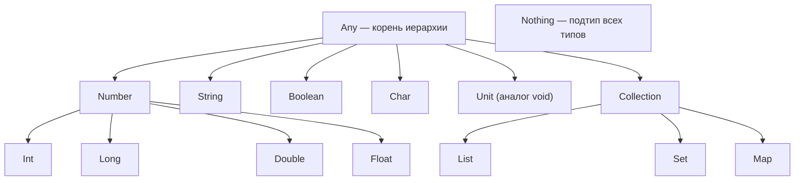
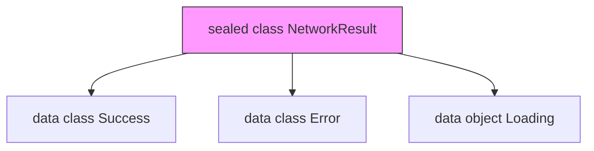
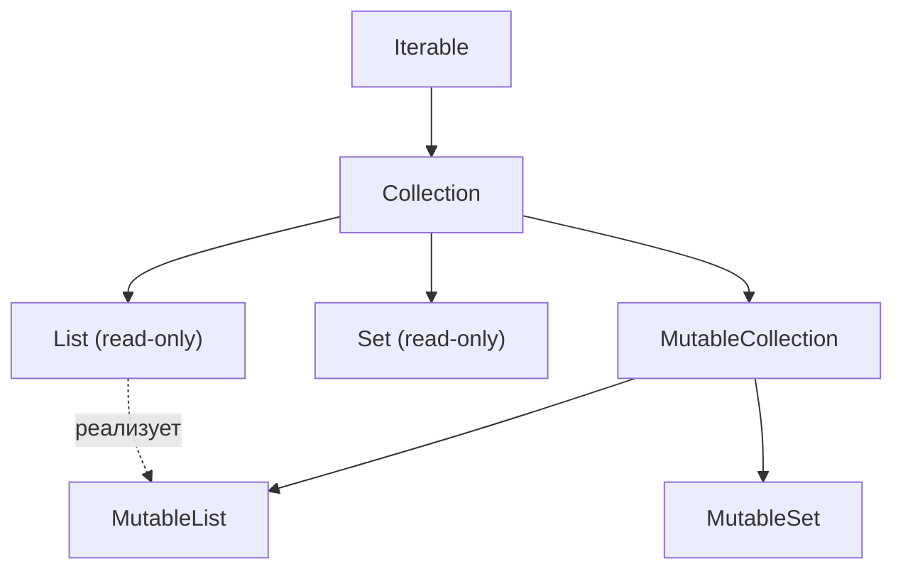
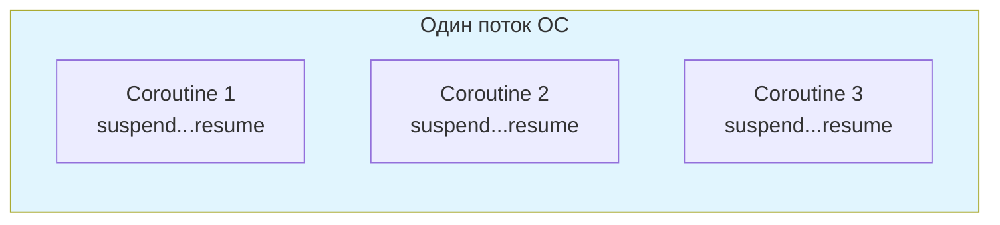

# Вопросы на собеседовании: `Kotlin`

Комплексное руководство по вопросам собеседования на тему `Kotlin` для `Senior Java/Kotlin Developer`. Включает детальные объяснения концепций, практические примеры на `Kotlin/JVM`, best practices и troubleshooting.

Дата последнего обновления: 2026-04-13

## Полезные ссылки

### Официальная документация

- [Kotlin Documentation](https://kotlinlang.org/docs/home.html) — официальная документация
- [Kotlin Language Specification](https://kotlinlang.org/spec/spec.html) — спецификация языка
- [Kotlin Coroutines Guide](https://kotlinlang.org/docs/coroutines-guide.html) — руководство по корутинам

### Baeldung

- [Kotlin Interview Questions — Baeldung](https://www.baeldung.com/kotlin/interview-questions) — подборка вопросов на Baeldung
- [Introduction to the Kotlin Language — Baeldung](https://www.baeldung.com/kotlin/intro) — введение в Kotlin: классы, null-safety, extension functions
- [A Guide to Kotlin's Any, Unit, Nothing — Baeldung](https://www.baeldung.com/kotlin/any-unit-nothing-tutorial) — специальные типы Kotlin
- [Guide to the when{} Block in Kotlin — Baeldung](https://www.baeldung.com/kotlin/when) — when-выражение и его возможности

## Содержание

- [Полезные ссылки](#полезные-ссылки)
- [See also](#see-also)

**Основы Kotlin**
- [Q1. (!) Что такое `Kotlin` и почему он стал популярен?](#q1--что-такое-kotlin-и-почему-он-стал-популярен)
- [Q2. (!) В чём ключевые отличия Kotlin от Java?](#q2--в-чём-ключевые-отличия-kotlin-от-java)
- [Q3. Какова система типов в Kotlin?](#q3-какова-система-типов-в-kotlin)

**Null-safety**
- [Q4. (!) Как реализована null-safety в Kotlin?](#q4--как-реализована-null-safety-в-kotlin)
- [Q5. В чём разница между `?.` и `!!`?](#q5-в-чём-разница-между--и-)
- [Q6. Что такое оператор Элвис `?:` и `let` для работы с null?](#q6-что-такое-оператор-элвис--и-let-для-работы-с-null)

**Функции и лямбды**
- [Q7. (!) Что такое лямбда-выражения и функциональные типы?](#q7--что-такое-лямбда-выражения-и-функциональные-типы)
- [Q8. Что такое функции высшего порядка?](#q8-что-такое-функции-высшего-порядка)
- [Q9. (!) Что такое функции расширения и как они работают?](#q9--что-такое-функции-расширения-и-как-они-работают)
- [Q10. (!) Что такое `inline` функции и зачем они нужны?](#q10--что-такое-inline-функции-и-зачем-они-нужны)
- [Q11. Что такое `infix` функции?](#q11-что-такое-infix-функции)

**Scope-функции**
- [Q12. (!) Что такое scope-функции (`let`, `run`, `with`, `apply`, `also`)?](#q12--что-такое-scope-функции-let-run-with-apply-also)

**Классы и объекты**
- [Q13. (!) Что такое `data class`?](#q13--что-такое-data-class)
- [Q14. (!) Что такое `sealed class` и `sealed interface`?](#q14--что-такое-sealed-class-и-sealed-interface)
- [Q15. (!) В чём разница между `class`, `object` и `companion object`?](#q15--в-чём-разница-между-class-object-и-companion-object)
- [Q16. Какие типы конструкторов есть в Kotlin?](#q16-какие-типы-конструкторов-есть-в-kotlin)
- [Q17. Что такое `enum class` и чем он отличается от `sealed class`?](#q17-что-такое-enum-class-и-чем-он-отличается-от-sealed-class)
- [Q18. Что такое `value class` (inline class)?](#q18-что-такое-value-class-inline-class)

**Свойства и модификаторы**
- [Q19. (!) В чём разница между `var`, `val` и `const val`?](#q19--в-чём-разница-между-var-val-и-const-val)
- [Q20. (!) В чём разница между `lazy` и `lateinit`?](#q20--в-чём-разница-между-lazy-и-lateinit)
- [Q21. Что такое `Visibility Modifiers` в Kotlin?](#q21-что-такое-visibility-modifiers-в-kotlin)
- [Q22. Что такое ключевое слово `open` и почему классы по умолчанию `final`?](#q22-что-такое-ключевое-слово-open-и-почему-классы-по-умолчанию-final)
- [Q23. Как работают пользовательские геттеры и сеттеры?](#q23-как-работают-пользовательские-геттеры-и-сеттеры)

**Generics и вариантность**
- [Q24. (!) Что такое `Generics` и как работает вариантность (`in`, `out`)?](#q24--что-такое-generics-и-как-работает-вариантность-in-out)
- [Q25. Что такое `reified` type parameters?](#q25-что-такое-reified-type-parameters)
- [Q26. Что такое `Type Inference`?](#q26-что-такое-type-inference)

**Делегирование**
- [Q27. (!) Что такое делегирование классов и свойств?](#q27--что-такое-делегирование-классов-и-свойств)

**Операторы и выражения**
- [Q28. Что такое выражение `when` и чем оно лучше `switch`?](#q28-что-такое-выражение-when-и-чем-оно-лучше-switch)
- [Q29. Что такое перегрузка операторов?](#q29-что-такое-перегрузка-операторов)
- [Q30. В чём разница между `==` и `===`?](#q30-в-чём-разница-между--и--1)
- [Q31. Как работает деструктуризация (`destructuring declarations`)?](#q31-как-работает-деструктуризация-destructuring-declarations)

**Коллекции и последовательности**
- [Q32. (!) В чём разница между `List` и `MutableList`?](#q32--в-чём-разница-между-list-и-mutablelist)
- [Q33. В чём разница между `Sequence` и `Iterable`?](#q33-в-чём-разница-между-sequence-и-iterable)
- [Q34. В чём разница между `map` и `flatMap`?](#q34-в-чём-разница-между-map-и-flatmap)

**Корутины (обзор)**
- [Q35. (!) Что такое корутины и чем они отличаются от потоков?](#q35--что-такое-корутины-и-чем-они-отличаются-от-потоков)
- [Q36. Что такое `CoroutineScope`, `Job` и `Dispatcher`?](#q36-что-такое-coroutinescope-job-и-dispatcher)
- [Q37. В чём разница между `launch` и `async`?](#q37-в-чём-разница-между-launch-и-async)

**Интероп с Java**
- [Q38. (!) Какая польза от `@JvmStatic`, `@JvmOverloads` и `@JvmField`?](#q38--какая-польза-от-jvmstatic-jvmoverloads-и-jvmfield)
- [Q39. Что такое плагины `allOpen` и `noArg`?](#q39-что-такое-плагины-allopen-и-noarg)

**Продвинутые темы**
- [Q40. Что такое `Reflection API` в Kotlin?](#q40-что-такое-reflection-api-в-kotlin)
- [Q41. Как работает интерполяция строк (string templates)?](#q41-как-работает-интерполяция-строк-string-templates)
- [Q42. Что такое `contracts` в Kotlin?](#q42-что-такое-contracts-в-kotlin)
- [Q43. (!) Какие best practices при написании идиоматичного Kotlin-кода?](#q43--какие-best-practices-при-написании-идиоматичного-kotlin-кода)
- [Q44. Что такое `typealias` и когда его использовать?](#q44-что-такое-typealias-и-когда-его-использовать)
- [Q45. Что такое `object expression` (анонимный объект) и чем отличается от `object declaration`?](#q45-что-такое-object-expression-анонимный-объект-и-чем-отличается-от-object-declaration)

---

## Q1. (!) Что такое `Kotlin` и почему он стал популярен?

`Kotlin` — статически типизированный язык программирования от `JetBrains`, работающий на `JVM`, `JavaScript` и `Native`. С 2019 года это **preferred language** для Android-разработки по рекомендации Google.

Основные причины популярности:

| Характеристика | Описание |
|---|---|
| **Null-safety** | Система типов предотвращает `NullPointerException` на уровне компиляции |
| **Лаконичность** | На 30-40% меньше boilerplate-кода по сравнению с Java |
| **Интероп с Java** | 100% совместимость — можно вызывать Java из Kotlin и наоборот |
| **Корутины** | Встроенная поддержка асинхронного программирования |
| **Multiplatform** | Один код для JVM, JS, iOS, Desktop |

`Kotlin` компилируется в `JVM`-байткод, полностью совместимый с экосистемой Java: [Spring Boot](../../frameworks/spring/spring-boot-interview.md), `Hibernate`, `Gradle` (Kotlin DSL). Это позволяет постепенно мигрировать Java-проекты на Kotlin.

## Q2. (!) В чём ключевые отличия Kotlin от Java?

| Аспект | `Kotlin` | `Java` |
|---|---|---|
| Null-safety | Встроена в систему типов (`String?`) | Отсутствует (только аннотации `@Nullable`) |
| Data-классы | `data class` автоматически генерирует `equals`, `hashCode`, `toString`, `copy` | Нужен `record` (Java 16+) или Lombok |
| Расширения | Extension functions / properties | Нет аналога |
| Корутины | `suspend fun`, структурированная конкурентность | `CompletableFuture`, Virtual Threads (Java 21+) |
| Smart casts | Автоматическое приведение типа после проверки | Явный cast |
| По умолчанию | Классы `final`, свойства `val` | Классы открыты, поля `mutable` |
| Scope-функции | `let`, `run`, `apply`, `also`, `with` | Нет |
| Singleton | `object` declaration | Ручная реализация |

```kotlin
// Kotlin: 1 строка
data class User(val name: String, val age: Int)

// Java: ~50 строк (без record/lombok)
// equals, hashCode, toString, getters, constructor...
```

Подробнее о совместимости — [интероп Kotlin и Java](kotlin-interop-java-interview.md).

## Q3. Какова система типов в Kotlin?

В `Kotlin` всё является объектом — нет примитивных типов на уровне языка. Компилятор оптимизирует `Int`, `Long`, `Double` и др. в JVM-примитивы где возможно.



Ключевые особенности:

- **`Any`** — корень иерархии (аналог `Object` в Java), но без `wait()`/`notify()`
- **`Unit`** — аналог `void`, но является настоящим типом (singleton)
- **`Nothing`** — подтип всех типов, функция с возвращаемым `Nothing` никогда не завершается нормально (`throw`, бесконечный цикл)
- **Nullable types** — `String?` и `String` — два разных типа; `String?` = `String | null`

```kotlin
fun fail(message: String): Nothing {
    throw IllegalArgumentException(message)
}

val result: String = input ?: fail("input is null") // компилируется!
```

## Q4. (!) Как реализована null-safety в Kotlin?

`Null-safety` — одна из ключевых особенностей `Kotlin`. Система типов разделяет nullable (`T?`) и non-null (`T`) типы на уровне компиляции.

```kotlin
var name: String = "Kotlin"   // не может быть null
var nickname: String? = null  // может быть null

// name = null  // Ошибка компиляции!
```

Основные механизмы работы с `null`:

```kotlin
val user: User? = findUser()

// 1. Safe call — ?. (возвращает null если объект null)
val len: Int? = user?.name?.length

// 2. Elvis operator — ?:  (значение по умолчанию)
val displayName: String = user?.name ?: "Anonymous"

// 3. Smart cast — после проверки компилятор знает, что не null
if (user != null) {
    println(user.name) // user уже User, не User?
}

// 4. Safe cast — as? (null вместо ClassCastException)
val str: String? = value as? String

// 5. Not-null assertion — !! (выбрасывает NPE если null)
val forcedName: String = user!!.name // опасно!

// 6. let — идиоматичный способ работы с nullable
user?.let { println("User: ${it.name}") }
```

**На собеседовании** важно подчеркнуть: `!!` — code smell, его наличие в коде требует обоснования. Предпочтительны `?.`, `?:` и `let`. При работе с Java-кодом типы из Java являются **platform types** (`String!`) — компилятор не знает, nullable они или нет, поэтому ответственность за проверку на null лежит на разработчике.

## Q5. В чём разница между `?.` и `!!`?

**Оператор безопасного вызова `?.`** — если объект `null`, выражение возвращает `null` без исключений:

```kotlin
val name: String? = null
println(name?.length)    // null (без NPE)
println(name?.uppercase()) // null
```

**Not-null assertion `!!`** — выбрасывает `KotlinNullPointerException` если значение `null`:

```kotlin
val name: String? = null
println(name!!.length)   // KotlinNullPointerException!
```

**Правило**: `!!` допустим только когда вы **абсолютно уверены**, что значение не `null`, и готовы получить crash. В production-коде это анти-паттерн. Исключение — тесты и интеграционный код, где crash предпочтительнее тихого `null`.

## Q6. Что такое оператор Элвис `?:` и `let` для работы с null?

**Оператор Элвис `?:`** — возвращает левый операнд, если он не `null`, иначе правый:

```kotlin
val name: String? = null
val displayName = name ?: "Unknown"      // "Unknown"
val length = name?.length ?: 0           // 0
val result = name ?: throw IllegalStateException("name is required")
val fallback = name ?: return            // ранний выход из функции
```

**`let`** — scope-функция для безопасной работы с nullable:

```kotlin
val email: String? = getEmail()

// Блок выполняется только если email не null
email?.let { nonNullEmail ->
    sendVerification(nonNullEmail)
    log("Sent to $nonNullEmail")
}

// Цепочка с let и Elvis
val formatted = input?.let { parse(it) }?.let { validate(it) } ?: default
```

## Q7. (!) Что такое лямбда-выражения и функциональные типы?

Лямбда-выражение — анонимная функция, которую можно передать как значение. В `Kotlin` функции — **граждане первого класса**.

```kotlin
// Функциональный тип: (Int, Int) -> Int
val sum: (Int, Int) -> Int = { a, b -> a + b }

// it — неявное имя единственного параметра
val double: (Int) -> Int = { it * 2 }

// Trailing lambda — лямбда вынесена за скобки
val evens = listOf(1, 2, 3, 4, 5).filter { it % 2 == 0 }

// Ссылка на функцию (function reference)
fun isPositive(n: Int) = n > 0
val positives = listOf(-1, 2, -3, 4).filter(::isPositive)
```

Функциональный тип с `receiver` — основа для DSL (подробнее в [DSL в Kotlin](kotlin-dsl-interview.md)):

```kotlin
// Тип: String.() -> Unit — лямбда с receiver String
fun buildGreeting(block: StringBuilder.() -> Unit): String {
    return StringBuilder().apply(block).toString()
}

val greeting = buildGreeting {
    append("Hello, ")
    append("Kotlin!")
}
```

## Q8. Что такое функции высшего порядка?

Функция высшего порядка — функция, которая принимает другие функции как параметры или возвращает функцию.

```kotlin
// Принимает функцию как параметр
fun calculate(a: Int, b: Int, operation: (Int, Int) -> Int): Int {
    return operation(a, b)
}

val sum = calculate(10, 5) { x, y -> x + y }       // 15
val diff = calculate(10, 5) { x, y -> x - y }      // 5

// Возвращает функцию
fun multiplier(factor: Int): (Int) -> Int = { it * factor }
val triple = multiplier(3)
println(triple(5))  // 15
```

Стандартная библиотека `Kotlin` активно использует HOF: `map`, `filter`, `reduce`, `fold`, `groupBy`, `flatMap` и др. (подробнее в [коллекциях Kotlin](kotlin-collections-interview.md)).

## Q9. (!) Что такое функции расширения и как они работают?

Extension functions позволяют добавлять новые функции к существующим классам **без модификации исходного кода** и **без наследования**.

```kotlin
// Расширение для String
fun String.wordCount(): Int = this.split("\\s+".toRegex()).size

println("Hello Kotlin World".wordCount()) // 3

// Расширение для коллекций
fun <T> List<T>.secondOrNull(): T? = if (size >= 2) this[1] else null

// Extension property
val String.lastChar: Char
    get() = this[length - 1]
```

**Важные нюансы** (часто спрашивают на собеседовании):

1. **Разрешаются статически** — по типу переменной, а не объекта:
```kotlin
open class Shape
class Circle : Shape()

fun Shape.name() = "Shape"
fun Circle.name() = "Circle"

val shape: Shape = Circle()
println(shape.name()) // "Shape" — не "Circle"!
```

2. **Не могут обращаться к `private`/`protected` членам** класса
3. **Компилируются в статические методы** — `fun String.foo()` станет `public static void foo(String $this)`
4. Член класса имеет приоритет над extension с тем же именем

## Q10. (!) Что такое `inline` функции и зачем они нужны?

`inline` указывает компилятору встроить тело функции в место вызова, избегая создания объекта лямбды и дополнительного вызова.

```kotlin
inline fun <T> measureTime(block: () -> T): T {
    val start = System.nanoTime()
    val result = block()
    println("Took ${System.nanoTime() - start} ns")
    return result
}

// При компиляции тело measureTime подставляется inline
val data = measureTime { loadFromDatabase() }
```

**Когда использовать**: функции с лямбда-параметрами (избегаем аллокации `Function` объекта). Стандартные `let`, `run`, `apply`, `also`, `with` — все `inline`.

**`noinline`** — запрещает инлайнинг конкретного лямбда-параметра:

```kotlin
inline fun foo(inlined: () -> Unit, noinline notInlined: () -> Unit) { ... }
```

**`crossinline`** — запрещает нелокальный `return` из лямбды:

```kotlin
inline fun runInThread(crossinline block: () -> Unit) {
    Thread { block() }.start() // block не может сделать return из runInThread
}
```

## Q11. Что такое `infix` функции?

`infix` позволяет вызывать функцию без точки и скобок, если она: (1) является member или extension, (2) имеет ровно один параметр.

```kotlin
infix fun Int.power(exp: Int): Int {
    var result = 1
    repeat(exp) { result *= this }
    return result
}

val result = 2 power 10   // 1024 (вместо 2.power(10))

// Стандартные infix-функции:
val pair = "key" to "value"       // Pair
val check = 5 in 1..10            // contains
val result2 = true and false      // Boolean
```

## Q12. (!) Что такое scope-функции (`let`, `run`, `with`, `apply`, `also`)?

Scope-функции — пять стандартных функций для выполнения блока кода в контексте объекта.

| Функция | Объект как | Возвращает | Типичное использование |
|---------|-----------|-----------|----------------------|
| `let` | `it` | результат лямбды | null-check, преобразование |
| `run` | `this` | результат лямбды | конфигурация + вычисление |
| `with` | `this` | результат лямбды | группировка вызовов (не extension) |
| `apply` | `this` | сам объект | конфигурация объекта (builder) |
| `also` | `it` | сам объект | побочные эффекты (логирование) |

```kotlin
// let — работа с nullable
val name: String? = "Kotlin"
name?.let { println("Length: ${it.length}") }

// apply — конфигурация объекта
val config = HttpClient().apply {
    timeout = 30_000
    retries = 3
    baseUrl = "https://api.example.com"
}

// also — побочный эффект (logging, validation)
val user = createUser()
    .also { log.info("Created user: ${it.id}") }
    .also { require(it.isValid()) }

// run — вычисление с контекстом
val greeting = user.run { "Hello, $name! Age: $age" }

// with — группировка вызовов
with(canvas) {
    drawRect(0, 0, 100, 100)
    drawText("Hello", 50, 50)
    drawLine(0, 0, 100, 100)
}
```

**На собеседовании**: ключевое отличие — `this` vs `it` (определяет читаемость при вложенности) и что возвращается (сам объект vs результат лямбды).

## Q13. (!) Что такое `data class`?

`data class` — класс, предназначенный для хранения данных. Компилятор автоматически генерирует: `equals()`, `hashCode()`, `toString()`, `copy()`, `componentN()`.

```kotlin
data class User(
    val name: String,
    val email: String,
    val age: Int = 0
)

val user1 = User("Alice", "alice@mail.com", 30)
val user2 = user1.copy(name = "Bob")  // копия с изменённым полем

// Деструктуризация
val (name, email, age) = user1

// toString()
println(user1) // User(name=Alice, email=alice@mail.com, age=30)

// equals по значению
println(user1 == User("Alice", "alice@mail.com", 30)) // true
```

**Ограничения и нюансы:**
- Должен иметь хотя бы один параметр в primary constructor
- Параметры конструктора — `val` или `var` (рекомендуется `val` для иммутабельности)
- Не может быть `abstract`, `open`, `sealed` или `inner`
- `equals`/`hashCode` учитывают **только** свойства из primary constructor
- Свойства в `body` класса **не участвуют** в `equals`/`hashCode` — частый источник багов

```kotlin
data class Tricky(val id: Int) {
    var name: String = ""  // НЕ участвует в equals/hashCode!
}
```

## Q14. (!) Что такое `sealed class` и `sealed interface`?

`sealed class` — абстрактный класс с ограниченным набором подклассов, известным на этапе компиляции. Все прямые наследники должны быть в том же пакете (с Kotlin 1.5+, раньше — в том же файле).

```kotlin
sealed class NetworkResult<out T> {
    data class Success<T>(val data: T) : NetworkResult<T>()
    data class Error(val code: Int, val message: String) : NetworkResult<Nothing>()
    data object Loading : NetworkResult<Nothing>()
}

// Исчерпывающий when — компилятор проверяет все варианты
fun handleResult(result: NetworkResult<String>): String = when (result) {
    is NetworkResult.Success -> "Data: ${result.data}"
    is NetworkResult.Error   -> "Error ${result.code}: ${result.message}"
    is NetworkResult.Loading -> "Loading..."
    // else не нужен — все варианты покрыты!
}
```



**Sealed vs Enum:**

| | `sealed class` | `enum class` |
|---|---|---|
| Экземпляры | Каждый подкласс может иметь разное состояние | Фиксированные singleton-экземпляры |
| Иерархия | Разные классы с разными свойствами | Одинаковая структура |
| `when` | Исчерпывающая проверка | Исчерпывающая проверка |

`sealed interface` (Kotlin 1.5+) — то же, но класс может реализовать несколько sealed interfaces.

## Q15. (!) В чём разница между `class`, `object` и `companion object`?

```kotlin
// 1. class — обычный класс, можно создавать экземпляры
class UserService(private val repo: UserRepository)

// 2. object — синглтон (один экземпляр на весь процесс)
object DatabaseConfig {
    val url = "jdbc:postgresql://localhost/db"
    fun connect() { /* ... */ }
}
DatabaseConfig.connect() // доступ через имя объекта

// 3. companion object — «статические» члены класса
class User(val name: String) {
    companion object Factory {
        fun create(name: String) = User(name)
        const val MAX_NAME_LENGTH = 50
    }
}
val user = User.create("Alice")   // вызов через имя класса
```

**Ключевые отличия:**
- `object` — глобальный синглтон, потокобезопасная ленивая инициализация
- `companion object` — привязан к классу, может реализовывать интерфейсы, может использоваться как factory
- В JVM `companion object` компилируется во вложенный класс `Companion`

## Q16. Какие типы конструкторов есть в Kotlin?

```kotlin
// Primary constructor — в заголовке класса
class User(val name: String, val age: Int = 0)

// Secondary constructor — в теле класса, ДОЛЖЕН делегировать к primary
class User(val name: String) {
    var email: String = ""

    constructor(name: String, email: String) : this(name) {
        this.email = email
    }
}

// init-блок — выполняется как часть primary constructor
class User(val name: String) {
    init {
        require(name.isNotBlank()) { "Name must not be blank" }
    }
}
```

**Порядок инициализации:** primary constructor параметры -> свойства и `init`-блоки (сверху вниз) -> secondary constructor body.

## Q17. Что такое `enum class` и чем он отличается от `sealed class`?

```kotlin
enum class HttpStatus(val code: Int, val description: String) {
    OK(200, "Success"),
    NOT_FOUND(404, "Not Found"),
    INTERNAL_ERROR(500, "Internal Server Error");

    fun isSuccess() = code in 200..299
}

// Использование
val status = HttpStatus.OK
println(status.code)         // 200
println(HttpStatus.valueOf("OK")) // HttpStatus.OK
HttpStatus.entries.forEach { println(it) } // итерация
```

Для моделирования **состояний с разным набором данных** используйте `sealed class` (см. Q14), для **фиксированных констант** — `enum class`.

## Q18. Что такое `value class` (inline class)?

`value class` (ранее `inline class`) — обёртка над единственным значением без runtime-оверхеда. Компилятор заменяет обёртку на обёрнутое значение.

```kotlin
@JvmInline
value class Email(val value: String) {
    init { require(value.contains("@")) { "Invalid email" } }
}

@JvmInline
value class UserId(val id: Long)

// Компилятор использует Long напрямую, без создания объекта
fun findUser(id: UserId): User = repository.findById(id.id)
```

**Зачем**: type-safety без аллокаций. `fun send(to: Email, from: Email)` — нельзя перепутать параметры, в отличие от `fun send(to: String, from: String)`.

## Q19. (!) В чём разница между `var`, `val` и `const val`?

| | `var` | `val` | `const val` |
|---|---|---|---|
| Изменяемость | Mutable | Read-only (immutable reference) | Compile-time constant |
| Инициализация | Любой момент | При объявлении или `lazy` | Во время компиляции |
| Тип | Любой | Любой | Примитивы и `String` |
| Где | Везде | Везде | Top-level, `object`, `companion object` |

```kotlin
var counter = 0           // можно менять
counter = 1

val list = mutableListOf(1, 2, 3)  // ссылка неизменна, содержимое — да!
// list = otherList // Ошибка!
list.add(4)               // OK — содержимое мутабельно

const val MAX_SIZE = 100  // подставляется как литерал при компиляции
```

**Важно**: `val` — **не** константа. Это read-only ссылка. Custom getter может возвращать разные значения:

```kotlin
val currentTime: Long
    get() = System.currentTimeMillis()  // каждый раз разное!
```

## Q20. (!) В чём разница между `lazy` и `lateinit`?

| | `lazy` | `lateinit` |
|---|---|---|
| Ключевое слово | `val` | `var` |
| Тип | Любой | Не примитив |
| Потокобезопасность | По умолчанию да (`LazyThreadSafetyMode.SYNCHRONIZED`) | Нет |
| Nullable | Может быть nullable | Не может |
| Проверка инициализации | Всегда инициализирован при доступе | `::prop.isInitialized` |

```kotlin
// lazy — вычисляется при первом доступе
val heavyObject: ExpensiveService by lazy {
    println("Initializing...")
    ExpensiveService()  // вызывается один раз
}

// lateinit — инициализируется позже (DI, setUp в тестах)
class UserServiceTest {
    lateinit var service: UserService

    @BeforeEach
    fun setUp() {
        service = UserService(mockRepo)
    }

    @Test
    fun test() {
        // Если забыли setUp — UninitializedPropertyAccessException
        if (::service.isInitialized) { /* safe */ }
    }
}
```

## Q21. Что такое `Visibility Modifiers` в Kotlin?

| Модификатор | Класс / Top-level | Член класса |
|---|---|---|
| `public` (по умолчанию) | Виден везде | Виден везде |
| `internal` | Виден в модуле | Виден в модуле |
| `protected` | Недоступен для top-level | Виден в подклассах |
| `private` | Виден в файле | Виден в классе |

**Отличие от Java**: в Kotlin нет `package-private` (по умолчанию в Java). Вместо этого — `internal` (видимость модуля), что лучше подходит для мультимодульных проектов. По умолчанию в Kotlin всё `public`.

## Q22. Что такое ключевое слово `open` и почему классы по умолчанию `final`?

В `Kotlin` все классы и методы **`final`** по умолчанию — их нельзя наследовать/переопределять без явного `open`.

```kotlin
open class Animal {
    open fun speak() = "..."      // можно переопределить
    fun breathe() = "breathing"   // нельзя переопределить
}

class Dog : Animal() {
    override fun speak() = "Woof!"
    // override fun breathe() — ошибка компиляции!
}
```

**Почему по умолчанию `final`**: принцип "Design for inheritance or prohibit it" (Effective Java, Item 19). Случайное наследование — частый источник багов. Если класс не спроектирован для расширения, он должен быть `final`.

Плагин `kotlin-allopen` делает классы с определённой аннотацией `open` автоматически — необходимо для `Spring` (AOP-прокси требуют не-final классов).

## Q23. Как работают пользовательские геттеры и сеттеры?

```kotlin
class Temperature {
    var celsius: Double = 0.0
        set(value) {
            require(value >= -273.15) { "Below absolute zero" }
            field = value  // field — backing field
        }

    // Computed property — нет backing field
    val fahrenheit: Double
        get() = celsius * 9 / 5 + 32

    // Private setter — извне только чтение
    var updateCount: Int = 0
        private set

    fun update(value: Double) {
        celsius = value
        updateCount++
    }
}
```

`field` — специальный идентификатор для обращения к backing field внутри get/set. Если свойство не использует `field` (computed property), backing field не создаётся.

## Q24. (!) Что такое `Generics` и как работает вариантность (`in`, `out`)?

`Kotlin` имеет **declaration-site variance** (в отличие от use-site variance в Java с `? extends` / `? super`).

```kotlin
// out = ковариантность (producer) — аналог ? extends в Java
interface Source<out T> {
    fun next(): T          // T только в out-позиции (возвращаемый тип)
}

// in = контравариантность (consumer) — аналог ? super в Java
interface Sink<in T> {
    fun put(item: T)       // T только в in-позиции (параметр)
}

// Invariant — и producer, и consumer
class MutableBox<T>(var value: T)
```

Мнемоника **PECS** (Producer Extends, Consumer Super) или в Kotlin — **`out` = produce, `in` = consume**.

```kotlin
// Star projection — аналог ? в Java
fun printAll(list: List<*>) {
    list.forEach { println(it) }  // it: Any?
}
```

Подробнее о generics — [Generics в Java](../java/java-generics-interview.md).

## Q25. Что такое `reified` type parameters?

`reified` сохраняет информацию о типе в runtime. Доступен только в `inline`-функциях.

```kotlin
// Без reified — нужен Class<T> параметр
fun <T> toJson(obj: T, clazz: Class<T>): String = mapper.writeValueAsString(obj)

// С reified — тип доступен как T
inline fun <reified T> fromJson(json: String): T {
    return mapper.readValue(json, T::class.java)  // T::class доступен!
}

// Проверка типа
inline fun <reified T> isInstance(value: Any): Boolean = value is T

// Использование
val user = fromJson<User>("""{"name":"Alice"}""")
println(isInstance<String>("hello"))  // true
```

Без `reified` выражения `T::class` и `value is T` не компилируются из-за стирания типов.

## Q26. Что такое `Type Inference`?

Компилятор `Kotlin` автоматически определяет типы на основе контекста:

```kotlin
val name = "Kotlin"          // String
val numbers = listOf(1, 2, 3) // List<Int>
val map = mapOf("a" to 1)    // Map<String, Int>

// Тип возвращаемого значения выводится
fun double(x: Int) = x * 2   // : Int (выведен)

// Но для public API рекомендуется указывать явно
fun createService(): UserService = UserServiceImpl()
```

**Когда указывать тип явно**: public API (для читаемости и стабильности), сложные выражения, где тип неочевиден.

## Q27. (!) Что такое делегирование классов и свойств?

`Kotlin` поддерживает паттерн делегирования на уровне языка через ключевое слово `by`.

**Делегирование класса** — реализация интерфейса делегируется другому объекту:

```kotlin
interface Logger {
    fun log(message: String)
}

class ConsoleLogger : Logger {
    override fun log(message: String) = println("[LOG] $message")
}

// UserService реализует Logger, делегируя вызовы в logger
class UserService(private val logger: Logger) : Logger by logger {
    fun createUser(name: String) {
        log("Creating user $name")  // вызывается logger.log()
    }
}
```

**Делегирование свойств** — get/set делегируются объекту-делегату:

```kotlin
// Стандартные делегаты
val lazyValue: String by lazy { computeExpensiveValue() }
var observed: String by Delegates.observable("initial") { _, old, new ->
    println("Changed from $old to $new")
}
var cached: String by Delegates.vetoable("valid") { _, _, new ->
    new.isNotBlank()  // отклоняет пустые значения
}

// Map-делегат — свойства из Map
class Config(map: Map<String, Any>) {
    val host: String by map
    val port: Int by map
}
val config = Config(mapOf("host" to "localhost", "port" to 8080))
```

**Кастомный делегат:**

```kotlin
class Trimmed : ReadWriteProperty<Any?, String> {
    private var value = ""
    override fun getValue(thisRef: Any?, property: KProperty<*>) = value
    override fun setValue(thisRef: Any?, property: KProperty<*>, value: String) {
        this.value = value.trim()
    }
}

class Form {
    var name: String by Trimmed()  // автоматически trim при set
}
```

## Q28. Что такое выражение `when` и чем оно лучше `switch`?

`when` — мощная замена `switch` из Java с поддержкой произвольных условий.

```kotlin
// Как выражение (возвращает значение)
val result = when (status) {
    HttpStatus.OK -> "Success"
    HttpStatus.NOT_FOUND -> "Not found"
    HttpStatus.INTERNAL_ERROR -> "Server error"
}

// Проверка типа (smart cast)
fun describe(obj: Any): String = when (obj) {
    is String  -> "String of length ${obj.length}"  // smart cast!
    is Int     -> "Integer: $obj"
    is List<*> -> "List of size ${obj.size}"
    else       -> "Unknown"
}

// Диапазоны и условия
fun classify(n: Int) = when {
    n < 0      -> "Negative"
    n in 1..10 -> "Small"
    n in 11..100 -> "Medium"
    else       -> "Large"
}

// Sealed class — else не нужен
sealed class Shape
data class Circle(val r: Double) : Shape()
data class Rect(val w: Double, val h: Double) : Shape()

fun area(shape: Shape): Double = when (shape) {
    is Circle -> Math.PI * shape.r * shape.r
    is Rect   -> shape.w * shape.h
    // Компилятор знает все варианты — else не нужен
}
```

**Преимущества перед `switch`**: нет fall-through, поддержка произвольных выражений, smart cast, exhaustive check для sealed/enum.

## Q29. Что такое перегрузка операторов?

```kotlin
data class Vector(val x: Double, val y: Double) {
    operator fun plus(other: Vector) = Vector(x + other.x, y + other.y)
    operator fun minus(other: Vector) = Vector(x - other.x, y - other.y)
    operator fun times(scalar: Double) = Vector(x * scalar, y * scalar)
    operator fun unaryMinus() = Vector(-x, -y)
}

val v1 = Vector(1.0, 2.0)
val v2 = Vector(3.0, 4.0)
println(v1 + v2)       // Vector(4.0, 6.0)
println(v1 * 2.0)      // Vector(2.0, 4.0)
println(-v1)            // Vector(-1.0, -2.0)
```

Стандартные операторы: `plus` (+), `minus` (-), `times` (*), `div` (/), `rem` (%), `rangeTo` (..), `contains` (in), `get`/`set` ([]), `invoke` (()), `compareTo` (<, >, <=, >=).

## Q30. В чём разница между `==` и `===`?

- **`==`** — структурное равенство (вызывает `equals()`): `a == b` -> `a?.equals(b) ?: (b === null)`
- **`===`** — ссылочное равенство (один объект в памяти)

```kotlin
val a = "hello"
val b = "hello"
println(a == b)    // true — содержимое одинаково
println(a === b)   // true — строки интернированы

data class Point(val x: Int, val y: Int)
val p1 = Point(1, 2)
val p2 = Point(1, 2)
println(p1 == p2)  // true — data class генерирует equals по полям
println(p1 === p2) // false — разные объекты в куче
```

## Q31. Как работает деструктуризация (`destructuring declarations`)?

Деструктуризация позволяет «распаковать» объект в набор переменных через функции `componentN()`.

```kotlin
// data class автоматически генерирует componentN()
data class User(val name: String, val age: Int)
val (name, age) = User("Alice", 30)

// В циклах
for ((key, value) in mapOf("a" to 1, "b" to 2)) {
    println("$key -> $value")
}

// В лямбдах
listOf(User("Alice", 30), User("Bob", 25))
    .forEach { (name, age) -> println("$name is $age") }

// Пропуск компонентов
val (_, email) = getUserData()
```

Работает с любым классом, у которого есть `operator fun componentN()` — не только `data class`.

## Q32. (!) В чём разница между `List` и `MutableList`?

`Kotlin` разделяет read-only и mutable коллекции на уровне интерфейсов.



```kotlin
val readOnly: List<String> = listOf("a", "b", "c")
// readOnly.add("d")  // Ошибка компиляции!

val mutable: MutableList<String> = mutableListOf("a", "b", "c")
mutable.add("d")  // OK

// List — не гарантирует иммутабельность! Это просто read-only view
val underlying = mutableListOf(1, 2, 3)
val readOnlyView: List<Int> = underlying
underlying.add(4)
println(readOnlyView) // [1, 2, 3, 4] — сюрприз!

// Для настоящей иммутабельности — копирование:
val immutable = underlying.toList()
```

Подробнее — [Kotlin коллекции](kotlin-collections-interview.md).

## Q33. В чём разница между `Sequence` и `Iterable`?

| | `Iterable` (коллекции) | `Sequence` |
|---|---|---|
| Вычисление | Eager (сразу) | Lazy (по требованию) |
| Промежуточные коллекции | Создаются на каждом шаге | Не создаются |
| Подходит | Маленькие коллекции | Большие коллекции, цепочки операций |

```kotlin
// Iterable — каждый шаг создаёт новый List
val result1 = (1..1_000_000)
    .filter { it % 2 == 0 }     // создаёт List
    .map { it * 2 }              // создаёт ещё один List
    .take(10)                    // создаёт ещё один List

// Sequence — поэлементная обработка, без промежуточных списков
val result2 = (1..1_000_000).asSequence()
    .filter { it % 2 == 0 }     // lazy
    .map { it * 2 }              // lazy
    .take(10)                    // lazy
    .toList()                    // терминальная операция — запускает конвейер
```

**Sequence** в Kotlin аналогичен `Stream` API в Java 8+, но проще в использовании и не требует `parallel()`.

## Q34. В чём разница между `map` и `flatMap`?

```kotlin
val words = listOf("Hello World", "Kotlin is great")

// map: List<T> -> List<R> (1 к 1)
val lengths = words.map { it.length }   // [11, 15]

// flatMap: List<T> -> List<R> (1 ко многим, результат «раскрывается»)
val chars = words.flatMap { it.toList() }
// [H, e, l, l, o, ' ', W, o, r, l, d, K, o, t, l, i, n, ...]

// Пример: получить все теги всех постов
data class Post(val tags: List<String>)
val posts = listOf(Post(listOf("kotlin", "jvm")), Post(listOf("spring", "kotlin")))
val allTags = posts.flatMap { it.tags }  // [kotlin, jvm, spring, kotlin]
val uniqueTags = allTags.toSet()         // [kotlin, jvm, spring]
```

`flatMap` = `map` + `flatten`. Используется когда из каждого элемента получается коллекция, и нужен плоский результат.

## Q35. (!) Что такое корутины и чем они отличаются от потоков?

Корутины — легковесные «потоки» для асинхронного программирования. Подробные вопросы — в [Kotlin Coroutines](kotlin-coroutines-interview.md).



| | Потоки (Threads) | Корутины (Coroutines) |
|---|---|---|
| Стоимость создания | ~1 MB стека | ~несколько сотен байт |
| Количество | Тысячи (ограничено ОС) | Миллионы |
| Блокировка | Блокирует поток ОС | Приостанавливает (suspend) без блокировки |
| Переключение | Context switch ОС (дорого) | Переключение в user-space (дёшево) |
| Отмена | Прерывание (`interrupt`) | Структурированная отмена (`cancel`) |

```kotlin
suspend fun fetchUser(): User {
    // suspend-функция не блокирует поток
    val response = httpClient.get("https://api.example.com/user") // suspend point
    return response.body()
}

// Запуск корутины
val scope = CoroutineScope(Dispatchers.IO)
scope.launch {
    val user = fetchUser()
    withContext(Dispatchers.Main) {
        updateUI(user)
    }
}
```

## Q36. Что такое `CoroutineScope`, `Job` и `Dispatcher`?

| Компонент | Назначение |
|---|---|
| **`CoroutineScope`** | Определяет жизненный цикл корутин. Отмена scope отменяет все дочерние корутины |
| **`Job`** | «Ручка» корутины — можно проверить статус, дождаться завершения, отменить |
| **`Dispatcher`** | Определяет, на каком потоке/пуле выполняется корутина |

Стандартные диспетчеры:

| Dispatcher | Пул потоков | Использование |
|---|---|---|
| `Dispatchers.Default` | Shared pool (кол-во CPU ядер) | CPU-bound задачи |
| `Dispatchers.IO` | Отдельный пул (до 64 потоков) | IO-операции (сеть, диск, БД) |
| `Dispatchers.Main` | UI-поток | Обновление UI (Android) |
| `Dispatchers.Unconfined` | Текущий поток | Тесты, специальные случаи |

Подробнее — [Kotlin Coroutines](kotlin-coroutines-interview.md).

## Q37. В чём разница между `launch` и `async`?

```kotlin
val scope = CoroutineScope(Dispatchers.IO)

// launch — fire-and-forget, возвращает Job
val job: Job = scope.launch {
    doSomething() // результат не нужен
}

// async — возвращает Deferred<T>, результат можно получить через await()
val deferred: Deferred<User> = scope.async {
    fetchUser()
}
val user: User = deferred.await() // suspend до получения результата

// Параллельное выполнение
coroutineScope {
    val user = async { fetchUser() }
    val orders = async { fetchOrders() }
    // Оба запроса выполняются параллельно
    processData(user.await(), orders.await())
}
```

**`launch`** — когда не нужен результат (отправка события, логирование). **`async`** — когда нужен результат и параллельное выполнение.

## Q38. (!) Какая польза от `@JvmStatic`, `@JvmOverloads` и `@JvmField`?

Аннотации для улучшения совместимости Kotlin-кода с Java (подробнее — [интероп Kotlin и Java](kotlin-interop-java-interview.md)).

```kotlin
class Config {
    companion object {
        @JvmStatic  // Генерирует настоящий static метод в Java
        fun default() = Config()

        @JvmField   // Прямой доступ к полю из Java (без getter)
        val VERSION = "1.0"
    }

    // Java может вызывать с 1, 2 или 3 аргументами
    @JvmOverloads
    fun init(host: String = "localhost", port: Int = 8080, ssl: Boolean = false) { }
}
```

| Аннотация | Без неё (в Java) | С ней (в Java) |
|---|---|---|
| `@JvmStatic` | `Config.Companion.default()` | `Config.default()` |
| `@JvmField` | `Config.Companion.getVERSION()` | `Config.VERSION` |
| `@JvmOverloads` | Только полная сигнатура | Перегрузки с default-значениями |

## Q39. Что такое плагины `allOpen` и `noArg`?

**`kotlin-allopen`** — делает классы с указанной аннотацией `open` (не `final`). Необходим для Spring Framework, где AOP-прокси требуют не-final классов.

```groovy
// build.gradle.kts
plugins {
    kotlin("plugin.allopen") version "1.9.0"
    kotlin("plugin.noarg") version "1.9.0"
}

allOpen {
    annotation("org.springframework.stereotype.Service")
    annotation("org.springframework.stereotype.Component")
}
```

**`kotlin-noarg`** — генерирует конструктор без аргументов для классов с указанной аннотацией. Необходим для JPA/Hibernate, которые создают экземпляры через reflection.

```groovy
noArg {
    annotation("jakarta.persistence.Entity")
}
```

`kotlin-spring` и `kotlin-jpa` — предварительно настроенные обёртки над `allOpen` и `noArg` для Spring/JPA.

## Q40. Что такое `Reflection API` в Kotlin?

`Kotlin Reflection` (`kotlin-reflect`) — API для инспекции структуры классов, свойств и функций в runtime.

```kotlin
import kotlin.reflect.full.*

data class User(val name: String, val age: Int)

// KClass — аналог java.lang.Class
val kClass = User::class
println(kClass.simpleName)         // "User"
println(kClass.memberProperties)   // [val User.age, val User.name]

// Ссылки на свойства и функции
val nameProp = User::name
println(nameProp.get(User("Alice", 30)))  // "Alice"

// Доступ к private через Java Reflection
val field = User::class.java.getDeclaredField("name")
field.isAccessible = true
```

**Зачем**: сериализация, DI-фреймворки, тестирование. `kotlin-reflect` — отдельная зависимость (~2.5 MB), в production добавляйте осознанно.

## Q41. Как работает интерполяция строк (string templates)?

```kotlin
val name = "Kotlin"
val version = 2.0

// Простая подстановка
println("Hello, $name!")                    // Hello, Kotlin!

// Выражение в фигурных скобках
println("Name length: ${name.length}")       // Name length: 6
println("Next version: ${version + 0.1}")    // Next version: 2.1

// Многострочные строки (raw strings)
val json = """
    {
        "name": "$name",
        "version": $version
    }
""".trimIndent()

// Экранирование $
println("Price: ${'$'}9.99")  // Price: $9.99
```

Строковые шаблоны компилируются в `StringBuilder.append()` — эффективнее ручной конкатенации.

## Q42. Что такое `contracts` в Kotlin?

`Contracts` (экспериментальная фича) позволяют сообщить компилятору дополнительную информацию о поведении функции, что улучшает smart cast и анализ.

```kotlin
import kotlin.contracts.*

@OptIn(ExperimentalContracts::class)
fun String?.isNotNullOrEmpty(): Boolean {
    contract {
        returns(true) implies (this@isNotNullOrEmpty != null)
    }
    return this != null && this.isNotEmpty()
}

// Благодаря контракту компилятор знает: если вернулось true, то значение не null
val name: String? = getName()
if (name.isNotNullOrEmpty()) {
    println(name.length)  // Smart cast: String? -> String
}
```

Стандартные функции `require`, `check`, `let`, `run` и т.д. уже используют contracts внутри.

## Q43. (!) Какие best practices при написании идиоматичного Kotlin-кода?

1. **`val` по умолчанию** — используйте `var` только когда необходима мутабельность
2. **`data class` для DTO** — вместо boilerplate equals/hashCode/toString
3. **Scope-функции** — `apply` для конфигурации, `let` для null-check, `also` для побочных эффектов
4. **Extension functions** — вместо utility-классов с static-методами
5. **`sealed class`** для ADT — моделирование состояний с исчерпывающим `when`
6. **`Sequence`** для цепочек операций на больших коллекциях
7. **Именованные аргументы** — `createUser(name = "Alice", admin = false)` вместо `createUser("Alice", false)`
8. **Default parameters** — вместо перегрузки методов
9. **`require`/`check`/`error`** — вместо ручного throw для preconditions
10. **Корутины** — вместо callback hell и `CompletableFuture`

```kotlin
// Анти-паттерн
fun process(list: List<String>): List<String> {
    val result = mutableListOf<String>()
    for (item in list) {
        if (item.isNotBlank()) {
            result.add(item.uppercase())
        }
    }
    return result
}

// Идиоматичный Kotlin
fun process(list: List<String>): List<String> =
    list.filter { it.isNotBlank() }
        .map { it.uppercase() }
```

## Q44. Что такое `typealias` и когда его использовать?

`typealias` создаёт псевдоним для существующего типа. Не создаёт новый тип — на уровне JVM оба имени идентичны.

```kotlin
// Упрощение сложных типов
typealias UserMap = Map<String, List<User>>
typealias Predicate<T> = (T) -> Boolean
typealias EventHandler = suspend (Event) -> Unit

// Псевдонимы для функциональных типов
typealias Comparator<T> = (T, T) -> Int

// Применение
fun findUsers(predicate: Predicate<User>): List<User> =
    users.filter(predicate)

val byName: Predicate<User> = { it.name.isNotBlank() }
val result = findUsers(byName)
```

Типичные случаи использования:
- **Длинные generic-типы** — `Map<String, List<Pair<Int, String>>>` → `typealias`
- **Функциональные типы** — именование `(Event) -> Unit` для читаемости
- **Псевдонимы для сторонних типов** — упрощение перехода между библиотеками

**Отличие от `value class`:** `typealias` не даёт type-safety (компилятор принимает оригинальный тип вместо псевдонима). `value class` — это новый тип.

```kotlin
typealias UserId = String
typealias ProductId = String

fun findUser(id: UserId) { /* ... */ }

val productId: ProductId = "prod-1"
findUser(productId)  // Компилируется! — нет type-safety

// Для type-safety нужен value class:
@JvmInline value class UserId(val value: String)
@JvmInline value class ProductId(val value: String)
// findUser(ProductId("x"))  — ошибка компиляции ✅
```

## Q45. Что такое `object expression` (анонимный объект) и чем отличается от `object declaration`?

`object expression` создаёт анонимный объект в runtime — аналог анонимного класса в Java.

```kotlin
// object expression — анонимный объект (создаётся каждый раз заново)
val comparator = object : Comparator<String> {
    override fun compare(a: String, b: String) = a.length - b.length
}

// Можно реализовывать несколько интерфейсов
val handler = object : EventListener, Closeable {
    override fun onEvent(e: Event) { println(e) }
    override fun close() { println("closed") }
}

// Без базового типа — просто анонимная структура данных
val point = object {
    val x = 10
    val y = 20
}
println(point.x)  // 10 (доступно в локальном контексте)
```

**Отличия от `object declaration`:**

| | `object declaration` | `object expression` |
|---|---|---|
| Синтаксис | `object MySingleton { }` | `object : Interface { }` |
| Создание | Singleton — один экземпляр на всё время | Новый объект при каждом вызове |
| Имя | Именованный | Анонимный |
| Инициализация | Lazy (при первом обращении) | Немедленно |
| Применение | Синглтоны, утилиты, factory | Реализация интерфейса на месте |

```kotlin
// object declaration — Singleton
object Registry {
    private val entries = mutableMapOf<String, Any>()
    fun register(key: String, value: Any) { entries[key] = value }
}

// object expression — одноразовая реализация
button.addClickListener(object : ClickListener {
    override fun onClick() { doSomething() }
})

// В Kotlin предпочтительнее SAM-конверсия (если интерфейс один метод):
button.addClickListener { doSomething() }
```

Официальный Kotlin Coding Conventions: [kotlinlang.org/docs/coding-conventions.html](https://kotlinlang.org/docs/coding-conventions.html)

---

## See also

- [Kotlin Coroutines](kotlin-coroutines-interview.md) — подробные вопросы по корутинам и Flow
- [Kotlin коллекции](kotlin-collections-interview.md) — List, Set, Map, Sequence и операции
- [Исключения в Kotlin](kotlin-exceptions-interview.md) — обработка ошибок, Result, sealed hierarchy
- [DSL в Kotlin](kotlin-dsl-interview.md) — domain-specific languages и type-safe builders
- [Интероп Kotlin и Java](kotlin-interop-java-interview.md) — @JvmStatic, platform types, SAM
- [Сериализация в Kotlin](kotlin-serialization-interview.md) — `kotlinx.serialization` и форматы
- [Java Core](../java/java-core-interview.md) — основы Java для сравнения с Kotlin
- [Java Concurrency](../java/java-concurrency-interview.md) — многопоточность JVM, сравнение с корутинами
- [Spring Boot](../../frameworks/spring/spring-boot-interview.md) — Kotlin со Spring Boot и Spring Data
- [Design Patterns](../../design-patterns/design-patterns-interview.md) — паттерны, реализованные на Kotlin

- [[kotlin-collections-interview|Kotlin коллекции]]
- [[kotlin-coroutines-interview|Kotlin Coroutines]]
- [[kotlin-dsl-interview|DSL в Kotlin]]
- [[kotlin-exceptions-interview|исключения в Kotlin]]
- [[kotlin-interop-java-interview|интероп Kotlin и Java]]
- [[kotlin-serialization-interview|сериализация в Kotlin]]
