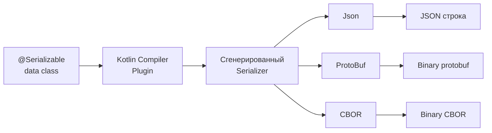
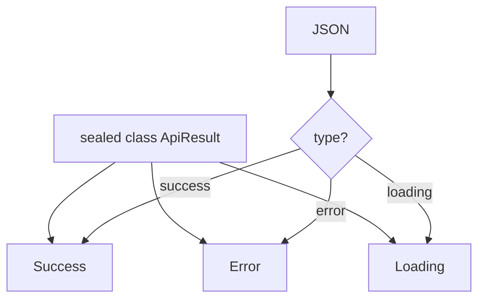
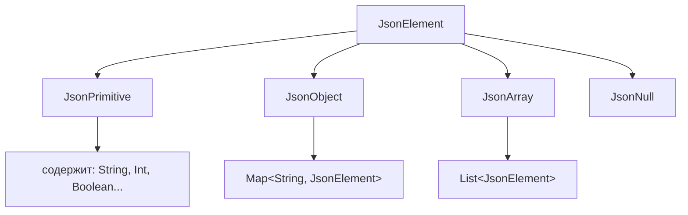
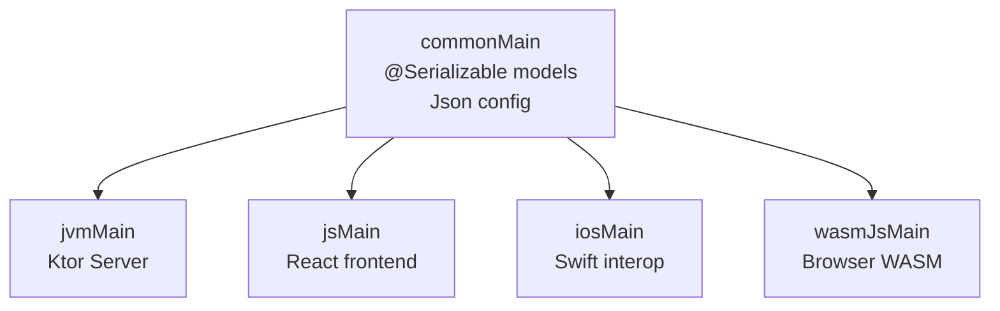
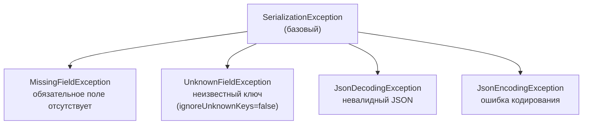

# Вопросы на собеседовании: сериализация в `Kotlin`

Подробный разбор `kotlinx.serialization` — `@Serializable`, настройка `Json`, кастомные сериализаторы (`KSerializer`), полиморфная и контекстная сериализация, `sealed class`, бинарные форматы (`Protobuf`, `CBOR`), интеграция с `Ktor`, мультиплатформенная поддержка, сравнение с `Gson`/`Jackson`/`Moshi`.

## Полезные ссылки

### Официальная документация

- [kotlinx.serialization на GitHub](https://github.com/Kotlin/kotlinx.serialization) — исходный код и документация
- [Kotlin Serialization Guide](https://kotlinlang.org/docs/serialization.html) — официальное руководство
- [JSON serialization guide](https://github.com/Kotlin/kotlinx.serialization/blob/master/docs/json.md) — детали работы с JSON
- [Polymorphism guide](https://github.com/Kotlin/kotlinx.serialization/blob/master/docs/polymorphism.md) — полиморфная сериализация
- [Custom serializers guide](https://github.com/Kotlin/kotlinx.serialization/blob/master/docs/serializers.md) — кастомные сериализаторы

### Baeldung

- [An Introduction to kotlinx-serialization — Baeldung](https://www.baeldung.com/kotlin/kotlinx-serialization-project) — введение в kotlinx.serialization: @Serializable, Json, форматы
- [Class Inheritance with Kotlinx Serialization — Baeldung](https://www.baeldung.com/kotlin/kotlinx-serialization-inheritance) — полиморфная сериализация иерархий
- [Serialize/Deserialize Kotlin Sealed Class — Baeldung](https://www.baeldung.com/kotlin/sealed-class-serialization) — сериализация sealed-классов
- [Jackson Support for Kotlin — Baeldung](https://www.baeldung.com/kotlin/jackson-kotlin) — использование Jackson с Kotlin через jackson-module-kotlin

## Содержание

- [Полезные ссылки](#полезные-ссылки)
- [See also](#see-also)

**Основы и аннотация `@Serializable`**
- [Q1. (!) Что такое kotlinx.serialization и зачем она нужна?](#q1--что-такое-kotlinxserialization-и-зачем-она-нужна)
- [Q2. Как подключить kotlinx.serialization к проекту?](#q2-как-подключить-kotlinxserialization-к-проекту)
- [Q3. (!) Как работает аннотация @Serializable и что генерирует компилятор?](#q3--как-работает-аннотация-serializable-и-что-генерирует-компилятор)
- [Q4. Какие типы поддерживаются из коробки без кастомных сериализаторов?](#q4-какие-типы-поддерживаются-из-коробки-без-кастомных-сериализаторов)

**Настройка `Json`**
- [Q5. (!) Какие параметры конфигурации Json существуют и когда их использовать?](#q5--какие-параметры-конфигурации-json-существуют-и-когда-их-использовать)
- [Q6. Что делает namingStrategy и как настроить автоматический snake_case?](#q6-что-делает-namingstrategy-и-как-настроить-автоматический-snake_case)
- [Q7. Как работают explicitNulls и encodeDefaults и в чём разница?](#q7-как-работают-explicitnulls-и-encodedefaults-и-в-чём-разница)

**Аннотации полей**
- [Q8. Как переименовать поле в JSON с помощью @SerialName?](#q8-как-переименовать-поле-в-json-с-помощью-serialname)
- [Q9. Как исключить поле из сериализации с помощью @Transient?](#q9-как-исключить-поле-из-сериализации-с-помощью-transient)
- [Q10. (!) Что делает @EncodeDefault и чем отличается от encodeDefaults в конфиге?](#q10--что-делает-encodedefault-и-чем-отличается-от-encodedefaults-в-конфиге)
- [Q11. Как использовать @SerialName на уровне класса для полиморфизма и обратной совместимости?](#q11-как-использовать-serialname-на-уровне-класса-для-полиморфизма-и-обратной-совместимости)

**Кастомные сериализаторы (`KSerializer`)**
- [Q12. (!) Когда нужен кастомный сериализатор и как реализовать KSerializer?](#q12--когда-нужен-кастомный-сериализатор-и-как-реализовать-kserializer)
- [Q13. Как сериализовать даты, UUID и другие типы из java.time?](#q13-как-сериализовать-даты-uuid-и-другие-типы-из-javatime)
- [Q14. Как написать делегирующий сериализатор (surrogate)?](#q14-как-написать-делегирующий-сериализатор-surrogate)

**Контекстная сериализация**
- [Q15. (!) Что такое контекстная сериализация (@Contextual) и зачем она нужна?](#q15--что-такое-контекстная-сериализация-contextual-и-зачем-она-нужна)
- [Q16. Как зарегистрировать контекстный сериализатор в SerializersModule?](#q16-как-зарегистрировать-контекстный-сериализатор-в-serializersmodule)

**Полиморфная сериализация и `sealed class`**
- [Q17. (!) Как сериализовать sealed class и в чём преимущество перед open-полиморфизмом?](#q17--как-сериализовать-sealed-class-и-в-чём-преимущество-перед-open-полиморфизмом)
- [Q18. Как настроить open-полиморфную сериализацию через SerializersModule?](#q18-как-настроить-open-полиморфную-сериализацию-через-serializersmodule)
- [Q19. Как изменить имя и ключ дискриминатора (classDiscriminator)?](#q19-как-изменить-имя-и-ключ-дискриминатора-classdiscriminator)
- [Q20. Как обработать неизвестный подтип при десериализации (default polymorphic)?](#q20-как-обработать-неизвестный-подтип-при-десериализации-default-polymorphic)

**`JsonElement` и работа с деревом JSON**
- [Q21. Как работает JsonElement и когда использовать encodeToJsonElement?](#q21-как-работает-jsonelement-и-когда-использовать-encodetojsonelement)
- [Q22. Как построить JsonElement программно с помощью DSL?](#q22-как-построить-jsonelement-программно-с-помощью-dsl)

**Nullable-поля, optional и generic-классы**
- [Q23. Как сериализовать nullable-поля и optional-значения?](#q23-как-сериализовать-nullable-поля-и-optional-значения)
- [Q24. Как сериализовать generic-классы (List, Map, собственные)?](#q24-как-сериализовать-generic-классы-list-map-собственные)

**Бинарные форматы: `Protobuf`, `CBOR`, `Properties`**
- [Q25. (!) Какие форматы поддерживает kotlinx.serialization кроме JSON?](#q25--какие-форматы-поддерживает-kotlinxserialization-кроме-json)
- [Q26. Как использовать Protobuf-формат и задать номера полей (@ProtoNumber)?](#q26-как-использовать-protobuf-формат-и-задать-номера-полей-protonumber)
- [Q27. Как работает CBOR-формат и когда его выбирать?](#q27-как-работает-cbor-формат-и-когда-его-выбирать)

**Интеграция с `Ktor`**
- [Q28. (!) Как kotlinx.serialization интегрируется с Ktor?](#q28--как-kotlinxserialization-интегрируется-с-ktor)

**Мультиплатформенная сериализация**
- [Q29. (!) Как kotlinx.serialization работает в Kotlin Multiplatform проектах?](#q29--как-kotlinxserialization-работает-в-kotlin-multiplatform-проектах)

**Сравнение с другими библиотеками**
- [Q30. (!) В чём разница между kotlinx.serialization и Jackson?](#q30--в-чём-разница-между-kotlinxserialization-и-jackson)
- [Q31. Чем kotlinx.serialization отличается от Gson?](#q31-чем-kotlinxserialization-отличается-от-gson)
- [Q32. Чем kotlinx.serialization отличается от Moshi?](#q32-чем-kotlinxserialization-отличается-от-moshi)
- [Q33. В чём разница между kotlinx.serialization и Java Serialization?](#q33-в-чём-разница-между-kotlinxserialization-и-java-serialization)

**Обработка ошибок и лучшие практики**
- [Q34. Какие исключения выбрасывает kotlinx.serialization и как их обрабатывать?](#q34-какие-исключения-выбрасывает-kotlinxserialization-и-как-их-обрабатывать)
- [Q35. (!) Какие лучшие практики при использовании kotlinx.serialization в продакшене?](#q35--какие-лучшие-практики-при-использовании-kotlinxserialization-в-продакшене)
- [Q36. Что такое `JsonTransformingSerializer` и когда его использовать?](#q36-что-такое-jsontransformingserializer-и-когда-его-использовать)
- [Q37. Как использовать `kotlinx.serialization` с `Spring Boot`?](#q37-как-использовать-kotlinxserialization-с-spring-boot)

**Продвинутые темы**
- [Q38. kotlinx.serialization vs Jackson в Spring Boot — настройка и совместимость](#q38-kotlinxserialization-vs-jackson-в-spring-boot--настройка-и-совместимость)
- [Q39. Как @SerialName используется для миграции схемы?](#q39-как-serialname-используется-для-миграции-схемы)
- [Q40. Полиморфная сериализация — @Polymorphic, sealed classes, discriminator](#q40-полиморфная-сериализация--polymorphic-sealed-classes-discriminator)
- [Q41. Как реализовать кастомный KSerializer<T>?](#q41-как-реализовать-кастомный-kserializert)
- [Q42. Nullable и default значения при десериализации — поведение и подводные камни](#q42-nullable-и-default-значения-при-десериализации--поведение-и-подводные-камни)
- [Q43. CBOR и Protobuf форматы в kotlinx.serialization — когда применять?](#q43-cbor-и-protobuf-форматы-в-kotlinxserialization--когда-применять)

---

## Q1. (!) Что такое kotlinx.serialization и зачем она нужна?

**`kotlinx.serialization`** — официальная библиотека Kotlin для преобразования объектов в текст или байты (`JSON`, `Protobuf`, `CBOR` и др.) и обратно. Ключевая идея: сериализаторы **генерируются на этапе компиляции** плагином компилятора, а не строятся в рантайме через рефлексию, как в `Jackson` и `Gson`.

Именно от этого выбора растут все остальные свойства библиотеки:

- **Типобезопасность** — если класс или поле нельзя сериализовать, это ошибка компиляции, а не падение в проде на первом запросе.
- **Без рефлексии** — нет `Class.forName` и доступа к приватным полям через `setAccessible`. Поэтому код работает там, где Java Reflection недоступна: `Kotlin/Native` (iOS) и `Kotlin/JS` (браузер).
- **Нативное понимание Kotlin** — `data class`, `nullable`-типы, `default`-значения и `sealed class` поддержаны прямо в модели компилятора, а не через сторонний модуль-адаптер.
- **Один класс — много форматов** — тот же `@Serializable` сериализуется в `JSON`, `Protobuf`, `CBOR` без дублирования кода.
- **Мультиплатформенность** — модели объявляются один раз и работают на `JVM`, `JS`, `Native`, `Wasm`.

Коротко: это инструмент, спроектированный «изнутри Kotlin», тогда как `Jackson`/`Gson` — Java-библиотеки, доученные понимать Kotlin.



## Q2. Как подключить kotlinx.serialization к проекту?

Подключение всегда состоит из двух частей, и это любимая ловушка: **плагин компилятора** (генерирует сериализаторы) плюс **runtime-зависимость** нужного формата (содержит сам `Json`/`ProtoBuf` и т.д.). Без плагина аннотация `@Serializable` ничего не сгенерирует; без runtime-артефакта нечем кодировать.

```kotlin
// build.gradle.kts
plugins {
    kotlin("jvm") version "2.1.0"
    kotlin("plugin.serialization") version "2.1.0"  // плагин компилятора
}

dependencies {
    // JSON формат (самый популярный)
    implementation("org.jetbrains.kotlinx:kotlinx-serialization-json:1.8.0")
    
    // Опционально: бинарные форматы
    implementation("org.jetbrains.kotlinx:kotlinx-serialization-protobuf:1.8.0")
    implementation("org.jetbrains.kotlinx:kotlinx-serialization-cbor:1.8.0")
    implementation("org.jetbrains.kotlinx:kotlinx-serialization-properties:1.8.0")
    implementation("org.jetbrains.kotlinx:kotlinx-serialization-hocon:1.8.0") // JVM only
}
```

Два частых промаха:

- **Забыли плагин** — проект соберётся, но в рантайме на первой же сериализации прилетит ошибка «serializer not found». Поэтому проверяйте именно наличие строки `kotlin("plugin.serialization")`, а не только зависимость.
- **Рассинхрон версий** — версия плагина обязана совпадать с версией Kotlin (генератор кода — часть компилятора). Версия runtime-артефакта (`1.8.0`) — отдельная и может отличаться.

## Q3. (!) Как работает аннотация @Serializable и что генерирует компилятор?

`@Serializable` — это команда плагину компилятора: «сгенерируй для этого класса `KSerializer<T>`». Компилятор создаёт (или дополняет уже существующий) companion-объект с методом `serializer()`, который и возвращает этот сериализатор.

```kotlin
@Serializable
data class User(val id: Int, val name: String, val email: String? = null)

// Компилятор генерирует (упрощённо):
// User.Companion.serializer() : KSerializer<User>
```

Сгенерированный сериализатор состоит из двух частей: `SerialDescriptor` (статическое описание полей — имена, типы, аннотации) и методов `serialize`/`deserialize` (логика чтения и записи). Поскольку всё это известно уже при компиляции, получаем:

- **Проверку типов на этапе компиляции** — поле несериализуемого типа не даст собрать проект.
- **Работу без рефлексии** — никаких `Class.forName` и `Field.setAccessible`, поэтому код переносим на Native/JS.
- **Скорость** — прямые вызовы методов вместо обхода полей через reflection API.

**Где применима.** `@Serializable` вешается на `data class`, обычный `class`, `object`, `enum class`, `sealed class`. Все поля основного конструктора должны быть сериализуемыми: примитивы, `String`, другие `@Serializable`-классы или коллекции таких типов.

## Q4. Какие типы поддерживаются из коробки без кастомных сериализаторов?

Из коробки поддержаны типы, у которых сериализатор либо встроен в библиотеку, либо генерируется компилятором. Это все «общекотлиновские» типы, доступные на любой платформе:

| Категория | Типы |
|-----------|------|
| Примитивы | `Int`, `Long`, `Double`, `Float`, `Boolean`, `Byte`, `Short`, `Char` |
| Строки | `String` |
| Коллекции | `List<T>`, `Set<T>`, `Map<K, V>` (ключ — строковый или примитивный) |
| Массивы | `ByteArray`, `IntArray` и другие примитивные массивы |
| Nullable | `T?` для любого сериализуемого `T` |
| Enum | `enum class` с `@Serializable` |
| Пары | `Pair<A, B>`, `Triple<A, B, C>` |
| Специальные | `Unit`, `Duration` (с Kotlin 1.7.20+) |

**Чего нет из коробки** (и почему): JVM-специфичные типы `java.time.*` (`LocalDate`, `Instant`), `java.util.UUID`, `java.util.Date`, `BigDecimal`, `BigInteger`, а также `Any` и `Nothing`. Причина та же мультиплатформенность: библиотека не может опираться на классы, которых нет на Native/JS. Для них пишут `KSerializer` или подключают контекстную сериализацию (см. [Q12](#q12), [Q15](#q15)). Для дат есть и третий путь — мультиплатформенная библиотека `kotlinx-datetime`: её `Instant`, `LocalDate`, `LocalDateTime` поставляются с готовыми сериализаторами и работают в `@Serializable`-моделях без ручного кода.

## Q5. (!) Какие параметры конфигурации Json существуют и когда их использовать?

Экземпляр `Json` настраивается через builder-блок и затем переиспользуется (создавать его на каждый запрос — антипаттерн, см. [Q35](#q35)). Параметры удобно держать в голове по группам — что они меняют в поведении:

```kotlin
val json = Json {
    // Форматирование
    prettyPrint = true              // отступы и переносы строк
    prettyPrintIndent = "  "        // символ отступа (по умолчанию 4 пробела)
    
    // Обработка неизвестных полей
    ignoreUnknownKeys = true        // не бросать исключение на лишние ключи
    
    // Default-значения
    encodeDefaults = false          // не кодировать поля со значениями по умолчанию
    explicitNulls = true            // кодировать null-поля явно
    
    // Толерантность
    coerceInputValues = true        // невалидные значения → default (для enum, nullable)
    isLenient = true                // разрешить нестрогий JSON (без кавычек на ключах и т.д.)
    
    // Полиморфизм
    classDiscriminator = "type"     // имя поля-дискриминатора (по умолчанию "type")
    
    // Именование
    namingStrategy = JsonNamingStrategy.SnakeCase  // auto snake_case
    
    // Спецзначения
    allowSpecialFloatingPointValues = true  // NaN, Infinity
    allowStructuredMapKeys = true           // не-строковые ключи Map
    
    // Enum
    decodeEnumsCaseInsensitive = true       // "success" == "SUCCESS"
    
    // Модуль сериализаторов
    serializersModule = myModule
}
```

**Четыре параметра, которые спрашивают чаще всего**, и зачем каждый:

- `ignoreUnknownKeys` — пережить добавление поля на стороне API без падения клиента (обратная совместимость).
- `encodeDefaults` — управлять размером payload: не гонять по сети поля, равные значениям по умолчанию.
- `coerceInputValues` — устойчивость к мусору во входных данных: невалидный enum или `null` в non-null поле заменяется на default вместо исключения.
- `classDiscriminator` — имя поля-метки типа при полиморфной сериализации (см. [Q19](#q19)).

## Q6. Что делает namingStrategy и как настроить автоматический snake_case?

`namingStrategy` решает одну боль: API отдаёт `snake_case`, а в Kotlin принято `camelCase`. Без неё пришлось бы вешать `@SerialName` на каждое поле. `JsonNamingStrategy` (появилась в 1.6.0, стабильна с 1.7.0) переименовывает все поля по правилу автоматически.

```kotlin
val json = Json {
    namingStrategy = JsonNamingStrategy.SnakeCase
}

@Serializable
data class UserProfile(
    val firstName: String,      // → "first_name"
    val lastName: String,       // → "last_name"
    val emailAddress: String    // → "email_address"
)

println(json.encodeToString(UserProfile("Alice", "Smith", "alice@example.com")))
// {"first_name":"Alice","last_name":"Smith","email_address":"alice@example.com"}
```

**Приоритет.** Явный `@SerialName` на поле всегда перебивает `namingStrategy` — это нужная лазейка для одного-двух полей-исключений из общего правила.

Стратегию можно написать свою — например, для `kebab-case`:

```kotlin
val kebabCase = JsonNamingStrategy { _, _, serialName ->
    serialName.replace(Regex("[A-Z]")) { "-${it.value.lowercase()}" }
}
```

## Q7. Как работают explicitNulls и encodeDefaults и в чём разница?

Оба параметра решают, попадёт ли поле в выходной JSON, но смотрят на разные признаки: `encodeDefaults` — на «совпадает ли значение с default из конструктора», `explicitNulls` — на «равно ли значение `null`». Их легко перепутать, поэтому держите в голове таблицу:

| Параметр | Что контролирует | По умолчанию |
|----------|-----------------|--------------|
| `encodeDefaults` | Поля, значение которых равно default из конструктора | `false` — не кодировать |
| `explicitNulls` | Поля с значением `null` | `true` — кодировать `null` явно |

```kotlin
@Serializable
data class Config(
    val name: String,
    val debug: Boolean = false,
    val tag: String? = null
)

val obj = Config("app")

// encodeDefaults=false, explicitNulls=true (по умолчанию)
// → {"name":"app"}  (debug=false и tag=null опущены, т.к. совпадают с default)

// encodeDefaults=true, explicitNulls=true
// → {"name":"app","debug":false,"tag":null}

// encodeDefaults=false, explicitNulls=false
// → {"name":"app"}  (null-поля не кодируются, даже если нет default)
```

**Сценарий применения** `explicitNulls = false` — PATCH-семантика, где отсутствие поля и `null` означают разное: отсутствие — «не трогай это поле», `null` — «обнули его». Выключив явные `null`, вы оставляете в JSON только реально заданные значения.

## Q8. Как переименовать поле в JSON с помощью @SerialName?

`@SerialName("имя")` развязывает имя свойства в Kotlin и имя ключа в JSON: на поле — задаёт ключ, на enum-константе — её строковое представление.

```kotlin
@Serializable
data class ApiResponse(
    @SerialName("status_code") val statusCode: Int,
    @SerialName("error_message") val errorMessage: String? = null,
    @SerialName("data") val payload: List<String> = emptyList()
)
// JSON: {"status_code":200,"data":["item1"]}
```

Для `enum` — `@SerialName` на каждой константе задаёт представление в JSON:

```kotlin
@Serializable
enum class Status {
    @SerialName("active") ACTIVE,
    @SerialName("inactive") INACTIVE,
    @SerialName("pending_review") PENDING_REVIEW
}
// Сериализуется как "active", "inactive", "pending_review"
```

**Главная ценность** — обратная совместимость. `@SerialName` перебивает `JsonNamingStrategy`, поэтому при рефакторинге свойства в коде можно сохранить старый JSON-ключ и не сломать ни клиентов, ни уже сохранённые данные. А если при миграции схемы нужно читать и старый, и новый ключ одновременно, поле дополняют JSON-специфичной аннотацией `@JsonNames("old_key")`: альтернативные имена принимаются при десериализации, запись же всегда идёт в основное имя (см. [Q39](#q39)).

## Q9. Как исключить поле из сериализации с помощью @Transient?

`@Transient` (из пакета `kotlinx.serialization`) полностью убирает поле из сериализации и десериализации — оно перестаёт существовать для библиотеки. Поэтому поле **обязано иметь значение по умолчанию**: при десериализации его неоткуда взять, и компилятор требует fallback.

```kotlin
@Serializable
data class Session(
    val id: String,
    val userId: String,
    @Transient val cachedUser: User? = null,   // не попадёт в JSON
    @Transient val createdAt: Long = System.currentTimeMillis()
)
```

**Подводный камень.** Не путайте с `java.beans.Transient` и `kotlin.jvm.Transient` — это другие аннотации из других пакетов; на `kotlinx.serialization` влияет только её собственная `@Transient`. Лишний неверный импорт — и поле всё равно окажется в JSON.

**Граничный случай.** `@Transient` действует в обе стороны сразу. Если нужно поле, которое только читается из JSON, но не пишется (или наоборот), `@Transient` не подойдёт — потребуется кастомный сериализатор.

## Q10. (!) Что делает @EncodeDefault и чем отличается от encodeDefaults в конфиге?

`encodeDefaults` в конфиге `Json` — это решение «по умолчанию для всех полей». `@EncodeDefault` — точечное исключение: аннотация на конкретном свойстве, которая переопределяет глобальную настройку именно для него.

```kotlin
@Serializable
data class Project(
    val name: String,
    @EncodeDefault val version: String = "1.0.0",  // всегда кодируется
    val debug: Boolean = false                       // следует глобальной настройке
)

val json = Json { encodeDefaults = false }
println(json.encodeToString(Project("myapp")))
// {"name":"myapp","version":"1.0.0"}
// debug=false опущен (encodeDefaults=false), но version закодирован (@EncodeDefault)
```

Два режима — это две противоположные «силы»:

| Режим | Поведение |
|-------|-----------|
| `@EncodeDefault(EncodeDefault.Mode.ALWAYS)` | Поле **всегда** кодируется, даже при `encodeDefaults = false` |
| `@EncodeDefault(EncodeDefault.Mode.NEVER)` | Поле **никогда** не кодируется (если значение == default), даже при `encodeDefaults = true` |

**Сценарий применения.** В одном классе уживаются поля двух сортов: обязательные для контракта (версия схемы, тип события) и необязательные. Глобально ставят `encodeDefaults = false` ради экономии трафика, а контрактные поля помечают `@EncodeDefault(ALWAYS)` — чтобы они присутствовали в JSON всегда, даже когда равны значению по умолчанию.

## Q11. Как использовать @SerialName на уровне класса для полиморфизма и обратной совместимости?

На поле `@SerialName` задаёт имя ключа, а на уровне класса — значение дискриминатора (метки типа) при полиморфной сериализации. Это та строка, по которой при десериализации выбирается конкретный подтип.

```kotlin
@Serializable
sealed class Event {
    @Serializable
    @SerialName("user.created")
    data class UserCreated(val userId: String) : Event()

    @Serializable
    @SerialName("order.placed")
    data class OrderPlaced(val orderId: String, val amount: Double) : Event()
}

val json = Json { classDiscriminator = "event_type" }
val event: Event = Event.UserCreated("u123")
println(json.encodeToString(event))
// {"event_type":"user.created","userId":"u123"}
```

**Почему это важно.** Без `@SerialName` дискриминатором становится полное имя класса (`com.example.Event.UserCreated`) — оно течёт во внешний контракт, ломается при любом переименовании или переезде пакета и выдаёт внутреннюю структуру кода наружу. Явная короткая метка (`"user.created"`) от этого защищает.

**Обратная совместимость.** При переименовании класса оставляем на нём старую метку `@SerialName("old_name")` — и ранее сохранённый JSON продолжает десериализоваться, хотя класс в коде уже называется иначе.

## Q12. (!) Когда нужен кастомный сериализатор и как реализовать KSerializer?

`KSerializer<T>` — это ручное описание, как тип превращается в данные и обратно. Берутся за него в трёх ситуациях:

- Тип не помечен `@Serializable` и не поддержан из коробки — например, `LocalDate`, `UUID`, `BigDecimal`.
- Нужно нестандартное представление: дата как `timestamp`-число, enum как число, value-обёртка как голый примитив.
- Нужна валидация при десериализации (проверить диапазон, формат) до создания объекта.

**Из чего состоит.** Интерфейс требует три члена: `descriptor` (как выглядит тип в выходе), `serialize` (объект → данные), `deserialize` (данные → объект).

```kotlin
object InstantAsLongSerializer : KSerializer<Instant> {
    override val descriptor: SerialDescriptor =
        PrimitiveSerialDescriptor("Instant", PrimitiveKind.LONG)

    override fun serialize(encoder: Encoder, value: Instant) {
        encoder.encodeLong(value.toEpochMilli())
    }

    override fun deserialize(decoder: Decoder): Instant {
        return Instant.ofEpochMilli(decoder.decodeLong())
    }
}
```

Подключение к полю:

```kotlin
@Serializable
data class Audit(
    val action: String,
    @Serializable(with = InstantAsLongSerializer::class)
    val timestamp: Instant
)
```

**Два способа подключения.** К одному полю — через `@Serializable(with = ...)` (как выше). Ко всем полям типа `Instant` в файле сразу — через файловую аннотацию `@file:UseSerializers(InstantAsLongSerializer::class)`, чтобы не повторять `with =` на каждом поле.

## Q13. Как сериализовать даты, UUID и другие типы из java.time?

Коротко: пишете свой `KSerializer` (обычно через строку ISO-8601). `java.time` (`LocalDate`, `LocalDateTime`, `Instant`, `ZonedDateTime`) и `UUID` не поддержаны из коробки именно потому, что это JVM-only классы, а библиотека мультиплатформенная и не может на них опираться.

```kotlin
// Простой сериализатор для LocalDate (ISO-8601)
object LocalDateSerializer : KSerializer<LocalDate> {
    override val descriptor = PrimitiveSerialDescriptor("LocalDate", PrimitiveKind.STRING)
    override fun serialize(encoder: Encoder, value: LocalDate) = encoder.encodeString(value.toString())
    override fun deserialize(decoder: Decoder): LocalDate = LocalDate.parse(decoder.decodeString())
}

// Сериализатор для UUID
object UUIDSerializer : KSerializer<UUID> {
    override val descriptor = PrimitiveSerialDescriptor("UUID", PrimitiveKind.STRING)
    override fun serialize(encoder: Encoder, value: UUID) = encoder.encodeString(value.toString())
    override fun deserialize(decoder: Decoder): UUID = UUID.fromString(decoder.decodeString())
}

// Применение через @file:UseSerializers
@file:UseSerializers(LocalDateSerializer::class, UUIDSerializer::class)

@Serializable
data class Order(
    val id: UUID,
    val createdAt: LocalDate,
    val total: Double
)
```

**Альтернатива** — контекстная сериализация (`@Contextual`): сериализатор регистрируется один раз в `SerializersModule` и не привязан к файлу. Это удобнее, когда тип даты встречается во многих файлах или его формат должен зависеть от настроек приложения (см. [Q15](#q15)).

**Альтернатива без ручных сериализаторов** — `kotlinx-datetime`. Мультиплатформенные `kotlinx.datetime.Instant`/`LocalDate`/`LocalDateTime` из этой библиотеки идут с готовыми сериализаторами (ISO-8601 по умолчанию), их можно использовать в `@Serializable`-моделях напрямую. В новых KMP-проектах часто выгоднее заменить `java.time` на `kotlinx-datetime`, чем поддерживать собственный набор `KSerializer`.

## Q14. Как написать делегирующий сериализатор (surrogate)?

Делегирующий сериализатор (**surrogate**) экономит ручной труд: вместо того чтобы вручную описывать `descriptor` и поэлементно кодировать структуру, вы заводите промежуточный `@Serializable`-класс-двойник и сериализуете через него. Всё описание структуры библиотека сгенерирует для двойника сама. Это идеальный приём для сложных типов из чужих библиотек, которые нельзя пометить `@Serializable`:

```kotlin
// Тип, который нельзя пометить @Serializable (из внешней библиотеки)
class Color(val red: Int, val green: Int, val blue: Int)

// Surrogate-класс
@Serializable
@SerialName("Color")
private data class ColorSurrogate(val r: Int, val g: Int, val b: Int)

object ColorSerializer : KSerializer<Color> {
    override val descriptor = ColorSurrogate.serializer().descriptor

    override fun serialize(encoder: Encoder, value: Color) {
        encoder.encodeSerializableValue(
            ColorSurrogate.serializer(),
            ColorSurrogate(value.red, value.green, value.blue)
        )
    }

    override fun deserialize(decoder: Decoder): Color {
        val surrogate = decoder.decodeSerializableValue(ColorSurrogate.serializer())
        return Color(surrogate.r, surrogate.g, surrogate.b)
    }
}
```

**Плюс подхода.** Не нужно вручную писать `beginStructure`/`endStructure` и собирать `descriptor` по полям — вся структура наследуется от `@Serializable` surrogate-класса. Остаётся лишь два простых маппинга: оригинал → двойник и обратно.

## Q15. (!) Что такое контекстная сериализация (@Contextual) и зачем она нужна?

**Контекстная сериализация** разрывает жёсткую связку «поле → конкретный сериализатор». Поле помечают `@Contextual` («сериализатор для меня определится позже»), а сам сериализатор регистрируют в `SerializersModule` при сборке `Json`. То есть выбор откладывается с этапа компиляции на момент создания формата.

```kotlin
@Serializable
data class Event(
    val name: String,
    @Contextual val timestamp: Instant,   // сериализатор определится в рантайме
    @Contextual val id: UUID
)
```

Зачем это нужно:

- **Разные форматы для разных контекстов** — в одном модуле дата как ISO-строка, в другом как timestamp
- **Библиотечные типы** — класс в shared-модуле не знает, какой формат даты выберет приложение
- **Тестирование** — в тестах можно подставить mock-сериализатор

Без `@Contextual` или явного `@Serializable(with = ...)` поле типа `Instant` вызовет ошибку компиляции, т.к. компилятор не найдёт сериализатор.

## Q16. Как зарегистрировать контекстный сериализатор в SerializersModule?

`SerializersModule` — реестр сериализаторов, который вы собираете один раз и передаёте в конфиг формата. В нём уживаются два вида записей: `contextual(...)` для `@Contextual`-полей и `polymorphic(...)` для открытых иерархий.

```kotlin
val module = SerializersModule {
    // Контекстные сериализаторы
    contextual(Instant::class, InstantAsLongSerializer)
    contextual(UUID::class, UUIDSerializer)
    contextual(LocalDate::class, LocalDateSerializer)
    
    // Полиморфные сериализаторы (тоже тут)
    polymorphic(Event::class) {
        subclass(UserEvent::class)
        subclass(SystemEvent::class)
    }
}

val json = Json {
    serializersModule = module
    ignoreUnknownKeys = true
}

// Теперь все @Contextual поля типа Instant, UUID, LocalDate — сериализуются
val event = Event("login", Instant.now(), UUID.randomUUID())
val str = json.encodeToString(event)
```

**Композиция.** Модули складываются оператором `plus`:

```kotlin
val combinedModule = dateModule + uuidModule + polymorphicModule
```

Это и есть ключевой приём для многомодульных приложений: каждый Gradle-модуль отдаёт свой `SerializersModule` с тем, что знает только он, а в точке сборки приложения они объединяются в один.

## Q17. (!) Как сериализовать sealed class и в чём преимущество перед open-полиморфизмом?

Главное свойство `sealed class` — все подтипы известны компилятору в момент сборки. Поэтому `kotlinx.serialization` регистрирует их сама, и ручной `SerializersModule` не нужен: достаточно пометить `@Serializable` базовый класс и каждый подтип.

```kotlin
@Serializable
sealed class ApiResult {
    @Serializable
    @SerialName("success")
    data class Success(val data: String) : ApiResult()

    @Serializable
    @SerialName("error")
    data class Error(val code: Int, val message: String) : ApiResult()
    
    @Serializable
    @SerialName("loading")
    data object Loading : ApiResult()
}

val json = Json { prettyPrint = true }
val result: ApiResult = ApiResult.Success("OK")
println(json.encodeToString(result))
// {"type":"success","data":"OK"}
```



**Преимущества sealed class перед open-полиморфизмом:**

| Sealed class | Open-полиморфизм |
|-------------|-----------------|
| Не нужен `SerializersModule` — подтипы известны компилятору | Нужна ручная регистрация в `SerializersModule` |
| Exhaustive `when` — компилятор проверяет все ветки | Нужна ветка `else` |
| Безопаснее — нельзя добавить подтип из другого модуля | Расширяемо — подтипы из разных модулей |

## Q18. Как настроить open-полиморфную сериализацию через SerializersModule?

Если база — `abstract class` или `interface` (открытая иерархия, не `sealed`), компилятор не знает всех подтипов: их могут добавлять другие модули в рантайме. Поэтому каждый подтип регистрируют вручную в `SerializersModule` через `polymorphic { subclass(...) }`:

```kotlin
@Serializable
abstract class Message {
    abstract val text: String
}

@Serializable
@SerialName("text_message")
data class TextMessage(override val text: String) : Message()

@Serializable
@SerialName("image_message")
data class ImageMessage(override val text: String, val imageUrl: String) : Message()

val module = SerializersModule {
    polymorphic(Message::class) {
        subclass(TextMessage::class)
        subclass(ImageMessage::class)
    }
}

val json = Json { serializersModule = module }
val msg: Message = ImageMessage("Look!", "https://img.example.com/1.png")
println(json.encodeToString(msg))
// {"type":"image_message","text":"Look!","imageUrl":"https://img.example.com/1.png"}
```

Если подтипы добавляются из разных Gradle-модулей, каждый модуль предоставляет свой `SerializersModule`, а в точке сборки они объединяются:

```kotlin
val appModule = coreModule + featureAModule + featureBModule
```

## Q19. Как изменить имя и ключ дискриминатора (classDiscriminator)?

Дискриминатор — это поле в JSON, по которому при десериализации понимается, какой именно подтип перед нами. По умолчанию его имя — `"type"`. Поменять можно на двух уровнях.

**Глобально** в конфиге `Json` — для всех иерархий сразу:

```kotlin
val json = Json {
    classDiscriminator = "#class"   // вместо "type"
}

// Результат: {"#class":"success","data":"OK"}
```

**Локально** для одной иерархии — через `@JsonClassDiscriminator` (доступна с 1.5.0). Удобно, когда разные семейства событий должны иметь разные имена метки:

```kotlin
@Serializable
@JsonClassDiscriminator("event_kind")
sealed class DomainEvent {
    @Serializable @SerialName("order")
    data class OrderEvent(val orderId: String) : DomainEvent()
}
// → {"event_kind":"order","orderId":"123"}
```

**Подводный камень.** Имя дискриминатора не должно совпадать с именем реального поля ни в одном подтипе — иначе одно и то же место в JSON будет претендовать и на метку типа, и на данные, что даёт `SerializationException`.

## Q20. Как обработать неизвестный подтип при десериализации (default polymorphic)?

По умолчанию неизвестное значение дискриминатора — это `SerializationException`: библиотека не знает, во что десериализовать. Для устойчивости (API завёл новый тип события, а клиент ещё не обновлён) регистрируют **default-сериализатор** — fallback на «неизвестный» подтип:

```kotlin
val module = SerializersModule {
    polymorphic(Event::class) {
        subclass(KnownEvent::class)
        // Для неизвестных типов — fallback
        defaultDeserializer { UnknownEvent.serializer() }
    }
}

@Serializable
data class UnknownEvent(val type: String = "unknown") : Event()
```

**Альтернатива без дискриминатора** — `JsonContentPolymorphicSerializer`. Он выбирает подтип не по полю-метке, а по самому содержимому JSON (по набору присутствующих ключей):

```kotlin
object EventSerializer : JsonContentPolymorphicSerializer<Event>(Event::class) {
    override fun selectDeserializer(element: JsonElement): DeserializationStrategy<Event> {
        return when {
            "orderId" in element.jsonObject -> OrderEvent.serializer()
            "userId" in element.jsonObject -> UserEvent.serializer()
            else -> UnknownEvent.serializer()
        }
    }
}
```

Это полезно для API, которые не используют дискриминатор, а тип определяется по набору полей.

## Q21. Как работает JsonElement и когда использовать encodeToJsonElement?

`JsonElement` — это JSON, разобранный в дерево объектов (аналог DOM для HTML), которым можно манипулировать в коде, не зная заранее его структуру и без `data class`. `encodeToJsonElement` даёт объект → дерево, а `parseToJsonElement` — строку → дерево. Иерархия узлов:



```kotlin
// Парсинг строки в дерево
val element = Json.parseToJsonElement("""{"user":{"name":"Alice","age":30}}""")
val name = element.jsonObject["user"]!!.jsonObject["name"]!!.jsonPrimitive.content
// "Alice"

// Объект → дерево → модификация → строка
val tree = Json.encodeToJsonElement(user)
val modified = JsonObject(tree.jsonObject + ("_version" to JsonPrimitive(2)))
val result = Json.encodeToString(JsonElement.serializer(), modified)
```

**Когда использовать:**

- Нужно добавить/удалить поля перед отправкой
- Нужно объединить несколько JSON-объектов
- API возвращает динамическую структуру, не описываемую одним типом
- Частичная десериализация: извлечь поддерево, затем десериализовать его в тип

## Q22. Как построить JsonElement программно с помощью DSL?

Чтобы собрать `JsonElement` руками, не клея строки и не плодя `data class`, есть DSL-билдеры `buildJsonObject` и `buildJsonArray`. Это типобезопасно и читаемо: структура видна прямо в коде.

```kotlin
val element = buildJsonObject {
    put("name", "Alice")
    put("age", 30)
    put("active", true)
    putJsonArray("roles") {
        add("admin")
        add("editor")
    }
    putJsonObject("address") {
        put("city", "Moscow")
        put("zip", "101000")
    }
}
println(Json { prettyPrint = true }.encodeToString(JsonElement.serializer(), element))
```

Для массивов — `buildJsonArray`:

```kotlin
val array = buildJsonArray {
    add(JsonPrimitive(1))
    add(JsonPrimitive(2))
    addJsonObject {
        put("nested", true)
    }
}
```

**Сценарий применения.** Тела запросов в тестах, динамические ответы-обёртки, склейка частей JSON — всё, где заводить отдельный `data class` ради разовой структуры избыточно.

## Q23. Как сериализовать nullable-поля и optional-значения?

Nullable и optional — это разные вещи: nullable отвечает на «может ли быть `null`», optional (default-значение) — на «обязателен ли ключ в JSON». Часто их совмещают: `val bio: String? = null` одновременно nullable и optional. **Nullable-поля** обрабатываются нативно:

```kotlin
@Serializable
data class Profile(
    val name: String,
    val bio: String? = null,        // nullable + default
    val age: Int? = null
)

val json = Json { encodeDefaults = false }
println(json.encodeToString(Profile("Alice")))
// {"name":"Alice"} — null-поля с default опущены

val json2 = Json { encodeDefaults = true }
println(json2.encodeToString(Profile("Alice")))
// {"name":"Alice","bio":null,"age":null}
```

При десериализации:
- Отсутствующий ключ → используется default-значение (если есть)
- Ключ присутствует со значением `null` → `null` (если поле nullable)
- Ключ отсутствует, нет default → `MissingFieldException`

Для **стратегии PATCH** (отличить «не передано» от «передано null»):

```kotlin
@Serializable
data class PatchUser(
    val name: String? = null,    // null = "не менять"
    // Для "стереть" нужен явный маркер, например:
    val clearAvatar: Boolean = false
)
```

`kotlinx.serialization` не поддерживает `Optional<T>` из Java — для таких сценариев используют `JsonElement` или обёрточные sealed class.

## Q24. Как сериализовать generic-классы (List, Map, собственные)?

Generic-классы сериализуются, но есть нюанс: библиотеке нужно знать конкретный тип-параметр `T`. Когда тип известен статически (через `reified`), это происходит автоматически; когда нет — сериализатор `T` придётся передать руками.

**Стандартные коллекции** работают из коробки:

```kotlin
@Serializable
data class Page<T>(
    val items: List<T>,
    val total: Int,
    val page: Int
)

// Использование с reified type
val page = Page(listOf(User(1, "Alice")), total = 100, page = 1)
val str = Json.encodeToString(page)  // T = User определяется автоматически
```

Для `Map<String, JsonElement>` — динамические поля:

```kotlin
@Serializable
data class FlexibleConfig(
    val name: String,
    val properties: Map<String, JsonElement> = emptyMap()
)
```

Для **собственных generic-классов** в неинлайновых функциях `reified` недоступен — сериализатор `T` передаётся явным аргументом:

```kotlin
// Если T не reified (в обычных функциях):
fun <T> encode(value: T, serializer: KSerializer<T>): String {
    return Json.encodeToString(serializer, value)
}

// Вызов:
encode(page, Page.serializer(User.serializer()))
```

Для `Map<K, V>` с нестроковыми ключами нужно `allowStructuredMapKeys = true` в конфиге `Json`.

## Q25. (!) Какие форматы поддерживает kotlinx.serialization кроме JSON?

Кроме JSON библиотека умеет в бинарные и key-value форматы, и ключевой плюс — один и тот же `@Serializable`-класс кодируется в любой из них без переписывания. Меняется только объект формата (`Json` → `ProtoBuf` → `Cbor`):

| Формат | Артефакт | Статус | Применение |
|--------|----------|--------|------------|
| **JSON** | `kotlinx-serialization-json` | Stable | REST API, конфиги, логи |
| **Protobuf** | `kotlinx-serialization-protobuf` | Experimental | gRPC, межсервисное взаимодействие, высокая нагрузка |
| **CBOR** | `kotlinx-serialization-cbor` | Experimental | IoT, компактный бинарный формат |
| **Properties** | `kotlinx-serialization-properties` | Experimental | Flat key-value конфиги |
| **HOCON** | `kotlinx-serialization-hocon` | Experimental, JVM only | Typesafe Config, Play Framework |

```kotlin
@Serializable
data class Sensor(val id: Int, val temperature: Double)

val sensor = Sensor(1, 23.5)

// JSON
val jsonStr = Json.encodeToString(sensor)

// Protobuf
val protobufBytes = ProtoBuf.encodeToByteArray(sensor)

// CBOR
val cborBytes = Cbor.encodeToByteArray(sensor)
```

**Компромисс.** Бинарные форматы (`Protobuf`, `CBOR`) заметно компактнее и быстрее парсятся, но их нельзя прочитать глазами и отладить «на коленке». Отсюда практическое правило: публичные и отлаживаемые API — `JSON`; внутренние высоконагруженные каналы — `Protobuf`.

## Q26. Как использовать Protobuf-формат и задать номера полей (@ProtoNumber)?

`kotlinx-serialization-protobuf` кодирует данные в формат Protocol Buffers. В protobuf поле идентифицируется не именем, а номером — именно по номеру стороны находят друг друга. По умолчанию номера назначаются по порядку (1, 2, 3...), но как только нужна совместимость с `.proto`-схемой или обратная совместимость при эволюции модели — номера фиксируют явно через `@ProtoNumber`:

```kotlin
@Serializable
data class User(
    @ProtoNumber(1) val id: Int,
    @ProtoNumber(2) val name: String,
    @ProtoNumber(5) val email: String = ""  // номер 5 — для совместимости со схемой
)

val bytes = ProtoBuf.encodeToByteArray(User(42, "Alice", "alice@example.com"))
val user = ProtoBuf.decodeFromByteArray<User>(bytes)
```

Типы полей отображаются на protobuf wire types:

| Kotlin | Protobuf |
|--------|----------|
| `Int`, `Boolean` | varint |
| `Long` | varint (64-bit) |
| `Double` | fixed64 |
| `String` | length-delimited |
| `ByteArray` | bytes |
| `List<T>` | repeated |

**Подводный камень совместимости.** Удалив поле, его `@ProtoNumber` **нельзя отдать другому полю** — старые сообщения с этим номером прочитаются в новое поле и дадут «кашу». Номер либо резервируют (больше не используют), либо поле оставляют с default/`@Transient`.

## Q27. Как работает CBOR-формат и когда его выбирать?

**CBOR** (Concise Binary Object Representation, RFC 7049) — это, по сути, «бинарный JSON»: та же модель данных (объекты, массивы, примитивы) и та же самоописываемость, но в компактном двоичном виде, который быстрее парсится:

```kotlin
@Serializable
data class Measurement(val sensor: String, val value: Double, val unit: String)

val data = Measurement("temp-1", 22.5, "°C")
val bytes = Cbor.encodeToByteArray(data)     // компактный бинарный массив
val back = Cbor.decodeFromByteArray<Measurement>(bytes)
```

**Когда выбирать CBOR:**

- **IoT-устройства** — ограниченная пропускная способность, нужен компактный формат
- **WebSocket** — бинарные сообщения эффективнее текстовых
- **Кэширование** — меньший размер = меньше памяти
- **Не нужна schema** — в отличие от Protobuf, CBOR самоописываемый (как JSON)

**CBOR против Protobuf.** Protobuf ещё компактнее и быстрее, но платит за это схемой (`.proto` или `@ProtoNumber`) и жёсткими правилами совместимости. CBOR — золотая середина: самоописываем, как JSON (схема не нужна), но компактен, как бинарник. Берут его, когда нужен маленький размер без возни со схемой.

## Q28. (!) Как kotlinx.serialization интегрируется с Ktor?

В `Ktor` (HTTP-фреймворк от JetBrains) `kotlinx.serialization` — штатный движок content negotiation: его подключают плагином `ContentNegotiation`, после чего сериализация тел запросов/ответов становится прозрачной. На сервере `call.respond(obj)` сам кодирует объект в JSON, а `call.receive<T>()` сам декодирует; на клиенте `.body()` десериализует ответ в нужный тип.

**Серверная часть (Ktor Server):**

```kotlin
fun Application.module() {
    install(ContentNegotiation) {
        json(Json {
            prettyPrint = true
            ignoreUnknownKeys = true
            encodeDefaults = false
        })
    }

    routing {
        get("/users/{id}") {
            val user = userService.findById(call.parameters["id"]!!)
            call.respond(user)  // автоматическая сериализация в JSON
        }
        post("/users") {
            val user = call.receive<User>()  // автоматическая десериализация
            userService.create(user)
            call.respond(HttpStatusCode.Created)
        }
    }
}
```

**Клиентская часть (Ktor Client):**

```kotlin
val client = HttpClient(CIO) {
    install(ContentNegotiation) {
        json(Json { ignoreUnknownKeys = true })
    }
}

// Типизированные запросы
val users: List<User> = client.get("https://api.example.com/users").body()
val created: User = client.post("https://api.example.com/users") {
    contentType(ContentType.Application.Json)
    setBody(User(0, "Alice"))
}.body()
```

Зависимости: `io.ktor:ktor-serialization-kotlinx-json` и `io.ktor:ktor-server-content-negotiation` (или `ktor-client-content-negotiation`). Также поддерживаются `CBOR` и `Protobuf` через аналогичные плагины.

## Q29. (!) Как kotlinx.serialization работает в Kotlin Multiplatform проектах?

`kotlinx.serialization` — полностью мультиплатформенная: `@Serializable`-модели и конфиг `Json` объявляются один раз в `commonMain` и без изменений работают на JVM, JS, Native и Wasm. Это возможно как раз потому, что сериализаторы генерируются компилятором, а не строятся на Java Reflection (которой нет на Native и JS).

```kotlin
// commonMain/kotlin/model/User.kt
@Serializable
data class User(val id: Int, val name: String, val email: String? = null)

// commonMain/kotlin/api/ApiClient.kt
class ApiClient(private val json: Json) {
    fun parseUser(raw: String): User = json.decodeFromString(raw)
    fun serializeUser(user: User): String = json.encodeToString(user)
}
```



**Ключевые преимущества для KMP:**

- **Shared models** — один `data class` используется на всех платформах, гарантия одинакового JSON-контракта
- **Без рефлексии** — работает на `Kotlin/Native` (iOS) и `Kotlin/JS` (браузер), где Java Reflection недоступна
- **Expect/actual** — для платформо-специфичных типов можно использовать `@Contextual` и платформенные `SerializersModule`

Это главное конкурентное преимущество перед `Jackson`/`Gson`/`Moshi`, которые работают только на JVM.

## Q30. (!) В чём разница между kotlinx.serialization и Jackson?

Корень всех различий один: `kotlinx.serialization` строит сериализаторы на этапе компиляции, а `Jackson` — в рантайме через рефлексию. Отсюда расходятся и платформы, и Kotlin-поддержка, и набор форматов.

| Критерий | kotlinx.serialization | Jackson |
|----------|----------------------|---------|
| **Генерация кода** | Compile-time (плагин компилятора) | Runtime (рефлексия) |
| **Платформы** | JVM, JS, Native, Wasm | Только JVM |
| **Kotlin-поддержка** | Нативная (nullable, default, sealed) | Через `jackson-module-kotlin` |
| **Перформанс** | Быстрая сериализация, нет reflection overhead | Быстрая (оптимизированный reflection), но первый вызов медленнее |
| **Форматы** | JSON, Protobuf, CBOR, Properties, HOCON | JSON, XML, YAML, CSV, CBOR, Smile, Ion и др. |
| **Экосистема** | Kotlin-first, интеграция с Ktor | Огромная экосистема, Spring Boot default |
| **Кастомизация** | `KSerializer`, `SerializersModule` | `@JsonDeserialize`, `ObjectMapper`, модули |
| **Аннотации** | `@Serializable`, `@SerialName`, `@Transient` | `@JsonProperty`, `@JsonIgnore`, `@JsonCreator` |
| **Стриминг** | Частичный: на JVM `decodeFromStream`/`encodeToStream`, `decodeToSequence` | Полный: `JsonParser`/`JsonGenerator` |

**Уточнение про стриминг.** «kotlinx не умеет стримить» — устаревшее утверждение: на JVM у `Json` есть расширения `decodeFromStream`/`encodeToStream` для работы с `InputStream`/`OutputStream`, а `decodeToSequence` лениво читает большой JSON-массив элемент за элементом, не поднимая весь файл в память. Но это JVM-only и экспериментальный API; низкоуровневой событийной модели уровня `JsonParser`/`JsonGenerator` у kotlinx нет — для токен-стриминга Jackson по-прежнему сильнее.

**Когда выбирать Jackson:** Spring Boot проект (Jackson по умолчанию), нужен XML/YAML, нужен низкоуровневый токен-стриминг больших файлов, legacy Java-код.

**Когда выбирать kotlinx.serialization:** Kotlin Multiplatform, Ktor, максимальная типобезопасность, отсутствие рефлексии, новый Kotlin-проект.

## Q31. Чем kotlinx.serialization отличается от Gson?

Главная претензия к `Gson` (Google) в Kotlin — он не знает о специфике языка и потому опасен. Это одна из первых JSON-библиотек для Java, сегодня фактически legacy:

| Критерий | kotlinx.serialization | Gson |
|----------|----------------------|------|
| **Kotlin-поддержка** | Нативная | Минимальная (не знает о default values, nullable) |
| **Default values** | Уважает default из конструктора | Игнорирует — поля будут `null`/`0` |
| **Data class** | Полная поддержка | Обходит конструктор через `Unsafe.allocateInstance` |
| **Nullable safety** | Проверяет nullable при десериализации | Может записать `null` в non-null поле |
| **Производительность** | Compile-time генерация | Runtime рефлексия |
| **Активная разработка** | Да (JetBrains) | Минимальная поддержка |

```kotlin
// Проблема Gson с Kotlin:
data class User(val name: String, val age: Int = 25)
// Gson: {"name":"Alice"} → User(name="Alice", age=0)  ← default проигнорирован!
// kotlinx: {"name":"Alice"} → User(name="Alice", age=25)  ← default применён
```

**Итог.** Корень проблемы — `Gson` создаёт объекты в обход конструктора (`Unsafe.allocateInstance`), поэтому игнорирует default-значения и проверки nullability. Для новых Kotlin-проектов он не рекомендуется: `kotlinx.serialization` или `Moshi` существенно безопаснее.

## Q32. Чем kotlinx.serialization отличается от Moshi?

`Moshi` (Square) — серьёзный конкурент: в отличие от Gson, он действительно дружит с Kotlin и тоже умеет codegen. Реальная разница с `kotlinx.serialization` не в безопасности, а в охвате — платформы и форматы:

| Критерий | kotlinx.serialization | Moshi |
|----------|----------------------|-------|
| **Генерация кода** | Compiler plugin | Codegen через KSP/kapt или рефлексия |
| **Платформы** | Multiplatform | Только JVM/Android |
| **Kotlin-интеграция** | Нативная (compiler level) | Хорошая через `moshi-kotlin-codegen` |
| **Nullable** | Compile-time проверки | Runtime проверки (бросает `JsonDataException`) |
| **Форматы** | JSON, Protobuf, CBOR и др. | Только JSON |
| **Популярность** | Растёт (стандарт для Kotlin) | Популярен в Android (Retrofit) |

**Когда что.** `Moshi` — отличный выбор для чисто Android-проекта на `Retrofit`. Но как только появляется multiplatform или `Ktor`, выбор схлопывается: `Moshi` живёт только на JVM, поэтому `kotlinx.serialization` остаётся единственным реальным вариантом.

## Q33. В чём разница между kotlinx.serialization и Java Serialization?

Это сравнение двух разных философий. **Java Serialization** (`java.io.Serializable`, `ObjectOutputStream`) — закрытый JVM-only бинарный формат для дампа графа объектов целиком; `kotlinx.serialization` — кроссплатформенный инструмент для обмена данными по понятным схемам. Ключевое различие на собеседовании — безопасность:

| Критерий | kotlinx.serialization | Java Serialization |
|----------|----------------------|--------------------|
| **Формат** | JSON, Protobuf, CBOR (настраиваемый) | Проприетарный бинарный |
| **Читаемость** | JSON читаем, бинарные — нет | Нечитаем |
| **Безопасность** | Типобезопасна, нет десериализации произвольных классов | Уязвима к deserialization attacks (CVE-2015-4852 и др.) |
| **Версионирование** | `@SerialName`, default values, `ignoreUnknownKeys` | `serialVersionUID` (хрупкий) |
| **Платформы** | Multiplatform | Только JVM |
| **Kotlin-совместимость** | Нативная | Не знает о nullable, default values |
| **Производительность** | Compile-time генерация | Рефлексия + ObjectStream overhead |

**Итог.** Java Serialization ещё встречается в legacy (`RMI`, `HttpSession`), но для новых проектов и сетевого обмена её избегают: десериализация произвольных классов открывает дверь известным RCE-уязвимостям, а `kotlinx.serialization` десериализует только в заранее объявленные типы. Подробнее о проблемах Java Serialization — в [вопросах по сериализации Java](../java/java-serialization-interview.md).

## Q34. Какие исключения выбрасывает kotlinx.serialization и как их обрабатывать?

Все ошибки наследуются от одного базового `SerializationException` — поэтому в коде достаточно перехватить его, чтобы поймать любой сбой сериализации/десериализации. Подклассы лишь уточняют причину:



```kotlin
fun <T> safeDeserialize(
    json: Json,
    deserializer: DeserializationStrategy<T>,
    input: String
): Result<T> = runCatching {
    json.decodeFromString(deserializer, input)
}.onFailure { ex ->
    when (ex) {
        is MissingFieldException -> log.warn("Missing fields: ${ex.missingFields}")
        is SerializationException -> log.error("Deserialization failed: ${ex.message}")
    }
}
```

**Лучшие практики:**

- **`encodeToString`** — ошибки редки (ошибки в модели), обычно ловят на этапе разработки
- **`decodeFromString`** — ошибки типичны (невалидный JSON от клиента/API), **всегда** оборачивать в `try/catch`
- `ignoreUnknownKeys = true` и `coerceInputValues = true` делают десериализацию устойчивее
- В HTTP-эндпоинтах перехватывать `SerializationException` и возвращать 400 Bad Request

## Q35. (!) Какие лучшие практики при использовании kotlinx.serialization в продакшене?

Свод практик ниже бьёт по трём целям: производительность, устойчивость к чужим данным и стабильность контракта.

**1. Один экземпляр `Json` — переиспользуйте.** Создание `Json` стоит дорого (внутри строится кэш сериализаторов), поэтому держите его синглтоном, а не плодите на каждый вызов:

```kotlin
// Правильно: singleton
object JsonConfig {
    val default = Json {
        ignoreUnknownKeys = true
        encodeDefaults = false
        coerceInputValues = true
    }
}
```

**2. Отделяйте API-модели от доменных:**

```kotlin
// API layer
@Serializable
data class UserDto(
    @SerialName("user_id") val userId: String,
    @SerialName("full_name") val fullName: String
)

// Domain layer (не @Serializable)
data class User(val id: UserId, val name: FullName)
```

**3. Используйте `@EncodeDefault` для контрактных полей**, а `encodeDefaults = false` глобально — экономия трафика.

**4. Всегда `ignoreUnknownKeys = true`** для входящих данных из внешних API — иначе любое добавление поля на стороне API сломает клиент.

**5. Для дат и UUID** — определите сериализаторы один раз в `SerializersModule`, подключите через `@Contextual` (см. [Q15](#q15)).

**6. Тестируйте сериализацию:**

```kotlin
@Test
fun `should deserialize with missing optional fields`() {
    val json = """{"name":"Alice"}"""
    val user = JsonConfig.default.decodeFromString<UserDto>(json)
    assertNull(user.email)
}

@Test
fun `should ignore unknown fields from API`() {
    val json = """{"name":"Alice","newField":"value"}"""
    assertDoesNotThrow { JsonConfig.default.decodeFromString<UserDto>(json) }
}
```

**7. В Kotlin Multiplatform** — все `@Serializable` модели в `commonMain`, платформенные сериализаторы через `@Contextual` + `expect`/`actual` `SerializersModule`.

## Q36. Что такое `JsonTransformingSerializer` и когда его использовать?

`JsonTransformingSerializer` встраивает шаг трансформации `JsonElement`: при десериализации он правит входное дерево до того, как его прочитает обычный сериализатор, при сериализации — правит выходное дерево после. Это лёгкая альтернатива полному `KSerializer` для случаев, когда нужно лишь подкрутить структуру JSON, а не писать кодирование с нуля.

```kotlin
import kotlinx.serialization.json.*
import kotlinx.serialization.builtins.serializer

// Пример 1: API возвращает строку или число — нормализуем к Int
object StringToIntSerializer : JsonTransformingSerializer<Int>(Int.serializer()) {
    override fun transformDeserialize(element: JsonElement): JsonElement {
        return when (element) {
            is JsonPrimitive -> if (element.isString) {
                JsonPrimitive(element.content.toInt())  // "42" → 42
            } else element
            else -> element
        }
    }
}

@Serializable
data class Product(
    val name: String,
    @Serializable(with = StringToIntSerializer::class)
    val quantity: Int  // принимает и "5", и 5
)

val json1 = Json.decodeFromString<Product>("""{"name":"Item","quantity":5}""")
val json2 = Json.decodeFromString<Product>("""{"name":"Item","quantity":"5"}""")
// оба корректно десериализуются
```

```kotlin
// Пример 2: API оборачивает данные в {"data": {...}} — разворачиваем
@Serializable
data class User(val id: Long, val name: String)

object UnwrapDataSerializer : JsonTransformingSerializer<User>(User.serializer()) {
    override fun transformDeserialize(element: JsonElement): JsonElement {
        return element.jsonObject["data"] ?: element
    }

    override fun transformSerialize(element: JsonElement): JsonElement {
        return buildJsonObject { put("data", element) }
    }
}

// {"data":{"id":1,"name":"Alice"}} → User(id=1, name="Alice")
// Трансформирующий сериализатор передаётся в точке вызова:
val user = Json.decodeFromString(UnwrapDataSerializer, """{"data":{"id":1,"name":"Alice"}}""")
```

**Почему нельзя повесить `@Serializable(with = UnwrapDataSerializer::class)` на сам класс `User`.** Во-первых, `@Serializable` — не repeatable-аннотация: «голая» версия (для генерации плагином) и версия с `with = ...` на одном классе не уживутся, код просто не скомпилируется. Во-вторых, даже одиночная `@Serializable(with = ...)` ломает делегирование: `User.serializer()` начнёт возвращать сам `UnwrapDataSerializer`, и конструктор `JsonTransformingSerializer<User>(User.serializer())` сделает делегирование в самого себя — бесконечная рекурсия (`StackOverflowError`). Поэтому трансформирующий сериализатор либо передают явно в точке вызова (`Json.decodeFromString(UnwrapDataSerializer, ...)`), либо вешают на конкретное **поле** через `@Serializable(with = ...)`, как в примере 1.

**Когда использовать:**
- Нормализация форматов входящих данных (строка/число/массив-с-одним-элементом)
- Оборачивание/разворачивание в JSON-конверты (`{"data": ...}`, `{"result": ...}`)
- Переименование ключей без изменения Kotlin-модели
- Упрощённый кастомный маппинг без написания полного `KSerializer`

**Сравнение с `KSerializer`:**

| | `JsonTransformingSerializer` | `KSerializer` |
|---|---|---|
| Сложность | Простой — только JSON-трансформация | Полный контроль над кодированием |
| Возможности | Только для JSON-формата | Любой формат (Protobuf, CBOR, ...) |
| Когда | Преобразование структуры JSON | Полная кастомная логика |

## Q37. Как использовать `kotlinx.serialization` с `Spring Boot`?

Spring Boot из коробки сериализует JSON через `Jackson`, поэтому, чтобы он отдавал предпочтение `kotlinx.serialization`, нужно явно вклинить её конвертер. Суть в одном: зарегистрировать `KotlinSerializationJsonHttpMessageConverter` в начале списка конвертеров (или его аналоги-кодеки для WebFlux), чтобы Spring выбирал его для `@Serializable`-классов раньше Jackson.

**MVC: через `KotlinSerializationJsonHttpMessageConverter`:**

```kotlin
// build.gradle.kts
dependencies {
    implementation("org.springframework.boot:spring-boot-starter-web")
    implementation("org.jetbrains.kotlinx:kotlinx-serialization-json:1.8.0")
}

plugins {
    kotlin("plugin.serialization") version "2.1.0"
}
```

```kotlin
// Конфигурация Spring MVC
@Configuration
class WebConfig : WebMvcConfigurer {
    override fun configureMessageConverters(converters: MutableList<HttpMessageConverter<*>>) {
        // Добавляем kotlinx.serialization converter
        val json = Json {
            ignoreUnknownKeys = true
            encodeDefaults = false
        }
        converters.add(0, KotlinSerializationJsonHttpMessageConverter(json))
    }
}

// Модели должны быть @Serializable (не зависят от Jackson-аннотаций)
@Serializable
data class UserDto(
    @SerialName("user_id") val userId: Long,
    val name: String,
    val email: String? = null
)

@RestController
class UserController {
    @GetMapping("/users/{id}")
    fun getUser(@PathVariable id: Long): UserDto =
        UserDto(id, "Alice", "alice@example.com")
}
```

**Для WebFlux (реактивный стек):**

```kotlin
@Configuration
class WebFluxConfig : WebFluxConfigurer {
    override fun configureHttpMessageCodecs(configurer: ServerCodecConfigurer) {
        val json = Json { ignoreUnknownKeys = true }
        configurer.defaultCodecs().kotlinSerializationJsonDecoder(
            KotlinSerializationJsonDecoder(json)
        )
        configurer.defaultCodecs().kotlinSerializationJsonEncoder(
            KotlinSerializationJsonEncoder(json)
        )
    }
}
```

**Совместное использование Jackson и kotlinx.serialization:**

```kotlin
// Можно оставить Jackson для Java-классов и использовать kotlinx.serialization для @Serializable
// Spring выбирает конвертер по наличию аннотаций — kotlinx.serialization имеет приоритет
// для классов с @Serializable
```

**Ограничения при использовании с Spring:**
- `@Serializable` не совместим с `@JsonProperty` (Jackson-аннотация) — нужен `@SerialName`
- `ModelAttribute` и форм-биндинг работают только через Jackson
- Некоторые Spring Data проекции требуют Jackson

## Q38. kotlinx.serialization vs Jackson в Spring Boot — настройка и совместимость

В одном Spring Boot-приложении `Jackson` и `kotlinx.serialization` спокойно сосуществуют: Spring выбирает конвертер по классу. Для `@Serializable`-моделей берётся kotlinx-конвертер (если он зарегистрирован выше в списке), для остальных — Jackson как fallback. Важно лишь правильно расставить приоритеты и понимать, где границы совместимости.

**Зависимости:**

```kotlin
// build.gradle.kts
implementation("org.springframework.boot:spring-boot-starter-web")
implementation("org.jetbrains.kotlinx:kotlinx-serialization-json:1.7.x")

// Или для WebFlux
implementation("org.springframework.boot:spring-boot-starter-webflux")
```

Свойство `spring.mvc.converters.preferred-json-mapper` здесь не помощник: Spring Boot документирует для него только значения `jackson`, `gson` и `jsonb`. Надёжный путь один — явно зарегистрировать `KotlinSerializationJsonHttpMessageConverter` первым в списке конвертеров, как в [Q37](#q37):

**Явная конфигурация MVC:**

```kotlin
@Configuration
class WebConfig : WebMvcConfigurer {

    override fun configureMessageConverters(converters: MutableList<HttpMessageConverter<*>>) {
        val json = Json {
            ignoreUnknownKeys = true
            encodeDefaults = true
            isLenient = false
        }
        converters.add(0, KotlinSerializationJsonHttpMessageConverter(json))
        // Jackson остаётся в списке как fallback для Java-классов
    }
}
```

**Совместное использование:**

```kotlin
// @Serializable класс — Spring использует kotlinx.serialization
@Serializable
data class ProductDto(val id: Long, val name: String, val price: Double)

// Обычный класс без @Serializable — Spring использует Jackson
data class LegacyDto(val value: String)
```

**Ключевые различия при интеграции:**

| Аспект | Jackson | kotlinx.serialization |
|--------|---------|----------------------|
| Настройка полей | `@JsonProperty("name")` | `@SerialName("name")` |
| Исключение полей | `@JsonIgnore` | `@Transient` |
| Дефолтные значения | Через конструктор | Нативная поддержка |
| Nullable | Через `Optional` / `@JsonInclude` | Нативная `String?` |
| Кастомизация | `JsonSerializer`/`JsonDeserializer` | `KSerializer<T>` |

**Ограничения при Spring-интеграции:**
- `@Serializable` несовместим с `@JsonProperty` — при наличии обоих используется только один конвертер
- `ModelAttribute` (форм-биндинг) работает только через Jackson
- Некоторые Spring Data проекции требуют Jackson (например, interface-based projections)

## Q39. Как @SerialName используется для миграции схемы?

Вся миграционная сила `@SerialName` в одном: она разводит **имя поля в коде** и **имя в JSON/бинарном формате**. Благодаря этому Kotlin-модель можно свободно рефакторить (переименовывать свойства, чистить названия), не трогая внешний контракт и не ломая уже сохранённые данные.

**Базовое использование:**

```kotlin
@Serializable
data class UserDto(
    @SerialName("user_id")      // JSON ключ: "user_id", Kotlin поле: id
    val id: Long,

    @SerialName("full_name")    // JSON ключ: "full_name"
    val fullName: String,

    @SerialName("email_address")
    val email: String
)

// Сериализация:
// {"user_id": 1, "full_name": "Alice Smith", "email_address": "alice@example.com"}
```

**Миграция схемы — переименование поля:**

Когда поле в API переименовали, но нужна обратная совместимость:

```kotlin
@Serializable
data class OrderDto(
    val id: Long,

    // Старое API использовало "total_price", новое — "amount".
    // @SerialName задаёт основное имя (для записи и чтения),
    // @JsonNames добавляет альтернативные имена — только для чтения
    @SerialName("amount")
    @JsonNames("total_price")
    val totalPrice: Double,  // Kotlin-имя может остаться старым

    val status: String
)
```

**Штатное решение для двух имён — `@JsonNames`.** Аннотация из `kotlinx.serialization.json` перечисляет альтернативные имена, которые принимаются **только при десериализации**; сериализация всегда идёт в основное имя (`@SerialName` или имя свойства). Поддержка альтернативных имён включена по умолчанию (`useAlternativeNames = true` в конфиге `Json`). Кастомный сериализатор ради простого переименования не нужен.

**`JsonTransformingSerializer` — только для сложных трансформаций.** Когда альтернативным именем не обойтись (старое поле имело другой формат, значение нужно склеить или разнести по нескольким ключам), подключают трансформирующий сериализатор:

```kotlin
// Пример сложного случая: переименование с дополнительной логикой
object FlexibleAmountSerializer : JsonTransformingSerializer<OrderDto>(OrderDto.serializer()) {
    override fun transformDeserialize(element: JsonElement): JsonElement {
        val obj = element.jsonObject.toMutableMap()
        // Если пришло старое имя — переименовать в новое
        if ("total_price" in obj && "amount" !in obj) {
            obj["amount"] = obj.remove("total_price")!!
        }
        return JsonObject(obj)
    }
}
```

**@SerialName на уровне класса для sealed class:**

```kotlin
@Serializable
sealed class Event {
    @Serializable
    @SerialName("user_registered")   // discriminator значение в JSON
    data class UserRegistered(val userId: Long) : Event()

    @Serializable
    @SerialName("order_placed")
    data class OrderPlaced(val orderId: Long, val amount: Double) : Event()
}

// JSON: {"type": "user_registered", "userId": 42}
```

**Практическая ценность:** `@SerialName` — основной инструмент для стабильных JSON-контрактов: даже если Kotlin-имя поля меняется при рефакторинге, JSON-схема остаётся неизменной. А `@JsonNames` закрывает переходный период миграции, когда во входящих данных встречаются и старое, и новое имя.

## Q40. Полиморфная сериализация — @Polymorphic, sealed classes, discriminator

Полиморфизм здесь — это запись «какой именно подтип» в виде поля-дискриминатора. Подходов два, и выбор между ними сводится к одному вопросу: знает ли компилятор все подтипы заранее.

- **sealed class** — замкнутая иерархия, подтипы известны на этапе компиляции, регистрация автоматическая. Рекомендуемый вариант.
- **open polymorphism** — открытая иерархия (`abstract class`/`interface`), подтипы добавляются в рантайме и регистрируются вручную в `SerializersModule`.

**Sealed class — рекомендованный подход:**

```kotlin
@Serializable
sealed class Shape {
    @Serializable
    data class Circle(@SerialName("radius") val r: Double) : Shape()

    @Serializable
    data class Rectangle(val width: Double, val height: Double) : Shape()
}

val json = Json { }

// Сериализация:
val shape: Shape = Shape.Circle(5.0)
val jsonStr = json.encodeToString(shape)
// {"type": "com.example.Shape.Circle", "radius": 5.0}

// Десериализация:
val decoded: Shape = json.decodeFromString(jsonStr)
```

**Изменение имени discriminator:**

```kotlin
val json = Json {
    classDiscriminator = "kind"  // вместо "type" по умолчанию
}
// {"kind": "com.example.Shape.Circle", "radius": 5.0}
```

**@SerialName для краткого discriminator-значения:**

```kotlin
@Serializable
sealed class Notification {
    @Serializable
    @SerialName("push")   // вместо полного имени класса
    data class PushNotification(val title: String, val body: String) : Notification()

    @Serializable
    @SerialName("email")
    data class EmailNotification(val to: String, val subject: String) : Notification()
}
// {"type": "push", "title": "Hello", "body": "World"}
```

**Open polymorphism через SerializersModule:**

```kotlin
// Для открытых иерархий (abstract class / interface)
@Serializable
abstract class Vehicle

@Serializable
@SerialName("car")
class Car(val brand: String) : Vehicle()

@Serializable
@SerialName("truck")
class Truck(val payload: Int) : Vehicle()

val module = SerializersModule {
    polymorphic(Vehicle::class) {
        subclass(Car::class)
        subclass(Truck::class)
    }
}

val json = Json { serializersModule = module }
val vehicle: Vehicle = Car("Toyota")
println(json.encodeToString(vehicle))
// {"type": "car", "brand": "Toyota"}
```

**Обработка неизвестного подтипа:**

```kotlin
val json = Json {
    serializersModule = SerializersModule {
        polymorphicDefaultDeserializer(Vehicle::class) { typeName ->
            UnknownVehicle.serializer()  // fallback для неизвестных типов
        }
    }
}
```

## Q41. Как реализовать кастомный KSerializer<T>?

`KSerializer<T>` — интерфейс с тремя обязательными членами, дающий полный контроль над тем, как тип превращается в данные и обратно: `descriptor` описывает форму выхода, `serialize` пишет объект в `Encoder`, `deserialize` читает из `Decoder`. Для примитивного представления (одно значение) descriptor строят через `PrimitiveSerialDescriptor`, для структуры из нескольких полей — через `buildClassSerialDescriptor`.

**Простой случай — тип ↔ одна строка:**

```kotlin
class ColorSerializer : KSerializer<Color> {

    // Описание структуры в бинарном/JSON формате
    override val descriptor: SerialDescriptor =
        PrimitiveSerialDescriptor("Color", PrimitiveKind.STRING)

    override fun serialize(encoder: Encoder, value: Color) {
        // Color → String "#RRGGBB"
        encoder.encodeString("#%02X%02X%02X".format(value.red, value.green, value.blue))
    }

    override fun deserialize(decoder: Decoder): Color {
        // "#RRGGBB" → Color
        val hex = decoder.decodeString().trimStart('#')
        return Color(
            red   = hex.substring(0, 2).toInt(16),
            green = hex.substring(2, 4).toInt(16),
            blue  = hex.substring(4, 6).toInt(16)
        )
    }
}
```

**Применение сериализатора:**

```kotlin
// 1. На поле через @Serializable(with = ...)
@Serializable
data class Theme(
    @Serializable(with = ColorSerializer::class)
    val primaryColor: Color,
    val name: String
)

// 2. Глобально через SerializersModule
val module = SerializersModule {
    contextual(Color::class, ColorSerializer())
}

// 3. Аннотация @Serializer на companion object (устаревший стиль)
@Serializable(with = Color.Companion::class)
class Color(val red: Int, val green: Int, val blue: Int) {
    @Serializer(forClass = Color::class)
    companion object : KSerializer<Color> { ... }
}
```

**Сложный случай — структура из нескольких полей (`buildClassSerialDescriptor`):**

Здесь descriptor перечисляет элементы, а `serialize`/`deserialize` работают через `encodeStructure`/`decodeStructure`. Цикл `while` в `deserialize` — стандартный паттерн: порядок полей во входе не гарантирован, поэтому их читают по индексу, пока не придёт `DECODE_DONE`.

```kotlin
class MoneySerializer : KSerializer<Money> {

    override val descriptor: SerialDescriptor = buildClassSerialDescriptor("Money") {
        element<Long>("amount")       // в минимальных единицах (копейки)
        element<String>("currency")
    }

    override fun serialize(encoder: Encoder, value: Money) {
        encoder.encodeStructure(descriptor) {
            encodeLongElement(descriptor, 0, value.amountInCents)
            encodeStringElement(descriptor, 1, value.currency.code)
        }
    }

    override fun deserialize(decoder: Decoder): Money {
        return decoder.decodeStructure(descriptor) {
            var amount = 0L
            var currency = "RUB"
            while (true) {
                when (val index = decodeElementIndex(descriptor)) {
                    0 -> amount = decodeLongElement(descriptor, 0)
                    1 -> currency = decodeStringElement(descriptor, 1)
                    CompositeDecoder.DECODE_DONE -> break
                    else -> error("Unexpected index: $index")
                }
            }
            Money(amount, Currency.of(currency))
        }
    }
}
```

## Q42. Nullable и default значения при десериализации — поведение и подводные камни

Главное, что цепляет на собеседовании: `kotlinx.serialization` строго разделяет «ключ отсутствует» и «ключ есть, но `null`». Отсутствие ключа → берётся default; явный `null` в non-nullable поле → исключение. У Jackson эти два случая обычно сливаются в один (оба дают `null`/default), и это первый источник сюрпризов при миграции.

**Базовое поведение:**

```kotlin
@Serializable
data class Config(
    val host: String,
    val port: Int = 8080,           // default значение
    val timeout: Int? = null,        // nullable с default null
    val debug: Boolean = false
)
```

**Сценарии десериализации:**

```kotlin
// 1. Поле отсутствует в JSON — используется default:
Json.decodeFromString<Config>("""{"host": "localhost"}""")
// → Config(host="localhost", port=8080, timeout=null, debug=false) ✓

// 2. Поле явно null в JSON:
Json.decodeFromString<Config>("""{"host": "localhost", "timeout": null}""")
// → Config(host="localhost", port=8080, timeout=null, debug=false) ✓

// 3. Поле явно null для non-nullable:
Json.decodeFromString<Config>("""{"host": null}""")
// → SerializationException: Expected string, got null ✗

// 4. coerceInputValues = true — null для non-nullable заменяется default:
val json = Json { coerceInputValues = true }
json.decodeFromString<Config>("""{"host": "localhost", "port": null}""")
// → Config(host="localhost", port=8080, ...) ✓ (null → default 8080)
```

**Критическая разница с Jackson:**

```kotlin
// Jackson: отсутствующее поле И явный null — оба дают null/default
// kotlinx.serialization: отсутствие = default, явный null для non-nullable = ошибка

// Флаги конфигурации:
val json = Json {
    // Игнорировать неизвестные поля (как Jackson ignoreUnknownProperties)
    ignoreUnknownKeys = true

    // null для non-nullable поля заменяет дефолтным значением
    coerceInputValues = true

    // Не включать поля с дефолтными значениями при сериализации
    encodeDefaults = false  // по умолчанию false (здесь — для наглядности)

    // Явно включать null значения в JSON
    explicitNulls = true    // по умолчанию true
}
```

**Подводный камень — encodeDefaults и explicitNulls:**

```kotlin
@Serializable
data class Patch(val name: String? = null, val age: Int? = null)

val patch = Patch(name = "Alice")  // age остаётся null

// Дефолтный конфиг (encodeDefaults = false, explicitNulls = true):
Json.encodeToString(patch)  // {"name": "Alice"} — age опущен: равен default (null)
// Проблема: нельзя отличить "поле не передано" от "поле = null"

// encodeDefaults = true — default-поля кодируются, null пишется явно:
Json { encodeDefaults = true }.encodeToString(patch)  // {"name": "Alice", "age": null}

// Правильное решение для PATCH — явно передавать null:
// encodeDefaults = true + explicitNulls = true (дефолт только для explicitNulls) — OK для PATCH API
```

**@EncodeDefault для тонкого управления:**

```kotlin
@Serializable
data class SmartConfig(
    @EncodeDefault(EncodeDefault.Mode.ALWAYS)   // всегда включать в JSON
    val version: Int = 1,

    @EncodeDefault(EncodeDefault.Mode.NEVER)    // никогда не включать в JSON
    val internalId: String = "default",

    val name: String  // наследует поведение от encodeDefaults конфига
)
```

## Q43. CBOR и Protobuf форматы в kotlinx.serialization — когда применять?

Бинарные форматы подключаются отдельными артефактами, но модель не меняется: тот же `@Serializable`-класс кодируется в CBOR и Protobuf без правок. Выбор сводится к компромиссу размер ↔ требования к схеме: CBOR компактнее JSON и не требует схемы, Protobuf ещё компактнее, но обязывает фиксировать номера полей и держать совместимость.

**Подключение:**

```kotlin
// build.gradle.kts
implementation("org.jetbrains.kotlinx:kotlinx-serialization-cbor:1.7.x")
implementation("org.jetbrains.kotlinx:kotlinx-serialization-protobuf:1.7.x")
```

**CBOR (Concise Binary Object Representation):**

```kotlin
import kotlinx.serialization.cbor.Cbor

@Serializable
data class SensorReading(val deviceId: String, val temperature: Float, val timestamp: Long)

val reading = SensorReading("sensor-01", 23.5f, 1700000000L)

// Сериализация в CBOR (бинарный формат)
val bytes: ByteArray = Cbor.encodeToByteArray(reading)
// Размер ~30% меньше JSON

// Десериализация
val decoded: SensorReading = Cbor.decodeFromByteArray(bytes)

// Настройка:
val cbor = Cbor {
    ignoreUnknownKeys = true  // поддерживается
}
```

**Protobuf:**

```kotlin
import kotlinx.serialization.protobuf.ProtoBuf
import kotlinx.serialization.protobuf.ProtoNumber

@Serializable
data class UserProto(
    @ProtoNumber(1) val id: Long,       // номера полей критичны для совместимости
    @ProtoNumber(2) val username: String,
    @ProtoNumber(3) val email: String,
    @ProtoNumber(4) val active: Boolean = true
)

val user = UserProto(1L, "alice", "alice@example.com")

// Сериализация
val bytes: ByteArray = ProtoBuf.encodeToByteArray(user)

// Десериализация
val decoded: UserProto = ProtoBuf.decodeFromByteArray(bytes)

// Экспериментальный API (требует @OptIn):
@OptIn(ExperimentalSerializationApi::class)
val protoBuf = ProtoBuf { encodeDefaults = false }
```

**Сравнение форматов:**

| Формат | Размер | Схема | Читаемость | Поддержка |
|--------|--------|-------|------------|-----------|
| JSON | Базовый | Не нужна | Да | Stable |
| CBOR | ~30-50% меньше | Не нужна | Нет | Experimental |
| Protobuf | ~60-80% меньше | `@ProtoNumber` | Нет | Experimental |

**Когда что применять:**

- **JSON** — REST API, конфигурации, дебаггинг, совместимость с фронтом
- **CBOR** — IoT, мобильные приложения, внутренние API где схема не нужна, но важен размер
- **Protobuf** — высоконагруженные сервисы, gRPC-совместимость, строгий контракт по номерам полей

**Важно для Protobuf:** `@ProtoNumber` — не опция, а **обязательство**. Изменение номера поля ломает обратную совместимость. Удалённые поля нужно "зарезервировать" (не переиспользовать номера).

## See also

- [Основы Kotlin](kotlin-interview.md) — sealed class, data class, value class как основа сериализации
- [Kotlin и Java interop](kotlin-interop-java-interview.md) — совместимость kotlinx.serialization с Jackson/Gson
- [Корутины Kotlin](kotlin-coroutines-interview.md) — асинхронная сериализация в Ktor с Flow
- [Коллекции в Kotlin](kotlin-collections-interview.md) — сериализация List, Set, Map
- [DSL в Kotlin](kotlin-dsl-interview.md) — JsonElement DSL для программного построения JSON
- [Исключения в Kotlin](kotlin-exceptions-interview.md) — SerializationException и обработка ошибок
- [Java Core](../java/java-core-interview.md) — сравнение с Java Serializable и Externalizable
- [Spring Boot](../../frameworks/spring/spring-boot-interview.md) — интеграция kotlinx.serialization с Spring MVC/WebFlux

- [Kotlin Coroutines](kotlin-coroutines-interview.md)
- [DSL в Kotlin](kotlin-dsl-interview.md)
- [исключения в Kotlin](kotlin-exceptions-interview.md)
- [интероп Kotlin и Java](kotlin-interop-java-interview.md)
- [Kotlin](kotlin-interview.md)
