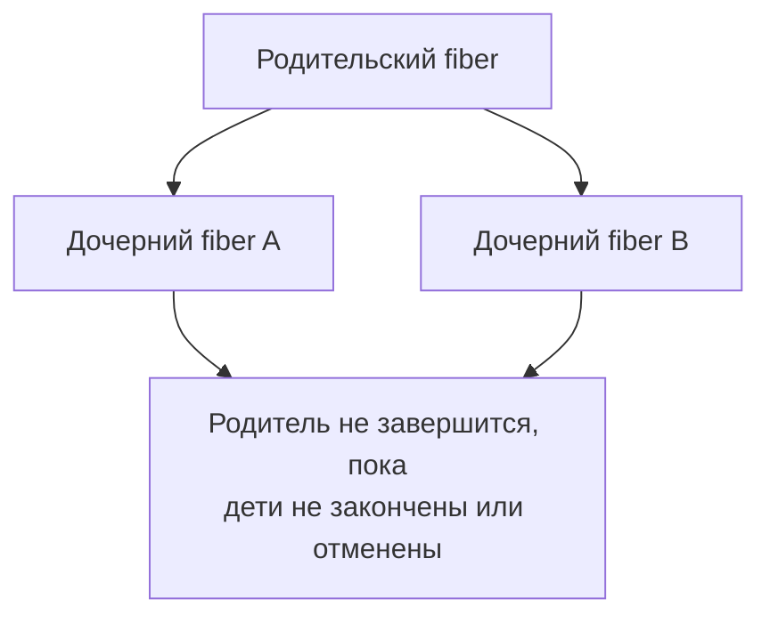

# Вопросы на собеседовании: `Эффект-системы в Scala (Cats Effect, ZIO)`

Эффект-системы — это библиотеки (`Cats Effect`, `ZIO`), которые позволяют описывать побочные эффекты (ввод-вывод, конкурентность, состояние) как чистые неизменяемые значения, а не выполнять их немедленно. На собеседовании по Scala-бэкенду эта тема проверяет, понимаете ли вы referential transparency, fibers, отмену, безопасное управление ресурсами и различия моделей `Cats Effect` и `ZIO`.

Дата последнего обновления: 2026-06-25

## Полезные ссылки

### Официальная документация

- [Cats Effect: Concepts](https://typelevel.org/cats-effect/docs/concepts) — fibers, отмена, structured concurrency
- [Cats Effect: Resource](https://typelevel.org/cats-effect/docs/std/resource) — безопасное управление ресурсами
- [ZIO: Summary](https://zio.dev/overview/summary/) — модель `ZIO[R, E, A]`
- [ZIO: Typed Errors Guarantees](https://zio.dev/reference/error-management/typed-errors-guarantees/) — гарантии типизированных ошибок
- [Baeldung: Эффект-системы в Scala (Cats Effect, ZIO)](https://www.baeldung.com/scala/cats-effects-intro) — туториал

## Содержание

- [Полезные ссылки](#полезные-ссылки)
- [See also](#see-also)

**Основы: зачем эффект-системы и IO-монада**
- [Q1. (!) Зачем нужны эффект-системы и при чём тут referential transparency?](#q1--зачем-нужны-эффект-системы-и-при-чём-тут-referential-transparency)
- [Q2. (!) Что такое IO-монада и чем `IO[A]` отличается от обычного выполнения?](#q2-placeholder)
- [Q3. В чём разница между `IO.delay`, `IO.pure` и `IO.apply`?](#q3-в-чём-разница-между-iodelay-iopure-и-ioapply)
- [Q4. Как устроен тип `ZIO[R, E, A]` и что значат три параметра?](#q4-placeholder)

**Конкурентность: fibers, отмена, structured concurrency**
- [Q5. (!) Что такое fiber и чем он отличается от потока ОС?](#q5--что-такое-fiber-и-чем-он-отличается-от-потока-ос)
- [Q6. Как работают `fork`/`join` и `start` для fibers?](#q6-как-работают-forkjoin-и-start-для-fibers)
- [Q7. (!) Что такое отмена (cancellation) и structured concurrency?](#q7--что-такое-отмена-cancellation-и-structured-concurrency)
- [Q8. Чем `parMapN`, `race` и `both` отличаются друг от друга?](#q8-чем-parmapn-race-и-both-отличаются-друг-от-друга)

**Ресурсы и обработка ошибок**
- [Q9. (!) Что такое `Resource` и паттерн `bracket`?](#q9--что-такое-resource-и-паттерн-bracket)
- [Q10. Как устроена обработка ошибок в Cats Effect через `MonadError`?](#q10-как-устроена-обработка-ошибок-в-cats-effect-через-monaderror)
- [Q11. Что такое typed errors в ZIO и чем канал `E` лучше исключений?](#q11-что-такое-typed-errors-в-zio-и-чем-канал-e-лучше-исключений)

**Примитивы, абстракции и запуск**
- [Q12. Зачем нужны `Ref`, `Deferred`/`Promise` и `Semaphore`?](#q12-зачем-нужны-ref-deferredpromise-и-semaphore)
- [Q13. (!) Что такое паттерн Tagless Final?](#q13--что-такое-паттерн-tagless-final)
- [Q14. Что такое `IOApp` и `ZIOAppDefault` и зачем нужен runtime?](#q14-что-такое-ioapp-и-zioappdefault-и-зачем-нужен-runtime)
- [Q15. Чем Cats Effect отличается от ZIO?](#q15-чем-cats-effect-отличается-от-zio)
- [Q16. Что такое потоковая обработка через `fs2.Stream` и `ZStream`?](#q16-что-такое-потоковая-обработка-через-fs2stream-и-zstream)

## Q1. (!) Зачем нужны эффект-системы и при чём тут referential transparency?

Эффект-система решает фундаментальный конфликт: функциональное программирование требует чистых функций и композиции, но полезная программа обязана что-то делать — читать файлы, ходить в сеть, писать в БД. Эффект-система описывает побочный эффект как значение, а не выполняет его немедленно.

Ключевая идея — referential transparency (ссылочная прозрачность): выражение можно заменить на его значение без изменения поведения программы. Обычный код это нарушает:

```scala
val x = println("hi")   // печатает СРАЗУ, x = ()
val program = (x, x)    // печатает ОДИН раз

// против:
val y = (println("hi"), println("hi"))  // печатает ДВА раза
```

С `IO` эффект становится описанием, и подстановка работает корректно:

```scala
val x = IO(println("hi"))   // ничего не печатает, x — описание
val program = (x, x)        // при запуске напечатает ДВАЖДЫ — как и должно
```

- **Описание vs выполнение.** `IO`/`ZIO` — это «рецепт» эффекта; он лениво выполнится только на краю программы (в `main`).
- **Композиция.** Описания комбинируются через `map`/`flatMap`/`for`, ошибки и конкурентность не разрушают локальное рассуждение.
- **Контроль границы.** Чистое ядро отделено от эффектного «края», что упрощает тестирование и рефакторинг.

**Итог:** эффект-система возвращает referential transparency коду с побочными эффектами, превращая эффект в композируемое неизменяемое значение.

## Q2. (!) Что такое IO-монада и чем `IO[A]` отличается от обычного выполнения?

`IO[A]` (Cats Effect) — это значение, описывающее вычисление, которое при выполнении произведёт результат типа `A` либо упадёт с ошибкой. Само создание `IO` не запускает ничего: это ленивое описание.

Монада здесь — это структура, которая даёт `flatMap`/`map` для последовательной композиции эффектов с сохранением чистоты:

```scala
import cats.effect.IO

val program: IO[Unit] =
  for {
    _    <- IO.println("Введите имя:")
    name <- IO.readLine
    _    <- IO.println(s"Привет, $name")
  } yield ()

// До этого момента ничего не произошло — только на краю:
// program.unsafeRunSync()  (обычно через IOApp, см. Q14)
```

Отличия от немедленного выполнения:

- **Лень.** Эффект отложен до явного запуска; одно и то же `IO`-значение можно переиспользовать и запускать многократно.
- **Композируемость.** `for`-comprehension склеивает шаги, не выполняя их; легко добавить retry, timeout, отмену.
- **Безопасность ошибок.** Исключения захватываются в `IO` и обрабатываются комбинаторами, а не «вылетают» неконтролируемо.

**Вывод:** `IO[A]` — это монада-«рецепт» эффекта; обычный код выполняет эффект сразу, а `IO` лишь описывает его, откладывая до края программы.

## Q3. В чём разница между `IO.delay`, `IO.pure` и `IO.apply`?

Эти конструкторы по-разному относятся к тому, когда вычисляется передаваемое выражение.

| Конструктор | Когда вычисляется аргумент | Когда применять |
|-------------|----------------------------|-----------------|
| `IO.pure(a)` | **Сразу**, аргумент уже вычислен | Только для чистых, уже готовых значений без эффекта |
| `IO.delay(thunk)` | **Лениво**, при каждом запуске `IO` | Любой синхронный побочный эффект |
| `IO.apply(thunk)` | То же, что `IO.delay` (это синоним) | `IO { sideEffect() }` — самый частый способ |

Типичная ошибка — обернуть эффект в `IO.pure`:

```scala
// ПЛОХО: println выполнится при создании значения, нарушая чистоту
val bad = IO.pure(println("hi"))   // печатает СРАЗУ

// ХОРОШО: эффект отложен до запуска
val good = IO.delay(println("hi")) // или IO(println("hi"))
```

В ZIO аналоги: `ZIO.succeed` (= `IO.pure`, eager-значение) и `ZIO.attempt` (= `IO.delay`, ленивый захват эффекта с переводом исключения в канал ошибки).

**Итог:** для любого побочного эффекта используйте `IO.delay`/`IO(...)` (или `ZIO.attempt`); `IO.pure`/`ZIO.succeed` — только для уже вычисленных чистых значений.

## Q4. Как устроен тип `ZIO[R, E, A]` и что значат три параметра?

`ZIO[R, E, A]` — неизменяемое значение, которое лениво описывает вычисление. Концептуально это функция `R => Either[E, A]`, обёрнутая в эффект.

- **`R` — Environment.** Тип окружения (зависимостей), которое нужно для запуска: подключение к БД, HTTP-клиент, конфиг. Если `R = Any`, эффект не требует зависимостей.
- **`E` — Error (канал ошибок).** Тип ошибки, которой эффект может завершиться. ZIO не навязывает `Throwable` — можно использовать доменные типы. Если `E = Nothing`, эффект не может упасть.
- **`A` — Success.** Тип успешного результата.

```scala
import zio._

// Требует Database, может упасть с UserError, вернёт User
def findUser(id: Long): ZIO[Database, UserError, User] = ???

// Не требует ничего, не падает, возвращает Int
val pure: ZIO[Any, Nothing, Int] = ZIO.succeed(42)
```

Полезны псевдонимы:

- `UIO[A]` = `ZIO[Any, Nothing, A]` — не падает, без зависимостей.
- `Task[A]` = `ZIO[Any, Throwable, A]` — как `IO` в Cats Effect.
- `RIO[R, A]` = `ZIO[R, Throwable, A]`.
- `IO[E, A]` = `ZIO[Any, E, A]` (тип из ZIO, не путать с Cats Effect `IO`).

**Вывод:** три параметра кодируют в типе требования (`R`), возможный отказ (`E`) и результат (`A`) — это даёт типизированные ошибки и встроенную инъекцию зависимостей, чего нет в `IO[A]` Cats Effect.

## Q5. (!) Что такое fiber и чем он отличается от потока ОС?

Fiber — это «логический поток», лёгкая единица конкурентного выполнения внутри эффект-системы. Действия fiber'а — это `IO`/`ZIO`-значения, а планирует их рантайм библиотеки поверх ограниченного пула потоков ОС.

| Свойство | Поток ОС (`Thread`) | Fiber |
|----------|---------------------|-------|
| Стоимость памяти | мегабайты стека | сотни байт, очень дёшево |
| Количество | тысячи (предел) | миллионы |
| Планирование | вытесняющее, ядром ОС | кооперативное, рантаймом библиотеки |
| Блокировка | блокирует поток | семантическая блокировка без захвата потока ОС |
| Отмена | принудительно нельзя | первоклассная, безопасная отмена |

Главное преимущество — семантическая блокировка: когда fiber «ждёт» (например, `Deferred.get` или `join`), он не занимает поток ОС, который освобождается для других fibers.

```scala
import cats.effect.IO

for {
  fiber  <- IO.println("работаю").foreverM.start  // запуск fiber'а
  _      <- IO.sleep(1.second)
  _      <- fiber.cancel                           // безопасная отмена
} yield ()
```

**Итог:** fiber — это дешёвый управляемый рантаймом «зелёный поток» с семантической блокировкой и безопасной отменой; он позволяет иметь миллионы конкурентных задач на небольшом пуле потоков ОС.

## Q6. Как работают `fork`/`join` и `start` для fibers?

Паттерн fork-join — основа конкурентности: задачу запускают в отдельном fiber'е (`fork`/`start`), а затем дожидаются её результата (`join`).

```scala
import cats.effect.IO

val task: IO[Int] = IO.sleep(1.second) *> IO.pure(42)

val program: IO[Int] =
  for {
    fiber  <- task.start          // fork: запуск в новом fiber'е, сразу возвращает Fiber
    // ... здесь можно делать другую работу параллельно ...
    outcome <- fiber.joinWithNever // join: семантически ждём результат
  } yield outcome
```

- **`start`** (Cats Effect) / **`fork`** (ZIO) — запускают вычисление в новом fiber'е и немедленно возвращают хэндл `Fiber`, не дожидаясь завершения.
- **`join`** — семантически блокирует «джойнера» до завершения «джойни» и возвращает его `Outcome` (успех / ошибка / отмена). В Cats Effect 3 `join` отдаёт `Outcome`, а `joinWithNever`/`joinWith` распаковывают результат.
- **`cancel`** — отменяет fiber; вернёт управление только после того, как все финализаторы (release ресурсов) отработают.

Подвох: ручной `start`/`join` легко приводит к утечкам fiber'ов, если забыть про отмену при ошибке. Поэтому для большинства задач предпочитают высокоуровневые комбинаторы (`parMapN`, `race`, см. Q8), которые реализуют structured concurrency «из коробки».

**Вывод:** `start`/`fork` порождает fiber, `join` дожидается его `Outcome`; ручной fork-join гибок, но требует аккуратной отмены — обычно лучше высокоуровневые комбинаторы.

## Q7. (!) Что такое отмена (cancellation) и structured concurrency?

Structured concurrency — форма управления потоком, при которой все конкурентные операции образуют замкнутую иерархию: операция, породившая дочерние fibers, обязана дождаться их завершения (или отменить) прежде чем продолжить. Это исключает «осиротевшие» fibers и утечки.



Отмена (cancellation в Cats Effect / interruption в ZIO) — это первоклассная операция: fiber можно безопасно прервать, и при этом:

- **Финализаторы гарантированно отрабатывают.** `cancel` не вернёт управление, пока все ресурсы, выделенные в fiber'е, не освобождены (см. `Resource`, Q9).
- **Есть unmasking/uncancelable.** Через `IO.uncancelable`/`ZIO.uninterruptible` можно пометить критические участки, где отмена откладывается (важно для acquire/release ресурсов).
- **Отмена распространяется по иерархии.** Отмена родителя отменяет детей.

Пример «отменяемого окна»:

```scala
import cats.effect.IO

// race автоматически отменит проигравшего
val withTimeout: IO[Either[Unit, String]] =
  IO.race(IO.sleep(5.seconds), fetchData)
```

**Итог:** structured concurrency гарантирует, что конкурентные fibers образуют иерархию и не «убегают», а отмена — это безопасное прерывание с гарантированным запуском финализаторов; вместе они дают предсказуемое управление ресурсами в конкурентном коде.

## Q8. Чем `parMapN`, `race` и `both` отличаются друг от друга?

Это высокоуровневые комбинаторы конкурентности; они запускают эффекты параллельно и сами обеспечивают structured concurrency (правильную отмену при ошибке/завершении).

| Комбинатор | Семантика | Что при ошибке/таймауте |
|------------|-----------|--------------------------|
| `parMapN` | Запускает N эффектов **параллельно**, ждёт **все**, комбинирует результаты | Ошибка любого → остальные отменяются |
| `both` | Частный случай для двух: ждёт **оба**, возвращает кортеж | Ошибка одного → второй отменяется |
| `race` | Запускает оба, возвращает результат **первого завершившегося** | Проигравший **автоматически отменяется** |

```scala
import cats.effect.IO
import cats.syntax.all._

// parMapN: оба запроса параллельно, ждём оба
val user: IO[(Profile, Settings)] =
  (fetchProfile, fetchSettings).parMapN((p, s) => (p, s))

// race: кто быстрее — основной источник или таймаут
val fast: IO[Either[Data, Unit]] =
  IO.race(fetchData, IO.sleep(2.seconds))

// both: эквивалент (a, b).parMapN(_ -> _)
val pair: IO[(A, B)] = IO.both(effA, effB)
```

Ключевое отличие от обычного `flatMap`: `parMapN` и `both` выполняются **конкурентно**, а не последовательно; `race` ещё и отменяет проигравшего, не теряя ресурсов.

**Вывод:** `parMapN`/`both` — «дождаться всех параллельно», `race` — «взять первого и отменить остальных»; во всех случаях отмена при ошибке встроена.

## Q9. (!) Что такое `Resource` и паттерн `bracket`?

`bracket` — функциональный аналог `try/finally`: если acquire выполнился, то release вызовется **гарантированно** — при успехе, ошибке использования или отмене fiber'а. И acquire, и release выполняются как uncancelable, что даёт строгую гарантию безопасности ресурса.

```scala
import cats.effect.IO

val result: IO[String] =
  openFile("data.txt").bracket { file =>
    readContents(file)              // use
  } { file =>
    closeFile(file)                 // release — выполнится ВСЕГДА
  }
```

Проблема голого `bracket` — вложенность при нескольких ресурсах. Её решает `Resource[F, A]`: он инкапсулирует логику acquire/release и образует монаду, так что ресурсы композируются через `flatMap`/`for` без «лестницы»:

```scala
import cats.effect.{IO, Resource}

def file(name: String): Resource[IO, File] =
  Resource.make(openFile(name))(closeFile)   // acquire + release

val combined: Resource[IO, (File, Conn)] =
  for {
    f <- file("data.txt")
    c <- dbConnection                          // composable, без вложенности
  } yield (f, c)

combined.use { case (f, c) => process(f, c) }  // release всех — в обратном порядке
```

- **Гарантия release.** Финализатор отработает даже при отмене или исключении.
- **Композиция.** Несколько ресурсов собираются в `for`; освобождаются в порядке, обратном выделению.
- **`guarantee`/`onCancel`.** Для запуска кода «на любом исходе» без полноценного ресурса.

**Итог:** `Resource` — это композируемый `bracket`; он гарантирует освобождение ресурса при любом исходе (успех/ошибка/отмена) и убирает вложенность ручного `bracket`.

## Q10. Как устроена обработка ошибок в Cats Effect через `MonadError`?

`IO` в Cats Effect фиксирован на `Throwable`: ошибки моделируются через тайпкласс `MonadError[F, Throwable]` (для `IO` это `MonadThrow`). Ошибка — это значение в эффекте, а не «вылетевшее» исключение.

Основные комбинаторы:

```scala
import cats.effect.IO

val safe: IO[Int] =
  riskyComputation
    .handleErrorWith(e => IO.println(s"ошибка: $e") *> IO.pure(0)) // recover
    .attempt                                                        // IO[Either[Throwable, Int]]
    .flatMap {
      case Right(v) => IO.pure(v)
      case Left(_)  => IO.pure(-1)
    }

val raised: IO[Nothing] = IO.raiseError(new RuntimeException("boom"))
```

- **`raiseError`** — поднять ошибку в эффект.
- **`handleErrorWith` / `recoverWith`** — обработать/восстановиться.
- **`attempt`** — превратить ошибку в `Either[Throwable, A]` (вынести ошибку в success-канал).
- **`redeem` / `redeemWith`** — обработать и успех, и ошибку одним вызовом.

Подвох: типизированные доменные ошибки в Cats Effect нельзя выразить прямо в сигнатуре `IO` — приходится либо моделировать их как `IO[Either[DomainError, A]]`, либо использовать `EitherT[IO, DomainError, A]`. Это главное ограничение по сравнению с каналом `E` в ZIO (см. Q11).

**Вывод:** в Cats Effect ошибки `IO` — это `Throwable` через `MonadError`; для доменных типизированных ошибок нужны обёртки вроде `EitherT`, тогда как ZIO даёт это нативно.

## Q11. Что такое typed errors в ZIO и чем канал `E` лучше исключений?

В `ZIO[R, E, A]` параметр `E` — это типизированный канал ошибок: компилятор знает, какими ошибками может завершиться эффект, и заставляет их обработать. Это отличает «ожидаемые» доменные сбои от «дефектов» (`Throwable`, которые «убивают» fiber).

```scala
import zio._

sealed trait UserError
case object NotFound      extends UserError
case object AccessDenied  extends UserError

def findUser(id: Long): ZIO[Any, UserError, User] = ???

val handled: ZIO[Any, Nothing, User] =
  findUser(1)
    .catchAll {
      case NotFound     => ZIO.succeed(User.guest)
      case AccessDenied => ZIO.fail(NotFound).orDie  // или обработать
    }
```

ZIO различает три категории сбоев:

- **Failures (`E`)** — типизированные ожидаемые ошибки в канале `E`; их видно в сигнатуре, их обязательно обработать.
- **Defects** — непредвиденные `Throwable` (баги); не отражены в `E`, «убивают» fiber, попадают в `Cause`.
- **Interruption** — отмена fiber'а.

Преимущества канала `E`:

- **Compile-time гарантии.** Нельзя «забыть» обработать ошибку — это видно в типе.
- **Чистая семантика.** `E = Nothing` означает «эффект не может упасть» — мощная гарантия на уровне типов.
- **Разделение бизнес-ошибок и багов.** Доменный сбой (нет пользователя) не путается с `NullPointerException`.

Важный нюанс: при концентрации на конкурентности линейный канал ошибок не всегда «складывается» — несколько параллельных fiber'ов могут упасть одновременно, поэтому ZIO хранит составную причину в `Cause`, а не один `E`.

**Итог:** канал `E` в ZIO делает ожидаемые ошибки частью типа, требуя их обработки на этапе компиляции и отделяя бизнес-сбои от непредвиденных дефектов — чего нет у фиксированного на `Throwable` `IO` в Cats Effect.

## Q12. Зачем нужны `Ref`, `Deferred`/`Promise` и `Semaphore`?

Это базовые конкурентные примитивы для безопасной координации fiber'ов. Большинство более сложных структур (очереди, `Hotswap`) строятся именно из `Ref` и `Deferred`.

- **`Ref[F, A]`** — потокобезопасная изменяемая ссылка. Даёт атомарные `get`/`set`/`update`/`modify`, но **не** даёт синхронизации (ожидания). Всегда инициализирована значением.

```scala
import cats.effect.{IO, Ref}

for {
  counter <- Ref.of[IO, Int](0)
  _       <- counter.update(_ + 1)   // атомарно
  value   <- counter.get
} yield value
```

- **`Deferred[F, A]`** (в ZIO — `Promise[E, A]`) — «промис», который пуст при создании, может быть завершён **ровно один раз** и больше не опустошается. `get` семантически блокирует fiber до завершения. Используется для синхронизации между fiber'ами.

```scala
import cats.effect.{IO, Deferred}

for {
  latch <- Deferred[IO, String]
  _     <- (IO.sleep(1.second) *> latch.complete("готово")).start
  msg   <- latch.get                 // ждёт, не занимая поток ОС
} yield msg
```

- **`Semaphore[F]`** — счётчик разрешений (permits). `acquire` уменьшает счётчик (семантически блокирует при нуле), `release` — увеличивает. Применяют для ограничения параллелизма (например, не более N одновременных запросов).

Связка `Ref` + `Deferred` — каноничный способ построить, например, set-once-кэш: `Ref` хранит состояние, `Deferred` сигнализирует о готовности.

**Вывод:** `Ref` — атомарное состояние без ожидания, `Deferred`/`Promise` — одноразовая синхронизация с ожиданием, `Semaphore` — ограничение параллелизма; из `Ref` и `Deferred` собираются более сложные конкурентные структуры.

## Q13. (!) Что такое паттерн Tagless Final?

Tagless Final — паттерн, при котором логику пишут не для конкретного эффекта (`IO`/`ZIO`), а для абстрактного типа-конструктора `F[_]` с набором ограничений-тайпклассов. Конкретный эффект подставляется только на краю программы («интерпретатором»).

`F[_]` — это higher-kinded type («тип, оборачивающий другой тип»). Ограничения вроде `Monad[F]` или `Sync[F]` дают нужные возможности (последовательность, захват эффекта), не привязываясь к реализации.

```scala
import cats.Monad
import cats.syntax.all._

// Алгебра, абстрактная над эффектом F
trait UserRepo[F[_]] {
  def find(id: Long): F[Option[User]]
  def save(u: User): F[Unit]
}

// Бизнес-логика: требует лишь Monad[F], не знает про IO/ZIO
def register[F[_]: Monad](repo: UserRepo[F], u: User): F[Unit] =
  for {
    existing <- repo.find(u.id)
    _        <- if (existing.isEmpty) repo.save(u) else Monad[F].unit
  } yield ()

// Интерпретатор подставляется на краю: register[IO](...) или register[Task](...)
```

- **Декаплинг.** Логика не зависит от конкретного эффекта; легко подменить на тестовый `F` (например, `Id` или `State`).
- **Переиспользование.** Один и тот же код работает с разными интерпретаторами для разных целей.
- **Минимальные требования.** Добавляют ровно те тайпклассы, что нужны (`Monad`, `Sync`, `Concurrent`).

Критика (в т.ч. от автора ZIO): на практике tagless final не «запрещает» эффекты — `Sync[F]` всё равно позволяет произвольный сайд-эффект, поэтому реальной гарантии чистоты на уровне типов он не даёт. ZIO предлагает альтернативу через явный канал `R` вместо абстракции `F[_]`.

**Итог:** Tagless Final абстрагирует бизнес-логику над `F[_]` с тайпкласс-ограничениями, откладывая выбор эффекта до интерпретатора; это даёт декаплинг и тестируемость, но не гарантирует чистоту так строго, как иногда заявляют.

## Q14. Что такое `IOApp` и `ZIOAppDefault` и зачем нужен runtime?

Эффект — это лишь описание; чтобы оно выполнилось, нужен runtime (рантайм) — система, которая планирует fibers поверх пулов потоков, обрабатывает отмену и таймеры. На самом краю программы описание «запускается».

`IOApp` (Cats Effect) и `ZIOAppDefault`/`ZIOApp` (ZIO) — это точки входа, которые предоставляют рантайм и запускают ваш главный эффект, корректно завершая работу:

```scala
// Cats Effect
import cats.effect.{IO, IOApp, ExitCode}

object Main extends IOApp {
  def run(args: List[String]): IO[ExitCode] =
    IO.println("Привет") *> IO.pure(ExitCode.Success)
}

// ZIO
import zio._

object Main extends ZIOAppDefault {
  def run: ZIO[Any, Throwable, Unit] =
    Console.printLine("Привет")
}
```

Зачем именно так:

- **Единственная точка `unsafeRun`.** Внутри программы вы не вызываете `unsafeRunSync` вручную; всё «небезопасное» выполнение сосредоточено в `IOApp`/`ZIOAppDefault`, где рантайм предоставлен.
- **Корректная отмена и завершение.** Точка входа дожидается финализаторов, обрабатывает `Ctrl+C`, корректно гасит пулы потоков.
- **`ExitCode`.** Главный эффект возвращает код выхода процесса.

Прямой `unsafeRunSync()`/`Unsafe.unsafe { runtime.unsafe.run(...) }` нужен лишь на границе с нефункциональным миром (интеграция с фреймворком) — это «дыра» в чистоте, и держать её надо в одном месте.

**Вывод:** `IOApp`/`ZIOAppDefault` дают рантайм и единственную легитимную точку запуска эффекта; они изолируют небезопасное выполнение и гарантируют корректную отмену и завершение процесса.

## Q15. Чем Cats Effect отличается от ZIO?

Обе библиотеки решают одну задачу (описание эффектов как значений), но по-разному моделируют ошибки и зависимости.

| Аспект | Cats Effect (`IO[A]`) | ZIO (`ZIO[R, E, A]`) |
|--------|------------------------|----------------------|
| Тип эффекта | `IO[A]` — один параметр | `ZIO[R, E, A]` — три параметра |
| Модель ошибок | Фиксирована на `Throwable` (`MonadError`) | Типизированный канал `E` (любой тип) |
| Зависимости (DI) | Через конструкторы / внешние либы | Встроено через `R` и `ZLayer` |
| Стиль абстракции | Tagless Final: код над `F[_]` + тайпклассы | Конкретный `ZIO` без implicits/тайпклассов |
| Точка входа | `IOApp` | `ZIOAppDefault` / `ZIOApp` |
| Гибкость интерпретатора | Высокая (любой `F` с нужными тайпклассами) | Логика привязана к `ZIO` |

Ключевые следствия:

- **Типизированные ошибки.** ZIO даёт их «из коробки» в `E`; в Cats Effect для этого нужны обёртки (`EitherT`).
- **DI.** ZIO встраивает окружение `R` и `ZLayer`; Cats Effect полагается на конструкторы или внешний DI.
- **Тайпклассы vs конкретность.** Cats Effect (через Tagless Final) даёт гибкость менять интерпретатор; ядро ZIO избегает implicits и тайпклассов, что многим кажется проще для чтения.
- **Совместимость.** ZIO реализует тайпклассы Cats Effect через `zio-interop-cats`, поэтому библиотеки экосистемы (fs2, http4s, doobie) работают и с ZIO.

**Итог:** Cats Effect делает ставку на минималистичный `IO` и абстракцию через тайпклассы (Tagless Final), а ZIO — на богатый тип `ZIO[R, E, A]` со встроенными типизированными ошибками и инъекцией зависимостей; обе совместимы через interop-слой.

## Q16. Что такое потоковая обработка через `fs2.Stream` и `ZStream`?

Когда данных слишком много, чтобы держать их в памяти (файлы, сокеты, Kafka), используют функциональные стримы. Это потоковые, эффектные, композируемые конвейеры с безопасностью ресурсов и backpressure.

- **`fs2.Stream[F, A]`** (экосистема Cats Effect) — чисто функциональный стрим элементов `A` с эффектом `F`. Модель «pull»: downstream запрашивает данные у upstream, что естественно даёт backpressure. Ресурсы управляются через тот же `bracket`-паттерн (см. Q9), так что финализаторы отрабатывают даже при ошибке.

```scala
import fs2.Stream
import cats.effect.IO

val pipeline: Stream[IO, Unit] =
  Stream.range(1, 1000000)        // источник
    .map(_ * 2)                    // трансформация (лениво)
    .evalMap(n => IO.println(n))   // эффект на каждый элемент
// выполнится только при .compile.drain
```

- **`ZStream[R, E, A]`** (экосистема ZIO) — аналог с тремя параметрами, как у `ZIO`: производит значения `A`, может упасть с `E`, требует окружения `R`.

Общие свойства:

- **Backpressure.** Pull-модель сама согласует скорость producer и consumer.
- **Resource safety.** Финализаторы (закрытие файлов, соединений) гарантированы даже при сбое.
- **Композиция.** Конвейер собирается из переиспользуемых трансформаций; стрим — описание, выполняется на краю (`compile.drain` / `runDrain`).
- **Константная память.** Можно обрабатывать поток, не загружая его целиком.

**Вывод:** `fs2.Stream` и `ZStream` — это эффектные ленивые конвейеры с встроенным backpressure и безопасностью ресурсов; они позволяют обрабатывать неограниченные данные в константной памяти, оставаясь чистыми и композируемыми.

---

## See also

- [Собеседование по Scala](scala-interview.md) — базовый язык, ФП-основы, типы, имплиситы
- [Корутины Kotlin](../kotlin/kotlin-coroutines-interview.md) — структурная конкурентность и отмена в Kotlin, аналог fibers
- [Project Reactor](../../reactive/project-reactor-interview.md) — реактивные потоки на JVM, backpressure, операторы
- [Reactive Streams](../../reactive/reactive-streams-interview.md) — стандарт асинхронных потоков с backpressure
- [Конкурентность в Java](../java/java-concurrency-interview.md) — потоки, синхронизация, модель памяти JVM
- [CompletableFuture в Java](../java/java-completable-future-interview.md) — асинхронная композиция эффектов в Java
