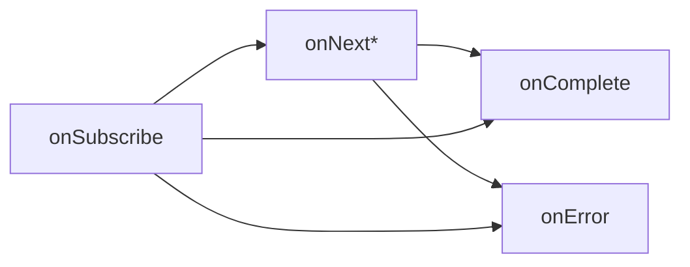
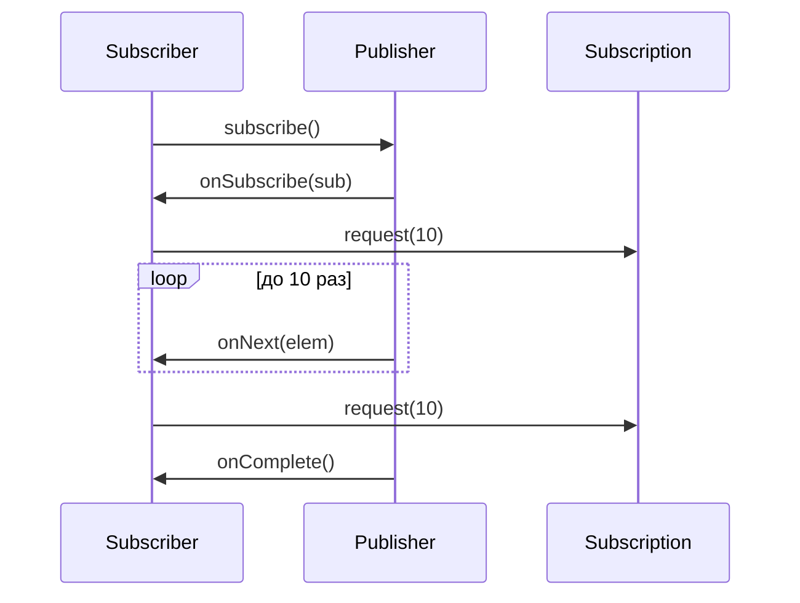

# Вопросы на собеседовании: `Reactive Streams`

Гид по спецификации `Reactive Streams` — фундаменту всех реактивных библиотек на `JVM`: `Project Reactor`, `RxJava`, `Akka Streams`. Охватывает четыре базовых интерфейса, backpressure, `TCK` и взаимодействие реализаций.

**`Reactive Streams`** — минималистичная спецификация (4 интерфейса, 43 правила), стандартизирующая асинхронную обработку потоков данных с неблокирующим backpressure. Включена в `JDK 9+` как `java.util.concurrent.Flow`.

## Полезные ссылки

### Официальная документация

- [Reactive Streams Specification](https://www.reactive-streams.org/) — официальный сайт
- [Reactive Streams JVM GitHub](https://github.com/reactive-streams/reactive-streams-jvm) — исходники спецификации и `TCK`
- [JDK Flow API](https://docs.oracle.com/en/java/javase/17/docs/api/java.base/java/util/concurrent/Flow.html) — `java.util.concurrent.Flow`

### Статьи Baeldung

- [Introduction to the Java Reactive Streams API](https://www.baeldung.com/java-9-reactive-streams) — `Flow API`
- [Reactive Streams with Akka Streams](https://www.baeldung.com/akka-streams) — `Akka Streams`
- [Spring Reactor Backpressure](https://www.baeldung.com/spring-webflux-backpressure) — backpressure на практике

## Содержание

- [Полезные ссылки](#полезные-ссылки)
- [See also](#see-also)

**Основы спецификации**
- [Q1. (!) Что такое Reactive Streams и зачем спецификация нужна?](#q1--что-такое-reactive-streams-и-зачем-спецификация-нужна)
- [Q2. (!) Какие 4 интерфейса входят в Reactive Streams?](#q2--какие-4-интерфейса-входят-в-reactive-streams)
- [Q3. Как соотносятся Reactive Streams и java.util.concurrent.Flow?](#q3-как-соотносятся-reactive-streams-и-javautilconcurrentflow)
- [Q4. Какие реализации Reactive Streams существуют?](#q4-какие-реализации-reactive-streams-существуют)

**Publisher и Subscriber**
- [Q5. (!) Что делает интерфейс Publisher?](#q5--что-делает-интерфейс-publisher)
- [Q6. (!) Что делает интерфейс Subscriber?](#q6--что-делает-интерфейс-subscriber)
- [Q7. В каком порядке вызываются методы Subscriber?](#q7-в-каком-порядке-вызываются-методы-subscriber)
- [Q8. Может ли Subscriber получить onNext до onSubscribe?](#q8-может-ли-subscriber-получить-onnext-до-onsubscribe)

**Subscription и backpressure**
- [Q9. (!) Что такое Subscription и зачем она нужна?](#q9--что-такое-subscription-и-зачем-она-нужна)
- [Q10. (!) Что такое backpressure в Reactive Streams?](#q10--что-такое-backpressure-в-reactive-streams)
- [Q11. Что произойдёт при request(0) или request(-1)?](#q11-что-произойдёт-при-request0-или-request-1)
- [Q12. Что делает метод cancel()?](#q12-что-делает-метод-cancel)

**Processor**
- [Q13. (!) Что такое Processor?](#q13--что-такое-processor)
- [Q14. Приведите пример использования Processor.](#q14-приведите-пример-использования-processor)

**Стратегии backpressure**
- [Q15. (!) Какие стратегии backpressure существуют?](#q15--какие-стратегии-backpressure-существуют)
- [Q16. Чем отличаются стратегии BUFFER, DROP, LATEST, ERROR?](#q16-чем-отличаются-стратегии-buffer-drop-latest-error)
- [Q17. Когда выбирать DROP, а когда LATEST?](#q17-когда-выбирать-drop-а-когда-latest)

**Правила спецификации**
- [Q18. (!) Какие главные правила для Publisher?](#q18--какие-главные-правила-для-publisher)
- [Q19. Какие главные правила для Subscriber?](#q19-какие-главные-правила-для-subscriber)
- [Q20. Какие правила для Subscription?](#q20-какие-правила-для-subscription)

**TCK**
- [Q21. (!) Что такое TCK и зачем он нужен?](#q21--что-такое-tck-и-зачем-он-нужен)
- [Q22. Какие типы тестов в TCK?](#q22-какие-типы-тестов-в-tck)

**Взаимодействие реализаций**
- [Q23. (!) Как Reactor и RxJava взаимодействуют через Reactive Streams?](#q23--как-reactor-и-rxjava-взаимодействуют-через-reactive-streams)
- [Q24. Как использовать Flux как Publisher в RxJava?](#q24-как-использовать-flux-как-publisher-в-rxjava)
- [Q25. Что такое Akka Streams и как связан с Reactive Streams?](#q25-что-такое-akka-streams-и-как-связан-с-reactive-streams)

**Практика и ошибки**
- [Q26. (!) Какие типичные ошибки при реализации Publisher?](#q26--какие-типичные-ошибки-при-реализации-publisher)
- [Q27. Можно ли реализовать Publisher вручную?](#q27-можно-ли-реализовать-publisher-вручную)
- [Q28. Чем Reactive Streams отличаются от Java Streams?](#q28-чем-reactive-streams-отличаются-от-java-streams)
- [Q29. Поддерживает ли Reactive Streams синхронное выполнение?](#q29-поддерживает-ли-reactive-streams-синхронное-выполнение)
- [Q30. (!) Что такое "push-pull" модель в Reactive Streams?](#q30--что-такое-push-pull-модель-в-reactive-streams)

---

## Q1. (!) Что такое Reactive Streams и зачем спецификация нужна?

**`Reactive Streams`** — это стандарт для асинхронной обработки потоков данных с **неблокирующим backpressure**, то есть с механизмом, через который потребитель регулирует темп производителя без блокировки потоков. Опубликован в 2015 году; авторы — Netflix, Pivotal, Lightbend, Red Hat.

**Какую проблему решает.** До спецификации реактивная экосистема `JVM` была фрагментирована: каждая библиотека вводила собственные интерфейсы, и они между собой не стыковались.

- Свои типы у каждого: `Observable` в `RxJava`, `Source` в `Akka`, `Flux` в `Reactor`.
- Интероперабельности не было — нельзя было «склеить» поток из одной библиотеки с потоком из другой.
- Backpressure каждый реализовывал по-своему (где-то буферизация, где-то drop), а значит и поведение под нагрузкой различалось.

**Что задаёт спецификация.** По сути это тонкий контракт — словарь и набор правил, а не реализация:

- 4 интерфейса: `Publisher`, `Subscriber`, `Subscription`, `Processor`;
- 43 правила поведения, описывающие, кто и в каком порядке кого вызывает;
- `TCK` — набор тестов, которым реализация должна соответствовать.

**Итог.** `Reactive Streams` — это минимальный общий язык реактивных библиотек. Именно благодаря ему любой `Publisher` из одной библиотеки можно подключить к `Subscriber` из другой и быть уверенным, что backpressure и порядок сигналов отработают одинаково.

## Q2. (!) Какие 4 интерфейса входят в Reactive Streams?

Спецификация держится всего на четырёх интерфейсах. `Publisher` производит данные, `Subscriber` их потребляет, `Subscription` связывает эту пару и даёт потребителю рычаг управления темпом, а `Processor` сидит посередине цепочки и является одновременно тем и другим.

| Интерфейс | Роль |
|-----------|------|
| `Publisher<T>` | Источник элементов. Один метод: `subscribe(Subscriber<? super T>)` |
| `Subscriber<T>` | Потребитель. 4 метода: `onSubscribe`, `onNext`, `onError`, `onComplete` |
| `Subscription` | Связь между `Publisher` и `Subscriber`. 2 метода: `request(long n)`, `cancel()` |
| `Processor<T,R>` | Одновременно `Subscriber` и `Publisher`. Промежуточный узел обработки |

```java
public interface Publisher<T> {
    void subscribe(Subscriber<? super T> s);
}

public interface Subscriber<T> {
    void onSubscribe(Subscription s);
    void onNext(T t);
    void onError(Throwable t);
    void onComplete();
}

public interface Subscription {
    void request(long n);
    void cancel();
}

public interface Processor<T, R> extends Subscriber<T>, Publisher<R> {}
```

## Q3. Как соотносятся Reactive Streams и java.util.concurrent.Flow?

Это одно и то же — буква в букву. Начиная с `JDK 9` спецификация вошла в стандартную библиотеку как `java.util.concurrent.Flow`: интерфейсы идентичны исходным, отличается только пакет (`Flow` ничего не привносит, просто переносит контракт в `JDK`).

| | `Reactive Streams` | `java.util.concurrent.Flow` |
|---|---|---|
| Пакет | `org.reactivestreams.*` | `java.util.concurrent.Flow.*` |
| API | `Publisher`, `Subscriber`, `Subscription`, `Processor` | `Flow.Publisher` и т.д. |
| Версия JDK | Любая | `9+` |

Поскольку типы из разных пакетов несовместимы напрямую, между ними конвертируют через `FlowAdapters` (библиотека `org.reactivestreams:reactive-streams-flow-adapters`).

**На практике** большинство библиотек (`Reactor`, `RxJava`) исторически работают с `org.reactivestreams.*`, а не с `Flow`: они появились до `JDK 9` и менять пакет ради косметики смысла не имело.

## Q4. Какие реализации Reactive Streams существуют?

Спецификация — это контракт, а конкретные потоки строят библиотеки-реализации. Основные на `JVM`:

- **Project Reactor** — основа `Spring WebFlux` и `Spring Cloud`. Типы: `Mono<T>` (0–1 элемент) и `Flux<T>` (0–N).
- **RxJava 2/3** — библиотека от `Netflix`. Типы: `Observable`, `Flowable`, `Single`, `Maybe`, `Completable`. Важный нюанс: спецификации соответствует только `Flowable` — именно он поддерживает backpressure, остальные типы его не несут.
- **Akka Streams** — от `Lightbend`, построена на акторах. Типы: `Source`, `Flow`, `Sink`.
- **SmallRye Mutiny** — реактивный слой `Quarkus`. Типы: `Uni` (0–1) и `Multi` (0–N).
- **JDK Flow API** — встроенный стандарт с `Java 9`. Это лишь интерфейсы без операторов, поэтому в чистом виде его почти не используют — берут полноценную библиотеку выше.

## Q5. (!) Что делает интерфейс Publisher?

`Publisher<T>` — это источник потенциально неограниченного числа элементов типа `T`. Интерфейс предельно узкий: единственный метод `subscribe(Subscriber)`. Сам по себе `Publisher` ничего не делает — он лишь обещает поток; реальная работа начинается, когда к нему подключается `Subscriber`.

```java
Publisher<Integer> publisher = subscriber -> {
    subscriber.onSubscribe(new Subscription() {
        public void request(long n) { /* push элементы */ }
        public void cancel() { /* cleanup */ }
    });
};
```

Контракт, который `Publisher` обязан соблюдать:

- **Многократная подписка.** `subscribe()` можно вызывать сколько угодно раз; каждый вызов создаёт независимый поток данных под своего `Subscriber`.
- **Сначала спрос, потом данные.** `Publisher` не имеет права слать элементы, пока `Subscriber` не вызвал `Subscription.request()`. Это и есть основа backpressure.
- **Не превышать спрос.** Суммарное число `onNext` не должно быть больше суммы всех запрошенных `request(n)`.
- **Терминальные сигналы окончательны.** После `onError` или `onComplete` ни одного нового сигнала отправлять нельзя.

## Q6. (!) Что делает интерфейс Subscriber?

`Subscriber<T>` — это потребитель элементов. Он не вытягивает данные сам, а реагирует на сигналы `Publisher` через четыре метода-колбэка:

```java
public interface Subscriber<T> {
    void onSubscribe(Subscription s); // связь установлена — здесь обычно s.request(N)
    void onNext(T t);                 // новый элемент
    void onError(Throwable t);        // терминальный сигнал-ошибка
    void onComplete();                // терминальный сигнал-успех
}
```

За этими четырьмя колбэками стоит строгий жизненный цикл — это и спрашивают на собеседовании:

- `onSubscribe` вызывается **ровно один раз** и всегда первым: именно здесь `Subscriber` получает `Subscription` и обычно сразу делает `request(N)`, иначе данные не пойдут.
- `onNext` — от 0 до N раз; вызовы строго последовательны, параллельно прийти не могут.
- Поток завершается **ровно одним** терминальным сигналом — либо `onError`, либо `onComplete`, но не обоими.

## Q7. В каком порядке вызываются методы Subscriber?

Порядок жёстко задан спецификацией и читается как грамматика: сначала ровно один `onSubscribe`, затем сколько-то `onNext`, и завершает поток ровно один терминальный сигнал — `onComplete` либо `onError`. Все вызовы идут последовательно, никогда не параллельно.



Типичная последовательность на практике:

1. `onSubscribe(sub)` — `Subscriber` сохраняет `sub` и вызывает `sub.request(n)`, открывая спрос.
2. `onNext(e1), onNext(e2), ..., onNext(eN)` — элементы приходят, пока не исчерпан запрошенный объём.
3. `onComplete()` при успехе либо `onError(t)` при ошибке.

**Важный нюанс.** «Последовательно» не значит «в одном потоке». `Publisher` вправе эмитить из разных потоков, но обязан обеспечить happens-before между сигналами — так что для `Subscriber` они всё равно выглядят как непересекающаяся серия вызовов, и заводить синхронизацию внутри колбэков не нужно.

## Q8. Может ли Subscriber получить onNext до onSubscribe?

**Нет.** Правило 1.9 спецификации прямо требует: `Publisher` **обязан** вызвать `onSubscribe` первым, до любого `onNext`.

Логика простая: `Subscription` приходит именно в `onSubscribe`. Без неё `Subscriber` не может ни запросить элементы через `request(n)`, ни отменить подписку через `cancel()` — то есть теряет всякий контроль над потоком и backpressure ломается. Поэтому `onNext` без предшествующего `onSubscribe` — это нарушение контракта, и оно отлавливается тестами `TCK`.

## Q9. (!) Что такое Subscription и зачем она нужна?

`Subscription` — это связь между конкретной парой `Publisher` ↔ `Subscriber` и единственный канал, через который потребитель управляет потоком. Именно она делает backpressure возможным:

```java
public interface Subscription {
    void request(long n); // запросить ещё n элементов
    void cancel();        // разорвать подписку
}
```

Почему без неё не обойтись:

- Будь у `Subscriber` только колбэки `onNext`, `Publisher` слал бы элементы в своём темпе и легко перегрузил бы медленного потребителя. `Subscription` переворачивает управление: данные идут только по запросу.
- `request(n)` — это явный сигнал «я готов принять ещё `n` элементов»; пока запроса нет, поток молчит.
- `cancel()` досрочно разрывает подписку и даёт `Publisher` освободить ресурсы.

## Q10. (!) Что такое backpressure в Reactive Streams?

**Backpressure** — это механизм, который позволяет медленному `Subscriber` регулировать скорость быстрого `Publisher`. В `Reactive Streams` он реализован не как буфер и не как throttling, а через **pull-based request**: потребитель сам запрашивает ровно столько элементов, сколько готов обработать, методом `request(n)` в `Subscription`.

Без backpressure производитель не знает о возможностях потребителя и просто заваливает его данными:

```
Publisher: 100k событий/сек →→→ Subscriber: 10k событий/сек
Результат: OOM, очередь переполняется
```

С backpressure темп задаёт потребитель, и producer ждёт явного спроса:

```
Subscriber: request(100)
Publisher: emits до 100 → ждёт нового request
Subscriber: обработал → request(100)
```

**Итог.** Перегрузки не возникает в принципе: `Publisher` физически не отправит больше, чем запросили. Темп диктует `Subscriber` — это ключевое отличие от обычного асинхронного push.

## Q11. Что произойдёт при request(0) или request(-1)?

Оба случая — неположительный запрос, и спецификация трактует его как ошибку:

- `request(0)` — запрос нуля элементов бессмысленен, поэтому формально это тоже неположительное число.
- любой `request(n)` при `n <= 0` обязывает `Publisher` отправить `onError(IllegalArgumentException)`.

Это правило 3.9 спецификации. Сделано оно намеренно по принципу fail-fast: неположительный `request` почти всегда не задумка, а баг — случайный результат арифметики над счётчиком спроса. Лучше громко упасть с понятной ошибкой, чем тихо подвиснуть, не получая данных.

## Q12. Что делает метод cancel()?

`cancel()` сообщает `Publisher`, что подписка больше не нужна — потребитель хочет отписаться досрочно. В ответ `Publisher` должен:

- прекратить вызовы `onNext` (в разумное время — мгновенная остановка не гарантируется из-за гонок);
- освободить связанные ресурсы: закрыть соединение, отменить таймер, остановить фоновую задачу;
- желательно не слать `onComplete` / `onError` после `cancel()` — хотя из-за гонки между потоками одиночный «опоздавший» сигнал не запрещён, и `Subscriber` должен быть к этому готов.

`cancel()` **идемпотентен**: повторные вызовы безопасны и не должны бросать исключений. Это важно, потому что отмена нередко прилетает из нескольких мест (таймаут, ошибка downstream, ручное закрытие) одновременно.

## Q13. (!) Что такое Processor?

`Processor<T, R>` — это узел, который одновременно `Subscriber<T>` и `Publisher<R>`: слева он подписывается на upstream и принимает элементы, справа сам отдаёт результаты downstream. Поэтому его место — в середине цепочки обработки:

```
upstream Publisher<T> → Processor<T,R> → downstream Subscriber<R>
```

За счёт двойной природы он закрывает задачи преобразования потока:

- буферизация и batching;
- трансформация типов `T → R`;
- fan-out — один вход, несколько подписчиков на выходе.

**Важно для собеседования:** в `Reactor` прямое использование `Processor` объявлено `deprecated`. Реализовать его руками безопасно очень сложно (легко нарушить правила спецификации), поэтому вместо него рекомендуют `Sinks` — фабрику, которая даёт корректные реализации под нужный сценарий:

```java
Sinks.Many<String> sink = Sinks.many().multicast().onBackpressureBuffer();
Flux<String> flux = sink.asFlux();
sink.tryEmitNext("hello");
```

## Q14. Приведите пример использования Processor.

Классический пример — **hot publisher**, то есть событийная шина: элементы в неё «вталкивают» извне, а все активные подписчики получают их одновременно (в отличие от cold-потока, который проигрывается каждому подписчику с начала). Ниже один и тот же сценарий на устаревшем `DirectProcessor` и на современном `Sinks`:

```java
// Устаревший API
DirectProcessor<Integer> processor = DirectProcessor.create();
processor.subscribe(e -> System.out.println("A: " + e));
processor.subscribe(e -> System.out.println("B: " + e));
processor.onNext(1); // оба подписчика получат 1

// Современный API через Sinks
Sinks.Many<Integer> sink = Sinks.many().multicast().directBestEffort();
Flux<Integer> flux = sink.asFlux();
flux.subscribe(e -> System.out.println("A: " + e));
flux.subscribe(e -> System.out.println("B: " + e));
sink.tryEmitNext(1);
```

## Q15. (!) Какие стратегии backpressure существуют?

Когда источник принципиально не умеет притормаживать (например, события извне), а `Subscriber` запрашивает меньше, чем приходит, нужно решить, что делать с лишним. Спецификация это не диктует — выбор стратегии лежит на реализации. В `Reactor`/`RxJava` их пять:

| Стратегия | Поведение | Цена |
|-----------|-----------|------|
| `BUFFER` | Копить лишние элементы в буфере | Память — риск OOM при unbounded |
| `DROP` | Отбрасывать новые элементы при переполнении | Потеря свежих данных |
| `LATEST` | Хранить только последний элемент, старые вытеснять | Потеря промежуточных |
| `ERROR` | Прервать поток сигналом `onError` | Падение, но явное и быстрое |
| `IGNORE` | Игнорировать backpressure совсем | Перекладывает риск на downstream |

Стратегии различаются тем, чем жертвуют: `BUFFER` — памятью, `DROP`/`LATEST` — частью данных, `ERROR` — самим потоком. Задаётся стратегия при создании потока:

```java
Flux.create(sink -> {...}, FluxSink.OverflowStrategy.DROP);
```

## Q16. Чем отличаются стратегии BUFFER, DROP, LATEST, ERROR?

Разница — в том, кем жертвуют при переполнении и какой ценой, поэтому каждая стратегия уместна под свой профиль данных:

| Стратегия | При переполнении | Когда использовать |
|-----------|------------------|-------------------|
| `BUFFER` | Буферизует в памяти (unbounded по умолчанию) | Когда всплески короткие и объём предсказуем — буфер успеет разгрузиться |
| `DROP` | Выбрасывает новые элементы | Логи, метрики — потеря отдельных значений приемлема |
| `LATEST` | Хранит последний, старые удаляет | UI updates — важно только текущее состояние, история не нужна |
| `ERROR` | Прерывает поток `MissingBackpressureException` | Когда переполнение — это баг топологии, и его надо обнаружить, а не замаскировать |

Коротко: `BUFFER` ничего не теряет, но рискует памятью; `DROP` и `LATEST` сохраняют память ценой данных и различаются лишь тем, какой элемент уцелеет (новый vs последний); `ERROR` вообще не пытается выжить — он сигнализирует о проблеме.

## Q17. Когда выбирать DROP, а когда LATEST?

Обе стратегии теряют данные, но по-разному выбирают, что уцелеет — отсюда и критерий выбора. Спросите себя: важнее ли последнее значение, чем все предыдущие?

- **`DROP`** — когда **не важно, какое именно** сообщение потеряно и каждый элемент самодостаточен. Примеры: повторные клики по кнопке (защита от спама), логи уровня DEBUG.
- **`LATEST`** — когда важно **последнее актуальное значение**, а промежуточные устаревают мгновенно. Примеры: цена акции, позиция курсора, состояние UI.

Разница видна на цене акции при переполнении:

- `DROP` отбрасывает **новые** элементы, поэтому может застрять на старой цене $100, пропустив свежую $150 — а это и есть самое нужное значение.
- `LATEST` вытесняет старые ради нового, поэтому гарантированно сохранит последнюю $150. Для «текущего состояния» это корректнее.

## Q18. (!) Какие главные правила для Publisher?

Все правила `Publisher` сводятся к двум обещаниям перед `Subscriber`: «не отправлю больше, чем ты попросил» и «после конца — тишина». Конкретно (сокращённо):

1. Число `onNext` не превышает суммарно запрошенное через `request(n)` — это и есть соблюдение backpressure.
2. После терминального `onError` / `onComplete` — ни одного нового сигнала.
3. На неположительный спрос (`request(0)` или `request(-n)`) — `onError(IllegalArgumentException)`, fail-fast.
4. `onSubscribe` вызывается первым и ровно один раз.
5. Сигналы сериализованы — для одного `Subscriber` они не идут параллельно.
6. После `cancel()` сигналы можно прекратить, но единичный «опоздавший» сигнал допустим из-за гонок.

**Главный принцип.** Всё перечисленное — это две гарантии: `Publisher` никогда не перегружает `Subscriber` (правила 1, 3, 5) и не шлёт сигналы после завершения потока (правила 2, 6). Остальное — детали их соблюдения.

## Q19. Какие главные правила для Subscriber?

Если у `Publisher` главная забота — не перегрузить, то у `Subscriber` — не подвесить поток и не сломать его своим поведением. Из спецификации:

1. Чтобы вообще получать элементы, `Subscriber` обязан запросить их через `Subscription.request` (или отписаться через `cancel`). Забыли `request` — данные не пойдут, поток «зависнет» в ожидании спроса.
2. Колбэки нужно обрабатывать быстро и неблокирующе: они не должны держать вызывающий поток `Publisher`. Тяжёлую работу выносят на отдельный `Scheduler`.
3. `Subscriber` обязан быть готов к `onError` в любой момент — ошибка может прийти даже до первого `onNext`.
4. Колбэки `onSubscribe` / `onNext` / `onError` / `onComplete` не должны бросать исключения наружу: это ошибка реализации, а не способ сообщить о проблеме.
5. Если `onSubscribe` пришёл повторно (две подписки), вторую `Subscription` нужно сразу отменить — на одного `Subscriber` допустима ровно одна активная подписка.

## Q20. Какие правила для Subscription?

`Subscription` — это рычаг управления, и правила здесь защищают от двух бед: рекурсивного переполнения стека и зависшей отмены.

- `request(n)` разрешено вызывать прямо из `onNext` / `onSubscribe` — это нормальный способ «дозапрашивать» элементы по мере обработки. Спецификация обязывает делать это без рекурсии: реализация не должна срываться в `StackOverflowError`, даже если `request` вызван внутри `onNext`.
- Накопленный спрос `> Long.MAX_VALUE` трактуется как **unbounded** — фактически отключение backpressure: producer вправе слать сколько угодно.
- `cancel()` идемпотентен и не бросает исключений — повторная отмена безопасна.
- `cancel()` останавливает сигналы в разумное время, но **не гарантированно мгновенно**: из-за асинхронности и гонок один-два элемента ещё могут проскочить после вызова.

## Q21. (!) Что такое TCK и зачем он нужен?

**`TCK`** (Technology Compatibility Kit) — это набор готовых автоматических тестов, проверяющих, что ваша реализация действительно соблюдает 43 правила спецификации. Написан на `TestNG`. Вы наследуете тестовый класс — и получаете десятки проверок «бесплатно».

Зачем он нужен:

- 43 правила слишком тонкие, чтобы выловить их нарушения на глаз; `TCK` (около 160 тестов) превращает спецификацию в исполняемую проверку.
- Без него нельзя гарантировать интероперабельность: именно прохождение `TCK` означает, что ваш `Publisher` корректно состыкуется с чужим `Subscriber`.
- Поэтому каждая серьёзная реализация `Reactive Streams` обязана проходить `TCK` — это пропуск в экосистему.

Подключение:
```gradle
testImplementation 'org.reactivestreams:reactive-streams-tck:1.0.4'
```

Тест:
```java
public class MyPublisherTest extends PublisherVerification<Integer> {
    public MyPublisherTest() { super(new TestEnvironment()); }
    
    public Publisher<Integer> createPublisher(long elements) {
        return new MyPublisher(elements);
    }
    // ~30 тестов автоматически
}
```

## Q22. Какие типы тестов в TCK?

`TCK` разбит по проверяемым интерфейсам — вы наследуете нужный класс под свою реализацию:

- `PublisherVerification` — тесты для `Publisher` (правила группы 1.x).
- `SubscriberBlackboxVerification` — black-box тесты `Subscriber`: проверяют поведение только через публичный контракт, не залезая внутрь.
- `SubscriberWhiteboxVerification` — white-box тесты: дают тесту вмешиваться в `Subscription` и проверять более тонкие правила, недоступные снаружи.
- `IdentityProcessorVerification` — тесты для `Processor` (он и `Publisher`, и `Subscriber`, поэтому проверяется с обеих сторон).

Что именно проверяют: порядок сигналов, соблюдение backpressure, корректную обработку `cancel`, fail-fast на некорректный вход и т.п. — то есть переводят правила спецификации в конкретные сценарии.

## Q23. (!) Как Reactor и RxJava взаимодействуют через Reactive Streams?

Ключ к ответу: и `Flux`, и `Flowable` реализуют один и тот же `org.reactivestreams.Publisher`. Поэтому конвертация — это не перепаковка данных, а просто «взгляд» на тот же `Publisher` через тип другой библиотеки. Работает в обе стороны:

```java
// Reactor Flux → RxJava Flowable
Flux<Integer> flux = Flux.just(1, 2, 3);
Flowable<Integer> flowable = Flowable.fromPublisher(flux);

// RxJava Flowable → Reactor Flux
Flowable<Integer> flowable = Flowable.just(1, 2, 3);
Flux<Integer> flux = Flux.from(flowable);
```

**Важная оговорка.** Общий у библиотек только сам протокол `Publisher`/`Subscriber` — то есть сигналы и backpressure. Операторы (`map`, `filter`, `flatMap` и т.д.) **не переносятся**: после конвертации вы пишете в API той библиотеки, в чей тип перешли. Спецификация склеивает потоки, но не объединяет их операторские наборы.

## Q24. Как использовать Flux как Publisher в RxJava?

Никакого специального адаптера не нужно: `Flux` сам по себе реализует `org.reactivestreams.Publisher`, а `Flowable.fromPublisher` принимает любой `Publisher`. Поэтому `Flux` отдаётся в `RxJava` напрямую, а дальше идут уже операторы `RxJava`:

```java
import io.reactivex.rxjava3.core.Flowable;
import reactor.core.publisher.Flux;

Flux<String> reactorFlux = Flux.just("a", "b", "c");
// Flux уже Publisher → Flowable.fromPublisher принимает его напрямую
Flowable<String> rxFlowable = Flowable.fromPublisher(reactorFlux);

rxFlowable
    .map(String::toUpperCase)
    .subscribe(System.out::println);
```

Обратное направление симметрично: `Flowable` тоже `Publisher`, поэтому `Flux.from(rxFlowable)` заворачивает его в `Reactor`.

## Q25. Что такое Akka Streams и как связан с Reactive Streams?

**`Akka Streams`** — это реализация реактивных потоков поверх актор-системы `Akka`. Терминология своя, но один-в-один ложится на спецификацию:

- `Source[T]` — источник, аналог `Publisher`;
- `Flow[In, Out]` — трансформация, аналог `Processor`;
- `Sink[T]` — потребитель, аналог `Subscriber`.

Связь с `Reactive Streams` именно через эти соответствия — типы конвертируются в стандартные интерфейсы и обратно:

- `Source` → `Publisher`: `.runWith(Sink.asPublisher(fanout))`;
- `Subscriber` → `Sink`: `Sink.fromSubscriber(subscriber)`.

**Чем отличается от `Reactor`/`RxJava`.** Граф потока не запускается «сам собой» — материализация явная, через `Materializer` (вы отдельно описываете граф и отдельно его запускаете). Плюс глубокая интеграция с актор-моделью: под капотом потоки исполняются акторами.

## Q26. (!) Какие типичные ошибки при реализации Publisher?

Почти все ошибки — это нарушения тех самых правил из Q18, но в коде их легко допустить незаметно:

- **Забыть `onSubscribe` перед `onNext`** → нарушение правила 1.9: `Subscriber` получает данные, не имея `Subscription`, и не может управлять потоком.
- **Эмитить больше, чем запрошено** → нарушение правила 1.1; backpressure не соблюдён, downstream переполняется.
- **Не сериализовать сигналы** → гонки в `onNext`: два потока зовут колбэк параллельно, а `Subscriber` к этому не готов.
- **Слать сигналы после `onComplete` / `onError`** → `Subscriber` уже считает поток завершённым и оказывается в неопределённом состоянии.
- **Раздавать `request(Long.MAX_VALUE)` без bounded buffer** → фактически отключённый backpressure при быстром источнике приводит к OOM.
- **Бросать исключения из `onNext`** наружу → ошибку нужно доставлять сигналом `onError`, а не выбрасывать; иначе `Publisher` оказывается в неконсистентном состоянии.

## Q27. Можно ли реализовать Publisher вручную?

Технически можно, но **на практике почти никогда не нужно**. Корректная ручная реализация — это около 200 строк кода: придётся самому соблюсти все 43 правила (порядок сигналов, сериализация, учёт спроса, идемпотентный `cancel`), и ошибиться легко. Гораздо надёжнее взять фабрики библиотеки, которые уже прошли `TCK`:

```java
// Reactor: Flux.create / Flux.generate
Flux<Integer> flux = Flux.create(sink -> {
    for (int i = 0; i < 10; i++) sink.next(i);
    sink.complete();
});

// RxJava: Flowable.generate
Flowable<Integer> flowable = Flowable.generate(emitter -> {
    emitter.onNext(42);
});
```

Если ручная реализация всё же неизбежна — обязательно прогоните её через `TCK`: глазами все 43 правила не проверить, а `TCK` отловит нарушения автоматически.

## Q28. Чем Reactive Streams отличаются от Java Streams?

Несмотря на похожее название, это разные инструменты под разные задачи. `Java Streams` — про синхронную обработку готовых данных в памяти; `Reactive Streams` — про асинхронные потоки с управлением темпом.

| | `Java Streams` (`stream()`) | `Reactive Streams` |
|---|---|---|
| Модель | Pull, синхронная | Push с backpressure, асинхронная |
| Порядок | Сразу при вызове terminal op | Ленивый, запускается на `subscribe` |
| Backpressure | Нет | Встроен через `request(n)` |
| Многократное использование | Нельзя | `Publisher` можно подписывать много раз |
| Время жизни | Обычно мгновенное | Может быть бесконечным |
| Типичные источники | Коллекции, arrays | Сеть, события, БД (реактивные драйверы) |

Главное отличие, которое стоит назвать на собеседовании: `Java Streams` не умеют backpressure и не предназначены для асинхронных бесконечных источников вроде сетевых событий — а именно ради этого и создавались `Reactive Streams`.

## Q29. Поддерживает ли Reactive Streams синхронное выполнение?

Да, и это частое заблуждение. Спецификация требует только **неблокирующий backpressure** — но нигде не обязывает выполнять обработку в другом потоке. Если не добавлять планировщик, поток отработает синхронно, в вызывающем потоке:

```java
Flux.range(1, 10)
    .subscribe(System.out::println); // всё в текущем потоке
```

Асинхронность появляется только тогда, когда вы её просите явно — например, добавив `subscribeOn(Schedulers.parallel())` где-то в цепочке.

**Итог.** `Reactive Streams` совместимы с асинхронностью, но не навязывают её: «реактивный» здесь означает «с backpressure», а не «обязательно в другом потоке».

## Q30. (!) Что такое "push-pull" модель в Reactive Streams?

`Reactive Streams` — это **гибрид push и pull**, и в этом весь смысл модели: потребитель задаёт «лимит», а в его пределах данные летят к нему сами.

- **Pull-часть:** `Subscriber.request(n)` — потребитель сначала запрашивает «не больше `n` элементов».
- **Push-часть:** в пределах этого `n` `Publisher` сам эмитит элементы через `onNext`, не дожидаясь отдельного запроса на каждый.



Почему именно гибрид, а не что-то одно:

- Чистый push (как в классических `Observable`) перегружает медленного `Subscriber` — у потребителя нет рычага притормозить.
- Чистый pull (запрашивать каждый элемент отдельно) даёт задержки и низкую пропускную способность из-за постоянных round-trip.
- **Push-pull** берёт лучшее от обоих: `Subscriber` контролирует общий темп через `request(n)`, а `Publisher` внутри этого лимита эмитит пакетами — без перегрузки и без лишних задержек.

---

## See also

- [Project Reactor](project-reactor-interview.md) — реализация `Reactive Streams` от Pivotal
- [RxJava](rxjava-interview.md) — альтернативная реализация от Netflix
- [[reactor-vs-rxjava-interview|Reactor vs RxJava]] — сравнение двух главных реализаций
- [Реактивные паттерны](reactive-patterns-interview.md) — hot/cold, операторы, debugging
- [Spring WebFlux](webflux-interview.md) — применение Reactive Streams в Spring
- [Тестирование реактивного кода](reactive-testing-interview.md) — StepVerifier, TestPublisher
- [Java Concurrency](../programming-languages/java/java-concurrency-interview.md) — базовая многопоточность
- [Event-Driven паттерны](../architecture/event-driven-patterns-interview.md) — архитектурный контекст
