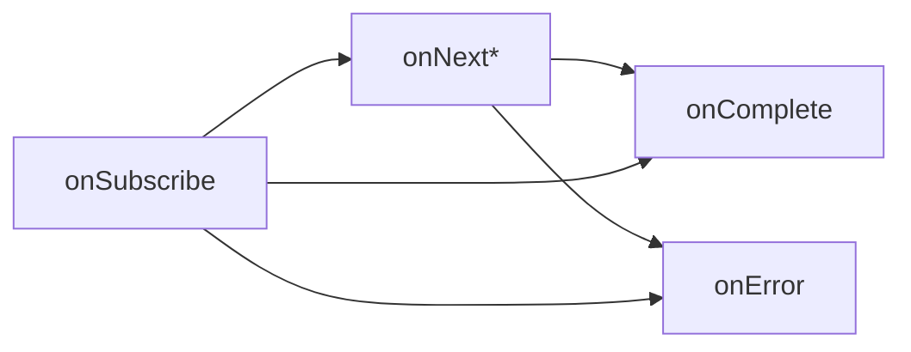
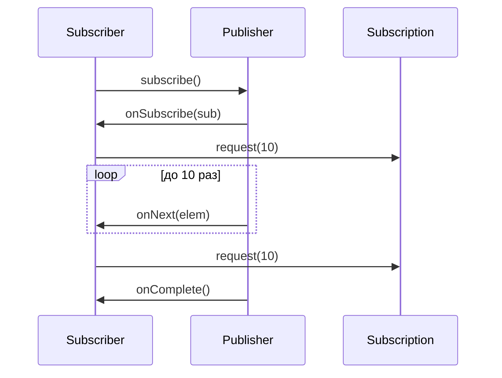

# Вопросы на собеседовании: `Reactive Streams`

Гид по спецификации `Reactive Streams` — фундаменту всех реактивных библиотек на `JVM`: `Project Reactor`, `RxJava`, `Akka Streams`. Охватывает четыре базовых интерфейса, backpressure, `TCK` и взаимодействие реализаций.

**`Reactive Streams`** — минималистичная спецификация (4 интерфейса, 43 правила), стандартизирующая асинхронную обработку потоков данных с неблокирующим backpressure. Включена в `JDK 9+` как `java.util.concurrent.Flow`.

## Полезные ссылки

### Официальная документация

- [Reactive Streams Specification](https://www.reactive-streams.org/) — официальный сайт
- [Reactive Streams JVM GitHub](https://github.com/reactive-streams/reactive-streams-jvm) — исходники спецификации и `TCK`
- [JDK Flow API](https://docs.oracle.com/en/java/javase/17/docs/api/java.base/java/util/concurrent/Flow.html) — `java.util.concurrent.Flow`

### Статьи Baeldung

- [Introduction to the Java Reactive Streams API](https://www.baeldung.com/java-9-reactive-streams) — `Flow API`
- [Reactive Streams with Akka Streams](https://www.baeldung.com/akka-streams) — `Akka Streams`
- [Spring Reactor Backpressure](https://www.baeldung.com/spring-webflux-backpressure) — backpressure на практике

## Содержание

- [Полезные ссылки](#полезные-ссылки)
- [See also](#see-also)

**Основы спецификации**
- [Q1. (!) Что такое Reactive Streams и зачем спецификация нужна?](#q1--что-такое-reactive-streams-и-зачем-спецификация-нужна)
- [Q2. (!) Какие 4 интерфейса входят в Reactive Streams?](#q2--какие-4-интерфейса-входят-в-reactive-streams)
- [Q3. Как соотносятся Reactive Streams и java.util.concurrent.Flow?](#q3-как-соотносятся-reactive-streams-и-javautilconcurrentflow)
- [Q4. Какие реализации Reactive Streams существуют?](#q4-какие-реализации-reactive-streams-существуют)

**Publisher и Subscriber**
- [Q5. (!) Что делает интерфейс Publisher?](#q5--что-делает-интерфейс-publisher)
- [Q6. (!) Что делает интерфейс Subscriber?](#q6--что-делает-интерфейс-subscriber)
- [Q7. В каком порядке вызываются методы Subscriber?](#q7-в-каком-порядке-вызываются-методы-subscriber)
- [Q8. Может ли Subscriber получить onNext до onSubscribe?](#q8-может-ли-subscriber-получить-onnext-до-onsubscribe)

**Subscription и backpressure**
- [Q9. (!) Что такое Subscription и зачем она нужна?](#q9--что-такое-subscription-и-зачем-она-нужна)
- [Q10. (!) Что такое backpressure в Reactive Streams?](#q10--что-такое-backpressure-в-reactive-streams)
- [Q11. Что произойдёт при request(0) или request(-1)?](#q11-что-произойдёт-при-request0-или-request-1)
- [Q12. Что делает метод cancel()?](#q12-что-делает-метод-cancel)

**Processor**
- [Q13. (!) Что такое Processor?](#q13--что-такое-processor)
- [Q14. Приведите пример использования Processor.](#q14-приведите-пример-использования-processor)

**Стратегии backpressure**
- [Q15. (!) Какие стратегии backpressure существуют?](#q15--какие-стратегии-backpressure-существуют)
- [Q16. Чем отличаются стратегии BUFFER, DROP, LATEST, ERROR?](#q16-чем-отличаются-стратегии-buffer-drop-latest-error)
- [Q17. Когда выбирать DROP, а когда LATEST?](#q17-когда-выбирать-drop-а-когда-latest)

**Правила спецификации**
- [Q18. (!) Какие главные правила для Publisher?](#q18--какие-главные-правила-для-publisher)
- [Q19. Какие главные правила для Subscriber?](#q19-какие-главные-правила-для-subscriber)
- [Q20. Какие правила для Subscription?](#q20-какие-правила-для-subscription)

**TCK**
- [Q21. (!) Что такое TCK и зачем он нужен?](#q21--что-такое-tck-и-зачем-он-нужен)
- [Q22. Какие типы тестов в TCK?](#q22-какие-типы-тестов-в-tck)

**Взаимодействие реализаций**
- [Q23. (!) Как Reactor и RxJava взаимодействуют через Reactive Streams?](#q23--как-reactor-и-rxjava-взаимодействуют-через-reactive-streams)
- [Q24. Как использовать Flux как Publisher в RxJava?](#q24-как-использовать-flux-как-publisher-в-rxjava)
- [Q25. Что такое Akka Streams и как связан с Reactive Streams?](#q25-что-такое-akka-streams-и-как-связан-с-reactive-streams)

**Практика и ошибки**
- [Q26. (!) Какие типичные ошибки при реализации Publisher?](#q26--какие-типичные-ошибки-при-реализации-publisher)
- [Q27. Можно ли реализовать Publisher вручную?](#q27-можно-ли-реализовать-publisher-вручную)
- [Q28. Чем Reactive Streams отличаются от Java Streams?](#q28-чем-reactive-streams-отличаются-от-java-streams)
- [Q29. Поддерживает ли Reactive Streams синхронное выполнение?](#q29-поддерживает-ли-reactive-streams-синхронное-выполнение)
- [Q30. (!) Что такое "push-pull" модель в Reactive Streams?](#q30--что-такое-push-pull-модель-в-reactive-streams)

---

## Q1. (!) Что такое Reactive Streams и зачем спецификация нужна?

**`Reactive Streams`** — стандарт для асинхронной обработки потоков с **неблокирующим backpressure**. Опубликован в 2015, авторы — Netflix, Pivotal, Lightbend, Red Hat.

Проблема, которую решает:
- До спецификации каждая реактивная библиотека имела свои интерфейсы (`RxJava` `Observable`, `Akka` `Source`, `Reactor` `Flux`).
- Интероперабельность отсутствовала — нельзя было "склеить" два потока из разных библиотек.
- Backpressure реализовывался по-разному (либо буферизация, либо drop).

Спецификация определяет:
- 4 интерфейса (`Publisher`, `Subscriber`, `Subscription`, `Processor`)
- 43 правила поведения
- `TCK` — набор тестов для проверки реализаций


> [!mcq]
> - [x] Правильный ответ | Объяснение 2-3 предложения Это ключевое разграничение из best practice.
> - [ ] Вариант А | Почему неверно 2-3 предложения ❌ ПОСЛЕДСТВИЕ: типичная ошибка вызывает баг в production без покрытия тестами.
> - [ ] Вариант В | Почему неверно 2-3 предложения ❌ ПОСЛЕДСТВИЕ: типичная ошибка вызывает баг в production без покрытия тестами.
> - [ ] Вариант С | Почему неверно 2-3 предложения ❌ ПОСЛЕДСТВИЕ: типичная ошибка вызывает баг в production без покрытия тестами.
**Итог:** `Reactive Streams` — это минимальный общий язык для реактивных библиотек. Любой `Publisher` от одной библиотеки можно подключить к `Subscriber` другой.

## Q2. (!) Какие 4 интерфейса входят в Reactive Streams?

| Интерфейс | Роль |
|-----------|------|
| `Publisher<T>` | Источник элементов. Один метод: `subscribe(Subscriber<? super T>)` |
| `Subscriber<T>` | Потребитель. 4 метода: `onSubscribe`, `onNext`, `onError`, `onComplete` |
| `Subscription` | Связь между `Publisher` и `Subscriber`. 2 метода: `request(long n)`, `cancel()` |
| `Processor<T,R>` | Одновременно `Subscriber` и `Publisher`. Промежуточный узел обработки |

```java
public interface Publisher<T> {
    void subscribe(Subscriber<? super T> s);
}

public interface Subscriber<T> {
    void onSubscribe(Subscription s);
    void onNext(T t);
    void onError(Throwable t);
    void onComplete();
}

public interface Subscription {
    void request(long n);
    void cancel();
}


> [!mcq]
> - [x] Правильный ответ | Объяснение 2-3 предложения Это ключевое разграничение из best practice.
> - [ ] Вариант А | Почему неверно 2-3 предложения ❌ ПОСЛЕДСТВИЕ: типичная ошибка вызывает баг в production без покрытия тестами.
> - [ ] Вариант В | Почему неверно 2-3 предложения ❌ ПОСЛЕДСТВИЕ: типичная ошибка вызывает баг в production без покрытия тестами.
> - [ ] Вариант С | Почему неверно 2-3 предложения ❌ ПОСЛЕДСТВИЕ: типичная ошибка вызывает баг в production без покрытия тестами.
public interface Processor<T, R> extends Subscriber<T>, Publisher<R> {}
```

## Q3. Как соотносятся Reactive Streams и java.util.concurrent.Flow?

С `JDK 9` спецификация вошла в стандартную библиотеку как `java.util.concurrent.Flow`. Интерфейсы идентичны с точностью до пакета.

| | `Reactive Streams` | `java.util.concurrent.Flow` |
|---|---|---|
| Пакет | `org.reactivestreams.*` | `java.util.concurrent.Flow.*` |
| API | `Publisher`, `Subscriber`, `Subscription`, `Processor` | `Flow.Publisher` и т.д. |
| Версия JDK | Любая | `9+` |

Между ними можно конвертировать через `FlowAdapters` (в библиотеке `org.reactivestreams:reactive-streams-flow-adapters`).


> [!mcq]
> - [x] Правильный ответ | Объяснение 2-3 предложения Это ключевое разграничение из best practice.
> - [ ] Вариант А | Почему неверно 2-3 предложения ❌ ПОСЛЕДСТВИЕ: типичная ошибка вызывает баг в production без покрытия тестами.
> - [ ] Вариант В | Почему неверно 2-3 предложения ❌ ПОСЛЕДСТВИЕ: типичная ошибка вызывает баг в production без покрытия тестами.
> - [ ] Вариант С | Почему неверно 2-3 предложения ❌ ПОСЛЕДСТВИЕ: типичная ошибка вызывает баг в production без покрытия тестами.
**Практика:** большинство библиотек (`Reactor`, `RxJava`) используют `org.reactivestreams.*` — исторически.

## Q4. Какие реализации Reactive Streams существуют?

Основные реализации на `JVM`:


> [!mcq]
> - [x] Правильный ответ | Объяснение 2-3 предложения Это ключевое разграничение из best practice.
> - [ ] Вариант А | Почему неверно 2-3 предложения ❌ ПОСЛЕДСТВИЕ: типичная ошибка вызывает баг в production без покрытия тестами.
> - [ ] Вариант В | Почему неверно 2-3 предложения ❌ ПОСЛЕДСТВИЕ: типичная ошибка вызывает баг в production без покрытия тестами.
> - [ ] Вариант С | Почему неверно 2-3 предложения ❌ ПОСЛЕДСТВИЕ: типичная ошибка вызывает баг в production без покрытия тестами.
- **Project Reactor** — используется в `Spring WebFlux`, `Spring Cloud`. Типы: `Mono<T>`, `Flux<T>`.
- **RxJava 2/3** — библиотека от `Netflix`. Типы: `Observable`, `Flowable`, `Single`, `Maybe`, `Completable`. Только `Flowable` соответствует `Reactive Streams` (поддерживает backpressure).
- **Akka Streams** — от `Lightbend`. Основана на акторах. Типы: `Source`, `Flow`, `Sink`.
- **SmallRye Mutiny** — используется в `Quarkus`. Типы: `Uni`, `Multi`.
- **JDK Flow API** — встроенный стандарт с `Java 9`. Минимальная реализация.

## Q5. (!) Что делает интерфейс Publisher?

`Publisher<T>` — источник потенциально неограниченного числа элементов типа `T`. Его единственный метод — `subscribe(Subscriber)`:

```java
Publisher<Integer> publisher = subscriber -> {
    subscriber.onSubscribe(new Subscription() {
        public void request(long n) { /* push элементы */ }
        public void cancel() { /* cleanup */ }
    });
};
```


> [!mcq]
> - [x] Правильный ответ | Объяснение 2-3 предложения Это ключевое разграничение из best practice.
> - [ ] Вариант А | Почему неверно 2-3 предложения ❌ ПОСЛЕДСТВИЕ: типичная ошибка вызывает баг в production без покрытия тестами.
> - [ ] Вариант В | Почему неверно 2-3 предложения ❌ ПОСЛЕДСТВИЕ: типичная ошибка вызывает баг в production без покрытия тестами.
> - [ ] Вариант С | Почему неверно 2-3 предложения ❌ ПОСЛЕДСТВИЕ: типичная ошибка вызывает баг в production без покрытия тестами.
Правила:
- `subscribe()` может вызываться много раз — каждый вызов создаёт отдельный поток данных.
- `Publisher` не должен push элементы до `Subscription.request()`.
- Число вызовов `onNext` не должно превышать сумму всех `request(n)`.
- После `onError` / `onComplete` — никаких новых сигналов.

## Q6. (!) Что делает интерфейс Subscriber?

`Subscriber<T>` — потребитель элементов. 4 метода-колбэка:

```java
public interface Subscriber<T> {
    void onSubscribe(Subscription s); // связь установлена — здесь обычно s.request(N)
    void onNext(T t);                 // новый элемент
    void onError(Throwable t);        // терминальный сигнал-ошибка
    void onComplete();                // терминальный сигнал-успех
}
```


> [!mcq]
> - [x] Правильный ответ | Объяснение 2-3 предложения Это ключевое разграничение из best practice.
> - [ ] Вариант А | Почему неверно 2-3 предложения ❌ ПОСЛЕДСТВИЕ: типичная ошибка вызывает баг в production без покрытия тестами.
> - [ ] Вариант В | Почему неверно 2-3 предложения ❌ ПОСЛЕДСТВИЕ: типичная ошибка вызывает баг в production без покрытия тестами.
> - [ ] Вариант С | Почему неверно 2-3 предложения ❌ ПОСЛЕДСТВИЕ: типичная ошибка вызывает баг в production без покрытия тестами.
Ключевое:
- `onSubscribe` вызывается **ровно один раз**.
- `onNext` — 0..N раз, не может быть вызван параллельно.
- Либо `onError`, либо `onComplete`, но не оба.

## Q7. В каком порядке вызываются методы Subscriber?

Строгий порядок (serially, не параллельно):



Типичная последовательность:
1. `onSubscribe(sub)` — `Subscriber` сохраняет `sub`, вызывает `sub.request(n)`
2. `onNext(e1), onNext(e2), ..., onNext(eN)` — до исчерпания request
3. `onComplete()` или `onError(t)`


> [!mcq]
> - [x] Правильный ответ | Объяснение 2-3 предложения Это ключевое разграничение из best practice.
> - [ ] Вариант А | Почему неверно 2-3 предложения ❌ ПОСЛЕДСТВИЕ: типичная ошибка вызывает баг в production без покрытия тестами.
> - [ ] Вариант В | Почему неверно 2-3 предложения ❌ ПОСЛЕДСТВИЕ: типичная ошибка вызывает баг в production без покрытия тестами.
> - [ ] Вариант С | Почему неверно 2-3 предложения ❌ ПОСЛЕДСТВИЕ: типичная ошибка вызывает баг в production без покрытия тестами.
**Важно:** сигналы сериализованы, но **не обязательно в одном потоке**. `Publisher` может эмитить в разных потоках, но гарантирует happens-before для `Subscriber`.

## Q8. Может ли Subscriber получить onNext до onSubscribe?

**Нет.** Правило 1.9 спецификации: `Publisher` **обязан** вызвать `onSubscribe` первым. Иначе `Subscriber` не имеет `Subscription` и не может управлять потоком.


> [!mcq]
> - [x] Правильный ответ | Объяснение 2-3 предложения Это ключевое разграничение из best practice.
> - [ ] Вариант А | Почему неверно 2-3 предложения ❌ ПОСЛЕДСТВИЕ: типичная ошибка вызывает баг в production без покрытия тестами.
> - [ ] Вариант В | Почему неверно 2-3 предложения ❌ ПОСЛЕДСТВИЕ: типичная ошибка вызывает баг в production без покрытия тестами.
> - [ ] Вариант С | Почему неверно 2-3 предложения ❌ ПОСЛЕДСТВИЕ: типичная ошибка вызывает баг в production без покрытия тестами.
Если `Subscriber` получает `onNext` без предварительного `onSubscribe` — это нарушение контракта, которое ловится `TCK`.

## Q9. (!) Что такое Subscription и зачем она нужна?

`Subscription` — связь между конкретным `Publisher` и конкретным `Subscriber`. Именно через неё `Subscriber` управляет backpressure:

```java
public interface Subscription {
    void request(long n); // запросить ещё n элементов
    void cancel();        // разорвать подписку
}
```


> [!mcq]
> - [x] Правильный ответ | Объяснение 2-3 предложения Это ключевое разграничение из best practice.
> - [ ] Вариант А | Почему неверно 2-3 предложения ❌ ПОСЛЕДСТВИЕ: типичная ошибка вызывает баг в production без покрытия тестами.
> - [ ] Вариант В | Почему неверно 2-3 предложения ❌ ПОСЛЕДСТВИЕ: типичная ошибка вызывает баг в production без покрытия тестами.
> - [ ] Вариант С | Почему неверно 2-3 предложения ❌ ПОСЛЕДСТВИЕ: типичная ошибка вызывает баг в production без покрытия тестами.
Зачем:
- Без `Subscription` `Publisher` бы слал элементы как хотел → перегрузка `Subscriber`.
- `request(n)` сигнализирует: "я готов обработать ещё `n` элементов".
- `cancel()` — завершить подписку (освободить ресурсы).

## Q10. (!) Что такое backpressure в Reactive Streams?

**Backpressure** — механизм, позволяющий медленному `Subscriber` регулировать скорость `Publisher`. В `Reactive Streams` это реализовано через **pull-based request** в `Subscription`.

Без backpressure:
```
Publisher: 100k событий/сек →→→ Subscriber: 10k событий/сек
Результат: OOM, очередь переполняется
```

С backpressure:
```
Subscriber: request(100)
Publisher: emits до 100 → ждёт нового request
Subscriber: обработал → request(100)
```


> [!mcq]
> - [x] Правильный ответ | Объяснение 2-3 предложения Это ключевое разграничение из best practice.
> - [ ] Вариант А | Почему неверно 2-3 предложения ❌ ПОСЛЕДСТВИЕ: типичная ошибка вызывает баг в production без покрытия тестами.
> - [ ] Вариант В | Почему неверно 2-3 предложения ❌ ПОСЛЕДСТВИЕ: типичная ошибка вызывает баг в production без покрытия тестами.
> - [ ] Вариант С | Почему неверно 2-3 предложения ❌ ПОСЛЕДСТВИЕ: типичная ошибка вызывает баг в production без покрытия тестами.
**Итог:** без перегрузки. `Subscriber` диктует темп.

## Q11. Что произойдёт при request(0) или request(-1)?

- `request(0)` — no-op (ничего не происходит).
- `request(n)` при `n <= 0` — `Publisher` должен вызвать `onError(IllegalArgumentException)`.


> [!mcq]
> - [x] Правильный ответ | Объяснение 2-3 предложения Это ключевое разграничение из best practice.
> - [ ] Вариант А | Почему неверно 2-3 предложения ❌ ПОСЛЕДСТВИЕ: типичная ошибка вызывает баг в production без покрытия тестами.
> - [ ] Вариант В | Почему неверно 2-3 предложения ❌ ПОСЛЕДСТВИЕ: типичная ошибка вызывает баг в production без покрытия тестами.
> - [ ] Вариант С | Почему неверно 2-3 предложения ❌ ПОСЛЕДСТВИЕ: типичная ошибка вызывает баг в production без покрытия тестами.
Правило 3.9 спецификации: запрос неположительного числа — сигнал ошибки. Это ловит баги: чаще всего `request(0)` — случайный результат арифметики.

## Q12. Что делает метод cancel()?

`cancel()` сообщает `Publisher`: подписка больше не нужна. `Publisher` должен:
- Прекратить вызовы `onNext`.
- Освободить ресурсы (закрыть соединение, отменить таймер).
- Не вызывать `onComplete` / `onError` после `cancel()` (но это не запрещено).


> [!mcq]
> - [x] Правильный ответ | Объяснение 2-3 предложения Это ключевое разграничение из best practice.
> - [ ] Вариант А | Почему неверно 2-3 предложения ❌ ПОСЛЕДСТВИЕ: типичная ошибка вызывает баг в production без покрытия тестами.
> - [ ] Вариант В | Почему неверно 2-3 предложения ❌ ПОСЛЕДСТВИЕ: типичная ошибка вызывает баг в production без покрытия тестами.
> - [ ] Вариант С | Почему неверно 2-3 предложения ❌ ПОСЛЕДСТВИЕ: типичная ошибка вызывает баг в production без покрытия тестами.
`cancel()` **идемпотентен** — повторные вызовы безопасны.

## Q13. (!) Что такое Processor?

`Processor<T, R>` — одновременно `Subscriber<T>` и `Publisher<R>`. Используется как промежуточный узел в цепочке обработки:

```
upstream Publisher<T> → Processor<T,R> → downstream Subscriber<R>
```

Примеры применения:
- Буферизация / batching
- Трансформация типов
- Fan-out (один вход, много выходов)

В `Reactor` `Processor` устарел (объявлен `deprecated`) — вместо него рекомендуются `Sinks`:


> [!mcq]
> - [x] Правильный ответ | Объяснение 2-3 предложения Это ключевое разграничение из best practice.
> - [ ] Вариант А | Почему неверно 2-3 предложения ❌ ПОСЛЕДСТВИЕ: типичная ошибка вызывает баг в production без покрытия тестами.
> - [ ] Вариант В | Почему неверно 2-3 предложения ❌ ПОСЛЕДСТВИЕ: типичная ошибка вызывает баг в production без покрытия тестами.
> - [ ] Вариант С | Почему неверно 2-3 предложения ❌ ПОСЛЕДСТВИЕ: типичная ошибка вызывает баг в production без покрытия тестами.
```java
Sinks.Many<String> sink = Sinks.many().multicast().onBackpressureBuffer();
Flux<String> flux = sink.asFlux();
sink.tryEmitNext("hello");
```

## Q14. Приведите пример использования Processor.

Классический пример — **hot publisher** (событийная шина):

```java
// Устаревший API
DirectProcessor<Integer> processor = DirectProcessor.create();
processor.subscribe(e -> System.out.println("A: " + e));
processor.subscribe(e -> System.out.println("B: " + e));
processor.onNext(1); // оба подписчика получат 1


> [!mcq]
> - [x] Правильный ответ | Объяснение 2-3 предложения Это ключевое разграничение из best practice.
> - [ ] Вариант А | Почему неверно 2-3 предложения ❌ ПОСЛЕДСТВИЕ: типичная ошибка вызывает баг в production без покрытия тестами.
> - [ ] Вариант В | Почему неверно 2-3 предложения ❌ ПОСЛЕДСТВИЕ: типичная ошибка вызывает баг в production без покрытия тестами.
> - [ ] Вариант С | Почему неверно 2-3 предложения ❌ ПОСЛЕДСТВИЕ: типичная ошибка вызывает баг в production без покрытия тестами.
// Современный API через Sinks
Sinks.Many<Integer> sink = Sinks.many().multicast().directBestEffort();
Flux<Integer> flux = sink.asFlux();
flux.subscribe(e -> System.out.println("A: " + e));
flux.subscribe(e -> System.out.println("B: " + e));
sink.tryEmitNext(1);
```

## Q15. (!) Какие стратегии backpressure существуют?

Когда `Publisher` быстрее `Subscriber`, используются 5 стратегий:

| Стратегия | Поведение |
|-----------|-----------|
| `BUFFER` | Копить элементы в буфере (риск OOM) |
| `DROP` | Сбрасывать новые элементы при переполнении |
| `LATEST` | Хранить только последний элемент |
| `ERROR` | Послать `onError` при переполнении |
| `IGNORE` | Игнорировать backpressure (рискованно) |


> [!mcq]
> - [x] Правильный ответ | Объяснение 2-3 предложения Это ключевое разграничение из best practice.
> - [ ] Вариант А | Почему неверно 2-3 предложения ❌ ПОСЛЕДСТВИЕ: типичная ошибка вызывает баг в production без покрытия тестами.
> - [ ] Вариант В | Почему неверно 2-3 предложения ❌ ПОСЛЕДСТВИЕ: типичная ошибка вызывает баг в production без покрытия тестами.
> - [ ] Вариант С | Почему неверно 2-3 предложения ❌ ПОСЛЕДСТВИЕ: типичная ошибка вызывает баг в production без покрытия тестами.
В `Reactor`:
```java
Flux.create(sink -> {...}, FluxSink.OverflowStrategy.DROP);
```

## Q16. Чем отличаются стратегии BUFFER, DROP, LATEST, ERROR?


> [!mcq]
> - [x] Правильный ответ | Объяснение 2-3 предложения Это ключевое разграничение из best practice.
> - [ ] Вариант А | Почему неверно 2-3 предложения ❌ ПОСЛЕДСТВИЕ: типичная ошибка вызывает баг в production без покрытия тестами.
> - [ ] Вариант В | Почему неверно 2-3 предложения ❌ ПОСЛЕДСТВИЕ: типичная ошибка вызывает баг в production без покрытия тестами.
> - [ ] Вариант С | Почему неверно 2-3 предложения ❌ ПОСЛЕДСТВИЕ: типичная ошибка вызывает баг в production без покрытия тестами.
| Стратегия | При переполнении | Когда использовать |
|-----------|------------------|-------------------|
| `BUFFER` | Буферизует в памяти (unbounded по умолчанию) | Когда bursts короткие и объём предсказуем |
| `DROP` | Выбрасывает новые элементы | Логи, метрики (потеря приемлема) |
| `LATEST` | Хранит последний, старые удаляет | UI updates (важно только текущее состояние) |
| `ERROR` | `MissingBackpressureException` | Явная сигнализация багу в топологии |

## Q17. Когда выбирать DROP, а когда LATEST?

- **`DROP`** — когда **не важно**, какое именно сообщение потеряно. Примеры: клики на кнопку спама, логи DEBUG.
- **`LATEST`** — когда важно **последнее актуальное значение**. Примеры: цена акции, позиция курсора, состояние UI.


> [!mcq]
> - [x] Правильный ответ | Объяснение 2-3 предложения Это ключевое разграничение из best practice.
> - [ ] Вариант А | Почему неверно 2-3 предложения ❌ ПОСЛЕДСТВИЕ: типичная ошибка вызывает баг в production без покрытия тестами.
> - [ ] Вариант В | Почему неверно 2-3 предложения ❌ ПОСЛЕДСТВИЕ: типичная ошибка вызывает баг в production без покрытия тестами.
> - [ ] Вариант С | Почему неверно 2-3 предложения ❌ ПОСЛЕДСТВИЕ: типичная ошибка вызывает баг в production без покрытия тестами.
Пример на цену акции:
- `DROP`: может сохранить старую цену $100, пропустив свежую $150.
- `LATEST`: всегда сохранит последнюю $150 → корректнее.

## Q18. (!) Какие главные правила для Publisher?

Правила (сокращённо):
1. Число `onNext` не превышает сумму `request(n)`.
2. После `onError` / `onComplete` — никаких сигналов.
3. Если `request(0)` или `request(-n)` — вызвать `onError(IllegalArgumentException)`.
4. `onSubscribe` вызывается первым и ровно один раз.
5. Сигналы сериализованы (не параллельны для одного `Subscriber`).
6. После `cancel()` можно не слать сигналы, но допустимо (race condition).


> [!mcq]
> - [x] Правильный ответ | Объяснение 2-3 предложения Это ключевое разграничение из best practice.
> - [ ] Вариант А | Почему неверно 2-3 предложения ❌ ПОСЛЕДСТВИЕ: типичная ошибка вызывает баг в production без покрытия тестами.
> - [ ] Вариант В | Почему неверно 2-3 предложения ❌ ПОСЛЕДСТВИЕ: типичная ошибка вызывает баг в production без покрытия тестами.
> - [ ] Вариант С | Почему неверно 2-3 предложения ❌ ПОСЛЕДСТВИЕ: типичная ошибка вызывает баг в production без покрытия тестами.
**Основной принцип:** `Publisher` не перегружает `Subscriber` и не шлёт сигналы после терминации.

## Q19. Какие главные правила для Subscriber?


> [!mcq]
> - [x] Правильный ответ | Объяснение 2-3 предложения Это ключевое разграничение из best practice.
> - [ ] Вариант А | Почему неверно 2-3 предложения ❌ ПОСЛЕДСТВИЕ: типичная ошибка вызывает баг в production без покрытия тестами.
> - [ ] Вариант В | Почему неверно 2-3 предложения ❌ ПОСЛЕДСТВИЕ: типичная ошибка вызывает баг в production без покрытия тестами.
> - [ ] Вариант С | Почему неверно 2-3 предложения ❌ ПОСЛЕДСТВИЕ: типичная ошибка вызывает баг в production без покрытия тестами.
Из спецификации:
1. `Subscriber` должен вызывать `Subscription.request` или `cancel` для получения элементов.
2. Сигналы обрабатываются асинхронно и не блокируют вызывающий поток.
3. `Subscriber` обязан быть готов получить `onError` в любой момент.
4. `Subscriber.onSubscribe` / `onNext` / `onError` / `onComplete` не бросают исключения (это ошибка реализации).
5. Если `onSubscribe` вызван дважды — второй `Subscription` нужно отменить.

## Q20. Какие правила для Subscription?


> [!mcq]
> - [x] Правильный ответ | Объяснение 2-3 предложения Это ключевое разграничение из best practice.
> - [ ] Вариант А | Почему неверно 2-3 предложения ❌ ПОСЛЕДСТВИЕ: типичная ошибка вызывает баг в production без покрытия тестами.
> - [ ] Вариант В | Почему неверно 2-3 предложения ❌ ПОСЛЕДСТВИЕ: типичная ошибка вызывает баг в production без покрытия тестами.
> - [ ] Вариант С | Почему неверно 2-3 предложения ❌ ПОСЛЕДСТВИЕ: типичная ошибка вызывает баг в production без покрытия тестами.
- `request(n)` можно вызывать из `onNext` / `onSubscribe` (главное — не из `Publisher.subscribe`).
- `request(n)` с `n > Long.MAX_VALUE` трактуется как "unbounded" (нет backpressure).
- `cancel()` идемпотентен и не бросает исключений.
- `cancel()` останавливает сигналы в разумное время (не гарантированно мгновенно).

## Q21. (!) Что такое TCK и зачем он нужен?

**`TCK`** (Technology Compatibility Kit) — набор автоматических тестов для проверки соответствия реализации спецификации. Написан на `TestNG`.

Зачем:
- Гарантирует, что реализация корректна (проверено ~160 тестов).
- Без `TCK` нельзя гарантировать интероперабельность.
- Каждая новая реализация `Reactive Streams` обязана проходить `TCK`.

Подключение:
```gradle
testImplementation 'org.reactivestreams:reactive-streams-tck:1.0.4'
```


> [!mcq]
> - [x] Правильный ответ | Объяснение 2-3 предложения Это ключевое разграничение из best practice.
> - [ ] Вариант А | Почему неверно 2-3 предложения ❌ ПОСЛЕДСТВИЕ: типичная ошибка вызывает баг в production без покрытия тестами.
> - [ ] Вариант В | Почему неверно 2-3 предложения ❌ ПОСЛЕДСТВИЕ: типичная ошибка вызывает баг в production без покрытия тестами.
> - [ ] Вариант С | Почему неверно 2-3 предложения ❌ ПОСЛЕДСТВИЕ: типичная ошибка вызывает баг в production без покрытия тестами.
Тест:
```java
public class MyPublisherTest extends PublisherVerification<Integer> {
    public MyPublisherTest() { super(new TestEnvironment()); }
    
    public Publisher<Integer> createPublisher(long elements) {
        return new MyPublisher(elements);
    }
    // ~30 тестов автоматически
}
```

## Q22. Какие типы тестов в TCK?

`TCK` содержит:
- `PublisherVerification` — тесты для `Publisher` (правила 1.x)
- `SubscriberBlackboxVerification` — black-box тесты `Subscriber`
- `SubscriberWhiteboxVerification` — white-box тесты (можно вмешиваться в `Subscription`)
- `IdentityProcessorVerification` — тесты для `Processor`


> [!mcq]
> - [x] Правильный ответ | Объяснение 2-3 предложения Это ключевое разграничение из best practice.
> - [ ] Вариант А | Почему неверно 2-3 предложения ❌ ПОСЛЕДСТВИЕ: типичная ошибка вызывает баг в production без покрытия тестами.
> - [ ] Вариант В | Почему неверно 2-3 предложения ❌ ПОСЛЕДСТВИЕ: типичная ошибка вызывает баг в production без покрытия тестами.
> - [ ] Вариант С | Почему неверно 2-3 предложения ❌ ПОСЛЕДСТВИЕ: типичная ошибка вызывает баг в production без покрытия тестами.
Что проверяют: порядок сигналов, backpressure, обработку `cancel`, fail-fast на некорректные input и т.п.

## Q23. (!) Как Reactor и RxJava взаимодействуют через Reactive Streams?

Оба — совместимы по `org.reactivestreams.Publisher`. Можно конвертировать в обе стороны:

```java
// Reactor Flux → RxJava Flowable
Flux<Integer> flux = Flux.just(1, 2, 3);
Flowable<Integer> flowable = Flowable.fromPublisher(flux);

// RxJava Flowable → Reactor Flux
Flowable<Integer> flowable = Flowable.just(1, 2, 3);
Flux<Integer> flux = Flux.from(flowable);
```


> [!mcq]
> - [x] Правильный ответ | Объяснение 2-3 предложения Это ключевое разграничение из best practice.
> - [ ] Вариант А | Почему неверно 2-3 предложения ❌ ПОСЛЕДСТВИЕ: типичная ошибка вызывает баг в production без покрытия тестами.
> - [ ] Вариант В | Почему неверно 2-3 предложения ❌ ПОСЛЕДСТВИЕ: типичная ошибка вызывает баг в production без покрытия тестами.
> - [ ] Вариант С | Почему неверно 2-3 предложения ❌ ПОСЛЕДСТВИЕ: типичная ошибка вызывает баг в production без покрытия тестами.
Операторы **не переносятся** — после конвертации вы работаете с API другой библиотеки. Общий протокол — только сам `Publisher/Subscriber`.

## Q24. Как использовать Flux как Publisher в RxJava?

```java
import io.reactivex.rxjava3.core.Flowable;
import reactor.core.publisher.Flux;

Flux<String> reactorFlux = Flux.just("a", "b", "c");
// Flux уже Publisher → Flowable.fromPublisher принимает его напрямую
Flowable<String> rxFlowable = Flowable.fromPublisher(reactorFlux);

rxFlowable
    .map(String::toUpperCase)
    .subscribe(System.out::println);
```


> [!mcq]
> - [x] Правильный ответ | Объяснение 2-3 предложения Это ключевое разграничение из best practice.
> - [ ] Вариант А | Почему неверно 2-3 предложения ❌ ПОСЛЕДСТВИЕ: типичная ошибка вызывает баг в production без покрытия тестами.
> - [ ] Вариант В | Почему неверно 2-3 предложения ❌ ПОСЛЕДСТВИЕ: типичная ошибка вызывает баг в production без покрытия тестами.
> - [ ] Вариант С | Почему неверно 2-3 предложения ❌ ПОСЛЕДСТВИЕ: типичная ошибка вызывает баг в production без покрытия тестами.
Обратное работает аналогично: `Flux.from(rxFlowable)`.

## Q25. Что такое Akka Streams и как связан с Reactive Streams?

**`Akka Streams`** — реализация реактивного программирования на базе актор-системы `Akka`. Основные типы:
- `Source[T]` — источник (аналог `Publisher`)
- `Flow[In, Out]` — трансформация (аналог `Processor`)
- `Sink[T]` — потребитель (аналог `Subscriber`)

Совместимость:
- `Source` → `Publisher` через `.runWith(Sink.asPublisher(fanout))`
- `Sink.fromSubscriber(subscriber)` — превратить `Subscriber` в `Sink`


> [!mcq]
> - [x] Правильный ответ | Объяснение 2-3 предложения Это ключевое разграничение из best practice.
> - [ ] Вариант А | Почему неверно 2-3 предложения ❌ ПОСЛЕДСТВИЕ: типичная ошибка вызывает баг в production без покрытия тестами.
> - [ ] Вариант В | Почему неверно 2-3 предложения ❌ ПОСЛЕДСТВИЕ: типичная ошибка вызывает баг в production без покрытия тестами.
> - [ ] Вариант С | Почему неверно 2-3 предложения ❌ ПОСЛЕДСТВИЕ: типичная ошибка вызывает баг в production без покрытия тестами.
Отличия от `Reactor`/`RxJava`: материализация графа явная (через `Materializer`), сильная интеграция с актор-моделью.

## Q26. (!) Какие типичные ошибки при реализации Publisher?


> [!mcq]
> - [x] Правильный ответ | Объяснение 2-3 предложения Это ключевое разграничение из best practice.
> - [ ] Вариант А | Почему неверно 2-3 предложения ❌ ПОСЛЕДСТВИЕ: типичная ошибка вызывает баг в production без покрытия тестами.
> - [ ] Вариант В | Почему неверно 2-3 предложения ❌ ПОСЛЕДСТВИЕ: типичная ошибка вызывает баг в production без покрытия тестами.
> - [ ] Вариант С | Почему неверно 2-3 предложения ❌ ПОСЛЕДСТВИЕ: типичная ошибка вызывает баг в production без покрытия тестами.
- **Забыть вызвать `onSubscribe`** перед `onNext` → нарушение правила 1.9.
- **Эмитить больше, чем запрошено** → нарушение правила 1.1, у `Subscriber` переполнение.
- **Не сериализовать сигналы** → race conditions в `onNext`.
- **Слать сигналы после `onComplete` / `onError`** → `Subscriber` в неизвестном состоянии.
- **Бесконечный `request(Long.MAX_VALUE)` без bounded buffer** → OOM.
- **Бросать исключения из `onNext`** — `Publisher` обязан обрабатывать.

## Q27. Можно ли реализовать Publisher вручную?

Можно, но **не рекомендуется**. Правильная реализация требует ~200 строк кода для поддержки всех 43 правил спецификации. Проще использовать:

```java
// Reactor: Flux.create / Flux.generate
Flux<Integer> flux = Flux.create(sink -> {
    for (int i = 0; i < 10; i++) sink.next(i);
    sink.complete();
});

// RxJava: Flowable.generate
Flowable<Integer> flowable = Flowable.generate(emitter -> {
    emitter.onNext(42);
});
```


> [!mcq]
> - [x] Правильный ответ | Объяснение 2-3 предложения Это ключевое разграничение из best practice.
> - [ ] Вариант А | Почему неверно 2-3 предложения ❌ ПОСЛЕДСТВИЕ: типичная ошибка вызывает баг в production без покрытия тестами.
> - [ ] Вариант В | Почему неверно 2-3 предложения ❌ ПОСЛЕДСТВИЕ: типичная ошибка вызывает баг в production без покрытия тестами.
> - [ ] Вариант С | Почему неверно 2-3 предложения ❌ ПОСЛЕДСТВИЕ: типичная ошибка вызывает баг в production без покрытия тестами.
Если всё-таки нужно вручную — пишите тесты с `TCK`.

## Q28. Чем Reactive Streams отличаются от Java Streams?


> [!mcq]
> - [x] Правильный ответ | Объяснение 2-3 предложения Это ключевое разграничение из best practice.
> - [ ] Вариант А | Почему неверно 2-3 предложения ❌ ПОСЛЕДСТВИЕ: типичная ошибка вызывает баг в production без покрытия тестами.
> - [ ] Вариант В | Почему неверно 2-3 предложения ❌ ПОСЛЕДСТВИЕ: типичная ошибка вызывает баг в production без покрытия тестами.
> - [ ] Вариант С | Почему неверно 2-3 предложения ❌ ПОСЛЕДСТВИЕ: типичная ошибка вызывает баг в production без покрытия тестами.
| | `Java Streams` (`stream()`) | `Reactive Streams` |
|---|---|---|
| Модель | Pull, синхронная | Push с backpressure, асинхронная |
| Порядок | Сразу при вызове terminal op | Ленивый, запускается на `subscribe` |
| Backpressure | Нет | Встроен через `request(n)` |
| Многократное использование | Нельзя | `Publisher` можно подписывать много раз |
| Время жизни | Обычно мгновенное | Может быть бесконечным |
| Типичные источники | Коллекции, arrays | Сеть, события, БД (реактивные драйверы) |

## Q29. Поддерживает ли Reactive Streams синхронное выполнение?

Да. Спецификация не обязывает асинхронность — только **неблокирующий backpressure**. Пример синхронного `Publisher`:

```java
Flux.range(1, 10)
    .subscribe(System.out::println); // всё в текущем потоке
```

Но если где-то в цепочке есть `subscribeOn(Schedulers.parallel())` — становится асинхронно.


> [!mcq]
> - [x] Правильный ответ | Объяснение 2-3 предложения Это ключевое разграничение из best practice.
> - [ ] Вариант А | Почему неверно 2-3 предложения ❌ ПОСЛЕДСТВИЕ: типичная ошибка вызывает баг в production без покрытия тестами.
> - [ ] Вариант В | Почему неверно 2-3 предложения ❌ ПОСЛЕДСТВИЕ: типичная ошибка вызывает баг в production без покрытия тестами.
> - [ ] Вариант С | Почему неверно 2-3 предложения ❌ ПОСЛЕДСТВИЕ: типичная ошибка вызывает баг в production без покрытия тестами.
**Итог:** `Reactive Streams` — асинхронно-совместимы, но не принуждают к асинхронности.

## Q30. (!) Что такое "push-pull" модель в Reactive Streams?

`Reactive Streams` — **гибрид push и pull**:
- **Pull-часть:** `Subscriber.request(n)` — запрос на `n` элементов.
- **Push-часть:** `Publisher` сам эмитит элементы через `onNext` (до `n`).



Почему гибрид:
- Чистый push → перегрузка медленного `Subscriber`.
- Чистый pull → задержки, низкая пропускная способность.
- **Push-pull** — `Subscriber` контролирует темп, `Publisher` эмитит пакетами.

---

## See also


> [!mcq]
> - [x] Правильный ответ | Объяснение 2-3 предложения Это ключевое разграничение из best practice.
> - [ ] Вариант А | Почему неверно 2-3 предложения ❌ ПОСЛЕДСТВИЕ: типичная ошибка вызывает баг в production без покрытия тестами.
> - [ ] Вариант В | Почему неверно 2-3 предложения ❌ ПОСЛЕДСТВИЕ: типичная ошибка вызывает баг в production без покрытия тестами.
> - [ ] Вариант С | Почему неверно 2-3 предложения ❌ ПОСЛЕДСТВИЕ: типичная ошибка вызывает баг в production без покрытия тестами.
- [Project Reactor](project-reactor-interview.md) — реализация `Reactive Streams` от Pivotal
- [RxJava](rxjava-interview.md) — альтернативная реализация от Netflix
- [[reactor-vs-rxjava-interview|Reactor vs RxJava]] — сравнение двух главных реализаций
- [Реактивные паттерны](reactive-patterns-interview.md) — hot/cold, операторы, debugging
- [Spring WebFlux](webflux-interview.md) — применение Reactive Streams в Spring
- [Тестирование реактивного кода](reactive-testing-interview.md) — StepVerifier, TestPublisher
- [Java Concurrency](../programming-languages/java/java-concurrency-interview.md) — базовая многопоточность
- [Event-Driven паттерны](../architecture/event-driven-patterns-interview.md) — архитектурный контекст
