# Вопросы на собеседовании: `RxJava`

Комплексное руководство по вопросам собеседования на тему `RxJava` для `Senior Java Developer`. Включает детальные
объяснения концепций реактивного программирования, практические примеры кода, marble-диаграммы, best practices и troubleshooting.

**`RxJava`** — реализация `ReactiveX` (Reactive Extensions) для `Java`. Библиотека предоставляет композиционный стиль работы с асинхронными потоками данных через паттерн `Observer`. Широко используется в backend-разработке и Android-приложениях для упрощения работы с конкурентностью, обработкой ошибок и композицией асинхронных операций.

## Полезные ссылки

### Официальная документация

- [ReactiveX/RxJava на GitHub](https://github.com/ReactiveX/RxJava) — исходный код и документация
- [ReactiveX Documentation](http://reactivex.io/documentation) — спецификация операторов и marble-диаграммы
- [Reactive Streams Specification](https://www.reactive-streams.org/) — спецификация реактивных потоков

### Статьи Baeldung

- [Introduction to RxJava](https://www.baeldung.com/rx-java) — введение в RxJava
- [RxJava 2 - Flowable](https://www.baeldung.com/rxjava-2-flowable) — Flowable и backpressure
- [Dealing with Backpressure](https://www.baeldung.com/rxjava-backpressure) — стратегии backpressure
- [How to Test RxJava](https://www.baeldung.com/rxjava-testing) — тестирование реактивных цепочек
- [Schedulers in RxJava](https://www.baeldung.com/rxjava-schedulers) — планировщики
- [Difference Between flatMap and switchMap](https://www.baeldung.com/rxjava-flatmap-switchmap) — flatMap vs switchMap
- [concat() vs merge()](https://www.baeldung.com/java-rxjava-concat-vs-merge) — concat vs merge

## Содержание

- [Полезные ссылки](#полезные-ссылки)
- [See also](#see-also)

**Основы RxJava и реактивного программирования**
- [Q1. (!) RxJava следует шаблону «push» или «pull»?](#q1--rxjava-следует-шаблону-push-или-pull)
- [Q2. В чем разница между onNext(), onComplete() и onError()?](#q2-в-чем-разница-между-onnext-oncomplete-и-onerror)
- [Q3. Сколько раз можно вызвать onNext(), onComplete() и onError()?](#q3-сколько-раз-можно-вызвать-onnext-oncomplete-и-onerror)
- [Q4. (!) Какие есть конструкции в RxJava, кроме Observable?](#q4--какие-есть-конструкции-в-rxjava-кроме-observable)
- [Q5. В чём разница между RxJava 1, RxJava 2 и RxJava 3?](#q5-в-чём-разница-между-rxjava-1-rxjava-2-и-rxjava-3)
- [Q6. (!) Что такое Marble Diagram?](#q6--что-такое-marble-diagram)
- [Q7. Что такое Pure функция и почему она важна в RxJava?](#q7-что-такое-pure-функция-и-почему-она-важна-в-rxjava)

**Observable: Cold, Hot и ConnectableObservable**
- [Q8. (!) Когда Observable начинает испускать элементы?](#q8--когда-observable-начинает-испускать-элементы)
- [Q9. (!) В чём разница между Cold и Hot Observable?](#q9--в-чём-разница-между-cold-и-hot-observable)
- [Q10. (!) Можно ли преобразовать Cold Observable в Hot Observable?](#q10--можно-ли-преобразовать-cold-observable-в-hot-observable)
- [Q11. Можно ли преобразовать Hot Observable в Cold Observable?](#q11-можно-ли-преобразовать-hot-observable-в-cold-observable)
- [Q12. Что такое Observable Chain?](#q12-что-такое-observable-chain)

**Операторы создания**
- [Q13. (!) Какие операторы создания Observable вы знаете?](#q13--какие-операторы-создания-observable-вы-знаете)
- [Q14. В чём разница между Observable.create() и Observable.defer()?](#q14-в-чём-разница-между-observablecreate-и-observabledefer)

**Операторы трансформации**
- [Q15. В чем разница между map() и flatMap()?](#q15-в-чем-разница-между-map-и-flatmap)
- [Q16. (!) В чем разница между flatMap(), concatMap() и switchMap()?](#q16--в-чем-разница-между-flatmap-concatmap-и-switchmap)
- [Q17. В чём разница между concat() и merge()?](#q17-в-чём-разница-между-concat-и-merge)
- [Q18. Можно ли иметь несколько операторов одного типа в одной цепочке?](#q18-можно-ли-иметь-несколько-операторов-одного-типа-в-одной-цепочке)

**Операторы фильтрации и агрегации**
- [Q19. (!) Какие операторы фильтрации есть в RxJava?](#q19--какие-операторы-фильтрации-есть-в-rxjava)
- [Q20. Какие операторы агрегации есть в RxJava?](#q20-какие-операторы-агрегации-есть-в-rxjava)

**Пользовательские операторы и Transformer**
- [Q21. (!) Можно ли создавать собственные операторы в RxJava?](#q21--можно-ли-создавать-собственные-операторы-в-rxjava)
- [Q22. (!) Что такое Transformer и оператор compose()?](#q22--что-такое-transformer-и-оператор-compose)

**Schedulers и многопоточность**
- [Q23. (!) Что такое Scheduler? Какие Schedulers есть в RxJava?](#q23--что-такое-scheduler-какие-schedulers-есть-в-rxjava)
- [Q24. (!) В чем разница между observeOn() и subscribeOn()?](#q24--в-чем-разница-между-observeon-и-subscribeon)
- [Q25. (!) Что произойдет, если несколько subscribeOn() в цепочке?](#q25--что-произойдет-если-несколько-subscribeon-в-цепочке)
- [Q26. Что произойдет, если несколько observeOn() в цепочке?](#q26-что-произойдет-если-несколько-observeon-в-цепочке)
- [Q27. (!) Как данные передаются в RxJava по умолчанию — синхронно или асинхронно?](#q27--как-данные-передаются-в-rxjava-по-умолчанию--синхронно-или-асинхронно)
- [Q28. (!) Поддерживает ли RxJava параллелизм?](#q28--поддерживает-ли-rxjava-параллелизм)

**Subject и RxRelay**
- [Q29. (!) Что такое Subject? Какие типы Subject существуют?](#q29--что-такое-subject-какие-типы-subject-существуют)
- [Q30. В чем разница между Subject и RxRelay?](#q30-в-чем-разница-между-subject-и-rxrelay)

**Backpressure и Flowable**
- [Q31. (!) Что такое backpressure (противодавление)?](#q31--что-такое-backpressure-противодавление)
- [Q32. (!) В чём разница между Observable и Flowable?](#q32--в-чём-разница-между-observable-и-flowable)
- [Q33. (!) Какие стратегии BackpressureStrategy существуют?](#q33--какие-стратегии-backpressurestrategy-существуют)
- [Q34. Как решить проблемы с backpressure?](#q34-как-решить-проблемы-с-backpressure)

**Обработка ошибок**
- [Q35. (!) Какие операторы обработки ошибок вы знаете в RxJava?](#q35--какие-операторы-обработки-ошибок-вы-знаете-в-rxjava)
- [Q36. Что произойдёт, если в цепочке возникнет несколько ошибок?](#q36-что-произойдёт-если-в-цепочке-возникнет-несколько-ошибок)

**Тестирование RxJava**
- [Q37. (!) Как тестировать реактивные цепочки в RxJava?](#q37--как-тестировать-реактивные-цепочки-в-rxjava)
- [Q38. Что такое TestScheduler и как его использовать?](#q38-что-такое-testscheduler-и-как-его-использовать)

**Утечки памяти и Disposable**
- [Q39. (!) Возникают ли утечки памяти при использовании RxJava?](#q39--возникают-ли-утечки-памяти-при-использовании-rxjava)
- [Q40. Что такое CompositeDisposable и зачем он нужен?](#q40-что-такое-compositedisposable-и-зачем-он-нужен)

**Практика и интеграция**
- [Q41. Как осуществить вызов API типа «Fire-And-Forget»?](#q41-как-осуществить-вызов-api-типа-fire-and-forget)
- [Q42. Хорошо ли работает RxJava в сочетании с Kotlin?](#q42-хорошо-ли-работает-rxjava-в-сочетании-с-kotlin)
- [Q43. (!) Какие альтернативы RxJava существуют? Сравните их](#q43--какие-альтернативы-rxjava-существуют-сравните-их)

**Retry, backpressure и обработка ошибок в production**
- [Q44. (!) Как реализовать паттерн retry с exponential backoff в RxJava?](#q44-как-реализовать-паттерн-retry-с-exponential-backoff-в-rxjava)
- [Q45. (!) Какие стратегии BackpressureStrategy и когда их применять?](#q45-какие-стратегии-backpressurestrategy-и-когда-их-применять)
- [Q46. Как обрабатывать ошибки в RxJava цепочках на production?](#q46-как-обрабатывать-ошибки-в-rxjava-цепочках-на-production)

---

## Q1. (!) `RxJava` следует шаблону «push» или «pull»?

`RxJava` следует шаблону **push**. Источник данных (`Observable`) сам проталкивает элементы подписчикам по мере их появления, в отличие от pull-модели (например, `Iterator`), где потребитель запрашивает следующий элемент.

Это реализация паттерна `Observer` — подписчик регистрируется через `subscribe()`, а `Observable` вызывает `onNext()` для каждого нового элемента:

```java
Observable<String> source = Observable.just("A", "B", "C");

// Push-модель: Observable сам вызывает onNext для каждого элемента
source.subscribe(
    item -> System.out.println("Получен: " + item),  // onNext
    error -> System.err.println("Ошибка: " + error),  // onError
    () -> System.out.println("Завершено")              // onComplete
);
```

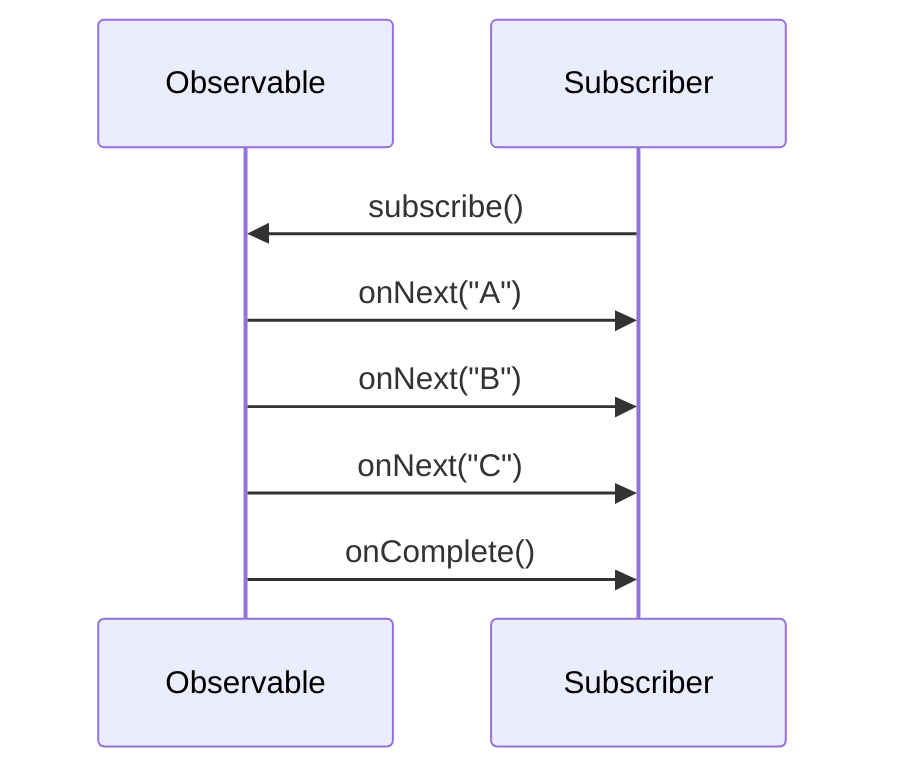

> На собеседовании важно упомянуть, что `Flowable` добавляет элемент **pull** через механизм `request(n)` из `Reactive Streams`, что создаёт гибридную push-pull модель для управления backpressure.

## Q2. В чем разница между `onNext()`, `onComplete()` и `onError()`?

Это три ключевых метода контракта `Observer` в `RxJava`:

| Метод | Назначение | Сколько раз вызывается |
|-------|-----------|----------------------|
| `onNext(T)` | Передача очередного элемента | 0..N раз |
| `onComplete()` | Сигнал успешного завершения потока | Максимум 1 раз |
| `onError(Throwable)` | Сигнал ошибки и завершения потока | Максимум 1 раз |

Контракт `Observable` гарантирует: после вызова `onComplete()` или `onError()` больше никакие события не будут отправлены. Это называется **терминальное событие**.

```java
Observable.<String>create(emitter -> {
    emitter.onNext("Первый");
    emitter.onNext("Второй");
    emitter.onComplete();
    // emitter.onNext("Этот вызов будет проигнорирован")
}).subscribe(
    value -> System.out.println("onNext: " + value),
    error -> System.out.println("onError: " + error.getMessage()),
    () -> System.out.println("onComplete")
);
// Вывод:
// onNext: Первый
// onNext: Второй
// onComplete
```

## Q3. Сколько раз можно вызвать `onNext()`, `onComplete()` и `onError()`?

Контракт `Observable` формально записывается как: **`onNext* (onComplete | onError)?`**

- `onNext()` — от 0 до бесконечности раз
- `onComplete()` — максимум 1 раз (терминальное событие)
- `onError()` — максимум 1 раз (терминальное событие)

После терминального события (`onComplete` или `onError`) поток считается завершённым. Любые последующие вызовы `onNext`, `onComplete` или `onError` будут проигнорированы (в `RxJava 2+` — переданы в глобальный обработчик `RxJavaPlugins.onError`).

## Q4. (!) Какие есть конструкции в `RxJava`, кроме `Observable`?

`RxJava 2/3` предоставляет пять основных типов реактивных источников:

| Тип | Кол-во элементов | Backpressure | Аналогия |
|-----|-----------------|-------------|----------|
| `Observable<T>` | 0..N | Нет | Поток событий |
| `Flowable<T>` | 0..N | Да | Поток с контролем скорости |
| `Single<T>` | Ровно 1 | Нет | `Future<T>` |
| `Maybe<T>` | 0 или 1 | Нет | `Optional<T>` |
| `Completable` | 0 | Нет | `Runnable` |

```java
// Single — ровно одно значение или ошибка
Single<User> user = userRepository.findById(42);

// Maybe — 0 или 1 значение
Maybe<User> maybeUser = cache.get("user:42");

// Completable — только сигнал завершения
Completable saved = userRepository.save(user);

// Flowable — поток с backpressure
Flowable<Event> events = eventBus.listen("orders");
```

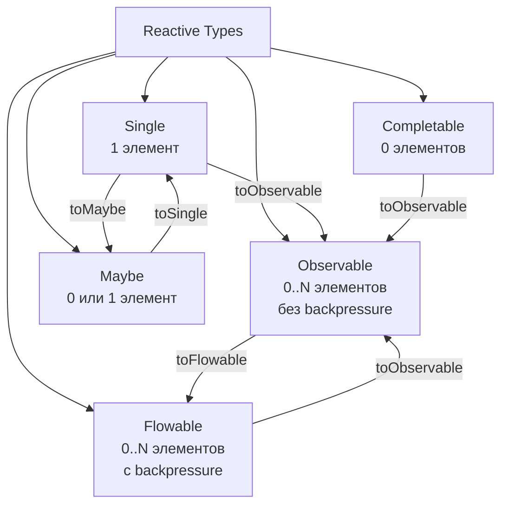

Дополнительно есть `ConnectableObservable` — горячий `Observable`, который начинает испускать элементы только после вызова `connect()`.

## Q5. В чём разница между `RxJava 1`, `RxJava 2` и `RxJava 3`?

| Аспект | `RxJava 1` | `RxJava 2` | `RxJava 3` |
|--------|-----------|-----------|-----------|
| Пакет | `rx.*` | `io.reactivex.*` | `io.reactivex.rxjava3.*` |
| Java | 6+ | 6+ | 8+ |
| `Flowable` | Нет | Да | Да |
| `null` в потоке | Допускается | Запрещён | Запрещён |
| `Reactive Streams` | Нет | Да (v2.0) | Да (v3.0) |
| `Disposable` | `Subscription` | `Disposable` | `Disposable` |
| `Maybe` | Нет | Да | Да |
| Статус | EOL | Maintenance | Активная |

Ключевые изменения в `RxJava 2`:
- Добавлен `Flowable` с поддержкой `Reactive Streams` и backpressure
- `null` значения запрещены в потоках (выбрасывается `NullPointerException`)
- `Subscription` заменён на `Disposable`
- Добавлен тип `Maybe`

`RxJava 3` — эволюционное обновление: совместимость с Java 8+, перенос в новый пакет, мелкие API-улучшения.

## Q6. (!) Что такое `Marble Diagram`?

`Marble Diagram` — визуальное представление работы оператора в реактивном потоке. Каждый элемент показан кружком («marble») на временной оси, а оператор — блоком преобразования между входным и выходным потоком.

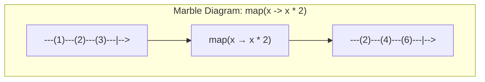

Обозначения:
- `---` — временная ось (слева направо)
- `(значение)` — элемент (`onNext`)
- `|` — завершение (`onComplete`)
- `X` — ошибка (`onError`)
- `-->` — поток продолжается

Marble-диаграммы — стандартный инструмент документации `ReactiveX`. Их можно использовать при объяснении любого оператора на собеседовании.

## Q7. Что такое `Pure` функция и почему она важна в `RxJava`?

**Чистая функция** (pure function) — функция, которая:
1. Всегда возвращает одинаковый результат для одинаковых входных данных
2. Не имеет побочных эффектов (не изменяет внешнее состояние)

В контексте `RxJava` это критически важно, потому что операторы вроде `map()`, `filter()`, `reduce()` принимают функции, которые могут вызываться в разных потоках. Если функция имеет побочные эффекты, это может привести к data races.

```java
// Плохо — побочный эффект, не потокобезопасно
List<String> results = new ArrayList<>();
Observable.just("A", "B", "C")
    .map(s -> {
        results.add(s); // побочный эффект!
        return s.toLowerCase();
    })
    .subscribe();

// Хорошо — чистая функция
Observable.just("A", "B", "C")
    .map(String::toLowerCase)
    .toList()
    .subscribe(list -> System.out.println(list));
```

## Q8. (!) Когда `Observable` начинает испускать элементы?

**Cold `Observable`** начинает испускать элементы только при подписке — вызове метода `subscribe()`. До этого момента никакой работы не выполняется. Это называется **lazy evaluation**.

```java
Observable<Integer> source = Observable.create(emitter -> {
    System.out.println("Начинаю генерацию...");
    emitter.onNext(1);
    emitter.onNext(2);
    emitter.onComplete();
});

System.out.println("Observable создан, но ещё не работает");

// Только здесь начнётся генерация
source.subscribe(v -> System.out.println("Получено: " + v));
// Вывод:
// Observable создан, но ещё не работает
// Начинаю генерацию...
// Получено: 1
// Получено: 2
```

**Hot `Observable`** испускает элементы независимо от подписчиков — подписчик получает только те элементы, которые были испущены после его подписки.

## Q9. (!) В чём разница между `Cold` и `Hot` `Observable`?

| Характеристика | Cold Observable | Hot Observable |
|---------------|----------------|----------------|
| Начало испускания | При подписке | Независимо от подписчиков |
| Данные для подписчика | Полный набор с начала | Только текущие и будущие |
| Подписчики | Каждый получает свою копию | Все разделяют один поток |
| Пример | HTTP-запрос, чтение файла | Клики мыши, WebSocket, биржевые котировки |

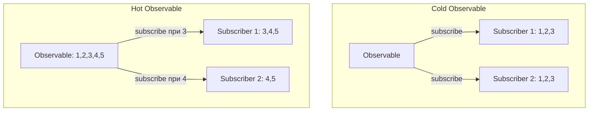

```java
// Cold Observable — каждый подписчик получает все элементы
Observable<Long> cold = Observable.interval(1, TimeUnit.SECONDS).take(3);
cold.subscribe(v -> System.out.println("Sub1: " + v)); // 0, 1, 2
Thread.sleep(2000);
cold.subscribe(v -> System.out.println("Sub2: " + v)); // 0, 1, 2 (заново)

// Hot Observable через publish + connect
ConnectableObservable<Long> hot = Observable.interval(1, TimeUnit.SECONDS).publish();
hot.subscribe(v -> System.out.println("Sub1: " + v));
hot.connect(); // начинаем испускание
Thread.sleep(2000);
hot.subscribe(v -> System.out.println("Sub2: " + v)); // пропустит первые элементы
```

## Q10. (!) Можно ли преобразовать `Cold Observable` в `Hot Observable`?

Да, через оператор `publish()`, который возвращает `ConnectableObservable`. Вызов `connect()` начинает испускание для всех текущих подписчиков одновременно.

```java
Observable<Integer> cold = Observable.range(1, 5);
ConnectableObservable<Integer> hot = cold.publish();

// Подписываемся ДО connect
hot.subscribe(v -> System.out.println("Sub1: " + v));
hot.subscribe(v -> System.out.println("Sub2: " + v));

// Оба подписчика получат все элементы одновременно
hot.connect();
```

Другие способы:
- `share()` — эквивалент `publish().refCount()`, автоматически подключается при первом подписчике и отключается при последнем
- `replay()` — кеширует элементы и воспроизводит их для новых подписчиков
- `replay(n)` — кеширует последние `n` элементов

```java
// share() — автоматический connect/disconnect
Observable<Long> shared = Observable.interval(1, TimeUnit.SECONDS).share();
```

## Q11. Можно ли преобразовать `Hot Observable` в `Cold Observable`?

Да, через оператор `replay()`. Он буферизует все элементы и воспроизводит их для каждого нового подписчика:

```java
ConnectableObservable<Integer> hot = Observable.just(1, 2, 3).publish();
hot.connect();

// replay() кеширует все элементы
Observable<Integer> cold = hot.replay().autoConnect();

// Каждый новый подписчик получит все элементы
cold.subscribe(v -> System.out.println("Sub1: " + v)); // 1, 2, 3
cold.subscribe(v -> System.out.println("Sub2: " + v)); // 1, 2, 3
```

`replay()` может принимать параметры:
- `replay(int bufferSize)` — кешировать только последние N элементов
- `replay(long time, TimeUnit unit)` — кешировать элементы за последний период времени

## Q12. Что такое `Observable Chain`?

`Observable Chain` — последовательность операторов, применяемых к исходному `Observable`. Каждый оператор принимает `Observable` на вход и возвращает новый `Observable` на выходе, что позволяет строить декларативные конвейеры обработки данных.

```java
Observable.just("  hello ", " WORLD ", " RxJava ")
    .map(String::trim)           // убираем пробелы
    .map(String::toLowerCase)    // к нижнему регистру
    .filter(s -> s.length() > 4) // только длинные строки
    .sorted()                    // сортировка
    .subscribe(System.out::println);
// Вывод: hello, rxjava, world
```

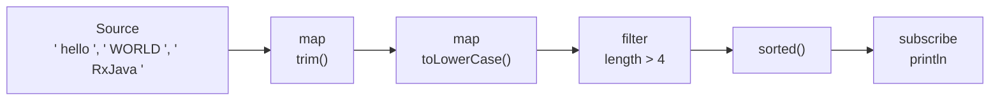

Ключевой принцип: каждый оператор **не мутирует** исходный `Observable`, а создаёт новый. Это обеспечивает иммутабельность цепочки.

## Q13. (!) Какие операторы создания `Observable` вы знаете?

| Оператор | Описание | Пример |
|----------|---------|--------|
| `just(T...)` | Фиксированный набор элементов | `Observable.just(1, 2, 3)` |
| `fromIterable(Iterable)` | Из коллекции | `Observable.fromIterable(list)` |
| `fromArray(T[])` | Из массива | `Observable.fromArray(arr)` |
| `fromCallable(Callable)` | Из вызова (lazy) | `Observable.fromCallable(() -> fetchData())` |
| `create(ObservableOnSubscribe)` | Ручное управление | см. ниже |
| `range(start, count)` | Диапазон чисел | `Observable.range(1, 10)` |
| `interval(period, TimeUnit)` | Периодические тики | `Observable.interval(1, SECONDS)` |
| `timer(delay, TimeUnit)` | Один элемент с задержкой | `Observable.timer(5, SECONDS)` |
| `defer(Supplier)` | Ленивое создание | `Observable.defer(() -> Observable.just(getVal()))` |
| `empty()` | Пустой + complete | `Observable.empty()` |
| `never()` | Ничего не делает | `Observable.never()` |
| `error(Throwable)` | Сразу ошибка | `Observable.error(new Exception())` |

```java
// create() — полный контроль над испусканием
Observable<String> custom = Observable.create(emitter -> {
    try {
        List<String> data = loadFromDatabase();
        for (String item : data) {
            if (emitter.isDisposed()) return; // проверяем отписку
            emitter.onNext(item);
        }
        emitter.onComplete();
    } catch (Exception e) {
        emitter.onError(e);
    }
});
```

## Q14. В чём разница между `Observable.create()` и `Observable.defer()`?

- `create()` — создаёт `Observable` с полным контролем над `onNext/onComplete/onError`. Код внутри выполняется при подписке.
- `defer()` — оборачивает фабрику `Observable`, откладывая его создание до момента подписки. Каждый подписчик получает свежий `Observable`.

```java
// Проблема: значение вычисляется сразу при создании
Observable<Long> eager = Observable.just(System.currentTimeMillis());
// Оба подписчика получат ОДНО и ТО ЖЕ значение

// Решение: defer() откладывает создание
Observable<Long> lazy = Observable.defer(() ->
    Observable.just(System.currentTimeMillis())
);
// Каждый подписчик получит СВОЁ значение

lazy.subscribe(t -> System.out.println("Sub1: " + t));
Thread.sleep(1000);
lazy.subscribe(t -> System.out.println("Sub2: " + t)); // другое время
```

## Q15. В чем разница между `map()` и `flatMap()`?

| Характеристика | `map()` | `flatMap()` |
|---------------|---------|------------|
| Возвращает | `T → R` (значение) | `T → Observable<R>` (поток) |
| Порядок | Сохраняет | Не гарантирует |
| Вложенность | 1:1 | 1:N (разворачивает) |
| Асинхронность | Нет | Да |

```java
// map() — синхронная трансформация 1:1
Observable.just(1, 2, 3)
    .map(n -> n * 10)
    .subscribe(System.out::println); // 10, 20, 30

// flatMap() — каждый элемент превращается в поток
Observable.just(1, 2, 3)
    .flatMap(n -> Observable.just(n, n * 10))
    .subscribe(System.out::println); // 1, 10, 2, 20, 3, 30 (порядок не гарантирован)
```

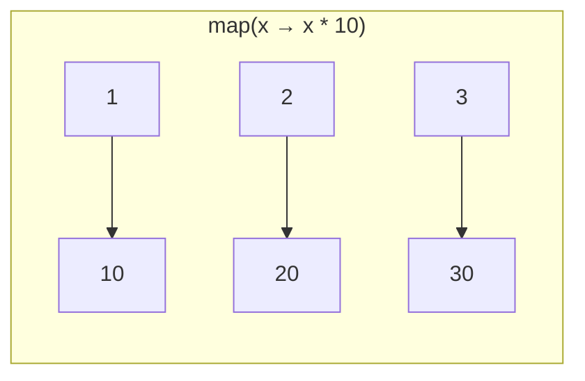

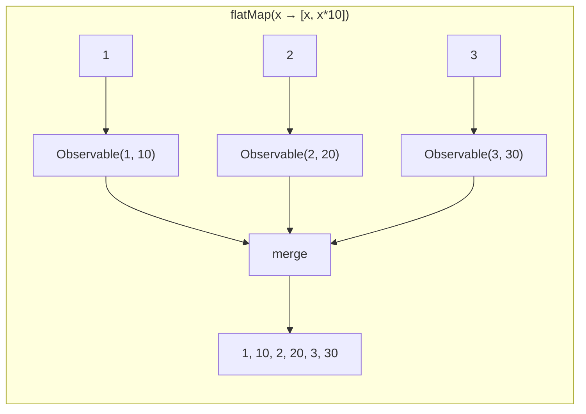

Практическое правило: если трансформация возвращает `Observable` (например, сетевой вызов) — используйте `flatMap()`. Если возвращает простое значение — используйте `map()`.

## Q16. (!) В чем разница между `flatMap()`, `concatMap()` и `switchMap()`?

| Оператор | Порядок | Параллельность | Поведение при новом элементе |
|----------|---------|---------------|----------------------------|
| `flatMap()` | Не сохраняет | Все `Observable` параллельно | Продолжает все |
| `concatMap()` | Сохраняет | Последовательно | Ждёт завершения текущего |
| `switchMap()` | Последний | Только последний | Отменяет предыдущий |

```java
// flatMap — параллельное выполнение, порядок не гарантирован
Observable.just("user/1", "user/2", "user/3")
    .flatMap(url -> apiClient.get(url).subscribeOn(Schedulers.io()))
    .subscribe(System.out::println);

// concatMap — последовательно, порядок гарантирован
Observable.just("user/1", "user/2", "user/3")
    .concatMap(url -> apiClient.get(url).subscribeOn(Schedulers.io()))
    .subscribe(System.out::println);

// switchMap — только последний, предыдущие отменяются
// Идеально для поиска: при новом вводе отменяем предыдущий запрос
searchField.textChanges()
    .debounce(300, TimeUnit.MILLISECONDS)
    .switchMap(query -> searchApi.search(query))
    .subscribe(results -> displayResults(results));
```

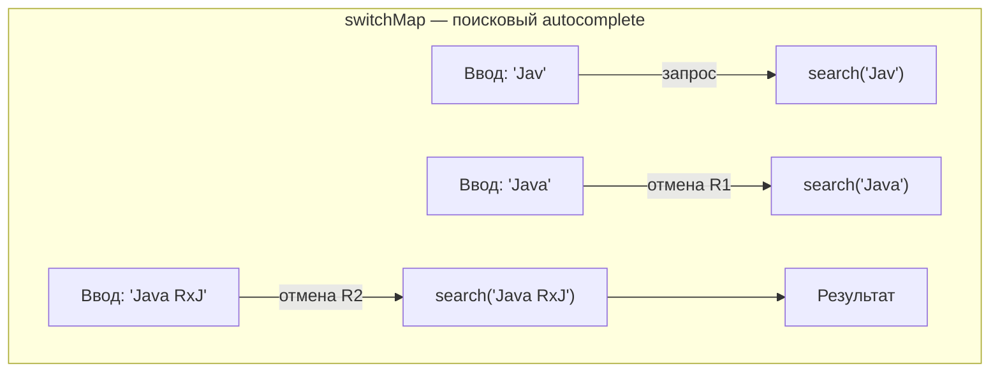

## Q17. В чём разница между `concat()` и `merge()`?

| Оператор | Порядок | Подписка | Когда использовать |
|----------|---------|---------|-------------------|
| `concat()` | Сохраняет | Последовательно (следующий после завершения предыдущего) | Важен порядок |
| `merge()` | Не сохраняет | Одновременно на все | Важна скорость |

```java
Observable<Integer> source1 = Observable.just(1, 2, 3)
    .delay(100, TimeUnit.MILLISECONDS);
Observable<Integer> source2 = Observable.just(4, 5, 6);

// concat — сначала все из source1, потом из source2
Observable.concat(source1, source2)
    .subscribe(System.out::println); // 1, 2, 3, 4, 5, 6

// merge — элементы чередуются, source2 может прийти раньше
Observable.merge(source1, source2)
    .subscribe(System.out::println); // 4, 5, 6, 1, 2, 3 (source2 быстрее)
```

Варианты: `mergeDelayError()` — откладывает ошибку до завершения всех источников, `concatEager()` — подписывается на все сразу, но выдаёт результаты по порядку.

## Q18. Можно ли иметь несколько операторов одного типа в одной цепочке?

Да, это нормальная практика. Каждый оператор создаёт новый `Observable`, поэтому можно цеплять сколько угодно операторов одного типа:

```java
Observable.just("  Hello, World!  ")
    .map(String::trim)
    .map(String::toUpperCase)
    .map(s -> s + "!!!")
    .map(String::length)
    .subscribe(len -> System.out.println("Длина: " + len)); // 19
```

Все операторы можно использовать многократно. Однако стоит помнить о читаемости — длинные цепочки можно сгруппировать через `compose()` и [Transformer](#q22-что-такое-transformer-и-оператор-compose).

## Q19. (!) Какие операторы фильтрации есть в `RxJava`?

| Оператор | Описание |
|----------|---------|
| `filter(Predicate)` | Пропускает элементы по условию |
| `take(n)` | Берёт первые N элементов |
| `takeLast(n)` | Берёт последние N элементов |
| `skip(n)` | Пропускает первые N элементов |
| `distinct()` | Убирает дубликаты |
| `distinctUntilChanged()` | Убирает последовательные дубликаты |
| `debounce(time, unit)` | Пропускает элемент, только если после него была пауза |
| `throttleFirst(time, unit)` | Первый элемент в каждом окне |
| `throttleLast(time, unit)` | Последний элемент в каждом окне (= `sample()`) |
| `elementAt(index)` | Элемент по индексу |
| `first()` / `last()` | Первый / последний элемент |

```java
// distinctUntilChanged — игнорирует повторяющиеся подряд значения
Observable.just(1, 1, 2, 2, 3, 1, 1)
    .distinctUntilChanged()
    .subscribe(System.out::println); // 1, 2, 3, 1

// debounce — типичное применение для поиска
searchInput.textChanges()
    .debounce(300, TimeUnit.MILLISECONDS)
    .distinctUntilChanged()
    .switchMap(query -> searchApi.search(query))
    .subscribe(this::showResults);
```

## Q20. Какие операторы агрегации есть в `RxJava`?

| Оператор | Описание | Результат |
|----------|---------|----------|
| `reduce(BiFunction)` | Свёртка в одно значение | `Single<T>` / `Maybe<T>` |
| `scan(BiFunction)` | Промежуточные результаты свёртки | `Observable<T>` |
| `count()` | Количество элементов | `Single<Long>` |
| `toList()` | Собирает в `List` | `Single<List<T>>` |
| `toMap(keySelector)` | Собирает в `Map` | `Single<Map<K,V>>` |
| `collect(Supplier, BiConsumer)` | Произвольная аккумуляция | `Single<C>` |

```java
// reduce — сумма всех элементов
Observable.range(1, 5)
    .reduce(0, Integer::sum)
    .subscribe(sum -> System.out.println("Сумма: " + sum)); // 15

// scan — промежуточные суммы
Observable.range(1, 5)
    .scan(0, Integer::sum)
    .subscribe(System.out::println); // 0, 1, 3, 6, 10, 15

// toMap
Observable.just("apple", "banana", "cherry")
    .toMap(String::length) // ключ = длина
    .subscribe(System.out::println); // {5=apple, 6=banana, 6=cherry}
```

> Важно: операторы `reduce`, `toList`, `toMap` ждут завершения потока (`onComplete`). Их опасно применять к бесконечным `Observable` — они никогда не вернут результат и будут накапливать данные в памяти.

## Q21. (!) Можно ли создавать собственные операторы в `RxJava`?

Да, есть два подхода:

**1. Через `ObservableOperator` (низкоуровневый):**

```java
public class SquareOperator implements ObservableOperator<Integer, Integer> {
    @Override
    public Observer<? super Integer> apply(Observer<? super Integer> observer) {
        return new DisposableObserver<Integer>() {
            @Override
            public void onNext(Integer value) {
                observer.onNext(value * value);
            }
            @Override
            public void onError(Throwable e) { observer.onError(e); }
            @Override
            public void onComplete() { observer.onComplete(); }
        };
    }
}

// Использование через lift()
Observable.range(1, 5)
    .lift(new SquareOperator())
    .subscribe(System.out::println); // 1, 4, 9, 16, 25
```

**2. Через `compose()` и `ObservableTransformer` (рекомендуемый)** — см. следующий вопрос.

На практике `lift()` используется редко. Предпочтительнее `compose()` + `Transformer`, т.к. он проще и безопаснее.

## Q22. (!) Что такое `Transformer` и оператор `compose()`?

`ObservableTransformer` — интерфейс для переиспользуемых цепочек операторов. Применяется через `compose()`.

```java
// Определяем переиспользуемый Transformer
public static <T> ObservableTransformer<T, T> applySchedulers() {
    return upstream -> upstream
        .subscribeOn(Schedulers.io())
        .observeOn(AndroidSchedulers.mainThread());
}

public static <T> ObservableTransformer<T, T> retryWithDelay(int maxRetries, long delay) {
    return upstream -> upstream
        .retryWhen(errors -> errors
            .zipWith(Observable.range(1, maxRetries), (e, i) -> i)
            .flatMap(i -> Observable.timer(delay * i, TimeUnit.SECONDS))
        );
}

// Использование — DRY, чистый код
apiClient.getUsers()
    .compose(applySchedulers())
    .compose(retryWithDelay(3, 2))
    .subscribe(users -> updateUI(users));

apiClient.getOrders()
    .compose(applySchedulers())
    .compose(retryWithDelay(3, 2))
    .subscribe(orders -> showOrders(orders));
```

Преимущества `compose()` перед `lift()`:
- Работает на уровне `Observable`, а не `Observer` — проще и безопаснее
- Не требует ручного управления `onNext/onError/onComplete`
- Легко тестируется отдельно

## Q23. (!) Что такое `Scheduler`? Какие `Schedulers` есть в `RxJava`?

`Scheduler` — механизм управления потоками в `RxJava`. Он определяет, в каком потоке выполняется работа.

| Scheduler | Пул потоков | Назначение |
|-----------|-----------|-----------|
| `Schedulers.io()` | Кешированный (растущий) | I/O: сетевые вызовы, БД, файлы |
| `Schedulers.computation()` | Фиксированный (= CPU cores) | CPU-bound: вычисления, парсинг |
| `Schedulers.newThread()` | Новый поток на каждую задачу | Редко используется |
| `Schedulers.single()` | Один поток | Последовательное выполнение |
| `Schedulers.trampoline()` | Текущий поток (FIFO-очередь) | Тестирование |
| `Schedulers.from(Executor)` | Пользовательский Executor | Кастомный пул |
| `AndroidSchedulers.mainThread()` | UI-поток (Android) | Обновление UI |

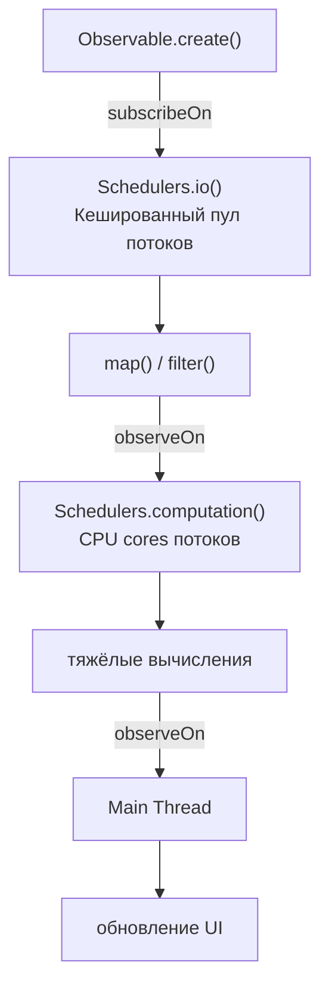

```java
Observable.fromCallable(() -> loadDataFromNetwork()) // I/O
    .subscribeOn(Schedulers.io())          // загрузка в io-пуле
    .observeOn(Schedulers.computation())   // парсинг на computation
    .map(data -> parseJson(data))
    .observeOn(AndroidSchedulers.mainThread()) // UI-обновление на main
    .subscribe(result -> textView.setText(result));
```

> `Schedulers.io()` не ограничен по размеру и может создать очень много потоков. Для production рекомендуется `Schedulers.from()` с настроенным `ThreadPoolExecutor`.

## Q24. (!) В чем разница между `observeOn()` и `subscribeOn()`?

| Аспект | `subscribeOn()` | `observeOn()` |
|--------|----------------|---------------|
| Влияет на | Весь upstream (вверх по цепочке) | Только downstream (вниз по цепочке) |
| Позиция в цепочке | Неважна (влияет на всё) | Важна (переключает с этой точки) |
| Сколько раз работает | Только первый в цепочке | Каждый новый переключает поток |
| Что определяет | Где выполняется подписка и генерация | Где обрабатываются результаты |

```java
Observable.just(1, 2, 3)                    // main thread
    .subscribeOn(Schedulers.io())            // всё upstream → io thread
    .map(n -> {
        log("map1: " + Thread.currentThread()); // io thread
        return n * 2;
    })
    .observeOn(Schedulers.computation())     // переключаем на computation
    .map(n -> {
        log("map2: " + Thread.currentThread()); // computation thread
        return n + 1;
    })
    .observeOn(Schedulers.single())          // переключаем на single
    .subscribe(v -> {
        log("subscribe: " + Thread.currentThread()); // single thread
    });
```

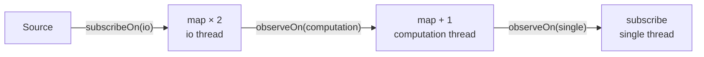

## Q25. (!) Что произойдет, если несколько `subscribeOn()` в цепочке?

**Только первый `subscribeOn()` в цепочке имеет эффект.** Все последующие будут проигнорированы, потому что подписка происходит один раз и снизу вверх — побеждает тот, что ближе к источнику.

```java
Observable.just(1, 2, 3)
    .subscribeOn(Schedulers.io())           // ЭТОТ работает
    .map(n -> n * 2)
    .subscribeOn(Schedulers.computation())  // игнорируется
    .subscribe(System.out::println);
// Всё выполняется на io thread
```

> Технически `subscribeOn()` работает «снизу вверх»: при вызове `subscribe()` подписка поднимается по цепочке. Первый встреченный `subscribeOn()` устанавливает поток, и последующие уже не могут его изменить.

## Q26. Что произойдет, если несколько `observeOn()` в цепочке?

В отличие от `subscribeOn()`, **каждый `observeOn()` переключает поток** для всех операторов, следующих за ним.

```java
Observable.just(1, 2, 3)
    .subscribeOn(Schedulers.io())              // генерация на io
    .observeOn(Schedulers.computation())       // переключаем на computation
    .map(n -> {
        // выполняется на computation thread
        return heavyCalculation(n);
    })
    .observeOn(Schedulers.single())            // переключаем на single
    .subscribe(result -> {
        // выполняется на single thread
        saveToLog(result);
    });
```

Это удобно, когда разные этапы обработки требуют разных потоков (например, загрузка → парсинг → сохранение → обновление UI).

## Q27. (!) Как данные передаются в `RxJava` по умолчанию — синхронно или асинхронно?

**По умолчанию `RxJava` работает синхронно** — в том же потоке, который вызвал `subscribe()`. Асинхронность появляется только при явном использовании `subscribeOn()` / `observeOn()` или операторов со встроенным планировщиком (`interval()`, `delay()`, `timeout()`).

```java
System.out.println("Поток: " + Thread.currentThread().getName()); // main

Observable.just(1, 2, 3)
    .map(n -> {
        System.out.println("map: " + Thread.currentThread().getName()); // main
        return n * 2;
    })
    .subscribe(v ->
        System.out.println("sub: " + Thread.currentThread().getName()) // main
    );
// Всё выполняется синхронно на main thread
```

Это важный момент на собеседовании — многие ошибочно считают, что `RxJava` автоматически создаёт фоновые потоки. Без явного `Scheduler` весь код выполняется в вызывающем потоке.

## Q28. (!) Поддерживает ли `RxJava` параллелизм?

Да, но `RxJava` по умолчанию последовательна. Параллелизм достигается несколькими способами:

**1. `flatMap()` + `subscribeOn()` для каждого внутреннего `Observable`:**

```java
Observable.range(1, 10)
    .flatMap(num ->
        Observable.just(num)
            .subscribeOn(Schedulers.computation())
            .map(this::heavyCalculation)
    )
    .subscribe(result -> System.out.println(result));
```

**2. `ParallelFlowable` (RxJava 2.2+):**

```java
Flowable.range(1, 10)
    .parallel()                         // разбиваем на параллельные «рельсы»
    .runOn(Schedulers.computation())    // назначаем Scheduler
    .map(this::heavyCalculation)
    .sequential()                       // собираем обратно
    .subscribe(System.out::println);
```

**3. `merge()` нескольких `Observable` на разных `Schedulers`:**

```java
Observable<Data> source1 = api.getData1().subscribeOn(Schedulers.io());
Observable<Data> source2 = api.getData2().subscribeOn(Schedulers.io());
Observable.merge(source1, source2)
    .subscribe(this::process);
```

> `ParallelFlowable` — самый идиоматичный способ для CPU-bound задач. Для I/O-bound (сетевые вызовы) лучше `flatMap` + `Schedulers.io()`.

## Q29. (!) Что такое `Subject`? Какие типы `Subject` существуют?

`Subject` — это одновременно `Observable` и `Observer`. Он может принимать элементы через `onNext()` и перенаправлять их подписчикам. Это мост между императивным и реактивным кодом.

| Тип Subject | Поведение для нового подписчика |
|-------------|-------------------------------|
| `PublishSubject` | Получает только будущие элементы |
| `BehaviorSubject` | Получает последний + будущие |
| `ReplaySubject` | Получает все прошлые + будущие |
| `AsyncSubject` | Получает только последний элемент (после `onComplete`) |
| `UnicastSubject` | Один подписчик, буферизация до подписки |

```java
// BehaviorSubject — хранит последнее значение
BehaviorSubject<String> subject = BehaviorSubject.createDefault("initial");
subject.onNext("A");
subject.onNext("B");

subject.subscribe(v -> System.out.println("Sub1: " + v)); // Sub1: B
subject.onNext("C");
// Sub1: C

subject.subscribe(v -> System.out.println("Sub2: " + v)); // Sub2: C
```

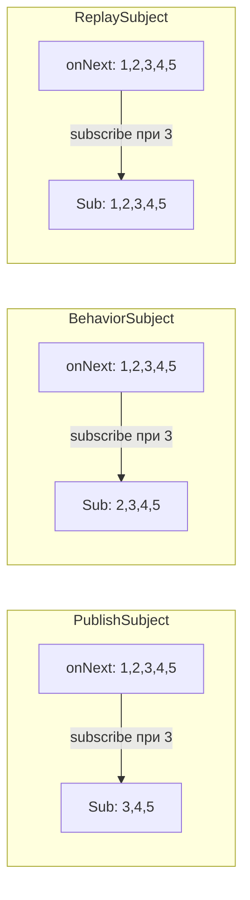

> `Subject` часто называют «антипаттерном RxJava», потому что он нарушает принцип однонаправленного потока данных. Используйте его только когда нет реактивного источника данных (например, для адаптации callback-API).

## Q30. В чем разница между `Subject` и `RxRelay`?

`RxRelay` — библиотека от Jake Wharton, которая предоставляет `Relay` — вариант `Subject`, который **никогда не завершается** (`onComplete`/`onError` игнорируются).

| Аспект | `Subject` | `RxRelay` |
|--------|----------|-----------|
| Библиотека | `RxJava` (встроенный) | Отдельная (`com.jakewharton.rxrelay3`) |
| `onComplete()`/`onError()` | Завершает поток | Игнорируется |
| Типичное применение | Мост к реактивным потокам | Event bus, UI events |
| Риск случайного завершения | Да | Нет |

```java
// Subject — может быть случайно завершён
PublishSubject<String> subject = PublishSubject.create();
subject.onNext("A");
subject.onComplete(); // всё, новые подписчики ничего не получат
subject.onNext("B");  // игнорируется

// Relay — защита от случайного завершения
PublishRelay<String> relay = PublishRelay.create();
relay.accept("A");
relay.accept("B"); // всегда работает
```

## Q31. (!) Что такое `backpressure` (противодавление)?

**`Backpressure`** — механизм управления потоком, когда производитель (`Observable`) генерирует данные быстрее, чем потребитель (`Observer`) может их обработать.

Без backpressure это приводит к:
- `MissingBackpressureException` (в `RxJava 2+`)
- `OutOfMemoryError` (переполнение буфера)
- Потеря данных

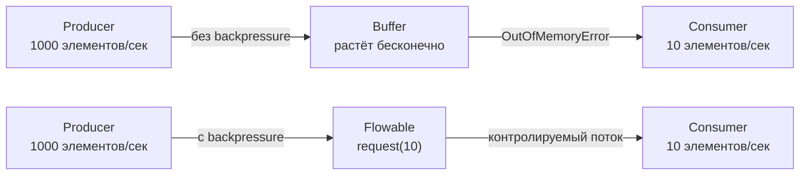

В `RxJava 2+` backpressure поддерживается только в `Flowable`. `Observable` **не поддерживает** backpressure — это осознанное решение дизайна для упрощения API. Подробнее — в [[spring-webflux-interview|вопросах по Spring WebFlux]], где `Reactor` также реализует backpressure.

## Q32. (!) В чём разница между `Observable` и `Flowable`?

| Аспект | `Observable` | `Flowable` |
|--------|-------------|-----------|
| Backpressure | Нет | Да (`Reactive Streams`) |
| Производительность | Чуть выше (нет overhead) | Чуть ниже (проверки backpressure) |
| Когда использовать | < 1000 элементов, UI-события, click streams | Большие потоки, файлы, БД, сетевые потоки |
| Базовый интерфейс | Нет (свой API) | `org.reactivestreams.Publisher` |

```java
// Когда Observable — события мыши (немного, потеря не критична)
Observable<MotionEvent> touches = RxView.touches(view);

// Когда Flowable — чтение большого файла
Flowable<String> lines = Flowable.create(emitter -> {
    try (BufferedReader reader = new BufferedReader(new FileReader("big.csv"))) {
        String line;
        while ((line = reader.readLine()) != null) {
            if (emitter.isCancelled()) return;
            emitter.onNext(line);
        }
        emitter.onComplete();
    }
}, BackpressureStrategy.BUFFER);
```

Для конвертации:
- `Observable.toFlowable(BackpressureStrategy)` → `Flowable`
- `Flowable.toObservable()` → `Observable` (теряем backpressure!)

## Q33. (!) Какие стратегии `BackpressureStrategy` существуют?

| Стратегия | Поведение при переполнении |
|-----------|--------------------------|
| `BUFFER` | Буферизует все элементы (может привести к `OOM`) |
| `DROP` | Отбрасывает элементы, которые не могут быть обработаны |
| `LATEST` | Хранит только последний элемент, предыдущие отбрасывает |
| `ERROR` | Выбрасывает `MissingBackpressureException` |
| `MISSING` | Без стратегии — вы сами управляете через `onBackpressure*()` |

```java
// BUFFER — опасно для бесконечных потоков
Flowable.interval(1, TimeUnit.MILLISECONDS)
    .onBackpressureBuffer(1000, // максимум 1000 элементов в буфере
        () -> System.out.println("Буфер переполнен!"),
        BackpressureOverflowStrategy.DROP_OLDEST)
    .observeOn(Schedulers.computation())
    .subscribe(this::slowProcess);

// DROP — для метрик, где допустима потеря отдельных значений
Flowable.interval(1, TimeUnit.MILLISECONDS)
    .onBackpressureDrop(dropped ->
        System.out.println("Отброшен: " + dropped))
    .observeOn(Schedulers.computation())
    .subscribe(this::process);

// LATEST — для UI: всегда актуальное значение
Flowable.interval(1, TimeUnit.MILLISECONDS)
    .onBackpressureLatest()
    .observeOn(Schedulers.computation())
    .subscribe(this::updateUI);
```

## Q34. Как решить проблемы с `backpressure`?

Стратегии решения проблем с backpressure:

**1. Использовать `Flowable` вместо `Observable`:**

```java
Flowable<Data> source = Flowable.create(emitter -> {
    // ...
}, BackpressureStrategy.BUFFER);
```

**2. Применить операторы ограничения скорости:**

```java
source
    .throttleLast(100, TimeUnit.MILLISECONDS)   // sample раз в 100мс
    .subscribe(this::process);

source
    .buffer(100)                                 // группами по 100
    .subscribe(batch -> processBatch(batch));

source
    .window(1, TimeUnit.SECONDS)                 // окна по 1 секунде
    .flatMapSingle(Observable::toList)
    .subscribe(batch -> processBatch(batch));
```

**3. Увеличить параллелизм потребителя:**

```java
source.parallel(4)
    .runOn(Schedulers.computation())
    .map(this::process)
    .sequential()
    .subscribe();
```

**4. Применить операторы `onBackpressure*`:**

```java
source
    .onBackpressureBuffer(1024, () -> log.warn("buffer full"), DROP_OLDEST)
    .subscribe(this::process);
```

## Q35. (!) Какие операторы обработки ошибок вы знаете в `RxJava`?

| Оператор | Поведение |
|----------|----------|
| `onErrorReturn(Function)` | Заменяет ошибку на значение по умолчанию |
| `onErrorReturnItem(T)` | Заменяет ошибку на конкретное значение |
| `onErrorResumeNext(Function)` | Заменяет ошибку на альтернативный `Observable` |
| `onErrorComplete()` | Превращает ошибку в `onComplete` |
| `retry()` | Повторяет подписку при ошибке |
| `retry(long count)` | Повторяет N раз |
| `retryWhen(Function)` | Условная логика повтора с задержкой |
| `doOnError(Consumer)` | Side-effect при ошибке (не перехватывает) |

```java
// onErrorReturn — возврат значения по умолчанию
apiClient.getUser(id)
    .onErrorReturn(error -> User.EMPTY)
    .subscribe(this::showUser);

// onErrorResumeNext — fallback к другому источнику
apiClient.getUser(id)
    .onErrorResumeNext(error -> cache.getUser(id))
    .subscribe(this::showUser);

// retryWhen — экспоненциальный backoff
apiClient.getUser(id)
    .retryWhen(errors -> errors
        .zipWith(Flowable.range(1, 3), (err, attempt) -> attempt)
        .flatMap(attempt ->
            Flowable.timer((long) Math.pow(2, attempt), TimeUnit.SECONDS))
    )
    .subscribe(this::showUser);
```

Подробнее об обработке ошибок в реактивных системах — в [[distributed-systems-interview|вопросах по распределённым системам]].

## Q36. Что произойдёт, если в цепочке возникнет несколько ошибок?

В стандартном `Observable` **первая ошибка является терминальной** — цепочка прекращает работу, последующие ошибки не обрабатываются.

Для обработки нескольких ошибок:

**1. `mergeDelayError()` — откладывает ошибки до завершения всех источников:**

```java
Observable<Integer> source1 = Observable.just(1, 2, 3);
Observable<Integer> source2 = Observable.error(new RuntimeException("Ошибка 1"));
Observable<Integer> source3 = Observable.error(new RuntimeException("Ошибка 2"));

Observable.mergeDelayError(source1, source2, source3)
    .subscribe(
        value -> System.out.println("Значение: " + value),
        error -> System.out.println("Ошибка: " + error), // CompositeException
        () -> System.out.println("Завершено")
    );
// Вывод: Значение: 1, Значение: 2, Значение: 3, Ошибка: CompositeException
```

**2. `onErrorResumeNext()` — замена каждой ошибки:**

```java
Observable.concat(source1, source2, source3)
    .onErrorResumeNext(error -> {
        log.warn("Ошибка: {}", error.getMessage());
        return Observable.empty(); // продолжаем без ошибки
    })
    .subscribe(System.out::println);
```

При `mergeDelayError` множественные ошибки оборачиваются в `CompositeException`, из которого можно получить список через `getExceptions()`.

## Q37. (!) Как тестировать реактивные цепочки в `RxJava`?

Основные инструменты тестирования:

**1. `TestObserver` / `TestSubscriber`:**

```java
@Test
void shouldFilterEvenNumbers() {
    TestObserver<Integer> testObserver = Observable.just(1, 2, 3, 4, 5)
        .filter(n -> n % 2 == 0)
        .test(); // создаёт TestObserver и подписывается

    testObserver
        .assertComplete()
        .assertNoErrors()
        .assertValueCount(2)
        .assertValues(2, 4);
}
```

**2. `TestScheduler` для управления временем:**

```java
@Test
void shouldDebounce() {
    TestScheduler scheduler = new TestScheduler();

    TestObserver<Long> testObserver = Observable.interval(1, TimeUnit.SECONDS, scheduler)
        .take(5)
        .test();

    testObserver.assertNoValues();       // ещё ничего не испущено

    scheduler.advanceTimeBy(3, TimeUnit.SECONDS);
    testObserver.assertValues(0L, 1L, 2L);

    scheduler.advanceTimeBy(2, TimeUnit.SECONDS);
    testObserver.assertComplete();
}
```

**3. `RxJavaPlugins` для подмены `Schedulers`:**

```java
@BeforeEach
void setUp() {
    // Все Schedulers → trampoline (синхронный)
    RxJavaPlugins.setIoSchedulerHandler(s -> Schedulers.trampoline());
    RxJavaPlugins.setComputationSchedulerHandler(s -> Schedulers.trampoline());
}

@AfterEach
void tearDown() {
    RxJavaPlugins.reset();
}
```

## Q38. Что такое `TestScheduler` и как его использовать?

`TestScheduler` — виртуальный планировщик, который позволяет **вручную управлять временем** в тестах. Это незаменимый инструмент для тестирования операторов, зависящих от времени (`delay`, `interval`, `debounce`, `timeout`).

```java
@Test
void shouldRetryWithDelay() {
    TestScheduler scheduler = new TestScheduler();
    AtomicInteger attempts = new AtomicInteger(0);

    TestObserver<String> observer = Observable
        .<String>error(new IOException("Connection failed"))
        .doOnSubscribe(d -> attempts.incrementAndGet())
        .retryWhen(errors -> errors
            .delay(5, TimeUnit.SECONDS, scheduler)
            .take(2) // максимум 2 повтора
        )
        .test();

    assertEquals(1, attempts.get()); // первая попытка

    scheduler.advanceTimeBy(5, TimeUnit.SECONDS);
    assertEquals(2, attempts.get()); // первый retry

    scheduler.advanceTimeBy(5, TimeUnit.SECONDS);
    assertEquals(3, attempts.get()); // второй retry
}
```

Ключевые методы `TestScheduler`:
- `advanceTimeBy(time, unit)` — продвинуть время на указанный интервал
- `advanceTimeTo(time, unit)` — продвинуть время до указанного момента
- `triggerActions()` — выполнить все запланированные действия без продвижения времени

## Q39. (!) Возникают ли утечки памяти при использовании `RxJava`?

`RxJava` сама по себе не создаёт утечек, но **неправильное использование** — частая причина утечек памяти:

**Основные причины утечек:**
1. **Забытые подписки** — подписка на бесконечный `Observable` без отписки
2. **Ссылки на `Activity`/контексты** в Android
3. **Hot Observable** без управления подписками

**Как избежать:**

```java
// 1. Всегда сохраняйте Disposable и отписывайтесь
Disposable disposable = Observable.interval(1, TimeUnit.SECONDS)
    .subscribe(tick -> updateUI(tick));

// При завершении:
disposable.dispose();

// 2. CompositeDisposable для нескольких подписок
CompositeDisposable compositeDisposable = new CompositeDisposable();

compositeDisposable.add(
    api.getUsers().subscribe(this::showUsers)
);
compositeDisposable.add(
    api.getOrders().subscribe(this::showOrders)
);

// При завершении (onDestroy / onStop):
compositeDisposable.clear(); // отписываемся от всех

// 3. takeUntil для автоматической отписки
Observable.interval(1, TimeUnit.SECONDS)
    .takeUntil(lifecycle.onDestroy())
    .subscribe(this::update);

// 4. doFinally для освобождения ресурсов
Observable.using(
    () -> new FileInputStream("data.csv"),  // создание ресурса
    is -> Observable.just(readAll(is)),       // использование
    FileInputStream::close                    // гарантированное освобождение
).subscribe(System.out::println);
```

## Q40. Что такое `CompositeDisposable` и зачем он нужен?

`CompositeDisposable` — контейнер для группового управления подписками. Позволяет добавлять, удалять и массово отписываться от нескольких `Disposable`.

```java
public class UserViewModel {
    private final CompositeDisposable disposables = new CompositeDisposable();

    public void loadData() {
        disposables.add(
            userRepository.getUsers()
                .subscribeOn(Schedulers.io())
                .observeOn(AndroidSchedulers.mainThread())
                .subscribe(
                    users -> usersLiveData.setValue(users),
                    error -> errorLiveData.setValue(error.getMessage())
                )
        );

        disposables.add(
            orderRepository.getOrders()
                .subscribeOn(Schedulers.io())
                .observeOn(AndroidSchedulers.mainThread())
                .subscribe(
                    orders -> ordersLiveData.setValue(orders),
                    error -> errorLiveData.setValue(error.getMessage())
                )
        );
    }

    // Вызывается при уничтожении ViewModel
    @Override
    protected void onCleared() {
        disposables.clear(); // отписывается от всех подписок
    }
}
```

Разница между `clear()` и `dispose()`:
- `clear()` — отписывает все, но `CompositeDisposable` можно использовать дальше
- `dispose()` — отписывает все и больше не принимает новые `Disposable`

## Q41. Как осуществить вызов `API` типа «`Fire-And-Forget`»?

Для «fire-and-forget» (отправить запрос и не ждать результата) используйте `Completable`:

```java
// Fire-and-forget: отправляем аналитику
Completable.fromAction(() -> analyticsApi.trackEvent("button_clicked"))
    .subscribeOn(Schedulers.io())
    .subscribe(
        () -> { /* успех — ничего не делаем */ },
        error -> log.warn("Analytics failed: {}", error.getMessage())
    );

// Или через fromRunnable
Completable.fromRunnable(() -> {
    notificationService.send(userId, "Welcome!");
})
.subscribeOn(Schedulers.io())
.subscribe();
```

> Важно: даже для fire-and-forget **всегда обрабатывайте ошибки**. Без обработчика `onError` необработанное исключение попадёт в `RxJavaPlugins.onError` и может завершить приложение.

Для отложенных вызовов API используйте `defer()`:

```java
// Вызов будет выполнен только при подписке
Single<Response> deferredCall = Single.defer(() ->
    Single.fromCallable(() -> apiClient.fetchData())
);
```

## Q42. Хорошо ли работает `RxJava` в сочетании с `Kotlin`?

Да, `Kotlin` и `RxJava` — отличное сочетание благодаря:

1. **Null-safety** — `Kotlin` защищает от `NullPointerException`, что совпадает с контрактом `RxJava 2+` (null запрещён)
2. **Лямбды и SAM-конверсия** — лаконичный синтаксис
3. **Extension functions** — можно расширять реактивные типы
4. **`RxKotlin`** — библиотека с удобными расширениями

```kotlin
// RxKotlin — более идиоматичный код
Observable.just(1, 2, 3)
    .subscribeBy(
        onNext = { println("Next: $it") },
        onError = { println("Error: ${it.message}") },
        onComplete = { println("Done") }
    )
    .addTo(compositeDisposable) // расширение из RxKotlin
```

Однако для новых проектов на `Kotlin` рекомендуется рассмотреть [[kotlin-coroutines-interview|Kotlin Coroutines]] + `Flow`, которые более идиоматичны и лучше интегрируются с `Kotlin`.

## Q43. (!) Какие альтернативы `RxJava` существуют? Сравните их

| Библиотека | Язык | Backpressure | Экосистема | Когда использовать |
|-----------|------|-------------|-----------|-------------------|
| `RxJava 3` | Java | Да (`Flowable`) | ReactiveX, Android | Legacy-проекты, Android |
| `Project Reactor` | Java | Да (`Flux`/`Mono`) | Spring WebFlux | Spring-экосистема |
| `Kotlin Coroutines + Flow` | Kotlin | Да (suspend) | Kotlin, Android | Kotlin-проекты |
| `Mutiny` | Java | Да | Quarkus | Quarkus-проекты |
| `Akka Streams` | Scala/Java | Да | Akka | Actor-based системы |
| `Vert.x` | Java/Kotlin | Да | Eclipse | Event-driven, полиглот |
| Java 9 `Flow API` | Java | Да | JDK | Стандартная библиотека (SPI) |

Сравнение `RxJava` vs `Project Reactor`:

| Аспект | RxJava | Reactor |
|--------|--------|---------|
| `Observable` / `Flowable` | Два класса | `Flux` (= Flowable) + `Mono` (= Single/Maybe) |
| Интеграция со Spring | Через адаптеры | Нативная ([[spring-webflux-interview|Spring WebFlux]]) |
| Android | Да | Нет |
| Тестирование | `TestObserver` | `StepVerifier` |
| Контекст | Нет | `Context` (reactor-specific) |

> На собеседовании: если спрашивают «что выбрать» — для Spring-проектов выбирайте `Reactor`, для Android — `RxJava`, для Kotlin — `Coroutines + Flow`.

## Q44. (!) Как реализовать паттерн retry с exponential backoff в RxJava?

Retry с экспоненциальной задержкой — стандартная практика для взаимодействия с нестабильными внешними сервисами.

```java
// Вариант 1: retryWhen + delay (RxJava 3)
Observable.fromCallable(() -> apiClient.fetchOrder(orderId))
    .retryWhen(errors -> errors
        .zipWith(Observable.range(1, 3), (error, attempt) -> {
            if (attempt >= 3) throw (RuntimeException) error;
            return attempt;
        })
        .flatMap(attempt -> {
            long delayMs = (long) Math.pow(2, attempt) * 100;  // 200ms, 400ms, 800ms
            log.warn("Retry attempt {}, delay {}ms", attempt, delayMs);
            return Observable.timer(delayMs, TimeUnit.MILLISECONDS);
        })
    )
    .subscribe(
        order -> log.info("Order received: {}", order),
        error -> log.error("All retries failed", error)
    );
```

```java
// Вариант 2: retry с jitter (случайный компонент для избежания thundering herd)
.retryWhen(errors -> errors
    .zipWith(Observable.range(1, 5), (error, attempt) -> attempt)
    .flatMap(attempt -> {
        long baseDelay = (long) Math.pow(2, attempt) * 100;
        long jitter = (long) (Math.random() * 100);  // +0-100ms случайно
        return Observable.timer(baseDelay + jitter, TimeUnit.MILLISECONDS);
    })
    .takeWhile(attempt -> attempt <= 5)   // не больше 5 попыток
)
```

```java
// Вариант 3: retry только на определённые ошибки (не на бизнес-ошибки)
.retryWhen(errors -> errors.flatMap(error -> {
    if (error instanceof IOException || error instanceof TimeoutException) {
        return Observable.timer(1, TimeUnit.SECONDS);   // повторить
    }
    return Observable.error(error);  // не повторять
}))
```

**Распространённые ошибки:**
- `retry(3)` без задержки — атакует сервис тремя немедленными запросами
- Retry на `4xx` ошибки (клиентские) — бессмысленно, сервер вернёт то же
- Retry без jitter в нагруженной системе → thundering herd

## Q45. (!) Какие стратегии BackpressureStrategy и когда их применять?

`BackpressureStrategy` определяет, что делать когда producer быстрее consumer. Относится только к `Flowable`.

| Стратегия | Поведение при переполнении буфера | Когда использовать |
|-----------|----------------------------------|-------------------|
| `BUFFER` | Буферизует все элементы (неограниченно) | Пакетная обработка, короткие всплески |
| `DROP` | Отбрасывает новые элементы | Метрики, где потеря приемлема |
| `LATEST` | Хранит только последний элемент | UI-события, последнее значение важнее |
| `ERROR` | Выбрасывает `MissingBackpressureException` | Тестирование, протокольные потоки |
| `MISSING` | Без стратегии (падение на operator) | Внутренние операторы RxJava |

```java
// BUFFER — подходит для обработки сообщений из Kafka
Flowable.fromPublisher(kafkaPublisher)
    .onBackpressureBuffer(10_000,           // буфер 10K элементов
        () -> log.warn("Buffer overflow!"),  // callback при переполнении
        BackpressureOverflowStrategy.DROP_OLDEST  // отбросить старые
    )
    .observeOn(Schedulers.io(), false, 64)   // requestN=64 (chunk size)
    .subscribe(this::processMessage);

// DROP — для телеметрии (потеря метрик приемлема)
Flowable.create(emitter -> {
    sensor.onMeasurement(value -> emitter.onNext(value));
}, BackpressureStrategy.DROP)
    .sample(1, TimeUnit.SECONDS)   // сэмплировать 1 раз в секунду
    .subscribe(this::recordMetric);

// LATEST — для UI-состояния (только актуальное значение)
Flowable.create(emitter -> {
    textView.addTextChangedListener(text -> emitter.onNext(text.toString()));
}, BackpressureStrategy.LATEST)
    .debounce(300, TimeUnit.MILLISECONDS)
    .subscribe(this::searchFor);
```

**Разница `Observable` vs `Flowable`:**
```java
// Observable: нет backpressure — быстрый, для UI-событий, коллекций
Observable.just(1, 2, 3).subscribe(System.out::println);

// Flowable: Reactive Streams с backpressure — для IO, баз данных, Kafka
Flowable.fromIterable(largeList)
    .flatMap(item -> Flowable.fromCallable(() -> process(item))
        .subscribeOn(Schedulers.io()), 16)  // 16 параллельных запросов max
    .observeOn(Schedulers.single())
    .subscribe(System.out::println);
```

**Правило выбора:** `Observable` если источник конечный и быстрый (<1000 элементов/с или UI); `Flowable` если источник бесконечный, медленный consumer или работа с IO.

## Q46. Как обрабатывать ошибки в RxJava цепочках на production?

Комплексная обработка ошибок — ключевой навык для production-кода на RxJava.

```java
// Полный набор операторов обработки ошибок:

// 1. onErrorReturn — возвращает значение по умолчанию при ошибке
userService.getUser(userId)
    .onErrorReturn(error -> User.anonymous())   // не выбрасываем дальше
    .subscribe(this::processUser);

// 2. onErrorResumeNext — переключается на другой Observable
primaryCache.get(key)
    .onErrorResumeNext(error -> {
        log.warn("Cache miss, falling back to DB: {}", error.getMessage());
        return database.get(key);
    })
    .subscribe(this::process);

// 3. retry + onErrorResumeNext — сначала retry, потом fallback
externalApi.call()
    .retry(3)
    .onErrorResumeNext(error ->
        localCache.get()
            .doOnNext(v -> log.warn("Using cached data after API failure"))
    )
    .subscribe(result -> {}, 
               error -> log.error("Complete failure, no fallback", error));

// 4. doOnError — логирование без прерывания цепочки
paymentService.charge(order)
    .doOnError(error -> {
        metrics.increment("payment.errors", "type", error.getClass().getSimpleName());
        alertService.notify("Payment failed: " + error.getMessage());
    })
    .onErrorReturn(error -> PaymentResult.failed(error.getMessage()))
    .subscribe(this::handlePaymentResult);

// 5. materialize/dematerialize — конвертация ошибок в данные
Observable.fromCallable(() -> riskyOperation())
    .materialize()   // ошибки превращаются в Notification<T>
    .filter(notification -> !notification.isOnError()  
        || notification.getError() instanceof RecoverableException)
    .dematerialize(n -> n)
    .subscribe(this::handle);
```

**Глобальный обработчик необработанных ошибок:**
```java
// В точке входа приложения (избегает падения приложения из-за orphan errors)
RxJavaPlugins.setErrorHandler(error -> {
    if (error instanceof UndeliverableException) {
        // Ошибка после dispose() — можно игнорировать или логировать
        log.debug("Undeliverable exception (after dispose)", error.getCause());
    } else {
        log.error("Unhandled RxJava error", error);
        // Опционально: отправить в Sentry/Datadog
    }
});
```

**Anti-patterns:**
```java
// ПЛОХО: проглатывание ошибок
.subscribe(item -> process(item), error -> {});  // error игнорируется!

// ПЛОХО: onErrorReturn с null
.onErrorReturn(e -> null);  // NullPointerException в downstream

// ХОРОШО: всегда обрабатывать ошибку явно
.subscribe(
    item -> process(item),
    error -> log.error("Processing failed for userId={}", userId, error)
);
```

---

## See also

- [[spring-webflux-interview|Spring WebFlux]] — реактивный веб-фреймворк на базе `Project Reactor`
- [[kotlin-coroutines-interview|Kotlin Coroutines]] — альтернативная модель асинхронности в `Kotlin`
- [[java-concurrency-interview|Java Concurrency]] — многопоточность, Schedulers и thread pools
- [[java-stream-interview|Java Stream API]] — функциональная обработка коллекций
- [[design-patterns-interview|Паттерны проектирования]] — паттерн `Observer` и `Publisher/Subscriber`
- [[distributed-systems-interview|Распределённые системы]] — backpressure и flow control в распределённых системах
- [[kafka-interview|Apache Kafka]] — интеграция RxJava с Kafka consumer/producer

- [[project-reactor-interview|Project Reactor]]
- [[reactive-patterns-interview|Reactive Patterns]]
- [[reactive-streams-interview|Reactive Streams]]
- [[reactive-testing-interview|Тестирование реактивного кода]]
- [[webflux-interview|Spring WebFlux]]
- [[ai-agents-interview|AI Agents]]
