# Вопросы на собеседовании: `RxJava`

Комплексное руководство по вопросам собеседования на тему `RxJava` для `Senior Java Developer`. Включает детальные
объяснения концепций реактивного программирования, практические примеры кода, marble-диаграммы, best practices и troubleshooting.

**`RxJava`** — реализация `ReactiveX` (Reactive Extensions) для `Java`. Библиотека предоставляет композиционный стиль работы с асинхронными потоками данных через паттерн `Observer`. Широко используется в backend-разработке и Android-приложениях для упрощения работы с конкурентностью, обработкой ошибок и композицией асинхронных операций.

## Полезные ссылки

### Официальная документация

- [ReactiveX/RxJava на GitHub](https://github.com/ReactiveX/RxJava) — исходный код и документация
- [ReactiveX Documentation](http://reactivex.io/documentation) — спецификация операторов и marble-диаграммы
- [Reactive Streams Specification](https://www.reactive-streams.org/) — спецификация реактивных потоков

### Статьи Baeldung

- [Introduction to RxJava](https://www.baeldung.com/rx-java) — введение в RxJava
- [RxJava 2 - Flowable](https://www.baeldung.com/rxjava-2-flowable) — Flowable и backpressure
- [Dealing with Backpressure](https://www.baeldung.com/rxjava-backpressure) — стратегии backpressure
- [How to Test RxJava](https://www.baeldung.com/rxjava-testing) — тестирование реактивных цепочек
- [Schedulers in RxJava](https://www.baeldung.com/rxjava-schedulers) — планировщики
- [Difference Between flatMap and switchMap](https://www.baeldung.com/rxjava-flatmap-switchmap) — flatMap vs switchMap
- [concat() vs merge()](https://www.baeldung.com/java-rxjava-concat-vs-merge) — concat vs merge

## Содержание

- [Полезные ссылки](#полезные-ссылки)
- [See also](#see-also)

**Основы RxJava и реактивного программирования**
- [Q1. (!) `RxJava` следует шаблону «push» или «pull»?](#q1--rxjava-следует-шаблону-push-или-pull)
- [Q2. В чем разница между `onNext()`, `onComplete()` и `onError()`?](#q2-в-чем-разница-между-onnext-oncomplete-и-onerror)
- [Q3. Сколько раз можно вызвать `onNext()`, `onComplete()` и `onError()`?](#q3-сколько-раз-можно-вызвать-onnext-oncomplete-и-onerror)
- [Q4. (!) Какие есть конструкции в `RxJava`, кроме `Observable`?](#q4--какие-есть-конструкции-в-rxjava-кроме-observable)
- [Q5. В чём разница между `RxJava 1`, `RxJava 2` и `RxJava 3`?](#q5-в-чём-разница-между-rxjava-1-rxjava-2-и-rxjava-3)
- [Q6. (!) Что такое `Marble Diagram`?](#q6--что-такое-marble-diagram)
- [Q7. Что такое `Pure` функция и почему она важна в `RxJava`?](#q7-что-такое-pure-функция-и-почему-она-важна-в-rxjava)

**Observable: Cold, Hot и ConnectableObservable**
- [Q8. (!) Когда `Observable` начинает испускать элементы?](#q8--когда-observable-начинает-испускать-элементы)
- [Q9. (!) В чём разница между `Cold` и `Hot` `Observable`?](#q9--в-чём-разница-между-cold-и-hot-observable)
- [Q10. (!) Можно ли преобразовать `Cold Observable` в `Hot Observable`?](#q10--можно-ли-преобразовать-cold-observable-в-hot-observable)
- [Q11. Можно ли преобразовать `Hot Observable` в `Cold Observable`?](#q11-можно-ли-преобразовать-hot-observable-в-cold-observable)
- [Q12. Что такое `Observable Chain`?](#q12-что-такое-observable-chain)

**Операторы создания**
- [Q13. (!) Какие операторы создания `Observable` вы знаете?](#q13--какие-операторы-создания-observable-вы-знаете)
- [Q14. В чём разница между `Observable.create()` и `Observable.defer()`?](#q14-в-чём-разница-между-observablecreate-и-observabledefer)

**Операторы трансформации**
- [Q15. В чем разница между `map()` и `flatMap()`?](#q15-в-чем-разница-между-map-и-flatmap)
- [Q16. (!) В чем разница между `flatMap()`, `concatMap()` и `switchMap()`?](#q16--в-чем-разница-между-flatmap-concatmap-и-switchmap)
- [Q17. В чём разница между `concat()` и `merge()`?](#q17-в-чём-разница-между-concat-и-merge)
- [Q18. Можно ли иметь несколько операторов одного типа в одной цепочке?](#q18-можно-ли-иметь-несколько-операторов-одного-типа-в-одной-цепочке)

**Операторы фильтрации и агрегации**
- [Q19. (!) Какие операторы фильтрации есть в `RxJava`?](#q19--какие-операторы-фильтрации-есть-в-rxjava)
- [Q20. Какие операторы агрегации есть в `RxJava`?](#q20-какие-операторы-агрегации-есть-в-rxjava)

**Пользовательские операторы и Transformer**
- [Q21. (!) Можно ли создавать собственные операторы в `RxJava`?](#q21--можно-ли-создавать-собственные-операторы-в-rxjava)
- [Q22. (!) Что такое `Transformer` и оператор `compose()`?](#q22--что-такое-transformer-и-оператор-compose)

**Schedulers и многопоточность**
- [Q23. (!) Что такое `Scheduler`? Какие `Schedulers` есть в `RxJava`?](#q23--что-такое-scheduler-какие-schedulers-есть-в-rxjava)
- [Q24. (!) В чем разница между `observeOn()` и `subscribeOn()`?](#q24--в-чем-разница-между-observeon-и-subscribeon)
- [Q25. (!) Что произойдет, если несколько `subscribeOn()` в цепочке?](#q25--что-произойдет-если-несколько-subscribeon-в-цепочке)
- [Q26. Что произойдет, если несколько `observeOn()` в цепочке?](#q26-что-произойдет-если-несколько-observeon-в-цепочке)
- [Q27. (!) Как данные передаются в `RxJava` по умолчанию — синхронно или асинхронно?](#q27--как-данные-передаются-в-rxjava-по-умолчанию--синхронно-или-асинхронно)
- [Q28. (!) Поддерживает ли `RxJava` параллелизм?](#q28--поддерживает-ли-rxjava-параллелизм)

**Subject и RxRelay**
- [Q29. (!) Что такое `Subject`? Какие типы `Subject` существуют?](#q29--что-такое-subject-какие-типы-subject-существуют)
- [Q30. В чем разница между `Subject` и `RxRelay`?](#q30-в-чем-разница-между-subject-и-rxrelay)

**Backpressure и Flowable**
- [Q31. (!) Что такое `backpressure` (противодавление)?](#q31--что-такое-backpressure-противодавление)
- [Q32. (!) В чём разница между `Observable` и `Flowable`?](#q32--в-чём-разница-между-observable-и-flowable)
- [Q33. (!) Какие стратегии `BackpressureStrategy` существуют?](#q33--какие-стратегии-backpressurestrategy-существуют)
- [Q34. Как решить проблемы с `backpressure`?](#q34-как-решить-проблемы-с-backpressure)

**Обработка ошибок**
- [Q35. (!) Какие операторы обработки ошибок вы знаете в `RxJava`?](#q35--какие-операторы-обработки-ошибок-вы-знаете-в-rxjava)
- [Q36. Что произойдёт, если в цепочке возникнет несколько ошибок?](#q36-что-произойдёт-если-в-цепочке-возникнет-несколько-ошибок)

**Тестирование RxJava**
- [Q37. (!) Как тестировать реактивные цепочки в `RxJava`?](#q37--как-тестировать-реактивные-цепочки-в-rxjava)
- [Q38. Что такое `TestScheduler` и как его использовать?](#q38-что-такое-testscheduler-и-как-его-использовать)

**Утечки памяти и Disposable**
- [Q39. (!) Возникают ли утечки памяти при использовании `RxJava`?](#q39--возникают-ли-утечки-памяти-при-использовании-rxjava)
- [Q40. Что такое `CompositeDisposable` и зачем он нужен?](#q40-что-такое-compositedisposable-и-зачем-он-нужен)

**Практика и интеграция**
- [Q41. Как осуществить вызов `API` типа «`Fire-And-Forget`»?](#q41-как-осуществить-вызов-api-типа-fire-and-forget)
- [Q42. Хорошо ли работает `RxJava` в сочетании с `Kotlin`?](#q42-хорошо-ли-работает-rxjava-в-сочетании-с-kotlin)
- [Q43. (!) Какие альтернативы `RxJava` существуют? Сравните их](#q43--какие-альтернативы-rxjava-существуют-сравните-их)

**Retry, backpressure и обработка ошибок в production**
- [Q44. (!) Как реализовать паттерн retry с exponential backoff в RxJava?](#q44--как-реализовать-паттерн-retry-с-exponential-backoff-в-rxjava)
- [Q45. (!) Какие стратегии BackpressureStrategy и когда их применять?](#q45--какие-стратегии-backpressurestrategy-и-когда-их-применять)
- [Q46. Как обрабатывать ошибки в RxJava цепочках на production?](#q46-как-обрабатывать-ошибки-в-rxjava-цепочках-на-production)

---

## Q1. (!) `RxJava` следует шаблону «push» или «pull»?

`RxJava` следует шаблону **push**: источник (`Observable`) сам проталкивает элементы подписчику по мере их появления. В этом ключевое отличие от pull-модели (например, `Iterator`), где инициатива на стороне потребителя — он сам запрашивает следующий элемент и блокируется в ожидании.

Почему это важно. Push-модель естественна для асинхронных и событийных источников: котировок, кликов, ответов от сети — данные «приходят, когда приходят», и потребитель не должен сидеть в цикле и опрашивать источник. Технически это паттерн `Observer`: подписчик регистрируется через `subscribe()`, после чего `Observable` сам зовёт `onNext()` на каждый новый элемент.

```java
Observable<String> source = Observable.just("A", "B", "C");

// Push-модель: Observable сам вызывает onNext для каждого элемента
source.subscribe(
    item -> System.out.println("Получен: " + item),  // onNext
    error -> System.err.println("Ошибка: " + error),  // onError
    () -> System.out.println("Завершено")              // onComplete
);
```

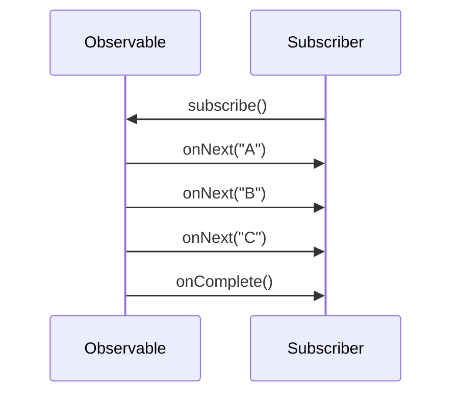

**Нюанс для собеседования.** Чистый `Observable` — это только push, у потребителя нет рычага сказать «помедленнее». Поэтому `Flowable` добавляет элемент **pull** через механизм `request(n)` из `Reactive Streams`: подписчик заявляет, сколько элементов готов принять. Получается гибридная push-pull модель, и именно она лежит в основе backpressure.

## Q2. В чем разница между `onNext()`, `onComplete()` и `onError()`?

Это три метода, которыми `Observable` общается с подписчиком — весь «язык» контракта `Observer`:

| Метод | Назначение | Сколько раз вызывается |
|-------|-----------|----------------------|
| `onNext(T)` | Передача очередного элемента | 0..N раз |
| `onComplete()` | Сигнал успешного завершения потока | Максимум 1 раз |
| `onError(Throwable)` | Сигнал ошибки (тоже завершает поток) | Максимум 1 раз |

Главное, что нужно понять: `onComplete()` и `onError()` — **терминальные события**, они взаимоисключающие. После любого из них поток закрыт, и больше ни один сигнал (в том числе новый `onNext`) подписчику не дойдёт. Поэтому ошибка в `RxJava` — это не отдельный «канал», а альтернативный способ завершить поток: либо успешно (`onComplete`), либо аварийно (`onError`).

```java
Observable.<String>create(emitter -> {
    emitter.onNext("Первый");
    emitter.onNext("Второй");
    emitter.onComplete();
    // emitter.onNext("Этот вызов будет проигнорирован")
}).subscribe(
    value -> System.out.println("onNext: " + value),
    error -> System.out.println("onError: " + error.getMessage()),
    () -> System.out.println("onComplete")
);
// Вывод:
// onNext: Первый
// onNext: Второй
// onComplete
```

## Q3. Сколько раз можно вызвать `onNext()`, `onComplete()` и `onError()`?

Контракт `Observable` формально записывается одной строкой грамматики: **`onNext* (onComplete | onError)?`**. Читается так: «ноль или больше `onNext`, а затем не более одного завершающего сигнала — либо `onComplete`, либо `onError`».

- `onNext()` — от 0 до бесконечности раз;
- `onComplete()` — максимум 1 раз (терминальное событие);
- `onError()` — максимум 1 раз (терминальное событие);
- `onComplete` и `onError` взаимоисключающие — сработать может только один из них.

После терминального события поток закрыт. Любые последующие вызовы `onNext`/`onComplete`/`onError` оператор просто отбрасывает. Но «отбрасывает» не значит «молча теряет»: в `RxJava 2+` опоздавшая ошибка не исчезает, а уходит в глобальный обработчик `RxJavaPlugins.onError` (обёрнутая в `UndeliverableException`) — поэтому в production его стоит явно настроить, иначе такая ошибка может уронить приложение.

## Q4. (!) Какие есть конструкции в `RxJava`, кроме `Observable`?

`RxJava 2/3` предоставляет пять базовых типов источников. Они отличаются по **кардинальности** — сколько элементов может проехать через поток, — и именно по ней тип и выбирают: лишний `Observable` там, где значение всегда одно, заставляет писать `.firstOrError()` и проверять «а вдруг пусто».

| Тип | Кол-во элементов | Backpressure | Аналогия |
|-----|-----------------|-------------|----------|
| `Observable<T>` | 0..N | Нет | Поток событий |
| `Flowable<T>` | 0..N | Да | Поток с контролем скорости |
| `Single<T>` | Ровно 1 | Нет | `Future<T>` |
| `Maybe<T>` | 0 или 1 | Нет | `Optional<T>` |
| `Completable` | 0 | Нет | `Runnable` |

Правило выбора простое: ровно одно значение — `Single`, опционально одно — `Maybe`, только факт завершения без значения (запись в БД, отправка письма) — `Completable`. Поток из многих элементов берёт `Observable`, а если источник может захлебнуть потребителя — `Flowable` с backpressure. Тип-источник сам документирует контракт метода: по сигнатуре `Single<User>` видно, что вернётся ровно один пользователь либо ошибка.

```java
// Single — ровно одно значение или ошибка
Single<User> user = userRepository.findById(42);

// Maybe — 0 или 1 значение
Maybe<User> maybeUser = cache.get("user:42");

// Completable — только сигнал завершения
Completable saved = userRepository.save(user);

// Flowable — поток с backpressure
Flowable<Event> events = eventBus.listen("orders");
```

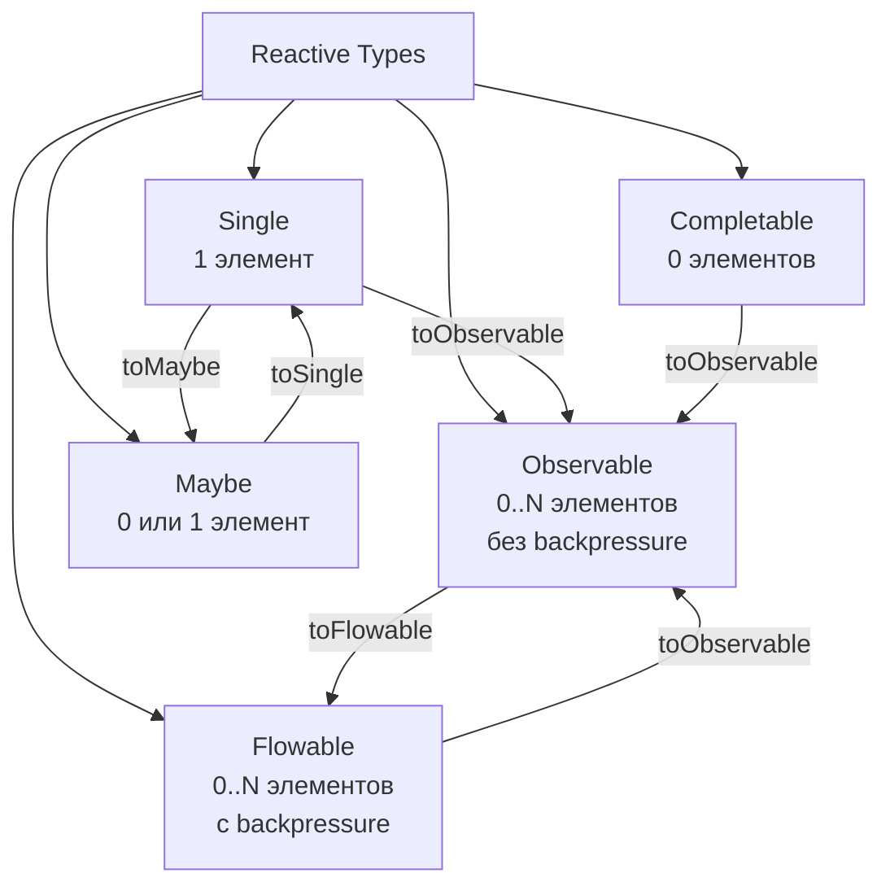

Дополнительно есть `ConnectableObservable` — горячий `Observable`, который начинает испускать элементы только после вызова `connect()`.

## Q5. В чём разница между `RxJava 1`, `RxJava 2` и `RxJava 3`?

| Аспект | `RxJava 1` | `RxJava 2` | `RxJava 3` |
|--------|-----------|-----------|-----------|
| Пакет | `rx.*` | `io.reactivex.*` | `io.reactivex.rxjava3.*` |
| Java | 6+ | 6+ | 8+ |
| `Flowable` | Нет | Да | Да |
| `null` в потоке | Допускается | Запрещён | Запрещён |
| `Reactive Streams` | Нет | Да (v2.0) | Да (v3.0) |
| `Disposable` | `Subscription` | `Disposable` | `Disposable` |
| `Maybe` | Нет | Да | Да |
| Статус | EOL | Maintenance | Активная |

Главный водораздел — между 1 и 2. Именно в `RxJava 2` библиотека стала совместима со спецификацией `Reactive Streams`, и из этого вытекают почти все изменения:

- появился `Flowable` с поддержкой backpressure (в `RxJava 1` управление давлением было «вшито» прямо в `Observable`, что усложняло API);
- `null` запрещён в потоках — теперь `onNext(null)` бросает `NullPointerException` (спецификация `Reactive Streams` напрямую запрещает `null` как сигнал);
- `Subscription` переименован в `Disposable` (чтобы не путать со `Subscription` из `Reactive Streams`, который теперь означает другое);
- добавлен тип `Maybe`.

`RxJava 3` — не революция, а аккуратное обновление: подъём базы до Java 8+, переезд в пакет `io.reactivex.rxjava3.*` (чтобы 2 и 3 могли сосуществовать в одном classpath) и мелкие правки API. Поэтому миграция с 2 на 3 в основном сводится к замене импортов.

## Q6. (!) Что такое `Marble Diagram`?

`Marble Diagram` — это «язык чертежей» реактивного программирования: визуальная схема того, что оператор делает с потоком. Сверху рисуют входной поток, снизу — выходной, а посередине — сам оператор. Каждый элемент изображён кружком («marble», стеклянный шарик) на временной оси, и сразу видно, как он трансформируется, сдвигается во времени, дублируется или отбрасывается.

Ценность в том, что словами поведение оператора описывать долго и неоднозначно, а одна диаграмма мгновенно показывает порядок, тайминг и судьбу каждого элемента.

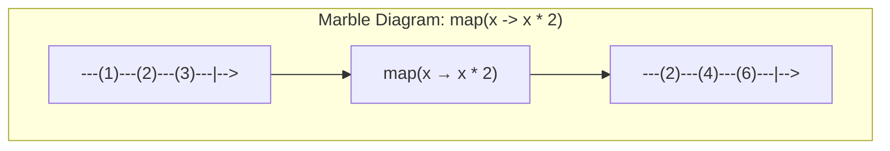

Обозначения:
- `---` — временная ось (слева направо)
- `(значение)` — элемент (`onNext`)
- `|` — завершение (`onComplete`)
- `X` — ошибка (`onError`)
- `-->` — поток продолжается

Marble-диаграммы — стандартный инструмент документации `ReactiveX`. Их можно использовать при объяснении любого оператора на собеседовании.

## Q7. Что такое `Pure` функция и почему она важна в `RxJava`?

**Чистая функция** (pure function) — функция, которая:
1. всегда возвращает одинаковый результат для одинаковых аргументов (детерминирована);
2. не имеет побочных эффектов — не меняет внешнее состояние, не пишет в общие переменные, не дёргает I/O.

Почему это критично именно в `RxJava`. Операторы `map()`, `filter()`, `reduce()` принимают функции-преобразователи, и `RxJava` свободно вызывает их в разных потоках (после `subscribeOn`/`observeOn` или внутри `flatMap`). Если такая функция мутирует общее состояние, несколько потоков начнут писать в него одновременно — получаем data race, потерянные обновления и плавающие баги, которые не воспроизводятся. Чистая функция от этого защищена by design: ей нечего «портить», поэтому её можно гонять параллельно без блокировок.

В примере ниже первый вариант пишет в общий `ArrayList` из колбэка `map` — он не потокобезопасен и сломается при любом `observeOn`/`subscribeOn`. Правильный путь — собирать результат средствами самого `RxJava` (`toList()`), а не побочным эффектом.

```java
// Плохо — побочный эффект, не потокобезопасно
List<String> results = new ArrayList<>();
Observable.just("A", "B", "C")
    .map(s -> {
        results.add(s); // побочный эффект!
        return s.toLowerCase();
    })
    .subscribe();

// Хорошо — чистая функция
Observable.just("A", "B", "C")
    .map(String::toLowerCase)
    .toList()
    .subscribe(list -> System.out.println(list));
```

## Q8. (!) Когда `Observable` начинает испускать элементы?

Ответ зависит от типа. **Cold `Observable`** начинает испускать элементы только в момент подписки — вызова `subscribe()`. До этого `Observable` существует как «рецепт», но никакой работы (запросов, чтения файла) не происходит. Это **ленивое вычисление** (lazy evaluation), и из него следует важное практическое свойство: пока нет подписчика, нет и побочных эффектов — поэтому создать `Observable` дёшево, а «запускается» он только при `subscribe()`.

```java
Observable<Integer> source = Observable.create(emitter -> {
    System.out.println("Начинаю генерацию...");
    emitter.onNext(1);
    emitter.onNext(2);
    emitter.onComplete();
});

System.out.println("Observable создан, но ещё не работает");

// Только здесь начнётся генерация
source.subscribe(v -> System.out.println("Получено: " + v));
// Вывод:
// Observable создан, но ещё не работает
// Начинаю генерацию...
// Получено: 1
// Получено: 2
```

**Hot `Observable`** живёт своей жизнью и испускает элементы независимо от того, есть ли подписчики. Кто подписался позже — пропустил всё, что было до него, и получает только последующие элементы (классический пример — биржевые котировки: подписался в 12:00 — события до полудня уже «утекли»).

## Q9. (!) В чём разница между `Cold` и `Hot` `Observable`?

Суть различия — **кто владеет источником данных**. У cold источник «встроен» в сам `Observable` и заново запускается под каждого подписчика; у hot источник внешний и общий, а `Observable` лишь транслирует его события всем сразу.

| Характеристика | Cold Observable | Hot Observable |
|---------------|----------------|----------------|
| Начало испускания | При подписке | Независимо от подписчиков |
| Данные для подписчика | Полный набор с начала | Только текущие и будущие |
| Подписчики | Каждый получает свою копию | Все разделяют один поток |
| Пример | HTTP-запрос, чтение файла | Клики мыши, WebSocket, биржевые котировки |

Практический вывод: cold — для запросов «дай мне данные» (каждый вызывающий хочет полный результат), hot — для трансляции событий «здесь и сейчас» (новые подписчики и не должны видеть прошлое).

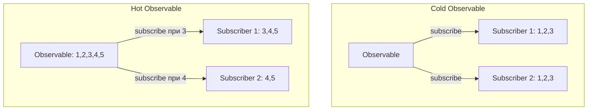

```java
// Cold Observable — каждый подписчик получает все элементы
Observable<Long> cold = Observable.interval(1, TimeUnit.SECONDS).take(3);
cold.subscribe(v -> System.out.println("Sub1: " + v)); // 0, 1, 2
Thread.sleep(2000);
cold.subscribe(v -> System.out.println("Sub2: " + v)); // 0, 1, 2 (заново)

// Hot Observable через publish + connect
ConnectableObservable<Long> hot = Observable.interval(1, TimeUnit.SECONDS).publish();
hot.subscribe(v -> System.out.println("Sub1: " + v));
hot.connect(); // начинаем испускание
Thread.sleep(2000);
hot.subscribe(v -> System.out.println("Sub2: " + v)); // пропустит первые элементы
```

## Q10. (!) Можно ли преобразовать `Cold Observable` в `Hot Observable`?

Да. Базовый способ — оператор `publish()`: он превращает cold-источник в `ConnectableObservable` и вставляет между источником и подписчиками общий «разветвитель». Теперь источник запускается не на каждую подписку, а один раз — по явной команде `connect()`, и все текущие подписчики начинают получать одни и те же элементы одновременно. Ключевая идея: `connect()` отвязывает старт источника от факта подписки, поэтому сначала подписываются все, кому нужно, и только потом дают `connect()`.

```java
Observable<Integer> cold = Observable.range(1, 5);
ConnectableObservable<Integer> hot = cold.publish();

// Подписываемся ДО connect
hot.subscribe(v -> System.out.println("Sub1: " + v));
hot.subscribe(v -> System.out.println("Sub2: " + v));

// Оба подписчика получат все элементы одновременно
hot.connect();
```

Ручной `connect()` неудобен — легко забыть вызвать или отключиться. Поэтому чаще берут производные операторы, которые управляют подключением автоматически:

- `share()` = `publish().refCount()` — считает подписчиков: подключается к источнику при первом и отключается, когда уходит последний. Самый частый выбор для расшаривания cold-источника;
- `replay()` — как `publish()`, но ещё и кеширует прошедшие элементы и проигрывает их новым подписчикам (то есть опоздавший всё же увидит историю);
- `replay(n)` — то же, но в кеше только последние `n` элементов (ограничивает память).

```java
// share() — автоматический connect/disconnect
Observable<Long> shared = Observable.interval(1, TimeUnit.SECONDS).share();
```

## Q11. Можно ли преобразовать `Hot Observable` в `Cold Observable`?

Да, через `replay()`. Hot-источник по своей природе теряет историю для опоздавших; `replay()` решает именно это — буферизует прошедшие элементы и проигрывает их каждому новому подписчику, имитируя cold-поведение «каждый получает всё с начала»:

```java
ConnectableObservable<Integer> hot = Observable.just(1, 2, 3).publish();
hot.connect();

// replay() кеширует все элементы
Observable<Integer> cold = hot.replay().autoConnect();

// Каждый новый подписчик получит все элементы
cold.subscribe(v -> System.out.println("Sub1: " + v)); // 1, 2, 3
cold.subscribe(v -> System.out.println("Sub2: " + v)); // 1, 2, 3
```

Полностью cold его это не делает (источник всё ещё один и общий), но по поведению для подписчика близко. У `replay()` есть параметры, ограничивающие буфер, — чтобы бесконечный hot-поток не съел память:

- `replay(int bufferSize)` — хранить только последние N элементов;
- `replay(long time, TimeUnit unit)` — хранить элементы только за последний промежуток времени.

## Q12. Что такое `Observable Chain`?

`Observable Chain` (цепочка) — это конвейер из операторов поверх исходного `Observable`. Каждый оператор принимает `Observable` на вход и возвращает **новый** `Observable` на выходе, поэтому их можно соединять в цепочку через точку и описывать обработку декларативно — «что сделать с потоком», а не «как итерироваться». Читается такая цепочка сверху вниз как пайплайн: источник → трансформации → фильтр → потребитель.

```java
Observable.just("  hello ", " WORLD ", " RxJava ")
    .map(String::trim)           // убираем пробелы
    .map(String::toLowerCase)    // к нижнему регистру
    .filter(s -> s.length() > 4) // только длинные строки
    .sorted()                    // сортировка
    .subscribe(System.out::println);
// Вывод: hello, rxjava, world
```

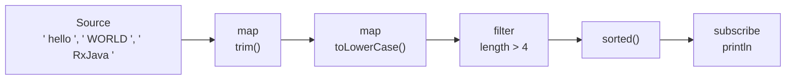

Ключевой принцип: оператор **не мутирует** исходный `Observable`, а оборачивает его в новый. Благодаря этой иммутабельности один и тот же базовый `Observable` можно безопасно переиспользовать в нескольких разных цепочках — они не повлияют друг на друга.

## Q13. (!) Какие операторы создания `Observable` вы знаете?

Операторы создания удобно разделить на группы: из готовых данных (`just`, `from*`), из ленивого вычисления (`fromCallable`, `defer`, `create`), по времени (`interval`, `timer`) и «вырожденные» сигналы (`empty`, `never`, `error`).

| Оператор | Описание | Пример |
|----------|---------|--------|
| `just(T...)` | Фиксированный набор элементов | `Observable.just(1, 2, 3)` |
| `fromIterable(Iterable)` | Из коллекции | `Observable.fromIterable(list)` |
| `fromArray(T[])` | Из массива | `Observable.fromArray(arr)` |
| `fromCallable(Callable)` | Из вызова (lazy) | `Observable.fromCallable(() -> fetchData())` |
| `create(ObservableOnSubscribe)` | Ручное управление | см. ниже |
| `range(start, count)` | Диапазон чисел | `Observable.range(1, 10)` |
| `interval(period, TimeUnit)` | Периодические тики | `Observable.interval(1, SECONDS)` |
| `timer(delay, TimeUnit)` | Один элемент с задержкой | `Observable.timer(5, SECONDS)` |
| `defer(Supplier)` | Ленивое создание | `Observable.defer(() -> Observable.just(getVal()))` |
| `empty()` | Пустой + complete | `Observable.empty()` |
| `never()` | Ничего не делает | `Observable.never()` |
| `error(Throwable)` | Сразу ошибка | `Observable.error(new Exception())` |

Главная ловушка — разница между `just` и ленивыми операторами. `just(getValue())` вычисляет аргумент **сразу при создании** `Observable`, ещё до подписки, поэтому для побочных эффектов (HTTP-вызов, чтение) нужны `fromCallable`/`defer`, которые откладывают работу до момента подписки. `create()` оставлен на крайний случай — когда нужен полный ручной контроль над `onNext/onComplete/onError`:

```java
// create() — полный контроль над испусканием
Observable<String> custom = Observable.create(emitter -> {
    try {
        List<String> data = loadFromDatabase();
        for (String item : data) {
            if (emitter.isDisposed()) return; // проверяем отписку
            emitter.onNext(item);
        }
        emitter.onComplete();
    } catch (Exception e) {
        emitter.onError(e);
    }
});
```

## Q14. В чём разница между `Observable.create()` и `Observable.defer()`?

Оба откладывают работу до подписки, но решают разные задачи:

- `create()` — даёт **полный ручной контроль** над эмиссией: вы сами вызываете `onNext/onComplete/onError` внутри колбэка. Используется, когда нужно «вручную» смостить нереактивный источник (callback API, слушатель) в `Observable`.
- `defer()` — это **фабрика**: он не создаёт `Observable` заранее, а откладывает само построение до момента подписки и вызывает фабрику заново для каждого подписчика. Поэтому каждый получает свежесозданный `Observable` с актуальным состоянием.

Главное отличие на практике — в том, **когда захватывается значение**. Без `defer` всё, что стоит в аргументе `just(...)`, вычисляется один раз при создании цепочки и «замораживается»; с `defer` вычисление происходит при каждой подписке:

```java
// Проблема: значение вычисляется сразу при создании
Observable<Long> eager = Observable.just(System.currentTimeMillis());
// Оба подписчика получат ОДНО и ТО ЖЕ значение

// Решение: defer() откладывает создание
Observable<Long> lazy = Observable.defer(() ->
    Observable.just(System.currentTimeMillis())
);
// Каждый подписчик получит СВОЁ значение

lazy.subscribe(t -> System.out.println("Sub1: " + t));
Thread.sleep(1000);
lazy.subscribe(t -> System.out.println("Sub2: " + t)); // другое время
```

## Q15. В чем разница между `map()` и `flatMap()`?

Коротко: `map()` преобразует элемент в **значение** (1→1), а `flatMap()` — в **новый `Observable`**, который затем «разворачивает» и подмешивает его элементы в общий поток (1→N). Разница не косметическая: `flatMap` нужен именно тогда, когда из элемента рождается асинхронная операция (сетевой вызов, запрос в БД), результат которой сам по себе является потоком.

| Характеристика | `map()` | `flatMap()` |
|---------------|---------|------------|
| Возвращает | `T → R` (значение) | `T → Observable<R>` (поток) |
| Порядок | Сохраняет | Не гарантирует |
| Вложенность | 1:1 | 1:N (разворачивает) |
| Асинхронность | Нет | Да |

Почему `flatMap` не сохраняет порядок: он подписывается на все внутренние `Observable` сразу и сливает их через `merge`, а кто из них ответит первым — тот первым и попадёт в выход. Если порядок важен — нужен `concatMap` (см. следующий вопрос).

```java
// map() — синхронная трансформация 1:1
Observable.just(1, 2, 3)
    .map(n -> n * 10)
    .subscribe(System.out::println); // 10, 20, 30

// flatMap() — каждый элемент превращается в поток
Observable.just(1, 2, 3)
    .flatMap(n -> Observable.just(n, n * 10))
    .subscribe(System.out::println); // 1, 10, 2, 20, 3, 30 (порядок не гарантирован)
```

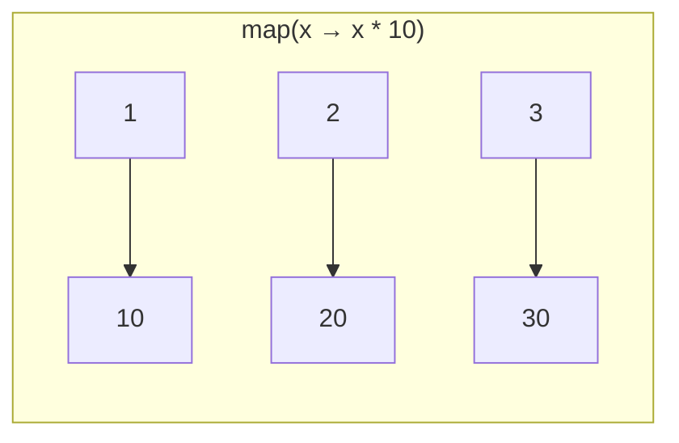

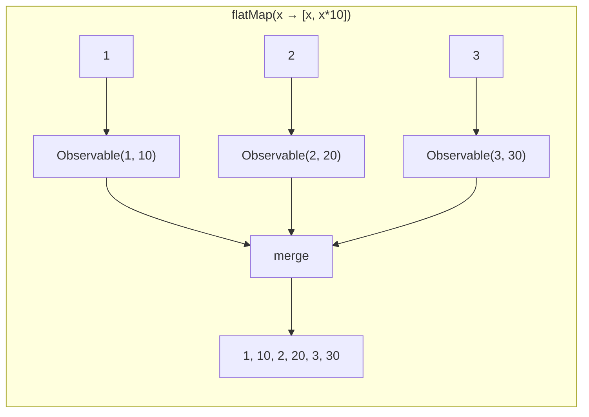

**Эмпирическое правило.** Возвращает простое значение → `map()`. Возвращает `Observable` (асинхронный вызов) → один из `*Map`-операторов, иначе получите «поток потоков» `Observable<Observable<R>>`, который надо разворачивать.

## Q16. (!) В чем разница между `flatMap()`, `concatMap()` и `switchMap()`?

Все три превращают элемент в `Observable` и разворачивают его — отличаются они тем, **как обращаются с уже запущенными внутренними потоками**. Это и есть критерий выбора.

| Оператор | Порядок | Параллельность | Поведение при новом элементе |
|----------|---------|---------------|----------------------------|
| `flatMap()` | Не сохраняет | Все `Observable` параллельно | Продолжает все |
| `concatMap()` | Сохраняет | Последовательно | Ждёт завершения текущего |
| `switchMap()` | Последний | Только последний | Отменяет предыдущий |

- **`flatMap`** — максимальная пропускная способность: запускает всё параллельно, порядок результатов не гарантирован. Берут, когда важна скорость, а порядок не важен (например, независимые загрузки).
- **`concatMap`** — гарантия порядка ценой параллелизма: следующий внутренний поток стартует только после завершения предыдущего. Берут, когда порядок критичен (например, последовательность шагов).
- **`switchMap`** — «актуален только последний»: при новом элементе подписка на предыдущий внутренний поток отменяется. Берут, когда устаревший результат не нужен — канонический случай — поиск-автодополнение, где ответ на старый запрос уже не интересен.

```java
// flatMap — параллельное выполнение, порядок не гарантирован
Observable.just("user/1", "user/2", "user/3")
    .flatMap(url -> apiClient.get(url).subscribeOn(Schedulers.io()))
    .subscribe(System.out::println);

// concatMap — последовательно, порядок гарантирован
Observable.just("user/1", "user/2", "user/3")
    .concatMap(url -> apiClient.get(url).subscribeOn(Schedulers.io()))
    .subscribe(System.out::println);

// switchMap — только последний, предыдущие отменяются
// Идеально для поиска: при новом вводе отменяем предыдущий запрос
searchField.textChanges()
    .debounce(300, TimeUnit.MILLISECONDS)
    .switchMap(query -> searchApi.search(query))
    .subscribe(results -> displayResults(results));
```

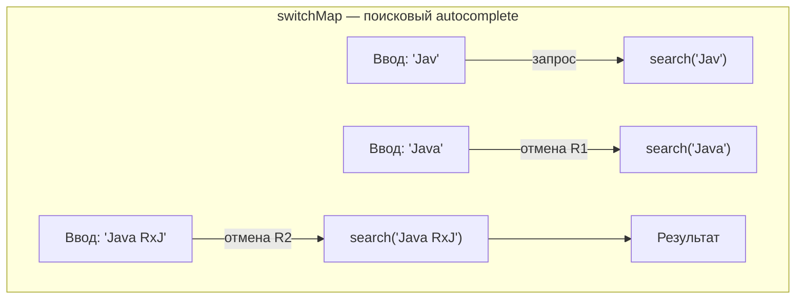

## Q17. В чём разница между `concat()` и `merge()`?

Оба объединяют несколько `Observable` в один, но по-разному управляют подписками. `concat()` подписывается на источники **по очереди**: пока первый не завершился (`onComplete`), ко второму даже не подключается — отсюда строгий порядок. `merge()` подписывается на **все сразу** и пробрасывает элементы по мере поступления — отсюда чередование и потенциально более высокая скорость.

| Оператор | Порядок | Подписка | Когда использовать |
|----------|---------|---------|-------------------|
| `concat()` | Сохраняет | Последовательно (следующий после завершения предыдущего) | Важен порядок |
| `merge()` | Не сохраняет | Одновременно на все | Важна скорость |

Прямое следствие: `concat()` с бесконечным первым источником никогда не дойдёт до второго (первый не завершается) — типичная ошибка; для бесконечных потоков нужен `merge()`.

```java
Observable<Integer> source1 = Observable.just(1, 2, 3)
    .delay(100, TimeUnit.MILLISECONDS);
Observable<Integer> source2 = Observable.just(4, 5, 6);

// concat — сначала все из source1, потом из source2
Observable.concat(source1, source2)
    .subscribe(System.out::println); // 1, 2, 3, 4, 5, 6

// merge — элементы чередуются, source2 может прийти раньше
Observable.merge(source1, source2)
    .subscribe(System.out::println); // 4, 5, 6, 1, 2, 3 (source2 быстрее)
```

Полезные варианты решают типичные проблемы базовых операторов:
- `mergeDelayError()` — не обрывает поток на первой же ошибке, а откладывает её до завершения всех источников (иначе одна упавшая ветка убьёт результаты остальных);
- `concatEager()` — компромисс между скоростью и порядком: подписывается на все источники сразу (как `merge`), но выдаёт результаты строго по порядку (как `concat`), буферизуя готовые. Полезно, когда хочется параллельной загрузки, но упорядоченного вывода.

## Q18. Можно ли иметь несколько операторов одного типа в одной цепочке?

Да, и это обычная практика. Поскольку каждый оператор возвращает новый `Observable`, на него можно навесить следующий — ограничений по количеству или повторению одного типа нет. Несколько `map` подряд часто читаются яснее, чем один большой с составной лямбдой: каждый шаг делает одно понятное преобразование.

```java
Observable.just("  Hello, World!  ")
    .map(String::trim)
    .map(String::toUpperCase)
    .map(s -> s + "!!!")
    .map(String::length)
    .subscribe(len -> System.out.println("Длина: " + len)); // 19
```

**Подводный камень** — читаемость и стоимость. Каждый оператор добавляет обёртку и небольшой overhead, а длинная цепочка из десятков шагов тяжело читается. Если один и тот же набор операторов повторяется в разных местах кода — его стоит вынести в переиспользуемый блок через `compose()` и [Transformer](#q22-что-такое-transformer-и-оператор-compose).

## Q19. (!) Какие операторы фильтрации есть в `RxJava`?

Фильтрующие операторы делятся на две группы: фильтрация **по содержимому/позиции** (`filter`, `take`, `skip`, `distinct`) и фильтрация **по времени** (`debounce`, `throttle*`, `sample`). Вторая группа особенно важна на собеседовании — именно ей гасят слишком частые события.

| Оператор | Описание |
|----------|---------|
| `filter(Predicate)` | Пропускает элементы по условию |
| `take(n)` | Берёт первые N элементов |
| `takeLast(n)` | Берёт последние N элементов |
| `skip(n)` | Пропускает первые N элементов |
| `distinct()` | Убирает дубликаты |
| `distinctUntilChanged()` | Убирает последовательные дубликаты |
| `debounce(time, unit)` | Пропускает элемент, только если после него была пауза |
| `throttleFirst(time, unit)` | Первый элемент в каждом окне |
| `throttleLast(time, unit)` | Последний элемент в каждом окне (= `sample()`) |
| `elementAt(index)` | Элемент по индексу |
| `first()` / `last()` | Первый / последний элемент |

Частая путаница — `debounce` против `throttle`. `debounce` ждёт **тишины**: пропускает элемент, только если после него N миллисекунд ничего не приходило (идеально для поиска — реагируем, когда пользователь перестал печатать). `throttleFirst`/`throttleLast` режут поток по **окнам времени**, отдавая по одному элементу за окно независимо от пауз (идеально для защиты от дабл-кликов или ограничения частоты).

```java
// distinctUntilChanged — игнорирует повторяющиеся подряд значения
Observable.just(1, 1, 2, 2, 3, 1, 1)
    .distinctUntilChanged()
    .subscribe(System.out::println); // 1, 2, 3, 1

// debounce — типичное применение для поиска
searchInput.textChanges()
    .debounce(300, TimeUnit.MILLISECONDS)
    .distinctUntilChanged()
    .switchMap(query -> searchApi.search(query))
    .subscribe(this::showResults);
```

## Q20. Какие операторы агрегации есть в `RxJava`?

Агрегирующие операторы сворачивают весь поток в один результат. Большинство из них возвращают `Single`/`Maybe`, а не `Observable`, — потому что результат один. Из этого следует важное свойство: чтобы выдать результат, оператору нужно дождаться `onComplete` источника, поэтому на **бесконечном** потоке `reduce`/`toList`/`count` зависнут навсегда.

| Оператор | Описание | Результат |
|----------|---------|----------|
| `reduce(BiFunction)` | Свёртка в одно значение | `Single<T>` / `Maybe<T>` |
| `scan(BiFunction)` | Промежуточные результаты свёртки | `Observable<T>` |
| `count()` | Количество элементов | `Single<Long>` |
| `toList()` | Собирает в `List` | `Single<List<T>>` |
| `toMap(keySelector)` | Собирает в `Map` | `Single<Map<K,V>>` |
| `collect(Supplier, BiConsumer)` | Произвольная аккумуляция | `Single<C>` |

Ключевая пара — `reduce` против `scan`. `reduce` выдаёт **только финал** свёртки (одно значение), а `scan` испускает **каждый промежуточный аккумулятор** — то есть остаётся `Observable` и работает даже на бесконечном потоке (его удобно использовать для «бегущего» состояния: running total, текущий баланс).

```java
// reduce — сумма всех элементов
Observable.range(1, 5)
    .reduce(0, Integer::sum)
    .subscribe(sum -> System.out.println("Сумма: " + sum)); // 15

// scan — промежуточные суммы
Observable.range(1, 5)
    .scan(0, Integer::sum)
    .subscribe(System.out::println); // 0, 1, 3, 6, 10, 15

// toMap
Observable.just("apple", "banana", "cherry")
    .toMap(String::length) // ключ = длина
    .subscribe(System.out::println); // {5=apple, 6=cherry} — banana перезаписан cherry (коллизия ключа 6)
```

## Q21. (!) Можно ли создавать собственные операторы в `RxJava`?

Да, и есть два уровня. Важно их различать: один работает с отдельными элементами (`Observer`), другой — со всей цепочкой (`Observable`).

**1. Через `ObservableOperator` + `lift()` (низкоуровневый)** — вы перехватываете уровень `Observer` и вручную пробрасываете каждый `onNext/onError/onComplete`. Даёт максимальный контроль, но требует аккуратности (легко нарушить контракт или потерять disposable):

```java
public class SquareOperator implements ObservableOperator<Integer, Integer> {
    @Override
    public Observer<? super Integer> apply(Observer<? super Integer> observer) {
        return new DisposableObserver<Integer>() {
            @Override
            public void onNext(Integer value) {
                observer.onNext(value * value);
            }
            @Override
            public void onError(Throwable e) { observer.onError(e); }
            @Override
            public void onComplete() { observer.onComplete(); }
        };
    }
}

// Использование через lift()
Observable.range(1, 5)
    .lift(new SquareOperator())
    .subscribe(System.out::println); // 1, 4, 9, 16, 25
```

**2. Через `compose()` и `ObservableTransformer` (рекомендуемый)** — вы работаете на уровне готовых операторов, комбинируя их в переиспользуемый блок (подробнее — в следующем вопросе).

**Рекомендация.** `lift()` нужен крайне редко — почти всё, что хочется «своим оператором», на деле собирается из существующих операторов. Поэтому в 99% случаев берут `compose()` + `Transformer`: он проще, безопаснее (не надо вручную соблюдать контракт `Observer`) и легче тестируется.

## Q22. (!) Что такое `Transformer` и оператор `compose()`?

`ObservableTransformer` — это способ упаковать кусок цепочки операторов в переиспользуемый объект, а `compose()` — оператор, который этот объект вставляет в цепочку. Проблема, которую они решают: одни и те же связки (например, «всё на io-поток, результат на main + retry») копируются по всему коду. `Transformer` выносит такую связку в одно место — получается DRY, а заодно эту логику можно протестировать отдельно.

```java
// Определяем переиспользуемый Transformer
public static <T> ObservableTransformer<T, T> applySchedulers() {
    return upstream -> upstream
        .subscribeOn(Schedulers.io())
        .observeOn(AndroidSchedulers.mainThread());
}

public static <T> ObservableTransformer<T, T> retryWithDelay(int maxRetries, long delay) {
    return upstream -> upstream
        .retryWhen(errors -> errors
            .zipWith(Observable.range(1, maxRetries), (e, i) -> i)
            .flatMap(i -> Observable.timer(delay * i, TimeUnit.SECONDS))
        );
}

// Использование — DRY, чистый код
apiClient.getUsers()
    .compose(applySchedulers())
    .compose(retryWithDelay(3, 2))
    .subscribe(users -> updateUI(users));

apiClient.getOrders()
    .compose(applySchedulers())
    .compose(retryWithDelay(3, 2))
    .subscribe(orders -> showOrders(orders));
```

Преимущества `compose()` перед `lift()`:
- работает на уровне `Observable`, а не `Observer` — вы просто комбинируете готовые операторы, не трогая низкоуровневый контракт;
- не нужно вручную пробрасывать `onNext/onError/onComplete` — а значит, меньше шансов нарушить контракт или допустить утечку;
- блок логики (retry, переключение потоков) тестируется изолированно, как обычная функция.

**Частая ошибка** — путать `compose()` и `flatMap()`. `compose()` срабатывает один раз при сборке цепочки (в момент `subscribe`) и применяется ко всему потоку; `flatMap()` вызывается на **каждый** элемент. Для переиспользуемых блоков нужен именно `compose()`.

## Q23. (!) Что такое `Scheduler`? Какие `Schedulers` есть в `RxJava`?

`Scheduler` — абстракция над пулом потоков: он отвечает на вопрос «в каком потоке выполнять работу». Сам по себе он не делает код асинхронным — асинхронность включается, когда вы привязываете `Scheduler` к цепочке через `subscribeOn`/`observeOn`.

| Scheduler | Пул потоков | Назначение |
|-----------|-----------|-----------|
| `Schedulers.io()` | Кешированный (растущий) | I/O: сетевые вызовы, БД, файлы |
| `Schedulers.computation()` | Фиксированный (= CPU cores) | CPU-bound: вычисления, парсинг |
| `Schedulers.newThread()` | Новый поток на каждую задачу | Редко используется |
| `Schedulers.single()` | Один поток | Последовательное выполнение |
| `Schedulers.trampoline()` | Текущий поток (FIFO-очередь) | Тестирование |
| `Schedulers.from(Executor)` | Пользовательский Executor | Кастомный пул |
| `AndroidSchedulers.mainThread()` | UI-поток (Android) | Обновление UI |

Главное — правильно выбрать между `io()` и `computation()`, иначе можно положить производительность:

- **`io()`** для операций, которые **ждут** (сеть, диск, БД). Пул кешированный и почти неограниченно растёт, потому что ждущие потоки дёшевы и их может понадобиться много.
- **`computation()`** для операций, которые **грузят CPU** (вычисления, парсинг). Пул фиксирован по числу ядер — больше потоков, чем ядер, не ускорят счёт, а только добавят накладные расходы на переключение контекста.

Типичная ошибка — гонять CPU-bound задачи на `io()`: безграничный пул наплодит сотни потоков, и они начнут конкурировать за ядра.

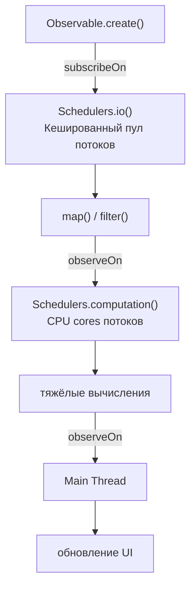

```java
Observable.fromCallable(() -> loadDataFromNetwork()) // I/O
    .subscribeOn(Schedulers.io())          // загрузка в io-пуле
    .observeOn(Schedulers.computation())   // парсинг на computation
    .map(data -> parseJson(data))
    .observeOn(AndroidSchedulers.mainThread()) // UI-обновление на main
    .subscribe(result -> textView.setText(result));
```

## Q24. (!) В чем разница между `observeOn()` и `subscribeOn()`?

Это два главных оператора управления потоками, и их постоянно путают. Короткая формула: **`subscribeOn` задаёт, где поток стартует (источник), `observeOn` — где продолжается обработка (downstream)**.

| Аспект | `subscribeOn()` | `observeOn()` |
|--------|----------------|---------------|
| Влияет на | Весь upstream (вверх по цепочке) | Только downstream (вниз по цепочке) |
| Позиция в цепочке | Неважна (влияет на всё) | Важна (переключает с этой точки) |
| Сколько раз работает | Только первый в цепочке | Каждый новый переключает поток |
| Что определяет | Где выполняется подписка и генерация | Где обрабатываются результаты |

Почему так. `subscribeOn` влияет на момент **подписки**, а подписка идёт снизу вверх до самого источника — поэтому он определяет поток, в котором источник начинает генерацию, и его позиция в цепочке не важна. `observeOn` же просто перекладывает последующие сигналы `onNext` в указанный `Scheduler`, начиная с того места, где он стоит, — поэтому его позиция важна, и таких переключений в цепочке может быть несколько.

Канонический сценарий — «загрузить в фоне, показать на UI»: `subscribeOn(io())` уводит сетевой вызов с главного потока, а `observeOn(mainThread())` возвращает результат на UI-поток для отрисовки.

```java
Observable.just(1, 2, 3)                    // main thread
    .subscribeOn(Schedulers.io())            // всё upstream → io thread
    .map(n -> {
        log("map1: " + Thread.currentThread()); // io thread
        return n * 2;
    })
    .observeOn(Schedulers.computation())     // переключаем на computation
    .map(n -> {
        log("map2: " + Thread.currentThread()); // computation thread
        return n + 1;
    })
    .observeOn(Schedulers.single())          // переключаем на single
    .subscribe(v -> {
        log("subscribe: " + Thread.currentThread()); // single thread
    });
```

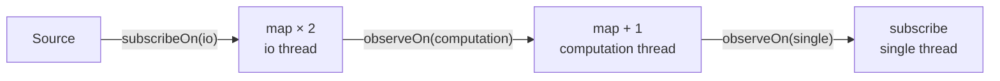

## Q25. (!) Что произойдет, если несколько `subscribeOn()` в цепочке?

**Работает только первый `subscribeOn()` — тот, что ближе к источнику; остальные молча игнорируются.** Причина — в механике подписки: она проходит по цепочке один раз снизу вверх (от подписчика к источнику). Первый `subscribeOn`, до которого она доберётся ближе всего к источнику, и переключит поток, а более «верхние» уже ничего не изменят — переключать нечего, подписка дальше не пойдёт.

```java
Observable.just(1, 2, 3)
    .subscribeOn(Schedulers.io())           // ЭТОТ работает
    .map(n -> n * 2)
    .subscribeOn(Schedulers.computation())  // игнорируется
    .subscribe(System.out::println);
// Всё выполняется на io thread
```

## Q26. Что произойдет, если несколько `observeOn()` в цепочке?

В отличие от `subscribeOn()`, **срабатывает каждый `observeOn()`** — он переключает поток для всех операторов, стоящих ниже него по цепочке, до следующего `observeOn`. Это не баг, а штатный механизм: так можно прогонять каждый этап обработки в подходящем для него потоке.

```java
Observable.just(1, 2, 3)
    .subscribeOn(Schedulers.io())              // генерация на io
    .observeOn(Schedulers.computation())       // переключаем на computation
    .map(n -> {
        // выполняется на computation thread
        return heavyCalculation(n);
    })
    .observeOn(Schedulers.single())            // переключаем на single
    .subscribe(result -> {
        // выполняется на single thread
        saveToLog(result);
    });
```

**Сценарий применения** — конвейер с разнородными этапами: загрузка (io) → парсинг/вычисления (computation) → сохранение → обновление UI (main). Каждый `observeOn` переводит поток на правильный `Scheduler` для следующего этапа.

## Q27. (!) Как данные передаются в `RxJava` по умолчанию — синхронно или асинхронно?

**По умолчанию `RxJava` синхронна** — вся цепочка выполняется в том же потоке, который вызвал `subscribe()`, и `subscribe()` блокирует его до завершения. Асинхронность не «бесплатна» — её надо включить явно: либо через `subscribeOn()`/`observeOn()`, либо используя операторы со встроенным `Scheduler` (`interval()`, `delay()`, `timeout()` — они по умолчанию работают на `computation()`).

```java
System.out.println("Поток: " + Thread.currentThread().getName()); // main

Observable.just(1, 2, 3)
    .map(n -> {
        System.out.println("map: " + Thread.currentThread().getName()); // main
        return n * 2;
    })
    .subscribe(v ->
        System.out.println("sub: " + Thread.currentThread().getName()) // main
    );
// Всё выполняется синхронно на main thread
```

Это популярное заблуждение на собеседовании: многие думают, что `RxJava` сама раскидывает работу по фоновым потокам. Нет — реактивность и многопоточность это разные вещи. Без явного `Scheduler` весь код, включая «тяжёлый» `map`, выполнится в вызывающем потоке (и если это UI-поток — заморозит интерфейс).

## Q28. (!) Поддерживает ли `RxJava` параллелизм?

Да, поддерживает, но не «из коробки»: по контракту цепочка `Observable` обрабатывает элементы **последовательно** (оператор не получит следующий элемент, пока не отдал предыдущий). Параллелизм надо организовать явно — есть три основных способа.

**1. `flatMap()` + `subscribeOn()` на каждом внутреннем `Observable`.** Идея: завернуть каждый элемент в свой `Observable` и увести его на отдельный поток — тогда `flatMap` запустит их параллельно. Простой и гибкий приём, но без контроля числа потоков можно перегрузить пул:

```java
Observable.range(1, 10)
    .flatMap(num ->
        Observable.just(num)
            .subscribeOn(Schedulers.computation())
            .map(this::heavyCalculation)
    )
    .subscribe(result -> System.out.println(result));
```

**2. `ParallelFlowable` (RxJava 2.2+)** — специальный API для честного параллелизма: `parallel()` разбивает поток на N «рельсов», `runOn()` назначает им `Scheduler`, а `sequential()` собирает результаты обратно в один поток. Самый предсказуемый способ для CPU-bound обработки большого потока:

```java
Flowable.range(1, 10)
    .parallel()                         // разбиваем на параллельные «рельсы»
    .runOn(Schedulers.computation())    // назначаем Scheduler
    .map(this::heavyCalculation)
    .sequential()                       // собираем обратно
    .subscribe(System.out::println);
```

**3. `merge()` нескольких независимых `Observable`, каждый на своём `Scheduler`.** Подходит, когда параллелить нужно не однотипный поток, а несколько разных источников (например, два независимых API-вызова), и затем слить их результаты:

```java
Observable<Data> source1 = api.getData1().subscribeOn(Schedulers.io());
Observable<Data> source2 = api.getData2().subscribeOn(Schedulers.io());
Observable.merge(source1, source2)
    .subscribe(this::process);
```

## Q29. (!) Что такое `Subject`? Какие типы `Subject` существуют?

`Subject` — это объект, который одновременно и `Observable`, и `Observer`: в него можно «вручную» класть элементы через `onNext()`, и он раздаёт их подписчикам. Поэтому `Subject` — главный **мост между императивным и реактивным миром**: им оборачивают callback-источники, event bus, ручные триггеры, у которых нет готового `Observable`.

Типы отличаются тем, **что увидит подписчик, пришедший с опозданием** — этот критерий и определяет выбор:

| Тип Subject | Поведение для нового подписчика |
|-------------|-------------------------------|
| `PublishSubject` | Получает только будущие элементы |
| `BehaviorSubject` | Получает последний + будущие |
| `ReplaySubject` | Получает все прошлые + будущие |
| `AsyncSubject` | Получает только последний элемент (после `onComplete`) |
| `UnicastSubject` | Один подписчик, буферизация до подписки |

Практический ориентир: `PublishSubject` — для событий «здесь и сейчас» (клики); `BehaviorSubject` — для **состояния**, у которого всегда есть «текущее значение» (новый подписчик сразу должен его получить); `ReplaySubject` — когда подписчику нужна полная история (осторожно с памятью).

```java
// BehaviorSubject — хранит последнее значение
BehaviorSubject<String> subject = BehaviorSubject.createDefault("initial");
subject.onNext("A");
subject.onNext("B");

subject.subscribe(v -> System.out.println("Sub1: " + v)); // Sub1: B
subject.onNext("C");
// Sub1: C

subject.subscribe(v -> System.out.println("Sub2: " + v)); // Sub2: C
```

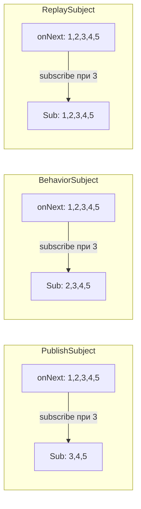

## Q30. В чем разница между `Subject` и `RxRelay`?

`Relay` (библиотека `RxRelay` от Jake Wharton) — это `Subject` без терминальных событий: у него нет методов `onComplete()`/`onError()` вообще, вместо `onNext()` — `accept()`. Зачем это нужно: главная боль `Subject` в роли event bus — его можно случайно «закрыть». Стоит где-то в коде вызвать `onComplete()` (или прилететь `onError`), и шина мертва навсегда — все будущие подписчики не получат ничего. `Relay` гарантированно живёт вечно, поэтому он безопаснее для долгоживущих шин событий.

| Аспект | `Subject` | `RxRelay` |
|--------|----------|-----------|
| Библиотека | `RxJava` (встроенный) | Отдельная (`com.jakewharton.rxrelay3`) |
| `onComplete()`/`onError()` | Завершает поток | Метода нет (завершить нельзя) |
| Типичное применение | Мост к реактивным потокам | Event bus, UI events |
| Риск случайного завершения | Да | Нет |

```java
// Subject — может быть случайно завершён
PublishSubject<String> subject = PublishSubject.create();
subject.onNext("A");
subject.onComplete(); // всё, новые подписчики ничего не получат
subject.onNext("B");  // игнорируется

// Relay — защита от случайного завершения
PublishRelay<String> relay = PublishRelay.create();
relay.accept("A");
relay.accept("B"); // всегда работает
```

## Q31. (!) Что такое `backpressure` (противодавление)?

**`Backpressure`** — это проблема и одновременно механизм её решения. Проблема: производитель генерирует данные быстрее, чем потребитель успевает их обрабатывать. Механизм: способ согласовать их темп, чтобы быстрый производитель не «затопил» медленного потребителя. В `Reactive Streams` это делается через `request(n)` — потребитель сам сообщает, сколько элементов готов принять, и производитель не отдаёт больше.

Если темп не согласован, лишние элементы где-то копятся, и это выливается в одну из бед:
- `MissingBackpressureException` (в `RxJava 2+`) — оператор обнаружил переполнение и аварийно завершился;
- `OutOfMemoryError` — неограниченный буфер рос, пока не съел память;
- потеря данных — если элементы просто отбрасываются.

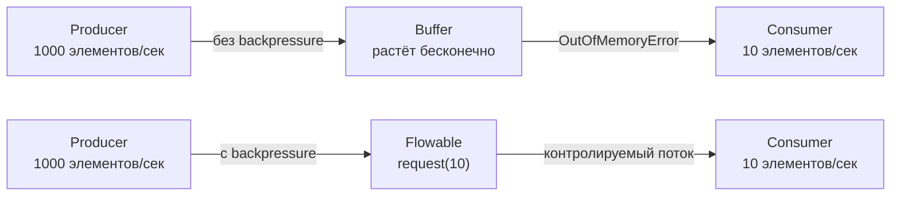

**Ключевой факт для собеседования.** В `RxJava 2+` backpressure умеет только `Flowable` — у него есть `request(n)`. `Observable` backpressure **не поддерживает** принципиально: это осознанное упрощение API для случаев, где давление не возникает (UI-события, небольшие коллекции). Поэтому выбор `Observable` vs `Flowable` — это в первую очередь вопрос «нужен ли мне backpressure». Подробнее — в [вопросах по Spring WebFlux](../frameworks/spring/spring-webflux-interview.md), где `Reactor` реализует тот же механизм через `Flux`/`Mono`.

## Q32. (!) В чём разница между `Observable` и `Flowable`?

Это два класса для потока из 0..N элементов; разница одна, но определяющая — **backpressure**. `Flowable` реализует `Reactive Streams` (`Publisher` с `request(n)`), поэтому потребитель может управлять темпом; `Observable` этого механизма не имеет и просто проталкивает всё подряд.

| Аспект | `Observable` | `Flowable` |
|--------|-------------|-----------|
| Backpressure | Нет | Да (`Reactive Streams`) |
| Производительность | Чуть выше (нет overhead) | Чуть ниже (проверки backpressure) |
| Когда использовать | < 1000 элементов, UI-события, click streams | Большие потоки, файлы, БД, сетевые потоки |
| Базовый интерфейс | Нет (свой API) | `org.reactivestreams.Publisher` |

Из этой разницы вытекает и компромисс по производительности: `Flowable` тратит немного больше на учёт `request(n)`, поэтому без необходимости в backpressure берут более лёгкий `Observable`. **Эмпирическое правило:** источник контролируемый и небольшой (UI, коллекция < ~1000) → `Observable`; источник большой, медленный или связан с I/O (файл, БД, сеть, Kafka) → `Flowable`.

```java
// Когда Observable — события мыши (немного, потеря не критична)
Observable<MotionEvent> touches = RxView.touches(view);

// Когда Flowable — чтение большого файла
Flowable<String> lines = Flowable.create(emitter -> {
    try (BufferedReader reader = new BufferedReader(new FileReader("big.csv"))) {
        String line;
        while ((line = reader.readLine()) != null) {
            if (emitter.isCancelled()) return;
            emitter.onNext(line);
        }
        emitter.onComplete();
    }
}, BackpressureStrategy.BUFFER);
```

Конвертация возможна в обе стороны, но обратите внимание на асимметрию:
- `Observable.toFlowable(BackpressureStrategy)` → `Flowable`. Параметр обязателен: у `Observable` нет backpressure, поэтому нужно явно указать, что делать при переполнении (буферизовать, дропать и т.д.);
- `Flowable.toObservable()` → `Observable`. Параметр не нужен, но **backpressure теряется** — после конвертации `request(n)` уже не работает.

## Q33. (!) Какие стратегии `BackpressureStrategy` существуют?

`BackpressureStrategy` — это ответ на вопрос «что делать с лишними элементами, когда потребитель не успевает». Стратегии различаются тем, чем они жертвуют: памятью (`BUFFER`), полнотой данных (`DROP`, `LATEST`) или живучестью потока (`ERROR`).

| Стратегия | Поведение при переполнении |
|-----------|--------------------------|
| `BUFFER` | Буферизует все элементы (может привести к `OOM`) |
| `DROP` | Отбрасывает элементы, которые не могут быть обработаны |
| `LATEST` | Хранит только последний элемент, предыдущие отбрасывает |
| `ERROR` | Выбрасывает `MissingBackpressureException` |
| `MISSING` | Без стратегии — вы сами управляете через `onBackpressure*()` |

Как выбрать: терять данные нельзя и всплески короткие → `BUFFER` (но следите за памятью); потеря допустима → `DROP`; важно только самое свежее значение (UI, текущая позиция) → `LATEST`; хотите явно ловить ситуацию переполнения в тестах/протоколах → `ERROR`. Разница `DROP` и `LATEST` тонкая: `DROP` отбрасывает **новые** элементы при заполненном буфере, а `LATEST` всегда держит **самый последний**, выкидывая промежуточные.

```java
// BUFFER — опасно для бесконечных потоков
Flowable.interval(1, TimeUnit.MILLISECONDS)
    .onBackpressureBuffer(1000, // максимум 1000 элементов в буфере
        () -> System.out.println("Буфер переполнен!"),
        BackpressureOverflowStrategy.DROP_OLDEST)
    .observeOn(Schedulers.computation())
    .subscribe(this::slowProcess);

// DROP — для метрик, где допустима потеря отдельных значений
Flowable.interval(1, TimeUnit.MILLISECONDS)
    .onBackpressureDrop(dropped ->
        System.out.println("Отброшен: " + dropped))
    .observeOn(Schedulers.computation())
    .subscribe(this::process);

// LATEST — для UI: всегда актуальное значение
Flowable.interval(1, TimeUnit.MILLISECONDS)
    .onBackpressureLatest()
    .observeOn(Schedulers.computation())
    .subscribe(this::updateUI);
```

## Q34. Как решить проблемы с `backpressure`?

Подходы можно сгруппировать по сути: либо дать потребителю рычаг (`Flowable`), либо снизить темп производителя (sampling, batching), либо ускорить потребителя (параллелизм), либо явно решить, что делать с лишним (`onBackpressure*`).

**1. Перейти с `Observable` на `Flowable`.** Самое прямое решение: `Flowable` поддерживает `request(n)`, поэтому потребитель сам ограничивает поток у источника, и переполнения не возникает:

```java
Flowable<Data> source = Flowable.create(emitter -> {
    // ...
}, BackpressureStrategy.BUFFER);
```

**2. Снизить темп: ограничение скорости и группировка.** Если терять часть данных допустимо — прореживаем поток (`throttleLast`/`sample`); если нет — собираем элементы в пачки (`buffer`, `window`), чтобы потребитель обрабатывал их реже, но крупнее:

```java
source
    .throttleLast(100, TimeUnit.MILLISECONDS)   // sample раз в 100мс
    .subscribe(this::process);

source
    .buffer(100)                                 // группами по 100
    .subscribe(batch -> processBatch(batch));

source
    .window(1, TimeUnit.SECONDS)                 // окна по 1 секунде
    .flatMapSingle(Observable::toList)
    .subscribe(batch -> processBatch(batch));
```

**3. Ускорить потребителя через параллелизм.** Если узкое место — обработка, разнесём её на несколько «рельсов», чтобы потребитель в сумме успевал за производителем:

```java
source.parallel(4)
    .runOn(Schedulers.computation())
    .map(this::process)
    .sequential()
    .subscribe();
```

**4. Явно задать политику переполнения через `onBackpressure*`.** Когда производителя замедлить нельзя (внешний hot-источник), решаем, чем жертвовать: буфером с ограничением, дропом старых или новых элементов:

```java
source
    .onBackpressureBuffer(1024, () -> log.warn("buffer full"), DROP_OLDEST)
    .subscribe(this::process);
```

## Q35. (!) Какие операторы обработки ошибок вы знаете в `RxJava`?

Операторы обработки ошибок делятся на три стратегии: **подменить** результат (`onErrorReturn*`), **переключиться** на запасной источник (`onErrorResumeNext`) и **повторить** попытку (`retry*`). Отдельно стоит `doOnError` — он только наблюдает (логирование), но саму ошибку не гасит.

| Оператор | Поведение |
|----------|----------|
| `onErrorReturn(Function)` | Заменяет ошибку на значение по умолчанию |
| `onErrorReturnItem(T)` | Заменяет ошибку на конкретное значение |
| `onErrorResumeNext(Function)` | Заменяет ошибку на альтернативный `Observable` |
| `onErrorComplete()` | Превращает ошибку в `onComplete` |
| `retry()` | Повторяет подписку при ошибке |
| `retry(long count)` | Повторяет N раз |
| `retryWhen(Function)` | Условная логика повтора с задержкой |
| `doOnError(Consumer)` | Side-effect при ошибке (не перехватывает) |

Как выбирать: есть осмысленное значение по умолчанию (пустой список, кэш) → `onErrorReturn`; есть запасной источник (другой сервис, локальный кэш) → `onErrorResumeNext`; ошибка временная и повтор имеет смысл (сетевой сбой, таймаут) → `retry`/`retryWhen`. Важно помнить: `retry()` без задержки немедленно бомбит сервис повторами, поэтому для production почти всегда нужен `retryWhen` с backoff (см. [Q44](#q44--как-реализовать-паттерн-retry-с-exponential-backoff-в-rxjava)).

```java
// onErrorReturn — возврат значения по умолчанию
apiClient.getUser(id)
    .onErrorReturn(error -> User.EMPTY)
    .subscribe(this::showUser);

// onErrorResumeNext — fallback к другому источнику
apiClient.getUser(id)
    .onErrorResumeNext(error -> cache.getUser(id))
    .subscribe(this::showUser);

// retryWhen — экспоненциальный backoff
apiClient.getUser(id)
    .retryWhen(errors -> errors
        .zipWith(Flowable.range(1, 3), (err, attempt) -> attempt)
        .flatMap(attempt ->
            Flowable.timer((long) Math.pow(2, attempt), TimeUnit.SECONDS))
    )
    .subscribe(this::showUser);
```

Подробнее об обработке ошибок в реактивных системах — в [вопросах по распределённым системам](../architecture/distributed-systems-interview.md).

## Q36. Что произойдёт, если в цепочке возникнет несколько ошибок?

По контракту `Observable` **первая же ошибка терминальна**: она завершает поток, и никаких «вторых» ошибок просто не существует — после `onError` оператор источник останавливает. Поэтому при объединении нескольких потоков обычный `merge`/`concat` упадёт на первой упавшей ветке и потеряет результаты остальных.

Чтобы собрать данные из «здоровых» источников несмотря на ошибку в одном:

**1. `mergeDelayError()` — не обрывается на первой ошибке, а откладывает все ошибки до конца:**

```java
Observable<Integer> source1 = Observable.just(1, 2, 3);
Observable<Integer> source2 = Observable.error(new RuntimeException("Ошибка 1"));
Observable<Integer> source3 = Observable.error(new RuntimeException("Ошибка 2"));

Observable.mergeDelayError(source1, source2, source3)
    .subscribe(
        value -> System.out.println("Значение: " + value),
        error -> System.out.println("Ошибка: " + error), // CompositeException
        () -> System.out.println("Завершено")
    );
// Вывод: Значение: 1, Значение: 2, Значение: 3, Ошибка: CompositeException
```

**2. `onErrorResumeNext()` — гасить ошибку каждого источника по отдельности:**

```java
Observable.concat(source1, source2, source3)
    .onErrorResumeNext(error -> {
        log.warn("Ошибка: {}", error.getMessage());
        return Observable.empty(); // продолжаем без ошибки
    })
    .subscribe(System.out::println);
```

Деталь, о которой часто спрашивают: при `mergeDelayError` несколько накопленных ошибок не теряются и не «склеиваются» в одну случайную — они оборачиваются в `CompositeException`, и полный список можно достать через `getExceptions()`.

## Q37. (!) Как тестировать реактивные цепочки в `RxJava`?

У `RxJava` есть встроенный тулкит для тестирования, который закрывает две главные сложности реактивного кода — асинхронность и зависимость от времени. Три ключевых инструмента:

**1. `TestObserver` / `TestSubscriber`** — подписчик-«шпион»: метод `.test()` подписывается на поток и собирает все сигналы, а затем их можно проверять fluent-ассертами (`assertValues`, `assertComplete`, `assertNoErrors`). Это основной способ проверить, что цепочка выдала именно то, что ожидалось:

```java
@Test
void shouldFilterEvenNumbers() {
    TestObserver<Integer> testObserver = Observable.just(1, 2, 3, 4, 5)
        .filter(n -> n % 2 == 0)
        .test(); // создаёт TestObserver и подписывается

    testObserver
        .assertComplete()
        .assertNoErrors()
        .assertValueCount(2)
        .assertValues(2, 4);
}
```

**2. `TestScheduler` — виртуальное время.** Тесты операторов с задержками (`interval`, `debounce`, `timeout`) нельзя писать на `Thread.sleep` — это медленно и нестабильно. `TestScheduler` даёт «ручное» время: ничего не происходит, пока вы сами не продвинете часы через `advanceTimeBy`, поэтому тест проверяет тайминг детерминированно и мгновенно:

```java
@Test
void shouldDebounce() {
    TestScheduler scheduler = new TestScheduler();

    TestObserver<Long> testObserver = Observable.interval(1, TimeUnit.SECONDS, scheduler)
        .take(5)
        .test();

    testObserver.assertNoValues();       // ещё ничего не испущено

    scheduler.advanceTimeBy(3, TimeUnit.SECONDS);
    testObserver.assertValues(0L, 1L, 2L);

    scheduler.advanceTimeBy(2, TimeUnit.SECONDS);
    testObserver.assertComplete();
}
```

**3. `RxJavaPlugins` — подмена `Schedulers` глобально.** Когда production-код жёстко зашивает `Schedulers.io()`/`computation()`, тест не может передать туда `TestScheduler`. Выход — глобально подменить все планировщики на синхронный `trampoline()`: тогда асинхронность исчезает и тест выполняется в одном потоке предсказуемо. Главное — откатить подмену в `tearDown` через `RxJavaPlugins.reset()`, иначе она протечёт в другие тесты:

```java
@BeforeEach
void setUp() {
    // Все Schedulers → trampoline (синхронный)
    RxJavaPlugins.setIoSchedulerHandler(s -> Schedulers.trampoline());
    RxJavaPlugins.setComputationSchedulerHandler(s -> Schedulers.trampoline());
}

@AfterEach
void tearDown() {
    RxJavaPlugins.reset();
}
```

## Q38. Что такое `TestScheduler` и как его использовать?

`TestScheduler` — виртуальный планировщик, который заменяет реальное время «ручным». Он не выполняет запланированные задачи сам по таймеру — вместо этого хранит их в очереди с виртуальными отметками времени, и продвигает выполнение только когда вы явно сдвигаете часы. Это делает тесты операторов с задержками (`delay`, `interval`, `debounce`, `timeout`) детерминированными и мгновенными: не нужно реально ждать секунды, и нет флаки-тестов из-за гонок.

```java
@Test
void shouldRetryWithDelay() {
    TestScheduler scheduler = new TestScheduler();
    AtomicInteger attempts = new AtomicInteger(0);

    TestObserver<String> observer = Observable
        .<String>error(new IOException("Connection failed"))
        .doOnSubscribe(d -> attempts.incrementAndGet())
        .retryWhen(errors -> errors
            .delay(5, TimeUnit.SECONDS, scheduler)
            .take(2) // максимум 2 повтора
        )
        .test();

    assertEquals(1, attempts.get()); // первая попытка

    scheduler.advanceTimeBy(5, TimeUnit.SECONDS);
    assertEquals(2, attempts.get()); // первый retry

    scheduler.advanceTimeBy(5, TimeUnit.SECONDS);
    assertEquals(3, attempts.get()); // второй retry
}
```

Ключевые методы `TestScheduler`:
- `advanceTimeBy(time, unit)` — продвинуть виртуальные часы на интервал вперёд (и выполнить всё, что было запланировано на этот период);
- `advanceTimeTo(time, unit)` — продвинуть часы до абсолютной отметки времени;
- `triggerActions()` — выполнить уже «созревшие» задачи, не сдвигая часы.

Типичный шаблон теста: запускаем цепочку с `TestScheduler`, проверяем `assertNoValues()` (время ещё не шло), затем `advanceTimeBy(...)` и проверяем, что появились ожидаемые элементы.

## Q39. (!) Возникают ли утечки памяти при использовании `RxJava`?

Сама `RxJava` утечек не создаёт — их создаёт **забытая подписка**. Корень проблемы: пока подписка жива, `Observable` держит ссылку на подписчика (и всё, что тот захватил в лямбды). Если поток бесконечный или долгоживущий, а вы не вызвали `dispose()`, этот подписчик никогда не освободится — отсюда утечка.

**Основные причины:**
1. **Забытая отписка** — подписались на бесконечный `Observable` (`interval`, hot-источник) и не сохранили/не освободили `Disposable`.
2. **Захват `Activity`/`Context`/`View`** (Android) — лямбда подписчика удерживает ссылку на экран, и сборщик мусора не может его собрать после закрытия.
3. **Hot Observable** без управления жизненным циклом подписок — он живёт долго, а подписчики накапливаются.

Общий рецепт: на каждую подписку должна быть точка, где её гарантированно освобождают (`dispose`/`clear`), привязанная к жизненному циклу владельца.

**Как избежать:**

```java
// 1. Всегда сохраняйте Disposable и отписывайтесь
Disposable disposable = Observable.interval(1, TimeUnit.SECONDS)
    .subscribe(tick -> updateUI(tick));

// При завершении:
disposable.dispose();

// 2. CompositeDisposable для нескольких подписок
CompositeDisposable compositeDisposable = new CompositeDisposable();

compositeDisposable.add(
    api.getUsers().subscribe(this::showUsers)
);
compositeDisposable.add(
    api.getOrders().subscribe(this::showOrders)
);

// При завершении (onDestroy / onStop):
compositeDisposable.clear(); // отписываемся от всех

// 3. takeUntil для автоматической отписки
Observable.interval(1, TimeUnit.SECONDS)
    .takeUntil(lifecycle.onDestroy())
    .subscribe(this::update);

// 4. doFinally для освобождения ресурсов
Observable.using(
    () -> new FileInputStream("data.csv"),  // создание ресурса
    is -> Observable.just(readAll(is)),       // использование
    FileInputStream::close                    // гарантированное освобождение
).subscribe(System.out::println);
```

## Q40. Что такое `CompositeDisposable` и зачем он нужен?

`CompositeDisposable` — контейнер, в который складывают несколько `Disposable`, чтобы освобождать их разом. Проблема, которую он решает: в реальном компоненте подписок много (загрузка пользователей, заказов, обновления), и хранить десяток отдельных полей `Disposable` и не забыть `dispose()` каждое — мучительно и хрупко. С `CompositeDisposable` все подписки складываются в один контейнер, а в точке уничтожения компонента достаточно одного вызова, чтобы отписаться от всех.

```java
public class UserViewModel {
    private final CompositeDisposable disposables = new CompositeDisposable();

    public void loadData() {
        disposables.add(
            userRepository.getUsers()
                .subscribeOn(Schedulers.io())
                .observeOn(AndroidSchedulers.mainThread())
                .subscribe(
                    users -> usersLiveData.setValue(users),
                    error -> errorLiveData.setValue(error.getMessage())
                )
        );

        disposables.add(
            orderRepository.getOrders()
                .subscribeOn(Schedulers.io())
                .observeOn(AndroidSchedulers.mainThread())
                .subscribe(
                    orders -> ordersLiveData.setValue(orders),
                    error -> errorLiveData.setValue(error.getMessage())
                )
        );
    }

    // Вызывается при уничтожении ViewModel
    @Override
    protected void onCleared() {
        disposables.clear(); // отписывается от всех подписок
    }
}
```

**Граничный случай** — разница между `clear()` и `dispose()`, и на ней часто ловят:
- `clear()` — освобождает все текущие подписки, но контейнер остаётся рабочим: в него можно добавлять новые `Disposable` (нужно при перезагрузке данных в живом компоненте);
- `dispose()` — освобождает все и переводит контейнер в «мёртвое» состояние: любая попытка `add()` после этого приведёт к немедленному `dispose()` добавляемой подписки. Используется при окончательном уничтожении.

## Q41. Как осуществить вызов `API` типа «`Fire-And-Forget`»?

«Fire-and-forget» — это операция, у которой важен сам факт выполнения, а не возвращаемое значение (отправить аналитику, push, лог). Для неё идеален `Completable`: у него нет элементов, только сигнал `onComplete`/`onError`, — то есть тип сам выражает «результата не будет». Запускают его на фоновом `Scheduler`, чтобы не блокировать вызывающий поток:

```java
// Fire-and-forget: отправляем аналитику
Completable.fromAction(() -> analyticsApi.trackEvent("button_clicked"))
    .subscribeOn(Schedulers.io())
    .subscribe(
        () -> { /* успех — ничего не делаем */ },
        error -> log.warn("Analytics failed: {}", error.getMessage())
    );

// Или через fromRunnable
Completable.fromRunnable(() -> {
    notificationService.send(userId, "Welcome!");
})
.subscribeOn(Schedulers.io())
.subscribe();
```

> **Подводный камень.** «Forget» относится к результату, но не к ошибкам. Если подписаться без обработчика `onError` (например, голым `.subscribe()`) и операция упадёт — исключение станет «недоставленным», уйдёт в `RxJavaPlugins.onError` и в худшем случае уронит приложение. Поэтому даже у fire-and-forget всегда указывайте обработчик ошибки (хотя бы лог).

Если вызов нужно не просто запустить, а ещё и отложить до момента подписки (или повторять при каждой подписке) — оберните его в `defer()`:

```java
// Вызов будет выполнен только при подписке
Single<Response> deferredCall = Single.defer(() ->
    Single.fromCallable(() -> apiClient.fetchData())
);
```

## Q42. Хорошо ли работает `RxJava` в сочетании с `Kotlin`?

Да, сочетаются хорошо — `Kotlin` снимает часть «острых углов» Java-API `RxJava`:

1. **Null-safety** — система типов `Kotlin` запрещает `null` на уровне компиляции, что точно ложится на контракт `RxJava 2+` (null в потоке запрещён): ошибку поймаете до запуска, а не как `NullPointerException` в рантайме.
2. **Лямбды и SAM-конверсия** — функциональные интерфейсы (`Function`, `Predicate`) превращаются в компактные лямбды без церемоний.
3. **Extension functions** — реактивные типы можно дополнять своими операторами-расширениями, не наследуясь.
4. **`RxKotlin`** — библиотека с удобными расширениями (`subscribeBy` с именованными колбэками, `toObservable()` на коллекциях, `addTo()` для `CompositeDisposable`).

```kotlin
// RxKotlin — более идиоматичный код
Observable.just(1, 2, 3)
    .subscribeBy(
        onNext = { println("Next: $it") },
        onError = { println("Error: ${it.message}") },
        onComplete = { println("Done") }
    )
    .addTo(compositeDisposable) // расширение из RxKotlin
```

**Оговорка.** Для **новых** Kotlin-проектов чаще выбирают [Kotlin Coroutines](../programming-languages/kotlin/kotlin-coroutines-interview.md) + `Flow`: они нативны для языка (структурированная конкурентность, `suspend`-функции, отмена через корутинный scope) и не тянут стороннюю библиотеку. `RxJava` в Kotlin-мире остаётся в основном там, где уже есть legacy-код или богатый набор операторов, которого пока нет во `Flow`.

## Q43. (!) Какие альтернативы `RxJava` существуют? Сравните их

Все альтернативы реализуют идею реактивных потоков, но различаются экосистемой — и выбор почти всегда диктует именно она (язык и фреймворк проекта), а не теоретические достоинства.

| Библиотека | Язык | Backpressure | Экосистема | Когда использовать |
|-----------|------|-------------|-----------|-------------------|
| `RxJava 3` | Java | Да (`Flowable`) | ReactiveX, Android | Legacy-проекты, Android |
| `Project Reactor` | Java | Да (`Flux`/`Mono`) | Spring WebFlux | Spring-экосистема |
| `Kotlin Coroutines + Flow` | Kotlin | Да (suspend) | Kotlin, Android | Kotlin-проекты |
| `Mutiny` | Java | Да | Quarkus | Quarkus-проекты |
| `Akka Streams` | Scala/Java | Да | Akka | Actor-based системы |
| `Vert.x` | Java/Kotlin | Да | Eclipse | Event-driven, полиглот |
| Java 9 `Flow API` | Java | Да | JDK | Стандартная библиотека (SPI) |

Практический ориентир: Spring-бэкенд → `Project Reactor` (нативная интеграция с WebFlux); Kotlin → Coroutines + `Flow`; Android и существующий ReactiveX-код → `RxJava`. Сам `Java 9 Flow API` — это только набор интерфейсов (SPI) для совместимости, а не полноценная библиотека операторов.

Главное сравнение на собеседовании — `RxJava` против `Project Reactor`, так как идеологически они очень близки (общие авторы спецификации `Reactive Streams`):

| Аспект | RxJava | Reactor |
|--------|--------|---------|
| `Observable` / `Flowable` | Два класса | `Flux` (= Flowable) + `Mono` (= Single/Maybe) |
| Интеграция со Spring | Через адаптеры | Нативная ([Spring WebFlux](../frameworks/spring/spring-webflux-interview.md)) |
| Android | Да | Нет |
| Тестирование | `TestObserver` | `StepVerifier` |
| Контекст | Нет | `Context` (reactor-specific) |

## Q44. (!) Как реализовать паттерн retry с exponential backoff в RxJava?

Retry с экспоненциальной задержкой — стандартная практика для нестабильных внешних сервисов. Идея: повторять упавший вызов, но с каждой попыткой ждать всё дольше (200 → 400 → 800 мс…). Почему именно растущая задержка: если сервис лежит из-за перегрузки, немедленные повторы только добавят ему нагрузки; экспоненциальная пауза даёт ему время восстановиться. В `RxJava` retry-логику строят через `retryWhen` — он даёт доступ к потоку ошибок, по которому и решают, когда и стоит ли повторять.

```java
// Вариант 1: retryWhen + delay (RxJava 3)
Observable.fromCallable(() -> apiClient.fetchOrder(orderId))
    .retryWhen(errors -> errors
        .zipWith(Observable.range(1, 3), (error, attempt) -> {
            if (attempt >= 3) throw (RuntimeException) error;
            return attempt;
        })
        .flatMap(attempt -> {
            long delayMs = (long) Math.pow(2, attempt) * 100;  // 200ms, 400ms, 800ms
            log.warn("Retry attempt {}, delay {}ms", attempt, delayMs);
            return Observable.timer(delayMs, TimeUnit.MILLISECONDS);
        })
    )
    .subscribe(
        order -> log.info("Order received: {}", order),
        error -> log.error("All retries failed", error)
    );
```

```java
// Вариант 2: retry с jitter (случайный компонент для избежания thundering herd)
.retryWhen(errors -> errors
    .zipWith(Observable.range(1, 5), (error, attempt) -> attempt)
    .flatMap(attempt -> {
        long baseDelay = (long) Math.pow(2, attempt) * 100;
        long jitter = (long) (Math.random() * 100);  // +0-100ms случайно
        return Observable.timer(baseDelay + jitter, TimeUnit.MILLISECONDS);
    })
    .takeWhile(attempt -> attempt <= 5)   // не больше 5 попыток
)
```

```java
// Вариант 3: retry только на определённые ошибки (не на бизнес-ошибки)
.retryWhen(errors -> errors.flatMap(error -> {
    if (error instanceof IOException || error instanceof TimeoutException) {
        return Observable.timer(1, TimeUnit.SECONDS);   // повторить
    }
    return Observable.error(error);  // не повторять
}))
```

Второй вариант добавляет **jitter** — случайную добавку к задержке. Без неё все клиенты, упавшие одновременно, повторят запрос в один и тот же момент и снова обрушат сервис синхронной волной (эффект «thundering herd»); случайный разброс размазывает повторы во времени. Третий вариант показывает важный принцип — **повторять не всё подряд**: сетевые сбои (`IOException`, `TimeoutException`) повторять осмысленно, а бизнес-ошибки и клиентские `4xx` — нет, ответ не изменится.

**Подводные камни:**
- `retry(3)` без задержки — три немедленных повтора, которые добивают и без того нездоровый сервис;
- retry на `4xx` (клиентские ошибки) — бесполезен: запрос некорректен, сервер вернёт ту же ошибку;
- retry без jitter под нагрузкой → синхронизированная волна повторов (thundering herd);
- бесконечный retry без верхней границы попыток — поток никогда не завершится ошибкой и «зависнет».

## Q45. (!) Какие стратегии BackpressureStrategy и когда их применять?

`BackpressureStrategy` задаётся при создании `Flowable` и определяет, что делать с лишними элементами, когда производитель обгоняет потребителя (на `Observable` это не распространяется — у него нет backpressure). Выбор стратегии — это выбор того, **чем жертвовать**: памятью или данными.

| Стратегия | Поведение при переполнении буфера | Когда использовать |
|-----------|----------------------------------|-------------------|
| `BUFFER` | Буферизует все элементы (неограниченно) | Пакетная обработка, короткие всплески |
| `DROP` | Отбрасывает новые элементы | Метрики, где потеря приемлема |
| `LATEST` | Хранит только последний элемент | UI-события, последнее значение важнее |
| `ERROR` | Выбрасывает `MissingBackpressureException` | Тестирование, протокольные потоки |
| `MISSING` | Без стратегии (падение на operator) | Внутренние операторы RxJava |

Ход рассуждения при выборе: данные терять нельзя, а всплески короткие → `BUFFER` (жертвуем памятью, но обязательно ограничиваем размер — иначе `OutOfMemoryError`); потеря части данных приемлема → `DROP`; нужно только самое свежее значение → `LATEST`; хочется явно увидеть переполнение → `ERROR`. Ниже — типовые production-сценарии под каждую стратегию.

```java
// BUFFER — подходит для обработки сообщений из Kafka
Flowable.fromPublisher(kafkaPublisher)
    .onBackpressureBuffer(10_000,           // буфер 10K элементов
        () -> log.warn("Buffer overflow!"),  // callback при переполнении
        BackpressureOverflowStrategy.DROP_OLDEST  // отбросить старые
    )
    .observeOn(Schedulers.io(), false, 64)   // requestN=64 (chunk size)
    .subscribe(this::processMessage);

// DROP — для телеметрии (потеря метрик приемлема)
Flowable.create(emitter -> {
    sensor.onMeasurement(value -> emitter.onNext(value));
}, BackpressureStrategy.DROP)
    .sample(1, TimeUnit.SECONDS)   // сэмплировать 1 раз в секунду
    .subscribe(this::recordMetric);

// LATEST — для UI-состояния (только актуальное значение)
Flowable.create(emitter -> {
    textView.addTextChangedListener(text -> emitter.onNext(text.toString()));
}, BackpressureStrategy.LATEST)
    .debounce(300, TimeUnit.MILLISECONDS)
    .subscribe(this::searchFor);
```

**Разница `Observable` vs `Flowable`:**
```java
// Observable: нет backpressure — быстрый, для UI-событий, коллекций
Observable.just(1, 2, 3).subscribe(System.out::println);

// Flowable: Reactive Streams с backpressure — для IO, баз данных, Kafka
Flowable.fromIterable(largeList)
    .flatMap(item -> Flowable.fromCallable(() -> process(item))
        .subscribeOn(Schedulers.io()), 16)  // 16 параллельных запросов max
    .observeOn(Schedulers.single())
    .subscribe(System.out::println);
```

**Эмпирическое правило выбора:** `Observable` — если источник конечный и управляемый (< ~1000 элементов/с или UI-события, где backpressure не нужен); `Flowable` — если источник бесконечный или медленный, потребитель не успевает, либо это I/O (файлы, БД, Kafka), где переполнение реально.

## Q46. Как обрабатывать ошибки в RxJava цепочках на production?

В production одной «обработки ошибки в конце» мало — нужна стратегия: где вернуть значение по умолчанию, где переключиться на запасной источник, где повторить, а где просто залогировать и пробросить. Ниже — основные приёмы по нарастанию сложности, от подмены значения до конвертации ошибок в данные.

```java
// Полный набор операторов обработки ошибок:

// 1. onErrorReturn — возвращает значение по умолчанию при ошибке
userService.getUser(userId)
    .onErrorReturn(error -> User.anonymous())   // не выбрасываем дальше
    .subscribe(this::processUser);

// 2. onErrorResumeNext — переключается на другой Observable
primaryCache.get(key)
    .onErrorResumeNext(error -> {
        log.warn("Cache miss, falling back to DB: {}", error.getMessage());
        return database.get(key);
    })
    .subscribe(this::process);

// 3. retry + onErrorResumeNext — сначала retry, потом fallback
externalApi.call()
    .retry(3)
    .onErrorResumeNext(error ->
        localCache.get()
            .doOnNext(v -> log.warn("Using cached data after API failure"))
    )
    .subscribe(result -> {}, 
               error -> log.error("Complete failure, no fallback", error));

// 4. doOnError — логирование без прерывания цепочки
paymentService.charge(order)
    .doOnError(error -> {
        metrics.increment("payment.errors", "type", error.getClass().getSimpleName());
        alertService.notify("Payment failed: " + error.getMessage());
    })
    .onErrorReturn(error -> PaymentResult.failed(error.getMessage()))
    .subscribe(this::handlePaymentResult);

// 5. materialize/dematerialize — конвертация ошибок в данные
Observable.fromCallable(() -> riskyOperation())
    .materialize()   // ошибки превращаются в Notification<T>
    .filter(notification -> !notification.isOnError()  
        || notification.getError() instanceof RecoverableException)
    .dematerialize(n -> n)
    .subscribe(this::handle);
```

**Глобальный обработчик необработанных ошибок.** Отдельная боль production — `UndeliverableException`: ошибка, прилетевшая в поток уже **после** того, как подписку отменили (`dispose()`). Доставить её некому, и по умолчанию `RxJava` пробрасывает такую ошибку наверх, что может уронить приложение. Поэтому в точке входа ставят глобальный перехватчик `RxJavaPlugins.setErrorHandler` — последнюю линию защиты, которая логирует «бесхозные» ошибки вместо краша:

```java
// В точке входа приложения (избегает падения приложения из-за orphan errors)
RxJavaPlugins.setErrorHandler(error -> {
    if (error instanceof UndeliverableException) {
        // Ошибка после dispose() — можно игнорировать или логировать
        log.debug("Undeliverable exception (after dispose)", error.getCause());
    } else {
        log.error("Unhandled RxJava error", error);
        // Опционально: отправить в Sentry/Datadog
    }
});
```

**Антипаттерны.** Два самых частых способа выстрелить себе в ногу — проглотить ошибку пустым обработчиком (баг становится невидимым) и вернуть `null` из `onErrorReturn` (в `RxJava 2+` `null` запрещён, и downstream упадёт с `NullPointerException` уже на следующем операторе):

```java
// ПЛОХО: проглатывание ошибок
.subscribe(item -> process(item), error -> {});  // error игнорируется!

// ПЛОХО: onErrorReturn с null
.onErrorReturn(e -> null);  // NullPointerException в downstream

// ХОРОШО: всегда обрабатывать ошибку явно
.subscribe(
    item -> process(item),
    error -> log.error("Processing failed for userId={}", userId, error)
);
```

---

## See also

- [Spring WebFlux](../frameworks/spring/spring-webflux-interview.md) — реактивный веб-фреймворк на базе `Project Reactor`
- [Kotlin Coroutines](../programming-languages/kotlin/kotlin-coroutines-interview.md) — альтернативная модель асинхронности в `Kotlin`
- [Java Concurrency](../programming-languages/java/java-concurrency-interview.md) — многопоточность, Schedulers и thread pools
- [Java Stream API](../programming-languages/java/java-stream-interview.md) — функциональная обработка коллекций
- [Паттерны проектирования](../design-patterns/design-patterns-interview.md) — паттерн `Observer` и `Publisher/Subscriber`
- [Распределённые системы](../architecture/distributed-systems-interview.md) — backpressure и flow control в распределённых системах
- [Apache Kafka](../messaging/kafka-interview.md) — интеграция RxJava с Kafka consumer/producer

- [Project Reactor](project-reactor-interview.md)
- [Reactive Patterns](reactive-patterns-interview.md)
- [Reactive Streams](reactive-streams-interview.md)
- [Тестирование реактивного кода](reactive-testing-interview.md)
- [Spring WebFlux](webflux-interview.md)
- [AI Agents](../ai-ml/ai-agents-interview.md)
