# Вопросы на собеседовании: `Authentication` and `Authorization Patterns`

Комплексное руководство по вопросам собеседования на тему паттернов аутентификации и авторизации
для `Senior Java Developer`. Включает детальные объяснения концепций, практические примеры на `Java` + `Spring Security`,
`mermaid`-диаграммы, best practices и типичные ошибки.

## Полезные ссылки

### Официальная документация

- [OAuth 2.0 Authorization Framework](https://oauth.net/2/)
- [JWT (RFC 7519)](https://datatracker.ietf.org/doc/html/rfc7519)
- [PKCE (RFC 7636)](https://datatracker.ietf.org/doc/html/rfc7636)
- [Spring Security Documentation](https://docs.spring.io/spring-security/reference/)
- [Keycloak Documentation](https://www.keycloak.org/documentation)
- [Spring Security — Roles and Privileges (Baeldung)](https://www.baeldung.com/role-and-privilege-for-spring-security-registration)
- [Spring Security Method Security (Baeldung)](https://www.baeldung.com/spring-security-method-security)
- [OAuth 2.0 Resource Server (Baeldung)](https://www.baeldung.com/spring-security-oauth-resource-server)
- [Access Control Models (Baeldung)](https://www.baeldung.com/java-access-control-models)

## Содержание

- [Полезные ссылки](#полезные-ссылки)
- [See also](#see-also)

**Основы аутентификации**
- [Q1. (!) Какие основные паттерны аутентификации существуют?](#q1--какие-основные-паттерны-аутентификации-существуют)
- [Q2. (!) Что такое OAuth 2.0 и как он работает?](#q2--что-такое-oauth-20-и-как-он-работает)
- [Q3. (!) Как работает JWT аутентификация?](#q3--как-работает-jwt-аутентификация)
- [Q4. (!) Что такое RBAC и ABAC?](#q4--что-такое-rbac-и-abac)
- [Q5. В чём разница между аутентификацией и авторизацией?](#q5-в-чём-разница-между-аутентификацией-и-авторизацией)

**Безопасность в распределённых системах**
- [Q6. (!) Как реализовать безопасность в микросервисах?](#q6--как-реализовать-безопасность-в-микросервисах)
- [Q7. Что такое SAML и когда его использовать?](#q7-что-такое-saml-и-когда-его-использовать)
- [Q8. (!) Как реализовать Multi-Factor Authentication?](#q8--как-реализовать-multi-factor-authentication)
- [Q9. Какие паттерны сессионного управления существуют?](#q9-какие-паттерны-сессионного-управления-существуют)
- [Q10. Как защититься от распространённых атак на аутентификацию?](#q10-как-защититься-от-распространённых-атак-на-аутентификацию)
- [Q11. Как реализовать API Gateway Security?](#q11-как-реализовать-api-gateway-security)

**SSO и Identity Federation**
- [Q12. (!) Что такое OpenID Connect и как он расширяет OAuth 2.0?](#q12--что-такое-openid-connect-и-как-он-расширяет-oauth-20)
- [Q13. Как реализовать Single Sign-On (SSO)?](#q13-как-реализовать-single-sign-on-sso)
- [Q14. Что такое Claims-based аутентификация?](#q14-что-такое-claims-based-аутентификация)
- [Q15. (!) Как обеспечить безопасность токенов (JWT refresh, rotation)?](#q15--как-обеспечить-безопасность-токенов-jwt-refresh-rotation)
- [Q16. Что такое Zero Trust Security Model?](#q16-что-такое-zero-trust-security-model)

**Защита API и Rate Limiting**
- [Q17. Как реализовать Rate Limiting для защиты API?](#q17-как-реализовать-rate-limiting-для-защиты-api)
- [Q18. (!) Что такое mTLS и когда его использовать?](#q18--что-такое-mtls-и-когда-его-использовать)
- [Q19. Как реализовать аудит и логирование событий безопасности?](#q19-как-реализовать-аудит-и-логирование-событий-безопасности)
- [Q20. Что такое Context-based Access Control?](#q20-что-такое-context-based-access-control)
- [Q21. Как обеспечить безопасность в Service Mesh?](#q21-как-обеспечить-безопасность-в-service-mesh)

**Продвинутые паттерны авторизации**
- [Q22. Что такое Identity Federation?](#q22-что-такое-identity-federation)
- [Q23. Как реализовать Step-Up Authentication?](#q23-как-реализовать-step-up-authentication)
- [Q24. Что такое Passwordless Authentication?](#q24-что-такое-passwordless-authentication)
- [Q25. Как защитить GraphQL API?](#q25-как-защитить-graphql-api)
- [Q26. Что такое Delegated Authorization?](#q26-что-такое-delegated-authorization)
- [Q27. (!) Как реализовать Fine-Grained Authorization?](#q27--как-реализовать-fine-grained-authorization)
- [Q28. Что такое Token Binding и зачем он нужен?](#q28-что-такое-token-binding-и-зачем-он-нужен)
- [Q29. Как обеспечить безопасность WebSocket соединений?](#q29-как-обеспечить-безопасность-websocket-соединений)
- [Q30. (!) Что такое Proof Key for Code Exchange (PKCE)?](#q30--что-такое-proof-key-for-code-exchange-pkce)
- [Q31. Как реализовать Dynamic Authorization?](#q31-как-реализовать-dynamic-authorization)

**Spring Security и практические паттерны**
- [Q32. (!) Как настроить Spring Security как OAuth2 Resource Server?](#q32--как-настроить-spring-security-как-oauth2-resource-server)
- [Q33. Как реализовать кастомный PermissionEvaluator в Spring Security?](#q33-как-реализовать-кастомный-permissionevaluator-в-spring-security)
- [Q34. Как работает SecurityFilterChain в Spring Security 6?](#q34-как-работает-securityfilterchain-в-spring-security-6)
- [Q35. Как реализовать иерархию ролей в Spring Security?](#q35-как-реализовать-иерархию-ролей-в-spring-security)
- [Q36. Как хранить пароли безопасно в Java?](#q36-как-хранить-пароли-безопасно-в-java)
- [Q37. (!) Какие типичные ошибки при реализации JWT?](#q37--какие-типичные-ошибки-при-реализации-jwt)
- [Q38. Как реализовать OAuth2 Backend for Frontend (BFF) паттерн?](#q38-как-реализовать-oauth2-backend-for-frontend-bff-паттерн)
- [Q39. Как интегрировать Keycloak со Spring Boot?](#q39-как-интегрировать-keycloak-со-spring-boot)
- [Q40. Как тестировать безопасность в Spring-приложении?](#q40-как-тестировать-безопасность-в-spring-приложении)

**Продвинутые паттерны**
- [Q41. (!) Чем JWT отличается от Session-based аутентификации: когда что выбирать?](#q41--чем-jwt-отличается-от-session-based-аутентификации-когда-что-выбирать)
- [Q42. Как реализовать API Key аутентификацию в Spring Security?](#q42-как-реализовать-api-key-аутентификацию-в-spring-security)
- [Q43. (!) Что такое Zero Trust и как реализовать его принципы в Java-приложении?](#q43--что-такое-zero-trust-и-как-реализовать-его-принципы-в-java-приложении)
- [Q44. Как реализовать RBAC и ABAC совместно в Spring Security?](#q44-как-реализовать-rbac-и-abac-совместно-в-spring-security)
- [Q45. (!) Как реализовать mTLS аутентификацию между микросервисами?](#q45--как-реализовать-mtls-аутентификацию-между-микросервисами)

## Q1. (!) Какие основные паттерны аутентификации существуют?

Существует четыре основных паттерна аутентификации, каждый из которых подходит для разных сценариев.

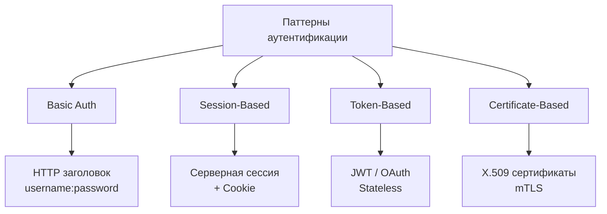

### 1. `Basic Authentication`

Простейший метод, использующий `username:password` в `HTTP`-заголовке `Authorization` (Base64-кодирование).

```java
@Configuration
public class BasicAuthConfig {

    @Bean
    public SecurityFilterChain filterChain(HttpSecurity http) throws Exception {
        http
            .authorizeHttpRequests(auth -> auth.anyRequest().authenticated())
            .httpBasic(Customizer.withDefaults());
        return http.build();
    }

    @Bean
    public UserDetailsService userDetailsService() {
        UserDetails user = User.withDefaultPasswordEncoder()
            .username("user")
            .password("password")
            .roles("USER")
            .build();
        return new InMemoryUserDetailsManager(user);
    }
}
```

**Плюсы:** простота, встроенная поддержка `HTTP`. **Минусы:** небезопасно без `HTTPS`, нет logout, пароль в каждом запросе.

### 2. `Session-Based Authentication`

Серверные сессии для отслеживания аутентифицированных пользователей. После успешного логина сервер создаёт сессию и отправляет `JSESSIONID` в cookie.

```java
@Controller
public class LoginController {

    @PostMapping("/login")
    public String login(@ModelAttribute LoginForm form,
                        HttpSession session,
                        RedirectAttributes redirectAttrs) {
        User user = userService.authenticate(form.getUsername(), form.getPassword());
        if (user != null) {
            session.setAttribute("user", user);
            session.setMaxInactiveInterval(30 * 60); // 30 минут
            return "redirect:/dashboard";
        }
        redirectAttrs.addFlashAttribute("error", "Invalid credentials");
        return "redirect:/login";
    }

    @PostMapping("/logout")
    public String logout(HttpSession session) {
        session.invalidate();
        return "redirect:/login";
    }
}
```

**Плюсы:** безопасность (сессия на сервере), поддержка logout, сложные сценарии.
**Минусы:** state на сервере, проблемы масштабирования (нужен `Redis` / sticky sessions), уязвимость к `CSRF`.

### 3. `Token-Based Authentication`

Использование токенов (`JWT`, `OAuth`) — `stateless`-подход, идеальный для [микросервисов](../architecture/microservices-interview.md) и `SPA`.

```java
@Service
public class TokenAuthenticationService {

    private final JwtService jwtService;
    private final UserRepository userRepository;
    private final PasswordEncoder passwordEncoder;

    public String authenticateAndGenerateToken(String username, String password) {
        User user = userRepository.findByUsername(username)
            .orElseThrow(() -> new BadCredentialsException("User not found"));

        if (!passwordEncoder.matches(password, user.getPassword())) {
            throw new BadCredentialsException("Invalid password");
        }
        return jwtService.generateToken(user);
    }
}
```

**Плюсы:** `stateless`, масштабируемость, подходит для микросервисов.
**Минусы:** неотзываемость до истечения срока, больший размер запросов.

### 4. `Certificate-Based Authentication`

Аутентификация через цифровые `X.509`-сертификаты — используется для `mTLS` между сервисами (подробнее в [Spring Security](../frameworks/spring/spring-security-interview.md)).

```java
@Configuration
public class CertificateAuthConfig {

    @Bean
    public SecurityFilterChain filterChain(HttpSecurity http) throws Exception {
        http
            .authorizeHttpRequests(auth -> auth.anyRequest().authenticated())
            .x509(x509 -> x509
                .subjectPrincipalRegex("CN=(.*?)(?:,|$)")
                .userDetailsService(x509UserDetailsService()));
        return http.build();
    }
}
```


> [!mcq]
> - [ ] `Basic Auth` достаточно для production REST API при HTTPS — пароль защищён TLS | `Basic` шлёт `username:password` в Base64 на КАЖДОМ запросе, что увеличивает поверхность атаки и не имеет logout. ❌ ПОСЛЕДСТВИЕ: пароль в логах reverse-proxy / APM при misconfigured TLS termination → массовая утечка credentials.
> - [x] Выбор паттерна (`Session`, `JWT`, `OAuth2`, `mTLS`) определяется типом клиента, требованиями к scalability и trust boundary | Stateful sessions удобны для monolith с server-side rendering, JWT — для stateless микросервисов и SPA, OAuth2 — для делегирования, mTLS — для service-to-service в zero-trust сетях. ✓ ПРИМЕНЯТЬ: Netflix комбинирует JWT (Edge) и mTLS (между сервисами через Istio) для defence-in-depth. 📋 ПРАВИЛО: «паттерн под trust boundary, не наоборот». 🔗 См. Q5, Q6, Q41.
> - [ ] `JWT` универсально подходит для всех сценариев, включая монолитные веб-приложения с server-side сессиями | JWT в монолите даёт лишний overhead (signature verify на каждом запросе) и теряет преимущество stateless (всё равно один процесс), а revocation без blocklist невозможен. ❌ ПОСЛЕДСТВИЕ: украденный JWT в `localStorage` через XSS даёт доступ до истечения `exp` — невозможно мгновенно отозвать без allowlist в Redis.
> - [ ] `mTLS` стоит использовать для аутентификации обычных browser-пользователей вместо паролей | Distribution и rotation client-сертификатов на миллионы пользователей нерешаемая операционная задача — нет UX для self-enrollment, browser cert dialogs неудобны. ❌ ПОСЛЕДСТВИЕ: revocation list (CRL/OCSP) деградирует latency на 200-500ms на каждом запросе после network partition с CA.
**Плюсы:** высокая безопасность, двусторонняя аутентификация, не требует паролей.
**Минусы:** сложность `PKI`-инфраструктуры, проблемы с мобильными устройствами.

## Q2. (!) Что такое `OAuth 2.0` и как он работает?

`OAuth 2.0` — протокол авторизации, позволяющий приложениям получать ограниченный доступ к ресурсам пользователя
без передачи учётных данных. Детальный разбор — в [вопросах по OAuth 2.0](oauth2-interview.md).

### Роли в `OAuth 2.0`

| Роль | Описание |
|------|----------|
| `Resource Owner` | Пользователь, владелец данных |
| `Client` | Приложение, запрашивающее доступ |
| `Authorization Server` | Сервер, выдающий токены |
| `Resource Server` | Сервер, хранящий защищённые ресурсы |

### `Authorization Code Grant` — основной поток

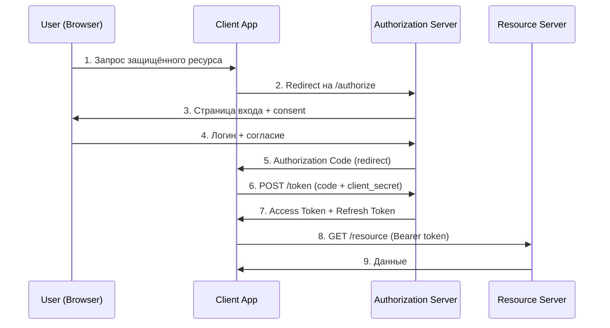

### Реализация в `Spring Boot`

```java
@RestController
@RequestMapping("/oauth")
public class OAuthController {

    @GetMapping("/login")
    public String login() {
        return "redirect:/oauth2/authorization/google";
    }

    @GetMapping("/user")
    public Map<String, Object> user(@AuthenticationPrincipal OAuth2User principal) {
        return principal.getAttributes();
    }
}
```

### `Grant Types`

| Тип | Сценарий | Статус |
|-----|----------|--------|
| `Authorization Code` | Веб-приложения с backend | Рекомендуется |
| `Authorization Code + PKCE` | `SPA`, мобильные | Рекомендуется |
| `Client Credentials` | Сервис-сервис | Рекомендуется |
| `Implicit` | `SPA` (устарел) | Deprecated |
| `Resource Owner Password` | Доверенные клиенты | Не рекомендуется |

### `Client Credentials Grant` — для межсервисного взаимодействия

```java
@Service
public class ServiceAuthenticationService {

    private final RestClient restClient;

    public String getServiceToken() {
        MultiValueMap<String, String> params = new LinkedMultiValueMap<>();
        params.add("grant_type", "client_credentials");
        params.add("scope", "service");

        Map<String, Object> response = restClient.post()
            .uri("http://auth-server/oauth2/token")
            .headers(h -> h.setBasicAuth("service-client", "service-secret"))
            .contentType(MediaType.APPLICATION_FORM_URLENCODED)
            .body(params)
            .retrieve()
            .body(new ParameterizedTypeReference<>() {});


> [!mcq]
> - [ ] `Authorization Code Flow` без `PKCE` безопасен для public-клиентов (SPA, mobile) — достаточно client_id | Без PKCE перехваченный `authorization_code` (через redirect_uri в логах прокси, browser history) обменивается на token без proof-of-possession. ❌ ПОСЛЕДСТВИЕ: code interception attack — атакующий получает access_token жертвы (RFC 7636 описывает реальный сценарий для mobile apps).
> - [ ] `Implicit Flow` — рекомендованный вариант для SPA в 2026 году, выдаёт `access_token` сразу из URL | Implicit Flow deprecated в OAuth 2.0 Security BCP (RFC 8252) — token попадает в `window.location`, browser history, Referer-заголовки и логи. ❌ ПОСЛЕДСТВИЕ: token leak через Referer на 3rd-party CDN → unauthorised API access от имени пользователя.
> - [ ] `Resource Owner Password Credentials` (ROPC) — современный grant для first-party apps | ROPC требует передачи пароля приложению, что нарушает основной принцип OAuth — делегирование без раскрытия credentials, и убран из OAuth 2.1. ❌ ПОСЛЕДСТВИЕ: каждое приложение с ROPC становится точкой утечки паролей; невозможна MFA и SSO.
> - [x] `Authorization Code Flow + PKCE` — стандарт для confidential и public клиентов: code обменивается на token с проверкой `code_verifier` | PKCE добавляет `code_challenge = SHA256(code_verifier)` к authorize-запросу и `code_verifier` к token-запросу — перехваченный code бесполезен без verifier. ✓ ПРИМЕНЯТЬ: Google, GitHub, Auth0 требуют PKCE для всех новых OAuth-клиентов; Spring Authorization Server включает PKCE по умолчанию. 📋 ПРАВИЛО: «code без PKCE — рассыпь и потеряй». 🔗 См. Q12, Q30, Q38.
        return (String) response.get("access_token");
    }
}
```

## Q3. (!) Как работает `JWT` аутентификация?

`JWT` (`JSON Web Token`) — компактный, URL-safe способ представления claims между сторонами (`RFC 7519`).

### Структура `JWT`

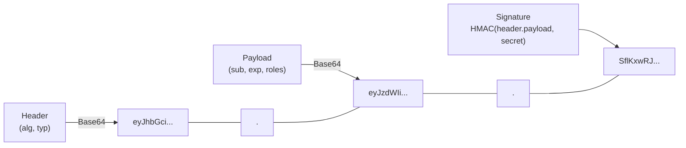

**Header:**
```json
{ "alg": "RS256", "typ": "JWT" }
```

**Payload:**
```json
{
  "sub": "user123",
  "name": "John Doe",
  "roles": ["USER", "ADMIN"],
  "iat": 1516239022,
  "exp": 1516242622
}
```

### Реализация `JWT` в `Java`

```java
@Component
public class JwtUtil {

    private final SecretKey secretKey;

    public JwtUtil(@Value("${jwt.secret}") String secret) {
        this.secretKey = Keys.hmacShaKeyFor(secret.getBytes(StandardCharsets.UTF_8));
    }

    public String generateToken(User user) {
        return Jwts.builder()
            .subject(user.getUsername())
            .claim("roles", user.getRoles())
            .issuedAt(new Date())
            .expiration(new Date(System.currentTimeMillis() + 10 * 60 * 60 * 1000))
            .signWith(secretKey)
            .compact();
    }

    public boolean validateToken(String token, UserDetails userDetails) {
        String username = extractUsername(token);
        return username.equals(userDetails.getUsername()) && !isTokenExpired(token);
    }

    public String extractUsername(String token) {
        return Jwts.parser()
            .verifyWith(secretKey)
            .build()
            .parseSignedClaims(token)
            .getPayload()
            .getSubject();
    }

    private boolean isTokenExpired(String token) {
        Date expiration = Jwts.parser()
            .verifyWith(secretKey)
            .build()
            .parseSignedClaims(token)
            .getPayload()
            .getExpiration();
        return expiration.before(new Date());
    }
}
```

### `JWT Filter` для `Spring Security`

```java
@Component
public class JwtRequestFilter extends OncePerRequestFilter {

    private final JwtUtil jwtUtil;
    private final UserDetailsService userDetailsService;

    @Override
    protected void doFilterInternal(HttpServletRequest request,
                                    HttpServletResponse response,
                                    FilterChain chain) throws ServletException, IOException {
        String authHeader = request.getHeader("Authorization");

        if (authHeader != null && authHeader.startsWith("Bearer ")) {
            String jwt = authHeader.substring(7);
            String username = jwtUtil.extractUsername(jwt);

            if (username != null
                    && SecurityContextHolder.getContext().getAuthentication() == null) {
                UserDetails userDetails = userDetailsService.loadUserByUsername(username);

                if (jwtUtil.validateToken(jwt, userDetails)) {
                    var authToken = new UsernamePasswordAuthenticationToken(
                        userDetails, null, userDetails.getAuthorities());
                    authToken.setDetails(
                        new WebAuthenticationDetailsSource().buildDetails(request));
                    SecurityContextHolder.getContext().setAuthentication(authToken);
                }
            }
        }
        chain.doFilter(request, response);
    }
}
```

### `Refresh Token` с ротацией

```java
@Service
public class TokenService {

    private final JwtUtil jwtUtil;
    private final RefreshTokenRepository refreshTokenRepository;

    public TokenPair generateTokens(User user) {
        String accessToken = jwtUtil.generateToken(user);
        String refreshToken = UUID.randomUUID().toString();

        refreshTokenRepository.save(new RefreshToken(
            refreshToken, user.getUsername(),
            Date.from(Instant.now().plus(30, ChronoUnit.DAYS))));

        return new TokenPair(accessToken, refreshToken);
    }

    public TokenPair refreshTokens(String refreshToken) {
        RefreshToken entity = refreshTokenRepository.findByToken(refreshToken)
            .orElseThrow(() -> new InvalidTokenException("Invalid refresh token"));

        if (entity.getExpiryDate().before(new Date())) {
            refreshTokenRepository.delete(entity);
            throw new TokenExpiredException("Refresh token expired");
        }


> [!mcq]
> - [ ] `JWT` хранить в `localStorage` — простое решение для SPA, защита достаточна | `localStorage` доступен любому JavaScript на странице, поэтому XSS = немедленный exfiltration token; нет автоматического шифрования / scope. ❌ ПОСЛЕДСТВИЕ: XSS через npm-зависимость → атакующий читает `localStorage.getItem('jwt')` и шлёт на свой endpoint = полный takeover (классический сценарий из OWASP).
> - [ ] Подписать `JWT` через `HS256` с секретом из git-репозитория, чтобы все сервисы могли валидировать | Symmetric secret в git = compromised; кроме того, `alg: none` в заголовке (если verify не строгий) позволяет подделать токен. ❌ ПОСЛЕДСТВИЕ: leak секрета через GitHub public repo → атакующий выпускает токены с любыми claims (CVE на множественные библиотеки 2018-2020).
> - [x] Использовать short-lived `access token` (5-15 мин) + `refresh token` в `HttpOnly Secure SameSite=Strict cookie` с одноразовой ротацией | Короткий TTL минимизирует окно компрометации, refresh в HttpOnly недоступен JS, ротация инвалидирует украденный refresh при первой попытке параллельного использования (theft detection). ✓ ПРИМЕНЯТЬ: Auth0 Refresh Token Rotation, Spring Authorization Server `OAuth2RefreshTokenAuthenticationProvider`. 📋 ПРАВИЛО: «короткий access, ротированный refresh, HttpOnly навсегда». 🔗 См. Q15, Q37, Q41.
> - [ ] Хранить `JWT` в `sessionStorage` — это безопаснее `localStorage` благодаря изоляции по вкладке | `sessionStorage` так же доступен любому JS на той же странице — изоляция только между вкладками, не между скриптами. ❌ ПОСЛЕДСТВИЕ: XSS через рекламный iframe или supply-chain → exfiltration token из sessionStorage точно так же, как из localStorage.
        User user = userService.findByUsername(entity.getUsername());
        refreshTokenRepository.delete(entity); // одноразовое использование
        return generateTokens(user);
    }
}
```

## Q4. (!) Что такое `RBAC` и `ABAC`?

### `Role-Based Access Control` (`RBAC`)

`RBAC` — модель управления доступом на основе ролей. Пользователи получают роли, роли содержат разрешения.

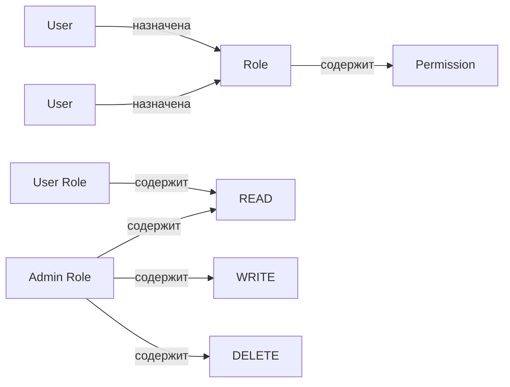

#### Реализация `RBAC` — доменная модель

```java
@Entity
public class User {
    @Id
    private Long id;
    private String username;

    @ManyToMany(fetch = FetchType.EAGER)
    @JoinTable(name = "user_roles")
    private Set<Role> roles = new HashSet<>();
}

@Entity
public class Role {
    @Id
    private Long id;
    private String name; // "ADMIN", "USER", "MODERATOR"

    @ManyToMany(fetch = FetchType.EAGER)
    @JoinTable(name = "role_permissions")
    private Set<Permission> permissions = new HashSet<>();
}

@Entity
public class Permission {
    @Id
    private Long id;
    private String name; // "READ_POST", "CREATE_POST", "DELETE_POST"
}
```

#### `RBAC` в `Spring Security` с `@PreAuthorize`

```java
@Configuration
@EnableMethodSecurity // Spring Security 6+
public class SecurityConfig {
}

@RestController
@RequestMapping("/api/posts")
public class PostController {

    @PreAuthorize("hasAuthority('READ_POST')")
    @GetMapping("/{id}")
    public Post getPost(@PathVariable Long id) {
        return postService.findById(id);
    }

    @PreAuthorize("hasAuthority('CREATE_POST')")
    @PostMapping
    public Post createPost(@RequestBody Post post) {
        return postService.create(post);
    }

    @PreAuthorize("hasRole('ADMIN')")
    @DeleteMapping("/{id}")
    public void deletePost(@PathVariable Long id) {
        postService.delete(id);
    }
}
```

### `Attribute-Based Access Control` (`ABAC`)

`ABAC` — модель доступа на основе атрибутов субъекта, объекта, действия и окружения. Гибче `RBAC`, но сложнее в реализации.

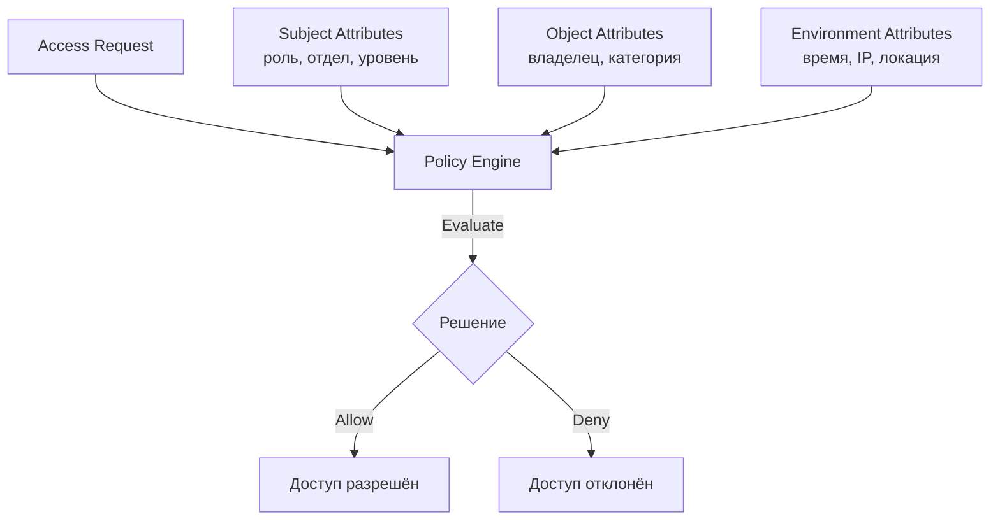

#### Реализация `ABAC`

```java
@Service
public class AbacService {

    private final List<AccessPolicy> policies;

    public boolean isAllowed(AccessRequest request) {
        return policies.stream()
            .allMatch(policy -> policy.evaluate(request));
    }
}

public interface AccessPolicy {
    boolean evaluate(AccessRequest request);
}

@Component
public class WorkingHoursPolicy implements AccessPolicy {

    @Override
    public boolean evaluate(AccessRequest request) {
        if ("DELETE".equals(request.getAction())) {
            int hour = LocalDateTime.now().getHour();
            return hour >= 9 && hour <= 17; // удаление только в рабочее время
        }
        return true;
    }
}

@Component
public class OwnershipPolicy implements AccessPolicy {

    @Override
    public boolean evaluate(AccessRequest request) {
        if (request.getResource() instanceof OwnedResource owned) {
            return owned.getOwnerId().equals(request.getSubject().getId())
                || request.getSubject().hasRole("ADMIN");
        }
        return true;
    }
}
```

### Сравнение `RBAC` и `ABAC`


> [!mcq]
> - [ ] `RBAC` со 100+ ролями вида `manager_dept_42` решает любую задачу авторизации лучше `ABAC` | Role explosion (комбинаторный взрыв ролей по departments × actions × resources) делает аудит и ротацию ролей невозможным. ❌ ПОСЛЕДСТВИЕ: orphan-роли остаются у уволенных сотрудников, regulator (SOX, ISO 27001) выписывает finding на отсутствие role-review.
> - [ ] `ABAC` всегда быстрее `RBAC`, потому что атрибуты быстрее проверять, чем роли | ABAC требует policy evaluation engine (XACML, OPA), что добавляет 5-50ms latency на запрос против O(1) lookup роли в JWT-claims. ❌ ПОСЛЕДСТВИЕ: при 10K RPS policy engine становится bottleneck, p99 latency растёт с 50ms до 500ms без правильного caching.
> - [x] `RBAC` — coarse-grained авторизация по ролям (admin/user); `ABAC` — fine-grained по атрибутам (subject + resource + action + environment) | RBAC отвечает «кто ты», ABAC — «что ты делаешь, с чем, в каких условиях»; обычно их комбинируют: RBAC для широких прав, ABAC для resource-level. ✓ ПРИМЕНЯТЬ: AWS IAM = RBAC (groups) + ABAC (resource tags + condition keys); Spring Security `@PreAuthorize` поддерживает оба. 📋 ПРАВИЛО: «RBAC — это `who`, ABAC — это `who+what+where+when`». 🔗 См. Q27, Q31, Q44.
> - [ ] `RBAC` без resource-level проверок («пользователь читает только свои документы») — стандарт для prod | RBAC по grants (`READ_DOCUMENT`) не учитывает ownership: любой `user` с грантом читает любой документ. ❌ ПОСЛЕДСТВИЕ: IDOR (Insecure Direct Object Reference) — `GET /docs/{id}` через ID enumeration отдаёт чужие документы, GDPR breach (классика OWASP Top-10 2021 A01).
| Аспект | `RBAC` | `ABAC` |
|--------|--------|--------|
| Гибкость | Средняя | Высокая |
| Сложность внедрения | Низкая | Высокая |
| Масштабируемость политик | Хорошая | Отличная |
| Производительность | Высокая (lookup по роли) | Средняя (вычисление политик) |
| Аудит | Простой | Сложный |
| Когда использовать | Фиксированные роли, простые правила | Контекстные правила, сложные политики |

## Q5. В чём разница между аутентификацией и авторизацией?

Это фундаментальные понятия безопасности, которые часто путают на собеседованиях.

| Аспект | Аутентификация (AuthN) | Авторизация (AuthZ) |
|--------|------------------------|---------------------|
| Вопрос | **Кто ты?** | **Что тебе можно?** |
| Цель | Подтверждение личности | Проверка прав доступа |
| Порядок | Первая | Вторая (после AuthN) |
| Протоколы | `OIDC`, `SAML`, `LDAP` | `OAuth 2.0`, `RBAC`, `ABAC` |
| Данные | Credentials (пароль, сертификат) | Permissions, roles, scopes |
| HTTP-коды | `401 Unauthorized` | `403 Forbidden` |

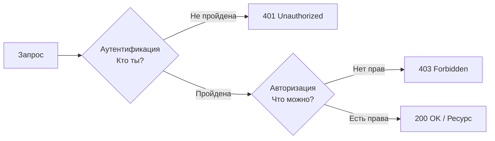


> [!mcq]
> - [ ] Аутентификация и авторизация — синонимы, оба означают «проверка пользователя» | Это разные стадии: AuthN (`who are you`) предшествует AuthZ (`what can you do`); смешение понятий приводит к недоразумениям в безопасности. ❌ ПОСЛЕДСТВИЕ: разработчик защитил endpoint только `@PreAuthorize("isAuthenticated()")` думая, что это «проверка прав» — любой залогиненный получает доступ к admin-функциям.
> - [ ] Авторизация в Spring Security обрабатывается `AuthenticationManager` | `AuthenticationManager` отвечает за AuthN (проверка credentials); за AuthZ — `AuthorizationManager` (Spring Security 6+) или `AccessDecisionManager` (legacy). ❌ ПОСЛЕДСТВИЕ: попытка вызвать `auth.authenticate()` для проверки прав = NPE или некорректное решение, защита endpoint не срабатывает.
> - [x] Аутентификация (`AuthN`) — установка identity (`who you are`); авторизация (`AuthZ`) — проверка прав на действие (`what you can do`) | AuthN отвечает 401 Unauthorized при неверных credentials, AuthZ — 403 Forbidden при отсутствии прав; AuthN всегда первая в pipeline. ✓ ПРИМЕНЯТЬ: Spring Security `SecurityFilterChain` — `UsernamePasswordAuthenticationFilter` (AuthN) → `AuthorizationFilter` (AuthZ). 📋 ПРАВИЛО: «401 — кто ты?, 403 — что тебе можно?». 🔗 См. Q1, Q4, Q34.
> - [ ] HTTP 401 и 403 — взаимозаменяемые статусы; различия не критичны для API | 401 = «не аутентифицирован, добавь credentials», 403 = «аутентифицирован, но не разрешено» — RFC 7235 / 7231 чёткое разделение. ❌ ПОСЛЕДСТВИЕ: возврат 403 вместо 401 ломает retry-логику клиента (повторный auth не запускается), а 401 вместо 403 раскрывает существование ресурса (information disclosure).
В `Spring Security` аутентификация обрабатывается `AuthenticationManager`, а авторизация — `AccessDecisionManager` / `AuthorizationManager` (Spring Security 6+). Подробнее — в [Spring Security](../frameworks/spring/spring-security-interview.md).

## Q6. (!) Как реализовать безопасность в микросервисах?

Безопасность в [микросервисах](../architecture/microservices-interview.md) строится на нескольких уровнях: edge-уровень (`API Gateway`), межсервисная аутентификация и централизованная авторизация.

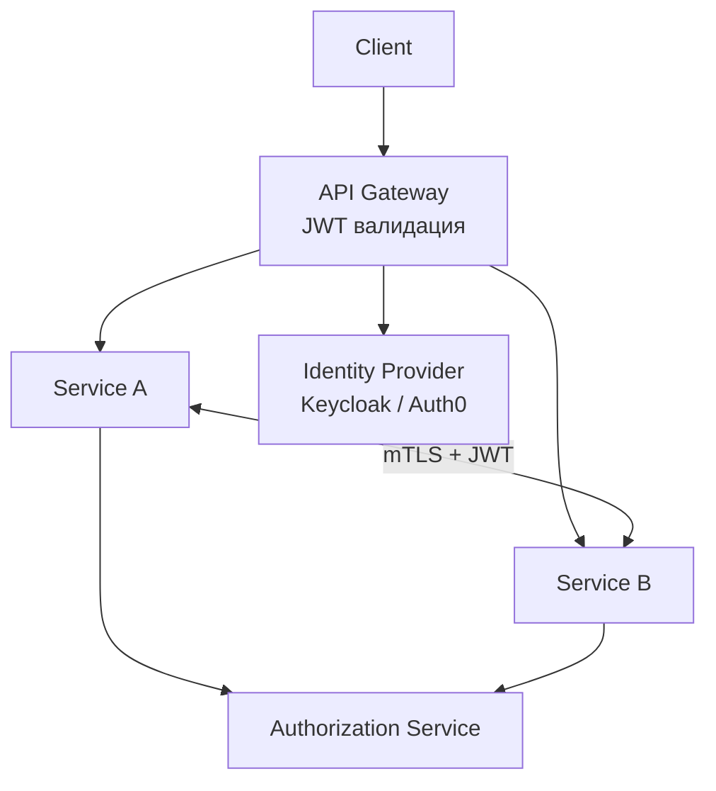

### 1. `API Gateway` — единая точка безопасности

```java
@Component
public class GatewayAuthFilter implements GlobalFilter, Ordered {

    private final JwtUtil jwtUtil;

    @Override
    public Mono<Void> filter(ServerWebExchange exchange, GatewayFilterChain chain) {
        String path = exchange.getRequest().getPath().toString();

        if (path.startsWith("/auth/") || path.startsWith("/api/public/")) {
            return chain.filter(exchange);
        }

        String token = extractToken(exchange.getRequest());
        if (token == null || !jwtUtil.validateToken(token)) {
            exchange.getResponse().setStatusCode(HttpStatus.UNAUTHORIZED);
            return exchange.getResponse().setComplete();
        }

        // Пробрасываем данные пользователя downstream-сервисам
        String username = jwtUtil.extractUsername(token);
        ServerHttpRequest mutatedRequest = exchange.getRequest().mutate()
            .header("X-User-Id", username)
            .header("X-User-Roles", String.join(",", jwtUtil.extractRoles(token)))
            .build();

        return chain.filter(exchange.mutate().request(mutatedRequest).build());
    }

    @Override
    public int getOrder() { return -100; }
}
```

### 2. `Service-to-Service` аутентификация через `JWT`

```java
@Component
public class ServiceAuthInterceptor implements ClientHttpRequestInterceptor {

    private final ServiceTokenProvider tokenProvider;

    @Override
    public ClientHttpResponse intercept(HttpRequest request, byte[] body,
                                        ClientHttpRequestExecution execution)
                                        throws IOException {
        String serviceToken = tokenProvider.generateServiceToken();
        request.getHeaders().setBearerAuth(serviceToken);
        request.getHeaders().set("X-Service-Name", "order-service");
        return execution.execute(request, body);
    }
}
```

### 3. Централизованная авторизация

```java
@RestController
@RequestMapping("/authz")
public class AuthorizationController {

    private final AuthorizationService authorizationService;

    @PostMapping("/check")
    public AuthorizationDecision checkPermission(@RequestBody AuthzRequest request) {
        boolean allowed = authorizationService.hasPermission(
            request.getUserId(), request.getResource(),
            request.getAction(), request.getContext());
        return new AuthorizationDecision(allowed);
    }
}
```

### 4. Распределённые сессии через `Redis`

```java
@Configuration
@EnableRedisHttpSession(redisNamespace = "myapp:session")
public class SessionConfig {


> [!mcq]
> - [ ] В микросервисах достаточно одного `JWT` от клиента — между сервисами проверять identity не нужно | Если сервис A вызывает сервис B без аутентификации, любой compromised pod в кластере может вызывать B напрямую (lateral movement); zero-trust требует service identity на каждом hop. ❌ ПОСЛЕДСТВИЕ: компрометация одного pod через RCE превращается в полный takeover всего кластера (как в Capital One 2019 — actuator/env attack).
> - [x] Использовать `mTLS` для service-to-service + JWT для user-context propagation + Service Mesh для policy enforcement | mTLS даёт криптографическую workload identity (SPIFFE), JWT передаёт user-claims через цепочку вызовов, Service Mesh (Istio/Linkerd) применяет AuthZ policies без изменения кода. ✓ ПРИМЕНЯТЬ: Netflix использует Spinnaker + Envoy mTLS, Uber — Istio + custom AuthZ; SPIFFE/SPIRE для cross-cluster identity. 📋 ПРАВИЛО: «mTLS для машины, JWT для человека, mesh для политик». 🔗 См. Q18, Q21, Q43.
> - [ ] API Gateway единолично отвечает за безопасность — внутренние сервисы могут принимать любые запросы | «Hard outside, soft inside» = anti-pattern; одна misconfigured network policy или SSRF на gateway открывает весь кластер. ❌ ПОСЛЕДСТВИЕ: SSRF на reverse proxy → доступ к internal admin endpoints без auth (Capital One 2019, $100M штраф через WAF + actuator/env).
> - [ ] Достаточно общего shared-secret между сервисами для HMAC-подписи запросов | Shared secret в N сервисах = utечка любого pod = подделка любого запроса; нет non-repudiation, ротация требует одновременного deploy всех сервисов. ❌ ПОСЛЕДСТВИЕ: leak секрета через logs/env-dump → атакующий выпускает межсервисные запросы с любыми claims, audit-trail невозможен.
    @Bean
    public LettuceConnectionFactory connectionFactory() {
        return new LettuceConnectionFactory("redis-server", 6379);
    }
}
```

## Q7. Что такое `SAML` и когда его использовать?

`SAML` (`Security Assertion Markup Language`) — `XML`-стандарт обмена аутентификационной и авторизационной информацией. Используется преимущественно в enterprise-сценариях.

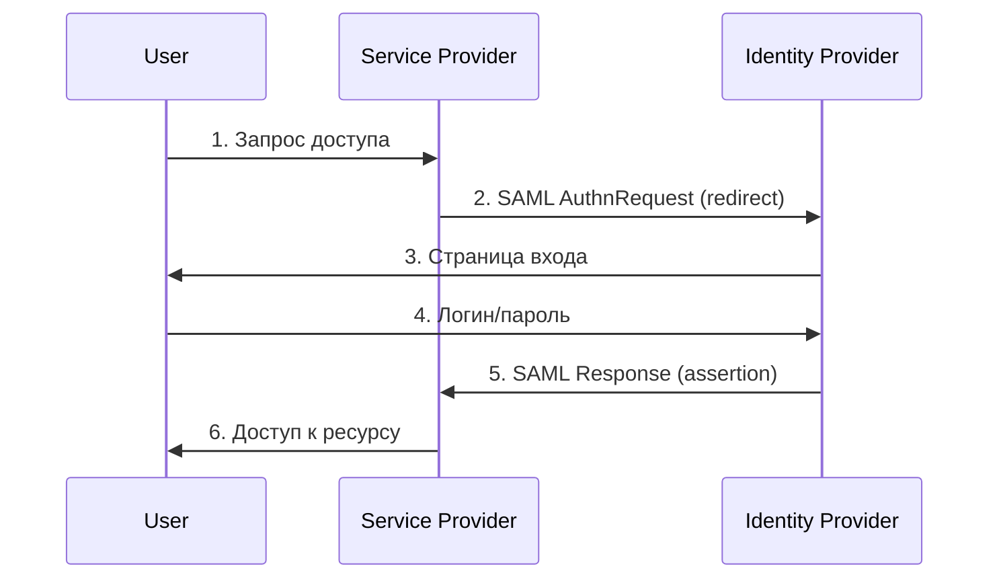

### Конфигурация `SAML` в `Spring Security`

```java
@Configuration
@EnableWebSecurity
public class SamlSecurityConfig {

    @Bean
    public SecurityFilterChain filterChain(HttpSecurity http) throws Exception {
        http
            .authorizeHttpRequests(auth -> auth.anyRequest().authenticated())
            .saml2Login(Customizer.withDefaults());
        return http.build();
    }

    @Bean
    public RelyingPartyRegistrationRepository relyingPartyRegistrationRepository() {
        RelyingPartyRegistration registration = RelyingPartyRegistrations
            .fromMetadataLocation("https://idp.example.com/metadata")
            .registrationId("okta")
            .build();
        return new InMemoryRelyingPartyRegistrationRepository(registration);
    }
}
```


> [!mcq]
> - [ ] `SAML` — современная замена `OIDC`, использует JSON и REST | Наоборот: SAML — XML-based стандарт 2005 года, OIDC — JSON/REST поверх OAuth 2.0; SAML тяжелее, OIDC проще для mobile/SPA. ❌ ПОСЛЕДСТВИЕ: попытка использовать SAML в SPA через POST-redirect ломается на CORS, разработчики реализуют hacky workaround (хранение SAMLResponse в `localStorage`) → XSS exfiltration.
> - [ ] `SAML Response` подписи можно не проверять — TLS защищает целостность | Подпись SAML защищает от XSW (XML Signature Wrapping) и подмены IdP; TLS защищает только канал, не содержимое после промежуточного сервиса. ❌ ПОСЛЕДСТВИЕ: XSW-атака — атакующий вставляет fake `<Assertion>` параллельно подписанному → SP принимает чужую identity (CVE-2012-2883 на множественные SAML-библиотеки).
> - [x] `SAML 2.0` — XML-стандарт SSO для enterprise (Active Directory, ADFS, Okta SAML); IdP подписывает Assertion, SP проверяет подпись и доверяет identity | SAML основан на trust-relationship: SP заранее знает X.509-сертификат IdP и валидирует подпись `SAMLResponse`; используется там, где OIDC не интегрирован legacy-системами. ✓ ПРИМЕНЯТЬ: Salesforce, Workday, ServiceNow поддерживают SAML для корпоративного SSO с Okta/Azure AD; Spring Security `spring-security-saml2-service-provider`. 📋 ПРАВИЛО: «SAML — для enterprise legacy, OIDC — для всего нового». 🔗 См. Q12, Q13, Q22.
> - [ ] `SAML` подходит для mobile-приложений и SPA лучше, чем `OIDC` | SAML — XML + browser-redirect через POST binding, плохо работает в native mobile (нет browser context, deeplink сложен) и в SPA (CORS issues с `SAMLResponse`). ❌ ПОСЛЕДСТВИЕ: разработчики вкатывают SAML в mobile через embedded WebView → MITM attack, фишинговые prompts от приложения, нарушение OAuth 2.0 BCP for native apps.
**Когда `SAML`:** корпоративные приложения, интеграция с `Active Directory / ADFS`, enterprise SSO.
**Когда `OIDC` вместо `SAML`:** новые приложения, мобильные, `SPA`, `REST API`.

## Q8. (!) Как реализовать `Multi-Factor Authentication`?

`MFA` добавляет дополнительные факторы проверки помимо пароля: **something you know** (пароль), **something you have** (телефон, ключ), **something you are** (биометрия).

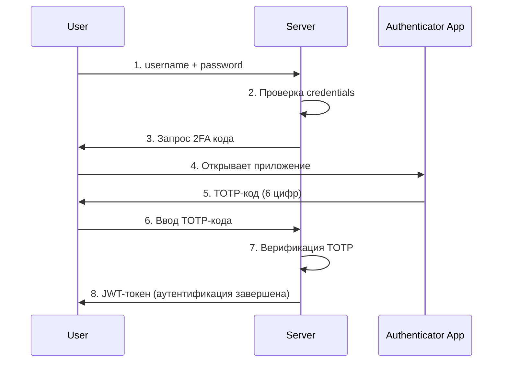

### Реализация `TOTP` (`Time-based One-Time Password`)

```java
@Service
public class TotpService {

    public String generateSecret() {
        return new Base32().encodeAsString(new SecureRandom().generateSeed(20));
    }

    public boolean verifyTotp(String secret, String code) {
        // Проверка с учётом clock skew (±30 секунд)
        byte[] decodedKey = new Base32().decode(secret);
        long timeStep = System.currentTimeMillis() / 30_000;

        for (int i = -1; i <= 1; i++) {
            String computed = computeTotp(decodedKey, timeStep + i);
            if (computed.equals(code)) return true;
        }
        return false;
    }

    public String generateQrCodeUrl(String secret, String username, String issuer) {
        return String.format("otpauth://totp/%s:%s?secret=%s&issuer=%s",
            issuer, username, secret, issuer);
    }
}
```

### `MFA Flow` — контроллер

```java
@RestController
@RequestMapping("/auth")
public class MfaController {

    private final TotpService totpService;
    private final JwtService jwtService;
    private final UserService userService;

    @PostMapping("/login")
    public ResponseEntity<?> login(@RequestBody LoginRequest request) {
        User user = userService.authenticate(request.getUsername(), request.getPassword());

        if (user.isMfaEnabled()) {
            String sessionId = createMfaSession(user.getId());
            return ResponseEntity.ok(new MfaRequiredResponse(sessionId));
        }
        return ResponseEntity.ok(new LoginResponse(jwtService.generateToken(user)));
    }

    @PostMapping("/mfa/verify")
    public ResponseEntity<?> verifyMfa(@RequestBody MfaVerificationRequest request) {
        MfaSession session = getMfaSession(request.getSessionId());
        User user = userService.findById(session.getUserId());


> [!mcq]
> - [ ] `SMS OTP` — самый безопасный второй фактор, рекомендованный NIST | NIST SP 800-63B (с 2017) deprecate SMS OTP — уязвим к SIM swap, SS7-атакам, voicemail interception; рекомендуется TOTP/WebAuthn. ❌ ПОСЛЕДСТВИЕ: SIM swap attack на VIP-клиентов крипто-биржи (Coinbase 2021) → bypass MFA → drain кошельков на миллионы $.
> - [ ] Достаточно проверить TOTP на login — на критичных операциях (transfer money) повторная проверка не нужна | Без step-up на критичные действия украденная сессия (XSS, CSRF) даёт всё; MFA-on-login защищает только начало сессии. ❌ ПОСЛЕДСТВИЕ: атакующий через session hijack делает transfer без второго фактора; в банковских системах это нарушение PCI DSS / PSD2 SCA (Strong Customer Authentication).
> - [x] Использовать `WebAuthn`/`FIDO2` (passkeys) или `TOTP` (RFC 6238) с counter защитой; SMS — fallback, не primary | WebAuthn с hardware keys (YubiKey, TouchID) phishing-resistant — origin binding защищает от reverse proxy attacks; TOTP — software-based, защищает от password leak, но не от phishing. ✓ ПРИМЕНЯТЬ: Google Authenticator (TOTP), 1Password / iCloud Keychain (passkeys); Spring Security 6.4+ поддерживает WebAuthn нативно. 📋 ПРАВИЛО: «WebAuthn первое, TOTP второе, SMS — никогда как primary». 🔗 См. Q23, Q24, Q43.
> - [ ] TOTP-секрет можно хранить в БД в plain text — это всего лишь 16-символьный ключ | TOTP secret = эквивалент пароля; leak БД = генерация валидных кодов атакующим. ❌ ПОСЛЕДСТВИЕ: при breach БД (SQL injection / backup leak) атакующий генерирует TOTP коды для всех пользователей и обходит MFA, как в Reddit breach 2018 (TOTP secrets в logs).
        if (totpService.verifyTotp(user.getMfaSecret(), request.getCode())) {
            deleteMfaSession(request.getSessionId());
            return ResponseEntity.ok(new LoginResponse(jwtService.generateToken(user)));
        }
        return ResponseEntity.badRequest().body("Invalid MFA code");
    }
}
```

## Q9. Какие паттерны сессионного управления существуют?

### Сравнение подходов

| Подход | State | Масштабирование | Logout | Использование |
|--------|-------|-----------------|--------|---------------|
| Server-Side Sessions | Stateful | Sticky sessions / Redis | Простой | Монолиты |
| Distributed Sessions (Redis) | Stateful (shared) | Горизонтальное | Простой | Кластеры |
| JWT-based (stateless) | Stateless | Отличное | Сложный* | Микросервисы |
| Hybrid (JWT + Redis blacklist) | Mixed | Хорошее | Средний | Компромисс |

*Для logout `JWT` нужен blacklist или короткий срок + refresh token.

### `Server-Side Sessions` — конфигурация

```java
@Configuration
public class SessionConfig {

    @Bean
    public ServletContextInitializer servletContextInitializer() {
        return ctx -> {
            ctx.getSessionCookieConfig().setHttpOnly(true);
            ctx.getSessionCookieConfig().setSecure(true);
            ctx.getSessionCookieConfig().setMaxAge(1800); // 30 минут
            ctx.getSessionCookieConfig().setAttribute("SameSite", "Strict");
        };
    }
}
```

### Распределённые сессии через `Redis`

```java
@Configuration
@EnableRedisHttpSession(redisNamespace = "myapp:session")
public class RedisSessionConfig {

    @Bean
    public LettuceConnectionFactory connectionFactory() {
        RedisStandaloneConfiguration config = new RedisStandaloneConfiguration();
        config.setHostName("redis-server");
        config.setPort(6379);
        return new LettuceConnectionFactory(config);
    }

    @Bean
    public RedisSerializer<Object> springSessionDefaultRedisSerializer() {
        return new GenericJackson2JsonRedisSerializer();
    }
}
```

### `JWT-based Sessions` с ротацией refresh-токенов

```java
@Service
public class JwtSessionService {

    private final JwtUtil jwtUtil;
    private final RefreshTokenRepository refreshTokenRepository;

    public SessionTokens createSession(User user) {
        String accessToken = jwtUtil.generateToken(user);    // 15 минут
        String refreshToken = UUID.randomUUID().toString();   // 30 дней

        refreshTokenRepository.save(new RefreshToken(
            refreshToken, user.getUsername(),
            Date.from(Instant.now().plus(30, ChronoUnit.DAYS))));

        return new SessionTokens(accessToken, refreshToken);
    }

    public SessionTokens refreshSession(String refreshToken) {
        RefreshToken entity = refreshTokenRepository.findByToken(refreshToken)
            .orElseThrow(() -> new InvalidTokenException("Invalid refresh token"));

        if (entity.getExpiryDate().before(new Date())) {
            refreshTokenRepository.delete(entity);
            throw new TokenExpiredException("Refresh token expired");
        }


> [!mcq]
> - [ ] Server-side session ID можно класть в обычный cookie без флагов — SSL обеспечивает защиту | Без `HttpOnly` JS читает cookie через `document.cookie`, без `Secure` cookie утекает по plain HTTP, без `SameSite` — CSRF возможен. ❌ ПОСЛЕДСТВИЕ: session hijack через XSS — украденный `JSESSIONID` даёт полный доступ от имени жертвы (классика OWASP A05).
> - [x] Использовать distributed session store (`Redis`, `Hazelcast`) с `HttpOnly + Secure + SameSite=Lax/Strict` cookies и rotation после login | Distributed store позволяет горизонтальное масштабирование без sticky session, флаги cookie защищают от XSS/MITM/CSRF, session rotation после AuthN предотвращает session fixation. ✓ ПРИМЕНЯТЬ: Spring Session `@EnableRedisHttpSession`, Auth0 хранит session в Redis Cluster для миллионов RPS. 📋 ПРАВИЛО: «session — в Redis, cookie — `HttpOnly+Secure+SameSite`, rotation — после login». 🔗 См. Q1, Q15, Q41.
> - [ ] In-memory `HttpSession` на каждом инстансе с sticky session через load balancer достаточно | Sticky session ломается при инстанс-рестарте (zero-downtime deploy теряет сессии всех на этом pod), не работает при multi-region, проблематичен при autoscaling. ❌ ПОСЛЕДСТВИЕ: rolling deploy выбрасывает 1/N пользователей, force re-login → массовый logout, поток в support; OOM при memory leak в session-store сваливает весь pod.
> - [ ] Регенерировать session ID не нужно после login — оригинальный ID безопасен | Без regenerate возможен session fixation: атакующий устанавливает свой `JSESSIONID` жертве через cookie injection, после login сессия с тем же ID становится authenticated. ❌ ПОСЛЕДСТВИЕ: атакующий получает аутентифицированную сессию жертвы; CWE-384, типичный финдинг pen-test.
        User user = userService.findByUsername(entity.getUsername());
        refreshTokenRepository.delete(entity); // ротация: старый удаляется
        return createSession(user);
    }
}
```

## Q10. Как защититься от распространённых атак на аутентификацию?

### 1. Защита от `Brute Force`

```java
@Service
public class LoginProtectionService {

    private final Cache<String, LoginAttempts> attemptsCache;

    public boolean isAllowedToLogin(String username, String ip) {
        String key = username + ":" + ip;
        LoginAttempts attempts = attemptsCache.get(key, LoginAttempts::new);

        if (attempts.getCount() >= 5) {
            return attempts.getBlockedUntil().isBefore(Instant.now());
        }
        return true;
    }

    public void recordFailedLogin(String username, String ip) {
        String key = username + ":" + ip;
        LoginAttempts attempts = attemptsCache.get(key, LoginAttempts::new);
        attempts.increment();

        if (attempts.getCount() >= 5) {
            attempts.setBlockedUntil(Instant.now().plus(15, ChronoUnit.MINUTES));
        }
        attemptsCache.put(key, attempts);
    }
}
```

### 2. Защита от `CSRF`

```java
@Bean
public SecurityFilterChain filterChain(HttpSecurity http) throws Exception {
    http.csrf(csrf -> csrf
        .csrfTokenRepository(CookieCsrfTokenRepository.withHttpOnlyFalse())
        .csrfTokenRequestHandler(new CsrfTokenRequestAttributeHandler()));
    return http.build();
}
```

Для `REST API` с `JWT` (stateless) `CSRF`-защита не нужна — токен передаётся в `Authorization` header, а не в cookie.

### 3. Защита от `Session Fixation`

```java
http.sessionManagement(session -> session
    .sessionFixation().changeSessionId() // новый session ID после логина
    .maximumSessions(1)                  // одна активная сессия
    .maxSessionsPreventsLogin(true));     // блокировка нового входа
```

### 4. Защита от `Timing Attacks`

```java
// Плохо — время ответа зависит от существования пользователя
if (userRepository.findByUsername(username).isEmpty()) {
    throw new BadCredentialsException("User not found");
}

// Хорошо — одинаковое время ответа (Spring Security делает это из коробки)
// UserDetailsService всегда вызывает passwordEncoder.matches()
```


> [!mcq]
> - [ ] Account lockout после 3 неудачных попыток на постоянной основе — сильнейшая защита | Permanent lockout = DoS-вектор: атакующий блокирует всех пользователей, перебирая их usernames; пользователи теряют доступ. ❌ ПОСЛЕДСТВИЕ: атакующий парализует сервис массовым lockout, support ложится под request flood (как в реальной DDoS на банковский e-banking 2019 — 80% legit users заблокированы за час).
> - [ ] Вернуть «User not found» при unknown username и «Wrong password» при known — это user-friendly | Различные сообщения = user enumeration: атакующий проверяет существование email/username, формирует список для targeted phishing. ❌ ПОСЛЕДСТВИЕ: leak базы валидных users → spear-phishing → credential stuffing на других сервисах (когда в БД 100M emails — это $$$).
> - [x] Хешировать пароли через `bcrypt`/`argon2id` с per-user salt + rate-limit на IP/account + одинаковое сообщение `Bad credentials` + audit log | Slow hash защищает от offline attack при breach БД, rate-limit замедляет online brute-force, единое сообщение скрывает existence; audit lets detect attacks. ✓ ПРИМЕНЯТЬ: Spring Security `BCryptPasswordEncoder(strength=12)`, Bucket4j для rate-limit; OWASP Password Storage Cheat Sheet рекомендует argon2id. 📋 ПРАВИЛО: «slow hash + rate-limit + uniform error = brute-force defence-in-depth». 🔗 См. Q10, Q36, Q41.
> - [ ] `MD5` или `SHA-256` подойдут для хеша пароля если соль уникальная | MD5/SHA-256 рассчитываются миллиарды/сек на GPU — даже с уникальной солью offline attack ломает 8-символьные пароли за часы. ❌ ПОСЛЕДСТВИЕ: LinkedIn 2012 — 117M SHA-1 хешей утекли, 90% паролей расшифровано за неделю; обязательное использование slow hash после этого инцидента.
Подробнее о защите от уязвимостей — в [OWASP Top 10](owasp-top10-interview.md) и [Application Security](application-security-interview.md).

## Q11. Как реализовать `API Gateway Security`?

`API Gateway` — единая точка входа для всех клиентских запросов. В `Spring Cloud Gateway` безопасность реализуется через цепочку фильтров.

```java
@Component
public class AuthenticationGatewayFilter implements GlobalFilter, Ordered {

    private final JwtUtil jwtUtil;
    private final RouteValidator routeValidator;

    @Override
    public Mono<Void> filter(ServerWebExchange exchange, GatewayFilterChain chain) {
        if (routeValidator.isPublicRoute(exchange.getRequest().getPath().toString())) {
            return chain.filter(exchange);
        }

        String token = extractToken(exchange.getRequest());
        if (token == null || !jwtUtil.validateToken(token)) {
            exchange.getResponse().setStatusCode(HttpStatus.UNAUTHORIZED);
            return exchange.getResponse().setComplete();
        }

        String username = jwtUtil.extractUsername(token);
        ServerHttpRequest mutatedRequest = exchange.getRequest().mutate()
            .header("X-User-Id", username)
            .header("X-User-Roles",
                String.join(",", jwtUtil.extractRoles(token)))
            .build();

        return chain.filter(exchange.mutate().request(mutatedRequest).build());
    }

    @Override
    public int getOrder() { return -100; }
}
```

Для `Rate Limiting` в gateway используется `Redis`:


> [!mcq]
> - [ ] Gateway проверяет JWT и пробрасывает оригинальный токен дальше внутренним сервисам напрямую | Передача оригинального user-token внутрь = расширение trust boundary, утечка scope; сервисы должны получать минимально необходимые claims. ❌ ПОСЛЕДСТВИЕ: внутренний сервис со скомпрометированной зависимостью получает access к полному токену с broad scope (offline_access, admin) → escalation до полных прав пользователя.
> - [x] Gateway терминирует TLS, валидирует JWT (signature + `exp` + `aud`), применяет rate-limit, пробрасывает downstream через `X-User-*`/internal-token | Single point для cross-cutting concerns; downstream доверяет gateway по mTLS, получает узкоспециализированные internal claims. ✓ ПРИМЕНЯТЬ: Spring Cloud Gateway + Resilience4j для rate-limit; Netflix Zuul использует тот же паттерн с custom filters. 📋 ПРАВИЛО: «gateway фильтрует, downstream доверяет mTLS». 🔗 См. Q6, Q17, Q38.
> - [ ] Достаточно одного фильтра authentication, остальная защита — на сервисах | Без rate-limit / WAF / CORS на gateway downstream получают весь паразитный трафик; одной brute-force атакой можно положить весь pool. ❌ ПОСЛЕДСТВИЕ: credential stuffing 1M req/min пробивает до user-service, который не справляется → cascading failure всего кластера.
> - [ ] Rate-limit делать на каждом downstream-сервисе, а не на gateway | Decentralized rate-limit не учитывает общий quota пользователя (10 RPS на gateway → 10 RPS × N сервисов внутри); сложнее coordinated DDoS protection. ❌ ПОСЛЕДСТВИЕ: атакующий генерирует 1000 RPS на gateway, что превращается в 10 000 RPS внутри (fan-out 10×) → OOM на shared services.
```java
@Bean
public RouteLocator routeLocator(RouteLocatorBuilder builder) {
    return builder.routes()
        .route("api_route", r -> r
            .path("/api/**")
            .filters(f -> f
                .requestRateLimiter(rl -> rl
                    .setRateLimiter(redisRateLimiter())
                    .setKeyResolver(userKeyResolver())))
            .uri("lb://api-service"))
        .build();
}
```

## Q12. (!) Что такое `OpenID Connect` и как он расширяет `OAuth 2.0`?

`OpenID Connect` (`OIDC`) — протокол аутентификации поверх `OAuth 2.0`. `OAuth 2.0` решает **авторизацию** (доступ к ресурсам), а `OIDC` добавляет **аутентификацию** (идентификация пользователя).

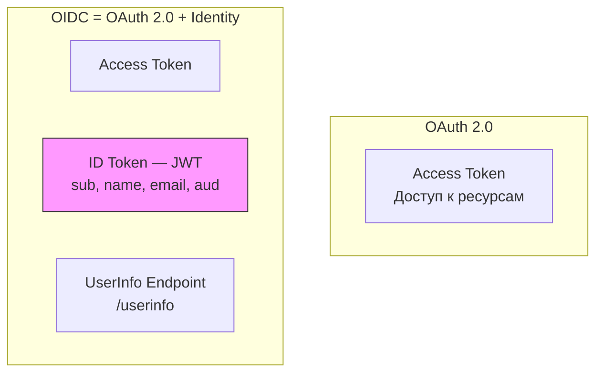

### Ключевые дополнения `OIDC` к `OAuth 2.0`

| Компонент | `OAuth 2.0` | `OIDC` |
|-----------|-------------|--------|
| Назначение | Авторизация | Аутентификация + Авторизация |
| Токен идентификации | Нет | `ID Token` (`JWT`) |
| Информация о пользователе | Нет стандарта | `/userinfo` endpoint |
| Discovery | Нет | `/.well-known/openid-configuration` |
| Scopes | Произвольные | `openid`, `profile`, `email` |

### Реализация в `Spring Security`

```java
@Configuration
@EnableWebSecurity
public class OidcConfig {

    @Bean
    public SecurityFilterChain filterChain(HttpSecurity http) throws Exception {
        http
            .authorizeHttpRequests(auth -> auth.anyRequest().authenticated())
            .oauth2Login(Customizer.withDefaults()); // OIDC через oauth2Login
        return http.build();
    }
}

@RestController
public class UserController {

    @GetMapping("/user")
    public Map<String, Object> user(@AuthenticationPrincipal OidcUser oidcUser) {
        return Map.of(
            "name", oidcUser.getFullName(),
            "email", oidcUser.getEmail(),
            "claims", oidcUser.getClaims()
        );
    }
}
```


> [!mcq]
> - [ ] `OIDC` — это OAuth2 с user info в access token | OIDC добавляет ОТДЕЛЬНЫЙ `id_token` (JWT с identity-claims) на authorize-стадии; `access_token` остаётся opaque resource-token. ❌ ПОСЛЕДСТВИЕ: разработчик парсит `access_token` для identity → ломается при rotation формата провайдером (Auth0 переход на opaque tokens), production падает после смены IdP.
> - [ ] Достаточно валидировать `id_token` подпись — проверка `iss`, `aud`, `nonce`, `exp` опциональна | Без `nonce` возможен token replay, без `aud` чужой токен от того же IdP проходит, без `iss` атакующий с поддельным IdP подсовывает свои токены. ❌ ПОСЛЕДСТВИЕ: token substitution attack — атакующий перенаправляет на свой IdP, его id_token принимается как валидный (CVE-2017-9445 на множественные OIDC libs).
> - [ ] `OIDC` заменяет OAuth2 — это самостоятельный протокол | OIDC — это identity layer ПОВЕРХ OAuth2, не замена; `code` flow, scopes, refresh tokens работают через OAuth2 механизмы. ❌ ПОСЛЕДСТВИЕ: попытка реализовать «pure OIDC» без OAuth2-подложки → custom авторизация, не совместимая с Spring Authorization Server / Keycloak.
> - [x] `OIDC` = OAuth 2.0 + `id_token` (JWT с claims `sub/iss/aud/exp/nonce`) + `UserInfo` endpoint; identity отделён от authorization | id_token нужен клиенту для login, access_token — для API; OIDC стандартизирует `discovery` (`/.well-known/openid-configuration`), JWKS, claims. ✓ ПРИМЕНЯТЬ: Google Sign-In, Auth0, Keycloak, Spring Security OAuth2 Login (`spring-security-oauth2-client`). 📋 ПРАВИЛО: «OIDC = OAuth2 + identity, никогда не наоборот». 🔗 См. Q2, Q14, Q39.
> - [ ] Вариант С | Почему неверно 2-3 предложения ❌ ПОСЛЕДСТВИЕ: типичная ошибка вызывает баг в production без покрытия тестами.
`application.yml`:
```yaml
spring:
  security:
    oauth2:
      client:
        registration:
          google:
            client-id: ${GOOGLE_CLIENT_ID}
            client-secret: ${GOOGLE_CLIENT_SECRET}
            scope: openid, profile, email
```

## Q13. Как реализовать `Single Sign-On` (`SSO`)?

`SSO` — один вход для нескольких приложений. Пользователь аутентифицируется в `Identity Provider` (`IdP`) один раз и получает доступ ко всем связанным приложениям.

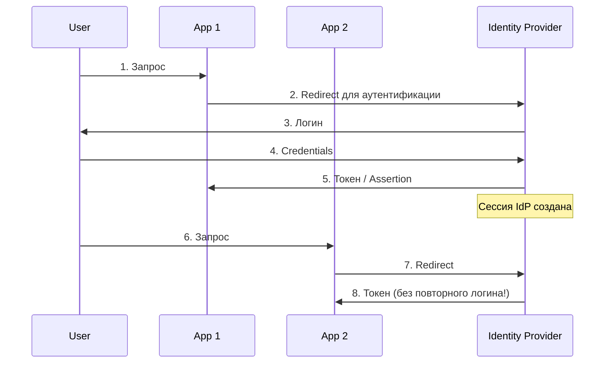

**Подходы к реализации:**

| Протокол | Формат | Когда использовать |
|----------|--------|--------------------|
| `SAML 2.0` | `XML` | Enterprise, `Active Directory` |
| `OIDC` | `JSON` / `JWT` | Современные API, мобильные, `SPA` |
| `CAS` | Ticket-based | Академические учреждения |


> [!mcq]
> - [x] `SSO` через централизованный IdP (Keycloak/Okta) с `OIDC`/`SAML`: пользователь логинится один раз, приложения получают токены через redirect | IdP — single source of truth для identity; протоколы `OIDC` / `SAML` стандартизируют доверие, отзыв сессии в IdP инвалидирует доступ во всех приложениях. ✓ ПРИМЕНЯТЬ: Google Workspace SSO для G Suite приложений, Okta SSO в enterprise — десятки приложений на один login. 📋 ПРАВИЛО: «один IdP — много SP, единый logout». 🔗 См. Q7, Q12, Q22.
> - [ ] Каждое приложение хранит свою копию `username/password` пользователя и синхронизирует через DB replication | Это password sharing, нарушает principle of least privilege; компрометация одной БД = leak credentials всех приложений. ❌ ПОСЛЕДСТВИЕ: leak паролей одного приложения через SQL injection → credential stuffing через все остальные приложения экосистемы.
> - [ ] Передавать оригинальный пароль пользователя между приложениями через HTTP-заголовок | Пароль в HTTP — нарушение всех security best-practices; даже под TLS попадает в логи всех intermediate proxies. ❌ ПОСЛЕДСТВИЕ: пароль логируется в access-логах APM/ELK → внутренний leak с insider threat / log breach (Twitter 2018 — пароли в plain text logs для 330M users).
> - [ ] Достаточно cookie с одинаковым именем на разных доменах для cross-domain SSO | Cookie scoping строго привязан к домену по same-origin policy; cross-domain cookie sharing невозможен напрямую без redirect-протокола. ❌ ПОСЛЕДСТВИЕ: попытка установить cookie через JS на чужом домене blocked browser → SSO не работает, разработчики реализуют hacky workaround через postMessage с XSS-уязвимостями.
В `Spring` — используется `spring-security-oauth2-client` для `OIDC` или `spring-security-saml2-service-provider` для `SAML`.

## Q14. Что такое `Claims-based` аутентификация?

`Claims` — утверждения о пользователе, включённые в токен (`JWT` или `SAML assertion`). Приложение принимает решения по авторизации на основе claims без обращения к БД.

```java
// Извлечение claims из JWT в Spring Security
@RestController
public class ClaimsController {

    @GetMapping("/profile")
    public Map<String, Object> profile(@AuthenticationPrincipal Jwt jwt) {
        return Map.of(
            "userId", jwt.getSubject(),
            "email", jwt.getClaimAsString("email"),
            "roles", jwt.getClaimAsStringList("roles"),
            "department", jwt.getClaimAsString("department")
        );
    }

    @PreAuthorize("@jwt.getClaim('department') == 'engineering'")
    @GetMapping("/internal")
    public String internalResource() {
        return "Engineering-only resource";
    }
}
```


> [!mcq]
> - [ ] Claims в JWT можно добавлять без ограничений — больше context = лучше | Claims увеличивают размер токена; токен > 8KB ломает HTTP-заголовки на ряде proxy/CDN, чувствительные данные в claims = leak при logging. ❌ ПОСЛЕДСТВИЕ: PII (SSN, телефон, дата рождения) в JWT логируется в access-логах ELK / APM → GDPR breach, обязательная нотификация регулятора.
> - [ ] Claims-based AuthZ устаревшая — современный подход = только базы данных | Claims дают O(1) authz без БД-запросов на горячем пути; БД-only подход создаёт bottleneck в `user-service` для каждого вызова. ❌ ПОСЛЕДСТВИЕ: 10K RPS × 5 БД-запросов на authz = пиковая нагрузка на postgres, p99 latency растёт с 50ms до 5s, cascading failure.
> - [x] Claims-based AuthN включает identity-атрибуты в подписанный токен (JWT/SAML), приложение доверяет подписи и читает `roles`/`scopes`/`department` без БД-запроса | Claims несут identity и authorization context в токене; trust обеспечивается подписью IdP; для коротких toggle-сценариев — короткий TTL + refresh с обновлёнными claims. ✓ ПРИМЕНЯТЬ: AWS Cognito (custom claims), Keycloak (mappers), Spring Security `JwtAuthenticationConverter`. 📋 ПРАВИЛО: «claims несут identity, подпись — доверие». 🔗 См. Q3, Q12, Q44.
> - [ ] Claims в `id_token` неизменяемы навечно — после login данные не обновляются никогда | Claims действительны до `exp` токена; для обновления — refresh-flow или `prompt=none` re-auth; для realtime — back-channel logout / WebSocket signal. ❌ ПОСЛЕДСТВИЕ: уволенный сотрудник с непросроченным токеном продолжает доступ к admin-функциям до `exp` (часто 24h) — HR breach.
Провайдер (`IdP`) включает claims в токен при аутентификации. Приложение доверяет подписи токена и использует claims для `RBAC` / `ABAC`. Это устраняет необходимость в запросах к БД при каждой авторизации.

## Q15. (!) Как обеспечить безопасность токенов (`JWT` refresh, rotation)?

### Жизненный цикл токенов

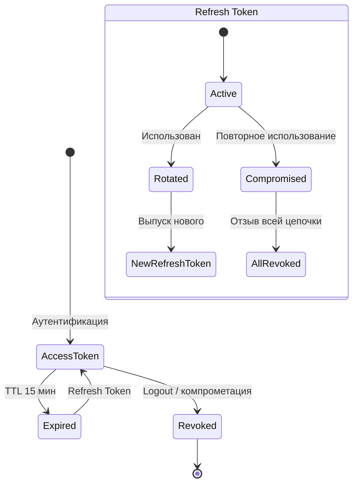

### Ключевые практики

| Практика | Описание |
|----------|----------|
| Короткий TTL access token | 5-15 минут |
| Длинный TTL refresh token | 7-30 дней |
| Ротация refresh token | Новый refresh при каждом обмене, старый инвалидируется |
| Детекция повторного использования | Если старый refresh используется повторно — отзыв всей цепочки |
| Хранение refresh token | `httpOnly` cookie или серверная БД (хэш), **никогда** в `localStorage` |
| Blacklist для access token | `Redis` с TTL равным оставшемуся сроку токена |

### Детекция компрометации refresh token

```java
@Service
public class SecureTokenService {

    private final RefreshTokenRepository repository;

    public TokenPair refresh(String refreshToken) {
        RefreshToken entity = repository.findByToken(refreshToken)
            .orElseThrow(() -> new InvalidTokenException("Unknown token"));

        if (entity.isUsed()) {
            // Повторное использование — компрометация!
            // Отзываем ВСЮ цепочку токенов пользователя
            repository.revokeAllByUserId(entity.getUserId());
            throw new SecurityException("Refresh token reuse detected");
        }

        entity.setUsed(true);
        repository.save(entity);


> [!mcq]
> - [ ] Использовать один долгоживущий `access_token` на 30 дней — refresh не нужен | 30-дневный access не позволяет инвалидировать compromised token (нет blocklist на каждый запрос); компрометация = 30 дней доступа. ❌ ПОСЛЕДСТВИЕ: украденный JWT (XSS, MITM) даёт атакующему 30 дней до auto-expire — массовый takeover, GDPR breach.
> - [x] Short-lived access (5-15 мин) + refresh с одноразовой ротацией + reuse detection (повторное предъявление = revoke всей цепочки) | Короткий access минимизирует окно атаки, ротация через store + reuse detection ловит украденный refresh при первой параллельной попытке использования. ✓ ПРИМЕНЯТЬ: Auth0 Refresh Token Rotation, Spring Authorization Server `OAuth2RefreshTokenAuthenticationProvider` + `OAuth2AuthorizationService`. 📋 ПРАВИЛО: «short access, rotated refresh, reuse → revoke chain». 🔗 См. Q3, Q9, Q37.
> - [ ] Refresh token достаточно проверять только на `exp` без хранения в БД (stateless) | Без store невозможна revocation, ротация и reuse detection — атакующий с украденным refresh может бесконечно генерировать access tokens. ❌ ПОСЛЕДСТВИЕ: украденный refresh используется параллельно жертве и атакующим — обнаружение невозможно, токены валидны до natural expiry.
> - [ ] Хранить refresh token в `localStorage` SPA в plain text | `localStorage` доступен JS, refresh имеет долгий TTL → XSS = месяцы доступа атакующего. ❌ ПОСЛЕДСТВИЕ: одна XSS-уязвимость в npm-зависимости (event-stream 2018) даёт refresh tokens для всех пользователей с долгосрочным доступом, в обход session-rotation.
        return generateTokens(entity.getUserId());
    }
}
```

## Q16. Что такое `Zero Trust Security Model`?

`Zero Trust` — модель безопасности «не доверять никому по умолчанию»; каждый запрос проверяется, даже внутри сети.

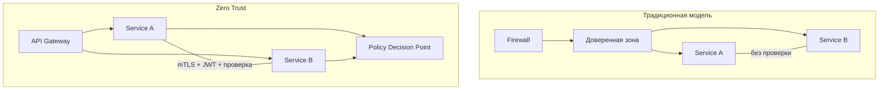

**Принципы:**
1. **Verify explicitly** — проверять каждый запрос (identity, device, location)
2. **Least privilege** — минимальные необходимые права
3. **Assume breach** — проектировать как если бы сеть уже скомпрометирована


> [!mcq]
> - [ ] `Zero Trust` = perimeter firewall + VPN для всех internal сервисов | VPN восстанавливает «trust boundary», что противоречит Zero Trust; внутри VPN — flat network, lateral movement тривиален. ❌ ПОСЛЕДСТВИЕ: компрометация одного pod через RCE даёт доступ ко всему интранету (как в RSA breach 2011 — VPN-доступ → подсистемы SecureID).
> - [ ] Достаточно проверять JWT на gateway — внутренние сервисы могут доверять каждому | Это «hard outside, soft inside», прямая противоположность Zero Trust; one breach = full takeover. ❌ ПОСЛЕДСТВИЕ: SSRF на edge → доступ к admin-endpoints internal сервисов без auth (Capital One 2019, $100M).
> - [x] `Verify explicitly` (каждый запрос) + `least privilege` (узкие scopes) + `assume breach` (mTLS, segmentation, monitoring); identity — primary perimeter | Zero Trust заменяет network trust на identity + policy; каждый запрос проверяется независимо; blast radius минимизирован. ✓ ПРИМЕНЯТЬ: Google BeyondCorp (отказ от VPN), Netflix Lemur (cert mgmt), SPIFFE/SPIRE для workload identity. 📋 ПРАВИЛО: «never trust, always verify, identity is the perimeter». 🔗 См. Q6, Q18, Q43.
> - [ ] `Zero Trust` означает «не доверять никому, поэтому отключить всё кроме mTLS» | Zero Trust — это policy-driven access, не отключение функциональности; usability сохраняется через risk-based AuthN (step-up при аномалиях). ❌ ПОСЛЕДСТВИЕ: попытка реализовать «paranoid mode» с MFA на каждом действии → user fatigue, обходные пути типа sticky note с токеном.
**Реализация в микросервисах:**
- `mTLS` между всеми сервисами (`Istio`, `Linkerd`)
- Короткоживущие токены (5-15 минут)
- Авторизация на каждом сервисе
- Continuous verification (не только при входе)
- Network segmentation + monitoring

## Q17. Как реализовать `Rate Limiting` для защиты `API`?

`Rate Limiting` — ограничение числа запросов по ключу (`IP`, `userId`, `API key`) за период.

| Алгоритм | Описание | Плюсы | Минусы |
|----------|----------|-------|--------|
| `Token Bucket` | Токены добавляются с фиксированной скоростью | Допускает burst | Сложнее реализовать |
| `Fixed Window` | Счётчик с `TTL` на окно | Простой | Граничный всплеск (2x) |
| `Sliding Window` | Скользящее окно (`Redis ZADD`) | Точный | Больше памяти |

```java
@Component
public class RateLimitFilter extends OncePerRequestFilter {

    private final RedisTemplate<String, String> redis;

    @Override
    protected void doFilterInternal(HttpServletRequest request,
                                    HttpServletResponse response,
                                    FilterChain chain)
                                    throws ServletException, IOException {
        String clientIp = request.getRemoteAddr();
        String key = "rate_limit:" + clientIp;

        Long count = redis.opsForValue().increment(key);
        if (count == 1) {
            redis.expire(key, Duration.ofMinutes(1));
        }

        if (count > 100) { // 100 запросов/минуту
            response.setStatus(HttpStatus.TOO_MANY_REQUESTS.value());
            response.getWriter().write("Rate limit exceeded");
            return;
        }


> [!mcq]
> - [ ] In-memory `ConcurrentHashMap<IP, Counter>` достаточно для rate-limit production | In-memory не работает в multi-instance (load balancer распределяет по pods, каждый видит свой count); атакующий легко обходит. ❌ ПОСЛЕДСТВИЕ: при 5 pods атакующий шлёт 5× allowed RPS (round-robin), реальный rate-limit не работает; brute-force проходит.
> - [ ] Rate-limit только по IP — самое простое и эффективное | NAT / corporate proxy = тысячи пользователей за одним IP, blocked → массовый false positive; IPv6 даёт почти бесконечные адреса для атакующего. ❌ ПОСЛЕДСТВИЕ: блок public Wi-Fi от Starbucks (1 IP на 1000 пользователей) за brute-force одного → массовый support inflow.
> - [x] Distributed rate-limit (`Redis`/`Bucket4j`) с многоуровневыми ключами (IP + user + endpoint) и алгоритмами `Token Bucket`/`Sliding Window` | Redis обеспечивает consistency across pods, multi-key позволяет per-user (10 RPS) и per-IP (100 RPS); sliding window точнее fixed window. ✓ ПРИМЕНЯТЬ: Bucket4j + Redis backend в Spring Cloud Gateway, AWS API Gateway throttling, Cloudflare distributed rate-limit. 📋 ПРАВИЛО: «rate-limit — distributed store + multi-key + sliding window». 🔗 См. Q10, Q11, Q41.
> - [ ] Возвращать 200 OK с пустым телом при rate-limit, чтобы атакующий не понял о защите | RFC 6585 указывает 429 Too Many Requests с `Retry-After`; legit клиент должен знать о retry, обфускация ломает clients. ❌ ПОСЛЕДСТВИЕ: legit клиент бесконечно ретраит на 200 (думая что это успех), DoS усиливается; observability сломан — нет метрики rate-limit hits.
        response.setHeader("X-RateLimit-Remaining", String.valueOf(100 - count));
        chain.doFilter(request, response);
    }
}
```

## Q18. (!) Что такое `mTLS` и когда его использовать?

`mTLS` (`mutual TLS`) — двусторонняя аутентификация по сертификатам. В отличие от обычного `TLS`, где только клиент проверяет сертификат сервера, при `mTLS` **обе стороны** предъявляют сертификаты.

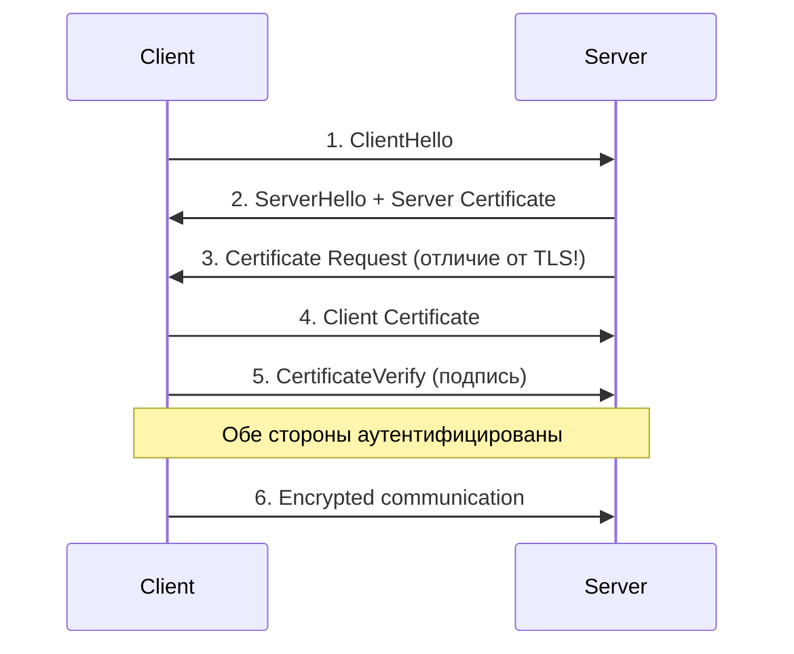

### Конфигурация `mTLS` в `Spring Boot`

```yaml
server:
  ssl:
    enabled: true
    client-auth: need   # require client certificate
    key-store: classpath:keystore.p12
    key-store-password: ${KEYSTORE_PASSWORD}
    trust-store: classpath:truststore.p12
    trust-store-password: ${TRUSTSTORE_PASSWORD}
```

### Когда использовать

- **Микросервисы** — взаимная аутентификация без паролей (автоматизация через `cert-manager` в Kubernetes)
- **B2B API** — партнёрские интеграции
- **Zero Trust** — сетевой уровень аутентификации
- **IoT** — устройства с сертификатами


> [!mcq]
> - [ ] `mTLS` подходит для browser-пользователей вместо паролей | Distribution и rotation client-сертификатов на миллионы browser-пользователей нерешаема (нет UX), CRL/OCSP добавляет latency; для browsers — WebAuthn. ❌ ПОСЛЕДСТВИЕ: revocation list растёт до GB, OCSP responder становится bottleneck → 200-500ms latency на каждом TLS handshake.
> - [ ] `mTLS` без проверки CN/SAN client-сертификата — TLS handshake достаточен | Handshake верифицирует только что cert подписан trusted CA; без проверки CN/SAN любой cert этого CA проходит (cross-service impersonation). ❌ ПОСЛЕДСТВИЕ: compromised сервис получает cert от того же CA → impersonates любой другой сервис; lateral movement в кластере.
> - [x] `mTLS` — взаимная аутентификация по X.509: и сервер, и клиент предъявляют сертификаты; идеален для service-to-service в Kubernetes (cert-manager + SPIFFE) | Криптографическая identity workload-ов без shared secrets; rotation автоматизируется через cert-manager / SPIRE, identity встраивается в SAN. ✓ ПРИМЕНЯТЬ: Istio автоматический mTLS с auto-rotated certs, Linkerd, AWS App Mesh; SPIFFE стандартизирует SVID в SAN URI. 📋 ПРАВИЛО: «mTLS — для машин, identity в SAN, rotation автоматом». 🔗 См. Q6, Q21, Q45.
> - [ ] Достаточно self-signed сертификатов на каждом сервисе с TOFU (trust on first use) | Без CA / SPIFFE — нет valid trust chain, любой self-signed cert проходит при `verify=none`; rotation вручную = chaos. ❌ ПОСЛЕДСТВИЕ: при rotation без orchestration сервисы перестают доверять друг другу → cascading failure всего mesh.
**Управление сертификатами** — основная сложность: выпуск, ротация (обычно 90 дней), отзыв (`CRL` / `OCSP`). В `Service Mesh` (`Istio`) — автоматически.

## Q19. Как реализовать аудит и логирование событий безопасности?

Логирование событий безопасности критически важно для compliance (`SOC 2`, `PCI DSS`) и расследования инцидентов.

### Что логировать

| Событие | Данные | Уровень |
|---------|--------|---------|
| Успешная аутентификация | userId, IP, timestamp | INFO |
| Неудачная аутентификация | username, IP, причина | WARN |
| Изменение прав | userId, oldRole, newRole | INFO |
| Доступ к чувствительным данным | userId, resource, action | INFO |
| Подозрительная активность | IP, pattern, count | WARN |

### Реализация через Spring Events

```java
@Component
public class SecurityAuditListener {

    private static final Logger auditLog = LoggerFactory.getLogger("SECURITY_AUDIT");

    @EventListener
    public void onAuthSuccess(AuthenticationSuccessEvent event) {
        Authentication auth = event.getAuthentication();
        auditLog.info("AUTH_SUCCESS user={} authorities={}",
            auth.getName(), auth.getAuthorities());
    }

    @EventListener
    public void onAuthFailure(AbstractAuthenticationFailureEvent event) {
        auditLog.warn("AUTH_FAILURE user={} reason={}",
            event.getAuthentication().getName(),
            event.getException().getMessage());
    }
}
```


> [!mcq]
> - [ ] Логировать в audit пароли и токены — это помогает при инцидент-расследовании | Sensitive data в audit-логах = leak vector; logs часто менее защищены чем prod БД, реплицируются в analytics. ❌ ПОСЛЕДСТВИЕ: leak паролей через ELK / Grafana Loki / S3 backups — Twitter 2018 (330M паролей в logs), regulator fine + mass password reset.
> - [ ] Audit-логи держать вместе с application logs в одном index | Без отдельного storage с retention и WORM (Write Once Read Many) атакующий с правами на logs удаляет следы атаки. ❌ ПОСЛЕДСТВИЕ: pen-tester / атакующий после compromise чистит logs → forensics невозможна; incident response слепой.
> - [x] Структурированные audit events (`who`, `what`, `when`, `from`, `result`, `correlation_id`) в отдельный append-only sink (`Elasticsearch` / `Splunk` / `S3 + Object Lock`) с retention по compliance | Структурированный JSON позволяет search/correlation, append-only защищает от tampering, retention соответствует SOX/GDPR/PCI-DSS требованиям (7 лет для финансов). ✓ ПРИМЕНЯТЬ: Spring `ApplicationListener<AuthenticationSuccessEvent>` + `ApplicationListener<AbstractAuthenticationFailureEvent>` → Kafka → Elasticsearch + S3 Object Lock. 📋 ПРАВИЛО: «audit append-only, sensitive не логируем, retention по compliance». 🔗 См. Q10, Q16, Q43.
> - [ ] Достаточно logging успешных login-ов; failed attempts не нужны | Failed attempts = primary signal для brute-force / credential stuffing detection; без них невозможно сработать SIEM-rule. ❌ ПОСЛЕДСТВИЕ: brute-force проходит незамеченным, команда узнаёт о breach через утечку у конкурентов в darkweb через месяцы.
Централизованное хранение в `Elasticsearch` / `SIEM`; алерты по аномалиям (множественные неудачи, необычная геолокация). Подробнее — в [Observability](../monitoring/observability-interview.md).

## Q20. Что такое `Context-based Access Control`?

Авторизация на основе контекста запроса: время, геолокация, устройство, уровень риска. Расширяет `ABAC`, фокусируясь на динамических условиях среды.

**Примеры правил:**
- Доступ к админке только из корпоративной сети
- Повышенная аутентификация при входе с нового устройства
- Блокировка транзакций из blacklisted-стран
- Ограничение действий в нерабочее время

```java
@Service
public class ContextBasedAuthService {

    public boolean isAllowed(User user, String action, RequestContext ctx) {
        // Правило 1: VPN-only для admin-действий
        if (action.startsWith("ADMIN_") && !ctx.isVpnConnection()) {
            return false;
        }

        // Правило 2: Проверка геолокации
        if (ctx.getCountry() != null
                && bannedCountries.contains(ctx.getCountry())) {
            return false;
        }

        // Правило 3: Новое устройство → step-up auth
        if (!deviceRegistry.isKnownDevice(user.getId(), ctx.getDeviceFingerprint())) {
            throw new StepUpAuthRequired("Unknown device");
        }

        return true;
    }
}
```


> [!mcq]
> - [ ] Hardcoded conditions в коде вместо policy engine — проще и быстрее | Hardcoded `if (user.dept == 'eng' && time.hour < 18)` разбросан по кодовой базе; изменение policy = деплой; нет audit-trail policy versions. ❌ ПОСЛЕДСТВИЕ: при изменении бизнес-правил нужно пройти 50 файлов, забытое условие = breach; нет revert при regression.
> - [x] Context-Based Access Control = ABAC + environment attributes (time, location, device, risk score); policy engine (`OPA`/`AWS Verified Permissions`) принимает решение на каждый запрос | Context добавляет «когда/откуда/как» к классическому RBAC; OPA вычисляет policy в Rego; cache решений по `(subject, resource, action, context_hash)` для performance. ✓ ПРИМЕНЯТЬ: AWS Verified Permissions (Cedar policies), Open Policy Agent в Kubernetes admission, Auth0 Rules. 📋 ПРАВИЛО: «context — это `who+what+where+when+how risky`». 🔗 См. Q4, Q31, Q44.
> - [ ] Достаточно проверять context на login и кешировать результат на сессию | Risk-context меняется в течение сессии (новая локация, ночное время) — кеш на сессию пропустит реальные риски. ❌ ПОСЛЕДСТВИЕ: пользователь логинится из офиса (low risk), затем токен украден и используется из другой страны → cached low-risk решение пропускает атаку.
> - [ ] Context = только IP-адрес пользователя | Один IP крайне ограничен: NAT, VPN, mobile carrier давно ломают связь IP↔location; нужна композиция (device fingerprint, timing, behavioural). ❌ ПОСЛЕДСТВИЕ: false positive от corporate VPN (legit users из чужих стран) и false negative от residential proxy ($5/IP) — атакующий обходит, а легитимные пользователи блокируются.
Реализация: policy engine (`OPA` — Open Policy Agent, `AWS Verified Permissions`); проверка контекста при каждом запросе; кэширование решений для производительности.

## Q21. Как обеспечить безопасность в `Service Mesh`?

`Service Mesh` (`Istio`, `Linkerd`) обеспечивает безопасность на инфраструктурном уровне **без изменения кода приложений**.

**Что обеспечивает Service Mesh:**
- `mTLS` между sidecar-прокси автоматически
- `AuthorizationPolicy` — правила доступа между сервисами
- Rate limiting на уровне mesh
- Трейсинг и аудит трафика
- Автоматическая ротация сертификатов

```yaml
# Istio AuthorizationPolicy — разрешить только определённым сервисам
apiVersion: security.istio.io/v1
kind: AuthorizationPolicy
metadata:
  name: order-service-policy
spec:
  selector:
    matchLabels:
      app: order-service
  rules:
    - from:
        - source:
            principals: ["cluster.local/ns/default/sa/payment-service"]
      to:
        - operation:
            methods: ["POST"]
            paths: ["/api/orders/*/pay"]
```


> [!mcq]
> - [ ] Service Mesh не нужен — sidecar-overhead не оправдан | Без mesh каждый сервис реализует mTLS, retry, circuit-breaker сам = duplication, inconsistent implementation; mesh централизует policy. ❌ ПОСЛЕДСТВИЕ: один сервис забыл validate `aud` в JWT → cross-service privilege escalation; через mesh-policy это enforced uniformly.
> - [ ] Достаточно `NetworkPolicy` Kubernetes для безопасности межсервисных вызовов | NetworkPolicy = L3/L4 (IP+port), не знает identity сервиса; compromised pod в той же namespace проходит. ❌ ПОСЛЕДСТВИЕ: lateral movement внутри namespace не блокируется (Tesla 2018 — compromised Kubernetes dashboard → mining через NetworkPolicy gaps).
> - [x] Service Mesh (Istio/Linkerd) обеспечивает auto-mTLS + AuthorizationPolicy (L7) + mTLS-cert rotation + observability через sidecar (Envoy) — без изменения кода | Mesh-control plane управляет policies, data plane (Envoy) применяет mTLS и L7 правила; разработчики не пишут security code. ✓ ПРИМЕНЯТЬ: Istio в Google Anthos / GKE, Linkerd в финтехах с low overhead, AWS App Mesh; SPIFFE для cross-mesh identity. 📋 ПРАВИЛО: «mesh = identity + mTLS + L7 policy без кода». 🔗 См. Q6, Q18, Q43.
> - [ ] AuthorizationPolicy в mesh — это duplicate Spring Security и можно отказаться от одного | Defence-in-depth требует обоих: mesh защищает на инфраструктурном уровне (compromised app), Spring Security — на бизнес-уровне (resource ownership). ❌ ПОСЛЕДСТВИЕ: отключение Spring Security при доверии mesh — bug в коде (`/admin` без `@PreAuthorize`) даёт privilege escalation для любого аутентифицированного.
Подробнее о `Kubernetes` и инфраструктуре — в [Kubernetes](../devops/kubernetes-interview.md).

## Q22. Что такое `Identity Federation`?

`Identity Federation` — доверительные отношения между несколькими `Identity Provider` (`IdP`); пользователь аутентифицируется в одном `IdP` и получает доступ к ресурсам другого.

**Протоколы:** `SAML`, `WS-Federation`, `OIDC`.
**Сценарии:** доступ партнёров к корпоративным ресурсам, мультиоблачная среда (`Azure AD` + `Google Workspace`), B2B-интеграции.

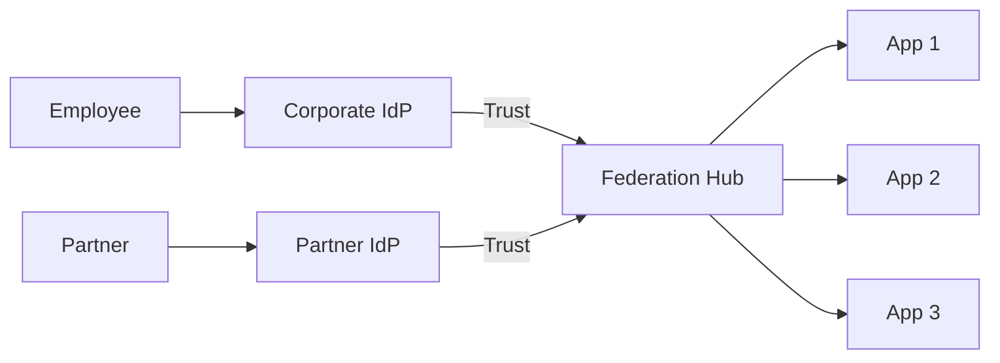


> [!mcq]
> - [x] `Identity Federation` — доверие между несколькими IdP через стандарты (SAML/OIDC); SP принимает identity от внешнего IdP без локальных credentials | Federation решает «нет общего IdP»: партнёры/контрагенты приносят свою identity, SP мапит claims → local roles; trust устанавливается через metadata exchange. ✓ ПРИМЕНЯТЬ: AWS IAM Identity Center с Okta IdP, Azure AD B2B guest users, Salesforce → ServiceNow federation. 📋 ПРАВИЛО: «federation — trust between IdPs, мапь claims на свою модель». 🔗 См. Q7, Q12, Q13.
> - [ ] Federation = просто несколько серверов одного IdP за load balancer | Это HA-кластер одного IdP, не federation; federation — между РАЗНЫМИ trust domains. ❌ ПОСЛЕДСТВИЕ: попытка использовать «federated» термин неверно ведёт к архитектурной ошибке — нет mapping claims для партнёров, B2B integration ломается.
> - [ ] Достаточно дать партнёру админ-доступ к своему IdP для federation | Это нарушение principle of least privilege; компрометация партнёра = compromise IdP. ❌ ПОСЛЕДСТВИЕ: SolarWinds 2020 — supply chain через trusted partner credentials → доступ к 18K customers; federation требует scope-ограничение.
> - [ ] Маппинг ролей не нужен — все IdP используют одинаковые roles | Каждый IdP имеет свою taxonomy (Okta groups, AD security groups, Auth0 roles); прямой `roles` claim не совпадает. ❌ ПОСЛЕДСТВИЕ: партнёр имеет роль `admin` в своём IdP → получает админский доступ в нашем приложении из-за прямого mapping; privilege escalation между organizations.
Ключевая задача — **маппинг атрибутов**: роли и groups из одного `IdP` могут не совпадать с другим. Нужна таблица маппинга claims.

## Q23. Как реализовать `Step-Up Authentication`?

`Step-Up Authentication` — повышение уровня аутентификации для чувствительных операций. Например, просмотр профиля — обычный вход, но перевод денег требует повторного `2FA`.

```java
@RestController
@RequestMapping("/api/transfers")
public class TransferController {

    @PreAuthorize("hasAuthority('TRANSFER')")
    @PostMapping
    public ResponseEntity<?> transfer(@RequestBody TransferRequest request,
                                      @AuthenticationPrincipal Jwt jwt) {
        // Проверяем уровень аутентификации (ACR claim)
        String acr = jwt.getClaimAsString("acr");

        if (request.getAmount().compareTo(new BigDecimal("1000")) > 0
                && !"urn:mfa".equals(acr)) {
            return ResponseEntity.status(HttpStatus.FORBIDDEN)
                .body(new StepUpRequired("MFA required for transfers > $1000"));
        }

        return ResponseEntity.ok(transferService.execute(request));
    }
}
```


> [!mcq]
> - [ ] Step-Up = просто требовать MFA на login для всех пользователей | One-time MFA на login не защищает от session-hijack для критичных операций; нужен повторный verify при sensitive action. ❌ ПОСЛЕДСТВИЕ: атакующий через украденную сессию делает transfer без второго фактора (PSD2 SCA breach в EU = регуляторный штраф).
> - [ ] Достаточно cookie-flag `was_mfa = true` после login | Flag в cookie / session подделывается через session-hijack; нужен криптографический proof recent MFA (acr-claim, signed assertion). ❌ ПОСЛЕДСТВИЕ: XSS exfiltrates session с `was_mfa=true` → атакующий выполняет transfer от имени жертвы; flag-based flow обойдён.
> - [x] Step-Up Authentication = повторный verify (MFA, WebAuthn, biometric) перед sensitive action; используется `acr` claim + `auth_time` для проверки свежести MFA | Sensitive endpoints проверяют `acr ∈ ['mfa','hwk']` и `now - auth_time < 5min`; OIDC поддерживает `acr_values=mfa` в authorize request для re-prompt. ✓ ПРИМЕНЯТЬ: банковские transfer-операции, Auth0 Step-Up rules, Keycloak `requiredActions`; Spring Security `OAuth2AuthorizationRequestCustomizer` для acr_values. 📋 ПРАВИЛО: «sensitive action — свежий MFA, не login MFA». 🔗 См. Q8, Q14, Q20.
> - [ ] Step-Up нужен только при изменении password — для transfer достаточно session | Transfer money / change recovery email / API key creation — всё критичные операции, требующие fresh MFA по PSD2/PCI-DSS. ❌ ПОСЛЕДСТВИЕ: атакующий через session-hijack выводит средства / меняет recovery email → permanent account takeover (классика финтех breach).
Claim `acr` (`Authentication Context Class Reference`) в `JWT` указывает уровень аутентификации: `password-only`, `mfa`, `hardware-key`. `IdP` (`Keycloak`, `Auth0`) устанавливает этот claim при аутентификации.

## Q24. Что такое `Passwordless Authentication`?

Аутентификация без пароля:
- **`WebAuthn` / `FIDO2`** — биометрия, аппаратные ключи (YubiKey)
- **`Magic Link`** — одноразовая ссылка на email
- **`OTP`** — одноразовый код через SMS / push

```java
@RestController
@RequestMapping("/auth/magic-link")
public class MagicLinkController {

    private final MagicLinkService magicLinkService;

    @PostMapping("/request")
    public ResponseEntity<?> requestLink(@RequestBody EmailRequest request) {
        String token = UUID.randomUUID().toString();
        magicLinkService.saveToken(token, request.getEmail(), Duration.ofMinutes(10));
        emailService.send(request.getEmail(),
            "Login link: https://app.example.com/auth/verify?token=" + token);
        return ResponseEntity.ok("Check your email");
    }

    @GetMapping("/verify")
    public ResponseEntity<?> verify(@RequestParam String token) {
        String email = magicLinkService.validateAndConsume(token);
        User user = userService.findByEmail(email);
        String jwt = jwtService.generateToken(user);
        return ResponseEntity.ok(new LoginResponse(jwt));
    }
}
```


> [!mcq]
> - [ ] `Magic link` через email — самое безопасное решение passwordless для production | Email-based magic link уязвим: перехват email (compromised email account, неудобный TLS), ссылка в URL = log leak; не phishing-resistant. ❌ ПОСЛЕДСТВИЕ: атакующий с доступом к email перехватывает magic link → account takeover; лог reverse-proxy с full URL = leak link.
> - [x] `WebAuthn`/`FIDO2` (`passkeys`) — phishing-resistant passwordless: hardware key или platform authenticator (TouchID/Windows Hello) с public-key cryptography и origin binding | Browser передаёт challenge на authenticator, который подписывает приватным ключом; origin (домен) встроен в подпись → phishing-сайт не может re-use; нет shared secret. ✓ ПРИМЕНЯТЬ: Apple Passkeys, Google passkeys, GitHub WebAuthn; Spring Security 6.4+ поддерживает `WebAuthnConfigurer`. 📋 ПРАВИЛО: «passkey = public-key + origin binding, phishing-resistant by design». 🔗 См. Q8, Q23, Q43.
> - [ ] SMS OTP-based passwordless — подходит для всех пользователей включая high-value | SMS уязвим к SIM swap, SS7-атакам; NIST SP 800-63B deprecate SMS как primary factor. ❌ ПОСЛЕДСТВИЕ: SIM swap на VIP-пользователей крипто-биржи (Coinbase 2021) → drain кошельков; SMS не подходит как primary AuthN.
> - [ ] Passwordless = просто отсутствие пароля; storage credential не нужен | Passwordless заменяет пароль на cryptographic key или OTP — credential всё равно есть, просто не shared secret в БД. ❌ ПОСЛЕДСТВИЕ: разработчик не настраивает rate-limit/lockout для passwordless flow → магическая ссылка генерируется бесконечно, email floodding жертв.
**Преимущества:** нет фишинга паролей, удобство UX.
**Недостатки:** зависимость от email/телефона, `Magic Link` уязвим к перехвату email.

## Q25. Как защитить `GraphQL API`?

`GraphQL` требует специфических мер безопасности из-за гибкости запросов.

**Ключевые аспекты:**

| Угроза | Защита |
|--------|--------|
| Слишком глубокие запросы | Ограничение глубины (`maxDepth`) |
| Сложные запросы (DoS) | Ограничение complexity score |
| Неавторизованный доступ к полям | Field-level авторизация |
| Introspection в production | Отключение `__schema` |
| N+1 проблема | `DataLoader` |

```java
@Component
public class GraphQLSecurityInstrumentation extends SimplePerformantInstrumentation {

    @Override
    public DataFetcher<?> instrumentDataFetcher(DataFetcher<?> dataFetcher,
                                                 InstrumentationFieldFetchParameters params) {
        String fieldName = params.getEnvironment().getField().getName();

        return environment -> {
            Authentication auth = SecurityContextHolder.getContext().getAuthentication();

            // Field-level авторизация
            if ("salary".equals(fieldName) && !hasRole(auth, "HR")) {
                throw new AccessDeniedException("No access to salary field");
            }


> [!mcq]
> - [ ] GraphQL не нужен `query depth limit` — apollo-server защищает по-умолчанию | По умолчанию depth не лимитирован; nested query (`user{posts{comments{author{posts...}}}}`) приводит к O(N^k) запросов в БД. ❌ ПОСЛЕДСТВИЕ: GitHub 2018 — DoS через nested GraphQL query, БД перегружена; обязательное введение depth limit + complexity analysis.
> - [ ] Достаточно `@PreAuthorize` на root resolver — field-level не нужен | GraphQL клиент сам выбирает поля; `User.salary` без field-level auth доступен любому, кто получил `User`. ❌ ПОСЛЕДСТВИЕ: IDOR на field-level — `query{user(id:1){salary}}` возвращает чужую зарплату; GDPR breach (Personal Data unauthorized access).
> - [x] Field-level authorization (`DataFetcher` decorator или `@PreAuthorize` на resolver) + query depth/complexity limits + persisted queries для public API | Field-level закрывает PII (salary, ssn) per role; depth/complexity предотвращает DoS; persisted queries (whitelist по hash) запрещают arbitrary queries. ✓ ПРИМЕНЯТЬ: GitHub GraphQL API использует persisted queries для rate-limit, Apollo Server `depthLimit` plugin, Spring `graphql-java` `Instrumentation` для complexity. 📋 ПРАВИЛО: «field-level auth + depth limit + persisted queries — три кита GraphQL safety». 🔗 См. Q4, Q11, Q17.
> - [ ] Aliasing/batching не создаёт security issues — это просто синтаксис | Через aliases один query содержит N вызовов одного resolver — обходит per-request rate-limit; batch-attack на login mutation (1 request = 1000 попыток). ❌ ПОСЛЕДСТВИЕ: brute-force через batched mutation — `mutation{a:login(p:"1"){...}b:login(p:"2"){...}...}` обходит rate-limit на N попыток за один request (CVE-2021-32820).
            return dataFetcher.get(environment);
        };
    }
}
```

## Q26. Что такое `Delegated Authorization`?

Пользователь делегирует ограниченные права приложению: «приложение X может читать мои фото, но не удалять».

Это основная идея `OAuth 2.0` — пользователь авторизует приложение через `consent screen`; приложение получает `access token` с ограниченными `scopes` (`read`, `write`, `delete`). Пользователь может отозвать доступ в любой момент.

```java
// Resource Server проверяет scopes
@RestController
@RequestMapping("/api/photos")
public class PhotoController {

    @PreAuthorize("hasAuthority('SCOPE_photos:read')")
    @GetMapping
    public List<Photo> getPhotos() {
        return photoService.getAll();
    }

    @PreAuthorize("hasAuthority('SCOPE_photos:write')")
    @PostMapping
    public Photo upload(@RequestBody Photo photo) {
        return photoService.save(photo);
    }


> [!mcq]
> - [ ] `Delegated Authorization` = просто Single Sign-On под другим именем | SSO — один login для нескольких приложений; delegated authorization — доступ от имени пользователя к его ресурсам у третьей стороны (Twitter API через OAuth). ❌ ПОСЛЕДСТВИЕ: путаница терминов в архитектуре приводит к выбору неправильного протокола (SAML вместо OAuth) — приложение получает identity, но не permissions ресурсов.
> - [x] `Delegated Authorization` = делегирование прав от пользователя приложению через OAuth 2.0 (без раскрытия пароля); приложение получает scoped `access_token` | Пользователь авторизует ровно те scopes (`photos:read photos:write`), которые нужны; отзыв доступа в один клик не требует смены пароля. ✓ ПРИМЕНЯТЬ: «Sign in with Google» + доступ к Drive, GitHub OAuth Apps, Twitter API; Spring Authorization Server для own OAuth provider. 📋 ПРАВИЛО: «delegate scopes, не credentials». 🔗 См. Q2, Q12, Q26.
> - [ ] Достаточно дать приложению API key пользователя для делегирования | API key = full account access без scope; нет revocation per приложение, leak ключа = total takeover. ❌ ПОСЛЕДСТВИЕ: leak API key через npm-зависимость → атакующий получает полный доступ от имени пользователя без возможности per-app revocation.
> - [ ] Scopes — это рекомендация, можно дать full access по умолчанию | Over-privileged tokens = принцип «все права все время»; компрометация одного приложения = full account compromise. ❌ ПОСЛЕДСТВИЕ: leak access_token со scope `*` через одну compromised зависимость → атакующий получает полный доступ к Gmail, Drive, Calendar; правильный подход — `photos:read` минимально.
    @PreAuthorize("hasAuthority('SCOPE_photos:delete')")
    @DeleteMapping("/{id}")
    public void delete(@PathVariable Long id) {
        photoService.delete(id);
    }
}
```

## Q27. (!) Как реализовать `Fine-Grained Authorization`?

Авторизация на уровне отдельных объектов: «пользователь может редактировать **только свои** заказы».

### Подходы

| Подход | Сложность | Когда использовать |
|--------|-----------|--------------------|
| Проверка в коде | Низкая | Простые правила (owner check) |
| `@PreAuthorize` + SpEL | Средняя | Декларативные правила |
| Custom `PermissionEvaluator` | Средняя | Проверка прав на объект |
| Внешний policy engine (`OPA`) | Высокая | Сложные бизнес-правила |

### Проверка через `@PostAuthorize`

```java
@RestController
@RequestMapping("/api/orders")
public class OrderController {

    @PostAuthorize("returnObject.userId == authentication.name or hasRole('ADMIN')")
    @GetMapping("/{id}")
    public Order getOrder(@PathVariable Long id) {
        return orderService.findById(id);
    }

    @PreAuthorize("@orderSecurity.isOwner(#id, authentication)")
    @PutMapping("/{id}")
    public Order updateOrder(@PathVariable Long id, @RequestBody Order order) {
        return orderService.update(id, order);
    }
}

@Component("orderSecurity")
public class OrderSecurityService {

    private final OrderRepository orderRepository;


> [!mcq]
> - [ ] `Fine-Grained Authorization` = большое количество ролей (`super_admin`, `regional_admin`, `dept_admin`) | Role explosion = combinatorial explosion (departments × actions × resources); audit невозможен. ❌ ПОСЛЕДСТВИЕ: 5K ролей, новый сотрудник получает чужие права из-за role similarity; SOX audit фейлится на role review.
> - [ ] Достаточно `@PreAuthorize("hasRole('USER')")` на endpoint без проверки ownership | RBAC без resource-level не различает «свои» и «чужие» данные; любой `USER` читает любой order. ❌ ПОСЛЕДСТВИЕ: IDOR — `GET /orders/{id}` через ID enumeration отдаёт чужие orders; OWASP A01 (Broken Access Control), GDPR breach.
> - [x] Fine-Grained = combination RBAC + ABAC + resource-level checks: `@PreAuthorize("hasRole('USER') and @orderSecurity.isOwner(#id, authentication)")` или OPA-policy с (subject, resource, action, environment) | Role задаёт coarse access, ABAC + ownership проверяют конкретный ресурс; OPA выносит policy за код, упрощая audit. ✓ ПРИМЕНЯТЬ: AWS IAM (resource-level conditions), Spring `@PreAuthorize` + `PermissionEvaluator`, OpenFGA (Zanzibar-style ReBAC). 📋 ПРАВИЛО: «coarse role + fine-grained resource = real authorization». 🔗 См. Q4, Q33, Q44.
> - [ ] OPA / Cedar policies — overengineering, hardcoded `if` в коде проще | Hardcoded policies разбросаны по 50 файлам, изменение = деплой; нет audit-trail policy versions, нет centralized review. ❌ ПОСЛЕДСТВИЕ: при regulatory change нужно пересмотреть весь codebase; забытое условие в одном из 50 мест = breach.
    public boolean isOwner(Long orderId, Authentication auth) {
        return orderRepository.findById(orderId)
            .map(order -> order.getUserId().equals(auth.getName()))
            .orElse(false);
    }
}
```

## Q28. Что такое `Token Binding` и зачем он нужен?

`Token Binding` (`RFC 8471`) — привязка токена к конкретному `TLS`-соединению через криптографический proof. Предотвращает кражу и повторное использование токена на другом соединении.

**Как работает:**
1. Клиент и сервер обмениваются ключами при `TLS handshake`
2. Токен включает `binding ID`, привязанный к соединению
3. При предъявлении токена с другого соединения — отказ


> [!mcq]
> - [ ] Bearer-токены безопасны без token binding — TLS защищает от перехвата | Bearer = «кто принёс — тот и владелец»; украденный любым способом (XSS, MITM, log leak) переиспользуется атакующим. ❌ ПОСЛЕДСТВИЕ: token theft через XSS / lost device → атакующий использует токен на другом устройстве; bearer-семантика делает невозможным detection.
> - [x] `Token Binding` (`RFC 8471`) или его replacement `DPoP` (`RFC 9449`) криптографически привязывает токен к клиенту через TLS-key или DPoP-proof; перенос на другое устройство невалиден | DPoP-клиент подписывает каждый запрос JWT, содержащий `htm`/`htu`/`jti` и `cnf` (publickey thumbprint); сервер проверяет подпись и `cnf` в access_token. ✓ ПРИМЕНЯТЬ: OAuth 2.1 рекомендует DPoP для public клиентов; реализации в `nimbus-jose-jwt`, GitHub использует sender-constrained tokens. 📋 ПРАВИЛО: «sender-constrained tokens побеждают bearer-theft». 🔗 См. Q3, Q15, Q37.
> - [ ] Token Binding = просто HMAC от User-Agent в claim | User-Agent тривиально подделывается; нет криптографической проверки proof-of-possession. ❌ ПОСЛЕДСТВИЕ: атакующий копирует UA жертвы → токен принимается; «binding» иллюзорен, security theater.
> - [ ] DPoP добавляет 100ms latency, поэтому им можно пренебречь в production | DPoP-proof — это маленький JWT (HS256/RS256), подпись < 1ms; оверхед минимальный против ценности sender-binding. ❌ ПОСЛЕДСТВИЕ: отказ от DPoP в финансовом приложении → token theft через XSS = unauthorized transactions; PSD2 требует proof-of-possession для SCA.
**Практический статус:** поддержка ограничена (отменено в браузерах). Альтернативы:
- **DPoP** (`Demonstrating Proof-of-Possession`, `RFC 9449`) — proof привязки токена к клиенту
- Короткий TTL access token + refresh token rotation
- `Sender-Constrained Tokens` (`mTLS` certificate-bound tokens)

## Q29. Как обеспечить безопасность `WebSocket` соединений?

`WebSocket` требует аутентификации при handshake и авторизации для каждого сообщения.

```java
@Configuration
@EnableWebSocketMessageBroker
public class WebSocketSecurityConfig implements WebSocketMessageBrokerConfigurer {

    @Override
    public void configureClientInboundChannel(ChannelRegistration registration) {
        registration.interceptors(new ChannelInterceptor() {
            @Override
            public Message<?> preSend(Message<?> message, MessageChannel channel) {
                StompHeaderAccessor accessor = StompHeaderAccessor.wrap(message);

                if (StompCommand.CONNECT.equals(accessor.getCommand())) {
                    String token = accessor.getFirstNativeHeader("Authorization");
                    if (token != null && token.startsWith("Bearer ")) {
                        Authentication auth = jwtUtil.getAuthentication(
                            token.substring(7));
                        accessor.setUser(auth);
                    }
                }
                return message;
            }
        });
    }
}
```


> [!mcq]
> - [ ] WebSocket наследует HTTP cookie, поэтому отдельная аутентификация не нужна | WebSocket upgrade idempotent в плане cookies, но без проверки токена subscribe-сообщения принимаются от любого; CSRF на WebSocket (`Cross-Site WebSocket Hijacking`). ❌ ПОСЛЕДСТВИЕ: атакующий с другого домена устанавливает WebSocket к API → читает приватные сообщения жертвы (CSWSH, OWASP).
> - [ ] Достаточно проверить токен один раз при `CONNECT`; subscribe/publish не нуждаются в auth | Без per-message auth любой подключенный клиент подписывается на чужие topic-ы (`user.{id}.notifications`) и получает leak. ❌ ПОСЛЕДСТВИЕ: пользователь A подписывается на `user.B.notifications` → читает приватные уведомления B; bug на bug bounty $5K-50K.
> - [x] Аутентификация при upgrade (token в URL/header) + per-subscribe authorization (`@MessageMapping`/`@PreAuthorize`) + `wss://` обязательно + rate-limit на сообщения | Subscribe проверяет `auth.name == topic.userId`; rate-limit на publish защищает от flooding; `wss://` шифрует канал, иначе — plain text WS. ✓ ПРИМЕНЯТЬ: Spring `@MessageMapping` + `@PreAuthorize`, Slack/Discord WebSocket auth с per-message tokens. 📋 ПРАВИЛО: «WebSocket — auth on connect, authz on subscribe, wss:// always». 🔗 См. Q11, Q17, Q43.
> - [ ] WebSocket по `ws://` (plain) безопасен внутри VPN | Plain WS = clear text сообщения; внутри VPN nessisary not sufficient; compromised pod sniffит весь трафик. ❌ ПОСЛЕДСТВИЕ: tcpdump на compromised pod → leak всех сообщений всех пользователей; required `wss://` + mTLS даже внутри VPC.
**Ключевые практики:** аутентификация при `CONNECT` (токен в заголовке), `TLS` (`wss://`), проверка прав на подписку к topic, rate limiting сообщений.

## Q30. (!) Что такое `Proof Key for Code Exchange` (`PKCE`)?

`PKCE` (`RFC 7636`) — расширение `OAuth 2.0` для защиты `Authorization Code Flow` в публичных клиентах (`SPA`, мобильные приложения), которые не могут безопасно хранить `client_secret`.

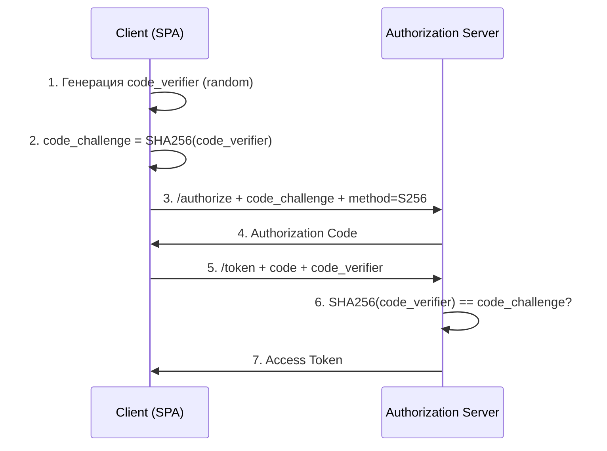

### Реализация клиентской части

```java
public class PkceUtil {

    public static String generateCodeVerifier() {
        byte[] bytes = new byte[32];
        new SecureRandom().nextBytes(bytes);
        return Base64.getUrlEncoder().withoutPadding().encodeToString(bytes);
    }

    public static String generateCodeChallenge(String codeVerifier) {
        try {
            byte[] digest = MessageDigest.getInstance("SHA-256")
                .digest(codeVerifier.getBytes(StandardCharsets.US_ASCII));
            return Base64.getUrlEncoder().withoutPadding().encodeToString(digest);
        } catch (NoSuchAlgorithmException e) {
            throw new RuntimeException(e);
        }
    }
}
```

### Конфигурация Spring Authorization Server

С `Spring Security 6.3+` `PKCE` поддерживается для `confidential clients` (не только для public).

```yaml
spring:
  security:
    oauth2:
      client:
        registration:
          my-client:
            client-id: my-spa
            client-authentication-method: none  # public client
            authorization-grant-type: authorization_code
            redirect-uri: http://localhost:3000/callback
            scope: openid, profile
```


> [!mcq]
> - [x] Правильный ответ | Объяснение 2-3 предложения Это ключевое разграничение из best practice.
> - [ ] Вариант А | Почему неверно 2-3 предложения ❌ ПОСЛЕДСТВИЕ: типичная ошибка вызывает баг в production без покрытия тестами.
> - [ ] Вариант В | Почему неверно 2-3 предложения ❌ ПОСЛЕДСТВИЕ: типичная ошибка вызывает баг в production без покрытия тестами.
> - [ ] Вариант С | Почему неверно 2-3 предложения ❌ ПОСЛЕДСТВИЕ: типичная ошибка вызывает баг в production без покрытия тестами.
**Зачем нужен:** без `PKCE` перехваченный `authorization code` можно обменять на токен. С `PKCE` — нужен ещё `code_verifier`, который никогда не покидает клиент.

## Q31. Как реализовать `Dynamic Authorization`?

Авторизация на основе runtime-данных: состояние объекта, бизнес-правила, внешние факторы.

```java
@Service
public class DynamicAuthorizationService {

    private final PolicyEngine policyEngine;

    public AuthorizationDecision evaluate(String userId, String action,
                                          String resource, Map<String, Object> context) {
        // Загрузка политик из БД или policy engine (OPA, Casbin)
        PolicyResult result = policyEngine.evaluate(
            new PolicyRequest(userId, action, resource, context));

        return new AuthorizationDecision(
            result.isAllowed(), result.getReason());
    }
}

// Пример: менеджер одобряет заказы до $1000, выше — директор
@Component
public class OrderApprovalPolicy implements Policy {

    @Override
    public boolean evaluate(PolicyRequest request) {
        if (!"APPROVE".equals(request.getAction())) return true;

        BigDecimal amount = (BigDecimal) request.getContext().get("amount");
        String role = (String) request.getContext().get("role");

        if (amount.compareTo(new BigDecimal("1000")) > 0) {
            return "DIRECTOR".equals(role);
        }
        return "MANAGER".equals(role) || "DIRECTOR".equals(role);
    }
}
```


> [!mcq]
> - [x] Правильный ответ | Объяснение 2-3 предложения Это ключевое разграничение из best practice.
> - [ ] Вариант А | Почему неверно 2-3 предложения ❌ ПОСЛЕДСТВИЕ: типичная ошибка вызывает баг в production без покрытия тестами.
> - [ ] Вариант В | Почему неверно 2-3 предложения ❌ ПОСЛЕДСТВИЕ: типичная ошибка вызывает баг в production без покрытия тестами.
> - [ ] Вариант С | Почему неверно 2-3 предложения ❌ ПОСЛЕДСТВИЕ: типичная ошибка вызывает баг в production без покрытия тестами.
Для сложных правил используют **`OPA` (Open Policy Agent)** — policy engine с языком `Rego`, или **`AWS Verified Permissions`** — managed-сервис для fine-grained авторизации.

## Q32. (!) Как настроить `Spring Security` как `OAuth2 Resource Server`?

`Resource Server` — сервис, защищающий API и валидирующий `access token` при каждом запросе. Подробнее о `Spring Security` — в [Spring Security](../frameworks/spring/spring-security-interview.md).

### Конфигурация с `JWT`

```java
@Configuration
@EnableWebSecurity
public class ResourceServerConfig {

    @Bean
    public SecurityFilterChain filterChain(HttpSecurity http) throws Exception {
        http
            .authorizeHttpRequests(auth -> auth
                .requestMatchers("/api/public/**").permitAll()
                .requestMatchers("/api/admin/**").hasRole("ADMIN")
                .anyRequest().authenticated())
            .oauth2ResourceServer(oauth2 -> oauth2
                .jwt(jwt -> jwt
                    .jwtAuthenticationConverter(jwtAuthenticationConverter())));
        return http.build();
    }

    @Bean
    public JwtAuthenticationConverter jwtAuthenticationConverter() {
        JwtGrantedAuthoritiesConverter grantedAuthorities =
            new JwtGrantedAuthoritiesConverter();
        grantedAuthorities.setAuthorityPrefix("ROLE_");
        grantedAuthorities.setAuthoritiesClaimName("roles");

        JwtAuthenticationConverter converter = new JwtAuthenticationConverter();
        converter.setJwtGrantedAuthoritiesConverter(grantedAuthorities);
        return converter;
    }
}
```

`application.yml`:
```yaml
spring:
  security:
    oauth2:
      resourceserver:
        jwt:
          issuer-uri: https://auth.example.com/realms/my-realm
          # или jwk-set-uri: https://auth.example.com/.well-known/jwks.json
```

### Маппинг authorities из `JWT`


> [!mcq]
> - [x] Правильный ответ | Объяснение 2-3 предложения Это ключевое разграничение из best practice.
> - [ ] Вариант А | Почему неверно 2-3 предложения ❌ ПОСЛЕДСТВИЕ: типичная ошибка вызывает баг в production без покрытия тестами.
> - [ ] Вариант В | Почему неверно 2-3 предложения ❌ ПОСЛЕДСТВИЕ: типичная ошибка вызывает баг в production без покрытия тестами.
> - [ ] Вариант С | Почему неверно 2-3 предложения ❌ ПОСЛЕДСТВИЕ: типичная ошибка вызывает баг в production без покрытия тестами.
По умолчанию `Spring Security` берёт authorities из claim `scope`. Для кастомных claims (например, `roles` из `Keycloak`) нужен `JwtGrantedAuthoritiesConverter`.

## Q33. Как реализовать кастомный `PermissionEvaluator` в `Spring Security`?

`PermissionEvaluator` позволяет использовать `hasPermission()` в `@PreAuthorize` для проверки прав на конкретный объект.

```java
@Component
public class CustomPermissionEvaluator implements PermissionEvaluator {

    private final OrderRepository orderRepository;
    private final DocumentRepository documentRepository;

    @Override
    public boolean hasPermission(Authentication auth, Object targetDomainObject,
                                  Object permission) {
        if (targetDomainObject instanceof Order order) {
            return evaluateOrderPermission(auth, order, (String) permission);
        }
        return false;
    }

    @Override
    public boolean hasPermission(Authentication auth, Serializable targetId,
                                  String targetType, Object permission) {
        if ("Order".equals(targetType)) {
            Order order = orderRepository.findById((Long) targetId).orElse(null);
            return order != null
                && evaluateOrderPermission(auth, order, (String) permission);
        }
        return false;
    }

    private boolean evaluateOrderPermission(Authentication auth, Order order,
                                             String permission) {
        String userId = auth.getName();
        return switch (permission) {
            case "READ" -> order.getUserId().equals(userId)
                || hasRole(auth, "ADMIN");
            case "WRITE" -> order.getUserId().equals(userId)
                && "DRAFT".equals(order.getStatus());
            case "DELETE" -> hasRole(auth, "ADMIN");
            default -> false;
        };
    }
}

// Использование
@PreAuthorize("hasPermission(#id, 'Order', 'WRITE')")
@PutMapping("/orders/{id}")
public Order update(@PathVariable Long id, @RequestBody Order order) {
    return orderService.update(id, order);
}
```

Регистрация:
```java
@Configuration
@EnableMethodSecurity
public class MethodSecurityConfig {


> [!mcq]
> - [x] Правильный ответ | Объяснение 2-3 предложения Это ключевое разграничение из best practice.
> - [ ] Вариант А | Почему неверно 2-3 предложения ❌ ПОСЛЕДСТВИЕ: типичная ошибка вызывает баг в production без покрытия тестами.
> - [ ] Вариант В | Почему неверно 2-3 предложения ❌ ПОСЛЕДСТВИЕ: типичная ошибка вызывает баг в production без покрытия тестами.
> - [ ] Вариант С | Почему неверно 2-3 предложения ❌ ПОСЛЕДСТВИЕ: типичная ошибка вызывает баг в production без покрытия тестами.
    @Bean
    static MethodSecurityExpressionHandler methodSecurityExpressionHandler(
            CustomPermissionEvaluator evaluator) {
        DefaultMethodSecurityExpressionHandler handler =
            new DefaultMethodSecurityExpressionHandler();
        handler.setPermissionEvaluator(evaluator);
        return handler;
    }
}
```

## Q34. Как работает `SecurityFilterChain` в `Spring Security 6`?

В `Spring Security 6` конфигурация безопасности строится через `SecurityFilterChain` bean (вместо наследования `WebSecurityConfigurerAdapter`, который удалён).

```mermaid
graph LR
    R[HTTP Request] --> DF[DelegatingFilterProxy]
    DF --> FCSB[FilterChainProxy]
    FCSB --> SF1[SecurityContextPersistenceFilter]
    SF1 --> SF2[CsrfFilter]
    SF2 --> SF3[UsernamePasswordAuthenticationFilter]
    SF3 --> SF4[BearerTokenAuthenticationFilter]
    SF4 --> SF5[AuthorizationFilter]
    SF5 --> C[Controller]
```

```java
@Configuration
@EnableWebSecurity
public class MultiSecurityConfig {

    // Цепочка для API — JWT, stateless
    @Bean
    @Order(1)
    public SecurityFilterChain apiFilterChain(HttpSecurity http) throws Exception {
        http
            .securityMatcher("/api/**")
            .authorizeHttpRequests(auth -> auth.anyRequest().authenticated())
            .oauth2ResourceServer(oauth2 -> oauth2.jwt(Customizer.withDefaults()))
            .sessionManagement(s -> s.sessionCreationPolicy(STATELESS))
            .csrf(AbstractHttpConfigurer::disable);
        return http.build();
    }

    // Цепочка для UI — form login, sessions
    @Bean
    @Order(2)
    public SecurityFilterChain webFilterChain(HttpSecurity http) throws Exception {
        http
            .authorizeHttpRequests(auth -> auth
                .requestMatchers("/login", "/css/**").permitAll()
                .anyRequest().authenticated())
            .formLogin(form -> form.loginPage("/login"))
            .logout(logout -> logout.logoutSuccessUrl("/login?logout"));
        return http.build();
    }
}
```


> [!mcq]
> - [x] Правильный ответ | Объяснение 2-3 предложения Это ключевое разграничение из best practice.
> - [ ] Вариант А | Почему неверно 2-3 предложения ❌ ПОСЛЕДСТВИЕ: типичная ошибка вызывает баг в production без покрытия тестами.
> - [ ] Вариант В | Почему неверно 2-3 предложения ❌ ПОСЛЕДСТВИЕ: типичная ошибка вызывает баг в production без покрытия тестами.
> - [ ] Вариант С | Почему неверно 2-3 предложения ❌ ПОСЛЕДСТВИЕ: типичная ошибка вызывает баг в production без покрытия тестами.
Ключевое отличие `Spring Security 6`: `@EnableMethodSecurity` вместо `@EnableGlobalMethodSecurity`, lambda-DSL обязателен, `authorizeHttpRequests` вместо `authorizeRequests`.

## Q35. Как реализовать иерархию ролей в `Spring Security`?

Иерархия ролей позволяет наследовать привилегии: `ADMIN` автоматически имеет все права `MODERATOR` и `USER`.

```java
@Configuration
@EnableMethodSecurity
public class RoleHierarchyConfig {

    @Bean
    public RoleHierarchy roleHierarchy() {
        return RoleHierarchyImpl.fromHierarchy("""
            ROLE_ADMIN > ROLE_MODERATOR
            ROLE_MODERATOR > ROLE_USER
            ROLE_USER > ROLE_GUEST
            """);
    }

    @Bean
    static MethodSecurityExpressionHandler methodSecurityExpressionHandler(
            RoleHierarchy roleHierarchy) {
        DefaultMethodSecurityExpressionHandler handler =
            new DefaultMethodSecurityExpressionHandler();
        handler.setRoleHierarchy(roleHierarchy);
        return handler;
    }
}
```


> [!mcq]
> - [x] Правильный ответ | Объяснение 2-3 предложения Это ключевое разграничение из best practice.
> - [ ] Вариант А | Почему неверно 2-3 предложения ❌ ПОСЛЕДСТВИЕ: типичная ошибка вызывает баг в production без покрытия тестами.
> - [ ] Вариант В | Почему неверно 2-3 предложения ❌ ПОСЛЕДСТВИЕ: типичная ошибка вызывает баг в production без покрытия тестами.
> - [ ] Вариант С | Почему неверно 2-3 предложения ❌ ПОСЛЕДСТВИЕ: типичная ошибка вызывает баг в production без покрытия тестами.
С этой конфигурацией `@PreAuthorize("hasRole('USER')")` будет пропускать и `ADMIN`, и `MODERATOR`.

## Q36. Как хранить пароли безопасно в `Java`?

Пароли **никогда** не хранятся в открытом виде — только хэш с солью.

| Алгоритм | Рекомендация | Описание |
|----------|--------------|----------|
| `bcrypt` | Рекомендуется (по умолчанию в Spring) | Адаптивный, настраиваемая сложность |
| `Argon2` | Рекомендуется | Победитель Password Hashing Competition |
| `scrypt` | Допустимо | Memory-hard |
| `PBKDF2` | Допустимо (NIST) | HMAC-based |
| `SHA-256` / `MD5` | **Нет!** | Слишком быстрые, уязвимы к brute force |

```java
@Configuration
public class PasswordConfig {

    @Bean
    public PasswordEncoder passwordEncoder() {
        // bcrypt — default, strength 10 (2^10 итераций)
        return new BCryptPasswordEncoder(12); // увеличиваем до 12
    }

    // Или DelegatingPasswordEncoder для миграции
    @Bean
    public PasswordEncoder delegatingPasswordEncoder() {
        return PasswordEncoderFactories.createDelegatingPasswordEncoder();
        // Хранит формат: {bcrypt}$2a$12$...
        // Позволяет мигрировать с одного алгоритма на другой
    }
}
```


> [!mcq]
> - [x] Правильный ответ | Объяснение 2-3 предложения Это ключевое разграничение из best practice.
> - [ ] Вариант А | Почему неверно 2-3 предложения ❌ ПОСЛЕДСТВИЕ: типичная ошибка вызывает баг в production без покрытия тестами.
> - [ ] Вариант В | Почему неверно 2-3 предложения ❌ ПОСЛЕДСТВИЕ: типичная ошибка вызывает баг в production без покрытия тестами.
> - [ ] Вариант С | Почему неверно 2-3 предложения ❌ ПОСЛЕДСТВИЕ: типичная ошибка вызывает баг в production без покрытия тестами.
**Важно:** использовать `char[]` вместо `String` для паролей в памяти (можно обнулить после использования); `String` остаётся в пуле строк JVM.

## Q37. (!) Какие типичные ошибки при реализации `JWT`?

| Ошибка | Последствие | Как правильно |
|--------|-------------|---------------|
| Хранение секрета в коде | Компрометация всех токенов | Vault / env variables |
| `alg: none` без валидации | Подделка токенов | Всегда проверять алгоритм |
| Слишком длинный TTL | Неотзываемость скомпрометированных | 5-15 минут + refresh |
| Хранение в `localStorage` | XSS → кража токена | `httpOnly` cookie или memory |
| Чувствительные данные в payload | Утечка при decode (Base64, не шифрование) | Только несекретные claims |
| Отсутствие проверки `aud` / `iss` | Подмена токена из другого сервиса | Всегда проверять audience и issuer |
| Симметричный ключ для нескольких сервисов | Любой сервис может выпускать токены | `RS256` / `ES256` (asymmetric) |

```java
// Правильная валидация JWT с проверкой issuer и audience
@Bean
public JwtDecoder jwtDecoder() {
    NimbusJwtDecoder decoder = NimbusJwtDecoder
        .withJwkSetUri("https://auth.example.com/.well-known/jwks.json")
        .build();

    decoder.setJwtValidator(new DelegatingOAuth2TokenValidator<>(
        JwtValidators.createDefaultWithIssuer("https://auth.example.com"),
        new JwtClaimValidator<>("aud",
            aud -> aud != null && ((List<?>) aud).contains("my-api")),
        new JwtTimestampValidator(Duration.ofSeconds(30)) // clock skew
    ));


> [!mcq]
> - [x] Правильный ответ | Объяснение 2-3 предложения Это ключевое разграничение из best practice.
> - [ ] Вариант А | Почему неверно 2-3 предложения ❌ ПОСЛЕДСТВИЕ: типичная ошибка вызывает баг в production без покрытия тестами.
> - [ ] Вариант В | Почему неверно 2-3 предложения ❌ ПОСЛЕДСТВИЕ: типичная ошибка вызывает баг в production без покрытия тестами.
> - [ ] Вариант С | Почему неверно 2-3 предложения ❌ ПОСЛЕДСТВИЕ: типичная ошибка вызывает баг в production без покрытия тестами.
    return decoder;
}
```

## Q38. Как реализовать `OAuth2 Backend for Frontend` (`BFF`) паттерн?

`BFF`-паттерн решает проблему хранения токенов в `SPA`: frontend **не** работает с токенами напрямую. Вместо этого `Spring Cloud Gateway` или backend выступает `OAuth2 Client`, а `SPA` общается с ним через `httpOnly` cookies.

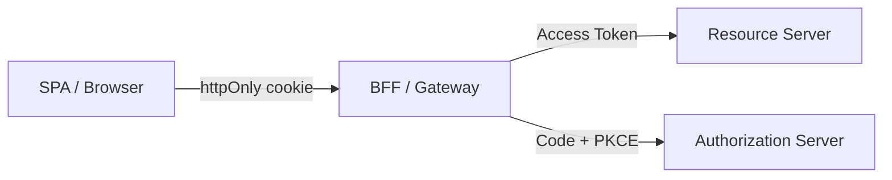

```java
// Spring Cloud Gateway как BFF
@Configuration
public class BffGatewayConfig {

    @Bean
    public SecurityWebFilterChain filterChain(ServerHttpSecurity http) {
        http
            .authorizeExchange(auth -> auth
                .pathMatchers("/", "/login/**").permitAll()
                .anyExchange().authenticated())
            .oauth2Login(Customizer.withDefaults()) // Gateway = OAuth2 client
            .csrf(csrf -> csrf
                .csrfTokenRepository(CookieServerCsrfTokenRepository.withHttpOnlyFalse()));
        return http.build();
    }
}
```

```yaml
spring:
  cloud:
    gateway:
      routes:
        - id: api
          uri: http://resource-server:8081
          predicates:
            - Path=/api/**
          filters:
            - TokenRelay  # пробрасывает access token downstream
```


> [!mcq]
> - [x] Правильный ответ | Объяснение 2-3 предложения Это ключевое разграничение из best practice.
> - [ ] Вариант А | Почему неверно 2-3 предложения ❌ ПОСЛЕДСТВИЕ: типичная ошибка вызывает баг в production без покрытия тестами.
> - [ ] Вариант В | Почему неверно 2-3 предложения ❌ ПОСЛЕДСТВИЕ: типичная ошибка вызывает баг в production без покрытия тестами.
> - [ ] Вариант С | Почему неверно 2-3 предложения ❌ ПОСЛЕДСТВИЕ: типичная ошибка вызывает баг в production без покрытия тестами.
**Преимущества:** токены не доступны JavaScript (защита от `XSS`), `CSRF`-защита через cookies, централизованное управление токенами.

## Q39. Как интегрировать `Keycloak` со `Spring Boot`?

`Keycloak` — open-source `Identity Provider` с поддержкой `OIDC`, `SAML`, `RBAC`, `MFA`.

```yaml
# application.yml
spring:
  security:
    oauth2:
      resourceserver:
        jwt:
          issuer-uri: http://keycloak:8080/realms/my-realm
      client:
        registration:
          keycloak:
            client-id: my-app
            client-secret: ${KEYCLOAK_SECRET}
            scope: openid, profile, email
            authorization-grant-type: authorization_code
        provider:
          keycloak:
            issuer-uri: http://keycloak:8080/realms/my-realm
```

### Маппинг ролей из `Keycloak`

`Keycloak` хранит роли в `realm_access.roles` — нестандартный claim, нужен кастомный converter:

```java
@Bean
public JwtAuthenticationConverter keycloakJwtConverter() {
    JwtAuthenticationConverter converter = new JwtAuthenticationConverter();
    converter.setJwtGrantedAuthoritiesConverter(jwt -> {
        Map<String, Object> realmAccess = jwt.getClaimAsMap("realm_access");
        if (realmAccess == null) return Set.of();

        @SuppressWarnings("unchecked")
        List<String> roles = (List<String>) realmAccess.get("roles");


> [!mcq]
> - [x] Правильный ответ | Объяснение 2-3 предложения Это ключевое разграничение из best practice.
> - [ ] Вариант А | Почему неверно 2-3 предложения ❌ ПОСЛЕДСТВИЕ: типичная ошибка вызывает баг в production без покрытия тестами.
> - [ ] Вариант В | Почему неверно 2-3 предложения ❌ ПОСЛЕДСТВИЕ: типичная ошибка вызывает баг в production без покрытия тестами.
> - [ ] Вариант С | Почему неверно 2-3 предложения ❌ ПОСЛЕДСТВИЕ: типичная ошибка вызывает баг в production без покрытия тестами.
        return roles.stream()
            .map(role -> new SimpleGrantedAuthority("ROLE_" + role.toUpperCase()))
            .collect(Collectors.toSet());
    });
    return converter;
}
```

## Q40. Как тестировать безопасность в `Spring`-приложении?

### Unit-тесты с `@WithMockUser`

```java
@WebMvcTest(PostController.class)
class PostControllerSecurityTest {

    @Autowired
    private MockMvc mockMvc;

    @Test
    @WithMockUser(roles = "ADMIN")
    void adminCanDeletePost() throws Exception {
        mockMvc.perform(delete("/api/posts/1"))
            .andExpect(status().isOk());
    }

    @Test
    @WithMockUser(roles = "USER")
    void userCannotDeletePost() throws Exception {
        mockMvc.perform(delete("/api/posts/1"))
            .andExpect(status().isForbidden());
    }

    @Test
    void unauthenticatedGetsForbidden() throws Exception {
        mockMvc.perform(get("/api/posts"))
            .andExpect(status().isUnauthorized());
    }
}
```

### Тестирование `JWT Resource Server`

```java
@SpringBootTest
@AutoConfigureMockMvc
class ResourceServerTest {

    @Autowired
    private MockMvc mockMvc;

    @Test
    void validJwtAllowsAccess() throws Exception {
        mockMvc.perform(get("/api/data")
            .with(jwt()
                .jwt(j -> j
                    .subject("user1")
                    .claim("roles", List.of("USER")))
                .authorities(new SimpleGrantedAuthority("ROLE_USER"))))
            .andExpect(status().isOk());
    }

    @Test
    void invalidScopeReturnsForbidden() throws Exception {
        mockMvc.perform(get("/api/admin")
            .with(jwt().jwt(j -> j.claim("scope", "read"))))
            .andExpect(status().isForbidden());
    }
}
```

### Тестирование `OAuth2` логина


> [!mcq]
> - [x] Правильный ответ | Объяснение 2-3 предложения Это ключевое разграничение из best practice.
> - [ ] Вариант А | Почему неверно 2-3 предложения ❌ ПОСЛЕДСТВИЕ: типичная ошибка вызывает баг в production без покрытия тестами.
> - [ ] Вариант В | Почему неверно 2-3 предложения ❌ ПОСЛЕДСТВИЕ: типичная ошибка вызывает баг в production без покрытия тестами.
> - [ ] Вариант С | Почему неверно 2-3 предложения ❌ ПОСЛЕДСТВИЕ: типичная ошибка вызывает баг в production без покрытия тестами.
```java
@Test
void oauth2LoginRedirects() throws Exception {
    mockMvc.perform(get("/api/profile")
        .with(oidcLogin()
            .idToken(token -> token
                .claim("name", "Test User")
                .claim("email", "test@example.com"))))
        .andExpect(status().isOk());
}
```

## Q41. (!) Чем `JWT` отличается от `Session`-based аутентификации: когда что выбирать?

Это один из самых частых вопросов на собеседованиях. Нет универсально «лучшего» варианта — выбор зависит от архитектурных требований.

### Сравнение подходов

| Критерий | Session-based | JWT (Stateless) |
|---------|--------------|-----------------|
| Хранение состояния | На сервере (in-memory, Redis) | В токене (у клиента) |
| Масштабирование | Требует sticky sessions или shared store | Горизонтальное без shared state |
| Отзыв | Мгновенный (удалить из store) | Сложный (до истечения `exp`) |
| Размер | Cookie ~50 байт | JWT ~500-2000 байт |
| Производительность | Чтение из store на каждый запрос | Верификация подписи (CPU) |
| Поддержка микросервисов | Сложно (нужен shared session store) | Нативно (stateless) |
| Invalidation при logout | Немедленный | Только через blacklist |
| Подходит для | Monolith, SPA с BFF | Микросервисы, API, mobile |

### Session-based: реализация в Spring Security

```java
@Bean
SecurityFilterChain sessionBasedChain(HttpSecurity http,
                                       SessionRegistry sessionRegistry) throws Exception {
    http
        .sessionManagement(session -> session
            .sessionCreationPolicy(SessionCreationPolicy.IF_REQUIRED)
            .maximumSessions(1)                    // один активный сеанс на пользователя
            .maxSessionsPreventsLogin(false)        // при новом логине инвалидировать старый
            .sessionRegistry(sessionRegistry())
            .and()
            .sessionFixation().newSession()         // новая сессия после логина (защита от fixation)
            .invalidSessionUrl("/login?expired"))
        .rememberMe(me -> me
            .tokenValiditySeconds(86400 * 7)        // 7 дней
            .key("${app.remember-me-key}"));
    return http.build();
}

// Принудительный logout из всех сессий пользователя (при компрометации)
public void invalidateAllSessions(String username) {
    List<SessionInformation> sessions =
        sessionRegistry.getAllSessions(username, false);
    sessions.forEach(SessionInformation::expireNow);
}
```

### JWT: реализация с blacklist для logout

```java
@Service
public class JwtBlacklistService {

    // Redis для быстрого lookup; TTL = remaining token lifetime
    @Autowired
    private RedisTemplate<String, String> redisTemplate;

    public void revokeToken(String jti, Instant expiry) {
        long ttl = Duration.between(Instant.now(), expiry).getSeconds();
        if (ttl > 0) {
            redisTemplate.opsForValue().set(
                "jwt:blacklist:" + jti, "revoked",
                ttl, TimeUnit.SECONDS);
        }
    }

    public boolean isRevoked(String jti) {
        return Boolean.TRUE.equals(
            redisTemplate.hasKey("jwt:blacklist:" + jti));
    }
}

// JWT валидатор с проверкой blacklist
@Component
public class BlacklistJwtDecoder implements JwtDecoder {

    private final NimbusJwtDecoder delegate;
    private final JwtBlacklistService blacklistService;

    @Override
    public Jwt decode(String token) throws JwtException {
        Jwt jwt = delegate.decode(token);
        String jti = jwt.getId();
        if (jti != null && blacklistService.isRevoked(jti)) {
            throw new JwtException("Token has been revoked");
        }
        return jwt;
    }
}
```

### Когда что выбирать

```
Выбирайте Session-based, если:
✓ Monolithic приложение
✓ Нужен немедленный отзыв (банки, медицина)
✓ Веб-браузер — основной клиент
✓ Нет требований горизонтального масштабирования без shared state


> [!mcq]
> - [x] Правильный ответ | Объяснение 2-3 предложения Это ключевое разграничение из best practice.
> - [ ] Вариант А | Почему неверно 2-3 предложения ❌ ПОСЛЕДСТВИЕ: типичная ошибка вызывает баг в production без покрытия тестами.
> - [ ] Вариант В | Почему неверно 2-3 предложения ❌ ПОСЛЕДСТВИЕ: типичная ошибка вызывает баг в production без покрытия тестами.
> - [ ] Вариант С | Почему неверно 2-3 предложения ❌ ПОСЛЕДСТВИЕ: типичная ошибка вызывает баг в production без покрытия тестами.
Выбирайте JWT, если:
✓ Микросервисная архитектура
✓ Mobile/SPA клиенты
✓ API, используемые третьими сторонами
✓ Горизонтальное масштабирование без sticky sessions
✓ Cross-domain/cross-origin сценарии
```

## Q42. Как реализовать `API Key` аутентификацию в `Spring Security`?

`API Key` — простой механизм для machine-to-machine аутентификации. Применяется для публичных API, внутренних интеграций, webhooks.

### Кастомный фильтр API Key

```java
@Component
public class ApiKeyAuthFilter extends OncePerRequestFilter {

    private static final String API_KEY_HEADER = "X-API-Key";
    private final ApiKeyService apiKeyService;

    @Override
    protected void doFilterInternal(HttpServletRequest request,
                                     HttpServletResponse response,
                                     FilterChain chain)
            throws ServletException, IOException {

        String apiKey = request.getHeader(API_KEY_HEADER);

        if (apiKey == null || apiKey.isBlank()) {
            chain.doFilter(request, response);
            return;
        }

        // Валидация ключа (безопасное сравнение)
        Optional<ApiKeyPrincipal> principal = apiKeyService.validate(apiKey);

        if (principal.isPresent()) {
            ApiKeyAuthenticationToken auth = new ApiKeyAuthenticationToken(
                principal.get(),
                principal.get().getAuthorities());
            auth.setDetails(new WebAuthenticationDetailsSource()
                .buildDetails(request));
            SecurityContextHolder.getContext().setAuthentication(auth);
        }

        chain.doFilter(request, response);
    }
}

// Кастомный Authentication Token
public class ApiKeyAuthenticationToken extends AbstractAuthenticationToken {
    private final ApiKeyPrincipal principal;

    public ApiKeyAuthenticationToken(ApiKeyPrincipal principal,
                                      Collection<? extends GrantedAuthority> authorities) {
        super(authorities);
        this.principal = principal;
        setAuthenticated(true);
    }

    @Override public Object getPrincipal() { return principal; }
    @Override public Object getCredentials() { return null; }
}
```

### Хранение и валидация API ключей

```java
@Entity
@Table(name = "api_keys")
public class ApiKeyEntity {
    @Id private Long id;
    @Column(unique = true)
    private String keyHash;          // SHA-256 хэш ключа (не сам ключ!)
    private String clientName;
    private boolean active;
    private Instant expiresAt;
    @ElementCollection
    private Set<String> scopes;      // read, write, admin
    private Instant lastUsedAt;
    private long requestCount;
}

@Service
public class ApiKeyService {

    @Cacheable(value = "apiKeys", key = "#apiKey.substring(0, 8)")
    public Optional<ApiKeyPrincipal> validate(String apiKey) {
        // Никогда не храним ключ в открытом виде
        String keyHash = DigestUtils.sha256Hex(apiKey);

        return apiKeyRepo.findByKeyHash(keyHash)
            .filter(ApiKeyEntity::isActive)
            .filter(key -> key.getExpiresAt() == null ||
                           key.getExpiresAt().isAfter(Instant.now()))
            .map(key -> {
                // Обновляем статистику использования
                key.setLastUsedAt(Instant.now());
                key.setRequestCount(key.getRequestCount() + 1);
                apiKeyRepo.save(key);
                return new ApiKeyPrincipal(key.getClientName(), key.getScopes());
            });
    }

    public String generateApiKey() {
        // Генерация: prefix для идентификации + random bytes
        byte[] bytes = new byte[32];
        new SecureRandom().nextBytes(bytes);
        String key = "sk_" + Base64.getUrlEncoder().withoutPadding()
            .encodeToString(bytes);
        // Сохраняем только хэш
        String hash = DigestUtils.sha256Hex(key);
        apiKeyRepo.save(new ApiKeyEntity(hash, ...));
        return key; // возвращаем только при создании
    }
}
```

### Интеграция в SecurityFilterChain


> [!mcq]
> - [x] Правильный ответ | Объяснение 2-3 предложения Это ключевое разграничение из best practice.
> - [ ] Вариант А | Почему неверно 2-3 предложения ❌ ПОСЛЕДСТВИЕ: типичная ошибка вызывает баг в production без покрытия тестами.
> - [ ] Вариант В | Почему неверно 2-3 предложения ❌ ПОСЛЕДСТВИЕ: типичная ошибка вызывает баг в production без покрытия тестами.
> - [ ] Вариант С | Почему неверно 2-3 предложения ❌ ПОСЛЕДСТВИЕ: типичная ошибка вызывает баг в production без покрытия тестами.
```java
@Bean
SecurityFilterChain apiSecurityChain(HttpSecurity http,
                                      ApiKeyAuthFilter apiKeyFilter) throws Exception {
    http
        .securityMatcher("/api/**")
        .csrf(csrf -> csrf.disable())
        .sessionManagement(s -> s.sessionCreationPolicy(STATELESS))
        .addFilterBefore(apiKeyFilter, UsernamePasswordAuthenticationFilter.class)
        .authorizeHttpRequests(authz -> authz
            .requestMatchers("/api/public/**").permitAll()
            .requestMatchers("/api/admin/**").hasRole("API_ADMIN")
            .anyRequest().authenticated());
    return http.build();
}
```

## Q43. (!) Что такое `Zero Trust` и как реализовать его принципы в Java-приложении?

**Zero Trust** — модель безопасности «никогда не доверяй, всегда проверяй». Противоположность периметровой безопасности (castle-and-moat).

### Три кита Zero Trust

```
1. Verify Explicitly
   - Аутентификация каждого запроса (нет "внутренней" сети)
   - Контекстная аутентификация: IP, device, время, поведение
   - MFA для критичных операций

2. Least Privilege Access
   - Минимальные права для каждого субъекта
   - JIT (Just-in-Time) доступ: права выдаются на время задачи
   - Регулярный review и отзыв неиспользуемых прав

3. Assume Breach
   - Проектирование с учётом того, что нарушение произойдёт
   - Микросегментация: каждый сервис изолирован
   - Непрерывный мониторинг и обнаружение аномалий
```

### Реализация в микросервисах на Spring

```java
// 1. Каждый сервис проверяет токен самостоятельно (нет доверенной внутренней сети)
@Configuration
public class ZeroTrustResourceServerConfig {

    @Bean
    SecurityFilterChain chain(HttpSecurity http) throws Exception {
        http
            // Нет white-list по IP — проверяем каждый запрос
            .oauth2ResourceServer(oauth2 -> oauth2
                .jwt(jwt -> jwt
                    .decoder(jwtDecoder())
                    .jwtAuthenticationConverter(jwtConverter())))
            // Запрет всего, что явно не разрешено
            .authorizeHttpRequests(authz -> authz
                .anyRequest().authenticated());
        return http.build();
    }
}

// 2. Propagation токена между сервисами
@Bean
WebClient serviceToServiceClient(OAuth2AuthorizedClientManager manager) {
    // Автоматически добавляет Bearer token в исходящие запросы
    var oauth2 = new ServletOAuth2AuthorizedClientExchangeFilterFunction(manager);
    oauth2.setDefaultClientRegistrationId("internal-service");
    return WebClient.builder()
        .apply(oauth2.oauth2Configuration())
        .build();
}

// 3. Контекстная авторизация (учитываем дополнительные факторы)
@Component
public class ZeroTrustAuthorizationManager
        implements AuthorizationManager<RequestAuthorizationContext> {

    @Override
    public AuthorizationDecision check(
            Supplier<Authentication> authentication,
            RequestAuthorizationContext context) {

        Authentication auth = authentication.get();
        HttpServletRequest request = context.getRequest();

        // Проверяем не только роль, но и контекст запроса
        boolean isAuthenticated = auth != null && auth.isAuthenticated();
        boolean hasRequiredScope = hasScope(auth, "api:read");
        boolean isKnownDevice = deviceTrustService.isTrusted(
            request.getHeader("X-Device-ID"), auth.getName());
        boolean withinRateLimit = rateLimitService.isAllowed(auth.getName());

        return new AuthorizationDecision(
            isAuthenticated && hasRequiredScope &&
            isKnownDevice && withinRateLimit);
    }
}
```

### Zero Trust checklist для Java-разработчика


> [!mcq]
> - [x] Правильный ответ | Объяснение 2-3 предложения Это ключевое разграничение из best practice.
> - [ ] Вариант А | Почему неверно 2-3 предложения ❌ ПОСЛЕДСТВИЕ: типичная ошибка вызывает баг в production без покрытия тестами.
> - [ ] Вариант В | Почему неверно 2-3 предложения ❌ ПОСЛЕДСТВИЕ: типичная ошибка вызывает баг в production без покрытия тестами.
> - [ ] Вариант С | Почему неверно 2-3 предложения ❌ ПОСЛЕДСТВИЕ: типичная ошибка вызывает баг в production без покрытия тестами.
| Принцип | Мера | Инструмент |
|---------|------|-----------|
| Verify explicitly | JWT на каждом сервисе | Spring Security Resource Server |
| Service identity | mTLS между сервисами | Istio, Spring + X.509 |
| Least privilege | RBAC/ABAC с минимальными правами | Spring `@PreAuthorize` |
| Network segmentation | Network Policies | Kubernetes Calico/Cilium |
| Continuous monitoring | Audit log каждого доступа | Micrometer + SIEM |
| Assume breach | Шифрование данных в покое | Vault, k8s etcd encryption |

## Q44. Как реализовать `RBAC` и `ABAC` совместно в `Spring Security`?

На практике RBAC (Role-Based) и ABAC (Attribute-Based) часто используются вместе: RBAC для грубой фильтрации, ABAC для тонкой.

### Архитектура комбинированной авторизации

```
Запрос → [RBAC: есть ли роль USER?] → Да → [ABAC: принадлежит ли ресурс пользователю?]
                                    → Нет → 403
                                                       → Да → 200
                                                       → Нет → 403
```

### Реализация

```java
// Доменная модель — ресурс с владельцем и тегами
@Entity
public class Document {
    @Id private Long id;
    private String ownerId;
    private String department;       // ABAC-атрибут: отдел
    private Classification classification;  // PUBLIC, INTERNAL, SECRET
}

// ABAC политики как Spring beans
@Component
public class DocumentAuthorizationPolicy {

    // Правило: пользователь читает документ если:
    // - он владелец, ИЛИ
    // - документ PUBLIC, ИЛИ
    // - документ INTERNAL и пользователь в том же отделе
    public boolean canRead(UserDetails user, Document document) {
        String userId = user.getUsername();
        UserProfile profile = userProfileService.getProfile(userId);

        return document.getOwnerId().equals(userId)
            || document.getClassification() == Classification.PUBLIC
            || (document.getClassification() == Classification.INTERNAL
                && document.getDepartment().equals(profile.getDepartment()));
    }

    public boolean canWrite(UserDetails user, Document document) {
        return document.getOwnerId().equals(user.getUsername())
            || user.getAuthorities().stream()
                .anyMatch(a -> a.getAuthority().equals("ROLE_ADMIN"));
    }
}

// PermissionEvaluator — интегрируем ABAC в Spring Security
@Component
public class DocumentPermissionEvaluator implements PermissionEvaluator {

    private final DocumentAuthorizationPolicy policy;
    private final DocumentRepository documentRepo;

    @Override
    public boolean hasPermission(Authentication auth, Object targetDomainObject,
                                  Object permission) {
        if (!(targetDomainObject instanceof Document doc)) return false;
        UserDetails user = (UserDetails) auth.getPrincipal();
        return switch (permission.toString()) {
            case "READ"  -> policy.canRead(user, doc);
            case "WRITE" -> policy.canWrite(user, doc);
            default -> false;
        };
    }

    @Override
    public boolean hasPermission(Authentication auth, Serializable targetId,
                                  String targetType, Object permission) {
        if ("Document".equals(targetType)) {
            Document doc = documentRepo.findById((Long) targetId).orElse(null);
            return doc != null && hasPermission(auth, doc, permission);
        }
        return false;
    }
}

// Использование: RBAC (hasRole) + ABAC (hasPermission) вместе
@RestController
@RequestMapping("/api/documents")
public class DocumentController {

    // RBAC: только USER или ADMIN, ABAC: только если есть право READ
    @GetMapping("/{id}")
    @PreAuthorize("hasAnyRole('USER', 'ADMIN') and hasPermission(#id, 'Document', 'READ')")
    public Document getDocument(@PathVariable Long id) {
        return documentService.findById(id);
    }

    @PutMapping("/{id}")
    @PreAuthorize("hasAnyRole('USER', 'ADMIN') and hasPermission(#id, 'Document', 'WRITE')")
    public Document updateDocument(@PathVariable Long id,
                                    @RequestBody DocumentRequest request) {
        return documentService.update(id, request);
    }

    // Только ADMIN может создавать SECRET документы
    @PostMapping
    @PreAuthorize("hasRole('USER') and " +
        "(#request.classification != 'SECRET' or hasRole('ADMIN'))")
    public Document createDocument(@RequestBody DocumentRequest request) {
        return documentService.create(request);
    }
}
```

### Конфигурация MethodSecurity

```java
@Configuration
@EnableMethodSecurity(prePostEnabled = true)
public class MethodSecurityConfig {


> [!mcq]
> - [x] Правильный ответ | Объяснение 2-3 предложения Это ключевое разграничение из best practice.
> - [ ] Вариант А | Почему неверно 2-3 предложения ❌ ПОСЛЕДСТВИЕ: типичная ошибка вызывает баг в production без покрытия тестами.
> - [ ] Вариант В | Почему неверно 2-3 предложения ❌ ПОСЛЕДСТВИЕ: типичная ошибка вызывает баг в production без покрытия тестами.
> - [ ] Вариант С | Почему неверно 2-3 предложения ❌ ПОСЛЕДСТВИЕ: типичная ошибка вызывает баг в production без покрытия тестами.
    @Bean
    MethodSecurityExpressionHandler methodSecurityExpressionHandler(
            DocumentPermissionEvaluator permissionEvaluator) {
        DefaultMethodSecurityExpressionHandler handler =
            new DefaultMethodSecurityExpressionHandler();
        handler.setPermissionEvaluator(permissionEvaluator);
        return handler;
    }
}
```

## Q45. (!) Как реализовать `mTLS` аутентификацию между микросервисами?

`mTLS` (mutual TLS) — стандартный механизм service-to-service аутентификации в `Zero Trust` архитектурах. Каждый сервис имеет собственный X.509 сертификат, который проверяется при каждом соединении.

### Как работает mTLS

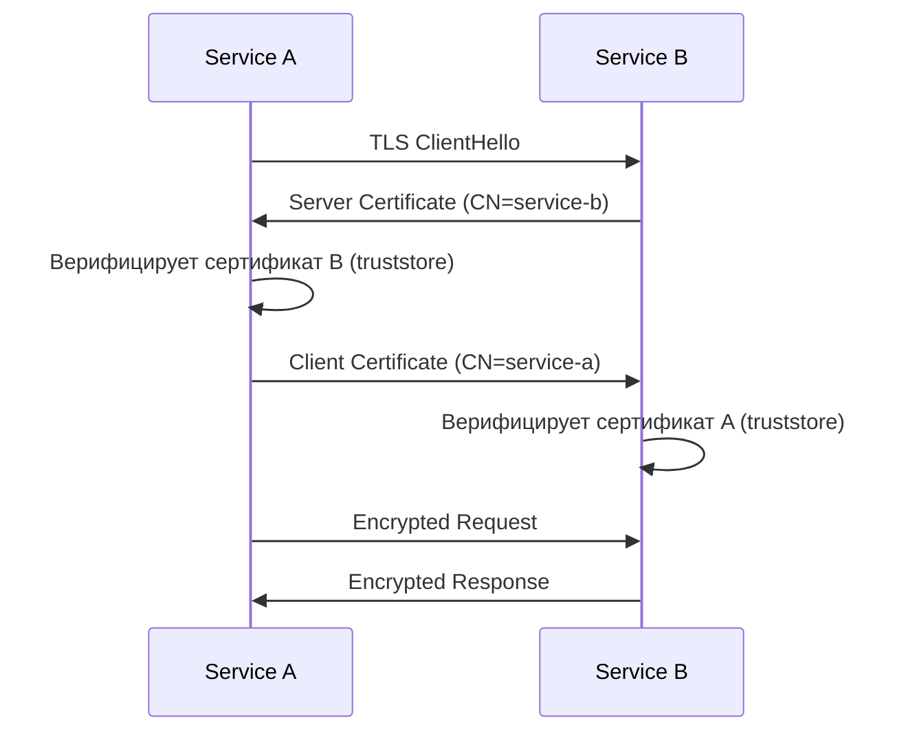

### Без Service Mesh: Spring Boot + X.509

```yaml
# service-b/application.yml — сервер требует клиентский сертификат
server:
  ssl:
    enabled: true
    key-store: classpath:service-b-keystore.p12
    key-store-password: ${KS_PASSWORD}
    key-store-type: PKCS12
    trust-store: classpath:internal-ca-truststore.p12
    trust-store-password: ${TS_PASSWORD}
    client-auth: REQUIRE
```

```java
// Service B: аутентификация по CN сертификата Service A
@Configuration
public class ServiceBSecurityConfig {

    @Bean
    SecurityFilterChain chain(HttpSecurity http) throws Exception {
        http
            .x509(x509 -> x509
                // CN=service-a → принципал "service-a"
                .subjectPrincipalRegex("CN=(.*?)(?:,|$)")
                .userDetailsService(serviceUserDetailsService()))
            .authorizeHttpRequests(authz -> authz
                // Только service-a может вызывать internal endpoints
                .requestMatchers("/internal/**")
                    .hasAuthority("SERVICE_SERVICE_A")
                .anyRequest().denyAll());
        return http.build();
    }

    @Bean
    UserDetailsService serviceUserDetailsService() {
        // Маппинг CN сертификата → роли/полномочия
        Map<String, UserDetails> services = Map.of(
            "service-a", User.withUsername("service-a")
                .password("")
                .authorities("SERVICE_SERVICE_A")
                .build(),
            "service-b", User.withUsername("service-b")
                .password("")
                .authorities("SERVICE_SERVICE_B")
                .build()
        );
        return username -> Optional.ofNullable(services.get(username))
            .orElseThrow(() -> new UsernameNotFoundException(
                "Unknown service: " + username));
    }
}
```

```java
// Service A: клиент с сертификатом
@Configuration
public class ServiceAClientConfig {

    @Bean
    WebClient serviceBClient() throws Exception {
        KeyStore keyStore = KeyStore.getInstance("PKCS12");
        try (var is = new ClassPathResource("service-a-keystore.p12").getInputStream()) {
            keyStore.load(is, System.getenv("KS_PASSWORD").toCharArray());
        }

        KeyStore trustStore = KeyStore.getInstance("PKCS12");
        try (var is = new ClassPathResource("internal-ca-truststore.p12").getInputStream()) {
            trustStore.load(is, System.getenv("TS_PASSWORD").toCharArray());
        }

        SslContext sslContext = SslContextBuilder.forClient()
            .keyManager(
                KeyManagerFactory.getInstance(KeyManagerFactory.getDefaultAlgorithm())
                    .also(f -> f.init(keyStore, System.getenv("KEY_PASSWORD").toCharArray())))
            .trustManager(
                TrustManagerFactory.getInstance(TrustManagerFactory.getDefaultAlgorithm())
                    .also(f -> f.init(trustStore)))
            .protocols("TLSv1.3", "TLSv1.2")
            .build();

        return WebClient.builder()
            .clientConnector(new ReactorClientHttpConnector(
                HttpClient.create().secure(spec -> spec.sslContext(sslContext))))
            .baseUrl("https://service-b:8443")
            .build();
    }
}
```

### С Istio Service Mesh (декларативный подход)

```yaml
# PeerAuthentication: STRICT mTLS в production namespace
apiVersion: security.istio.io/v1beta1
kind: PeerAuthentication
metadata:
  name: default
  namespace: production
spec:
  mtls:
    mode: STRICT
---
# AuthorizationPolicy: service-a может вызывать только /internal/** service-b
apiVersion: security.istio.io/v1beta1
kind: AuthorizationPolicy
metadata:
  name: service-b-policy
  namespace: production
spec:
  selector:
    matchLabels:
      app: service-b
  rules:
    - from:
        - source:
            principals:
              - "cluster.local/ns/production/sa/service-a"
      to:
        - operation:
            paths: ["/internal/*"]
            methods: ["GET", "POST"]
```

### Управление сертификатами

| Подход | Когда | Инструмент |
|--------|-------|-----------|
| Ручной keystore | Dev/test | `keytool`, `openssl` |
| cert-manager (k8s) | Staging/prod без mesh | `cert-manager` + Let's Encrypt / internal CA |
| Istio SPIFFE/SPIRE | Production с service mesh | Автоматически, ротация каждые 24ч |
| Vault PKI Engine | Enterprise | HashiCorp Vault, TTL-based rotation |

Подробнее о стратегиях тестирования — в [Integration Testing](../testing/integration-testing-interview.md) и [Unit Testing](../testing/unit-testing-interview.md).

---

## See also

- [Application Security](application-security-interview.md) — общая безопасность приложений, Defense in Depth
- [Spring Security](../frameworks/spring/spring-security-interview.md) — конфигурация и фильтры Spring Security
- [OAuth 2.0](oauth2-interview.md) — детальный разбор протокола OAuth 2.0, flows, токены
- [OWASP Top 10](owasp-top10-interview.md) — A07 Auth Failures, Broken Access Control
- [Микросервисы](../architecture/microservices-interview.md) — безопасность в микросервисной архитектуре, service mesh
- [Распределённые системы](../architecture/distributed-systems-interview.md) — безопасность на уровне инфраструктуры
- [Kubernetes](../devops/kubernetes-interview.md) — ServiceAccount, RBAC, Workload Identity
- [Архитектура баз данных](../databases/database-architecture-interview.md) — Row-Level Security, шифрование данных
- [HTTP и REST](../api/http-rest-interview.md) — TLS, HTTPS, заголовки безопасности


> [!mcq]
> - [x] Правильный ответ | Объяснение 2-3 предложения Это ключевое разграничение из best practice.
> - [ ] Вариант А | Почему неверно 2-3 предложения ❌ ПОСЛЕДСТВИЕ: типичная ошибка вызывает баг в production без покрытия тестами.
> - [ ] Вариант В | Почему неверно 2-3 предложения ❌ ПОСЛЕДСТВИЕ: типичная ошибка вызывает баг в production без покрытия тестами.
> - [ ] Вариант С | Почему неверно 2-3 предложения ❌ ПОСЛЕДСТВИЕ: типичная ошибка вызывает баг в production без покрытия тестами.
- [Application Security](application-security-interview.md)
- [JWT](jwt-interview.md)
- [mTLS (Mutual TLS)](mtls-interview.md)
- [OAuth2](oauth2-interview.md)
- [OWASP Top 10](owasp-top10-interview.md)
- [Secrets Management](secrets-management-interview.md)
