# Вопросы на собеседовании: `OAuth2`

Комплексное руководство по вопросам собеседования на тему `OAuth2` для `Senior Java Developer`. Включает mermaid-диаграммы всех flows, примеры конфигурации `Spring Security`, структуру `JWT` токенов, детали `OpenID Connect` и практические сценарии.

**OAuth2** — один из самых частых топиков на собеседованиях по безопасности. Интервьюеры ожидают не только знание теории, но и умение объяснить конкретные flows, показать конфигурацию и обсудить trade-offs.

## Полезные ссылки

### Официальная документация

- [OAuth 2.0 (oauth.net)](https://oauth.net/2/)
- [OAuth 2.0 RFC 6749](https://datatracker.ietf.org/doc/html/rfc6749)
- [OAuth 2.1 Draft](https://datatracker.ietf.org/doc/html/draft-ietf-oauth-v2-1-11)
- [Spring Security OAuth2](https://docs.spring.io/spring-security/reference/servlet/oauth2/index.html)
- [Spring Authorization Server](https://docs.spring.io/spring-authorization-server/reference/)
- [OpenID Connect Core 1.0](https://openid.net/specs/openid-connect-core-1_0.html)

## Содержание

- [Полезные ссылки](#полезные-ссылки)
- [See also](#see-also)

**Основы OAuth2**
- [Q1. (!) Что такое `OAuth2` и зачем он нужен?](#q1--что-такое-oauth2-и-зачем-он-нужен)
- [Q2. (!) Какие роли определены в `OAuth2`?](#q2--какие-роли-определены-в-oauth2)
- [Q3. (!) Чем отличается авторизация от аутентификации в контексте `OAuth2`?](#q3--чем-отличается-авторизация-от-аутентификации-в-контексте-oauth2)
- [Q4. Какие типы клиентов определены в `OAuth2`?](#q4-какие-типы-клиентов-определены-в-oauth2)
- [Q5. Что такое scope в `OAuth2`?](#q5-что-такое-scope-в-oauth2)

**Flows и гранты**
- [Q6. (!) Как работает `Authorization Code Flow`?](#q6--как-работает-authorization-code-flow)
- [Q7. (!) Что такое `PKCE` и как он защищает `Authorization Code Flow`?](#q7--что-такое-pkce-и-как-он-защищает-authorization-code-flow)
- [Q8. (!) Как работает `Client Credentials Flow`?](#q8--как-работает-client-credentials-flow)
- [Q9. Как работает `Device Authorization Flow`?](#q9-как-работает-device-authorization-flow)
- [Q10. (!) Чем `Authorization Code Flow` отличается от `Implicit Flow`?](#q10--чем-authorization-code-flow-отличается-от-implicit-flow)
- [Q11. Какие гранты убраны в `OAuth 2.1`?](#q11-какие-гранты-убраны-в-oauth-21)

**Токены (access, refresh, JWT)**
- [Q12. (!) Что такое `access token` и `refresh token`?](#q12--что-такое-access-token-и-refresh-token)
- [Q13. (!) Какова структура `JWT` токена?](#q13--какова-структура-jwt-токена)
- [Q14. Чем `JWT` отличается от opaque token?](#q14-чем-jwt-отличается-от-opaque-token)
- [Q15. Как ресурсный сервер валидирует `JWT`?](#q15-как-ресурсный-сервер-валидирует-jwt)
- [Q16. Что такое `refresh token rotation`?](#q16-что-такое-refresh-token-rotation)
- [Q17. Как отзывать токены (token revocation)?](#q17-как-отзывать-токены-token-revocation)
- [Q18. Что такое token introspection?](#q18-что-такое-token-introspection)
- [Q19. Что такое token binding и `DPoP`?](#q19-что-такое-token-binding-и-dpop)

**OpenID Connect (OIDC)**
- [Q20. (!) Что такое `OpenID Connect` и чем он отличается от `OAuth2`?](#q20--что-такое-openid-connect-и-чем-он-отличается-от-oauth2)
- [Q21. Какова структура `ID Token` в `OIDC`?](#q21-какова-структура-id-token-в-oidc)
- [Q22. Что такое `OIDC Discovery` и `UserInfo endpoint`?](#q22-что-такое-oidc-discovery-и-userinfo-endpoint)

**Spring Security OAuth2**
- [Q23. (!) Как настроить `OAuth2 Login` в `Spring Security`?](#q23--как-настроить-oauth2-login-в-spring-security)
- [Q24. (!) Как настроить `Resource Server` с JWT в `Spring Security`?](#q24--как-настроить-resource-server-с-jwt-в-spring-security)
- [Q25. Как реализовать `OAuth2` в микросервисной архитектуре?](#q25-как-реализовать-oauth2-в-микросервисной-архитектуре)
- [Q26. Как настроить `Spring Authorization Server`?](#q26-как-настроить-spring-authorization-server)

**Безопасность OAuth2**
- [Q27. (!) Какие основные угрозы существуют для `OAuth2`?](#q27--какие-основные-угрозы-существуют-для-oauth2)
- [Q28. Как работает `state` parameter и зачем он нужен?](#q28-как-работает-state-parameter-и-зачем-он-нужен)
- [Q29. Чеклист безопасности `OAuth2` для production](#q29-чеклист-безопасности-oauth2-для-production)

**Тестирование OAuth2**
- [Q30. Как тестировать `OAuth2` в `Spring Boot`?](#q30-как-тестировать-oauth2-в-spring-boot)

**Продвинутые темы**
- [Q31. (!) Что изменилось в `OAuth 2.1` по сравнению с `OAuth 2.0`?](#q31--что-изменилось-в-oauth-21-по-сравнению-с-oauth-20)
- [Q32. Какие стандартные `JWT claims` обязательны и что они означают?](#q32-какие-стандартные-jwt-claims-обязательны-и-что-они-означают)
- [Q33. (!) Как реализовать `Refresh Token Rotation` в Spring Boot?](#q33--как-реализовать-refresh-token-rotation-в-spring-boot)
- [Q34. Что такое `OAuth2 Backend for Frontend` (`BFF`) и когда его применять?](#q34-что-такое-oauth2-backend-for-frontend-bff-и-когда-его-применять)
- [Q35. Как защитить `OAuth2` от `CSRF` и `Token Leakage`?](#q35-как-защитить-oauth2-от-csrf-и-token-leakage)

**OAuth 2.1, PKCE, Token Introspection и OpenID Connect**
- [Q36. Что изменилось в OAuth 2.1 — детали спецификации?](#q36-что-изменилось-в-oauth-21--детали-спецификации)
- [Q37. Как работает PKCE — генерация code_verifier и code_challenge?](#q37-как-работает-pkce--генерация-code_verifier-и-code_challenge)
- [Q38. Что такое Token Introspection (RFC 7662) и как он работает?](#q38-что-такое-token-introspection-rfc-7662-и-как-он-работает)
- [Q39. Refresh Token Rotation — почему важна и как реализовать?](#q39-refresh-token-rotation--почему-важна-и-как-реализовать)
- [Q40. OAuth 2.0 Device Authorization Grant — для IoT и Smart TV](#q40-oauth-20-device-authorization-grant--для-iot-и-smart-tv)
- [Q41. Как настроить Spring Authorization Server с нуля?](#q41-как-настроить-spring-authorization-server-с-нуля)
- [Q42. OpenID Connect Claims — стандартные, кастомные, UserInfo endpoint](#q42-openid-connect-claims--стандартные-кастомные-userinfo-endpoint)

## Q1. (!) Что такое `OAuth2` и зачем он нужен?

`OAuth2` (`Open Authorization 2.0`, `RFC 6749`) — протокол **делегированной авторизации**: приложение получает ограниченный доступ к ресурсам пользователя на другом сервисе **без передачи логина и пароля**.

Проблема, которую он решает: раньше, чтобы приложение могло читать ваши контакты в Google, вы должны были отдать ему свой пароль от Google — а это полный доступ и невозможность отозвать его, не сменив пароль. `OAuth2` заменяет пароль на **токен** с ограниченными правами (`scope`) и коротким сроком жизни, который можно отозвать в любой момент.

**Ключевой принцип:** пользователь логинится напрямую на доверенном сервисе (Authorization Server), а стороннее приложение никогда не видит его пароль — только выданный токен.

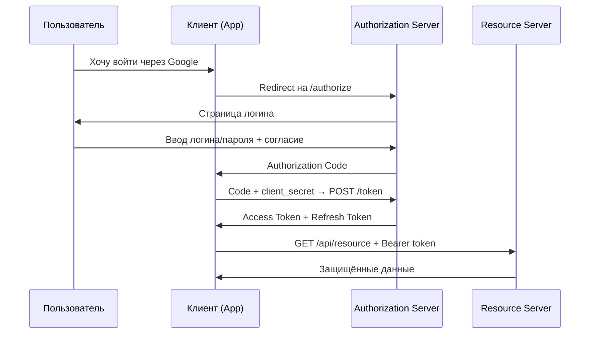

**Частая ошибка на собеседовании:** `OAuth2` отвечает на вопрос «что приложению разрешено делать», а не «кто этот пользователь». Аутентификацию (подтверждение личности) добавляет отдельный слой — [OIDC (OpenID Connect)](authentication-authorization-patterns-interview.md) поверх `OAuth2`.

## Q2. (!) Какие роли определены в `OAuth2`?

`OAuth2` (`RFC 6749`) определяет 4 роли. Суть протокола в том, чтобы развести «того, кто владеет данными», «того, кто хочет к ним доступ» и «того, кто этот доступ выдаёт» — поэтому ролей именно четыре:

| Роль | Кто это | Что делает | Пример |
|------|---------|------------|--------|
| **Resource Owner** | Пользователь | Владеет данными, даёт согласие на доступ | Владелец аккаунта Google |
| **Client** | Приложение | Запрашивает доступ к данным от имени пользователя | Веб- или мобильное приложение |
| **Authorization Server** | Сервис аутентификации | Логинит пользователя и выдаёт токены | Keycloak, Okta, Google OAuth |
| **Resource Server** | API с данными | Хранит ресурсы, проверяет токены при каждом запросе | REST API сервис |

**Важный нюанс:** Authorization Server и Resource Server — это *роли*, а не обязательно отдельные машины. В монолите они часто живут в одном приложении; в [микросервисах](../architecture/microservices-interview.md) Authorization Server обычно выделен (Keycloak), а Resource Server — это каждый сервис, защищающий своё API.

## Q3. (!) Чем отличается авторизация от аутентификации в контексте `OAuth2`?

Коротко: **аутентификация** отвечает на вопрос «кто ты?», **авторизация** — «что тебе разрешено?». `OAuth2` занимается вторым и осознанно не делает первого.

| Аспект | Аутентификация (AuthN) | Авторизация (AuthZ) |
|--------|----------------------|---------------------|
| **Вопрос** | "Кто ты?" | "Что тебе разрешено?" |
| **Результат** | Подтверждение личности | Выдача прав доступа |
| **OAuth2** | Делегирует на Authorization Server | Основной фокус протокола |
| **Токен** | ID Token (OIDC) | Access Token |
| **Протокол** | OpenID Connect | OAuth2 |

`OAuth2` **сам по себе не аутентифицирует** — он предполагает, что Authorization Server уже как-то проверил личность пользователя (паролем, MFA, биометрией). Сам протокол этим не интересуется и не сообщает клиенту, *кто* вошёл. Именно поэтому появился `OIDC`: он расширяет `OAuth2`, добавляя `ID Token`, в котором уже есть подтверждённые данные о личности пользователя.

Подробнее: [Паттерны аутентификации и авторизации](authentication-authorization-patterns-interview.md).

## Q4. Какие типы клиентов определены в `OAuth2`?

`OAuth2` делит клиентов на два типа по **одному критерию — может ли клиент безопасно хранить `client_secret`**. От этого зависит, какой flow он обязан использовать.

**Confidential clients** (конфиденциальные) — секрет хранится на сервере, куда у пользователя нет доступа:
- Backend-сервер (Java, Node.js)
- Используют `Authorization Code Flow` (с секретом подтверждают свою личность на token endpoint)

**Public clients** (публичные) — код выполняется на устройстве пользователя, поэтому **любой секрет можно извлечь** (декомпилировать APK, открыть DevTools):
- SPA (React, Angular)
- Мобильные приложения
- Desktop-приложения
- **Обязаны** использовать `Authorization Code Flow` + `PKCE` — раз секрета нет, защиту от перехвата кода даёт `PKCE`

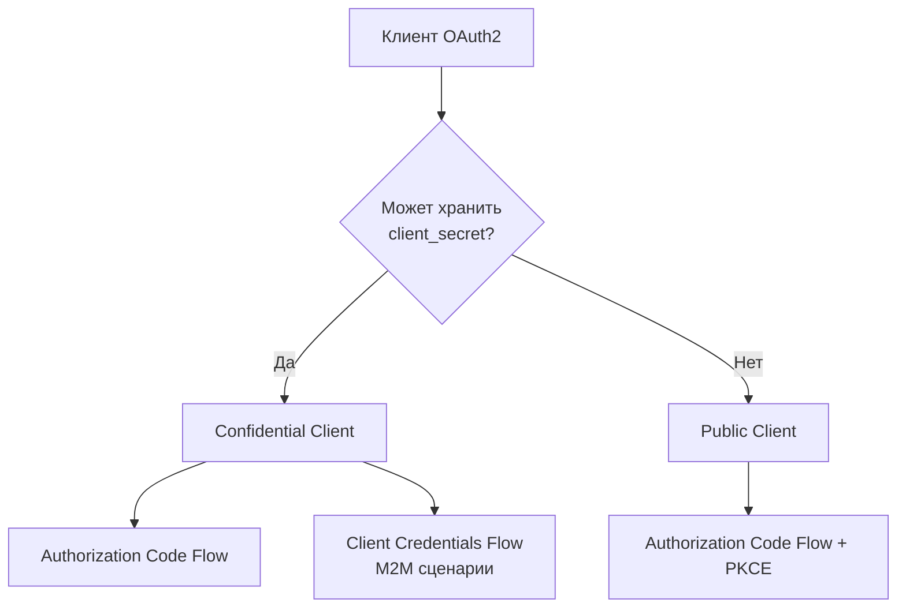

Важно: `Implicit Flow` для public clients **устарел** в `OAuth 2.1`. Всегда используйте `Authorization Code` + `PKCE`.

## Q5. Что такое scope в `OAuth2`?

`Scope` — это «список разрешений», которые клиент запрашивает у пользователя. Именно через scope реализуется главное обещание `OAuth2` — *ограниченный* доступ: токен даёт права не на всё, а только на то, что перечислено в scope и что пользователь подтвердил на экране согласия (consent).

```
GET /authorize?
    response_type=code&
    client_id=my-app&
    scope=openid profile email read:repos&
    redirect_uri=https://app.example.com/callback&
    state=xyz123
```

Примеры стандартных scopes:

| Scope | Что даёт |
|-------|----------|
| `openid` | OIDC — получить ID Token |
| `profile` | Имя, аватар, locale |
| `email` | Email пользователя |
| `offline_access` | Получить refresh token |

Scope нужно проверять **на ресурсном сервере** — то, что токен валиден, ещё не значит, что он даёт право на конкретную операцию:

```java
@GetMapping("/api/repos")
@PreAuthorize("hasAuthority('SCOPE_read:repos')")
public List<Repository> getRepos() {
    return repoService.findAll();
}
```

**Эмпирическое правило (least privilege):** запрашивайте минимально необходимый набор scopes. Чем меньше прав у токена, тем меньше ущерб при его утечке.

## Q6. (!) Как работает `Authorization Code Flow`?

`Authorization Code Flow` — основной и самый безопасный flow для приложений с backend-сервером. Главная идея: вместо того чтобы вернуть токен прямо в браузер, Authorization Server возвращает одноразовый **код**, а его обмен на токен происходит скрытно — server-to-server. Поэтому **токен никогда не проходит через браузер** и не оседает в истории, логах или referer.

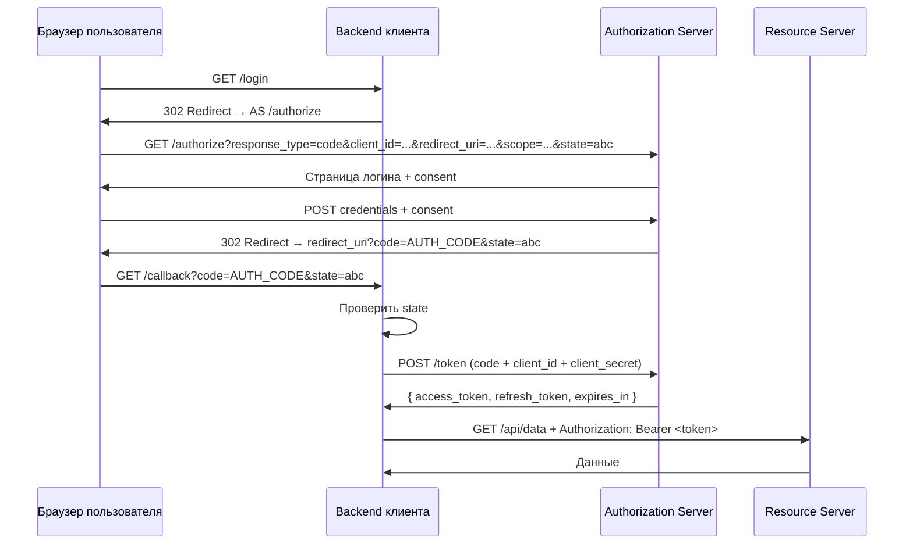

Ключевые моменты (и зачем каждый нужен):
- **Authorization code одноразовый и короткоживущий** (обычно ~10 минут) — даже если код утечёт, окно для атаки минимально, а повторно его не использовать
- **Обмен code → token идёт на backend** (server-to-server) с `client_secret` — браузер токена не видит, а Authorization Server убеждается, что код предъявил именно зарегистрированный клиент
- **`state` защищает от CSRF** — связывает запрос авторизации с конкретной сессией пользователя
- **`redirect_uri` должен точно совпадать** с зарегистрированным (exact match) — иначе злоумышленник перенаправит код на свой адрес

## Q7. (!) Что такое `PKCE` и как он защищает `Authorization Code Flow`?

`PKCE` (`Proof Key for Code Exchange`, `RFC 7636`, произносится "pixy") — расширение `Authorization Code Flow`, которое заменяет `client_secret` там, где его не может быть. У public client (SPA, мобильное приложение) секрета нет, значит, перехваченный authorization code злоумышленник мог бы спокойно обменять на токен. `PKCE` это закрывает: клиент придумывает одноразовый секрет на лету и доказывает им владение кодом. **Обязателен** для public clients, а в `OAuth 2.1` — для всех клиентов.

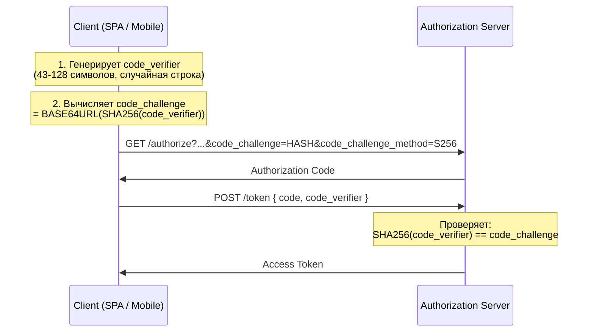

Пример генерации `PKCE` в Java:

```java
// Генерация code_verifier
SecureRandom random = new SecureRandom();
byte[] bytes = new byte[32];
random.nextBytes(bytes);
String codeVerifier = Base64.getUrlEncoder()
    .withoutPadding()
    .encodeToString(bytes);

// Генерация code_challenge
MessageDigest digest = MessageDigest.getInstance("SHA-256");
byte[] hash = digest.digest(codeVerifier.getBytes(StandardCharsets.US_ASCII));
String codeChallenge = Base64.getUrlEncoder()
    .withoutPadding()
    .encodeToString(hash);
```

Почему это работает: даже если злоумышленник перехватит `authorization code`, он **не знает** `code_verifier` и не сможет обменять code на токен.

## Q8. (!) Как работает `Client Credentials Flow`?

`Client Credentials Flow` — для **machine-to-machine** (M2M) сценариев, когда сервис обращается к API другого сервиса **от своего имени** (не от имени пользователя). Никакого Resource Owner и согласия здесь нет — клиент сам и есть владелец «ресурса доступа». Поэтому flow максимально простой: один запрос с `client_id` + `client_secret` сразу возвращает access token.

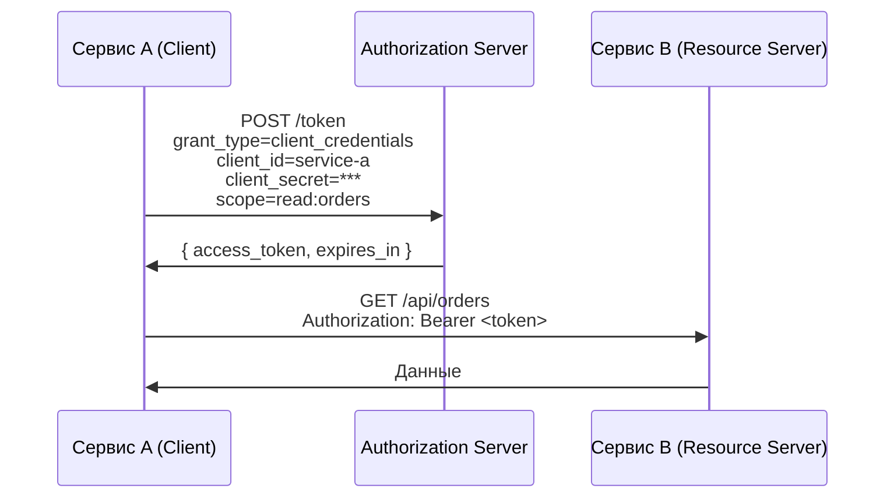

Конфигурация в `Spring Boot`:

```yaml
spring:
  security:
    oauth2:
      client:
        registration:
          service-b:
            client-id: service-a
            client-secret: ${SERVICE_B_CLIENT_SECRET}
            authorization-grant-type: client_credentials
            scope: read:orders
        provider:
          service-b:
            token-uri: https://auth.example.com/oauth2/token
```

Использование с `WebClient`:

```java
@Bean
public WebClient serviceB(OAuth2AuthorizedClientManager clientManager) {
    var oauth2 = new ServletOAuth2AuthorizedClientExchangeFilterFunction(clientManager);
    oauth2.setDefaultClientRegistrationId("service-b");
    return WebClient.builder()
        .apply(oauth2.oauth2Configuration())
        .baseUrl("https://service-b.example.com")
        .build();
}
```

**Подводные камни:** нет участия пользователя и нет `refresh_token` — токен не обновляется, при истечении сервис просто запрашивает новый тем же запросом. Flow допустим только для **конфиденциальных клиентов**: раз `client_secret` — единственная защита, утечь он не должен. Типичное применение в [микросервисах](../architecture/microservices-interview.md): межсервисные вызовы, фоновые задачи, сервисные интеграции.

## Q9. Как работает `Device Authorization Flow`?

`Device Authorization Flow` (`RFC 8628`) решает проблему устройств, где неудобно или невозможно ввести логин и пароль: Smart TV, IoT, CLI-утилиты, игровые консоли. Идея простая — авторизацию переносят на устройство с нормальным вводом (телефон или ноутбук), а само устройство только опрашивает сервер и ждёт результат.

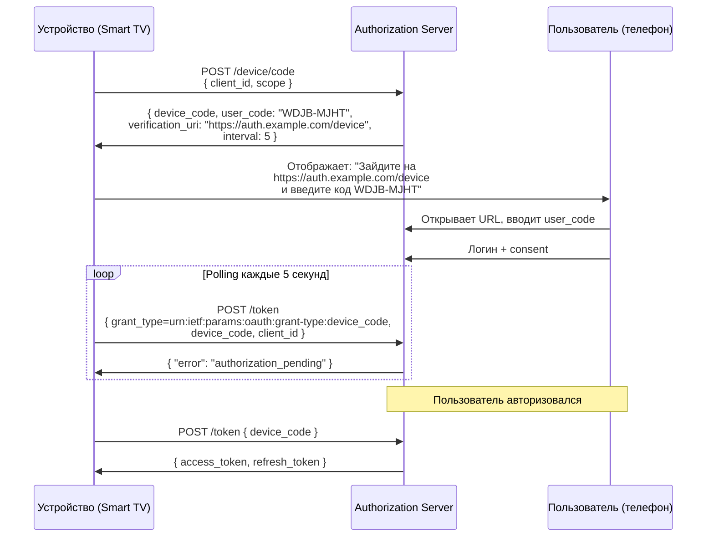

Устройство **не открывает браузер** — пользователь вводит код на другом устройстве. Это единственный flow, где пользователь авторизуется **вне клиента**.

## Q10. (!) Чем `Authorization Code Flow` отличается от `Implicit Flow`?

Главное отличие в одном предложении: `Authorization Code Flow` возвращает **код**, который обменивается на токен скрытно, а `Implicit Flow` возвращал **сам токен прямо в URL браузера** — отсюда все его проблемы с безопасностью.

| Аспект | Authorization Code Flow | Implicit Flow |
|--------|------------------------|---------------|
| **Токен в URL** | Нет (обмен на backend) | Да (fragment `#access_token=...`) |
| **Безопасность** | Высокая | Низкая (токен в истории браузера) |
| **Refresh token** | Да | Нет |
| **Подходит для** | Любых клиентов | ~~SPA~~ (устарел) |
| **PKCE** | Рекомендован / обязателен | Не применим |
| **Статус** | Актуален | **Deprecated** в OAuth 2.1 |

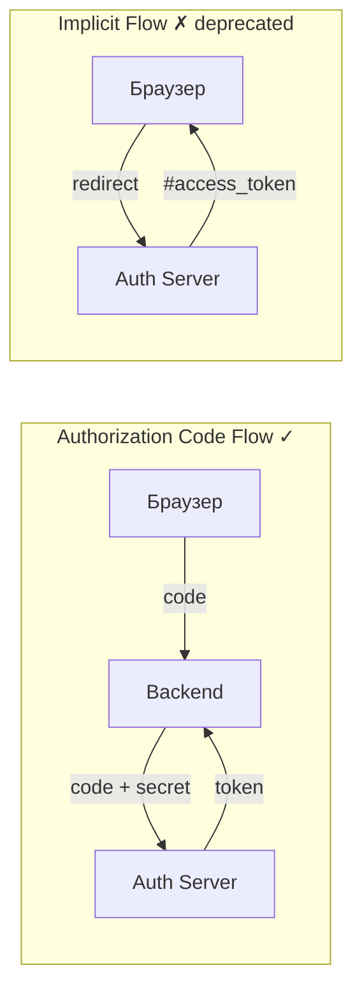

Рекомендация: **всегда** используйте `Authorization Code Flow` + `PKCE`, даже для SPA. `Implicit Flow` удалён из `OAuth 2.1`.

## Q11. Какие гранты убраны в `OAuth 2.1`?

`OAuth 2.1` (`draft-ietf-oauth-v2-1`) — это консолидация лучших практик, накопленных за годы эксплуатации `OAuth 2.0`. Принцип отбора: всё, что на практике приводило к утечкам, убирают. Под это попали два гранта:

1. **Implicit Grant** — возвращал токен прямо в URL, где тот оседал в истории браузера и referer-заголовках. Замена: `Authorization Code` + `PKCE`.
2. **Resource Owner Password Credentials (ROPC)** — клиент получал пароль пользователя напрямую, что полностью ломает идею делегирования (зачем тогда `OAuth2`?). Замена: `Authorization Code Flow`.

Добавлены как обязательные:
- `PKCE` для **всех** клиентов (не только public)
- Exact match для `redirect_uri` (без wildcard)
- Refresh token rotation или sender-constrained tokens

## Q12. (!) Что такое `access token` и `refresh token`?

Это два разных токена с разными ролями. **Access token** — пропуск к API: его показывают ресурсному серверу при каждом запросе. **Refresh token** — «талон на новый пропуск»: его показывают только Authorization Server, чтобы получить свежий access token, когда старый истёк.

Зачем такое разделение? Чтобы можно было сделать access token **очень короткоживущим** (минимизируя ущерб от утечки), но не заставлять пользователя логиниться каждые 15 минут — за бесшовное продление отвечает refresh token.

| Свойство | Access Token | Refresh Token |
|----------|-------------|---------------|
| **Назначение** | Доступ к ресурсам | Получение нового access token |
| **Время жизни** | Короткое (15–60 мин) | Долгое (дни–месяцы) |
| **Передаётся** | Resource Server | Authorization Server |
| **Формат** | JWT или opaque | Обычно opaque |
| **Хранение** | Память / httpOnly cookie | httpOnly cookie / secure storage |

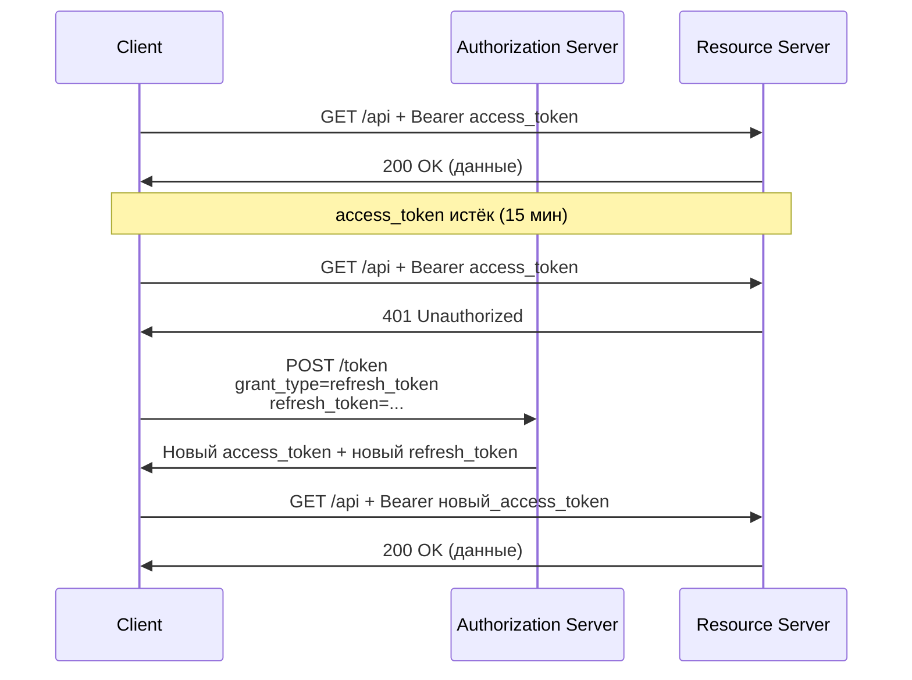

Важно: `access_token` должен быть **короткоживущим** для минимизации окна компрометации. `refresh_token` хранить **только в безопасном месте** (`httpOnly` cookie с `Secure` и `SameSite=Strict`).

## Q13. (!) Какова структура `JWT` токена?

`JWT` (`JSON Web Token`, `RFC 7519`) — это самодостаточный токен из трёх частей через точку: `header.payload.signature`. «Самодостаточный» значит, что все данные о пользователе уже лежат внутри (в payload), а подпись гарантирует, что их не подменили — поэтому проверить токен можно локально, не обращаясь к Authorization Server.

- **Header** — алгоритм подписи и `kid` (идентификатор ключа)
- **Payload** — claims: данные о пользователе и метаданные токена
- **Signature** — подпись header+payload, которой ресурсный сервер убеждается в подлинности

Пример реального JWT:

```
eyJhbGciOiJSUzI1NiIsInR5cCI6IkpXVCIsImtpZCI6ImtleS0xIn0.
eyJpc3MiOiJodHRwczovL2F1dGguZXhhbXBsZS5jb20iLCJzdWIiOiJ1c2VyLTEyMyIsImF1ZCI6Im15LWFwcCIsImV4cCI6MTcxMjg0MDAwMCwiaWF0IjoxNzEyODM2NDAwLCJzY29wZSI6Im9wZW5pZCBwcm9maWxlIGVtYWlsIn0.
<подпись>
```

Декодированное содержимое:

```json
// Header
{
  "alg": "RS256",
  "typ": "JWT",
  "kid": "key-1"
}

// Payload (Claims)
{
  "iss": "https://auth.example.com",      // Издатель
  "sub": "user-123",                       // Subject (ID пользователя)
  "aud": "my-app",                         // Аудитория (client_id)
  "exp": 1712840000,                       // Время истечения
  "iat": 1712836400,                       // Время выдачи
  "scope": "openid profile email",         // Разрешения
  "roles": ["ROLE_USER", "ROLE_ADMIN"]     // Кастомные claims
}

// Signature
RSASHA256(
  base64UrlEncode(header) + "." + base64UrlEncode(payload),
  privateKey
)
```

Алгоритмы подписи:

| Алгоритм | Тип | Рекомендация |
|----------|-----|-------------|
| `RS256` | Асимметричный (RSA) | Рекомендуется для production |
| `ES256` | Асимметричный (ECDSA) | Компактнее RSA |
| `HS256` | Симметричный (HMAC) | Только для доверенных сервисов |
| `none` | Без подписи | **Никогда не использовать!** |

Подробнее о безопасности токенов: [Безопасность приложений](application-security-interview.md).

## Q14. Чем `JWT` отличается от opaque token?

Ключевая разница — **где живёт информация о токене**. У `JWT` она внутри самого токена (проверяется локально по подписи), у opaque token — на стороне Authorization Server (проверяется запросом introspection). Отсюда вытекает главный компромисс: `JWT` быстрее и масштабируемее, но его тяжело отозвать досрочно; opaque медленнее, зато отзывается мгновенно.

| Аспект | JWT | Opaque Token |
|--------|-----|-------------|
| **Структура** | Самодостаточный (header.payload.signature) | Случайная строка |
| **Валидация** | Локально (проверка подписи) | Запрос к Authorization Server (introspection) |
| **Отзыв** | Сложно (нужен blacklist или короткий TTL) | Просто (удалить из хранилища) |
| **Масштабируемость** | Высокая (нет запроса при каждом вызове) | Ниже (запрос на каждую валидацию) |
| **Размер** | Больше (содержит claims) | Компактнее |
| **Утечка данных** | Claims видны (Base64, не шифрование!) | Нет данных |

Рекомендация: `JWT` — для [микросервисов](../architecture/microservices-interview.md) (масштабируемость), opaque — когда нужен мгновенный отзыв или токен содержит чувствительные данные.

## Q15. Как ресурсный сервер валидирует `JWT`?

Ресурсный сервер проверяет JWT **локально, без обращения к Authorization Server** — в этом и смысл JWT. Валидация идёт по шагам, и провал любого означает отказ:

1. **Подпись** — пересчитывается и сверяется публичным ключом (иначе токен подделан)
2. **`exp`** — токен не истёк
3. **`iss`** — выдан ожидаемым Authorization Server
4. **`aud`** — предназначен именно этому сервису (защита от confused deputy)
5. **`scope`** — достаточен для запрошенной операции

Первые четыре провала дают `401`, недостаток scope — `403`:

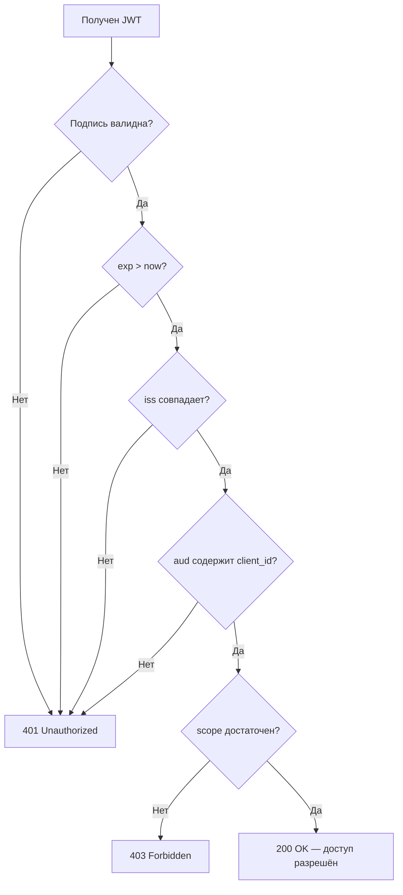

Ресурсный сервер получает публичные ключи из **JWKS endpoint** (JSON Web Key Set):

```
GET https://auth.example.com/.well-known/jwks.json

{
  "keys": [{
    "kty": "RSA",
    "kid": "key-1",
    "n": "...",
    "e": "AQAB",
    "use": "sig",
    "alg": "RS256"
  }]
}
```

Spring Security автоматически кэширует ключи и обновляет при появлении неизвестного `kid`.

## Q16. Что такое `refresh token rotation`?

`Refresh token rotation` — при каждом обновлении access token Authorization Server **выдаёт новый refresh token**, а старый немедленно инвалидирует. Зачем: refresh token долгоживущий, поэтому самый лакомый для кражи. Ротация превращает его в одноразовый, и главное — даёт **способ обнаружить кражу**: если кто-то использует уже отозванный токен, значит, его перехватили.

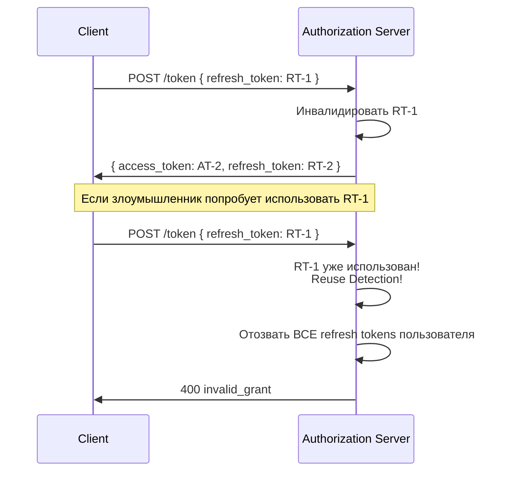

**Reuse detection**: если уже использованный refresh token предъявляется повторно — это признак компрометации. Сервер отзывает **все** refresh tokens данного пользователя.

## Q17. Как отзывать токены (token revocation)?

Token revocation (`RFC 7009`) — стандартный endpoint, на который клиент отправляет токен, чтобы Authorization Server пометил его недействительным (например, при выходе пользователя):

```
POST /oauth2/revoke HTTP/1.1
Content-Type: application/x-www-form-urlencoded

token=<token_value>&
token_type_hint=refresh_token&
client_id=my-app&
client_secret=***
```

**Подвох с JWT:** отзыв на Authorization Server не помогает напрямую. JWT самодостаточен, и ресурсный сервер проверяет его локально, не спрашивая Authorization Server, — поэтому отозванный JWT остаётся «валидным» до своего `exp`. Это та самая цена за масштабируемость из Q14.

Поэтому на практике отзыв JWT решают одним из трёх способов (или их комбинацией):

1. **Короткий TTL** (5–15 мин) — окно, в котором отозванный токен ещё работает, минимально; самый простой подход
2. **Blacklist в Redis** — ресурсный сервер на каждом запросе сверяет `jti` (JWT ID) со списком отозванных; точно, но возвращает сетевой запрос
3. **Introspection** — ресурсный сервер спрашивает статус у Authorization Server; надёжно, но снижает масштабируемость (см. Q18)

## Q18. Что такое token introspection?

Token introspection (`RFC 7662`) — endpoint, через который ресурсный сервер спрашивает у Authorization Server «жив ли этот токен и что в нём?». Нужен прежде всего для **opaque token**: такой токен — просто случайная строка, локально из него ничего не извлечь, поэтому единственный способ проверки — спросить у того, кто его выдал.

Запрос (ресурсный сервер аутентифицируется своими credentials):

```
POST /oauth2/introspect HTTP/1.1
Content-Type: application/x-www-form-urlencoded

token=<opaque_token>&
token_type_hint=access_token
```

Ответ:

```json
{
  "active": true,
  "scope": "read:orders write:orders",
  "client_id": "service-a",
  "sub": "user-123",
  "exp": 1712840000,
  "iat": 1712836400
}
```

Конфигурация в Spring Security для opaque token:

```java
@Bean
public SecurityFilterChain filterChain(HttpSecurity http) throws Exception {
    return http
        .oauth2ResourceServer(oauth2 -> oauth2
            .opaqueToken(opaque -> opaque
                .introspectionUri("https://auth.example.com/oauth2/introspect")
                .introspectionClientCredentials("rs-client", "rs-secret")
            )
        )
        .build();
}
```

**Компромисс:** introspection гарантирует актуальный статус токена (отозванный сразу виден как `active: false`), но платит за это **дополнительным сетевым запросом** к Authorization Server на каждый API-вызов — это узкое место под нагрузкой.

## Q19. Что такое token binding и `DPoP`?

**Проблема, которую решают:** обычный Bearer token работает по принципу «предъявитель = владелец». Кто перехватил токен — тот и пользуется им, ключа или пароля больше не нужно. Token binding и `DPoP` привязывают токен к конкретному клиенту, превращая «предъявителя» в «доказавшего владение».

**DPoP** (`Demonstrating Proof-of-Possession`, `RFC 9449`) — клиент один раз генерирует пару ключей, токен привязывается к публичному ключу, а при каждом запросе клиент прикладывает подпись приватным ключом:

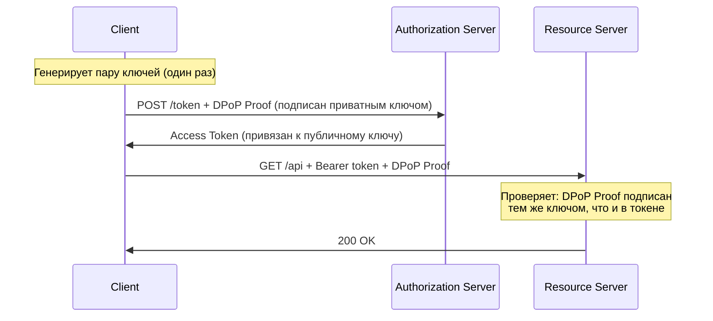

**Итог:** даже перехваченный токен бесполезен — без приватного ключа клиента подделать DPoP-доказательство нельзя, и ресурсный сервер отвергнет запрос.

## Q20. (!) Что такое `OpenID Connect` и чем он отличается от `OAuth2`?

`OIDC` (`OpenID Connect`) — это тонкий слой **аутентификации** поверх `OAuth2`. `OAuth2` даёт доступ к ресурсам, но не сообщает, *кто* вошёл; `OIDC` устраняет этот пробел, добавляя `ID Token` с подтверждёнными данными о пользователе, стандартные scopes (`openid`, `profile`, `email`) и UserInfo endpoint. Проще говоря: «Войти через Google» — это `OIDC`, а не голый `OAuth2`.

| Аспект | OAuth2 | OIDC |
|--------|--------|------|
| **Задача** | Авторизация (доступ к ресурсам) | Аутентификация (кто пользователь?) |
| **Токен** | Access Token | Access Token + **ID Token** |
| **Стандартные scopes** | Нет стандартных | `openid`, `profile`, `email` |
| **UserInfo endpoint** | Нет | Да |
| **Discovery** | Нет | `/.well-known/openid-configuration` |

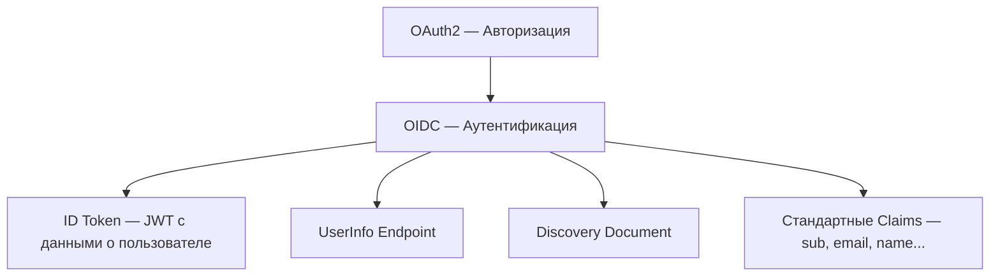

Когда вы делаете "Login with Google" — это `OIDC` поверх `OAuth2`:
1. Запрос с `scope=openid profile email`
2. В ответе получаете `ID Token` с данными пользователя
3. `Access Token` для вызова Google API

Подробнее: [Паттерны аутентификации и авторизации](authentication-authorization-patterns-interview.md).

## Q21. Какова структура `ID Token` в `OIDC`?

`ID Token` — это всегда JWT, который Authorization Server выдаёт клиенту как «справку о личности» пользователя. В отличие от access token, он предназначен **для клиента** (чтобы тот узнал, кто вошёл), а не для вызова API. Содержит обязательный набор claims:

```json
{
  "iss": "https://accounts.google.com",
  "sub": "110169484474386276334",
  "aud": "my-app.apps.googleusercontent.com",
  "exp": 1712840000,
  "iat": 1712836400,
  "nonce": "abc123",
  "at_hash": "HK6E_P6Dh8Y93mRNtsDB1Q",

  "name": "Иван Петров",
  "email": "ivan@example.com",
  "email_verified": true,
  "picture": "https://lh3.googleusercontent.com/...",
  "locale": "ru"
}
```

Обязательные claims:

| Claim | Описание |
|-------|----------|
| `iss` | Издатель (URL Authorization Server) |
| `sub` | Уникальный идентификатор пользователя |
| `aud` | Client ID, для которого выдан |
| `exp` | Время истечения |
| `iat` | Время выдачи |
| `nonce` | Защита от replay-атак (клиент генерирует) |
| `at_hash` | Хэш access token (привязка ID Token к access token) |

Важно: `ID Token` предназначен для **клиента**, не для Resource Server. Для доступа к API используется `access_token`.

## Q22. Что такое `OIDC Discovery` и `UserInfo endpoint`?

Это два стандартных endpoint OIDC, решающих разные задачи: **Discovery** избавляет от ручного прописывания URL-ов сервера, **UserInfo** отдаёт свежие данные о пользователе по access token.

**OIDC Discovery** — один JSON-документ по фиксированному адресу, из которого клиент узнаёт все остальные endpoint Authorization Server (authorize, token, jwks, userinfo) и его возможности:

```
GET https://auth.example.com/.well-known/openid-configuration

{
  "issuer": "https://auth.example.com",
  "authorization_endpoint": "https://auth.example.com/oauth2/authorize",
  "token_endpoint": "https://auth.example.com/oauth2/token",
  "userinfo_endpoint": "https://auth.example.com/userinfo",
  "jwks_uri": "https://auth.example.com/oauth2/jwks",
  "scopes_supported": ["openid", "profile", "email"],
  "response_types_supported": ["code"],
  "grant_types_supported": ["authorization_code", "client_credentials", "refresh_token"],
  "subject_types_supported": ["public"],
  "id_token_signing_alg_values_supported": ["RS256"]
}
```

В Spring Security достаточно указать `issuer-uri` — все endpoints обнаружатся автоматически.

**UserInfo endpoint** — получение данных пользователя по access token:

```
GET /userinfo
Authorization: Bearer <access_token>

{
  "sub": "user-123",
  "name": "Иван Петров",
  "email": "ivan@example.com",
  "email_verified": true
}
```

## Q23. (!) Как настроить `OAuth2 Login` в `Spring Security`?

В Spring Security `OAuth2 Login` сводится к двум вещам: описать провайдера (`registration` + `provider`) в `application.yml` и включить `.oauth2Login()` в фильтр-чейне. Всё остальное (редиректы, обмен кода, PKCE, чтение UserInfo) Spring берёт на себя. Полная конфигурация для "Login with Google":

```yaml
# application.yml
spring:
  security:
    oauth2:
      client:
        registration:
          google:
            client-id: ${GOOGLE_CLIENT_ID}
            client-secret: ${GOOGLE_CLIENT_SECRET}
            scope: openid, profile, email
            redirect-uri: "{baseUrl}/login/oauth2/code/{registrationId}"
          keycloak:
            client-id: my-app
            client-secret: ${KEYCLOAK_SECRET}
            scope: openid, profile
            authorization-grant-type: authorization_code
        provider:
          keycloak:
            issuer-uri: https://keycloak.example.com/realms/my-realm
```

```java
@Configuration
@EnableWebSecurity
public class SecurityConfig {

    @Bean
    public SecurityFilterChain filterChain(HttpSecurity http) throws Exception {
        return http
            .authorizeHttpRequests(auth -> auth
                .requestMatchers("/", "/public/**").permitAll()
                .anyRequest().authenticated()
            )
            .oauth2Login(oauth2 -> oauth2
                .loginPage("/login")
                .userInfoEndpoint(userInfo -> userInfo
                    .userService(customOAuth2UserService())
                )
                .successHandler((request, response, authentication) -> {
                    response.sendRedirect("/dashboard");
                })
            )
            .build();
    }

    @Bean
    public OAuth2UserService<OAuth2UserRequest, OAuth2User> customOAuth2UserService() {
        DefaultOAuth2UserService delegate = new DefaultOAuth2UserService();
        return request -> {
            OAuth2User user = delegate.loadUser(request);
            // Маппинг на локального пользователя, создание аккаунта и т.д.
            return user;
        };
    }
}
```

Подробнее о конфигурации: [Spring Security](../frameworks/spring/spring-security-interview.md).

## Q24. (!) Как настроить `Resource Server` с JWT в `Spring Security`?

Минимум — указать `issuer-uri` (или `jwk-set-uri`): по нему Spring сам найдёт JWKS и будет валидировать подпись, `iss` и `exp`. Дальше обычно добавляют две вещи: `STATELESS`-сессии (токен в каждом запросе, сервер ничего не помнит) и **converter**, который маппит claims вроде `roles` в `GrantedAuthority` для `@PreAuthorize`.

```yaml
# application.yml
spring:
  security:
    oauth2:
      resourceserver:
        jwt:
          issuer-uri: https://auth.example.com
          # или jwk-set-uri: https://auth.example.com/oauth2/jwks
```

```java
@Configuration
@EnableWebSecurity
@EnableMethodSecurity
public class ResourceServerConfig {

    @Bean
    public SecurityFilterChain filterChain(HttpSecurity http) throws Exception {
        return http
            .authorizeHttpRequests(auth -> auth
                .requestMatchers("/api/public/**").permitAll()
                .requestMatchers("/api/admin/**").hasRole("ADMIN")
                .anyRequest().authenticated()
            )
            .oauth2ResourceServer(oauth2 -> oauth2
                .jwt(jwt -> jwt
                    .jwtAuthenticationConverter(jwtAuthenticationConverter())
                )
            )
            .sessionManagement(session ->
                session.sessionCreationPolicy(SessionCreationPolicy.STATELESS)
            )
            .csrf(csrf -> csrf.disable()) // Stateless API — CSRF не нужен
            .build();
    }

    @Bean
    public JwtAuthenticationConverter jwtAuthenticationConverter() {
        JwtGrantedAuthoritiesConverter grantedAuthorities =
            new JwtGrantedAuthoritiesConverter();
        // Маппинг claim "roles" → GrantedAuthority
        grantedAuthorities.setAuthoritiesClaimName("roles");
        grantedAuthorities.setAuthorityPrefix("ROLE_");

        JwtAuthenticationConverter converter = new JwtAuthenticationConverter();
        converter.setJwtGrantedAuthoritiesConverter(grantedAuthorities);
        return converter;
    }
}
```

Использование в контроллере:

```java
@RestController
@RequestMapping("/api/users")
public class UserController {

    @GetMapping("/me")
    public Map<String, Object> getCurrentUser(@AuthenticationPrincipal Jwt jwt) {
        return Map.of(
            "sub", jwt.getSubject(),
            "email", jwt.getClaimAsString("email"),
            "roles", jwt.getClaimAsStringList("roles"),
            "expiresAt", jwt.getExpiresAt()
        );
    }

    @GetMapping("/admin")
    @PreAuthorize("hasRole('ADMIN') and hasAuthority('SCOPE_admin:read')")
    public String adminEndpoint() {
        return "Admin content";
    }
}
```

## Q25. Как реализовать `OAuth2` в микросервисной архитектуре?

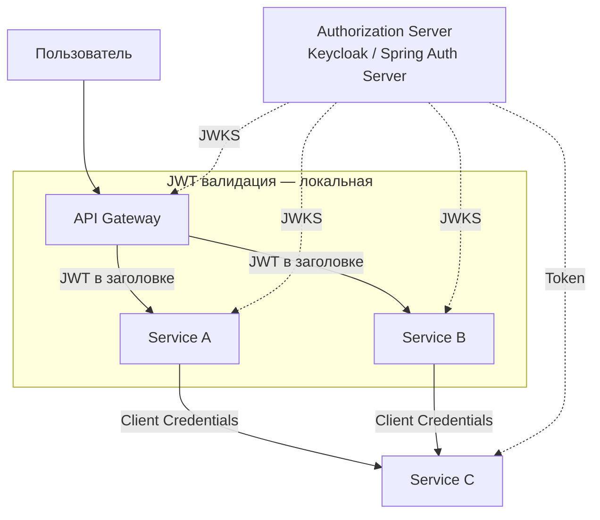

Базовая идея: **один Authorization Server, общий JWKS, каждый сервис — это Resource Server**, валидирующий JWT локально. Тогда между сервисами нужно как-то передавать контекст пользователя — для этого есть несколько паттернов:

1. **Token relay** — API Gateway пробрасывает JWT пользователя downstream-сервисам как есть (просто и быстро, но токен виден всем по цепочке)
2. **Token exchange** (`RFC 8693`) — Gateway обменивает токен пользователя на токен с урезанным scope для конкретного сервиса (least privilege на каждом шаге)
3. **Client Credentials** — для вызовов «от своего имени», где пользователя нет (фоновые задачи, межсервисные интеграции)
4. **Общий JWKS** — все сервисы доверяют одному `issuer-uri` и валидируют JWT одним набором публичных ключей

Пример проброса токена через `WebClient`:

```java
@Bean
public WebClient webClient(OAuth2AuthorizedClientManager clientManager) {
    var oauth2 = new ServletOAuth2AuthorizedClientExchangeFilterFunction(clientManager);
    oauth2.setDefaultOAuth2AuthorizedClient(true); // Relay текущий токен
    return WebClient.builder()
        .apply(oauth2.oauth2Configuration())
        .build();
}
```

Подробнее о межсервисном взаимодействии: [Микросервисы](../architecture/microservices-interview.md), [Spring Security](../frameworks/spring/spring-security-interview.md).

## Q26. Как настроить `Spring Authorization Server`?

`Spring Authorization Server` — официальная реализация Authorization Server от команды Spring Security. Позволяет поднять свой OAuth2/OIDC-провайдер (как Keycloak, но на Spring-стеке) вместо использования внешнего. Минимальная конфигурация — это три бина: фильтр-чейн с применённой security по умолчанию, репозиторий зарегистрированных клиентов и источник ключей для подписи JWT.

```xml
<!-- pom.xml -->
<dependency>
    <groupId>org.springframework.security</groupId>
    <artifactId>spring-security-oauth2-authorization-server</artifactId>
</dependency>
```

```java
@Configuration
public class AuthServerConfig {

    @Bean
    @Order(1)
    public SecurityFilterChain authServerFilterChain(HttpSecurity http) throws Exception {
        OAuth2AuthorizationServerConfiguration.applyDefaultSecurity(http);
        http.getConfigurer(OAuth2AuthorizationServerConfigurer.class)
            .oidc(Customizer.withDefaults()); // Включаем OIDC

        return http
            .exceptionHandling(e -> e
                .defaultAuthenticationEntryPointFor(
                    new LoginUrlAuthenticationEntryPoint("/login"),
                    new MediaTypeRequestMatcher(MediaType.TEXT_HTML)
                )
            )
            .build();
    }

    @Bean
    public RegisteredClientRepository registeredClientRepository() {
        RegisteredClient webClient = RegisteredClient.withId(UUID.randomUUID().toString())
            .clientId("web-app")
            .clientSecret("{noop}secret")
            .clientAuthenticationMethod(ClientAuthenticationMethod.CLIENT_SECRET_BASIC)
            .authorizationGrantType(AuthorizationGrantType.AUTHORIZATION_CODE)
            .authorizationGrantType(AuthorizationGrantType.REFRESH_TOKEN)
            .redirectUri("http://localhost:8080/login/oauth2/code/web-app")
            .scope(OidcScopes.OPENID)
            .scope(OidcScopes.PROFILE)
            .tokenSettings(TokenSettings.builder()
                .accessTokenTimeToLive(Duration.ofMinutes(15))
                .refreshTokenTimeToLive(Duration.ofDays(7))
                .reuseRefreshTokens(false) // Rotation
                .build())
            .build();

        return new InMemoryRegisteredClientRepository(webClient);
    }

    @Bean
    public JWKSource<SecurityContext> jwkSource() throws Exception {
        RSAKey rsaKey = generateRsaKey();
        JWKSet jwkSet = new JWKSet(rsaKey);
        return (selector, ctx) -> selector.select(jwkSet);
    }

    @Bean
    public AuthorizationServerSettings authorizationServerSettings() {
        return AuthorizationServerSettings.builder()
            .issuer("https://auth.example.com")
            .build();
    }
}
```

## Q27. (!) Какие основные угрозы существуют для `OAuth2`?

Угрозы в `OAuth2` крутятся вокруг трёх вещей: **перехвата кода/токена при передаче**, **подмены клиента или redirect_uri** и **повторного использования украденного токена**. Знание защиты для каждой — частый вопрос на собеседовании:

| Угроза | Описание | Защита |
|--------|----------|--------|
| **Authorization Code Interception** | Перехват code при redirect | PKCE, HTTPS, exact redirect_uri match |
| **CSRF** | Подмена callback-запроса | `state` parameter |
| **Token Leakage** | Утечка токена из URL, логов, referrer | Не передавать в URL, короткий TTL |
| **Open Redirect** | Злоумышленник подставляет свой redirect_uri | Whitelist redirect_uri, exact match |
| **Token Replay** | Повторное использование перехваченного токена | DPoP, token binding, short TTL |
| **Refresh Token Theft** | Кража refresh token | Rotation + reuse detection, httpOnly cookie |
| **Client Impersonation** | Подделка client_id | Client authentication (secret, mTLS) |
| **Scope Escalation** | Запрос больших scope, чем разрешено | Валидация scope на Authorization Server |

Подробнее об угрозах: [OWASP Top 10](owasp-top10-interview.md), [Безопасность приложений](application-security-interview.md).

## Q28. Как работает `state` parameter и зачем он нужен?

`state` — случайное криптостойкое значение, которое клиент генерирует перед редиректом на авторизацию и проверяет в callback. Его задача — **связать запрос авторизации с конкретной сессией пользователя** и тем самым защититься от CSRF: если `state` из callback не совпадает с сохранённым, значит, ответ пришёл не на наш запрос, и его надо отбросить.

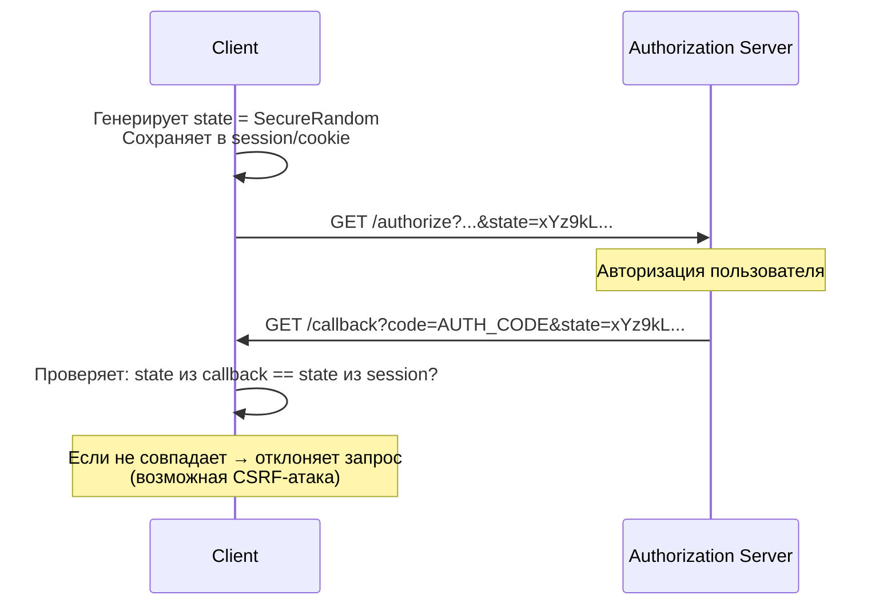

Без `state` злоумышленник может подставить свой authorization code в callback URL жертвы, привязав аккаунт жертвы к аккаунту злоумышленника у провайдера.

## Q29. Чеклист безопасности `OAuth2` для production

Сводный чеклист, который удобно проговорить на собеседовании. Все пункты сводятся к трём принципам: **не дать токену утечь**, **минимизировать ущерб, если утёк**, и **уметь это заметить**.

1. **HTTPS везде** — authorization endpoint, token endpoint, redirect URI, resource server
2. **PKCE для всех клиентов** (не только public)
3. **Exact match redirect_uri** — без wildcard, без open redirect
4. **state parameter** — криптостойкий, одноразовый
5. **Короткий TTL access token** — 15–60 минут
6. **Refresh token rotation** с reuse detection
7. **Хранение секретов** — secrets manager, не в коде
8. **Валидация JWT** — проверять `iss`, `aud`, `exp`, `scope`
9. **Безопасное хранение токенов** — `httpOnly` + `Secure` + `SameSite=Strict` cookies
10. **Мониторинг** — аномальное количество token requests, неудачные авторизации
11. **Ротация ключей** — периодическая смена signing keys (JWKS поддерживает множественные `kid`)
12. **Не логировать токены** — маскировать в логах

```java
// Пример: кастомный фильтр для маскирования токенов в логах
@Component
public class TokenMaskingFilter extends OncePerRequestFilter {

    @Override
    protected void doFilterInternal(HttpServletRequest request,
                                     HttpServletResponse response,
                                     FilterChain chain) throws ServletException, IOException {
        String auth = request.getHeader("Authorization");
        if (auth != null && auth.startsWith("Bearer ")) {
            MDC.put("token_hint", auth.substring(7, Math.min(15, auth.length())) + "...");
        }
        try {
            chain.doFilter(request, response);
        } finally {
            MDC.remove("token_hint");
        }
    }
}
```

## Q30. Как тестировать `OAuth2` в `Spring Boot`?

Главный принцип: **не ходить к настоящему Authorization Server в тестах**. Для быстрых тестов подделывают сам результат аутентификации через `spring-security-test` (`jwt()`, `@WithMockUser`), а для интеграционных — поднимают мок Authorization Server или Keycloak в Testcontainers.

**Unit-тесты** с `@WithMockUser` и `SecurityMockMvcRequestPostProcessors` — токен не настоящий, но Spring Security видит «аутентифицированного» пользователя с нужными правами:

```java
@WebMvcTest(UserController.class)
class UserControllerTest {

    @Autowired
    private MockMvc mockMvc;

    @Test
    void shouldReturnUserInfo() throws Exception {
        mockMvc.perform(get("/api/users/me")
                .with(jwt()
                    .jwt(builder -> builder
                        .subject("user-123")
                        .claim("email", "ivan@example.com")
                        .claim("roles", List.of("ROLE_USER"))
                    )
                ))
            .andExpect(status().isOk())
            .andExpect(jsonPath("$.sub").value("user-123"))
            .andExpect(jsonPath("$.email").value("ivan@example.com"));
    }

    @Test
    void shouldRejectWithoutToken() throws Exception {
        mockMvc.perform(get("/api/users/me"))
            .andExpect(status().isUnauthorized());
    }

    @Test
    void shouldCheckScope() throws Exception {
        mockMvc.perform(get("/api/users/admin")
                .with(jwt()
                    .authorities(new SimpleGrantedAuthority("ROLE_USER"))
                ))
            .andExpect(status().isForbidden());
    }
}
```

**Интеграционные тесты** с `MockOAuth2Server` (Testcontainers-подход):

```java
@SpringBootTest(webEnvironment = WebEnvironment.RANDOM_PORT)
class OAuth2IntegrationTest {

    // Мок Authorization Server
    static MockWebServer mockAuthServer = new MockWebServer();

    @DynamicPropertySource
    static void properties(DynamicPropertyRegistry registry) {
        registry.add("spring.security.oauth2.resourceserver.jwt.jwk-set-uri",
            () -> mockAuthServer.url("/jwks").toString());
    }

    @Autowired
    private TestRestTemplate restTemplate;

    @Test
    void shouldValidateJwt() {
        // Генерация тестового JWT с реальной подписью
        String jwt = generateTestJwt("user-123", List.of("ROLE_USER"));

        var headers = new HttpHeaders();
        headers.setBearerAuth(jwt);

        ResponseEntity<String> response = restTemplate.exchange(
            "/api/users/me", HttpMethod.GET,
            new HttpEntity<>(headers), String.class);

        assertThat(response.getStatusCode()).isEqualTo(HttpStatus.OK);
    }
}
```

Инструменты:
- `spring-security-test` — `jwt()`, `@WithMockUser`, `@WithOAuth2Login`
- [Keycloak Testcontainers](https://www.testcontainers.org/) — интеграционные тесты с реальным Authorization Server
- Postman / OAuth2 Playground — ручное тестирование flows

## Q31. (!) Что изменилось в `OAuth 2.1` по сравнению с `OAuth 2.0`?

`OAuth 2.1` — консолидированная спецификация, которая убирает устаревшие и небезопасные механизмы из `OAuth 2.0`.

### Ключевые изменения

| Аспект | OAuth 2.0 | OAuth 2.1 |
|--------|-----------|-----------|
| `Implicit Grant` | Поддерживается | **Удалён** |
| `Resource Owner Password Credentials` | Поддерживается | **Удалён** |
| `PKCE` | Опционален | **Обязателен** для всех публичных клиентов |
| `redirect_uri` | Частичное совпадение | **Точное совпадение** |
| `Refresh Token` для публичных клиентов | Долгоживущие | **Ротация обязательна** |
| Bearer token в URI | Разрешён | **Запрещён** (только в заголовке) |

### Почему удалён Implicit Grant

```
Проблема Implicit Flow:
1. Access Token передаётся в URL-фрагменте (#access_token=...)
2. Фрагмент попадает в логи браузера, Referer-заголовки
3. Нет client_secret → нет верификации клиента
4. Нет refresh token → пользователь должен повторно авторизовываться

Решение: Authorization Code + PKCE работает в браузере без client_secret
```

### Почему удалён Resource Owner Password Credentials

```
Проблема ROPC:
- Клиент получает пароль пользователя напрямую
- Нарушает принцип делегирования: пользователь должен доверять клиенту как самому IdP
- Невозможно использовать MFA, WebAuthn
- Антипаттерн для любого production-сценария

Решение: Device Authorization Flow для CLI/IoT,
         Authorization Code + PKCE для интерактивных клиентов
```

### Конфигурация PKCE обязательного режима в Spring Authorization Server

```java
@Bean
public RegisteredClientRepository registeredClientRepository() {
    RegisteredClient client = RegisteredClient.withId(UUID.randomUUID().toString())
        .clientId("my-app")
        .clientAuthenticationMethod(ClientAuthenticationMethod.NONE) // public client
        .authorizationGrantType(AuthorizationGrantType.AUTHORIZATION_CODE)
        .authorizationGrantType(AuthorizationGrantType.REFRESH_TOKEN)
        .redirectUri("https://app.example.com/callback")
        .scope(OidcScopes.OPENID)
        .scope("read")
        .clientSettings(ClientSettings.builder()
            .requireProofKey(true) // PKCE обязателен — OAuth 2.1 стиль
            .requireAuthorizationConsent(true)
            .build())
        .tokenSettings(TokenSettings.builder()
            .accessTokenTimeToLive(Duration.ofMinutes(15))
            .refreshTokenTimeToLive(Duration.ofDays(1))
            .reuseRefreshTokens(false) // Rotation обязательна — OAuth 2.1 стиль
            .build())
        .build();

    return new InMemoryRegisteredClientRepository(client);
}
```

## Q32. Какие стандартные `JWT claims` обязательны и что они означают?

`JWT` (`JSON Web Token`, RFC 7519) определяет набор стандартных claims (registered claims), которые и составляют «скелет» любого токена. Строго *обязательного* claims по спецификации нет, но на практике для корректной валидации нужны `iss`, `sub`, `aud`, `exp`, `iat` — без них токен либо нельзя проверить, либо его примет чужой сервис. Понимать их смысл критично: половина уязвимостей JWT — это «забыли проверить такой-то claim».

### Registered Claims (стандартные)

| Claim | Полное имя | Тип | Описание |
|-------|-----------|-----|---------|
| `iss` | Issuer | String/URI | Кто выдал токен (Authorization Server URL) |
| `sub` | Subject | String | Идентификатор пользователя/сущности |
| `aud` | Audience | String/Array | Кому предназначен (Resource Server ID) |
| `exp` | Expiration | NumericDate | Время истечения (Unix timestamp) |
| `nbf` | Not Before | NumericDate | Токен не действителен до этого времени |
| `iat` | Issued At | NumericDate | Время выдачи |
| `jti` | JWT ID | String | Уникальный идентификатор токена |

### Типичные OIDC claims

| Claim | Описание |
|-------|---------|
| `name` | Полное имя пользователя |
| `email` | Email |
| `email_verified` | Подтверждён ли email |
| `roles` / `authorities` | Роли (нестандартный, но распространённый) |
| `scope` | Разрешённые scopes |
| `azp` | Authorized Party — clientId, которому выдан токен |

### Валидация claims в Spring Security

```java
@Bean
JwtDecoder jwtDecoder() {
    NimbusJwtDecoder decoder = NimbusJwtDecoder
        .withJwkSetUri("https://auth.example.com/.well-known/jwks.json")
        .build();

    // Дополнительные валидаторы
    OAuth2TokenValidator<Jwt> issuerValidator =
        JwtValidators.createDefaultWithIssuer("https://auth.example.com");

    // Проверка audience
    OAuth2TokenValidator<Jwt> audienceValidator = jwt -> {
        List<String> audiences = jwt.getAudience();
        if (audiences.contains("my-resource-server")) {
            return OAuth2TokenValidatorResult.success();
        }
        return OAuth2TokenValidatorResult.failure(
            new OAuth2Error("invalid_token", "Wrong audience", null));
    };

    OAuth2TokenValidator<Jwt> combined =
        new DelegatingOAuth2TokenValidator<>(issuerValidator, audienceValidator);
    decoder.setJwtValidator(combined);
    return decoder;
}
```

### Пример реального JWT payload

```json
{
  "iss": "https://auth.example.com",
  "sub": "user-12345",
  "aud": ["my-resource-server", "my-web-app"],
  "exp": 1713951600,
  "iat": 1713948000,
  "jti": "550e8400-e29b-41d4-a716-446655440000",
  "email": "ivan@example.com",
  "email_verified": true,
  "roles": ["USER", "PREMIUM"],
  "scope": "openid profile email read:orders"
}
```

**Критическая ошибка**: не проверять `aud` — токен, выданный для одного сервиса, принимается другим (confused deputy атака).

## Q33. (!) Как реализовать `Refresh Token Rotation` в Spring Boot?

**Refresh Token Rotation** — механизм безопасности, при котором каждое использование `refresh token` для получения нового `access token` приводит к автоматической выдаче нового `refresh token` с одновременной инвалидацией старого.

### Зачем это нужно

```
Без rotation:
- Утечка refresh token → бесконечный доступ
- Невозможно обнаружить компрометацию

С rotation:
- Старый refresh token инвалидируется при использовании
- При попытке использовать старый токен → signaling компрометации
- Сервер может инвалидировать всю цепочку токенов (token family)
```

### Реализация в Spring Authorization Server

```java
// Включение rotation при конфигурации клиента
TokenSettings.builder()
    .reuseRefreshTokens(false)  // false = rotation включена
    .refreshTokenTimeToLive(Duration.ofDays(30))
    .build()
```

### Кастомная реализация с Token Family

```java
@Entity
@Table(name = "refresh_tokens")
public class RefreshToken {
    @Id private String tokenHash;       // SHA-256 от токена
    private String userId;
    private String familyId;            // ID семейства токенов
    private boolean used;               // использован ли
    private Instant expiresAt;
    private Instant createdAt;
}

@Service
@Transactional
public class RefreshTokenService {

    public TokenPair refreshTokens(String oldRefreshToken) {
        String tokenHash = sha256(oldRefreshToken);
        RefreshToken stored = tokenRepo.findByTokenHash(tokenHash)
            .orElseThrow(() -> new InvalidTokenException("Token not found"));

        // Обнаружение replay-атаки: токен уже использован
        if (stored.isUsed()) {
            // Компрометация: инвалидируем ВСЕ токены семейства
            tokenRepo.deleteByFamilyId(stored.getFamilyId());
            log.warn("Refresh token reuse detected for user {}, family {}",
                stored.getUserId(), stored.getFamilyId());
            throw new TokenFamilyCompromisedException(
                "Refresh token reused — possible theft");
        }

        if (stored.getExpiresAt().isBefore(Instant.now())) {
            tokenRepo.delete(stored);
            throw new InvalidTokenException("Token expired");
        }

        // Помечаем старый как использованный (не удаляем — для audit)
        stored.setUsed(true);
        tokenRepo.save(stored);

        // Генерируем новую пару токенов в том же семействе
        String newRefreshToken = generateSecureToken();
        RefreshToken newStored = new RefreshToken(
            sha256(newRefreshToken),
            stored.getUserId(),
            stored.getFamilyId(),  // сохраняем familyId
            false,
            Instant.now().plus(30, ChronoUnit.DAYS),
            Instant.now()
        );
        tokenRepo.save(newStored);

        String newAccessToken = jwtService.generateAccessToken(stored.getUserId());
        return new TokenPair(newAccessToken, newRefreshToken);
    }

    private String generateSecureToken() {
        byte[] bytes = new byte[32];
        new SecureRandom().nextBytes(bytes);
        return Base64.getUrlEncoder().withoutPadding().encodeToString(bytes);
    }

    private String sha256(String token) {
        // Никогда не храним сам токен — только хэш
        return DigestUtils.sha256Hex(token);
    }
}
```

### Хранение refresh token на клиенте

| Место хранения | Уязвимость | Рекомендация |
|---------------|-----------|-------------|
| `localStorage` | XSS | Не использовать |
| `sessionStorage` | XSS | Не использовать |
| `HttpOnly Cookie` | CSRF | Использовать с `SameSite=Strict` |
| Memory (JS) | Сбрасывается при перезагрузке | Для SPA без refresh |
| Secure `HttpOnly Cookie` + BFF | CSRF защищён через `state` | **Рекомендуется** |

## Q34. Что такое `OAuth2 Backend for Frontend` (`BFF`) и когда его применять?

**BFF** (`Backend for Frontend`) — архитектурный паттерн, при котором небольшой backend-сервер берёт на себя весь `OAuth2`-flow и хранение токенов **вместо браузера**. Браузеру отдаётся только обычная серверная сессия в `HttpOnly`-куке, а токены вообще не покидают сервер. Это радикально решает проблему хранения токенов в SPA: то, чего нет в браузере, нельзя украсть через XSS.

**Применять, когда:** публичное SPA работает с чувствительными данными и нужно гарантированно убрать токены из досягаемости JS-кода в браузере.

### Проблема без BFF (SPA + OAuth2)

```
SPA напрямую хранит токены:
- access token в memory (теряется при reload)
- refresh token в HttpOnly Cookie

Проблемы:
- Браузер не имеет безопасного хранилища (localStorage → XSS)
- PKCE усложняет, но не устраняет проблему хранения refresh token
- CORS-запросы к Authorization Server сложны в настройке
```

### Архитектура BFF

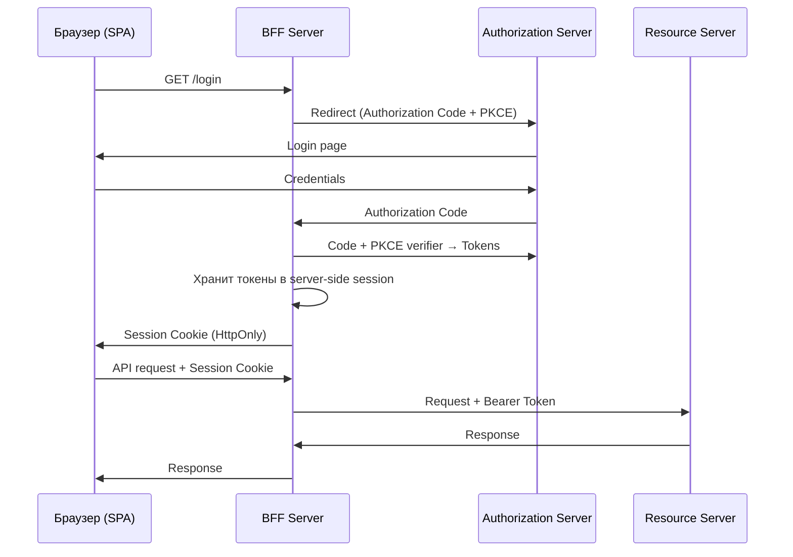

### Реализация BFF с Spring Boot

```java
@Configuration
@EnableWebSecurity
public class BffSecurityConfig {

    @Bean
    SecurityFilterChain securityFilterChain(HttpSecurity http) throws Exception {
        http
            .csrf(csrf -> csrf
                .csrfTokenRepository(CookieCsrfTokenRepository.withHttpOnlyFalse()))
            .oauth2Login(oauth2 -> oauth2
                .defaultSuccessUrl("/api/me", true))
            .oauth2Client(Customizer.withDefaults())
            // Проксируем API-запросы с автоматическим добавлением Bearer token
            .authorizeHttpRequests(authz -> authz
                .requestMatchers("/api/**").authenticated()
                .anyRequest().permitAll());
        return http.build();
    }
}

// BFF-прокси контроллер
@RestController
@RequestMapping("/api")
public class BffProxyController {

    private final WebClient resourceServerClient;

    // WebClient автоматически добавляет Bearer token из OAuth2AuthorizedClient
    @GetMapping("/orders")
    public Mono<List<Order>> getOrders(
            @RegisteredOAuth2AuthorizedClient("my-client") OAuth2AuthorizedClient client) {
        return resourceServerClient
            .get()
            .uri("https://api.example.com/orders")
            .headers(h -> h.setBearerAuth(client.getAccessToken().getTokenValue()))
            .retrieve()
            .bodyToFlux(Order.class)
            .collectList();
    }
}
```

### BFF vs Token-in-Browser

| Критерий | Token в браузере | BFF |
|---------|-----------------|-----|
| Безопасность токенов | Риск XSS | Токены не в браузере |
| Сложность | Проще | Дополнительный сервис |
| Масштабирование | Stateless | Требует session store |
| Применение | Внутренние SPA | Публичные приложения |

**Рекомендация**: для публичных SPA с чувствительными данными используйте BFF. Для внутренних инструментов достаточно `HttpOnly Cookie + PKCE`.

## Q35. Как защитить `OAuth2` от `CSRF` и `Token Leakage`?

Коротко: **CSRF** в OAuth2 закрывается `state`-параметром (привязка callback к сессии), а **утечку токенов** — тем, что токен не кладут в URL, маскируют в логах и хранят в `HttpOnly` + `Secure` + `SameSite` куках. Разберём оба класса атак.

### CSRF в OAuth2

**Атака**: злоумышленник инициирует OAuth2-flow от имени жертвы, подменяя `state` параметр.

```
1. Злоумышленник начинает OAuth2-flow → получает Authorization URL
2. Передаёт URL жертве (фишинг/CSRF)
3. Жертва проходит авторизацию → code отправляется злоумышленнику
4. Злоумышленник получает токен с правами жертвы
```

**Защита через `state` parameter**:

```java
@GetMapping("/oauth2/authorize")
public String initiateOAuth2(@RequestParam String clientId,
                              HttpSession session) {
    // Генерируем cryptographically random state
    String state = generateSecureState();
    session.setAttribute("oauth2_state", state);

    return "redirect:https://auth.example.com/authorize?" +
        "client_id=" + clientId +
        "&state=" + state +
        "&code_challenge=" + pkceChallenge +
        "&code_challenge_method=S256";
}

@GetMapping("/oauth2/callback")
public String handleCallback(@RequestParam String code,
                              @RequestParam String state,
                              HttpSession session) {
    // Верифицируем state
    String expectedState = (String) session.getAttribute("oauth2_state");
    if (!MessageDigest.isEqual(
            state.getBytes(StandardCharsets.UTF_8),
            expectedState.getBytes(StandardCharsets.UTF_8))) {
        throw new OAuth2AuthenticationException("Invalid state parameter");
    }
    session.removeAttribute("oauth2_state"); // используем однократно
    // ...exchange code for tokens
}
```

### Token Leakage — источники утечек

```
1. Referer header: токен в URL → передаётся в Referer следующего запроса
   Решение: Bearer token только в заголовке Authorization, не в URL

2. Browser history: токен в URL фрагменте (#access_token=...)
   Решение: не использовать Implicit Flow (OAuth 2.1 удалил его)

3. Server logs: Bearer token логируется в access logs
   Решение: маскировать Authorization header в логах

4. CORS: cross-origin запрос передаёт токен вредоносному сайту
   Решение: строгая настройка CORS, SameSite Cookie
```

### Защита Bearer token в Spring Boot логах

```java
@Component
public class SecurityHeadersFilter extends OncePerRequestFilter {

    @Override
    protected void doFilterInternal(HttpServletRequest request,
                                     HttpServletResponse response,
                                     FilterChain chain)
            throws ServletException, IOException {
        // Оборачиваем request для маскирования токена в логах
        chain.doFilter(new MaskedAuthorizationRequestWrapper(request), response);
    }
}

class MaskedAuthorizationRequestWrapper extends HttpServletRequestWrapper {

    MaskedAuthorizationRequestWrapper(HttpServletRequest request) {
        super(request);
    }

    @Override
    public String getHeader(String name) {
        if ("Authorization".equalsIgnoreCase(name)) {
            String authHeader = super.getHeader(name);
            if (authHeader != null && authHeader.startsWith("Bearer ")) {
                return "Bearer ***MASKED***";
            }
        }
        return super.getHeader(name);
    }
}
```

### Чеклист защиты токенов

- `HttpOnly` + `Secure` + `SameSite=Strict` для Cookie с refresh token
- Короткое время жизни access token (15 минут)
- `state` параметр для защиты от CSRF в OAuth2 flow
- `aud` claim валидация на Resource Server
- Токен никогда не передаётся в URL query параметрах
- Логи не содержат значений токенов
- `jti` для одноразовых токенов (предотвращение replay)

---

## Q36. Что изменилось в OAuth 2.1 — детали спецификации?

**OAuth 2.1** — консолидированная спецификация (draft, RFC в разработке), которая объединяет RFC 6749 (OAuth 2.0) и лучшие практики из RFC 6819, BCP 212 (OAuth Security BCP). Не добавляет новых grant types — только убирает небезопасные и закрепляет обязательные security требования.

### Ключевые изменения

| Изменение | OAuth 2.0 | OAuth 2.1 |
|-----------|-----------|-----------|
| **Implicit Flow** | Опциональный | **Удалён** |
| **Resource Owner Password Credentials (ROPC)** | Опциональный | **Удалён** |
| **PKCE** | Рекомендован для публичных клиентов | **Обязателен для всех** (Authorization Code Flow) |
| **Redirect URI** | Частичное совпадение допустимо | Точное совпадение обязательно |
| **Bearer tokens в URL** | Не рекомендован | **Запрещён** |
| **Refresh token rotation** | Не специфицирован | Обязателен для публичных клиентов |
| **`state` parameter** | Рекомендован | Рекомендован (PKCE заменяет часть его функций) |

### Почему удалён Implicit Flow?

Implicit Flow возвращал `access_token` прямо в `redirect_uri` (в URL hash), что:
- Токен попадал в `browser history`, `Referer` headers, proxy logs
- Невозможно использовать `client_secret` (публичный клиент)
- Нет защиты от подмены токена

**Замена:** Authorization Code Flow + PKCE для SPA и мобильных приложений.

### Почему удалён ROPC?

ROPC (Resource Owner Password Credentials) требует передачи логина/пароля пользователя клиентскому приложению — нарушает принцип делегирования. Используется как обходной путь для legacy-систем, но не соответствует модели безопасности OAuth.

---

## Q37. Как работает PKCE — генерация code_verifier и code_challenge?

**PKCE** (Proof Key for Code Exchange, RFC 7636) — расширение Authorization Code Flow, защищающее от перехвата `authorization_code`. Механика в трёх шагах: клиент генерирует секрет `code_verifier`, отправляет на авторизацию только его хэш (`code_challenge`), а при обмене кода предъявляет сам `code_verifier` — Authorization Server сверяет хэш и убеждается, что код предъявил тот же клиент, что его запрашивал.

### Проблема без PKCE

Authorization code короткое время «гуляет» через браузер/ОС, и его можно перехватить (malicious app, перехват redirect_uri). Без PKCE этого достаточно: злоумышленник просто обменяет украденный код на `access_token`. PKCE делает украденный код бесполезным — без `code_verifier` обмен не пройдёт.

### Как работает PKCE

```
Шаг 1: Клиент генерирует случайное значение
code_verifier = random_bytes(32) → base64url_encode
# Например: "dBjftJeZ4CVP-mB92K27uhbUJU1p1r_wW1gFWFOEjXk"

Шаг 2: Клиент вычисляет challenge
code_challenge = BASE64URL(SHA256(ASCII(code_verifier)))
# method = S256 (рекомендуется) или plain (не использовать)

Шаг 3: Authorization Request (code_challenge отправляется на AS)
GET /authorize?
  response_type=code
  &client_id=my-app
  &redirect_uri=https://app.example.com/callback
  &code_challenge=E9Melhoa2OwvFrEMTJguCHaoeK1t8URWbuGJSstw-cM
  &code_challenge_method=S256

Шаг 4: Token Request (code_verifier отправляется на AS)
POST /token
  grant_type=authorization_code
  &code=SplxlOBeZQQYbYS6WxSbIA
  &redirect_uri=https://app.example.com/callback
  &code_verifier=dBjftJeZ4CVP-mB92K27uhbUJU1p1r_wW1gFWFOEjXk

Шаг 5: AS проверяет
SHA256(code_verifier) == code_challenge → OK → выдаёт токены
```

### Генерация в Java

```java
import java.security.SecureRandom;
import java.security.MessageDigest;
import java.util.Base64;

public class PkceUtils {

    public static String generateCodeVerifier() {
        byte[] bytes = new byte[32];
        new SecureRandom().nextBytes(bytes);
        return Base64.getUrlEncoder().withoutPadding().encodeToString(bytes);
    }

    public static String generateCodeChallenge(String codeVerifier) throws Exception {
        MessageDigest digest = MessageDigest.getInstance("SHA-256");
        byte[] hash = digest.digest(codeVerifier.getBytes("ASCII"));
        return Base64.getUrlEncoder().withoutPadding().encodeToString(hash);
    }
}
```

### Уязвимости без PKCE

- **Authorization Code Interception** — перехват code через malicious redirect
- **Open Redirect** — redirect на злоумышленника при нечётком совпадении URI
- **Cross-Site Request Forgery** — без state/PKCE злоумышленник может подставить свой code

**Вывод:** PKCE обязателен для публичных клиентов (SPA, mobile) и рекомендован для конфиденциальных клиентов (OAuth 2.1 требует для всех).

---

## Q38. Что такое Token Introspection (RFC 7662) и как он работает?

**Token Introspection** (RFC 7662) — протокол, которым Resource Server спрашивает у Authorization Server, активен ли токен, и заодно получает его метаданные (`sub`, `scope`, `exp`). Нужен там, где локальная проверка невозможна или недостаточна: opaque-токены, требование мгновенно видеть отзыв, централизованная проверка в gateway.

### Когда использовать

- Resource Server получает **opaque token** (непрозрачный, не JWT) — нельзя проверить локально
- Нужна **реальная time валидность** — JWT можно отозвать, но до истечения `exp` он валиден; introspection проверяет факт отзыва
- Централизованная проверка в gateway (без раздачи `jwks_uri` всем сервисам)

### Как работает

```
Resource Server               Authorization Server
       |                              |
       | POST /introspect             |
       | Authorization: Basic <RS credentials>
       | token=<access_token>         |
       |----------------------------->|
       |                              |
       | 200 OK                       |
       | {                            |
       |   "active": true,            |
       |   "sub": "user123",          |
       |   "scope": "read write",     |
       |   "exp": 1704067200,         |
       |   "client_id": "my-app",     |
       |   "username": "john@example" |
       | }                            |
       |<-----------------------------|
```

### Запрос introspection

```http
POST /oauth2/introspect HTTP/1.1
Host: auth.example.com
Authorization: Basic base64(resource_server:rs_secret)
Content-Type: application/x-www-form-urlencoded

token=2YotnFZFEjr1zCsicMWpAA&token_type_hint=access_token
```

### Ответ при неактивном токене

```json
{ "active": false }
```

### Spring Security: настройка Introspection

```java
@Bean
public SecurityFilterChain filterChain(HttpSecurity http) throws Exception {
    http.oauth2ResourceServer(oauth2 -> oauth2
        .opaqueToken(opaque -> opaque
            .introspectionUri("https://auth.example.com/oauth2/introspect")
            .introspectionClientCredentials("resource-server", "rs-secret")
        )
    );
    return http.build();
}
```

### JWT vs Introspection

| Аспект | JWT (локальная проверка) | Token Introspection |
|--------|--------------------------|---------------------|
| Скорость | Быстро (без сетевого запроса) | Медленнее (HTTP запрос к AS) |
| Отзыв токена | Только после истечения exp | Мгновенное обнаружение |
| Нагрузка на AS | Нет | Высокая (per-request) |
| Применение | Микросервисы с jwks_uri | Gateway, opaque tokens |

**Рекомендация:** использовать JWT с коротким TTL (15 мин) + token revocation list (Redis) вместо introspection per-request.

---

## Q39. Refresh Token Rotation — почему важна и как реализовать?

**Refresh Token Rotation** — при каждом использовании refresh token Authorization Server выдаёт **новый** токен, а старый аннулирует. Это превращает долгоживущий refresh token в одноразовый и, главное, даёт детектор кражи: повторное использование уже аннулированного токена однозначно сигнализирует о компрометации.

### Почему это важно: Refresh Token Reuse Attack

Без rotation:
```
Злоумышленник крадёт refresh_token → использует его бесконечно → 
жертва продолжает использовать тот же токен → обе стороны могут обновлять access token
```

С rotation:
```
Злоумышленник и жертва имеют один refresh_token →
первый, кто использует → AS выдаёт новый токен и аннулирует старый →
второй запрос с тем же токеном ОТКЛОНЁН → AS аннулирует всю семью токенов
```

### Семьи токенов (Token Families)

AS отслеживает "семьи" refresh токенов. При повторном использовании аннулированного токена — вся семья отзывается, пользователь принудительно логинится.

### Реализация в Spring Authorization Server

```java
@Bean
public AuthorizationServerSettings authorizationServerSettings() {
    return AuthorizationServerSettings.builder()
        .issuer("https://auth.example.com")
        .build();
}

@Bean
public RegisteredClientRepository registeredClientRepository() {
    RegisteredClient client = RegisteredClient.withId(UUID.randomUUID().toString())
        .clientId("my-app")
        .clientSecret(passwordEncoder().encode("secret"))
        .authorizationGrantType(AuthorizationGrantType.AUTHORIZATION_CODE)
        .authorizationGrantType(AuthorizationGrantType.REFRESH_TOKEN)
        .redirectUri("https://app.example.com/callback")
        .scope(OidcScopes.OPENID)
        .tokenSettings(TokenSettings.builder()
            .accessTokenTimeToLive(Duration.ofMinutes(15))
            .refreshTokenTimeToLive(Duration.ofDays(30))
            .reuseRefreshTokens(false)  // Rotation включена!
            .build())
        .build();

    return new InMemoryRegisteredClientRepository(client);
}
```

### Хранение refresh token

```java
// Refresh token должен храниться в HttpOnly Cookie (не localStorage)
@PostMapping("/refresh")
public ResponseEntity<TokenResponse> refresh(
        @CookieValue("refresh_token") String refreshToken,
        HttpServletResponse response) {

    TokenResponse tokens = tokenService.refresh(refreshToken);

    // Записать новый refresh token в Cookie
    Cookie cookie = new Cookie("refresh_token", tokens.refreshToken());
    cookie.setHttpOnly(true);
    cookie.setSecure(true);
    cookie.setPath("/auth/refresh");
    cookie.setMaxAge((int) Duration.ofDays(30).getSeconds());
    response.addCookie(cookie);

    return ResponseEntity.ok(new TokenResponse(tokens.accessToken()));
}
```

---

## Q40. OAuth 2.0 Device Authorization Grant — для IoT и Smart TV

**Device Authorization Grant** (RFC 8628) — grant type для устройств без браузера или с неудобным вводом (Smart TV, CLI, IoT, консоли). Суть: устройство получает короткий `user_code`, показывает его пользователю и просит ввести этот код на телефоне или ноутбуке, где есть нормальный браузер; пока пользователь авторизуется там, устройство в фоне опрашивает (polling) token endpoint и в какой-то момент получает токены.

### Поток

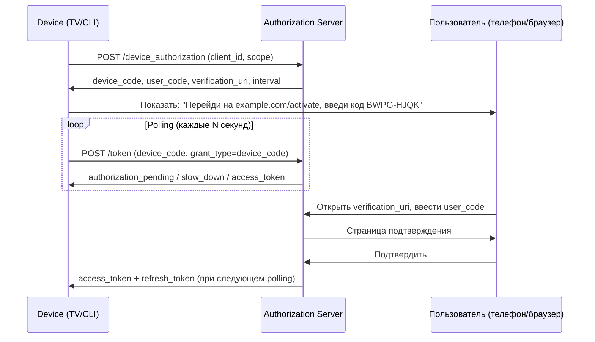

### Запрос устройства

```http
POST /device_authorization HTTP/1.1
Host: auth.example.com
Content-Type: application/x-www-form-urlencoded

client_id=tv-app&scope=openid profile
```

```json
{
  "device_code": "GmRhmhcxhwAzkoEqiMEg_DnyEysNkuNhszIySk9eS",
  "user_code": "BWPG-HJQK",
  "verification_uri": "https://example.com/activate",
  "verification_uri_complete": "https://example.com/activate?user_code=BWPG-HJQK",
  "expires_in": 1800,
  "interval": 5
}
```

### Polling токена

```http
POST /token HTTP/1.1
Content-Type: application/x-www-form-urlencoded

grant_type=urn:ietf:params:oauth:grant-type:device_code
&device_code=GmRhmhcxhwAzkoEqiMEg_DnyEysNkuNhszIySk9eS
&client_id=tv-app
```

**Возможные ответы при polling:**
- `authorization_pending` — пользователь ещё не подтвердил (продолжать polling)
- `slow_down` — уменьшить частоту polling
- `access_denied` — пользователь отклонил
- `expired_token` — device_code устарел
- `200 OK` + tokens — успех

### Применение в Java/Spring

```java
// Spring Security OAuth2 Client поддерживает Device Flow
// Обычно реализуется вручную через WebClient:
WebClient webClient = WebClient.create("https://auth.example.com");

DeviceAuthorizationResponse deviceAuth = webClient.post()
    .uri("/device_authorization")
    .bodyValue("client_id=tv-app&scope=openid")
    .retrieve()
    .bodyToMono(DeviceAuthorizationResponse.class)
    .block();

// Показать пользователю deviceAuth.getUserCode() и deviceAuth.getVerificationUri()
// Polling...
```

---

## Q41. Как настроить Spring Authorization Server с нуля?

**Spring Authorization Server** (SAS) — официальная реализация OAuth 2.1 / OpenID Connect Authorization Server от команды Spring Security. Поднимается из нескольких бинов: два фильтр-чейна (один для OAuth-эндпоинтов, второй для формы логина), репозиторий клиентов, источник ключей (JWK) и настройки сервера с `issuer`. После старта SAS сам публикует все стандартные endpoint и `/.well-known/openid-configuration`.

### Зависимости

```groovy
implementation 'org.springframework.boot:spring-boot-starter-security'
implementation 'org.springframework.security:spring-security-oauth2-authorization-server'
```

### Минимальная конфигурация

```java
@Configuration
@EnableWebSecurity
public class AuthorizationServerConfig {

    // 1. Security filter chain для Authorization Server endpoints
    @Bean
    @Order(1)
    public SecurityFilterChain authorizationServerSecurityFilterChain(HttpSecurity http) throws Exception {
        OAuth2AuthorizationServerConfiguration.applyDefaultSecurity(http);
        http.getConfigurer(OAuth2AuthorizationServerConfigurer.class)
            .oidc(Customizer.withDefaults()); // включить OpenID Connect

        return http
            .exceptionHandling(ex -> ex
                .defaultAuthenticationEntryPointFor(
                    new LoginUrlAuthenticationEntryPoint("/login"),
                    new MediaTypeRequestMatcher(MediaType.TEXT_HTML)
                ))
            .oauth2ResourceServer(rs -> rs.jwt(Customizer.withDefaults()))
            .build();
    }

    // 2. Security filter chain для формы логина
    @Bean
    @Order(2)
    public SecurityFilterChain defaultSecurityFilterChain(HttpSecurity http) throws Exception {
        return http
            .authorizeHttpRequests(auth -> auth.anyRequest().authenticated())
            .formLogin(Customizer.withDefaults())
            .build();
    }

    // 3. Зарегистрированные клиенты
    @Bean
    public RegisteredClientRepository registeredClientRepository() {
        RegisteredClient webApp = RegisteredClient.withId(UUID.randomUUID().toString())
            .clientId("web-app")
            .clientSecret("{bcrypt}" + new BCryptPasswordEncoder().encode("secret"))
            .clientAuthenticationMethod(ClientAuthenticationMethod.CLIENT_SECRET_BASIC)
            .authorizationGrantType(AuthorizationGrantType.AUTHORIZATION_CODE)
            .authorizationGrantType(AuthorizationGrantType.REFRESH_TOKEN)
            .redirectUri("https://app.example.com/login/oauth2/code/custom")
            .postLogoutRedirectUri("https://app.example.com/")
            .scope(OidcScopes.OPENID)
            .scope(OidcScopes.PROFILE)
            .scope("read")
            .tokenSettings(TokenSettings.builder()
                .accessTokenTimeToLive(Duration.ofMinutes(15))
                .refreshTokenTimeToLive(Duration.ofDays(7))
                .reuseRefreshTokens(false)
                .build())
            .build();

        return new InMemoryRegisteredClientRepository(webApp);
    }

    // 4. JWK Set — ключи подписи JWT
    @Bean
    public JWKSource<SecurityContext> jwkSource() {
        RSAKey rsaKey = Jwks.generateRsa();
        JWKSet jwkSet = new JWKSet(rsaKey);
        return (jwkSelector, securityContext) -> jwkSelector.select(jwkSet);
    }

    // 5. JWT декодер для Resource Server части
    @Bean
    public JwtDecoder jwtDecoder(JWKSource<SecurityContext> jwkSource) {
        return OAuth2AuthorizationServerConfiguration.jwtDecoder(jwkSource);
    }

    // 6. Настройки сервера (issuer URL)
    @Bean
    public AuthorizationServerSettings authorizationServerSettings() {
        return AuthorizationServerSettings.builder()
            .issuer("https://auth.example.com")
            .build();
    }
}
```

### Хранилище авторизаций (production)

```java
// В production использовать JdbcOAuth2AuthorizationService
@Bean
public OAuth2AuthorizationService authorizationService(JdbcTemplate jdbcTemplate,
        RegisteredClientRepository registeredClientRepository) {
    return new JdbcOAuth2AuthorizationService(jdbcTemplate, registeredClientRepository);
}
```

### OIDC Discovery endpoint

После настройки SAS автоматически публикует:
- `/.well-known/openid-configuration` — метаданные сервера
- `/oauth2/authorize` — authorization endpoint
- `/oauth2/token` — token endpoint
- `/oauth2/jwks` — JWK Set (публичные ключи)
- `/userinfo` — UserInfo endpoint

---

## Q42. OpenID Connect Claims — стандартные, кастомные, UserInfo endpoint

**OIDC Claims** — атрибуты пользователя (имя, email, роли и т.д.), которые передаются в ID Token или отдаются через UserInfo endpoint. Ключевой момент: **набор claims определяется запрошенными scopes** — `profile` открывает имя и аватар, `email` — почту, и так далее. Это та же логика least privilege: клиент получает только те данные о пользователе, доступ к которым тот подтвердил.

### Стандартные claim группы (по scope)

| Scope | Claims |
|-------|--------|
| `openid` | `sub` (обязателен), `iss`, `aud`, `exp`, `iat` |
| `profile` | `name`, `given_name`, `family_name`, `picture`, `locale`, `updated_at` |
| `email` | `email`, `email_verified` |
| `phone` | `phone_number`, `phone_number_verified` |
| `address` | `address` (JSON объект: street, city, country...) |

### Стандартные claims ID Token

```json
{
  "iss": "https://auth.example.com",      // Issuer
  "sub": "user_12345",                    // Subject (уникальный ID)
  "aud": "web-app",                       // Audience (client_id)
  "exp": 1704067200,                      // Expiration
  "iat": 1704063600,                      // Issued At
  "auth_time": 1704063500,                // Время аутентификации
  "nonce": "random-nonce",                // Защита от replay (CSRF)
  "acr": "urn:mace:incommon:iap:silver",  // Authentication Context Class
  "amr": ["pwd", "otp"],                  // Authentication Methods
  "azp": "web-app",                       // Authorized Party
  "at_hash": "77QmUPtjPfzWtF2AnpK9RQ"    // Access Token Hash
}
```

### Кастомные claims в Spring Authorization Server

```java
@Bean
public OAuth2TokenCustomizer<JwtEncodingContext> jwtCustomizer() {
    return context -> {
        if (OidcParameterNames.ID_TOKEN.equals(context.getTokenType().getValue())) {
            // Добавить кастомные claims в ID Token
            Authentication principal = context.getPrincipal();
            UserDetails user = (UserDetails) principal.getPrincipal();

            context.getClaims()
                .claim("roles", user.getAuthorities().stream()
                    .map(GrantedAuthority::getAuthority)
                    .collect(Collectors.toList()))
                .claim("department", "engineering")
                .claim("tenant_id", "company-123");
        }
    };
}
```

### UserInfo Endpoint

```http
GET /userinfo HTTP/1.1
Host: auth.example.com
Authorization: Bearer <access_token>
```

```json
{
  "sub": "user_12345",
  "name": "John Doe",
  "given_name": "John",
  "family_name": "Doe",
  "email": "john@example.com",
  "email_verified": true,
  "picture": "https://photos.example.com/johndoe/me.jpg",
  "locale": "ru-RU",
  "roles": ["developer", "reviewer"]
}
```

### Кастомный UserInfo в Spring Authorization Server

```java
@Bean
public OAuth2TokenCustomizer<JwtEncodingContext> tokenCustomizer(UserRepository userRepository) {
    return context -> {
        if (OidcParameterNames.ID_TOKEN.equals(context.getTokenType().getValue())
                || "userinfo".equals(context.getTokenType().getValue())) {

            String username = context.getPrincipal().getName();
            User user = userRepository.findByUsername(username);

            context.getClaims()
                .claim("department", user.getDepartment())
                .claim("employee_id", user.getEmployeeId());
        }
    };
}
```

### Claims в Resource Server (Spring Security)

```java
@GetMapping("/api/profile")
public Map<String, Object> profile(@AuthenticationPrincipal Jwt jwt) {
    return Map.of(
        "sub", jwt.getSubject(),
        "email", jwt.getClaimAsString("email"),
        "roles", jwt.getClaimAsStringList("roles")
    );
}
```

---

## See also

- [Spring Security](../frameworks/spring/spring-security-interview.md) — конфигурация OAuth2 Resource Server, фильтры
- [Паттерны аутентификации и авторизации](authentication-authorization-patterns-interview.md) — RBAC, ABAC, SSO, MFA
- [HTTP и REST](../api/http-rest-interview.md) — HTTPS, CORS, заголовки безопасности
- [Безопасность приложений](application-security-interview.md) — AppSec принципы, Defense in Depth
- [OWASP Top 10](owasp-top10-interview.md) — Auth Failures (A07), уязвимости токенов
- [Микросервисы](../architecture/microservices-interview.md) — JWT propagation, API Gateway, service-to-service auth
- [Распределённые системы](../architecture/distributed-systems-interview.md) — безопасность в распределённых архитектурах
- [Kubernetes](../devops/kubernetes-interview.md) — Secrets, ServiceAccount, Workload Identity

- [Application Security](application-security-interview.md)
- [Authentication and Authorization Patterns](authentication-authorization-patterns-interview.md)
- [JWT](jwt-interview.md)
- [mTLS (Mutual TLS)](mtls-interview.md)
- [OWASP Top 10](owasp-top10-interview.md)
- [Secrets Management](secrets-management-interview.md)
