# Вопросы на собеседовании: `OAuth2`

Комплексное руководство по вопросам собеседования на тему `OAuth2` для `Senior Java Developer`. Включает mermaid-диаграммы всех flows, примеры конфигурации `Spring Security`, структуру `JWT` токенов, детали `OpenID Connect` и практические сценарии.

**OAuth2** — один из самых частых топиков на собеседованиях по безопасности. Интервьюеры ожидают не только знание теории, но и умение объяснить конкретные flows, показать конфигурацию и обсудить trade-offs.

## Полезные ссылки

### Официальная документация

- [OAuth 2.0 (oauth.net)](https://oauth.net/2/)
- [OAuth 2.0 RFC 6749](https://datatracker.ietf.org/doc/html/rfc6749)
- [OAuth 2.1 Draft](https://datatracker.ietf.org/doc/html/draft-ietf-oauth-v2-1-11)
- [Spring Security OAuth2](https://docs.spring.io/spring-security/reference/servlet/oauth2/index.html)
- [Spring Authorization Server](https://docs.spring.io/spring-authorization-server/reference/)
- [OpenID Connect Core 1.0](https://openid.net/specs/openid-connect-core-1_0.html)

## Содержание

- [Полезные ссылки](#полезные-ссылки)
- [See also](#see-also)

**Основы OAuth2**
- [Q1. (!) Что такое OAuth2 и зачем он нужен?](#q1--что-такое-oauth2-и-зачем-он-нужен)
- [Q2. (!) Какие роли определены в OAuth2?](#q2--какие-роли-определены-в-oauth2)
- [Q3. (!) Чем отличается авторизация от аутентификации в контексте OAuth2?](#q3--чем-отличается-авторизация-от-аутентификации-в-контексте-oauth2)
- [Q4. Какие типы клиентов определены в OAuth2?](#q4-какие-типы-клиентов-определены-в-oauth2)
- [Q5. Что такое scope в OAuth2?](#q5-что-такое-scope-в-oauth2)

**Flows и гранты**
- [Q6. (!) Как работает Authorization Code Flow?](#q6--как-работает-authorization-code-flow)
- [Q7. (!) Что такое PKCE и как он защищает Authorization Code Flow?](#q7--что-такое-pkce-и-как-он-защищает-authorization-code-flow)
- [Q8. (!) Как работает Client Credentials Flow?](#q8--как-работает-client-credentials-flow)
- [Q9. Как работает Device Authorization Flow?](#q9-как-работает-device-authorization-flow)
- [Q10. (!) Чем Authorization Code Flow отличается от Implicit Flow?](#q10--чем-authorization-code-flow-отличается-от-implicit-flow)
- [Q11. Какие гранты убраны в OAuth 2.1?](#q11-какие-гранты-убраны-в-oauth-21)

**Токены (access, refresh, JWT)**
- [Q12. (!) Что такое access token и refresh token?](#q12--что-такое-access-token-и-refresh-token)
- [Q13. (!) Какова структура JWT токена?](#q13--какова-структура-jwt-токена)
- [Q14. Чем JWT отличается от opaque token?](#q14-чем-jwt-отличается-от-opaque-token)
- [Q15. Как ресурсный сервер валидирует JWT?](#q15-как-ресурсный-сервер-валидирует-jwt)
- [Q16. Что такое refresh token rotation?](#q16-что-такое-refresh-token-rotation)
- [Q17. Как отзывать токены (token revocation)?](#q17-как-отзывать-токены-token-revocation)
- [Q18. Что такое token introspection?](#q18-что-такое-token-introspection)
- [Q19. Что такое token binding и DPoP?](#q19-что-такое-token-binding-и-dpop)

**OpenID Connect (OIDC)**
- [Q20. (!) Что такое OpenID Connect и чем он отличается от OAuth2?](#q20--что-такое-openid-connect-и-чем-он-отличается-от-oauth2)
- [Q21. Какова структура ID Token в OIDC?](#q21-какова-структура-id-token-в-oidc)
- [Q22. Что такое OIDC Discovery и UserInfo endpoint?](#q22-что-такое-oidc-discovery-и-userinfo-endpoint)

**Spring Security OAuth2**
- [Q23. (!) Как настроить OAuth2 Login в Spring Security?](#q23--как-настроить-oauth2-login-в-spring-security)
- [Q24. (!) Как настроить Resource Server с JWT в Spring Security?](#q24--как-настроить-resource-server-с-jwt-в-spring-security)
- [Q25. Как реализовать OAuth2 в микросервисной архитектуре?](#q25-как-реализовать-oauth2-в-микросервисной-архитектуре)
- [Q26. Как настроить Spring Authorization Server?](#q26-как-настроить-spring-authorization-server)

**Безопасность OAuth2**
- [Q27. (!) Какие основные угрозы существуют для OAuth2?](#q27--какие-основные-угрозы-существуют-для-oauth2)
- [Q28. Как работает state parameter и зачем он нужен?](#q28-как-работает-state-parameter-и-зачем-он-нужен)
- [Q29. Чеклист безопасности OAuth2 для production](#q29-чеклист-безопасности-oauth2-для-production)

**Тестирование OAuth2**
- [Q30. Как тестировать OAuth2 в Spring Boot?](#q30-как-тестировать-oauth2-в-spring-boot)

**Продвинутые темы**
- [Q31. (!) Что изменилось в OAuth 2.1 по сравнению с OAuth 2.0?](#q31--что-изменилось-в-oauth-21-по-сравнению-с-oauth-20)
- [Q32. Какие стандартные JWT claims обязательны и что они означают?](#q32-какие-стандартные-jwt-claims-обязательны-и-что-они-означают)
- [Q33. (!) Как реализовать Refresh Token Rotation в Spring Boot?](#q33--как-реализовать-refresh-token-rotation-в-spring-boot)
- [Q34. Что такое OAuth2 Backend for Frontend (BFF) и когда его применять?](#q34-что-такое-oauth2-backend-for-frontend-bff-и-когда-его-применять)
- [Q35. Как защитить OAuth2 от CSRF и Token Leakage?](#q35-как-защитить-oauth2-от-csrf-и-token-leakage)

**OAuth 2.1, PKCE, Token Introspection и OpenID Connect**
- [Q36. Что изменилось в OAuth 2.1 — детали спецификации?](#q36-что-изменилось-в-oauth-21--детали-спецификации)
- [Q37. Как работает PKCE — генерация code_verifier и code_challenge?](#q37-как-работает-pkce--генерация-code_verifier-и-code_challenge)
- [Q38. Что такое Token Introspection (RFC 7662) и как он работает?](#q38-что-такое-token-introspection-rfc-7662-и-как-он-работает)
- [Q39. Refresh Token Rotation — почему важна и как реализовать?](#q39-refresh-token-rotation--почему-важна-и-как-реализовать)
- [Q40. OAuth 2.0 Device Authorization Grant — для IoT и Smart TV](#q40-oauth-20-device-authorization-grant--для-iot-и-smart-tv)
- [Q41. Как настроить Spring Authorization Server с нуля?](#q41-как-настроить-spring-authorization-server-с-нуля)
- [Q42. OpenID Connect Claims — стандартные, кастомные, UserInfo endpoint](#q42-openid-connect-claims--стандартные-кастомные-userinfo-endpoint)

## Q1. (!) Что такое `OAuth2` и зачем он нужен?

`OAuth2` (`Open Authorization 2.0`, `RFC 6749`) — протокол **авторизации**, позволяющий приложению получить ограниченный доступ к ресурсам пользователя на другом сервисе **без передачи логина и пароля**.

Ключевой принцип: пользователь не отдаёт свой пароль стороннему приложению, а выдаёт **токен** с ограниченными правами (`scope`) и сроком жизни.

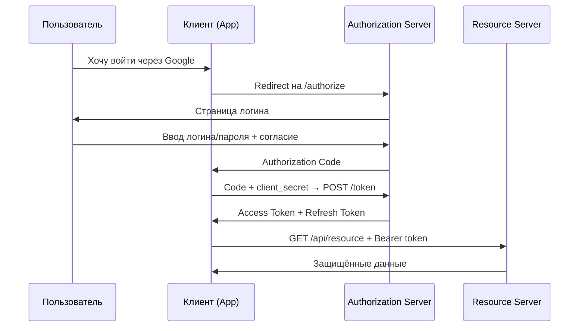

Важно: `OAuth2` — протокол **авторизации**, не аутентификации. Аутентификацию добавляет [OIDC (OpenID Connect)](authentication-authorization-patterns-interview.md) поверх `OAuth2`.

> [!mcq]
> - [ ] OAuth2 — протокол аутентификации (RFC 6749), позволяющий приложению верифицировать личность пользователя через Authorization Server без передачи логина и пароля. | OAuth2 — протокол авторизации, а не аутентификации. Он не определяет, кто такой пользователь (AuthN), а только делегирует доступ к ресурсам (AuthZ). Аутентификацию добавляет OIDC поверх OAuth2.
> - [ ] OAuth2 — протокол авторизации (RFC 6749), позволяющий приложению получить ограниченный доступ к ресурсам пользователя; в конце flow клиент получает пароль пользователя в защищённом виде. | Ключевой принцип OAuth2 — пользователь никогда не передаёт пароль клиентскому приложению. Клиент получает токен с ограниченными правами (scope) и сроком жизни — это и есть суть протокола.
> - [x] OAuth2 — протокол авторизации (RFC 6749), позволяющий приложению получить ограниченный доступ к ресурсам пользователя на другом сервисе без передачи логина и пароля; вместо пароля выдаётся токен с ограниченными scope и сроком жизни. | Верное определение. Разграничение AuthN (кто ты?) и AuthZ (что тебе разрешено?) — ключевая концепция. OAuth2 решает задачу делегированного доступа, OIDC добавляет поверх него удостоверение личности.
> - [ ] OAuth2 — протокол авторизации (RFC 6749), позволяющий приложению получить постоянный доступ к ресурсам пользователя; токен выдаётся бессрочно, пока пользователь не отзовёт доступ в настройках. | OAuth2 токены по стандарту имеют срок жизни (expires_in). Бессрочный токен — это антипаттерн и нарушение принципа минимальных привилегий. Refresh Token позволяет продлевать сессию, но не делает токены бессрочными.

## Q2. (!) Какие роли определены в `OAuth2`?

В протоколе `OAuth2` (`RFC 6749`) определены 4 роли:

| Роль | Описание | Пример |
|------|----------|--------|
| **Resource Owner** | Владелец ресурса (пользователь) | Пользователь с аккаунтом Google |
| **Client** | Приложение, запрашивающее доступ | Веб-приложение, мобильное приложение |
| **Authorization Server** | Выдаёт токены после аутентификации | Keycloak, Okta, Google OAuth |
| **Resource Server** | Хранит защищённые ресурсы, проверяет токены | REST API сервис |

Authorization Server и Resource Server могут быть одним сервером (например, в монолите) или разными (типично в [микросервисах](../architecture/microservices-interview.md)).

> [!mcq]
> - [ ] В OAuth2 определены три роли: Authorization Server (выдаёт токены), Resource Server (хранит ресурсы) и Client (запрашивает доступ); пользователь — часть роли Client. | В OAuth2 четыре роли: Resource Owner (пользователь) — самостоятельная роль, отдельная от Client. Смешение Resource Owner и Client — типичная ошибка, ведущая к неверному дизайну систем.
> - [ ] В OAuth2 определены четыре роли: Resource Owner, Client, Authorization Server, Resource Server; Authorization Server и Resource Server — это всегда один и тот же компонент. | Authorization Server и Resource Server могут быть как совмещены (монолит), так и разделены (типично в микросервисах). Разделение позволяет одному AS выдавать токены для множества Resource Server.
> - [x] В OAuth2 определены четыре роли: Resource Owner (владелец ресурса), Client (приложение), Authorization Server (выдаёт токены) и Resource Server (хранит ресурсы); AS и RS могут быть одним или разными компонентами. | Верные 4 роли из RFC 6749. Resource Owner (пользователь) делегирует доступ клиенту через AS. RS проверяет токен и предоставляет ресурсы. Разделение AS и RS — основа масштабируемой OAuth2-архитектуры.
> - [ ] В OAuth2 определены четыре роли: Resource Owner, Client, Authorization Server, Resource Server; Client всегда является конфиденциальным и должен хранить client_secret для работы протокола. | Client бывает двух типов: confidential (имеет client_secret, например backend) и public (не может хранить секрет, например SPA или мобильное приложение). Public clients используют PKCE вместо client_secret.

## Q3. (!) Чем отличается авторизация от аутентификации в контексте `OAuth2`?

| Аспект | Аутентификация (AuthN) | Авторизация (AuthZ) |
|--------|----------------------|---------------------|
| **Вопрос** | "Кто ты?" | "Что тебе разрешено?" |
| **Результат** | Подтверждение личности | Выдача прав доступа |
| **OAuth2** | Делегирует на Authorization Server | Основной фокус протокола |
| **Токен** | ID Token (OIDC) | Access Token |
| **Протокол** | OpenID Connect | OAuth2 |

`OAuth2` **сам по себе не аутентифицирует**. Он предполагает, что Authorization Server уже выполнил аутентификацию. `OIDC` расширяет `OAuth2`, добавляя `ID Token` для подтверждения личности.

Подробнее: [Паттерны аутентификации и авторизации](authentication-authorization-patterns-interview.md).

> [!mcq]
> - [ ] Аутентификация отвечает на вопрос «что тебе разрешено?» и выдаёт Access Token, авторизация отвечает на «кто ты?» и выдаёт ID Token. | Вопросы и токены перепутаны. AuthN — «кто ты?» (ID Token в OIDC), AuthZ — «что разрешено?» (Access Token в OAuth2). Это типичная путаница на собеседованиях.
> - [x] Аутентификация (AuthN) отвечает на вопрос «кто ты?» и подтверждает личность (ID Token в OIDC), авторизация (AuthZ) отвечает на «что тебе разрешено?» и выдаёт права доступа (Access Token в OAuth2). | Верное разграничение. OAuth2 — протокол AuthZ, OIDC добавляет поверх него AuthN. Access Token для ресурсов, ID Token для идентификации пользователя клиентом.
> - [ ] Аутентификация и авторизация в OAuth2 — синонимы: оба процесса выдают Access Token и определяют права доступа к ресурсам пользователя. | Это разные концепции: AuthN проверяет идентичность, AuthZ — права доступа. Их смешение — основная причина security-багов в OAuth2-имплементациях. Частая ошибка в реальном коде.
> - [ ] Аутентификация (AuthN) — основной фокус OAuth2, авторизация (AuthZ) — опциональное расширение через OIDC, применяется только при необходимости проверки ролей пользователя. | Наоборот: OAuth2 — протокол авторизации (AuthZ), а OIDC добавляет аутентификацию (AuthN) поверх него. OAuth2 не проверяет, кто пользователь — он только делегирует доступ.

## Q4. Какие типы клиентов определены в `OAuth2`?

`OAuth2` делит клиентов на два типа по способности хранить секрет:

**Confidential clients** (конфиденциальные) — могут безопасно хранить `client_secret`:
- Backend-сервер (Java, Node.js)
- Используют `Authorization Code Flow`

**Public clients** (публичные) — **не могут** хранить секрет:
- SPA (React, Angular)
- Мобильные приложения
- Desktop-приложения
- **Обязаны** использовать `Authorization Code Flow` + `PKCE`

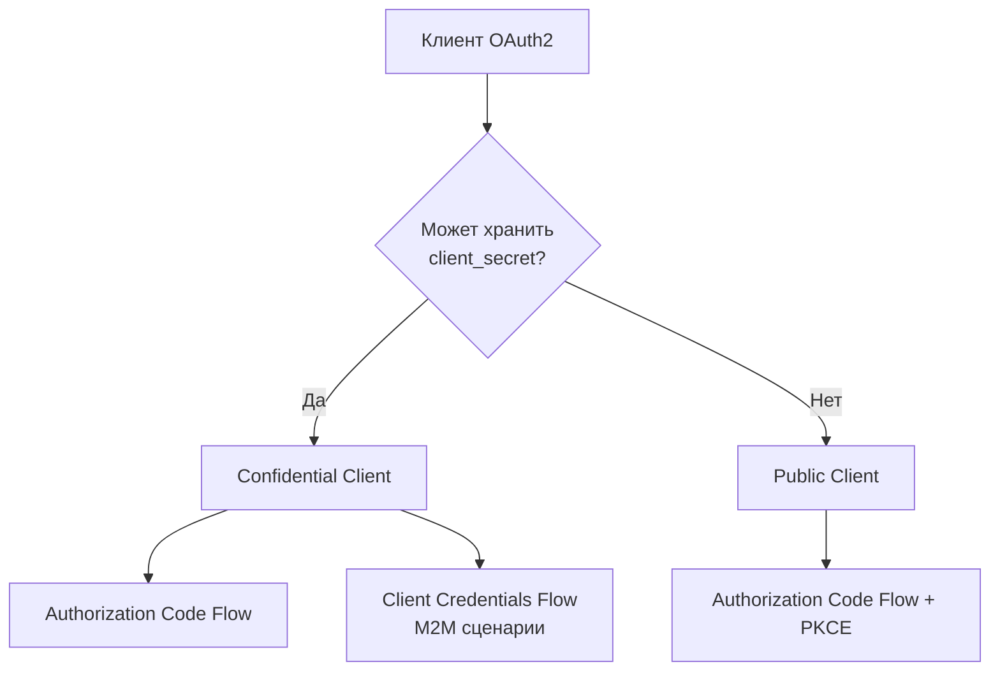

Важно: `Implicit Flow` для public clients **устарел** в `OAuth 2.1`. Всегда используйте `Authorization Code` + `PKCE`.

> [!mcq]
> - [ ] OAuth2 делит клиентов на три типа: confidential (backend), public (SPA/mobile) и hybrid (смешанный тип, способный частично хранить секрет в обфусцированном виде). | В OAuth2 только два типа клиентов: confidential и public. Hybrid — не существует в стандарте. Принцип простой: либо клиент может безопасно хранить client_secret, либо нет, промежуточного варианта нет.
> - [ ] OAuth2 делит клиентов на два типа: confidential (могут хранить client_secret, например SPA с обфусцированным кодом) и public (backend-сервисы без клиентских секретов). | Типы перепутаны: SPA — это public client (не может хранить секрет), backend — confidential. Обфускация кода не делает SPA способным безопасно хранить секреты — DevTools и XSS их легко извлекают.
> - [x] OAuth2 делит клиентов на два типа: confidential (backend-сервер, может хранить client_secret) и public (SPA, mobile, desktop — не могут хранить секрет); public-клиенты обязаны использовать Authorization Code Flow + PKCE. | Верная классификация. Критерий — способность безопасно хранить client_secret. Public-клиенты компенсируют отсутствие секрета через PKCE, что защищает code exchange.
> - [ ] OAuth2 делит клиентов на два типа: confidential (backend) и public (SPA, mobile); public-клиенты должны использовать Implicit Flow, так как не могут хранить client_secret для обмена code на token. | Implicit Flow удалён в OAuth 2.1 как небезопасный. Public-клиенты обязаны использовать Authorization Code Flow + PKCE — PKCE заменяет client_secret для защиты конкретного code exchange.

## Q5. Что такое scope в `OAuth2`?

`Scope` — механизм ограничения доступа: клиент указывает, **какие именно разрешения** запрашивает.

```
GET /authorize?
    response_type=code&
    client_id=my-app&
    scope=openid profile email read:repos&
    redirect_uri=https://app.example.com/callback&
    state=xyz123
```

Примеры стандартных scopes:

| Scope | Что даёт |
|-------|----------|
| `openid` | OIDC — получить ID Token |
| `profile` | Имя, аватар, locale |
| `email` | Email пользователя |
| `offline_access` | Получить refresh token |

На ресурсном сервере **всегда проверяйте scope**:

```java
@GetMapping("/api/repos")
@PreAuthorize("hasAuthority('SCOPE_read:repos')")
public List<Repository> getRepos() {
    return repoService.findAll();
}
```

Принцип **least privilege**: запрашивайте минимально необходимый набор scopes.

> [!mcq]
> - [ ] Scope — механизм, определяющий срок жизни Access Token; `scope=short` выдаёт токен на 15 минут, `scope=long` — на 30 дней, `scope=offline_access` даёт бессрочный токен. | Scope не управляет временем жизни токена — это делает параметр expires_in, настраиваемый на стороне Authorization Server. Scope определяет именно набор разрешений (что можно делать), а не время действия.
> - [x] Scope — механизм ограничения доступа: клиент указывает, какие именно разрешения запрашивает (например, `read:repos`, `email`, `openid`); Resource Server проверяет scope в токене перед выдачей доступа к API. | Верное определение. Scope реализует принцип least privilege — клиент получает ровно те права, которые нужны. Проверка на стороне RS (`hasAuthority('SCOPE_read:repos')`) обязательна для каждого защищённого endpoint.
> - [ ] Scope — механизм идентификации клиента: `scope=my-app` указывает Authorization Server, какому клиенту выдавать токен, заменяя собой параметр `client_id`. | Scope и client_id — разные параметры. client_id идентифицирует клиента (кто запрашивает), scope определяет запрашиваемые разрешения (что именно). Они передаются вместе и служат разным целям.
> - [ ] Scope — механизм, автоматически выдающий максимально широкие права доступа к ресурсам пользователя; если scope не указан, клиент получает полный доступ ко всему API. | При отсутствии scope Authorization Server либо отклонит запрос, либо применит default scope, определённый для конкретного клиента. Максимальные права по умолчанию нарушают principle of least privilege и никогда не реализуются на практике.

## Q6. (!) Как работает `Authorization Code Flow`?

`Authorization Code Flow` — основной и самый безопасный flow для веб-приложений с backend-сервером. Токен **никогда не передаётся через браузер**.

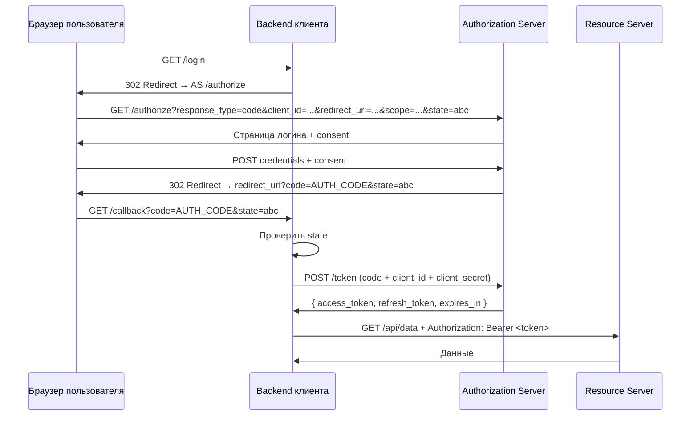

Ключевые моменты:
- Authorization code — **одноразовый**, короткоживущий (обычно 10 минут)
- Обмен code → token происходит на **backend** (server-to-server), токен не виден браузеру
- `state` параметр защищает от CSRF
- `redirect_uri` должен совпадать с зарегистрированным (exact match)

> [!mcq]
> - [ ] В Authorization Code Flow Authorization Server передаёт Access Token напрямую браузеру пользователя через URL-фрагмент (#access_token=...) после успешной аутентификации. | Это описание устаревшего Implicit Flow. В Authorization Code Flow токен никогда не проходит через браузер — сначала выдаётся code, затем backend обменивает его на token в server-to-server запросе.
> - [ ] В Authorization Code Flow сначала выдаётся Authorization Code, который клиент хранит постоянно и использует для каждого запроса к Resource Server вместо Access Token. | Authorization Code — одноразовый, короткоживущий (10 мин), используется только один раз для обмена на токен. После обмена он инвалидируется. Для API-запросов используется Access Token.
> - [x] В Authorization Code Flow Authorization Server выдаёт клиенту короткоживущий одноразовый code; клиентский backend обменивает его на Access Token через POST /token с client_secret; токен никогда не проходит через браузер. | Верная схема. Разделение на два шага (code → token) обеспечивает безопасность: код в URL браузера не даёт злоумышленнику токен, а для обмена нужен client_secret, который есть только у бэкенда.
> - [ ] В Authorization Code Flow Authorization Server выдаёт клиенту code, который клиентский frontend обменивает на Access Token через JavaScript-запрос к POST /token с client_secret, хранящимся в localStorage. | Client_secret нельзя хранить в браузере (localStorage) — он легко доступен через XSS или DevTools. Обмен code на token должен происходить на backend. Для SPA (без backend) используется PKCE без client_secret.

## Q7. (!) Что такое `PKCE` и как он защищает `Authorization Code Flow`?

`PKCE` (`Proof Key for Code Exchange`, `RFC 7636`, произносится "pixy") — расширение, защищающее от перехвата authorization code. **Обязателен** для public clients, рекомендован для всех клиентов в `OAuth 2.1`.

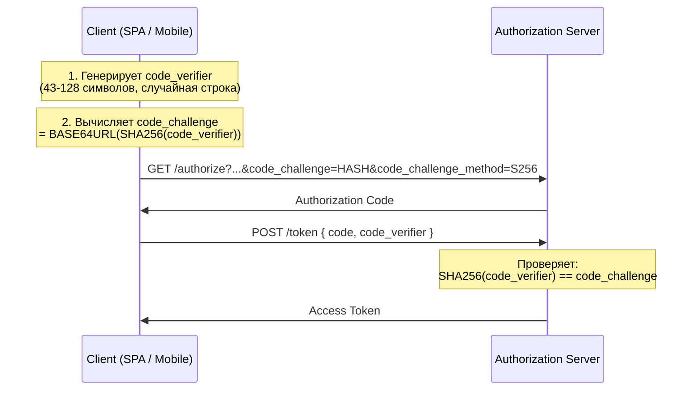

Пример генерации `PKCE` в Java:

```java
// Генерация code_verifier
SecureRandom random = new SecureRandom();
byte[] bytes = new byte[32];
random.nextBytes(bytes);
String codeVerifier = Base64.getUrlEncoder()
    .withoutPadding()
    .encodeToString(bytes);

// Генерация code_challenge
MessageDigest digest = MessageDigest.getInstance("SHA-256");
byte[] hash = digest.digest(codeVerifier.getBytes(StandardCharsets.US_ASCII));
String codeChallenge = Base64.getUrlEncoder()
    .withoutPadding()
    .encodeToString(hash);
```

Почему это работает: даже если злоумышленник перехватит `authorization code`, он **не знает** `code_verifier` и не сможет обменять code на токен.

> [!mcq]
> - [ ] PKCE защищает Authorization Code Flow, генерируя code_challenge как Base64URL(MD5(code_verifier)); Authorization Server проверяет это при обмене code на token. | MD5 — небезопасный алгоритм хэширования, запрещённый для использования в PKCE. Спецификация RFC 7636 требует SHA-256 (метод S256) или plain (менее безопасный, не рекомендуется).
> - [x] PKCE защищает Authorization Code Flow: клиент генерирует случайный code_verifier, вычисляет code_challenge = BASE64URL(SHA256(code_verifier)) и отправляет challenge с запросом; при обмене code на token сервер проверяет, что SHA256(code_verifier) == code_challenge. | Верный механизм из RFC 7636. Злоумышленник, перехвативший code, не может обменять его на токен без code_verifier — он не передаётся по сети до момента обмена, что устраняет угрозу перехвата authorization code.
> - [ ] PKCE защищает Authorization Code Flow, генерируя code_challenge как BASE64URL(SHA256(code_verifier)); защита достигается тем, что code_verifier передаётся вместе с authorization request, а code_challenge — при обмене на token. | code_verifier и code_challenge перепутаны местами. Правильно: code_challenge отправляется в authorization request (и может быть перехвачен), code_verifier передаётся только при обмене на token (в backend-запросе, защищённом TLS).
> - [ ] PKCE защищает Authorization Code Flow: клиент генерирует code_verifier, вычисляет code_challenge = BASE64URL(SHA256(code_verifier)); PKCE обязателен только для public clients (SPA, mobile), confidential clients с client_secret PKCE не нужен. | В OAuth 2.1 PKCE обязателен для всех клиентов — и public, и confidential. PKCE и client_secret не взаимозаменяемы: client_secret аутентифицирует клиента, PKCE защищает конкретный code exchange от перехвата.

## Q8. (!) Как работает `Client Credentials Flow`?

`Client Credentials Flow` — для **machine-to-machine** (M2M) сценариев, когда сервис обращается к API другого сервиса **от своего имени** (не от имени пользователя).

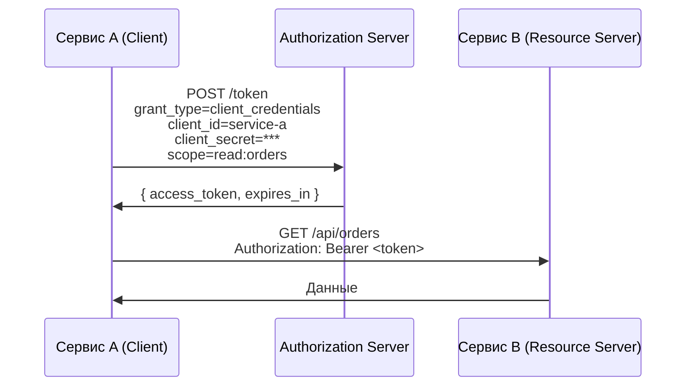

Конфигурация в `Spring Boot`:

```yaml
spring:
  security:
    oauth2:
      client:
        registration:
          service-b:
            client-id: service-a
            client-secret: ${SERVICE_B_CLIENT_SECRET}
            authorization-grant-type: client_credentials
            scope: read:orders
        provider:
          service-b:
            token-uri: https://auth.example.com/oauth2/token
```

Использование с `WebClient`:

```java
@Bean
public WebClient serviceB(OAuth2AuthorizedClientManager clientManager) {
    var oauth2 = new ServletOAuth2AuthorizedClientExchangeFilterFunction(clientManager);
    oauth2.setDefaultClientRegistrationId("service-b");
    return WebClient.builder()
        .apply(oauth2.oauth2Configuration())
        .baseUrl("https://service-b.example.com")
        .build();
}
```

Важно: нет участия пользователя, нет `refresh_token`. Используется только для **конфиденциальных клиентов**, которые могут безопасно хранить `client_secret`. Типичное применение в [микросервисах](../architecture/microservices-interview.md): сервис авторизации, межсервисные вызовы.

> [!mcq]
> - [ ] Client Credentials Flow предназначен для аутентификации пользователей через логин/пароль напрямую у клиента (Resource Owner Password Credentials); клиент передаёт credentials пользователя на Authorization Server и получает токен. | Это описание ROPC (Resource Owner Password Credentials) Grant, удалённого в OAuth 2.1. Client Credentials Flow — для M2M взаимодействия без участия пользователя; клиент аутентифицируется своим client_id и client_secret.
> - [ ] Client Credentials Flow предназначен для M2M сценариев; в ответе всегда возвращаются Access Token и Refresh Token, так как сервисы работают непрерывно и должны поддерживать долгоживущие сессии. | В Client Credentials Flow Refresh Token не выдаётся — нет пользовательского контекста для управления сессией. При истечении Access Token сервис просто запрашивает новый через тот же POST /token с client_credentials.
> - [x] Client Credentials Flow предназначен для M2M сценариев: сервис аутентифицируется client_id и client_secret напрямую на Authorization Server и получает Access Token; пользователь не участвует, Refresh Token не выдаётся. | Верное описание flow для межсервисного взаимодействия. В Spring Boot реализуется через WebClient + OAuth2AuthorizedClientManager с grant_type=client_credentials. Применимо только для confidential clients.
> - [ ] Client Credentials Flow предназначен для M2M сценариев; может использоваться как public clients (SPA), так и confidential clients (backend), поскольку не требует хранения user-контекста. | Client Credentials Flow предназначен только для confidential clients — тех, кто может безопасно хранить client_secret. SPA не может хранить секрет безопасно, поэтому не должны использовать этот flow.

## Q9. Как работает `Device Authorization Flow`?

`Device Authorization Flow` (`RFC 8628`) — для устройств с ограниченным вводом: Smart TV, IoT, CLI-утилиты, игровые консоли.

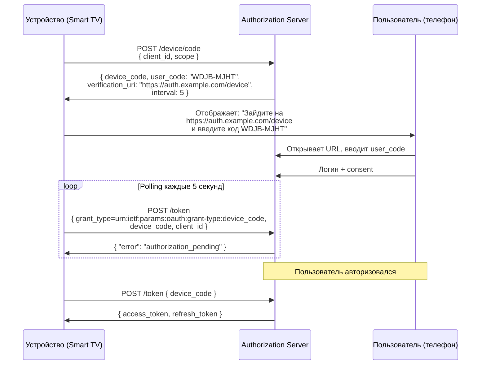

Устройство **не открывает браузер** — пользователь вводит код на другом устройстве. Это единственный flow, где пользователь авторизуется **вне клиента**.

> [!mcq]
> - [x] Device Authorization Flow (RFC 8628) предназначен для устройств с ограниченным вводом (Smart TV, IoT, CLI): устройство получает user_code и verification_uri, показывает их пользователю, который авторизуется на другом устройстве; само устройство polling-ом запрашивает токен. | Верное описание flow для devices без браузера или клавиатуры. Разделение: авторизация происходит на телефоне/ноутбуке пользователя, а токен получает TV/IoT-устройство через polling по device_code.
> - [ ] Device Authorization Flow предназначен для устройств с ограниченным вводом: устройство встраивает мини-браузер и проводит пользователя через стандартный Authorization Code Flow с вводом логина/пароля прямо на устройстве. | Весь смысл Device Flow — НЕ открывать браузер на устройстве. Smart TV, IoT-device или CLI физически не могут удобно показать логин-форму, поэтому авторизация делегируется на телефон/ноутбук пользователя.
> - [ ] Device Authorization Flow предназначен для мобильных приложений: устройство генерирует PKCE code_challenge и обменивает его на токен напрямую без polling, так как мобильные клиенты имеют постоянное соединение. | Мобильные приложения используют обычный Authorization Code Flow + PKCE (не Device Flow). Device Flow — для устройств БЕЗ удобного ввода: Smart TV, игровые консоли, принтеры, IoT. На мобильных есть браузер и клавиатура.
> - [ ] Device Authorization Flow предназначен для machine-to-machine коммуникации: сервис генерирует device_code при старте и использует его как client_secret для всех последующих token requests. | Это описание Client Credentials Flow, а не Device Flow. Device Flow всегда вовлекает пользователя (который вводит user_code на втором устройстве) — это user-facing flow, а не M2M.

## Q10. (!) Чем `Authorization Code Flow` отличается от `Implicit Flow`?

| Аспект | Authorization Code Flow | Implicit Flow |
|--------|------------------------|---------------|
| **Токен в URL** | Нет (обмен на backend) | Да (fragment `#access_token=...`) |
| **Безопасность** | Высокая | Низкая (токен в истории браузера) |
| **Refresh token** | Да | Нет |
| **Подходит для** | Любых клиентов | ~~SPA~~ (устарел) |
| **PKCE** | Рекомендован / обязателен | Не применим |
| **Статус** | Актуален | **Deprecated** в OAuth 2.1 |

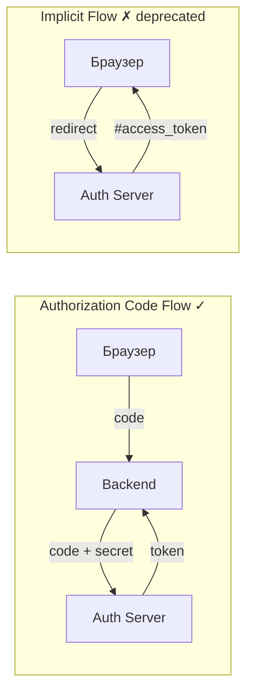

Рекомендация: **всегда** используйте `Authorization Code Flow` + `PKCE`, даже для SPA. `Implicit Flow` удалён из `OAuth 2.1`.

> [!mcq]
> - [ ] Authorization Code Flow возвращает токен в URL fragment (#access_token=...), а Implicit Flow обменивает code на токен через backend — это единственное различие между ними. | Описания перепутаны. Токен в URL fragment — это Implicit Flow (deprecated), а обмен code на токен через backend — это Authorization Code Flow. Такая путаница — типичная ошибка на собеседовании.
> - [x] Authorization Code Flow выдаёт клиенту короткоживущий code, который обменивается на токен через backend-запрос; Implicit Flow возвращает access_token напрямую в URL fragment без дополнительного шага обмена, и из-за этого был удалён в OAuth 2.1. | Верные различия: ключевое — способ доставки токена. Authorization Code безопасен (токен не проходит через браузер), Implicit уязвим (токен в истории браузера, Referer, нет refresh token).
> - [ ] Authorization Code Flow поддерживает только confidential clients, а Implicit Flow — только public clients; оба flow остаются актуальными в OAuth 2.1 для разных типов клиентов. | Authorization Code Flow поддерживает и confidential, и public (с PKCE) клиентов. Implicit Flow удалён из OAuth 2.1 полностью; public clients теперь используют Authorization Code Flow + PKCE.
> - [ ] Authorization Code Flow использует state parameter для защиты от CSRF, а Implicit Flow использует PKCE; оба механизма эквивалентны по уровню безопасности. | PKCE не применим к Implicit Flow — нет этапа code exchange, где нужен code_verifier. Даже с state Implicit Flow небезопасен, так как токен проходит через браузер и может утечь через логи/Referer.

## Q11. Какие гранты убраны в `OAuth 2.1`?

`OAuth 2.1` (`draft-ietf-oauth-v2-1`) — консолидация лучших практик. Убраны:

1. **Implicit Grant** — токен в URL небезопасен. Замена: `Authorization Code` + `PKCE`.
2. **Resource Owner Password Credentials (ROPC)** — клиент получает пароль пользователя, что нарушает принцип OAuth2. Замена: `Authorization Code Flow`.

Добавлены как обязательные:
- `PKCE` для **всех** клиентов (не только public)
- Exact match для `redirect_uri` (без wildcard)
- Refresh token rotation или sender-constrained tokens

> [!mcq]
> - [ ] В OAuth 2.1 убраны Authorization Code Flow (заменён на более простой Implicit Flow) и Client Credentials Flow (заменён на Device Flow); PKCE стал опциональным. | Всё наоборот: Implicit Flow удалён, Authorization Code Flow остался основным. Client Credentials сохранён для M2M. PKCE стал обязательным (не опциональным) для всех клиентов.
> - [ ] В OAuth 2.1 убраны Client Credentials Flow (M2M уязвим к подмене client_secret) и Device Authorization Flow (пользователь может ввести код на чужом устройстве). | Client Credentials и Device Authorization Flow оставлены — они безопасны при правильной реализации. Убраны Implicit и ROPC — именно они имели фундаментальные проблемы безопасности.
> - [x] В OAuth 2.1 убраны Implicit Grant (токен в URL небезопасен — замена Authorization Code + PKCE) и Resource Owner Password Credentials (клиент получает пароль пользователя — замена Authorization Code Flow); PKCE стал обязательным для всех клиентов. | Верный список удалённых грантов и причины. Implicit: токен в URL. ROPC: клиент видит пароль пользователя, несовместим с MFA. Оба несовместимы с современной моделью безопасности.
> - [ ] В OAuth 2.1 убраны Authorization Code Flow без PKCE (заменён на Code Flow с обязательным PKCE) и Refresh Token (заменён на long-lived access tokens с rotation). | Authorization Code Flow сохранён в OAuth 2.1 (с обязательным PKCE), он не "убран". Refresh Token остаётся ключевым механизмом — наоборот, для него добавлена обязательная rotation. Long-lived access tokens — антипаттерн.

## Q12. (!) Что такое `access token` и `refresh token`?

| Свойство | Access Token | Refresh Token |
|----------|-------------|---------------|
| **Назначение** | Доступ к ресурсам | Получение нового access token |
| **Время жизни** | Короткое (15–60 мин) | Долгое (дни–месяцы) |
| **Передаётся** | Resource Server | Authorization Server |
| **Формат** | JWT или opaque | Обычно opaque |
| **Хранение** | Память / httpOnly cookie | httpOnly cookie / secure storage |

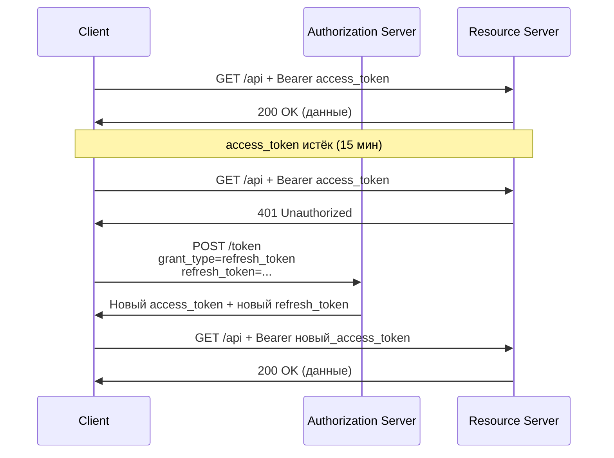

Важно: `access_token` должен быть **короткоживущим** для минимизации окна компрометации. `refresh_token` хранить **только в безопасном месте** (`httpOnly` cookie с `Secure` и `SameSite=Strict`).

> [!mcq]
> - [x] Access token используется для доступа к ресурсам (передаётся Resource Server, короткое время жизни 15–60 мин), refresh token — для получения нового access token (передаётся только Authorization Server, долгое время жизни дни–месяцы). | Верное разграничение. Access — короткий, чтобы минимизировать окно компрометации; Refresh — долгий, для UX (не логиниться каждые 15 мин), но используется только на token endpoint, что снижает поверхность атаки.
> - [ ] Access token используется для получения refresh token (передаётся Authorization Server, короткое время жизни), refresh token — для доступа к ресурсам (передаётся Resource Server, долгое время жизни). | Роли перепутаны. Access Token идёт на Resource Server для доступа к API, Refresh Token — только на Authorization Server для обновления. Передача RT на Resource Server расширяет поверхность атаки.
> - [ ] Access token и refresh token — одинаковые токены с разными именами, отличаются только временем жизни; оба передаются Resource Server в заголовке Authorization: Bearer. | Refresh token не передаётся на Resource Server. Назначение у токенов разное: AT — авторизация на ресурсах, RT — обновление AT. Передача RT вместе с AT на API — критическая ошибка безопасности.
> - [ ] Access token используется для доступа к ресурсам (время жизни дни–месяцы), refresh token — для проверки статуса пользователя (время жизни 15–60 мин); обновлять access token не требуется. | Времена жизни перепутаны. Access token должен быть короткоживущим (15–60 мин) для минимизации окна компрометации, refresh token — долгоживущий (дни–месяцы) для UX. Обновление AT через RT — основа OAuth2-сессии.

## Q13. (!) Какова структура `JWT` токена?

`JWT` (`JSON Web Token`, `RFC 7519`) состоит из трёх частей, разделённых точками: `header.payload.signature`.

Пример реального JWT:

```
eyJhbGciOiJSUzI1NiIsInR5cCI6IkpXVCIsImtpZCI6ImtleS0xIn0.
eyJpc3MiOiJodHRwczovL2F1dGguZXhhbXBsZS5jb20iLCJzdWIiOiJ1c2VyLTEyMyIsImF1ZCI6Im15LWFwcCIsImV4cCI6MTcxMjg0MDAwMCwiaWF0IjoxNzEyODM2NDAwLCJzY29wZSI6Im9wZW5pZCBwcm9maWxlIGVtYWlsIn0.
<подпись>
```

Декодированное содержимое:

```json
// Header
{
  "alg": "RS256",
  "typ": "JWT",
  "kid": "key-1"
}

// Payload (Claims)
{
  "iss": "https://auth.example.com",      // Издатель
  "sub": "user-123",                       // Subject (ID пользователя)
  "aud": "my-app",                         // Аудитория (client_id)
  "exp": 1712840000,                       // Время истечения
  "iat": 1712836400,                       // Время выдачи
  "scope": "openid profile email",         // Разрешения
  "roles": ["ROLE_USER", "ROLE_ADMIN"]     // Кастомные claims
}

// Signature
RSASHA256(
  base64UrlEncode(header) + "." + base64UrlEncode(payload),
  privateKey
)
```

Алгоритмы подписи:

| Алгоритм | Тип | Рекомендация |
|----------|-----|-------------|
| `RS256` | Асимметричный (RSA) | Рекомендуется для production |
| `ES256` | Асимметричный (ECDSA) | Компактнее RSA |
| `HS256` | Симметричный (HMAC) | Только для доверенных сервисов |
| `none` | Без подписи | **Никогда не использовать!** |

Подробнее о безопасности токенов: [Безопасность приложений](application-security-interview.md).

> [!mcq]
> - [ ] JWT состоит из двух частей, разделённых точкой: payload (JSON с claims в Base64) и signature (HMAC или RSA подпись); header не передаётся, алгоритм подписи известен заранее. | JWT состоит из трёх частей: header.payload.signature. Header обязателен и содержит `alg` и `typ`, иногда `kid` для выбора ключа при rotation. Без header невозможно корректно проверить подпись.
> - [ ] JWT состоит из трёх частей: header (JSON с метаданными), payload (JSON с claims) и signature; все три части зашифрованы AES-256, поэтому claims не видны без ключа. | JWT по умолчанию НЕ шифрован — это JWS (signed), не JWE (encrypted). Claims закодированы в Base64URL и легко читаемы. Именно поэтому в JWT нельзя класть чувствительные данные (пароли, PII) — они видны любому, кто перехватит токен.
> - [x] JWT состоит из трёх частей, разделённых точками: `header.payload.signature` (Base64URL-кодированные JSON); подпись покрывает header и payload, claims видны всем (Base64 — кодирование, не шифрование). | Верное описание. Header содержит alg/typ/kid, payload — claims (iss, sub, exp, aud и др.), signature — криптографическая подпись первых двух частей. Данные читаемы, но изменение любой части инвалидирует подпись.
> - [ ] JWT состоит из трёх частей: header (алгоритм), payload (claims) и signature; все три части кодируются Base64URL, но signature всегда вычисляется только над payload без header для совместимости. | Подпись JWS покрывает обе части: BASE64URL(header) + "." + BASE64URL(payload). Если бы подпись не покрывала header, злоумышленник мог бы изменить `alg` (атака Algorithm Confusion, например `alg: none`). Именно поэтому header участвует в подписи.

## Q14. Чем `JWT` отличается от opaque token?

| Аспект | JWT | Opaque Token |
|--------|-----|-------------|
| **Структура** | Самодостаточный (header.payload.signature) | Случайная строка |
| **Валидация** | Локально (проверка подписи) | Запрос к Authorization Server (introspection) |
| **Отзыв** | Сложно (нужен blacklist или короткий TTL) | Просто (удалить из хранилища) |
| **Масштабируемость** | Высокая (нет запроса при каждом вызове) | Ниже (запрос на каждую валидацию) |
| **Размер** | Больше (содержит claims) | Компактнее |
| **Утечка данных** | Claims видны (Base64, не шифрование!) | Нет данных |

Рекомендация: `JWT` — для [микросервисов](../architecture/microservices-interview.md) (масштабируемость), opaque — когда нужен мгновенный отзыв или токен содержит чувствительные данные.

> [!mcq]
> - [ ] JWT — случайная строка без структуры, валидируется через introspection; opaque token — самодостаточный токен с claims, валидируется локально по подписи. | Определения перепутаны: JWT — самодостаточный токен с claims и подписью (локальная валидация), opaque — случайная строка без структуры (введите introspection). Это классическая путаница на собеседованиях.
> - [x] JWT — самодостаточный токен (header.payload.signature), валидируется локально проверкой подписи; opaque token — случайная строка без внутренней структуры, для валидации требуется запрос introspection к Authorization Server. | Верное разграничение. JWT удобен в микросервисах (масштабируемость, нет сетевых запросов); opaque — когда нужен мгновенный отзыв или нельзя раскрывать claims клиентам.
> - [ ] JWT и opaque token эквивалентны по внутренней структуре, отличаются только способом передачи: JWT в заголовке Authorization, opaque — в query parameter. | Оба токена передаются одинаково (обычно в заголовке Authorization: Bearer). Отличие принципиальное: JWT содержит данные внутри (самодостаточен), opaque — просто идентификатор, за данными надо идти на AS.
> - [ ] JWT подписывается симметричным ключом (HS256), opaque token — асимметричным (RS256); оба валидируются локально на Resource Server через общий секрет. | Алгоритм подписи не определяет тип токена. JWT может быть подписан и HS256, и RS256 — отличие от opaque в том, что opaque вообще не подписан и не имеет структуры. Opaque не валидируется локально — только через introspection.

## Q15. Как ресурсный сервер валидирует `JWT`?

Алгоритм валидации JWT access token:

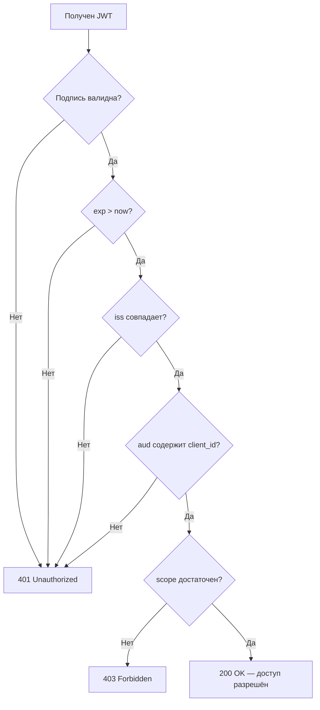

Ресурсный сервер получает публичные ключи из **JWKS endpoint** (JSON Web Key Set):

```
GET https://auth.example.com/.well-known/jwks.json

{
  "keys": [{
    "kty": "RSA",
    "kid": "key-1",
    "n": "...",
    "e": "AQAB",
    "use": "sig",
    "alg": "RS256"
  }]
}
```

Spring Security автоматически кэширует ключи и обновляет при появлении неизвестного `kid`.

> [!mcq]
> - [ ] Resource Server валидирует JWT, отправляя токен на Authorization Server через /introspect endpoint и проверяя флаг "active": true; локальная проверка подписи не требуется. | Это описание валидации opaque token через introspection, а не JWT. JWT валидируется локально (проверка подписи через JWKS), что даёт масштабируемость — не нужен сетевой запрос на каждый API-вызов.
> - [x] Resource Server валидирует JWT локально: проверяет подпись через публичный ключ из JWKS endpoint, проверяет exp (не истёк), iss (совпадает с ожидаемым), aud (содержит идентификатор RS); при несовпадении — 401 или 403. | Полный и корректный алгоритм. JWKS endpoint (`/.well-known/jwks.json`) отдаёт публичные ключи; Spring Security кэширует их и обновляет при появлении неизвестного kid. Проверка aud критична — защита от confused deputy.
> - [ ] Resource Server валидирует JWT только по алгоритму подписи: если `alg` в header равен `RS256`, токен считается валидным без проверки claims; exp, iss и aud проверяются опционально. | Проверка только алгоритма подписи — грубая уязвимость. Обязательная проверка exp (не истёк), iss (правильный AS), aud (предназначен этому RS) — стандартные требования RFC 7519. Отсутствие этих проверок — типичная причина взломов.
> - [ ] Resource Server валидирует JWT, расшифровывая payload приватным ключом клиента и проверяя contents; при успешной расшифровке токен считается действительным без дополнительных проверок. | JWT по умолчанию не шифрован (JWS), payload кодирован Base64URL и открыт для чтения. Расшифровка применима только к JWE. Подпись проверяется публичным ключом AS (не клиента), и это не единственная проверка — нужны ещё exp, iss, aud.

## Q16. Что такое `refresh token rotation`?

`Refresh token rotation` — при каждом обновлении access token **выдаётся новый refresh token**, а старый немедленно инвалидируется.

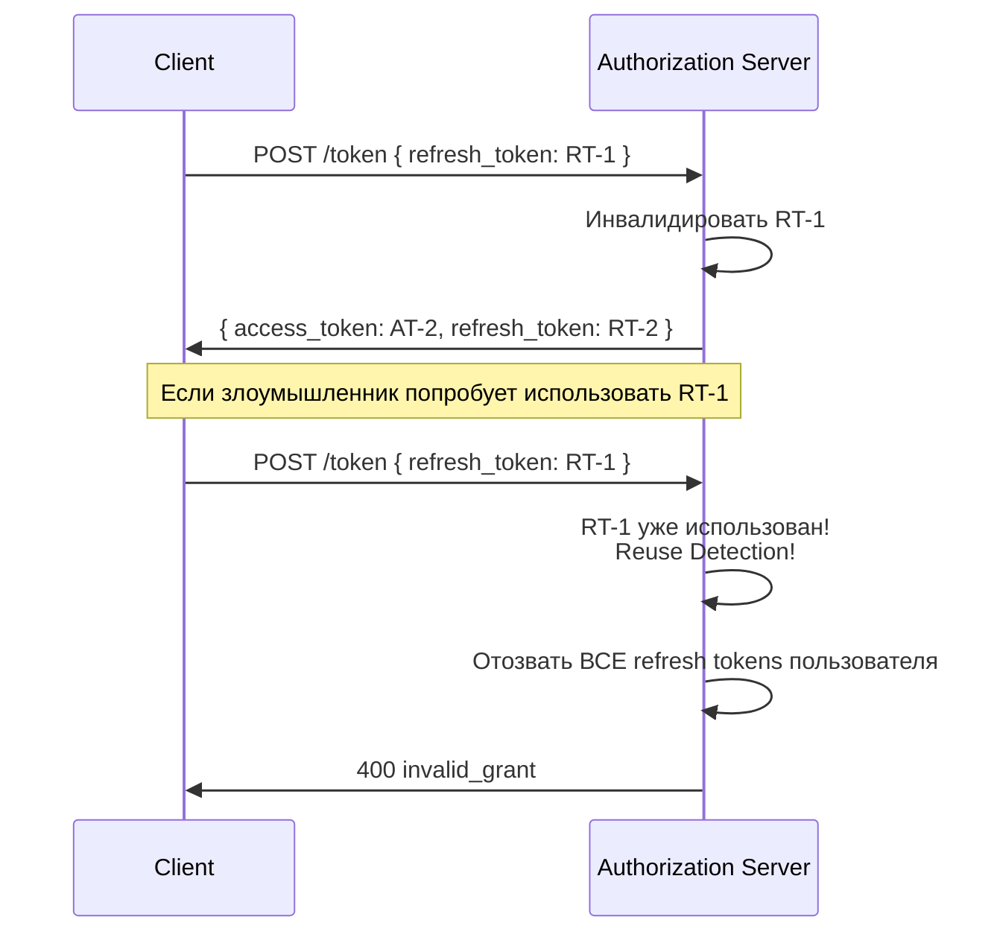

**Reuse detection**: если уже использованный refresh token предъявляется повторно — это признак компрометации. Сервер отзывает **все** refresh tokens данного пользователя.

> [!mcq]
> - [ ] Refresh token rotation — механизм, при котором refresh token автоматически продлевается каждый раз при использовании: его exp сдвигается на следующие 30 дней, но сам токен остаётся прежним. | Это не rotation. Rotation означает выдачу НОВОГО refresh token при каждом использовании старого. Простое продление TTL без замены токена не даёт reuse detection — украденный токен продолжает работать вечно.
> - [x] Refresh token rotation — при каждом использовании refresh token для получения нового access token выдаётся новый refresh token, а старый немедленно инвалидируется; попытка повторного использования старого RT (reuse detection) приводит к отзыву всех refresh tokens пользователя. | Верное определение с reuse detection. Механизм обнаруживает кражу: если и жертва, и злоумышленник имеют один RT, первый, кто использует — получит новый, второй — триггерит alert и полный logout.
> - [ ] Refresh token rotation — механизм, при котором Authorization Server периодически (раз в час) принудительно инвалидирует все refresh tokens и требует повторного логина от всех пользователей для ротации. | Такой "big bang" logout разрушил бы UX. Rotation происходит на уровне конкретного токена, при его использовании, а не по таймеру для всех пользователей. Массовая ротация применяется только при компрометации signing key.
> - [ ] Refresh token rotation — ротация JWT signing keys на Authorization Server: ключи меняются каждые 30 дней, и все выпущенные refresh tokens автоматически становятся невалидными. | Это описание ротации ключей (key rotation), а не токенов. Ротация ключей — отдельный механизм, при котором JWKS содержит множество kid. Rotation токенов — о замене самого токена при каждом использовании, независимо от ключей.

## Q17. Как отзывать токены (token revocation)?

Token revocation (`RFC 7009`) — механизм досрочного отзыва токенов:

```
POST /oauth2/revoke HTTP/1.1
Content-Type: application/x-www-form-urlencoded

token=<token_value>&
token_type_hint=refresh_token&
client_id=my-app&
client_secret=***
```

Сложности с отзывом JWT:
- JWT **самодостаточен** — ресурсный сервер не обращается к Authorization Server при каждом запросе
- После отзыва JWT остаётся "валидным" до `exp`

Решения:
1. **Короткий TTL** (5–15 мин) — минимизировать окно
2. **Blacklist в Redis** — ресурсный сервер проверяет `jti` (JWT ID) в blacklist
3. **Introspection** — ресурсный сервер проверяет статус на Authorization Server (снижает масштабируемость)

> [!mcq]
> - [x] Token revocation (RFC 7009) — механизм досрочного отзыва токенов через POST /oauth2/revoke; для JWT дополнительная сложность: JWT самодостаточен, после отзыва остаётся валидным до exp (решения: короткий TTL, blacklist по jti в Redis, introspection). | Верный обзор механизма. RFC 7009 определяет revoke endpoint, но фундаментальная проблема JWT — он проверяется локально без запроса к AS. Отсюда решения: либо короткий TTL, либо blacklist, либо introspection (жертвуя масштабируемостью).
> - [ ] Token revocation (RFC 7009) — механизм, при котором Authorization Server автоматически удаляет JWT из всех Resource Server при вызове /revoke; никаких дополнительных мер не требуется. | AS не имеет связи с Resource Server и не может "удалить" JWT отовсюду — токен находится у клиента, и RS проверяют его локально. Это фундаментальная проблема JWT, которая и требует blacklist/short TTL/introspection.
> - [ ] Token revocation (RFC 7009) — механизм, работающий только для opaque tokens; JWT невозможно отозвать ни при каких условиях, поэтому JWT не следует использовать в production. | JWT можно отозвать, это просто требует дополнительной инфраструктуры (blacklist, introspection, short TTL). JWT активно используется в production именно потому, что trade-off (короткий TTL 15 мин) приемлем для большинства сценариев.
> - [ ] Token revocation (RFC 7009) — механизм отзыва access token через /oauth2/revoke; refresh token отозвать нельзя, так как он бессрочный по спецификации OAuth2. | Можно отзывать и access, и refresh tokens через один и тот же endpoint с параметром token_type_hint. Refresh token не бессрочен — у него свой expires_in (обычно дни/месяцы) и может быть отозван пользователем или AS.

## Q18. Что такое token introspection?

Token introspection (`RFC 7662`) — ресурсный сервер запрашивает у Authorization Server актуальную информацию о токене:

```
POST /oauth2/introspect HTTP/1.1
Content-Type: application/x-www-form-urlencoded

token=<opaque_token>&
token_type_hint=access_token
```

Ответ:

```json
{
  "active": true,
  "scope": "read:orders write:orders",
  "client_id": "service-a",
  "sub": "user-123",
  "exp": 1712840000,
  "iat": 1712836400
}
```

Конфигурация в Spring Security для opaque token:

```java
@Bean
public SecurityFilterChain filterChain(HttpSecurity http) throws Exception {
    return http
        .oauth2ResourceServer(oauth2 -> oauth2
            .opaqueToken(opaque -> opaque
                .introspectionUri("https://auth.example.com/oauth2/introspect")
                .introspectionClientCredentials("rs-client", "rs-secret")
            )
        )
        .build();
}
```

Trade-off: гарантирует актуальность статуса токена, но создаёт **дополнительный запрос** на каждый API-вызов.

> [!mcq]
> - [ ] Token introspection (RFC 7662) — механизм, при котором Authorization Server проверяет токен у Resource Server через POST /introspect и получает подтверждение его валидности. | Направление перепутано: RS спрашивает AS о статусе токена, а не наоборот. AS — источник истины о токене, RS — потребитель этой информации. Частая ошибка в реальном коде.
> - [x] Token introspection (RFC 7662) — протокол, при котором Resource Server запрашивает у Authorization Server актуальную информацию о токене через POST /oauth2/introspect; ответ содержит `active: true/false`, scope, sub, exp и др.; обычно применяется к opaque tokens. | Верное описание. Introspection гарантирует актуальный статус (в отличие от JWT, где токен валиден до exp после отзыва), но создаёт дополнительный HTTP-запрос per API-call — trade-off между безопасностью и производительностью.
> - [ ] Token introspection (RFC 7662) — механизм, встроенный в JWT: Resource Server расшифровывает payload токена с помощью публичного ключа AS и читает claims локально, без сетевых запросов. | Это описание локальной валидации JWT, а не introspection. Introspection принципиально требует сетевого запроса на /introspect endpoint AS. JWT и introspection — альтернативные подходы: JWT быстрее, introspection даёт актуальный статус.
> - [ ] Token introspection (RFC 7662) — механизм логирования токенов: Resource Server при каждом запросе отправляет копию токена в Authorization Server для аудита использования; результат не влияет на решение о доступе. | Introspection напрямую влияет на решение о доступе: при `active: false` Resource Server отказывает в доступе. Это не пассивный аудит, а активная проверка. Также нельзя отправлять "копию токена для аудита" — это утечка данных.

## Q19. Что такое token binding и `DPoP`?

**Проблема**: Bearer token может быть перехвачен и использован кем угодно.

**DPoP** (`Demonstrating Proof-of-Possession`, `RFC 9449`) — клиент доказывает владение приватным ключом при каждом запросе:

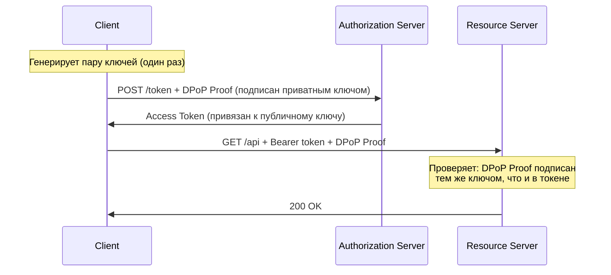

Даже если токен перехвачен — без приватного ключа клиента использовать его **невозможно**.

> [!mcq]
> - [ ] DPoP (RFC 9449) — механизм, при котором Authorization Server шифрует access token симметричным ключом клиента; Resource Server расшифровывает токен при каждом запросе, что защищает от перехвата. | DPoP не использует шифрование токена симметричным ключом. DPoP — это sender-constrained token через асимметричную подпись DPoP Proof (JWT) приватным ключом клиента на каждый запрос; AS и RS имеют только публичный ключ.
> - [x] DPoP (Demonstrating Proof-of-Possession, RFC 9449) — клиент генерирует пару ключей и подписывает DPoP Proof приватным ключом при каждом запросе; access token привязан к публичному ключу клиента; перехваченный токен без приватного ключа использовать невозможно. | Верное описание sender-constrained token. DPoP защищает от кражи Bearer token — даже при перехвате через XSS/прокси злоумышленник не сможет сгенерировать DPoP Proof без приватного ключа.
> - [ ] DPoP (RFC 9449) — механизм, при котором Authorization Server генерирует одноразовый token для каждого запроса; клиент получает новый токен на каждый API-вызов, что делает перехват бесполезным. | Одноразовые токены на каждый запрос — неприемлемо по производительности. DPoP не генерирует новые токены; access token остаётся тем же, но к нему прикладывается DPoP Proof — подпись текущего запроса приватным ключом.
> - [ ] DPoP (RFC 9449) — механизм, требующий mTLS-сертификата для каждого запроса; Resource Server валидирует клиентский сертификат вместо проверки access token. | Это описание mTLS (RFC 8705 Certificate-Bound tokens), а не DPoP. DPoP работает на уровне приложения через JWT-подписи (не требует TLS-сертификатов), что проще деплоить в cloud-окружениях.

## Q20. (!) Что такое `OpenID Connect` и чем он отличается от `OAuth2`?

`OIDC` (`OpenID Connect`) — слой **аутентификации** поверх `OAuth2`:

| Аспект | OAuth2 | OIDC |
|--------|--------|------|
| **Задача** | Авторизация (доступ к ресурсам) | Аутентификация (кто пользователь?) |
| **Токен** | Access Token | Access Token + **ID Token** |
| **Стандартные scopes** | Нет стандартных | `openid`, `profile`, `email` |
| **UserInfo endpoint** | Нет | Да |
| **Discovery** | Нет | `/.well-known/openid-configuration` |

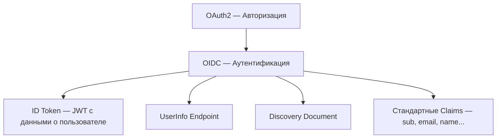

Когда вы делаете "Login with Google" — это `OIDC` поверх `OAuth2`:
1. Запрос с `scope=openid profile email`
2. В ответе получаете `ID Token` с данными пользователя
3. `Access Token` для вызова Google API

Подробнее: [Паттерны аутентификации и авторизации](authentication-authorization-patterns-interview.md).

> [!mcq]
> - [ ] OIDC — это альтернатива OAuth2, заменяющая его для сценариев аутентификации; при использовании OIDC OAuth2 не задействуется, протоколы работают независимо. | OIDC — это слой поверх OAuth2, а не замена. OIDC использует все механизмы OAuth2 (flows, token endpoint, client registration) и добавляет к ним ID Token, UserInfo endpoint и Discovery Document.
> - [ ] OIDC расширяет OAuth2, добавляя Access Token с обязательными полями sub и email; ID Token в OIDC — опциональный механизм, используемый только при scope=profile. | ID Token — обязательный элемент OIDC, выдаётся при любом запросе с scope=openid. Access Token не обязан содержать sub и email — его формат не стандартизирован OIDC; стандартизирован именно ID Token.
> - [x] OIDC расширяет OAuth2, добавляя аутентификацию: при scope=openid в ответе появляется ID Token (JWT с данными о пользователе для клиента) плюс UserInfo endpoint и Discovery Document; OAuth2 сам по себе не определяет, кто пользователь. | Верное описание. OAuth2 отвечает на вопрос «что разрешено?», OIDC добавляет ответ на «кто это?». ID Token предназначен для клиента (идентификация пользователя), Access Token — для Resource Server (авторизация доступа).
> - [ ] OIDC расширяет OAuth2, добавляя аутентификацию: при scope=openid в ответе появляется ID Token; ID Token предназначен для Resource Server и должен передаваться вместо Access Token в Authorization header. | ID Token предназначен исключительно для клиентского приложения (подтверждение личности вошедшего пользователя). Передавать ID Token в API как Access Token — нарушение спецификации OIDC и security-антипаттерн.

## Q21. Какова структура `ID Token` в `OIDC`?

`ID Token` — JWT с обязательными claims для идентификации пользователя:

```json
{
  "iss": "https://accounts.google.com",
  "sub": "110169484474386276334",
  "aud": "my-app.apps.googleusercontent.com",
  "exp": 1712840000,
  "iat": 1712836400,
  "nonce": "abc123",
  "at_hash": "HK6E_P6Dh8Y93mRNtsDB1Q",

  "name": "Иван Петров",
  "email": "ivan@example.com",
  "email_verified": true,
  "picture": "https://lh3.googleusercontent.com/...",
  "locale": "ru"
}
```

Обязательные claims:

| Claim | Описание |
|-------|----------|
| `iss` | Издатель (URL Authorization Server) |
| `sub` | Уникальный идентификатор пользователя |
| `aud` | Client ID, для которого выдан |
| `exp` | Время истечения |
| `iat` | Время выдачи |
| `nonce` | Защита от replay-атак (клиент генерирует) |
| `at_hash` | Хэш access token (привязка ID Token к access token) |

Важно: `ID Token` предназначен для **клиента**, не для Resource Server. Для доступа к API используется `access_token`.

> [!mcq]
> - [ ] ID Token — JWT с обязательными claims `iss`, `sub`, `aud`, `exp`, `iat`; предназначен для Resource Server и передаётся в заголовке Authorization: Bearer при каждом API-запросе. | ID Token предназначен для клиентского приложения (идентификация пользователя), а не для Resource Server. Для доступа к API используется access_token. Передача ID Token в API — security-антипаттерн.
> - [x] ID Token — JWT с обязательными claims `iss`, `sub`, `aud`, `exp`, `iat`, `nonce` (защита от replay), `at_hash` (привязка к access token); предназначен для клиентского приложения как подтверждение личности пользователя. | Верный список обязательных claims из OIDC Core 1.0. Ключевые: sub идентифицирует пользователя, nonce защищает от replay, at_hash связывает ID Token с конкретным access token, предотвращая подмену.
> - [ ] ID Token — JWT с обязательными claims `iss`, `sub`, `client_id`, `expires_in`, `scope`; это расширенная версия access token с дополнительной информацией о пользователе. | Claims неверные. Обязательные в OIDC — iss, sub, aud, exp, iat (из RFC 7519 + OIDC Core). `client_id` не является обязательным (вместо него `aud`), `expires_in` — это параметр token response, не claim, `scope` — тоже обычно в access token.
> - [ ] ID Token — opaque токен без внутренней структуры, валидируется через запрос к UserInfo endpoint; содержит только `sub` пользователя как идентификатор. | ID Token всегда JWT с структурированным payload, не opaque. Он содержит множество claims для идентификации (sub, name, email и др.) и валидируется локально проверкой подписи, без обращения к UserInfo.

## Q22. Что такое `OIDC Discovery` и `UserInfo endpoint`?

**OIDC Discovery** — стандартизированный endpoint для автоконфигурации:

```
GET https://auth.example.com/.well-known/openid-configuration

{
  "issuer": "https://auth.example.com",
  "authorization_endpoint": "https://auth.example.com/oauth2/authorize",
  "token_endpoint": "https://auth.example.com/oauth2/token",
  "userinfo_endpoint": "https://auth.example.com/userinfo",
  "jwks_uri": "https://auth.example.com/oauth2/jwks",
  "scopes_supported": ["openid", "profile", "email"],
  "response_types_supported": ["code"],
  "grant_types_supported": ["authorization_code", "client_credentials", "refresh_token"],
  "subject_types_supported": ["public"],
  "id_token_signing_alg_values_supported": ["RS256"]
}
```

В Spring Security достаточно указать `issuer-uri` — все endpoints обнаружатся автоматически.

**UserInfo endpoint** — получение данных пользователя по access token:

```
GET /userinfo
Authorization: Bearer <access_token>

{
  "sub": "user-123",
  "name": "Иван Петров",
  "email": "ivan@example.com",
  "email_verified": true
}
```

> [!mcq]
> - [x] OIDC Discovery — стандартизированный endpoint `/.well-known/openid-configuration` для автоконфигурации (содержит issuer, authorization_endpoint, token_endpoint, jwks_uri и др.); UserInfo endpoint возвращает данные пользователя по access_token. | Верное описание обоих механизмов. Discovery упрощает настройку клиента: достаточно указать issuer-uri, Spring Security автоматически обнаружит все endpoints. UserInfo дополняет ID Token свежими данными пользователя.
> - [ ] OIDC Discovery — endpoint `/.well-known/oauth2-configuration`, содержащий только список поддерживаемых grant_types; UserInfo endpoint возвращает полный список всех пользователей системы. | URL неверный (`openid-configuration`, не `oauth2-configuration`); Discovery документ содержит не только grant_types. UserInfo возвращает данные ТОЛЬКО текущего пользователя (по его access_token), а не всех пользователей — иначе это массовая утечка PII.
> - [ ] OIDC Discovery — механизм, при котором клиент вручную отправляет список своих endpoints на Authorization Server; UserInfo endpoint возвращает данные любого пользователя по его user_id. | Направление Discovery обратное: AS публикует свои endpoints в `/.well-known/openid-configuration`, клиент их читает. UserInfo не принимает user_id — доступ только к данным владельца access_token, иначе это Insecure Direct Object Reference.
> - [ ] OIDC Discovery — обязательный механизм RFC 6749, без которого OAuth2 не может работать; UserInfo endpoint — альтернатива ID Token, заменяющая его в OAuth 2.1. | OAuth 2.0 (RFC 6749) не требует Discovery — он опционален и описан в отдельной спецификации OIDC Discovery 1.0. UserInfo не заменяет ID Token: они комплементарны — ID Token для идентификации при логине, UserInfo для свежих данных.

## Q23. (!) Как настроить `OAuth2 Login` в `Spring Security`?

Полная конфигурация OAuth2 клиента для "Login with Google":

```yaml
# application.yml
spring:
  security:
    oauth2:
      client:
        registration:
          google:
            client-id: ${GOOGLE_CLIENT_ID}
            client-secret: ${GOOGLE_CLIENT_SECRET}
            scope: openid, profile, email
            redirect-uri: "{baseUrl}/login/oauth2/code/{registrationId}"
          keycloak:
            client-id: my-app
            client-secret: ${KEYCLOAK_SECRET}
            scope: openid, profile
            authorization-grant-type: authorization_code
        provider:
          keycloak:
            issuer-uri: https://keycloak.example.com/realms/my-realm
```

```java
@Configuration
@EnableWebSecurity
public class SecurityConfig {

    @Bean
    public SecurityFilterChain filterChain(HttpSecurity http) throws Exception {
        return http
            .authorizeHttpRequests(auth -> auth
                .requestMatchers("/", "/public/**").permitAll()
                .anyRequest().authenticated()
            )
            .oauth2Login(oauth2 -> oauth2
                .loginPage("/login")
                .userInfoEndpoint(userInfo -> userInfo
                    .userService(customOAuth2UserService())
                )
                .successHandler((request, response, authentication) -> {
                    response.sendRedirect("/dashboard");
                })
            )
            .build();
    }

    @Bean
    public OAuth2UserService<OAuth2UserRequest, OAuth2User> customOAuth2UserService() {
        DefaultOAuth2UserService delegate = new DefaultOAuth2UserService();
        return request -> {
            OAuth2User user = delegate.loadUser(request);
            // Маппинг на локального пользователя, создание аккаунта и т.д.
            return user;
        };
    }
}
```

Подробнее о конфигурации: [Spring Security](../frameworks/spring/spring-security-interview.md).

> [!mcq]
> - [ ] Для OAuth2 Login в Spring Security достаточно добавить `@EnableOAuth2Client` на главный класс и настроить единственное свойство `spring.oauth2.enabled=true`; остальные параметры берутся из OAuth2 Playground автоматически. | Аннотация `@EnableOAuth2Client` — устаревшая (Spring Security 5.x), свойство `spring.oauth2.enabled` не существует. Настройка делается через `spring.security.oauth2.client.registration.*` с указанием client-id, client-secret, scope.
> - [x] OAuth2 Login в Spring Security настраивается через `spring.security.oauth2.client.registration.<id>` (client-id, client-secret, scope, redirect-uri) и `.oauth2Login()` в SecurityFilterChain; Spring Security генерирует логин-страницу со списком провайдеров автоматически. | Верный подход. Для well-known провайдеров (google, github, facebook) достаточно registration-блока — provider-настройки Spring знает. Для кастомных AS нужен `spring.security.oauth2.client.provider.<id>.issuer-uri`.
> - [ ] OAuth2 Login в Spring Security требует написания кастомного `OAuth2AuthenticationFilter` и ручной имплементации обмена code на token через RestTemplate; автоматическая конфигурация невозможна. | Spring Security автоматически предоставляет всю инфраструктуру: `OAuth2LoginAuthenticationFilter`, `OAuth2AuthorizationCodeGrantFilter`, обмен code на token через `DefaultAuthorizationCodeTokenResponseClient`. Ручная реализация не нужна.
> - [ ] OAuth2 Login в Spring Security настраивается через `.httpBasic()` с указанием `authorization-server-uri`; Spring Security автоматически использует HTTP Basic Authentication для OAuth2-flow. | HTTP Basic и OAuth2 Login — разные механизмы аутентификации. `.httpBasic()` активирует Basic Auth (логин/пароль в заголовке), а `.oauth2Login()` — OAuth2 authorization code flow через внешний провайдер.

## Q24. (!) Как настроить `Resource Server` с JWT в `Spring Security`?

```yaml
# application.yml
spring:
  security:
    oauth2:
      resourceserver:
        jwt:
          issuer-uri: https://auth.example.com
          # или jwk-set-uri: https://auth.example.com/oauth2/jwks
```

```java
@Configuration
@EnableWebSecurity
@EnableMethodSecurity
public class ResourceServerConfig {

    @Bean
    public SecurityFilterChain filterChain(HttpSecurity http) throws Exception {
        return http
            .authorizeHttpRequests(auth -> auth
                .requestMatchers("/api/public/**").permitAll()
                .requestMatchers("/api/admin/**").hasRole("ADMIN")
                .anyRequest().authenticated()
            )
            .oauth2ResourceServer(oauth2 -> oauth2
                .jwt(jwt -> jwt
                    .jwtAuthenticationConverter(jwtAuthenticationConverter())
                )
            )
            .sessionManagement(session ->
                session.sessionCreationPolicy(SessionCreationPolicy.STATELESS)
            )
            .csrf(csrf -> csrf.disable()) // Stateless API — CSRF не нужен
            .build();
    }

    @Bean
    public JwtAuthenticationConverter jwtAuthenticationConverter() {
        JwtGrantedAuthoritiesConverter grantedAuthorities =
            new JwtGrantedAuthoritiesConverter();
        // Маппинг claim "roles" → GrantedAuthority
        grantedAuthorities.setAuthoritiesClaimName("roles");
        grantedAuthorities.setAuthorityPrefix("ROLE_");

        JwtAuthenticationConverter converter = new JwtAuthenticationConverter();
        converter.setJwtGrantedAuthoritiesConverter(grantedAuthorities);
        return converter;
    }
}
```

Использование в контроллере:

```java
@RestController
@RequestMapping("/api/users")
public class UserController {

    @GetMapping("/me")
    public Map<String, Object> getCurrentUser(@AuthenticationPrincipal Jwt jwt) {
        return Map.of(
            "sub", jwt.getSubject(),
            "email", jwt.getClaimAsString("email"),
            "roles", jwt.getClaimAsStringList("roles"),
            "expiresAt", jwt.getExpiresAt()
        );
    }

    @GetMapping("/admin")
    @PreAuthorize("hasRole('ADMIN') and hasAuthority('SCOPE_admin:read')")
    public String adminEndpoint() {
        return "Admin content";
    }
}
```

> [!mcq]
> - [ ] Resource Server с JWT в Spring Security настраивается через `spring.security.oauth2.client.jwt.issuer-uri` и `.oauth2Login()` в фильтре; он использует session-based аутентификацию по JWT. | Это конфигурация OAuth2 Client (логин через внешний провайдер), а не Resource Server. Для RS нужно `spring.security.oauth2.resourceserver.jwt.issuer-uri` и `.oauth2ResourceServer().jwt()`. RS работает stateless, без session.
> - [x] Resource Server с JWT настраивается через `spring.security.oauth2.resourceserver.jwt.issuer-uri` (или jwk-set-uri) и `.oauth2ResourceServer().jwt()`; Spring автоматически загружает JWKS, валидирует подпись, iss, exp; session обычно STATELESS + CSRF disabled. | Верная конфигурация RS. STATELESS нужен, потому что JWT содержит все данные, session не требуется. CSRF отключается для API, так как защита от CSRF нужна только при cookie-based auth, а Bearer token не подвержен CSRF.
> - [ ] Resource Server с JWT настраивается через `@EnableResourceServer` на главном классе и `ResourceServerProperties`; Spring автоматически генерирует client_secret для валидации токенов. | `@EnableResourceServer` — устаревшая аннотация (Spring Security OAuth2 1.x, прекращена поддержка). Современный подход — `spring-security-oauth2-resource-server` starter с декларативной конфигурацией. client_secret не используется для валидации JWT — нужен только публичный ключ из JWKS.
> - [ ] Resource Server с JWT должен использовать сессии для кэширования валидированных токенов (`session.sessionCreationPolicy(IF_REQUIRED)`), иначе каждый запрос будет повторно валидировать JWT, что недопустимо по производительности. | JWT-валидация локальная (проверка подписи) — быстрая операция без сетевых запросов (ключи из JWKS кэшируются). Сессии противоречат stateless-идеологии JWT. Всегда используйте STATELESS для RS на JWT.

## Q25. Как реализовать `OAuth2` в микросервисной архитектуре?

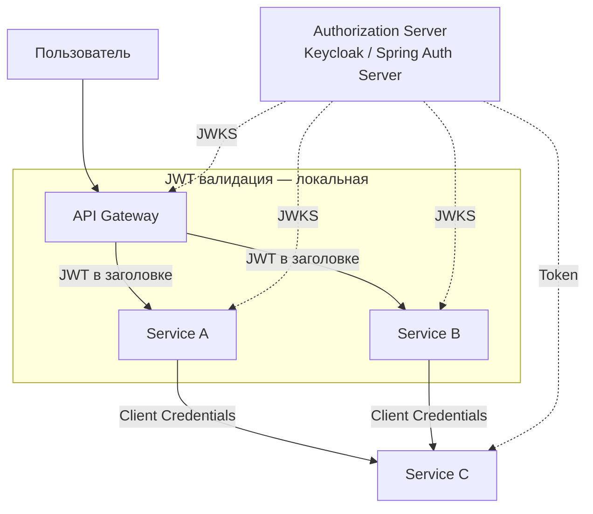

Паттерны:

1. **Token relay** — API Gateway пробрасывает JWT пользователя downstream-сервисам
2. **Token exchange** (`RFC 8693`) — Gateway обменивает токен пользователя на токен с ограниченным scope для конкретного сервиса
3. **Client Credentials** — сервис-к-сервису коммуникация от своего имени
4. **Общий JWKS** — все сервисы валидируют JWT одним публичным ключом (один `issuer-uri`)

Пример проброса токена через `WebClient`:

```java
@Bean
public WebClient webClient(OAuth2AuthorizedClientManager clientManager) {
    var oauth2 = new ServletOAuth2AuthorizedClientExchangeFilterFunction(clientManager);
    oauth2.setDefaultOAuth2AuthorizedClient(true); // Relay текущий токен
    return WebClient.builder()
        .apply(oauth2.oauth2Configuration())
        .build();
}
```

Подробнее о межсервисном взаимодействии: [Микросервисы](../architecture/microservices-interview.md), [Spring Security](../frameworks/spring/spring-security-interview.md).

> [!mcq]
> - [ ] В микросервисной архитектуре каждый сервис должен иметь собственный Authorization Server; API Gateway передаёт запросы на соответствующий AS в зависимости от downstream-сервиса. | Множество AS — антипаттерн: усложняет управление, ротацию ключей и consistency. Типичный подход — один общий AS (Keycloak/Spring Auth Server) для всей платформы, все RS используют один issuer-uri и JWKS.
> - [x] В микросервисах используется общий Authorization Server: API Gateway валидирует JWT один раз и пробрасывает его downstream-сервисам (token relay) или обменивает на scoped-токен (token exchange, RFC 8693); для service-to-service вызовов применяется Client Credentials Flow. | Верные паттерны. Token Relay для сохранения user context, Token Exchange для ограничения прав конкретному downstream, Client Credentials для M2M без участия пользователя. Единый JWKS обеспечивает единое доверие.
> - [ ] В микросервисах JWT должен валидироваться только на API Gateway; downstream-сервисы доверяют заголовку X-User-Id, добавленному Gateway, без повторной проверки токена. | Доверие заголовкам без проверки создаёт attack vector: если downstream-сервис доступен напрямую (bypass gateway через internal network), атакующий может подделать X-User-Id. Defense in depth требует валидации JWT на каждом уровне.
> - [ ] В микросервисах для межсервисного взаимодействия необходимо использовать ROPC: один сервис логинится логином/паролем другого сервиса и получает токен от его имени. | ROPC удалён в OAuth 2.1 и никогда не был предназначен для M2M. Для межсервисного взаимодействия используется Client Credentials Flow — каждый сервис имеет свой client_id + client_secret, получает токен от своего имени на AS.

## Q26. Как настроить `Spring Authorization Server`?

`Spring Authorization Server` — полноценный Authorization Server на базе Spring Security:

```xml
<!-- pom.xml -->
<dependency>
    <groupId>org.springframework.security</groupId>
    <artifactId>spring-security-oauth2-authorization-server</artifactId>
</dependency>
```

```java
@Configuration
public class AuthServerConfig {

    @Bean
    @Order(1)
    public SecurityFilterChain authServerFilterChain(HttpSecurity http) throws Exception {
        OAuth2AuthorizationServerConfiguration.applyDefaultSecurity(http);
        http.getConfigurer(OAuth2AuthorizationServerConfigurer.class)
            .oidc(Customizer.withDefaults()); // Включаем OIDC

        return http
            .exceptionHandling(e -> e
                .defaultAuthenticationEntryPointFor(
                    new LoginUrlAuthenticationEntryPoint("/login"),
                    new MediaTypeRequestMatcher(MediaType.TEXT_HTML)
                )
            )
            .build();
    }

    @Bean
    public RegisteredClientRepository registeredClientRepository() {
        RegisteredClient webClient = RegisteredClient.withId(UUID.randomUUID().toString())
            .clientId("web-app")
            .clientSecret("{noop}secret")
            .clientAuthenticationMethod(ClientAuthenticationMethod.CLIENT_SECRET_BASIC)
            .authorizationGrantType(AuthorizationGrantType.AUTHORIZATION_CODE)
            .authorizationGrantType(AuthorizationGrantType.REFRESH_TOKEN)
            .redirectUri("http://localhost:8080/login/oauth2/code/web-app")
            .scope(OidcScopes.OPENID)
            .scope(OidcScopes.PROFILE)
            .tokenSettings(TokenSettings.builder()
                .accessTokenTimeToLive(Duration.ofMinutes(15))
                .refreshTokenTimeToLive(Duration.ofDays(7))
                .reuseRefreshTokens(false) // Rotation
                .build())
            .build();

        return new InMemoryRegisteredClientRepository(webClient);
    }

    @Bean
    public JWKSource<SecurityContext> jwkSource() throws Exception {
        RSAKey rsaKey = generateRsaKey();
        JWKSet jwkSet = new JWKSet(rsaKey);
        return (selector, ctx) -> selector.select(jwkSet);
    }

    @Bean
    public AuthorizationServerSettings authorizationServerSettings() {
        return AuthorizationServerSettings.builder()
            .issuer("https://auth.example.com")
            .build();
    }
}
```

> [!mcq]
> - [ ] Spring Authorization Server — это устаревший подпроект `spring-security-oauth2` (closed в 2020), рекомендуется использовать Keycloak или Okta вместо него. | Всё наоборот: Spring Authorization Server — это новый активный проект, официальная замена старого `spring-security-oauth2` (который действительно прекратил поддержку). SAS активно развивается командой Spring Security.
> - [x] Spring Authorization Server настраивается через зависимость `spring-security-oauth2-authorization-server`, `OAuth2AuthorizationServerConfiguration.applyDefaultSecurity`, `RegisteredClientRepository` с настройками клиентов, `JWKSource` для signing key и `AuthorizationServerSettings` с issuer URL. | Верный набор beans. SAS — полноценная OAuth 2.1 / OIDC реализация: поддерживает все flows, PKCE, token rotation. Требует явной регистрации клиентов (RegisteredClient) и управления ключами через JWKSource.
> - [ ] Spring Authorization Server настраивается через `@EnableAuthorizationServer` и `AuthorizationServerConfigurerAdapter`; клиенты регистрируются через `clients.inMemory().withClient(...)`. | Это конфигурация устаревшего `spring-security-oauth2` (deprecated). Новый Spring Authorization Server использует `RegisteredClient.withId(...)` и декларативную конфигурацию через `SecurityFilterChain`.
> - [ ] Spring Authorization Server не требует настройки клиентов — любой клиент может получить токен, указав свой client_id; client_secret проверяется опционально только для grant_type=client_credentials. | Регистрация клиентов обязательна через `RegisteredClientRepository` — без неё AS отклонит запросы с неизвестным client_id. Client_secret проверяется всегда для confidential clients (OAuth 2.1 требует client authentication для защиты /token endpoint).

## Q27. (!) Какие основные угрозы существуют для `OAuth2`?

| Угроза | Описание | Защита |
|--------|----------|--------|
| **Authorization Code Interception** | Перехват code при redirect | PKCE, HTTPS, exact redirect_uri match |
| **CSRF** | Подмена callback-запроса | `state` parameter |
| **Token Leakage** | Утечка токена из URL, логов, referrer | Не передавать в URL, короткий TTL |
| **Open Redirect** | Злоумышленник подставляет свой redirect_uri | Whitelist redirect_uri, exact match |
| **Token Replay** | Повторное использование перехваченного токена | DPoP, token binding, short TTL |
| **Refresh Token Theft** | Кража refresh token | Rotation + reuse detection, httpOnly cookie |
| **Client Impersonation** | Подделка client_id | Client authentication (secret, mTLS) |
| **Scope Escalation** | Запрос больших scope, чем разрешено | Валидация scope на Authorization Server |

Подробнее об угрозах: [OWASP Top 10](owasp-top10-interview.md), [Безопасность приложений](application-security-interview.md).

> [!mcq]
> - [ ] Основные угрозы OAuth2 — CSRF (защита: PKCE), Open Redirect (защита: state parameter) и Token Leakage (защита: Implicit Flow вместо Authorization Code). | Все три защиты перепутаны: CSRF защищает state parameter, Open Redirect защищает whitelist redirect_uri, а Implicit Flow — устаревший небезопасный flow, который был одним из источников Token Leakage, а не защитой от него.
> - [ ] Основные угрозы OAuth2 — Authorization Code Interception (защита: PKCE), CSRF (защита: state parameter), Open Redirect (защита: whitelist redirect_uri); JWT-токены не требуют дополнительной защиты при HTTPS. | HTTPS не устраняет угрозы Token Replay (перехваченный HTTPS-трафик с компрометированным proxy), Refresh Token Theft (кража из localStorage/XSS) и Algorithm Confusion Attack. JWT требует собственных мер защиты независимо от транспорта.
> - [x] Основные угрозы OAuth2 — Authorization Code Interception (защита: PKCE), CSRF (защита: state), Open Redirect (защита: whitelist redirect_uri), Refresh Token Theft (защита: Rotation + httpOnly cookie); PKCE и state — обязательны для всех клиентов. | Полный и корректный перечень. PKCE защищает code от перехвата, state — от подмены callback, Rotation обнаруживает кражу RT через reuse detection, httpOnly cookie защищает RT от XSS.
> - [ ] Основные угрозы OAuth2 — Authorization Code Interception (защита: PKCE), CSRF (защита: state), Open Redirect (защита: whitelist redirect_uri); Refresh Token безопасен по умолчанию, так как передаётся только между сервером и Authorization Server. | Refresh Token может быть украден: XSS (если хранится в localStorage), утечка из логов, MITM при неправильном TLS. Rotation с reuse detection — обязательная защита, а не опциональная.

## Q28. Как работает `state` parameter и зачем он нужен?

`state` — случайное криптостойкое значение для защиты от **CSRF** при OAuth2 callback:

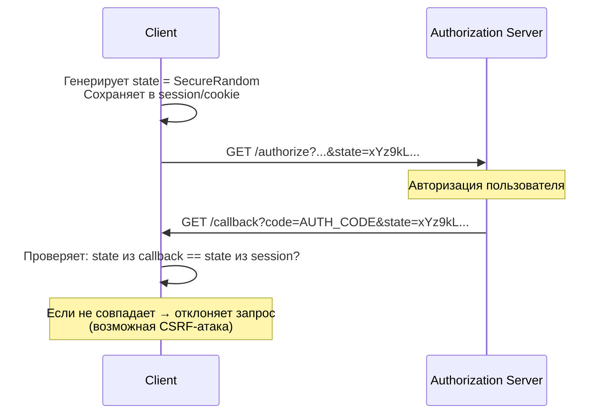

Без `state` злоумышленник может подставить свой authorization code в callback URL жертвы, привязав аккаунт жертвы к аккаунту злоумышленника у провайдера.

> [!mcq]
> - [ ] `state` parameter — хэш SHA-256 от client_id и redirect_uri, который Authorization Server проверяет для предотвращения повторного использования authorization code. | `state` — это случайное значение, генерируемое клиентом (не вычисляемое из других параметров), и проверяется клиентом, а не AS. Защита от повторного использования code делается самим AS на уровне одноразовости кода, не через state.
> - [x] `state` parameter — случайное криптостойкое значение, которое клиент генерирует перед authorization request и сохраняет в session; после callback клиент сверяет state из ответа с сохранённым — защита от CSRF при OAuth2 callback. | Верное описание. Без state злоумышленник мог бы подставить свой code в callback URL жертвы (через фишинг-ссылку), что привязало бы аккаунт жертвы к аккаунту атакующего на стороне провайдера.
> - [ ] `state` parameter — содержит email пользователя и отправляется Authorization Server для автоматической привязки токена к аккаунту; без state OAuth2-flow не может завершиться. | `state` — случайное непрозрачное значение, не содержит PII. Его включение в AS нарушило бы privacy. Также `state` технически опционален в OAuth 2.0 (обязателен в OIDC), flow может завершиться и без него — но без защиты от CSRF.
> - [ ] `state` parameter — timestamp времени начала flow, используется для определения времени истечения authorization code; при расхождении более 10 минут — code отклоняется. | `state` не содержит timestamp и не управляет сроком жизни code. Срок жизни authorization code определяется самим AS (обычно 10 минут). `state` защищает именно от CSRF в callback, не от истечения сроков.

## Q29. Чеклист безопасности `OAuth2` для production

1. **HTTPS везде** — authorization endpoint, token endpoint, redirect URI, resource server
2. **PKCE для всех клиентов** (не только public)
3. **Exact match redirect_uri** — без wildcard, без open redirect
4. **state parameter** — криптостойкий, одноразовый
5. **Короткий TTL access token** — 15–60 минут
6. **Refresh token rotation** с reuse detection
7. **Хранение секретов** — secrets manager, не в коде
8. **Валидация JWT** — проверять `iss`, `aud`, `exp`, `scope`
9. **Безопасное хранение токенов** — `httpOnly` + `Secure` + `SameSite=Strict` cookies
10. **Мониторинг** — аномальное количество token requests, неудачные авторизации
11. **Ротация ключей** — периодическая смена signing keys (JWKS поддерживает множественные `kid`)
12. **Не логировать токены** — маскировать в логах

```java
// Пример: кастомный фильтр для маскирования токенов в логах
@Component
public class TokenMaskingFilter extends OncePerRequestFilter {

    @Override
    protected void doFilterInternal(HttpServletRequest request,
                                     HttpServletResponse response,
                                     FilterChain chain) throws ServletException, IOException {
        String auth = request.getHeader("Authorization");
        if (auth != null && auth.startsWith("Bearer ")) {
            MDC.put("token_hint", auth.substring(7, Math.min(15, auth.length())) + "...");
        }
        try {
            chain.doFilter(request, response);
        } finally {
            MDC.remove("token_hint");
        }
    }
}
```

> [!mcq]
> - [x] Production-чеклист OAuth2 включает: HTTPS везде, PKCE для всех клиентов, exact match redirect_uri, короткий TTL access token (15–60 мин), refresh token rotation, httpOnly+Secure+SameSite cookie для токенов, валидацию iss/aud/exp JWT, маскирование токенов в логах, ротацию signing keys. | Полный production-чеклист. Все меры покрывают OWASP ASVS требования для OAuth2. Отсутствие любой из них — значимый security-риск в production. Ключевое отличие и best practice в production.
> - [ ] Production-чеклист OAuth2 ограничивается использованием HTTPS и обязательным client_secret; остальные параметры (PKCE, rotation, state) опциональны и нужны только при работе с банковскими данными. | PKCE, rotation, state — базовые security-меры для любого OAuth2-деплоя, не только финансового. OAuth 2.1 делает PKCE и rotation обязательными для всех клиентов именно потому, что это production-ready минимум.
> - [ ] Production-чеклист OAuth2 включает long-lived access tokens (сутки–неделя) для снижения нагрузки на Authorization Server и использование localStorage для хранения refresh token в браузере. | Оба пункта — антипаттерны. Long-lived AT увеличивает окно компрометации. localStorage уязвим к XSS — refresh token должен храниться в httpOnly cookie с Secure+SameSite=Strict.
> - [ ] Production-чеклист OAuth2 требует использования симметричной подписи JWT (HS256) с общим secret между AS и всеми Resource Server; асимметричная подпись (RS256) применяется только в dev. | Всё наоборот: HS256 требует распределения shared secret между всеми сервисами, что увеличивает attack surface (любой RS с секретом может подделать токен). RS256 — рекомендация для production: RS имеют только публичный ключ через JWKS.

## Q30. Как тестировать `OAuth2` в `Spring Boot`?

**Unit-тесты** с `@WithMockUser` и `SecurityMockMvcRequestPostProcessors`:

```java
@WebMvcTest(UserController.class)
class UserControllerTest {

    @Autowired
    private MockMvc mockMvc;

    @Test
    void shouldReturnUserInfo() throws Exception {
        mockMvc.perform(get("/api/users/me")
                .with(jwt()
                    .jwt(builder -> builder
                        .subject("user-123")
                        .claim("email", "ivan@example.com")
                        .claim("roles", List.of("ROLE_USER"))
                    )
                ))
            .andExpect(status().isOk())
            .andExpect(jsonPath("$.sub").value("user-123"))
            .andExpect(jsonPath("$.email").value("ivan@example.com"));
    }

    @Test
    void shouldRejectWithoutToken() throws Exception {
        mockMvc.perform(get("/api/users/me"))
            .andExpect(status().isUnauthorized());
    }

    @Test
    void shouldCheckScope() throws Exception {
        mockMvc.perform(get("/api/users/admin")
                .with(jwt()
                    .authorities(new SimpleGrantedAuthority("ROLE_USER"))
                ))
            .andExpect(status().isForbidden());
    }
}
```

**Интеграционные тесты** с `MockOAuth2Server` (Testcontainers-подход):

```java
@SpringBootTest(webEnvironment = WebEnvironment.RANDOM_PORT)
class OAuth2IntegrationTest {

    // Мок Authorization Server
    static MockWebServer mockAuthServer = new MockWebServer();

    @DynamicPropertySource
    static void properties(DynamicPropertyRegistry registry) {
        registry.add("spring.security.oauth2.resourceserver.jwt.jwk-set-uri",
            () -> mockAuthServer.url("/jwks").toString());
    }

    @Autowired
    private TestRestTemplate restTemplate;

    @Test
    void shouldValidateJwt() {
        // Генерация тестового JWT с реальной подписью
        String jwt = generateTestJwt("user-123", List.of("ROLE_USER"));

        var headers = new HttpHeaders();
        headers.setBearerAuth(jwt);

        ResponseEntity<String> response = restTemplate.exchange(
            "/api/users/me", HttpMethod.GET,
            new HttpEntity<>(headers), String.class);

        assertThat(response.getStatusCode()).isEqualTo(HttpStatus.OK);
    }
}
```

Инструменты:
- `spring-security-test` — `jwt()`, `@WithMockUser`, `@WithOAuth2Login`
- [Keycloak Testcontainers](https://www.testcontainers.org/) — интеграционные тесты с реальным Authorization Server
- Postman / OAuth2 Playground — ручное тестирование flows

> [!mcq]
> - [ ] OAuth2 в Spring Boot тестируется только интеграционными тестами с реальным Authorization Server; unit-тесты с моками недопустимы, так как не покрывают JWT-валидацию. | Unit-тесты корректны и необходимы: `spring-security-test` предоставляет `jwt()` RequestPostProcessor, который мокает аутентифицированный Principal без реального JWT. Это быстро, надёжно и покрывает логику контроллера.
> - [x] OAuth2 в Spring Boot тестируется через `spring-security-test`: `jwt()` RequestPostProcessor для unit-тестов с MockMvc (мокает аутентификацию, claims, authorities), `@WithMockUser` для простых случаев; интеграционно — MockOAuth2Server или Keycloak Testcontainers для проверки реальной валидации. | Верные инструменты для разных уровней. jwt() для быстрых unit-тестов контроллеров, Testcontainers с Keycloak — для end-to-end проверки полного OAuth2-flow с реальным AS.
> - [ ] OAuth2 в Spring Boot тестируется через отключение Security в тестах (`@AutoConfigureMockMvc(addFilters = false)`) и прямой вызов контроллеров без аутентификации. | Отключение security в тестах — антипаттерн: вы теряете покрытие логики защиты endpoints (pre-authorize, scope check, role check). Правильный подход — тесты с мок-аутентификацией через `jwt()` или `@WithMockUser`.
> - [ ] OAuth2 в Spring Boot тестируется только через ручные запросы к OAuth2 Playground; автоматизированные тесты требуют коммерческих инструментов (Okta CLI, Auth0 Deploy CLI) и недоступны в open-source. | Spring предоставляет полный open-source testing stack: `spring-security-test` (бесплатно), MockWebServer, Testcontainers с Keycloak-образом. Никаких коммерческих инструментов для тестирования OAuth2 в Spring не требуется.

## Q31. (!) Что изменилось в `OAuth 2.1` по сравнению с `OAuth 2.0`?

`OAuth 2.1` — консолидированная спецификация, которая убирает устаревшие и небезопасные механизмы из `OAuth 2.0`.

### Ключевые изменения

| Аспект | OAuth 2.0 | OAuth 2.1 |
|--------|-----------|-----------|
| `Implicit Grant` | Поддерживается | **Удалён** |
| `Resource Owner Password Credentials` | Поддерживается | **Удалён** |
| `PKCE` | Опционален | **Обязателен** для всех публичных клиентов |
| `redirect_uri` | Частичное совпадение | **Точное совпадение** |
| `Refresh Token` для публичных клиентов | Долгоживущие | **Ротация обязательна** |
| Bearer token в URI | Разрешён | **Запрещён** (только в заголовке) |

### Почему удалён Implicit Grant

```
Проблема Implicit Flow:
1. Access Token передаётся в URL-фрагменте (#access_token=...)
2. Фрагмент попадает в логи браузера, Referer-заголовки
3. Нет client_secret → нет верификации клиента
4. Нет refresh token → пользователь должен повторно авторизовываться

Решение: Authorization Code + PKCE работает в браузере без client_secret
```

### Почему удалён Resource Owner Password Credentials

```
Проблема ROPC:
- Клиент получает пароль пользователя напрямую
- Нарушает принцип делегирования: пользователь должен доверять клиенту как самому IdP
- Невозможно использовать MFA, WebAuthn
- Антипаттерн для любого production-сценария

Решение: Device Authorization Flow для CLI/IoT,
         Authorization Code + PKCE для интерактивных клиентов
```

### Конфигурация PKCE обязательного режима в Spring Authorization Server

```java
@Bean
public RegisteredClientRepository registeredClientRepository() {
    RegisteredClient client = RegisteredClient.withId(UUID.randomUUID().toString())
        .clientId("my-app")
        .clientAuthenticationMethod(ClientAuthenticationMethod.NONE) // public client
        .authorizationGrantType(AuthorizationGrantType.AUTHORIZATION_CODE)
        .authorizationGrantType(AuthorizationGrantType.REFRESH_TOKEN)
        .redirectUri("https://app.example.com/callback")
        .scope(OidcScopes.OPENID)
        .scope("read")
        .clientSettings(ClientSettings.builder()
            .requireProofKey(true) // PKCE обязателен — OAuth 2.1 стиль
            .requireAuthorizationConsent(true)
            .build())
        .tokenSettings(TokenSettings.builder()
            .accessTokenTimeToLive(Duration.ofMinutes(15))
            .refreshTokenTimeToLive(Duration.ofDays(1))
            .reuseRefreshTokens(false) // Rotation обязательна — OAuth 2.1 стиль
            .build())
        .build();

    return new InMemoryRegisteredClientRepository(client);
}
```

> [!mcq]
> - [x] OAuth 2.1 консолидирует OAuth 2.0 + security BCP: удалены Implicit Grant и ROPC, PKCE обязателен для всех клиентов, exact match redirect_uri, refresh token rotation обязательна для public clients, Bearer token в URL запрещён. | Верный список изменений. OAuth 2.1 не добавляет новых grant types — закрепляет лучшие практики из BCP 212 и удаляет устаревшие/небезопасные механизмы, существовавшие в OAuth 2.0 как опциональные.
> - [ ] OAuth 2.1 добавляет новые grant types (Proof Grant, Binding Grant) и сохраняет все существующие (Implicit, ROPC, Authorization Code, Client Credentials, Device Authorization) без изменений. | OAuth 2.1 не добавляет новых grant types и удаляет Implicit и ROPC (не сохраняет их). Основная цель спецификации — консолидация и ужесточение security, а не расширение функциональности.
> - [ ] OAuth 2.1 заменяет JWT на opaque tokens по умолчанию для всех flows и делает Token Introspection (RFC 7662) обязательным для каждого API-запроса на Resource Server. | OAuth 2.1 не меняет формат токенов — JWT остаётся основным для большинства случаев. Introspection не стал обязательным — это всё ещё опциональная альтернатива локальной валидации JWT.
> - [ ] OAuth 2.1 удаляет Authorization Code Flow (заменён более простым Direct Token Flow) и делает Client Credentials обязательным для всех клиентов, включая SPA. | Authorization Code Flow — основной flow в OAuth 2.1 (с обязательным PKCE). "Direct Token Flow" не существует в спецификации. Client Credentials — только для confidential clients, SPA не могут его использовать (не могут хранить client_secret).

## Q32. Какие стандартные `JWT claims` обязательны и что они означают?

`JWT` (`JSON Web Token`, RFC 7519) содержит набор стандартных `claims` в payload. Понимание их значения критично для правильной валидации.

### Registered Claims (стандартные)

| Claim | Полное имя | Тип | Описание |
|-------|-----------|-----|---------|
| `iss` | Issuer | String/URI | Кто выдал токен (Authorization Server URL) |
| `sub` | Subject | String | Идентификатор пользователя/сущности |
| `aud` | Audience | String/Array | Кому предназначен (Resource Server ID) |
| `exp` | Expiration | NumericDate | Время истечения (Unix timestamp) |
| `nbf` | Not Before | NumericDate | Токен не действителен до этого времени |
| `iat` | Issued At | NumericDate | Время выдачи |
| `jti` | JWT ID | String | Уникальный идентификатор токена |

### Типичные OIDC claims

| Claim | Описание |
|-------|---------|
| `name` | Полное имя пользователя |
| `email` | Email |
| `email_verified` | Подтверждён ли email |
| `roles` / `authorities` | Роли (нестандартный, но распространённый) |
| `scope` | Разрешённые scopes |
| `azp` | Authorized Party — clientId, которому выдан токен |

### Валидация claims в Spring Security

```java
@Bean
JwtDecoder jwtDecoder() {
    NimbusJwtDecoder decoder = NimbusJwtDecoder
        .withJwkSetUri("https://auth.example.com/.well-known/jwks.json")
        .build();

    // Дополнительные валидаторы
    OAuth2TokenValidator<Jwt> issuerValidator =
        JwtValidators.createDefaultWithIssuer("https://auth.example.com");

    // Проверка audience
    OAuth2TokenValidator<Jwt> audienceValidator = jwt -> {
        List<String> audiences = jwt.getAudience();
        if (audiences.contains("my-resource-server")) {
            return OAuth2TokenValidatorResult.success();
        }
        return OAuth2TokenValidatorResult.failure(
            new OAuth2Error("invalid_token", "Wrong audience", null));
    };

    OAuth2TokenValidator<Jwt> combined =
        new DelegatingOAuth2TokenValidator<>(issuerValidator, audienceValidator);
    decoder.setJwtValidator(combined);
    return decoder;
}
```

### Пример реального JWT payload

```json
{
  "iss": "https://auth.example.com",
  "sub": "user-12345",
  "aud": ["my-resource-server", "my-web-app"],
  "exp": 1713951600,
  "iat": 1713948000,
  "jti": "550e8400-e29b-41d4-a716-446655440000",
  "email": "ivan@example.com",
  "email_verified": true,
  "roles": ["USER", "PREMIUM"],
  "scope": "openid profile email read:orders"
}
```

**Критическая ошибка**: не проверять `aud` — токен, выданный для одного сервиса, принимается другим (confused deputy атака).

> [!mcq]
> - [ ] Registered claims JWT: `iss` (IP-адрес клиента), `sub` (email пользователя), `aud` (уровень доступа), `exp` (Unix timestamp истечения), `iat` (Unix timestamp выдачи); все claims обязательны по RFC 7519. | Семантика claims неверна: iss — URL Authorization Server (не IP), sub — произвольный идентификатор пользователя (не обязательно email), aud — получатель токена (не уровень доступа). RFC 7519 делает все claims опциональными, но рекомендует основные.
> - [x] Registered claims JWT (RFC 7519): `iss` (Issuer, URL AS), `sub` (Subject, ID пользователя/сущности), `aud` (Audience, ID Resource Server), `exp` (Expiration), `nbf` (Not Before), `iat` (Issued At), `jti` (JWT ID); в RFC 7519 все опциональны, но конкретные spec (OIDC, OAuth 2.0 Token) делают часть обязательными. | Верное описание registered claims. OIDC Core 1.0 требует iss, sub, aud, exp, iat в ID Token. `aud` критичен — защита от confused deputy: токен для сервиса A не должен приниматься сервисом B.
> - [ ] Registered claims JWT: `iss` (issuer), `sub` (subject), `aud` (audience), `scope` (разрешения), `roles` (роли); claims `exp` и `iat` не стандартизированы в RFC 7519 и являются custom. | `exp` и `iat` — именно registered claims из RFC 7519 (они стандартизированы). `scope` и `roles` — НЕ registered claims (они не упомянуты в RFC 7519), их семантика определяется конкретными спецификациями OAuth2/OIDC или custom.
> - [ ] Registered claims JWT: `iss`, `sub`, `aud` — обязательные, остальные (`exp`, `iat`, `nbf`) — зарезервированы, но не используются на практике; для проверки времени жизни токена используется custom claim `expiresAt`. | `exp` — самый используемый claim на практике, определяющий срок действия токена; его проверка критична на каждом API-запросе. Custom `expiresAt` — плохая практика: дубликат стандартного `exp`, ломает совместимость с библиотеками.

## Q33. (!) Как реализовать `Refresh Token Rotation` в Spring Boot?

**Refresh Token Rotation** — механизм безопасности, при котором каждое использование `refresh token` для получения нового `access token` приводит к автоматической выдаче нового `refresh token` с одновременной инвалидацией старого.

### Зачем это нужно

```
Без rotation:
- Утечка refresh token → бесконечный доступ
- Невозможно обнаружить компрометацию

С rotation:
- Старый refresh token инвалидируется при использовании
- При попытке использовать старый токен → signaling компрометации
- Сервер может инвалидировать всю цепочку токенов (token family)
```

### Реализация в Spring Authorization Server

```java
// Включение rotation при конфигурации клиента
TokenSettings.builder()
    .reuseRefreshTokens(false)  // false = rotation включена
    .refreshTokenTimeToLive(Duration.ofDays(30))
    .build()
```

### Кастомная реализация с Token Family

```java
@Entity
@Table(name = "refresh_tokens")
public class RefreshToken {
    @Id private String tokenHash;       // SHA-256 от токена
    private String userId;
    private String familyId;            // ID семейства токенов
    private boolean used;               // использован ли
    private Instant expiresAt;
    private Instant createdAt;
}

@Service
@Transactional
public class RefreshTokenService {

    public TokenPair refreshTokens(String oldRefreshToken) {
        String tokenHash = sha256(oldRefreshToken);
        RefreshToken stored = tokenRepo.findByTokenHash(tokenHash)
            .orElseThrow(() -> new InvalidTokenException("Token not found"));

        // Обнаружение replay-атаки: токен уже использован
        if (stored.isUsed()) {
            // Компрометация: инвалидируем ВСЕ токены семейства
            tokenRepo.deleteByFamilyId(stored.getFamilyId());
            log.warn("Refresh token reuse detected for user {}, family {}",
                stored.getUserId(), stored.getFamilyId());
            throw new TokenFamilyCompromisedException(
                "Refresh token reused — possible theft");
        }

        if (stored.getExpiresAt().isBefore(Instant.now())) {
            tokenRepo.delete(stored);
            throw new InvalidTokenException("Token expired");
        }

        // Помечаем старый как использованный (не удаляем — для audit)
        stored.setUsed(true);
        tokenRepo.save(stored);

        // Генерируем новую пару токенов в том же семействе
        String newRefreshToken = generateSecureToken();
        RefreshToken newStored = new RefreshToken(
            sha256(newRefreshToken),
            stored.getUserId(),
            stored.getFamilyId(),  // сохраняем familyId
            false,
            Instant.now().plus(30, ChronoUnit.DAYS),
            Instant.now()
        );
        tokenRepo.save(newStored);

        String newAccessToken = jwtService.generateAccessToken(stored.getUserId());
        return new TokenPair(newAccessToken, newRefreshToken);
    }

    private String generateSecureToken() {
        byte[] bytes = new byte[32];
        new SecureRandom().nextBytes(bytes);
        return Base64.getUrlEncoder().withoutPadding().encodeToString(bytes);
    }

    private String sha256(String token) {
        // Никогда не храним сам токен — только хэш
        return DigestUtils.sha256Hex(token);
    }
}
```

### Хранение refresh token на клиенте

| Место хранения | Уязвимость | Рекомендация |
|---------------|-----------|-------------|
| `localStorage` | XSS | Не использовать |
| `sessionStorage` | XSS | Не использовать |
| `HttpOnly Cookie` | CSRF | Использовать с `SameSite=Strict` |
| Memory (JS) | Сбрасывается при перезагрузке | Для SPA без refresh |
| Secure `HttpOnly Cookie` + BFF | CSRF защищён через `state` | **Рекомендуется** |

> [!mcq]
> - [ ] Refresh Token Rotation в Spring Boot включается установкой `spring.security.oauth2.client.rotation=true` в application.yml; Spring автоматически отслеживает семьи токенов и отзывает скомпрометированные. | Свойство `spring.security.oauth2.client.rotation` не существует. Rotation настраивается в Spring Authorization Server через `TokenSettings.builder().reuseRefreshTokens(false)` при регистрации клиента. Отслеживание семей токенов требует custom-логики.
> - [x] Refresh Token Rotation в Spring Authorization Server включается через `TokenSettings.builder().reuseRefreshTokens(false)` при регистрации клиента; кастомная реализация использует Token Families: каждый RT имеет familyId, при reuse detection отзываются все токены семьи. | Верная реализация. Ключевой флаг `reuseRefreshTokens(false)` активирует стандартный rotation SAS. Для углублённого контроля — кастомный сервис с хэшированием токенов (SHA-256), флагом `used` и familyId для cascade revocation при компрометации.
> - [ ] Refresh Token Rotation в Spring Boot реализуется хранением refresh token в localStorage в plaintext и обновлением его каждые 5 минут через cron job на клиенте; серверная часть не требуется. | localStorage уязвим к XSS, plaintext хранение критическая ошибка, а rotation по таймеру не даёт reuse detection. Правильная rotation триггерится использованием токена (не таймером) и происходит на сервере, клиент просто получает новый RT.
> - [ ] Refresh Token Rotation в Spring Boot требует отключения Spring Security OAuth2 и ручной имплементации через `RestTemplate.postForObject("/token", ...)`; фреймворк не поддерживает rotation из коробки. | Spring Authorization Server поддерживает rotation из коробки (`reuseRefreshTokens(false)` — OOB feature). Отключение Spring Security ради rotation — избыточно и ломает другие защиты. Custom-реализация нужна только для продвинутых сценариев (Token Families, audit).

## Q34. Что такое `OAuth2 Backend for Frontend` (`BFF`) и когда его применять?

**BFF** (`Backend for Frontend`) — архитектурный паттерн, при котором промежуточный сервер (`BFF`) берёт на себя `OAuth2`-flow и хранение токенов вместо браузера.

### Проблема без BFF (SPA + OAuth2)

```
SPA напрямую хранит токены:
- access token в memory (теряется при reload)
- refresh token в HttpOnly Cookie

Проблемы:
- Браузер не имеет безопасного хранилища (localStorage → XSS)
- PKCE усложняет, но не устраняет проблему хранения refresh token
- CORS-запросы к Authorization Server сложны в настройке
```

### Архитектура BFF

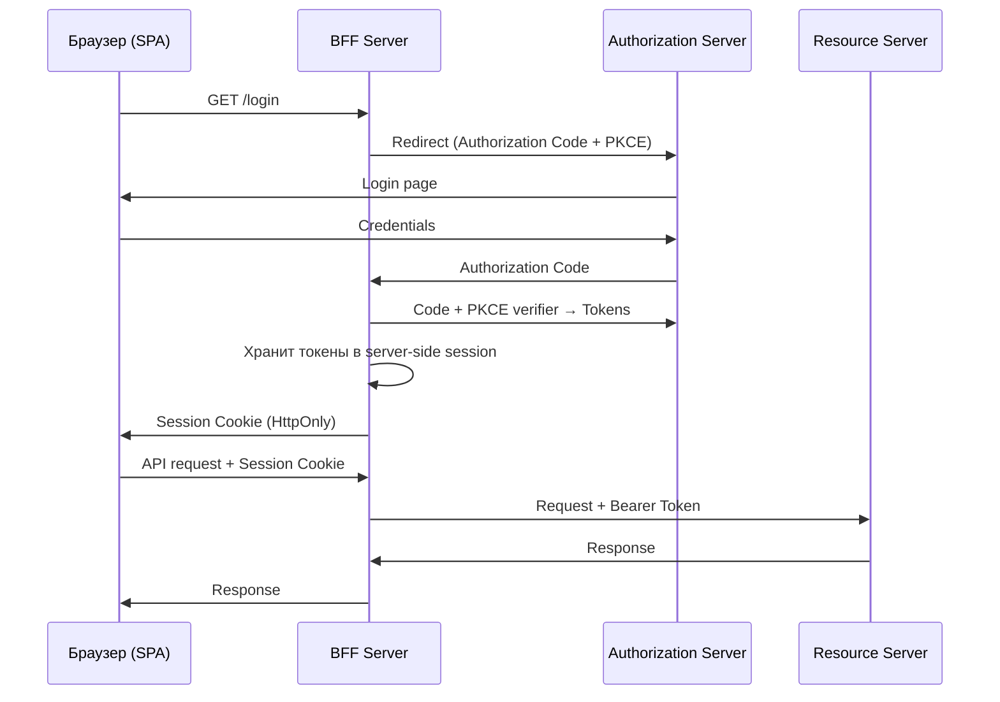

### Реализация BFF с Spring Boot

```java
@Configuration
@EnableWebSecurity
public class BffSecurityConfig {

    @Bean
    SecurityFilterChain securityFilterChain(HttpSecurity http) throws Exception {
        http
            .csrf(csrf -> csrf
                .csrfTokenRepository(CookieCsrfTokenRepository.withHttpOnlyFalse()))
            .oauth2Login(oauth2 -> oauth2
                .defaultSuccessUrl("/api/me", true))
            .oauth2Client(Customizer.withDefaults())
            // Проксируем API-запросы с автоматическим добавлением Bearer token
            .authorizeHttpRequests(authz -> authz
                .requestMatchers("/api/**").authenticated()
                .anyRequest().permitAll());
        return http.build();
    }
}

// BFF-прокси контроллер
@RestController
@RequestMapping("/api")
public class BffProxyController {

    private final WebClient resourceServerClient;

    // WebClient автоматически добавляет Bearer token из OAuth2AuthorizedClient
    @GetMapping("/orders")
    public Mono<List<Order>> getOrders(
            @RegisteredOAuth2AuthorizedClient("my-client") OAuth2AuthorizedClient client) {
        return resourceServerClient
            .get()
            .uri("https://api.example.com/orders")
            .headers(h -> h.setBearerAuth(client.getAccessToken().getTokenValue()))
            .retrieve()
            .bodyToFlux(Order.class)
            .collectList();
    }
}
```

### BFF vs Token-in-Browser

| Критерий | Token в браузере | BFF |
|---------|-----------------|-----|
| Безопасность токенов | Риск XSS | Токены не в браузере |
| Сложность | Проще | Дополнительный сервис |
| Масштабирование | Stateless | Требует session store |
| Применение | Внутренние SPA | Публичные приложения |

**Рекомендация**: для публичных SPA с чувствительными данными используйте BFF. Для внутренних инструментов достаточно `HttpOnly Cookie + PKCE`.

> [!mcq]
> - [ ] BFF (Backend for Frontend) — паттерн, при котором SPA хранит OAuth2-токены в localStorage, а BFF-сервер только проксирует API-запросы без участия в OAuth2-flow. | BFF именно для того, чтобы НЕ хранить токены в браузере (localStorage уязвим к XSS). Ключевая идея BFF — полный OAuth2-flow на backend, браузер получает session cookie, а токены хранятся на сервере.
> - [x] BFF (Backend for Frontend) — паттерн, при котором промежуточный сервер берёт на себя OAuth2-flow (Authorization Code + PKCE) и хранит access/refresh tokens в server-side session; браузер получает только HttpOnly session cookie, API-запросы проксируются через BFF с подстановкой Bearer token. | Верное описание паттерна. Применяется для публичных SPA с чувствительными данными — устраняет проблему безопасного хранения токенов в браузере. Trade-off: stateful сервис с session store.
> - [ ] BFF (Backend for Frontend) — паттерн, заменяющий OAuth2 на session-based аутентификацию с логином/паролем; токены не используются вообще, SPA работает через классическую HTTP session. | BFF не заменяет OAuth2 — он использует OAuth2 внутри. Внешний OAuth2-flow остаётся полностью стандартным; BFF просто скрывает токены от браузера. Это compliance-совместимое решение для работы с внешними провайдерами (Google, Microsoft).
> - [ ] BFF (Backend for Frontend) — паттерн, при котором каждый API микросервис имеет собственный frontend; Authorization Server встроен в каждый BFF для быстрого локального OAuth2-flow. | Это описание искажённого Backend-per-Frontend паттерна (не связанного с OAuth2). OAuth2 BFF — конкретный security-паттерн для хранения токенов на сервере. Authorization Server обычно один общий, а не встроенный в каждый BFF.

## Q35. Как защитить `OAuth2` от `CSRF` и `Token Leakage`?

### CSRF в OAuth2

**Атака**: злоумышленник инициирует OAuth2-flow от имени жертвы, подменяя `state` параметр.

```
1. Злоумышленник начинает OAuth2-flow → получает Authorization URL
2. Передаёт URL жертве (фишинг/CSRF)
3. Жертва проходит авторизацию → code отправляется злоумышленнику
4. Злоумышленник получает токен с правами жертвы
```

**Защита через `state` parameter**:

```java
@GetMapping("/oauth2/authorize")
public String initiateOAuth2(@RequestParam String clientId,
                              HttpSession session) {
    // Генерируем cryptographically random state
    String state = generateSecureState();
    session.setAttribute("oauth2_state", state);

    return "redirect:https://auth.example.com/authorize?" +
        "client_id=" + clientId +
        "&state=" + state +
        "&code_challenge=" + pkceChallenge +
        "&code_challenge_method=S256";
}

@GetMapping("/oauth2/callback")
public String handleCallback(@RequestParam String code,
                              @RequestParam String state,
                              HttpSession session) {
    // Верифицируем state
    String expectedState = (String) session.getAttribute("oauth2_state");
    if (!MessageDigest.isEqual(
            state.getBytes(StandardCharsets.UTF_8),
            expectedState.getBytes(StandardCharsets.UTF_8))) {
        throw new OAuth2AuthenticationException("Invalid state parameter");
    }
    session.removeAttribute("oauth2_state"); // используем однократно
    // ...exchange code for tokens
}
```

### Token Leakage — источники утечек

```
1. Referer header: токен в URL → передаётся в Referer следующего запроса
   Решение: Bearer token только в заголовке Authorization, не в URL

2. Browser history: токен в URL фрагменте (#access_token=...)
   Решение: не использовать Implicit Flow (OAuth 2.1 удалил его)

3. Server logs: Bearer token логируется в access logs
   Решение: маскировать Authorization header в логах

4. CORS: cross-origin запрос передаёт токен вредоносному сайту
   Решение: строгая настройка CORS, SameSite Cookie
```

### Защита Bearer token в Spring Boot логах

```java
@Component
public class SecurityHeadersFilter extends OncePerRequestFilter {

    @Override
    protected void doFilterInternal(HttpServletRequest request,
                                     HttpServletResponse response,
                                     FilterChain chain)
            throws ServletException, IOException {
        // Оборачиваем request для маскирования токена в логах
        chain.doFilter(new MaskedAuthorizationRequestWrapper(request), response);
    }
}

class MaskedAuthorizationRequestWrapper extends HttpServletRequestWrapper {

    MaskedAuthorizationRequestWrapper(HttpServletRequest request) {
        super(request);
    }

    @Override
    public String getHeader(String name) {
        if ("Authorization".equalsIgnoreCase(name)) {
            String authHeader = super.getHeader(name);
            if (authHeader != null && authHeader.startsWith("Bearer ")) {
                return "Bearer ***MASKED***";
            }
        }
        return super.getHeader(name);
    }
}
```

### Чеклист защиты токенов

- `HttpOnly` + `Secure` + `SameSite=Strict` для Cookie с refresh token
- Короткое время жизни access token (15 минут)
- `state` параметр для защиты от CSRF в OAuth2 flow
- `aud` claim валидация на Resource Server
- Токен никогда не передаётся в URL query параметрах
- Логи не содержат значений токенов
- `jti` для одноразовых токенов (предотвращение replay)

> [!mcq]
> - [x] Защита OAuth2 от CSRF: обязательный `state` parameter (cryptographically random, проверяется при callback через constant-time compare, очищается после использования); защита от Token Leakage: Bearer token только в заголовке (не в URL), маскирование в логах, SameSite=Strict cookie, CORS-ограничения. | Верный полный набор защит. Constant-time compare (MessageDigest.isEqual) защищает от timing-атак. Маскирование в логах через фильтр предотвращает утечку через access log / APM. SameSite ограничивает cross-origin доставку cookie.
> - [ ] Защита OAuth2 от CSRF: отключение cookie через `Cache-Control: no-store`; защита от Token Leakage: передача токена в URL как query parameter (вместо заголовка Authorization), чтобы он не попадал в body-логи. | Обе рекомендации ошибочны: Cache-Control не отключает cookie, а передача токена в URL ПРИВОДИТ к утечке (Referer, browser history, server access logs). Правильно: Bearer token ТОЛЬКО в заголовке Authorization.
> - [ ] Защита OAuth2 от CSRF: использование Implicit Flow вместо Authorization Code Flow; защита от Token Leakage: шифрование payload JWT симметричным ключом на стороне клиента. | Implicit Flow — источник проблем безопасности (удалён в OAuth 2.1), не защита от CSRF. Клиент не должен шифровать payload — это обязанность AS (если нужен JWE). Защита от CSRF реализуется state + PKCE, от Token Leakage — транспортные и storage меры.
> - [ ] Защита OAuth2 от CSRF: достаточно HTTPS для всех endpoints; защита от Token Leakage: использование Bearer token без ограничения TTL, так как TLS гарантирует конфиденциальность передачи. | HTTPS защищает транспорт, но не от CSRF (CSRF — браузерный вектор, TLS не помогает). Long-lived tokens расширяют окно компрометации при утечке. Нужны дополнительные меры: state, PKCE, короткий TTL, маскирование.

---

## Q36. Что изменилось в OAuth 2.1 — детали спецификации?

**OAuth 2.1** — консолидированная спецификация (draft, RFC в разработке), которая объединяет RFC 6749 (OAuth 2.0) и лучшие практики из RFC 6819, BCP 212 (OAuth Security BCP). Не добавляет новых grant types — только убирает небезопасные и закрепляет обязательные security требования.

### Ключевые изменения

| Изменение | OAuth 2.0 | OAuth 2.1 |
|-----------|-----------|-----------|
| **Implicit Flow** | Опциональный | **Удалён** |
| **Resource Owner Password Credentials (ROPC)** | Опциональный | **Удалён** |
| **PKCE** | Рекомендован для публичных клиентов | **Обязателен для всех** (Authorization Code Flow) |
| **Redirect URI** | Частичное совпадение допустимо | Точное совпадение обязательно |
| **Bearer tokens в URL** | Не рекомендован | **Запрещён** |
| **Refresh token rotation** | Не специфицирован | Обязателен для публичных клиентов |
| **`state` parameter** | Рекомендован | Рекомендован (PKCE заменяет часть его функций) |

### Почему удалён Implicit Flow?

Implicit Flow возвращал `access_token` прямо в `redirect_uri` (в URL hash), что:
- Токен попадал в `browser history`, `Referer` headers, proxy logs
- Невозможно использовать `client_secret` (публичный клиент)
- Нет защиты от подмены токена

**Замена:** Authorization Code Flow + PKCE для SPA и мобильных приложений.

### Почему удалён ROPC?

ROPC (Resource Owner Password Credentials) требует передачи логина/пароля пользователя клиентскому приложению — нарушает принцип делегирования. Используется как обходной путь для legacy-систем, но не соответствует модели безопасности OAuth.

> [!mcq]
> - [ ] OAuth 2.1 расширяет OAuth 2.0 новыми grant types (Wallet Grant, Biometric Grant) для современных authentication-сценариев с WebAuthn и passkeys. | OAuth 2.1 не добавляет новых grant types, а удаляет небезопасные (Implicit, ROPC). Passkeys/WebAuthn интегрируются на уровне AS (как метод аутентификации пользователя перед выдачей токена), не через новый grant.
> - [x] OAuth 2.1 — консолидированная спецификация OAuth 2.0 + BCP 212: Implicit и ROPC удалены, PKCE обязателен для всех клиентов (не только public), exact match redirect_uri без wildcard, refresh token rotation обязательна для public clients, Bearer tokens в URL запрещены. | Верный список. OAuth 2.1 не добавляет функциональности, только закрепляет security best practices. Exact match redirect_uri защищает от Open Redirect атак, частичное совпадение (например, по префиксу) теперь недопустимо.
> - [ ] OAuth 2.1 делает obligatory все опциональные механизмы OAuth 2.0 (Introspection, Revocation, Dynamic Client Registration) и требует их поддержки на всех Authorization Server. | OAuth 2.1 не делает Introspection/Revocation/DCR обязательными. Эти механизмы остаются опциональными расширениями. Главный фокус 2.1 — удаление устаревших grant types и закрепление PKCE/rotation.
> - [ ] OAuth 2.1 ослабляет требования безопасности для упрощения интеграции: PKCE становится опциональным даже для public clients, Implicit Flow возвращён для backward compatibility с OAuth 2.0. | Всё наоборот: OAuth 2.1 ужесточает требования (PKCE обязателен для всех), а Implicit Flow удалён полностью и не возвращён. Цель 2.1 — повысить безопасность, не упростить интеграцию ценой security.

---

## Q37. Как работает PKCE — генерация code_verifier и code_challenge?

**PKCE** (Proof Key for Code Exchange, RFC 7636) — расширение Authorization Code Flow для защиты от перехвата `authorization_code`.

### Проблема без PKCE

Если злоумышленник перехватит `authorization_code` (через malicious app, redirect_uri hijacking), он сможет обменять его на `access_token`.

### Как работает PKCE

```
Шаг 1: Клиент генерирует случайное значение
code_verifier = random_bytes(32) → base64url_encode
# Например: "dBjftJeZ4CVP-mB92K27uhbUJU1p1r_wW1gFWFOEjXk"

Шаг 2: Клиент вычисляет challenge
code_challenge = BASE64URL(SHA256(ASCII(code_verifier)))
# method = S256 (рекомендуется) или plain (не использовать)

Шаг 3: Authorization Request (code_challenge отправляется на AS)
GET /authorize?
  response_type=code
  &client_id=my-app
  &redirect_uri=https://app.example.com/callback
  &code_challenge=E9Melhoa2OwvFrEMTJguCHaoeK1t8URWbuGJSstw-cM
  &code_challenge_method=S256

Шаг 4: Token Request (code_verifier отправляется на AS)
POST /token
  grant_type=authorization_code
  &code=SplxlOBeZQQYbYS6WxSbIA
  &redirect_uri=https://app.example.com/callback
  &code_verifier=dBjftJeZ4CVP-mB92K27uhbUJU1p1r_wW1gFWFOEjXk

Шаг 5: AS проверяет
SHA256(code_verifier) == code_challenge → OK → выдаёт токены
```

### Генерация в Java

```java
import java.security.SecureRandom;
import java.security.MessageDigest;
import java.util.Base64;

public class PkceUtils {

    public static String generateCodeVerifier() {
        byte[] bytes = new byte[32];
        new SecureRandom().nextBytes(bytes);
        return Base64.getUrlEncoder().withoutPadding().encodeToString(bytes);
    }

    public static String generateCodeChallenge(String codeVerifier) throws Exception {
        MessageDigest digest = MessageDigest.getInstance("SHA-256");
        byte[] hash = digest.digest(codeVerifier.getBytes("ASCII"));
        return Base64.getUrlEncoder().withoutPadding().encodeToString(hash);
    }
}
```

### Уязвимости без PKCE

- **Authorization Code Interception** — перехват code через malicious redirect
- **Open Redirect** — redirect на злоумышленника при нечётком совпадении URI
- **Cross-Site Request Forgery** — без state/PKCE злоумышленник может подставить свой code

**Вывод:** PKCE обязателен для публичных клиентов (SPA, mobile) и рекомендован для конфиденциальных клиентов (OAuth 2.1 требует для всех).

> [!mcq]
> - [ ] PKCE: клиент генерирует code_verifier (32 байта случайных данных через `SecureRandom`), вычисляет code_challenge = `MD5(code_verifier)` и отправляет его в /authorize; при обмене code на token — отправляет оригинальный code_verifier, AS сверяет `MD5(code_verifier) == code_challenge`. | MD5 запрещён RFC 7636: только SHA-256 (method=S256) или plain (не рекомендуется). MD5 имеет коллизии, небезопасен для cryptographic hashing. Spec явно требует именно SHA-256.
> - [x] PKCE: клиент генерирует code_verifier (43–128 символов из unreserved set через `SecureRandom`, Base64URL-кодированный), вычисляет code_challenge = `BASE64URL(SHA256(ASCII(code_verifier)))`; отправляет challenge+method=S256 в /authorize, verifier — только в /token; AS сверяет хэши. | Верный алгоритм RFC 7636. Ключевая деталь: challenge передаётся в authorization request (может быть перехвачен), verifier — только в token request (TLS-защищён, не логгируется в AS access logs как часть URL).
> - [ ] PKCE: клиент использует client_secret как code_verifier, вычисляет code_challenge = `HMAC-SHA256(client_id, client_secret)`; AS проверяет HMAC при обмене code на token, привязывая токен к клиенту. | PKCE специально разработан для public clients БЕЗ client_secret. code_verifier — случайное значение, генерируемое перед КАЖДЫМ flow (не долгоживущий секрет). Использование client_secret противоречило бы цели PKCE.
> - [ ] PKCE: клиент генерирует code_challenge первым (случайное значение), вычисляет code_verifier = `SHA256(code_challenge)`; отправляет verifier в /authorize, challenge — в /token для проверки. | Направление вычисления обратное: verifier — секрет (генерируется первым), challenge — его хэш (вычисляется из verifier). Именно поэтому перехват challenge не компрометирует flow — его нельзя "обратить" в verifier без знания исходного значения.

---

## Q38. Что такое Token Introspection (RFC 7662) и как он работает?

**Token Introspection** (RFC 7662) — протокол, позволяющий Resource Server проверить активность и метаданные opaque token у Authorization Server.

### Когда использовать

- Resource Server получает **opaque token** (непрозрачный, не JWT) — нельзя проверить локально
- Нужна **реальная time валидность** — JWT можно отозвать, но до истечения `exp` он валиден; introspection проверяет факт отзыва
- Централизованная проверка в gateway (без раздачи `jwks_uri` всем сервисам)

### Как работает

```
Resource Server               Authorization Server
       |                              |
       | POST /introspect             |
       | Authorization: Basic <RS credentials>
       | token=<access_token>         |
       |----------------------------->|
       |                              |
       | 200 OK                       |
       | {                            |
       |   "active": true,            |
       |   "sub": "user123",          |
       |   "scope": "read write",     |
       |   "exp": 1704067200,         |
       |   "client_id": "my-app",     |
       |   "username": "john@example" |
       | }                            |
       |<-----------------------------|
```

### Запрос introspection

```http
POST /oauth2/introspect HTTP/1.1
Host: auth.example.com
Authorization: Basic base64(resource_server:rs_secret)
Content-Type: application/x-www-form-urlencoded

token=2YotnFZFEjr1zCsicMWpAA&token_type_hint=access_token
```

### Ответ при неактивном токене

```json
{ "active": false }
```

### Spring Security: настройка Introspection

```java
@Bean
public SecurityFilterChain filterChain(HttpSecurity http) throws Exception {
    http.oauth2ResourceServer(oauth2 -> oauth2
        .opaqueToken(opaque -> opaque
            .introspectionUri("https://auth.example.com/oauth2/introspect")
            .introspectionClientCredentials("resource-server", "rs-secret")
        )
    );
    return http.build();
}
```

### JWT vs Introspection

| Аспект | JWT (локальная проверка) | Token Introspection |
|--------|--------------------------|---------------------|
| Скорость | Быстро (без сетевого запроса) | Медленнее (HTTP запрос к AS) |
| Отзыв токена | Только после истечения exp | Мгновенное обнаружение |
| Нагрузка на AS | Нет | Высокая (per-request) |
| Применение | Микросервисы с jwks_uri | Gateway, opaque tokens |

**Рекомендация:** использовать JWT с коротким TTL (15 мин) + token revocation list (Redis) вместо introspection per-request.

> [!mcq]
> - [ ] Token Introspection (RFC 7662): Resource Server отправляет POST /introspect с access_token; AS возвращает `{valid: true, permissions: [...]}` или `{valid: false}`; формат ответа свободный. | Формат ответа строго стандартизирован RFC 7662: ключевое поле `active: true/false` (не `valid`), дополнительные — scope, sub, exp, client_id, username. Стандартизация позволяет RS-библиотекам работать с любым AS.
> - [x] Token Introspection (RFC 7662): Resource Server отправляет POST /introspect с параметром `token` и своими credentials (Basic Auth); AS возвращает JSON `{active: true, scope, sub, exp, client_id, ...}` для валидного или `{active: false}` для отозванного/истёкшего. | Верный формат. Применяется для opaque tokens (когда локальная валидация невозможна) или когда нужен мгновенный статус отзыва. Trade-off: сетевой запрос на каждый API-call снижает масштабируемость.
> - [ ] Token Introspection (RFC 7662): клиент отправляет POST /introspect в Authorization Server для получения полного списка всех выданных ему токенов; AS возвращает JWT-массив с каждым токеном и его статусом. | Introspection проверяет ОДИН конкретный токен (передаётся в параметре `token`), а не возвращает список. Массовая выдача информации о всех токенах клиента — утечка данных. Также вызывает introspection именно RS, а не сам клиент.
> - [ ] Token Introspection (RFC 7662): Resource Server публикует свой endpoint /introspect, который Authorization Server вызывает для уведомления о новых выданных токенах. | Направление перепутано: AS публикует /introspect, RS его вызывает (pull-модель) — это опрос по требованию, а не push-уведомления. Проактивные уведомления AS → RS о новых токенах противоречат модели RFC 7662.

---

## Q39. Refresh Token Rotation — почему важна и как реализовать?

**Refresh Token Rotation** — механизм, при котором при каждом использовании refresh token выдаётся **новый** refresh token, а старый аннулируется.

### Почему это важно: Refresh Token Reuse Attack

Без rotation:
```
Злоумышленник крадёт refresh_token → использует его бесконечно → 
жертва продолжает использовать тот же токен → обе стороны могут обновлять access token
```

С rotation:
```
Злоумышленник и жертва имеют один refresh_token →
первый, кто использует → AS выдаёт новый токен и аннулирует старый →
второй запрос с тем же токеном ОТКЛОНЁН → AS аннулирует всю семью токенов
```

### Семьи токенов (Token Families)

AS отслеживает "семьи" refresh токенов. При повторном использовании аннулированного токена — вся семья отзывается, пользователь принудительно логинится.

### Реализация в Spring Authorization Server

```java
@Bean
public AuthorizationServerSettings authorizationServerSettings() {
    return AuthorizationServerSettings.builder()
        .issuer("https://auth.example.com")
        .build();
}

@Bean
public RegisteredClientRepository registeredClientRepository() {
    RegisteredClient client = RegisteredClient.withId(UUID.randomUUID().toString())
        .clientId("my-app")
        .clientSecret(passwordEncoder().encode("secret"))
        .authorizationGrantType(AuthorizationGrantType.AUTHORIZATION_CODE)
        .authorizationGrantType(AuthorizationGrantType.REFRESH_TOKEN)
        .redirectUri("https://app.example.com/callback")
        .scope(OidcScopes.OPENID)
        .tokenSettings(TokenSettings.builder()
            .accessTokenTimeToLive(Duration.ofMinutes(15))
            .refreshTokenTimeToLive(Duration.ofDays(30))
            .reuseRefreshTokens(false)  // Rotation включена!
            .build())
        .build();

    return new InMemoryRegisteredClientRepository(client);
}
```

### Хранение refresh token

```java
// Refresh token должен храниться в HttpOnly Cookie (не localStorage)
@PostMapping("/refresh")
public ResponseEntity<TokenResponse> refresh(
        @CookieValue("refresh_token") String refreshToken,
        HttpServletResponse response) {

    TokenResponse tokens = tokenService.refresh(refreshToken);

    // Записать новый refresh token в Cookie
    Cookie cookie = new Cookie("refresh_token", tokens.refreshToken());
    cookie.setHttpOnly(true);
    cookie.setSecure(true);
    cookie.setPath("/auth/refresh");
    cookie.setMaxAge((int) Duration.ofDays(30).getSeconds());
    response.addCookie(cookie);

    return ResponseEntity.ok(new TokenResponse(tokens.accessToken()));
}
```

> [!mcq]
> - [x] Refresh Token Rotation критична из-за атаки Refresh Token Reuse: без rotation украденный RT даёт бесконечный доступ; с rotation старый RT инвалидируется при каждом использовании, повторное использование триггерит отзыв всей token family и принудительный logout пользователя. | Верное объяснение. Token Families — ключевой механизм: при reuse detection AS не знает, кто легитимен (жертва или атакующий), поэтому отзывает всю семью — безопаснее, чем оставить возможность злоупотребления.
> - [ ] Refresh Token Rotation не критична в production: access token достаточно короткий (15 минут), чтобы любая компрометация была ограничена этим окном; rotation нужна только для compliance-аудита. | Short-lived AT не помогает при краже RT: атакующий может обновлять AT бесконечно через украденный RT, получая новый короткоживущий AT каждые 15 минут. Rotation + reuse detection — единственный способ обнаружить кражу RT.
> - [ ] Refresh Token Rotation критична, но её достаточно реализовать на клиенте: SPA должен перегенерировать RT каждые 5 минут через setInterval, отправляя его на AS для замены. | Rotation — серверный механизм (AS инициирует замену при использовании). Клиент не может сам инициировать ротацию без обмена на AS. Таймерная ротация на клиенте не даёт reuse detection — именно использование RT триггерит выдачу нового и инвалидацию старого.
> - [ ] Refresh Token Rotation реализуется через замену client_secret на каждое обновление: новый AT выдаётся только при предъявлении нового client_secret, полученного от AS вместе с предыдущим AT. | Client_secret — статичный credential клиента (не меняется при обновлении токенов). Rotation касается refresh token, не client_secret. Смешение двух разных механизмов — типичная ошибка на собеседовании.

---

## Q40. OAuth 2.0 Device Authorization Grant — для IoT и Smart TV

**Device Authorization Grant** (RFC 8628) — grant type для устройств без браузера или с ограниченным вводом (Smart TV, CLI, IoT, консоли).

### Поток

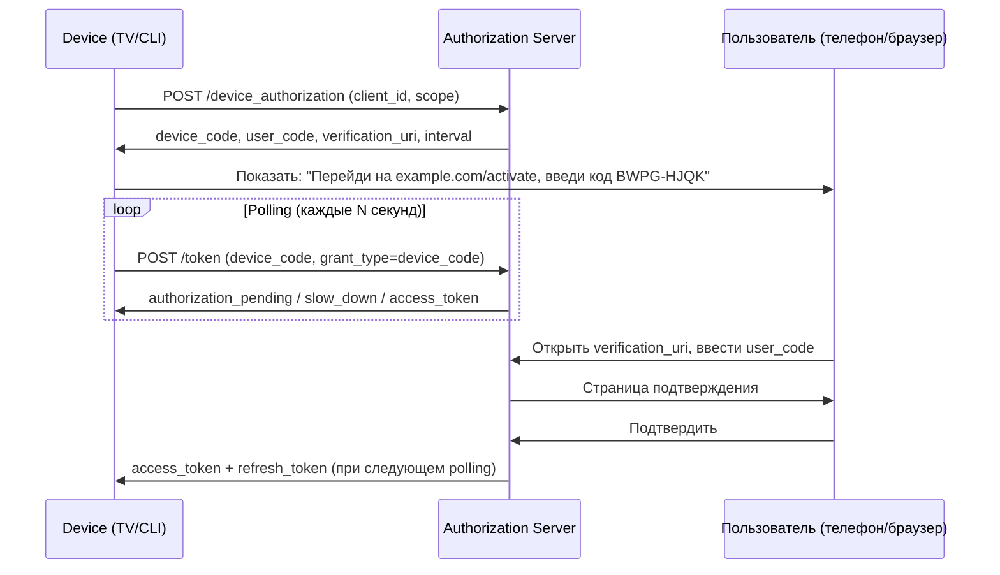

### Запрос устройства

```http
POST /device_authorization HTTP/1.1
Host: auth.example.com
Content-Type: application/x-www-form-urlencoded

client_id=tv-app&scope=openid profile
```

```json
{
  "device_code": "GmRhmhcxhwAzkoEqiMEg_DnyEysNkuNhszIySk9eS",
  "user_code": "BWPG-HJQK",
  "verification_uri": "https://example.com/activate",
  "verification_uri_complete": "https://example.com/activate?user_code=BWPG-HJQK",
  "expires_in": 1800,
  "interval": 5
}
```

### Polling токена

```http
POST /token HTTP/1.1
Content-Type: application/x-www-form-urlencoded

grant_type=urn:ietf:params:oauth:grant-type:device_code
&device_code=GmRhmhcxhwAzkoEqiMEg_DnyEysNkuNhszIySk9eS
&client_id=tv-app
```

**Возможные ответы при polling:**
- `authorization_pending` — пользователь ещё не подтвердил (продолжать polling)
- `slow_down` — уменьшить частоту polling
- `access_denied` — пользователь отклонил
- `expired_token` — device_code устарел
- `200 OK` + tokens — успех

### Применение в Java/Spring

```java
// Spring Security OAuth2 Client поддерживает Device Flow
// Обычно реализуется вручную через WebClient:
WebClient webClient = WebClient.create("https://auth.example.com");

DeviceAuthorizationResponse deviceAuth = webClient.post()
    .uri("/device_authorization")
    .bodyValue("client_id=tv-app&scope=openid")
    .retrieve()
    .bodyToMono(DeviceAuthorizationResponse.class)
    .block();

// Показать пользователю deviceAuth.getUserCode() и deviceAuth.getVerificationUri()
// Polling...
```

> [!mcq]
> - [ ] Device Authorization Grant (RFC 8628): устройство инициирует flow через POST /authorize, получает authorization code и сразу обменивает его на токен; пользователь вводит код на том же устройстве через экранную клавиатуру. | Это описание обычного Authorization Code Flow, не Device Flow. Device Flow специально для устройств БЕЗ удобного ввода — пользователь авторизуется НЕ на устройстве, а на своём телефоне/ноутбуке, вводя user_code.
> - [x] Device Authorization Grant (RFC 8628): устройство получает от AS пару `device_code` (для polling токена) и `user_code` (короткая строка для пользователя), показывает user_code+verification_uri; пользователь открывает URL на другом устройстве, вводит код и логинится; устройство polling-ом на /token получает токен при готовности. | Верное описание полного flow. Polling использует grant_type=`urn:ietf:params:oauth:grant-type:device_code`; ответы authorization_pending/slow_down/access_denied/expired_token/успех — стандартные из RFC 8628.
> - [ ] Device Authorization Grant (RFC 8628) предназначен только для mobile-приложений как альтернатива Authorization Code Flow; отличие в том, что вместо redirect используется QR-код с токеном. | Mobile используют обычный Authorization Code + PKCE. Device Flow — для устройств БЕЗ браузера/клавиатуры (TV, IoT, CLI). QR-код не передаёт токен — он просто отображает verification_uri для удобства, сам токен получает устройство polling-ом.
> - [ ] Device Authorization Grant (RFC 8628): устройство и пользователь используют общий shared secret для доказательства связи; shared secret передаётся через безопасный out-of-band канал (например, SMS). | Shared secret не используется в Device Flow — связь устройства и пользователя устанавливается через user_code (показан устройством, введён пользователем). SMS/OOB channels не нужны — используется стандартный HTTP (TLS).

---

## Q41. Как настроить Spring Authorization Server с нуля?

**Spring Authorization Server** (SAS) — официальная реализация OAuth 2.1 / OpenID Connect Authorization Server от команды Spring Security.

### Зависимости

```groovy
implementation 'org.springframework.boot:spring-boot-starter-security'
implementation 'org.springframework.security:spring-security-oauth2-authorization-server'
```

### Минимальная конфигурация

```java
@Configuration
@EnableWebSecurity
public class AuthorizationServerConfig {

    // 1. Security filter chain для Authorization Server endpoints
    @Bean
    @Order(1)
    public SecurityFilterChain authorizationServerSecurityFilterChain(HttpSecurity http) throws Exception {
        OAuth2AuthorizationServerConfiguration.applyDefaultSecurity(http);
        http.getConfigurer(OAuth2AuthorizationServerConfigurer.class)
            .oidc(Customizer.withDefaults()); // включить OpenID Connect

        return http
            .exceptionHandling(ex -> ex
                .defaultAuthenticationEntryPointFor(
                    new LoginUrlAuthenticationEntryPoint("/login"),
                    new MediaTypeRequestMatcher(MediaType.TEXT_HTML)
                ))
            .oauth2ResourceServer(rs -> rs.jwt(Customizer.withDefaults()))
            .build();
    }

    // 2. Security filter chain для формы логина
    @Bean
    @Order(2)
    public SecurityFilterChain defaultSecurityFilterChain(HttpSecurity http) throws Exception {
        return http
            .authorizeHttpRequests(auth -> auth.anyRequest().authenticated())
            .formLogin(Customizer.withDefaults())
            .build();
    }

    // 3. Зарегистрированные клиенты
    @Bean
    public RegisteredClientRepository registeredClientRepository() {
        RegisteredClient webApp = RegisteredClient.withId(UUID.randomUUID().toString())
            .clientId("web-app")
            .clientSecret("{bcrypt}" + new BCryptPasswordEncoder().encode("secret"))
            .clientAuthenticationMethod(ClientAuthenticationMethod.CLIENT_SECRET_BASIC)
            .authorizationGrantType(AuthorizationGrantType.AUTHORIZATION_CODE)
            .authorizationGrantType(AuthorizationGrantType.REFRESH_TOKEN)
            .redirectUri("https://app.example.com/login/oauth2/code/custom")
            .postLogoutRedirectUri("https://app.example.com/")
            .scope(OidcScopes.OPENID)
            .scope(OidcScopes.PROFILE)
            .scope("read")
            .tokenSettings(TokenSettings.builder()
                .accessTokenTimeToLive(Duration.ofMinutes(15))
                .refreshTokenTimeToLive(Duration.ofDays(7))
                .reuseRefreshTokens(false)
                .build())
            .build();

        return new InMemoryRegisteredClientRepository(webApp);
    }

    // 4. JWK Set — ключи подписи JWT
    @Bean
    public JWKSource<SecurityContext> jwkSource() {
        RSAKey rsaKey = Jwks.generateRsa();
        JWKSet jwkSet = new JWKSet(rsaKey);
        return (jwkSelector, securityContext) -> jwkSelector.select(jwkSet);
    }

    // 5. JWT декодер для Resource Server части
    @Bean
    public JwtDecoder jwtDecoder(JWKSource<SecurityContext> jwkSource) {
        return OAuth2AuthorizationServerConfiguration.jwtDecoder(jwkSource);
    }

    // 6. Настройки сервера (issuer URL)
    @Bean
    public AuthorizationServerSettings authorizationServerSettings() {
        return AuthorizationServerSettings.builder()
            .issuer("https://auth.example.com")
            .build();
    }
}
```

### Хранилище авторизаций (production)

```java
// В production использовать JdbcOAuth2AuthorizationService
@Bean
public OAuth2AuthorizationService authorizationService(JdbcTemplate jdbcTemplate,
        RegisteredClientRepository registeredClientRepository) {
    return new JdbcOAuth2AuthorizationService(jdbcTemplate, registeredClientRepository);
}
```

### OIDC Discovery endpoint

После настройки SAS автоматически публикует:
- `/.well-known/openid-configuration` — метаданные сервера
- `/oauth2/authorize` — authorization endpoint
- `/oauth2/token` — token endpoint
- `/oauth2/jwks` — JWK Set (публичные ключи)
- `/userinfo` — UserInfo endpoint

> [!mcq]
> - [ ] Spring Authorization Server настраивается через добавление зависимости `spring-boot-starter-oauth2-authorization-server` и аннотации `@EnableAuthorizationServer`; все клиенты и ключи генерируются автоматически при старте. | Стартер называется `spring-security-oauth2-authorization-server` (не spring-boot-starter). Аннотация `@EnableAuthorizationServer` — из старого устаревшего spring-security-oauth2, не из нового SAS. Клиенты регистрируются явно через RegisteredClientRepository.
> - [x] Spring Authorization Server с нуля: зависимость `spring-security-oauth2-authorization-server`, `OAuth2AuthorizationServerConfiguration.applyDefaultSecurity(http)` для Authorization Server filter chain, отдельный filter chain для формы логина, `RegisteredClientRepository` с registered clients, `JWKSource` с RSA-ключом для подписи JWT, `AuthorizationServerSettings` с issuer URL. | Верная схема минимальной конфигурации. Два filter chain нужны из-за разделения: AS endpoints (`/oauth2/*`) и формы логина; `@Order(1)` для AS, `@Order(2)` для логина. Production требует JdbcRegisteredClientRepository и JdbcOAuth2AuthorizationService.
> - [ ] Spring Authorization Server с нуля требует конфигурации только одного bean — `AuthorizationServerEndpointsConfigurer` с URL-ами endpoints; все остальные компоненты (клиенты, ключи) управляются через UI на `/admin`. | `AuthorizationServerEndpointsConfigurer` — класс устаревшего проекта. Новый SAS не имеет встроенного admin UI — управление клиентами через `RegisteredClientRepository` (in-memory или JDBC). Admin UI — отдельная задача приложения.
> - [ ] Spring Authorization Server с нуля: достаточно только JWKS endpoint для публикации публичных ключей; authorization, token и userinfo endpoints встроены в Resource Server и не требуют отдельной конфигурации на AS. | authorization, token, userinfo — именно endpoints Authorization Server, не Resource Server. RS только валидирует JWT через JWKS, но не выдаёт токены. Путаница ролей AS и RS — базовая ошибка в OAuth2.

---

## Q42. OpenID Connect Claims — стандартные, кастомные, UserInfo endpoint

**OIDC Claims** — атрибуты пользователя, передаваемые в ID Token или возвращаемые через UserInfo endpoint.

### Стандартные claim группы (по scope)

| Scope | Claims |
|-------|--------|
| `openid` | `sub` (обязателен), `iss`, `aud`, `exp`, `iat` |
| `profile` | `name`, `given_name`, `family_name`, `picture`, `locale`, `updated_at` |
| `email` | `email`, `email_verified` |
| `phone` | `phone_number`, `phone_number_verified` |
| `address` | `address` (JSON объект: street, city, country...) |

### Стандартные claims ID Token

```json
{
  "iss": "https://auth.example.com",      // Issuer
  "sub": "user_12345",                    // Subject (уникальный ID)
  "aud": "web-app",                       // Audience (client_id)
  "exp": 1704067200,                      // Expiration
  "iat": 1704063600,                      // Issued At
  "auth_time": 1704063500,                // Время аутентификации
  "nonce": "random-nonce",                // Защита от replay (CSRF)
  "acr": "urn:mace:incommon:iap:silver",  // Authentication Context Class
  "amr": ["pwd", "otp"],                  // Authentication Methods
  "azp": "web-app",                       // Authorized Party
  "at_hash": "77QmUPtjPfzWtF2AnpK9RQ"    // Access Token Hash
}
```

### Кастомные claims в Spring Authorization Server

```java
@Bean
public OAuth2TokenCustomizer<JwtEncodingContext> jwtCustomizer() {
    return context -> {
        if (OidcParameterNames.ID_TOKEN.equals(context.getTokenType().getValue())) {
            // Добавить кастомные claims в ID Token
            Authentication principal = context.getPrincipal();
            UserDetails user = (UserDetails) principal.getPrincipal();

            context.getClaims()
                .claim("roles", user.getAuthorities().stream()
                    .map(GrantedAuthority::getAuthority)
                    .collect(Collectors.toList()))
                .claim("department", "engineering")
                .claim("tenant_id", "company-123");
        }
    };
}
```

### UserInfo Endpoint

```http
GET /userinfo HTTP/1.1
Host: auth.example.com
Authorization: Bearer <access_token>
```

```json
{
  "sub": "user_12345",
  "name": "John Doe",
  "given_name": "John",
  "family_name": "Doe",
  "email": "john@example.com",
  "email_verified": true,
  "picture": "https://photos.example.com/johndoe/me.jpg",
  "locale": "ru-RU",
  "roles": ["developer", "reviewer"]
}
```

### Кастомный UserInfo в Spring Authorization Server

```java
@Bean
public OAuth2TokenCustomizer<JwtEncodingContext> tokenCustomizer(UserRepository userRepository) {
    return context -> {
        if (OidcParameterNames.ID_TOKEN.equals(context.getTokenType().getValue())
                || "userinfo".equals(context.getTokenType().getValue())) {

            String username = context.getPrincipal().getName();
            User user = userRepository.findByUsername(username);

            context.getClaims()
                .claim("department", user.getDepartment())
                .claim("employee_id", user.getEmployeeId());
        }
    };
}
```

### Claims в Resource Server (Spring Security)

```java
@GetMapping("/api/profile")
public Map<String, Object> profile(@AuthenticationPrincipal Jwt jwt) {
    return Map.of(
        "sub", jwt.getSubject(),
        "email", jwt.getClaimAsString("email"),
        "roles", jwt.getClaimAsStringList("roles")
    );
}
```

> [!mcq]
> - [ ] OIDC Claims группируются по scope: `openid` даёт sub+iss+aud+exp+iat, `profile` даёт полный набор PII (ФИО, адрес, дату рождения, SSN) по умолчанию; UserInfo endpoint возвращает все claims без ограничений. | Scope `profile` не включает sensitive PII (SSN, дата рождения); стандартные profile claims — name, given_name, family_name, picture, locale, updated_at. Scope `address` — отдельный для адреса. UserInfo возвращает только claims, соответствующие выданным scopes.
> - [x] OIDC Claims группируются по scope: `openid` (базовые — sub обязателен), `profile` (name, given_name, family_name, picture, locale), `email` (email, email_verified), `phone`, `address`; кастомные claims добавляются через `OAuth2TokenCustomizer` в Spring Authorization Server; UserInfo endpoint возвращает claims по access_token. | Верное соответствие scopes и claims из OIDC Core 1.0. `OAuth2TokenCustomizer<JwtEncodingContext>` позволяет добавлять кастомные claims (например, tenant_id, department) в ID Token или access token по условию `context.getTokenType()`.
> - [ ] OIDC Claims — произвольные поля в JSON, стандартные claims не определены; каждый Authorization Server определяет собственный набор (Google имеет свои поля, Keycloak — свои, Okta — свои), переносимость не гарантируется. | OIDC Core 1.0 стандартизирует Standard Claims (иначе не было бы interoperability). Все совместимые OIDC-провайдеры (Google, Keycloak, Okta, Azure AD) поддерживают стандартные sub, email, name, picture и т. д. Кастомные claims — дополнение к стандартным.
> - [ ] OIDC Claims передаются только в access_token, UserInfo endpoint возвращает зашифрованный JWT с публичным ключом клиента; ID Token в OIDC не используется и был удалён в OIDC 2.0. | OIDC Claims передаются в ID Token (основной канал) и UserInfo (дополнительный для свежих данных). Access token не обязан содержать user claims — его формат не стандартизирован OIDC. ID Token не удалён (OIDC 2.0 нет в природе, актуальна OIDC Core 1.0).

---

## See also

- [Spring Security](../frameworks/spring/spring-security-interview.md) — конфигурация OAuth2 Resource Server, фильтры
- [Паттерны аутентификации и авторизации](authentication-authorization-patterns-interview.md) — RBAC, ABAC, SSO, MFA
- [HTTP и REST](../api/http-rest-interview.md) — HTTPS, CORS, заголовки безопасности
- [Безопасность приложений](application-security-interview.md) — AppSec принципы, Defense in Depth
- [OWASP Top 10](owasp-top10-interview.md) — Auth Failures (A07), уязвимости токенов
- [Микросервисы](../architecture/microservices-interview.md) — JWT propagation, API Gateway, service-to-service auth
- [Распределённые системы](../architecture/distributed-systems-interview.md) — безопасность в распределённых архитектурах
- [Kubernetes](../devops/kubernetes-interview.md) — Secrets, ServiceAccount, Workload Identity

- [Application Security](application-security-interview.md)
- [Authentication and Authorization Patterns](authentication-authorization-patterns-interview.md)
- [JWT](jwt-interview.md)
- [mTLS (Mutual TLS)](mtls-interview.md)
- [OWASP Top 10](owasp-top10-interview.md)
- [Secrets Management](secrets-management-interview.md)
