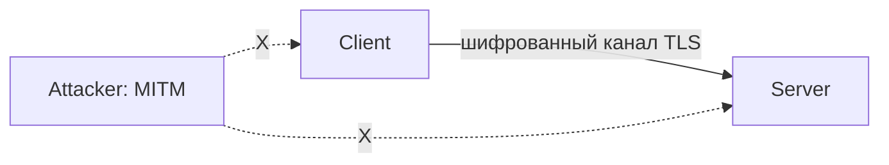
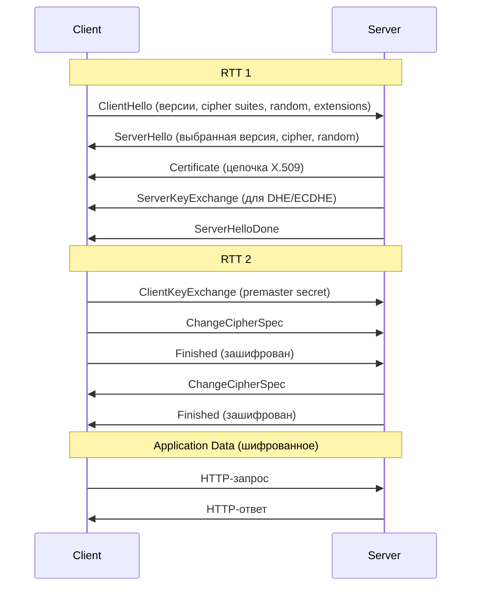
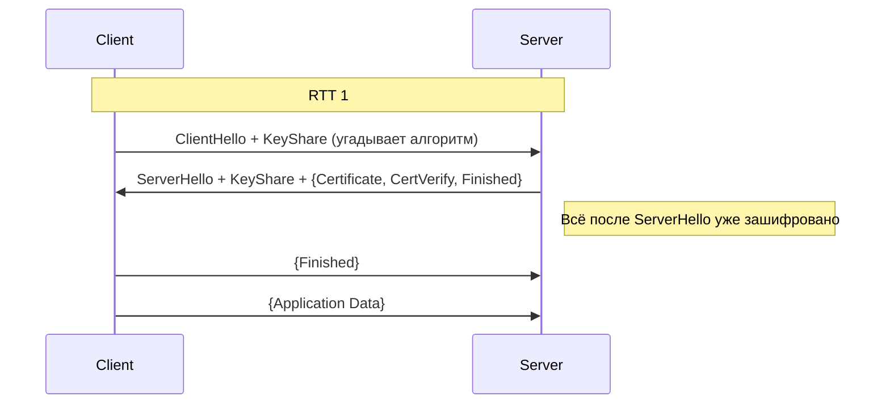
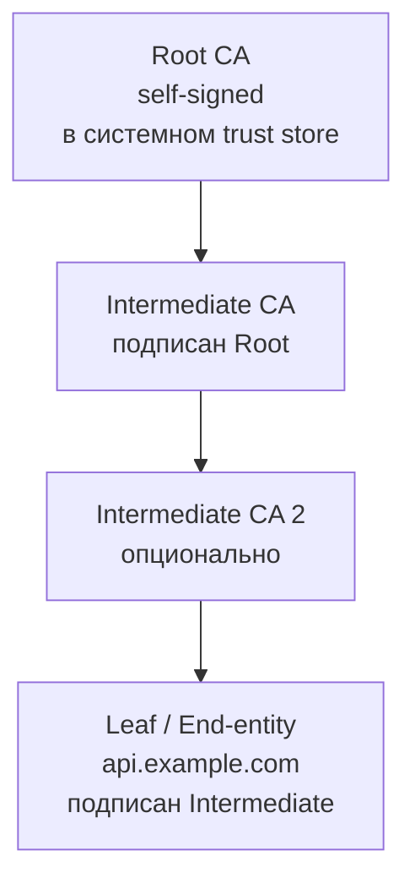
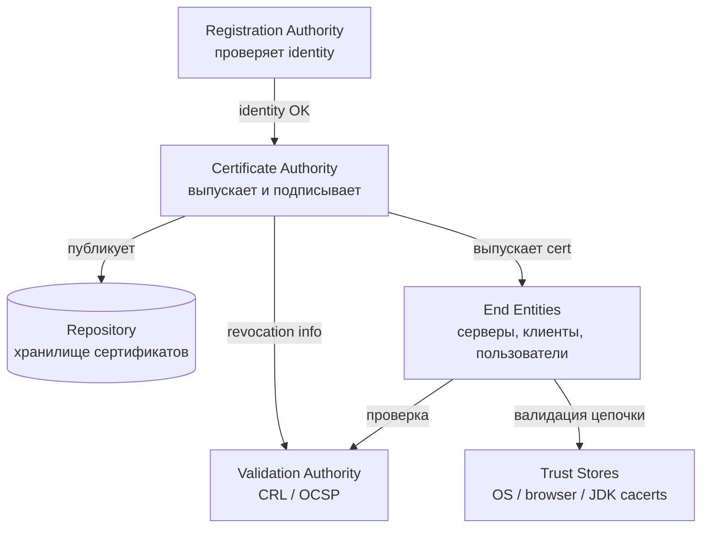
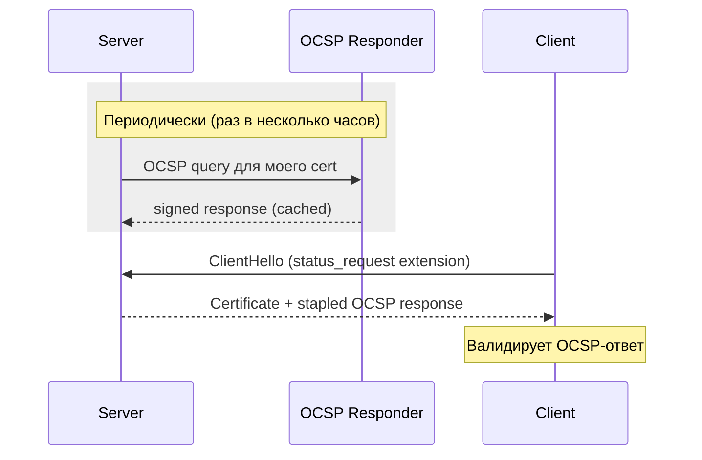
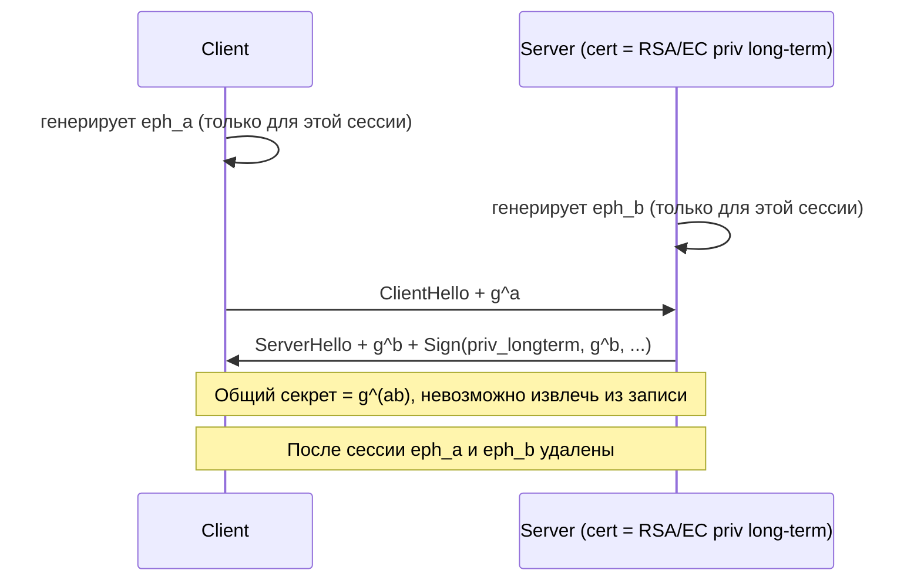
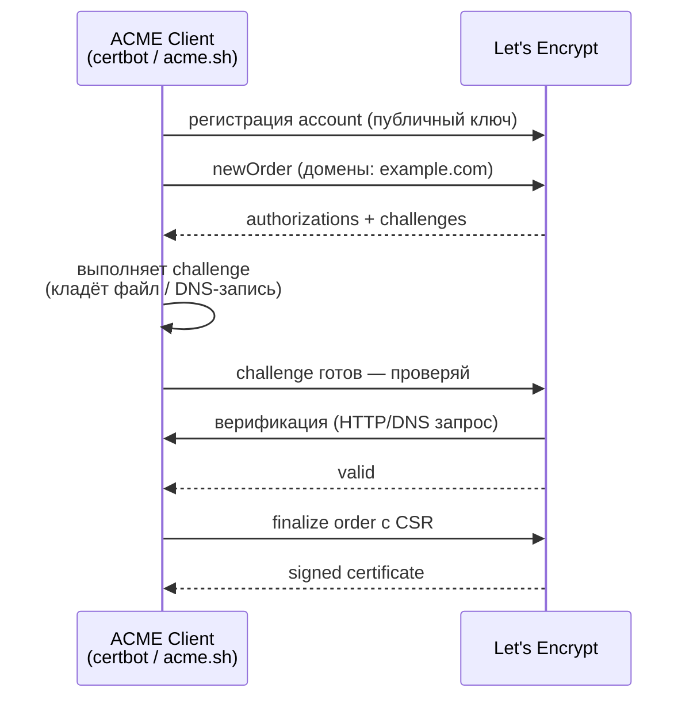
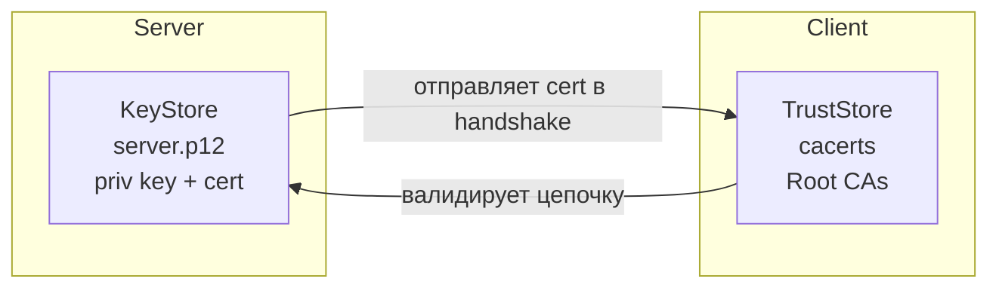
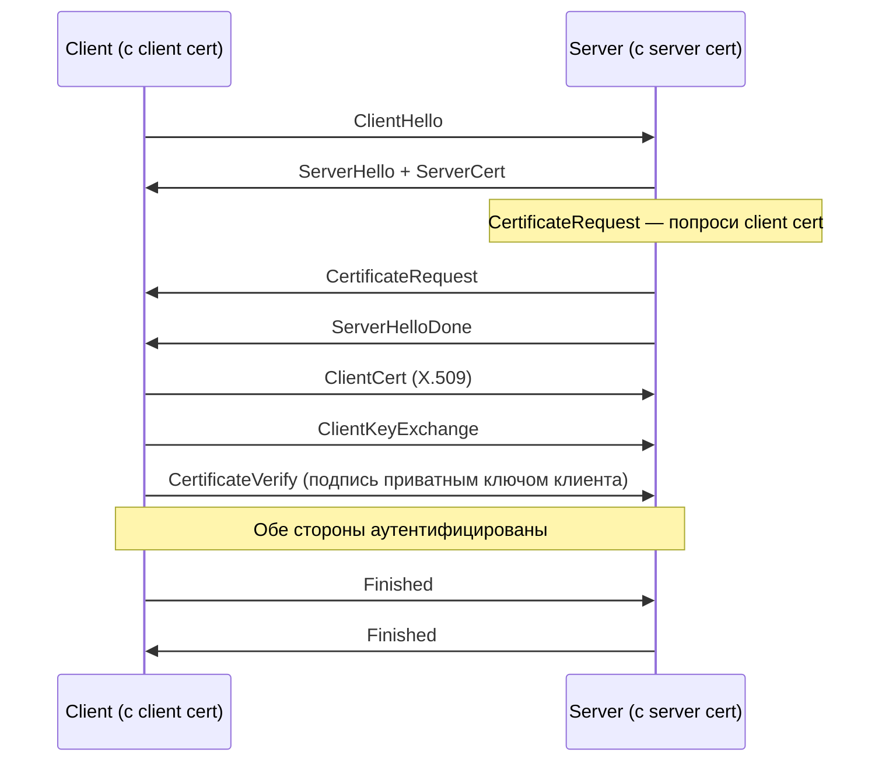

# Вопросы на собеседовании: `TLS/SSL`

Комплексное руководство по вопросам собеседования на тему `TLS/SSL` для `Senior Java Developer`. Включает детали handshake `TLS 1.2` и `TLS 1.3`, устройство `X.509` сертификатов и `PKI`, cipher suites, forward secrecy, настройку `Java KeyStore`/`TrustStore`, `SSLContext`, `Spring Boot` SSL, `mTLS`, `Let's Encrypt`/`ACME`, известные атаки и меры защиты.

**TLS** (`Transport Layer Security`) — криптографический протокол, обеспечивающий конфиденциальность, целостность и аутентификацию на транспортном уровне. Используется в `HTTPS`, `gRPC`, `SMTPS`, `FTPS`, `Kafka SSL`, `JDBC SSL` и десятках других протоколов. На интервью тема `TLS` проверяет понимание сетевой безопасности, криптографии и способность настроить и отладить реальный HTTPS-сервис.

## Полезные ссылки

### Официальная документация

- [RFC 8446 — TLS 1.3](https://datatracker.ietf.org/doc/html/rfc8446) — актуальная спецификация TLS
- [RFC 5246 — TLS 1.2](https://datatracker.ietf.org/doc/html/rfc5246) — предыдущая версия, всё ещё широко используется
- [RFC 5280 — X.509 Certificate Profile](https://datatracker.ietf.org/doc/html/rfc5280) — формат сертификатов
- [RFC 8555 — ACME Protocol](https://datatracker.ietf.org/doc/html/rfc8555) — автоматизация выдачи сертификатов (Let's Encrypt)
- [RFC 6960 — OCSP](https://datatracker.ietf.org/doc/html/rfc6960) — Online Certificate Status Protocol
- [Mozilla SSL Configuration Generator](https://ssl-config.mozilla.org/) — рекомендованные настройки TLS
- [SSL Labs Server Test](https://www.ssllabs.com/ssltest/) — аудит TLS-конфигурации сервера
- [Baeldung: Introduction to SSL in Java](https://www.baeldung.com/java-ssl)
- [Baeldung: TLS Setup in Spring](https://www.baeldung.com/spring-tls-setup)
- [Baeldung: KeyStore vs TrustStore](https://www.baeldung.com/java-keystore-truststore-difference)
- [Baeldung: mTLS Calls in Java](https://www.baeldung.com/java-execute-mtls-calls)
- [Baeldung: SSL Bundles in Spring Boot](https://www.baeldung.com/spring-boot-security-ssl-bundles)
- [OWASP Transport Layer Protection Cheat Sheet](https://cheatsheetseries.owasp.org/cheatsheets/Transport_Layer_Protection_Cheat_Sheet.html)

## Содержание

- [Полезные ссылки](#полезные-ссылки)
- [See also](#see-also)

**Основы TLS/SSL**
- [Q1. (!) Что такое TLS/SSL и зачем он нужен?](#q1--что-такое-tlsssl-и-зачем-он-нужен)
- [Q2. Чем TLS отличается от SSL? Какая версия актуальна?](#q2-чем-tls-отличается-от-ssl-какая-версия-актуальна)
- [Q3. (!) Какие три гарантии обеспечивает TLS?](#q3--какие-три-гарантии-обеспечивает-tls)
- [Q4. На каком уровне OSI работает TLS?](#q4-на-каком-уровне-osi-работает-tls)
- [Q5. Что такое HTTPS и как он связан с TLS?](#q5-что-такое-https-и-как-он-связан-с-tls)

**TLS Handshake**
- [Q6. (!) Как устроен TLS 1.2 handshake?](#q6--как-устроен-tls-12-handshake)
- [Q7. (!) Что изменилось в TLS 1.3 handshake? Почему быстрее?](#q7--что-изменилось-в-tls-13-handshake-почему-быстрее)
- [Q8. (!) Что такое 0-RTT в TLS 1.3 и в чём риски?](#q8--что-такое-0-rtt-в-tls-13-и-в-чём-риски)
- [Q9. Как работает session resumption? Session ID vs Session Ticket vs PSK](#q9-как-работает-session-resumption-session-id-vs-session-ticket-vs-psk)
- [Q10. Что такое SNI (Server Name Indication)?](#q10-что-такое-sni-server-name-indication)

**X.509 и сертификаты**
- [Q11. (!) Что такое X.509 сертификат и из чего состоит?](#q11--что-такое-x509-сертификат-и-из-чего-состоит)
- [Q12. (!) Как работает chain of trust? Root vs Intermediate vs Leaf CA](#q12--как-работает-chain-of-trust-root-vs-intermediate-vs-leaf-ca)
- [Q13. (!) Что такое SAN и чем отличается от CN? Зачем SAN обязателен?](#q13--что-такое-san-и-чем-отличается-от-cn-зачем-san-обязателен)
- [Q14. В чём разница между SAN и wildcard сертификатами?](#q14-в-чём-разница-между-san-и-wildcard-сертификатами)
- [Q15. Что такое self-signed сертификат и когда его использовать?](#q15-что-такое-self-signed-сертификат-и-когда-его-использовать)
- [Q16. DV vs OV vs EV сертификаты — в чём разница?](#q16-dv-vs-ov-vs-ev-сертификаты--в-чём-разница)

**PKI, CRL, OCSP**
- [Q17. (!) Что такое PKI? Какие компоненты входят?](#q17--что-такое-pki-какие-компоненты-входят)
- [Q18. (!) Как проверяется отзыв сертификата? CRL vs OCSP vs OCSP Stapling](#q18--как-проверяется-отзыв-сертификата-crl-vs-ocsp-vs-ocsp-stapling)
- [Q19. Что такое Certificate Transparency?](#q19-что-такое-certificate-transparency)

**Криптография и cipher suites**
- [Q20. (!) В чём разница между симметричным и асимметричным шифрованием в TLS?](#q20--в-чём-разница-между-симметричным-и-асимметричным-шифрованием-в-tls)
- [Q21. (!) Что такое cipher suite и как его читать?](#q21--что-такое-cipher-suite-и-как-его-читать)
- [Q22. (!) Что такое Forward Secrecy (PFS) и как ECDHE её обеспечивает?](#q22--что-такое-forward-secrecy-pfs-и-как-ecdhe-её-обеспечивает)
- [Q23. Чем RSA key exchange отличается от (EC)DHE?](#q23-чем-rsa-key-exchange-отличается-от-ecdhe)
- [Q24. Что такое AEAD и какие шифры используются в TLS 1.3?](#q24-что-такое-aead-и-какие-шифры-используются-в-tls-13)

**Let's Encrypt и ACME**
- [Q25. (!) Что такое Let's Encrypt и ACME протокол?](#q25--что-такое-lets-encrypt-и-acme-протокол)
- [Q26. Какие challenges поддерживает ACME (HTTP-01, DNS-01, TLS-ALPN-01)?](#q26-какие-challenges-поддерживает-acme-http-01-dns-01-tls-alpn-01)

**Java: KeyStore, TrustStore, SSLContext**
- [Q27. (!) В чём разница между KeyStore и TrustStore?](#q27--в-чём-разница-между-keystore-и-truststore)
- [Q28. (!) JKS vs PKCS12 — какой формат использовать?](#q28--jks-vs-pkcs12--какой-формат-использовать)
- [Q29. Как сгенерировать сертификат через keytool и openssl?](#q29-как-сгенерировать-сертификат-через-keytool-и-openssl)
- [Q30. (!) Как работает SSLContext в Java?](#q30--как-работает-sslcontext-в-java)
- [Q31. Как доверять кастомному CA в Java-приложении?](#q31-как-доверять-кастомному-ca-в-java-приложении)

**Spring Boot SSL**
- [Q32. (!) Как включить HTTPS в Spring Boot?](#q32--как-включить-https-в-spring-boot)
- [Q33. Что такое SSL Bundles в Spring Boot 3.1+?](#q33-что-такое-ssl-bundles-в-spring-boot-31)
- [Q34. Как настроить HTTPS-клиент в RestTemplate/WebClient?](#q34-как-настроить-https-клиент-в-resttemplatewebclient)

**mTLS (Mutual TLS)**
- [Q35. (!) Что такое mTLS и когда его применять?](#q35--что-такое-mtls-и-когда-его-применять)
- [Q36. Как настроить mTLS в Spring Boot (сервер + клиент)?](#q36-как-настроить-mtls-в-spring-boot-сервер--клиент)

**Атаки и защита**
- [Q37. (!) Какие известные атаки на TLS? POODLE, BEAST, Heartbleed](#q37--какие-известные-атаки-на-tls-poodle-beast-heartbleed)
- [Q38. (!) Что такое downgrade attack и как TLS_FALLBACK_SCSV с ним борется?](#q38--что-такое-downgrade-attack-и-как-tls_fallback_scsv-с-ним-борется)
- [Q39. Что такое MITM и как TLS от него защищает?](#q39-что-такое-mitm-и-как-tls-от-него-защищает)

**HSTS, CSP, pinning**
- [Q40. (!) Что такое HSTS и зачем он нужен?](#q40--что-такое-hsts-и-зачем-он-нужен)
- [Q41. Что такое certificate pinning? Почему HPKP устарел?](#q41-что-такое-certificate-pinning-почему-hpkp-устарел)

**Инструменты и отладка**
- [Q42. (!) Чем отлаживать TLS? openssl s_client, keytool, testssl.sh](#q42--чем-отлаживать-tls-openssl-s_client-keytool-testsslsh)
- [Q43. Как прочитать и проверить содержимое сертификата?](#q43-как-прочитать-и-проверить-содержимое-сертификата)
- [Q44. PKIX path building failed — как диагностировать?](#q44-pkix-path-building-failed--как-диагностировать)
- [Q45. Чеклист безопасности TLS для production](#q45-чеклист-безопасности-tls-для-production)

---

## Q1. (!) Что такое `TLS/SSL` и зачем он нужен?

`TLS` (`Transport Layer Security`) — криптографический протокол для защищённой передачи данных поверх ненадёжного транспорта (обычно `TCP`). Его предшественник — `SSL` (`Secure Sockets Layer`), сейчас устаревший и небезопасный.

`TLS` решает три базовые задачи:

1. **Конфиденциальность** — данные шифруются, прослушка канала не даёт ничего читаемого
2. **Целостность** — изменение данных в канале будет обнаружено через `MAC`/`AEAD`
3. **Аутентификация** — клиент проверяет, что подключился именно к тому серверу, к которому хотел (через `X.509` сертификат)

Без `TLS` любой промежуточный узел (`ISP`, Wi-Fi-точка, корпоративный прокси) мог бы читать и модифицировать HTTP-трафик — включая пароли, cookies, платёжные данные.



На транспорте данные выглядят как бинарный шум — но клиент и сервер видят исходный HTTP.

## Q2. Чем `TLS` отличается от `SSL`? Какая версия актуальна?

`SSL` — историческое название. Netscape выпустила `SSL 2.0` в 1995, `SSL 3.0` в 1996. В 1999 IETF стандартизовал протокол под именем `TLS 1.0` (`RFC 2246`) — это был по сути `SSL 3.1`. Название сменили, чтобы подчеркнуть, что стандарт теперь открытый.

| Версия | Год | Статус |
|--------|-----|--------|
| `SSL 2.0` | 1995 | Запрещён (`RFC 6176`) |
| `SSL 3.0` | 1996 | Запрещён (`RFC 7568`, POODLE) |
| `TLS 1.0` | 1999 | Deprecated (`RFC 8996`, 2021) |
| `TLS 1.1` | 2006 | Deprecated (`RFC 8996`) |
| `TLS 1.2` | 2008 | Поддерживается, широко используется |
| `TLS 1.3` | 2018 (`RFC 8446`) | Рекомендуемый |

На практике **всегда пишут "SSL"**, имея в виду `TLS` (термин прижился). Но протокол должен быть минимум `TLS 1.2`, а лучше `TLS 1.3`.

## Q3. (!) Какие три гарантии обеспечивает `TLS`?

Классическая триада `CIA`:

| Гарантия | Как достигается в TLS |
|----------|----------------------|
| **Confidentiality** (конфиденциальность) | Симметричное шифрование сессионным ключом (`AES-GCM`, `ChaCha20-Poly1305`) |
| **Integrity** (целостность) | `MAC` / `AEAD` — любое искажение шифртекста обнаруживается |
| **Authentication** (аутентификация) | Проверка `X.509` сертификата сервера через подпись доверенного `CA`; опционально — клиентский сертификат (`mTLS`) |

Дополнительно `TLS 1.3` обязательно обеспечивает **Forward Secrecy** — компрометация долгосрочного приватного ключа сервера не даёт расшифровать ранее перехваченный трафик.

`TLS` **не защищает** от:
- атак на endpoint (вредонос на клиенте/сервере видит незашифрованные данные)
- подмены метаданных (`SNI`, размер пакетов, тайминги — side channels)
- неправильной валидации сертификата самим приложением

## Q4. На каком уровне `OSI` работает `TLS`?

`TLS` работает между транспортным (`L4`, `TCP`) и прикладным (`L7`, `HTTP`) уровнями. Формально его относят к **представительному уровню** (`L6`) или "сеансовому+представительному". В модели TCP/IP — просто часть прикладного.

```
┌─────────────────┐
│ HTTP / gRPC /.. │  L7 — Application
├─────────────────┤
│       TLS       │  L6/L5 — шифрование
├─────────────────┤
│       TCP       │  L4 — Transport
├─────────────────┤
│       IP        │  L3 — Network
└─────────────────┘
```

Важные следствия:
- `TLS` требует **надёжный транспорт** (`TCP`). Для `UDP` используется `DTLS` (`RFC 9147`)
- `HTTP/3` работает поверх `QUIC`, который встроил TLS-сессии в сам протокол — `TLS` неотделим от транспорта
- Балансировщик, который не терминирует `TLS`, не может смотреть на HTTP-заголовки (только на `SNI` в `Client Hello`)

## Q5. Что такое `HTTPS` и как он связан с `TLS`?

`HTTPS` (`HTTP Secure`, `RFC 2818`/`RFC 9110`) — это `HTTP` поверх `TLS`. Всё тело HTTP (стартовая строка, заголовки, тело) шифруется как payload в `TLS`-канале.

Отличия от HTTP:
- Порт по умолчанию: `443` (vs `80` для HTTP)
- Схема URL: `https://` (vs `http://`)
- Требуется валидный сертификат на сервере
- Все заголовки и тело зашифрованы, виден только IP, порт и `SNI`

Современные браузеры:
- Помечают HTTP-страницы как "Not secure"
- Запрещают `mixed content` (HTTPS-страница не может грузить HTTP-ресурсы)
- Применяют `HTTPS-Only Mode`, автоматически переводя HTTP на HTTPS

См. подробнее в [[http-rest-interview|вопросах по HTTP/REST]].

## Q6. (!) Как устроен `TLS 1.2` handshake?

`TLS 1.2` handshake занимает **2 round-trip** (2-RTT) — два полных похода туда-обратно перед отправкой данных приложения.



Ключевые шаги:

1. **ClientHello** — клиент присылает список поддерживаемых версий TLS, cipher suites, `client_random`, расширения (`SNI`, `ALPN`, ...)
2. **ServerHello** — сервер выбирает версию + cipher suite, присылает `server_random`
3. **Certificate** — сервер присылает свой сертификат (и промежуточные)
4. **ServerKeyExchange** — для forward-secrecy ciphers (`ECDHE`) сервер присылает свою эфемерную публичную часть, подписанную приватным ключом из сертификата
5. **ClientKeyExchange** — клиент отвечает своей эфемерной публичной частью, обе стороны вычисляют общий `premaster secret`
6. Из `client_random` + `server_random` + `premaster_secret` через `PRF` получают `master secret` и из него — сессионные ключи
7. **Finished** — обе стороны шлют MAC по всему handshake, проверяя, что он не был модифицирован

После этого идёт зашифрованное `Application Data`.

## Q7. (!) Что изменилось в `TLS 1.3` handshake? Почему быстрее?

`TLS 1.3` (`RFC 8446`) — крупнейший пересмотр протокола. Основные изменения:

**1. Handshake за 1-RTT** (вместо 2-RTT):



Клиент в первом же сообщении присылает `KeyShare` — свою эфемерную публичную часть для вероятного алгоритма. Сервер сразу отвечает своей и начинает шифровать дальнейшие сообщения.

**2. Выкинуты небезопасные алгоритмы:**
- Нет `RSA key exchange` — только `(EC)DHE`, forward secrecy обязательна
- Нет `CBC`-шифров — только `AEAD` (`AES-GCM`, `ChaCha20-Poly1305`)
- Нет `MD5`, `SHA-1` в подписях
- Нет `static DH`, сжатия, ренегоциации, `NULL`-шифров

**3. 0-RTT резюмирование** — клиент может отправить данные в самом первом сообщении при повторном подключении.

**4. Session resumption через PSK** — единый механизм вместо `Session ID` и `Session Ticket`.

**5. Все сообщения после `ServerHello` зашифрованы** — включая `Certificate`, что защищает приватность клиента.

Результат: подключение к HTTPS-сайту стало на одну RTT быстрее, сразу после TCP-handshake можно слать HTTP.

## Q8. (!) Что такое `0-RTT` в `TLS 1.3` и в чём риски?

`0-RTT` (zero round-trip) — возможность отправить зашифрованные данные приложения в самом первом сообщении клиента при повторном подключении. Используется `PSK` из предыдущей сессии.

```
Client: ClientHello + EarlyData (HTTP GET /) → Server
```

Данные шифруются ключом, производным от `PSK`, ещё до получения ответа сервера.

**Риски `0-RTT`:**

1. **Replay attacks** — злоумышленник может перехватить `EarlyData` и отправить повторно. Сервер не может отличить повтор от оригинала на этапе handshake.
2. **Нет Forward Secrecy** для `EarlyData` — шифруется производным от `PSK`, который долгоживущий.

**Mitigations:**
- Для `0-RTT` разрешать только **идемпотентные операции** (`GET`-запросы без side effects)
- Сервер должен вести cache уже использованных `PSK` (dedupe)
- `CDN`-провайдеры (Cloudflare) отключают `0-RTT` для не-GET запросов

В Spring Boot / Tomcat по умолчанию `0-RTT` выключен. Включать — осознанно.

## Q9. Как работает session resumption? `Session ID` vs `Session Ticket` vs `PSK`

Полный handshake дорог (асимметричные операции). Резюмирование позволяет переиспользовать ранее установленные ключи.

**Session ID (TLS 1.2):**
- Сервер генерирует `session_id`, клиент посылает его в следующем `ClientHello`
- Сервер хранит состояние сессии в памяти/распределённом кеше
- Минус: требует server-side storage, плохо работает в кластерах без sticky sessions

**Session Ticket (`RFC 5077`, TLS 1.2):**
- Сервер шифрует всё состояние сессии ключом `STEK` и выдаёт клиенту "билет"
- Клиент присылает билет обратно — сервер расшифровывает и восстанавливает сессию
- Плюс: stateless на сервере. Минус: если `STEK` утечёт, вся forward secrecy теряется → нужна ротация

**PSK (TLS 1.3):**
- Единый механизм. `PSK` выдаётся в `NewSessionTicket` после handshake
- При резюмировании клиент шлёт `PSK identity` в `ClientHello`, сервер его принимает и переходит к 1-RTT handshake
- Поддерживает `0-RTT`

## Q10. Что такое `SNI` (Server Name Indication)?

`SNI` (`RFC 6066`) — расширение `ClientHello`, в котором клиент указывает, **к какому именно hostname он подключается**.

Зачем нужно: на одном IP-адресе может хоститься много HTTPS-сайтов с разными сертификатами. Без `SNI` сервер не знает, какой сертификат прислать в ответ (TCP-соединение ещё не привязано к Host-заголовку HTTP, а TLS — до HTTP).

```
ClientHello {
  ...
  extensions: [
    server_name: "api.example.com"
    ...
  ]
}
```

Проблема приватности: `SNI` передаётся **в открытом виде** даже в `TLS 1.3` — пассивный наблюдатель видит, к какому домену вы идёте. Решение — `ESNI`/`ECH` (`Encrypted Client Hello`), пока в стадии стандартизации.

В Java клиентах `SNI` работает из коробки начиная с JDK 7, hostname берётся из URL.

## Q11. (!) Что такое `X.509` сертификат и из чего состоит?

`X.509` — стандарт формата цифрового сертификата (`RFC 5280`). Привязывает публичный ключ к идентификатору (обычно hostname) через подпись доверенного `Certificate Authority`.

Основные поля:

| Поле | Пример | Назначение |
|------|--------|-----------|
| `Version` | v3 | Версия формата X.509 |
| `Serial Number` | 03:1A:B5:... | Уникальный ID у CA |
| `Signature Algorithm` | `SHA256withRSA` | Алгоритм подписи CA |
| `Issuer` | `CN=Let's Encrypt R3, O=LE` | Кто подписал |
| `Validity` | notBefore / notAfter | Срок действия |
| `Subject` | `CN=api.example.com` | Кому выдан |
| `Subject Public Key Info` | RSA/EC public key | Публичный ключ владельца |
| `Extensions` | `SAN`, `KeyUsage`, `EKU`, `AIA` | Расширения (v3) |
| `Signature` | bytes | Подпись CA |

Ключевые extensions:
- **`Subject Alternative Name` (`SAN`)** — список доменов, которые покрывает сертификат
- **`Key Usage`** — digitalSignature, keyEncipherment, ...
- **`Extended Key Usage` (`EKU`)** — `serverAuth`, `clientAuth`, `codeSigning`
- **`Authority Information Access` (`AIA`)** — URL для CRL/OCSP и промежуточных сертификатов
- **`Basic Constraints`** — является ли сертификат CA (`CA:TRUE`)

Формат хранения: `DER` (бинарный `ASN.1`) или `PEM` (base64 + BEGIN/END блоки).

```
-----BEGIN CERTIFICATE-----
MIID...base64...XYZ
-----END CERTIFICATE-----
```

## Q12. (!) Как работает chain of trust? Root vs Intermediate vs Leaf CA

Проверка сертификата — это построение цепочки до доверенного корня.



**Три типа сертификатов:**

1. **Root CA** — самоподписан, лежит в системном `trust store` (OS / browser / JDK `cacerts`). Приватный ключ хранится offline в HSM.
2. **Intermediate CA** — подписан Root (или другим Intermediate). Именно им CA выпускает пользовательские сертификаты. Сервер присылает его вместе с leaf.
3. **Leaf / end-entity** — сертификат конкретного сервера/клиента.

**Процесс валидации:**

1. Клиент получает цепочку от сервера (`Certificate` сообщение)
2. Берёт `leaf`, проверяет подпись `Intermediate` его публичным ключом
3. Проверяет подпись `Intermediate` ключом следующего звена
4. Доходит до `Root` — проверяет, есть ли он в trust store
5. Попутно: срок действия, `SAN` vs hostname, `EKU`, revocation (CRL/OCSP)

**Зачем Intermediate:** Root-ключ максимально ценен, его хранят offline. Компрометация Intermediate → отзывается только он, а не Root. CA может делегировать выпуск через Intermediate.

Если сервер забыл прислать Intermediate — большинство клиентов не найдут цепочку и упадут с ошибкой (`unable to find valid certification path`). Браузеры иногда подтягивают через `AIA`, но Java — нет.

## Q13. (!) Что такое `SAN` и чем отличается от `CN`? Зачем `SAN` обязателен?

Исторически hostname сервера указывался в `Subject.CommonName` (`CN`). Но `CN` — это одна строка на один домен.

`Subject Alternative Name` (`SAN`) — extension, содержащий **список** DNS-имён (или IP), для которых валиден сертификат.

```
Subject: CN=example.com
X509v3 Subject Alternative Name:
    DNS:example.com
    DNS:www.example.com
    DNS:api.example.com
    IP:203.0.113.10
```

**С 2017 года все современные браузеры (Chrome 58+, Firefox, Safari) игнорируют `CN`** и проверяют hostname только по `SAN`. Сертификат без `SAN` вызовет ошибку `NET::ERR_CERT_COMMON_NAME_INVALID`.

Java `HttpsURLConnection` с дефолтным `HostnameVerifier` тоже требует `SAN` (начиная с JDK 9+).

Правило: **всегда выписывать сертификаты с `SAN`**, даже если домен один. В `CSR` через OpenSSL:

```bash
openssl req -new -key server.key -out server.csr \
  -subj "/CN=api.example.com" \
  -addext "subjectAltName=DNS:api.example.com,DNS:www.api.example.com"
```

## Q14. В чём разница между `SAN` и wildcard сертификатами?

| Свойство | SAN (multi-domain) | Wildcard (`*.domain`) |
|----------|-------------------|----------------------|
| Покрытие | Список явно заданных доменов (`a.com`, `b.net`, `x.org`) | Один уровень поддоменов одного домена (`*.example.com` → `api.example.com`, `www.example.com`) |
| Новый поддомен | Нужен reissue | Работает автоматически |
| Разные домены | Да | Нет, только один базовый |
| Вложенные уровни | — | `*.example.com` НЕ покрывает `a.b.example.com` (wildcard работает только на одном уровне) |
| Уровень валидации | DV / OV / EV | Обычно DV / OV (EV редко) |
| Риск компрометации | Утечка влияет только на список | Утечка компрометирует все поддомены |

Можно комбинировать: **SAN + wildcard** — сертификат с несколькими wildcard-записями (`*.example.com` + `*.api.example.com`).

## Q15. Что такое self-signed сертификат и когда его использовать?

Self-signed — сертификат, подписанный собственным приватным ключом (`Issuer == Subject`). Нет цепочки к публичному CA, клиенты не доверяют ему по умолчанию.

**Когда можно:**
- Локальная разработка (`localhost`)
- Внутренние тесты, сервисы без внешних клиентов
- Внутренние CA (корпоративная PKI) — тогда self-signed это корневой сертификат, который раскатывается в trust store всех машин организации

**Когда нельзя:**
- Публичные сервисы — браузеры покажут огромное предупреждение
- Приложения без TOFU — большинство клиентов просто упадут

Генерация через keytool:

```bash
keytool -genkeypair -alias server \
  -keyalg RSA -keysize 2048 \
  -validity 365 \
  -keystore server.p12 -storetype PKCS12 \
  -dname "CN=localhost" \
  -ext "san=dns:localhost,ip:127.0.0.1"
```

Через openssl:

```bash
openssl req -x509 -newkey rsa:2048 -nodes -days 365 \
  -keyout server.key -out server.crt \
  -subj "/CN=localhost" \
  -addext "subjectAltName=DNS:localhost,IP:127.0.0.1"
```

## Q16. `DV` vs `OV` vs `EV` сертификаты — в чём разница?

Три уровня валидации у публичных CA, отличающиеся тем, что проверяет CA перед выпуском:

| Тип | Что проверяется | Время | Пример |
|-----|----------------|-------|--------|
| **DV** (Domain Validated) | Контроль над доменом (через HTTP/DNS challenge) | Минуты | Let's Encrypt, большинство |
| **OV** (Organization Validated) | Домен + существование юрлица | Дни | DigiCert OV, Sectigo OV |
| **EV** (Extended Validation) | Домен + полная юридическая проверка организации | Дни-недели | Банки, финтех |

Исторически `EV` показывали зелёной полоской с названием компании в адресной строке. **С 2019 браузеры (Chrome, Safari) убрали EV UI** — визуально сейчас пользователь не отличает DV от EV. Это сильно снизило ценность EV.

С точки зрения криптографии все три уровня абсолютно идентичны — разница только в due diligence CA. Для подавляющего большинства сервисов достаточно `DV` от Let's Encrypt.

## Q17. (!) Что такое `PKI`? Какие компоненты входят?

`PKI` (`Public Key Infrastructure`) — экосистема для выпуска, распространения, использования и отзыва цифровых сертификатов на базе асимметричной криптографии.



**Компоненты:**

1. **CA (Certificate Authority)** — выпускает и подписывает сертификаты. Примеры: Let's Encrypt, DigiCert, GlobalSign
2. **RA (Registration Authority)** — проверяет identity перед выпуском (валидация владения доменом, юрлица)
3. **VA (Validation Authority)** — обслуживает CRL/OCSP для проверки отзыва
4. **Repository** — публичный каталог сертификатов (иногда интегрирован в CA)
5. **End Entities** — серверы, клиенты, люди, у которых есть сертификаты
6. **Trust Stores** — хранилища корневых CA на стороне клиента (браузер, OS, JDK)

PKI может быть публичной (Web PKI, тот что в браузерах) или частной (внутренний CA организации).

## Q18. (!) Как проверяется отзыв сертификата? `CRL` vs `OCSP` vs `OCSP Stapling`

Сертификат может быть отозван до истечения срока (утечка ключа, compromise CA, смена владельца). Проверка отзыва — слабое место PKI.

**CRL (`Certificate Revocation List`, `RFC 5280`):**
- CA публикует список серийников отозванных сертификатов
- Клиент скачивает весь CRL с URL из extension `CRL Distribution Points`
- Плюсы: простой
- Минусы: файл может быть большим (МБ), CRL обновляется редко, медленно

**OCSP (`Online Certificate Status Protocol`, `RFC 6960`):**
- Клиент делает запрос к OCSP responder: "статус сертификата с serial=X?"
- Ответ: `good` / `revoked` / `unknown`, подписан CA
- Плюсы: свежие данные, небольшой запрос
- Минусы: задержка на каждый TLS handshake, утечка приватности (CA видит, куда ходит пользователь), single point of failure

**OCSP Stapling (`RFC 6066`):**
- **Сервер** (не клиент) периодически получает OCSP-ответ от CA
- Сервер "прикрепляет" (staples) свежий OCSP-ответ к своему сертификату в handshake
- Клиент получает подтверждение не-отзыва сразу, без отдельного запроса
- Решает и проблему приватности (CA не видит клиентов), и производительности



Современные рекомендации: **OCSP Stapling + Must-Staple extension** (сертификат требует наличие stapled OCSP, иначе браузер отвергнет).

Альтернатива: **короткоживущие сертификаты** (Let's Encrypt — 90 дней, сейчас идёт к 6 дням) — отзыв почти не нужен, достаточно переждать.

## Q19. Что такое `Certificate Transparency`?

`Certificate Transparency` (`CT`, `RFC 6962`/`RFC 9162`) — механизм публичного аудита выпускаемых сертификатов. Все публичные CA **обязаны** логировать выпущенные сертификаты в публичные append-only логи.

Как работает:
1. CA отправляет pre-certificate в CT-log
2. Log возвращает `SCT` (Signed Certificate Timestamp) — подписанную "расписку"
3. CA включает `SCT` в финальный сертификат (или шлёт отдельно через OCSP/TLS extension)
4. Браузер (Chrome, Safari) **требует** минимум 2 SCT от разных логов — без них сертификат не доверяется

**Польза:**
- Domain owner может мониторить, кто выпускает сертификаты на его домен (`crt.sh`, `Facebook CT Monitor`, Cert Spotter)
- Ошибочно/злонамеренно выпущенные сертификаты обнаруживаются и отзываются
- Исторически CT поймал несколько инцидентов mis-issuance у крупных CA

Проверить сертификат: [https://crt.sh/?q=example.com](https://crt.sh/).

## Q20. (!) В чём разница между симметричным и асимметричным шифрованием в `TLS`?

| Свойство | Симметричное | Асимметричное |
|----------|-------------|---------------|
| Ключи | Один общий | Пара public/private |
| Алгоритмы | AES, ChaCha20 | RSA, ECDSA, (EC)DH |
| Скорость | Быстрое (~GB/s) | Медленное (~кB/s) |
| Размер ключа | 128-256 бит | 2048-4096 RSA / 256 EC |
| Проблема | Как обменяться ключом? | Как подтвердить публичный ключ? |

В `TLS` используются **оба**:

1. **Handshake** — асимметричная криптография для:
   - Аутентификации сервера (подпись через RSA/ECDSA из сертификата)
   - Согласования общего симметричного ключа (через ECDHE)
2. **Application Data** — симметричная криптография (AES-GCM) для шифрования трафика

Гибридный подход даёт и безопасность обмена ключом (асимметрика), и производительность шифрования (симметрика).

## Q21. (!) Что такое cipher suite и как его читать?

Cipher suite — именованный набор алгоритмов, согласуемый на handshake. Формат названия в `TLS 1.2`:

```
TLS_ECDHE_RSA_WITH_AES_128_GCM_SHA256
    ↑      ↑       ↑         ↑      ↑
    |      |       |         |      └─ PRF/MAC hash: SHA-256
    |      |       |         └─── cipher + mode: AES-128 в GCM
    |      |       └──────────── WITH — разделитель
    |      └──────────────────── authentication: RSA signature
    └──────────────────────────── key exchange: ECDHE (ephemeral)
```

Расшифровка:
- **Key exchange** — как договориться о ключе: `RSA`, `DHE`, `ECDHE`, `PSK`
- **Authentication** — чем подписывается handshake: `RSA`, `ECDSA`
- **Cipher** — симметричный шифр: `AES_128_GCM`, `AES_256_GCM`, `CHACHA20_POLY1305`
- **MAC/hash** — для PRF и integrity: `SHA256`, `SHA384`

В **`TLS 1.3`** формат упрощён — cipher suite описывает только cipher + hash:

```
TLS_AES_128_GCM_SHA256
TLS_AES_256_GCM_SHA384
TLS_CHACHA20_POLY1305_SHA256
```

Key exchange и signature договариваются через отдельные extensions.

**Рекомендованные для прода (Mozilla Modern):**

- `TLS_AES_128_GCM_SHA256`
- `TLS_AES_256_GCM_SHA384`
- `TLS_CHACHA20_POLY1305_SHA256`
- `ECDHE-ECDSA-AES128-GCM-SHA256` (TLS 1.2 fallback)
- `ECDHE-RSA-AES128-GCM-SHA256` (TLS 1.2 fallback)

**Запрещены:**
- Любой с `RC4`, `3DES`, `MD5`, `SHA1`
- `CBC` без MAC-then-encrypt (уязвим к padding oracle)
- Любой без `PFS` (без DHE/ECDHE)

## Q22. (!) Что такое Forward Secrecy (`PFS`) и как `ECDHE` её обеспечивает?

**Perfect Forward Secrecy** — свойство протокола: если долгосрочный приватный ключ сервера утечёт завтра, то ранее перехваченный трафик **нельзя** расшифровать.

Без PFS (например, RSA key exchange):
- Клиент шифрует `premaster_secret` публичным ключом сервера
- Атакующий записывает TLS-трафик
- Через год утекает приватный ключ → атакующий расшифровывает все старые записи

С PFS (`DHE`/`ECDHE`):
- На каждую сессию генерируется **эфемерная** пара Diffie-Hellman
- Сервер и клиент обмениваются публичными частями, получают общий секрет
- Сертификат сервера используется только для **подписи** эфемерной части, не для её шифрования
- После handshake эфемерные приватные ключи **уничтожаются**



**ECDHE** — Elliptic Curve Diffie-Hellman Ephemeral. Быстрее чем классический DHE при том же уровне безопасности (P-256 ≈ RSA 3072).

В `TLS 1.3` **PFS обязателен** — RSA key exchange удалён, все cipher suites используют (EC)DHE.

## Q23. Чем `RSA key exchange` отличается от `(EC)DHE`?

| Свойство | RSA key exchange | (EC)DHE |
|----------|-----------------|---------|
| Механизм | Клиент генерит premaster, шифрует публичным ключом сервера | Обе стороны генерят эфемерные пары, обмениваются публичными частями |
| Использование сертификата | Ключ из сертификата применяется для **шифрования** секрета | Ключ из сертификата применяется для **подписи** эфемерной части |
| Forward Secrecy | ❌ Нет | ✅ Да |
| Производительность | Быстрее на handshake (нет доп. DH) | Чуть медленнее |
| Статус в TLS 1.3 | ❌ Удалён | ✅ Единственный вариант |

**Почему RSA key exchange убрали:** массовая возможность "record now, decrypt later" — государственные акторы могут записывать зашифрованный трафик сейчас, а через 5-10 лет расшифровать при утечке ключа или появлении квантовых компьютеров.

## Q24. Что такое `AEAD` и какие шифры используются в `TLS 1.3`?

`AEAD` (`Authenticated Encryption with Associated Data`) — режим шифрования, одновременно обеспечивающий **конфиденциальность** (шифрование) и **целостность** (MAC) в одной операции, без отдельного HMAC-шага.

Зачем нужно: старая схема **"MAC-then-encrypt"** (`CBC` + HMAC) уязвима к padding oracle attacks (`BEAST`, `Lucky13`, `POODLE` — все про padding в CBC). `AEAD` решает это конструктивно.

**Шифры TLS 1.3:**

| Cipher Suite | Алгоритм | Когда выбирать |
|-------------|----------|---------------|
| `TLS_AES_128_GCM_SHA256` | AES-128-GCM | Обычный дефолт, есть hardware-ускорение (AES-NI) |
| `TLS_AES_256_GCM_SHA384` | AES-256-GCM | Параноидальный уровень |
| `TLS_CHACHA20_POLY1305_SHA256` | ChaCha20-Poly1305 | Mobile/ARM без AES-NI — работает быстрее |

AES-GCM на серверах/ноутбуках с AES-NI — выигрывает по скорости. На телефонах и IoT без hardware-ускорения `ChaCha20` быстрее и константен по времени.

## Q25. (!) Что такое `Let's Encrypt` и `ACME` протокол?

**Let's Encrypt** — некоммерческий CA, запущенный ISRG в 2016. Бесплатно выдаёт DV-сертификаты через автоматизированный API (`ACME`). Совершил революцию в HTTPS — к 2024 году выдал > 3 миллиардов сертификатов.

**ACME** (`Automatic Certificate Management Environment`, `RFC 8555`) — протокол автоматизации выпуска и обновления сертификатов.

Типичный flow:



Сертификаты Let's Encrypt живут **90 дней** (с 2025 есть опция 6 дней). Обновление автоматизировано — никакого ручного действия.

**Основные ACME-клиенты:** `certbot` (Python), `acme.sh` (bash), `lego` (Go), `cert-manager` (Kubernetes). Web-серверы `Caddy`, `Traefik`, `Nginx 1.27+`, `Apache 2.4.30+` имеют встроенный ACME.

## Q26. Какие challenges поддерживает ACME (`HTTP-01`, `DNS-01`, `TLS-ALPN-01`)?

Challenge — способ доказать CA, что ты контролируешь домен.

**`HTTP-01`** (самый популярный):
- CA генерирует токен, клиент кладёт файл `http://example.com/.well-known/acme-challenge/<token>`
- CA делает HTTP-запрос и проверяет содержимое
- Требует: публично доступный порт 80 на домене
- Не работает для: `*.wildcard` доменов, private сервисов

**`DNS-01`** (для wildcard и закрытых сервисов):
- Клиент создаёт TXT-запись `_acme-challenge.example.com` с определённым значением
- CA делает DNS-запрос и сравнивает
- Работает для любых доменов, включая wildcard
- Требует: API DNS-провайдера для автоматизации

**`TLS-ALPN-01`**:
- Challenge через специальное TLS-соединение на порт 443 с ALPN-протоколом `acme-tls/1`
- Сертификат содержит challenge в extension
- Преимущество: использует тот же порт, что и сам сервис, не нужен порт 80

Для wildcard-сертификатов (`*.example.com`) возможен **только `DNS-01`**.

## Q27. (!) В чём разница между `KeyStore` и `TrustStore`?

В Java оба — файлы формата JKS/PKCS12, но хранят разные вещи и используются в разных контекстах.

| Свойство | KeyStore | TrustStore |
|----------|----------|-----------|
| Что хранит | Свои приватные ключи + свои сертификаты | Чужие публичные сертификаты / CA, которым доверяем |
| Контекст | "Кто я" | "Кому я верю" |
| Используется | `KeyManagerFactory` (для серверной аутентификации и клиентских сертов) | `TrustManagerFactory` (для валидации чужих сертификатов) |
| Пароль | Важный — защищает приватные ключи | Менее критичный (там нет секретов, только публичные данные) |
| Системное по умолчанию | Нет | `$JAVA_HOME/lib/security/cacerts` |



**Для mTLS клиента** нужны оба:
- `KeyStore` — клиентский сертификат для аутентификации
- `TrustStore` — чтобы доверять серверу

## Q28. (!) `JKS` vs `PKCS12` — какой формат использовать?

| Формат | Стандарт | Расширение | Когда использовать |
|--------|----------|-----------|-------------------|
| **JKS** | Java-специфичный | `.jks` | Legacy проекты, только Java-экосистема |
| **PKCS12** | Кросс-платформенный (RFC 7292) | `.p12`, `.pfx` | По умолчанию с Java 9+, обмен с не-Java (OpenSSL, Windows) |
| **JCEKS** | Java, усиленное шифрование | `.jceks` | Почти не используется |
| **BKS** | BouncyCastle | `.bks` | Android (старые версии) |

**С Java 9 дефолт — PKCS12.** Рекомендуется для всех новых проектов:
- Совместим с OpenSSL, `keytool`, `curl`, Windows
- Безопаснее (JKS имеет известные слабости в шифровании)

Конвертация JKS → PKCS12:

```bash
keytool -importkeystore \
  -srckeystore server.jks -srcstoretype JKS \
  -destkeystore server.p12 -deststoretype PKCS12
```

В `application.yml`:

```yaml
server:
  ssl:
    key-store: classpath:server.p12
    key-store-type: PKCS12
    key-store-password: changeit
```

## Q29. Как сгенерировать сертификат через `keytool` и `openssl`?

**Keytool (Java):**

```bash
# Создать keystore с self-signed сертификатом
keytool -genkeypair \
  -alias myapp -keyalg RSA -keysize 2048 \
  -validity 365 \
  -keystore server.p12 -storetype PKCS12 \
  -storepass changeit \
  -dname "CN=api.example.com, O=MyCompany, C=RU" \
  -ext "san=dns:api.example.com,dns:www.example.com"

# Сгенерировать CSR для отправки в CA
keytool -certreq -alias myapp \
  -file server.csr \
  -keystore server.p12 -storepass changeit

# Импортировать подписанный cert обратно
keytool -importcert -alias myapp \
  -file server-signed.crt \
  -keystore server.p12 -storepass changeit

# Посмотреть содержимое keystore
keytool -list -v -keystore server.p12 -storepass changeit

# Импортировать корневой сертификат в truststore
keytool -importcert -alias myCA \
  -file ca.crt \
  -keystore truststore.p12 -storepass changeit
```

**OpenSSL:**

```bash
# Генерация приватного ключа
openssl genrsa -out server.key 2048
# или EC-ключ (быстрее, меньше)
openssl ecparam -genkey -name prime256v1 -out server.key

# CSR
openssl req -new -key server.key -out server.csr \
  -subj "/CN=api.example.com/O=MyCompany" \
  -addext "subjectAltName=DNS:api.example.com,DNS:www.example.com"

# Self-signed cert одной командой
openssl req -x509 -newkey rsa:2048 -nodes -days 365 \
  -keyout server.key -out server.crt \
  -subj "/CN=localhost" \
  -addext "subjectAltName=DNS:localhost,IP:127.0.0.1"

# Посмотреть содержимое cert
openssl x509 -in server.crt -text -noout

# Конвертация PEM → PKCS12
openssl pkcs12 -export \
  -in server.crt -inkey server.key \
  -out server.p12 -name myapp \
  -passout pass:changeit
```

## Q30. (!) Как работает `SSLContext` в Java?

`SSLContext` — фабрика для создания `SSLEngine`/`SSLSocketFactory`/`SSLServerSocketFactory`. Инициализируется `KeyManager[]` (для своей аутентификации) и `TrustManager[]` (для валидации чужих).

```java
// Загрузка keystore
KeyStore keyStore = KeyStore.getInstance("PKCS12");
try (InputStream is = Files.newInputStream(Paths.get("server.p12"))) {
    keyStore.load(is, "changeit".toCharArray());
}

// KeyManager — наши сертификаты + приватные ключи
KeyManagerFactory kmf = KeyManagerFactory.getInstance(
    KeyManagerFactory.getDefaultAlgorithm()); // "SunX509"
kmf.init(keyStore, "changeit".toCharArray());

// TrustManager — кому доверяем
KeyStore trustStore = KeyStore.getInstance("PKCS12");
try (InputStream is = Files.newInputStream(Paths.get("truststore.p12"))) {
    trustStore.load(is, "changeit".toCharArray());
}
TrustManagerFactory tmf = TrustManagerFactory.getInstance(
    TrustManagerFactory.getDefaultAlgorithm()); // "PKIX"
tmf.init(trustStore);

// SSLContext
SSLContext sslContext = SSLContext.getInstance("TLSv1.3");
sslContext.init(
    kmf.getKeyManagers(),
    tmf.getTrustManagers(),
    new SecureRandom()
);

// Использование
SSLSocketFactory factory = sslContext.getSocketFactory();
try (SSLSocket socket = (SSLSocket) factory.createSocket("api.example.com", 443)) {
    socket.setEnabledProtocols(new String[]{"TLSv1.3", "TLSv1.2"});
    socket.startHandshake();
    // ...
}
```

**Антипаттерны, которые нельзя копировать из StackOverflow:**

```java
// ❌ ОПАСНО: trust-all manager — ломает всю безопасность TLS
TrustManager[] trustAll = new TrustManager[]{
    new X509TrustManager() {
        public void checkClientTrusted(X509Certificate[] c, String a) {}
        public void checkServerTrusted(X509Certificate[] c, String a) {}  // никогда не бросает!
        public X509Certificate[] getAcceptedIssuers() { return new X509Certificate[0]; }
    }
};
// Эквивалентно отключению TLS: MITM станет тривиальным
```

Для dev можно применять, но **никогда в проде**.

## Q31. Как доверять кастомному CA в Java-приложении?

Три варианта:

**1. Импорт в системный truststore (`$JAVA_HOME/lib/security/cacerts`):**

```bash
keytool -importcert \
  -alias myCA \
  -file ca.crt \
  -keystore $JAVA_HOME/lib/security/cacerts \
  -storepass changeit
```

Минус: меняет JDK для всех приложений, после обновления JDK надо повторять.

**2. Свой truststore через system property:**

```bash
java -Djavax.net.ssl.trustStore=/path/to/truststore.p12 \
     -Djavax.net.ssl.trustStorePassword=changeit \
     -Djavax.net.ssl.trustStoreType=PKCS12 \
     -jar myapp.jar
```

Минус: полностью заменяет `cacerts`, публичные сайты перестанут работать.

**3. Composite TrustManager (правильный способ):**

Объединяет системные CA и кастомный CA:

```java
// Загружаем кастомный CA
KeyStore customTs = KeyStore.getInstance("PKCS12");
customTs.load(new FileInputStream("custom-ca.p12"), "changeit".toCharArray());

// Системный
KeyStore systemTs = KeyStore.getInstance(KeyStore.getDefaultType());
systemTs.load(null, null); // null — загружает дефолтный

// Объединяем в один KeyStore
KeyStore merged = KeyStore.getInstance("PKCS12");
merged.load(null, null);
Enumeration<String> aliases = systemTs.aliases();
while (aliases.hasMoreElements()) {
    String a = aliases.nextElement();
    merged.setCertificateEntry(a, systemTs.getCertificate(a));
}
aliases = customTs.aliases();
while (aliases.hasMoreElements()) {
    String a = aliases.nextElement();
    merged.setCertificateEntry("custom-" + a, customTs.getCertificate(a));
}

TrustManagerFactory tmf = TrustManagerFactory.getInstance("PKIX");
tmf.init(merged);
```

## Q32. (!) Как включить HTTPS в Spring Boot?

Самое простое:

```yaml
server:
  port: 8443
  ssl:
    enabled: true
    key-store: classpath:server.p12
    key-store-type: PKCS12
    key-store-password: changeit
    key-alias: myapp
    # Опционально: ограничение протоколов и cipher'ов
    enabled-protocols: TLSv1.3,TLSv1.2
    ciphers:
      - TLS_AES_128_GCM_SHA256
      - TLS_AES_256_GCM_SHA384
      - TLS_CHACHA20_POLY1305_SHA256
```

**HTTP → HTTPS redirect** (для Tomcat):

```java
@Configuration
public class HttpsRedirectConfig {

    @Bean
    public TomcatServletWebServerFactory servletContainer() {
        TomcatServletWebServerFactory tomcat = new TomcatServletWebServerFactory() {
            @Override
            protected void postProcessContext(Context context) {
                SecurityConstraint c = new SecurityConstraint();
                c.setUserConstraint("CONFIDENTIAL");
                SecurityCollection coll = new SecurityCollection();
                coll.addPattern("/*");
                c.addCollection(coll);
                context.addConstraint(c);
            }
        };
        tomcat.addAdditionalTomcatConnectors(redirectConnector());
        return tomcat;
    }

    private Connector redirectConnector() {
        Connector c = new Connector("org.apache.coyote.http11.Http11NioProtocol");
        c.setScheme("http");
        c.setPort(8080);
        c.setSecure(false);
        c.setRedirectPort(8443);
        return c;
    }
}
```

В проде обычно TLS терминируется на балансировщике/ingress (Nginx, HAProxy, Envoy), а Spring Boot работает по HTTP внутри кластера.

## Q33. Что такое `SSL Bundles` в Spring Boot 3.1+?

`SSL Bundles` (с Spring Boot 3.1) — унифицированный способ описать SSL-конфигурацию один раз и переиспользовать в разных местах (HTTP server, RestClient, WebClient, Kafka, RabbitMQ и т.д.).

```yaml
spring:
  ssl:
    bundle:
      jks:
        mybundle:
          key:
            alias: myapp
          keystore:
            location: classpath:server.p12
            password: changeit
            type: PKCS12
          truststore:
            location: classpath:truststore.p12
            password: changeit
            type: PKCS12

server:
  ssl:
    bundle: mybundle  # ссылаемся по имени
```

Использование в клиенте:

```java
@Bean
public RestClient restClient(SslBundles sslBundles) {
    return RestClient.builder()
        .requestFactory(ClientHttpRequestFactories.get(
            ClientHttpRequestFactorySettings.DEFAULTS
                .withSslBundle(sslBundles.getBundle("mybundle"))))
        .build();
}
```

Плюсы:
- Единое место для смены сертификатов
- Hot reload — при изменении файла keystore контекст обновляется без рестарта
- PEM-формат поддерживается напрямую (не нужен keystore):

```yaml
spring:
  ssl:
    bundle:
      pem:
        mybundle:
          keystore:
            certificate: classpath:server.crt
            private-key: classpath:server.key
          truststore:
            certificate: classpath:ca.crt
```

## Q34. Как настроить HTTPS-клиент в `RestTemplate`/`WebClient`?

**RestTemplate:**

```java
@Bean
public RestTemplate restTemplate() throws Exception {
    KeyStore ts = KeyStore.getInstance("PKCS12");
    try (InputStream is = new FileInputStream("truststore.p12")) {
        ts.load(is, "changeit".toCharArray());
    }

    SSLContext sslContext = SSLContexts.custom()
        .loadTrustMaterial(ts, null)
        .build();

    HttpClient httpClient = HttpClients.custom()
        .setSSLContext(sslContext)
        .build();

    HttpComponentsClientHttpRequestFactory factory =
        new HttpComponentsClientHttpRequestFactory(httpClient);

    return new RestTemplate(factory);
}
```

**WebClient (Reactor Netty):**

```java
@Bean
public WebClient webClient() throws Exception {
    SslContext sslContext = SslContextBuilder.forClient()
        .trustManager(new File("ca.crt"))
        .build();

    HttpClient httpClient = HttpClient.create()
        .secure(spec -> spec.sslContext(sslContext));

    return WebClient.builder()
        .clientConnector(new ReactorClientHttpConnector(httpClient))
        .build();
}
```

**С SSL Bundles (Spring Boot 3.1+):**

```java
@Bean
public WebClient webClient(WebClient.Builder builder, SslBundles sslBundles) {
    return builder.apply(WebClientSsl.fromBundle(sslBundles.getBundle("mybundle")))
        .build();
}
```

## Q35. (!) Что такое `mTLS` и когда его применять?

**mTLS** (`Mutual TLS`) — расширение стандартного TLS, в котором **и клиент, и сервер** представляют сертификаты и взаимно аутентифицируются.



**Когда применять:**

1. **Internal service-to-service** — в zero-trust сетях (Istio/Linkerd sidecar)
2. **API для партнёров** — вместо/дополнительно к API ключам и OAuth
3. **IoT** — устройства с вшитыми сертификатами
4. **Финтех и платёжные интеграции** — требование PCI-DSS, регуляторов
5. **Kafka, базы данных** — аутентификация клиентов

**Когда не надо:**
- Публичные веб-приложения (UX-кошмар установки клиентских сертов)
- Когда достаточно API-ключа/OAuth

**Плюсы:** сильная аутентификация клиента, нет паролей, работает на транспорте.
**Минусы:** операционная сложность — выпуск, ротация, revocation клиентских сертификатов.

## Q36. Как настроить mTLS в Spring Boot (сервер + клиент)?

**Сервер требует клиентский сертификат:**

```yaml
server:
  port: 8443
  ssl:
    enabled: true
    key-store: classpath:server.p12
    key-store-password: changeit
    # TrustStore — какие клиентские CA доверяем
    trust-store: classpath:client-ca-truststore.p12
    trust-store-password: changeit
    # need — обязателен (401 без cert), want — опциональный
    client-auth: need
```

**Получить клиентский сертификат в контроллере:**

```java
@GetMapping("/who-am-i")
public String whoAmI(HttpServletRequest request) {
    X509Certificate[] certs =
        (X509Certificate[]) request.getAttribute("jakarta.servlet.request.X509Certificate");
    if (certs == null || certs.length == 0) {
        throw new IllegalStateException("no client cert");
    }
    return certs[0].getSubjectX500Principal().getName();
}
```

**Spring Security с X.509:**

```java
@Configuration
@EnableWebSecurity
public class MtlsSecurityConfig {

    @Bean
    public SecurityFilterChain filterChain(HttpSecurity http) throws Exception {
        return http
            .x509(x509 -> x509
                .subjectPrincipalRegex("CN=(.*?)(?:,|$)")
                .userDetailsService(userDetailsService()))
            .authorizeHttpRequests(auth -> auth.anyRequest().authenticated())
            .build();
    }
}
```

**Клиент с клиентским сертификатом:**

```yaml
spring:
  ssl:
    bundle:
      pem:
        client-bundle:
          keystore:
            certificate: classpath:client.crt
            private-key: classpath:client.key
          truststore:
            certificate: classpath:server-ca.crt
```

```java
@Bean
public RestClient mtlsClient(RestClient.Builder builder, SslBundles bundles) {
    return builder
        .requestFactory(ClientHttpRequestFactories.get(
            ClientHttpRequestFactorySettings.DEFAULTS
                .withSslBundle(bundles.getBundle("client-bundle"))))
        .build();
}
```

## Q37. (!) Какие известные атаки на TLS? `POODLE`, `BEAST`, `Heartbleed`

| Атака | Год | Суть | Затрагивает | Mitigation |
|-------|-----|------|------------|-----------|
| **BEAST** | 2011 | Padding oracle на `CBC` в `TLS 1.0` с предсказуемым IV | TLS 1.0 CBC | TLS 1.1+ (случайный IV), переход на `RC4` (тоже устарел), сейчас — AEAD |
| **CRIME** | 2012 | Утечка secrets через размер сжатого пакета | TLS compression | Отключить TLS compression |
| **BREACH** | 2013 | То же, но в HTTP-compression | HTTP gzip + reflected secrets | Не сжимать ответы с секретами, CSRF-tokens |
| **Heartbleed** | 2014 | Bug в OpenSSL, чтение до 64KB из памяти сервера | OpenSSL 1.0.1-1.0.1f | Обновление OpenSSL, ротация всех ключей |
| **POODLE** | 2014 | Padding oracle на `SSL 3.0`, downgrade | SSL 3.0 | Полный запрет SSL 3.0, `TLS_FALLBACK_SCSV` |
| **FREAK** | 2015 | Принуждение к "export-grade" 512-bit RSA | Старые суиты | Убрать export ciphers |
| **Logjam** | 2015 | Атака на слабые DH-параметры (512-bit) | Короткие DH | Минимум 2048-bit DH |
| **DROWN** | 2016 | Cross-protocol атака через `SSLv2` | SSLv2 на сервере | Отключить SSLv2 везде |
| **Sweet32** | 2016 | Birthday attack на 64-bit cipher (3DES, Blowfish) | 3DES CBC | Не использовать 3DES |
| **RaccoonAttack** | 2020 | Timing side-channel в TLS-DH | Static DH | Отключить static DH (в TLS 1.3 уже нет) |

**Что делать на практике:**

1. Держать OpenSSL/JDK обновлёнными (пассивная защита от `Heartbleed` и будущих бэгов)
2. Отключить `SSLv2`, `SSLv3`, `TLS 1.0`, `TLS 1.1`
3. Отключить `RC4`, `3DES`, `MD5`, `SHA-1`, `CBC` suites
4. Использовать `AEAD` cipher suites (GCM/ChaCha20)
5. Включить `HSTS`
6. Мониторить через SSL Labs / testssl.sh

## Q38. (!) Что такое downgrade attack и как `TLS_FALLBACK_SCSV` с ним борется?

**Downgrade attack** — MITM заставляет клиент и сервер договориться на более слабую версию протокола, которая уязвима.

Сценарий:
1. Клиент пытается `TLS 1.3` с сервером
2. Атакующий перехватывает ClientHello, роняет соединение
3. Клиент делает "протокол fallback" → пробует `TLS 1.2`, потом `TLS 1.1`, ..., `SSL 3.0`
4. На `SSL 3.0` срабатывает `POODLE`

**`TLS_FALLBACK_SCSV`** (`RFC 7507`) — специальный фейковый cipher suite, который клиент добавляет в ClientHello при fallback-попытке. Означает "я делаю fallback, это не моя настоящая максимальная версия".

Сервер, увидев `TLS_FALLBACK_SCSV`, сравнивает свою максимальную поддерживаемую версию с той, что запрашивается:
- Если сервер поддерживает бóльшую версию → **прерывает** соединение (`inappropriate_fallback`)
- Это значит, что fallback был искусственно вызван атакующим

В `TLS 1.3` downgrade защита встроена в `ServerHello.random`: последние 8 байт содержат сигнал "я поддерживаю TLS 1.3" — клиент это увидит и откажется от downgrade.

## Q39. Что такое MITM и как TLS от него защищает?

**MITM** (`Man-in-the-Middle`) — атакующий вклинивается между клиентом и сервером, перехватывая и/или модифицируя трафик. Может находиться в Wi-Fi точке, компрометированном роутере, на ISP.

Как TLS защищает:

1. **Аутентификация сервера** через X.509 сертификат — клиент проверяет подпись CA, hostname, срок
2. **Forward secrecy** (TLS 1.3 / ECDHE) — даже если атакующий записал трафик и позже получил приватный ключ сервера, расшифровать не сможет
3. **Integrity** через AEAD — модификация будет обнаружена, handshake прервётся

**Как ломается TLS:**

- **Компрометация CA** — если атакующий получил сертификат от доверенного CA на чужое имя (было с DigiNotar 2011, Symantec 2017). Mitigation: `Certificate Transparency`
- **Отключение валидации** в клиенте (`trust-all-manager` в Java, `--insecure` в curl) — клиент не проверит подпись, MITM пройдёт
- **Установка своего CA в trust store** (корпоративный прокси, malware) — пользователь "доверяет" атакующему
- **SSL stripping** — атакующий ломает первый HTTP-запрос, не даёт перейти на HTTPS. Mitigation: `HSTS` + `HSTS preload`

Правило: **никогда** не отключать валидацию сертификата в production-клиентах.

## Q40. (!) Что такое HSTS и зачем он нужен?

**HSTS** (`HTTP Strict Transport Security`, `RFC 6797`) — HTTP-заголовок, инструктирующий браузер **всегда** обращаться к данному хосту только по HTTPS.

```
Strict-Transport-Security: max-age=31536000; includeSubDomains; preload
```

Параметры:
- `max-age=31536000` — сколько секунд помнить (1 год)
- `includeSubDomains` — применяется ко всем поддоменам
- `preload` — сайт запрашивает включение в браузерный preload-список

**Зачем:** без HSTS атакующий может применить **SSL stripping** — перехватывает первый HTTP-запрос (когда пользователь ввёл `example.com` без схемы) и работает с ним по HTTP, притворяясь перед сервером по HTTPS.

С HSTS браузер помнит, что на этот хост надо только HTTPS, и не отпустит первый запрос по HTTP.

**Preload list** (`https://hstspreload.org`) — встроен в Chrome/Firefox/Safari/Edge. Домены из списка получают HSTS даже на самое первое обращение.

В Spring Security:

```java
@Bean
public SecurityFilterChain securityFilterChain(HttpSecurity http) throws Exception {
    return http
        .headers(headers -> headers
            .httpStrictTransportSecurity(hsts -> hsts
                .maxAgeInSeconds(31536000)
                .includeSubDomains(true)
                .preload(true)))
        .build();
}
```

**Осторожно:** HSTS — необратимый. Если включил preload, а потом понадобится HTTP — браузеры всё равно будут требовать HTTPS, пока не истечёт max-age или не удалишь домен из preload (занимает недели/месяцы).

## Q41. Что такое certificate pinning? Почему HPKP устарел?

**Certificate pinning** — клиент проверяет, что сертификат сервера (или его публичный ключ) соответствует заранее известному fingerprint, **даже если валидная цепочка через CA работает**. Защищает от скомпрометированных CA.

**HPKP** (`HTTP Public Key Pinning`, `RFC 7469`) — HTTP-заголовок, сообщающий браузеру, какие публичные ключи ожидать:

```
Public-Key-Pins: pin-sha256="base64hash1="; pin-sha256="base64hash2="; max-age=5184000
```

**Почему устарел:**
- **Самострел** — если сайт потеряет все запиненные ключи (или утечёт cert), сайт недоступен на весь `max-age`, месяцами
- Было несколько крупных инцидентов, когда компании сами себя "запинили" до неработоспособности
- Сложно использовать корректно

**Chrome удалил поддержку HPKP в 2018**, остальные браузеры последовали. На смену: `Certificate Transparency` + `Expect-CT` header (тоже deprecated 2021).

**Certificate pinning в мобильных приложениях — всё ещё актуален:**

```java
// OkHttp pinning
CertificatePinner pinner = new CertificatePinner.Builder()
    .add("api.example.com",
        "sha256/AAAAAAAAAAAAAAAAAAAAAAAAAAAAAAAAAAAAAAAAAAA=",
        "sha256/BBBBBBBBBBBBBBBBBBBBBBBBBBBBBBBBBBBBBBBBBBB=")
    .build();

OkHttpClient client = new OkHttpClient.Builder()
    .certificatePinner(pinner)
    .build();
```

Рекомендуется пинить **2+ ключей** (основной + backup) и иметь процесс обновления.

## Q42. (!) Чем отлаживать TLS? `openssl s_client`, `keytool`, `testssl.sh`

**openssl s_client** — swiss army knife для TLS:

```bash
# Подключиться и показать цепочку сертификатов
openssl s_client -connect api.example.com:443 -servername api.example.com

# Показать всю цепочку
openssl s_client -connect api.example.com:443 -showcerts

# Проверить OCSP stapling
openssl s_client -connect api.example.com:443 -status

# Проверить конкретную версию TLS
openssl s_client -connect api.example.com:443 -tls1_2
openssl s_client -connect api.example.com:443 -tls1_3

# Проверить поддерживаемые cipher suites
openssl s_client -connect api.example.com:443 -cipher 'ECDHE-RSA-AES256-GCM-SHA384'

# С клиентским сертификатом (mTLS)
openssl s_client -connect api.example.com:443 \
  -cert client.crt -key client.key \
  -CAfile ca.crt
```

**testssl.sh** — автоматизированный комплексный аудит:

```bash
# Полная проверка
./testssl.sh api.example.com

# Только уязвимости
./testssl.sh --vulnerable api.example.com

# JSON для CI
./testssl.sh --jsonfile-pretty out.json api.example.com
```

Проверяет: версии протокола, cipher suites, известные атаки (Heartbleed, POODLE, BEAST, ...), HSTS, OCSP stapling, Certificate Transparency.

**SSL Labs** (https://www.ssllabs.com/ssltest/) — онлайн-аудит с оценкой A+ / A / B / C / F.

**keytool** — для работы с keystore'ами:

```bash
# Посмотреть keystore
keytool -list -v -keystore server.p12 -storepass changeit

# Вытащить cert из live-сервера
openssl s_client -connect api.example.com:443 -servername api.example.com \
  </dev/null 2>/dev/null | openssl x509 -out server.crt
```

**curl** — быстрая проверка:

```bash
curl -v https://api.example.com  # покажет цепочку, cipher
curl --cacert ca.crt https://api.example.com  # кастомный CA
curl --cert client.crt --key client.key https://api.example.com  # mTLS
```

## Q43. Как прочитать и проверить содержимое сертификата?

```bash
# PEM-файл
openssl x509 -in server.crt -text -noout

# DER-файл
openssl x509 -in server.der -inform DER -text -noout

# Из keystore
keytool -list -v -keystore server.p12 -storepass changeit

# Из URL
echo | openssl s_client -connect api.example.com:443 2>/dev/null | \
  openssl x509 -text -noout

# Проверить совпадение приватного ключа и сертификата
openssl x509 -in server.crt -modulus -noout | openssl md5
openssl rsa  -in server.key -modulus -noout | openssl md5
# хеши должны совпадать

# Проверить цепочку
openssl verify -CAfile ca.crt -untrusted intermediate.crt server.crt

# Дата истечения
openssl x509 -in server.crt -noout -enddate

# Только SAN
openssl x509 -in server.crt -noout -ext subjectAltName
```

В Java:

```java
CertificateFactory cf = CertificateFactory.getInstance("X.509");
try (InputStream is = new FileInputStream("server.crt")) {
    X509Certificate cert = (X509Certificate) cf.generateCertificate(is);
    System.out.println("Subject: " + cert.getSubjectX500Principal());
    System.out.println("Issuer:  " + cert.getIssuerX500Principal());
    System.out.println("Expires: " + cert.getNotAfter());
    System.out.println("SAN:     " + cert.getSubjectAlternativeNames());
}
```

## Q44. `PKIX path building failed` — как диагностировать?

Типичный Java-стектрейс:

```
javax.net.ssl.SSLHandshakeException:
  PKIX path building failed: sun.security.provider.certpath.SunCertPathBuilderException:
  unable to find valid certification path to requested target
```

Перевод: **Java не нашла путь от полученного сертификата к доверенному корню в truststore**.

**Причины:**

1. **Сервер не прислал intermediate** — только leaf. Проверить:
   ```bash
   openssl s_client -connect api.example.com:443 -showcerts
   ```
   Должно быть несколько `-----BEGIN CERTIFICATE-----` блоков.

2. **Корневой CA не в truststore** — частный CA, который не в `cacerts`. Решение: добавить в truststore (см. Q31).

3. **Self-signed cert** — никогда не будет в `cacerts`. Добавить явно.

4. **Неправильный truststore** — Spring Boot использует не тот, что думаете. Проверить:
   ```java
   System.out.println(System.getProperty("javax.net.ssl.trustStore"));
   ```

**Диагностика с флагом:**

```bash
java -Djavax.net.debug=ssl:handshake:verbose -jar myapp.jar
# или только cert validation
java -Djavax.net.debug=ssl,certpath -jar myapp.jar
```

Покажет цепочку и в каком месте обломалась валидация.

**Quick-fix** (только для dev, НЕ для прода):

```bash
# Вытащить серверный cert и добавить в cacerts
echo | openssl s_client -connect api.example.com:443 -servername api.example.com 2>/dev/null | \
  openssl x509 -out api-example-com.crt

keytool -importcert -alias api-example-com \
  -file api-example-com.crt \
  -keystore $JAVA_HOME/lib/security/cacerts \
  -storepass changeit -noprompt
```

## Q45. Чеклист безопасности TLS для production

**Протокол:**
- [ ] Включены только `TLS 1.2` и `TLS 1.3`
- [ ] Отключены `SSLv2`, `SSLv3`, `TLS 1.0`, `TLS 1.1`
- [ ] `TLS_FALLBACK_SCSV` включён

**Cipher suites (Mozilla Modern / Intermediate):**
- [ ] Только AEAD (GCM, ChaCha20-Poly1305)
- [ ] Только cipher suites с forward secrecy (ECDHE, DHE)
- [ ] Удалены `RC4`, `3DES`, `CBC` (TLS 1.2), `NULL`, `EXPORT`
- [ ] Hash — минимум `SHA-256`

**Сертификаты:**
- [ ] От публичного CA (Let's Encrypt / DigiCert / ...) для публичных сервисов
- [ ] `SAN` содержит все hostname, где висит сервис
- [ ] Ключ минимум `RSA 2048` или `ECDSA P-256`
- [ ] Срок жизни ≤ 1 год
- [ ] Автоматическое обновление (ACME + cert-manager / certbot)
- [ ] Мониторинг срока истечения (алерт за 30 дней)
- [ ] Цепочка включает все intermediate

**Revocation:**
- [ ] OCSP Stapling включён
- [ ] Рассмотрен Must-Staple

**HTTP-заголовки:**
- [ ] `Strict-Transport-Security: max-age=31536000; includeSubDomains` (желательно `preload`)
- [ ] `Content-Security-Policy` (см. [[application-security-interview|application-security]])
- [ ] `X-Content-Type-Options: nosniff`
- [ ] `Referrer-Policy: strict-origin-when-cross-origin`

**Инфраструктура:**
- [ ] HTTP → HTTPS redirect (308) на порту 80
- [ ] Приватные ключи в HSM / `KMS` / `Vault`, не в git
- [ ] DHE parameters минимум 2048-bit
- [ ] Отключены TLS renegotiation и compression
- [ ] Мониторинг: `testssl.sh` в CI, SSL Labs rating A+
- [ ] Логирование и алерты на TLS handshake errors
- [ ] План ротации ключей
- [ ] Регулярный audit корневых CA в системном trust store

**Внутренние сервисы:**
- [ ] Рассмотреть `mTLS` (service mesh: Istio / Linkerd / Consul Connect)
- [ ] Внутренний CA со своей PKI (`Vault PKI`, `cert-manager`)
- [ ] Короткоживущие клиентские сертификаты (часы, не годы)

---

## See also

- [[application-security-interview|Application Security]] — шифрование, защита от атак, security headers в контексте TLS
- [[authentication-authorization-patterns-interview|Authentication & Authorization Patterns]] — mTLS как способ аутентификации, связь с OAuth2
- [[oauth2-interview|OAuth2]] — OAuth2 работает поверх TLS, токены передаются в защищённом канале
- [[jwt-interview|JWT]] — JWT подписи и асимметричная криптография пересекается с X.509
- [[owasp-top10-interview|OWASP Top 10]] — A02 Cryptographic Failures напрямую про TLS misconfiguration
- [[http-rest-interview|HTTP / REST]] — HTTPS как транспорт для REST API, HSTS и security-заголовки
- [[networking-interview|Networking]] — TLS на сетевом стеке, OSI, TCP-связь
- [[spring-security-interview|Spring Security]] — X.509 аутентификация, настройка HTTPS в Spring
- [[microservices-interview|Microservices]] — service mesh и mTLS для внутренних вызовов
- [[kubernetes-interview|Kubernetes]] — cert-manager, Ingress TLS, mTLS в Istio

- [[application-security-interview|Application Security]]
- [[authentication-authorization-patterns-interview|Authentication and Authorization Patterns]]
- [[jwt-interview|JWT]]
- [[mtls-interview|mTLS (Mutual TLS)]]
- [[oauth2-interview|OAuth2]]
- [[owasp-top10-interview|OWASP Top 10]]
- [[tls-ssl|Шпаргалка: TLS / SSL: handshake, сертификаты, конфи]] — теория
