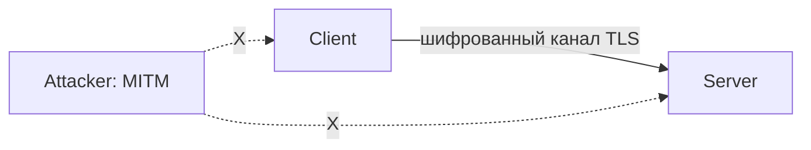
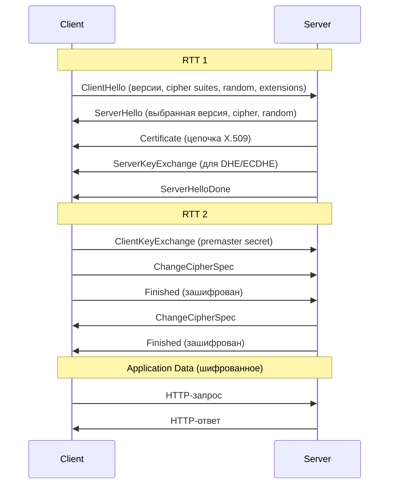
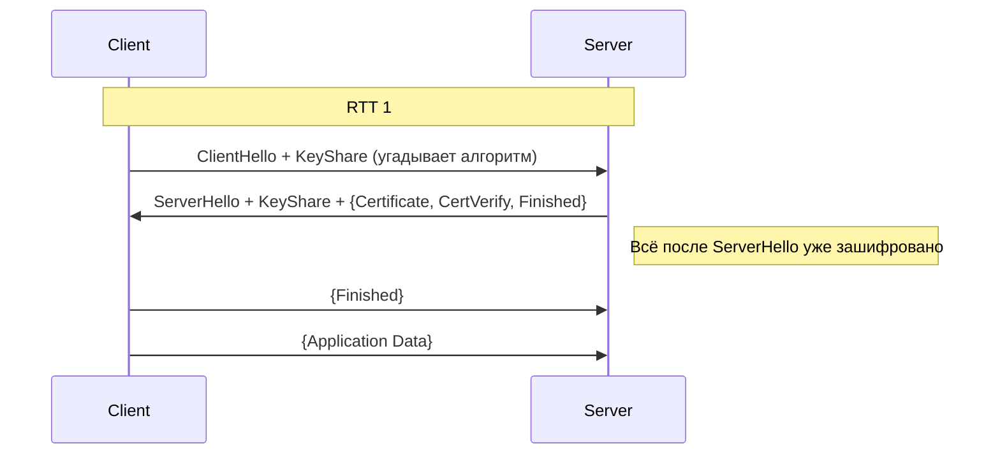
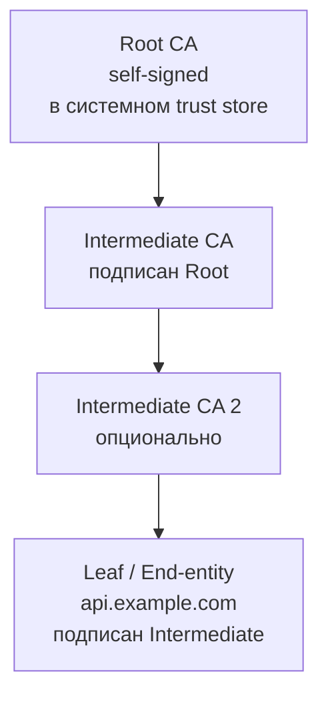
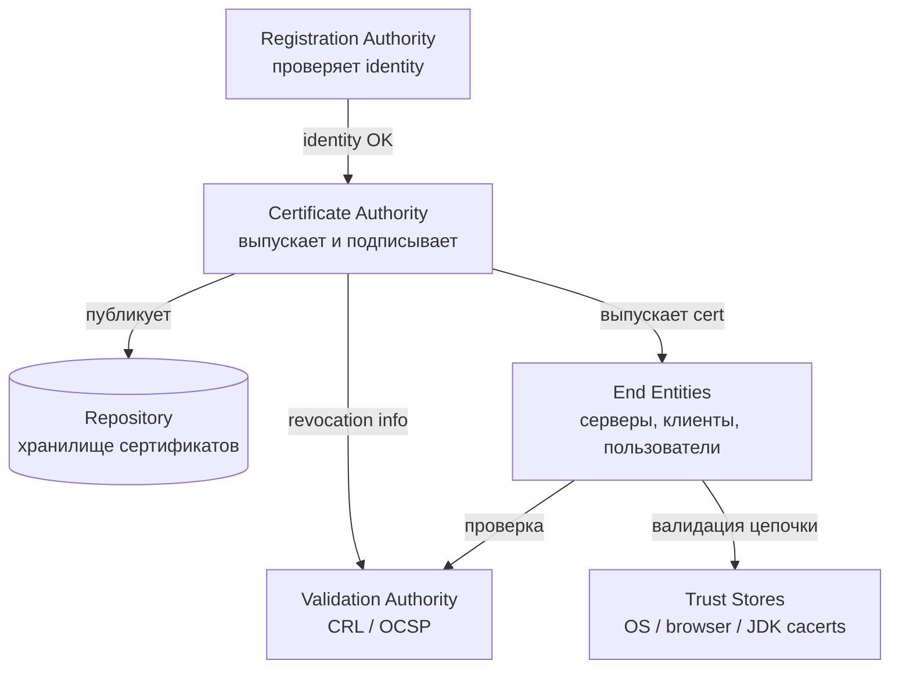
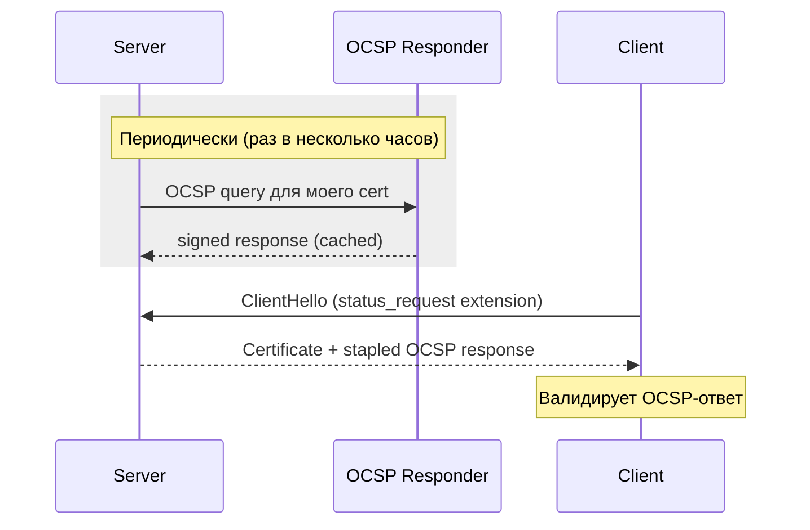
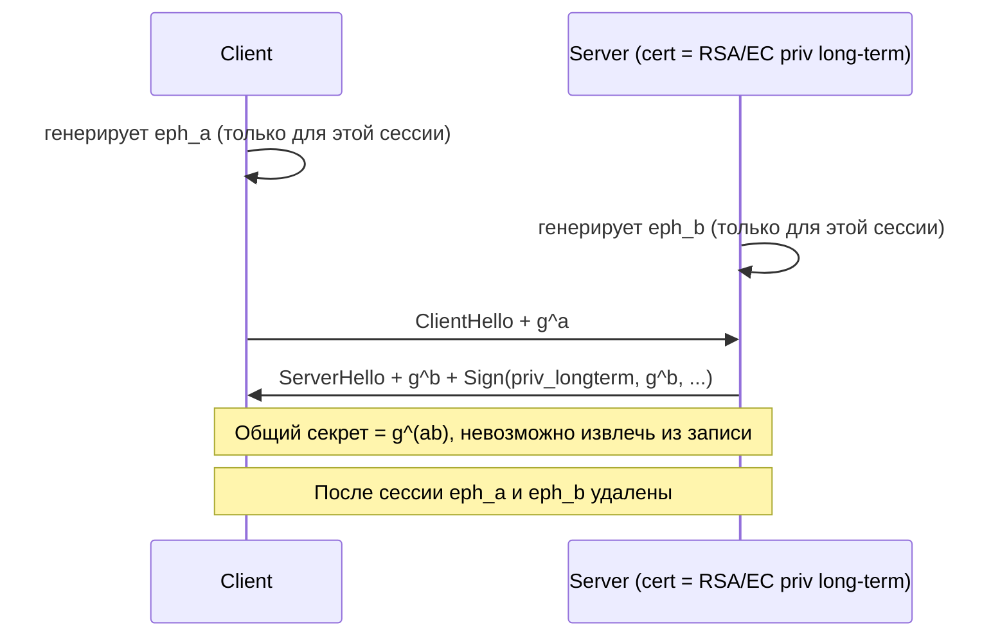
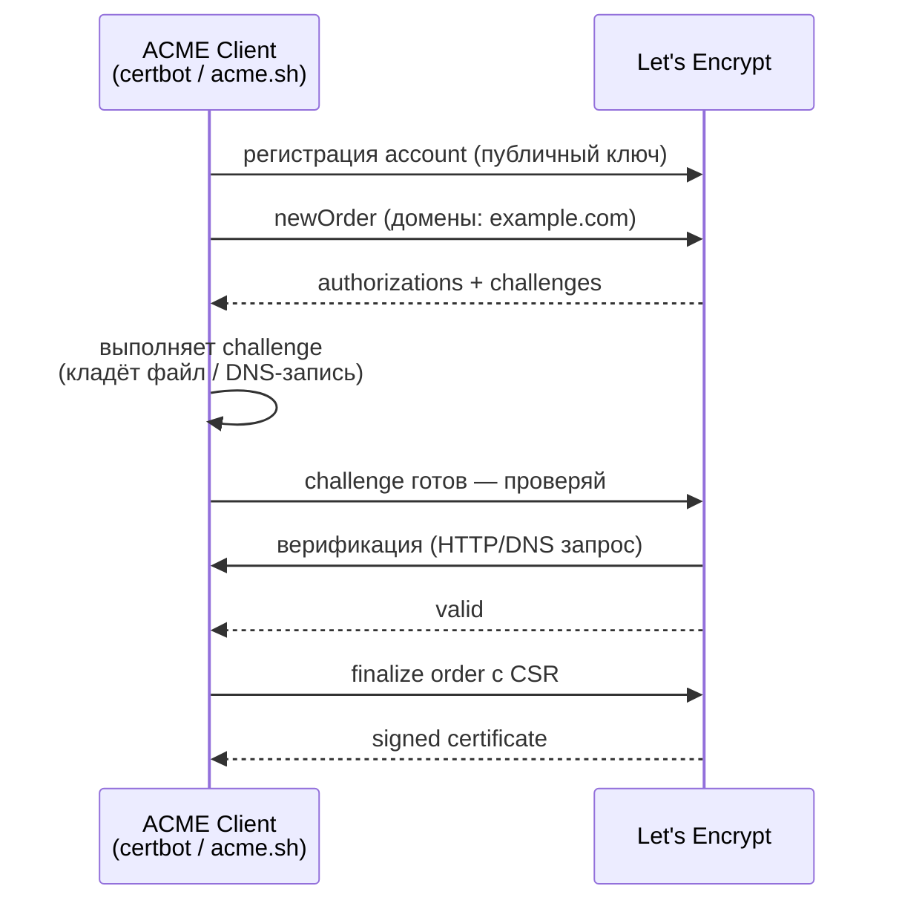
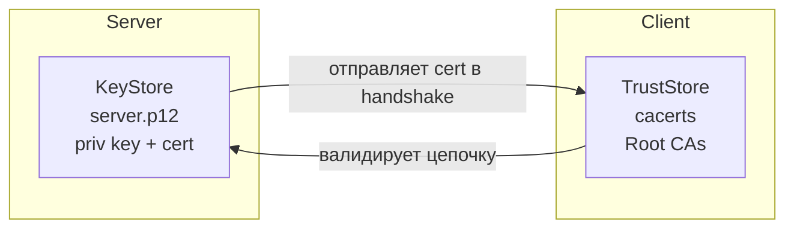
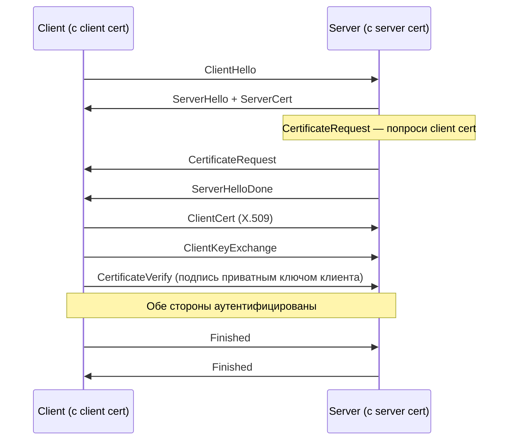

# Вопросы на собеседовании: `TLS/SSL`

Комплексное руководство по вопросам собеседования на тему `TLS/SSL` для `Senior Java Developer`. Включает детали handshake `TLS 1.2` и `TLS 1.3`, устройство `X.509` сертификатов и `PKI`, cipher suites, forward secrecy, настройку `Java KeyStore`/`TrustStore`, `SSLContext`, `Spring Boot` SSL, `mTLS`, `Let's Encrypt`/`ACME`, известные атаки и меры защиты.

**TLS** (`Transport Layer Security`) — криптографический протокол, обеспечивающий конфиденциальность, целостность и аутентификацию на транспортном уровне. Используется в `HTTPS`, `gRPC`, `SMTPS`, `FTPS`, `Kafka SSL`, `JDBC SSL` и десятках других протоколов. На интервью тема `TLS` проверяет понимание сетевой безопасности, криптографии и способность настроить и отладить реальный HTTPS-сервис.

## Полезные ссылки

### Официальная документация

- [RFC 8446 — TLS 1.3](https://datatracker.ietf.org/doc/html/rfc8446) — актуальная спецификация TLS
- [RFC 5246 — TLS 1.2](https://datatracker.ietf.org/doc/html/rfc5246) — предыдущая версия, всё ещё широко используется
- [RFC 5280 — X.509 Certificate Profile](https://datatracker.ietf.org/doc/html/rfc5280) — формат сертификатов
- [RFC 8555 — ACME Protocol](https://datatracker.ietf.org/doc/html/rfc8555) — автоматизация выдачи сертификатов (Let's Encrypt)
- [RFC 6960 — OCSP](https://datatracker.ietf.org/doc/html/rfc6960) — Online Certificate Status Protocol
- [Mozilla SSL Configuration Generator](https://ssl-config.mozilla.org/) — рекомендованные настройки TLS
- [SSL Labs Server Test](https://www.ssllabs.com/ssltest/) — аудит TLS-конфигурации сервера
- [Baeldung: Introduction to SSL in Java](https://www.baeldung.com/java-ssl)
- [Baeldung: TLS Setup in Spring](https://www.baeldung.com/spring-tls-setup)
- [Baeldung: KeyStore vs TrustStore](https://www.baeldung.com/java-keystore-truststore-difference)
- [Baeldung: mTLS Calls in Java](https://www.baeldung.com/java-execute-mtls-calls)
- [Baeldung: SSL Bundles in Spring Boot](https://www.baeldung.com/spring-boot-security-ssl-bundles)
- [OWASP Transport Layer Protection Cheat Sheet](https://cheatsheetseries.owasp.org/cheatsheets/Transport_Layer_Protection_Cheat_Sheet.html)

## Содержание

- [Полезные ссылки](#полезные-ссылки)
- [See also](#see-also)

**Основы TLS/SSL**
- [Q1. (!) Что такое TLS/SSL и зачем он нужен?](#q1--что-такое-tlsssl-и-зачем-он-нужен)
- [Q2. Чем TLS отличается от SSL? Какая версия актуальна?](#q2-чем-tls-отличается-от-ssl-какая-версия-актуальна)
- [Q3. (!) Какие три гарантии обеспечивает TLS?](#q3--какие-три-гарантии-обеспечивает-tls)
- [Q4. На каком уровне OSI работает TLS?](#q4-на-каком-уровне-osi-работает-tls)
- [Q5. Что такое HTTPS и как он связан с TLS?](#q5-что-такое-https-и-как-он-связан-с-tls)

**TLS Handshake**
- [Q6. (!) Как устроен TLS 1.2 handshake?](#q6--как-устроен-tls-12-handshake)
- [Q7. (!) Что изменилось в TLS 1.3 handshake? Почему быстрее?](#q7--что-изменилось-в-tls-13-handshake-почему-быстрее)
- [Q8. (!) Что такое 0-RTT в TLS 1.3 и в чём риски?](#q8--что-такое-0-rtt-в-tls-13-и-в-чём-риски)
- [Q9. Как работает session resumption? Session ID vs Session Ticket vs PSK](#q9-как-работает-session-resumption-session-id-vs-session-ticket-vs-psk)
- [Q10. Что такое SNI (Server Name Indication)?](#q10-что-такое-sni-server-name-indication)

**X.509 и сертификаты**
- [Q11. (!) Что такое X.509 сертификат и из чего состоит?](#q11--что-такое-x509-сертификат-и-из-чего-состоит)
- [Q12. (!) Как работает chain of trust? Root vs Intermediate vs Leaf CA](#q12--как-работает-chain-of-trust-root-vs-intermediate-vs-leaf-ca)
- [Q13. (!) Что такое SAN и чем отличается от CN? Зачем SAN обязателен?](#q13--что-такое-san-и-чем-отличается-от-cn-зачем-san-обязателен)
- [Q14. В чём разница между SAN и wildcard сертификатами?](#q14-в-чём-разница-между-san-и-wildcard-сертификатами)
- [Q15. Что такое self-signed сертификат и когда его использовать?](#q15-что-такое-self-signed-сертификат-и-когда-его-использовать)
- [Q16. DV vs OV vs EV сертификаты — в чём разница?](#q16-dv-vs-ov-vs-ev-сертификаты--в-чём-разница)

**PKI, CRL, OCSP**
- [Q17. (!) Что такое PKI? Какие компоненты входят?](#q17--что-такое-pki-какие-компоненты-входят)
- [Q18. (!) Как проверяется отзыв сертификата? CRL vs OCSP vs OCSP Stapling](#q18--как-проверяется-отзыв-сертификата-crl-vs-ocsp-vs-ocsp-stapling)
- [Q19. Что такое Certificate Transparency?](#q19-что-такое-certificate-transparency)

**Криптография и cipher suites**
- [Q20. (!) В чём разница между симметричным и асимметричным шифрованием в TLS?](#q20--в-чём-разница-между-симметричным-и-асимметричным-шифрованием-в-tls)
- [Q21. (!) Что такое cipher suite и как его читать?](#q21--что-такое-cipher-suite-и-как-его-читать)
- [Q22. (!) Что такое Forward Secrecy (PFS) и как ECDHE её обеспечивает?](#q22--что-такое-forward-secrecy-pfs-и-как-ecdhe-её-обеспечивает)
- [Q23. Чем RSA key exchange отличается от (EC)DHE?](#q23-чем-rsa-key-exchange-отличается-от-ecdhe)
- [Q24. Что такое AEAD и какие шифры используются в TLS 1.3?](#q24-что-такое-aead-и-какие-шифры-используются-в-tls-13)

**Let's Encrypt и ACME**
- [Q25. (!) Что такое Let's Encrypt и ACME протокол?](#q25--что-такое-lets-encrypt-и-acme-протокол)
- [Q26. Какие challenges поддерживает ACME (HTTP-01, DNS-01, TLS-ALPN-01)?](#q26-какие-challenges-поддерживает-acme-http-01-dns-01-tls-alpn-01)

**Java: KeyStore, TrustStore, SSLContext**
- [Q27. (!) В чём разница между KeyStore и TrustStore?](#q27--в-чём-разница-между-keystore-и-truststore)
- [Q28. (!) JKS vs PKCS12 — какой формат использовать?](#q28--jks-vs-pkcs12--какой-формат-использовать)
- [Q29. Как сгенерировать сертификат через keytool и openssl?](#q29-как-сгенерировать-сертификат-через-keytool-и-openssl)
- [Q30. (!) Как работает SSLContext в Java?](#q30--как-работает-sslcontext-в-java)
- [Q31. Как доверять кастомному CA в Java-приложении?](#q31-как-доверять-кастомному-ca-в-java-приложении)

**Spring Boot SSL**
- [Q32. (!) Как включить HTTPS в Spring Boot?](#q32--как-включить-https-в-spring-boot)
- [Q33. Что такое SSL Bundles в Spring Boot 3.1+?](#q33-что-такое-ssl-bundles-в-spring-boot-31)
- [Q34. Как настроить HTTPS-клиент в RestTemplate/WebClient?](#q34-как-настроить-https-клиент-в-resttemplatewebclient)

**mTLS (Mutual TLS)**
- [Q35. (!) Что такое mTLS и когда его применять?](#q35--что-такое-mtls-и-когда-его-применять)
- [Q36. Как настроить mTLS в Spring Boot (сервер + клиент)?](#q36-как-настроить-mtls-в-spring-boot-сервер--клиент)

**Атаки и защита**
- [Q37. (!) Какие известные атаки на TLS? POODLE, BEAST, Heartbleed](#q37--какие-известные-атаки-на-tls-poodle-beast-heartbleed)
- [Q38. (!) Что такое downgrade attack и как TLS_FALLBACK_SCSV с ним борется?](#q38--что-такое-downgrade-attack-и-как-tls_fallback_scsv-с-ним-борется)
- [Q39. Что такое MITM и как TLS от него защищает?](#q39-что-такое-mitm-и-как-tls-от-него-защищает)

**HSTS, CSP, pinning**
- [Q40. (!) Что такое HSTS и зачем он нужен?](#q40--что-такое-hsts-и-зачем-он-нужен)
- [Q41. Что такое certificate pinning? Почему HPKP устарел?](#q41-что-такое-certificate-pinning-почему-hpkp-устарел)

**Инструменты и отладка**
- [Q42. (!) Чем отлаживать TLS? openssl s_client, keytool, testssl.sh](#q42--чем-отлаживать-tls-openssl-s_client-keytool-testsslsh)
- [Q43. Как прочитать и проверить содержимое сертификата?](#q43-как-прочитать-и-проверить-содержимое-сертификата)
- [Q44. PKIX path building failed — как диагностировать?](#q44-pkix-path-building-failed--как-диагностировать)
- [Q45. Чеклист безопасности TLS для production](#q45-чеклист-безопасности-tls-для-production)

---

## Q1. (!) Что такое `TLS/SSL` и зачем он нужен?

`TLS` (`Transport Layer Security`) — криптографический протокол для защищённой передачи данных поверх ненадёжного транспорта (обычно `TCP`). Его предшественник — `SSL` (`Secure Sockets Layer`), сейчас устаревший и небезопасный.

`TLS` решает три базовые задачи:

1. **Конфиденциальность** — данные шифруются, прослушка канала не даёт ничего читаемого
2. **Целостность** — изменение данных в канале будет обнаружено через `MAC`/`AEAD`
3. **Аутентификация** — клиент проверяет, что подключился именно к тому серверу, к которому хотел (через `X.509` сертификат)

Без `TLS` любой промежуточный узел (`ISP`, Wi-Fi-точка, корпоративный прокси) мог бы читать и модифицировать HTTP-трафик — включая пароли, cookies, платёжные данные.



На транспорте данные выглядят как бинарный шум — но клиент и сервер видят исходный HTTP.

> [!mcq]
> - [ ] `TLS` защищает и канал, и endpoint — вредонос на клиенте/сервере не получит доступ к расшифрованным данным благодаря memory encryption. | `TLS` — транспортный протокол: на endpoint данные уже расшифрованы. ❌ ПОСЛЕДСТВИЕ: SolarWinds 2020 — supply chain malware читал расшифрованный трафик прямо из памяти приложения.
> - [x] `TLS` даёт CIA: confidentiality (шифрование сессионным ключом), integrity (`MAC`/`AEAD`), authentication (`X.509` сертификат сервера); НЕ защищает от endpoint-malware, side-channels по `SNI`/размерам пакетов и кривой валидации в коде приложения. | Канал между клиентом и сервером, не приложение. ✓ ПРИМЕНЯТЬ: Cloudflare использует `TLS 1.3` + WAF + endpoint protection как слои defense-in-depth. 📋 ПРАВИЛО: «TLS — транспорт, не золотая пуля». 🔗 См. Q3, Q39.
> - [ ] `TLS` шифрует только данные; integrity и authentication делает прикладной уровень (`HTTP`, `gRPC`). | `MAC`/`AEAD` и `X.509`-валидация встроены в сам `TLS` — без них handshake не завершится. ❌ ПОСЛЕДСТВИЕ: попытка добавить app-level HMAC поверх «голого» шифрования воспроизводит ошибки `SSL 2.0` — атакующий подменит ciphertext.
> - [ ] `TLS` даёт confidentiality + integrity, но не authentication; identity сервера проверяет `OAuth2` поверх `TLS`. | `OAuth2` — авторизация на app-уровне, а identity сервера в handshake даёт сертификат. ❌ ПОСЛЕДСТВИЕ: без `X.509`-проверки атакующий с любым сертификатом проксирует трафик — `OAuth2`-токены утекают в clear на его стороне.

## Q2. Чем `TLS` отличается от `SSL`? Какая версия актуальна?

`SSL` — историческое название. Netscape выпустила `SSL 2.0` в 1995, `SSL 3.0` в 1996. В 1999 IETF стандартизовал протокол под именем `TLS 1.0` (`RFC 2246`) — это был по сути `SSL 3.1`. Название сменили, чтобы подчеркнуть, что стандарт теперь открытый.

| Версия | Год | Статус |
|--------|-----|--------|
| `SSL 2.0` | 1995 | Запрещён (`RFC 6176`) |
| `SSL 3.0` | 1996 | Запрещён (`RFC 7568`, POODLE) |
| `TLS 1.0` | 1999 | Deprecated (`RFC 8996`, 2021) |
| `TLS 1.1` | 2006 | Deprecated (`RFC 8996`) |
| `TLS 1.2` | 2008 | Поддерживается, широко используется |
| `TLS 1.3` | 2018 (`RFC 8446`) | Рекомендуемый |

На практике **всегда пишут "SSL"**, имея в виду `TLS` (термин прижился). Но протокол должен быть минимум `TLS 1.2`, а лучше `TLS 1.3`.

> [!mcq]
> - [ ] SSL 3.0 — всё ещё допустимый протокол для legacy-систем: он запрещён только RFC-рекомендацией, но браузеры и современные библиотеки продолжают его поддерживать с предупреждением. | SSL 3.0 запрещён RFC 7568 (2015) после атаки POODLE, все современные браузеры и библиотеки его полностью отключили. Попытка использовать SSL 3.0 вызывает ошибку handshake, а не предупреждение.
> - [ ] TLS 1.0 — рекомендуемый минимум для production с 2021 года: он устарел согласно RFC 8996, но всё ещё активно поддерживается всеми современными клиентами. | TLS 1.0 формально deprecated с 2021 (RFC 8996) и отключается во всех крупных CDN/браузерах. Минимум для production — TLS 1.2 (а рекомендуется TLS 1.3).
> - [x] TLS 1.2 — рекомендуемый минимум для production, TLS 1.3 — предпочтительный актуальный стандарт (RFC 8446, 2018); SSL 2.0/3.0, TLS 1.0/1.1 запрещены или deprecated. | Верно. TLS 1.2 поддерживается повсеместно и криптографически безопасен при правильной настройке; TLS 1.3 — последний стандарт с обязательной forward secrecy и упрощённым handshake.
> - [ ] TLS 1.3 — единственный допустимый протокол для production с 2018 года; TLS 1.2 запрещён как устаревший и не должен использоваться ни в каком современном сервисе. | TLS 1.2 остаётся полностью поддерживаемым и широко используемым стандартом. Запрещать TLS 1.2 пока нецелесообразно — многие клиенты (старые телефоны, legacy) не поддерживают TLS 1.3.

## Q3. (!) Какие три гарантии обеспечивает `TLS`?

Классическая триада `CIA`:

| Гарантия | Как достигается в TLS |
|----------|----------------------|
| **Confidentiality** (конфиденциальность) | Симметричное шифрование сессионным ключом (`AES-GCM`, `ChaCha20-Poly1305`) |
| **Integrity** (целостность) | `MAC` / `AEAD` — любое искажение шифртекста обнаруживается |
| **Authentication** (аутентификация) | Проверка `X.509` сертификата сервера через подпись доверенного `CA`; опционально — клиентский сертификат (`mTLS`) |

Дополнительно `TLS 1.3` обязательно обеспечивает **Forward Secrecy** — компрометация долгосрочного приватного ключа сервера не даёт расшифровать ранее перехваченный трафик.

`TLS` **не защищает** от:
- атак на endpoint (вредонос на клиенте/сервере видит незашифрованные данные)
- подмены метаданных (`SNI`, размер пакетов, тайминги — side channels)
- неправильной валидации сертификата самим приложением

> [!mcq]
> - [x] CIA в `TLS`: Confidentiality — симметричное шифрование (`AES-GCM`, `ChaCha20-Poly1305`), Integrity — `MAC`/`AEAD`, Authentication — `X.509` сертификат сервера, подписанный доверенным `CA`; в `TLS 1.3` Forward Secrecy обязательна (`RSA key exchange` удалён). | Стандартная CIA-триада + PFS как четвёртая гарантия в `TLS 1.3`. ✓ ПРИМЕНЯТЬ: Mozilla Modern config форсит только `(EC)DHE` cipher suites — даже на `TLS 1.2` сервисы получают PFS. 📋 ПРАВИЛО: «CIA + PFS = TLS 1.3». 🔗 См. Q22, Q24.
> - [ ] CIA в `TLS`: Confidentiality — подпись `RSA`, Integrity — шифрование `AES`, Authentication — `MAC`/`AEAD` и сертификат. | Роли перепутаны: `RSA` — подпись (Authentication), `AES` — шифр (Confidentiality), `MAC`/`AEAD` — Integrity. ❌ ПОСЛЕДСТВИЕ: на интервью провал «расскажите, что делает каждый алгоритм handshake» — типичный disqualifier для senior-роли.
> - [ ] CIA в `TLS`: Confidentiality, Integrity, Availability — `TLS` через retry handshake обеспечивает доступность. | Availability — это про DoS, и `TLS` его не гарантирует; третья буква — Authentication. ❌ ПОСЛЕДСТВИЕ: команда полагается на `TLS` как «гарантию uptime» и не ставит rate-limiting → SlowLoris-атака роняет nginx за 30 секунд.
> - [ ] Три гарантии `TLS`: confidentiality, integrity, authentication — Forward Secrecy обязательна с `TLS 1.0`. | PFS опциональна в `TLS 1.0–1.2` (`RSA key exchange` без PFS разрешён); обязательной стала только в `TLS 1.3`. ❌ ПОСЛЕДСТВИЕ: «record now, decrypt later» — gosudarstvenniy актор записывает `TLS 1.2`-трафик с `RSA-кексом`, через 5 лет утечка ключа раскрывает всю историю.

## Q4. На каком уровне `OSI` работает `TLS`?

`TLS` работает между транспортным (`L4`, `TCP`) и прикладным (`L7`, `HTTP`) уровнями. Формально его относят к **представительному уровню** (`L6`) или "сеансовому+представительному". В модели TCP/IP — просто часть прикладного.

```
┌─────────────────┐
│ HTTP / gRPC /.. │  L7 — Application
├─────────────────┤
│       TLS       │  L6/L5 — шифрование
├─────────────────┤
│       TCP       │  L4 — Transport
├─────────────────┤
│       IP        │  L3 — Network
└─────────────────┘
```

Важные следствия:
- `TLS` требует **надёжный транспорт** (`TCP`). Для `UDP` используется `DTLS` (`RFC 9147`)
- `HTTP/3` работает поверх `QUIC`, который встроил TLS-сессии в сам протокол — `TLS` неотделим от транспорта
- Балансировщик, который не терминирует `TLS`, не может смотреть на HTTP-заголовки (только на `SNI` в `Client Hello`)

> [!mcq]
> - [ ] TLS работает на транспортном уровне (L4) OSI наравне с TCP: TLS заменяет TCP в стеке, поэтому HTTPS = HTTP + TLS без TCP под ним. | TLS не заменяет TCP, а работает поверх него. Классический HTTPS-стек: IP → TCP → TLS → HTTP. TLS требует надёжного транспорта для упорядоченной доставки handshake-сообщений.
> - [ ] TLS работает исключительно на сетевом уровне (L3) OSI, поскольку шифрует IP-пакеты независимо от транспортного протокола; TCP и UDP одинаково могут использовать TLS напрямую. | TLS — не сетевой уровень, он работает поверх TCP. Для UDP используется отдельный протокол DTLS (RFC 9147), потому что обычный TLS требует упорядоченного и надёжного канала.
> - [x] TLS работает между L4 (TCP) и L7 (HTTP) — формально на L5/L6 (представительный/сеансовый); TLS требует надёжный транспорт (TCP), для UDP — DTLS (RFC 9147); в HTTP/3 TLS встроен в QUIC. | Верное расположение в стеке OSI. Ключевое следствие: TLS-соединение устанавливается только после TCP-соединения, и терминация TLS на балансировщике — это переход с L6 на L7.
> - [ ] TLS работает на прикладном уровне (L7) OSI как часть HTTP-протокола: HTTPS — это модификация HTTP с встроенным шифрованием, не отдельный протокол. | HTTPS — это HTTP поверх TLS (два отдельных протокола), а не модификация HTTP. TLS является отдельным протоколом ниже прикладного уровня и используется не только HTTP, но и gRPC, SMTPS, FTPS, Kafka SSL.

## Q5. Что такое `HTTPS` и как он связан с `TLS`?

`HTTPS` (`HTTP Secure`, `RFC 2818`/`RFC 9110`) — это `HTTP` поверх `TLS`. Всё тело HTTP (стартовая строка, заголовки, тело) шифруется как payload в `TLS`-канале.

Отличия от HTTP:
- Порт по умолчанию: `443` (vs `80` для HTTP)
- Схема URL: `https://` (vs `http://`)
- Требуется валидный сертификат на сервере
- Все заголовки и тело зашифрованы, виден только IP, порт и `SNI`

Современные браузеры:
- Помечают HTTP-страницы как "Not secure"
- Запрещают `mixed content` (HTTPS-страница не может грузить HTTP-ресурсы)
- Применяют `HTTPS-Only Mode`, автоматически переводя HTTP на HTTPS

См. подробнее в [вопросах по HTTP/REST](../api/http-rest-interview.md).

> [!mcq]
> - [ ] HTTPS — отдельный протокол, разработанный независимо от HTTP: у него собственные методы запросов (HTTPS GET, HTTPS POST), отличающиеся от HTTP. | HTTPS — это HTTP, передаваемый поверх TLS; методы (GET, POST, PUT) точно те же самые. Различаются только схема URL, порт по умолчанию и наличие шифрования транспорта.
> - [ ] HTTPS использует порт 80 по умолчанию и схему URL https://; порт 443 зарезервирован для WebSocket Secure (WSS), а не для HTTPS. | HTTPS по умолчанию использует порт 443, а не 80 (80 — это HTTP). WSS (WebSocket Secure) использует тот же 443 порт, как HTTPS, поскольку работает поверх HTTPS-соединения.
> - [x] HTTPS — это HTTP поверх TLS (RFC 2818/9110): порт 443, схема https://, требуется валидный сертификат на сервере, все HTTP-заголовки и тело зашифрованы, на транспорте видны только IP, порт и SNI. | Верное описание HTTPS. Ключевое следствие: балансировщик без терминации TLS видит только TCP/IP и SNI из Client Hello — не может маршрутизировать по URL или заголовкам.
> - [ ] HTTPS — это HTTP, в котором шифруется только тело ответа, но заголовки (Host, Cookie, Authorization) передаются в открытом виде для совместимости с прокси-серверами и CDN. | В HTTPS шифруются ВСЕ части HTTP: стартовая строка, все заголовки (включая Host, Cookie, Authorization) и тело. В открытом виде остаются только IP, порт TCP и SNI расширение TLS.

## Q6. (!) Как устроен `TLS 1.2` handshake?

`TLS 1.2` handshake занимает **2 round-trip** (2-RTT) — два полных похода туда-обратно перед отправкой данных приложения.



Ключевые шаги:

1. **ClientHello** — клиент присылает список поддерживаемых версий TLS, cipher suites, `client_random`, расширения (`SNI`, `ALPN`, ...)
2. **ServerHello** — сервер выбирает версию + cipher suite, присылает `server_random`
3. **Certificate** — сервер присылает свой сертификат (и промежуточные)
4. **ServerKeyExchange** — для forward-secrecy ciphers (`ECDHE`) сервер присылает свою эфемерную публичную часть, подписанную приватным ключом из сертификата
5. **ClientKeyExchange** — клиент отвечает своей эфемерной публичной частью, обе стороны вычисляют общий `premaster secret`
6. Из `client_random` + `server_random` + `premaster_secret` через `PRF` получают `master secret` и из него — сессионные ключи
7. **Finished** — обе стороны шлют MAC по всему handshake, проверяя, что он не был модифицирован

После этого идёт зашифрованное `Application Data`.

> [!mcq]
> - [ ] `TLS 1.2` handshake — 1-RTT: `ClientHello` с `KeyShare`, `ServerHello` + `Certificate` + `Finished` в одном RTT. | Это `TLS 1.3`. `TLS 1.2` всегда 2-RTT, `KeyShare`-extension в `TLS 1.2` не существует. ❌ ПОСЛЕДСТВИЕ: APM-метрики p99 latency на 100ms выше расчётных — команда не учла два RTT при выборе региона CDN.
> - [x] `TLS 1.2` — 2-RTT: RTT 1 — `ClientHello` → `ServerHello` + `Certificate` + `ServerKeyExchange` + `ServerHelloDone`; RTT 2 — `ClientKeyExchange` + `ChangeCipherSpec` + `Finished` → `ChangeCipherSpec` + `Finished`; после этого `Application Data`. | Два полных round-trip до первого байта данных. ✓ ПРИМЕНЯТЬ: Cloudflare Workers замеряют handshake p50 = 70ms на `TLS 1.2` vs 35ms на `TLS 1.3` — мотивация форсить `1.3`. 📋 ПРАВИЛО: «1.2 = два RTT, 1.3 = один». 🔗 См. Q7, Q9.
> - [ ] `TLS 1.2` 2-RTT; в `ServerKeyExchange` сервер шлёт зашифрованный публичным ключом сессионный ключ. | `ServerKeyExchange` несёт эфемерную DH-публичную часть с подписью, не сессионный ключ. Сессионный ключ вычисляется обеими сторонами независимо. ❌ ПОСЛЕДСТВИЕ: junior разработчик «оптимизирует» handshake вручную, кладёт сессионный ключ в `ServerKeyExchange` — собственный custom-протокол ломается с padding oracle.
> - [ ] `TLS 1.2` 2-RTT; `ChangeCipherSpec` — зашифрованное подтверждение правильности ключей. | `ChangeCipherSpec` — открытый сигнальный флаг «переключаюсь на новые ключи»; правильность ключей подтверждает `Finished` (MAC всего handshake). ❌ ПОСЛЕДСТВИЕ: ошибка диагностики `bad_record_mac` — инженер 3 часа смотрит в `ChangeCipherSpec` вместо `Finished`-сообщения, где реальная проблема.

## Q7. (!) Что изменилось в `TLS 1.3` handshake? Почему быстрее?

`TLS 1.3` (`RFC 8446`) — крупнейший пересмотр протокола. Основные изменения:

**1. Handshake за 1-RTT** (вместо 2-RTT):



Клиент в первом же сообщении присылает `KeyShare` — свою эфемерную публичную часть для вероятного алгоритма. Сервер сразу отвечает своей и начинает шифровать дальнейшие сообщения.

**2. Выкинуты небезопасные алгоритмы:**
- Нет `RSA key exchange` — только `(EC)DHE`, forward secrecy обязательна
- Нет `CBC`-шифров — только `AEAD` (`AES-GCM`, `ChaCha20-Poly1305`)
- Нет `MD5`, `SHA-1` в подписях
- Нет `static DH`, сжатия, ренегоциации, `NULL`-шифров

**3. 0-RTT резюмирование** — клиент может отправить данные в самом первом сообщении при повторном подключении.

**4. Session resumption через PSK** — единый механизм вместо `Session ID` и `Session Ticket`.

**5. Все сообщения после `ServerHello` зашифрованы** — включая `Certificate`, что защищает приватность клиента.

Результат: подключение к HTTPS-сайту стало на одну RTT быстрее, сразу после TCP-handshake можно слать HTTP.

> [!mcq]
> - [ ] `TLS 1.3` ускоряет handshake убирая обмен сертификатами: сервер шлёт только JWKS-ссылку, клиент валидирует её отдельно. | `TLS 1.3` всегда отправляет `Certificate`, но в зашифрованном виде после `ServerHello`. `JWKS` — концепция `OAuth2`/`OIDC`, к `TLS` отношения не имеет. ❌ ПОСЛЕДСТВИЕ: путаница `TLS` и app-level identity на интервью — провал блока криптографии.
> - [x] `TLS 1.3` сокращает 2-RTT → 1-RTT: клиент сразу шлёт `KeyShare` в `ClientHello` (угадывает curve), сервер отвечает `ServerHello` + зашифрованные `Certificate`/`CertVerify`/`Finished`; `RSA key exchange` и `CBC`-шифры удалены, `MD5`/`SHA-1`/ренегоциация запрещены. | PFS обязательна, encrypted Certificate защищает приватность клиента. ✓ ПРИМЕНЯТЬ: Cloudflare с октября 2024 включила `TLS 1.3` по дефолту на всех планах — сократила RTT и убрала legacy-cipher-маршрутизацию. 📋 ПРАВИЛО: «1.3: PFS обязательна, CBC мёртв». 🔗 См. Q6, Q22.
> - [ ] `TLS 1.3` 1-RTT за счёт server-side `Session ID` кэша: сервер восстанавливает state и пропускает обмен ключами. | `Session ID` кэширование — `TLS 1.2`-механизм. `TLS 1.3` использует `PSK` из `NewSessionTicket` (state у клиента в зашифрованном виде). ❌ ПОСЛЕДСТВИЕ: попытка масштабировать `TLS 1.3` через sticky sessions на LB — лишний overhead, поскольку `PSK` stateless и работает на любом узле.
> - [ ] `TLS 1.3` поддерживает все cipher suites из `TLS 1.2` + новые `AEAD` для обратной совместимости. | `TLS 1.3` оставил только три `AEAD`: `AES-128-GCM`, `AES-256-GCM`, `ChaCha20-Poly1305`. Все `CBC`/`RC4`/`DES`/`NULL` удалены. ❌ ПОСЛЕДСТВИЕ: legacy embedded-устройство ожидает `AES-CBC` на `TLS 1.3` — handshake падает с `no_shared_cipher`, прошивка не обновляется годами.

## Q8. (!) Что такое `0-RTT` в `TLS 1.3` и в чём риски?

`0-RTT` (zero round-trip) — возможность отправить зашифрованные данные приложения в самом первом сообщении клиента при повторном подключении. Используется `PSK` из предыдущей сессии.

```
Client: ClientHello + EarlyData (HTTP GET /) → Server
```

Данные шифруются ключом, производным от `PSK`, ещё до получения ответа сервера.

**Риски `0-RTT`:**

1. **Replay attacks** — злоумышленник может перехватить `EarlyData` и отправить повторно. Сервер не может отличить повтор от оригинала на этапе handshake.
2. **Нет Forward Secrecy** для `EarlyData` — шифруется производным от `PSK`, который долгоживущий.

**Mitigations:**
- Для `0-RTT` разрешать только **идемпотентные операции** (`GET`-запросы без side effects)
- Сервер должен вести cache уже использованных `PSK` (dedupe)
- `CDN`-провайдеры (Cloudflare) отключают `0-RTT` для не-GET запросов

В Spring Boot / Tomcat по умолчанию `0-RTT` выключен. Включать — осознанно.

> [!mcq]
> - [ ] `0-RTT` безопасен для любых HTTP-операций — `EarlyData` защищена случайным nonce, replay невозможен. | Сервер не различает повтор от оригинала на handshake — replay реален. ❌ ПОСЛЕДСТВИЕ: `POST /transfer` через `0-RTT` повторяется атакующим N раз → дублирование платежа; именно поэтому Stripe отключила `0-RTT` для не-`GET` endpoints.
> - [x] `0-RTT` — `EarlyData` в первом `ClientHello` при резюмировании через `PSK`; риски: replay (сервер не различает повтор) и отсутствие PFS для `EarlyData` (шифруется производным от долгоживущего `PSK`); mitigation — только идемпотентные операции и dedupe `PSK`-cache. | Двойное ограничение: replay + no-PFS. ✓ ПРИМЕНЯТЬ: Cloudflare включает `0-RTT` только для `GET` и static-assets, для `POST` форсит 1-RTT — баланс speed vs safety. 📋 ПРАВИЛО: «0-RTT — только для GET без побочных эффектов». 🔗 См. Q7, Q9.
> - [ ] `0-RTT` имеет PFS как обычный 1-RTT — `EarlyData` шифруется эфемерным DH-ключом из `NewSessionTicket`. | `EarlyData` шифруется ключом, производным от `PSK`, у которого нет PFS — утечка `STEK` сервера расшифрует все `EarlyData`. ❌ ПОСЛЕДСТВИЕ: STEK-rotation забыли на 6 месяцев → утечка → весь `0-RTT`-трафик за полгода восстанавливается из pcap-дампов.
> - [ ] `0-RTT` доступен на первом соединении — клиент вычисляет `PSK` в реальном времени без предварительного handshake. | `PSK` выдаётся сервером в `NewSessionTicket` после ПРЕДЫДУЩЕГО handshake; на первом соединении `0-RTT` невозможен. ❌ ПОСЛЕДСТВИЕ: команда мерит «cold-start latency» с включённым `0-RTT` и удивляется, почему синтетика на чистых клиентах не показывает обещанного boost — конфигурация бессмысленна для cold cache.

## Q9. Как работает session resumption? `Session ID` vs `Session Ticket` vs `PSK`

Полный handshake дорог (асимметричные операции). Резюмирование позволяет переиспользовать ранее установленные ключи.

**Session ID (TLS 1.2):**
- Сервер генерирует `session_id`, клиент посылает его в следующем `ClientHello`
- Сервер хранит состояние сессии в памяти/распределённом кеше
- Минус: требует server-side storage, плохо работает в кластерах без sticky sessions

**Session Ticket (`RFC 5077`, TLS 1.2):**
- Сервер шифрует всё состояние сессии ключом `STEK` и выдаёт клиенту "билет"
- Клиент присылает билет обратно — сервер расшифровывает и восстанавливает сессию
- Плюс: stateless на сервере. Минус: если `STEK` утечёт, вся forward secrecy теряется → нужна ротация

**PSK (TLS 1.3):**
- Единый механизм. `PSK` выдаётся в `NewSessionTicket` после handshake
- При резюмировании клиент шлёт `PSK identity` в `ClientHello`, сервер его принимает и переходит к 1-RTT handshake
- Поддерживает `0-RTT`

> [!mcq]
> - [ ] Session ID и Session Ticket работают одинаково — оба требуют хранения состояния на сервере; разница только в формате (ID — короткий, Ticket — длинный зашифрованный блоб). | Session ID — stateful (сервер хранит состояние), Session Ticket — stateless (состояние зашифровано в самом билете и хранится у клиента). Это фундаментальное различие: Ticket лучше работает в кластерах без sticky sessions.
> - [ ] Session Ticket полностью безопасен — утечка STEK (Session Ticket Encryption Key) не компрометирует forward secrecy сессий, поскольку сессионные ключи уже удалены на сервере. | Утечка STEK — серьёзная угроза: атакующий может расшифровать все billeти и восстановить session state, включая session keys. Поэтому STEK требует регулярной ротации (каждые несколько часов).
> - [x] Session ID (TLS 1.2) — сервер хранит состояние по ID; Session Ticket (RFC 5077, TLS 1.2) — stateless, состояние зашифровано STEK; PSK (TLS 1.3) — единый механизм, выдаётся в NewSessionTicket, поддерживает 0-RTT. | Верно. PSK в TLS 1.3 унифицировал два механизма TLS 1.2, и это единственный способ резюмирования. Session ID и Session Ticket в TLS 1.3 удалены. Это ключевое разграничение из best practice.
> - [ ] PSK (TLS 1.3) эквивалентен Session ID из TLS 1.2 — сервер хранит PSK в распределённом кэше по идентификатору клиента; при резюмировании клиент шлёт свой ID и получает session keys. | PSK в TLS 1.3 работает как Session Ticket (stateless), а не как Session ID (stateful). Сервер шифрует PSK STEK'ом и выдаёт клиенту в NewSessionTicket — никакого серверного состояния не требуется.

## Q10. Что такое `SNI` (Server Name Indication)?

`SNI` (`RFC 6066`) — расширение `ClientHello`, в котором клиент указывает, **к какому именно hostname он подключается**.

Зачем нужно: на одном IP-адресе может хоститься много HTTPS-сайтов с разными сертификатами. Без `SNI` сервер не знает, какой сертификат прислать в ответ (TCP-соединение ещё не привязано к Host-заголовку HTTP, а TLS — до HTTP).

```
ClientHello {
  ...
  extensions: [
    server_name: "api.example.com"
    ...
  ]
}
```

Проблема приватности: `SNI` передаётся **в открытом виде** даже в `TLS 1.3` — пассивный наблюдатель видит, к какому домену вы идёте. Решение — `ESNI`/`ECH` (`Encrypted Client Hello`), пока в стадии стандартизации.

В Java клиентах `SNI` работает из коробки начиная с JDK 7, hostname берётся из URL.

> [!mcq]
> - [x] SNI (RFC 6066) — расширение ClientHello, в котором клиент указывает hostname целевого сервера; нужно для virtual hosting (много сайтов на одном IP); в TLS 1.3 SNI передаётся в открытом виде — решение ECH/ESNI в стадии стандартизации. | Верно. SNI критичен для HTTPS на shared IP, но утечка hostname — известная проблема приватности; ECH (Encrypted Client Hello) решает её через шифрование расширения, но пока не повсеместно.
> - [ ] SNI — расширение ServerHello, в котором сервер сообщает клиенту свой hostname для верификации; клиент сравнивает с URL и проверяет совпадение. | SNI — расширение ClientHello, не ServerHello. Клиент сообщает серверу, к какому hostname он обращается, чтобы сервер выбрал правильный сертификат — не наоборот.
> - [ ] SNI передаётся в зашифрованном виде начиная с TLS 1.3, поэтому пассивный наблюдатель не видит, к какому домену идёт клиент; это полностью решает проблему приватности hostname. | SNI в TLS 1.3 всё ещё передаётся в открытом виде — это известное ограничение приватности. Шифрование планируется через ECH (Encrypted Client Hello), который находится в стадии стандартизации IETF.
> - [ ] SNI — опциональное расширение, которое используется только для IPv4; на IPv6 virtual hosting работает через IPv6-адреса, и SNI не требуется. | SNI нужен независимо от версии IP. Он решает проблему «много доменов на один IP», которая существует в обеих версиях IP. Большинство современных HTTPS-клиентов отправляют SNI всегда.

## Q11. (!) Что такое `X.509` сертификат и из чего состоит?

`X.509` — стандарт формата цифрового сертификата (`RFC 5280`). Привязывает публичный ключ к идентификатору (обычно hostname) через подпись доверенного `Certificate Authority`.

Основные поля:

| Поле | Пример | Назначение |
|------|--------|-----------|
| `Version` | v3 | Версия формата X.509 |
| `Serial Number` | 03:1A:B5:... | Уникальный ID у CA |
| `Signature Algorithm` | `SHA256withRSA` | Алгоритм подписи CA |
| `Issuer` | `CN=Let's Encrypt R3, O=LE` | Кто подписал |
| `Validity` | notBefore / notAfter | Срок действия |
| `Subject` | `CN=api.example.com` | Кому выдан |
| `Subject Public Key Info` | RSA/EC public key | Публичный ключ владельца |
| `Extensions` | `SAN`, `KeyUsage`, `EKU`, `AIA` | Расширения (v3) |
| `Signature` | bytes | Подпись CA |

Ключевые extensions:
- **`Subject Alternative Name` (`SAN`)** — список доменов, которые покрывает сертификат
- **`Key Usage`** — digitalSignature, keyEncipherment, ...
- **`Extended Key Usage` (`EKU`)** — `serverAuth`, `clientAuth`, `codeSigning`
- **`Authority Information Access` (`AIA`)** — URL для CRL/OCSP и промежуточных сертификатов
- **`Basic Constraints`** — является ли сертификат CA (`CA:TRUE`)

Формат хранения: `DER` (бинарный `ASN.1`) или `PEM` (base64 + BEGIN/END блоки).

```
-----BEGIN CERTIFICATE-----
MIID...base64...XYZ
-----END CERTIFICATE-----
```

> [!mcq]
> - [ ] `X.509` содержит публичный ключ + подпись `CA`; `Subject`/`Issuer`/`Validity` — опциональная метаинфа для удобства. | Все перечисленные поля обязательны по `RFC 5280`. Без `Validity` или `Subject` сертификат невалиден. ❌ ПОСЛЕДСТВИЕ: команда генерит cert через сырое API без `notAfter` → `SSLHandshakeException: certificate not valid yet or expired` в production.
> - [ ] `X.509` хранится только в `DER`; `PEM` устарел и не поддерживается `OpenSSL`/`keytool`. | `PEM` (base64 с `BEGIN/END`) — основной формат в Unix-мире, активно используется. `DER` — бинарный `ASN.1`. Оба живы. ❌ ПОСЛЕДСТВИЕ: автоматизация деплоя ожидает `DER`, нашли только `PEM` — `cert-manager` падает, ingress не получает сертификат, downtime до ручной конвертации.
> - [x] `X.509` (`RFC 5280`): `Version`, `Serial Number`, `Signature Algorithm`, `Issuer`, `Validity`, `Subject`, `Subject Public Key Info`, `Extensions` (`SAN`, `KeyUsage`, `EKU`, `AIA`, `Basic Constraints`), `Signature`; форматы — `DER` (`ASN.1`) или `PEM` (base64). | v3 extensions критичны: без `SAN` Chrome 58+ не примет cert. ✓ ПРИМЕНЯТЬ: Let's Encrypt issues каждые `X.509` с `EKU=serverAuth` + полным `SAN` — `crt.sh` показывает структуру публично. 📋 ПРАВИЛО: «X.509 = поля + extensions + подпись». 🔗 См. Q12, Q13.
> - [ ] `X.509` включает приватный ключ владельца в зашифрованном виде — для удобства передачи. | Приватный ключ НИКОГДА не в `X.509` — только публичный (`Subject Public Key Info`). `PKCS12` объединяет cert + key в один контейнер, но это другой формат. ❌ ПОСЛЕДСТВИЕ: разработчик грузит `cert.pem` (думая что там и ключ) на git public — `secret-scan` бот алертит, but at least нет утечки key, а если бы он реально был внутри — компрометация всей PKI.

## Q12. (!) Как работает chain of trust? Root vs Intermediate vs Leaf CA

Проверка сертификата — это построение цепочки до доверенного корня.



**Три типа сертификатов:**

1. **Root CA** — самоподписан, лежит в системном `trust store` (OS / browser / JDK `cacerts`). Приватный ключ хранится offline в HSM.
2. **Intermediate CA** — подписан Root (или другим Intermediate). Именно им CA выпускает пользовательские сертификаты. Сервер присылает его вместе с leaf.
3. **Leaf / end-entity** — сертификат конкретного сервера/клиента.

**Процесс валидации:**

1. Клиент получает цепочку от сервера (`Certificate` сообщение)
2. Берёт `leaf`, проверяет подпись `Intermediate` его публичным ключом
3. Проверяет подпись `Intermediate` ключом следующего звена
4. Доходит до `Root` — проверяет, есть ли он в trust store
5. Попутно: срок действия, `SAN` vs hostname, `EKU`, revocation (CRL/OCSP)

**Зачем Intermediate:** Root-ключ максимально ценен, его хранят offline. Компрометация Intermediate → отзывается только он, а не Root. CA может делегировать выпуск через Intermediate.

Если сервер забыл прислать Intermediate — большинство клиентов не найдут цепочку и упадут с ошибкой (`unable to find valid certification path`). Браузеры иногда подтягивают через `AIA`, но Java — нет.

> [!mcq]
> - [ ] Клиент проверяет подпись leaf напрямую ключом Root `CA`; Intermediate — только организационная сущность без криптографической роли. | Intermediate — обязательное криптографическое звено: leaf подписан Intermediate, Intermediate — Root. Без Intermediate цепочка не строится. ❌ ПОСЛЕДСТВИЕ: nginx настроили только с leaf-сертом без `intermediate.crt` — Java-клиенты валятся с `unable to find valid certification path`, мобильные работают (тянут через `AIA`).
> - [ ] Root `CA` должен быть онлайн для проверки каждого сертификата; offline = валидация невозможна. | Root хранится в локальном trust store (`cacerts`/браузер/ОС) и не требует online-доступа. Online-запросы нужны только для `OCSP`/`CRL`. ❌ ПОСЛЕДСТВИЕ: команда строит «high availability OCSP responder» думая что это критичный path TLS — лишний компонент, реально нужен только для revocation.
> - [x] Клиент строит цепочку leaf → Intermediate → Root: проверяет подписи каждого звена, сверяет Root с trust store, валидирует `Validity`/`SAN`/`EKU`; Root хранится offline в HSM, чтобы исключить компрометацию всей иерархии. | Полный алгоритм validation. ✓ ПРИМЕНЯТЬ: Let's Encrypt Root `ISRG Root X1` подписывает только Intermediate `R3`/`R10` — компрометация Intermediate решается отзывом, Root остаётся целым. 📋 ПРАВИЛО: «Root offline, Intermediate работает, leaf живёт мало». 🔗 См. Q11, Q18.
> - [ ] Компрометация Root отзывает только leaf, выданные напрямую; Intermediate, выпущенные Root, остаются валидными. | Компрометация Root катастрофична: ВСЯ иерархия под угрозой (включая все Intermediate и leaf). ❌ ПОСЛЕДСТВИЕ: DigiNotar 2011 — после компрометации Root отозвали все сертификаты, выданные `CA`, тысячи сайтов сломались на месяцы; компания обанкротилась.

## Q13. (!) Что такое `SAN` и чем отличается от `CN`? Зачем `SAN` обязателен?

Исторически hostname сервера указывался в `Subject.CommonName` (`CN`). Но `CN` — это одна строка на один домен.

`Subject Alternative Name` (`SAN`) — extension, содержащий **список** DNS-имён (или IP), для которых валиден сертификат.

```
Subject: CN=example.com
X509v3 Subject Alternative Name:
    DNS:example.com
    DNS:www.example.com
    DNS:api.example.com
    IP:203.0.113.10
```

**С 2017 года все современные браузеры (Chrome 58+, Firefox, Safari) игнорируют `CN`** и проверяют hostname только по `SAN`. Сертификат без `SAN` вызовет ошибку `NET::ERR_CERT_COMMON_NAME_INVALID`.

Java `HttpsURLConnection` с дефолтным `HostnameVerifier` тоже требует `SAN` (начиная с JDK 9+).

Правило: **всегда выписывать сертификаты с `SAN`**, даже если домен один. В `CSR` через OpenSSL:

```bash
openssl req -new -key server.key -out server.csr \
  -subj "/CN=api.example.com" \
  -addext "subjectAltName=DNS:api.example.com,DNS:www.api.example.com"
```

> [!mcq]
> - [x] Chrome 58+/Safari игнорируют `CN` и валидируют hostname только по `SAN`; сертификат без `SAN` → `NET::ERR_CERT_COMMON_NAME_INVALID`; Java `HttpsURLConnection` с дефолтным `HostnameVerifier` требует `SAN` с JDK 9+. | `CN` остался display-only legacy поле. ✓ ПРИМЕНЯТЬ: Let's Encrypt всегда выписывает `SAN` с дублированием домена в `CN` для совместимости — стандартный подход CA/Browser Forum. 📋 ПРАВИЛО: «Без SAN — без HTTPS». 🔗 См. Q11, Q14.
> - [ ] `CN` и `SAN` проверяются параллельно: совпадение хотя бы с одним = валидно; `SAN` нужен только для wildcard. | До 2017 `CN` был fallback, Chrome 58 убрал эту логику — только `SAN`. ❌ ПОСЛЕДСТВИЕ: миграция со старого `CN`-only сертификата на Chrome 58+ — половина пользователей видит `NET::ERR_CERT_COMMON_NAME_INVALID`, поддержка завалена тикетами.
> - [ ] `SAN` устарел; современные браузеры проверяют по `CN` и игнорируют `SAN`. | Ровно наоборот: `CN` — legacy с 2017, `SAN` обязателен по CA/Browser Forum. ❌ ПОСЛЕДСТВИЕ: senior запрашивает у CA cert «только с CN, SAN не нужен» — выпуск отказан, релиз сорван на 2 дня до изменения CSR.
> - [ ] `SAN` обязателен только для мультидоменных сертификатов; для одного домена достаточно `CN`. | Chrome 58+ требует `SAN` ВСЕГДА, даже для одного домена. ❌ ПОСЛЕДСТВИЕ: внутренний `CA` инженеры выпускают cert «по-старинке» только с `CN` для одного хоста — Chrome алертит, миграция на корректный CSR-пайплайн занимает спринт.

## Q14. В чём разница между `SAN` и wildcard сертификатами?

| Свойство | SAN (multi-domain) | Wildcard (`*.domain`) |
|----------|-------------------|----------------------|
| Покрытие | Список явно заданных доменов (`a.com`, `b.net`, `x.org`) | Один уровень поддоменов одного домена (`*.example.com` → `api.example.com`, `www.example.com`) |
| Новый поддомен | Нужен reissue | Работает автоматически |
| Разные домены | Да | Нет, только один базовый |
| Вложенные уровни | — | `*.example.com` НЕ покрывает `a.b.example.com` (wildcard работает только на одном уровне) |
| Уровень валидации | DV / OV / EV | Обычно DV / OV (EV редко) |
| Риск компрометации | Утечка влияет только на список | Утечка компрометирует все поддомены |

Можно комбинировать: **SAN + wildcard** — сертификат с несколькими wildcard-записями (`*.example.com` + `*.api.example.com`).

> [!mcq]
> - [ ] Wildcard-сертификат `*.example.com` покрывает любой уровень поддоменов: `api.example.com`, `v1.api.example.com`, `a.b.c.example.com` — всё валидно в рамках одного сертификата. | Wildcard работает только на ОДНОМ уровне: `*.example.com` покрывает `api.example.com`, но НЕ покрывает `a.b.example.com`. Это критическое ограничение стандарта RFC 6125.
> - [x] SAN-сертификат покрывает явно заданный список доменов (в том числе из разных корневых доменов); wildcard `*.example.com` покрывает только один уровень поддоменов одного базового домена; утечка wildcard компрометирует все поддомены. | Верное сравнение. Wildcard удобен для динамически создаваемых поддоменов (не нужен reissue), но рискован — скомпрометированный ключ даёт доступ ко всему домену.
> - [ ] SAN-сертификат допускает только поддомены одного базового домена; для нескольких разных доменов (example.com, other.net) обязательно нужны отдельные сертификаты. | SAN явно поддерживает несколько разных доменов в одном сертификате — это основное отличие от wildcard. Можно иметь SAN=example.com,other.net,x.org в одном сертификате.
> - [ ] Wildcard-сертификат покрывает базовый домен: `*.example.com` автоматически валиден для `example.com` без явного указания. | `*.example.com` НЕ покрывает сам `example.com` — только поддомены. Для покрытия базового домена нужен SAN=example.com,*.example.com в одном сертификате.

## Q15. Что такое self-signed сертификат и когда его использовать?

Self-signed — сертификат, подписанный собственным приватным ключом (`Issuer == Subject`). Нет цепочки к публичному CA, клиенты не доверяют ему по умолчанию.

**Когда можно:**
- Локальная разработка (`localhost`)
- Внутренние тесты, сервисы без внешних клиентов
- Внутренние CA (корпоративная PKI) — тогда self-signed это корневой сертификат, который раскатывается в trust store всех машин организации

**Когда нельзя:**
- Публичные сервисы — браузеры покажут огромное предупреждение
- Приложения без TOFU — большинство клиентов просто упадут

Генерация через keytool:

```bash
keytool -genkeypair -alias server \
  -keyalg RSA -keysize 2048 \
  -validity 365 \
  -keystore server.p12 -storetype PKCS12 \
  -dname "CN=localhost" \
  -ext "san=dns:localhost,ip:127.0.0.1"
```

Через openssl:

```bash
openssl req -x509 -newkey rsa:2048 -nodes -days 365 \
  -keyout server.key -out server.crt \
  -subj "/CN=localhost" \
  -addext "subjectAltName=DNS:localhost,IP:127.0.0.1"
```

> [!mcq]
> - [ ] Self-signed сертификат подписан ключом доверенного CA и имеет ту же степень доверия, что DV-сертификат от Let's Encrypt, но без процесса верификации домена. | Self-signed подписан СОБСТВЕННЫМ ключом (Issuer == Subject), а не ключом CA. По умолчанию ни один клиент ему не доверяет — браузеры покажут предупреждение, Java-клиенты упадут с SSLHandshakeException.
> - [x] Self-signed сертификат подписан собственным приватным ключом (Issuer == Subject), не имеет цепочки к публичному CA; применим для localhost/dev, внутренних сервисов, внутренних CA; для публичных сервисов не годится — браузеры покажут предупреждение. | Верно. Self-signed — валидный инструмент для разработки и внутренней PKI, но никогда не для публично доступных сервисов. Это ключевое разграничение из best practice.
> - [ ] Self-signed сертификат бесплатен и имеет срок действия 10 лет по умолчанию; его нельзя отозвать, поэтому для production-сервисов он рекомендуется как долгосрочное решение без необходимости обновления. | Срок self-signed задаёт генерирующий его администратор (обычно 1 год или меньше). Невозможность отзыва — это как раз проблема, а не преимущество: если ключ утечёт, сертификат продолжит быть «валидным» до истечения срока.
> - [ ] Self-signed сертификат всегда использует RSA 512-bit ключ из соображений производительности; для TLS 1.3 требуется upgrade до 2048-bit через конвертер. | Self-signed может использовать любой размер/тип ключа (RSA 2048/4096, EC P-256 и т.д.) — это задаёт генерирующий. 512-bit RSA давно запрещён — он атакуем за часы.

## Q16. `DV` vs `OV` vs `EV` сертификаты — в чём разница?

Три уровня валидации у публичных CA, отличающиеся тем, что проверяет CA перед выпуском:

| Тип | Что проверяется | Время | Пример |
|-----|----------------|-------|--------|
| **DV** (Domain Validated) | Контроль над доменом (через HTTP/DNS challenge) | Минуты | Let's Encrypt, большинство |
| **OV** (Organization Validated) | Домен + существование юрлица | Дни | DigiCert OV, Sectigo OV |
| **EV** (Extended Validation) | Домен + полная юридическая проверка организации | Дни-недели | Банки, финтех |

Исторически `EV` показывали зелёной полоской с названием компании в адресной строке. **С 2019 браузеры (Chrome, Safari) убрали EV UI** — визуально сейчас пользователь не отличает DV от EV. Это сильно снизило ценность EV.

С точки зрения криптографии все три уровня абсолютно идентичны — разница только в due diligence CA. Для подавляющего большинства сервисов достаточно `DV` от Let's Encrypt.

> [!mcq]
> - [ ] DV, OV и EV отличаются криптографической стойкостью: DV — 1024-bit RSA, OV — 2048-bit RSA, EV — 4096-bit RSA или ECDSA P-384. | Криптографически три уровня идентичны: размер ключа задаётся CSR, а не типом валидации. Разница — только в due diligence: DV проверяет контроль над доменом, OV — юрлицо, EV — полную юридическую проверку.
> - [x] DV, OV, EV — три уровня валидации у публичных CA: DV проверяет только контроль над доменом (минуты), OV — домен + юрлицо (дни), EV — полная юридическая проверка (дни-недели); криптографически все три идентичны. | Верно. С 2019 Chrome/Safari убрали EV UI (зелёная полоска), поэтому EV сильно потерял ценность — визуально пользователь не отличит. Это ключевое разграничение из best practice.
> - [ ] EV-сертификаты до сих пор показываются в Chrome и Safari зелёной полоской с названием компании, что делает их обязательным выбором для банков и финтеха. | Chrome и Safari убрали EV UI в 2019 году. Для банков/финтеха EV остаётся требованием некоторых регуляторов, но визуально пользователь его не видит. Большинство новых сервисов выбирают DV.
> - [ ] DV-сертификаты от Let's Encrypt технически слабее OV от DigiCert: DV имеет ограниченный срок в 90 дней как компенсацию за более слабую валидацию; OV живёт 1 год. | Короткий срок Let's Encrypt (90 дней) — это осознанный дизайн для упрощения отзыва через истечение, а не компенсация слабости. DV и OV криптографически идентичны; срок действия — это отдельная политика CA.

## Q17. (!) Что такое `PKI`? Какие компоненты входят?

`PKI` (`Public Key Infrastructure`) — экосистема для выпуска, распространения, использования и отзыва цифровых сертификатов на базе асимметричной криптографии.



**Компоненты:**

1. **CA (Certificate Authority)** — выпускает и подписывает сертификаты. Примеры: Let's Encrypt, DigiCert, GlobalSign
2. **RA (Registration Authority)** — проверяет identity перед выпуском (валидация владения доменом, юрлица)
3. **VA (Validation Authority)** — обслуживает CRL/OCSP для проверки отзыва
4. **Repository** — публичный каталог сертификатов (иногда интегрирован в CA)
5. **End Entities** — серверы, клиенты, люди, у которых есть сертификаты
6. **Trust Stores** — хранилища корневых CA на стороне клиента (браузер, OS, JDK)

PKI может быть публичной (Web PKI, тот что в браузерах) или частной (внутренний CA организации).

> [!mcq]
> - [ ] `PKI`: `CA` (выпускает), `RA` (регистрирует), `VA` (отзыв `CRL`/`OCSP`); Root `CA` всегда онлайн для `OCSP`-запросов в реальном времени. | Root `CA` хранится OFFLINE (обычно `HSM`); `OCSP` обслуживает `VA`, не Root. ❌ ПОСЛЕДСТВИЕ: команда строит «highly-available Root CA cluster» — нарушает security-baseline, аудитор PCI-DSS снимает compliance-сертификацию.
> - [ ] `PKI` = `CA`; `CA` выпускает сертификаты сам, `CRL`/`OCSP` опциональны. | `PKI` — экосистема: `CA` + `RA` + `VA` + Repository + Trust Stores; `CRL`/`OCSP` обязательны. ❌ ПОСЛЕДСТВИЕ: внутренний `CA` развёрнут без `OCSP`-responder — после утечки ключа сервиса нет способа отозвать cert до его истечения, окно атаки месяцы.
> - [x] `PKI` = `CA` (подписывает) + `RA` (проверяет identity) + `VA` (обслуживает `CRL`/`OCSP`) + Repository (каталог) + End Entities (серверы/клиенты) + Trust Stores (Root `CA` у клиентов); Root `CA` хранится offline в `HSM`. | Полный набор компонентов. ✓ ПРИМЕНЯТЬ: HashiCorp Vault PKI engine реализует все шесть компонентов через REST API — типичная корпоративная PKI для service mesh. 📋 ПРАВИЛО: «PKI = CA + RA + VA + Repo + EE + TS». 🔗 См. Q12, Q18.
> - [ ] `PKI` = `CA` + `RA` + Trust Stores; `VA` и Repository — только в коммерческих `CA` (DigiCert), у Let's Encrypt их нет. | Let's Encrypt реализует полный `PKI`: `OCSP`-сервер (`VA`), CT-логи (Repository). ❌ ПОСЛЕДСТВИЕ: аргумент «Let's Encrypt не PKI-grade» на security review — отвергается, поскольку `LE` issues > 3 миллиардов сертификатов с полным compliance.

## Q18. (!) Как проверяется отзыв сертификата? `CRL` vs `OCSP` vs `OCSP Stapling`

Сертификат может быть отозван до истечения срока (утечка ключа, compromise CA, смена владельца). Проверка отзыва — слабое место PKI.

**CRL (`Certificate Revocation List`, `RFC 5280`):**
- CA публикует список серийников отозванных сертификатов
- Клиент скачивает весь CRL с URL из extension `CRL Distribution Points`
- Плюсы: простой
- Минусы: файл может быть большим (МБ), CRL обновляется редко, медленно

**OCSP (`Online Certificate Status Protocol`, `RFC 6960`):**
- Клиент делает запрос к OCSP responder: "статус сертификата с serial=X?"
- Ответ: `good` / `revoked` / `unknown`, подписан CA
- Плюсы: свежие данные, небольшой запрос
- Минусы: задержка на каждый TLS handshake, утечка приватности (CA видит, куда ходит пользователь), single point of failure

**OCSP Stapling (`RFC 6066`):**
- **Сервер** (не клиент) периодически получает OCSP-ответ от CA
- Сервер "прикрепляет" (staples) свежий OCSP-ответ к своему сертификату в handshake
- Клиент получает подтверждение не-отзыва сразу, без отдельного запроса
- Решает и проблему приватности (CA не видит клиентов), и производительности



Современные рекомендации: **OCSP Stapling + Must-Staple extension** (сертификат требует наличие stapled OCSP, иначе браузер отвергнет).

Альтернатива: **короткоживущие сертификаты** (Let's Encrypt — 90 дней, сейчас идёт к 6 дням) — отзыв почти не нужен, достаточно переждать.

> [!mcq]
> - [ ] `OCSP Stapling` решает только приватность; производительность не улучшает — клиент всё равно идёт к `OCSP` responder во время handshake для верификации свежести. | Главное преимущество — именно производительность: ответ уже в handshake. ❌ ПОСЛЕДСТВИЕ: команда полагает, что включение `OCSP stapling` ничего не даст по latency, отказывается включать — TLS handshake p99 остаётся 200ms+ из-за `OCSP fetch` на каждом первом запросе.
> - [ ] `CRL` и `OCSP` эквивалентны по производительности; разница только в протоколе (`HTTP` vs `LDAP`). | `CRL` — список всех отозванных серийников (мегабайты), `OCSP` — точечный запрос по одному serial (байты). ❌ ПОСЛЕДСТВИЕ: облегчённый IoT-клиент скачивает 50MB `CRL` каждые 6 часов — battery drain, traffic в roaming за месяц > $100 за устройство.
> - [ ] `OCSP` запросы клиент шлёт сразу к Root `CA` через `RA`-API; `OCSP responder` — это часть Root `CA`. | `OCSP` обслуживает `VA` (Validation Authority), отдельная инфраструктура; Root `CA` всегда offline. ❌ ПОСЛЕДСТВИЕ: load test SaaS-приложения генерит миллионы `OCSP`-запросов «к Root CA» — реально DDOS в `LE OCSP responder`, попадание в throttle и блокировку IP.
> - [x] `OCSP Stapling` (`RFC 6066`) — сервер периодически получает signed `OCSP`-ответ от `VA`, прикрепляет к сертификату в `Certificate`-сообщении handshake; клиент получает подтверждение без отдельного запроса; устраняет latency handshake и утечку приватности (`CA` не видит IP клиентов). | Альтернатива — короткоживущие сертификаты. ✓ ПРИМЕНЯТЬ: nginx с `ssl_stapling on; ssl_stapling_verify on;` — стандарт production-конфигурации; Cloudflare включает stapling по дефолту. 📋 ПРАВИЛО: «Staple OCSP — спасай RTT и приватность». 🔗 См. Q12, Q17.

## Q19. Что такое `Certificate Transparency`?

`Certificate Transparency` (`CT`, `RFC 6962`/`RFC 9162`) — механизм публичного аудита выпускаемых сертификатов. Все публичные CA **обязаны** логировать выпущенные сертификаты в публичные append-only логи.

Как работает:
1. CA отправляет pre-certificate в CT-log
2. Log возвращает `SCT` (Signed Certificate Timestamp) — подписанную "расписку"
3. CA включает `SCT` в финальный сертификат (или шлёт отдельно через OCSP/TLS extension)
4. Браузер (Chrome, Safari) **требует** минимум 2 SCT от разных логов — без них сертификат не доверяется

**Польза:**
- Domain owner может мониторить, кто выпускает сертификаты на его домен (`crt.sh`, `Facebook CT Monitor`, Cert Spotter)
- Ошибочно/злонамеренно выпущенные сертификаты обнаруживаются и отзываются
- Исторически CT поймал несколько инцидентов mis-issuance у крупных CA

Проверить сертификат: [https://crt.sh/?q=example.com](https://crt.sh/).

> [!mcq]
> - [x] Certificate Transparency (RFC 6962/9162) — публичные append-only логи выпускаемых сертификатов; CA отправляет pre-certificate, получает SCT, включает его в финальный cert; Chrome и Safari требуют минимум 2 SCT от разных логов; domain owner мониторит через crt.sh. | Верное описание. CT поймал несколько инцидентов mis-issuance у крупных CA (Symantec, DigiNotar), и это ключевой механизм защиты от скомпрометированных CA.
> - [ ] Certificate Transparency — приватный механизм аудита: CA ведут internal-логи для собственного контроля качества, недоступные публично; domain owner может запросить аудит через SLA с CA. | CT-логи именно ПУБЛИЧНЫЕ (append-only, доступны всем). Смысл в том, что любой может мониторить выпуск сертификатов через crt.sh, Facebook CT Monitor, Cert Spotter — это и есть основной механизм обнаружения mis-issuance.
> - [ ] Certificate Transparency применяется только для EV-сертификатов; для DV-сертификатов от Let's Encrypt CT не обязателен, что делает их более уязвимыми к mis-issuance. | CT обязателен для ВСЕХ публичных сертификатов — независимо от уровня валидации. Let's Encrypt публикует все выпускаемые сертификаты в CT-логи, как и все остальные публичные CA.
> - [ ] Certificate Transparency заменяет OCSP и CRL: если сертификат есть в CT-логах, он считается валидным; если нет — отозванным. | CT и revocation — разные механизмы. CT логирует ВЫПУСК сертификата (прошлое событие), OCSP/CRL проверяют ТЕКУЩИЙ статус (отозван или нет). Одно не заменяет другое.

## Q20. (!) В чём разница между симметричным и асимметричным шифрованием в `TLS`?

| Свойство | Симметричное | Асимметричное |
|----------|-------------|---------------|
| Ключи | Один общий | Пара public/private |
| Алгоритмы | AES, ChaCha20 | RSA, ECDSA, (EC)DH |
| Скорость | Быстрое (~GB/s) | Медленное (~кB/s) |
| Размер ключа | 128-256 бит | 2048-4096 RSA / 256 EC |
| Проблема | Как обменяться ключом? | Как подтвердить публичный ключ? |

В `TLS` используются **оба**:

1. **Handshake** — асимметричная криптография для:
   - Аутентификации сервера (подпись через RSA/ECDSA из сертификата)
   - Согласования общего симметричного ключа (через ECDHE)
2. **Application Data** — симметричная криптография (AES-GCM) для шифрования трафика

Гибридный подход даёт и безопасность обмена ключом (асимметрика), и производительность шифрования (симметрика).

> [!mcq]
> - [ ] `TLS` использует только асимметричную криптографию (`RSA`/`ECDSA`) и для handshake, и для данных; симметрика — только в `SSLv3`. | Прикладные данные всегда шифруются симметрично (`AES-GCM`, `ChaCha20`); асимметрика слишком медленна (~kB/s vs GB/s). ❌ ПОСЛЕДСТВИЕ: «highload» сервис гипотетически шифрует payload через `RSA-2048` — throughput падает с 10 Gbps до 50 Mbps, SLA трещит.
> - [x] `TLS` — гибридная схема: handshake асимметричный (`ECDSA` для аутентификации сертификата, `(EC)DHE` для согласования ключа), `Application Data` симметричный (`AES-GCM`, `ChaCha20-Poly1305`); это даёт безопасный обмен ключом при высокой пропускной способности шифрования. | Best of both worlds. ✓ ПРИМЕНЯТЬ: Netflix использует `TLS 1.3` + `AES-128-GCM` (с AES-NI ускорением) на edge для 200+ Gbps стриминга — гибридка делает это возможным. 📋 ПРАВИЛО: «Асимметрика — для handshake, симметрика — для трафика». 🔗 См. Q22, Q24.
> - [ ] `TLS` использует только симметрику; асимметрика — только для подписи `CA` сертификата, в самом TLS-соединении не участвует. | `(EC)DHE` (асимметричный алгоритм Diffie-Hellman) работает прямо в handshake для согласования сессионного ключа — без него обмен ключом по открытому каналу невозможен. ❌ ПОСЛЕДСТВИЕ: попытка дизайнить «облегчённый TLS» без асимметрики — приходим к `Pre-Shared Key`-схеме, которая требует out-of-band распространения ключей и не масштабируется.
> - [ ] В `TLS 1.3` асимметрика устранена: `ECDHE` заменён на `ChaCha20-Poly1305`, обеспечивающий и обмен ключом, и шифрование. | `ChaCha20-Poly1305` — симметричный `AEAD` для данных, не key exchange. `(EC)DHE` обязателен в `TLS 1.3` (`RSA key exchange` удалён, но `(EC)DHE` остался). ❌ ПОСЛЕДСТВИЕ: команда выпиливает `(EC)DHE` из cipher-листа в Spring Boot — handshake падает с `no_shared_cipher`, сервис недоступен.

## Q21. (!) Что такое cipher suite и как его читать?

Cipher suite — именованный набор алгоритмов, согласуемый на handshake. Формат названия в `TLS 1.2`:

```
TLS_ECDHE_RSA_WITH_AES_128_GCM_SHA256
    ↑      ↑       ↑         ↑      ↑
    |      |       |         |      └─ PRF/MAC hash: SHA-256
    |      |       |         └─── cipher + mode: AES-128 в GCM
    |      |       └──────────── WITH — разделитель
    |      └──────────────────── authentication: RSA signature
    └──────────────────────────── key exchange: ECDHE (ephemeral)
```

Расшифровка:
- **Key exchange** — как договориться о ключе: `RSA`, `DHE`, `ECDHE`, `PSK`
- **Authentication** — чем подписывается handshake: `RSA`, `ECDSA`
- **Cipher** — симметричный шифр: `AES_128_GCM`, `AES_256_GCM`, `CHACHA20_POLY1305`
- **MAC/hash** — для PRF и integrity: `SHA256`, `SHA384`

В **`TLS 1.3`** формат упрощён — cipher suite описывает только cipher + hash:

```
TLS_AES_128_GCM_SHA256
TLS_AES_256_GCM_SHA384
TLS_CHACHA20_POLY1305_SHA256
```

Key exchange и signature договариваются через отдельные extensions.

**Рекомендованные для прода (Mozilla Modern):**

- `TLS_AES_128_GCM_SHA256`
- `TLS_AES_256_GCM_SHA384`
- `TLS_CHACHA20_POLY1305_SHA256`
- `ECDHE-ECDSA-AES128-GCM-SHA256` (TLS 1.2 fallback)
- `ECDHE-RSA-AES128-GCM-SHA256` (TLS 1.2 fallback)

**Запрещены:**
- Любой с `RC4`, `3DES`, `MD5`, `SHA1`
- `CBC` без MAC-then-encrypt (уязвим к padding oracle)
- Любой без `PFS` (без DHE/ECDHE)

> [!mcq]
> - [ ] В `TLS_ECDHE_RSA_WITH_AES_128_GCM_SHA256`: `ECDHE` — симметричный cipher данных, `RSA` — key exchange, `AES_128_GCM` — аутентификация сервера, `SHA256` — integrity hash. | Роли перепутаны: `ECDHE` — key exchange (Ephemeral DH на elliptic curves), `RSA` — аутентификация (подпись handshake), `AES_128_GCM` — симметричный cipher данных, `SHA256` — PRF/MAC. ❌ ПОСЛЕДСТВИЕ: на интервью senior-роли вопрос «что делает каждый компонент cipher suite» — провал даёт минус в финальной оценке.
> - [ ] В `TLS 1.3` cipher suite — те же 4 компонента, что и в `1.2`, только все обязательно с PFS. | `TLS 1.3` оставил два компонента в cipher suite: cipher + hash (например, `TLS_AES_128_GCM_SHA256`); key exchange и authentication вынесены в `signature_algorithms` и `key_share` extensions. ❌ ПОСЛЕДСТВИЕ: запрос к CA «выпиши cert под `TLS_ECDHE_ECDSA_WITH_AES_128_GCM_SHA256` для TLS 1.3» — непонимание формата, тратится день на согласование.
> - [ ] `TLS_ECDHE_RSA_WITH_AES_128_GCM_SHA256` в `TLS 1.3` = `TLS_AES_128_GCM_SHA256`: те же алгоритмы, просто короче запись. | Это разные форматы, не подмножества. `TLS 1.3` cipher suites не interoperable с `TLS 1.2` именами. ❌ ПОСЛЕДСТВИЕ: load balancer matched по cipher-имени для allow-list, конфиг TLS 1.2 копируют для TLS 1.3 endpoint — handshake падает, продакшн дрожит.
> - [x] `TLS_ECDHE_RSA_WITH_AES_128_GCM_SHA256`: `ECDHE` — key exchange с PFS, `RSA` — аутентификация сертификата, `AES_128_GCM` — симметричный `AEAD` для данных, `SHA256` — PRF hash; в `TLS 1.3` cipher suite сокращён до двух (cipher + hash), key exchange и signature вынесены в extensions. | Полный разбор имени. ✓ ПРИМЕНЯТЬ: Mozilla SSL Configuration Generator выдаёт правильные cipher-listы для nginx/Apache/HAProxy — copy-paste из best practice. 📋 ПРАВИЛО: «KEX_AUTH_WITH_CIPHER_HASH». 🔗 См. Q22, Q24.

## Q22. (!) Что такое Forward Secrecy (`PFS`) и как `ECDHE` её обеспечивает?

**Perfect Forward Secrecy** — свойство протокола: если долгосрочный приватный ключ сервера утечёт завтра, то ранее перехваченный трафик **нельзя** расшифровать.

Без PFS (например, RSA key exchange):
- Клиент шифрует `premaster_secret` публичным ключом сервера
- Атакующий записывает TLS-трафик
- Через год утекает приватный ключ → атакующий расшифровывает все старые записи

С PFS (`DHE`/`ECDHE`):
- На каждую сессию генерируется **эфемерная** пара Diffie-Hellman
- Сервер и клиент обмениваются публичными частями, получают общий секрет
- Сертификат сервера используется только для **подписи** эфемерной части, не для её шифрования
- После handshake эфемерные приватные ключи **уничтожаются**



**ECDHE** — Elliptic Curve Diffie-Hellman Ephemeral. Быстрее чем классический DHE при том же уровне безопасности (P-256 ≈ RSA 3072).

В `TLS 1.3` **PFS обязателен** — RSA key exchange удалён, все cipher suites используют (EC)DHE.

> [!mcq]
> - [ ] `ECDHE` даёт PFS храня эфемерные ключи зашифрованными публичным ключом сервера. | Эфемерные ключи в `ECDHE` НЕ шифруются — они уничтожаются после handshake; зашифрованные публичным ключом — это `RSA key exchange` без PFS. ❌ ПОСЛЕДСТВИЕ: путаница на security-аудите → команда не понимает разницу `RSA-kex` и `ECDHE`, аудитор находит legacy `RSA-kex` cipher включённым, отчёт идёт в регулятор.
> - [x] `ECDHE` (Ephemeral DH на elliptic curves) даёт PFS: каждая сессия — новая DH-пара, долгосрочный ключ из сертификата используется только для подписи эфемерной части, после handshake эфемерные ключи уничтожаются → утечка долгосрочного ключа не раскрывает прошлый трафик. | Математическая независимость сессий. ✓ ПРИМЕНЯТЬ: Snowden leaks 2013 заставили Google и Facebook включить `ECDHE` повсеместно — защита от государственного «record now, decrypt later». 📋 ПРАВИЛО: «Эфемерное живёт сессию и умирает». 🔗 См. Q23, Q24.
> - [ ] PFS в `TLS 1.3` обеспечивает `ChaCha20-Poly1305` через одноразовые ключи на каждый record. | `ChaCha20-Poly1305` — симметричный `AEAD` для данных, не key exchange; PFS даёт `(EC)DHE`, без него `ChaCha20` не давал бы PFS. ❌ ПОСЛЕДСТВИЕ: команда выбирает «`ChaCha20`-only cipher list» уверенная в PFS, но забывает что `key_exchange` всё равно нужен → handshake включает default-curve, и атакующий с control над `ServerKeyExchange` пробивает.
> - [ ] PFS = ротация сессионного ключа каждые N минут через TLS renegotiation. | `TLS renegotiation` устарел и уязвим (`CVE-2009-3555`); PFS — свойство key exchange algorithm (`(EC)DHE`), не ротация во времени. ❌ ПОСЛЕДСТВИЕ: попытка «ускорить PFS» через включение renegotiation на nginx — открывает `CVE-2009-3555`, security-сканер блокирует merge.

## Q23. Чем `RSA key exchange` отличается от `(EC)DHE`?

| Свойство | RSA key exchange | (EC)DHE |
|----------|-----------------|---------|
| Механизм | Клиент генерит premaster, шифрует публичным ключом сервера | Обе стороны генерят эфемерные пары, обмениваются публичными частями |
| Использование сертификата | Ключ из сертификата применяется для **шифрования** секрета | Ключ из сертификата применяется для **подписи** эфемерной части |
| Forward Secrecy | ❌ Нет | ✅ Да |
| Производительность | Быстрее на handshake (нет доп. DH) | Чуть медленнее |
| Статус в TLS 1.3 | ❌ Удалён | ✅ Единственный вариант |

**Почему RSA key exchange убрали:** массовая возможность "record now, decrypt later" — государственные акторы могут записывать зашифрованный трафик сейчас, а через 5-10 лет расшифровать при утечке ключа или появлении квантовых компьютеров.

> [!mcq]
> - [ ] RSA key exchange и ECDHE математически идентичны: оба используют публичный ключ сертификата для согласования симметричного ключа; разница только в производительности. | Механизмы принципиально разные. RSA key exchange: клиент шифрует premaster ПУБЛИЧНЫМ ключом сервера. ECDHE: обе стороны генерируют эфемерные DH-пары, сертификат используется только для ПОДПИСИ эфемерной части. Это даёт Forward Secrecy только в ECDHE.
> - [ ] RSA key exchange обеспечивает Forward Secrecy потому, что premaster secret генерируется клиентом случайно для каждой сессии; ECDHE обеспечивает то же свойство за счёт эфемерных DH-пар. | Случайность premaster не даёт Forward Secrecy: если приватный ключ сервера утечёт, атакующий расшифрует все записанные premaster (они были зашифрованы публичным ключом сервера). ECDHE даёт PFS потому, что эфемерные ключи уничтожаются и не зависят от долгосрочного ключа.
> - [x] RSA key exchange: клиент шифрует premaster публичным ключом сервера, нет Forward Secrecy; (EC)DHE: обе стороны генерят эфемерные DH-пары, сертификат используется только для подписи, Forward Secrecy есть; RSA key exchange удалён в TLS 1.3 из-за риска «record now, decrypt later». | Верное описание ключевого отличия. TLS 1.3 удалил RSA key exchange именно из-за этой уязвимости к будущему раскрытию (включая квантовые атаки на RSA).
> - [ ] ECDHE медленнее чем RSA key exchange на handshake и требует на 50% больше вычислений сервера; поэтому в high-load-системах RSA key exchange всё ещё рекомендуется для TLS 1.2. | ECDHE с P-256 не медленнее и часто быстрее RSA (особенно с ECDSA-сертификатом). Более того, потеря Forward Secrecy — это security-issue, а не question производительности. Mozilla Modern полностью запрещает RSA key exchange даже в TLS 1.2.

## Q24. Что такое `AEAD` и какие шифры используются в `TLS 1.3`?

`AEAD` (`Authenticated Encryption with Associated Data`) — режим шифрования, одновременно обеспечивающий **конфиденциальность** (шифрование) и **целостность** (MAC) в одной операции, без отдельного HMAC-шага.

Зачем нужно: старая схема **"MAC-then-encrypt"** (`CBC` + HMAC) уязвима к padding oracle attacks (`BEAST`, `Lucky13`, `POODLE` — все про padding в CBC). `AEAD` решает это конструктивно.

**Шифры TLS 1.3:**

| Cipher Suite | Алгоритм | Когда выбирать |
|-------------|----------|---------------|
| `TLS_AES_128_GCM_SHA256` | AES-128-GCM | Обычный дефолт, есть hardware-ускорение (AES-NI) |
| `TLS_AES_256_GCM_SHA384` | AES-256-GCM | Параноидальный уровень |
| `TLS_CHACHA20_POLY1305_SHA256` | ChaCha20-Poly1305 | Mobile/ARM без AES-NI — работает быстрее |

AES-GCM на серверах/ноутбуках с AES-NI — выигрывает по скорости. На телефонах и IoT без hardware-ускорения `ChaCha20` быстрее и константен по времени.

> [!mcq]
> - [ ] AEAD — режим, в котором сначала вычисляется HMAC от plaintext, затем результат шифруется вместе с данными; именно эта схема (MAC-then-encrypt) используется в AES-GCM и ChaCha20-Poly1305 в TLS 1.3. | AEAD НЕ использует схему MAC-then-encrypt — именно эта устаревшая схема (CBC + HMAC в TLS 1.0/1.1) уязвима к padding oracle атакам (BEAST, Lucky13). AEAD объединяет шифрование и аутентификацию в одной операции без отдельного HMAC.
> - [x] AEAD (Authenticated Encryption with Associated Data) — режим, обеспечивающий конфиденциальность и целостность в одной операции без отдельного HMAC-шага; в TLS 1.3: AES-128-GCM, AES-256-GCM, ChaCha20-Poly1305; ChaCha20 быстрее на ARM без AES-NI. | Верно. AEAD решает проблему padding oracle атак конструктивно, а ChaCha20 важен для mobile/IoT без hardware-ускорения AES. Это ключевое разграничение из best practice.
> - [ ] AEAD-шифры в TLS 1.3 требуют отдельного HMAC-SHA256 поверх ciphertext для защиты от подделки; без этого HMAC шифрование не обеспечивает integrity. | AEAD уже включает integrity в себя — это целый смысл термина «Authenticated Encryption». Дополнительный HMAC не нужен и не используется: GCM использует GHASH, Poly1305 — собственный MAC-алгоритм.
> - [ ] TLS 1.3 использует исключительно AES-GCM; ChaCha20-Poly1305 и другие альтернативные AEAD-шифры удалены как избыточные для упрощения стандарта. | TLS 1.3 поддерживает три AEAD-шифра: AES-128-GCM, AES-256-GCM, ChaCha20-Poly1305. ChaCha20 специально оставлен для mobile/ARM-платформ без AES-NI, где он быстрее AES.

## Q25. (!) Что такое `Let's Encrypt` и `ACME` протокол?

**Let's Encrypt** — некоммерческий CA, запущенный ISRG в 2016. Бесплатно выдаёт DV-сертификаты через автоматизированный API (`ACME`). Совершил революцию в HTTPS — к 2024 году выдал > 3 миллиардов сертификатов.

**ACME** (`Automatic Certificate Management Environment`, `RFC 8555`) — протокол автоматизации выпуска и обновления сертификатов.

Типичный flow:



Сертификаты Let's Encrypt живут **90 дней** (с 2025 есть опция 6 дней). Обновление автоматизировано — никакого ручного действия.

**Основные ACME-клиенты:** `certbot` (Python), `acme.sh` (bash), `lego` (Go), `cert-manager` (Kubernetes). Web-серверы `Caddy`, `Traefik`, `Nginx 1.27+`, `Apache 2.4.30+` имеют встроенный ACME.

> [!mcq]
> - [ ] `ACME` (`RFC 8555`) — клиент доказывает владение через `HTTP-01`/`DNS-01`, получает `OV`-сертификат; Let's Encrypt выдаёт сертификаты на 1 год. | Let's Encrypt выдаёт только `DV` (не `OV`); срок — 90 дней (с 2025 — опция 6 дней). ❌ ПОСЛЕДСТВИЕ: SLA процедура «обновлять каждые 11 месяцев» — на 90-дневном `LE` cert истекает через 3 месяца, downtime пока не настроят cron на ежемесячный renew.
> - [ ] Let's Encrypt — платный `CA`, rate limit 50 cert/день/домен; `certbot` и `acme.sh` — официальные продукты ISRG. | Бесплатный некоммерческий `CA`; `certbot`/`acme.sh` — независимые open-source проекты; rate limit 50 cert/domain/неделю (не день). ❌ ПОСЛЕДСТВИЕ: команда упирается в rate limit на staging-генерации (бесконечный цикл renew в CI) — теряет 7 дней пока вылезут из throttle, prod в это время использует expired cert.
> - [ ] `ACME` использует только `HTTP-01` challenge на порту 80; `DNS-01` и `TLS-ALPN-01` — устаревшие альтернативы. | Все три challenge актуальны: `HTTP-01` (порт 80), `DNS-01` (TXT-запись, единственный для wildcard), `TLS-ALPN-01` (порт 443). ❌ ПОСЛЕДСТВИЕ: команде нужен wildcard-cert для `*.dev.example.com`, пытаются через `HTTP-01` → fail; теряют день пока разберутся, что для wildcard обязателен `DNS-01`.
> - [x] `ACME` (`RFC 8555`) — протокол автоматизации: клиент регистрирует account, запрашивает `newOrder`, выполняет `HTTP-01`/`DNS-01`/`TLS-ALPN-01` challenge для proof of domain control, финализирует order с `CSR`; Let's Encrypt — бесплатный `DV` `CA`, сертификаты 90 дней с автообновлением. | Открытый стандарт, реализации: `certbot`, `acme.sh`, `lego`, `cert-manager`. ✓ ПРИМЕНЯТЬ: Kubernetes cert-manager автоматизирует `ACME` для всех Ingress в кластере — стандарт CNCF-стека. 📋 ПРАВИЛО: «ACME = account + order + challenge + finalize». 🔗 См. Q15, Q26.

## Q26. Какие challenges поддерживает ACME (`HTTP-01`, `DNS-01`, `TLS-ALPN-01`)?

Challenge — способ доказать CA, что ты контролируешь домен.

**`HTTP-01`** (самый популярный):
- CA генерирует токен, клиент кладёт файл `http://example.com/.well-known/acme-challenge/<token>`
- CA делает HTTP-запрос и проверяет содержимое
- Требует: публично доступный порт 80 на домене
- Не работает для: `*.wildcard` доменов, private сервисов

**`DNS-01`** (для wildcard и закрытых сервисов):
- Клиент создаёт TXT-запись `_acme-challenge.example.com` с определённым значением
- CA делает DNS-запрос и сравнивает
- Работает для любых доменов, включая wildcard
- Требует: API DNS-провайдера для автоматизации

**`TLS-ALPN-01`**:
- Challenge через специальное TLS-соединение на порт 443 с ALPN-протоколом `acme-tls/1`
- Сертификат содержит challenge в extension
- Преимущество: использует тот же порт, что и сам сервис, не нужен порт 80

Для wildcard-сертификатов (`*.example.com`) возможен **только `DNS-01`**.

> [!mcq]
> - [ ] HTTP-01 challenge: клиент размещает TXT-запись `_acme-challenge.example.com` с токеном; CA проверяет DNS; работает для wildcard-сертификатов и private сервисов. | Это описание DNS-01, а не HTTP-01. HTTP-01 размещает ФАЙЛ по пути `http://example.com/.well-known/acme-challenge/<token>`. HTTP-01 требует публичный порт 80 и НЕ работает для wildcard.
> - [ ] HTTP-01 challenge работает для wildcard-сертификатов (`*.example.com`); клиент размещает файл на любом поддомене, и CA принимает это как доказательство владения всем wildcard-пространством. | Для wildcard возможен ТОЛЬКО DNS-01. HTTP-01 не работает для wildcard, потому что нельзя проверить владение всеми поддоменами через размещение файла на одном.
> - [x] HTTP-01 — файл `.well-known/acme-challenge/<token>` на порту 80 (не для wildcard); DNS-01 — TXT-запись `_acme-challenge.<domain>` (работает для wildcard и private сервисов); TLS-ALPN-01 — specialнное TLS-соединение на 443 с ALPN `acme-tls/1`. | Верное описание всех трёх challenges с их характерными особенностями. Критично помнить, что wildcard-сертификаты требуют DNS-01. Это ключевое разграничение из best practice.
> - [ ] TLS-ALPN-01 challenge требует отдельного порта 8443 и не может использовать тот же порт, что и production HTTPS-сервис; для production-серверов его применять нельзя. | Наоборот: TLS-ALPN-01 специально спроектирован для использования ТОГО ЖЕ порта 443, что и сам сервис — через ALPN-протокол `acme-tls/1`. Это его основное преимущество: не нужен отдельный порт 80 или 8443.

## Q27. (!) В чём разница между `KeyStore` и `TrustStore`?

В Java оба — файлы формата JKS/PKCS12, но хранят разные вещи и используются в разных контекстах.

| Свойство | KeyStore | TrustStore |
|----------|----------|-----------|
| Что хранит | Свои приватные ключи + свои сертификаты | Чужие публичные сертификаты / CA, которым доверяем |
| Контекст | "Кто я" | "Кому я верю" |
| Используется | `KeyManagerFactory` (для серверной аутентификации и клиентских сертов) | `TrustManagerFactory` (для валидации чужих сертификатов) |
| Пароль | Важный — защищает приватные ключи | Менее критичный (там нет секретов, только публичные данные) |
| Системное по умолчанию | Нет | `$JAVA_HOME/lib/security/cacerts` |



**Для mTLS клиента** нужны оба:
- `KeyStore` — клиентский сертификат для аутентификации
- `TrustStore` — чтобы доверять серверу

> [!mcq]
> - [ ] `KeyStore` — доверенные `CA`-сертификаты для `TrustManagerFactory`; `TrustStore` — свои приватные ключи для `KeyManagerFactory`. | Перепутаны: `KeyStore` = «кто я» (свои приватные ключи + cert) → `KeyManagerFactory`, `TrustStore` = «кому доверяю» (чужие `CA`) → `TrustManagerFactory`. ❌ ПОСЛЕДСТВИЕ: разработчик кладёт серверный `private key` в `cacerts` для упрощения деплоя — приватный ключ идёт в системный trust store, любой пользователь JVM может его экспортировать.
> - [x] `KeyStore` — свои приватные ключи + сертификаты сервера (контекст «кто я»), для `KeyManagerFactory`; `TrustStore` — доверенные `CA`-сертификаты (контекст «кому доверяю»), для `TrustManagerFactory`; для mTLS клиенту нужны оба. | Принцип «kto ya» vs «komu doveryayu». ✓ ПРИМЕНЯТЬ: Spring Boot 3.1+ `SslBundle` явно разделяет `keystore` и `truststore` секции — language-level разделение по architecture. 📋 ПРАВИЛО: «KeyStore = identity, TrustStore = trust». 🔗 См. Q28, Q31.
> - [ ] `KeyStore` и `TrustStore` — одно и то же `PKCS12`-хранилище; разделение чисто конвенциональное. | Это разные логические сущности: `KeyStore` содержит приватные ключи (секрет), `TrustStore` — только публичные сертификаты. ❌ ПОСЛЕДСТВИЕ: смешали в один файл и положили в configmap Kubernetes (думая что там только public data) — приватный ключ утекает в etcd backup, security-аудит фиксирует HIGH severity.
> - [ ] У `TrustStore` нет дефолта в Java; всегда нужен `-Djavax.net.ssl.trustStore`, иначе все HTTPS-соединения падают. | Дефолт есть: `$JAVA_HOME/lib/security/cacerts` (с Java 9 — `lib/security/cacerts`); содержит корневые `CA`. ❌ ПОСЛЕДСТВИЕ: команда задаёт `-Djavax.net.ssl.trustStore=/custom/ts.p12` думая что «дополняет» дефолт — реально полностью заменяет, любые публичные `HTTPS` (Let's Encrypt) падают с `PKIX path building failed`.

## Q28. (!) `JKS` vs `PKCS12` — какой формат использовать?

| Формат | Стандарт | Расширение | Когда использовать |
|--------|----------|-----------|-------------------|
| **JKS** | Java-специфичный | `.jks` | Legacy проекты, только Java-экосистема |
| **PKCS12** | Кросс-платформенный (RFC 7292) | `.p12`, `.pfx` | По умолчанию с Java 9+, обмен с не-Java (OpenSSL, Windows) |
| **JCEKS** | Java, усиленное шифрование | `.jceks` | Почти не используется |
| **BKS** | BouncyCastle | `.bks` | Android (старые версии) |

**С Java 9 дефолт — PKCS12.** Рекомендуется для всех новых проектов:
- Совместим с OpenSSL, `keytool`, `curl`, Windows
- Безопаснее (JKS имеет известные слабости в шифровании)

Конвертация JKS → PKCS12:

```bash
keytool -importkeystore \
  -srckeystore server.jks -srcstoretype JKS \
  -destkeystore server.p12 -deststoretype PKCS12
```

В `application.yml`:

```yaml
server:
  ssl:
    key-store: classpath:server.p12
    key-store-type: PKCS12
    key-store-password: changeit
```

> [!mcq]
> - [ ] `JKS` — рекомендуемый формат для новых Java-проектов: встроен в JDK, совместим с `OpenSSL` через `PKCS12`-экспорт. | С Java 9 дефолт сменился на `PKCS12`; `JKS` — legacy с известными слабостями (`SHA1`-based MAC). ❌ ПОСЛЕДСТВИЕ: PCI-DSS-аудит на новом проекте 2025 года находит `JKS` keystore — в отчёт идёт MEDIUM finding «использование deprecated формата с известными криптографическими слабостями».
> - [ ] `PKCS12` и `JKS` взаимозаменяемы в Spring Boot — авто-определение формата по содержимому файла. | Spring Boot и JDK не определяют формат автоматически — `key-store-type` обязателен. ❌ ПОСЛЕДСТВИЕ: deploy в новый env с `JKS` keystore без указания `key-store-type` — `java.io.IOException: keystore password was incorrect` или `Invalid keystore format`, релиз rollback.
> - [x] `PKCS12` (`RFC 7292`, `.p12`/`.pfx`) — рекомендуемый формат с Java 9+: кросс-платформенный (совместим с `OpenSSL`/Windows/Java), сильнее шифрование чем `JKS` (`PBES2` с `AES`); `JKS` — Java-специфичный legacy; в Spring Boot указывается явно через `key-store-type: PKCS12`. | Стандарт RSA Labs 1996 года, обновлён в 2014. ✓ ПРИМЕНЯТЬ: Vault PKI engine выдаёт `PEM` или `PKCS12` — стандартный пайплайн для Spring Boot deploy через init-container. 📋 ПРАВИЛО: «PKCS12 — стандарт, JKS — legacy». 🔗 См. Q27, Q29.
> - [ ] `PKCS12` хранит только server cert + private key; для truststore нужен `JKS`. | `PKCS12` поддерживает trusted certificate entries; Spring Boot явно работает с `trust-store-type: PKCS12`. ❌ ПОСЛЕДСТВИЕ: команда держит mixed-конфиг (`server.p12` + `truststore.jks`) «по ошибке», ротация ключей становится двойной болью — два разных tooling'а, два формата, бесконечные ошибки в скриптах.

## Q29. Как сгенерировать сертификат через `keytool` и `openssl`?

**Keytool (Java):**

```bash
# Создать keystore с self-signed сертификатом
keytool -genkeypair \
  -alias myapp -keyalg RSA -keysize 2048 \
  -validity 365 \
  -keystore server.p12 -storetype PKCS12 \
  -storepass changeit \
  -dname "CN=api.example.com, O=MyCompany, C=RU" \
  -ext "san=dns:api.example.com,dns:www.example.com"

# Сгенерировать CSR для отправки в CA
keytool -certreq -alias myapp \
  -file server.csr \
  -keystore server.p12 -storepass changeit

# Импортировать подписанный cert обратно
keytool -importcert -alias myapp \
  -file server-signed.crt \
  -keystore server.p12 -storepass changeit

# Посмотреть содержимое keystore
keytool -list -v -keystore server.p12 -storepass changeit

# Импортировать корневой сертификат в truststore
keytool -importcert -alias myCA \
  -file ca.crt \
  -keystore truststore.p12 -storepass changeit
```

**OpenSSL:**

```bash
# Генерация приватного ключа
openssl genrsa -out server.key 2048
# или EC-ключ (быстрее, меньше)
openssl ecparam -genkey -name prime256v1 -out server.key

# CSR
openssl req -new -key server.key -out server.csr \
  -subj "/CN=api.example.com/O=MyCompany" \
  -addext "subjectAltName=DNS:api.example.com,DNS:www.example.com"

# Self-signed cert одной командой
openssl req -x509 -newkey rsa:2048 -nodes -days 365 \
  -keyout server.key -out server.crt \
  -subj "/CN=localhost" \
  -addext "subjectAltName=DNS:localhost,IP:127.0.0.1"

# Посмотреть содержимое cert
openssl x509 -in server.crt -text -noout

# Конвертация PEM → PKCS12
openssl pkcs12 -export \
  -in server.crt -inkey server.key \
  -out server.p12 -name myapp \
  -passout pass:changeit
```

> [!mcq]
> - [ ] keytool и openssl — взаимозаменяемые утилиты, оба работают с PEM-файлами напрямую; keytool — просто Java-обёртка над openssl с теми же самыми командами. | keytool и openssl — независимые утилиты с разными command-line интерфейсами. keytool работает преимущественно с keystore-форматами (PKCS12, JKS), openssl — с PEM/DER. Конвертация между инструментами часто требуется.
> - [ ] `keytool -genkeypair` создаёт только приватный ключ без сертификата; для получения сертификата нужен отдельный шаг `keytool -certreq` с отправкой CSR в CA. | `keytool -genkeypair` создаёт и приватный ключ, и self-signed сертификат в одной операции. CSR нужен только когда планируется подпись в публичном CA — для self-signed CSR не требуется.
> - [x] `keytool -genkeypair` генерит приватный ключ и self-signed сертификат в PKCS12, `keytool -certreq` создаёт CSR, `keytool -importcert` импортирует подписанный cert; openssl: `genrsa`/`ecparam` для ключа, `req -new` для CSR, `x509 -text` для просмотра; PKCS12-экспорт через `openssl pkcs12 -export`. | Верное описание основных команд обеих утилит. Для production работы полезно уметь обе. Это ключевое разграничение из best practice.
> - [ ] openssl не поддерживает генерацию ECDSA-ключей; для elliptic curve сертификатов нужно использовать только keytool с алгоритмом EC. | openssl полностью поддерживает ECDSA через `openssl ecparam -genkey -name prime256v1 -out server.key`. На практике openssl даже чаще используется для EC-ключей, чем keytool.

## Q30. (!) Как работает `SSLContext` в Java?

`SSLContext` — фабрика для создания `SSLEngine`/`SSLSocketFactory`/`SSLServerSocketFactory`. Инициализируется `KeyManager[]` (для своей аутентификации) и `TrustManager[]` (для валидации чужих).

```java
// Загрузка keystore
KeyStore keyStore = KeyStore.getInstance("PKCS12");
try (InputStream is = Files.newInputStream(Paths.get("server.p12"))) {
    keyStore.load(is, "changeit".toCharArray());
}

// KeyManager — наши сертификаты + приватные ключи
KeyManagerFactory kmf = KeyManagerFactory.getInstance(
    KeyManagerFactory.getDefaultAlgorithm()); // "SunX509"
kmf.init(keyStore, "changeit".toCharArray());

// TrustManager — кому доверяем
KeyStore trustStore = KeyStore.getInstance("PKCS12");
try (InputStream is = Files.newInputStream(Paths.get("truststore.p12"))) {
    trustStore.load(is, "changeit".toCharArray());
}
TrustManagerFactory tmf = TrustManagerFactory.getInstance(
    TrustManagerFactory.getDefaultAlgorithm()); // "PKIX"
tmf.init(trustStore);

// SSLContext
SSLContext sslContext = SSLContext.getInstance("TLSv1.3");
sslContext.init(
    kmf.getKeyManagers(),
    tmf.getTrustManagers(),
    new SecureRandom()
);

// Использование
SSLSocketFactory factory = sslContext.getSocketFactory();
try (SSLSocket socket = (SSLSocket) factory.createSocket("api.example.com", 443)) {
    socket.setEnabledProtocols(new String[]{"TLSv1.3", "TLSv1.2"});
    socket.startHandshake();
    // ...
}
```

**Антипаттерны, которые нельзя копировать из StackOverflow:**

```java
// ❌ ОПАСНО: trust-all manager — ломает всю безопасность TLS
TrustManager[] trustAll = new TrustManager[]{
    new X509TrustManager() {
        public void checkClientTrusted(X509Certificate[] c, String a) {}
        public void checkServerTrusted(X509Certificate[] c, String a) {}  // никогда не бросает!
        public X509Certificate[] getAcceptedIssuers() { return new X509Certificate[0]; }
    }
};
// Эквивалентно отключению TLS: MITM станет тривиальным
```

Для dev можно применять, но **никогда в проде**.

> [!mcq]
> - [x] `SSLContext` — фабрика для `SSLEngine`/`SSLSocketFactory`; init: `KeyManager[]` (свои ключи из `KeyManagerFactory.init(keystore)`) + `TrustManager[]` (`TrustManagerFactory.init(truststore)`) + `SecureRandom`; trust-all `TrustManager` сводит безопасность к нулю. | JSSE-абстракция верхнего уровня. ✓ ПРИМЕНЯТЬ: Spring Boot 3.1+ `SslBundle` под капотом строит `SSLContext` именно так — autoconfigure избавляет от boilerplate. 📋 ПРАВИЛО: «SSLContext = KM + TM + SecureRandom». 🔗 См. Q27, Q31.
> - [ ] `SSLContext` — обёртка над `OpenSSL`; `KeyManager`/`TrustManager` устарели с Java 11+. | `SSLContext` — JSSE-абстракция (Pure Java или ConsCrypt), не `OpenSSL`. `KeyManager`/`TrustManager` активно используются во всех версиях Java. ❌ ПОСЛЕДСТВИЕ: рефакторинг «убрать legacy KeyManager» в продовом auth-сервисе — ломает интеграцию с партнёром по mTLS, недоступность 4 часа.
> - [ ] `SSLContext` инициализируется одним `KeyStore` для всего; разделение `KeyManager`/`TrustManager` устарело. | Разделение — фундаментальная концепция: identity vs trust; нельзя смешивать. ❌ ПОСЛЕДСТВИЕ: разработчик кладёт client cert + Root CA в один keystore — JSSE не может правильно выбрать `KeyManager`, mTLS handshake даёт `Received fatal alert: handshake_failure`.
> - [ ] В `SSLContext` можно передать только один `TrustManager`; массив не принимается. | `SSLContext` принимает `TrustManager[]`, но JSSE использует только ПЕРВЫЙ `X509TrustManager`; остальные игнорируются. ❌ ПОСЛЕДСТВИЕ: composite-логика реализована через несколько `TrustManager` в массиве — работает только первый, корпоративный CA не подгружается, цепочка ломается.

## Q31. Как доверять кастомному CA в Java-приложении?

Три варианта:

**1. Импорт в системный truststore (`$JAVA_HOME/lib/security/cacerts`):**

```bash
keytool -importcert \
  -alias myCA \
  -file ca.crt \
  -keystore $JAVA_HOME/lib/security/cacerts \
  -storepass changeit
```

Минус: меняет JDK для всех приложений, после обновления JDK надо повторять.

**2. Свой truststore через system property:**

```bash
java -Djavax.net.ssl.trustStore=/path/to/truststore.p12 \
     -Djavax.net.ssl.trustStorePassword=changeit \
     -Djavax.net.ssl.trustStoreType=PKCS12 \
     -jar myapp.jar
```

Минус: полностью заменяет `cacerts`, публичные сайты перестанут работать.

**3. Composite TrustManager (правильный способ):**

Объединяет системные CA и кастомный CA:

```java
// Загружаем кастомный CA
KeyStore customTs = KeyStore.getInstance("PKCS12");
customTs.load(new FileInputStream("custom-ca.p12"), "changeit".toCharArray());

// Системный
KeyStore systemTs = KeyStore.getInstance(KeyStore.getDefaultType());
systemTs.load(null, null); // null — загружает дефолтный

// Объединяем в один KeyStore
KeyStore merged = KeyStore.getInstance("PKCS12");
merged.load(null, null);
Enumeration<String> aliases = systemTs.aliases();
while (aliases.hasMoreElements()) {
    String a = aliases.nextElement();
    merged.setCertificateEntry(a, systemTs.getCertificate(a));
}
aliases = customTs.aliases();
while (aliases.hasMoreElements()) {
    String a = aliases.nextElement();
    merged.setCertificateEntry("custom-" + a, customTs.getCertificate(a));
}

TrustManagerFactory tmf = TrustManagerFactory.getInstance("PKIX");
tmf.init(merged);
```

> [!mcq]
> - [ ] Импорт кастомного CA в `$JAVA_HOME/lib/security/cacerts` — рекомендуемый production-способ: изменение сохраняется в JDK и доступно всем приложениям на этой машине без дополнительной настройки. | Это работает, но плохой подход для production: меняет JDK для всех приложений, после обновления JDK cacerts заменяется и кастомный CA теряется. Правильно — composite TrustManager на уровне приложения.
> - [ ] Переопределение через `-Djavax.net.ssl.trustStore` — лучший способ добавить кастомный CA, так как сохраняет системные CA и добавляет новый. | Переопределение `javax.net.ssl.trustStore` ПОЛНОСТЬЮ ЗАМЕНЯЕТ системный truststore, а не добавляет к нему. В результате публичные HTTPS-сайты (Let's Encrypt, DigiCert) перестанут работать, если их CA нет в custom truststore.
> - [x] Три способа доверять custom CA: (1) импорт в `$JAVA_HOME/lib/security/cacerts` через keytool — ломается при обновлении JDK; (2) `-Djavax.net.ssl.trustStore` — полностью заменяет системный; (3) composite TrustManager — объединяет системные + кастомные CA, правильный production-подход. | Верное сравнение трёх способов. Composite TrustManager — единственный способ сохранить и системные CA, и добавить кастомный, не трогая JDK. Это ключевое разграничение из best practice.
> - [ ] Composite TrustManager — устаревший подход, с Java 11 его заменили на SSLBundles, которые нативно поддерживают объединение truststore без ручной работы с keystore-объектами. | SSLBundles (Spring Boot 3.1+) — удобная абстракция, но она не заменяет concept composite TrustManager. На уровне JSSE всё равно требуется объединённый KeyStore. Для объединения системных + кастомных CA ручная работа остаётся актуальной.

## Q32. (!) Как включить HTTPS в Spring Boot?

Самое простое:

```yaml
server:
  port: 8443
  ssl:
    enabled: true
    key-store: classpath:server.p12
    key-store-type: PKCS12
    key-store-password: changeit
    key-alias: myapp
    # Опционально: ограничение протоколов и cipher'ов
    enabled-protocols: TLSv1.3,TLSv1.2
    ciphers:
      - TLS_AES_128_GCM_SHA256
      - TLS_AES_256_GCM_SHA384
      - TLS_CHACHA20_POLY1305_SHA256
```

**HTTP → HTTPS redirect** (для Tomcat):

```java
@Configuration
public class HttpsRedirectConfig {

    @Bean
    public TomcatServletWebServerFactory servletContainer() {
        TomcatServletWebServerFactory tomcat = new TomcatServletWebServerFactory() {
            @Override
            protected void postProcessContext(Context context) {
                SecurityConstraint c = new SecurityConstraint();
                c.setUserConstraint("CONFIDENTIAL");
                SecurityCollection coll = new SecurityCollection();
                coll.addPattern("/*");
                c.addCollection(coll);
                context.addConstraint(c);
            }
        };
        tomcat.addAdditionalTomcatConnectors(redirectConnector());
        return tomcat;
    }

    private Connector redirectConnector() {
        Connector c = new Connector("org.apache.coyote.http11.Http11NioProtocol");
        c.setScheme("http");
        c.setPort(8080);
        c.setSecure(false);
        c.setRedirectPort(8443);
        return c;
    }
}
```

В проде обычно TLS терминируется на балансировщике/ingress (Nginx, HAProxy, Envoy), а Spring Boot работает по HTTP внутри кластера.

> [!mcq]
> - [ ] Spring Boot включает HTTPS через автоопределение сертификата в classpath; `server.ssl.*` нужно только для cipher suites. | Spring Boot НЕ автоопределяет сертификаты — нужна явная конфигурация `server.ssl.key-store` + `key-store-password`. ❌ ПОСЛЕДСТВИЕ: команда кладёт `server.p12` в `src/main/resources` ожидая магии — приложение слушает HTTP на 8080, security review находит plaintext-трафик в pre-prod.
> - [x] Spring Boot включает HTTPS через `server.ssl.key-store: classpath:server.p12` + `key-store-password` + `key-store-type: PKCS12` в `application.yml`; для HTTP→HTTPS redirect — отдельный Tomcat `Connector`; в production TLS обычно терминируется на ingress/балансировщике. | Минимальный набор для HTTPS. ✓ ПРИМЕНЯТЬ: Kubernetes-стек терминирует TLS на nginx-ingress + cert-manager, Spring Boot слушает HTTP внутри pod — упрощает конфиг. 📋 ПРАВИЛО: «server.ssl.* — три строки минимум». 🔗 См. Q27, Q33.
> - [ ] `server.port` должен быть 443 для HTTPS — 8443 не принимается Spring Boot как HTTPS-порт. | Spring Boot принимает любой порт для HTTPS; 443 — для public-сервисов (требует root), 8443 — для dev. ❌ ПОСЛЕДСТВИЕ: попытка bind на 443 в Docker без `setcap` — `Permission denied`, container стартует на 8080 без TLS, плановое окно деплоя сдвигается.
> - [ ] HTTPS в Spring Boot требует `spring-boot-starter-security`; без него `server.ssl.*` игнорируется. | HTTPS — уровень транспорта, не зависит от Security; `server.ssl.*` работает в любом Spring Boot приложении. ❌ ПОСЛЕДСТВИЕ: команда добавляет `spring-boot-starter-security` «чтобы включить HTTPS», получает default-конфиг с `httpBasic` на всех endpoints — Swagger UI и health endpoints запрашивают логин, мониторинг ломается.

## Q33. Что такое `SSL Bundles` в Spring Boot 3.1+?

`SSL Bundles` (с Spring Boot 3.1) — унифицированный способ описать SSL-конфигурацию один раз и переиспользовать в разных местах (HTTP server, RestClient, WebClient, Kafka, RabbitMQ и т.д.).

```yaml
spring:
  ssl:
    bundle:
      jks:
        mybundle:
          key:
            alias: myapp
          keystore:
            location: classpath:server.p12
            password: changeit
            type: PKCS12
          truststore:
            location: classpath:truststore.p12
            password: changeit
            type: PKCS12

server:
  ssl:
    bundle: mybundle  # ссылаемся по имени
```

Использование в клиенте:

```java
@Bean
public RestClient restClient(SslBundles sslBundles) {
    return RestClient.builder()
        .requestFactory(ClientHttpRequestFactories.get(
            ClientHttpRequestFactorySettings.DEFAULTS
                .withSslBundle(sslBundles.getBundle("mybundle"))))
        .build();
}
```

Плюсы:
- Единое место для смены сертификатов
- Hot reload — при изменении файла keystore контекст обновляется без рестарта
- PEM-формат поддерживается напрямую (не нужен keystore):

```yaml
spring:
  ssl:
    bundle:
      pem:
        mybundle:
          keystore:
            certificate: classpath:server.crt
            private-key: classpath:server.key
          truststore:
            certificate: classpath:ca.crt
```

> [!mcq]
> - [ ] SSL Bundles (Spring Boot 3.1+) работают только для HTTP-сервера; для RestClient, WebClient, Kafka, RabbitMQ нужны отдельные конфигурации без переиспользования. | SSL Bundles — универсальный механизм, работающий для HTTP-сервера, RestClient, WebClient, Kafka, RabbitMQ и других SSL-компонентов Spring Boot. Именно в этой переиспользуемости и главная ценность.
> - [x] SSL Bundles (Spring Boot 3.1+) — унифицированный способ описать SSL-конфигурацию один раз и переиспользовать в HTTP-сервере, RestClient, WebClient, Kafka, RabbitMQ; поддерживают JKS/PKCS12 и PEM напрямую; есть hot reload — при изменении файла keystore контекст обновляется без рестарта. | Верное описание. Hot reload особенно важен для production — позволяет обновлять сертификаты без downtime. Это ключевое разграничение из best practice.
> - [ ] SSL Bundles доступны с Spring Boot 2.5 и стали стандартом с 3.0; их внутренняя реализация использует Spring Security SSL API. | SSL Bundles введены именно в Spring Boot 3.1 (ноябрь 2023); независимы от Spring Security. ❌ ПОСЛЕДСТВИЕ: команда обновляет с Spring Boot 2.7 ожидая `SslBundle` API из коробки — компиляция падает на missing import, ребилд кеша CI занимает час пока переключатся на 3.1+.
> - [ ] SSL Bundles поддерживают только JKS-формат; PEM-формат нужно конвертировать в PKCS12 через openssl перед использованием в bundle. | SSL Bundles нативно поддерживают PEM-формат через `spring.ssl.bundle.pem.*` — без необходимости конвертации. Это одна из ключевых фич: можно положить `server.crt` и `server.key` напрямую без keystore.

## Q34. Как настроить HTTPS-клиент в `RestTemplate`/`WebClient`?

**RestTemplate:**

```java
@Bean
public RestTemplate restTemplate() throws Exception {
    KeyStore ts = KeyStore.getInstance("PKCS12");
    try (InputStream is = new FileInputStream("truststore.p12")) {
        ts.load(is, "changeit".toCharArray());
    }

    SSLContext sslContext = SSLContexts.custom()
        .loadTrustMaterial(ts, null)
        .build();

    HttpClient httpClient = HttpClients.custom()
        .setSSLContext(sslContext)
        .build();

    HttpComponentsClientHttpRequestFactory factory =
        new HttpComponentsClientHttpRequestFactory(httpClient);

    return new RestTemplate(factory);
}
```

**WebClient (Reactor Netty):**

```java
@Bean
public WebClient webClient() throws Exception {
    SslContext sslContext = SslContextBuilder.forClient()
        .trustManager(new File("ca.crt"))
        .build();

    HttpClient httpClient = HttpClient.create()
        .secure(spec -> spec.sslContext(sslContext));

    return WebClient.builder()
        .clientConnector(new ReactorClientHttpConnector(httpClient))
        .build();
}
```

**С SSL Bundles (Spring Boot 3.1+):**

```java
@Bean
public WebClient webClient(WebClient.Builder builder, SslBundles sslBundles) {
    return builder.apply(WebClientSsl.fromBundle(sslBundles.getBundle("mybundle")))
        .build();
}
```

> [!mcq]
> - [ ] RestTemplate и WebClient настраивают HTTPS одинаково — через общий SSLContext, передаваемый в конструктор; разница только в синхронности/реактивности API. | RestTemplate использует HttpClient (Apache HttpComponents), WebClient — Reactor Netty с SslContextBuilder из Netty. Реализации принципиально разные: в RestTemplate передаётся `javax.net.ssl.SSLContext`, в WebClient — `io.netty.handler.ssl.SslContext`.
> - [x] RestTemplate — HttpClient + SSLContext через `HttpComponentsClientHttpRequestFactory`; WebClient (Netty) — `SslContextBuilder.forClient().trustManager()` → `HttpClient.secure()`; с SSL Bundles (Spring Boot 3.1+) — единая настройка через `bundles.getBundle("name")`. | Верное описание трёх подходов. SSL Bundles упрощают конфигурацию существенно — одно место настройки для всех клиентов. Это ключевое разграничение из best practice.
> - [ ] WebClient автоматически доверяет любым сертификатам по умолчанию для упрощения разработки; trust-manager нужно настраивать только для mTLS с клиентскими сертификатами. | WebClient использует системный truststore по умолчанию (как и RestTemplate) — доверяет только сертификатам из публичных CA. Для custom CA нужна явная настройка `SslContextBuilder.forClient().trustManager()`.
> - [ ] WebClient не поддерживает mTLS — для mutual TLS требуется использовать только RestTemplate с ручной настройкой `SSLContext` через `KeyManagerFactory`. | WebClient полностью поддерживает mTLS через `SslContextBuilder.forClient().keyManager(privateKey, certChain).trustManager(ca).build()`. С SSL Bundles это ещё проще: указать keystore + truststore в bundle.

## Q35. (!) Что такое `mTLS` и когда его применять?

**mTLS** (`Mutual TLS`) — расширение стандартного TLS, в котором **и клиент, и сервер** представляют сертификаты и взаимно аутентифицируются.



**Когда применять:**

1. **Internal service-to-service** — в zero-trust сетях (Istio/Linkerd sidecar)
2. **API для партнёров** — вместо/дополнительно к API ключам и OAuth
3. **IoT** — устройства с вшитыми сертификатами
4. **Финтех и платёжные интеграции** — требование PCI-DSS, регуляторов
5. **Kafka, базы данных** — аутентификация клиентов

**Когда не надо:**
- Публичные веб-приложения (UX-кошмар установки клиентских сертов)
- Когда достаточно API-ключа/OAuth

**Плюсы:** сильная аутентификация клиента, нет паролей, работает на транспорте.
**Минусы:** операционная сложность — выпуск, ротация, revocation клиентских сертификатов.

> [!mcq]
> - [ ] mTLS — односторонняя аутентификация через улучшенный `X.509`; клиент не предоставляет cert, сервер использует два ключа для двойного подтверждения. | mTLS — ДВУСТОРОННЯЯ: и клиент, и сервер предоставляют сертификаты. ❌ ПОСЛЕДСТВИЕ: команда заявляет «у нас mTLS» при наличии только серверного cert — на security аудите выявляется обман, потерян compliance-сертификат для b2b-партнёров.
> - [x] mTLS (Mutual TLS) — двусторонняя аутентификация: сервер шлёт `CertificateRequest`, клиент отвечает `Client Cert` + `CertificateVerify` (подпись приватным ключом); применим для service-to-service, zero-trust, API партнёров, IoT, финтех (PCI-DSS); НЕ для публичных веб-приложений (UX-кошмар установки cert у пользователей). | Машинная аутентификация без паролей. ✓ ПРИМЕНЯТЬ: Istio service mesh выдаёт каждому pod короткоживущий client cert (1h TTL) через SPIFFE — автоматизированная mTLS-PKI на масштабе тысяч сервисов. 📋 ПРАВИЛО: «mTLS — для машин, OAuth — для людей». 🔗 См. Q35, Q36.
> - [ ] mTLS — замена паролям для публичных веб-приложений: пользователи ставят cert в браузер, лучше UX чем OAuth2. | mTLS для public web — UX-кошмар: установка/ротация cert у обычного пользователя нереальна. ❌ ПОСЛЕДСТВИЕ: банковское приложение требует client cert через Windows Certificate Store — 30% support-тикетов про «не могу зайти», после сезонного апдейта Windows cert теряется массово.
> - [ ] mTLS быстрее обычного TLS — client cert сокращает RTT с 2 до 1 даже в TLS 1.2. | mTLS добавляет `CertificateRequest`, `Client Cert`, `CertificateVerify` + extra asymmetric-операции — всегда МЕДЛЕННЕЕ обычного TLS. ❌ ПОСЛЕДСТВИЕ: команда включает mTLS на high-RPS internal API без warm-up tests — handshake p99 удваивается, downstream сервисы получают timeout, инцидент на 2 часа.

## Q36. Как настроить mTLS в Spring Boot (сервер + клиент)?

**Сервер требует клиентский сертификат:**

```yaml
server:
  port: 8443
  ssl:
    enabled: true
    key-store: classpath:server.p12
    key-store-password: changeit
    # TrustStore — какие клиентские CA доверяем
    trust-store: classpath:client-ca-truststore.p12
    trust-store-password: changeit
    # need — обязателен (401 без cert), want — опциональный
    client-auth: need
```

**Получить клиентский сертификат в контроллере:**

```java
@GetMapping("/who-am-i")
public String whoAmI(HttpServletRequest request) {
    X509Certificate[] certs =
        (X509Certificate[]) request.getAttribute("jakarta.servlet.request.X509Certificate");
    if (certs == null || certs.length == 0) {
        throw new IllegalStateException("no client cert");
    }
    return certs[0].getSubjectX500Principal().getName();
}
```

**Spring Security с X.509:**

```java
@Configuration
@EnableWebSecurity
public class MtlsSecurityConfig {

    @Bean
    public SecurityFilterChain filterChain(HttpSecurity http) throws Exception {
        return http
            .x509(x509 -> x509
                .subjectPrincipalRegex("CN=(.*?)(?:,|$)")
                .userDetailsService(userDetailsService()))
            .authorizeHttpRequests(auth -> auth.anyRequest().authenticated())
            .build();
    }
}
```

**Клиент с клиентским сертификатом:**

```yaml
spring:
  ssl:
    bundle:
      pem:
        client-bundle:
          keystore:
            certificate: classpath:client.crt
            private-key: classpath:client.key
          truststore:
            certificate: classpath:server-ca.crt
```

```java
@Bean
public RestClient mtlsClient(RestClient.Builder builder, SslBundles bundles) {
    return builder
        .requestFactory(ClientHttpRequestFactories.get(
            ClientHttpRequestFactorySettings.DEFAULTS
                .withSslBundle(bundles.getBundle("client-bundle"))))
        .build();
}
```

> [!mcq]
> - [ ] Для mTLS в Spring Boot достаточно настроить `server.ssl.client-auth: want` — клиент получает 401 Unauthorized при отсутствии сертификата. | `want` — ОПЦИОНАЛЬНАЯ аутентификация: сервер просит cert, но не отклоняет соединение без него. Для обязательной аутентификации (401 без cert) нужно `client-auth: need`.
> - [ ] В mTLS клиенте Spring Boot приватный ключ клиента загружается в TrustStore, а доверенные серверные CA — в KeyStore. | Ровно наоборот: приватный ключ клиента + клиентский cert — в KeyStore (это «кто я»); доверенные серверные CA — в TrustStore («кому доверяю»). Путаница keystore/truststore — одна из частых причин ошибок настройки mTLS.
> - [x] mTLS в Spring Boot на сервере: `server.ssl.client-auth: need` + trust-store с клиентскими CA; в контроллере X509Certificate доступен через `request.getAttribute("jakarta.servlet.request.X509Certificate")`; на клиенте — SSL Bundle с keystore (свои cert/ключ) + truststore (серверные CA). | Верная полная конфигурация. Spring Security с `.x509()` даёт продвинутую интеграцию — маппинг CN на UserDetails. Это ключевое разграничение из best practice.
> - [ ] Spring Security игнорирует X.509 сертификат клиента и требует отдельной настройки через Basic Auth или JWT-токен поверх mTLS. | Spring Security полностью поддерживает X.509-аутентификацию через `.x509(...)` в SecurityFilterChain. Subject из клиентского сертификата маппится на UserDetails — это native Spring Security-механизм, не требующий дополнительных токенов.

## Q37. (!) Какие известные атаки на TLS? `POODLE`, `BEAST`, `Heartbleed`

| Атака | Год | Суть | Затрагивает | Mitigation |
|-------|-----|------|------------|-----------|
| **BEAST** | 2011 | Padding oracle на `CBC` в `TLS 1.0` с предсказуемым IV | TLS 1.0 CBC | TLS 1.1+ (случайный IV), переход на `RC4` (тоже устарел), сейчас — AEAD |
| **CRIME** | 2012 | Утечка secrets через размер сжатого пакета | TLS compression | Отключить TLS compression |
| **BREACH** | 2013 | То же, но в HTTP-compression | HTTP gzip + reflected secrets | Не сжимать ответы с секретами, CSRF-tokens |
| **Heartbleed** | 2014 | Bug в OpenSSL, чтение до 64KB из памяти сервера | OpenSSL 1.0.1-1.0.1f | Обновление OpenSSL, ротация всех ключей |
| **POODLE** | 2014 | Padding oracle на `SSL 3.0`, downgrade | SSL 3.0 | Полный запрет SSL 3.0, `TLS_FALLBACK_SCSV` |
| **FREAK** | 2015 | Принуждение к "export-grade" 512-bit RSA | Старые суиты | Убрать export ciphers |
| **Logjam** | 2015 | Атака на слабые DH-параметры (512-bit) | Короткие DH | Минимум 2048-bit DH |
| **DROWN** | 2016 | Cross-protocol атака через `SSLv2` | SSLv2 на сервере | Отключить SSLv2 везде |
| **Sweet32** | 2016 | Birthday attack на 64-bit cipher (3DES, Blowfish) | 3DES CBC | Не использовать 3DES |
| **RaccoonAttack** | 2020 | Timing side-channel в TLS-DH | Static DH | Отключить static DH (в TLS 1.3 уже нет) |

**Что делать на практике:**

1. Держать OpenSSL/JDK обновлёнными (пассивная защита от `Heartbleed` и будущих бэгов)
2. Отключить `SSLv2`, `SSLv3`, `TLS 1.0`, `TLS 1.1`
3. Отключить `RC4`, `3DES`, `MD5`, `SHA-1`, `CBC` suites
4. Использовать `AEAD` cipher suites (GCM/ChaCha20)
5. Включить `HSTS`
6. Мониторить через SSL Labs / testssl.sh

> [!mcq]
> - [ ] Heartbleed (2014) — bug в JDK `SSLContext`, чтение памяти клиента; затронул все Java-приложения на Java 7–8. | Heartbleed — bug в OpenSSL 1.0.1–1.0.1f, не JDK; Java использует JSSE (не OpenSSL), JVM не был затронут (кроме native OpenSSL через JNI). ❌ ПОСЛЕДСТВИЕ: команда срочно патчит JDK на heartbleed после новости — теряет неделю, реальная проблема была в native nginx с уязвимым `libssl`.
> - [ ] POODLE (2014) — атака на `TLS 1.3` через `0-RTT` replay; mitigation — `TLS_FALLBACK_SCSV` + запрет `0-RTT`. | POODLE — padding oracle на `SSL 3.0` (CBC); mitigation — полный запрет `SSL 3.0`. ❌ ПОСЛЕДСТВИЕ: команда отключает `0-RTT` думая что защищается от POODLE, оставляет `SSL 3.0` включённым в legacy LB — реальная уязвимость остаётся, security-сканер фиксирует CRITICAL.
> - [x] BEAST (2011) — padding oracle на CBC в TLS 1.0; CRIME (2012) — утечка через TLS-compression; Heartbleed (2014) — bug в OpenSSL (чтение 64KB памяти, CVE-2014-0160); POODLE (2014) — padding oracle на SSL 3.0; FREAK (2015) — downgrade до export 512-bit RSA; DROWN (2016) — cross-protocol через SSLv2. | Карта известных атак и mitigations. ✓ ПРИМЕНЯТЬ: Cloudflare и AWS ALB по дефолту отключают SSLv2/SSLv3/TLS 1.0/1.1, форсят AEAD-only — реализация коллективного опыта по этим CVE. 📋 ПРАВИЛО: «AEAD только, CBC мёртв». 🔗 См. Q24, Q38.
> - [ ] BEAST и POODLE эксплуатируют AEAD-шифры (`AES-GCM`, `ChaCha20-Poly1305`); TLS 1.3 с AEAD остаётся уязвим. | BEAST/POODLE — атаки на CBC (padding oracle); AEAD конструктивно защищены. ❌ ПОСЛЕДСТВИЕ: команда отказывается от `TLS 1.3` «из-за рисков AEAD», остаётся на `TLS 1.2` с CBC-fallback — security-сканер ставит F на SSL Labs.

## Q38. (!) Что такое downgrade attack и как `TLS_FALLBACK_SCSV` с ним борется?

**Downgrade attack** — MITM заставляет клиент и сервер договориться на более слабую версию протокола, которая уязвима.

Сценарий:
1. Клиент пытается `TLS 1.3` с сервером
2. Атакующий перехватывает ClientHello, роняет соединение
3. Клиент делает "протокол fallback" → пробует `TLS 1.2`, потом `TLS 1.1`, ..., `SSL 3.0`
4. На `SSL 3.0` срабатывает `POODLE`

**`TLS_FALLBACK_SCSV`** (`RFC 7507`) — специальный фейковый cipher suite, который клиент добавляет в ClientHello при fallback-попытке. Означает "я делаю fallback, это не моя настоящая максимальная версия".

Сервер, увидев `TLS_FALLBACK_SCSV`, сравнивает свою максимальную поддерживаемую версию с той, что запрашивается:
- Если сервер поддерживает бóльшую версию → **прерывает** соединение (`inappropriate_fallback`)
- Это значит, что fallback был искусственно вызван атакующим

В `TLS 1.3` downgrade защита встроена в `ServerHello.random`: последние 8 байт содержат сигнал "я поддерживаю TLS 1.3" — клиент это увидит и откажется от downgrade.

> [!mcq]
> - [ ] Downgrade работает только в SSL 3.0; TLS 1.0+ защищён через `Finished`-сообщение. | TLS 1.0/1.1/1.2 уязвимы к downgrade без `TLS_FALLBACK_SCSV`; `Finished` защищает от модификации handshake, но не от искусственно вызванного fallback с честным handshake на слабой версии. ❌ ПОСЛЕДСТВИЕ: команда не включает `SCSV`, полагаясь на «`Finished` защитит» — POODLE-атака успешна на legacy-клиентов с включённым SSLv3-fallback.
> - [x] Downgrade attack — MITM роняет соединение на high-версии, заставляя клиента fallback'нуться на слабую (SSL 3.0/TLS 1.0); `TLS_FALLBACK_SCSV` (`RFC 7507`) — fake cipher suite в `ClientHello` при fallback; сервер, видя `SCSV` и поддерживая бóльшую версию, прерывает с `inappropriate_fallback`; в TLS 1.3 защита встроена в последние 8 байт `ServerHello.random`. | Двухслойная защита. ✓ ПРИМЕНЯТЬ: nginx, Apache, OpenSSL по дефолту обрабатывают `SCSV` автоматически — production-конфиг не требует ручного включения. 📋 ПРАВИЛО: «SCSV — fake suite против real attack». 🔗 См. Q37, Q39.
> - [ ] `TLS_FALLBACK_SCSV` — реальный cipher из Mozilla Modern, надо явно включать в `server.ssl.ciphers`. | `SCSV` — FAKE (signaling) suite, не алгоритм шифрования; современные серверы обрабатывают автоматически. ❌ ПОСЛЕДСТВИЕ: разработчик добавляет `TLS_FALLBACK_SCSV` в Spring Boot `server.ssl.ciphers` — handshake падает с `no_shared_cipher`, сервис недоступен.
> - [ ] TLS 1.3 защищается от downgrade через certificate pinning: extension с минимально поддерживаемой версией. | Защита в TLS 1.3 — через `ServerHello.random` (последние 8 байт = сигнал), не certificate extension. Certificate pinning — отдельный механизм. ❌ ПОСЛЕДСТВИЕ: попытка реализовать «cert-extension downgrade defense» вручную — несуществующее поле игнорируется, реальная защита TLS 1.3 не задействована.

## Q39. Что такое MITM и как TLS от него защищает?

**MITM** (`Man-in-the-Middle`) — атакующий вклинивается между клиентом и сервером, перехватывая и/или модифицируя трафик. Может находиться в Wi-Fi точке, компрометированном роутере, на ISP.

Как TLS защищает:

1. **Аутентификация сервера** через X.509 сертификат — клиент проверяет подпись CA, hostname, срок
2. **Forward secrecy** (TLS 1.3 / ECDHE) — даже если атакующий записал трафик и позже получил приватный ключ сервера, расшифровать не сможет
3. **Integrity** через AEAD — модификация будет обнаружена, handshake прервётся

**Как ломается TLS:**

- **Компрометация CA** — если атакующий получил сертификат от доверенного CA на чужое имя (было с DigiNotar 2011, Symantec 2017). Mitigation: `Certificate Transparency`
- **Отключение валидации** в клиенте (`trust-all-manager` в Java, `--insecure` в curl) — клиент не проверит подпись, MITM пройдёт
- **Установка своего CA в trust store** (корпоративный прокси, malware) — пользователь "доверяет" атакующему
- **SSL stripping** — атакующий ломает первый HTTP-запрос, не даёт перейти на HTTPS. Mitigation: `HSTS` + `HSTS preload`

Правило: **никогда** не отключать валидацию сертификата в production-клиентах.

> [!mcq]
> - [ ] TLS полностью защищает от MITM при любых условиях, поскольку атакующий физически не может подделать подпись CA без приватного ключа корневого CA. | TLS можно сломать несколькими способами: компрометация CA (DigiNotar, Symantec), отключение валидации в клиенте (`trust-all-manager`), установка своего CA в trust store (корпоративный прокси), SSL stripping. Это активные threats, которые случаются в реальности.
> - [x] TLS защищает от MITM через аутентификацию сервера (X.509 + CA), Forward Secrecy (ECDHE) и integrity (AEAD); ломается через: компрометацию CA (DigiNotar/Symantec — защита CT), отключение валидации в клиенте (trust-all-manager), свой CA в trust store (корпоративный прокси), SSL stripping (защита — HSTS). | Верное описание механизмов защиты и реалистичных способов обхода. Ключевое правило: никогда не отключать валидацию в production. Это ключевое разграничение из best practice.
> - [ ] SSL stripping — атака на TLS 1.0, при которой MITM модифицирует TLS handshake и снижает версию протокола; в TLS 1.3 полностью невозможен. | SSL stripping — это не downgrade TLS-версии. Это атака на ПЕРВЫЙ HTTP-запрос: когда пользователь вводит `example.com` без `https://`, MITM перехватывает HTTP-запрос и не даёт перейти на HTTPS. Mitigation — HSTS + HSTS preload.
> - [ ] `trust-all-manager` в Java — это официально рекомендуемый подход для интеграционных тестов и production-сервисов за корпоративным прокси; он не снижает безопасность, поскольку прокси сам проверяет сертификаты. | `trust-all-manager` в production ломает всю безопасность TLS — MITM станет тривиальным (любой сертификат принимается). Это допустимо только в dev/unit-тестах. Для корпоративного прокси правильный подход — composite TrustManager с custom CA.

## Q40. (!) Что такое HSTS и зачем он нужен?

**HSTS** (`HTTP Strict Transport Security`, `RFC 6797`) — HTTP-заголовок, инструктирующий браузер **всегда** обращаться к данному хосту только по HTTPS.

```
Strict-Transport-Security: max-age=31536000; includeSubDomains; preload
```

Параметры:
- `max-age=31536000` — сколько секунд помнить (1 год)
- `includeSubDomains` — применяется ко всем поддоменам
- `preload` — сайт запрашивает включение в браузерный preload-список

**Зачем:** без HSTS атакующий может применить **SSL stripping** — перехватывает первый HTTP-запрос (когда пользователь ввёл `example.com` без схемы) и работает с ним по HTTP, притворяясь перед сервером по HTTPS.

С HSTS браузер помнит, что на этот хост надо только HTTPS, и не отпустит первый запрос по HTTP.

**Preload list** (`https://hstspreload.org`) — встроен в Chrome/Firefox/Safari/Edge. Домены из списка получают HSTS даже на самое первое обращение.

В Spring Security:

```java
@Bean
public SecurityFilterChain securityFilterChain(HttpSecurity http) throws Exception {
    return http
        .headers(headers -> headers
            .httpStrictTransportSecurity(hsts -> hsts
                .maxAgeInSeconds(31536000)
                .includeSubDomains(true)
                .preload(true)))
        .build();
}
```

**Осторожно:** HSTS — необратимый. Если включил preload, а потом понадобится HTTP — браузеры всё равно будут требовать HTTPS, пока не истечёт max-age или не удалишь домен из preload (занимает недели/месяцы).

> [!mcq]
> - [ ] HSTS — опциональный заголовок для ускорения HTTPS-редиректа; отсутствие не влияет на безопасность. | HSTS решает SSL stripping: первый HTTP-запрос (пользователь ввёл `example.com` без схемы) MITM перехватывает раньше, чем сервер успеет вернуть 301 на HTTPS. ❌ ПОСЛЕДСТВИЕ: на public Wi-Fi атакующий перехватывает первый HTTP-запрос, прокидывает HTTP-сессию на сервер, ворует cookies/sessions — без HSTS пользователь не защищён.
> - [x] HSTS (`RFC 6797`) — `Strict-Transport-Security: max-age=31536000; includeSubDomains; preload` инструктирует браузер всегда использовать HTTPS для хоста; защищает от SSL stripping; HSTS preload list вшит в Chrome/Firefox/Safari для защиты на самом первом обращении; необратимость — возврат на HTTP требует недель-месяцев. | Сначала маленький max-age (неделя), потом увеличиваем. ✓ ПРИМЕНЯТЬ: GitHub, Google, Twitter в HSTS preload list — `hstspreload.org` показывает статус домена. 📋 ПРАВИЛО: «HSTS — однонаправленная улица». 🔗 См. Q39, Q41.
> - [ ] HSTS preload обновляется автоматически каждые 24 часа от сервера Google. | Список ВШИТ в исходник браузера, обновляется только с новой версией; удаление занимает недели-месяцы (релиз + rollout). ❌ ПОСЛЕДСТВИЕ: команда добавила домен в preload, через месяц решили вернуть HTTP для legacy-эндпоинта — даже после удаления из preload и `max-age=0` пользователи на старых Chrome ещё месяцы видят редирект.
> - [ ] `includeSubDomains` применяется только к прямым поддоменам первого уровня; для `*.a.b.example.com` нужен отдельный заголовок. | `includeSubDomains` покрывает ВСЕ поддомены любого уровня (`api.example.com`, `v2.api.example.com`, `a.b.c.example.com`). ❌ ПОСЛЕДСТВИЕ: команда включает HSTS на `example.com` с `includeSubDomains` забывая про `dev.example.com` (HTTP-only) — внутренние тулы перестают работать, разработка блокирована.

## Q41. Что такое certificate pinning? Почему HPKP устарел?

**Certificate pinning** — клиент проверяет, что сертификат сервера (или его публичный ключ) соответствует заранее известному fingerprint, **даже если валидная цепочка через CA работает**. Защищает от скомпрометированных CA.

**HPKP** (`HTTP Public Key Pinning`, `RFC 7469`) — HTTP-заголовок, сообщающий браузеру, какие публичные ключи ожидать:

```
Public-Key-Pins: pin-sha256="base64hash1="; pin-sha256="base64hash2="; max-age=5184000
```

**Почему устарел:**
- **Самострел** — если сайт потеряет все запиненные ключи (или утечёт cert), сайт недоступен на весь `max-age`, месяцами
- Было несколько крупных инцидентов, когда компании сами себя "запинили" до неработоспособности
- Сложно использовать корректно

**Chrome удалил поддержку HPKP в 2018**, остальные браузеры последовали. На смену: `Certificate Transparency` + `Expect-CT` header (тоже deprecated 2021).

**Certificate pinning в мобильных приложениях — всё ещё актуален:**

```java
// OkHttp pinning
CertificatePinner pinner = new CertificatePinner.Builder()
    .add("api.example.com",
        "sha256/AAAAAAAAAAAAAAAAAAAAAAAAAAAAAAAAAAAAAAAAAAA=",
        "sha256/BBBBBBBBBBBBBBBBBBBBBBBBBBBBBBBBBBBBBBBBBBB=")
    .build();

OkHttpClient client = new OkHttpClient.Builder()
    .certificatePinner(pinner)
    .build();
```

Рекомендуется пинить **2+ ключей** (основной + backup) и иметь процесс обновления.

> [!mcq]
> - [ ] HPKP (HTTP Public Key Pinning) — современный рекомендуемый стандарт для защиты от скомпрометированных CA; все крупные браузеры (Chrome, Firefox, Safari) поддерживают его с 2018 года. | Chrome удалил поддержку HPKP в 2018 (Chrome 72), остальные браузеры последовали. Причина — HPKP был «самострелом»: если сайт потерял все запиненные ключи, он становился недоступен на весь max-age (месяцами). Было несколько крупных инцидентов.
> - [x] Certificate pinning — проверка fingerprint сертификата/публичного ключа вопреки валидной CA-цепочке; защита от скомпрометированных CA; HPKP (HTTP-заголовок) устарел из-за «самострела» — Chrome убрал поддержку в 2018; в мобильных приложениях (OkHttp CertificatePinner) — всё ещё актуальный паттерн. | Верно. Рекомендуется пинить 2+ ключей (основной + backup) и иметь процесс ротации. Это ключевое разграничение из best practice.
> - [ ] Certificate pinning невозможен в мобильных приложениях: iOS и Android запрещают переопределение TrustManager из-за политик безопасности ОС. | Certificate pinning широко используется в mobile apps: iOS (NSURLSessionDelegate), Android (OkHttp CertificatePinner, Network Security Config). Это стандартная практика для банковских/платёжных приложений.
> - [ ] Certificate Transparency + `Expect-CT` header — текущий рекомендуемый replacement для HPKP; Expect-CT активно поддерживается всеми браузерами и должен включаться в production. | Expect-CT также устарел (deprecated Chrome в 2021, убран Firefox). На смену пришла встроенная Certificate Transparency с обязательностью SCT в сертификатах от публичных CA. HPKP и Expect-CT — оба устаревшие подходы.

## Q42. (!) Чем отлаживать TLS? `openssl s_client`, `keytool`, `testssl.sh`

**openssl s_client** — swiss army knife для TLS:

```bash
# Подключиться и показать цепочку сертификатов
openssl s_client -connect api.example.com:443 -servername api.example.com

# Показать всю цепочку
openssl s_client -connect api.example.com:443 -showcerts

# Проверить OCSP stapling
openssl s_client -connect api.example.com:443 -status

# Проверить конкретную версию TLS
openssl s_client -connect api.example.com:443 -tls1_2
openssl s_client -connect api.example.com:443 -tls1_3

# Проверить поддерживаемые cipher suites
openssl s_client -connect api.example.com:443 -cipher 'ECDHE-RSA-AES256-GCM-SHA384'

# С клиентским сертификатом (mTLS)
openssl s_client -connect api.example.com:443 \
  -cert client.crt -key client.key \
  -CAfile ca.crt
```

**testssl.sh** — автоматизированный комплексный аудит:

```bash
# Полная проверка
./testssl.sh api.example.com

# Только уязвимости
./testssl.sh --vulnerable api.example.com

# JSON для CI
./testssl.sh --jsonfile-pretty out.json api.example.com
```

Проверяет: версии протокола, cipher suites, известные атаки (Heartbleed, POODLE, BEAST, ...), HSTS, OCSP stapling, Certificate Transparency.

**SSL Labs** (https://www.ssllabs.com/ssltest/) — онлайн-аудит с оценкой A+ / A / B / C / F.

**keytool** — для работы с keystore'ами:

```bash
# Посмотреть keystore
keytool -list -v -keystore server.p12 -storepass changeit

# Вытащить cert из live-сервера
openssl s_client -connect api.example.com:443 -servername api.example.com \
  </dev/null 2>/dev/null | openssl x509 -out server.crt
```

**curl** — быстрая проверка:

```bash
curl -v https://api.example.com  # покажет цепочку, cipher
curl --cacert ca.crt https://api.example.com  # кастомный CA
curl --cert client.crt --key client.key https://api.example.com  # mTLS
```

> [!mcq]
> - [ ] `openssl s_client -connect host:443` — только для проверки версии TLS; цепочку покажет только `keytool -list`. | `openssl s_client` — универсальный инструмент: версии (`-tls1_2`/`-tls1_3`), цепочка (`-showcerts`), OCSP stapling (`-status`), mTLS (`-cert`/`-key`), ciphers. ❌ ПОСЛЕДСТВИЕ: команда экспортирует cert через `keytool` для каждой проверки (3 шага) вместо `openssl s_client -showcerts` (1 команда) — час работы вместо минуты.
> - [x] `openssl s_client -connect host:443 -servername host -showcerts` — вся цепочка; `-status` — OCSP stapling; `-tls1_2`/`-tls1_3` — конкретная версия; `testssl.sh` — комплексный аудит (уязвимости, HSTS, ciphers); SSL Labs — онлайн A+/A/B/F; `curl -v` — быстрая проверка; `keytool -list -v` — содержимое keystore. | Полный набор инструментов. ✓ ПРИМЕНЯТЬ: Mozilla Observatory + SSL Labs API в CI пайплайне Cloudflare для регулярного аудита prod-доменов — стандарт security-команд. 📋 ПРАВИЛО: «s_client + testssl + SSL Labs = TLS-аудит». 🔗 См. Q43, Q44.
> - [ ] `testssl.sh` проверяет только версии TLS; для CVE нужны отдельные tools под каждую атаку. | `testssl.sh` проверяет ВСЁ: протоколы, ciphers, все известные CVE (Heartbleed, POODLE, BEAST, CRIME, FREAK, Logjam, DROWN, Sweet32, ...), HSTS, OCSP, CT — комплексный аудит. ❌ ПОСЛЕДСТВИЕ: команда поддерживает 5 разных tools для разных CVE — лишний maintenance, новые CVE добавляются дольше, чем в `testssl.sh`.
> - [ ] `keytool` не работает с PEM; для PEM только openssl. | `keytool` импортирует PEM через `-importcert -file cert.pem`; ограничение — не работает с приватными ключами в PEM (нужна конвертация). ❌ ПОСЛЕДСТВИЕ: разработчик пытается «двойной флоу» (openssl → PKCS12 → keytool) при простом импорте Root CA — теряет 15 минут вместо одной команды `-importcert`.

## Q43. Как прочитать и проверить содержимое сертификата?

```bash
# PEM-файл
openssl x509 -in server.crt -text -noout

# DER-файл
openssl x509 -in server.der -inform DER -text -noout

# Из keystore
keytool -list -v -keystore server.p12 -storepass changeit

# Из URL
echo | openssl s_client -connect api.example.com:443 2>/dev/null | \
  openssl x509 -text -noout

# Проверить совпадение приватного ключа и сертификата
openssl x509 -in server.crt -modulus -noout | openssl md5
openssl rsa  -in server.key -modulus -noout | openssl md5
# хеши должны совпадать

# Проверить цепочку
openssl verify -CAfile ca.crt -untrusted intermediate.crt server.crt

# Дата истечения
openssl x509 -in server.crt -noout -enddate

# Только SAN
openssl x509 -in server.crt -noout -ext subjectAltName
```

В Java:

```java
CertificateFactory cf = CertificateFactory.getInstance("X.509");
try (InputStream is = new FileInputStream("server.crt")) {
    X509Certificate cert = (X509Certificate) cf.generateCertificate(is);
    System.out.println("Subject: " + cert.getSubjectX500Principal());
    System.out.println("Issuer:  " + cert.getIssuerX500Principal());
    System.out.println("Expires: " + cert.getNotAfter());
    System.out.println("SAN:     " + cert.getSubjectAlternativeNames());
}
```

> [!mcq]
> - [x] Чтение сертификата: `openssl x509 -in server.crt -text -noout` для PEM, `-inform DER` для DER; проверка совпадения приватного ключа и cert — сравнение `modulus` через md5 (`openssl x509 -modulus` и `openssl rsa -modulus` должны совпасть); проверка цепочки — `openssl verify -CAfile ca.crt -untrusted intermediate.crt server.crt`; в Java — `CertificateFactory.generateCertificate`. | Верное описание основных техник. Проверка modulus — стандартный способ убедиться, что key и cert совпадают перед деплоем. Это ключевое разграничение из best practice.
> - [ ] Для чтения DER-сертификата не нужен дополнительный параметр — openssl автоматически определяет формат по содержимому файла. | openssl НЕ определяет формат автоматически — нужен явный `-inform DER` или `-inform PEM` (по умолчанию PEM). Попытка прочитать DER без `-inform DER` даст ошибку «unable to load certificate».
> - [ ] Проверить совпадение приватного ключа и сертификата можно только через генерацию подписи и её верификацию; сравнение modulus — устаревший подход, не работающий для ECDSA. | Для ECDSA действительно modulus не применим (там нет modulus), но для RSA это стандартный способ. Для ECDSA проверка идёт через сравнение публичного ключа из cert и derived публичного ключа из приватного.
> - [ ] `openssl verify` без `-CAfile` и `-untrusted` проверяет цепочку через системный trust store, автоматически подтягивая недостающие intermediate через AIA. | openssl без `-CAfile` использует системный trust store (из пути `/etc/ssl`), но НЕ подтягивает intermediate через AIA автоматически (это делают некоторые браузеры, но не openssl). Для проверки часто нужно явно указать `-untrusted intermediate.crt`.

## Q44. `PKIX path building failed` — как диагностировать?

Типичный Java-стектрейс:

```
javax.net.ssl.SSLHandshakeException:
  PKIX path building failed: sun.security.provider.certpath.SunCertPathBuilderException:
  unable to find valid certification path to requested target
```

Перевод: **Java не нашла путь от полученного сертификата к доверенному корню в truststore**.

**Причины:**

1. **Сервер не прислал intermediate** — только leaf. Проверить:
   ```bash
   openssl s_client -connect api.example.com:443 -showcerts
   ```
   Должно быть несколько `-----BEGIN CERTIFICATE-----` блоков.

2. **Корневой CA не в truststore** — частный CA, который не в `cacerts`. Решение: добавить в truststore (см. Q31).

3. **Self-signed cert** — никогда не будет в `cacerts`. Добавить явно.

4. **Неправильный truststore** — Spring Boot использует не тот, что думаете. Проверить:
   ```java
   System.out.println(System.getProperty("javax.net.ssl.trustStore"));
   ```

**Диагностика с флагом:**

```bash
java -Djavax.net.debug=ssl:handshake:verbose -jar myapp.jar
# или только cert validation
java -Djavax.net.debug=ssl,certpath -jar myapp.jar
```

Покажет цепочку и в каком месте обломалась валидация.

**Quick-fix** (только для dev, НЕ для прода):

```bash
# Вытащить серверный cert и добавить в cacerts
echo | openssl s_client -connect api.example.com:443 -servername api.example.com 2>/dev/null | \
  openssl x509 -out api-example-com.crt

keytool -importcert -alias api-example-com \
  -file api-example-com.crt \
  -keystore $JAVA_HOME/lib/security/cacerts \
  -storepass changeit -noprompt
```

> [!mcq]
> - [ ] `PKIX path building failed` возникает только при истечении сертификата; обновить время клиента или перевыпустить cert. | Истечение даёт `CertificateExpiredException`, не path-building error. Основные причины — нет intermediate, CA не в truststore, self-signed, неверный truststore. ❌ ПОСЛЕДСТВИЕ: dev команда 4 часа меняет server time, перевыпускает cert — реальная проблема в забытом intermediate в nginx-конфиге, релиз сорван.
> - [ ] `PKIX path building failed` всегда вина сервера; клиент не может ничего сделать. | Клиент решает локально через composite TrustManager (custom CA) или правильный `trustStoreType`/`trustStore` path. ❌ ПОСЛЕДСТВИЕ: команда отправляет тикет партнёру «у вас неправильно сервер» — три дня переписки, выясняется, что наш JVM не знает корпоративного Root CA, проблема была локальной.
> - [x] `PKIX path building failed` — Java не нашла путь от cert к доверенному корню; причины: сервер забыл intermediate, CA не в truststore (`cacerts`), self-signed без добавления, неверный `trustStore` path/type; диагностика — `-Djavax.net.debug=ssl,certpath` или `openssl s_client -showcerts`; fix — добавить CA в `cacerts` или composite TrustManager. | Debug-флаг покажет точное место обрыва. ✓ ПРИМЕНЯТЬ: Spring Boot SSL Bundles + явный `truststore` секция убирает 90% этих ошибок — production-стандарт. 📋 ПРАВИЛО: «Нет пути — ищи intermediate или CA в truststore». 🔗 См. Q12, Q31.
> - [ ] Для диагностики `PKIX path building failed` достаточно `logging.level.ssl=DEBUG` в Spring Boot. | Spring Boot не имеет встроенного `ssl=DEBUG` логгера; TLS-диагностика — через JVM property `-Djavax.net.debug=ssl,certpath`. ❌ ПОСЛЕДСТВИЕ: разработчик ставит `logging.level.ssl=DEBUG` в `application.yml`, видит пустые логи, час теряет на «почему DEBUG не работает» — проблема в неверном инструменте.

## Q45. Чеклист безопасности TLS для production

**Протокол:**
- [ ] Включены только `TLS 1.2` и `TLS 1.3`
- [ ] Отключены `SSLv2`, `SSLv3`, `TLS 1.0`, `TLS 1.1`
- [ ] `TLS_FALLBACK_SCSV` включён

**Cipher suites (Mozilla Modern / Intermediate):**
- [ ] Только AEAD (GCM, ChaCha20-Poly1305)
- [ ] Только cipher suites с forward secrecy (ECDHE, DHE)
- [ ] Удалены `RC4`, `3DES`, `CBC` (TLS 1.2), `NULL`, `EXPORT`
- [ ] Hash — минимум `SHA-256`

**Сертификаты:**
- [ ] От публичного CA (Let's Encrypt / DigiCert / ...) для публичных сервисов
- [ ] `SAN` содержит все hostname, где висит сервис
- [ ] Ключ минимум `RSA 2048` или `ECDSA P-256`
- [ ] Срок жизни ≤ 1 год
- [ ] Автоматическое обновление (ACME + cert-manager / certbot)
- [ ] Мониторинг срока истечения (алерт за 30 дней)
- [ ] Цепочка включает все intermediate

**Revocation:**
- [ ] OCSP Stapling включён
- [ ] Рассмотрен Must-Staple

**HTTP-заголовки:**
- [ ] `Strict-Transport-Security: max-age=31536000; includeSubDomains` (желательно `preload`)
- [ ] `Content-Security-Policy` (см. [application-security](application-security-interview.md))
- [ ] `X-Content-Type-Options: nosniff`
- [ ] `Referrer-Policy: strict-origin-when-cross-origin`

**Инфраструктура:**
- [ ] HTTP → HTTPS redirect (308) на порту 80
- [ ] Приватные ключи в HSM / `KMS` / `Vault`, не в git
- [ ] DHE parameters минимум 2048-bit
- [ ] Отключены TLS renegotiation и compression
- [ ] Мониторинг: `testssl.sh` в CI, SSL Labs rating A+
- [ ] Логирование и алерты на TLS handshake errors
- [ ] План ротации ключей
- [ ] Регулярный audit корневых CA в системном trust store

**Внутренние сервисы:**
- [ ] Рассмотреть `mTLS` (service mesh: Istio / Linkerd / Consul Connect)
- [ ] Внутренний CA со своей PKI (`Vault PKI`, `cert-manager`)
- [ ] Короткоживущие клиентские сертификаты (часы, не годы)

> [!mcq]
> - [ ] Production-чеклист: TLS 1.0/1.1 для совместимости со старыми клиентами, CBC-шифры разрешены, приватные ключи в git. | TLS 1.0/1.1 deprecated (`RFC 8996`), CBC уязвим (BEAST, Lucky13), ключи в git — катастрофа. ❌ ПОСЛЕДСТВИЕ: PCI-DSS аудит fail, штрафы $5K-$100K в месяц, банк-эквайер блокирует приём карт; ключи в git history — раньше или позже secret-scan бот найдёт и алертит.
> - [x] Production TLS-чеклист: только TLS 1.2/1.3, AEAD с PFS (ECDHE + GCM/ChaCha20), сертификаты от публичного CA с SAN и ключом ≥ RSA 2048 / ECDSA P-256, автообновление через ACME, OCSP stapling, HSTS, HTTP→HTTPS 308 redirect, приватные ключи в HSM/KMS/Vault (не в git), `testssl.sh` в CI, SSL Labs A+. | Для internal — mTLS через service mesh + короткоживущие cert (часы). ✓ ПРИМЕНЯТЬ: AWS ACM + Application Load Balancer реализует весь чеклист одним кликом + auto-renewal — production-стандарт для AWS-стека. 📋 ПРАВИЛО: «1.2+ AEAD ECDHE HSM ACME HSTS». 🔗 См. Q21, Q40.
> - [ ] Чеклист: RC4 и 3DES — fallback для старых клиентов; безопасно, браузеры сами выбирают AEAD. | RC4 полностью сломан (2015, RFC 7465), 3DES уязвим к Sweet32 (2016, 64-bit block birthday); fallback — downgrade attack waiting to happen. ❌ ПОСЛЕДСТВИЕ: атакующий принуждает downgrade на 3DES, эксплуатирует Sweet32 за 32 GB трафика — для долгоживущих сессий (Kafka, gRPC) это часы, key recovery успешен.
> - [ ] Чеклист: приватные ключи в `application.yml` с `chmod 400` достаточно; HSM/Vault избыточны. | Без vault: компрометация узла = потеря ключа, нет ротации, нет audit log. ❌ ПОСЛЕДСТВИЕ: pod скомпрометирован через RCE (Spring4Shell или подобное) — атакующий читает `application.yml`, экспортирует приватный ключ, mTLS-инфраструктура сломана, ротация всех клиентских cert на сотнях сервисов.

---

## See also

- [Application Security](application-security-interview.md) — шифрование, защита от атак, security headers в контексте TLS
- [Authentication & Authorization Patterns](authentication-authorization-patterns-interview.md) — mTLS как способ аутентификации, связь с OAuth2
- [OAuth2](oauth2-interview.md) — OAuth2 работает поверх TLS, токены передаются в защищённом канале
- [JWT](jwt-interview.md) — JWT подписи и асимметричная криптография пересекается с X.509
- [OWASP Top 10](owasp-top10-interview.md) — A02 Cryptographic Failures напрямую про TLS misconfiguration
- [HTTP / REST](../api/http-rest-interview.md) — HTTPS как транспорт для REST API, HSTS и security-заголовки
- [Networking](../architecture/networking-interview.md) — TLS на сетевом стеке, OSI, TCP-связь
- [Spring Security](../frameworks/spring/spring-security-interview.md) — X.509 аутентификация, настройка HTTPS в Spring
- [Microservices](../architecture/microservices-interview.md) — service mesh и mTLS для внутренних вызовов
- [Kubernetes](../devops/kubernetes-interview.md) — cert-manager, Ingress TLS, mTLS в Istio

- [Application Security](application-security-interview.md)
- [Authentication and Authorization Patterns](authentication-authorization-patterns-interview.md)
- [JWT](jwt-interview.md)
- [mTLS (Mutual TLS)](mtls-interview.md)
- [OAuth2](oauth2-interview.md)
- [OWASP Top 10](owasp-top10-interview.md)
- [Шпаргалка: TLS / SSL: handshake, сертификаты, конфи](../../security/infrastructure/tls-ssl.md) — теория
