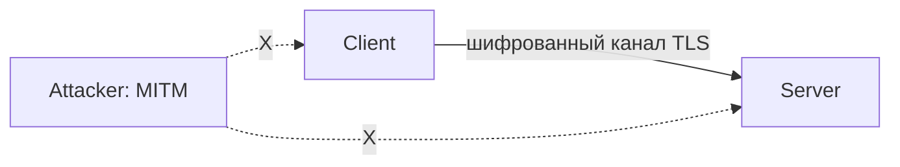
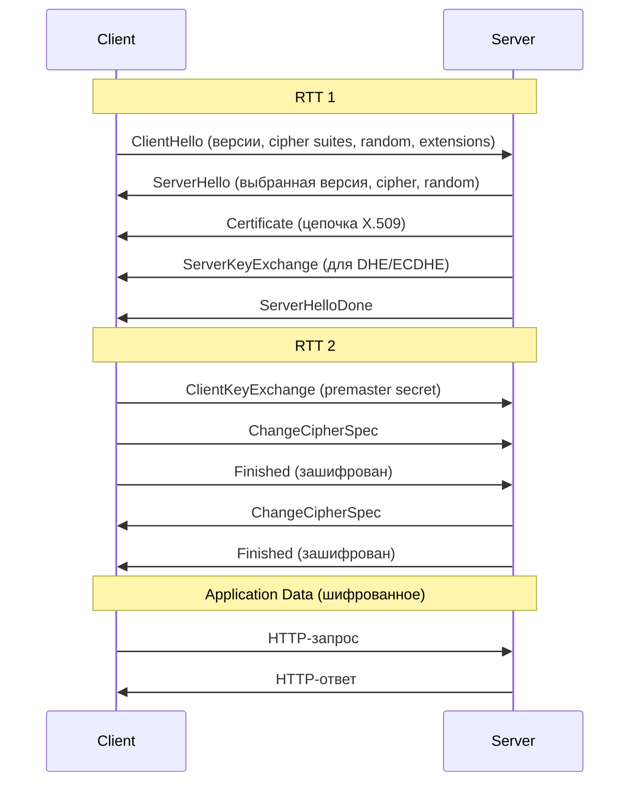
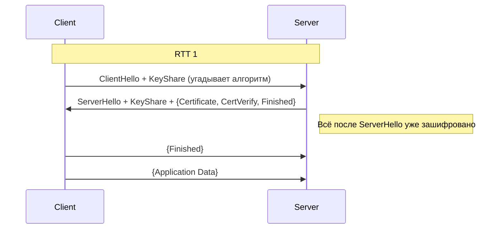
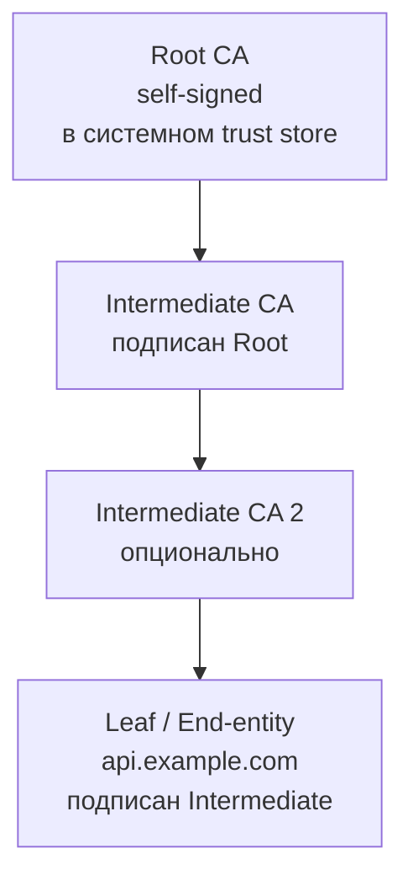
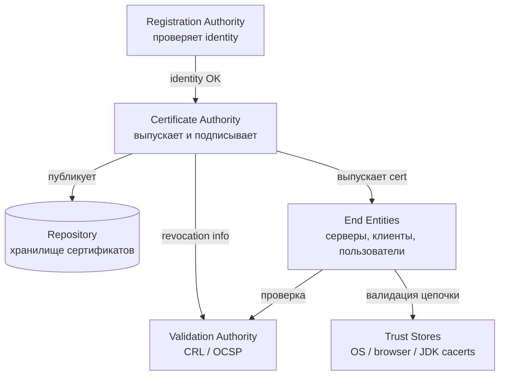
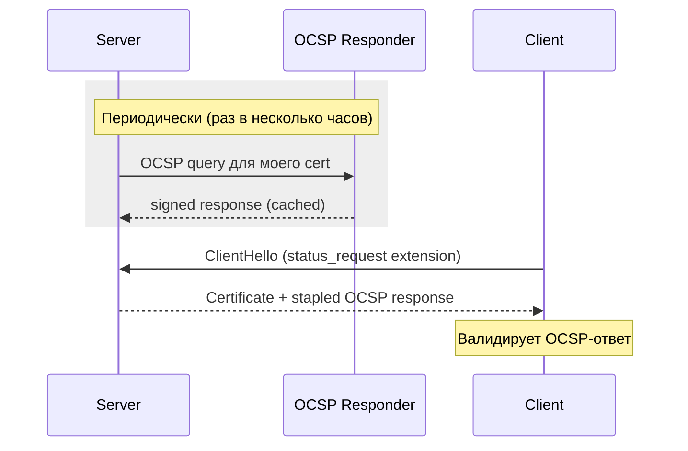
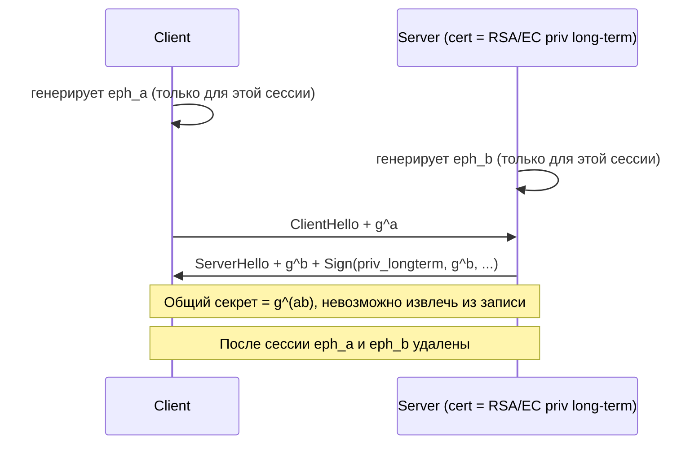
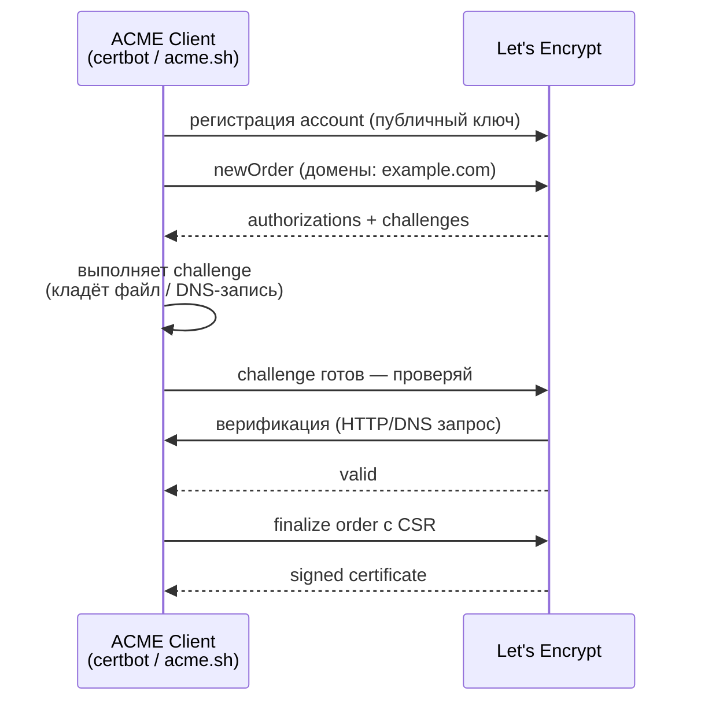
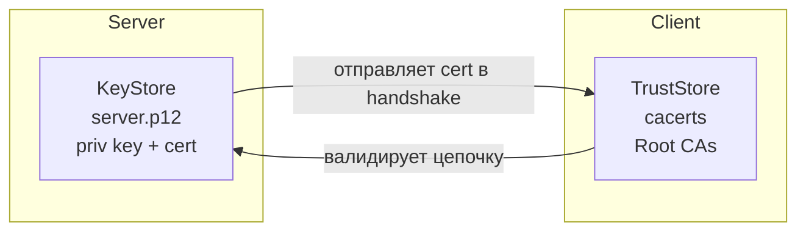
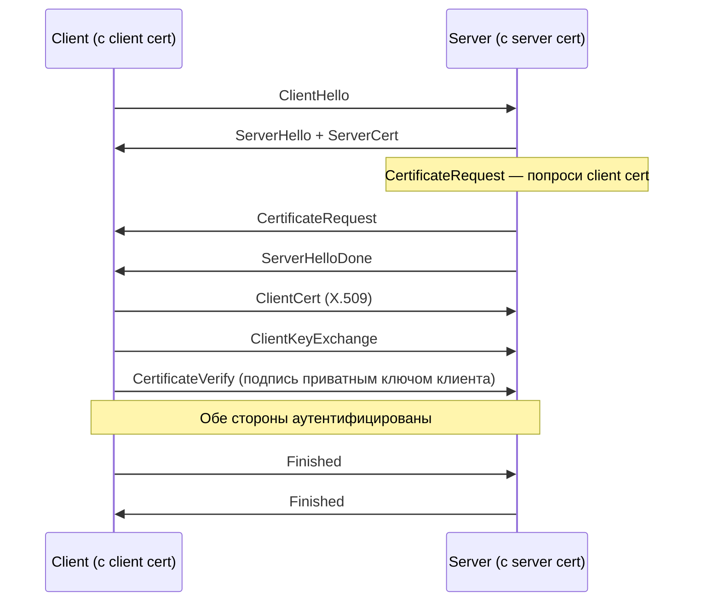

# Вопросы на собеседовании: `TLS/SSL`

Комплексное руководство по вопросам собеседования на тему `TLS/SSL` для `Senior Java Developer`. Включает детали handshake `TLS 1.2` и `TLS 1.3`, устройство `X.509` сертификатов и `PKI`, cipher suites, forward secrecy, настройку `Java KeyStore`/`TrustStore`, `SSLContext`, `Spring Boot` SSL, `mTLS`, `Let's Encrypt`/`ACME`, известные атаки и меры защиты.

**TLS** (`Transport Layer Security`) — криптографический протокол, обеспечивающий конфиденциальность, целостность и аутентификацию на транспортном уровне. Используется в `HTTPS`, `gRPC`, `SMTPS`, `FTPS`, `Kafka SSL`, `JDBC SSL` и десятках других протоколов. На интервью тема `TLS` проверяет понимание сетевой безопасности, криптографии и способность настроить и отладить реальный HTTPS-сервис.

## Полезные ссылки

### Официальная документация

- [RFC 8446 — TLS 1.3](https://datatracker.ietf.org/doc/html/rfc8446) — актуальная спецификация TLS
- [RFC 5246 — TLS 1.2](https://datatracker.ietf.org/doc/html/rfc5246) — предыдущая версия, всё ещё широко используется
- [RFC 5280 — X.509 Certificate Profile](https://datatracker.ietf.org/doc/html/rfc5280) — формат сертификатов
- [RFC 8555 — ACME Protocol](https://datatracker.ietf.org/doc/html/rfc8555) — автоматизация выдачи сертификатов (Let's Encrypt)
- [RFC 6960 — OCSP](https://datatracker.ietf.org/doc/html/rfc6960) — Online Certificate Status Protocol
- [Mozilla SSL Configuration Generator](https://ssl-config.mozilla.org/) — рекомендованные настройки TLS
- [SSL Labs Server Test](https://www.ssllabs.com/ssltest/) — аудит TLS-конфигурации сервера
- [Baeldung: Introduction to SSL in Java](https://www.baeldung.com/java-ssl)
- [Baeldung: TLS Setup in Spring](https://www.baeldung.com/spring-tls-setup)
- [Baeldung: KeyStore vs TrustStore](https://www.baeldung.com/java-keystore-truststore-difference)
- [Baeldung: mTLS Calls in Java](https://www.baeldung.com/java-execute-mtls-calls)
- [Baeldung: SSL Bundles in Spring Boot](https://www.baeldung.com/spring-boot-security-ssl-bundles)
- [OWASP Transport Layer Protection Cheat Sheet](https://cheatsheetseries.owasp.org/cheatsheets/Transport_Layer_Protection_Cheat_Sheet.html)

## Содержание

- [Полезные ссылки](#полезные-ссылки)
- [See also](#see-also)

**Основы TLS/SSL**
- [Q1. (!) Что такое `TLS/SSL` и зачем он нужен?](#q1--что-такое-tlsssl-и-зачем-он-нужен)
- [Q2. Чем `TLS` отличается от `SSL`? Какая версия актуальна?](#q2-чем-tls-отличается-от-ssl-какая-версия-актуальна)
- [Q3. (!) Какие три гарантии обеспечивает `TLS`?](#q3--какие-три-гарантии-обеспечивает-tls)
- [Q4. На каком уровне `OSI` работает `TLS`?](#q4-на-каком-уровне-osi-работает-tls)
- [Q5. Что такое `HTTPS` и как он связан с `TLS`?](#q5-что-такое-https-и-как-он-связан-с-tls)

**TLS Handshake**
- [Q6. (!) Как устроен `TLS 1.2` handshake?](#q6--как-устроен-tls-12-handshake)
- [Q7. (!) Что изменилось в `TLS 1.3` handshake? Почему быстрее?](#q7--что-изменилось-в-tls-13-handshake-почему-быстрее)
- [Q8. (!) Что такое `0-RTT` в `TLS 1.3` и в чём риски?](#q8--что-такое-0-rtt-в-tls-13-и-в-чём-риски)
- [Q9. Как работает session resumption? `Session ID` vs `Session Ticket` vs `PSK`](#q9-как-работает-session-resumption-session-id-vs-session-ticket-vs-psk)
- [Q10. Что такое `SNI` (Server Name Indication)?](#q10-что-такое-sni-server-name-indication)

**X.509 и сертификаты**
- [Q11. (!) Что такое `X.509` сертификат и из чего состоит?](#q11--что-такое-x509-сертификат-и-из-чего-состоит)
- [Q12. (!) Как работает chain of trust? Root vs Intermediate vs Leaf CA](#q12--как-работает-chain-of-trust-root-vs-intermediate-vs-leaf-ca)
- [Q13. (!) Что такое `SAN` и чем отличается от `CN`? Зачем `SAN` обязателен?](#q13--что-такое-san-и-чем-отличается-от-cn-зачем-san-обязателен)
- [Q14. В чём разница между `SAN` и wildcard сертификатами?](#q14-в-чём-разница-между-san-и-wildcard-сертификатами)
- [Q15. Что такое self-signed сертификат и когда его использовать?](#q15-что-такое-self-signed-сертификат-и-когда-его-использовать)
- [Q16. `DV` vs `OV` vs `EV` сертификаты — в чём разница?](#q16-dv-vs-ov-vs-ev-сертификаты--в-чём-разница)

**PKI, CRL, OCSP**
- [Q17. (!) Что такое `PKI`? Какие компоненты входят?](#q17--что-такое-pki-какие-компоненты-входят)
- [Q18. (!) Как проверяется отзыв сертификата? `CRL` vs `OCSP` vs `OCSP Stapling`](#q18--как-проверяется-отзыв-сертификата-crl-vs-ocsp-vs-ocsp-stapling)
- [Q19. Что такое `Certificate Transparency`?](#q19-что-такое-certificate-transparency)

**Криптография и cipher suites**
- [Q20. (!) В чём разница между симметричным и асимметричным шифрованием в `TLS`?](#q20--в-чём-разница-между-симметричным-и-асимметричным-шифрованием-в-tls)
- [Q21. (!) Что такое cipher suite и как его читать?](#q21--что-такое-cipher-suite-и-как-его-читать)
- [Q22. (!) Что такое Forward Secrecy (`PFS`) и как `ECDHE` её обеспечивает?](#q22--что-такое-forward-secrecy-pfs-и-как-ecdhe-её-обеспечивает)
- [Q23. Чем `RSA key exchange` отличается от `(EC)DHE`?](#q23-чем-rsa-key-exchange-отличается-от-ecdhe)
- [Q24. Что такое `AEAD` и какие шифры используются в `TLS 1.3`?](#q24-что-такое-aead-и-какие-шифры-используются-в-tls-13)

**Let's Encrypt и ACME**
- [Q25. (!) Что такое `Let's Encrypt` и `ACME` протокол?](#q25--что-такое-lets-encrypt-и-acme-протокол)
- [Q26. Какие challenges поддерживает ACME (`HTTP-01`, `DNS-01`, `TLS-ALPN-01`)?](#q26-какие-challenges-поддерживает-acme-http-01-dns-01-tls-alpn-01)

**Java: KeyStore, TrustStore, SSLContext**
- [Q27. (!) В чём разница между `KeyStore` и `TrustStore`?](#q27--в-чём-разница-между-keystore-и-truststore)
- [Q28. (!) `JKS` vs `PKCS12` — какой формат использовать?](#q28--jks-vs-pkcs12--какой-формат-использовать)
- [Q29. Как сгенерировать сертификат через `keytool` и `openssl`?](#q29-как-сгенерировать-сертификат-через-keytool-и-openssl)
- [Q30. (!) Как работает `SSLContext` в Java?](#q30--как-работает-sslcontext-в-java)
- [Q31. Как доверять кастомному CA в Java-приложении?](#q31-как-доверять-кастомному-ca-в-java-приложении)

**Spring Boot SSL**
- [Q32. (!) Как включить HTTPS в Spring Boot?](#q32--как-включить-https-в-spring-boot)
- [Q33. Что такое `SSL Bundles` в Spring Boot 3.1+?](#q33-что-такое-ssl-bundles-в-spring-boot-31)
- [Q34. Как настроить HTTPS-клиент в `RestTemplate`/`WebClient`?](#q34-как-настроить-https-клиент-в-resttemplatewebclient)

**mTLS (Mutual TLS)**
- [Q35. (!) Что такое `mTLS` и когда его применять?](#q35--что-такое-mtls-и-когда-его-применять)
- [Q36. Как настроить mTLS в Spring Boot (сервер + клиент)?](#q36-как-настроить-mtls-в-spring-boot-сервер--клиент)

**Атаки и защита**
- [Q37. (!) Какие известные атаки на TLS? `POODLE`, `BEAST`, `Heartbleed`](#q37--какие-известные-атаки-на-tls-poodle-beast-heartbleed)
- [Q38. (!) Что такое downgrade attack и как `TLS_FALLBACK_SCSV` с ним борется?](#q38--что-такое-downgrade-attack-и-как-tls_fallback_scsv-с-ним-борется)
- [Q39. Что такое MITM и как TLS от него защищает?](#q39-что-такое-mitm-и-как-tls-от-него-защищает)

**HSTS, CSP, pinning**
- [Q40. (!) Что такое HSTS и зачем он нужен?](#q40--что-такое-hsts-и-зачем-он-нужен)
- [Q41. Что такое certificate pinning? Почему HPKP устарел?](#q41-что-такое-certificate-pinning-почему-hpkp-устарел)

**Инструменты и отладка**
- [Q42. (!) Чем отлаживать TLS? `openssl s_client`, `keytool`, `testssl.sh`](#q42--чем-отлаживать-tls-openssl-s_client-keytool-testsslsh)
- [Q43. Как прочитать и проверить содержимое сертификата?](#q43-как-прочитать-и-проверить-содержимое-сертификата)
- [Q44. `PKIX path building failed` — как диагностировать?](#q44-pkix-path-building-failed--как-диагностировать)
- [Q45. Чеклист безопасности TLS для production](#q45-чеклист-безопасности-tls-для-production)

---

## Q1. (!) Что такое `TLS/SSL` и зачем он нужен?

`TLS` (`Transport Layer Security`) — криптографический протокол, который превращает открытый канал связи в защищённый: данные шифруются, не могут быть подменены незаметно, а собеседник доказывает, что он именно тот, за кого себя выдаёт. Работает поверх ненадёжного транспорта (обычно `TCP`). Его предшественник — `SSL` (`Secure Sockets Layer`), сейчас устаревший и небезопасный.

`TLS` решает три базовые задачи:

1. **Конфиденциальность** — данные шифруются, прослушка канала не даёт ничего читаемого
2. **Целостность** — изменение данных в канале будет обнаружено через `MAC`/`AEAD`
3. **Аутентификация** — клиент проверяет, что подключился именно к тому серверу, к которому хотел (через `X.509` сертификат)

**Зачем это нужно.** Без `TLS` любой промежуточный узел (`ISP`, Wi-Fi-точка, корпоративный прокси) читал бы и модифицировал HTTP-трафик — пароли, cookies, платёжные данные шли бы открытым текстом. `TLS` закрывает все три бреши одновременно: подслушать нечего (шифрование), подменить незаметно нельзя (целостность), а к фальшивому серверу не подключишься (аутентификация).



На транспорте данные выглядят как бинарный шум — но клиент и сервер видят исходный HTTP.

## Q2. Чем `TLS` отличается от `SSL`? Какая версия актуальна?

Это один и тот же протокол под разными именами: `SSL` — устаревшее историческое название, `TLS` — его прямой преемник. Netscape выпустила `SSL 2.0` в 1995, `SSL 3.0` в 1996. В 1999 IETF стандартизовал протокол под именем `TLS 1.0` (`RFC 2246`) — это был по сути `SSL 3.1`. Название сменили, чтобы подчеркнуть, что стандарт теперь открытый и не принадлежит одной компании.

| Версия | Год | Статус |
|--------|-----|--------|
| `SSL 2.0` | 1995 | Запрещён (`RFC 6176`) |
| `SSL 3.0` | 1996 | Запрещён (`RFC 7568`, POODLE) |
| `TLS 1.0` | 1999 | Deprecated (`RFC 8996`, 2021) |
| `TLS 1.1` | 2006 | Deprecated (`RFC 8996`) |
| `TLS 1.2` | 2008 | Поддерживается, широко используется |
| `TLS 1.3` | 2018 (`RFC 8446`) | Рекомендуемый |

**Что отвечать на собесе.** В разговоре «SSL» и «TLS» используют как синонимы — слово «SSL» прижилось (отсюда «SSL-сертификат», `SSLContext` в Java), хотя реально везде работает `TLS`. Важно знать факт: настоящий `SSL` (2.0/3.0) сломан и запрещён, рабочий минимум сегодня — `TLS 1.2`, а целевая версия — `TLS 1.3`.

## Q3. (!) Какие три гарантии обеспечивает `TLS`?

`TLS` даёт классическую триаду безопасности `CIA` — конфиденциальность, целостность, аутентификацию. У каждой из них свой механизм в протоколе:

| Гарантия | Как достигается в TLS |
|----------|----------------------|
| **Confidentiality** (конфиденциальность) | Симметричное шифрование сессионным ключом (`AES-GCM`, `ChaCha20-Poly1305`) |
| **Integrity** (целостность) | `MAC` / `AEAD` — любое искажение шифртекста обнаруживается |
| **Authentication** (аутентификация) | Проверка `X.509` сертификата сервера через подпись доверенного `CA`; опционально — клиентский сертификат (`mTLS`) |

Связь между ними важна: без аутентификации шифрование бесполезно — можно установить идеально зашифрованный канал, но с самим атакующим (`MITM`). Поэтому сертификат сервера — фундамент, на котором держатся остальные две гарантии.

Дополнительно `TLS 1.3` обязательно обеспечивает **Forward Secrecy** — компрометация долгосрочного приватного ключа сервера не даёт расшифровать ранее перехваченный трафик.

**Чего TLS не делает.** `TLS` **не защищает** от:
- атак на endpoint (вредонос на клиенте/сервере видит незашифрованные данные)
- подмены метаданных (`SNI`, размер пакетов, тайминги — side channels)
- неправильной валидации сертификата самим приложением

## Q4. На каком уровне `OSI` работает `TLS`?

`TLS` работает в зазоре между транспортным (`L4`, `TCP`) и прикладным (`L7`, `HTTP`) уровнями: уже есть надёжный TCP-канал, но ещё нет HTTP-данных — `TLS` встраивается ровно сюда. Формально его относят к **представительному уровню** (`L6`) или к «сеансовому+представительному», а в модели TCP/IP его считают просто частью прикладного уровня.

```
┌─────────────────┐
│ HTTP / gRPC /.. │  L7 — Application
├─────────────────┤
│       TLS       │  L6/L5 — шифрование
├─────────────────┤
│       TCP       │  L4 — Transport
├─────────────────┤
│       IP        │  L3 — Network
└─────────────────┘
```

**Практические следствия этого положения в стеке:**

- `TLS` требует **надёжный транспорт** (`TCP`): ему нужна гарантированная доставка байтов по порядку. Для `UDP` существует отдельный вариант — `DTLS` (`RFC 9147`)
- `HTTP/3` работает поверх `QUIC`, который встроил TLS-сессии прямо в транспорт — там `TLS` уже неотделим от протокола
- Балансировщик, который не терминирует `TLS`, не видит HTTP-заголовки (они зашифрованы) — маршрутизировать он может только по `SNI` из `Client Hello`

## Q5. Что такое `HTTPS` и как он связан с `TLS`?

`HTTPS` (`HTTP Secure`, `RFC 2818`/`RFC 9110`) — это просто `HTTP`, завёрнутый в `TLS`-канал. Сначала устанавливается TLS-соединение, а затем весь обычный HTTP (стартовая строка, заголовки, тело) передаётся внутри него как зашифрованный payload. То есть `HTTPS` — не отдельный протокол, а связка «`HTTP` + `TLS`».

**Отличия от HTTP:**
- Порт по умолчанию: `443` (vs `80` для HTTP)
- Схема URL: `https://` (vs `http://`)
- Требуется валидный сертификат на сервере
- Все заголовки и тело зашифрованы, виден только IP, порт и `SNI`

**Как браузеры подталкивают к HTTPS:**
- Помечают HTTP-страницы как "Not secure"
- Запрещают `mixed content` (HTTPS-страница не может грузить HTTP-ресурсы)
- Применяют `HTTPS-Only Mode`, автоматически переводя HTTP на HTTPS

См. подробнее в [вопросах по HTTP/REST](../api/http-rest-interview.md).

## Q6. (!) Как устроен `TLS 1.2` handshake?

Цель handshake — за несколько обменов сообщениями договориться об общем симметричном ключе и проверить сертификат сервера, не передавая сам ключ по сети. В `TLS 1.2` на это уходит **2 round-trip** (2-RTT) — два полных похода туда-обратно поверх уже установленного TCP-соединения, и только потом можно слать данные приложения.



Что происходит на каждом шаге:

1. **ClientHello** — клиент открывает разговор: присылает список поддерживаемых версий TLS, cipher suites, случайное число `client_random`, расширения (`SNI`, `ALPN`, ...)
2. **ServerHello** — сервер выбирает из предложенного версию и cipher suite, отвечает своим `server_random`
3. **Certificate** — сервер присылает свой сертификат (и промежуточные), чтобы клиент мог его проверить и аутентифицировать сервер
4. **ServerKeyExchange** — для forward-secrecy ciphers (`ECDHE`) сервер присылает свою эфемерную публичную часть, подписанную приватным ключом из сертификата (подпись доказывает, что эфемерный ключ прислал именно владелец сертификата)
5. **ClientKeyExchange** — клиент отвечает своей эфемерной публичной частью; теперь у обеих сторон есть всё, чтобы независимо вычислить один и тот же общий `premaster secret`
6. Из `client_random` + `server_random` + `premaster_secret` через `PRF` обе стороны выводят `master secret`, а из него — сессионные симметричные ключи
7. **Finished** — обе стороны шлют MAC по всей переписке handshake; если кто-то по дороге подменил хоть байт, MAC не сойдётся и соединение оборвётся

Только после этого идёт зашифрованное `Application Data`. Ключевая идея: сам ключ по сети не передаётся — каждая сторона **вычисляет** его из обменянных случайных чисел и эфемерных частей.

## Q7. (!) Что изменилось в `TLS 1.3` handshake? Почему быстрее?

`TLS 1.3` (`RFC 8446`) — крупнейший пересмотр протокола за всю его историю: handshake стал на круг короче, а все небезопасные опции вырезаны на уровне спецификации, а не настроек. Основные изменения:

**1. Handshake за 1-RTT** (вместо 2-RTT):



Почему хватает одного RTT: клиент не ждёт, пока сервер выберет алгоритм, а сразу «угадывает» его и в первом же сообщении прикладывает `KeyShare` — свою эфемерную публичную часть. Если угадал (а ходовые алгоритмы наперечёт), сервер тут же отвечает своей частью и начинает шифровать всё последующее. Лишний обмен из `TLS 1.2` (отдельный `ClientKeyExchange`) просто исчезает.

**2. Выкинуты небезопасные алгоритмы:**
- Нет `RSA key exchange` — только `(EC)DHE`, forward secrecy обязательна
- Нет `CBC`-шифров — только `AEAD` (`AES-GCM`, `ChaCha20-Poly1305`)
- Нет `MD5`, `SHA-1` в подписях
- Нет `static DH`, сжатия, ренегоциации, `NULL`-шифров

**3. 0-RTT резюмирование** — клиент может отправить данные в самом первом сообщении при повторном подключении.

**4. Session resumption через PSK** — единый механизм вместо `Session ID` и `Session Ticket`.

**5. Все сообщения после `ServerHello` зашифрованы** — включая `Certificate`. В `TLS 1.2` сертификат летел открытым текстом, и наблюдатель видел, к кому ты подключаешься; в `TLS 1.3` это скрыто.

**Итог:** подключение к HTTPS-сайту экономит одну RTT (а с `0-RTT` — все), небезопасные алгоритмы выбрать невозможно в принципе, forward secrecy включена всегда.

## Q8. (!) Что такое `0-RTT` в `TLS 1.3` и в чём риски?

`0-RTT` (zero round-trip) — оптимизация для **повторного** подключения: клиент отправляет зашифрованные данные приложения (например, HTTP-запрос) прямо в первом сообщении, не дожидаясь ответа сервера. Это возможно, потому что ключ берётся не из нового handshake, а из `PSK`, сохранённого с прошлой сессии — стороны уже «знакомы».

```
Client: ClientHello + EarlyData (HTTP GET /) → Server
```

Выигрыш — нулевая задержка: данные летят ещё до того, как сервер успел ответить. Но за скорость приходится платить безопасностью.

**Риски `0-RTT`:** обе проблемы вытекают из того, что `EarlyData` шифруются заранее известным ключом, без свежего обмена.

1. **Replay attacks (повторная отправка)** — атакующий может перехватить `EarlyData` и отправить их серверу повторно. На этапе handshake сервер не отличает повтор от оригинала, поэтому, если это был, скажем, перевод денег, операция выполнится дважды.
2. **Нет Forward Secrecy для `EarlyData`** — они шифруются производным от долгоживущего `PSK`, а не от эфемерного ключа. Утечка `PSK` раскрывает эти данные задним числом.

**Меры защиты:**
- Разрешать `0-RTT` только для **идемпотентных операций** (`GET`-запросы без побочных эффектов) — повтор такого запроса безвреден
- Сервер должен вести cache уже использованных `PSK` и отбрасывать дубли (dedupe)
- `CDN`-провайдеры (Cloudflare) автоматически отключают `0-RTT` для не-GET запросов

**На практике.** В Spring Boot / Tomcat `0-RTT` по умолчанию выключен — включать стоит только осознанно, понимая риск replay.

## Q9. Как работает session resumption? `Session ID` vs `Session Ticket` vs `PSK`

Session resumption — это способ не проводить полный handshake заново при повторном подключении к тому же серверу. Полный handshake дорог из-за асимметричных операций (подписи, обмен ключами); резюмирование переиспользует уже согласованные ключи, экономя CPU и RTT. Есть три механизма, и ключевое отличие между ними — где хранится состояние сессии.

**Session ID (TLS 1.2) — состояние на сервере:**
- Сервер генерирует `session_id` и держит у себя всё состояние сессии (в памяти или распределённом кеше); клиент при возврате присылает этот id
- **Минус:** требует server-side storage. В кластере из нескольких нод повторный запрос может прийти не на ту ноду, что хранит сессию → нужны sticky sessions или общий кеш

**Session Ticket (`RFC 5077`, TLS 1.2) — состояние у клиента:**
- Сервер шифрует всё состояние сессии своим ключом `STEK` и отдаёт клиенту в виде «билета»; при возврате клиент присылает билет обратно, сервер его расшифровывает и восстанавливает сессию
- **Плюс:** сервер становится stateless — ничего хранить не нужно, любая нода кластера примет билет
- **Минус:** если `STEK` утечёт, расшифровываются все билеты разом и теряется forward secrecy → ключ обязательно ротировать

**PSK (TLS 1.3) — единый механизм вместо двух:**
- `PSK` (pre-shared key) выдаётся в сообщении `NewSessionTicket` после handshake
- При возврате клиент шлёт `PSK identity` в `ClientHello`, сервер его принимает и сразу переходит к 1-RTT handshake
- Именно `PSK` лежит в основе `0-RTT` (см. Q8)

## Q10. Что такое `SNI` (Server Name Indication)?

`SNI` (`RFC 6066`) — расширение `ClientHello`, в котором клиент в открытую сообщает, **к какому hostname он подключается**, ещё до начала шифрования.

**Зачем понадобилось.** На одном IP-адресе обычно живёт много HTTPS-сайтов с разными сертификатами (virtual hosting). Возникает «проблема курицы и яйца»: чтобы прислать правильный сертификат, сервер должен знать имя домена, но имя домена обычно лежит в HTTP-заголовке `Host`, а он передаётся уже **внутри** TLS — то есть после того, как сертификат уже отправлен. `SNI` разрывает этот круг: имя домена кладётся прямо в `ClientHello`, и сервер сразу выбирает нужный сертификат.

```
ClientHello {
  ...
  extensions: [
    server_name: "api.example.com"
    ...
  ]
}
```

**Подводный камень — приватность.** `SNI` передаётся **открытым текстом** даже в `TLS 1.3` (хотя сам сертификат там уже зашифрован). Поэтому пассивный наблюдатель — провайдер, корпоративный прокси — всё равно видит, к какому домену вы идёте, даже не вскрывая трафик. Решение — `ESNI`/`ECH` (`Encrypted Client Hello`), которое прячет и `SNI`, но оно пока в стадии стандартизации и развёртывания.

**В Java** клиентах `SNI` работает из коробки начиная с JDK 7 — hostname автоматически берётся из URL.

## Q11. (!) Что такое `X.509` сертификат и из чего состоит?

`X.509` — стандарт формата цифрового сертификата (`RFC 5280`). По сути это заверенное удостоверение: оно связывает публичный ключ с идентификатором (обычно hostname), а подпись доверенного `Certificate Authority` гарантирует, что эта связка настоящая. Без подписи CA публичный ключ — просто набор байтов, которому никто не верит; сертификат превращает его в «паспорт сервера».

**Основные поля:**

| Поле | Пример | Назначение |
|------|--------|-----------|
| `Version` | v3 | Версия формата X.509 |
| `Serial Number` | 03:1A:B5:... | Уникальный ID у CA |
| `Signature Algorithm` | `SHA256withRSA` | Алгоритм подписи CA |
| `Issuer` | `CN=Let's Encrypt R3, O=LE` | Кто подписал |
| `Validity` | notBefore / notAfter | Срок действия |
| `Subject` | `CN=api.example.com` | Кому выдан |
| `Subject Public Key Info` | RSA/EC public key | Публичный ключ владельца |
| `Extensions` | `SAN`, `KeyUsage`, `EKU`, `AIA` | Расширения (v3) |
| `Signature` | bytes | Подпись CA |

**Ключевые extensions** (v3) — именно они определяют, как сертификат можно применять:
- **`Subject Alternative Name` (`SAN`)** — список доменов, которые покрывает сертификат (см. Q13: именно по нему проверяется hostname)
- **`Key Usage`** — что разрешено ключу: digitalSignature, keyEncipherment, ...
- **`Extended Key Usage` (`EKU`)** — назначение сертификата: `serverAuth`, `clientAuth`, `codeSigning`
- **`Authority Information Access` (`AIA`)** — URL, по которым клиент может скачать CRL/OCSP и недостающие промежуточные сертификаты
- **`Basic Constraints`** — флаг «это CA?» (`CA:TRUE`): отличает корневые/промежуточные от обычных серверных

**Формат хранения:** `DER` (бинарный `ASN.1`) или `PEM` (тот же `DER`, закодированный в base64 и обёрнутый в BEGIN/END-блоки — текстовый, удобно копировать).

```
-----BEGIN CERTIFICATE-----
MIID...base64...XYZ
-----END CERTIFICATE-----
```

## Q12. (!) Как работает chain of trust? Root vs Intermediate vs Leaf CA

Chain of trust — это принцип, по которому доверие «передаётся по цепочке» от заранее доверенного корня к конкретному серверу. Клиент не доверяет серверному сертификату напрямую — он доверяет небольшому набору корневых CA, а те своей подписью ручаются за промежуточные, а промежуточные — за серверный. Проверка сертификата сводится к построению этой цепочки до доверенного корня.



**Три типа сертификатов:**

1. **Root CA** — самоподписан, лежит в системном `trust store` (OS / browser / JDK `cacerts`). Приватный ключ хранится offline в HSM.
2. **Intermediate CA** — подписан Root (или другим Intermediate). Именно им CA выпускает пользовательские сертификаты. Сервер присылает его вместе с leaf.
3. **Leaf / end-entity** — сертификат конкретного сервера/клиента.

**Процесс валидации:**

1. Клиент получает цепочку от сервера (`Certificate` сообщение)
2. Берёт `leaf`, проверяет подпись `Intermediate` его публичным ключом
3. Проверяет подпись `Intermediate` ключом следующего звена
4. Доходит до `Root` — проверяет, есть ли он в trust store
5. Попутно: срок действия, `SAN` vs hostname, `EKU`, revocation (CRL/OCSP)

**Зачем нужно промежуточное звено (Intermediate).** Корневой ключ — самый ценный актив CA, поэтому его держат offline в HSM и почти никогда не используют для выпуска. Повседневный выпуск идёт через Intermediate, и если он скомпрометирован — отзывают только его, а Root остаётся нетронутым (иначе пришлось бы перевыпускать корень во всех trust store мира). Плюс через Intermediate удобно делегировать выпуск.

**Частая ошибка на проде.** Если сервер прислал только leaf и забыл приложить Intermediate, большинство клиентов не построят цепочку и упадут с ошибкой `unable to find valid certification path`. Браузеры иногда спасают ситуацию, подтягивая недостающее звено по `AIA`, но **Java этого не делает** — поэтому сервер обязан отдавать полную цепочку.

## Q13. (!) Что такое `SAN` и чем отличается от `CN`? Зачем `SAN` обязателен?

Короткий ответ: `CN` — это одно текстовое поле для одного имени, а `SAN` — расширение со **списком** имён; современные клиенты сверяют hostname только с `SAN`, а `CN` игнорируют.

Исторически hostname сервера указывали в `Subject.CommonName` (`CN`). Но `CN` — свободная строка на один домен, и она не задумывалась как машинно-проверяемое поле для hostname. Поэтому появился `Subject Alternative Name` (`SAN`) — extension, явно перечисляющий все DNS-имена (или IP), для которых валиден сертификат.

```
Subject: CN=example.com
X509v3 Subject Alternative Name:
    DNS:example.com
    DNS:www.example.com
    DNS:api.example.com
    IP:203.0.113.10
```

**Почему `SAN` теперь обязателен.** С 2017 года все современные браузеры (Chrome 58+, Firefox, Safari) **полностью игнорируют `CN`** и проверяют hostname только по `SAN`. Сертификат без `SAN` отвергается с ошибкой `NET::ERR_CERT_COMMON_NAME_INVALID`, даже если `CN` указан правильно. Java `HttpsURLConnection` с дефолтным `HostnameVerifier` ведёт себя так же (с JDK 9+).

**Эмпирическое правило:** **всегда выписывать сертификаты с `SAN`**, даже если домен один — иначе он просто не заработает в браузере. В `CSR` через OpenSSL:

```bash
openssl req -new -key server.key -out server.csr \
  -subj "/CN=api.example.com" \
  -addext "subjectAltName=DNS:api.example.com,DNS:www.api.example.com"
```

## Q14. В чём разница между `SAN` и wildcard сертификатами?

Это два разных способа покрыть несколько имён одним сертификатом. **SAN-сертификат** перечисляет конкретные имена явным списком (можно из разных доменов). **Wildcard** покрывает все поддомены одного уровня под одним базовым доменом через звёздочку. Главный практический критерий выбора: знаете ли вы список имён заранее (тогда SAN) или поддомены добавляются динамически (тогда wildcard).

| Свойство | SAN (multi-domain) | Wildcard (`*.domain`) |
|----------|-------------------|----------------------|
| Покрытие | Список явно заданных доменов (`a.com`, `b.net`, `x.org`) | Один уровень поддоменов одного домена (`*.example.com` → `api.example.com`, `www.example.com`) |
| Новый поддомен | Нужен reissue | Работает автоматически |
| Разные домены | Да | Нет, только один базовый |
| Вложенные уровни | — | `*.example.com` НЕ покрывает `a.b.example.com` (wildcard работает только на одном уровне) |
| Уровень валидации | DV / OV / EV | Обычно DV / OV (EV редко) |
| Риск компрометации | Утечка влияет только на список | Утечка компрометирует все поддомены |

**Можно комбинировать.** SAN и wildcard не взаимоисключающи: в список `SAN` разрешено класть несколько wildcard-записей сразу (`*.example.com` + `*.api.example.com`) — так одним сертификатом покрывают и поддомены первого, и второго уровня.

## Q15. Что такое self-signed сертификат и когда его использовать?

Self-signed — сертификат, который подписал сам себя своим же приватным ключом (`Issuer == Subject`), без участия CA. Криптографически он полноценный — шифрование работает так же, — но цепочки доверия к публичному корню у него нет, поэтому клиенты по умолчанию ему не верят и ругаются. Доверять такому сертификату можно, только вручную добавив его в trust store.

**Когда можно:**
- Локальная разработка (`localhost`)
- Внутренние тесты, сервисы без внешних клиентов
- Внутренние CA (корпоративная PKI) — тогда self-signed это корневой сертификат, который раскатывается в trust store всех машин организации

**Когда нельзя:**
- Публичные сервисы — браузеры покажут огромное предупреждение
- Приложения без TOFU — большинство клиентов просто упадут

Генерация через keytool:

```bash
keytool -genkeypair -alias server \
  -keyalg RSA -keysize 2048 \
  -validity 365 \
  -keystore server.p12 -storetype PKCS12 \
  -dname "CN=localhost" \
  -ext "san=dns:localhost,ip:127.0.0.1"
```

Через openssl:

```bash
openssl req -x509 -newkey rsa:2048 -nodes -days 365 \
  -keyout server.key -out server.crt \
  -subj "/CN=localhost" \
  -addext "subjectAltName=DNS:localhost,IP:127.0.0.1"
```

## Q16. `DV` vs `OV` vs `EV` сертификаты — в чём разница?

Это три уровня проверки, которую CA проводит **перед выдачей** сертификата. Важно понимать: на криптографию они не влияют — отличается только то, насколько глубоко CA убедился, что вы — это вы. По сути вы платите не за «более сильное» шифрование, а за более тщательную проверку личности.

| Тип | Что проверяется | Время | Пример |
|-----|----------------|-------|--------|
| **DV** (Domain Validated) | Контроль над доменом (через HTTP/DNS challenge) | Минуты | Let's Encrypt, большинство |
| **OV** (Organization Validated) | Домен + существование юрлица | Дни | DigiCert OV, Sectigo OV |
| **EV** (Extended Validation) | Домен + полная юридическая проверка организации | Дни-недели | Банки, финтех |

**Почему EV почти умер.** Исторически `EV` показывали зелёной полоской с названием компании в адресной строке — это и был весь смысл «платить дороже». Но **с 2019 года браузеры (Chrome, Safari) убрали EV-индикатор**: теперь визуально пользователь не отличает DV от EV, так что главное преимущество EV исчезло.

**Что выбирать.** С точки зрения криптографии все три уровня идентичны — разница только в глубине проверки CA. Для подавляющего большинства сервисов достаточно бесплатного `DV` от Let's Encrypt; OV/EV берут в основном там, где это формальное требование (банки, регуляторы).

## Q17. (!) Что такое `PKI`? Какие компоненты входят?

`PKI` (`Public Key Infrastructure`) — это вся инфраструктура вокруг сертификатов: кто их выпускает, как проверяет личность владельца, где публикует, как отзывает и кому в итоге доверяют клиенты. Сертификат сам по себе бесполезен без этой обвязки — `PKI` отвечает на вопрос «почему вообще можно верить чужому публичному ключу». Строится на асимметричной криптографии.



**Компоненты:**

1. **CA (Certificate Authority)** — выпускает и подписывает сертификаты. Примеры: Let's Encrypt, DigiCert, GlobalSign
2. **RA (Registration Authority)** — проверяет identity перед выпуском (валидация владения доменом, юрлица)
3. **VA (Validation Authority)** — обслуживает CRL/OCSP для проверки отзыва
4. **Repository** — публичный каталог сертификатов (иногда интегрирован в CA)
5. **End Entities** — серверы, клиенты, люди, у которых есть сертификаты
6. **Trust Stores** — хранилища корневых CA на стороне клиента (браузер, OS, JDK)

**Два вида PKI.** Публичная (`Web PKI`) — корни вшиты в браузеры и ОС, ей доверяет весь интернет; именно она стоит за HTTPS. Частная — внутренний CA организации, чьи корни вручную раскатаны только по своим машинам; используется для internal-сервисов и `mTLS`.

## Q18. (!) Как проверяется отзыв сертификата? `CRL` vs `OCSP` vs `OCSP Stapling`

Проблема: срок действия сертификата ещё не истёк, но доверять ему уже нельзя — утёк приватный ключ, скомпрометирован CA, сменился владелец домена. Нужен способ объявить сертификат недействительным досрочно. Это исторически слабое место PKI: все три механизма ниже — про один и тот же вопрос «а не отозван ли этот сертификат?», и каждый следующий чинит недостатки предыдущего.

**CRL (`Certificate Revocation List`, `RFC 5280`) — «чёрный список целиком»:**
- CA публикует список серийников всех отозванных сертификатов; клиент скачивает его по URL из extension `CRL Distribution Points`
- **Плюс:** простой и работает offline после скачивания
- **Минус:** список разрастается до мегабайтов, обновляется редко (можно проскочить свежий отзыв), а скачивать его на каждое соединение дорого

**OCSP (`Online Certificate Status Protocol`, `RFC 6960`) — «точечный запрос вместо списка»:**
- Клиент спрашивает OCSP-responder про один конкретный сертификат: «статус serial=X?» и получает подписанный CA ответ `good` / `revoked` / `unknown`
- **Плюс:** данные свежие, запрос маленький — решает проблему размера CRL
- **Минус:** добавляет задержку к каждому handshake, утечка приватности (CA видит, на какие сайты ходит пользователь) и single point of failure (лёг responder — что делать?)

**OCSP Stapling (`RFC 6066`) — «пусть сервер сам приложит свежий ответ»:**
- Здесь OCSP-ответ запрашивает не клиент, а **сервер** — периодически, раз в несколько часов
- Сервер «прикрепляет» (staples) этот свежий подписанный ответ прямо к своему сертификату в handshake
- Клиент получает подтверждение не-отзыва сразу, без отдельного похода к CA
- **Чинит сразу обе беды OCSP:** приватность (CA больше не видит клиентов — он общается только с сервером) и производительность (нет лишнего round-trip на стороне клиента)



**Рекомендация:** **OCSP Stapling + Must-Staple extension**. Проблема голого stapling — его можно «отрезать»: MITM просто не приложит ответ, и многие клиенты это проглотят (soft-fail). Must-Staple помечает сертификат как «обязан идти со stapled OCSP», и тогда отсутствие ответа однозначно трактуется как ошибка.

**Альтернативный подход — вообще обойтись без отзыва.** Если сертификат живёт **очень недолго** (Let's Encrypt — 90 дней, и индустрия движется к 6 дням), отзыв почти теряет смысл: скомпрометированный сертификат сам протухнет через считаные дни, достаточно просто переждать.

## Q19. Что такое `Certificate Transparency`?

`Certificate Transparency` (`CT`, `RFC 6962`/`RFC 9162`) — механизм публичного аудита всех выпускаемых сертификатов. Он закрывает фундаментальную дыру PKI: любой из сотен доверенных CA технически может выпустить сертификат на чужой домен (по ошибке или под давлением), и владелец домена об этом никак не узнает. `CT` решает это так: все публичные CA **обязаны** записывать каждый выпущенный сертификат в публичные append-only логи, из которых ничего нельзя удалить задним числом. Теперь любая «левая» выдача становится видимой всем.

**Как это работает:**
1. CA отправляет pre-certificate в CT-log
2. Log возвращает `SCT` (Signed Certificate Timestamp) — подписанную "расписку"
3. CA включает `SCT` в финальный сертификат (или шлёт отдельно через OCSP/TLS extension)
4. Браузер (Chrome, Safari) **требует** минимум 2 SCT от разных логов — без них сертификат не доверяется

**Зачем это нужно на практике:**
- Владелец домена может мониторить, кто и когда выпускает сертификаты на его имя (`crt.sh`, `Facebook CT Monitor`, Cert Spotter) — и сразу заметить чужой
- Ошибочно или злонамеренно выпущенные сертификаты быстро обнаруживаются и отзываются
- Исторически `CT` уже ловил реальные инциденты mis-issuance у крупных CA — механизм работает не только в теории

Проверить сертификат: [https://crt.sh/?q=example.com](https://crt.sh/).

## Q20. (!) В чём разница между симметричным и асимметричным шифрованием в `TLS`?

Коротко: симметричное шифрование быстрое, но требует, чтобы стороны заранее имели общий секрет; асимметричное медленное, но позволяет договориться о секрете по открытому каналу. У каждого своя нерешаемая в одиночку проблема — и `TLS` использует их вместе, чтобы сильные стороны компенсировали слабые.

| Свойство | Симметричное | Асимметричное |
|----------|-------------|---------------|
| Ключи | Один общий | Пара public/private |
| Алгоритмы | AES, ChaCha20 | RSA, ECDSA, (EC)DH |
| Скорость | Быстрое (~GB/s) | Медленное (~кB/s) |
| Размер ключа | 128-256 бит | 2048-4096 RSA / 256 EC |
| Проблема | Как обменяться ключом? | Как подтвердить публичный ключ? |

В `TLS` они работают на разных этапах, по принципу разделения труда:

1. **Handshake** (медленная, но одноразовая часть) — асимметричная криптография решает то, что симметричная не может:
   - Аутентификация сервера (подпись через RSA/ECDSA из сертификата)
   - Согласование общего симметричного ключа по открытому каналу (через ECDHE)
2. **Application Data** (быстрая часть на весь объём трафика) — симметричная криптография (AES-GCM)

**Суть гибридного подхода:** дорогую асимметрику применяют один раз, только чтобы безопасно родить общий ключ; а весь поток данных гонят дешёвой симметрикой. Так получают и безопасный обмен ключом, и высокую пропускную способность.

## Q21. (!) Что такое cipher suite и как его читать?

Cipher suite — это «комплект» криптоалгоритмов, который клиент и сервер согласуют на handshake: один обмен ключами, одна подпись, один шифр, один хеш. В `ClientHello` клиент перечисляет, что умеет, а сервер выбирает один общий комплект. Имя suite — не случайный набор букв, а ровно перечисление этих алгоритмов по порядку. Формат названия в `TLS 1.2`:

```
TLS_ECDHE_RSA_WITH_AES_128_GCM_SHA256
    ↑      ↑       ↑         ↑      ↑
    |      |       |         |      └─ PRF/MAC hash: SHA-256
    |      |       |         └─── cipher + mode: AES-128 в GCM
    |      |       └──────────── WITH — разделитель
    |      └──────────────────── authentication: RSA signature
    └──────────────────────────── key exchange: ECDHE (ephemeral)
```

Расшифровка:
- **Key exchange** — как договориться о ключе: `RSA`, `DHE`, `ECDHE`, `PSK`
- **Authentication** — чем подписывается handshake: `RSA`, `ECDSA`
- **Cipher** — симметричный шифр: `AES_128_GCM`, `AES_256_GCM`, `CHACHA20_POLY1305`
- **MAC/hash** — для PRF и integrity: `SHA256`, `SHA384`

В **`TLS 1.3`** формат упрощён — cipher suite описывает только cipher + hash:

```
TLS_AES_128_GCM_SHA256
TLS_AES_256_GCM_SHA384
TLS_CHACHA20_POLY1305_SHA256
```

Key exchange и signature договариваются через отдельные extensions.

**Рекомендованные для прода (Mozilla Modern):**

- `TLS_AES_128_GCM_SHA256`
- `TLS_AES_256_GCM_SHA384`
- `TLS_CHACHA20_POLY1305_SHA256`
- `ECDHE-ECDSA-AES128-GCM-SHA256` (TLS 1.2 fallback)
- `ECDHE-RSA-AES128-GCM-SHA256` (TLS 1.2 fallback)

**Запрещены:**
- Любой с `RC4`, `3DES`, `MD5`, `SHA1`
- `CBC` без MAC-then-encrypt (уязвим к padding oracle)
- Любой без `PFS` (без DHE/ECDHE)

## Q22. (!) Что такое Forward Secrecy (`PFS`) и как `ECDHE` её обеспечивает?

**Perfect Forward Secrecy** — свойство, при котором утечка долгосрочного приватного ключа сервера **не раскрывает** уже записанный ранее трафик. Каждая сессия защищена своим одноразовым ключом, который нигде не хранится, поэтому «взлом» сервера завтра не даёт ключа от вчерашних разговоров.

Понять идею проще через сравнение «было/стало»:

**Без PFS (RSA key exchange):** общий секрет рождается напрямую из долгосрочного ключа.
- Клиент шифрует `premaster_secret` публичным ключом сервера и шлёт его
- Атакующий тихо записывает весь TLS-трафик «про запас»
- Через год приватный ключ сервера утекает → атакующий расшифровывает им **все** старые записи разом. Это и есть сценарий «record now, decrypt later»

**С PFS (`DHE`/`ECDHE`):** долгосрочный ключ к шифрованию данных вообще не причастен.
- На каждую сессию генерируется **эфемерная** (одноразовая) пара Diffie-Hellman
- Стороны обмениваются только публичными частями и независимо вычисляют общий секрет — сам секрет по сети не летит
- Сертификат сервера используется лишь для **подписи** эфемерной части (доказать, кто её прислал), а не для её шифрования
- После handshake эфемерные приватные ключи **стираются из памяти** — расшифровать запись больше нечем, даже зная долгосрочный ключ



**Почему именно ECDHE.** `ECDHE` (Elliptic Curve Diffie-Hellman Ephemeral) — тот же эфемерный обмен, но на эллиптических кривых, поэтому при равной стойкости он быстрее и компактнее обычного `DHE` (кривая P-256 ≈ RSA 3072 по защите, но ключи на порядок короче). Это и сделало PFS дешёвым настолько, что в `TLS 1.3` он стал обязательным: RSA key exchange удалён, все cipher suites используют (EC)DHE.

## Q23. Чем `RSA key exchange` отличается от `(EC)DHE`?

Разница в одном принципиальном моменте: при RSA key exchange ключ сессии **передаётся** (зашифрованным), а при (EC)DHE он **никогда не передаётся** — обе стороны вычисляют его независимо. Отсюда вытекает всё остальное, в том числе forward secrecy.

| Свойство | RSA key exchange | (EC)DHE |
|----------|-----------------|---------|
| Механизм | Клиент генерит premaster, шифрует публичным ключом сервера | Обе стороны генерят эфемерные пары, обмениваются публичными частями |
| Использование сертификата | Ключ из сертификата применяется для **шифрования** секрета | Ключ из сертификата применяется для **подписи** эфемерной части |
| Forward Secrecy | ❌ Нет | ✅ Да |
| Производительность | Быстрее на handshake (нет доп. DH) | Чуть медленнее |
| Статус в TLS 1.3 | ❌ Удалён | ✅ Единственный вариант |

**Почему RSA key exchange убрали:** массовая возможность "record now, decrypt later" — государственные акторы могут записывать зашифрованный трафик сейчас, а через 5-10 лет расшифровать при утечке ключа или появлении квантовых компьютеров.

## Q24. Что такое `AEAD` и какие шифры используются в `TLS 1.3`?

`AEAD` (`Authenticated Encryption with Associated Data`) — режим, который за одну операцию делает сразу две вещи: шифрует данные (**конфиденциальность**) и встраивает проверку их подлинности (**целостность**), без отдельного шага HMAC.

**Зачем это понадобилось.** В старых схемах шифрование и проверка целостности были разными шагами и могли быть скомбинированы неправильно. Связка `CBC` + HMAC («MAC-then-encrypt») оказалась уязвима к padding oracle attacks — `BEAST`, `Lucky13`, `POODLE` все эксплуатируют именно padding в CBC. `AEAD` убирает целый класс таких ошибок конструктивно: склеить шифрование и аутентификацию неправильно уже нельзя, они неразделимы.

**Шифры TLS 1.3:**

| Cipher Suite | Алгоритм | Когда выбирать |
|-------------|----------|---------------|
| `TLS_AES_128_GCM_SHA256` | AES-128-GCM | Обычный дефолт, есть hardware-ускорение (AES-NI) |
| `TLS_AES_256_GCM_SHA384` | AES-256-GCM | Параноидальный уровень |
| `TLS_CHACHA20_POLY1305_SHA256` | ChaCha20-Poly1305 | Mobile/ARM без AES-NI — работает быстрее |

AES-GCM на серверах/ноутбуках с AES-NI — выигрывает по скорости. На телефонах и IoT без hardware-ускорения `ChaCha20` быстрее и константен по времени.

## Q25. (!) Что такое `Let's Encrypt` и `ACME` протокол?

**Let's Encrypt** — некоммерческий CA (запущен ISRG в 2016), который бесплатно и полностью автоматически выдаёт DV-сертификаты. До него HTTPS требовал ручной возни и денег, поэтому большая часть сайтов сидела на HTTP; Let's Encrypt сделал шифрование «по умолчанию» и к 2024 году выдал > 3 миллиардов сертификатов.

**ACME** (`Automatic Certificate Management Environment`, `RFC 8555`) — это и есть тот протокол, который превращает выпуск/обновление сертификата из ручной операции в API-вызов. Именно автоматизация через `ACME` — главное, что отличает Let's Encrypt от классических CA.

**Типичный flow** — клиент доказывает контроль над доменом, затем получает подписанный сертификат:



**Короткий срок жизни — это by design.** Сертификаты Let's Encrypt живут всего **90 дней** (с 2025 есть опция 6 дней). Это не неудобство, а часть модели: раз обновление автоматическое, короткий срок резко снижает ценность отзыва (скомпрометированный сертификат быстро протухает сам) и заставляет всех держать автоматизацию в порядке.

**Основные ACME-клиенты:** `certbot` (Python), `acme.sh` (bash), `lego` (Go), `cert-manager` (Kubernetes). Web-серверы `Caddy`, `Traefik`, `Nginx 1.27+`, `Apache 2.4.30+` имеют встроенный ACME — там HTTPS поднимается вообще без отдельного клиента.

## Q26. Какие challenges поддерживает ACME (`HTTP-01`, `DNS-01`, `TLS-ALPN-01`)?

Challenge — это испытание, которым CA проверяет, что домен действительно ваш. Логика у всех одна: CA даёт секретный токен, вы публикуете его там, куда можете писать только как владелец домена, а CA приходит и убеждается, что он на месте. Различаются способы публикации — отсюда и выбор между ними под конкретную ситуацию.

**`HTTP-01`** (самый популярный) — доказательство через файл на сайте:
- CA даёт токен, клиент кладёт файл по пути `http://example.com/.well-known/acme-challenge/<token>`, CA скачивает его и сверяет
- **Требует:** публично доступный порт 80
- **Не подходит для:** wildcard-доменов и приватных сервисов (CA не достучится снаружи)

**`DNS-01`** — доказательство через DNS-запись:
- Клиент создаёт TXT-запись `_acme-challenge.example.com` с нужным значением, CA делает DNS-запрос и сравнивает
- **Работает для любых доменов**, в том числе wildcard и не выставленных в интернет — потому что проверяется DNS, а не сам сервер
- **Требует:** API DNS-провайдера для автоматизации

**`TLS-ALPN-01`** — доказательство прямо в TLS-handshake:
- Challenge проходит через специальное TLS-соединение на порт 443 с ALPN-протоколом `acme-tls/1`; токен лежит в extension сертификата
- **Преимущество:** использует тот же порт 443, что и сам сервис — не нужен отдельный порт 80

**Эмпирическое правило:** для wildcard-сертификата (`*.example.com`) доступен **только `DNS-01`** — `HTTP-01` физически не может покрыть произвольный поддомен.

## Q27. (!) В чём разница между `KeyStore` и `TrustStore`?

Технически это файлы одного формата (JKS/PKCS12), но по смыслу они противоположны. Запомнить разницу проще всего одной фразой: **KeyStore — это «кто я» (мои секреты), TrustStore — это «кому я верю» (чужие публичные сертификаты)**. В KeyStore лежат приватные ключи и их надо беречь; в TrustStore секретов нет вообще, только публичные данные.

| Свойство | KeyStore | TrustStore |
|----------|----------|-----------|
| Что хранит | Свои приватные ключи + свои сертификаты | Чужие публичные сертификаты / CA, которым доверяем |
| Контекст | "Кто я" | "Кому я верю" |
| Используется | `KeyManagerFactory` (для серверной аутентификации и клиентских сертов) | `TrustManagerFactory` (для валидации чужих сертификатов) |
| Пароль | Важный — защищает приватные ключи | Менее критичный (там нет секретов, только публичные данные) |
| Системное по умолчанию | Нет | `$JAVA_HOME/lib/security/cacerts` |



**Для mTLS клиента** нужны оба:
- `KeyStore` — клиентский сертификат для аутентификации
- `TrustStore` — чтобы доверять серверу

## Q28. (!) `JKS` vs `PKCS12` — какой формат использовать?

Короткий ответ: для новых проектов — **PKCS12**, `JKS` остаётся только в legacy. Причина в том, что `JKS` — проприетарный формат Java, а `PKCS12` — открытый кросс-платформенный стандарт, с которым работают и OpenSSL, и Windows, и `curl`.

| Формат | Стандарт | Расширение | Когда использовать |
|--------|----------|-----------|-------------------|
| **JKS** | Java-специфичный | `.jks` | Legacy проекты, только Java-экосистема |
| **PKCS12** | Кросс-платформенный (RFC 7292) | `.p12`, `.pfx` | По умолчанию с Java 9+, обмен с не-Java (OpenSSL, Windows) |
| **JCEKS** | Java, усиленное шифрование | `.jceks` | Почти не используется |
| **BKS** | BouncyCastle | `.bks` | Android (старые версии) |

**С Java 9 дефолт — PKCS12.** Рекомендуется для всех новых проектов:
- Совместим с OpenSSL, `keytool`, `curl`, Windows
- Безопаснее (JKS имеет известные слабости в шифровании)

Конвертация JKS → PKCS12:

```bash
keytool -importkeystore \
  -srckeystore server.jks -srcstoretype JKS \
  -destkeystore server.p12 -deststoretype PKCS12
```

В `application.yml`:

```yaml
server:
  ssl:
    key-store: classpath:server.p12
    key-store-type: PKCS12
    key-store-password: changeit
```

## Q29. Как сгенерировать сертификат через `keytool` и `openssl`?

Два разных инструмента под две экосистемы: `keytool` работает с Java-keystore'ами, `openssl` — с PEM/DER-файлами «как в мире Unix». Полезно знать оба: keystore нужен Spring Boot, а PEM — большинству прочих инструментов.

**Keytool (Java):**

```bash
# Создать keystore с self-signed сертификатом
keytool -genkeypair \
  -alias myapp -keyalg RSA -keysize 2048 \
  -validity 365 \
  -keystore server.p12 -storetype PKCS12 \
  -storepass changeit \
  -dname "CN=api.example.com, O=MyCompany, C=RU" \
  -ext "san=dns:api.example.com,dns:www.example.com"

# Сгенерировать CSR для отправки в CA
keytool -certreq -alias myapp \
  -file server.csr \
  -keystore server.p12 -storepass changeit

# Импортировать подписанный cert обратно
keytool -importcert -alias myapp \
  -file server-signed.crt \
  -keystore server.p12 -storepass changeit

# Посмотреть содержимое keystore
keytool -list -v -keystore server.p12 -storepass changeit

# Импортировать корневой сертификат в truststore
keytool -importcert -alias myCA \
  -file ca.crt \
  -keystore truststore.p12 -storepass changeit
```

**OpenSSL:**

```bash
# Генерация приватного ключа
openssl genrsa -out server.key 2048
# или EC-ключ (быстрее, меньше)
openssl ecparam -genkey -name prime256v1 -out server.key

# CSR
openssl req -new -key server.key -out server.csr \
  -subj "/CN=api.example.com/O=MyCompany" \
  -addext "subjectAltName=DNS:api.example.com,DNS:www.example.com"

# Self-signed cert одной командой
openssl req -x509 -newkey rsa:2048 -nodes -days 365 \
  -keyout server.key -out server.crt \
  -subj "/CN=localhost" \
  -addext "subjectAltName=DNS:localhost,IP:127.0.0.1"

# Посмотреть содержимое cert
openssl x509 -in server.crt -text -noout

# Конвертация PEM → PKCS12
openssl pkcs12 -export \
  -in server.crt -inkey server.key \
  -out server.p12 -name myapp \
  -passout pass:changeit
```

## Q30. (!) Как работает `SSLContext` в Java?

`SSLContext` — центральный объект TLS в Java: фабрика, из которой берутся `SSLEngine`/`SSLSocketFactory`/`SSLServerSocketFactory`. Он собирается из двух частей, которые прямо отражают KeyStore/TrustStore из Q27: `KeyManager[]` отвечает за «кто я» (мои ключи и сертификаты для аутентификации), а `TrustManager[]` — за «кому я верю» (валидация чужих сертификатов). По сути настроить TLS в Java = правильно инициализировать `SSLContext` этими двумя менеджерами.

```java
// Загрузка keystore
KeyStore keyStore = KeyStore.getInstance("PKCS12");
try (InputStream is = Files.newInputStream(Paths.get("server.p12"))) {
    keyStore.load(is, "changeit".toCharArray());
}

// KeyManager — наши сертификаты + приватные ключи
KeyManagerFactory kmf = KeyManagerFactory.getInstance(
    KeyManagerFactory.getDefaultAlgorithm()); // "SunX509"
kmf.init(keyStore, "changeit".toCharArray());

// TrustManager — кому доверяем
KeyStore trustStore = KeyStore.getInstance("PKCS12");
try (InputStream is = Files.newInputStream(Paths.get("truststore.p12"))) {
    trustStore.load(is, "changeit".toCharArray());
}
TrustManagerFactory tmf = TrustManagerFactory.getInstance(
    TrustManagerFactory.getDefaultAlgorithm()); // "PKIX"
tmf.init(trustStore);

// SSLContext
SSLContext sslContext = SSLContext.getInstance("TLSv1.3");
sslContext.init(
    kmf.getKeyManagers(),
    tmf.getTrustManagers(),
    new SecureRandom()
);

// Использование
SSLSocketFactory factory = sslContext.getSocketFactory();
try (SSLSocket socket = (SSLSocket) factory.createSocket("api.example.com", 443)) {
    socket.setEnabledProtocols(new String[]{"TLSv1.3", "TLSv1.2"});
    socket.startHandshake();
    // ...
}
```

**Главный антипаттерн, который нельзя копировать из StackOverflow** — «trust-all» менеджер. Его обычно приносят, чтобы заглушить ошибку валидации, но он не «чинит» TLS, а полностью отключает аутентификацию:

```java
// ❌ ОПАСНО: trust-all manager — ломает всю безопасность TLS
TrustManager[] trustAll = new TrustManager[]{
    new X509TrustManager() {
        public void checkClientTrusted(X509Certificate[] c, String a) {}
        public void checkServerTrusted(X509Certificate[] c, String a) {}  // никогда не бросает!
        public X509Certificate[] getAcceptedIssuers() { return new X509Certificate[0]; }
    }
};
// Эквивалентно отключению TLS: MITM станет тривиальным
```

Без проверки сертификата шифрование остаётся, но исчезает аутентификация — а значит, `MITM` подставит свой сертификат и спокойно расшифрует трафик. Допустимо только в локальном dev, **никогда в проде**.

## Q31. Как доверять кастомному CA в Java-приложении?

Это типичная задача при работе с внутренним (частным) CA: его корня нет в системном `cacerts`, поэтому Java по умолчанию не доверяет таким сертификатам (см. Q44, `PKIX path building failed`). Есть три способа добавить доверие — от грубого к правильному:

**1. Импорт в системный truststore (`$JAVA_HOME/lib/security/cacerts`):**

```bash
keytool -importcert \
  -alias myCA \
  -file ca.crt \
  -keystore $JAVA_HOME/lib/security/cacerts \
  -storepass changeit
```

Минус: меняет JDK для всех приложений, после обновления JDK надо повторять.

**2. Свой truststore через system property:**

```bash
java -Djavax.net.ssl.trustStore=/path/to/truststore.p12 \
     -Djavax.net.ssl.trustStorePassword=changeit \
     -Djavax.net.ssl.trustStoreType=PKCS12 \
     -jar myapp.jar
```

Минус: полностью заменяет `cacerts`, публичные сайты перестанут работать.

**3. Composite TrustManager (правильный способ):**

Лучший вариант: доверять и системным публичным CA, и своему кастомному одновременно — так и внутренние сервисы, и публичные сайты продолжают работать. Идея — собрать единый TrustStore из дефолтного и своего:

```java
// Загружаем кастомный CA
KeyStore customTs = KeyStore.getInstance("PKCS12");
customTs.load(new FileInputStream("custom-ca.p12"), "changeit".toCharArray());

// Системный
KeyStore systemTs = KeyStore.getInstance(KeyStore.getDefaultType());
systemTs.load(null, null); // null — загружает дефолтный

// Объединяем в один KeyStore
KeyStore merged = KeyStore.getInstance("PKCS12");
merged.load(null, null);
Enumeration<String> aliases = systemTs.aliases();
while (aliases.hasMoreElements()) {
    String a = aliases.nextElement();
    merged.setCertificateEntry(a, systemTs.getCertificate(a));
}
aliases = customTs.aliases();
while (aliases.hasMoreElements()) {
    String a = aliases.nextElement();
    merged.setCertificateEntry("custom-" + a, customTs.getCertificate(a));
}

TrustManagerFactory tmf = TrustManagerFactory.getInstance("PKIX");
tmf.init(merged);
```

## Q32. (!) Как включить HTTPS в Spring Boot?

В простейшем случае HTTPS в Spring Boot включается одной секцией `server.ssl` в `application.yml` — embedded-сервер (Tomcat) поднимает TLS сам, без кода. Нужно лишь указать keystore с сертификатом и приватным ключом:

```yaml
server:
  port: 8443
  ssl:
    enabled: true
    key-store: classpath:server.p12
    key-store-type: PKCS12
    key-store-password: changeit
    key-alias: myapp
    # Опционально: ограничение протоколов и cipher'ов
    enabled-protocols: TLSv1.3,TLSv1.2
    ciphers:
      - TLS_AES_128_GCM_SHA256
      - TLS_AES_256_GCM_SHA384
      - TLS_CHACHA20_POLY1305_SHA256
```

**HTTP → HTTPS redirect** (для Tomcat):

```java
@Configuration
public class HttpsRedirectConfig {

    @Bean
    public TomcatServletWebServerFactory servletContainer() {
        TomcatServletWebServerFactory tomcat = new TomcatServletWebServerFactory() {
            @Override
            protected void postProcessContext(Context context) {
                SecurityConstraint c = new SecurityConstraint();
                c.setUserConstraint("CONFIDENTIAL");
                SecurityCollection coll = new SecurityCollection();
                coll.addPattern("/*");
                c.addCollection(coll);
                context.addConstraint(c);
            }
        };
        tomcat.addAdditionalTomcatConnectors(redirectConnector());
        return tomcat;
    }

    private Connector redirectConnector() {
        Connector c = new Connector("org.apache.coyote.http11.Http11NioProtocol");
        c.setScheme("http");
        c.setPort(8080);
        c.setSecure(false);
        c.setRedirectPort(8443);
        return c;
    }
}
```

**Как это выглядит в проде.** Чаще всего TLS терминируется не в самом приложении, а на балансировщике/ingress (Nginx, HAProxy, Envoy): он держит сертификат, расшифровывает трафик и идёт к Spring Boot уже по обычному HTTP внутри доверенной сети кластера. Так сертификаты и шифрование централизованы в одном месте, а приложению не нужно знать о TLS вовсе.

## Q33. Что такое `SSL Bundles` в Spring Boot 3.1+?

`SSL Bundles` (с Spring Boot 3.1) — способ описать SSL-конфигурацию (keystore, truststore, alias, пароли) **один раз под именем** и затем переиспользовать её везде: в HTTP-сервере, RestClient, WebClient, Kafka, RabbitMQ. Это решает старую боль: раньше один и тот же keystore приходилось руками прописывать в каждом клиенте и сервере по отдельности. Бонусом bundle умеет читать PEM напрямую (без конвертации в keystore) и перечитывать сертификаты на лету без рестарта.

```yaml
spring:
  ssl:
    bundle:
      jks:
        mybundle:
          key:
            alias: myapp
          keystore:
            location: classpath:server.p12
            password: changeit
            type: PKCS12
          truststore:
            location: classpath:truststore.p12
            password: changeit
            type: PKCS12

server:
  ssl:
    bundle: mybundle  # ссылаемся по имени
```

Использование в клиенте:

```java
@Bean
public RestClient restClient(SslBundles sslBundles) {
    return RestClient.builder()
        .requestFactory(ClientHttpRequestFactories.get(
            ClientHttpRequestFactorySettings.DEFAULTS
                .withSslBundle(sslBundles.getBundle("mybundle"))))
        .build();
}
```

Плюсы:
- Единое место для смены сертификатов
- Hot reload — при изменении файла keystore контекст обновляется без рестарта
- PEM-формат поддерживается напрямую (не нужен keystore):

```yaml
spring:
  ssl:
    bundle:
      pem:
        mybundle:
          keystore:
            certificate: classpath:server.crt
            private-key: classpath:server.key
          truststore:
            certificate: classpath:ca.crt
```

## Q34. Как настроить HTTPS-клиент в `RestTemplate`/`WebClient`?

Когда клиент должен ходить к серверу с кастомным CA (или предъявлять свой сертификат для mTLS), дефолтного `cacerts` не хватает — нужно подсунуть клиенту свой `SSLContext`. Подход одинаков для всех клиентов: собрать `SSLContext` из нужного truststore и встроить его в HTTP-фабрику. Ниже — три варианта под `RestTemplate`, `WebClient` и современный SSL Bundles.

**RestTemplate:**

```java
@Bean
public RestTemplate restTemplate() throws Exception {
    KeyStore ts = KeyStore.getInstance("PKCS12");
    try (InputStream is = new FileInputStream("truststore.p12")) {
        ts.load(is, "changeit".toCharArray());
    }

    SSLContext sslContext = SSLContexts.custom()
        .loadTrustMaterial(ts, null)
        .build();

    HttpClient httpClient = HttpClients.custom()
        .setSSLContext(sslContext)
        .build();

    HttpComponentsClientHttpRequestFactory factory =
        new HttpComponentsClientHttpRequestFactory(httpClient);

    return new RestTemplate(factory);
}
```

**WebClient (Reactor Netty):**

```java
@Bean
public WebClient webClient() throws Exception {
    SslContext sslContext = SslContextBuilder.forClient()
        .trustManager(new File("ca.crt"))
        .build();

    HttpClient httpClient = HttpClient.create()
        .secure(spec -> spec.sslContext(sslContext));

    return WebClient.builder()
        .clientConnector(new ReactorClientHttpConnector(httpClient))
        .build();
}
```

**С SSL Bundles (Spring Boot 3.1+):**

```java
@Bean
public WebClient webClient(WebClient.Builder builder, SslBundles sslBundles) {
    return builder.apply(WebClientSsl.fromBundle(sslBundles.getBundle("mybundle")))
        .build();
}
```

## Q35. (!) Что такое `mTLS` и когда его применять?

**mTLS** (`Mutual TLS`) — это обычный TLS, но аутентификация двусторонняя: не только клиент проверяет сервер (как в HTTPS), но и сервер требует сертификат от клиента и проверяет его. В итоге обе стороны криптографически доказывают, кто они, ещё до обмена данными — отсюда «mutual».



**Когда применять:**

1. **Internal service-to-service** — в zero-trust сетях (Istio/Linkerd sidecar)
2. **API для партнёров** — вместо/дополнительно к API ключам и OAuth
3. **IoT** — устройства с вшитыми сертификатами
4. **Финтех и платёжные интеграции** — требование PCI-DSS, регуляторов
5. **Kafka, базы данных** — аутентификация клиентов

**Когда не надо:**
- Публичные веб-приложения (UX-кошмар установки клиентских сертов)
- Когда достаточно API-ключа/OAuth

**Компромисс.** Главная ценность mTLS — сильная аутентификация клиента без паролей и токенов, прямо на транспортном уровне. Расплата — операционная сложность: теперь нужно выпускать, раздавать, ротировать и отзывать сертификаты для **каждого** клиента, а не только для сервера. Поэтому mTLS оправдан там, где клиентов немного и они под вашим контролем (сервисы, партнёры, устройства), и почти бесполезен для широкой публики.

## Q36. Как настроить mTLS в Spring Boot (сервер + клиент)?

Ключевая настройка на сервере — `client-auth`: именно она превращает обычный HTTPS в mTLS, заставляя сервер требовать клиентский сертификат и сверять его с доверенными клиентскими CA из своего truststore. `need` означает «обязателен» (без валидного сертификата соединение отклоняется), `want` — «опционален».

**Сервер требует клиентский сертификат:**

```yaml
server:
  port: 8443
  ssl:
    enabled: true
    key-store: classpath:server.p12
    key-store-password: changeit
    # TrustStore — какие клиентские CA доверяем
    trust-store: classpath:client-ca-truststore.p12
    trust-store-password: changeit
    # need — обязателен (401 без cert), want — опциональный
    client-auth: need
```

**Получить клиентский сертификат в контроллере:**

```java
@GetMapping("/who-am-i")
public String whoAmI(HttpServletRequest request) {
    X509Certificate[] certs =
        (X509Certificate[]) request.getAttribute("jakarta.servlet.request.X509Certificate");
    if (certs == null || certs.length == 0) {
        throw new IllegalStateException("no client cert");
    }
    return certs[0].getSubjectX500Principal().getName();
}
```

**Spring Security с X.509:**

```java
@Configuration
@EnableWebSecurity
public class MtlsSecurityConfig {

    @Bean
    public SecurityFilterChain filterChain(HttpSecurity http) throws Exception {
        return http
            .x509(x509 -> x509
                .subjectPrincipalRegex("CN=(.*?)(?:,|$)")
                .userDetailsService(userDetailsService()))
            .authorizeHttpRequests(auth -> auth.anyRequest().authenticated())
            .build();
    }
}
```

**Клиент с клиентским сертификатом:**

```yaml
spring:
  ssl:
    bundle:
      pem:
        client-bundle:
          keystore:
            certificate: classpath:client.crt
            private-key: classpath:client.key
          truststore:
            certificate: classpath:server-ca.crt
```

```java
@Bean
public RestClient mtlsClient(RestClient.Builder builder, SslBundles bundles) {
    return builder
        .requestFactory(ClientHttpRequestFactories.get(
            ClientHttpRequestFactorySettings.DEFAULTS
                .withSslBundle(bundles.getBundle("client-bundle"))))
        .build();
}
```

## Q37. (!) Какие известные атаки на TLS? `POODLE`, `BEAST`, `Heartbleed`

Большинство громких атак на TLS — не про взлом криптографии «в лоб», а про слабые места конкретных режимов и реализаций: padding в CBC, сжатие, баги в OpenSSL, поддержку устаревших протоколов. Сквозной вывод из всей таблицы один: уязвимы старые версии и старые алгоритмы, а лечится это переходом на `TLS 1.2/1.3` + AEAD и своевременными обновлениями.

| Атака | Год | Суть | Затрагивает | Mitigation |
|-------|-----|------|------------|-----------|
| **BEAST** | 2011 | Padding oracle на `CBC` в `TLS 1.0` с предсказуемым IV | TLS 1.0 CBC | TLS 1.1+ (случайный IV), переход на `RC4` (тоже устарел), сейчас — AEAD |
| **CRIME** | 2012 | Утечка secrets через размер сжатого пакета | TLS compression | Отключить TLS compression |
| **BREACH** | 2013 | То же, но в HTTP-compression | HTTP gzip + reflected secrets | Не сжимать ответы с секретами, CSRF-tokens |
| **Heartbleed** | 2014 | Bug в OpenSSL, чтение до 64KB из памяти сервера | OpenSSL 1.0.1-1.0.1f | Обновление OpenSSL, ротация всех ключей |
| **POODLE** | 2014 | Padding oracle на `SSL 3.0`, downgrade | SSL 3.0 | Полный запрет SSL 3.0, `TLS_FALLBACK_SCSV` |
| **FREAK** | 2015 | Принуждение к "export-grade" 512-bit RSA | Старые суиты | Убрать export ciphers |
| **Logjam** | 2015 | Атака на слабые DH-параметры (512-bit) | Короткие DH | Минимум 2048-bit DH |
| **DROWN** | 2016 | Cross-protocol атака через `SSLv2` | SSLv2 на сервере | Отключить SSLv2 везде |
| **Sweet32** | 2016 | Birthday attack на 64-bit cipher (3DES, Blowfish) | 3DES CBC | Не использовать 3DES |
| **RaccoonAttack** | 2020 | Timing side-channel в TLS-DH | Static DH | Отключить static DH (в TLS 1.3 уже нет) |

**Что делать на практике** (короткий чеклист, закрывающий почти всю таблицу разом):

1. Держать OpenSSL/JDK обновлёнными (пассивная защита от `Heartbleed` и будущих бэгов)
2. Отключить `SSLv2`, `SSLv3`, `TLS 1.0`, `TLS 1.1`
3. Отключить `RC4`, `3DES`, `MD5`, `SHA-1`, `CBC` suites
4. Использовать `AEAD` cipher suites (GCM/ChaCha20)
5. Включить `HSTS`
6. Мониторить через SSL Labs / testssl.sh

## Q38. (!) Что такое downgrade attack и как `TLS_FALLBACK_SCSV` с ним борется?

**Downgrade attack** — атака, где MITM не ломает протокол напрямую, а хитростью заставляет клиент и сервер договориться на заведомо уязвимую старую версию. Эксплуатируется механизм «вежливого отката»: если handshake не удался, клиент из совместимости пробует версию пониже — и атакующий искусственно проваливает попытки, пока не доведёт стороны до дырявого протокола.

Сценарий:
1. Клиент пытается `TLS 1.3` с сервером
2. Атакующий перехватывает ClientHello и роняет соединение, будто сервер не поддерживает `TLS 1.3`
3. Клиент делает «протокол fallback» → пробует `TLS 1.2`, потом `TLS 1.1`, ..., вплоть до `SSL 3.0`
4. На `SSL 3.0` уже срабатывает `POODLE` — цель достигнута

**Как защищает `TLS_FALLBACK_SCSV`** (`RFC 7507`). Это специальный фиктивный cipher suite — флажок-маркер, который клиент добавляет в ClientHello **только во время fallback-попытки**. Он буквально означает: «я подключаюсь не на максимуме своих возможностей, я откатился».

Сервер, увидев этот маркер, рассуждает так: «клиент откатился до старой версии, хотя я-то умею новее — значит, кто-то насильно мешает им договориться по-нормальному». Поэтому он **прерывает** соединение с ошибкой `inappropriate_fallback`, и downgrade срывается.

**В `TLS 1.3`** защита от downgrade встроена иначе и не требует отдельного флага: последние 8 байт `ServerHello.random` содержат «канарейку» — сигнал «на самом деле я поддерживаю TLS 1.3». Если MITM подсунул откат, клиент увидит этот сигнал и откажется продолжать.

## Q39. Что такое MITM и как TLS от него защищает?

**MITM** (`Man-in-the-Middle`) — атакующий вклинивается между клиентом и сервером и перехватывает или подменяет трафик. Сидеть он может в Wi-Fi-точке, на скомпрометированном роутере, у провайдера.

**Почему TLS его останавливает.** Ключевой барьер — аутентификация: чтобы подменить сервер, атакующему нужен валидный сертификат на его имя, а выдать такой может только доверенный CA. Без сертификата MITM умеет лишь установить зашифрованный канал «с самим собой», но клиент это заметит на проверке сертификата.

1. **Аутентификация сервера** через X.509 — клиент проверяет подпись CA, совпадение hostname и срок; подставной сертификат не пройдёт
2. **Forward secrecy** (TLS 1.3 / ECDHE) — даже записав трафик и позже добыв приватный ключ сервера, расшифровать старые сессии нельзя
3. **Integrity** через AEAD — попытка изменить хоть байт обнаруживается, handshake/соединение рвётся

**Где TLS всё-таки ломается** — заметьте, всё это обход аутентификации, а не взлом шифра:

- **Компрометация CA** — если атакующий получил сертификат от доверенного CA на чужое имя (было с DigiNotar 2011, Symantec 2017). Mitigation: `Certificate Transparency`
- **Отключение валидации** в клиенте (`trust-all-manager` в Java, `--insecure` в curl) — клиент не проверит подпись, MITM пройдёт
- **Установка своего CA в trust store** (корпоративный прокси, malware) — пользователь "доверяет" атакующему
- **SSL stripping** — атакующий ломает первый HTTP-запрос, не даёт перейти на HTTPS. Mitigation: `HSTS` + `HSTS preload`

Правило: **никогда** не отключать валидацию сертификата в production-клиентах.

## Q40. (!) Что такое HSTS и зачем он нужен?

**HSTS** (`HTTP Strict Transport Security`, `RFC 6797`) — HTTP-заголовок, которым сервер приказывает браузеру: «к этому хосту впредь ходи **только** по HTTPS, любые попытки HTTP блокируй сам, ещё до отправки». Браузер запоминает это на указанный срок и больше не выпускает к домену ни одного открытого запроса.

```
Strict-Transport-Security: max-age=31536000; includeSubDomains; preload
```

Параметры:
- `max-age=31536000` — сколько секунд помнить (1 год)
- `includeSubDomains` — применяется ко всем поддоменам
- `preload` — сайт запрашивает включение в браузерный preload-список

**Какую дыру это закрывает.** Без HSTS остаётся уязвим самый первый запрос: пользователь набирает `example.com` без `https://`, браузер по привычке идёт на HTTP — и тут атакующий применяет **SSL stripping**, перехватывает это открытое соединение и держит пользователя на HTTP, сам общаясь с сервером по HTTPS. С HSTS браузер уже знает, что к этому хосту можно только по HTTPS, и не выпускает тот первый HTTP-запрос вовсе.

**Остаётся брешь «самого первого визита».** HSTS работает с момента, когда браузер хоть раз получил заголовок — но до этого он домен ещё не знает. Эту брешь закрывает **preload list** (`https://hstspreload.org`), вшитый прямо в Chrome/Firefox/Safari/Edge: домены из списка получают режим HTTPS-only ещё до первого обращения.

В Spring Security:

```java
@Bean
public SecurityFilterChain securityFilterChain(HttpSecurity http) throws Exception {
    return http
        .headers(headers -> headers
            .httpStrictTransportSecurity(hsts -> hsts
                .maxAgeInSeconds(31536000)
                .includeSubDomains(true)
                .preload(true)))
        .build();
}
```

**Подводный камень:** HSTS почти необратим. Включив `preload`, нельзя быстро «передумать» — даже сняв заголовок, браузеры будут требовать HTTPS, пока не истечёт `max-age` или домен не выкинут из preload-списка, а это недели и месяцы. Поэтому `preload` включают, лишь твёрдо убедившись, что HTTP на этом домене не понадобится.

## Q41. Что такое certificate pinning? Почему HPKP устарел?

**Certificate pinning** — клиент жёстко «прибивает» (pin) конкретный сертификат сервера или его публичный ключ и сверяет соединение именно с ним, **даже если стандартная проверка через CA проходит**. Зачем это нужно: обычная валидация доверяет сотням CA, и компрометация любого из них позволяет выпустить «легитимный» сертификат на ваш домен — pinning сужает доверие до одного-двух заранее известных ключей.

**HPKP** (`HTTP Public Key Pinning`, `RFC 7469`) — попытка реализовать pinning в браузере через HTTP-заголовок, перечисляющий ожидаемые публичные ключи:

```
Public-Key-Pins: pin-sha256="base64hash1="; pin-sha256="base64hash2="; max-age=5184000
```

**Почему HPKP похоронили.** Проблема в необратимости вкупе с риском самоблокировки:
- **Самострел** — стоит потерять все запиненные ключи (сгорел сервер, истёк cert, ошибка деплоя), и сайт становится недоступен на весь `max-age` — месяцами, без возможности откатиться
- Это не теория: было несколько громких случаев, когда компании сами «запинили» себя до полной неработоспособности
- Корректно настроить заголовок сложно, цена ошибки — потеря домена

Поэтому **Chrome удалил HPKP в 2018**, остальные браузеры — следом. Защиту от mis-issuance взял на себя `Certificate Transparency` (см. Q19), а промежуточный `Expect-CT` тоже устарел в 2021.

**Но в мобильных приложениях pinning жив и актуален** — там нет проблемы «сломать чужой браузер на месяцы», обновление пинов идёт вместе с релизом приложения:

```java
// OkHttp pinning
CertificatePinner pinner = new CertificatePinner.Builder()
    .add("api.example.com",
        "sha256/AAAAAAAAAAAAAAAAAAAAAAAAAAAAAAAAAAAAAAAAAAA=",
        "sha256/BBBBBBBBBBBBBBBBBBBBBBBBBBBBBBBBBBBBBBBBBBB=")
    .build();

OkHttpClient client = new OkHttpClient.Builder()
    .certificatePinner(pinner)
    .build();
```

**Рекомендация:** пинить **минимум два ключа** (рабочий + резервный) и заранее иметь процесс ротации — иначе тот же «самострел», что убил HPKP, случится и в приложении.

## Q42. (!) Чем отлаживать TLS? `openssl s_client`, `keytool`, `testssl.sh`

Для отладки TLS есть свой набор инструментов под разные задачи: `openssl s_client` — посмотреть «вживую», что отдаёт сервер на handshake; `testssl.sh` и SSL Labs — комплексный аудит конфигурации и уязвимостей; `keytool` — заглянуть в keystore; `curl` — быстро проверить, что соединение вообще встаёт.

**openssl s_client** — главный инструмент «ручной» диагностики: подключается к серверу и показывает сырой результат handshake (цепочку, версию, cipher, OCSP):

```bash
# Подключиться и показать цепочку сертификатов
openssl s_client -connect api.example.com:443 -servername api.example.com

# Показать всю цепочку
openssl s_client -connect api.example.com:443 -showcerts

# Проверить OCSP stapling
openssl s_client -connect api.example.com:443 -status

# Проверить конкретную версию TLS
openssl s_client -connect api.example.com:443 -tls1_2
openssl s_client -connect api.example.com:443 -tls1_3

# Проверить поддерживаемые cipher suites
openssl s_client -connect api.example.com:443 -cipher 'ECDHE-RSA-AES256-GCM-SHA384'

# С клиентским сертификатом (mTLS)
openssl s_client -connect api.example.com:443 \
  -cert client.crt -key client.key \
  -CAfile ca.crt
```

**testssl.sh** — автоматизированный комплексный аудит:

```bash
# Полная проверка
./testssl.sh api.example.com

# Только уязвимости
./testssl.sh --vulnerable api.example.com

# JSON для CI
./testssl.sh --jsonfile-pretty out.json api.example.com
```

Проверяет: версии протокола, cipher suites, известные атаки (Heartbleed, POODLE, BEAST, ...), HSTS, OCSP stapling, Certificate Transparency.

**SSL Labs** (https://www.ssllabs.com/ssltest/) — онлайн-аудит с оценкой A+ / A / B / C / F.

**keytool** — для работы с keystore'ами:

```bash
# Посмотреть keystore
keytool -list -v -keystore server.p12 -storepass changeit

# Вытащить cert из live-сервера
openssl s_client -connect api.example.com:443 -servername api.example.com \
  </dev/null 2>/dev/null | openssl x509 -out server.crt
```

**curl** — быстрая проверка:

```bash
curl -v https://api.example.com  # покажет цепочку, cipher
curl --cacert ca.crt https://api.example.com  # кастомный CA
curl --cert client.crt --key client.key https://api.example.com  # mTLS
```

## Q43. Как прочитать и проверить содержимое сертификата?

Рабочая лошадка здесь — команда `openssl x509`: она вскрывает сертификат из файла, keystore или прямо с живого сервера. Помимо просмотра полей, часто нужны две проверки: совпадает ли приватный ключ с сертификатом (по `modulus`) и строится ли цепочка до корня (`openssl verify`).

```bash
# PEM-файл
openssl x509 -in server.crt -text -noout

# DER-файл
openssl x509 -in server.der -inform DER -text -noout

# Из keystore
keytool -list -v -keystore server.p12 -storepass changeit

# Из URL
echo | openssl s_client -connect api.example.com:443 2>/dev/null | \
  openssl x509 -text -noout

# Проверить совпадение приватного ключа и сертификата
openssl x509 -in server.crt -modulus -noout | openssl md5
openssl rsa  -in server.key -modulus -noout | openssl md5
# хеши должны совпадать

# Проверить цепочку
openssl verify -CAfile ca.crt -untrusted intermediate.crt server.crt

# Дата истечения
openssl x509 -in server.crt -noout -enddate

# Только SAN
openssl x509 -in server.crt -noout -ext subjectAltName
```

В Java:

```java
CertificateFactory cf = CertificateFactory.getInstance("X.509");
try (InputStream is = new FileInputStream("server.crt")) {
    X509Certificate cert = (X509Certificate) cf.generateCertificate(is);
    System.out.println("Subject: " + cert.getSubjectX500Principal());
    System.out.println("Issuer:  " + cert.getIssuerX500Principal());
    System.out.println("Expires: " + cert.getNotAfter());
    System.out.println("SAN:     " + cert.getSubjectAlternativeNames());
}
```

## Q44. `PKIX path building failed` — как диагностировать?

Типичный Java-стектрейс:

```
javax.net.ssl.SSLHandshakeException:
  PKIX path building failed: sun.security.provider.certpath.SunCertPathBuilderException:
  unable to find valid certification path to requested target
```

Перевод на человеческий: **Java не смогла построить цепочку от сертификата, который прислал сервер, до доверенного корня в своём truststore**. Это самая частая TLS-ошибка в Java, и она почти всегда про доверие/цепочку, а не про «сломанный TLS». Дальше — четыре типовые причины, от самой частой к редкой.

**Причины:**

1. **Сервер прислал только leaf, забыл intermediate** (см. Q12) — цепочку нечем достроить. Проверить:
   ```bash
   openssl s_client -connect api.example.com:443 -showcerts
   ```
   Должно быть несколько `-----BEGIN CERTIFICATE-----` блоков.

2. **Корневой CA не в truststore** — частный CA, который не в `cacerts`. Решение: добавить в truststore (см. Q31).

3. **Self-signed cert** — никогда не будет в `cacerts`. Добавить явно.

4. **Неправильный truststore** — Spring Boot использует не тот, что думаете. Проверить:
   ```java
   System.out.println(System.getProperty("javax.net.ssl.trustStore"));
   ```

**Диагностика с флагом:**

```bash
java -Djavax.net.debug=ssl:handshake:verbose -jar myapp.jar
# или только cert validation
java -Djavax.net.debug=ssl,certpath -jar myapp.jar
```

Покажет цепочку и в каком месте обломалась валидация.

**Quick-fix** (только для dev, НЕ для прода):

```bash
# Вытащить серверный cert и добавить в cacerts
echo | openssl s_client -connect api.example.com:443 -servername api.example.com 2>/dev/null | \
  openssl x509 -out api-example-com.crt

keytool -importcert -alias api-example-com \
  -file api-example-com.crt \
  -keystore $JAVA_HOME/lib/security/cacerts \
  -storepass changeit -noprompt
```

## Q45. Чеклист безопасности TLS для production

Сводный чеклист по всем разделам выше — чтобы на собеседовании или ревью пройтись по нему сверху вниз. Логика сгруппирована по уровням: сначала протокол и шифры (самое частое место ошибок), затем сертификаты и отзыв, потом HTTP-заголовки и инфраструктура. Большинство пунктов закрывается одной строкой в конфиге балансировщика по профилю Mozilla.

**Протокол:**
- [ ] Включены только `TLS 1.2` и `TLS 1.3`
- [ ] Отключены `SSLv2`, `SSLv3`, `TLS 1.0`, `TLS 1.1`
- [ ] `TLS_FALLBACK_SCSV` включён

**Cipher suites (Mozilla Modern / Intermediate):**
- [ ] Только AEAD (GCM, ChaCha20-Poly1305)
- [ ] Только cipher suites с forward secrecy (ECDHE, DHE)
- [ ] Удалены `RC4`, `3DES`, `CBC` (TLS 1.2), `NULL`, `EXPORT`
- [ ] Hash — минимум `SHA-256`

**Сертификаты:**
- [ ] От публичного CA (Let's Encrypt / DigiCert / ...) для публичных сервисов
- [ ] `SAN` содержит все hostname, где висит сервис
- [ ] Ключ минимум `RSA 2048` или `ECDSA P-256`
- [ ] Срок жизни ≤ 1 год
- [ ] Автоматическое обновление (ACME + cert-manager / certbot)
- [ ] Мониторинг срока истечения (алерт за 30 дней)
- [ ] Цепочка включает все intermediate

**Revocation:**
- [ ] OCSP Stapling включён
- [ ] Рассмотрен Must-Staple

**HTTP-заголовки:**
- [ ] `Strict-Transport-Security: max-age=31536000; includeSubDomains` (желательно `preload`)
- [ ] `Content-Security-Policy` (см. [application-security](application-security-interview.md))
- [ ] `X-Content-Type-Options: nosniff`
- [ ] `Referrer-Policy: strict-origin-when-cross-origin`

**Инфраструктура:**
- [ ] HTTP → HTTPS redirect (308) на порту 80
- [ ] Приватные ключи в HSM / `KMS` / `Vault`, не в git
- [ ] DHE parameters минимум 2048-bit
- [ ] Отключены TLS renegotiation и compression
- [ ] Мониторинг: `testssl.sh` в CI, SSL Labs rating A+
- [ ] Логирование и алерты на TLS handshake errors
- [ ] План ротации ключей
- [ ] Регулярный audit корневых CA в системном trust store

**Внутренние сервисы:**
- [ ] Рассмотреть `mTLS` (service mesh: Istio / Linkerd / Consul Connect)
- [ ] Внутренний CA со своей PKI (`Vault PKI`, `cert-manager`)
- [ ] Короткоживущие клиентские сертификаты (часы, не годы)

---

## See also

- [Application Security](application-security-interview.md) — шифрование, защита от атак, security headers в контексте TLS
- [Authentication & Authorization Patterns](authentication-authorization-patterns-interview.md) — mTLS как способ аутентификации, связь с OAuth2
- [OAuth2](oauth2-interview.md) — OAuth2 работает поверх TLS, токены передаются в защищённом канале
- [JWT](jwt-interview.md) — JWT подписи и асимметричная криптография пересекается с X.509
- [OWASP Top 10](owasp-top10-interview.md) — A02 Cryptographic Failures напрямую про TLS misconfiguration
- [HTTP / REST](../api/http-rest-interview.md) — HTTPS как транспорт для REST API, HSTS и security-заголовки
- [Networking](../architecture/networking-interview.md) — TLS на сетевом стеке, OSI, TCP-связь
- [Spring Security](../frameworks/spring/spring-security-interview.md) — X.509 аутентификация, настройка HTTPS в Spring
- [Microservices](../architecture/microservices-interview.md) — service mesh и mTLS для внутренних вызовов
- [Kubernetes](../devops/kubernetes-interview.md) — cert-manager, Ingress TLS, mTLS в Istio

- [Application Security](application-security-interview.md)
- [Authentication and Authorization Patterns](authentication-authorization-patterns-interview.md)
- [JWT](jwt-interview.md)
- [mTLS (Mutual TLS)](mtls-interview.md)
- [OAuth2](oauth2-interview.md)
- [OWASP Top 10](owasp-top10-interview.md)
- [Шпаргалка: TLS / SSL: handshake, сертификаты, конфи](../../security/infrastructure/tls-ssl.md) — теория
