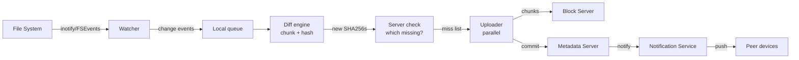
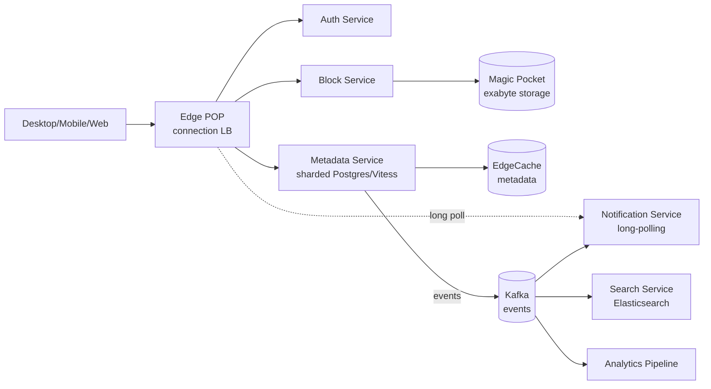

# Вопросы на собеседовании: `Design Dropbox`

`Dropbox` (Google Drive, OneDrive, iCloud Drive) — cloud file sync на 700M+ пользователей, эксабайты данных, миллиарды файлов. Кейс проверяет умение комбинировать chunking, content-addressable storage (CAS), delta sync через rolling hash (rsync), conflict resolution на mobile/desktop, multi-region replication, и собственный block storage уровня S3. Standalone сложный senior-кейс.

## Полезные ссылки

- [Dropbox Tech Blog](https://dropbox.tech/)
- [Magic Pocket — Dropbox exabyte storage (2016)](https://dropbox.tech/infrastructure/magic-pocket-infrastructure)
- [Magic Pocket follow-up (2020+)](https://dropbox.tech/infrastructure/extending-magic-pocket-innovation-with-the-first-petabyte-scale-smr-drive-deployment)
- [The rsync algorithm (Andrew Tridgell, 1996)](https://rsync.samba.org/tech_report/)
- [Content-Addressable Storage (Wikipedia)](https://en.wikipedia.org/wiki/Content-addressable_storage)
- [How Dropbox Sync works (Tech Blog)](https://dropbox.tech/infrastructure/streaming-file-synchronization)
- [System Design Primer](https://github.com/donnemartin/system-design-primer)
- [LSM trees (Cassandra/RocksDB)](https://en.wikipedia.org/wiki/Log-structured_merge-tree)

## Содержание

**Requirements и capacity**
- [Q1. (!) Functional и non-functional requirements?](#q1--functional-и-non-functional-requirements)
- [Q2. (!) Оценка нагрузки и объёмов (700M users, exabyte storage)?](#q2--оценка-нагрузки-и-объёмов-700m-users-exabyte-storage)
- [Q3. SLA и SLO для sync pipeline?](#q3-sla-и-slo-для-sync-pipeline)

**Chunking и storage**
- [Q4. (!) Chunking: фиксированные 4MB vs content-defined (CDC)?](#q4--chunking-фиксированные-4mb-vs-content-defined-cdc)
- [Q5. (!) Как устроено Content-Addressable Storage (CAS): SHA256 → location?](#q5--как-устроено-content-addressable-storage-cas-sha256--location)
- [Q6. Зачем разделять metadata и blob (Postgres + Magic Pocket)?](#q6-зачем-разделять-metadata-и-blob-postgres--magic-pocket)
- [Q7. (!) Magic Pocket — зачем Dropbox своё exabyte-хранилище?](#q7--magic-pocket--зачем-dropbox-своё-exabyte-хранилище)
- [Q8. Сжатие перед upload (LZ4 vs Zstandard)?](#q8-сжатие-перед-upload-lz4-vs-zstandard)

**Sync engine**
- [Q9. (!) Delta sync — как работает алгоритм rsync (rolling + strong hash)?](#q9--delta-sync--как-работает-алгоритм-rsync-rolling--strong-hash)
- [Q10. (!) Архитектура sync engine (watcher → diff → upload → notify)?](#q10--архитектура-sync-engine-watcher--diff--upload--notify)
- [Q11. События файловой системы (inotify / FSEvents / ReadDirectoryChangesW)?](#q11-события-файловой-системы-inotify--fsevents--readdirectorychangesw)
- [Q12. Офлайн-режим и локальный LSM-журнал?](#q12-офлайн-режим-и-локальный-lsm-журнал)
- [Q13. (!) Сервис уведомлений (long-polling vs WebSocket)?](#q13--сервис-уведомлений-long-polling-vs-websocket)
- [Q14. Selective sync и Smart Sync (ленивая загрузка)?](#q14-selective-sync-и-smart-sync-ленивая-загрузка)

**Conflict и versioning**
- [Q15. (!) Разрешение конфликтов при concurrent edits?](#q15--разрешение-конфликтов-при-concurrent-edits)
- [Q16. Версионирование (30-day history, point-in-time restore)?](#q16-версионирование-30-day-history-point-in-time-restore)
- [Q17. Корзина и retention (30-day soft delete)?](#q17-корзина-и-retention-30-day-soft-delete)

**Архитектура**
- [Q18. (!) Архитектура верхнего уровня (block + metadata + notification)?](#q18--архитектура-верхнего-уровня-block--metadata--notification)
- [Q19. (!) Мульти-регион (data residency EU, репликация)?](#q19--мульти-регион-data-residency-eu-репликация)
- [Q20. Аварийное восстановление (cross-region + erasure coding)?](#q20-аварийное-восстановление-cross-region--erasure-coding)

**Features**
- [Q21. Модель шаринга (folders, links, ACL)?](#q21-модель-шаринга-folders-links-acl)
- [Q22. Поиск (Elasticsearch по metadata + извлечение контента, OCR)?](#q22-поиск-elasticsearch-по-metadata--извлечение-контента-ocr)
- [Q23. Загрузка с мобильных (camera roll, battery-aware)?](#q23-загрузка-с-мобильных-camera-roll-battery-aware)

**Безопасность**
- [Q24. (!) Шифрование at rest и in transit?](#q24--шифрование-at-rest-и-in-transit)
- [Q25. Сквозное шифрование (E2EE) — ограничения?](#q25-сквозное-шифрование-e2ee--ограничения)
- [Q26. Защита от злоупотреблений (DMCA, malware scanning)?](#q26-защита-от-злоупотреблений-dmca-malware-scanning)

**Production**
- [Q27. (!) Обязательные метрики мониторинга?](#q27--обязательные-метрики-мониторинга)
- [Q28. Квоты и throttling на пользователя?](#q28-квоты-и-throttling-на-пользователя)
- [Q29. (!) Оптимизация стоимости (Magic Pocket vs S3, dedup)?](#q29--оптимизация-стоимости-magic-pocket-vs-s3-dedup)
- [Q30. (!) Антипаттерны и подводные камни?](#q30--антипаттерны-и-подводные-камни)

## Q1. (!) Functional и non-functional requirements?

Прежде чем рисовать архитектуру, фиксируем границы задачи: что система обязана уметь (функциональные требования) и под какую нагрузку/качество она проектируется (нефункциональные). Без этого дизайн уходит в абстракцию.

**Функциональные:**
- Загрузка / скачивание файлов любого размера.
- Синхронизация между N устройствами (desktop, mobile, web).
- Шаринг (папки, ссылки с правами read/edit).
- Версионирование + восстановление прежних версий.
- Офлайн-доступ — локальный кэш.
- Selective sync — выбрать, что скачивать.
- Корзина + хранение 30 дней.
- Поиск по метаданным + содержимому файлов.

**Нефункциональные:**
- Пользователи: 700M+ (Dropbox 2024).
- Файлы: 1B+ загрузок ежедневно.
- Хранилище: эксабайты (Magic Pocket > 1 EB с 2016).
- Лаг синхронизации: p95 < 5 сек (мелкие изменения файлов).
- Throughput загрузки: зависит от сети, батчевые чанки.
- Доступность: 99.99%.
- Надёжность хранения: 99.999999999% (11 девяток, как у S3).
- Мульти-регион: EU data residency (GDPR), US, APAC.
- Шифрование: at-rest + in-transit обязательно.

**Что исключаем из scope (типично):**
- Совместное редактирование в реальном времени (Google Docs / Paper — отдельный продукт).
- Транскодирование видео (в Dropbox это расширение, не ядро).
- Голосовой чат / мессенджер.

**Рекомендация:** senior отличается тем, что сразу проговаривает дедупликацию как первоклассную фичу, а не как оптимизацию «потом». Dropbox экономит 80%+ хранилища на дубликатах через CAS — это решение влияет на всю архитектуру (chunking, формат хранения, протокол загрузки), поэтому его проговаривают в самом начале.

## Q2. (!) Оценка нагрузки и объёмов (700M users, exabyte storage)?

Цель прикидки — понять, что доминирует в стоимости и где узкое место. Для Dropbox ответ заранее известен: хранилище. Поэтому считаем сначала объём данных, и только потом — bandwidth и QPS, которые из него вытекают.

**Исходные допущения:**

| Параметр | Значение |
|---|---|
| Всего пользователей | 700M |
| Активных пользователей | ~200M MAU |
| Среднее хранилище на пользователя | 5 GB (микс free 2 GB + платные планы) |
| Всего сырого хранилища | 3.5 EB raw |
| Коэффициент дедупликации | 80% (industry estimate) |
| После дедупликации | ~700 PB уникальных блоков |
| Темп загрузки | 1B+ файлов/день |

**Расчёт хранилища:**
- Без дедупликации: 700M × 5 GB = 3.5 EB.
- С дедупликацией (популярные расшаренные файлы) → 700 PB уникальных чанков.
- × 3 фактор erasure coding → 2.1 EB физических (Magic Pocket).

**Метаданные:**
- Запись о файле: ~500 B (путь + размер + список чанков + права).
- 1B файлов × 500 B = 500 GB метаданных.
- + история (30-дневные версии) ×10 = 5 TB.

**Полоса (bandwidth):**
- Загрузка: 1B файлов/день × в среднем 1 MB = 1 PB/день = ~12 GB/сек устойчиво.
- Скачивание (промах Smart Sync): ~10× от загрузки = 120 GB/сек.
- Пик (рабочий день, пересечение 9-17 US/EU) ×3 = 360 GB/сек.

**QPS на metadata DB:**
- 200M MAU × 100 операций/день = 20B операций/день ≈ 230K операций/сек.
- Пик ×5 = ~1M операций/сек — одна Postgres-нода столько не вытянет, нужен sharded Postgres / Vitess (шардирование по user_id).

**Вывод по capacity:** хранилище доминирует в стоимости — отсюда вся остальная архитектура. Дедупликация критична: без неё счёт за хранилище вырастает в 5×, поэтому CAS — не опция, а фундамент. Собственный Magic Pocket вместо S3 даёт ещё ~30-50% экономии (Q7).

## Q3. SLA и SLO для sync pipeline?

Главная воспринимаемая метрика для пользователя — лаг синхронизации: сохранил файл на одном устройстве, через сколько секунд он появился на другом. Всё остальное (доступность, надёжность) — гигиена, без которой продукту не доверят свои файлы. SLO задают конкретные цифры и пороги алертов на эти свойства.

| Метрика | Цель | Alert |
|---|---|---|
| `sync_lag_seconds_p95` | < 5 сек (мелкие файлы) | > 30 сек 10 минут |
| `upload_success_rate` | > 99% | < 97% 5 минут |
| `download_latency_p99` | < 200 ms (из кэша) | > 1 сек |
| `metadata_query_p99` | < 50 ms | > 200 ms |
| `dedup_ratio` | > 80% | < 60% (падение эффективности) |
| `availability` | 99.99% | < 99.9% за месяц |
| `durability` | 99.999999999% (11 девяток) | событие потери данных |

**Сценарии отказов:**
- Network partition: очередь синхронизации растёт; возобновление при reconnect.
- Падение metadata DB: клиент буферизует изменения в локальном журнале (Q12).
- Падение block storage: чтение через реплику, запись с retries.

## Q4. (!) Chunking: фиксированные 4MB vs content-defined (CDC)?

Файлы режут на чанки фиксированного размера (просто) или по содержимому через rolling hash — CDC (устойчиво к вставкам). Ключевое различие в том, как ведут себя границы чанков при вставке байта в начало файла: у фиксированного chunking сдвигаются все границы, у CDC — только локально вокруг изменения.

**Зачем вообще chunking:**
- Большой файл (1 GB) нельзя загрузить одним куском: долгая блокировка, а при обрыве сети дорогой retry заливает всё заново.
- Дедупликация работает на уровне чанков: если два файла отличаются на 1%, по сети уходит только этот 1%, а не весь файл.

**Фиксированный размер чанков (4 MB):**
- Режем файл на блоки по 4 MB начиная с offset 0.
- Плюсы: просто, предсказуемо.
- Минусы: **проблема вставки** — добавил байт в начало → все чанки сдвинулись → 100% повторная загрузка вместо diff.

**Content-Defined Chunking (CDC):**
- Используем **rolling hash** (Rabin fingerprint, Buzhash, Gear, FastCDC).
- На каждой позиции вычисляем hash скользящего окна (например 48 байт).
- Граница чанка = когда hash mod N == 0 (чанк завершается).
- Граница зависит от содержимого, а не от offset.

**Свойства CDC:**
- Вставка в начало → меняется только первый чанк; границы остальных те же (rolling hash их восстанавливает).
- Средний размер чанка ~4 MB (настраивается через mod N).
- Ограничения min/max размера (1-16 MB) против вырождения.

**Пример rolling hash (Buzhash):**
```
hash(i) = (hash(i-1) >> 1) ^ T[byte_at(i + window_size)]
```
- O(1) обновление на каждый сдвинутый байт.

**Реальность Dropbox:**
- Исторически — фиксированные чанки 4 MB (простота важнее на старте).
- Современные системы хранения (Restic, BorgBackup) выбирают CDC через Buzhash.

**Компромисс:** фиксированный chunking проще в реализации, CDC даёт лучшую дедупликацию ценой вычисления rolling hash на каждом байте.

**Гибрид:** разумно комбинировать — фиксированный chunking там, где вставки в середину редки, и CDC для blob-файлов, где проблема вставки критична (документы, в которые постоянно дописывают).

## Q5. (!) Как устроено Content-Addressable Storage (CAS): SHA256 → location?

CAS — это хранилище, где адрес блока вычисляется из его содержимого (ключ = SHA256(данных)), а не назначается произвольно. Одно это свойство бесплатно даёт дедупликацию, проверку целостности и неизменяемость — то есть три фундамента системы Dropbox сразу.

**Идея:** ключ = hash(содержимого), а не произвольный ID.

```
chunk = bytes (4 MB)
sha256_hex = SHA256(chunk)  // 32 bytes = 64 hex chars
storage_key = sha256_hex
storage.put(sha256_hex, chunk)
```

**Свойства:**

**1. Бесплатная дедупликация:**
- Два юзера загружают один и тот же файл → одинаковый SHA256 → одна запись в хранилище.
- При commit метаданные просто ссылаются на существующий чанк.
- Экономия 80%+ на популярных файлах (шаблоны Microsoft Office, иконки, PDF-книги).

**2. Проверка целостности:**
- При чтении: hash(скачанного) == storage_key? Да → целостность в порядке.
- Bit rot обнаруживается сразу.

**3. Неизменяемость:**
- Коллизия хэшей = одинаковое содержимое (для SHA256 криптографически невозможна).
- Изменение содержимого = новый хэш = новая запись. Старые чанки никогда не модифицируются.

**4. Сборка мусора:**
- Когда нет ссылок → можно безопасно удалить (отслеживание refcount).

**Схема:**
```sql
CREATE TABLE blocks (
  sha256 CHAR(64) PRIMARY KEY,
  size INT,
  location_id BIGINT,
  refcount INT,
  created_at TIMESTAMP
);

CREATE TABLE file_chunks (
  file_id BIGINT,
  chunk_idx INT,
  sha256 CHAR(64) REFERENCES blocks(sha256),
  PRIMARY KEY (file_id, chunk_idx)
);
```

**Поток загрузки** (здесь и видна экономия — клиент шлёт только хэши, а не данные):
1. Клиент режет файл на чанки (Q4).
2. Вычисляет SHA256 каждого чанка.
3. Отправляет на сервер список SHA256 — по сути спрашивает «какие из них у тебя уже есть?».
4. Сервер сверяет с таблицей `blocks` и возвращает список недостающих.
5. Клиент загружает только недостающие чанки (всё, что сервер уже видел у других пользователей, по сети не идёт).
6. Сервер обновляет метаданные: `file F = [sha1, sha2, sha3, ...]`.

**Где применяется:** внутри Dropbox, в Git (каталог `objects`), в IPFS, в бэкап-инструменте Restic — везде, где важна дедупликация и проверка целостности.

**Граничный случай:** коллизия SHA256 (два разных блока с одинаковым хэшем) теоретически требует ~2^256 попыток и на практике не наблюдалась ни разу. Поэтому равенство хэшей считают равенством содержимого.

## Q6. Зачем разделять metadata и blob (Postgres + Magic Pocket)?

Метаданные (пути, права, ссылки на чанки) и сами байты файлов хранят в разных системах, потому что у них противоположные паттерны доступа: метаданные — это мелкий горячий OLTP, блобы — большие холодные последовательные чтения/записи. Запихнуть их в одну БД значит платить за SSD-скорость даже там, где она не нужна.

**Двухуровневое хранилище:**

**Уровень метаданных (Postgres / Vitess, шардированный):**
- Путь к файлу, имя, размер, modified_at, владелец, права, ссылки на чанки.
- История версий (ограниченного объёма).
- Расшаренные ссылки, ACL.
- Шардирование по user_id.

**Уровень блобов (Magic Pocket):**
- Само содержимое файлов (чанки).
- Append-only, неизменяемое.
- Дёшево за гигабайт ($/GB в месяц).

**Зачем разделять:**
- Разные паттерны доступа: метаданные = OLTP с интенсивными чтениями/записями, блобы = последовательные bulk-операции.
- Разные типы хранилищ: метаданные на SSD ($$$), блобы на HDD/SMR ($).
- Независимое масштабирование.

**Объём:**
- Метаданные: 5-10 TB всего (шардированы по 100 PG-нодам).
- Блобы: 700 PB (Magic Pocket).
- Соотношение: 1:70 000.

**Слой кэширования:**
- EdgeCache (типа memcached) для горячих метаданных.
- 95%+ запросов к метаданным обслуживается из кэша.

**Согласованность между уровнями.** Порядок строгий: сначала грузим блоб, и только после подтверждения коммитим метаданные. Так метаданные никогда не ссылаются на чанк, которого нет в хранилище. Обратная ситуация (блоб загружен, но коммит метаданных упал) безопасна: на такой блоб никто не ссылается, refcount = 0, и его подберёт мусорщик через N дней.

**Аналогия:** это та же модель, что в Git — `objects/` хранит неизменяемые блобы по хэшу, а `refs/` — лёгкие указатели метаданных на них.

## Q7. (!) Magic Pocket — зачем Dropbox своё exabyte-хранилище?

Magic Pocket — собственное эксабайтное blob-хранилище Dropbox, на которое компания ушла с AWS S3 в 2015-2016. Это редкий случай, когда строить своё дешевле, чем арендовать у облака: на эксабайтном масштабе экономия от контроля над железом и erasure coding перевешивает огромную стоимость разработки.

**Контекст:** до 2015 Dropbox хранил всё в AWS S3, и счёт рос линейно с объёмом данных.

**Зачем собственное хранилище:**
- Стоимость AWS S3 на эксабайтном масштабе = $1B+/год — на таких числах своя инфраструктура окупается.
- Magic Pocket снизил стоимость на 75% (открытые цифры Dropbox).
- Полный контроль над tiering, erasure coding и выбором железа (SMR-диски) — то, чего S3 не даёт.

**Архитектура Magic Pocket:**

```
Cell (rack) → Zone (multiple racks) → Region (multiple zones)
```

**Компоненты:**
- **Storage nodes:** кастомное железо с SMR-дисками (Shingled Magnetic Recording — плотнее, чуть медленнее seek).
- **OSD (Object Storage Daemon):** хранит сырые байты.
- **Pocket Master:** сервер метаданных для cell.
- **Volume Manager:** координирует erasure coding.
- **Garbage Collector:** освобождает удалённые блоки.

**Erasure coding** — как достигается надёжность дешевле, чем тройной репликацией:
- Reed-Solomon (10, 4): блок бьётся на 10 data shards, к ним считаются 4 parity → можно потерять любые 4 shard из 14 и всё ещё восстановить данные.
- Накладные расходы хранилища 1.4× против 3× при полной репликации — то есть та же надёжность за половину места.
- **Компромисс:** при отказе диска восстановление идёт медленнее (нужно прочитать 10 shard и пересчитать утраченный), тогда как репликация просто копирует готовую копию.

**Раскладка данных:**
- Чанк файла → разбивается на 10 shards → вычисляются 4 parity shards.
- 14 shards распределяются по 14 разным cells.
- Чтение: достаточно любых 10 из 14.

**Tiering:**
- Hot tier: SSD для недавно загруженного (последние 30 дней).
- Warm tier: HDD для того, что читают раз в неделю.
- Cold tier: SMR-диски для архива.

**Инновации:**
- SMR-диски с кастомной прошивкой (host-managed SMR).
- Кастомная сеть 100 Gbps между cells.
- Координация ремонта на петабайтном масштабе.

**Сравнимые системы** (если на собеседовании просят аналоги): Facebook f4 (BLOB storage), Backblaze Vaults, Google Colossus — все решают ту же задачу дешёвого надёжного blob-хранилища через erasure coding.

## Q8. Сжатие перед upload (LZ4 vs Zstandard)?

Сжатие делают на клиенте перед загрузкой — это экономит и полосу, и место в хранилище одновременно. Выбор кодека — компромисс между степенью сжатия и скоростью: для интерактивной синхронизации важнее не тормозить, поэтому Dropbox выбрал Zstandard как лучший баланс.

**Кодеки** (степень — во сколько раз сжимает типичные данные):

| Кодек | Степень | Скорость (encode) | CPU | Применение |
|---|---|---|---|---|
| LZ4 | 2.1× | 500 MB/s | низкая | реальное время, low-latency |
| Snappy | 2.0× | 250 MB/s | низкая | внутри Google |
| Zstandard | 2.8× | 400 MB/s | средняя | сбалансированный (современный дефолт) |
| gzip | 2.9× | 50 MB/s | высокая | legacy, медленный |
| Brotli | 3.5× | 30 MB/s | высокая | веб-ресурсы (статика) |
| LZMA / xz | 4.0× | 5 MB/s | очень высокая | архив |

**Выбор Dropbox:**
- Zstandard (с ~2018) — лучший баланс.
- Дёшев на декодировании (decode 800 MB/s) — латентность чтения не страдает.
- Encode 400 MB/s — приемлемо на клиентском desktop / mobile.

**Уже сжатые файлы.** JPEG, PNG, MP4, ZIP, PDF уже сжаты внутри — пытаться сжать их снова бессмысленно (CPU потратится, размер не упадёт, иногда даже вырастет). Поэтому тип определяют по magic bytes или MIME и для таких файлов сжатие пропускают.

**Сжатие до vs после чанкинга — важный порядок, легко ошибиться.** Если сжать весь файл целиком, а потом резать, дедупликация ломается: одинаковые исходные данные после сжатия дают разные байты (сжатие чувствительно к контексту), и CAS их уже не распознаёт как дубликаты. Поэтому Dropbox делает наоборот — сначала режет на чанки, потом сжимает каждый чанк независимо. Так одинаковые чанки остаются побайтово одинаковыми и дедуплицируются.

**Словарь сжатия на чанк:**
- Zstandard поддерживает кастомный словарь, обученный на типичных типах данных.
- Office-файлы, PDF — выигрыш доп. 10-20% сжатия.

## Q9. (!) Delta sync — как работает алгоритм rsync (rolling + strong hash)?

Delta sync передаёт только изменившиеся байты файла, а не файл целиком. Алгоритм rsync делает это, даже не имея доступа к старой версии на отправителе: получатель ищет в своём новом файле блоки, которые уже есть у отправителя, через комбинацию быстрого rolling hash (грубый фильтр) и медленного strong hash (точная проверка).

**Сценарий:** пользователь меняет 1 KB в файле на 1 GB — надо передать ~1 KB, а не 1 GB.

**Почему недостаточно простого chunking.** Фиксированные чанки 4 MB уменьшают проблему, но не решают: правка 1 KB всё равно делает «грязным» весь 4 MB-чанк, и он перезаливается целиком. Это в 4000× меньше файла, но 4 MB ради 1 KB — всё ещё расточительно. rsync доводит дельту до размера самой правки.

**Алгоритм rsync (Andrew Tridgell, 1996):**

**Отправитель (со старым файлом):**
1. Режет старый файл на блоки размера `B` (~700 байт).
2. На каждый блок вычисляет: rolling hash (быстрый) + strong hash (MD5/SHA1).
3. Отправляет получателю словарь `{strong_hash → block_index}`.

**Получатель (с новым файлом):**
1. Вычисляет rolling hash в скользящем окне ширины `B` начиная с offset 0.
2. На каждой позиции: проверяет, есть ли rolling hash в словаре.
3. Если попадание: верифицирует strong hash (защита от коллизии rolling hash).
4. Если совпало: выдаёт ссылку "use block N"; перепрыгивает на B байт.
5. Если промах: выдаёт сырой байт; сдвигает окно на 1 байт.

**На выходе:** список ссылок + сырые байты.

**Rolling hash (упрощённый Adler-32):**
```
hash(i+1) = hash(i) - byte_at(i) + byte_at(i + B)
```
- O(1) обновление на сдвинутый байт → O(file_size) суммарно.

**Свойства:**
- Вставка в начало: только маленькая дельта (байт спереди + ссылка на остальное).
- Правка в середине: маленькая дельта вокруг правки + ссылки на неизменённое.
- Дозапись: передаются только новые байты.

**Реалистичный выигрыш:**
- Office-файл 10 MB, правка 1 абзаца → загрузка ~30 KB дельты вместо полной перезаливки.
- Видеофайл 1 GB, правка метаданных → аналогично — изменился только блок метаданных.

**Реализация Dropbox.** Dropbox не гоняет классический rsync по сети на каждое сохранение, а добивается того же эффекта иначе: streaming sync определяет границы чанков через CDC (Q4), а дедупликация на уровне блоков через CAS (Q5) означает, что неизменившиеся чанки уже лежат на сервере и не передаются. По сути та же rsync-идея «передаём только новое», но реализованная через content-addressing вместо обмена хэш-словарями.

## Q10. (!) Архитектура sync engine (watcher → diff → upload → notify)?



Sync engine — это конвейер на клиенте, который превращает «пользователь сохранил файл» в «файл появился на всех устройствах». Поток линейный: ОС сообщает об изменении → diff engine считает, что именно изменилось → uploader заливает только новые чанки → сервер коммитит метаданные и шлёт push остальным устройствам. Каждый компонент решает одну задачу, а локальная очередь делает весь конвейер устойчивым к падениям.

**Компоненты:**

**1. File watcher:**
- Слушает события файловой системы ОС (Q11).
- Батчит быстрые изменения (debounce 100 ms).

**2. Локальная очередь (SQLite):**
- Незавершённые загрузки сохраняются локально.
- Переживает падения / рестарты.

**3. Diff engine:**
- Для каждого изменённого файла:
  - Перерезает на чанки (Q4).
  - Вычисляет SHA256 каждого чанка.
  - Сравнивает с последним известным состоянием (серверный манифест).
- На выходе: список новых/изменённых чанков.

**4. Проверка на сервере:**
- Отправляем список SHA256.
- Сервер: какие уже есть? Возвращает список недостающих.
- Избегаем повторной загрузки дубликатов (экономим полосу).

**5. Uploader:**
- Параллельная загрузка (10-50 одновременных соединений).
- Мультиплексирование HTTP/2.
- Возобновление при частичном сбое.

**6. Commit метаданных:**
- После загрузки всех чанков → commit метаданных.
- "File F теперь указывает на чанки [s1, s2, s3]".

**7. Уведомление:**
- Другие устройства получают push-уведомление.
- Они скачивают новые чанки (лениво или сразу — зависит от настройки Smart Sync).

**Бюджет латентности:**
- Обнаружение: 10-100 ms (inotify).
- Чанкинг + хэш: 100 ms - 1 сек (упирается в CPU).
- Загрузка: зависит от размера файла и сети.
- Commit на сервере: 50 ms.
- Push на устройства-пиры: 100 ms - 1 сек (уведомление в реальном времени).
- Итого для мелкого файла: ~1-2 сек до синхронизации с другим устройством.

## Q11. События файловой системы (inotify / FSEvents / ReadDirectoryChangesW)?

Чтобы не сканировать папку постоянно, клиент подписывается на события файловой системы у самой ОС. Проблема в том, что у каждой ОС свой API с разной гранулярностью и лимитами, поэтому клиент Dropbox прячет их за единым кросс-платформенным слоем.

**API событий по ОС:**

| ОС | API | Гранулярность | Лимиты |
|---|---|---|---|
| Linux | inotify | события на файл | `fs.inotify.max_user_watches` (дефолт 8K) |
| macOS | FSEvents | события на каталог (грубее) | без лимита, батчевые |
| Windows | ReadDirectoryChangesW | события на файл | на handle |

**inotify (Linux):**
- События: IN_CREATE, IN_MODIFY, IN_DELETE, IN_MOVED_FROM, IN_MOVED_TO.
- Нужно рекурсивно навешивать watch на подкаталоги.
- Лимит: `/proc/sys/fs/inotify/max_user_watches` — увеличить до 1M для большой папки Dropbox.

**FSEvents (macOS):**
- Высокоуровневое: "этот каталог изменился". Не точное событие.
- Латентность 1-5 сек, батчево.
- Stream API через `FSEventStreamCreate`.

**ReadDirectoryChangesW (Windows):**
- Overlapped I/O, асинхронный callback.
- Отслеживает создание, изменение, переименование, смену атрибутов файла.

**Граничные случаи** (где наивная обработка событий ломается):
- Атомарное сохранение в текстовых редакторах (запись во временный файл + rename поверх оригинала) даёт два события — CREATE временного и RENAME. Sync engine должен распознать это как модификацию одного файла, а не как создание нового.
- Массовый импорт (10K файлов) поднимает лавину событий — их надо батчить и дедуплицировать, иначе захлебнётся очередь.
- Отключение внешнего (USB) диска инвалидирует watchers — нужно переустанавливать их при reconnect.

**Кросс-платформенная абстракция.** Клиент Dropbox оборачивает все три API в собственный слой watch, который на выходе даёт один унифицированный поток событий для diff engine — остальной код не знает, на какой ОС он работает.

## Q12. Офлайн-режим и локальный LSM-журнал?

Офлайн-режим строится на локальном журнале незавершённых операций: пока сети нет, клиент пишет изменения в персистентную очередь на диске, а при подключении проигрывает её на сервер. Ключевые требования — журнал должен пережить перезагрузку, а операции быть идемпотентными, чтобы повторная отправка после обрыва не дублировала данные.

**Сценарий:** пользователь меняет файлы офлайн (в самолёте), потом подключается — изменения должны синхронизироваться без потерь.

**Локальный журнал (SQLite или LSM):**
- Очередь незавершённых изменений — упорядоченный список операций.
- Переживает падения и перезагрузки (лежит на диске, не в памяти).
- Операции идемпотентны — повтор после сбоя безопасен.

**Операции в очереди:**
- Создать файл F (путь, чанки).
- Обновить файл F.
- Удалить файл F.
- Переименовать A → B.

**Схема (SQLite):**
```sql
CREATE TABLE pending_ops (
  id INTEGER PRIMARY KEY AUTOINCREMENT,
  op_type TEXT,
  file_path TEXT,
  chunk_list TEXT,  -- JSON array
  created_at INTEGER,
  retry_count INT DEFAULT 0
);
```

**Поток возобновления при reconnect:**
1. Забираем состояние сервера (начиная с last_sync_token).
2. Сравниваем локальный журнал с изменениями сервера:
   a. Только локальные → загрузка.
   b. Только серверные → скачивание.
   c. Оба изменили один файл → конфликт (Q15).
3. Применяем по порядку: локальные создания → загрузки → серверные обновления → локальные удаления.

**Граничные случаи:**
- Долгий офлайн (месяцы) раздувает журнал — синхронизируем батчами по приоритету, начиная с недавно изменённых файлов (их пользователь ждёт первыми).
- Локальный диск заполнен — отклоняем новые записи и явно предупреждаем пользователя, а не теряем изменения молча.

**Аналогия:** это локальный commit log как в Git — изменения накапливаются локально и «пушатся» на сервер при reconnect.

## Q13. (!) Сервис уведомлений (long-polling vs WebSocket)?

Задача — доставить устройству B сигнал «файл изменился на A» за 1-5 секунд. Наивный polling здесь не работает: на 200M пользователей он генерирует миллионы бессмысленных запросов в секунду. Решение — держать соединение открытым (long-polling/WebSocket) и слать push только при реальном изменении.

**Цель:** когда пользователь меняет файл на устройстве A, устройство B узнаёт об этом за 1-5 сек.

**Подходы (от плохого к хорошему):**

**Polling (наивный):**
- Клиент каждые 30 сек дёргает `GET /changes?since=T`.
- Проблема масштаба: 200M MAU × 2 опроса/мин = 400M запросов/мин ≈ 7M QPS только на опрос.
- Хуже всего, что почти все эти запросы впустую — в большинстве случаев изменений нет.

**Long-polling:**
- Клиент шлёт `GET /changes?since=T`, но сервер не отвечает сразу, а удерживает запрос.
- Держит 30-60 сек; как только появилось изменение — отвечает немедленно, иначе по таймауту возвращает «пусто» и клиент переоткрывает.
- Резко снижает QPS (нет холостых опросов), ценой долго висящих соединений.

**WebSocket / Server-Sent Events:**
- Постоянное соединение, по которому сервер сам пушит события.
- Латентность меньше секунды — лучший вариант по скорости.
- **Минус:** надо держать миллионы открытых соединений, и это память/файловые дескрипторы на серверах.

**Реализация Dropbox.** Исторически — long-polling в Notification Service (проще масштабировать, дружелюбнее к промежуточным прокси), плюс гибрид с WebSocket для desktop-приложений, где постоянное соединение оправдано.

**Масштабирование:**
- 200M MAU одновременных соединений.
- Каждое соединение держится в среднем 60 сек → 200M / 60s × 1 conn = непрерывная нагрузка.
- Распределяем по тысячам notification-серверов (шардирование по user_id).
- Каждый notification-сервер держит ~50K-100K соединений.

**Push на мобильные:**
- FCM (Firebase Cloud Messaging) для Android.
- APNs (Apple Push Notification) для iOS.
- Держать соединение не нужно — доставку берёт на себя ОС.

**Payload пуша — намеренно минимальный:** `{ "user_id": ..., "since_cursor": ... }`. Уведомление несёт не данные, а лишь сигнал «у тебя есть изменения, начни тянуть с этого курсора». Получатель сам подтягивает детали отдельным запросом — так пуш остаётся дешёвым и не зависит от размера изменения.

## Q14. Selective sync и Smart Sync (ленивая загрузка)?

Обе фичи решают одну проблему: облако пользователя больше его диска, и тащить всё локально нельзя. Различие в подходе. Selective sync — грубый: пользователь вручную выбирает папки для скачивания, остальные локально не видны вовсе. Smart Sync — умный: видны все файлы как обычные, но содержимое подтягивается лениво по первому обращению.

**Selective sync (до 2017):**
- Пользователь вручную отмечает, какие папки держать локально.
- Невыбранные папки локально не существуют — доступны только через web/mobile.

**Smart Sync (2017+, Pro-фича):**
- Все файлы видны в файловой системе как обычные — это stub-файлы (метаданные есть, содержимого 0 байт).
- Содержимое скачивается по требованию: открыл файл → оно подтянулось прозрачно.
- Когда диск заполняется, давно не используемые файлы вытесняются обратно в stub (LRU).

**Реализация Smart Sync:**

**Linux / macOS:** виртуальная ФС типа FUSE.

**Windows:** Cloud Files API (Windows 10+) — первоклассная поддержка "online-only" файлов на уровне ОС.

**macOS (современный):** API File Provider Extension.

**Поток stub-файла:**
1. Файл создан на сервере → метаданные синхронизируются на все клиенты.
2. Локальная ОС показывает stub (видны имя, размер, дата изменения — но 0 байт на диске).
3. Пользователь делает двойной клик → Smart Sync подтягивает реальное содержимое с сервера.
4. После N дней без обращений → фоновое вытеснение (обратно в stub).

**Поведение:**
- "Always available" — закреплённые файлы никогда не вытесняются.
- "Online-only" — никогда не хранятся локально.
- Авто: LRU-вытеснение, когда свободного места < порога.

**Оптимизация полосы:**
- Предзагрузка вероятных файлов (на основе паттернов доступа).
- Фоновое скачивание при простое сети.

## Q15. (!) Разрешение конфликтов при concurrent edits?

Конфликт возникает, когда два устройства правят один файл, не видя правок друг друга, и обе версии приходят на сервер. Главный принцип Dropbox для бинарных файлов — никогда молча не терять данные: вместо слияния (которое для .docx/.pdf невозможно) система сохраняет обе версии и оставляет выбор пользователю.

**Сценарий:** Alice правит `report.docx` на ноутбуке офлайн, Bob правит тот же `report.docx` на телефоне. Оба синхронизируются. Что происходит?

**Подходы (от худшего к лучшему по сохранности данных):**

**1. Last-Writer-Wins (LWW):**
- Самый простой. Побеждает тот, чья синхронизация пришла последней.
- Другая версия перезаписывается.
- Минусы: тихая потеря данных.

**2. .conflict-файлы (подход Dropbox):**
- Сохраняем обе версии:
  - `report.docx` (версия Alice, закоммичена первой).
  - `report (Bob's conflicted copy 2026-05-26).docx` (версия Bob).
- Пользователь решает вручную.
- Потери данных нет, но есть неудобство для пользователя.

**3. Векторные часы (как в Git):**
- Каждое устройство ведёт векторные часы на файл.
- Конфликт обнаруживается, когда векторы конкурентны (ни один не предок другого).
- Приложение может смержить или форкнуть.

**4. CRDT (Conflict-Free Replicated Data Types):**
- Для конкретных типов документов (текст, списки).
- Автоматический мерж без участия пользователя.
- Используется в Google Docs, Figma, Notion.
- Dropbox Paper использует Y.js (CRDT-библиотека).

**Реальность Dropbox:**
- Для бинарных файлов (.docx, .pdf): `.conflict`-файлы (вариант 2).
- Для совместных документов (Paper): CRDT.

**Как сервер вообще понимает, что это конфликт** (механика optimistic concurrency):
- У каждого файла есть `parent_revision_id` — ревизия, от которой клиент отталкивался.
- При загрузке клиент присылает `expected_parent_revision` — «я редактировал поверх вот этой версии».
- Сервер сравнивает: `current_revision == expected_parent`?
  - Совпало → значит, никто не вмешался → fast-forward commit, новая ревизия.
  - Не совпало → за это время файл уже изменили → конфликт → создаём .conflict-файл.

**Граничный случай:** три устройства правят одновременно → появятся несколько .conflict-файлов (по одному на каждую разошедшуюся версию), и пользователь разбирает их вручную.

## Q16. Версионирование (30-day history, point-in-time restore)?

Версионирование позволяет вернуться к любой прежней версии файла за N дней — и реализуется почти бесплатно благодаря CAS. Поскольку чанки адресуются по содержимому, новая ревизия ссылается на новые чанки только там, где файл реально изменился; всё неизменное переиспользуется. Хранить историю получается не в ×30 раз дороже, а всего в ~1.5-2×.

**Функциональность:**
- Все версии файла хранятся N дней (30 по умолчанию, 1 год+ на платных планах).
- Пользователь может восстановить любую версию.
- «Rewind» — откат всей папки к состоянию на момент в прошлом.

**Реализация (CAS + история метаданных):**
- Каждая ревизия файла — это новая запись метаданных, указывающая на список чанков (часть из них может быть новой).
- Старые чанки не удаляются, пока на них ссылается хоть одна историческая версия (защищены refcount).
- После истечения срока хранения ссылки исчезают, и чанки подбирает сборка мусора.

**Схема:**
```sql
CREATE TABLE file_revisions (
  file_id BIGINT,
  revision_id BIGINT,
  chunk_list JSONB,
  size BIGINT,
  modified_at TIMESTAMP,
  modified_by BIGINT,
  PRIMARY KEY (file_id, revision_id)
);
```

**Стоимость хранения:**
- Версионирование = ×N хранилища всех файлов.
- Спасает CAS: дублируются только изменённые чанки. Неизменённые чанки общие для всех версий.
- Реалистичные накладные расходы 1.5-2× (vs ×30 дней, если хранить каждый байт).

**Политика хранения:**
- Free / Plus: 30 дней.
- Business: 180 дней.
- Enterprise: без лимита (с поправкой на стоимость).

**Поток восстановления:**
- Пользователь выбирает ревизию → метаданные создают новую "текущую" ревизию = копию старой.
- Другие устройства синхронизируют это как обычное обновление файла.

**Массовое восстановление (Rewind):**
- Проигрываем все изменения до timestamp → получаем снапшот.
- Тяжёлая операция; ограничивается по частоте.

## Q17. Корзина и retention (30-day soft delete)?

Удаление в Dropbox — мягкое: файл не стирается сразу, а помечается флагом `deleted_at` и попадает в Корзину на 30 дней. Это защита от случайного удаления и требований compliance. Физическое освобождение места происходит позже и асинхронно — через refcount и фоновый GC, чтобы удалить чанк только когда на него не ссылается ни одна версия ни одного пользователя.

**Мягкое удаление:**
- Пользователь удаляет файл → он перемещается в Корзину.
- В метаданных выставляется флаг `deleted_at`; данные физически на месте.
- Восстановление — из UI Корзины одним кликом.

**Хранение:**
- 30 дней в Корзине (по умолчанию).
- Через 30 дней → окончательное удаление.
- "Очистить корзину" позволяет вычистить сразу.

**Фоновый GC (двухфазный — не удаляем сразу):**
- Ежедневная задача находит файлы с `deleted_at < NOW - 30 days`.
- Для их чанков уменьшает refcount.
- Чанк удаляется из хранилища только когда refcount дошёл до 0 — то есть на него не ссылается ни одна версия ни одного пользователя (иначе удаление повредило бы чужие файлы из-за дедупликации).
- Само физическое удаление идёт недельным батчем, чтобы не создавать горячую нагрузку на хранилище.

**Схема:**
```sql
ALTER TABLE files ADD COLUMN deleted_at TIMESTAMP;
CREATE INDEX idx_deleted ON files (deleted_at) WHERE deleted_at IS NOT NULL;
```

**Граничные случаи:**
- Файл восстановлен из Корзины → флаг `deleted_at` сброшен, возобновляется обычный поток синхронизации.
- Что с расшаренной ссылкой на удалённый файл? Ломается — мягко удалённые файлы по share недоступны.

**Требования compliance:**
- GDPR right-to-erasure: отдельный endpoint полной очистки, который минует 30-дневное хранение (данные стираются сразу по требованию пользователя).
- Флаг legal hold, наоборот, блокирует удаление — для сценариев судебных разбирательств, где данные нельзя терять.

## Q18. (!) Архитектура верхнего уровня (block + metadata + notification)?



В основе — разделение на три независимых тракта: метаданные (Metadata Service), сами байты (Block Service → Magic Pocket) и оповещения об изменениях (Notification Service). Клиент ходит в каждый отдельно, а Kafka как шина событий связывает запись в метаданные с побочными эффектами — индексацией поиска, аналитикой и рассылкой уведомлений — не блокируя основной путь загрузки.

**Сервисы:**

**Edge POP:**
- Географические точки входа (US-East, US-West, EU, APAC, India).
- Терминация TLS.
- Пулинг соединений.

**Auth Service:**
- OAuth-токены, управление сессиями.
- Проверка 2FA.

**Metadata Service:**
- Иерархия файлов, ACL, версии.
- Шардированный Postgres или Vitess.
- Партиция на пользователя.

**Block Service:**
- API к Magic Pocket.
- Загрузка / скачивание чанков.
- Управление refcount.
- Координация сборки мусора.

**Notification Service:**
- Соединения long-polling (или WebSocket).
- Push-события на подключённые устройства.

**Search:**
- Индекс Elasticsearch по метаданным.
- Извлечение содержимого файлов (PDF, Word) → индексируемый текст.

**Kafka:**
- Шина событий: file_created, file_modified, file_deleted, sharing_changed.
- Консьюмеры: индексатор поиска, аналитика, диспетчер уведомлений.

**Мульти-регион:**
- Каждый регион — полный стек.
- Межрегиональная асинхронная репликация для HA + data residency.

## Q19. (!) Мульти-регион (data residency EU, репликация)?

Мульти-регион нужен по трём причинам сразу: латентность (близкий датацентр), data residency (GDPR требует, чтобы данные EU-клиентов не покидали EU) и устойчивость к региональному сбою. Ключевое архитектурное решение — метаданные реплицируются между регионами асинхронно, а блобы привязаны к домашнему региону пользователя и между регионами не копируются (на эксабайтах это слишком дорого).

**Драйверы:**
- Латентность: EU-пользователь → EU-датацентр < 50 ms.
- GDPR: данные EU-клиентов должны оставаться в EU.
- DR: региональный сбой → автоматический failover.

**Архитектура:**
- US-East-1 (Virginia) — основной US.
- EU-West-1 (Ireland) — основной EU.
- AP-Northeast-1 (Tokyo) — основной APAC.
- ap-south-1 (Mumbai) — Индия.

**На регион:**
- Полный Metadata Service.
- Локальные cells Magic Pocket.
- Notification Service.

**Межрегиональная репликация:**
- Метаданные: асинхронная репликация (лаг 5-30 сек).
- Блобы: на регион (без авто-репликации между регионами; контент пользователя остаётся в домашнем регионе).

**Маршрутизация:**
- Пользователь привязан к домашнему региону по стране регистрации.
- Edge POP-ы закрывают латентность для просмотра.

**Межрегиональный шаринг:**
- US-пользователь делится папкой с EU-пользователем → EU-пользователь получает доступ; блоб тянется межрегионально при первом обращении, далее кэшируется локально.
- Добавляет латентность при первом чтении.

**Data residency:**
- EU-пользователи — блобы и метаданные строго в EU (DC Frankfurt / Dublin).
- Китаю нужен отдельный стек (compliance) — Dropbox исключён с китайского рынка.

**Failover.** Регион упал → DNS переключает трафик на соседний. Чтения метаданных продолжаются с асинхронной реплики, а вот записи приостанавливаются до восстановления primary — это сознательный выбор CP-модели для записей: лучше временно запретить запись, чем допустить расхождение данных между регионами.

## Q20. Аварийное восстановление (cross-region + erasure coding)?

DR строится слоями: чем масштабнее отказ, тем «дороже» механизм защиты. Мелкие сбои (диск, стойка) маскируются прозрачно через erasure coding внутри региона, а защита от потери целого датацентра или региона — уже через межрегиональную репликацию метаданных. Важный осознанный компромисс: блобы между регионами не реплицируют, поэтому полная потеря региона означает потерю blob-данных — но это крайне редкое событие, и платить ×2 за хранилище эксабайтов ради него не стали.

**Сценарии отказов (по возрастанию масштаба):**
- Отказ одного диска → erasure coding (Q7) восстанавливает прозрачно, без вмешательства.
- Отказ стойки → спасает избыточность на уровне cell.
- Отказ датацентра → межрегиональная асинхронная репликация метаданных.
- Региональная катастрофа → межрегиональный failover.

**Erasure coding (Reed-Solomon 10+4):**
- Данные разбиваются на 10 shards + 4 parity.
- Можно потерять 4 shard → всё равно восстановимо.
- Накладные расходы хранилища 1.4× (vs 3× при репликации).

**Межрегиональная репликация:**
- Метаданные: каждый commit → асинхронная репликация в 1 резервный регион.
- Блобы: НЕ реплицируются между регионами (на эксабайтном масштабе слишком дорого).
- Tradeoff: потеря региона = потеря blob-данных (редкое событие).

**Бэкап:**
- Ежедневный снапшот метаданных в S3 Glacier.
- Восстановление из снапшота в экстремальных сценариях.

**RTO/RPO:**
- RPO (потеря данных): ~30 сек (лаг асинхронной репликации).
- RTO (время восстановления): минуты для метаданных; часы для блобов (если блобы реплицированы межрегионально).

**Учения по DR:**
- Ежеквартальный chaos-тестинг (аналогично Netflix Q23 в design-netflix).
- Game days с имитацией отказов регионов.

## Q21. Модель шаринга (folders, links, ACL)?

Шаринг бывает двух видов с разной моделью безопасности: по приглашению (named-доступ через ACL — кто именно может, с какими правами) и по ссылке (capability-доступ — доступ есть у любого, кто знает URL). ACL наследуются вниз по дереву папок, а публичная ссылка этот ACL намеренно обходит. CAS-дедупликация здесь даёт приятный бонус: расшарить папку = добавить запись в ACL, копировать байты не нужно.

**Типы шаринга:**

**Шаринг папки:**
- Приглашаем пользователя → он присоединяется как участник.
- Права: viewer, editor, owner.
- Наследование подпапками.

**Шаринг по ссылке:**
- Генерируем URL вида `dropbox.com/sh/abc123/file.docx`.
- Права: view, download, edit (Pro).
- Опционально: пароль, дата истечения.

**Модель ACL:**
- На папку: список пользователей + права.
- Наследуется от родителя, если не переопределено.
- Публичные ссылки обходят ACL (любой, у кого есть ссылка).

**Схема:**
```sql
CREATE TABLE folder_acl (
  folder_id BIGINT,
  principal_type TEXT,  -- 'user', 'group', 'link'
  principal_id BIGINT,
  permission TEXT,  -- 'view', 'edit', 'owner'
  inherited_from BIGINT,
  PRIMARY KEY (folder_id, principal_type, principal_id)
);

CREATE TABLE shared_links (
  link_token CHAR(32) PRIMARY KEY,
  folder_id BIGINT,
  permission TEXT,
  password_hash TEXT,
  expires_at TIMESTAMP,
  created_at TIMESTAMP
);
```

**Поток авторизации:**
- Запрос доступа к папке F.
- Проверяем ACL: пользователь в участниках? → уровень прав.
- Либо: проверяем токен расшаренной ссылки в запросе.

**Граничные случаи:**
- Пользователя убрали из расшаренной папки → доступ теряется немедленно; уже идущие загрузки получат невалидный токен на следующем запросе.
- Ссылку отозвали → 404 при обращении по ней.
- Расшаренную папку удалили → нужно уведомить всех участников, иначе у них останется «битая» папка.

**Квота:**
- Расшаренные папки засчитываются в квоту владельца.
- Участники видят папку, но она не списывается с их квоты.

## Q22. Поиск (Elasticsearch по metadata + извлечение контента, OCR)?

Поиск работает на двух уровнях: быстрый по метаданным (имя, путь, тип) и медленный по содержимому файлов (полный текст внутри PDF/Office, даже текст на фото через OCR). Содержимое индексируется асинхронно: загрузка кидает событие в Kafka, отдельный воркер извлекает текст и кладёт его в Elasticsearch — чтобы тяжёлый OCR не тормозил сам upload.

**Уровни:**

**1. Поиск по метаданным:**
- Имя файла, путь, владелец, modified_at.
- Фильтр по типу (PDF, изображения, документы).
- Быстро (< 100 ms).

**2. Поиск по содержимому:**
- Полнотекстовый по телу документа.
- PDF, Office-файлы, обычный текст.

**Пайплайн извлечения содержимого:**
- Событие загрузки → Kafka → воркер извлечения.
- Воркер скачивает чанк → извлекает текст:
  - PDF: pdfminer / Apache Tika.
  - Word/Excel: Apache Tika.
  - Изображения: OCR (Tesseract, Google Cloud Vision).
- Извлечённый текст → Elasticsearch.

**OCR по изображениям:**
- Фото чека → извлечённый текст становится доступен поиску.
- Tradeoff: стоимость (OCR на каждое изображение), точность.

**Индекс:**
- Elasticsearch шардирован по user_id.
- Изоляция индекса на пользователя (приватность).
- Многоязычные анализаторы.

**Латентность:**
- Лаг индексации: 30 сек - 5 минут после загрузки.
- Поисковый запрос: < 200 ms.

**Приватность:**
- Извлечение выполняется в защищённом окружении.
- Извлечённый текст шифруется at-rest.
- Не индексируем zero-knowledge зашифрованные файлы (Q25).

## Q23. Загрузка с мобильных (camera roll, battery-aware)?

Автозагрузка фото с телефона — задача не про объём данных, а про ограничения мобильной среды: дорогой/медленный трафик, расход батареи и лимиты фонового выполнения в iOS/Android. Поэтому загрузка делается «вежливой» — по умолчанию только по Wi-Fi, не на разряженной батарее, чанками с возобновлением после обрыва.

**Фича Camera Upload:**
- Автозагрузка фото/видео с телефона в Dropbox в фоновом процессе.

**Главные сложности:**
- Мобильная сеть дорогая и медленная (тарифицируемый трафик).
- Расход батареи в фоне.
- Ограниченное локальное хранилище на телефоне.

**Рекомендации:**

**С учётом сети:**
- По умолчанию: только Wi-Fi (пропускаем сотовую).
- Опционально: сотовая с предупреждением.
- Пауза при тарифицируемой сети.

**С учётом батареи:**
- Пропускаем, когда заряд < 20%.
- Возобновляем при зарядке.

**Чанки + возобновляемость:**
- Каждое фото режется на чанки (Q4).
- Возобновление при обрыве сети.
- Большие видео: продолжаются за несколько сессий.

**Сохранение EXIF:**
- Сохраняем метаданные: дата съёмки, GPS, модель камеры.
- Удаление чувствительных данных опционально (приватность).

**Фоновое планирование:**
- iOS: Background App Refresh (ограниченные окна).
- Android: WorkManager с условиями (Wi-Fi + зарядка).

**Дедупликация фото:**
- Одно фото на разных устройствах → дедупликация через CAS.
- Экономит полосу (повторная загрузка бесплатна) и хранилище.

**Оригинальное качество vs оптимизированное:**
- По умолчанию: полное оригинальное качество.
- Pro-опция: уменьшенные фото для экономии квоты.

## Q24. (!) Шифрование at rest и in transit?

Шифрование закрывает два разных вектора: in-transit (TLS) защищает данные в пути по сети, at-rest (AES-256-GCM) — данные, лежащие на дисках. На at-rest применяют envelope encryption: каждый чанк шифруется своим ключом, эти ключи — master-ключом, а корневой ключ не покидает HSM. Смысл иерархии в том, что ротация верхнего ключа не требует перешифровывать эксабайты данных.

**In transit:**
- TLS 1.3 (с 2020).
- Mutual TLS между внутренними сервисами (взаимная аутентификация).
- Certificate pinning в мобильных приложениях — защита от MITM-атак с подменой сертификата.

**At rest:**
- Шифрование AES-256-GCM на каждый чанк.
- Каждый чанк зашифрован уникальным ключом (per-chunk key).
- Сами per-chunk-ключи зашифрованы master-ключом.
- Master-ключи в HSM (Hardware Security Module).

**Иерархия ключей:**
```
Root Key (HSM, never exits)
    ↓ encrypts
Master Keys (per-region, rotated yearly)
    ↓ encrypts
Per-chunk Data Keys (random per chunk)
    ↓ encrypts
Chunk content
```

**Хранение:**
- Зашифрованный чанк: AES-256-GCM(data, per_chunk_key, nonce).
- Хранилище per-chunk-ключей: зашифровано master-ключом, лежит рядом с метаданными.

**Производительность:**
- Аппаратное ускорение AES-NI → 1-2 GB/s на ядро.
- Влияние на throughput пренебрежимо мало.

**Соответствие требованиям (compliance):**
- Проходит аудиты SOC 2, HIPAA, GDPR.
- Процедуры ротации ключей задокументированы (требование аудиторов).

**Ограничение этой модели:** ключи держит Dropbox, а не пользователь — значит, технически Dropbox может расшифровать данные (например, по судебному запросу). Кому этого мало, нужен E2EE, где ключ есть только у клиента (Q25).

## Q25. Сквозное шифрование (E2EE) — ограничения?

E2EE означает, что данные шифруются на клиенте ключом, которого у сервера нет, — поэтому расшифровать их не может даже сам Dropbox. Это сильнее обычного серверного шифрования (Q24), но ровно поэтому ломает все серверные фичи, которым нужен доступ к содержимому: поиск, превью, OCR, восстановление пароля. По сути это компромисс «приватность против удобства», и большинство пользователей выбирают удобство.

**Зачем:** даже Dropbox не может расшифровать данные — ключи держит только клиент.

**Реализация:**
- Клиент шифрует файл ключом под контролем пользователя перед загрузкой.
- Сервер хранит зашифрованные байты, не знает содержимого.

**Реальность Dropbox:**
- Обычный Dropbox: серверное шифрование (Q24) — ключи держит Dropbox.
- Dropbox Vault (2020+): опция E2EE для чувствительных папок.
- Boxcryptor (сторонний) — E2EE-обёртка, куплена Dropbox в 2022.

**Компромиссы E2EE:**

| Возможность | Серверное шифр. | E2EE |
|---|---|---|
| Доступ сервера к расшифровке | Да | Нет |
| Поиск по содержимому | Да | Нет (зашифровано) |
| Превью-миниатюры | Да | Нет |
| OCR / поиск | Да | Нет |
| Шаринг по ссылке | Да | Ограничен (обмен ключами) |
| Восстановление при забытом пароле | Да | Безвозвратная потеря |
| Compliance (SOC, HIPAA) | Просто | Проще (меньше ответственности) |

**Управление ключами:**
- Master-ключ на пользователя выводится из пароля (PBKDF2 / Argon2).
- Опционально: ключ восстановления (seed-фраза из 24 слов).
- Потерял ключ = потерял данные (Dropbox не восстановит).

**Сценарии применения E2EE:**
- Юристы, врачи с PII.
- Активисты / журналисты.
- Чувствительные госдокументы.

**Применимо не всегда** — большинство обычных пользователей предпочитают удобство (поиск, шаринг) шифрованию E2EE.

## Q26. Защита от злоупотреблений (DMCA, malware scanning)?

Большинство механизмов анти-абьюза опираются на тот же content-addressing, что и дедупликация: раз каждый файл идентифицируется хэшем, можно вести списки запрещённых хэшей (DMCA-takedown, известный malware, CSAM из базы NCMEC) и блокировать загрузку по совпадению, не открывая сам файл. Это дёшево и приватно, но даёт ложные срабатывания — поэтому обязателен процесс апелляции.

**DMCA (авторское право США):**
- Правообладатели подают DMCA-нотис → Dropbox обязан удалить.
- Автодетект через сопоставление хэшей (если хэш copyright-файла совпал в CAS).
- Хэш файла в списке takedown → загрузка отклоняется либо существующая копия удаляется.
- Пользователь уведомлён, может подать контр-претензию.

**Сканирование на malware:**
- Все загрузки сканируются (ClamAV или коммерческий AV).
- Известные хэши malware → отклонить + алерт.
- Запуск в sandbox для подозрительных файлов (редко, дорого).

**Фишинг / скам:**
- Расшаренная ссылка с вредоносным файлом → детектируется по репутации URL + содержимому.
- Подозрительные паттерны: широко расшарено + новый аккаунт → флаг.

**CSAM (материалы сексуального насилия над детьми):**
- Сопоставление хэшей с базой NCMEC.
- Обязательное информирование органов.
- Широко используется технология Microsoft PhotoDNA.

**Rate limiting:**
- Загрузки на пользователя (Q28).
- Лимит на IP для анонимных эндпоинтов.

**Блокировка аккаунта:**
- Повторные нарушения TOS → временная блокировка.
- Перманентный бан за тяжёлые нарушения (CSAM, преступная активность).

**Баланс авто-DMCA:**
- Возможны ложные срабатывания (схожие коллизии хэшей, fair use).
- Нужен процесс апелляции.

## Q27. (!) Обязательные метрики мониторинга?

Метрики группируют по тому, какое свойство системы они защищают. На собеседовании сильный ответ — не вывалить список, а показать, что для каждой подсистемы есть своя главная метрика: для синхронизации это лаг, для хранилища — dedup_ratio (если он падает, растёт счёт), для надёжности — лаг репликации и осиротевшие чанки.

**Пайплайн синхронизации:**
- `sync_lag_seconds_p95` — от изменения файла до видимости на устройстве-пире (цель < 5 сек).
- `upload_success_rate` — % чанков, загруженных с первой попытки (цель > 99%).
- `upload_throughput_bytes_per_sec` — эффективность использования полосы.
- `pending_uploads_queue_depth` — индикатор backlog.

**Хранилище:**
- `dedup_ratio` — экономия от CAS (цель > 80%).
- `chunk_refcount_distribution` — здоровье системы refcount.
- `gc_lag_seconds` — backlog сборки мусора.
- `magic_pocket_usable_capacity_pct` — алерт при > 80%.

**Латентность:**
- `metadata_query_latency_p99` — < 50 ms.
- `block_download_latency_p99` — < 200 ms (из кэша).
- `notification_delivery_lag_seconds` — < 5 сек.

**Сценарии отказов:**
- `cross_region_replication_lag_seconds` — цель < 30 сек.
- `erasure_coding_repair_jobs_running` — слишком много = проблема.
- `client_offline_journal_size_bytes` — большой = проблемы синхронизации.

**Бизнес:**
- `daily_active_users` — вовлечённость.
- `storage_per_user_distribution` — сайзинг.
- `share_create_rate` — использование коллаборации.

**Алертинг:**
- Звонок дежурному: sync_lag_p95 > 30 сек 10 минут.
- Slack: upload_failure_rate > 3% 5 минут.
- Email: падение dedup_ratio > 10% (регрессия эффективности).

**Трейсинг:**
- OpenTelemetry; trace ID через client → server → storage.
- Видимость: `Upload took 2 sec = 100 ms chunking + 800 ms upload + 50 ms commit`.

## Q28. Квоты и throttling на пользователя?

Здесь два разных лимита, которые легко спутать. Квота — про объём хранилища (сколько гигабайт хранит пользователь, привязано к тарифу). Throttling — про скорость (сколько API-запросов и полосы в единицу времени, защита бэкенда от перегрузки и абьюза). Тонкий момент квоты: благодаря дедупликации она считается по логическому размеру файлов пользователя, а не по реально занятым на диске байтам (которые из-за CAS общие).

**Квоты (планы Dropbox):**
- Basic (free): 2 GB.
- Plus: 2 TB.
- Family: 2 TB на всех.
- Professional: 3 TB.
- Business Standard: 5 TB.
- Business Advanced: сколько нужно.

**Контроль:**
- При загрузке: проверяем квоту → отклоняем при превышении.
- Мягкое предупреждение на 90%.
- Жёсткая остановка на 100%.

**Троттлинг:**
- Лимит полосы загрузки на пользователя (настраивается в клиенте).
- На стороне сервера: лимит на API-вызовы на пользователя.

**Лимиты по тарифу:**
- API-запросов в час.
- Операций шаринга в день.
- Одновременных соединений.

**Допуск на всплески (burst):**
- Первичная загрузка большой библиотеки — временно повышенный лимит.
- Возврат к норме после завершения backfill.

**Анти-абьюз:**
- Агрессивные загрузки (10× от обычного пользователя) → флаг.
- Много шарингов в подозрительные адреса → на ревью.

**Схема (в Postgres):**
```sql
CREATE TABLE user_quota (
  user_id BIGINT PRIMARY KEY,
  plan TEXT,
  used_bytes BIGINT,
  limit_bytes BIGINT,
  last_calculated_at TIMESTAMP
);
```

**Расчёт квоты:**
- Сумма байтов всех НЕ удалённых файлов, принадлежащих пользователю.
- Исключает расшаренные папки, принадлежащие другим.
- Пересчитывается периодически (по событиям + по расписанию).

## Q29. (!) Оптимизация стоимости (Magic Pocket vs S3, dedup)?

В стоимости Dropbox доминирует хранилище, поэтому почти все оптимизации бьют именно в него и перемножаются. Каждая срезает объём или цену гигабайта со своей стороны: дедупликация убирает дубликаты (5×), erasure coding снижает избыточность (3× → 1.4×), сжатие ужимает байты (2-3×), а собственный Magic Pocket удешевляет сам гигабайт против S3. В сумме это даёт ~10× против наивного решения «всё в S3 как есть».

**Драйверы стоимости:**
- Хранилище: эксабайты × $/GB в месяц (доминирует).
- Полоса: egress (скачивания).
- Вычисления: metadata DB, sync engine.
- Сеть: межрегиональная репликация.

**Главные оптимизации (перемножаются):**

**1. Magic Pocket vs AWS S3:**
- Стоимость S3: $0.023/GB в месяц (standard).
- Внутренняя стоимость Magic Pocket: ~$0.005/GB в месяц (оценка).
- На 700 PB: $3M/мес vs $16M/мес → экономия $13M/мес.

**2. Дедупликация через CAS:**
- 80% дедупликации → экономия хранилища 5×.
- Без CAS стоимость хранилища Dropbox была бы в 5× выше.

**3. SMR-диски (Shingled Magnetic Recording):**
- На 20-30% плотнее CMR-дисков.
- Чуть медленнее seek (предпочтительна последовательная запись).
- Magic Pocket спроектирован под SMR.

**4. Erasure coding 10+4 vs репликация 3×:**
- Накладные расходы 1.4× vs 3× → экономия хранилища 53%.

**5. Сжатие (Q8) Zstandard:**
- Сокращение в 2-3× для сжимаемого контента.
- На 700 PB raw → 250-350 PB сжатых → экономия ~$1M/мес.

**6. Tiering:**
- Hot: SSD (недавнее + часто используемое).
- Cold: SMR HDD.
- Archive: лента или аналог Glacier (редко).

**7. CDN для скачиваний:**
- Кэшируем популярные расшаренные файлы на edge.
- Снижает egress-стоимость origin.

**8. Управление жизненным циклом:**
- Корзина → архивный tier через 7 дней.
- Версии старше 30 дней → холодное хранилище.

**Суммарная экономия:**
- Только миграция на Magic Pocket: снижение стоимости ~75% (по заявлению Dropbox).
- + дедупликация + erasure coding + сжатие: в совокупности ~10× дешевле, чем наивный S3.

## Q30. (!) Антипаттерны и подводные камни?

Каждый пункт ниже — типичная ошибка наивного дизайна и ссылка на вопрос, где описано правильное решение. На собеседовании их полезно проговаривать как «чего нельзя делать и почему»: это показывает, что кандидат понимает не только как строить, но и какой ценой обходятся неправильные решения на масштабе Dropbox.

**1. Синхронная загрузка в потоке клиента.**
- Сохранение файла блокируется до завершения загрузки.
- Фикс: асинхронная очередь загрузки с обновлением UI по завершении.

**2. Нет чанкинга — повторная загрузка всего файла при правке.**
- Файл 1 GB, правка 1 KB → загрузка 1 GB.
- Фикс: чанкинг + delta sync (Q4, Q9).

**3. Нет content-addressable storage.**
- Один файл загружен N раз → хранится N копий.
- Фикс: CAS через SHA256 (Q5).

**4. Одноуровневое хранилище (всё на SSD).**
- $$$ непозволительно дорого на эксабайтном масштабе.
- Фикс: многоуровневое хранилище (hot SSD / cold HDD / archive).

**5. Синхронное уведомление на каждое изменение.**
- 1B загрузок в день × N пиров = взрыв уведомлений.
- Фикс: батчинг + long-polling/WebSocket (Q13).

**6. Опрос БД на предмет изменений.**
- 200M MAU × опрос каждые 30 сек = нагрузка впустую.
- Фикс: push-уведомления + событийность (Q13).

**7. Клиент постоянно опрашивает «есть что-то новое?».**
- DDoS на собственный бэкенд.
- Фикс: long-polling или WebSocket.

**8. Нет обнаружения конфликтов.**
- Конкурентные правки тихо перезаписывают друг друга.
- Фикс: проверка revision_id + .conflict-файлы (Q15).

**9. Полная синхронизация при reconnect после офлайна.**
- Папка 1 GB, был офлайн 1 минуту, синхронизирует ВСЕ файлы.
- Фикс: diff-синхронизация через revision-токены (Q12).

**10. Нет erasure coding.**
- 3× репликация ради надёжности → 3× стоимость.
- Фикс: Reed-Solomon 10+4 → накладные расходы 1.4×.

**11. Хранилище в одном регионе.**
- Сбой региона = сервис лежит + потенциальная потеря данных.
- Фикс: мульти-региональная асинхронная репликация (Q19).

**12. Нет шифрования.**
- Утечка данных = катастрофа.
- Фикс: at-rest AES-256-GCM + in-transit TLS 1.3 (Q24).

**13. Сжатие до чанкинга.**
- Теряется выгода дедупликации (сжатые байты не дедуплицируются).
- Фикс: сначала чанкинг, потом сжатие каждого чанка (Q8).

**14. Захардкоженные лимиты синхронизации.**
- «Максимум 10K файлов в папке» — ломается на пользователях с фотогалереями.
- Фикс: динамические лимиты по тарифу пользователя, постепенное масштабирование.

**15. Нет GC для осиротевших чанков.**
- Чанки с refcount = 0 копятся вечно.
- Фикс: фоновый GC + безопасная политика удаления с grace-периодом.

---

## See also

- [Design Netflix](design-netflix-interview.md) — video streaming parallels (CDN, multi-region)
- [Design YouTube](design-youtube-interview.md) — large blob storage parallels
- [Design URL Shortener](design-url-shortener-interview.md) — multi-tier cache parallels
- [System Design Interview](system-design-interview.md) — общая методология
- [Caching Strategies](../architecture/caching-strategies-interview.md) — EdgeCache, CDN
- [Distributed Systems](../architecture/distributed-systems-interview.md) — eventual consistency, CAP
- [Database Replication](../databases/database-replication-interview.md) — multi-region async
- [Database Sharding](../databases/database-sharding-interview.md) — metadata partitioning
- [Resilience Patterns](../architecture/resilience-patterns-interview.md) — circuit breaker, retry
- [CDN](../architecture/cdn-interview.md) — edge POPs для downloads
- [Kafka](../messaging/kafka-interview.md) — event backbone
- [Elasticsearch](../databases/elasticsearch-interview.md) — search, file content indexing
- [Cassandra](../databases/cassandra-interview.md) — alternative metadata store
- [Design Pastebin](design-pastebin-interview.md) — blob-хранение и тиринг, TTL-экспирация пасты.
