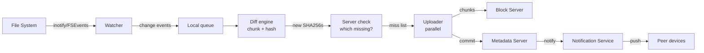
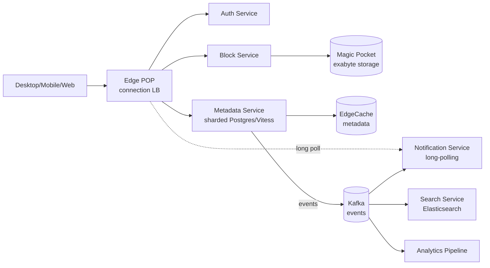

# Вопросы на собеседовании: `Design Dropbox`

`Dropbox` (Google Drive, OneDrive, iCloud Drive) — cloud file sync на 700M+ пользователей, эксабайты данных, миллиарды файлов. Кейс проверяет умение комбинировать chunking, content-addressable storage (CAS), delta sync через rolling hash (rsync), conflict resolution на mobile/desktop, multi-region replication, и собственный block storage уровня S3. Standalone сложный senior-кейс.

## Полезные ссылки

- [Dropbox Tech Blog](https://dropbox.tech/)
- [Magic Pocket — Dropbox exabyte storage (2016)](https://dropbox.tech/infrastructure/magic-pocket-infrastructure)
- [Magic Pocket follow-up (2020+)](https://dropbox.tech/infrastructure/extending-magic-pocket-innovation-with-the-first-petabyte-scale-smr-drive-deployment)
- [The rsync algorithm (Andrew Tridgell, 1996)](https://rsync.samba.org/tech_report/)
- [Content-Addressable Storage (Wikipedia)](https://en.wikipedia.org/wiki/Content-addressable_storage)
- [How Dropbox Sync works (Tech Blog)](https://dropbox.tech/infrastructure/streaming-file-synchronization)
- [System Design Primer](https://github.com/donnemartin/system-design-primer)
- [LSM trees (Cassandra/RocksDB)](https://en.wikipedia.org/wiki/Log-structured_merge-tree)

## Содержание

**Requirements и capacity**
- [Q1. (!) Functional и non-functional requirements?](#q1--functional-и-non-functional-requirements)
- [Q2. (!) Capacity estimation (700M users, exabyte storage)?](#q2--capacity-estimation-700m-users-exabyte-storage)
- [Q3. SLA и SLO для sync pipeline?](#q3-sla-и-slo-для-sync-pipeline)

**Chunking и storage**
- [Q4. (!) Chunking: fixed 4MB vs content-defined (CDC)?](#q4--chunking-fixed-4mb-vs-content-defined-cdc)
- [Q5. (!) Content-Addressable Storage (CAS) — SHA256 → location?](#q5--content-addressable-storage-cas--sha256--location)
- [Q6. Metadata vs blob separation (Postgres + Magic Pocket)?](#q6-metadata-vs-blob-separation-postgres--magic-pocket)
- [Q7. (!) Magic Pocket — Dropbox proprietary exabyte storage?](#q7--magic-pocket--dropbox-proprietary-exabyte-storage)
- [Q8. Compression перед upload (LZ4 vs Zstandard)?](#q8-compression-перед-upload-lz4-vs-zstandard)

**Sync engine**
- [Q9. (!) Delta sync — rsync algorithm (rolling + strong hash)?](#q9--delta-sync--rsync-algorithm-rolling--strong-hash)
- [Q10. (!) Sync engine architecture (watcher → diff → upload → notify)?](#q10--sync-engine-architecture-watcher--diff--upload--notify)
- [Q11. File system events (inotify / FSEvents / ReadDirectoryChangesW)?](#q11-file-system-events-inotify--fsevents--readdirectorychangesw)
- [Q12. Offline mode и local LSM journal?](#q12-offline-mode-и-local-lsm-journal)
- [Q13. (!) Notification service (long-polling vs WebSocket)?](#q13--notification-service-long-polling-vs-websocket)
- [Q14. Selective sync и Smart Sync (lazy fetch)?](#q14-selective-sync-и-smart-sync-lazy-fetch)

**Conflict и versioning**
- [Q15. (!) Conflict resolution при concurrent edits?](#q15--conflict-resolution-при-concurrent-edits)
- [Q16. Versioning (30-day history, point-in-time restore)?](#q16-versioning-30-day-history-point-in-time-restore)
- [Q17. Trash and retention (30-day soft delete)?](#q17-trash-and-retention-30-day-soft-delete)

**Архитектура**
- [Q18. (!) High-level architecture (block + metadata + notification)?](#q18--high-level-architecture-block--metadata--notification)
- [Q19. (!) Multi-region (data residency EU, replication)?](#q19--multi-region-data-residency-eu-replication)
- [Q20. Disaster recovery (cross-region + erasure coding)?](#q20-disaster-recovery-cross-region--erasure-coding)

**Features**
- [Q21. Sharing model (folders, links, ACL)?](#q21-sharing-model-folders-links-acl)
- [Q22. Search (Elasticsearch metadata + content extraction OCR)?](#q22-search-elasticsearch-metadata--content-extraction-ocr)
- [Q23. Mobile uploads (camera roll, battery-aware)?](#q23-mobile-uploads-camera-roll-battery-aware)

**Безопасность**
- [Q24. (!) Encryption at rest и in transit?](#q24--encryption-at-rest-и-in-transit)
- [Q25. End-to-end encryption (E2EE) — ограничения?](#q25-end-to-end-encryption-e2ee--ограничения)
- [Q26. Anti-abuse (DMCA, malware scanning)?](#q26-anti-abuse-dmca-malware-scanning)

**Production**
- [Q27. (!) Monitoring metrics обязательные?](#q27--monitoring-metrics-обязательные)
- [Q28. Quota и throttling per-user?](#q28-quota-и-throttling-per-user)
- [Q29. (!) Cost optimization (Magic Pocket vs S3, dedup)?](#q29--cost-optimization-magic-pocket-vs-s3-dedup)
- [Q30. (!) Антипаттерны и подводные камни?](#q30--антипаттерны-и-подводные-камни)

## Q1. (!) Functional и non-functional requirements?

**Functional:**
- Загрузка / скачивание файлов любого размера.
- Sync между N devices (desktop, mobile, web).
- Sharing (folders, links с правами read/edit).
- Versioning + restore previous versions.
- Offline access — local cache.
- Selective sync — выбрать что скачивать.
- Trash + 30-day retention.
- Search по metadata + file content.

**Non-functional:**
- Users: 700M+ (Dropbox 2024).
- Files: 1B+ uploaded daily.
- Storage: эксабайты (Magic Pocket > 1 EB с 2016).
- Sync lag: p95 < 5 сек (small file changes).
- Upload throughput: depends on network, batched chunks.
- Availability: 99.99%.
- Durability: 99.999999999% (11 nines, S3-like).
- Multi-region: EU data residency (GDPR), US, APAC.
- Encryption: at-rest + in-transit обязательно.

**Scope excluded (типично):**
- Real-time collaborative editing (Google Docs / Paper — отдельный продукт).
- Video transcoding (in Dropbox это extension, не core).
- Voice chat / messaging.

**Tip:** senior отличается тем, что сразу проговаривает `dedup как первоклассная фича` — Dropbox экономит 80%+ storage на дубликатах через CAS.

## Q2. (!) Capacity estimation (700M users, exabyte storage)?

**Allowances:**

| Параметр | Значение |
|---|---|
| Total users | 700M |
| Active users | ~200M MAU |
| Avg storage per user | 5 GB (mix free 2 GB + paid plans) |
| Total raw storage | 3.5 EB raw |
| Dedup ratio | 80% (industry estimate) |
| After dedup | ~700 PB unique blocks |
| Upload rate | 1B+ files/day |

**Storage math:**
- Без dedup: 700M × 5 GB = 3.5 EB.
- С dedup (популярные shared файлы) → 700 PB unique chunks.
- × 3 erasure coding factor → 2.1 EB physical (Magic Pocket).

**Metadata:**
- Files entry: ~500 B (path + size + chunks list + permissions).
- 1B files × 500 B = 500 GB metadata.
- + history (30-day versions) ×10 = 5 TB.

**Bandwidth:**
- Upload: 1B files/day × avg 1 MB = 1 PB/day = ~12 GB/sec sustained.
- Download (Smart Sync miss): ~10× upload = 120 GB/sec.
- Peak (workday 9-5 US/EU overlap) ×3 = 360 GB/sec.

**QPS на metadata DB:**
- 200M MAU × 100 ops/day = 20B ops/day ≈ 230K ops/sec.
- Peak ×5 = ~1M ops/sec — нужен sharded Postgres / Vitess.

**Capacity вывод:**
- Хранение dominates cost.
- Dedup критичен — без него storage cost × 5.
- Magic Pocket vs S3 saving ~30-50% (Q7).

## Q3. SLA и SLO для sync pipeline?

| Metric | Цель | Alert |
|---|---|---|
| `sync_lag_seconds_p95` | < 5 сек (small files) | > 30 сек 10 минут |
| `upload_success_rate` | > 99% | < 97% 5 минут |
| `download_latency_p99` | < 200 ms (cached) | > 1 сек |
| `metadata_query_p99` | < 50 ms | > 200 ms |
| `dedup_ratio` | > 80% | < 60% (efficiency drop) |
| `availability` | 99.99% | < 99.9% monthly |
| `durability` | 99.999999999% (11 nines) | data loss event |

**Failure modes:**
- Network partition: sync queue grows; resume on reconnect.
- Metadata DB outage: client buffers local journal (Q12).
- Block storage outage: read через replica, write retries.

## Q4. (!) Chunking: fixed 4MB vs content-defined (CDC)?

**Зачем chunking:**
- Большой файл (1 GB) — нельзя single upload (long blocking, retries дорогие).
- Dedup на уровне chunks (если 2 файла отличаются 1%, нужно загрузить только diff).

**Fixed-size chunking (4 MB):**
- Split файл на 4 MB блоки от offset 0.
- Pros: простой, predictable.
- Cons: **insertion problem** — добавил байт в начало → все chunks shifted → 100% re-upload вместо diff.

**Content-Defined Chunking (CDC):**
- Используем **rolling hash** (Rabin fingerprint, Buzhash, Gear, FastCDC).
- На каждой позиции вычисляем hash скользящего окна (например 48 байт).
- Boundary chunk = когда hash mod N == 0 (chunk завершается).
- Boundary зависит от content, не offset.

**Свойства CDC:**
- Insertion в начало → только первый chunk изменяется; остальные boundary те же (rolling hash восстанавливает).
- Avg chunk size ~4 MB (настраивается через mod N).
- Min/max size limits (1-16 MB) против дегенерации.

**Пример rolling hash (Buzhash):**
```
hash(i) = (hash(i-1) >> 1) ^ T[byte_at(i + window_size)]
```
- O(1) update per shifted byte.

**Dropbox реальность:**
- Fixed 4 MB chunks historically.
- Современные системы (Restic, BorgBackup) — CDC через Buzhash.
- Tradeoff: simplicity vs dedup efficiency.

**Hybrid:** maybe fixed для metadata, CDC для blob files где insertion problem критичен.

## Q5. (!) Content-Addressable Storage (CAS) — SHA256 → location?

**Идея:** key = hash(content), не arbitrary ID.

```
chunk = bytes (4 MB)
sha256_hex = SHA256(chunk)  // 32 bytes = 64 hex chars
storage_key = sha256_hex
storage.put(sha256_hex, chunk)
```

**Свойства:**

**1. Free deduplication:**
- Два юзера загружают тот же файл → identical SHA256 → один store entry.
- При commit metadata просто references existing chunk.
- 80%+ savings на популярных файлах (Microsoft Office templates, иконки, PDF books).

**2. Integrity verification:**
- На read: hash(downloaded) == storage_key? Yes → integrity OK.
- Bit rot detected immediately.

**3. Immutability:**
- Hash collision = same content (cryptographically infeasible for SHA256).
- Update content = new hash = new entry. Old chunks never modified.

**4. Garbage collection:**
- Когда нет references → safe to delete (refcount tracking).

**Schema:**
```sql
CREATE TABLE blocks (
  sha256 CHAR(64) PRIMARY KEY,
  size INT,
  location_id BIGINT,
  refcount INT,
  created_at TIMESTAMP
);

CREATE TABLE file_chunks (
  file_id BIGINT,
  chunk_idx INT,
  sha256 CHAR(64) REFERENCES blocks(sha256),
  PRIMARY KEY (file_id, chunk_idx)
);
```

**Upload flow:**
1. Client chunks file (Q4).
2. Computes SHA256 per chunk.
3. Sends list of SHA256s to server — `which do you already have?`.
4. Server returns list of missing chunks.
5. Client uploads only missing chunks.
6. Server updates metadata: `file F = [sha1, sha2, sha3, ...]`.

**Production:** Dropbox internal, Git (objects directory), IPFS, Restic backup.

**Edge case:** SHA256 collision — theoretically 2^256 attempts; never observed.

## Q6. Metadata vs blob separation (Postgres + Magic Pocket)?

**Two-tier storage:**

**Metadata tier (Postgres / Vitess sharded):**
- File path, name, size, modified_at, owner, permissions, chunk references.
- Versions history (limited size).
- Shared links, ACL.
- Sharding by user_id.

**Blob tier (Magic Pocket):**
- Actual file content (chunks).
- Append-only, immutable.
- Cheap per-GB ($/GB-month).

**Зачем разделять:**
- Different access patterns: metadata = OLTP heavy reads/writes, blob = sequential bulk.
- Different storage types: metadata SSD ($$$), blob HDD/SMR ($).
- Independent scaling.

**Volume:**
- Metadata: 5-10 TB total (sharded across 100 PG nodes).
- Blob: 700 PB (Magic Pocket).
- Ratio: 1:70 000.

**Caching layer:**
- EdgeCache (memcached-like) для hot metadata.
- 95%+ metadata queries served from cache.

**Cross-tier consistency:**
- Metadata commit ПОСЛЕ blob upload success.
- Если blob orphaned (uploaded but metadata fail) → garbage collected after N days (refcount = 0).

**Pattern:** аналог Git — `objects/` (blobs) + `refs/` (metadata pointers).

## Q7. (!) Magic Pocket — Dropbox proprietary exabyte storage?

**Контекст:** до 2015 Dropbox хранил всё в AWS S3 ($$$). 2015-2016 — миграция на собственный Magic Pocket.

**Зачем собственный storage:**
- AWS S3 cost на эксабайтном scale = $1B+/year.
- Magic Pocket снизил cost на 75% (Dropbox open numbers).
- Контроль над тiering, erasure coding, hardware.

**Архитектура Magic Pocket:**

```
Cell (rack) → Zone (multiple racks) → Region (multiple zones)
```

**Components:**
- **Storage nodes:** custom hardware с SMR drives (Shingled Magnetic Recording — denser, slightly slower seek).
- **OSD (Object Storage Daemon):** stores raw bytes.
- **Pocket Master:** metadata server для cell.
- **Volume Manager:** coordinates erasure coding.
- **Garbage Collector:** reclaims deleted blocks.

**Erasure coding:**
- Reed-Solomon (10, 4): 10 data shards + 4 parity → can lose 4 shards без потерь.
- Storage overhead 1.4× (vs 3× full replication) — 50% cost saving.
- Tradeoff: rebuild slower при failure.

**Data layout:**
- File chunk → split на 10 shards → 4 parity shards computed.
- 14 shards distributed across 14 different cells.
- Read: any 10 of 14 sufficient.

**Tiering:**
- Hot tier: SSD для recently uploaded (last 30 days).
- Warm tier: HDD для accessed weekly.
- Cold tier: SMR drives для archive.

**Innovations:**
- SMR drives с custom firmware (host-managed SMR).
- Custom 100 Gbps networking между cells.
- Petabyte-scale repair coordination.

**Comparable systems:**
- Facebook f4 (BLOB storage).
- Backblaze Vaults.
- Google Colossus.

## Q8. Compression перед upload (LZ4 vs Zstandard)?

**Принцип:** compress на client перед upload — экономит bandwidth + storage.

**Codecs:**

| Codec | Ratio | Speed (encode) | CPU | Use case |
|---|---|---|---|---|
| LZ4 | 2.1× | 500 MB/s | low | real-time, low-latency |
| Snappy | 2.0× | 250 MB/s | low | Google internal |
| Zstandard | 2.8× | 400 MB/s | medium | balanced (modern default) |
| gzip | 2.9× | 50 MB/s | high | legacy, slow |
| Brotli | 3.5× | 30 MB/s | high | web assets (static) |
| LZMA / xz | 4.0× | 5 MB/s | very high | archive |

**Dropbox выбор:**
- Zstandard (since ~2018) — best balance.
- Дёшев на decode (decode 800 MB/s) — read latency не страдает.
- Encode 400 MB/s — приемлемо на client desktop / mobile.

**Уже compressed files:**
- JPEG, PNG, MP4, ZIP, PDF (compressed внутри) — re-compression не помогает.
- Detect через magic bytes или MIME → skip compression.

**Pre-chunk vs post-chunk compression:**
- Pre-chunk: compress whole file, потом chunk → loses dedup (compressed bytes != raw bytes).
- Post-chunk: chunk first, потом compress each chunk separately → dedup сохраняется.
- Dropbox: post-chunk compression.

**Per-chunk compression dictionary:**
- Zstandard supports custom dictionary trained on common data types.
- Office files, PDF — gain доп. 10-20% compression.

## Q9. (!) Delta sync — rsync algorithm (rolling + strong hash)?

**Сценарий:** user меняет 1 KB в 1 GB file → должны загрузить только diff, не 1 GB.

**Naive подход (block-level diff):**
- Fixed chunks 4 MB → 1 KB change в одном chunk → re-upload 4 MB.
- 4000× меньше чем full file, но всё равно много.

**rsync algorithm (Andrew Tridgell, 1996):**

**Sender (with old file):**
1. Split old file на blocks size `B` (~700 bytes).
2. Per block compute: rolling hash (fast) + strong hash (MD5/SHA1).
3. Send dictionary `{strong_hash → block_index}` to receiver.

**Receiver (with new file):**
1. Compute rolling hash в скользящем окне ширины `B` от offset 0.
2. На каждой позиции: check если rolling hash in dictionary.
3. If hit: verify strong hash (защита от rolling hash collision).
4. If match: emit "use block N" reference; jump on B bytes.
5. If miss: emit raw byte; advance window by 1 byte.

**Output:** list of references + raw bytes.

**Rolling hash (Adler-32 simplified):**
```
hash(i+1) = hash(i) - byte_at(i) + byte_at(i + B)
```
- O(1) update per shifted byte → O(file_size) total.

**Свойства:**
- Insertion в начало: только small delta (byte at front + reference to rest).
- Edit middle: small delta around edit + references for unchanged.
- Append: only new bytes transmitted.

**Realistic gain:**
- Office file 10 MB, edit 1 paragraph → upload ~30 KB delta vs full re-upload.
- Video file 1 GB, edit metadata → similar — only metadata block changed.

**Dropbox реализация:**
- Streaming sync: chunks identified through CDC (Q4) → already implements rsync-like idea.
- Block-level dedup via CAS gives delta savings for free.

## Q10. (!) Sync engine architecture (watcher → diff → upload → notify)?



**Components:**

**1. File watcher:**
- Listens to OS file system events (Q11).
- Batches rapid changes (debounce 100 ms).

**2. Local queue (SQLite):**
- Pending uploads persisted locally.
- Survives crashes / restarts.

**3. Diff engine:**
- For each changed file:
  - Re-chunk (Q4).
  - Compute SHA256 per chunk.
  - Compare with last-known state (server manifest).
- Output: list of new/changed chunks.

**4. Server check:**
- Send list of SHA256s.
- Server: which already exist? Return missing list.
- Avoids re-upload of duplicates (saves bandwidth).

**5. Uploader:**
- Parallel upload (10-50 concurrent connections).
- HTTP/2 multiplexing.
- Resume on partial failure.

**6. Metadata commit:**
- After all chunks uploaded → commit metadata.
- "File F now points to chunks [s1, s2, s3]".

**7. Notification:**
- Other devices receive push notification.
- They download new chunks (lazy or eager depending on Smart Sync setting).

**Latency budget:**
- Detect: 10-100 ms (inotify).
- Chunk + hash: 100 ms - 1 sec (CPU bound).
- Upload: depends on file size, network.
- Server commit: 50 ms.
- Push to peers: 100 ms - 1 sec (real-time notification).
- Total small file: ~1-2 sec sync to other device.

## Q11. File system events (inotify / FSEvents / ReadDirectoryChangesW)?

**Per-OS event APIs:**

| OS | API | Granularity | Limits |
|---|---|---|---|
| Linux | inotify | per-file events | `fs.inotify.max_user_watches` (default 8K) |
| macOS | FSEvents | per-directory events (coarser) | unlimited, batched |
| Windows | ReadDirectoryChangesW | per-file events | per-handle |

**inotify (Linux):**
- Events: IN_CREATE, IN_MODIFY, IN_DELETE, IN_MOVED_FROM, IN_MOVED_TO.
- Need to recursively add watches on subdirectories.
- Limit: `/proc/sys/fs/inotify/max_user_watches` — увеличить до 1M для большого Dropbox folder.

**FSEvents (macOS):**
- High-level: "this directory changed". Не точное событие.
- Latency 1-5 сек batched.
- Stream API через `FSEventStreamCreate`.

**ReadDirectoryChangesW (Windows):**
- Overlapped I/O, асинхронный callback.
- Tracks file creation, modification, rename, attribute change.

**Edge cases:**
- Atomic save в text editors (write to temp + rename) → 2 events: CREATE temp, RENAME → file. Sync engine должен treat это как modification.
- Bulk import (10K files) → event flood; batch + dedupe.
- External (USB) drive disconnect → watchers invalidated; restart on reconnect.

**Cross-platform abstraction:**
- Dropbox client использует custom watch layer over OS APIs.
- Output: unified event stream → diff engine.

## Q12. Offline mode и local LSM journal?

**Scenario:** user меняет файлы offline (самолёт), потом подключается — должны sync безбоязненно.

**Local journal (SQLite или LSM):**
- Pending changes queue: ordered list of operations.
- Survives crashes, reboots.
- Idempotent operations.

**Operations queued:**
- Create file F (path, chunks).
- Update file F.
- Delete file F.
- Rename A → B.

**Schema (SQLite):**
```sql
CREATE TABLE pending_ops (
  id INTEGER PRIMARY KEY AUTOINCREMENT,
  op_type TEXT,
  file_path TEXT,
  chunk_list TEXT,  -- JSON array
  created_at INTEGER,
  retry_count INT DEFAULT 0
);
```

**Resume flow при reconnect:**
1. Fetch server state (since last_sync_token).
2. Compare local journal vs server changes:
   a. Local-only → upload.
   b. Server-only → download.
   c. Both changed same file → conflict (Q15).
3. Apply ordered: local creates → uploads → server-updates → local-deletes.

**Edge cases:**
- Long offline period (months) → journal large → batch via priority (recent files first).
- Disk full local → reject new writes; alert user.

**Pattern:** аналог Git commit log + push на reconnect.

## Q13. (!) Notification service (long-polling vs WebSocket)?

**Цель:** when user changes file on device A, device B знает в течение 1-5 сек.

**Подходы:**

**Polling (naive):**
- Client every 30 сек: `GET /changes?since=T`.
- Cons: 200M MAU × 2 polls/min = 400M req/min = 7M QPS просто на polling.
- Wasted requests when nothing changed.

**Long-polling:**
- Client opens connection: `GET /changes?since=T` — server HOLDS request.
- Server holds 30-60 сек; if change → respond immediately.
- Lower QPS, but each connection holds for 30 сек.

**WebSocket / Server-Sent Events:**
- Persistent bi-directional connection.
- Server push при изменении.
- Sub-second latency.
- Cons: holds millions of connections — server resource.

**Dropbox реализация:**
- Long-polling (historically) — Notification Service.
- Hybrid с WebSocket для desktop apps (always-on connection).

**Scaling:**
- 200M MAU concurrent connections.
- Each connection holds for 60 сек on average → 200M / 60s × 1 conn = continuous load.
- Distribute across thousands of notification servers (sharded by user_id).
- Each notification server holds ~50K-100K connections.

**Push to mobile:**
- FCM (Firebase Cloud Messaging) для Android.
- APNs (Apple Push Notification) для iOS.
- Не нужно держать connection — OS handles delivery.

**Push payload:**
- Minimal: `{ "user_id": ..., "since_cursor": ... }`.
- Receiver pulls actual changes after notification.

## Q14. Selective sync и Smart Sync (lazy fetch)?

**Selective sync:**
- User выбирает which folders to download locally.
- Other folders accessible через web/mobile only.
- Pre-2017 Dropbox feature.

**Smart Sync (2017+, Pro feature):**
- Все файлы visible в file system как обычные (stub files).
- Content downloaded on-demand (open → fetch).
- Background eviction (LRU) когда disk full.

**Implementation Smart Sync:**

**Linux / macOS:** FUSE-like virtual file system.

**Windows:** Cloud Files API (Windows 10+) — first-class OS support for "online-only" files.

**macOS (modern):** File Provider Extension API.

**Stub file flow:**
1. File created server-side → metadata sync to all clients.
2. Local OS shows stub (visible name, size, last modified — но 0 bytes на disk).
3. User двойной click → Smart Sync fetches actual content from server.
4. After N days unused → background eviction (back to stub).

**Behavior:**
- "Always available" — pinned files never evicted.
- "Online-only" — never stored locally.
- Auto: LRU eviction when disk space < threshold.

**Bandwidth optimization:**
- Pre-fetch likely files (based on access patterns).
- Background download during idle network.

## Q15. (!) Conflict resolution при concurrent edits?

**Scenario:** Alice edits `report.docx` on laptop offline. Bob edits same `report.docx` on phone. Both sync. What happens?

**Approaches:**

**1. Last-Writer-Wins (LWW):**
- Simplest. Whichever sync arrives last wins.
- Other version overwritten.
- Cons: silent data loss.

**2. .conflict files (Dropbox approach):**
- Keep both versions:
  - `report.docx` (Alice's version, was committed first).
  - `report (Bob's conflicted copy 2026-05-26).docx` (Bob's version).
- User decides manually.
- No data loss, but user friction.

**3. Vector clocks (Git-like):**
- Each device maintains vector clock per file.
- Conflict detected when vectors are concurrent (neither ancestor).
- Application can merge или fork.

**4. CRDTs (Conflict-Free Replicated Data Types):**
- For specific document types (text, lists).
- Automatic merge без user intervention.
- Used in Google Docs, Figma, Notion.
- Dropbox Paper использует Y.js (CRDT library).

**Dropbox реальность:**
- For binary files (.docx, .pdf): `.conflict` files (option 2).
- For collaborative docs (Paper): CRDT.

**Algorithm для conflict detection:**
- Each file has `parent_revision_id`.
- Upload includes `expected_parent_revision`.
- Server checks: current_revision == expected_parent?
  - Yes → fast-forward commit.
  - No → conflict → create .conflict file.

**Edge case:**
- Three-way conflict (3 devices edit simultaneously) → multiple .conflict files.

## Q16. Versioning (30-day history, point-in-time restore)?

**Functionality:**
- All file versions retained N days (30 default, 1 year+ для paid plans).
- User может restore any version.
- "Rewind" — entire folder to previous state.

**Implementation:**
- CAS + metadata history.
- Each file revision = new metadata entry pointing к (possibly new) chunks.
- Old chunks NOT deleted while still referenced by historical versions.
- Garbage collection после retention period.

**Schema:**
```sql
CREATE TABLE file_revisions (
  file_id BIGINT,
  revision_id BIGINT,
  chunk_list JSONB,
  size BIGINT,
  modified_at TIMESTAMP,
  modified_by BIGINT,
  PRIMARY KEY (file_id, revision_id)
);
```

**Storage cost:**
- Versioning ×N storage of all files.
- Saved by CAS: only changed chunks duplicated. Unchanged chunks shared across versions.
- Realistic overhead 1.5-2× (vs ×30 days if every byte stored).

**Retention policy:**
- Free / Plus: 30 days.
- Business: 180 days.
- Enterprise: unlimited (subject to cost).

**Restore flow:**
- User selects revision → metadata creates new "current" revision = copy of old.
- Other devices sync as normal file update.

**Bulk restore (Rewind):**
- Replay all changes до timestamp → produce snapshot.
- Heavy operation; rate-limited.

## Q17. Trash and retention (30-day soft delete)?

**Soft delete:**
- User deletes file → moved to Trash.
- Metadata flag `deleted_at` set; not physically removed.
- Recoverable from Trash UI.

**Retention:**
- 30 days в Trash (default).
- After 30 days → permanent delete.
- "Empty Trash" allows immediate purge.

**Background GC:**
- Daily job: find `deleted_at < NOW - 30 days`.
- Mark chunks for refcount decrement.
- When chunk refcount = 0 → eligible for storage deletion.
- Actual chunk removal: weekly batch (avoid hot operations).

**Schema:**
```sql
ALTER TABLE files ADD COLUMN deleted_at TIMESTAMP;
CREATE INDEX idx_deleted ON files (deleted_at) WHERE deleted_at IS NOT NULL;
```

**Edge cases:**
- File restored from Trash → flag cleared, normal flow resumes.
- Sharing in Trash: shared link broken? Yes — soft-deleted files inaccessible via share.

**Compliance:**
- GDPR right-to-erasure: explicit purge endpoint (bypass 30-day retention).
- Legal hold flag prevents deletion (litigation scenarios).

## Q18. (!) High-level architecture (block + metadata + notification)?



**Services:**

**Edge POP:**
- Geographical entry points (US-East, US-West, EU, APAC, India).
- TLS termination.
- Connection pooling.

**Auth Service:**
- OAuth tokens, session management.
- 2FA verification.

**Metadata Service:**
- File hierarchy, ACL, versions.
- Sharded Postgres или Vitess.
- Per-user partition.

**Block Service:**
- API to Magic Pocket.
- Upload / download chunks.
- Refcount management.
- Garbage collection coordination.

**Notification Service:**
- Long-polling (или WebSocket) connections.
- Push events к connected devices.

**Search:**
- Elasticsearch index on metadata.
- File content extraction (PDFs, Word) → indexable text.

**Kafka:**
- Event bus: file_created, file_modified, file_deleted, sharing_changed.
- Consumers: search indexer, analytics, notification dispatcher.

**Multi-region:**
- Each region — full stack.
- Cross-region async replication for HA + data residency.

## Q19. (!) Multi-region (data residency EU, replication)?

**Drivers:**
- Latency: EU user → EU datacenter < 50 ms.
- GDPR: EU customer data must remain EU.
- DR: regional outage = automatic failover.

**Architecture:**
- US-East-1 (Virginia) — primary US.
- EU-West-1 (Ireland) — primary EU.
- AP-Northeast-1 (Tokyo) — primary APAC.
- ap-south-1 (Mumbai) — India.

**Per-region:**
- Full Metadata Service.
- Local Magic Pocket cells.
- Notification Service.

**Cross-region replication:**
- Metadata: async replication (5-30 сек lag).
- Blob: per-region (no auto-cross-region; user content stays in home region).

**Routing:**
- User pinned к home region by signup country.
- Edge POPs закрывают latency для viewing.

**Cross-region sharing:**
- US user shares folder с EU user → EU user can access; blob fetched cross-region on first access, then cached locally.
- Adds latency for first read.

**Data residency:**
- EU users — blob и metadata strictly EU (Frankfurt / Dublin DC).
- China would need separate stack (compliance) — Dropbox restricted from China market.

**Failover:**
- Region down → DNS shifts к neighbor.
- Metadata reads continue from replica.
- Writes paused until primary recovers (CP model для writes).

## Q20. Disaster recovery (cross-region + erasure coding)?

**Failure scenarios:**
- Single disk failure: erasure coding (Q7) handles transparently.
- Rack failure: cell-level redundancy.
- Datacenter failure: cross-region async replication.
- Region-wide disaster: cross-region failover.

**Erasure coding (Reed-Solomon 10+4):**
- Data split into 10 shards + 4 parity.
- Can lose 4 shards → still recoverable.
- Storage overhead 1.4× (vs 3× replication).

**Cross-region replication:**
- Metadata: every commit → async replicate к 1 backup region.
- Blob: NOT replicated cross-region (cost prohibitive on эксабайтном scale).
- Tradeoff: lose region = lose blob data (rare event).

**Backup:**
- Daily metadata snapshot к S3 Glacier.
- Recovery from snapshot in extreme scenarios.

**RTO/RPO:**
- RPO (data loss): ~30 сек (async replication lag).
- RTO (recovery time): minutes for metadata; hours for blob (если blob cross-region replicated).

**DR drills:**
- Quarterly chaos testing (similar to Netflix Q23 в design-netflix).
- Game days simulating region failures.

## Q21. Sharing model (folders, links, ACL)?

**Sharing types:**

**Folder sharing:**
- Invite user → joins as member.
- Permissions: viewer, editor, owner.
- Sub-folder inheritance.

**Link sharing:**
- Generate URL like `dropbox.com/sh/abc123/file.docx`.
- Permissions: view, download, edit (Pro).
- Optional: password, expiration date.

**ACL model:**
- Per-folder: list of users + permissions.
- Inherited from parent unless overridden.
- Public links bypass ACL (anyone with link).

**Schema:**
```sql
CREATE TABLE folder_acl (
  folder_id BIGINT,
  principal_type TEXT,  -- 'user', 'group', 'link'
  principal_id BIGINT,
  permission TEXT,  -- 'view', 'edit', 'owner'
  inherited_from BIGINT,
  PRIMARY KEY (folder_id, principal_type, principal_id)
);

CREATE TABLE shared_links (
  link_token CHAR(32) PRIMARY KEY,
  folder_id BIGINT,
  permission TEXT,
  password_hash TEXT,
  expires_at TIMESTAMP,
  created_at TIMESTAMP
);
```

**Auth flow:**
- Request access to folder F.
- Check ACL: user in members? → permission level.
- Or: check shared link token in request.

**Edge cases:**
- User removed from shared folder → loses access immediately; existing downloads invalid token next request.
- Link revoked → 404 on access.
- Shared folder deletion → notify all members.

**Quota:**
- Shared folders counted в owner's quota.
- Members see folder but не tax own quota.

## Q22. Search (Elasticsearch metadata + content extraction OCR)?

**Levels:**

**1. Metadata search:**
- File name, path, owner, modified_at.
- Filter by type (PDFs, images, docs).
- Fast (< 100 ms).

**2. Content search:**
- Full-text within document body.
- PDFs, Office files, plain text.

**Content extraction pipeline:**
- Upload event → Kafka → extraction worker.
- Worker downloads chunk → extracts text:
  - PDFs: pdfminer / Apache Tika.
  - Word/Excel: Apache Tika.
  - Images: OCR (Tesseract, Google Cloud Vision).
- Extracted text → Elasticsearch.

**OCR на images:**
- Photo of receipt → extracted text searchable.
- Tradeoff: cost (per-image OCR), accuracy.

**Index:**
- Elasticsearch sharded by user_id.
- Per-user index isolation (privacy).
- Multi-language analyzers.

**Latency:**
- Indexing lag: 30 сек - 5 минут после upload.
- Search query: < 200 ms.

**Privacy:**
- Extraction done in secure environment.
- Extracted text encrypted at rest.
- Не индексируем zero-knowledge encrypted files (Q25).

## Q23. Mobile uploads (camera roll, battery-aware)?

**Camera Upload feature:**
- Auto-upload photos / videos from phone к Dropbox.
- Background process.

**Challenges:**
- Mobile network expensive / slow.
- Battery drain.
- Storage local на phone limited.

**Best practices:**

**Network-aware:**
- Default: Wi-Fi only (skip cellular).
- Optional: cellular с warning.
- Pause при metered network.

**Battery-aware:**
- Skip когда battery < 20%.
- Resume when charging.

**Chunked + resumable:**
- Each photo chunked (Q4).
- Resume on network drop.
- Large videos: continue across multiple sessions.

**EXIF preservation:**
- Keep metadata: date taken, GPS, camera model.
- Strip sensitive data optional (privacy).

**Background scheduling:**
- iOS: Background App Refresh (limited windows).
- Android: WorkManager with constraints (Wi-Fi + charging).

**Photo deduplication:**
- Same photo across devices → dedup via CAS.
- Saves bandwidth (re-upload free) and storage.

**Original quality vs optimized:**
- Default: original full quality.
- Pro option: down-sized photos to save quota.

## Q24. (!) Encryption at rest и in transit?

**In transit:**
- TLS 1.3 (since 2020).
- Mutual TLS для internal services.
- Certificate pinning на mobile apps (защита от MITM).

**At rest:**
- AES-256-GCM per-chunk encryption.
- Each chunk encrypted with unique key (per-chunk key).
- Per-chunk keys themselves encrypted с master key.
- Master keys в HSM (Hardware Security Module).

**Key hierarchy:**
```
Root Key (HSM, never exits)
    ↓ encrypts
Master Keys (per-region, rotated yearly)
    ↓ encrypts
Per-chunk Data Keys (random per chunk)
    ↓ encrypts
Chunk content
```

**Storage:**
- Encrypted chunk: AES-256-GCM(data, per_chunk_key, nonce).
- Per-chunk key store: encrypted с master key, stored alongside metadata.

**Performance:**
- AES-NI hardware acceleration → 1-2 GB/s per core.
- Negligible impact on throughput.

**Compliance:**
- SOC 2, HIPAA, GDPR audit.
- Key rotation procedures документированы.

**Limitations:**
- Dropbox (not user) holds keys → can decrypt if subpoena.
- Solution: E2EE (Q25).

## Q25. End-to-end encryption (E2EE) — ограничения?

**Зачем:** даже Dropbox не может расшифровать данные. Customer holds keys.

**Реализация:**
- Client encrypts file с user-controlled key перед upload.
- Server stores encrypted bytes, не знает content.

**Dropbox реальность:**
- Standard Dropbox: server-side encryption (Q24) — Dropbox holds keys.
- Dropbox Vault (2020+): E2EE option для sensitive folders.
- Boxcryptor (3rd party) — E2EE wrapper, acquired by Dropbox 2022.

**Trade-offs E2EE:**

| Feature | Server-side enc | E2EE |
|---|---|---|
| Server decrypt access | Yes | No |
| Search content | Yes | No (encrypted) |
| Preview thumbnails | Yes | No |
| OCR / search | Yes | No |
| Share via link | Yes | Limited (key exchange) |
| Recovery if forget password | Yes | Permanent loss |
| Compliance (SOC, HIPAA) | Easy | Easier (less liability) |

**Key management:**
- Per-user master key derived from password (PBKDF2 / Argon2).
- Optional: recovery key (24-word seed phrase).
- Lost key = lost data (no Dropbox recovery).

**Use cases E2EE:**
- Lawyers, doctors с PII.
- Activists / journalists.
- Government sensitive docs.

**Not всегда applicable** — most consumers prefer convenience (search, sharing) over E2EE.

## Q26. Anti-abuse (DMCA, malware scanning)?

**DMCA (US copyright):**
- Rights holders submit DMCA notice → Dropbox обязан remove.
- Auto-detection через hash matching (если copyrighted file hash matches CAS).
- File hash on takedown list → upload rejected или existing copy removed.
- User notified, can counter-claim.

**Malware scanning:**
- All uploads scanned (ClamAV или commercial AV).
- Known malware hashes → reject + alert.
- Sandbox execution для suspicious files (rare, expensive).

**Phishing / scams:**
- Share link with malicious file → detected via URL reputation + content.
- Suspicious patterns: shared widely + new account → flag.

**CSAM (Child Sexual Abuse Material):**
- Hash matching against NCMEC database.
- Mandatory reporting to authorities.
- Microsoft PhotoDNA technology widely used.

**Rate limiting:**
- Per-user uploads (Q28).
- Per-IP rate limit для anonymous endpoints.

**Account suspension:**
- Repeated TOS violations → temporary lock.
- Permanent ban для severe (CSAM, criminal activity).

**Auto-DMCA balance:**
- False positives possible (similar hash collisions, fair use).
- Appeal process required.

## Q27. (!) Monitoring metrics обязательные?

**Sync pipeline:**
- `sync_lag_seconds_p95` — file change to peer device visibility (< 5 sec target).
- `upload_success_rate` — % chunks uploaded first try (target > 99%).
- `upload_throughput_bytes_per_sec` — bandwidth efficiency.
- `pending_uploads_queue_depth` — backlog indicator.

**Storage:**
- `dedup_ratio` — savings from CAS (target > 80%).
- `chunk_refcount_distribution` — health of refcount system.
- `gc_lag_seconds` — garbage collection backlog.
- `magic_pocket_usable_capacity_pct` — alert when > 80%.

**Latency:**
- `metadata_query_latency_p99` — < 50 ms.
- `block_download_latency_p99` — < 200 ms (cached).
- `notification_delivery_lag_seconds` — < 5 sec.

**Failure modes:**
- `cross_region_replication_lag_seconds` — < 30 sec target.
- `erasure_coding_repair_jobs_running` — too many = trouble.
- `client_offline_journal_size_bytes` — large = sync issues.

**Business:**
- `daily_active_users` — engagement.
- `storage_per_user_distribution` — sizing.
- `share_create_rate` — collaboration usage.

**Alerting:**
- Page on call: sync_lag_p95 > 30 сек 10 минут.
- Slack: upload_failure_rate > 3% 5 минут.
- Email: dedup_ratio drop > 10% (efficiency regression).

**Tracing:**
- OpenTelemetry; trace ID через client → server → storage.
- Visibility: `Upload took 2 sec = 100 ms chunking + 800 ms upload + 50 ms commit`.

## Q28. Quota и throttling per-user?

**Quotas (Dropbox plans):**
- Basic (free): 2 GB.
- Plus: 2 TB.
- Family: 2 TB shared.
- Professional: 3 TB.
- Business Standard: 5 TB.
- Business Advanced: as much as needed.

**Enforcement:**
- На upload: check quota → reject if exceeded.
- Soft warning at 90%.
- Hard stop at 100%.

**Throttling:**
- Upload bandwidth limit per user (configurable in client).
- Server-side: rate limit API calls per user.

**Per-tier limits:**
- API requests/hour.
- Sharing operations per day.
- Concurrent connections.

**Burst allowance:**
- Initial upload of large library — temporary higher limit.
- Resume normal after backfill complete.

**Anti-abuse:**
- Aggressive uploads (10× normal user) → flag.
- Many shares to suspicious destinations → review.

**Schema (in Postgres):**
```sql
CREATE TABLE user_quota (
  user_id BIGINT PRIMARY KEY,
  plan TEXT,
  used_bytes BIGINT,
  limit_bytes BIGINT,
  last_calculated_at TIMESTAMP
);
```

**Quota calculation:**
- Sum bytes of all NON-deleted files owned by user.
- Excludes shared folders owned by others.
- Recalculated periodically (event-driven + scheduled).

## Q29. (!) Cost optimization (Magic Pocket vs S3, dedup)?

**Cost drivers:**
- Storage: эксабайты × $/GB-month.
- Bandwidth: egress (downloads).
- Compute (metadata DB, sync engine).
- Networking (cross-region replication).

**Top optimizations:**

**1. Magic Pocket vs AWS S3:**
- S3 cost: $0.023/GB-month standard.
- Magic Pocket internal cost: ~$0.005/GB-month (estimate).
- На 700 PB: $3M/month vs $16M/month → $13M/month saved.

**2. Deduplication через CAS:**
- 80% dedup → 5× storage saving.
- Без CAS Dropbox storage cost был бы 5× higher.

**3. SMR drives (Shingled Magnetic Recording):**
- 20-30% denser than CMR drives.
- Slightly slower seek (sequential writes preferred).
- Magic Pocket designed для SMR.

**4. Erasure coding 10+4 vs replication 3×:**
- Overhead 1.4× vs 3× → 53% storage saving.

**5. Compression (Q8) Zstandard:**
- 2-3× reduction для compressible content.
- На 700 PB raw → 250-350 PB compressed → ~$1M/month saving.

**6. Tiering:**
- Hot: SSD (recent + frequently accessed).
- Cold: SMR HDD.
- Archive: tape or Glacier-equivalent (rare).

**7. CDN для downloads:**
- Cache popular shared files at edge.
- Reduces origin egress cost.

**8. Lifecycle management:**
- Trash → archive tier after 7 days.
- Versions older than 30 days → cold storage.

**Total savings:**
- Magic Pocket migration alone: ~75% cost reduction (Dropbox stated).
- + dedup + erasure coding + compression: aggregate ~10× cheaper vs naive S3.

## Q30. (!) Антипаттерны и подводные камни?

**1. Synchronous upload в client thread.**
- File save blocked until upload complete.
- Fix: async upload queue с UI update on completion.

**2. No chunking — re-upload whole file on edit.**
- 1 GB file, edit 1 KB → upload 1 GB.
- Fix: chunking + delta sync (Q4, Q9).

**3. No content-addressable storage.**
- Same file uploaded N times → N copies stored.
- Fix: CAS via SHA256 (Q5).

**4. Single-tier storage (everything SSD).**
- $$$ cost prohibitive at exabyte scale.
- Fix: tiered storage (hot SSD / cold HDD / archive).

**5. Synchronous notification on every change.**
- 1B daily uploads × N peers = notification explosion.
- Fix: batched + long-polling/WebSocket (Q13).

**6. Polling DB for changes.**
- 200M MAU × poll every 30 sec = wasted load.
- Fix: push notifications + event-driven (Q13).

**7. Client polls "anything new?" repeatedly.**
- DDoS на own backend.
- Fix: long-polling или WebSocket.

**8. Без conflict detection.**
- Concurrent edits silently overwrite.
- Fix: revision_id check + .conflict files (Q15).

**9. Full sync on reconnect after offline.**
- 1 GB folder, was offline 1 minute, sync ALL files.
- Fix: diff-based sync via revision tokens (Q12).

**10. No erasure coding.**
- 3× replication для durability → 3× cost.
- Fix: Reed-Solomon 10+4 → 1.4× overhead.

**11. Single region storage.**
- Region outage = service down + potential data loss.
- Fix: multi-region async replication (Q19).

**12. No encryption.**
- Data leak = catastrophic.
- Fix: at-rest AES-256-GCM + in-transit TLS 1.3 (Q24).

**13. Compression перед chunking.**
- Loses dedup benefit (compressed bytes not deduplicatable).
- Fix: chunk first, then compress per chunk (Q8).

**14. Hardcoded sync limits.**
- "Max 10K files per folder" — breaks Photos-style users.
- Fix: dynamic limits based on user tier, gradual scaling.

**15. No GC for orphaned chunks.**
- Refcount = 0 chunks accumulate forever.
- Fix: background GC + safe deletion policy с grace period.

---

## See also

- [Design Netflix](design-netflix-interview.md) — video streaming parallels (CDN, multi-region)
- [Design YouTube](design-youtube-interview.md) — large blob storage parallels
- [Design URL Shortener](design-url-shortener-interview.md) — multi-tier cache parallels
- [System Design Interview](system-design-interview.md) — общая методология
- [Caching Strategies](../architecture/caching-strategies-interview.md) — EdgeCache, CDN
- [Distributed Systems](../architecture/distributed-systems-interview.md) — eventual consistency, CAP
- [Database Replication](../databases/database-replication-interview.md) — multi-region async
- [Database Sharding](../databases/database-sharding-interview.md) — metadata partitioning
- [Resilience Patterns](../architecture/resilience-patterns-interview.md) — circuit breaker, retry
- [CDN](../architecture/cdn-interview.md) — edge POPs для downloads
- [Kafka](../messaging/kafka-interview.md) — event backbone
- [Elasticsearch](../databases/elasticsearch-interview.md) — search, file content indexing
- [Cassandra](../databases/cassandra-interview.md) — alternative metadata store
