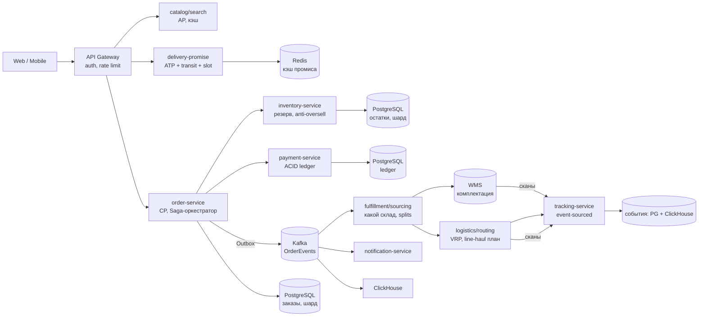
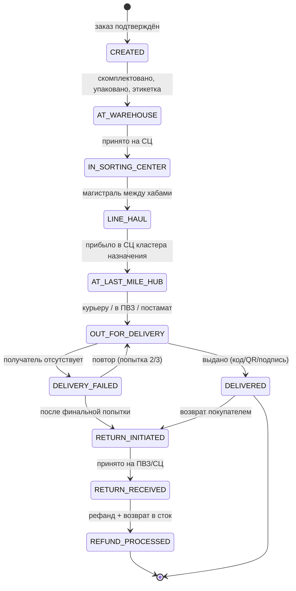
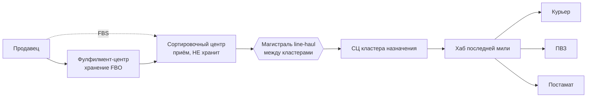
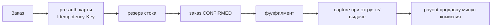
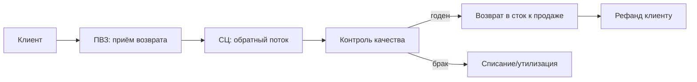

<!-- Полный контракт frontmatter — в .claude/skills/obsidian-metadata/SKILL.md.
     После правки прогоняй: python3 .claude/skills/obsidian-metadata/scripts/normalize_frontmatter.py --apply -->

# System Design: Доставка маркетплейса (Ozon / Яндекс Маркет / Wildberries)

Senior/staff-уровневый кейс: спроектировать доставку e-commerce-маркетплейса от оформления заказа до выдачи в ПВЗ, постамате или курьером. Это **не Uber** — здесь нет real-time matching секунда-в-секунду, зато есть многоуровневая физическая логистика (склад → сортировочный центр → магистраль → последняя миля), модели фулфилмента (FBO/FBS/DBS/FBY), расчёт обещанной даты доставки на чекауте, защита от oversell при распределённом стоке и NP-трудная маршрутизация курьеров (VRP). Кейс хорош тем, что заставляет разделить систему по границам консистентности: **CP для заказов/остатков/оплаты, AP для каталога/трекинга/витрины**.

Дата последнего обновления: 2026-05-29

Разбор опирается на реальные реализации: **Ozon** (3500+ микросервисов, 84 тыс. ПВЗ, splits заказа по складам), **Яндекс Маркет / Доставка** (FBY/Express, Маршрутизация на MVRP, прогноз спроса Лавки на CatBoost), **Wildberries** (ПВЗ-first экономика, невыкуп одежды 45–60%) и **3PL-операторы** СДЭК / Почта России.

## Полезные ссылки

### Официальная документация и инженерные блоги

- [Ozon Tech на Habr](https://habr.com/ru/companies/ozontech/articles/) — десятки разборов про микросервисы, Kafka data-bus, WMS, сортировку.
- [Ozon Seller API — Ozon Логистика](https://dev.ozon.ru/start/448-Spravochnik-metodov-Seller-API-dlia-Ozon-logistiki/) — методы delivery-promise (`v2/delivery/checkout`), трекинг, splits.
- [Яндекс Маршрутизация — алгоритм решателя VRP](https://yandex.ru/routing/doc/ru/vrp/routing-algorithm) — MVRP, simulated annealing + GA, матрицы с учётом пробок.
- [Яндекс Доставка API — модель claim](https://yandex.ru/dev/logistics/api/faq/faq.html) — идемпотентность, оффер цены, подменные номера.
- [Модели работы на Маркете FBY/FBS/DBS/Express](https://yandex.ru/support/marketplace/ru/introduction/models) — кто хранит, кто доставляет.
- [Google OR-Tools Routing](https://developers.google.com/optimization/routing/routing_options) — first-solution стратегии + метаэвристики (GLS) для VRP.
- [Outbox Pattern для надёжной публикации событий](https://www.conduktor.io/glossary/outbox-pattern-for-reliable-event-publishing) — решение dual-write проблемы.
- [Available-to-Promise (ATP) calculations](https://learn.microsoft.com/en-us/dynamics365/supply-chain/sales-marketing/delivery-dates-available-promise-calculations) — расчёт обещанной даты по сети складов.
- [Vehicle Routing Problem — Wikipedia](https://en.wikipedia.org/wiki/Vehicle_routing_problem) — варианты CVRP/VRPTW/PDP, точные и эвристические методы.
- [Designing Data-Intensive Applications, M. Kleppmann](https://dataintensive.net/) — consistency, event sourcing, stream processing.

## Содержание

- [Полезные ссылки](#полезные-ссылки)
- [See also](#see-also)

**Требования и оценка нагрузки**
- [Q1. (!) Функциональные требования системы доставки маркетплейса?](#q1--функциональные-требования-системы-доставки-маркетплейса)
- [Q2. Нефункциональные требования и SLA?](#q2-нефункциональные-требования-и-sla)
- [Q3. (!) Back-of-the-envelope: оценка нагрузки?](#q3--back-of-the-envelope-оценка-нагрузки)
- [Q4. API design — основные эндпоинты?](#q4-api-design--основные-эндпоинты)

**Модели фулфилмента и архитектура**
- [Q5. (!) Модели фулфилмента FBO, FBS, DBS, FBY — в чём разница?](#q5--модели-фулфилмента-fbo-fbs-dbs-fby--в-чём-разница)
- [Q6. Высокоуровневая архитектура?](#q6-высокоуровневая-архитектура)
- [Q7. Модель данных — Order, Shipment, Warehouse, PickupPoint, Slot?](#q7-модель-данных--order-shipment-warehouse-pickuppoint-slot)
- [Q8. (!) Жизненный цикл посылки (parcel state machine)?](#q8--жизненный-цикл-посылки-parcel-state-machine)

**Inventory, sourcing и delivery promise**
- [Q9. (!) Inventory и защита от oversell?](#q9--inventory-и-защита-от-oversell)
- [Q10. Order sourcing — какой склад отгружает заказ?](#q10-order-sourcing--какой-склад-отгружает-заказ)
- [Q11. (!) Delivery promise — как посчитать дату доставки на чекауте?](#q11--delivery-promise--как-посчитать-дату-доставки-на-чекауте)

**Логистическая сеть**
- [Q12. Сеть: склад → сортировочный центр → магистраль → последняя миля?](#q12-сеть-склад--сортировочный-центр--магистраль--последняя-миля)
- [Q13. Магистральная доставка (line-haul) — как устроена?](#q13-магистральная-доставка-line-haul--как-устроена)
- [Q14. Сортировочные центры — как маршрутизируют посылку?](#q14-сортировочные-центры--как-маршрутизируют-посылку)

**Последняя миля**
- [Q15. (!) Курьер vs ПВЗ vs постамат — trade-offs?](#q15--курьер-vs-пвз-vs-постамат--trade-offs)
- [Q16. (!) Слоты доставки — как управлять capacity?](#q16--слоты-доставки--как-управлять-capacity)
- [Q17. Постаматы — аллокация ячеек и выдача по коду?](#q17-постаматы--аллокация-ячеек-и-выдача-по-коду)
- [Q18. ПВЗ — вместимость, хранение, возвраты?](#q18-пвз--вместимость-хранение-возвраты)

**Маршрутизация (алгоритмы)**
- [Q19. (!) VRP — маршрутизация курьеров, почему NP-трудна?](#q19--vrp--маршрутизация-курьеров-почему-np-трудна)
- [Q20. CVRP / VRPTW / pickup-delivery — варианты и как решают?](#q20-cvrp--vrptw--pickup-delivery--варианты-и-как-решают)
- [Q21. Назначение заказов на курьеров — assignment vs routing?](#q21-назначение-заказов-на-курьеров--assignment-vs-routing)

**Трекинг, нотификации, оплата, возвраты**
- [Q22. (!) Трекинг посылки — событийная модель статусов?](#q22--трекинг-посылки--событийная-модель-статусов)
- [Q23. Notifications — как доставлять обновления статусов?](#q23-notifications--как-доставлять-обновления-статусов)
- [Q24. Payment flow — предоплата, COD, payout продавцам?](#q24-payment-flow--предоплата-cod-payout-продавцам)
- [Q25. (!) Возвраты (reverse logistics) — как устроены?](#q25--возвраты-reverse-logistics--как-устроены)

**Хранилища, масштабирование, надёжность**
- [Q26. Выбор хранилищ — какие БД под какие данные?](#q26-выбор-хранилищ--какие-бд-под-какие-данные)
- [Q27. Sharding strategy — по чему шардить?](#q27-sharding-strategy--по-чему-шардить)
- [Q28. (!) Идемпотентность и Outbox — надёжные события?](#q28--идемпотентность-и-outbox--надёжные-события)
- [Q29. Saga — распределённая транзакция заказа?](#q29-saga--распределённая-транзакция-заказа)
- [Q30. (!) CAP — где AP, где CP?](#q30--cap--где-ap-где-cp)
- [Q31. Пиковые нагрузки (11.11, Чёрная пятница) — как масштабировать?](#q31-пиковые-нагрузки-1111-чёрная-пятница--как-масштабировать)

**Сравнение сервисов и trade-offs**
- [Q32. (!) Сравнение: Ozon vs Яндекс Маркет vs Wildberries vs СДЭК?](#q32--сравнение-ozon-vs-яндекс-маркет-vs-wildberries-vs-сдэк)
- [Q33. Собственная логистика vs 3PL (build vs buy)?](#q33-собственная-логистика-vs-3pl-build-vs-buy)
- [Q34. Anti-fraud — фейковые возвраты, недоставка, подмена?](#q34-anti-fraud--фейковые-возвраты-недоставка-подмена)
- [Q35. (!) Anti-patterns в дизайне системы доставки?](#q35--anti-patterns-в-дизайне-системы-доставки)
- [Q36. (!) Главные trade-offs дизайна?](#q36--главные-trade-offs-дизайна)

## Q1. (!) Функциональные требования системы доставки маркетплейса?

Система ведёт заказ физически от чекаута до выдачи и обратно при возврате. Перечисли эти функции в первые 2–3 минуты интервью — они задают границы дизайна:

- **Расчёт доставки на чекауте** — для корзины показать варианты (курьер/ПВЗ/постамат), цену и **обещанную дату** (delivery promise).
- **Оформление заказа** — зарезервировать товар, провести оплату, создать заказ и отправления (shipments).
- **Фулфилмент** — комплектация на складе, упаковка, печать этикетки, передача в логистику.
- **Логистика и трекинг** — провести посылку склад → сортировочный центр → магистраль → последняя миля, показывать статусы.
- **Выдача** — курьером до двери, в ПВЗ или в постамате по коду/QR; подтверждение получения.
- **Возвраты** — обратный поток через те же ПВЗ, контроль качества, возврат в сток, рефанд.
- **Нотификации** — push/SMS об изменении статуса и готовности к выдаче.

**Ключевая особенность маркетплейса:** один заказ покупателя может **разбиваться на несколько отправлений** (Ozon называет это `splits`), потому что товары лежат на разных складах с разными сроками. Это надо проговорить сразу — половина сложности кейса именно тут.

**Out of scope** для типового интервью: каталог/поиск/рекомендации (отдельная read-heavy подсистема), биллинг продавцов, антифрод-расследования, физическая роботизация склада.

## Q2. Нефункциональные требования и SLA?

Нефункциональные требования здесь сводятся к одному: у разных частей системы — разные гарантии. Деньги и сток требуют строгой консистентности, витрина и трекинг — высокой доступности. Цифры ниже — типовые цели для крупного маркетплейса.

| Параметр | Цель |
|---|---|
| Заказы/день | 5–25M (пик 11.11 — ×10–50 за минуты) |
| Расчёт доставки p99 | < 200 мс на чекауте (каждые +100 мс ≈ −1% конверсии) |
| Точность delivery promise | ≥ 95% (показываем вариант только выше порога уверенности) |
| Read:write | ~100:1 (просмотры карточек >> заказы) |
| Консистентность остатков | **Strong** — нельзя продать то, чего нет (oversell < 0.1%) |
| Консистентность трекинга/витрины | **Eventual** — статус «секунду назад» приемлем |
| Консистентность оплаты | **Strong** — ACID-ledger, без потерь денег |
| Доступность | 99.95–99.99% на критическом пути (чекаут, оплата) |
| Durability | Никакой потери заказов, платежей, событий трекинга |

**Главный приём, который ждёт интервьюер:** разделить систему по консистентности — **CP для заказов/остатков/оплаты/слотов, AP для каталога/поиска/трекинга**. «Не всем частям нужны одинаковые гарантии» — это первое, за что дают баллы.

## Q3. (!) Back-of-the-envelope: оценка нагрузки?

Берём масштаб крупного российского маркетплейса (порядок Ozon/WB).

**Чтения (read-heavy витрина):**
- ~100M просмотров карточек/день → ~1.2K avg, пик ×10 → **10–50K RPS** на каталог. Кэшируется на CDN + Redis (cache-hit ~95%).
- Расчёт доставки (delivery-promise) вызывается на корзине **и** перед оформлением → ~несколько K RPS, p99 < 200 мс.

**Записи (system-of-record):**
- 10M заказов/день = ~115 заказов/сек avg, пик (11.11, вечер) ×20 → **2–5K заказов/сек**.
- Каждый заказ → 1–3 отправления (splits) → ~10–20M shipments/день.
- Каждое отправление → 8–15 событий трекинга (сканы на узлах) → **100–300K событий/сек** в Kafka на пике.

**Хранилище:**
- Заказы: 10M/день × ~5 KB = 50 GB/день → ~18 TB/год (ACID, PostgreSQL шардированный).
- События трекинга: 200M/день × ~300 B = 60 GB/день → аналитика в ClickHouse, retention 1–2 года.
- Остатки: ~100M SKU × несколько складов × запись ~100 B = десятки GB, hot-доступ → Redis + PostgreSQL.

**Реальные цифры для калибровки (Ozon):** 3500+ микросервисов, ~3M RPS бэкенда, Kafka — 2 кластера, ~200 брокеров, 100k партиций, **~17M сообщений/сек**, 55M товарных операций/день, 23M+ отправлений/день покупателям.

Эти числа сразу диктуют: **горизонтальное шардирование заказов**, **событийная шина (Kafka)**, **отдельные БД под hot/cold/ACID**, **агрессивное кэширование read-path**.

## Q4. API design — основные эндпоинты?

Граница API трёхслойная: REST наружу для клиентов и партнёров, gRPC/Protobuf между внутренними сервисами (как у Ozon), а доменные события расходятся через Kafka.

```
# Чекаут и заказ
POST /api/v1/delivery/quote        body: {items[], address|pickup_point_id, slot?}
                                   resp: {options:[{method, price, promise_date, confidence}], split_preview}
POST /api/v1/orders                body: {items[], delivery_option, payment_method, Idempotency-Key}
                                   resp: 202 {order_id, status: "RESERVING"}
GET  /api/v1/orders/{order_id}     resp: {status, shipments:[{shipment_id, tracking_no, status, eta}]}
POST /api/v1/orders/{order_id}/cancel
POST /api/v1/returns               body: {shipment_id, items[], reason}

# Трекинг
GET  /api/v1/shipments/{tracking_no}/events    resp: [{type, location, ts, reason_code}]

# Слоты доставки
GET  /api/v1/slots?zone=...&date=...           resp: [{slot_id, window, available}]

# Логистика как сервис (внешний API, ср. Яндекс Доставка claim)
POST /api/v1/claims                body: {route:[A,B], items, due?, request_id}
                                   resp: {claim_id, pricing_offer{amount, expires_at}}

# Внутренние события (Kafka topics)
OrderEvents / InventoryEvents / PaymentEvents / ShipmentEvents
```

**Критичный нюанс `POST /orders`:** возвращает `202 Accepted` мгновенно с `order_id`, а резервирование/оплата/фулфилмент идут асинхронно (Saga). Это даёт SLA < 200 мс на HTTP при тяжёлой backend-обработке. **Idempotency-Key обязателен** — ретрай при таймауте не должен создать дубль-заказ или двойное списание.

## Q5. (!) Модели фулфилмента FBO, FBS, DBS, FBY — в чём разница?

Это базовый словарь кейса. Ось различия — **кто хранит / кто собирает / кто доставляет**. Путать FBS и DBS — типичная ошибка кандидата.

| Модель | Хранит | Собирает | Доставляет | Где начинается lifecycle |
|---|---|---|---|---|
| **FBO** (Fulfillment by Operator; Ozon FBO, WB FBW, Я FBY) | Маркетплейс | Маркетплейс | Маркетплейс | На складе маркетплейса (товар уже там) |
| **FBS** (Fulfillment by Seller) | Продавец | Продавец | Маркетплейс | У продавца → сдаёт в сортировочный центр |
| **DBS** (Delivery by Seller; Ozon = realFBS) | Продавец | Продавец | **Продавец** (сам/через СДЭК) | Полностью у продавца; маркетплейс = витрина |
| **Express** (Я Маркет/Лавка) | Продавец/даркстор | — | Курьер за 1–2 ч | Поверх FBS, короткое плечо |

**Почему это архитектурно важно:**
- **FBO** — маркетплейс контролирует весь pipeline, единый трекинг, быстрый промис. Дороже для продавца (хранение, логистика).
- **FBS** — сток у продавца → нужна **near-real-time синхронизация остатков** через API (иначе oversell). Маркетплейс берёт посылку только с сортировочного центра.
- **DBS/realFBS** — доставку делает внешний перевозчик → маркетплейс **теряет контроль над качеством последней мили и трекингом**; статусы приходят от СДЭК и др., что ломает единый трекинг.

**Итог:** разные модели = **разные владельцы стока, разные точки синхронизации и разный delivery promise**. Нельзя проектировать единый пайплайн под все схемы — интервьюер ждёт явного разделения.

## Q6. Высокоуровневая архитектура?



Принципы, на которых держится схема:
- **Каждый сервис владеет своей БД** (no shared DB), синхронное общение — через gRPC, асинхронное — через Kafka. Так сервисы не блокируют друг друга и деплоятся независимо.
- **Read-path (каталог) отделён от write-path (заказ/остаток/оплата)** — у них разные SLA и разная консистентность, их нельзя масштабировать одинаково.
- **Фулфилмент и логистика асинхронны** относительно чекаута: заказ подтвердился за < 200 мс, а дальше всё идёт событиями. Чекаут не ждёт склад.
- Ozon в реальности: 3500+ микросервисов, service mesh (Warden), gRPC data-bus поверх Kafka до 5M RPS.

## Q7. Модель данных — Order, Shipment, Warehouse, PickupPoint, Slot?

```
Order(order_id, customer_id, items[], address|pickup_point_id,
      payment_method, status, total, created_at)              -- агрегат заказа
Shipment(shipment_id, order_id, warehouse_id, items[],        -- отправление (split!)
         tracking_no, carrier, status, eta, slot_id)          -- 1 заказ → 1..N shipments
Inventory(product_id, warehouse_id, available, reserved,      -- сток по складу
          version)                                            -- version → оптимистичная блокировка
Warehouse(id, geo, type=FC|SC, capacity, cutoff_time)         -- ФЦ хранит, СЦ сортирует
PickupPoint(id, geo, type=PVZ|POSTAMAT, capacity, hours,      -- точка выдачи
            cells?)                                           -- ячейки для постамата
DeliverySlot(slot_id, zone, window, capacity, reserved_count) -- слот = ёмкость окна
TrackingEvent(event_id, shipment_id, type, location, ts,      -- append-only лог
              reason_code)                                    -- проекция → текущий статус
Reservation(reservation_id, order_id, lines[], expires_at)    -- soft-резерв с TTL
```

Ключевые решения:
- **`Inventory` разделён на `available` и `reserved`** — резерв при чекауте уменьшает `available`, увеличивает `reserved`; при оплате `reserved` списывается, при таймауте — возвращается.
- **`Order` 1→N `Shipment`** — split по складам с разными `tracking_no`, `eta`.
- **`TrackingEvent` — append-only**, текущий статус это проекция (materialized view), а не мутабельное поле.

## Q8. (!) Жизненный цикл посылки (parcel state machine)?

Физическое движение посылки моделируется конечным автоматом; каждый переход — событие в Kafka и `TrackingEvent`.



Что важно проговорить:
- **Набор состояний зависит от модели фулфилмента.** Для FBO маркетплейс видит каждый скан и состояний больше; для DBS часть статусов **приходит от внешнего перевозчика** (СДЭК), поэтому единый трекинг приходится нормализовать к одной модели.
- **Ветка возвратов — не зеркало прямой доставки**, а отдельный поток с контролем качества (см. Q25). Возврат не «откатывает» состояния назад, а ведёт посылку по своей цепочке.
- **События приходят не по порядку и дублируются** — вебхуки перевозчиков ретраятся. Поэтому потребители идемпотентны, а проекция текущего статуса терпима к out-of-order: иначе поздний скан затрёт более новый статус.

## Q9. (!) Inventory и защита от oversell?

**Oversell** — это когда двум покупателям пообещали одну и ту же последнюю единицу товара. Главная consistency-проблема при захвате заказа: без защиты гонка на чекауте продаст несуществующий остаток.

Решение — **резервирование с TTL (soft reservation):** товар не списывается сразу, а «придерживается» на время оплаты.
1. На чекауте атомарно `available -= qty, reserved += qty`; вернуть `reservation_id` с TTL 5–15 мин.
2. Оплата прошла → `reserved` списывается окончательно (постоянный декремент).
3. Таймаут или брошенная корзина → фоновый sweeper по истечении TTL возвращает резерв обратно в `available`.

**Атомарность декремента — суть защиты от oversell:**

```sql
-- Вариант 1: атомарный условный декремент (без гонки)
UPDATE inventory SET available = available - :qty
 WHERE product_id = :pid AND warehouse_id = :wid AND available >= :qty;
-- 0 строк обновлено → товара не хватило

-- Вариант 2: оптимистичная блокировка по version
UPDATE inventory SET available = :new, version = version + 1
 WHERE product_id = :pid AND warehouse_id = :wid AND version = :expected;
```

- **Наивный `SELECT qty; if qty>0 then UPDATE`** — гонка: оба читают 1, оба продают. Запрещено.
- Для **горячих SKU на распродаже** (flash sale) оптимистичная блокировка деградирует (много retry) → пессимистичная `SELECT ... FOR UPDATE`, распределённый лок в Redis, или **очередь/шардированные счётчики**.

**Реальный кейс (Ozon/Маркет):** товар в FBO лежит на нескольких складах → резерв нужен **атомарно по сплитам**. В FBS-моделях сток у продавца → Market API требует слать `(общий − зарезервированный)` остаток, иначе маркетплейс вычтет резерв дважды и занизит витрину.

**Итог:** `available/reserved` split + атомарный условный UPDATE + TTL-sweeper + идемпотентность по `Idempotency-Key`.

## Q10. Order sourcing — какой склад отгружает заказ?

Когда товар лежит на нескольких складах, нужно решить **откуда отгружать каждую позицию**. Это распределительная задача целочисленной оптимизации (MILP): выбираем источники так, чтобы суммарная стоимость была минимальной.

Минимизируем стоимость:
```
cost = доставка(склад→клиент) + handling + ШТРАФ_за_split + риск_markdown
```

Слагаемые: цена доставки до клиента, обработка на складе, штраф за дробление заказа на несколько посылок и риск уценки залежавшегося стока. Отсюда — три базовые стратегии, между которыми и идёт размен:
- **Ближайший склад** — минимум transit-времени, но плодит split-shipments (товары едут из разных мест → несколько посылок).
- **Склад с полным наличием** — один трек-номер, дешевле упаковка и доставка, но склад может быть дальше → дольше едет.
- **Ship-from-store** — отгрузка из ближайшей розничной точки, где есть остаток; сокращает плечо последней мили.

**Компромисс:** оптимизация только по расстоянию → много split (дорого по упаковке и доставке). Нужен **явный штраф за split** и консолидация позиций. Целочисленность обязательна — товар нельзя дробить между источниками. На масштабе решается готовым солвером (Gurobi/CPLEX), не точным ILP вручную.

**Связь со splitting (Ozon):** один заказ → несколько отправлений по складам с разными сроками. Это усложняет и UX (несколько посылок), и расчёт единой даты, и атомарность резерва.

## Q11. (!) Delivery promise — как посчитать дату доставки на чекауте?

Обещанная дата — это **Available-to-Promise (ATP)**, посчитанный по всей сети за < 200 мс.

```
ATP = On-Hand + Scheduled Receipts − уже зарезервированное
promise_date = max по сплитам(
    cutoff склада + комплектация + line-haul transit + last-mile slot)
```

Дата собирается из четырёх переменных — и точность промиса не выше точности самой слабой из них:
1. **Наличие** (ATP по складам сети) — есть ли товар и на каком складе.
2. **Cutoff-время склада** — успеваем ли в сегодняшнюю отгрузку или уже в завтрашнюю.
3. **Транзит** (line-haul + последняя миля) — считается по графу маршрутов и расписанию магистрали, а не по прямому расстоянию.
4. **Capacity слота** в зоне клиента — есть ли свободный слот или курьер на нужную дату.

**Capable-to-Promise (CTP)** расширяет ATP учётом **мощностей** (комплектация, слоты), а не только материала. Промис без CTP = ложное обещание.

**Confidence threshold:** у каждого варианта внутренний скоринг «реально ли успеем?»; показываем только варианты выше **~95%**. Точность критична на чекауте (узкий SLA), на карточке товара допустима грубая оценка — осознанный split latency/accuracy.

**Главный gotcha (реальная жалоба на Ozon):** на витрине «завтра бесплатно», после оплаты дата уезжает. Причина — промис посчитан **оптимистично/закэширован** и не подтверждён фактическим резервом слота. Промис нельзя кэшировать надолго и нельзя считать без резерва ёмкости.

**Реализация Ozon:** метод `v2/delivery/checkout` проверяет адрес, считает сроки, **разбивает заказ на сборочные задания (splits)**; рекомендуется звать и на корзине, и прямо перед оформлением для актуализации.

## Q12. Сеть: склад → сортировочный центр → магистраль → последняя миля?

Физическая сеть строится как **hub-and-spoke с cross-dock**: посылки стекаются в хабы-сортировочные центры, едут магистралью между ними и расходятся на последней миле; на промежуточных узлах не хранятся, а лишь перегружаются (cross-dock).



Типы узлов (терминология Ozon):
- **Фулфилмент-центр (ФЦ)** — хранение + комплектация FBO.
- **Сортировочный центр (СЦ)** — принимает, сортирует, маршрутизирует, **не хранит**.
- **Транзитный сортировочный центр (ТСЦ)** — крупнейшие, межрегиональная пересылка cluster-to-cluster.
- **Хаб последней мили / СЦ кластера** — отвечает за доставку в своём географическом регионе.

Масштаб Ozon: 50 ФЦ, 150+ хабов, ~80 СЦ, 84 тыс. ПВЗ. У WB — трёхуровневая пирамида РЦ → СЦ → ПВЗ.

## Q13. Магистральная доставка (line-haul) — как устроена?

**Line-haul (магистраль)** — это межрегиональная перевозка между хабами и кластерами по **расписанию**: фуры с фиксированными окнами приёмки, а не доставка «когда повезут».

- Каждый СЦ принадлежит **кластеру доставки**, который отвечает за последнюю милю в своём регионе.
- Расписание магистрали — **жёсткое ограничение, а не best-effort**: опоздание одной фуры каскадно ломает delivery promise сразу по всем ПВЗ на хвосте маршрута.
- Поэтому промис **обязан учитывать расписание магистрали**. Наивный «distance-based ETA» по прямой (haversine) врёт — нужен граф маршрутов плюс окна отправлений.

**Что показать на интервью:** промис считается по **графу маршрутов с расписанием**, а не по геометрическому расстоянию. СДЭК и Почта России строят сеть так же; узкое место сети — пропускная способность СЦ (отправлений/час) и число направлений сортировки.

## Q14. Сортировочные центры — как маршрутизируют посылку?

Сортировочный центр (СЦ) — это узел, который по адресу посылки определяет, в какой кластер или направление её отправить дальше. Хранения здесь нет: посылка проходит транзитом, и весь смысл узла — быстро и без ошибок развести поток по направлениям.

Реальная автоматизация (Ozon):
- **Ленточный сортер** (cross-belt) — каждая посылка на своей дорожке; ~3500 посылок/час, 500 г – 60 кг.
- **3D-сортер** — до 10 000 посылок/час, до 600 направлений, ×2–3 быстрее ручной.
- **6D-сканер** — читает штрихкод, распределяет по направлениям; станция весогабаритного контроля.
- СДЭК: роботизированный сортцентр — 98 роботов, >4000 отправлений/час, до 144 направлений, ~60K отпр/день.

**Сортировка — узкое место e-commerce.** При росте объёмов ручная сортировка не масштабируется, а каждая ошибка дорого обходится: посылка уезжает не в тот кластер и срывает SLA. Отсюда двойная ставка — автосортеры плюс математическая модель маршрутизации (Ozon заявляет ×27 эффективности против поштучной).

## Q15. (!) Курьер vs ПВЗ vs постамат — trade-offs?

Три способа последней мили с разменом «стоимость ↔ удобство». Последняя миля — **самое дорогое плечо**, поэтому маркетплейсы толкают клиентов в дешёвые каналы.

| | Курьер до двери | ПВЗ (пункт выдачи) | Постамат (ячейка) |
|---|---|---|---|
| **Стоимость/посылка** | Высокая | Низкая (батчинг) | Низкая (нет персонала) |
| **Capacity-модель** | Маршрутируемые минуты курьера (VRP) | Площадь + персонал | Число × размер ячеек |
| **POD (доказательство)** | Подпись/фото (слабее) | Скан выдачи персоналом | Код/QR (сильное, аудируемо) |
| **Failed attempt** | Да (получатель отсутствует) | Нет | Нет |
| **Возвраты** | — | Да (точка приёма) | Ограниченно |
| **КГТ (крупногабарит)** | Да | Да | Нет (не лезет) |

Почему ПВЗ дешевле курьера на **15–25%** в городе: батчинг (одна фура везёт в ПВЗ много заказов), перенос последней мили на клиента, удержание клиентского контакта, **сильный POD по коду** (защита от споров «доставлено, но не получил»).

**Реальный сдвиг:** Ozon в 2025 списал ~треть постаматов — клиенты предпочитают ПВЗ, где можно осмотреть/«пощупать» товар. WB строит **Смарт-ПВЗ** без персонала. То есть выбор каналов — живая продуктовая ставка, а не статика.

**Итог:** курьер — дорого/удобно/risk failed-attempt; ПВЗ — дёшево/batch/сильный POD/возвраты; постамат — авто/без персонала/ограничен размером ячеек.

## Q16. (!) Слоты доставки — как управлять capacity?

Слот — это окно времени с ограниченной ёмкостью. Ключевая мысль: **бронирование слота — та же reservation-задача, что и резерв стока**, поэтому и защита от переполнения та же.

- Модель: `DeliverySlot(zone, window, capacity, reserved_count)`.
- Бронь — **атомарный условный инкремент** при `reserved_count < capacity`; иначе слот переполнен (overbooking) и бронь отклоняется.
- **Cutoff-time** — окно перед началом слота, когда приём в него закрывается, даже если слот ещё не полон (надо успеть собрать и развезти).
- **TTL-резерв слота** на время оплаты — иначе брошенная корзина фантомно блокирует ёмкость, как и со стоком.

**Capacity — НЕ счётчик заказов, а маршрутируемые минуты курьера.** Обещать в зоне/слоте больше доставок, чем курьеры физически объедут (VRP infeasibility) → тихие переносы на следующий день. Правильно: оценивать **incremental insertion** нового заказа в текущий план маршрутов + marginal cost-to-serve.

**Продвинутый ответ — opportunity cost слота:** отдать дешёвый слот сейчас или приберечь для ценного будущего заказа? Точно = решить будущий VRP (дорого онлайн) → аппроксимация через Approximate Dynamic Programming / симуляцию (как в e-grocery: Locus, Ocado).

**Прогноз спроса → курьеры (Яндекс Лавка):** CatBoost предсказывает заказы по зоне×часу (14 дней горизонт) → формулы Эрланга (теория очередей) → требуемое число курьеров в час → смены в приложении Яндекс PRO. Симметричный MAE: недопрогноз = срыв промиса, перепрогноз = простой курьеров.

## Q17. Постаматы — аллокация ячеек и выдача по коду?

Аллокация ячеек постамата — это **bin-packing с дискретным набором размеров**: посылку надо положить в свободную ячейку подходящего размера, не разбазаривая крупные ячейки под мелкие посылки.

Загрузка:
1. Система **привязывает посылку к ячейке** подходящего размера (size-aware) и резервирует её.
2. Генерируется **уникальный код выдачи** + QR.
3. Клиент получает push/SMS: локация, код, срок хранения.

Выдача:
- Ввод кода или скан QR → открывается **только нужная ячейка** (посекционные датчики), стрелка указывает на ячейку.
- При предоплате ячейка открывается автоматически после валидации кода (это и есть POD).

**Подводные камни:**
- **Крупногабарит не лезет ни в одну ячейку** → нужен фолбэк на ПВЗ или курьера. Если предложить постамат для КГТ, не проверив размеры, — промис битый.
- **Истощение ячеек.** Срок хранения конечен (обычно 7 дней, 5Post). Невостребованные посылки сверх срока занимают ячейки и блокируют новые, поэтому нужны **агрессивные expiry-sweeps** и автоматическая обратная отправка (return flow).
- **Резерв ячейки должен быть атомарным** — как бронь места в билетинге: двум посылкам нельзя обещать одну ячейку.

## Q18. ПВЗ — вместимость, хранение, возвраты?

ПВЗ — это узел, который одновременно консолидирует поток, выдаёт посылки **и принимает возвраты**. Двусторонний поток — ключевая особенность: прямая доставка и возвраты делят одни и те же полки и персонал.

- **Вместимость конечна.** На пике (11.11) ПВЗ переполняется, посылки некуда класть → выдача задерживается. Поэтому маршрутизировать надо **по загрузке ПВЗ, а не только по близости** к клиенту: ближайший пункт может быть забит.
- **Срок хранения + автовозврат.** Посылка хранится ограниченно (ПВЗ обычно ~7+7 дней, постамат 3+2). Невостребованное автоматически уезжает обратно — и это **отдельное состояние в state machine**, а не потеря SLA.
- **Возвраты.** ПВЗ — опора reverse logistics. Обратный поток конкурирует за те же полки, персонал и магистральные слоты, что и прямой, поэтому **планировать ёмкость надо в обе стороны**.
- WB сознательно делает ставку на ПВЗ именно потому, что они поглощают высокий невыкуп одежды (45–60%): и выдача, и возврат идут через одни точки.

## Q19. (!) VRP — маршрутизация курьеров, почему NP-трудна?

**Vehicle Routing Problem (VRP)** — построить маршруты для парка курьеров, обслуживающих множество точек с минимальной стоимостью. Сформулирована Dantzig & Ramser (1959).

**Почему NP-трудна:** VRP обобщает сразу две NP-трудные задачи:
- **TSP** (один маршрут через все точки — порядок объезда),
- **Bin Packing** (раскладка точек по транспорту с ограниченной вместимостью).

(Тонкость для интервью: оптимизационная версия NP-hard, decision-версия NP-complete. Кандидаты путают.)

**Как решают в проде (НЕ точными методами).** Идея двухфазная: сначала быстро строим какое-то решение, потом итеративно его улучшаем.
1. **Конструктивная эвристика** — даёт стартовое решение: Clarke-Wright savings (`s(i,j)=d(0,i)+d(0,j)−d(i,j)`, жадно сливаем маршруты, O(n²log n)), sweep (полярная развёртка), cheapest-insertion.
2. **Метаэвристика** — улучшает стартовое: Guided Local Search (рекомендуется в OR-Tools для VRP), Simulated Annealing, Tabu Search, **ALNS** (destroy/repair с адаптивными весами).

Современные метаэвристики дают **0.5–1% от оптимума** на инстансах в сотни–тысячи точек.

**Красный флаг на интервью:** попытка написать оптимальный ILP для 10K точек. Точные методы (branch-and-cut, branch-and-price/column generation) масштабируются лишь до ~100 точек.

**Реально:** Яндекс Маршрутизация решает MVRP связкой simulated annealing + генетический алгоритм, 3000 точек за ~15 мин, выигрыш ~20% к ручному планированию; матрицы строит **с учётом пробок** (статическая матрица = нереалистичные маршруты).

## Q20. CVRP / VRPTW / pickup-delivery — варианты и как решают?

Базовый VRP в чистом виде в доставке не встречается — реальная задача всегда обвешана ограничениями. Каждый вариант добавляет своё ограничение поверх базового VRP:

| Вариант | Что добавляет | Где в доставке |
|---|---|---|
| **CVRP** (Capacitated) | Вместимость транспорта (вес/объём/коробки) | Всегда — фура/курьер не безразмерны |
| **VRPTW** (Time Windows) | Окно `[e_i, l_i]` у точки (жёсткое/мягкое) | Слотовая доставка, курьер до двери |
| **VRPPD / PDP** (Pickup-Delivery) | Груз из A в B, pickup до delivery на одном ТС | Забор у продавца → клиент (FBS/Express) |
| **MDVRP** (Multi-Depot) | Несколько складов/депо | Сеть СЦ → декомпозиция по зонам |
| **OVRP** (Open) | Курьер не возвращается в депо | Краудсорс-курьеры |

Практика решения (OR-Tools):
- Ограничения моделируются через **Dimensions** (накапливаемые величины вдоль маршрута: capacity, time, distance); окна — `CumulVar.SetRange` на time-dimension.
- First-solution: `PATH_CHEAPEST_ARC` (дефолт), `SAVINGS`, `SWEEP`, `CHRISTOFIDES`.
- Метаэвристика: `GUIDED_LOCAL_SEARCH`, `SIMULATED_ANNEALING`, `TABU_SEARCH`.

Масштабирование: **декомпозиция по географическим зонам** (MDVRP → независимые подзадачи), cluster-first route-second, параллелизм солвера. Целевая функция многокритериальна — у Яндекса `total_cost_with_penalty` = стоимость ресурсов + штрафы за нарушения (мягкие окна, пробег за смену).

## Q21. Назначение заказов на курьеров — assignment vs routing?

Две разные задачи, и кандидаты их путают:

- **Assignment (1:1)** — один заказ → один курьер, без объединения. Точное решение — **Венгерский алгоритм** (Кун–Манкрес), O(n³), на взвешенном двудольном графе. Для онлайн-прибытия — online bipartite matching.
- **Routing** — как только включается **батчинг** (несколько заказов одному курьеру), чистый матчинг неприменим: надо проверять **вместимость и окна получившегося маршрута** → это уже VRP.

Реальный диспетч (DoorDash DeepRed) формулируется как **MIP**, решается Gurobi (до 10× быстрее Венгерского на матчинге); ML предсказывает order-ready-time, travel-time, acceptance-rate как входы в оптимизатор; целевая функция балансирует эффективность (время курьера) vs качество (скорость для клиента).

**Динамика:** заказы и курьеры прибывают онлайн, поэтому задачу решают не один раз, а постоянно пересчитывают — **rolling-horizon re-optimization** каждые несколько секунд. Иногда назначение **намеренно откладывают** (delayed dispatch: ждём, пока время до готовности заказа меньше `t` или курьеров рядом меньше `k`), чтобы накопить варианты. Жадный немедленный матчинг проигрывает глобальному пересчёту и заставляет курьера простаивать в ожидании заказа, который вот-вот будет готов рядом.

## Q22. (!) Трекинг посылки — событийная модель статусов?

Трекинг — **append-only лог событий (event sourcing)**, а не мутабельное поле `status`.

```
TrackingEvent(event_id, shipment_id, type, location, ts, status_code, reason_code)
```

- Каждый скан/статус (приём на СЦ, магистраль, прибытие, выдача) = **одно неизменяемое событие**.
- Текущий статус = **проекция** (materialized view) над потоком событий.
- Канонический автомат: `Pending → InboundScan → InTransit → OutForDelivery → Delivered` + ветки `FailedAttempt 1/2/final`, `PickupReady`, `Exception`, `Return`.

**Мульти-перевозчик (DBS, 3PL):** у каждого перевозчика свой словарь событий и reason-кодов → маркетплейс **нормализует** в одну каноническую модель (TrackingMore: 1600+ перевозчиков). Нормализация lossy и ошибкоопасна.

**Подводные камни:**
- **Out-of-order и дубликаты.** Вебхуки перевозчиков ретраятся, поэтому приём событий должен быть **идемпотентным** (дедуп по `event_id`), а проекция — терпимой к порядку. Иначе `Delivered` сработает дважды или потеряется.
- **Статус как мутабельное поле — ошибка.** Если хранить `status` одним полем и перезаписывать, поздний out-of-order скан затрёт уже корректный статус. Именно поэтому статус — проекция, а не поле.

**Хранилище:** горячие события — PostgreSQL или key-value, аналитика — ClickHouse (у Ozon — десятки млн событий/сек).

## Q23. Notifications — как доставлять обновления статусов?

Нотификации — это **fan-out по событиям трекинга** через Kafka: один поток статусов разветвляется на каналы push / SMS / email / in-app.

- `ShipmentEvents` → notification-service → push / SMS / email / in-app.
- Consumer **идемпотентен.** Kafka даёт at-least-once, поэтому без дедупа клиент получит дубль-уведомления.
- **Приоритизация по важности.** «Готово к выдаче», «курьер в пути», «доставлено» — высокий приоритет; промежуточные сканы можно агрегировать, чтобы не спамить.
- **Дедуп по `(shipment_id, status)`** — не слать «в пути» на каждый промежуточный скан, иначе поток превратится в шум.

Зачем это нужно: точный промис плюс проактивные нотификации снижают WISMO-нагрузку («where is my order») на поддержку — клиент видит статус сам и не пишет в чат.

## Q24. Payment flow — предоплата, COD, payout продавцам?

Ключевой принцип: деньги списываются не при заказе, а при отгрузке/выдаче — холд (pre-auth) на чекауте, реальное списание (capture) ближе к физической передаче товара. Поверх этого — два режима оплаты (предоплата и наложенный платёж) и многосторонний расчёт (payout продавцу за вычетом комиссии).



- **Предоплата.** Pre-auth (холд) при заказе, а реальное списание (**capture**) — при отгрузке или выдаче. Так не списываем деньги за то, что ещё не уехало, и легко отменяем холд при отказе.
- **COD / оплата при получении (наложенный платёж).** Клиент платит на выдаче (карта/СБП), может осмотреть товар и отказаться. Это добавляет **обратный поток сверки**: собранные деньги привязываются к статусу посылки и переводятся продавцу, а у курьера возникает риск утечки наличных (cash-leakage).
- **Multi-party payout.** Деньги делятся между продавцом, площадкой (комиссия) и логистикой. Платёжные данные **изолированы** (PCI DSS, токенизация) и не утекают в широко-потребляемые события трекинга.
- Подробнее про idempotency-ключи, ledger и сверки — [Дизайн Payment System](design-payment-system-interview.md).

## Q25. (!) Возвраты (reverse logistics) — как устроены?

Возврат — **отдельный пайплайн, не зеркало прямой доставки**. Частая ошибка кандидата — считать его инверсией.



Особенности:
- Возврат проходит **контроль качества и переупаковку** и только потом возвращается в `available`. Без этого шага товар «зависает» в подвешенном состоянии и фактически теряется для продажи.
- Обратный поток **конкурирует за ту же инфраструктуру** (ПВЗ-полки, персонал, магистральные слоты), что и прямая доставка → ёмкость надо планировать в обе стороны.
- **В некоторых категориях возврат огромный:** одежда и обувь на WB — невыкуп **45–60%**, и весь этот объём идёт обратно через те же ПВЗ.
- **Платный возврат как продуктовая механика (WB).** Борется с невыкупом и фейк-аккаунтами (критерии: выкуп <50% и <40K руб/год → плата за возврат), но бьёт по доверию. Классический компромисс «бизнес-метрика против UX»: спроектировать надо справедливо и прозрачно — клиент должен видеть свой процент выкупа.

## Q26. Выбор хранилищ — какие БД под какие данные?

Единой БД здесь не бывает: у заказа, трекинга и каталога слишком разные паттерны нагрузки. Подход называется **polyglot persistence** — под каждую задачу свой движок:

| Данные | Хранилище | Почему |
|---|---|---|
| Заказы, остатки, платежи | **PostgreSQL** (шардированный) | ACID, strong consistency, транзакции |
| Корзина, сессии, кэш промиса, локи | **Redis** | In-memory, TTL, distributed lock |
| Каталог/поиск | **Elasticsearch / OpenSearch** | Полнотекст, derived async |
| События трекинга (аналитика) | **ClickHouse** | Columnar, десятки млн событий/сек |
| Шина событий | **Kafka** | At-least-once, fan-out, ordering по ключу |
| Каталог (гибкая схема) | **MongoDB / DynamoDB** | Документы, разный набор атрибутов |

Обоснование для интервью: **не пихать всё в одну БД**. Заказ/оплата требуют ACID → PostgreSQL; трекинг-аналитика — append-heavy columnar → ClickHouse; горячий промис — Redis с коротким TTL. Ozon реально использует PostgreSQL (шард) + ClickHouse + Redis/Memcached + Cassandra + Kafka.

## Q27. Sharding strategy — по чему шардить?

Ключ шардирования выбирают так, чтобы запросы попадали на один шард, а нагрузка распределялась равномерно. Для разных данных эти цели тянут в разные стороны:

| Данные | Ключ шардирования | Нюанс |
|---|---|---|
| Заказы | `order_id` или `customer_id` | customer_id → все заказы клиента на одном шарде |
| Остатки | по **региону/складу** ИЛИ по SKU-диапазону | регион избегает cross-region latency; SKU-range → риск hot-shard на виральном товаре |
| События трекинга | `shipment_id` | равномерно, нет горячих ключей |

**Hot-shard на распродаже:** SKU-range шардирование концентрирует все записи виральной позиции на одном шарде. Митигация: очередь, per-SKU partitioning, distributed lock, **шардированные счётчики**.

Кэш: CDN для картинок, Redis cache-aside для каталога (event-driven инвалидация при смене цены/стока), цель cache-hit ~95%.

## Q28. (!) Идемпотентность и Outbox — надёжные события?

Два краеугольных паттерна надёжности: один защищает вход системы от дублей, другой — выход (публикацию событий) от потерь.

**1. Idempotency (везде на write-path):** ретрай не должен порождать второй заказ или второе списание.
- Клиент шлёт `Idempotency-Key` на чекаут/оплату/резерв; сервис хранит `key → result`, и на повтор возвращает оригинальный результат, а не выполняет операцию заново.
- Unique-constraint на `order_id` — backstop на уровне БД. Окно дедупа ~24 ч.
- Яндекс Доставка: `request_id` в `claim/create` — без него ретрай создаёт дубль-доставку.

**2. Outbox pattern (dual-write problem):**

Проблема: записать в БД **и** опубликовать в Kafka — два шага; если БД закоммитилась, а publish упал → событие потеряно.

```
BEGIN;
  INSERT INTO orders (...);
  INSERT INTO outbox (event_type, payload, sent=false);  -- в ОДНОЙ транзакции
COMMIT;
-- отдельный relay/poller (или CDC через Debezium) читает outbox → Kafka → помечает sent
```

- Бизнес-строка и событие коммитятся **атомарно**.
- Доставка at-least-once → **все consumer'ы идемпотентны** (иначе двойная отгрузка/списание/нотификация).

**Итог:** Idempotency-Key защищает вход, Outbox защищает выход. Без них распределённая система теряет/дублирует заказы и события.

## Q29. Saga — распределённая транзакция заказа?

Оформление заказа — **Saga, а не синхронная цепочка и не 2PC**:

```
резерв стока → авторизация оплаты → создать заказ CONFIRMED → emit OrderConfirmed → async фулфилмент
```

Каждый шаг имеет **компенсацию**:
- Оплата упала после резерва → **release резерва**.
- Создание заказа упало после auth → **void авторизации**.

Два способа организовать сагу:
- **Оркестрация** — order-service дирижирует шагами явно. Проще отлаживать: вся сага видна в одном месте, легко понять, на каком шаге застряли.
- **Хореография** — сервисы реагируют на события друг друга без центрального дирижёра. Слабее связность, но сложнее трассировать: логика саги «размазана» по сервисам.

**Главный баг распределённых транзакций — забытая/некорректная компенсация.** Назови компенсацию для каждой точки отказа — это то, что проверяют. 2PC не годится: блокирует ресурсы, плохо масштабируется на тысячи сервисов и cross-DC.

## Q30. (!) CAP — где AP, где CP?

При сетевом разделении CAP заставляет выбрать между консистентностью (CP) и доступностью (AP). Главный приём этого кейса — **выбор делается не на всю систему, а по подсистемам**: где ошибка стоит денег — CP, где можно потерпеть устаревание — AP.

| Подсистема | Выбор | Почему |
|---|---|---|
| Остатки, заказы, оплата, слоты | **CP** | Корректность важнее доступности: oversell/двойное списание недопустимы |
| Каталог, поиск, рекомендации, корзина | **AP** | Доступность + eventual; устаревшая карточка терпима |
| Трекинг | **AP** | Статус «секунду назад» приемлем |
| Delivery promise | **CP-ish** | Нельзя обещать без подтверждённого резерва ёмкости |

Формулировка, которую ждёт интервьюер: **«Не всем частям системы нужны одинаковые гарантии»**. Деньги и сток — CP (PostgreSQL, sync-репликация, транзакции); витрина и трекинг — AP (кэш, eventual, реплики на чтение).

## Q31. Пиковые нагрузки (11.11, Чёрная пятница) — как масштабировать?

Пик распродажи — это ×10–50 трафика за минуты. Ключевая мысль для интервью: софт масштабируется горизонтально, а физическая логистика — нет, поэтому ломается она раньше. Где именно:

- **Сорт-центр** (отпр/час, число направлений) — узкое место физики, не софта.
- **Магистраль** (окна, число фур) — расписание не растягивается мгновенно.
- **Вместимость ПВЗ/постаматов** — самый дешёвый канал **сатурируется первым**.
- **Hot-SKU запись** в БД на flash sale → hot-shard.

Митигации:
- **Витрина (read-path):** CDN + Redis, cache-hit 95%, read-реплики — масштабируется горизонтально.
- **Заказ (write-path):** очередь перед горячими SKU, шардированные счётчики, soft-reservation с TTL, rate limiting.
- **Промис деградирует gracefully:** при перегрузке сети сужаем/убираем оптимистичные варианты (confidence падает), а не обещаем невыполнимое.
- **Capacity planning заранее:** прогноз спроса → курьеры/слоты/смены (Лавка: CatBoost + праздничные коэффициенты, отдельный «выходной» профиль внутри дня).

Kafka at scale (Ozon): 3 реплики партиций по ЦОД; при отказе ЦОД массовые переподключения могут положить IAM/конфиг → локальные кэши прав на брокерах (offline permissions), authz через SASL/OAUTHBEARER вместо ACL (ZooKeeper не тянет 4000+ сервисов).

## Q32. (!) Сравнение: Ozon vs Яндекс Маркет vs Wildberries vs СДЭК?

Четыре игрока решают одну задачу по-разному: три маркетплейса со своей логистикой и один чистый 3PL-оператор. Различия — в модели владения логистикой и в том, на чём сделана инженерная ставка:

| | Ozon | Яндекс Маркет/Доставка | Wildberries | СДЭК (3PL) |
|---|---|---|---|---|
| **Модель** | Маркетплейс + своя логистика | Маркетплейс + **logistics-as-API** | Маркетплейс, **ПВЗ-first** | Чистый 3PL-оператор |
| **Фулфилмент** | FBO/FBS/realFBS/кросс-док | FBY/FBS/DBS/Express | FBO(FBW)/FBS/DBS | хранение+доставка как сервис |
| **Сеть** | 84K ПВЗ, 50 ФЦ, ~80 СЦ | 15K+ ПВЗ, транзитные склады, Лавка-дарксторы | ~90K ПВЗ, РЦ→СЦ→ПВЗ | >8800 ПВЗ+постаматов |
| **Фишка** | gRPC data-bus, splits, автосортеры | **Маршрутизация (MVRP)**, прогноз спроса (CatBoost+Эрланг), Delivery API | ПВЗ-экономика, борьба с невыкупом | роботы-сортировщики, API-интеграции |
| **Особенность** | Промис `v2/delivery/checkout` со splits | Один логбэкенд продаётся внутрь и наружу | Платный возврат, Смарт-ПВЗ | Виджет ПВЗ, идемпотентные накладные |

Ключевые выводы:
- **Ozon/WB** — вертикально интегрированная **собственная** логистика (контроль качества, CAPEX).
- **Яндекс** уникален тем, что **продаёт логистику наружу** (Яндекс Доставка API, модель `claim`) — тот же бэкенд для своего Маркета и для чужих бизнесов.
- **СДЭК/Почта России** — действующие **3PL**: логистика-как-сервис через API, используются в FBS/DBS-схемах. Boxberry был самостоятельным 3PL, но в 2025 его купил Яндекс и к осени 2025 свернул собственную сеть ПВЗ — пример консолидации 3PL под платформу.

## Q33. Собственная логистика vs 3PL (build vs buy)?

Выбор сводится к классическому build-vs-buy: строить свою сеть (контроль и качество ценой большого CAPEX) или арендовать чужую через API (быстрый старт ценой контроля). Сравнение по ключевым осям:

| | Собственная сеть (WB/Ozon) | 3PL (СДЭК/Почта России) через API |
|---|---|---|
| Контроль качества/скорости | Высокий | Зависит от оператора |
| Трекинг | Единый, сквозной | Нормализация чужих статусов |
| CAPEX/OPEX | Высокий CAPEX | OPEX, быстрый старт |
| Покрытие | Растёт постепенно | Готовое широкое (Почта — 38K отделений) |
| Клиентский контакт/данные | Свои | Делятся с оператором |
| Риск | Своя ответственность | **Single point of failure** (банкротство оператора постаматов 2024 вывело сеть) |

**Решение через юнит-экономику:** объём, требуемый контроль качества, скорость, CAPEX vs OPEX, ценность клиентских данных. Грузопоток мигрирует от 3PL к собственным сетям платформ (маркетплейсы >20% розницы РФ), но 3PL выигрывает на широте покрытия и быстром старте для селлеров. Часто гибрид: своя сеть в городах + Почта России как fallback в удалённых точках (многооператорный роутинг с разными SLA).

## Q34. Anti-fraud — фейковые возвраты, недоставка, подмена?

Мошенничество в доставке бьёт по двум точкам: спор о факте выдачи и подмена товара при возврате. Главное оружие против обоих — **сильное доказательство** (POD на выдаче, фото и контроль качества на приёмке). Основные векторы и контрмеры:

- **«Доставлено, но не получил»** — классический chargeback-вектор. Митигация: **сильный POD** — код/QR в ПВЗ/постамате (аудируемо), фото/подпись/геоштамп у курьера. Это причина толкать клиентов в ПВЗ.
- **Фейковые возвраты / подмена товара** — вернули не тот товар/брак. Митигация: контроль качества на приёмке, фото при возврате, скоринг аккаунтов.
- **Невыкуп и фейк-аккаунты (WB)** — платный возврат при выкупе <50%; бьёт по экономике возвратов.
- **Промо-абьюз** — мультиаккаунты под акции. Скоринг, лимиты.
- **Cash-leakage при COD** — деньги привязываются к статусу посылки, сверка per-parcel.

## Q35. (!) Anti-patterns в дизайне системы доставки?

Типичные ошибки, которые валят кандидата:

- **Синхронный фулфилмент в чекауте** — заказ блокируется на вызовах склада и перевозчика → latency и доступность проседают на пике. Фулфилмент должен запускаться **асинхронно после подтверждения заказа**, а не внутри HTTP-запроса чекаута.
- **Наивный read-modify-write на стоке** — гонка, oversell. Только атомарный условный UPDATE.
- **Забыть про TTL-резерв** — брошенные корзины навсегда блокируют сток/слоты.
- **Считать exactly-once в Kafka** — доставка at-least-once, нужна идемпотентность consumer'ов.
- **Одинаковая консистентность для всего** — каталог не нуждается в ACID, оплата нуждается.
- **Единый пайплайн под FBO/FBS/DBS** — разные владельцы стока, разные точки синхронизации.
- **Distance-based ETA (haversine)** вместо графа маршрутов с расписанием магистрали.
- **Трекинг как мутабельное поле** вместо event-sourced лога → out-of-order скан затирает статус.
- **Слот как счётчик заказов** вместо маршрутируемых минут курьера (VRP infeasibility).
- **Возврат как зеркало прямой доставки** — это отдельный поток с контролем качества.
- **Промис без резерва ёмкости** — оптимистичная дата уезжает после оплаты (жалоба на Ozon).
- **dual-write без Outbox** — БД закоммитилась, Kafka упал, событие потеряно.

## Q36. (!) Главные trade-offs дизайна?

| Решение | Выбор | Цена |
|---|---|---|
| Консистентность остатков/оплаты | **CP** (strong) | Меньше availability на write-path |
| Каталог/трекинг/витрина | **AP** (eventual) | Возможна устаревшая карточка |
| Резерв стока | **Soft-reservation с TTL** | Нужен надёжный sweeper, иначе утечка |
| Промис доставки | **CP-ish, с резервом слота** | Дороже считать, нельзя кэшировать надолго |
| Распределённая транзакция | **Saga + компенсации** | Сложность компенсаций vs блокировки 2PC |
| События | **Outbox + at-least-once + идемпотентность** | Дедуп-инфраструктура |
| Order sourcing | **Минимум split** (штраф за split) | Иногда дальше склад |
| Последняя миля | **ПВЗ-first** | Менее удобно клиенту, чем курьер |
| Маршрутизация | **Метаэвристики (GLS/SA/GA)** | 0.5–1% от оптимума, не точное решение |
| Слоты | **Маршрутируемые минуты** | Дороже, чем счётчик заказов |
| Логистика | **Своя сеть vs 3PL** | CAPEX/контроль vs OPEX/покрытие |

**Главный принцип:** разные части системы — **разные SLA, разные БД, разные модели консистентности**. Деньги и сток — CP; витрина и трекинг — AP. Физическая логистика — это **граф маршрутов с расписанием и ограниченной ёмкостью узлов**, а не геометрия расстояний. И всё проектируется вокруг двух констант: **нельзя продать чего нет (oversell)** и **нельзя обещать чего не успеешь (delivery promise)**.

---

## See also

- [System Design Interview — общий процесс](system-design-interview.md) — фреймворк ответа на любой дизайн-кейс.
- [Дизайн Uber/Lyft](design-uber-interview.md) — geo-matching, surge, real-time tracking (родственный marketplace-кейс).
- [Дизайн Payment System](design-payment-system-interview.md) — ledger, idempotency, pre-auth/capture, payout.
- [Дизайн Google Maps](design-google-maps-interview.md) — graph routing, ETA, дорожный граф для last-mile.
- [Дизайн Rate Limiter](design-rate-limiter-interview.md) — защита write-path на пиковых распродажах.
- [CAP theorem](../architecture/cap-theorem-interview.md) — разделение CP/AP по подсистемам.
- [Distributed systems fundamentals](../architecture/distributed-systems-interview.md) — Saga, идемпотентность, консистентность.
- [Scalability patterns](../architecture/scalability-patterns-interview.md) — шардирование, кэш, read-реплики.
- [Apache Kafka](../messaging/kafka-interview.md) — событийная шина, at-least-once, Outbox.
- [Microservices](../architecture/microservices-interview.md) — сервисная декомпозиция, no shared DB.
- [PostgreSQL](../databases/postgresql-interview.md) — ACID, оптимистичные блокировки, шардирование.
- [Redis — in-memory store](../databases/redis-interview.md) — кэш промиса, distributed lock, TTL-резерв.
