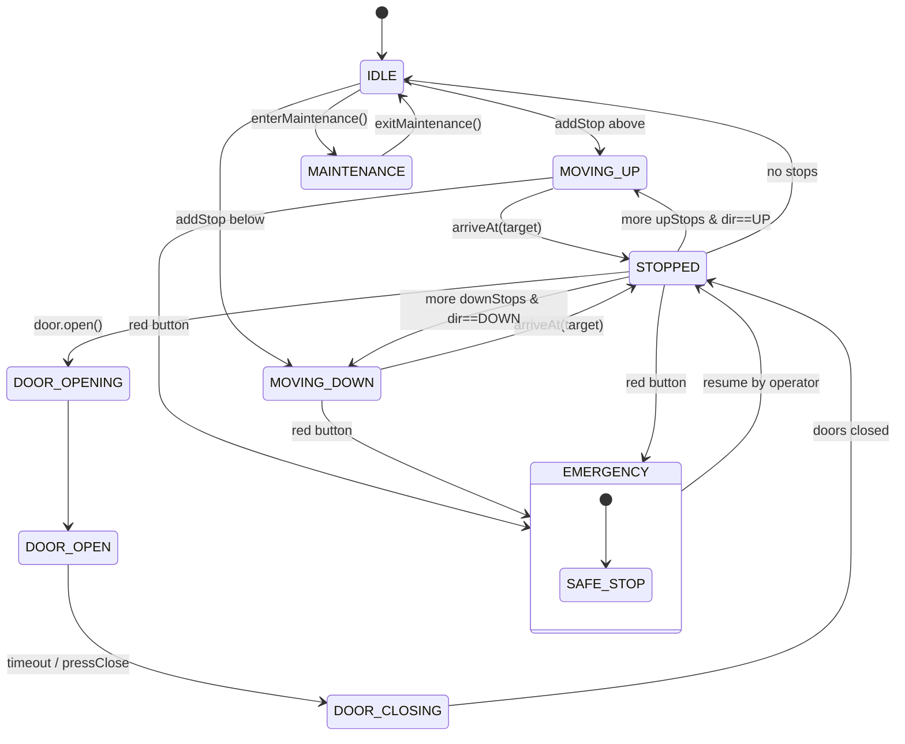
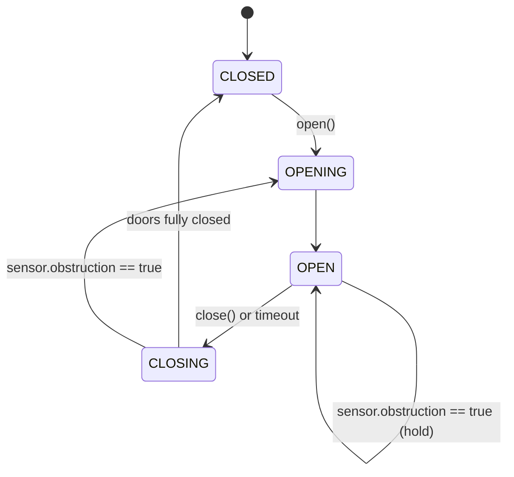
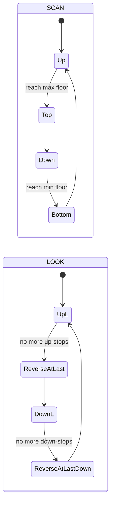
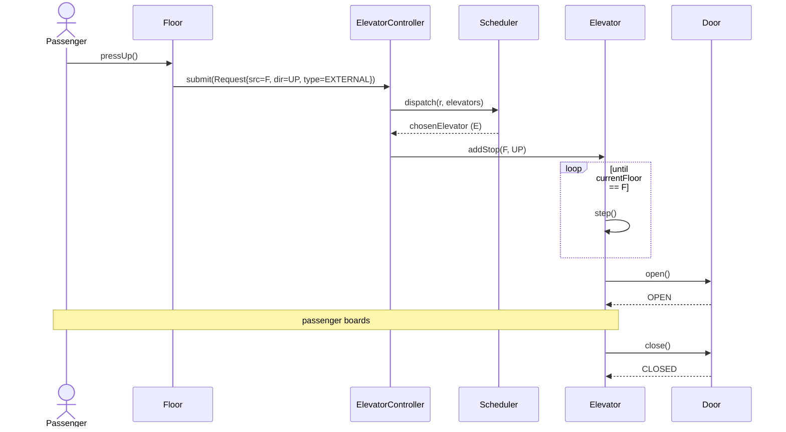
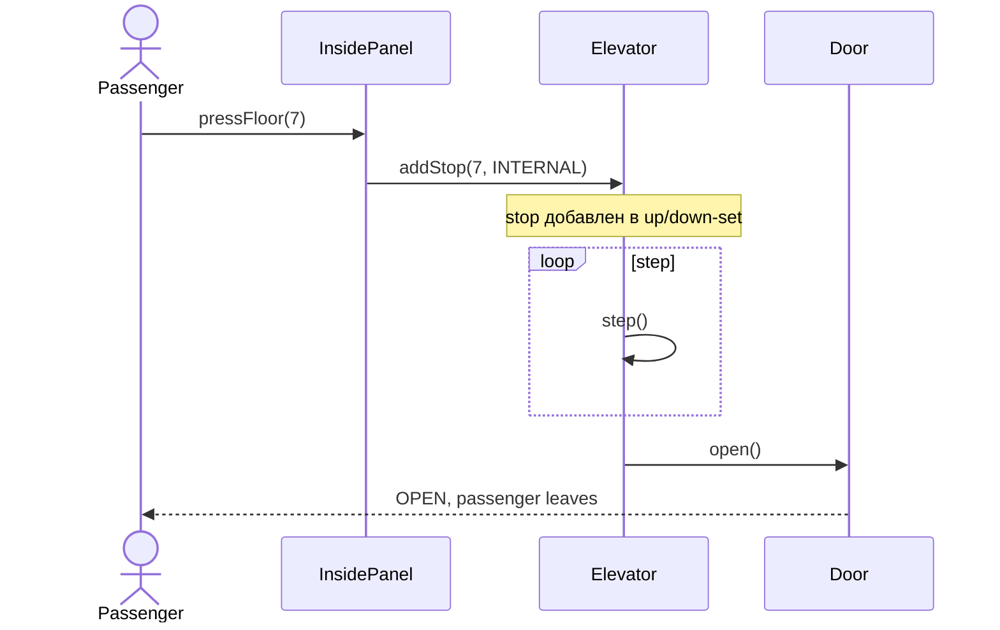
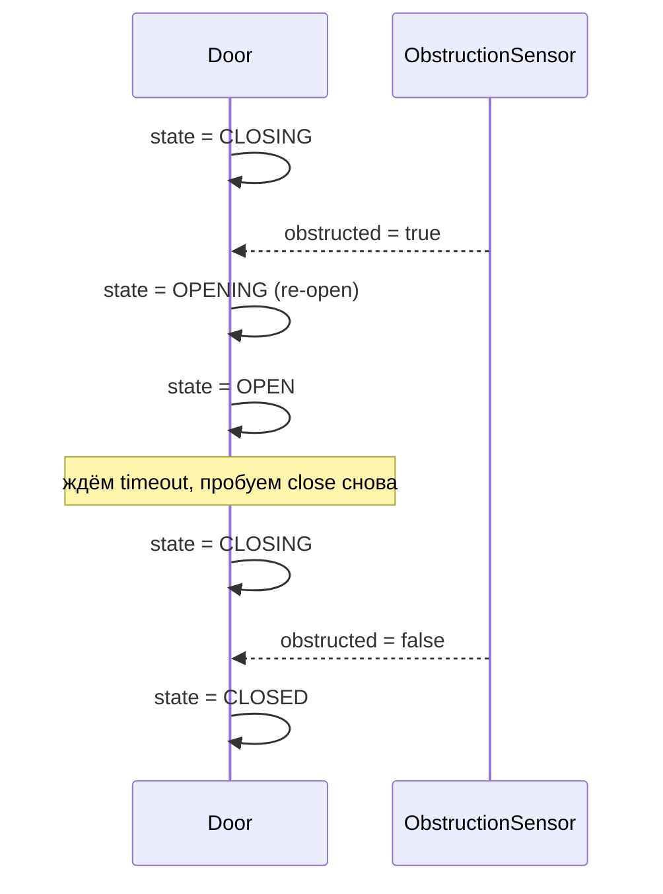

# OO Design: Elevator System — Interview Cheatsheet

**Обновлено:** 2026-05-22

Низкоуровневый объектно-ориентированный дизайн (LLD) банка лифтов: разбор требований, классы и их зоны ответственности, state machine для лифта и дверей, scheduling-алгоритмы (SCAN, LOOK, Nearest-Car, Group dispatching), потокобезопасность, edge cases (emergency, overload, fire mode) и применение паттернов GoF (State, Strategy, Observer, Command, Singleton).

## Полезные ссылки

- [System Design Interview](system-design-interview.md) — общий чек-лист LLD/HLD-собеседования.
- [Design Parking Lot OO](design-parking-lot-oo-interview.md) — параллельная задача на OO-дизайн.
- [Java Core](../programming-languages/java/java-core-interview.md) — interface, enum, sealed, equals/hashCode.
- [Java Concurrency](../programming-languages/java/java-concurrency-interview.md) — `BlockingQueue`, `AtomicReference`, `ReentrantLock`.
- [Clean Architecture](../architecture/clean-architecture-interview.md) — слои, dependency inversion.
- [Algorithms](../algorithms/algorithms-interview.md) — disk scheduling (SCAN/LOOK как ОС-аналог).
- [Design Patterns](../design-patterns/design-patterns-interview.md) — State, Strategy, Observer, Command, Singleton.

## Содержание

**Requirements**
- [Q1. Какие функциональные требования у системы лифтов](#q1-какие-функциональные-требования-у-системы-лифтов)
- [Q2. Какие нефункциональные требования: SLA, время ожидания, энергия](#q2-какие-нефункциональные-требования-sla-время-ожидания-энергия)
- [Q3. Кто акторы системы и какие у них use cases](#q3-кто-акторы-системы-и-какие-у-них-use-cases)

**Классы и их responsibilities**
- [Q4. (!) Какие сущности выделяем и почему](#q4--какие-сущности-выделяем-и-почему)
- [Q5. (!) Elevator: атрибуты, методы, инварианты](#q5--elevator-атрибуты-методы-инварианты)
- [Q6. Как устроены Floor, Display, Door и Request](#q6-как-устроены-floor-display-door-и-request)
- [Q7. (!) ElevatorController и Scheduler — разделение ответственности](#q7--elevatorcontroller-и-scheduler--разделение-ответственности)

**UML class diagram**
- [Q8. (!) Как выглядит class diagram целиком](#q8--как-выглядит-class-diagram-целиком)
- [Q9. Полная реализация Elevator и Door на Java](#q9-полная-реализация-elevator-и-door-на-java)
- [Q10. Полная реализация ElevatorController и Request на Java](#q10-полная-реализация-elevatorcontroller-и-request-на-java)

**State machine**
- [Q11. (!) Как устроена state machine лифта](#q11--как-устроена-state-machine-лифта)
- [Q12. (!) Как state machine двери обрабатывает препятствие](#q12--как-state-machine-двери-обрабатывает-препятствие)

**Scheduling algorithms**
- [Q13. (!) Чем отличаются SCAN и LOOK](#q13--чем-отличаются-scan-и-look)
- [Q14. Как работает Nearest-Car — простое правило назначения](#q14-как-работает-nearest-car--простое-правило-назначения)
- [Q15. Что такое group dispatching и destination dispatching](#q15-что-такое-group-dispatching-и-destination-dispatching)
- [Q16. (!) Как алгоритмы соотносятся между собой (таблица компромиссов)](#q16--как-алгоритмы-соотносятся-между-собой-таблица-компромиссов)

**Паттерны GoF**
- [Q17. (!) Где применяются State, Strategy, Observer, Command, Singleton](#q17--где-применяются-state-strategy-observer-command-singleton)
- [Q18. Как принципы SOLID проявляются в дизайне лифта](#q18-как-принципы-solid-проявляются-в-дизайне-лифта)

**Concurrency**
- [Q19. (!) Как обеспечить потокобезопасность при одновременных запросах](#q19--как-обеспечить-потокобезопасность-при-одновременных-запросах)
- [Q20. Как выглядят sequence-диаграммы основных потоков](#q20-как-выглядят-sequence-диаграммы-основных-потоков)

**Edge cases и optimization**
- [Q21. Какие граничные случаи нужно обработать: emergency, overload, fire, power outage](#q21-какие-граничные-случаи-нужно-обработать-emergency-overload-fire-power-outage)
- [Q22. Что такое predictive scheduling и исторические паттерны трафика](#q22-что-такое-predictive-scheduling-и-исторические-паттерны-трафика)
- [Q23. Как устроены раздельные банки для low-rise и high-rise](#q23-как-устроены-раздельные-банки-для-low-rise-и-high-rise)
- [Q24. Какой External API нужен для интеграции с building monitoring](#q24-какой-external-api-нужен-для-интеграции-с-building-monitoring)
- [Q25. Как тестировать систему: simulation framework](#q25-как-тестировать-систему-simulation-framework)
- [Q26. Какие анти-паттерны встречаются в дизайне лифта](#q26-какие-анти-паттерны-встречаются-в-дизайне-лифта)

---

## Q1. Какие функциональные требования у системы лифтов

Первым делом на собеседовании фиксируют **функциональные требования** — что система обязана уметь. Без этого оценка класс-дизайна повиснет в воздухе: непонятно, под какие сценарии вы вообще проектируете. Десять базовых требований:

| # | Требование | Комментарий |
|---|-----------|-------------|
| 1 | Multi-elevator | банк из `N` лифтов в здании |
| 2 | Multiple floors | от `MIN_FLOOR` (например `-2`) до `MAX_FLOOR` (например `40`) |
| 3 | External request | пассажир жмёт `UP`/`DOWN` на этаже |
| 4 | Internal request | внутри кабины жмёт номер этажа |
| 5 | Direction selection | лифт сам выбирает оптимальное направление |
| 6 | Capacity / weight | максимальный вес/число пассажиров |
| 7 | Doors | open / close, sensors на препятствие |
| 8 | Emergency stop | красная кнопка, останов и сигнал |
| 9 | Maintenance mode | вывод из строя по запросу обслуживания |
| 10 | Display | этаж + направление на каждом этаже и в кабине |

**Ключевая тонкость:** external request **не содержит destination** — пассажир на этаже жмёт только направление (`UP`/`DOWN`), а не «куда едет». Этаж назначения он указывает уже внутри кабины, internal-кнопкой, после посадки. Это разделение и определяет два разных типа Request. В современных destination-dispatching системах схему переворачивают — destination называется ещё на этаже (см. [Q15](#q15-group-dispatching-и-destination-dispatching)).

---

## Q2. Какие нефункциональные требования: SLA, время ожидания, энергия

Нефункциональные требования (NFR) задают **качество** сервиса: насколько быстро назначается лифт, как долго ждёт пассажир, как система ведёт себя при отказе. Именно по ним проверяют, что ваш дизайн не разваливается под нагрузкой. Ключевые атрибуты и как их достигаем:

| Атрибут | Цель | Как достигаем |
|---------|------|---------------|
| Latency assignment | назначить лифт за `< 200 ms` | in-memory `Scheduler`, без БД на горячем пути |
| Average waiting time | минимизировать (SLA: P95 < 30 s) | SCAN/LOOK + group dispatching |
| Throughput | обслужить N запросов/мин | bank из нескольких лифтов |
| Energy efficiency | не гонять пустой лифт | idle-park strategy + LOOK (не доезжать до краёв) |
| Availability | один лифт offline — банк работает | independent state per elevator |
| Safety | doors не давят, weight не превышается | sensors + interlocks в state machine |
| Observability | metrics (avg wait, utilization) | Observer на state changes |

---

## Q3. Кто акторы системы и какие у них use cases

**Акторы** — это внешние роли, которые взаимодействуют с системой. Выделение акторов нужно, чтобы не пропустить ни одного сценария: у каждого актора свой набор действий и свои права.

- **Passenger** — нажимает кнопки на этаже и внутри кабины. Основной актор.
- **Maintenance** (обслуживающий персонал) — переводит лифт в режим обслуживания.
- **Admin / building monitoring** — собирает метрики и настраивает стратегию диспетчеризации.

**Сценарии (use cases):**

1. **External request:** пассажир жмёт `UP`/`DOWN` на этаже `F` → controller выбирает свободный лифт → лифт едет к `F`.
2. **Internal request:** пассажир внутри лифта `E` жмёт этаж `D` → `E` добавляет `D` в свой stop-set.
3. **Maintenance:** обслуживающий переводит лифт в `MAINTENANCE` → controller перестаёт назначать ему новые запросы.
4. **Emergency:** пассажир жмёт красную кнопку → лифт плавно тормозит и открывает двери на ближайшем этаже.
5. **Fire mode:** срабатывает пожарная сигнализация здания → все лифты едут на первый этаж и блокируются.

---

## Q4. (!) Какие сущности выделяем и почему

Доменные классы вытаскивают из требований **анализом существительных**: «лифт», «этаж», «запрос», «дверь» — это кандидаты в классы, а глаголы вокруг них («жмёт кнопку», «открывает двери») — кандидаты в методы. Получившийся набор:

| Класс | Зона ответственности (SRP) |
|-------|---------------------------|
| `Elevator` | состояние одной кабины: floor, direction, state, doors, internal-stops |
| `Floor` | UI-узел этажа: кнопки UP/DOWN, display |
| `Request` | команда «отвези с `src` на `dst` в направлении `dir`» |
| `ElevatorController` | оркестратор: принимает Request → делегирует Scheduler → ставит в очередь нужного лифта |
| `Scheduler` (interface) | политика выбора лифта (SCAN/LOOK/Nearest/Group) |
| `Door` | подсостояние дверей, обработка obstruction |
| `Display` | отображение текущего этажа и направления (Observer) |
| `MaintenanceMode` | флаг + правило: не получать новых запросов, доехать до ground |
| `Building` | агрегатор: список Floor + ElevatorController |

Главный принцип здесь — **одна причина для изменения = один класс** (SRP). Поэтому `Door` и `Display` вынесены из `Elevator`: их логика меняется независимо от логики движения кабины. Добавили новый сенсор в дверь — правим только `Door`, `Elevator` не трогаем. Если бы двери были полем-`boolean` внутри `Elevator`, любое изменение в их поведении тянуло бы за собой правки в классе лифта.

---

## Q5. (!) Elevator: атрибуты, методы, инварианты

`Elevator` — центральный класс, хранящий всё состояние одной кабины: текущий этаж, направление, состояние, загрузку и набор этажей-остановок. Обратите внимание на типы: изменяемые поля — `volatile` или `AtomicReference` (несколько потоков читают/пишут состояние одновременно), а stop-set разбит на два отсортированных множества — `upStops` и `downStops` — чтобы лифт мог обслуживать остановки строго по направлению.

```java
public class Elevator {
    private final int id;
    private final int minFloor;
    private final int maxFloor;
    private final int maxCapacityKg;

    private volatile int currentFloor;
    private final AtomicReference<Direction> direction;   // UP, DOWN, IDLE
    private final AtomicReference<ElevatorState> state;   // IDLE, MOVING, STOPPED, MAINTENANCE
    private volatile int currentLoadKg;

    private final Door door;
    private final Display display;

    // Stop-set: floors elevator должен посетить, отсортированный по направлению.
    private final NavigableSet<Integer> upStops   = new ConcurrentSkipListSet<>();
    private final NavigableSet<Integer> downStops = new ConcurrentSkipListSet<>(Comparator.reverseOrder());

    public void addStop(int floor, Direction reqDir) { /* кладём в up/down по правилу */ }
    public void step()                              { /* один тик симуляции */ }
    public boolean canAccept(Request r)             { /* invariant-проверки */ }
    public void enterMaintenance()                  { /* drain stops + перевод в MAINTENANCE */ }
}
```

**Инварианты** — это правила, которые класс обязан удерживать в любом состоянии. Их стоит проговорить на собеседовании: они показывают, что вы думаете о корректности, а не только о happy path.

- `minFloor <= currentFloor <= maxFloor` — лифт не может оказаться вне шахты.
- В режиме `MAINTENANCE` любой `addStop` падает — лифт, выведенный на обслуживание, новых остановок не принимает.
- Если `direction == UP`, то все элементы `upStops >= currentFloor` — нельзя ехать вверх к этажу, который уже позади.
- `currentLoadKg <= maxCapacityKg` — при перегрузе двери не закроются (см. сценарий overload в [Q21](#q21-edge-cases-emergency-overload-fire-power-outage)).
- Дверь открывается **только** на остановке (`STOPPED`, `direction == IDLE`) или в момент прибытия. Открыть дверь на ходу нельзя — это interlock-инвариант безопасности.

---

## Q6. Как устроены Floor, Display, Door и Request

Вспомогательные классы вокруг `Elevator`. У каждого — узкая зона ответственности:

- **`Floor`** — узел этажа: кнопки UP/DOWN (на крайних этажах одна из них отсутствует) и дисплей. Нажатие публикует external Request.
- **`Display`** реализует `ElevatorListener` (Observer) — не опрашивает лифт, а получает уведомление об изменении состояния и перерисовывается.
- **`Door`** держит своё подсостояние (`DoorState`) и сенсор препятствия; вся логика open/close инкапсулирована здесь.
- **`Request`** — неизменяемый value-object (команда «отвези с `src` на `dst`»).

```java
public class Floor {
    private final int number;
    private final boolean hasUpButton;     // верхний этаж — false
    private final boolean hasDownButton;   // нижний этаж — false
    private final Display display;
    public void pressUp()   { /* публикует External Request UP */ }
    public void pressDown() { /* публикует External Request DOWN */ }
}

public class Display implements ElevatorListener {
    @Override public void onStateChange(Elevator e) {
        render(e.getCurrentFloor(), e.getDirection());
    }
}

public class Door {
    private final AtomicReference<DoorState> state =
        new AtomicReference<>(DoorState.CLOSED);
    private final ObstructionSensor sensor;
    public void open()  { /* CLOSED→OPENING→OPEN */ }
    public void close() { /* OPEN→CLOSING→CLOSED; если sensor.detected() → reopen */ }
}

public final class Request {                  // value object (Command)
    private final UUID requestId;
    private final int sourceFloor;
    private final Integer destinationFloor;    // null для external
    private final Direction direction;
    private final Instant createdAt;
    private final RequestType type;            // EXTERNAL, INTERNAL
}
```

`Request` сделан неизменяемым (`final`-поля, без сеттеров) намеренно: его читают сразу несколько потоков, и неизменяемость снимает целый класс гонок — объект нельзя случайно «подкрутить» после создания. Бонусом — простое логирование и безопасное помещение в очередь.

---

## Q7. (!) ElevatorController и Scheduler — разделение ответственности

Ответственность делят так: `ElevatorController` **координирует** (принимает запросы, владеет банком лифтов и очередью), а `Scheduler` **решает, какому лифту отдать запрос**. Это два разных вопроса, и смешивать их в одном классе — ошибка.

`ElevatorController` — фасад/Singleton: единая точка входа для всех запросов. `Scheduler` вынесен в **отдельный интерфейс** (паттерн Strategy), и это даёт три выгоды:

- **менять алгоритм без правок controller** — добавляешь новую реализацию `Scheduler`, controller не трогаешь (OCP);
- **тестировать scheduler изолированно** — он чистая функция «запрос + лифты → лифт», без зависимостей от очереди и потоков;
- **A/B-тестировать стратегии на проде** — просто подменив реализацию через DI.

```java
public final class ElevatorController {
    private final List<Elevator> elevators;          // banks
    private final Scheduler scheduler;               // injected strategy
    private final BlockingQueue<Request> incoming;   // FIFO с приоритетом

    public CompletableFuture<Elevator> submit(Request r) {
        return CompletableFuture.supplyAsync(() -> {
            Elevator chosen = scheduler.dispatch(r, elevators);
            chosen.addStop(r.getSourceFloor(), r.getDirection());
            if (r.getDestinationFloor() != null) {
                chosen.addStop(r.getDestinationFloor(), r.getDirection());
            }
            return chosen;
        }, dispatcherPool);
    }
}

public interface Scheduler {
    Elevator dispatch(Request request, List<Elevator> elevators);
}
```

Суть разделения: controller **ничего не знает** про SCAN, LOOK или ML — всю эту специфику инкапсулирует конкретная реализация `Scheduler`. Controller лишь дёргает `dispatch(...)` и ставит остановку выбранному лифту.

---

## Q8. (!) Как выглядит class diagram целиком

Диаграмма связывает все классы из Q4–Q7. На собеседовании её рисуют, чтобы показать **отношения** между сущностями (композиция, агрегация, зависимость), а не просто список классов.


Как читать ключевые отношения (это и спросят на ревью диаграммы):

- **Композиция** (`*--`, «ромб закрашен»): `Building` владеет `Floor` и `ElevatorController`, `Elevator` владеет `Door`. Часть не живёт без целого — нет лифта, нет и его двери.
- **Агрегация** (`o--`): `ElevatorController` агрегирует `Elevator`. Лифты существуют сами по себе, controller лишь ссылается на них.
- **Зависимость через интерфейс** (`-->`): `ElevatorController` зависит от **интерфейса** `Scheduler`, а не от конкретного класса — это и есть DIP, точка подмены стратегии.
- **Реализация** (`..|>`): `Display` реализует `ElevatorListener` — связь Observer.

---

## Q9. Полная реализация Elevator и Door на Java

Здесь собрана рабочая реализация. Главное, на что смотреть: метод `canAccept` кодирует основное правило SCAN/LOOK (брать запрос только если он по пути в текущем направлении или лифт свободен), `step()` — один тик симуляции (шаг к ближайшей цели), а `nextStopInCurrentDir` использует `ceiling`/`floor` отсортированных множеств, чтобы за `O(log n)` найти следующую остановку.

```java
public enum Direction { UP, DOWN, IDLE }
public enum ElevatorState { IDLE, MOVING, STOPPED, MAINTENANCE }
public enum DoorState { CLOSED, OPENING, OPEN, CLOSING }

public class Elevator {
    private final int id;
    private final int minFloor;
    private final int maxFloor;
    private final int maxCapacityKg;
    private final Door door;
    private final List<ElevatorListener> listeners = new CopyOnWriteArrayList<>();

    private volatile int currentFloor;
    private final AtomicReference<Direction> direction =
        new AtomicReference<>(Direction.IDLE);
    private final AtomicReference<ElevatorState> state =
        new AtomicReference<>(ElevatorState.IDLE);
    private volatile int currentLoadKg = 0;

    private final NavigableSet<Integer> upStops =
        new ConcurrentSkipListSet<>();
    private final NavigableSet<Integer> downStops =
        new ConcurrentSkipListSet<>(Comparator.reverseOrder());

    public Elevator(int id, int min, int max, int capKg, Door door) {
        this.id = id; this.minFloor = min; this.maxFloor = max;
        this.maxCapacityKg = capKg; this.door = door;
        this.currentFloor = min;
    }

    public synchronized void addStop(int floor, Direction reqDir) {
        if (state.get() == ElevatorState.MAINTENANCE)
            throw new IllegalStateException("in maintenance");
        if (floor < minFloor || floor > maxFloor)
            throw new IllegalArgumentException("floor out of range");
        if (reqDir == Direction.UP)   upStops.add(floor);
        else if (reqDir == Direction.DOWN) downStops.add(floor);
        else                                upStops.add(floor); // internal без dir
        notifyListeners();
    }

    public boolean canAccept(Request r) {
        if (state.get() == ElevatorState.MAINTENANCE) return false;
        if (currentLoadKg >= maxCapacityKg)           return false;
        // same direction OR idle — главное правило SCAN/LOOK
        Direction d = direction.get();
        if (d == Direction.IDLE) return true;
        if (d != r.getDirection()) return false;
        return (d == Direction.UP   && r.getSourceFloor() >= currentFloor)
            || (d == Direction.DOWN && r.getSourceFloor() <= currentFloor);
    }

    /** Один тик симуляции: двигаемся к ближайшей цели в текущем направлении. */
    public synchronized void step() {
        if (state.get() == ElevatorState.MAINTENANCE) return;

        Integer next = nextStopInCurrentDir();
        if (next == null) {            // в направлении больше нечего — реверс
            reverseOrIdle();
            return;
        }
        if (next == currentFloor) {
            arriveAt(currentFloor);
        } else {
            state.set(ElevatorState.MOVING);
            currentFloor += (next > currentFloor) ? 1 : -1;
        }
        notifyListeners();
    }

    private Integer nextStopInCurrentDir() {
        if (direction.get() == Direction.UP)
            return upStops.ceiling(currentFloor);
        if (direction.get() == Direction.DOWN)
            return downStops.floor(currentFloor);
        // IDLE: берём что есть
        Integer u = upStops.ceiling(currentFloor);
        Integer d = downStops.floor(currentFloor);
        if (u == null) return d;
        if (d == null) return u;
        return Math.abs(u - currentFloor) <= Math.abs(d - currentFloor) ? u : d;
    }

    private void reverseOrIdle() {
        if (!upStops.isEmpty())   direction.set(Direction.UP);
        else if (!downStops.isEmpty()) direction.set(Direction.DOWN);
        else { direction.set(Direction.IDLE); state.set(ElevatorState.IDLE); }
    }

    private void arriveAt(int floor) {
        state.set(ElevatorState.STOPPED);
        if (direction.get() == Direction.UP)   upStops.remove(floor);
        else                                    downStops.remove(floor);
        door.open();
        // …timeout boarding…
        door.close();
        reverseOrIdle();
    }

    public void enterMaintenance() {
        upStops.clear(); downStops.clear();
        direction.set(Direction.IDLE);
        state.set(ElevatorState.MAINTENANCE);
        notifyListeners();
    }

    public void addListener(ElevatorListener l) { listeners.add(l); }
    private void notifyListeners() { listeners.forEach(l -> l.onStateChange(this)); }

    // getters omitted for brevity
}

public class Door {
    private final AtomicReference<DoorState> state =
        new AtomicReference<>(DoorState.CLOSED);
    private final ObstructionSensor sensor;

    public Door(ObstructionSensor sensor) { this.sensor = sensor; }

    public void open() {
        state.set(DoorState.OPENING);
        // animation… 
        state.set(DoorState.OPEN);
    }

    public void close() {
        state.set(DoorState.CLOSING);
        while (sensor.isObstructed()) {
            state.set(DoorState.OPENING);
            // re-open polling
            state.set(DoorState.OPEN);
            state.set(DoorState.CLOSING);
        }
        state.set(DoorState.CLOSED);
    }

    public DoorState current() { return state.get(); }
}
```

---

## Q10. Полная реализация ElevatorController и Request на Java

Controller владеет банком лифтов и **однопоточным циклом диспетчеризации**: `dispatchLoop` забирает запросы из `BlockingQueue` по одному и назначает лифт. Один поток здесь не для производительности, а для корректности — он сериализует выбор лифта и исключает гонку «два диспетчера назначили один и тот же лифт двум запросам».

```java
public final class Request {
    public enum Type { EXTERNAL, INTERNAL }
    private final UUID requestId;
    private final int sourceFloor;
    private final Integer destinationFloor;     // null для EXTERNAL
    private final Direction direction;
    private final Type type;
    private final Instant createdAt;

    // ctor + getters; equals/hashCode на requestId
}

public final class ElevatorController {
    private static volatile ElevatorController INSTANCE;

    private final List<Elevator> elevators;
    private final Scheduler scheduler;
    private final BlockingQueue<Request> incoming = new LinkedBlockingQueue<>();
    private final ExecutorService dispatcherPool =
        Executors.newSingleThreadExecutor();   // sequential dispatch loop

    private ElevatorController(List<Elevator> es, Scheduler s) {
        this.elevators = List.copyOf(es);
        this.scheduler = s;
        dispatcherPool.submit(this::dispatchLoop);
    }

    public static ElevatorController init(List<Elevator> es, Scheduler s) {
        if (INSTANCE == null) {
            synchronized (ElevatorController.class) {
                if (INSTANCE == null) INSTANCE = new ElevatorController(es, s);
            }
        }
        return INSTANCE;
    }
    public static ElevatorController instance() { return INSTANCE; }

    public void submit(Request r) { incoming.offer(r); }

    private void dispatchLoop() {
        while (!Thread.currentThread().isInterrupted()) {
            try {
                Request r = incoming.take();   // blocks
                Elevator chosen = scheduler.dispatch(r, elevators);
                chosen.addStop(r.getSourceFloor(), r.getDirection());
                if (r.getDestinationFloor() != null) {
                    chosen.addStop(r.getDestinationFloor(), r.getDirection());
                }
            } catch (InterruptedException e) {
                Thread.currentThread().interrupt();
            }
        }
    }
}
```

Два момента, которые стоит назвать вслух:

- **Singleton** — на здание нужна ровно одна точка координации банка; double-checked locking с `volatile INSTANCE` обеспечивает потокобезопасную ленивую инициализацию.
- **Два разных потока** — диспетчеризация (выбор лифта) и симуляция движения разведены: `dispatchLoop` сериализует назначения, а `step()` каждого лифта крутится в отдельном пуле по таймеру. Смешивать их нельзя — это вернуло бы гонки.

---

## Q11. (!) Как устроена state machine лифта

Состояния лифта моделируют конечным автоматом, а не россыпью флагов. Причина — безопасность и предсказуемость: каждый переход явный, запрещённые переходы (например, начать движение с открытыми дверями) физически невозможны. Это и есть паттерн State.



Три правила, которые держат автомат корректным:

- **Между `DOOR_OPEN` и `MOVING` нет прямого перехода** — перед началом движения двери обязаны быть `CLOSED`. Это interlock: главная гарантия безопасности.
- **`MAINTENANCE` — состояние-ловушка (sink-state):** войти можно, новые запросы не принимаются, выйти — только вручную оператором.
- **`EMERGENCY` достижим из любого `MOVING`/`STOPPED`** — по красной кнопке лифт плавно тормозит до ближайшего этажа. Выход — только resume оператором.

---

## Q12. (!) Как state machine двери обрабатывает препятствие

У двери собственный автомат из четырёх состояний (`CLOSED → OPENING → OPEN → CLOSING`). Самая важная его часть — реакция на препятствие во время закрытия: именно она отвечает за то, чтобы дверь не зажала пассажира.



**Правило препятствия:** во время `CLOSING` любая сработка сенсора немедленно возвращает дверь в `OPENING` (и далее в `OPEN`). Это инвариант безопасности — дверь физически не может дозакрыться, пока в проёме что-то есть.

**Автозакрытие:** в состоянии `OPEN` работает таймаут (например, 5 секунд) → по нему вызывается `close()`. Если сенсор всё ещё держит препятствие, таймер сбрасывается и стартует заново — дверь не начнёт закрываться, пока проём не освободится.

---

## Q13. (!) Чем отличаются SCAN и LOOK

И SCAN, и LOOK — это про то, **как один лифт обходит свои остановки**. Оба алгоритма пришли из disk scheduling (планирование головки жёсткого диска — см. [algorithms-interview](../algorithms/algorithms-interview.md)), и идея у них одна: двигаться в одном направлении, обслуживая всё по пути, прежде чем развернуться. Разница — только в точке разворота.

**SCAN («elevator algorithm»):**
- лифт идёт в одном направлении **до самого края шахты** (верхний или нижний этаж);
- по дороге обслуживает все остановки этого направления;
- упёршись в край — разворачивается.

**LOOK:**
- то же самое, но **разворот происходит на последней остановке**, а не на краю — лифт не едет дальше, если выше/ниже запросов нет.
- За счёт этого меньше холостой пробег → ниже расход энергии и короче среднее ожидание.

Проще говоря: SCAN всегда доезжает до стены, LOOK останавливается там, где кончились заявки. LOOK — почти всегда лучше.



В реальных лифтах работает именно **LOOK** (или его вариация): нет смысла гнать кабину на 40-й этаж, если последняя заявка была на 30-м. На собеседовании достаточно показать, что вы понимаете эту разницу и почему LOOK предпочтительнее.

---

## Q14. Как работает Nearest-Car — простое правило назначения

SCAN/LOOK решают, как ходит **один** лифт. Но когда лифтов несколько (банк из `N`), появляется второй вопрос: **какому из них** отдать external request? Самый простой ответ — назначить ближайший подходящий лифт. Это и делает `NearestCarScheduler`: для каждого лифта считает «стоимость» (расстояние до источника заявки) и берёт минимум.

```java
public class NearestCarScheduler implements Scheduler {
    @Override
    public Elevator dispatch(Request r, List<Elevator> elevators) {
        return elevators.stream()
            .filter(e -> e.canAccept(r))
            .min(Comparator.comparingInt(e -> score(e, r)))
            .orElseThrow(() -> new IllegalStateException("no elevator available"));
    }

    private int score(Elevator e, Request r) {
        int distance = Math.abs(e.getCurrentFloor() - r.getSourceFloor());
        // штраф за движение в противоположную сторону
        if (e.getDirection() != Direction.IDLE && e.getDirection() != r.getDirection()) {
            distance += 1000;   // де-факто запрет
        }
        return distance;
    }
}
```

Обратите внимание на `score`: движение в противоположную сторону штрафуется на `+1000` — фактически такой лифт исключается из выбора, чтобы не разворачивать едущую кабину ради одной заявки.

- **Плюсы:** `O(N)` на запрос, логика понятна и легко объясняется на доске.
- **Минусы:** алгоритм близорук — смотрит только на текущее расстояние, игнорируя будущие заявки и загрузку других лифтов. При высокой нагрузке это даёт неоптимальное распределение; тогда нужен group dispatching ([Q15](#q15-group-dispatching-и-destination-dispatching)).

---

## Q15. Что такое group dispatching и destination dispatching

Это два следующих уровня диспетчеризации после простого Nearest-Car — они смотрят на банк как на единое целое, а не на каждый лифт отдельно.

**Group dispatching** — координация всего банка ради глобального оптимума, а не локально-лучшего выбора для одной заявки. Цели:
- минимизировать **среднее** ожидание по всем pending-заявкам, а не только для текущей;
- балансировать загрузку лифтов, чтобы один не перегружался, пока другие простаивают;
- учитывать время суток (утром поток идёт вверх — паттерн «morning peak», см. [Q22](#q22-predictive-scheduling-и-historical-traffic-patterns)).

**Destination dispatching** (коммерческие системы Schindler PORT, KONE Polaris, Otis Compass) меняет сам интерфейс:
- пассажир называет этаж назначения **ещё на этаже**, до входа в кабину;
- система группирует людей с близкими destination в один лифт, сокращая число остановок за поездку;
- даёт **20–30 % прироста throughput** против обычного SCAN — именно за счёт меньшего числа остановок.

Реализуют это уже не эвристикой, а оптимизацией:
- jobshop scheduling;
- reinforcement learning на исторических данных;
- mixed-integer programming для поиска точного оптимума.

**Главное для собеседования:** при всей сложности математики в коде это по-прежнему **просто другая реализация `Scheduler`** — архитектура из Q7 не меняется, меняется тело `dispatch`:

```java
public class GroupDispatchScheduler implements Scheduler {
    private final TrafficPredictor predictor;
    @Override
    public Elevator dispatch(Request r, List<Elevator> elevators) {
        // глобальная оптимизация: для каждого elevator считаем cost
        // как сумму (wait time прибавленного к pending requests).
        return elevators.stream()
            .filter(e -> e.canAccept(r))
            .min(Comparator.comparingDouble(e -> totalCost(e, r, predictor)))
            .orElseThrow();
    }
}
```

---

## Q16. (!) Как алгоритмы соотносятся между собой (таблица компромиссов)

Сводка всех стратегий из Q13–Q15 в одном месте — чтобы держать в голове, что за что платится. Чем умнее алгоритм, тем лучше время ожидания и энергия, но тем выше сложность реализации:

| Алгоритм | Среднее ожидание | Энергия | Сложность | Где используется |
|----------|---------|--------|-----------|------------------|
| FCFS | плохо | плохо | O(1) | учебный пример |
| SCAN | средне | средне (до края) | O(log n) с TreeSet | базовый «elevator algorithm» |
| LOOK | лучше SCAN | лучше SCAN | O(log n) | большинство реальных лифтов |
| Nearest-Car | хорошо при низкой нагрузке | средне | O(N) per request | small banks (2-4 лифта) |
| Group dispatching | лучшее | лучшее | O(N · M) или ML inference | большие здания, бизнес-центры |
| Destination dispatching | best | best (учёт peak) | сложно (modelling) | premium-системы (Schindler/KONE/Otis) |

**Эмпирическое правило:** на собеседовании достаточно уверенно объяснить связку **LOOK (как ходит лифт) + Nearest-Car (кому отдать заявку)** и упомянуть, что в премиум-системах поверх этого работает group/destination dispatching. Это покрывает 90 % вопросов по алгоритму.

---

## Q17. (!) Где применяются State, Strategy, Observer, Command, Singleton

Задача про лифт хороша тем, что в неё естественно ложатся сразу пять паттернов GoF — и это любимый предмет вопросов. Важно не просто назвать паттерн, а сказать, **какую проблему он решает именно здесь**:

| Паттерн | Где применён | Зачем |
|---------|--------------|-------|
| **State** | `ElevatorState`, `DoorState` | избавиться от больших `if/else` и обеспечить инварианты переходов |
| **Strategy** | `Scheduler` (SCAN/LOOK/Nearest/Group) | менять алгоритм назначения без правок controller |
| **Observer** | `Display`, metrics-collector подписаны на `Elevator` | разделить state-mutation и UI/мониторинг |
| **Command** | `Request` как value-object + dispatcher loop | encapsulate request as object — можно ставить в очередь, логировать, повторять |
| **Singleton** | `ElevatorController` | одна точка координации всего банка лифтов |
| **Factory** (опц.) | `SchedulerFactory.create(strategyName)` | конфигурация через property |

**Что считается обязательным минимумом:** State (для состояний лифта/двери), Strategy (для scheduler) и Observer (для дисплея). Назвать эти три — значит закрыть вопрос. Command (Request как объект) и Singleton (controller) — приятный бонус, который выделит вас среди кандидатов.

---

## Q18. Как принципы SOLID проявляются в дизайне лифта

SOLID — это тот же дизайн из предыдущих вопросов, разложенный по пяти принципам. Полезно уметь привязать каждый принцип к конкретному классу системы: это показывает, что разделение ответственности у вас не случайное, а осознанное.

| Принцип | Применение |
|---------|-----------|
| **SRP** | `Door`, `Elevator`, `Display` — каждый отвечает за свой аспект; `Scheduler` отделён от `Controller` |
| **OCP** | новый scheduling-алгоритм добавляется как новый класс, реализующий `Scheduler`; `Controller` не меняется |
| **LSP** | любая реализация `Scheduler` подставима — контракт `dispatch(Request, List<Elevator>) → Elevator` |
| **ISP** | `ElevatorListener` узкий — только `onStateChange`; Display не зависит от методов движения |
| **DIP** | `Controller` зависит от **интерфейса** `Scheduler`, не от конкретного класса; конкретика — через DI |

---

## Q19. (!) Как обеспечить потокобезопасность при одновременных запросах

Заявки приходят параллельно — несколько этажей жмут кнопки в один и тот же момент, плюс отдельный поток двигает каждый лифт. Чтобы не словить гонки, под каждый разделяемый кусок состояния подбирают подходящий потокобезопасный примитив:

1. **Очередь запросов** — `BlockingQueue<Request>`: потокобезопасна по контракту JDK, и `take()` блокирует consumer, пока очередь пуста.
2. **Состояние лифта** — `AtomicReference<ElevatorState>` и `AtomicReference<Direction>`: переходы через CAS, без блокировок.
3. **Stop-sets** — `ConcurrentSkipListSet<Integer>`: единственный из concurrent-коллекций, что даёт и потокобезопасность, и сортированные операции `ceiling`/`floor`, нужные для SCAN/LOOK.
4. **Listeners** — `CopyOnWriteArrayList`: подписчиков читают на каждом тике, а пишут редко — копирование при записи здесь дешевле блокировки.
5. **Цикл диспетчеризации** — однопоточный consumer (`newSingleThreadExecutor`): сериализует выбор лифта и исключает гонку «два диспетчера назначили один и тот же лифт двум заявкам».
6. **`Elevator.addStop` и `step`** — `synchronized` на инстансе лифта: мутация stop-set и логика разворота должны выполняться атомарно.

**Подводные камни** (типичные ошибки, которые тут же ломают потокобезопасность):
- хранить состояние в обычных `int`/`enum` без `volatile` → один поток не увидит запись другого (нарушена видимость по JMM);
- использовать `ArrayList` для stop-set и итерировать без копии → `ConcurrentModificationException`;
- класть лифты в обычный `HashMap<elevatorId, Elevator>` без concurrent-обёртки.

**Прикидка пропускной способности** (полезно назвать на собеседовании): даже наивная реализация выдержит десятки тысяч запросов в секунду — узкое место не в синхронизации данных, а в физической симуляции движения кабины.

---

## Q20. Как выглядят sequence-диаграммы основных потоков

Диаграммы последовательности показывают, **кто кому шлёт сообщения во времени** — это дополняет class diagram (структуру) динамикой. Ниже три ключевых потока: внешний вызов, внутренний вызов и обработка препятствия в дверях.

**External request — вызов с этажа:**



**Internal request — вызов из кабины:**



**Door obstruction — препятствие при закрытии:**



---

## Q21. Какие граничные случаи нужно обработать: emergency, overload, fire, power outage

Граничные случаи — это то, что отличает «игрушечный» дизайн от продакшен-готового, и именно их любят спрашивать. Каждый сценарий — это не разбросанный по коду `if`, а **явный переход в state machine**:

| Сценарий | Реакция системы |
|----------|-----------------|
| **Emergency button** (red) | Текущее движение → плавный SAFE_STOP на ближайшем этаже, doors open, сигнал на пульт. Все pending stops в этой кабине отменяются. |
| **Overload** (weight > max) | Doors **не закрываются**, на дисплее warning, лифт не движется. Пассажир должен выйти. |
| **Fire mode** | Building alarm → `ElevatorController` переводит весь bank в `FIRE_MODE`: каждый лифт едет на ground floor, открывает doors, блокируется. Internal requests игнорируются. |
| **Power outage** | UPS/battery держит control logic. Лифты совершают controlled descent до ближайшего этажа, opens doors, freezes. |
| **Sensor failure** | Doors fail-open (никогда не закрывать без подтверждения, что препятствий нет). |
| **Stuck between floors** | Watchdog detects: state == MOVING > T → переход в STUCK → alert maintenance. |
| **Bumper request** (нажали этаж ниже из IDLE поднимающегося) | `canAccept` отбрасывает — этот лифт нельзя; controller назначит другой лифт банка. |

Ключевая мысль, которую стоит подчеркнуть: все эти ветки — **переходы в state machine**, а не разбросанные по бизнес-коду `if`. Тогда добавление нового сценария (например, землетрясение) — это новое состояние и его переходы, а не правки в десятке мест.

---

## Q22. Что такое predictive scheduling и исторические паттерны трафика

Это уровень оптимизации поверх обычной диспетчеризации: вместо того чтобы реагировать на заявки, система **предугадывает** их по типичным паттернам загрузки в течение дня и заранее паркует лифты в нужных местах. Основные паттерны:

| Паттерн | Время суток | Стратегия |
|---------|------------|-----------|
| Morning peak | 08:00-10:00 | большинство лифтов parked на ground, едут up |
| Evening peak | 17:00-19:00 | parked на верхних этажах, едут down |
| Lunch | 12:00-14:00 | inter-floor, two-way |
| Off-peak | ночь | один лифт активен, остальные idle |

**Как это реализуют:** через `IdleParkingPolicy` — свободный лифт паркуется не там, где остановился, а на «прогнозном» этаже по историческим данным (например, утром заранее съезжает на первый, чтобы встретить входящий поток). ML-модель (скажем, gradient boosting по признакам time-of-day, day-of-week, события в здании) предсказывает наиболее вероятный следующий этаж вызова.

**Метрики для настройки:** average waiting time (AWT) и average journey time (AJT) — это KPI, по которым подбирают и сравнивают стратегии. Без них «улучшение» не измеришь.

---

## Q23. Как устроены раздельные банки для low-rise и high-rise

В небоскрёбах один общий банк лифтов неэффективен: лифт с первого до сорокового этажа собирает слишком много остановок по пути. Поэтому шахты делят на **раздельные банки**, каждый обслуживает свою зону этажей:

- `LOW_BANK` — этажи 1–20.
- `HIGH_BANK` — этаж 1 и 20–40 (express без остановок до 20-го, дальше местные остановки).
- иногда `SHUTTLE` — только 1 ↔ 20 (быстрый челнок до пересадочного этажа, skylobby).

**Зачем так:**
- меньше остановок за поездку → выше throughput всего здания;
- меньше шахт занимают площадь этажа (shaft footprint), которую можно отдать под аренду.

**В коде** это отдельные инстансы `ElevatorController`, каждый со своим банком и подмножеством этажей. Над ними стоит `BuildingDispatcher`, который по этажу назначения решает, в какой банк отправить заявку:

```java
public class BuildingDispatcher {
    private final ElevatorController lowBank;
    private final ElevatorController highBank;
    public void submit(Request r) {
        if (r.getDestinationFloor() != null && r.getDestinationFloor() >= 20)
            highBank.submit(r);
        else
            lowBank.submit(r);
    }
}
```

---

## Q24. Какой External API нужен для интеграции с building monitoring

Чтобы система мониторинга здания и админ-панель могли управлять лифтами и снимать метрики, `ElevatorController` выставляет небольшой REST/gRPC API. Набор эндпоинтов покрывает три задачи: подача заявок, наблюдение за состоянием и администрирование:

| Метод | Что делает |
|-------|-----------|
| `POST /requests` | submit external/internal request (для тестов и интеграций) |
| `GET /elevators` | snapshot: floor, direction, state, load для каждого лифта |
| `GET /elevators/{id}/events` | SSE/WebSocket стрим state changes |
| `PUT /elevators/{id}/maintenance` | вход/выход из maintenance mode |
| `PUT /scheduler` | смена стратегии scheduling (admin only) |
| `GET /metrics` | Prometheus: avg_wait_seconds, utilization, requests_total |

**Авторизация делится по ролям:** admin/maintenance-маршруты (смена стратегии, перевод в обслуживание) защищены JWT с проверкой роли — это управляющие операции. Маршрут пассажира (`POST /requests`) делают публичным или закрывают аутентификацией по NFC-карте сотрудника — вызвать лифт должно быть просто.

---

## Q25. Как тестировать систему: simulation framework

Тестировать на реальном железе дорого и медленно — нельзя гонять настоящий лифт сто раз ради проверки утреннего пика. Поэтому строят **симулятор**: подменяют физику движения тиками `step()`, а время — управляемым `Clock`, и прогоняют сценарии нагрузки программно.

```java
public class ElevatorSimulator {
    private final ElevatorController controller;
    private final Clock clock;                 // Clock.fixed / mutable

    public void runScenario(List<TimedRequest> requests) {
        for (TimedRequest tr : requests) {
            clock.advance(tr.atOffset);
            controller.submit(tr.request);
        }
        clock.advance(Duration.ofMinutes(5));   // drain
        for (Elevator e : controller.elevators()) e.step(); // tick loop
    }

    public Metrics measure() { /* AWT, AJT, energy */ }
}
```

**Сценарии, которые стоит покрыть** (каждый проверяет свою часть дизайна):
- **Morning peak** — 100 заявок с первого этажа на разные за 5 минут: проверка диспетчеризации под пиковой нагрузкой.
- **Single passenger** на 30-й этаж при простаивающем банке: проверка nearest-car.
- **Concurrent requests на одном этаже** — выбран ровно один лифт, никаких гонок (валидирует Q19).
- **Door obstruction** — корректный re-open и повторная попытка закрытия (валидирует Q12).
- **Maintenance mid-flight** — лифт доезжает до ближайшей цели и только потом встаёт на обслуживание.

**Ключ к воспроизводимости** — детерминированные часы (Java `Clock`/`InstantSource`): без них тесты с таймаутами дверей и пиками станут флакающими.

---

## Q26. Какие анти-паттерны встречаются в дизайне лифта

Это чек-лист типичных ошибок — по сути обратная сторона всех предыдущих решений. Знать их полезно вдвойне: проговорив анти-паттерн и его исправление, вы показываете, что понимаете не только «как надо», но и «почему именно так, а не иначе».

| Анти-паттерн | Чем плох | Как правильно |
|--------------|---------|---------------|
| Door как поле-`boolean` внутри Elevator | нет инвариантов (двери открыли при движении), нарушение SRP | отдельный класс `Door` с State |
| `if/else` цепочки вместо state machine | пропущенные переходы, баги при добавлении нового состояния | enum `ElevatorState` + table-driven transitions |
| Жёсткая привязка `Controller` к `SCAN` | нельзя поменять алгоритм без правки controller | интерфейс `Scheduler` + Strategy |
| Глобальные мутации без `synchronized`/`Atomic` | гонки, дубли назначений лифту | `BlockingQueue`, `AtomicReference`, `ConcurrentSkipListSet` |
| `Display` напрямую дергает Elevator каждые 100 ms | tight coupling + лишняя нагрузка | Observer — pull на event |
| Один Singleton-mega-class для всего здания | god object, не масштабируется | `Building`, `ElevatorController`, `Elevator` с чёткими границами |
| Hard-coded floor range | при изменении высоты здания — chase changes | через конструктор / config |
| Lazy-init Singleton без double-checked locking | гонка при старте | `synchronized` + `volatile` либо enum-singleton |
| Игнорирование sensor.obstructed в close-loop | реальная безопасность под угрозой | always-check + fail-open |
| `Request` mutable | shared mutability через потоки → баги | final fields, immutable value-object |

---

## See also

- [System Design Interview](system-design-interview.md) — общая методология LLD/HLD.
- [Design Parking Lot OO](design-parking-lot-oo-interview.md) — параллельная OO-задача.
- [Java Core](../programming-languages/java/java-core-interview.md) — enum, interface, sealed.
- [Java Concurrency](../programming-languages/java/java-concurrency-interview.md) — Atomic, BlockingQueue, executors.
- [Clean Architecture](../architecture/clean-architecture-interview.md) — слои и dependency inversion.
- [Algorithms](../algorithms/algorithms-interview.md) — disk scheduling (SCAN/LOOK) аналог.
- [Design Patterns](../design-patterns/design-patterns-interview.md) — State, Strategy, Observer, Command, Singleton.
