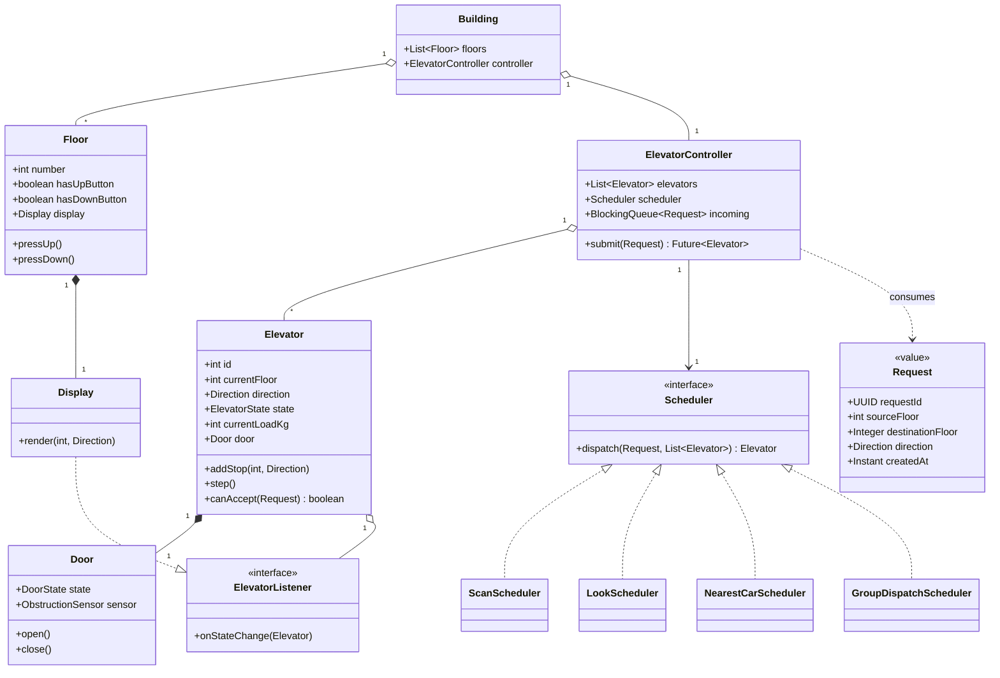
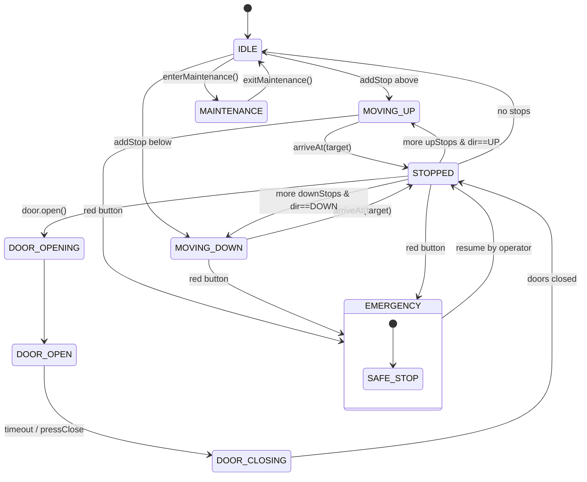
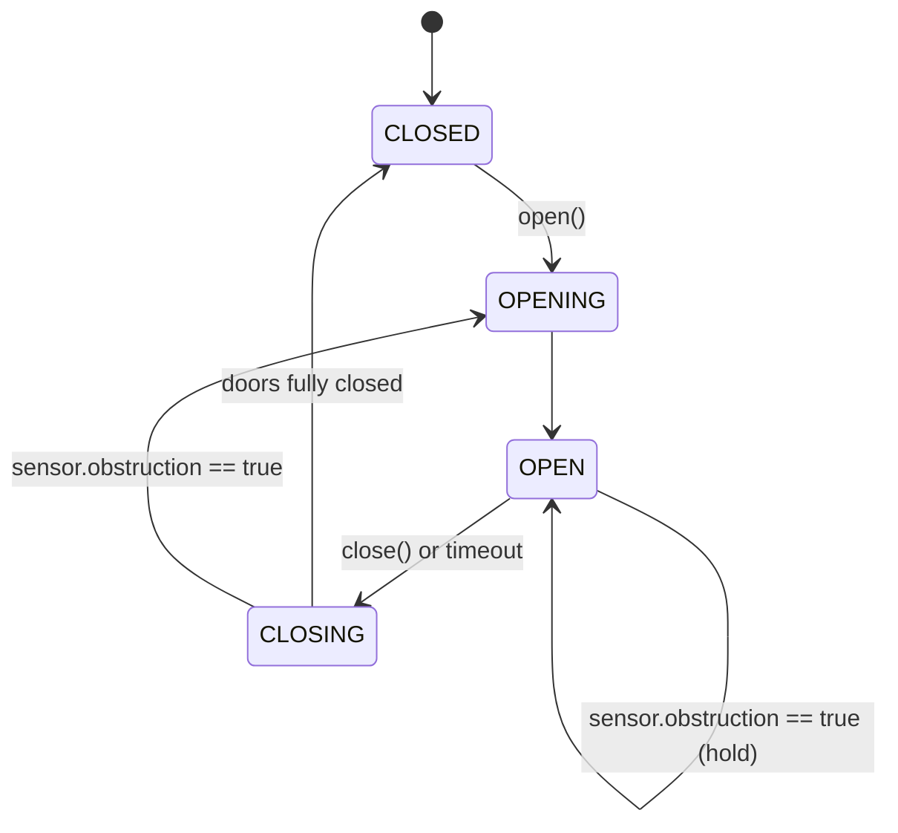
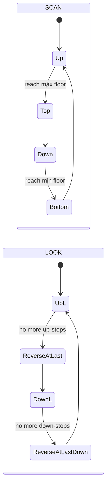
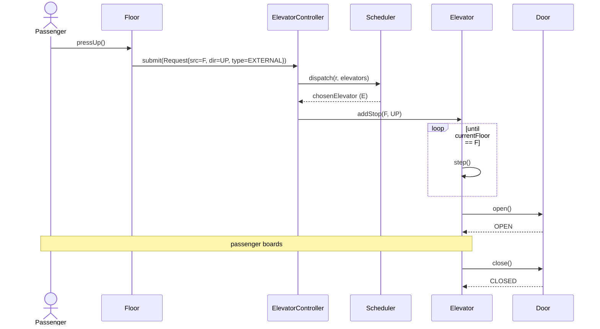
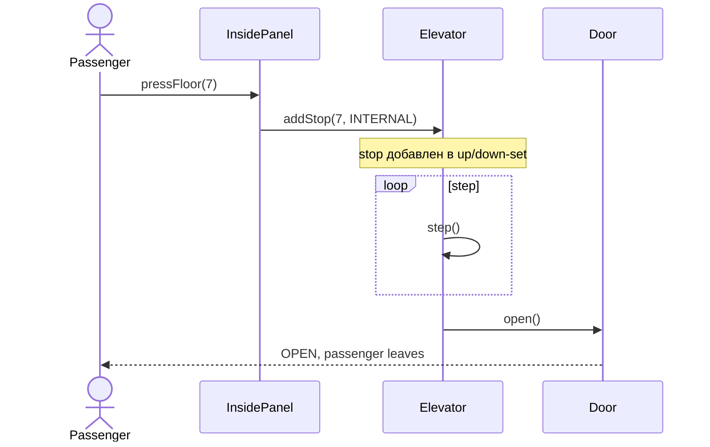
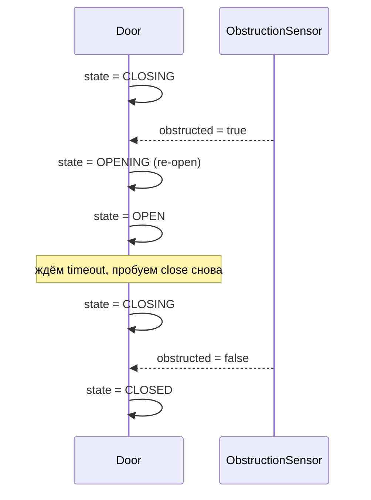

# OO Design: Elevator System — Interview Cheatsheet

**Обновлено:** 2026-05-22

Низкоуровневый объектно-ориентированный дизайн (LLD) банка лифтов: разбор требований, классы и их зоны ответственности, state machine для лифта и дверей, scheduling-алгоритмы (SCAN, LOOK, Nearest-Car, Group dispatching), потокобезопасность, edge cases (emergency, overload, fire mode) и применение паттернов GoF (State, Strategy, Observer, Command, Singleton).

## Полезные ссылки

- [System Design Interview](system-design-interview.md) — общий чек-лист LLD/HLD-собеседования.
- [Design Parking Lot OO](design-parking-lot-oo-interview.md) — параллельная задача на OO-дизайн.
- [Java Core](../programming-languages/java/java-core-interview.md) — interface, enum, sealed, equals/hashCode.
- [Java Concurrency](../programming-languages/java/java-concurrency-interview.md) — `BlockingQueue`, `AtomicReference`, `ReentrantLock`.
- [Clean Architecture](../architecture/clean-architecture-interview.md) — слои, dependency inversion.
- [Algorithms](../algorithms/algorithms-interview.md) — disk scheduling (SCAN/LOOK как ОС-аналог).
- [Design Patterns](../design-patterns-interview.md) — State, Strategy, Observer, Command, Singleton.

## Содержание

**Requirements**
- [Q1. Functional requirements: что обязан уметь elevator system](#q1-functional-requirements-что-обязан-уметь-elevator-system)
- [Q2. Non-functional requirements: SLA, минимизация ожидания, энергия](#q2-non-functional-requirements-sla-минимизация-ожидания-энергия)
- [Q3. Actors и use cases](#q3-actors-и-use-cases)

**Классы и их responsibilities**
- [Q4. (!) Какие сущности выделяем и почему](#q4--какие-сущности-выделяем-и-почему)
- [Q5. (!) Elevator: атрибуты, методы, инварианты](#q5--elevator-атрибуты-методы-инварианты)
- [Q6. Floor, Display, Door, Request](#q6-floor-display-door-request)
- [Q7. (!) ElevatorController и Scheduler — разделение ответственности](#q7--elevatorcontroller-и-scheduler--разделение-ответственности)

**UML class diagram**
- [Q8. (!) Class diagram целиком](#q8--class-diagram-целиком)
- [Q9. Полный Java-код Elevator и Door](#q9-полный-java-код-elevator-и-door)
- [Q10. Полный Java-код ElevatorController и Request](#q10-полный-java-код-elevatorcontroller-и-request)

**State machine**
- [Q11. (!) Elevator state machine](#q11--elevator-state-machine)
- [Q12. (!) Door state machine с обработкой obstruction](#q12--door-state-machine-с-обработкой-obstruction)

**Scheduling algorithms**
- [Q13. (!) SCAN vs LOOK — алгоритм лифта](#q13--scan-vs-look--алгоритм-лифта)
- [Q14. Nearest-Car: простое assignment-правило](#q14-nearest-car-простое-assignment-правило)
- [Q15. Group dispatching и destination dispatching](#q15-group-dispatching-и-destination-dispatching)
- [Q16. (!) Сравнение алгоритмов: таблица trade-off](#q16--сравнение-алгоритмов-таблица-trade-off)

**Паттерны GoF**
- [Q17. (!) State, Strategy, Observer, Command, Singleton — где какой](#q17--state-strategy-observer-command-singleton--где-какой)
- [Q18. SOLID применительно к лифту](#q18-solid-применительно-к-лифту)

**Concurrency**
- [Q19. (!) Потокобезопасность: множественные одновременные запросы](#q19--потокобезопасность-множественные-одновременные-запросы)
- [Q20. Sequence diagrams: external/internal request, door obstruction](#q20-sequence-diagrams-externalinternal-request-door-obstruction)

**Edge cases и optimization**
- [Q21. Edge cases: emergency, overload, fire, power outage](#q21-edge-cases-emergency-overload-fire-power-outage)
- [Q22. Predictive scheduling и historical traffic patterns](#q22-predictive-scheduling-и-historical-traffic-patterns)
- [Q23. Multi-bank: low-rise и high-rise банки](#q23-multi-bank-low-rise-и-high-rise-банки)
- [Q24. External API: интеграция с building monitoring](#q24-external-api-интеграция-с-building-monitoring)
- [Q25. Testing: simulation framework](#q25-testing-simulation-framework)
- [Q26. Anti-patterns в дизайне лифта](#q26-anti-patterns-в-дизайне-лифта)

---

## Q1. Functional requirements: что обязан уметь elevator system

На interview сначала фиксируем **функциональные требования** — без этого скоринг класс-дизайна будет случайным.

| # | Требование | Комментарий |
|---|-----------|-------------|
| 1 | Multi-elevator | банк из `N` лифтов в здании |
| 2 | Multiple floors | от `MIN_FLOOR` (например `-2`) до `MAX_FLOOR` (например `40`) |
| 3 | External request | пассажир жмёт `UP`/`DOWN` на этаже |
| 4 | Internal request | внутри кабины жмёт номер этажа |
| 5 | Direction selection | лифт сам выбирает оптимальное направление |
| 6 | Capacity / weight | максимальный вес/число пассажиров |
| 7 | Doors | open / close, sensors на препятствие |
| 8 | Emergency stop | красная кнопка, останов и сигнал |
| 9 | Maintenance mode | вывод из строя по запросу обслуживания |
| 10 | Display | этаж + направление на каждом этаже и в кабине |

Тонкость: **external request не указывает destination** — только направление. Destination добавляется уже internal-кнопкой после посадки. (В destination-dispatching системах current-gen эту схему меняют — см. [Q15](#q15-group-dispatching-и-destination-dispatching).)

---

## Q2. Non-functional requirements: SLA, минимизация ожидания, энергия

| Атрибут | Цель | Как достигаем |
|---------|------|---------------|
| Latency assignment | назначить лифт за `< 200 ms` | in-memory `Scheduler`, без БД на горячем пути |
| Average waiting time | минимизировать (SLA: P95 < 30 s) | SCAN/LOOK + group dispatching |
| Throughput | обслужить N запросов/мин | bank из нескольких лифтов |
| Energy efficiency | не гонять пустой лифт | idle-park strategy + LOOK (не доезжать до краёв) |
| Availability | один лифт offline — банк работает | independent state per elevator |
| Safety | doors не давят, weight не превышается | sensors + interlocks в state machine |
| Observability | metrics (avg wait, utilization) | Observer на state changes |

---

## Q3. Actors и use cases

**Actors:**
- **Passenger** — нажимает кнопки на этаже и внутри.
- **Maintenance** — переводит лифт в maintenance mode.
- **Admin / building monitoring** — собирает метрики, конфигурирует scheduling-стратегию.

**Use cases:**
1. **External request:** passenger нажимает `UP`/`DOWN` на floor `F` → controller выбирает elevator → elevator едет к `F`.
2. **Internal request:** passenger внутри elevator `E` нажимает floor `D` → `E` добавляет `D` в свой stop-set.
3. **Maintenance:** maintenance переводит elevator в `MAINTENANCE` → controller перестаёт ему назначать запросы.
4. **Emergency:** passenger жмёт red button → elevator плавно тормозит и открывает двери на ближайшем этаже.
5. **Fire mode:** building alarm → все elevators едут на ground floor и блокируются.

---

## Q4. (!) Какие сущности выделяем и почему

Из глагольно-существительного анализа требований выделяем доменные классы:

| Класс | Зона ответственности (SRP) |
|-------|---------------------------|
| `Elevator` | состояние одной кабины: floor, direction, state, doors, internal-stops |
| `Floor` | UI-узел этажа: кнопки UP/DOWN, display |
| `Request` | команда «отвези с `src` на `dst` в направлении `dir`» |
| `ElevatorController` | оркестратор: принимает Request → делегирует Scheduler → ставит в очередь нужного лифта |
| `Scheduler` (interface) | политика выбора лифта (SCAN/LOOK/Nearest/Group) |
| `Door` | подсостояние дверей, обработка obstruction |
| `Display` | отображение текущего этажа и направления (Observer) |
| `MaintenanceMode` | флаг + правило: не получать новых запросов, доехать до ground |
| `Building` | агрегатор: список Floor + ElevatorController |

Принцип: **одна причина для изменения — один класс**. Doors и Display вынесены отдельно: их логика меняется независимо от Elevator (например, добавили сенсор веса → меняем только `Door`).

---

## Q5. (!) Elevator: атрибуты, методы, инварианты

```java
public class Elevator {
    private final int id;
    private final int minFloor;
    private final int maxFloor;
    private final int maxCapacityKg;

    private volatile int currentFloor;
    private final AtomicReference<Direction> direction;   // UP, DOWN, IDLE
    private final AtomicReference<ElevatorState> state;   // IDLE, MOVING, STOPPED, MAINTENANCE
    private volatile int currentLoadKg;

    private final Door door;
    private final Display display;

    // Stop-set: floors elevator должен посетить, отсортированный по направлению.
    private final NavigableSet<Integer> upStops   = new ConcurrentSkipListSet<>();
    private final NavigableSet<Integer> downStops = new ConcurrentSkipListSet<>(Comparator.reverseOrder());

    public void addStop(int floor, Direction reqDir) { /* кладём в up/down по правилу */ }
    public void step()                              { /* один тик симуляции */ }
    public boolean canAccept(Request r)             { /* invariant-проверки */ }
    public void enterMaintenance()                  { /* drain stops + перевод в MAINTENANCE */ }
}
```

**Инварианты:**
- `minFloor <= currentFloor <= maxFloor`.
- Если `state == MAINTENANCE` — `addStop` всегда падает.
- Если `direction == UP` — все элементы `upStops >= currentFloor`.
- `currentLoadKg <= maxCapacityKg` — если нарушено, doors не закроются.
- Door может открываться **только** при `state in {STOPPED}` и `direction == IDLE` либо в момент остановки.

---

## Q6. Floor, Display, Door, Request

```java
public class Floor {
    private final int number;
    private final boolean hasUpButton;     // верхний этаж — false
    private final boolean hasDownButton;   // нижний этаж — false
    private final Display display;
    public void pressUp()   { /* публикует External Request UP */ }
    public void pressDown() { /* публикует External Request DOWN */ }
}

public class Display implements ElevatorListener {
    @Override public void onStateChange(Elevator e) {
        render(e.getCurrentFloor(), e.getDirection());
    }
}

public class Door {
    private final AtomicReference<DoorState> state =
        new AtomicReference<>(DoorState.CLOSED);
    private final ObstructionSensor sensor;
    public void open()  { /* CLOSED→OPENING→OPEN */ }
    public void close() { /* OPEN→CLOSING→CLOSED; если sensor.detected() → reopen */ }
}

public final class Request {                  // value object (Command)
    private final UUID requestId;
    private final int sourceFloor;
    private final Integer destinationFloor;    // null для external
    private final Direction direction;
    private final Instant createdAt;
    private final RequestType type;            // EXTERNAL, INTERNAL
}
```

`Request` immutable — это упрощает thread-safety и логирование.

---

## Q7. (!) ElevatorController и Scheduler — разделение ответственности

`ElevatorController` — фасад/Singleton, владеющий банком лифтов и очередью запросов. `Scheduler` — стратегия выбора, **отделена** от controller, чтобы:
- менять алгоритм без правок controller (OCP);
- тестировать scheduler изолированно;
- A/B тестировать на проде разные стратегии.

```java
public final class ElevatorController {
    private final List<Elevator> elevators;          // banks
    private final Scheduler scheduler;               // injected strategy
    private final BlockingQueue<Request> incoming;   // FIFO с приоритетом

    public CompletableFuture<Elevator> submit(Request r) {
        return CompletableFuture.supplyAsync(() -> {
            Elevator chosen = scheduler.dispatch(r, elevators);
            chosen.addStop(r.getSourceFloor(), r.getDirection());
            if (r.getDestinationFloor() != null) {
                chosen.addStop(r.getDestinationFloor(), r.getDirection());
            }
            return chosen;
        }, dispatcherPool);
    }
}

public interface Scheduler {
    Elevator dispatch(Request request, List<Elevator> elevators);
}
```

Controller **не знает** про SCAN/LOOK/ML. Это знает реализация `Scheduler`.

---

## Q8. (!) Class diagram целиком



Ключевые отношения:
- `Building` композиционно владеет `Floor` и `ElevatorController`.
- `ElevatorController` агрегирует `Elevator` и **зависит от `Scheduler`** (DIP).
- `Elevator` композиционно владеет `Door`.
- `Display` реализует `ElevatorListener` (Observer).

---

## Q9. Полный Java-код Elevator и Door

```java
public enum Direction { UP, DOWN, IDLE }
public enum ElevatorState { IDLE, MOVING, STOPPED, MAINTENANCE }
public enum DoorState { CLOSED, OPENING, OPEN, CLOSING }

public class Elevator {
    private final int id;
    private final int minFloor;
    private final int maxFloor;
    private final int maxCapacityKg;
    private final Door door;
    private final List<ElevatorListener> listeners = new CopyOnWriteArrayList<>();

    private volatile int currentFloor;
    private final AtomicReference<Direction> direction =
        new AtomicReference<>(Direction.IDLE);
    private final AtomicReference<ElevatorState> state =
        new AtomicReference<>(ElevatorState.IDLE);
    private volatile int currentLoadKg = 0;

    private final NavigableSet<Integer> upStops =
        new ConcurrentSkipListSet<>();
    private final NavigableSet<Integer> downStops =
        new ConcurrentSkipListSet<>(Comparator.reverseOrder());

    public Elevator(int id, int min, int max, int capKg, Door door) {
        this.id = id; this.minFloor = min; this.maxFloor = max;
        this.maxCapacityKg = capKg; this.door = door;
        this.currentFloor = min;
    }

    public synchronized void addStop(int floor, Direction reqDir) {
        if (state.get() == ElevatorState.MAINTENANCE)
            throw new IllegalStateException("in maintenance");
        if (floor < minFloor || floor > maxFloor)
            throw new IllegalArgumentException("floor out of range");
        if (reqDir == Direction.UP)   upStops.add(floor);
        else if (reqDir == Direction.DOWN) downStops.add(floor);
        else                                upStops.add(floor); // internal без dir
        notifyListeners();
    }

    public boolean canAccept(Request r) {
        if (state.get() == ElevatorState.MAINTENANCE) return false;
        if (currentLoadKg >= maxCapacityKg)           return false;
        // same direction OR idle — главное правило SCAN/LOOK
        Direction d = direction.get();
        if (d == Direction.IDLE) return true;
        if (d != r.getDirection()) return false;
        return (d == Direction.UP   && r.getSourceFloor() >= currentFloor)
            || (d == Direction.DOWN && r.getSourceFloor() <= currentFloor);
    }

    /** Один тик симуляции: двигаемся к ближайшей цели в текущем направлении. */
    public synchronized void step() {
        if (state.get() == ElevatorState.MAINTENANCE) return;

        Integer next = nextStopInCurrentDir();
        if (next == null) {            // в направлении больше нечего — реверс
            reverseOrIdle();
            return;
        }
        if (next == currentFloor) {
            arriveAt(currentFloor);
        } else {
            state.set(ElevatorState.MOVING);
            currentFloor += (next > currentFloor) ? 1 : -1;
        }
        notifyListeners();
    }

    private Integer nextStopInCurrentDir() {
        if (direction.get() == Direction.UP)
            return upStops.ceiling(currentFloor);
        if (direction.get() == Direction.DOWN)
            return downStops.floor(currentFloor);
        // IDLE: берём что есть
        Integer u = upStops.ceiling(currentFloor);
        Integer d = downStops.floor(currentFloor);
        if (u == null) return d;
        if (d == null) return u;
        return Math.abs(u - currentFloor) <= Math.abs(d - currentFloor) ? u : d;
    }

    private void reverseOrIdle() {
        if (!upStops.isEmpty())   direction.set(Direction.UP);
        else if (!downStops.isEmpty()) direction.set(Direction.DOWN);
        else { direction.set(Direction.IDLE); state.set(ElevatorState.IDLE); }
    }

    private void arriveAt(int floor) {
        state.set(ElevatorState.STOPPED);
        if (direction.get() == Direction.UP)   upStops.remove(floor);
        else                                    downStops.remove(floor);
        door.open();
        // …timeout boarding…
        door.close();
        reverseOrIdle();
    }

    public void enterMaintenance() {
        upStops.clear(); downStops.clear();
        direction.set(Direction.IDLE);
        state.set(ElevatorState.MAINTENANCE);
        notifyListeners();
    }

    public void addListener(ElevatorListener l) { listeners.add(l); }
    private void notifyListeners() { listeners.forEach(l -> l.onStateChange(this)); }

    // getters omitted for brevity
}

public class Door {
    private final AtomicReference<DoorState> state =
        new AtomicReference<>(DoorState.CLOSED);
    private final ObstructionSensor sensor;

    public Door(ObstructionSensor sensor) { this.sensor = sensor; }

    public void open() {
        state.set(DoorState.OPENING);
        // animation… 
        state.set(DoorState.OPEN);
    }

    public void close() {
        state.set(DoorState.CLOSING);
        while (sensor.isObstructed()) {
            state.set(DoorState.OPENING);
            // re-open polling
            state.set(DoorState.OPEN);
            state.set(DoorState.CLOSING);
        }
        state.set(DoorState.CLOSED);
    }

    public DoorState current() { return state.get(); }
}
```

---

## Q10. Полный Java-код ElevatorController и Request

```java
public final class Request {
    public enum Type { EXTERNAL, INTERNAL }
    private final UUID requestId;
    private final int sourceFloor;
    private final Integer destinationFloor;     // null для EXTERNAL
    private final Direction direction;
    private final Type type;
    private final Instant createdAt;

    // ctor + getters; equals/hashCode на requestId
}

public final class ElevatorController {
    private static volatile ElevatorController INSTANCE;

    private final List<Elevator> elevators;
    private final Scheduler scheduler;
    private final BlockingQueue<Request> incoming = new LinkedBlockingQueue<>();
    private final ExecutorService dispatcherPool =
        Executors.newSingleThreadExecutor();   // sequential dispatch loop

    private ElevatorController(List<Elevator> es, Scheduler s) {
        this.elevators = List.copyOf(es);
        this.scheduler = s;
        dispatcherPool.submit(this::dispatchLoop);
    }

    public static ElevatorController init(List<Elevator> es, Scheduler s) {
        if (INSTANCE == null) {
            synchronized (ElevatorController.class) {
                if (INSTANCE == null) INSTANCE = new ElevatorController(es, s);
            }
        }
        return INSTANCE;
    }
    public static ElevatorController instance() { return INSTANCE; }

    public void submit(Request r) { incoming.offer(r); }

    private void dispatchLoop() {
        while (!Thread.currentThread().isInterrupted()) {
            try {
                Request r = incoming.take();   // blocks
                Elevator chosen = scheduler.dispatch(r, elevators);
                chosen.addStop(r.getSourceFloor(), r.getDirection());
                if (r.getDestinationFloor() != null) {
                    chosen.addStop(r.getDestinationFloor(), r.getDirection());
                }
            } catch (InterruptedException e) {
                Thread.currentThread().interrupt();
            }
        }
    }
}
```

Controller — Singleton (одна точка координации). Dispatch loop — однопоточный, чтобы avoidить гонки при выборе лифта. Симуляция движения лифтов — отдельный пул, по таймеру `step()`.

---

## Q11. (!) Elevator state machine



Ключевые правила:
- **DOOR_OPEN ↔ MOVING переход запрещён** — двери должны быть `CLOSED` перед движением (interlock).
- `MAINTENANCE` — sink-state: новые запросы не принимаются, требует ручного выхода.
- `EMERGENCY` доступен из любого moving/stopped, плавно тормозит до ближайшего этажа.

---

## Q12. (!) Door state machine с обработкой obstruction



**Правило obstruction:** во время `CLOSING` любая сработка сенсора → немедленный переход обратно в `OPENING` (и далее в `OPEN`). Это инвариант безопасности: двери никогда не зажмут пассажира.

Дополнительно: `OPEN` имеет timeout (например, 5 секунд) → автоматический `close()`. Если сенсор держит — таймер пере-старт.

---

## Q13. (!) SCAN vs LOOK — алгоритм лифта

Оба пришли из disk scheduling (см. [algorithms-interview](../algorithms/algorithms-interview.md)).

**SCAN (elevator algorithm):**
- лифт двигается в одном направлении **до края (top/bottom)**;
- по пути обслуживает все запросы в этом направлении;
- достигнув края — реверс.

**LOOK:**
- то же самое, но **разворачивается на последнем запросе** в текущем направлении, не доезжая до края.
- → меньше пустого пробега, ниже энергозатраты, ниже средний wait time.



В реальных лифтах используется **LOOK** (или его вариант): нет смысла гнать кабину на 40 этаж, если последний запрос был на 30.

---

## Q14. Nearest-Car: простое assignment-правило

Когда у нас банк из `N` лифтов, нужно ещё **выбрать**, какому лифту назначить external request. Простейшая стратегия — `NearestCarScheduler`:

```java
public class NearestCarScheduler implements Scheduler {
    @Override
    public Elevator dispatch(Request r, List<Elevator> elevators) {
        return elevators.stream()
            .filter(e -> e.canAccept(r))
            .min(Comparator.comparingInt(e -> score(e, r)))
            .orElseThrow(() -> new IllegalStateException("no elevator available"));
    }

    private int score(Elevator e, Request r) {
        int distance = Math.abs(e.getCurrentFloor() - r.getSourceFloor());
        // штраф за движение в противоположную сторону
        if (e.getDirection() != Direction.IDLE && e.getDirection() != r.getDirection()) {
            distance += 1000;   // де-факто запрет
        }
        return distance;
    }
}
```

Плюс: O(N) на запрос, простая логика. Минус: близорукость — не учитывает будущие запросы и текущую загрузку других лифтов.

---

## Q15. Group dispatching и destination dispatching

**Group dispatching** — координация банка как единого целого. Цели:
- минимизация среднего wait time по всем pending requests;
- балансировка загрузки лифтов;
- учёт времени суток (утром все едут вверх — паттерн «morning peak»).

**Destination dispatching** (Schindler PORT, KONE Polaris, Otis Compass):
- passenger указывает destination floor **на этаже**, ещё до входа в кабину;
- система группирует пассажиров с близкими destination в один лифт;
- 20-30% выигрыша в throughput vs обычный SCAN.

Реализация — обычно ML/optimization:
- jobshop scheduling;
- reinforcement learning на исторических данных;
- mixed-integer programming для оптимума.

В коде это просто другая реализация `Scheduler`:

```java
public class GroupDispatchScheduler implements Scheduler {
    private final TrafficPredictor predictor;
    @Override
    public Elevator dispatch(Request r, List<Elevator> elevators) {
        // глобальная оптимизация: для каждого elevator считаем cost
        // как сумму (wait time прибавленного к pending requests).
        return elevators.stream()
            .filter(e -> e.canAccept(r))
            .min(Comparator.comparingDouble(e -> totalCost(e, r, predictor)))
            .orElseThrow();
    }
}
```

---

## Q16. (!) Сравнение алгоритмов: таблица trade-off

| Алгоритм | Avg wait | Energy | Complexity | Где используется |
|----------|---------|--------|-----------|------------------|
| FCFS | плохо | плохо | O(1) | учебный пример |
| SCAN | средне | средне (до края) | O(log n) с TreeSet | базовый «elevator algorithm» |
| LOOK | лучше SCAN | лучше SCAN | O(log n) | большинство реальных лифтов |
| Nearest-Car | хорошо при низкой нагрузке | средне | O(N) per request | small banks (2-4 лифта) |
| Group dispatching | лучшее | лучшее | O(N · M) или ML inference | большие здания, бизнес-центры |
| Destination dispatching | best | best (учёт peak) | сложно (modelling) | premium-системы (Schindler/KONE/Otis) |

Rule of thumb: для interview достаточно объяснить **LOOK + Nearest-Car** и упомянуть, что в premium-системах используется group/destination dispatching.

---

## Q17. (!) State, Strategy, Observer, Command, Singleton — где какой

| Паттерн | Где применён | Зачем |
|---------|--------------|-------|
| **State** | `ElevatorState`, `DoorState` | избавиться от больших `if/else` и обеспечить инварианты переходов |
| **Strategy** | `Scheduler` (SCAN/LOOK/Nearest/Group) | менять алгоритм назначения без правок controller |
| **Observer** | `Display`, metrics-collector подписаны на `Elevator` | разделить state-mutation и UI/мониторинг |
| **Command** | `Request` как value-object + dispatcher loop | encapsulate request as object — можно ставить в очередь, логировать, повторять |
| **Singleton** | `ElevatorController` | одна точка координации всего банка лифтов |
| **Factory** (опц.) | `SchedulerFactory.create(strategyName)` | конфигурация через property |

Минимум, который ожидают на interview, — **State + Strategy + Observer**. Command и Singleton — приятный бонус.

---

## Q18. SOLID применительно к лифту

| Принцип | Применение |
|---------|-----------|
| **SRP** | `Door`, `Elevator`, `Display` — каждый отвечает за свой аспект; `Scheduler` отделён от `Controller` |
| **OCP** | новый scheduling-алгоритм добавляется как новый класс, реализующий `Scheduler`; `Controller` не меняется |
| **LSP** | любая реализация `Scheduler` подставима — контракт `dispatch(Request, List<Elevator>) → Elevator` |
| **ISP** | `ElevatorListener` узкий — только `onStateChange`; Display не зависит от методов движения |
| **DIP** | `Controller` зависит от **интерфейса** `Scheduler`, не от конкретного класса; конкретика — через DI |

---

## Q19. (!) Потокобезопасность: множественные одновременные запросы

Запросы поступают параллельно (несколько этажей одновременно). Нужно гарантировать:
1. **Очередь запросов** — `BlockingQueue<Request>`, потокобезопасная по контракту JDK.
2. **State лифта** — `AtomicReference<ElevatorState>`, `AtomicReference<Direction>`. CAS-обновления для безопасных переходов.
3. **Stop-sets** — `ConcurrentSkipListSet<Integer>`, поддерживает sorted-операции (`ceiling`, `floor`).
4. **Listeners** — `CopyOnWriteArrayList`, чтение чаще записи.
5. **Dispatch loop** — однопоточный consumer (`Executors.newSingleThreadExecutor`). Это сериализует выбор лифта и исключает гонку «два диспетчера назначили один и тот же лифт».
6. **`Elevator.addStop` и `step`** — `synchronized` на инстансе лифта (мютация stop-sets + reverse-логика).

Антипаттерны:
- хранение state в обычных `int`/`enum` без `volatile` → видимость через потоки сломана;
- `ArrayList` для stop-set + `Iterator` без копии → `ConcurrentModificationException`;
- `HashMap<elevatorId, Elevator>` без `Concurrent` обёртки.

Простая прикидка пропускной способности (для interview): даже наивная реализация выдержит десятки тысяч requests/sec — bottleneck не в данных, а в физической симуляции движения.

---

## Q20. Sequence diagrams: external/internal request, door obstruction

**External request flow:**



**Internal request flow:**



**Door obstruction:**



---

## Q21. Edge cases: emergency, overload, fire, power outage

| Сценарий | Реакция системы |
|----------|-----------------|
| **Emergency button** (red) | Текущее движение → плавный SAFE_STOP на ближайшем этаже, doors open, сигнал на пульт. Все pending stops в этой кабине отменяются. |
| **Overload** (weight > max) | Doors **не закрываются**, на дисплее warning, лифт не движется. Пассажир должен выйти. |
| **Fire mode** | Building alarm → `ElevatorController` переводит весь bank в `FIRE_MODE`: каждый лифт едет на ground floor, открывает doors, блокируется. Internal requests игнорируются. |
| **Power outage** | UPS/battery держит control logic. Лифты совершают controlled descent до ближайшего этажа, opens doors, freezes. |
| **Sensor failure** | Doors fail-open (никогда не закрывать без подтверждения, что препятствий нет). |
| **Stuck between floors** | Watchdog detects: state == MOVING > T → переход в STUCK → alert maintenance. |
| **Bumper request** (нажали этаж ниже из IDLE поднимающегося) | `canAccept` отбрасывает — этот лифт нельзя; controller назначит другой лифт банка. |

Все эти ветки кодируются как переходы в state machine, **не** разбросаны по if-ам в бизнес-коде.

---

## Q22. Predictive scheduling и historical traffic patterns

Optimization-уровень: использовать паттерны загрузки во времени.

| Паттерн | Время суток | Стратегия |
|---------|------------|-----------|
| Morning peak | 08:00-10:00 | большинство лифтов parked на ground, едут up |
| Evening peak | 17:00-19:00 | parked на верхних этажах, едут down |
| Lunch | 12:00-14:00 | inter-floor, two-way |
| Off-peak | ночь | один лифт активен, остальные idle |

Реализация — `IdleParkingPolicy`: idle elevator паркуется на «прогнозном» этаже, исходя из исторических данных. ML-модели (например, gradient boosting на признаках: time-of-day, day-of-week, building events) предсказывают next-likely-call floor.

Метрики: average waiting time (AWT) и average journey time (AJT) — KPI для tuning стратегии.

---

## Q23. Multi-bank: low-rise и high-rise банки

В небоскрёбах ставят **раздельные банки** лифтов:
- `LOW_BANK`: этажи 1-20.
- `HIGH_BANK`: этажи 1, 20-40 (express до 20, потом местные остановки).
- иногда `SHUTTLE`: только 1 ↔ 20 (skylobby).

Преимущества:
- меньше остановок per trip → выше throughput;
- меньше shaft footprint в плане здания.

В дизайне это отдельные `ElevatorController` инстансы, каждый со своим банком и подмножеством floors. Над ними — `BuildingDispatcher`, который на основе destination floor определяет, какому банку отправить request.

```java
public class BuildingDispatcher {
    private final ElevatorController lowBank;
    private final ElevatorController highBank;
    public void submit(Request r) {
        if (r.getDestinationFloor() != null && r.getDestinationFloor() >= 20)
            highBank.submit(r);
        else
            lowBank.submit(r);
    }
}
```

---

## Q24. External API: интеграция с building monitoring

`ElevatorController` экспозит небольшой REST/gRPC API:

| Метод | Что делает |
|-------|-----------|
| `POST /requests` | submit external/internal request (для тестов и интеграций) |
| `GET /elevators` | snapshot: floor, direction, state, load для каждого лифта |
| `GET /elevators/{id}/events` | SSE/WebSocket стрим state changes |
| `PUT /elevators/{id}/maintenance` | вход/выход из maintenance mode |
| `PUT /scheduler` | смена стратегии scheduling (admin only) |
| `GET /metrics` | Prometheus: avg_wait_seconds, utilization, requests_total |

Авторизация: admin/maintenance routes — JWT с ролями; passenger-routes (`POST /requests`) — публичные (или auth по NFC карте сотрудника).

---

## Q25. Testing: simulation framework

Реальное железо тестить дорого. Поэтому строим **simulator**:

```java
public class ElevatorSimulator {
    private final ElevatorController controller;
    private final Clock clock;                 // Clock.fixed / mutable

    public void runScenario(List<TimedRequest> requests) {
        for (TimedRequest tr : requests) {
            clock.advance(tr.atOffset);
            controller.submit(tr.request);
        }
        clock.advance(Duration.ofMinutes(5));   // drain
        for (Elevator e : controller.elevators()) e.step(); // tick loop
    }

    public Metrics measure() { /* AWT, AJT, energy */ }
}
```

Тестовые сценарии:
- **Morning peak**: 100 requests с ground на разные этажи за 5 минут.
- **Single passenger** на 30 этаж в IDLE bank — проверка nearest-car.
- **Concurrent requests на одном этаже** — никаких race conditions, выбран один лифт.
- **Door obstruction** — корректный re-open и retry close.
- **Maintenance mid-flight** — лифт доезжает до ближайшей цели, потом stops.

Полезно использовать **deterministic Clock** (Java `Clock`/`InstantSource`), чтобы тесты были воспроизводимы.

---

## Q26. Anti-patterns в дизайне лифта

| Anti-pattern | Чем плох | Как правильно |
|--------------|---------|---------------|
| Door как поле-`boolean` внутри Elevator | нет инвариантов (двери открыли при движении), нарушение SRP | отдельный класс `Door` с State |
| `if/else` цепочки вместо state machine | пропущенные переходы, баги при добавлении нового состояния | enum `ElevatorState` + table-driven transitions |
| Жёсткая привязка `Controller` к `SCAN` | нельзя поменять алгоритм без правки controller | интерфейс `Scheduler` + Strategy |
| Глобальные мутации без `synchronized`/`Atomic` | гонки, дубли назначений лифту | `BlockingQueue`, `AtomicReference`, `ConcurrentSkipListSet` |
| `Display` напрямую дергает Elevator каждые 100 ms | tight coupling + лишняя нагрузка | Observer — pull на event |
| Один Singleton-mega-class для всего здания | god object, не масштабируется | `Building`, `ElevatorController`, `Elevator` с чёткими границами |
| Hard-coded floor range | при изменении высоты здания — chase changes | через конструктор / config |
| Lazy-init Singleton без double-checked locking | гонка при старте | `synchronized` + `volatile` либо enum-singleton |
| Игнорирование sensor.obstructed в close-loop | реальная безопасность под угрозой | always-check + fail-open |
| `Request` mutable | shared mutability через потоки → баги | final fields, immutable value-object |

---

## See also

- [System Design Interview](system-design-interview.md) — общая методология LLD/HLD.
- [Design Parking Lot OO](design-parking-lot-oo-interview.md) — параллельная OO-задача.
- [Java Core](../programming-languages/java/java-core-interview.md) — enum, interface, sealed.
- [Java Concurrency](../programming-languages/java/java-concurrency-interview.md) — Atomic, BlockingQueue, executors.
- [Clean Architecture](../architecture/clean-architecture-interview.md) — слои и dependency inversion.
- [Algorithms](../algorithms/algorithms-interview.md) — disk scheduling (SCAN/LOOK) аналог.
- [Design Patterns](../design-patterns-interview.md) — State, Strategy, Observer, Command, Singleton.
