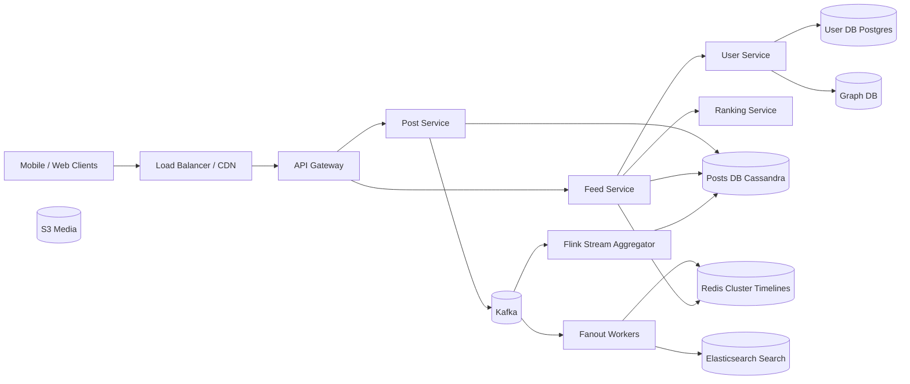

# Вопросы на собеседовании: `Design Feed System`

`Feed System` (Twitter timeline, Facebook News Feed, Instagram) — классический system design кейс. Главный trade-off: `fan-out on write` vs `fan-out on read`. Дополнительные сложности — celebrity problem, ranking, кэширование, viral posts (hot keys). Стандарт для middle/senior ролей.

## Полезные ссылки

- [Twitter — Timelines at Scale (InfoQ)](https://www.infoq.com/presentations/Twitter-Timeline-Scalability/)
- [Facebook News Feed engineering](https://engineering.fb.com/category/data-infrastructure/)
- [Instagram Engineering blog](https://instagram-engineering.com/)
- [System Design Primer — design-twitter](https://github.com/donnemartin/system-design-primer/blob/master/solutions/system_design/twitter/README.md)
- [High Scalability — Twitter architecture](http://highscalability.com/blog/2013/7/8/the-architecture-twitter-uses-to-deal-with-150m-active-users.html)
- [Designing Data-Intensive Applications, гл. 1 (Twitter case study)](https://www.oreilly.com/library/view/designing-data-intensive-applications/9781491903063/)

## Содержание

**Requirements и capacity**
- [Q1. (!) Functional и non-functional requirements?](#q1--functional-и-non-functional-requirements)
- [Q2. (!) Capacity estimation?](#q2--capacity-estimation)
- [Q3. Какие операции считаем «read-heavy» vs «write-heavy» и почему это важно?](#q3-какие-операции-считаем-read-heavy-vs-write-heavy-и-почему-это-важно)

**Fan-out**
- [Q4. (!) Fan-out on write vs fan-out on read?](#q4--fan-out-on-write-vs-fan-out-on-read)
- [Q5. (!) Celebrity problem и как его решают?](#q5--celebrity-problem-и-как-его-решают)
- [Q6. (!) Hybrid (push+pull) подход на проде?](#q6--hybrid-pushpull-подход-на-проде)
- [Q7. Active vs inactive followers — оптимизация fanout?](#q7-active-vs-inactive-followers--оптимизация-fanout)

**Timeline storage**
- [Q8. (!) Storage для user timeline?](#q8--storage-для-user-timeline)
- [Q9. Redis sorted set для timeline?](#q9-redis-sorted-set-для-timeline)
- [Q10. Posts master table — Cassandra vs DynamoDB vs Postgres?](#q10-posts-master-table--cassandra-vs-dynamodb-vs-postgres)

**Ranking и personalization**
- [Q11. (!) Chronological vs algorithmic feed?](#q11--chronological-vs-algorithmic-feed)
- [Q12. Ranking features и signals?](#q12-ranking-features-и-signals)
- [Q13. (!) ML pipeline для ranking?](#q13--ml-pipeline-для-ranking)
- [Q14. Cold start для нового пользователя?](#q14-cold-start-для-нового-пользователя)
- [Q15. Cold start для нового поста (нет engagement signals)?](#q15-cold-start-для-нового-поста-нет-engagement-signals)

**Architecture**
- [Q16. (!) High-level architecture?](#q16--high-level-architecture)
- [Q17. Post creation flow?](#q17-post-creation-flow)
- [Q18. Read (timeline fetch) flow и latency budget?](#q18-read-timeline-fetch-flow-и-latency-budget)
- [Q19. Real-time updates: long-polling, SSE, WebSocket?](#q19-real-time-updates-long-polling-sse-websocket)

**Scalability**
- [Q20. (!) Как handle millions of followers?](#q20--как-handle-millions-of-followers)
- [Q21. Cache strategy (L1/L2/L3)?](#q21-cache-strategy-l1l2l3)
- [Q22. DB sharding для posts/users/timelines/graph?](#q22-db-sharding-для-postsuserstimelinesgraph)

**Production**
- [Q23. (!) Viral posts — hot key problem?](#q23--viral-posts--hot-key-problem)
- [Q24. Feed freshness vs latency trade-off и SLO?](#q24-feed-freshness-vs-latency-trade-off-и-slo)
- [Q25. Block/mute/hide — как влияют на feed?](#q25-blockmutehide--как-влияют-на-feed)
- [Q26. (!) Multi-region deployment?](#q26--multi-region-deployment)
- [Q27. A/B testing платформа для feed changes?](#q27-ab-testing-платформа-для-feed-changes)
- [Q28. Throttling и backpressure при spike?](#q28-throttling-и-backpressure-при-spike)
- [Q29. Стоимость инфры: на чём экономим?](#q29-стоимость-инфры-на-чём-экономим)
- [Q30. (!) Антипаттерны и подводные камни?](#q30--антипаттерны-и-подводные-камни)

## Q1. (!) Functional и non-functional requirements?

**Functional (core scope):**
- User posts текст/медиа.
- User видит home feed — посты из followed people.
- Like, comment, share (engagement).
- Ranking: chronological или algorithmic.
- Infinite scroll + pull-to-refresh.
- Push-уведомления на mention/like.

**Non-functional:**
- Read-heavy (~100:1 reads:writes).
- p99 latency feed load < 200 ms.
- Availability 99.99% (≈ 53 min/year downtime).
- Consistency: `eventual` достаточна (5-10 sec lag на feed OK).
- Scalability: миллиарды пользователей, сотни миллионов DAU.
- Durability: посты — `nines of 9`, timeline cache — допустима потеря.

**Scope excluded (явно проговорить):**
- Direct messages (отдельный кейс).
- Live video streaming.
- Ads/monetization platform.
- Полная модерация контента.

**Tip:** scope-список — первое, что слушает интервьюер. Без него capacity estimation повисает в воздухе.

## Q2. (!) Capacity estimation?

Twitter/X-scale допущения (2026):

| Параметр | Значение |
|---|---|
| DAU | 500M |
| Posts per day | 200M (writes) |
| Average follows per user | 200 |
| Average reads | 10 feed-fetches/user/day → 5B reads/day |

**Throughput:**
- Writes: 200M / 86 400 ≈ **2 300 posts/sec**.
- Reads: 5B / 86 400 ≈ **58 000 fetches/sec** (peak ×3 — 175 K/sec).

**Fan-out impact (push-модель):**
- 2 300 × 200 followers = **460 000 timeline writes/sec**.
- При среднем follower-count 200 — но celebrities искажают распределение (см. Q5).

**Storage:**
- Посты: 200M × 300 B = 60 GB/день raw.
- 5 лет: ~110 TB raw; + индексы + 3× репликация = 300-400 TB.
- Timeline cache (top 1M активных × 1000 IDs × 80 B sorted-set entry) ≈ **80 GB Redis**.

**Bandwidth:**
- Feed load: 58 K/s × 100 posts × 200 B = ~1.2 GB/s egress (без медиа).
- Медиа отдаются через CDN — это отдельный poll.

**Cost (порядок):**
- Redis cluster ~$50K/month, Cassandra ~$100K/month, CDN — $0.5-1M/month (трафик доминирует).

## Q3. Какие операции считаем «read-heavy» vs «write-heavy» и почему это важно?

| Операция | Тип | QPS (порядок) |
|---|---|---|
| Post creation | write | 2 K/sec |
| Like/comment | write | 50-100 K/sec (peak) |
| Feed fetch | read | 60-200 K/sec |
| Profile view | read | 30 K/sec |
| Search | read | 10 K/sec |

**Вывод:** read-heavy в ~100 раз. Из этого вытекают решения:
- Heavy caching (Redis + CDN) — стандарт.
- Read replicas Cassandra (`LOCAL_QUORUM` на write, `ONE` на read).
- Fan-out on write — оптимизирует read за счёт write (если write дешевле — выгодно).

**Контрпример:** Slack чат — write-heavy, фан-аут не нужен, fetch отдаёт хронологию из одного channel-stream.

## Q4. (!) Fan-out on write vs fan-out on read?

**Push (fan-out on write):**
- User A постит → fanout worker записывает `post_id` в timeline каждого follower-а.
- Read: `LRANGE user:42:timeline 0 49` — O(1).

```
A posts → kafka(posts_created)
              ↓
         fanout worker
              ↓
   ZADD follower_1:timeline <ts> post_id
   ZADD follower_2:timeline <ts> post_id
   ... (×N followers)
```

| Pros | Cons |
|---|---|
| Read O(1), стабильные p99 | Write amplification (10M followers = 10M writes) |
| Простая модель кэширования | Wasted work для inactive followers |
| Легко добавить ranking offline | Storage amplification (×fan-out) |

**Pull (fan-out on read):**
- User A постит → пишет в свою таблицу `user_posts`.
- Read: для user B — fetch `user_posts` каждого из 200 follow-ов, merge-sort по времени.

| Pros | Cons |
|---|---|
| Cheap writes (O(1)) | Read дорогой (200 запросов + merge) |
| Нет amplification | Высокая latency для активных пользователей |
| Celebrity-проблема исчезает | Сложно применять ranking online |

**Вывод:** ни один подход не масштабируется в чистом виде — production это hybrid (Q6).

## Q5. (!) Celebrity problem и как его решают?

**Проблема:** пользователь с 10M+ follower-ов (`@elonmusk`, бренд).
- Fan-out on write: каждый пост = 10M timeline-вставок.
- Spike: пост за минуту → 10M writes/min = 167 K writes/sec — на 1 пост.
- Hot key в Redis cluster, fanout queue распухает.

**Решения:**

**1. Threshold detection.** `followers_count > 100 000` → пользователь-celebrity, пропускаем write-fanout полностью.

**2. Pull на read.** Подписчик при загрузке feed дополнительно пуллит из `celebrity_posts` (отдельный store, выс. cache hit), сливает с push-timeline.

**3. Async с приоритетами.** Сначала fanout к active follower-ам (заходили < 24 ч), inactive обрабатываются позже или вообще не fanout-ятся.

**4. CDN/edge cache.** Тело поста кладётся в CDN — миллион подписчиков читают его не из БД.

**5. Pre-warming.** На пост celebrity сразу прогревается edge-кэш в каждом регионе.

**Twitter (исторически):**
- Сервис `Timelines` (Scala) делал fanout, для top accounts применялось правило "skip and pull".
- На read merge-sort объединял push-timeline + pulled celebrity posts.

## Q6. (!) Hybrid (push+pull) подход на проде?

**Write side:**
- Regular users (< 10 K follower) → push: fanout в follower-timelines.
- Celebrities (> 100 K follower) → no push: только в собственный `user_posts`.
- Boundary (10-100 K) — A/B-тюнинг.

**Read side:**
```
GET /feed?cursor=<ts> ─► Feed Service
   ├─► fetch push-timeline (Redis ZREVRANGEBYSCORE)
   ├─► fetch celebrity posts user follows (per-celebrity cache)
   ├─► merge + rank
   ├─► batch fetch post bodies (MGET)
   └─► enrich (author, media URL) → return
```

**Tuning:**
- Дробный fanout: на 1% follower сразу, остальное async с retry.
- `inactive_threshold` (90 дней без логина) → не fanout-им; на login делаем backfill timeline.

**Decision matrix:**
| Сценарий | Подход |
|---|---|
| Стартап < 1M MAU | Pure push, без celebrity-detection |
| Соцсеть 100M+ MAU | Hybrid (push для regular + pull для celebs) |
| Twitter/X-scale | Hybrid + multi-region + edge caching |

## Q7. Active vs inactive followers — оптимизация fanout?

**Метрика активности:** `last_login_at` (или `last_feed_fetch_at`).

**Стратегии:**
- **Hot tier** (< 7 дней без визита) → fanout всегда, высокий приоритет в Kafka.
- **Warm tier** (7-30 дней) → fanout с задержкой 30-60 сек, batch-режим.
- **Cold tier** (> 30 дней) → не fanout; на следующем визите делаем `lazy backfill` — pull последних N постов от каждого follow.

**Эффект:** Twitter раскрывал в докладах — 50-70% follower-ов целевой аудитории неактивны в данный момент, fanout к ним = wasted writes.

**Lazy backfill flow:**
1. User логинится после долгого отсутствия → флаг `timeline_stale=true`.
2. Async job собирает посты от всех follow за последний месяц.
3. Заполняет ZSET timeline, снимает флаг.
4. UI показывает skeleton/loading 1-2 сек.

## Q8. (!) Storage для user timeline?

**Per-user timeline cache (Redis):**
```
ZADD user:42:timeline <timestamp> <post_id>
ZREVRANGE user:42:timeline 0 49
ZREMRANGEBYRANK user:42:timeline 0 -1001  # keep top 1000
```
- Sorted set, score = timestamp.
- O(log N) insert, O(log N + M) range fetch.
- 80 B/entry × 1000 × 1M users = 80 GB.

**Persistent backing (Cassandra):**
```
CREATE TABLE timelines (
  user_id bigint,
  ts timeuuid,
  post_id bigint,
  PRIMARY KEY (user_id, ts)
) WITH CLUSTERING ORDER BY (ts DESC);
```
- Partition по `user_id`, clustering по `ts`.
- Range scan by user: один partition.
- Compaction tuning (TWCS — Time Window Compaction Strategy) для time-series.

**Post bodies — отдельный store:**
- `posts` table: partition по `post_id`, контент + media URL.
- Timeline хранит только `post_id`; на read batch MGET.

**Почему разделение:**
- Изменение поста (edit/delete) — один write в `posts`, timeline не трогаем.
- Дедупликация: один пост × N follower = N timeline entries, но 1 тело.

## Q9. Redis sorted set для timeline?

**API:**
```
ZADD user:42:timeline <ts_score> <post_id>      # вставка
ZREVRANGE user:42:timeline 0 49 WITHSCORES      # top 50 по времени
ZREVRANGEBYSCORE user:42:timeline <cursor> -inf LIMIT 0 50  # пагинация по курсору
ZREMRANGEBYRANK user:42:timeline 0 -1001        # trim до 1000
```

**Память:**
- Один skiplist + ziplist entry ≈ 64-80 B.
- 1000 × 80 B = 80 KB на user.
- 1M активных × 80 KB = 80 GB → один шард `r6gd.4xlarge` (128 GB).
- 100M активных → нужен Redis cluster (16-32 master shards).

**Eviction:**
- `maxmemory-policy allkeys-lru` глобально.
- Или TTL на конкретный ZSET (24-72 ч); inactive timeline регенерируется при логине.

**Persistence:**
- AOF every 1 sec — допустимая потеря (timeline восстанавливается из `posts` за минуты).
- RDB snapshot 1×/час — для disaster recovery.

**Edge:** Redis `ZADD` поверх миллионов sortset-ов — pipelining обязателен, иначе RTT убивает throughput.

## Q10. Posts master table — Cassandra vs DynamoDB vs Postgres?

| Свойство | Cassandra | DynamoDB | Postgres (sharded) |
|---|---|---|---|
| Write throughput | очень высокий | очень высокий (RCU/WCU) | средний |
| Latency p99 write | 5-10 ms | 5-15 ms | 10-30 ms |
| Operational cost | сами админят | managed | managed (RDS) |
| Schema-flexibility | средняя | средняя | низкая (нужны migration) |
| Query model | по PK + clustering | по PK + sort key + GSI | SQL |
| Multi-region | active-active (`LOCAL_QUORUM`) | global tables | logical replication, сложно |

**Выбор:**
- **Twitter, Discord** → Cassandra (write-throughput + проверено).
- **Lyft, Stripe non-core** → DynamoDB (когда нет команды на Cassandra).
- **Startup до 10M MAU** → Postgres (CitusData/Aurora), позже миграция.

**Schema (Cassandra):**
```sql
CREATE TABLE posts (
  post_id bigint PRIMARY KEY,
  user_id bigint,
  body text,
  media_ids list<bigint>,
  created_at timestamp,
  ...
);
```
Один partition = один пост, идеально для random access.

## Q11. (!) Chronological vs algorithmic feed?

**Chronological (reverse-chrono):**
- Самые свежие сверху.
- Простая модель, предсказуемо, юзер контролирует.
- Минус: при 500 follow-ах пост из 09:00 утра «утонет» к вечеру.

**Algorithmic:**
- ML-ranking по relevance signals (engagement, affinity, recency decay).
- Выше engagement (Instagram добавил +20% time-on-app, 2016).
- Минусы: filter bubble, «почему я это вижу?» frustration.

**Реальные продукты:**
- Instagram (с 2016), Facebook (EdgeRank → ML), TikTok (For You) — algorithmic.
- Twitter/X — гибрид: `For You` (algo) + `Following` (chrono).
- Threads, Bluesky — chrono по умолчанию.

**Implementation:**
- Algorithmic = candidate generation + ranking model (Q13).
- Chrono = просто `ZREVRANGE` без ranking-stage.

## Q12. Ranking features и signals?

**Категории features:**

**Recency:**
- `age_minutes`, `exp(-age/decay)`.

**Engagement (per post):**
- Likes, comments, reshares, click-through.
- Normalized по post age и author follower count.

**Affinity (user × author):**
- Past interactions: лайки, replies, profile visits, DM-чаты.
- `pmi(user, author)` — pointwise mutual information.

**User history:**
- Embeddings по последним 100 viewed постам.
- Topic preferences (sport, tech, politics).

**Media-type weight:**
- Video > image > text (engagement-wise).
- Dwell time (длительность просмотра).

**Negative signals:**
- Hide, not-interested, unfollow, mute.
- Сильный отрицательный вес.

**Feature store:** Feast / Tecton / Michelangelo (Uber) — централизованный store для offline + online consistency.

**Пример EdgeRank (упрощённо):**
```
score = Σ_e (affinity_e × weight_e × time_decay_e)
```
где `e` — edge (like, comment, share, ...).

## Q13. (!) ML pipeline для ranking?

```
┌──────────── OFFLINE ────────────┐
│ 1. Engagement logs → Kafka      │
│ 2. Spark/Flink → feature store  │
│ 3. Train (TensorFlow/PyTorch)   │
│ 4. Eval (offline AUC, NDCG)     │
│ 5. Push model → registry        │
└──────────────────────────────────┘
            ↓ model artifact
┌──────────── ONLINE ─────────────┐
│ Feed request                    │
│   ├─► candidate generation      │
│   │     (1000 posts: push       │
│   │      timeline + celebs +    │
│   │      trending + ads)        │
│   ├─► featurize (online store)  │
│   ├─► ranking model (top-K)     │
│   └─► return top 50             │
│       ↓                         │
│   client interaction → kafka    │
└──────────────────────────────────┘
```

**Candidate generation:** ~1 K кандидатов из push-timeline + celebrity-pull + trending + injected ads. Без этого шага ranker обрабатывал бы 100K+ постов — не уложится в latency.

**Ranking model:**
- Deep model (DLRM, Wide&Deep, transformer).
- Inference: 1-5 ms per request, batched.
- Serving: TensorFlow Serving / TorchServe / Triton, GPU для тяжёлых моделей.

**A/B:**
- Новая модель → 0.5-1% трафика → метрики (DAU, session_time, complaint_rate).
- Холдаут-группа `control` всегда.

**Continuous learning:**
- Online updates через streaming (Flink) для свежих signals (горячие тренды).
- Полный rebuild — ежедневно.

## Q14. Cold start для нового пользователя?

**Проблема:** новый юзер, follow-ов мало, signals для personalization нет.

**Стратегии:**
- **Editorial defaults.** Куратор-командой выбирает 50 «качественных» аккаунтов (новости, авторитетные блоги) → onboarding wizard.
- **Topic onboarding.** На регистрации просим выбрать темы (sport, tech, music) → feed = trending posts из этих тем.
- **Location-based.** Geo-IP → trending в стране/городе.
- **Demographic-based.** Возраст/пол → коллаборативные похожие профили.
- **Trending feed.** Просто top-N global trending — пока не накопятся signals.
- **Sponsored / discoverable rows.** «Кого вам подписаться» в feed.

**Метрика успеха:** D1 retention (вернулся ли user через сутки). Cold-start cтратегия = главный рычаг.

## Q15. Cold start для нового поста (нет engagement signals)?

**Проблема:** пост только опубликован, лайков 0, ranker не знает что с ним делать.

**Стратегии:**
- **Author quality score.** Engagement автора в среднем → стартовый score нового поста.
- **Content features only.** Embedding текста + media → similarity к past engaging posts.
- **Exploration bonus.** Multi-armed bandit: бустим новые посты на ~5% impressions, чтобы собрать signals.
- **Implicit signals.** Time-to-first-like, dwell time, scroll-past rate — собираем за первые 10 минут.
- **Cohort-baseline.** Похожие посты у того же автора в прошлом → expected engagement.

**Trap:** если ranker полностью отвергает новые посты, появится «rich get richer» — старые посты доминируют, новые не получают шанса. Нужен `epsilon-greedy` или Thompson sampling.

## Q16. (!) High-level architecture?



**Ключевые сервисы:**
- `Feed Service` — read-path, объединяет push-timeline + celebrity-pull + ranking.
- `Post Service` — write-path, валидация, persistance, kafka emit.
- `Fanout Workers` — async-консьюмеры, заполняют Redis-timelines.
- `Ranking Service` — gRPC, выдаёт scores; модель из registry.
- `Graph DB` — follow-граф (Neo4j или sharded MySQL `edges` table).

## Q17. Post creation flow?

```
1. POST /posts {body, media_ids}
2. Auth check → API Gateway → Post Service.
3. Post Service:
   a. Validate (length, banned content basic check).
   b. INSERT INTO posts (...).
   c. Publish to Kafka `posts.created`.
   d. Respond 201 to client (optimistic UI).
4. Async consumers (parallel):
   - Fanout worker → ZADD в timeline активных followers (skip celebrity).
   - Search indexer → POST в Elasticsearch.
   - Moderation pipeline → ML toxicity check.
   - Analytics → BigQuery via Flink.
5. Через 1-5 сек пост виден в feed подписчиков.
```

**Latency budget:**
- User видит свой пост сразу (UI optimistic).
- Followers видят: SLO p95 < 5 сек, p99 < 30 сек.

**Idempotency:**
- Client отправляет `Idempotency-Key` (UUID v4) — защита от double-submit.
- На Post Service — `INSERT ... ON CONFLICT DO NOTHING`.

**Backpressure:**
- Если Kafka lag > N сек, переключаем fanout в degraded mode (только active hot tier).

## Q18. Read (timeline fetch) flow и latency budget?

```
GET /feed?cursor=<ts_ms>
   ↓
API Gateway → Feed Service:
   1. ZREVRANGEBYSCORE user:42:timeline <cursor> -inf LIMIT 0 200  (Redis ~5ms)
   2. fetch celebrity posts followed by user (per-celeb cache ~30ms)
   3. merge candidates (in-memory)
   4. ranking RPC (gRPC to Ranking Service ~50ms, GPU inference batched)
   5. select top-50
   6. MGET posts:<id1>,<id2>,... (Cassandra ~15ms via cache)
   7. enrich (author, media URLs) — batch ~10ms
   8. apply blocked/muted filter
   9. return JSON
```

**Latency budget 200 ms p99:**
| Этап | ms |
|---|---|
| TLS + auth | 5 |
| Timeline fetch | 5 |
| Celebrity pull | 30 |
| Ranking | 50 |
| Post bodies | 15 |
| Enrichment | 20 |
| Filter | 5 |
| Serialize + egress | 20 |
| Buffer | 50 |
| **Total** | **200** |

**Что съедает budget:**
- Ranking — самое тяжёлое. Без него можно отдавать chrono за 30 ms.
- Cold cache: пагинация далеко в прошлое → Cassandra read 50-100 ms.

## Q19. Real-time updates: long-polling, SSE, WebSocket?

**Long polling:**
- Client → GET `/feed/updates?since=<ts>` → server держит до new data / timeout.
- Pros: простая инфра, любой proxy.
- Cons: HTTP overhead, не масштабируется на 100M-1B connections.

**Server-Sent Events (SSE):**
- One-way push (server → client) по обычному HTTP.
- Pros: проще WebSocket-а, native browser API, работает через прокси.
- Cons: только text, без bidirectional.

**WebSocket:**
- Two-way, persistent connection.
- Pros: low overhead, real-time лайки/комменты.
- Cons: дорого держать миллионы коннектов; нужен sticky LB; нюансы реконнекта.

**Production-stack:**
- Push-уведомления (mobile) — FCM / APNs.
- В-приложении real-time — WebSocket (Phoenix, Centrifugo, Soketi, или custom Go-server).
- Один сервер держит 100K-1M idle WebSocket-ов с правильным tuning (`ulimit`, `SO_REUSEPORT`).

**Pattern:**
- WebSocket-уведомления приходят как «у тебя 5 новых постов» (badge).
- User тапает → GET `/feed` обычным flow (Q18).

## Q20. (!) Как handle millions of followers?

См. также Q5 (celebrity), Q7 (active/inactive). Дополнительно:

**1. Sharded fanout.**
- Kafka topic с N=1000 partitions, key=`follower_id`.
- N workers consume в parallel, каждый отвечает за свою «полосу» followers.
- Linear scaling.

**2. Batched writes в Redis.**
- Один worker аккумулирует 1000 `ZADD` в pipeline → одна RTT.
- 1000× throughput.

**3. Async + retry с idempotency.**
- На сбой Redis worker retry — `ZADD` идемпотентен (тот же score+member).

**4. Timeline trimming.**
- ZSET ограничен top-1000; при вставке → `ZREMRANGEBYRANK 0 -1001`.
- Inactive часть сама вылетает.

**5. Region-aware fanout.**
- Followers распределены по регионам — fanout локально внутри региона.
- Cross-region async через Kafka MirrorMaker.

**6. Pre-compute at off-peak.**
- Часть fanout откладываем на 30-60 сек (low priority); если пост viral — мгновенно бустим всех active.

## Q21. Cache strategy (L1/L2/L3)?

**L1 — Client (mobile/web).**
- Recently viewed posts, profiles.
- Cache size: ~5-10 MB.
- TTL: 5-15 минут.

**L2 — CDN / edge (static + public content).**
- Public profiles, media thumbnails.
- TTL: 1-6 часов.
- Invalidation: cache-buster в URL (`?v=<hash>`).

**L3 — Redis (hot data).**
- User timeline (ZSET).
- Post bodies (hash, TTL 1 ч).
- User profiles (hash, TTL 1 ч).
- Counters (likes/comments) — write-through + periodic flush.

**L4 — Application local (in-process).**
- Ranking model in-memory cache (decoded features).
- Caffeine / Guava cache на JVM.

**L5 — DB (источник правды).**
- Cassandra (posts), Postgres (users).

**Invalidation:**
- Post edit → publish `post.updated` → fanout invalidate post cache + re-push в affected timelines.
- Follow change → invalidate user's timeline cache (regenerate on next visit).

**Cache stampede:**
- `singleflight` (Go) / Caffeine `Loader` — один поток грузит, остальные ждут.
- `XX` флаг на Redis SET (только update если уже есть).

## Q22. DB sharding для posts/users/timelines/graph?

| Сущность | Sharding key | Почему |
|---|---|---|
| `posts` | `post_id` (hash) | Random access; ровное распределение |
| `posts_by_user` (denorm) | `user_id` | "Все посты юзера X" — один shard |
| `users` | `user_id` (hash) | Идентификатор-PK |
| `timelines` (Redis) | `user_id` | Все timeline-операции одного user — один shard |
| `follows` (edges) | `follower_id` ИЛИ `followed_id` | Часто нужны обе стороны — два denorm-индекса |
| `notifications` | `recipient_id` | Все уведомления юзера — один shard |

**Edge cases:**
- Cross-shard query (например, «топ постов по миру») → MapReduce / стримит из Kafka в OLAP (BigQuery).
- Re-sharding (когда shard переполнен) → consistent hashing или Vitess `Reshard`.

**Tools:**
- Vitess (YouTube), Citus (Postgres), ProxySQL.
- Cassandra/Dynamo — sharding встроенный (token ring / partition key).

## Q23. (!) Viral posts — hot key problem?

**Симптомы:**
- Один `post_id` читают 1M+ раз/мин → Redis shard на пределе.
- Likes-counter `INCR post:42:likes` — 100 K writes/sec в один key → contention.

**Митигации:**

**1. Replicate hot key.**
- Распознавание viral (counter > threshold) → копируем в N=10 shards.
- Client случайно выбирает shard для read.

**2. Counter sharding.**
- `INCR post:42:likes:shard_<rand 0..15>` (write на любой из 16).
- Read = `SUM(post:42:likes:shard_*)`.

**3. Async aggregation.**
- Likes → Kafka → Flink window aggregate → final count в Redis 1×/сек.
- User видит slightly stale, но system не падает.

**4. CDN/edge cache для содержимого поста.**
- Body статичен → TTL 60 сек, миллионы реверсов читают edge, не origin.

**5. Probabilistic counting.**
- HyperLogLog для unique viewers («1.2M people viewed»).
- 12 KB вместо 1M entries.

**6. Rate-limit write side.**
- Лайк-spam от ботов — capped per-user-per-post.

**Анти-pattern:**
- Класть лайк-список в один Redis HASH `post:42:likers` — при viral виден latency degradation. Лучше — отдельная Cassandra row partition.

## Q24. Feed freshness vs latency trade-off и SLO?

**Freshness** = время от создания поста до появления в feed произвольного активного follower-а.

**Latency** = время загрузки feed клиентом.

**Trade-off:**
- Push fanout → freshness 1-5 сек, latency feed ~50 ms.
- Pure pull → freshness instant (на момент чтения), latency feed 200-500 ms.
- Stale cache → latency 10 ms, freshness 30 сек.

**SLO примеры (Twitter-like):**
| Метрика | Target |
|---|---|
| `p50 freshness` (post→feed) | < 2 сек |
| `p95 freshness` | < 10 сек |
| `p99 freshness` | < 60 сек |
| `p50 feed load` | < 100 ms |
| `p99 feed load` | < 500 ms |
| `feed_error_rate` | < 0.01% |

**Knobs:**
- Fanout worker count → freshness.
- Cache TTL → latency vs staleness.
- Ranking complexity → latency.

**Monitor:**
- `feed_freshness_seconds_bucket` — histogram, мониторим p95/p99.
- Alert: p95 > 30 сек 5 минут подряд.

## Q25. Block/mute/hide — как влияют на feed?

**Block** (двусторонний):
- A блокирует B → B не видит постов A, A не видит постов B.
- Применяется на read time (filter после ranking).
- Хранится в `user_blocks` table, partition by `blocker_id`.
- Cache в memory (per-request lookup ms-bound).

**Mute** (односторонний):
- A muted B → A не видит постов B, но B знает A не блокировал.
- Filter аналогично.

**Hide post** (per-post):
- User скрывает конкретный пост → не показывать.
- Сильный negative signal для ranking model.

**Где фильтровать:**
- Перед ranking: исключаем blocked authors из candidate pool.
- Дополнительно после ranking: дешёвая защита от race condition (block добавлен между шагами).

**Trade-off:**
- Filter в Cassandra на write fanout — экономит read filter, но при block-event надо удалять из timeline (`ZREM`) → дорого.
- Filter on read — дешевле; неконсистентность не критична (пост из заблокированного может промелькнуть на 5 сек).

**Privacy:**
- Block list — приватная; не светим в API.

## Q26. (!) Multi-region deployment?

**Цели:**
- Latency < 100 ms из любой точки мира.
- Disaster recovery: падение one region → переключение в 5 минут.

**Архитектура:**
- 3-5 регионов: US-East, US-West, EU-West, APAC-Singapore, APAC-Tokyo.
- Каждый — full stack (Feed Service, Post Service, Redis, Cassandra ring).
- Cassandra: multi-DC replication, `LOCAL_QUORUM` на write, `LOCAL_QUORUM` на read.
- Kafka MirrorMaker → cross-region post stream.

**Routing:**
- DNS GeoDNS / AWS Route53 latency-based routing.
- User pinned к home region (hash by user_id или географически).

**Consistency:**
- Posts → eventually consistent across regions (5-30 сек).
- User profile, follows → also eventually; ok.
- Money/billing → отдельная CP-система с strong consistency.

**Failover:**
- Health checks на каждом регионе.
- Auto-failover Route53: TTL 60 сек.
- DR drill: ежемесячный chaos test.

**Pitfalls:**
- Cross-region write для celebrity fanout → дорого; делаем fanout локально per-region, async-replicate index.
- Timezone-aware ranking: для APAC weight other than для US.

## Q27. A/B testing платформа для feed changes?

**Эксперимент = бакет юзеров + контроль + treatment + метрики.**

**Платформа:**
- Bucketing service (hash by user_id + experiment_id) → стабильное распределение.
- Конфиг эксперимента в feature flag system (Unleash, LaunchDarkly, custom).
- Сервис `Feed` читает flag → выбирает model_version / cache_strategy / ranking_weight.

**Метрики:**
- Engagement: likes/share/comment per session.
- Time-on-app, session count.
- Retention D1/D7/D30.
- Negative: report rate, hide rate, unfollow rate.

**Stat:**
- Sequential testing (mSPRT) для ранней остановки.
- Holdout-группа 1% всегда (long-term effects).

**Rollout:**
- 1% → 5% → 10% → 50% → 100% при положительных метриках.
- Auto-rollback если KPI деградирует > 1%.

**Pitfalls:**
- Network effects: A/B на social graph — действия treatment-юзеров влияют на control-юзеров (нужны cluster-randomized experiments).
- Novelty bias: новая фича сначала растёт, потом возвращается к baseline.

## Q28. Throttling и backpressure при spike?

**Source spikes:**
- Crisis / news event → 10× normal posts/sec.
- Celebrity event → 100× fanout.
- DDoS / bot storm.

**Layered defenses:**

**1. Edge / WAF.**
- CDN rate limiting per IP.
- Bot detection (CAPTCHA, JS challenges).

**2. API Gateway.**
- Per-user rate limit (token bucket): 100 req/min на feed-fetch.
- Per-endpoint rate limit globally.

**3. Application:**
- Bulkhead: ranking-service отдельный thread pool от feed-service.
- Circuit breaker (Resilience4j): на падение ranking → degrade в chrono mode.

**4. Backpressure от Kafka.**
- Posts → consumer lag растёт → reactive throttle на Post Service (медленнее принимаем writes).

**5. Graceful degradation.**
- Ранг сломан → отдаём chrono.
- Redis недоступен → fallback на pull-from-Cassandra (медленнее, но работает).
- Media недоступны → text-only.

**Monitoring:**
- `consumer_lag` Kafka, `redis_evicted_keys`, `circuit_breaker_state`.
- Alert thresholds + auto-scaling (HPA Kubernetes).

## Q29. Стоимость инфры: на чём экономим?

**Top cost buckets (Twitter/X-scale):**
1. **CDN egress** — $0.5-2M/month (видео/медиа).
2. **Compute (k8s nodes)** — $200-500K/month.
3. **Cassandra cluster + storage** — $100-300K/month.
4. **Redis cluster** — $50-150K/month.
5. **Kafka cluster + storage** — $30-100K/month.

**Оптимизации:**
- **Per-title video encoding** (Netflix-style) — снижение bandwidth до 50%.
- **Image WebP/AVIF** вместо JPEG/PNG (30-50% smaller).
- **Edge cache TTL** — длиннее = меньше origin traffic.
- **Reserved Instances / Savings Plans** на AWS — 30-60% скидка.
- **Spot instances** для batch-jobs (ranking training, indexing).
- **Cold storage** для постов > 1 года → S3 IA / Glacier.
- **Tiered cache** — hot в Redis, warm в Memcached, cold в Cassandra.
- **Compression** на Kafka (`compression.type=zstd`) — 4× меньше storage и bandwidth.

**Trade-offs:**
- Меньше реплик → дешевле, но риски DR.
- Длинный cache TTL → дешевле, но stale feed.
- Слабее ranking model → дешевле GPU, но ниже engagement.

## Q30. (!) Антипаттерны и подводные камни?

**1. Sync fanout в request thread.**
- Симптом: POST `/posts` ждёт 5 сек, пока пишет в timeline 10K followers.
- Fix: async через Kafka (Q17).

**2. Один большой ZSET для global feed.**
- Симптом: hot key, всё пишут и читают один Redis-shard.
- Fix: per-user ZSET (Q9).

**3. Read all follow-ов synchronously.**
- Симптом: 200 sequential queries per feed fetch → 10× latency.
- Fix: batch-fetch (MGET), параллельные RPC.

**4. Counter в одной row для likes viral поста.**
- Симптом: lock contention, 100K writes/sec в один partition.
- Fix: counter sharding или async aggregation (Q23).

**5. Strong consistency на timeline.**
- Симптом: попытка `QUORUM` write на 100 follower-timelines → 10× latency.
- Fix: eventual consistency, fanout async.

**6. Без кэша user data в feed pipeline.**
- Симптом: 50 user-lookups per feed = 50 RTT.
- Fix: Redis cache + bulk fetch.

**7. Без celebrity-handling.**
- Симптом: один @elonmusk-post подвешивает fanout systerm.
- Fix: hybrid push+pull (Q6).

**8. Без backpressure на Kafka producer.**
- Симптом: producer заваливает Kafka → broker OOM.
- Fix: `linger.ms`, `batch.size`, `acks=1`, max in-flight requests.

**9. Без A/B-инфраструктуры.**
- Симптом: rolled out new ranking → engagement упал 20% — никто не заметил неделю.
- Fix: ML pipeline + A/B + auto-rollback (Q27).

**10. Без observability на freshness.**
- Симптом: «у нас всё ок» — а юзеры видят посты с задержкой 30 минут.
- Fix: `freshness_seconds` метрика end-to-end (Q24).

**11. Single-region deploy.**
- Симптом: regional outage → весь продукт лежит 4 часа.
- Fix: multi-region active-active (Q26).

**12. Storing media as DB blobs.**
- Симптом: DB IO/storage растут с фото → дорого + медленно.
- Fix: S3 + CDN, в DB только URL.

---

## See also

- [Design Twitter](design-twitter-interview.md) — каноничный case фид-системы
- [Design Instagram](design-instagram-interview.md) — фото-feed + Stories
- [Design YouTube](design-youtube-interview.md) — video feed + recommendations
- [Design Chat System](design-chat-system-interview.md) — параллельная fanout-механика для чатов
- [System Design Interview](system-design-interview.md) — общие принципы кейсов
- [Caching Strategies](../architecture/caching-strategies-interview.md) — multi-layer caching, hot-key mitigation
- [Cassandra](../databases/cassandra-interview.md) — posts store, multi-DC replication
- [Redis](../databases/redis-interview.md) — sorted sets, cluster, eviction
- [Kafka](../messaging/kafka-interview.md) — async fanout, backpressure
- [Scalability Patterns](../architecture/scalability-patterns-interview.md) — fan-out, bulkheads, replication
- [Resilience Patterns](../architecture/resilience-patterns-interview.md) — circuit breaker, graceful degradation
- [Database Sharding](../databases/database-sharding-interview.md) — partition strategies
