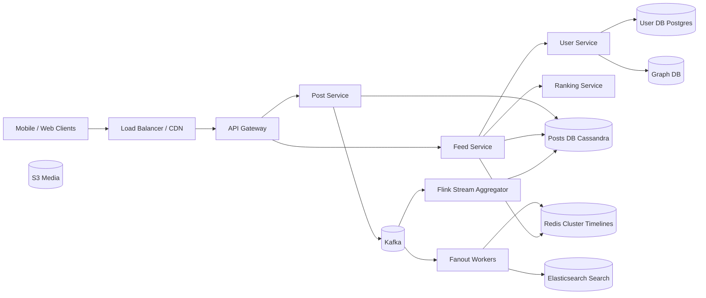

# Вопросы на собеседовании: `Design Feed System`

`Feed System` (Twitter timeline, Facebook News Feed, Instagram) — классический system design кейс. Главный trade-off: `fan-out on write` vs `fan-out on read`. Дополнительные сложности — celebrity problem, ranking, кэширование, viral posts (hot keys). Стандарт для middle/senior ролей.

## Полезные ссылки

- [Twitter — Timelines at Scale (InfoQ)](https://www.infoq.com/presentations/Twitter-Timeline-Scalability/)
- [Facebook News Feed engineering](https://engineering.fb.com/category/data-infrastructure/)
- [Instagram Engineering blog](https://instagram-engineering.com/)
- [System Design Primer — design-twitter](https://github.com/donnemartin/system-design-primer/blob/master/solutions/system_design/twitter/README.md)
- [High Scalability — Twitter architecture](http://highscalability.com/blog/2013/7/8/the-architecture-twitter-uses-to-deal-with-150m-active-users.html)
- [Designing Data-Intensive Applications, гл. 1 (Twitter case study)](https://www.oreilly.com/library/view/designing-data-intensive-applications/9781491903063/)

## Содержание

**Requirements и capacity**
- [Q1. (!) Functional и non-functional requirements?](#q1--functional-и-non-functional-requirements)
- [Q2. (!) Capacity estimation?](#q2--capacity-estimation)
- [Q3. Какие операции считаем «read-heavy» vs «write-heavy» и почему это важно?](#q3-какие-операции-считаем-read-heavy-vs-write-heavy-и-почему-это-важно)

**Fan-out**
- [Q4. (!) Fan-out on write vs fan-out on read?](#q4--fan-out-on-write-vs-fan-out-on-read)
- [Q5. (!) Celebrity problem и как его решают?](#q5--celebrity-problem-и-как-его-решают)
- [Q6. (!) Hybrid (push+pull) подход на проде?](#q6--hybrid-pushpull-подход-на-проде)
- [Q7. Active vs inactive followers — оптимизация fanout?](#q7-active-vs-inactive-followers--оптимизация-fanout)

**Timeline storage**
- [Q8. (!) Storage для user timeline?](#q8--storage-для-user-timeline)
- [Q9. Redis sorted set для timeline?](#q9-redis-sorted-set-для-timeline)
- [Q10. Posts master table — Cassandra vs DynamoDB vs Postgres?](#q10-posts-master-table--cassandra-vs-dynamodb-vs-postgres)

**Ranking и personalization**
- [Q11. (!) Chronological vs algorithmic feed?](#q11--chronological-vs-algorithmic-feed)
- [Q12. Ranking features и signals?](#q12-ranking-features-и-signals)
- [Q13. (!) ML pipeline для ranking?](#q13--ml-pipeline-для-ranking)
- [Q14. Cold start для нового пользователя?](#q14-cold-start-для-нового-пользователя)
- [Q15. Cold start для нового поста (нет engagement signals)?](#q15-cold-start-для-нового-поста-нет-engagement-signals)

**Architecture**
- [Q16. (!) High-level architecture?](#q16--high-level-architecture)
- [Q17. Post creation flow?](#q17-post-creation-flow)
- [Q18. Read (timeline fetch) flow и latency budget?](#q18-read-timeline-fetch-flow-и-latency-budget)
- [Q19. Real-time updates: long-polling, SSE, WebSocket?](#q19-real-time-updates-long-polling-sse-websocket)

**Scalability**
- [Q20. (!) Как handle millions of followers?](#q20--как-handle-millions-of-followers)
- [Q21. Cache strategy (L1/L2/L3)?](#q21-cache-strategy-l1l2l3)
- [Q22. DB sharding для posts/users/timelines/graph?](#q22-db-sharding-для-postsuserstimelinesgraph)

**Production**
- [Q23. (!) Viral posts — hot key problem?](#q23--viral-posts--hot-key-problem)
- [Q24. Feed freshness vs latency trade-off и SLO?](#q24-feed-freshness-vs-latency-trade-off-и-slo)
- [Q25. Block/mute/hide — как влияют на feed?](#q25-blockmutehide--как-влияют-на-feed)
- [Q26. (!) Multi-region deployment?](#q26--multi-region-deployment)
- [Q27. A/B testing платформа для feed changes?](#q27-ab-testing-платформа-для-feed-changes)
- [Q28. Throttling и backpressure при spike?](#q28-throttling-и-backpressure-при-spike)
- [Q29. Стоимость инфры: на чём экономим?](#q29-стоимость-инфры-на-чём-экономим)
- [Q30. (!) Антипаттерны и подводные камни?](#q30--антипаттерны-и-подводные-камни)

## Q1. (!) Functional и non-functional requirements?

**Функциональные (ядро скоупа):**
- Пользователь публикует текст/медиа.
- Пользователь видит home feed — посты от тех, на кого подписан.
- Лайки, комментарии, репосты (engagement).
- Ранжирование: хронологическое или алгоритмическое.
- Бесконечный скролл + pull-to-refresh.
- Push-уведомления на упоминание/лайк.

**Нефункциональные:**
- Read-heavy (~100:1, чтения к записям).
- p99 latency загрузки feed < 200 ms.
- Доступность 99.99% (≈ 53 минуты простоя в год).
- Согласованность: достаточно `eventual` (лаг 5-10 секунд на feed допустим).
- Масштабируемость: миллиарды пользователей, сотни миллионов DAU.
- Долговечность: посты — `nines of 9`, потерю timeline cache допускаем.

**Что вне скоупа (проговорить явно):**
- Личные сообщения (отдельный кейс).
- Live-видеостриминг.
- Платформа рекламы/монетизации.
- Полная модерация контента.

**Совет:** список скоупа — первое, что слушает интервьюер. Без него capacity estimation повисает в воздухе.

## Q2. (!) Capacity estimation?

Допущения масштаба Twitter/X (2026):

| Параметр | Значение |
|---|---|
| DAU | 500M |
| Постов в день | 200M (записи) |
| Среднее число подписок на пользователя | 200 |
| Среднее число чтений | 10 загрузок feed на пользователя в день → 5B чтений/день |

**Пропускная способность:**
- Записи: 200M / 86 400 ≈ **2 300 постов/сек**.
- Чтения: 5B / 86 400 ≈ **58 000 загрузок/сек** (пик ×3 — 175 K/сек).

**Влияние fan-out (push-модель):**
- 2 300 × 200 подписчиков = **460 000 записей в timeline/сек**.
- При среднем числе подписчиков 200 — но celebrities искажают распределение (см. Q5).

**Хранилище:**
- Посты: 200M × 300 B = 60 GB/день сырых данных.
- За 5 лет: ~110 TB сырых; + индексы + 3× репликация = 300-400 TB.
- Timeline cache (top 1M активных × 1000 ID × 80 B на запись sorted-set) ≈ **80 GB Redis**.

**Пропускная способность сети:**
- Загрузка feed: 58 K/s × 100 постов × 200 B = ~1.2 GB/s исходящего трафика (без медиа).
- Медиа отдаются через CDN — это отдельный вопрос.

**Стоимость (порядок):**
- Redis cluster ~$50K/месяц, Cassandra ~$100K/месяц, CDN — $0.5-1M/месяц (трафик доминирует).

## Q3. Какие операции считаем «read-heavy» vs «write-heavy» и почему это важно?

| Операция | Тип | QPS (порядок) |
|---|---|---|
| Создание поста | запись | 2 K/сек |
| Лайк/комментарий | запись | 50-100 K/сек (пик) |
| Загрузка feed | чтение | 60-200 K/сек |
| Просмотр профиля | чтение | 30 K/сек |
| Поиск | чтение | 10 K/сек |

**Вывод:** read-heavy примерно в 100 раз. Из этого вытекают решения:
- Интенсивное кэширование (Redis + CDN) — стандарт.
- Read-реплики Cassandra (`LOCAL_QUORUM` на запись, `ONE` на чтение).
- Fan-out on write — оптимизирует чтение за счёт записи (если запись дешевле — выгодно).

**Контрпример:** чат Slack — write-heavy, fan-out не нужен, fetch отдаёт хронологию из одного потока канала.

## Q4. (!) Fan-out on write vs fan-out on read?

**Push (fan-out on write):**
- Пользователь A публикует пост → fanout worker записывает `post_id` в timeline каждого подписчика.
- Чтение: `LRANGE user:42:timeline 0 49` — O(1).

```
A posts → kafka(posts_created)
              ↓
         fanout worker
              ↓
   ZADD follower_1:timeline <ts> post_id
   ZADD follower_2:timeline <ts> post_id
   ... (×N followers)
```

| Плюсы | Минусы |
|---|---|
| Чтение O(1), стабильные p99 | Write amplification (10M подписчиков = 10M записей) |
| Простая модель кэширования | Бесполезная работа для неактивных подписчиков |
| Легко добавить ranking offline | Storage amplification (×fan-out) |

**Pull (fan-out on read):**
- Пользователь A публикует пост → пишет в свою таблицу `user_posts`.
- Чтение: для пользователя B — fetch `user_posts` каждого из 200 подписок, merge-sort по времени.

| Плюсы | Минусы |
|---|---|
| Дешёвые записи (O(1)) | Дорогое чтение (200 запросов + merge) |
| Нет amplification | Высокая latency для активных пользователей |
| Проблема celebrity исчезает | Сложно применять ranking online |

**Вывод:** ни один подход не масштабируется в чистом виде — на проде это гибрид (Q6).

## Q5. (!) Celebrity problem и как его решают?

**Проблема:** пользователь с 10M+ подписчиков (`@elonmusk`, бренд).
- Fan-out on write: каждый пост = 10M вставок в timeline.
- Всплеск: пост за минуту → 10M записей/мин = 167 K записей/сек — ради одного поста.
- Hot key в Redis cluster, очередь fanout распухает.

**Решения:**

**1. Определение по порогу.** `followers_count > 100 000` → пользователь-celebrity, полностью пропускаем write-fanout.

**2. Pull на чтении.** Подписчик при загрузке feed дополнительно пуллит из `celebrity_posts` (отдельное хранилище, высокий cache hit), сливает с push-timeline.

**3. Async с приоритетами.** Сначала fanout к активным подписчикам (заходили < 24 ч), неактивные обрабатываются позже или вообще не получают fanout.

**4. CDN/edge cache.** Тело поста кладётся в CDN — миллион подписчиков читают его не из БД.

**5. Прогрев заранее.** На пост celebrity сразу прогревается edge-кэш в каждом регионе.

**Twitter (исторически):**
- Сервис `Timelines` (Scala) делал fanout, для топовых аккаунтов применялось правило «skip and pull».
- На чтении merge-sort объединял push-timeline + спулленные celebrity posts.

## Q6. (!) Hybrid (push+pull) подход на проде?

**Сторона записи:**
- Обычные пользователи (< 10 K подписчиков) → push: fanout в timeline подписчиков.
- Celebrities (> 100 K подписчиков) → без push: только в собственный `user_posts`.
- Граница (10-100 K) — настраивается через A/B.

**Сторона чтения:**
```
GET /feed?cursor=<ts> ─► Feed Service
   ├─► fetch push-timeline (Redis ZREVRANGEBYSCORE)
   ├─► fetch celebrity posts user follows (per-celebrity cache)
   ├─► merge + rank
   ├─► batch fetch post bodies (MGET)
   └─► enrich (author, media URL) → return
```

**Настройка:**
- Дробный fanout: на 1% подписчиков сразу, остальное async с retry.
- `inactive_threshold` (90 дней без входа) → не делаем fanout; на входе делаем backfill timeline.

**Матрица решений:**
| Сценарий | Подход |
|---|---|
| Стартап < 1M MAU | Чистый push, без определения celebrity |
| Соцсеть 100M+ MAU | Гибрид (push для обычных + pull для celebs) |
| Масштаб Twitter/X | Гибрид + multi-region + edge caching |

## Q7. Active vs inactive followers — оптимизация fanout?

**Метрика активности:** `last_login_at` (или `last_feed_fetch_at`).

**Стратегии:**
- **Hot tier** (< 7 дней без визита) → fanout всегда, высокий приоритет в Kafka.
- **Warm tier** (7-30 дней) → fanout с задержкой 30-60 сек, в batch-режиме.
- **Cold tier** (> 30 дней) → без fanout; на следующем визите делаем `lazy backfill` — пуллим последние N постов от каждой подписки.

**Эффект:** Twitter в докладах раскрывал — 50-70% подписчиков целевой аудитории в данный момент неактивны, fanout к ним = бесполезные записи.

**Поток lazy backfill:**
1. Пользователь входит после долгого отсутствия → флаг `timeline_stale=true`.
2. Async-задача собирает посты от всех подписок за последний месяц.
3. Заполняет ZSET timeline, снимает флаг.
4. UI показывает skeleton/loading 1-2 сек.

## Q8. (!) Storage для user timeline?

**Timeline cache на пользователя (Redis):**
```
ZADD user:42:timeline <timestamp> <post_id>
ZREVRANGE user:42:timeline 0 49
ZREMRANGEBYRANK user:42:timeline 0 -1001  # keep top 1000
```
- Sorted set, score = timestamp.
- Вставка O(log N), range-fetch O(log N + M).
- 80 B на запись × 1000 × 1M пользователей = 80 GB.

**Постоянное хранилище-бэкенд (Cassandra):**
```
CREATE TABLE timelines (
  user_id bigint,
  ts timeuuid,
  post_id bigint,
  PRIMARY KEY (user_id, ts)
) WITH CLUSTERING ORDER BY (ts DESC);
```
- Partition по `user_id`, clustering по `ts`.
- Range-scan по пользователю: один partition.
- Настройка compaction (TWCS — Time Window Compaction Strategy) для time-series.

**Тела постов — отдельное хранилище:**
- Таблица `posts`: partition по `post_id`, контент + media URL.
- Timeline хранит только `post_id`; на чтении — batch MGET.

**Зачем разделение:**
- Изменение поста (edit/delete) — одна запись в `posts`, timeline не трогаем.
- Дедупликация: один пост × N подписчиков = N записей в timeline, но 1 тело.

## Q9. Redis sorted set для timeline?

**API:**
```
ZADD user:42:timeline <ts_score> <post_id>      # вставка
ZREVRANGE user:42:timeline 0 49 WITHSCORES      # top 50 по времени
ZREVRANGEBYSCORE user:42:timeline <cursor> -inf LIMIT 0 50  # пагинация по курсору
ZREMRANGEBYRANK user:42:timeline 0 -1001        # trim до 1000
```

**Память:**
- Одна запись skiplist + ziplist ≈ 64-80 B.
- 1000 × 80 B = 80 KB на пользователя.
- 1M активных × 80 KB = 80 GB → один шард `r6gd.4xlarge` (128 GB).
- 100M активных → нужен Redis cluster (16-32 master-шарда).

**Вытеснение (eviction):**
- `maxmemory-policy allkeys-lru` глобально.
- Или TTL на конкретный ZSET (24-72 ч); неактивный timeline регенерируется при входе.

**Persistence:**
- AOF раз в 1 сек — допустимая потеря (timeline восстанавливается из `posts` за минуты).
- RDB snapshot 1×/час — для disaster recovery.

**Тонкость:** при `ZADD` поверх миллионов sorted-set-ов pipelining обязателен, иначе RTT убивает throughput.

## Q10. Posts master table — Cassandra vs DynamoDB vs Postgres?

| Свойство | Cassandra | DynamoDB | Postgres (sharded) |
|---|---|---|---|
| Write throughput | очень высокий | очень высокий (RCU/WCU) | средний |
| Latency p99 на запись | 5-10 ms | 5-15 ms | 10-30 ms |
| Операционная стоимость | админят сами | managed | managed (RDS) |
| Гибкость схемы | средняя | средняя | низкая (нужны миграции) |
| Модель запросов | по PK + clustering | по PK + sort key + GSI | SQL |
| Multi-region | active-active (`LOCAL_QUORUM`) | global tables | logical replication, сложно |

**Выбор:**
- **Twitter, Discord** → Cassandra (write-throughput + проверено временем).
- **Lyft, неядровые системы Stripe** → DynamoDB (когда нет команды под Cassandra).
- **Стартап до 10M MAU** → Postgres (CitusData/Aurora), позже миграция.

**Схема (Cassandra):**
```sql
CREATE TABLE posts (
  post_id bigint PRIMARY KEY,
  user_id bigint,
  body text,
  media_ids list<bigint>,
  created_at timestamp,
  ...
);
```
Один partition = один пост, идеально для произвольного доступа.

## Q11. (!) Chronological vs algorithmic feed?

**Хронологический (reverse-chrono):**
- Самые свежие сверху.
- Простая модель, предсказуемо, пользователь сам контролирует.
- Минус: при 500 подписках пост от 09:00 утра «утонет» к вечеру.

**Алгоритмический:**
- ML-ранжирование по сигналам релевантности (engagement, affinity, recency decay).
- Выше engagement (Instagram добавил +20% time-on-app, 2016).
- Минусы: filter bubble, фрустрация «почему я это вижу?».

**Реальные продукты:**
- Instagram (с 2016), Facebook (EdgeRank → ML), TikTok (For You) — алгоритмические.
- Twitter/X — гибрид: `For You` (алго) + `Following` (хроно).
- Threads, Bluesky — хроно по умолчанию.

**Реализация:**
- Алгоритмический = генерация кандидатов + ranking-модель (Q13).
- Хроно = просто `ZREVRANGE` без стадии ранжирования.

## Q12. Ranking features и signals?

**Категории признаков:**

**Свежесть (recency):**
- `age_minutes`, `exp(-age/decay)`.

**Engagement (на пост):**
- Лайки, комментарии, репосты, click-through.
- Нормализовано по возрасту поста и числу подписчиков автора.

**Affinity (пользователь × автор):**
- Прошлые взаимодействия: лайки, ответы, визиты в профиль, личные чаты.
- `pmi(user, author)` — pointwise mutual information.

**История пользователя:**
- Эмбеддинги по последним 100 просмотренным постам.
- Тематические предпочтения (спорт, технологии, политика).

**Вес по типу медиа:**
- Видео > изображение > текст (по engagement).
- Dwell time (длительность просмотра).

**Негативные сигналы:**
- Скрытие, «не интересно», отписка, mute.
- Сильный отрицательный вес.

**Feature store:** Feast / Tecton / Michelangelo (Uber) — централизованное хранилище для согласованности offline + online.

**Пример EdgeRank (упрощённо):**
```
score = Σ_e (affinity_e × weight_e × time_decay_e)
```
где `e` — ребро (лайк, комментарий, репост, ...).

## Q13. (!) ML pipeline для ranking?

```
┌──────────── OFFLINE ────────────┐
│ 1. Engagement logs → Kafka      │
│ 2. Spark/Flink → feature store  │
│ 3. Train (TensorFlow/PyTorch)   │
│ 4. Eval (offline AUC, NDCG)     │
│ 5. Push model → registry        │
└──────────────────────────────────┘
            ↓ model artifact
┌──────────── ONLINE ─────────────┐
│ Feed request                    │
│   ├─► candidate generation      │
│   │     (1000 posts: push       │
│   │      timeline + celebs +    │
│   │      trending + ads)        │
│   ├─► featurize (online store)  │
│   ├─► ranking model (top-K)     │
│   └─► return top 50             │
│       ↓                         │
│   client interaction → kafka    │
└──────────────────────────────────┘
```

**Генерация кандидатов:** ~1 K кандидатов из push-timeline + celebrity-pull + trending + внедрённой рекламы. Без этого шага ranker обрабатывал бы 100K+ постов — не уложится в latency.

**Ranking-модель:**
- Глубокая модель (DLRM, Wide&Deep, transformer).
- Инференс: 1-5 ms на запрос, батчами.
- Serving: TensorFlow Serving / TorchServe / Triton, GPU для тяжёлых моделей.

**A/B:**
- Новая модель → 0.5-1% трафика → метрики (DAU, session_time, complaint_rate).
- Холдаут-группа `control` всегда есть.

**Непрерывное обучение:**
- Онлайн-обновления через streaming (Flink) для свежих сигналов (горячие тренды).
- Полный rebuild — ежедневно.

## Q14. Cold start для нового пользователя?

**Проблема:** новый пользователь, подписок мало, сигналов для персонализации нет.

**Стратегии:**
- **Редакционные дефолты.** Команда кураторов выбирает 50 «качественных» аккаунтов (новости, авторитетные блоги) → onboarding-визард.
- **Онбординг по темам.** При регистрации просим выбрать темы (спорт, технологии, музыка) → feed = trending-посты из этих тем.
- **По геолокации.** Geo-IP → trending в стране/городе.
- **По демографии.** Возраст/пол → коллаборативно похожие профили.
- **Trending feed.** Просто top-N глобального trending — пока не накопятся сигналы.
- **Рекламные / discoverable-строки.** «Кого вам подписаться» в feed.

**Метрика успеха:** D1 retention (вернулся ли пользователь через сутки). Cold-start-стратегия = главный рычаг.

## Q15. Cold start для нового поста (нет engagement signals)?

**Проблема:** пост только опубликован, лайков 0, ranker не знает, что с ним делать.

**Стратегии:**
- **Оценка качества автора.** Средний engagement автора → стартовый score нового поста.
- **Только контентные признаки.** Эмбеддинг текста + медиа → схожесть с прошлыми «заходящими» постами.
- **Бонус за исследование.** Multi-armed bandit: бустим новые посты на ~5% показов, чтобы собрать сигналы.
- **Неявные сигналы.** Time-to-first-like, dwell time, scroll-past rate — собираем за первые 10 минут.
- **Бейзлайн по когорте.** Похожие посты того же автора в прошлом → ожидаемый engagement.

**Ловушка:** если ranker полностью отвергает новые посты, появляется «rich get richer» — старые посты доминируют, новые не получают шанса. Нужен `epsilon-greedy` или Thompson sampling.

## Q16. (!) High-level architecture?



**Ключевые сервисы:**
- `Feed Service` — путь чтения, объединяет push-timeline + celebrity-pull + ранжирование.
- `Post Service` — путь записи, валидация, сохранение, эмит в Kafka.
- `Fanout Workers` — async-консьюмеры, заполняют Redis-timeline-ы.
- `Ranking Service` — gRPC, выдаёт scores; модель из registry.
- `Graph DB` — граф подписок (Neo4j или шардированная MySQL-таблица `edges`).

## Q17. Post creation flow?

```
1. POST /posts {body, media_ids}
2. Auth check → API Gateway → Post Service.
3. Post Service:
   a. Validate (length, banned content basic check).
   b. INSERT INTO posts (...).
   c. Publish to Kafka `posts.created`.
   d. Respond 201 to client (optimistic UI).
4. Async consumers (parallel):
   - Fanout worker → ZADD в timeline активных followers (skip celebrity).
   - Search indexer → POST в Elasticsearch.
   - Moderation pipeline → ML toxicity check.
   - Analytics → BigQuery via Flink.
5. Через 1-5 сек пост виден в feed подписчиков.
```

**Бюджет latency:**
- Пользователь видит свой пост сразу (оптимистичный UI).
- Подписчики видят: SLO p95 < 5 сек, p99 < 30 сек.

**Идемпотентность:**
- Клиент отправляет `Idempotency-Key` (UUID v4) — защита от двойной отправки.
- На Post Service — `INSERT ... ON CONFLICT DO NOTHING`.

**Backpressure:**
- Если lag Kafka > N сек, переключаем fanout в degraded-режим (только активный hot tier).

## Q18. Read (timeline fetch) flow и latency budget?

```
GET /feed?cursor=<ts_ms>
   ↓
API Gateway → Feed Service:
   1. ZREVRANGEBYSCORE user:42:timeline <cursor> -inf LIMIT 0 200  (Redis ~5ms)
   2. fetch celebrity posts followed by user (per-celeb cache ~30ms)
   3. merge candidates (in-memory)
   4. ranking RPC (gRPC to Ranking Service ~50ms, GPU inference batched)
   5. select top-50
   6. MGET posts:<id1>,<id2>,... (Cassandra ~15ms via cache)
   7. enrich (author, media URLs) — batch ~10ms
   8. apply blocked/muted filter
   9. return JSON
```

**Бюджет latency 200 ms p99:**
| Этап | ms |
|---|---|
| TLS + auth | 5 |
| Чтение timeline | 5 |
| Celebrity pull | 30 |
| Ранжирование | 50 |
| Тела постов | 15 |
| Обогащение (enrichment) | 20 |
| Фильтр | 5 |
| Сериализация + egress | 20 |
| Буфер | 50 |
| **Итого** | **200** |

**Что съедает бюджет:**
- Ранжирование — самое тяжёлое. Без него можно отдавать хроно за 30 ms.
- Холодный кэш: пагинация далеко в прошлое → чтение Cassandra 50-100 ms.

## Q19. Real-time updates: long-polling, SSE, WebSocket?

**Long polling:**
- Клиент → GET `/feed/updates?since=<ts>` → сервер держит соединение до новых данных / таймаута.
- Плюсы: простая инфраструктура, работает через любой прокси.
- Минусы: HTTP-оверхед, не масштабируется на 100M-1B соединений.

**Server-Sent Events (SSE):**
- Односторонний push (сервер → клиент) поверх обычного HTTP.
- Плюсы: проще WebSocket, нативный browser API, работает через прокси.
- Минусы: только текст, без двусторонней связи.

**WebSocket:**
- Двустороннее, постоянное соединение.
- Плюсы: низкий оверхед, real-time лайки/комментарии.
- Минусы: дорого держать миллионы коннектов; нужен sticky LB; нюансы переподключения.

**Продакшен-стек:**
- Push-уведомления (mobile) — FCM / APNs.
- Real-time внутри приложения — WebSocket (Phoenix, Centrifugo, Soketi или собственный Go-сервер).
- Один сервер держит 100K-1M простаивающих WebSocket-ов при правильном тюнинге (`ulimit`, `SO_REUSEPORT`).

**Паттерн:**
- WebSocket-уведомления приходят как «у тебя 5 новых постов» (badge).
- Пользователь тапает → GET `/feed` обычным потоком (Q18).

## Q20. (!) Как handle millions of followers?

См. также Q5 (celebrity), Q7 (активные/неактивные). Дополнительно:

**1. Шардированный fanout.**
- Kafka-топик с N=1000 партициями, key=`follower_id`.
- N воркеров консьюмят параллельно, каждый отвечает за свою «полосу» подписчиков.
- Линейное масштабирование.

**2. Batch-записи в Redis.**
- Один воркер аккумулирует 1000 `ZADD` в pipeline → одна RTT.
- Throughput ×1000.

**3. Async + retry с идемпотентностью.**
- При сбое Redis воркер делает retry — `ZADD` идемпотентен (тот же score+member).

**4. Подрезка timeline.**
- ZSET ограничен top-1000; при вставке → `ZREMRANGEBYRANK 0 -1001`.
- Неактивная часть сама вылетает.

**5. Fanout с учётом региона.**
- Подписчики распределены по регионам — fanout локально внутри региона.
- Cross-region async через Kafka MirrorMaker.

**6. Предвычисление в непиковое время.**
- Часть fanout откладываем на 30-60 сек (низкий приоритет); если пост стал viral — мгновенно бустим всех активных.

## Q21. Cache strategy (L1/L2/L3)?

**L1 — Клиент (mobile/web).**
- Недавно просмотренные посты, профили.
- Размер кэша: ~5-10 MB.
- TTL: 5-15 минут.

**L2 — CDN / edge (статика + публичный контент).**
- Публичные профили, превью медиа.
- TTL: 1-6 часов.
- Инвалидация: cache-buster в URL (`?v=<hash>`).

**L3 — Redis (горячие данные).**
- Timeline пользователя (ZSET).
- Тела постов (hash, TTL 1 ч).
- Профили пользователей (hash, TTL 1 ч).
- Счётчики (лайки/комментарии) — write-through + периодический flush.

**L4 — Локальный кэш приложения (in-process).**
- In-memory кэш ranking-модели (декодированные признаки).
- Caffeine / Guava cache на JVM.

**L5 — БД (источник правды).**
- Cassandra (посты), Postgres (пользователи).

**Инвалидация:**
- Редактирование поста → публикуем `post.updated` → fanout-инвалидация кэша поста + re-push в затронутые timeline-ы.
- Изменение подписки → инвалидация timeline-кэша пользователя (регенерация при следующем визите).

**Cache stampede:**
- `singleflight` (Go) / Caffeine `Loader` — один поток грузит, остальные ждут.
- Флаг `XX` на Redis SET (обновляем только если ключ уже есть).

## Q22. DB sharding для posts/users/timelines/graph?

| Сущность | Ключ шардирования | Почему |
|---|---|---|
| `posts` | `post_id` (hash) | Произвольный доступ; ровное распределение |
| `posts_by_user` (денорм.) | `user_id` | «Все посты пользователя X» — один shard |
| `users` | `user_id` (hash) | Идентификатор-PK |
| `timelines` (Redis) | `user_id` | Все операции с timeline одного пользователя — один shard |
| `follows` (edges) | `follower_id` ИЛИ `followed_id` | Часто нужны обе стороны — два денорм-индекса |
| `notifications` | `recipient_id` | Все уведомления пользователя — один shard |

**Граничные случаи:**
- Cross-shard-запрос (например, «топ постов по миру») → MapReduce / стрим из Kafka в OLAP (BigQuery).
- Решардинг (когда shard переполнен) → consistent hashing или Vitess `Reshard`.

**Инструменты:**
- Vitess (YouTube), Citus (Postgres), ProxySQL.
- Cassandra/Dynamo — шардирование встроено (token ring / partition key).

## Q23. (!) Viral posts — hot key problem?

**Симптомы:**
- Один `post_id` читают 1M+ раз/мин → Redis-shard на пределе.
- Счётчик лайков `INCR post:42:likes` — 100 K записей/сек в один ключ → contention.

**Митигации:**

**1. Реплицировать hot key.**
- Распознали viral (counter > threshold) → копируем в N=10 шардов.
- Клиент случайно выбирает shard для чтения.

**2. Шардирование счётчика.**
- `INCR post:42:likes:shard_<rand 0..15>` (запись на любой из 16).
- Чтение = `SUM(post:42:likes:shard_*)`.

**3. Async-агрегация.**
- Лайки → Kafka → оконная агрегация Flink → финальный счёт в Redis 1×/сек.
- Пользователь видит слегка устаревшее значение, но система не падает.

**4. CDN/edge cache для содержимого поста.**
- Тело статично → TTL 60 сек, миллионы чтений идут на edge, а не на origin.

**5. Вероятностный подсчёт.**
- HyperLogLog для уникальных просмотров («1.2M people viewed»).
- 12 KB вместо 1M записей.

**6. Rate-limit на стороне записи.**
- Спам лайками от ботов — ограничен per-user-per-post.

**Антипаттерн:**
- Класть список лайкнувших в один Redis HASH `post:42:likers` — при viral виден рост latency. Лучше — отдельный partition строки в Cassandra.

## Q24. Feed freshness vs latency trade-off и SLO?

**Freshness** = время от создания поста до его появления в feed произвольного активного подписчика.

**Latency** = время загрузки feed клиентом.

**Trade-off:**
- Push-fanout → freshness 1-5 сек, latency feed ~50 ms.
- Чистый pull → freshness мгновенный (на момент чтения), latency feed 200-500 ms.
- Устаревший кэш → latency 10 ms, freshness 30 сек.

**Примеры SLO (в стиле Twitter):**
| Метрика | Цель |
|---|---|
| `p50 freshness` (пост→feed) | < 2 сек |
| `p95 freshness` | < 10 сек |
| `p99 freshness` | < 60 сек |
| `p50 feed load` | < 100 ms |
| `p99 feed load` | < 500 ms |
| `feed_error_rate` | < 0.01% |

**Ручки настройки:**
- Число fanout-воркеров → freshness.
- Cache TTL → latency vs устаревание.
- Сложность ранжирования → latency.

**Мониторинг:**
- `feed_freshness_seconds_bucket` — гистограмма, мониторим p95/p99.
- Алерт: p95 > 30 сек 5 минут подряд.

## Q25. Block/mute/hide — как влияют на feed?

**Block** (двусторонний):
- A блокирует B → B не видит постов A, A не видит постов B.
- Применяется на чтении (фильтр после ранжирования).
- Хранится в таблице `user_blocks`, partition по `blocker_id`.
- Кэш в памяти (per-request lookup за миллисекунды).

**Mute** (односторонний):
- A замьютил B → A не видит постов B, но B не знает, что A его заблокировал бы.
- Фильтрация аналогична.

**Hide post** (на отдельный пост):
- Пользователь скрывает конкретный пост → не показывать.
- Сильный негативный сигнал для ranking-модели.

**Где фильтровать:**
- Перед ранжированием: исключаем заблокированных авторов из пула кандидатов.
- Дополнительно после ранжирования: дешёвая защита от гонки (block добавлен между шагами).

**Trade-off:**
- Фильтр в Cassandra при write-fanout — экономит фильтр на чтении, но при событии блокировки надо удалять из timeline (`ZREM`) → дорого.
- Фильтр на чтении — дешевле; неконсистентность некритична (пост от заблокированного может мелькнуть на 5 сек).

**Приватность:**
- Список блокировок приватный; в API не светим.

## Q26. (!) Multi-region deployment?

**Цели:**
- Latency < 100 ms из любой точки мира.
- Disaster recovery: падение одного региона → переключение за 5 минут.

**Архитектура:**
- 3-5 регионов: US-East, US-West, EU-West, APAC-Singapore, APAC-Tokyo.
- Каждый — полный стек (Feed Service, Post Service, Redis, Cassandra ring).
- Cassandra: multi-DC репликация, `LOCAL_QUORUM` на запись, `LOCAL_QUORUM` на чтение.
- Kafka MirrorMaker → cross-region поток постов.

**Маршрутизация:**
- GeoDNS / latency-based routing на AWS Route53.
- Пользователь закреплён за home-регионом (hash по user_id или географически).

**Согласованность:**
- Посты → eventually consistent между регионами (5-30 сек).
- Профиль пользователя, подписки → тоже eventually; нормально.
- Деньги/биллинг → отдельная CP-система со строгой согласованностью.

**Failover:**
- Health-чеки в каждом регионе.
- Авто-failover в Route53: TTL 60 сек.
- DR-учения: ежемесячный chaos-тест.

**Подводные камни:**
- Cross-region запись для celebrity-fanout → дорого; делаем fanout локально по регионам, индекс реплицируем async.
- Ранжирование с учётом часового пояса: для APAC веса иные, чем для US.

## Q27. A/B testing платформа для feed changes?

**Эксперимент = бакет пользователей + контроль + treatment + метрики.**

**Платформа:**
- Сервис бакетинга (hash по user_id + experiment_id) → стабильное распределение.
- Конфиг эксперимента в системе feature-флагов (Unleash, LaunchDarkly, собственная).
- Сервис `Feed` читает флаг → выбирает model_version / cache_strategy / ranking_weight.

**Метрики:**
- Engagement: лайки/репосты/комментарии за сессию.
- Time-on-app, число сессий.
- Retention D1/D7/D30.
- Негативные: report rate, hide rate, unfollow rate.

**Статистика:**
- Sequential testing (mSPRT) для ранней остановки.
- Холдаут-группа 1% всегда (долгосрочные эффекты).

**Раскатка:**
- 1% → 5% → 10% → 50% → 100% при положительных метриках.
- Авто-откат, если KPI деградирует > 1%.

**Подводные камни:**
- Сетевые эффекты: A/B на социальном графе — действия treatment-пользователей влияют на control-пользователей (нужны cluster-randomized эксперименты).
- Novelty bias: новая фича сначала растёт, потом возвращается к baseline.

## Q28. Throttling и backpressure при spike?

**Источники всплесков:**
- Кризис / новостное событие → 10× от обычного числа постов/сек.
- Событие с участием celebrity → 100× fanout.
- DDoS / bot storm.

**Эшелонированная защита:**

**1. Edge / WAF.**
- Rate limiting на CDN по IP.
- Детекция ботов (CAPTCHA, JS-челленджи).

**2. API Gateway.**
- Per-user rate limit (token bucket): 100 запросов/мин на загрузку feed.
- Per-endpoint rate limit глобально.

**3. Приложение:**
- Bulkhead: у ranking-service отдельный пул потоков от feed-service.
- Circuit breaker (Resilience4j): при падении ranking → деградация в хроно-режим.

**4. Backpressure от Kafka.**
- Посты → растёт consumer lag → реактивный throttle на Post Service (медленнее принимаем записи).

**5. Graceful degradation.**
- Ранжирование сломано → отдаём хроно.
- Redis недоступен → fallback на pull из Cassandra (медленнее, но работает).
- Медиа недоступны → только текст.

**Мониторинг:**
- `consumer_lag` Kafka, `redis_evicted_keys`, `circuit_breaker_state`.
- Пороги алертов + автомасштабирование (HPA Kubernetes).

## Q29. Стоимость инфры: на чём экономим?

**Главные статьи расходов (масштаб Twitter/X):**
1. **CDN egress** — $0.5-2M/месяц (видео/медиа).
2. **Compute (k8s-ноды)** — $200-500K/месяц.
3. **Cassandra cluster + хранилище** — $100-300K/месяц.
4. **Redis cluster** — $50-150K/месяц.
5. **Kafka cluster + хранилище** — $30-100K/месяц.

**Оптимизации:**
- **Per-title video encoding** (как у Netflix) — снижение bandwidth до 50%.
- **Изображения в WebP/AVIF** вместо JPEG/PNG (на 30-50% меньше).
- **Edge cache TTL** — длиннее = меньше трафика на origin.
- **Reserved Instances / Savings Plans** на AWS — скидка 30-60%.
- **Spot-инстансы** для batch-задач (обучение ranking, индексация).
- **Холодное хранилище** для постов старше 1 года → S3 IA / Glacier.
- **Многоуровневый кэш** — горячее в Redis, тёплое в Memcached, холодное в Cassandra.
- **Сжатие** на Kafka (`compression.type=zstd`) — в 4× меньше хранилища и bandwidth.

**Trade-off-ы:**
- Меньше реплик → дешевле, но риски для DR.
- Длинный cache TTL → дешевле, но устаревший feed.
- Слабее ranking-модель → дешевле GPU, но ниже engagement.

## Q30. (!) Антипаттерны и подводные камни?

**1. Синхронный fanout в потоке запроса.**
- Симптом: POST `/posts` ждёт 5 сек, пока пишет в timeline 10K подписчиков.
- Исправление: async через Kafka (Q17).

**2. Один большой ZSET на глобальный feed.**
- Симптом: hot key, все пишут и читают один Redis-shard.
- Исправление: ZSET на пользователя (Q9).

**3. Синхронное чтение всех подписок.**
- Симптом: 200 последовательных запросов на одну загрузку feed → 10× latency.
- Исправление: batch-fetch (MGET), параллельные RPC.

**4. Счётчик в одной строке для лайков viral-поста.**
- Симптом: lock contention, 100K записей/сек в один partition.
- Исправление: шардирование счётчика или async-агрегация (Q23).

**5. Строгая согласованность на timeline.**
- Симптом: попытка записи `QUORUM` в 100 timeline-ов подписчиков → 10× latency.
- Исправление: eventual consistency, async-fanout.

**6. Без кэша пользовательских данных в feed-пайплайне.**
- Симптом: 50 lookup-ов пользователей на один feed = 50 RTT.
- Исправление: кэш Redis + bulk-fetch.

**7. Без обработки celebrity.**
- Симптом: один пост @elonmusk подвешивает систему fanout.
- Исправление: гибрид push+pull (Q6).

**8. Без backpressure на Kafka-producer.**
- Симптом: producer заваливает Kafka → OOM брокера.
- Исправление: `linger.ms`, `batch.size`, `acks=1`, лимит in-flight-запросов.

**9. Без A/B-инфраструктуры.**
- Симптом: выкатили новый ranking → engagement упал на 20%, неделю никто не замечал.
- Исправление: ML-пайплайн + A/B + авто-откат (Q27).

**10. Без observability по freshness.**
- Симптом: «у нас всё ок» — а пользователи видят посты с задержкой 30 минут.
- Исправление: сквозная метрика `freshness_seconds` (Q24).

**11. Single-region-деплой.**
- Симптом: региональный сбой → весь продукт лежит 4 часа.
- Исправление: multi-region active-active (Q26).

**12. Хранение медиа как BLOB-ов в БД.**
- Симптом: IO/хранилище БД растут с фотографиями → дорого и медленно.
- Исправление: S3 + CDN, в БД только URL.

---

## See also

- [Design Twitter](design-twitter-interview.md) — каноничный case фид-системы
- [Design Instagram](design-instagram-interview.md) — фото-feed + Stories
- [Design YouTube](design-youtube-interview.md) — video feed + recommendations
- [Design Chat System](design-chat-system-interview.md) — параллельная fanout-механика для чатов
- [System Design Interview](system-design-interview.md) — общие принципы кейсов
- [Caching Strategies](../architecture/caching-strategies-interview.md) — multi-layer caching, hot-key mitigation
- [Cassandra](../databases/cassandra-interview.md) — posts store, multi-DC replication
- [Redis](../databases/redis-interview.md) — sorted sets, cluster, eviction
- [Kafka](../messaging/kafka-interview.md) — async fanout, backpressure
- [Scalability Patterns](../architecture/scalability-patterns-interview.md) — fan-out, bulkheads, replication
- [Resilience Patterns](../architecture/resilience-patterns-interview.md) — circuit breaker, graceful degradation
- [Database Sharding](../databases/database-sharding-interview.md) — partition strategies
