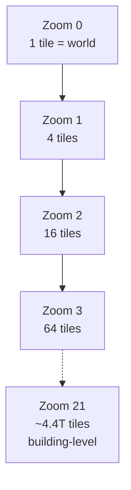
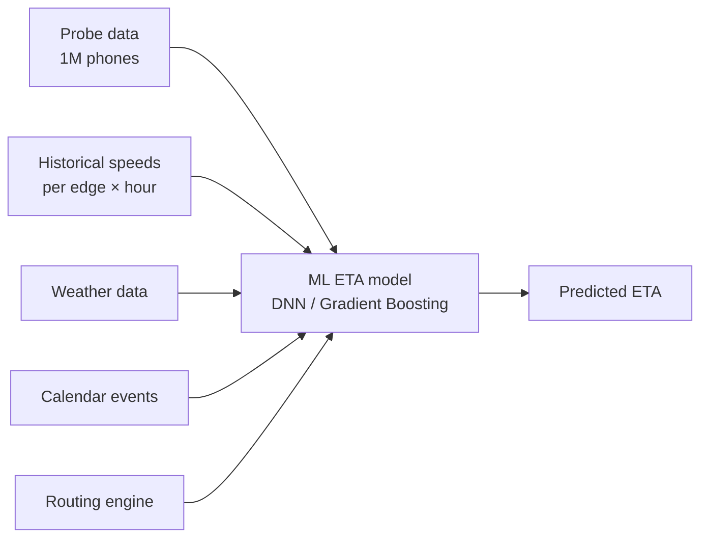
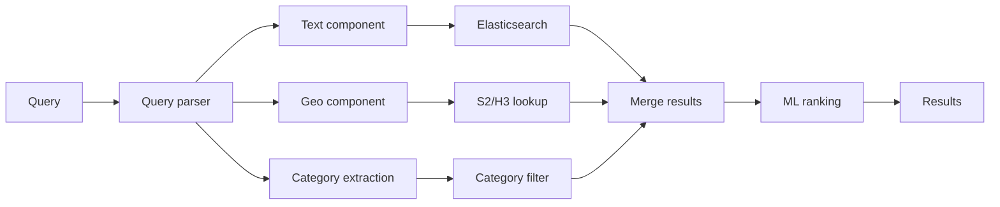
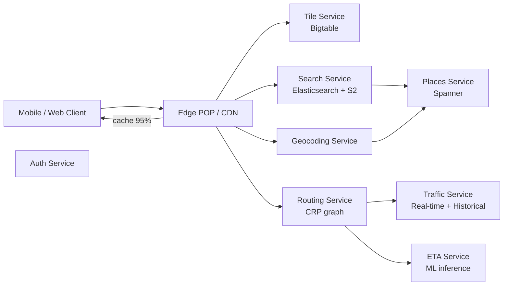

# Вопросы на собеседовании: `Design Google Maps`

`Google Maps` (Apple Maps, Yandex Maps, OpenStreetMap) — крупномасштабная geo-system: 2B+ users, эксабайты данных, миллиарды routing queries в день. Кейс на интервью проверяет geo indexing (quadtree, S2, H3, R-tree), tile pyramid rendering, routing algorithms (Dijkstra → A* → Contraction Hierarchies → Customizable Route Planning), ETA prediction, real-time traffic, offline mode. Senior+ уровень.

## Полезные ссылки

- [Google Maps Platform docs](https://developers.google.com/maps/documentation)
- [S2 Geometry Library](https://s2geometry.io/)
- [Uber H3 hexagonal grid](https://h3geo.org/)
- [OSRM (Open Source Routing Machine)](http://project-osrm.org/)
- [Customizable Route Planning paper (Microsoft, 2013)](https://www.microsoft.com/en-us/research/wp-content/uploads/2013/01/crp-sea.pdf)
- [Contraction Hierarchies paper (Geisberger, 2008)](https://algo2.iti.kit.edu/schultes/hwy/contract.pdf)
- [Mapbox Vector Tiles spec](https://github.com/mapbox/vector-tile-spec)
- [PostGIS spatial indexes](https://postgis.net/workshops/postgis-intro/indexing.html)

## Содержание

**Requirements и capacity**
- [Q1. (!) Functional и non-functional requirements?](#q1--functional-и-non-functional-requirements)
- [Q2. (!) Capacity estimation (2B users, PB-scale)?](#q2--capacity-estimation-2b-users-pb-scale)
- [Q3. SLA и SLO для tile / search / routing?](#q3-sla-и-slo-для-tile--search--routing)

**Geo indexing**
- [Q4. (!) Quadtree — основа всех geo систем?](#q4--quadtree--основа-всех-geo-систем)
- [Q5. (!) S2 (Google) — Hilbert curve cells?](#q5--s2-google--hilbert-curve-cells)
- [Q6. (!) H3 (Uber) — hexagonal grid?](#q6--h3-uber--hexagonal-grid)
- [Q7. R-tree (PostGIS) и когда применять?](#q7-r-tree-postgis-и-когда-применять)
- [Q8. Geohash — старая школа, чем хуже?](#q8-geohash--старая-школа-чем-хуже)

**Tiles и rendering**
- [Q9. (!) Tile pyramid (zoom 0-21, 256×256, 5T tiles)?](#q9--tile-pyramid-zoom-0-21-256256-5t-tiles)
- [Q10. (!) Vector tiles vs raster tiles?](#q10--vector-tiles-vs-raster-tiles)
- [Q11. Map rendering pipeline (server-side vs client-side)?](#q11-map-rendering-pipeline-server-side-vs-client-side)
- [Q12. CDN для tile delivery (edge cache, prefetch)?](#q12-cdn-для-tile-delivery-edge-cache-prefetch)

**Routing**
- [Q13. (!) Routing algorithms: Dijkstra → A* → CH → CRP?](#q13--routing-algorithms-dijkstra--a--ch--crp)
- [Q14. (!) Contraction Hierarchies — preprocessing trick?](#q14--contraction-hierarchies--preprocessing-trick)
- [Q15. Customizable Route Planning (CRP) — для real-time?](#q15-customizable-route-planning-crp--для-real-time)
- [Q16. Road network graph и OSM data ingestion?](#q16-road-network-graph-и-osm-data-ingestion)
- [Q17. (!) ETA prediction (historical + real-time + ML)?](#q17--eta-prediction-historical--real-time--ml)
- [Q18. Multi-modal routing (drive/walk/transit/bike)?](#q18-multi-modal-routing-drivewalktransitbike)

**Search и POI**
- [Q19. (!) POI search (geo + text combined)?](#q19--poi-search-geo--text-combined)
- [Q20. Geocoding forward / reverse?](#q20-geocoding-forward--reverse)
- [Q21. Place data (Google Places, reviews, photos)?](#q21-place-data-google-places-reviews-photos)

**Архитектура**
- [Q22. (!) High-level architecture?](#q22--high-level-architecture)
- [Q23. Storage (Bigtable tiles + Postgres POI)?](#q23-storage-bigtable-tiles--postgres-poi)
- [Q24. (!) Multi-region и data sovereignty?](#q24--multi-region-и-data-sovereignty)

**Features**
- [Q25. Offline maps (download region, vector tiles)?](#q25-offline-maps-download-region-vector-tiles)
- [Q26. Street View и indoor maps?](#q26-street-view-и-indoor-maps)
- [Q27. Real-time location sharing и privacy?](#q27-real-time-location-sharing-и-privacy)

**Production**
- [Q28. (!) Traffic data ingestion (probe data, ML smoothing)?](#q28--traffic-data-ingestion-probe-data-ml-smoothing)
- [Q29. Monitoring metrics обязательные?](#q29-monitoring-metrics-обязательные)
- [Q30. (!) Антипаттерны и подводные камни?](#q30--антипаттерны-и-подводные-камни)

## Q1. (!) Functional и non-functional requirements?

**Functional:**
- Отображение карты по координатам (lat/lon) + zoom level.
- Поиск мест (POI): `pizza near me`, `Зурбаган Москва`.
- Routing (driving/walking/transit/biking).
- ETA prediction с real-time traffic.
- Reverse geocoding: lat/lon → address.
- Forward geocoding: address → lat/lon.
- Offline maps (download region).
- Place details (рейтинги, фото, часы работы).
- Street View (опционально).
- Real-time location sharing.

**Non-functional:**
- Users: 2B+ (Google Maps), 200M+ Yandex Maps.
- Latency: tile load < 100 ms, routing < 500 ms.
- Throughput: billions tile requests/day, миллиарды routing queries.
- Storage: PB-scale (tiles + POI + road graph + Street View + traffic history).
- Availability: 99.99%.
- Offline support: mandatory для emerging markets.
- Multi-language: 50+ languages.
- Multi-region: data sovereignty (China требует отдельный stack).

**Scope excluded (типично):**
- Game-style 3D rendering (это Google Earth, отдельный продукт).
- Real-time collaborative annotation.
- Voice-guided turn-by-turn (это поверх routing, не core design).

**Tip:** senior различает `static map tiles` (cached aggressively, CDN-friendly) и `dynamic` (traffic, search, routing) — это диктует разное архитектурное разделение.

## Q2. (!) Capacity estimation (2B users, PB-scale)?

**Allowances:**

| Параметр | Значение |
|---|---|
| Users | 2B (1B+ MAU) |
| Tile requests/day | 100B+ |
| Search queries/day | 5B+ |
| Routing queries/day | 1B+ |

**Tile pyramid storage:**
- Zoom 0: 1 tile (whole world).
- Zoom 1: 4 tiles.
- ...
- Zoom Z: 4^Z tiles.
- Zoom 21 (Google Maps max): 4^21 ≈ **4.4 trillion tiles** возможных.
- НЕ все tiles генерируются: только над land + populated areas → реально ~5-10% = ~500B tiles.

**Tile size:**
- Raster PNG: 20-50 KB.
- Vector PBF: 5-30 KB (после compression).

**Map data total:**
- All zoom levels (0..21): ~500 TB raster, ~150 TB vector + satellite imagery эксабайты.

**POI:**
- ~200M places worldwide.
- Per-place: 5 KB metadata (name, geo, opening hours, rating, photos URLs).
- = 1 TB POI data.

**Road graph:**
- ~50M road segments worldwide.
- Per-edge: 100-200 B (geometry + properties).
- = 10 GB road graph (compact, fits in memory of routing servers).

**Traffic data:**
- Real-time probe events: 1M users × 1 update/30 sec = 30K events/sec.
- Storage: 24h hot = 2.5B events ≈ 250 GB/day.

**QPS:**
- Peak tile QPS: 100B/86400 × 5 (peak factor) ≈ **5-10M tile/sec global**.
- 99% serve from CDN → origin ~100K/sec.
- Routing: 1B/day × peak ×5 = 60K routing/sec.

## Q3. SLA и SLO для tile / search / routing?

| Metric | Цель | Alert |
|---|---|---|
| `tile_load_p99` | < 100 ms (cached) | > 500 ms 10 минут |
| `tile_cdn_hit_ratio` | > 95% | < 90% 1 час |
| `search_latency_p99` | < 300 ms | > 1 сек |
| `routing_latency_p99` | < 500 ms (Europe-wide) | > 2 сек |
| `eta_accuracy_mape` | < 8% | > 15% (route quality drop) |
| `geocoding_latency_p99` | < 200 ms | > 500 ms |
| `availability` | 99.99% | < 99.9% monthly |
| `tile_freshness_lag` | < 24 h (POI updates) | > 7 дней |

**Failure modes:**
- Tile CDN miss → fallback к origin (slow but works).
- Routing server overload → simpler algorithm (A* без CH) fallback.
- Traffic data lag → use historical averages (still functional, less accurate).

## Q4. (!) Quadtree — основа всех geo систем?

**Идея:** разбить пространство на 4 квадранта рекурсивно.

```
+---+---+
| 0 | 1 |
+---+---+    --> level 1: 4 cells
| 2 | 3 |
+---+---+

Each cell can be subdivided into 4 again --> level 2: 16 cells
```

**Свойства:**
- Hierarchical: zoom out = ancestor cell.
- Sparse: создаём cells только где есть data (densely populated).
- O(log N) запросы.

**Cell encoding:**
- Binary string: `0123210` (path from root, 7 levels deep).
- Или Morton order (Z-order curve) для linear cells IDs.

**Use cases:**
- Tile pyramid (Google Maps) — каждый tile = quadtree cell.
- Region queries: "точки в bbox" → find covering cells.
- Adaptive density (детальные cells где много POI).

**Limitations:**
- Asymmetric neighbors: cell на границе квадранта может иметь "далёкого" соседа в id-space.
- Не идеальный для proximity queries (S2/H3 лучше — Q5, Q6).

**Production:**
- Google tile pyramid — quadtree.
- Mapbox vector tiles — quadtree.
- HBase row keys для geo data — quadtree-derived.

## Q5. (!) S2 (Google) — Hilbert curve cells?

**S2** — Google library для geo indexing на 64-bit cell IDs.

**Идея:**
- Земля проецируется на куб (6 граней).
- Каждая грань разбивается quadtree-style на 30 уровней.
- Cells линеаризуются через **Hilbert curve** — fractal space-filling curve.

**Свойства Hilbert curve:**
- Соседи в curve-space обычно близки в physical space.
- Возможно эффективное range query: "give me все cells in this geographic area" → contiguous range of S2 IDs.

**Cell sizes (уровни 0..30):**
- Level 0: ~85M km² (whole face of cube).
- Level 10: ~80 km² (large city).
- Level 14: ~0.3 km² (neighborhood).
- Level 20: 0.0001 km² (single building).
- Level 30: ~1 cm².

**ID format:**
- 64-bit integer.
- Hierarchical: prefix = parent cell.
- O(1) parent/children lookup.

**API examples:**
```python
import s2geometry as s2
ll = s2.S2LatLng.FromDegrees(55.7558, 37.6173)  # Москва
cell = s2.S2CellId.FromLatLng(ll).parent(15)  # level 15 cell
neighbors = cell.GetEdgeNeighbors()  # 4 edge-neighbors
```

**Use cases:**
- Foursquare proximity search.
- Snowflake geo indexing.
- Uber (до миграции на H3).
- BigQuery geo functions.

**vs Quadtree:**
- S2 — production-ready quadtree с cube projection (handles polar areas correctly).
- Hilbert curve лучше Morton для locality.

## Q6. (!) H3 (Uber) — hexagonal grid?

**H3** — Uber's hexagonal hierarchical geo index, опубликован 2018.

**Зачем hexagons вместо squares:**
- **Uniform neighbor distance:** hex имеет 6 соседей на одинаковом расстоянии (square — 4 edge + 4 corner на разном).
- Лучше для radial queries (surge pricing, demand heat maps).
- Лучше для path-cost calculations.

**Иерархия:**
- 16 разрешений (0..15).
- Res 0: ~4.3M km² (continent-scale, 122 cells globally).
- Res 9: ~0.1 km² (block-level, ~50K m²).
- Res 15: ~0.9 m² (single parking space).

**Trade-off hexagonal hierarchy:**
- Hexagons не tile иерархически идеально (parent hex не покрывает ровно 7 children — есть offset).
- Решение: разбиение через aperture 7 (parent → 7 approximate children).
- Children могут "выходить" за parent boundaries на ~14%.

**ID format:**
- 64-bit integer (Uber's H3 encoding).
- Hierarchical: parent ID derivable.

**Use cases:**
- Uber:
  - Surge pricing per hex.
  - Demand prediction.
  - ETA models per area.
- Foursquare для venue clustering.
- Snowflake H3 SQL functions.

**API:**
```python
import h3
h3.latlng_to_cell(55.7558, 37.6173, 9)  # res 9 cell for Moscow
# → '891faaaaaaaaaaa' (hex string)
h3.grid_disk(cell, 1)  # all neighbors within 1 ring
```

**S2 vs H3:**

| Свойство | S2 | H3 |
|---|---|---|
| Shape | Square (quadtree on cube) | Hexagonal |
| Neighbors | 4 edge + 4 corner (mixed dist) | 6 uniform |
| Hierarchical | Perfect (4 children per parent) | Approximate (aperture 7) |
| Performance | Slightly faster | Slightly slower |
| Best for | Range queries, mapping | Radial / spatial analytics |

## Q7. R-tree (PostGIS) и когда применять?

**R-tree** — balanced tree of nested bounding rectangles.

```
Root
├── MBR_1 (covers leaf children 1-10)
│   ├── leaf 1 (point or polygon)
│   ├── leaf 2
│   └── ...
└── MBR_2 (covers leaf children 11-20)
```

**Свойства:**
- Generic spatial index (works для points, polygons, lines).
- Updates supported (rebalance like B-tree).
- O(log N) bbox query.

**Когда применять:**
- **PostGIS**: GiST или SP-GiST индексы — R-tree variants.
- Полигоны (boundary of countries, neighborhoods).
- Range queries на rectangles ("все объекты в bbox").
- Когда нужны UPDATE/DELETE (S2/H3 — read-only после indexing).

**vs S2/H3:**

| Use case | Index choice |
|---|---|
| Static point clustering (heat maps, demand) | H3 |
| Range query on points (bbox) | S2 / quadtree |
| Polygon containment ("is point in this neighborhood") | R-tree (PostGIS) |
| Dynamic data с updates | R-tree |
| Pre-computed read-only | S2 / H3 |

**Example PostGIS:**
```sql
CREATE INDEX idx_geom ON places USING GIST (geom);

SELECT name FROM places
WHERE ST_DWithin(geom, ST_MakePoint(37.6, 55.7)::geography, 1000);
-- Все места в радиусе 1 км от точки
```

**Limitation:**
- R-tree update operations может быть expensive on heavy write workload.
- Solution: tier-based (hot in PostGIS, cold in pre-computed S2 indexes).

## Q8. Geohash — старая школа, чем хуже?

**Geohash** — alphanumeric encoding lat/lon в string.
- `u4pruydqqvj` — Москва на high precision.
- Префикс = регион.

**Алгоритм:**
- Interleave bits of lat и lon.
- Base32-encode.
- Длина string ↔ precision (1 char ≈ 5000 km, 12 chars ≈ 4 cm).

**Pros:**
- Human-readable.
- Prefix matching (`u4pr*` = same region).
- Используется в Elasticsearch geohash queries.

**Cons (почему S2/H3 лучше):**
- **Boundary issue:** соседние cells могут иметь сильно разные prefix (на стыке квадрантов глобуса).
- Не подходит для антимеридианных queries (longitudinal wrap).
- Полюса плохо обрабатываются (curve вырождается).
- Менее эффективен для radial queries.

**Когда geohash всё ещё применяется:**
- Простые системы где precision не критична.
- Когда нужен readable identifier.
- Elasticsearch / OpenSearch geohash aggregations.

**vs Modern alternatives:**
- S2 (Google): cube projection — нет polar issues.
- H3 (Uber): hexagons — uniform neighbor distance.
- Geohash — legacy для new systems в 2026.

## Q9. (!) Tile pyramid (zoom 0-21, 256×256, 5T tiles)?

**Tile pyramid** — иерархическая структура карт.



**Расчёт tiles:**
- На zoom Z: 2^Z × 2^Z = 4^Z tiles.
- Zoom 0: 1, Zoom 10: 1M, Zoom 15: 1B, Zoom 18: 68B, Zoom 21: 4.4T.

**Tile coordinates:**
- `tile_url = /zoom/x/y.png` где x, y ∈ [0, 2^Z - 1].
- Origin: top-left (0, 0); bottom-right = (2^Z - 1, 2^Z - 1).
- Web Mercator projection (EPSG:3857).

**Tile size:**
- Стандарт: 256×256 pixels (Google, OSM).
- Retina/Hi-DPI: 512×512 pixels.
- 4×4× = same coverage, larger file.

**Generation:**
- Не все 4.4T tiles генерируются. Только над:
  - Land (~30% Земли).
  - Populated areas (зум-чувствительный).
- Реально ~500B tiles (highest zoom лишь по cities).

**Pre-rendering:**
- Static layers (terrain, roads) — pre-rendered at build time.
- Dynamic layers (traffic, POI) — overlay on top.

**Tile request flow:**
```
client → /18/152437/82854.png
  ↓
CDN edge (95% hit)
  ↓ miss
Regional cache
  ↓ miss
Tile server (renders or fetches from storage)
```

**Storage:**
- Bigtable (Google) с row key = `(zoom, x, y)`.
- Lookup O(1).

## Q10. (!) Vector tiles vs raster tiles?

| Aspect | Raster tiles (PNG/JPEG) | Vector tiles (PBF) |
|---|---|---|
| Format | Image (PNG, JPEG, WebP) | Protocol Buffers (binary) |
| Size | 20-50 KB | 5-30 KB (compressed) |
| Rendering | Server-side, baked into image | Client-side (GPU shaders) |
| Styling | Fixed (recompile to change) | Dynamic (CSS-like rules) |
| Zoom interpolation | Pixelated | Smooth (re-render at any zoom) |
| Hi-DPI | Need separate tiles (2x, 3x) | Same tile renders any DPI |
| Offline | Heavy (download all imagery) | Light (just geometry) |
| Interactivity | Limited (clickable layers hard) | Native (clickable features) |

**Vector tile format (MVT — Mapbox Vector Tile spec):**
- Geometry: points, lines, polygons.
- Layers: roads, water, buildings, labels.
- Properties: name, type, attributes.
- Protobuf binary, gzip/brotli compressed.

**Pros vector:**
- Smaller (3-5× меньше than raster).
- Re-styleable (dark mode just changes client style).
- Interactive (clickable features).
- Better for offline (region in vector format — MB вместо GB).

**Cons vector:**
- Client needs WebGL / GPU.
- Older devices (low-end smartphones) struggle.
- Initial render slower (GPU compilation).

**Industry trend (2026):**
- Google Maps: hybrid (vector for base + raster для satellite imagery).
- Apple Maps: vector since 2018 redesign.
- Mapbox: 100% vector.
- OpenStreetMap: both available.

**Verdict:** vector tiles — современный стандарт; raster для satellite/photographic content.

## Q11. Map rendering pipeline (server-side vs client-side)?

**Server-side rendering (raster tiles):**
- TileServer (Mapnik, GeoServer) загружает map data → renders to PNG.
- Pre-rendering: build job создаёт all tiles once → store в Bigtable.
- On-demand rendering: tile requested but not cached → render and cache.

**Client-side rendering (vector tiles):**
- Client requests vector tile (.pbf).
- WebGL / Metal renders на GPU.
- Style applied client-side (Mapbox Style Spec, MapLibre).

**Pipeline server-side:**
```
OSM data → preprocessing → Mapnik renderer
                              ↓
                       PNG tiles per zoom/x/y
                              ↓
                          Bigtable
                              ↓
                            CDN
```

**Pipeline client-side:**
```
OSM data → preprocessing → tilemaker → MBTiles file (vector)
                                          ↓
                                   Bigtable / S3
                                          ↓
                                        CDN
                                          ↓
                                       Client
                                          ↓
                                  WebGL render с style.json
```

**Tile bundling:**
- MBTiles: SQLite database с tiles. Used для offline.
- PMTiles: новый format (2022+), single file serve-able from S3 без сервера.

**Hi-DPI:**
- Raster: separate `@2x` tiles → 4x storage.
- Vector: client adjusts rendering scale, no separate tiles.

## Q12. CDN для tile delivery (edge cache, prefetch)?

**Зачем CDN:**
- 100B tile requests/day → нельзя serve from origin.
- 95%+ requests served from edge.
- Latency: < 50 ms из любой geo.

**Cache key:**
- `(zoom, x, y, style_version)` для vector.
- `(zoom, x, y, dpi)` для raster.

**TTL:**
- Static layers (base map): days-weeks.
- Dynamic (traffic): minutes.
- Versioned URLs для invalidation: `/v123/18/152437/82854.pbf`.

**Predictive prefetch:**
- При zoom-in: prefetch next zoom level tiles.
- При panning: prefetch neighboring tiles.
- HTTP/2 push or QUIC stream multiplexing.

**Compression:**
- Vector tiles: Brotli (better than gzip for protobuf).
- Raster: WebP (30-50% smaller than PNG).
- HTTP `Accept-Encoding: br, gzip` negotiated.

**Cost:**
- CDN egress на 100B tiles/day × 20 KB avg = 2 PB/day.
- $0.02/GB → ~$40K/day = $15M/year CDN cost.
- Большой бизнес-кейс для собственного CDN (как Netflix Open Connect).

**Cache busting:**
- Major map update → bump version → all tiles invalidated.
- Partial updates: per-area version (если изменения локальные).

## Q13. (!) Routing algorithms: Dijkstra → A* → CH → CRP?

**Эволюция:**

**Dijkstra (1959):**
- O(V log V + E) с binary heap.
- На planet graph (50M edges) — 5-30 секунд per query. Слишком медленно для real-time.

**A* (1968):**
- Dijkstra + heuristic (straight-line distance к target).
- 2-10× быстрее Dijkstra.
- Всё ещё слишком медленный для continental routing (Europe ~100M edges).

**Contraction Hierarchies (Geisberger 2008):**
- **Preprocessing** граф: order nodes by importance + add shortcuts.
- Query время: 1-10 мс на continental graph.
- Используется в OSRM.

**Customizable Route Planning (CRP, Microsoft 2013):**
- Preprocessing split на metric-independent + metric-dependent.
- Можно пересчитать metric (current traffic) за секунды, не перестраивая всю структуру.
- Используется в Google Maps, Bing Maps.

**Compare:**

| Algorithm | Preprocess time | Query time | Update on traffic |
|---|---|---|---|
| Dijkstra | None | 5-30 sec | Trivial (just edge weights) |
| A* | None | 1-5 sec | Trivial |
| CH | Hours | 1-10 ms | Slow (re-preprocess shortcuts) |
| CRP | Hours initial | 5-50 ms | Fast (re-customize partition only) |

**Industry choice:**
- OSRM (open-source): CH.
- Google Maps: CRP-derived custom algorithm.
- Yandex Maps: hybrid.
- OSM-based services: CH or contraction-derived.

## Q14. (!) Contraction Hierarchies — preprocessing trick?

**Идея:** "contract" nodes by importance order; добавляем shortcuts чтобы preserve shortest paths.

**Algorithm:**

**Preprocessing:**
1. Order nodes by importance (heuristic: edge-difference + level + ...).
2. Contract least important node:
   - Remove node.
   - For each pair of remaining neighbors, check: shortest path between them через contracted node? If yes — add shortcut edge.
3. Repeat for all nodes.
4. Result: graph + shortcuts с node ordering.

**Query (bidirectional Dijkstra):**
- Run Dijkstra from source upward (only к nodes higher in hierarchy).
- Run Dijkstra from target upward.
- Meeting point = shortest path.
- Decompose shortcuts back в original edges.

**Performance:**
- Continental graph (Europe): query 1-10 мс.
- 1000-10000× faster than vanilla Dijkstra.

**Preprocessing cost:**
- Hours для Europe graph.
- Updates: full recomputation if road geometry changes.

**Limitations:**
- Static metric (precomputed edge weights).
- Traffic changes invalidate all shortcuts → need CRP (Q15).
- Doesn't support arbitrary constraints (multi-modal, time-dependent).

**OSRM реализация:**
- Open-source.
- Preprocess: hours для Europe.
- Production-grade для drive routing.

## Q15. Customizable Route Planning (CRP) — для real-time?

**Идея CRP:** разделить preprocessing на metric-independent (slow) + metric-customizable (fast).

**Preprocessing:**

**Phase 1: Metric-independent (hours):**
- Partition граф на иерархические cells (multi-level partitioning).
- Build overlay graph (edges only between cell boundaries).

**Phase 2: Metric-customizable (seconds):**
- Compute shortest paths through overlay edges с current edge weights (traffic).
- Re-customize при traffic update.

**Query:**
- Local query within cell (fast).
- Overlay query через high-level cells (fast).
- Combined: ~10-50 мс на continental graph.

**Advantages:**
- Traffic update → re-customize в секунды (не hours like CH).
- Multi-criteria optimization (fastest vs shortest vs scenic).
- Multi-modal support (different metric per mode).

**Google Maps:**
- CRP-derived (proprietary refinements).
- Periodic re-customization для traffic.

**vs CH:**

| Aspect | CH | CRP |
|---|---|---|
| Initial preprocess | Hours | Hours |
| Re-preprocess on traffic | Hours | Seconds |
| Query latency | 1-10 ms | 5-50 ms |
| Multi-criteria | No | Yes |
| Production | OSRM | Google Maps |

## Q16. Road network graph и OSM data ingestion?

**Road network graph:**
- Nodes: intersections + named places.
- Edges: road segments с properties (length, speed limit, oneway, road type, allowed modes).
- Cost function: travel time (length / speed × traffic factor).

**OpenStreetMap (OSM):**
- Open volunteer-edited map data.
- Format: XML (.osm) или PBF (binary).
- Planet file: ~70 GB (compressed PBF), ~1.5 TB uncompressed.

**Ingestion pipeline:**

```
OSM data dump (planet.osm.pbf)
   ↓
osm2pgsql (load into PostGIS)
   ↓
Extract road graph (osmnx, graphhopper)
   ↓
Preprocess для routing (CH / CRP)
   ↓
Store optimized graph в memory-mapped file
```

**Updates:**
- OSM minute diffs (~10 MB/day).
- Incremental load.
- Re-preprocess routing graph периодически (nightly).

**Data enrichment:**
- Speed limits (если missing в OSM).
- Traffic regulations (turn restrictions).
- Lane counts, road grade (для bicycle/walking).

**Industry:**
- Yandex / Google имеют proprietary data (sat imagery + dispatched cars).
- OSM-based services: Mapbox, MapQuest, OSRM.
- Lookup attribution requirements per OSM license (ODbL).

## Q17. (!) ETA prediction (historical + real-time + ML)?

**Naive ETA:** sum(edge_length / speed_limit) along route.

**Reality:** real-world travel time ≠ speed limit.
- Traffic congestion.
- Time of day patterns.
- Day of week patterns.
- Weather.
- Special events.
- Construction zones.

**Pipeline:**



**ML features:**
- Per-edge baseline speed (historical avg).
- Current observed speed (last 5-15 минут probe data).
- Day-of-week + time-of-day patterns.
- Weather.
- Origin / destination characteristics.
- Route length and complexity.

**Model:**
- LightGBM / XGBoost for tabular.
- DeepETA (Uber) — neural model для уберов.
- DLRM / MLP for Google.

**Accuracy:**
- Google Maps: MAPE 8-10% (Mean Absolute Percentage Error).
- Improved via DeepMind WaveNet-derived (2020+).

**Latency:**
- ETA inference: 10-50 ms.
- Async refresh во время поездки (re-route if congestion ahead).

**Multi-modal:**
- Separate models per mode (driving vs walking vs transit).
- Transit ETA: schedule + delay predictions.

## Q18. Multi-modal routing (drive/walk/transit/bike)?

**Modes:**
- **Driving** — primary.
- **Walking** — слой pedestrian-only paths (sidewalks, alleys).
- **Transit** — bus/metro schedules + walking transfers.
- **Cycling** — bike paths preferred.
- **Combined** — drive + park + walk; bike + transit + walk.

**Graph differences:**
- Driving: motor vehicle graph (highways, roads).
- Walking: includes pedestrian-only segments (parks, plazas).
- Cycling: bike paths boosted, highways excluded.
- Transit: time-dependent edges (only available at certain times).

**Transit routing complexity:**
- Time-dependent graph (Connection Scan Algorithm — CSA, RAPTOR).
- Schedule-based: edges have departure times.
- Wait time = next departure - arrival.

**Multi-modal combined:**
- "Drive 5 min к станции → park → train 30 min → walk 5 min".
- Hard problem: combinatorial routing.
- Implementation: transfer modeling через "transfer nodes".

**Google Maps:**
- Separate routing engines per mode.
- Combined queries → orchestration layer.
- Real-time traffic affects driving + transit (delays).

**Edge cases:**
- Accessibility (wheelchair routing) — additional edge filter.
- Avoid tolls / highways — preferences.
- Carbon footprint optimization (Google eco-routing 2021+).

## Q19. (!) POI search (geo + text combined)?

**Query examples:**
- "pizza near me" → geo (current location) + text (pizza).
- "Зурбаган Москва" → text + place.
- "best Italian restaurants downtown" → text + geo + ranking.

**Architecture:**



**Search stages:**
- **Retrieval:** narrow к geo + text candidates (top 1000).
- **Ranking:** ML model scores by relevance + popularity + distance.
- **Diversification:** не показывать 10 одинаковых pizzerias.

**Features для ranking:**
- Text relevance (BM25).
- Distance to user.
- Place popularity (visits, reviews).
- Open now status.
- User personalization (past visits).
- Quality (rating, review count).

**Latency:**
- p99 < 300 ms (Q3).
- Heavy caching for popular queries.

**Implementation:**
- ES geo_point + text fields.
- Custom scoring functions.
- Ranking model на top-1000 candidates.

## Q20. Geocoding forward / reverse?

**Forward geocoding (address → lat/lon):**
- Input: `"улица Льва Толстого 16, Москва"`.
- Output: lat=55.7344, lon=37.5868.

**Reverse geocoding (lat/lon → address):**
- Input: lat=55.7344, lon=37.5868.
- Output: `"улица Льва Толстого 16, Москва, 119021"`.

**Forward implementation:**
- Parse address (street, number, city, country).
- Search в gazetteer (address database).
- Disambiguation (multiple matches): nearest, most populous, user history.
- Fallback: text search в Elasticsearch.

**Reverse implementation:**
- Find nearest address point (spatial query).
- Or: find nearest road segment + interpolate position along road.
- Return address с distance < threshold; otherwise return city/country only.

**Tools:**
- Nominatim (open source).
- Google Geocoding API.
- Mapbox Geocoding.
- Yandex Geocoder.

**Edge cases:**
- Ambiguous address ("Main Street" в нескольких городах) → return list.
- New construction (not in database) → nearest known.
- Multi-language: "Москва" vs "Moscow" vs "موسكو" — normalize.

**Caching:**
- Popular addresses cached (90%+ hit ratio).
- Hash query → result.

## Q21. Place data (Google Places, reviews, photos)?

**Place schema:**
- ID (Google Place ID, ~30-char string).
- Name, types (restaurant, store, hospital).
- Geo (lat/lon).
- Address.
- Opening hours (per day of week, including holidays).
- Phone, website.
- Photos (user-contributed, business-uploaded).
- Reviews (rating, text).
- Popularity (Popular Times feature).

**Data sources:**
- Business claims (verified owners).
- User contributions (Local Guides).
- Web scraping (websites, social media).
- Partner data (Yelp, OpenTable).

**Storage:**
- Place metadata: Spanner or Bigtable.
- Reviews: separate (high write volume).
- Photos: blob storage (S3-like).
- Geo index: S2 lookup.

**Update pipeline:**
- Business owner verifies → claims business.
- Edits go through moderation.
- ML for spam detection (fake reviews).

**Privacy:**
- Aggregated data only ("Popular Times" не identifies individuals).
- Reviews tied к user accounts (visible publicly).

**APIs:**
- Google Places API (search, details, autocomplete, nearby).
- Yandex Places API.
- Foursquare Places API.

## Q22. (!) High-level architecture?



**Components:**
- **Edge POP / CDN:** tile delivery (most requests served here).
- **Tile Service:** stores и serves map tiles (vector + raster).
- **Search Service:** POI search с geo + text.
- **Geocoding Service:** address ↔ lat/lon.
- **Routing Service:** preprocess'd road graph + CH/CRP algorithm.
- **Traffic Service:** real-time probe ingestion + historical aggregates.
- **ETA Service:** ML inference (DLRM/LightGBM).
- **Places Service:** business data, reviews, photos.

**Data plane:**
- Tile pyramid в Bigtable (PB scale).
- Road graph в memory (10 GB per routing instance).
- POI в Spanner или Bigtable.
- Traffic в Bigtable + Memcached.

**Async pipelines:**
- Traffic events → Kafka → Flink aggregation.
- OSM updates → Spark batch → re-preprocess routing graph (nightly).
- Place updates → Kafka → ES index sync.

## Q23. Storage (Bigtable tiles + Postgres POI)?

**Tile storage (Bigtable / HBase):**
- Row key: `(zoom, x, y, tile_type, version)`.
- Cell value: tile bytes (vector PBF or raster PNG).
- Massive scale: 100B+ tiles.
- HFile / SSTable internals.

**Why Bigtable:**
- Sequential row keys → range scans для region.
- Mass parallel reads (CDN cache fill).
- HDFS underlying для durability.

**POI storage (Spanner / Postgres):**
- Spanner для Google scale (global transactions).
- Postgres + PostGIS для smaller scale (Yandex level).
- Schema: places, reviews, photos, opening_hours.
- ACID transactions для place edits.

**Road graph:**
- Memory-mapped binary files (custom format).
- Preprocessed CH/CRP structures.
- 10-50 GB per routing instance.
- Replicated across routing fleet.

**Traffic:**
- Real-time: Memcached / Redis (hot, last 15 min).
- Historical: Bigtable (1 year retention).

**Imagery (satellite):**
- Object storage (Colossus, S3).
- Tile pyramid.
- Petabyte scale.

## Q24. (!) Multi-region и data sovereignty?

**Regions:**
- US-East, US-West (primary US).
- EU-West (Ireland), EU-Central (Frankfurt) — GDPR.
- APAC-Tokyo, APAC-Singapore.
- South America.
- Africa, Middle East.

**Data sovereignty:**
- **China:** complete separate stack (Google Maps not available; Baidu/Gaode local).
- **Russia:** Yandex Maps dominant; Google limited functionality.
- **EU GDPR:** user data в EU regions only.
- **India RBI / IT Act:** некоторые data localization requirements.

**Per-region:**
- Tile pyramid replicated (read-only, identical globally).
- POI data: localized (different content per region).
- Search relevance: language + cultural tuning.
- Routing graph: regional partitions (continental).

**Multi-region routing:**
- Continental graph per region (Europe / North America / Asia).
- Cross-continental routes (rare) — combined query.

**Cross-region replication:**
- Map data: replicated all regions (same world map).
- POI updates: async replication.
- Traffic data: per-region (local probes).

**Failover:**
- Region outage → DNS routes к neighbor.
- Routing data available everywhere (replication).
- POI data: temporary inconsistency acceptable.

## Q25. Offline maps (download region, vector tiles)?

**Feature:** user скачивает region для offline use (low connectivity, no roaming).

**Implementation:**
- User selects region на map.
- Background download:
  - Vector tiles для chosen region и zoom levels.
  - POI data within region.
  - Road graph subset (для offline routing).
- Storage: MBTiles (SQLite) или PMTiles.

**Size estimates:**
- Vector tiles для country (Russia, zoom 0-12): ~500 MB.
- POI data: ~100-200 MB per country.
- Road graph subset: ~500 MB - 2 GB.
- Total: 1-3 GB per country.

**Offline functionality:**
- Map display: full (vector tiles render anywhere).
- POI search: works (local index).
- Routing: works (local graph + simpler algorithm — no real-time traffic).
- ETA: historical averages only.

**Updates:**
- Periodic background updates (when connected to Wi-Fi).
- Per-region expiration (30-180 days).
- Diff updates (only changed tiles).

**Limitations:**
- No live traffic.
- No real-time search ranking (popularity, reviews).
- Storage on device.

**Use cases:**
- Travel international (no roaming).
- Hiking / camping (no cell signal).
- Emerging markets (cellular expensive).

## Q26. Street View и indoor maps?

**Street View:**
- 360° panorama photos taken from cars / backpacks.
- Stitched панорамы (multiple cameras combined).
- Tiled (similar к map tiles).
- Linked sequence (move along street).

**Storage:**
- Panorama tiles: ~100 KB - 1 MB per tile.
- Multiple zoom levels.
- Linked metadata (heading, pitch, neighbors).
- Total: эксабайты для world coverage.

**Privacy:**
- Auto-blur faces и license plates (CV models).
- Manual takedown requests.

**Indoor maps:**
- Buildings: airports, malls, museums.
- Multi-floor support.
- Indoor positioning (Wi-Fi + Bluetooth beacons).
- Data from partners + crowdsourced.

**Indoor routing:**
- Floor-aware graph.
- Elevators, escalators, stairs as edges.
- Multi-floor pathfinding.

**Implementation:**
- Geo + altitude (floor level).
- Specialized tiles per floor.
- API: getRouteToGate(airport_terminal, gate).

## Q27. Real-time location sharing и privacy?

**Feature:** user shares location в реальном времени с friends / family.

**Implementation:**
- Client posts location updates every 10-30 sec.
- Server stores tail buffer (last 24 ч или session-based).
- Friends query: `getLocation(user_id, time)`.

**Privacy:**
- Explicit consent required.
- Time-limited (1 hour, 24 hour, indefinite).
- Revoke anytime.
- Stored encrypted at rest.
- Auto-delete after retention period (configurable).

**Storage:**
- Hot tier: Redis (last hour).
- Cold tier: Bigtable (history if user wants).
- Or: ephemeral only (no persistence, P2P-like).

**Notification:**
- "Friend arrived at destination" — geofencing trigger.
- "Friend deviated from route" — anomaly detection.

**GDPR:**
- Right to access (data export).
- Right to erasure.
- Audit log of who accessed location.

**Anti-stalking:**
- Apple Find My / AirTag: notification if unknown tracker follows you.
- Google: similar feature.

## Q28. (!) Traffic data ingestion (probe data, ML smoothing)?

**Probe data:**
- Anonymous location pings from phones.
- ~1M phones contributing per region simultaneously.
- 1 update / 30 сек = 33K events/sec per region.

**Pipeline:**

```
Phone GPS → Maps app → Kafka → Flink stream processing
   ↓
Map-matching (snap to nearest road segment)
   ↓
Speed estimation (consecutive pings)
   ↓
Aggregation (per edge × 1 минута window)
   ↓
Real-time traffic store (Memcached + Bigtable)
   ↓
Routing service + ETA model
```

**Map-matching:**
- GPS noisy (5-15 m typical).
- Snap к nearest road (Hidden Markov Model).
- Path most likely given sequence of pings.

**Speed estimation:**
- Distance / time between pings.
- Median across many phones on same edge (robust to outliers).

**Aggregation:**
- Per-edge speed = median(probes last 1-5 минут).
- Smoothing: exponential moving average для stability.
- Sparse data: borrow from historical patterns (Q17).

**Privacy:**
- Probe data anonymized (no user_id).
- Aggregated; не visible individually.
- Opt-in based.

**Volume:**
- Per region: 33K events/sec ingest.
- ~50 regions globally → 1.5M events/sec total.
- Storage hot tier: ~30 GB/day per region.

## Q29. Monitoring metrics обязательные?

**Core latency:**
- `tile_load_p99` (target < 100 ms cached).
- `cdn_hit_ratio` (target > 95%).
- `search_latency_p99` (< 300 ms).
- `routing_latency_p99` (< 500 ms).
- `geocoding_latency_p99` (< 200 ms).
- `eta_inference_latency_p99` (< 50 ms).

**Quality:**
- `eta_accuracy_mape` (< 8%).
- `route_quality_score` (composite).
- `search_ctr` (clicks per search).
- `zero_result_rate` (< 5%).

**Volume:**
- `tile_requests_per_sec`.
- `search_queries_per_sec`.
- `routing_queries_per_sec`.
- `probe_events_per_sec`.

**Failure:**
- `tile_render_failure_rate`.
- `routing_timeout_rate`.
- `traffic_data_staleness_seconds` (alert > 5 min).

**Business:**
- `daily_active_users`.
- `places_added_per_day`.
- `eta_accuracy_per_country`.

**Tracing:**
- OpenTelemetry; trace через client → CDN → backend.
- Visibility: "Routing query 380 ms = 100 ms graph fetch + 200 ms CRP + 50 ms ETA + 30 ms serialize".

**Alerting:**
- Page: `tile_load_p99 > 500 ms` 10 минут подряд.
- Slack: `eta_accuracy` drop > 5% week-over-week.
- Email: `traffic_data_staleness > 10 min`.

## Q30. (!) Антипаттерны и подводные камни?

**1. Raster tiles на всех zoom levels.**
- Mobile bandwidth expensive; vector 3-5× меньше.
- Fix: vector tiles default; raster только для satellite imagery.

**2. Naive Dijkstra на planet graph.**
- 5-30 секунд per query → не serviceable.
- Fix: Contraction Hierarchies (CH) или CRP preprocessing.

**3. Geohash для современных systems.**
- Boundary issues, polar problems.
- Fix: S2 (Google) или H3 (Uber).

**4. No CDN для tile delivery.**
- Origin перегружен 100B requests/day.
- Fix: CDN с 95%+ hit ratio.

**5. Sync routing API на каждый keystroke в navigation.**
- Routing 500 ms × 30 keystrokes = 15 sec UI lag.
- Fix: client-side prediction + async refresh.

**6. Single global routing graph.**
- Cross-continental queries редки; per-region graphs faster.
- Fix: continental partitions; cross-region orchestration on demand.

**7. ETA = sum(edge_length / speed_limit).**
- Naive; ignores traffic, weather, time-of-day.
- Fix: ML model с historical + real-time signals (Q17).

**8. Не invalidate tiles при map updates.**
- Stale data (closed roads, new construction).
- Fix: versioned tile URLs; cache bust on major update.

**9. POI search без geo proximity.**
- "Pizza" returns Italy when user в Москве.
- Fix: always combine text + geo (Q19).

**10. Tile request на каждое pan/zoom без debouncing.**
- 1 пользователь = 100 tile requests/sec при agitated panning.
- Fix: debounce 100-300 ms; cancel previous requests.

**11. Без offline support.**
- User без internet = useless app.
- Fix: offline regions download (Q25).

**12. Polling traffic data на client.**
- Каждые 30 сек × 100M users = 3M QPS на traffic API.
- Fix: push notifications via WebSocket only when significant.

**13. Без map-matching в probe pipeline.**
- GPS noise distorts traffic estimates.
- Fix: HMM map-matching (snap к roads).

**14. Без data sovereignty handling.**
- GDPR violation; China access blocked.
- Fix: per-region separate stacks; data localization.

**15. Same map data для всех languages.**
- "Москва" не отображается английским пользователям как "Moscow".
- Fix: per-language label fields в data; client-side label selection.

---

## See also

- [Design Uber](design-uber-interview.md) — geo indexing (H3) + routing parallels
- [Design Netflix](design-netflix-interview.md) — CDN architecture parallels
- [Design Search System](design-search-interview.md) — geo + text combined search
- [Design Typeahead](design-typeahead-interview.md) — query understanding overlap
- [System Design Interview](system-design-interview.md) — общая методология
- [Caching Strategies](../architecture/caching-strategies-interview.md) — multi-tier tile caching
- [CDN](../architecture/cdn-interview.md) — edge tile delivery
- [Distributed Systems](../architecture/distributed-systems-interview.md) — multi-region consistency
- [Elasticsearch](../databases/elasticsearch-interview.md) — geo + text search
- [Cassandra](../databases/cassandra-interview.md) — alternative для probe data
- [Kafka](../messaging/kafka-interview.md) — probe events stream
- [MLOps](../ai-ml/mlops-interview.md) — ETA model training
- [Resilience Patterns](../architecture/resilience-patterns-interview.md) — fallback algorithms
