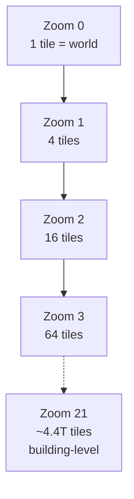
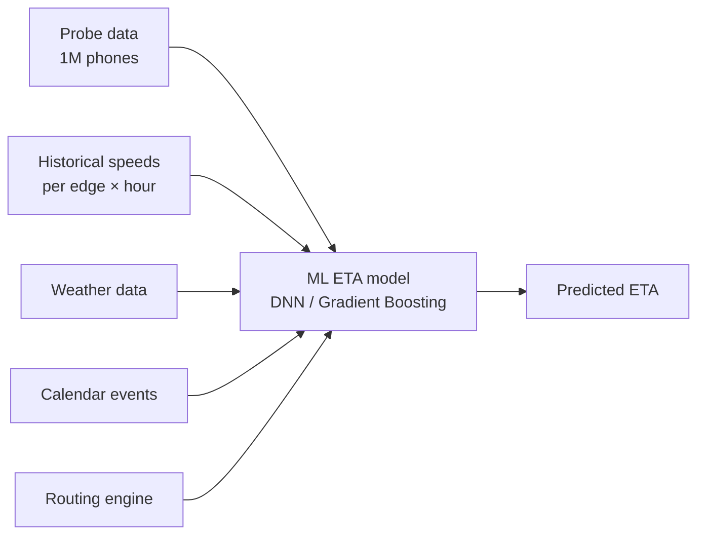
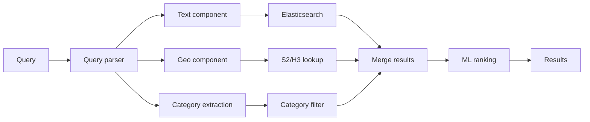
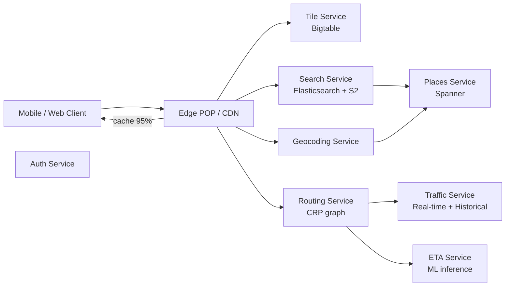

# Вопросы на собеседовании: `Design Google Maps`

`Google Maps` (Apple Maps, Yandex Maps, OpenStreetMap) — крупномасштабная geo-system: 2B+ users, эксабайты данных, миллиарды routing queries в день. Кейс на интервью проверяет geo indexing (quadtree, S2, H3, R-tree), tile pyramid rendering, routing algorithms (Dijkstra → A* → Contraction Hierarchies → Customizable Route Planning), ETA prediction, real-time traffic, offline mode. Senior+ уровень.

## Полезные ссылки

- [Google Maps Platform docs](https://developers.google.com/maps/documentation)
- [S2 Geometry Library](https://s2geometry.io/)
- [Uber H3 hexagonal grid](https://h3geo.org/)
- [OSRM (Open Source Routing Machine)](http://project-osrm.org/)
- [Customizable Route Planning paper (Microsoft, 2013)](https://www.microsoft.com/en-us/research/wp-content/uploads/2013/01/crp-sea.pdf)
- [Contraction Hierarchies paper (Geisberger, 2008)](https://algo2.iti.kit.edu/schultes/hwy/contract.pdf)
- [Mapbox Vector Tiles spec](https://github.com/mapbox/vector-tile-spec)
- [PostGIS spatial indexes](https://postgis.net/workshops/postgis-intro/indexing.html)

## Содержание

**Requirements и capacity**
- [Q1. (!) Functional и non-functional requirements?](#q1--functional-и-non-functional-requirements)
- [Q2. (!) Capacity estimation (2B users, PB-scale)?](#q2--capacity-estimation-2b-users-pb-scale)
- [Q3. SLA и SLO для tile / search / routing?](#q3-sla-и-slo-для-tile--search--routing)

**Geo indexing**
- [Q4. (!) Quadtree — основа всех geo систем?](#q4--quadtree--основа-всех-geo-систем)
- [Q5. (!) S2 (Google) — Hilbert curve cells?](#q5--s2-google--hilbert-curve-cells)
- [Q6. (!) H3 (Uber) — hexagonal grid?](#q6--h3-uber--hexagonal-grid)
- [Q7. R-tree (PostGIS) и когда применять?](#q7-r-tree-postgis-и-когда-применять)
- [Q8. Geohash — старая школа, чем хуже?](#q8-geohash--старая-школа-чем-хуже)

**Tiles и rendering**
- [Q9. (!) Tile pyramid (zoom 0-21, 256×256, 5T tiles)?](#q9--tile-pyramid-zoom-0-21-256256-5t-tiles)
- [Q10. (!) Vector tiles vs raster tiles?](#q10--vector-tiles-vs-raster-tiles)
- [Q11. Map rendering pipeline (server-side vs client-side)?](#q11-map-rendering-pipeline-server-side-vs-client-side)
- [Q12. CDN для tile delivery (edge cache, prefetch)?](#q12-cdn-для-tile-delivery-edge-cache-prefetch)

**Routing**
- [Q13. (!) Routing algorithms: Dijkstra → A* → CH → CRP?](#q13--routing-algorithms-dijkstra--a--ch--crp)
- [Q14. (!) Contraction Hierarchies — preprocessing trick?](#q14--contraction-hierarchies--preprocessing-trick)
- [Q15. Customizable Route Planning (CRP) — для real-time?](#q15-customizable-route-planning-crp--для-real-time)
- [Q16. Road network graph и OSM data ingestion?](#q16-road-network-graph-и-osm-data-ingestion)
- [Q17. (!) ETA prediction (historical + real-time + ML)?](#q17--eta-prediction-historical--real-time--ml)
- [Q18. Multi-modal routing (drive/walk/transit/bike)?](#q18-multi-modal-routing-drivewalktransitbike)

**Search и POI**
- [Q19. (!) POI search (geo + text combined)?](#q19--poi-search-geo--text-combined)
- [Q20. Geocoding forward / reverse?](#q20-geocoding-forward--reverse)
- [Q21. Place data (Google Places, reviews, photos)?](#q21-place-data-google-places-reviews-photos)

**Архитектура**
- [Q22. (!) High-level architecture?](#q22--high-level-architecture)
- [Q23. Storage (Bigtable tiles + Postgres POI)?](#q23-storage-bigtable-tiles--postgres-poi)
- [Q24. (!) Multi-region и data sovereignty?](#q24--multi-region-и-data-sovereignty)

**Features**
- [Q25. Offline maps (download region, vector tiles)?](#q25-offline-maps-download-region-vector-tiles)
- [Q26. Street View и indoor maps?](#q26-street-view-и-indoor-maps)
- [Q27. Real-time location sharing и privacy?](#q27-real-time-location-sharing-и-privacy)

**Production**
- [Q28. (!) Traffic data ingestion (probe data, ML smoothing)?](#q28--traffic-data-ingestion-probe-data-ml-smoothing)
- [Q29. Monitoring metrics обязательные?](#q29-monitoring-metrics-обязательные)
- [Q30. (!) Антипаттерны и подводные камни?](#q30--антипаттерны-и-подводные-камни)

## Q1. (!) Functional и non-functional requirements?

**Функциональные:**
- Отображение карты по координатам (lat/lon) + уровень зума.
- Поиск мест (POI): `pizza near me`, `Зурбаган Москва`.
- Маршрутизация (на авто/пешком/транзит/велосипед).
- Прогноз ETA с real-time-трафиком.
- Обратное геокодирование: lat/lon → адрес.
- Прямое геокодирование: адрес → lat/lon.
- Офлайн-карты (загрузка региона).
- Детали места (рейтинги, фото, часы работы).
- Street View (опционально).
- Шеринг местоположения в реальном времени.

**Нефункциональные:**
- Пользователи: 2B+ (Google Maps), 200M+ Yandex Maps.
- Latency: загрузка тайла < 100 мс, маршрутизация < 500 мс.
- Throughput: миллиарды tile-запросов в день, миллиарды routing-запросов.
- Storage: масштаб PB (тайлы + POI + road graph + Street View + история трафика).
- Доступность: 99.99%.
- Офлайн-поддержка: обязательна для развивающихся рынков.
- Мультиязычность: 50+ языков.
- Мультирегиональность: data sovereignty (Китай требует отдельный stack).

**Что выносим за рамки (типично):**
- 3D-рендеринг игрового уровня (это Google Earth, отдельный продукт).
- Совместное аннотирование в реальном времени.
- Голосовая пошаговая навигация (это слой поверх маршрутизации, а не ядро дизайна).

**Совет:** senior различает `static map tiles` (агрессивно кэшируются, удобны для CDN) и `dynamic` (трафик, поиск, маршрутизация) — это диктует разное архитектурное разделение.

## Q2. (!) Capacity estimation (2B users, PB-scale)?

**Исходные допущения:**

| Параметр | Значение |
|---|---|
| Пользователи | 2B (1B+ MAU) |
| Tile-запросов/день | 100B+ |
| Поисковых запросов/день | 5B+ |
| Routing-запросов/день | 1B+ |

**Storage tile pyramid:**
- Zoom 0: 1 тайл (весь мир).
- Zoom 1: 4 тайла.
- ...
- Zoom Z: 4^Z тайлов.
- Zoom 21 (максимум Google Maps): 4^21 ≈ **4.4 триллиона тайлов** возможных.
- НЕ все тайлы генерируются: только над сушей и населёнными зонами → реально ~5–10% = ~500B тайлов.

**Размер тайла:**
- Растровый PNG: 20–50 KB.
- Векторный PBF: 5–30 KB (после сжатия).

**Объём картографических данных:**
- Все уровни зума (0..21): ~500 TB растр, ~150 TB вектор + спутниковые снимки эксабайты.

**POI:**
- ~200M мест по всему миру.
- На место: 5 KB метаданных (название, гео, часы работы, рейтинг, URL-ы фото).
- = 1 TB данных POI.

**Road graph:**
- ~50M дорожных сегментов по всему миру.
- На ребро: 100–200 B (геометрия + свойства).
- = 10 GB road graph (компактно, помещается в память routing-серверов).

**Данные о трафике:**
- Real-time probe-события: 1M пользователей × 1 апдейт/30 сек = 30K событий/сек.
- Storage: горячие 24 ч = 2.5B событий ≈ 250 GB/день.

**QPS:**
- Пиковый tile QPS: 100B/86400 × 5 (пиковый множитель) ≈ **5–10M тайлов/сек глобально**.
- 99% отдаётся из CDN → origin ~100K/сек.
- Маршрутизация: 1B/день × пик ×5 = 60K routing/сек.

## Q3. SLA и SLO для tile / search / routing?

| Metric | Цель | Alert |
|---|---|---|
| `tile_load_p99` | < 100 ms (cached) | > 500 ms 10 минут |
| `tile_cdn_hit_ratio` | > 95% | < 90% 1 час |
| `search_latency_p99` | < 300 ms | > 1 сек |
| `routing_latency_p99` | < 500 ms (Europe-wide) | > 2 сек |
| `eta_accuracy_mape` | < 8% | > 15% (route quality drop) |
| `geocoding_latency_p99` | < 200 ms | > 500 ms |
| `availability` | 99.99% | < 99.9% monthly |
| `tile_freshness_lag` | < 24 ч (апдейты POI) | > 7 дней |

**Сценарии отказов:**
- Промах tile CDN → fallback к origin (медленно, но работает).
- Перегрузка routing-сервера → fallback на более простой алгоритм (A* без CH).
- Лаг данных о трафике → используем исторические средние (всё ещё функционально, менее точно).

## Q4. (!) Quadtree — основа всех geo систем?

**Идея:** разбить пространство на 4 квадранта рекурсивно.

```
+---+---+
| 0 | 1 |
+---+---+    --> level 1: 4 cells
| 2 | 3 |
+---+---+

Each cell can be subdivided into 4 again --> level 2: 16 cells
```

**Свойства:**
- Иерархичность: zoom out = родительская ячейка.
- Разреженность: создаём ячейки только там, где есть данные (плотно населённые зоны).
- Запросы за O(log N).

**Кодирование ячейки:**
- Бинарная строка: `0123210` (путь от корня, глубина 7 уровней).
- Или Morton order (Z-order curve) для линейных ID ячеек.

**Сценарии применения:**
- Tile pyramid (Google Maps) — каждый тайл = ячейка quadtree.
- Региональные запросы: «точки в bbox» → находим покрывающие ячейки.
- Адаптивная плотность (детальные ячейки там, где много POI).

**Ограничения:**
- Асимметричные соседи: ячейка на границе квадранта может иметь «далёкого» соседа в id-space.
- Не идеален для proximity-запросов (S2/H3 лучше — Q5, Q6).

**В продакшене:**
- Tile pyramid Google — quadtree.
- Векторные тайлы Mapbox — quadtree.
- Row keys HBase для гео-данных — производные от quadtree.

## Q5. (!) S2 (Google) — Hilbert curve cells?

**S2** — библиотека Google для гео-индексации на 64-битных cell ID.

**Идея:**
- Земля проецируется на куб (6 граней).
- Каждая грань разбивается в стиле quadtree на 30 уровней.
- Ячейки линеаризуются через **Hilbert curve** — фрактальную space-filling-кривую.

**Свойства Hilbert curve:**
- Соседи в curve-space обычно близки и в физическом пространстве.
- Возможен эффективный range query: «дай все ячейки в этой географической зоне» → непрерывный диапазон S2 ID.

**Размеры ячеек (уровни 0..30):**
- Level 0: ~85M км² (целая грань куба).
- Level 10: ~80 км² (крупный город).
- Level 14: ~0.3 км² (район).
- Level 20: 0.0001 км² (отдельное здание).
- Level 30: ~1 см².

**Формат ID:**
- 64-битное целое.
- Иерархично: префикс = родительская ячейка.
- Поиск parent/children за O(1).

**Примеры API:**
```python
import s2geometry as s2
ll = s2.S2LatLng.FromDegrees(55.7558, 37.6173)  # Москва
cell = s2.S2CellId.FromLatLng(ll).parent(15)  # level 15 cell
neighbors = cell.GetEdgeNeighbors()  # 4 edge-neighbors
```

**Сценарии применения:**
- Proximity-поиск в Foursquare.
- Гео-индексация в Snowflake.
- Uber (до миграции на H3).
- Гео-функции BigQuery.

**vs Quadtree:**
- S2 — production-ready quadtree с проекцией на куб (корректно обрабатывает полярные зоны).
- Hilbert curve лучше Morton по локальности.

## Q6. (!) H3 (Uber) — hexagonal grid?

**H3** — гексагональный иерархический гео-индекс Uber, опубликован в 2018.

**Зачем гексагоны вместо квадратов:**
- **Равномерное расстояние до соседей:** у гекса 6 соседей на одинаковом расстоянии (у квадрата — 4 по рёбрам + 4 по углам, на разном).
- Лучше для radial-запросов (surge pricing, тепловые карты спроса).
- Лучше для расчёта стоимости пути (path-cost).

**Иерархия:**
- 16 разрешений (0..15).
- Res 0: ~4.3M км² (масштаб континента, 122 ячейки на весь мир).
- Res 9: ~0.1 км² (масштаб квартала, ~50K м²).
- Res 15: ~0.9 м² (одно парковочное место).

**Trade-off гексагональной иерархии:**
- Гексагоны не тайлятся иерархически идеально (родительский гекс не покрывает ровно 7 потомков — есть offset).
- Решение: разбиение через aperture 7 (родитель → 7 приблизительных потомков).
- Потомки могут «выходить» за границы родителя на ~14%.

**Формат ID:**
- 64-битное целое (кодировка H3 от Uber).
- Иерархично: ID родителя выводится из ID потомка.

**Сценарии применения:**
- Uber:
  - Surge pricing по гексам.
  - Прогноз спроса.
  - ETA-модели по зонам.
- Foursquare для кластеризации заведений.
- SQL-функции H3 в Snowflake.

**API:**
```python
import h3
h3.latlng_to_cell(55.7558, 37.6173, 9)  # res 9 cell for Moscow
# → '891faaaaaaaaaaa' (hex string)
h3.grid_disk(cell, 1)  # all neighbors within 1 ring
```

**S2 vs H3:**

| Свойство | S2 | H3 |
|---|---|---|
| Форма | Квадрат (quadtree на кубе) | Гексагон |
| Соседи | 4 по рёбрам + 4 по углам (разное расстояние) | 6 равномерно |
| Иерархичность | Идеальная (4 потомка на родителя) | Приблизительная (aperture 7) |
| Производительность | Чуть быстрее | Чуть медленнее |
| Лучше для | Range-запросов, картографии | Radial / пространственная аналитика |

## Q7. R-tree (PostGIS) и когда применять?

**R-tree** — сбалансированное дерево вложенных ограничивающих прямоугольников (bounding rectangles).

```
Root
├── MBR_1 (covers leaf children 1-10)
│   ├── leaf 1 (point or polygon)
│   ├── leaf 2
│   └── ...
└── MBR_2 (covers leaf children 11-20)
```

**Свойства:**
- Универсальный пространственный индекс (работает для точек, полигонов, линий).
- Поддерживает апдейты (ребалансировка как у B-tree).
- Bbox-запрос за O(log N).

**Когда применять:**
- **PostGIS**: индексы GiST или SP-GiST — варианты R-tree.
- Полигоны (границы стран, районов).
- Range-запросы по прямоугольникам («все объекты в bbox»).
- Когда нужны UPDATE/DELETE (S2/H3 — read-only после индексации).

**vs S2/H3:**

| Сценарий | Выбор индекса |
|---|---|
| Статическая кластеризация точек (тепловые карты, спрос) | H3 |
| Range-запрос по точкам (bbox) | S2 / quadtree |
| Вхождение в полигон («лежит ли точка в этом районе») | R-tree (PostGIS) |
| Динамические данные с апдейтами | R-tree |
| Предвычисленные read-only | S2 / H3 |

**Пример PostGIS:**
```sql
CREATE INDEX idx_geom ON places USING GIST (geom);

SELECT name FROM places
WHERE ST_DWithin(geom, ST_MakePoint(37.6, 55.7)::geography, 1000);
-- Все места в радиусе 1 км от точки
```

**Ограничение:**
- Операции апдейта R-tree могут быть дорогими при тяжёлой write-нагрузке.
- Решение: tier-based (горячее в PostGIS, холодное в предвычисленных S2-индексах).

## Q8. Geohash — старая школа, чем хуже?

**Geohash** — буквенно-цифровое кодирование lat/lon в строку.
- `u4pruydqqvj` — Москва с высокой точностью.
- Префикс = регион.

**Алгоритм:**
- Чередуем (interleave) биты lat и lon.
- Кодируем в Base32.
- Длина строки ↔ точность (1 символ ≈ 5000 км, 12 символов ≈ 4 см).

**Плюсы:**
- Читаемо человеком.
- Префиксное сопоставление (`u4pr*` = тот же регион).
- Используется в geohash-запросах Elasticsearch.

**Минусы (почему S2/H3 лучше):**
- **Проблема границ:** соседние ячейки могут иметь сильно разные префиксы (на стыке квадрантов глобуса).
- Не подходит для запросов через антимеридиан (longitudinal wrap).
- Полюса обрабатываются плохо (кривая вырождается).
- Менее эффективен для radial-запросов.

**Когда geohash всё ещё применяется:**
- Простые системы, где точность не критична.
- Когда нужен читаемый идентификатор.
- Geohash-агрегации в Elasticsearch / OpenSearch.

**vs современные альтернативы:**
- S2 (Google): проекция на куб — нет полярных проблем.
- H3 (Uber): гексагоны — равномерное расстояние до соседей.
- Geohash — legacy для новых систем в 2026.

## Q9. (!) Tile pyramid (zoom 0-21, 256×256, 5T tiles)?

**Tile pyramid** — иерархическая структура карты.



**Расчёт количества тайлов:**
- На zoom Z: 2^Z × 2^Z = 4^Z тайлов.
- Zoom 0: 1, Zoom 10: 1M, Zoom 15: 1B, Zoom 18: 68B, Zoom 21: 4.4T.

**Координаты тайла:**
- `tile_url = /zoom/x/y.png`, где x, y ∈ [0, 2^Z - 1].
- Начало координат: верхний левый угол (0, 0); нижний правый = (2^Z - 1, 2^Z - 1).
- Проекция Web Mercator (EPSG:3857).

**Размер тайла:**
- Стандарт: 256×256 пикселей (Google, OSM).
- Retina/Hi-DPI: 512×512 пикселей.
- То же покрытие, но больший размер файла.

**Генерация:**
- Не все 4.4T тайлов генерируются. Только над:
  - Сушей (~30% Земли).
  - Населёнными зонами (зависит от зума).
- Реально ~500B тайлов (максимальный зум лишь по городам).

**Pre-rendering:**
- Статические слои (рельеф, дороги) — пререндерятся на этапе сборки.
- Динамические слои (трафик, POI) — накладываются сверху.

**Поток tile-запроса:**
```
client → /18/152437/82854.png
  ↓
CDN edge (95% hit)
  ↓ miss
Regional cache
  ↓ miss
Tile server (renders or fetches from storage)
```

**Storage:**
- Bigtable (Google) с row key = `(zoom, x, y)`.
- Поиск за O(1).

## Q10. (!) Vector tiles vs raster tiles?

| Аспект | Растровые тайлы (PNG/JPEG) | Векторные тайлы (PBF) |
|---|---|---|
| Формат | Изображение (PNG, JPEG, WebP) | Protocol Buffers (бинарный) |
| Размер | 20–50 KB | 5–30 KB (сжатый) |
| Рендеринг | Server-side, «запечён» в картинку | Client-side (GPU-шейдеры) |
| Стилизация | Фиксированная (для изменения — перекомпиляция) | Динамическая (правила в духе CSS) |
| Интерполяция зума | Пикселизация | Плавная (ререндер на любом зуме) |
| Hi-DPI | Нужны отдельные тайлы (2x, 3x) | Один тайл рендерится под любой DPI |
| Офлайн | Тяжело (качать всю растровую графику) | Легко (только геометрия) |
| Интерактивность | Ограничена (кликабельные слои сложны) | Нативная (кликабельные объекты) |

**Формат векторного тайла (MVT — Mapbox Vector Tile spec):**
- Геометрия: точки, линии, полигоны.
- Слои: дороги, вода, здания, подписи.
- Свойства: название, тип, атрибуты.
- Бинарный protobuf, сжатый gzip/brotli.

**Плюсы вектора:**
- Меньше (в 3–5× меньше растра).
- Перестилизуемы (тёмная тема — это просто смена клиентского стиля).
- Интерактивны (кликабельные объекты).
- Лучше для офлайна (регион в векторном формате — MB вместо GB).

**Минусы вектора:**
- Клиенту нужен WebGL / GPU.
- Старые устройства (бюджетные смартфоны) тормозят.
- Первичный рендер медленнее (компиляция на GPU).

**Тренд индустрии (2026):**
- Google Maps: гибрид (вектор для базовой карты + растр для спутниковых снимков).
- Apple Maps: вектор с редизайна 2018.
- Mapbox: 100% вектор.
- OpenStreetMap: доступны оба.

**Вывод:** векторные тайлы — современный стандарт; растр — для спутникового/фотографического контента.

## Q11. Map rendering pipeline (server-side vs client-side)?

**Server-side rendering (растровые тайлы):**
- TileServer (Mapnik, GeoServer) загружает картографические данные → рендерит в PNG.
- Pre-rendering: build-job один раз создаёт все тайлы → кладёт в Bigtable.
- On-demand rendering: тайл запрошен, но не закэширован → рендерим и кэшируем.

**Client-side rendering (векторные тайлы):**
- Клиент запрашивает векторный тайл (.pbf).
- WebGL / Metal рендерит на GPU.
- Стиль применяется на клиенте (Mapbox Style Spec, MapLibre).

**Pipeline server-side:**
```
OSM data → preprocessing → Mapnik renderer
                              ↓
                       PNG tiles per zoom/x/y
                              ↓
                          Bigtable
                              ↓
                            CDN
```

**Pipeline client-side:**
```
OSM data → preprocessing → tilemaker → MBTiles file (vector)
                                          ↓
                                   Bigtable / S3
                                          ↓
                                        CDN
                                          ↓
                                       Client
                                          ↓
                                  WebGL render с style.json
```

**Бандлинг тайлов:**
- MBTiles: база SQLite с тайлами. Используется для офлайна.
- PMTiles: новый формат (2022+), один файл, который можно отдавать прямо из S3 без сервера.

**Hi-DPI:**
- Растр: отдельные тайлы `@2x` → 4× storage.
- Вектор: клиент подстраивает масштаб рендеринга, отдельные тайлы не нужны.

## Q12. CDN для tile delivery (edge cache, prefetch)?

**Зачем CDN:**
- 100B tile-запросов/день → нельзя отдавать из origin.
- 95%+ запросов отдаётся с edge.
- Latency: < 50 мс из любой географии.

**Ключ кэша:**
- `(zoom, x, y, style_version)` для вектора.
- `(zoom, x, y, dpi)` для растра.

**TTL:**
- Статические слои (базовая карта): дни-недели.
- Динамика (трафик): минуты.
- Версионированные URL для инвалидации: `/v123/18/152437/82854.pbf`.

**Предиктивный prefetch:**
- При zoom-in: префетчим тайлы следующего уровня зума.
- При панорамировании: префетчим соседние тайлы.
- HTTP/2 push или мультиплексирование потоков QUIC.

**Сжатие:**
- Векторные тайлы: Brotli (лучше gzip для protobuf).
- Растр: WebP (на 30–50% меньше PNG).
- Согласуется через HTTP `Accept-Encoding: br, gzip`.

**Стоимость:**
- CDN-egress на 100B тайлов/день × 20 KB в среднем = 2 PB/день.
- $0.02/GB → ~$40K/день = $15M/год на CDN.
- Сильный бизнес-кейс для собственного CDN (как Netflix Open Connect).

**Сброс кэша (cache busting):**
- Крупное обновление карты → бамп версии → инвалидация всех тайлов.
- Частичные апдейты: версия на зону (если изменения локальные).

## Q13. (!) Routing algorithms: Dijkstra → A* → CH → CRP?

**Эволюция:**

**Dijkstra (1959):**
- O(V log V + E) с binary heap.
- На planet graph (50M рёбер) — 5–30 секунд на запрос. Слишком медленно для real-time.

**A* (1968):**
- Dijkstra + эвристика (расстояние по прямой до цели).
- В 2–10× быстрее Dijkstra.
- Всё ещё слишком медленный для континентальной маршрутизации (Европа ~100M рёбер).

**Contraction Hierarchies (Geisberger 2008):**
- **Препроцессинг** графа: упорядочиваем узлы по важности + добавляем shortcuts.
- Время запроса: 1–10 мс на континентальном графе.
- Используется в OSRM.

**Customizable Route Planning (CRP, Microsoft 2013):**
- Препроцессинг разбит на metric-independent + metric-dependent.
- Метрику (текущий трафик) можно пересчитать за секунды, не перестраивая всю структуру.
- Используется в Google Maps, Bing Maps.

**Сравнение:**

| Алгоритм | Время препроцессинга | Время запроса | Апдейт по трафику |
|---|---|---|---|
| Dijkstra | Нет | 5–30 сек | Тривиально (просто веса рёбер) |
| A* | Нет | 1–5 сек | Тривиально |
| CH | Часы | 1–10 мс | Медленно (пересчёт shortcuts) |
| CRP | Часы первично | 5–50 мс | Быстро (рекастомизация только partition) |

**Выбор индустрии:**
- OSRM (open-source): CH.
- Google Maps: кастомный алгоритм на базе CRP.
- Yandex Maps: гибрид.
- Сервисы на базе OSM: CH или производные от contraction.

## Q14. (!) Contraction Hierarchies — preprocessing trick?

**Идея:** «contract» (сжимаем) узлы в порядке важности; добавляем shortcuts, чтобы сохранить кратчайшие пути.

**Алгоритм:**

**Препроцессинг:**
1. Упорядочиваем узлы по важности (эвристика: edge-difference + level + ...).
2. Сжимаем наименее важный узел:
   - Удаляем узел.
   - Для каждой пары оставшихся соседей проверяем: проходит ли кратчайший путь между ними через сжатый узел? Если да — добавляем shortcut-ребро.
3. Повторяем для всех узлов.
4. Результат: граф + shortcuts с порядком узлов.

**Запрос (двунаправленный Dijkstra):**
- Запускаем Dijkstra от источника вверх (только к узлам выше в иерархии).
- Запускаем Dijkstra от цели вверх.
- Точка встречи = кратчайший путь.
- Раскрываем shortcuts обратно в исходные рёбра.

**Производительность:**
- Континентальный граф (Европа): запрос 1–10 мс.
- В 1000–10000× быстрее обычного Dijkstra.

**Стоимость препроцессинга:**
- Часы для графа Европы.
- Апдейты: полный пересчёт при изменении геометрии дорог.

**Ограничения:**
- Статическая метрика (предвычисленные веса рёбер).
- Изменения трафика инвалидируют все shortcuts → нужен CRP (Q15).
- Не поддерживает произвольные ограничения (multi-modal, time-dependent).

**Реализация OSRM:**
- Open-source.
- Препроцессинг: часы для Европы.
- Production-grade для автомобильной маршрутизации.

## Q15. Customizable Route Planning (CRP) — для real-time?

**Идея CRP:** разделить препроцессинг на metric-independent (медленный) + metric-customizable (быстрый).

**Препроцессинг:**

**Фаза 1: Metric-independent (часы):**
- Разбиваем граф на иерархические ячейки (multi-level partitioning).
- Строим overlay-граф (рёбра только между границами ячеек).

**Фаза 2: Metric-customizable (секунды):**
- Считаем кратчайшие пути через overlay-рёбра с текущими весами рёбер (трафик).
- Рекастомизируем при обновлении трафика.

**Запрос:**
- Локальный запрос внутри ячейки (быстро).
- Overlay-запрос через ячейки верхнего уровня (быстро).
- В сумме: ~10–50 мс на континентальном графе.

**Преимущества:**
- Апдейт трафика → рекастомизация за секунды (а не часы, как у CH).
- Многокритериальная оптимизация (быстрейший vs кратчайший vs живописный).
- Поддержка multi-modal (разная метрика для каждого режима).

**Google Maps:**
- На базе CRP (с проприетарными доработками).
- Периодическая рекастомизация под трафик.

**vs CH:**

| Аспект | CH | CRP |
|---|---|---|
| Первичный препроцессинг | Часы | Часы |
| Пересчёт при трафике | Часы | Секунды |
| Latency запроса | 1–10 мс | 5–50 мс |
| Многокритериальность | Нет | Да |
| В продакшене | OSRM | Google Maps |

## Q16. Road network graph и OSM data ingestion?

**Граф дорожной сети:**
- Узлы: перекрёстки + именованные места.
- Рёбра: дорожные сегменты со свойствами (длина, ограничение скорости, односторонность, тип дороги, разрешённые режимы).
- Cost-функция: время в пути (длина / скорость × фактор трафика).

**OpenStreetMap (OSM):**
- Открытые картографические данные, редактируемые волонтёрами.
- Формат: XML (.osm) или PBF (бинарный).
- Planet-файл: ~70 GB (сжатый PBF), ~1.5 TB в распакованном виде.

**Pipeline инжеста:**

```
OSM data dump (planet.osm.pbf)
   ↓
osm2pgsql (load into PostGIS)
   ↓
Extract road graph (osmnx, graphhopper)
   ↓
Preprocess для routing (CH / CRP)
   ↓
Store optimized graph в memory-mapped file
```

**Апдейты:**
- Минутные диффы OSM (~10 MB/день).
- Инкрементальная загрузка.
- Периодический пересчёт routing-графа (по ночам).

**Обогащение данных:**
- Ограничения скорости (если отсутствуют в OSM).
- ПДД-ограничения (запреты поворотов).
- Число полос, уклон дороги (для велосипеда/пешком).

**Индустрия:**
- У Yandex / Google есть проприетарные данные (спутниковые снимки + собственные машины-съёмщики).
- Сервисы на базе OSM: Mapbox, MapQuest, OSRM.
- Учитывайте требования по атрибуции согласно лицензии OSM (ODbL).

## Q17. (!) ETA prediction (historical + real-time + ML)?

**Наивный ETA:** sum(edge_length / speed_limit) по маршруту.

**Реальность:** реальное время в пути ≠ ограничению скорости.
- Заторы.
- Паттерны по времени суток.
- Паттерны по дням недели.
- Погода.
- Особые события.
- Зоны дорожных работ.

**Pipeline:**



**ML-фичи:**
- Базовая скорость на ребро (историческое среднее).
- Текущая наблюдаемая скорость (probe-данные за последние 5–15 минут).
- Паттерны день-недели + время-суток.
- Погода.
- Характеристики начала / конца маршрута.
- Длина и сложность маршрута.

**Модель:**
- LightGBM / XGBoost для табличных данных.
- DeepETA (Uber) — нейросетевая модель для Uber.
- DLRM / MLP у Google.

**Точность:**
- Google Maps: MAPE 8–10% (Mean Absolute Percentage Error).
- Улучшена через производную от DeepMind WaveNet (2020+).

**Latency:**
- Инференс ETA: 10–50 мс.
- Асинхронное обновление во время поездки (перестроение, если впереди затор).

**Multi-modal:**
- Отдельные модели на каждый режим (авто vs пешком vs транзит).
- ETA транзита: расписание + прогноз задержек.

## Q18. Multi-modal routing (drive/walk/transit/bike)?

**Режимы:**
- **Авто** — основной.
- **Пешком** — слой только пешеходных путей (тротуары, переулки).
- **Транзит** — расписания автобусов/метро + пешие пересадки.
- **Велосипед** — приоритет велодорожкам.
- **Комбинированный** — авто + парковка + пешком; велосипед + транзит + пешком.

**Различия графов:**
- Авто: граф автотранспорта (магистрали, дороги).
- Пешком: включает только-пешеходные сегменты (парки, площади).
- Велосипед: велодорожки повышены в приоритете, магистрали исключены.
- Транзит: рёбра с привязкой ко времени (доступны только в определённые моменты).

**Сложность маршрутизации транзита:**
- Time-dependent-граф (Connection Scan Algorithm — CSA, RAPTOR).
- На основе расписания: у рёбер есть времена отправления.
- Время ожидания = следующее отправление − прибытие.

**Комбинированный multi-modal:**
- «Авто 5 мин до станции → парковка → поезд 30 мин → пешком 5 мин».
- Сложная задача: комбинаторная маршрутизация.
- Реализация: моделирование пересадок через «transfer nodes».

**Google Maps:**
- Отдельные routing-движки на каждый режим.
- Комбинированные запросы → слой оркестрации.
- Real-time-трафик влияет на авто + транзит (задержки).

**Граничные случаи:**
- Доступность (маршруты для колясок) — дополнительный фильтр рёбер.
- Избегать платных дорог / магистралей — предпочтения.
- Оптимизация углеродного следа (Google eco-routing 2021+).

## Q19. (!) POI search (geo + text combined)?

**Примеры запросов:**
- "pizza near me" → гео (текущее местоположение) + текст (pizza).
- "Зурбаган Москва" → текст + место.
- "best Italian restaurants downtown" → текст + гео + ранжирование.

**Архитектура:**



**Стадии поиска:**
- **Retrieval:** сужаем до гео + текстовых кандидатов (топ-1000).
- **Ranking:** ML-модель оценивает по релевантности + популярности + расстоянию.
- **Diversification:** не показывать 10 одинаковых пиццерий.

**Фичи для ранжирования:**
- Текстовая релевантность (BM25).
- Расстояние до пользователя.
- Популярность места (визиты, отзывы).
- Статус «открыто сейчас».
- Персонализация под пользователя (прошлые визиты).
- Качество (рейтинг, число отзывов).

**Latency:**
- p99 < 300 мс (Q3).
- Активное кэширование популярных запросов.

**Реализация:**
- Поля geo_point + text в ES.
- Кастомные scoring-функции.
- Модель ранжирования на топ-1000 кандидатов.

## Q20. Geocoding forward / reverse?

**Прямое геокодирование (адрес → lat/lon):**
- Вход: `"улица Льва Толстого 16, Москва"`.
- Выход: lat=55.7344, lon=37.5868.

**Обратное геокодирование (lat/lon → адрес):**
- Вход: lat=55.7344, lon=37.5868.
- Выход: `"улица Льва Толстого 16, Москва, 119021"`.

**Реализация прямого:**
- Разбираем адрес (улица, номер, город, страна).
- Ищем в газеттире (база адресов).
- Разрешение неоднозначности (несколько совпадений): ближайший, самый населённый, история пользователя.
- Fallback: текстовый поиск в Elasticsearch.

**Реализация обратного:**
- Находим ближайшую адресную точку (пространственный запрос).
- Или: находим ближайший дорожный сегмент + интерполируем позицию вдоль дороги.
- Возвращаем адрес с расстоянием < порога; иначе возвращаем только город/страну.

**Инструменты:**
- Nominatim (open source).
- Google Geocoding API.
- Mapbox Geocoding.
- Yandex Geocoder.

**Граничные случаи:**
- Неоднозначный адрес ("Main Street" в нескольких городах) → возвращаем список.
- Новая застройка (нет в базе) → ближайший известный.
- Мультиязычность: "Москва" vs "Moscow" vs "موسكو" — нормализуем.

**Кэширование:**
- Популярные адреса кэшируются (hit ratio 90%+).
- Хэш запроса → результат.

## Q21. Place data (Google Places, reviews, photos)?

**Схема места:**
- ID (Google Place ID, строка ~30 символов).
- Название, типы (ресторан, магазин, больница).
- Гео (lat/lon).
- Адрес.
- Часы работы (по дням недели, включая праздники).
- Телефон, сайт.
- Фото (от пользователей, загруженные бизнесом).
- Отзывы (рейтинг, текст).
- Популярность (функция Popular Times).

**Источники данных:**
- Заявки бизнеса (верифицированные владельцы).
- Вклад пользователей (Local Guides).
- Веб-скрейпинг (сайты, соцсети).
- Партнёрские данные (Yelp, OpenTable).

**Storage:**
- Метаданные места: Spanner или Bigtable.
- Отзывы: отдельно (высокий объём записи).
- Фото: blob-хранилище (типа S3).
- Гео-индекс: поиск по S2.

**Pipeline апдейтов:**
- Владелец бизнеса верифицируется → заявляет права на бизнес.
- Правки проходят модерацию.
- ML для детекции спама (фейковые отзывы).

**Приватность:**
- Только агрегированные данные («Popular Times» не идентифицирует отдельных людей).
- Отзывы привязаны к аккаунтам пользователей (видны публично).

**API:**
- Google Places API (поиск, детали, автодополнение, рядом).
- Yandex Places API.
- Foursquare Places API.

## Q22. (!) High-level architecture?



**Компоненты:**
- **Edge POP / CDN:** доставка тайлов (большинство запросов обслуживается здесь).
- **Tile Service:** хранит и отдаёт тайлы карты (вектор + растр).
- **Search Service:** POI-поиск по гео + тексту.
- **Geocoding Service:** адрес ↔ lat/lon.
- **Routing Service:** предобработанный road graph + алгоритм CH/CRP.
- **Traffic Service:** инжест real-time probe + исторические агрегаты.
- **ETA Service:** ML-инференс (DLRM/LightGBM).
- **Places Service:** данные бизнеса, отзывы, фото.

**Data plane:**
- Tile pyramid в Bigtable (масштаб PB).
- Road graph в памяти (10 GB на routing-инстанс).
- POI в Spanner или Bigtable.
- Трафик в Bigtable + Memcached.

**Асинхронные pipeline:**
- События трафика → Kafka → агрегация во Flink.
- Апдейты OSM → batch в Spark → пересчёт routing-графа (по ночам).
- Апдейты мест → Kafka → синк индекса ES.

## Q23. Storage (Bigtable tiles + Postgres POI)?

**Хранение тайлов (Bigtable / HBase):**
- Row key: `(zoom, x, y, tile_type, version)`.
- Значение ячейки: байты тайла (векторный PBF или растровый PNG).
- Огромный масштаб: 100B+ тайлов.
- Внутреннее устройство HFile / SSTable.

**Почему Bigtable:**
- Последовательные row keys → range-сканы для региона.
- Массово-параллельные чтения (наполнение CDN-кэша).
- HDFS под капотом для durability.

**Хранение POI (Spanner / Postgres):**
- Spanner для масштаба Google (глобальные транзакции).
- Postgres + PostGIS для меньшего масштаба (уровень Yandex).
- Схема: places, reviews, photos, opening_hours.
- ACID-транзакции для правок мест.

**Road graph:**
- Memory-mapped бинарные файлы (кастомный формат).
- Предобработанные структуры CH/CRP.
- 10–50 GB на routing-инстанс.
- Реплицируется по всему routing-флоту.

**Трафик:**
- Real-time: Memcached / Redis (горячее, последние 15 мин).
- Исторический: Bigtable (хранение 1 год).

**Снимки (спутниковые):**
- Объектное хранилище (Colossus, S3).
- Tile pyramid.
- Масштаб петабайт.

## Q24. (!) Multi-region и data sovereignty?

**Регионы:**
- US-East, US-West (основной US).
- EU-West (Ирландия), EU-Central (Франкфурт) — GDPR.
- APAC-Tokyo, APAC-Singapore.
- Южная Америка.
- Африка, Ближний Восток.

**Data sovereignty (суверенитет данных):**
- **Китай:** полностью отдельный stack (Google Maps недоступны; локальные Baidu/Gaode).
- **Россия:** доминируют Yandex Maps; Google с ограниченной функциональностью.
- **EU GDPR:** данные пользователей только в EU-регионах.
- **India RBI / IT Act:** ряд требований по локализации данных.

**По регионам:**
- Tile pyramid реплицируется (read-only, идентична по всему миру).
- Данные POI: локализованы (разный контент по регионам).
- Релевантность поиска: языковой + культурный тюнинг.
- Routing-граф: региональные partition (континентальные).

**Мультирегиональная маршрутизация:**
- Континентальный граф на регион (Европа / Северная Америка / Азия).
- Межконтинентальные маршруты (редко) — комбинированный запрос.

**Кросс-региональная репликация:**
- Картографические данные: реплицируются во все регионы (одна и та же карта мира).
- Апдейты POI: асинхронная репликация.
- Данные трафика: по регионам (локальные probe).

**Failover:**
- Авария региона → DNS направляет к соседнему.
- Routing-данные доступны везде (репликация).
- Данные POI: временная несогласованность допустима.

## Q25. Offline maps (download region, vector tiles)?

**Фича:** пользователь скачивает регион для офлайн-использования (плохая связь, без роуминга).

**Реализация:**
- Пользователь выбирает регион на карте.
- Фоновая загрузка:
  - Векторные тайлы для выбранного региона и уровней зума.
  - Данные POI в пределах региона.
  - Подмножество road graph (для офлайн-маршрутизации).
- Storage: MBTiles (SQLite) или PMTiles.

**Оценки размера:**
- Векторные тайлы на страну (Россия, zoom 0–12): ~500 MB.
- Данные POI: ~100–200 MB на страну.
- Подмножество road graph: ~500 MB – 2 GB.
- Итого: 1–3 GB на страну.

**Офлайн-функциональность:**
- Отображение карты: полное (векторные тайлы рендерятся где угодно).
- POI-поиск: работает (локальный индекс).
- Маршрутизация: работает (локальный граф + более простой алгоритм — без real-time-трафика).
- ETA: только исторические средние.

**Апдейты:**
- Периодические фоновые апдейты (при подключении к Wi-Fi).
- Срок действия по регионам (30–180 дней).
- Дифф-апдейты (только изменившиеся тайлы).

**Ограничения:**
- Нет живого трафика.
- Нет real-time-ранжирования поиска (популярность, отзывы).
- Хранилище на устройстве.

**Сценарии применения:**
- Зарубежные поездки (без роуминга).
- Походы / кемпинг (нет сотовой связи).
- Развивающиеся рынки (мобильный интернет дорогой).

## Q26. Street View и indoor maps?

**Street View:**
- 360° панорамные фото, снятые с машин / рюкзаков.
- Сшитые панорамы (несколько камер скомбинированы).
- Разбиты на тайлы (аналогично тайлам карты).
- Связанная последовательность (движение вдоль улицы).

**Storage:**
- Тайлы панорам: ~100 KB – 1 MB на тайл.
- Несколько уровней зума.
- Связанные метаданные (heading, pitch, соседи).
- Итого: эксабайты для покрытия всего мира.

**Приватность:**
- Авто-размытие лиц и номеров (CV-модели).
- Ручные запросы на удаление.

**Indoor maps:**
- Здания: аэропорты, ТЦ, музеи.
- Поддержка нескольких этажей.
- Indoor-позиционирование (Wi-Fi + Bluetooth-маяки).
- Данные от партнёров + краудсорсинг.

**Indoor-маршрутизация:**
- Граф с учётом этажей.
- Лифты, эскалаторы, лестницы как рёбра.
- Поиск пути между этажами.

**Реализация:**
- Гео + высота (уровень этажа).
- Специализированные тайлы на этаж.
- API: getRouteToGate(airport_terminal, gate).

## Q27. Real-time location sharing и privacy?

**Фича:** пользователь делится местоположением в реальном времени с друзьями / семьёй.

**Реализация:**
- Клиент шлёт апдейты местоположения каждые 10–30 сек.
- Сервер хранит хвостовой буфер (последние 24 ч или в рамках сессии).
- Запрос друзей: `getLocation(user_id, time)`.

**Приватность:**
- Требуется явное согласие.
- Ограничено по времени (1 час, 24 часа, бессрочно).
- Можно отозвать в любой момент.
- Хранится зашифрованным at-rest.
- Авто-удаление по истечении срока хранения (настраивается).

**Storage:**
- Горячий tier: Redis (последний час).
- Холодный tier: Bigtable (история, если пользователь хочет).
- Или: только эфемерно (без персистентности, в духе P2P).

**Уведомления:**
- «Друг прибыл в место назначения» — триггер геофенсинга.
- «Друг отклонился от маршрута» — детекция аномалии.

**GDPR:**
- Право на доступ (экспорт данных).
- Право на удаление.
- Аудит-лог, кто получал доступ к местоположению.

**Анти-сталкинг:**
- Apple Find My / AirTag: уведомление, если за вами следует неизвестный трекер.
- Google: аналогичная функция.

## Q28. (!) Traffic data ingestion (probe data, ML smoothing)?

**Probe-данные:**
- Анонимные location-пинги от телефонов.
- ~1M телефонов одновременно вносят вклад на регион.
- 1 апдейт / 30 сек = 33K событий/сек на регион.

**Pipeline:**

```
Phone GPS → Maps app → Kafka → Flink stream processing
   ↓
Map-matching (snap to nearest road segment)
   ↓
Speed estimation (consecutive pings)
   ↓
Aggregation (per edge × 1 минута window)
   ↓
Real-time traffic store (Memcached + Bigtable)
   ↓
Routing service + ETA model
```

**Map-matching:**
- GPS зашумлён (типично 5–15 м).
- Привязываем (snap) к ближайшей дороге (Hidden Markov Model).
- Наиболее вероятный путь по последовательности пингов.

**Оценка скорости:**
- Расстояние / время между пингами.
- Медиана по множеству телефонов на одном ребре (устойчиво к выбросам).

**Агрегация:**
- Скорость на ребро = median(probe за последние 1–5 минут).
- Сглаживание: экспоненциальное скользящее среднее для стабильности.
- Разреженные данные: заимствуем из исторических паттернов (Q17).

**Приватность:**
- Probe-данные анонимизированы (без user_id).
- Агрегированы; не видны по отдельности.
- На основе opt-in.

**Объём:**
- На регион: инжест 33K событий/сек.
- ~50 регионов глобально → 1.5M событий/сек суммарно.
- Горячий tier хранилища: ~30 GB/день на регион.

## Q29. Monitoring metrics обязательные?

**Базовая latency:**
- `tile_load_p99` (цель < 100 мс из кэша).
- `cdn_hit_ratio` (цель > 95%).
- `search_latency_p99` (< 300 мс).
- `routing_latency_p99` (< 500 мс).
- `geocoding_latency_p99` (< 200 мс).
- `eta_inference_latency_p99` (< 50 мс).

**Качество:**
- `eta_accuracy_mape` (< 8%).
- `route_quality_score` (композитная).
- `search_ctr` (клики на поиск).
- `zero_result_rate` (< 5%).

**Объём:**
- `tile_requests_per_sec`.
- `search_queries_per_sec`.
- `routing_queries_per_sec`.
- `probe_events_per_sec`.

**Отказы:**
- `tile_render_failure_rate`.
- `routing_timeout_rate`.
- `traffic_data_staleness_seconds` (алерт > 5 мин).

**Бизнес:**
- `daily_active_users`.
- `places_added_per_day`.
- `eta_accuracy_per_country`.

**Трейсинг:**
- OpenTelemetry; трейс через client → CDN → backend.
- Прозрачность: «Routing-запрос 380 мс = 100 мс fetch графа + 200 мс CRP + 50 мс ETA + 30 мс сериализация».

**Алертинг:**
- Page: `tile_load_p99 > 500 ms` 10 минут подряд.
- Slack: `eta_accuracy` падает > 5% неделя к неделе.
- Email: `traffic_data_staleness > 10 min`.

## Q30. (!) Антипаттерны и подводные камни?

**1. Растровые тайлы на всех уровнях зума.**
- Мобильный трафик дорогой; вектор в 3–5× меньше.
- Фикс: векторные тайлы по умолчанию; растр только для спутниковых снимков.

**2. Наивный Dijkstra на planet graph.**
- 5–30 секунд на запрос → не обслуживаемо.
- Фикс: препроцессинг Contraction Hierarchies (CH) или CRP.

**3. Geohash для современных систем.**
- Проблемы границ, проблемы полюсов.
- Фикс: S2 (Google) или H3 (Uber).

**4. Нет CDN для доставки тайлов.**
- Origin перегружен 100B запросами/день.
- Фикс: CDN с hit ratio 95%+.

**5. Синхронный routing API на каждое нажатие клавиши в навигации.**
- Маршрутизация 500 мс × 30 нажатий = 15 сек лага UI.
- Фикс: предсказание на клиенте + асинхронное обновление.

**6. Единый глобальный routing-граф.**
- Межконтинентальные запросы редки; региональные графы быстрее.
- Фикс: континентальные partition; кросс-региональная оркестрация по требованию.

**7. ETA = sum(edge_length / speed_limit).**
- Наивно; игнорирует трафик, погоду, время суток.
- Фикс: ML-модель с историческими + real-time-сигналами (Q17).

**8. Не инвалидировать тайлы при апдейтах карты.**
- Устаревшие данные (закрытые дороги, новая застройка).
- Фикс: версионированные tile-URL; сброс кэша при крупном обновлении.

**9. POI-поиск без гео-близости.**
- "Pizza" возвращает Италию, когда пользователь в Москве.
- Фикс: всегда комбинировать текст + гео (Q19).

**10. Tile-запрос на каждое pan/zoom без дебаунса.**
- 1 пользователь = 100 tile-запросов/сек при нервном панорамировании.
- Фикс: дебаунс 100–300 мс; отмена предыдущих запросов.

**11. Без офлайн-поддержки.**
- Пользователь без интернета = бесполезное приложение.
- Фикс: загрузка офлайн-регионов (Q25).

**12. Polling данных о трафике на клиенте.**
- Каждые 30 сек × 100M пользователей = 3M QPS на traffic API.
- Фикс: push-уведомления через WebSocket только при значимых изменениях.

**13. Без map-matching в probe-pipeline.**
- Шум GPS искажает оценки трафика.
- Фикс: HMM map-matching (привязка к дорогам).

**14. Без обработки data sovereignty.**
- Нарушение GDPR; доступ из Китая заблокирован.
- Фикс: отдельные stack по регионам; локализация данных.

**15. Одни и те же картографические данные для всех языков.**
- "Москва" не отображается англоязычным пользователям как "Moscow".
- Фикс: поля подписей по языкам в данных; выбор подписи на клиенте.

---

## See also

- [Design Uber](design-uber-interview.md) — geo indexing (H3) + routing parallels
- [Design Netflix](design-netflix-interview.md) — CDN architecture parallels
- [Design Search System](design-search-interview.md) — geo + text combined search
- [Design Typeahead](design-typeahead-interview.md) — query understanding overlap
- [System Design Interview](system-design-interview.md) — общая методология
- [Caching Strategies](../architecture/caching-strategies-interview.md) — multi-tier tile caching
- [CDN](../architecture/cdn-interview.md) — edge tile delivery
- [Distributed Systems](../architecture/distributed-systems-interview.md) — multi-region consistency
- [Elasticsearch](../databases/elasticsearch-interview.md) — geo + text search
- [Cassandra](../databases/cassandra-interview.md) — alternative для probe data
- [Kafka](../messaging/kafka-interview.md) — probe events stream
- [MLOps](../ai-ml/mlops-interview.md) — ETA model training
- [Resilience Patterns](../architecture/resilience-patterns-interview.md) — fallback algorithms
