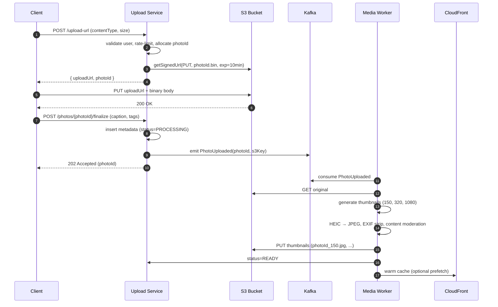
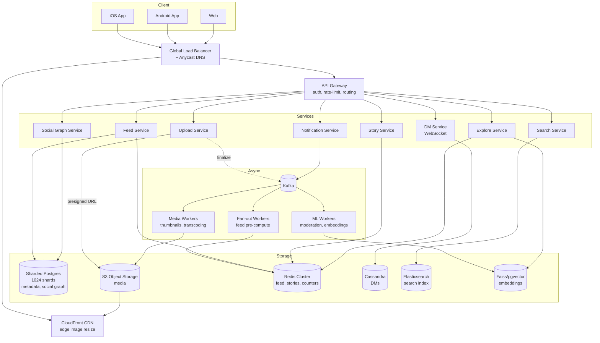
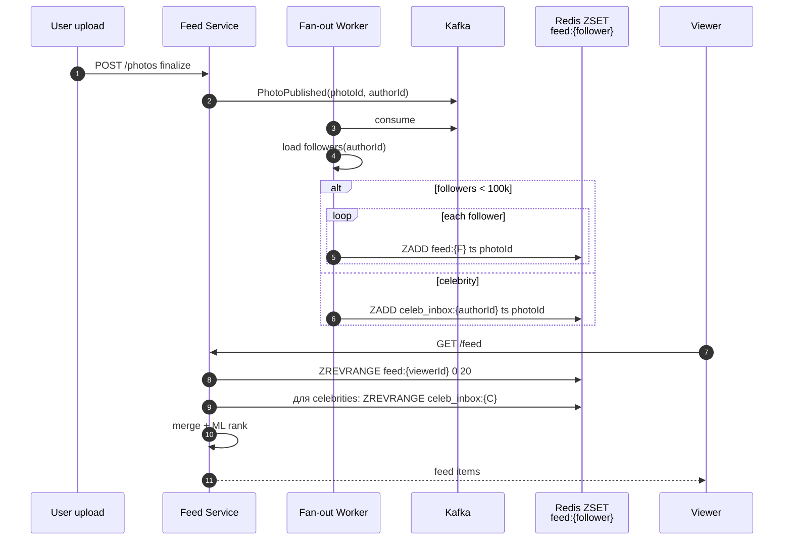
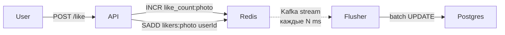
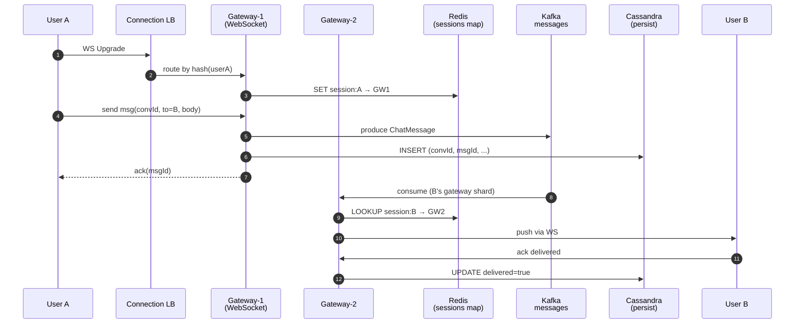
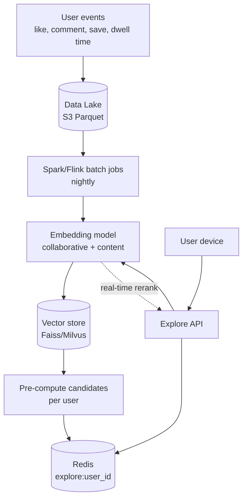
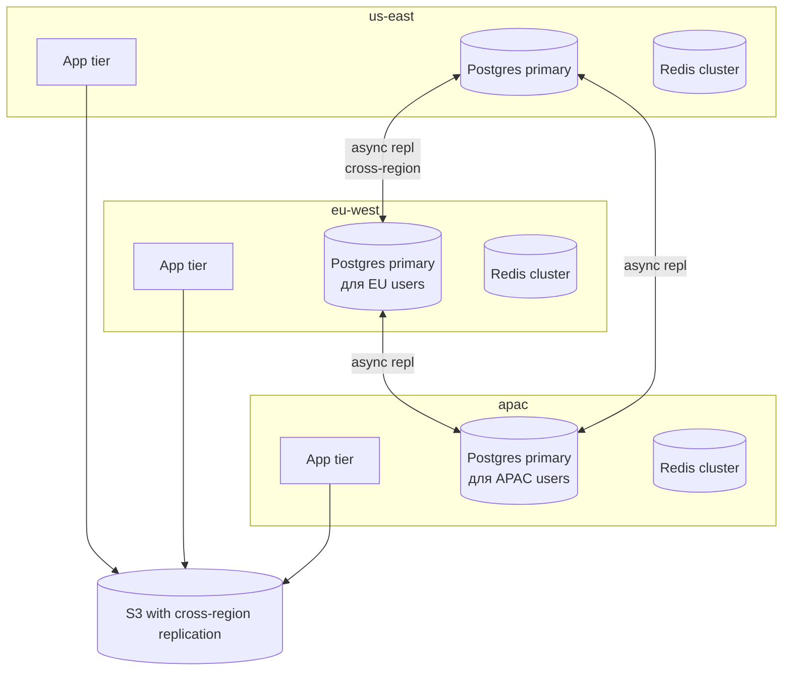

# System Design: Дизайн `Instagram`

`Instagram` — photo/video sharing с 2B пользователей, 500M DAU, 100M фото/день. Read-heavy (соотношение чтение/запись ≈ 100:1), media-intensive (петабайты хранилища), требует low-latency feed и сложного ML для explore page. Один из самых популярных system design вопросов уровня senior/staff.

## Полезные ссылки

- [Instagram Engineering Blog](https://instagram-engineering.com/)
- [Scaling Instagram Infrastructure (F8)](https://www.youtube.com/watch?v=hnpzNAPiC0E)
- [Designing Instagram — System Design Primer](https://github.com/donnemartin/system-design-primer/blob/master/solutions/system_design/instagram/README.md)
- [Cassandra at Instagram](https://instagram-engineering.com/open-sourcing-pgbouncer-rr-replication-and-routing-modifications-150549a8b7c2)
- [Instagram Stories — backend story (High Scalability)](http://highscalability.com/blog/2017/12/11/how-instagram-stories-uses-machine-learning-to-build-better.html)
- [CloudFront image optimization at edge](https://aws.amazon.com/cloudfront/)

## Содержание

- [Полезные ссылки](#полезные-ссылки)
- [See also](#see-also)

**Requirements и capacity**
- [Q1. (!) Functional и non-functional requirements?](#q1--functional-и-non-functional-requirements)
- [Q2. (!) Capacity estimation: QPS, storage, bandwidth?](#q2--capacity-estimation-qps-storage-bandwidth)
- [Q3. API design: основные endpoints?](#q3-api-design-основные-endpoints)

**Media upload pipeline**
- [Q4. (!) Upload flow: presigned URL и почему НЕ через app server?](#q4--upload-flow-presigned-url-и-почему-не-через-app-server)
- [Q5. Async media processing: thumbnails, transcoding, moderation?](#q5-async-media-processing-thumbnails-transcoding-moderation)
- [Q6. Resumable upload для больших видео?](#q6-resumable-upload-для-больших-видео)

**Storage и sharding**
- [Q7. (!) Storage architecture: метаданные vs media files?](#q7--storage-architecture-метаданные-vs-media-files)
- [Q8. (!) Sharding strategy для photos и feed?](#q8--sharding-strategy-для-photos-и-feed)
- [Q9. Схема таблиц: User, Photo, Follow, Like, Comment?](#q9-схема-таблиц-user-photo-follow-like-comment)

**Feed и Stories**
- [Q10. (!) High-level архитектура?](#q10--high-level-архитектура)
- [Q11. (!) Feed generation: fan-out on write vs hybrid?](#q11--feed-generation-fan-out-on-write-vs-hybrid)
- [Q12. Stories: 24h TTL и read-heavy паттерн?](#q12-stories-24h-ttl-и-read-heavy-паттерн)
- [Q13. Likes counter: hot photos и write-behind?](#q13-likes-counter-hot-photos-и-write-behind)

**DMs и Notifications**
- [Q14. (!) Direct Messages: WebSocket и Cassandra?](#q14--direct-messages-websocket-и-cassandra)
- [Q15. Push notifications: APNs/FCM и Kafka pipeline?](#q15-push-notifications-apnsfcm-и-kafka-pipeline)

**Search и Explore (ML)**
- [Q16. (!) Search: hashtag, username, auto-complete?](#q16--search-hashtag-username-auto-complete)
- [Q17. (!) Explore page: ML pipeline и offline batch?](#q17--explore-page-ml-pipeline-и-offline-batch)
- [Q18. Content moderation: ML + human-in-loop?](#q18-content-moderation-ml--human-in-loop)

**CDN и optimization**
- [Q19. (!) CDN strategy: CloudFront, edge resize, HTTP/3?](#q19--cdn-strategy-cloudfront-edge-resize-http3)
- [Q20. Viral photo: hot key и prefetch?](#q20-viral-photo-hot-key-и-prefetch)
- [Q21. Cache invalidation при delete photo?](#q21-cache-invalidation-при-delete-photo)

**Edge cases и trade-offs**
- [Q22. (!) Multi-region deployment и consistency?](#q22--multi-region-deployment-и-consistency)
- [Q23. Rate limiting: upload, API?](#q23-rate-limiting-upload-api)
- [Q24. Failed uploads и idempotency?](#q24-failed-uploads-и-idempotency)
- [Q25. AP vs CP: какой trade-off выбирает Instagram?](#q25-ap-vs-cp-какой-trade-off-выбирает-instagram)
- [Q26. Capacity planning: число серверов и рост?](#q26-capacity-planning-число-серверов-и-рост)
- [Q27. Главные lessons и pitfalls дизайна?](#q27-главные-lessons-и-pitfalls-дизайна)

---

## Q1. (!) Functional и non-functional requirements?

**Functional**:

- Upload photo/video (single или carousel до 10 media).
- View feed (home timeline отсортирован по relevance/time).
- Follow/unfollow users → асимметричный social graph (followers != following).
- Like, comment, save post.
- Stories — ephemeral content с TTL 24 часа.
- Direct Messages (1:1 и групповые чаты).
- Search: hashtag, username, location.
- Explore page — персонализированные рекомендации.
- Notifications: лайк, комментарий, новый follower, DM.

**Non-functional**:

| Параметр | Значение |
|----------|----------|
| Total users | 2B |
| DAU | 500M |
| Uploads | 100M фото/день |
| Reads (feed views) | ~50B/день (read:write ≈ 100:1) |
| Доступность | 99.95% (≈ 4.5 часа downtime/год) |
| Read latency (feed) | p99 < 200ms |
| Upload latency | p99 < 2s (до presigned URL) |
| Consistency | Eventual для feed, strong для лайков того же пользователя |
| Durability | 11 девяток для media (S3) |

**Out of scope** (типичный interview scope): аналитика реалтайм, реклама, IGTV/Reels-специфика, Shop.

---

## Q2. (!) Capacity estimation: QPS, storage, bandwidth?

**Write QPS**:

```
100M uploads/day = 100_000_000 / 86_400 ≈ 1_157 uploads/sec
Peak (×3) ≈ 3_500 uploads/sec
```

**Read QPS** (feed):

```
500M DAU × ~50 photos/day = 25B feed-photo-views/day
≈ 290_000 reads/sec
Peak (×3) ≈ 870_000 reads/sec
```

**Storage** (за год, только media):

```
Original photo (compressed JPEG): ~200 KB
Thumbnails (3 sizes: 150/320/1080): ~150 KB
Total per photo: ~350 KB

Per day: 100M × 350 KB ≈ 35 TB/day
Per year: 35 TB × 365 ≈ 12.7 PB/year (только новый контент)

С video (≈ 20% от загрузок, ~3 MB средний): ещё +20 TB/day = +7 PB/year
Total: ≈ 20 PB/year
```

С учётом репликации (3× в S3) и multi-region: фактический footprint ≈ 60-80 PB/year.

**Metadata** (PostgreSQL):

```
~1 KB per photo metadata × 100M = 100 GB/day = 36 TB/year
```

**Egress bandwidth** (через CDN):

```
500M DAU × 50 фото × ~50 KB (среднее, многие в маленьком разрешении)
= 1.25 PB/day = ~120 Gbps среднее
Peak: ~300-400 Gbps
```

**Сервера**:

- App tier (stateless): ~10_000 instances при 5K QPS на инстанс.
- Cache (Redis): ~1_000 nodes × 100 GB = 100 TB hot cache.
- DB (sharded Postgres): ~500 shards.

---

## Q3. API design: основные endpoints?

```http
# Upload (2-этапный: получить presigned URL, потом upload в S3)
POST /api/v1/photos/upload-url
  Body: { contentType: "image/jpeg", sizeBytes: 204800 }
  Response: { uploadUrl: "https://s3...?X-Amz-Signature=...", photoId: "uuid" }

POST /api/v1/photos/{photoId}/finalize
  Body: { caption, location, tags: ["@user1", "#hashtag"] }
  Response: 201 { photoId, urls: {small, medium, large} }

# Feed
GET /api/v1/feed?cursor=<token>&limit=20
  Response: { items: [...], nextCursor: "..." }

# Stories
POST /api/v1/stories  (multipart, обычно <5MB)
GET  /api/v1/stories/feed                       # stories друзей
POST /api/v1/stories/{storyId}/view             # mark watched

# Social
POST /api/v1/users/{userId}/follow
DELETE /api/v1/users/{userId}/follow
POST /api/v1/photos/{photoId}/like
POST /api/v1/photos/{photoId}/comments

# DM
POST /api/v1/conversations/{convId}/messages
GET  /api/v1/conversations/{convId}/messages?cursor=...
WS   /ws/dm                                     # WebSocket для realtime

# Search и Explore
GET  /api/v1/search?q=<term>&type=user|hashtag|place
GET  /api/v1/explore                            # персонализированная лента
```

**Pagination**: cursor-based (не offset) — стабильно при изменяющемся датасете.

**Auth**: OAuth 2.0 bearer token, refresh token в HttpOnly cookie. Rate limit на токен и IP.

---

## Q4. (!) Upload flow: presigned URL и почему НЕ через app server?

**Bad design** — клиент → app server → S3:

- App server становится bottleneck на media bandwidth (терабайты в час).
- Удваивается egress: client→server + server→S3.
- App server тратит CPU на просто прокачку байт.

**Good design** — клиент напрямую в S3 через **presigned URL**:



Пример генерации presigned URL (Java AWS SDK v2):

```java
@Service
@RequiredArgsConstructor
public class PresignedUrlService {
    private final S3Presigner presigner;

    public PresignedUploadResponse generate(String userId, String contentType, long size) {
        String photoId = UUID.randomUUID().toString();
        String key = "uploads/%s/%s.bin".formatted(userId, photoId);

        PutObjectRequest objectRequest = PutObjectRequest.builder()
            .bucket("instagram-uploads")
            .key(key)
            .contentType(contentType)
            .contentLength(size)
            .build();

        PutObjectPresignRequest presignRequest = PutObjectPresignRequest.builder()
            .signatureDuration(Duration.ofMinutes(10))
            .putObjectRequest(objectRequest)
            .build();

        URL url = presigner.presignPutObject(presignRequest).url();
        return new PresignedUploadResponse(url.toString(), photoId);
    }
}
```

**Преимущества**:

- App server обрабатывает только small JSON метаданные → 100× меньше CPU/RAM.
- S3 масштабирует upload параллельно без интервенции.
- Multipart upload работает прозрачно для клиента (для файлов > 5 MB).

---

## Q5. Async media processing: thumbnails, transcoding, moderation?

После upload — событие в Kafka, **media-worker** обрабатывает асинхронно:

| Этап | Tool | Назначение |
|------|------|------------|
| Decode | libjpeg/libheif | Поддержка HEIC из iOS |
| Resize | ImageMagick / libvips (быстрее в 5×) | 4 размера: 150, 320, 720, 1080 |
| Format | Encode в JPEG/WebP/AVIF | AVIF для современных браузеров (50% меньше) |
| EXIF | exiftool | Strip GPS, серийный номер камеры |
| ML | TensorFlow Serving | NSFW, violence, spam, content classification |
| OCR | Tesseract | Текст в картинках для модерации/search |
| Embedding | CLIP | Vector для explore page и similar-image |
| Face detect | RetinaFace | Подсказки в tag friends |

**Video** (более тяжёлый pipeline):

```bash
# Transcoding в несколько битрейтов для adaptive streaming (HLS)
ffmpeg -i input.mp4 \
  -c:v libx264 -profile:v main -level 3.1 \
  -b:v:0 400k -s:v:0 426x240 \
  -b:v:1 800k -s:v:1 640x360 \
  -b:v:2 1500k -s:v:2 854x480 \
  -b:v:3 3000k -s:v:3 1280x720 \
  -hls_time 4 -hls_playlist_type vod \
  -master_pl_name master.m3u8 \
  output_%v.m3u8
```

**Throughput**:

- 100M фото/день → ~1200/sec → каждый worker 5 фото/sec → ~240 workers.
- Video: 10× дороже на CPU → отдельный пул GPU-нод для transcoding.

**Idempotency**: каждый job ключуется по `photoId`. Worker сначала проверяет `status` в БД — если `READY`, пропускает.

---

## Q6. Resumable upload для больших видео?

Стандарт: **S3 Multipart Upload** или **TUS protocol**.

```java
// S3 multipart upload — клиент-сайд
CreateMultipartUploadResponse init = s3.createMultipartUpload(b -> b
    .bucket("uploads").key(key));
String uploadId = init.uploadId();

// Каждая часть >= 5MB (кроме последней)
for (int partNum = 1; partNum <= totalParts; partNum++) {
    UploadPartRequest req = UploadPartRequest.builder()
        .bucket("uploads").key(key)
        .uploadId(uploadId).partNumber(partNum).build();
    UploadPartResponse resp = s3.uploadPart(req, RequestBody.fromBytes(chunk));
    completedParts.add(CompletedPart.builder()
        .partNumber(partNum).eTag(resp.eTag()).build());
}

s3.completeMultipartUpload(b -> b
    .bucket("uploads").key(key).uploadId(uploadId)
    .multipartUpload(m -> m.parts(completedParts)));
```

**Что даёт**:

- При обрыве WiFi клиент дозагружает оставшиеся parts (списком ETag из локального state).
- Параллельная загрузка частей → быстрее full upload.
- TTL для незавершённых uploads: 7 дней (lifecycle rule в S3), потом auto-cleanup.

**Trade-off**: 5 MB минимум на part → не подходит для маленьких фото; для них single PUT.

---

## Q7. (!) Storage architecture: метаданные vs media files?

Разные данные → разный storage:

| Данные | Storage | Почему |
|--------|---------|--------|
| Photo metadata (id, user, caption, tags, location, timestamp) | PostgreSQL (sharded) | ACID, индексы, joins |
| Original + transcoded media (binary) | S3 + CloudFront | Cheap object storage, 11 nines durability |
| Feed (precomputed timeline) | Redis (sorted set ZADD) | O(log N) range queries, ms latency |
| Stories | Redis (TTL 24h) | Auto-expire, ephemeral |
| Direct Messages | Cassandra | Write-heavy, partition по conversation_id |
| Social graph (follows) | Sharded Postgres OR Cassandra | Read-heavy, simple key lookup |
| Search index | Elasticsearch | Full-text, edge n-grams для autocomplete |
| Embeddings (ML) | Faiss / Milvus / PG pgvector | ANN search для explore |
| Likes counter | Redis INCR + Kafka → Postgres async | Avoids hot-row contention |
| Hot cache (popular photos) | Redis + replicated to edge | < 1 ms response |

**Принцип**: разделять storage по **access pattern**, не по domain entity.

---

## Q8. (!) Sharding strategy для photos и feed?

**Photos** — shard by `user_id`:

```sql
-- shard_id = hash(user_id) % NUM_SHARDS
-- N = 1024 shards (16 physical hosts × 64 logical = легко rebalance)

-- Routing layer:
SELECT * FROM photos WHERE user_id = ? AND photo_id = ?
-- → идёт в shard_N
```

Почему по `user_id`:

- Запросы «фото пользователя X» (профиль) → один shard.
- Лента пользователя обращается ко всем shards followee → решается feed precompute.

**Feed** — shard by `follower_id`:

```
Если хранить feed для каждого user в Redis ZSET timeline:{follower_id}
→ shard by hash(follower_id) → один Redis node на user
→ GET feed = ZREVRANGE на одном ноде
```

Подробнее по сравнению strategies см. [Database sharding](../databases/database-sharding-interview.md).

**Hot shard problem**:

- Celebrity (например, @cristiano с 600M followers) → не fan-out по всем shards.
- Решение: для top-1000 users — pull model (на feed-read обращаемся к их inbox), для остальных — push (fan-out на write).

**Resharding**: consistent hashing с 1024 virtual buckets → перемещение всего 1/1024 при добавлении ноды.

---

## Q9. Схема таблиц: User, Photo, Follow, Like, Comment?

PostgreSQL (упрощённо):

```sql
CREATE TABLE users (
    user_id      BIGINT PRIMARY KEY,
    username     VARCHAR(50) UNIQUE NOT NULL,
    email_hash   BYTEA,
    created_at   TIMESTAMPTZ DEFAULT now(),
    profile_pic  TEXT,
    bio          TEXT,
    is_private   BOOLEAN DEFAULT false,
    is_verified  BOOLEAN DEFAULT false
);

CREATE TABLE photos (
    photo_id     UUID PRIMARY KEY,
    user_id      BIGINT NOT NULL,
    s3_key       TEXT NOT NULL,
    caption      TEXT,
    location_id  BIGINT,
    created_at   TIMESTAMPTZ DEFAULT now(),
    status       VARCHAR(16) DEFAULT 'PROCESSING',  -- PROCESSING, READY, FAILED, DELETED
    width        INT,
    height       INT,
    media_type   VARCHAR(8)                          -- PHOTO, VIDEO, CAROUSEL
);
CREATE INDEX idx_photos_user_ts ON photos(user_id, created_at DESC);

-- Hashtag — many-to-many через junction
CREATE TABLE photo_hashtags (
    photo_id  UUID,
    hashtag   VARCHAR(140),
    PRIMARY KEY (photo_id, hashtag)
);
CREATE INDEX idx_hashtag_photo ON photo_hashtags(hashtag, photo_id);

-- Follow: асимметрично (A может следить за B, но не наоборот)
CREATE TABLE follows (
    follower_id  BIGINT,
    followee_id  BIGINT,
    created_at   TIMESTAMPTZ DEFAULT now(),
    PRIMARY KEY (follower_id, followee_id)
);
CREATE INDEX idx_follows_followee ON follows(followee_id, follower_id);

-- Like — write-heavy → отдельный shard ключ
CREATE TABLE likes (
    photo_id    UUID,
    user_id     BIGINT,
    created_at  TIMESTAMPTZ DEFAULT now(),
    PRIMARY KEY (photo_id, user_id)
);

-- Comments
CREATE TABLE comments (
    comment_id  BIGINT PRIMARY KEY,
    photo_id    UUID NOT NULL,
    user_id     BIGINT NOT NULL,
    parent_id   BIGINT,                    -- nested
    text        TEXT,
    created_at  TIMESTAMPTZ DEFAULT now()
);
CREATE INDEX idx_comments_photo_ts ON comments(photo_id, created_at);
```

Cassandra schema для DMs (Q14):

```cql
CREATE TABLE messages (
    conversation_id  UUID,
    message_id       TIMEUUID,           -- bucket by time, sorted DESC
    sender_id        BIGINT,
    body             TEXT,
    media_url        TEXT,
    delivered        BOOLEAN,
    PRIMARY KEY (conversation_id, message_id)
) WITH CLUSTERING ORDER BY (message_id DESC);
```

---

## Q10. (!) High-level архитектура?



**Слои**:

1. **Edge** — Anycast DNS, GeoDNS направляет в ближайший регион. CloudFront раздаёт media.
2. **API gateway** — auth (OAuth2), rate-limit, A/B routing.
3. **Микросервисы** — stateless, разделены по domain.
4. **Kafka** — основной async-bus (PhotoUploaded, UserFollowed, MessageSent).
5. **Storage** — гетерогенный: каждое хранилище под свой access pattern.

---

## Q11. (!) Feed generation: fan-out on write vs hybrid?

Базовые подходы (детально в [Design Feed System](design-feed-system-interview.md)):

| Подход | Pros | Cons |
|--------|------|------|
| **Push (fan-out on write)** | Read O(1), быстро | Дорого для celebrities (write × N followers) |
| **Pull (fan-out on read)** | Дёшев write | Read дорогой: join по N followees |
| **Hybrid** | Best of both | Сложнее логика |

**Instagram hybrid** (упрощённо):

```
WHEN user_X публикует photo:
    IF followers_count(X) < 100_000:
        // fan-out on write
        FOR each follower F of X:
            ZADD feed:{F} timestamp photo_id  // push
    ELSE:
        // celebrity — pull on read
        celebrity_inbox:{X}.append(photo_id)

WHEN follower F открывает feed:
    base = ZREVRANGE feed:{F} 0 N        // push-приходы
    celeb_posts = []
    FOR each celebrity C followed by F:
        celeb_posts += recent_inbox:{C}    // pull
    return merge_and_rank(base + celeb_posts)
```



Redis ZSET layout:

```
KEY: feed:{viewerId}
VALUE: ZSET, score = ts_micros, member = photo_id
TTL:   30 days (старее уходит в paginated DB fetch)

CACHE SIZE: 500M users × 500 items × 50 bytes ≈ 12 TB hot
SHARDING: hash(viewerId) % redis_clusters
```

**Trim**: фид ограничен ~1000 последних элементов; старее — pagination через Postgres.

---

## Q12. Stories: 24h TTL и read-heavy паттерн?

Особенности:

- 500M users × ~5 stories views/day → ~2.5B reads/day на stories.
- TTL ровно 24 часа от publish.
- View-tracking: каждый просмотр — отдельная запись (для «кто смотрел?»).

**Storage**:

```redis
# Story metadata
SET story:{storyId} '{"userId":..., "s3Key":..., "createdAt":...}' EX 86400

# User active stories (sorted by ts)
ZADD user_stories:{userId} <ts> <storyId>      # с TTL 24h на ZSET члена
EXPIRE user_stories:{userId} 86400

# Stories feed (для просмотра): какие из followees имеют активные stories
# Считается lazy на read из user_stories:{followee} for each followee
```

**Watched flag**:

```
SADD story_viewers:{storyId} <viewerId>
EXPIRE story_viewers:{storyId} 86400 * 2       # TTL дольше, чем сама story
```

Если viewers > 100k (celebrity) — переход на HyperLogLog для approximate count:

```
PFADD story_viewers_hll:{storyId} <viewerId>
PFCOUNT story_viewers_hll:{storyId}            # ≈ count, 0.81% error
```

**Read flow**:

```java
public StoriesFeed getStoriesFeed(long viewerId) {
    List<Long> followees = socialGraph.followees(viewerId);
    return followees.parallelStream()
        .map(f -> redis.zrevrange("user_stories:" + f, 0, -1))
        .flatMap(List::stream)
        .map(this::fetchStoryMeta)
        .filter(Objects::nonNull)              // expired стало null
        .sorted(comparing(Story::ts).reversed())
        .collect(toList());
}
```

**Edge cases**:

- Time skew между нодами Redis → TTL может «съесть» story раньше 24h. Решается: хранить explicit `expires_at` и фильтровать на read.
- Replay: после прочтения, при reopen — story показывается с тёмным кругом (без unwatched mark).

---

## Q13. Likes counter: hot photos и write-behind?

Проблема: viral photo набирает 10_000 лайков/сек → UPDATE одной строки в Postgres = lock contention, replication lag.

**Решение** — write-behind через Redis:



```java
public void like(UUID photoId, long userId) {
    if (!redis.sadd("likers:" + photoId, userId)) {
        return;                                // уже лайкнул, idempotent
    }
    long newCount = redis.incr("like_count:" + photoId);
    kafka.send("photo-likes", new LikeEvent(photoId, userId, newCount));
}
```

Flusher (раз в 5 сек или 100 событий):

```java
@KafkaListener(topics = "photo-likes")
public void flush(List<LikeEvent> batch) {
    Map<UUID, Long> latestCount = batch.stream()
        .collect(toMap(LikeEvent::photoId, LikeEvent::count,
                       (a, b) -> Math.max(a, b)));
    jdbc.batchUpdate("UPDATE photos SET like_count = ? WHERE photo_id = ?",
        latestCount.entrySet().stream()
            .map(e -> new Object[]{e.getValue(), e.getKey()})
            .toList());
}
```

**Trade-off**:

- Eventual consistency: счётчик в Postgres отстаёт от Redis на ~5 сек.
- Acceptable: пользователи видят счётчик из Redis (свежий).
- При Redis сбоях — counter теряется, восстанавливается из Postgres + replay Kafka.

Для approximate-count (top hashtags, viral counters) — HyperLogLog или Count-Min Sketch.

---

## Q14. (!) Direct Messages: WebSocket и Cassandra?

Архитектура чата (детально в [Design Chat System](design-chat-system-interview.md)):



**Cassandra schema**:

```cql
CREATE TABLE conversation_messages (
    conv_id     UUID,
    bucket      INT,                  -- день, для time-bucketing
    msg_id      TIMEUUID,
    sender_id   BIGINT,
    body        TEXT,
    media_url   TEXT,
    PRIMARY KEY ((conv_id, bucket), msg_id)
) WITH CLUSTERING ORDER BY (msg_id DESC);

CREATE TABLE user_conversations (
    user_id     BIGINT,
    last_msg_ts TIMESTAMP,
    conv_id     UUID,
    unread_count INT,
    PRIMARY KEY (user_id, last_msg_ts, conv_id)
) WITH CLUSTERING ORDER BY (last_msg_ts DESC);
```

**Почему Cassandra**:

- Write-heavy: миллионы сообщений/сек.
- Partition по `(conv_id, bucket)` распределяет нагрузку.
- TTL: можно установить retention (например, 1 год).
- Multi-DC репликация для geo-availability.

**WebSocket scaling**:

- 500M DAU × ~30% активных одновременно = ~150M concurrent connections.
- 100k connections на инстанс → 1500 gateway nodes.
- Sticky routing через consistent hash на `userId`.
- При смерти gateway-ноды — клиент переподключается (auto-reconnect), exponential backoff.

---

## Q15. Push notifications: APNs/FCM и Kafka pipeline?

Pipeline:

```
Event (like/comment/follow/dm)
    ↓ Kafka topic "user-events"
NotificationService
    ↓ filter (user preferences, mute, batching)
Kafka topic "outgoing-push"
    ↓
Push-Dispatcher
    ↓
APNs (iOS) / FCM (Android) / WebPush
```

```java
@KafkaListener(topics = "user-events")
public void handle(UserEvent event) {
    UserPrefs prefs = prefs.load(event.targetUserId());
    if (prefs.muted(event.type())) return;

    if (event.type() == LIKE) {
        // batch: «Eva и ещё 5 человек лайкнули ваше фото»
        likeBatcher.add(event);
        return;
    }

    PushPayload payload = renderPayload(event, prefs.locale());
    kafka.send("outgoing-push", payload);
}
```

**Batching** для лайков: не отправлять 1000 уведомлений за 1 минуту — агрегировать в одно «N человек лайкнули».

**APNs**:

- HTTP/2 multiplexed connection, persistent.
- 100-1000 нотификаций/сек на connection → пул соединений.
- Push token expires → cleanup.

**Failure**:

- APNs returns `BadDeviceToken` → удалить token из БД, не ретраить.
- Rate limit от Apple → exponential backoff.

---

## Q16. (!) Search: hashtag, username, auto-complete?

**Elasticsearch** (см. [Elasticsearch](../databases/elasticsearch-interview.md)):

Index для users:

```json
PUT /users
{
  "mappings": {
    "properties": {
      "username":      { "type": "text", "analyzer": "username_analyzer" },
      "username_kw":   { "type": "keyword" },
      "display_name":  { "type": "text" },
      "bio":           { "type": "text" },
      "followers":     { "type": "long" }
    }
  },
  "settings": {
    "analysis": {
      "analyzer": {
        "username_analyzer": {
          "tokenizer": "edge_ngram_tokenizer",
          "filter": ["lowercase"]
        }
      },
      "tokenizer": {
        "edge_ngram_tokenizer": {
          "type": "edge_ngram",
          "min_gram": 2,
          "max_gram": 20
        }
      }
    }
  }
}
```

**Auto-complete query**:

```json
GET /users/_search
{
  "query": {
    "function_score": {
      "query": { "match": { "username": "crist" } },
      "field_value_factor": {
        "field": "followers",
        "modifier": "log1p"
      }
    }
  },
  "size": 10
}
```

Здесь `function_score` × log(followers) — relevance boost для популярных аккаунтов.

**Hashtag search**:

- Index `hashtags` с counter posts.
- Trending: stream через Kafka + Count-Min Sketch для top-K за последний час.

**Indexing pipeline**:

```
Postgres CDC (Debezium) → Kafka → Elasticsearch indexer
Latency: ~1 sec eventually consistent
```

---

## Q17. (!) Explore page: ML pipeline и offline batch?

Explore — персонализированная лента. Алгоритм:



**Двухступенчатая модель**:

1. **Candidate generation** (offline, ночью):
   - Collaborative filtering: ALS / matrix factorization → user embedding.
   - Content-based: CLIP/ResNet embedding photo → ANN search «похожих на ранее залайканные».
   - Топ-500 кандидатов на пользователя сохраняем в `explore:{userId}`.

2. **Online ranking** (real-time на каждый GET /explore):
   - GBDT (XGBoost/LightGBM) или DNN.
   - Features: recency, photo engagement rate, user-author interaction history, location, time-of-day, device.
   - Сортирует 500 кандидатов → топ-30 в ответ.

Подробнее про embeddings — [Embeddings](../ai-ml/embeddings-interview.md).

**Cold start**: новый пользователь → trending content в его регионе + по языку.

**Diversity**: после ранкинга применяется reranker (MMR — Maximal Marginal Relevance), чтобы не показывать 20 фото кошек подряд.

---

## Q18. Content moderation: ML + human-in-loop?

Многоуровневая:

| Уровень | Что | Latency |
|---------|-----|---------|
| L1: hash-match | PhotoDNA hash для известных CSAM, terrorist content | < 1 сек |
| L2: ML classifier | NSFW, violence, hate speech, spam | 100-500 мс |
| L3: OCR + text classifier | Текст в картинках → toxic language | 1-2 сек |
| L4: Human reviewer | Pop-up в очередь reviewers если confidence 0.5-0.9 | минуты—часы |

**Pipeline**:

```
PhotoUploaded → ML worker
    ↓ (parallel)
    score_nsfw, score_violence, score_spam
    ↓
    IF max_score > 0.95:
        BLOCK + notify user
    ELIF max_score > 0.5:
        SHADOW (показывать только автору) + send to human queue
    ELSE:
        PUBLISH
```

**Human queue**:

- Kafka topic `moderation-queue`.
- 50_000+ модераторов глобально (через third-party companies).
- SLA: 95% reviewed в течение 24h.

**False positives**: appeals flow — пользователь может оспорить, второй reviewer пересматривает.

---

## Q19. (!) CDN strategy: CloudFront, edge resize, HTTP/3?

Photo flow:

```
Client request: GET /p/abc123_320.jpg
    ↓
CloudFront edge (POP в 300+ городах)
    ├─ HIT: ответ за ~20-50 мс
    └─ MISS:
        ↓ Origin Shield (regional cache)
        ↓ S3
```

**Edge image optimization**:

- CloudFront Functions / Lambda@Edge перехватывает запрос.
- На URL `?w=320` → resize на edge через image processing layer.
- Кеширует результат: один URL = один resize.

```javascript
// CloudFront Function (Viewer Request)
function handler(event) {
    var req = event.request;
    var w = req.querystring.w && req.querystring.w.value;
    if (w) {
        req.uri = req.uri.replace('.jpg', '_' + w + '.jpg');
    }
    // Accept: image/avif → перенаправить на .avif вариант
    var accept = req.headers.accept && req.headers.accept.value;
    if (accept && accept.indexOf('image/avif') >= 0) {
        req.uri = req.uri.replace('.jpg', '.avif');
    }
    return req;
}
```

**HTTP/3 (QUIC)**:

- Уменьшает head-of-line blocking на mobile (где плохой WiFi).
- Faster handshake (0-RTT для возвратных клиентов).

**Cache key**: `Host + URI + Accept-Header (для avif/webp)`. Cookies игнорируются (картинки не персонализированы).

**TTL**:

- Media files: 30 дней (immutable, URL содержит hash).
- HTML/JSON API responses: NO-CACHE или 5-30 сек (через CloudFront для GET).

Подробнее — [CDN interview](../architecture/cdn-interview.md).

---

## Q20. Viral photo: hot key и prefetch?

Когда фото публикует celebrity и за минуту прилетает 1M views:

**Проблемы**:

1. Один S3 prefix → throttling (S3 limit: 5500 GET/sec на prefix).
2. Origin Shield (один регион) перегружен.
3. Cold POPs далеко от региона публикации.

**Решения**:

- **Random suffix** на S3 keys → распределение по физическим shards внутри S3.
- **CloudFront Origin Shield** + multi-region origins.
- **Predictive warming**: при публикации celebrity → background-worker делает GET по всем 300+ POPs (curl с разных IP или CloudFront API).
- **Adaptive caching**: фото с > 1000 RPS получает longer TTL и replication по соседним POPs.

```java
@EventListener(PhotoPublishedEvent.class)
public void prewarm(PhotoPublishedEvent event) {
    if (event.authorFollowers() > 1_000_000) {
        edgeWarmer.prewarmAllPops(event.photoId());
    }
}
```

**Hot path в Redis** (для metadata): replication on hot keys через `READONLY` команд к read replicas, плюс local L1 cache в app server (Caffeine, 30 сек TTL).

Подробнее — [Caching strategies](../architecture/caching-strategies-interview.md).

---

## Q21. Cache invalidation при delete photo?

Проблема: 300+ POPs закешировали `/p/abc123.jpg`. User нажимает Delete. Как убрать?

**Стратегии**:

1. **Immutable URLs** (best practice): URL содержит хеш контента, при delete просто перестают раздаваться. CDN отдаёт 403 после origin marks deleted, либо контент остаётся (нечего показать как deleted user).

2. **CloudFront Invalidation**:
   - `aws cloudfront create-invalidation --paths "/p/abc123*"` → дорого ($0.005 per path > 1000/month) и медленно (10-15 минут).
   - Подходит для редких случаев.

3. **Origin-side soft delete**: помечаем в metadata `deleted=true`, S3 файл остаётся, но при GET через app — 404. CDN кеширует 404 ответ на короткое TTL (5 минут).

4. **Versioned путь**: `/v2/p/abc123.jpg` — на delete bumpим version.

**Что делает Instagram в реальности** (best guess):

- Soft delete в metadata.
- CDN keeps content для cache hit, но profile/feed не показывают.
- Полное удаление с S3 через batch lifecycle job через 30 дней (GDPR-compliant).

**GDPR right-to-be-forgotten**:

```sql
UPDATE users SET deleted_at = now(), pii_redacted = true WHERE user_id = ?;
-- Тёгер: cascade soft-delete всех photos + invalidate CDN paths
-- Через 30 дней: hard delete с S3
```

---

## Q22. (!) Multi-region deployment и consistency?

Архитектура:



**Подход** — geo-partitioning по home region пользователя:

- Каждый user приписан к региону при регистрации (по IP).
- Все writes для user идут в его home region (low latency).
- Reads предпочитают local replica.
- Cross-region async replication (Postgres logical replication, ~100ms-1s lag).

**Consistency model**:

- **AP** (eventual): feed может отставать на 1-2 секунды между регионами. Acceptable.
- **CP-like** для likes одного пользователя: read-your-own-writes через session affinity к home region.
- **Strong** для финансовых операций (если есть, например Instagram Shop): single region per transaction.

**Failover**:

- При падении us-east — DNS переключает на us-west (Route53 health check).
- Writes ставятся в очередь Kafka до возврата primary, либо переключаемся на replica → promote.

См. также [CAP theorem](../architecture/cap-theorem-interview.md) и [Consistency patterns](../architecture/consistency-patterns-interview.md).

---

## Q23. Rate limiting: upload, API?

Многоуровневое (см. [Rate limiter](design-rate-limiter-interview.md)):

| Уровень | Лимит | Алгоритм |
|---------|-------|----------|
| Per-IP global | 1000 req/min | Token bucket в Redis |
| Per-user upload photo | 100/day | Counter + TTL |
| Per-user upload story | 50/day | |
| Per-user like | 60/min | Sliding window |
| Per-user follow | 200/day (anti-spam) | |
| Per-IP search | 100/min | Edge (CloudFront) |

```java
public boolean allow(String key, int limit, Duration window) {
    String redisKey = "rl:" + key + ":" + Instant.now().getEpochSecond() / window.toSeconds();
    long count = redis.incr(redisKey);
    if (count == 1) {
        redis.expire(redisKey, window.toSeconds());
    }
    return count <= limit;
}
```

**Защита от bot**:

- ML-классификатор поведения (скорость лайков/follow, паттерн UA).
- CAPTCHA на повторных нарушениях.
- IP reputation (через GuardDuty, Cloudflare).

**Soft vs hard limit**:

- Soft: показать warning, throttle на 1 сек.
- Hard: 429 Too Many Requests, временный shadow ban.

---

## Q24. Failed uploads и idempotency?

Сценарии:

1. **Network drop посередине upload** → multipart resume (см. Q6).
2. **Worker crash при processing** → exactly-once через Kafka offset + idempotent INSERT (с `ON CONFLICT DO NOTHING`).
3. **Двойной finalize call (retry)** → idempotency key:

```java
@PostMapping("/photos/{photoId}/finalize")
public Photo finalize(
    @PathVariable UUID photoId,
    @RequestHeader("Idempotency-Key") String idempKey,
    @RequestBody FinalizeRequest req
) {
    // INSERT ... ON CONFLICT (photo_id) DO NOTHING
    // если уже есть, возвращаем существующую запись
    return photoService.finalizeIdempotent(photoId, idempKey, req);
}
```

4. **Дубликат загрузки одного и того же фото** → опционально хеш контента (perceptual hash):

```java
String pHash = perceptualHash(photoBytes);
Optional<Photo> existing = photoRepo.findByUserAndPHash(userId, pHash);
if (existing.isPresent()) {
    return existing.get();   // duplicate detection
}
```

5. **Cleanup of orphaned uploads**: photo загружен в S3, но finalize не пришёл → S3 lifecycle rule удаляет файлы с префиксом `uploads/...` старше 24 часов.

---

## Q25. AP vs CP: какой trade-off выбирает Instagram?

**Instagram — AP** (Availability + Partition tolerance):

- Feed может показать stale данные на несколько секунд → OK.
- Лайки видны не мгновенно во всех регионах → OK.
- Counter может быть приближённым → OK для UI.

**Когда CP всё-таки нужен**:

- Изменение пароля / 2FA → strong consistency (один регион).
- Уникальность username → distributed lock либо single-region write.
- Финансовые операции (Instagram Shop, реклама) → ACID транзакции.

**Practical mix**:

```
read-your-own-writes: session sticky на home region pgreplica
monotonic reads:      кэширование меток в Redis (last_write_ts per user)
causal consistency:   через vector clock или dependency tracking в metadata
```

Trade-offs:

| Решение | Pro | Cons |
|---------|-----|------|
| Denormalize feed | Read O(1) | Storage 1000× больше, fan-out write дорог |
| Eventual consistency | Высокая availability | Confusing для users (только что лайкнул, не виден) |
| Heavy caching | Низкая latency | Cache invalidation сложная |
| Single-region username uniqueness | Простой constraint | Latency для дальних регионов |

---

## Q26. Capacity planning: число серверов и рост?

**Сейчас** (приближение):

| Компонент | Кол-во | Заметка |
|-----------|--------|---------|
| App tier (stateless) | 10_000 | Auto-scale Kubernetes |
| Media workers | 500 | CPU-heavy resize/transcoding |
| ML workers (GPU) | 200 | Moderation + embeddings |
| Postgres shards | 1_024 logical / 64 physical hosts | |
| Cassandra nodes (DMs) | 500 | Multi-DC RF=3 |
| Redis nodes | 1_000 | 100 TB hot data |
| Elasticsearch | 200 nodes | Search index |
| Kafka brokers | 100 | RF=3, 30 days retention |
| S3 / Glacier | 500+ PB | Lifecycle: hot 90d, cold > 90d |
| CDN POPs | 300+ | CloudFront |

**Рост**:

- Users: ~10% YoY.
- Storage: ~30% YoY (больше видео, чем фото).
- Compute: ~25% YoY.

**Cost optimization**:

- Tiered storage: hot → S3 Standard, cold (> 90 дней) → Glacier Deep Archive (90% дешевле).
- Spot instances для async workers.
- Reserved instances для baseline app tier.
- Edge compression (WebP/AVIF) экономит 30-50% egress.

**Capacity headroom**: всегда +50% запас от peak, чтобы пережить виральные события (например, селебрити-публикация → 10× обычной нагрузки).

См. [Latency numbers](../architecture/latency-numbers-interview.md) для оценки реалистичных времён.

---

## Q27. Главные lessons и pitfalls дизайна?

**Lessons**:

1. **Read и write — разные системы**. Не пытаться сделать одну БД для всего.
2. **Async по умолчанию**. Любое тяжёлое действие (thumbnails, moderation, fan-out) → Kafka + worker.
3. **Презагрузка важнее cache invalidation**. Push свежие данные в Redis при write, не jетим за ним на read.
4. **Geo-locality важнее консистентности**. Eventual consistency cross-region — acceptable price.
5. **Idempotency везде**. На каждом entry point — Idempotency-Key или natural key.

**Pitfalls** при проектировании на интервью:

- Забыть про **celebrity problem** — наивный fan-out не масштабируется.
- Положить media файлы в Postgres BLOB → I/O killer.
- Один storage для всего → не работает на read-heavy + write-heavy + search workload.
- Игнорировать **cold start** (новые пользователи, новые регионы).
- Не учесть стоимость — full S3 replication 3× в три региона = 9× cost.
- Strong consistency для лайков → не выдерживает QPS.
- Игнорировать модерацию — продукт не пройдёт legal/compliance.

**Что обязательно проговорить на интервью**:

- API design (хотя бы 5 эндпоинтов).
- Capacity math (числа, не «много»).
- Один глубокий deep-dive (обычно feed или media pipeline).
- Trade-off хотя бы 2-3 решений.
- Failure modes (что если упадёт X?).
- Multi-region (если есть время).

---

## See also

- [System Design](system-design-interview.md) — общие подходы и фреймворк
- [Design Twitter](design-twitter-interview.md) — похожий социальный продукт, меньше акцент на media
- [Design Feed System](design-feed-system-interview.md) — детально про fan-out
- [Design Search](design-search-interview.md) — Elasticsearch и autocomplete
- [Design Chat System](design-chat-system-interview.md) — WebSocket архитектура для DM
- [Design Rate Limiter](design-rate-limiter-interview.md) — алгоритмы и реализация
- [CDN](../architecture/cdn-interview.md) — раздача media через edge
- [Caching strategies](../architecture/caching-strategies-interview.md) — write-behind, hot-key
- [Scalability patterns](../architecture/scalability-patterns-interview.md) — sharding, replication
- [Latency numbers](../architecture/latency-numbers-interview.md) — реальные времена операций
- [Database sharding](../databases/database-sharding-interview.md) — by user_id и follower_id
- [Database replication](../databases/database-replication-interview.md) — async cross-region
- [Cassandra](../databases/cassandra-interview.md) — для DMs
- [Elasticsearch](../databases/elasticsearch-interview.md) — для search
- [Redis](../databases/redis-interview.md) — feed cache, counters, stories TTL
- [Embeddings](../ai-ml/embeddings-interview.md) — для explore page
- [Kafka](../messaging/kafka-interview.md) — async event bus
- [CAP theorem](../architecture/cap-theorem-interview.md) — почему Instagram AP
- [Consistency patterns](../architecture/consistency-patterns-interview.md) — eventual, read-your-writes
