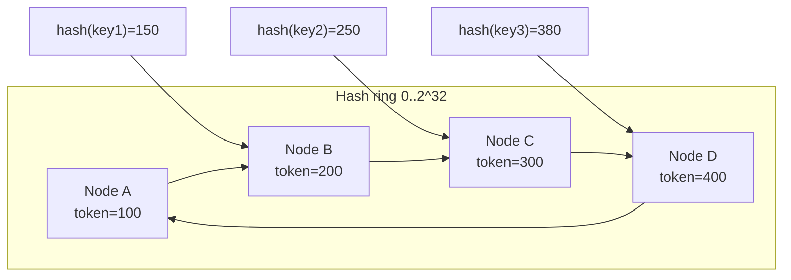
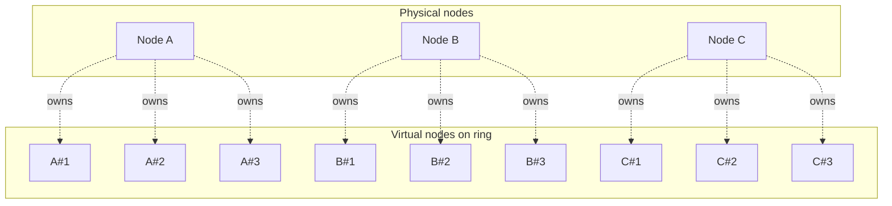
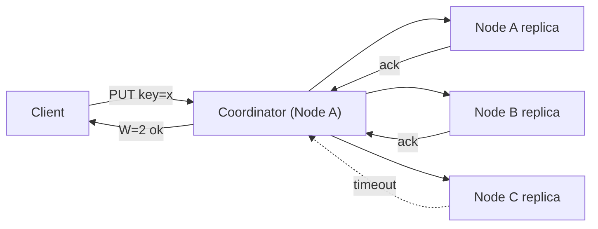
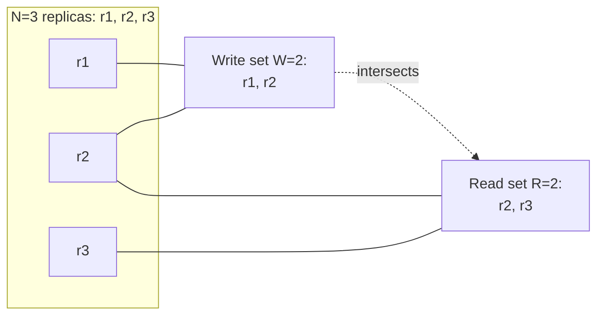
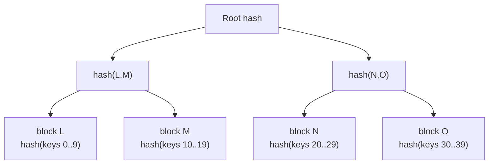
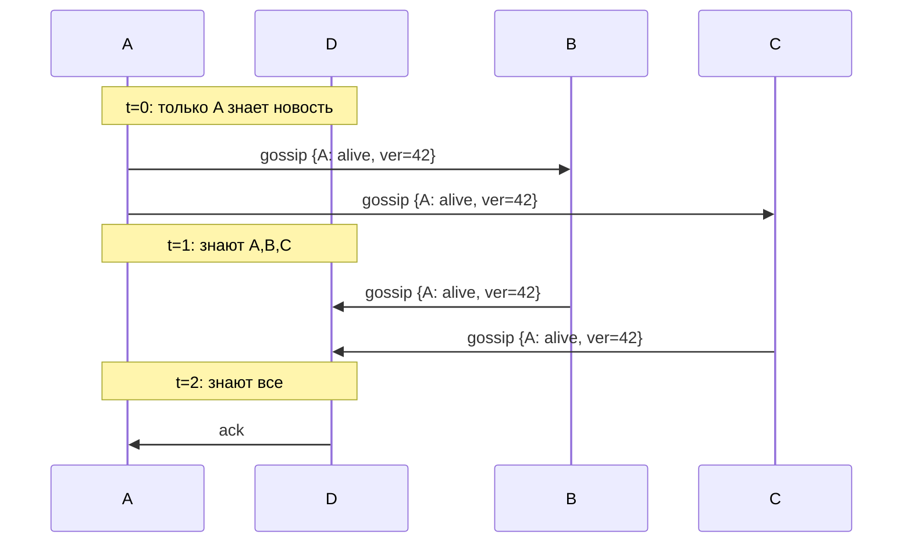
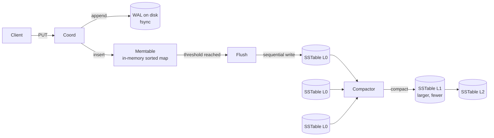

# System Design: Распределённый `Key-Value Store`

`Key-Value Store` уровня DynamoDB / Cassandra / Riak — это распределённое хранилище с простым API (`PUT`, `GET`, `DELETE`), линейной масштабируемостью, высокой доступностью и tunable consistency. Это «классическая» system-design задача, где надо собрать вместе: consistent hashing, репликацию, кворум, разрешение конфликтов, gossip-протокол и LSM-движок.

Дата обновления: 2026-05-22.

## Полезные ссылки

- [Dynamo: Amazon's Highly Available Key-value Store (2007, PDF)](https://www.allthingsdistributed.com/files/amazon-dynamo-sosp2007.pdf) — первоисточник Dynamo-стиля
- [Apache Cassandra Architecture docs](https://cassandra.apache.org/doc/latest/cassandra/architecture/)
- [Designing Data-Intensive Applications (DDIA), Chapter 5: Replication, Chapter 6: Partitioning, Chapter 7: Transactions](https://www.oreilly.com/library/view/designing-data-intensive-applications/9781491903063/)
- [Riak documentation: Replication](https://docs.riak.com/riak/kv/latest/learn/concepts/replication/)
- [DynamoDB developer guide](https://docs.aws.amazon.com/amazondynamodb/latest/developerguide/)
- [Karger et al., Consistent Hashing (1997)](https://www.akamai.com/site/en/documents/research-paper/consistent-hashing-and-random-trees-distributed-caching-protocols-for-relieving-hot-spots-on-the-world-wide-web-technical-publication.pdf)
- [φ Accrual Failure Detector (Hayashibara et al.)](https://www.computer.org/csdl/proceedings-article/srds/2004/22390066/12OmNAXPgUz)
- [LSM-trees: O'Neil et al., 1996](https://www.cs.umb.edu/~poneil/lsmtree.pdf)
- [LevelDB / RocksDB design](https://github.com/google/leveldb/blob/main/doc/impl.md)

## Содержание

### Requirements и CAP

1. [Q1. Functional и non-functional требования](#q1-functional-и-non-functional-требования)
2. [Q2. Почему single-node KV не масштабируется и где предел](#q2-почему-single-node-kv-не-масштабируется-и-где-предел)
3. [Q3. CAP-выбор: почему Dynamo-style идёт в AP](#q3-cap-выбор-почему-dynamo-style-идёт-в-ap)
4. [Q4. PACELC и что меняется без partition](#q4-pacelc-и-что-меняется-без-partition)

### Consistent hashing

5. [Q5. Зачем нужен consistent hashing вместо `hash(key) % N`](#q5-зачем-нужен-consistent-hashing-вместо-hashkey--n)
6. [Q6. Как работает кольцо и виртуальные узлы](#q6-как-работает-кольцо-и-виртуальные-узлы) (!)
7. [Q7. Математика равномерности и переноса данных](#q7-математика-равномерности-и-переноса-данных)
8. [Q8. Реализация consistent hashing на Python](#q8-реализация-consistent-hashing-на-python)

### Replication и quorum

9. [Q9. Preference list и repplication factor N](#q9-preference-list-и-replication-factor-n) (!)
10. [Q10. Quorum: формула R+W>N и трейд-оффы](#q10-quorum-формула-rwn-и-трейд-оффы) (!)
11. [Q11. Sloppy quorum и hinted handoff](#q11-sloppy-quorum-и-hinted-handoff) (!)
12. [Q12. Read repair и anti-entropy через Merkle trees](#q12-read-repair-и-anti-entropy-через-merkle-trees)

### Conflict resolution и vector clocks

13. [Q13. Last-Write-Wins и почему он опасен](#q13-last-write-wins-и-почему-он-опасен) (!)
14. [Q14. Vector clocks: причинность и siblings](#q14-vector-clocks-причинность-и-siblings) (!)
15. [Q15. Как клиент мерджит siblings](#q15-как-клиент-мерджит-siblings)

### Membership и failure detection

16. [Q16. Gossip-протокол: распространение состояния](#q16-gossip-протокол-распространение-состояния) (!)
17. [Q17. φ-accrual failure detector vs обычный heartbeat](#q17-φ-accrual-failure-detector-vs-обычный-heartbeat)
18. [Q18. Bootstrap нового узла и потоковая передача данных](#q18-bootstrap-нового-узла-и-потоковая-передача-данных)

### Storage engine (LSM)

19. [Q19. LSM vs B-tree: когда какой выбрать](#q19-lsm-vs-b-tree-когда-какой-выбрать) (!)
20. [Q20. SSTable, memtable, WAL — путь записи](#q20-sstable-memtable-wal--путь-записи) (!)
21. [Q21. Compaction: size-tiered vs leveled](#q21-compaction-size-tiered-vs-leveled)
22. [Q22. Bloom filters и кеши для ускорения чтения](#q22-bloom-filters-и-кеши-для-ускорения-чтения)

### Multi-DC и scaling

23. [Q23. Multi-datacenter репликация и `LOCAL_QUORUM`](#q23-multi-datacenter-репликация-и-local_quorum)
24. [Q24. Tunable consistency: `ONE`, `QUORUM`, `ALL`, `EACH_QUORUM`](#q24-tunable-consistency-one-quorum-all-each_quorum)
25. [Q25. Горизонтальное масштабирование и rebalancing](#q25-горизонтальное-масштабирование-и-rebalancing)

### Edge cases и anti-patterns

26. [Q26. Hot keys и борьба со скосом нагрузки](#q26-hot-keys-и-борьба-со-скосом-нагрузки)
27. [Q27. Tombstones и проблема накопления удалений](#q27-tombstones-и-проблема-накопления-удалений)
28. [Q28. Большие значения, сжатие и TTL](#q28-большие-значения-сжатие-и-ttl)
29. [Q29. Сравнение реальных систем: DynamoDB / Cassandra / Riak / Redis Cluster](#q29-сравнение-реальных-систем-dynamodb--cassandra--riak--redis-cluster)
30. [Q30. Anti-patterns и подводные камни эксплуатации](#q30-anti-patterns-и-подводные-камни-эксплуатации)

---

## Q1. Functional и non-functional требования

**Functional**:

- `PUT(key, value)` — записать или перезаписать значение.
- `GET(key) -> value | not_found` — прочитать по ключу.
- `DELETE(key)` — пометить ключ удалённым.
- `key` и `value` — произвольные байтовые строки (`key` обычно до 1 KB, `value` — до 1 MB; всё, что больше, выносится в blob storage).
- Опционально: `LIST`/`SCAN` по диапазону (если есть упорядоченность), `TTL` (как в Cassandra), CAS (`compare-and-set`).

**Non-functional**:

| Свойство | Цель |
|---|---|
| Scale | Петабайты данных, миллионы RPS |
| Availability | 99.99% (≈ 52 минуты простоя в год) — AP-выбор по CAP |
| Latency | p99 read < 10 ms, p99 write < 20 ms (single DC) |
| Durability | Записанное не теряется при падении одной ноды |
| Geo | Multi-region replication, локальные чтения |
| Tunable | Клиент сам выбирает уровень консистентности per request |

**Главный компромисс, который надо озвучить сразу:** жертвуем строгой консистентностью ради availability и low-latency writes. Это и есть суть Dynamo-стиля — система всегда доступна на запись, а согласованность реплик догоняет асинхронно. Проговорить этот трейд-офф в первую же минуту — сигнал интервьюеру, что вы понимаете, какую задачу решаете.

## Q2. Почему single-node KV не масштабируется и где предел

Single-node KV (например, `HashMap<byte[], byte[]>` в памяти + WAL на диск) упирается в физические пределы одной машины. Их полезно разделить на два класса — пределы ёмкости (сколько влезет) и пределы доступности (что будет при отказе).

**Пределы ёмкости** — рано или поздно данные не помещаются:

1. **Память**: один сервер — десятки-сотни GB RAM, в петабайт не помещается.
2. **Диск**: один SSD ~ единицы TB, IOPS ограничены (NVMe ≈ 1M IOPS, но это всё ещё один узел).
3. **CPU/сеть**: 10 Gbit/s NIC ≈ 1.25 GB/s — упрёмся при больших значениях.

**Пределы доступности** — даже если данные поместились, одна машина ненадёжна:

4. **Availability**: один узел = SPOF. Failover требует второго узла → распределённость всё равно вылезает.
5. **Backups и hot upgrade**: сложно делать без downtime.

Ключевая мысль: даже когда данные помещаются в один узел, второй узел нужен ради доступности. А как только узлов стало 2+, неизбежно появляются репликация, partitioning и кворум/consensus — то есть вся машинерия распределённой системы.

## Q3. CAP-выбор: почему Dynamo-style идёт в AP

Dynamo-стиль выбирает **AP**: при network partition система остаётся доступной и жертвует строгой консистентностью. CAP-теорема говорит, что во время сетевого разделения нельзя одновременно иметь `Consistency` и `Availability` — приходится выбирать одно.

Две стратегии выбора:

- **CP** (MongoDB c `majority`, HBase, etcd): меньшинство партиции отказывает в обслуживании, зато сохраняется линеаризуемость.
- **AP** (DynamoDB, Cassandra, Riak): продолжаем принимать запросы со всех сторон partition, конфликты мержим позже.

Почему Dynamo пошёл в AP:

- **Бизнес-стоимость отказа.** В Amazon корзина должна добавлять товары даже при сетевых проблемах: потерянная продажа дороже временной несогласованности.
- **Профиль доступа KV.** Большинство сценариев — read-your-writes для одного пользователя плюс терпимость к eventual consistency для остальных. Строгая глобальная согласованность здесь избыточна.
- **AP не означает «навсегда слабая».** Tunable consistency (R/W) даёт «почти CP» через `R+W>N`, когда это нужно для конкретного запроса, не меняя сам кластер.

Подробнее см. [cap-theorem-interview.md](../architecture/cap-theorem-interview.md).

## Q4. PACELC и что меняется без partition

PACELC дополняет CAP вопросом «а что система выбирает, когда сети ничего не угрожает?». CAP описывает только аварийный режим (partition), но 99% времени кластер работает без разделений — и тут тоже есть компромисс между скоростью и согласованностью.

Расшифровка аббревиатуры:

- **P**artition: при разделении сети — **A** vs **C** (то же, что в CAP).
- **E**lse (нормальная работа без partition) — **L**atency vs **C**onsistency.

Идея в том, что многие AP-системы и в спокойном режиме осознанно выбирают latency: ждать кворума всех реплик — это лишний round-trip, а значит выше p99.

Классификация:

| Система | При partition | Без partition |
|---|---|---|
| Dynamo / Cassandra | AP | EL (low latency, eventual) |
| MongoDB (majority) | CP | EC |
| ZooKeeper / etcd | CP | EC |
| Redis Cluster (default) | AP (но без репликации до slave) | EL |

KV Dynamo-стиля — это **PA/EL**: даже без partition мы готовы пожертвовать линеаризуемостью ради p99 < 10 ms (один round-trip, не два).

## Q5. Зачем нужен consistent hashing вместо `hash(key) % N`

Коротко: `hash(key) % N` привязывает владельца ключа к текущему числу узлов, поэтому изменение размера кластера переотображает почти все ключи. Consistent hashing разрывает эту связь и трогает только `1/N` данных.

**Чем плох `hash(key) % N`:**

- При добавлении/удалении узла меняется **N** → у почти всех ключей меняется владелец → нужно перетасовать ~`(N-1)/N` данных. Для N=10 это 90% данных по сети — недопустимо.
- Стейтфул-кэши (Memcached, Redis) при этом массово теряют попадания: после ребаланса кэш фактически холодный.

**Как это решает `consistent hashing`** (Karger, 1997):

- Хеш-пространство — кольцо `[0..2^32)`. Ключ хешируется в позицию на кольце → владелец = первый узел по часовой стрелке.
- Добавление/удаление узла затрагивает ключи только **соседнего сегмента** → переезжает `1/N` данных, а не всё.
- Каждый узел самостоятельно знает свой диапазон, поэтому глобальная координация при ребалансе минимальна.



## Q6. Как работает кольцо и виртуальные узлы (!)

Чистое consistent hashing даёт **неравномерную нагрузку**, и лечится это virtual nodes. Проблема в том, что с малым числом узлов случайные позиции на кольце ложатся неровно: при N=3 и трёх случайных точках дисперсия размеров сегментов высока — какой-то узел получит в 2-3 раза больше ключей, чем сосед.

**Решение — virtual nodes (vnodes):** каждый физический узел представлен не одной, а `V` точками на кольце.

- Cassandra: `num_tokens = 256` по умолчанию.
- DynamoDB / Riak: десятки-сотни vnodes на ноду.

**Почему это работает — три эффекта:**

- **Равномерность через закон больших чисел.** Вместо N редких точек на кольце получаем `V × N` частых. Стандартное отклонение размеров сегментов падает как `1/√(V×N)` — разброс сглаживается.
- **Гетерогенность кластера.** Мощному узлу можно дать больше vnodes (proportional weight) и нагрузить его пропорционально железу.
- **Плавный rebalancing.** При добавлении узла он забирает по чуть-чуть от каждого соседа, а не один большой кусок у одного — меньше всплеск трафика на конкретную ноду.



## Q7. Математика равномерности и переноса данных

Здесь два числа, которые стоит уметь вывести на собеседовании: насколько ровно распределяются ключи и сколько данных переезжает при изменении кластера.

Пусть `M` — число узлов, `V` — vnodes на узел, `K` — общее число ключей.

**Равномерность распределения:**

- Средняя нагрузка узла: `K/M` ключей.
- Без vnodes: стандартное отклонение ≈ `K/√M` → разброс в разы.
- С vnodes: дисперсия `~ K / (M·V)`, относительная ошибка `~ 1/√(M·V)`.
- Подставим `M=10, V=256`: относительная ошибка ≈ 2% — практически идеальная равномерность.

**Перенос данных при изменении кластера:**

- Добавили узел → переносим ровно `K/(M+1)` ключей — это теоретический минимум, меньше переместить нельзя.
- Удалили узел → его сегменты расходятся по соседям по `1/V` сегмента каждому, нагрузка размазывается.

Именно это свойство — «minimal disruption» — и есть главная причина, по которой consistent hashing стал стандартом для KV-хранилищ.

## Q8. Реализация consistent hashing на Python

Учебная реализация (без оптимизаций). Кольцо — это отсортированный массив позиций vnodes; поиск владельца — бинарный поиск (`bisect`) ближайшей позиции по часовой стрелке:

```python
import bisect
import hashlib

class ConsistentHashRing:
    def __init__(self, vnodes_per_node: int = 128):
        self.vnodes_per_node = vnodes_per_node
        self.ring = []                # sorted hash positions
        self.position_to_node = {}    # position -> node_id

    @staticmethod
    def _hash(key: str) -> int:
        h = hashlib.md5(key.encode()).digest()
        return int.from_bytes(h[:4], "big")  # 32-bit hash space

    def add_node(self, node_id: str) -> None:
        for v in range(self.vnodes_per_node):
            pos = self._hash(f"{node_id}#{v}")
            bisect.insort(self.ring, pos)
            self.position_to_node[pos] = node_id

    def remove_node(self, node_id: str) -> None:
        to_remove = [p for p, n in self.position_to_node.items() if n == node_id]
        for p in to_remove:
            self.ring.remove(p)
            del self.position_to_node[p]

    def get_node(self, key: str) -> str:
        if not self.ring:
            raise RuntimeError("ring is empty")
        pos = self._hash(key)
        idx = bisect.bisect_right(self.ring, pos) % len(self.ring)
        return self.position_to_node[self.ring[idx]]

    def get_preference_list(self, key: str, n: int) -> list[str]:
        """N replicas: idёт по кольцу, собирая разные физические узлы."""
        pos = self._hash(key)
        idx = bisect.bisect_right(self.ring, pos) % len(self.ring)
        seen, result = set(), []
        for i in range(len(self.ring)):
            node = self.position_to_node[self.ring[(idx + i) % len(self.ring)]]
            if node not in seen:
                seen.add(node)
                result.append(node)
                if len(result) == n:
                    break
        return result
```

**Ключевой момент:** `get_preference_list` пропускает дубли (vnodes одного физического узла), чтобы N реплик легли на N *разных* машин. Иначе две реплики окажутся на одном сервере, и его падение унесёт сразу две из N копий — смысл репликации теряется.

## Q9. Preference list и replication factor N

`Preference list` — это упорядоченный список из первых `N` **различных физических узлов** по часовой стрелке от позиции ключа. По сути он отвечает на вопрос «кто хранит реплики этого ключа» и в каком порядке к ним обращаться.

- **Почему обычно `N = 3`.** Это компромисс надёжности и стоимости: `N=2` не переживёт одновременную потерю двух узлов, а `N=5+` дорого по записи и месту на диске. Тройка выдерживает падение одной реплики и при этом ещё держит кворум.
- **Кто координатор.** Обычно — **первый** узел списка, но клиент может обратиться к любому: в Cassandra координатором становится любая нода кластера, к которой пришёл запрос.
- **Что делает координатор.** Параллельно рассылает PUT всем N репликам и ждёт `W` подтверждений (а не всех N — в этом и смысл кворума).



## Q10. Quorum: формула R+W>N и трейд-оффы (!)

Кворум — это способ настроить силу согласованности, крутя три ручки: `N` (число реплик), `W` (сколько узлов должны подтвердить запись) и `R` (сколько ответить на чтение).

**Ключевая формула — `R + W > N`.** Если она выполняется, множество узлов записи и множество узлов чтения гарантированно пересекаются хотя бы в одном узле. Значит, любое чтение зацепит узел с последней успешной записью → читатель увидит свежее значение → получаем **strong consistency** (при отсутствии partition и сбоев). Если `R + W ≤ N`, пересечение не гарантировано, и чтение может вернуть устаревшие данные — eventual consistency.

Профили (что меняется при разных R/W):

| Конфигурация | R | W | Свойства |
|---|---|---|---|
| `N=3, W=1, R=1` | fast read | fast write | Eventual, нет гарантий durability |
| `N=3, W=3, R=1` | fast read | slow write | Read most consistent, write any-node-down → fail |
| `N=3, W=1, R=3` | slow read | fast write | Write fast, read любой replica может вернуть свежее |
| `N=3, W=2, R=2` (**типично**) | balanced | balanced | `R+W=4>3` → strong, выдерживает падение 1 узла |
| `N=5, W=3, R=3` | balanced | balanced | Выдерживает 2 одновременных падения |
| `N=3, W=3, R=3` (=ALL) | — | — | Линеаризуемо, но availability падает: любой down → fail |

**Как это бьёт по латентности.** Координатор ждёт не самый быстрый ответ, а `W`-й (или `R`-й) по порядку: `latency(W)` = время прихода W-й по скорости реплики. Чем выше `W` или `R`, тем дальше в хвост распределения мы заглядываем — поэтому повышение кворума напрямую разгоняет p99.



## Q11. Sloppy quorum и hinted handoff (!)

Sloppy quorum и hinted handoff — это механизм, который не даёт записи проваливаться, когда «правильные» реплики временно недоступны. Он обменивает строгую согласованность на доступность записи.

**Strict quorum (строгий кворум)** требует, чтобы `W` подтверждений пришли именно от узлов из preference list. Гарантии строгие, но **доступность ниже**: если при `W=2` недоступны 2 из 3 целевых узлов — запись фейлится, хотя в кластере полно других живых нод.

**Sloppy quorum (мягкий кворум, Dynamo):** если узел из preference list недоступен, координатор пишет на **следующий доступный** узел по кольцу, помечая запись «вообще-то это для узла B».

**Как работает `hinted handoff`:**

1. Координатор пишет копию на запасной узел D с пометкой `{intended_for: B}`.
2. D кладёт её в отдельную очередь хинтов (не в основной shard — это «посылка для соседа»).
3. Когда B возвращается online, D реплеит накопленные хинты на B и удаляет их у себя.

**Эффекты и подводные камни:**

- **Доступность резко растёт.** PUT удаётся, пока в кластере есть хоть какие-то свободные ноды.
- **Strong consistency теряется.** Чтение `R` может идти по настоящим узлам preference list, пока запись ещё лежит в hint-queue на D и не доехала до B → читатель не увидит свежее значение. Поэтому Cassandra даёт `hinted_handoff_enabled` и таймауты, чтобы этим управлять.
- **Хинты нужно ограничивать по TTL** (Cassandra: 3 часа по умолчанию). Иначе при долгом простое узла они копятся бесконечно и забивают диск координатора.

## Q12. Read repair и anti-entropy через Merkle trees

Из-за hinted handoff, сетевых сбоев и неполных кворумов реплики неизбежно **расходятся**, и нужны два механизма синхронизации, работающих на разных временных масштабах: один чинит данные «по ходу чтения», второй фоном выравнивает весь датасет.

**Read repair (на переднем плане, при чтении).** На `GET` координатор собирает ответы от R реплик. Если они расходятся — синхронно отдаёт клиенту самое свежее значение (по vector clock / timestamp) и асинхронно дописывает его на отставшие реплики. Дёшево и автоматически чинит **горячие** ключи — те, что часто читают. Холодные ключи read repair не трогает, поэтому одного его недостаточно.

**Anti-entropy (фоном, весь датасет).** Задача — сравнить **весь** набор данных между репликами, не вычитывая каждый ключ по сети. Решение — **Merkle trees** (хеш-деревья):

1. Каждый узел строит хеш-дерево по своему диапазону ключей: листья — хеши блоков ключей, внутренние узлы — хеши своих детей.
2. Соседи сначала обмениваются только корнями. Корни совпали → данные идентичны, дальше сравнивать нечего.
3. Корни разошлись → рекурсивно спускаемся по дереву, локализуя конкретные расходящиеся блоки → по сети передаём только их.

**Зачем дерево:** оно превращает поиск различий в `O(log(N))` сравнений вместо `O(N)` побайтового обхода — по сети летит только то, что реально различается. Cassandra запускает Merkle-репair (`nodetool repair`) еженедельно.



## Q13. Last-Write-Wins и почему он опасен (!)

`LWW` (Last-Write-Wins) — самая простая стратегия разрешения конфликтов: при двух конкурентных записях побеждает та, у которой больше timestamp. Используется в Cassandra по умолчанию для cells. Опасна она тем, что «победитель» определяется по часам, а часам в распределённой системе доверять нельзя.

**Чем опасен LWW:**

1. **Clock skew (расхождение часов).** Даже с NTP серверные часы гуляют на десятки-сотни мс. Узел с забегающими часами «всегда побеждает», хотя фактически мог писать раньше — то есть результат определяется не порядком событий, а тем, у кого часы спешат.
2. **Тихая потеря записей.** Два клиента одновременно делают `cart.add(itemA)` и `cart.add(itemB)` — LWW берёт весь объект корзины целиком, а не операцию, поэтому одна из двух правок просто исчезает, без ошибки.
3. **Конфликт невидим.** LWW не детектирует параллелизм: система не знает, что был конфликт, и не может позвать прикладной merge.

**Когда LWW всё же приемлем:**

- Write-heavy «log-like» данные, где порядок задаётся самим источником.
- Идемпотентные payload'ы — пишется итоговое состояние (state), а не дельта.
- Единственный writer на ключ (например, per-user counter с одного устройства) — тогда конкурентных записей просто не бывает.

**Альтернативы:** vector clocks (см. Q14), CRDTs (Riak DT), application-level merge (подход Dynamo) — все они сохраняют факт конфликта вместо того, чтобы молча выбросить одну версию.

## Q14. Vector clocks: причинность и siblings (!)

`Vector clock` решает главную проблему LWW: он отличает «одна запись действительно случилась после другой» от «две записи произошли параллельно». Вместо абсолютного времени он отслеживает **причинность** (happens-before), и поэтому конфликт он не теряет, а явно помечает.

Структура — набор логических часов по одной на ноду: `{node_id: counter}`.

**Правила работы:**

1. Каждая запись инкрементирует счётчик своей ноды: `VC[node_id] += 1`.
2. При репликации `VC` путешествует вместе с данными.
3. Сравнение двух VC даёт один из четырёх исходов:
   - **VC1 < VC2** — каждый компонент `VC1[i] ≤ VC2[i]` и хотя бы один строго меньше → VC2 «причинно позже», это потомок (descendant), VC1 можно отбросить.
   - **VC1 > VC2** — симметрично, отбрасываем VC2.
   - **VC1 = VC2** — одни и те же часы, одна версия.
   - **incomparable** — где-то больше, где-то меньше → записи **конкурентные**, ни одна не «позже» другой. Это и есть конфликт, который надо сохранить как siblings.

Пример:

```text
Initial: VC = {}

Client X пишет через node A:
  v1 = "[red]", VC_v1 = {A: 1}

Client Y пишет через node B (репликация еще не дошла):
  v2 = "[blue]", VC_v2 = {B: 1}

Сравнение {A:1} и {B:1}: incomparable → siblings.
Координатор хранит обе версии и возвращает клиенту обе.

Client делает merge → "[red, blue]", VC = {A: 1, B: 1} → побеждает обе предыдущие.
```

Псевдокод:

```python
class VectorClock(dict):
    def increment(self, node_id: str) -> "VectorClock":
        new = VectorClock(self)
        new[node_id] = new.get(node_id, 0) + 1
        return new

    def descends_from(self, other: "VectorClock") -> bool:
        # self >= other (self happens-after-or-equal)
        return all(self.get(k, 0) >= v for k, v in other.items())

    def concurrent_with(self, other: "VectorClock") -> bool:
        return not self.descends_from(other) and not other.descends_from(self)

    def merge(self, other: "VectorClock") -> "VectorClock":
        keys = set(self) | set(other)
        return VectorClock({k: max(self.get(k, 0), other.get(k, 0)) for k in keys})
```

**Минус и как с ним борются:** размер VC растёт пропорционально числу разных писателей на ключ — на популярном ключе вектор может разрастись. Riak поэтому делает pruning: отбрасывает самых старых писателей, ограничивая длину вектора ценой небольшого риска ложного конфликта.

## Q15. Как клиент мерджит siblings

Когда `GET` возвращает несколько **incomparable versions** (siblings), KV-store не может решить за вас, какая «правильнее» — семантика слияния зависит от данных, то есть это бизнес-логика. Хранилище честно отдаёт все версии, а склеить их — задача приложения.

**Четыре способа смерджить siblings:**

1. **Идемпотентные set-like структуры** (классический Dynamo shopping cart): merge = объединение множеств (union). Работает, пока ничего не удаляется — удалённый товар может «воскреснуть», и это реальная проблема LWW в этом сценарии.
2. **CRDTs** (Riak Data Types): `G-Counter`, `OR-Set`, `LWW-Register` — структуры, у которых merge коммутативен и ассоциативен по построению, поэтому конфликт разрешается автоматически и одинаково на любой реплике.
3. **Прикладная merge-функция.** Клиент пишет код «как склеить мои данные» и делает `PUT` новой версии с `VC = merge(VC1, VC2).increment(client)` — так новая версия становится потомком обеих и закрывает конфликт.
4. **Last-Write-Wins как fallback** — для скаляров, где «потерять одно из двух значений» приемлемо.

Пример merge корзины (берём максимум количества по каждому SKU):

```python
def merge_carts(cart_a: dict, cart_b: dict) -> dict:
    merged = dict(cart_a)
    for sku, qty in cart_b.items():
        merged[sku] = max(merged.get(sku, 0), qty)
    return merged
```

## Q16. Gossip-протокол: распространение состояния (!)

Каждая нода должна знать состояние всего кластера: кто жив, какие диапазоны кому принадлежат, какие прошли schema-изменения. Центральный реестр для этого не годится — он сам станет SPOF и bottleneck. Поэтому состояние распространяют децентрализованно, через gossip.

**Gossip (эпидемический протокол):**

- Каждый узел раз в **1 секунду** выбирает случайно **k других узлов** (обычно k=1..3) и обменивается с ними состоянием.
- Состояние — это «карта» кластера: `{node_id: (heartbeat, generation, status, tokens, …)}`.
- При обмене для каждой ноды берётся `max(heartbeat)` → побеждает более свежая версия. Новости расходятся **экспоненциально** (как эпидемия): на каждом раунде число «заражённых» удваивается, поэтому за `log(N)` раундов знают все.

**Почему это быстро:** с вероятностью `1 - 1/N` информация доходит до всех за `O(log N)` секунд. Для N=1000 это ≈ 10 секунд — несмотря на то, что прямого соединения «каждый с каждым» нет.

Реализация в Cassandra: `Gossiper` + `EndpointState` + `VersionedValue`. SeedNodes — небольшой bootstrap-список адресов для самого первого знакомства новой ноды с кластером.



**Плюсы:** масштабируется (нет N² соединений), переживает partition (новости находят обходной путь через другие узлы), самовосстанавливается. **Минус:** распространение eventual — между событием и тем, что о нём узнали все, проходит несколько секунд лага.

## Q17. φ-accrual failure detector vs обычный heartbeat

Разница в том, что обычный heartbeat даёт жёсткое «жив/мёртв» по фиксированному порогу, а φ-accrual выдаёт *степень* подозрительности и подстраивается под реальную сеть.

**Обычный heartbeat:** не пришёл за `T` мс — узел считается мёртвым. Проблемы:

- **Жёсткий порог.** При сетевом jitter (всплеск задержки) живой узел ошибочно признаётся мёртвым — false positive, за которым следует ненужный failover.
- **Игнорирует историю.** Реальный RTT гуляет, а порог фиксирован — он либо слишком чувствителен, либо слишком ленив.

**φ-accrual (Hayashibara, 2004)** возвращает не `bool`, а вещественное **число φ** — «насколько узел подозрителен прямо сейчас».

Как считается:

- Держим sliding window последних интервалов между heartbeat'ами.
- По этой выборке аппроксимируем распределение задержек (обычно нормальное или экспоненциальное).
- `φ(t) = -log10(P(прибытие > t))` — чем дольше нет heartbeat относительно типичного интервала, тем выше φ.
- Порог задаёт приложение: φ ≥ 8 → считаем мёртвым (вероятность, что это ложная тревога, `< 10^-8`).

**Почему это лучше:**

- **Адаптивность.** На нестабильной сети распределение «шире» → порог фактически поднимается сам, false positives падают.
- **Гибкость под задачу.** Один и тот же сигнал φ потребители трактуют по-разному: отзывчивый UI довольствуется φ=3, дорогой rebuild ждёт φ=12.
- Cassandra использует именно `Phi Accrual` (`phi_convict_threshold = 8` по умолчанию).

## Q18. Bootstrap нового узла и потоковая передача данных

Bootstrap нового узла — это процесс, в котором узел сначала находит кластер, потом «отрезает» себе диапазоны на кольце и только затем перетягивает соответствующие данные, не прерывая обслуживание клиентов.

**Шаги добавления узла:**

1. Узел стартует, читает `seed_provider` и через gossip знакомится с кластером.
2. Получает gossip state → видит текущих владельцев диапазонов (owners).
3. Выбирает **tokens** (позиции своих vnodes на кольце). В Cassandra `allocate_tokens_for_keyspace` подбирает позиции так, чтобы минимизировать перекос нагрузки.
4. Объявляет себя в gossip как `JOINING`.
5. **Streaming.** С каждого текущего owner забираются только те ключи, что попадают в *новые* диапазоны узла: owner открывает SSTable, фильтрует по диапазону ключа и шлёт данные. Для крупных узлов стрим может тянуться часами, поэтому он должен быть resumable — пережить обрыв и продолжиться, а не начинаться заново.
6. По завершении → `gossip status = NORMAL` → узел начинает обслуживать запросы.

**Почему данные не теряются во время bootstrap.** Пока идёт streaming, записи в переезжающие диапазоны идут **дважды** — и на старого, и на нового owner (`pending range`). Так новые записи не «провалятся в щель» между моментом выбора токенов и моментом, когда стрим до них дойдёт.

**Удаление узла (`decommission`)** — зеркальный процесс: перед уходом узел сам стримит свои данные соседям, чтобы реплик не стало меньше N.

## Q19. LSM vs B-tree: когда какой выбрать (!)

Короткий ответ: LSM оптимизирован под запись (превращает случайные записи в последовательные), B-tree — под чтение и обновления на месте. KV Dynamo-стиля почти всегда выбирает LSM, потому что профиль нагрузки — write-heavy.

| Аспект | LSM (LevelDB, RocksDB, Cassandra) | B-tree (Postgres, InnoDB) |
|---|---|---|
| Запись | Append в memtable + WAL → sequential disk write | Random write в страницу + write-ahead log |
| Чтение | Может смотреть в несколько SSTable + memtable | Один путь по дереву |
| Write amplification | Высокая (compaction перезаписывает данные) | Низкая |
| Read amplification | Высокая (нужно проверить N SSTable) | Низкая |
| Space amplification | Может расти при отсутствии compaction | Стабильна |
| Скорость записи | **Очень высокая** (sequential I/O) | Ограничена random writes |
| Скорость чтения | Зависит от Bloom filter, кэшей | Стабильно низкая |
| Range scans | Возможны (sorted SSTable) | Очень эффективны |
| Лучший use case | Write-heavy, time-series, KV | Read-heavy OLTP, joins, индексы |

**Почему KV-store Dynamo-стиля выбирает LSM:**

- **Профиль нагрузки.** Доминируют записи — events, mutations, time-series; именно их LSM удешевляет.
- **Sequential I/O.** Запись идёт последовательно, поэтому диск используется эффективно даже на HDD, где random write убийственно дорог.
- **Compaction в фоне.** Перезапись данных не блокирует hot path записи/чтения — она вынесена в фоновый процесс.
- **Дружит с репликацией.** Immutable SSTable легко стримить и сравнивать (Merkle trees из Q12) — иммутабельность даёт стабильные хеши.

## Q20. SSTable, memtable, WAL — путь записи (!)



Идея LSM-записи: ничего не обновляется на месте. Запись быстро ложится в память и в последовательный лог, а превращение в отсортированные файлы на диске происходит асинхронно. Поэтому путь записи всегда дёшев и предсказуем.

**Путь записи (по шагам):**

1. **WAL** (commit log): append-only лог на диск, `fsync` даёт durability. Зачем он, если данные уже в памяти: при краше memtable теряется, и её восстанавливают, проигрывая (replay) WAL.
2. **Memtable**: in-memory отсортированная структура (skiplist / red-black tree). Принимает запись мгновенно — это и есть «дешёвая запись».
3. При достижении лимита (Cassandra default ~ 32 MB) memtable становится immutable и **флашится** на диск в новую SSTable.
4. **SSTable** (Sorted String Table): immutable файл с отсортированными ключами. К нему прилагаются разреженный (sparse) **index** и **Bloom filter** — они нужны, чтобы при чтении не сканировать файл целиком.
5. **Compaction**: фоновый процесс сливает несколько SSTable в одну, выбрасывая устаревшие версии и tombstones — иначе число файлов и дублей растёт бесконечно.

**Путь чтения (где может лежать значение):** ключ мог не дойти до диска или существовать в нескольких SSTable, поэтому читатель идёт от свежего к старому:

1. Сначала memtable — нашли свежую версию, вернули.
2. Иначе по SSTable: для каждой сперва проверяем Bloom filter, чтобы отсеять «ключа здесь точно нет» и не лезть в файл зря.
3. Где фильтр пропустил — читаем index → находим offset → читаем нужный блок.
4. Из всех найденных версий берём самую новую (по timestamp / VC) — это и есть актуальное значение.

## Q21. Стратегии compaction: size-tiered против leveled

Compaction нужен, чтобы держать число SSTable под контролем, но стратегии по-разному разменивают запись на чтение: STCS бережёт запись, LCS — чтение.

**Size-tiered (STCS)** — default в Cassandra:

- SSTable группируются по размеру в «tier». Когда в одном tier накопилось `T` (типично 4) SSTable — они сливаются в одну SSTable следующего tier.
- **Плюсы:** простая, дешёвая по записи (write amplification ~ `log(N)`).
- **Минусы:** один ключ может одновременно жить в нескольких SSTable разных tier (worst case `O(tier count)`) → высокая read amplification. Во время слияния временно нужно ~2× места на диске.

**Leveled (LCS)** — RocksDB, LevelDB:

- Уровни L0, L1, L2, …, каждый в `10×` больше предыдущего. Внутри уровня (кроме L0) SSTable не пересекаются по диапазонам ключей — это ключевое отличие.
- **Плюсы:** благодаря непересечению ключ есть максимум в одной SSTable на уровень → read amplification предсказуема и низка.
- **Минусы:** за это платим записью — write amplification выше (`~ levels × 10`), компакция работает почти непрерывно.

**Гибрид: Time-Window (Cassandra TWCS)** для time-series — SSTable одного временного окна компактятся вместе, после чего окно «замораживается» и больше не трогается (удобно сочетается с TTL).

**Как выбирать:**

- Write-heavy и редкие диапазонные чтения → STCS.
- Read-heavy с требованием предсказуемой латентности → LCS.
- Time-series + TTL → TWCS.

## Q22. Bloom filters и кеши для ускорения чтения

В LSM чтение может задеть много SSTable (Q20), и каждое обращение к диску — дорого. Bloom filter и кеши нужны, чтобы не лезть в диск там, где это бессмысленно.

**Bloom filter (по одному на SSTable)** — вероятностная проверка «есть ли ключ в этом файле»:

- Гарантия асимметрична: `false positive` (сказал «есть», а нет) возможен, `false negative` (сказал «нет», а есть) — **никогда**. Поэтому ответу «нет» можно полностью доверять.
- Структура: битовый массив `m` бит + `k` хеш-функций.
- Добавление ключа: вычисляем `H_1(key), H_2(key), …` и выставляем соответствующие биты.
- Запрос: если хотя бы один из нужных битов не выставлен → ключа точно нет → **пропускаем SSTable без чтения диска**. Все биты выставлены → возможно есть → читаем и проверяем.

Параметры:

- Вероятность ложного срабатывания: `p ≈ (1 - e^(-kn/m))^k`. Cassandra по умолчанию держит p=0.01 ценой ~10 бит на ключ.
- Фильтр живёт в памяти на каждом узле — поэтому проверка бесплатна по диску.

**Кеши**:

| Кеш | Что хранит | Когда применять |
|---|---|---|
| Key cache | `key → SSTable offset` | Универсально, дешево |
| Row cache | `key → value` | Hot rows; ест RAM |
| Block cache | блоки SSTable (RocksDB) | Range scans |
| OS page cache | сырой файл | По умолчанию работает |

Стратегия: всегда включён key cache, row cache только для специфических read-heavy таблиц (легко переполняется).

## Q23. Multi-datacenter репликация и `LOCAL_QUORUM`

Multi-DC решает три задачи сразу:

- **Латентность.** Читать из ближайшего к пользователю DC, а не гонять запрос через океан.
- **Disaster recovery.** Пережить потерю целого дата-центра без потери данных.
- **Data residency.** Удовлетворить регуляторные требования держать данные в конкретной стране.

Cassandra `NetworkTopologyStrategy`:

```text
replication = {
    'class': 'NetworkTopologyStrategy',
    'DC_RU': 3,
    'DC_EU': 3,
    'DC_US': 2
}
```

Каждый DC держит свои `N` реплик, а координатор знает физическую топологию через snitch (какой узел в каком DC и стойке).

**Consistency levels с учётом DC** — ключевой вопрос «ждём ли мы ответа из других DC»:

- `LOCAL_QUORUM` — кворум **только внутри локального DC**. Latency как у single-DC (нет cross-DC round-trip), но если локальный DC целиком лёг — запрос упадёт.
- `EACH_QUORUM` — кворум в каждом DC. Самые строгие гарантии, но дорого по latency и недоступно при partition между DC (один недостижимый DC роняет запись).
- `QUORUM` — кворум по сумме всех реплик во всех DC, поэтому почти всегда тащит cross-DC RTT.

**Типичная прод-конфигурация:** `LOCAL_QUORUM` на read/write + асинхронная репликация между DC. Локальные операции быстрые, а cross-DC синхронизация идёт фоном через тот же gossip + streaming — координатор не ждёт подтверждения из удалённого DC.

## Q24. Настраиваемая консистентность: уровни `ONE`, `QUORUM`, `ALL`, `EACH_QUORUM`

Сила тут в том, что согласованность — не глобальная настройка кластера, а параметр **каждого отдельного запроса**. Один и тот же клиент может писать критичные данные с `QUORUM`, а гонять аналитику с `ONE`. Это прямое следствие модели `R+W>N` из Q10.

| CL | R или W | Где работает |
|---|---|---|
| `ANY` | 1 (включая hints) | Только write; max availability, weakest guarantees |
| `ONE` | 1 реплика | Быстро, eventual |
| `TWO` / `THREE` | 2 / 3 реплики | Фиксированное число, удобно при N=5 |
| `QUORUM` | `⌈(N+1)/2⌉` | Strong при `R+W>N` |
| `LOCAL_ONE` | 1 в локальном DC | Fast local read |
| `LOCAL_QUORUM` | кворум в локальном DC | Стандарт для multi-DC |
| `EACH_QUORUM` | кворум в каждом DC | Только writes; строгая мульти-DC согласованность |
| `ALL` | все реплики | Линеаризуемо, но availability страдает |

Пример из Cassandra:

```sql
-- Запись с гарантией, что прочитается quorum-readом
CONSISTENCY LOCAL_QUORUM;
INSERT INTO users (id, name) VALUES ('u1', 'Sergey');

-- Дешёвое чтение для аналитики
CONSISTENCY ONE;
SELECT * FROM users WHERE id = 'u1';

-- Гарантированно увидим запись на всех DC
CONSISTENCY EACH_QUORUM;
INSERT INTO config (key, value) VALUES ('feature_flag', 'true');
```

**Рекомендация:** не зашивать один CL на весь сервис. Подбирайте уровень под конкретный сценарий — критичная запись и фоновая аналитика заслуживают разной согласованности, и платить high-latency-кворумом за всё подряд незачем.

## Q25. Горизонтальное масштабирование и rebalancing

Масштабировать KV можно двумя способами, но реально работает только один:

1. **Scale up** — больше vnodes на тех же узлах. Даёт более тонкую гранулярность диапазонов, но не добавляет CPU/RAM, поэтому потолок ёмкости не двигает.
2. **Scale out** — новые физические узлы. Это и есть основной путь линейного масштабирования.

**Как это происходит (Cassandra), по шагам:**

1. Новая нода стартует с пустым диском, в gossip-статусе `JOINING`.
2. Кластер вычисляет ей новые token ranges (алгоритм `allocate_tokens_for_keyspace`).
3. Streaming: данные нужных диапазонов переезжают от старых owners к новой ноде.
4. На время bootstrap идёт двойная запись (старый owner + новый), чтобы свежие записи не потерялись.
5. После завершения — `gossip status = NORMAL`, а старый владелец удаляет ставшие лишними копии (`cleanup`).

**Подводные камни:**

- **Throttling стриминга обязателен.** Без ограничения скорости streaming забьёт сеть и продакшен начнёт деградировать прямо во время расширения.
- **Не добавлять больше одной ноды за раз в один DC.** Иначе их новые диапазоны пересекутся, и распределение данных «побьётся».
- **Bootstrap крупного узла — это часы.** Планировать заранее и не запускать в пик.

**При выводе узла** есть два сценария: `decommission` (узел жив — сам стримит свои данные соседям перед уходом, реплик не убывает) и `removenode` для уже мёртвого узла (стримить нечего, поэтому недостающие реплики восстанавливают через `repair`).

## Q26. Hot keys и борьба со скосом нагрузки

**Hot key** — это ключ, на который приходится непропорционально много запросов (главная страница в кэше товаров, мегасессия). Проблема в том, что в consistent hashing у ключа фиксированный набор реплик, поэтому весь трафик стекается на один и тот же координатор — и он становится bottleneck, пока остальной кластер простаивает.

**Как распознать:**

- p99 одного узла растёт, у остальных всё в норме.
- Метрика `coordinator_read_latency` сильно разнится между узлами.
- `nodetool toppartitions` прямо показывает перекошенные partition.

**Чем лечить (от дешёвого к структурному):**

1. **Salting.** `key' = key + bucket_id (random 0..K-1)` → пишем в K «вёдер», на чтении читаем все K и мерджим. Так нагрузка размазывается по K разным координаторам. Цена — read amplification = K (читаем в K раз больше).
2. **Внешний кэш.** Положить hot keys в Redis/Memcached перед KV — самый дешёвый приём для read-heavy hot key.
3. **Dedicated cache layer внутри.** Например, включить `row cache` в Cassandra для конкретной таблицы.
4. **Поднять replication factor** для горячих partition: больше реплик — больше координаторов, готовых отвечать на чтение.
5. **Application-level sharding.** Самое глубокое лечение — пересмотреть дизайн ключа, чтобы не возникало «one giant partition».

**Связанный случай:** массовые tombstones на одном ключе (Q27) создают тот же эффект горячей точки — много работы на одну partition.

## Q27. Tombstones и проблема накопления удалений

В LSM `DELETE` нельзя выполнить «на месте» — SSTable иммутабельны. Поэтому удаление — это не стирание, а ещё одна запись: **tombstone** («ключ удалён в момент T»), которая при чтении перекрывает старые версии.

**В чём подвох.** Tombstone нельзя выбросить сразу: пока он не дошёл до всех реплик, старая (неудалённая) версия на отставшей реплике могла бы «победить» и воскресить ключ. Поэтому tombstone живёт какое-то время, а пока живёт — читатель обязан просканировать все версии до compaction. Чем больше tombstones накопилось — тем выше read amplification.

**Где это особенно больно:**

- **KV как очередь (антипаттерн).** Повторяющийся цикл `INSERT … DELETE` плодит тысячи tombstones на одной partition → срабатывает `tombstone_failure_threshold` (default 100000) → запрос просто отказывает.
- **TTL.** Каждое истечение TTL порождает tombstone, так что массовый TTL = массовые tombstones.

**Что с этим делать:**

1. **Тюнинг compaction через `gc_grace_seconds`** (default 10 дней — сколько хранить tombstone до удаления). Уменьшать осторожно: за этот срок обязан пройти `repair`, иначе удалённые ключи «оживут» на отставших репликах.
2. **TimeWindowCompactionStrategy** для time-series + TTL: tombstones окна уезжают вместе с самим окном, не накапливаясь.
3. **Не использовать KV как очередь** — для этого есть Kafka.
4. **Range deletes** вместо построчного удаления, когда нужно почистить много.
5. **Мониторить метрику `tombstone_scanned`** — это ранний сигнал деградации чтения.

## Q28. Большие значения, сжатие и TTL

**Большие значения (> 1 MB)** — почему их не держат в KV напрямую:

- Большой `value` распирает строку SSTable, тормозит compaction и съедает JVM heap при каждом чтении.
- В Cassandra есть жёсткий лимит `max_mutation_size` (16 MB по умолчанию).
- **Рекомендация:** класть сам blob в объектное хранилище (S3, Ceph), а в KV держать только ссылку и метаданные — KV остаётся быстрым «индексом», а тяжёлые байты лежат там, где им место.

**Сжатие:**

- SSTable сжимаются поблочно (LZ4, Snappy, Zstd).
- LZ4 — default в Cassandra: очень быстрая декомпрессия, ~20-40% экономии места — хороший баланс для горячих данных.
- Zstd — степень сжатия выше, но медленнее, поэтому уместен для cold data.
- WAL обычно не сжимают — там в приоритете минимальная latency записи, а не место.

**TTL:**

- Cassandra поддерживает per-cell TTL; по истечении срока ячейка превращается в tombstone (а значит, см. Q27).
- DynamoDB `TimeToLive` удаляет запись в течение 48 часов после expiry — это не строгая гарантия момента, а «уберём примерно тогда».
- **Сценарии:** сессии, токены, временные индексы.
- **Антипаттерн:** TTL на огромных partition без TWCS — гарантированный взрыв tombstones.

## Q29. Сравнение реальных систем: DynamoDB / Cassandra / Riak / Redis Cluster

Четыре системы — четыре точки на одной шкале «согласованность против скорости/гибкости». Если коротко: DynamoDB — managed-облако без забот про эксплуатацию, Cassandra — write-heavy кластеры на сотни узлов, Riak — multi-DC с честным разрешением конфликтов через CRDT, Redis Cluster — in-memory кэш с суб-миллисекундной латентностью.

| Свойство | DynamoDB | Cassandra | Riak (KV) | Redis Cluster |
|---|---|---|---|---|
| CAP-выбор | AP (eventually) или Strong | AP, tunable | AP, tunable | CP-ish (но split-brain возможен) |
| Replication | 3 копии в DC, multi-region opt | NetworkTopologyStrategy, tunable | N=3 default, configurable | 1 master + N replicas per shard |
| Sharding | Auto, hash-based | Vnodes consistent hashing | Vnodes consistent hashing | 16384 hash slots |
| Conflict resolution | LWW (timestamp) | LWW (per cell) | Vector clocks + CRDTs | Single master per shard |
| Storage engine | LSM-подобный | LSM (SSTable) | Bitcask / LevelDB | RAM + AOF/RDB |
| Multi-DC | Global Tables | Native | MDC (enterprise) | Через external tools |
| Operational model | Managed (no ops) | Self-hosted / managed (Astra) | Self-hosted | Self-hosted / managed |
| Тип запросов | KV + secondary index | CQL, range queries | KV, search, MapReduce | KV + data structures |
| Latency p99 | ~10 ms | ~10 ms | ~10-20 ms | < 1 ms (in-memory) |
| Лучший use case | Production-grade cloud KV | Time-series, large clusters | Multi-DC с CRDT | Cache, hot data |

Подробнее по конкретным системам см.:

- [Cassandra interview](../databases/cassandra-interview.md)
- [DynamoDB interview](../databases/dynamodb-interview.md)
- [Database replication](../databases/database-replication-interview.md)
- [Database sharding](../databases/database-sharding-interview.md)

## Q30. Anti-patterns и подводные камни эксплуатации

Большинство провалов в эксплуатации KV — это не баги движка, а попытки использовать его не по назначению (реляционные паттерны, очередь, огромные значения) либо забытая операционная рутина (repair, мониторинг compaction). Разделим оба класса.

**Антипаттерны проектирования:**

1. **KV как очередь**: огромные partition с быстрыми INSERT+DELETE → вспышка tombstones → деградация чтения. Используй Kafka.
2. **Joins на уровне приложения для всех запросов**: KV не реляционная БД. Денормализуй на этапе записи (write-time fan-out).
3. **Большие values**: > 1 MB ломает компакцию и кэши.
4. **Низкий RF**: `N=1` = SPOF. `N=2` = нет кворума (при падении 1 узла ни write, ни read quorum не получить).
5. **Strong consistency для всего**: убивает latency и availability. Использовать `LOCAL_QUORUM` только где надо.
6. **Один монстро-DC**: убивает DR. Хотя бы 2 DC.
7. **Hot keys** без salting/caching (см. Q26).
8. **Counter-таблицы без идемпотентности**: классический способ потерять/задвоить инкременты.
9. **TTL без TWCS** на time-series: tombstones взрываются.
10. **Игнор repair**: без регулярного `nodetool repair` (или анти-энтропии) реплики постепенно расходятся.

**Подводные камни эксплуатации**:

- **Compaction backlog**: SSTable растут быстрее, чем компактятся → диск кончается. Мониторить `pending compactions`.
- **GC pauses**: JVM-based (Cassandra) — длинные паузы убивают p99. Тюнить G1/ZGC, размер heap (обычно 8-31 GB).
- **Bootstrap streaming**: на крупном кластере часы. Планировать заранее, не во время пиков.
- **Schema migrations**: gossip propagation несколько секунд — schema disagreement → ошибки. Не делать в hot path.
- **Disk failure**: при RF=3 потеря 1 диска не критична, но `repair` обязателен после замены.
- **Network partition между DC**: при `LOCAL_QUORUM` оба DC продолжают работать → divergence → нужен post-recovery repair.

Главный принцип: **eventual consistency требует операционной дисциплины**. Repair, compaction, мониторинг tombstones — не опция, а часть архитектуры.

---

## See also

- [System Design Interview (root)](system-design-interview.md)
- [Distributed Systems Interview](../architecture/distributed-systems-interview.md)
- [CAP Theorem Interview](../architecture/cap-theorem-interview.md)
- [Consistency Patterns Interview](../architecture/consistency-patterns-interview.md)
- [Scalability Patterns Interview](../architecture/scalability-patterns-interview.md)
- [Latency Numbers Interview](../architecture/latency-numbers-interview.md)
- [Cassandra Interview](../databases/cassandra-interview.md)
- [DynamoDB Interview](../databases/dynamodb-interview.md)
- [Database Replication Interview](../databases/database-replication-interview.md)
- [Database Sharding Interview](../databases/database-sharding-interview.md)
- [Database Architecture Interview](../databases/database-architecture-interview.md)
