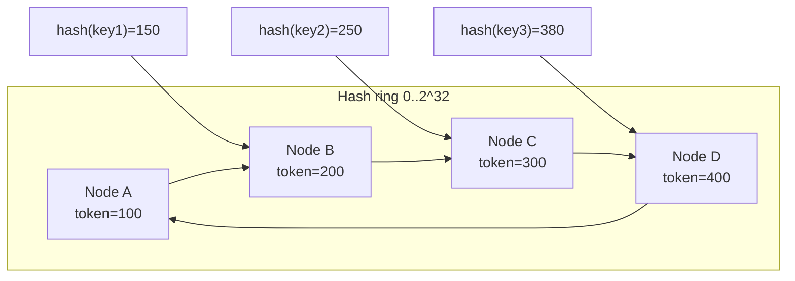
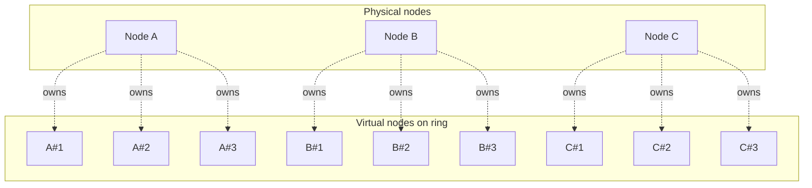
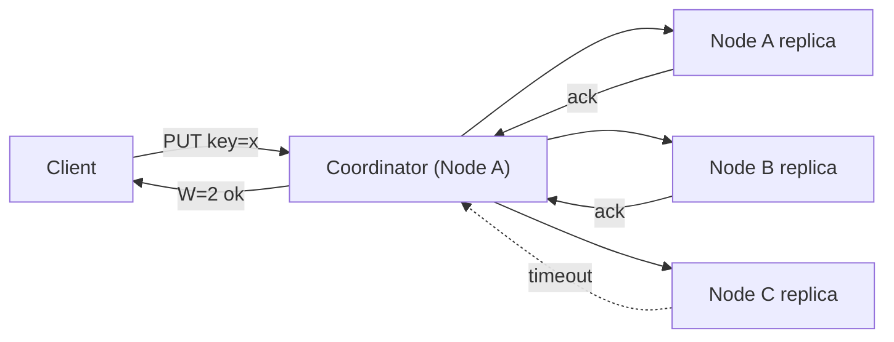
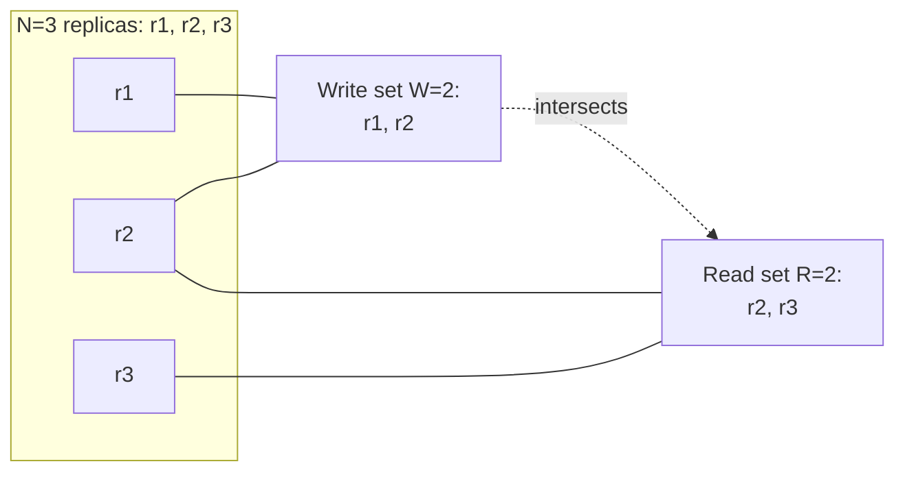
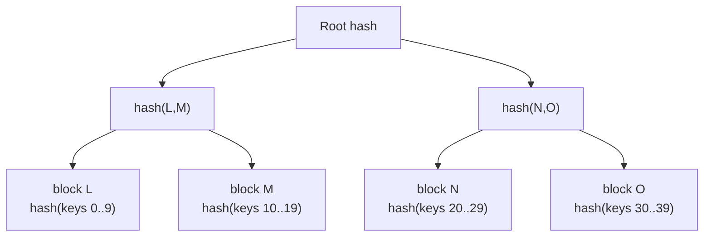
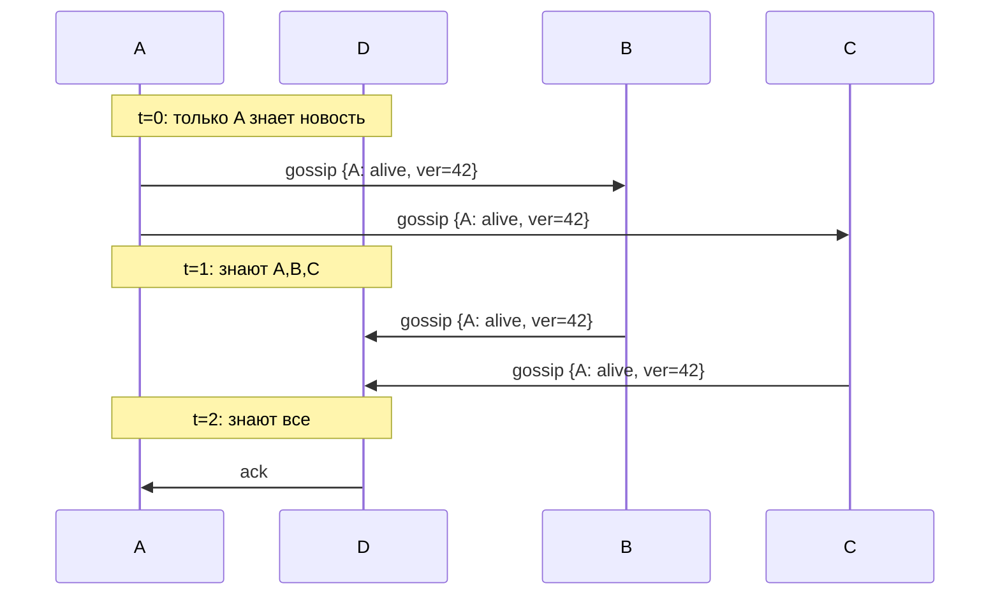
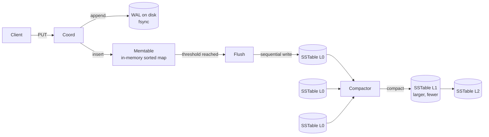

# System Design: Распределённый `Key-Value Store`

`Key-Value Store` уровня DynamoDB / Cassandra / Riak — это распределённое хранилище с простым API (`PUT`, `GET`, `DELETE`), линейной масштабируемостью, высокой доступностью и tunable consistency. Это «классическая» system-design задача, где надо собрать вместе: consistent hashing, репликацию, кворум, разрешение конфликтов, gossip-протокол и LSM-движок.

Дата обновления: 2026-05-22.

## Полезные ссылки

- [Dynamo: Amazon's Highly Available Key-value Store (2007, PDF)](https://www.allthingsdistributed.com/files/amazon-dynamo-sosp2007.pdf) — первоисточник Dynamo-стиля
- [Apache Cassandra Architecture docs](https://cassandra.apache.org/doc/latest/cassandra/architecture/)
- [Designing Data-Intensive Applications (DDIA), Chapter 5: Replication, Chapter 6: Partitioning, Chapter 7: Transactions](https://www.oreilly.com/library/view/designing-data-intensive-applications/9781491903063/)
- [Riak documentation: Replication](https://docs.riak.com/riak/kv/latest/learn/concepts/replication/)
- [DynamoDB developer guide](https://docs.aws.amazon.com/amazondynamodb/latest/developerguide/)
- [Karger et al., Consistent Hashing (1997)](https://www.akamai.com/site/en/documents/research-paper/consistent-hashing-and-random-trees-distributed-caching-protocols-for-relieving-hot-spots-on-the-world-wide-web-technical-publication.pdf)
- [φ Accrual Failure Detector (Hayashibara et al.)](https://www.computer.org/csdl/proceedings-article/srds/2004/22390066/12OmNAXPgUz)
- [LSM-trees: O'Neil et al., 1996](https://www.cs.umb.edu/~poneil/lsmtree.pdf)
- [LevelDB / RocksDB design](https://github.com/google/leveldb/blob/main/doc/impl.md)

## Содержание

### Requirements и CAP

1. [Q1. Functional и non-functional требования](#q1-functional-и-non-functional-требования)
2. [Q2. Почему single-node KV не масштабируется и где предел](#q2-почему-single-node-kv-не-масштабируется-и-где-предел)
3. [Q3. CAP-выбор: почему Dynamo-style идёт в AP](#q3-cap-выбор-почему-dynamo-style-идёт-в-ap)
4. [Q4. PACELC и что меняется без partition](#q4-pacelc-и-что-меняется-без-partition)

### Consistent hashing

5. [Q5. Зачем нужен consistent hashing вместо `hash(key) % N`](#q5-зачем-нужен-consistent-hashing-вместо-hashkey--n)
6. [Q6. Как работает кольцо и виртуальные узлы](#q6-как-работает-кольцо-и-виртуальные-узлы) (!)
7. [Q7. Математика равномерности и переноса данных](#q7-математика-равномерности-и-переноса-данных)
8. [Q8. Реализация consistent hashing на Python](#q8-реализация-consistent-hashing-на-python)

### Replication и quorum

9. [Q9. Preference list и repplication factor N](#q9-preference-list-и-replication-factor-n) (!)
10. [Q10. Quorum: формула R+W>N и трейд-оффы](#q10-quorum-формула-rwn-и-трейд-оффы) (!)
11. [Q11. Sloppy quorum и hinted handoff](#q11-sloppy-quorum-и-hinted-handoff) (!)
12. [Q12. Read repair и anti-entropy через Merkle trees](#q12-read-repair-и-anti-entropy-через-merkle-trees)

### Conflict resolution и vector clocks

13. [Q13. Last-Write-Wins и почему он опасен](#q13-last-write-wins-и-почему-он-опасен) (!)
14. [Q14. Vector clocks: причинность и siblings](#q14-vector-clocks-причинность-и-siblings) (!)
15. [Q15. Как клиент мерджит siblings](#q15-как-клиент-мерджит-siblings)

### Membership и failure detection

16. [Q16. Gossip-протокол: распространение состояния](#q16-gossip-протокол-распространение-состояния) (!)
17. [Q17. φ-accrual failure detector vs обычный heartbeat](#q17-φ-accrual-failure-detector-vs-обычный-heartbeat)
18. [Q18. Bootstrap нового узла и потоковая передача данных](#q18-bootstrap-нового-узла-и-потоковая-передача-данных)

### Storage engine (LSM)

19. [Q19. LSM vs B-tree: когда какой выбрать](#q19-lsm-vs-b-tree-когда-какой-выбрать) (!)
20. [Q20. SSTable, memtable, WAL — путь записи](#q20-sstable-memtable-wal--путь-записи) (!)
21. [Q21. Compaction: size-tiered vs leveled](#q21-compaction-size-tiered-vs-leveled)
22. [Q22. Bloom filters и кеши для ускорения чтения](#q22-bloom-filters-и-кеши-для-ускорения-чтения)

### Multi-DC и scaling

23. [Q23. Multi-datacenter репликация и `LOCAL_QUORUM`](#q23-multi-datacenter-репликация-и-local_quorum)
24. [Q24. Tunable consistency: `ONE`, `QUORUM`, `ALL`, `EACH_QUORUM`](#q24-tunable-consistency-one-quorum-all-each_quorum)
25. [Q25. Горизонтальное масштабирование и rebalancing](#q25-горизонтальное-масштабирование-и-rebalancing)

### Edge cases и anti-patterns

26. [Q26. Hot keys и борьба со скосом нагрузки](#q26-hot-keys-и-борьба-со-скосом-нагрузки)
27. [Q27. Tombstones и проблема накопления удалений](#q27-tombstones-и-проблема-накопления-удалений)
28. [Q28. Большие значения, сжатие и TTL](#q28-большие-значения-сжатие-и-ttl)
29. [Q29. Сравнение реальных систем: DynamoDB / Cassandra / Riak / Redis Cluster](#q29-сравнение-реальных-систем-dynamodb--cassandra--riak--redis-cluster)
30. [Q30. Anti-patterns и подводные камни эксплуатации](#q30-anti-patterns-и-подводные-камни-эксплуатации)

---

## Q1. Functional и non-functional требования

**Functional**:

- `PUT(key, value)` — записать или перезаписать значение.
- `GET(key) -> value | not_found` — прочитать по ключу.
- `DELETE(key)` — пометить ключ удалённым.
- `key` и `value` — произвольные байтовые строки (`key` обычно до 1 KB, `value` — до 1 MB; всё, что больше, выносится в blob storage).
- Опционально: `LIST`/`SCAN` по диапазону (если есть упорядоченность), `TTL` (как в Cassandra), CAS (`compare-and-set`).

**Non-functional**:

| Свойство | Цель |
|---|---|
| Scale | Петабайты данных, миллионы RPS |
| Availability | 99.99% (≈ 52 минуты простоя в год) — AP-выбор по CAP |
| Latency | p99 read < 10 ms, p99 write < 20 ms (single DC) |
| Durability | Записанное не теряется при падении одной ноды |
| Geo | Multi-region replication, локальные чтения |
| Tunable | Клиент сам выбирает уровень консистентности per request |

Сразу формализуем компромиссы: жертвуем строгой консистентностью в обмен на availability и low-latency writes — это и есть Dynamo-стиль.

## Q2. Почему single-node KV не масштабируется и где предел

Single-node KV (например, `HashMap<byte[], byte[]>` в памяти + WAL на диск) упирается в:

1. **Память**: один сервер — десятки-сотни GB RAM, в петабайт не помещается.
2. **Диск**: один SSD ~ единицы TB, IOPS ограничены (NVMe ≈ 1M IOPS, но это всё ещё один узел).
3. **CPU/сеть**: 10 Gbit/s NIC ≈ 1.25 GB/s — упрёмся при больших значениях.
4. **Availability**: один узел = SPOF. Failover требует второго узла → распределённость всё равно вылезает.
5. **Backups и hot upgrade**: сложно делать без downtime.

Поэтому даже если данные поместились — приходится шардировать ради доступности. И как только появилось 2+ узла — нужны репликация, partitioning и consensus/quorum.

## Q3. CAP-выбор: почему Dynamo-style идёт в AP

CAP-теорема: при network partition приходится выбирать между `Consistency` и `Availability`.

- **CP** (MongoDB c `majority`, HBase, etcd): отказ в обслуживании на меньшинстве партиции, зато линеаризуемость.
- **AP** (DynamoDB, Cassandra, Riak): продолжаем принимать запросы со всех сторон partition, потом мержим конфликты.

Dynamo-стиль выбирает **AP** потому что:

- В Amazon корзина в e-commerce должна добавлять товары даже при сетевых проблемах — потерянная продажа дороже временной несогласованности.
- Большинство сценариев KV — это read-your-writes для одного пользователя, плюс терпимость к eventual consistency для остальных.
- Tunable consistency (R/W) позволяет получить «почти CP» (`R+W>N`) когда нужно, не меняя кластер.

Подробнее см. [cap-theorem-interview.md](../architecture/cap-theorem-interview.md).

## Q4. PACELC и что меняется без partition

CAP описывает только поведение при partition. PACELC расширяет:

- **P**artition: **A** vs **C** (как в CAP).
- **E**lse (нормальная работа): **L**atency vs **C**onsistency.

Классификация:

| Система | При partition | Без partition |
|---|---|---|
| Dynamo / Cassandra | AP | EL (low latency, eventual) |
| MongoDB (majority) | CP | EC |
| ZooKeeper / etcd | CP | EC |
| Redis Cluster (default) | AP (но без репликации до slave) | EL |

KV Dynamo-стиля — это **PA/EL**: даже без partition мы готовы пожертвовать линеаризуемостью ради p99 < 10 ms (один round-trip, не два).

## Q5. Зачем нужен consistent hashing вместо `hash(key) % N`

Naive `hash(key) % N`:

- При добавлении/удалении узла **N** меняется → у почти всех ключей меняется владелец → нужно перетасовать ~`(N-1)/N` данных. Для N=10 это 90% — недопустимо.
- Стейтфул-кэши (Memcached, Redis) теряют попадания.

`Consistent hashing` (Karger, 1997):

- Хеш-пространство — кольцо `[0..2^32)`. Ключ → позиция → берём первый узел по часовой стрелке.
- При добавлении/удалении узла перемещаются ключи только **соседнего сегмента** → `1/N` данных, а не всё.
- Узлы независимо знают свой диапазон, координация минимальна.



## Q6. Как работает кольцо и виртуальные узлы (!)

Чистое consistent hashing даёт **неравномерную нагрузку**: если у нас N=3 узлов и три случайных позиции, дисперсия размеров сегментов высокая (некоторые узлы получат в 2-3 раза больше ключей).

Решение — **virtual nodes (vnodes)**: каждый физический узел представлен `V` виртуальными точками на кольце.

- Cassandra: `num_tokens = 256` по умолчанию.
- DynamoDB / Riak: десятки-сотни vnodes на ноду.

Эффекты:

- Распределение → закон больших чисел: при `V × N` точках стандартное отклонение размеров сегментов падает как `1/√(V×N)`.
- Гетерогенность: мощному узлу можно дать больше vnodes (proportional weight).
- Rebalancing: при добавлении узла берём по чуть-чуть от каждого соседа, а не один большой кусок.



## Q7. Математика равномерности и переноса данных

Пусть `M` — число узлов, `V` — vnodes на узел, `K` — общее число ключей.

- Средняя нагрузка узла: `K/M` ключей.
- Без vnodes: стандартное отклонение ≈ `K/√M` → разброс в разы.
- С vnodes: дисперсия `~ K / (M·V)`, относительная ошибка `~ 1/√(M·V)`.
- При `M=10, V=256` → относительная ошибка ≈ 2% → отличная равномерность.

**Перенос данных при изменении кластера**:

- Добавили узел → переносим ровно `K/(M+1)` ключей (теоретический минимум).
- Удалили узел → его сегменты разойдутся по соседям по `1/V` сегмента каждому.

Это и есть «minimal disruption» — главное свойство consistent hashing.

## Q8. Реализация consistent hashing на Python

Учебная реализация (без оптимизаций):

```python
import bisect
import hashlib

class ConsistentHashRing:
    def __init__(self, vnodes_per_node: int = 128):
        self.vnodes_per_node = vnodes_per_node
        self.ring = []                # sorted hash positions
        self.position_to_node = {}    # position -> node_id

    @staticmethod
    def _hash(key: str) -> int:
        h = hashlib.md5(key.encode()).digest()
        return int.from_bytes(h[:4], "big")  # 32-bit hash space

    def add_node(self, node_id: str) -> None:
        for v in range(self.vnodes_per_node):
            pos = self._hash(f"{node_id}#{v}")
            bisect.insort(self.ring, pos)
            self.position_to_node[pos] = node_id

    def remove_node(self, node_id: str) -> None:
        to_remove = [p for p, n in self.position_to_node.items() if n == node_id]
        for p in to_remove:
            self.ring.remove(p)
            del self.position_to_node[p]

    def get_node(self, key: str) -> str:
        if not self.ring:
            raise RuntimeError("ring is empty")
        pos = self._hash(key)
        idx = bisect.bisect_right(self.ring, pos) % len(self.ring)
        return self.position_to_node[self.ring[idx]]

    def get_preference_list(self, key: str, n: int) -> list[str]:
        """N replicas: idёт по кольцу, собирая разные физические узлы."""
        pos = self._hash(key)
        idx = bisect.bisect_right(self.ring, pos) % len(self.ring)
        seen, result = set(), []
        for i in range(len(self.ring)):
            node = self.position_to_node[self.ring[(idx + i) % len(self.ring)]]
            if node not in seen:
                seen.add(node)
                result.append(node)
                if len(result) == n:
                    break
        return result
```

Важно: `get_preference_list` пропускает дубли (vnodes одного физического узла), чтобы реплики легли на разные машины — иначе при падении одной потеряем сразу N реплик.

## Q9. Preference list и replication factor N

`Preference list` — упорядоченный список из первых `N` **различных физических узлов** по часовой стрелке от позиции ключа.

- Типично `N = 3`. Это компромисс: 2 не выдержит одновременной потери двух узлов, 5+ дорого по записи и месту.
- Координатором запроса обычно является **первый** узел в списке, но клиент может выбрать любой (Cassandra `coordinator` — любая нода кластера).
- Координатор параллельно отправляет PUT всем N узлам и ждёт `W` подтверждений.



## Q10. Quorum: формула R+W>N и трейд-оффы (!)

`N` — число реплик, `W` — сколько узлов подтверждают запись, `R` — сколько отвечают на чтение.

**Ключевая формула**: если `R + W > N`, то read-set и write-set пересекаются → последняя успешная запись будет видна следующим чтением → **strong consistency** (без partition и сбоев).

Профили:

| Конфигурация | R | W | Свойства |
|---|---|---|---|
| `N=3, W=1, R=1` | fast read | fast write | Eventual, нет гарантий durability |
| `N=3, W=3, R=1` | fast read | slow write | Read most consistent, write any-node-down → fail |
| `N=3, W=1, R=3` | slow read | fast write | Write fast, read любой replica может вернуть свежее |
| `N=3, W=2, R=2` (**типично**) | balanced | balanced | `R+W=4>3` → strong, выдерживает падение 1 узла |
| `N=5, W=3, R=3` | balanced | balanced | Выдерживает 2 одновременных падения |
| `N=3, W=3, R=3` (=ALL) | — | — | Линеаризуемо, но availability падает: любой down → fail |

Латентность считают по самому медленному из требуемых ответов: `latency(W) = W-я по порядку реплика`. Поэтому повышение `W` бьёт по p99.



## Q11. Sloppy quorum и hinted handoff (!)

**Strict quorum** требует, чтобы `W` подтверждений пришли именно от узлов из preference list. Это даёт строгие гарантии, но **снижает доступность**: если 2 из 3 узлов недоступны при `W=2` — запись фейлится.

**Sloppy quorum** (Dynamo): если узел из preference list недоступен, координатор пишет на **следующий доступный** узел по кольцу с **меткой hint**: «это вообще-то для узла B».

`Hinted handoff`:

1. Coordinator пишет копию на узел D с пометкой `{intended_for: B}`.
2. D хранит её в отдельной очереди (не в основной shard).
3. Когда B возвращается online → D реплеит hints на B → удаляет у себя.

Эффекты:

- Availability вырастает резко: PUT удаётся, пока в кластере вообще есть свободные ноды.
- **Strong consistency теряется**: возможно, что чтение `R` уже выполняется на real-preference-list узлах, пока запись ещё в hint-queue. Cassandra поэтому даёт опции `hinted_handoff_enabled` и таймауты.
- Hints должны иметь TTL (Cassandra: 3 часа по умолчанию), иначе бесконечно копятся.

## Q12. Read repair и anti-entropy через Merkle trees

Из-за hinted handoff, сетевых сбоев и неполных кворумов реплики **расходятся**. Нужны механизмы синхронизации.

**Read repair** (foreground): при `GET` координатор получает ответы от R реплик. Если они расходятся — async обновляет stale-реплики последним значением (по vector clock / timestamp). Дешево, чинит горячие ключи.

**Anti-entropy** (background): сравнить **весь** набор данных между репликами без чтения каждого ключа. Решение — **Merkle trees**:

1. Каждый узел строит хеш-дерево по своему диапазону ключей (листья = хеши блоков ключей, узлы = хеши детей).
2. При синхронизации соседи обмениваются корнями. Совпали → данные идентичны.
3. Не совпали → рекурсивно спускаемся, чтобы найти конкретные расходящиеся блоки → передаём только их.

Сложность: `O(log(N))` на сравнение вместо `O(N)`. Cassandra запускает Merkle-репair (`nodetool repair`) еженедельно.



## Q13. Last-Write-Wins и почему он опасен (!)

`LWW` — самая простая стратегия разрешения конфликтов: при двух конкурентных записях побеждает та, у которой больше timestamp. Используется в Cassandra (по умолчанию для cells).

Проблемы:

1. **Clock skew**: серверные часы расходятся на десятки-сотни мс даже с NTP. Узел с забегающими часами «всегда побеждает», даже если фактически писал раньше.
2. **Потеря записей**: если два клиента одновременно делают `cart.add(itemA)` и `cart.add(itemB)` — одна запись пропадает (берётся весь объект корзины, а не операция).
3. **Не детектирует параллелизм**: невозможно понять, что был конфликт.

Когда LWW допустим:

- Write-heavy «log-like» данные, где порядок задаётся источником.
- Idempotent payloads (state, а не delta).
- Есть единственный writer per key (например, per-user counter с одного устройства).

Альтернативы: **vector clocks** (см. Q14), CRDTs (Riak DT), application-level merge (Dynamo подход).

## Q14. Vector clocks: причинность и siblings (!)

`Vector clock` — счётчик «логических часов» каждой ноды. Структура: `{node_id: counter}`.

Правила:

1. Каждая запись инкрементирует свой счётчик: `VC[node_id] += 1`.
2. При репликации передаём `VC` вместе с данными.
3. Сравнение двух VC:
   - **VC1 < VC2**: каждый компонент `VC1[i] ≤ VC2[i]` и есть строго меньший → VC2 «причинно позже» (descendant).
   - **VC1 > VC2**: симметрично.
   - **VC1 = VC2**: те же часы.
   - **incomparable** (конфликт): есть и больше, и меньше → конкурентные записи.

Пример:

```text
Initial: VC = {}

Client X пишет через node A:
  v1 = "[red]", VC_v1 = {A: 1}

Client Y пишет через node B (репликация еще не дошла):
  v2 = "[blue]", VC_v2 = {B: 1}

Сравнение {A:1} и {B:1}: incomparable → siblings.
Координатор хранит обе версии и возвращает клиенту обе.

Client делает merge → "[red, blue]", VC = {A: 1, B: 1} → побеждает обе предыдущие.
```

Псевдокод:

```python
class VectorClock(dict):
    def increment(self, node_id: str) -> "VectorClock":
        new = VectorClock(self)
        new[node_id] = new.get(node_id, 0) + 1
        return new

    def descends_from(self, other: "VectorClock") -> bool:
        # self >= other (self happens-after-or-equal)
        return all(self.get(k, 0) >= v for k, v in other.items())

    def concurrent_with(self, other: "VectorClock") -> bool:
        return not self.descends_from(other) and not other.descends_from(self)

    def merge(self, other: "VectorClock") -> "VectorClock":
        keys = set(self) | set(other)
        return VectorClock({k: max(self.get(k, 0), other.get(k, 0)) for k in keys})
```

Минусы: VC растёт пропорционально числу writers per key. Riak делает pruning (отбрасывает старых писателей).

## Q15. Как клиент мерджит siblings

Когда `GET` возвращает несколько **incomparable versions** (siblings), KV-store сам не знает, как их объединить — это бизнес-логика.

Подходы:

1. **Идемпотентные set-like структуры** (классический Dynamo shopping cart): объединение = union. Удалённые товары → реальная проблема LWW в этом сценарии.
2. **CRDTs** (Riak Data Types): `G-Counter`, `OR-Set`, `LWW-Register` — структура сама определяет коммутативный merge.
3. **Application merge function**: клиент пишет код «как мерджить мои данные» и вызывает `PUT` с новой версией, чей VC = `merge(VC1, VC2).increment(client)`.
4. **Last-Write-Wins fallback**: для скаляров, где конфликт ≈ потеря 1 значения.

Пример shopping cart merge:

```python
def merge_carts(cart_a: dict, cart_b: dict) -> dict:
    merged = dict(cart_a)
    for sku, qty in cart_b.items():
        merged[sku] = max(merged.get(sku, 0), qty)
    return merged
```

## Q16. Gossip-протокол: распространение состояния (!)

Нужно: каждая нода знает, кто в кластере жив, какие диапазоны кому принадлежат, какие schema-изменения. Решение должно работать без центрального координатора (он сам станет SPOF).

**Gossip (epidemic protocol)**:

- Каждый узел раз в **1 секунду** выбирает случайно **k других узлов** (обычно k=1..3) и обменивается состоянием.
- Состояние — это «карта» узлов: `{node_id: (heartbeat, generation, status, tokens, …)}`.
- При обмене берётся `max(heartbeat)` per node → новости расходятся **экспоненциально**: за `log(N)` раундов знают все.

Математика: с probability `1 - 1/N` все узнают за `O(log N)` секунд. Для N=1000 это ≈ 10 секунд.

Cassandra реализация: `Gossiper` + `EndpointState` + `VersionedValue`. SeedNodes — bootstrap-список для первого знакомства.



Преимущества: scalable (нет N²), partition-tolerant (новости находят путь), self-healing. Минусы: eventual — несколько секунд лага в принятии решений.

## Q17. φ-accrual failure detector vs обычный heartbeat

Обычный heartbeat: если не пришёл за `T` мс — узел dead. Проблемы:

- Жёсткий threshold: при сетевом jitter получаем false positives.
- Не учитывает историю: реальный RTT гуляет, надо адаптироваться.

**φ-accrual** (Hayashibara, 2004): возвращает не `bool`, а **число φ** = «насколько подозрителен узел».

Идея:

- Храним sliding window последних inter-arrival times heartbeat'ов.
- Аппроксимируем распределение (обычно нормальное или экспоненциальное).
- `φ(t) = -log10(P(прибытие > t))`.
- Application выбирает порог: φ ≥ 8 → reject as dead (это значит, что вероятность задержки `< 10^-8`).

Преимущества:

- Адаптивно: на нестабильной сети auto-poднимает threshold.
- Прикладной код сам решает (быстрая UI: φ=3, критичный rebuild: φ=12).
- Cassandra использует именно `Phi Accrual` (`phi_convict_threshold = 8` по умолчанию).

## Q18. Bootstrap нового узла и потоковая передача данных

Шаги добавления узла:

1. Новый узел стартует, читает `seed_provider` → знакомится с кластером через gossip.
2. Получает gossip state → видит существующих owners.
3. Выбирает **tokens** (vnodes positions) на кольце:
   - Cassandra `allocate_tokens_for_keyspace`: оптимизатор выбирает позиции для минимизации скоса.
4. Объявляет себя в gossip как `JOINING`.
5. **Streaming**: от каждого нынешнего owner забираем только те ключи, что попадают в новые диапазоны:
   - Open SSTable, фильтруем по диапазону ключа, отправляем.
   - Стрим может занимать часы для больших узлов — поэтому важна fault tolerance стриминга (resumable).
6. После завершения → `gossip status = NORMAL` → узел начинает обслуживать запросы.

До завершения streaming запись **двойная**: координатор пишет и на старого, и на нового owner (`pending range`), чтобы избежать пропусков.

При удалении узла (`decommission`) — обратный процесс: владелец перед уходом стримит свои данные соседям.

## Q19. LSM vs B-tree: когда какой выбрать (!)

| Аспект | LSM (LevelDB, RocksDB, Cassandra) | B-tree (Postgres, InnoDB) |
|---|---|---|
| Запись | Append в memtable + WAL → sequential disk write | Random write в страницу + write-ahead log |
| Чтение | Может смотреть в несколько SSTable + memtable | Один путь по дереву |
| Write amplification | Высокая (compaction перезаписывает данные) | Низкая |
| Read amplification | Высокая (нужно проверить N SSTable) | Низкая |
| Space amplification | Может расти при отсутствии compaction | Стабильна |
| Скорость записи | **Очень высокая** (sequential I/O) | Ограничена random writes |
| Скорость чтения | Зависит от Bloom filter, кэшей | Стабильно низкая |
| Range scans | Возможны (sorted SSTable) | Очень эффективны |
| Лучший use case | Write-heavy, time-series, KV | Read-heavy OLTP, joins, индексы |

KV-store Dynamo-стиля выбирает **LSM** потому что:

- Профиль нагрузки: много записей (events, mutations).
- Sequential disk I/O → высокая утилизация даже на HDD.
- Compaction делается в фоне → не блокирует hot path.
- Естественно ложится на immutable SSTable + replication.

## Q20. SSTable, memtable, WAL — путь записи (!)



**Шаги записи**:

1. **WAL** (commit log): append-only лог на диск, `fsync` обеспечивает durability. Если узел крашится — memtable восстанавливаем replay WAL.
2. **Memtable**: in-memory отсортированная структура (skiplist / red-black tree). Принимает писатели мгновенно.
3. При достижении лимита (Cassandra default ~ 32 MB) memtable становится immutable → **flush** в новую SSTable.
4. **SSTable** (Sorted String Table): immutable файл на диске, ключи отсортированы. Идёт с **index** (sparse) и **Bloom filter**.
5. **Compaction**: фоновый процесс мерджит несколько SSTable в одну, отбрасывая старые версии и tombstones.

**Чтение**:

1. Проверить memtable (есть → вернуть).
2. Проверить Bloom filter каждой SSTable → отсеять «точно нет».
3. Прочитать index → найти offset → прочитать блок.
4. Из всех найденных версий взять самую новую (по timestamp / VC).

## Q21. Compaction: size-tiered vs leveled

**Size-tiered (STCS)** — Cassandra default:

- SSTables группируются по размеру в «tier». При накоплении `T` (типично 4) SSTable одного tier — мерджим их в одну SSTable следующего tier.
- Плюсы: простая, write amplification ~ `log(N)`.
- Минусы: ключ может жить в множестве SSTable одновременно (worst case `O(tier count)`), read amplification высокая. Временно требуется 2× места.

**Leveled (LCS)** — RocksDB, LevelDB:

- Уровни L0, L1, L2, …, каждый в `10×` больше предыдущего. Внутри уровня (кроме L0) SSTable не пересекаются по диапазонам ключей.
- Плюсы: ключ присутствует максимум в одном SSTable на уровень → predictable read amp.
- Минусы: write amplification выше (`~ levels × 10`), компакция «крутится» постоянно.

Гибрид: **Time-Window** (Cassandra TWCS) для time-series — компактим SSTable одного временного окна вместе, потом окно «замораживается».

Правило выбора:

- Write-heavy + редкие read диапазоны → STCS.
- Read-heavy с предсказуемой латентностью → LCS.
- Time-series + TTL → TWCS.

## Q22. Bloom filters и кеши для ускорения чтения

**Bloom filter** per SSTable:

- Probabilistic set membership: `false positive` возможен, `false negative` — нет.
- Структура: битовый массив `m` бит + `k` хеш-функций.
- При добавлении: `H_1(key), H_2(key), …` → выставляем биты.
- При запросе: если хотя бы один бит не выставлен → точно нет (skip SSTable). Все выставлены → возможно есть (читаем).

Параметры:

- False positive rate: `p ≈ (1 - e^(-kn/m))^k`. Cassandra default p=0.01 → ~10 бит на ключ.
- Хранится в памяти на каждом узле.

**Кеши**:

| Кеш | Что хранит | Когда применять |
|---|---|---|
| Key cache | `key → SSTable offset` | Универсально, дешево |
| Row cache | `key → value` | Hot rows; ест RAM |
| Block cache | блоки SSTable (RocksDB) | Range scans |
| OS page cache | сырой файл | По умолчанию работает |

Стратегия: всегда включён key cache, row cache только для специфических read-heavy таблиц (легко переполняется).

## Q23. Multi-datacenter репликация и `LOCAL_QUORUM`

Multi-DC нужен для:

- Геораспределённой латентности (read из ближайшего DC).
- Disaster recovery (потеря целого DC).
- Регуляторных требований (data residency).

Cassandra `NetworkTopologyStrategy`:

```text
replication = {
    'class': 'NetworkTopologyStrategy',
    'DC_RU': 3,
    'DC_EU': 3,
    'DC_US': 2
}
```

Каждый DC держит свои `N` реплик. Координатор знает топологию (snitch).

**Consistency levels с учётом DC**:

- `LOCAL_QUORUM` — кворум **только внутри локального DC** → latency как single-DC, но если локальный DC лежит → ошибка.
- `EACH_QUORUM` — кворум в каждом DC → строгие гарантии, но дорого по latency и недоступно при partition между DC.
- `QUORUM` — кворум по сумме всех реплик (тащит cross-DC RTT).

Типичная прод-конфигурация: `LOCAL_QUORUM` для read/write + асинхронная репликация между DC. Cross-DC replication идёт через тот же gossip + streaming, но координатор не ждёт ответа.

## Q24. Tunable consistency: `ONE`, `QUORUM`, `ALL`, `EACH_QUORUM`

Клиент задаёт уровень per request:

| CL | R или W | Где работает |
|---|---|---|
| `ANY` | 1 (включая hints) | Только write; max availability, weakest guarantees |
| `ONE` | 1 реплика | Быстро, eventual |
| `TWO` / `THREE` | 2 / 3 реплики | Фиксированное число, удобно при N=5 |
| `QUORUM` | `⌈(N+1)/2⌉` | Strong при `R+W>N` |
| `LOCAL_ONE` | 1 в локальном DC | Fast local read |
| `LOCAL_QUORUM` | кворум в локальном DC | Стандарт для multi-DC |
| `EACH_QUORUM` | кворум в каждом DC | Только writes; строгая мульти-DC согласованность |
| `ALL` | все реплики | Линеаризуемо, но availability страдает |

Пример из Cassandra:

```sql
-- Запись с гарантией, что прочитается quorum-readом
CONSISTENCY LOCAL_QUORUM;
INSERT INTO users (id, name) VALUES ('u1', 'Sergey');

-- Дешёвое чтение для аналитики
CONSISTENCY ONE;
SELECT * FROM users WHERE id = 'u1';

-- Гарантированно увидим запись на всех DC
CONSISTENCY EACH_QUORUM;
INSERT INTO config (key, value) VALUES ('feature_flag', 'true');
```

Хороший паттерн: **не закладывать один CL на весь сервис**, выбирать per use case.

## Q25. Горизонтальное масштабирование и rebalancing

Добавление мощности:

1. **Scale up** — больше vnodes на существующих узлах: даёт гранулярность, но не больше CPU/RAM.
2. **Scale out** — новые физические узлы. Главный путь.

Пошагово (Cassandra):

1. Новая нода стартует с пустым диском, в gossip statе `JOINING`.
2. Cluster calculates new token ranges (algorithm `allocate_tokens_for_keyspace`).
3. Streaming: данные переезжают от старых owners к новой ноде.
4. Двойная запись (старый owner + новый) на время bootstrap.
5. После окончания — `gossip status = NORMAL`, старый владелец удаляет свои копии (`cleanup`).

Подводные камни:

- **Streaming throttling** обязательно: иначе сеть забивается, продакшен страдает.
- Не добавлять > 1 узла одновременно в один DC — иначе пересекающиеся диапазоны бьются.
- В крупных кластерах bootstrap занимает часы → планировать заранее.

При удалении (`decommission`) узел стримит данные соседям перед уходом. Альтернатива при потере узла — `removenode` (не было возможности стримить → пересинхронизация делается через `repair`).

## Q26. Hot keys и борьба со скосом нагрузки

**Hot key** — ключ, которому достаётся непропорционально много запросов (например, главная страница в кэше товаров, мегасессия). Coordinator-узел для этого ключа становится bottleneck.

Признаки:

- p99 одного узла растёт, остальные ок.
- Метрика `coordinator_read_latency` диспергирована по узлам.
- `nodetool toppartitions` показывает skew.

Решения:

1. **Salting**: `key' = key + bucket_id (random 0..K-1)` → читаем все K и мерджим. Размазывает ключ по K координаторам. Минус: read amplification = K.
2. **Caching outside**: положить hot keys в Redis/Memcached перед KV. Самый дешёвый путь для read-heavy.
3. **Promotion to dedicated cache layer**: например, в Cassandra включить `row cache` для конкретной таблицы.
4. **Increase replication factor** для hot partitions: больше реплик — больше координаторов могут отвечать.
5. **Application-level sharding**: пересмотреть key design, чтобы не было «one giant partition».

Обратная сторона: tombstones для одного ключа (Q27) — тоже фактически hot key.

## Q27. Tombstones и проблема накопления удалений

`DELETE` в LSM нельзя сделать «in place» — SSTable immutable. Вместо этого пишется **tombstone**: запись «key deleted at time T».

Проблема: при чтении мы должны увидеть все версии до compaction и вернуть «not found». Если tombstones накапливаются — read amplification растёт.

Где это болит:

- Очередь сообщений в Cassandra (антипаттерн): `INSERT … DELETE` повторяется → тысячи tombstones на одной partition → `tombstone_failure_threshold` (default 100000) → query отказывает.
- TTL: каждое истечение TTL = tombstone.

Решения:

1. **Compaction tuning**: `gc_grace_seconds` (default 10 дней — сколько хранить tombstone до удаления). Уменьшать осторожно — за этот период должен пройти repair, иначе удалённые ключи «оживут».
2. **TimeWindowCompactionStrategy** для time-series + TTL: tombstones окна уходят вместе с окном.
3. **Не использовать KV как очередь** — для этого есть Kafka.
4. **Range deletes** вместо row-by-row, если нужно почистить.
5. Мониторинг `tombstone_scanned` метрики.

## Q28. Большие значения, сжатие и TTL

**Большие значения** (> 1 MB):

- Большой `value` блокирует одну строку SSTable, мешает компакции, ест JVM heap при чтении.
- Cassandra жёсткий лимит `max_mutation_size` (16 MB по умолчанию).
- Решение: хранить в blob storage (S3, Ceph), а в KV — только ссылку и метаданные.

**Сжатие**:

- SSTable сжимаются на блочном уровне (LZ4, Snappy, Zstd).
- LZ4 — default Cassandra: быстрая декомпрессия, ~20-40% экономии.
- Zstd — выше степень, медленнее (для cold data).
- WAL обычно не сжимают (low write latency приоритет).

**TTL**:

- Cassandra поддерживает per-cell TTL. По истечении создаётся tombstone.
- DynamoDB `TimeToLive`: удаление в течение 48 часов после expiry (не строгая гарантия).
- Use case: сессии, токены, временные индексы.
- Anti-pattern: TTL на огромных partitions без TWCS — взрыв tombstones.

## Q29. Сравнение реальных систем: DynamoDB / Cassandra / Riak / Redis Cluster

| Свойство | DynamoDB | Cassandra | Riak (KV) | Redis Cluster |
|---|---|---|---|---|
| CAP-выбор | AP (eventually) или Strong | AP, tunable | AP, tunable | CP-ish (но split-brain возможен) |
| Replication | 3 копии в DC, multi-region opt | NetworkTopologyStrategy, tunable | N=3 default, configurable | 1 master + N replicas per shard |
| Sharding | Auto, hash-based | Vnodes consistent hashing | Vnodes consistent hashing | 16384 hash slots |
| Conflict resolution | LWW (timestamp) | LWW (per cell) | Vector clocks + CRDTs | Single master per shard |
| Storage engine | LSM-подобный | LSM (SSTable) | Bitcask / LevelDB | RAM + AOF/RDB |
| Multi-DC | Global Tables | Native | MDC (enterprise) | Через external tools |
| Operational model | Managed (no ops) | Self-hosted / managed (Astra) | Self-hosted | Self-hosted / managed |
| Тип запросов | KV + secondary index | CQL, range queries | KV, search, MapReduce | KV + data structures |
| Latency p99 | ~10 ms | ~10 ms | ~10-20 ms | < 1 ms (in-memory) |
| Лучший use case | Production-grade cloud KV | Time-series, large clusters | Multi-DC с CRDT | Cache, hot data |

Подробнее по конкретным системам см.:

- [Cassandra interview](../databases/cassandra-interview.md)
- [DynamoDB interview](../databases/dynamodb-interview.md)
- [Database replication](../databases/database-replication-interview.md)
- [Database sharding](../databases/database-sharding-interview.md)

## Q30. Anti-patterns и подводные камни эксплуатации

**Anti-patterns**:

1. **KV как очередь**: огромные partitions с быстрыми INSERT+DELETE → tombstone-вспышка → деградация чтения. Используй Kafka.
2. **Joins на уровне приложения для всех запросов**: KV не реляционная БД. Денормализуй на этапе записи (write-time fan-out).
3. **Большие values**: > 1 MB ломает компакцию и кэши.
4. **Низкий RF**: `N=1` = SPOF. `N=2` = нет кворума (при падении 1 узла ни write, ни read quorum не получить).
5. **Strong consistency для всего**: убивает latency и availability. Использовать `LOCAL_QUORUM` только где надо.
6. **Один монстро-DC**: убивает DR. Хотя бы 2 DC.
7. **Hot keys** без salting/caching (см. Q26).
8. **Counter-таблицы без идемпотентности**: классический способ потерять/задвоить инкременты.
9. **TTL без TWCS** на time-series: tombstones взрываются.
10. **Игнор repair**: без регулярного `nodetool repair` (или анти-энтропии) реплики постепенно расходятся.

**Подводные камни эксплуатации**:

- **Compaction backlog**: SSTable растут быстрее, чем компактятся → диск кончается. Мониторить `pending compactions`.
- **GC pauses**: JVM-based (Cassandra) — длинные паузы убивают p99. Тюнить G1/ZGC, размер heap (обычно 8-31 GB).
- **Bootstrap streaming**: на крупном кластере часы. Планировать заранее, не во время пиков.
- **Schema migrations**: gossip propagation несколько секунд — schema disagreement → ошибки. Не делать в hot path.
- **Disk failure**: при RF=3 потеря 1 диска не критична, но `repair` обязателен после замены.
- **Network partition между DC**: при `LOCAL_QUORUM` оба DC продолжают работать → divergence → нужен post-recovery repair.

Главный принцип: **eventual consistency требует операционной дисциплины**. Repair, compaction, мониторинг tombstones — не опция, а часть архитектуры.

---

## See also

- [System Design Interview (root)](system-design-interview.md)
- [Distributed Systems Interview](../architecture/distributed-systems-interview.md)
- [CAP Theorem Interview](../architecture/cap-theorem-interview.md)
- [Consistency Patterns Interview](../architecture/consistency-patterns-interview.md)
- [Scalability Patterns Interview](../architecture/scalability-patterns-interview.md)
- [Latency Numbers Interview](../architecture/latency-numbers-interview.md)
- [Cassandra Interview](../databases/cassandra-interview.md)
- [DynamoDB Interview](../databases/dynamodb-interview.md)
- [Database Replication Interview](../databases/database-replication-interview.md)
- [Database Sharding Interview](../databases/database-sharding-interview.md)
- [Database Architecture Interview](../databases/database-architecture-interview.md)
