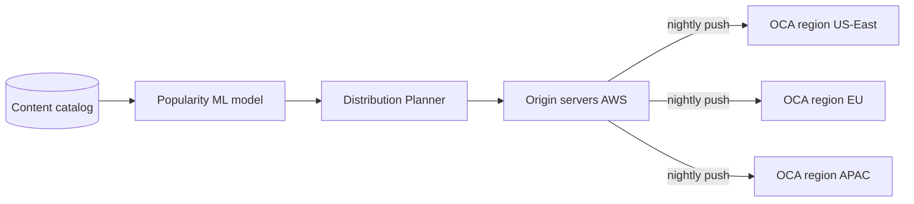
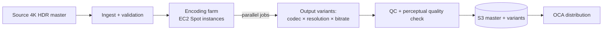
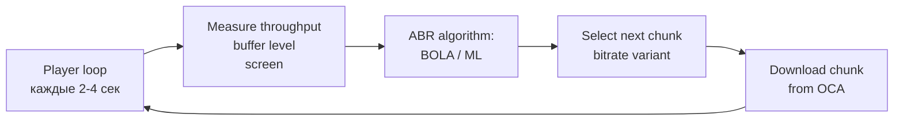
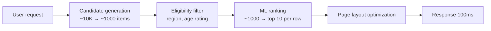
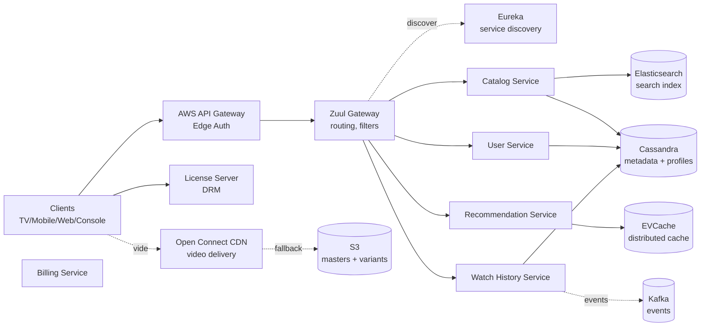

# Вопросы на собеседовании: `Design Netflix`

`Netflix` — крупнейшая платформа video streaming: 270M+ subscribers (2024), 200M+ DAU, на пике 15%+ всего интернет-трафика планеты. На интервью кейс проверяет умение работать одновременно с массивной egress bandwidth (1 Pbps peak), edge CDN (Open Connect appliances у ISP), сложной encoding pipeline, ML recommendation, multi-region резильентностью и chaos engineering. Senior-уровень.

## Полезные ссылки

- [Netflix TechBlog](https://netflixtechblog.com/)
- [Netflix Open Connect Whitepaper](https://openconnect.netflix.com/Open-Connect-Overview.pdf)
- [Per-Title Encode Optimization (Netflix 2015)](https://netflixtechblog.com/per-title-encode-optimization-7e99442b62a2)
- [Dynamic Optimizer per-shot encoding (2018)](https://netflixtechblog.com/optimized-shot-based-encodes-now-streaming-4b9464204830)
- [HLS spec (RFC 8216)](https://datatracker.ietf.org/doc/html/rfc8216)
- [MPEG-DASH spec (ISO/IEC 23009-1)](https://www.iso.org/standard/79329.html)
- [BOLA: ABR algorithm paper](https://arxiv.org/abs/1601.06748)
- [Chaos Monkey by Netflix](https://netflix.github.io/chaosmonkey/)
- [System Design Primer](https://github.com/donnemartin/system-design-primer)

## Содержание

**Requirements и capacity**
- [Q1. (!) Functional и non-functional requirements?](#q1--functional-и-non-functional-requirements)
- [Q2. (!) Capacity estimation (270M subs, 1 Pbps peak)?](#q2--capacity-estimation-270m-subs-1-pbps-peak)
- [Q3. SLA и SLO для streaming pipeline?](#q3-sla-и-slo-для-streaming-pipeline)

**CDN и доставка контента**
- [Q4. (!) Open Connect — Netflix proprietary CDN?](#q4--open-connect--netflix-proprietary-cdn)
- [Q5. (!) Pre-positioning контента overnight (predictive caching)?](#q5--pre-positioning-контента-overnight-predictive-caching)
- [Q6. Storage tier: hot OCA, warm regional, cold Glacier?](#q6-storage-tier-hot-oca-warm-regional-cold-glacier)

**Encoding**
- [Q7. (!) Encoding pipeline (master → variants)?](#q7--encoding-pipeline-master--variants)
- [Q8. (!) Per-title vs per-chunk encoding — экономия bitrate?](#q8--per-title-vs-per-chunk-encoding--экономия-bitrate)
- [Q9. Codec ladder (H.264, HEVC, VP9, AV1)?](#q9-codec-ladder-h264-hevc-vp9-av1)
- [Q10. Encoding farm на AWS EC2 (Spot instances)?](#q10-encoding-farm-на-aws-ec2-spot-instances)

**Streaming protocols**
- [Q11. (!) HLS vs DASH vs CMAF — что выбрать?](#q11--hls-vs-dash-vs-cmaf--что-выбрать)
- [Q12. (!) Adaptive Bitrate (ABR) — BOLA и ML-based?](#q12--adaptive-bitrate-abr--bola-и-ml-based)
- [Q13. DRM: Widevine, FairPlay, PlayReady?](#q13-drm-widevine-fairplay-playready)

**Recommendation**
- [Q14. (!) Recommendation system — CF + content + deep learning?](#q14--recommendation-system--cf--content--deep-learning)
- [Q15. Candidate generation + online ranking?](#q15-candidate-generation--online-ranking)
- [Q16. (!) Personalized homepage + artwork personalization?](#q16--personalized-homepage--artwork-personalization)
- [Q17. Contextual bandits для explore vs exploit?](#q17-contextual-bandits-для-explore-vs-exploit)

**Архитектура и сервисы**
- [Q18. (!) High-level architecture?](#q18--high-level-architecture)
- [Q19. Microservices stack (Eureka, Ribbon, Hystrix, Zuul, Atlas)?](#q19-microservices-stack-eureka-ribbon-hystrix-zuul-atlas)
- [Q20. (!) Resilience patterns (bulkheads, circuit breaker, fallback)?](#q20--resilience-patterns-bulkheads-circuit-breaker-fallback)
- [Q21. Catalog service (Elasticsearch, GraphQL Gateway)?](#q21-catalog-service-elasticsearch-graphql-gateway)
- [Q22. Continue watching через Cassandra + Kafka sync?](#q22-continue-watching-через-cassandra--kafka-sync)

**Production**
- [Q23. (!) Chaos Engineering (Chaos Monkey, Kong, Latency)?](#q23--chaos-engineering-chaos-monkey-kong-latency)
- [Q24. (!) Multi-region active-active (US-East + EU + APAC)?](#q24--multi-region-active-active-us-east--eu--apac)
- [Q25. A/B testing platform (1-5% traffic, auto-rollout)?](#q25-ab-testing-platform-1-5-traffic-auto-rollout)
- [Q26. Data platform (Kafka, Iceberg, Spark, Flink)?](#q26-data-platform-kafka-iceberg-spark-flink)
- [Q27. Downloads для offline viewing?](#q27-downloads-для-offline-viewing)
- [Q28. (!) Cost optimization (Reserved + Spot + Open Connect)?](#q28--cost-optimization-reserved--spot--open-connect)
- [Q29. Anti-fraud: account/password sharing detection?](#q29-anti-fraud-accountpassword-sharing-detection)
- [Q30. (!) Антипаттерны и подводные камни?](#q30--антипаттерны-и-подводные-камни)

## Q1. (!) Functional и non-functional requirements?

**Functional (core):**
- Stream video on demand на TV/Mobile/Web/Console.
- Browse catalog (rows of titles).
- Search (typo-tolerant, multi-language).
- Recommendations (personalized homepage).
- Continue watching + sync across devices.
- Downloads для offline (DRM-protected).
- Profiles (до 5 per account).
- Ratings, reviews (thumbs up/down/love).
- Multi-device sync (просмотр на телефоне → продолжение на TV).

**Non-functional:**
- **Subscribers:** 270M+ (2024), 200M+ DAU.
- **Peak traffic:** 15%+ global internet egress.
- **Latency:** p99 start playback < 2 сек.
- **Availability:** 99.99% (≈ 52 минуты/year downtime).
- **Quality:** rebuffering rate < 1%.
- **Multi-region:** US-East, EU, APAC active-active.
- **Compliance:** DMCA, GDPR, региональные content licensing.

**Scope excluded:**
- Live streaming (отдельный продукт; Netflix недавно начал — boxing, NFL).
- Real-time chat / social features.
- User-generated content.

Tip: senior-кандидат сразу проговаривает что Netflix `read-heavy on metadata + bandwidth-heavy on video` — это диктует архитектурное разделение (microservices в AWS для metadata + Open Connect для video).

## Q2. (!) Capacity estimation (270M subs, 1 Pbps peak)?

**Allowances:**

| Параметр | Значение |
|---|---|
| Subscribers | 270M |
| DAU | 200M |
| Concurrent peak | 100M+ viewers |
| Avg bitrate | 5 Mbps (mix HD/4K) |
| Peak egress | 1 Pbps (~125 TB/sec) |

**Video storage:**
- Catalog ~10 PB unique content.
- Per title: ~6 encoding variants (codec × resolution × bitrate ladder) ≈ 10× expansion.
- + multi-language audio tracks, subtitles.
- Total: **~100 PB** master + variants.
- × ~3 регионов с replication popular content → **~300 PB**.

**Egress bandwidth:**
- 100M concurrent × 5 Mbps = 500 Tbps avg.
- Peak (evening US + EU overlap) = 1 Pbps.

**Metadata (Cassandra):**
- 270M users × 100 KB profile + watch history = **27 TB**.
- 10K titles × 1 MB rich metadata = **10 GB** (small, but hot).

**Bandwidth cost calculation:**
- 1 Pbps × $0.02/GB (commercial CDN) = $250M/month на CDN.
- Open Connect cuts это в ~10× → **$25M/month** infrastructure ($300M/year vs $3B/year).

**Encoding farm:**
- 5 000 hours new content/year × ~100 EC2-hours per hour encoding = **500K EC2-hours/year**.
- Spot instances $0.05/hour → $25K/year encoding (negligible).

## Q3. SLA и SLO для streaming pipeline?

| Метрика | Цель | Alert |
|---|---|---|
| `start_playback_latency_p99` | < 2 сек | > 4 сек 5 минут |
| `rebuffering_ratio` | < 1% | > 3% 1 час |
| `play_failure_rate` | < 0.5% | > 2% 5 минут |
| `recommendation_latency_p99` | < 300 ms | > 500 ms |
| `homepage_load_p99` | < 1 сек | > 2 сек |
| `availability` | 99.99% | < 99.9% (monthly) |
| `quality_of_experience (QoE)` | composite score | -5% week-over-week |

**QoE composite:**
- Сочетание: start latency + rebuffering + bitrate sustained + resolution achieved.
- Главный business metric — коррелирует с retention.

**Failure modes:**
- CDN miss → fallback to commercial (CloudFront / Akamai).
- License server down → cached license валиден до 24 ч.
- Recommendation down → fallback на global popularity homepage.

## Q4. (!) Open Connect — Netflix proprietary CDN?

**Что это:** Netflix построил собственный CDN — **Open Connect Appliances (OCA)** — серверы, которые physically размещаются у ISP-партнёров (Comcast, Verizon, Deutsche Telekom, МТС, etc.) или в IXP (Internet Exchange Points).

**Почему собственный CDN:**
- Commercial CDN (Akamai, Cloudflare, CloudFront) на 1 Pbps traffic стоил бы $1-3B/year.
- Open Connect снижает cost в 10× за счёт peering с ISP.
- ISP получают: меньше transit costs (трафик не идёт через upstream), better customer experience.
- Netflix получает: control, lower cost, predictable performance.

**Архитектура OCA:**
- 2U сервер, 200-400 TB SSD, 100-200 Gbps NIC.
- Локально кэшируется популярный контент для региона ISP.
- На пике ~95% Netflix трафика идёт через OCA (5% — fallback на AWS).

**Размещение:**
- Tier-1 ISP: десятки OCA в крупных POPs.
- Regional ISP: 1-3 OCA в дата-центре.
- IXP (Internet Exchange): OCA peering без участия ISP.

**Network requirements (для ISP-партнёра):**
- 10+ Gbps uplink свободного bandwidth.
- BGP peering session.
- Минимум 6 месяцев commitment.

**Сравнение:**

| Подход | Cost (1 Pbps) | Latency | Control |
|---|---|---|---|
| Commercial CDN (Cloudflare) | $1-3B/year | Good (50-100 POPs) | Medium |
| Multi-CDN | $0.7-2B/year | Best (combine providers) | Higher |
| Open Connect (own) | $200-500M/year | Best (in-ISP) | Full |

**Real:** YouTube тоже имеет собственный CDN (Google Global Cache). Cloudflare/Fastly работают только в pure CDN-роли.

## Q5. (!) Pre-positioning контента overnight (predictive caching)?

**Идея:** не ждать пока user запросит видео — заранее (ночью) предсказать что будет популярно завтра и push контент на OCA.

**Workflow:**



**Predictive signals для popularity:**
- Historical watch patterns per-region (Squid Game в Korea peak times).
- Time-of-day patterns (children's content утром, drama вечером).
- Day-of-week (binge weekends).
- Trending в social media (Twitter, Reddit).
- Marketing campaigns (новый release).
- Subscriber demographics per ISP.

**Размещение:**
- High-priority: top 1 000 titles per region → все OCA.
- Long tail: rare content → fewer OCAs, fallback on miss.
- Time-based: новый release → emergency push в ночь премьеры.

**Cache hit ratio:**
- Target: 95%+ requests serve from OCA.
- Cache miss → fallback к AWS origin (через commercial CDN или прямо).
- Cold cache всего content невозможен — long tail слишком велик.

**Update window:**
- 04:00 - 06:00 local time (минимальный traffic).
- Inter-OCA replication через peer-to-peer (BitTorrent-like internally).

**Edge cases:**
- Live event traffic surge → emergency manual push.
- Regional content licensing → не push в страны без прав.

## Q6. Storage tier: hot OCA, warm regional, cold Glacier?

**Hot tier — OCA (edge):**
- SSD на OCA, 200-400 TB.
- Только top contented (top 5% titles даёт 80% watch hours).
- Latency < 50 ms (in-ISP).

**Warm tier — regional S3:**
- AWS S3 в US-East, EU-West, APAC-Tokyo.
- Все active content (top 50%).
- Fallback при OCA cache miss.
- Latency 100-300 ms (across-region).

**Cold tier — S3 Glacier:**
- Archival, long-tail catalog, old removed titles.
- License preservation (даже после удаления из catalog нужно хранить N лет).
- Retrieval: minutes-hours.

**Master files:**
- 4K HDR original в S3 — never deleted.
- Source of truth для re-encoding (новый codec, новая bitrate ladder).

**Replication:**
- Active content: replicated 3× across AWS regions.
- Long tail: single region (cost saving).
- Master: 3× + Glacier backup.

**Cost model:**
- S3 Standard: $0.023/GB/month → 100 PB = $2.3M/month.
- S3 Glacier: $0.004/GB/month → 100 PB cold = $400K/month.
- OCA hardware: amortized $10/TB/month → 200 PB = $2M/month.

## Q7. (!) Encoding pipeline (master → variants)?



**Стадии:**

1. **Ingest:** studio uploads 4K HDR master (typically Apple ProRes, 1-2 TB per movie). Validation: checksum, length, audio sync, subtitle timing.

2. **Pre-processing:**
   - Color space conversion (Rec.2020 → Rec.709 для SDR).
   - Audio normalization (LUFS standard).
   - Subtitle extraction.

3. **Encoding farm (parallel):**
   - AWS EC2 Spot instances (10K+ machines parallel).
   - Per-shot или per-chunk parallelism (Q8).
   - Output codecs: H.264 (baseline compat), HEVC (mobile, smart TV), VP9 (Android, Chrome), AV1 (newest, 30% bitrate reduction).

4. **Bitrate ladder:**
   - 5-10 variants per codec, e.g.:
     - 240p @ 235 kbps
     - 360p @ 375 kbps
     - 480p @ 750 kbps
     - 720p @ 1750 kbps
     - 1080p @ 3000 kbps
     - 2160p (4K) @ 16 Mbps
   - Total: ~30-50 output files per title.

5. **QC (Quality Check):**
   - VMAF (Video Multi-method Assessment Fusion) — Netflix-developed perceptual quality metric.
   - Reject re-encode if VMAF < threshold per resolution.

6. **Packaging:**
   - HLS segments (TS chunks).
   - DASH segments (fMP4 chunks).
   - CMAF (unified, since 2017).

7. **Distribution:**
   - S3 master + variants.
   - Pre-positioning к OCA (Q5).

**Throughput:** 5 000 hours/year new content; ~100 EC2-hours per content hour → 500K EC2-hours/year (~$25K на Spot).

## Q8. (!) Per-title vs per-chunk encoding — экономия bitrate?

**Old approach (до 2015):** fixed bitrate ladder для всех титров.
- Simple cartoon @ 1080p — те же 3 Mbps что и action movie.
- Cartoon переencoded более чем нужно (over-compressed).
- Action movie получал тот же bitrate но visually хуже (under-compressed for complex scenes).

**Per-title encoding (Netflix 2015):**
- Анализируем содержание титра.
- Cartoon (low complexity) — 1080p достижим на 2 Mbps.
- Action movie (high motion) — 1080p требует 4 Mbps.
- Custom ladder per title.

**Economy:**
- Average 20% bitrate reduction across catalog.
- На 1 Pbps это $50-100M/year savings on bandwidth.

**Per-chunk encoding (Netflix 2018 — Dynamic Optimizer):**
- Анализируем bitrate **per shot** в одном титре.
- Dialogue scene → low bitrate (talking heads).
- Action sequence → high bitrate (motion).
- Per-shot encoded chunks merged в один stream.

**Economy:**
- Additional 15-30% bitrate reduction.
- Сложнее QC (VMAF per chunk).
- Encoding time дольше (анализ перед encoding).

**Algorithm:**
1. Split content на shots (scene detection).
2. Per-shot complexity analysis (motion vectors, frequency domain).
3. Allocate bitrate budget per shot.
4. Encode shots с individual quality targets.
5. Concatenate в final stream.

**VMAF — Netflix's perceptual quality metric:**
- ML model (SVM) trained на mass crowd-sourced subjective ratings.
- Output: 0-100 score (perceptual quality).
- Open-sourced (now industry standard).

## Q9. Codec ladder (H.264, HEVC, VP9, AV1)?

| Codec | Год | Bandwidth saving vs H.264 | Adoption | Лицензия |
|---|---|---|---|---|
| H.264/AVC | 2003 | baseline | Universal (95%+ devices) | MPEG LA royalty |
| HEVC/H.265 | 2013 | 30-40% | Mobile, smart TV (60%) | Patent pool $$$ |
| VP9 | 2013 | 30-40% | Android, Chrome | Royalty-free (Google) |
| AV1 | 2018 | 50% vs H.264 | New devices, growing | Royalty-free (AOMedia) |

**Стратегия Netflix:**
- **H.264** — fallback для legacy devices, всегда encoded.
- **HEVC** — mobile + smart TV main path; платят royalty.
- **VP9** — Android + Chrome browsers (Google партнёрство).
- **AV1** — постепенный rollout, начали с mobile (battery friendly при hardware decoder).

**Device selection:**
- Client сообщает supported codecs.
- Server выбирает best supported (highest compression + hardware decode).
- Fallback chain: AV1 → HEVC → VP9 → H.264.

**AV1 значение:**
- 50% bandwidth saving vs H.264.
- При 1 Pbps это $100-200M/year savings.
- Encoding cost выше (5-10× CPU vs HEVC).
- Hardware decoding в новых chips (iPhone 15+, Pixel 9+).

**HDR variants:**
- HDR10 (open standard).
- Dolby Vision (premium, requires license).
- Кодируются отдельно — другой dynamic range mapping.

## Q10. Encoding farm на AWS EC2 (Spot instances)?

**Workload характер:**
- Embarrassingly parallel (per-chunk independent).
- Fault-tolerant (chunk fail → re-encode).
- Не-realtime (encoding может занять часы).
- High CPU, moderate disk I/O.

**EC2 Spot:**
- Spot price 70-90% off от On-Demand.
- Trade-off: instance может быть terminated с 2-min warning.
- Идеально для encoding: chunk на терминированной instance просто re-scheduled.

**Architecture:**
```
Encoding job queue (SQS) → Spot fleet (10K instances) → S3 output
```

**Auto-scaling:**
- Spot fleet с multiple instance types (c5, c5n, m5) для diversification.
- Diversification снижает risk одновременной terminations всех.
- Запрос capacity adjustments в реальном времени.

**Failure handling:**
- Spot interruption → job re-queued в SQS.
- Idempotent encoding (same input → same output).
- Distributed file locks через S3 ETag.

**Cost:**
- 500K EC2-hours/year × $0.05/hour Spot = **$25K/year**.
- Vs On-Demand $0.50/hour = $250K → 10× saving.

**Alternative: pre-emptible на GCP / Azure low priority** — те же patterns.

**Tools:**
- Netflix custom encoding orchestrator (Spinnaker для deployment).
- FFmpeg + custom optimizations.
- VMAF for QC.

## Q11. (!) HLS vs DASH vs CMAF — что выбрать?

| Протокол | Apple | Cross-platform | Container | Latency |
|---|---|---|---|---|
| HLS (HTTP Live Streaming) | Native | Yes | TS, fMP4 | 6-30 сек (default) |
| DASH (MPEG-DASH) | Через polyfill | Yes (Chrome, Firefox, Smart TV) | fMP4 | 6-30 сек |
| CMAF (Common Media Application Format) | Yes | Yes | fMP4 (unified) | 1-3 сек (LL-CMAF) |

**HLS:**
- Apple-spec, RFC 8216.
- Manifest `.m3u8` + сегменты `.ts` (или fMP4 since HLS v6).
- Native Safari / iOS.
- LL-HLS (Low Latency) — sub-3-sec.

**DASH:**
- ISO/IEC 23009-1 spec.
- Manifest `.mpd` + fMP4 chunks.
- Native Chrome, Firefox, Android, Smart TVs.
- Не работает natively на Safari/iOS — нужен Shaka Player polyfill.

**CMAF (Common Media Application Format):**
- 2017 spec to unify HLS + DASH.
- Один и тот же fMP4 chunk используется обоими.
- Single encoding → two manifest files (m3u8 + mpd).
- Saves storage 2× (no separate TS + fMP4).

**Netflix выбор:**
- Migrate to CMAF — single encoding, dual manifest.
- Низкие latency через LL-HLS / LL-DASH (для live, sports).
- VOD allows higher latency (15-30 сек startup acceptable).

**Manifest pattern:**
```xml
<MPD xmlns="urn:mpeg:dash:schema:mpd:2011">
  <Period>
    <AdaptationSet contentType="video">
      <Representation bandwidth="3000000" width="1920" height="1080" />
      <Representation bandwidth="1750000" width="1280" height="720" />
      <Representation bandwidth="750000" width="854" height="480" />
    </AdaptationSet>
  </Period>
</MPD>
```

## Q12. (!) Adaptive Bitrate (ABR) — BOLA и ML-based?

**Цель:** клиент динамически выбирает bitrate variant исходя из:
- Current throughput (network bandwidth).
- Buffer level (сколько секунд видео уже buffered).
- Screen resolution (нет смысла 4K на телефоне).
- Battery state (mobile economical mode).

**Classic algorithms:**

**Rate-based:**
- Switch на bitrate ≈ measured throughput.
- Simple, but buffer-blind (может drain buffer быстро).

**Buffer-based (BOLA):**
- BOLA = Buffer Occupancy based Lyapunov Algorithm (Bo Wei, 2016).
- Maximize utility = log(quality) - penalty(rebuffering risk).
- Switch на higher bitrate когда buffer высокий.
- Switch на lower bitrate когда buffer низкий.
- Provably near-optimal.

**Hybrid (ABR-PB, Netflix):**
- Combine throughput + buffer signals.
- Smoother switching (избегать частых quality drops).

**ML-based:**
- Netflix moves к ML approach.
- Features: throughput history, buffer, device, screen, time-of-day, content type.
- Model predicts optimal bitrate per chunk.
- Trained на millions of real-world sessions с QoE labels.



**ABR-implementation:**
- Client downloads manifest (multi-bitrate list).
- For each chunk (~2-10 sec), decide bitrate.
- Pre-fetch next chunk while current plays.

**Edge cases:**
- Slow start: first chunk на low bitrate (быстро начать playback) → ramp up.
- Network drop: switch to lowest bitrate to avoid rebuffer.
- Resolution capping: на телефоне не качаем 4K (waste bandwidth + battery).

## Q13. DRM: Widevine, FairPlay, PlayReady?

**Зачем DRM:** Studios требуют hardware-level content protection. Без DRM Netflix не может licens Hollywood content.

**Три ecosystem-specific DRM:**

| DRM | Platform | Key system |
|---|---|---|
| Widevine | Android, Chrome, Smart TV (Tizen, webOS) | Google L1/L2/L3 levels |
| FairPlay | iOS, Safari, Apple TV | Apple-only |
| PlayReady | Windows, Xbox, Edge | Microsoft |

**Security levels (Widevine):**
- **L1** — keys в TEE (Trusted Execution Environment, ARM TrustZone) → 4K HDR разрешён.
- **L2** — keys в software-protected → 1080p max.
- **L3** — pure software → 480p max (защита от ripper).

**License flow:**
```
Client → Auth server (subscriber check)
Auth server → DRM license server (Widevine)
License server → Client (encrypted decryption key)
Client → Decrypt + decode in TEE → Display
```

**Key components:**
- **Content encryption:** AES-128 CBC или CTR, common encryption (CENC).
- **License:** encrypted key blob, tied to device certificate.
- **Persistent licenses:** для offline downloads (Q27).

**Anti-piracy:**
- Forensic watermarking (per-user invisible watermark in video).
- Allows tracing leaked content к конкретному account.

**Implementation:**
- Netflix runs own license server (handles все три DRM types).
- License caching на client (24h validity).
- Revocation list для compromised devices.

## Q14. (!) Recommendation system — CF + content + deep learning?

**Цель:** показать каждому user-у максимально relevant контент в homepage rows.

**Подходы (объединяются ансамблем):**

**1. Collaborative Filtering (CF):**
- Matrix factorization (SVD): user × item rating matrix.
- Похожие users (по past behavior) → recommend their picks.
- Cold start problem для новых users / новых titles.

**2. Content-based filtering:**
- Metadata features (жанр, режиссёр, актёры, год, страна).
- User's past genre preferences → recommend similar.
- Помогает с item cold start.

**3. Deep learning:**
- **DNN ranking** — input (user embed, item embed, context) → score.
- **Two-tower** architecture (Netflix, YouTube, LinkedIn).
- **Transformer** для sequence modeling (BERT4Rec).
- **Sequence-aware** — учитывает последние просмотры (binge pattern).

**4. Contextual bandits (Q17):**
- Online learning: explore новые items + exploit known.
- Multi-armed bandit с user context.

**5. Page-level optimization:**
- Не просто top-K items.
- Optimize порядок rows + items в rows для overall engagement.
- Diversity ensure (не 10 action movies подряд).

**Training pipeline:**
- Watch events → Kafka → Spark feature store.
- Daily model retraining (offline batch).
- Online ranking уровень `bonusscored по recent activity`.

## Q15. Candidate generation + online ranking?

**Two-stage retrieval — стандарт Netflix:**



**Stage 1 — Candidate generation (broad recall):**
- Multiple sources:
  - Recently popular в user's region.
  - Genre matches user's history.
  - Similar to titles user liked (item-item CF).
  - Trending now.
  - "Because you watched X" related items.
- Goal: 1 000 candidates с good recall.
- Latency: < 50 ms (parallel queries).

**Stage 2 — Online ranking (precision):**
- ML model scores each candidate.
- Features: (user_embed, item_embed, context, time, device).
- Top 10-20 per row selected.
- Latency: < 200 ms (GPU inference в batch).

**Stage 3 — Page layout:**
- Determine row ordering (Top Picks first, then My List, then Trending).
- Per-row items ordered by score.
- Diversity constraint: no same-genre consecutive rows.

**Eligibility filters:**
- Content licensing region.
- User's age rating preference.
- Already watched (don't re-recommend).
- Don't recommend across profiles.

## Q16. (!) Personalized homepage + artwork personalization?

**Personalized homepage:**
- 270M users — 270M unique home pages.
- Каждая row (Trending, Top Picks, Because You Watched) персонализирована.
- Order of rows differs per user.
- Items в rows ranked indi.

**Artwork personalization (Netflix-патент):**
- Для каждого title есть 5-10 cover image variants.
- ML выбирает best image per user исходя из past clicks.
- Romance fan → couple-on-poster variant; action fan → explosion-variant.
- Engagement boost: +20-30% click-through на posters.

**Implementation:**
- Image variants stored в S3 + CDN.
- ML model selects per user × per row.
- Stored mapping `user_id → (title_id → image_id)` в EVCache.

**A/B testing:**
- New artwork variants tested на 1% traffic.
- Metric: CTR + downstream watch completion.
- Auto-promote winners.

## Q17. Contextual bandits для explore vs exploit?

**Проблема:**
- Pure exploit (всегда top-ranked items) → user видит то же → engagement drops.
- Pure explore (random items) → frustration.
- Trade-off: balance discovery + relevance.

**Contextual bandits:**
- Each "arm" = item to recommend.
- Reward = user engagement (watched > 5 min).
- Context = user state, time, device.
- Algorithm balances explore-exploit per context.

**Algorithms:**

**LinUCB (Linear Upper Confidence Bound):**
- Estimate reward + uncertainty per item.
- Pick item с highest `reward + λ × uncertainty`.
- Explore items с high uncertainty.

**Thompson Sampling:**
- Sample from posterior distribution per item.
- Naturally balances explore-exploit.
- Used Netflix recommendation.

**Use cases:**
- New title launch (no engagement data).
- Cold-start users.
- Long-tail item discovery.

**Tradeoffs:**
- Statistical efficiency (faster learning).
- Implementation complexity (vs pure ranking).

## Q18. (!) High-level architecture?



**Two planes:**

**Control plane (AWS, microservices):**
- Metadata, recommendation, search, user account, billing, license server.
- Hundreds of microservices.
- Stateful storage: Cassandra (profile/watch history), MySQL (billing), Elasticsearch (search).

**Data plane (Open Connect):**
- Video bytes flow.
- OCA приближают bytes к user.
- 95% requests serve from OCA, 5% from AWS.

**Inter-service:**
- gRPC внутри cluster.
- HTTP/2 для cross-region.
- Kafka для async events.

**Pattern: Fronting Layer (Zuul):**
- Все requests от clients идут через Zuul gateway.
- Auth, rate limit, routing.
- Edge filters: request rewrites, A/B test bucketing.

## Q19. Microservices stack (Eureka, Ribbon, Hystrix, Zuul, Atlas)?

Netflix OSS — открытая часть internal stack, многое стало индустриальным стандартом.

| Tool | Role | Notes |
|---|---|---|
| Eureka | Service discovery | Регистрация instances + health checks |
| Ribbon | Client-side load balancer | Round-robin / weighted; deprecated в favor of Spring Cloud LoadBalancer |
| Hystrix | Circuit breaker | Deprecated 2018; теперь Resilience4j |
| Zuul | API Gateway | Edge gateway, dynamic routing, filters |
| Atlas | Time-series metrics | Multi-dimensional, Prometheus-like |
| Spinnaker | Deployment | CD pipeline, multi-cloud |
| Chaos Monkey | Chaos engineering | Random instance termination |
| Mantis | Stream processing | Real-time anomaly detection |

**Architecture pattern:**

```
Client → Zuul (routing) → Service A (uses Ribbon → Eureka → Service B)
                                        ↓ (если fail)
                                  Hystrix fallback → cached response
```

**Современная замена (2020+):**
- Eureka → Consul / Kubernetes service discovery.
- Ribbon → Spring Cloud LoadBalancer.
- Hystrix → Resilience4j.
- Zuul → Envoy + Spring Cloud Gateway.
- Atlas → Prometheus + Grafana.

Netflix постепенно мигрирует на open standards (gRPC + Envoy + K8s).

## Q20. (!) Resilience patterns (bulkheads, circuit breaker, fallback)?

**Failure modes** на Netflix scale:
- Hardware failures (datacenter, network, server).
- Software bugs (новый release с regression).
- Cascade failures (slow downstream service → upstream queue exhaustion).

**Resilience patterns:**

**Bulkhead (изоляция):**
- Отдельные thread pools per dependency.
- Slow Recommendation Service не exhaust threads нужные Catalog.
- Аналогия: водонепроницаемые отсеки корабля.

**Circuit breaker:**
- Resilience4j (наследник Hystrix).
- 3 states: Closed (normal) → Open (fail-fast) → Half-Open (test recovery).
- При threshold failures → break circuit → return fallback immediately.

**Fallback:**
- Каждый remote call имеет fallback.
- Recommendation fail → cached homepage от 1 hour ago.
- Search fail → static popular titles.
- License fail → cached license валиден 24h.

**Timeout:**
- Aggressive per-service timeouts (50-200 ms).
- Lower than upstream timeout — prevents cascade.

**Retry:**
- Exponential backoff + jitter.
- Idempotency required.
- Bounded retries (max 3).

**Rate limiting:**
- Per-service quota.
- Защита от runaway client.

**Pattern в коде (Resilience4j):**
```java
@CircuitBreaker(name = "recommendation", fallbackMethod = "getCachedRecommendation")
@Bulkhead(name = "recommendation", type = THREADPOOL)
@TimeLimiter(name = "recommendation")
public CompletableFuture<List<Title>> getRecommendation(String userId) {
    return recommendationClient.fetch(userId);
}

public CompletableFuture<List<Title>> getCachedRecommendation(String userId, Throwable t) {
    return CompletableFuture.completedFuture(evCache.get("popular_titles"));
}
```

## Q21. Catalog service (Elasticsearch, GraphQL Gateway)?

**Catalog metadata:**
- Title info (name, year, genre, cast, director, description).
- Episode metadata (для shows).
- Multi-language localization (translations, subtitles).
- Region-specific licensing flags.
- Rich descriptors (mood, theme, era).

**Storage:**
- Master data в Cassandra (по title_id).
- Search index в Elasticsearch (full-text + filters).
- Hot cache в EVCache (most-accessed titles).

**Elasticsearch index:**
- Per-language analyzer (russian, english, japanese).
- Fuzzy matching для typos.
- Faceted filters (genre, year, language, rating).
- Geo-restrictions (filter by user's country).

**GraphQL Gateway:**
- Federated GraphQL — каждый сервис exposes schema fragment.
- Client requests `{ title { name, recommendations { ... } } }` — gateway орchestrates.
- Replaces REST для clients (mobile + Web).
- Built-in batching reduces round trips.

**Tools:**
- Apollo Federation.
- Internal Netflix Studio Edge.

**Caching:**
- Per-query cache в EVCache.
- TTL 5 минут для catalog data (rarely changes).
- Invalidation through pub/sub when title metadata updated.

## Q22. Continue watching через Cassandra + Kafka sync?

**Use case:** user смотрит S1E5 на телефоне до 23:45 минут → закрывает → открывает TV → должно продолжаться с 23:45.

**Storage (Cassandra):**
```cql
CREATE TABLE watch_progress (
  user_id   uuid,
  title_id  uuid,
  position_ms bigint,
  updated_at  timestamp,
  device_id   text,
  PRIMARY KEY (user_id, title_id)
);
```
- Partition by `user_id` (все progress one user — one node).
- Cluster by `title_id`.
- Eventual consistency (LOCAL_QUORUM acceptable).

**Update flow:**
1. Client сообщает position каждые 30 сек (или на pause/seek).
2. Watch Service: write Cassandra + emit Kafka event.
3. Kafka event consumed by:
   - Analytics pipeline.
   - Recommendation feature store.
   - Multi-device sync service.

**Sync between devices:**
- Phone Polly Watch Service every 30s. Phone closes.
- TV opens app → Watch Service queries Cassandra → resumes from saved position.
- Latency: 5-10 sec across-region replication (eventual).

**Edge cases:**
- Two devices simultaneously — last-write-wins (latest position).
- Offline progress (Q27) — buffered locally, synced on reconnect.

**Volume:**
- 200M DAU × 4 hours/day × 1 update/30s = ~96M updates/hour, 27K/sec sustained.
- Cassandra cluster sized accordingly.

## Q23. (!) Chaos Engineering (Chaos Monkey, Kong, Latency)?

**Netflix-pioneered approach:** prove resilience by deliberately injecting failures в production.

**Suite (Simian Army):**

| Tool | Что делает | Periodicity |
|---|---|---|
| Chaos Monkey | Random instance termination | Continuously, business hours |
| Chaos Gorilla | Kill entire availability zone | Weekly |
| Chaos Kong | Kill entire AWS region | Monthly |
| Latency Monkey | Inject latency 1-10 sec | Hourly |
| Conformity Monkey | Detect mis-configured instances | Daily |
| Security Monkey | Find security violations | Continuously |
| Janitor Monkey | Clean orphaned resources | Daily |

**Philosophy:**
- "If you can't fix something, automate breaking it daily so the fix becomes mandatory."
- Production has real failures — better simulate before they happen.

**Implementation:**
- Chaos Monkey randomly picks instance from auto-scaling group.
- Terminate с warning.
- Monitoring measures impact.
- If impact > threshold → alert.

**Recovery validation:**
- Service replicas auto-spawn (ASG).
- Load balancer reroutes traffic.
- < 30 sec full recovery target.

**Cultural:**
- Engineers ожидают что их сервис рано или поздно "пострадает" → пишут defensive code.
- Game days — manual chaos exercises с full team.

**Open-source:** Chaos Monkey released 2012. Inspiration for AWS Fault Injection Simulator, Gremlin, LitmusChaos.

## Q24. (!) Multi-region active-active (US-East + EU + APAC)?

**Цели:**
- Latency < 100 ms из любой geo.
- Region outage → < 5 минут switchover.
- Local data residency (GDPR в EU).

**Архитектура:**

**Regions:**
- US-East-1 (N. Virginia) — primary US.
- EU-West-1 (Ireland) — primary EU.
- AP-Northeast-1 (Tokyo) — primary APAC.
- + secondary regions per geo для DR.

**Per-region stack:**
- Full microservices replica.
- Cassandra multi-DC replication.
- Eureka local registry (services discover в-region first).
- Local OCA cluster (Open Connect).

**Routing:**
- AWS Route 53 latency-based routing.
- DNS TTL 60 sec → быстрый failover.
- Health checks per region.

**Cassandra multi-region:**
- `LOCAL_QUORUM` writes (latency < 10 ms in-region).
- Async replication к other regions (5-30 sec lag).
- `EACH_QUORUM` для critical writes (slow, redundant).

**Eventual consistency:**
- Watch progress eventually consistent (acceptable 30 sec lag).
- User profile changes — synchronous (Route to home region).

**Failover scenarios:**
- Single AZ loss: ASG spawns в another AZ (automatic).
- Region loss: Route 53 reroutes traffic to next region; 1-2 minutes.
- Cross-region disaster: regional traffic concentrates in survivors (planned overcapacity 2×).

**Chaos Kong simulates** entire region loss — Netflix runs this monthly.

## Q25. A/B testing platform (1-5% traffic, auto-rollout)?

**Scale:** Netflix runs 1000+ active experiments simultaneously.

**Platform:**
- In-house experimentation infrastructure (open-sourced как ABBA-like).
- Bucketing service (consistent hashing по user_id).
- Config service stores variants per experiment.
- Metric pipeline collects engagement signals.

**Experiment design:**
- Control + 1-5 treatment variants.
- Initial allocation: 1% traffic.
- Ramp: 5% → 25% → 50% → 100% при positive metrics.
- Auto-rollback при regression > 1%.

**Metrics:**
- **Primary:** retention (D7, D30 returning users).
- **Secondary:** watch hours, completion rate, CTR.
- **Guardrail:** error rate, latency.

**Statistical tools:**
- Sequential testing (mSPRT) для early stopping.
- Bayesian inference для quick decisions.
- Holdout group 1% always (long-term effects).

**Pitfalls:**
- Network effects: user-to-user interactions invalidate per-user A/B.
- Cluster-randomized experiments для recommendation changes.
- Multi-arm bandits для exploration без full A/B.

**Examples experiments:**
- New artwork variant per title.
- New ranking model.
- Different homepage layout.
- New encoding bitrate ladder.

## Q26. Data platform (Kafka, Iceberg, Spark, Flink)?

**Stream layer:**
- Apache Kafka — primary event backbone (trillions events/day).
- Topics: watch_events, profile_changes, recommendation_clicks, errors.
- 100+ Kafka clusters across regions.

**Stream processing:**
- Apache Flink — low-latency real-time (recommendations, fraud).
- Stateful processing с exactly-once semantics.

**Batch processing:**
- Apache Spark на EMR.
- ETL daily/hourly aggregations.
- ML training pipelines.

**Data lake:**
- Apache Iceberg на S3.
- Schema evolution, time travel queries.
- Partition pruning для efficient access.

**Warehouse:**
- Snowflake / Druid для BI analytics.
- Tableau dashboards для product teams.

**Pipeline:**
```
Kafka events → Flink real-time → online features (EVCache)
              → Iceberg на S3 → Spark batch → ML training → models S3
                              → Snowflake → Tableau dashboards
```

**Feature store:**
- Netflix Metaflow + custom feature store.
- Train-serve consistency (same features в training и inference).

**Volume:**
- 1 trillion events/day.
- 100 PB+ в Iceberg.
- 10K+ data pipelines.

## Q27. Downloads для offline viewing?

**Use case:** user скачивает episode на phone перед полётом, смотрит без internet.

**Implementation:**
- Download = encrypted local file на device.
- DRM license (Widevine/FairPlay) — tied to device.
- License expiration: typically 30 дней after download.

**Codec selection:**
- Mobile-optimized: HEVC или AV1 (smaller files).
- Lower bitrate than streaming (battery + storage).

**Storage:**
- Up to 100 episodes per device.
- Local file system encrypted at rest.

**Restrictions:**
- Some titles cannot be downloaded (licensing limits).
- Max downloads per account.
- Auto-delete after expiry или watch + 48h.

**Sync с online:**
- Watch progress saved locally → sync when online → updated на сервере.
- Continue Watching обновляется (Q22).

**License revocation:**
- Suspended account → next online check → license invalidated → cannot play.
- Device limit (~5 downloaded devices per account).

## Q28. (!) Cost optimization (Reserved + Spot + Open Connect)?

**Top cost buckets (Netflix scale):**

| Bucket | Annual cost | Optimization |
|---|---|---|
| CDN egress | $300-500M | Open Connect (vs commercial CDN $3B+) |
| AWS Compute (EC2) | $100-200M | Reserved + Savings Plans |
| AWS Storage (S3) | $50-100M | Lifecycle policies, Glacier для cold |
| Encoding | $25-50M | Spot instances |
| Studio licensing | $15-20B | Content deals (largest cost) |

**Open Connect cost savings:**
- 95% traffic через OCA at ~$2/TB.
- vs Commercial CDN $20/TB → 10× cheaper.
- Total: $200-400M/year saved.

**AWS Reserved Instances:**
- 3-year RI: 60% discount от On-Demand.
- Steady-state services (microservices, Cassandra) — RI.
- Bursty (encoding) — Spot.

**Per-title encoding savings:**
- 20-30% bitrate reduction → equivalent CDN savings.
- На 1 Pbps это $50-100M/year.

**Image optimization:**
- WebP/AVIF vs JPEG → 30-50% smaller artwork.
- Saves CDN bandwidth для homepage assets.

**S3 lifecycle:**
- Standard → IA after 30 days unused.
- Glacier after 1 year unused.

**Trade-offs:**
- Aggressive Spot use → orchestration complexity.
- Reserved Instances commitment → less flexibility.
- Open Connect requires ISP relationships (years to build).

## Q29. Anti-fraud: account/password sharing detection?

**Problem:** account sharing (один account → multiple households) costs Netflix billions.

**2023 crackdown:**
- Stricter "Primary household" detection.
- Extra members $7.99/month.

**Detection signals:**
- **Device locations:** IP, geo, ISP.
- **Login patterns:** time-of-day, frequency.
- **Watch patterns:** simultaneous streams на 3+ different IP ranges.
- **Device fingerprints:** unique device IDs across logins.

**Algorithm:**
- "Household" = devices that watch in same home Wi-Fi periodically.
- ML model identifies household graph (devices clusters).
- Outside-household streams trigger verification.

**Enforcement:**
- Friction (not block) — user prompted to verify primary location.
- Soft warnings before hard block.
- Adoption of "Extra Member" subscription.

**Edge cases:**
- Traveling household member — temporary access allowed.
- Students dormitory — flexibility.
- Different time-zones — accommodate.

**Other fraud types:**
- Stolen credit cards — fraud signals on signup.
- Subscription fraud (free-trial abuse) — device fingerprint blocklist.
- Bot accounts (scraping) — rate limiting + CAPTCHA.

## Q30. (!) Антипаттерны и подводные камни?

**1. Synchronous calls между всеми сервисами.**
- Microservice A calls B sync, B calls C sync → A waits for whole chain.
- Cascade failures: C slow → B threads blocked → A threads blocked.
- Fix: async где возможно (Kafka events для side-effects), tight timeouts, bulkheads.

**2. Single CDN provider без fallback.**
- CDN outage = 0 revenue.
- Fix: multi-CDN (Open Connect + Akamai/Cloudflare fallback), Netflix именно так.

**3. No chaos testing.**
- Untested failover работает только 40% времени.
- Fix: Chaos Monkey + monthly Chaos Kong drills.

**4. Strong consistency между регионами.**
- Cross-region sync writes = 100+ ms latency.
- Fix: eventual consistency + LOCAL_QUORUM (Q24).

**5. Каждый сервис без circuit breaker.**
- Slow downstream cascades upstream.
- Fix: Resilience4j всех external calls.

**6. Sync click counter updates.**
- Hot title spike → row contention.
- Fix: async через Kafka aggregation (Q22).

**7. Без A/B platform.**
- Rollout new feature без measurement = guessing.
- Fix: experimentation platform от day 1.

**8. Bitrate ladder fixed для всего content.**
- Cartoon over-encoded, action under-encoded.
- Fix: per-title encoding (Q8) — 20% bandwidth saving.

**9. One codec для всех devices.**
- H.264 only = 30% extra bandwidth vs AV1.
- Fix: device-aware codec selection (AV1 → HEVC → VP9 → H.264 fallback).

**10. No DRM.**
- Studios refuse to license premium content.
- Fix: Widevine/FairPlay/PlayReady integration.

**11. Pure pull-based CDN.**
- Cold cache → origin spike at premiere.
- Fix: pre-positioning overnight (Q5).

**12. Без observability на QoE.**
- "Метрики ок" но rebuffering high → users leave.
- Fix: composite QoE metric, alert on degradation.

**13. Encoding на On-Demand EC2.**
- 10× over Spot cost.
- Fix: Spot fleet с diversification.

**14. Monolith service.**
- Один deploy ломает весь Netflix.
- Fix: microservices с independent deploy (Spinnaker).

**15. Без forensic watermarking.**
- Leaked content untraceable.
- Fix: per-user watermark embedded в video stream.

---

## See also

- [Design YouTube](design-youtube-interview.md) — video streaming parallels (live + VOD)
- [Design Feed System](design-feed-system-interview.md) — recommendation parallels
- [Design URL Shortener](design-url-shortener-interview.md) — multi-tier cache parallels
- [System Design Interview](system-design-interview.md) — общая методология
- [Caching Strategies](../architecture/caching-strategies-interview.md) — EVCache, CDN, multi-tier
- [Resilience Patterns](../architecture/resilience-patterns-interview.md) — circuit breaker, bulkhead, fallback
- [Distributed Systems](../architecture/distributed-systems-interview.md) — eventual consistency, CAP
- [CDN](../architecture/cdn-interview.md) — Open Connect, edge caching
- [Cassandra](../databases/cassandra-interview.md) — multi-DC replication, LOCAL_QUORUM
- [Kafka](../messaging/kafka-interview.md) — event backbone, async pipelines
- [Microservices](../architecture/microservices-interview.md) — service mesh, Eureka, Zuul
- [Embeddings](../ai-ml/embeddings-interview.md) — recommendation embeddings
- [MLOps](../ai-ml/mlops-interview.md) — A/B platform, feature store
