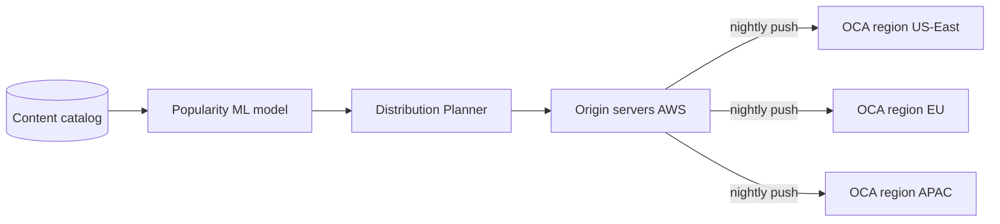
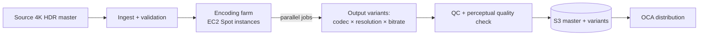
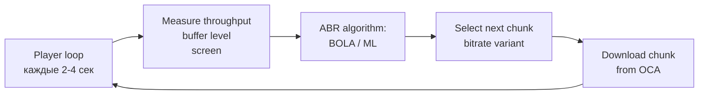
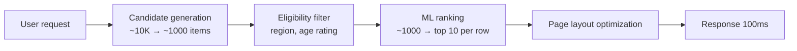
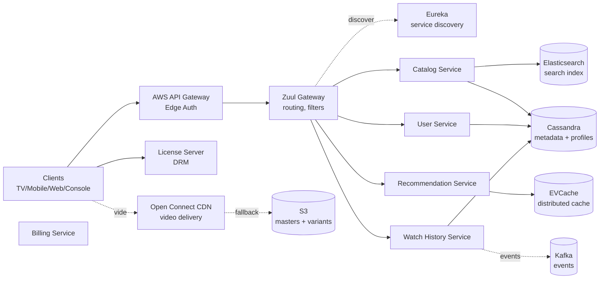

# Вопросы на собеседовании: `Design Netflix`

`Netflix` — крупнейшая платформа video streaming: 270M+ subscribers (2024), 200M+ DAU, на пике 15%+ всего интернет-трафика планеты. На интервью кейс проверяет умение работать одновременно с массивной egress bandwidth (1 Pbps peak), edge CDN (Open Connect appliances у ISP), сложной encoding pipeline, ML recommendation, multi-region резильентностью и chaos engineering. Senior-уровень.

## Полезные ссылки

- [Netflix TechBlog](https://netflixtechblog.com/)
- [Netflix Open Connect Whitepaper](https://openconnect.netflix.com/Open-Connect-Overview.pdf)
- [Per-Title Encode Optimization (Netflix 2015)](https://netflixtechblog.com/per-title-encode-optimization-7e99442b62a2)
- [Dynamic Optimizer per-shot encoding (2018)](https://netflixtechblog.com/optimized-shot-based-encodes-now-streaming-4b9464204830)
- [HLS spec (RFC 8216)](https://datatracker.ietf.org/doc/html/rfc8216)
- [MPEG-DASH spec (ISO/IEC 23009-1)](https://www.iso.org/standard/79329.html)
- [BOLA: ABR algorithm paper](https://arxiv.org/abs/1601.06748)
- [Chaos Monkey by Netflix](https://netflix.github.io/chaosmonkey/)
- [System Design Primer](https://github.com/donnemartin/system-design-primer)

## Содержание

**Requirements и capacity**
- [Q1. (!) Functional и non-functional requirements?](#q1--functional-и-non-functional-requirements)
- [Q2. (!) Capacity estimation (270M subs, 1 Pbps peak)?](#q2--capacity-estimation-270m-subs-1-pbps-peak)
- [Q3. SLA и SLO для streaming pipeline?](#q3-sla-и-slo-для-streaming-pipeline)

**CDN и доставка контента**
- [Q4. (!) Open Connect — Netflix proprietary CDN?](#q4--open-connect--netflix-proprietary-cdn)
- [Q5. (!) Pre-positioning контента overnight (predictive caching)?](#q5--pre-positioning-контента-overnight-predictive-caching)
- [Q6. Storage tier: hot OCA, warm regional, cold Glacier?](#q6-storage-tier-hot-oca-warm-regional-cold-glacier)

**Encoding**
- [Q7. (!) Encoding pipeline (master → variants)?](#q7--encoding-pipeline-master--variants)
- [Q8. (!) Per-title vs per-chunk encoding — экономия bitrate?](#q8--per-title-vs-per-chunk-encoding--экономия-bitrate)
- [Q9. Codec ladder (H.264, HEVC, VP9, AV1)?](#q9-codec-ladder-h264-hevc-vp9-av1)
- [Q10. Encoding farm на AWS EC2 (Spot instances)?](#q10-encoding-farm-на-aws-ec2-spot-instances)

**Streaming protocols**
- [Q11. (!) HLS vs DASH vs CMAF — что выбрать?](#q11--hls-vs-dash-vs-cmaf--что-выбрать)
- [Q12. (!) Adaptive Bitrate (ABR) — BOLA и ML-based?](#q12--adaptive-bitrate-abr--bola-и-ml-based)
- [Q13. DRM: Widevine, FairPlay, PlayReady?](#q13-drm-widevine-fairplay-playready)

**Recommendation**
- [Q14. (!) Recommendation system — CF + content + deep learning?](#q14--recommendation-system--cf--content--deep-learning)
- [Q15. Candidate generation + online ranking?](#q15-candidate-generation--online-ranking)
- [Q16. (!) Personalized homepage + artwork personalization?](#q16--personalized-homepage--artwork-personalization)
- [Q17. Contextual bandits для explore vs exploit?](#q17-contextual-bandits-для-explore-vs-exploit)

**Архитектура и сервисы**
- [Q18. (!) High-level architecture?](#q18--high-level-architecture)
- [Q19. Microservices stack (Eureka, Ribbon, Hystrix, Zuul, Atlas)?](#q19-microservices-stack-eureka-ribbon-hystrix-zuul-atlas)
- [Q20. (!) Resilience patterns (bulkheads, circuit breaker, fallback)?](#q20--resilience-patterns-bulkheads-circuit-breaker-fallback)
- [Q21. Catalog service (Elasticsearch, GraphQL Gateway)?](#q21-catalog-service-elasticsearch-graphql-gateway)
- [Q22. Continue watching через Cassandra + Kafka sync?](#q22-continue-watching-через-cassandra--kafka-sync)

**Production**
- [Q23. (!) Chaos Engineering (Chaos Monkey, Kong, Latency)?](#q23--chaos-engineering-chaos-monkey-kong-latency)
- [Q24. (!) Multi-region active-active (US-East + EU + APAC)?](#q24--multi-region-active-active-us-east--eu--apac)
- [Q25. A/B testing platform (1-5% traffic, auto-rollout)?](#q25-ab-testing-platform-1-5-traffic-auto-rollout)
- [Q26. Data platform (Kafka, Iceberg, Spark, Flink)?](#q26-data-platform-kafka-iceberg-spark-flink)
- [Q27. Downloads для offline viewing?](#q27-downloads-для-offline-viewing)
- [Q28. (!) Cost optimization (Reserved + Spot + Open Connect)?](#q28--cost-optimization-reserved--spot--open-connect)
- [Q29. Anti-fraud: account/password sharing detection?](#q29-anti-fraud-accountpassword-sharing-detection)
- [Q30. (!) Антипаттерны и подводные камни?](#q30--антипаттерны-и-подводные-камни)

## Q1. (!) Functional и non-functional requirements?

**Функциональные (ядро):**
- Стриминг видео по запросу на TV/Mobile/Web/Console.
- Просмотр каталога (ряды тайтлов).
- Поиск (устойчивый к опечаткам, многоязычный).
- Рекомендации (персонализированная домашняя страница).
- Продолжение просмотра + синхронизация между устройствами.
- Загрузки для офлайна (защищённые DRM).
- Профили (до 5 на аккаунт).
- Оценки, отзывы (thumbs up/down/love).
- Синхронизация между устройствами (просмотр на телефоне → продолжение на TV).

**Нефункциональные:**
- **Подписчики:** 270M+ (2024), 200M+ DAU.
- **Пиковый трафик:** 15%+ всего глобального internet egress.
- **Задержка:** p99 старта воспроизведения < 2 сек.
- **Доступность:** 99.99% (≈ 52 минуты простоя в год).
- **Качество:** доля rebuffering < 1%.
- **Multi-region:** US-East, EU, APAC в режиме active-active.
- **Соответствие требованиям:** DMCA, GDPR, региональное лицензирование контента.

**За рамками задачи:**
- Live-стриминг (отдельный продукт; Netflix начал недавно — бокс, NFL).
- Чат в реальном времени / социальные функции.
- Пользовательский контент (UGC).

Совет: senior-кандидат сразу проговаривает, что Netflix `read-heavy on metadata + bandwidth-heavy on video` — это диктует архитектурное разделение (microservices в AWS для метаданных + Open Connect для видео).

## Q2. (!) Capacity estimation (270M subs, 1 Pbps peak)?

**Исходные допущения:**

| Параметр | Значение |
|---|---|
| Подписчики | 270M |
| DAU | 200M |
| Пиковая конкуренция | 100M+ зрителей одновременно |
| Средний bitrate | 5 Mbps (микс HD/4K) |
| Пиковый egress | 1 Pbps (~125 TB/сек) |

**Хранение видео:**
- Каталог ~10 PB уникального контента.
- На один тайтл: ~6 encoding-вариантов (codec × разрешение × bitrate ladder) ≈ 10-кратное раздувание.
- + многоязычные аудиодорожки, субтитры.
- Итого: **~100 PB** мастера + вариантов.
- × ~3 региона с репликацией популярного контента → **~300 PB**.

**Egress-bandwidth:**
- 100M одновременно × 5 Mbps = 500 Tbps в среднем.
- Пик (вечернее наложение US + EU) = 1 Pbps.

**Метаданные (Cassandra):**
- 270M пользователей × 100 KB профиль + история просмотров = **27 TB**.
- 10K тайтлов × 1 MB rich-метаданных = **10 GB** (немного, но горячие).

**Расчёт стоимости bandwidth:**
- 1 Pbps × $0.02/GB (commercial CDN) = $250M/месяц на CDN.
- Open Connect снижает это примерно в 10× → **$25M/месяц** на инфраструктуру ($300M/год против $3B/год).

**Encoding-ферма:**
- 5 000 часов нового контента/год × ~100 EC2-часов на час кодирования = **500K EC2-часов/год**.
- Spot-инстансы $0.05/час → $25K/год на кодирование (пренебрежимо мало).

## Q3. SLA и SLO для streaming pipeline?

| Метрика | Цель | Alert |
|---|---|---|
| `start_playback_latency_p99` | < 2 сек | > 4 сек в течение 5 минут |
| `rebuffering_ratio` | < 1% | > 3% в течение 1 часа |
| `play_failure_rate` | < 0.5% | > 2% в течение 5 минут |
| `recommendation_latency_p99` | < 300 ms | > 500 ms |
| `homepage_load_p99` | < 1 сек | > 2 сек |
| `availability` | 99.99% | < 99.9% (за месяц) |
| `quality_of_experience (QoE)` | составной скор | -5% неделя к неделе |

**Составной QoE:**
- Сочетание: start latency + rebuffering + удерживаемый bitrate + достигнутое разрешение.
- Главная business-метрика — коррелирует с retention.

**Сценарии отказов:**
- CDN miss → fallback на commercial CDN (CloudFront / Akamai).
- License-сервер недоступен → закэшированная лицензия валидна до 24 ч.
- Рекомендации недоступны → fallback на homepage с глобальной популярностью.

## Q4. (!) Open Connect — Netflix proprietary CDN?

**Что это:** Netflix построил собственный CDN — **Open Connect Appliances (OCA)** — серверы, которые физически размещаются у ISP-партнёров (Comcast, Verizon, Deutsche Telekom, МТС и т.д.) или в IXP (Internet Exchange Points).

**Почему собственный CDN:**
- Commercial CDN (Akamai, Cloudflare, CloudFront) на трафике 1 Pbps стоил бы $1-3B/год.
- Open Connect снижает стоимость в 10× за счёт peering с ISP.
- ISP получают: меньше transit-costs (трафик не идёт через upstream), лучший опыт для клиентов.
- Netflix получает: контроль, меньшую стоимость, предсказуемую производительность.

**Архитектура OCA:**
- 2U-сервер, 200-400 TB SSD, 100-200 Gbps NIC.
- Локально кэшируется популярный контент для региона ISP.
- На пике ~95% трафика Netflix идёт через OCA (5% — fallback на AWS).

**Размещение:**
- Tier-1 ISP: десятки OCA в крупных POP.
- Региональные ISP: 1-3 OCA в дата-центре.
- IXP (Internet Exchange): OCA с peering без участия ISP.

**Сетевые требования (для ISP-партнёра):**
- 10+ Gbps свободного bandwidth на uplink.
- BGP peering-сессия.
- Минимум 6 месяцев обязательств (commitment).

**Сравнение:**

| Подход | Стоимость (1 Pbps) | Latency | Контроль |
|---|---|---|---|
| Commercial CDN (Cloudflare) | $1-3B/год | Хорошо (50-100 POP) | Средний |
| Multi-CDN | $0.7-2B/год | Лучше всего (комбинация провайдеров) | Выше |
| Open Connect (собственный) | $200-500M/год | Лучше всего (внутри ISP) | Полный |

**На практике:** YouTube тоже имеет собственный CDN (Google Global Cache). Cloudflare/Fastly работают только в роли чистого CDN.

## Q5. (!) Pre-positioning контента overnight (predictive caching)?

**Идея:** не ждать, пока пользователь запросит видео — заранее (ночью) предсказать, что будет популярно завтра, и запушить контент на OCA.

**Поток работы:**



**Сигналы для предсказания популярности:**
- Исторические паттерны просмотров по регионам (Squid Game в часы пик в Корее).
- Паттерны по времени суток (детский контент утром, драмы вечером).
- День недели (запойный просмотр по выходным).
- Тренды в соцсетях (Twitter, Reddit).
- Маркетинговые кампании (новый релиз).
- Демография подписчиков по ISP.

**Размещение:**
- Высокий приоритет: топ-1 000 тайтлов по региону → все OCA.
- Длинный хвост: редкий контент → меньше OCA, fallback при промахе.
- По времени: новый релиз → экстренный push в ночь премьеры.

**Cache hit ratio:**
- Цель: 95%+ запросов обслуживаются из OCA.
- Cache miss → fallback к AWS-origin (через commercial CDN или напрямую).
- Холодный кэш всего контента невозможен — длинный хвост слишком велик.

**Окно обновления:**
- 04:00 - 06:00 по местному времени (минимальный трафик).
- Репликация между OCA через peer-to-peer (внутренне похоже на BitTorrent).

**Граничные случаи:**
- Всплеск трафика на live-событии → экстренный ручной push.
- Региональное лицензирование контента → не пушить в страны без прав.

## Q6. Storage tier: hot OCA, warm regional, cold Glacier?

**Hot tier — OCA (edge):**
- SSD на OCA, 200-400 TB.
- Только самый популярный контент (топ-5% тайтлов даёт 80% часов просмотра).
- Latency < 50 ms (внутри ISP).

**Warm tier — региональный S3:**
- AWS S3 в US-East, EU-West, APAC-Tokyo.
- Весь активный контент (топ-50%).
- Fallback при cache miss на OCA.
- Latency 100-300 ms (между регионами).

**Cold tier — S3 Glacier:**
- Архив, длинный хвост каталога, старые удалённые тайтлы.
- Сохранение лицензий (даже после удаления из каталога нужно хранить N лет).
- Извлечение: минуты-часы.

**Мастер-файлы:**
- Оригинал 4K HDR в S3 — никогда не удаляется.
- Источник истины для повторного кодирования (новый codec, новая bitrate ladder).

**Репликация:**
- Активный контент: реплицируется 3× по AWS-регионам.
- Длинный хвост: один регион (экономия).
- Мастер: 3× + бэкап в Glacier.

**Модель стоимости:**
- S3 Standard: $0.023/GB/месяц → 100 PB = $2.3M/месяц.
- S3 Glacier: $0.004/GB/месяц → 100 PB холодного = $400K/месяц.
- Железо OCA: амортизированно $10/TB/месяц → 200 PB = $2M/месяц.

## Q7. (!) Encoding pipeline (master → variants)?



**Стадии:**

1. **Ingest:** студия загружает мастер 4K HDR (обычно Apple ProRes, 1-2 TB на фильм). Валидация: checksum, длительность, синхронизация аудио, тайминг субтитров.

2. **Предобработка:**
   - Конвертация цветового пространства (Rec.2020 → Rec.709 для SDR).
   - Нормализация аудио (стандарт LUFS).
   - Извлечение субтитров.

3. **Encoding-ферма (параллельно):**
   - AWS EC2 Spot-инстансы (10K+ машин параллельно).
   - Параллелизм per-shot или per-chunk (Q8).
   - Выходные кодеки: H.264 (базовая совместимость), HEVC (mobile, smart TV), VP9 (Android, Chrome), AV1 (новейший, снижение bitrate на 30%).

4. **Bitrate ladder:**
   - 5-10 вариантов на codec, например:
     - 240p @ 235 kbps
     - 360p @ 375 kbps
     - 480p @ 750 kbps
     - 720p @ 1750 kbps
     - 1080p @ 3000 kbps
     - 2160p (4K) @ 16 Mbps
   - Итого: ~30-50 выходных файлов на тайтл.

5. **QC (контроль качества):**
   - VMAF (Video Multi-method Assessment Fusion) — метрика воспринимаемого качества, разработанная Netflix.
   - Перекодировать заново, если VMAF < порога для данного разрешения.

6. **Упаковка (packaging):**
   - HLS-сегменты (TS-чанки).
   - DASH-сегменты (fMP4-чанки).
   - CMAF (единый формат, с 2017).

7. **Дистрибуция:**
   - S3-мастер + варианты.
   - Pre-positioning на OCA (Q5).

**Пропускная способность:** 5 000 часов/год нового контента; ~100 EC2-часов на час контента → 500K EC2-часов/год (~$25K на Spot).

## Q8. (!) Per-title vs per-chunk encoding — экономия bitrate?

**Старый подход (до 2015):** фиксированный bitrate ladder для всех тайтлов.
- Простой мультфильм @ 1080p — те же 3 Mbps, что и боевик.
- Мультфильм перекодировался сильнее, чем нужно (over-compressed).
- Боевик получал тот же bitrate, но визуально хуже (under-compressed на сложных сценах).

**Per-title encoding (Netflix 2015):**
- Анализируем содержание тайтла.
- Мультфильм (низкая сложность) — 1080p достижим на 2 Mbps.
- Боевик (высокая динамика) — 1080p требует 4 Mbps.
- Кастомный ladder под каждый тайтл.

**Экономия:**
- В среднем 20% снижение bitrate по каталогу.
- На 1 Pbps это $50-100M/год экономии на bandwidth.

**Per-chunk encoding (Netflix 2018 — Dynamic Optimizer):**
- Анализируем bitrate **посценно (per shot)** внутри одного тайтла.
- Диалоговая сцена → низкий bitrate (говорящие головы).
- Экшн-сцена → высокий bitrate (динамика).
- Закодированные посценные чанки сшиваются в один поток.

**Экономия:**
- Дополнительные 15-30% снижения bitrate.
- Сложнее QC (VMAF на каждый чанк).
- Время кодирования дольше (анализ перед кодированием).

**Алгоритм:**
1. Разбить контент на сцены (scene detection).
2. Анализ сложности каждой сцены (векторы движения, частотная область).
3. Распределить бюджет bitrate по сценам.
4. Закодировать сцены с индивидуальными целями по качеству.
5. Склеить в финальный поток.

**VMAF — метрика воспринимаемого качества от Netflix:**
- ML-модель (SVM), обученная на массовых краудсорсинговых субъективных оценках.
- Выход: скор 0-100 (воспринимаемое качество).
- Открыта в open source (теперь отраслевой стандарт).

## Q9. Codec ladder (H.264, HEVC, VP9, AV1)?

| Codec | Год | Экономия bandwidth vs H.264 | Распространённость | Лицензия |
|---|---|---|---|---|
| H.264/AVC | 2003 | базовый | Универсальный (95%+ устройств) | Роялти MPEG LA |
| HEVC/H.265 | 2013 | 30-40% | Mobile, smart TV (60%) | Patent pool $$$ |
| VP9 | 2013 | 30-40% | Android, Chrome | Royalty-free (Google) |
| AV1 | 2018 | 50% vs H.264 | Новые устройства, растёт | Royalty-free (AOMedia) |

**Стратегия Netflix:**
- **H.264** — fallback для legacy-устройств, кодируется всегда.
- **HEVC** — основной путь для mobile + smart TV; платят роялти.
- **VP9** — браузеры Android + Chrome (партнёрство с Google).
- **AV1** — постепенный rollout, начали с mobile (бережёт батарею при наличии аппаратного декодера).

**Выбор под устройство:**
- Клиент сообщает поддерживаемые кодеки.
- Сервер выбирает лучший из поддерживаемых (максимальное сжатие + аппаратное декодирование).
- Цепочка fallback: AV1 → HEVC → VP9 → H.264.

**Значимость AV1:**
- 50% экономии bandwidth vs H.264.
- При 1 Pbps это $100-200M/год экономии.
- Стоимость кодирования выше (в 5-10× больше CPU, чем HEVC).
- Аппаратное декодирование в новых чипах (iPhone 15+, Pixel 9+).

**HDR-варианты:**
- HDR10 (открытый стандарт).
- Dolby Vision (премиум, требует лицензии).
- Кодируются отдельно — другое отображение динамического диапазона.

## Q10. Encoding farm на AWS EC2 (Spot instances)?

**Характер нагрузки:**
- Тривиально параллелизуемая (каждый чанк независим).
- Отказоустойчивая (чанк упал → перекодировать).
- Не-realtime (кодирование может занять часы).
- Высокое потребление CPU, умеренный disk I/O.

**EC2 Spot:**
- Spot-цена на 70-90% ниже, чем On-Demand.
- Компромисс: инстанс может быть terminated с предупреждением за 2 минуты.
- Идеально для кодирования: чанк на завершённом инстансе просто перепланируется.

**Архитектура:**
```
Encoding job queue (SQS) → Spot fleet (10K instances) → S3 output
```

**Авто-масштабирование:**
- Spot fleet с несколькими типами инстансов (c5, c5n, m5) для диверсификации.
- Диверсификация снижает риск одновременного завершения всех.
- Корректировка capacity в реальном времени.

**Обработка отказов:**
- Spot interruption → job снова ставится в очередь SQS.
- Идемпотентное кодирование (один вход → один выход).
- Распределённые файловые блокировки через S3 ETag.

**Стоимость:**
- 500K EC2-часов/год × $0.05/час Spot = **$25K/год**.
- Против On-Demand $0.50/час = $250K → экономия в 10×.

**Альтернатива: pre-emptible на GCP / low-priority на Azure** — те же паттерны.

**Инструменты:**
- Собственный оркестратор кодирования Netflix (Spinnaker для деплоя).
- FFmpeg + кастомные оптимизации.
- VMAF для QC.

## Q11. (!) HLS vs DASH vs CMAF — что выбрать?

| Протокол | Apple | Cross-platform | Контейнер | Latency |
|---|---|---|---|---|
| HLS (HTTP Live Streaming) | Нативно | Да | TS, fMP4 | 6-30 сек (по умолчанию) |
| DASH (MPEG-DASH) | Через polyfill | Да (Chrome, Firefox, Smart TV) | fMP4 | 6-30 сек |
| CMAF (Common Media Application Format) | Да | Да | fMP4 (единый) | 1-3 сек (LL-CMAF) |

**HLS:**
- Спецификация Apple, RFC 8216.
- Манифест `.m3u8` + сегменты `.ts` (или fMP4 начиная с HLS v6).
- Нативно в Safari / iOS.
- LL-HLS (Low Latency) — менее 3 секунд.

**DASH:**
- Спецификация ISO/IEC 23009-1.
- Манифест `.mpd` + fMP4-чанки.
- Нативно в Chrome, Firefox, Android, Smart TV.
- Не работает нативно на Safari/iOS — нужен polyfill Shaka Player.

**CMAF (Common Media Application Format):**
- Спецификация 2017 года, объединяющая HLS + DASH.
- Один и тот же fMP4-чанк используется обоими.
- Одно кодирование → два файла манифеста (m3u8 + mpd).
- Экономит хранилище в 2× (нет отдельных TS + fMP4).

**Выбор Netflix:**
- Миграция на CMAF — одно кодирование, двойной манифест.
- Низкие latency через LL-HLS / LL-DASH (для live, спорта).
- Для VOD допустима бо́льшая latency (приемлем старт за 15-30 сек).

**Шаблон манифеста:**
```xml
<MPD xmlns="urn:mpeg:dash:schema:mpd:2011">
  <Period>
    <AdaptationSet contentType="video">
      <Representation bandwidth="3000000" width="1920" height="1080" />
      <Representation bandwidth="1750000" width="1280" height="720" />
      <Representation bandwidth="750000" width="854" height="480" />
    </AdaptationSet>
  </Period>
</MPD>
```

## Q12. (!) Adaptive Bitrate (ABR) — BOLA и ML-based?

**Цель:** клиент динамически выбирает bitrate-вариант исходя из:
- Текущий throughput (пропускная способность сети).
- Уровень буфера (сколько секунд видео уже забуферизировано).
- Разрешение экрана (нет смысла в 4K на телефоне).
- Состояние батареи (экономичный режим на mobile).

**Классические алгоритмы:**

**На основе скорости (rate-based):**
- Переключение на bitrate ≈ измеренный throughput.
- Просто, но слепо к буферу (может быстро его опустошить).

**На основе буфера (BOLA):**
- BOLA = Buffer Occupancy based Lyapunov Algorithm (Bo Wei, 2016).
- Максимизирует полезность = log(quality) - штраф(риск rebuffering).
- Переключение на более высокий bitrate, когда буфер высокий.
- Переключение на более низкий bitrate, когда буфер низкий.
- Доказуемо близок к оптимальному.

**Гибридный (ABR-PB, Netflix):**
- Комбинирует сигналы throughput + буфера.
- Более плавное переключение (избегает частых просадок качества).

**На основе ML:**
- Netflix движется к ML-подходу.
- Признаки: история throughput, буфер, устройство, экран, время суток, тип контента.
- Модель предсказывает оптимальный bitrate на каждый чанк.
- Обучена на миллионах реальных сессий с метками QoE.



**Реализация ABR:**
- Клиент скачивает манифест (список вариантов с разными bitrate).
- Для каждого чанка (~2-10 сек) выбирает bitrate.
- Префетчит следующий чанк, пока играет текущий.

**Граничные случаи:**
- Медленный старт: первый чанк на низком bitrate (быстро начать воспроизведение) → постепенный разгон.
- Просадка сети: переключение на минимальный bitrate, чтобы избежать rebuffer.
- Ограничение разрешения: на телефоне не качаем 4K (трата bandwidth + батареи).

## Q13. DRM: Widevine, FairPlay, PlayReady?

**Зачем DRM:** студии требуют защиту контента на аппаратном уровне. Без DRM Netflix не может лицензировать голливудский контент.

**Три DRM под конкретные экосистемы:**

| DRM | Платформа | Система ключей |
|---|---|---|
| Widevine | Android, Chrome, Smart TV (Tizen, webOS) | Уровни Google L1/L2/L3 |
| FairPlay | iOS, Safari, Apple TV | Только Apple |
| PlayReady | Windows, Xbox, Edge | Microsoft |

**Уровни защиты (Widevine):**
- **L1** — ключи в TEE (Trusted Execution Environment, ARM TrustZone) → 4K HDR разрешён.
- **L2** — ключи защищены программно → максимум 1080p.
- **L3** — чисто программно → максимум 480p (защита от риппера).

**Поток лицензирования:**
```
Client → Auth server (subscriber check)
Auth server → DRM license server (Widevine)
License server → Client (encrypted decryption key)
Client → Decrypt + decode in TEE → Display
```

**Ключевые компоненты:**
- **Шифрование контента:** AES-128 CBC или CTR, common encryption (CENC).
- **Лицензия:** зашифрованный блоб с ключом, привязанный к сертификату устройства.
- **Persistent-лицензии:** для офлайн-загрузок (Q27).

**Антипиратство:**
- Forensic watermarking (невидимый водяной знак на каждого пользователя в видео).
- Позволяет отследить утёкший контент до конкретного аккаунта.

**Реализация:**
- Netflix держит собственный license-сервер (обрабатывает все три типа DRM).
- Кэширование лицензий на клиенте (валидность 24 ч).
- Revocation-list для скомпрометированных устройств.

## Q14. (!) Recommendation system — CF + content + deep learning?

**Цель:** показать каждому пользователю максимально релевантный контент в рядах домашней страницы.

**Подходы (объединяются ансамблем):**

**1. Collaborative Filtering (CF):**
- Матричная факторизация (SVD): матрица оценок user × item.
- Похожие пользователи (по прошлому поведению) → рекомендуем их выбор.
- Проблема cold start для новых пользователей / новых тайтлов.

**2. Content-based filtering:**
- Признаки из метаданных (жанр, режиссёр, актёры, год, страна).
- Прошлые жанровые предпочтения пользователя → рекомендуем похожее.
- Помогает с item cold start.

**3. Deep learning:**
- **DNN ranking** — вход (user embed, item embed, контекст) → скор.
- Архитектура **two-tower** (Netflix, YouTube, LinkedIn).
- **Transformer** для моделирования последовательностей (BERT4Rec).
- **Sequence-aware** — учитывает последние просмотры (паттерн запойного просмотра).

**4. Contextual bandits (Q17):**
- Online-обучение: исследуем новые items + эксплуатируем известные.
- Multi-armed bandit с контекстом пользователя.

**5. Оптимизация на уровне страницы:**
- Не просто top-K items.
- Оптимизируем порядок рядов + items внутри рядов под общую вовлечённость.
- Обеспечиваем разнообразие (не 10 боевиков подряд).

**Пайплайн обучения:**
- Watch-события → Kafka → Spark feature store.
- Ежедневное переобучение модели (offline batch).
- Уровень online-ранжирования `bonusscored по recent activity`.

## Q15. Candidate generation + online ranking?

**Двухстадийный retrieval — стандарт Netflix:**



**Stage 1 — Генерация кандидатов (широкий recall):**
- Несколько источников:
  - Недавно популярное в регионе пользователя.
  - Жанровые совпадения с историей пользователя.
  - Похожее на понравившиеся тайтлы (item-item CF).
  - Сейчас в трендах.
  - Связанные items «Because you watched X».
- Цель: 1 000 кандидатов с хорошим recall.
- Latency: < 50 ms (параллельные запросы).

**Stage 2 — Online-ранжирование (precision):**
- ML-модель скорит каждого кандидата.
- Признаки: (user_embed, item_embed, контекст, время, устройство).
- Отбираются топ-10-20 на ряд.
- Latency: < 200 ms (GPU-инференс батчем).

**Stage 3 — Раскладка страницы:**
- Определяем порядок рядов (сначала Top Picks, затем My List, затем Trending).
- Items внутри ряда упорядочены по скору.
- Ограничение разнообразия: нет двух подряд рядов одного жанра.

**Фильтры допуска (eligibility):**
- Регион лицензирования контента.
- Предпочтение пользователя по возрастному рейтингу.
- Уже просмотренное (не рекомендовать повторно).
- Не рекомендовать через границы профилей.

## Q16. (!) Personalized homepage + artwork personalization?

**Персонализированная домашняя страница:**
- 270M пользователей — 270M уникальных домашних страниц.
- Каждый ряд (Trending, Top Picks, Because You Watched) персонализирован.
- Порядок рядов различается у каждого пользователя.
- Items внутри рядов ранжируются индивидуально.

**Персонализация обложек (патент Netflix):**
- На каждый тайтл есть 5-10 вариантов обложки.
- ML выбирает лучшее изображение под пользователя исходя из прошлых кликов.
- Любитель мелодрам → вариант «пара на постере»; любитель боевиков → вариант со взрывом.
- Прирост вовлечённости: +20-30% click-through по постерам.

**Реализация:**
- Варианты изображений хранятся в S3 + CDN.
- ML-модель выбирает на пользователя × на ряд.
- Хранимое отображение `user_id → (title_id → image_id)` в EVCache.

**A/B-тестирование:**
- Новые варианты обложек тестируются на 1% трафика.
- Метрика: CTR + последующая досматриваемость.
- Победители автоматически выкатываются.

## Q17. Contextual bandits для explore vs exploit?

**Проблема:**
- Чистый exploit (всегда top-ranked items) → пользователь видит одно и то же → вовлечённость падает.
- Чистый explore (случайные items) → фрустрация.
- Компромисс: баланс между открытием нового и релевантностью.

**Contextual bandits:**
- Каждая «рука» (arm) = item для рекомендации.
- Награда = вовлечённость пользователя (просмотрел > 5 мин).
- Контекст = состояние пользователя, время, устройство.
- Алгоритм балансирует explore-exploit под каждый контекст.

**Алгоритмы:**

**LinUCB (Linear Upper Confidence Bound):**
- Оцениваем награду + неопределённость по каждому item.
- Выбираем item с наибольшим `reward + λ × uncertainty`.
- Исследуем items с высокой неопределённостью.

**Thompson Sampling:**
- Сэмплируем из апостериорного распределения по каждому item.
- Естественно балансирует explore-exploit.
- Используется в рекомендациях Netflix.

**Сценарии применения:**
- Запуск нового тайтла (нет данных о вовлечённости).
- Пользователи на cold-start.
- Открытие items из длинного хвоста.

**Компромиссы:**
- Статистическая эффективность (быстрее обучение).
- Сложность реализации (в сравнении с чистым ранжированием).

## Q18. (!) High-level architecture?



**Две плоскости:**

**Control plane (AWS, микросервисы):**
- Метаданные, рекомендации, поиск, аккаунт пользователя, биллинг, license-сервер.
- Сотни микросервисов.
- Stateful-хранилища: Cassandra (профиль/история просмотров), MySQL (биллинг), Elasticsearch (поиск).

**Data plane (Open Connect):**
- Поток байтов видео.
- OCA приближают байты к пользователю.
- 95% запросов обслуживаются из OCA, 5% — из AWS.

**Межсервисное взаимодействие:**
- gRPC внутри кластера.
- HTTP/2 для cross-region.
- Kafka для асинхронных событий.

**Паттерн: фронтовый слой (Zuul):**
- Все запросы от клиентов идут через Zuul gateway.
- Auth, rate limit, маршрутизация.
- Edge-фильтры: переписывание запросов, разбиение на корзины A/B-теста.

## Q19. Microservices stack (Eureka, Ribbon, Hystrix, Zuul, Atlas)?

Netflix OSS — открытая часть внутреннего стека, многое стало отраслевым стандартом.

| Инструмент | Роль | Примечания |
|---|---|---|
| Eureka | Service discovery | Регистрация инстансов + health-чеки |
| Ribbon | Клиентский балансировщик нагрузки | Round-robin / weighted; deprecated в пользу Spring Cloud LoadBalancer |
| Hystrix | Circuit breaker | Deprecated в 2018; теперь Resilience4j |
| Zuul | API Gateway | Edge-gateway, динамическая маршрутизация, фильтры |
| Atlas | Time-series метрики | Многомерные, в духе Prometheus |
| Spinnaker | Деплой | CD-пайплайн, multi-cloud |
| Chaos Monkey | Chaos engineering | Случайное завершение инстансов |
| Mantis | Stream processing | Обнаружение аномалий в реальном времени |

**Архитектурный паттерн:**

```
Client → Zuul (routing) → Service A (uses Ribbon → Eureka → Service B)
                                        ↓ (если fail)
                                  Hystrix fallback → cached response
```

**Современная замена (2020+):**
- Eureka → Consul / service discovery в Kubernetes.
- Ribbon → Spring Cloud LoadBalancer.
- Hystrix → Resilience4j.
- Zuul → Envoy + Spring Cloud Gateway.
- Atlas → Prometheus + Grafana.

Netflix постепенно мигрирует на открытые стандарты (gRPC + Envoy + K8s).

## Q20. (!) Resilience patterns (bulkheads, circuit breaker, fallback)?

**Сценарии отказов** в масштабе Netflix:
- Аппаратные сбои (дата-центр, сеть, сервер).
- Программные баги (новый релиз с регрессией).
- Каскадные отказы (медленный downstream-сервис → исчерпание очередей выше по цепочке).

**Паттерны устойчивости:**

**Bulkhead (изоляция):**
- Отдельные пулы потоков на каждую зависимость.
- Медленный Recommendation Service не исчерпывает потоки, нужные Catalog.
- Аналогия: водонепроницаемые отсеки корабля.

**Circuit breaker:**
- Resilience4j (наследник Hystrix).
- 3 состояния: Closed (норма) → Open (fail-fast) → Half-Open (проверка восстановления).
- При достижении порога отказов → размыкаем цепь → сразу возвращаем fallback.

**Fallback:**
- У каждого удалённого вызова есть fallback.
- Сбой рекомендаций → закэшированная homepage часовой давности.
- Сбой поиска → статичные популярные тайтлы.
- Сбой лицензий → закэшированная лицензия валидна 24 ч.

**Timeout:**
- Агрессивные таймауты на каждый сервис (50-200 ms).
- Ниже, чем таймаут выше по цепочке — предотвращает каскад.

**Retry:**
- Экспоненциальный backoff + jitter.
- Требуется идемпотентность.
- Ограниченное число повторов (максимум 3).

**Rate limiting:**
- Квота на каждый сервис.
- Защита от вышедшего из-под контроля клиента.

**Паттерн в коде (Resilience4j):**
```java
@CircuitBreaker(name = "recommendation", fallbackMethod = "getCachedRecommendation")
@Bulkhead(name = "recommendation", type = THREADPOOL)
@TimeLimiter(name = "recommendation")
public CompletableFuture<List<Title>> getRecommendation(String userId) {
    return recommendationClient.fetch(userId);
}

public CompletableFuture<List<Title>> getCachedRecommendation(String userId, Throwable t) {
    return CompletableFuture.completedFuture(evCache.get("popular_titles"));
}
```

## Q21. Catalog service (Elasticsearch, GraphQL Gateway)?

**Метаданные каталога:**
- Информация о тайтле (название, год, жанр, актёры, режиссёр, описание).
- Метаданные эпизодов (для сериалов).
- Многоязычная локализация (переводы, субтитры).
- Флаги лицензирования по регионам.
- Богатые дескрипторы (настроение, тема, эпоха).

**Хранение:**
- Мастер-данные в Cassandra (по title_id).
- Поисковый индекс в Elasticsearch (full-text + фильтры).
- Горячий кэш в EVCache (наиболее запрашиваемые тайтлы).

**Индекс Elasticsearch:**
- Анализатор под каждый язык (русский, английский, японский).
- Fuzzy-matching для опечаток.
- Фасетные фильтры (жанр, год, язык, рейтинг).
- Гео-ограничения (фильтр по стране пользователя).

**GraphQL Gateway:**
- Federated GraphQL — каждый сервис экспонирует фрагмент схемы.
- Клиент запрашивает `{ title { name, recommendations { ... } } }` — gateway оркестрирует.
- Заменяет REST для клиентов (mobile + Web).
- Встроенный batching снижает число round-trip.

**Инструменты:**
- Apollo Federation.
- Внутренний Netflix Studio Edge.

**Кэширование:**
- Кэш на каждый запрос в EVCache.
- TTL 5 минут для данных каталога (редко меняются).
- Инвалидация через pub/sub при обновлении метаданных тайтла.

## Q22. Continue watching через Cassandra + Kafka sync?

**Сценарий:** пользователь смотрит S1E5 на телефоне до 23:45 → закрывает → открывает TV → должно продолжиться с 23:45.

**Хранение (Cassandra):**
```cql
CREATE TABLE watch_progress (
  user_id   uuid,
  title_id  uuid,
  position_ms bigint,
  updated_at  timestamp,
  device_id   text,
  PRIMARY KEY (user_id, title_id)
);
```
- Партиционирование по `user_id` (весь прогресс одного пользователя — на одной ноде).
- Кластеризация по `title_id`.
- Eventual consistency (LOCAL_QUORUM приемлем).

**Поток обновления:**
1. Клиент сообщает позицию каждые 30 сек (или на pause/seek).
2. Watch Service: запись в Cassandra + эмит Kafka-события.
3. Kafka-событие потребляется:
   - Аналитическим пайплайном.
   - Feature store рекомендаций.
   - Сервисом синхронизации между устройствами.

**Синхронизация между устройствами:**
- Телефон опрашивает Watch Service каждые 30 с. Телефон закрывается.
- TV открывает приложение → Watch Service запрашивает Cassandra → возобновляет с сохранённой позиции.
- Latency: 5-10 сек на межрегиональную репликацию (eventual).

**Граничные случаи:**
- Два устройства одновременно — last-write-wins (последняя позиция).
- Офлайн-прогресс (Q27) — буферизуется локально, синхронизируется при переподключении.

**Объём:**
- 200M DAU × 4 часа/день × 1 апдейт/30 с = ~96M апдейтов/час, 27K/сек в устоявшемся режиме.
- Кластер Cassandra сайзится соответственно.

## Q23. (!) Chaos Engineering (Chaos Monkey, Kong, Latency)?

**Подход, который запустил Netflix:** доказывать устойчивость, намеренно инжектируя отказы в production.

**Набор (Simian Army):**

| Инструмент | Что делает | Периодичность |
|---|---|---|
| Chaos Monkey | Случайное завершение инстансов | Постоянно, в рабочие часы |
| Chaos Gorilla | Убивает целую availability zone | Еженедельно |
| Chaos Kong | Убивает целый AWS-регион | Ежемесячно |
| Latency Monkey | Инжектирует задержку 1-10 сек | Ежечасно |
| Conformity Monkey | Находит неправильно сконфигурированные инстансы | Ежедневно |
| Security Monkey | Находит нарушения безопасности | Постоянно |
| Janitor Monkey | Чистит осиротевшие ресурсы | Ежедневно |

**Философия:**
- «Если что-то нельзя починить — автоматизируй поломку этого каждый день, чтобы починка стала обязательной».
- В production бывают реальные отказы — лучше симулировать их до того, как они случатся.

**Реализация:**
- Chaos Monkey случайно выбирает инстанс из auto-scaling group.
- Завершает с предупреждением.
- Мониторинг измеряет влияние.
- Если влияние > порога → алерт.

**Валидация восстановления:**
- Реплики сервиса автоматически поднимаются (ASG).
- Балансировщик перенаправляет трафик.
- Цель — полное восстановление < 30 сек.

**Культура:**
- Инженеры ожидают, что их сервис рано или поздно «пострадает» → пишут защитный код.
- Game days — ручные chaos-учения всей командой.

**Open source:** Chaos Monkey выпущен в 2012. Вдохновил AWS Fault Injection Simulator, Gremlin, LitmusChaos.

## Q24. (!) Multi-region active-active (US-East + EU + APAC)?

**Цели:**
- Latency < 100 ms из любой географии.
- Отказ региона → переключение < 5 минут.
- Локальное хранение данных (GDPR в EU).

**Архитектура:**

**Регионы:**
- US-East-1 (N. Virginia) — основной для US.
- EU-West-1 (Ireland) — основной для EU.
- AP-Northeast-1 (Tokyo) — основной для APAC.
- + вторичные регионы по каждой географии для DR.

**Стек на каждый регион:**
- Полная реплика микросервисов.
- Multi-DC репликация Cassandra.
- Локальный реестр Eureka (сервисы сначала ищут друг друга внутри региона).
- Локальный кластер OCA (Open Connect).

**Маршрутизация:**
- AWS Route 53 с маршрутизацией по latency.
- DNS TTL 60 сек → быстрый failover.
- Health-чеки на каждый регион.

**Multi-region Cassandra:**
- Записи `LOCAL_QUORUM` (latency < 10 ms внутри региона).
- Асинхронная репликация в другие регионы (лаг 5-30 сек).
- `EACH_QUORUM` для критичных записей (медленно, избыточно).

**Eventual consistency:**
- Прогресс просмотра в итоге согласован (приемлем лаг 30 сек).
- Изменения профиля пользователя — синхронно (маршрутизация в домашний регион).

**Сценарии failover:**
- Потеря одной AZ: ASG поднимает в другой AZ (автоматически).
- Потеря региона: Route 53 перенаправляет трафик в следующий регион; 1-2 минуты.
- Межрегиональная катастрофа: региональный трафик стекается в выжившие (запланированный двукратный запас по мощности).

**Chaos Kong симулирует** потерю целого региона — Netflix запускает это ежемесячно.

## Q25. A/B testing platform (1-5% traffic, auto-rollout)?

**Масштаб:** Netflix одновременно ведёт 1000+ активных экспериментов.

**Платформа:**
- Собственная инфраструктура экспериментов (открыта в open source, похожа на ABBA).
- Сервис разбиения на корзины (consistent hashing по user_id).
- Config-сервис хранит варианты по каждому эксперименту.
- Пайплайн метрик собирает сигналы вовлечённости.

**Дизайн эксперимента:**
- Контроль + 1-5 treatment-вариантов.
- Начальное распределение: 1% трафика.
- Разгон: 5% → 25% → 50% → 100% при положительных метриках.
- Авто-откат при регрессии > 1%.

**Метрики:**
- **Основные:** retention (возврат пользователей на D7, D30).
- **Вторичные:** часы просмотра, доля досмотров, CTR.
- **Guardrail:** доля ошибок, latency.

**Статистические инструменты:**
- Sequential testing (mSPRT) для раннего останова.
- Байесовский вывод для быстрых решений.
- Holdout-группа всегда 1% (долгосрочные эффекты).

**Подводные камни:**
- Сетевые эффекты: взаимодействия между пользователями ломают per-user A/B.
- Cluster-randomized эксперименты для изменений рекомендаций.
- Multi-arm bandits для исследования без полноценного A/B.

**Примеры экспериментов:**
- Новый вариант обложки тайтла.
- Новая модель ранжирования.
- Другая раскладка домашней страницы.
- Новый bitrate ladder кодирования.

## Q26. Data platform (Kafka, Iceberg, Spark, Flink)?

**Слой стриминга:**
- Apache Kafka — основной хребет событий (триллионы событий/день).
- Топики: watch_events, profile_changes, recommendation_clicks, errors.
- 100+ Kafka-кластеров по регионам.

**Stream processing:**
- Apache Flink — low-latency в реальном времени (рекомендации, фрод).
- Stateful-обработка с exactly-once семантикой.

**Batch processing:**
- Apache Spark на EMR.
- ETL с ежедневными/ежечасными агрегациями.
- Пайплайны обучения ML.

**Data lake:**
- Apache Iceberg на S3.
- Эволюция схемы, запросы с time travel.
- Partition pruning для эффективного доступа.

**Хранилище (warehouse):**
- Snowflake / Druid для BI-аналитики.
- Дашборды Tableau для продуктовых команд.

**Пайплайн:**
```
Kafka events → Flink real-time → online features (EVCache)
              → Iceberg на S3 → Spark batch → ML training → models S3
                              → Snowflake → Tableau dashboards
```

**Feature store:**
- Netflix Metaflow + собственный feature store.
- Согласованность train-serve (одни и те же признаки в обучении и инференсе).

**Объём:**
- 1 триллион событий/день.
- 100 PB+ в Iceberg.
- 10K+ data-пайплайнов.

## Q27. Downloads для offline viewing?

**Сценарий:** пользователь скачивает эпизод на телефон перед полётом, смотрит без интернета.

**Реализация:**
- Загрузка = зашифрованный локальный файл на устройстве.
- DRM-лицензия (Widevine/FairPlay) — привязана к устройству.
- Истечение лицензии: обычно 30 дней после загрузки.

**Выбор кодека:**
- Оптимизированный под mobile: HEVC или AV1 (файлы меньше).
- Bitrate ниже, чем при стриминге (батарея + хранилище).

**Хранение:**
- До 100 эпизодов на устройство.
- Локальная файловая система зашифрована at rest.

**Ограничения:**
- Часть тайтлов нельзя скачивать (лицензионные лимиты).
- Максимум загрузок на аккаунт.
- Авто-удаление после истечения срока или просмотра + 48 ч.

**Синхронизация с online:**
- Прогресс просмотра сохраняется локально → синхронизируется при выходе в сеть → обновляется на сервере.
- Continue Watching обновляется (Q22).

**Отзыв лицензии:**
- Приостановленный аккаунт → следующая онлайн-проверка → лицензия аннулируется → воспроизведение невозможно.
- Лимит устройств (~5 устройств с загрузками на аккаунт).

## Q28. (!) Cost optimization (Reserved + Spot + Open Connect)?

**Крупнейшие статьи расходов (масштаб Netflix):**

| Статья | Годовая стоимость | Оптимизация |
|---|---|---|
| CDN egress | $300-500M | Open Connect (vs commercial CDN $3B+) |
| AWS Compute (EC2) | $100-200M | Reserved + Savings Plans |
| AWS Storage (S3) | $50-100M | Lifecycle-политики, Glacier для холодного |
| Кодирование | $25-50M | Spot-инстансы |
| Лицензирование у студий | $15-20B | Контентные сделки (самая крупная статья) |

**Экономия за счёт Open Connect:**
- 95% трафика через OCA по ~$2/TB.
- vs commercial CDN $20/TB → в 10× дешевле.
- Итого: экономия $200-400M/год.

**AWS Reserved Instances:**
- 3-летние RI: скидка 60% от On-Demand.
- Сервисы с постоянной нагрузкой (микросервисы, Cassandra) — RI.
- Всплесковые (кодирование) — Spot.

**Экономия от per-title encoding:**
- Снижение bitrate на 20-30% → эквивалентная экономия на CDN.
- На 1 Pbps это $50-100M/год.

**Оптимизация изображений:**
- WebP/AVIF vs JPEG → обложки на 30-50% меньше.
- Экономит CDN-bandwidth на ассетах домашней страницы.

**S3 lifecycle:**
- Standard → IA после 30 дней без использования.
- Glacier после 1 года без использования.

**Компромиссы:**
- Агрессивное использование Spot → сложность оркестрации.
- Обязательства по Reserved Instances → меньше гибкости.
- Open Connect требует отношений с ISP (выстраивать годами).

## Q29. Anti-fraud: account/password sharing detection?

**Проблема:** шеринг аккаунта (один аккаунт → несколько домохозяйств) обходится Netflix в миллиарды.

**Ужесточение 2023:**
- Более строгое определение «основного домохозяйства».
- Дополнительные участники по $7.99/месяц.

**Сигналы для детекции:**
- **Расположение устройств:** IP, гео, ISP.
- **Паттерны входа:** время суток, частота.
- **Паттерны просмотра:** одновременные потоки из 3+ разных диапазонов IP.
- **Отпечатки устройств:** уникальные device-ID между входами.

**Алгоритм:**
- «Домохозяйство» = устройства, которые периодически смотрят из одной домашней Wi-Fi.
- ML-модель строит граф домохозяйства (кластеры устройств).
- Потоки вне домохозяйства запускают верификацию.

**Принуждение (enforcement):**
- Трение, а не блокировка — пользователю предлагают подтвердить основную локацию.
- Мягкие предупреждения перед жёсткой блокировкой.
- Переход на подписку «Extra Member».

**Граничные случаи:**
- Член домохозяйства в поездке — разрешён временный доступ.
- Студенческое общежитие — гибкость.
- Разные часовые пояса — учитываются.

**Другие типы мошенничества:**
- Краденые кредитные карты — fraud-сигналы при регистрации.
- Subscription fraud (злоупотребление free-trial) — blocklist по отпечатку устройства.
- Бот-аккаунты (скрейпинг) — rate limiting + CAPTCHA.

## Q30. (!) Антипаттерны и подводные камни?

**1. Синхронные вызовы между всеми сервисами.**
- Микросервис A вызывает B синхронно, B вызывает C синхронно → A ждёт всю цепочку.
- Каскадные отказы: C медленный → потоки B заблокированы → потоки A заблокированы.
- Решение: async где можно (Kafka-события для побочных эффектов), жёсткие таймауты, bulkheads.

**2. Один CDN-провайдер без fallback.**
- Отказ CDN = 0 выручки.
- Решение: multi-CDN (Open Connect + fallback на Akamai/Cloudflare), у Netflix именно так.

**3. Нет chaos-тестирования.**
- Непротестированный failover срабатывает лишь в 40% случаев.
- Решение: Chaos Monkey + ежемесячные учения Chaos Kong.

**4. Строгая согласованность между регионами.**
- Синхронные межрегиональные записи = latency 100+ ms.
- Решение: eventual consistency + LOCAL_QUORUM (Q24).

**5. Каждый сервис без circuit breaker.**
- Медленный downstream каскадирует наверх.
- Решение: Resilience4j на всех внешних вызовах.

**6. Синхронное обновление счётчиков кликов.**
- Всплеск на горячем тайтле → конкуренция за строку.
- Решение: async через Kafka-агрегацию (Q22).

**7. Нет A/B-платформы.**
- Выкатка новой фичи без замеров = гадание.
- Решение: платформа экспериментов с первого дня.

**8. Фиксированный bitrate ladder для всего контента.**
- Мультфильм over-encoded, боевик under-encoded.
- Решение: per-title encoding (Q8) — экономия 20% bandwidth.

**9. Один codec для всех устройств.**
- Только H.264 = 30% лишнего bandwidth vs AV1.
- Решение: выбор кодека с учётом устройства (fallback AV1 → HEVC → VP9 → H.264).

**10. Нет DRM.**
- Студии отказываются лицензировать премиальный контент.
- Решение: интеграция Widevine/FairPlay/PlayReady.

**11. Чисто pull-based CDN.**
- Холодный кэш → всплеск на origin в момент премьеры.
- Решение: pre-positioning ночью (Q5).

**12. Нет observability по QoE.**
- «Метрики ок», но rebuffering высокий → пользователи уходят.
- Решение: составная метрика QoE, алерт на деградацию.

**13. Кодирование на On-Demand EC2.**
- В 10× дороже Spot.
- Решение: Spot fleet с диверсификацией.

**14. Монолитный сервис.**
- Один деплой ломает весь Netflix.
- Решение: микросервисы с независимым деплоем (Spinnaker).

**15. Нет forensic watermarking.**
- Утёкший контент невозможно отследить.
- Решение: водяной знак на каждого пользователя, встроенный в видеопоток.

---

## See also

- [Design YouTube](design-youtube-interview.md) — video streaming parallels (live + VOD)
- [Design Feed System](design-feed-system-interview.md) — recommendation parallels
- [Design URL Shortener](design-url-shortener-interview.md) — multi-tier cache parallels
- [System Design Interview](system-design-interview.md) — общая методология
- [Caching Strategies](../architecture/caching-strategies-interview.md) — EVCache, CDN, multi-tier
- [Resilience Patterns](../architecture/resilience-patterns-interview.md) — circuit breaker, bulkhead, fallback
- [Distributed Systems](../architecture/distributed-systems-interview.md) — eventual consistency, CAP
- [CDN](../architecture/cdn-interview.md) — Open Connect, edge caching
- [Cassandra](../databases/cassandra-interview.md) — multi-DC replication, LOCAL_QUORUM
- [Kafka](../messaging/kafka-interview.md) — event backbone, async pipelines
- [Microservices](../architecture/microservices-interview.md) — service mesh, Eureka, Zuul
- [Embeddings](../ai-ml/embeddings-interview.md) — recommendation embeddings
- [MLOps](../ai-ml/mlops-interview.md) — A/B platform, feature store
