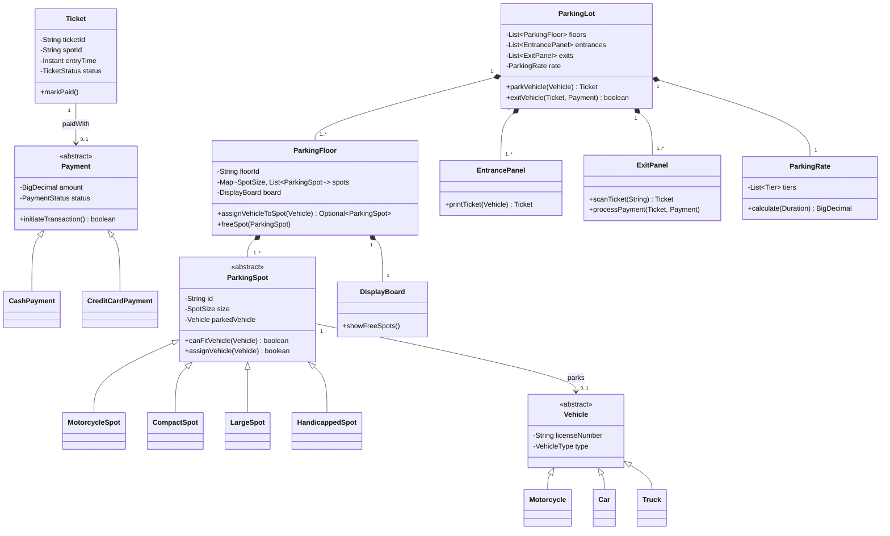
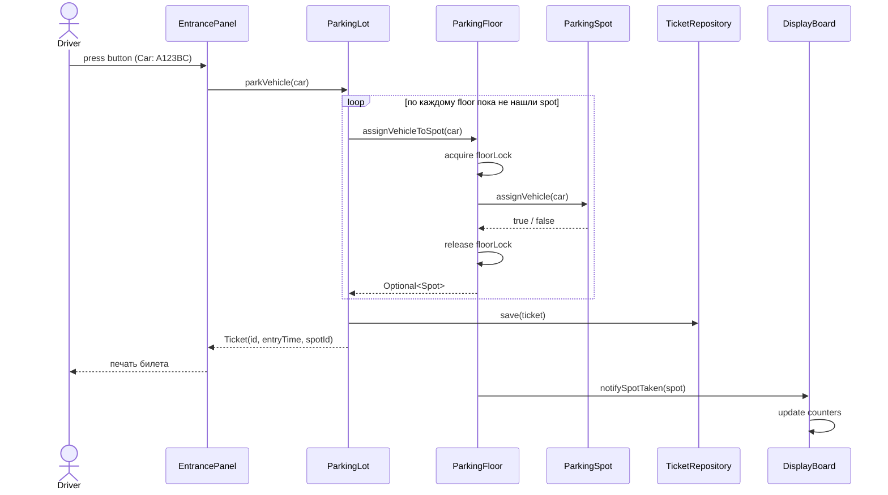
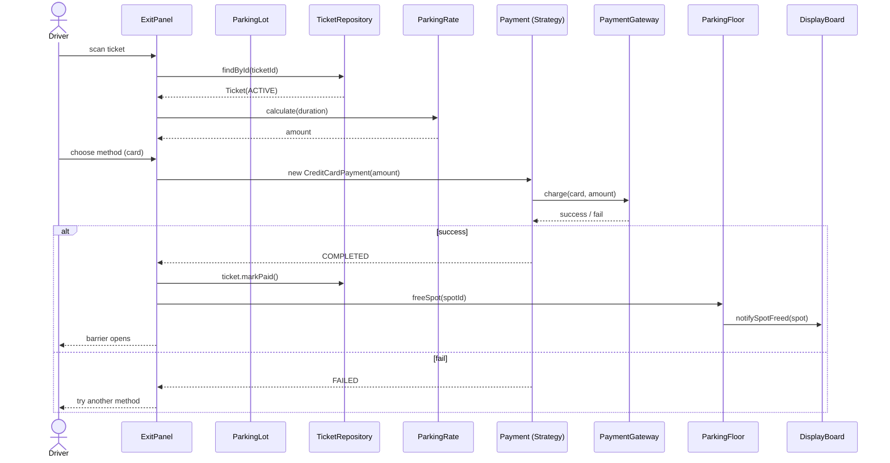
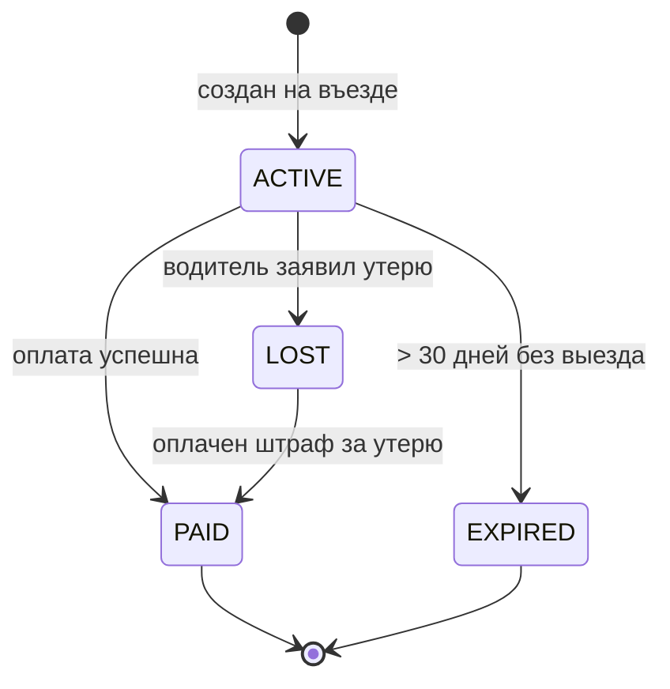

# OO Design: Parking Lot — собеседование

> Дата актуализации: 2026-05-22

Классическая задача на Low Level Design (LLD): спроектировать систему управления парковкой. Цель — показать владение OOP, паттернами GoF, SOLID, многопоточностью, а не нарисовать «всё что вспомнил». Интервьюер смотрит на структуру классов, разделение ответственности, эволюционируемость и обработку конкурентных кейсов.

## Полезные ссылки

- [Refactoring Guru — каталог паттернов GoF](https://refactoring.guru/ru/design-patterns)
- [Baeldung — SOLID Principles in Java](https://www.baeldung.com/solid-principles)
- [Educative — Object-Oriented Design Interview](https://www.educative.io/courses/grokking-the-object-oriented-design-interview)
- [Source Making — Design Patterns](https://sourcemaking.com/design_patterns)
- [Martin Fowler — Patterns of Enterprise Application Architecture](https://martinfowler.com/eaaCatalog/)
- [Java Concurrency in Practice](https://jcip.net/) — Goetz et al., классика по многопоточности
- [Effective Java — Joshua Bloch](https://www.oreilly.com/library/view/effective-java-3rd/9780134686097/) — главы по immutability, builder, singleton

## Содержание

**Requirements и use cases**
- [Q1. Какие у системы functional и non-functional требования (!) <a id="q1"></a>](#q1-какие-у-системы-functional-и-non-functional-требования--a-idq1a)
- [Q2. Кто actors и какие use cases (!) <a id="q2"></a>](#q2-кто-actors-и-какие-use-cases--a-idq2a)
- [Q3. Что сразу отрезаем как out of scope <a id="q3"></a>](#q3-что-сразу-отрезаем-как-out-of-scope-a-idq3a)

**Классы и responsibilities**
- [Q4. Иерархия Vehicle (!) <a id="q4"></a>](#q4-иерархия-vehicle--a-idq4a)
- [Q5. Иерархия ParkingSpot (!) <a id="q5"></a>](#q5-иерархия-parkingspot--a-idq5a)
- [Q6. ParkingFloor — что хранит и за что отвечает (!) <a id="q6"></a>](#q6-parkingfloor--что-хранит-и-за-что-отвечает--a-idq6a)
- [Q7. ParkingLot — почему Singleton оправдан (!) <a id="q7"></a>](#q7-parkinglot--почему-singleton-оправдан--a-idq7a)
- [Q8. Ticket и Payment — почему две разные сущности (!) <a id="q8"></a>](#q8-ticket-и-payment--почему-две-разные-сущности--a-idq8a)
- [Q9. ParkingRate — табличное ценообразование (!) <a id="q9"></a>](#q9-parkingrate--табличное-ценообразование--a-idq9a)

**UML и диаграммы**
- [Q10. Class diagram целиком (!) <a id="q10"></a>](#q10-class-diagram-целиком--a-idq10a)
- [Q11. Sequence: въезд автомобиля <a id="q11"></a>](#q11-sequence-въезд-автомобиля-a-idq11a)
- [Q12. Sequence: выезд и оплата <a id="q12"></a>](#q12-sequence-выезд-и-оплата-a-idq12a)
- [Q13. State diagram билета <a id="q13"></a>](#q13-state-diagram-билета-a-idq13a)

**Паттерны GoF**
- [Q14. Какие паттерны GoF задействованы (!) <a id="q14"></a>](#q14-какие-паттерны-gof-задействованы--a-idq14a)
- [Q15. Strategy для PaymentMethod — почему именно Strategy (!) <a id="q15"></a>](#q15-strategy-для-paymentmethod--почему-именно-strategy--a-idq15a)
- [Q16. Factory для SpotAllocation <a id="q16"></a>](#q16-factory-для-spotallocation-a-idq16a)
- [Q17. Observer для DisplayBoard (!) <a id="q17"></a>](#q17-observer-для-displayboard--a-idq17a)
- [Q18. State для Ticket — зачем (!) <a id="q18"></a>](#q18-state-для-ticket--зачем--a-idq18a)

**SOLID применение**
- [Q19. SOLID на этом дизайне по пунктам (!) <a id="q19"></a>](#q19-solid-на-этом-дизайне-по-пунктам--a-idq19a)
- [Q20. Composition over Inheritance — где сработало <a id="q20"></a>](#q20-composition-over-inheritance--где-сработало-a-idq20a)

**Thread safety**
- [Q21. Гонка за один spot — как защищаемся (!) <a id="q21"></a>](#q21-гонка-за-один-spot--как-защищаемся--a-idq21a)
- [Q22. Гранулярность блокировки: lot / floor / spot (!) <a id="q22"></a>](#q22-гранулярность-блокировки-lot--floor--spot--a-idq22a)
- [Q23. Optimistic locking и CAS для бронирования <a id="q23"></a>](#q23-optimistic-locking-и-cas-для-бронирования-a-idq23a)

**Edge cases и extensions**
- [Q24. Граничные случаи: потерянный билет, заполненная парковка, ранний выезд (!) <a id="q24"></a>](#q24-граничные-случаи-потерянный-билет-заполненная-парковка-ранний-выезд--a-idq24a)
- [Q25. Persistent state и restart <a id="q25"></a>](#q25-persistent-state-и-restart-a-idq25a)
- [Q26. Расширения: EV charging, reservations, dynamic pricing <a id="q26"></a>](#q26-расширения-ev-charging-reservations-dynamic-pricing-a-idq26a)
- [Q27. REST API наружу <a id="q27"></a>](#q27-rest-api-наружу-a-idq27a)
- [Q28. Anti-patterns: чего избегать (!) <a id="q28"></a>](#q28-anti-patterns-чего-избегать--a-idq28a)

---

## Q1. Какие у системы functional и non-functional требования (!) <a id="q1"></a>

Functional-требования отвечают на вопрос «что система делает», non-functional — «насколько хорошо». Это разные категории, и интервьюер хочет видеть, что вы их не смешиваете: типы транспорта и тарификация — это поведение, а thread safety и latency — качества.

**Functional** (поведение):
- парковка для разных типов транспорта: `Motorcycle`, `Car`, `Truck` (van/SUV считаем `Car`);
- multi-floor, multi-entrance, multi-exit;
- въезд: выдать билет с временем заезда и назначенным spot;
- выезд: посчитать тариф по времени, принять оплату, освободить spot;
- discount: monthly subscribers (флаг на `Ticket`);
- handicapped/electric spots на отдельных этажах;
- display board у въезда: «свободно: 12 motorcycle, 80 compact, 25 large».

**Non-functional** (качества — каждое прямо диктует решение в коде):
- **thread safety**: два потока (две камеры на двух въездах) не должны выдать один spot — отсюда `floorLock`/CAS;
- **availability**: 99.95% — парковка работает, даже если БД лагает (допустим degraded read-only режим: машины пускаем, запись отложенная);
- **latency**: выдача билета < 200 мс — иначе очередь на въезде; значит синхронный поход в банк на входе исключён;
- **audit log**: все события (вход/выход/оплата) персистятся для финансов и разбора спорных ситуаций;
- **observability**: метрики занятости в реал-тайме.

**Рекомендация:** проговорить этот список вслух и зафиксировать scope в первые минуты — половина успеха интервью именно здесь, потому что дальше весь дизайн опирается на эти ограничения.

## Q2. Кто actors и какие use cases (!) <a id="q2"></a>

Actors — это внешние роли, которые взаимодействуют с системой; для каждой выписываем её use cases. Это нужно, чтобы не забыть неочевидные сценарии (потерянный билет, настройка тарифов) и сразу увидеть, какие сущности понадобятся.

**Actors**:

| Actor | Use cases |
|-------|-----------|
| `Driver` | взять билет на въезде, оплатить и выехать, проверить тариф |
| `ParkingAttendant` | помочь с потерянным билетом, провести ручной платёж, освободить занятый spot |
| `Admin` | настроить тарифы, добавить/закрыть этаж, посмотреть отчёты по выручке |
| `System` (внутренний) | мониторить occupancy, перерасчёт тарифов, рассылка алертов |

**Главный happy path**:
1. машина подъезжает к `EntrancePanel`;
2. система проверяет наличие свободного spot подходящего типа;
3. выдаёт `Ticket` (с `entryTime`, `spotId`);
4. при выезде на `ExitPanel` сканируется ticket;
5. считается `Payment` (по `ParkingRate`);
6. после успешной оплаты `ParkingSpot` помечается свободным.

## Q3. Что сразу отрезаем как out of scope <a id="q3"></a>

Явное обрезание scope — это не слабость, а сигнал зрелости: вы показываете, что умеете расставлять приоритеты под ограничение времени. В интервью на 45 минут нет смысла проектировать всё, поэтому проговариваем границы и заменяем внешние интеграции на интерфейсы-заглушки:

- shuttle bus между терминалами — нет;
- license plate recognition (CV) — считаем чёрным ящиком, который вернёт строку;
- интеграция с банком — `PaymentGateway` это интерфейс с одним методом `charge(amount)`;
- мобильное приложение клиента — отдельная задача;
- multi-tenant (сеть парковок) — на этом интервью одна сущность `ParkingLot`.

Приём с интерфейсом вместо реализации (`PaymentGateway`, распознавание номеров) позволяет не утонуть в деталях внешних систем, но оставить точки расширения.

## Q4. Иерархия Vehicle (!) <a id="q4"></a>

`Vehicle` — `abstract class` с общими полями (`licenseNumber`, `type`); это база, от которой наследуются конкретные типы. Подклассы заводим **только** когда у типа появляется собственное поведение, а не «на всякий случай» — иначе получаем пустые классы, которые ничего не добавляют.

```java
public enum VehicleType { MOTORCYCLE, CAR, TRUCK }

public abstract class Vehicle {
    private final String licenseNumber;
    private final VehicleType type;

    protected Vehicle(String licenseNumber, VehicleType type) {
        this.licenseNumber = licenseNumber;
        this.type = type;
    }

    public VehicleType getType() { return type; }
    public String getLicenseNumber() { return licenseNumber; }
}

public final class Motorcycle extends Vehicle {
    public Motorcycle(String license) { super(license, VehicleType.MOTORCYCLE); }
}

public final class Car extends Vehicle {
    public Car(String license) { super(license, VehicleType.CAR); }
}

public final class Truck extends Vehicle {
    public Truck(String license) { super(license, VehicleType.TRUCK); }
}
```

**Спорный момент:** нужны ли вообще отдельные подклассы или хватит одного `Vehicle` + поля `VehicleType`? Правило простое: если все три типа ведут себя одинаково (как сейчас — у них только данные) — берите один класс с `enum`, без иерархии. Подклассы оправданы лишь там, где у типа появляется специфичное поведение или поля — например, у `ElectricCar` есть `chargingPort`. Хороший ответ на интервью — назвать этот компромисс вслух, а не молча выбрать одну из веток.

## Q5. Иерархия ParkingSpot (!) <a id="q5"></a>

`ParkingSpot` — `abstract`-класс, и в отличие от `Vehicle` здесь подклассы оправданы: каждый тип места отличается **совместимостью** с типами транспорта, и эта разница — реальное поведение, которое и выносим в `canFitVehicle`. Базовый класс держит общее состояние (занятость, ссылку на машину) и потокобезопасные методы `assignVehicle`/`removeVehicle`.

```java
public enum SpotSize { MOTORCYCLE, COMPACT, LARGE, HANDICAPPED, ELECTRIC }

public abstract class ParkingSpot {
    protected final String id;
    protected final SpotSize size;
    protected volatile Vehicle parkedVehicle; // volatile — для видимости между потоками
    protected volatile boolean available = true;

    protected ParkingSpot(String id, SpotSize size) {
        this.id = id;
        this.size = size;
    }

    /** Может ли spot принять конкретный vehicle. Переопределяется в подклассах. */
    public abstract boolean canFitVehicle(Vehicle vehicle);

    public synchronized boolean assignVehicle(Vehicle v) {
        if (!available || !canFitVehicle(v)) return false;
        this.parkedVehicle = v;
        this.available = false;
        return true;
    }

    public synchronized void removeVehicle() {
        this.parkedVehicle = null;
        this.available = true;
    }

    public boolean isAvailable() { return available; }
    public String getId() { return id; }
    public SpotSize getSize() { return size; }
}

public class MotorcycleSpot extends ParkingSpot {
    public MotorcycleSpot(String id) { super(id, SpotSize.MOTORCYCLE); }
    @Override public boolean canFitVehicle(Vehicle v) {
        return v.getType() == VehicleType.MOTORCYCLE;
    }
}

public class CompactSpot extends ParkingSpot {
    public CompactSpot(String id) { super(id, SpotSize.COMPACT); }
    @Override public boolean canFitVehicle(Vehicle v) {
        return v.getType() == VehicleType.MOTORCYCLE || v.getType() == VehicleType.CAR;
    }
}

public class LargeSpot extends ParkingSpot {
    public LargeSpot(String id) { super(id, SpotSize.LARGE); }
    @Override public boolean canFitVehicle(Vehicle v) {
        return true; // вмещает всё
    }
}
```

**Правило совместимости:** `Motorcycle` влезает куда угодно; `Truck` — только в `LARGE`; `Car` — в `COMPACT` или `LARGE`. Главная мысль: это полиморфизм в чистом виде. Решение «подходит ли место машине» принимает сам spot через `canFitVehicle`, а не внешний `if/switch` по типам. Поэтому новый тип места = новый подкласс, и ни одна существующая ветка кода не меняется.

## Q6. ParkingFloor — что хранит и за что отвечает (!) <a id="q6"></a>

`ParkingFloor` владеет состоянием одного этажа: списком `ParkingSpot` (сгруппированным по размеру), локальным `DisplayBoard` и методом подбора свободного места. Зачем выделять этот слой вообще? Чтобы `ParkingLot` не стал god-классом: этаж сам отвечает за свои места и за атомарность их выдачи, а `ParkingLot` только обходит этажи.

```java
public class ParkingFloor {
    private final String floorId;
    private final Map<SpotSize, List<ParkingSpot>> spotsBySize;
    private final DisplayBoard displayBoard;
    private final ReentrantLock floorLock = new ReentrantLock();

    public ParkingFloor(String floorId, List<ParkingSpot> spots) {
        this.floorId = floorId;
        this.spotsBySize = spots.stream()
            .collect(Collectors.groupingBy(ParkingSpot::getSize));
        this.displayBoard = new DisplayBoard(this);
    }

    /** Найти и зарезервировать spot за один атомарный шаг. */
    public Optional<ParkingSpot> assignVehicleToSpot(Vehicle vehicle) {
        floorLock.lock();
        try {
            for (ParkingSpot spot : candidateSpots(vehicle.getType())) {
                if (spot.assignVehicle(vehicle)) {
                    displayBoard.notifySpotTaken(spot);
                    return Optional.of(spot);
                }
            }
            return Optional.empty();
        } finally {
            floorLock.unlock();
        }
    }

    private List<ParkingSpot> candidateSpots(VehicleType type) {
        return switch (type) {
            case MOTORCYCLE -> mergeAll(SpotSize.MOTORCYCLE, SpotSize.COMPACT, SpotSize.LARGE);
            case CAR -> mergeAll(SpotSize.COMPACT, SpotSize.LARGE);
            case TRUCK -> spotsBySize.getOrDefault(SpotSize.LARGE, List.of());
        };
    }

    private List<ParkingSpot> mergeAll(SpotSize... sizes) {
        return Arrays.stream(sizes)
            .flatMap(s -> spotsBySize.getOrDefault(s, List.of()).stream())
            .toList();
    }

    public int freeCount(SpotSize size) {
        return (int) spotsBySize.getOrDefault(size, List.of()).stream()
            .filter(ParkingSpot::isAvailable).count();
    }
}
```

**Ключевая идея — гранулярность блокировки.** Метод `assignVehicleToSpot` делает «найти + занять» под одним `floorLock`, поэтому два потока не уведут одно место. Почему именно этаж — золотая середина: блокировать всю парковку медленно (один lock на весь поток въезжающих), а блокировать отдельный spot недостаточно — выбор места это перебор кандидатов, который сам должен быть атомарным. Floor балансирует параллелизм и простоту (подробнее — Q22).

## Q7. ParkingLot — почему Singleton оправдан (!) <a id="q7"></a>

`ParkingLot` — корневая сущность системы. Singleton здесь оправдан конкретным инвариантом: парковка физически одна, значит и состояние в памяти должно быть одно. Это правильная мотивация — против неправильной «удобно достать откуда угодно» (так Singleton превращается в глобальную переменную). В коде ниже — потокобезопасная ленивая инициализация через double-checked locking (`volatile` + двойная проверка под `synchronized`).

```java
public class ParkingLot {
    private static volatile ParkingLot instance;

    private final String name;
    private final List<ParkingFloor> floors;
    private final List<EntrancePanel> entrances;
    private final List<ExitPanel> exits;
    private final ParkingRate rate;
    private final TicketRepository ticketRepo;

    private ParkingLot(String name, List<ParkingFloor> floors,
                       List<EntrancePanel> entrances, List<ExitPanel> exits,
                       ParkingRate rate, TicketRepository repo) {
        this.name = name;
        this.floors = floors;
        this.entrances = entrances;
        this.exits = exits;
        this.rate = rate;
        this.ticketRepo = repo;
    }

    public static ParkingLot init(Config cfg) {
        if (instance == null) {
            synchronized (ParkingLot.class) {
                if (instance == null) {
                    instance = ParkingLotBuilder.from(cfg).build();
                }
            }
        }
        return instance;
    }

    public static ParkingLot getInstance() {
        if (instance == null) throw new IllegalStateException("ParkingLot not initialised");
        return instance;
    }

    public Optional<Ticket> parkVehicle(Vehicle vehicle) {
        for (ParkingFloor floor : floors) {
            Optional<ParkingSpot> spot = floor.assignVehicleToSpot(vehicle);
            if (spot.isPresent()) {
                Ticket t = new Ticket(vehicle.getLicenseNumber(), spot.get().getId(), Instant.now());
                ticketRepo.save(t);
                return Optional.of(t);
            }
        }
        return Optional.empty(); // нет места
    }
}
```

**Минусы Singleton и как их закрыть:**
- **трудно тестировать** (глобальное состояние течёт между тестами) — прячем доступ за интерфейсом `ParkingFacility` и в тестах подкладываем mock;
- **скрытая глобальная зависимость** — для интервью оправдываем тем, что это и есть единственная физическая парковка, но честно признаём цену;
- **трение с DI** — в Spring чище взять `@Component` со `singleton scope`: контейнер сам гарантирует единственность, и не нужен ручной double-checked locking из примера выше.

Хороший ответ — не «Singleton это плохо», а «здесь он уместен по доменному инварианту, но в Spring я бы делегировал единственность контейнеру».

## Q8. Ticket и Payment — почему две разные сущности (!) <a id="q8"></a>

Потому что у них разные жизненные циклы и разные причины меняться — а это прямое показание разделить их (SRP). `Ticket` рождается при въезде, живёт до выезда, может быть утерян или просрочен. `Payment` создаётся только в момент оплаты, имеет собственный статус (`PENDING` → `COMPLETED`/`FAILED`/`REFUNDED`) и собственное поведение для каждого способа оплаты.

```java
public enum TicketStatus { ACTIVE, PAID, LOST, EXPIRED }

public class Ticket {
    private final String ticketId;
    private final String vehicleLicense;
    private final String spotId;
    private final Instant entryTime;
    private volatile TicketStatus status;
    private volatile Instant exitTime;

    public Ticket(String vehicleLicense, String spotId, Instant entryTime) {
        this.ticketId = UUID.randomUUID().toString();
        this.vehicleLicense = vehicleLicense;
        this.spotId = spotId;
        this.entryTime = entryTime;
        this.status = TicketStatus.ACTIVE;
    }

    public Duration duration(Instant now) { return Duration.between(entryTime, now); }
    public void markPaid(Instant exitAt) { this.status = TicketStatus.PAID; this.exitTime = exitAt; }
    public void markLost() { this.status = TicketStatus.LOST; }
    // getters...
}

public enum PaymentStatus { PENDING, COMPLETED, FAILED, REFUNDED }

public abstract class Payment {
    protected final BigDecimal amount;
    protected final Instant createdAt;
    protected PaymentStatus status;
    protected String externalRef;

    protected Payment(BigDecimal amount) {
        this.amount = amount;
        this.createdAt = Instant.now();
        this.status = PaymentStatus.PENDING;
    }

    public abstract boolean initiateTransaction();
}

public class CreditCardPayment extends Payment {
    private final String cardNumber;
    private final PaymentGateway gateway;

    public CreditCardPayment(BigDecimal amount, String cardNumber, PaymentGateway gateway) {
        super(amount);
        this.cardNumber = cardNumber;
        this.gateway = gateway;
    }

    @Override
    public boolean initiateTransaction() {
        GatewayResult r = gateway.charge(cardNumber, amount);
        this.externalRef = r.referenceId();
        this.status = r.success() ? PaymentStatus.COMPLETED : PaymentStatus.FAILED;
        return r.success();
    }
}

public class CashPayment extends Payment {
    public CashPayment(BigDecimal amount) { super(amount); }
    @Override public boolean initiateTransaction() {
        this.status = PaymentStatus.COMPLETED;
        return true;
    }
}
```

**Подводный камень:** если запихнуть оплату внутрь `Ticket`, нарушим SRP — у билета появится вторая причина меняться: добавили новый способ оплаты (UPI, Apple Pay) — и трогаем класс билета, хотя сам билет не изменился. Разделение оставляет `Ticket` стабильным, а варьируется только иерархия `Payment`.

## Q9. ParkingRate — табличное ценообразование (!) <a id="q9"></a>

Тариф моделируем как **данные** (список тиров), а не как код (цепочку `if`). Тарифы редко плоские — обычно «первый час дорого, дальше дешевле», и каждое изменение цен не должно требовать правки и пересборки кода. Поэтому `ParkingRate` хранит список `Tier` (до какого часа действует и сколько стоит), а `calculate` просто проходит по тирам и суммирует стоимость по часам. Меняется цена — меняется конфиг, а не алгоритм.

```java
public class ParkingRate {
    /** Tier: до какого часа действует и сколько стоит за час. */
    public record Tier(int upToHourExclusive, BigDecimal hourlyRate) {}

    private final List<Tier> tiers;
    private final BigDecimal lostTicketPenalty;
    private final Duration freeGracePeriod; // 15 минут

    public ParkingRate(List<Tier> tiers, BigDecimal lostTicketPenalty, Duration grace) {
        this.tiers = List.copyOf(tiers);
        this.lostTicketPenalty = lostTicketPenalty;
        this.freeGracePeriod = grace;
    }

    public BigDecimal calculate(Duration parked) {
        if (parked.compareTo(freeGracePeriod) < 0) return BigDecimal.ZERO;

        BigDecimal total = BigDecimal.ZERO;
        long hours = (long) Math.ceil(parked.toMinutes() / 60.0);

        int hourCursor = 0;
        for (Tier tier : tiers) {
            long hoursInTier = Math.min(tier.upToHourExclusive(), hours) - hourCursor;
            if (hoursInTier <= 0) break;
            total = total.add(tier.hourlyRate().multiply(BigDecimal.valueOf(hoursInTier)));
            hourCursor += hoursInTier;
            if (hourCursor >= hours) break;
        }
        return total.setScale(2, RoundingMode.HALF_UP);
    }

    public BigDecimal lostTicket() { return lostTicketPenalty; }
}
```

Типовая конфигурация:

| Tier | до часа | $/час |
|------|---------|-------|
| 1 | 1 | 4.00 |
| 2 | 3 | 3.50 |
| 3 | 24 | 2.50 |

Здесь же заложен `freeGracePeriod` (бесплатные первые 15 минут) — частый edge case на интервью.

**Расширяемость (OCP):** сезонная скидка или промокод — это `Decorator` поверх `ParkingRate`, который домножает результат, а не правка существующего класса. Подробнее про этот приём — Q20.

## Q10. Class diagram целиком (!) <a id="q10"></a>

Собранная картина классов и их связей. Обратите внимание на типы связей: `*--` (композиция) означает «часть владеет целым и не живёт без него» (этаж без парковки не существует), `<|--` — наследование, `-->` — слабую ассоциацию (билет ссылается на платёж, но не владеет им).



**Направленность связей** — главное, что стоит проговорить: `ParkingLot` знает про `ParkingFloor`, но не наоборот (зависимости идут сверху вниз). Однонаправленность убирает циклы и позволяет тестировать `ParkingFloor` изолированно, без поднятия всей парковки.

## Q11. Sequence: въезд автомобиля <a id="q11"></a>

Happy path въезда: водитель жмёт кнопку → `ParkingLot` обходит этажи → этаж атомарно подбирает и занимает место → создаётся и сохраняется билет → печатается на въезде. `DisplayBoard` обновляется через подписку (Observer).



**Что критично:** блок `assignVehicleToSpot` целиком атомарен — выполняется под одним `floorLock`. Без этого два параллельных потока могли бы увидеть одно и то же свободное место и оба отдать его водителям — классическая гонка «check-then-act».

## Q12. Sequence: выезд и оплата <a id="q12"></a>

Выезд сложнее въезда из-за денег: сканируем билет → считаем стоимость по `ParkingRate` → проводим оплату выбранным способом (Strategy) → и только при успехе освобождаем место и открываем барьер. Обратите внимание на ветку `alt success/fail` — провал платежа не должен ни выпускать машину, ни освобождать место.



**Порядок шагов — не косметика, а защита от потери денег:** `freeSpot` и открытие барьера вызываются **строго** после статуса `COMPLETED`. Если открыть барьер до подтверждения платежа — получим худший сценарий: с водителя списали деньги, а место уже отдали и машина уехала (или наоборот — уехал бесплатно). Поэтому освобождение места идёт после оплаты, а не параллельно с ней.

## Q13. State diagram билета <a id="q13"></a>

Билет проходит конечный набор состояний, и диаграмма фиксирует, какие переходы вообще разрешены. Это не украшение: каждый переход — это бизнес-правило, которое потом превращается в код (см. State-паттерн в Q18).



Состояние билета — не просто метка, а то, на чём держатся инварианты: из `PAID` нельзя оплатить второй раз; из `LOST` нельзя выехать без штрафа; `EXPIRED` и `PAID` — терминальные. Поэтому переходы делаем через явные методы (`markPaid`, `markLost`), а не через публичный `setStatus`: открытый сеттер позволил бы перевести билет в любое состояние в обход правил и сломать инвариант.

## Q14. Какие паттерны GoF задействованы (!) <a id="q14"></a>

Паттерны здесь не самоцель — каждый закрывает конкретную точку вариативности в дизайне. Ниже карта «паттерн → где → зачем»; на интервью важно не вывалить весь список, а связать паттерн с проблемой, которую он решает.

| Паттерн | Где | Зачем |
|---------|-----|-------|
| Singleton | `ParkingLot` | один физический объект ⇒ одно состояние в памяти |
| Strategy | `Payment` (Cash/Card/UPI), `SpotAllocationStrategy` | менять способ оплаты или поиска spot без модификации клиента |
| Factory Method | `SpotFactory`, `VehicleFactory` | создавать конкретный тип по входному `enum` |
| Abstract Factory | `ParkingLotBuilder` для разных конфигов (mall vs airport) | различные семейства sittings |
| Observer | `DisplayBoard` ← `ParkingFloor` | реактивно показывать число свободных мест |
| State | `Ticket` (ACTIVE/PAID/LOST/EXPIRED) | разное поведение в разных состояниях |
| Decorator | `DiscountedRate` поверх `ParkingRate` | сезонные скидки без модификации тарифа |
| Command | `ParkVehicleCommand`, `ExitCommand` | очередь действий, undo на entry (откат при ошибке) |
| Chain of Responsibility | `EntryValidationChain` (банлист → допуск → доступность) | пошаговая валидация |

**Эмпирическое правило:** не тащите все девять. Назвать 4–5 паттернов, но каждый — с конкретным примером применения на этом дизайне, ценится выше, чем перечислить всё списком без обоснования. Лишние паттерны — это уже over-engineering (см. антипаттерны в Q28).

## Q15. Strategy для PaymentMethod — почему именно Strategy (!) <a id="q15"></a>

Strategy подходит, когда есть **семейство взаимозаменяемых алгоритмов под общим интерфейсом**, и клиент выбирает один в рантайме. Ровно наш случай: способов оплаты много (кэш, карта, Apple Pay, корпоративный аккаунт), все отвечают на один вопрос «провести платёж X рублей», но делают это по-разному. Интерфейс один (`PaymentStrategy.charge`), реализации разные — `ExitController` хранит их в `Map<PaymentMethod, PaymentStrategy>` и выбирает нужную по типу, не зная деталей.

```java
public interface PaymentStrategy {
    PaymentResult charge(BigDecimal amount, PaymentContext ctx);
}

public record PaymentResult(boolean success, String externalRef, String message) {}

public class CardPaymentStrategy implements PaymentStrategy {
    private final PaymentGateway gateway;
    public CardPaymentStrategy(PaymentGateway gw) { this.gateway = gw; }

    @Override
    public PaymentResult charge(BigDecimal amount, PaymentContext ctx) {
        GatewayResult r = gateway.charge(ctx.cardNumber(), amount);
        return new PaymentResult(r.success(), r.referenceId(), r.message());
    }
}

public class CashPaymentStrategy implements PaymentStrategy {
    @Override public PaymentResult charge(BigDecimal amount, PaymentContext ctx) {
        return new PaymentResult(true, "CASH-" + UUID.randomUUID(), "ok");
    }
}

public class ExitController {
    private final Map<PaymentMethod, PaymentStrategy> strategies;

    public ExitController(Map<PaymentMethod, PaymentStrategy> strategies) {
        this.strategies = strategies;
    }

    public boolean payAndExit(Ticket t, PaymentMethod m, PaymentContext ctx, BigDecimal amount) {
        PaymentStrategy strategy = strategies.get(m);
        if (strategy == null) throw new IllegalArgumentException("Unsupported: " + m);
        return strategy.charge(amount, ctx).success();
    }
}
```

**Компромисс с наследованием:** вариант `Payment` ← `CardPayment` (как в Q8) тоже работает, но смешивает в одном классе данные платежа и алгоритм его проведения. Strategy разделяет эти оси: `Payment` хранит данные (сумма, статус, ссылка), `PaymentStrategy` инкапсулирует алгоритм. Плюс стратегии легко подменить в тесте и переиспользовать между разными типами платежей.

## Q16. Factory для SpotAllocation <a id="q16"></a>

Factory централизует создание объектов: один `switch` по `enum` решает, какой подкласс `ParkingSpot` инстанцировать, и весь остальной код работает с абстрактным `ParkingSpot`. Используется при загрузке этажа из БД, где из конфига приходит размер места, а нужен конкретный объект.

```java
public class SpotFactory {
    public static ParkingSpot create(SpotConfig cfg) {
        return switch (cfg.size()) {
            case MOTORCYCLE   -> new MotorcycleSpot(cfg.id());
            case COMPACT      -> new CompactSpot(cfg.id());
            case LARGE        -> new LargeSpot(cfg.id());
            case HANDICAPPED  -> new HandicappedSpot(cfg.id());
            case ELECTRIC     -> new ElectricSpot(cfg.id(), cfg.chargingPowerKw());
        };
    }
}
```

**В чём выигрыш:** добавили `ElectricSpot` — поменяли одну строку в фабрике, клиентский код продолжает работать с `ParkingSpot` без правок. Без фабрики `new MotorcycleSpot(...)` был бы разбросан по десятку мест, и каждый новый тип требовал бы найти их все.

**Стратегия выбора места** — отдельная ось, и тут уже Strategy: фабрика решает «какой объект создать», а стратегия — «какое из свободных мест выбрать» (ближайшее к въезду, самое компактное и т.д.):

```java
public interface SpotAllocationStrategy {
    Optional<ParkingSpot> allocate(List<ParkingFloor> floors, Vehicle v);
}

/** Найти ближайший к въезду подходящий spot. */
public class NearestFirstAllocation implements SpotAllocationStrategy { /* ... */ }

/** Найти самый компактный из подходящих (плотная упаковка). */
public class SmallestFittingAllocation implements SpotAllocationStrategy { /* ... */ }
```

## Q17. Observer для DisplayBoard (!) <a id="q17"></a>

`DisplayBoard` показывает количество свободных мест и должен обновляться при каждом занятии/освобождении места. Observer решает здесь задачу развязки зависимостей: «источник события» (`ParkingFloor`) рассылает уведомления подписчикам, но **не знает**, кто на него подписан. Если бы `ParkingSpot`/`ParkingFloor` напрямую дёргали `DisplayBoard`, домен зависел бы от UI-сущности — нарушение DIP, и добавить второго подписчика (например, метрики) было бы нельзя без правки домена.

```java
public interface SpotListener {
    void onSpotTaken(ParkingSpot spot);
    void onSpotFreed(ParkingSpot spot);
}

public class ParkingFloor implements SpotPublisher {
    private final List<SpotListener> listeners = new CopyOnWriteArrayList<>();

    public void subscribe(SpotListener l) { listeners.add(l); }

    private void publishTaken(ParkingSpot s) {
        for (SpotListener l : listeners) l.onSpotTaken(s);
    }
    // ...
}

public class DisplayBoard implements SpotListener {
    private final Map<SpotSize, AtomicInteger> freeBySize = new EnumMap<>(SpotSize.class);

    public DisplayBoard(ParkingFloor floor) {
        for (SpotSize s : SpotSize.values()) freeBySize.put(s, new AtomicInteger(0));
        floor.subscribe(this);
    }

    @Override public void onSpotTaken(ParkingSpot s) { freeBySize.get(s.getSize()).decrementAndGet(); }
    @Override public void onSpotFreed(ParkingSpot s) { freeBySize.get(s.getSize()).incrementAndGet(); }

    public Map<SpotSize, Integer> snapshot() {
        return freeBySize.entrySet().stream()
            .collect(Collectors.toMap(Map.Entry::getKey, e -> e.getValue().get()));
    }
}
```

**Почему `CopyOnWriteArrayList`:** профиль нагрузки — подписчиков мало, список читается часто (на каждое событие), а меняется редко (подписка происходит при старте). Для такого паттерна COW-список оптимален: чтение без блокировок, копирование только при редкой записи. Альтернатива — Reactive Streams (`Flux<SpotEvent>`), но для LLD-интервью достаточно классического Observer, и его проще объяснить.

## Q18. State для Ticket — зачем (!) <a id="q18"></a>

State убирает разрастающийся `switch (status)`. В наивном дизайне каждый метод `Ticket` начинается с проверки текущего статуса, и при росте числа состояний эти `switch` расползаются по коду и расходятся между собой. Паттерн State выносит поведение каждого состояния в отдельный класс (`ActiveTicketState`, `PaidTicketState`, `LostTicketState`), а сам билет просто делегирует вызов текущему состоянию — переход реализуется как подмена объекта-состояния.

```java
public interface TicketState {
    Payment processPayment(Ticket t, BigDecimal amount, PaymentStrategy s, PaymentContext ctx);
    void markLost(Ticket t);
}

public class ActiveTicketState implements TicketState {
    @Override
    public Payment processPayment(Ticket t, BigDecimal amount, PaymentStrategy s, PaymentContext ctx) {
        PaymentResult r = s.charge(amount, ctx);
        if (r.success()) {
            t.changeState(new PaidTicketState());
            return new PaidPayment(amount, r.externalRef());
        }
        throw new PaymentFailedException(r.message());
    }
    @Override public void markLost(Ticket t) { t.changeState(new LostTicketState()); }
}

public class PaidTicketState implements TicketState {
    @Override public Payment processPayment(Ticket t, BigDecimal a, PaymentStrategy s, PaymentContext c) {
        throw new IllegalStateException("Already paid");
    }
    @Override public void markLost(Ticket t) {
        throw new IllegalStateException("Paid ticket cannot be lost");
    }
}

public class LostTicketState implements TicketState {
    @Override
    public Payment processPayment(Ticket t, BigDecimal penalty, PaymentStrategy s, PaymentContext c) {
        PaymentResult r = s.charge(penalty, c);
        if (r.success()) { t.changeState(new PaidTicketState()); return new PaidPayment(penalty, r.externalRef()); }
        throw new PaymentFailedException(r.message());
    }
    @Override public void markLost(Ticket t) { /* idempotent */ }
}
```

**Когда применять — компромисс по числу состояний:** 2–3 состояния с тривиальной логикой — хватит `enum` + пары проверок, State будет over-engineering. Состояний 5+ и у каждого своё нетривиальное поведение (как `LostTicketState`, требующий штраф) — тогда State окупается: добавить состояние = добавить класс, не трогая остальные.

## Q19. SOLID на этом дизайне по пунктам (!) <a id="q19"></a>

Сильный ответ на интервью — не пересказ определений SOLID, а привязка каждого принципа к конкретному классу этого дизайна. Ниже именно так: что в коде является носителем каждого принципа и где он мог бы сломаться.

**S — Single Responsibility** (один класс — одна причина меняться):
- `Ticket` хранит факт заезда, не считает деньги (это `ParkingRate`);
- `ParkingFloor` управляет местами, не отвечает за тарификацию;
- `PaymentStrategy` проводит платёж, не знает про `Ticket`.

**O — Open/Closed**:
- добавить `UpiPayment`? новый класс, реализующий `PaymentStrategy`, никакой существующий код не меняется;
- добавить `ElectricSpot`? новый подкласс `ParkingSpot` + правка `SpotFactory` (единственная точка).

**L — Liskov Substitution**:
- `LargeSpot` подставляется вместо `ParkingSpot` без сюрпризов;
- **антипример**: если бы `MotorcycleSpot.assignVehicle` иногда возвращал `true` для `Truck` ради «оптимизации» — LSP нарушен.

**I — Interface Segregation**:
- разделить `Bookable` (для бронирования) и `Releasable` (для освобождения) — клиент, которому нужно только освобождать, не зависит от методов резервирования.

```java
public interface Bookable { boolean book(Vehicle v); }
public interface Releasable { void release(); }
public abstract class ParkingSpot implements Bookable, Releasable { /* ... */ }
```

**D — Dependency Inversion**:
- `ParkingLot` зависит от `TicketRepository` (интерфейс), а не от конкретной `JdbcTicketRepository`;
- `Payment` зависит от `PaymentGateway` (интерфейс), а не от Stripe SDK напрямую.

## Q20. Composition over Inheritance — где сработало <a id="q20"></a>

Наследование плохо комбинируется — и это видно на тарифах. Соблазн: сделать `DiscountedRate extends ParkingRate`. Проблема — комбинаторный взрыв: каждое сочетание скидок требует отдельный класс (`DiscountedNightRate`, `SeniorDiscountedNightRate`, …), потому что классы нельзя «складывать». Композиция же складывается свободно: оборачиваем один объект в другой сколько угодно раз.

**Решение через композицию (Decorator)**:

```java
public interface Rate {
    BigDecimal calculate(Duration parked);
}

public class StandardRate implements Rate { /* базовая логика */ }

public class DiscountedRate implements Rate {
    private final Rate inner;
    private final BigDecimal multiplier;
    public DiscountedRate(Rate inner, BigDecimal multiplier) {
        this.inner = inner; this.multiplier = multiplier;
    }
    @Override
    public BigDecimal calculate(Duration parked) {
        return inner.calculate(parked).multiply(multiplier).setScale(2, RoundingMode.HALF_UP);
    }
}

// Использование:
Rate weekendRate = new DiscountedRate(new StandardRate(...), new BigDecimal("0.8"));
Rate seniorWeekend = new DiscountedRate(weekendRate, new BigDecimal("0.5"));
```

Любая комбинация скидок собирается из тех же двух классов — без новых типов. Это и есть Decorator (Q14): композиция через вложение объектов одного интерфейса вместо разрастания иерархии наследования.

## Q21. Гонка за один spot — как защищаемся (!) <a id="q21"></a>

Это классическая гонка «check-then-act»: между «проверили, что место свободно» и «заняли его» вклинивается другой поток.

**Проблема:** два потока (две камеры на двух въездах) одновременно вызвали `parkVehicle`. Если просто пробежать по `spots` и взять первый `available`, оба потока увидят одно и то же свободное место как доступное и оба его «займут» — две машины на одном месте.

**Решение 1 — грубая блокировка на этаже** (то, что и реализовано в `ParkingFloor.assignVehicleToSpot`). Делаем «проверить + занять» одной атомарной операцией под `floorLock`:

```java
floorLock.lock();
try {
    for (ParkingSpot spot : candidates) {
        if (spot.isAvailable()) {
            spot.assignVehicle(vehicle);
            return Optional.of(spot);
        }
    }
} finally { floorLock.unlock(); }
```

Просто и надёжно, но при 1000+ въездов в минуту блокировка на весь этаж сериализует поток и становится узким местом.

**Решение 2 — CAS на каждом spot.** Вместо блокировки каждое место само атомарно «занимает себя» через `compareAndSet(null, vehicle)` — переход «свободно → занято» выполняется одной аппаратной CAS-инструкцией:

```java
public abstract class ParkingSpot {
    private final AtomicReference<Vehicle> parked = new AtomicReference<>(null);

    public boolean tryAssign(Vehicle v) {
        if (!canFitVehicle(v)) return false;
        return parked.compareAndSet(null, v);
    }

    public void release() { parked.set(null); }
    public boolean isAvailable() { return parked.get() == null; }
}
```

Тогда в floor — обычный цикл без lock:

```java
for (ParkingSpot s : candidates) {
    if (s.tryAssign(vehicle)) return Optional.of(s);
}
return Optional.empty();
```

**Компромисс:** CAS работает без блокировок (lock-free), не сериализует потоки и лучше масштабируется под высокой нагрузкой. Минус — код тоньше и его сложнее объяснять и сопровождать; ошибиться в lock-free логике легче, чем в обычном `lock/unlock`.

## Q22. Гранулярность блокировки: lot / floor / spot (!) <a id="q22"></a>

Гранулярность блокировки — это компромисс «параллелизм против сложности»: чем мельче единица блокировки, тем выше throughput, но тем труднее код и тестирование. Три уровня и их применимость:

| Уровень | Lock | Throughput | Сложность | Когда брать |
|---------|------|------------|-----------|-------------|
| `ParkingLot` | один глобальный `ReentrantLock` | низкий | минимум | прототип, debug |
| `ParkingFloor` | lock на каждый этаж | средний (≈ N этажей) | средне | стандартный выбор |
| `ParkingSpot` | CAS / per-spot lock | высокий | сложнее тесты | high-load |

**Эвристика для интервью:** «начну с floor-level lock — для 99% парковок этого throughput хватит, а если упрёмся в нагрузку, мигрирую на per-spot CAS». Такой ответ показывает понимание компромисса и принцип «не усложнять раньше времени», а не тягу к оверинжинирингу.

## Q23. Optimistic locking и CAS для бронирования <a id="q23"></a>

Когда `ParkingSpot` живёт в БД (или система масштабируется на несколько инстансов), in-memory CAS из Q21 уже не спасает — каждый процесс держит свою память. Гонку нужно разрешать на уровне БД. Optimistic locking — это тот же принцип CAS, перенесённый в SQL: не берём блокировку заранее, а делаем условный `UPDATE`, который проходит, только если данные не изменились с момента чтения.

```sql
CREATE TABLE parking_spot (
    id          VARCHAR PRIMARY KEY,
    size        VARCHAR NOT NULL,
    vehicle_id  VARCHAR NULL,
    version     BIGINT NOT NULL DEFAULT 0
);
```

```java
public boolean tryReserve(String spotId, String vehicleId) {
    int updated = jdbc.update("""
        UPDATE parking_spot
           SET vehicle_id = ?, version = version + 1
         WHERE id = ?
           AND vehicle_id IS NULL
        """, vehicleId, spotId);
    return updated == 1;
}
```

**Условие `WHERE vehicle_id IS NULL` — это и есть CAS на уровне БД:** строку обновит только тот, кто застал её свободной. При одновременной попытке двоих СУБД сериализует апдейты, первый получит `updated == 1` (занял), второй — `0` (опоздал, пробует другое место). Альтернатива — JPA с `@Version`, где Hibernate сам подставляет версию в `WHERE`:

```java
@Entity
public class ParkingSpotEntity {
    @Id private String id;
    private String vehicleId;
    @Version private Long version;
}
```

При конкурентном update Hibernate бросит `OptimisticLockException` — обрабатываем как «попробовать другой spot».

## Q24. Граничные случаи: потерянный билет, заполненная парковка, ранний выезд (!) <a id="q24"></a>

Граничные случаи — то, что отличает «нарисовал классы» от «продумал систему». Интервьюер почти всегда копает именно сюда, поэтому стоит держать готовый ответ на каждый:

| Кейс | Поведение |
|------|-----------|
| **Lost ticket** | водитель идёт к attendant; берём `MAX_LOST_PENALTY` (например, $50) + license recognition по камере; статус билета → `LOST` |
| **Full lot** | `parkVehicle` возвращает `Optional.empty()`, на входе показывается «Full»; альтернатива — очередь въезда (`Queue<Vehicle>`) с FIFO |
| **Early exit (< 15 min)** | `ParkingRate.freeGracePeriod` → `BigDecimal.ZERO`, барьер открывается |
| **Monthly subscriber** | флаг `Subscription` на `Vehicle`, `ParkingRate.calculate` возвращает 0 |
| **Билет старше 30 дней** | статус `EXPIRED`, выезд только через attendant + штраф |
| **Превышение лимита по времени** | таймер шлёт алерт владельцу через 24h |
| **Reserved spot занят чужой машиной** | tow truck, billing на нарушителя через license plate |

Эти кейсы — **главный** material для дополнительных вопросов от интервьюера. Имеет смысл проговорить 2–3 заранее, остальные держать наготове.

## Q25. Persistent state и restart <a id="q25"></a>

После рестарта система обязана помнить, кто где стоит — иначе у занятых мест «сбросится» статус и их выдадут повторно. Значит, всё критичное состояние (занятость мест, активные билеты, платежи) пишем в БД синхронно, а при старте восстанавливаем. Производные данные (счётчики на табло) не храним — пересчитываем из источника.

| Сущность | Persistence | Reload |
|----------|-------------|--------|
| `ParkingSpot.occupied` | UPDATE при assign/release | загрузить при старте |
| `Ticket` | INSERT при выдаче, UPDATE при оплате | active tickets из БД |
| `Payment` | INSERT, status idempotent | для аудита |
| `ParkingRate` | конфиг в БД | загрузить при старте |
| `DisplayBoard counters` | derived state | пересчитать из `ParkingSpot` |

Шаблон загрузки:

```java
@PostConstruct
public void bootstrap() {
    List<ParkingFloor> floors = floorRepo.loadAll(); // includes spot.occupied
    ParkingLot.init(new Config(floors, rateRepo.current(), ...));
    ticketRepo.findByStatus(TicketStatus.ACTIVE)
        .forEach(t -> activeIndex.put(t.getTicketId(), t));
}
```

**Подводный камень — краш посреди транзакции** (деньги списали, место не освободили или наоборот): синхронной записи мало, нужен **outbox pattern** (событие об оплате пишется в той же транзакции, что и бизнес-изменение) плюс reconciliation job, который периодически ищет такие расхождения и доводит состояние до согласованного.

## Q26. Расширения: EV charging, reservations, dynamic pricing <a id="q26"></a>

Главная мысль ответа — показать, что дизайн расширяемый: каждое новое требование закрывается добавлением класса в существующую точку вариативности (новый подкласс `ParkingSpot`, новая реализация `Rate`, новая сущность), а не переписыванием ядра. Это и есть OCP на практике.

**EV charging:**
```java
public class ElectricSpot extends ParkingSpot {
    private final double chargingPowerKw;
    private final ChargingSession session;
    // тариф = parking + electricity * kWh
}
```
Тариф — комбинация двух стратегий через Decorator.

**Reservation**:
- новая сущность `Reservation(spotId, from, to, vehicleId)`;
- `ParkingFloor.assignVehicleToSpot` сначала проверяет: «не зарезервирован ли spot на сейчас?»;
- если reservation не пришёл за 15 минут — освобождаем (cron job).

**Dynamic pricing**:
- `DynamicRate implements Rate` с зависимостью от `OccupancyMetric`;
- при `occupancy > 80%` — наценка ×1.5;
- работает прозрачно для остальной системы.

**Tiered VIP spots**:
- отдельный `SpotSize.VIP`;
- проверка по `Vehicle.tier()` в `canFitVehicle`.

## Q27. REST API наружу <a id="q27"></a>

REST-слой — тонкая оболочка над доменом: эндпоинты повторяют use cases из Q2 (въезд, выезд, оплата, статус, админка), а вся логика остаётся в `ParkingLot`/сервисах. Ключевой принцип — контроллер только маппит HTTP в доменные вызовы и обратно.

| Endpoint | Метод | Назначение |
|----------|-------|-----------|
| `/api/v1/park` | POST | въезд, тело `{licensePlate, vehicleType}` → `Ticket` |
| `/api/v1/exit/{ticketId}` | POST | посчитать стоимость + начать оплату |
| `/api/v1/exit/{ticketId}/payment` | POST | подтвердить оплату, тело `{method, ...}` |
| `/api/v1/status` | GET | свободные места по этажам / типам |
| `/api/v1/tickets/{id}` | GET | состояние билета |
| `/api/v1/admin/rates` | PUT | поменять тариф (admin role) |
| `/api/v1/admin/floors/{id}/close` | POST | закрыть этаж на ремонт |

**Контроллер остаётся тонким:** он принимает DTO, конвертирует в доменный объект, делегирует в `ParkingLot`/`ExitService` и мапит результат в HTTP-статус (обратите внимание: «нет мест» → `409 Conflict`, а не `500`). Бизнес-логика не протекает в контроллер — это держит домен тестируемым в отрыве от web-слоя.

```java
@RestController
@RequestMapping("/api/v1")
public class ParkingController {
    private final ParkingFacility facility;

    @PostMapping("/park")
    public ResponseEntity<TicketDto> park(@RequestBody ParkRequest req) {
        return facility.parkVehicle(req.toDomain())
            .map(TicketDto::from)
            .map(ResponseEntity::ok)
            .orElse(ResponseEntity.status(HttpStatus.CONFLICT).build()); // 409 = full
    }
}
```

## Q28. Anti-patterns: чего избегать (!) <a id="q28"></a>

Назвать антипаттерны — способ показать, что вы понимаете не только «как сделать хорошо», но и «как обычно делают плохо». Для каждого держите связку «симптом → лечение»: интервьюер ценит умение опознать запах в чужом коде:

| Anti-pattern | Симптом | Лечение |
|--------------|---------|---------|
| **God class** `ParkingLot` | 1000+ строк, делает всё | вынести `EntryService`, `ExitService`, `BillingService` |
| **Procedural в OO-одежде** | `if (vehicle.type == MOTORCYCLE) ... else if ...` повсюду | полиморфизм через `canFitVehicle`, double dispatch |
| **Анемичная модель** | `Ticket` — только getters/setters, логика в сервисе | методы поведения внутрь сущности (`markPaid`, `duration`) |
| **Hard-coded rates** | `BigDecimal price = new BigDecimal("4")` | конфиг через `ParkingRate` + admin endpoint |
| **Магические числа** | `if (minutes < 15)` | `freeGracePeriod` в конфиге |
| **Mutable shared state без защиты** | `private boolean available;` без `volatile` | `volatile` + `synchronized` или `AtomicReference` |
| **Слишком много паттернов** | каждая фича = паттерн | YAGNI: добавлять при второй точке вариативности |
| **Spot-id как `int`** | конкатенации, проверки `> 0` | `record SpotId(String value)` value object |

**Лакмусовая бумажка качества дизайна** — стоимость изменения. Плохой OO-дизайн: чтобы добавить новый тип транспорта или способ оплаты, приходится править больше трёх файлов и дописывать ветки в `if/switch` в разных местах (риск забыть одно из них). Хороший дизайн: новый тип = один новый класс плюс одна строка в фабрике, существующий код не трогается. Если изменение требований ведёт к точечному добавлению, а не к раскопкам по всему коду — значит точки вариативности расставлены верно.

---

## See also

- [System Design Interview](system-design-interview.md) — общий каркас собеседования
- [Design Patterns Interview](../design-patterns/design-patterns-interview.md) — GoF в деталях
- [Java OOP Interview](../programming-languages/java/java-oop-interview.md) — основы ООП
- [Java Core Interview](../programming-languages/java/java-core-interview.md) — базовые конструкции
- [Java Concurrency Interview](../programming-languages/java/java-concurrency-interview.md) — locks, CAS, volatile
- [Clean Architecture Interview](../architecture/clean-architecture-interview.md) — DIP и слои
- [Hexagonal Architecture Interview](../architecture/hexagonal-architecture-interview.md) — порты и адаптеры
- [Clean Code Practices Interview](../code-quality/clean-code-practices-interview.md) — практики чистого кода
- [Code Smells Interview](../code-quality/code-smells-interview.md) — антипаттерны
- [Refactoring Patterns Interview](../code-quality/refactoring-patterns-interview.md) — техники рефакторинга
