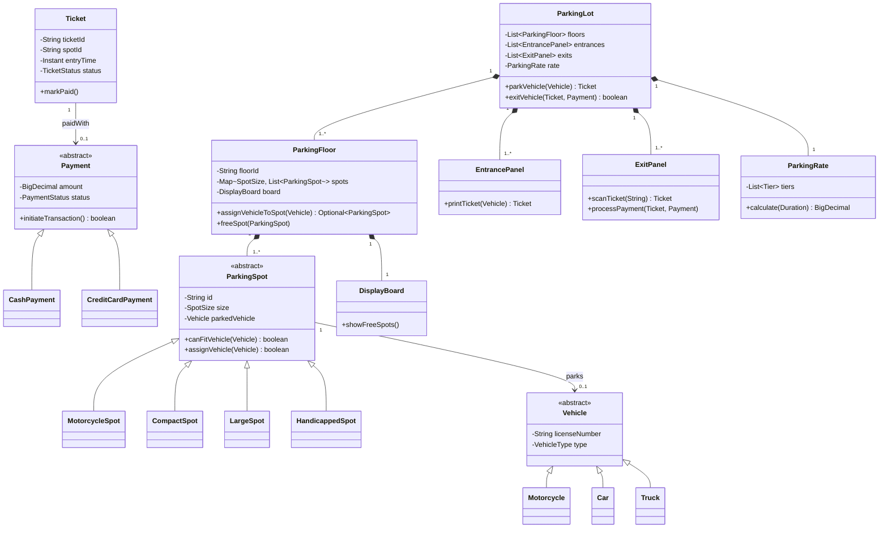
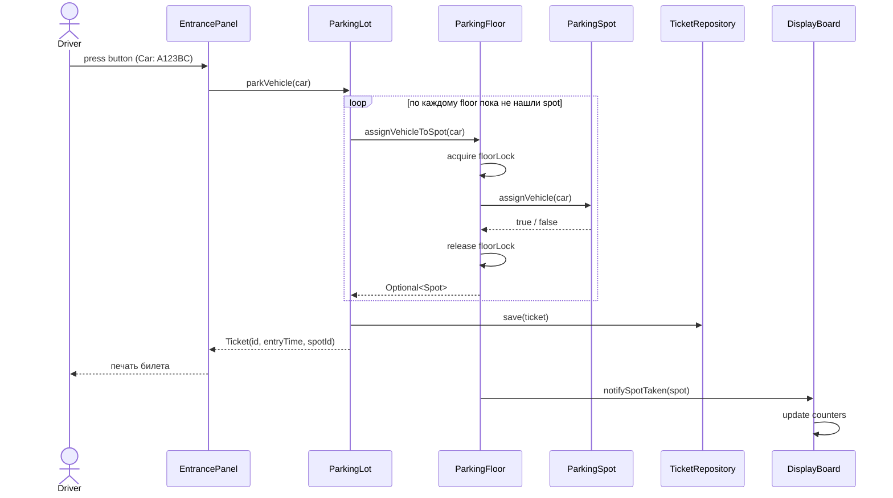
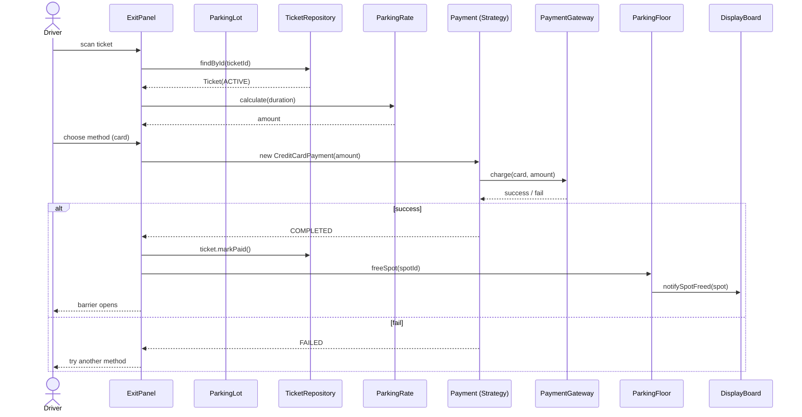
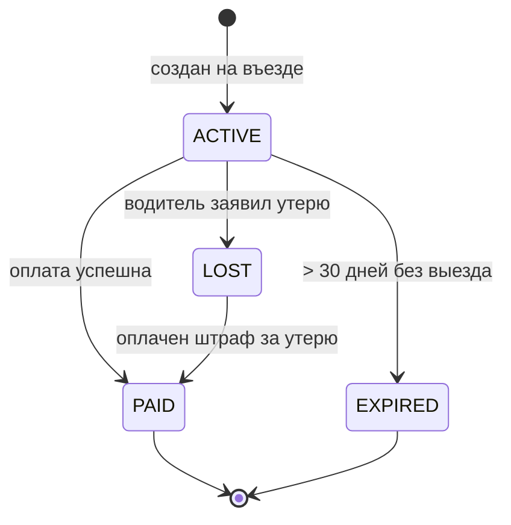

# OO Design: Parking Lot — собеседование

> Дата актуализации: 2026-05-22

Классическая задача на Low Level Design (LLD): спроектировать систему управления парковкой. Цель — показать владение OOP, паттернами GoF, SOLID, многопоточностью, а не нарисовать «всё что вспомнил». Интервьюер смотрит на структуру классов, разделение ответственности, эволюционируемость и обработку конкурентных кейсов.

## Полезные ссылки

- [Refactoring Guru — каталог паттернов GoF](https://refactoring.guru/ru/design-patterns)
- [Baeldung — SOLID Principles in Java](https://www.baeldung.com/solid-principles)
- [Educative — Object-Oriented Design Interview](https://www.educative.io/courses/grokking-the-object-oriented-design-interview)
- [Source Making — Design Patterns](https://sourcemaking.com/design_patterns)
- [Martin Fowler — Patterns of Enterprise Application Architecture](https://martinfowler.com/eaaCatalog/)
- [Java Concurrency in Practice](https://jcip.net/) — Goetz et al., классика по многопоточности
- [Effective Java — Joshua Bloch](https://www.oreilly.com/library/view/effective-java-3rd/9780134686097/) — главы по immutability, builder, singleton

## Содержание

**Requirements и use cases**
- [Q1. Functional и non-functional требования](#q1)
- [Q2. Actors и основные use cases](#q2)
- [Q3. Out of scope: что сразу отрезаем](#q3)

**Классы и responsibilities**
- [Q4. Иерархия Vehicle](#q4)
- [Q5. Иерархия ParkingSpot](#q5)
- [Q6. ParkingFloor — что хранит и за что отвечает](#q6)
- [Q7. ParkingLot — почему Singleton оправдан](#q7)
- [Q8. Ticket и Payment — две разные сущности](#q8)
- [Q9. ParkingRate — табличное ценообразование](#q9)

**UML и диаграммы**
- [Q10. Class diagram целиком](#q10)
- [Q11. Sequence: въезд автомобиля](#q11)
- [Q12. Sequence: выезд и оплата](#q12)
- [Q13. State diagram билета](#q13)

**Паттерны GoF**
- [Q14. Какие паттерны и где применены](#q14)
- [Q15. Strategy для PaymentMethod](#q15)
- [Q16. Factory для SpotAllocation](#q16)
- [Q17. Observer для DisplayBoard](#q17)
- [Q18. State для Ticket](#q18)

**SOLID применение**
- [Q19. SOLID по пунктам на этом дизайне](#q19)
- [Q20. Composition over Inheritance — где сработало](#q20)

**Thread safety**
- [Q21. Гонка за один spot — как защищаемся](#q21)
- [Q22. Lock granularity: lot / floor / spot](#q22)
- [Q23. Optimistic locking и CAS для бронирования](#q23)

**Edge cases и extensions**
- [Q24. Lost ticket, full lot, early exit](#q24)
- [Q25. Persistent state и restart](#q25)
- [Q26. Расширения: EV charging, reservations, dynamic pricing](#q26)
- [Q27. REST API наружу](#q27)
- [Q28. Anti-patterns: чего избегать](#q28)

---

## Q1. Какие у системы functional и non-functional требования (!) <a id="q1"></a>

**Functional**:
- парковка для разных типов транспорта: `Motorcycle`, `Car`, `Truck` (van/SUV считаем `Car`);
- multi-floor, multi-entrance, multi-exit;
- въезд: выдать билет с временем заезда и назначенным spot;
- выезд: посчитать тариф по времени, принять оплату, освободить spot;
- discount: monthly subscribers (флаг на `Ticket`);
- handicapped/electric spots на отдельных этажах;
- display board у въезда: «свободно: 12 motorcycle, 80 compact, 25 large».

**Non-functional**:
- **thread safety**: два потока (две камеры на двух въездах) не должны выдать один spot;
- **availability**: 99.95% — парковка работает, даже если БД лагает (можно работать в degraded read-only);
- **latency**: выдача билета < 200 мс — иначе очередь на въезде;
- **audit log**: все события (вход/выход/оплата) персистятся для финансов и спора;
- **observability**: метрики занятости в реал-тайме.

Важно проговорить вслух список и зафиксировать scope — это половина успеха интервью.

## Q2. Кто actors и какие use cases (!) <a id="q2"></a>

**Actors**:

| Actor | Use cases |
|-------|-----------|
| `Driver` | взять билет на въезде, оплатить и выехать, проверить тариф |
| `ParkingAttendant` | помочь с потерянным билетом, провести ручной платёж, освободить занятый spot |
| `Admin` | настроить тарифы, добавить/закрыть этаж, посмотреть отчёты по выручке |
| `System` (внутренний) | мониторить occupancy, перерасчёт тарифов, рассылка алертов |

**Главный happy path**:
1. машина подъезжает к `EntrancePanel`;
2. система проверяет наличие свободного spot подходящего типа;
3. выдаёт `Ticket` (с `entryTime`, `spotId`);
4. при выезде на `ExitPanel` сканируется ticket;
5. считается `Payment` (по `ParkingRate`);
6. после успешной оплаты `ParkingSpot` помечается свободным.

## Q3. Что сразу отрезаем как out of scope <a id="q3"></a>

В интервью на 45 минут нет смысла проектировать всё. Чётко проговариваем границы:
- shuttle bus между терминалами — нет;
- license plate recognition (CV) — считаем чёрным ящиком, который вернёт строку;
- интеграция с банком — `PaymentGateway` это интерфейс с одним методом `charge(amount)`;
- мобильное приложение клиента — отдельная задача;
- multi-tenant (сеть парковок) — на этом интервью одна сущность `ParkingLot`.

## Q4. Иерархия Vehicle (!) <a id="q4"></a>

`Vehicle` — `abstract class` с общими полями (`licenseNumber`, `type`). Конкретные подклассы добавляют поведение только если есть отличия.

```java
public enum VehicleType { MOTORCYCLE, CAR, TRUCK }

public abstract class Vehicle {
    private final String licenseNumber;
    private final VehicleType type;

    protected Vehicle(String licenseNumber, VehicleType type) {
        this.licenseNumber = licenseNumber;
        this.type = type;
    }

    public VehicleType getType() { return type; }
    public String getLicenseNumber() { return licenseNumber; }
}

public final class Motorcycle extends Vehicle {
    public Motorcycle(String license) { super(license, VehicleType.MOTORCYCLE); }
}

public final class Car extends Vehicle {
    public Car(String license) { super(license, VehicleType.CAR); }
}

public final class Truck extends Vehicle {
    public Truck(String license) { super(license, VehicleType.TRUCK); }
}
```

**Спорный момент**: нужны ли отдельные подклассы или хватит `Vehicle` + `VehicleType`? Если все три ведут себя одинаково — берём один класс с `enum`. Подклассы появляются только когда у одного из типов появляется специфичное поведение (например, у `ElectricCar` есть `chargingPort`).

## Q5. Иерархия ParkingSpot (!) <a id="q5"></a>

`ParkingSpot` — `abstract`. Подклассы отличаются *совместимостью* с типами транспорта.

```java
public enum SpotSize { MOTORCYCLE, COMPACT, LARGE, HANDICAPPED, ELECTRIC }

public abstract class ParkingSpot {
    protected final String id;
    protected final SpotSize size;
    protected volatile Vehicle parkedVehicle; // volatile — для видимости между потоками
    protected volatile boolean available = true;

    protected ParkingSpot(String id, SpotSize size) {
        this.id = id;
        this.size = size;
    }

    /** Может ли spot принять конкретный vehicle. Переопределяется в подклассах. */
    public abstract boolean canFitVehicle(Vehicle vehicle);

    public synchronized boolean assignVehicle(Vehicle v) {
        if (!available || !canFitVehicle(v)) return false;
        this.parkedVehicle = v;
        this.available = false;
        return true;
    }

    public synchronized void removeVehicle() {
        this.parkedVehicle = null;
        this.available = true;
    }

    public boolean isAvailable() { return available; }
    public String getId() { return id; }
    public SpotSize getSize() { return size; }
}

public class MotorcycleSpot extends ParkingSpot {
    public MotorcycleSpot(String id) { super(id, SpotSize.MOTORCYCLE); }
    @Override public boolean canFitVehicle(Vehicle v) {
        return v.getType() == VehicleType.MOTORCYCLE;
    }
}

public class CompactSpot extends ParkingSpot {
    public CompactSpot(String id) { super(id, SpotSize.COMPACT); }
    @Override public boolean canFitVehicle(Vehicle v) {
        return v.getType() == VehicleType.MOTORCYCLE || v.getType() == VehicleType.CAR;
    }
}

public class LargeSpot extends ParkingSpot {
    public LargeSpot(String id) { super(id, SpotSize.LARGE); }
    @Override public boolean canFitVehicle(Vehicle v) {
        return true; // вмещает всё
    }
}
```

Правило: `Motorcycle` влезает куда угодно; `Truck` — только в `LARGE`; `Car` — в `COMPACT` или `LARGE`. Это полиморфизм в чистом виде: каждый spot знает, кого может принять.

## Q6. ParkingFloor — что хранит и за что отвечает (!) <a id="q6"></a>

`ParkingFloor` отвечает за состояние одного этажа: список `ParkingSpot`, локальный `DisplayBoard`, метод `findFreeSpot(type)`. Эта сущность нужна, чтобы `ParkingLot` не превратился в «бога».

```java
public class ParkingFloor {
    private final String floorId;
    private final Map<SpotSize, List<ParkingSpot>> spotsBySize;
    private final DisplayBoard displayBoard;
    private final ReentrantLock floorLock = new ReentrantLock();

    public ParkingFloor(String floorId, List<ParkingSpot> spots) {
        this.floorId = floorId;
        this.spotsBySize = spots.stream()
            .collect(Collectors.groupingBy(ParkingSpot::getSize));
        this.displayBoard = new DisplayBoard(this);
    }

    /** Найти и зарезервировать spot за один атомарный шаг. */
    public Optional<ParkingSpot> assignVehicleToSpot(Vehicle vehicle) {
        floorLock.lock();
        try {
            for (ParkingSpot spot : candidateSpots(vehicle.getType())) {
                if (spot.assignVehicle(vehicle)) {
                    displayBoard.notifySpotTaken(spot);
                    return Optional.of(spot);
                }
            }
            return Optional.empty();
        } finally {
            floorLock.unlock();
        }
    }

    private List<ParkingSpot> candidateSpots(VehicleType type) {
        return switch (type) {
            case MOTORCYCLE -> mergeAll(SpotSize.MOTORCYCLE, SpotSize.COMPACT, SpotSize.LARGE);
            case CAR -> mergeAll(SpotSize.COMPACT, SpotSize.LARGE);
            case TRUCK -> spotsBySize.getOrDefault(SpotSize.LARGE, List.of());
        };
    }

    private List<ParkingSpot> mergeAll(SpotSize... sizes) {
        return Arrays.stream(sizes)
            .flatMap(s -> spotsBySize.getOrDefault(s, List.of()).stream())
            .toList();
    }

    public int freeCount(SpotSize size) {
        return (int) spotsBySize.getOrDefault(size, List.of()).stream()
            .filter(ParkingSpot::isAvailable).count();
    }
}
```

Принцип: floor — самая мелкая единица, которую мы блокируем. Локать всю парковку — медленно, отдельный spot — недостаточно (нужна стратегия выбора), floor — золотая середина.

## Q7. ParkingLot — почему Singleton оправдан (!) <a id="q7"></a>

`ParkingLot` — корневая сущность. Один физический объект ⇒ одна сущность в памяти. Singleton тут оправдан **именно** этим инвариантом, а не «удобно достать откуда угодно».

```java
public class ParkingLot {
    private static volatile ParkingLot instance;

    private final String name;
    private final List<ParkingFloor> floors;
    private final List<EntrancePanel> entrances;
    private final List<ExitPanel> exits;
    private final ParkingRate rate;
    private final TicketRepository ticketRepo;

    private ParkingLot(String name, List<ParkingFloor> floors,
                       List<EntrancePanel> entrances, List<ExitPanel> exits,
                       ParkingRate rate, TicketRepository repo) {
        this.name = name;
        this.floors = floors;
        this.entrances = entrances;
        this.exits = exits;
        this.rate = rate;
        this.ticketRepo = repo;
    }

    public static ParkingLot init(Config cfg) {
        if (instance == null) {
            synchronized (ParkingLot.class) {
                if (instance == null) {
                    instance = ParkingLotBuilder.from(cfg).build();
                }
            }
        }
        return instance;
    }

    public static ParkingLot getInstance() {
        if (instance == null) throw new IllegalStateException("ParkingLot not initialised");
        return instance;
    }

    public Optional<Ticket> parkVehicle(Vehicle vehicle) {
        for (ParkingFloor floor : floors) {
            Optional<ParkingSpot> spot = floor.assignVehicleToSpot(vehicle);
            if (spot.isPresent()) {
                Ticket t = new Ticket(vehicle.getLicenseNumber(), spot.get().getId(), Instant.now());
                ticketRepo.save(t);
                return Optional.of(t);
            }
        }
        return Optional.empty(); // нет места
    }
}
```

**Минусы Singleton**:
- сложно тестировать — обычно решается тем, что прячем за интерфейсом `ParkingFacility` и в тестах подкладываем mock;
- глобальное состояние — для интервью оправдываем тем, что это и есть единственная физическая парковка;
- проблемы с DI: в Spring можно сделать `@Component` со `singleton scope` — это правильнее «ручного» double-checked locking.

## Q8. Ticket и Payment — почему две разные сущности (!) <a id="q8"></a>

Это разные жизненные циклы. `Ticket` создаётся при въезде, живёт до выезда, может быть утерян. `Payment` создаётся в момент оплаты, имеет статус (`PENDING`, `COMPLETED`, `FAILED`, `REFUNDED`).

```java
public enum TicketStatus { ACTIVE, PAID, LOST, EXPIRED }

public class Ticket {
    private final String ticketId;
    private final String vehicleLicense;
    private final String spotId;
    private final Instant entryTime;
    private volatile TicketStatus status;
    private volatile Instant exitTime;

    public Ticket(String vehicleLicense, String spotId, Instant entryTime) {
        this.ticketId = UUID.randomUUID().toString();
        this.vehicleLicense = vehicleLicense;
        this.spotId = spotId;
        this.entryTime = entryTime;
        this.status = TicketStatus.ACTIVE;
    }

    public Duration duration(Instant now) { return Duration.between(entryTime, now); }
    public void markPaid(Instant exitAt) { this.status = TicketStatus.PAID; this.exitTime = exitAt; }
    public void markLost() { this.status = TicketStatus.LOST; }
    // getters...
}

public enum PaymentStatus { PENDING, COMPLETED, FAILED, REFUNDED }

public abstract class Payment {
    protected final BigDecimal amount;
    protected final Instant createdAt;
    protected PaymentStatus status;
    protected String externalRef;

    protected Payment(BigDecimal amount) {
        this.amount = amount;
        this.createdAt = Instant.now();
        this.status = PaymentStatus.PENDING;
    }

    public abstract boolean initiateTransaction();
}

public class CreditCardPayment extends Payment {
    private final String cardNumber;
    private final PaymentGateway gateway;

    public CreditCardPayment(BigDecimal amount, String cardNumber, PaymentGateway gateway) {
        super(amount);
        this.cardNumber = cardNumber;
        this.gateway = gateway;
    }

    @Override
    public boolean initiateTransaction() {
        GatewayResult r = gateway.charge(cardNumber, amount);
        this.externalRef = r.referenceId();
        this.status = r.success() ? PaymentStatus.COMPLETED : PaymentStatus.FAILED;
        return r.success();
    }
}

public class CashPayment extends Payment {
    public CashPayment(BigDecimal amount) { super(amount); }
    @Override public boolean initiateTransaction() {
        this.status = PaymentStatus.COMPLETED;
        return true;
    }
}
```

Если запихнуть оплату внутрь `Ticket`, нарушим SRP: при добавлении нового способа оплаты будем менять класс билета.

## Q9. ParkingRate — табличное ценообразование (!) <a id="q9"></a>

Тарифы редко плоские. Обычно это «первый час дорого, потом дешевле». Это **табличная** структура, а не цепочка `if`.

```java
public class ParkingRate {
    /** Tier: до какого часа действует и сколько стоит за час. */
    public record Tier(int upToHourExclusive, BigDecimal hourlyRate) {}

    private final List<Tier> tiers;
    private final BigDecimal lostTicketPenalty;
    private final Duration freeGracePeriod; // 15 минут

    public ParkingRate(List<Tier> tiers, BigDecimal lostTicketPenalty, Duration grace) {
        this.tiers = List.copyOf(tiers);
        this.lostTicketPenalty = lostTicketPenalty;
        this.freeGracePeriod = grace;
    }

    public BigDecimal calculate(Duration parked) {
        if (parked.compareTo(freeGracePeriod) < 0) return BigDecimal.ZERO;

        BigDecimal total = BigDecimal.ZERO;
        long hours = (long) Math.ceil(parked.toMinutes() / 60.0);

        int hourCursor = 0;
        for (Tier tier : tiers) {
            long hoursInTier = Math.min(tier.upToHourExclusive(), hours) - hourCursor;
            if (hoursInTier <= 0) break;
            total = total.add(tier.hourlyRate().multiply(BigDecimal.valueOf(hoursInTier)));
            hourCursor += hoursInTier;
            if (hourCursor >= hours) break;
        }
        return total.setScale(2, RoundingMode.HALF_UP);
    }

    public BigDecimal lostTicket() { return lostTicketPenalty; }
}
```

Типовая конфигурация:

| Tier | до часа | $/час |
|------|---------|-------|
| 1 | 1 | 4.00 |
| 2 | 3 | 3.50 |
| 3 | 24 | 2.50 |

Добавление сезонной скидки или промокода — это `Decorator` поверх `ParkingRate`, не модификация существующего класса (OCP).

## Q10. Class diagram целиком (!) <a id="q10"></a>



Здесь важна **направленность** связей: `ParkingLot` знает про `ParkingFloor`, но не наоборот (агрегация сверху вниз). Это упрощает тестирование floor изолированно.

## Q11. Sequence: въезд автомобиля <a id="q11"></a>



Ключевая вещь: блок `assignVehicleToSpot` атомарен — внутри одного `floorLock`. Иначе два потока могут получить один и тот же `Optional<Spot>` и оба отдать его водителям.

## Q12. Sequence: выезд и оплата <a id="q12"></a>



Важно: `freeSpot` вызывается **только** после `COMPLETED`. Если барьер откроется до подтверждения платежа — у нас риск списания + бесплатный выезд.

## Q13. State diagram билета <a id="q13"></a>



`State` тут — реальный состояние объекта, на который завязаны бизнес-правила: из `PAID` нельзя оплатить второй раз; из `LOST` нельзя выехать без штрафа. Переходы лучше делать через явный метод (`markPaid`, `markLost`), а не сеттер `setStatus` — иначе теряется инвариант.

## Q14. Какие паттерны GoF задействованы (!) <a id="q14"></a>

| Паттерн | Где | Зачем |
|---------|-----|-------|
| Singleton | `ParkingLot` | один физический объект ⇒ одно состояние в памяти |
| Strategy | `Payment` (Cash/Card/UPI), `SpotAllocationStrategy` | менять способ оплаты или поиска spot без модификации клиента |
| Factory Method | `SpotFactory`, `VehicleFactory` | создавать конкретный тип по входному `enum` |
| Abstract Factory | `ParkingLotBuilder` для разных конфигов (mall vs airport) | различные семейства sittings |
| Observer | `DisplayBoard` ← `ParkingFloor` | реактивно показывать число свободных мест |
| State | `Ticket` (ACTIVE/PAID/LOST/EXPIRED) | разное поведение в разных состояниях |
| Decorator | `DiscountedRate` поверх `ParkingRate` | сезонные скидки без модификации тарифа |
| Command | `ParkVehicleCommand`, `ExitCommand` | очередь действий, undo на entry (откат при ошибке) |
| Chain of Responsibility | `EntryValidationChain` (банлист → допуск → доступность) | пошаговая валидация |

Не каждый паттерн нужен — на интервью назвать 4–5 с примером применения достаточно.

## Q15. Strategy для PaymentMethod — почему именно Strategy (!) <a id="q15"></a>

Способов оплаты много (кэш, карта, Apple Pay, корпоративный аккаунт). Все они отвечают на один вопрос: «провести платёж X рублей». Алгоритм разный, интерфейс одинаковый — это каноничный Strategy.

```java
public interface PaymentStrategy {
    PaymentResult charge(BigDecimal amount, PaymentContext ctx);
}

public record PaymentResult(boolean success, String externalRef, String message) {}

public class CardPaymentStrategy implements PaymentStrategy {
    private final PaymentGateway gateway;
    public CardPaymentStrategy(PaymentGateway gw) { this.gateway = gw; }

    @Override
    public PaymentResult charge(BigDecimal amount, PaymentContext ctx) {
        GatewayResult r = gateway.charge(ctx.cardNumber(), amount);
        return new PaymentResult(r.success(), r.referenceId(), r.message());
    }
}

public class CashPaymentStrategy implements PaymentStrategy {
    @Override public PaymentResult charge(BigDecimal amount, PaymentContext ctx) {
        return new PaymentResult(true, "CASH-" + UUID.randomUUID(), "ok");
    }
}

public class ExitController {
    private final Map<PaymentMethod, PaymentStrategy> strategies;

    public ExitController(Map<PaymentMethod, PaymentStrategy> strategies) {
        this.strategies = strategies;
    }

    public boolean payAndExit(Ticket t, PaymentMethod m, PaymentContext ctx, BigDecimal amount) {
        PaymentStrategy strategy = strategies.get(m);
        if (strategy == null) throw new IllegalArgumentException("Unsupported: " + m);
        return strategy.charge(amount, ctx).success();
    }
}
```

Альтернатива (наследование `Payment` ← `CardPayment`) — тоже работает, но смешивает данные платежа и алгоритм проведения. Стратегия чище: `Payment` хранит данные, `PaymentStrategy` — алгоритм.

## Q16. Factory для SpotAllocation <a id="q16"></a>

Фабрика создаёт правильный тип spot по конфигу. Используется при загрузке этажа из БД.

```java
public class SpotFactory {
    public static ParkingSpot create(SpotConfig cfg) {
        return switch (cfg.size()) {
            case MOTORCYCLE   -> new MotorcycleSpot(cfg.id());
            case COMPACT      -> new CompactSpot(cfg.id());
            case LARGE        -> new LargeSpot(cfg.id());
            case HANDICAPPED  -> new HandicappedSpot(cfg.id());
            case ELECTRIC     -> new ElectricSpot(cfg.id(), cfg.chargingPowerKw());
        };
    }
}
```

Когда добавится `ElectricSpot`, меняется только фабрика — клиентский код продолжает работать с `ParkingSpot`. Без фабрики `new` пришлось бы вызывать в десятке мест.

**Стратегия выбора spot** — тоже Factory + Strategy:

```java
public interface SpotAllocationStrategy {
    Optional<ParkingSpot> allocate(List<ParkingFloor> floors, Vehicle v);
}

/** Найти ближайший к въезду подходящий spot. */
public class NearestFirstAllocation implements SpotAllocationStrategy { /* ... */ }

/** Найти самый компактный из подходящих (плотная упаковка). */
public class SmallestFittingAllocation implements SpotAllocationStrategy { /* ... */ }
```

## Q17. Observer для DisplayBoard (!) <a id="q17"></a>

`DisplayBoard` показывает количество свободных мест. Он должен реагировать на любое изменение `ParkingSpot.available` — но `ParkingSpot` не должен **знать** про `DisplayBoard` (иначе нарушение DIP).

```java
public interface SpotListener {
    void onSpotTaken(ParkingSpot spot);
    void onSpotFreed(ParkingSpot spot);
}

public class ParkingFloor implements SpotPublisher {
    private final List<SpotListener> listeners = new CopyOnWriteArrayList<>();

    public void subscribe(SpotListener l) { listeners.add(l); }

    private void publishTaken(ParkingSpot s) {
        for (SpotListener l : listeners) l.onSpotTaken(s);
    }
    // ...
}

public class DisplayBoard implements SpotListener {
    private final Map<SpotSize, AtomicInteger> freeBySize = new EnumMap<>(SpotSize.class);

    public DisplayBoard(ParkingFloor floor) {
        for (SpotSize s : SpotSize.values()) freeBySize.put(s, new AtomicInteger(0));
        floor.subscribe(this);
    }

    @Override public void onSpotTaken(ParkingSpot s) { freeBySize.get(s.getSize()).decrementAndGet(); }
    @Override public void onSpotFreed(ParkingSpot s) { freeBySize.get(s.getSize()).incrementAndGet(); }

    public Map<SpotSize, Integer> snapshot() {
        return freeBySize.entrySet().stream()
            .collect(Collectors.toMap(Map.Entry::getKey, e -> e.getValue().get()));
    }
}
```

`CopyOnWriteArrayList` — потому что подписчиков мало, читаются часто, изменения редкие. Альтернатива — Reactive Streams (`Flux<SpotEvent>`), но для LLD-интервью достаточно классического Observer.

## Q18. State для Ticket — зачем (!) <a id="q18"></a>

В наивном дизайне `Ticket.process()` превращается в гигантский `switch` по `status`. Паттерн State выносит поведение в отдельные классы.

```java
public interface TicketState {
    Payment processPayment(Ticket t, BigDecimal amount, PaymentStrategy s, PaymentContext ctx);
    void markLost(Ticket t);
}

public class ActiveTicketState implements TicketState {
    @Override
    public Payment processPayment(Ticket t, BigDecimal amount, PaymentStrategy s, PaymentContext ctx) {
        PaymentResult r = s.charge(amount, ctx);
        if (r.success()) {
            t.changeState(new PaidTicketState());
            return new PaidPayment(amount, r.externalRef());
        }
        throw new PaymentFailedException(r.message());
    }
    @Override public void markLost(Ticket t) { t.changeState(new LostTicketState()); }
}

public class PaidTicketState implements TicketState {
    @Override public Payment processPayment(Ticket t, BigDecimal a, PaymentStrategy s, PaymentContext c) {
        throw new IllegalStateException("Already paid");
    }
    @Override public void markLost(Ticket t) {
        throw new IllegalStateException("Paid ticket cannot be lost");
    }
}

public class LostTicketState implements TicketState {
    @Override
    public Payment processPayment(Ticket t, BigDecimal penalty, PaymentStrategy s, PaymentContext c) {
        PaymentResult r = s.charge(penalty, c);
        if (r.success()) { t.changeState(new PaidTicketState()); return new PaidPayment(penalty, r.externalRef()); }
        throw new PaymentFailedException(r.message());
    }
    @Override public void markLost(Ticket t) { /* idempotent */ }
}
```

Если состояний 2-3 — можно обойтись `enum`. Если 5+ с разной логикой — State.

## Q19. SOLID на этом дизайне по пунктам (!) <a id="q19"></a>

**S — Single Responsibility**:
- `Ticket` хранит факт заезда, не считает деньги (это `ParkingRate`);
- `ParkingFloor` управляет местами, не отвечает за тарификацию;
- `PaymentStrategy` проводит платёж, не знает про `Ticket`.

**O — Open/Closed**:
- добавить `UpiPayment`? новый класс, реализующий `PaymentStrategy`, никакой существующий код не меняется;
- добавить `ElectricSpot`? новый подкласс `ParkingSpot` + правка `SpotFactory` (единственная точка).

**L — Liskov Substitution**:
- `LargeSpot` подставляется вместо `ParkingSpot` без сюрпризов;
- **антипример**: если бы `MotorcycleSpot.assignVehicle` иногда возвращал `true` для `Truck` ради «оптимизации» — LSP нарушен.

**I — Interface Segregation**:
- разделить `Bookable` (для бронирования) и `Releasable` (для освобождения) — клиент, которому нужно только освобождать, не зависит от методов резервирования.

```java
public interface Bookable { boolean book(Vehicle v); }
public interface Releasable { void release(); }
public abstract class ParkingSpot implements Bookable, Releasable { /* ... */ }
```

**D — Dependency Inversion**:
- `ParkingLot` зависит от `TicketRepository` (интерфейс), а не от конкретной `JdbcTicketRepository`;
- `Payment` зависит от `PaymentGateway` (интерфейс), а не от Stripe SDK напрямую.

## Q20. Composition over Inheritance — где сработало <a id="q20"></a>

Соблазн: сделать `DiscountedRate extends ParkingRate`. Проблема: каждая комбинация скидок порождает новый класс (`DiscountedNightRate`, `SeniorDiscountedNightRate` …).

**Решение через композицию (Decorator)**:

```java
public interface Rate {
    BigDecimal calculate(Duration parked);
}

public class StandardRate implements Rate { /* базовая логика */ }

public class DiscountedRate implements Rate {
    private final Rate inner;
    private final BigDecimal multiplier;
    public DiscountedRate(Rate inner, BigDecimal multiplier) {
        this.inner = inner; this.multiplier = multiplier;
    }
    @Override
    public BigDecimal calculate(Duration parked) {
        return inner.calculate(parked).multiply(multiplier).setScale(2, RoundingMode.HALF_UP);
    }
}

// Использование:
Rate weekendRate = new DiscountedRate(new StandardRate(...), new BigDecimal("0.8"));
Rate seniorWeekend = new DiscountedRate(weekendRate, new BigDecimal("0.5"));
```

Любая комбинация — без новых классов.

## Q21. Гонка за один spot — как защищаемся (!) <a id="q21"></a>

**Проблема**: два потока (две камеры на двух въездах) одновременно вызвали `parkVehicle`. Если просто пробежимся по `spots` и возьмём первый `available`, оба получат один spot.

**Решение 1 — coarse lock на этаже** (то, что в `ParkingFloor.assignVehicleToSpot`):

```java
floorLock.lock();
try {
    for (ParkingSpot spot : candidates) {
        if (spot.isAvailable()) {
            spot.assignVehicle(vehicle);
            return Optional.of(spot);
        }
    }
} finally { floorLock.unlock(); }
```

Просто, надёжно, но при 1000+ въездов в минуту lock на этаж становится боттлнеком.

**Решение 2 — CAS на каждом spot**:

```java
public abstract class ParkingSpot {
    private final AtomicReference<Vehicle> parked = new AtomicReference<>(null);

    public boolean tryAssign(Vehicle v) {
        if (!canFitVehicle(v)) return false;
        return parked.compareAndSet(null, v);
    }

    public void release() { parked.set(null); }
    public boolean isAvailable() { return parked.get() == null; }
}
```

Тогда в floor — обычный цикл без lock:

```java
for (ParkingSpot s : candidates) {
    if (s.tryAssign(vehicle)) return Optional.of(s);
}
return Optional.empty();
```

CAS быстрее, lock-free, масштабируется. Минус: чуть сложнее объяснять.

## Q22. Lock granularity: lot / floor / spot (!) <a id="q22"></a>

| Уровень | Lock | Throughput | Сложность | Когда брать |
|---------|------|------------|-----------|-------------|
| `ParkingLot` | один глобальный `ReentrantLock` | низкий | минимум | прототип, debug |
| `ParkingFloor` | lock на каждый этаж | средний (≈ N этажей) | средне | стандартный выбор |
| `ParkingSpot` | CAS / per-spot lock | высокий | сложнее тесты | high-load |

Эвристика для интервью: «начну с floor-level lock, потому что 99% парковок этого хватит, а если надо больше — мигрирую на CAS». Демонстрируется понимание trade-off, а не оверинжиниринг.

## Q23. Optimistic locking и CAS для бронирования <a id="q23"></a>

Когда `ParkingSpot` персистится в БД, чисто in-memory CAS недостаточно. Используем **optimistic locking** с версией:

```sql
CREATE TABLE parking_spot (
    id          VARCHAR PRIMARY KEY,
    size        VARCHAR NOT NULL,
    vehicle_id  VARCHAR NULL,
    version     BIGINT NOT NULL DEFAULT 0
);
```

```java
public boolean tryReserve(String spotId, String vehicleId) {
    int updated = jdbc.update("""
        UPDATE parking_spot
           SET vehicle_id = ?, version = version + 1
         WHERE id = ?
           AND vehicle_id IS NULL
        """, vehicleId, spotId);
    return updated == 1;
}
```

`WHERE vehicle_id IS NULL` — это и есть CAS на уровне БД. Если двое одновременно — один поток получит `updated == 1`, второй `0`. Альтернатива — JPA с `@Version`:

```java
@Entity
public class ParkingSpotEntity {
    @Id private String id;
    private String vehicleId;
    @Version private Long version;
}
```

При конкурентном update Hibernate бросит `OptimisticLockException` — обрабатываем как «попробовать другой spot».

## Q24. Lost ticket, full lot, early exit (!) <a id="q24"></a>

| Кейс | Поведение |
|------|-----------|
| **Lost ticket** | водитель идёт к attendant; берём `MAX_LOST_PENALTY` (например, $50) + license recognition по камере; статус билета → `LOST` |
| **Full lot** | `parkVehicle` возвращает `Optional.empty()`, на входе показывается «Full»; альтернатива — очередь въезда (`Queue<Vehicle>`) с FIFO |
| **Early exit (< 15 min)** | `ParkingRate.freeGracePeriod` → `BigDecimal.ZERO`, барьер открывается |
| **Monthly subscriber** | флаг `Subscription` на `Vehicle`, `ParkingRate.calculate` возвращает 0 |
| **Билет старше 30 дней** | статус `EXPIRED`, выезд только через attendant + штраф |
| **Превышение лимита по времени** | таймер шлёт алерт владельцу через 24h |
| **Reserved spot занят чужой машиной** | tow truck, billing на нарушителя через license plate |

Эти кейсы — **главный** material для дополнительных вопросов от интервьюера. Имеет смысл проговорить 2–3 заранее, остальные держать наготове.

## Q25. Persistent state и restart <a id="q25"></a>

Если приложение перезапустилось — нельзя забыть, кто где стоит. Решение: всё критичное состояние пишем в БД синхронно.

| Сущность | Persistence | Reload |
|----------|-------------|--------|
| `ParkingSpot.occupied` | UPDATE при assign/release | загрузить при старте |
| `Ticket` | INSERT при выдаче, UPDATE при оплате | active tickets из БД |
| `Payment` | INSERT, status idempotent | для аудита |
| `ParkingRate` | конфиг в БД | загрузить при старте |
| `DisplayBoard counters` | derived state | пересчитать из `ParkingSpot` |

Шаблон загрузки:

```java
@PostConstruct
public void bootstrap() {
    List<ParkingFloor> floors = floorRepo.loadAll(); // includes spot.occupied
    ParkingLot.init(new Config(floors, rateRepo.current(), ...));
    ticketRepo.findByStatus(TicketStatus.ACTIVE)
        .forEach(t -> activeIndex.put(t.getTicketId(), t));
}
```

При краше посередине транзакции (списали деньги, не освободили spot) — нужен **outbox pattern** + reconciliation job, который ищет такие расхождения.

## Q26. Расширения: EV charging, reservations, dynamic pricing <a id="q26"></a>

**EV charging**:
```java
public class ElectricSpot extends ParkingSpot {
    private final double chargingPowerKw;
    private final ChargingSession session;
    // тариф = parking + electricity * kWh
}
```
Тариф — комбинация двух стратегий через Decorator.

**Reservation**:
- новая сущность `Reservation(spotId, from, to, vehicleId)`;
- `ParkingFloor.assignVehicleToSpot` сначала проверяет: «не зарезервирован ли spot на сейчас?»;
- если reservation не пришёл за 15 минут — освобождаем (cron job).

**Dynamic pricing**:
- `DynamicRate implements Rate` с зависимостью от `OccupancyMetric`;
- при `occupancy > 80%` — наценка ×1.5;
- работает прозрачно для остальной системы.

**Tiered VIP spots**:
- отдельный `SpotSize.VIP`;
- проверка по `Vehicle.tier()` в `canFitVehicle`.

## Q27. REST API наружу <a id="q27"></a>

| Endpoint | Метод | Назначение |
|----------|-------|-----------|
| `/api/v1/park` | POST | въезд, тело `{licensePlate, vehicleType}` → `Ticket` |
| `/api/v1/exit/{ticketId}` | POST | посчитать стоимость + начать оплату |
| `/api/v1/exit/{ticketId}/payment` | POST | подтвердить оплату, тело `{method, ...}` |
| `/api/v1/status` | GET | свободные места по этажам / типам |
| `/api/v1/tickets/{id}` | GET | состояние билета |
| `/api/v1/admin/rates` | PUT | поменять тариф (admin role) |
| `/api/v1/admin/floors/{id}/close` | POST | закрыть этаж на ремонт |

Контроллер — тонкий, делегирует в `ParkingLot`/`ExitService`. Логика остаётся в domain слое.

```java
@RestController
@RequestMapping("/api/v1")
public class ParkingController {
    private final ParkingFacility facility;

    @PostMapping("/park")
    public ResponseEntity<TicketDto> park(@RequestBody ParkRequest req) {
        return facility.parkVehicle(req.toDomain())
            .map(TicketDto::from)
            .map(ResponseEntity::ok)
            .orElse(ResponseEntity.status(HttpStatus.CONFLICT).build()); // 409 = full
    }
}
```

## Q28. Anti-patterns: чего избегать (!) <a id="q28"></a>

| Anti-pattern | Симптом | Лечение |
|--------------|---------|---------|
| **God class** `ParkingLot` | 1000+ строк, делает всё | вынести `EntryService`, `ExitService`, `BillingService` |
| **Procedural в OO-одежде** | `if (vehicle.type == MOTORCYCLE) ... else if ...` повсюду | полиморфизм через `canFitVehicle`, double dispatch |
| **Анемичная модель** | `Ticket` — только getters/setters, логика в сервисе | методы поведения внутрь сущности (`markPaid`, `duration`) |
| **Hard-coded rates** | `BigDecimal price = new BigDecimal("4")` | конфиг через `ParkingRate` + admin endpoint |
| **Магические числа** | `if (minutes < 15)` | `freeGracePeriod` в конфиге |
| **Mutable shared state без защиты** | `private boolean available;` без `volatile` | `volatile` + `synchronized` или `AtomicReference` |
| **Слишком много паттернов** | каждая фича = паттерн | YAGNI: добавлять при второй точке вариативности |
| **Spot-id как `int`** | конкатенации, проверки `> 0` | `record SpotId(String value)` value object |

Главный признак плохого OO-дизайна: при добавлении нового типа транспорта или способа оплаты приходится править `> 3` файлов и трогать `if/switch` в нескольких местах. Хороший дизайн — добавление нового класса и одной строки в фабрике.

---

## See also

- [System Design Interview](system-design-interview.md) — общий каркас собеседования
- [Design Patterns Interview](../design-patterns/design-patterns-interview.md) — GoF в деталях
- [Java OOP Interview](../programming-languages/java/java-oop-interview.md) — основы ООП
- [Java Core Interview](../programming-languages/java/java-core-interview.md) — базовые конструкции
- [Java Concurrency Interview](../programming-languages/java/java-concurrency-interview.md) — locks, CAS, volatile
- [Clean Architecture Interview](../architecture/clean-architecture-interview.md) — DIP и слои
- [Hexagonal Architecture Interview](../architecture/hexagonal-architecture-interview.md) — порты и адаптеры
- [Clean Code Practices Interview](../code-quality/clean-code-practices-interview.md) — практики чистого кода
- [Code Smells Interview](../code-quality/code-smells-interview.md) — антипаттерны
- [Refactoring Patterns Interview](../code-quality/refactoring-patterns-interview.md) — техники рефакторинга
