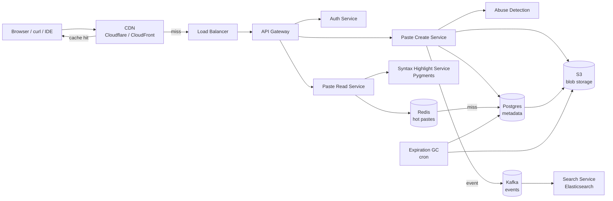

# Вопросы на собеседовании: `Design Pastebin`

`Pastebin` (GitHub Gist, Hastebin, 0bin, JSFiddle для кода) — простой сервис обмена текстом / кодом через короткую ссылку. На интервью это «mini system design»: компактен (укладывается в 30-45 минут), но проверяет ключевые знания: short URL generation, blob vs metadata разделение, syntax highlighting, expiration / TTL, anti-abuse, CDN. Часть параллелей с URL shortener, но с blob payload.

## Полезные ссылки

- [Pastebin (классический сервис)](https://pastebin.com/api)
- [GitHub Gist documentation](https://docs.github.com/en/rest/gists)
- [Hastebin (open source)](https://github.com/toptal/haste-server)
- [0bin (client-side encrypted)](https://github.com/agrm/0bin)
- [Pygments syntax highlighter](https://pygments.org/)
- [Prism.js client-side syntax](https://prismjs.com/)
- [highlight.js](https://highlightjs.org/)
- [System Design Primer](https://github.com/donnemartin/system-design-primer)

## Содержание

**Requirements и capacity**
- [Q1. (!) Functional и non-functional requirements?](#q1--functional-и-non-functional-requirements)
- [Q2. (!) Capacity estimation (1M pastes/day, 5-year retention)?](#q2--capacity-estimation-1m-pastesday-5-year-retention)
- [Q3. SLA и SLO для creation / view paths?](#q3-sla-и-slo-для-creation--view-paths)

**Identifier и storage**
- [Q4. (!) Short URL generation (Base62, collision)?](#q4--short-url-generation-base62-collision)
- [Q5. (!) Storage architecture (DB metadata + S3 blob)?](#q5--storage-architecture-db-metadata--s3-blob)
- [Q6. Schema design (pastes, users, views)?](#q6-schema-design-pastes-users-views)
- [Q7. Compression на write (gzip / zstd)?](#q7-compression-на-write-gzip--zstd)

**Endpoints и API**
- [Q8. (!) Raw vs view endpoints (curl vs browser)?](#q8--raw-vs-view-endpoints-curl-vs-browser)
- [Q9. API для programmatic creation (CLI / IDE plugin)?](#q9-api-для-programmatic-creation-cli--ide-plugin)
- [Q10. Embed widgets (gist.github.com `<script>`)?](#q10-embed-widgets-gistgithubcom-script)

**Rendering**
- [Q11. (!) Syntax highlighting: server-side Pygments vs client-side Prism?](#q11--syntax-highlighting-server-side-pygments-vs-client-side-prism)
- [Q12. Markdown rendering vs raw text?](#q12-markdown-rendering-vs-raw-text)
- [Q13. Language detection (auto vs explicit)?](#q13-language-detection-auto-vs-explicit)

**Lifecycle**
- [Q14. (!) Expiration / TTL (1h, 1d, 1w, never)?](#q14--expiration--ttl-1h-1d-1w-never)
- [Q15. (!) Burn after reading (one-time view)?](#q15--burn-after-reading-one-time-view)
- [Q16. Versioning (edit existing paste)?](#q16-versioning-edit-existing-paste)

**Privacy и features**
- [Q17. Privacy modes (public / unlisted / private / password)?](#q17-privacy-modes-public--unlisted--private--password)
- [Q18. (!) Search (Elasticsearch, opt-in indexing)?](#q18--search-elasticsearch-opt-in-indexing)
- [Q19. Folders / multi-file pastes (Gist)?](#q19-folders--multi-file-pastes-gist)
- [Q20. Diff и compare между revisions?](#q20-diff-и-compare-между-revisions)

**Архитектура**
- [Q21. (!) High-level architecture?](#q21--high-level-architecture)
- [Q22. (!) Storage tiering (Redis / S3 / Glacier)?](#q22--storage-tiering-redis--s3--glacier)
- [Q23. CDN для raw content (Cloudflare / CloudFront)?](#q23-cdn-для-raw-content-cloudflare--cloudfront)
- [Q24. Multi-region и data residency?](#q24-multi-region-и-data-residency)

**Production**
- [Q25. (!) Anti-abuse (DMCA, malware, scraping)?](#q25--anti-abuse-dmca-malware-scraping)
- [Q26. Authentication (OAuth, API tokens)?](#q26-authentication-oauth-api-tokens)
- [Q27. Rate limiting (anonymous IP vs auth key)?](#q27-rate-limiting-anonymous-ip-vs-auth-key)
- [Q28. (!) Monitoring metrics?](#q28--monitoring-metrics)
- [Q29. Cost optimization (compression + lifecycle + CDN)?](#q29-cost-optimization-compression--lifecycle--cdn)
- [Q30. (!) Антипаттерны и подводные камни?](#q30--антипаттерны-и-подводные-камни)

## Q1. (!) Functional и non-functional requirements?

**Функциональные:**
- Создать paste: текст / код / Markdown с опциональным заголовком.
- Получить paste по короткой ссылке: `pastebin.com/abc1234`.
- Raw-просмотр: `pastebin.com/raw/abc1234` (для curl, wget).
- TTL / истечение срока (опционально).
- Подсветка синтаксиса по языку (или авто-детект).
- Анонимный и авторизованный режимы.
- Режимы приватности: public, unlisted, private, password-protected.
- Опционально: редактирование, история версий (Gist).
- Опционально: полнотекстовый поиск.
- Опционально: embed-виджет.

**Нефункциональные:**
- Пользователи: миллионы DAU (Pastebin ~25M MAU, Gist ~10M+).
- Pastes: 1M+ создаётся/день, retention годами.
- Преобладание чтения: 100:1 reads:writes (один paste просматривают N раз).
- Латентность: просмотр < 100 ms, создание < 500 ms.
- Доступность: 99.9% (не так критично, как для финтеха).
- Хранилище: масштаб TB (сжатые blob-ы).

**За скобками scope (типично):**
- Совместное редактирование в реальном времени (Codepen, JSFiddle Pro).
- Выполнение кода / sandbox (это replit, не pastebin).
- Форматированный текст (HTML-редактор) — только plain text / markdown.

**Совет:** senior сразу отмечает, что paste бывает огромным (логи на 10 MB+), и это диктует необходимость отделить blob storage от metadata DB.

## Q2. (!) Capacity estimation (1M pastes/day, 5-year retention)?

**Исходные допущения:**

| Параметр | Значение |
|---|---|
| Pastes создаётся/день | 1M |
| Средний размер | 10 KB (микс из крошечных сниппетов и крупных логов) |
| Retention | 5 лет (с фильтрацией по TTL) |
| Соотношение read:write | 100:1 |

**Хранилище:**
- 1M × 10 KB = **10 GB/день** raw.
- 5 лет × 365 × 10 GB = **~18 TB raw**.
- + индекс (небольшой ~1%), метаданные (~50 байт/paste × 2B = 100 GB).
- Сжатие (zstd 3-4×) → **5-7 TB сжатого blob**.

**Полоса пропускания:**
- Чтения: 1M × 100 = 100M просмотров/день = ~1200 просмотров/сек в среднем.
- Пик ×5 = 6 000 просмотров/сек.
- На просмотр: 10 KB → ~60 MB/сек egress на пике.
- 95%+ через CDN → origin ~3 MB/сек.

**Память (cache):**
- Горячие pastes, топ 1% × 100K активных в среднем = ~10 GB горячих в Redis.

**QPS на metadata DB:**
- Создания: 1M/день = ~12/сек в среднем, пик 100/сек.
- Чтения: 1200-6000/сек — большая часть из cache.

**Стоимость:**
- S3 storage (сжатый): 5-7 TB × $0.023/GB-месяц = **$120-160/месяц**.
- CDN egress: 60 MB/сек × пиковые часы = 1-2 TB/месяц через CDN = **$50-100/месяц**.
- На большем масштабе (сам Pastebin): рост пропорционально.

## Q3. SLA и SLO для creation / view paths?

| Metric | Цель | Alert |
|---|---|---|
| `paste_creation_latency_p99` | < 500 ms | > 2 сек |
| `paste_view_latency_p99` | < 100 ms (из cache) | > 500 ms |
| `cdn_hit_ratio` | > 90% | < 70% |
| `creation_success_rate` | > 99% | < 95% |
| `expiration_gc_lag_minutes` | < 60 мин | > 1440 мин (1 день) |
| `abuse_block_rate` | отслеживается | всплеск > 3× baseline |
| `availability` | 99.9% | < 99% за месяц |

**Сценарии отказа:**
- Blob storage недоступен → отказ в создании (можно буферизовать офлайн с retry на клиенте).
- Падение metadata DB → 503; критично.
- Промах CDN + origin лежит → degraded-режим (raw-байты напрямую из S3).

## Q4. (!) Short URL generation (Base62, collision)?

Параллели с [Design URL Shortener](design-url-shortener-interview.md) — но в Pastebin URL уникален для содержимого paste, а не для длинного URL.

**Подходы:**

**1. Base62-счётчик:**
- `id = INCR counter` (Snowflake / диапазоны ключей в ZooKeeper).
- `short = base62_encode(id)`.
- Плюсы: нет коллизий; предсказуемо.
- Минусы: перечислимо (безопасность: можно сканировать `/1`, `/2`).

**2. Случайный Base62 (7 символов):**
- `short = random_base62(7)` → 62^7 = 3.5T комбинаций.
- Плюсы: непредсказуемо (безопасность).
- Минусы: нужна проверка коллизий (~10M ожидаемых коллизий на 6B → обрабатывать через retry).

**3. На основе хеша:**
- `short = base62(sha256(content))[:7]`.
- Плюсы: дедупликация (одинаковое содержимое → одинаковый URL).
- Минусы: дубликаты могут стать проблемой приватности (любой с тем же содержимым угадает URL).

**Выбор Pastebin / Gist:**
- Pastebin: случайный Base62 на 8 символов.
- Gist: 32-символьный hex-хеш (длиннее, сложнее угадать).
- Hastebin: случайные 10 символов.

**Длина:**
- 7 символов = 3.5T (безопасно для billion-масштаба, 5 лет).
- 8 символов = 218T (дополнительный запас).
- Gist на 32 символа = практически неугадываемо (безопасность: unlisted ≠ private, но найти труднее).

**Обработка коллизий:**
- UNIQUE-constraint в DB.
- Retry при конфликте (3-5 попыток).
- После N попыток → увеличить длину до 8 символов.

**Защита от перечисления:**
- Длиннее = труднее сканировать.
- Rate limit на 404-ответы (безопасность: детект попыток сканирования).

## Q5. (!) Storage architecture (DB metadata + S3 blob)?

**Принцип:** разделять metadata (небольшие, индексируемые, OLTP) и blob (крупные, неизменяемые, последовательные).

**Metadata (Postgres / MySQL):**
```sql
CREATE TABLE pastes (
  id BIGSERIAL PRIMARY KEY,
  short_code VARCHAR(10) UNIQUE NOT NULL,
  user_id BIGINT NULL,
  title TEXT,
  language VARCHAR(20),
  size_bytes INT,
  visibility VARCHAR(10),  -- public / unlisted / private
  password_hash TEXT NULL,
  created_at TIMESTAMP DEFAULT NOW(),
  expires_at TIMESTAMP NULL,
  views_count BIGINT DEFAULT 0,
  blob_key TEXT NOT NULL,  -- S3 key
  blob_compression VARCHAR(10),
  deleted_at TIMESTAMP NULL
);

CREATE INDEX idx_user ON pastes (user_id);
CREATE INDEX idx_expires ON pastes (expires_at) WHERE expires_at IS NOT NULL;
```

**Blob storage (S3 / GCS / Cloudflare R2):**
- Ключ: `pastes/{short_code}.zst` (или `/{shard}/{short_code}`).
- Значение: текстовые байты, сжатые zstd.
- Неизменяемый (перезапись при редактировании = новая ревизия, отдельный blob).

**Поток чтения:**
```
GET /abc1234
  ↓
metadata = pastes WHERE short_code = 'abc1234'
  ↓ (если expired или not visible) → 404
  ↓
blob = s3.get(metadata.blob_key)
  ↓ decompress
  ↓
return content
```

**Зачем разделять:**
- Metadata на SSD ($$$) — высокочастотные запросы.
- Blob на HDD/object storage ($/GB) — дёшево и массово.
- Независимое масштабирование.
- Blob неизменяем → дружелюбен к кешированию через CDN.

**Альтернатива (single Postgres):**
- Хранить blob в колонке TEXT/BYTEA.
- Плюс: проще архитектура.
- Минусы: стоимость DB быстро растёт; накладные расходы на уровне строк; backup тяжелее.

**Для небольшого Pastebin (ранняя стадия):** single Postgres работает. На billion-масштабе разделение обязательно.

## Q6. Schema design (pastes, users, views)?

**pastes** — основная таблица (см. Q5).

**users** (если есть авторизация):
```sql
CREATE TABLE users (
  id BIGSERIAL PRIMARY KEY,
  username VARCHAR(40) UNIQUE,
  email VARCHAR(255) UNIQUE,
  oauth_provider VARCHAR(20),  -- github, google, none
  oauth_id TEXT,
  api_token_hash TEXT,
  plan VARCHAR(20),  -- free, paid
  created_at TIMESTAMP
);
```

**views** (для аналитики, опционально):
```sql
CREATE TABLE paste_views (
  id BIGSERIAL PRIMARY KEY,
  paste_id BIGINT,
  viewer_user_id BIGINT NULL,
  viewer_ip_hash VARCHAR(64),
  user_agent VARCHAR(255),
  referrer TEXT,
  viewed_at TIMESTAMP
) PARTITION BY RANGE (viewed_at);
```

Партиционирование по месяцу → удаление старых данных простое (`DROP PARTITION`).

**revisions** (если есть версионирование, Gist):
```sql
CREATE TABLE paste_revisions (
  id BIGSERIAL PRIMARY KEY,
  paste_id BIGINT,
  blob_key TEXT,
  revision_number INT,
  edited_by BIGINT,
  edited_at TIMESTAMP,
  UNIQUE (paste_id, revision_number)
);
```

**comments** (Gist):
```sql
CREATE TABLE paste_comments (
  id BIGSERIAL PRIMARY KEY,
  paste_id BIGINT,
  user_id BIGINT,
  body TEXT,
  created_at TIMESTAMP
);
```

**Индексы:**
- `pastes.short_code` — UNIQUE, основной lookup.
- `pastes.user_id` — страница «мои pastes».
- `pastes.expires_at` — для GC-прохода.
- `paste_views.paste_id, viewed_at` — аналитика.

## Q7. Compression на write (gzip / zstd)?

**Компромисс:** стоимость CPU против хранилища и полосы пропускания.

| Кодек | Степень сжатия | Скорость сжатия | Скорость распаковки |
|---|---|---|---|
| gzip | 2.5-3× | 50 MB/s | 200 MB/s |
| zstd | 3-4× | 400 MB/s | 800 MB/s |
| Brotli | 3.5× | 30 MB/s | 200 MB/s |

**Выбор Pastebin: zstd**
- Лучший компромисс.
- Сжатие 3-4× на коде (большая избыточность).
- Сжатие достаточно быстрое для real-time (<5 ms на 10 KB).
- Распаковка почти бесплатна.

**Сжатие на уровне отдельного paste:**
- Применять на запись один раз → сохранять.
- На чтение распаковывать → отдавать raw-текст.

**Не сжимать:**
- Крошечные pastes (< 256 байт) — накладные расходы больше экономии.
- Уже сжатое содержимое (редко для plain text pastes).

**Сжатие в транспорте:**
- HTTP `Accept-Encoding: br, gzip` — CDN/сервер сжимают ответ.
- Vector tiles / крупный контент → Brotli «на проводе».

**Пример кода:**
```python
import zstandard as zstd

def store(text):
    compressor = zstd.ZstdCompressor(level=3)
    compressed = compressor.compress(text.encode('utf-8'))
    s3.put(key, compressed)

def fetch(key):
    compressed = s3.get(key)
    decompressor = zstd.ZstdDecompressor()
    return decompressor.decompress(compressed).decode('utf-8')
```

## Q8. (!) Raw vs view endpoints (curl vs browser)?

**Два типа клиентов:**

**Браузерные пользователи:**
- Хотят: отрендеренный HTML с подсветкой синтаксиса, навигацией, комментариями.
- URL: `pastebin.com/abc1234`.
- Ответ: полная HTML-страница.

**Программные клиенты (curl, wget, скрипты):**
- Хотят: raw-байты, без HTML-обвязки.
- URL: `pastebin.com/raw/abc1234`.
- Ответ: `Content-Type: text/plain; charset=utf-8` + сырое содержимое.

**Дизайн эндпоинтов:**

```
GET /{short_code}      → HTML view (с decoration)
GET /raw/{short_code}  → text/plain raw
GET /download/{short_code} → Content-Disposition: attachment
GET /embed/{short_code} → minimal HTML for iframe
```

**Почему это важно:**
- `curl pastebin.com/abc1234` без `/raw/` получит HTML — непригодно для shell-пайплайнов.
- Стандарт: `curl https://pastebin.com/raw/abc1234 | bash` (популярный паттерн, если оставить за скобками предупреждения о безопасности).

**Кеширование:**
- Raw-эндпоинт: CDN кеширует агрессивно (неизменяемое содержимое).
- HTML-просмотр: тоже кешируется, но инвалидируется при обновлении комментариев / счётчика просмотров (или просто отдаём stale).

**Согласование Content-Type:**
- `Accept: text/plain` от curl → отдать raw.
- `Accept: text/html` от браузера → отдать view.
- Pastebin не использует content negotiation; явные URL чище.

**Краевой случай:** авто-детект User-Agent (curl/wget) и редирект на raw — некоторые сервисы делают так для удобства.

## Q9. API для programmatic creation (CLI / IDE plugin)?

**REST API:**

**POST /api/v1/pastes:**
```http
POST /api/v1/pastes
Authorization: Bearer <api_token>
Content-Type: application/json
Idempotency-Key: <uuid>

{
  "content": "console.log('hello');",
  "language": "javascript",
  "title": "test paste",
  "expires_in": 3600,
  "visibility": "unlisted"
}
```
Response:
```json
{
  "short_code": "abc1234",
  "url": "https://pastebin.com/abc1234",
  "raw_url": "https://pastebin.com/raw/abc1234",
  "expires_at": "2026-05-27T13:00:00Z"
}
```

**GET /api/v1/pastes/{short_code}:**
- Возвращает метаданные + содержимое.

**DELETE /api/v1/pastes/{short_code}:**
- Только владелец.

**API-токены:**
- Генерируются в UI настроек.
- Хешируются в DB.
- Rate limits на каждый токен (Q27).

**CLI-инструменты (community):**
- `pastebinit` (загрузчик из командной строки для Linux).
- `gh gist create` (GitHub CLI).
- `pbpaste | gist` (пайплайн для macOS).

**Плагины для IDE:**
- Расширение Gist для VS Code.
- Плагин Gist для IntelliJ.
- gist-it для Sublime Text.

**Rate limits API:**
- Анонимно (без API-ключа): 5 созданий/час.
- Авторизованный free: 25 созданий/час.
- Платный: 1000+ созданий/час.

## Q10. Embed widgets (gist.github.com `<script>`)?

**Сценарий использования:** показать paste/gist на стороннем сайте (статья в блоге, документация).

**Embed от GitHub Gist:**
```html
<script src="https://gist.github.com/user/abc1234.js"></script>
```
- Загружает JS, который рендерит iframe / inline HTML.
- Подсветка синтаксиса + стилизация GitHub.

**Альтернатива — iframe:**
```html
<iframe src="https://pastebin.com/embed/abc1234"
        width="600" height="400" frameborder="0">
</iframe>
```

**Реализация:**
- Эндпоинт `/embed/{short_code}` возвращает минимальную HTML-страницу с:
  - Только содержимое paste + подсветка синтаксиса.
  - `<style>` для компактной вёрстки.
  - X-Frame-Options: ALLOWALL (или whitelisting по доменам).

**Безопасность:**
- CSP-заголовки (Content-Security-Policy).
- Атрибут sandbox у iframe: предотвращает «побег».
- Никакого выполнения JS из содержимого (экранировать HTML / показывать как plain text).

**Подходит для CDN:**
- Embed-HTML кешируется агрессивно.
- URL ассетов (CSS, шрифты) — длинный TTL.

**Приватность:**
- Встраивать можно только public pastes.
- Private/password — блокировать embed (выставить X-Frame-Options: DENY).

## Q11. (!) Syntax highlighting: server-side Pygments vs client-side Prism?

**Серверная (Pygments / Rouge / Chroma):**
- Токенизировать код → рендерить HTML с CSS-классами.
- На каждый просмотр: парсинг + рендеринг.
- Кешировать HTML-вывод → быстрые последующие просмотры.

**Клиентская (Prism.js / highlight.js):**
- Отдавать raw-HTML + JS-библиотеку.
- Браузер парсит + применяет стилизацию.
- Меньше payload на сервере.

**Сравнение:**

| Аспект | Серверная | Клиентская |
|---|---|---|
| Вес начальной страницы | HTML с inline-классами (~на 30% больше) | Plain HTML + 30-50 KB JS |
| Первый рендер | Мгновенно | Ждём загрузки JS |
| SEO | Хорошо (подсветка уже в HTML) | Плохо (поисковики видят raw) |
| CPU на сервере | Выше | Нет |
| CPU на клиенте | Нет | Выше |
| Поддержка языков | Шире (Pygments 500+ языков) | Ограниченная (highlight.js ~190, Prism ~270) |
| Кеширование | Кешируется весь HTML | Кешируется raw + кешируется JS |

**Production-выбор:**
- **GitHub Gist:** серверная (Rouge на Ruby).
- **Pastebin:** серверная (исторически Geshi на PHP, в современном виде Pygments).
- **Hastebin:** клиентская (highlight.js).
- **0bin (зашифрованный):** обязательно клиентская (сервер не видит содержимое).

**Рекомендация:**
- Серверная для важного для SEO контента (публичные Gist-ы).
- Клиентская для private / зашифрованного контента, где сервер ничего не расшифровывает.

**Реализация серверной:**
```python
from pygments import highlight
from pygments.lexers import get_lexer_by_name
from pygments.formatters import HtmlFormatter

def render(code, language):
    lexer = get_lexer_by_name(language)
    formatter = HtmlFormatter(linenos=True, cssclass="source")
    return highlight(code, lexer, formatter)
```

**Латентность:** рендер Pygments < 50 ms для файла 10 KB. Кешируем отрендеренный HTML → последующие < 10 ms.

## Q12. Markdown rendering vs raw text?

**Поддержка Markdown (файлы `.md` на gist.github.com):**
- Определять расширение `.md`.
- Рендерить через парсер CommonMark / GFM.
- Кешировать отрендеренный HTML.

**Раздельные режимы просмотра:**
- `/{code}` → отрендеренный (по умолчанию для .md).
- `/{code}/raw` → исходный markdown.

**Реализация:**
```python
import markdown
def render_md(text):
    return markdown.markdown(text, extensions=['fenced_code', 'tables', 'codehilite'])
```

**Риск XSS:**
- Markdown может содержать inline HTML.
- Санитизировать через DOMPurify (на клиенте) или Bleach (на сервере).
- White-list разрешённых тегов.

**CommonMark vs GFM:**
- CommonMark — стандартизированная спецификация.
- GFM (GitHub Flavored Markdown) — расширения: списки задач, таблицы, автоссылки, упоминания.

**Переключатель:**
- Кнопка в UI «View source / Rendered».

**Другие форматы:**
- `.txt` → plain text.
- `.json` / `.xml` → просмотр кода с подсветкой синтаксиса.
- `.csv` → табличное представление (в некоторых сервисах).

## Q13. Language detection (auto vs explicit)?

**Явный выбор:**
- Пользователь выбирает язык из выпадающего списка при создании.
- Сохраняется в `pastes.language`.
- Плюсы: 100% точность.
- Минусы: лишнее трение для быстрого paste.

**Авто-детект:**
- Библиотека определяет язык по содержимому.
- Pygments `guess_lexer()`.
- highlight.js `highlightAuto()`.
- На основе ML: GitHub Linguist (используется для определения языка файла).

**Эвристики:**
- Shebang (`#!/usr/bin/env python`) → Python.
- Ключевые слова (`function`, `var`, `const`) → JavaScript.
- Отступы (стабильно 4 пробела) → вероятно Python.

**Гибрид:**
- Авто-детект по умолчанию; пользователь может переопределить.
- При неоднозначном содержимом (смесь языков, обычный английский) → откат к plain text.

**Точность:**
- Авто-детект 80-90% на распространённых языках.
- Хуже на редких (Brainfuck, COBOL).
- Лучше, если у файла есть признаки (shebang, подсказка расширения).

## Q14. (!) Expiration / TTL (1h, 1d, 1w, never)?

**Опции:**
- `expires_in=null` → никогда (по умолчанию для платных пользователей).
- `expires_in=3600` → 1 час.
- `expires_in=86400` → 1 день.
- `expires_in=604800` → 1 неделя.
- `expires_in=2592000` → 30 дней (по умолчанию для free-пользователей).
- `burn_after_read=true` → одноразовый (Q15).

**Реализация:**

**Логическое истечение (на чтение):**
```sql
SELECT * FROM pastes
WHERE short_code = $1
  AND (expires_at IS NULL OR expires_at > NOW())
  AND deleted_at IS NULL;
```
- Возвращает 404, если срок истёк.

**Физическая очистка (в фоне):**

Вариант 1: ежедневный cron-проход.
```sql
DELETE FROM pastes
WHERE expires_at < NOW() - INTERVAL '7 days';
-- + delete blob from S3
```
Удаления батчами (LIMIT 10000), чтобы не блокировать DB.

Вариант 2: S3 lifecycle policy.
- S3 поддерживает автоматическое удаление по тегам или префиксу.
- Тегировать blob paste меткой `expires=2026-06-01`.
- S3 удаляет автоматически после указанного времени.

Вариант 3: DB с поддержкой TTL (атрибут TTL в DynamoDB).
- DynamoDB удаляет элементы с TTL-атрибутом автоматически.
- Eventual (задержка до 48 ч).

**Grace-окно:**
- Логическое истечение — немедленное.
- Физическое удаление через 7-30 дней (возможность восстановления при случайности).

**Под контролем пользователя:**
- Владелец может продлить TTL до истечения срока.
- Владелец может удалить мгновенно.

## Q15. (!) Burn after reading (one-time view)?

**Фича:** paste просматривается ровно один раз, потом удаляется.

**Сценарии использования:**
- Передача секретов / паролей / API-ключей.
- Чувствительная ко времени информация.
- Пользователи, заботящиеся о приватности.

**Реализация:**

```python
def view(short_code):
    paste = db.transaction:
        p = SELECT * FROM pastes WHERE short_code = $1 FOR UPDATE
        if p is None or p.deleted_at: return 404
        if p.burn_after_read:
            UPDATE pastes SET deleted_at = NOW() WHERE id = $p.id
            schedule_blob_delete(p.blob_key, delay=60)  # grace period
    return paste.content
```

**Атомарность:**
- Блокировка `FOR UPDATE` предотвращает конкурентные чтения (выигрывает одно).
- После commit: удаление blob асинхронно (с небольшим grace для инвалидации CDN).

**Краевые случаи:**
- Сетевой сбой на стороне клиента после просмотра → содержимое потеряно (жалоба пользователя).
- Решение: предупреждать перед просмотром («Этот paste сгорит после прочтения»); клик-подтверждение → раскрытие.
- Или: окно в 60 секунд между первым просмотром и фактическим сжиганием.

**Шифрование (0bin / Privatebin):**
- Клиент шифрует содержимое ключом во фрагменте URL (`#key=base64...`).
- Сервер хранит только шифротекст.
- Сервер никогда не расшифровывает → настоящее E2E ещё до сжигания.
- Фрагмент URL не отправляется на сервер.

**Защита от злоупотреблений:**
- Краулеры / превьюшники ссылок (Slackbot, Twitter Card) могут случайно «сжечь» paste.
- Решение: требовать клик-подтверждение; детект UA ботов.

## Q16. Versioning (edit existing paste)?

**Подход GitHub Gist:**
- Каждое редактирование = новая ревизия (как коммит в Git).
- Все ревизии сохраняются.
- Таблица `paste_revisions` (Q6).

**Классический Pastebin:**
- Редактирование означает создание нового paste со ссылкой на родителя.
- Старая версия в остальном сохраняется.

**Реализация в стиле Gist:**
```sql
-- create
INSERT INTO pastes (...) RETURNING id;
INSERT INTO paste_revisions (paste_id, blob_key, revision_number=1, ...);

-- edit
INSERT INTO paste_revisions (paste_id, blob_key=new_blob, revision_number=2, ...);
-- pastes.blob_key updated to new_blob (current = revision N)
```

**Diff между ревизиями:**
- Q20: серверный diff (unified-формат) или клиентский через JS-библиотеку.

**Хранилище:**
- Каждая ревизия = новый blob в S3 (удобно для CAS).
- Если новая ревизия идентична → дедупликация (тот же blob_key).

**Компромисс:**
- Стоимость хранилища линейна по числу ревизий.
- Сборка мусора через N лет.

## Q17. Privacy modes (public / unlisted / private / password)?

**Режимы:**

| Режим | Виден в листингах | Доступен по URL | Нужна авторизация | Примечания |
|---|---|---|---|---|
| Public | Да | Да | Нет | Индексируется Google, в поиске |
| Unlisted | Нет | Да (любой со ссылкой) | Нет | Как unlisted на YouTube |
| Private | Нет | Да (только владелец) | Нужна авторизация | Сервер проверяет владение |
| Password-protected | Нет | URL валиден, но нужен пароль | Проверка хеша пароля | Пароль через bcrypt |

**Схема:**
```sql
ALTER TABLE pastes ADD COLUMN visibility VARCHAR(15) DEFAULT 'public';
ALTER TABLE pastes ADD COLUMN password_hash TEXT NULL;
```

**Контроль доступа:**
```python
def get_paste(short_code, user_id, password):
    paste = SELECT * FROM pastes WHERE short_code = $1
    if not paste or expired or deleted: return 404
    if paste.visibility == 'private' and paste.user_id != user_id:
        return 403
    if paste.password_hash:
        if not bcrypt.checkpw(password, paste.password_hash):
            return 401  # prompt password
    return paste.content
```

**Индексация:**
- Public: индексируется для поиска (Q18).
- Unlisted: НЕ индексируем; добавляем `<meta name="robots" content="noindex">`.
- Private: 404 для неавторизованных, не показывается даже в листинге.

**Краевой момент:**
- «Unlisted» — это не безопасность: любой со ссылкой получит доступ. Просто его не найти.
- Настоящая приватность → «Private» + обязательная авторизация.

## Q18. (!) Search (Elasticsearch, opt-in indexing)?

**Поиск возможен только по public pastes** (по определению).

**Архитектура:**

```
paste created (visibility=public)
   ↓ Kafka event paste.created
   ↓
Elasticsearch indexer
   ↓
ES index: pastes
   fields: short_code, title, content, language, created_at, user
```

**Query:**
```
GET /search?q=mysql+timeout
   ↓
ES full-text search (BM25)
   ↓
return top-K with snippets
```

**Индексируемые поля:**
- `title` — с повышенным весом.
- `content` — основное поле поиска.
- `language` — фасетный фильтр.
- `created_at` — фильтр по времени.

**Размер индекса:**
- ~30% от raw-текста (проанализированный, inverted index).
- 5 TB контента → ~1.5 TB ES-индекс.

**Латентность:**
- Поисковый запрос < 200 ms.
- Задержка индексации < 30 сек с момента создания.

**Приватность через opt-in:**
- Public pastes индексируются по умолчанию.
- Пользователь может пометить флагом «исключить из поиска».
- Удаляется из ES асинхронно при обновлении.

**Реальность Pastebin:**
- Классический Pastebin: ограниченный поиск (по rate, без полного содержимого).
- GitHub Gist: поиск по полному содержимому (gistsearch.com через GitHub API).

## Q19. Folders / multi-file pastes (Gist)?

**GitHub Gist:** один gist может содержать несколько файлов.

**Схема:**
```sql
CREATE TABLE gist_files (
  id BIGSERIAL PRIMARY KEY,
  gist_id BIGINT,  -- references pastes
  filename TEXT,
  blob_key TEXT,
  size_bytes INT,
  language VARCHAR(20)
);
```

**API:**
```http
POST /api/v1/gists
{
  "files": {
    "main.py": { "content": "import sys..." },
    "utils.py": { "content": "def helper()..." }
  },
  "description": "Multi-file example"
}
```

**Сценарии использования:**
- Код с импортами / зависимостями.
- Конфигурация + скрипт.
- README + код.

**Рендеринг:**
- Вкладки или раскрывающиеся секции в UI.
- Один главный файл выделен.

**Embed:**
- `<script src="https://gist.github.com/user/abc.js?file=main.py">` → только один файл.

## Q20. Diff и compare между revisions?

**Diff между ревизиями:**

**Серверный:**
- Подтянуть blob-ы двух ревизий.
- Вычислить diff с библиотекой `diff` (алгоритм myers, histogram).
- Формат: unified diff или side-by-side HTML.

**Клиентский:**
- Отправить два raw-содержимого в браузер.
- Рендерит библиотека diff-match-patch.

**API:**
```http
GET /api/v1/gists/{gist_id}/compare/{rev1}..{rev2}
```
Ответ: формат unified diff.

**UI:**
- Side-by-side вид (в стиле GitHub).
- Inline-diff (в стиле GitLab).
- Подсветка на уровне слов.

**Библиотеки для реализации:**
- `difflib` (стандартная библиотека Python).
- `diff-match-patch` (Google, JS).
- `git diff --no-index` для CLI.

## Q21. (!) High-level architecture?



**Сервисы:**
- **CDN:** кеширует HTML-просмотр + raw-содержимое; hit ratio 90%+.
- **API Gateway:** авторизация, rate limit, маршрутизация.
- **Paste Create Service:** валидация → генерация short_code → сжатие → запись blob → вставка метаданных.
- **Paste Read Service:** проверка cache → DB → получение blob → подсветка → рендеринг.
- **Highlight Service:** Pygments / Chroma; отрендеренный HTML кешируется.
- **Search Service:** индекс Elasticsearch по public pastes.
- **Abuse Detection:** проверка DMCA-хешей + сканирование malware + классификатор спама.
- **GC:** фоновый cron удаляет истёкшие pastes из DB + blob storage.

**Межсервисное взаимодействие:**
- Синхронно: HTTP/gRPC между сервисами.
- Асинхронно: Kafka для индексации поиска, аналитики, повторного сканирования на abuse.

## Q22. (!) Storage tiering (Redis / S3 / Glacier)?

**Три уровня:**

**Горячий уровень — Redis:**
- Недавно созданные (< 24 ч).
- Часто запрашиваемые (просмотры > порога).
- TTL согласован с истечением срока paste.
- ~10-20 GB.

**Тёплый уровень — S3 Standard:**
- Активные pastes (созданы за последний 1 год).
- ~5-7 TB в сжатом виде.

**Холодный уровень — S3 Glacier:**
- Старые pastes (> 1 года, редкий доступ).
- Латентность восстановления: от минут до часов.
- В 5-10× дешевле.

**Lifecycle policy (S3):**
```json
{
  "Rules": [{
    "Status": "Enabled",
    "Filter": { "Prefix": "pastes/" },
    "Transitions": [
      { "Days": 30, "StorageClass": "STANDARD_IA" },
      { "Days": 365, "StorageClass": "GLACIER" }
    ],
    "Expiration": { "Days": 1825 }
  }]
}
```

**Поток чтения с tiering:**
1. Проверить Redis → попадание → вернуть.
2. Промах → S3 Standard → вернуть + заполнить Redis.
3. Промах → S3 Glacier → восстановить (минуты) → вернуть.

**Краевой момент:**
- Восстановление из Glacier тарифицируется за каждое извлечение.
- Упреждающее восстановление при первом за годы просмотре.

**Экономия:**
- Смешанный tiering: 70% Standard, 30% Glacier → снижение стоимости ~на 50% против полностью Standard.

## Q23. CDN для raw content (Cloudflare / CloudFront)?

**Зачем CDN:**
- 100M просмотров/день → 1200 просмотров/сек в среднем.
- 95%+ запросов обслуживаются с edge → origin не нагружена.

**Ключ кеша:**
- `(short_code, raw|view, language)`.
- С версией: `/v1/raw/abc1234`.

**Поведение кеша:**
- Raw-эндпоинт (`/raw/{code}`): кешировать агрессивно (неизменяемое содержимое).
- View-эндпоинт (`/{code}`): кешировать с коротким TTL (на случай обновления комментариев/счётчика просмотров).
- Embed (`/embed/{code}`): кешировать с длинным TTL.

**TTL:**
- Public pastes: от 1 часа до 24 часов.
- Unlisted: как public.
- Private: в обход CDN (Cache-Control: private).
- Password-protected: в обход CDN.

**Сброс кеша:**
- Редактирование paste → инвалидировать кеш (Cloudflare purge API).
- Или: URL с версией `/v2/raw/abc1234`.

**Полоса пропускания:**
- Без CDN: 1200 просмотров/сек × 10 KB = 12 MB/сек постоянно = 30 TB/месяц egress = $600+/месяц.
- С CDN при 95% попаданий: $30/месяц origin egress + $50-100 стоимость CDN.

**Сжатие на edge:**
- CDN сжимает автоматически (Brotli/gzip).
- Экономит ~70% трафика на текстовом контенте.

## Q24. Multi-region и data residency?

**Один регион — по умолчанию для стартап-Pastebin.** Multi-region добавляется при росте масштаба.

**Драйверы для multi-region:**
- Латентность (глобальные пользователи).
- GDPR (резидентность данных в EU).
- DR (аварийное восстановление).

**Архитектура:**
- 3 региона: US, EU, APAC.
- Каждый регион — полный стек.
- Репликация метаданных (Cassandra multi-DC или логическая репликация Postgres).
- Blob: хранилище по регионам; кросс-региональная репликация асинхронно для популярных.

**Маршрутизация:**
- DNS GeoDNS (Route 53 по латентности).
- Пользователь привязан к домашнему региону (по стране).

**Резидентность данных:**
- EU-pastes — физически только в EU-регионе.
- Под контролем пользователя: «Хранить данные в: US / EU / APAC».

**CDN:**
- Уже глобальный → первая линия кеширования.
- Origin в ближайшем регионе для промахов.

**Кросс-регион:**
- Paste создан в US → реплицируется в EU асинхронно (задержка 5-30 сек).
- EU-пользователь обращается к paste, хранящемуся в US: кросс-региональное получение (медленнее в первый раз, дальше кешируется на EU CDN edge).

## Q25. (!) Anti-abuse (DMCA, malware, scraping)?

**Риски:**
- Pastebin размещает пиратское ПО, утёкшие учётные данные, malware, контент ненависти.
- У классического Pastebin историческая репутация свалки для утечек.

**Защита:**

**1. Сканирование контента в реальном времени:**
- ML-классификатор: спам, язык вражды, NSFW.
- Сопоставление хешей с известным malware-кодом.
- Блокировка при создании, если уверенность > порога.

**2. Процесс DMCA:**
- Правообладатели подают запрос на удаление через веб-форму.
- Автоматический хеш-blocklist (контент под копирайтом).
- То же содержимое загружено снова → авто-блок.

**3. Детект malware:**
- Сканирование ClamAV при создании.
- Подозрительные паттерны (payload в base64, обфусцированный JS).
- Запуск в sandbox для файлов высокого риска (редко).

**4. Детект утечек учётных данных:**
- Сканирование на паттерны AWS-ключей, GitHub-токенов, приватных SSH-ключей.
- Авто-оповещение затронутого сервиса (например, GitHub отзывает утёкшие токены).
- Уведомить пользователя, который вставил.

**5. Защита от скрейпинга:**
- Rate limit по IP (Q27).
- Детект ботов (Cloudflare).
- CAPTCHA на подозрительных паттернах.

**6. Очистка PSI / PII (опционально):**
- Детектировать SSN, банковские карты, email в содержимом.
- Предупредить пользователя перед публикацией в public.

**7. Жалобы пользователей:**
- Кнопка «Пожаловаться на этот paste».
- Очередь модерации.
- Авто-блок при N жалобах.

**8. Запрещённый контент:**
- Сопоставление хешей CSAM (NCMEC / PhotoDNA).
- Обязательная отчётность.

## Q26. Authentication (OAuth, API tokens)?

**Анонимно:**
- Авторизация не требуется для базового paste.
- Ограниченные возможности (нет редактирования, нет private, ниже квоты).

**Варианты аутентификации:**

**1. OAuth (GitHub, Google):**
- Самый популярный для dev-инструментов.
- Избавляет от паролей на стороне Pastebin.
- Информация о пользователе подтягивается через OAuth.

**2. Собственный логин/пароль:**
- Опционально — для пользователей без OAuth-провайдеров.
- Хеш пароля через bcrypt.
- Верификация email.

**3. API-токены:**
- Генерируются в настройках пользователя.
- Хешируются в DB (`api_token_hash`).
- Формат: `pastebin_pat_<random>` (по аналогии с GitHub PAT).
- Scopes: read, write, delete.

**Реализация:**
```python
@require_auth
def create_paste(user, content):
    ...

def authenticate(request):
    # Try OAuth session token
    if session_token := request.cookies.get('session'):
        return User.from_session(session_token)
    # Try API token
    if api_token := request.headers.get('Authorization'):
        token_hash = sha256(api_token.replace('Bearer ', ''))
        return User.from_api_token(token_hash)
    return AnonymousUser()
```

**Управление сессиями:**
- JWT с refresh-токеном (для веба).
- Сессия хранится в Redis (для инвалидации).
- Cookie HttpOnly + Secure + SameSite=Strict.

## Q27. Rate limiting (anonymous IP vs auth key)?

**Тарифы:**

| Тип пользователя | Созданий/час | Чтений/мин | Burst |
|---|---|---|---|
| Анонимный (по IP) | 5 | 100 | 10 |
| Авторизованный free | 25 | 500 | 50 |
| Платный (Pro) | 250 | без ограничений | 500 |
| API enterprise | 10000 | без ограничений | 1000 |

**Реализация:**
- Token bucket по user_id или IP (Redis Lua, см. [Design Rate Limiter](design-rate-limiter-interview.md)).
- Различать чтения и записи (записи дороже).
- Допуск на burst для легитимного всплеска.

**Анонимный, по IP:**
- Заголовок `X-Forwarded-For` (парсинг доверенных прокси).
- Cloudflare предоставляет `CF-Connecting-IP`.

**Авторизованный, по ключу:**
- API-токен → user_id → rate limit на пользователя.

**HTTP-ответ 429:**
```http
HTTP/1.1 429 Too Many Requests
Retry-After: 60
X-RateLimit-Limit: 5
X-RateLimit-Remaining: 0
X-RateLimit-Reset: 1716832800
```

**Адаптивный rate limiting:**
- Подозрительные IP (провал CAPTCHA, история злоупотреблений) → ниже лимит.
- Доверенные IP (платные пользователи, добропорядочные) → выше лимит.

**Краевые случаи:**
- Общий NAT (корпоративный, школа) — много пользователей за одним IP → ложное срабатывание.
- Решение: требовать авторизацию или CAPTCHA вместо блокировки.

## Q28. (!) Monitoring metrics?

**Основная латентность:**
- `paste_creation_latency_p99` < 500 ms.
- `paste_view_latency_p99` < 100 ms из cache.
- `cdn_hit_ratio` > 90%.
- `syntax_highlight_latency_p99` < 50 ms.

**Объём:**
- `pastes_created_per_sec`.
- `pastes_viewed_per_sec`.
- `bytes_uploaded_per_sec`.

**Качество:**
- `creation_success_rate` > 99%.
- `error_rate_5xx` < 0.1%.
- `expired_pastes_cleanup_lag_minutes`.

**Защита от злоупотреблений:**
- `dmca_blocks_per_day`.
- `malware_detections_per_day`.
- `suspicious_ips_per_hour`.
- `captcha_challenge_rate`.

**Хранилище:**
- `blob_storage_size_tb`.
- `db_metadata_size_gb`.
- `compression_ratio` (цель 3-4×).

**Бизнес-метрики:**
- `daily_active_users`.
- `signups_per_day`.
- `pro_conversion_rate`.

**Алерты:**
- Page: `creation_success_rate < 95%` 5 минут подряд.
- Slack: всплеск `dmca_blocks` > 5× baseline.
- Email: `expiration_gc_lag > 24 hours`.

**Трассировка:**
- OpenTelemetry; trace ID через client → API → DB → blob.
- Наглядность: `paste view 80 ms = CDN hit 60 ms + (would be: 200 ms DB lookup + 50 ms highlight)`.

## Q29. Cost optimization (compression + lifecycle + CDN)?

**Драйверы стоимости:**
- Blob storage: 5-7 TB в сжатом виде.
- Полоса пропускания CDN: 60 MB/сек на пике.
- Metadata DB: PostgreSQL RDS.
- Compute (серверы приложения).

**Оптимизации:**

**1. Сжатие (Q7):**
- zstd 3-4× → экономия 70% стоимости хранилища.
- Хранится сжатым; распаковка на чтение.

**2. Storage tiering (Q22):**
- Lifecycle S3 Standard → IA → Glacier.
- Экономия 50% на стареющих pastes.

**3. Агрессивное кеширование CDN (Q23):**
- Hit ratio 95% → полоса пропускания origin в 20× дешевле.
- Длинный TTL для неизменяемого raw-содержимого.

**4. Очистка по истечению срока (Q14):**
- Авто-удаление blob-ов с истёкшим TTL.
- Free-pastes по умолчанию TTL 30 дней.

**5. Read-кеш (Redis):**
- Топ 1% pastes в памяти.
- Последующие просмотры: доступ за наносекунды.
- Снижает нагрузку на DB.

**6. Предсжатый CDN:**
- Cloudflare сжимает автоматически (gzip/Brotli) — бесплатно.
- Экономит ~70% трафика.

**7. Квота на холодный старт для анонимов:**
- Бесплатный анонимный тариф ограничен → снижает стоимость борьбы с abuse.

**8. R2 / B2 вместо S3:**
- Cloudflare R2: $0.015/GB-месяц (против S3 $0.023).
- Backblaze B2 ещё дешевле.
- Нет платы за egress через Cloudflare CDN.

**Итоговая оценка стоимости (1M pastes/день, 5 лет):**
- Blob storage: $100-300/месяц.
- CDN: $50-150/месяц.
- Metadata DB: $100-500/месяц (небольшой Postgres).
- Compute: $200-500/месяц.
- **Итого: $500-1500/месяц** для Pastebin среднего масштаба.

## Q30. (!) Антипаттерны и подводные камни?

**1. Хранить крупные blob-ы в колонке Postgres.**
- Postgres TOAST справляется с overflow, но размер DB растёт быстро.
- Backup/restore становится мучительно медленным.
- Фикс: blob storage в S3 (Q5).

**2. Синхронная подсветка синтаксиса на каждый просмотр.**
- Pygments на файле 10 KB = 50 ms CPU на просмотр.
- При 1200 просмотрах/сек = 60 серверов тратятся только на рендеринг.
- Фикс: кешировать отрендеренный HTML в Redis или CDN.

**3. Нет очистки по истечению срока → безграничный рост DB.**
- 5 лет × 1M/день × 10 KB = 18 TB blob storage; метаданные 100 GB.
- Backup невозможен.
- Фикс: TTL + плановый GC (Q14).

**4. Перечислимые ID (инкрементальный счётчик).**
- Привлекает скрейперов (curl `/1`, `/2`, ...).
- Безопасность: приватность скомпрометирована.
- Фикс: случайный Base62 на 7-8 символов (Q4).

**5. Нет защиты от abuse / DMCA.**
- Pastebin получает takedown-запросы, юридическая ответственность.
- Фикс: хеш-blocklist + ML-сканер + жалобы (Q25).

**6. Синхронный подсчёт просмотров.**
- `UPDATE pastes SET views_count = views_count + 1` на каждый просмотр.
- Конкуренция за строку на популярных pastes.
- Фикс: асинхронно через Kafka + batch-обновление.

**7. Размещение на том же домене, что и пользовательский контент.**
- Риск XSS: вредоносный paste может попытаться угнать сессию.
- Фикс: отдавать raw-содержимое с sandbox-поддомена (например, `pastebincontent.com`) или применять строгий CSP.

**8. Полнотекстовый поиск по ВСЕМ pastes по умолчанию.**
- Нарушение приватности; юридическая ответственность (поиск утёкших паролей).
- Фикс: индексировать только явно публичные; уважать приватность пользователя.

**9. Нет CDN.**
- Origin перегружен на масштабе; стоимость трафика запретительная.
- Фикс: CloudFront / Cloudflare (Q23).

**10. Один Postgres под всё (metadata + blob).**
- Размер DB растёт быстро; латентность запросов деградирует.
- Фикс: blob → S3, metadata → Postgres.

**11. Жёсткое удаление blob-ов при истечении срока.**
- Случайное истечение → безвозвратная потеря.
- Фикс: soft delete + grace-окно 7-30 дней.

**12. Не валидировать язык, заданный пользователем.**
- Pygments падает на некоторых некорректных входных данных.
- Фикс: try/catch + откат к plain text.

**13. Разрешать встраивание с любого домена.**
- Iframe используется для фишинга (правдоподобный embed Pastebin внутри мошеннической страницы).
- Фикс: allowlist по доменам ЛИБО `X-Frame-Options: DENY` по умолчанию.

**14. Нет idempotency-ключа при создании.**
- Сетевой retry создаёт дубликат paste с другим short_code.
- Фикс: заголовок `Idempotency-Key` (Q9).

**15. Хранение api_token в открытом виде в DB.**
- Утечка DB = компрометация всех токенов.
- Фикс: хешировать токены (sha256 + salt) → хранить хеш; проверять повторным хешированием ввода.

---

## See also

- [Design URL Shortener](design-url-shortener-interview.md) — short code generation parallels
- [Design Dropbox](design-dropbox-interview.md) — blob storage tiering parallels
- [Design Search System](design-search-interview.md) — Elasticsearch indexing
- [System Design Interview](system-design-interview.md) — общая методология
- [Design Rate Limiter](design-rate-limiter-interview.md) — token bucket для anonymous/auth tiers
- [Caching Strategies](../architecture/caching-strategies-interview.md) — multi-tier CDN + Redis
- [CDN](../architecture/cdn-interview.md) — edge caching для raw content
- [Database Sharding](../databases/database-sharding-interview.md) — sharding metadata
- [Redis](../databases/redis-interview.md) — hot paste cache
- [Elasticsearch](../databases/elasticsearch-interview.md) — paste full-text search
- [API Security](../security/api-security-interview.md) — OAuth, API tokens, rate limiting
- [Resilience Patterns](../architecture/resilience-patterns-interview.md) — circuit breaker для blob storage
