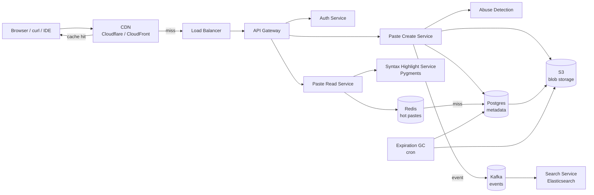

# Вопросы на собеседовании: `Design Pastebin`

`Pastebin` (GitHub Gist, Hastebin, 0bin, JSFiddle для кода) — простой сервис обмена текстом / кодом через короткую ссылку. На интервью это «mini system design»: компактен (укладывается в 30-45 минут), но проверяет ключевые знания: short URL generation, blob vs metadata разделение, syntax highlighting, expiration / TTL, anti-abuse, CDN. Часть параллелей с URL shortener, но с blob payload.

## Полезные ссылки

- [Pastebin (классический сервис)](https://pastebin.com/api)
- [GitHub Gist documentation](https://docs.github.com/en/rest/gists)
- [Hastebin (open source)](https://github.com/toptal/haste-server)
- [0bin (client-side encrypted)](https://github.com/agrm/0bin)
- [Pygments syntax highlighter](https://pygments.org/)
- [Prism.js client-side syntax](https://prismjs.com/)
- [highlight.js](https://highlightjs.org/)
- [System Design Primer](https://github.com/donnemartin/system-design-primer)

## Содержание

**Requirements и capacity**
- [Q1. (!) Функциональные и нефункциональные требования?](#q1--функциональные-и-нефункциональные-требования)
- [Q2. (!) Оценка ёмкости (1M pastes/день, retention 5 лет)?](#q2--оценка-ёмкости-1m-pastesдень-retention-5-лет)
- [Q3. Какие SLA и SLO задать для создания и просмотра?](#q3-какие-sla-и-slo-задать-для-создания-и-просмотра)

**Identifier и storage**
- [Q4. (!) Как генерировать короткий код ссылки (Base62, коллизии)?](#q4--как-генерировать-короткий-код-ссылки-base62-коллизии)
- [Q5. (!) Архитектура хранилища (metadata в DB + blob в S3)?](#q5--архитектура-хранилища-metadata-в-db--blob-в-s3)
- [Q6. Дизайн схемы данных (pastes, users, views)?](#q6-дизайн-схемы-данных-pastes-users-views)
- [Q7. Сжатие при записи (gzip / zstd)?](#q7-сжатие-при-записи-gzip--zstd)

**Endpoints и API**
- [Q8. (!) Raw- и view-эндпоинты (curl против браузера)?](#q8--raw--и-view-эндпоинты-curl-против-браузера)
- [Q9. API для программного создания (CLI / IDE-плагин)?](#q9-api-для-программного-создания-cli--ide-плагин)
- [Q10. Embed-виджеты (gist.github.com `<script>`)?](#q10-embed-виджеты-gistgithubcom-script)

**Rendering**
- [Q11. (!) Подсветка синтаксиса: серверная Pygments или клиентская Prism?](#q11--подсветка-синтаксиса-серверная-pygments-или-клиентская-prism)
- [Q12. Рендеринг Markdown против сырого текста?](#q12-рендеринг-markdown-против-сырого-текста)
- [Q13. Определение языка кода (авто против явного выбора)?](#q13-определение-языка-кода-авто-против-явного-выбора)

**Lifecycle**
- [Q14. (!) Истечение срока / TTL (1h, 1d, 1w, never)?](#q14--истечение-срока--ttl-1h-1d-1w-never)
- [Q15. (!) «Сгореть после прочтения» (одноразовый просмотр)?](#q15--сгореть-после-прочтения-одноразовый-просмотр)
- [Q16. Версионирование (редактирование существующего paste)?](#q16-версионирование-редактирование-существующего-paste)

**Privacy и features**
- [Q17. Режимы приватности (public / unlisted / private / password)?](#q17-режимы-приватности-public--unlisted--private--password)
- [Q18. (!) Полнотекстовый поиск (Elasticsearch, opt-in индексация)?](#q18--полнотекстовый-поиск-elasticsearch-opt-in-индексация)
- [Q19. Папки / многофайловые pastes (Gist)?](#q19-папки--многофайловые-pastes-gist)
- [Q20. Diff и сравнение между ревизиями?](#q20-diff-и-сравнение-между-ревизиями)

**Архитектура**
- [Q21. (!) Высокоуровневая архитектура?](#q21--высокоуровневая-архитектура)
- [Q22. (!) Многоуровневое хранилище (Redis / S3 / Glacier)?](#q22--многоуровневое-хранилище-redis--s3--glacier)
- [Q23. CDN для raw-контента (Cloudflare / CloudFront)?](#q23-cdn-для-raw-контента-cloudflare--cloudfront)
- [Q24. Multi-region и резидентность данных?](#q24-multi-region-и-резидентность-данных)

**Production**
- [Q25. (!) Защита от злоупотреблений (DMCA, malware, scraping)?](#q25--защита-от-злоупотреблений-dmca-malware-scraping)
- [Q26. Аутентификация (OAuth, API-токены)?](#q26-аутентификация-oauth-api-токены)
- [Q27. Rate limiting (анонимы по IP против авторизованных по ключу)?](#q27-rate-limiting-анонимы-по-ip-против-авторизованных-по-ключу)
- [Q28. (!) Какие метрики мониторить?](#q28--какие-метрики-мониторить)
- [Q29. Оптимизация стоимости (сжатие + lifecycle + CDN)?](#q29-оптимизация-стоимости-сжатие--lifecycle--cdn)
- [Q30. (!) Антипаттерны и подводные камни?](#q30--антипаттерны-и-подводные-камни)

## Q1. (!) Функциональные и нефункциональные требования?

Pastebin — это сервис «вставил текст → получил короткую ссылку». Прежде чем рисовать архитектуру, проговорите границы: что система делает, какие у неё нагрузочные характеристики и что осознанно вынесено за скобки. Главный вывод этого блока — преобладание чтения над записью (100:1) и разброс размеров paste (от твита до 10-мегабайтного лога), потому что именно это диктует все дальнейшие решения по хранилищу и кешу.

**Функциональные:**
- Создать paste: текст / код / Markdown с опциональным заголовком.
- Получить paste по короткой ссылке: `pastebin.com/abc1234`.
- Raw-просмотр: `pastebin.com/raw/abc1234` (для curl, wget).
- TTL / истечение срока (опционально).
- Подсветка синтаксиса по языку (или авто-детект).
- Анонимный и авторизованный режимы.
- Режимы приватности: public, unlisted, private, password-protected.
- Опционально: редактирование, история версий (Gist).
- Опционально: полнотекстовый поиск.
- Опционально: embed-виджет.

**Нефункциональные:**
- Пользователи: миллионы DAU (Pastebin ~25M MAU, Gist ~10M+).
- Pastes: 1M+ создаётся/день, retention годами.
- Преобладание чтения: 100:1 reads:writes (один paste просматривают N раз).
- Латентность: просмотр < 100 ms, создание < 500 ms.
- Доступность: 99.9% (не так критично, как для финтеха).
- Хранилище: масштаб TB (сжатые blob-ы).

**За скобками (типично выносят из scope):**
- Совместное редактирование в реальном времени (Codepen, JSFiddle Pro).
- Выполнение кода / sandbox (это replit, не pastebin).
- Форматированный текст (HTML-редактор) — только plain text / markdown.

**Сигнал для интервьюера:** senior сразу отмечает, что paste бывает огромным (логи на 10 MB+), и из этого вытекает ключевое решение — отделить blob storage (крупные неизменяемые байты) от metadata DB (мелкие индексируемые записи). Озвучьте это в самом начале — дальше вся архитектура будет логичным следствием.

## Q2. (!) Оценка ёмкости (1M pastes/день, retention 5 лет)?

Цель прикидки — не точные цифры, а порядок величин: сколько терабайт хранилища, какая полоса на чтение и где узкое место. Логика расчёта простая — берём объём записи, умножаем на retention и read:write-фактор, затем смотрим, что снимет CDN и кеш. Вывод по этому масштабу: данных немного (~18 TB raw, после сжатия 5-7 TB), а вся нагрузка — на чтении, поэтому система упирается не в DB, а в полосу и кеш.

**Исходные допущения:**

| Параметр | Значение |
|---|---|
| Pastes создаётся/день | 1M |
| Средний размер | 10 KB (микс из крошечных сниппетов и крупных логов) |
| Retention | 5 лет (с фильтрацией по TTL) |
| Соотношение read:write | 100:1 |

**Хранилище:**
- 1M × 10 KB = **10 GB/день** raw.
- 5 лет × 365 × 10 GB = **~18 TB raw**.
- + индекс (небольшой ~1%), метаданные (~50 байт/paste × 2B = 100 GB).
- Сжатие (zstd 3-4×) → **5-7 TB сжатого blob**.

**Полоса пропускания:**
- Чтения: 1M × 100 = 100M просмотров/день = ~1200 просмотров/сек в среднем.
- Пик ×5 = 6 000 просмотров/сек.
- На просмотр: 10 KB → ~60 MB/сек egress на пике.
- 95%+ через CDN → origin ~3 MB/сек.

**Память (cache):**
- Горячие pastes, топ 1% × 100K активных в среднем = ~10 GB горячих в Redis.

**QPS на metadata DB:**
- Создания: 1M/день = ~12/сек в среднем, пик 100/сек.
- Чтения: 1200-6000/сек — но большая часть гасится cache и CDN, до DB доходят единицы.

**Стоимость:**
- S3 storage (сжатый): 5-7 TB × $0.023/GB-месяц = **$120-160/месяц**.
- CDN egress: 60 MB/сек × пиковые часы = 1-2 TB/месяц через CDN = **$50-100/месяц**.
- На большем масштабе (сам Pastebin): рост пропорционально.

**Вывод:** записи мизер (12/сек), один Postgres их переварит без шардинга. Реальная нагрузка — чтения и egress, и оба снимаются кешем + CDN. Поэтому Pastebin — это в первую очередь задача про кеширование, а не про масштаб БД.

## Q3. Какие SLA и SLO задать для создания и просмотра?

У двух путей — создание и просмотр — разные требования. Просмотр обслуживается из кеша/CDN, поэтому держим жёсткий бюджет p99 < 100 ms. Создание идёт в DB и blob storage, оно реже и допускает p99 < 500 ms. Доступность 99.9% — Pastebin не финтех, и недолгая недоступность не катастрофа, поэтому экономим на дорогой избыточности.

| Метрика | Цель | Порог алерта |
|---|---|---|
| `paste_creation_latency_p99` | < 500 ms | > 2 сек |
| `paste_view_latency_p99` | < 100 ms (из cache) | > 500 ms |
| `cdn_hit_ratio` | > 90% | < 70% |
| `creation_success_rate` | > 99% | < 95% |
| `expiration_gc_lag_minutes` | < 60 мин | > 1440 мин (1 день) |
| `abuse_block_rate` | отслеживается | всплеск > 3× baseline |
| `availability` | 99.9% | < 99% за месяц |

**Сценарии отказа (как деградируем):**
- Blob storage недоступен → создание невозможно (можно буферизовать на клиенте и ретраить).
- Падение metadata DB → 503; это критичный отказ, без неё нельзя ни создавать, ни искать.
- Промах CDN + origin лежит → degraded-режим: отдаём raw-байты напрямую из S3 без подсветки и обвязки.

## Q4. (!) Как генерировать короткий код ссылки (Base62, коллизии)?

Короткий код — это первичный идентификатор paste в URL вида `pastebin.com/abc1234`. Задача похожа на [Design URL Shortener](design-url-shortener-interview.md), но с важным отличием: здесь код привязан к самому содержимому paste, а не к длинному внешнему URL. Ключевой выбор сводится к компромиссу между предсказуемостью (счётчик) и неугадываемостью (случайный код) — и для Pastebin почти всегда побеждает случайность, потому что предсказуемые ID дают сканировать чужие pastes.

**Три подхода и их логика:**

**1. Счётчик + Base62:**
- `id = INCR counter` (Snowflake / диапазоны ключей в ZooKeeper).
- `short = base62_encode(id)`.
- Плюсы: коллизий не бывает по построению, генерация предсказуема и дешева.
- Минусы: коды перечислимы — злоумышленник просто идёт `/1`, `/2`, `/3` и выкачивает всё. Для сервиса с приватными pastes это дисквалифицирующий недостаток.

**2. Случайный Base62 (7 символов):**
- `short = random_base62(7)` → 62^7 = 3.5T комбинаций.
- Плюсы: код неугадываем, сканирование перебором нереально.
- Минусы: возможны коллизии — нужна проверка уникальности и retry (на 6B записей ожидается ~10M коллизий, каждая решается повторной генерацией).

**3. На основе хеша содержимого:**
- `short = base62(sha256(content))[:7]`.
- Плюсы: автоматическая дедупликация — два одинаковых paste получают один URL и один blob.
- Минусы: это же свойство ломает приватность — любой, у кого есть точно такое же содержимое, вычислит ваш «секретный» URL. Поэтому хеш-подход для приватных paste не годится.

**Как делают на практике:**
- Pastebin: случайный Base62 на 8 символов.
- Gist: 32-символьный hex-хеш (длиннее, сложнее угадать).
- Hastebin: случайные 10 символов.

**Сколько символов брать:**
- 7 символов = 3.5T комбинаций — хватает на billion-масштаб и 5 лет.
- 8 символов = 218T — дополнительный запас, меньше коллизий.
- Gist на 32 символа = практически неугадываемо. Это компенсирует слабость unlisted-режима: unlisted ≠ private, но угадать 32-символьный код перебором невозможно.

**Обработка коллизий (для случайного подхода):**
- UNIQUE-constraint в DB ловит дубль на вставке.
- Retry при конфликте (3-5 попыток с новым случайным кодом).
- Если конфликты пошли часто (пространство заполняется) → увеличить длину кода до 8 символов.

**Защита от перечисления:**
- Чем длиннее код, тем дороже сканирование.
- Rate limit на 404-ответы — всплеск «промахов» с одного IP выдаёт попытку перебора.

## Q5. (!) Архитектура хранилища (metadata в DB + blob в S3)?

Ключевое решение Pastebin: метаданные и содержимое хранятся раздельно. Метаданные (короткий код, язык, TTL, владелец) — мелкие, их часто читают и фильтруют, поэтому им место в OLTP-базе на SSD. Содержимое (blob) — крупное, неизменяемое, читается целиком и редко индексируется, поэтому его дешевле держать в object storage. Разделение даёт три выгоды: независимое масштабирование, дешёвое хранение байтов и удобное кеширование blob через CDN (он неизменяем).

**Metadata (Postgres / MySQL):**
```sql
CREATE TABLE pastes (
  id BIGSERIAL PRIMARY KEY,
  short_code VARCHAR(10) UNIQUE NOT NULL,
  user_id BIGINT NULL,
  title TEXT,
  language VARCHAR(20),
  size_bytes INT,
  visibility VARCHAR(10),  -- public / unlisted / private
  password_hash TEXT NULL,
  created_at TIMESTAMP DEFAULT NOW(),
  expires_at TIMESTAMP NULL,
  views_count BIGINT DEFAULT 0,
  blob_key TEXT NOT NULL,  -- S3 key
  blob_compression VARCHAR(10),
  deleted_at TIMESTAMP NULL
);

CREATE INDEX idx_user ON pastes (user_id);
CREATE INDEX idx_expires ON pastes (expires_at) WHERE expires_at IS NOT NULL;
```

**Blob storage (S3 / GCS / Cloudflare R2):**
- Ключ: `pastes/{short_code}.zst` (или `/{shard}/{short_code}`).
- Значение: текстовые байты, сжатые zstd.
- Неизменяемый (перезапись при редактировании = новая ревизия, отдельный blob).

**Поток чтения:**
```
GET /abc1234
  ↓
metadata = pastes WHERE short_code = 'abc1234'
  ↓ (если expired или not visible) → 404
  ↓
blob = s3.get(metadata.blob_key)
  ↓ decompress
  ↓
return content
```

**Почему именно так разделяем:**
- Metadata на SSD (дорого за GB) — оправдано высокой частотой запросов и нуждой в индексах.
- Blob в object storage (дёшево за GB) — оправдано большим объёмом и редким доступом к каждому байту.
- Масштабировать слои можно независимо: DB растёт по числу записей, blob — по объёму.
- Blob неизменяем → его можно агрессивно кешировать в CDN без инвалидации.

**Альтернатива (всё в одном Postgres):**
- Содержимое лежит в колонке TEXT/BYTEA.
- Плюс: проще архитектура, меньше движущихся частей.
- Минусы: размер DB растёт быстро, дорожает SSD-хранение, тяжелеют backup/restore, появляются накладные расходы на уровне строк.

**Эмпирическое правило:** на ранней стадии single Postgres работает и упрощает жизнь. По мере роста до billion-масштаба разделение metadata/blob становится обязательным.

## Q6. Дизайн схемы данных (pastes, users, views)?

Схема строится вокруг одной центральной таблицы `pastes`, к которой привязаны остальные. Дополнительные таблицы добавляют по мере появления фич: `users` — при авторизации, `paste_views` — для аналитики, `paste_revisions` — для версионирования (Gist), `paste_comments` — для обсуждений. Принцип — не тащить всё сразу, а наращивать схему под включённые возможности.

**pastes** — основная таблица (см. Q5).

**users** (если есть авторизация):
```sql
CREATE TABLE users (
  id BIGSERIAL PRIMARY KEY,
  username VARCHAR(40) UNIQUE,
  email VARCHAR(255) UNIQUE,
  oauth_provider VARCHAR(20),  -- github, google, none
  oauth_id TEXT,
  api_token_hash TEXT,
  plan VARCHAR(20),  -- free, paid
  created_at TIMESTAMP
);
```

**views** (для аналитики, опционально):
```sql
CREATE TABLE paste_views (
  id BIGSERIAL PRIMARY KEY,
  paste_id BIGINT,
  viewer_user_id BIGINT NULL,
  viewer_ip_hash VARCHAR(64),
  user_agent VARCHAR(255),
  referrer TEXT,
  viewed_at TIMESTAMP
) PARTITION BY RANGE (viewed_at);
```

Партиционирование по месяцу делает удаление старых данных мгновенным: `DROP PARTITION` вместо тяжёлого `DELETE` по миллионам строк.

**revisions** (если есть версионирование, Gist):
```sql
CREATE TABLE paste_revisions (
  id BIGSERIAL PRIMARY KEY,
  paste_id BIGINT,
  blob_key TEXT,
  revision_number INT,
  edited_by BIGINT,
  edited_at TIMESTAMP,
  UNIQUE (paste_id, revision_number)
);
```

**comments** (Gist):
```sql
CREATE TABLE paste_comments (
  id BIGSERIAL PRIMARY KEY,
  paste_id BIGINT,
  user_id BIGINT,
  body TEXT,
  created_at TIMESTAMP
);
```

**Индексы:**
- `pastes.short_code` — UNIQUE, основной lookup.
- `pastes.user_id` — страница «мои pastes».
- `pastes.expires_at` — для GC-прохода.
- `paste_views.paste_id, viewed_at` — аналитика.

## Q7. Сжатие при записи (gzip / zstd)?

Содержимое paste сжимают один раз на запись и хранят сжатым — текст и код избыточны, сжатие в 3-4 раза реально. **Компромисс:** немного CPU при записи в обмен на экономию хранилища и полосы. Выбор кодека — это баланс степени сжатия и скорости; для Pastebin побеждает zstd, потому что он даёт почти как у Brotli степень сжатия, но на порядок быстрее и при сжатии, и при распаковке.

| Кодек | Степень сжатия | Скорость сжатия | Скорость распаковки |
|---|---|---|---|
| gzip | 2.5-3× | 50 MB/s | 200 MB/s |
| zstd | 3-4× | 400 MB/s | 800 MB/s |
| Brotli | 3.5× | 30 MB/s | 200 MB/s |

**Выбор Pastebin — zstd, потому что:**
- Лучший баланс степени и скорости из трёх кодеков.
- На коде сжимает в 3-4× — там много повторов и предсказуемой структуры.
- Сжимает быстро (<5 ms на 10 KB) — не тормозит создание paste.
- Распаковка почти бесплатна — не бьёт по латентности чтения.

**Когда сжимать:**
- На запись — один раз, результат сохраняем в blob.
- На чтение — распаковываем и отдаём raw-текст.

**Когда НЕ сжимать:**
- Крошечные pastes (< 256 байт) — заголовок самого сжатия съест экономию.
- Уже сжатое содержимое (для plain text встречается редко).

**Сжатие в транспорте (отдельно от хранения):**
- Клиент шлёт `Accept-Encoding: br, gzip` — CDN/сервер сжимают ответ «на проводе».
- Для крупного контента на проводе выгоднее Brotli (он лучше жмёт текст).

**Пример кода:**
```python
import zstandard as zstd

def store(text):
    compressor = zstd.ZstdCompressor(level=3)
    compressed = compressor.compress(text.encode('utf-8'))
    s3.put(key, compressed)

def fetch(key):
    compressed = s3.get(key)
    decompressor = zstd.ZstdDecompressor()
    return decompressor.decompress(compressed).decode('utf-8')
```

## Q8. (!) Raw- и view-эндпоинты (curl против браузера)?

У Pastebin два класса клиентов с противоположными ожиданиями: браузер хочет красивую HTML-страницу с подсветкой, а скрипт (curl/wget) — голые байты для пайплайна. Поэтому раздают два явных эндпоинта: `/{code}` отдаёт HTML-view, `/raw/{code}` — `text/plain`. Явные URL чище, чем угадывание по `Accept`-заголовку, и предсказуемее для shell-скриптов.

**Браузерные пользователи:**
- Хотят: отрендеренный HTML с подсветкой синтаксиса, навигацией, комментариями.
- URL: `pastebin.com/abc1234`.
- Ответ: полная HTML-страница.

**Программные клиенты (curl, wget, скрипты):**
- Хотят: raw-байты, без HTML-обвязки.
- URL: `pastebin.com/raw/abc1234`.
- Ответ: `Content-Type: text/plain; charset=utf-8` + сырое содержимое.

**Дизайн эндпоинтов:**

```
GET /{short_code}      → HTML view (с decoration)
GET /raw/{short_code}  → text/plain raw
GET /download/{short_code} → Content-Disposition: attachment
GET /embed/{short_code} → minimal HTML for iframe
```

**Почему это важно:**
- `curl pastebin.com/abc1234` без `/raw/` получит HTML — непригодно для shell-пайплайнов.
- Стандарт: `curl https://pastebin.com/raw/abc1234 | bash` (популярный паттерн, если оставить за скобками предупреждения о безопасности).

**Кеширование:**
- Raw-эндпоинт: CDN кеширует агрессивно — содержимое неизменяемо.
- HTML-просмотр: кешируется тоже, но инвалидируется при обновлении комментариев / счётчика просмотров (либо просто отдаём stale-версию — для счётчика это терпимо).

**Почему не content negotiation по `Accept`:**
- Технически можно: `Accept: text/plain` от curl → raw, `Accept: text/html` от браузера → view.
- Но Pastebin сознательно использует явные URL — они предсказуемее, их легко вписать в скрипт и закешировать по ключу.

**Граничный случай:** некоторые сервисы для удобства детектят User-Agent (curl/wget) и сами редиректят на raw — компромисс между «магией» и предсказуемостью.

## Q9. API для программного создания (CLI / IDE-плагин)?

Помимо веб-формы, paste создают из скриптов, CLI и плагинов IDE — поэтому нужен полноценный REST API с токен-авторизацией. Две детали, которые отличают «зрелый» ответ: заголовок `Idempotency-Key` (чтобы сетевой retry не плодил дубликаты paste) и per-token rate limits (чтобы один скрипт не выжрал квоту). API сразу возвращает и человекочитаемый URL, и raw_url — клиенту не приходится их собирать вручную.

**POST /api/v1/pastes:**
```http
POST /api/v1/pastes
Authorization: Bearer <api_token>
Content-Type: application/json
Idempotency-Key: <uuid>

{
  "content": "console.log('hello');",
  "language": "javascript",
  "title": "test paste",
  "expires_in": 3600,
  "visibility": "unlisted"
}
```
Response:
```json
{
  "short_code": "abc1234",
  "url": "https://pastebin.com/abc1234",
  "raw_url": "https://pastebin.com/raw/abc1234",
  "expires_at": "2026-05-27T13:00:00Z"
}
```

**GET /api/v1/pastes/{short_code}:**
- Возвращает метаданные + содержимое.

**DELETE /api/v1/pastes/{short_code}:**
- Только владелец.

**API-токены:**
- Генерируются в UI настроек.
- В DB хранится только хеш токена (утечка базы не раскрывает сами токены).
- Лимиты считаются на каждый токен отдельно (Q27).

**CLI-инструменты (community):**
- `pastebinit` (загрузчик из командной строки для Linux).
- `gh gist create` (GitHub CLI).
- `pbpaste | gist` (пайплайн для macOS).

**Плагины для IDE:**
- Расширение Gist для VS Code.
- Плагин Gist для IntelliJ.
- gist-it для Sublime Text.

**Квоты на создание через API:**
- Анонимно (без API-ключа): 5 созданий/час.
- Авторизованный free: 25 созданий/час.
- Платный: 1000+ созданий/час.

## Q10. Embed-виджеты (gist.github.com `<script>`)?

Embed позволяет вставить paste/gist прямо в чужую страницу — статью в блоге, документацию. Технически есть два способа: `<script>`-виджет (как у Gist), который сам рендерит inline-HTML, и `<iframe>` на эндпоинт `/embed/{code}`. **Сценарий применения:** показать кусок кода с подсветкой на внешнем сайте, не копируя его руками. Главная сложность здесь не рендеринг, а безопасность — встраивание открывает поверхность для XSS и фишинга, поэтому встраивать можно только public-pastes и только с экранированием содержимого.

**Embed от GitHub Gist:**
```html
<script src="https://gist.github.com/user/abc1234.js"></script>
```
- Загружает JS, который рендерит iframe / inline HTML.
- Подсветка синтаксиса + стилизация GitHub.

**Альтернатива — iframe:**
```html
<iframe src="https://pastebin.com/embed/abc1234"
        width="600" height="400" frameborder="0">
</iframe>
```

**Реализация:**
- Эндпоинт `/embed/{short_code}` возвращает минимальную HTML-страницу с:
  - Только содержимое paste + подсветка синтаксиса.
  - `<style>` для компактной вёрстки.
  - X-Frame-Options: ALLOWALL (или whitelisting по доменам).

**Безопасность (главное в embed):**
- CSP-заголовки (Content-Security-Policy) ограничивают, откуда грузятся ресурсы.
- Атрибут `sandbox` у iframe не даёт встроенному контенту «сбежать» в родительскую страницу.
- Никакого выполнения JS из содержимого paste — HTML экранируется и показывается как plain text.

**Дружелюбно к CDN:**
- Embed-HTML кешируется агрессивно — он, по сути, статичен.
- Ассеты (CSS, шрифты) отдаются с длинным TTL.

**Приватность:**
- Встраивать разрешено только public-pastes.
- Для private/password embed блокируется (`X-Frame-Options: DENY`) — иначе iframe утечёт приватное содержимое на сторонний сайт.

## Q11. (!) Подсветка синтаксиса: серверная Pygments или клиентская Prism?

Подсветку можно делать на сервере (Pygments/Rouge/Chroma токенизируют код и отдают готовый HTML с CSS-классами) или на клиенте (отдаём raw + JS-библиотеку Prism/highlight.js, браузер красит сам). Главный водораздел — SEO и контроль: серверная кладёт подсветку прямо в HTML, поэтому поисковики и читалки видят оформленный код сразу; клиентская разгружает сервер, но до загрузки JS страница «голая». Поэтому публичный контент красят на сервере, а зашифрованный — на клиенте (сервер просто не видит расшифрованного содержимого).

**Серверная (Pygments / Rouge / Chroma):**
- Токенизировать код → рендерить HTML с CSS-классами.
- Рендеринг на каждый просмотр, поэтому результат кешируют → последующие просмотры быстрые.

**Клиентская (Prism.js / highlight.js):**
- Отдаём raw-HTML + JS-библиотеку, браузер красит сам.
- Сервер не тратит CPU, payload меньше — но первый рендер ждёт загрузки JS.

**Сравнение:**

| Аспект | Серверная | Клиентская |
|---|---|---|
| Вес начальной страницы | HTML с inline-классами (~на 30% больше) | Plain HTML + 30-50 KB JS |
| Первый рендер | Мгновенно | Ждём загрузки JS |
| SEO | Хорошо (подсветка уже в HTML) | Плохо (поисковики видят raw) |
| CPU на сервере | Выше | Нет |
| CPU на клиенте | Нет | Выше |
| Поддержка языков | Шире (Pygments 500+ языков) | Ограниченная (highlight.js ~190, Prism ~270) |
| Кеширование | Кешируется весь HTML | Кешируется raw + кешируется JS |

**Production-выбор:**
- **GitHub Gist:** серверная (Rouge на Ruby).
- **Pastebin:** серверная (исторически Geshi на PHP, в современном виде Pygments).
- **Hastebin:** клиентская (highlight.js).
- **0bin (зашифрованный):** обязательно клиентская (сервер не видит содержимое).

**Рекомендация:**
- Серверная — для контента, важного для SEO (публичные Gist-ы): подсветка уже в HTML.
- Клиентская — для private/зашифрованного контента, где сервер принципиально не расшифровывает данные и красить может только браузер.

**Реализация серверной:**
```python
from pygments import highlight
from pygments.lexers import get_lexer_by_name
from pygments.formatters import HtmlFormatter

def render(code, language):
    lexer = get_lexer_by_name(language)
    formatter = HtmlFormatter(linenos=True, cssclass="source")
    return highlight(code, lexer, formatter)
```

**Латентность:** рендер Pygments на файле 10 KB занимает < 50 ms. Это много при 1200 просмотрах/сек, поэтому результат кешируют — последующие просмотры отдаются из кеша за < 10 ms (см. антипаттерн №2 в Q30).

## Q12. Рендеринг Markdown против сырого текста?

Если paste — это `.md`-файл, его удобно показывать отрендеренным (как делает Gist), а не сырым текстом. Логика та же, что с подсветкой: определяем формат по расширению, рендерим через CommonMark/GFM-парсер и кешируем результат. Главный риск здесь — XSS: Markdown допускает inline-HTML, поэтому выход обязательно санитизируют (DOMPurify на клиенте или Bleach на сервере с белым списком тегов).

**Поддержка Markdown (файлы `.md` на gist.github.com):**
- Определяем расширение `.md`.
- Рендерим через парсер CommonMark / GFM.
- Кешируем отрендеренный HTML.

**Два режима просмотра:**
- `/{code}` → отрендеренный (по умолчанию для .md).
- `/{code}/raw` → исходный markdown.

**Реализация:**
```python
import markdown
def render_md(text):
    return markdown.markdown(text, extensions=['fenced_code', 'tables', 'codehilite'])
```

**Риск XSS (обязательно закрыть):**
- Markdown может содержать inline-HTML, в том числе `<script>`.
- Санитизируем: DOMPurify на клиенте или Bleach на сервере.
- Разрешаем только белый список тегов — всё остальное вырезаем.

**CommonMark против GFM:**
- CommonMark — стандартизированная базовая спецификация.
- GFM (GitHub Flavored Markdown) — расширения поверх неё: списки задач, таблицы, автоссылки, упоминания.

**Переключатель:**
- Кнопка в UI «View source / Rendered».

**Другие форматы:**
- `.txt` → plain text.
- `.json` / `.xml` → просмотр кода с подсветкой синтаксиса.
- `.csv` → табличное представление (в некоторых сервисах).

## Q13. Определение языка кода (авто против явного выбора)?

Чтобы подсветить код, нужно знать язык. Два пути: спросить пользователя (явный выбор — 100% точно, но лишний клик) или угадать по содержимому (авто-детект — без трения, но иногда ошибается). Практичный ответ — гибрид: авто-детект по умолчанию, с возможностью переопределить, и откат к plain text, когда содержимое неоднозначно. Это даёт быстрый paste без потери точности там, где она нужна.

**Явный выбор:**
- Пользователь выбирает язык из выпадающего списка при создании.
- Сохраняется в `pastes.language`.
- Плюс: точность 100%.
- Минус: лишнее трение — мешает «вставил и забыл».

**Авто-детект:**
- Библиотека определяет язык по содержимому:
  - Pygments `guess_lexer()`.
  - highlight.js `highlightAuto()`.
  - GitHub Linguist (ML-подход, определяет язык файла в репозитории).

**Эвристики:**
- Shebang (`#!/usr/bin/env python`) → Python.
- Ключевые слова (`function`, `var`, `const`) → JavaScript.
- Отступы (стабильно 4 пробела) → вероятно Python.

**Гибрид (рекомендуемый):**
- Авто-детект по умолчанию, пользователь может переопределить.
- При неоднозначном содержимом (смесь языков, обычный английский текст) → откат к plain text, чтобы не подсвечивать наугад.

**Точность авто-детекта:**
- 80-90% на распространённых языках.
- Хуже на редких (Brainfuck, COBOL) — мало характерных признаков.
- Заметно лучше, если есть явные подсказки: shebang или расширение файла.

## Q14. (!) Истечение срока / TTL (1h, 1d, 1w, never)?

TTL решает две задачи: даёт пользователю контроль («этот paste живёт час») и ограничивает рост хранилища (free-pastes по умолчанию умирают через 30 дней). Ключевая идея реализации — разделить логическое и физическое истечение. Логически paste «умирает» сразу по `expires_at` (запрос отдаёт 404), а физически blob удаляется отложенно, через grace-окно 7-30 дней — чтобы случайно истёкший paste можно было восстановить.

**Опции:**
- `expires_in=null` → никогда (по умолчанию для платных пользователей).
- `expires_in=3600` → 1 час.
- `expires_in=86400` → 1 день.
- `expires_in=604800` → 1 неделя.
- `expires_in=2592000` → 30 дней (по умолчанию для free-пользователей).
- `burn_after_read=true` → одноразовый (Q15).

**Реализация в два слоя:**

**Слой 1 — логическое истечение (проверка на чтение):** запрос сразу фильтрует протухшие записи и отдаёт 404, не дожидаясь физического удаления.
```sql
SELECT * FROM pastes
WHERE short_code = $1
  AND (expires_at IS NULL OR expires_at > NOW())
  AND deleted_at IS NULL;
```

**Слой 2 — физическая очистка (в фоне).** Три варианта, как реально удалить байты:

Вариант 1: ежедневный cron-проход.
```sql
DELETE FROM pastes
WHERE expires_at < NOW() - INTERVAL '7 days';
-- + delete blob from S3
```
Удаляем батчами (LIMIT 10000), иначе один большой `DELETE` заблокирует таблицу.

Вариант 2: S3 lifecycle policy — переложить удаление на хранилище.
- S3 умеет автоматически удалять объекты по тегам или префиксу.
- Тегируем blob меткой `expires=2026-06-01`.
- S3 сам удалит после указанного времени — приложению не нужен cron.

Вариант 3: DB с встроенным TTL (атрибут TTL в DynamoDB).
- DynamoDB сам удаляет элементы с истёкшим TTL-атрибутом.
- Удаление eventual — задержка до 48 ч, для GC это приемлемо.

**Grace-окно (зачем нужно):**
- Логическое истечение — немедленное, paste пропадает из выдачи сразу.
- Физическое удаление — через 7-30 дней, чтобы случайно протухший paste можно было вернуть.

**Под контролем пользователя:**
- Владелец может продлить TTL, пока срок не истёк.
- Владелец может удалить paste мгновенно.

## Q15. (!) «Сгореть после прочтения» (одноразовый просмотр)?

Burn-after-read — режим, где paste показывается ровно один раз и тут же удаляется. Применяется для передачи секретов: паролей, API-ключей, разовых ссылок. Главная техническая сложность — атомарность: два параллельных запроса не должны оба прочитать paste. Решается блокировкой строки `FOR UPDATE` — выигрывает ровно одно чтение, второе получает 404. А для настоящей секретности (0bin/Privatebin) содержимое шифруют на клиенте ключом во фрагменте URL, так что сервер вообще не видит plaintext.

**Сценарии применения:**
- Передача секретов / паролей / API-ключей.
- Чувствительная ко времени информация.
- Пользователи, заботящиеся о приватности.

**Реализация:**

```python
def view(short_code):
    paste = db.transaction:
        p = SELECT * FROM pastes WHERE short_code = $1 FOR UPDATE
        if p is None or p.deleted_at: return 404
        if p.burn_after_read:
            UPDATE pastes SET deleted_at = NOW() WHERE id = $p.id
            schedule_blob_delete(p.blob_key, delay=60)  # grace period
    return paste.content
```

**Атомарность (ядро фичи):**
- Блокировка `FOR UPDATE` не даёт двум запросам прочитать paste одновременно — выигрывает ровно одно чтение.
- После commit blob удаляется асинхронно, с небольшим grace для инвалидации CDN.

**Граничные случаи:**
- Клиент потерял связь сразу после просмотра → содержимое уже «сгорело», пользователь его не увидел и жалуется.
- Решение: предупредить перед просмотром («Этот paste сгорит после прочтения») и раскрывать только по клику-подтверждению.
- Альтернатива: окно в 60 секунд между первым просмотром и фактическим сжиганием — есть шанс перезагрузить.

**Шифрование (0bin / Privatebin) — для настоящей секретности:**
- Клиент шифрует содержимое ключом, который лежит во фрагменте URL (`#key=base64...`).
- Сервер хранит только шифротекст и никогда не расшифровывает — это E2E ещё до сжигания.
- Фрагмент URL (после `#`) браузер на сервер не отправляет, поэтому ключ остаётся у клиента.

**Защита от случайного сжигания:**
- Превьюшники ссылок (Slackbot, Twitter Card) и краулеры могут «сжечь» paste, просто открыв его для превью.
- Решение: требовать клик-подтверждение и детектить User-Agent ботов, не сжигая на их запросах.

## Q16. Версионирование (редактирование существующего paste)?

Редактирование плохо сочетается с неизменяемыми blob, поэтому правку моделируют не как перезапись, а как новую версию. Подход Gist — каждое редактирование создаёт ревизию (как коммит в Git), все версии хранятся. Это естественно ложится на blob storage (новая ревизия = новый blob, старый не трогаем) и позволяет diff между версиями. Плата — линейный рост хранилища по числу ревизий, который гасят дедупликацией одинаковых blob и сборкой мусора старых версий.

**Подход GitHub Gist:**
- Каждое редактирование = новая ревизия (как коммит в Git).
- Все ревизии сохраняются.
- Таблица `paste_revisions` (Q6).

**Классический Pastebin:**
- Редактирование = создание нового paste со ссылкой на родителя.
- Старая версия при этом остаётся доступной.

**Реализация в стиле Gist:**
```sql
-- create
INSERT INTO pastes (...) RETURNING id;
INSERT INTO paste_revisions (paste_id, blob_key, revision_number=1, ...);

-- edit
INSERT INTO paste_revisions (paste_id, blob_key=new_blob, revision_number=2, ...);
-- pastes.blob_key updated to new_blob (current = revision N)
```

**Diff между ревизиями:**
- Считается серверно (unified-формат) или клиентски через JS-библиотеку — детали в Q20.

**Хранилище:**
- Каждая ревизия = новый blob в S3 (это естественно для content-addressable storage).
- Если новая ревизия побайтно совпала со старой → дедупликация: переиспользуем тот же `blob_key`.

**Компромисс:**
- Стоимость хранилища растёт линейно по числу ревизий.
- Гасится сборкой мусора старых ревизий через N лет.

## Q17. Режимы приватности (public / unlisted / private / password)?

Четыре режима покрывают спектр от «виден всем и в поиске» до «только владелец». Критично понимать разницу между unlisted и private: unlisted просто не индексируется и не попадает в листинги, но доступен любому, у кого есть ссылка — это сокрытие, а не безопасность. Настоящая приватность — это private (сервер проверяет владельца и возвращает 403 чужим) или password-protected (проверка bcrypt-хеша пароля). Эту разницу часто проверяют на собеседовании.

**Режимы:**

| Режим | Виден в листингах | Доступен по URL | Нужна авторизация | Примечания |
|---|---|---|---|---|
| Public | Да | Да | Нет | Индексируется Google, в поиске |
| Unlisted | Нет | Да (любой со ссылкой) | Нет | Как unlisted на YouTube |
| Private | Нет | Да (только владелец) | Нужна авторизация | Сервер проверяет владение |
| Password-protected | Нет | URL валиден, но нужен пароль | Проверка хеша пароля | Пароль через bcrypt |

**Схема:**
```sql
ALTER TABLE pastes ADD COLUMN visibility VARCHAR(15) DEFAULT 'public';
ALTER TABLE pastes ADD COLUMN password_hash TEXT NULL;
```

**Контроль доступа:**
```python
def get_paste(short_code, user_id, password):
    paste = SELECT * FROM pastes WHERE short_code = $1
    if not paste or expired or deleted: return 404
    if paste.visibility == 'private' and paste.user_id != user_id:
        return 403
    if paste.password_hash:
        if not bcrypt.checkpw(password, paste.password_hash):
            return 401  # prompt password
    return paste.content
```

**Индексация по режимам:**
- Public: индексируется для поиска (Q18).
- Unlisted: НЕ индексируем, добавляем `<meta name="robots" content="noindex">`, чтобы Google его не подобрал.
- Private: для неавторизованных — 404, не показывается даже в листинге.

**Ключевой нюанс (частый вопрос):**
- Unlisted — это не безопасность, а необнаружимость: любой со ссылкой получит доступ, просто ссылку не найти через поиск.
- Настоящая приватность = Private + обязательная проверка владельца на сервере.

## Q18. (!) Полнотекстовый поиск (Elasticsearch, opt-in индексация)?

Поиск возможен только по public-pastes — это не ограничение, а требование приватности: индексировать private/unlisted значило бы сделать утёкшие пароли находимыми через поиск. Архитектурно поиск отвязан от основного пути: при создании public-paste летит Kafka-событие, асинхронный indexer кладёт документ в Elasticsearch, а запросы идут уже к ES (full-text по BM25). Это держит создание быстрым и не нагружает основную DB полнотекстовыми запросами.

**Архитектура:**

```
paste created (visibility=public)
   ↓ Kafka event paste.created
   ↓
Elasticsearch indexer
   ↓
ES index: pastes
   fields: short_code, title, content, language, created_at, user
```

**Query:**
```
GET /search?q=mysql+timeout
   ↓
ES full-text search (BM25)
   ↓
return top-K with snippets
```

**Индексируемые поля:**
- `title` — с повышенным весом.
- `content` — основное поле поиска.
- `language` — фасетный фильтр.
- `created_at` — фильтр по времени.

**Размер индекса:**
- ~30% от raw-текста (проанализированный, inverted index).
- 5 TB контента → ~1.5 TB ES-индекс.

**Латентность:**
- Поисковый запрос < 200 ms.
- Задержка индексации < 30 сек с момента создания.

**Приватность через opt-in:**
- Public-pastes индексируются по умолчанию.
- Пользователь может выставить флаг «исключить из поиска».
- При установке флага документ асинхронно удаляется из ES.

**Как сделано на практике:**
- Классический Pastebin: поиск ограничен (по скорости, без полного содержимого) — намеренно, чтобы не упрощать поиск утечек.
- GitHub Gist: полнотекстовый поиск по содержимому (gistsearch.com через GitHub API).

## Q19. Папки / многофайловые pastes (Gist)?

GitHub Gist расширяет модель «один paste = один файл» до «один gist = набор файлов». Это нужно, когда сниппет не самодостаточен: код с импортами, конфиг плюс скрипт, README рядом с кодом. Реализуется отдельной таблицей `gist_files` со ссылкой на родительский paste — каждый файл получает свой blob, имя и язык, а в UI они показываются вкладками или секциями с выделенным главным файлом.

**Схема:**
```sql
CREATE TABLE gist_files (
  id BIGSERIAL PRIMARY KEY,
  gist_id BIGINT,  -- references pastes
  filename TEXT,
  blob_key TEXT,
  size_bytes INT,
  language VARCHAR(20)
);
```

**API:**
```http
POST /api/v1/gists
{
  "files": {
    "main.py": { "content": "import sys..." },
    "utils.py": { "content": "def helper()..." }
  },
  "description": "Multi-file example"
}
```

**Сценарии использования:**
- Код с импортами / зависимостями.
- Конфигурация + скрипт.
- README + код.

**Рендеринг:**
- Вкладки или раскрывающиеся секции в UI.
- Один главный файл выделен.

**Embed:**
- `<script src="https://gist.github.com/user/abc.js?file=main.py">` → только один файл.

## Q20. Diff и сравнение между ревизиями?

Раз есть ревизии (Q16), логично уметь показать, что изменилось. Diff считают либо на сервере (тянем два blob, прогоняем через diff-алгоритм Myers/histogram, отдаём unified или side-by-side HTML), либо на клиенте (шлём два raw-текста, браузер рендерит через diff-match-patch). Выбор — тот же компромисс, что с подсветкой: серверный нагружает CPU, но даёт готовый HTML для SEO и кеша; клиентский разгружает сервер. UI обычно копирует знакомые паттерны — side-by-side как в GitHub или inline как в GitLab.

**Серверный:**
- Подтянуть blob-ы двух ревизий.
- Вычислить diff библиотекой `diff` (алгоритм Myers, histogram).
- Формат: unified diff или side-by-side HTML.

**Клиентский:**
- Отправить два raw-содержимого в браузер.
- Diff рендерит библиотека diff-match-patch.

**API:**
```http
GET /api/v1/gists/{gist_id}/compare/{rev1}..{rev2}
```
Ответ: формат unified diff.

**UI:**
- Side-by-side вид (в стиле GitHub).
- Inline-diff (в стиле GitLab).
- Подсветка на уровне слов.

**Библиотеки для реализации:**
- `difflib` (стандартная библиотека Python).
- `diff-match-patch` (Google, JS).
- `git diff --no-index` для CLI.

## Q21. (!) Высокоуровневая архитектура?

Соберём всё вместе. Запрос на чтение по возможности обслуживается с CDN-edge (hit ratio 90%+) и до origin вообще не доходит. Промах идёт через LB → API Gateway (там авторизация и rate limit) → Read Service → cache → DB → blob. Запись проходит через Create Service: валидация → abuse-проверка → генерация кода → сжатие → запись blob → вставка метаданных, и параллельно публикует Kafka-событие для индексации в поиске. Фоновый GC чистит истёкшие pastes. Главный принцип — синхронно только то, что нужно ответить пользователю; индексация, аналитика и повторный abuse-скан вынесены в Kafka.



**Сервисы:**
- **CDN:** кеширует HTML-просмотр + raw-содержимое; hit ratio 90%+.
- **API Gateway:** авторизация, rate limit, маршрутизация.
- **Paste Create Service:** валидация → генерация short_code → сжатие → запись blob → вставка метаданных.
- **Paste Read Service:** проверка cache → DB → получение blob → подсветка → рендеринг.
- **Highlight Service:** Pygments / Chroma; отрендеренный HTML кешируется.
- **Search Service:** индекс Elasticsearch по public pastes.
- **Abuse Detection:** проверка DMCA-хешей + сканирование malware + классификатор спама.
- **GC:** фоновый cron удаляет истёкшие pastes из DB + blob storage.

**Межсервисное взаимодействие:**
- Синхронно (HTTP/gRPC): то, что нужно прямо сейчас для ответа пользователю.
- Асинхронно (Kafka): индексация поиска, аналитика, повторный abuse-скан — всё, что может произойти с задержкой.

## Q22. (!) Многоуровневое хранилище (Redis / S3 / Glacier)?

Доступ к paste распределён крайне неравномерно: свежие и популярные читают постоянно, старые — почти никогда. Поэтому данные раскладывают по трём уровням от дорогого-быстрого к дешёвому-медленному: Redis (горячие, в памяти), S3 Standard (тёплые, активные), S3 Glacier (холодные, старше года). Перекладывание автоматизируется S3 lifecycle policy, а чтение спускается по уровням: сначала Redis, потом Standard, потом — с восстановлением из Glacier. Смысл — платить за быстрый доступ только там, где он реально нужен.

**Горячий уровень — Redis:**
- Недавно созданные (< 24 ч).
- Часто запрашиваемые (просмотры > порога).
- TTL согласован с истечением срока paste.
- ~10-20 GB.

**Тёплый уровень — S3 Standard:**
- Активные pastes (созданы за последний 1 год).
- ~5-7 TB в сжатом виде.

**Холодный уровень — S3 Glacier:**
- Старые pastes (> 1 года, редкий доступ).
- Латентность восстановления: от минут до часов.
- В 5-10× дешевле.

**Lifecycle policy (S3):**
```json
{
  "Rules": [{
    "Status": "Enabled",
    "Filter": { "Prefix": "pastes/" },
    "Transitions": [
      { "Days": 30, "StorageClass": "STANDARD_IA" },
      { "Days": 365, "StorageClass": "GLACIER" }
    ],
    "Expiration": { "Days": 1825 }
  }]
}
```

**Поток чтения по уровням:**
1. Проверить Redis → попадание → вернуть.
2. Промах → S3 Standard → вернуть и заодно заполнить Redis (следующий раз будет горячим).
3. Промах → S3 Glacier → восстановить (минуты) → вернуть.

**Граничный случай:**
- Восстановление из Glacier тарифицируется за каждое извлечение — частые «холодные» запросы могут выйти дороже хранения в Standard.
- При первом за годы просмотре имеет смысл упреждающее восстановление, чтобы повторные чтения были быстрыми.

**Экономия:**
- Смешанный tiering 70% Standard / 30% Glacier снижает стоимость хранения ~на 50% против полностью Standard.

## Q23. CDN для raw-контента (Cloudflare / CloudFront)?

CDN — главный рычаг и по латентности, и по стоимости. Содержимое paste неизменяемо, поэтому идеально кешируется на edge: при 95% попаданий origin почти не нагружается, а egress дешевеет в разы (без CDN — $600+/месяц, с CDN — десятки). Тонкость в том, что кешировать можно не всё одинаково: raw-эндпоинт неизменяем и кешируется агрессивно, HTML-view — с коротким TTL (меняются комментарии/счётчик), а private и password-protected идут в обход CDN с `Cache-Control: private`.

**Зачем CDN:**
- 100M просмотров/день → 1200 просмотров/сек в среднем.
- 95%+ запросов обслуживаются с edge → origin почти не нагружена.

**Ключ кеша:**
- `(short_code, raw|view, language)`.
- С версией: `/v1/raw/abc1234`.

**Поведение кеша:**
- Raw-эндпоинт (`/raw/{code}`): кешировать агрессивно (неизменяемое содержимое).
- View-эндпоинт (`/{code}`): кешировать с коротким TTL (на случай обновления комментариев/счётчика просмотров).
- Embed (`/embed/{code}`): кешировать с длинным TTL.

**TTL:**
- Public pastes: от 1 часа до 24 часов.
- Unlisted: как public.
- Private: в обход CDN (Cache-Control: private).
- Password-protected: в обход CDN.

**Сброс кеша:**
- Редактирование paste → инвалидировать кеш (Cloudflare purge API).
- Или: URL с версией `/v2/raw/abc1234`.

**Полоса пропускания:**
- Без CDN: 1200 просмотров/сек × 10 KB = 12 MB/сек постоянно = 30 TB/месяц egress = $600+/месяц.
- С CDN при 95% попаданий: $30/месяц origin egress + $50-100 стоимость CDN.

**Сжатие на edge:**
- CDN сжимает автоматически (Brotli/gzip).
- Экономит ~70% трафика на текстовом контенте.

## Q24. Multi-region и резидентность данных?

**По умолчанию хватает одного региона** — глобальный CDN уже снимает основную проблему латентности на чтении. Multi-region добавляют осознанно, под конкретные драйверы: глобальная аудитория (нужна низкая латентность записи), GDPR (данные EU обязаны физически оставаться в EU) или disaster recovery. Цена решения — сложная репликация метаданных и blob между регионами и привязка пользователя к домашнему региону.

**Драйверы для multi-region:**
- Латентность для глобальных пользователей.
- GDPR: резидентность данных в EU.
- DR: аварийное восстановление при потере региона.

**Архитектура:**
- 3 региона: US, EU, APAC.
- Каждый регион — полный стек.
- Репликация метаданных (Cassandra multi-DC или логическая репликация Postgres).
- Blob: хранилище по регионам; кросс-региональная репликация асинхронно для популярных.

**Маршрутизация:**
- DNS GeoDNS (Route 53 по латентности).
- Пользователь привязан к домашнему региону (по стране).

**Резидентность данных:**
- EU-pastes — физически только в EU-регионе.
- Под контролем пользователя: «Хранить данные в: US / EU / APAC».

**CDN:**
- Уже глобальный → первая линия кеширования.
- Origin в ближайшем регионе для промахов.

**Кросс-регион:**
- Paste создан в US → реплицируется в EU асинхронно (задержка 5-30 сек).
- EU-пользователь обращается к paste, хранящемуся в US: кросс-региональное получение (медленнее в первый раз, дальше кешируется на EU CDN edge).

## Q25. (!) Защита от злоупотреблений (DMCA, malware, scraping)?

Открытый сервис обмена текстом — магнит для злоупотреблений: пиратское ПО, утёкшие credentials, malware, контент ненависти, в худшем случае — CSAM. Это не теоретический риск: у классического Pastebin историческая репутация свалки для утечек, а вместе с ней — юридическая ответственность. Поэтому защита строится в несколько слоёв — от real-time сканирования при создании до реактивных механизмов (DMCA-формы, жалобы пользователей, очередь модерации). Ни один слой не закрывает всё, поэтому их комбинируют.

**1. Сканирование контента в реальном времени:**
- ML-классификатор: спам, язык вражды, NSFW.
- Сопоставление хешей с известным malware-кодом.
- Блокировка при создании, если уверенность > порога.

**2. Процесс DMCA:**
- Правообладатели подают запрос на удаление через веб-форму.
- Автоматический хеш-blocklist (контент под копирайтом).
- То же содержимое загружено снова → авто-блок.

**3. Детект malware:**
- Сканирование ClamAV при создании.
- Подозрительные паттерны (payload в base64, обфусцированный JS).
- Запуск в sandbox для файлов высокого риска (редко).

**4. Детект утечек учётных данных:**
- Сканирование на паттерны AWS-ключей, GitHub-токенов, приватных SSH-ключей.
- Авто-оповещение затронутого сервиса (например, GitHub автоматически отзывает свои утёкшие токены).
- Уведомление пользователя, который случайно вставил секрет.

**5. Защита от скрейпинга:**
- Rate limit по IP (Q27).
- Детект ботов (Cloudflare).
- CAPTCHA на подозрительных паттернах.

**6. Очистка PSI / PII (опционально):**
- Детектировать SSN, банковские карты, email в содержимом.
- Предупредить пользователя перед публикацией в public.

**7. Жалобы пользователей:**
- Кнопка «Пожаловаться на этот paste».
- Очередь модерации.
- Авто-блок при N жалобах.

**8. Запрещённый контент:**
- Сопоставление хешей CSAM (NCMEC / PhotoDNA).
- Обязательная отчётность.

## Q26. Аутентификация (OAuth, API-токены)?

Pastebin поддерживает три уровня доступа: анонимный (базовый paste без регистрации, но с урезанными возможностями и квотой), веб-вход и программный доступ. Для dev-инструмента естественный выбор веб-входа — OAuth через GitHub/Google: не нужно хранить пароли на своей стороне, профиль приходит от провайдера. Для скриптов и CLI — API-токены, которые хранятся в DB только в виде хеша (утечка базы не раскрывает сами токены) и несут scopes (read/write/delete).

**Анонимно:**
- Авторизация не требуется для базового paste.
- Возможности урезаны: нет редактирования, нет private, ниже квота.

**Варианты аутентификации:**

**1. OAuth (GitHub, Google):**
- Самый популярный для dev-инструментов.
- Избавляет от паролей на стороне Pastebin.
- Информация о пользователе подтягивается через OAuth.

**2. Собственный логин/пароль:**
- Опционально — для пользователей без OAuth-провайдеров.
- Хеш пароля через bcrypt.
- Верификация email.

**3. API-токены:**
- Генерируются в настройках пользователя.
- Хешируются в DB (`api_token_hash`).
- Формат: `pastebin_pat_<random>` (по аналогии с GitHub PAT).
- Scopes: read, write, delete.

**Реализация:**
```python
@require_auth
def create_paste(user, content):
    ...

def authenticate(request):
    # Try OAuth session token
    if session_token := request.cookies.get('session'):
        return User.from_session(session_token)
    # Try API token
    if api_token := request.headers.get('Authorization'):
        token_hash = sha256(api_token.replace('Bearer ', ''))
        return User.from_api_token(token_hash)
    return AnonymousUser()
```

**Управление сессиями:**
- JWT с refresh-токеном (для веба).
- Сессия хранится в Redis (для инвалидации).
- Cookie HttpOnly + Secure + SameSite=Strict.

## Q27. Rate limiting (анонимы по IP против авторизованных по ключу)?

Лимиты защищают от абьюза и спама, но ключ их применения разный для анонимов и авторизованных. Анонимов считают по IP (через `X-Forwarded-For` / `CF-Connecting-IP`), авторизованных — по user_id/токену, что точнее. Записи лимитируют жёстче чтений — они дороже и чаще используются для абьюза. Реализуется token bucket в Redis (см. [Design Rate Limiter](design-rate-limiter-interview.md)). Главная ловушка — общий NAT (школа, офис): много легитимных людей за одним IP, поэтому вместо блокировки лучше требовать авторизацию или CAPTCHA.

**Тарифы:**

| Тип пользователя | Созданий/час | Чтений/мин | Burst |
|---|---|---|---|
| Анонимный (по IP) | 5 | 100 | 10 |
| Авторизованный free | 25 | 500 | 50 |
| Платный (Pro) | 250 | без ограничений | 500 |
| API enterprise | 10000 | без ограничений | 1000 |

**Реализация:**
- Token bucket по user_id или IP (Redis Lua, см. [Design Rate Limiter](design-rate-limiter-interview.md)).
- Чтения и записи лимитируются раздельно — записи дороже.
- Burst разрешён, чтобы не резать легитимные всплески.

**Анонимный — по IP:**
- Берём IP из `X-Forwarded-For` (парсим только доверенные прокси, иначе IP подделают).
- За Cloudflare надёжнее `CF-Connecting-IP`.

**Авторизованный — по ключу:**
- API-токен → user_id → лимит на конкретного пользователя.

**HTTP-ответ 429:**
```http
HTTP/1.1 429 Too Many Requests
Retry-After: 60
X-RateLimit-Limit: 5
X-RateLimit-Remaining: 0
X-RateLimit-Reset: 1716832800
```

**Адаптивный rate limiting:**
- Подозрительные IP (провал CAPTCHA, история злоупотреблений) → ниже лимит.
- Доверенные IP (платные пользователи, добропорядочные) → выше лимит.

**Краевые случаи:**
- Общий NAT (корпоративный, школа) — много пользователей за одним IP → ложное срабатывание.
- Решение: требовать авторизацию или CAPTCHA вместо блокировки.

## Q28. (!) Какие метрики мониторить?

Метрики группируют по тому, на какой вопрос они отвечают: быстро ли работает (латентность), сколько проходит (объём), всё ли исправно (качество), не атакуют ли нас (abuse), хватает ли места (хранилище) и растём ли мы (бизнес). Ключевой сигнал для Pastebin — `cdn_hit_ratio`: его падение бьёт сразу по латентности и по стоимости egress. Алерты разводят по серьёзности: падение `creation_success_rate` будит дежурного (page), всплеск DMCA-блоков — уведомление в Slack.

**Латентность (быстро ли):**
- `paste_creation_latency_p99` < 500 ms.
- `paste_view_latency_p99` < 100 ms из cache.
- `cdn_hit_ratio` > 90%.
- `syntax_highlight_latency_p99` < 50 ms.

**Объём (сколько проходит):**
- `pastes_created_per_sec`.
- `pastes_viewed_per_sec`.
- `bytes_uploaded_per_sec`.

**Качество (всё ли исправно):**
- `creation_success_rate` > 99%.
- `error_rate_5xx` < 0.1%.
- `expired_pastes_cleanup_lag_minutes`.

**Защита от злоупотреблений (не атакуют ли):**
- `dmca_blocks_per_day`.
- `malware_detections_per_day`.
- `suspicious_ips_per_hour`.
- `captcha_challenge_rate`.

**Хранилище (хватает ли места):**
- `blob_storage_size_tb`.
- `db_metadata_size_gb`.
- `compression_ratio` (цель 3-4×).

**Бизнес-метрики (растём ли):**
- `daily_active_users`.
- `signups_per_day`.
- `pro_conversion_rate`.

**Алерты:**
- Page: `creation_success_rate < 95%` 5 минут подряд.
- Slack: всплеск `dmca_blocks` > 5× baseline.
- Email: `expiration_gc_lag > 24 hours`.

**Трассировка:**
- OpenTelemetry; trace ID протягивается через client → API → DB → blob.
- Раскладывает латентность по составляющим, например: `paste view 80 ms = CDN hit 60 ms + (would be: 200 ms DB lookup + 50 ms highlight)` — сразу видно, что CDN-хит экономит ~250 ms.

## Q29. Оптимизация стоимости (сжатие + lifecycle + CDN)?

Стоимость Pastebin определяют четыре статьи: blob storage, egress через CDN, metadata DB и compute. Оптимизация бьёт по самым крупным: сжатие (zstd) убирает ~70% хранилища, storage tiering — ещё ~50% на стареющих данных, агрессивный CDN-кеш делает egress в 20× дешевле, а TTL не даёт хранилищу расти бесконечно. Каждая мера — это просто применение решений из предыдущих вопросов (Q7, Q22, Q23, Q14) под углом денег.

**Драйверы стоимости:**
- Blob storage: 5-7 TB в сжатом виде.
- Полоса пропускания CDN: 60 MB/сек на пике.
- Metadata DB: PostgreSQL RDS.
- Compute: серверы приложения.

**Оптимизации:**

**1. Сжатие (Q7):**
- zstd 3-4× → экономия 70% стоимости хранилища.
- Хранится сжатым; распаковка на чтение.

**2. Storage tiering (Q22):**
- Lifecycle S3 Standard → IA → Glacier.
- Экономия 50% на стареющих pastes.

**3. Агрессивное кеширование CDN (Q23):**
- Hit ratio 95% → полоса пропускания origin в 20× дешевле.
- Длинный TTL для неизменяемого raw-содержимого.

**4. Очистка по истечению срока (Q14):**
- Авто-удаление blob-ов с истёкшим TTL.
- Free-pastes по умолчанию TTL 30 дней.

**5. Read-кеш (Redis):**
- Топ 1% pastes в памяти.
- Последующие просмотры: доступ за наносекунды.
- Снижает нагрузку на DB.

**6. Предсжатый CDN:**
- Cloudflare сжимает автоматически (gzip/Brotli) — бесплатно.
- Экономит ~70% трафика.

**7. Квота на холодный старт для анонимов:**
- Бесплатный анонимный тариф ограничен → снижает стоимость борьбы с abuse.

**8. R2 / B2 вместо S3:**
- Cloudflare R2: $0.015/GB-месяц (против S3 $0.023).
- Backblaze B2 ещё дешевле.
- Нет платы за egress через Cloudflare CDN.

**Итоговая оценка стоимости (1M pastes/день, 5 лет):**
- Blob storage: $100-300/месяц.
- CDN: $50-150/месяц.
- Metadata DB: $100-500/месяц (небольшой Postgres).
- Compute: $200-500/месяц.
- **Итого: $500-1500/месяц** для Pastebin среднего масштаба.

## Q30. (!) Антипаттерны и подводные камни?

Сводка ошибок, которые проваливают собеседование по Pastebin. Большинство сводится к трём корневым причинам: смешивание blob с metadata (рост и медленные backup), синхронное выполнение того, что должно быть закешировано или асинхронно (подсветка, счётчик просмотров), и недооценка безопасности/приватности (перечислимые ID, поиск по всему, XSS через общий домен). Для каждого пункта ниже — симптом и фикс со ссылкой на нужный вопрос.

**1. Хранить крупные blob-ы в колонке Postgres.**
- Postgres TOAST справляется с overflow, но размер DB растёт быстро.
- Backup/restore становится мучительно медленным.
- Фикс: blob storage в S3 (Q5).

**2. Синхронная подсветка синтаксиса на каждый просмотр.**
- Pygments на файле 10 KB = 50 ms CPU на просмотр.
- При 1200 просмотрах/сек = 60 серверов тратятся только на рендеринг.
- Фикс: кешировать отрендеренный HTML в Redis или CDN.

**3. Нет очистки по истечению срока → безграничный рост DB.**
- 5 лет × 1M/день × 10 KB = 18 TB blob storage; метаданные 100 GB.
- Backup невозможен.
- Фикс: TTL + плановый GC (Q14).

**4. Перечислимые ID (инкрементальный счётчик).**
- Привлекает скрейперов (curl `/1`, `/2`, ...).
- Безопасность: приватность скомпрометирована.
- Фикс: случайный Base62 на 7-8 символов (Q4).

**5. Нет защиты от abuse / DMCA.**
- Pastebin получает takedown-запросы, юридическая ответственность.
- Фикс: хеш-blocklist + ML-сканер + жалобы (Q25).

**6. Синхронный подсчёт просмотров.**
- `UPDATE pastes SET views_count = views_count + 1` на каждый просмотр.
- Конкуренция за строку на популярных pastes.
- Фикс: асинхронно через Kafka + batch-обновление.

**7. Размещение на том же домене, что и пользовательский контент.**
- Риск XSS: вредоносный paste может попытаться угнать сессию.
- Фикс: отдавать raw-содержимое с sandbox-поддомена (например, `pastebincontent.com`) или применять строгий CSP.

**8. Полнотекстовый поиск по ВСЕМ pastes по умолчанию.**
- Нарушение приватности; юридическая ответственность (поиск утёкших паролей).
- Фикс: индексировать только явно публичные; уважать приватность пользователя.

**9. Нет CDN.**
- Origin перегружен на масштабе; стоимость трафика запретительная.
- Фикс: CloudFront / Cloudflare (Q23).

**10. Один Postgres под всё (metadata + blob).**
- Размер DB растёт быстро; латентность запросов деградирует.
- Фикс: blob → S3, metadata → Postgres.

**11. Жёсткое удаление blob-ов при истечении срока.**
- Случайное истечение → безвозвратная потеря.
- Фикс: soft delete + grace-окно 7-30 дней.

**12. Не валидировать язык, заданный пользователем.**
- Pygments падает на некоторых некорректных входных данных.
- Фикс: try/catch + откат к plain text.

**13. Разрешать встраивание с любого домена.**
- Iframe используется для фишинга (правдоподобный embed Pastebin внутри мошеннической страницы).
- Фикс: allowlist по доменам ЛИБО `X-Frame-Options: DENY` по умолчанию.

**14. Нет idempotency-ключа при создании.**
- Сетевой retry создаёт дубликат paste с другим short_code.
- Фикс: заголовок `Idempotency-Key` (Q9).

**15. Хранение api_token в открытом виде в DB.**
- Утечка DB = компрометация всех токенов.
- Фикс: хешировать токены (sha256 + salt) → хранить хеш; проверять повторным хешированием ввода.

---

## See also

- [Design URL Shortener](design-url-shortener-interview.md) — short code generation parallels
- [Design Dropbox](design-dropbox-interview.md) — blob storage tiering parallels
- [Design Search System](design-search-interview.md) — Elasticsearch indexing
- [System Design Interview](system-design-interview.md) — общая методология
- [Design Rate Limiter](design-rate-limiter-interview.md) — token bucket для anonymous/auth tiers
- [Caching Strategies](../architecture/caching-strategies-interview.md) — multi-tier CDN + Redis
- [CDN](../architecture/cdn-interview.md) — edge caching для raw content
- [Database Sharding](../databases/database-sharding-interview.md) — sharding metadata
- [Redis](../databases/redis-interview.md) — hot paste cache
- [Elasticsearch](../databases/elasticsearch-interview.md) — paste full-text search
- [API Security](../security/api-security-interview.md) — OAuth, API tokens, rate limiting
- [Resilience Patterns](../architecture/resilience-patterns-interview.md) — circuit breaker для blob storage
