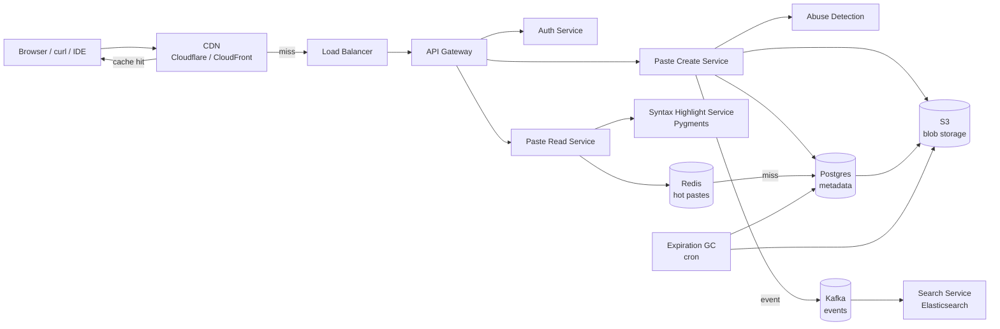

# Вопросы на собеседовании: `Design Pastebin`

`Pastebin` (GitHub Gist, Hastebin, 0bin, JSFiddle для кода) — простой сервис обмена текстом / кодом через короткую ссылку. На интервью это «mini system design»: компактен (укладывается в 30-45 минут), но проверяет ключевые знания: short URL generation, blob vs metadata разделение, syntax highlighting, expiration / TTL, anti-abuse, CDN. Часть параллелей с URL shortener, но с blob payload.

## Полезные ссылки

- [Pastebin (классический сервис)](https://pastebin.com/api)
- [GitHub Gist documentation](https://docs.github.com/en/rest/gists)
- [Hastebin (open source)](https://github.com/toptal/haste-server)
- [0bin (client-side encrypted)](https://github.com/agrm/0bin)
- [Pygments syntax highlighter](https://pygments.org/)
- [Prism.js client-side syntax](https://prismjs.com/)
- [highlight.js](https://highlightjs.org/)
- [System Design Primer](https://github.com/donnemartin/system-design-primer)

## Содержание

**Requirements и capacity**
- [Q1. (!) Functional и non-functional requirements?](#q1--functional-и-non-functional-requirements)
- [Q2. (!) Capacity estimation (1M pastes/day, 5-year retention)?](#q2--capacity-estimation-1m-pastesday-5-year-retention)
- [Q3. SLA и SLO для creation / view paths?](#q3-sla-и-slo-для-creation--view-paths)

**Identifier и storage**
- [Q4. (!) Short URL generation (Base62, collision)?](#q4--short-url-generation-base62-collision)
- [Q5. (!) Storage architecture (DB metadata + S3 blob)?](#q5--storage-architecture-db-metadata--s3-blob)
- [Q6. Schema design (pastes, users, views)?](#q6-schema-design-pastes-users-views)
- [Q7. Compression на write (gzip / zstd)?](#q7-compression-на-write-gzip--zstd)

**Endpoints и API**
- [Q8. (!) Raw vs view endpoints (curl vs browser)?](#q8--raw-vs-view-endpoints-curl-vs-browser)
- [Q9. API для programmatic creation (CLI / IDE plugin)?](#q9-api-для-programmatic-creation-cli--ide-plugin)
- [Q10. Embed widgets (gist.github.com `<script>`)?](#q10-embed-widgets-gistgithubcom-script)

**Rendering**
- [Q11. (!) Syntax highlighting: server-side Pygments vs client-side Prism?](#q11--syntax-highlighting-server-side-pygments-vs-client-side-prism)
- [Q12. Markdown rendering vs raw text?](#q12-markdown-rendering-vs-raw-text)
- [Q13. Language detection (auto vs explicit)?](#q13-language-detection-auto-vs-explicit)

**Lifecycle**
- [Q14. (!) Expiration / TTL (1h, 1d, 1w, never)?](#q14--expiration--ttl-1h-1d-1w-never)
- [Q15. (!) Burn after reading (one-time view)?](#q15--burn-after-reading-one-time-view)
- [Q16. Versioning (edit existing paste)?](#q16-versioning-edit-existing-paste)

**Privacy и features**
- [Q17. Privacy modes (public / unlisted / private / password)?](#q17-privacy-modes-public--unlisted--private--password)
- [Q18. (!) Search (Elasticsearch, opt-in indexing)?](#q18--search-elasticsearch-opt-in-indexing)
- [Q19. Folders / multi-file pastes (Gist)?](#q19-folders--multi-file-pastes-gist)
- [Q20. Diff и compare между revisions?](#q20-diff-и-compare-между-revisions)

**Архитектура**
- [Q21. (!) High-level architecture?](#q21--high-level-architecture)
- [Q22. (!) Storage tiering (Redis / S3 / Glacier)?](#q22--storage-tiering-redis--s3--glacier)
- [Q23. CDN для raw content (Cloudflare / CloudFront)?](#q23-cdn-для-raw-content-cloudflare--cloudfront)
- [Q24. Multi-region и data residency?](#q24-multi-region-и-data-residency)

**Production**
- [Q25. (!) Anti-abuse (DMCA, malware, scraping)?](#q25--anti-abuse-dmca-malware-scraping)
- [Q26. Authentication (OAuth, API tokens)?](#q26-authentication-oauth-api-tokens)
- [Q27. Rate limiting (anonymous IP vs auth key)?](#q27-rate-limiting-anonymous-ip-vs-auth-key)
- [Q28. (!) Monitoring metrics?](#q28--monitoring-metrics)
- [Q29. Cost optimization (compression + lifecycle + CDN)?](#q29-cost-optimization-compression--lifecycle--cdn)
- [Q30. (!) Антипаттерны и подводные камни?](#q30--антипаттерны-и-подводные-камни)

## Q1. (!) Functional и non-functional requirements?

**Functional:**
- Создать paste: текст / код / Markdown с опциональным title.
- Получить paste по короткой ссылке: `pastebin.com/abc1234`.
- Raw view: `pastebin.com/raw/abc1234` (для curl, wget).
- TTL / expiration (опционально).
- Syntax highlighting по языку (или auto-detect).
- Anonymous + authenticated режимы.
- Privacy modes: public, unlisted, private, password-protected.
- Опционально: edit, version history (Gist).
- Опционально: full-text search.
- Опционально: embed widget.

**Non-functional:**
- Users: миллионы DAU (Pastebin ~25M MAU, Gist ~10M+).
- Pastes: 1M+ создаётся/день, retention years.
- Read-heavy: 100:1 reads:writes (один paste viewed N раз).
- Latency: view < 100 ms, creation < 500 ms.
- Availability: 99.9% (не критично как для финтеха).
- Storage: TB-scale (compressed blobs).

**Scope excluded (типично):**
- Real-time collaborative editing (Codepen, JSFiddle Pro).
- Code execution / sandbox (это replit, не pastebin).
- Rich text formatting (HTML editor) — только plain text / markdown.

**Tip:** senior сразу указывает что paste бывает huge (10 MB+ logs), и это диктует blob storage отделить от metadata DB.

## Q2. (!) Capacity estimation (1M pastes/day, 5-year retention)?

**Allowances:**

| Параметр | Значение |
|---|---|
| Pastes created/day | 1M |
| Average size | 10 KB (mix tiny snippets + large logs) |
| Retention | 5 years (with TTL filtering) |
| Read:write ratio | 100:1 |

**Storage:**
- 1M × 10 KB = **10 GB/day** raw.
- 5 years × 365 × 10 GB = **~18 TB raw**.
- + index (small ~1%), metadata (~50 bytes/paste × 2B = 100 GB).
- Compression (zstd 3-4×) → **5-7 TB compressed blob**.

**Bandwidth:**
- Reads: 1M × 100 = 100M views/day = ~1200 views/sec average.
- Peak ×5 = 6 000 views/sec.
- Per view: 10 KB → ~60 MB/sec egress peak.
- 95%+ через CDN → origin ~3 MB/sec.

**Memory (cache):**
- Hot pastes top 1% × 100K avg active = ~10 GB hot in Redis.

**QPS на metadata DB:**
- Creates: 1M/day = ~12/sec average, peak 100/sec.
- Reads: 1200-6000/sec — большая часть из cache.

**Cost:**
- S3 storage (compressed): 5-7 TB × $0.023/GB-month = **$120-160/month**.
- CDN egress: 60 MB/sec × peak hours = 1-2 TB/month CDN = **$50-100/month**.
- Bigger merchant scale (Pastebin сам): proportional growth.

## Q3. SLA и SLO для creation / view paths?

| Metric | Цель | Alert |
|---|---|---|
| `paste_creation_latency_p99` | < 500 ms | > 2 сек |
| `paste_view_latency_p99` | < 100 ms (cached) | > 500 ms |
| `cdn_hit_ratio` | > 90% | < 70% |
| `creation_success_rate` | > 99% | < 95% |
| `expiration_gc_lag_minutes` | < 60 min | > 1440 min (1 day) |
| `abuse_block_rate` | tracked | spike > 3× baseline |
| `availability` | 99.9% | < 99% monthly |

**Failure modes:**
- Blob storage недоступен → fail create (можно offline buffer на client retry).
- Metadata DB outage → 503; критическая.
- CDN miss + origin down → degraded mode (raw bytes from S3 direct).

## Q4. (!) Short URL generation (Base62, collision)?

Параллели с [Design URL Shortener](design-url-shortener-interview.md) — но для Pastebin URL уникален для содержимого paste, не для long URL.

**Подходы:**

**1. Base62 counter:**
- `id = INCR counter` (Snowflake / ZooKeeper key ranges).
- `short = base62_encode(id)`.
- Pros: no collisions; predictable.
- Cons: enumerable (security: можно сканировать `/1`, `/2`).

**2. Random Base62 (7 chars):**
- `short = random_base62(7)` → 62^7 = 3.5T combinations.
- Pros: unpredictable (security).
- Cons: collision check (~10M ожидаемых collisions на 6B → handle с retry).

**3. Hash-based:**
- `short = base62(sha256(content))[:7]`.
- Pros: dedup (same content → same URL).
- Cons: дубликаты могут стать privacy issue (anyone with same content can guess URL).

**Pastebin / Gist выбор:**
- Pastebin: 8-char random Base62.
- Gist: 32-char hex hash (longer, less guessable).
- Hastebin: random 10 chars.

**Длина:**
- 7 chars = 3.5T (safe для billion-scale, 5 лет).
- 8 chars = 218T (extra headroom).
- Gist 32 chars = essentially unguessable (security: unlisted ≠ private but harder to find).

**Collision handling:**
- UNIQUE constraint в DB.
- Retry on conflict (3-5 attempts).
- After N retries → bump length to 8 chars.

**Anti-enumeration:**
- Длиннее = harder to scan.
- Rate limit на 404 responses (security: detect scanning attempts).

## Q5. (!) Storage architecture (DB metadata + S3 blob)?

**Принцип:** разделять metadata (small, indexed, OLTP) и blob (large, immutable, sequential).

**Metadata (Postgres / MySQL):**
```sql
CREATE TABLE pastes (
  id BIGSERIAL PRIMARY KEY,
  short_code VARCHAR(10) UNIQUE NOT NULL,
  user_id BIGINT NULL,
  title TEXT,
  language VARCHAR(20),
  size_bytes INT,
  visibility VARCHAR(10),  -- public / unlisted / private
  password_hash TEXT NULL,
  created_at TIMESTAMP DEFAULT NOW(),
  expires_at TIMESTAMP NULL,
  views_count BIGINT DEFAULT 0,
  blob_key TEXT NOT NULL,  -- S3 key
  blob_compression VARCHAR(10),
  deleted_at TIMESTAMP NULL
);

CREATE INDEX idx_user ON pastes (user_id);
CREATE INDEX idx_expires ON pastes (expires_at) WHERE expires_at IS NOT NULL;
```

**Blob storage (S3 / GCS / Cloudflare R2):**
- Key: `pastes/{short_code}.zst` (или `/{shard}/{short_code}`).
- Value: zstd-compressed text bytes.
- Immutable (overwrite на edit = new revision, separate blob).

**Read flow:**
```
GET /abc1234
  ↓
metadata = pastes WHERE short_code = 'abc1234'
  ↓ (если expired или not visible) → 404
  ↓
blob = s3.get(metadata.blob_key)
  ↓ decompress
  ↓
return content
```

**Зачем разделять:**
- Metadata SSD ($$$) — high-frequency queries.
- Blob HDD/object storage ($/GB) — cheap massive.
- Independent scaling.
- Blob immutable → cache-friendly через CDN.

**Альтернатива (single Postgres):**
- Хранить blob в TEXT/BYTEA column.
- Pro: simpler architecture.
- Cons: DB cost растёт быстро; row-level overhead; backup тяжелее.

**Для small-scale Pastebin (early stage):** single Postgres работает. На billion scale — обязательно separation.

## Q6. Schema design (pastes, users, views)?

**pastes** — основная таблица (см. Q5).

**users** (если auth):
```sql
CREATE TABLE users (
  id BIGSERIAL PRIMARY KEY,
  username VARCHAR(40) UNIQUE,
  email VARCHAR(255) UNIQUE,
  oauth_provider VARCHAR(20),  -- github, google, none
  oauth_id TEXT,
  api_token_hash TEXT,
  plan VARCHAR(20),  -- free, paid
  created_at TIMESTAMP
);
```

**views** (для analytics, опционально):
```sql
CREATE TABLE paste_views (
  id BIGSERIAL PRIMARY KEY,
  paste_id BIGINT,
  viewer_user_id BIGINT NULL,
  viewer_ip_hash VARCHAR(64),
  user_agent VARCHAR(255),
  referrer TEXT,
  viewed_at TIMESTAMP
) PARTITION BY RANGE (viewed_at);
```

Партиционирование по месяцу → cleanup старых старых легко (`DROP PARTITION`).

**revisions** (если versioning, Gist):
```sql
CREATE TABLE paste_revisions (
  id BIGSERIAL PRIMARY KEY,
  paste_id BIGINT,
  blob_key TEXT,
  revision_number INT,
  edited_by BIGINT,
  edited_at TIMESTAMP,
  UNIQUE (paste_id, revision_number)
);
```

**comments** (Gist):
```sql
CREATE TABLE paste_comments (
  id BIGSERIAL PRIMARY KEY,
  paste_id BIGINT,
  user_id BIGINT,
  body TEXT,
  created_at TIMESTAMP
);
```

**Indexes:**
- `pastes.short_code` — UNIQUE, primary lookup.
- `pastes.user_id` — "my pastes" page.
- `pastes.expires_at` — для GC sweep.
- `paste_views.paste_id, viewed_at` — analytics.

## Q7. Compression на write (gzip / zstd)?

**Tradeoff:** CPU cost vs storage + bandwidth.

| Codec | Compression ratio | Encode speed | Decode speed |
|---|---|---|---|
| gzip | 2.5-3× | 50 MB/s | 200 MB/s |
| zstd | 3-4× | 400 MB/s | 800 MB/s |
| Brotli | 3.5× | 30 MB/s | 200 MB/s |

**Pastebin выбор: zstd**
- Лучший trade-off.
- 3-4× compression на код (большая избыточность).
- Encode достаточно быстрый для real-time (<5 ms на 10 KB).
- Decode почти бесплатный.

**Per-paste compression:**
- Применять на write один раз → store.
- На read decompress → serve raw text.

**Не compress:**
- Tiny pastes (< 256 bytes) — overhead > savings.
- Already compressed content (rare для plain text pastes).

**Compression в transport:**
- HTTP `Accept-Encoding: br, gzip` — CDN/server compress response.
- Vector tiles / large content → Brotli on the wire.

**Code example:**
```python
import zstandard as zstd

def store(text):
    compressor = zstd.ZstdCompressor(level=3)
    compressed = compressor.compress(text.encode('utf-8'))
    s3.put(key, compressed)

def fetch(key):
    compressed = s3.get(key)
    decompressor = zstd.ZstdDecompressor()
    return decompressor.decompress(compressed).decode('utf-8')
```

## Q8. (!) Raw vs view endpoints (curl vs browser)?

**Два типа клиентов:**

**Browser users:**
- Want: rendered HTML с syntax highlighting, navigation, comments.
- URL: `pastebin.com/abc1234`.
- Response: full HTML page.

**Programmatic (curl, wget, scripts):**
- Want: raw bytes, no HTML decoration.
- URL: `pastebin.com/raw/abc1234`.
- Response: `Content-Type: text/plain; charset=utf-8` + raw content.

**Endpoint design:**

```
GET /{short_code}      → HTML view (с decoration)
GET /raw/{short_code}  → text/plain raw
GET /download/{short_code} → Content-Disposition: attachment
GET /embed/{short_code} → minimal HTML for iframe
```

**Why это важно:**
- curl `pastebin.com/abc1234` без `/raw/` получит HTML — не пригоден для shell pipelines.
- Стандарт: `curl https://pastebin.com/raw/abc1234 | bash` (популярный pattern, security warning aside).

**Caching:**
- Raw endpoint: CDN cache aggressively (immutable content).
- HTML view: also cacheable но invalidate при comment / view count update (или just serve stale).

**Content-Type negotiation:**
- `Accept: text/plain` от curl → return raw.
- `Accept: text/html` от browser → return view.
- Pastebin не использует Content negotiation; explicit URLs cleaner.

**Edge case:** auto-detect User-Agent (curl/wget) и redirect на raw — некоторые сервисы делают это для convenience.

## Q9. API для programmatic creation (CLI / IDE plugin)?

**REST API:**

**POST /api/v1/pastes:**
```http
POST /api/v1/pastes
Authorization: Bearer <api_token>
Content-Type: application/json
Idempotency-Key: <uuid>

{
  "content": "console.log('hello');",
  "language": "javascript",
  "title": "test paste",
  "expires_in": 3600,
  "visibility": "unlisted"
}
```
Response:
```json
{
  "short_code": "abc1234",
  "url": "https://pastebin.com/abc1234",
  "raw_url": "https://pastebin.com/raw/abc1234",
  "expires_at": "2026-05-27T13:00:00Z"
}
```

**GET /api/v1/pastes/{short_code}:**
- Returns metadata + content.

**DELETE /api/v1/pastes/{short_code}:**
- Owner only.

**API tokens:**
- Generated в settings UI.
- Hashed в DB.
- Per-token rate limits (Q27).

**CLI tools (community):**
- `pastebinit` (Linux command-line uploader).
- `gh gist create` (GitHub CLI).
- `pbpaste | gist` (macOS пайплайн).

**IDE plugins:**
- VS Code Gist extension.
- IntelliJ Gist plugin.
- Sublime Text gist-it.

**API rate limits:**
- Anonymous (без API key): 5 creates/hour.
- Authenticated free: 25 creates/hour.
- Paid: 1000+ creates/hour.

## Q10. Embed widgets (gist.github.com `<script>`)?

**Use case:** показать paste/gist на стороннем сайте (blog post, docs).

**GitHub Gist embed:**
```html
<script src="https://gist.github.com/user/abc1234.js"></script>
```
- Загружает JS, который рендерит iframe / inline HTML.
- Syntax highlighting + GitHub styling.

**Альтернатива — iframe:**
```html
<iframe src="https://pastebin.com/embed/abc1234"
        width="600" height="400" frameborder="0">
</iframe>
```

**Implementation:**
- `/embed/{short_code}` endpoint returns minimal HTML page с:
  - Только paste content + syntax highlighting.
  - `<style>` для compact layout.
  - X-Frame-Options: ALLOWALL (или per-domain whitelisting).

**Security:**
- CSP headers (Content-Security-Policy).
- Sandbox iframe attribute: prevent escape.
- No JS execution от content (escape HTML / показывать как plain text).

**CDN-able:**
- Embed HTML кэшируется агрессивно.
- Asset URLs (CSS, fonts) — long TTL.

**Privacy:**
- Public pastes only embeddable.
- Private/password — block embed (set X-Frame-Options: DENY).

## Q11. (!) Syntax highlighting: server-side Pygments vs client-side Prism?

**Server-side (Pygments / Rouge / Chroma):**
- Tokenize код → render HTML с CSS classes.
- На каждый view: parse + render.
- Cache HTML output → fast subsequent views.

**Client-side (Prism.js / highlight.js):**
- Serve raw HTML + JS library.
- Browser parses + applies styling.
- Smaller server payload.

**Сравнение:**

| Aspect | Server-side | Client-side |
|---|---|---|
| Initial page weight | HTML с inline classes (~30% больше) | Plain HTML + 30-50 KB JS |
| First render | Instant | Wait for JS load |
| SEO | Good (highlighted в HTML) | Bad (search engines see raw) |
| CPU on server | Higher | None |
| CPU on client | None | Higher |
| Language support | Wider (Pygments 500+ languages) | Limited (highlight.js ~190, Prism ~270) |
| Caching | Full HTML cacheable | Raw cacheable + JS cached |

**Production choices:**
- **GitHub Gist:** server-side (Rouge на Ruby).
- **Pastebin:** server-side (Geshi PHP historically, modern Pygments).
- **Hastebin:** client-side (highlight.js).
- **0bin (encrypted):** обязательно client-side (server can't see content).

**Recommended:**
- Server-side для SEO-important content (public Gists).
- Client-side для private / encrypted content где server не decrypts.

**Implementation server-side:**
```python
from pygments import highlight
from pygments.lexers import get_lexer_by_name
from pygments.formatters import HtmlFormatter

def render(code, language):
    lexer = get_lexer_by_name(language)
    formatter = HtmlFormatter(linenos=True, cssclass="source")
    return highlight(code, lexer, formatter)
```

**Latency:** Pygments render < 50 ms для 10 KB файла. Cache rendered HTML → subsequent < 10 ms.

## Q12. Markdown rendering vs raw text?

**Markdown support (gist.github.com `.md` files):**
- Detect `.md` extension.
- Render через CommonMark / GFM parser.
- Cache rendered HTML.

**Раздельные view modes:**
- `/{code}` → rendered (default для .md).
- `/{code}/raw` → raw markdown source.

**Implementation:**
```python
import markdown
def render_md(text):
    return markdown.markdown(text, extensions=['fenced_code', 'tables', 'codehilite'])
```

**XSS risk:**
- Markdown может содержать inline HTML.
- Sanitize через DOMPurify (client-side) или Bleach (server-side).
- White-list разрешённых tags.

**CommonMark vs GFM:**
- CommonMark — spec ANSI.
- GFM (GitHub Flavored Markdown) — extensions: task lists, tables, autolinks, mentions.

**Toggle:**
- UI button "View source / Rendered".

**Other formats:**
- `.txt` → plain text.
- `.json` / `.xml` → syntax-highlighted code view.
- `.csv` → table view (some services).

## Q13. Language detection (auto vs explicit)?

**Explicit:**
- User selects language from dropdown при создании.
- Stored в `pastes.language`.
- Pros: 100% accurate.
- Cons: friction для quick paste.

**Auto-detect:**
- Library определяет язык из содержимого.
- Pygments `guess_lexer()`.
- highlight.js `highlightAuto()`.
- ML-based: GitHub Linguist (used для file-language detection).

**Heuristics:**
- Shebang (`#!/usr/bin/env python`) → Python.
- Keywords (`function`, `var`, `const`) → JavaScript.
- Indentation (4 spaces consistent) → Python likely.

**Hybrid:**
- Auto-detect default; user can override.
- При amphigorous content (mixed languages, plain English) → fallback to plain text.

**Accuracy:**
- Auto-detect 80-90% на common languages.
- Worse для obscure (Brainfuck, COBOL).
- Better если файл имеет signals (shebang, extension hint).

## Q14. (!) Expiration / TTL (1h, 1d, 1w, never)?

**Options:**
- `expires_in=null` → never (default для paid users).
- `expires_in=3600` → 1 hour.
- `expires_in=86400` → 1 day.
- `expires_in=604800` → 1 week.
- `expires_in=2592000` → 30 days (free user default).
- `burn_after_read=true` → one-time (Q15).

**Implementation:**

**Logical expiration (на read):**
```sql
SELECT * FROM pastes
WHERE short_code = $1
  AND (expires_at IS NULL OR expires_at > NOW())
  AND deleted_at IS NULL;
```
- Returns 404 если expired.

**Physical cleanup (background):**

Вариант 1: Cron daily sweep.
```sql
DELETE FROM pastes
WHERE expires_at < NOW() - INTERVAL '7 days';
-- + delete blob from S3
```
Batch deletes (LIMIT 10000) чтобы не блокировать DB.

Вариант 2: S3 lifecycle policy.
- S3 supports automatic deletion based on tags or prefix.
- Tag paste blob с `expires=2026-06-01`.
- S3 auto-deletes after timestamp.

Вариант 3: TTL-aware DB (DynamoDB TTL attribute).
- DynamoDB auto-deletes items с TTL attribute.
- Eventual (до 48ч delay).

**Grace window:**
- Logical expiration immediate.
- Physical delete через 7-30 дней (recovery option для accidental).

**User-controlled:**
- Owner может extend TTL до expiration.
- Owner может delete мгновенно.

## Q15. (!) Burn after reading (one-time view)?

**Feature:** paste просматривается ровно один раз, потом удаляется.

**Use cases:**
- Sharing secrets / passwords / API keys.
- Time-sensitive info.
- Privacy-conscious users.

**Implementation:**

```python
def view(short_code):
    paste = db.transaction:
        p = SELECT * FROM pastes WHERE short_code = $1 FOR UPDATE
        if p is None or p.deleted_at: return 404
        if p.burn_after_read:
            UPDATE pastes SET deleted_at = NOW() WHERE id = $p.id
            schedule_blob_delete(p.blob_key, delay=60)  # grace period
    return paste.content
```

**Атомарность:**
- `FOR UPDATE` lock prevents concurrent reads (one wins).
- After commit: blob delete async (с small grace для cdn invalidation).

**Edge cases:**
- Network failure на client side после view → content lost (user complaint).
- Solution: warn before view ("This paste burns after reading"); confirm click → reveal.
- Or: 60-sec window между first view и actual burn.

**Encryption (0bin / Privatebin):**
- Client encrypts content с key in URL fragment (`#key=base64...`).
- Server stores только ciphertext.
- Server can never decrypt → true E2E even before burn.
- URL fragment не отправляется на сервер.

**Anti-abuse:**
- Crawlers / link previewers (Slackbot, Twitter Card) могут случайно "сжечь" paste.
- Solution: confirm click required; bot UA detection.

## Q16. Versioning (edit existing paste)?

**GitHub Gist подход:**
- Каждый edit = новая revision (как Git commit).
- All revisions retained.
- `paste_revisions` table (Q6).

**Pastebin classic:**
- Editing means creating new paste с reference на parent.
- Old version preserved otherwise.

**Implementation Gist-style:**
```sql
-- create
INSERT INTO pastes (...) RETURNING id;
INSERT INTO paste_revisions (paste_id, blob_key, revision_number=1, ...);

-- edit
INSERT INTO paste_revisions (paste_id, blob_key=new_blob, revision_number=2, ...);
-- pastes.blob_key updated to new_blob (current = revision N)
```

**Diff между revisions:**
- Q20: server-side diff (unified format) или client-side через JS lib.

**Storage:**
- Each revision = new blob в S3 (CAS-friendly).
- Если new revision identical → dedup (same blob_key).

**Tradeoff:**
- Storage cost linear с revision count.
- Garbage collection после N лет.

## Q17. Privacy modes (public / unlisted / private / password)?

**Modes:**

| Mode | Visible в listings | Accessible by URL | Auth required | Notes |
|---|---|---|---|---|
| Public | Yes | Yes | No | Indexed by Google, in search |
| Unlisted | No | Yes (anyone with URL) | No | Like YouTube unlisted |
| Private | No | Yes (owner only) | Auth required | Server checks ownership |
| Password-protected | No | URL valid, but password required | Pwd hash check | Bcrypt password |

**Schema:**
```sql
ALTER TABLE pastes ADD COLUMN visibility VARCHAR(15) DEFAULT 'public';
ALTER TABLE pastes ADD COLUMN password_hash TEXT NULL;
```

**Access control:**
```python
def get_paste(short_code, user_id, password):
    paste = SELECT * FROM pastes WHERE short_code = $1
    if not paste or expired or deleted: return 404
    if paste.visibility == 'private' and paste.user_id != user_id:
        return 403
    if paste.password_hash:
        if not bcrypt.checkpw(password, paste.password_hash):
            return 401  # prompt password
    return paste.content
```

**Indexing:**
- Public: search-indexable (Q18).
- Unlisted: НЕ индексируем; добавляем `<meta name="robots" content="noindex">`.
- Private: 404 для unauthenticated, не показывается даже в listing.

**Edge:**
- "Unlisted" не есть security: anyone с URL can access. Just не findable.
- Real privacy → "Private" + auth required.

## Q18. (!) Search (Elasticsearch, opt-in indexing)?

**Search возможен только public pastes** (по definition).

**Architecture:**

```
paste created (visibility=public)
   ↓ Kafka event paste.created
   ↓
Elasticsearch indexer
   ↓
ES index: pastes
   fields: short_code, title, content, language, created_at, user
```

**Query:**
```
GET /search?q=mysql+timeout
   ↓
ES full-text search (BM25)
   ↓
return top-K with snippets
```

**Indexed fields:**
- `title` — boosted.
- `content` — primary search field.
- `language` — facet filter.
- `created_at` — time filter.

**Index size:**
- ~30% от raw text (analyzed, inverted index).
- 5 TB content → ~1.5 TB ES index.

**Latency:**
- Search query < 200 ms.
- Indexing lag < 30 sec from creation.

**Opt-in privacy:**
- Public pastes indexed by default.
- User can mark "exclude from search" via flag.
- Removed from ES async on update.

**Pastebin реальность:**
- Pastebin classic: ограниченный search (по rate, нет full content).
- GitHub Gist: full content search (gistsearch.com через GitHub API).

## Q19. Folders / multi-file pastes (Gist)?

**GitHub Gist:** один gist может содержать несколько files.

**Schema:**
```sql
CREATE TABLE gist_files (
  id BIGSERIAL PRIMARY KEY,
  gist_id BIGINT,  -- references pastes
  filename TEXT,
  blob_key TEXT,
  size_bytes INT,
  language VARCHAR(20)
);
```

**API:**
```http
POST /api/v1/gists
{
  "files": {
    "main.py": { "content": "import sys..." },
    "utils.py": { "content": "def helper()..." }
  },
  "description": "Multi-file example"
}
```

**Use cases:**
- Code with imports / dependencies.
- Configuration + script.
- README + code.

**Render:**
- Tabs или collapsible sections в UI.
- One main file featured.

**Embed:**
- `<script src="https://gist.github.com/user/abc.js?file=main.py">` → only one file.

## Q20. Diff и compare между revisions?

**Diff between revisions:**

**Server-side:**
- Pull two revisions' blobs.
- Compute diff с `diff` library (myers, histogram algorithm).
- Format: unified diff or side-by-side HTML.

**Client-side:**
- Send two raw contents к browser.
- diff-match-patch library renders.

**API:**
```http
GET /api/v1/gists/{gist_id}/compare/{rev1}..{rev2}
```
Response: unified diff format.

**UI:**
- Side-by-side view (GitHub style).
- Inline diff (Gitlab style).
- Word-level highlighting.

**Implementation библиотеки:**
- `difflib` (Python stdlib).
- `diff-match-patch` (Google, JS).
- `git diff --no-index` для CLI.

## Q21. (!) High-level architecture?



**Services:**
- **CDN:** caches HTML view + raw content; 90%+ hit ratio.
- **API Gateway:** auth, rate limit, routing.
- **Paste Create Service:** validate → generate short_code → compress → store blob → metadata insert.
- **Paste Read Service:** check cache → DB → blob fetch → highlight → render.
- **Highlight Service:** Pygments / Chroma; rendered HTML cached.
- **Search Service:** Elasticsearch index of public pastes.
- **Abuse Detection:** DMCA hash check + malware scanning + spam classifier.
- **GC:** background cron deletes expired pastes from DB + blob storage.

**Inter-service:**
- Sync: HTTP/gRPC между services.
- Async: Kafka для search indexing, analytics, abuse re-scanning.

## Q22. (!) Storage tiering (Redis / S3 / Glacier)?

**Three-tier:**

**Hot tier — Redis:**
- Recently created (< 24 ч).
- Frequently accessed (views > threshold).
- TTL aligned с paste expiration.
- ~10-20 GB.

**Warm tier — S3 Standard:**
- Active pastes (created within last 1 year).
- ~5-7 TB compressed.

**Cold tier — S3 Glacier:**
- Old pastes (> 1 year, low access).
- Restore latency: minutes to hours.
- 5-10× cheaper.

**Lifecycle policy (S3):**
```json
{
  "Rules": [{
    "Status": "Enabled",
    "Filter": { "Prefix": "pastes/" },
    "Transitions": [
      { "Days": 30, "StorageClass": "STANDARD_IA" },
      { "Days": 365, "StorageClass": "GLACIER" }
    ],
    "Expiration": { "Days": 1825 }
  }]
}
```

**Read flow с tiering:**
1. Check Redis → hit → return.
2. Miss → S3 Standard → return + populate Redis.
3. Miss → S3 Glacier → restore (minutes) → return.

**Edge:**
- Glacier restore charged per-retrieval.
- Pre-emptive restore при первом view in years.

**Cost savings:**
- Mixed tiering: 70% Standard, 30% Glacier → ~50% cost reduction vs all-Standard.

## Q23. CDN для raw content (Cloudflare / CloudFront)?

**Зачем CDN:**
- 100M views/day → 1200 views/sec average.
- 95%+ requests served from edge → origin не нагружена.

**Cache key:**
- `(short_code, raw|view, language)`.
- Versioned: `/v1/raw/abc1234`.

**Cache behavior:**
- Raw endpoint (`/raw/{code}`): cache aggressively (immutable content).
- View endpoint (`/{code}`): cache short TTL (in case of comment/view-count updates).
- Embed (`/embed/{code}`): cache long TTL.

**TTL:**
- Public pastes: 1 hour - 24 hours.
- Unlisted: same as public.
- Private: bypass CDN (Cache-Control: private).
- Password-protected: bypass CDN.

**Cache busting:**
- Edit paste → invalidate cache (Cloudflare purge API).
- Or: versioned URL `/v2/raw/abc1234`.

**Bandwidth:**
- Без CDN: 1200 views/sec × 10 KB = 12 MB/sec sustained = 30 TB/month egress = $600+/month.
- С CDN 95% hit: $30/month origin egress + $50-100 CDN cost.

**Edge compression:**
- CDN auto-compresses (Brotli/gzip).
- Saves ~70% bandwidth on text content.

## Q24. Multi-region и data residency?

**Single region — default для startup-Pastebin.** Multi-region добавляется при scale.

**Drivers для multi-region:**
- Latency (global users).
- GDPR (EU data residency).
- DR.

**Архитектура:**
- 3 regions: US, EU, APAC.
- Каждый region — full stack.
- Metadata replication (Cassandra multi-DC или Postgres logical replication).
- Blob: per-region storage; cross-region replication async для popular.

**Routing:**
- DNS GeoDNS (Route 53 latency-based).
- User pinned к home region (country).

**Data residency:**
- EU pastes — physically только в EU region.
- User-controlled: "Store data in: US / EU / APAC".

**CDN:**
- Already global → first line of caching.
- Origin in nearest region for misses.

**Cross-region:**
- Paste created в US → replicated к EU async (5-30 sec lag).
- EU user accessing US-stored paste: cross-region fetch (slower first time, cached в EU CDN edge after).

## Q25. (!) Anti-abuse (DMCA, malware, scraping)?

**Risks:**
- Pastebin hosts pirated software, leaked credentials, malware, hate content.
- Pastebin classic has historical reputation как dump для leaks.

**Defenses:**

**1. Real-time content scanning:**
- ML classifier: spam, hate speech, NSFW.
- Hash match для known malware code.
- Block at creation if confidence > threshold.

**2. DMCA process:**
- Rights holders submit takedown via web form.
- Automated hash-blocklist (copyright content).
- Same content uploaded again → auto-block.

**3. Malware detection:**
- ClamAV scan on creation.
- Suspicious patterns (base64-encoded payloads, obfuscated JS).
- Sandbox execution для high-risk files (rare).

**4. Credential leak detection:**
- Scan для AWS keys, GitHub tokens, private SSH keys patterns.
- Auto-alert to affected service (e.g., GitHub revokes leaked tokens).
- Notify user who pasted.

**5. Anti-scraping:**
- Rate limit per IP (Q27).
- Bot detection (Cloudflare).
- CAPTCHA на suspicious patterns.

**6. PSI / PII scrubbing (optional):**
- Detect SSN, credit cards, emails в content.
- Warn user before publishing public.

**7. User reporting:**
- "Report this paste" button.
- Moderation queue.
- Auto-block при N reports.

**8. Banned content:**
- CSAM hash matching (NCMEC / PhotoDNA).
- Mandatory reporting.

## Q26. Authentication (OAuth, API tokens)?

**Anonymous:**
- No auth required для basic paste.
- Limited features (no edit, no private, lower quotas).

**Authentication options:**

**1. OAuth (GitHub, Google):**
- Most popular для dev tools.
- Eliminates passwords on Pastebin side.
- User info fetched via OAuth.

**2. Custom user/password:**
- Optional — for users без OAuth providers.
- bcrypt password hash.
- Email verification.

**3. API tokens:**
- Generated в user settings.
- Hashed в DB (`api_token_hash`).
- Format: `pastebin_pat_<random>` (similar к GitHub PAT).
- Scopes: read, write, delete.

**Implementation:**
```python
@require_auth
def create_paste(user, content):
    ...

def authenticate(request):
    # Try OAuth session token
    if session_token := request.cookies.get('session'):
        return User.from_session(session_token)
    # Try API token
    if api_token := request.headers.get('Authorization'):
        token_hash = sha256(api_token.replace('Bearer ', ''))
        return User.from_api_token(token_hash)
    return AnonymousUser()
```

**Session management:**
- JWT with refresh token (для web).
- Session stored в Redis (для invalidation).
- Cookie HttpOnly + Secure + SameSite=Strict.

## Q27. Rate limiting (anonymous IP vs auth key)?

**Tiers:**

| User type | Creates/hour | Reads/min | Burst |
|---|---|---|---|
| Anonymous (IP-based) | 5 | 100 | 10 |
| Authenticated free | 25 | 500 | 50 |
| Paid (Pro) | 250 | unlimited | 500 |
| API enterprise | 10000 | unlimited | 1000 |

**Implementation:**
- Token bucket per user_id or IP (Redis Lua, см. [Design Rate Limiter](design-rate-limiter-interview.md)).
- Distinguish reads vs writes (writes more expensive).
- Burst allowance для legitimate spike.

**Anonymous IP-based:**
- `X-Forwarded-For` header (parse trusted proxies).
- Cloudflare provides `CF-Connecting-IP`.

**Authenticated key-based:**
- API token → user_id → rate limit per user.

**HTTP 429 response:**
```http
HTTP/1.1 429 Too Many Requests
Retry-After: 60
X-RateLimit-Limit: 5
X-RateLimit-Remaining: 0
X-RateLimit-Reset: 1716832800
```

**Adaptive rate limiting:**
- Suspicious IPs (failed CAPTCHA, abuse history) → lower limit.
- Trusted IPs (paid users, well-behaved) → higher limit.

**Edge cases:**
- Shared NAT (corporate, школа) — many users one IP → false positive.
- Solution: require auth or CAPTCHA вместо block.

## Q28. (!) Monitoring metrics?

**Core latency:**
- `paste_creation_latency_p99` < 500 ms.
- `paste_view_latency_p99` < 100 ms cached.
- `cdn_hit_ratio` > 90%.
- `syntax_highlight_latency_p99` < 50 ms.

**Volume:**
- `pastes_created_per_sec`.
- `pastes_viewed_per_sec`.
- `bytes_uploaded_per_sec`.

**Quality:**
- `creation_success_rate` > 99%.
- `error_rate_5xx` < 0.1%.
- `expired_pastes_cleanup_lag_minutes`.

**Anti-abuse:**
- `dmca_blocks_per_day`.
- `malware_detections_per_day`.
- `suspicious_ips_per_hour`.
- `captcha_challenge_rate`.

**Storage:**
- `blob_storage_size_tb`.
- `db_metadata_size_gb`.
- `compression_ratio` (target 3-4×).

**Business:**
- `daily_active_users`.
- `signups_per_day`.
- `pro_conversion_rate`.

**Alerts:**
- Page: `creation_success_rate < 95%` 5 минут подряд.
- Slack: `dmca_blocks` spike > 5× baseline.
- Email: `expiration_gc_lag > 24 hours`.

**Tracing:**
- OpenTelemetry; trace ID через client → API → DB → blob.
- Visibility: `paste view 80 ms = CDN hit 60 ms + (would be: 200 ms DB lookup + 50 ms highlight)`.

## Q29. Cost optimization (compression + lifecycle + CDN)?

**Cost drivers:**
- Blob storage: 5-7 TB compressed.
- CDN bandwidth: 60 MB/sec peak.
- Metadata DB: PostgreSQL RDS.
- Compute (app servers).

**Optimizations:**

**1. Compression (Q7):**
- zstd 3-4× → save 70% storage cost.
- Stored compressed; decompress on read.

**2. Storage tiering (Q22):**
- S3 Standard → IA → Glacier lifecycle.
- 50% saving on aging pastes.

**3. CDN aggressive caching (Q23):**
- 95% hit ratio → origin bandwidth × 20 cheaper.
- Long TTL для immutable raw content.

**4. Expiration cleanup (Q14):**
- Auto-delete TTL-expired blobs.
- Free pastes default 30-day TTL.

**5. Read cache (Redis):**
- Top 1% pastes in memory.
- Subsequent views: nanosecond access.
- Reduces DB load.

**6. Pre-compressed CDN:**
- Cloudflare auto-compresses (gzip/Brotli) — free.
- Saves ~70% bandwidth.

**7. Cold start anonymous quota:**
- Free anonymous tier limited → reduces abuse cost.

**8. R2 / B2 instead of S3:**
- Cloudflare R2: $0.015/GB-month (vs S3 $0.023).
- Backblaze B2 еще cheaper.
- No egress fees через Cloudflare CDN.

**Total cost estimate (1M pastes/day, 5 yr):**
- Blob storage: $100-300/month.
- CDN: $50-150/month.
- Metadata DB: $100-500/month (small Postgres).
- Compute: $200-500/month.
- **Total: $500-1500/month** для mid-scale Pastebin.

## Q30. (!) Антипаттерны и подводные камни?

**1. Хранить large blobs в Postgres column.**
- Postgres TOAST handles overflow, но DB size растёт быстро.
- Backup/restore становится painfully slow.
- Fix: blob storage в S3 (Q5).

**2. Synchronous syntax highlighting на каждый view.**
- Pygments на 10 KB файле = 50 ms CPU per view.
- На 1200 views/sec = 60 servers тратятся только на rendering.
- Fix: cache rendered HTML в Redis или CDN.

**3. No expiration cleanup → unlimited DB growth.**
- 5 years × 1M/day × 10 KB = 18 TB blob storage; metadata 100 GB.
- Backup невозможен.
- Fix: TTL + scheduled GC (Q14).

**4. Enumerable IDs (incremental counter).**
- Привлекает scrapers (curl `/1`, `/2`, ...).
- Security: privacy compromised.
- Fix: random Base62 7-8 chars (Q4).

**5. No anti-abuse / DMCA.**
- Pastebin getting takedowns, legal liability.
- Fix: hash blocklist + ML scanner + reporting (Q25).

**6. Counting views synchronously.**
- `UPDATE pastes SET views_count = views_count + 1` на каждый view.
- Row contention на popular pastes.
- Fix: async через Kafka + batch update.

**7. Hosting от same domain как user content.**
- XSS risk: malicious paste может attempt session hijack.
- Fix: serve raw content from sandbox subdomain (e.g., `pastebincontent.com`) или enforce strict CSP.

**8. Full-text search ВСЕХ pastes по default.**
- Privacy violation; legal liability (search для leaked passwords).
- Fix: index только explicitly public; honor user privacy.

**9. No CDN.**
- Origin overwhelmed at scale; bandwidth cost prohibitive.
- Fix: CloudFront / Cloudflare (Q23).

**10. Single Postgres для всего (metadata + blob).**
- DB size grows fast; query latency degrades.
- Fix: blob → S3, metadata → Postgres.

**11. Hard delete blobs при expiration.**
- Accidental expiration → permanent loss.
- Fix: soft delete + 7-30 day grace window.

**12. Не verify user-supplied language.**
- Pygments crashes on certain malformed inputs.
- Fix: try/catch + fallback to plain text.

**13. Allow embedding from any domain.**
- Iframe used для phishing (legitimate-looking Pastebin embed inside scam page).
- Fix: per-domain allowlist OR `X-Frame-Options: DENY` by default.

**14. No idempotency key on create.**
- Network retry creates duplicate paste с different short_code.
- Fix: `Idempotency-Key` header (Q9).

**15. Storing api_token plain в DB.**
- DB leak = all tokens compromised.
- Fix: hash tokens (sha256 + salt) → store hash; verify by re-hashing input.

---

## See also

- [Design URL Shortener](design-url-shortener-interview.md) — short code generation parallels
- [Design Dropbox](design-dropbox-interview.md) — blob storage tiering parallels
- [Design Search System](design-search-interview.md) — Elasticsearch indexing
- [System Design Interview](system-design-interview.md) — общая методология
- [Design Rate Limiter](design-rate-limiter-interview.md) — token bucket для anonymous/auth tiers
- [Caching Strategies](../architecture/caching-strategies-interview.md) — multi-tier CDN + Redis
- [CDN](../architecture/cdn-interview.md) — edge caching для raw content
- [Database Sharding](../databases/database-sharding-interview.md) — sharding metadata
- [Redis](../databases/redis-interview.md) — hot paste cache
- [Elasticsearch](../databases/elasticsearch-interview.md) — paste full-text search
- [API Security](../security/api-security-interview.md) — OAuth, API tokens, rate limiting
- [Resilience Patterns](../architecture/resilience-patterns-interview.md) — circuit breaker для blob storage
