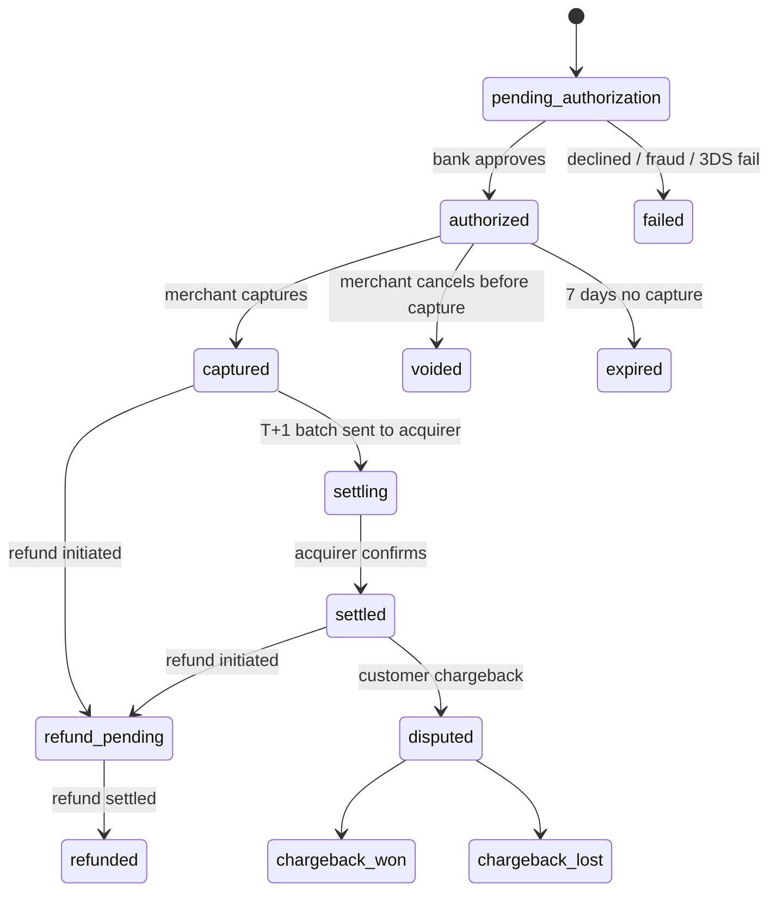
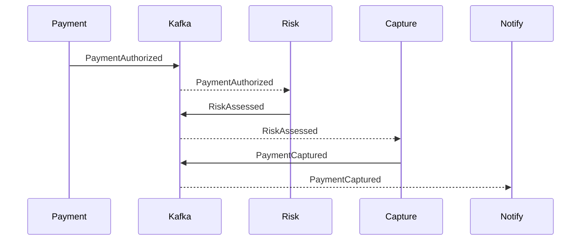
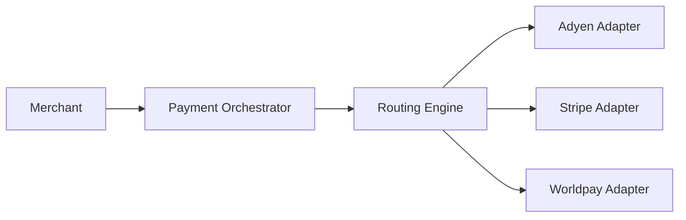
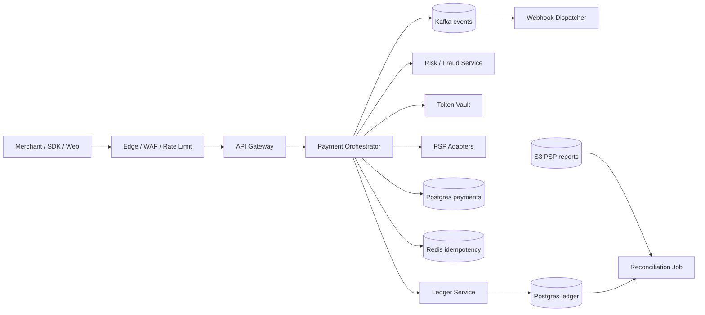

# Вопросы на собеседовании: `Design Payment System`

`Payment System` (Stripe / Adyen / Braintree / Wise) — один из самых жёстких system design кейсов: одновременно требует strong correctness (нельзя «потерять» деньги), high availability (downtime = прямой revenue loss), regulatory compliance (PCI-DSS, AML, KYC), и распределённую интеграцию с десятками внешних провайдеров. Стандарт для senior+.

## Полезные ссылки

- [Stripe Engineering Blog](https://stripe.com/blog/engineering)
- [Designing for Idempotency (Stripe)](https://stripe.com/blog/idempotency)
- [PCI-DSS v4.0 Quick Reference](https://www.pcisecuritystandards.org/document_library/)
- [Adyen Tech Blog](https://www.adyen.com/blog/topics/engineering)
- [Visa Chargeback Management Guidelines](https://usa.visa.com/dam/VCOM/global/support-legal/documents/dispute-management-guidelines-for-visa-merchants.pdf)
- [Square Engineering — Distributed Transactions](https://developer.squareup.com/blog/)
- [System Design Primer — payment](https://github.com/donnemartin/system-design-primer)
- [Microservices.io — Saga pattern](https://microservices.io/patterns/data/saga.html)

## Содержание

**Requirements и capacity**
- [Q1. (!) Functional и non-functional requirements?](#q1--functional-и-non-functional-requirements)
- [Q2. (!) Capacity estimation (10K txn/sec, 1B users)?](#q2--capacity-estimation-10k-txnsec-1b-users)
- [Q3. Read-heavy vs write-heavy и SLA на каждой операции?](#q3-read-heavy-vs-write-heavy-и-sla-на-каждой-операции)

**Идемпотентность и ledger**
- [Q4. (!) Idempotency keys: формат, dedup window, response replay?](#q4--idempotency-keys-формат-dedup-window-response-replay)
- [Q5. (!) Double-entry ledger: debit/credit, invariants, audit?](#q5--double-entry-ledger-debitcredit-invariants-audit)
- [Q6. Ledger storage: Postgres vs Cassandra vs custom append-only?](#q6-ledger-storage-postgres-vs-cassandra-vs-custom-append-only)

**Payment lifecycle**
- [Q7. Payment lifecycle: authorize → capture → settle → refund?](#q7-payment-lifecycle-authorize--capture--settle--refund)
- [Q8. (!) Distributed transactions: saga vs 2PC?](#q8--distributed-transactions-saga-vs-2pc)
- [Q9. Saga: choreography vs orchestration?](#q9-saga-choreography-vs-orchestration)
- [Q10. (!) Outbox pattern для надёжной публикации событий?](#q10--outbox-pattern-для-надёжной-публикации-событий)

**External integrations**
- [Q11. 3D Secure 2.0: challenge vs frictionless?](#q11-3d-secure-20-challenge-vs-frictionless)
- [Q12. (!) PSP integrations (Stripe, Adyen, Braintree)?](#q12--psp-integrations-stripe-adyen-braintree)
- [Q13. Card networks (Visa/MC/Amex), interchange, scheme fees?](#q13-card-networks-visamcamex-interchange-scheme-fees)
- [Q14. (!) Tokenization и vault: формат токенов, scope, rotation?](#q14--tokenization-и-vault-формат-токенов-scope-rotation)
- [Q15. Webhooks: delivery, retry, signing, idempotent receivers?](#q15-webhooks-delivery-retry-signing-idempotent-receivers)

**Settlement и операции**
- [Q16. Settlement (T+1, batch files, ACH/SWIFT)?](#q16-settlement-t1-batch-files-achswift)
- [Q17. (!) Reconciliation с PSP report vs internal ledger?](#q17--reconciliation-с-psp-report-vs-internal-ledger)
- [Q18. Refunds (partial, full, idempotency, временные окна)?](#q18-refunds-partial-full-idempotency-временные-окна)
- [Q19. Chargebacks (Visa reason codes, evidence, win rate)?](#q19-chargebacks-visa-reason-codes-evidence-win-rate)

**Risk и fraud**
- [Q20. (!) Anti-fraud: rules + ML, velocity, device fingerprint?](#q20--anti-fraud-rules--ml-velocity-device-fingerprint)
- [Q21. AML/KYC и sanction screening?](#q21-amlkyc-и-sanction-screening)

**Money и продукт**
- [Q22. Multi-currency: FX rates, wallet, hedging?](#q22-multi-currency-fx-rates-wallet-hedging)
- [Q23. Subscriptions: recurring billing, dunning, retry strategy?](#q23-subscriptions-recurring-billing-dunning-retry-strategy)

**Архитектура и compliance**
- [Q24. (!) PCI-DSS compliance: SAQ A vs D, scope reduction?](#q24--pci-dss-compliance-saq-a-vs-d-scope-reduction)
- [Q25. (!) High-level architecture (gateway, orchestrator, ledger, risk)?](#q25--high-level-architecture-gateway-orchestrator-ledger-risk)
- [Q26. Payment orchestrator и smart routing между PSP?](#q26-payment-orchestrator-и-smart-routing-между-psp)
- [Q27. (!) Multi-region: data residency, failover, regulatory?](#q27--multi-region-data-residency-failover-regulatory)

**Production**
- [Q28. Latency budget: p99 на authorize, capture, refund?](#q28-latency-budget-p99-на-authorize-capture-refund)
- [Q29. Monitoring, observability и операционные runbooks?](#q29-monitoring-observability-и-операционные-runbooks)
- [Q30. (!) Антипаттерны и подводные камни?](#q30--антипаттерны-и-подводные-камни)

## Q1. (!) Functional и non-functional requirements?

**Functional (core scope):**
- Создать платёж: `POST /payments` (amount, currency, method, customer, idempotency_key).
- Authorize → Capture (раздельно или auto-capture).
- Refund (полный/частичный).
- Получить статус: `GET /payments/{id}`.
- Webhooks для merchants о смене статуса.
- Поддержка карт (Visa/MC/Amex), local methods (SEPA, iDEAL, Alipay, СБП), wallets (Apple/Google Pay).
- Subscriptions / recurring (опционально).

**Non-functional:**
- **Durability:** zero data loss — приоритет № 1. RPO = 0 для ledger.
- **Strong consistency** на ledger (балансы), eventual на read-models (analytics, dashboards).
- **Availability:** 99.99% на authorize-path (≈ 53 минуты/год downtime).
- **Idempotency:** все mutating-endpoint безопасны для retry.
- **Latency:** p99 authorize < 2 сек (включая 3DS-redirect), p99 status-fetch < 200 мс.
- **Throughput:** 5-50K transactions/sec на пике (Black Friday, IPO события).
- **Compliance:** PCI-DSS Level 1, GDPR, локальные regulators (PSD2 EU, PSI India).
- **Auditability:** каждая операция immutable + reproducible.

**Scope excluded (явно проговорить с интервьюером):**
- Card issuing (отдельный продукт).
- Banking / lending.
- Tax calculation / invoicing.
- Marketplace split-payouts (если только не уточняют).

Tip: для финтеха `scope-list` — это **первая** проверка senior-уровня. Без него остальное превращается в обсуждение Redis vs Cassandra.

## Q2. (!) Capacity estimation (10K txn/sec, 1B users)?

Stripe-scale допущения (2026):

| Параметр | Значение |
|---|---|
| Registered customers | 1B |
| Active merchants | 5M |
| Average transactions/day | 500M |
| Peak rate (Black Friday) | 50K txn/sec |
| Average authorize time | 1.5 сек (с 3DS) |
| API requests / transaction | ~5 (create, capture, status, webhook out, retry) |

**Throughput:**
- Steady-state: 500M / 86 400 ≈ **5 800 txn/sec**.
- Peak ×8-10 → **50 000 txn/sec authorize-path**.
- API total (вкл. reads/webhooks): 50K × 5 ≈ **250 000 req/sec**.

**Storage:**
- 1 payment row ≈ 2 KB (включая lifecycle events).
- 500M/день × 2 KB = **1 TB/день** raw.
- + ledger entries (×4: double-entry × authorize/capture) ≈ 0.5 KB × 4 × 500M = 1 TB/день.
- 7 лет retention (PCI требование) → **~5 PB** general data, **~3 PB** ledger.
- Tokenized cards vault: 1B customers × 200 B = 200 GB (плотный, hot).

**Compute:**
- 250K req/sec / 5K req/sec на JVM-pod = **50 active pods** (×3 для headroom = 150 на регион).

**External fan-out:**
- На каждую транзакцию: 1 PSP call + 0.3 fraud-service + 0.2 3DS + 1 webhook.
- = ~2.5 outbound calls / payment → **125K outbound/sec** в пик.

**Cost ranges:**
- PSP interchange/scheme fees — главная статья ($100-200M/year на $20B GMV).
- Infrastructure — second-tier (~$5-15M/year).

## Q3. Read-heavy vs write-heavy и SLA на каждой операции?

| Операция | Тип | Peak QPS | p99 latency target | SLA |
|---|---|---|---|---|
| `POST /payments` (authorize) | write | 50K | 2 сек | 99.99% |
| `POST /payments/:id/capture` | write | 30K | 500 мс | 99.99% |
| `POST /refunds` | write | 5K | 1 сек | 99.95% |
| `GET /payments/:id` | read | 200K | 200 мс | 99.99% |
| Webhook outbound | write | 100K | n/a (async) | 99.9% delivery в 24ч |
| Reconciliation batch | batch | n/a | n/a | T+1 завершён до 06:00 UTC |

Вывод: **mixed** — нельзя оптимизировать только под reads. Authorize-path — самый дорогой и SLO-critical, потому что любой неуспешный платёж = потерянный customer.

## Q4. (!) Idempotency keys: формат, dedup window, response replay?

**Зачем:** retry POST `/payments` после network blip не должен создавать два списания.

**Контракт (Stripe-стиль):**
- Header: `Idempotency-Key: <UUIDv4 или client-generated, ≤ 255 chars>`.
- Server хранит `(key, request_hash, response_body, status)` в dedicated store.
- Dedup window: **24 часа** (Stripe), реже до 7 дней.

**Алгоритм на сервере:**

```
1. Принять запрос.
2. Lookup (idempotency_key, merchant_id) в store.
3. Если найден:
   3a. Проверить request_hash совпадает (защита от случайного reuse с другим payload):
       - совпадает → вернуть cached response (replay).
       - не совпадает → 409 Conflict + error code "idempotency_key_mismatch".
   3b. Если предыдущий запрос в статусе "in_flight" → 409 + Retry-After.
4. Если не найден:
   4a. INSERT (key, request_hash, status="in_flight", merchant_id).
   4b. Выполнить бизнес-логику.
   4c. UPDATE с response_body, status="completed".
```

**Хранение:**
- Postgres table или Redis с TTL = 24h.
- PK = `(merchant_id, idempotency_key)` — обязательно с tenant scope, иначе global namespace collision.

**Edge cases:**
- Inflight 5xx — клиент retry → видит cached error → решает сам, retry с новым ключом или нет.
- TTL expired — клиент retry того же ключа = новый платёж. Документировать.
- Client посылает один ключ для двух разных операций (create + capture) → 409.

**Single-Delta:** ключ хешируется с **request body**, не только с endpoint — иначе можно случайно «зарепортить» refund по ключу платежа.

## Q5. (!) Double-entry ledger: debit/credit, invariants, audit?

**Principle:** каждая транзакция = ≥ 2 записи; сумма debits = сумма credits. Бухгалтерская основа на 700 лет (Лука Пачоли, 1494). В цифровых платежах — единственная защита от «исчезновения» денег.

**Схема:**

```sql
-- accounts: один аккаунт на каждую логическую «коробочку с деньгами»
CREATE TABLE accounts (
  account_id BIGINT PRIMARY KEY,
  type VARCHAR(32),       -- 'merchant_balance', 'customer_wallet', 'fee_revenue', 'psp_clearing'
  currency CHAR(3),
  metadata JSONB
);

-- entries: append-only журнал
CREATE TABLE entries (
  entry_id BIGINT PRIMARY KEY,
  transaction_id BIGINT NOT NULL,    -- группирует связанные записи
  account_id BIGINT NOT NULL,
  amount_minor BIGINT NOT NULL,      -- > 0 = debit, < 0 = credit (или отдельная колонка direction)
  currency CHAR(3) NOT NULL,
  created_at TIMESTAMPTZ NOT NULL,
  metadata JSONB
);

-- инвариант: SUM(amount_minor) GROUP BY transaction_id = 0 (для одной валюты)
```

**Пример authorize $100:**

```
transaction_id = 42
-----------------------------------------
account                 | amount_minor
-----------------------------------------
customer_pending        | +10000
merchant_pending        | -10000
-----------------------------------------
sum = 0
```

**Пример capture (списание из pending в available):**

```
transaction_id = 43
-----------------------------------------
customer_pending        | -10000
merchant_pending        | +10000
-----------------------------------------
transaction_id = 44
-----------------------------------------
customer_settled        | +10000
merchant_available      | -10000
psp_clearing            | -300
fee_revenue             | +300
-----------------------------------------
sum = 0
```

**Invariants (проверяются constantly + batch):**
- Σ(entries) per transaction = 0 (intra-currency).
- Account balance = Σ(entries WHERE account_id = X) — реконструируется из журнала.
- Никаких UPDATE / DELETE на entries (immutable).
- Multi-currency: разделяй entries по валюте, FX-конверсия = отдельные transactions с парой entries в каждой валюте.

**Audit:**
- Каждая entry имеет `created_by` (service+user), `request_id`, `idempotency_key`.
- Hash-chain (опц.): `hash_n = SHA256(prev_hash || entry_n)` — обнаружение tampering.

## Q6. Ledger storage: Postgres vs Cassandra vs custom append-only?

| Свойство | Postgres (sharded) | Cassandra | Custom append-only |
|---|---|---|---|
| Transactional consistency | ACID полная | LWT only (медленно) | зависит от impl |
| Write throughput | 5-50K/sec на инстанс | 100K+/sec | 100K+/sec |
| Read pattern | range, JOIN, ad-hoc | partition-key only | partition-key only |
| Multi-region | logical replication, сложно | active-active (LOCAL_QUORUM) | custom |
| Schema flexibility | strict, migrations | semi-flexible | full control |
| Audit guarantees | через triggers | через write-only design | по умолчанию |

**Выбор:**
- **Stripe, Square** → Postgres (шардирование по merchant_id), trust-the-classic.
- **Adyen** → собственный bookkeeping движок на базе Java + Cassandra.
- **TigerBeetle** — open-source database специально для double-entry; миллион txn/sec на одной ноде через io_uring + batched commit.

**Pattern «hot + cold»:**
- Hot tier (последние 90 дней): Postgres for queryability.
- Cold tier (> 90 дней): Iceberg/Parquet на S3 для аудита и регулятора.

**Anti-pattern:** ledger в MongoDB / DynamoDB single-table без транзакций. Любой потерянный write = миссия impossible reconciliation.

## Q7. Payment lifecycle: authorize → capture → settle → refund?



**Authorize:** карточная сеть «резервирует» сумму на счёте плательщика. Деньги ещё не списаны — только hold. Hold снимается через 7 дней если нет capture.

**Capture:** запрос «теперь спиши» на acquirer. После capture платёж двигается к settlement.

**Settle:** в конце дня (T+1 для US, T+0..T+2 в разных регионах) acquirer формирует batch и отправляет в card network → issuer переводит деньги.

**Refund:** обратный перевод. До capture — `void` (без fees, мгновенно). После settlement — full refund с возможной потерей interchange fees.

**Зачем разделение auth/capture:**
- E-commerce: авторизуем при заказе, capture при отгрузке (через 1-3 дня).
- Hospitality: auth при заселении (`pre-auth`), capture при checkout с финальной суммой.
- Защита от `order cancelled before shipping` — void проще чем refund.

## Q8. (!) Distributed transactions: saga vs 2PC?

**2PC (Two-Phase Commit):**
- Coordinator → prepare → все participants голосуют → commit/abort.
- Требует distributed lock + блокировка участников до coordinator-решения.
- Не работает через несколько компаний (Stripe, Adyen, банк не запустят prepare-фазу для вас).
- Доступен внутри одной БД (XA transactions Postgres), но для cross-service — нет.

**Saga:**
- Последовательность локальных транзакций, каждая со своей compensating action.
- Если шаг N fail → выполняем compensations для шагов N-1, N-2, ..., 1.
- Eventual consistency, не isolated, но **возможный** в реальности.

**Сравнение:**

| Свойство | 2PC | Saga |
|---|---|---|
| Atomicity | YES (locks) | NO (eventual) |
| Isolation | YES | NO |
| Cross-organisation | NO | YES |
| Latency | блокировка participants | non-blocking |
| Failure modes | coordinator failure = stuck participants | compensations могут fail |
| Реальность в payments | unused | стандарт |

**Saga в payments (пример onboarding merchant):**
```
1. Create merchant account in PG → если fail: rollback.
2. Create Stripe Connect account → compensation: Stripe.delete(account_id).
3. Create entry in KYC provider → compensation: KYC.cancel(case_id).
4. Send welcome email → no compensation.
```

**Idempotency обязательна** на каждом шаге саги — иначе retry на failure ломает state.

## Q9. Saga: choreography vs orchestration?

**Choreography (events):**
- Каждый сервис подписан на events и эмиттит свои.
- Нет центрального координатора.
- Pattern: Kafka topic per event type.



Pros: loose coupling, простое добавление новых listeners.
Cons: размазанная business logic — трудно отследить «как вообще проходит платёж».

**Orchestration:**
- Центральный orchestrator (state machine) вызывает сервисы по очереди.
- Один сервис, одна история, ясный визуальный flow.

```
PaymentOrchestrator state machine:
  CREATED → CALL_FRAUD_SERVICE → CALL_PSP_AUTHORIZE → CAPTURE_IF_AUTO → SEND_WEBHOOK
                    ↓
               на failure: запустить compensation chain
```

Pros: явный flow, легко отлаживать, observability сосредоточена.
Cons: orchestrator — single source of complexity, может стать «god service».

**В платёжных системах де-факто стандарт:** orchestration для критического happy-path (authorize → capture → settle), choreography для side-effects (notifications, analytics, fraud-feedback).

**Технологии:** Temporal, Cadence, AWS Step Functions, Camunda. Stripe использует собственный Workflow Engine.

## Q10. (!) Outbox pattern для надёжной публикации событий?

**Проблема:** атомарно записать в БД И отправить event в Kafka — невозможно (two different systems). Если БД commit, а Kafka publish провалится — событие потеряно. Если наоборот — событие отправлено о несуществующем состоянии.

**Outbox:**

```sql
BEGIN;
  INSERT INTO payments (...) VALUES (...);
  INSERT INTO outbox (event_type, payload, created_at) VALUES ('PaymentAuthorized', '{...}', NOW());
COMMIT;
```

Отдельный publisher worker читает `outbox`, шлёт в Kafka, помечает rows как `published`.

**Гарантии:**
- At-least-once delivery (publisher может упасть после send но до mark).
- Consumers обязаны быть idempotent.

**Реализации:**
- Polling: `SELECT * FROM outbox WHERE published_at IS NULL ORDER BY id LIMIT 100`.
- Debezium / Logical replication: читает WAL Postgres, превращает INSERT в Kafka event без polling — почти real-time, без нагрузки на основную БД.

**Альтернативы:**
- Transactional outbox (отдельная таблица) — самый popular.
- Listen/Notify Postgres — для low-throughput.
- Event sourcing — outbox естественен (events = SoT).

**Anti-pattern:**
- `try { db.commit(); kafka.send(); }` — gap между ними = lost event.
- `kafka.send(); db.commit();` — даже хуже, kafka видит, БД нет → consumer работает с фантомом.

## Q11. 3D Secure 2.0: challenge vs frictionless?

**3DS 2.0** — protocol для проверки cardholder через issuer (банк-эмитент). Защита merchant от fraud-chargebacks (`liability shift`): если 3DS прошло, ответственность переходит на issuer.

**Flow:**

```
1. Merchant отправляет authorization data в ACS (Access Control Server) issuer-а.
2. ACS оценивает risk score (device, location, transaction history, ~100 data points).
3a. Frictionless (~85% случаев): ACS возвращает auth approved без user interaction.
3b. Challenge (~15%): ACS требует additional verification (push в banking app, SMS-OTP, биометрия).
4. После challenge — auth completed.
```

**API integration:**
- Stripe / Adyen: SDK на mobile / Web Components handles ACS-redirect.
- Authentication result передаётся в authorize call в card network.

**EU PSD2 SCA (Strong Customer Authentication):**
- 3DS обязателен для transactions > 30 EUR в EU.
- Исключения: low-value, recurring, MIT (merchant-initiated), TRA (trusted recipients).

**Trade-off:**
- Больше challenges → меньше fraud, но выше cart abandonment (5-10% drop при frictionless → 15-30% при challenge).
- Smart 3DS: routing решает, когда invoke challenge (на high-risk transactions).

**Pitfalls:**
- В EU без 3DS на > 30 EUR → soft decline `1A` от issuer.
- В US 3DS обычно opt-in (нет SCA).

## Q12. (!) PSP integrations (Stripe, Adyen, Braintree)?

**PSP (Payment Service Provider)** = abstraction layer над card networks + local methods. Подключаешь один API, получаешь карты + Apple Pay + SEPA + ...

| PSP | Сила | Слабость |
|---|---|---|
| Stripe | DX, docs, breadth (carts, subs, marketplaces) | Premium pricing |
| Adyen | Enterprise-scale, unified global platform | Сложнее onboarding |
| Braintree (PayPal) | PayPal integration, US legacy | Стагнирующая roadmap |
| Worldpay / FIS | Acquiring license, enterprise B2B | Старая API |
| Checkout.com | Tier-1 для tech-fintech (Klarna, Sumup) | Меньше markets |

**Многопровайдерная архитектура:**



**Зачем несколько PSP:**
- Resilience: один PSP down — переключиться на backup.
- Cost optimization: per-region pricing.
- Coverage: local methods (Alipay в Китае, СБП в RU) разные у разных PSP.
- A/B на acceptance rate: тот же платёж разные PSP с разной success rate.

**Затраты:** интеграция нового PSP — 2-4 месяца engineering. Поэтому большинство start-up берёт один (Stripe) и потом мучительно мигрирует.

## Q13. Card networks (Visa/MC/Amex), interchange, scheme fees?

**Card networks** (Visa, Mastercard, American Express, Discover, JCB, UnionPay):
- Маршрутизируют authorization между merchant acquirer и cardholder issuer.
- Устанавливают rules (interchange, chargeback codes).
- Sample 4-party model: cardholder → issuer → network → acquirer → merchant.

**Fee structure (US типичный card-not-present):**

| Слой | % от amount | Кому |
|---|---|---|
| Interchange | 1.5-2.5% | Issuer |
| Scheme fee | 0.1-0.15% | Network (Visa/MC) |
| Acquirer markup | 0.3-1% | Acquirer / PSP |
| **Итого merchant pays** | **~2.9% + $0.30** | (Stripe формула) |

**Amex** — closed-loop: одновременно network + issuer + acquirer. Дороже, но контроль.

**Interchange++:**
- Pricing model: merchant платит реальный interchange + scheme + acquirer markup (flat fee or %).
- Прозрачно vs `blended pricing` (Stripe: 2.9% + 30¢ flat).

**Маршрутизация:**
- Visa / MC card → routing рассчитывается по BIN (первые 6-8 цифр).
- В разных странах разные local card networks (Cartes Bancaires France, Bancontact Belgium, JCB Japan).

## Q14. (!) Tokenization и vault: формат токенов, scope, rotation?

**Зачем tokenization:** заменить PAN (Primary Account Number, 16 цифр карты) на token, чтобы хранить и передавать в системе без PCI scope.

**Network tokenization (recommended, 2025+):**
- Issuer / network (Visa Token Service, MC Digital Enablement) выдают токен прямо на устройство (Apple Pay) или для merchant.
- Token tied к device + merchant → не работает в чужой системе.
- При expire/reissue карты — token остаётся valid (issuer обновляет mapping). Это снижает churn в subscriptions.

**Local tokenization (PSP vault):**
- Stripe / Adyen хранят PAN в собственном vault, возвращают `tok_xxx` ID.
- Merchant хранит только токен — никогда PAN.
- Format: opaque строка `tok_visa_4242`, `pm_1NQwG...`.

**Scope tokens (ВАЖНО):**
- Token валиден только для **этого merchant + этого PSP**.
- Перенос между PSP = re-tokenization (или Network Token, если поддерживается).
- Локальный shared token между micro-services — ок, если все внутри PCI-scope-reduced zone.

**Rotation:**
- При re-issuance карты (lost/stolen) старый network token автоматически переводится на новый PAN — merchant ничего не делает.
- Local PSP-tokens — устаревают и требуют Update API (Stripe Customer Update).

**Vault implementation:**
- HSM (Hardware Security Module) для encryption keys.
- Encrypted at rest (AES-256-GCM), unique key per merchant (KMS-managed).
- Network ZTA — vault доступен только из specific service via mTLS.
- Audit log — каждое чтение / запись.

**Pitfall:** хранить PAN в локальной БД — даже encrypted — попадает merchant в PCI Level 1 (vs SAQ A). Стоимость compliance × 10.

## Q15. Webhooks: delivery, retry, signing, idempotent receivers?

**Webhook** = HTTP POST от платёжной системы к merchant'у с notification (payment.succeeded, refund.created, dispute.opened).

**Delivery контракт:**
- At-least-once (Stripe гарантирует).
- Ordering НЕ гарантировано (используй timestamp + status в payload).
- Retry policy: exponential backoff — 5s, 25s, 2m, ... до 72 часов (Stripe).

**Signing (защита от подделки):**
```
HTTP POST /webhook
Stripe-Signature: t=1700000000,v1=<hmac_sha256>
Body: {"type": "payment_intent.succeeded", ...}
```
- HMAC-SHA256 от `timestamp.body` с shared secret.
- Receiver проверяет: (1) sig валиден, (2) timestamp в окне 5 минут (replay protection).

**Idempotent receivers:**
- Webhook может прийти 2-3 раза (network blip → Stripe retry, хотя получатель уже обработал).
- Receiver хранит таблицу processed_events (event_id → handled_at).
- При получении: `INSERT ON CONFLICT DO NOTHING; if RETURNING — обработать; else — skip + 200`.

**Delivery infra (на стороне sender):**
- Outbox → Kafka topic `webhooks.outbound`.
- Worker pulls, делает POST, обрабатывает retry.
- Dead-letter queue после 72ч.
- Per-merchant rate limit (если merchant slow → throttle, не блокировать чужих).

**Receiver best practices:**
- Возвращать 200 быстро (< 1 сек); если работа долгая — enqueue в свою очередь и process async.
- НЕ требовать sync side-effects в webhook handler.
- Логировать `event_id` для traceability.

## Q16. Settlement (T+1, batch files, ACH/SWIFT)?

**Settlement** = реальное движение денег с банка cardholder на банк merchant. Authorize/capture — это messaging; settlement — это money movement.

**Timeline:**
- Day T: транзакции captured.
- End of day T: acquirer aggregates → отправляет file (clearing file) в card network.
- T+1 (US, EU): network forwards к issuer; issuer списывает.
- T+1 / T+2: acquirer переводит merchant'у total minus fees.

**File formats:**
- Visa: BASE I, BASE II.
- Mastercard: IPM (Integrated Product Messages).
- Бинарные, фиксированной длины, специфично для индустрии.

**Internal flow:**

```
End of day T:
  ledger snapshot: net amount per merchant
  ACH/SEPA/SWIFT transfer initiated to merchant bank
  entries в ledger:
    merchant_available → merchant_settled
```

**ACH:** Automated Clearing House (US, EU = SEPA). Cheap, slow (1-2 business days), batch-only.

**SWIFT / wire:** real-time-ish, expensive ($25-50 per wire), international.

**Faster Payments (UK), TIPS (EU SEPA Instant), FedNow (US):** real-time, гриднее. Используются для instant payouts.

**Edge case:** chargeback после settlement → клавишой обратно (claw back) с merchant balance. Если у merchant нет средств → merchant в долгу.

## Q17. (!) Reconciliation с PSP report vs internal ledger?

**Reconciliation** = сверка internal ledger с reports от PSP / acquirer / bank statements. Цель — поймать **discrepancies** (пропавшие транзакции, fees, FX).

**Daily flow:**
```
T+1 06:00 UTC:
  1. PSP report (CSV/JSON через SFTP/API) → S3.
  2. Reconciliation job:
     - Load PSP transactions for day T.
     - Load internal entries for day T.
     - LEFT JOIN ON external_id.
     - Categorize discrepancies:
       a. In PSP, not in ledger → "phantom" transaction (alert).
       b. In ledger, not in PSP → in-flight, retry tomorrow.
       c. Amount mismatch → fee/FX difference, нужна manual review.
       d. Status mismatch → race в lifecycle (captured в нас, pending в PSP).
  3. Auto-resolve known patterns (например, fees округление).
  4. Open Jira ticket / Slack alert на unresolved.
```

**Что выявляет:**
- Bugs: Stripe вернул success на authorize, но мы не записали в ledger.
- Fees: PSP взял $0.31 вместо $0.30 — за месяц на 10M tx = $100K утечка.
- Fraud: транзакция в ledger как cancelled, в PSP как settled.

**Frequency:**
- Daily: standard.
- Real-time (streaming reconciliation): кому критично. Через Flink: каждое событие сверяется в реальном времени.

**Tools:**
- AccountingIntegrity (Stripe internal).
- Custom Spark jobs на data lake.
- OpenSource: Modern Treasury, Twosense.

## Q18. Refunds (partial, full, idempotency, временные окна)?

**Refund flow:**
```
POST /refunds {payment_id, amount?, idempotency_key, reason?}
  1. Verify payment в "captured" или "settled".
  2. Verify amount <= remaining refundable.
  3. Idempotency check.
  4. PSP refund call (Stripe.Refund.create).
  5. Записать в ledger обратные entries.
  6. Webhook merchant.
```

**Polite refund (до settle, рекомендуется):**
- Refund на той же scheme card network.
- Деньги возвращаются на ту же карту за 5-10 рабочих дней (зависит от issuer).
- Merchant получает обратно interchange, но scheme fee может остаться у network.

**Late refund (после settle / далеко):**
- Через 60 дней: некоторые PSP не позволяют refund на оригинальную карту — выпускают cheque или manual transfer.
- В EU PSD2: customers могут потребовать refund в течение 8 недель (`recall right`) для direct debit.

**Partial refund:** разрешён, ≤ оригинальной суммы; multiple partial refunds допустимы.

**Idempotency:**
- Refund ID generation = (payment_id, idempotency_key, amount).
- Re-call с тем же ключом → 200 + cached refund object.

**Edge cases:**
- Refund на закрытую карту: issuer cредства проинирует `card account credit`, потом отдаёт merchant'у через manual process — может занять недели.
- Refund > remaining → 400.
- Concurrent refunds: row-level lock на payment в БД.

## Q19. Chargebacks (Visa reason codes, evidence, win rate)?

**Chargeback** = customer disputes transaction через issuer (`I didn't recognize this charge`). Issuer reverses settlement → merchant теряет деньги + chargeback fee ($15-50).

**Reason codes (Visa примеры):**
- **10.4** — Fraud (card not present).
- **13.1** — Merchandise not received.
- **13.3** — Not as described / defective.
- **13.4** — Counterfeit goods.
- **12.5** — Incorrect amount.

**Lifecycle:**
```
1. Customer dispute → issuer raises chargeback.
2. Merchant receives notification (через PSP webhook).
3. Two paths:
   a. Accept loss (silent) — money already deducted.
   b. Represent: submit evidence (delivery proof, screenshots, comm logs) — 7-30 дней window.
4. Issuer reviews evidence:
   a. Win → money refunded к merchant, fee остаётся.
   b. Lose → permanent.
5. Pre-arbitration / arbitration (escalation) — редко.
```

**Win rates:**
- Avg merchant win rate ~30-40%.
- Strong evidence (delivery confirmation, 3DS data, IP match) → 60-80%.
- Без evidence → 0%.

**Programs:**
- **Chargeback alerts (Verifi, Ethoca):** issuer notification до chargeback raise — merchant может proactive refund.
- **Visa CE 3.0:** новая программа evidence-based win automation (с 2023).

**Metrics to watch:**
- Chargeback ratio = chargebacks / monthly txn count.
- Visa threshold: 0.9% → merchant попадает в Visa Dispute Monitoring Program (VDMP) → штрафы, риск потерять acquiring.
- 1.8% → High-Risk Program → может потерять license.

**Prevention:**
- 3DS (liability shift).
- Clear billing descriptor (`ACME-INC SAN FRANCISCO` а не `SQ *XYZ123`).
- Easy refund policy.
- Fraud detection ML (Q20).

## Q20. (!) Anti-fraud: rules + ML, velocity, device fingerprint?

**Уровни:**

**1. Rule engine (deterministic):**
- Velocity: > 5 cards с одного IP за 10 минут → block.
- BIN-country mismatch: card US + IP RU → review.
- Mismatch billing-shipping address.
- Blacklist (IP, email, card).
- AVS (Address Verification Service) decline.

**2. ML model:**
- Features: amount, time-of-day, country, device fingerprint, past behavior, network embedding (graph features).
- Model: gradient-boosted trees (XGBoost), Deep Neural Net для tabular + sequential.
- Output: score 0..1 (probability of fraud).
- Threshold tuning: trade-off false-positive vs catch rate.

**3. Device fingerprint:**
- Browser fingerprint (canvas, fonts, plugins, screen, timezone) → uniqueness 99.9%.
- Mobile: device ID, IMEI (если есть permission), Apple/Google IDFA.
- 3rd-party: Sift, Forter, Riskified — собирают global signal.

**4. 3DS как final gate:** на high-risk transactions invoke challenge → liability shift на issuer.

**Architecture:**
```
authorize request
   fraud-decision-service (real-time, < 100ms):
     - lookup feature store (Redis): velocity counters, blacklist
     - call ML inference (TensorFlow Serving / Triton)
     - apply rules + score → decision: APPROVE / REVIEW / DECLINE
   if APPROVE → PSP
   if REVIEW → manual queue
   if DECLINE → 402
```

**Feedback loop:** chargeback → label transaction as fraud → retrain model weekly.

**Pitfalls:**
- Over-blocking → revenue loss. У большинства merchants false-positive cost > fraud cost.
- ML model drift: новая fraud pattern (например, post-COVID card-not-present wave) — нужен online learning.
- Adversarial: bots используют residential proxies + automation → fingerprinting не работает идеально.

## Q21. AML/KYC и sanction screening?

**KYC (Know Your Customer):** проверка identity merchant'а и beneficial owners при onboarding.
- Document verification (passport, utility bill).
- Provider: Onfido, Jumio, Persona.
- Auto-extraction (OCR) + ML face match с selfie.

**AML (Anti-Money Laundering):**
- Transaction monitoring: pattern-based detection (structuring, layering, integration).
- Velocity, geography, counterparty risk.
- SAR (Suspicious Activity Report) filing с FinCEN (US) или equivalent.

**Sanction screening:**
- OFAC SDN list (US Treasury), EU sanctions, UN sanctions.
- Check на каждой транзакции: payer name, beneficiary, IBAN, country.
- Match via name + DOB fuzzy matching.
- False-positive — нормально (имя John Smith); manual review queue.

**PEP (Politically Exposed Person):**
- Higher scrutiny для public officials и их семей.

**Compliance Stack:**
- Vendor: ComplyAdvantage, Sumsub, Trulioo.
- Real-time API hit во время payment + batch overnight на customer database.

**Failure modes:**
- Missed sanctioned transaction → fines в десятки миллионов (BNP Paribas $9B в 2014 за Iran/Sudan).
- Over-blocking → customer churn.

## Q22. Multi-currency: FX rates, wallet, hedging?

**Multi-currency wallet** = customer / merchant держит balance в нескольких валютах.

```sql
CREATE TABLE wallets (
  wallet_id BIGINT PRIMARY KEY,
  owner_id BIGINT,
  currency CHAR(3),
  available_balance_minor BIGINT,
  pending_balance_minor BIGINT
);
-- Один owner → N wallets (по одному на валюту).
```

**FX rate sources:**
- Bloomberg, Refinitiv, ECB, Bank of England.
- Aggregated через FX provider (Wise, Currencylayer).
- Refresh: каждую минуту или real-time для major pairs.

**Pricing strategy:**
- Mid-market rate + markup (Wise 0.4%, банки 2-4%).
- Lock rate на 30 секунд при quote, чтобы customer не получил surprise.

**Conversion ledger entries:**
```
transaction_id = 100 (USD → EUR conversion at 0.92)
-----------------------------------------
customer_wallet_USD     | -10000
fx_clearing_USD         | +10000
fx_clearing_EUR         | -9200
customer_wallet_EUR     | +9200
fx_revenue_USD          | +40
-----------------------------------------
```

**Hedging:**
- Если у вас pre-funded EUR balance, FX-exposure managed.
- Если real-time conversion с спот-рынка — каждая сделка hedge через FX broker.
- Liquidity management — задача treasury team.

**Pitfalls:**
- Rounding errors (накопительно): always round-half-even, never round-half-up для financial.
- Cross-currency settlement window: рынок закрыт weekend → FX rate frozen → discrepancy.

## Q23. Subscriptions: recurring billing, dunning, retry strategy?

**Subscription billing:**
- Period-based (monthly, yearly).
- Prorated upgrades / downgrades.
- Trial periods.
- Coupons / discounts.

**Recurring billing flow:**
```
1. Cron / scheduler triggers billing at period boundary.
2. Look up active subscriptions due today.
3. For each: charge stored payment method (token).
4. On success → extend period, send invoice.
5. On failure → dunning.
```

**Dunning** = handle failed payments.

**Retry strategy (Stripe Smart Retries):**
- ML model выбирает optimal retry times (день недели, время суток) на основе issuer.
- Default: 3, 5, 7 дней after fail.
- After N attempts (4-7) → mark sub past_due → optionally cancel.

**Decline reasons:**
- `insufficient_funds` — retry через 3 дня, salary date.
- `do_not_honor` — пробовать менее агрессивно, может permanent.
- `expired_card` — request новый method (email customer).
- `lost_stolen` — НЕ retry (potential fraud).

**Network tokens** — сильно повышают success rate в subscriptions: card был reissued, network автоматически обновляет token mapping. Без них churn ~5-7% / месяц на старых картах.

**MIT vs CIT (для EU SCA):**
- CIT (Customer Initiated Transaction) — нужно 3DS.
- MIT (Merchant Initiated, recurring billing) — exempt от SCA если первый CIT прошёл 3DS и сохранён mandate.

## Q24. (!) PCI-DSS compliance: SAQ A vs D, scope reduction?

**PCI-DSS (Payment Card Industry Data Security Standard)** — обязателен для всех, кто обрабатывает / хранит / передаёт PAN (card numbers).

**Уровни (по объёму транзакций):**
- **Level 1:** > 6M transactions/year → annual on-site audit от QSA (Qualified Security Assessor).
- **Level 2:** 1-6M → SAQ + quarterly scan.
- **Level 3-4:** меньше → self-assessment.

**SAQ (Self-Assessment Questionnaire) — типы:**

| SAQ | Сценарий | Вопросов | Сложность |
|---|---|---|---|
| **A** | Полный outsource на PCI-compliant PSP (Stripe Elements, redirect) | ~22 | низкая |
| **A-EP** | E-commerce с partial outsource (iframe от PSP) | ~191 | средняя |
| **B** | POS terminals, no electronic storage | ~41 | низкая |
| **C** | Payment app + Internet | ~160 | средняя |
| **D** | All other / тебе показывать PAN | ~329 | очень высокая |

**Scope reduction (главный приём):**
- Использовать iframe / hosted fields PSP (Stripe.js, Adyen Web Components) — PAN никогда не касается твоего сервера → SAQ A.
- Tokenization из PSP vault → твоя БД хранит токены, не PAN.
- Если PAN всё-таки нужен (например, для proprietary terminals) → segmented network, HSM, P2PE.

**Стоимость:**
- SAQ A: ~10-50K $ / год (vendor compliance tools + scan).
- SAQ D / Level 1 audit: 100-500K $ / год + months of engineering для remediation.

**Annual обязанности:**
- Penetration testing.
- ASV (Approved Scanning Vendor) quarterly external scan.
- Network segmentation review.
- Access logs retention (90 days online, 1 year archive).

## Q25. (!) High-level architecture (gateway, orchestrator, ledger, risk)?



**Service boundaries:**
- **API Gateway:** auth (API keys / OAuth), rate limiting, routing.
- **Payment Orchestrator:** state machine, business logic (Temporal workflows).
- **Risk Service:** fraud scoring, sanction screening.
- **Token Vault:** PCI scope-isolated, mTLS only.
- **PSP Adapters:** per-vendor module, унифицированный internal API.
- **Ledger Service:** double-entry, append-only, sharded по merchant_id.
- **Reconciliation:** batch (Spark on EMR), сверка с PSP reports.

**Data tiering:**
- Postgres: hot, < 90 дней.
- BigQuery / Snowflake: warm, analytics.
- S3 + Glacier: cold, > 1 года, PCI 7-year retention.

**Inter-service:**
- Sync: gRPC + mTLS.
- Async: Kafka events (PaymentAuthorized, PaymentSettled, ChargebackOpened).
- Outbox pattern везде где event triggered by DB write.

## Q26. Payment orchestrator и smart routing между PSP?

**Smart routing** = выбор оптимального PSP per transaction.

**Сигналы для роутинга:**
- Card BIN: US-card → US-acquirer для lower fee.
- Amount: > $X → PSP с лучшим acceptance rate.
- Merchant preferences: contractual discounts с specific PSP.
- Real-time PSP health: latency / error rate; circuit breaker → fallback.
- Authentication: 3DS challenge result влияет на routing.

**Strategies:**
- **Cost optimization:** static routing table per BIN/country.
- **Acceptance rate optimization:** ML model, выбирает PSP с highest historical success rate для этого card-type.
- **Failover retry:** PSP-A decline → retry на PSP-B (если decline-reason recoverable — `do_not_honor`, не `lost_stolen`).
- **Hedge:** для high-value transactions параллельно in-flight на 2 PSP, accept first success, void second.

**Orchestrator state machine (Temporal):**
```
state CREATED
  on action(authorize):
    call risk_service
    on risk APPROVE: state PSP_SELECTING
    on risk DECLINE: state DECLINED
state PSP_SELECTING
  routing decision
  state PSP_CALLING
state PSP_CALLING
  on success: state AUTHORIZED
  on retriable failure: state PSP_SELECTING (next PSP)
  on terminal failure: state FAILED
state AUTHORIZED
  on capture: state CAPTURING
  on void: state VOIDED
  on timeout 7d: state EXPIRED
```

**Temporal benefits:**
- Durable workflows: state survives service restart.
- Built-in retry / timeout.
- Inspection (debugging `что произошло на 12-м шаге саги месяц назад`).

## Q27. (!) Multi-region: data residency, failover, regulatory?

**Цели:**
- Latency < 100ms из любой geo.
- DR: regional outage → failover в 5-15 минут.
- Compliance: data residency (RU PD law, EU GDPR, India RBI localization).

**Архитектурные варианты:**

**1. Active-active (US-east + EU-west + APAC):**
- Каждый регион — full stack.
- Customer pinned на home region (по country / IP).
- Cross-region replication async (Cassandra multi-DC, Postgres logical replication).
- Eventual consistency для cross-region reads.

**2. Active-passive:**
- One primary, others read-only standby.
- Failover RTO ~5 минут (manual + DNS).
- Cheaper, but downtime больше при primary fail.

**Data residency:**
- RU PD-152: данные граждан РФ хранить на территории РФ. Реализация: separate RU stack, customer-data sharded по citizenship.
- India RBI: payment data only в India.
- EU GDPR: разрешает выход данных, но с adequacy decision; до Schrems II — Privacy Shield, после — SCC + TIA.

**Replication strategies:**
- Sensitive (PAN, tokens) — НЕ реплицировать cross-region; per-region vault.
- Non-sensitive (transactions, settlements) — multi-DC replication.

**Failover decisions:**
- Reads — automatic (DNS-based latency routing).
- Writes — controlled (per-region primary).
- DR drill — quarterly + chaos engineering (Gremlin / in-house Chaos Monkey).

**Pitfalls:**
- Cross-region writes для ledger entries → 100+ms latency, может сломать SLA.
- Split-brain: оба региона думают, что они primary → ledger divergence.

## Q28. Latency budget: p99 на authorize, capture, refund?

**Authorize (p99 < 2 сек):**

| Этап | ms |
|---|---|
| TLS handshake + auth | 30 |
| Idempotency lookup | 5 |
| Risk service (rules + ML) | 100 |
| Token resolve (vault) | 20 |
| PSP call (Stripe/Adyen) | 800-1500 |
| 3DS challenge (если invoked) | 5-30 сек (async, не в RT-budget) |
| Ledger write | 30 |
| Outbox + response | 20 |
| **Total (без 3DS challenge)** | **~1.2 сек** |

PSP — bottleneck. Ничего не сделаешь.

**Capture (p99 < 500 мс):**
- Lookup payment: 5 ms.
- PSP capture call: 300 ms.
- Ledger entries: 30 ms.
- Outbox: 20 ms.

**Refund (p99 < 1 сек):**
- Похоже на capture, плюс validation amount ≤ refundable.

**Status fetch (p99 < 200 мс):**
- DB read с read replica: 30 ms.
- Cache check: 2 ms.
- Если в pending state — refresh из PSP (300 ms).

**Optimizations:**
- Параллелизация risk + token resolve.
- Per-region PSP routing (US → US Stripe edge).
- Response streaming для long operations (challenge URL вернуть до завершения).

## Q29. Monitoring, observability и операционные runbooks?

**Core metrics:**
- `payment_success_rate` per merchant / PSP / card-type / hour.
- `authorize_latency_p99` per PSP per region.
- `fraud_score_distribution` (для drift detection).
- `chargeback_ratio` per merchant.
- `webhook_delivery_lag_p99`.
- `reconciliation_unresolved_count`.
- `ledger_invariant_check` (Σ entries per txn = 0).

**Tracing:**
- OpenTelemetry / Datadog APM.
- Trace ID propagated через все sync calls + Kafka headers.
- Visibility: «вот этот платёж за 1.7 сек прошёл fraud (110 ms) → vault (15 ms) → Stripe (1.5 сек)».

**Logging:**
- Structured (JSON), correlation_id, payment_id во всех logs.
- Mask PAN / CVV / API keys (regex).
- 90-day retention online, 1-year glacier.

**Alerting:**
- Page on call: success_rate drop > 1% за 5 минут.
- Slack: chargeback ratio merchant exceeds 0.5%.
- Email: reconciliation discrepancies daily report.

**Dashboards:**
- Per-PSP health (latency, error rate).
- Per-merchant top movers (revenue, error rate).
- Financial close: real-time ledger balance, settlement queue.

**Runbooks для типовых инцидентов:**
- PSP outage → routing failover, customer-facing notice.
- Reconciliation gap > $1M → freeze affected merchant payouts, manual investigation.
- Suspected fraud spike → tighten rules, page risk-on-call.
- Webhook backlog > 1h → check delivery service, scale workers.

## Q30. (!) Антипаттерны и подводные камни?

**1. Distributed transaction между PSP и internal DB через 2PC.**
- Не существует. PSP не участвует в твоём XA.
- Fix: saga + outbox + idempotency.

**2. Float-точка для денег.**
- `double balance = 100.10 - 100.00` ≠ `0.10`.
- Fix: integers в minor units (`BIGINT amount_minor` = cents).

**3. Single PSP без fallback.**
- Stripe outage 2 часа → 100% revenue loss.
- Fix: multi-PSP routing с health-based switch.

**4. Ledger UPDATE / DELETE.**
- Полная потеря audit. Регулятор + auditor закроют.
- Fix: append-only, корректирующие entries (reversal) не модификация.

**5. Idempotency key без request hash.**
- Reuse того же ключа на разный payload → один из платежей `съест` другой.
- Fix: key + body hash; mismatch → 409.

**6. Synchronous webhook вместо outbox.**
- DB commit + webhook send не атомарны → теряются events.
- Fix: outbox + async publisher.

**7. PAN в логах / в основной БД.**
- PCI Level 1 audit, штрафы, leak risk.
- Fix: tokenization + mask regex в logging.

**8. Polling status вместо webhooks.**
- N клиентов × 1 polling/sec × M merchants = ddos на самого себя.
- Fix: webhook + status push.

**9. Retry без exponential backoff на PSP.**
- 5xx burst → ваш retry усугубляет outage у PSP.
- Fix: exponential backoff + jitter, circuit breaker.

**10. Один merchant_id = весь ledger в одном shard.**
- Hot shard на large merchant.
- Fix: sub-sharding by `(merchant_id, month)` или composite.

**11. Settlement в реальном времени для каждой транзакции.**
- 50K tx/sec × ACH file = network перегружена.
- Fix: end-of-day batch (или Real-Time Payments только когда merchant платит за это).

**12. Reconciliation один раз в месяц.**
- Discrepancy не находишь 30 дней. К моменту обнаружения — миллион inquiries от merchants.
- Fix: daily reconciliation + alerts.

**13. Storing CVV / CVV2.**
- Прямой PCI violation. CVV нельзя сохранять никогда — даже temporarily.
- Fix: forward immediately to PSP, drop из memory.

**14. Refund после chargeback.**
- Двойной refund (chargeback + manual refund) → деньги ушли дважды.
- Fix: state-machine guard, refund невозможен в `disputed` или `chargeback_lost`.

**15. Без monitoring на ledger invariants.**
- Bug в коде ломает Σ entries = 0; никто не замечает; через месяц discrepancy $10M.
- Fix: continuous invariant check (background job + alert).

---

## See also

- [Design Feed System](design-feed-system-interview.md) — saga + outbox patterns в high-throughput системе
- [Design Twitter](design-twitter-interview.md) — fanout patterns, applicable to webhook delivery
- [Design Chat System](design-chat-system-interview.md) — at-least-once delivery + idempotent receivers
- [System Design Interview](system-design-interview.md) — общая методология кейсов
- [Caching Strategies](../architecture/caching-strategies-interview.md) — idempotency store, velocity counters
- [Resilience Patterns](../architecture/resilience-patterns-interview.md) — circuit breaker, bulkhead, fallback PSP
- [Distributed Systems](../architecture/distributed-systems-interview.md) — eventual consistency, CAP, saga
- [Database Replication](../databases/database-replication-interview.md) — multi-region ledger
- [Database Sharding](../databases/database-sharding-interview.md) — ledger sharding by merchant_id
- [Kafka](../messaging/kafka-interview.md) — outbox publisher, events backbone
- [API Security](../security/api-security-interview.md) — webhook signing, mTLS, secrets
- [Microservices](../architecture/microservices-interview.md) — service boundaries
