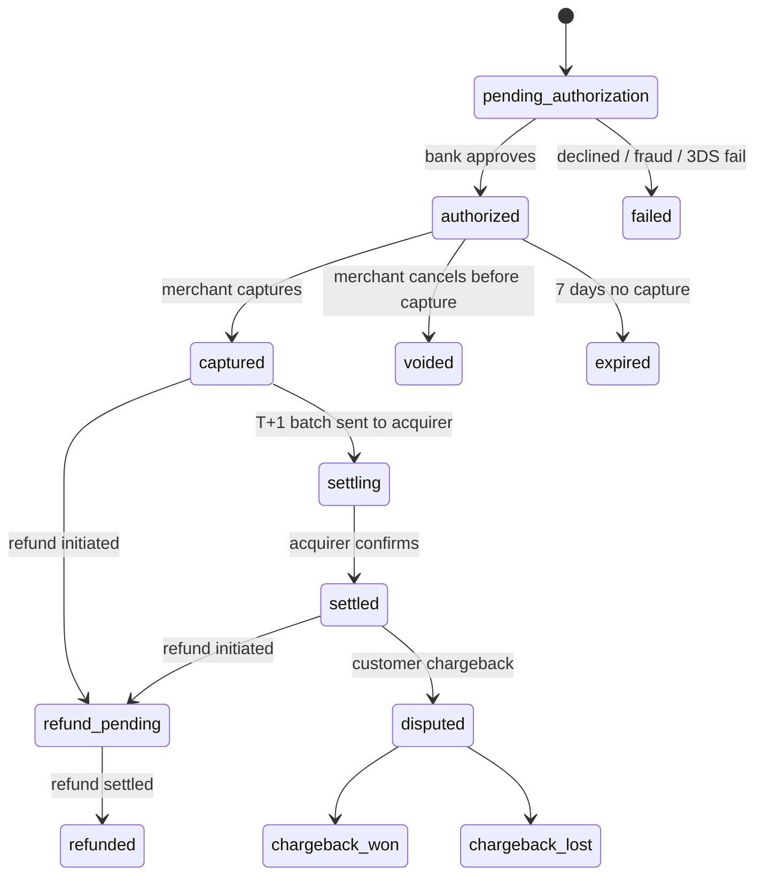
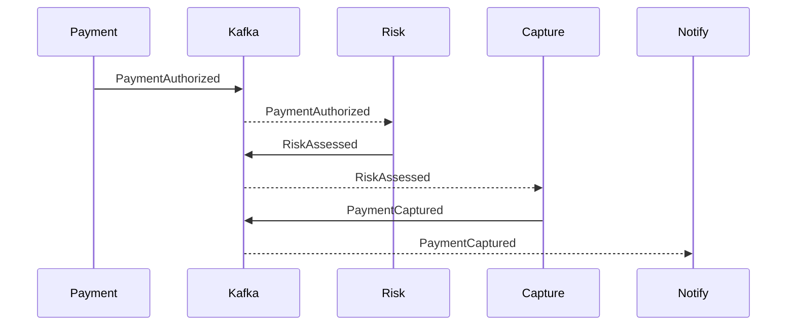
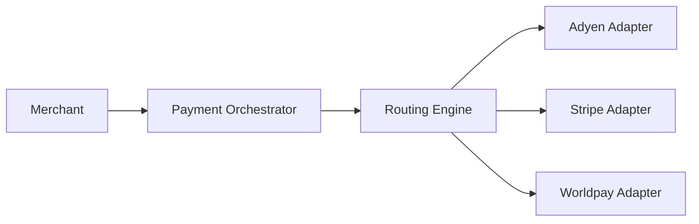
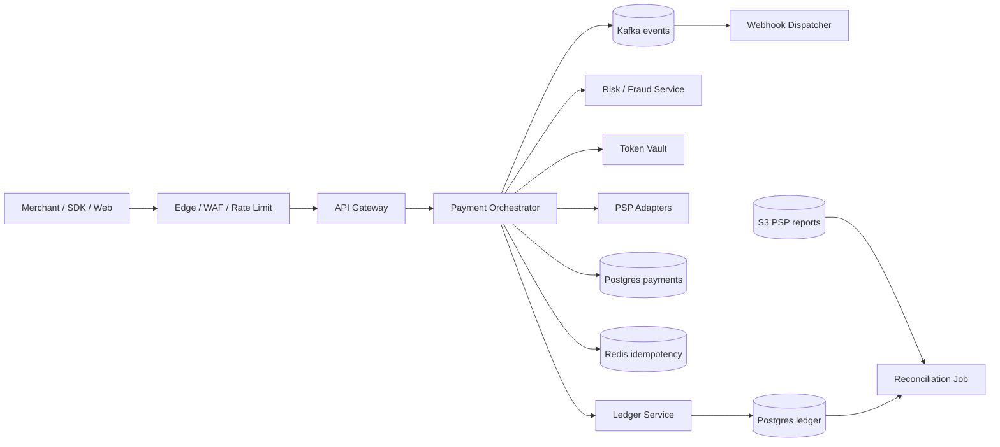

# Вопросы на собеседовании: `Design Payment System`

`Payment System` (Stripe / Adyen / Braintree / Wise) — один из самых жёстких system design кейсов: одновременно требует строгой корректности (нельзя «потерять» деньги), высокой доступности (downtime = прямая потеря выручки), соответствия регуляторам (PCI-DSS, AML, KYC) и распределённой интеграции с десятками внешних провайдеров. Стандарт для senior+.

## Полезные ссылки

- [Stripe Engineering Blog](https://stripe.com/blog/engineering)
- [Designing for Idempotency (Stripe)](https://stripe.com/blog/idempotency)
- [PCI-DSS v4.0 Quick Reference](https://www.pcisecuritystandards.org/document_library/)
- [Adyen Tech Blog](https://www.adyen.com/blog/topics/engineering)
- [Visa Chargeback Management Guidelines](https://usa.visa.com/dam/VCOM/global/support-legal/documents/dispute-management-guidelines-for-visa-merchants.pdf)
- [Square Engineering — Distributed Transactions](https://developer.squareup.com/blog/)
- [System Design Primer — payment](https://github.com/donnemartin/system-design-primer)
- [Microservices.io — Saga pattern](https://microservices.io/patterns/data/saga.html)

## Содержание

**Requirements и capacity**
- [Q1. (!) Functional и non-functional requirements?](#q1--functional-и-non-functional-requirements)
- [Q2. (!) Оценка нагрузки: capacity estimation на 10K txn/sec и 1B пользователей?](#q2--оценка-нагрузки-capacity-estimation-на-10k-txnsec-и-1b-пользователей)
- [Q3. Read-heavy vs write-heavy и SLA на каждой операции?](#q3-read-heavy-vs-write-heavy-и-sla-на-каждой-операции)

**Идемпотентность и ledger**
- [Q4. (!) Idempotency keys: формат, dedup window, response replay?](#q4--idempotency-keys-формат-dedup-window-response-replay)
- [Q5. (!) Двойная запись (double-entry ledger): debit/credit, инварианты, аудит?](#q5--двойная-запись-double-entry-ledger-debitcredit-инварианты-аудит)
- [Q6. Хранилище для ledger: Postgres vs Cassandra vs кастомный append-only?](#q6-хранилище-для-ledger-postgres-vs-cassandra-vs-кастомный-append-only)

**Payment lifecycle**
- [Q7. Жизненный цикл платежа: authorize → capture → settle → refund?](#q7-жизненный-цикл-платежа-authorize--capture--settle--refund)
- [Q8. (!) Распределённые транзакции: saga vs 2PC?](#q8--распределённые-транзакции-saga-vs-2pc)
- [Q9. Saga: хореография vs оркестрация?](#q9-saga-хореография-vs-оркестрация)
- [Q10. (!) Outbox pattern для надёжной публикации событий?](#q10--outbox-pattern-для-надёжной-публикации-событий)

**External integrations**
- [Q11. 3D Secure 2.0: чем различаются challenge и frictionless?](#q11-3d-secure-20-чем-различаются-challenge-и-frictionless)
- [Q12. (!) Интеграции с PSP (Stripe, Adyen, Braintree)?](#q12--интеграции-с-psp-stripe-adyen-braintree)
- [Q13. Платёжные сети (Visa/MC/Amex), interchange и scheme fees?](#q13-платёжные-сети-visamcamex-interchange-и-scheme-fees)
- [Q14. (!) Tokenization и vault: формат токенов, scope, rotation?](#q14--tokenization-и-vault-формат-токенов-scope-rotation)
- [Q15. Webhooks: доставка, retry, подпись и идемпотентные получатели?](#q15-webhooks-доставка-retry-подпись-и-идемпотентные-получатели)

**Settlement и операции**
- [Q16. Settlement: расчёты T+1, batch-файлы, ACH/SWIFT?](#q16-settlement-расчёты-t1-batch-файлы-achswift)
- [Q17. (!) Reconciliation с PSP report vs internal ledger?](#q17--reconciliation-с-psp-report-vs-internal-ledger)
- [Q18. Refunds (partial, full, idempotency, временные окна)?](#q18-refunds-partial-full-idempotency-временные-окна)
- [Q19. Chargebacks: коды причин Visa, доказательства, доля выигранных споров?](#q19-chargebacks-коды-причин-visa-доказательства-доля-выигранных-споров)

**Risk и fraud**
- [Q20. (!) Антифрод: правила + ML, velocity, device fingerprint?](#q20--антифрод-правила--ml-velocity-device-fingerprint)
- [Q21. AML/KYC и sanction screening?](#q21-amlkyc-и-sanction-screening)

**Money и продукт**
- [Q22. Мультивалютность: FX-курсы, кошелёк, хеджирование?](#q22-мультивалютность-fx-курсы-кошелёк-хеджирование)
- [Q23. Подписки: recurring billing, dunning, стратегия повторов?](#q23-подписки-recurring-billing-dunning-стратегия-повторов)

**Архитектура и compliance**
- [Q24. (!) Соответствие PCI-DSS: SAQ A vs D, сокращение scope?](#q24--соответствие-pci-dss-saq-a-vs-d-сокращение-scope)
- [Q25. (!) Высокоуровневая архитектура (gateway, orchestrator, ledger, risk)?](#q25--высокоуровневая-архитектура-gateway-orchestrator-ledger-risk)
- [Q26. Payment orchestrator и smart routing между PSP?](#q26-payment-orchestrator-и-smart-routing-между-psp)
- [Q27. (!) Мультирегиональность: data residency, failover, регуляторика?](#q27--мультирегиональность-data-residency-failover-регуляторика)

**Production**
- [Q28. Бюджет задержки: p99 на authorize, capture, refund?](#q28-бюджет-задержки-p99-на-authorize-capture-refund)
- [Q29. Monitoring, observability и операционные runbooks?](#q29-monitoring-observability-и-операционные-runbooks)
- [Q30. (!) Антипаттерны и подводные камни?](#q30--антипаттерны-и-подводные-камни)

## Q1. (!) Functional и non-functional requirements?

Сначала зафиксируй границы задачи: что система делает (функциональные требования) и под какие гарантии работает (нефункциональные). В финтехе именно нефункциональные требования — durability, consistency, compliance — определяют архитектуру, а не список эндпоинтов.

**Функциональные (ядро scope):**
- Создать платёж: `POST /payments` (amount, currency, method, customer, idempotency_key).
- Authorize → Capture (раздельно или auto-capture).
- Refund (полный/частичный).
- Получить статус: `GET /payments/{id}`.
- Webhooks для merchants о смене статуса.
- Поддержка карт (Visa/MC/Amex), локальных методов (SEPA, iDEAL, Alipay, СБП), кошельков (Apple/Google Pay).
- Subscriptions / recurring (опционально).

**Нефункциональные:**
- **Durability:** ноль потерь данных — приоритет № 1. RPO = 0 для ledger.
- **Strong consistency** на ledger (балансы), eventual на read-моделях (analytics, дашборды).
- **Availability:** 99.99% на authorize-path (≈ 53 минуты/год downtime).
- **Idempotency:** все mutating-эндпоинты безопасны для retry.
- **Задержка:** p99 authorize < 2 сек (включая 3DS-redirect), p99 status-fetch < 200 мс.
- **Пропускная способность:** 5-50K транзакций/сек на пике (Black Friday, события IPO).
- **Соответствие регуляторам:** PCI-DSS Level 1, GDPR, локальные регуляторы (PSD2 EU, PSI India).
- **Auditability:** каждая операция immutable и воспроизводима.

**Что вне scope (явно проговорить с интервьюером):**
- Card issuing (выпуск карт — отдельный продукт).
- Banking / lending (банкинг и кредитование).
- Расчёт налогов / выставление счетов.
- Marketplace split-payouts (если только не уточняют).

Tip: для финтеха `scope-list` — это **первая** проверка senior-уровня. Без него остальное превращается в обсуждение Redis vs Cassandra.

## Q2. (!) Оценка нагрузки: capacity estimation на 10K txn/sec и 1B пользователей?

Цель прикидки — показать, что система выдержит пик, и подсветить узкие места (PSP-вызовы, ledger-writes, retention). Допущения Stripe-масштаба (2026):

| Параметр | Значение |
|---|---|
| Зарегистрированные клиенты | 1B |
| Активные merchants | 5M |
| Среднее число транзакций/день | 500M |
| Пиковый rate (Black Friday) | 50K txn/sec |
| Среднее время authorize | 1.5 сек (с 3DS) |
| API-запросов / транзакцию | ~5 (create, capture, status, webhook out, retry) |

**Пропускная способность:**
- В установившемся режиме: 500M / 86 400 ≈ **5 800 txn/sec**.
- Пик ×8-10 → **50 000 txn/sec на authorize-path**.
- Всего API (вкл. reads/webhooks): 50K × 5 ≈ **250 000 req/sec**.

**Хранилище:**
- Одна payment-строка ≈ 2 KB (включая lifecycle-события).
- 500M/день × 2 KB = **1 TB/день** raw.
- + ledger-entries (×4: double-entry × authorize/capture) ≈ 0.5 KB × 4 × 500M = 1 TB/день.
- Retention 7 лет (требование PCI) → **~5 PB** общих данных, **~3 PB** ledger.
- Vault токенизированных карт: 1B клиентов × 200 B = 200 GB (плотный, hot).

**Compute:**
- 250K req/sec / 5K req/sec на JVM-pod = **50 активных pods** (×3 для headroom = 150 на регион).

**Исходящий fan-out:**
- На каждую транзакцию: 1 вызов PSP + 0.3 fraud-service + 0.2 3DS + 1 webhook.
- = ~2.5 исходящих вызова / платёж → **125K outbound/sec** на пике.

**Диапазоны затрат:**
- Interchange/scheme fees от PSP — главная статья ($100-200M/год на $20B GMV).
- Инфраструктура — second-tier (~$5-15M/год).

## Q3. Read-heavy vs write-heavy и SLA на каждой операции?

Профиль смешанный: статусы читают чаще, чем создают платежи, но именно записи (authorize/capture) определяют корректность и SLA. Поэтому каждой операции назначают свой бюджет latency и свой уровень доступности — нельзя проектировать всё «под чтения».

| Операция | Тип | Пиковый QPS | Целевая p99 latency | SLA |
|---|---|---|---|---|
| `POST /payments` (authorize) | write | 50K | 2 сек | 99.99% |
| `POST /payments/:id/capture` | write | 30K | 500 мс | 99.99% |
| `POST /refunds` | write | 5K | 1 сек | 99.95% |
| `GET /payments/:id` | read | 200K | 200 мс | 99.99% |
| Исходящий webhook | write | 100K | n/a (async) | 99.9% доставки за 24ч |
| Reconciliation batch | batch | n/a | n/a | T+1 завершён до 06:00 UTC |

Вывод: **смешанный** профиль — нельзя оптимизировать только под reads. Authorize-path — самый дорогой и SLO-critical, потому что любой неуспешный платёж = потерянный клиент.

## Q4. (!) Idempotency keys: формат, dedup window, response replay?

Idempotency-ключ — это переданный клиентом идентификатор операции, по которому сервер распознаёт повтор и возвращает тот же результат вместо нового списания.

**Зачем:** retry `POST /payments` после обрыва сети не должен создавать два списания. Клиент не знает, дошёл ли первый запрос, поэтому повторяет — а сервер обязан выполнить операцию ровно один раз.

**Контракт (в стиле Stripe):**
- Заголовок: `Idempotency-Key: <UUIDv4 или сгенерированный клиентом, ≤ 255 символов>`.
- Сервер хранит `(key, request_hash, response_body, status)` в выделенном хранилище.
- Dedup-окно: **24 часа** (Stripe), реже до 7 дней.

**Алгоритм на сервере:**

```
1. Принять запрос.
2. Lookup (idempotency_key, merchant_id) в store.
3. Если найден:
   3a. Проверить request_hash совпадает (защита от случайного reuse с другим payload):
       - совпадает → вернуть cached response (replay).
       - не совпадает → 409 Conflict + error code "idempotency_key_mismatch".
   3b. Если предыдущий запрос в статусе "in_flight" → 409 + Retry-After.
4. Если не найден:
   4a. INSERT (key, request_hash, status="in_flight", merchant_id).
   4b. Выполнить бизнес-логику.
   4c. UPDATE с response_body, status="completed".
```

**Хранение:**
- Таблица в Postgres или Redis с TTL = 24h.
- PK = `(merchant_id, idempotency_key)` — обязательно с tenant scope, иначе коллизия в глобальном namespace.

**Граничные случаи:**
- Inflight-запрос вернул 5xx — клиент делает retry → видит закешированную ошибку → сам решает, повторять ли с новым ключом.
- TTL истёк — retry того же ключа = новый платёж. Это надо документировать.
- Клиент шлёт один ключ для двух разных операций (create + capture) → 409.

**Ключевая мысль:** ключ хешируется вместе с **телом запроса**, а не только с эндпоинтом — иначе можно случайно «зарепортить» refund по ключу платежа.

## Q5. (!) Двойная запись (double-entry ledger): debit/credit, инварианты, аудит?

Double-entry ledger — это журнал, где каждая операция записывается минимум двумя проводками так, что сумма дебетов равна сумме кредитов. Деньги не появляются и не исчезают — они только переходят с одного счёта на другой.

**Принцип:** каждая транзакция = ≥ 2 записи; сумма debits = сумма credits. Бухгалтерская основа уже 700 лет (Лука Пачоли, 1494). В цифровых платежах — единственная защита от «исчезновения» денег: если where-from и where-to всегда балансируются, баг не может «нарисовать» лишний доллар незаметно.

**Схема:**

```sql
-- accounts: один аккаунт на каждую логическую «коробочку с деньгами»
CREATE TABLE accounts (
  account_id BIGINT PRIMARY KEY,
  type VARCHAR(32),       -- 'merchant_balance', 'customer_wallet', 'fee_revenue', 'psp_clearing'
  currency CHAR(3),
  metadata JSONB
);

-- entries: append-only журнал
CREATE TABLE entries (
  entry_id BIGINT PRIMARY KEY,
  transaction_id BIGINT NOT NULL,    -- группирует связанные записи
  account_id BIGINT NOT NULL,
  amount_minor BIGINT NOT NULL,      -- > 0 = debit, < 0 = credit (или отдельная колонка direction)
  currency CHAR(3) NOT NULL,
  created_at TIMESTAMPTZ NOT NULL,
  metadata JSONB
);

-- инвариант: SUM(amount_minor) GROUP BY transaction_id = 0 (для одной валюты)
```

**Пример авторизации $100:**

```
transaction_id = 42
-----------------------------------------
account                 | amount_minor
-----------------------------------------
customer_pending        | +10000
merchant_pending        | -10000
-----------------------------------------
sum = 0
```

**Пример захвата (списание из pending в available):**

```
transaction_id = 43
-----------------------------------------
customer_pending        | -10000
merchant_pending        | +10000
-----------------------------------------
transaction_id = 44
-----------------------------------------
customer_settled        | +10000
merchant_available      | -10000
psp_clearing            | -300
fee_revenue             | +300
-----------------------------------------
sum = 0
```

**Инварианты (проверяются непрерывно + батчем):**
- Σ(entries) на транзакцию = 0 (в пределах одной валюты).
- Баланс счёта = Σ(entries WHERE account_id = X) — реконструируется из журнала.
- Никаких UPDATE / DELETE на entries (immutable).
- Multi-currency: разделяй entries по валюте, FX-конверсия = отдельные транзакции с парой entries в каждой валюте.

**Audit:**
- У каждой entry есть `created_by` (service+user), `request_id`, `idempotency_key`.
- Hash-chain (опц.): `hash_n = SHA256(prev_hash || entry_n)` — обнаружение подделки данных.

## Q6. Хранилище для ledger: Postgres vs Cassandra vs кастомный append-only?

Выбор сводится к компромиссу между транзакционной строгостью и пропускной способностью. Ledger требует строгой консистентности и аудита, поэтому реляционная база (Postgres) — дефолт; специализированные движки берут, только когда упираются в throughput.

| Свойство | Postgres (sharded) | Cassandra | Кастомный append-only |
|---|---|---|---|
| Транзакционная консистентность | полный ACID | только LWT (медленно) | зависит от реализации |
| Write throughput | 5-50K/sec на инстанс | 100K+/sec | 100K+/sec |
| Паттерн чтения | range, JOIN, ad-hoc | только по partition-key | только по partition-key |
| Multi-region | logical replication, сложно | active-active (LOCAL_QUORUM) | свой |
| Гибкость схемы | строгая, миграции | полугибкая | полный контроль |
| Гарантии аудита | через triggers | через write-only-дизайн | по умолчанию |

**Выбор:**
- **Stripe, Square** → Postgres (шардирование по merchant_id), ставка на классику.
- **Adyen** → собственный bookkeeping-движок на базе Java + Cassandra.
- **TigerBeetle** — open-source-база специально под double-entry; миллион txn/sec на одной ноде через io_uring + batched commit.

**Паттерн «hot + cold»:**
- Hot tier (последние 90 дней): Postgres ради удобства запросов.
- Cold tier (> 90 дней): Iceberg/Parquet на S3 для аудита и регулятора.

**Антипаттерн:** ledger в MongoDB / DynamoDB single-table без транзакций. Любой потерянный write = невозможная reconciliation.

## Q7. Жизненный цикл платежа: authorize → capture → settle → refund?

Платёж проходит через цепочку состояний, и каждый переход — это отдельное сообщение в card network. Ключевая идея: authorize и capture разделены, потому что бронирование денег и их фактическое списание происходят в разное время, а settlement (реальное движение средств) случается ещё позже.



**Authorize:** карточная сеть «резервирует» сумму на счёте плательщика. Деньги ещё не списаны — только hold. Hold снимается через 7 дней, если нет capture.

**Capture:** запрос «теперь спиши» на acquirer. После capture платёж двигается к settlement.

**Settle:** в конце дня (T+1 для US, T+0..T+2 в разных регионах) acquirer формирует batch и отправляет в card network → issuer переводит деньги.

**Refund:** обратный перевод. До capture — `void` (без fees, мгновенно). После settlement — полный refund с возможной потерей interchange fees.

**Зачем разделять auth/capture:**
- E-commerce: авторизуем при заказе, capture при отгрузке (через 1-3 дня).
- Гостиничный бизнес: auth при заселении (`pre-auth`), capture при checkout с финальной суммой.
- Защита от сценария «заказ отменён до отгрузки» — void проще, чем refund.

## Q8. (!) Распределённые транзакции: saga vs 2PC?

Коротко: в платежах используют saga, а не 2PC. 2PC требует, чтобы все участники держали блокировки до решения координатора — это невозможно, когда участники находятся в разных компаниях (Stripe, банк, KYC-провайдер). Saga разбивает операцию на локальные транзакции с компенсациями и потому работает между организациями.

**2PC (Two-Phase Commit):**
- Coordinator → prepare → все participants голосуют → commit/abort.
- Требует distributed lock + блокировку участников до решения coordinator-а.
- Не работает через несколько компаний (Stripe, Adyen, банк не станут запускать prepare-фазу ради вас).
- Доступен внутри одной БД (XA-транзакции в Postgres), но для cross-service — нет.

**Saga:**
- Последовательность локальных транзакций, каждая со своим компенсирующим действием.
- Если шаг N упал → выполняем compensations для шагов N-1, N-2, ..., 1.
- Eventual consistency, без изоляции, но **реализуемо** на практике.

**Сравнение:**

| Свойство | 2PC | Saga |
|---|---|---|
| Atomicity | да (locks) | нет (eventual) |
| Isolation | да | нет |
| Между организациями | нет | да |
| Latency | блокировка participants | без блокировок |
| Режимы отказа | падение coordinator = зависшие participants | compensations могут упасть |
| Реальность в payments | не используется | стандарт |

**Saga в payments (пример onboarding merchant):**
```
1. Create merchant account in PG → если fail: rollback.
2. Create Stripe Connect account → compensation: Stripe.delete(account_id).
3. Create entry in KYC provider → compensation: KYC.cancel(case_id).
4. Send welcome email → no compensation.
```

**Idempotency обязательна** на каждом шаге саги — иначе retry при сбое ломает state.

## Q9. Saga: хореография vs оркестрация?

Это два способа координировать шаги саги. При хореографии сервисы общаются через события без единого «дирижёра»; при оркестрации центральный сервис явно вызывает шаги по очереди. Разница — в том, где живёт знание о порядке шагов: размазано по подписчикам или сосредоточено в одном месте.

**Хореография (на событиях):**
- Каждый сервис подписан на события и эмиттит свои.
- Нет центрального координатора.
- Паттерн: Kafka-топик на каждый тип события.



**Плюсы:** слабая связанность, легко добавлять новых подписчиков.
**Минусы:** размазанная бизнес-логика — трудно отследить, «как вообще проходит платёж».

**Оркестрация:**
- Центральный orchestrator (state machine) вызывает сервисы по очереди.
- Один сервис, одна история, ясный визуальный flow.

```
PaymentOrchestrator state machine:
  CREATED → CALL_FRAUD_SERVICE → CALL_PSP_AUTHORIZE → CAPTURE_IF_AUTO → SEND_WEBHOOK
                    ↓
               на failure: запустить compensation chain
```

**Плюсы:** явный flow, легко отлаживать, observability сосредоточена в одном месте.
**Минусы:** orchestrator — единый источник сложности, может разрастись в «god service».

**В платёжных системах де-факто стандарт:** orchestration для критического happy-path (authorize → capture → settle), choreography для побочных эффектов (нотификации, аналитика, fraud-feedback).

**Технологии:** Temporal, Cadence, AWS Step Functions, Camunda. Stripe использует собственный Workflow Engine.

## Q10. (!) Outbox pattern для надёжной публикации событий?

**Проблема:** атомарно записать в БД И отправить event в Kafka — невозможно (это две разные системы). Если commit в БД прошёл, а publish в Kafka провалился — событие потеряно. Если наоборот — отправлено событие о несуществующем состоянии.

**Outbox:**

```sql
BEGIN;
  INSERT INTO payments (...) VALUES (...);
  INSERT INTO outbox (event_type, payload, created_at) VALUES ('PaymentAuthorized', '{...}', NOW());
COMMIT;
```

Отдельный publisher-worker читает `outbox`, шлёт в Kafka, помечает строки как `published`.

**Гарантии:**
- At-least-once delivery (publisher может упасть после отправки, но до пометки).
- Consumers обязаны быть idempotent.

**Реализации:**
- Polling: `SELECT * FROM outbox WHERE published_at IS NULL ORDER BY id LIMIT 100`.
- Debezium / logical replication: читает WAL Postgres, превращает INSERT в Kafka-событие без polling — почти real-time, без нагрузки на основную БД.

**Альтернативы:**
- Transactional outbox (отдельная таблица) — самый популярный вариант.
- Listen/Notify Postgres — для низкого throughput.
- Event sourcing — outbox получается естественно (события = SoT).

**Антипаттерн:**
- `try { db.commit(); kafka.send(); }` — разрыв между ними = потерянное событие.
- `kafka.send(); db.commit();` — даже хуже: Kafka событие видит, а БД — нет → consumer работает с фантомом.

## Q11. 3D Secure 2.0: чем различаются challenge и frictionless?

**3DS 2.0** — протокол, который подтверждает, что платёж совершает настоящий держатель карты, через банк-эмитент (issuer). Главная выгода для бизнеса — `liability shift`: если 3DS пройдено, ответственность за фрод-chargeback переходит с merchant на issuer.

Ключевая развилка протокола — два пути проверки: frictionless (банк сам убеждается в легитимности по риск-сигналам и не трогает пользователя) и challenge (банк просит дополнительное подтверждение — push, SMS-OTP, биометрию). Чем больше challenge, тем меньше фрода, но выше отток на чекауте.

**Flow:**

```
1. Merchant отправляет authorization data в ACS (Access Control Server) issuer-а.
2. ACS оценивает risk score (device, location, transaction history, ~100 data points).
3a. Frictionless (~85% случаев): ACS возвращает auth approved без user interaction.
3b. Challenge (~15%): ACS требует additional verification (push в banking app, SMS-OTP, биометрия).
4. После challenge — auth completed.
```

**API-интеграция:**
- Stripe / Adyen: SDK на mobile / Web Components берёт на себя ACS-redirect.
- Результат аутентификации передаётся в authorize-вызов в card network.

**EU PSD2 SCA (Strong Customer Authentication):**
- 3DS обязателен для транзакций > 30 EUR в EU.
- Исключения: low-value, recurring, MIT (merchant-initiated), TRA (trusted recipients).

**Компромисс:**
- Больше challenges → меньше фрода, но выше cart abandonment (отток 5-10% при frictionless → 15-30% при challenge).
- Smart 3DS: routing сам решает, когда вызывать challenge (на high-risk-транзакциях).

**Подводные камни:**
- В EU без 3DS на > 30 EUR → soft decline `1A` от issuer.
- В US 3DS обычно opt-in (нет SCA).

## Q12. (!) Интеграции с PSP (Stripe, Adyen, Braintree)?

**PSP (Payment Service Provider)** = слой абстракции над card networks и локальными методами. Подключаешь один API — получаешь карты + Apple Pay + SEPA + ... Вместо того чтобы интегрироваться с каждой сетью и банком напрямую, ты говоришь с одним провайдером, а он берёт сложность на себя.

| PSP | Сильная сторона | Слабая сторона |
|---|---|---|
| Stripe | DX, docs, широта (carts, subs, marketplaces) | премиальная цена |
| Adyen | enterprise-масштаб, единая глобальная платформа | сложнее onboarding |
| Braintree (PayPal) | интеграция с PayPal, US legacy | стагнирующая roadmap |
| Worldpay / FIS | acquiring-лицензия, enterprise B2B | устаревший API |
| Checkout.com | tier-1 для tech-fintech (Klarna, Sumup) | меньше рынков |

**Многопровайдерная архитектура:**



**Зачем несколько PSP:**
- Resilience: один PSP лёг — переключаемся на backup.
- Оптимизация затрат: per-region pricing.
- Покрытие: локальные методы (Alipay в Китае, СБП в RU) у разных PSP разные.
- A/B по acceptance rate: один и тот же платёж у разных PSP даёт разный success rate.

**Затраты:** интеграция нового PSP — 2-4 месяца разработки. Поэтому большинство стартапов берут один (Stripe) и потом мучительно мигрируют.

## Q13. Платёжные сети (Visa/MC/Amex), interchange и scheme fees?

Card networks — это «почта» между банком merchant и банком cardholder: они маршрутизируют авторизацию и задают правила. За эту инфраструктуру берут комиссию, которая раскладывается на несколько слоёв — понимать их структуру важно, потому что комиссии PSP — крупнейшая статья расходов платёжной системы.

**Card networks** (Visa, Mastercard, American Express, Discover, JCB, UnionPay):
- Маршрутизируют authorization между acquirer-ом merchant-а и issuer-ом cardholder-а.
- Задают правила (interchange, chargeback-коды).
- Типовая 4-сторонняя модель: cardholder → issuer → network → acquirer → merchant.

**Структура комиссий (типичный US card-not-present):**

| Слой | % от суммы | Кому |
|---|---|---|
| Interchange | 1.5-2.5% | issuer |
| Scheme fee | 0.1-0.15% | network (Visa/MC) |
| Наценка acquirer | 0.3-1% | acquirer / PSP |
| **Итого платит merchant** | **~2.9% + $0.30** | (формула Stripe) |

**Amex** — closed-loop: одновременно network + issuer + acquirer. Дороже, но больше контроля.

**Interchange++:**
- Модель ценообразования: merchant платит реальный interchange + scheme + наценку acquirer (фиксированная сумма или %).
- Прозрачно — в отличие от `blended pricing` (Stripe: 2.9% + 30¢ flat).

**Маршрутизация:**
- Карта Visa / MC → routing рассчитывается по BIN (первые 6-8 цифр).
- В разных странах свои локальные card networks (Cartes Bancaires во Франции, Bancontact в Бельгии, JCB в Японии).

## Q14. (!) Tokenization и vault: формат токенов, scope, rotation?

**Зачем tokenization:** заменить PAN (Primary Account Number, 16 цифр карты) на token, чтобы хранить и передавать его в системе вне PCI scope.

**Network tokenization (рекомендуется, 2025+):**
- Issuer / network (Visa Token Service, MC Digital Enablement) выдают токен прямо на устройство (Apple Pay) или для merchant.
- Token привязан к device + merchant → в чужой системе не работает.
- При истечении/перевыпуске карты token остаётся валиден (issuer обновляет mapping). Это снижает отток в subscriptions.

**Local tokenization (vault PSP):**
- Stripe / Adyen хранят PAN в собственном vault, возвращают ID `tok_xxx`.
- Merchant хранит только токен — никогда PAN.
- Формат: непрозрачная строка `tok_visa_4242`, `pm_1NQwG...`.

**Scope токенов (ВАЖНО):**
- Token валиден только для **этого merchant + этого PSP**.
- Перенос между PSP = re-tokenization (или Network Token, если поддерживается).
- Локальный shared-токен между микросервисами — ок, если все они внутри зоны с уменьшенным PCI-scope.

**Rotation:**
- При перевыпуске карты (lost/stolen) старый network token автоматически переводится на новый PAN — merchant ничего не делает.
- Local PSP-токены устаревают и требуют Update API (Stripe Customer Update).

**Реализация vault:**
- HSM (Hardware Security Module) для ключей шифрования.
- Encrypted at rest (AES-256-GCM), отдельный ключ на каждый merchant (под управлением KMS).
- Сетевой ZTA — vault доступен только из конкретного сервиса через mTLS.
- Audit log — каждое чтение / запись.

**Подводный камень:** хранение PAN в локальной БД — даже зашифрованным — переводит merchant в PCI Level 1 (вместо SAQ A). Стоимость compliance × 10.

## Q15. Webhooks: доставка, retry, подпись и идемпотентные получатели?

**Webhook** = HTTP POST от платёжной системы к merchant с уведомлением о событии (payment.succeeded, refund.created, dispute.opened). Это push-модель: вместо того чтобы merchant опрашивал статус, система сама сообщает об изменениях. Четыре проблемы, которые надо решить, — надёжная доставка, повторы, защита от подделки и идемпотентность на стороне получателя.

**Контракт доставки:**
- At-least-once (Stripe гарантирует).
- Порядок НЕ гарантирован (используй timestamp + status в payload).
- Retry-политика: exponential backoff — 5s, 25s, 2m, ... до 72 часов (Stripe).

**Signing (защита от подделки):**
```
HTTP POST /webhook
Stripe-Signature: t=1700000000,v1=<hmac_sha256>
Body: {"type": "payment_intent.succeeded", ...}
```
- HMAC-SHA256 от `timestamp.body` с shared secret.
- Receiver проверяет: (1) подпись валидна, (2) timestamp в окне 5 минут (защита от replay).

**Идемпотентные receivers:**
- Webhook может прийти 2-3 раза (network blip → retry от Stripe, хотя получатель уже обработал).
- Receiver хранит таблицу processed_events (event_id → handled_at).
- При получении: `INSERT ON CONFLICT DO NOTHING; if RETURNING — обработать; else — skip + 200`.

**Инфра доставки (на стороне отправителя):**
- Outbox → Kafka-топик `webhooks.outbound`.
- Worker читает, делает POST, обрабатывает retry.
- Dead-letter queue после 72ч.
- Per-merchant rate limit (если merchant медленный → throttle, не блокируя чужих).

**Рекомендации для получателя:**
- Возвращать 200 быстро (< 1 сек); если работа долгая — складывать в свою очередь и обрабатывать async.
- НЕ требовать синхронных side-effects в webhook-handler.
- Логировать `event_id` для трассируемости.

## Q16. Settlement: расчёты T+1, batch-файлы, ACH/SWIFT?

**Settlement** = реальное движение денег с банка cardholder в банк merchant. Важно отделять его от authorize/capture: те — лишь обмен сообщениями («одобри», «спиши»); settlement — момент, когда деньги физически перемещаются между банками, и происходит он позже, обычно батчем в конце дня.

**Таймлайн:**
- День T: транзакции captured.
- Конец дня T: acquirer агрегирует → отправляет файл (clearing file) в card network.
- T+1 (US, EU): network пересылает issuer-у; issuer списывает.
- T+1 / T+2: acquirer переводит merchant-у total за вычетом fees.

**Форматы файлов:**
- Visa: BASE I, BASE II.
- Mastercard: IPM (Integrated Product Messages).
- Бинарные, фиксированной длины, специфичные для индустрии.

**Внутренний поток:**

```
End of day T:
  ledger snapshot: net amount per merchant
  ACH/SEPA/SWIFT transfer initiated to merchant bank
  entries в ledger:
    merchant_available → merchant_settled
```

**ACH:** Automated Clearing House (US, в EU = SEPA). Дёшево, медленно (1-2 рабочих дня), только батчами.

**SWIFT / wire:** почти real-time, дорого ($25-50 за wire), международные переводы.

**Faster Payments (UK), TIPS (EU SEPA Instant), FedNow (US):** real-time, дороже. Используются для instant payouts.

**Граничный случай:** chargeback после settlement → списание обратно (claw back) с merchant balance. Если у merchant нет средств → merchant остаётся в долгу перед платёжной системой.

## Q17. (!) Reconciliation с PSP report vs internal ledger?

**Reconciliation** = сверка внутреннего ledger с отчётами от PSP / acquirer / банковскими выписками. Цель — поймать **расхождения** (пропавшие транзакции, fees, FX).

**Ежедневный flow:**
```
T+1 06:00 UTC:
  1. PSP report (CSV/JSON через SFTP/API) → S3.
  2. Reconciliation job:
     - Load PSP transactions for day T.
     - Load internal entries for day T.
     - LEFT JOIN ON external_id.
     - Categorize discrepancies:
       a. In PSP, not in ledger → "phantom" transaction (alert).
       b. In ledger, not in PSP → in-flight, retry tomorrow.
       c. Amount mismatch → fee/FX difference, нужна manual review.
       d. Status mismatch → race в lifecycle (captured в нас, pending в PSP).
  3. Auto-resolve known patterns (например, fees округление).
  4. Open Jira ticket / Slack alert на unresolved.
```

**Что выявляет:**
- Баги: Stripe вернул success на authorize, но мы не записали в ledger.
- Fees: PSP взял $0.31 вместо $0.30 — за месяц на 10M tx это $100K утечки.
- Фрод: транзакция в ledger помечена как cancelled, а в PSP как settled.

**Частота:**
- Ежедневно: стандарт.
- Real-time (streaming reconciliation): для кого критично. Через Flink: каждое событие сверяется в реальном времени.

**Инструменты:**
- AccountingIntegrity (внутренний инструмент Stripe).
- Собственные Spark-джобы на data lake.
- Open-source: Modern Treasury, Twosense.

## Q18. Refunds (partial, full, idempotency, временные окна)?

**Поток возврата:**
```
POST /refunds {payment_id, amount?, idempotency_key, reason?}
  1. Verify payment в "captured" или "settled".
  2. Verify amount <= remaining refundable.
  3. Idempotency check.
  4. PSP refund call (Stripe.Refund.create).
  5. Записать в ledger обратные entries.
  6. Webhook merchant.
```

**Refund до settle (рекомендуется):**
- Refund в той же scheme card network.
- Деньги возвращаются на ту же карту за 5-10 рабочих дней (зависит от issuer).
- Merchant получает обратно interchange, но scheme fee может остаться у network.

**Поздний refund (после settle / спустя время):**
- Через 60 дней: некоторые PSP не позволяют refund на оригинальную карту — выпускают чек или делают перевод вручную.
- В EU PSD2: клиенты могут потребовать refund в течение 8 недель (`recall right`) для direct debit.

**Частичный refund:** разрешён, ≤ оригинальной суммы; несколько частичных refunds допустимы.

**Idempotency:**
- Генерация refund ID = (payment_id, idempotency_key, amount).
- Повторный вызов с тем же ключом → 200 + закешированный refund-объект.

**Граничные случаи:**
- Refund на закрытую карту: issuer зачисляет средства как `card account credit`, потом отдаёт merchant'у вручную — может занять недели.
- Refund > остатка → 400.
- Конкурентные refunds: row-level lock на payment в БД.

## Q19. Chargebacks: коды причин Visa, доказательства, доля выигранных споров?

**Chargeback** = клиент оспаривает транзакцию через свой банк-эмитент («не узнаю это списание»). Issuer откатывает settlement → merchant теряет и сумму платежа, и chargeback fee ($15-50). В отличие от refund, который инициирует merchant добровольно, chargeback — принудительный возврат, навязанный банком, и его нельзя проигнорировать.

**Reason codes (примеры Visa):**
- **10.4** — фрод (card not present).
- **13.1** — товар не получен.
- **13.3** — не соответствует описанию / дефектный.
- **13.4** — контрафактный товар.
- **12.5** — неверная сумма.

**Жизненный цикл:**
```
1. Customer dispute → issuer raises chargeback.
2. Merchant receives notification (через PSP webhook).
3. Two paths:
   a. Accept loss (silent) — money already deducted.
   b. Represent: submit evidence (delivery proof, screenshots, comm logs) — 7-30 дней window.
4. Issuer reviews evidence:
   a. Win → money refunded к merchant, fee остаётся.
   b. Lose → permanent.
5. Pre-arbitration / arbitration (escalation) — редко.
```

**Доля выигранных споров:**
- Средний win rate merchant-а ~30-40%.
- Сильные доказательства (подтверждение доставки, данные 3DS, совпадение IP) → 60-80%.
- Без доказательств → 0%.

**Программы:**
- **Chargeback-алерты (Verifi, Ethoca):** уведомление от issuer до открытия chargeback — merchant может проактивно вернуть деньги.
- **Visa CE 3.0:** новая программа автоматизации выигрыша на основе доказательств (с 2023).

**Метрики, за которыми следить:**
- Chargeback ratio = chargebacks / число транзакций за месяц.
- Порог Visa: 0.9% → merchant попадает в Visa Dispute Monitoring Program (VDMP) → штрафы, риск потерять acquiring.
- 1.8% → High-Risk Program → можно лишиться лицензии.

**Профилактика:**
- 3DS (liability shift).
- Понятный billing descriptor (`ACME-INC SAN FRANCISCO`, а не `SQ *XYZ123`).
- Удобная политика возвратов.
- ML-детекция фрода (Q20).

## Q20. (!) Антифрод: правила + ML, velocity, device fingerprint?

Антифрод строят слоями: дешёвые детерминированные правила отсекают очевидное, ML-модель ловит неочевидные паттерны по сотням признаков, device fingerprint связывает попытки одного злоумышленника, а 3DS служит финальным барьером с переносом ответственности. Каждый слой ловит то, что пропустил предыдущий, и решение должно укладываться в < 100 мс real-time-бюджета.

**Уровни:**

**1. Rule engine (детерминированный):**
- Velocity: > 5 карт с одного IP за 10 минут → block.
- Несовпадение страны BIN и IP: карта US + IP RU → review.
- Несовпадение billing- и shipping-адреса.
- Чёрные списки (IP, email, карта).
- Отказ AVS (Address Verification Service).

**2. ML-модель:**
- Признаки: amount, время суток, страна, device fingerprint, прошлое поведение, network embedding (графовые признаки).
- Модель: gradient-boosted trees (XGBoost), Deep Neural Net для tabular + sequential.
- Выход: score 0..1 (вероятность фрода).
- Подбор порога: trade-off false-positive vs catch rate.

**3. Device fingerprint:**
- Browser fingerprint (canvas, fonts, plugins, screen, timezone) → уникальность 99.9%.
- Mobile: device ID, IMEI (если есть permission), Apple/Google IDFA.
- Сторонние: Sift, Forter, Riskified — собирают глобальный сигнал.

**4. 3DS как финальный gate:** на high-risk-транзакциях вызываем challenge → liability shift на issuer.

**Архитектура:**
```
authorize request
   fraud-decision-service (real-time, < 100ms):
     - lookup feature store (Redis): velocity counters, blacklist
     - call ML inference (TensorFlow Serving / Triton)
     - apply rules + score → decision: APPROVE / REVIEW / DECLINE
   if APPROVE → PSP
   if REVIEW → manual queue
   if DECLINE → 402
```

**Feedback loop:** chargeback → размечаем транзакцию как фрод → еженедельное переобучение модели.

**Подводные камни:**
- Чрезмерная блокировка → потеря выручки. У большинства merchants стоимость false-positive > стоимости фрода.
- Дрейф ML-модели: новый паттерн фрода (например, post-COVID волна card-not-present) — нужен online learning.
- Adversarial: боты используют residential-прокси + автоматизацию → fingerprinting работает не идеально.

## Q21. AML/KYC и sanction screening?

**KYC (Know Your Customer):** проверка личности merchant'а и beneficial owners при onboarding.
- Верификация документов (паспорт, квитанция за ЖКУ).
- Провайдеры: Onfido, Jumio, Persona.
- Авто-извлечение (OCR) + ML face match с selfie.

**AML (Anti-Money Laundering):**
- Мониторинг транзакций: детекция по паттернам (structuring, layering, integration).
- Velocity, география, риск контрагента.
- Подача SAR (Suspicious Activity Report) в FinCEN (US) или эквивалент.

**Sanction screening:**
- OFAC SDN list (US Treasury), санкции EU, санкции UN.
- Проверка на каждой транзакции: имя плательщика, получатель, IBAN, страна.
- Сопоставление через fuzzy-matching по имени + DOB.
- False-positive — это нормально (имя John Smith); очередь ручного review.

**PEP (Politically Exposed Person):**
- Усиленный контроль для публичных должностных лиц и их семей.

**Compliance-стек:**
- Вендоры: ComplyAdvantage, Sumsub, Trulioo.
- Real-time API-вызов во время платежа + ночной batch по базе клиентов.

**Режимы отказа:**
- Пропущенная санкционная транзакция → штрафы в десятки миллионов (BNP Paribas $9B в 2014 за Iran/Sudan).
- Чрезмерная блокировка → отток клиентов.

## Q22. Мультивалютность: FX-курсы, кошелёк, хеджирование?

Мультивалютность означает, что система хранит балансы и проводит транзакции в разных валютах. Три задачи здесь связаны: где держать деньги (отдельный кошелёк на валюту), по какому курсу конвертировать (FX-курс + наценка) и как управлять риском колебаний курса (хеджирование). Конвертация всегда отражается в ledger отдельными проводками — деньги не «телепортируются» между валютами.

**Multi-currency wallet** = клиент / merchant держит баланс в нескольких валютах.

```sql
CREATE TABLE wallets (
  wallet_id BIGINT PRIMARY KEY,
  owner_id BIGINT,
  currency CHAR(3),
  available_balance_minor BIGINT,
  pending_balance_minor BIGINT
);
-- Один owner → N wallets (по одному на валюту).
```

**Источники FX-курсов:**
- Bloomberg, Refinitiv, ECB, Bank of England.
- Агрегированы через FX-провайдера (Wise, Currencylayer).
- Обновление: раз в минуту или real-time для major pairs.

**Стратегия ценообразования:**
- Mid-market rate + наценка (Wise 0.4%, банки 2-4%).
- Фиксация курса на 30 секунд при quote, чтобы клиента не ждал сюрприз.

**Ledger-entries при конверсии:**
```
transaction_id = 100 (USD → EUR conversion at 0.92)
-----------------------------------------
customer_wallet_USD     | -10000
fx_clearing_USD         | +10000
fx_clearing_EUR         | -9200
customer_wallet_EUR     | +9200
fx_revenue_USD          | +40
-----------------------------------------
```

**Hedging:**
- Если у вас есть pre-funded EUR-баланс, FX-риск управляется.
- Если конверсия real-time со спот-рынка — каждая сделка хеджируется через FX-брокера.
- Управление ликвидностью — задача treasury-команды.

**Подводные камни:**
- Ошибки округления (накопительно): для финансов всегда round-half-even, никогда не round-half-up.
- Окно cross-currency settlement: рынок закрыт на выходных → FX-курс заморожен → расхождение.

## Q23. Подписки: recurring billing, dunning, стратегия повторов?

Подписки — это автоматические периодические списания с сохранённого метода оплаты. Главная инженерная сложность не в самом списании, а в обработке отказов: карта истекла, недостаточно средств, банк отклонил. Грамотный dunning (умные повторы неуспешных платежей) напрямую влияет на выручку — плохая стратегия теряет 5-7% подписчиков в месяц только на технических отказах.

**Биллинг подписок:**
- По периодам (помесячно, ежегодно).
- Пропорциональные upgrades / downgrades.
- Trial-периоды.
- Купоны / скидки.

**Поток recurring-биллинга:**
```
1. Cron / scheduler triggers billing at period boundary.
2. Look up active subscriptions due today.
3. For each: charge stored payment method (token).
4. On success → extend period, send invoice.
5. On failure → dunning.
```

**Dunning** = обработка неуспешных платежей.

**Стратегия retry (Stripe Smart Retries):**
- ML-модель подбирает оптимальное время retry (день недели, время суток) на основе issuer.
- По умолчанию: через 3, 5, 7 дней после сбоя.
- После N попыток (4-7) → пометить подписку past_due → опционально отменить.

**Причины отказа:**
- `insufficient_funds` — retry через 3 дня, ближе к дате зарплаты.
- `do_not_honor` — пробовать менее агрессивно, может быть permanent.
- `expired_card` — запросить новый метод (написать клиенту на email).
- `lost_stolen` — НЕ делать retry (потенциальный фрод).

**Network tokens** — сильно повышают success rate в subscriptions: карту перевыпустили, network автоматически обновляет token mapping. Без них отток ~5-7% / месяц на старых картах.

**MIT vs CIT (для EU SCA):**
- CIT (Customer Initiated Transaction) — нужно 3DS.
- MIT (Merchant Initiated, recurring billing) — освобождён от SCA, если первый CIT прошёл 3DS и сохранён mandate.

## Q24. (!) Соответствие PCI-DSS: SAQ A vs D, сокращение scope?

**PCI-DSS (Payment Card Industry Data Security Standard)** — обязателен для всех, кто обрабатывает, хранит или передаёт PAN (номера карт). Главная стратегия — не «выполнить все требования», а вывести систему из scope: если PAN никогда не касается твоих серверов, объём аудита падает с ~329 вопросов (SAQ D) до ~22 (SAQ A) и стоимость compliance — в десять раз.

**Уровни (по объёму транзакций):**
- **Level 1:** > 6M транзакций/год → ежегодный on-site аудит от QSA (Qualified Security Assessor).
- **Level 2:** 1-6M → SAQ + квартальный скан.
- **Level 3-4:** меньше → самооценка.

**SAQ (Self-Assessment Questionnaire) — типы:**

| SAQ | Сценарий | Вопросов | Сложность |
|---|---|---|---|
| **A** | Полный аутсорс на PCI-совместимый PSP (Stripe Elements, redirect) | ~22 | низкая |
| **A-EP** | E-commerce с частичным аутсорсом (iframe от PSP) | ~191 | средняя |
| **B** | POS-терминалы, без электронного хранения | ~41 | низкая |
| **C** | Payment-приложение + Internet | ~160 | средняя |
| **D** | Все остальные / тебе нужно показывать PAN | ~329 | очень высокая |

**Scope reduction (главный приём):**
- Использовать iframe / hosted fields PSP (Stripe.js, Adyen Web Components) — PAN никогда не касается твоего сервера → SAQ A.
- Tokenization из vault PSP → твоя БД хранит токены, а не PAN.
- Если PAN всё-таки нужен (например, для собственных терминалов) → сегментированная сеть, HSM, P2PE.

**Стоимость:**
- SAQ A: ~10-50K $ / год (vendor-инструменты compliance + скан).
- SAQ D / аудит Level 1: 100-500K $ / год + месяцы разработки на remediation.

**Ежегодные обязанности:**
- Penetration testing.
- Квартальный внешний скан от ASV (Approved Scanning Vendor).
- Ревью сегментации сети.
- Хранение access-логов (90 дней online, 1 год в архиве).

## Q25. (!) Высокоуровневая архитектура (gateway, orchestrator, ledger, risk)?

Система делится на сервисы по зонам ответственности и по требованиям compliance. Запрос проходит через edge/gateway (защита и аутентификация) в orchestrator (state machine, бизнес-логика), который дёргает risk, vault, PSP и ledger. Token Vault изолирован в PCI-scope, ledger шардирован по merchant_id, события идут через Kafka с outbox. Ключевая идея — разнести «горячий» authorize-path и тяжёлый batch (reconciliation), чтобы они не мешали друг другу.



**Границы сервисов:**
- **API Gateway:** аутентификация (API keys / OAuth), rate limiting, routing.
- **Payment Orchestrator:** state machine, бизнес-логика (Temporal-workflows).
- **Risk Service:** fraud scoring, sanction screening.
- **Token Vault:** изолирован в PCI scope, только mTLS.
- **PSP Adapters:** модуль на каждого вендора, унифицированный внутренний API.
- **Ledger Service:** double-entry, append-only, шардирован по merchant_id.
- **Reconciliation:** batch (Spark on EMR), сверка с отчётами PSP.

**Тиринг данных:**
- Postgres: hot, < 90 дней.
- BigQuery / Snowflake: warm, аналитика.
- S3 + Glacier: cold, > 1 года, PCI-retention 7 лет.

**Межсервисное взаимодействие:**
- Sync: gRPC + mTLS.
- Async: Kafka-события (PaymentAuthorized, PaymentSettled, ChargebackOpened).
- Outbox-паттерн везде, где событие порождается записью в БД.

## Q26. Payment orchestrator и smart routing между PSP?

**Smart routing** = выбор оптимального PSP на каждую транзакцию.

**Сигналы для роутинга:**
- BIN карты: US-карта → US-acquirer ради меньшей комиссии.
- Сумма: > $X → PSP с лучшим acceptance rate.
- Предпочтения merchant: контрактные скидки с конкретным PSP.
- Real-time health PSP: latency / error rate; circuit breaker → fallback.
- Аутентификация: результат 3DS-challenge влияет на routing.

**Стратегии:**
- **Оптимизация затрат:** статическая таблица routing по BIN/стране.
- **Оптимизация acceptance rate:** ML-модель выбирает PSP с наивысшим историческим success rate для этого типа карты.
- **Failover retry:** PSP-A отклонил → retry на PSP-B (если причина отказа восстановима — `do_not_honor`, но не `lost_stolen`).
- **Hedge:** для high-value-транзакций параллельно держим in-flight на 2 PSP, принимаем первый успех, второй void.

**State machine оркестратора (Temporal):**
```
state CREATED
  on action(authorize):
    call risk_service
    on risk APPROVE: state PSP_SELECTING
    on risk DECLINE: state DECLINED
state PSP_SELECTING
  routing decision
  state PSP_CALLING
state PSP_CALLING
  on success: state AUTHORIZED
  on retriable failure: state PSP_SELECTING (next PSP)
  on terminal failure: state FAILED
state AUTHORIZED
  on capture: state CAPTURING
  on void: state VOIDED
  on timeout 7d: state EXPIRED
```

**Преимущества Temporal:**
- Durable workflows: state переживает рестарт сервиса.
- Встроенные retry / timeout.
- Инспекция (отладка вопроса «что произошло на 12-м шаге саги месяц назад»).

## Q27. (!) Мультирегиональность: data residency, failover, регуляторика?

Мультирегиональность в платежах диктуется не только latency, но и законом: регуляторы требуют хранить данные граждан внутри страны (data residency). Поэтому архитектура — это не просто «реплики поближе к пользователю», а изолированные региональные стеки, где чувствительные данные (PAN, токены) вообще не покидают регион, а ledger нельзя писать cross-region из-за latency и риска split-brain.

**Цели:**
- Latency < 100ms из любого региона.
- DR: региональный outage → failover за 5-15 минут.
- Compliance: data residency (закон РФ о ПД, EU GDPR, локализация India RBI).

**Архитектурные варианты:**

**1. Active-active (US-east + EU-west + APAC):**
- Каждый регион — полный стек.
- Клиент закреплён за домашним регионом (по стране / IP).
- Cross-region-репликация асинхронная (Cassandra multi-DC, Postgres logical replication).
- Eventual consistency для cross-region reads.

**2. Active-passive:**
- Один primary, остальные — read-only standby.
- Failover RTO ~5 минут (вручную + DNS).
- Дешевле, но downtime больше при падении primary.

**Data residency:**
- РФ ПД-152: данные граждан РФ хранить на территории РФ. Реализация: отдельный RU-стек, данные клиентов шардированы по гражданству.
- India RBI: платёжные данные только в Индии.
- EU GDPR: разрешает вывоз данных, но при наличии adequacy decision; до Schrems II — Privacy Shield, после — SCC + TIA.

**Стратегии репликации:**
- Чувствительные данные (PAN, токены) — НЕ реплицировать cross-region; vault в каждом регионе.
- Нечувствительные (транзакции, settlements) — multi-DC-репликация.

**Решения по failover:**
- Reads — автоматически (DNS-based latency routing).
- Writes — контролируемо (primary в каждом регионе).
- DR-учения — ежеквартально + chaos engineering (Gremlin / собственный Chaos Monkey).

**Подводные камни:**
- Cross-region writes для ledger-entries → latency 100+ ms, может сломать SLA.
- Split-brain: оба региона считают себя primary → расхождение ledger.

## Q28. Бюджет задержки: p99 на authorize, capture, refund?

Бюджет latency — это разложение целевого p99 на отдельные этапы, чтобы видеть, на что уходит время и что вообще можно оптимизировать. Главный вывод заранее: доминирует вызов PSP (800-1500 мс на authorize), и сократить его нельзя — он у тебя за пределами контроля. Поэтому оптимизируют то, что осталось: параллелят risk и резолв токена, держат PSP-edge в том же регионе.

**Авторизация (p99 < 2 сек):**

| Этап | ms |
|---|---|
| TLS handshake + аутентификация | 30 |
| Idempotency lookup | 5 |
| Risk-сервис (rules + ML) | 100 |
| Резолв токена (vault) | 20 |
| Вызов PSP (Stripe/Adyen) | 800-1500 |
| 3DS challenge (если вызван) | 5-30 сек (async, не в RT-бюджете) |
| Запись в ledger | 30 |
| Outbox + ответ | 20 |
| **Итого (без 3DS challenge)** | **~1.2 сек** |

Как видно из таблицы, вызов PSP занимает больше 60% бюджета — это и есть доминирующий вклад в latency.

**Захват (p99 < 500 мс):**
- Поиск платежа: 5 ms.
- Вызов capture в PSP: 300 ms.
- Ledger-entries: 30 ms.
- Outbox: 20 ms.

**Refund (p99 < 1 сек):**
- Похоже на capture, плюс проверка amount ≤ суммы, доступной к возврату.

**Получение статуса (p99 < 200 мс):**
- Чтение из БД с read-replica: 30 ms.
- Проверка кеша: 2 ms.
- Если статус pending — refresh из PSP (300 ms).

**Оптимизации:**
- Параллелить risk + резолв токена.
- Per-region routing PSP (US → US edge Stripe).
- Стриминг ответа для долгих операций (challenge URL вернуть до завершения).

## Q29. Monitoring, observability и операционные runbooks?

**Ключевые метрики:**
- `payment_success_rate` по merchant / PSP / типу карты / часу.
- `authorize_latency_p99` по PSP и региону.
- `fraud_score_distribution` (для детекции дрейфа).
- `chargeback_ratio` по merchant.
- `webhook_delivery_lag_p99`.
- `reconciliation_unresolved_count`.
- `ledger_invariant_check` (Σ entries на txn = 0).

**Tracing:**
- OpenTelemetry / Datadog APM.
- Trace ID прокидывается через все sync-вызовы + Kafka-заголовки.
- Видимость: «вот этот платёж за 1.7 сек прошёл fraud (110 ms) → vault (15 ms) → Stripe (1.5 сек)».

**Логирование:**
- Структурированное (JSON), correlation_id, payment_id во всех логах.
- Маскировать PAN / CVV / API-ключи (regex).
- Retention 90 дней online, 1 год в glacier.

**Алертинг:**
- Page on-call: падение success_rate > 1% за 5 минут.
- Slack: chargeback ratio merchant превышает 0.5%.
- Email: ежедневный отчёт о расхождениях reconciliation.

**Дашборды:**
- Health по каждому PSP (latency, error rate).
- Top movers по merchant (выручка, error rate).
- Financial close: real-time баланс ledger, очередь settlement.

**Runbooks для типовых инцидентов:**
- Outage PSP → failover роутинга, уведомление для клиентов.
- Reconciliation-разрыв > $1M → заморозить выплаты затронутого merchant, ручное расследование.
- Подозрение на всплеск фрода → ужесточить правила, поднять risk-on-call.
- Backlog webhook > 1h → проверить delivery-сервис, масштабировать workers.

## Q30. (!) Антипаттерны и подводные камни?

**1. Распределённая транзакция между PSP и внутренней БД через 2PC.**
- Не существует. PSP не участвует в твоём XA.
- Решение: saga + outbox + idempotency.

**2. Числа с плавающей точкой для денег.**
- `double balance = 100.10 - 100.00` ≠ `0.10`.
- Решение: целые числа в minor units (`BIGINT amount_minor` = центы).

**3. Единственный PSP без fallback.**
- Outage Stripe на 2 часа → 100% потеря выручки.
- Решение: multi-PSP routing с переключением по health.

**4. UPDATE / DELETE на ledger.**
- Полная потеря аудита. Регулятор и аудитор закроют.
- Решение: append-only, корректирующие entries (reversal), а не модификация.

**5. Idempotency-ключ без хеша запроса.**
- Повторное использование того же ключа на другом payload → один платёж «съедает» другой.
- Решение: key + хеш тела; mismatch → 409.

**6. Синхронный webhook вместо outbox.**
- Commit в БД + отправка webhook не атомарны → события теряются.
- Решение: outbox + async-publisher.

**7. PAN в логах / в основной БД.**
- Аудит PCI Level 1, штрафы, риск утечки.
- Решение: tokenization + маскировка regex в логировании.

**8. Polling статуса вместо webhooks.**
- N клиентов × 1 polling/sec × M merchants = DDoS на самого себя.
- Решение: webhook + push статуса.

**9. Retry без exponential backoff к PSP.**
- Всплеск 5xx → твой retry усугубляет outage у PSP.
- Решение: exponential backoff + jitter, circuit breaker.

**10. Один merchant_id = весь ledger в одном shard.**
- Горячий shard на крупном merchant.
- Решение: суб-шардирование по `(merchant_id, month)` или композитному ключу.

**11. Settlement в реальном времени на каждую транзакцию.**
- 50K tx/sec × ACH-файл = network перегружена.
- Решение: end-of-day batch (или Real-Time Payments только когда merchant за это платит).

**12. Reconciliation раз в месяц.**
- Расхождение не находишь 30 дней. К моменту обнаружения — миллион запросов от merchants.
- Решение: ежедневная reconciliation + алерты.

**13. Хранение CVV / CVV2.**
- Прямое нарушение PCI. CVV нельзя сохранять никогда — даже временно.
- Решение: сразу пробрасывать в PSP, удалять из памяти.

**14. Refund после chargeback.**
- Двойной возврат (chargeback + ручной refund) → деньги ушли дважды.
- Решение: guard в state-machine, refund невозможен в `disputed` или `chargeback_lost`.

**15. Без мониторинга инвариантов ledger.**
- Баг в коде ломает Σ entries = 0; никто не замечает; через месяц расхождение $10M.
- Решение: непрерывная проверка инвариантов (фоновая job + алерт).

---

## See also

- [Design Feed System](design-feed-system-interview.md) — saga + outbox patterns в high-throughput системе
- [Design Twitter](design-twitter-interview.md) — fanout patterns, applicable to webhook delivery
- [Design Chat System](design-chat-system-interview.md) — at-least-once delivery + idempotent receivers
- [System Design Interview](system-design-interview.md) — общая методология кейсов
- [Caching Strategies](../architecture/caching-strategies-interview.md) — idempotency store, velocity counters
- [Resilience Patterns](../architecture/resilience-patterns-interview.md) — circuit breaker, bulkhead, fallback PSP
- [Distributed Systems](../architecture/distributed-systems-interview.md) — eventual consistency, CAP, saga
- [Database Replication](../databases/database-replication-interview.md) — multi-region ledger
- [Database Sharding](../databases/database-sharding-interview.md) — ledger sharding by merchant_id
- [Kafka](../messaging/kafka-interview.md) — outbox publisher, events backbone
- [API Security](../security/application-security-interview.md) — webhook signing, mTLS, secrets
- [Microservices](../architecture/microservices-interview.md) — service boundaries
