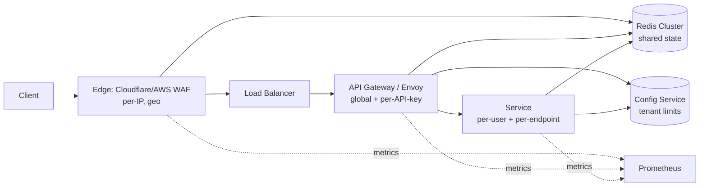

# Вопросы на собеседовании: `Design Rate Limiter`

`Rate Limiter` — защита API от перегрузки и злоупотреблений, обязательный компонент любой public-платформы (Stripe, GitHub, Twitter, Cloudflare). На интервью проверяет понимание алгоритмов (token/leaky bucket, sliding window), distributed coordination (Redis + Lua atomicity), trade-offs (memory vs accuracy, fail-open vs fail-closed), а также способность собрать архитектуру edge → gateway → service.

## Полезные ссылки

- [Cloudflare — How we built rate limiting](https://blog.cloudflare.com/counting-things-a-lot-of-different-things/)
- [Stripe API rate limits](https://stripe.com/docs/rate-limits)
- [GitHub REST rate limits](https://docs.github.com/en/rest/overview/resources-in-the-rest-api#rate-limiting)
- [RFC 6585 — Additional HTTP Status Codes (429)](https://www.rfc-editor.org/rfc/rfc6585)
- [Envoy global rate limit filter](https://www.envoyproxy.io/docs/envoy/latest/configuration/http/http_filters/rate_limit_filter)
- [System Design Primer — rate-limiter](https://github.com/donnemartin/system-design-primer)
- [Designing Data-Intensive Applications, гл. 11 (Stream Processing)](https://www.oreilly.com/library/view/designing-data-intensive-applications/9781491903063/)

## Содержание

**Requirements и capacity**
- [Q1. (!) Functional и non-functional requirements?](#q1--functional-и-non-functional-requirements)
- [Q2. (!) Capacity estimation (1M req/sec, 1B users)?](#q2--capacity-estimation-1m-reqsec-1b-users)
- [Q3. Что в scope (per-user/IP/key) и что out-of-scope?](#q3-что-в-scope-per-useripkey-и-что-out-of-scope)

**Алгоритмы**
- [Q4. (!) Token bucket — алгоритм, формулы, burst handling?](#q4--token-bucket--алгоритм-формулы-burst-handling)
- [Q5. (!) Leaky bucket — как отличается от token bucket?](#q5--leaky-bucket--как-отличается-от-token-bucket)
- [Q6. Fixed window counter — простота и проблема краёв?](#q6-fixed-window-counter--простота-и-проблема-краёв)
- [Q7. (!) Sliding window log — точность vs память?](#q7--sliding-window-log--точность-vs-память)
- [Q8. (!) Sliding window counter — компромисс точности и стоимости?](#q8--sliding-window-counter--компромисс-точности-и-стоимости)
- [Q9. Сравнительная таблица 5 алгоритмов?](#q9-сравнительная-таблица-5-алгоритмов)

**Распределённая координация**
- [Q10. (!) Distributed rate limiting на Redis (Lua atomic)?](#q10--distributed-rate-limiting-на-redis-lua-atomic)
- [Q11. Single-node vs distributed: trade-offs latency vs consistency?](#q11-single-node-vs-distributed-trade-offs-latency-vs-consistency)
- [Q12. (!) Hot key problem на популярных API keys?](#q12--hot-key-problem-на-популярных-api-keys)
- [Q13. Clock drift между nodes — как влияет на window?](#q13-clock-drift-между-nodes--как-влияет-на-window)
- [Q14. Consistent hashing для sharding rate-limit keys?](#q14-consistent-hashing-для-sharding-rate-limit-keys)

**Многоуровневость и стоимость**
- [Q15. (!) Multi-tier limits (per-user + per-IP + per-API-key + per-endpoint)?](#q15--multi-tier-limits-per-user--per-ip--per-api-key--per-endpoint)
- [Q16. Cost-based (weighted requests) rate limiting?](#q16-cost-based-weighted-requests-rate-limiting)
- [Q17. Per-tenant quotas + bursting (Stripe/GitHub patterns)?](#q17-per-tenant-quotas--bursting-stripegithub-patterns)

**HTTP контракт**
- [Q18. (!) HTTP 429, Retry-After, X-RateLimit-* headers (RFC 6585)?](#q18--http-429-retry-after-x-ratelimit--headers-rfc-6585)
- [Q19. Client-side awareness: exponential backoff + jitter?](#q19-client-side-awareness-exponential-backoff--jitter)

**Архитектура и расположение**
- [Q20. (!) High-level architecture (edge / gateway / service)?](#q20--high-level-architecture-edge--gateway--service)
- [Q21. Edge (Cloudflare/Envoy) vs API gateway vs in-service?](#q21-edge-cloudflareenvoy-vs-api-gateway-vs-in-service)
- [Q22. Bloom filter для memory-efficient set rate limiting?](#q22-bloom-filter-для-memory-efficient-set-rate-limiting)

**Production**
- [Q23. (!) Fail-open vs fail-closed при недоступности Redis?](#q23--fail-open-vs-fail-closed-при-недоступности-redis)
- [Q24. Graceful degradation: local fallback counter?](#q24-graceful-degradation-local-fallback-counter)
- [Q25. (!) DDoS mitigation: per-IP + geo-fence + CAPTCHA escalation?](#q25--ddos-mitigation-per-ip--geo-fence--captcha-escalation)
- [Q26. Adaptive rate limiting (auto-tune по latency/error)?](#q26-adaptive-rate-limiting-auto-tune-по-latencyerror)
- [Q27. Monitoring: какие metrics обязательны?](#q27-monitoring-какие-metrics-обязательны)
- [Q28. (!) Sticky routing vs random routing — impact на shared state?](#q28--sticky-routing-vs-random-routing--impact-на-shared-state)
- [Q29. Тестирование rate limiter: unit, integration, load?](#q29-тестирование-rate-limiter-unit-integration-load)
- [Q30. (!) Антипаттерны и подводные камни?](#q30--антипаттерны-и-подводные-камни)

## Q1. (!) Functional и non-functional requirements?

**Функциональные требования:**
- Принимать решение `allow` / `deny` для входящего запроса.
- Решение на основе ключа: user_id, IP, API key, endpoint или комбинация.
- Конфигурируемые лимиты (10 req/sec на пользователя, 1000 req/min на IP).
- HTTP 429 с `Retry-After` при отказе.
- Заголовки `X-RateLimit-Limit`, `X-RateLimit-Remaining`, `X-RateLimit-Reset`.

**Нефункциональные требования:**
- **Throughput:** 100K–1M решений/сек на global edge.
- **Latency:** p99 решения < 10 ms (решение лежит на critical path API).
- **Availability:** 99.99% — rate limiter не должен быть SPOF.
- **Accuracy:** допустимо ±10% по окну (аппроксимация sliding counter); строгая точность не критична.
- **Consistency:** eventual между нодами ок; strong consensus не нужен.
- **Fairness:** один тяжёлый пользователь не должен задушить остальных (изоляция per-key).

**Что вне scope (проговорить явно):**
- Бизнес-логические лимиты уровня приложения (квота = $1000/месяц).
- Долгосрочный биллинг (это metering, а не rate limiting).
- Throttling отдельных строк БД (это забота приложения).

Подсказка: ловушка senior-уровня — если кандидат начинает с алгоритма (`будем использовать token bucket`) без явных NFR, интервьюер уведёт разговор в сторону fairness и failure modes, где кандидат поплывёт.

## Q2. (!) Capacity estimation (1M req/sec, 1B users)?

Допущения масштаба Cloudflare/Stripe:

| Параметр | Значение |
|---|---|
| Global API requests | 1M req/sec в пике |
| Уникальных активных пользователей | 100M (1B зарегистрированных, 10% активны в день) |
| Уникальных API keys | 5M (мерчанты/интеграции) |
| Средний лимит | 100 req/min на пользователя, 10K req/min на API key |

**Throughput:**
- Проверки лимита: 1M/сек (на каждый запрос — одна проверка).
- Обновления (atomic INCR в Redis): ~1M/сек.
- Чтения (для заголовков X-RateLimit-Remaining): ~1M/сек.

**Хранение:**
- Состояние на ключ: `(key, counter, window_start)` ≈ 50–100 B в Redis.
- Активных ключей (комбинации user+IP+API key): 200M.
- Память: 200M × 100 B = **20 GB** в Redis cluster.
- TTL для ключей: window_size + запас (1 минута → TTL 2 минуты).

**Вычисления:**
- Redis cluster: 1M ops/sec / 50K ops/sec на master = **20 master-шардов** (×3 реплики = 60 нод).
- Decision-service (если in-process): 1M / 5K на pod = 200 подов.

**Сеть:**
- Вызов Redis: 1M × 1 round-trip × 100 B = 100 MB/сек ingress + egress на кластер.
- Edge → Redis: cross-region не годится (latency 100+ ms), нужен Redis в каждом регионе.

**Стоимость (порядок величин):**
- Redis cluster (60 нод r6g.xlarge): ~$20K/месяц.
- Compute decision-service: $5–10K/месяц.
- Дешевле, чем потери от DDoS / перегрузки.

## Q3. Что в scope (per-user/IP/key) и что out-of-scope?

| Уровень | Ключ | Сценарий |
|---|---|---|
| Per-user | user_id | Защита от индивидуального злоупотребления |
| Per-IP | client IP | Защита от скрапинга, DDoS |
| Per-API-key | api_key | B2B-партнёрский tier |
| Per-endpoint | (key, route) | Защита дорогих endpoint-ов |
| Per-region | region_code | Geo-aware throttling |
| Global | `*` | Общий circuit breaker |

**В scope:**
- Один или несколько уровней из перечисленных выше.
- Композиция: AND (запрос разрешён, если ВСЕ tier-ы allow) или OR (любой deny → 429).

**Вне scope (обычно):**
- Биллинг квот (соизмерение $1000/месяц — это metering).
- Конкуренция за блокировки строк БД (забота уровня приложения).
- Мягкое предупреждение vs жёсткая блокировка (продуктовое решение).

На практике: в финтехе/SaaS — composite: `min(per_user_limit, per_api_key_limit, per_endpoint_limit, per_ip_limit)`. Каждый tier защищает от своего вектора атаки.

## Q4. (!) Token bucket — алгоритм, формулы, burst handling?

**Идея:** bucket объёмом `capacity` токенов, пополняется со скоростью `refill_rate` (токенов/сек). Каждый запрос забирает 1 токен. Если токенов 0 → deny.

**Состояние на ключ:** `(tokens: float, last_refill: timestamp)`.

**Алгоритм (на каждый запрос):**
```
now = current_time()
elapsed = now - last_refill
tokens = min(capacity, tokens + elapsed * refill_rate)
last_refill = now
if tokens >= 1:
    tokens -= 1
    return ALLOW
else:
    return DENY
```

**Параметры:**
- `capacity` = размер всплеска (например 100 — позволяет 100 запросов мгновенно).
- `refill_rate` = устойчивая скорость (например 10/sec — долгосрочное ограничение).

**Обработка всплесков:**
- Token bucket позволяет **всплеск до capacity** мгновенно.
- Затем скорость осушения = `refill_rate`.
- Идеален для API со случайными пиками (Stripe: всплеск 100 req/sec, устойчиво 25 req/sec).

**Плюсы:**
- Простой, интуитивный, поддерживает всплески.
- O(1) памяти на ключ.
- Отраслевой стандарт (AWS, Stripe, GitHub).

**Минусы:**
- Точность зависит от точности часов (важны микросекунды).
- В распределённом случае: нужен atomic RMW над (tokens, last_refill).

**Redis Lua (atomic):**
```lua
local key = KEYS[1]
local capacity = tonumber(ARGV[1])
local refill_rate = tonumber(ARGV[2])
local now = tonumber(ARGV[3])
local requested = tonumber(ARGV[4])

local data = redis.call('HMGET', key, 'tokens', 'last_refill')
local tokens = tonumber(data[1]) or capacity
local last_refill = tonumber(data[2]) or now

local elapsed = math.max(0, now - last_refill)
tokens = math.min(capacity, tokens + elapsed * refill_rate)

if tokens >= requested then
    tokens = tokens - requested
    redis.call('HMSET', key, 'tokens', tokens, 'last_refill', now)
    redis.call('EXPIRE', key, 3600)
    return 1
else
    redis.call('HMSET', key, 'tokens', tokens, 'last_refill', now)
    redis.call('EXPIRE', key, 3600)
    return 0
end
```

## Q5. (!) Leaky bucket — как отличается от token bucket?

**Идея:** bucket объёмом `capacity`. Запросы попадают в очередь; вытекают с фиксированной скоростью `leak_rate`. Если bucket полон → deny.

**Состояние на ключ:** `(queue: list of timestamps, last_leak: timestamp)` или counter с last_leak.

**Алгоритм:**
```
now = current_time()
leaked = (now - last_leak) * leak_rate
queue_size = max(0, queue_size - leaked)
last_leak = now

if queue_size < capacity:
    queue_size += 1
    return ALLOW
else:
    return DENY
```

**Ключевое отличие от token bucket:**
- Token bucket: разрешает **всплеск** до capacity (мгновенный вход).
- Leaky bucket: вход ограничен `leak_rate`; **сглаженный выход**, никогда не быстрее `leak_rate`.

**Сравнение:**

| Свойство | Token Bucket | Leaky Bucket |
|---|---|---|
| Всплеск | да, до capacity | нет (или мини-буфер) |
| Скорость на выходе | переменная (всплеск, затем осушение) | фиксированная `leak_rate` |
| Сценарий | API со случайными пиками | shaping ради стабильности downstream |
| Реальный пример | Stripe API, AWS | network packet shaping, очередь сообщений |

**Плюсы leaky bucket:**
- Гарантирует стабильную нагрузку на downstream (downstream не превысит `leak_rate`).
- Никаких неожиданных всплесков для backend.

**Минусы:**
- Менее дружелюбен к клиентам (нет терпимости к всплескам).
- Сложнее в реализации (очередь + осушение, нужен планировщик).

**Где применяется на практике:**
- Traffic shaping в роутерах Cisco/Juniper.
- Throttling очередей сообщений (rate limit consumer-а Kafka).
- Воркеры с фиксированной пропускной способностью.

## Q6. Fixed window counter — простота и проблема краёв?

**Идея:** разбить время на окна (1 минута); на каждую пару (key, window) — counter. На каждый запрос: INCR; если > limit → deny. Окно протухает по TTL.

**Состояние:** `counter:{key}:{window_start}` → integer.

**Алгоритм:**
```
window = floor(now / window_size) * window_size
count = INCR counter:{key}:{window}
EXPIRE counter:{key}:{window} = window_size * 2
if count > limit:
    return DENY
return ALLOW
```

**Плюсы:**
- Простой, O(1) памяти.
- Atomic через Redis INCR (без Lua).
- Легко мониторить: `key=count` видно напрямую.

**Минусы (проблема границ):**
- На границе окна возможен **двойной всплеск (2×)**.
- Пример: limit 100/min. В 00:59 — 100 запросов. В 01:00 (новое окно) — ещё 100 запросов. Итого 200 за 2 секунды (около границы).

```
window 1 (00:00-01:00):  ____________________100 requests at 00:59
window 2 (01:00-02:00):  100 requests at 01:00____________________
                                    ↑
                            200 requests in 2 seconds!
```

**Когда подходит:**
- Очень неточные лимиты (throttling аналитики).
- Когда абсолютная точность не критична и всплеск на границе допустим.
- Когда нужна максимальная простота.

**Когда НЕ подходит:**
- Защита от DDoS (2×-всплеск недопустим).
- Строгие per-second лимиты.

## Q7. (!) Sliding window log — точность vs память?

**Идея:** для каждого ключа хранить отсортированный список timestamp-ов всех запросов за последнее окно. На запрос:
1. Удалить из лога все timestamp-ы старше `now - window_size`.
2. Если `len(log) >= limit` → deny.
3. Иначе добавить `now` → allow.

**Состояние:** Redis sorted set `key` → ZADD timestamp.

**Алгоритм:**
```
ZREMRANGEBYSCORE key 0 (now - window_size)
count = ZCARD key
if count >= limit:
    return DENY
ZADD key now now
EXPIRE key window_size * 2
return ALLOW
```

**Плюсы:**
- **Идеальная точность**: настоящее скользящее окно.
- Без всплеска на границе.

**Минусы:**
- **Память O(limit) на ключ** — каждый timestamp в sorted set ≈ 50–80 B.
- При limit=10K req/sec — 10K timestamp-ов на ключ — 800 KB на ключ.
- Не масштабируется для высоконагруженных ключей.

**Когда подходит:**
- Низкий лимит (< 100 req/окно), точность критична.
- Финтех: 10 транзакций в минуту, ошибиться нельзя.
- Безопасность: 5 попыток логина в час.

**Когда НЕ подходит:**
- Высоконагруженные API (1000+ req/sec на ключ) — память взрывается.
- Edge-защита масштаба Cloudflare.

## Q8. (!) Sliding window counter — компромисс точности и стоимости?

**Идея:** объединить fixed window и sliding window log. Хранить counter для текущего и предыдущего окна; при решении — взвешенная сумма с учётом сдвига внутри текущего окна.

**Алгоритм:**
```
now = current_time()
current_window = floor(now / window_size) * window_size
previous_window = current_window - window_size
elapsed_in_current = (now - current_window) / window_size  # 0.0..1.0

current_count = GET counter:{key}:{current_window} or 0
previous_count = GET counter:{key}:{previous_window} or 0

# Взвешенная: какая доля previous window попадает в sliding view
estimated = previous_count * (1 - elapsed_in_current) + current_count

if estimated >= limit:
    return DENY

INCR counter:{key}:{current_window}
EXPIRE counter:{key}:{current_window} window_size * 2
return ALLOW
```

**Пример:**
- Limit = 100/min, window_size = 60s.
- Сейчас 01:00:42 → elapsed_in_current = 42/60 = 0.7.
- previous_count (00:00–01:00) = 80, current_count (01:00–02:00) = 30.
- estimated = 80 × (1 − 0.7) + 30 = 24 + 30 = **54** → allow (< 100).

**Плюсы:**
- O(1) памяти на ключ.
- Точность ±1% относительно sliding window log на нормальном трафике.
- Atomic через Redis INCR.

**Минусы:**
- Аппроксимация: предполагает равномерное распределение в предыдущем окне.
- При всплесковом трафике в конце предыдущего окна — недооценка реальной скорости.

**Где применяется:**
- Cloudflare использует именно sliding window counter для edge rate limiting.
- Отраслевой стандарт для высоконагруженных API.
- Балансирует точность ±1% и память O(1).

## Q9. Сравнительная таблица 5 алгоритмов?

| Алгоритм | Память | Всплеск | Точность | Atomic | Сценарий |
|---|---|---|---|---|---|
| Token bucket | O(1) | да, до capacity | высокая | INCR + Lua | API со всплесками (Stripe, AWS) |
| Leaky bucket | O(1) | нет | высокая | нужна очередь или counter | Traffic shaping (роутеры) |
| Fixed window | O(1) | 2×-всплеск на границе | низкая (на границе) | INCR | Простой throttle аналитики |
| Sliding window log | O(limit) | нет | **идеальная** | операции над sorted set | Строгий низкий объём (попытки логина) |
| Sliding window counter | O(1) | нет | ±1% | INCR | **Выбор по умолчанию** (Cloudflare) |

**Выбор:**
- Высокий объём + нужны всплески → **token bucket**.
- Высокий объём + сглаженный выход → **sliding window counter**.
- Низкий объём + идеальная точность → **sliding window log**.
- Защита downstream → **leaky bucket**.
- Не используй fixed window в проде (всплеск на границе).

## Q10. (!) Distributed rate limiting на Redis (Lua atomic)?

**Проблема:** при decision-service из N подов каждый под не знает счётчик других. Наивный `INCR + GET` даёт гонку:
- Pod A: GET counter = 99 → < 100, INCR → 100.
- Pod B: GET counter = 99 → < 100, INCR → 101.
- Оба разрешили, лимит превышен.

**Решение — atomic RMW через Redis Lua:**

```lua
-- token_bucket.lua
local key = KEYS[1]
local capacity = tonumber(ARGV[1])
local refill_rate = tonumber(ARGV[2])
local now = tonumber(ARGV[3])
local requested = tonumber(ARGV[4])

local data = redis.call('HMGET', key, 'tokens', 'last_refill')
local tokens = tonumber(data[1])
local last_refill = tonumber(data[2])

if tokens == nil then
    tokens = capacity
    last_refill = now
end

local elapsed = math.max(0, now - last_refill)
tokens = math.min(capacity, tokens + elapsed * refill_rate)

local allowed = 0
if tokens >= requested then
    tokens = tokens - requested
    allowed = 1
end

redis.call('HMSET', key, 'tokens', tokens, 'last_refill', now)
redis.call('EXPIRE', key, 3600)
return {allowed, tokens}
```

**Гарантия атомарности:**
- Redis выполняет Lua однопоточно — никаких гонок.
- Все читатели видят одно и то же состояние.

**Вызов из приложения:**
```python
result = redis.eval(lua_script, 1, key, capacity, refill_rate, time.time(), 1)
allowed, remaining = result
```

**Производительность:**
- Один вызов Lua: ~0.1 ms на одношардовом Redis.
- 10K вызовов/сек на один шард.
- Для 1M вызовов/сек — Redis Cluster с 20+ шардами, sharding по ключу.

**Предзагрузка скрипта (SCRIPT LOAD):**
- `EVALSHA` вместо `EVAL` — экономит трафик (передаётся только SHA1).
- Стандартная практика для высокой пропускной способности.

## Q11. Single-node vs distributed: trade-offs latency vs consistency?

**Single-node (in-process counter):**
- Плюсы: решение < 0.001 ms, нет внешних зависимостей.
- Минусы: лимит per-pod, не глобальный. 10 подов × 100 limit = 1000 эффективный лимит.

**Распределённый (Redis shared state):**
- Плюсы: глобальный лимит; масштабируется до миллионов ключей.
- Минусы: 1–5 ms latency на решение (сеть до Redis), Redis как SPOF.

**Гибрид (рекомендуется):**
- **Локальный counter** для быстрых проверок (per-pod, лимит побольше).
- **Распределённый counter** для глобальной истины (синхронизация на уровне кластера).
- Локальная проверка отсекает 99% злоупотреблений без вызова Redis; распределённая ловит оставшиеся пограничные случаи.

```
incoming request
    ↓
local pod counter: > local_threshold? → DENY (no Redis call)
    ↓ (local OK)
Redis EVAL token_bucket.lua → global decision
    ↓
ALLOW / DENY
```

**Тюнинг:**
- Локальный порог = global_limit × 1.2 / pod_count → сходимость к глобальному.
- Trade-off: точность против нагрузки на Redis.

## Q12. (!) Hot key problem на популярных API keys?

**Проблема:** один мерчант с 100K req/sec бьёт по одному ключу в Redis → один шард загружен на 100%, остальные шарды простаивают.

**Симптомы:**
- Latency p99 для других ключей на том же шарде растёт.
- CPU Redis 100% на одном master, остальные master-ы простаивают.

**Митигации:**

**1. Локальный counter (Q11):**
- 99% проверок отсекаются локально — вызов Redis только изредка.

**2. Вероятностный допуск:**
- Выборочные проверки: каждый 10-й запрос делает вызов Redis; 9 из 10 — локальная аппроксимация.
- Точность снижается, но «остывание» ключа работает.

**3. Sharding горячего ключа:**
- Counter per-pod (key + pod_id), периодически (1 раз/сек) суммируется в Redis.
- Trade-off: бывают всплесковые окна, где горячий ключ превышает лимит между синхронизациями.

**4. Двухуровневый limiter:**
- Edge (Envoy/Cloudflare): грубый, только per-IP.
- Backend: точный, per-API-key.
- 80% злоупотреблений отсекается на edge без обращения к backend Redis.

**5. Выделенный Redis cluster под горячие ключи:**
- Top-N ключей выносятся на отдельный hot-key Redis cluster.
- Маппинг в config service.

**На практике:** Stripe документирует hot-key sharding в блоге; GitHub использует Memcached LRU для топовых API keys.

## Q13. Clock drift между nodes — как влияет на window?

**Проблема:** часы ноды A показывают 01:00:00, ноды B — 01:00:02. Решения по скользящему окну расходятся.

**Случаи:**
- Token bucket: использует `now` для скорости пополнения. Расхождение 2 сек → разница в 2 sec × refill_rate токенов.
- Sliding window log: timestamp-ы в sorted set из разных нод — диапазоны не выровнены.
- Fixed window: window_start = floor(now / window_size). Расхождение 2 сек → не то окно для пограничных запросов.

**Решения:**

**1. Авторитетное время на стороне Redis.**
- Lua использует `redis.call('TIME')` вместо `ARGV[3] now` от клиента.
- Все ноды видят единый источник истины по времени.
- Trade-off: команда TIME даёт текущее время Redis, но репликация master→replica добавляет 1–10 ms.

**2. NTP / chrony.**
- Все ноды синхронизированы через NTP с дрейфом < 50 ms.
- Стандартная инфраструктурная практика.

**3. Логические часы (только для упорядочивания):**
- Не для timestamp-ов, а для ordering: Lamport / vector clocks.
- В rate limiter обычно не используется.

**Реальное влияние:**
- При расхождении 100 ms и скорости пополнения 10/сек — разница в 1 токен.
- Для прод-порога 100 req/min не критично.
- Для high-frequency trading (окна 1 ms) — критично; нужен PTP (Precision Time Protocol).

## Q14. Consistent hashing для sharding rate-limit keys?

**Зачем:** равномерно распределить 200M ключей по 20 Redis-шардам + минимизировать перешардирование при добавлении/удалении шарда.

**Наивный hash mod N:**
- `shard = hash(key) % 20`.
- При масштабировании 20 → 21 шард: 19/20 ключей меняют шард → перемещается 95% данных.

**Consistent hashing:**
- Hash-кольцо; у каждого шарда несколько виртуальных нод (≈ 100–200) для баланса.
- Key → hash → первый шард по часовой стрелке на кольце.
- Добавление/удаление шарда → переезжает только 1/N ключей.

**Redis Cluster:**
- Использует слот `CRC16(key) mod 16384`, слоты распределены по master-ам.
- Resharding перемещает слоты (группы ключей), а не отдельные ключи.

**Hash tags:**
- `{user_id}_endpoint_A` и `{user_id}_endpoint_B` — один слот (один шард).
- Позволяет atomic Lua над несколькими ключами одного пользователя.

**Реальная архитектура:**
- 20 master-шардов, 60 нод всего (master + 2 реплики у каждого).
- Lua-скрипт всегда сужается до одного шарда через hash tag по rate-limit key.

## Q15. (!) Multi-tier limits (per-user + per-IP + per-API-key + per-endpoint)?

**Сценарий:** у API лимиты на разных уровнях; запрос разрешён, только если все tier-ы дают allow.

**Иерархия tier-ов:**

| Tier | Лимит | Стоимость проверки | Назначение |
|---|---|---|---|
| Global | 100K req/sec | очень дёшево | Circuit breaker (вся система) |
| Per-IP | 100 req/min | дёшево | DDoS, скрапинг |
| Per-API-key | 10K req/min | средне | B2B-tier (платный план) |
| Per-user | 100 req/min | средне | Индивидуальное злоупотребление |
| Per-endpoint | по-разному | дорого | Тяжёлые операции (поиск, экспорт) |

**Логика принятия решения:**
```python
def is_allowed(request):
    for tier in [global, per_ip, per_api_key, per_user, per_endpoint]:
        if not tier.check(request):
            return False, tier.name  # reason for 429
    # All tiers passed - now consume
    for tier in tiers:
        tier.consume(request)
    return True, None
```

**Подводные камни:**

**1. Гонка между check и consume.**
- Tier A разрешил, tier B проверяется, tier B отказал → counter tier A уже увеличен? Если check + consume не атомарны, можно «потерять» токен.
- Решение: сначала проверить ВСЕ tier-ы; consume в одной Lua-транзакции.

**2. Сначала дешёвые tier-ы.**
- Проверка global / per-IP ≈ 0.5 ms; проверка per-user ≈ 2 ms (требует lookup состояния пользователя).
- Порядок важен: дешёвые впереди, чтобы DDoS отсекался без дорогих проверок.

**3. Разные окна.**
- Per-IP: 100 req/min (длинное окно ловит постепенный скрапинг).
- Per-endpoint: 10 req/sec (короткое окно ловит внезапный всплеск).

## Q16. Cost-based (weighted requests) rate limiting?

**Идея:** разные запросы «стоят» разное количество токенов. Дешёвый endpoint = 1 токен, дорогой = 10 токенов. Лимит измеряется в токенах/сек.

**Сценарий:**
- `GET /users/me` — простое чтение, 1 токен.
- `GET /search?q=...` — полнотекстовый поиск, 5 токенов.
- `POST /export?type=full` — полный экспорт, 100 токенов.

**Алгоритм:**
```python
cost = endpoint_cost[request.path]  # 1, 5, 100
result = redis.eval(token_bucket_lua, 1, key, capacity, refill_rate, now, cost)
if not result.allowed:
    return 429, Retry-After=(cost - result.remaining) / refill_rate
```

**Плюсы:**
- Справедливо: тяжёлые операции стоят больше и не пролезают всплеском через простой counter.
- Устойчивость к DDoS уровня приложения (10 дорогих запросов = 100 простых).

**Сценарии:**
- **Stripe API:** `/v1/charges` — вес 1; `/v1/reports` — вес 10.
- **GitHub GraphQL:** стоимость вычисляется по глубине/ширине запроса.
- **AWS API Gateway:** стоимость на метод.

**Конфигурация:**
- Маппинг стоимостей в config service, hot-reload.
- Стоимость можно вычислять динамически: распарсить запрос, оценить cost.

**Подводный камень:**
- Если cost > capacity, запрос не пройдёт никогда. Проверяйте, что cost ≤ capacity.
- Стоимость меняется со временем (новый endpoint) — нужно версионирование.

## Q17. Per-tenant quotas + bursting (Stripe/GitHub patterns)?

**Система tier-ов Stripe API:**
- Test mode: 25 req/sec.
- Live mode: 100 req/sec по умолчанию; всплеск до 200 req/sec.
- Более высокий tier (enterprise): по договорённости, contact sales.

**GitHub REST:**
- Аутентифицированный: 5000 req/hour на пользователя.
- App: 12500 req/hour.
- Search API: 30 req/min (отдельный лимит).
- GraphQL: 5000 points/hour (cost-based).

**Схема конфига per-tenant:**
```yaml
tenants:
  enterprise_acme:
    limits:
      api: { rate: 1000/sec, burst: 5000 }
      search: { rate: 100/sec, burst: 500 }
    overrides:
      monthly_quota: 1B requests
  default:
    limits:
      api: { rate: 10/sec, burst: 100 }
```

**Реализация:**
- Конфиг тенанта в Redis hash или PostgreSQL с кэшем.
- На запрос: определить тенанта по API key → загрузить лимиты → проверить rate limiter.
- Hot reload через обновления config-service.

**Механизм всплесков (bursting):**
- Token bucket с capacity > устойчивой скорости.
- Например: устойчиво 1000 req/sec, capacity = 5000 → 5-секундный всплеск на 2000 req/sec.

**Квота vs rate limit:**
- Rate limit: краткосрочно (req/sec, req/min).
- Квота: долгосрочно (req/месяц, включает биллинг).
- Учёт квоты — отдельный metering-сервис, не на critical path.

## Q18. (!) HTTP 429, Retry-After, X-RateLimit-* headers (RFC 6585)?

**RFC 6585** определяет HTTP 429 Too Many Requests.

**Ответ при отказе:**
```http
HTTP/1.1 429 Too Many Requests
Retry-After: 30
X-RateLimit-Limit: 100
X-RateLimit-Remaining: 0
X-RateLimit-Reset: 1700000060
Content-Type: application/json

{
  "error": "rate_limit_exceeded",
  "message": "Too many requests. Retry after 30 seconds.",
  "retry_after_seconds": 30
}
```

**Заголовки:**
- `Retry-After`: либо секунды (`30`), либо HTTP-date.
- `X-RateLimit-Limit`: максимум запросов в текущем окне.
- `X-RateLimit-Remaining`: сколько запросов осталось в текущем окне.
- `X-RateLimit-Reset`: Unix timestamp момента сброса окна.

**В успешном ответе (даже без 429) — рекомендуется:**
- Те же заголовки `X-RateLimit-*`.
- Позволяет клиентам узнавать остаток до отказа.

**Стандартизация:**
- **IETF RateLimit Fields** (draft): `RateLimit: limit=100, remaining=50, reset=30`.
- Дореформенный префикс `X-` де-факто универсален.

**Подводные камни:**
- НЕ возвращать 503 вместо 429: 503 означает проблему на стороне сервиса, а не клиента.
- НЕ возвращать 200 с сообщением о лимите: это ломает retry-логику клиента.
- `Retry-After` обязателен — без него клиент не знает, когда повторять.

## Q19. Client-side awareness: exponential backoff + jitter?

**Наивный retry клиента:**
```python
while True:
    response = call_api()
    if response.status == 429:
        sleep(1)  # bad: fixed retry
        continue
    return response
```
Проблема: thundering herd при общем рестарте — все клиенты повторяют одновременно через 1 сек.

**Exponential backoff + jitter:**
```python
attempt = 0
while attempt < max_attempts:
    response = call_api()
    if response.status == 429:
        retry_after = int(response.headers.get('Retry-After', 1))
        # Exponential: 1, 2, 4, 8, 16 sec
        backoff = min(retry_after, 2 ** attempt)
        # Full jitter: 0..backoff random
        sleep_time = random.uniform(0, backoff)
        sleep(sleep_time)
        attempt += 1
        continue
    return response
```

**Варианты jitter:**
- **Full jitter:** `sleep = random(0, backoff)` — лучшее распределение.
- **Equal jitter:** `sleep = backoff/2 + random(0, backoff/2)` — гарантирует минимальное ожидание.
- **Decorrelated jitter:** `sleep = random(backoff_min, prev_sleep * 3)` — самосглаживается.

**Exponential backoff в AWS SDK** — стандарт. Все официальные клиентские библиотеки Stripe и GitHub имеют его «из коробки».

**Идемпотентность критична:**
- GET — безопасен для повтора.
- POST/PUT — повтор только с `Idempotency-Key`.

## Q20. (!) High-level architecture (edge / gateway / service)?



**Уровни:**

**Edge (Cloudflare / AWS WAF / Fastly):**
- Per-IP, geo-fence, базовое обнаружение ботов.
- Дёшево, очень быстро (sub-ms).
- Отсекает 80%+ DDoS.

**API Gateway (Envoy / Kong / AWS API Gateway):**
- Per-API-key, глобальные. Composite-проверки.
- На основе Lua или фильтров.
- Общее состояние в Redis.

**Уровень сервиса (in-process):**
- Per-user, per-endpoint.
- Бизнес-логика конкретного приложения.
- Гибрид «локальное + Redis».

**Config service:**
- Лимиты per-tenant, hot reload.
- etcd / Consul / собственное решение.

**Каждый уровень фильтрует трафик; самый дешёвый (edge) — первый. Самый дорогой (уровень сервиса) — последний.**

## Q21. Edge (Cloudflare/Envoy) vs API gateway vs in-service?

| Уровень | Latency | Гранулярность | Охват | Когда |
|---|---|---|---|---|
| Edge (CDN/WAF) | < 1 ms | Грубая (IP, geo) | Вся инфраструктура | DDoS, скрапинг |
| Gateway (Envoy/Kong) | 1–3 ms | Средняя (API key, route) | Все сервисы | B2B-tier, публичный API |
| In-service | 0.1–1 ms (локально) или 2–5 ms (Redis) | Тонкая (user, endpoint, бизнес-логика) | Один сервис | Бизнес-правила per-tenant |

**Cloudflare:**
- Edge rate limiting встроен; настраиваемые правила на зону.
- Защита от DDoS бесплатно даже на free-tier.
- Правила лимита: `(http.request.uri.path == "/api/login") and (http.client.country == "ZZ")` → block.

**Envoy:**
- Фильтр `envoy.filters.http.ratelimit` → внешний rate limit service.
- gRPC API к RL-сервису.
- Хранилище — Redis или собственный backend.

**Kong:**
- На основе плагинов, несколько алгоритмов.
- Состояние в БД (Postgres/Cassandra) или Redis.

**In-service:**
- Полный контроль, под конкретный бизнес.
- Например: «не больше 5 переводов в час на пользователя» — банковская логика.

**На практике все три уровня применяются последовательно.**

## Q22. Bloom filter для memory-efficient set rate limiting?

**Сценарий:** «отклонять запрос, если этот IP сделал > 1000 запросов за последний час; точность ±5% допустима».

**Наивно:** хранить set всех IP со счётчиком — 100M уникальных IP × (4 B IP + 4 B counter) = 800 MB.

**Bloom filter + counter:**
- Bloom filter (m бит, k хеш-функций) — вероятностная проверка принадлежности.
- Counting Bloom filter — счётчик в каждой ячейке (4-bit или 8-bit).
- Память: 100M IP × 10 bits/IP × 1.5 (для 1% false-positive) = ~190 MB.

**Trade-off:**
- Частота false-positive настраивается (через размер m + k).
- Точный подсчёт невозможен; только «вероятно > порога».

**Когда подходит:**
- Отслеживание горячего набора (топ нарушителей).
- Edge-ноды с ограниченной памятью (лимит 1 GB).
- Аппроксимация допустима.

**Когда НЕ подходит:**
- Точный подсчёт per-user (false-positive = ошибочный 429).
- Строгая точность финансовых лимитов.

**На практике:** edge-ноды Akamai/Cloudflare используют counting Bloom для скоринга ботов.

## Q23. (!) Fail-open vs fail-closed при недоступности Redis?

**Сценарий:** Redis cluster недоступен или медленный → rate limiter не может принять решение.

**Fail-open:**
- При сбое Redis → разрешить запрос.
- Плюсы: API остаётся доступным.
- Минусы: реальные злоупотребления не блокируются во время сбоя.

**Fail-closed:**
- При сбое Redis → отклонить запрос (429 / 503).
- Плюсы: защита от злоупотреблений.
- Минусы: легитимный трафик блокируется — полный простой.

**Гибрид (рекомендуется):**
- Fallback на локальный counter (Q24).
- При сбое Redis → переключиться на локальный счётчик уровня пода.
- Лимит per-pod консервативный (например, global_limit / pod_count × 1.5).

**Матрица решений:**

| Критичность сервиса | Выбор |
|---|---|
| Публичный read-only API | fail-open (приоритет uptime) |
| Auth, платежи | fail-closed (приоритет безопасности) |
| Смешанный | политика per-endpoint |

**Подводный камень:**
- Fail-open без алертинга → сбой Redis незамечен → DDoS прошёл.
- Fail-closed без circuit breaker → каскадный сбой, когда Redis тормозит.

**Best practice:**
- Circuit breaker на клиенте Redis.
- Таймаут 50 ms; если 3 сбоя подряд — переключиться на fallback.
- Алерт на `redis_rate_limiter_unavailable=1`.

## Q24. Graceful degradation: local fallback counter?

**Паттерн:** при недоступном Redis → переключиться на in-process counter (per-pod).

**Алгоритм:**
```python
class RateLimiter:
    def check(self, key):
        try:
            return self._check_redis(key)  # primary path
        except RedisError:
            self.circuit_breaker.record_failure()
            return self._check_local(key)  # fallback

    def _check_local(self, key):
        # Local pod counter, conservative limit
        # global_limit / pod_count * 1.5 safety margin
        local_limit = self.config.local_fallback_limit
        ...
```

**Устройство локального counter-а:**
- In-memory hash map с TTL.
- Caffeine cache (Java) / `cachetools` (Python).
- Лимит per-pod = `(global_limit / pod_count) × 1.5` (запас на перекос).

**Trade-off:**
- Точность снижена: 10 подов могут разрешить 10× local_limit = 1.5× global.
- Но защита от злоупотреблений сохраняется: 1.5× global всё равно лучше, чем без лимита.

**Восстановление:**
- Когда Redis вернулся — circuit breaker закрывается.
- Плавное переключение обратно.

**На практике:** Netflix Hystrix / Resilience4j — встроенный паттерн.

## Q25. (!) DDoS mitigation: per-IP + geo-fence + CAPTCHA escalation?

**Эшелонированная защита:**

**Уровень 1: Сетевой DDoS (volumetric).**
- BGP anycast + scrubbing-центры (Cloudflare, Akamai).
- Митигация до 100+ Tbps.
- Rate limiter не задействован.

**Уровень 2: Прикладной DDoS (L7).**
- Per-IP rate limiting (edge): 100 req/min на IP.
- Per-IP × per-endpoint: 10 req/min для `/api/login`.

**Уровень 3: Обнаружение ботов.**
- Фингерпринтинг устройства (browser canvas, шрифты, экран).
- Поведенческие сигналы (движение мыши, тайминги).
- Cloudflare Bot Management, AWS WAF Bot Control.

**Уровень 4: Эскалация до CAPTCHA.**
- При обнаружении подозрительной активности → CAPTCHA challenge.
- hCaptcha, reCAPTCHA, Turnstile (Cloudflare).
- Мягкая эскалация: первый раз — challenge → блокировка после N провалов.

**Уровень 5: Geo-fence.**
- Блокировка / ограничение для конкретных стран (комплаенс, злоупотребления).
- Allowlist для бизнес-критичных регионов.

**Сигналы обнаружения:**
- Частота запросов на IP > порога.
- Неуспешных попыток аутентификации > 10/min на IP.
- Подозрительный User-Agent (curl, python-requests без легитимного контекста).
- Отсутствуют браузерные заголовки (Accept-Language, sec-fetch-*).

**Поток эскалации:**
```
normal traffic → allow
suspicious (rate > limit) → CAPTCHA challenge
failed CAPTCHA → temp block (1h)
repeat offender → permanent block + log
```

## Q26. Adaptive rate limiting (auto-tune по latency/error)?

**Идея:** статический лимит не учитывает текущую нагрузку. Адаптивный limiter снижает лимит, когда сервису плохо.

**Сигналы:**
- `service.latency_p99` > цели (например, > 500 ms).
- `service.error_rate` > порога (5%).
- `service.cpu_utilization` > 80%.

**Алгоритм (AIMD — Additive Increase Multiplicative Decrease):**
```python
if metrics.latency_p99 > target_latency:
    rate_limit *= 0.5  # multiplicative decrease
elif metrics.healthy:
    rate_limit = min(rate_limit + increment, max_limit)  # additive increase
```

**Вдохновлено TCP congestion control:**
- AIMD стабилен, сходится к оптимуму.
- Все клиенты делят ресурс справедливо.

**Инструменты:**
- Netflix concurrency-limits (open source библиотека).
- Фильтр adaptive concurrency в Envoy.
- «Adaptive throttling» из Google SRE (глава 21 книги SRE).

**Плюсы:**
- Авто-восстановление после всплеска нагрузки.
- Защита backend от перегрузки.

**Минусы:**
- Гистерезис: лимит может «дёргаться» при шумных метриках.
- Cold-start: при первом запуске нет истории.

**На практике:**
- Netflix Hystrix → adaptive bulkhead в Resilience4j.
- Adaptive concurrency в Envoy.
- Авто-масштабирование read/write capacity в AWS DynamoDB.

## Q27. Monitoring: какие metrics обязательны?

**Ключевые метрики:**

| Метрика | Тип | Назначение |
|---|---|---|
| `rate_limit_decisions_total{result=allow\|deny, tier, key_type}` | counter | Сумма решений |
| `rate_limit_decision_latency_seconds` | histogram | Цель p99 < 10 ms |
| `rate_limit_redis_calls_total{status}` | counter | Здоровье Redis |
| `rate_limit_redis_latency_seconds` | histogram | Latency Redis |
| `rate_limit_local_fallback_total` | counter | События fail-over |
| `rate_limit_top_keys` (top-K отклонённых) | gauge | Горячие нарушители |
| `rate_limit_429_response_total{endpoint}` | counter | Восприятие со стороны клиента |

**Дашборды:**
- Частота решений по tier-ам (allow vs deny).
- Топ-10 отклонённых ключей (потенциальные злоупотребления).
- p99 latency во времени.
- Здоровье Redis (лаг master/replica).

**Алерты:**
- Page: rate_limit_decision_latency_p99 > 50 ms 5 минут подряд.
- Slack: top_key_denials растёт > 100/сек — возможен DDoS или неверно настроенный клиент.
- Email: local_fallback_total > 0 — проблемы с Redis.

**Трассировка:**
- Trace ID прокидывается через проверку лимита.
- Видимость: «запрос отклонён tier-ом per-IP на edge, до gateway не дошёл».

## Q28. (!) Sticky routing vs random routing — impact на shared state?

**Sticky routing (session affinity):**
- Один пользователь → всегда один и тот же под.
- Под хранит counter пользователя в памяти.
- Плюсы: вызов Redis не нужен.
- Минусы: горячий под при популярном пользователе; при failover состояние теряется.

**Random routing:**
- Пользователь → любой под.
- Каждому поду нужно общее состояние (Redis).
- Плюсы: равномерное распределение; failover сохраняет состояние.
- Минусы: Redis на critical path.

**Trade-off:**

| Свойство | Sticky | Random |
|---|---|---|
| Нагрузка на Redis | низкая | высокая |
| Failover | упавший под теряет состояние | бесшовный |
| Влияние горячего пользователя | локальный горячий под | распределено |
| Реализация | session cookie / consistent hash LB | обычный LB |

**Гибрид:**
- Sticky routing на LB ради cache locality.
- Общее состояние в Redis как source of truth.
- Кэш пода на последние N решений (LRU).

**На практике:**
- Sticky sessions в AWS ALB для канонических подов.
- Заголовки session affinity в Envoy.
- Cloudflare использует sticky routing к origin ради cache locality.

## Q29. Тестирование rate limiter: unit, integration, load?

**Unit-тесты:**
- Token bucket: 100 запросов за 1 сек → 100 разрешено, 101-й отклонён (capacity).
- Sliding window: точный подсчёт на границах.
- Cost-based: взвешенные запросы суммируются корректно.
- Пограничные случаи: скачок часов назад, переполнение, нулевая скорость пополнения.

**Интеграционные тесты:**
- Реальный Redis (Testcontainers): atomic Lua, состояния гонки.
- Распределённый: 5 подов + общий Redis → глобальный лимит наблюдаем.
- Инъекция сбоев: Redis недоступен → fallback-путь.

**Нагрузочные тесты:**
- Gatling / k6 / Locust → 1M req/sec на rate limiter.
- Измеряем: p99 latency решения, throughput, частоту ошибок.
- Chaos: убить master Redis посреди теста, наблюдать failover.

**Property-based тесты:**
- ScalaCheck / Hypothesis: «при ЛЮБОЙ последовательности запросов число разрешённых ≤ limit + 1 (1 на аппроксимацию)».
- Ловит пограничные случаи, которые ручные тесты пропускают.

**Тест на соответствие контракту:**
- Заголовки ответа 429 корректны (Retry-After, X-RateLimit-*).
- HTTP-статусы по RFC 6585.

**На практике:** у Stripe и Cloudflare обширная (закрытая) инфраструктура нагрузочного тестирования. Из open source: бенчмарки rate-limit от Resilience4j.

## Q30. (!) Антипаттерны и подводные камни?

**1. Счётчик в БД.**
- Симптом: `UPDATE rate_limits SET count=count+1 WHERE key=?` на каждый запрос → блокировка строки БД, throughput < 1K/sec.
- Решение: Redis / in-memory.

**2. Sync на диск на каждый запрос.**
- Симптом: `fsync` на каждый INCR → потолок по IOPS, latency 10+ ms.
- Решение: Redis с AOF appendfsync everysec (потеря данных за 1 сек допустима).

**3. Нет jitter в retry клиента.**
- Симптом: 1000 клиентов одновременно повторяют ровно через 5 сек → thundering herd.
- Решение: exponential backoff + full jitter (Q19).

**4. Единственный глобальный инстанс Redis.**
- Симптом: SPOF; 100% простой при падении Redis.
- Решение: Redis cluster, реплики, fallback fail-open.

**5. Наивный INCR + GET.**
- Симптом: состояние гонки между подами, лимит превышен на N подов.
- Решение: atomic Lua-скрипт (Q10).

**6. Нет локального counter-а для очевидного DDoS.**
- Симптом: DDoS 1M req/sec бьёт по Redis с 1M ops/sec.
- Решение: локальный counter пода отсекает 99% до вызова Redis.

**7. Лимит на под вместо глобального.**
- Симптом: 10 подов × 100/sec limit = 1000/sec глобально вместо 100/sec.
- Решение: общее состояние в Redis.

**8. Нет TTL на ключах Redis.**
- Симптом: память Redis растёт линейно с числом уникальных ключей; OOM через дни.
- Решение: EXPIRE на каждый INCR, TTL = window × 2.

**9. Fixed window для критичных API.**
- Симптом: 2×-всплеск на границах окон; DDoS-детектор пропускает.
- Решение: sliding window counter.

**10. Жёсткий 429 без graceful degradation.**
- Симптом: сторонний API упал → все клиенты получают 429 одновременно.
- Решение: поставить запрос в очередь, повторять с backoff на стороне сервера (для не-критичного).

**11. Не логировать заблокированные запросы.**
- Симптом: невозможно понять, почему у клиентов сбои.
- Решение: лог на debug-уровне: `key=X, reason=per_user_limit, retry_after=30`.

**12. Разные лимиты на разных подах.**
- Симптом: раскатка конфига не атомарна; под A разрешает 100/sec, под B — 50/sec; неравномерное поведение.
- Решение: централизованный конфиг с версионированием, hot reload.

**13. Не учитывать X-Forwarded-For.**
- Симптом: rate limit по `remote_addr` = IP балансировщика (один на всех!); per-IP лимит бесполезен.
- Решение: парсить `X-Forwarded-For` или `Cf-Connecting-IP` (Cloudflare).

**14. Rate limit на endpoint аутентификации без эскалации до CAPTCHA.**
- Симптом: 100 req/min позволяют brute force через прокси с разными IP.
- Решение: per-user + CAPTCHA после N провалов.

**15. Не сбрасывать лимит при апгрейде аккаунта.**
- Симптом: пользователь повысил план, но до конца окна действует старый лимит.
- Решение: по событию смены плана — удалить ключ counter-а (атомарный сброс).

---

## See also

- [Design Payment System](design-payment-system-interview.md) — webhook signing + idempotency + rate-limiting на authorize
- [Design Feed System](design-feed-system-interview.md) — fanout с rate-limiting на celebrity-posts
- [Design URL Shortener](design-url-shortener-interview.md) — rate limit на link creation
- [System Design Interview](system-design-interview.md) — общая методология кейсов
- [Caching Strategies](../architecture/caching-strategies-interview.md) — Redis в production
- [Resilience Patterns](../architecture/resilience-patterns-interview.md) — circuit breaker, bulkhead, fail-open
- [Distributed Systems](../architecture/distributed-systems-interview.md) — eventual consistency, clock drift
- [Redis](../databases/redis-interview.md) — Lua atomic, cluster sharding, AOF
- [API Security](../security/api-security-interview.md) — DDoS, bot detection, CAPTCHA
- [Microservices](../architecture/microservices-interview.md) — edge / gateway / service layering
- [Load Balancing](../architecture/load-balancing-interview.md) — sticky vs random routing
