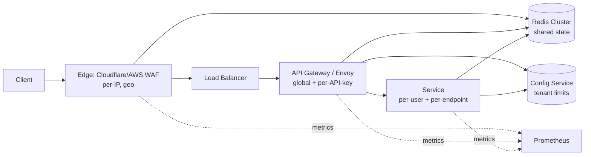

# Вопросы на собеседовании: `Design Rate Limiter`

`Rate Limiter` — защита API от перегрузки и злоупотреблений, обязательный компонент любой public-платформы (Stripe, GitHub, Twitter, Cloudflare). На интервью проверяет понимание алгоритмов (token/leaky bucket, sliding window), distributed coordination (Redis + Lua atomicity), trade-offs (memory vs accuracy, fail-open vs fail-closed), а также способность собрать архитектуру edge → gateway → service.

## Полезные ссылки

- [Cloudflare — How we built rate limiting](https://blog.cloudflare.com/counting-things-a-lot-of-different-things/)
- [Stripe API rate limits](https://stripe.com/docs/rate-limits)
- [GitHub REST rate limits](https://docs.github.com/en/rest/overview/resources-in-the-rest-api#rate-limiting)
- [RFC 6585 — Additional HTTP Status Codes (429)](https://www.rfc-editor.org/rfc/rfc6585)
- [Envoy global rate limit filter](https://www.envoyproxy.io/docs/envoy/latest/configuration/http/http_filters/rate_limit_filter)
- [System Design Primer — rate-limiter](https://github.com/donnemartin/system-design-primer)
- [Designing Data-Intensive Applications, гл. 11 (Stream Processing)](https://www.oreilly.com/library/view/designing-data-intensive-applications/9781491903063/)

## Содержание

**Requirements и capacity**
- [Q1. (!) Functional и non-functional requirements?](#q1--functional-и-non-functional-requirements)
- [Q2. (!) Capacity estimation (1M req/sec, 1B users)?](#q2--capacity-estimation-1m-reqsec-1b-users)
- [Q3. Что в scope (per-user/IP/key) и что out-of-scope?](#q3-что-в-scope-per-useripkey-и-что-out-of-scope)

**Алгоритмы**
- [Q4. (!) Token bucket — алгоритм, формулы, burst handling?](#q4--token-bucket--алгоритм-формулы-burst-handling)
- [Q5. (!) Leaky bucket — как отличается от token bucket?](#q5--leaky-bucket--как-отличается-от-token-bucket)
- [Q6. Fixed window counter — простота и проблема краёв?](#q6-fixed-window-counter--простота-и-проблема-краёв)
- [Q7. (!) Sliding window log — точность vs память?](#q7--sliding-window-log--точность-vs-память)
- [Q8. (!) Sliding window counter — компромисс точности и стоимости?](#q8--sliding-window-counter--компромисс-точности-и-стоимости)
- [Q9. Сравнительная таблица 5 алгоритмов?](#q9-сравнительная-таблица-5-алгоритмов)

**Распределённая координация**
- [Q10. (!) Distributed rate limiting на Redis (Lua atomic)?](#q10--distributed-rate-limiting-на-redis-lua-atomic)
- [Q11. Single-node vs distributed: trade-offs latency vs consistency?](#q11-single-node-vs-distributed-trade-offs-latency-vs-consistency)
- [Q12. (!) Hot key problem на популярных API keys?](#q12--hot-key-problem-на-популярных-api-keys)
- [Q13. Clock drift между nodes — как влияет на window?](#q13-clock-drift-между-nodes--как-влияет-на-window)
- [Q14. Consistent hashing для sharding rate-limit keys?](#q14-consistent-hashing-для-sharding-rate-limit-keys)

**Многоуровневость и стоимость**
- [Q15. (!) Multi-tier limits (per-user + per-IP + per-API-key + per-endpoint)?](#q15--multi-tier-limits-per-user--per-ip--per-api-key--per-endpoint)
- [Q16. Cost-based (weighted requests) rate limiting?](#q16-cost-based-weighted-requests-rate-limiting)
- [Q17. Per-tenant quotas + bursting (Stripe/GitHub patterns)?](#q17-per-tenant-quotas--bursting-stripegithub-patterns)

**HTTP контракт**
- [Q18. (!) HTTP 429, Retry-After, X-RateLimit-* headers (RFC 6585)?](#q18--http-429-retry-after-x-ratelimit--headers-rfc-6585)
- [Q19. Client-side awareness: exponential backoff + jitter?](#q19-client-side-awareness-exponential-backoff--jitter)

**Архитектура и расположение**
- [Q20. (!) High-level architecture (edge / gateway / service)?](#q20--high-level-architecture-edge--gateway--service)
- [Q21. Edge (Cloudflare/Envoy) vs API gateway vs in-service?](#q21-edge-cloudflareenvoy-vs-api-gateway-vs-in-service)
- [Q22. Bloom filter для memory-efficient set rate limiting?](#q22-bloom-filter-для-memory-efficient-set-rate-limiting)

**Production**
- [Q23. (!) Fail-open vs fail-closed при недоступности Redis?](#q23--fail-open-vs-fail-closed-при-недоступности-redis)
- [Q24. Graceful degradation: local fallback counter?](#q24-graceful-degradation-local-fallback-counter)
- [Q25. (!) DDoS mitigation: per-IP + geo-fence + CAPTCHA escalation?](#q25--ddos-mitigation-per-ip--geo-fence--captcha-escalation)
- [Q26. Adaptive rate limiting (auto-tune по latency/error)?](#q26-adaptive-rate-limiting-auto-tune-по-latencyerror)
- [Q27. Monitoring: какие metrics обязательны?](#q27-monitoring-какие-metrics-обязательны)
- [Q28. (!) Sticky routing vs random routing — impact на shared state?](#q28--sticky-routing-vs-random-routing--impact-на-shared-state)
- [Q29. Тестирование rate limiter: unit, integration, load?](#q29-тестирование-rate-limiter-unit-integration-load)
- [Q30. (!) Антипаттерны и подводные камни?](#q30--антипаттерны-и-подводные-камни)

## Q1. (!) Functional и non-functional requirements?

**Functional:**
- Принимать решение `allow` / `deny` для входящего запроса.
- Decision на основе ключа: user_id, IP, API key, endpoint, или комбинация.
- Конфигурируемые лимиты (10 req/sec per user, 1000 req/min per IP).
- HTTP 429 с `Retry-After` при deny.
- Headers `X-RateLimit-Limit`, `X-RateLimit-Remaining`, `X-RateLimit-Reset`.

**Non-functional:**
- **Throughput:** 100K-1M decisions/sec на global edge.
- **Latency:** p99 decision < 10 ms (decision на critical path API).
- **Availability:** 99.99% — rate limiter не должен быть SPOF.
- **Accuracy:** допустимо ±10% по window (sliding counter approximation); strict accuracy не критична.
- **Consistency:** eventual между nodes ок; не нужен strong consensus.
- **Fairness:** один heavy user не должен задушить остальных (per-key isolation).

**Scope excluded (явно проговорить):**
- Application-level business logic limits (quota = $1000/month).
- Long-term billing (это metering, не rate limiting).
- Per-row DB throttling (это application concern).

Tip: senior-уровневая ловушка — если кандидат начинает с алгоритма (`будем использовать token bucket`) без явных NFR, интервьюер уведёт в обсуждение fairness и failure modes, где кандидат поплывёт.

## Q2. (!) Capacity estimation (1M req/sec, 1B users)?

Cloudflare/Stripe-scale допущения:

| Параметр | Значение |
|---|---|
| Global API requests | 1M req/sec peak |
| Unique active users | 100M (1B registered, 10% active per day) |
| Unique API keys | 5M (merchants/integrations) |
| Avg rate limit | 100 req/min per user, 10K req/min per API key |

**Throughput:**
- Rate-limit checks: 1M/sec (на каждый request — один check).
- Updates (atomic INCR в Redis): ~1M/sec.
- Reads (для X-RateLimit-Remaining headers): ~1M/sec.

**Storage:**
- Per-key state: `(key, counter, window_start)` ≈ 50-100 B в Redis.
- Active keys (user+IP+API key combinations): 200M.
- Memory: 200M × 100 B = **20 GB** в Redis cluster.
- TTL для keys: window_size + headroom (1 минута → TTL 2 минуты).

**Compute:**
- Redis cluster: 1M ops/sec / 50K ops/sec на master = **20 master shards** (×3 replicas = 60 nodes).
- Decision-service (если в-process): 1M / 5K на pod = 200 pods.

**Network:**
- Redis call: 1M × 1 round-trip × 100 B = 100 MB/sec ingress + egress per cluster.
- Edge → Redis: cross-region не годится (latency 100+ ms), нужен per-region Redis.

**Cost (порядок):**
- Redis cluster (60 nodes r6g.xlarge): ~$20K/month.
- Decision-service compute: $5-10K/month.
- Cheaper чем потери от DDoS / overload.

## Q3. Что в scope (per-user/IP/key) и что out-of-scope?

| Уровень | Ключ | Use case |
|---|---|---|
| Per-user | user_id | Защита от индивидуального abuse |
| Per-IP | client IP | Защита от скрапинга, DDoS |
| Per-API-key | api_key | B2B-партнёрский tier |
| Per-endpoint | (key, route) | Защита expensive endpoints |
| Per-region | region_code | Geo-aware throttling |
| Global | `*` | Общий circuit breaker |

**В scope:**
- Один или несколько из выше.
- Композиция: AND (request разрешён если ВСЕ tier-ы allow) или OR (любой deny → 429).

**Out of scope (обычно):**
- Quota billing ($1000/month соизмерение — это metering).
- Per-row DB lock contention (application-level concern).
- Soft warning vs hard block (продуктовое решение).

Practical: в финтехе/SaaS — composite: `min(per_user_limit, per_api_key_limit, per_endpoint_limit, per_ip_limit)`. Каждый tier защищает от своего вектора атаки.

## Q4. (!) Token bucket — алгоритм, формулы, burst handling?

**Idea:** bucket объёмом `capacity` токенов, пополняется со скоростью `refill_rate` (токенов/сек). Каждый request забирает 1 токен. Если 0 токенов → deny.

**State per key:** `(tokens: float, last_refill: timestamp)`.

**Algorithm (на каждом request):**
```
now = current_time()
elapsed = now - last_refill
tokens = min(capacity, tokens + elapsed * refill_rate)
last_refill = now
if tokens >= 1:
    tokens -= 1
    return ALLOW
else:
    return DENY
```

**Параметры:**
- `capacity` = burst size (например 100 — позволяет 100 req мгновенно).
- `refill_rate` = sustained rate (например 10/sec — long-term ограничение).

**Burst handling:**
- Token bucket позволяет **burst до capacity** мгновенно.
- Затем drain rate = `refill_rate`.
- Идеально для API с occasional spikes (Stripe: 100 req/sec burst, 25 req/sec sustained).

**Pros:**
- Простой, intuitive, поддерживает burst.
- O(1) memory per key.
- Стандарт индустрии (AWS, Stripe, GitHub).

**Cons:**
- Точность зависит от clock-precision (microseconds matter).
- Distributed: нужна atomic RMW на (tokens, last_refill).

**Redis Lua (atomic):**
```lua
local key = KEYS[1]
local capacity = tonumber(ARGV[1])
local refill_rate = tonumber(ARGV[2])
local now = tonumber(ARGV[3])
local requested = tonumber(ARGV[4])

local data = redis.call('HMGET', key, 'tokens', 'last_refill')
local tokens = tonumber(data[1]) or capacity
local last_refill = tonumber(data[2]) or now

local elapsed = math.max(0, now - last_refill)
tokens = math.min(capacity, tokens + elapsed * refill_rate)

if tokens >= requested then
    tokens = tokens - requested
    redis.call('HMSET', key, 'tokens', tokens, 'last_refill', now)
    redis.call('EXPIRE', key, 3600)
    return 1
else
    redis.call('HMSET', key, 'tokens', tokens, 'last_refill', now)
    redis.call('EXPIRE', key, 3600)
    return 0
end
```

## Q5. (!) Leaky bucket — как отличается от token bucket?

**Idea:** bucket объёмом `capacity`. Запросы попадают в очередь; дренируются с фиксированной скоростью `leak_rate`. Если bucket полный → deny.

**State per key:** `(queue: list of timestamps, last_leak: timestamp)` или counter с last_leak.

**Algorithm:**
```
now = current_time()
leaked = (now - last_leak) * leak_rate
queue_size = max(0, queue_size - leaked)
last_leak = now

if queue_size < capacity:
    queue_size += 1
    return ALLOW
else:
    return DENY
```

**Ключевое отличие от token bucket:**
- Token bucket: разрешает **burst** до capacity (мгновенный input).
- Leaky bucket: input limited by leak_rate; **smooth output**, никогда быстрее `leak_rate`.

**Сравнение:**

| Свойство | Token Bucket | Leaky Bucket |
|---|---|---|
| Burst | да, до capacity | нет (или мини-buffer) |
| Output rate | переменный (burst then drain) | фиксированный `leak_rate` |
| Use case | API с occasional spikes | shaping для downstream stability |
| Реальный пример | Stripe API, AWS | network packet shaping, message queue |

**Pros leaky:**
- Гарантирует stable downstream load (downstream не превысит `leak_rate`).
- Нет burst surprise для backend.

**Cons:**
- Менее friendly для clients (нет burst tolerance).
- Сложнее ставить в queue + drain (требует scheduler).

**Реальный use:**
- Traffic shaping в Cisco/Juniper routers.
- Message queue throttling (Kafka consumer rate limit).
- Воркеры с фиксированной пропускной способностью.

## Q6. Fixed window counter — простота и проблема краёв?

**Idea:** разбить время на windows (1 минута); per (key, window) — counter. На каждом request: INCR; если > limit → deny. Window expires.

**State:** `counter:{key}:{window_start}` → integer.

**Algorithm:**
```
window = floor(now / window_size) * window_size
count = INCR counter:{key}:{window}
EXPIRE counter:{key}:{window} = window_size * 2
if count > limit:
    return DENY
return ALLOW
```

**Pros:**
- Простой, O(1) memory.
- Atomic через Redis INCR (без Lua).
- Легко монитор: `key=count` напрямую видно.

**Cons (edge problem):**
- На границе window-а возможен **2× burst**.
- Пример: limit 100/min. В 00:59 — 100 requests. В 01:00 (новое окно) — ещё 100 requests. Итого 200 в 2 секунды (около границы).

```
window 1 (00:00-01:00):  ____________________100 requests at 00:59
window 2 (01:00-02:00):  100 requests at 01:00____________________
                                    ↑
                            200 requests in 2 seconds!
```

**Когда подходит:**
- Очень неточные лимиты (analytics throttling).
- Когда абсолютная точность не критична и edge-burst допустим.
- Когда нужна максимальная простота.

**Когда НЕ подходит:**
- DDoS protection (atomic 2× burst недопустимо).
- Strict per-second limits.

## Q7. (!) Sliding window log — точность vs память?

**Idea:** для каждого key хранить sorted list timestamps всех requests за последний window. На request:
1. Удалить из log все timestamps старше `now - window_size`.
2. Если `len(log) >= limit` → deny.
3. Иначе добавить `now` → allow.

**State:** Redis sorted set `key` → ZADD timestamp.

**Algorithm:**
```
ZREMRANGEBYSCORE key 0 (now - window_size)
count = ZCARD key
if count >= limit:
    return DENY
ZADD key now now
EXPIRE key window_size * 2
return ALLOW
```

**Pros:**
- **Идеальная точность**: реальный sliding window.
- Без edge-burst.

**Cons:**
- **Memory O(limit) per key** — каждый timestamp в sorted set ≈ 50-80 B.
- При limit=10K req/sec — 10K timestamps per key — 800 KB на key.
- Не масштабируется для high-volume keys.

**Когда подходит:**
- Низкий limit (< 100 req/window), точность критична.
- Финтех: 10 transactions per minute, нельзя ошибиться.
- Security: 5 login attempts per hour.

**Когда НЕ подходит:**
- High-volume APIs (1000+ req/sec per key) — memory blow-up.
- Cloudflare-scale edge protection.

## Q8. (!) Sliding window counter — компромисс точности и стоимости?

**Idea:** объединить fixed window и sliding window log. Хранить counter для текущего и предыдущего window; на decision — взвешенная сумма с учётом сдвига внутри текущего window.

**Algorithm:**
```
now = current_time()
current_window = floor(now / window_size) * window_size
previous_window = current_window - window_size
elapsed_in_current = (now - current_window) / window_size  # 0.0..1.0

current_count = GET counter:{key}:{current_window} or 0
previous_count = GET counter:{key}:{previous_window} or 0

# Взвешенная: какая доля previous window попадает в sliding view
estimated = previous_count * (1 - elapsed_in_current) + current_count

if estimated >= limit:
    return DENY

INCR counter:{key}:{current_window}
EXPIRE counter:{key}:{current_window} window_size * 2
return ALLOW
```

**Пример:**
- Limit = 100/min, window_size = 60s.
- Сейчас 01:00:42 → elapsed_in_current = 42/60 = 0.7.
- previous_count (00:00-01:00) = 80, current_count (01:00-02:00) = 30.
- estimated = 80 × (1 - 0.7) + 30 = 24 + 30 = **54** → allow (< 100).

**Pros:**
- O(1) memory per key.
- Точность ±1% от sliding window log на нормальном трафике.
- Atomic через Redis INCR.

**Cons:**
- Approximation: предполагает uniform distribution в previous window.
- При bursty traffic на конце предыдущего окна — недооценка реального rate.

**Использование:**
- Cloudflare использует именно sliding window counter для edge rate limiting.
- Industry-стандарт для high-throughput APIs.
- Балансирует точность ±1% и memory O(1).

## Q9. Сравнительная таблица 5 алгоритмов?

| Алгоритм | Memory | Burst | Accuracy | Atomic | Use case |
|---|---|---|---|---|---|
| Token bucket | O(1) | да, до capacity | high | INCR + Lua | API с burst (Stripe, AWS) |
| Leaky bucket | O(1) | нет | high | requires queue or counter | Traffic shaping (routers) |
| Fixed window | O(1) | 2× edge burst | low (edge) | INCR | Простые analytics throttle |
| Sliding window log | O(limit) | нет | **perfect** | sorted set ops | Low-volume strict (login attempts) |
| Sliding window counter | O(1) | нет | ±1% | INCR | **Default choice** (Cloudflare) |

**Выбор:**
- High-volume + need burst → **token bucket**.
- High-volume + smooth output → **sliding window counter**.
- Low-volume + perfect accuracy → **sliding window log**.
- Downstream protection → **leaky bucket**.
- Не используй fixed window в production (edge-burst).

## Q10. (!) Distributed rate limiting на Redis (Lua atomic)?

**Проблема:** при decision-service из N pods, каждый pod не знает счётчик других. Naive `INCR + GET` race:
- Pod A: GET counter = 99 → < 100, INCR → 100.
- Pod B: GET counter = 99 → < 100, INCR → 101.
- Оба разрешили, lim превышен.

**Решение — atomic RMW через Redis Lua:**

```lua
-- token_bucket.lua
local key = KEYS[1]
local capacity = tonumber(ARGV[1])
local refill_rate = tonumber(ARGV[2])
local now = tonumber(ARGV[3])
local requested = tonumber(ARGV[4])

local data = redis.call('HMGET', key, 'tokens', 'last_refill')
local tokens = tonumber(data[1])
local last_refill = tonumber(data[2])

if tokens == nil then
    tokens = capacity
    last_refill = now
end

local elapsed = math.max(0, now - last_refill)
tokens = math.min(capacity, tokens + elapsed * refill_rate)

local allowed = 0
if tokens >= requested then
    tokens = tokens - requested
    allowed = 1
end

redis.call('HMSET', key, 'tokens', tokens, 'last_refill', now)
redis.call('EXPIRE', key, 3600)
return {allowed, tokens}
```

**Гарантия atomicity:**
- Redis выполняет Lua single-threaded — никаких races.
- Все читатели видят одинаковое state.

**Вызов из application:**
```python
result = redis.eval(lua_script, 1, key, capacity, refill_rate, time.time(), 1)
allowed, remaining = result
```

**Performance:**
- Single Lua call: ~0.1 ms на single-shard Redis.
- 10K calls/sec на одну shard.
- Для 1M calls/sec — Redis Cluster с 20+ shards, sharding по key.

**Pre-load script (SCRIPT LOAD):**
- `EVALSHA` вместо `EVAL` — экономит bandwidth (только SHA1 передаётся).
- Стандартная практика для high-throughput.

## Q11. Single-node vs distributed: trade-offs latency vs consistency?

**Single-node (in-process counter):**
- Pros: < 0.001 ms decision, no external dependency.
- Cons: rate limit per-pod, не глобальный. 10 pods × 100 limit = 1000 effective limit.

**Distributed (Redis shared state):**
- Pros: глобальный limit; масштабируется до миллионов keys.
- Cons: 1-5 ms latency на decision (network к Redis), Redis SPOF.

**Гибрид (recommended):**
- **Local counter** для quick checks (per-pod, бóльший лимит).
- **Distributed counter** для глобальной правды (per-cluster sync).
- Local check rejects 99% abuse без Redis call; distributed catches remaining edge cases.

```
incoming request
    ↓
local pod counter: > local_threshold? → DENY (no Redis call)
    ↓ (local OK)
Redis EVAL token_bucket.lua → global decision
    ↓
ALLOW / DENY
```

**Tuning:**
- Local threshold = global_limit × 1.2 / pod_count → конвергенция к global.
- Trade-off: accuracy vs Redis load.

## Q12. (!) Hot key problem на популярных API keys?

**Проблема:** один merchant с 100K req/sec бьёт по одному ключу в Redis → один shard загружен на 100%, остальные shards idle.

**Симптомы:**
- Latency p99 для других keys на том же shard растёт.
- Redis CPU 100% на одном master, остальные master-ы idle.

**Митигации:**

**1. Local counter (Q11):**
- 99% checks rejected locally — Redis call только редко.

**2. Probabilistic admission:**
- Sampled checks: каждый 10-й request делает Redis call; 9 из 10 — local approx.
- Точность снижается, но key cooling работает.

**3. Sharding hot key:**
- Per-pod counter (key + pod_id), периодически (1 раз/сек) суммируется в Redis.
- Trade-off: бывают burst-окна где hот-key превышает limit между sync-ами.

**4. Two-tier limiter:**
- Edge (Envoy/Cloudflare): coarse-grained, per-IP only.
- Backend: fine-grained, per-API-key.
- 80% abuse rejected на edge без backend Redis hit.

**5. Dedicated Redis cluster для hot keys:**
- Top-N keys выносятся на отдельный hot-key Redis cluster.
- Mapping в config service.

**Real:** Stripe документирует hot-key sharding в blog; GitHub использует Memcached LRU для top API keys.

## Q13. Clock drift между nodes — как влияет на window?

**Проблема:** node A clock 01:00:00, node B clock 01:00:02. Sliding window decisions расходятся.

**Cases:**
- Token bucket: использует `now` для refill rate. 2 sec skew → 2 sec × refill_rate tokens разница.
- Sliding window log: timestamps в sorted set из разных nodes — ranges не aligned.
- Fixed window: window_start = floor(now / window_size). 2 sec skew → wrong window for boundary requests.

**Решения:**

**1. Authoritative time на Redis side.**
- Lua использует `redis.call('TIME')` вместо `ARGV[3] now from client`.
- Все nodes видят single source of truth time.
- Trade-off: TIME command даёт текущее Redis time, но replication между master-replica adds 1-10 ms.

**2. NTP / chrony.**
- Все nodes синхронизированы через NTP с дрейфом < 50 ms.
- Standard infra practice.

**3. Logical clocks (только для sequence):**
- Не для timestamps, но для ordering: Lamport / vector clocks.
- Не используется в rate limiter обычно.

**Реальный impact:**
- При 100 ms skew и refill rate 10/sec — разница в 1 token.
- Для production threshold 100 req/min не критично.
- Для high-frequency trading (1 ms windows) — критично; нужен PTP (Precision Time Protocol).

## Q14. Consistent hashing для sharding rate-limit keys?

**Зачем:** распределить 200M keys по 20 Redis shards равномерно + минимизировать перешардирование при добавлении/удалении shard.

**Naive hash mod N:**
- `shard = hash(key) % 20`.
- При scale 20 → 21 shards: 19/20 keys меняют shard → 95% data movement.

**Consistent hashing:**
- Hash ring; каждый shard несколько virtual nodes (≈ 100-200) для balance.
- Key → hash → first shard clockwise on ring.
- Add/remove shard → only 1/N keys move.

**Redis Cluster:**
- Использует `CRC16(key) mod 16384` slot, slots distributed across masters.
- Resharding moves slots (groups of keys), не individual keys.

**Hash tags:**
- `{user_id}_endpoint_A` и `{user_id}_endpoint_B` — same slot (one shard).
- Позволяет atomic Lua над несколькими keys одного user.

**Реальная архитектура:**
- 20 master shards, 60 nodes total (master + 2 replicas каждый).
- Lua script всегда сужает на один shard через hash tag по rate-limit key.

## Q15. (!) Multi-tier limits (per-user + per-IP + per-API-key + per-endpoint)?

**Сценарий:** API имеет лимиты на разных уровнях; request разрешён только если все tier-ы allow.

**Tier hierarchy:**

| Tier | Limit | Cost | Purpose |
|---|---|---|---|
| Global | 100K req/sec | very cheap | Circuit breaker (whole system) |
| Per-IP | 100 req/min | cheap | DDoS, scraping |
| Per-API-key | 10K req/min | medium | B2B tier (paid plan) |
| Per-user | 100 req/min | medium | Individual abuse |
| Per-endpoint | varies | expensive | Heavy operations (search, export) |

**Decision logic:**
```python
def is_allowed(request):
    for tier in [global, per_ip, per_api_key, per_user, per_endpoint]:
        if not tier.check(request):
            return False, tier.name  # reason for 429
    # All tiers passed - now consume
    for tier in tiers:
        tier.consume(request)
    return True, None
```

**Pitfalls:**

**1. Race между check и consume.**
- Tier A allowed, tier B check, tier B denied → tier A counter уже incremented? Если check + consume не атомарны, можно «потерять» token.
- Fix: проверить ВСЕ tiers сначала; consume в одной Lua transaction.

**2. Cheap tier first.**
- Global / per-IP check ≈ 0.5 ms; per-user check ≈ 2 ms (требует lookup user state).
- Order matters: дешёвые сначала, чтобы DDoS отсекался без expensive checks.

**3. Different windows.**
- Per-IP: 100 req/min (long window catches gradual scraping).
- Per-endpoint: 10 req/sec (short window catches sudden burst).

## Q16. Cost-based (weighted requests) rate limiting?

**Idea:** разные requests «стоят» разное количество tokens. Cheap endpoint = 1 token, expensive = 10 tokens. Limit измеряется в tokens/sec.

**Сценарий:**
- `GET /users/me` — простой read, 1 token.
- `GET /search?q=...` — full-text search, 5 tokens.
- `POST /export?type=full` — full export, 100 tokens.

**Algorithm:**
```python
cost = endpoint_cost[request.path]  # 1, 5, 100
result = redis.eval(token_bucket_lua, 1, key, capacity, refill_rate, now, cost)
if not result.allowed:
    return 429, Retry-After=(cost - result.remaining) / refill_rate
```

**Pros:**
- Fair: тяжёлые operations cost больше, не пропускают burst через простой counter.
- Резистентность к application-level DDoS (10 expensive requests = 100 simple).

**Use cases:**
- **Stripe API:** `/v1/charges` — 1 weight; `/v1/reports` — 10 weight.
- **GitHub GraphQL:** computed cost based on query depth/breadth.
- **AWS API Gateway:** per-method cost.

**Configuration:**
- Cost mapping в config service, hot-reload.
- Cost можно вычислять dynamic: parse query, estimate cost.

**Pitfall:**
- Если cost > capacity, request никогда не пройдёт. Validate cost ≤ capacity.
- Cost изменяется со временем (новый endpoint) — нужен versioning.

## Q17. Per-tenant quotas + bursting (Stripe/GitHub patterns)?

**Stripe API tier system:**
- Test mode: 25 req/sec.
- Live mode: 100 req/sec по умолчанию; burst до 200 req/sec.
- Higher tier (enterprise): negotiable, contact sales.

**GitHub REST:**
- Authenticated: 5000 req/hour per user.
- App: 12500 req/hour.
- Search API: 30 req/min (отдельный limit).
- GraphQL: 5000 points/hour (cost-based).

**Per-tenant config schema:**
```yaml
tenants:
  enterprise_acme:
    limits:
      api: { rate: 1000/sec, burst: 5000 }
      search: { rate: 100/sec, burst: 500 }
    overrides:
      monthly_quota: 1B requests
  default:
    limits:
      api: { rate: 10/sec, burst: 100 }
```

**Implementation:**
- Tenant config в Redis hash или PostgreSQL с cache.
- On request: lookup tenant from API key → load limits → check rate limiter.
- Hot reload через config-service updates.

**Bursting mechanism:**
- Token bucket с capacity > sustained rate.
- Например: 1000 req/sec sustained, capacity = 5000 → 5-second burst at 2000 req/sec.

**Quota vs rate limit:**
- Rate limit: short-term (req/sec, req/min).
- Quota: long-term (req/month, includes billing).
- Quota tracking — отдельная metering service, не на critical path.

## Q18. (!) HTTP 429, Retry-After, X-RateLimit-* headers (RFC 6585)?

**RFC 6585** определяет HTTP 429 Too Many Requests.

**Response при deny:**
```http
HTTP/1.1 429 Too Many Requests
Retry-After: 30
X-RateLimit-Limit: 100
X-RateLimit-Remaining: 0
X-RateLimit-Reset: 1700000060
Content-Type: application/json

{
  "error": "rate_limit_exceeded",
  "message": "Too many requests. Retry after 30 seconds.",
  "retry_after_seconds": 30
}
```

**Headers:**
- `Retry-After`: либо seconds (`30`), либо HTTP-date.
- `X-RateLimit-Limit`: max requests in current window.
- `X-RateLimit-Remaining`: requests left в текущем window.
- `X-RateLimit-Reset`: Unix timestamp когда window reset.

**Response на successful (даже без 429) — рекомендуется:**
- Те же `X-RateLimit-*` headers.
- Позволяет clients узнавать remaining до deny.

**Standardization:**
- **IETF RateLimit Fields** (draft): `RateLimit: limit=100, remaining=50, reset=30`.
- Pre-standard `X-` prefix de-facto универсален.

**Pitfalls:**
- НЕ возвращать 503 вместо 429: 503 означает service-side issue, не client.
- НЕ возвращать 200 с rate limit message: ломает client retry-логику.
- Retry-After обязателен — без него client не знает, когда retry.

## Q19. Client-side awareness: exponential backoff + jitter?

**Naive client retry:**
```python
while True:
    response = call_api()
    if response.status == 429:
        sleep(1)  # bad: fixed retry
        continue
    return response
```
Проблема: thundering herd при общем restart — все clients retry одновременно через 1 sec.

**Exponential backoff + jitter:**
```python
attempt = 0
while attempt < max_attempts:
    response = call_api()
    if response.status == 429:
        retry_after = int(response.headers.get('Retry-After', 1))
        # Exponential: 1, 2, 4, 8, 16 sec
        backoff = min(retry_after, 2 ** attempt)
        # Full jitter: 0..backoff random
        sleep_time = random.uniform(0, backoff)
        sleep(sleep_time)
        attempt += 1
        continue
    return response
```

**Jitter варианты:**
- **Full jitter:** `sleep = random(0, backoff)` — лучшее распределение.
- **Equal jitter:** `sleep = backoff/2 + random(0, backoff/2)` — гарантирует min wait.
- **Decorrelated jitter:** `sleep = random(backoff_min, prev_sleep * 3)` — самосгладится.

**AWS SDK exponential backoff** — стандарт. Все official client libraries Stripe, GitHub имеют built-in.

**Идемпотентность критична:**
- GET — safe retry.
- POST/PUT — retry только с `Idempotency-Key`.

## Q20. (!) High-level architecture (edge / gateway / service)?



**Layers:**

**Edge (Cloudflare / AWS WAF / Fastly):**
- Per-IP, geo-fence, basic bot detection.
- Cheap, very fast (sub-ms).
- Rejects 80%+ DDoS.

**API Gateway (Envoy / Kong / AWS API Gateway):**
- Per-API-key, global. Composite checks.
- Lua-based or filter-based.
- Redis shared state.

**Service-level (in-process):**
- Per-user, per-endpoint.
- Application-specific business logic.
- Local + Redis hybrid.

**Config service:**
- Per-tenant limits, hot reload.
- etcd / Consul / custom.

**Каждый layer фильтрует traffic; самый дешёвый (edge) — первый. Самый дорогой (service-level) — последний.**

## Q21. Edge (Cloudflare/Envoy) vs API gateway vs in-service?

| Layer | Latency | Granularity | Scope | Когда |
|---|---|---|---|---|
| Edge (CDN/WAF) | < 1 ms | Coarse (IP, geo) | Whole infrastructure | DDoS, scraping |
| Gateway (Envoy/Kong) | 1-3 ms | Medium (API key, route) | All services | B2B tier, public API |
| In-service | 0.1-1 ms (local) или 2-5 ms (Redis) | Fine (user, endpoint, business logic) | Single service | Per-tenant business rules |

**Cloudflare:**
- Edge rate limiting встроен; configurable rules per zone.
- DDoS protection бесплатно даже free tier.
- Rate limit rules: `(http.request.uri.path == "/api/login") and (http.client.country == "ZZ")` → block.

**Envoy:**
- `envoy.filters.http.ratelimit` filter → external rate limit service.
- gRPC API to RL service.
- Backed by Redis or custom backend.

**Kong:**
- Plugin-based, multiple algorithms.
- Database (Postgres/Cassandra) или Redis for state.

**In-service:**
- Полный контроль, business-specific.
- Например: «не больше 5 transfers per hour per user» — banking logic.

**Reality: все три уровня применяются последовательно.**

## Q22. Bloom filter для memory-efficient set rate limiting?

**Use case:** «отклонять request если этот IP делал > 1000 requests за последний час; точность ±5% ок».

**Naive:** хранить set всех IPs с counter — 100M unique IPs × (4 B IP + 4 B counter) = 800 MB.

**Bloom filter + counter:**
- Bloom filter (m bits, k hash functions) — membership probabilistic.
- Counting Bloom filter — counter в каждой ячейке (4-bit или 8-bit).
- Memory: 100M IPs × 10 bits/IP × 1.5 (для 1% false-positive) = ~190 MB.

**Trade-off:**
- False-positive rate настраиваем (через size m + k).
- Невозможно exact count; только «вероятно > threshold».

**Когда подходит:**
- Hot set tracking (top abusers).
- Memory-constrained edge nodes (1 GB limit).
- Approximation acceptable.

**Когда НЕ подходит:**
- Per-user precise count (false-positive = неправильный 429).
- Strict accuracy financial limits.

**Real use:** Akamai/Cloudflare edge nodes используют counting Bloom для bot scoring.

## Q23. (!) Fail-open vs fail-closed при недоступности Redis?

**Scenario:** Redis cluster down or slow → rate limiter не может принять decision.

**Fail-open:**
- При Redis fail → allow request.
- Pros: API остаётся доступным.
- Cons: legitimate abuse не блокируется во время outage.

**Fail-closed:**
- При Redis fail → deny request (429 / 503).
- Pros: защита от abuse.
- Cons: legitimate traffic блокируется — full outage.

**Hybrid (recommended):**
- Local counter fallback (Q24).
- При Redis fail → переключиться на local pod-level counter.
- Per-pod limit conservative (например, global_limit / pod_count × 1.5).

**Decision matrix:**

| Service criticality | Choice |
|---|---|
| Public read-only API | fail-open (uptime priority) |
| Auth, payments | fail-closed (security priority) |
| Mixed | per-endpoint policy |

**Pitfall:**
- Fail-open без alerting → Redis outage не замечен → DDoS прошёл.
- Fail-closed без circuit breaker → cascading outage когда Redis lags.

**Best practice:**
- Circuit breaker на Redis client.
- Timeout 50 ms; если 3 fails подряд — переключиться на fallback.
- Alert on `redis_rate_limiter_unavailable=1`.

## Q24. Graceful degradation: local fallback counter?

**Pattern:** при Redis недоступном → переключиться на in-process counter (per-pod).

**Algorithm:**
```python
class RateLimiter:
    def check(self, key):
        try:
            return self._check_redis(key)  # primary path
        except RedisError:
            self.circuit_breaker.record_failure()
            return self._check_local(key)  # fallback

    def _check_local(self, key):
        # Local pod counter, conservative limit
        # global_limit / pod_count * 1.5 safety margin
        local_limit = self.config.local_fallback_limit
        ...
```

**Local counter design:**
- In-memory hash map с TTL.
- Caffeine cache (Java) / `cachetools` (Python).
- Limit per-pod = `(global_limit / pod_count) × 1.5` (overhead for skew).

**Trade-off:**
- Аккуратность снижена: 10 pods могут разрешить 10× local_limit = 1.5× global.
- Но защита от abuse сохраняется: 1.5× global всё ещё лучше unlimited.

**Recovery:**
- Когда Redis вернулся — circuit breaker closes.
- Гладкое переключение обратно.

**Real:** Netflix Hystrix / Resilience4j — built-in pattern.

## Q25. (!) DDoS mitigation: per-IP + geo-fence + CAPTCHA escalation?

**Layered defence:**

**Level 1: Network DDoS (volumetric).**
- BGP anycast + scrubbing centers (Cloudflare, Akamai).
- Up to 100+ Tbps mitigation.
- Rate limiter не involved.

**Level 2: Application DDoS (L7).**
- Per-IP rate limiting (edge): 100 req/min per IP.
- Per-IP × per-endpoint: 10 req/min for `/api/login`.

**Level 3: Bot detection.**
- Device fingerprinting (browser canvas, fonts, screen).
- Behavioral signals (mouse movement, timing).
- Cloudflare Bot Management, AWS WAF Bot Control.

**Level 4: CAPTCHA escalation.**
- При detected suspicious activity → CAPTCHA challenge.
- hCaptcha, reCAPTCHA, Turnstile (Cloudflare).
- Soft escalation: challenge first time → block after N failures.

**Level 5: Geo-fence.**
- Block / restrict from specific countries (compliance, abuse).
- Allowlist business-critical regions.

**Detection signals:**
- Request rate per IP > threshold.
- Failed auth attempts > 10/min per IP.
- Suspicious User-Agent (curl, python-requests без legitimate context).
- Missing browser headers (Accept-Language, sec-fetch-*).

**Escalation flow:**
```
normal traffic → allow
suspicious (rate > limit) → CAPTCHA challenge
failed CAPTCHA → temp block (1h)
repeat offender → permanent block + log
```

## Q26. Adaptive rate limiting (auto-tune по latency/error)?

**Idea:** статический limit не учитывает текущую нагрузку. Adaptive limiter снижает limit когда сервис страдает.

**Signals:**
- `service.latency_p99` > target (например, > 500 ms).
- `service.error_rate` > threshold (5%).
- `service.cpu_utilization` > 80%.

**Algorithm (AIMD — Additive Increase Multiplicative Decrease):**
```python
if metrics.latency_p99 > target_latency:
    rate_limit *= 0.5  # multiplicative decrease
elif metrics.healthy:
    rate_limit = min(rate_limit + increment, max_limit)  # additive increase
```

**TCP congestion control inspiration:**
- AIMD стабильный, конвергирует к optimal.
- Все clients share resource fairly.

**Tools:**
- Netflix concurrency-limits (open source library).
- Envoy adaptive concurrency filter.
- Google SRE «adaptive throttling» (chapter 21 SRE book).

**Pros:**
- Авто-восстановление после load spike.
- Защита backend от overload.

**Cons:**
- Hysteresis: limit может «дёргаться» при noisy metrics.
- Cold-start: при первой загрузке нет history.

**Real:**
- Netflix Hystrix → Resilience4j adaptive bulkhead.
- Envoy adaptive concurrency.
- AWS DynamoDB auto-scaling read/write capacity.

## Q27. Monitoring: какие metrics обязательны?

**Core metrics:**

| Metric | Type | Purpose |
|---|---|---|
| `rate_limit_decisions_total{result=allow\|deny, tier, key_type}` | counter | Sum decisions |
| `rate_limit_decision_latency_seconds` | histogram | p99 < 10 ms target |
| `rate_limit_redis_calls_total{status}` | counter | Redis health |
| `rate_limit_redis_latency_seconds` | histogram | Redis latency |
| `rate_limit_local_fallback_total` | counter | Fail-over events |
| `rate_limit_top_keys` (top-K denied) | gauge | Hot abusers |
| `rate_limit_429_response_total{endpoint}` | counter | Client-side perception |

**Dashboards:**
- Decision rate per tier (allow vs deny).
- Top 10 denied keys (potential abuse).
- p99 latency over time.
- Redis health (master/replica lag).

**Alerts:**
- Page: rate_limit_decision_latency_p99 > 50 ms 5 min подряд.
- Slack: top_key_denials growing >100/sec — possible DDoS or misconfigured client.
- Email: local_fallback_total > 0 — Redis issues.

**Tracing:**
- Trace ID propagated through rate-limit check.
- Visibility: «request rejected by per-IP tier на edge, не дошёл до gateway».

## Q28. (!) Sticky routing vs random routing — impact на shared state?

**Sticky routing (session affinity):**
- Same user → same pod always.
- Pod хранит counter for user in memory.
- Pros: no Redis call needed.
- Cons: hot pod при популярном user; failover теряет state.

**Random routing:**
- User → any pod.
- Каждый pod нуждается в shared state (Redis).
- Pros: even distribution; failover preserves state.
- Cons: Redis on critical path.

**Trade-off:**

| Свойство | Sticky | Random |
|---|---|---|
| Redis load | low | high |
| Failover | losing pod loses state | seamless |
| Hot user impact | local hot pod | distributed |
| Implementation | session cookie / consistent hash LB | standard LB |

**Hybrid:**
- Sticky routing на LB для cache locality.
- Redis shared state как source of truth.
- Pod cache for last N decisions (LRU).

**Real:**
- AWS ALB sticky sessions для каноничных pods.
- Envoy session affinity headers.
- Cloudflare использует sticky routing к origin для cache locality.

## Q29. Тестирование rate limiter: unit, integration, load?

**Unit tests:**
- Token bucket: 100 requests на 1 sec → 100 allowed, 101-я denied (capacity).
- Sliding window: precise count при borders.
- Cost-based: weighted requests sum correctly.
- Edge cases: clock back-jump, overflow, zero refill rate.

**Integration tests:**
- Real Redis (Testcontainers): atomic Lua, race conditions.
- Distributed: 5 pods + shared Redis → global limit observable.
- Failure injection: Redis down → fallback path.

**Load tests:**
- Gatling / k6 / Locust → 1M req/sec на rate limiter.
- Measure: decision latency p99, throughput, error rate.
- Chaos: kill Redis master mid-test, observe failover.

**Property-based testing:**
- ScalaCheck / Hypothesis: «при ANY sequence requests, allowed count ≤ limit + 1 (1 для approximation)».
- Catches edge cases human tests miss.

**Compliance test:**
- 429 response headers correct (Retry-After, X-RateLimit-*).
- HTTP status codes per RFC 6585.

**Real:** Stripe и Cloudflare имеют extensive load test infrastructure (private). Open source: rate-limit benchmarks от Resilience4j.

## Q30. (!) Антипаттерны и подводные камни?

**1. DB-backed counter.**
- Симптом: `UPDATE rate_limits SET count=count+1 WHERE key=?` на каждый request → DB row lock, throughput < 1K/sec.
- Fix: Redis / in-memory.

**2. Sync to disk on every request.**
- Симптом: `fsync` на каждый INCR → IOPS ceiling, latency 10+ ms.
- Fix: Redis с AOF appendfsync everysec (1 sec data loss acceptable).

**3. No jitter в client retry.**
- Симптом: 1000 clients одновременно retry через ровно 5 sec → thundering herd.
- Fix: exponential backoff + full jitter (Q19).

**4. Single global Redis instance.**
- Симптом: SPOF; 100% outage when Redis down.
- Fix: Redis cluster, replicas, fail-open fallback.

**5. Naive INCR + GET.**
- Симптом: race condition между pods, limit exceeded by N pods.
- Fix: atomic Lua script (Q10).

**6. Не lokal counter для очевидных DDoS.**
- Симптом: 1M req/sec DDoS hits Redis с 1M ops/sec.
- Fix: local pod counter rejects 99% перед Redis call.

**7. Limit per pod вместо global.**
- Симптом: 10 pods × 100/sec limit = 1000/sec global; вместо 100/sec.
- Fix: shared Redis state.

**8. Без TTL на Redis keys.**
- Симптом: память Redis растёт линейно с unique keys; OOM через дни.
- Fix: EXPIRE на каждый INCR, TTL = window × 2.

**9. Fixed window для critical APIs.**
- Симптом: 2× burst на edge boundaries; DDoS детектор пропускает.
- Fix: sliding window counter.

**10. Hard 429 без graceful degradation.**
- Симптом: third-party API down → все clients получают 429 одновременно.
- Fix: queue request, retry с backoff серверной стороны (для не-critical).

**11. Не logging blocked requests.**
- Симптом: невозможно понять, почему clients failing.
- Fix: log на debug-level: `key=X, reason=per_user_limit, retry_after=30`.

**12. Different limits на разных pods.**
- Симптом: config rollout не атомарный; pod A разрешает 100/sec, pod B — 50/sec; неравномерное поведение.
- Fix: centralized config с versioning, hot reload.

**13. Не учитывать X-Forwarded-For.**
- Симптом: rate limit per `remote_addr` = LB IP (one!); per-IP limit бесполезен.
- Fix: parse `X-Forwarded-For` или `Cf-Connecting-IP` (Cloudflare).

**14. Rate limit на authentication endpoint без CAPTCHA escalation.**
- Симптом: 100 req/min позволяет brute force через прокси с разными IP.
- Fix: per-user + CAPTCHA после N failures.

**15. Не reset limit при account upgrade.**
- Симптом: user upgrade plan; всё ещё old limit до конца window.
- Fix: на plan-change event — delete counter key (атомарный reset).

---

## See also

- [Design Payment System](design-payment-system-interview.md) — webhook signing + idempotency + rate-limiting на authorize
- [Design Feed System](design-feed-system-interview.md) — fanout с rate-limiting на celebrity-posts
- [Design URL Shortener](design-url-shortener-interview.md) — rate limit на link creation
- [System Design Interview](system-design-interview.md) — общая методология кейсов
- [Caching Strategies](../architecture/caching-strategies-interview.md) — Redis в production
- [Resilience Patterns](../architecture/resilience-patterns-interview.md) — circuit breaker, bulkhead, fail-open
- [Distributed Systems](../architecture/distributed-systems-interview.md) — eventual consistency, clock drift
- [Redis](../databases/redis-interview.md) — Lua atomic, cluster sharding, AOF
- [API Security](../security/api-security-interview.md) — DDoS, bot detection, CAPTCHA
- [Microservices](../architecture/microservices-interview.md) — edge / gateway / service layering
- [Load Balancing](../architecture/load-balancing-interview.md) — sticky vs random routing
