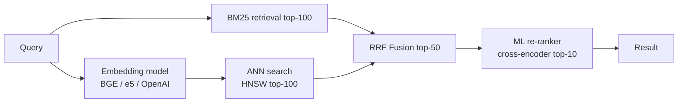
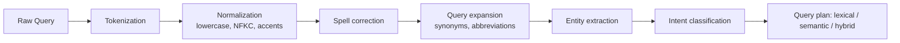

# Вопросы на собеседовании: `Design Search System`

`Search System` (Google Search, поиск по сайту, поиск товаров) — глубокий system design. Здесь важны компромиссы: indexing latency против query latency, ранжирование, устойчивость к опечаткам, масштаб. Обычно на собеседовании разбирают поиск по сайту или по каталогу товаров (а не web-scale краулер Google), но принципы те же.

## Полезные ссылки

- [Elasticsearch: definitive guide](https://www.elastic.co/guide/en/elasticsearch/guide/current/index.html)
- [Lucene internals](https://lucene.apache.org/)
- [How Google search works](https://www.google.com/search/howsearchworks/)
- [System Design Primer](https://github.com/donnemartin/system-design-primer)
- [High Scalability — search](http://highscalability.com/)

## Содержание

- [Полезные ссылки](#полезные-ссылки)
- [See also](#see-also)

**Requirements**
- [Q1. (!) Functional и non-functional requirements?](#q1--functional-и-non-functional-requirements)
- [Q2. (!) Capacity estimation?](#q2--capacity-estimation)

**Indexing**
- [Q3. (!) Inverted index — что это?](#q3--inverted-index--что-это)
- [Q4. (!) Tokenization, normalization, stemming?](#q4--tokenization-normalization-stemming)
- [Q5. Elasticsearch vs Lucene — разница?](#q5-elasticsearch-vs-lucene--разница)

**Architecture**
- [Q6. (!) High-level architecture?](#q6--high-level-architecture)
- [Q7. (!) Indexing pipeline?](#q7--indexing-pipeline)
- [Q8. Near real-time индексация?](#q8-near-real-time-индексация)

**Query**
- [Q9. (!) Query flow (scatter-gather)?](#q9--query-flow-scatter-gather)
- [Q10. (!) Relevance scoring: TF-IDF, BM25?](#q10--relevance-scoring-tf-idf-bm25)
- [Q11. Ranking beyond text (ML)?](#q11-ranking-beyond-text-ml)

**Scalability**
- [Q12. (!) Sharding стратегии?](#q12--sharding-стратегии)
- [Q13. Replication?](#q13-replication)

**Features**
- [Q14. (!) Autocomplete / typeahead?](#q14--autocomplete--typeahead)
- [Q15. (!) Typo tolerance / fuzzy match?](#q15--typo-tolerance--fuzzy-match)
- [Q16. Faceted search / filters?](#q16-faceted-search--filters)
- [Q17. Semantic search / vector embeddings?](#q17-semantic-search--vector-embeddings)

**Production**
- [Q18. (!) Analytics и learning-to-rank?](#q18--analytics-и-learning-to-rank)
- [Q19. Hot queries cache?](#q19-hot-queries-cache)
- [Q20. Index rebuild / rollover?](#q20-index-rebuild--rollover)

**Современные паттерны 2026**
- [Q21. (!) BM25 vs TF-IDF — формулы и saturation?](#q21--bm25-vs-tf-idf--формулы-и-saturation)
- [Q22. (!) Hybrid search: BM25 + dense + RRF fusion?](#q22--hybrid-search-bm25--dense--rrf-fusion)
- [Q23. Faceted search — refinement и aggregation?](#q23-faceted-search--refinement-и-aggregation)
- [Q24. (!) Geo search — geohash, S2, R-tree, bbox vs distance?](#q24--geo-search--geohash-s2-r-tree-bbox-vs-distance)
- [Q25. Real-time indexing — Lucene segments и refresh_interval?](#q25-real-time-indexing--lucene-segments-и-refresh_interval)
- [Q26. Query understanding pipeline?](#q26-query-understanding-pipeline)
- [Q27. (!) Multi-tenancy — per-tenant index vs single + filter?](#q27--multi-tenancy--per-tenant-index-vs-single--filter)
- [Q28. Personalization signals — click history и re-ranking?](#q28-personalization-signals--click-history-и-re-ranking)
- [Q29. (!) Quality metrics — recall@k, MRR, NDCG, p99 latency?](#q29--quality-metrics--recallk-mrr-ndcg-p99-latency)
- [Q30. (!) Антипаттерны и подводные камни?](#q30--антипаттерны-и-подводные-камни)

## Q1. (!) Functional и non-functional requirements?

**Функциональные (поиск по сайту / e-commerce):**
- Полнотекстовый запрос по документам
- Autocomplete / подсказки
- Устойчивость к опечаткам
- Фильтры (цена, категория, рейтинг)
- Сортировка (релевантность, цена, дата)
- Пагинация
- Подсветка совпавших термов

**Нефункциональные:**
- **Низкая latency** (< 200ms p99)
- **Высокий QPS** (тысячи запросов/сек)
- **Свежесть данных** (только что добавленные товары находятся за секунды-минуты)
- **Высокая доступность** (99.9%+)
- **Качество релевантности** (precision + recall)

**Границы задачи:**
- НЕ web-краулер (Google-scale — отдельная тема)
- Считаем, что документы уже даны (товары, статьи)

## Q2. (!) Capacity estimation?

**Допущения (e-commerce):**
- 100M товаров в индексе
- 1000 запросов/сек в среднем, 10k в пике
- Запись товара ~ 1KB
- 5 обновлений товаров/сек

**Размер индекса:**
- Документы: 100M × 1KB = **100 GB сырых данных**
- Inverted index: ~50% от сырого (термы, postings)
- Плюс: поля, stored-векторы, analyzers
- Итого: ~150-200 GB (одна копия)
- Репликация 2x: 400 GB
- 3 реплики: 600 GB

**Пропускная способность по запросам:**
- 10k QPS в пике
- CPU на запрос: ~10ms на одном шарде
- 10 шардов параллельно: почти постоянная; суммарно ~100 запросов на shard-секунду
- Нужно ~10 нод для 10k QPS

**Память для производительности:**
- Горячие индексы в RAM → быстрее
- ~100 GB RAM по кластеру под горячие данные

## Q3. (!) Inverted index — что это?

**Forward index:** doc → words (как обычная БД).
```
doc_1: "the quick brown fox"
doc_2: "quick fox jumps"
```

**Inverted index:** word → docs (слово → документы).
```
"quick" → [doc_1, doc_2]
"brown" → [doc_1]
"fox" → [doc_1, doc_2]
```

**Зачем:** запрос "quick fox" → пересечение postings терма "quick" и "fox" → кандидаты.

**Более богатая структура:**
- Term → [(doc_id, frequency, positions)]:
  ```
  "quick" → [(1, 1, [1]), (2, 1, [0])]
  ```
- Позиции дают возможность делать фразовые запросы

**Хранение:**
- Диск: сжатие (variable-byte encoding, delta encoding)
- Память: кэшируются горячие термы

**Lucene:** реализация в Apache Lucene = основа для Elasticsearch, Solr.

## Q4. (!) Tokenization, normalization, stemming?

**Pipeline при индексации:**

**1. Tokenization:**
- Разбить текст на токены: `"Hello, world!"` → `["Hello", "world"]`
- Зависит от языка (для CJK иначе)
- Character filters (вырезание HTML, маппинг)

**2. Normalization:**
- Lowercase: `"Hello"` → `"hello"`
- Unicode-нормализация (NFC, NFD)
- ASCII fold: `café` → `cafe`
- Убрать пунктуацию

**3. Stop words:**
- Удалить частые слова: "the", "a", "is"
- Экономит место; на релевантность влияет слабо

**4. Stemming:**
- Свести к корню: `"running", "runs", "ran"` → `"run"`
- Стеммеры Porter, Snowball

**5. Lemmatization:**
- Умный стемминг (на основе словаря): `"better"` → `"good"`
- Точнее, но медленнее

**6. Synonyms (синонимы):**
- `"automobile" → "car"`
- На этапе индексации или на этапе запроса

**Пример:**
- Вход: `"Running the fastest cars"`
- После pipeline: `["run", "fast", "car"]`
- Запрос "car races" совпадёт благодаря стеммингу

**Тот же pipeline на этапе запроса:**
- Согласованность обязательна
- Неверно сконфигурированный analyzer = термы в индексе не совпадают с токенами запроса

## Q5. Elasticsearch vs Lucene — разница?

**Lucene:** Java-библиотека (индексация + поиск на одной машине).

**Elasticsearch:** распределённая обёртка вокруг Lucene.
- REST API
- Управление кластером
- Sharding + репликация
- JSON-документы
- Aggregations

**Solr:** ещё один продукт на базе Lucene; возможности схожие.

**Сравнение:**

| Аспект | Lucene | Elasticsearch |
|--------|--------|---------------|
| Тип | Библиотека | Распределённый продукт |
| API | Java | REST/JSON |
| Масштаб | Одна машина | Кластер |
| Возможности | Базовый поиск | + aggregations, мониторинг, Kibana |
| Порог входа | Низкоуровневый | Дружелюбный к пользователю |

**Выбирайте Elasticsearch** для большинства enterprise-задач (кластер из коробки).

**Альтернативы:**
- **OpenSearch** (форк ES от AWS, открытая лицензия)
- **Typesense** — проще, меньше эксплуатационных затрат
- **Meilisearch** — лёгкий, устойчивый к опечаткам
- **Algolia** — SaaS (быстрый, но дорогой)

## Q6. (!) High-level architecture?

```
Data sources → [Indexing Pipeline] → [Index Service (Elasticsearch)] ← [Query Service]
                       ↑                                                     ↑
                 [Change Stream/Kafka]                               [API Gateway]
                       ↑                                                     ↑
               [Product DB, CMS]                                       [Clients]
```

**Компоненты:**

- **Indexing Pipeline:** загрузка + трансформация данных → index service
- **Index Service:** кластер Elasticsearch (master + data nodes)
- **Query Service:** фронт перед search API; парсинг запросов, постобработка результатов, кэш
- **Cache:** Redis для популярных запросов
- **Analytics:** кликнутые результаты → обучающие данные для ранжирования

**Разделение ответственности:**
- Путь индексации: write-heavy, удобен для батчей
- Путь запросов: read-heavy, чувствителен к latency

## Q7. (!) Indexing pipeline?

**Batch-индексация:**
```
Source (DB) → ETL → Transform → Bulk index (ES)
```
- Периодически тянем всё (например, ночью)
- Просто, но высокая latency

**Real-time CDC:**
```
Source DB → WAL → Debezium → Kafka → Consumer → Index (ES)
```
- Изменения доходят за секунды
- Хорошо масштабируется

**Event-driven:**
```
Application → Kafka topic → Consumer → Index (ES)
```
- Каждая запись порождает событие
- Развязано (decoupled)

**Стадии pipeline:**
1. Чтение из источника (CDC или событие)
2. Трансформация (обогащение, денормализация, вычисляемые поля)
3. Анализ (токенизация)
4. Bulk-запись в ES (_bulk API)

**Обработка сбоев:**
- Retry при ошибке
- Dead-letter queue
- Идемпотентность (document ID из источника)

**Производительность bulk:**
- ES bulk API: 500-5000 документов на запрос
- Замеряйте throughput против latency

## Q8. Near real-time индексация?

**Elasticsearch:**
- Документы попадают в in-memory buffer
- `refresh_interval` (по умолчанию 1s) сбрасывает буфер → segment → доступен для поиска
- Компромисс: слишком часто = дорого; редко = устаревшие данные

**Tuning:**
- Real-time: `refresh_interval=1s` (default)
- Bulk-загрузка: отключить refresh (`-1`), включить после загрузки
- Расслабленно: `30s` — снизить overhead индексации

**Durability:**
- Translog (write-ahead log) сохраняется сразу
- Можно восстановиться после краша

**Видимость:**
- Запись → in-memory → refresh → доступно для поиска (задержка = refresh interval)

**Когда важно:**
- Обновление каталога товаров: задержка в 5s — норм
- Поиск по чату: near real-time критичен

## Q9. (!) Query flow (scatter-gather)?

**Distributed search:**
```
Query
  ↓
Coordinator node receives
  ↓
Fan out to ALL shards (scatter)
  ↓
Each shard performs local search, returns top K
  ↓
Coordinator merges + re-ranks globally (gather)
  ↓
Coordinator fetches full docs for top K
  ↓
Return results
```

**Шаги:**
1. Распарсить запрос
2. Отправить на шарды (параллельно)
3. Каждый шард возвращает (doc_id, score) для локального top K
4. Координатор сливает — top K глобально
5. Дотягивает документы (по ID)
6. Форматирует ответ

**Latency:**
- p99 = самый медленный шард + merge + fetch
- Медленный шард = весь запрос медленный (scatter-gather усиливает хвост распределения)

**Оптимизации:**
- **adaptive_replica_selection:** отправлять на самую быструю реплику
- **search_timeout:** прерывать медленные шарды
- **Pre-filtering:** сузить по индексу до скоринга

## Q10. (!) Relevance scoring: TF-IDF, BM25?

**TF-IDF:**
- TF (term frequency): больше вхождений = релевантнее
- IDF (inverse doc frequency): редкие термы информативнее
- Score = TF × IDF

**BM25 (по умолчанию в Lucene/ES):**
- Улучшенный TF-IDF
- Term saturation (убывающая отдача от TF)
- Нормализация по длине документа

**Формула BM25:**
```
score = IDF(term) × (TF × (k+1)) / (TF + k × (1 - b + b × |D|/avgdl))
```
- `k = 1.2` — параметр saturation
- `b = 0.75` — нормализация по длине
- `|D|` = длина документа; `avgdl` = средняя длина документа

**Почему BM25 лучше:**
- TF-IDF: документ со 100 вхождениями "quick" получает score в 100× против одного вхождения
- BM25: saturation — 10 вхождений ≈ 100 (убывающая отдача)
- Реалистичнее

**По умолчанию:** ES использует BM25.

**Практический score поиска:**
- База — BM25
- Field boosts: вес title × 3, вес body × 1
- Затухание по свежести (freshness decay)
- Буст по популярности

## Q11. Ranking beyond text (ML)?

**Текстовая релевантность — лишь часть:**

**Сигналы:**
- Совпадение query-doc (BM25, similarity по эмбеддингам)
- Свежесть (новое > старое)
- Популярность (click-through, продажи)
- Персонализация пользователя (прошлые поиски, локация)
- Качество (отзывы, редакторская оценка)

**Подходы:**

**1. Формула, настроенная вручную:**
- `score = BM25 + 0.5×freshness + 0.3×popularity`
- Просто, понятно

**2. Learning-to-Rank (LTR):**
- ML-модель скорит (фичи пользователя, фичи запроса, фичи документа)
- Обучающие данные: клики, вовлечённость
- Модели: LambdaMART (gradient boosting), DNN

**3. Двухстадийный (распространённый):**
- Стадия 1: отбор кандидатов (BM25 берёт top 1000)
- Стадия 2: re-rank с ML (глубокая модель на top 100)

**Плагин LTR для Elasticsearch:**
- Feature extractors задают сигналы
- Внешняя модель (XGBoost) скорит

**A/B-тестирование:**
- Новый ранкер против baseline
- Метрика: CTR, конверсия, выручка

## Q12. (!) Sharding стратегии?

**Shard:** партиция индекса на одной ноде.

**Число шардов:**
- Больше = параллелизм, но overhead на каждый шард
- Правило: размер шарда 20-50GB; планируйте capacity
- Пример: 200GB данных, 50GB/шард → 4 шарда

**Режимы шардирования:**

**Per-index (по умолчанию):**
- Документы хэшируются по шардам по doc_id
- Равномерное распределение
- Запрос: scatter по всем шардам

**Routing (кастомный):**
- Задать ключ шарда (параметр `routing`)
- Пример: по user_id → все данные пользователя на 1 шарде
- Запрос: таргетированный (если routing известен) = быстрее
- Неравномерно, если есть hot user

**Time-based (rollover):**
- Индексы по дням/месяцам: `logs-2024-01`, `logs-2024-02`
- Запрос: фильтр по времени → искать только в нужных индексах
- Старые: закрыть или переместить в cold storage

**Cross-cluster search:**
- Несколько кластеров ищутся как один
- Гео-распределённо

## Q13. Replication?

**Replica shard:** копия для HA + масштабирования чтения.

**Конфигурация:**
- Primary shard + N реплик
- Реплики распределены по нодам (не две на одной ноде)

**Назначение:**
- **Durability:** падение ноды → реплика повышается до primary
- **Пропускная способность чтения:** запросы обслуживаются primary + репликами (round-robin)
- **Рестарты без даунтайма:** rolling restart

**Типично:**
- 1 реплика (2 копии всего): некоторый HA
- 2 реплики (3 копии): безопаснее (кворум)

**Поток записи:**
- Запись в primary
- Primary реплицирует на реплики (синхронно)
- Все in-sync до ACK (по умолчанию)

**Tuning:**
- `index.number_of_replicas: 1-2` обычно
- Больше реплик = больше storage + стоимость записи, но лучше масштабирование чтения

## Q14. (!) Autocomplete / typeahead?

**Цель:** предлагать варианты завершения по мере ввода.

**Сложности:**
- Сверхнизкая latency (< 50ms)
- Релевантность (популярные первыми)
- Устойчивость к опечаткам

**Реализации:**

**1. Inverted index по префиксу:**
- Elasticsearch `completion` suggester
- Структура данных FST (Finite State Transducer)
- In-memory, очень быстро
- Поддерживает fuzzy matching

**2. Выделенный кэш (Redis sorted sets):**
- Каждый префикс → sorted set термов со скорами популярности
- `ZRANGE prefix:"app" 0 5 WITHSCORES`
- Предрасчёт по расписанию

**3. Trie:**
- Классическая структура данных
- In-memory на каждой ноде
- Распределённый trie сделать сложно

**Ранжирование:**
- По популярности (частота поиска)
- Персонализация (история пользователя)
- Контекст (текущая страница, локация)

**Обновление в реальном времени:**
- По query logs → обновлять скоры
- Периодическая перестройка

## Q15. (!) Typo tolerance / fuzzy match?

**Цель:** "appel" находит "apple".

**Подходы:**

**1. Edit distance (Levenshtein):**
- Расстояние = число правок символов (вставка/удаление/замена)
- Совпадают термы с расстоянием ≤ N
- Запрос `fuzzy` в Elasticsearch: `fuzziness: 2`

**2. Damerau-Levenshtein:**
- Добавляет транспозицию (перестановку)
- Лучше для частых паттернов опечаток

**3. N-gram indexing:**
- Индексировать подстроки (3-граммы: "app", "ppl", "ple" для "apple")
- Частичный запрос "appl" совпадает
- Выше стоимость хранения

**4. Phonetic encoding:**
- Soundex, Metaphone
- "Smith" и "Smyth" → один код
- Полезно для имён

**5. ML-исправление опечаток:**
- Обучать на query logs (пользователь перенабирает после опечатки)
- Предлагать исправления: "Did you mean ..."

**Elasticsearch:**
- Запрос `fuzzy` для edit-distance
- Analyzer `ngram` для частичного совпадения
- Analyzer `phonetic`

**Компромисс:**
- Больше толерантности = больше recall, меньше precision (нерелевантные совпадения)
- Настраивать под use case

## Q16. Faceted search / filters?

**Facets:** разбивки по категориям (бренд, диапазон цены, рейтинг).

**Use case:** e-commerce «кроссовки Nike до $100, рейтинг 4+».

**Реализация (Elasticsearch aggregations):**
```json
{
  "query": { "match": { "name": "shoes" } },
  "aggs": {
    "brands": { "terms": { "field": "brand" } },
    "price_ranges": {
      "range": {
        "field": "price",
        "ranges": [
          { "to": 50 }, { "from": 50, "to": 100 }, { "from": 100 }
        ]
      }
    }
  }
}
```

**Ответ:**
- Топ совпадений + counts по каждому facet

**UI:**
- Facets как фильтры в боковой панели
- Клик по фильтру → сужает поиск

**Производительность:**
- Aggregations кэшируются (filter cache)
- Кардинальность (число уникальных значений) влияет на скорость

## Q17. Semantic search / vector embeddings?

**Проблема:** лексический поиск (BM25) упускает синонимы и семантическую близость.
- Запрос "running shoes" не совпадёт с "jogging footwear"

**Semantic search:**
- Эмбеддить запрос и документы в векторное пространство (dense-векторы)
- Близкий смысл = близкие векторы
- Nearest-neighbor search

**Embedding-модели:**
- BERT, sentence-transformers
- OpenAI text-embedding-3 (API)
- Дообученные под домен

**Vector DB:**
- Elasticsearch (dense_vector + kNN 8+)
- Pinecone, Weaviate, Milvus
- pgvector (расширение Postgres)

**Hybrid search:**
- BM25 + vector similarity
- Объединение скоров: `score = α × bm25 + (1-α) × vector_similarity`
- Лучшее из двух (лексическая precision + семантический recall)

**RAG (контекст для LLM):**
- Эмбеддить базу знаний
- Запрос → достать похожие чанки → передать в LLM
- См. [RAG](../ai-ml/rag-interview.md)

**Сложности:**
- Дрейф эмбеддингов (обновление модели → re-index)
- Хранение высокоразмерных векторов дорого
- Компромисс ANN-индекса (приближённый поиск ради скорости)

## Q18. (!) Analytics и learning-to-rank?

**Query logs:**
- Каждый поиск + клик → лог событий
- Строим обучающие данные для ранжирования

**Метрики:**
- **Click-through rate (CTR):** клики / показы
- **NDCG (Normalized Discounted Cumulative Gain):** релевантность с учётом позиции
- **Mean Reciprocal Rank (MRR):** позиция первого релевантного
- **Conversion rate:** поиск → покупка

**Цикл обратной связи LTR:**
- Собрать: запрос, показанные результаты, клик, dwell time, конверсия
- Разметка для обучения: кликнули = релевантно, нет = менее релевантно
- Обучить: XGBoost / нейросеть
- Выкатить через A/B-тест
- Замерить, итерировать

**Контрфактическая оценка:**
- «Если бы ранжировали иначе, CTR был бы X» — оценка без полного A/B
- Inverse propensity scoring

**Персонализация:**
- Фичи пользователя (история, локация) — вход в ранкер
- Соображения приватности

## Q19. Hot queries cache?

Обычно **20% запросов = 80% объёма**.

**Слои кэша:**

**CDN / HTTP-кэш:**
- Публичные запросы (без user-specific) → кэшируемы на CDN
- `Cache-Control: public, max-age=60`

**Redis query cache:**
- Ключ: hash(query + filters + sort)
- Значение: ID результатов + метаданные
- TTL 60s-5min

**Встроенный в Elasticsearch:**
- **Request cache:** кэшируется по шарду для структурированных запросов
- **Query cache:** кэшируются результаты фильтров (bit sets)
- Включён по умолчанию

**Инвалидация:**
- TTL для большинства
- Event-driven для конкретных (товар закончился → инвалидировать ключ)

**Замеры:**
- Hit ratio: отслеживать
- Риск устаревания: допустимое отставание против требования к свежести

## Q20. Index rebuild / rollover?

**Когда нужно:**
- Изменение схемы (новый analyzer, новые поля)
- Bulk-бэкфилл после миграции данных
- Обновление языкового analyzer

**Перестройка без даунтайма:**
1. Построить новый индекс (рядом со старым)
2. Заполнить: API `reindex` (или из источника)
3. Переключить alias: `old` → `new`
4. Запросы бесшовно используют новый индекс
5. Удалить старый

**Паттерн с alias:**
```
alias "products" → index "products-v1"
# rebuild:
alias "products" → index "products-v2"
```

**Rollover (по времени):**
- Индексы по дням/месяцам
- Alias указывает на текущий
- Авто-rollover при достижении размера/возраста:
```
POST products/_rollover
```

**Стоимость:**
- Временно удвоенное хранилище
- На большом датасете занимает часы
- Планируйте maintenance window

## Q21. (!) BM25 vs TF-IDF — формулы и saturation?

**TF-IDF (классический):**
```
score(q, d) = Σ_t∈q TF(t, d) × IDF(t)
TF(t, d) = freq(t, d)
IDF(t) = log(N / df(t))
```
- Простой, линейно растёт по `TF` — 100 повторений = 100× score.
- Минус: keyword stuffing работает. Документ с 100 повторами `apple` ранжируется как 100×.

**BM25 (default Elasticsearch 5+):**
```
score(q, d) = Σ_t∈q IDF(t) × (TF × (k+1)) / (TF + k × (1 - b + b × |D|/avgdl))
```
Параметры:
- `k = 1.2` — term frequency saturation: после 1-2 встреч термина прирост score замедляется.
- `b = 0.75` — length normalization: длинные документы получают penalty (иначе они выигрывают за счёт большего количества вхождений).
- `|D|` — длина документа, `avgdl` — средняя длина по корпусу.

**Когда что использовать:**

| Сценарий | Выбор |
|---|---|
| Дефолтный поиск по сайту | BM25 |
| Legacy Lucene/Solr 4.x | TF-IDF |
| Короткие документы (заголовки, имена) | BM25 с `b=0.0` (отключить length penalty) |
| Длинные документы (статьи) | BM25 по умолчанию |
| Кастомный домен (legal, medical) | BM25 с подобранными `k1`, `b` через grid search |

**Альтернативы:**
- **BM25F** — multi-field BM25 (title weight ×3, body ×1). Используется в Lucene через `MultiMatchQuery` boost.
- **BM25+** — добавляет lower-bound на TF (защита от очень коротких документов с TF=0).
- **DFR (Divergence From Randomness)** — другой probabilistic фреймворк, экспериментальный.

**Tuning:**
- `_explain` API в ES показывает breakdown score → видно вклад IDF, TF saturation, length norm.
- A/B testing с реальными query logs.

## Q22. (!) Hybrid search: BM25 + dense + RRF fusion?

Современный стандарт (Elasticsearch 8+, Vespa, Qdrant, Pinecone hybrid): объединение `lexical` (BM25) и `semantic` (dense vector embeddings) для максимального recall + precision.

**Зачем гибрид:**

| Подход | Сильные стороны | Слабые |
|---|---|---|
| BM25 | Точное совпадение по ключевым словам, коды товаров, имена | Не понимает синонимов, парафраз |
| Dense (embeddings) | Семантическая близость, парафраз, многоязычность | Слабее на rare terms, OOV, точных ID |
| Hybrid | Лучшее из обоих | Сложнее tuning + 2× стоимость индексации |

**Простое объединение (weighted sum):**
```
score_hybrid = α × normalize(score_bm25) + (1-α) × cosine_similarity(q_vec, d_vec)
```
Проблема: scores из разных шкал (BM25 — 0..∞, cosine — -1..1) — нормализация хрупкая.

**Reciprocal Rank Fusion (RRF, рекомендуется):**
```
RRF_score(d) = Σ_query 1 / (k + rank(d, query))
```
где `k = 60` (heuristic), `rank` — позиция документа в каждом списке (BM25 и dense).

**Свойства RRF:**
- Не требует нормализации scores.
- Устойчив к outliers.
- Используется в Elasticsearch `rank_constant=60`.

**Архитектура:**


**Хранение векторов:**
- `Elasticsearch dense_vector` с HNSW-индексом (начиная с 8.0).
- `Qdrant`, `Pinecone`, `Weaviate`, `Vespa`.
- `pgvector` для Postgres (при < 10M векторов).

**Embedding-модели 2026:**
- `text-embedding-3-small` (OpenAI, 1536 dim, $0.00002/1K tokens).
- `BGE-M3`, `e5-mistral-7b` (open-source, многоязычные).
- `Cohere embed-v3` (high-quality, поддерживает int8 quantization).

**Edge cases:**
- Cold start новой модели — re-index всей коллекции; double storage временно.
- Long documents — chunk на 256-512 tokens, store chunks с `parent_id`.
- Multilingual — модели типа BGE-M3 / multilingual-e5.

## Q23. Faceted search — refinement и aggregation?

**Цель:** показать пользователю фильтры с counts «найдено N товаров»: brand: Nike (45), Adidas (30), category: Shoes (60), Apparel (15).

**Elasticsearch aggregations:**
```json
{
  "query": { "match": { "name": "running" } },
  "aggs": {
    "brands": { "terms": { "field": "brand.keyword", "size": 10 } },
    "price_ranges": {
      "range": {
        "field": "price",
        "ranges": [{ "to": 50 }, { "from": 50, "to": 100 }, { "from": 100 }]
      }
    },
    "rating_avg": { "avg": { "field": "rating" } }
  }
}
```

**Refinement flow:**
- User кликает `brand: Nike` → URL `?brand=Nike`.
- Backend добавляет `filter` в bool query.
- Counts пересчитываются на новом результате (или через `post_filter` для facet UI).

**Post-filter (важный паттерн):**
- `query` влияет на scoring + filters + aggregations.
- `post_filter` применяется ПОСЛЕ aggregations → counts видны для всех brands даже когда выбран один.
- Стандарт e-commerce: search относится к query, выбранный facet — к post_filter.

**Проблемы с кардинальностью:**
- `terms`-агрегация по `user_id` (миллионы значений) → OOM.
- Решения: `cardinality` (HyperLogLog approximation), `composite` aggregation (pagination).

**Кэш агрегаций:**
- ES `request_cache` кэширует aggregations с `size=0`.
- Инвалидация по TTL при refresh.

**Production кейсы:**
- Поиск Amazon e-commerce: facets бренд/цена/продавец/рейтинг.
- Airbnb: фильтры локация/цена/удобства.
- Поиск LinkedIn: отрасль/уровень/локация.

## Q24. (!) Geo search — geohash, S2, R-tree, bbox vs distance?

**Use cases:** Uber «найти водителей в радиусе 2 км», Yelp «restaurants near me», Airbnb «listings в Берлине».

**Подходы:**

**1. Geohash (Elasticsearch default):**
- Координата `(lat, lon)` → base32-строка `u4pruydqqvj`.
- Префикс = регион (`u4` ≈ Германия + Польша).
- Точность зависит от длины: 6 символов ≈ 1.2 km, 8 символов ≈ 40 m.
- Поиск bbox: скан по префиксу.
- Плюсы: простой, работает inverted index.
- Минусы: соседние клетки могут иметь сильно разный префикс (на границах квадрантов).

**2. S2 (Google, Uber, Foursquare):**
- Делит землю на иерархические клетки разного уровня (Hilbert curve).
- Cell ID = 64-битное целое.
- Соседи всегда близки в пространстве ID → лучше locality.
- Иерархично: уровни 0 (всё полушарие) … 30 (~1 cm²).
- Используется в Uber H3, Snowflake GIS.

**3. R-tree:**
- Дерево ограничивающих прямоугольников.
- Используется в PostGIS, MongoDB 2dsphere.
- Хорошо для bbox-запросов, но дороже балансировать при записях.

**4. H3 (Uber):**
- Hexagonal hierarchy (равные соседи, все на одинаковом distance).
- Используется для surge pricing, ETA.
- См. `design-uber-interview Q5`.

**Bbox vs distance:**

```
# Bounding box (быстро, грубо)
GET /restaurants/_search
{ "query": { "geo_bounding_box": { "loc": { "top_left": {...}, "bottom_right": {...} } } } }

# Distance (точно, медленнее)
GET /restaurants/_search
{ "query": { "geo_distance": { "distance": "5km", "loc": { "lat": ..., "lon": ... } } } }
```

**Trade-off:**
- Bbox: ~10× быстрее, но захватывает «углы» прямоугольника (на 30% больший radius).
- Distance: точный круг, дороже (Haversine для каждого кандидата).
- Гибрид: bbox для retrieval → distance для фильтрации top-N.

**Edge cases:**
- Антимеридиан (Pacific dateline): bbox через ±180° ломается; S2/H3 — нет.
- Полюса: широта clamped к ±85.05 (Web Mercator); S2 покрывает корректно.

## Q25. Real-time indexing — Lucene segments и refresh_interval?

**Lucene segments:**
- Документы пишутся в **in-memory buffer**.
- `refresh` (по умолчанию каждые 1s) → buffer → новый неизменяемый Lucene `segment` → доступен для поиска.
- Каждый поиск проходит по всем сегментам, merge results.
- `merge` (background) объединяет мелкие сегменты в крупные (фоновый процесс).

**Refresh interval tuning:**

| Сценарий | Настройка | Эффект |
|---|---|---|
| Near real-time UI | `refresh_interval: 1s` (default) | Свежие данные сразу видны |
| Bulk loading | `refresh_interval: -1` (отключено) | 3-5× быстрее indexing |
| Logging (mass write) | `refresh_interval: 30s` | Меньше segments, меньше overhead |
| Analytics-only | `refresh_interval: 60s` | Максимальная throughput |

**Durability через translog:**
- Каждый write записывается в WAL (translog) **до** появления в segment.
- Сегмент видно только после refresh, но потеря данных невозможна (translog flushes).
- `index.translog.durability: request` (sync на каждый write — медленно, надёжно) vs `async` (default 5s, чуть быстрее, 5s data loss risk).

**Merge policy:**
- Tiered merge: объединяет сегменты схожего размера.
- Force merge перед запросом архива: `POST index/_forcemerge?max_num_segments=1`.

**Компромисс для собеседования:**
- Меньше refresh interval → свежее данные, но больше overhead.
- Best practice для bulk-загрузки: отключить refresh + реплики → загрузить → включить обратно.

**Production кейсы:**
- Logging (Elastic Stack): refresh_interval 30s + force_merge для old indices.
- Product search: 5s refresh достаточно.
- Chat search: 1s default.

## Q26. Query understanding pipeline?

Подготовка query до retrieval — это отдельный pipeline:



**Стадии:**

1. **Tokenization** — разбиение по whitespace, пунктуации, для CJK — посимвольно.
2. **Normalization** — lowercase, Unicode NFKC, ASCII fold (`café → cafe`).
3. **Spell correction** — `appel → apple` через edit distance / phonetic / ML-исправление (Q15).
4. **Query expansion (расширение запроса):**
   - Синонимы: `car → automobile, vehicle` (через словарь синонимов).
   - Аббревиатуры: `NYC → New York City`.
   - Stemming: `running → run` (Q4).
5. **Entity extraction (NER):**
   - `Nike running shoes` → сущности: `Nike (brand)`, `running shoes (category)`.
   - Буст совпадений на извлечённых сущностях.
6. **Intent classification (классификация намерения):**
   - Navigational (`facebook.com`), informational (`how to bake bread`), transactional (`buy iphone`), local (`pizza near me`).
   - Влияет на routing: navigational → точное совпадение, informational → semantic search.

**Инструменты:**
- ES Token Filters (synonym, stop, stemmer).
- NER-модели spaCy / Hugging Face.
- Внутренние ML-классификаторы intent.

**Бюджет latency:**
- Tokenization + normalization: < 1 ms.
- Spell correction: 5-20 ms (если ML).
- Entity extraction: 20-50 ms (ML inference).
- Итого до retrieval: < 100 ms (часть p99 search budget).

**Edge cases:**
- Multilingual query — отдельные analyzers per language.
- Mixed-script (`айфон 15 pro` — RU + EN) — общий analyzer с NFKC + script detection.

## Q27. (!) Multi-tenancy — per-tenant index vs single + filter?

Когда несколько customers / merchants / спейсов делят одну поисковую инфраструктуру (Shopify, Algolia, Slack):

**Вариант 1: Index per tenant.**
- `products_tenant_42`, `products_tenant_99`.
- Pro: изоляция, можно настраивать analyzer per language tenant, удаление tenant = drop index.
- Con: тысячи мелких индексов → metadata overhead, JVM heap pressure (каждый index держит state).
- ES recommended limit: < 1000 indices per cluster.

**Вариант 2: единый индекс + фильтр по tenant_id.**
- Все documents в `products` с полем `tenant_id`.
- Каждый query: `bool { must: query, filter: { term: tenant_id: 42 } }`.
- Pro: меньше overhead, легче scale.
- Con: scatter-gather по всем шардам даже для одного tenant.

**Вариант 3 (hybrid): routing по tenant.**
- Единый индекс + параметр `routing=tenant_id`.
- Все документы одного tenant попадают на один shard → таргетированный поиск.
- Плюс: низкий overhead + быстрый retrieval на tenant.
- Минус: hot tenant = hot shard (неравномерное распределение).

**Когда что:**

| Tenants | Подход |
|---|---|
| < 100 | Индекс на каждый tenant |
| 100-10 000 | Единый индекс + routing |
| 10 000+ | Единый индекс + filter (если каждый tenant маленький) |
| Очень разные размеры | Индекс на крупные tenant + общий индекс для мелких (`tiered`) |

**На практике:**
- Shopify Search: routing по `shop_id` (большие магазины + tiered-индекс для крошечных).
- Algolia: индекс на каждое приложение (каждый клиент получает свой индекс).
- Slack search: индекс на каждое workspace (большие workspace → выделенный кластер).

**Безопасность:**
- Filter обязателен всегда (даже при routing) — защита от бага в логике routing.
- API-ключ на tenant + проверка в middleware.

## Q28. Personalization signals — click history и re-ranking?

Базовый search (BM25 / hybrid) одинаков для всех. Personalization добавляет user-specific сигналы:

**Сигналы:**
- **Click history** — пользователь часто кликает на категорию X → boost X в результатах.
- **Purchase history** — для e-commerce буст связанных товаров.
- **Browse history** — последние просмотренные товары.
- **Location** — смещение в сторону локальных ресторанов/сервисов.
- **Language preference** — буст совпадений на языке пользователя.
- **Time-of-day / day-of-week** — обед против ужина для food delivery.

**Реализация:**

**Стадия 1: Retrieval (без персонализации).**
- BM25 / hybrid: top-100 кандидатов.
- Эта стадия не использует user-сигналы — дружелюбна к кэшу.

**Стадия 2: Re-ranking (персонализированный).**
- ML-модель: вход = (query_features, doc_features, user_features).
- Выход: score → переупорядочить top-100.
- Latency: 10-30 ms на CPU, < 5 ms на GPU (батчами).

**Фичи пользователя:**
- Embedding-вектор из истории пользователя (последние N кликов / покупок).
- Предпочтения по категориям (one-hot).
- Демография (если есть).

**Модель:**
- LambdaMART (GBM) — стандарт, легко интерпретируется.
- Two-tower neural (query-tower + user-tower) — Amazon, LinkedIn.
- Transformer cross-encoder — лучшее качество, дороже.

**Cold start:**
- Новый пользователь без истории → fallback на глобальную популярность.
- Откладываем персонализацию до накопления первых 5-10 кликов.

**Приватность:**
- Фичи пользователя хэшируются / агрегируются.
- GDPR right-to-erasure → удалить историю кликов по запросу.

**A/B-тестирование:**
- Метрика: CTR + конверсия + качество сессии.
- Сравнение `personalized` против `impersonal baseline`.

## Q29. (!) Quality metrics — recall@k, MRR, NDCG, p99 latency?

**Качество результатов:**

**Recall@k:**
- Доля релевантных документов в top-k.
- `recall@10 = 7/10 = 0.7` — из 10 показанных 7 релевантны.
- Хорошо для precision-критичных задач (top results matter).

**Precision@k:**
- Доля найденных релевантных из всех релевантных в корпусе.
- Сложнее измерить (нужна полная разметка).

**MRR (Mean Reciprocal Rank):**
- Среднее `1/rank` для первого релевантного результата.
- Penalty за «нашёл, но низко» — на месте 3 = 1/3, на месте 10 = 1/10.
- Хорошо для navigational queries («найди эту страницу»).

**NDCG (Normalized Discounted Cumulative Gain):**
- Учитывает позицию И градацию релевантности (relevance label 0..4).
- `DCG = Σ (2^rel - 1) / log2(rank + 1)`.
- `NDCG = DCG / ideal_DCG` (нормализация на оптимальный порядок).
- Стандарт для academic IR и LTR.

**Метрики по кликам (production):**
- **CTR @ position 1** — доля кликов на топ-результат.
- **Mean clicked rank** — средняя позиция первого клика.
- **Abandonment rate** — доля сессий без клика.
- **Reformulation rate** — пользователь переписал запрос (значит первый не помог).

**Метрики latency:**
- `search_latency_ms_p50 / p95 / p99 / p999`.
- Цель: p99 < 200 ms (e-commerce), < 1 sec (web search).
- `indexing_lag_seconds` — задержка от source до доступности в поиске (< 5s для NRT).

**Режимы отказов:**
- `search_timeout_total` — медленный шард или запрос.
- `zero_result_rate` — доля запросов без результатов (цель < 5%).
- `cache_hit_ratio` (цель > 60%).

**Pipeline трекинга:**
- События кликов → Kafka → агрегация Flink → ClickHouse / BigQuery.
- Дашборды: Grafana / Looker.
- Алерты: PagerDuty / Slack.

## Q30. (!) Антипаттерны и подводные камни?

**1. Один shard на 100M+ документов.**
- 200 GB на один shard → медленный merge, full GC, OOM.
- Фикс: `number_of_shards` на этапе создания (нельзя изменить позже!), 20-50 GB на shard.

**2. Синхронная индексация на write-пути.**
- `POST /product → INSERT DB → INDEX ES → ACK` — latency пользователя = latency ES.
- Сбой ES = провал создания товара.
- Фикс: CDC через Debezium / Kafka — асинхронный pipeline (Q7).

**3. Нет analyzer на каждый язык.**
- Один `standard` analyzer для всех языков → плохая токенизация CJK, нет стемминга для русского.
- Фикс: analyzer на каждый язык (`russian`, `english`, `japanese` (kuromoji)).

**4. Нет кэша для популярных запросов.**
- 20% запросов = 80% трафика → DB / ES перегружены без кэша.
- Фикс: Redis с TTL 60s + ES request_cache (Q19).

**5. Индекс на каждого пользователя в multi-tenancy.**
- 100 000 пользователей × 1 индекс каждый = кластер ES разваливается (overhead метаданных).
- Фикс: routing по user_id или единый индекс + filter (Q27).

**6. Wildcard-запросы с ведущим `*`.**
- `*shoes*` = full table scan, latency 10+ с.
- Фикс: n-gram analyzer или edge_ngram для частичного совпадения.

**7. Сортировка по строковому полю без `.keyword`.**
- Сортировка по `name` (analyzed) → ES грузит fielddata в heap → OOM.
- Фикс: `sort: name.keyword`.

**8. Nested-маппинг для массивов объектов без причины.**
- Каждый nested-документ = отдельный Lucene-документ → 5-10× размер индекса.
- Фикс: nested только когда нужны cross-field-запросы; иначе flat.

**9. `update_by_query` на проде во время трафика.**
- Бьёт по I/O, может зависнуть на шардах с активной индексацией.
- Фикс: rolling update батчами + мониторинг.

**10. Поллинг БД ради свежести вместо CDC.**
- `SELECT * FROM products WHERE updated > last_check` каждые 5 мин → нагрузка на БД + промахи.
- Фикс: Debezium / Kafka Connect CDC (Q7).

**11. Нет LTR / персонализации для e-commerce.**
- Чистый BM25 → плохая конверсия (популярные товары не в топе).
- Фикс: BM25 retrieval + LTR re-ranking (Q11, Q18, Q28).

**12. Нет `_explain` API при отладке на проде.**
- При проблемах с ранжированием нельзя понять, почему документ не в топе.
- Фикс: `GET /index/_explain/{id}?q=...` на каждый инцидент.

**13. Bulk-индексация без отключения refresh.**
- 1M документов с `refresh_interval: 1s` → 1M refresh = миллионы мелких сегментов → кластер плавится.
- Фикс: `refresh_interval: -1` на время bulk-загрузки, потом снова `1s`.

**14. Нет настройки durability у translog.**
- `index.translog.durability: async` для критичных данных → окно потери 5s.
- Фикс: `request` для financial / compliance данных, `async` для логов/аналитики.

**15. Cross-cluster search без timeout.**
- Один медленный удалённый кластер блокирует весь запрос.
- Фикс: timeout на каждый кластер + `skip_unavailable`.

---

## See also

- [Elasticsearch](../databases/elasticsearch-interview.md) — deep dive
- [Design URL Shortener](design-url-shortener-interview.md) — read-heavy patterns
- [Design Feed System](design-feed-system-interview.md) — ranking parallels
- [Caching](../architecture/caching-strategies-interview.md) — query cache
- [Scalability Patterns](../architecture/scalability-patterns-interview.md) — sharding
- [Distributed Systems](../architecture/distributed-systems-interview.md) — scatter-gather
- [LLM Basics](../ai-ml/llm-basics-interview.md) — semantic search for RAG
- [Embeddings](../ai-ml/embeddings-interview.md) — vector search
- [MLOps](../ai-ml/mlops-interview.md) — LTR model deployment
